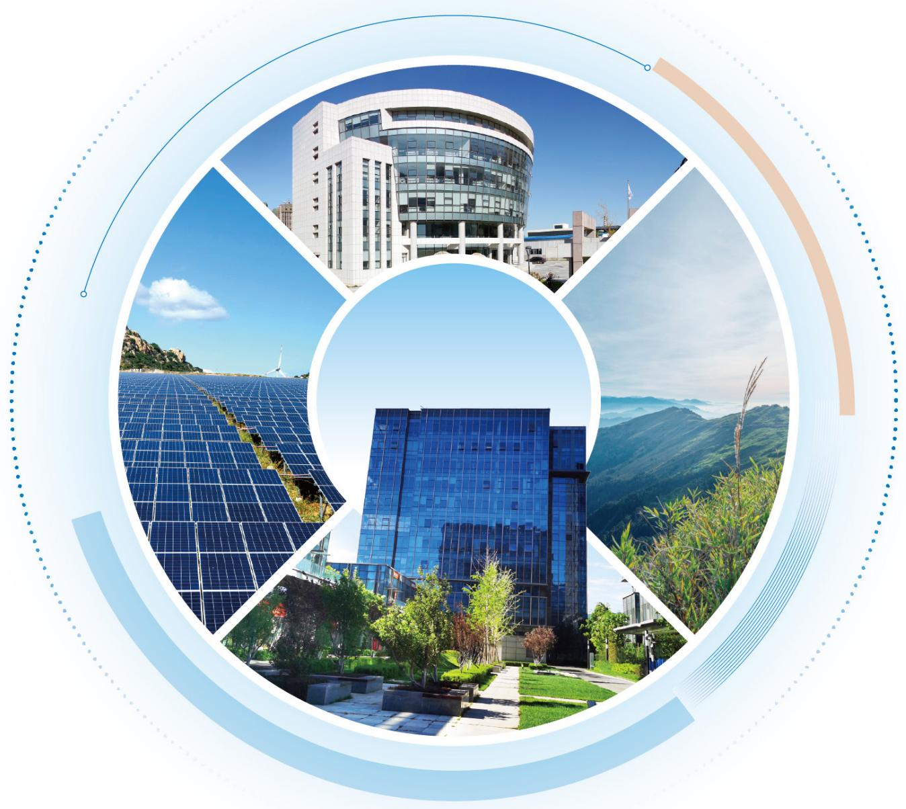

natural_image

Composite circular image showing modern buildings, solar panel arrays, and mountainous green landscape (no text or symbols)

# 北京恒泰实达科技股份有限公司

2025 环境、社会及公司治理 (ESG)报告

Environmental, Social and Governance(ESG)Report

# 目录

关于本报告....01

董事长致辞....03

关于公司....05

发展历程....09

企业荣誉....11

党团荣誉....12

展望....39

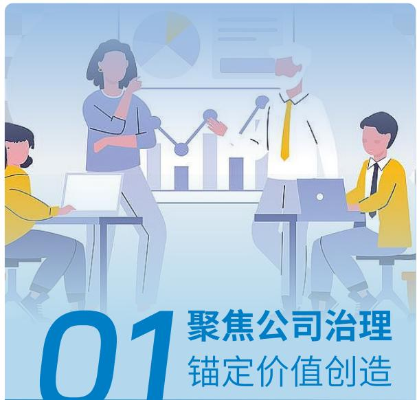

text_image

01聚焦公司治理
锚定价值创造

党建引领聚合力 …… 15

公司治理稳根基....16

投关管理筑桥梁....17

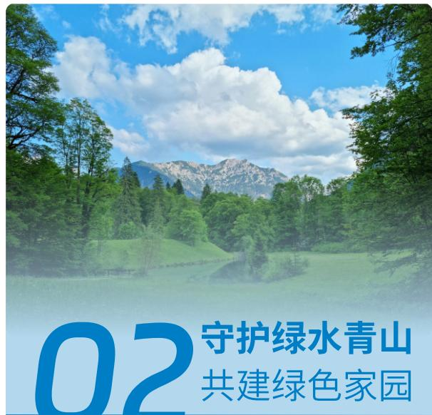

text_image

02守护绿水青山
共建绿色家园

践行环保绿色运营....21

助力能源低碳转型 22

赋能实现双碳目标....26

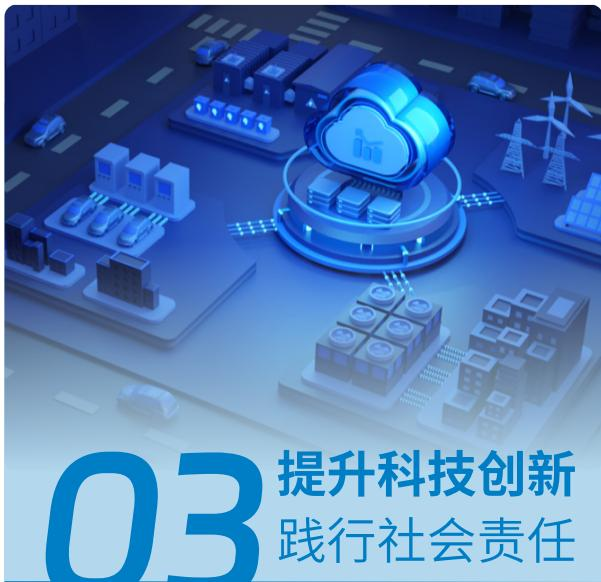

text_image

03 提升科技创新
践行社会责任

构建和谐职场环境....31

提升科技创新能力....37

助力乡村振兴发展....38

# 关于本报告

本报告为北京恒泰实达科技股份有限公司的环境、社会及公司治理(ESG)报告。报告详细披露公司2025年度在环境、社会及公司治理等责任领域的实践和绩效，旨在与各利益相关方进行有效交流，以便各利益相关方更好地了解公司可持续发展的理念、措施及相关表现。

# 时间范围

本报告为年度报告,报告期为2025年1月1日至2025年12月31日,为增强报告可比性及前瞻性,部分内容往前后年度适度延伸。

# 报告范围

本报告范围涵盖北京恒泰实达科技股份有限公司及所有控股子公司。除特别说明，与公司同期合并财务报表范围一致。

# 称谓说明

为了便于表述和阅读,本报告中“北京恒泰实达科技股份有限公司”以“恒实科技”或“公司”表示;公司控股子公司“辽宁邮电规划设计院有限公司”以“辽宁邮电”表示。

# 编制依据

本报告主要参考《深圳证券交易所上市公司自律监管指引第17号——可持续发展报告(试行)》《深圳证券交易所创业板上市公司自律监管指南第3号——可持续发展报告编制》及全球报告倡议组织《可持续发展报告标准》(GRI Standards)等相关要求进行编制。

natural_image

Stylized illustration of a city skyline with multiple skyscrapers and grid patterns (no text or symbols)

# 报告可靠性保证

公司承诺本报告内容不存在任何虚假记载、误导性陈述或重大遗漏，并对其内容真实性、准确性和完整性负责。

# 报告获取

本报告电子版可在公司官网(www.techstar.com.cn)、深圳证券交易所网站(www.szse.cn)及巨潮资讯网(www.cninfo.com.cn)查阅获取。

# 联系方式

如对本报告及公司ESG工作有任何意见或建议, 可通过以下方式与公司联系:

地址:北京市海淀区林风二路39号院1号楼11层  
电话:010-62670506  
邮箱:zqsw@techstar.com.cn

natural_image

Abstract blue circular logo design with stylized letter 'e' (no text or symbols)

# 恒实科技

# -TECHSTAR

# 董事长致辞

# 尊敬的各位股东、投资者、合作伙伴及全体同仁：

2025年，在复杂多变的市场环境与行业转型浪潮中，恒实科技始终以“科技赋能绿色未来，责任铸就企业长青”为初心，将ESG理念深度融入战略布局与经营实践，在科技创新、绿色发展、社会责任与公司治理的道路上稳步前行，既历经挑战，更收获成长。这一年，是公司夯实可持续发展根基的关键一年。我们始终认为，优秀的企业不仅要追求经营效益，更要以责任为帆、以治理为舵，在创造商业价值的同时，践行对环境、社会与全体股东的承诺——这既是时代赋予企业的使命，也是恒实科技实现长远发展的核心底气。

# 深耕治理,筑牢发展根基。

我们延续“党建引领+制度创新”双轮驱动模式, 完善“决策层—管理层—执行层”三级治理架构, 优化“三会一层”运作机制, 规范召开各类会议, 切实保障全体股东合法权益。我们强化ESG顶层设计, 将其融入日常经营管理全流程, 完善投资者关系管理体系, 通过业绩说明会、互动问答等多元化渠道, 搭建高效沟通桥梁, 回馈投资者信任。

# 向绿而行,赋能低碳转型。

2025年,我们依托环境管理体系认证优势,推动生产经营全流程低碳升级,在能耗、资源利用等环节坚守环保底线。我们深耕新能源领域,推动绿色能源技术场景化应用,借鉴同行业经验,探索可持续创新路径,为行业低碳转型注入恒实力量。

# 科技创新, 激活发展动能。

作为数字能源及物联网解决方案提供商及运营商,我们呼应新质生产力发展要求,聚焦核心技术突破与产品迭代,推动技术成果与实际应用深度融合,提升服务效能。我们重视人才培养,搭建完善培训体系,尊重员工价值、保障员工权益,营造包容创新的氛围,同时加强产学研协同,推动技术开源共享,助力行业技术水平提升。

# 向善而为,践行社会责任。

我们牢记社会责任,组建专业应急团队,积极响应各类应急保障需求,守护民生安全;积极参与各类社会公益活动,践行扶危济困理念,聚焦乡村振兴,传递企业温度。我们坚持“成就客户、卓越共赢”,深化产业链协同,构建共生共荣的产业生态,

同时推动科技服务普惠化, 让技术创新惠及更多人。

各位股东、投资者、合作伙伴及全体同仁，回望过往，我们步履坚实；展望未来，我们信心满怀。2026年，是公司深化转型、提质增效的关键一年，我们将继续以ESG理念为引领，夯实公司治理、强化科技创新、深耕绿色发展、践行社会责任，聚焦公司核心业务，补齐短板、强化优势，努力实现商业价值、环境价值与社会价值的有机统一。

# 关于公司

# 公司简介

恒实科技(300513.SZ)成立于2000年,是数字能源、通信技术服务及智能物联应用解决方案提供商及运营商。公司在册员工约1700人,业务覆盖全国。

公司致力于用先进的物联网大数据技术为电力、通信、交通、农业和城市管理等基础行业实现数字化转型升级提供全方位的服务支撑。

公司根植于电力、通信两大基础领域，形成服务国家基础产业数字化转型的规划、设计、研发和集成能力，从而实现让能源更高效、让通信更畅通。公司持续在物联网大数据技术上创新积累，以平台化、智能化、可视化、产品化驱动行业应用解决方案推广应用、从而实现让应用更简单、让数据更生动。公司以智慧能源、智慧城市、智慧交通、智慧农业为业务应用场景，持续迈向让世界更智能。

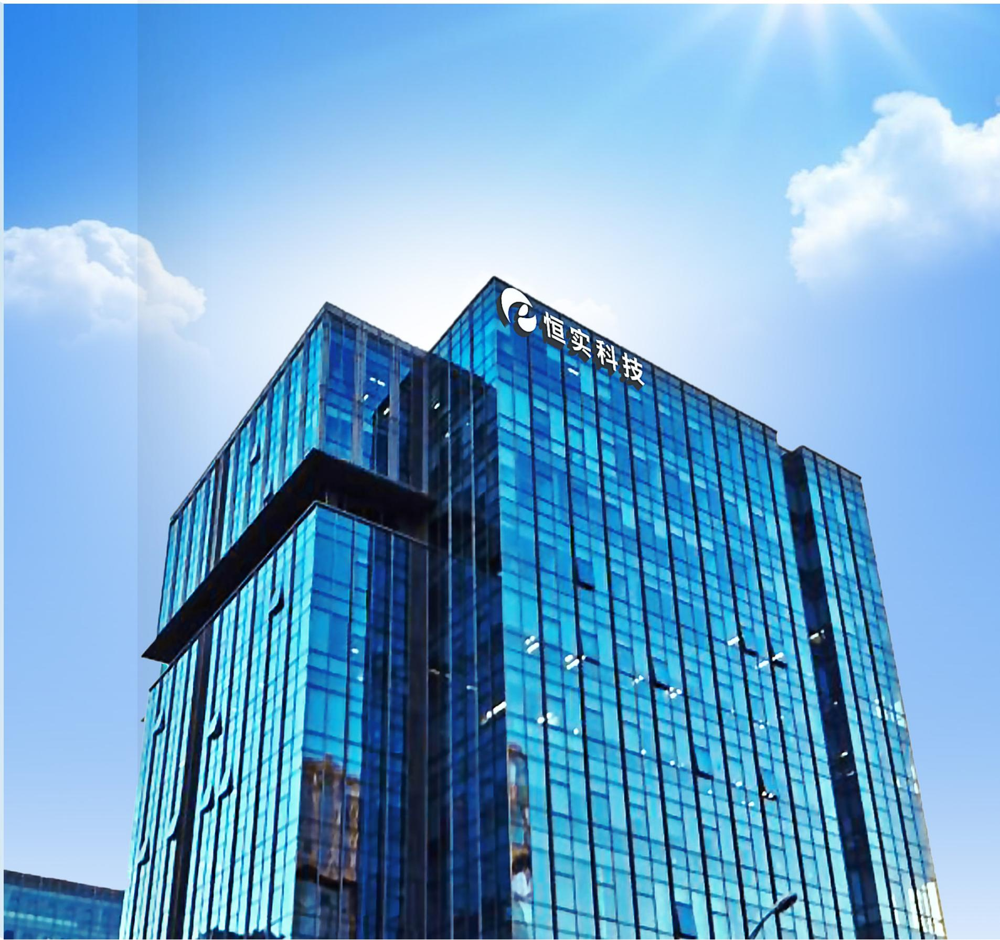

text_image

恒实科技

  
企业精神

恒心、泰然、实干、达天下

  
企业使命

让能源更高效 让通信更顺畅

让应用更简单 让数据更生动 让世界更智能

  
企业愿景

致力于成为中国最优秀的数字能源及物联网解决方案提供商及运营商。

  
企业价值观

# 奋斗为本

是企业持续发展之魂。我们把奋斗者作为企业发展的根本力量，创造以奋斗为本的人才机制和文化土壤，大力弘扬奋斗精神，实现企业宏伟愿景。

# 用户为上

是企业服务的基本准则。我们树立让客户永远满意的观念，用心为客户服务，服务无止境，用心追求客户满意度。

# 科技创新

是企业发展的推动力。我们始终要尊重科学，尊重人才，持之以恒地提高科技水平，倡导科技创新、凝炼核心技术。我们始终要以管理创新、技术创新、业务创新发展壮大我们的企业。

# 责任筑基

是企业凝聚力量的纽带。我们主动履行职责，筑建企业发展腾飞的基石，形成整体合力，为企业发展同甘共苦，荣辱与共。

# 发展历程

# 第一阶段:立足电力 走向全国

2000年 公司成立。  
2004年 完成首个省级电网公司运行检修专业系统研发和项目建设推广。  
2005年 完成首个省级电网公司电力应急指挥系统项目建设和推广。  
2007年“首都电缆网集中监控系统”被评为首都奥运保障十大应用成果。

2009年 公司信息化产品销售业绩覆盖国家电网和南方电网32个省公司以及6个区域公司。  
2010年 公司参与建设的“国家电网调度控制中心系统”项目通过国家电网验收并投入运行。  
2011年 公司作为主要开发单位参与“国家电网输变电在线监测系统”建设工作。

# 第二阶段:股改上市

2012年 股权分置改革。  
2013年在智能电网建设的大潮中成为电力智能控制中心的领军企业。  
2014年 参与建设的国内首个区域电网电力调峰辅助服务市场运营系统投入运行。  
2016年公司在创业板上市。

# 第三阶段: 实现跨域

2018年并购辽宁邮电规划设计院有限公司, 销售收入破10亿。  
2019年 参与国内首个虚拟电厂——冀北虚拟电厂市场化交易项目建设，并作为唯一社会(非电网)能源聚合商企业参加市场交易。  
2021年 虚拟电厂聚合调控和运营关键技术与应用项目荣获

2021年度中国能源研究会能源创新奖一等奖  
2021年度中国电力科学技术进步奖二等奖  
2021年度国家电网科学技术进步奖一等奖

2022年源荷互动响应平台在湖南电网上线发布，完成了国内首个包含电源侧、负荷侧可调控资源的省级电网虚拟电厂示范项目。  
2023年-2024年 全面布局数字能源赛道。  
2025年 全面拥抱AI。

# 企业荣誉

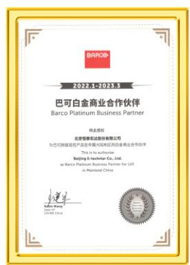

text_image

2022.1-2023.3
巴可白金商业合作伙伴
Barco Platinum Business Partner
特此授权
北京博睿实业股份有限公司
为巴可铜镍控股产品中高端无铅的巴可金商业合作伙伴
This is to authority
Beijing E-Scholar Co., Ltd.
as Barco Platinum Business Partner for LXP
in Mainland China
Baojing Sheng
China
LUXIN CHINA

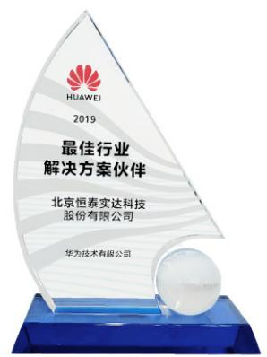

text_image

HUAWEI
2019
最佳行业
解决方案伙伴
北京恒泰实达科技
股份有限公司
华为技术有限公司

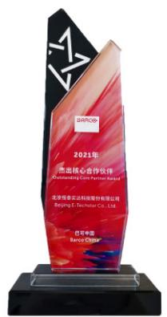

text_image

2021年
杰出核心合作伙伴
Qianming China Partnership of Science and Technology
北京联合科技集团股份有限公司
Beijing F. Technetec Co., Ltd.
巴中中国
Barclay China

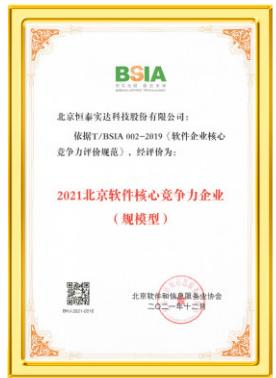

text_image

BSIA
北京恒泰实达科技股份有限公司：
依据T/BSIA 002-2019（软件企业核心
竞争力评估规范），经评价为：
2021北京软件核心竞争力企业
（规模型）
北京软件和液晶面板行业协会
二〇二一年十二月

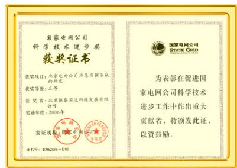

text_image

④家电网公司
科学技术进步奖
获奖证书

获奖项目：北京电力公司应急指挥系统的开发
获奖等级：三等

获奖者：北京恒泰实达科技发展有限公司
奖励等级：2006年

发证机关：国家电网科学研究院
证书号：20062036-032

国家电网公司
STATE GRID
为表彰在促进国家电网公司科学技术进步工作中作出重大贡献者，特颁发此证，以资鼓励。

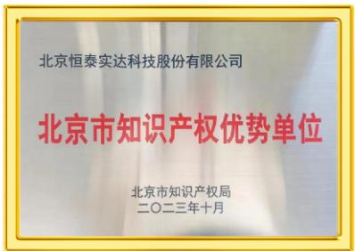

text_image

北京恒泰实达科技股份有限公司
北京市知识产权优势单位
北京市知识产权局
二〇二三年十月

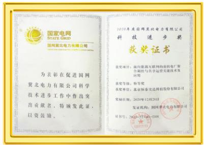

text_image

国家电网
STATE GRID
国网冀北电力有限公司
为表彰在促进国网
冀北电力有限公司科学技术进步工作中作出突出贡献者，特颁发此证，以资鼓励。
2020年美安网集团电力有限公司
科技进步奖
获奖证书
奖项项目：海宁能源互联网热电股份厂联合控股与共享运营关键技术及应用
奖项等级：特等奖
奖项单位：北京恒泰宏达科技股份有限公司
奖项日期：2020年12月28日
发证机构：国网冀北电力有限公司
证书号：2020-7-24-1008

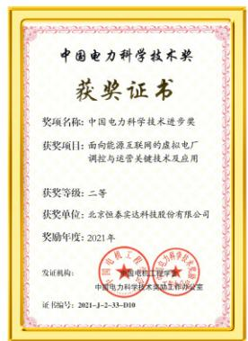

seal

中国电力科学技术奖
获奖证书
奖项名称：中国电力科学技术进步奖
获奖项目：面向能源互联网的虚炬电厂
调控与运营关键技术及应用
获奖等级：二等
获奖单位：北京恒泰实达科技股份有限公司
奖励年度：2021年
发证机构：
中国电力科学技术鉴定认证中心
证书编号：2021-1-2-33-D10

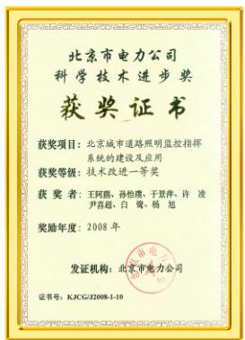

text_image

北京市电力公司
科学技术进步奖
获奖证书

获奖项目：北京城市道路照明监控指挥
系统的建设及应用
获奖等级：技术改进一等奖

获奖者：王阿燕、孙怡瑾、于景萍、许凌
尹昌超、白鹭、杨旭

奖励年度：2008年

发证机构：北京市电力公司
证书号：KJCG/J2008-1-10

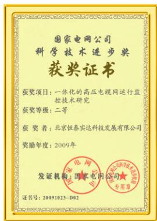

text_image

国家电网公司
科学技术进步奖
获奖证书
获奖项目：一体化的高压电缆网运行监控技术研究
获奖等级：二等
获奖者：北京恒泰实达科技发展有限公司
奖励年度：2009年
发证机构：国家电网公司
证书号：20091023-D02

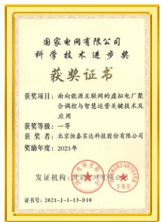

seal

国家电网有限公司
科学技术进步奖
获奖证书

获奖项目：面向能源互联网的虚拟电厂聚合调控与智慧运营关键技术及应用
获奖等级：一等
获奖者：北京恒泰实达科技股份有限公司
奖励年度：2021年

发证机构：国家电网有限公司
证书号：2021-J-1-13-D10

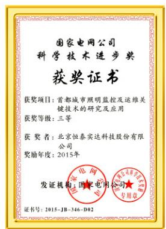

seal

国家电网公司
科学技术进步奖
获奖证书

获奖项目：首都城市照明监控及运维关键技术的研究及应用
获奖等级：三等

获奖者：北京恒泰实达科技股份有限公司
奖励年度：2015年

发证机构：国家电网公司
专用章

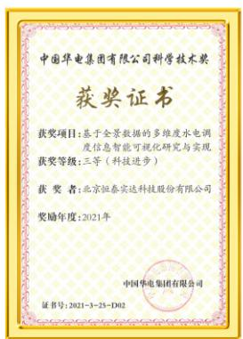

seal

中国华电集团有限公司科学技术奖
获奖证书

获奖项目：基于全景数据的多维度水电调度信息智能可视化研究与实现
获奖等级：三等（科技进步）

获奖者：北京恒泰实达科技股份有限公司
奖励年度：2021年

中国华电集团有限公司
证书号：2021-3-25-D82

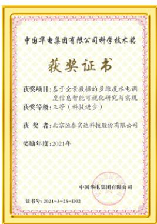

seal

中国华电集团有限公司科学技术奖
获奖证书

获奖项目：基于全景数据的多维度水电调度信息智能可视化研究与实现
获奖等级：三等（科技进步）

获奖者：北京恒泰实达科技股份有限公司
奖励年度：2021年

中国华电集团有限公司
证书号：2021-3-25-D02

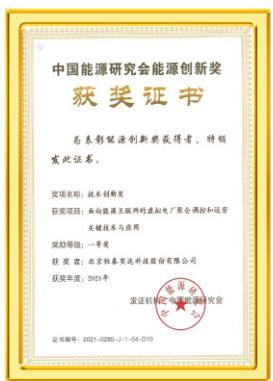

text_image

中国能源研究会能源创新奖
获奖证书

易表彰能源创新奖获得者，特颁
发此证书。

奖项名称：技术创新奖

获奖项目：面向能源主题网的虚拟电厂聚合调控和运营
关键技术与应用

奖励期限：一零奖

获奖者：北京恒泰实达科技股份有限公司

获奖年度：2021年

发证机关：中国能源研究会
证书编号：2021-0285-J-1-04-D10

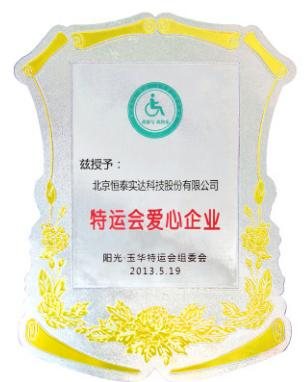

text_image

兹授予：
北京恒泰实达科技股份有限公司
特运会爱心企业
阳光 玉华特运会组委会
2013 5.19

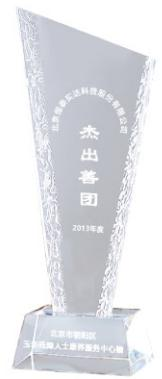

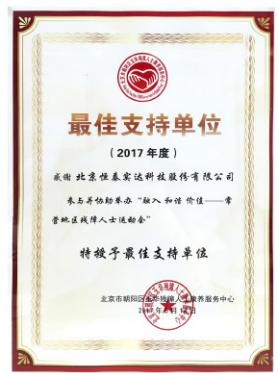

text_image

最佳支持单位
（2017年度）
成都北京佳基实达科技微具有限公司
参与其协助举办“融入和谐价值——常
普地区战降人士逃跑拳”
特授予最佳支持单位
北京市朝阳区金桥镇人民政府、世界服务中心
2018年5月14日

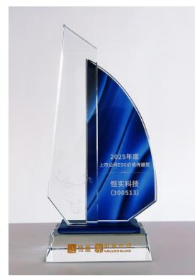

text_image

2025年度
上市人民币15E价值增强基
恒实科技
(300513)
中信证券股份有限公司
NATIONALING

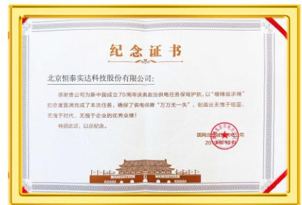

text_image

纪念证书
北京恒泰实达科技股份有限公司：
感谢贵公司为新中国成立70周年庆真政治供电任务保障护的，以“精精总求精”的态度圆满完成了本次任务，确保了供电保障“万万无一失”，创造出无数于祖国、无愧于时代、无愧于企业的优秀业绩！
特别此证，以示纪念。
国网内蒙古电力公司
2018年6月1日

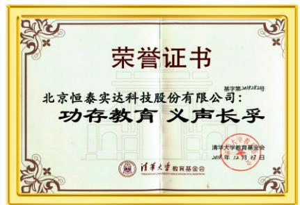

text_image

荣誉证书
北京恒泰实达科技股份有限公司：
功存教育 义声长孚
清华大学教育基金会
2014年12月17日

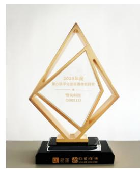

text_image

2025年度
第五数学化创新大赛奖获奖
微安科技
(340113)
冯蕾  王丽  陈伟  陈伟  陈伟  陈伟  陈伟

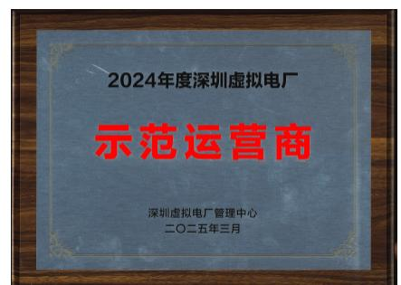

text_image

2024年度深圳虚拟电厂
示范运营商
深圳虚拟电厂管理中心
二〇二五年三月

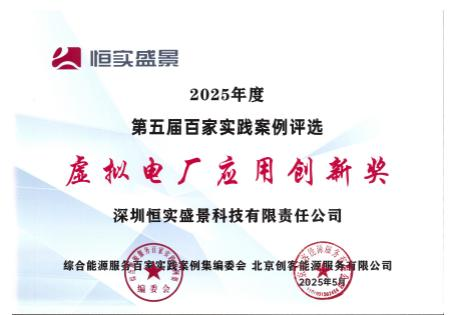

text_image

恒实盛景
2025年度
第五届百家实践案例评选
虚拟电厂应用创新奖
深圳恒实盛景科技有限责任公司
综合能源服务百家实践案例集编委会 北京创客能源服务有限公司
2025年5月

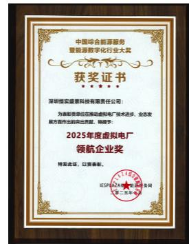

text_image

中国综合能源服务
暨能源数字化行业大奖
获奖证书
深圳协实盛景科技有限责任公司：
为表彰单位在推动虚拟电厂技术进步、全态发展方面作出的突出贡献，特聘字
2025年度虚拟电厂
领航企业奖
特发此证，以资者制。
HSPATA智能装备集团
第二五年一月

# 党团荣誉

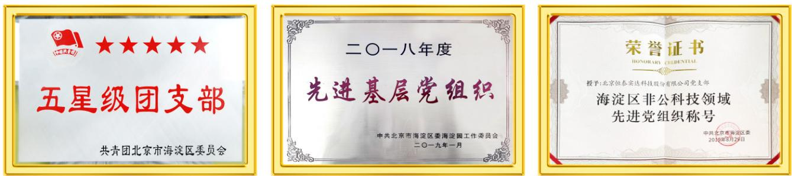

# 01

# 聚焦公司治理 锚定价值创造

党建引领聚合力

公司治理稳根基

投关管理筑桥梁

natural_image

Illustration of three people collaborating around a presentation screen with charts, no visible text or symbols

# 党建引领聚合力

公司坚持以习近平新时代中国特色社会主义思想为指导,聚焦党建,加强学习,广泛深入地开展形式多样的党建活动,不断深化思想认识,加快高质量发展步伐。

公司党组织自成立以来,持续学习党的方针政策,积极开展党建活动,培养和发展了多名优秀党员,党支部连续多年被评为“先进基层组织”,委员会成员也多次荣获“优秀党务工作者”“优秀共产党员”的荣誉。

2025年,恒实科技总部党支部在中关村科学城综合党委的领导下,始终坚持以习近平新时代中国特色社会主义思想为指导,全面贯彻落实党的二十大精神,持续推进党组织规范化建设,全面加强支部政治、思想、组织、作风和精神文明建设,召开党支部委员会13次,研究事项11项,理论学习14次,并组织了国庆主旋律观影等党建活动。

公司子公司辽宁邮电党委组织建设了党建活动室，为推动党建工作有序开展、加强党员教育建设、提高党员素质提供基础保障。辽宁邮电党委严格落实民主生活会制度，强化党员主题教育活动，2025年以“赓续红色血脉传承革命精神”为主题，组织党员开展实地学习，并召开主题座谈会，引导党员干部传承红色基因、强化使命担当。

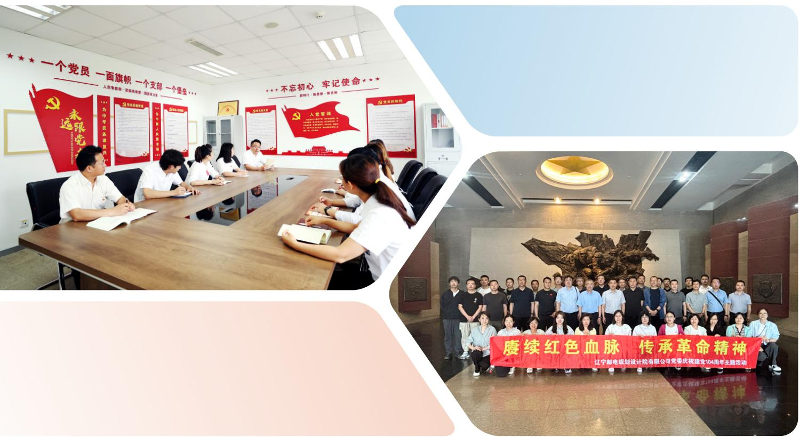

text_image

★★★ 一个党员 一面旗帜 一个支部 一个堡垒
人民志愿部·我志愿志愿 一派使命力量
***不忘初心 牢记使命***
新时代·新思想·新目标
永远跟党
人民志愿部
人民志愿
人民志愿
人民志愿
人民志愿
人民志愿
人民志愿
人民志愿
人民志愿
人民志愿
人民志愿
人民志愿
人民志愿
人民志愿
人民志愿
人民志愿
人民志愿
人民志愿
人民志愿
人民志愿
人民志愿
人民志愿
人民志愿
人民志愿
人民志愿
人民志愿
人民志愿
人民志愿
人民志愿
人民志愿
人民志愿
人民志愿
人民志愿
人民志愿
人民志愿

# 公司治理稳根基

# 治理架构

公司严格按照《公司法》《证券法》《深圳证券交易所创业板股票上市规则》《上市公司治理规则》等相关法律法规的要求，不断完善公司法人治理结构，建立健全公司内部管理和控制制度，持续深入开展公司治理活动，提高公司规范运作水平。

  
召开股东会  
4次

  
召开董事会  
7次

# 股东会

公司严格按照《公司法》《公司章程》《股东会议事规则》等法律法规要求，规范股东会召集、召开和表决程序，并聘请律师见证历次股东会。

2025年,公司组织召开股东会4次,
审议通过议案16项。

# 董事会

各董事依据《公司法》《公司章程》《董事会议事规则》等法律法规要求，勤勉地履行职责和义务，按时出席董事会，依法行使职权。董事会下设薪酬与考核委员会、战略委员会、提名委员会和审计委员会。

2025年，公司组织召开董事会7次，审议通过议案34项。

# 投关管理筑桥梁

公司高度重视投资者关系与信息披露工作，严格按照《公司法》《深圳证券交易所创业板股票上市规则》等法律法规要求，及时、准确、真实、完整地进行信息披露，通过投资者电话、投资者关系互动平台等多种方式与投资者进行沟通交流。公司非常重视对投资者的回报，严格按照公司章程及利润分配政策实施分红方案以回报股东。

# 投关管理

公司积极搭建与投资者之间的沟通桥梁,通过业绩说明会、股东会、电话咨询、互动问答等多种方式,与投资者保持良好的沟通交流。

natural_image

Illustration of four professionals in an office setting, one presenting a bar chart and others holding documents (no text or symbols present)

# 规范信息披露

公司高度重视信息披露工作,真实、准确、完整、及时的披露信息,充分履行信息披露义务,确保全体股东及广大投资者能平等获取有关信息。

<table><tr><td>举办业绩说明会</td><td>发布定期报告</td><td>发布临时公告</td><td>投资者电话访问</td><td>互动易平台回复投资者</td></tr><tr><td>1次</td><td>4份</td><td>100+份</td><td>200+次</td><td>120+条</td></tr></table>

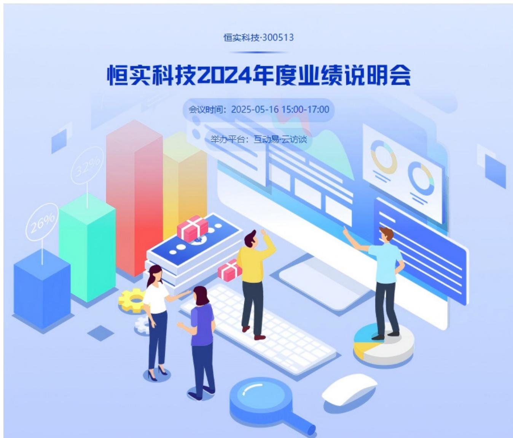

text_image

恒实科技·300513
恒实科技2024年度业绩说明会
会议时间：2025-05-16 15:00-17:00
举办平台：互动易·云访谈

# 02

# 守护绿水青山 共建绿色家园

践行环保绿色运营

助力能源低碳转型

赋能实现双碳目标

natural_image

Scenic landscape with snow-capped mountains, green trees, and a calm pond under a partly cloudy sky (no text or symbols visible)

# 践行环保绿色运营

公司积极践行环保承诺、完善环境管理体系、推动企业环保可持续发展。公司已经建立了符合相关标准的环境、质量、职业健康安全及信息安全管理体系，并通过BCC认证，取得ISO14001:2015环境管理体系、ISO9001:2015质量管理体系、ISO45001:2018职业健康安全管理体系及ISO/IEC27001:2022信息安全管理体系认证。公司具有国家能源局颁发的绿色电力证书交易凭证。公司及子公司均未受到与环保相关的行政处罚。

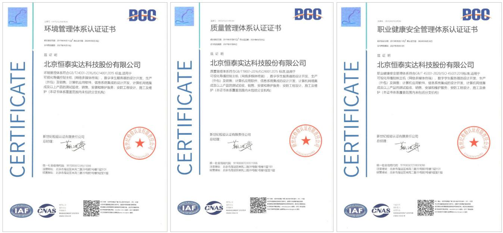

text_image

BCC
环境管理体系认证证书
BCC
质量管理体系认证证书
职业健康安全管理体系认证证书
职业安全认证书 2019年09月11日 风险证照 2024年05月24日
BCC
北京恒泰实达科技股份有限公司
环境管理体系符合GB/T 74001-2016/ISO/14001:2015 标准，适用于
可视化导航控制主机（网络多媒体终端）、数字孪生服务器的设计开发、生产
（外包）及销售；计算机应用软件、信息系统集成的设计开发、计算机网络集
成及以上产品的测试验收、销售、安装和维护服务；安防工程设计、施工及维
护（本证书体系覆盖范围内未包括分支机构）
新世纪检验认证有限责任公司
总经理：
黄洁萍
统一社会信用代码：91780007239511958
注册地址：北京市海淀区枫风二路39号院号楼1座10层
经营地址：北京市海淀区枫风二路39号院号楼1座10层
BCC
QCC
职业健康安全管理体系认证证书
BCC
职业健康安全管理体系认证证书
职业健康安全管理体系符合GB/T 45001-2020/ISO 45001:2019标准，适用于
可视化导航控制主机（网络多媒体终端）、数字孪生服务器的设计开发、生产
（外包）及销售；计算机应用软件、信息系统集成的设计开发、计算机网络集
成及以上产品的测试验收、销售、安装和维护服务；安防工程设计、施工及维
护（本证书体系覆盖范围内未包括分支机构）
黄洁萍
统一社会信用代码：91780007239511958
注册地址：北京市海淀区枫风二路39号院号楼1座10层
经营地址：北京市海淀区枫风二路39号院号楼1座10层
BCC
职业健康安全管理体系认证证书
职业健康安全管理体系符合GB/T 45001-2020/ISO 45001:2019标准，适用于
可视化导航控制主机（网络多媒体终端）、数字孪生服务器的设计开发、生产
（外包）及销售；计算机应用软件、信息系统集成的设计开发、计算机网络集
成及以上产品的测试验收、销售、安装和维护服务；安防工程设计，施工及维
护（本证书体系覆盖范围内未包括分支机构）
黄洁萍
统一社会信用代码：91780007239511958
注册地址：北京市海淀区枫风二路39号院号楼1座10层
经营地址：北京市海淀区枫风二路39号院号楼1座10层

  
注册号：016TJ23I20445R3M  
初次发证日期：2014年06月27日/再认证日期：2023年06月14日  
本次发证日期：2025年06月12日/证书有效期至：2026年06月26日  
信息安全管理体系认证证书  
兹证明  
北京恒泰实达科技股份有限公司  
信息安全管理体系符合ISO/IEC27001:2022.适用于  
与应用软件设计开发、信息系统集成、软硬件运行维护相关的信息安全管理（本证书体系覆盖范围内未包括分支机构）：适用性声明：ISMS-02 版本：3.0  
统一社会信用代码：91110000723951109B  
注册地址：北京市海淀区林风二路39号院1号楼11层1101  
经营地址：北京市海淀区林风二路39号院1号楼9层至11层  
新世纪检验认证有限责任公司  
总经理：黄冰萍

  
a kiwa company

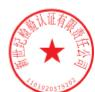

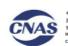

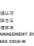

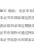

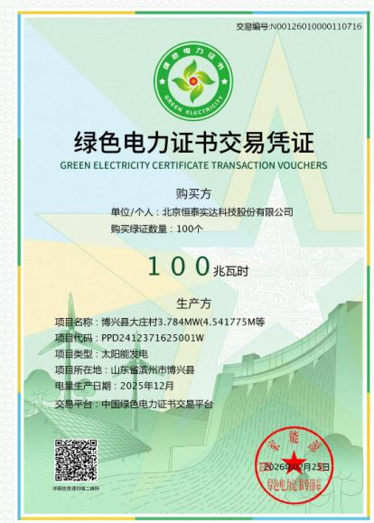

text_image

交易编号:N00126010000110716
绿色电力证书
GREEN ELECTRICITY CERTIFICATE TRANSACTION VOUCHERS
绿色电力证书
GREEN ELECTRICITY
绿色电力证书
绿色电力证书
交易方
单位/个人：北京恒泰实达科技股份有限公司
购买绿证数量：100个
100兆瓦时
生产方
项目名称：博兴县大庄村3.784MW(4.541775M等)
项目代码：PPD2412371625001W
项目类型：太阳能发电
项目所在地：山东省滨州市博兴县
电量生产日期：2025年12月
交易平台：中国绿色电力证书交易平台
2026年12月25日
绿色电力证书购销商

公司高度重视环境保护与节能减排工作,通过加强知识普及与宣传教育,持续营造绿色低碳的办公氛围,提升员工的节能环保意识,致力于构建低碳、环保、可持续的企业运营生态。

在节水管理方面,公司严格执行用水管理制度,强化日常巡查,杜绝水资源浪费现象。在节电管理方面,积极淘汰高耗电设备,推广应用节电新技术与高效节能设备,同时倡导全员合理使用电子办公设备,减少待机能耗,降低用电负荷。此外,为保障员工健康权益、营造良好工作环境,公司全面落实办公楼禁烟规定,定期开展禁烟专项巡查,确保制度执行到位。

公司将持续以实际行动践行绿色发展理念，在污染防治、资源节约和生态保护等方面积极履行企业责任，为建设资源节约型、环境友好型社会贡献力量。

# 助力能源低碳转型

# 分布式光伏调控

公司积极推行以“可观、可测、可调、可控”为目标的新型电力负荷管理系统，开展分布式光伏供电服务研究，构建新型电力负荷管理系统低压分布式光伏调控，在光伏发展和电网建设方面取得了显著进展，为清洁能源的高效利用奠定了坚实基础。通过打造分布式光伏调控模块，实现光伏用户的精细化、智能化管理。

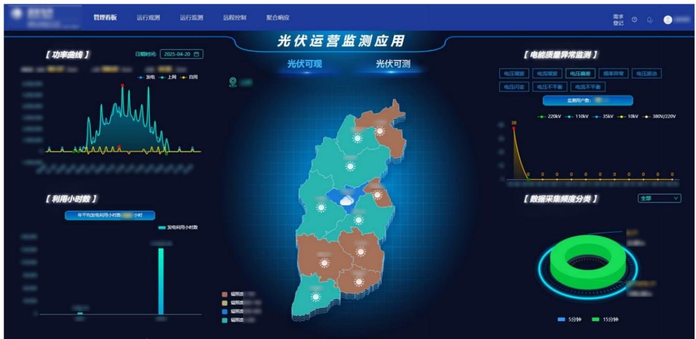

text_image

管理看板
运行观测
运行监测
远程控制
聚合响应
需求
登记
光伏运营监测应用
【功率曲线】
日期时间: 2025-04-20
发电
上网
自用
光伏可观
光伏可测
【利用小时数】
年平均发电利用小时数
小时
发电利用小时数
【电能质量异常监测】
电压锯波
电流锯波
电压偏差
频率异常
电压波动
电压闪变
电压不平衡
电流不平衡
监测用户数:
220kV
110kV
35kV
10kV
380V/220V
【数据采集频度分类】
全部
5分钟
15分钟

# 能源互济型虚拟电厂运营管控方案

公司以市场机制为依托，着力打造以服务用户，聚合各分布式发电、储能和可控负荷资源，利用软件系统及信通通信技术构建可观、可测、可控、可调资源池，搭建需求响应、辅助服务等多场景电力市场交易的虚拟电厂。

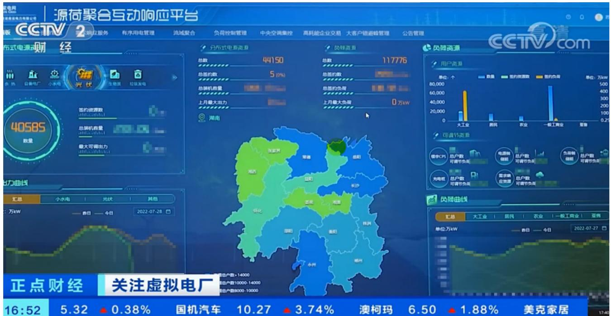

text_image

源荷聚合互动响应平台
CCTV 2
正点财经 关注虚拟电厂
16:52 5.32 ▲ 0.38% 国机汽车 10.27 ▲ 3.74% 澳柯玛 6.50 ▲ 1.88% 美克家居
40585
数量
分布式电源资源
总数 44150
总签约数 5 (0%)
总装机容量
上月最大出力
湖南
加家界
常德
岳阳
长沙
怀化
衡阳
株洲
永州
郴州
负荷资源
总数 117776
总签约数
总签约负荷
上月最大负荷 0万kW
负荷资源
用户资源
单位：个 数量 禁约资源数 禁约负荷 单位：万kW
大工业 居民 农业 一般工商业 直售
可调节资源
核心CP 总户数 总户数 可调节负荷 电源的储能 总户数 可调节负荷 负荷储能 总户数 可调节负荷 光电柜 总户数 需求端 应资源 总户数 可调节负荷
负荷曲线
汇总 大工业 | 居民 | 农业 | 一般工商业 | 直向
单位：万kW
正点财经 关注虚拟电厂

源荷聚合互动相应平台

# 新型电力负荷管理系统

新型电力负荷管理系统采用Springcloud微服务等技术，聚焦需求侧全资源“统一管理、统一调控、统一标准、统一服务”核心目标，融合营销业务系统、用电信息采集系统、PMS、小水电、OMS、调度系统、气象系统等系统数据，为用户提供丰富的应用场景，如负荷资源管理、负荷监测分析、虚拟电厂运营支撑、自备电厂调控能力、用户侧储能调控能力、负荷普查管理等应用，实现由负荷资源向光荷储桩、小水电等需求侧全资源转变，由电网全局向分层分区的转变、由刚性控制向柔性服务的转变。提升电网负荷资源精细化等日常管理能力，立足构建新型电力负荷管理系统，服务碳达峰、碳中和目标大局，全力保障电网高质量发展。

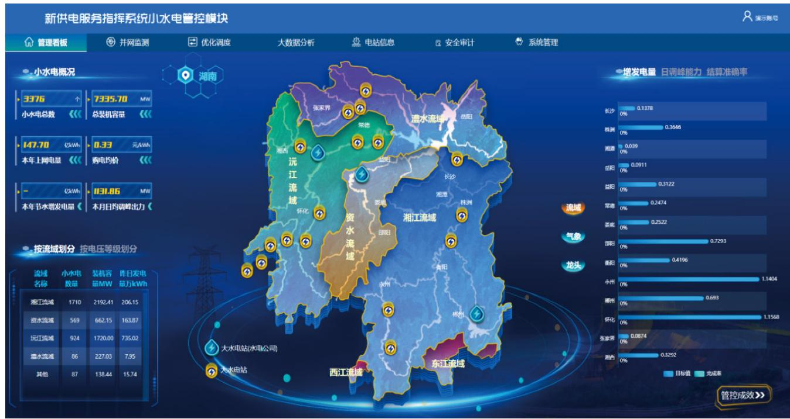

text_image

新供电服务指挥系统小水电管控模块
管理看板
并网监测
优化调度
大数据分析
电站信息
安全审计
系统管理
增发电量 日调峰能力 结算准确率
小水电概况
3376 ↑ 7335.70 MW
小水电总数 << 总装机容量 <<
147.70 GWh 0.33 元/kWh
本年上网电量 << 购电均价 <<
- GWh 131.86 MW
本年节水增发电量 < 本月日均调峰出力 >
按流域划分 按电压等级划分
流域名称 小水电数量 装机容量MW 昨日发电量万kWh
湘江流域 1710 2192.41 206.15
资水流域 569 662.15 163.87
沅江流域 924 1720.00 735.02
澧水流域 86 227.03 7.95
其他 87 138.44 15.74
大水电站(水电公司)
大水电站
东江流域
东江流域
澧水流域
怀化
怀化
怀化
怀化
怀化
怀化
怀化
怀化
怀化
怀化
怀化
怀化
怀化
怀化
怀化
怀化
怀化
怀化
怀化
怀化
怀化
怀化
怀化
怀化
怀化
怀化
怀化
怀化
怀化
怀化
怀化
怀化
怀化
怀化

湖南小水电管控平台

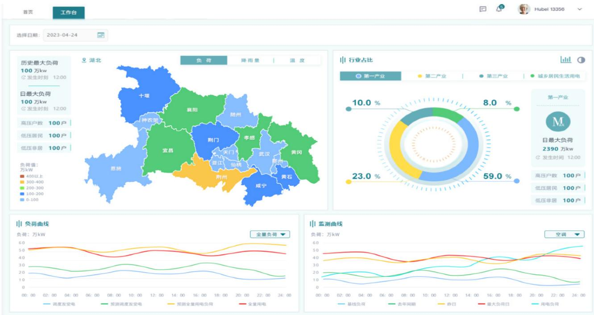

donut

| Category | Value (%) |
| --- | --- |
| 第一产业 | 10.0 |
| 第二产业 | 8.0 |
| 第三产业 | 59.0 |
| 城乡居民生活用电 | 23.0 |

湖北电力负荷监测分析平台

# 虚拟电厂资源管控平台

虚拟电厂资源管控平台依托先进的物联通信、控制技术及AI算法，是聚合管控各类分布式能源资源、实现虚拟电厂全流程智能化运营的核心载体。平台全面覆盖分布式光伏、分布式储能、充电桩及可调节负荷等多种用户侧资源，可实时监测各类资源运行状态、精准识别运行特征，捕捉核心数据并打破分散资源管控壁垒。依托AI算法，平台实现各类资源动态优化调度，协同“源网荷储”运行；同时赋能电力市场交易，制定个性化竞价策略，精准完成结算统计与收益核算，大幅提升管控效率与交易收益，为虚拟电厂安全高效运营提供全方位支撑。

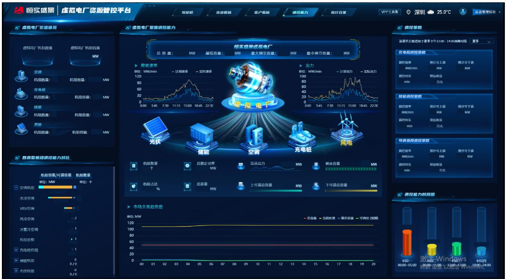

text_image

恒实盛景 | 虚拟电厂资源管控平台
驾驶舱  资源看板  客户看板  调控能力  执行效果  VFP工具集  深圳 25.0℃  运营管理后台
虚拟电厂价值锚定
虚拟电厂机组容量
MW
空调
机组数量： 机组容量： MW
充电桩
机组数量： 机组容量： MW
储能
机组数量： 机组容量： MW
奔驰
机组数量： 机组容量： MW
光伏
储能
空调
充电桩
风电
出力
单位：MW/min
计划功率
当前出力
实际出力
单位：MW/min
预计可上算
预计可下调
MW/min
MW
MW
调控时长
预估收益
min
万元
调价策略
该调节方案适用于夏季下午13:00-14:00高峰时段 夏季
充电柜调控策略
调控速率 预计可上算 预计可下调
MW/min MW
调控时长 预估收益
min 万元
增量调控策略
调控速率 预计可上算 预计可下调
MW/min MW
调控时长 预估收益
min 万元
可调负荷调控策略
调控速率 预计可上算 预计可下调
MW/min MW
调控时长 预估收益
min 万元
调价能力明细图
市场交易趋势图
单位：MW
总容量 当前处理 剩余容量 可调控(预测)

虚拟电厂资源管控平台

# 赋能实现双碳目标

在国家双碳战略背景下,恒实科技凭借在能源领域深厚底蕴,以及在大数据、云计算、物联网、人工智能的技术积累,以科技力量推动低碳转型,助力城市、园区和企业绿色低碳可持续发展,助力实现碳达峰、碳中和。

# 微电网运营管理平台

面向园区运营商、能源商设计的一个能量调度运营的数字化平台，它可以针对分散、新型的分布式电源/负荷做物联管控，不同于市面一般产品，它支持智能预测各单元用能，并可有效验证微网策略模式的收益运行情况。

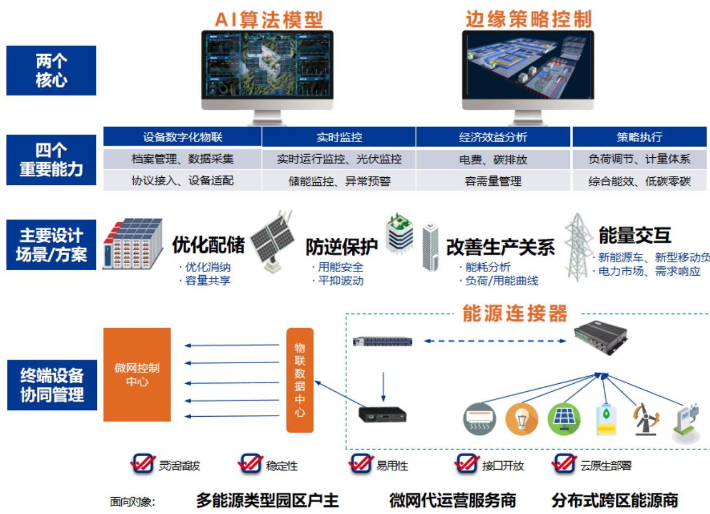

flowchart

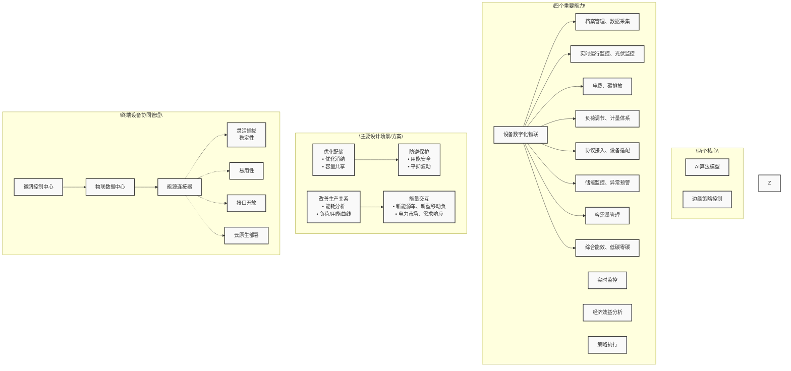
```mermaid
graph TD
  subgraph sg["\"两个核心\""]
    A["AI算法模型"]
    B["边缘策略控制"]
  end

  subgraph sg_2["\"四个重要能力\""]
    C["设备数字化物联"]
    D["实时监控"]
    E["经济效益分析"]
    F["策略执行"]
    
  C --> G["档案管理、数据采集"]
  C --> H["实时运行监控、光伏监控"]
  C --> I["电费、碳排放"]
  C --> J["负荷调节、计量体系"]
  C --> K["协议接入、设备适配"]
  C --> L["储能监控、异常预警"]
  C --> M["容需量管理"]
  C --> N["综合能效、低碳零碳"]
  end

  subgraph sg_3["\"主要设计场景/方案\""]
  O["优化配储\n• 优化消纳\n• 容量共享"] --> P["防逆保护\n• 用能安全\n• 平抑波动"]
  Q["改善生产关系\n• 能耗分析\n• 负荷/用能曲线"] --> R["能量交互\n• 新能源车、新型移动负\n• 电力市场、需求响应"]
  end

  subgraph sg_4["\"终端设备协同管理\""]
  S["微网控制中心"] --> T["物联数据中心"]
  T --> U["能源连接器"]
    
    U -.-> V["灵活插拔\n稳定性"]
    U -.-> W["易用性"]
    U -.-> X["接口开放"]
    U -.-> Y["云原生部署"]
  end

  style A fill:#f9f9f9,stroke:#333,stroke-width:2px
  style B fill:#f9f9f9,stroke:#333,stroke-width:2px
  style C fill:#f9f9f9,stroke:#333,stroke-width:2px
  style D fill:#f9f9f9,stroke:#333,stroke-width:2px
  style E fill:#f9f9f9,stroke:#333,stroke-width:2px
  style F fill:#f9f9f9,stroke:#333,stroke-width:2px
  style G fill:#f9f9f9,stroke:#333,stroke-width:2px
  style H fill:#f9f9f9,stroke:#333,stroke-width:2px
  style I fill:#f9f9f9,stroke:#333,stroke-width:2px
  style J fill:#f9f9f9,stroke:#333,stroke-width:2px
  style K fill:#f9f9f9,stroke:#333,stroke-width:2px
  style L fill:#f9f9f9,stroke:#333,stroke-width:2px
  style M fill:#f9f9f9,stroke:#333,stroke-width:2px
  style N fill:#f9f9f9,stroke:#333,stroke-width:2px
  style O fill:#f9f9f9,stroke:#333,stroke-width:2px
  style P fill:#f9f9f9,stroke:#333,stroke-width:2px
  style Q fill:#f9f9f9,stroke:#333,stroke-width:2px
  style R fill:#f9f9f9,stroke:#333,stroke-width:2px
  style S fill:#f9f9f9,stroke:#333,stroke-width:2px
  style T fill:#f9f9f9,stroke:#333,stroke-width:2px
  style U fill:#f9f9f9,stroke:#333,stroke-width:2px
  style V fill:#f9f9f9,stroke:#333,stroke-width:2px
  style W fill:#f9f9f9,stroke:#333,stroke-width:2px
  style X fill:#f9f9f9,stroke:#333,stroke-width:2px
  style Y fill:#f9f9f9,stroke:#333,stroke-width:2px
  style Z fill:#f9f9f9,stroke:#333,stroke-width:2px
```

微电网运营管理平台

# 综合能源(碳)服务解决方案

公司以数字化平台为核心基底，构建“能碳一体化”智慧能源管控与全周期运营服务体系，围绕“规划+建设+运维+运营+碳管理+增值服务”模式，为政府端、园区端客户提供综合解决方案。

在政府端,依托能耗分析、碳排跟踪、双碳规划等能力,为区域能源监管、“双碳”目标落地提供数据支撑与咨询服务;在园区端,通过能碳数字化、能源设备管理、节能改造、微网调度、绿色资产交易及碳中和认证等服务,助力园区实现降本增效与绿色低碳发展。

底层以云端计算、边缘控制、IOT物联及SaaS服务为技术底座，搭建园区、企业、工厂级能碳平台及虚拟电厂等模块，实现统一门户、统一标识与数据溯源。同时联动国家级认证平台、专业零碳认证机构及电力交易中心，形成完善生态服务体系，推动能源高效利用与低碳转型，助力新型电力系统建设与“双碳”目标实现。

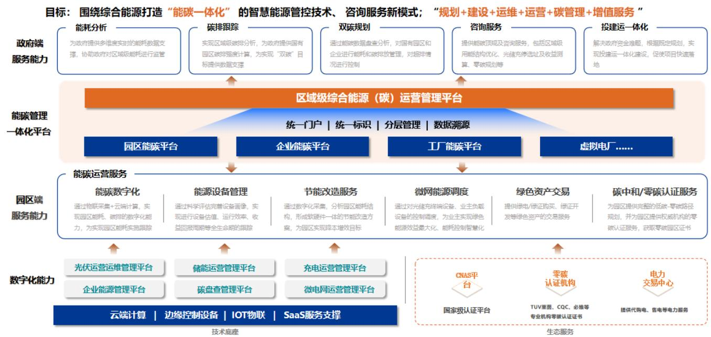

flowchart

This flowchart illustrates the architecture of a comprehensive energy management platform, categorized into three main pillars: Energy Integration (Carbon-Environmental Management Platform), Energy Operation Services, and Digitalization (Energy Optimization). It details specific sub-policies for each pillar and their corresponding functional capabilities.

综合能源(碳)服务解决方案

# 园区光储充一体化项目

公司控股子公司辽宁旭能科技有限公司承担了多项绿色能源项目。如:某园区光储充一体化项目,通过光伏发电、储能系统和充电桩的有机结合,打造了高效、低碳的能源利用示范项目,不仅实现了清洁能源的规模化应用,还通过储能系统优化了能源供需平衡,大幅降低了碳排放,为建设单位提供了绿色、稳定的电力支持,充分展现了公司在新能源领域的创新能力和技术优势,推动绿色产业的发展。

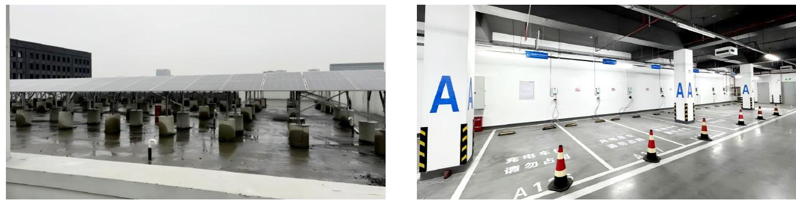

# 基地光伏发电综合监控平台

在某光伏发电综合监控平台项目中,辽宁旭能为客户开发智能化的能源管理平台,实现了对电力、水、热能等多种能源的实时监控与优化调控,通过数据分析和智能算法,显著提升能源使用效率,降低企业运营成本,减少能源浪费,帮助企业践行绿色环保运营理念。

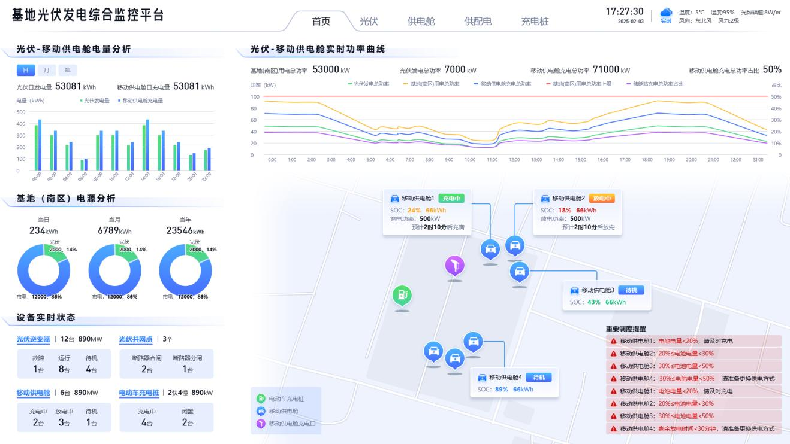

donut

| 时间 | 光伏发电总功率 (kW) | 基地(南区)用电总功率 (kW) | 移动供电舱充电总功率 (kW) | 基地(南区)用电总功率占比 (%) | 储能站充电总功率占比 (%) |
| :--- | :--- | :--- | :--- | :--- | :--- |
| 0:00 | ~50 | ~90 | ~70 | ~40 | ~40 |
| 1:00 | ~50 | ~90 | ~70 | ~40 | ~40 |
| 2:00 | ~50 | ~90 | ~70 | ~40 | ~40 |
| 3:00 | ~50 | ~90 | ~70 | ~40 | ~40 |
| 4:00 | ~50 | ~80 | ~60 | ~35 | ~35 |
| 5:00 | ~50 | ~60 | ~45 | ~25 | ~25 |
| 6:00 | ~50 | ~50 | ~40 | ~25 | ~25 |
| 7:00 | ~50 | ~50 | ~40 | ~25 | ~25 |
| 8:00 | ~50 | ~50 | ~40 | ~25 | ~25 |
| 9:00 | ~50 | ~45 | ~35 | ~25 | ~25 |
| 10:00 | ~50 | ~45 | ~35 | ~25 | ~25 |
| 11:00 | ~50 | ~45 | ~35 | ~25 | ~25 |
| 12:00 | ~50 | ~60 | ~45 | ~30 | ~30 |
| 13:00 | ~50 | ~60 | ~45 | ~30 | ~30 |
| 14:00 | ~50 | ~60 | ~45 | ~30 | ~30 |
| 15:00 | ~50 | ~60 | ~45 | ~30 | ~30 |
| 16:00 | ~50 | ~70 | ~55 | ~35 | ~35 |
| 17:00 | ~50 | ~80 | ~65 | ~40 | ~40 |
| 18:00 | ~50 | ~90 | ~70 | ~45 | ~45 |
| 19:00 | ~50 | ~90 | ~70 | ~45 | ~45 |
| 20:00 | ~50 | ~90 | ~70 | ~45 | ~45 |
| 21:00 | ~50 | ~85 | ~65 | ~45 | ~45 |
| 22:00 | ~50 | ~75 | ~60 | ~40 | ~40 |
| 23:00 | ~50 | ~65 | ~55 | ~35 | ~35 |
| 24:00+ | N/A | N/A | N/A | N/A | N/A |

### 设备实时状态
- 光伏逆变器 (12台, 890MW)
- 运行 (1台, 8台)
- 接触 (1台, 4台)
- 移动供电舱 (6台, 890MW)
- 充电中 (2台, 3台)
- 放电中 (1台, 1台)
- 待机 (2块/4倍, 890kW)
- 充电桩 (充电中, 4台)
- 闲置 (2台, 2台)

# 03

# 提升科技创新 践行社会责任

构建和谐职场环境

提升科技创新能力

助力乡村振兴发展

natural_image

Abstract illustration of a city street with vehicles and buildings, no text or symbols present

# 构建和谐职场环境

公司始终秉持“员工是企业最宝贵的财富”的理念，将员工权益与福祉置于重要位置。通过提供多元化的支持与资源，我们致力于营造一个充满尊重、包容与平等的工作环境，让每一位员工都能在和谐的氛围中实现价值、共同成长。

员工结构  
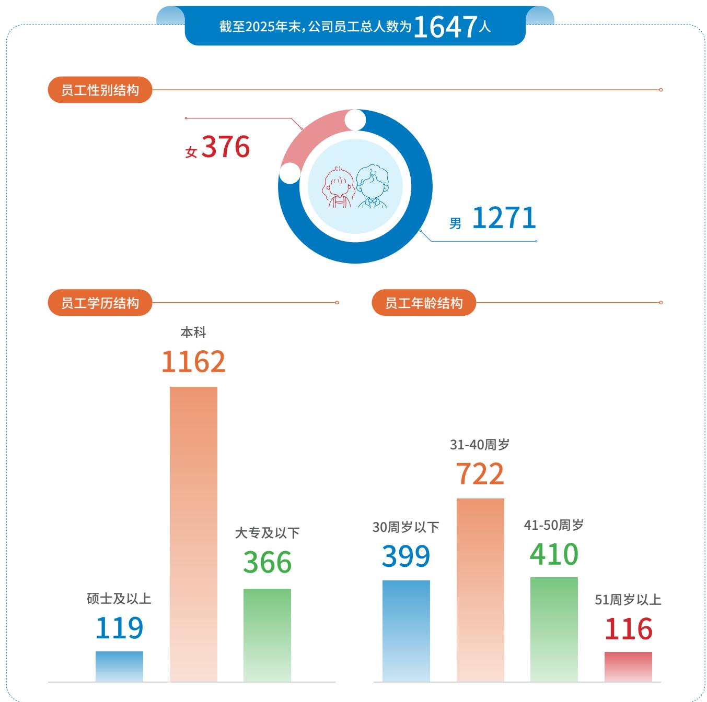

donut

| 类别 | 细分项 | 人数 |
| --- | --- | --- |
| 员工性别结构 | 女 | 376 |
| 员工性别结构 | 男 | 1271 |
| 员工学历结构 | 硕士及以上 | 119 |
| 员工学历结构 | 本科 | 1162 |
| 员工学历结构 | 大专及以下 | 366 |
| 员工年龄结构 | 30周岁以下 | 399 |
| 员工年龄结构 | 31-40周岁 | 722 |
| 员工年龄结构 | 41-50周岁 | 410 |
| 员工年龄结构 | 51周岁以上 | 116 |

# 人才培养

# 入职培训|融入从“心”开始

通过系统化的入职引导,帮助新员工快速理解企业文化、融入团队氛围,掌握岗位所需的核心素养,为个人职业发展奠定坚实基础,与企业携手迈出成长的第一步。

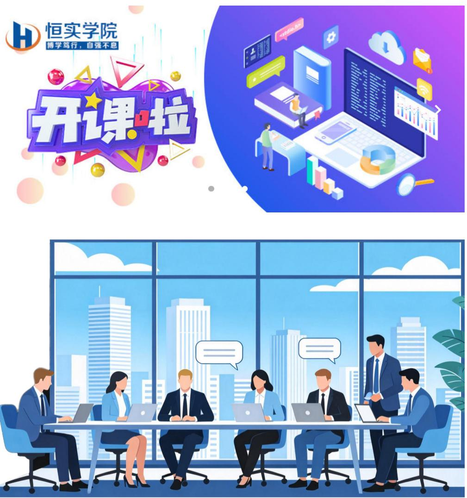

# 专业培训|持续精进,共赢未来

公司高度重视员工专业能力的提升，围绕行业前沿与实践需求，持续开展针对性培训，助力员工在职业生涯中不断突破自我、提升核心竞争力。我们坚信，每一位员工的成长，都是企业发展的动力源泉。

# 员工关怀

# 温情守护,一路同行

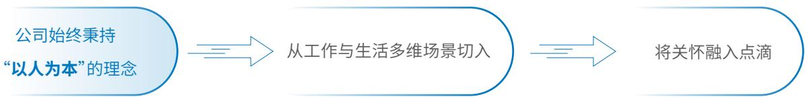

flowchart

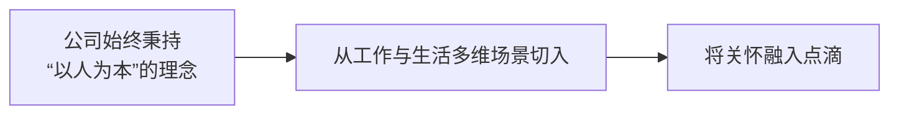
```mermaid
graph LR
  A["公司始终秉持\n“以人为本”的理念"] --> B["从工作与生活多维场景切入"]
  B --> C["将关怀融入点滴"]
```

公司秉持“以人为本”，从工作与生活多维场景切入，将关怀融入点滴。现代化办公环境舒适高效；辽宁邮电“暖心食堂”以均衡膳食守护员工健康；通勤班车覆盖主要线路，破解出行难题。此外，带薪假期、公租房及生日礼金等福利，助力员工平衡工作与生活。每一份关怀，都是对“共同成长、共享成果”文化理念的生动践行。

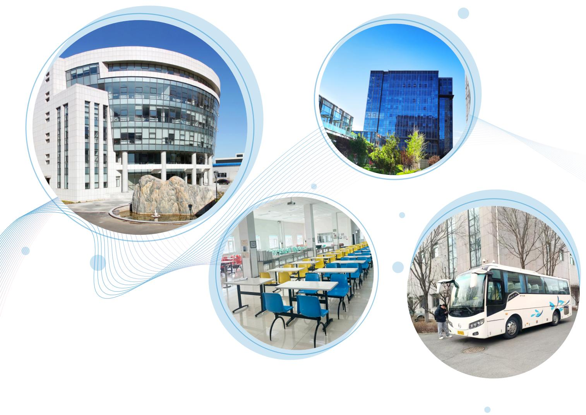

natural_image

Composite image showing modern glass buildings, a blue office building, a classroom with yellow tables, and a white autonomous bus in an outdoor setting (no visible text or symbols)

# 节日仪式感

# 双旦活动 | 注入新的能量

公司精心策划双旦庆祝活动，通过节日装扮、惊喜礼物与温馨互动，让员工在忙碌工作之余感受节日的温暖与喜悦。活动现场欢声笑语，大家在分享与祝福中拉近彼此距离，团队凝聚力在轻松氛围中悄然升温。节日不仅是辞旧迎新的仪式，更是公司传递关

怀、营造归属感的重要时刻。我们相信，这份温情将转化为携手前行的动力，共同迎接新一年的机遇与挑战。

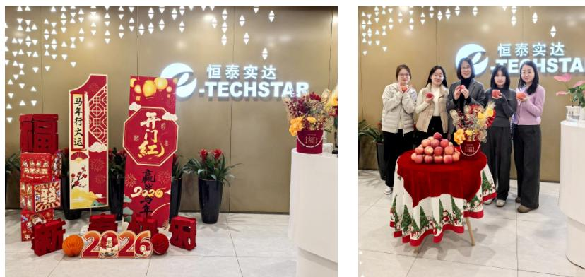

# 荣休欢送

# 荣休欢送|流金岁月 深情寄远

公司坚持“以人为本”，为入职数十载的员工举办荣休欢送会，感恩员工的坚守与奉献。他们不仅实现个人价值，更收获归属感与同行情谊。温情的仪式传递企业对资深员工的敬意，让敬业精神薪火相传，共同营造和谐温暖的职场文化。

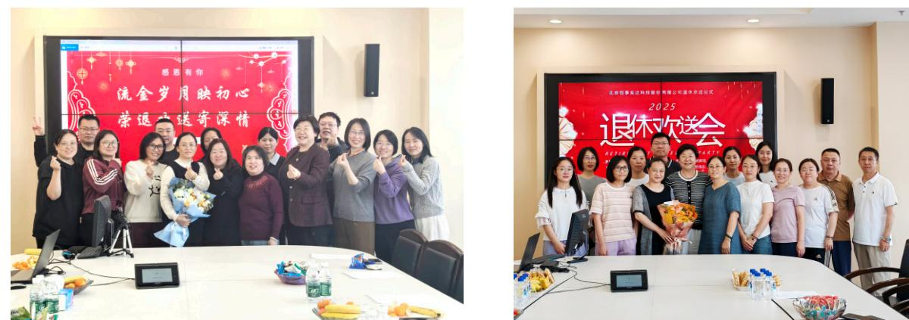

# 主题活动

# 骑行活动|一路向北 追光逐梦

公司倡导绿色健康生活，鼓励员工积极参与社会文体活动。2025年9月，公司员工代表公司参加苏家坨镇政府组织的“一路向北 追光逐梦”骑行活动，在亲近自然、放松身心的同时，以实际行动响应绿色出行号召，向社会展现了恒实人积极向上的精神风貌与企业活力。

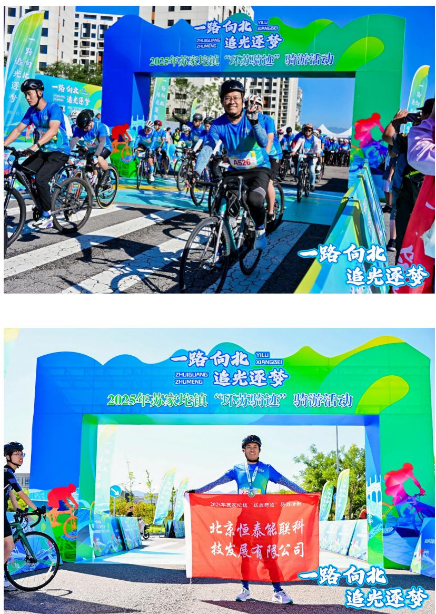

# 文体比赛|增强团队凝聚力

在2025年9月20日举办的辽宁省信息通信行业首届员工半程马拉松比赛中，公司子公司辽宁邮电积极参与，凭借良好的赛场风貌和对体育精神的恪守，荣获赛事“体育道德风尚奖”。这一荣誉是对参赛团队严守规则、尊重对手、团结协作的充分肯定，也展现了公司员工朝气蓬勃、奋发向上的精神风貌。通过参与此次行业文体盛会，不仅锻炼了员工体魄、增强了团队凝聚力，更在与辽宁联通、辽宁移动等同行的交流互动中，加深了友谊，以实际行动诠释了信息通信人团结奋进的行业精神。

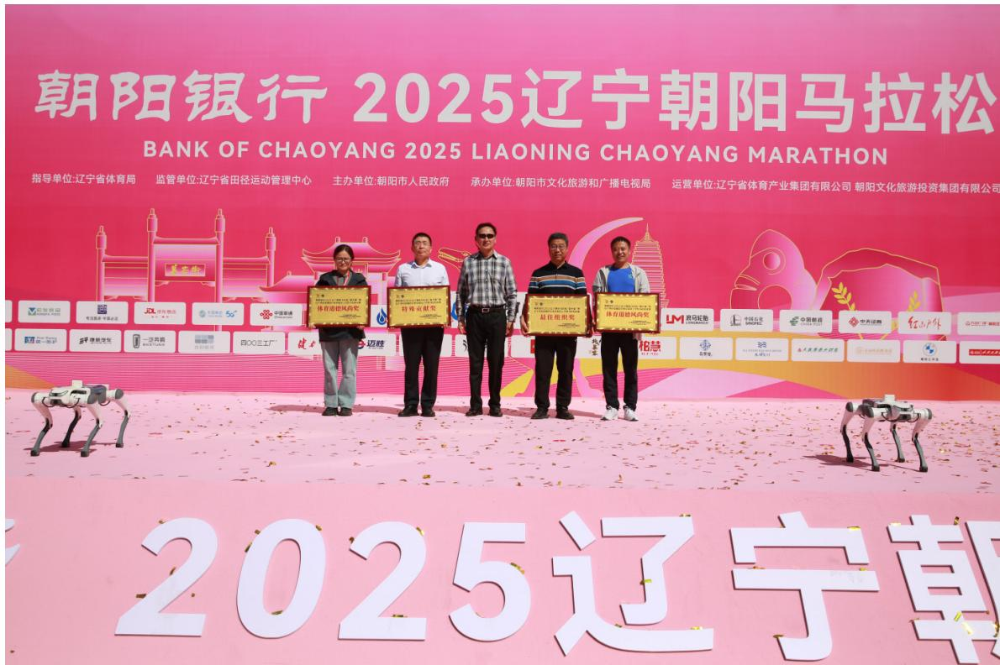

text_image

朝阳银行 2025辽宁朝阳马拉松
BANK OF CHAOYANG 2025 LIAONING CHAOYANG MARATHON
报导单位:辽宁省体育局 监管单位:辽宁省田径运动管理中心 主办单位:朝阳市人民政府 承办单位:朝阳市文化旅游和广播电视局 运营单位:辽宁省体育产业集团有限公司 朝阳文化旅游投资集团有限公司
2025辽宁朝

# 提升科技创新能力

# 知识产权保护

公司坚守诚信底线,尊重知识产权,严格遵循相关法律法规建立知识产权保护机制,积极维护自身及合作伙伴的合法权益。

公司制定了《知识产权管理总则》《专利管理制度》《知识产权申报奖励办法》等制度文件，规范和加强公司知识产权保护及管理，激发员工创新创造热情，推动公司技术进步与创新。

公司加强知识产权的宣传教育,提高员工知识产权意识。持续关注知识产权保护领域的最新动态,不断提升知识产权保护能力,为企业创新发展和行业进步贡献力量。

截至2025年末,公司共有

发明专利

83项

实用新型专利

82项

软件著作权

606项

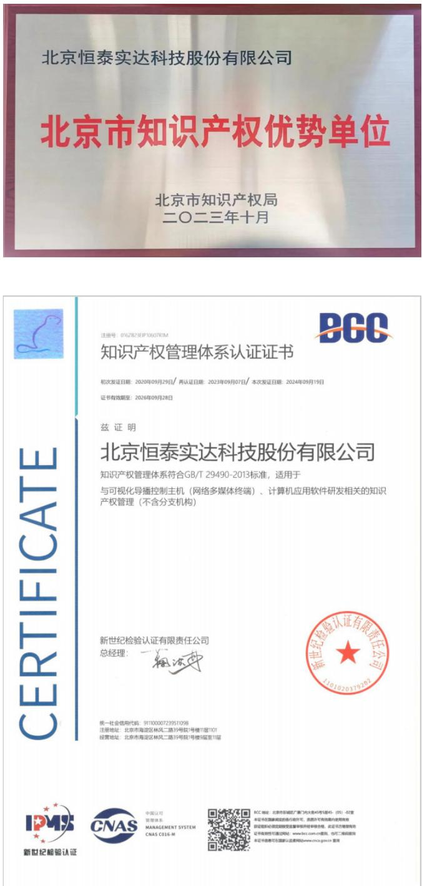

# 助力乡村振兴发展

公司积极响应国家乡村振兴战略部署，以物联网、大数据、数字孪生、智慧能源等数字化技术为支撑，深度融合乡村建设与能源服务需求，扎实推进巩固拓展脱贫攻坚成果同乡村振兴有效衔接。

公司在江西地区落地供电所电子屏联网建设项目群，覆盖南昌、九江、赣州等多地供电公司，有效提升乡村电力服务数字化水平，打通农村电力服务“最后一公里”；同步开展分布式光伏数据治理，支撑农村户用光伏精细化管理与清洁能源消纳。

依托控股子公司辽宁牧龙科技有限公司, 公司推进数字乡村运营、智慧农业、乡村数字化治理等场景落地, 建设乡村治理小程序及综合管理平台, 提供乡村数字化管理、便民服务、信息交互一体化支撑; 推广智慧大棚、农机作业监测、光储充一体化等方案, 以科技赋能农业生产提质增效, 助力农民增收与农村发展。

公司将持续以数字化、智能化为抓手，深化技术与乡村振兴场景融合应用，不断提升乡村能源基础设施与公共服务水平，为建设宜居宜业和美乡村、推动城乡融合发展贡献企业力量。

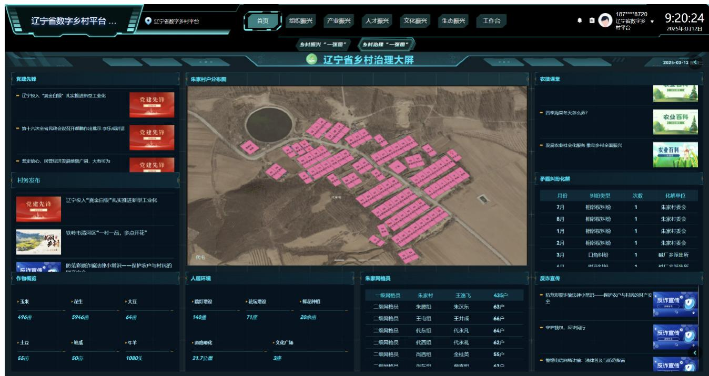

text_image

辽宁省数字乡村平台 ...
辽宁数字乡村平台
首页
组织振兴
产业振兴
人才振兴
文化振兴
生态振兴
工作台
187****8720
辽宁省数字乡村平台
9:20:24
2025年3月12日
乡村振兴“一张图”
乡村治理“一张图”
辽宁省乡村治理大屏
党建先锋
辽宁投入“黄金白银”扎实推进新型工业化
党建先锋
第十六次全省民政会议召开暨作出批示 李乐成讲话
党建先锋
坚定信心，民营经济发展做景广阔，大春可为
党建先锋
村劳发布
党建先锋
辽宁投入“黄金白银”扎实推进新型工业化
铁岭市清河区“一村一品，多点开花”
后推宣传
防范彩蜜诈骗法律小常识——保护农户与村民的
作物概览
·玉米
·花生
·大豆
496亩
5946亩
64亩
·土豆
·地遥
·牛羊
55亩
50亩
1080头
朱家村户分布图
朱家网格员
一级网格员 朱家村 王逸飞 435户
二级网格员 朱腰组 朱汉东 63户
二级网格员 王屯组 王井成 66户
二级网格员 代东组 代永凡 64户
二级网格员 代西组 代永礼 62户
二级网格员 尚西组 金桂英 55户
二级网格员 洪左组 西合明 43户
审提课量
四平海鄂冬天怎么养？
农业百科
发展农业社会化服务 推动乡村全面振兴
农业百科
矛盾纠纷化解
月份 纠纷类型 次数 化源单位
7月 相邻权纠纷 1 朱家村委会
8月 相邻权纠纷 1 朱家村委会
1月 相邻权纠纷 1 朱家村委会
2月 相邻权纠纷 1 朱家村委会
3月 口角纠纷 1 碱厂多派出所
6月 财政纠纷 1 新广乡派出所
反诈宣传
·防范彩蜜诈骗法律小常识——保护农户与村民的财产安全
·守护钱包，反诈同行
·警帽相侦网络诈骗：法律普及与防范攻击
反诈宣传

# 展望

未来,公司将始终坚守可持续发展理念,统筹推进环境保护、社会责任与公司治理协同共进,以科技创新为引擎,持续提升ESG管理水平与价值创造能力,以实际行动助力生态文明建设与高质量发展,为建设美丽中国、服务社会民生贡献企业力量。

# 一、持续完善公司治理,夯实稳健发展根基

持续优化法人治理结构，健全权责清晰、制衡有效的决策与运行机制，不断提升公司治理现代化水平。全面加强风险管理与内部控制体系建设，强化重点领域风险识别、预警与处置，切实防范化解经营风险。坚持真实、准确、完整、及时、公平的信息披露原则，持续提升披露质量与透明度，畅通与投资者的沟通渠道，切实维护投资者合法权益，构建规范、透明、可信的治理环境。

# 二、坚守绿色低碳理念,助力生态文明建设

围绕“双碳”战略目标，持续深化节能减排工作，科学制定更具挑战性的节能降碳目标，优化用能结构与运营流程，多措并举降低能源消耗与碳排放强度。积极布局光伏发电等绿色清洁能源技术研发与应用，推动绿色技术与主营业务深度融合，助力构建清洁低碳、安全高效的能源体系。主动参与全国碳交易市场建设与运营，依托自身技术与服务能力，赋能更多企业实现绿色低碳转型，以产业实践助力生态环境保护。

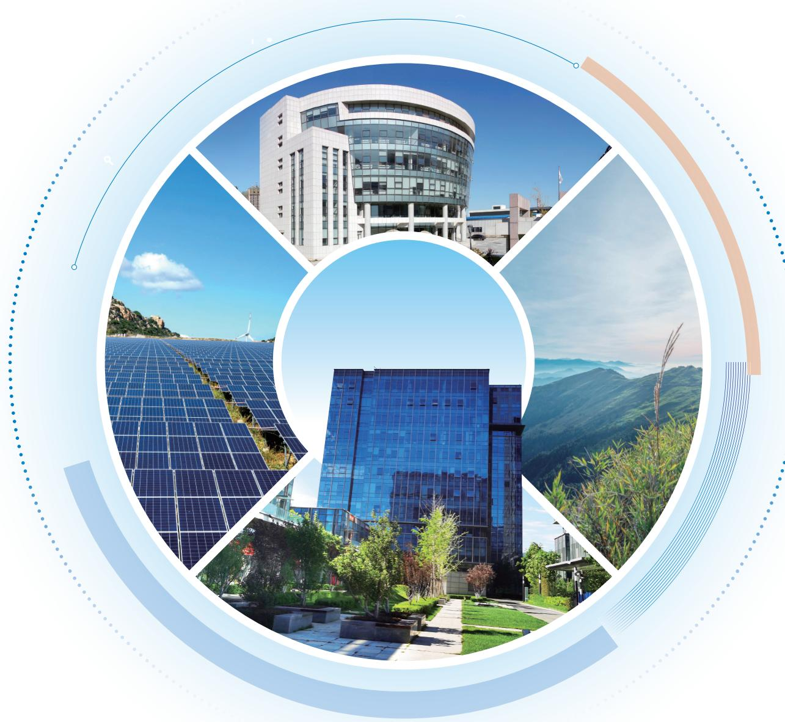

natural_image

Composite circular image showing modern buildings, solar panels, and green hills under a clear sky (no text or symbols)

# 三、强化科技创新驱动,激活高质量发展动能

坚持创新引领发展战略,持续加大研发资金与人才投入,聚焦核心技术攻关,不断提升技术储备与产品竞争力。加强知识产权创造、运用与保护,完善创新激励机制,以核心技术构筑企业长期发展壁垒。深入推进数字化、智能化转型,推动数字技术与生产经营、管理决策、客户服务深度融合,全面提升运营效率与管理效能,以科技创新赋能ESG实践与产业升级。

# 四、践行社会责任担当,共享企业发展成果

坚持以人为本，持续完善员工福利保障体系与职业发展平台，健全培训培养与晋升机制，关注员工身心健康与成长需求，不断提升员工归属感、幸福感与获得感。积极履行企业公民责任，深度参与社区服务、乡村振兴、公益帮扶等社会事业，推动社区共建共享。坚守商业道德与行业规范，携手合作伙伴实现共赢发展，以实际行动促进社会公平与和谐，实现经济效益、社会效益与环境效益的有机统一。