# 2025年度

# 环境、社会与治理(ESG)报告

# ENVIRONMENTAL SOCIAL AND GOVERNANCE (ESG) REPORT

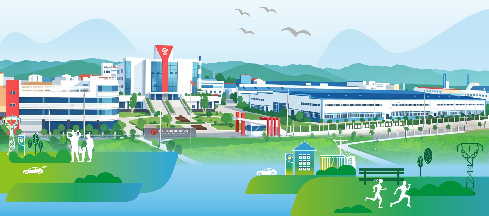

natural_image

Illustration of a modern industrial park with factory buildings, greenery, and people running on the banks (no text or symbols visible)

# 目录

关于本报告 1

董事长致辞 2

# 关于川环科技

企业概况 3

战略与文化 4

荣誉资质 5

# ESG战略与治理

ESG战略定位 6

治理架构与职责 7

# 附录

2026-2027年ESG目标规划 33

参考标准与索引 33

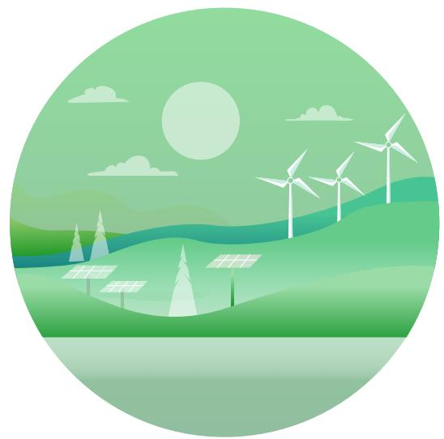

natural_image

Illustration of a green renewable energy landscape with solar panels, wind turbines, and a full moon (no text or symbols)

# 环境维度

# 聚焦绿色生产与低碳转型

环境管理体系与合规 11

“碳中和”项目 12

污染物减排成效 14

环境监测与危险废物管理 15

绿色发展承诺 16

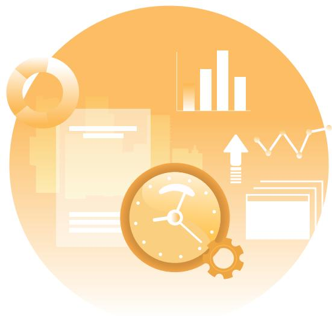

natural_image

Illustration of business analytics with charts, gears, and documents (no text or symbols)

# 社会维度

# 聚焦责任供应链与价值共创

员工权益保障 18

供应链责任 21

产品责任与客户 23

社区与公益 24

natural_image

Stylized illustration of a city skyline with skyscrapers, trees, and an airplane flying overhead (no text or symbols)

# 治理维度

# 聚焦治理体系与合规管理

规范公司治理 27

合规风险管理 29

恪守商业道德 30

坚持党建引领 32

# 关于本报告

# 质量保证

本报告披露的信息和数据来源于公司统计报告和正式文件，并经相关部门审核。公司承诺本报告不存在任何虚假记载或误导性陈述，并对内容的真实性、准确性和完整性负责。

# 报告时间范围

本报告披露的信息和数据来源于公司统计报告和正式文件，并经相关部门审核。公司承诺本报告不存在任何虚假记载或误导性陈述，并对内容的真实性、准确性和完整性负责。本报告时间范围覆盖2025年1月1日至2025年12月31日（以下简称“报告期”“本年度”“2025年”），部分内容适当追溯历史数据。

# 报告组织范围

报告以“四川川环科技股份有限公司”为主体，覆盖了四川川环科技股份有限公司及所属企业。

# 报告称谓说明

为便于表达和阅读，在报告的表述中分别使用“四川川环科技股份有限公司”“川环科技”“公司”“我们”等称谓。

# 报告发布周期

四川川环科技股份有限公司的环境、社会和公司治理(ESG)报告为年度报告，发布周期为一年。

# 报告编写标准

本报告的撰写参考了《深圳证券交易所上市公司自律监管指引第17号——可持续发展报告（试行）》、中国社会科学院《中国企业可持续发展报告指南（CASS-ESG6.0）》《深圳证券交易所创业板上市公司自律监管指南第3号——可持续发展报告编制》、全球报告倡议组织《可持续发展报告标准》（GRIStandards）、联合国可持续发展目标(SDGs)等。

# 报告数据说明

本报告所有数据均来自公司相关统计报告、正式文件及公开信息，符合国家颁布的《企业会计准则》《企业会计制度》等相关规定。

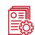

# 报告质量保证

公司努力保证报告内容的完整性、实质性、平衡性和可比性，系统阐述企业在追求发展、经济、生态和社会方面的理念、制度、行为和绩效。公司保证本报告内容的客观性、准确性和完整性，不存在任何虚假记载、误导性陈述或重大遗漏。希望通过报告的发布，提高公司社会责任管理水平，加强与利益相关方的沟通，促进公司可持续发展。

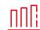

# 报告延伸阅读

本公司已形成可持续发展信息披露体系，除了年度可持续发展报告之外，您还可以在川环科技官方网站（http://www.chuanhuan.com）及川环科技公众号浏览公司日常可持续发展工作情况，获取更多关于履行社会责任的相关信息。

# 报告获取

您可以在川环科技官方网站（http://wwwchuanhuan.com）和深圳证券交易所网站（www.szse.cn）下载本报告。

# 免责申明

本报告的部分内容具有一定前瞻性，易受到不确定因素的影响而导致实际结果产生重大差异。公司概不承担更新本报告中任何前瞻性声明的义务。

# 董事长致辞

尊敬的各位股东、合作伙伴、客户及社会各界同仁：

时光荏苒，川环科技自创立以来，始终秉持"做中国汽车软管一流质量和主流供应商，兴川环百年企业"的宏伟愿景，深耕车用胶管及管路系统领域四十余载。2025年，我们继续以"持续创新、科学管理、诚实信用、健康发展"为经营理念，将国家、股东、员工、社会责任四者利益兼顾的核心价值观融入发展血脉，致力于成为中国汽车、摩托车胶管行业一流质量和主流供应商。

在汽车产业电动化、智能化转型的浪潮中，川环科技始终将技术创新视为核心竞争力。我们深知，每一根管路不仅是连接系统的纽带，更是守护安全、提升效能的关键。2025年，我们持续加大研发投入，依托两个省级技术中心、一个省级重点实验室和省级院士（专家）工作站等创新平台，在培育新技术、新动能、新业态和新模式，打造绿色产业链，已形成多维度研发格局，在"构思一代、研发一代、生产一代、储备一代"的创新理念指引下，不断突破材料配方、结构设计、复合技术等关键领域。从传统燃油管路到新能源汽车液冷系统，从储能领域到数据服务器液冷领域，我们以"中国的川环，世界的品牌"为追求，为客户提供全生命周期的系统性技术解决方案。

# 川环科技的成长离不开社会的支持与信任

我们始终将ESG理念融入日常经营。在环境层面，我们认真贯彻国家"碳达峰、碳中和"双碳环保政策，打造全方位生态供应链，实现企业可持续发展；在社会层面，我们积极拓展新能源汽车、储能、数据中心等新领域，助力国家战略性新兴产业蓬勃发展，同时积极履行社会责任，回馈社会；在治理层面，我们完善企业管理体系，先后通过了ISO9001/QS9000质量管理体系，ISO14001环境管理体系，ISO45001职业健康安全管理体系和GB/T29490企业知识产权管理体系等认证。川环科技大力推进制造业智能化改造和数字化转型“智改数转”应用，打造标杆示范工厂，以规范化治理赢得市场尊重。

# 2026年是川环科技迈向“百年企业”目标的关键之年

站在新的发展起点，我们将继续锚定“建中国胶管基地，兴川环百年企业”的总目标，以市场需求为

导向，以技术创新为核心，以精益管理为支撑，全面推进2026年度经营计划落地。在主业领域，我们将持续深耕新能源汽车管路市场，进一步提升高端产品配套能力，扩大市场份额；在新领域，我们将全力深挖储能、数据中心超算领域液冷管路系统的市场潜力，加快军品领域管路系统的开发与落地，推动新领域成为企业发展的核心增长极。

我们将持续深化内部管理升级，不断优化激励机制、提升生产效能、严控运营成本，让企业发展更具韧性；持续加大研发投入，聚焦胶管核心技术与新领域产品研发，保持技术领先优势；持续完善投资者关系管理体系，提升公司治理水平，以更透明的运营、更稳健的业绩回报股东；持续加强供应链协同与员工关怀，凝聚多方力量，共建共生共赢的产业生态。

# 员工是川环科技最宝贵的财富

我们倡导“人人是人才”的理念，为员工搭建施展才华的发展平台，让企业进步与个人成长同频共振。其中，我们建立健全长效的技术人才培养和培训机制，深化与专业院校合作，培养和引进高素质专业技术人才对合作伙伴，深化供应链协同，与上下游企业携手构建稳定、可持续的产业生态，实现互利共赢。同时，我们始终牢记企业的社会责任，将自身发展融入国家发展大局，在推动行业技术进步的同时，积极践行社会担当，以实际行动回馈社会。

# 潮平岸阔催人进，风正扬帆正当时

回首过往，我们以坚守与创新铸就了坚实的发展基础；展望未来，我们以信心与决心奔赴百年企业的宏伟目标。在此，我谨代表川环科技，向长期以来信任我们的各位股东、携手同行的合作伙伴、拼搏奉献的全体员工，以及关心支持企业发展的社会各界同仁，表示最衷心的感谢！

新的一年，川环科技将始终坚守初心、砥砺前行，以更昂扬的姿态、更扎实的行动，深耕胶管产业、开拓新局赛道，努力成为中国胶管行业的标杆企业，与所有伙伴携手并肩，共绘产业发展新蓝图，共谱百年川环新篇章！

四川川环科技股份有限公司董事长

文琦超

# 关于川环科技

# 企业概况

四川川环科技股份有限公司位于达州市大竹县，隶属于汽车零部件行业，是高新技术企业、全国创新型企业、全国劳动关系和谐企业、全国重合同守信用企业、全国标准化良好行为AAA企业、全国模范职工之家、全国工人先锋号、四川省科技创新先进单位，中国橡胶工业协会表彰为“中国胶管十强企业”称号。公司于2016年9月30日在深圳证券交易所挂牌上市，股票简称：川环科技，股票代码：300547。

公司自设立以来一直专注于研发、生产和销售车用胶管系列产品，核心业务是为各大汽车整车制造厂商提供配套汽车橡胶软管产品，产品范围涵盖燃油系统胶管、冷却系统胶管、制动系统胶管、动力转向胶管、车身附件系统胶管、进排气系统胶管。公司是目前国内市场领先、具备了较大规模的汽车胶管专业生产企业之一。同时，公司也是国内摩托车胶管产品的主流供应商。公司作为国内一家车用胶管专业生产厂商，具有年产车用胶管15000吨的生产能力。产品以优异的性价比，受到了国内外广大汽车、摩托车生产企业的认可。主要客户有福特、三菱、马自达、吉利、长安、上汽五菱等300多家客户，进入了福特、法雷奥、菲亚特、百力通、比亚乔等大集团的国际采购体系。主要销往美国、加拿大、日本、越南、印度、南非、意大利、克罗地亚等地区或国家。

近年来，公司始终坚持“科技兴企”的宗旨，走科技创新之路，组建了“四川川环科技股份有限公司技术中心”、“四川省汽车特种橡胶制品工程技术研究中心”，具有强有力的技术支撑和新产品研发实力。其中公司研制成功拥有独立知识产权的“混合动力新能源汽车发动机燃料管路系统”等8项新产品均被国家科技部等部委列为“国家重点新产品”。公司已取得了40多项国家专利，牵头或参与制修订国家、行业标准。

公司严格按照《公司法》建立了完善的法人治理结构和质量保证体系，先后通过了ISO14001环保认证、OHSAS18001职业健康安全认证、IATF16949质量体系认证、福特Q1认证、美国CARB认证和欧盟的ROHS认证，为川环产品进入国际市场建立了绿色通道。

目前，川环人正致力于打造“中国的川环、世界的品牌”，为实现“做中国汽车胶管行业一流质量和主流供应商，兴川环百年企业”的宏伟目标而不懈努力。

# 战略与文化

# 公司愿景

做中国汽车软管一流质量和主流供应商，兴川环百年企业

# 企业精神

同心同德、同舟共济；追求卓越、奉献第一；敢为人先、锐意进取；托起川环、不遗余力

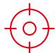

# 使命

做中国汽车、摩托车胶管行业一流质量和主流供应商

# 宗旨

客户满意、员工满意、国家满意、股东满意、公司满意、社会满意

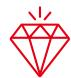

# 核心价值

国家、股东、员工、社会责任四者利益兼顾

# 行为准则

做事讲诚信，履责讲忠诚。聚集众人志，和谐一家亲。
生是川环人，死为川环魂

# 经营理念

持续创新、科学管理、诚实信用、健康发展

# 全力加强“三个创新”

技术创新、产品创新、管理创新

# 倾力打造“四个稳定”

稳定的供应商、客户、管理团队、员工队伍

着力深化融入川环一家亲让员工有尊严的工作在平等、快乐、幸福的川环大家庭。全员签订劳动合同，全员办理五险一金。加强员工职业健康保护，加强员工技能培训，不断提高员工劳动报酬。实施股权激励，奖房奖车配股，打造品牌员工，着力人才工程建设，促进企业持续健康发展，共享川环发展成果。

# 荣誉资质

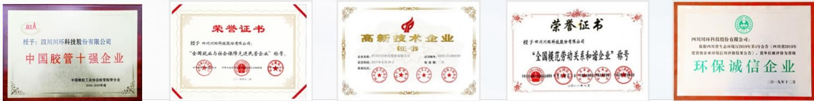

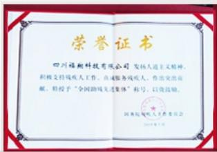

text_image

荣誉证书
四川绿斯科技有限公司 发行人道主义精神，
积极支持残疾人工作，自由服务残疾人，作出突出贡献，特授予“全国路域先进集体”称号，以资鼓励。
国务院残疾人关爱委员会
2018年5月

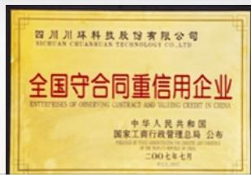

text_image

四川川环科技股份有限公司
SICHUAN CHUANGXIAN TECHNOLOGY CO.,LTD.
全国守合同重信用企业
ENTERPRISES OF OBSERVING CONTRACT AND VAILING CREDIT IN CHINA
中华人民共和国
国家工商行政管理总局 公布
CHINESE OF THE ASSOCIATION OF THE NATIONAL ASSOCIATION
二〇〇七年七月

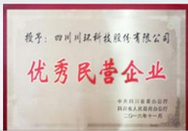

text_image

授予：四川同汇科技股份有限公司
优秀民营企业
中共四川省委办公厅
四川省人民政府办公厅
二〇一九年十一月

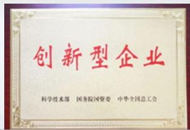

text_image

创新型企业
科学技术部 国务院国资委 中华全国总工会

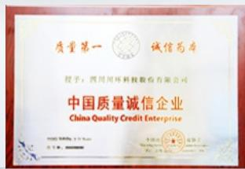

text_image

质量第一
CITIC 诚信智库
授予：四川川环科技股份有限公司
中国质量诚信企业
China Quality Credit Enterprise

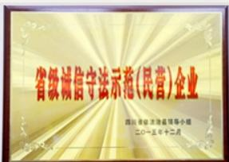

text_image

省级诚信守法示范(民营)企业
四川新安法律咨询领导小组
二〇一五年十二月

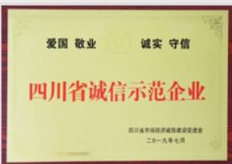

text_image

爱国 敬业 诚实 守信
四川省诚信示范企业
四川省市场经济诚信建设促进会
二〇一九年七月

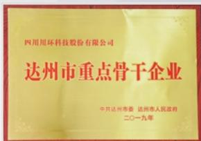

text_image

四川川环科技股份有限公司
达州市重点骨干企业
中共达州市委 达州市人民政府
二〇一九年

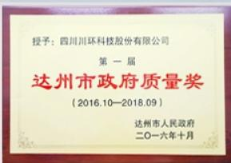

text_image

授予：四川川环科技股份有限公司
第一届
达州市政府质量奖
（2016.10—2018.09）
达州市人民政府
二〇一六年十月

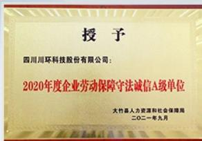

text_image

授予
四川川环科技股份有限公司：
2020年度企业劳动保障守法诚信A级单位
大竹县人力资源和社会保障局
二〇二一年九月

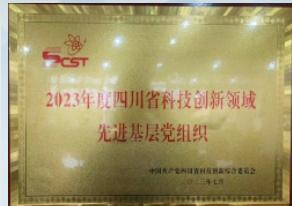

text_image

CST
2023年度四川省科技创新领域
先进基层党组织
中国共产党四川科普科技联盟委员会
二〇一七年

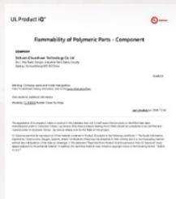

text_image

UL Product IQ®
Flammability of Polymeric Parts - Component
GOOG
Ulcan Chemical Technology Co Ltd
Nasdaq Global Financial Services LLC
Stock: 10000000000000
GOOG
Trading Companies and related companies
Nasdaq Global Financial Services LLC
Stock: 10000000000000
Stock: 10000000000000
Stock: 10000000000000
Stock: 10000000000000
Stock: 10000000000000
Stock: 10000000000000
Stock: 10000
Stock: 100
Stock: 1
Stock: 1
Stock: 1
Stock: 1
Stock: 1
Stock: 1
Stock: 1
Stock: 1
Stock: 1
Stock: 1
Stock: 1
Stock: 1
Stock: 1
Stock: 1
Stock: 1
Stock: 1
Stock: 1
Stock: 1
Stock: 1
Stock: 1
Stock: 2
Stock: 2
Stock: 2
Stock: 2
Stock: 2
Stock: 2
Stock: 2
Stock: 2
Stock: 2
Stock: 2
Stock: 2
Stock: 2
Stock: 2
Stock: 2
Stock: 2
Stock: 2
Stock: 2
Stock: 2
Stock: 2
Stock: 2
Stock: 3
Stock: 3
Stock: 3
Stock: 3
Stock: 3
Stock: 3
Stock: 3
Stock: 3
Stock: 3
Stock: 3
Stock: 3
Stock: 3
Stock: 3
Stock: 3
Stock: 3
Stock: 3
Stock: 3
Stock: 3
Stock: 3
Stock: 3
Stock: 4
Stock: 4
Stock: 4
Stock: 4
Stock: 4
Stock: 4
Stock: 4
Stock: 4
Stock: 4
Stock: 4
Stock: 4
Stock: 4
Stock: 4
Stock: 4
Stock: 4
Stock: 4
Stock: 4
Stock: 4
Stock: 4
Stock: 4
Stock: 5
Stock: 5
Stock: 5
Stock: 5
Stock: 5
Stock: 5
Stock: 5
Stock: 5
Stock: 5
Stock: 5
Stock: 5
Stock: 5
Stock: 5
Stock: 5
Stock: 5
Stock: 5
Stock: 5
Stock: 5
Stock: 5
Stock: 5
Stock: 6
Stock: 6
Stock: 6
Stock: 6
Stock: 6
Stock: 6
Stock: 6
Stock: 6
Stock: 6
Stock: 6
Stock: 6
Stock: 6
Stock: 6
Stock: 6
Stock: 6
Stock: 6
Stock: 6
Stock: 6
Stock: 6
Stock: 6
Stock: 7
Stock: 7
Stock: 7
Stock: 7
Stock: 7
Stock: 7
Stock: 7
Stock: 7
Stock: 7
Stock: 7
Stock: 7
Stock: 7
Stock: 7
Stock: 7

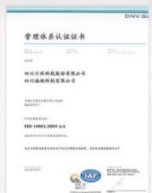

text_image

管理体系认证证书
四川润深科技股份有限公司
四川瑞福特轮有限公司
注册号：100000000000000000000000000000000000000000000000000000000000000000000000000000
经营范围：电子计算机、通信设备、仪器仪表、通讯器材、电子产品、办公设备、办公用品、办公家具、办公用品、办公用品、办公用品、办公用品、办公用品、办公用品、办公用品、办公用品、办公用品、办公用品、办公用品、办公用品、办公用品、办公用品、办公用品、办公用品、办公用品、办公用品、办公用品、办公用品、办公用品、办公用品、办公用品、办公用品、办公用品、办公用品、办公用品、办公用品、办公用品、办公用品、办公用品、办公用品、办公用品、办公用品
地址：四川省成都市锦江区人民中路238号
电话：486-888-8888 传真：(63)888-888-8888 电子邮箱：www.xuoxin.com
地址：四川省成都市锦江区人民中路238号
电话：486-888-8888 传真：(63)888-888-8888 电子邮箱：www.xuoxin.com
地址：四川省成都市锦江区人民中路238号
电话：486-888-8888 传真：(63)888-891-8917 电子邮箱：www.xuoxin.com
地址：四川省成都市锦江区人民中路238号
电话：486-888-8888 传真：(63)888-891-8917 电子邮箱：www.xuoxin.com
地址：四川省成都市锦江区人民中路238号
电话：486-888-8888 传真：
（注：此处仅注明“TAF”）

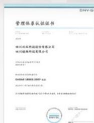

text_image

管理体系认证证书
四川润邦科技股份有限公司
四川润邦科技有限公司
中国证券登记结算有限责任公司
地址：四川省成都市锦江区人民南路188号
客服电话：95563
客户服务电话：95563
公司网站：www.cquae.com.cn
ISBN 978-130011-2007
电子邮箱：www.cquae.com.cn

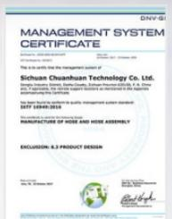

text_image

MANAGEMENT SYSTEM CERTIFICATE
ISSN: 2016-03-04
Volume 100
DNV-IGI
ISSN: 2016-03-04
DNV-IGI
Sichuan Chuanhuan Technology Co. Ltd.
Sichuan Industry Council, Huizhuang, Economic Research (CECS), A. B. China
P.O., Ltd. The United States Department of Statistics and Administration of the Scientific
autonomous the Certificate
www.sichuan.com
ISSN: 1989-05-2016
MANUFACTURE OF HOUSE AND HOUSE ABSEMBLY
EXCLUSION: 8.3 PRODUCT DESIGN

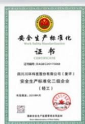

seal

四川环科科技股份有限公司
安全生产标准化二级企业
（轻工）

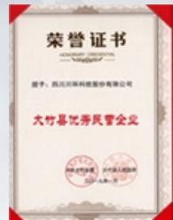

text_image

荣誉证书
GRANZY CERTIFICATE
授予：四川天环科技股份有限公司
大竹县优秀民营企业
特此公告。
2021年5月1日

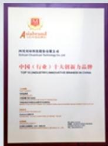

text_image

Alshengyuan Technology Co., Ltd.
中国（行业）十大创新力品牌
TOP 10 INDUSTRIAL AND COMMERCIAL BRANDS OF CHINA

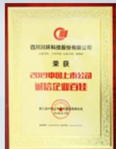

text_image

四川润环科技股份有限公司
荣获
2019中国上市公司
诚信企业百佳
第五届董事会第十六届全体董事会议

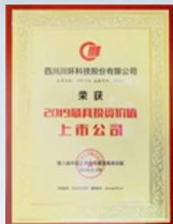

text_image

四川川环科技股份有限公司
荣获
2019最具投资价值
上市公司
浙江中联资产评估集团有限公司

# ESG战略与治理

# ESG战略定位

公司立足汽车零部件行业特性，结合新能源汽车、储能等新兴业务拓展需求，确立ESG战略：

环境 (E)

致力于绿色制造与低碳运营，通过工艺创新、能源结构优化和资源循环，降低产品全生命周期碳足迹，为新能源汽车及储能系统提供环保、高性能的零部件解决方案；

社会 (S)

打造安全、包容、有凝聚力的工作场所，保障员工权益与发展；与供应链伙伴共担社会责任；以安全可靠的产品与服务，护航交通出行与能源安全；

治理 (G)

将ESG理念融入公司治理与风险管理，坚守商业道德，提升透明度与合规水平，为ESG目标的实现提供坚实保障。

# 治理架构与职责

# ESG管理

川环科技紧密围绕“绿色、智能、安全”的核心发展理念，持续强化ESG管理，将ESG管理理念融入企业的生产经营管理全过程，深化环境、社会和治理方面履责，持续开展可持续发展能力建设，有效回应利益相关方的期望与关切，不断提升可持续发展管理水平。

# ESG管理架构

为深化ESG理念，践行ESG策略，提高公司可持续发展竞争力，搭建了权责清晰的“决策层-管理层-执行层”三层ESG管理架构，理清职责、角色及责任，保障ESG工作有序、高效开展，不断提升公司ESG管治能力。

<table><tr><td>ESG治理架构↓</td><td>责任方↓</td><td>主要工作内容↓</td></tr><tr><td>决策层</td><td>董事会</td><td>统筹可持续发展/ESG治理工作,全面监管公司ESG事宜</td></tr><tr><td>管理层</td><td>总裁办公室</td><td>制定监督公司ESG发展方向及策略,对与公司业务相关的重要ESG风险进行识别、评估及管理</td></tr><tr><td>执行层</td><td>ESG工作小组</td><td>负责ESG事务的具体落实</td></tr></table>

# ESG体系

川环科技在ESG治理领域持续发力，全方位提升ESG管理水平，积极探索建立适合公司的ESG管理架构，加强ESG能力建设，不断夯实ESG管理根基，致力于实现长期稳健发展，为股东、员工和社会创造更大价值。

# ESG议题

川环科技加强实质性议题管理，参考国内外政策要求、深圳证券交易所合规要求、ESG 规范标准、汽车零部件行业优秀实践等，结合自身发展战略和规划，识别出公司 ESG 重要性议题，从“影响重要性”和“财务重要性”两个维度进行排序分析，形成实质性议题矩阵。

# 建立议题池

在分析国内外 ESG、可持续发展宏观环境，研究国内外 ESG 报告编制指南，对标行业先进经验的基础上，结合公司发展战略与规划，收集和筛选出 ESG 议题。

# 议题排序

基于调研结果得出利益相关方高度关注的议题，并结合川环科技发展战略及面临的内外部发展环境，明确实质性议题的优先级顺序。

# 建立实质性议题矩阵

从“对川环科技可持续发展的重要性”和“对利益相关方的重要性”两个维度，对核心议题进行排序，形成实质性议题矩阵。

# 川环科技ESG实质性议题矩阵

# 高

- 反商业贿赂及反贪污  
- 平等对待中小企业  
- 利益相关方沟通  
党建引领  
- 环境合规管理  
- 数据安全与客户隐私保护  
- 反不正当竞争  
- 社会贡献  
- 污染物排放  
- 乡村振兴

- 创新驱动  
- 产品质量与服务  
- 员工  
- 供应链安全

# 影响重要性

- 尽职调查  
- 科技伦理  
- 水资源利用  
- 应对气候变化  
- 生态系统和生物多样性

- 能源利用  
- 废弃物利用  
- 循环经济

财务重要性

高

# 利益相关方沟通

公司深知利益相关方在企业可持续发展中的重要作用，并积极践行利益相关方参与原则。公司致力于构建高效的沟通机制，确保与各方保持顺畅交流，及时了解并回应其关切与需求，同时将其关注的核心议题融入公司运营与决策体系，以推动企业与各方的协同发展。

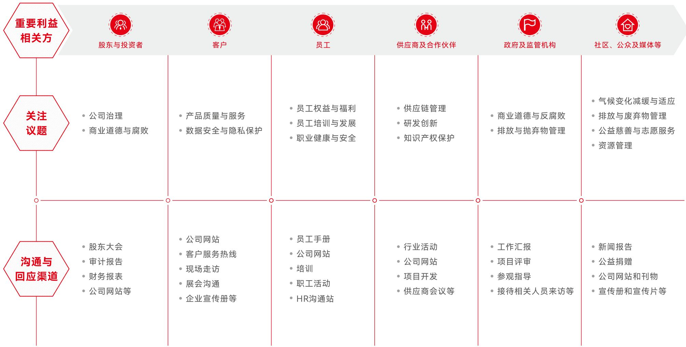

flowchart

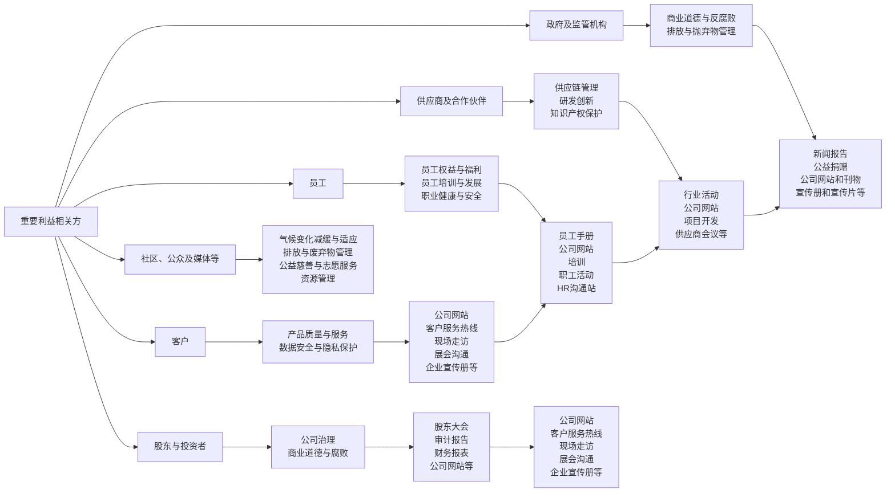

# E

# 环境维度

# 聚焦绿色生产与低碳转型

- 环境管理体系与合规  
- “碳中和”项目  
- 污染物减排成效  
- 环境监测与危险废物管理  
- 绿色发展承诺

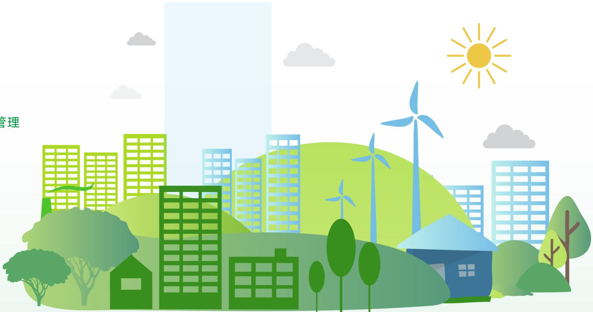

natural_image

Stylized illustration of a city with green buildings, wind turbines, and trees under a sunny sky (no text or symbols)

# 环境管理体系与合规

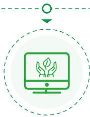

natural_image

Icon showing a computer monitor with hands holding a plant, enclosed in a dashed circular border (no text or symbols)

ISO 14001:2015环境管理体系认证

证书有效期
2024年4月 - 2027年4月  
认证机构
DNV（挪威船级社）  
认证范围车用橡塑软管及软管总成制造

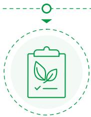

flowchart

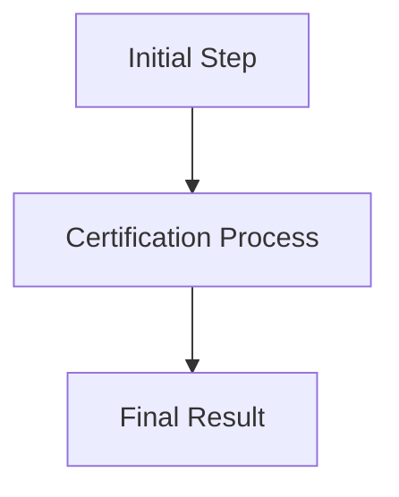

合规管理

《中华人民共和国环境保护法》  
《四川省工业领域碳达峰实施方案》  
《锅炉大气污染物排放标准》
GB 13271-2014  
ISO 14001:2015环境管理体系

natural_image

Green icon of a box with a leaf inside, enclosed in a dashed circular border (no text or symbols)

认证场所

四川川环科技
东柳工业园区
锦绣大道
柳桥路炼胶中心  
四川福翔科技大竹工业园区

# “碳中和”项目

# 锅炉"煤改气"技改项目

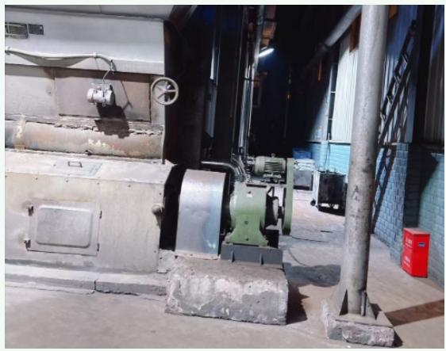

natural_image

Industrial interior with machinery and concrete pillars, no visible text or symbols

# 改造前

原有25t/h燃煤锅炉烟气排放量大

600万元

项目总投资

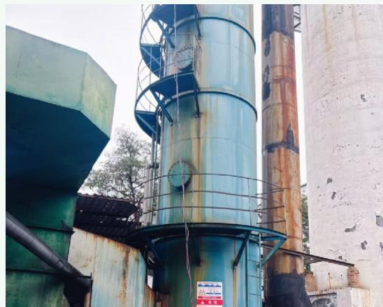

natural_image

Industrial silos and concrete structures with rusted metal panels, no visible text or symbols

# 改造中

主体设备吊装低氮燃烧器安装

88.5% SO₂减排率

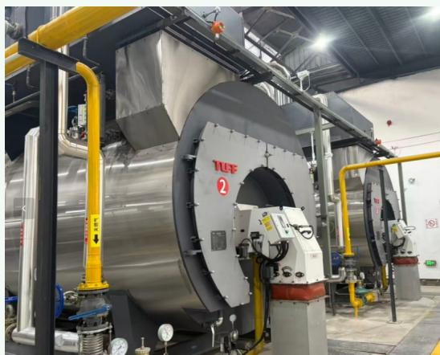

natural_image

Industrial thermal power plant with large metal tank and yellow piping (no visible text or symbols)

# 改造中

设备拆除中基础设施施工

84万元
环保投资（14%）

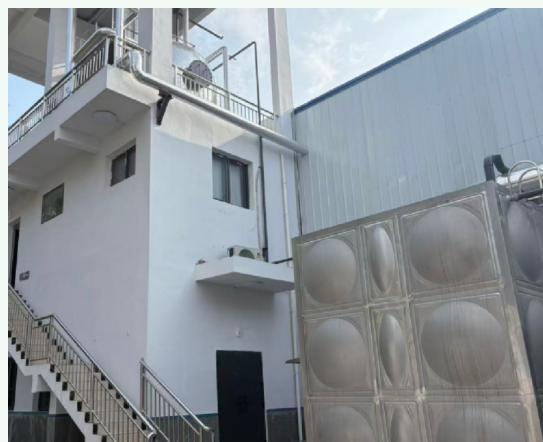

natural_image

Exterior view of a modern multi-story building with balconies and metal railings, featuring a large metallic panel structure (no visible text or symbols)

# 改造后

3台天然气锅炉低氮燃烧技术

87.4%颗粒物减排率

# 生物多样性管理方案

各部门同心协力，将生物多样性管理从"可选题"变为"必答题"

# 源头减量预防优先

- 绿色原料采购
建立供应商环保评估机制  
- 工艺优化减废
减少边角料产生  
- 包装减量化
  使用可循环包装材料

责任部门：采购部、项目部、品质部  
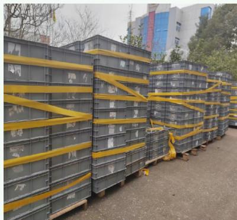

natural_image

Stack of metal crates with yellow tape wrapped around them, parked outdoors near buildings (no visible text or symbols)

# 过程控制精细管理

- 原料规范管理
密闭储存、防泄漏  
- 废水废气过程控制循环使用  
- 员工意识提升培训

责任部门：各分厂、生产部、设备部  
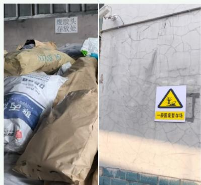

text_image

废胶头
存放处
一般固废管存储

# 末端治理达标排放

- 废弃物分类收集  
- 明确标识
塑料废料回收利用  
- 危险废物规范管理交有资质单位处置

责任部门：各分厂  
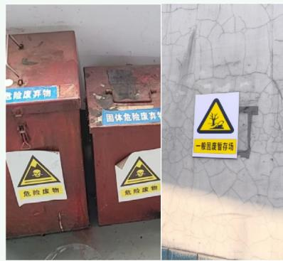

text_image

危险废物
危险废物
固体危险废物
危险废物
一般固废暂存场

# 生态修复主动补偿

- 保留厂区自然植被营造生态微环境  
- 厂区绿化
种植本地适生植物  
- 参与义务植树活动

责任部门：公司办  
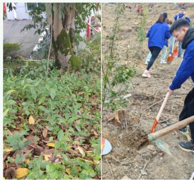

natural_image

Two outdoor scenes: left shows a tree with fallen leaves; right shows people planting trees and using shovels (no visible text or symbols)

# 污染物减排成效

"煤改气"前后污染物排放对比  
(单位：吨/年)  
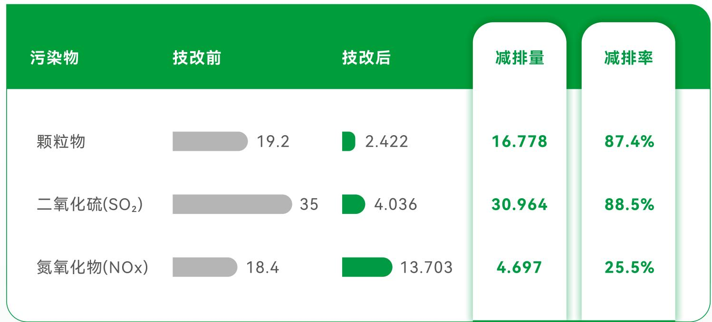

bar

| 污染物 | 技改前 | 技改后 | 减排量 | 减排率 |
| :--- | :--- | :--- | :--- | :--- |
| 颗粒物 | 19.2 | 2.422 | 16.778 | 87.4% |
| \(二氧化硫(SO_{2})\) | 35 | 4.036 | 30.964 | 88.5% |
| 氮氧化物(NOx) | 18.4 | 13.703 | 4.697 | 25.5% |

natural_image

Illustration of renewable energy sources including solar panels, wind turbines, and pine trees (no text or symbols)

# 其他环境效益

消除锅炉烟气除尘粉尘

1900吨/年

消除炉渣

6292.8 吨/年

消除脱硫滤渣

200吨/年

危险废物减排

0.4吨/年

# 环境监测与危险废物管理

季度环境监测 (2025年度)

<table><tr><td>Q1第一季度</td><td>Q2第二季度</td><td>Q3第三季度</td><td>Q4第四季度</td></tr><tr><td>废气</td><td>废气</td><td>废气</td><td>废气</td></tr><tr><td>废水</td><td>废水</td><td>废水</td><td>废水</td></tr><tr><td>噪声监测</td><td>噪声监测</td><td>噪声监测</td><td>噪声监测</td></tr><tr><td>全部达标</td><td>全部达标</td><td>全部达标</td><td>全部达标</td></tr></table>

危险废物管理

<table><tr><td>危废暂存间</td><td>面积:100m2,位于厂区北侧</td></tr><tr><td>危废种类</td><td>废机油(HW08,900-214-08)含废油的废棉纱及手套(HW49)废机油桶</td></tr><tr><td>处理方式</td><td>委托达州市新创环保科技有限公司处置</td></tr></table>

# 执行标准

《危险废物贮存污染控制标准》

GB 18597-2023

来源: 生态环境部

https://www.mee.gov.cn/ywgz/fgbz/bz/bzwb/dqhjbh/dqgdwrywrwpfbz/

# 排污许可证

证书编号

91511700740027188A001Q

有效期

2024.12.23 - 2029.12.22

# 绿色发展承诺

# 核心成果总结

# 环境管理体系

获得ISO 14001:2015认证

建立规范化环境管理体系

覆盖车用橡塑软管及软管总成制造

# 清洁生产投入

投资600万元实施锅炉"煤改气"技改

环保投资84万元 占比14%

# 主要污染物减排成效

颗粒物减排

87.4%

16.778吨/年

二氧化硫减排

88.5%

30.964吨/年

氮氧化物减排

25.5%

4.697吨/年

# 合规运营保障

2025年度四个季度环境监测全部达标，排污许可证有效期至2029年

危险废物规范处置率达100%

natural_image

Green line icon of a trophy with star and radiating lines, symbolizing award or success (no text or symbols)

# 未来展望

- 持续推进绿色低碳转型，落实四川省工业领域碳达峰实施方案要求  
- 加大环保技术研发投入，探索碳减排路径，助力双碳目标实现  
- 提升资源利用效率，构建循环经济体系，实现可持续发展

# S

# 社会维度

# 聚焦责任供应链与价值共创

- 员工权益保障  
- 供应链责任  
- 产品责任与客户  
- 社区与公益

natural_image

Illustration of a family of people including adults, children, and elderly in a park setting with bicycles, flowers, and a dog (no text or symbols)

# 员工权益保障

# 以人为本·价值共创

始终坚持"以人为本"的发展理念，通过完善的治理机制、公平透明的薪酬体系、全面的健康安全保障和系统化的培训发展，切实维护员工合法权益，实现员工与企业的共同成长

  
员工队伍：专业化与多元化的组织基石

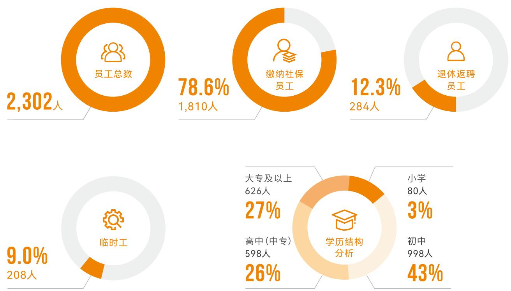

# 党建引领

党支部数量

党员人数

5↑

120名

通过党建与企业经营深度融合，有效增强员工凝聚力和归属感

# 管理层专业性与多元化

董事长

文琦超

代总经理

王宗武

独立董事

李平、何加明、张玉荀

# 全国模范职工之家

持续完善福利体系，员工满意度达

87分

# 薪酬福利与健康安全：全方位的员工关怀体系

# 薪酬福利体系

# 董事会专门治理

设立薪酬与考核委员会，由3名董事组成（含2名独立董事），确保薪酬分配公平透明

# 全员依法保障

与全体员工签订劳动合同，五险一金覆盖率100%，无欠缴漏缴

# 竞争力薪酬水平

2025年员工平均薪酬高于达州市制造业平均水平，实现员工与股东利益共享

# 完善福利体系

新增员工子女助学补贴、生日慰问等福利项目

# 包容性就业

子公司四川福翔科技有限公司作为福利企业，积极安置残疾员工就业，体现社会责任担当

# 职业健康安全管理

劳动防护用品

# 国家标准

防尘口罩、隔音耳罩等

健康体检

# 全员覆盖

含特殊岗位专项检查

# 管理体系与措施

严格遵守《安全生产法》《职业病防治法》等法规

定期开展安全教育培训、隐患排查治理和应急演练

持续改善作业环境，为一线员工配备符合标准的防护用品

# 夜间消防演习

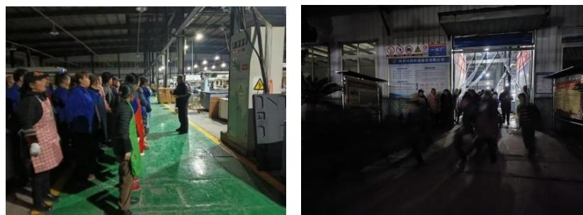

# 培训与发展：赋能员工成长的人才战略

# 多层次培训体系

# 新员工入职

企业文化

规章制度

三级安全

岗位技能

# 管理领导力

团队管理

决策能力

战略思维

# 专业技能提升

技术能力

工艺改进

质量管控

# 安全生产

安全规范

应急处理

职业健康

# 创新业务人才培养

重点围绕新能源汽车储能液冷、服务器液冷等新业务方向，开展技术研发人才专项培养计划，通过“师带徒”“内部轮岗”等机制，培养核心技术骨干，其中董事长文琦超先生凭借在科技创新领域的突出贡献，于上一年度入选“天府青城计划”科技创业领军人才项目

编号：川青城第1931号

# 天府青城计划证书

文琦超同志入选2024年“天府青城计划”科技创业领军人才项目，特颁此证，以兹鼓励。

中共四川省委人才工作领导小组
二〇一四年十二月

# 2025年培训成果

年度培训总时长

1676小时

人均培训时长

72小时

技术研讨会

8场

# 培训形式多样化

# 内部导师制

经验丰富的员工传帮带

# 外部专家讲座

行业专家分享前沿知识

# 技能比武

以赛促学

激发学习热情

# 内部轮岗

跨部门学习

培养复合型人才

# 供应链责任

# 构建可持续供应网络

深入践行"责任供应链与价值共创"理念，严格遵守《汽车零部件行业ESG披露指南》及IATF16949汽车行业质量管理体系要求，构建覆盖全链条的ESG管理机制

# 供应商ESG管理：从源头把控供应链可持续性

# 供应商ESG准入标准

# 环保合规

要求供应商符合环保法规

优先通过ISO14001认证

# 劳工权益

遵守劳动法规

禁止童工和强迫劳动

# 职业健康安全

建立安全管理体系

保障员工职业健康

# 反腐败要求

签署廉洁协议

建立商业道德规范

# 2025年供应商ESG审核绩效

一级供应商总数632家

含24家国际代理进口材料系供应商

审核合格率 100% 符合ESG标准要求

# 不合格供应商管理

针对审核不合格的供应商，要求其限期整改，整改完成前暂停新增订单合作，确保供应链ESG风险可控

# 管理层专业性与多元化

IATF16949 汽车行业质量管理体系

ISO14001 环境管理体系

ISO45001 职业健康安全管理体系（优先）

# 协同赋能与绿色采购：推动产业链价值共创

# 供应商协同赋能

# 环保培训

3场

培训场次

50家

覆盖供应商

# 现场交流

10家

组织核心供应商现场交流

分享质量合规、低碳生产经验

# 联合研发

积极推动上游供应商共同参与新能源汽车低碳供应链建设，通过联合研发环保橡胶配方、共享节能工艺经验等方式，提升整个产业链的可持续发展能力

# 采购合规管理

2025年采购总额

9.3亿元

(无税)

中小企业采购占比

70%

积极支持中小企业发展

# 合规管理体系

严格执行《采购管理制度》《反腐败政策》  
建立供应商廉洁档案，2025年无腐败采购记录  
通过多渠道举报机制、定期审计和绩效考核防范风险

# 绿色采购推进

优先采购符合 ROHS、REACH 等国际环保标准的可持续材料，推动绿色采购比例稳步提升，为构建责任供应链奠定坚实基础

# 采购原则

公平

公正

透明

绿色

# 产品责任与客户

# 质量与创新的双轮驱动

始终坚持"质量第一、创新驱动"的产品责任理念，严格执行IATF16949汽车行业质量管理体系要求，建立覆盖全生命周期的质量管控体系

# 供应商ESG管理：从源头把控供应链可持续性

# 质量安全

产品合格率96.3%

较2024年提升0.6个百分点

质量投诉管理

投诉数量56起，全部在规定时间内响应并妥善解决

双重检测制度

生产过程自检 + 成品第三方检测

关键产品安全管控

燃油系统管路

制动系统管路

新能源汽车液冷管路

# 创新与合规

研发投入5716万元

占营收比例 3.75%

技术攻关方向

新能源汽车储能液冷、服务器液冷等新兴业务方向

国际认证

\- 国六排放标准

\- EPA
- ROHS

\- 欧美DOT

• CARB

合规认证覆盖率 100%

144项

累计拥有专利

19项

发明专利

6项

著作权

# 客户服务

# 同步设计开发

建立"与主机厂同步设计开发"的服务模式，针对新能源汽车客户需求持续优化响应流程

# 快速响应机制

平均响应时间显著缩短，同步设计参与度保持较高水平

# 稳定客户关系

获得多家主流汽车主机厂的长期认可与合作，形成稳定共赢的客户关系网络

服务优势

专业技术支持

快速方案定制

高效售后服务

# 社区与公益

# 企业公民的责任担当

积极履行企业公民责任，立足四川省达州市大竹县生产基地，通过公益捐赠、志愿服务、税收贡献和就业带动等方式回馈社会，实现企业发展与地方繁荣的同频共振

# 公益投入与社会责任：回馈地方社会的多维实践

# 公益投入

现金捐赠

101万元（近三年）

# 公益重点领域

义务植树

安全宣讲

反诈科普

敬老助残

natural_image

Two hands holding a circular icon with a heart symbol, no text or symbols present

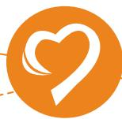

# 社会责任践行

合同履约率

100%

全年缴纳税收

1.05亿元

带动地方就业

2246人

通过本地化雇佣、产业链协同等方式带动大竹县及周边地区就业

# 包容性就业

子公司四川福翔科技有限公司作为福利企业，积极安置残疾人员就业，体现包容性社会责任

# 党建引领社区服务

依托5个党支部、120名党员的党建平台，组织党员先锋队参与社区服务，深化企业与地方社会的和谐共生关系

# 责任引领未来 共创可持续价值

# 川环科技将持续践行ESG理念

在员工权益保障、供应链责任、产品责任、社区公益等维度深耕细作  
以责任驱动创新，以可持续引领发展  
为构建更加美好的社会贡献力量

# 员工权益

以人为本 价值共创

# 产品责任

质量创新 客户至上

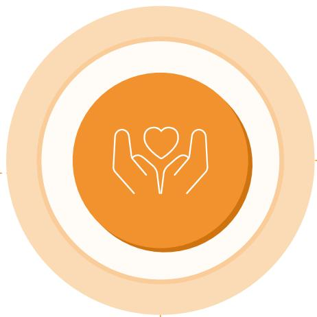

natural_image

Icon of two hands holding a heart within an orange circular frame (no text or symbols)

# 供应链责任

可持续供应 价值共创

# 社区公益

企业公民 责任担当

# G

# 治理维度

# 聚焦治理体系与合规管理

- 规范公司治理  
- 合规风险管理  
- 恪守商业道德  
- 坚持党建引领

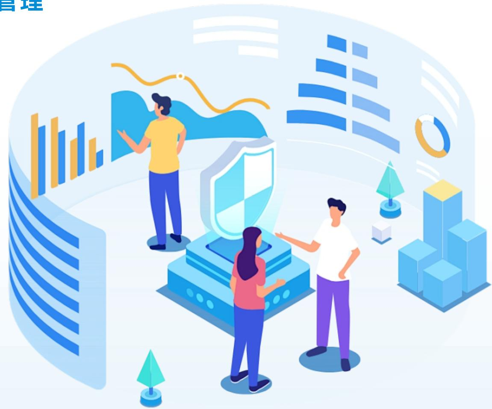

natural_image

Illustration of three people interacting with a digital security system and abstract data charts (no text or symbols)

# 规范公司治理

公司严格遵循《中华人民共和国公司法》《中华人民共和国证券法》《上市公司治理准则》等相关法律法规及规范性文件要求，构建起以《公司章程》《股东大会议事规则》为基础，以《投资者关系管理制度》《董事会秘书工作细则》等为具体规范的治理体系，明确各级治理机构决策、执行与监督等职责权限，持续优化股东大会、董事会、监事会及管理层间的职能分配，确保各主体职责清晰、权责平衡、相互制约且协同运作，不断提升公司治理效能。

# 治理架构

公司严格遵循《中华人民共和国公司法》《中华人民共和国证券法》《上市公司治理准则》《深圳证券交易所创业板股票上市规则》《深圳证券交易所上市公司自律监管指引第2号——创业板上市公司规范运作》等法律法规及规范性文件要求，构建起由股东大会、董事会、监事会及高级管理人员组成的公司治理架构，确立了权力机构、决策机构、监督机构与管理层之间协调制衡的运行机制，持续完善治理结构，稳步提升公司治理水平。

# 三会运作

# 股东大会

股东大会作为公司最高权力机构，肩负着监督公司经营活动、确保运营合规且契合股东利益、审议并决策重大事项的职责。公司严格依照《上市公司股东大会规则》《公司章程》《股东大会议事规则》等规定，规范召集、召开股东大会，平等对待全体股东，尽可能为股东参会提供便利，保障其充分行使股东权利。

# 报告期内

股东大会共召开

2次

审议通过议案

18项

# 董事会

董事会为公司经营决策机构，对股东大会负责。公司董事会设董事8名，其中独立董事3名,人数及构成符合《中华人民共和国公司法》等相关法律法规及《公司章程》规定。

董事会下设审计委员会、战略委员会、提名委员会、薪酬与考核委员会四个专门委员会。董事会及其成员严格依照《上市公司治理准则》《深圳证券交易所上市公司自律监管指引第2号——创业板上市公司规范运作》《董事会议事规则》等制度规范运作履职，按时出席董事会及股东大会，勤勉尽责履行各项职责与义务，主动参加相关培训以熟稔法律法规，全方位维护公司及全体股东尤其是中小股东的合法权益，持续完善公司治理机制，有力推动公司向规范化、现代化方向稳健发展。

# 报告期内

公司共召开董事会

3次

董事会成员出席率

100%

审议通过议案

31项

# 监事会

监事会为公司专职监督机构，现设监事3名，人员规模及构成完全符合法律法规规定。各位监事严格遵照《监事会议事规则》履职，秉持诚信、勤勉、尽责的原则，对公司财务状况及董事、高级管理人员履职的合法合规性开展监督，切实维护公司与全体股东的合法权益。

# 报告期内

公司共召开监事会

3次

审议通过议案

12项

注：根据2024年7月1日《公司法》新规，公司不在单独设置监事会，由审计委员会代行其职权。

# 保护投资者权益

# 股东回报

公司始终将股东权益保护置于重要位置，严格遵循利润分配政策要求，审慎制定利润分配方案，高度重视给予投资者合理回报，切实维护广大股东的合法权益。

公司依据《中华人民共和国公司法》《中华人民共和国证券法》及《公司章程》开展利润分配工作，进一步明确利润分配原则、形式、间隔、条件等事项，健全利润分配决策程序与机制、政策调整流程，并结合发展阶段设定差异化现金分红比例，强化中小投资者利益保护。

# 报告期内

公司派发现金分红5,989万元

# 信息披露

公司严格遵循相关法律法规，以及《信息披露管理制度》《深圳证券交易所创业板股票上市规则》《公司章程》等规定，真实、准确、完整、及时地履行信息披露义务，确保全体股东尤其是中小股东均能平等获取信息。

公司严格依照法律法规强化信息披露事务管理，指定《证券时报》《上海证券报》《中国证券报》《证券日报》及巨潮资讯网等为信息披露媒体，切实保障投资者知情权，维护全体股东公平获取公司信息的权利。

# 报告期内

共披露65份公告

# 投资者关系管理

公司高度重视投资者关系管理，积极维护广大投资者尤其是中小投资者的合法权益，严格依据《投资者关系管理制度》推进年度投资者关系管理工作，保障公司与投资者及社会公众的沟通合规、公平、高效。

公司由证券事务部统筹信息披露与投资者关系管理工作，主动开展投资者沟通交流。通过专线电话、专用邮箱、投资者互动平台、业绩说明会等多元渠道，充分保障广大投资者的知情权，助力其深入了解公司，构建良性互动关系，维护公司良好的资本市场形象。

# 报告期内

公司召开业绩说明会

2次

互动易沟通共

177次

专线电话沟通共

83次

# 合规风险管理

公司严格遵循《上市公司自律监管指引》等法律法规及行业标准，通过构建健全合规管理体系，确保各项业务合法合规，有效防范法律风险。同时，持续完善内部控制体系，强化源头治理，提升风险管理水平。

# 合规机制管理

公司严格恪守法律法规及监管要求，持续健全内部控制体系，制定《内部审计制度》《财务管理内部控制制度》《合同管理规定》《项目风险管理办法》《法律法规识别及合规性评价控制程序》《物料风险管理规定》《产品质量风险识别方法及管理控制》等一系列制度文件，聚焦业务流程关键节点明确内控标准与要求，引导各责任主体规范履职、有序运营，合理管控风险，推动内控规范落地，助力公司持续健康发展。

公司严格遵循《上市公司自律监管指引》等法律法规及相关要求，制定《内部控制管理制度》，构建由业务部门、法务管理部门、内部审计部组成的内部控制三道防线，切实提升合规管理效能，保障企业稳健前行。

# 依法纳税

公司严格恪守国家税收法律法规，按时完成纳税申报、足额缴纳税款，切实规避税务风险，积极履行纳税义务。公司不定期组织税务相关人员参与财税专业培训，以精进业务能力，更好应对复杂多变的税务工作。同时密切追踪最新税收政策动态，及时优化税务管理策略，保障涉税业务合规，防范化解税务风险。

# 报告期内

财税专业人员参与税务知识培训覆盖面

100%

培训人次

26人次

# 风险识别与评估

# 公司已搭建起完备的风险识别与评估体系

一方面系统梳理内部管理制度、业务流程及合同协议，另一方面密切追踪外部法律法规、监管政策与行业规范的动态变化，全面排查潜在合规风险。针对识别出的风险，公司深入分析评估，明确其等级与潜在影响，并据此制定精准应对措施，确保运营合规，保障业务稳健发展。

# 恪守商业道德

公司严格恪守《中华人民共和国刑法》《中华人民共和国反不正当竞争法》《中华人民共和国反垄断法》等法律法规，制定《廉政管理制度》《员工廉洁自律管理制度》《商业道德规范控制程序》，开展廉政教育活动、设立举报渠道，强化商业道德管理，弘扬廉洁文化，坚决抵制商业贿赂、贪污、垄断、不正当竞争、欺诈及利益冲突等违规行为，营造公正清明的商业环境。

# 培养廉洁文化

公司始终坚守廉洁经营的准则，通过构建健全制度体系、强化监督机制、深化员工教育与文化建设等多维举措筑牢廉洁防线。公司严格依据反贪腐与反舞弊相关法律法规，制定《员工廉洁自律管理制度》等完备制度，以此指导、规范员工行为，确保所有业务活动遵循诚信、透明原则。公司积极组织全体员工与管理人员签署《廉洁与自律承诺书》，开展《保密及反贪腐培训》、员工入职前进行商业道德培训、廉洁管理培训、关联关系申报教育，全员定期进行廉洁自检及廉洁培训深化廉洁文化建设，增强员工廉洁意识，营造风清气正的企业氛围，为公司和谐有序运营保驾护航。

# 报告期内

开展廉洁培训共

4场

培训

1364人次

# 反舞弊与举报

公司高度重视反舞弊体系与举报机制建设，已制定并严格执行《反舞弊与举报制度》。制度中明确了反舞弊工作的重点领域、职责分工，规范了舞弊事件的举报、调查、全流程处理要求，积极鼓励公司员工及各利益相关方，对内部违法违规、舞弊及其他损害公司形象与利益的行为进行举报投诉，全力杜绝舞弊行为发生。

公司内审中心负责设立职业道德问题及舞弊案件专用举报邮箱，并在公司官网对外公示，同时对举报及调查处理后的舞弊案件相关材料及时立卷归档。内部员工及外部相关人员可通过举报邮箱、总经理信箱、举报电话等多渠道举报内部舞弊线索。

# 公司郑重承诺

将对所有投诉人、举报人及其提供的信息严格保密，严禁任何形式的非法歧视或报复行为。对违规泄露举报人信息或实施打击报复者，将予以撤职、解除劳动合同处理；涉嫌违法的，移送司法机关依法追究法律责任。

# 反商业贿赂与反贪污

公司严格遵循《中华人民共和国刑法》《中华人民共和国反不正当竞争法》《关于禁止商业贿赂行为的暂行规定》等国家法律法规及指引，制定《商业道德规范控制程序》等廉政管理制度，对公司及员工在腐败贿赂、垄断与不正当竞争、内幕交易、利益冲突等方面的行为作出明确规范。

公司所有商业行为均以“公正交易”为准则，并主动向合作方通报商业道德规范。全体员工必须严格执行公司《反腐败反贿赂控制程序》，严禁收受贿赂、行贿他人，或暗中收受佣金及其他个人利益。任何涉及赠送、收取贿赂、回扣的活动须立即终止，并第一时间上报相关管理人员。回扣或贿赂泛指一切意图通过不正当手段谋取特殊待遇的行为，公司严禁员工参与任何与业务相关的受贿、回扣行为。

# 公司构建起反商业贿赂、反贪污的坚实防线

通过健全内部监控机制、优化透明业务流程，确保所有购销合作在公平公正的环境下开展；与供应商签订《廉洁合作承诺书》，明确双方权责，携手维护公平、公正、健康的商业环境。公司始终致力于营造风清气正的经营氛围，维护企业良好声誉，推动可持续发展，坚决杜绝任何损害公司利益、破坏合作信任的行为。

# 反不正当竞争与反垄断

公司严格恪守《中华人民共和国反垄断法》《中华人民共和国反不正当竞争法》等法律法规要求，始终遵循市场竞争规则，积极倡导并维护公平竞争的商业环境。公司坚决杜绝各类违反商业道德的行为，持续强化反垄断与反不正当竞争领域的合规管理，提升全员公平竞争意识，以公平、公正、公开原则，打造并维护公平有序的市场环境。

natural_image

Illustration of business professionals in a modern office setting, discussing laptops and tablets (no text or symbols present)

# 坚持党建引领

公司始终坚持党建引领，将党的方针政策贯穿企业发展全流程，充分发挥党组织核心作用，为企业可持续发展筑牢坚实保障。我们将绿色发展、社会责任与公司治理深度融入企业战略，推动党建工作与可持续发展目标同频共振，致力在绿色发展、社会贡献、公司治理领域发挥示范效应。通过强化党组织建设、丰富党建活动凝聚员工合力，公司锚定经济效益与社会价值双赢目标，为构建和谐社会、推动高质量发展贡献力量。

党总支

1↑

党支部

5↑

党员

120个

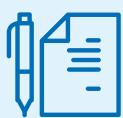

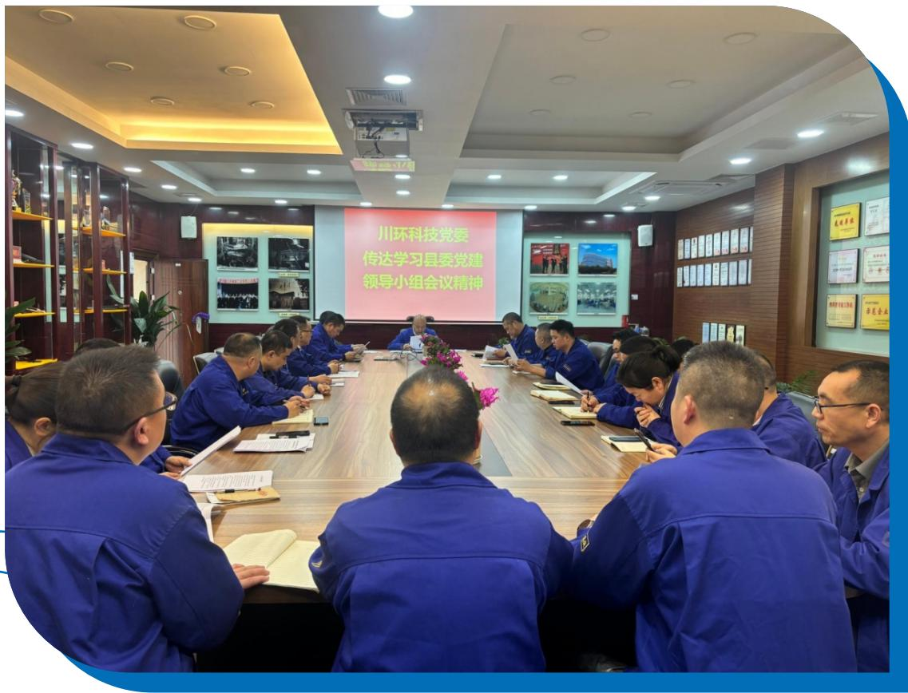

text_image

川环科技党委
传达学习县委党建
领导小组会议精神

# 附录

# 2026-2027 年 ESG 目标规划

# 环境（E）目标

持续巩固煤改气减排成果，稳定保持大气污染物达标排放

推进节能技改与能效提升，单位产值能耗持续下降

深化危险废物减量化与资源化，提升循环利用水平

落实四川省碳达峰要求，开展碳排查与碳管理基础建设

保持ISO14001体系有效运行，环境合规零处罚

# 社会（S）目标

员工培训覆盖率 $100\%$ ，人均培训时长稳步提升

供应商ESG 审核覆盖率 100%，合格率持续提升

产品质量持续提升，客户满意度稳步提高

扩大公益与乡村振兴投入，深化社区共建

# 治理（G）目标

持续优化三会一层治理，提升决策与监督效能

完善ESG治理架构，明确责任与考核机制

强化合规与内控管理，实现合规风险零重大事件

深化廉洁文化建设，反舞弊举报机制高效运转

提升信息披露质量与投资者关系管理水平

# 参考标准与索引

《深圳证券交易所上市公司自律监管指引第17号——可持续发展报告（试行）》

深交所创业板上市公司自律监管指南第3号

全球报告倡议组织GRI Standards

中国社科院CASS-ESG 6.0

联合国可持续发展目标SDGs

《中华人民共和国环境保护法》《安全生产法》《公司法》《证券法》

ISO14001/ISO45001/IATF16949/GB/T29490

《锅炉大气污染物排放标准》GB 13271-2014

《危险废物贮存污染控制标准》GB18597-2023

《汽车零部件行业 ESG 披露指南》

# 四川川环科技股份有限公司

# SICHUAN CHUANHUAN TECHNOLOGY CO.,LTD