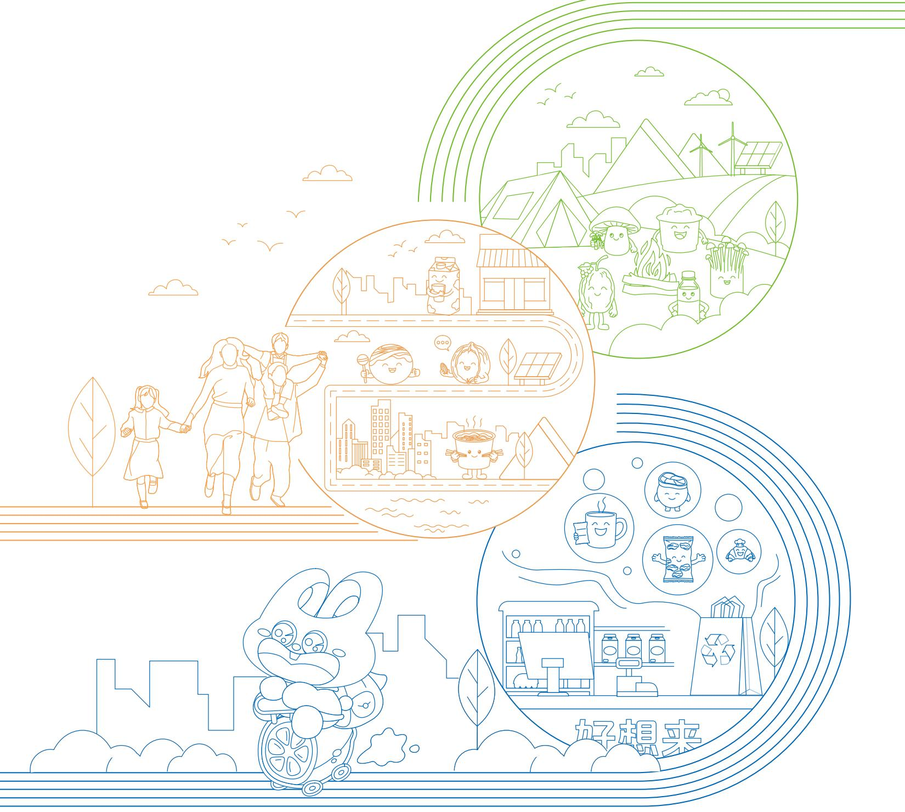

natural_image

Illustration of diverse urban and rural scenes with icons, including people walking, green landscapes, recycling bins, and a cartoon character (no text or symbols)

# 2025|环境、社会及公司治理(ESG)报告

福建万辰食品集团股份有限公司

# 目录

01 关于本报告  
03 董事长致辞  
05 走进万辰集团  
07 我们的 2025  
09 可持续发展管治  
83 关键绩效表  
85 指标索引表

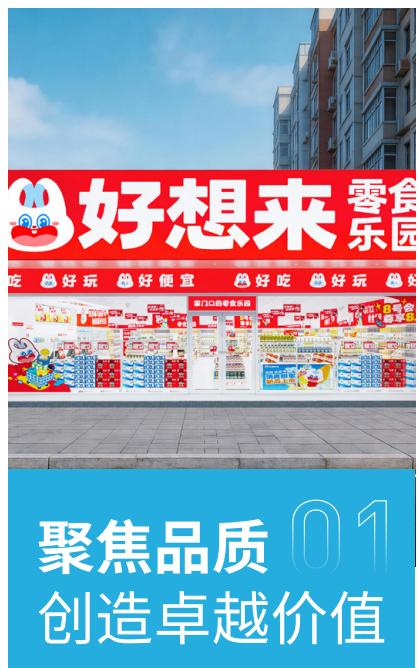

text_image

好想来零食
吃 好玩 好便宜 好吃 好玩 好
家门口零食乐园
聚焦品质 01
创造卓越价值

研发与创新 17

产品质量及安全 24

客户服务管理 29

责任供应链 33

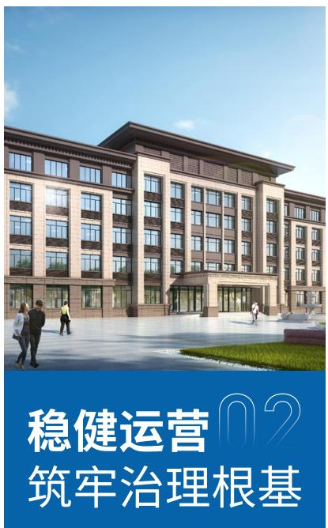

text_image

稳健运营
02
筑牢治理根基

公司治理 39

风险与合规管理 43

商业道德 45

数字化战略 48

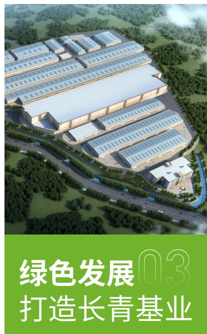

text_image

绿色发展03
打造长青基业

应对气候变化 55

循环经济 60

可持续运营 61

生态系统和生物多样性保护 64

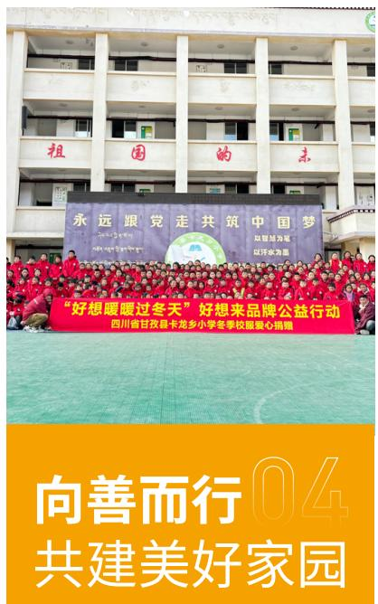

text_image

祖国的志
永远跟党走共筑中国梦
以好想为爱
以评水为国
“好想暖暖过冬天”好想来品牌公益行动
四川省甘孜县卡龙乡小学冬学校服爱心捐赠
向善而行04
共建美好家园

雇佣与多元化 67

培训与发展 72

健康与安全 76

公益慈善 81

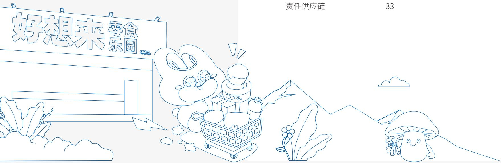

text_image

好想未来
责任供应链 33

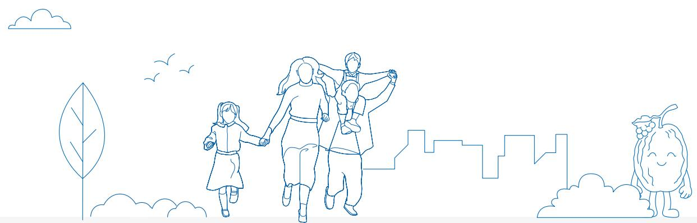

natural_image

Line drawing of a family walking outdoors with city skyline and clouds in the background (no text or symbols)

# 关于本报告

本报告是福建万辰食品集团股份有限公司公开发布的第一份 ESG 报告（以下简称“本报告”），旨在以更全面客观的方式披露本公司在可持续发展方面的理念、行动与成效，回应利益相关方关注的重要问题，接受各利益相关方的监督与建议，更好地提升公司 ESG 管理水平。

# 报告范围

# 组织范围

本报告范围与万辰集团年度合并财务报表范围一致。

# 时间范围

2025年1月1日至2025年12月31日。

# 报告周期

本报告为年度报告。

# 称谓说明

为了便于表述和阅读，在本报告中“福建万辰食品集团股份有限公司”（曾用名：福建万辰生物科技集团股份有限公司）也以“万辰集团”“公司”或“我们”表示。

# 可靠性保证

公司承诺本报告内容不存在任何虚假记载、误导性陈述或重大遗漏，并对其内容真实性、准确性和完整性负责。

# 信息说明

报告中所使用的全部信息数据来自公司正式文件、统计报告与财务报告，与财务报告不一致之处，以财务报告为准。如无特殊说明，本报告中所涉及货币金额以人民币作为计量币种。

# 编制依据

全球可持续发展标准委员会《GRI 可持续发展报告标准》（GRI Standards）；《深圳证券交易所上市公司自律监管指引第 17 号—可持续发展报告（试行）》；《深圳证券交易所上市公司自律监管指南第 3 号—可持续发展报告编制（2026 年修订）》；国家标准《社会责任报告编制指南》（GB/T 36001-2015）；联合国可持续发展目标（SDGs）。

# 编制原则

本报告符合以下“重要性”“平衡”“量化”和“一致性”原则。

<table><tr><td>重要性原则</td><td>公司开展重要性评估,以识别和评估对于公司业务、内部以及外部利益相关方的重要ESG议题,并在报告中进行重点披露。更详细的重要性评估过程以及结果,请参见本报告“议题重要性评估”章节。</td></tr><tr><td>平衡原则</td><td>本报告内容反映客观事实,对公司涉及的正面、负面信息均予以不偏不倚地披露,平衡地陈述公司在可持续发展各方面的努力。在报告期间内未发现应当披露而未披露且产生重大影响的负面事件。</td></tr><tr><td>量化原则</td><td>公司在本报告中披露ESG量化绩效指标,并在适用情况下设定了量化绩效目标。有关本报告中关键绩效的计量标准、方法、假设及/或计算工具、使用的转换因子来源均已在相应位置(如适用)进行说明。</td></tr><tr><td>一致性原则</td><td>本报告对同一指标在不同报告期内的统计及披露方式保持一致;若统计及披露方式有更改,将在报告附注中予以充分说明,以便相关方进行有意义的分析与评估。</td></tr></table>

# 报告获取

本报告以电子版形式提供。欢迎登录本公司网站（www.vanchen.com）或巨潮资讯网（www.cninfo.com.cn）查阅和下载电子版报告。

# 意见反馈

为不断改进报告编制工作，我们希望倾听您的意见和建议。如对报告内容有任何疑问和建议，可发邮件至 wanchen@wcswkj.com，或可致电 0596-6312889。

# 董事长致辞

2025 年，面对瞬息万变的市场环境和行业竞争态势，万辰集团凝心聚力、攻坚克难，不断提升经营效率，持续为消费者提供高质价比的产品和消费体验。这一年，我们踏上了可持续发展新征程，正式发布首份 ESG 报告，这不仅是万辰集团对可持续发展理念的系统践行，也是对所有利益相关方的责任回应与郑重承诺。站在可持续发展的新起点，我们将以诚信责任为底色、以规范治理为保障、以价值创造为目标，持续推动双主业高质量发展，与各方伙伴携手共进，共筑长期可持续的未来。

王丽卿

福建万辰食品集团股份有限公司董事长

# 铸 “辰” 品，以安心品质守护消费信赖

品质是食品企业的生命线，我们始终坚守舌尖安全底线，让优质产品触达更多消费者。我们持续完善质量管理体系，福建漳州和江苏南京两大生产基地均通过 ISO 9001 质量管理体系认证，将质量管理贯穿产品全生命周期，并在量贩零食板块搭建“安·质严选”食品安全管理体系，确保产品各环节都符合安全与品质要求。我们通过创新研发持续提升核心竞争力，根据业务板块特点及需求搭建创新管理体系，高效、有序开展研发创新活动。2025年，在量贩零食业务板块，打造“好想来超值”与“好想来甄选”两大自有品牌系列，推出单瓶售价仅 0.6 元的千岛湖水源的天然饮用水、系列无糖茶、独家风味玉米片、原切薯片等产品，迎合不同消费者需求；在食用菌业务板块，获评“国家种业阵型企业（阵型：破难题阵型，物种：食用菌）”，累计获得国家植物新品种权 6 项、福建省非主要农作物品种认定 16 项。

# 守“辰”规，以规范治理筑牢发展根基

规范透明的企业管治是企业可持续发展的根本保障。我们建立规范的治理架构和科学的议事规则，持续完善内部控制与风险管理体系，恪守商业道德，为集团高效运作、健康发展提供坚实保障。我们积极推动以“数智驱动、引领未来”为核心理念的数字化转型，明确三阶段实施路径，以七大核心系统领域为支点，全方位提升数字化水平。2025年，客服工单系统实现日均人效效率提升94.83%，研发效能平台实现发布效率提升81.25%。

# 绘 “辰” 绿，以低碳发展共筑永续未来

绿色发展是高质量发展的底色，我们积极响应国家“碳达峰”“碳中和”目标，积极推进节能减排、污染防治、循环利用等工作，制定能源使用效益、温室气体排放等环境管理目标，科学规划减排路径，将绿色理念深度融

入生产运营与供应链管理全过程，以实际行动守护生态环境，推动企业与自然和谐共生、协同发展。我们高度重视种质资源保护与利用，建有专业种质资源库，配备先进保藏设备，被评为“农业农村部食用菌育种重点实验室”，并建立“中国菌物学会万辰生物服务站”，守护珍贵食用菌基因资源。

# 践 “辰” 诺，以责任担当传递温暖情怀

企业发展离不开社会的滋养，我们始终把社会责任放在公司发展的重要位置，践行上市公司使命，承担社会责任，积极开展各项社会公益事业。我们积极参与乡村振兴事业，与福建省光彩事业促进会联合设立“万辰·光彩基金”，每年捐赠500万元，用于乡村振兴和贫困帮扶；携手多方打造“好想来音乐教室计划”“暖流行动”“好想暖暖过冬天”等公益品牌活动，为乡村儿童送去温暖关怀。此外，我们通过公益捐赠等方式，助力残疾人群体改善生活质量和青少年健康成长成才。2025年，我们向漳州市残疾人联合会捐赠30万元，向福建省青少年发展基金会捐赠100万元，向江苏省慈善总会捐赠300万元。

未来，我们将继续以规模与效率双轮驱动，坚持可持续发展理念，持续完善可持续发展管理体系，在产品品质上更求精进、在公司治理上更趋规范、在绿色发展上更为坚定、在社会贡献上更显担当，着力打造兼具商业价值与社会价值的责任标杆，携手各利益相关方共赴可持续发展新征程，共创美好新“辰”光！

# 走进万辰集团

福建万辰食品集团股份有限公司 2011 年成立于福建漳州，2021 年在创业板上市（股票代码：300972），主营涉及量贩零食和食用菌工厂化种植两大板块业务。其中，公司 2022 年正式进入量贩零食行业，于 2022-2023 年先后整合了五大区域龙头品牌，实现了供应链与品牌的统一。通过“规模扩张”与“能力建设”的双轮驱动，形成了“前端密度 + 后端效率”的协同效应，截至 2025 年底总门店数量超 1.8 万家，门店网络遍布全国 30 个省（含自治区、直辖市）；全国设立 48 个常温仓库及 9 个冷链冷库，拥有超百万平方米现代化物流仓和数字化供应链系统，有效保障了经营效率的稳步提升和单店盈利模型的可持续性，构筑公司的核心竞争壁垒。食用菌业务现有福建漳州和江苏南京两大生产基地，以现代生物技术为依托，采用工厂化方式生产食用菌，为消费者提供“绿色、环保、安全、优质”的食用菌产品。食用菌日产能达 382 吨，位于国内同行业前列。2025 年 8 月入选中国民营企业 500 强榜单，同时入选 2025 年中国服务业民营企业 100 强榜单。

natural_image

Line drawing of a frog with a bird, flowers, and a cloud in the sky (no text or symbols)

# 发展历程

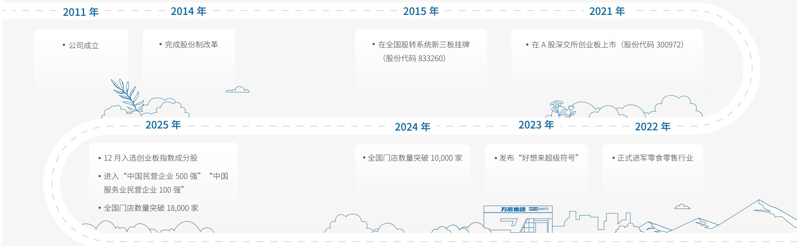

flowchart

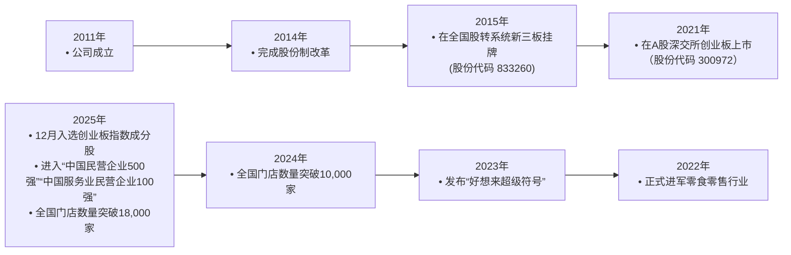
```mermaid
graph LR
  A["2011年\n• 公司成立"] --> B["2014年\n• 完成股份制改革"]
  B --> C["2015年\n• 在全国股转系统新三板挂牌\n(股份代码 833260)"]
  C --> D["2021年\n• 在A股深交所创业板上市（股份代码 300972）"]
  E["2025年\n• 12月入选创业板指数成分股\n• 进入“中国民营企业500强”“中国服务业民营企业100强”\n• 全国门店数量突破18,000家"] --> F["2024年\n• 全国门店数量突破10,000家"]
  F --> G["2023年\n• 发布“好想来超级符号”"]
  G --> H["2022年\n• 正式进军零食零售行业"]
```

# 企业文化

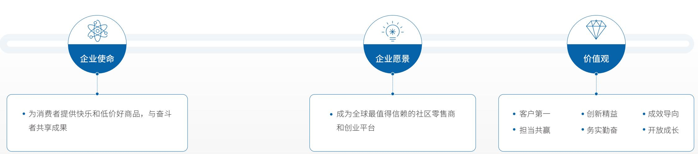

flowchart

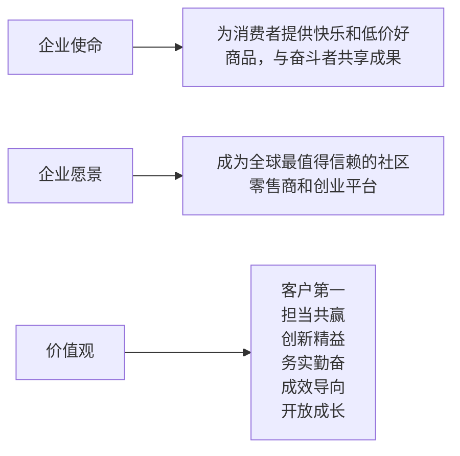
```mermaid
graph LR
  A["企业使命"] --> B["为消费者提供快乐和低价好商品，与奋斗者共享成果"]
  C["企业愿景"] --> D["成为全球最值得信赖的社区零售商和创业平台"]
  E["价值观"] --> F["客户第一\n担当共赢\n创新精益\n务实勤奋\n成效导向\n开放成长"]
```

# 我们的 2025

# 数说 2025

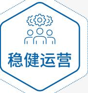

营业收入

514.59亿元

经调整净利润\*

25.68亿元

归母净利润

13.45亿元

# 稳健运营

资产总额

100.47亿元

独立董事占比

44.44%

信息泄露事件

0起

注：\*为加回计提的股份支付费用后合并财务报表净利润

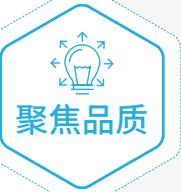

研发投入

5,433.32 万元

研发人员数量

230人

供应商总数

3,823 家

因安全与健康召回的产品数量

0件

累计获得有效期内专利授权数量

36项

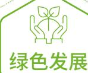

环保总投入

229.12 万元

废水排放合格率

100%

废气排放合格率

100%

温室气体排放密度（范围 1 和范围 2）

1.61吨二氧化碳当量/百万营收

废弃物合规处置率

100%

对外捐赠金额

523.52 万元

员工总数

9,073人

员工工伤保险投入金额

288.38万元

社会保险覆盖率

100%

员工培训覆盖率

100%

# 荣誉奖项

2025 年

中国民营企业 500 强

2025 年

中国食品工业重点企业 500 强

2025 年

中国服务业民营企业 100 强

2025 年

福建民营企业100强

2025 年

福建服务业民营企业100强

2025 年

第二届福建省农业产业化龙头企业 100 强

2025 年

农业产业化国家重点龙头企业

2025 年

证券时报“中国上市公司成长百强”

2025 年

每日经济新闻 2025 上市公司口碑榜

“大消费卓越竞争力上市公司”

2025 年

财联社年度最具影响力企业榜单

“最具品牌价值奖”

2025年6月

好想来品牌代言人檀健次官宣广告短片“好想来

多多来”荣获2025第十三届TOPDIGITAL创新

营销奖创意作品组金奖

2025年9月

好想来零食乐园荣获

抖音心动大牌日9月优秀商家

2025年10月

好想来零食乐园获得美团牵牛花

“2025 年度十佳品牌奖”

2025年11月

好想来零食乐园荣获中国食品工业

“十四五”高质量发展标杆企业

2025年12月

好想来零食乐园荣获中国餐饮创新头部品牌榜

休闲小吃 TOP 10

2025年12月

好想来超值果汁茶荣获每日经济新闻食品饮料行业

产品创新案例

2025 年

好想来零食乐园荣获抖音生活服务

年度最佳品牌奖

2025 年

好想来零食乐园荣获抖音生活服务

爱心好物公益商家

2025 年

好想来零食乐园荣获为爱黔行“年度爱心企业”

# 可持续发展管治

# 可持续发展治理架构

我们建立权责明确、运行高效的 ESG 管理架构，明确各层级、各部门的工作职责，完善 ESG 管理机制。2025 年 9 月，我们发布了《可持续发展（ESG）管理制度》，进一步加强公司可持续发展管理。

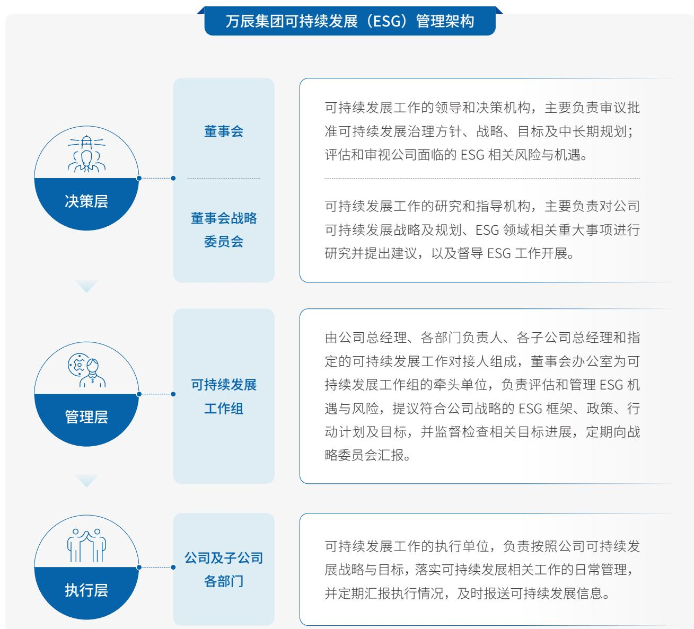

flowchart

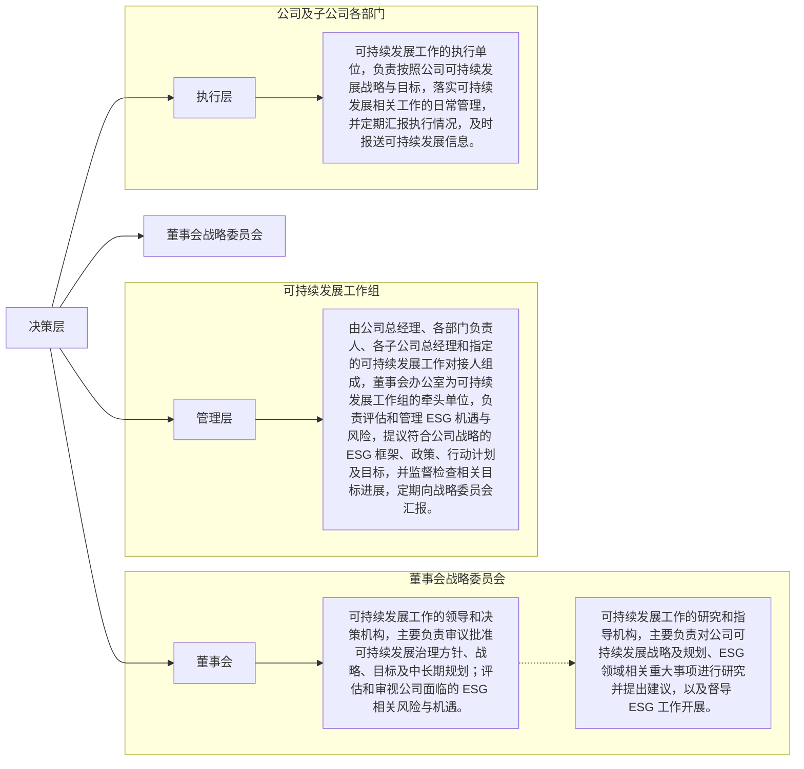
```mermaid
graph LR
  A["决策层"] --> B["董事会"]
  A --> C["董事会战略委员会"]
  A --> D["管理层"]
  A --> E["执行层"]
  
  subgraph Sub_1 [董事会战略委员会]
    direction TB
  B --> F["可持续发展工作的领导和决策机构，主要负责审议批准可持续发展治理方针、战略、目标及中长期规划；评估和审视公司面临的 ESG 相关风险与机遇。"]
    F -.-> G["可持续发展工作的研究和指导机构，主要负责对公司可持续发展战略及规划、ESG 领域相关重大事项进行研究并提出建议，以及督导 ESG 工作开展。"]
  end
  
  subgraph Sub_2 [可持续发展工作组]
    direction TB
  D --> H["由公司总经理、各部门负责人、各子公司总经理和指定的可持续发展工作对接人组成，董事会办公室为可持续发展工作组的牵头单位，负责评估和管理 ESG 机遇与风险，提议符合公司战略的 ESG 框架、政策、行动计划及目标，并监督检查相关目标进展，定期向战略委员会汇报。"]
  end
  
  subgraph Sub_3 [公司及子公司各部门]
    direction TB
  E --> I["可持续发展工作的执行单位，负责按照公司可持续发展战略与目标，落实可持续发展相关工作的日常管理，并定期汇报执行情况，及时报送可持续发展信息。"]
  end
```

# 利益相关方沟通

万辰集团高度重视并认真倾听利益相关方的期望与诉求，通过不断完善内外部沟通机制，确保与利益相关方的常态对话，及时了解各利益相关方的诉求，与各方建立长期、互信的合作关系。

<table><tr><td>利益相关方</td><td colspan="2">关注议题</td><td colspan="2">沟通渠道和方式</td></tr><tr><td>股东或投资者</td><td>·公司治理·内控合规与风险管理</td><td>·商业道德与反腐败·投资者权益保护</td><td>·股东会·路演与业绩说明会·投资者热线与邮箱·中小股东交流</td><td>·定期信息披露(财务年报、ESG报告、公众号、公司官网等)</td></tr><tr><td>政府及监管机构</td><td>·公司治理·内控合规与风险管理·商业道德与反腐败·气候变化与能源管理</td><td>·水资源管理·污染与废弃物管理·产品安全与质量</td><td>·专项会议或报告·政策咨询反馈·合规监管与检查</td><td>·定期信息披露(财务年报、ESG报告、公众号、公司官网等)</td></tr><tr><td>客户</td><td>·环境管理体系·产品安全与质量·负责任营销·优质客户服务</td><td>·内控合规与风险管理·商业道德与反腐败·可持续供应链·知识产权保护</td><td>·日常沟通·客户走访·客户审核·客户满意度调查</td><td>·定期信息披露(财务年报、ESG报告、公众号、公司官网等)</td></tr><tr><td>员工</td><td>·员工权益与福利·员工培训与发展·职业健康与安全生产</td><td>·产品安全与质量·加快数字化转型</td><td>·工会活动·员工培训</td><td>·员工满意度调查·员工交流反馈</td></tr><tr><td>合作伙伴/供应商</td><td>·研发设计与创新·产品安全与质量·内控合规与风险管理</td><td>·可持续供应链·信息安全与隐私保护·携手合作共赢</td><td>·日常沟通·交流互访·现场考察</td><td>·主题培训·供应商审核与沟通·行业研讨交流</td></tr><tr><td>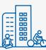社区与公众</td><td>·产品安全与质量·污染与废弃物管理·气候变化与能源管理</td><td>·信息安全与隐私保护·公益志愿与社区贡献</td><td>·社区沟通·媒体互动·行业论坛·公益志愿活动</td><td>·定期信息披露(财务年报、ESG报告、公众号、公司官网等)</td></tr></table>

# 议题重要性评估

为了准确识别与评估公司的重要议题，万辰集团基于公司业务发展现状，结合宏观政策、同行实践及国际主流资本市场ESG评级趋势，系统梳理了16项对公司和利益相关方具有影响的重要议题，并面向各利益相关方开展重要性议题调研，最终从“影响重要性”与“财务重要性”两个维度分析并形成公司的重要性议题矩阵，明确具备双重重要性的核心议题，在报告中进行重点披露和回应，并持续完善ESG管理，更好地满足利益相关方期望与诉求。

# 万辰集团双重重要性议题评估流程

# 梳理与识别

基于公司业务发展现状，结合宏观政策、同行实践及国际主流资本市场 ESG 评级趋势，系统梳理了 16 项对公司和利益相关方具有影响的重要议题。

# 调研与评估

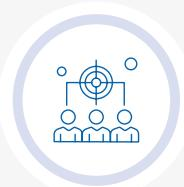

遵循双重重要性原则，开展“影响重要性评估”和“财务重要性评估”，形成2025年重要性议题矩阵，确定本年度重要性议题及其优先级。参与相关方包括董事、高管、员工、客户、供应商、投资者、监管部门、媒体以及公众等。

# 影响重要性

确定影响重要性评估因素与评分区间，由各利益相关方从影响规模、范围、不可补救性和影响发生可能性等因素评估公司重要性议题。

# 财务重要性

确定财务重要性评估因素与阈值，从议题是否预期在短期、中期和长期内对公司商业模式、业务运营、发展战略、财务状况、经营成果、现金流、融资方式及成本等产生重大影响等因素评估各议题财务重要性。

# 确认与回应

基于调研结果，从“影响重要性”以及“财务重要性”两个维度构建重要性议题矩阵，经由公司高层与外部专家的最终审阅与确认，确定ESG议题的优先级排序，并针对重要性议题在报告中重点披露其治理，战略，影响、风险和机遇管理，指标与目标等。

万辰集团重要性议题矩阵  
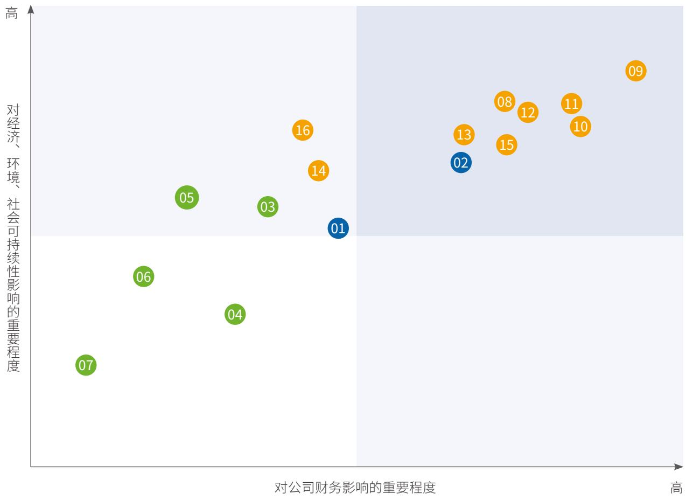

scatter

| Item | Importance to Company Financial Impact (X-axis) | Importance to Economic, Environmental, Social可持续性 (Y-axis) |
| --- | --- | --- |
| 01 | ~35 | ~40 |
| 02 | ~60 | ~50 |
| 03 | ~25 | ~45 |
| 04 | ~20 | ~30 |
| 05 | ~15 | ~50 |
| 06 | ~10 | ~35 |
| 07 | ~5 | ~20 |
| 08 | ~70 | ~75 |
| 09 | ~85 | ~80 |
| 10 | ~80 | ~65 |
| 11 | ~80 | ~70 |
| 12 | ~75 | ~70 |
| 13 | ~65 | ~60 |
| 14 | ~55 | ~55 |
| 15 | ~70 | ~60 |
| 16 | ~45 | ~65 |

# 治理维度

01 风险与合规管理  
02 商业道德

# 环境维度

03 环境合规管理  
04 应对气候变化  
05 资源使用与循环经济  
06 排放与废弃物管理  
07 生态系统和生物多样性保护

# 社会维度

08 产品创新与健康营养  
09 食品安全与质量管理  
10 客户服务管理  
11 信息安全与客户隐私保护  
12 供应链管理  
13 员工雇佣与多元化  
14 人力资本发展  
15 员工健康与安全  
16 社会参与

# 双重重要性议题风险与机遇分析

双重重要性 ESG 议题是万辰集团实现高质量可持续发展的核心指引，既关乎公司对环境、社会与治理的责任担当，也直接影响业务韧性、品牌价值与长期经营效益。公司将双重重要性议题深度融入食用菌种植、食品加工、量贩零食渠道运营全链条，把产品安全与质量、供应链管理、客户服务等核心议题，嵌入研发、生产、流通、销售及终端服务各环节，以 ESG 管理提升产业韧性、优化消费体验、巩固渠道优势，实现社会责任与业务价值协同发展，为食用菌与量贩零食双主业高质量发展提供持久动力。

<table><tr><td rowspan="2" colspan="2">双重重要性议题</td><td colspan="4">影响范围</td><td colspan="3">影响周期</td><td rowspan="2">风险</td><td rowspan="2">机遇</td><td rowspan="2">对应章节</td></tr><tr><td>上游</td><td>运营</td><td>下游</td><td>社区</td><td>短期</td><td>中期</td><td>长期</td></tr><tr><td></td><td>商业道德</td><td>✓</td><td>✓</td><td></td><td></td><td>✓</td><td>✓</td><td></td><td>门店网络的快速扩张与集中化的决策机制之间容易出现管控盲区,违反商业道德或将导致法律问题、财务损失、声誉受损等,进而导致消费者和投资者流失。</td><td>借助数字化手段,将反腐败从被动合规升级为主动治理,将有效提高商业道德治理能力,提升消费者和投资者的信任,提升公司声誉和品牌形象。</td><td>商业道德</td></tr><tr><td></td><td>信息安全与客户隐私保护</td><td></td><td>✓</td><td>✓</td><td></td><td>✓</td><td>✓</td><td>✓</td><td>信息数据及客户隐私泄漏可能带来合规风险,造成罚款等财务损失,同时侵犯客户权益,降低客户对公司的信任。</td><td>完善信息安全管理体系,保障信息系统、设备和数据的机密性、完整性和可用性,增进客户信任,提升公司声誉与市场份额。</td><td>数字化战略</td></tr><tr><td></td><td>产品创新与营养健康</td><td>✓</td><td>✓</td><td>✓</td><td>✓</td><td>✓</td><td>✓</td><td>✓</td><td>量贩零食板块自有品牌开发以供应商共创模式为主,若自有商品开发不足易陷入同质化竞争;食用菌板块若生物育种、智能化栽培投入滞后,技术优势可能减弱。</td><td>同时发挥海量门店与会员数据优势,以及国家级高新技术企业的技术积淀,及时响应消费者需求,将提升公司在行业内的竞争力与领先性。</td><td>研发与创新</td></tr><tr><td></td><td>食品安全与质量管理</td><td></td><td>✓</td><td>✓</td><td>✓</td><td>✓</td><td>✓</td><td>✓</td><td>量贩零食万店加盟网络若督导不足易现食安漏洞;食用菌生产品控疏漏可能导致菌菇质量良莠不齐,重创品牌信誉,还可能导致罚款造成财务损失。</td><td>持续完善质量管理体系和全链路透明管控,有助于赢得消费者的长期信任,增加客户黏性,打开新的市场机会。</td><td>产品质量及安全</td></tr><tr><td></td><td>客户服务管理</td><td></td><td>✓</td><td>✓</td><td></td><td>✓</td><td>✓</td><td></td><td>若加盟商服务标准执行参差不齐,或客诉响应不及时,可能导致大量客户流失,影响产能利用率与业绩稳定性。</td><td>良好的客户关系有助于降低获客成本,促进业务增长,促成新的商业机会,提升公司的市场表现与销售业绩。</td><td>客户服务管理</td></tr><tr><td></td><td>供应链管理</td><td>✓</td><td>✓</td><td>✓</td><td></td><td>✓</td><td>✓</td><td></td><td>质量风险、供应风险及合规风险等可能导致原材料短缺、业务中断、成本上升、交付延迟,影响业务连续性与市场竞争力。</td><td>构建高韧性供应网络,深度供应链协同能促进技术创新及产品优化,扩大竞争优势,提高利润。</td><td>责任供应链</td></tr><tr><td></td><td>员工雇佣与多元化</td><td></td><td>✓</td><td></td><td></td><td>✓</td><td>✓</td><td></td><td>员工基数庞大且一线岗位占比高,若劳动权益保障不到位,易引发劳资纠纷与舆情风险,可能导致员工流失率上升及生产稳定性受损,并影响企业声誉。</td><td>为基层员工提供规范的劳动权益保障,有助于提升员工满意度,维护公司与员工的关系。</td><td>雇佣与多元化</td></tr><tr><td></td><td>员工健康与安全</td><td></td><td>✓</td><td></td><td></td><td>✓</td><td>✓</td><td></td><td>职业健康与安全生产事故会对员工人身安全造成直接负面影响,违反相关法律法规或将带来罚款等财务损失,影响公司声誉与形象。</td><td>加强职业健康与安全管理,提供健康保障计划和安全的工作环境,能够提高员工的满意度和生产效率。</td><td>健康与安全</td></tr></table>

natural_image

Line drawing of a person reading a book under a gear and shield with a checkmark, set against cloud and gear icons (no text or symbols)

# 01

# 聚焦品质

# 创造卓越价值

贡献联合国 2030 可持续发展目标 SDGs

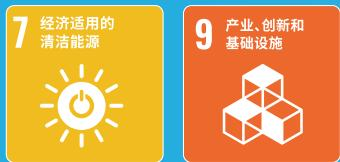

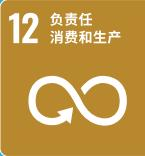

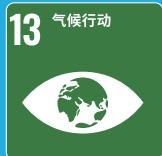

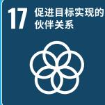

# 好想来零食乐园

好吃

好玩

好便宜

好吃

好玩

好便宜

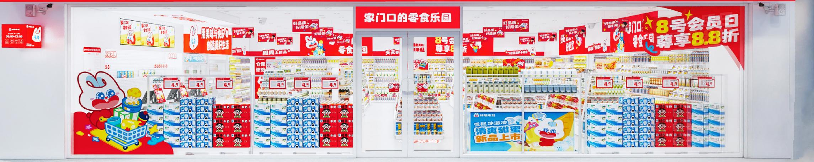

# 研发与创新

# 治理

万辰集团将研发创新视为提升核心竞争力、实现可持续发展的重要根基，根据量贩零食和食用菌两大核心业务板块的业态特性与发展需求，建立独立运营的创新管理体系，确保研发创新活动高效、有序开展。

量贩零食业务板块，由商品中心负责新品开发工作。我们以自有品牌商品差异化为核心理念，对产品的包装形式、名称、工艺、设计及配料表等方面设立了创新性要求，并配套建立了涵盖消费者测评、比价管理、首单流程、建品规范、试销管理及新品准入的全环节 SOP 体系，形成了从创意立项到市场落地的全套新品执行链路与管理标准。

食用菌业务板块，我们建立了权责清晰、协同高效的管理架构，并制定《研发管理制度》，规范研发全流程管理，该制度适用于集团研发中心、各生产工厂及下属子公司，内容涵盖日常基础研究项目和专项研发项目两类核心业务。此外，通过设立专项研发经费、实施薪酬倾斜与奖励、对核心技术骨干配套股权激励等方式为研发创新提供资金保障。

# 食用菌业务板块研发创新管理架构

# 管理层

\- 总经理及常务副总：负责制定研发战略、统筹研发资源，组织确立研发中心工作目标、项目计划与预算，协调跨部门协作、推动技术成果转化，直接管理项目部与市场部并联动市场需求优化研发方向。

# 研发执行部门

- 研发中心（核心研发端）：聚焦创新研究，开展食用菌菌种选育保藏与技术攻关，储备前沿核心技术，为产业化提供底层支撑。  
- 技术中心（技术转化与应用端）：承接研发成果推进产业化，优化生产技术与工艺，解决生产技术瓶颈。

# 支撑部门

\- 为研发工作提供全方位保障，人力行政中心负责研发人才队伍建设，品保中心把控研发产品质量标准与验证，项目部争取政策资金与荣誉支持。

知识产权管理方面，万辰集团严格遵守《中华人民共和国商标法》《中华人民共和国专利法》《中华人民共和国著作权法》《中华人民共和国种子法》等法律法规，制定《知识产权管理制度》《无形资产管理制度》《保密管理制度》等内部管理制度，并配备了专门负责知识产权事务的法务人员，负责统筹公司知识产权的申请、维护，强化知识产权布局，规范研发创新与知识产权管理工作。

# 战略与管理方式

# 研发创新管理

万辰集团高度重视研发创新管理，在食用菌业务板块，我们通过强化育种与菌种保藏技术巩固核心技术优势，加快新品种与工艺成果转化，深化产学研协同攻关，为高质量发展提供坚实的技术支撑与创新保障。

# 科研平台建设

我们设立研发中心，拥有较为系统的科研设施、科学仪器设备、种质资源保藏库和育种材料信息库，为育种研发工作提供有力支撑。从科研基础仪器到中试出菇测试设施，建立了较为完整的育种及出菇测试平台，在行业内金针菇、真姬菇育种方面处于领先水平，是植物新品种权授予数量最多的企业。我们还引入了液氮菌种保藏与超低温菌种保藏两项核心技术，持续优化组织分离工艺，有效保障公司核心菌种的稳定性与安全性。

我们拥有农业农村部食用菌育种重点实验室、全国学会创新驱动服务站、漳州市企业技术中心等科技创新平台，为食用菌产业技术升级与核心竞争力提升提供强劲动力。

# 荣誉

获评“国家种业阵型企业

(阵型：破难题阵型，物种：食用菌)”

是福建省唯一入选的作物企业

此外，我们与福建农林大学菌物研究中心等进行企科合作，重点开展金针菇、真姬菇育种工作，成功培育“农万金13号”“万金1号”等新品种金针菇。

natural_image

Line drawing of a smiling cartoon character holding a trophy with a star, set against a city skyline and leaf (no text or symbols)

natural_image

Laboratory setup with a beaker of clear liquid and droplets on top, no visible text or symbols

# 研发人才培养

在食用菌业务板块，我们建立公司统一领导、人力行政中心牵头、多部门协同的人才工作格局，推行竞争选拔机制，对科技创新人才重点培养、适时选用，鼓励员工进行行业交流，提供内部培训与外派培训机会，针对性提升创新能力，营造“尊重人才、人尽其才”的氛围。

# 科研人才培养与留任

构建 “H” 型人才发展双通道，实现专业技术人才与经营管理人才并行发展；提供全方位保障，改善工作生活环境、关注身心健康，通过座谈会、联谊会等增强人才归属感；以 “一流人才、一流业绩、一流报酬” 为原则，设立绩效奖金。

# 研发创新激励

通过物质激励（薪酬、奖金、股权、津贴）、精神激励（表彰）、机会激励（职业规划、晋升）等多元方式相结合，充分激发研发人员积极性；建立以创新为导向的绩效考核机制，将创新行为、成果转化纳入日常考核与晋升、职称评定依据，考核过程公开公平公正。

# 荣誉

王丽卿、李博

福建省高层次人才（A类）

王松

漳州市高层次人才（D类）

# 推动行业发展

作为国内食用菌工厂化生产领域的核心企业，我们深度参与食用菌全国性团体标准的制定工作，是《金针菇工厂化生产技术规程（T/ZSJX 1101-2019）》《真姬菇工厂化生产技术规程（T/ZSJX 1201-2019）》两项食用菌团体标准制定的参与起草单位、《鹿茸菇（T/ZSJX 5101-2023）》食用菌团体标准制定的核心起草单位，持续推动食用菌工厂化生产标准化、规范化发展，并逐步确立行业技术话语权与核心标杆地位。

累计参与制定食用菌团体标准

3项

# 领先创新突破

突破是抢占行业高地的关键路径，成果转化则是连接技术研发与市场价值的核心桥梁。我们始终坚持以市场需求为导向、以价值创造为目标，深耕核心业务领域，全力推动各类创新成果从实验室走向生产线、从技术储备转化为核心竞争力。

量贩零食板块，我们依托对消费者的洞察，与上游品牌厂商开展合作，开发自有产品，在好想来品牌下推出“好想来超值”与“好想来甄选”两大自有品牌系列，提供差异化产品，满足不同消费者的需求，强化公司品牌定位，提升公司竞争力。

# 好想来超值

# 核心定位：提供高性价比产品

如千岛湖水源的天然饮用水，每瓶仅售 0.6 元，上架半年多累计销售 1.2 亿瓶

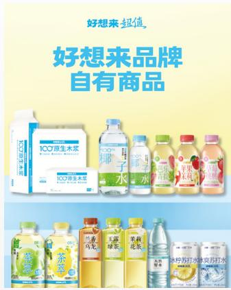

text_image

好想来超值
好想来品牌
自有商品

# 好想来甄选

# 核心定位：提供优质及差异化产品

如青提茉莉风味啤酒，是独特的东方风味与精酿工艺融合之作，赢得广泛年轻消费者的青睐

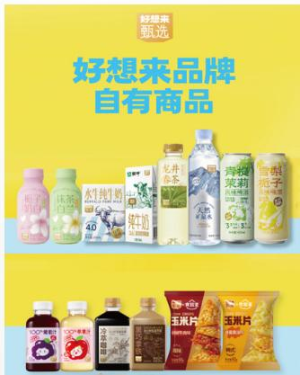

text_image

好想来
甄选
好想来品牌
自有商品
斯米
茶白
桂梨粉
龙井茶
青松茉莉
雪栀子
玉米片
玉渊片

食用菌业务板块，在成果产出与转化方面，杂交选育工作成效显著，其中2个金针菇新菌种、1个真姬菇新菌种成功应用于实际生产；工艺优化取得突破性进展，1项优化成果落地投产，2025年2个真姬菇新品种提交植物新品种保护申请，1个金针菇新品种提交DUS委托测试，1个真姬菇品种获得福建省非主要农作物品种认定。截至2026年1月底，金针菇和真姬菇共有25个申请植物新品种权，其中有6个金针菇新品种获得植物新品种权。

# 2025 年新品种食用菌

# 农万金9号

与福建农林大学菌物研究中心联合培育的工厂化栽培白色金针菇新品种，于2025年11月20日获得农业农村部授予的植物新品种权，已应用于生产。

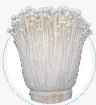

# 农万真 5 号

与福建农林大学联合选育的真姬菇新品种，于2025年12月22日通过福建省非主要农作物品种认定，是公司生产应用的重要真姬菇品种之一。

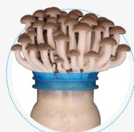

# 万金3号

公司自主培育的金针菇新品种，于2024年12月26日获得植物新品种权认定，2025年1月2日农业农村部第863号公告正式授予植物新品种权。

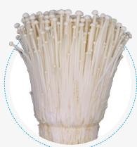

# 万真1号

公司真姬菇新品种，于 2025 年全面替代生产应用蟹味菇菌种。

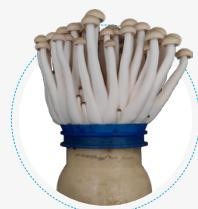

# 产品营养与健康

近年来，随着人们健康意识的提高和生活方式的改变，健康食品成为更多消费者的选择。万辰集团始终以消费者健康需求为核心，把握健康食品产业发展机遇，持续打造绿色、安全的健康产品矩阵。

# 量贩零食业务板块：精简配料、营养升级

我们始终坚持围绕“安心、省钱、好吃”理念推进自有品牌的产品开发。其中，“安心”不仅要求产品品质对标行业头部水平，更在营养健康方面针对不同品类制定细分标准，以“精简配料、营养升级”推动产品持续迭代升级，持续守护消费者的营养与健康。

# 供应链源头管理

与核心供应商、原料商建立“健康原料联合研发机制”，溯源到原料起点，优先选购更为优质、非转基因、有机认证、优质植物蛋白等天然原料。

# 产品配方升级革新

对标现有配方或市场明星产品进行配方升级，实现减糖、0反式脂肪酸添加、0防腐剂添加等，并获得第三方机构的有机认证。

# 产品矩阵完善

根据目标消费人群的健康需求，针对性补充开发营养强化产品。

# 数字化生命周期管理

将产品健康指标的消费者反馈纳入产品周期评估体系，回收定性与定量反馈，对不符合健康指标要求的产品进行下架或产品升级。

# 健康零食标签

# 减糖

针对现有产品系列配方，多采用“无糖”“低糖”或“减糖”配方优化，同时在营养成分信息中明确标识出糖的含量。如：好想来超值100%生榨椰子汁采用低糖配方、好想来甄选100%果汁系列在包装正面标识出口味酸甜度等。

# 低脂 / 零脂

好想来甄选咖啡系列配料干净，低脂低卡，同时保留柔和风味不苦涩。

# 少添加 / 零添加

核心聚焦在休闲食品类目，实现产品配料表的精简与优化。如：原切猪肉脯0色素、0防腐剂添加，好想来甄选风味坚果系列0反式脂肪酸，好吃无负担。

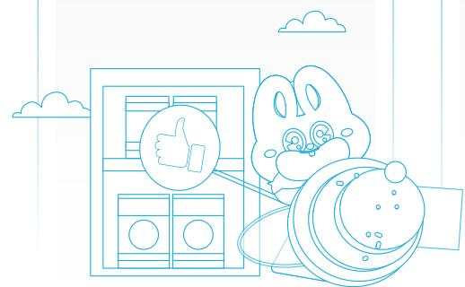

natural_image

Line drawing of a cartoon character interacting with a digital display showing thumbs-up and food icons (no text or symbols)

# 食用菌业务板块：0 农药 0 化肥健康产品

我们将营养品质作为品种选育重要指标。针对自主选育的新品种，集团建立了育种技术体系，包含氨基酸等营养成分的检测，全面比对营养价值。目前，相关产品正积极申请绿色食品认证，从品种选育到应用，全链条严控产品品质，以实际行动践行 ESG 理念，为消费者提供可信赖的优质食用菌产品。

# 知识产权保护

我们制定了完善的知识产权的管理制度，规定了公司商标、著作权等知识产权在品牌产品、包装、广告宣传等方面的使用规范；搭建精细化知识产权资产台账，对现有专利、商标等实施全生命周期管理，及时完成年费缴纳、续展等维护工作，确保知识产权资产有效存续；对核心品牌标识实施全面保护，通过持续创新与知识产权布局保障公司可持续发展。2025年，公司未发生重大知识产权纠纷。

在与第三方的合作协议中，我们注重双方知识产权的保护，明确知识产权的使用范围、方式、期限等，积极维护双方的知识产权，并与核心伙伴、供应商等签订知识产权保密及权属协议，防范合作过程中的知识产权泄露风险。

此外，食用菌业务板块组织开展了知识产权专题培训，讲解 2025 年《中华人民共和国种子法》修订条款，强化员工知识产权保护意识，提升种业合规管理水平。2025 年，举办知识产权专题培训 1 场，参与培训 23 人次。

# 影响、风险和机遇管理

针对研发阶段的产品安全质量风险，我们制定《金针菇菌种选育流程规范》《真姬菇菌种实验与菌种切换操作规范》等内部管理制度，从源头防范技术偏差与安全风险，保障菌种稳定、安全、可靠，为产品质量与研发创新提供坚实的制度支撑。

针对知识产权风险，我们对各部门均制定相应的管理制度，对参与人员进行培训，防止相关核心知识产权流出；与多家知识产权代理机构、律师事务所建立了长期合作关系，实现风险识别全覆盖、方式多元化、管理精细化，保障公司核心利益。一旦发现知识产权侵权行为，立即对侵权行为进行评估，确定侵权的性质、范围和影响程度，根据评估结果制定应对策略并收集证据，包括发函警告、协商谈判、行政投诉、司法诉讼等。

natural_image

Line art illustration of a justice scale, clipboard, and gavel under a cloudy sky (no text or symbols)

# 指标与目标

目标

<table><tr><td>管理目标</td><td>2025年完成情况</td></tr><tr><td>全年无重大知识产权侵权纠纷</td><td rowspan="2">目标已完成</td></tr><tr><td>全年无知识产权相关行政处罚</td></tr></table>

指标

研发管理

<table><tr><td>研发投入</td></tr><tr><td>5,433.32万元</td></tr></table>

研发人员数量

<table><tr><td>230人</td></tr></table>

研发投入占营业收入比例

<table><tr><td>0.11%</td></tr></table>

研发人员占比

<table><tr><td>2.53%</td></tr></table>

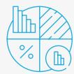

研发成果  
累计获得国家植物新品种权

<table><tr><td>6项</td></tr></table>

累计获得福建省非主要农作物品种认定

<table><tr><td>16项</td></tr></table>

知识产权  
年度新增专利申请数量

<table><tr><td>2项</td></tr></table>

年度新增专利授权数量

<table><tr><td>2项</td></tr></table>

累计获得有效期内专利授权数量

<table><tr><td>36项</td></tr></table>

其中获得有效期内发明专利授权数量

<table><tr><td>15项</td></tr></table>

年度新增软件著作权数量

<table><tr><td>13项</td></tr></table>

累计获得软件著作权数量

<table><tr><td>24项</td></tr></table>

# 产品质量及安全

# 治理

品质是万辰集团最引以为傲的资产。我们持续完善产品质量管理体系，以确保我们产品在全生命周期内的安全性与可靠性。

量贩零食业务板块，我们制定《店铺食品安全管理制度》《仓端商品到货检验规程》《商品留样观察流程》等内部管理制度，形成从仓储到销售的无缝管控。为保障食品安全工作的有效落实，我们成立品控中心，涵盖供应链食安管理部、物流食安管理部、店铺食安管理部、商品品质管理部、体系合规部等职能部门，并设立区域品控部，协调公司相关部门资源，共同开展食品安全风险防范及应对工作。在产品质量管理方面，搭建了涵盖商品部、品控部、物流部等职能部门的组织架构，各部门分工协作、各司其职，扎实推进产品质量管理，全力保障产品品质。

食用菌业务板块，我们制定《进货检验规范》《成品检验规范》《化验室检验规范》《环境落菌检测规范》等涵盖从生产、加工到出厂的全流程质量管控专项制度，规范产品的验收标准、储存环境控制及在库自查要求。我们以品保中心作为质量管理部门，全面策划及落实质量目标，建立健全质量管理体系和质量检验标准，开展质量安全和质量管理活动，确保公司产品质量满足顾客和法律法规要求，并得到持续的改进和提升。

# 认证

福建万辰食品集团股份有限公司、南京金万辰生物科技有限公司通过 ISO 9001 质量管理体系认证

福建万辰食品集团股份有限公司通过 HACCP 体系认证

# 战略与管理方式

# 全生命周期管理

我们始终坚守品质底线，严控产品的安全与质量，不断提升产品品质，赢得消费者的信任和口碑。2025年，未发生产品和服务相关的安全与质量重大责任事故或负面事件。

食用菌业务板块，我们针对金针菇、真姬菇、鹿茸菇三大主流食用菌均制定详细的生产工艺说明，确保生产全流程标准化作业，严格落实原料入厂、过程质量监控、成品出厂检测、储存运输等关键管控节点，全面保障产品品质稳定与食用安全，以系统化、闭环式的质量管控筑牢产品安全防线，为消费者提供“绿色、环保、安全、优质”的食用菌产品。

量贩零食业务板块，我们建立了覆盖“商品选入-生产过程-仓储物流-加盟门店-产品售后”的端到端质量管控体系，致力于为客户提供安全、可靠、高品质的产品与服务。

# 供应商质量管理

构建覆盖准入、评估、监督、退出的供应商质量管理体系，从源头把控食品安全风险。

# 加盟门店质量管理

建立覆盖进货查验、存储管理、终端销售至顾客售后处理的食品安全管理体系，确保加盟店运营符合法律法规及品牌标准。

# 仓储物流质量管理

建立了商品入仓质检及在库过程抽检管理机制，严把商品入门第一关。

# 售后管理

针对产品客诉处理，公司建立了三级约谈、精准专项排查与榜单处罚三项核心机制，构建从响应、分析到整改的高效闭环。

# 食品安全管控

量贩零食板块，我们构建了贯穿全链路食品安全管理标准，以“四严四检”为抓手，形成全面的“安·质严选”食安管理体系，不仅严选供应商、严查资质、严选商品、严查现场，而且在食安管理过程中通过视频巡检、入仓质检、门店自检、商品抽检为食安管理提供保障，确保商品从生产到销售的各个环节都能符合安全与品质要求。

# “安·质严选”食安管理体系

# “四严”

# 严选供应商

合作供应商均需通过食品安全风险和质量水平综合评估。

# 严查资质

合作供应商的资质证件及商品的检测报告均通过严格的审查。

# 严选商品

合作的商品送往专业的检测机构进行测试、甄选，并提供产品型检报告、商品标签检测报告、商品营养成分检测报告。

# 严查现场

深入生产现场，对原料来源、生产环境、生产工艺、质量管理体系等进行系统性评估。

# “四检”

# 视频巡检

利用远程视频技术实时抽查高风险供应商，监督商品的生产过程。

# 入仓质检

搭建并推广仓库商品入仓质检机制。

# 门店自检

建立店铺食安标准体系与食安稽核机制，商品上架前门店进行商品检查，并定期开展巡查。

# 商品抽检

联合专业检测机构在门店内对商品进行动态抽检，重点关注商品的感官、理化安全指标。

# 产品召回

万辰集团高度重视产品召回与追溯体系建设，推动两大业务板块建立健全标准化召回管理体系，并常态化开展实战演练，持续提升应急处置能力，确保食品安全风险得到快速有效管控。报告期内，公司无因质量问题而发生任何重大产品召回事件。

量贩零食业务板块，我们依据《商品质量异常处置流程》执行召回程序，并制定了分级召回机制，对于紧急召回产品，确保24小时内启动召回程序并通过多渠道发布通知。所有召回产品均须隔离存放并按照《不合格品控制程序》处理，同时对召回原因进行彻底调查并实施整改措施。2025年，组织开展覆盖全国门店的产品召回演练1场。

食用菌业务板块，我们制定《产品召回操作规范》，以降低因产品质量缺陷等问题导致交付后不安全产品带来的食品安全危害，确保能够完全、及时地召回不合格产品。2025年，组织开展假设顾客投诉导致的召回演练1场。

# 产品召回程序

建立召回小组，

规定其职责权限

待召回产品的

识别和评价

召回产品

启动

产品召回的处理

产品召回的结束和报告

# 数智化赋能质量管控

公司以数字化赋能自身全生命周期质量管理，为质量控制提供依据，实现风险的快速识别与应对，提升产品质量管理效率和准确性。

# 案例

# 冷链温控数字化，系统监控质量风险

为建设食品安全保障体系，针对冷链运输环节的温度监控与风险预警需求，我们启动了冷链温控数字化项目。项目通过接入温度控制设备，设置自定义双温区预警规则，实现运输全流程温度监控与异常主动预警；同时与现有仓储管理系统对接，实现数据实时采集与分析。目前，该项目已在试点冷链仓完成验证，并在多家子公司冷链仓全面推广应用。项目实施后，冷链运输食品安全保障能力显著提升，成功实现从人工抽检向系统主动监控的转型，有效降低冷链环节质量风险。

natural_image

Line drawing of a cartoon dinosaur driving a truck with trees and clouds in the background (no text or symbols)

# 质量文化建设

我们积极建设全员参与的质量文化，定期为员工提供主题培训，鼓励员工将质量管控意识融入日常工作环节，提升全员质量意识，切实提升公司管理效能和产品质量。

量贩零食业务板块，我们开展了覆盖品控人员、合作供应商、商品采购、仓储物流、运营及加盟商、客服人员的质量控制专项培训，对食安法规、食安操作规范、应急处理等主题内容进行培训。2025年，开展质量控制专项培训82场，参训人员超2.8万人次。

食用菌业务板块，通过每年至少开展 10 次线下质量培训，覆盖全体质量相关人员；每月组织开展公司级质量分析会议和非正式线上讨论会；每周开展一次基层人员质量早会等常态化质量培训，持续提升员工个人技能与质量意识。

# 加盟商管理

针对加盟商，我们制定了一套覆盖意向咨询、建店筹备、开业运营、持续赋能的全链路标准化服务体系，并通过系统化、数据化、协同化的管理模式，赋能加盟商成长，提升市场竞争力，实现加盟商与公司互利共赢。

质量相关培训员工覆盖率

100%

全年开展加盟商培训

60场

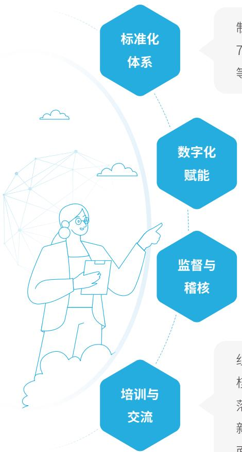

flowchart

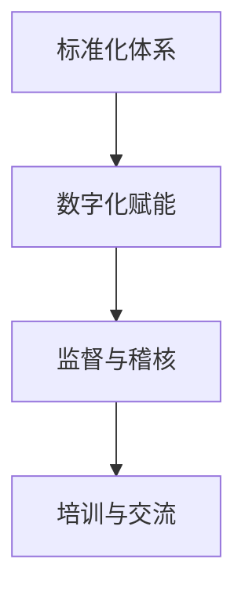
```mermaid
graph TD
  A["标准化体系"] --> B["数字化赋能"]
  B --> C["监督与稽核"]
  C --> D["培训与交流"]
```

制定覆盖 “人、货、场” 的《门店运营手册》，包含品牌信息、基础管理、形象管理、7S 店务、系统操作、商品管理、设备管理、人员管理、服务管理及特殊事件处理等十大核心模块，确保全国门店运营动作统一。

深化 “新零帮系统” “万店掌系统” “飞书生态” 等数字化工具的应用，实现全流程线上化闭环管理和远程稽核，提高执行效率，提升决策的智能化水平。

每月对门店进行运营基础管理评分，评分结果与门店评级、奖励挂钩；结合线上稽查和线下巡店，形成全方位监督网络；建立加盟商有效投诉100%闭环解决机制，维护品牌声誉。

组织所有新加盟商培训，系统学习企业文化、系统操作、商品知识、服务标准等核心内容，确保新店开业即具备标准化运营能力；为新店团队提供高强度、聚焦落地的强化训练，帮助其快速适应并掌握运营要点；定期组织老店复训与知识更新，确保业务标准统一、执行到位；举办加盟商经营分析会、沟通会，通过高频次、面对面的交流，达成经营共识，解决实际困难；通过线上渠道开展微课堂培训。

# 影响、风险和机遇管理

量贩零食业务板块，我们构建了覆盖“供应商管理-仓储验收-终端食安运营”全链条的食品安全管理体系，制定严格的操作规程和质量标准，明确各部门及人员的职责，并建立食品安全风险识别管控机制，通过“预防-监测-响应-改进”闭环管理机制，确保产品质量风险的源头阻断与全程受控。2025年，开展质量风险专项审查店铺2,615家，均完成问题的整改追踪。

# 风险识别

通过前置动态捕捉法规标准动向、政府监管趋势与网络及行业食安事件，锁定风险源并开展风险排查整改，实现风险的早期识别与闭环处置；同时，依据新政策前置部署管控策略，将政策要求有效内化为企业的常态化合规运营。

# 风险防控

建立三层风险防控网络，前端实施供应商分级准入与动态质量评估，对高风险供应商实施整改、约谈、审核、处罚等措施；过程部署商品入仓验收机制，批次商品入仓前需经过严格的商品质量验收，结果合格才能收货；末端建立门店食品安全管理，对门店实施风险分级管控。

# 闭环管理

明确“集团-区域-门店”食品安全责任链条，制定《仓端商品到货检验规程》《店铺食品安全管理制度》等标准化文件，固化“供应商管理+入仓验收+在店稽核”三道防线；建立质量大数据预警平台，对异常问题、食品安全客诉等风险实施预警，确保异常情况及时完成根因分析与纠正措施。

食用菌业务板块，我们制定《食品防护计划》《良好卫生规范》《应急预案》等质量风险防控相关的内部管理规范，做好食用菌从生产到交付各阶段的安全防护工作，实现对各类质量潜在风险的全面识别与精准防控，确保在异常发生时能够快速响应、有效处置。

指标与目标

<table><tr><td colspan="2">管理目标</td><td>2025年完成情况</td></tr><tr><td rowspan="4">量贩零食业务</td><td>供应商审核整改跟进闭环率 $\geqslant 95\%$ </td><td>目标已完成</td></tr><tr><td>店铺食安稽核整改闭环率 $\geqslant 95\%$ </td><td>目标已完成</td></tr><tr><td>商品仓质检合格率 $\geqslant 99\%$ </td><td>目标已完成(不合格品均作拒收处置)</td></tr><tr><td>无重大食品安全事故</td><td>目标已完成</td></tr><tr><td rowspan="3">食用菌业务</td><td>辅料进货检验、原料进货检验,使用异常批次 $\leqslant 1$ 次/月</td><td>目标已完成</td></tr><tr><td>客诉次数 $\leqslant 2$ 次/月/厂</td><td>目标已完成</td></tr><tr><td>质量事故发生次数 $\leqslant 1$ 次/月/厂</td><td>目标已完成</td></tr></table>

# 客户服务管理

# 治理

万辰集团秉承“客户资产是公司核心无形资产”的理念，将客户关系管理纳入ESG实质性议题。我们以量贩零食板块会员运营中心和食用菌板块营销中心作为前端窗口，建立健全全生命周期服务管理政策与监督机制、客户投诉渠道建设与闭环运行机制，制定《客户投诉管理制度》等系列内部管理规范，规范客户服务流程与相关机制，确保全面掌握客户需求，持续提升响应效率，赢得消费者的信任与支持。

# 战略与管理方式

# 服务品质提升

万辰集团致力于打造“负责任、透明高效、有温度”的服务价值链，从制度规范、数智赋能等方向发力，实现服务效率与消费者体验的双重提升，定期开展客户满意度调研，通过消费者反馈持续优化，提升服务品质。

# 全生命周期服务管理

食用菌业务板块，以提升响应时间、优化服务细节为目标，做好售前、售中、售后管理举措。

<table><tr><td></td><td>政策制度</td><td>服务规范</td><td>监督实施</td></tr><tr><td></td><td>制定《经销商管理制度》,统一合作标准与合同规范。</td><td>严格筛选优质经销商,明确结算、任务与支持政策,提供产品、宣传等一站式服务支持。</td><td>建立完整经销商档案,定期回访收集需求,快速响应优化。</td></tr><tr><td>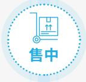</td><td>制定《核心市场督导管理制度》,实施库龄管控、售价规范及物流跟踪制度,保障流通高效有序与经销商权益。</td><td>管控产品库龄与市场售价,落实车辆跟踪、到货跟踪,实时同步物流进度,提升交付响应速度。</td><td>常态化市场走访,动态监控库龄、售价与物流状态,违规及时整改,保障经销商权益。</td></tr><tr><td>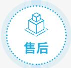</td><td>制定《顾客投诉处理程序》,明确受理、核实与改进闭环规则。</td><td>规范投诉资料提报、现场核实流程,简化办理环节,快速响应客户诉求。</td><td>严格客诉核实与审批,按月汇总问题推动品质改进,缩短处理周期,提升客户满意度。</td></tr></table>

量贩零食业务板块，聚焦“制度先行”，重点保障售前、售中、售后环节的治理规范性。

<table><tr><td></td><td>政策制度</td><td>服务标准</td><td>监督实施</td></tr><tr><td></td><td>严格执行《中华人民共和国广告法》《中华人民共和国消费者权益保护法》，明确禁止夸大宣传、承诺性话术。</td><td>客服7×13小时在线与人工双线服务，复杂场景1对1专项服务。</td><td>实行“现场管控+AI拔测”双轨制，春节门店备货抽检覆盖率100%。</td></tr><tr><td>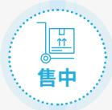</td><td>发布《（新零帮APP）门店管理操作手册》《门店订单及配送查询操作指引》，提供门店服务指引，明确履约时效及异常场景赔付标准。</td><td>透明化订单状态节点推送与进度查询。</td><td>建立跨部门SLA（服务水平协议）考核机制，持续优化服务全链路的标准化水平。</td></tr><tr><td>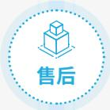</td><td>更新《冷链商品配送到店争议处理细则物流履约标准2.0》，保障门店货品供应全链路服务。</td><td>消费者退换货实现“首问负责制”，门店优先无条件处理，严禁推诿；坚持品牌对消费者实行“先行赔付”制度，保障消费者权益。</td><td>建立《服务质量洞察报告》，每月发布，直通高管层。</td></tr></table>

# 提升客户满意度

量贩零食业务板块，以 “AI 赋能人、数据驱动服务” 为核心策略，上线新零帮小蓝兔 \* 企微 “客服中心” 实时在线服务，及时响应率达 99.3%，实现复杂场景人工一对一专项解答；建立客户之声（VOC）服务中心，将投诉与建议数据实时反馈至各部门，2025 年因客服建议触发项目优化 56 项，进一步提升客户体验。

食用菌业务板块，福建漳州和江苏南京两大生产基地分别开展了客户满意度调查，调查维度包括：包装质量、包装效果、菇帽圆整度、菇帽均匀度、切根质量、产品新鲜度、产品分级、物流服务、业务水平和售后服务等。针对调查结果，明确问题责任部门并制定针对性整改方案，不断提升客户满意度。2025年，江苏南京基地客户满意度评分为89.2%，福建漳州基地客户满意度评分为91%，平均同比提升4.05个百分点。

# 客诉管理

我们视投诉为 “资产”，构建了多渠道入口统一、流程透明、结果可溯的闭环体系，建立透明、公正、可追溯的投诉处理文化。

# 量贩零食业务板块：四步闭环投诉处理

我们制定投诉处理体系运行机制，实现四步闭环。2025年，客诉24小时解决率提升23%。

# 量贩零食业务板块投诉处理流程

# 投诉受理

\- 实行 “首诉登记制”，所有渠道投诉 15 分钟内录入 UD 系统，生成工单，实现区域、门店、商品、事件等多维度溯源。

# 投诉处理

- 一般投诉：24小时内出具解决方案。  
- 重大 / 群体性投诉：启动“橙色应急机制”，由客服经理挂帅，法务、公关、业务多部门会商，承诺24小时内首轮反馈。

# 4投诉回访

\- 实行 100% 投诉结案回访制，重点追踪用户对处理结果的满意度及改进建议，对不满意客户启动“服务补救”流程，由资深专员二次跟进处理。

# 投诉反馈

- 结案前 $100\%$ 与客户确认处理结果，支持线上签署和解协议。  
- 坚持“结论 + 依据 + 安抚”三段式回复结构，杜绝霸王条款式回应。

# 全触点覆盖投诉受理渠道

# 官方主渠道

7×13 小时智能热线（IVR 语音导航 + 按键直达人工），在线客服（APP/官网 / 微信公众号，转人工平均等待时间 ≤ 15 秒）。

# 第三方平台

12315、黑猫、小红书、微博；由舆情监测组实时响应。

# 高管直通车

万辰监察部服务二维码直通车（电子邮箱）。

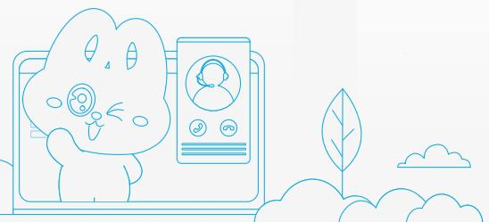

natural_image

Line drawing of a cartoon character on a laptop with a smartphone displaying a profile and cloud background (no text or symbols)

# 食用菌业务板块：规范售后服务流程

我们制定产品售后服务流程，依照《客户投诉处理制度》对客户投诉进行处理，耐心受理客诉，确认投诉原因，积极跟踪处理，力求客户满意，进而提升品质。

食用菌业务板块产品售后服务流程  

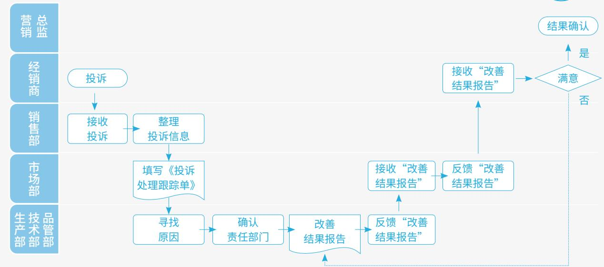

flowchart

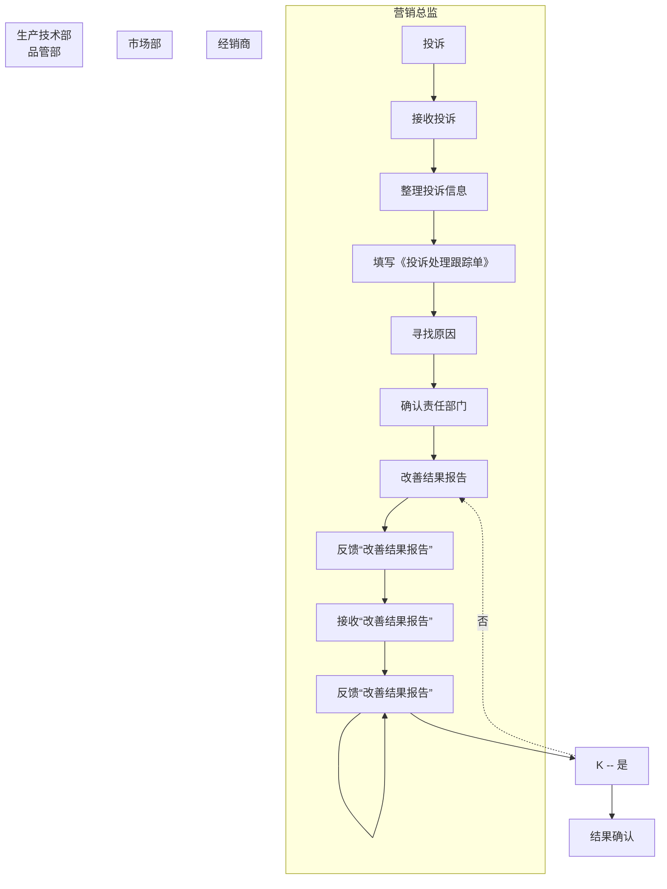
```mermaid
graph TD
  subgraph GeneralManager["营销总监"]
  A1["投诉"] --> B1["接收投诉"]
  B1 --> C1["整理投诉信息"]
  C1 --> D1["填写《投诉处理跟踪单》"]
  D1 --> E1["寻找原因"]
  E1 --> F1["确认责任部门"]
  F1 --> G1["改善结果报告"]
  G1 --> H1["反馈“改善结果报告”"]
  H1 --> I1["接收“改善结果报告”"]
  I1 --> J1["反馈“改善结果报告”"]
  end
  
  subgraph SalesDept["经销商"]
    B1
    C1
    D1
    E1
  end
  
  subgraph MarketDept["市场部"]
    A1
    B1
    C1
    D1
    E1
    F1
    G1
    H1
    I1
  end
  
  subgraph ProductDept["生产技术部\n品管部"]
    A1
    B1
    C1
    D1
    E1
    F1
    G1
    H1
  end
  
  J1 --> J1
  
  J1 --> K{"满意"}
  K["K -- 是"] --> L["结果确认"]
  K -.->|否| G1
```

# 影响、风险和机遇管理

万辰集团高度重视消费者的反馈意见，如果出现产品品质、服务态度及售后处理不及时等问题，很可能会引发大量客诉问题，这将直接影响品牌口碑与客户忠诚度。针对客诉方面的风险，我们每月编制《服务质量洞察报告》，识别系统性风险（如服务规范、商品质量、物流爆仓、系统 BUG 等）；建立智能案例库，每月召开“客服分享会”，聚焦问题，倒逼服务提升、质量管控、产品研发及流程优化；实施“投诉溯源整改令”，对重复出现 3 次及以上的同类投诉，责令责任部门限时整改并回传整改结果，供应商提供整改报告及审厂等严格改善机制，有效防范投诉风险扩散升级，切实保障消费者权益，持续夯实品牌口碑与客户信任基础。

指标与目标

<table><tr><td colspan="2">指标</td><td>单位</td><td>2025年</td></tr><tr><td rowspan="3">量贩零食业务板块</td><td>客户满意度</td><td>%</td><td>96.5</td></tr><tr><td>投诉1小时响应率</td><td>%</td><td>99.4</td></tr><tr><td>24小时解决率</td><td>%</td><td>93</td></tr><tr><td rowspan="3">食用菌业务板块</td><td>平均客户满意度</td><td>%</td><td>90.1</td></tr><tr><td>客户投诉数量</td><td>件</td><td>66</td></tr><tr><td>客户投诉解决率</td><td>%</td><td>100</td></tr></table>

# 责任供应链

# 治理

万辰集团针对量贩零食与食用菌两大业务板块，构建差异化、专业化的供应商管理体系，保障供应链稳定高效，支撑业务高质量发展。

量贩零食业务板块，我们制定《万辰集团供应商准入申请 SOP》《万辰集团供应商指引手册》等内部管理制度，并由商品中心负责供应商管理工作，统筹搭建供应商管理体系，确立主数据管理、合同管理、绩效管理三大核心模块规范，负责流程文件的编制、评审、宣导培训及迭代优化，保障管理标准统一、执行落地到位。

食用菌业务板块，我们制定《供应商管理制度》《采购执行管理制度》等内部管理制度，规范供应商管理工作，提升供应安全系数与可靠性，防范采购风险。供应商管理工作由采购中心负责，部门工作直接汇报董事长决策。

# 战略与管理方式

# 供应商全生命周期管理

量贩零食业务板块，我们构建覆盖准入、分级分类、绩效评价、动态管控及合规退出的供应商全生命周期管理体系，依托标准化流程、数字化赋能与闭环管控，持续提升供应链合规性、稳定性及可持续发展能力，并强化供应商主数据与合同政策数据治理，推进 SCM 等管理系统迭代升级，以数字化能力全面赋能供应链高效运营与风险防控。

# 供应商准入管理

建立并持续优化供应商准入流程及资质审核标准，对新供应商进行准入审核，建立合格供应商主数据库，从源头把控供应商合规性与履约能力，防范供应链入口风险。

# 分级分类管理

以合规资质、服务水平、合作绩效为核心维度，实施供应商分级分类管理，推行差异化合作与管控策略，提升供应链精细化、集约化管理效能。

# 合同全流程管理

推进合同模板标准化建设及系统录入，搭建集团统一的合同台账与主数据管理体系，实现合同信息可查询、可追溯，有效降低合同履约及合规风险。

# 退出与撤场闭环管理

建立规范的供应商退出 / 撤场流程，完成系统停用与信息更新，实现退出环节合规有序、闭环管控，防范供应链遗留风险。

# 绩效评价与持续改善

制定供应商绩效考核方案，依托数据看板开展定期评价、分析复盘，推动绩效结果落地应用，构建绩效改善闭环，驱动供应商持续提升服务质量与合规水平。

食用菌业务板块构建覆盖“准入-试用-供货-评估”全链条的供应商全生命周期管理体系，形成标准化、闭环化的供应链管控流程。在准入环节，通过送样品检验、小批量试用、中批量试用的三级递进验证机制，确保供应商资质与产品质量符合标准后方可进入批量供货阶段；在履约环节，建立日常考察机制，对产品质量、交期履约、售后服务等维度进行动态监控；在评估环节，开展年度综合评审，优胜劣汰筛选优质供应商，持续优化供应链结构，保障原料供应的安全性与稳定性。

# 供应商能力提升

我们高度重视与供应商的协同成长与风险防范，定期为供应商组织专题培训，内容覆盖消费者投诉处理、虫害防控、食品标签新规等关键议题。针对量贩零食业务板块，我们还与供应商建立企业微信服务群、订单对账提醒群和品控客服群，帮助供应商提升合作能力及处理合作中遇到的问题；开展供应商最佳合作伙伴评选，提高供应商合作积极性。

# 供应链 ESG 管理

公司坚持负责任的采购原则，将 ESG 表现纳入供应商评价考量，用实际行动推动供应商共同履行社会责任，打造可持续供应链。

量贩零食业务板块，在商品采购合同中，明确对商业道德与反腐败、职业健康与安全等提出要求；在品控的现场审核中，制定包含环境保护、职业健康安全、食品质量安全、合规运营等要求的供应商管理相关文件，并对供应商开展持续现场审查，重点审核厂区环境与分区隔离、仓储储存条件、原辅料验收管控、生产过程 SOP 及卫生规范执行、清洁消毒与环境监控验证、HACCP 体系及前提方案落实等情况，对不符合项实施整改与跟踪，确保供应商满足 ESG 及食品安全生产管理要求。食用菌业务板块，与供应商签订《反商业贿赂协议书》，共同维护公平、公正、廉洁的市场秩序。

# 平等对待中小企业

万辰集团在合作过程中不会区别对待不同体量供应商的货款支付和合作条件，中小企业供应商权益可以得到充分保障。2025年，无未支付中小企业款项的情况发生，现金流状况良好，无逾期账款未支付现象发生。

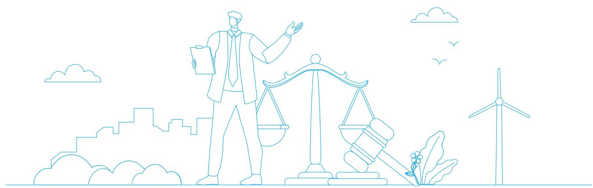

natural_image

Line art illustration of a businessman standing beside a balance scale and wind turbine, with city skyline and clouds in background (no text or symbols)

# 影响、风险和机遇管理

在供应商准入环节，我们对供应商的各方面风险进行综合评估。以量贩零食业务板块为例，我们将供应商经营风险、财务风险、法务风险纳入评审项目，对不满足评分标准的供应商慎重引入。

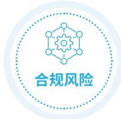

\- 建立系统化的供应商全生命周期管理体系，覆盖筛选、准入、绩效考评与退出全流程，依据《供应商管理制度》《供应商质量管理制度》等制度，严格审查供应商环境与质量资质，并要求供应商认可及签署《廉洁协议》等文件，以规避合规风险。

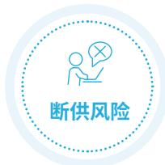

\- 在商品采购合同中包含履约及质保相关内容，并在促销端架供货范畴内，与供应商约定保供方案，当供应商存在断供风险时，及时调整商品陈列方案，快速响应。

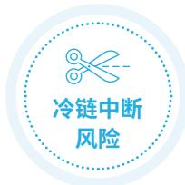

\- 在第三方服务合同中专门增设了条款，要求乙方制定《冷链中断应急预案》，包括2小时内可启用的备用冷库清单、合格备用运输商名录，每年演练2次并提交记录，最大限度降低冷链中断风险，确保全程不断链的运输保障能力。

\- 要求服务商全程系统化作业，确保数据实时准确；车辆配备 GPS 端口向甲方开放，TMS 需具备调度、在途跟踪、路径优化及结算功能，实现全程透明化运输。

\- 开展安全点检，设立隐患提报机制，组织消防等安全设备点检、库内点巡检等。

# 指标与目标

目标

<table><tr><td colspan="2">管理目标</td><td>2025年完成情况</td></tr><tr><td colspan="3">量贩零食业务板块</td></tr><tr><td rowspan="3">供应商准入与分类管理</td><td>新导入供应商 ESG 尽职调查覆盖率 50%</td><td>目标已达成</td></tr><tr><td>供应商准入合规文件签署率 100%</td><td>目标已达成</td></tr><tr><td>发展 20 家战略供应商</td><td>目标已达成</td></tr><tr><td rowspan="3">ESG 风险与合规管理</td><td>核心供应商 100% 通过 ISO 9001 或同类认证</td><td>目标已达成</td></tr><tr><td>食品类核心供应商 100% 通过 ISO 22000 或 BRC 认证</td><td>目标已达成</td></tr><tr><td>0 起因重大 ESG 合规问题导致立即终止合作的案例</td><td>目标已达成</td></tr></table>

<table><tr><td></td><td>管理目标</td><td>2025年完成情况</td></tr><tr><td rowspan="3">供应链韧性与可持续采购</td><td>生鲜品类属地化采购率(300公里内)提升至70%</td><td>目标已达成</td></tr><tr><td>建立针对极端天气或突发事件供应链中断预警机制</td><td>目标已达成</td></tr><tr><td>核心供应商100%接入万辰SCM(供应商关系管理)系统</td><td>目标已达成</td></tr><tr><td>商业道德与人权</td><td>完成对采购人员关键岗位的反腐培训及所有合作供应商反商业贿赂协议签署</td><td>目标已达成</td></tr><tr><td colspan="3">食用菌业务板块</td></tr><tr><td>原辅料合格率95%</td><td></td><td>目标已达成</td></tr></table>

# 指标

<table><tr><td>供应商总数3,823家</td><td>国内供应商数量3,819家</td><td>国外供应商数量4家</td></tr><tr><td>通过质量管理体系认证的供应商数量3,658家</td><td>供应商廉洁承诺书/协议签署比例100%</td><td>供应商反腐败培训覆盖率100%</td></tr><tr><td>2025年度终止合作的具有重大实际/潜在负面影响的供应商数量0家</td><td>供应商培训覆盖人次超2,500人次</td><td>中小企业款项准时支付率100%</td></tr></table>

# 02

# 稳健运营

# 筑牢治理根基

# 贡献联合国2030可持续发展目标SDGs

12 负责任消费和生产

∞

16 和平、正义与强大机构

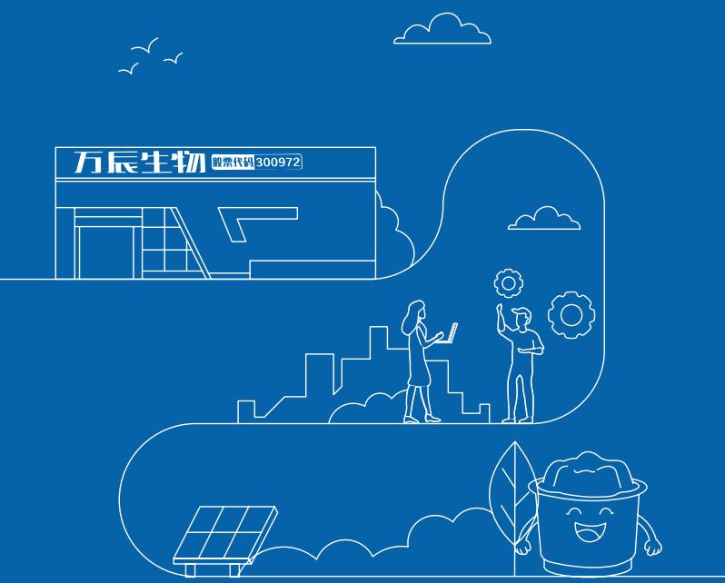

text_image

万辰生物 股票代码300972

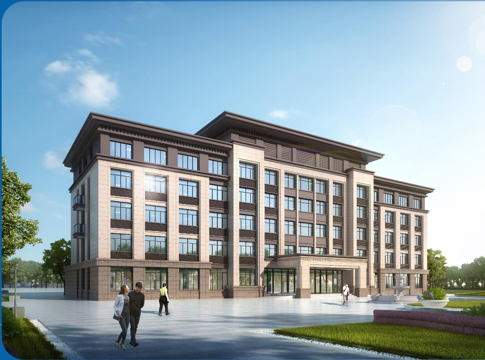

natural_image

Exterior view of a modern multi-story residential building with symmetrical windows and balconies, surrounded by landscaped grounds and pedestrians (no signage or text visible)

# 公司治理

良好的企业管治与可持续发展营运息息相关，相辅相成。万辰集团严格遵照《中华人民共和国公司法》《中华人民共和国证券法》《上市公司治理准则》《上市公司监督管理条例》《深圳证券交易所上市公司自律监管指引第17号——可持续发展报告（试行）》等有关法律法规、规范性文件的要求，构建了规范的公司治理架构和科学有效的议事规则，持续完善风险管理及内部控制体系，恪守商业道德，切实维护投资者合法权益，助力公司稳健前行。

# 治理架构

公司已确立由股东会、董事会和管理层组成的公司治理结构，各机构已建立健全工作制度及议事规则，形成了权力机构、决策机构、监督机构和管理层之间权责明确、制衡有效、决策科学、运作协调的有效机制，持续提升公司治理水平。

# 股东会

公司的最高权力机构，严格按照《公司章程》《股东会议事规则》等相关规定召集、召开股东会，充分尊重全体股东，确保全体股东对公司重大事项的知情权、参与权和表决权，保障全体股东尤其是中小股东获得平等对待并充分行使自己的合法权利，并按照监管要求发布股东会的决议公告及法律意见书。

# 董事会

公司经营管理的决策机构与 ESG 管理的最高决策机构，执行股东会决议，对股东会负责。公司依据《董事会议事规则》，规范董事会的议事流程和决策程序，促进董事和董事会有效履行职责。董事会下设战略委员会、提名委员会、审计委员会、薪酬与考核委员会等四个专门委员会，分别按照《公司章程》和各专门委员会实施细则的规定履行其职责，为董事会提供合理化建议，提高董事会规范运作和科学决策水平。

召开股东会

9次

审议通过议案

63项

召开董事会

19次

审议通过议案

98项

# 战略委员会

由 3 名董事组成，独立董事 1 名，主任委员为王丽卿女士。负责研究公司长期发展战略、重大投资决策及 ESG 战略规划，审议重大投融资与资本运作项目，监督相关事项实施情况，统筹 ESG 目标管理与信息披露，并履行董事会授予的其他职权。

# 提名 委员会

由 3 名董事组成，独立董事 2 名，主任委员为林丽叶女士。拟定董事、高管选任标准与程序，遴选人选及审核任职资格，就董事任免、高管聘任解聘提出建议。

# 审计 委员会

由 3 名董事组成，独立董事 2 名，主任委员为赵景文先生。监督内外部审计、审核财务信息披露与内控，关键财务事项需其过半数同意后提交董事会审议，同时作为利益冲突主管部门，统筹申报、审查、处分等全流程管理。

# 薪酬与考核委员会

由3名董事组成，独立董事2名，主任委员为林丽叶女士。制定董事、高管考核标准，制定审查其薪酬政策方案，就薪酬、股权激励、员工持股计划等向董事会提出建议。

召开战略委员会会议

3次

审议通过议案

10项

召开提名委员会会议

5次

审议通过议案

5项

召开审计委员会会议

10次

审议通过议案

16项

召开薪酬与考核委员会会议

8次

审议通过议案

17项

# 董事会多元化与有效性

公司注重董事会的多元化建设，在董事选聘的过程中将多元化（包括但不限于性别、种族或民族、国籍、出生地或文化背景等因素）纳入考量。报告期内，董事会共有女性董事5名，女性董事占比55.56%。同时，董事会成员拥有风险管理、财务、法律、金融以及行业相关等领域专业知识，为董事会决策的科学性和有效性提供坚实支撑。

<table><tr><td rowspan="2">职务</td><td rowspan="2">姓名</td><td rowspan="2">性别</td><td colspan="6">专业能力</td></tr><tr><td>行业经验</td><td>风险管理</td><td>财务会计</td><td>法律</td><td>金融</td><td>运营管理</td></tr><tr><td>董事长</td><td>王丽卿</td><td>女</td><td>✓</td><td>✓</td><td></td><td></td><td></td><td>✓</td></tr><tr><td>执行董事</td><td>王泽宁</td><td>男</td><td>✓</td><td>✓</td><td>✓</td><td></td><td>✓</td><td>✓</td></tr><tr><td>执行董事</td><td>李博</td><td>男</td><td>✓</td><td>✓</td><td></td><td></td><td></td><td>✓</td></tr><tr><td>非执行董事</td><td>林该春</td><td>女</td><td>✓</td><td>✓</td><td></td><td></td><td></td><td>✓</td></tr><tr><td>非执行董事</td><td>陈文柱</td><td>男</td><td>✓</td><td></td><td></td><td></td><td></td><td>✓</td></tr><tr><td>独立非执行董事</td><td>林丽叶</td><td>女</td><td>✓</td><td>✓</td><td>✓</td><td></td><td></td><td></td></tr><tr><td>独立非执行董事</td><td>赵景文</td><td>男</td><td></td><td>✓</td><td>✓</td><td></td><td></td><td></td></tr><tr><td>独立非执行董事</td><td>郑鲁英</td><td>女</td><td>✓</td><td>✓</td><td></td><td>✓</td><td></td><td></td></tr><tr><td>独立非执行董事</td><td>杨帆</td><td>女</td><td></td><td>✓</td><td></td><td></td><td>✓</td><td>✓</td></tr></table>

董事学历  
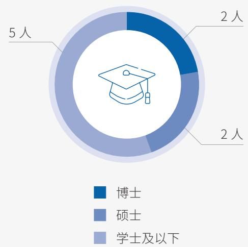

donut

| Category | Value |
| --- | --- |
| 博士 | 2人 |
| 硕士 | 2人 |
| 学士及以下 | 5人 |

董事年龄  
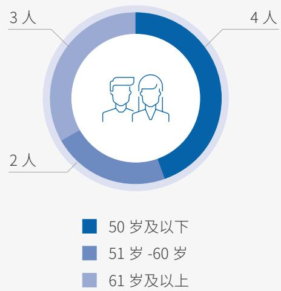

donut

| Category | Value |
| --- | --- |
| 50岁及以下 | 4人 |
| 51岁 -60岁 | 2人 |
| 61岁及以上 | 3人 |

# 董事会独立性

公司独立董事根据《董事会议事规则》《独立董事工作制度》等相关要求，积极出席及列席独立董事专门会议、董事会及股东会，认真审议独立董事专门会议及董事会的各项议案，运用其自身的经验及知识对公司重大事项表达意见，认真、勤勉履行独立董事职责，依法促进公司规范运作，提高公司科学决策水平。

拥有独立董事

独立董事占比

4人

44.44 %

# 薪酬与考核

公司建立了公正、有效的董事及高级管理人员薪酬管理与激励约束机制，由薪酬与考核委员会负责制定、审查公司董事及高级管理人员的薪酬政策与方案，报经董事会同意后，提交股东会审议通过后方可实施，并充分开展信息披露。报告期内，公司制定了《2025年度董事、高级管理人员薪酬（津贴）绩效方案》，明确规定独立董事津贴、非独立董事以及高级管理人员薪酬的组成和发放标准。对于内部董事和高级管理人员，年度薪酬由基本薪酬、绩效以及奖金组成；对于独立董事，公司根据实际经营情况及行业、地区的发展水平，在独立董事任期内年度设定合理的津贴。

为保障董事会的决策与监督效能，公司最高治理机构成员和高管薪酬设定充分考虑了相关人员的年度绩效考核情况，限制性股票分2-4期归属，结合被激励对象考核情况确定每期归属比例，明确存在违反竞业限制义务等情况下，激励对象应当退回通过限制性股票激励计划所得收益。

# 投资者权益保护

公司高度重视投资者关系管理工作，坚持诚实、公平、公正地开展投资者权益保护和关系管理工作，持续加强信息披露管理，不断完善与投资者的沟通机制，增进投资者对公司的了解和认同。

每 10 股派息数（含税）

8.37元

# 保护中小投资者

每期股东会决议设置现场及线上投票机制，充分运用现代信息技术手段扩大股东参与股东会的比例，并及时公告表决情况。资产收购等事项先经过第三方评估公允，杜绝出现利益输送等损害中小股东权益的行为。股东会审议影响中小投资者利益的重大事项时，对中小投资者表决应当单独计票，且明确规定单独计票结果应当及时公开披露。

接待投资者现场调研

2 次

召开投资者参加的电话会议

2 次

线上业绩说明会

1 次

# 风险与合规管理

万辰集团持续建立健全内控与风险管理体系，加强和规范公司内部管理，提升内部控制有效性，为企业风险控制和高效运作营造良好的内部环境，为健康持续发展提供保障。

# 合规管理

公司根据财政部、中国证券监督管理委员会等部门联合发布的《企业内部控制基本规范》《企业内部控制应用指引》以及其他法规相关规定，建立健全公司内部控制体系，定期对内部控制的建立、实施进行评价，实现内部控制自我提升。

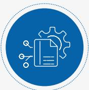

# 独立审计机构

公司董事会审计委员会、内审部门共同组成风险内控管理组织体系，对公司内部控制管理进行监督和评价。审计委员会成员拥有风险管理、财务会计专业知识，并依据《董事会审计委员会工作细则》《内部审计制度》监督建立并维持有效的内部控制。

# 开展独立审计

审计部按公司审计计划，实施2025年度审计任务；对于审计过程发现的问题，公司管理层和各部门高度重视，及时完成整改。截至2025年底，公司的内控制度能够适应运营管理和业务发展的需要，在重大事项上合理控制了各种风险，有效保障了公司、债权人和股东的权益。

# 风险管理

公司已形成风险管理“三道防线”，形成“业务管控—专业合规监督—独立审计评价”的闭环管理模式，有效预防和控制可能对公司造成损失的潜在风险，筑牢风险防控屏障，为公司稳健运营和可持续发展保驾护航。

natural_image

Line drawing of a person using a tablet with icons for tools and time, set against a city skyline and clouds (no text or symbols)

# 风险管理“三道防线”

一线员工或专门的运营角色（如风险经理、业务部门负责人），直接承担业务运营中的风险识别、评估和初步管控责任；主动识别业务环节中的风险点，及时采取防控措施，并在发现重大风险时向上级报告，确保风险在源头得到控制。

在高级管理层或执行级别设有专门的角色或委员会，负责制定控制标准并监督其合规性，为业务部门提供合规支持和指导，推动落实风险防控措施，协调跨部门风险问题，并向管理层报告风险状况，确保公司整体风险水平可控。

# 第一道防线

# 运营风险所有权

# 第二道防线

# 风险管理和合规监督

# 第三道防线

# 独立审计组

内部审计职能，对风险管理和合规流程的有效性提供独立保证，确保公司风险管理体系的有效性和持续改进。

# 税务透明

公司坚持“依法纳税、诚信经营”的基本原则，严格遵守《中华人民共和国税收征收管理法》《中华人民共和国企业所得税法》《中华人民共和国个人所得税法》等法律法规和相关制度规定，制定《财务管理制度》，明确税务及发票管理要求，注重税务风险管理，落实企业纳税义务，按时足额申报和缴纳税款。2025年，无重大税务违法违规行为及行政处罚记录。

# 税务合规管理

公司建立了从业务发生、财务处理到纳税申报的全流程税务合规管理体系，确保各项税款的计算、申报和缴纳准确、及时、完整；通过主动与税务机关沟通，定期税务自查报告等，不断完善公司税务合规管理体系。

# 税务风险管理

我们构建事前防范、事中控制、事后监督改进的全方位税务风险防控体系。针对增值税、个人所得税等领域的关键政策变化，发布系列政策解读及解析文件，确保公司业务发展符合最新合规要求；针对“高价值固定资产混合用途进项税转出”“免税收入对应进项税额分摊转出”等复杂新规，开发专项计算工具与台账，确保转出计算准确、可追溯；针对“跨主体用工”等新兴业务模式，制定专项财税处理规范，有效防控新型用工关系的税务风险。

纳税总额

157,999.38万元

# 商业道德

作为负责任的企业，万辰集团遵守严格的商业行为标准，致力于以合规、正直和诚信的方式开展工作，在各项业务活动中恪守公平、信任的道德规范，坚决抵制任何形式的贿赂、腐败、敲诈勒索等行为，共同构建清廉、有效、可持续的商业环境。

# 治理

公司严格遵守《中华人民共和国公司法》《中华人民共和国刑法》《中华人民共和国反洗钱法》等国家法律法规，制定并执行《员工行为准则》，明确反舞弊、反职务犯罪等要求；制定《供应商行为规范》，与供应商签订的采购合同中包含廉洁合作条款，明确反商业贿赂行为，将诚信要求全面融入内部与供应链运作，与各利益相关方构建诚信、公平、相互尊重的关系。

公司董事会作为最高决策机构，负责监督公司的商业道德与反腐败相关事务；监察部作为统筹部门，确保公司相关规定的贯彻与执行，落实公司阳光工程，加强监察工作，促进公司员工遵纪守法，进而打造廉政、务实、诚信的企业文化。

# 战略与管理方式

# 反商业贿赂及反贪污

# 反商业贿赂

# 强化行为规范

明确经营决策、客户合作、利益冲突等6大类行为规范，将商业道德要求嵌入合同管理、供应商准入等核心业务流程，实现“制度全覆盖、流程全嵌入”；建立商业道德考核机制，将诚信履约、合规经营等指标纳入部门绩效考核。

# 签署廉洁协议

要求员工在入职时了解并签署协议，明确员工应避免利用职务之便谋取个人或集团利益，不得索取或接受礼品、佣金、回扣，不得披露或泄露公司商业秘密，不得从事欺诈或贪污等违反商业道德活动；如有上述任何行为，将受到纪律处分，如违规情况严重，将转交司法或检察机关作进一步处理。

# 开展廉洁教育

开展 “廉洁文化建设深化年” 活动，打造线上线下立体化教育矩阵，召开同级同类案例剖析会 6 次，用 “身边事” 警醒 “身边人”；创新推出 “廉洁承诺践诺” 活动，全员签订商业道德承诺书，营造崇廉拒腐的文化氛围。

# 打造廉洁供应链

将商业道德建设延伸至供应链体系，联合上下游企业发起《廉洁合作倡议书》，建立供应商廉洁信用评价体系，对核心供应商开展廉洁资质审核，清退存在诚信污点的供应商，构建企业反舞弊联盟，树立行业标杆形象。

# 廉洁工作

# 开展重点领域专项整治

聚焦腐败易发多发领域，开展专项行动。针对隐性腐败形式，组建专项核查组，运用大数据监督手段排查异常，更精准识别腐败问题；加大对“一把手”和领导班子监督力度，开展任职回避专项检查，纠正违规兼职等工作。

# 科技赋能智慧反腐

搭建公权力大数据监督应用平台，整合财务、人事、业务等多维度数据，建立异常行为预警模型，实现“早发现、早预警、早处置”。

对涉案员工提出控告并已审结的诉讼案件数

1起

# 举报及举报人保护

公司已开通包括举报电话、举报邮箱、微信等多种举报渠道。若发现索贿、行贿或其他不正当交易行为，公司鼓励员工、供应商以及其他合作伙伴主动举报，积极配合调查和取证，提供调查需要的相关信息和资料。公司确保对举报人、举报内容、证据和线索严格保密，禁止对举报人以任何形式打击报复。

# 公开举报渠道

  
万辰集团监察部微信

电话 / 短信 / 微信

18052039968

  
万辰集团监察部 QQ 及邮箱

QQ 号 / 邮箱号码

3895848331@qq.com

  
扫码小程序  
万辰集团监察部小程序

# 反不正当竞争

公司严格遵守《中华人民共和国反垄断法》《中华人民共和国反不正当竞争法》《中华人民共和国招标投标法》等法律法规，遵守平等、自愿、公平原则参与市场经济活动，注重引导员工保持良好的商业操守及品行，坚决反对不正当竞争。公司承诺在市场中不对竞争对手进行错误或引导性陈述、影射，不恶意诋毁竞争对手，不以非法手段收集竞争对手的商业秘密或其他机密信息，不开展与同行合谋定价扰乱市场秩序等违法行为，与同行企业共同维护公平竞争的市场环境。2025年，公司未发生因不正当竞争行为导致诉讼或重大行政处罚的事件。

# 责任营销

公司坚持负责任的营销理念，严格遵守《中华人民共和国民法典》《中华人民共和国广告法》《中华人民共和国消费者权益保护法》等关于不得含有虚假或引人误解的内容、不得作虚假或者引人误解的宣传等要求。为确保营销物料合法合规，量贩零食板块建立了严谨的广告风控流程，所有对外宣发内容均由业务发起部门完成初步审核与校对，提交法务部进行合法合规性审查。依据物料性质与活动类型，流程还将引入公关部（负责品牌声誉与舆情风险）、商品中心（负责产品信息与价格表述）等相关部门并行审核，共同提出审批意见，形成闭环管理，确保全面、准确地为客户提供产品和服务信息。

公司为客户服务、销售岗位等员工提供指引，确保其在与客户等利益相关方的沟通中如实描述公司产品和服务相关事实，禁止使用夸大宣传、承诺性话术。针对关键岗位员工，开展广告合规、有奖销售规则、商务沟通等相关培训，避免出现虚假陈述或夸大描述。

责任营销培训人次

156人次

责任营销培训总时长

276 小时

# 影响、风险和机遇管理

公司针对商业道德建立完善的风险识别、评估、控制程序，落实商业道德管控责任，制定相应的控制措施，并对其实施情况和效果进行监督检查，确保商业运营过程中潜在的商业道德风险可控、在控。

<table><tr><td>开展岗位风险分级分类管控</td><td>通过案件倒查、流程梳理与群众评议相结合的方式,聚焦高风险岗位,梳理划分高、中、低风险等级;针对高风险岗位,实现“一岗一清单、一险一措施”。</td></tr><tr><td>建立风险动态管理机制</td><td>建立动态调整机制,结合巡视巡察、信访举报等情况,实时更新风险数据库,从源头降低腐败风险。</td></tr><tr><td>应用评估结果</td><td>将风险评估结果与干部选拔任用、绩效考核、培训教育挂钩,对高风险岗位人员实行“岗前廉政测试、岗中廉政体检、岗后廉政审计”全周期管理。</td></tr><tr><td>全面压实反腐败工作责任</td><td>构建“党组主体责任+纪检监督责任+部门‘一岗双责’+岗位直接责任”的四级责任体系,层层强化责任落实。</td></tr><tr><td>案促改深化治理</td><td>坚持“查处一案、警示一片、治理一域”,实现“办案、整改、治理”贯通融合。</td></tr></table>

指标与目标

<table><tr><td>管理目标</td><td>2025年达成情况</td></tr><tr><td>涉及腐败等重大诉讼案件</td><td>对涉案员工提出控告并已审结的诉讼案件1起,其余侦办中</td></tr><tr><td>董事、高级管理人员和关键岗位员工商业道德与反腐败培训覆盖率100%</td><td>目标达成</td></tr><tr><td>有效举报处理率100%</td><td>目标达成</td></tr></table>

# 数字化战略

生产力的数字化、智能化是新质生产力的重要特征，也是推进中国式现代化的必由之路。万辰集团积极响应“中国制造2025”的号召，以“数智驱动、引领未来”为核心理念，致力于打造覆盖零售全链条的自主可控技术生态，并不断加强数据安全、信息安全的管理，保护敏感信息和客户隐私，支撑集团从传统零食连锁向科技驱动型零售企业转型升级，成为行业数字化标杆。

# 数字化建设

公司提出数字化战略，明确三阶段战略实施路径，依托自主研发的数字化系统，运用先进的数字化技术赋能从选址建店、商品采购、仓储物流、加盟商管理、门店运营、营销管理到会员管理的全链路流程，打破数据孤岛，以满足不断变化的业务需求，更好地适应新的消费场景，提升核心竞争力。

# 数字化布局

# 零售域

消费者服务域（新零帮 POS、全渠道会员体系、营销工具、线上商城）

# 加盟营运域

CRM 招商系统、SDS 建店系统、门店运营数字化体系

# 大数据域

数据仓库、数据可视化平台、CDP
客户数据平台、精准营销支撑

# 供应链域

供应链 V3.0（WMS、TMS、冷链温控、波次截单、计费对账、智能排线）

# 覆盖七大核心系统领域，形成完整的数字化支撑体系

# 业财域（财务）

会计凭证自动化、预算费控、资金管理体系、对账结算

# ERP 域

商品管理、库存管理、采购订货等核心企业资源计划系统

# 基建域

用户权限体系、主数据管理（人员 / 门店 / 仓库）、消息管理平台、日志平台

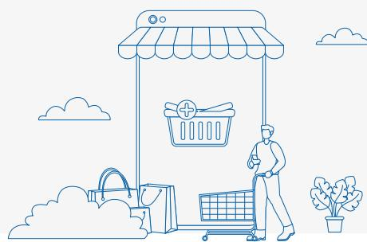

natural_image

Line drawing of a shopping street scene with a person pushing a cart, a basket, and a storefront (no text or symbols)

# 数字化实施路径

# 第一阶段（2025年）基础夯实与体系构建

- 核心系统自主化：完成零售域 POS 系统、供应链域 WMS/TMS、加盟营运域 CRM/SDS 等核心系统自主研发，实现技术主权可控。  
- 数据资产沉淀：打通七大域数据孤岛，构建OneID体系，沉淀会员数据，建立全域数据资产平台（CDP）。  
- 流程数字化：实现主数据管理自动化、会计凭证自动化、供应链计费对账自动化。

# 第二阶段（2026年）AI原生与智能升级

- AI 能力平台化：构建企业级大模型能力平台，支撑多场景 AI 应用开发。  
- 核心业务 AI 化：将人工智能技术深度融入经营管理全流程，通过全链路智能化应用体系，全方位提升运营效率与经营质效，助力业务精细化管理。

# 第三阶段（2027年及以后）生态融合与持续创新

- 全链路智能化：实现从消费者洞察（零售域）- 智能采购（供应链域）- 科学选址（加盟营运域）- 自动结算（业财域）的全流程智能化运营。  
- 外部生态协同：与高校、科研机构、头部科技企业建立联合实验室，构建开放的技术创新生态。  
- 持续迭代优化：基于七大域系统运行数据，持续优化算法模型，推动业务决策从“经验驱动”向“数据驱动”深度转型。

natural_image

Line drawing of a cartoon character holding a wind turbine in a mountainous landscape with clouds and birds (no text or symbols)

# 数字化阶段成果

我们以七大核心系统领域为支点，全面推进数字化能力建设并取得突破性进展。前端完成新零帮自研POS系统与全渠道会员体系搭建，沉淀1.5亿会员数据并带动消费占比提升至85%以上；中台构建“模型+接口+服务”三位一体大数据架构，实现超1,200个分层模型与超350个标准化接口的能力沉淀；后端打通基建、供应链、加盟营运与业财域全链路，门店建仓时效从3天压缩至分钟级，招商系统累计管理线索超18万条，月自动化处理单据超160万笔，以数字化运营重塑业务效率与风控能力。

客服工单系统使

日均人效提升至

113

效率提升

94.83%

研发效能平台使

发布时长压缩至

15 分钟

效率提升

81.25%

# 信息安全与隐私保护

公司时刻对信息及网络安全风险保持高度重视，严格遵循《中华人民共和国个人信息保护法》《中华人民共和国数据安全法》等法律法规及数据保护标准，更新迭代内部制度及相关举措，持续完善内部信息与网络安全管理体系建设，夯实数据隐私保护与网络信息安全基础。

# 治理

公司已建立起自上而下、职责明确的信息安全治理架构。董事会已将信息与数据安全作为公司发展的重要保障，董事会成员通过参与信息安全委员会会议，审议并批准公司年度数据安全建设规划、重大安全项目投入及关键安全制度的更新，确保信息安全工作的有效性和持续改进。

# 层级

# 组织 / 角色

# 核心职责

  
战略决策层

信息安全
委员会

  
统筹执行层

- 为公司数据安全工作提供必要资源。  
- 确定数据安全建设目标及规划，贯彻安全指导方针和政策。  
- 对数据安全管理制度进行评审和审批，发布相关规章制度。  
- 推进安全政策、办法和技术手段在全公司的落实。  
- 对重大数据安全事项做出决策，包括建设方案、奖惩机制等。

- 分析识别公司数据安全风险。  
- 制定并指导落实数据安全规章制度和监管机制。  
- 组织各部门进行业务场景数据安全管理细化，制定操作指南。

  
落地执行层

各部门数据安全接口人

- 与集团信息中心 - 数据安全组对接，协调资源执行数据安全规范在部门的落地。  
- 梳理部门数据分类、分级情况及使用场景安全需求。  
- 制定并实施本部门的数据安全实施细则。  
- 定期复核部门的数据使用安全情况和数据权限。  
- 对部门内数据泄露事件组织事件回溯和改进。

RD、系统管理员、应用管理员、数据管理员

- 协助制定本部门的数据安全实施细则。  
- 日常工作中严格遵守数据安全管理规范要求。  
- 严格执行数据安全管理规范及实施细则的要求。

全体员工

# 战略与管理方式

# 夯实管理基础

公司制定并严格执行《数据安全管理规范》，明确采集、传输、存储、处理、交换、销毁等数据生命周期各阶段的安全管理要求，涵盖信息安全系统改进、确保数据的完整性和保护、监控和应对信息安全威胁等核心内容；同时，《员工信息安全手册》《供应商信息安全管理规范》等内部制度，明确了员工在信息安全方面的个人责任和供应商的信息安全要求，指导员工和供应商杜绝任何可能危害网络安全、用户数据及隐私安全的行为。

# 落实常态化监督

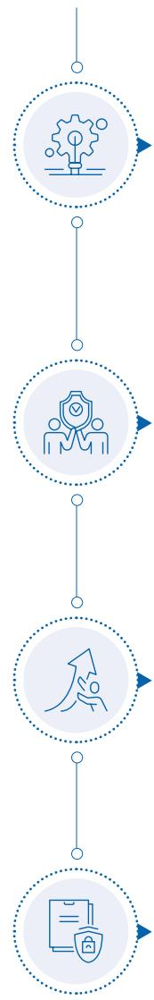

flowchart

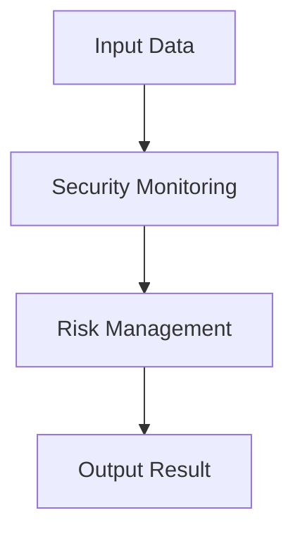
```mermaid
graph TD
  A["Input Data"] --> B["Security Monitoring"]
  B --> C["Risk Management"]
  C --> D["Output Result"]
```

# 全链路日志审计与监控

建设了基于 MongoDB 分片集群的业务操作日志平台和基于 VictoriaLogs 的运维日志平台，实现了对数据访问、系统操作等行为的全链路日志采集、存储与分析。平台支持对敏感数据的增删改查行为进行实时监控和异常预警，并按季度 / 半年度对机密 / 秘密级别数据的访问修改行为进行审核。

# 提升安全意识与能力

2025 年，公司开展信息安全与隐私保护培训 5 次，培训覆盖率达 100%，确保全体员工熟悉并掌握相关安全要求。

# 强化激励与考核

将信息安全与隐私保护工作纳入各部门及员工的绩效考核范畴。对于严格遵守安全制度、有效防范安全风险的部门和个人给予表彰；对于违反安全规定、造成安全事件或数据泄露的，将根据事件性质和影响程度进行相应处罚。

# 供应商安全监督与评估

安全与风控部负责对供应商的信息安全进行评审和检查，确保其持续满足公司的安全要求。

# 强化数据安全

我们构建以精细化数据权限管控和统一身份治理为核心，以全链路日志审计为追溯手段，并延伸至供应链运营安全的立体化安全防护体系，提升数据安全管控能力。

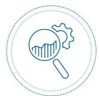

# 精细化数据权限管控体系

基于 Apache Ranger 构建了企业级数据安全管控中心，实现了从“库-表”粗粒度管理到“单表/单字段级”精准管控的升级，系统支持“用户-角色-部门-数据对象”四维联动授权，落实数据访问权限的最小化原则。

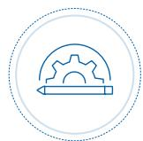

# 核心数据资产分级分类与隔离

完成超过 5,000 个核心业务字段的敏感数据分级分类工作，对识别出的 32 个一类敏感字段实施专项隔离与访问控制，从根本上强化对高价值、高敏感性数据资产的保护，有效防范内部越权访问和数据泄露风险。

# 影响、风险和机遇管理

针对可能发生的信息安全、数据泄露事件，公司建立起安全事件报告与处置机制，明确数据安全事件报告流程，制定了科学的应急处置方案，并在事后进行事件追溯和根因分析，确保信息安全风险管理的有效性。

同时，公司搭建完善的数据灾备体系，建立多层级、异地化的数据备份与恢复机制，定期开展数据备份巡检及灾备恢复演练，强化核心业务数据全周期安全防护，有效防范数据丢失、系统中断等风险，保障数据资产持续稳定与业务连续运行。

指标与目标

<table><tr><td>管理目标</td><td>2025年达成情况</td></tr><tr><td>信息安全与隐私保护培训覆盖率100%</td><td>目标达成</td></tr><tr><td>每年定期开展至少1次信息安全培训</td><td>目标达成</td></tr><tr><td>信息安全违规事件/信息安全重大风险零发生</td><td>目标达成</td></tr><tr><td>信息泄露事件零发生</td><td>目标达成</td></tr><tr><td>每年定期信息安全等保渗透测试</td><td>目标达成</td></tr></table>

# 03

# 绿色发展

# 打造长青基业

贡献联合国 2030 可持续发展目标 SDGs

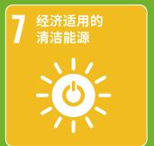

12 负责任消费和生产  

13 气候行动  

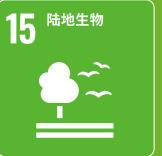

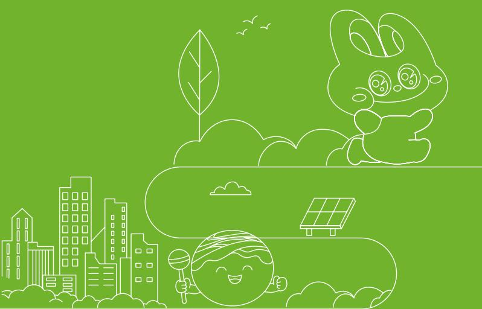

natural_image

Green-toned line art illustration of a smiling child holding a lollipop, with city skyline and clouds in the background (no text or symbols)

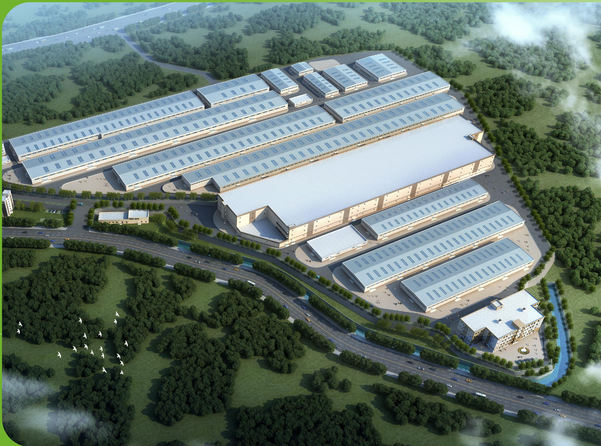

natural_image

Aerial rendering of a large industrial complex with multiple factory buildings and surrounding greenery (no visible text or signage)

# 应对气候变化

万辰集团积极响应《巴黎协定》和《国家适应气候变化战略 2035》，持续完善气候治理体系，注重对气候变化风险的识别和管理，积极推进各项节能减排工作，抓住低碳发展机遇，为实现国家“碳达峰”“碳中和”目标贡献力量。

# 治理

公司董事会为应对气候变化相关工作的最高层级，对公司的应对气候变化相关事宜承担全部责任，授权安环部协助董事会管理及决策相关事宜。安环部负责评估与厘定气候变化方面的风险及机遇，并纳入经营考量，通过跨部门协作，推动应对气候变化及低碳发展工作有序开展。

# 战略与管理方式

公司高度重视气候变化带来的挑战与机遇，建立气候变化风险管理流程，开展气候风险和机遇的识别与评估工作，评估气候变化对业务运营和产业链上下游的潜在影响，提升气候韧性，制定应对气候变化的行动策略。

<table><tr><td colspan="2">风险/机遇</td><td>潜在影响</td><td>应对措施</td></tr><tr><td rowspan="2">实体风险</td><td>极端天气</td><td>食用菌业务板块工厂化生产高度依赖稳定电力与温控环境,若极端高温、寒潮或台风导致区域性停电、物流中断,易引发菌菇批量报废与产能骤降;量贩零食业务板块万店网络分布广泛,若暴雨、暴雪等极端天气造成局部门店停业、配送受阻,将直接影响日销客流与供应链时效,加剧库存积压与损耗,对业务连续性造成影响。</td><td>· 食用菌生产基地严格执行《防抗台风标准》,灾前做实设施加固、应急物资储备与特殊物料防护,灾中保障关键设施安全与规范巡查,灾后快速恢复生产,保障生产交付。· 量贩零食业务板块搭建全方位防御体系:仓储封堵卷帘门、构筑防水墙;门店加固门窗、垫高货物;供应链暂停配送、联动救援;资产隔离临时建筑、明确车辆责任,全面筑牢安全防线。</td></tr><tr><td>气温上升</td><td>食用菌工厂化栽培对温湿度控制精度要求高,气温上升将直接推高制冷能耗与电力成本,同时易诱发杂菌污染与病虫害;冷链物流与门店仓储能耗上涨,高温季产品损耗率上升,对极致性价比策略形成成本压力。此外,高温或将影响员工的健康情况,影响机器设备性能,增加运营成本。</td><td>· 对于高温作业人员,开展降温控制及作业时间管控措施,并发放相应防控物资。· 升级培育车间智能温控与新风系统,建立高温预警联动机制,监控食用菌生长环境。· 优化冷链路径算法与门店智能温控设备部署,并开发常温长保品类替代方案。</td></tr></table>

<table><tr><td colspan="2">风险/机遇</td><td>潜在影响</td><td>应对措施</td></tr><tr><td rowspan="3">转型风险</td><td>政策与法规</td><td>随着碳排放管控政策持续收紧和能源结构转型加速,可能面临碳配额购买成本及数据核算合规压力,监管合规风险增加。</td><td>· 引入温室气体排放精细化核算体系,做好碳排放数据摸底与合规储备,并延伸至上游供应商,推动自身运营及价值链降碳,将政策合规压力转化为全链条绿色升级动力。</td></tr><tr><td>消费者行为改变</td><td>消费者对于商品的选择可能会逐渐转向那些更加注重环境保护、采用低碳排放和可持续生产方式的企业。这种转变可能导致公司在竞争激烈的市场中面临客户流失的风险,尤其是那些对环保有高度认知和消费偏好的消费者群体。</td><td>· 加强低碳技术使用,加速农业绿色转型,降低产品碳足迹。· 进一步将绿色包装和健康选品纳入自有品牌开发标准,同时将绿色消费理念嵌入会员运营体系,通过私域渠道向消费者传递可持续消费信息。</td></tr><tr><td>声誉</td><td>万店规模与低价策略易受舆论关注,若供应链碳足迹或包装浪费问题被曝光,“极致性价比”形象可能反噬为“高碳低价”负面标签;若气候行动披露不充分或减排成效不及预期,将面临资本市场ESG评级下调与投资者信任流失。</td><td>· 及时披露企业碳排放和产品碳足迹相关信息,加强与利益相关方的沟通交流,以&quot;透明低碳&quot;重塑品牌叙事。</td></tr><tr><td rowspan="2">机遇</td><td>能源结构</td><td>随着清洁能源成本持续下降、绿电交易机制完善、区域分布式能源与智能微电网技术成熟,为工厂化生产和冷链降本与ESG形象提升创造窗口期。</td><td>· 通过布局光伏发电、在核心物流节点建设光储充一体化设施等,扩大清洁能源使用,逐步提升生产运营过程中可再生能源的使用比例。</td></tr><tr><td>资源效率</td><td>通过采用节能技术和设备,降低生产过程中的能耗,并加强资源回收利用,降低公司的运营成本,同时实现生产效率和供应能力的提升。</td><td>· 通过设备更新、管理优化等举措,不断提高自身资源使用效率,建立完整的能耗管理流程,降低能耗成本。· 建立完善的资源回收和处理体系,实现废物的资源化利用和减量化处理。</td></tr></table>

# 提升能源效益

我们遵循《中华人民共和国节约能源法》，通过精细化的能耗管理、生产设备设施更新与节能改造、余热回用等方式，提升能源利用效率，推动生产运营向绿色、低碳化方向转型。

# 能耗管理

\- 我们建设用电能耗管理系统，对各车间用电量进行监测和统计，通过月度数据分析发现用能异常情况，为优化设备运行策略、识别节能改进空间提供数据支持。

# 余热 回用

\- 我们将灭菌蒸汽余热回收，用于加热锅炉用水，并开展燃气锅炉热水提温改造，减少天然气用量。

\- 在量贩零食业务板块，公司积极推进冷藏设备节能升级，新增四尺 / 六尺带门风幕柜共 976 台，通过封闭式柜门设计减少冷气外溢，降低压缩机运行负荷，以设备结构优化提升能源使用效益，年度节约电量 571.1 万千瓦时，折合减少二氧化碳排放 3,030.23 吨二氧化碳当量，助力门店减碳降耗。

\- 在食用菌业务板块，我们淘汰老旧能耗高的制冷设备，更换为更加节能的制冷设备；对库房程序进行优化，降低空库风机运行频率、减少出库时风机开启时间；对空压机进行节能运行管控，并淘汰老旧空压机，使用更加节能的全新空压机；淘汰厂区老旧路灯时控开关，改为先进的智能控制，根据日出日落时间自动控制路灯启停，并开始逐步替换太阳能绿电路灯，多措并举实现节能降耗。

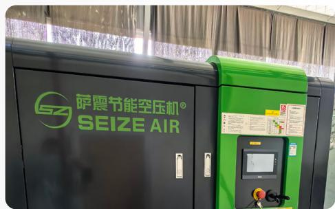

text_image

萨震节能空压机®
SEIZE AIR

新节能空压机

# 绿色物流与仓储

我们注重物流环节对环境的影响，在优化运输路线、开展仓储节能管理等环节持续发力，积极减少碳排放，实现全链路减碳与降本增效。

# 优化物流模式

将零散运输整合为集运物流模式，提高装载率、降低货物损耗及运输里程；应用冷链区域配送中心（RDC）、前置转运仓仓网，优化运输链路，减少长途运输次数，减少总体车次以及行驶距离，实现客户响应速度提升与节能减排双赢。

# 开展仓储节能

通过收发存全自动化仓仓储、无人车配送、ROS智能调度系统、无纸化电子签等，减少仓储运营环节能耗。

natural_image

Line drawing of a person standing on a cityscape with clouds and a leaf (no text or symbols)

# 影响、风险与机遇管理

公司依据监管机构要求，开展气候风险与机遇的识别工作，评估风险影响及优先级顺序，根据风险等级制定应对措施，以更好应对气候风险。

# 气候风险与机遇管理流程

# 气候风险与机遇识别

\- 根据《深圳证券交易所上市公司自律监管指南第3号——可持续发展报告编制（2026年修订）》、香港交易所《环境、社会及管治报告守则》关于气候相关披露的框架建议，识别气候风险与机遇项。

# 气候风险与机遇重要性评估

\- 运用内外部风险管理工具，结合风险发生的可能性与影响程度，识别出对公司业务有实质性影响的气候风险与机遇。

# 气候风险与机遇管理

\- 将重大气候风险与机遇纳入公司风险管理体系，通过定期监控与动态策略，确保业务符合政策趋势与市场需求；

\- 针对气候挑战，科学制定应对举措，持续增强气候韧性与管控水平。

# 指标与目标

我们设定能源使用以及温室气体排放目标，以目标为导向科学规划减碳路线图，持续跟踪目标达成情况。

# 科学设定目标

# 温室气体排放目标

# 以 2024 年为基准年

2034 年实现温室气体排放密度

下降 5 %

# 能源使用效益目标

# 以 2024 年为基准年

2034 年实现综合能源消耗密度

下降 5 %

能源消耗与温室气体排放

<table><tr><td>指标</td><td>单位</td><td>2023年</td><td>2024年</td><td>2025年</td></tr><tr><td colspan="5">能源使用</td></tr><tr><td>综合能耗(1)</td><td>兆瓦时</td><td>153,319.74</td><td>159,018.14</td><td>172,021.08</td></tr><tr><td>综合能耗密度</td><td>兆瓦时/百万营收</td><td>16.50</td><td>4.92</td><td>3.34</td></tr><tr><td>柴油</td><td>升</td><td>151,034</td><td>81,500</td><td>58,796.83</td></tr><tr><td>汽油</td><td>升</td><td>10,500</td><td>7,600</td><td>9,196.61</td></tr><tr><td>天然气</td><td>立方米</td><td>2,708,466.8</td><td>2,688,908.9</td><td>2,372,225.90</td></tr><tr><td>液化石油气</td><td>千克</td><td>530</td><td>4,525</td><td>6,360</td></tr><tr><td>总用电量</td><td>千瓦时</td><td>122,405,921</td><td>128,978,083</td><td>145,613,566.95</td></tr><tr><td colspan="5">温室气体排放(2)</td></tr><tr><td>范围1温室气体排放</td><td>吨二氧化碳当量</td><td>6,353.66</td><td>6,129.92</td><td>5,385.90</td></tr><tr><td>范围1温室气体排放密度</td><td>吨二氧化碳当量/百万营收</td><td>0.68</td><td>0.19</td><td>0.10</td></tr><tr><td>范围2温室气体排放</td><td>吨二氧化碳当量</td><td>65,683.02</td><td>69,209.64</td><td>77,262.56</td></tr><tr><td>范围2温室气体排放密度</td><td>吨二氧化碳当量/百万营收</td><td>7.07</td><td>2.14</td><td>1.50</td></tr><tr><td>范围3温室气体排放</td><td>吨二氧化碳当量</td><td>1,414.26</td><td>5,012.07</td><td>3,878.82</td></tr></table>

注：  
(1) 综合能耗依据《综合能耗计算通则 GB/T 2589-2020》计算得出。  
(2) 范围 1 温室气体排放主要来自汽油、柴油、天然气和液化石油气，范围 2 温室气体排放主要来自外购电力。范围 1 和范围 2 温室气体排放量的计算方法参照政府间气候变化专门委员会 (IPCC) 发布的《第六次评估报告》和生态环境部发布的《关于发布 2022 年电力二氧化碳排放因子的公告》。范围 3 温室气体排放量计算方法参考《温室气体核算体系》(GHG Protocol)，排放因子参考中国产品全生命周期温室气体排放系数库及美国环境投入产出模型数据库 (USEEIO database) 的数据。

# 循环经济

万辰集团坚持“绿水青山就是金山银山”的发展理念，利用先进工艺实现农业废料的资源化利用，推进绿色包装行动，实现经济效益与环境效益双赢。

# 循环农业

公司将生态优先、绿色发展的理念贯穿于生产全过程，实现从“农业废弃物”到“食用菌”再到“有机肥/燃料”闭环。

生产原料主要采用玉米芯、米糠、麸皮等农业下脚料，不仅有效降低生产成本，更实现了对秸秆等废弃物的资源化利用，从源头减少废弃物产生。

对生产后的菌渣进行充分循环利用。一方面，金针菇的废菌料可应用于公司自身白玉菇、蟹味菇的栽培，实现内部资源循环；另一方面，对外销售作为生产有机肥的原辅材料或用作生物燃料再利用，有效解决了传统农业废弃物污染问题。

以年产 4 万吨食用菌计算，所需土地面积仅为 320 亩，是传统种植模式的 1%，能有效节约农业用地。

# 绿色包装

公司坚持减量化、可循环、可重复利用、可再生和可降解的行动策略，从包装选购、使用等环节推进可持续包装转型，持续减少包装废弃物对生态环境的影响。

# 包材减量化与轻量化

# 食用菌板块

纸箱按季节选用不同材质（梅雨季节采用加强材质以保障防护性能，冬季采用优化后的轻薄材质），同时降低托盘克重和专用袋厚度。

# 量贩零食板块

与供应商共同进行商品包装开发，在满足食品安全性、运输要求、销售便利性前提下，减少过度包装的情况。

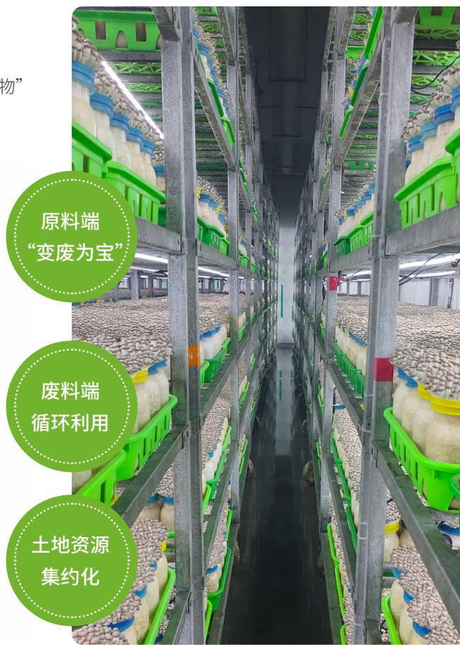

text_image

原料端
“变废为宝”
废料端
循环利用
土地资源
集约化

# 包材可循环

# 食用菌板块

对于报废的纸箱、泡沫箱，通过废品回收单位回收后二次利用。

# 量贩零食板块

采购并贩售的多类包装均具备循环利用属性，在产品生命周期结束后，包装材料可被高效回收及资源化再生，有效助力绿色低碳发展。

# 包装可重复利用

# 量贩零食板块

门店在售的多款产品包装可实现旧物再利用，消费者可将其改造为玩具、收纳容器等，延伸包装生命周期，践行绿色环保理念。

包装材料使用总量

8,157.69吨

各类包装材料使用量（单位：吨）  
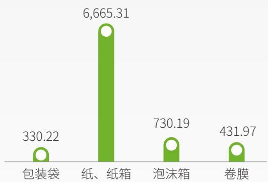

bar

| Category | Value |
| --- | --- |
| 包装袋 | 330.22 |
| 纸、纸箱 | 6,665.31 |
| 泡沫箱 | 730.19 |
| 卷膜 | 431.97 |

# 可持续运营

万辰集团积极响应国家关于建设资源节约型、环境友好型社会的号召，善用各类自然资源、做好污染防治、推进循环利用，减少对自然资源的依赖，在最大程度上实现“变废为宝”，助力实现人与自然和谐共生。

# 环境合规管理

公司严格遵守《中华人民共和国环境保护法》等国家相关环境保护法律法规的要求，建立健全《环境管理制度》，持续完善公司环境管理体系建设，落实环境保护的长效机制，以实际行动守护绿水青山。2025年，公司未发生因环境合规问题受到处罚的情况。

环保总投入

229.12 万元

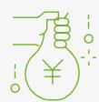

# 环境风险评估与管理

公司制定《突发环境事件风险评估报告》，识别厂区生产装置、储运设施、环境保护设施等可能存在的环境风险类型，评估风险等级并制定预防性措施。

# 环境应急响应

公司严格执行《突发环境事件应急预案》，持续建立健全突发环境事件的应急机制，成立应急指挥部、应急处置组、应急保障组、应急监测组、应急抢险组、医疗救助组、专家组，明确各部门职责，设置应急措施与恢复处置要求，以对潜在的环境事故或可能发生的紧急情况作出预防和处理，避免和减少可能造成的环境危害。同时，公司定期对应急救援指挥部成员开展应急响应的培训，提高员工突发环境事件防控能力，确保公司能迅速、有序、高效地应对突发环境事件。

# 水资源利用

公司高度重视水资源的管理与高效利用，严格遵守《中华人民共和国水法》及相关法规，以水资源管理目标为指引，明确水资源管理的各项要求，有序推进节水计划，促进水资源循环利用。我们在生产和运营过程中使用的水资源主要来源于市政供水，在水源选取方面对环境无重大影响。

# 用水效益目标

以 2024 年为基准年

2034年实现用水密度下降5%

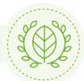

# 用水监测

更换智能水表，通过水表智能化升级，以更精准监测用水情况、实现用水异常预警、全面开展用水分析，发现节水点并制定相应节水举措；通过加强日常巡检，杜绝跑、冒、滴、漏现象，减少水资源浪费。

# 循环用水

将灭菌蒸汽排放的热水回收，用于清洗瓶盖和日常清洁打扫；将水处理废水、罐冷却废水回收到水池用于装瓶搅拌锅加水，有效减少自来水用量。

耗水量（吨）  
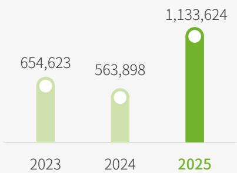

bar

| Year | Value |
| --- | --- |
| 2023 | 654,623 |
| 2024 | 563,898 |
| 2025 | 1,133,624 |

耗水密度（吨 / 百万营收）  
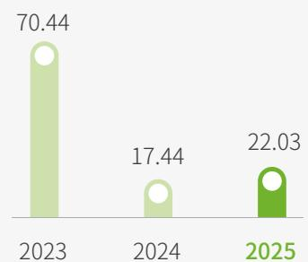

bar

| Year | Value |
| --- | --- |
| 2023 | 70.44 |
| 2024 | 17.44 |
| 2025 | 22.03 |

# 排放物管理

公司遵守并贯彻《中华人民共和国固体废物污染环境防治法》《中华人民共和国大气污染防治法》《中华人民共和国水污染防治法》等法律法规，严格管控污染物的产生与排放，通过源头削减、分类管理及回收利用减少固体废弃物排放，加强对废气、废水的处置与管控，多措并举降低生产运营对环境的影响。

# 减少排放目标

以 2024 年为基准年

2034 年实现主要大气污染物

排放密度下降 5 %

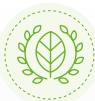

以 2024 年为基准年

2034 年实现无害废弃物排放

密度下降 5 %

废弃物合规处理率保持

100%

# 废弃物管理

我们严格按照《江苏省固体废物污染环境防治条例》《危险废物贮存污染控制标准》（GB 18597-2023）、《国家危险废物名录》等相关规定与标准，制定《固体废物管理制度》，开展废弃物分类处理，积极推进源头减量、末端无害化、循环利用等措施，适时开展危废管理新标准的宣导与培训，确保废弃物规范化管理。

# 危险废物

\- 按《国家危险废物名录》确定危险废物：废弃的日光灯管、废电池、墨盒；废弃油杂质、擦油布、更换下来的含油零件、废旧电瓶。

# 一般废物

- 可回收利用的一般固体废物：主要为菌渣、培养瓶、剩余的包装材料等。  
- 不可回收利用的一般固体废物：污泥、炉渣、废弃新风棉、生活垃圾等。

# 收集存放

- 由产废部门负责收集、整理，并对每批废物种类、数量等按要求做好记录；  
- 分类收集、分类存放，在收集和存放过程中做好防护措施，临时存放处做好“有毒”“危险”等警示标识；  
- 安环部定期进行危废管理平台系统入库，并制作打印危废联单张贴存放场所。

- 办公及生活中产生的生活垃圾由人力行政中心统一回收，可回收价值的纸皮、金属、塑料等放置到各堆场处；  
- 产生的工业固体废物等由产废部门转运至锅炉房一般固废堆场进行存放。

# 处理方式

\- 委托有资质、有处理能力的外协单位进行处理或供应商直接回收。

- 菌渣进行锅炉焚烧利用、外销综合利用；  
- 培养瓶等可回收的废物交由废品回收机构处理，生活垃圾由市政环卫部门处理。

有害废弃物产生量（吨）  
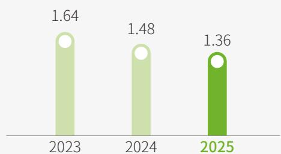

bar

| Year | Value |
| --- | --- |
| 2023 | 1.64 |
| 2024 | 1.48 |
| 2025 | 1.36 |

无害废弃物产生量（吨）  
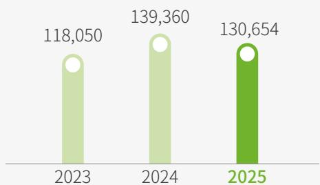

bar

| Year | Value |
| --- | --- |
| 2023 | 118,050 |
| 2024 | 139,360 |
| 2025 | 130,654 |

# 废气管理

公司严格遵守各运营所在地的废气排放规定，遵循《大气污染物综合排放标准》《锅炉大气污染物排放标准》落实废气管理、控制和监测各项工作，在确保废气合规排放基础上，努力减少废气的排放量和排放的浓度。

公司产生的废气主要为锅炉废气，采用 “SNCR 脱硝技术 + 烟气除尘系统（一级多管除尘器 + 二级布袋除尘器）+ 脱硫塔” 处理，通过高排气筒排放；定期监控氮氧化物、硫氧化物、挥发性有机物和颗粒物的排放量，确保合规排放。

废气排放量（吨）  
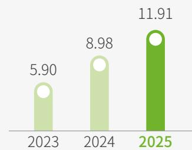

bar

| Year | Value |
| --- | --- |
| 2023 | 5.90 |
| 2024 | 8.98 |
| 2025 | 11.91 |

# 废水管理

公司产生的废水包括生活废水和生产废水。其中，生活废水经过三级化粪池处理后，汇入生产废水处理设施后一并排放；生产废水处理设施采用“调节池+平流气浮池+厌氧+缺氧+好氧”工艺，处理后废水达到《污水综合排放标准》一级标准，防止和减少废水对水体和环境的污染。

废水排放量（立方米）  
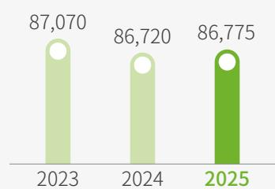

bar

| Year | Value |
| --- | --- |
| 2023 | 87,070 |
| 2024 | 86,720 |
| 2025 | 86,775 |

生活污水（立方米）  
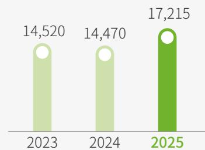

bar

| Year | Value |
| --- | --- |
| 2023 | 14,520 |
| 2024 | 14,470 |
| 2025 | 17,215 |

工业废水（立方米）  
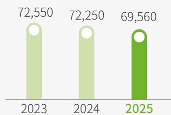

bar

| Year | Value |
| --- | --- |
| 2023 | 72,550 |
| 2024 | 72,250 |
| 2025 | 69,560 |

# 生态系统和生物多样性保护

万辰集团重视种质资源保护与利用，通过建设种质资源库，打造较完备的育种体系，开展产学研合作等，实现生物多样性保护与商业价值创造的双赢。

# 种质保护与利用

公司已建立种质资源库，并配备了超低温及液氮菌种保藏设备，能够长期、安全地保存不同来源的食用菌种质材料，防止珍贵基因资源的流失，被评为“农业农村部食用菌育种重点实验室”；建立了“中国菌物学会万辰生物服务站”，通过引进专家团队，开展种质资源收集、鉴定、评价及新品种选育工作，实现生物多样性保护与产业技术升级紧密结合。

公司与高校科研团队合作，系统收集了国内外金针菇种质资源300多份，构建高效育种体系，成功选育出“农万金9号”“万金1号”等白色金针菇新品种，综合性能达到国际先进水平，打破了国外种源的长期垄断；成功选育“农万金13号”等黄色金针菇新品种，开辟黄色金针菇新赛道，丰富了金针菇产品种类。

# 04

# 向善而行

# 共建美好家园

贡献联合国2030可持续发展目标SDGs  
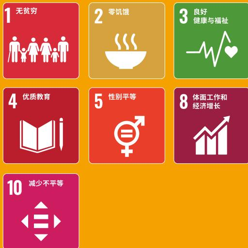

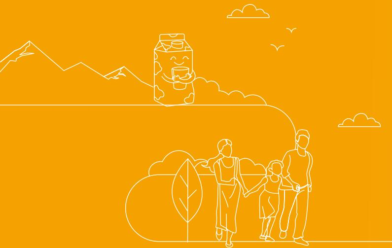

natural_image

Line drawing of a family with two children and a smiling child, set against an orange background with clouds and birds (no text or symbols)

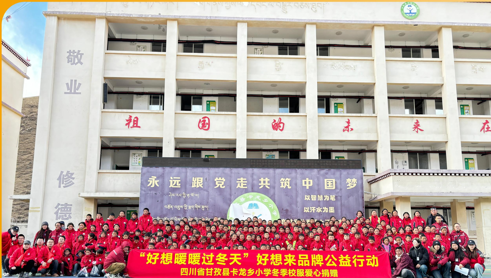

text_image

敬业
祖国的未来在
修德
永远跟党走共筑中国梦
“好想暖暖过冬天”好想来品牌公益行动
四川省甘孜县卡龙乡小学冬季校服爱心捐赠

# 雇佣与多元化

# 治理

人力行政中心作为公司核心职能部门，在董事会战略引领下，搭建起覆盖两大业务板块的雇佣管理体系，食用菌板块、量贩零食板块分别设立独立的人力资源团队，结合板块业务特点落地公司制度要求，保障雇佣管理的规范性与适配性。各板块根据公司发展战略规划，全面策划和实施人力资源发展战略，制定人力资源制度及规划，组织开展人力资源规划、岗位管理、招聘与配置、培训与发展、绩效管理、薪酬与福利管理、劳动人事管理等工作，确保人力资源管理工作符合企业经营发展的需求，提高企业现代化管理水平。

公司严格遵循《中华人民共和国劳动法》《中华人民共和国劳动合同法》等国家法律法规，结合企业发展战略与两大业务板块运营特点，构建了完善的员工权益保护内部制度体系，包含《招聘管理制度》《考勤管理制度》《薪酬管理制度》《福利管理制度》《员工晋升管理制度》《离职管理制度》《满勤奖管理制度》《出差管理制度》《员工通讯补贴管理办法》《工伤管理制度》等制度，覆盖员工管理的全生命周期，切实保障员工合法权益，营造规范、公平、和谐的用工环境。

公司将 ESG 理念全面融入绩效管理体系，在食用菌板块高管的绩效合约中，根据岗位职能设置质量管理（如优菇率等）、客户服务、环境保护、安全管理、离职率、培训管理、招聘完成率等关键指标；量贩零食板块包含售后服务满意度、新店装修质量合格率、食品质量问题发现率、工程安全管理、食安重大舆情、办公室环境维护标准性、加盟商投诉 / 加盟商满意度、员工满意度等关键指标，把可持续发展要求转化为可衡量、可考核、可落实的管理目标。通过将 ESG 绩效与薪酬激励、晋升发展直接挂钩，强化全员责任意识与长效约束机制，推动可持续发展理念贯穿经营管理全过程。

# 战略与管理方式

# 合规雇佣

万辰集团遵循国际劳工组织核心公约、联合国全球契约相关要求，响应国家人权相关政策，将人权风险防控纳入企业运营全流程，以制度化、全链条的管理举措筑牢人权保障防线。公司围绕劳工权益、人权保障相关政策开展常态化宣导，通过定期举办员工座谈会，向员工讲解劳动权益与人权保护相关政策内容，切实提升员工对于自身权益的了解程度。同时建立健全人权问题投诉举报与处理机制，依托员工座谈会广泛收集员工反馈及诉求，对人权相关违规问题及时响应、公正处理、闭环跟进，确保人权违规问题得到及时、公正解决。

# 禁止雇佣童工

\- 严格遵守国家禁止使用童工相关法律法规，并按照《招聘管理制度》执行全流程身份与资质审核，从招聘、面试、入职、档案管理各环节防范童工风险。在招聘和面试环节对候选人证件真实性进行核查；入职时统一收取并归档身份相关证明材料，与应聘申请表、录用审批表等一并归入员工个人档案；全程资料由人力行政中心规范存档，杜绝雇佣童工行为，确保用工合规。

# 禁止强迫劳动

\- 通过与员工自愿签订合法合规的劳动合同保障员工基本权益，实施人性化管理，坚决杜绝任何限制员工人身自由的行为。

# 禁止骚扰、歧视及暴力行为

\- 明确禁止基于性别、年龄、民族、学历、身体状况、宗教信仰等方面的就业歧视，在招聘、晋升、薪酬等环节坚持公平公正原则，公司定期开展反骚扰和反歧视相关的培训宣导会，避免此类事件发生。

# 工时与假期

- 严格遵循所在地的劳工相关法规政策，同时根据板块业务特点，制定匹配且合理的工作时间和完善的调休政策，员工在节假日或公司规定的休息日仍正常工作的视为加班，员工可按照相关规定申请调休。  
- 严格落实带薪休假制度，员工享有公休假、法定假日、婚假、生育假、哺乳假、陪产假、丧假、年假、事 / 病假、工伤假等假期，切实保障员工休息休假权利。

# 自由结社

\- 尊重员工的自由结社与集体谈判权利，支持员工依法加入工会，工会作为员工代表组织与公司就员工切身利益相关的事项进行沟通协商。截至报告期末，工会已审议通过《员工录用条件》《工资集体协商》《严重违反公司的规章制度的情形》《奖惩管理制度》等制度。

# 同工同酬

- 制定《薪酬管理制度》《福利管理制度》等，明确员工福利待遇，向全体员工公示并组织培训，规范薪资发放流程，按规定缴纳五险一金，足额计发工资并留存核算明细。  
- 优化劳务派遣、外包用工等各类用工管理，确保不同用工形式员工享有同等权益。  
- 强化特殊群体保护，完善女职工、工伤员工、未成年工专项福利保障措施，杜绝性别、地域等薪资歧视行为。

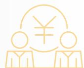

劳动合同签订率

100%

社会保险覆盖率

100%

员工歧视事件数

0起

工会 / 集体谈判协议覆盖率

100%

# 福利与关爱

万辰集团各业务板块严格落实《福利管理制度》，建立了“法定福利 + 公司统一福利 + 其他专项福利”的多层级福利体系，在按国家规定为全员缴纳五险一金的基础上，推出多项优于法定标准的福利项目。

公司福利体系构成

<table><tr><td>法定福利</td><td>·社会保险:为员工缴纳养老、医疗、失业、工伤、生育保险
·住房公积金:按公司制度为符合条件员工缴纳,公司与个人按比例承担</td></tr><tr><td>各类假期</td><td>·提供法定节假日、年假、婚假、产假、陪产假、哺乳假、丧假等,按制度核发薪资,保障员工休息休假权</td></tr><tr><td>统一福利</td><td>·食宿福利:为员工提供免费食宿
·生日福利:为员工举办生日庆祝活动或发放蛋糕、礼品
·节日福利:妇女节、端午节、中秋节、春节发放节日礼品或举办庆祝活动
·慰问福利:职员级及以上员工直系亲属慰唁金、住院慰问等
·工龄奖:员工按入职时长享受工龄奖</td></tr><tr><td>其他福利</td><td>·为相关员工提供夜班津贴(免费宵夜)、通讯津贴、交通津贴、劳保福利、忠诚员工奖、优秀员工奖、教育培训,以及免费宿舍网络、改善住宿与工作环境、定期团建与员工活动等非经济性福利</td></tr></table>

为丰富员工生活、保障工作与生活平衡，公司定期组织各类员工活动，包括春季旅游活动、中秋活动、月度生日会等，营造轻松、愉快的职场氛围，促进员工身心健康，增强员工归属感。

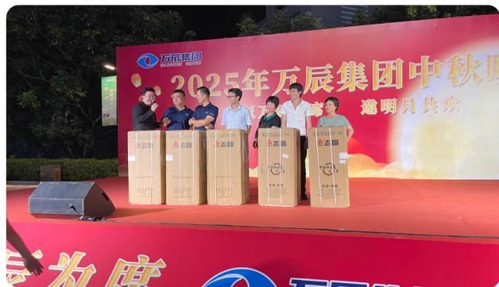

text_image

2025年万辰集团中秋
迎明月共欢

中秋节晚会

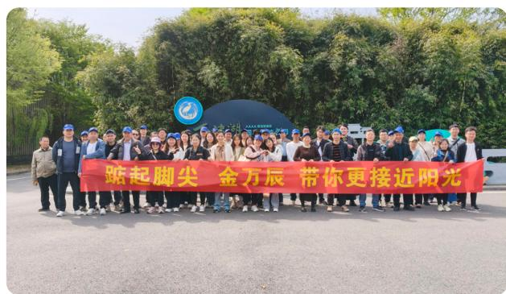

text_image

踮起脚尖 金万辰 带你更接近阳光

春游活动

# 多元共融

公司始终秉持多元包容的核心价值观，致力于构建多元、包容、开放的职场环境，为每一位员工提供坚实的成长支持与发展平台，凝聚多元力量，共同推动企业的可持续发展。

# 支持女性员工发展

持续重视女性人才的培养，在招聘各级别员工（包括高级管理层）时促进性别多元化，为女性员工提供更多发展机会，同时为女性员工提供妇女节专属福利及孕期、产期、哺乳期专项保障，在职场设置哺乳室等基础设施，支持女性员工在休完产假后平稳返岗、稳定发展。

# 关注弱势群体及少数民族群体的多元化任用

2025 年，公司同漳州龙海特殊学校、南京市溧水区特殊学校及南京市高淳特殊学校达成合作，共计为 11 名特殊学生提供就业岗位；同时重点招聘四川大凉山彝族、甘肃回族等少数民族员工，以实际行动推动多元包容、平等就业的职场环境建设。

少数民族员工

380人

残障员工

25人

高级管理层中女性员工比例

25.3%

# 平等沟通

万辰集团建立健全平等、畅通、多元的员工沟通与申诉保障体系，明确沟通制度、反馈渠道、处理机制与保密保护措施，保障员工知情权、参与权与监督权，持续提升员工沟通体验与满意度。以食用菌业务板块为例，搭建了多层级、全覆盖的正式与非正式沟通渠道，通过总经理信箱、人力行政中心员工反馈窗口及月度员工座谈会，常态化收集并处理员工诉求与建议；同时建立经理级人员定期沟通机制，由人力总监与中层员工直接交流，并将相关事项汇报总经理，确保各类反馈信息直达管理层，营造了开放、高效的沟通氛围。

# 影响、风险和机遇管理

万辰集团高度重视雇佣相关的风险管理，建立了雇佣全流程的人权风险管理机制。2025年对业务运营开展全域潜在人权风险评估，精准识别招聘录用、劳动用工等环节的人权风险点，通过合规工厂自我检视审核，常态化开展招聘录用合规性检查，严格排查侵犯人权、强制劳动等违规情形，同时引入第三方评估强化风险校验；全流程规范用工管理，坚守反雇佣歧视、保障平等就业原则，落实多元化用工举措，全方位缓解并防范人权风险。

在风险防范与缓解的同时，公司积极挖掘合规雇佣与多元化带来的发展机遇，通过规范的雇佣管理与完善的员工权益保护，降低劳动纠纷与合规处罚风险，维护企业品牌形象；同时通过多元共融的人才体系建设，吸引不同背景、不同技能的优秀人才，为企业发展注入创新活力，提升工作效率与创新能力，此外通过完善的员工沟通与关爱机制，提升员工敬业度与忠诚度，保障了企业运营的稳定性。

# 指标与目标

万辰集团 2025 年度制定了合规雇佣目标并严格落实完成。报告期内，未发生任何侵犯员工权益的事件。

<table><tr><td>总体目标</td><td>分解目标</td><td>2025年达成情况</td></tr><tr><td rowspan="4">不发生侵犯员工权益的事件</td><td>无童工和强迫劳动事件发生</td><td></td></tr><tr><td>员工歧视事件总数为0</td><td rowspan="3">目标达成</td></tr><tr><td>员工保险覆盖率100%</td></tr><tr><td>员工申诉举报事件处理率100%</td></tr></table>

员工结构  
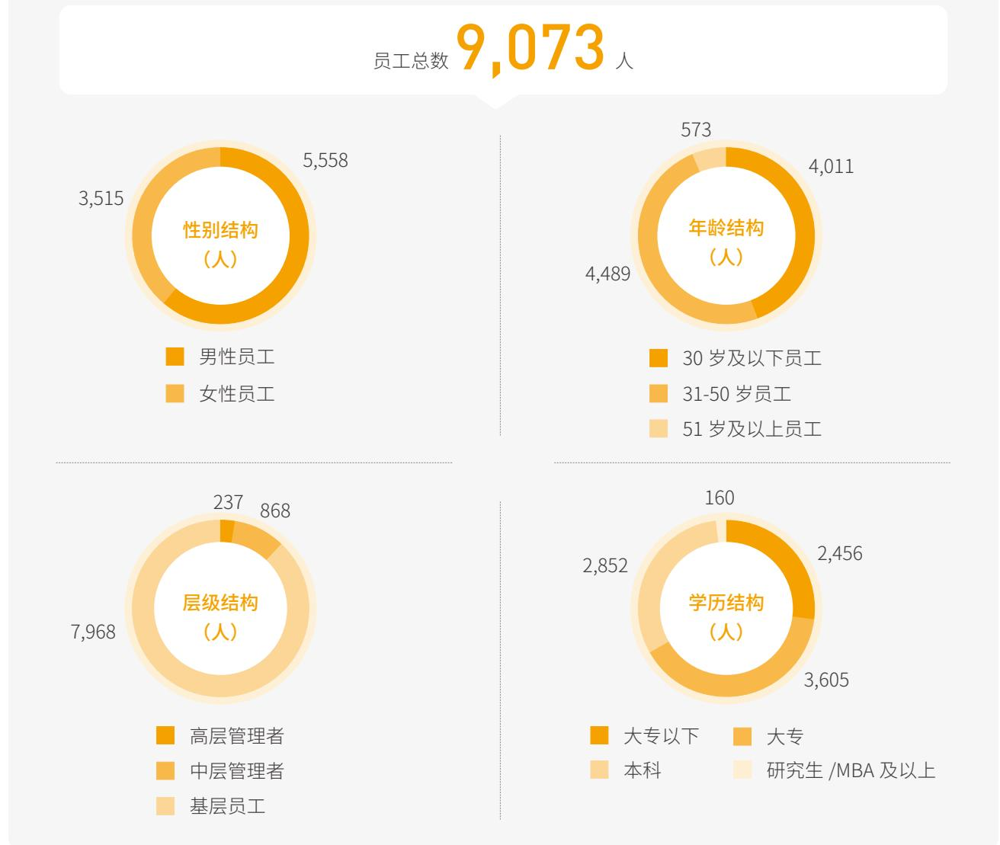

donut

| 维度 | 类别 | 人数 |
| --- | --- | --- |
| 性别结构 | 男性员工 | 5,558 |
| 性别结构 | 女性员工 | 3,515 |
| 年龄结构 | 30岁及以下员工 | 4,011 |
| 年龄结构 | 31-50岁员工 | 4,489 |
| 年龄结构 | 51岁及以上员工 | 573 |
| 层级结构 | 高层管理者 | 237 |
| 层级结构 | 中层管理者 | 868 |
| 层级结构 | 基层员工 | 7,968 |
| 学历结构 | 大专以下 | 2,456 |
| 学历结构 | 大专 | 3,605 |
| 学历结构 | 本科 | 2,852 |
| 学历结构 | 研究生/MBA及以上 | 160 |

# 员工流失

总流失率 39.57%

员工主动离职率 33.50%

按性别划分流失率  
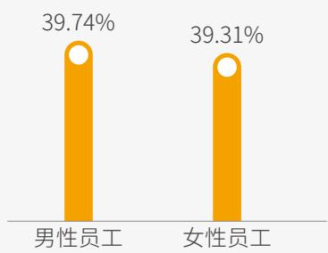

bar

| Category | Percentage |
| --- | --- |
| 男性员工 | 39.74% |
| 女性员工 | 39.31% |

按年龄划分流失率  
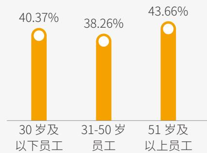

bar

| Category | Percentage (%) |
| --- | --- |
| 30岁及以下员工 | 40.37 |
| 31-50岁员工 | 38.26 |
| 51岁及以上员工 | 43.66 |

# 培训与发展

万辰集团坚持 “人才是第一资源” 的发展理念，制定以 “组织效能提升，人才梯队培养，文化价值凝聚” 为核心的人才发展战略，旨在构建与业务战略深度协同的人才生态体系。公司注重行业壁垒突破，通过人才密度提升与组织基因强化，驱动 “人岗匹配、组织赋能” 的长期竞争力，实现人才发展与业务发展同频共振。

# 人才吸引与选拔

基于业务战略解码人才缺口，聚焦高潜力、高适配度人才引进。

# 人才储备与培养

搭建线上线下学习平台，促进隐性知识显性化，建立梯队库，定制个性化发展路径。

# 人才激励与晋升

设计基于贡献度的激励方案，强化“多劳多得”导向，实现职业发展双通道的畅通。

# 文化价值认同

将 “创新、协作” 融入日常管理，通过活动与仪式强化文化认同。

# 人才吸引

万辰集团设置了人力资源规划专岗，根据企业发展战略与经营目标，对人力资源的供给和需求进行分析、预测，拟定企业人力资源规划（含人才数量和结构），实施与维护人力资源规划与人力资源各项计划，以确保人力资源数量与质量满足经营管理和战略发展的需求。同时，公司制定了《招聘管理制度》，规定每年6月和12月，人力行政中心统筹组织各部门根据公司战略及年度经营计划、目标，优化组织结构与定岗定编，并根据定岗定编制定招聘计划。同时，设置招聘与配置专岗，根据企业人力资源规划和人员配置计划，制定年度招聘计划，经批准后组织实施应届毕业生招聘与录用、内部竞聘、调配、轮岗等工作，以确保人力资源充足供给和合理配置，促进员工队伍结构的科学化、合理化。

2025 年公司人才吸引工作紧密围绕战略业务布局展开，通过精准规划、多元渠道储备，构建可持续的人才供给体系。

# 多元招聘渠道

内部
招聘

\- 公司内部信息渠道发布招聘信息，具体规定人力行政中心负责安排，优先考虑内部招聘，若不能满足需求，再进行外部招聘

外部
招聘

- 猎头渠道  
- 网络、现场招聘会渠道  
- 内部员工推荐，公司鼓励员工收集同行业公司通讯录，不断补充人才库

吸纳就业人数

6,686人

招聘应届毕业生人数

281人

# 员工培养

围绕食用菌、量贩零食两大业务板块的发展战略，我们针对板块特点，构建差异化的人才培训体系，制定年度培训计划，积极开展全方位、多维度、多渠道的全覆盖培训，从而促进员工成长与发展，提升组织效率，实现组织目标。

员工培训总支出

67.9万元

全年培训总人次

18,442人次

员工培训总学时

37,888 小时

员工人均培训时长

4.18 小时

员工培训覆盖率

100%

按性别划分培训覆盖率  
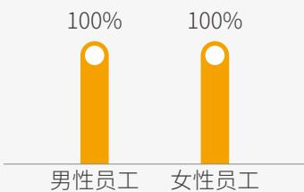

按层级划分培训覆盖率  
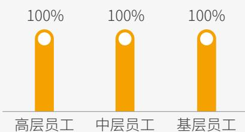

bar

| Category | Value (%) |
| --- | --- |
| 高层员工 | 100 |
| 中层员工 | 100 |
| 基层员工 | 100 |

食用菌业务板块

<table><tr><td>培训项目</td><td>培训内容</td><td>培训对象</td><td>培训效果保障</td></tr><tr><td>入职培训</td><td>厂区环境/各级主管介绍/行政后勤相关规定说明/安全事项强调</td><td>新入职员工</td><td>上岗后用人部门及公司员工大会定期宣贯</td></tr><tr><td>管理提升培训</td><td>成本管理/思维能力提升/现场管理工具/数据处理方法等</td><td>中高层管理人员</td><td>训后总结,工具使用</td></tr><tr><td>现场操作培训</td><td>设备故障处理/菌种操作技巧/特种设备使用保养等</td><td>对应岗位人员</td><td>专人传帮带</td></tr><tr><td>安全培训</td><td>隐患排查/应急措施等</td><td>全员</td><td>定期宣贯、考核、演练</td></tr></table>

# 量贩零食业务板块

我们根据不同的培训对象将培训项目分为新生力、专业力、后备力、领导力及通用力，并遵循“培训需求调研→培训计划制定→培训实施→培训评估→培训改进”的路径，形成PDCA培训管理闭环。此外，我们建立线上学习平台，聚焦内部人才培养与能力提升。2025年，平台完成系统升级，课程体系不断完善，学习覆盖率与培训成效稳步提升，为公司人才发展提供有力支撑。

# 领导力 / 后备力

针对不同层级的管理者，结合其管理场景及管理需求，我们配套了相应的领导力培训计划及课程体系。所有培训均为前置赋能，即管理者必须先通过培训获得相应能力，方可参与晋升选拔。

# 专业力

根据关键岗位的工作内容萃取出相关岗位所需的知识、技能及关键历练的要求，梳理关键岗位的培养规划及学习地图，后续将根据其规划完善相应的课程库并实施。

# 新生力

推行 “分类分群、线上线下融合” 的学习机制。2025 年 3 月起开展 “辰宝启航计划”，全年共举办 8 期，共覆盖 553 人次，顺利完成年度新人导入目标。

万辰集团「领航计划-储备总监特训营」  
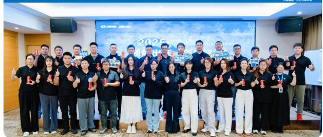

text_image

2025
WANGZHOU
2025
WANGZHOU
2025

量贩零食业务板块领航计划

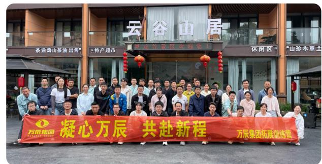

text_image

云谷山居
茶油鸡山茶油出售
特产超市
界龙行袋区欢迎彩！
休闲区
山珍本草土
凝心万辰 共赴新程
万辰集团拓展城线营

食用菌业务板块拓展训练营

# 晋升与激励

公司搭建系统化的晋升通道、动态的绩效管理机制以及富有竞争力的激励体系，为员工提供清晰的差异化发展路径和全方位的成长支持，激发员工立足岗位、发挥所长，同时确保关键岗位人才的持续、稳定供给。

# 职业发展晋升体系

万辰集团制定《员工晋升管理制度》，规范公司员工的晋升、晋级工作流程，在公司内部营造公平、公正、公开的竞争机制。根据实际运营需要，公司将员工发展路径分为纵向通道和横向通道两种方式，其中纵向通道上建立了“管理通道+专业通道”双轨并行的员工职业发展晋升体系，为员工提供多元化的职业发展路径，并结合各业务板块特点制定细分的晋升标准。公司积极推进员工管理与专业双通道发展，2025年我们进一步梳理技术职称评定方案相关内容，鼓励技术人员在专业通道上发展，以金针菇技术部为试点开展方案，并不断调整、优化。公司鼓励内部竞聘，2025年公司开展了“南京金万辰技术副总监”岗位竞聘工作，通过竞聘报名、360测评、过往业绩评定、现场评审等环节，公开公正筛选匹配人才。

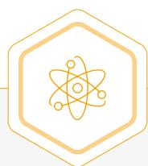

# 技术通道（T）

面向技术研发、生产技能等岗位，以专业能力与技术贡献为核心评价标准，覆盖从技工、工程师到首席专家的全层级发展路径，鼓励员工深耕专业领域。

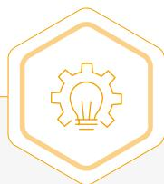

# 管理通道（M）

面向团队管理、业务经营等岗位，以管理能力与经营责任为核心评价标准，覆盖从基层员工、课长到股份公司总经理的全管理层级，支撑企业高效运营。

# 薪酬与绩效管理

公司秉持公平公正、激励导向、战略适配的薪酬管理理念，以《薪酬管理制度》《绩效管理制度》为依据，规范职工薪酬与绩效管理。公司员工年度薪酬由月工资、季度绩效奖金及年度绩效奖金构成，体系清晰、分配合理。公司以绩效贡献为核心确定员工绩效奖金水平，员工完成岗位本职工作即可获得相应奖金，未达标者依据绩效考核结果实施相应约束，超额完成业绩目标者给予正向激励，形成与岗位职责、工作业绩、实际贡献紧密挂钩的分配机制。

为实现员工与企业共同成长、共同发展，万辰集团积极推进股权激励 / 员工持股计划。公司目前生效的股权激励计划包括 2022 年限制性股票激励计划、2023 年限制性股票激励计划、2023 年第二期限制性股票激励计划、2024 年限制性股票激励计划、2025 年限制性股票激励计划，共 5 期，涉及股份合计接近公司股本总数的 20%，覆盖公司 300 余名员工，构建起“价值共创、利益共享”的激励格局，提升了员工的归属感与凝聚力，激发了员工的工作积极性与创造性。

# 健康与安全

万辰集团始终将员工健康与安全放在企业运营的首要位置，严格遵守《中华人民共和国安全生产法》《中华人民共和国职业病防治法》等国家相关法律法规，建立公司统一的健康与安全治理体系与管理标准，将健康与安全绩效纳入企业核心绩效考核指标，实现“安全第一、预防为主、综合治理”的管理目标，切实保障员工的生命健康与安全。

# 治理

公司设置安环部作为职业健康与安全管理的专职部门，全面负责公司健康与安全工作的规划、落实与监督，包括安全生产责任制考核体系建设、EHS合规性检查与隐患排查治理、全员安全教育培训、危险源分级管控与风险评价、应急演练组织、事故统计分析调查等核心职能，坚决制止和纠正违章指挥、强令冒险作业及违反操作规程的行为，并参与技改及新改扩建工程项目的“三同时”审核验收工作。

公司建立完善的健康与安全制度体系，涵盖《安全管理奖惩制度》《事故管理制度》《安全教育培训制度》《安全警示标识与安全防护管理制度》《安全隐患排查管理制度》《危险作业管理制度》《消防安全管理制度》，同时配套《工伤管理制度》《劳动防护用品管理制度》《高低温作业管理制度》《相关方管理制度》《燃气站及管道安全管理制度》《电动车充电安全管理制度》等专项制度，形成覆盖安全奖惩、教育培训、隐患排查、危险作业、工伤管理等全方位的管理体系，为员工职业健康与生产安全提供坚实制度保障。

# 战略与管理方式

# 提升安全意识和能力

公司高度重视安全生产文化建设，每年常态化开展安全生产月主题活动，将安全宣传、技能提升、应急演练与激励员工主动报告安全隐患等举措有机结合，持续筑牢全员安全防线。

# 强化安全工作法

2025 年，公司积极推行 “手指口述” 安全工作法，通过心想、眼看、手指、口述对工序逐项确认，有效纠正习惯性违章、减少操作失误、消除安全隐患，有助于员工养成规范操作习惯，提升现场安全水平与作业可靠性。公司拍摄了包含包装、卷纸、物流及装瓶等各个工作环节的 “手指口述” 规范操作视频，并通过标准化动作与语言培训及场景化训练，帮助员工有效掌握 “手指口述” 安全工作法。

# 安全意识宣传

2025 年安全生产月期间，在福建基地和南京基地同步推进系列安全活动，覆盖安全知识竞赛、车间现场安全问答、无预警疏散演练及消防技能比武等活动，通过寓教于乐的形式，全面普及安全生产知识，提升员工应急疏散、消防实操与风险处置能力，进一步强化全员安全意识，营造“人人讲安全、事事为安全、时时想安全、处处要安全”的安全文化氛围。

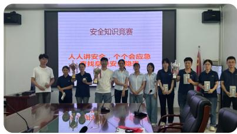

text_image

安全知识竞赛
人人讲安全，个个会应急
寻找安全问题

安全知识竞赛颁奖

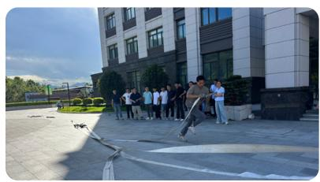

natural_image

Exterior view of a modern building with people gathered outside, one person using a hose on the ground (no visible text or signage)

消防比武现场

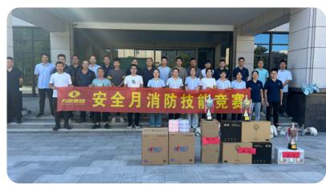

text_image

安全月消防技能竞赛

消防比武颁奖

# 安全能力提升培训

公司制定《安全教育培训制度》，建立覆盖全员、全场景、全流程的安全生产培训体系，实行新进员工三级安全培训、转岗复工培训、“四新”专项培训、特种设备及特种作业人员持证培训、安全管理人员专业培训、在职人员月度定期培训，系统落实岗前、在岗及转岗等各环节的安全教育与考核，确保各层级、各岗位人员具备必要的安全知识与操作技能。

此外，依据 2025 年度安全培训计划，公司针对作业安全分析（JSA）、事故管理、生产安全、危险源识别与管控、急救安全及消防安全等核心课题开展系列安全培训，全面提升员工的安全法规意识、风险识别与应急处置能力，系统性强化公司的安全生产管理体系。

# 案例 开展挂牌上锁（LOTO）专项安全培训

为强化设备作业安全管理，福建漳州基地组织开展挂牌上锁（LOTO）专项安全培训。培训围绕 LOTO 全流程管理展开，覆盖术语定义、典型事故警示、相关法律法规要求、适用范围界定、关键操作步骤、专用工具使用规范及 LOTO 程序编写等核心内容，帮助员工全面掌握设备维修、保养等作业前切断能量源、上锁挂牌、警示防护的标准流程，从源头杜绝设备意外启动、能量误释放等安全隐患，切实保障一线作业人员人身安全与生产运营稳定。

# 安全应急管理

公司构建多领域应急管理体系，制定《安全生产事故应急预案》《突发环境事件应急预案》《工伤管理制度》等专项制度，覆盖火灾爆炸、中毒、环境污染、工伤事故等各类应急场景，明确现场救援、伤员送医、事故上报、调查处理的标准化应急响应流程。同时，规定一线部门每年开展4次、后勤二线部门每年开展2次应急演练，同步落实消防设施维护保养、现场急救药箱配备、120联动机制等工作，通过“制度+演练+保障”全方位提升应急处置能力。

2025 年，我们开展差异化应急演练，福建漳州基地组织无预警疏散演练 30 场，灭火器水带实操演练 38 场；江苏南京基地组织中型消防演练 2 场，部门 / 班组演练 36 场，有效提升员工的应急处置能力。

# 相关方安全管理

公司高度重视相关方安全生产管理，将相关方安全纳入企业整体安全管理体系，依据《相关方管理制度》实施全流程、标准化管控，明确采购部、安环部、业务归口管理部门职责分工，形成协同管理机制。同时，要求相关方同步落实现场消防、临时用电、环境管理等各项要求，确保相关方作业行为全程合规，构建企业与相关方协同联动的安全生产防线。2025年相关方单位共计53家，均严格落实全流程安全管理要求。

# 作业前

由采购部完成相关方资质审查、人员信息登记，审核合格后签订《安环协议书》《法人委托书》《承包商作业许可证》，未完成手续者严禁入厂作业；安环部对所有相关方人员开展系统性安全告知与教育培训，做好培训记录归档。

# 作业期间

业务归口管理部门每日开展开工前安全提示、现场全程监工，安环部常态化督导施工现场规范落实，对危险作业严格执行作业票审批制度，要求相关方严格遵守公司安全作业标准、劳动防护及现场管理规定；对作业过程中发现的违规行为及时制止、督促整改，按规实施考核处罚。

# 安全事故及工伤应对

万辰集团建立标准化、全流程的安全事故及工伤应对体系，严格遵循“预防为主、快速响应、科学调查、闭环整改”原则，明确事故分级标准、部门职责与处理流程，全面保障员工健康与安全。

# 事故预防与控制

公司对新进员工开展三级安全培训，转岗 / 复工员工实施岗前培训，特殊工种需经专项训练考核合格后方可上岗，培训记录统一归档。严格管控 “三违” 行为，明确全员举报义务，对违规人员开展教育惩戒，屡次违规者追究部门负责人连带责任；同时推行属地自查自纠，要求员工及时上报并消除隐患，从源头降低事故风险。

# 事故报告与救援

事故发生后，最先发现者立即向部门负责人、安环部报告，涉伤人员同步协调送医；事故部门需在规定时限内书面告知相关部门事故详情，轻微伤及以上事故、火灾事故及时上报管理层，死亡及特别重大事故按规定上报属地监管部门。救援阶段严格执行应急预案，火灾事故组织疏散灭火，工伤事故优先救治伤员；重大事故妥善保护现场及证据，确需移动物件时做好标识与记录。

# 事故调查

按等级分层推进，轻微伤或一般事故由责任部门提交调查报告，安环部协同制定预防措施；轻伤及以上、重大及以上事故成立专项调查组，报告报管理层审批；死亡及特别重大事故配合政府部门调查。所有事故严格落实“四不放过”原则，推动整改措施落地，防范同类事故重复发生。

# 事故奖惩

对事故预防、救援有功的个人或团队予以表彰奖励；对违规操作、隐患整改不力、瞒报漏报等导致事故或处置延误的行为，视情节追究相关人员及部门负责人责任并予以处罚。

# 事故申诉

确保事故处理公平，员工对事故处理结论有异议的，可通过所在部门向公司管理层提出申诉，由指定部门统筹核查处理，充分保障员工合法诉求得到公正回应。

# 职业健康

公司高度重视职业健康管理工作，严格遵循《职业病防治法》等法规要求，制定《职业健康管理制度》，明确安环部、人力行政中心、采购部、财务部及各生产部门的职责分工，构建覆盖危害预防、过程防护、检测评价、健康监护、设施管理的全流程职业健康管理体系，全方位保障员工职业健康权益。

# 职业病危害前期预防

公司对生产性建设项目严格落实职业卫生“三同时”管理，开展职业病危害预评价与控制效果评价；优先采用低危害的新技术、新工艺、新材料，优化生产布局实现有害与无害作业分开，配套建设更衣间、休息间等卫生设施，从源头降低职业危害风险。同时对新上岗员工开展上岗前职业健康体检，杜绝职业禁忌证人员从事相关作业。

# 生产过程 职业健康

公司为职业病危害岗位员工配备合规有效的个体防护用品并监督规范使用；安环部定期组织职业卫生法律法规、急救知识等培训，提升员工自我保护能力，同时通过自动化、密封化等工程技术措施，确保作业场所职业病危害因素浓度符合国家职业卫生标准，同步制定应急预案、配备应急器材，保障作业安全。

# 常态化检测与健康监护机制

公司委托有资质机构按规定开展职业病危害因素检测与现状评价，检测结果及时公布并存档；为接触职业病危害因素的员工统一组织上岗前、在岗期间及离岗前的职业健康体检，费用由公司全额承担，建立健全员工职业卫生档案与健康监护档案。对体检发现的职业禁忌证、疑似职业病人员，及时妥善调岗安置，按规定上报相关情况，并落实职业病危害岗位员工的专项福利待遇，切实维护员工职业健康权益。

# 影响、风险和机遇管理

万辰集团将员工健康与安全相关风险防控纳入企业运营全流程管理，推行作业安全分析（JSA）落实安全风险管控，全员参与风险分析，明确自身岗位每个作业工序存在的风险，开展风险等级评估，形成风险管控清单，明确并不断完善风险控制措施。

以装瓶车间、接种车间、培养车间、化验室、物流仓储等核心生产作业区域为例，各工序开展全维度危险源识别，针对粉尘吸入、机械伤害、高温烫伤、化学灼伤、火灾爆炸等多类型风险，从可能性、暴露频率、后果严重程度等维度进行量化评估，并结合风险时态、状态完成等级划分与重大危险源判定，形成针对性风险控制措施，从源头精准识别安全风险点。基于辨识评估结果，公司实施安全风险分级防控管理，将风险划分为1-5级，对应制定常规管理、重点管控、立即整改、停止作业等差异化管控要求，配套佩戴防护用品、安装防护设施、制定专项方案、推进工程技术改造等管控措施。

# 指标与目标

为了进一步落实安全生产责任制，做到“责、权、利”相结合，公司将健康与安全绩效与高管薪酬挂钩，结合年度安全生产目标与各级管理人员签订《安全生产目标责任书》，具体包含目标量化值、工作内容要求、安全奖惩等，对于未实现安全目标的取消评优、晋升、加薪资格，并依据相关制度和文件规定进行追责处罚。

<table><tr><td>总体目标</td><td>分解指标</td><td>2025年目标</td><td>2025年实际值</td><td>达成情况</td></tr><tr><td rowspan="5">不发生员工健康与安全重大风险事件</td><td>重大安全事故</td><td>0起</td><td>0起</td><td rowspan="5">全部目标均达成</td></tr><tr><td>职业健康体检覆盖率</td><td>100%</td><td>100%</td></tr><tr><td>因工死亡员工人数</td><td>0人</td><td>0人</td></tr><tr><td>职业病发生率</td><td>0%</td><td>0%</td></tr><tr><td>千人工伤率</td><td>≤1.5</td><td>1.49</td></tr></table>

<table><tr><td>安全生产投入</td><td>健康与安全培训总时长</td><td>健康与安全培训覆盖率</td></tr><tr><td>115.49万元</td><td>44,484小时</td><td>100%</td></tr><tr><td>员工工伤保险投入金额</td><td>员工工伤保险覆盖率</td><td rowspan="2"></td></tr><tr><td>288.38万元</td><td>100%</td></tr><tr><td>百万工时伤害率</td><td>每百万营收因工伤损失工作日数</td><td rowspan="2"></td></tr><tr><td>0.74</td><td>0.02日/百万营收</td></tr></table>

注：由于量贩零食业务板块不涉及生产环节，安全生产投入、健康与安全培训总时长、健康与安全培训覆盖率数据统计范围为食用菌业务板块。

# 公益慈善

万辰集团始终将公益事业作为企业成长的重要主线之一，于乡村振兴、扶危济困、应急救助、助学助童等公益领域持续投入，并依据《中华人民共和国公益事业捐赠法》《中华人民共和国慈善法》《中华人民共和国公司法》等法律法规及《公司章程》，制定了《对外捐赠管理制度》，规范对外捐赠行为、强化捐赠管理，以系统化的捐赠机制与品牌化的公益项目，推动温暖传递。

# 助力乡村振兴

我们依托食用菌产业优势与量贩零食渠道网络，通过产业帮扶、就业带动、公益捐赠等多元方式，深度参与乡村振兴事业，助力农业农村现代化发展。

# 万辰·光彩基金

与福建省光彩事业促进会联合设立“万辰·光彩基金”，计划在五年内，每年投入500万元，重点围绕巩固脱贫攻坚成果、助力乡村振兴、支持东西部协作、关爱弱势群体、应对重大自然灾害等领域，持续开展精准帮扶与公益支持。

# 促进农村现代化发展

为弘扬中华民族乐善好施、扶弱济困的传统美德，促进全体人民共同富裕，在推进中国式现代化江苏新实践中作出贡献，2025年11月，公司向江苏省慈善总会捐赠300万元，用于积极参与江苏现代化建设实践。

# 关爱乡村儿童

我们持续关注乡村儿童成长与身心发展，通过系列化、场景化的公益品牌活动，传递温暖、陪伴成长。

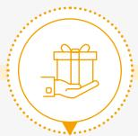

# 暖流行动

携手腾讯公益发起“暖流行动”，为乡村学校配备“暖流包”（含羽绒服、棉鞋、围巾等9类御寒物资），温暖山区孩子的冬天。

# 积分公益计划

联合中国乡村发展基金会“爱加餐助成长”项目，为乡村儿童提供营养加餐，2025年捐助超4万份营养餐，覆盖一所学校学生全年需求。

natural_image

Line art illustration of a person holding a magnifying glass over a heart, with gift boxes and clouds in the background (no text or symbols)

# 关爱特殊群体与青少年发展

# 扶残助残

秉持着 “扶残助残，传递社会温暖，践行企业社会责任” 的坚定理念，2025 年公司向漳州市残疾人联合会捐赠 30 万元，将专项用于改善地方残疾人的生活状况、提升他们的生活质量。

# 助力青少年发展

2025 年 10 月，公司向福建省青少年发展基金会捐赠 100 万元，支持青少年公益事业的健康发展，促进青少年健康成长成才。

natural_image

Illustration of two people reading books on a stationary bike, with mountains and clouds in the background (no text or symbols)

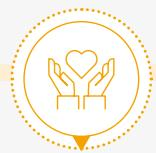

# 好想来音乐教室计划

携手贵州当地政府与抖音公益，为四所乡村小学建成音乐教室，配备乐器与教学资源，让音乐陪伴山区孩子自信成长。

# 好想暖暖过冬天

联合中华慈善总会发起“好想暖暖过冬天”活动，为四川甘孜卡龙乡小学捐赠冬季校服，让孩子们在寒冬中感受温暖。

# 儿童节特别行动

走进汝阳县刘店镇枣园小学，为孩子们送去零食礼包与互动陪伴，在游戏中播撒梦想的种子。

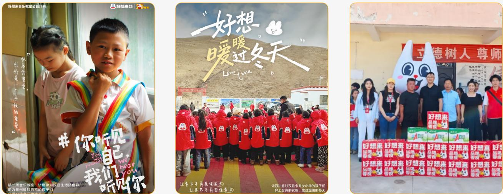

# 关键绩效表

环境管理

<table><tr><td colspan="2">指标</td><td>单位</td><td>2025年度</td></tr><tr><td colspan="2">环保投入</td><td>万元</td><td>229.12</td></tr><tr><td rowspan="7">能源使用</td><td>综合能耗</td><td>兆瓦时</td><td>172,021.08</td></tr><tr><td>综合能耗密度</td><td>兆瓦时/百万营收</td><td>3.34</td></tr><tr><td>柴油</td><td>升</td><td>58,796.83</td></tr><tr><td>汽油</td><td>升</td><td>9,196.61</td></tr><tr><td>天然气</td><td>立方米</td><td>2,372,225.90</td></tr><tr><td>液化石油气</td><td>千克</td><td>6,360</td></tr><tr><td>总用电量</td><td>千瓦时</td><td>145,613,566.95</td></tr><tr><td rowspan="3">温室气体排放</td><td>范围1温室气体排放</td><td>吨二氧化碳当量</td><td>5,385.90</td></tr><tr><td>范围2温室气体排放</td><td>吨二氧化碳当量</td><td>77,262.56</td></tr><tr><td>范围3温室气体排放</td><td>吨二氧化碳当量</td><td>3,878.82</td></tr><tr><td rowspan="2">水资源使用</td><td>耗水量</td><td>吨</td><td>1,133,624</td></tr><tr><td>耗水密度</td><td>吨/百万营收</td><td>22.03</td></tr><tr><td rowspan="6">排放物管理</td><td>无害废弃物产生量</td><td>吨</td><td>130,654</td></tr><tr><td>有害废弃物产生量</td><td>吨</td><td>1.36</td></tr><tr><td>废气排放量</td><td>吨</td><td>11.91</td></tr><tr><td>废水排放量</td><td>立方米</td><td>86,775</td></tr><tr><td>废水、废气排放合格率</td><td>%</td><td>100</td></tr><tr><td>废弃物合规处置率</td><td>%</td><td>100</td></tr></table>

社会责任

<table><tr><td>指标</td><td></td><td>单位</td><td>2025年度</td></tr><tr><td rowspan="3">研发创新</td><td>研发投入总额</td><td>万元</td><td>5,433.32</td></tr><tr><td>研发投入占营业收入比例</td><td>%</td><td>0.11</td></tr><tr><td>研发人员数量</td><td>人</td><td>230</td></tr></table>

<table><tr><td colspan="3">指标</td><td>单位</td><td>2025年度</td></tr><tr><td rowspan="3">产品质量</td><td colspan="2">产品和服务相关的安全与质量重大责任事故或负面事件</td><td>起</td><td>0</td></tr><tr><td colspan="2">质量相关培训员工覆盖率</td><td>%</td><td>100</td></tr><tr><td colspan="2">开展加盟商培训</td><td>场</td><td>60</td></tr><tr><td rowspan="6">客户服务</td><td rowspan="3">量贩零食业务板块</td><td>客户满意度</td><td>%</td><td>96.5</td></tr><tr><td>投诉1小时响应率</td><td>%</td><td>99.4</td></tr><tr><td>24小时解决率</td><td>%</td><td>93</td></tr><tr><td rowspan="3">食用菌业务板块</td><td>平均客户满意度</td><td>%</td><td>90.1</td></tr><tr><td>客户投诉数量</td><td>件</td><td>66</td></tr><tr><td>客户投诉解决率</td><td>%</td><td>100</td></tr><tr><td rowspan="4">责任供应链</td><td colspan="2">供应商总数</td><td>家</td><td>3,823</td></tr><tr><td colspan="2">通过质量管理体系认证的供应商数量</td><td>家</td><td>3,658</td></tr><tr><td colspan="2">供应商廉洁承诺书/协议签署比例</td><td>%</td><td>100</td></tr><tr><td colspan="2">供应商反腐败培训覆盖率</td><td>%</td><td>100</td></tr><tr><td rowspan="4">安全生产与职业健康</td><td colspan="2">食用菌业务板块安全生产投入</td><td>万元</td><td>115.49</td></tr><tr><td colspan="2">职业病发生率</td><td>%</td><td>0</td></tr><tr><td colspan="2">重大安全生产事故</td><td>起</td><td>0</td></tr><tr><td colspan="2">因工死亡员工人数</td><td>人</td><td>0</td></tr><tr><td rowspan="5">员工</td><td colspan="2">员工总数</td><td>人</td><td>9,073</td></tr><tr><td colspan="2">总流失率</td><td>%</td><td>39.57</td></tr><tr><td colspan="2">员工培训覆盖率</td><td>%</td><td>100</td></tr><tr><td colspan="2">员工培训总支出</td><td>万元</td><td>67.9</td></tr><tr><td colspan="2">员工人均培训时长</td><td>小时</td><td>4.18</td></tr><tr><td>社会参与</td><td colspan="2">对外捐赠</td><td>万元</td><td>523.52</td></tr></table>

公司治理

<table><tr><td>指标</td><td>单位</td><td>2025年度</td></tr><tr><td>责任营销培训人次</td><td>人次</td><td>156</td></tr><tr><td>董事、高级管理人员和关键岗位员工商业道德与反腐败培训覆盖率</td><td>%</td><td>100</td></tr><tr><td>信息安全与隐私保护培训覆盖率</td><td>%</td><td>100</td></tr></table>

# 指标索引表

万辰集团在 2025 年 1 月 1 日至 2025 年 12 月 31 日依据《深圳证券交易所上市公司自律监管指引第 17 号——可持续发展报告（试行）》、参照 GRI 标准报告了在此份内容索引中引用的信息。

<table><tr><td>报告框架</td><td>深圳证券交易所可持续发展报告</td><td>GRI 标准</td></tr><tr><td>关于本报告</td><td>/</td><td>2-2, 2-3, 2-4, 2-29</td></tr><tr><td>董事长致辞</td><td>/</td><td>2-22</td></tr><tr><td>走进万辰集团</td><td>/</td><td>2-1, 2-6, 201-1</td></tr><tr><td>我们的2025</td><td>/</td><td>/</td></tr><tr><td>可持续发展管治</td><td>第十一条(一)、第十一条(二)、第十一条(三)、第十一条(四)、第十二条(一)、第十二条(二)、第十二条(三)、第十二条(四)、第十三条、第十四条(一)、第十四条(二)、第十六条(一)、第十六条(二)、第十七条、第五十条</td><td>2-9, 2-12, 2-13, 2-14, 2-16, 2-17, 2-22, 2-24, 2-29, 3-1, 3-2, 3-3</td></tr><tr><td colspan="3">聚焦品质,创造卓越价值</td></tr><tr><td>研发与创新</td><td>第十一条(一)、第十一条(二)、第十一条(三)、第十一条(四)、第十九条、第四十二条(一)、第四十二条(二)、第四十二条(三)、第四十二条(四)</td><td>2-27, 3-3, 203-2</td></tr><tr><td>产品质量及安全</td><td>第十一条(一)、第十一条(二)、第十一条(三)、第十一条(四)、第十九条、第四十六条(一)、第四十六条(二)、第四十六条(三)、第四十六条(四)</td><td>2-25, 2-27, 3-3, 416-2, 417-1</td></tr><tr><td>客户服务管理</td><td>第十一条(一)、第十一条(二)、第十一条(三)、第十一条(四)、第十九条、第四十六条(一)、第四十六条(三)、第四十六条(四)</td><td>2-25, 3-3</td></tr><tr><td>责任供应链</td><td>第十一条(一)、第十一条(二)、第十一条(三)、第十一条(四)、第十九条、第四十四条(一)、第四十四条(二)、第四十五条</td><td>2-27, 3-3, 204-1, 408-1, 409-1</td></tr><tr><td colspan="3">稳健运营,筑牢治理根基</td></tr><tr><td>公司治理</td><td>第五十条</td><td>2-9, 2-10, 2-11, 2-12, 2-17, 2-18, 2-19, 2-20, 2-21, 2-27, 3-3, 405-1</td></tr><tr><td>风险与合规管理</td><td>第十二条(三)、第十二条(四)、第十二条(五)</td><td>2-27, 2-13, 2-24, 3-3, 207-1, 207-2, 207-3, 417-2, 417-3</td></tr><tr><td>商业道德</td><td>第十一条(一)、第十一条(二)、第十一条(三)、第十一条(四)、第十九条、第五十一条、第五十二条(一)、第五十二条(二)、第五十二条(三)、第五十二条(四)、第五十三条(一)、第五十三条(二)</td><td>2-27, 3-3, 205-2, 205-3, 206-1</td></tr></table>

<table><tr><td>报告框架</td><td>深圳证券交易所可持续发展报告</td><td>GRI 标准</td></tr><tr><td>数字化战略</td><td>第十一条(一)、第十一条(二)、第十一条(三)、第十一条(四)、第十九条、第四十七条(一)、第四十七条(二)、第四十七条(三)</td><td>2-27, 3-3, 203-2, 418-1</td></tr><tr><td colspan="3">绿色发展,打造长青基业</td></tr><tr><td>应对气候变化</td><td>第十一条(一)、第十一条(二)、第十一条(三)、第十一条(四)、第十九条、第二十条、第二十一条、第二十二条(一)、第二十二条(二)、第二十二条(三)、第二十三条(一)、第二十三条(二)、第二十三条(三)、第二十三条(五)、第二十四条、第二十五条(三)、第二十六条、第二十七条、第二十八条、第三十四条、第三十五条(一)、第三十五条(二)、第三十五条(三)</td><td>2-27, 3-3, 201-2, 302-1, 302-3, 302-4, 302-5, 305-1, 305-2, 305-4</td></tr><tr><td>循环经济</td><td>第三十四条、第三十五条(二)、第三十五条(三)</td><td>2-27, 3-3, 301-3, 303-1, 303-3, 303-4, 303-5,</td></tr><tr><td>可持续运营</td><td>第十九条、第二十条、第二十九条、第三十条(一)、第三十条(二)、第三十条(三)、第三十条(四)、第三十条(五)、第三十一条(一)、第三十一条(二)、第三十一条(三)、第三十三条(一)、第三十三条(二)、第三十四条、第三十六条(一)、第三十六条(二)、第三十七条(一)、第三十七条(二)、第三十七条(三)</td><td>2-27, 3-3, 2-27, 3-3, 303-1, 303-2, 303-3, 303-5, 303-4, 305-7, 306-1, 306-2, 306-3, 306-4, 306-5</td></tr><tr><td>生态系统和生物多样性保护</td><td>第二十九条、第三十二条(二)</td><td>3-3, 101-2, 101-4, 101-5, 304-1, 304-2, 304-3</td></tr><tr><td colspan="3">向善而行,共建美好家园</td></tr><tr><td>雇佣与多元化</td><td>第十一条(一)、第十一条(二)、第十一条(三)、第十一条(四)、第十九条、第四十八条、第四十九条(一)</td><td>2-23, 2-27, 2-30, 3-3, 201-3, 401-1, 401-2, 401-3, 403-6, 405-1, 406-1, 407-1, 408-1, 409-1</td></tr><tr><td>培训与发展</td><td>第四十八条、第四十九条(三)</td><td>2-7, 2-8, 3-3, 404-1, 404-2</td></tr><tr><td>健康与安全</td><td>第十一条(一)、第十一条(二)、第十一条(三)、第十一条(四)、第十九条、第四十八条、第四十九条(二)</td><td>2-27, 3-3, 403-1, 403-2, 403-3, 403-4, 403-5, 403-6, 403-7, 403-8, 403-9, 403-10</td></tr><tr><td>公益慈善</td><td>第三十八条、第四十条</td><td>3-3, 203-1, 203-2, 413-1</td></tr><tr><td colspan="3">附录</td></tr><tr><td>关键绩效表</td><td>/</td><td>2-4</td></tr><tr><td>指标索引表</td><td>/</td><td>/</td></tr></table>