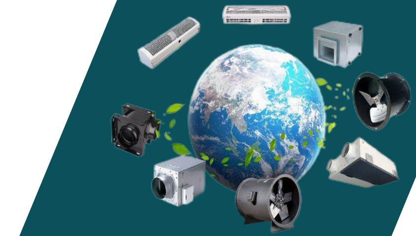

natural_image

Illustration of various electronic devices surrounding a globe with green leaves, symbolizing global connectivity or IoT (no text or symbols present)

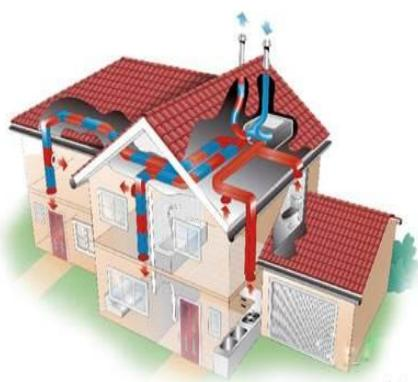

natural_image

Illustration of a two-story residential house with red-tiled roofs and cooling towers (no text or symbols)

致力成为全球领先的室内空气系统企业

# NEDFON绿岛风

# 2025 年度

# 环境、社会及治理（ESG）报告

股票代码 301043.SZ

text_image

开始，改变...
Valfon绿岛风

# 走进绿岛风

公司概况 05

绿岛风产品 07

绿岛风数据 10

# ESG管理

ESG治理机制 11

利益相关方识别与沟通 13

实质性议题分析 15

# 合规治理

公司治理 17

股东权益保护 19

责任运营 21

商业道德 30

依法纳税 30

# 科技创新

科研服务 31

智能化 38

# 环境保护

环保机制 39

绿色办公 39

节能减排 40

# 员工权益保护

严格雇佣规范 41

赋能人才培养 43

员工关怀保障 45

# 回馈社会

社会捐赠 49

# 附录

排污信息 51

指标索引 52

意见反馈表 53

# 目录

# Contents

# 关于本报告

# 报告简介

本报告是广东绿岛风空气系统股份有限公司的第4份环境、社会及治理（ESG）报告，旨在向各利益相关方展现绿岛风2024年度在企业社会责任和可持续发展方面的努力及成果，以便各利益相关方更好地了解本公司可持续发展的理念、措施与表现。

# 时间范围

本报告的时间范围是2025年1月1日至2025年12月31日，与年报时间范围保持一致。为增强报告的可比性、完整性，部分内容时间范围适当追溯以往年份。

# 报告范围

本报告以重要性原则为基础界定组织范围。除特殊说明外，本报告所涉及的实质性内容均来自绿岛风及子公司。

# 数据说明及可靠性保障

本报告所用数据是公司经济、环境、社会责任实践的真实反馈。信息数据均来自公司正式文件、统计报告或社会责任实践情况汇总及统计。如无特殊说明，本报告中所涉及货币金额以人民币作为计量币种。公司保证报告不存在任何虚假记载、误导性陈述或重大遗漏。

# 编制依据

本报告编制过程中主要参考以下文件的部分指标进行披露。

● 深圳证券交易所《深圳证券交易所上市公司社会责任指引（2006）》  
● 中国社会科学院《中国企业社会责任报告指南（CASS-ESG 5.0）》  
- 全球报告倡议组织《可持续发展报告标准2021》（GRI Standards 2021）

# 称谓说明

为便于表达与阅读，本报告中使用“绿岛风”“公司”等称谓表示广东绿岛风空气系统股份有限公司。

# 报告获取

本报告可从巨潮资讯网（http://www.cninfo.com.cn）查阅或下载。

# 意见反馈

如您对本报告或公司的可持续发展表现有任何建议或意见，请发送至邮箱5605598@nedfon.com。

# 董事长致辞

natural_image

Portrait of a man in a blue suit and tie, standing against a plain gray background (no text or symbols visible)

尊敬的股东、合作伙伴以及所有关心绿岛风的朋友们：

当前，全球多个国家正经历从化石能源向清洁低碳能源的逐步转型，能源变革与技术迭代也正在加速推进，后续清洁能源或将成为主力能源，能源结构、技术创新和地缘政治格局正在重塑全球能源体系，气候变化、资源约束及市场波动给发展带来挑战，党中央已把生态文明建设摆在全局工作的突出位置，正在全方位、全地域、全过程加强生态环境保护。面对这一形式，绿岛风根据国家产业政策与行业的发展变化情况，把握未来科技进步与技术升级的机会，同时多方面推动绿色低碳发展，努力提高经营效益和发展质量，为我国低碳经济的发展进程贡献应有的力量。

2025年，在科技创新方面，公司科学研判当前消费者对新风系统产品的功能需求偏好，结合自身情况，推动应用场景开发，上线新品类产品，从多个维度触达消费者，以满足多样化应用场景的通风需求。

在环境保护方面，当前公司及子公司均不属于环境监管重点单位，公司已制定环境自行监测方案。在实际执行中，公司根据环评要求委托第三方机构进行废气、废水、噪声检测，检测结果均符合标准要求。2025年内，公司没有发生污染事故和纠纷，不存在因违反环境保护法律法规受到行政处罚的情形。

在节能降碳方面，公司生产的部分新风系统在与空调结合使用时可起到节能降耗的作用，以助力国家实现“碳达峰、碳中和”战略；公司已安装完成的屋顶光伏项目，能够提高能源利用效率，降低外购电量，逐步减少运营层面碳排放。同时，公司将节约资源和保护环境视作义不容辞的社会责任，将环保理念贯彻到员工日常工作生活中。

在职工权益保护方面，公司继续坚持效益导向，兼顾效率与公平、激励与约束相结合，完善薪酬福利体系。同时，充分尊重员工的生活权益，积极组织文娱、旅游活动，提供多样化的培训以及线上学习平台，提高员工的认同感和归属感。

在公共关系管理方面，2025年，公司始终遵循诚信、合法经营的原则，严格遵守商业道德规范，不存在任何因违反社会和经济领域相关法律法规而受到处罚的情形。公司依法纳税，打造企业信用“金名片”，被国税局连续多年评定为年度纳税信用A级纳税人。

在企业捐赠方面，2025年2月，公司向台山市慈善会捐款1万元人民币，用于支持台山市长者饭堂的建设、运营项目。2025年10月，公司为台山正贤体育馆、台山新宁体育馆捐助安装了一批专业风幕机，以预防如基孔肯雅热等由蚊虫传播的疾病，为第十五届全运会的赛事环境保驾护航。

展望未来，公司将继续坚持“专注、务实、创新、责任、奋斗”的发展理念，怀着“成为全球领先的室内空气系统企业”的愿景，践行“让室内空气变得更好”的企业使命。绿岛风将继续与客户、投资者、供应商、经销商、行业协会以及广大员工携手同行，为社会创造更大价值。

# 公司概况

- 绿岛风总部位于广东省台山市，占地约144亩。公司成立于2009年，前身为台山港益电器有限公司。  
- 2018年1月，公司进行股改。2018年8月，公司成立党支部。2021年8月11日，公司在深交所创业板上市。  
- 公司控股股东为台山市奥达投资有限公司，实际控制人为李清泉先生。  
- 公司自1992年进入室内通风行业以来，长期从事室内通风系统产品的设计研发、生产及销售，致力于改善室内空气质量、提高建筑节能水平，为客户提供智能化、定制化、一体化室内通风系统解决方案。公司主要产品覆盖新风系列产品、风幕机两大品类、上百个系列、数千种型号，适用于民用住宅、市政基建、商业场所、工业厂房等国民经济各个领域。

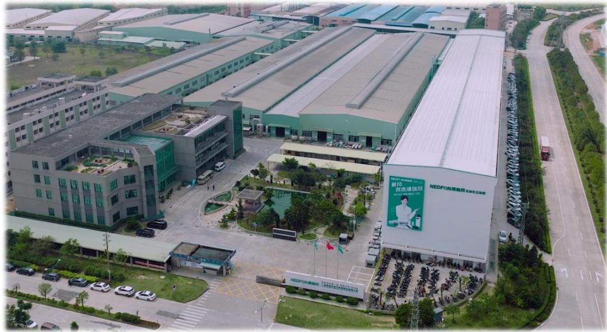

natural_image

Aerial view of a large industrial complex with multiple factory buildings and a prominent NEDFON-branded store (no visible signage or text on main structures)

\- 企业文化

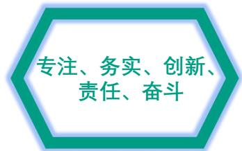

text_image

专注、务实、创新、
责任、奋斗

企业发展理念

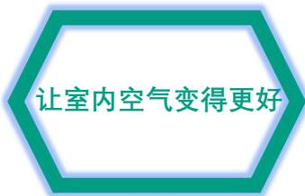

text_image

让室内空气变得更好

企业使命

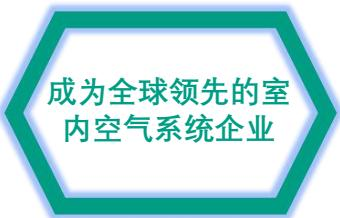

text_image

成为全球领先的室内空气系统企业

企业愿景

\- 企业荣誉

公司主要产品通过了CCC、ETL、HVI、SASO、CE、GCC、INMETRO等标准认证，自主品牌“NEDFON绿岛风”主要产品被授予“广东省名牌产品”称号，产品质量得到了国内外市场的广泛认可，为室内通风系统行业的龙头企业。

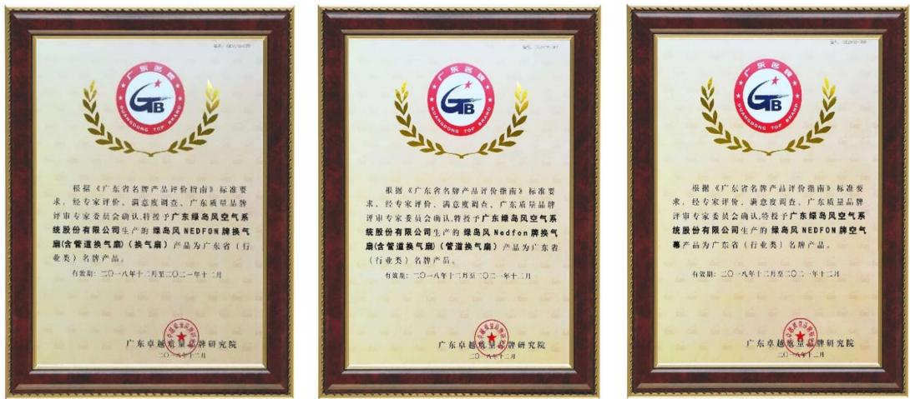

# 绿岛风产品

\- 绿岛风新风系列产品线齐全，覆盖换气扇、新风交换机、建筑风机、工业风机等多个品种的上百个系列、数千种型号。

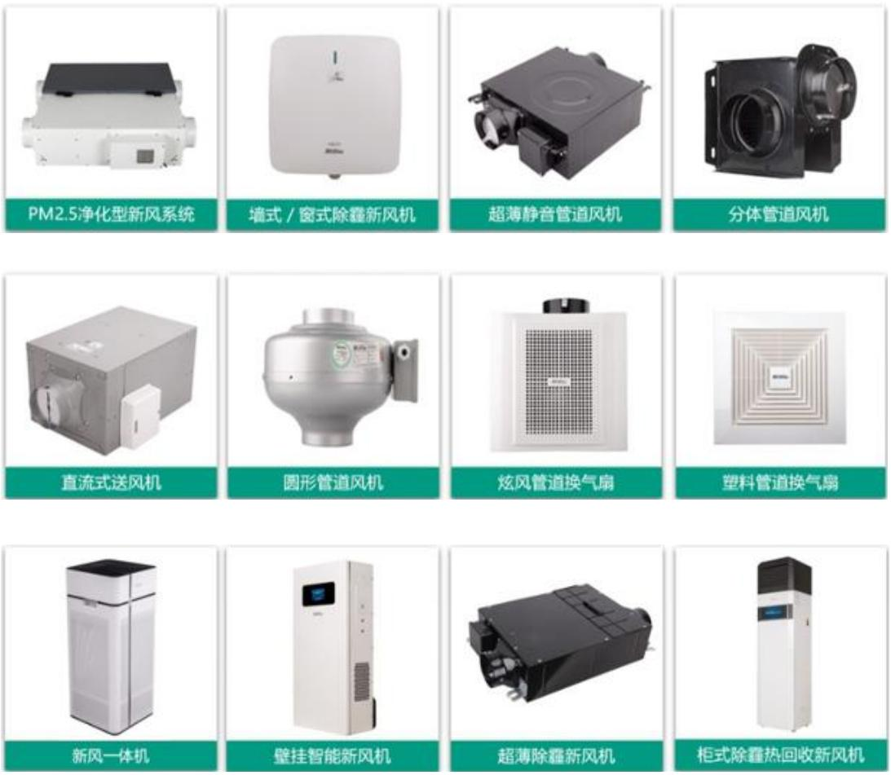

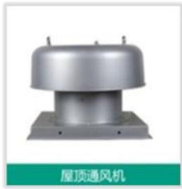

natural_image

Exterior view of a modern office building (no signage)

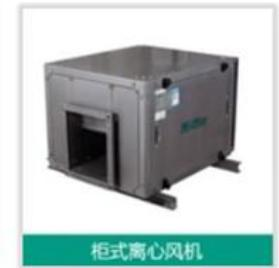

natural_image

Exterior view of a silver industrial machine with a rectangular housing and control panel (no visible text or symbols on the device itself)

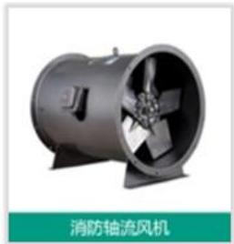

natural_image

Industrial air purifier fan with visible blades and mounting base (no text or symbols on the fan itself)

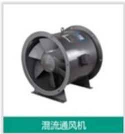

natural_image

Industrial fan or turbine component with visible blades and mounting base, labeled '混流通风机' (mixed turbine) at bottom left

\- 绿岛风风幕机产品系列齐全，覆盖贯流式、离心式、电热型、水热型风幕机等多个类别的数百种型号。

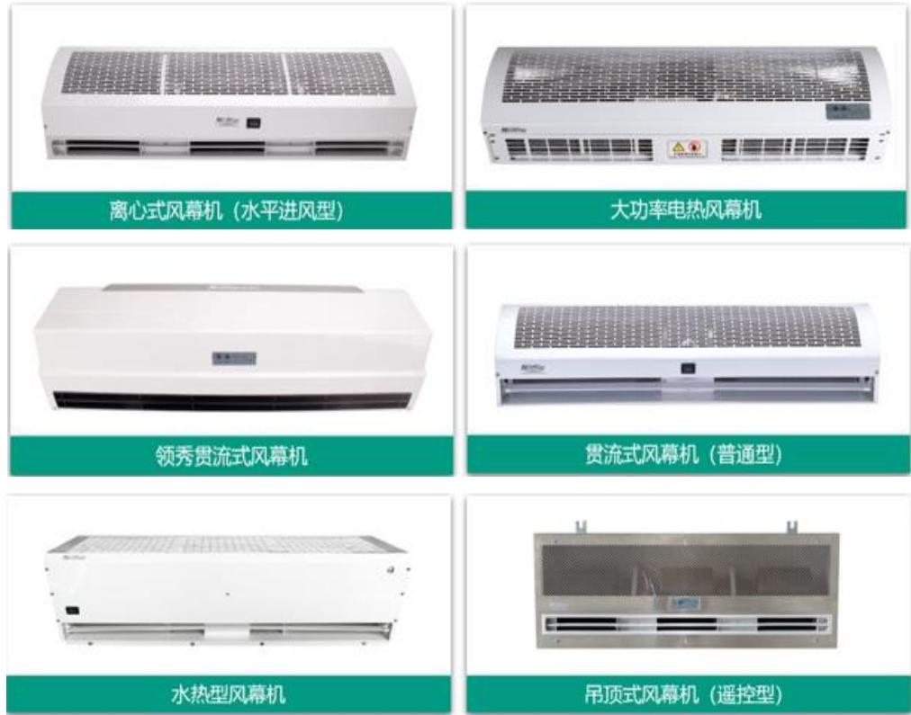

\- 报告期内，绿岛风针对市场的需求对部分产品进行了翻新或升级，同时又开发出了部分新品。。

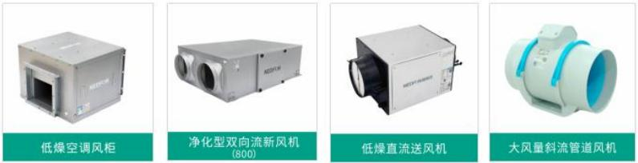

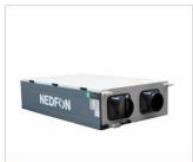  
变频全热新风除湿一体机

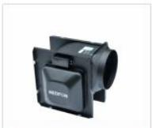  
新款分体式管道换气扇
(1700\~2500风量)

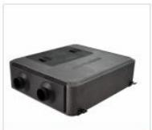  
全热新风交换机

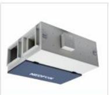  
(1500风量)全热新风交换机

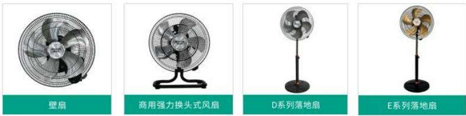

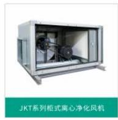

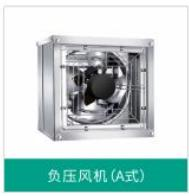

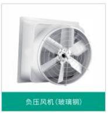

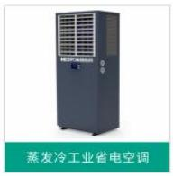

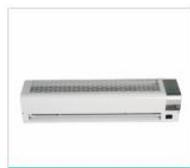  
电梯风幕机（白色）

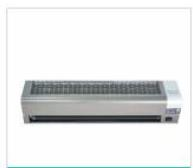  
电梯风幕机（银色）

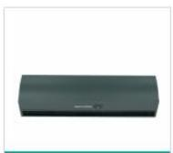  
风幕机FM3509H-Y-D

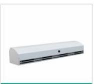  
FM3512C风幕机

# 绿岛风数据

2025年经营数据 单位：万元

<table><tr><td>总资产</td><td>123,784.86</td></tr><tr><td>营业收入</td><td>55,717.51</td></tr><tr><td>利润总额</td><td>7,811.15</td></tr><tr><td>归母净利润</td><td>6,855.22</td></tr></table>

2025年营业收入-产品 单位：元

<table><tr><td>新风系列产品</td><td>356, 305, 305. 11</td></tr><tr><td>风幕机</td><td>146, 746, 930. 34</td></tr><tr><td>其他</td><td>54, 122, 902. 52</td></tr></table>

2025年营业收入-地区 单位：元

<table><tr><td>华东</td><td>189,015,635.73</td></tr><tr><td>华南</td><td>163,453,619.40</td></tr><tr><td>华中</td><td>48,692,570.51</td></tr><tr><td>华北</td><td>59,666,585.21</td></tr><tr><td>西南</td><td>33,416,816.60</td></tr><tr><td>西北</td><td>16,774,530.90</td></tr><tr><td>东北</td><td>3,528,127.80</td></tr><tr><td>境外</td><td>42,627,251.82</td></tr></table>

2025年研发团队数据

<table><tr><td>研发人员数量(人)</td><td>116</td></tr><tr><td>研发人员数量占比</td><td>9.76%</td></tr><tr><td colspan="2">研发人员学历</td></tr><tr><td>本科</td><td>37</td></tr><tr><td>大专</td><td>49</td></tr><tr><td>中专及以下</td><td>30</td></tr><tr><td colspan="2">研发人员年龄构成</td></tr><tr><td>30岁以下</td><td>22</td></tr><tr><td>30岁-40岁</td><td>59</td></tr><tr><td>40岁以上</td><td>35</td></tr></table>

# ESG治理机制

- 公司的环境、社会及治理（ESG）报告由证券法务部负责组织编制。证券法务部定期收集包括财务部、信息部、人力资源部、安全环保部、供应链管理部、产品中心、制造中心、营销中心、品质中心、等各部门的相关信息，整理ESG定性定量资料，确保数据和信息的全面、准确，并上报董事会。  
- 公司董事会是ESG治理的最高机构，董事会负责决定公司的可持续发展相关战略并实施，负责审议、批准及报告。  
- 公司建立了规范、透明、公开、高效的公司治理架构，明确决策、执行和监督方面的职责权限，形成科学有效的职责分工和制衡机制，同时兼顾各利益相关方，在经营决策中奉行共赢理念，主动承担环境保护的责任，切实履行社会责任，为公司可持续发展奠定基础。

截至报告期末，公司的组织架构如下图所示。  
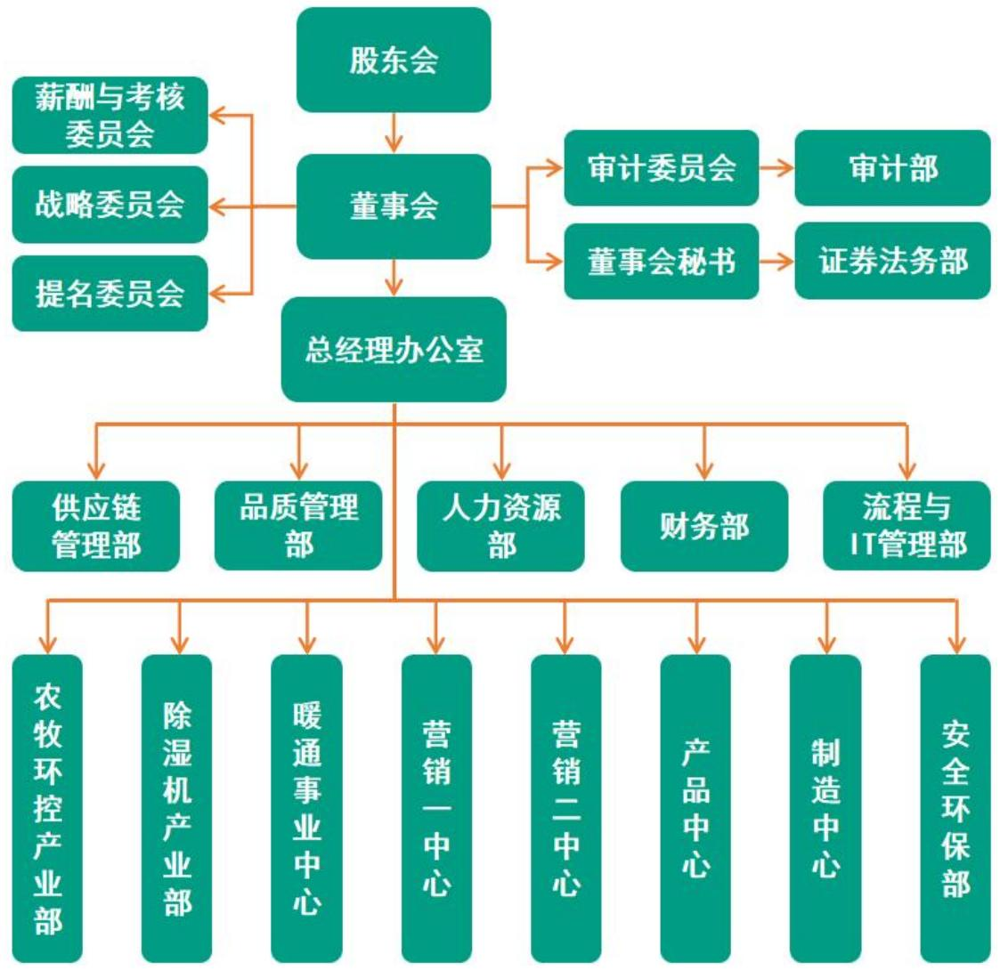

flowchart

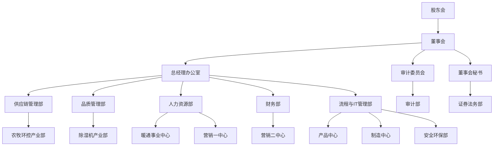
```mermaid
graph TD
  A["股东会"] --> B["董事会"]
  B --> C["总经理办公室"]
  B --> D["审计委员会"]
  B --> E["董事会秘书"]
  C --> F["供应链管理部"]
  C --> G["品质管理部"]
  C --> H["人力资源部"]
  C --> I["财务部"]
  C --> J["流程与IT管理部"]
  D --> K["审计部"]
  E --> L["证券法务部"]
  F --> M["农牧环控产业部"]
  G --> N["除湿机产业部"]
  H --> O["暖通事业中心"]
  H --> P["营销一中心"]
  I --> Q["营销二中心"]
  J --> R["产品中心"]
  J --> S["制造中心"]
  J --> T["安全环保部"]
```

# ■ 利益相关方识别与沟通

- 利益相关方作为与公司可持续发展密切相关的群体，在公司决策过程中扮演着非常重要的角色。公司在自身可持续发展的进程中离不开与利益相关方的沟通，公司对利益相关方进行识别与判断，并进行分类整理。  
- 公司目前建立了同政府及监管机构、股东及投资者、员工、媒体及协会组织、经销商、客户、供应商、行业、社区、环境等内外部相关方的沟通渠道与机制。公司进一步识别并确定关键利益相关方及其诉求，通过不断完善沟通机制，帮助其深入了解公司的社会责任实践与成效，同时建立良好关系。  
- 公司以平等的姿态与利益相关方沟通，建立信任，聆听利益相关方的真实心声，充分尊重和维护各利益相关方的合法权益，实现社会、股东、员工等各方利益的平衡，推动公司持续、稳健、和谐、健康发展。  
- 公司积极回应利益相关方的关切问题，并不断提升内部管理水平。

<table><tr><td></td><td>利益相关方</td><td>期望与诉求</td><td>沟通与回应方式</td></tr><tr><td></td><td>政府及监管机构</td><td>依法纳税、诚信经营、政企合作、技术创新</td><td>遵纪守法、响应政策、参与项目、加强研发</td></tr><tr><td></td><td>股东及投资者</td><td>完善公司治理、分红回报、防范经营风险、信息披露公开透明</td><td>完善治理体系、按制度进行权益分派、加强投资者交流、合规信披</td></tr><tr><td></td><td>员工</td><td>薪酬福利、职业发展、职业健康安全</td><td>保障员工权益、积极组织培训、健康安全管理</td></tr><tr><td>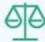</td><td>媒体及协会组织</td><td>公司舆情、行业活动参与、协会交流</td><td>注重舆情管控、积极参与协会活动</td></tr><tr><td></td><td>经销商、客户</td><td>稳定合作关系、保障产品质量与服务、售后权益保障</td><td>完善供应商管理体系、加强质量管理、完善客服体系</td></tr><tr><td></td><td>供应商</td><td>良好合作关系、遵守商业道德、共同发展、公开公正采购</td><td>完善供应商管理体系、举办交流会、完善招标管理</td></tr><tr><td></td><td>行业</td><td>行业标准执行</td><td>参与制定行业标准</td></tr><tr><td></td><td>社区</td><td>公益慈善、关注弱势群体</td><td>开展志愿活动、社区沟通交流活动</td></tr><tr><td></td><td>环境</td><td>低碳运营、保护环境</td><td>加强环保管理、节能降耗</td></tr></table>

# 实质性议题分析

公司根据《可持续发展报告标准2021》，从“对公司的重要程度”和“对利益相关方的重要程度”两个维度开展报告的实质性议题评估工作，将包含管治议题、社会议题、环境议题在内的共18项议题纳入实质性议题矩阵，明确报告的重点披露内容，并构建了实质性议题矩阵图。针对实质性议题矩阵中的高度重要议题，本报告将进行重点披露，以响应利益相关方的关注。

<table><tr><td colspan="4">议题</td></tr><tr><td>1</td><td>合规信息披露</td><td>10</td><td>责任营销</td></tr><tr><td>2</td><td>股东权益保护</td><td>11</td><td>客户满意度与投诉处理</td></tr><tr><td>3</td><td>供应商管理</td><td>12</td><td>行业交流</td></tr><tr><td>4</td><td>经销商管理</td><td>13</td><td>员工培训与教育</td></tr><tr><td>5</td><td>研发与创新</td><td>14</td><td>多元化与平等</td></tr><tr><td>6</td><td>合规雇佣</td><td>15</td><td>社区与公益慈善</td></tr><tr><td>7</td><td>职工权益与福利</td><td>16</td><td>节能降碳</td></tr><tr><td>8</td><td>商业道德</td><td>17</td><td>环境管理</td></tr><tr><td>9</td><td>税务</td><td>18</td><td>废弃物排放与管理</td></tr></table>

2025年绿岛风实质性议题矩阵  
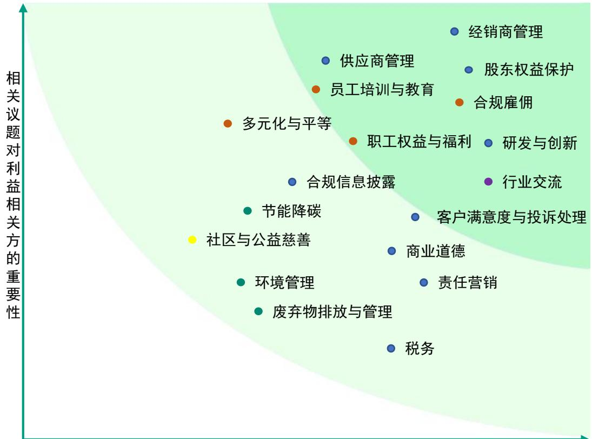

scatter

| 议题 | 相关议题对利益相关方的重要性 |
| --- | --- |
| 经销商管理 | 高 |
| 股东权益保护 | 高 |
| 员工培训与教育 | 高 |
| 合规雇佣 | 高 |
| 多元化与平等 | 中高 |
| 职工权益与福利 | 中高 |
| 研发与创新 | 中高 |
| 合规信息披露 | 中 |
| 行业交流 | 中 |
| 客户满意度与投诉处理 | 中 |
| 商业道德 | 低 |
| 社区与公益慈善 | 低 |
| 环境管理 | 低 |
| 责任营销 | 低 |
| 废弃物排放与管理 | 低 |
| 税务 | 低 |

相关议题对企业发展的重要性

# 公司治理

# 治理架构

良好的治理架构是公司高质量发展的基础，绿岛风严格按照《公司法》《证券法》《上市公司治理准则》《深圳证券交易所创业板股票上市规则》《深圳证券交易所上市公司自律监管指引第2号——创业板上市公司规范运作》等相关法律法规的要求，制定《公司章程》及其他内部控制规章制度，持续完善公司股东会、董事会等治理架构，形成职责明确、有效制衡、高效运作的组织治理架构，以保障公司各项生产经营活动的有序开展。

# - 取消监事会

报告期内，为全面贯彻落实最新法律法规和监管规定要求，进一步规范公司运作机制，完善公司治理结构，公司根据《公司法》《上市公司章程指引》及《深圳证券交易所上市公司自律监管指引第2号——创业板上市公司规范运作》等最新法律法规和规范性文件的要求，不再设置监事会，《监事会议事规则》相应废止，公司各项制度中涉及监事会、监事的规定亦不再适用。监事会职能调整后，公司对《审计委员会工作细则》进行了修订，进一步明确并细化董事会审计委员会的职责权限，确保其依法合规履行原由监事会承担的相关职权，有效保障公司治理结构的规范运作。

# - 制度的修订与制订

报告期内，公司根据《公司法》《深圳证券交易所创业板股票上市规则》《深圳证券交易所上市公司自律监管指引第2号——创业板上市公司规范运作》等相关法规的最新规定，结合公司实际情况，完成对《公司章程》及多项会议议事规则、工作制度、管理制度等的修订，同时制订了《舆情管理制度》《信息披露暂缓与豁免管理制度》《董事、高级管理人员离职管理制度》《董事和高级管理人员所持本公司股份及其变动管理制度》《董事及高级管理人员行为规范》《控股股东和实际控制人行为规范》等制度。

# 三会运作

# - 股东会

公司严格按照《公司法》《证券法》《上市公司股东会规则》等相关法律法规和规范性文件以及《公司章程》《股东会议事规则》等相关规定召集、召开股东会，充分尊重全体股东，确保全体股东对公司重大事项的知情权、参与权和表决权，并按照监管要求发布上述股东会的决议公告及法律意见书。

# - 董事会

公司依法设立董事会作为公司的经营决策机构，依据《中华人民共和国公司法》《中华人民共和国证券法》《上市公司治理准则》以及《公司章程》《董事会议事规则》等相关法律法规和规范性文件的规定，履行董事会及董事职责，提高董事会规范运作和科学决策水平。公司董事会由5名董事组成，包括非独立董事3人，独立董事2人。

# - 董事会专门委员会

公司董事会下设战略委员会、审计委员会、薪酬与考核委员会和提名委员会四个专门委员会。各委员会依据《公司章程》的规定履行职权，不受公司其他部门和个人的干预。四个专门委员会在自己职责范围内积极开展工作，在董事会科学决策中发挥了各自的作用。

<table><tr><td colspan="3">2025年会议召开情况</td></tr><tr><td>股东会</td><td>5次</td><td>审议通过 27项议案</td></tr><tr><td>董事会</td><td>4次</td><td>审议通过 25项议案</td></tr><tr><td>董事会审计委员会</td><td>4次</td><td>审议通过 17项议案</td></tr><tr><td>董事会战略委员会</td><td>1次</td><td>审议通过 1项议案</td></tr></table>

# 股东权益保护

# 内控建设与风险管理

公司严格遵守《公司法》《证券法》《深圳证券交易所股票上市规则》等法律法规和规范性文件的相关规定和要求，建立健全各项制度、不断提升公司规范运作，提高信息透明度，切实保护股东权益。截至2025年末，公司已建立近30项上市公司相关治理制度，涉及三会议事规则、募集资金管理、内幕信息知情人登记、内部审计、关联交易、对外投资、对外担保、子公司管理、投资者关系管理等事项。公司根据相关制度，明确人员职责、确保董事会及高级管理人员切实履行职责。

公司根据2025年度的内部治理情况，披露了《2025年度内部控制自我评价报告》，公司已按照企业内部控制规范体系和相关规定的要求在所有重大方面保持了有效的财务报告内部控制。审计机构出具了《内部控制审计报告》。

# 信息披露

公司制订并严格执行《信息披露管理制度》《内幕信息知情人登记管理制度》《信息披露暂缓与豁免管理制度》《舆情管理制度》等规章制度，遵循真实、准确、完整、及时、公平的披露原则，切实地完成各项信息披露工作。披露的信息尽量做到通俗易懂、简明清晰。公司进一步明确董事会和信息披露职能部门的职权，加强信息披露管理，提高信息披露质量与公司的透明度。

2025年，公司在巨潮资讯网等指定信披媒体上共披露了 121 份公告以及 3 份调研信息，确保全体股东、投资者及时了解、掌握公司经营动态、财务状况及公司的重大事项。

# 投资者关系

公司重视投资者关系的建立和维护，依据《投资者关系管理制度》，通过深交所互动易回复、业绩说明会和路演、现场调研、电话咨询、邮件咨询等多种方式与投资者进行沟通交流。

<table><tr><td>深交所互动易平台回复</td><td>召开业绩报告说明会</td></tr><tr><td>2025年,公司在深交所互动易平台共回答提问49条,回复率达到100%。</td><td rowspan="3">2025年5月8日,公司召开了2024年度业绩网上说明会;2025年9月4日,公司召开了2025年半年度业绩网上说明会。公司董事长兼总经理、董秘兼副总经理、独立董事等人均出席了业绩报告说明会。</td></tr><tr><td>“投资者网上集体接待日”活动</td></tr><tr><td>2025年9月19日,广东证监局、广东上市公司协会组织了网上集体接待日活动,公司在全景网参与了相关活动。</td></tr></table>

# 股东分红回报

公司注重股东回报，根据《公司章程》规章制度，制定了《未来三年股东分红回报规划（2024-2026年）》，并召开董事会、股东会通过了审议程序。公司以良好、稳定的业绩为基石，积极实行股东现金分红政策，以实际行动回馈股东。公司自上市以来，每年均进行现金分红。2021年度权益分派现金红利544.00万元；2022年度权益分派现金红利4,148.00万元；2023年度权益分派现金红利5,984.00万元；2024年年度权益分派现金红利5,984.00万元；2025年半年度权益分派现金红利3,944.00万元，2025年年度权益分派现金红利2,040.00万元。

# 责任运营

# 供应商管理

绿岛风重视与供应商的交流，保持良好合作关系，实现互利共赢、共同发展。

- 对于有潜在合作意向的供应商，公司通过资质审查、样品检测、实地走访等多方面评审合格后与其确立合作关系并签订年度采购框架合同。  
- 公司生产部门制定生产计划，计划部门通过ERP系统进行MRP（物料需求计划）运算得出相应物料的采购需求。对于钢材、塑料、铜质漆包线等询价类物料，采购需求经审批通过后，公司根据采购需求量进行询价，确定供应商及采购价格后下达采购订单；对于电子元器件、电机、五金塑料制品、包装材料等非询价类物料，公司按采购需求数量及先前已确认的采购价格直接生成采购订单。供应商将货物送达公司后，公司根据质检方案对物料进行检验，检验合格后予以入库。  
- 公司与供应商按照框架合同所约定的结算方式进行货款结算。

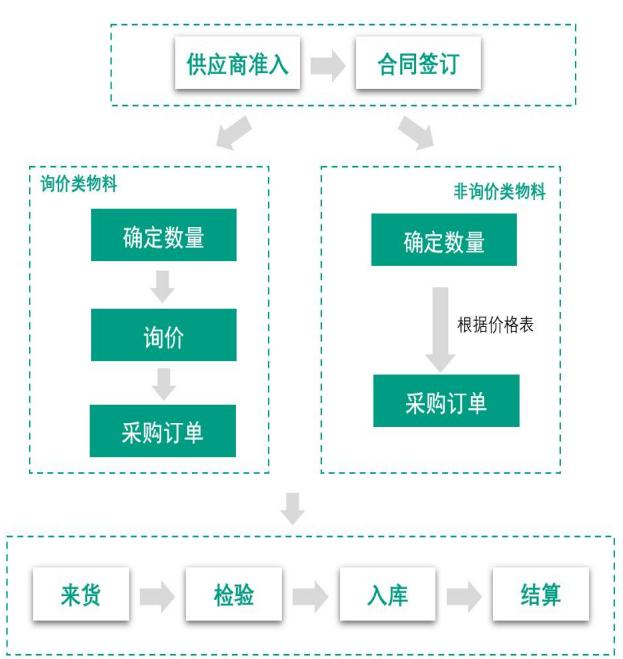

flowchart

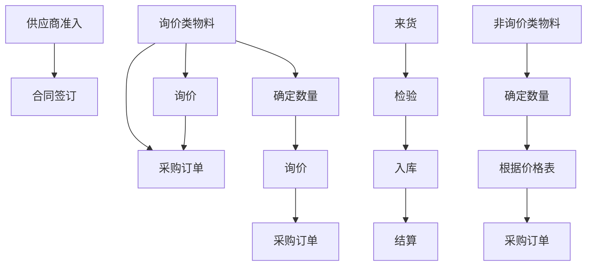
```mermaid
graph TD
  A["供应商准入"] --> B["合同签订"]
  C["询价类物料"] --> D["确定数量"]
  C --> E["询价"]
  C --> F["采购订单"]
  D --> G["询价"]
  E --> F
  G --> H["采购订单"]
  I["来货"] --> J["检验"]
  J --> K["入库"]
  K --> L["结算"]
  M["非询价类物料"] --> N["确定数量"]
  N --> O["根据价格表"]
  O --> P["采购订单"]
```

# 客户保护

- 绿岛风严格遵守《中华人民共和国广告法》等规定，坚决维护客户的知情权、选择权等合法权益，杜绝虚假宣传。公司始终坚持以客户为中心，持续提升客户满意度，努力实现和维持和谐稳定的客户关系。  
- 绿岛风在接到客户针对产品或服务的建议或投诉时，明确客户投诉目的与诉求，积极沟通，同时配合相关部门追查、分析原因及判定责任归属，并对客户投诉保持全程跟踪，力争给客户满意的回复。

# 经销商管理

- 绿岛风销售以经销渠道为主，公司与主要经销商均合作多年，相互促进、共同成长，经销商客户对于公司品牌的认可度及忠诚度较高。目前公司主要通过信息化门户系统与经销商进行业务信息传递与交流，实现了对经销业务的流程化、高效化监督与管理。  
- 绿岛风近年来依托强大的销售队伍和管理能力，在销售网点渠道建设方面取得了突出的成果。公司已在全国范围内通过经销渠道覆盖包括专卖店、五金店、建材店、灯饰店、暖通店等在内的终端销售网点，遍布全国各主要城市并逐步下沉渠道。与此同时，公司通过信息化门户系统及微信小程序，实现了网点备案、导航、巡查等功能。

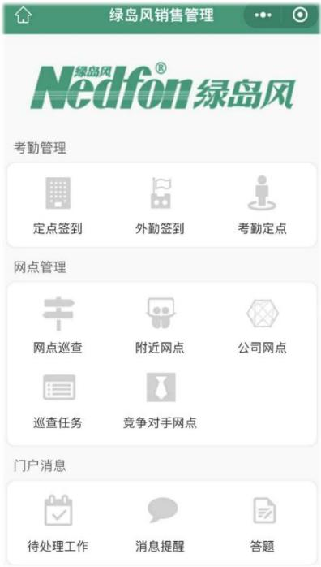

text_image

绿岛风销售管理
Nedfon 绿岛风
考勤管理
定点签到	外勤签到	考勤定点
网点管理
网点巡查	附近网点	公司网点
巡查任务	竞争对手网点
门户消息
待处理工作	消息提醒	答题

- 公司重视经销商渠道建设，公司销售人员根据公司年度市场开拓计划开发经销商，对其发展理念、资信情况、行业经验、产品业务结构、销售渠道网络、配送能力等方面综合评估，审定合格后签订年度经销合同，对经销渠道区域、产品定价标准、款项结算方式、货物运输签收、售后服务支持等条款予以具体约定，并就年度销售目标达成共识。  
- 公司制定了经销商管理政策，就经销商准入及合同签订、销售价格与销售范围、款项结算与发运、退换货、返货返利、培训与终端建设、销售情况、库存水平、品牌排他性控制、业绩考核管理等方面都进行了具体约定。经过多年发展积累，公司已形成一套稳定、高效的经销商管理体系，销售渠道覆盖华南、华东、华北、华中、东北、西南、西北等全国主要市场区域，终端销售网点遍布全国主要城市并逐步下沉渠道。

公司组织召开2025年营销年会  
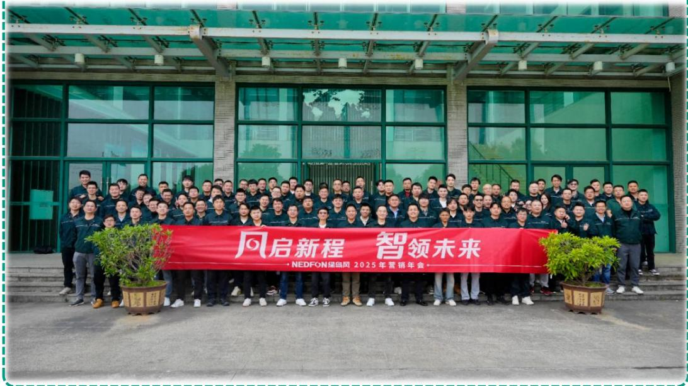

text_image

风启新程 智领未来
·NEDFON梁岛风 2025年营销年会·

# 品牌建设管理

公司重视自身品牌形象的建设管理工作，在自身原有布局基础上，重点加强区域体验中心店和经销渠道网点的建设，完成对销售渠道更加全面立体化的布局。同时，公司通过广告投放、展会/推广会、明星代言等方式进行品牌推广以提升品牌知名度，树立公司的品牌形象。

# - 签约品牌形象大使

公司已签约刘涛女士为公司品牌形象大使，树立新的品牌形象，沉淀品牌无形资产。

text_image

NEDFON绿岛风
通风系统专家
新风行业 | 股票代码
上市公司 | 301043
品牌形象大使
刘涛
新风
我选绿岛风
NEDFON绿岛风 × 刘涛

text_image

绿岛风
绿色生态专家
品牌形象大使
刘涛
新风
我选绿岛风
新风行业 | 股票代码
上市公司 | 301043

# - 全国高铁站点广告投放

2025年内，公司的全新品牌形象广告已在济南西站、南京南站、合肥南站、无锡站、镇江站、苏州站、苏州园区站、常州站、上海虹桥站、杭州东站、宁波东站、昆山南站、南昌站、成都东站、福州站、厦门北站、深圳北站等高铁站进行投放，进行广告宣传。

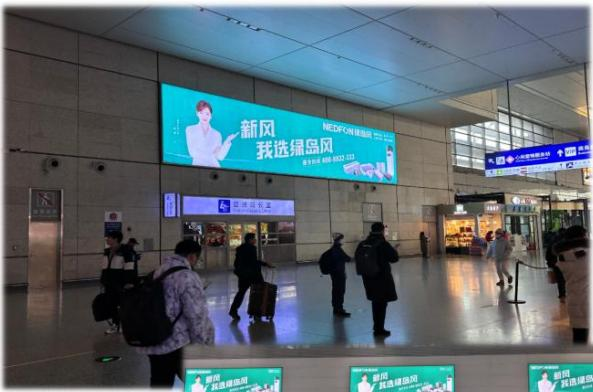

text_image

新风
我选择岛风
NEWFJ 雷港国际
电子邮箱：400-8532-5551
电话：021-6333-5799
服务电话：400-8532-5551
服务电话：400-8532-5799
服务电话：400-8532-5799
服务电话：400-8532-5799
服务电话：400-8532-5799
服务电话：400-8532-5799
服务电话：400-8532-5799
服务电话：400-8532-5551
服务电话：400-8532-5551
服务电话：400-8532-5551
服务电话：400-8532-5551
服务电话：400-8532-5551
服务电话：400-8532-5551
服务电话：400-8532-5799
服务电话：400-8532-5799
服务电话：400-8532-5799
服务电话：400-8532-5799
服务电话：400-8532-5551
服务电话：400-8532-5799
服务电话：400-8532-5799
服务电话：400-8532-5799
服务电话：400-8532-5799
服务电话：400-8632-5799
服务电话：400-8632-5799
服务电话：400-8632-5799
服务电话：400-8632-5799
服务电话：400-8632-5799
服务电话：400-8632-5799
服务电话：400 8632-5799
服务电话：400 8632-5799
服务电话：400 8632-5799
服务电话：400 8632-5799
服务电话：400 8632-5799
服务电话：400 8632-5799
服务电话：4 8632-5799
服务电话：4 8632-5799
服务电话：4 8632-5799
服务电话：4 8632-5799
服务电话：4 8632-5799
服务电话：4 8632-5799
服务电话：4 8632-579<nl>

上海虹桥站

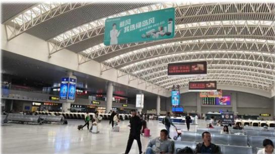

text_image

春风
我选绿色风
——

南昌站

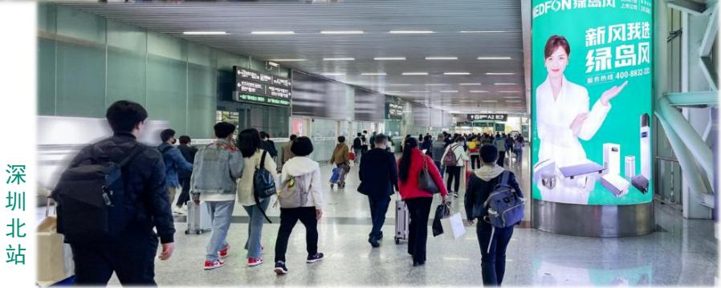

text_image

新风我选
绿岛风
深圳北站

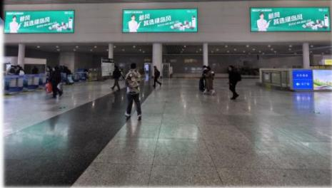

text_image

Photo of a busy transportation hub with visible signage and people walking in the aisle

杭州东站

# - 投建新风体验中心

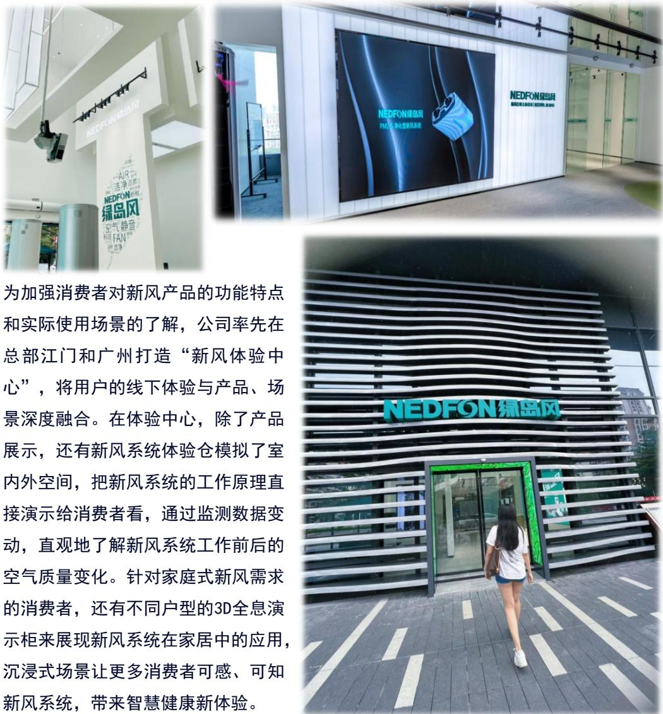

为加强消费者对新风产品的功能特点和实际使用场景的了解，公司率先在总部江门和广州打造“新风体验中心”，将用户的线下体验与产品、场景深度融合。在体验中心，除了产品展示，还有新风系统体验仓模拟了室内外空间，把新风系统的工作原理直接演示给消费者看，通过监测数据变动，直观地了解新风系统工作前后的空气质量变化。针对家庭式新风需求的消费者，还有不同户型的3D全息演示柜来展现新风系统在家居中的应用，沉浸式场景让更多消费者可感、可知新风系统，带来智慧健康新体验。

# - 积极参加展会

公司积极参加各类营销展会，通过交流了解行业最新发展动态，同时广泛寻找新的商业合作机会。2025年4月，公司参加了上海召开的第三十五届国际制冷、空调、供暖、通风及食品冷冻加工展览会；2025年5月，公司参加了武汉召开的第二十六届全国医院建设大会暨国际医院建设、装备及管理展览会；2025年6月，公司参加了上海召开的国际空气新风展览会；2025年7月，公司参加了成都召开的国际酒店及商业空间展览会；2025年11月，公司参加了杭州召开的国际台球展；2025年11月，公司参加了广州召开的酒店采购对接会。此外，公司于2025年内参加了由暖立方传媒组织的“中国舒适家居万里行”9场活动。

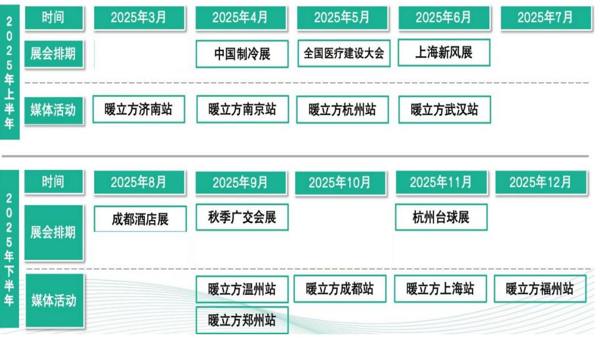

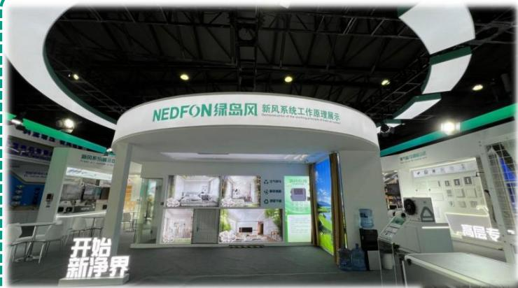

text_image

NEDFON绿岛风 新风系统工作原理展示
开始
新净界
高层专

上海·第三十五届  
国际制冷、空调、供暖、  
通风及食品冷冻加工展览会

成都·国际酒店及商业空间展览会  
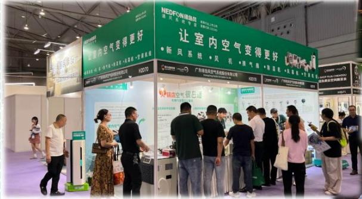

text_image

NEDFO环境监测
让室内空气变得更好
新风系统·风扇·排气筒·推盖
让室内空气变得更好
NEDFO
空气温度监测
2023年1月
2023年1月
2023年1月
2023年1月
2023年1月
2023年1月
2023年1月
2023年1月
2023年1月
2023年1月
2023年1月
2023年1月
2023年1月
20 20 20 20 20 20 20 20 20 20 20 20 20 20 20 20 20 20 20 20 20 20 20 20 20 20 20 20 20 20 20 20 20 20 15
NEDFO
空气温度监测
2023年1月
2023年1月
2023年1月
2023年1月
2023年1月
2023年1月
2023年1月
2023年1月
2023年1月
2023年1月
20 20 20 20 20 20 15
NEDFO
空气温度监测
2023年1月
2023年1月
2023年1月
2023年1月
2023年1月
NEDFO
空气温度监测
2023年1月
2023年1月
2023年1月
NEDFO
空气温度监测
让室内空气变得更好
新风系统·风扇·排气筒·推盖
让室内空气变得更好

杭州·国际台球展  
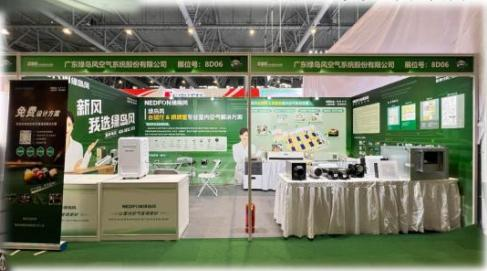

text_image

广东绿岛风空气系统股份有限公司 展位号: 8D06
免费支付方式
新风
我选择易用
MEDYUN集团
2017年4月新增智能室内烟气解决方案
广东绿岛风空气系统股份有限公司 展位号: 8D06

武汉·第二十六届全国医院建设大会暨国际医院建设、装备及管理展览会

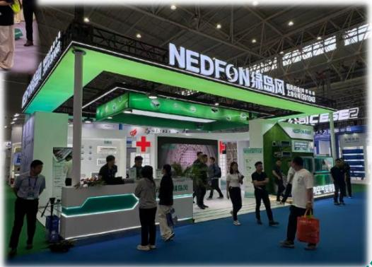

text_image

NEDFON 绿岛风
公司ICE®

# ● 发布 “白皮书”

2025年6月15日，公司在广州南丰朗豪酒店隆重举办了“好风好健康，新风新生活”615绿岛风新风日暨《2025中国室内空气健康白皮书》发布会，本次发布会发布了行业年度白皮书，同时标志着公司在推动室内空气健康领域迈出了坚实的一步。

2025年9月20日，绿岛风与三步云联合举办的《中国酒店客房新风系统应用发展白皮书》发布会在北京隆重举行。作为业内首部专注于酒店客房新风系统的权威报告，本次发布会聚集了众多来自新风与酒店行业的嘉宾及媒体，共同见证了行业盛会。

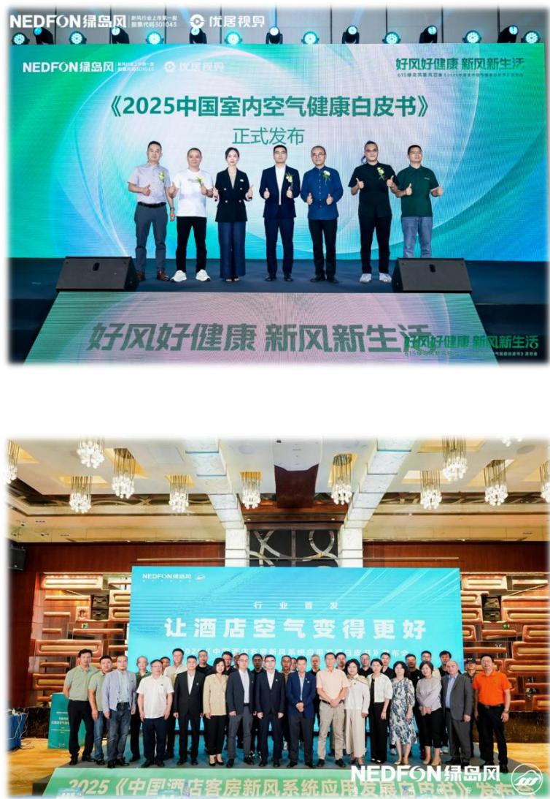

# 商业道德

公司始终遵循诚信、合法经营的原则，严格遵守商业道德规范，具备良好的商业信誉；公司管理层严格遵守相关法律法规、职业道德及公司的规章制度。报告期内，公司不存在任何因违反社会和经济领域相关法律法规而受到处罚的情形。

# 依法纳税

绿岛风依法加强税务管理，打造企业信用“金名片”。一方面，公司按期完成日常各项税费的申报与缴纳，不定期配合税局完成专项税务自查、风险疑点核查，按时保质向税局报送企业数据，及时完成A股分红派息相关税款的代扣代缴工作；另一方面，公司组织完成汇算清缴现场审计，及时对税务师事务所提出的问题进行解释回复，达成一致意见，确保了汇算清缴数据的真实性、准确性和完整性。

绿岛风诚信经营、依法纳税，经国家税务总局江门市税务局评定，公司2020\~2024年度皆为纳税信用A级纳税人。

3,636.95万元

2025年公司纳税总额

# 科研服务

# - 参与国家标准的制订

公司现为高新技术企业、国家知识产权示范企业、广东省室内通风系统工程技术研究中心、广东省博士工作站、广东省省级企业技术中心、AMCA会员单位及中国通用机械工业协会风机分会会员单位。公司已通过广东省人力资源和社会保障厅批准组建“广东省博士后创新实践基地”，加强博士后工作对企业创新能力的支持力度。公司参与了多项国家标准的制订工作，在发挥行业影响力、推动行业规范与进步的同时，有能力把握最新技术发展方向，进一步奠定行业优势地位。

报告期内，公司参与制定并已由国家或行业发布的标准如下：

<table><tr><td>标准名称</td><td>标准号</td><td>标准类型</td></tr><tr><td>热回收新风机组季节性能系数测试和计算方法 第1部分:供热显热回收季节性能系数</td><td>GB/T 45465.1-2025</td><td>国标</td></tr><tr><td>家用和类似用途吊顶用多功能电器</td><td>GB/T 26183-2025</td><td>国标</td></tr><tr><td>家用和类似用途电器的安全第128部分:新风净化机的特殊要求</td><td>GB/T 4706.128-2025</td><td>国标</td></tr><tr><td>厨房空调器</td><td>GB/T 46496-2025</td><td>国标</td></tr><tr><td>通风机通风机效率等级第2部分:驱动部件的标准损耗</td><td>GB/T 43080.2-2025</td><td>国标</td></tr><tr><td>通风机通风机效率等级第4部分:含驱动装置最高转速时的通风机</td><td>GB/T 43080.4-2025</td><td>国标</td></tr><tr><td>通风机通风机效率等级第5部分:射流风机</td><td>GB/T 43080.5-2025</td><td>国标</td></tr><tr><td>家用和类似用途吸油烟机与换气扇能效限定值及能效等级</td><td>GB 29539-2025</td><td>国标</td></tr><tr><td>换气扇能效测试及表征方法技术规范</td><td>T/CPQS E00083-2025</td><td>行标</td></tr></table>

# - 注重环保、健康、节能的研发方向

公司研判行业发展的需要和变化，随着环保、健康、节能功效越来越受到社会公众的关注，公司开发了除霾、抗菌、除湿等功能，自主或合作研发了如一种全热交换芯（专利号：ZL201320141962.X）、一种除霾新风机（专利号：ZL201620198327.9）、一种全热换热器功能层材料的改进方法（专利号：ZL201511031313.4）等专利产品。

# - 加强研发投入

截至2025年末，公司已获得专利成果如下。

# 发明专利

# 23项

# 外观设计专利

# 89项

# 实用新型专利

# 385项

2025年度，公司研发投入共计约1,840.19万元；2025年末，研发人员有116人；公司研判市场形势，根据不同客户对产品的功能需求，及时开发新品类产品并上线。

# 2025年度内，公司新开发上线的部分产品展示如下：

HTF-S双速轴流式消防排烟风机新品  
- 超声波加湿器系列新品  
- JKT系列柜式离心净化机组新品  
- 湿膜加湿器系列新品  
- A式负压风机新品  
- 电梯风幕机新品  
- 取暖器新品  
- 40L家用除湿机新品  
● 变频全热新风除湿一体机新品  
● 超薄分体管道换气扇系列新品  
● 蒸发冷工业省电空调新品  
- 耐低温工业除湿机 & 耐高温工业除湿机系列新品  
- RM-A系列贯流式电热风幕机新品  
- 58L家用除湿机系列新品  
- 移动式空调器 / KY-6S新品  
● 分体式管道换气扇1700-2500风量系列新品  
● 智能石墨烯远红外取暖器新品  
- 溶液除湿机新品  
● 新款RM15大风量贯流式电热型风幕机产品  
● 常规型空调风柜单相六极（5100/6100）新品

- 岗位式轻音型轴流风机新品  
● 常规型空调风柜单相四极（51/61）新品  
● 酒窖吊顶式工业恒温恒湿机系列新品  
- DF3-48离心风机新品  
- 转轮除湿机新品  
- 湿膜工业恒湿机系列新品  
● D系列上进风离心式风幕机(星空灰)新品  
- 空调风柜2000-4100风量新品  
- RM15系列大风量贯流式电热型风幕机(大功率遥控型)新品  
- 双速直流式送风机系列新品  
● （电商专供）变频遥控型斜流管道风机系列新品  
- 寒冷地区专用大功率贯流式电热风幕机新品  
- 玻璃钢负压风机新品  
- 半导体智能除湿装置系列新品  
● 中小户型全屋双向流新风套餐产品  
- 双向流新风机（FR系列）新品  
- 新款落地扇产品

# - 行业领先的实验室

公司具有多个行业领先的实验室，经中国合格评定国家认可委员会评定，符合《检测和校准实验室能力的通用要求》，获有实验室认可证书。

半消声试验室  
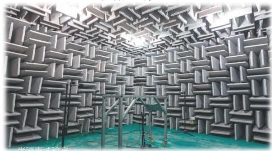

natural_image

Interior view of an acoustic chamber with stacked metallic acoustic foam columns (no visible text or symbols)

通风机性能试验室  
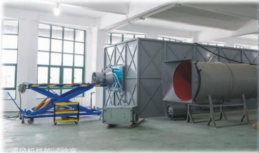

natural_image

Interior of a large industrial testing facility with a blue crane and large cylindrical machine (no visible text or symbols)

风扇性能试验室  
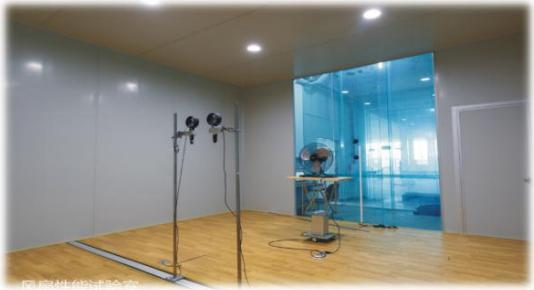

natural_image

Interior of a modern laboratory with glass partitions and test equipment, no visible text or symbols on the main subjects.

实验室认可证书  
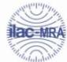

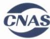

# 中国合格评定国家认可委员会

实验室认可证书

(注册号: CNAS L18812)

兹证明：

# 广东绿岛风空气系统股份有限公司实验室

（法人：广东缘岛风空气系统股份有限公司）

广东省台山市台城南兴路15号，529211

符合ISO/IEC17025：2017《检测和校准实验室能力的通用要求》（CNAS-CLO1《检测和校准实验室能力认可准则》）的要求，具备承担本证书附件所列服务能力，予以认可。  
获认可的能力范围见标有相同认可注册号的证书附件，证书附件是本证书组成部分。

生效日期：2023-08-03

截止日期：2029-08-02

  
中国合格评定国家认可委员会授权人

张朝华

中国合格评定国家认可委员会（CNAS）经国家认证认可监督管理委员会（CNCA）授权，负责实施合格评定国家认可制度。CNAS是国际实验室认可合作组织（ILAC）和亚太认可合作组织（APAC）的互认协议成员。
本证书的有效性可登陆www.cnas.org.cn获认可的机构名录查询。

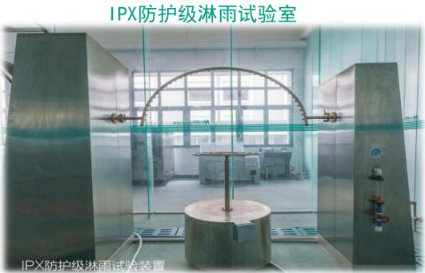

text_image

IPX防护级淋雨试验室
IPX防护级淋雨试验装置

# - 部分科技荣誉成果

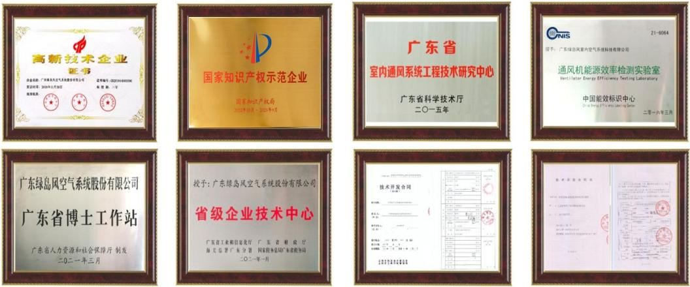

# ● 2025广东省制造业500强

2025年10月，绿岛风暨2024以来，再次获得“广东省制造业500强”殊荣，且排名从第469位上升至第454位。本次上榜，是对绿岛风整体实力的再一次肯定。

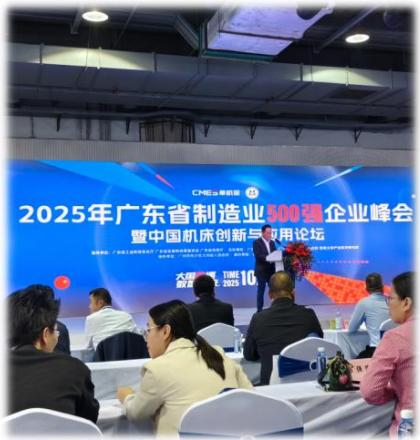

text_image

2025年广东省制造业500强企业峰会
暨中国机床创新与使用论坛

# 荣誉证书

广东绿岛风空气系统股份有限公司：

荣列 2025 年广东省制造业企业 500 强第 454 位。特颁此证。

证书编号：GMA(A)202510454

颁发日期：2025年10月

# ● 2024广东省制造业500强

暨公司以风幕机产品荣获“2024年广东省制造业单项冠军企业”后，2025年，公司再次以新风机产品荣获“2025年广东省制造业单项冠军企业”殊荣，进一步彰显了公司在新风机制造领域的卓越成就和领先地位。

# 关于2025年广东省省级制造业单项冠军企业及第一批复核企业通过名单的公示

发布日期：2025-12-31 浏览次数：413

根据《广东省工业和信息化厅关于印发省制造业单项冠军企业遴选管理办法的通知》（粤工信规字〔2024〕1号）和《广东省工业和信息化厅关于组织开展2025年省级制造业单项冠军企业选题及审核工作的通知》（粤工信规划政策函〔2025〕22号）有关要求，广东省工业和信息化厅组织开展了2025年省级制造业单项冠军企业选题及第一批省级单项冠军复核工作，相关审核工作已完成。现将通过审核的企业名单予以公示（详见附件）。

请各地级以上市工业和信息化局对公示中所辖区域的企业在资质认定、荣誉证书等申报材料真实性方面进行复核，并出具承诺函，承诺函请于2026年1月9日前报省工业和信息化厅。如真实性存疑，请在公示期内提出。

欢迎社会各界参与监督，如有异议，请在公示期内实名反馈广东省工业和信息化厅，并提供佐证材料和联系方式，以便核实查证。

公示时间：2025年12月30日至2026年1月8日公示联系电话：020-83133349、83135972

附件：1.2025年广东省省级制造业单项冠军企业公示名单

2. 复核通过的第一批省级制造业单项冠军企业公示名单

广东省工业和信息化厅

2025年12月29日

# - 新风系统十大品牌排行榜榜首

2025年，品牌网依托全网大数据，经专业评测，发布了2025年新风系统十大品牌排行榜，绿岛风高居榜首。

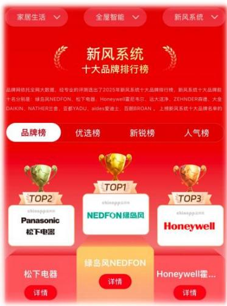

text_image

家居生活
全屋智能
新风系统
新风系统
新风系统
十大品牌排行榜
品牌网依托全网大数据，经专业的评测选出了2025年新风系统十大品牌排行榜，新风系统十大品牌前十名分别是：绿岛风NEDFON、松下电器、Honeywell霍尼韦尔、远大洁净、ZEHNDER森德、大金DAIKIN、NATHER兰舍、亚都YADU、aides爱迪士、百颜BROAN。上增新风系统十大品牌名单的
品牌榜
优选榜
新锐榜
人气榜
TOP2
chiroggan
Panasonic
松下电器
TOP1
chiroggan
NEDFON绿岛风
TOP3
chiroggan
Honeywell
松下电器
详情
绿岛风NEDFON
详情
Honeywell霍...
详情

# - 新风系统十大品牌排行榜榜首

2025年，绿岛风荣获优居视界、与中装联联合颁布的“2025年度行业标杆品牌”荣誉称号。

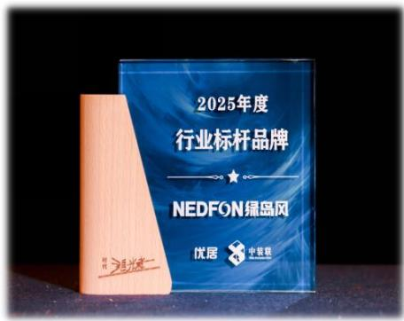

text_image

2025年度
行业标杆品牌
NEDFON绿岛风
优居 小装致

# - 上海市科学技术奖

2025年4月，凭借“低露点固体吸附高效除湿关键技术与应用”项目，荣获上海市人民政府颁布的“上海市科学技术奖”广东省重点商标保》，奖励等级一等奖。

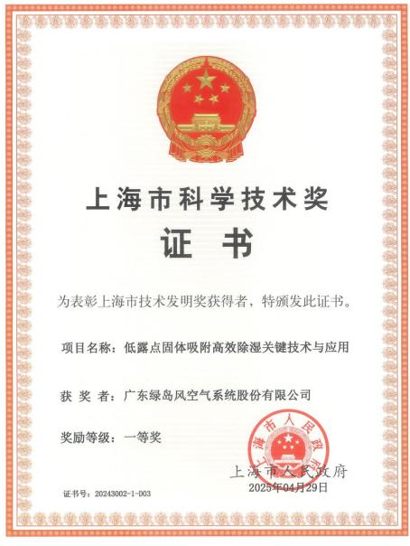

text_image

上海市科学技术奖
证书

为表彰上海市技术发明奖获得者，特颁发此证书。

项目名称：低露点固体吸附高效除湿关键技术与应用

获奖者：广东绿岛风空气系统股份有限公司

奖励等级：一等奖

证书号：20243002-1-D03
上海市人民政府
2025年04月29日

# ● “市长杯” 工业设计大赛 银奖

2025年12月，公司凭借“除霾窗式新风机”产品，荣获江门市工业和信息化局颁布的“2025年江门‘市长杯’工业设计大赛 产品设计组 银奖。

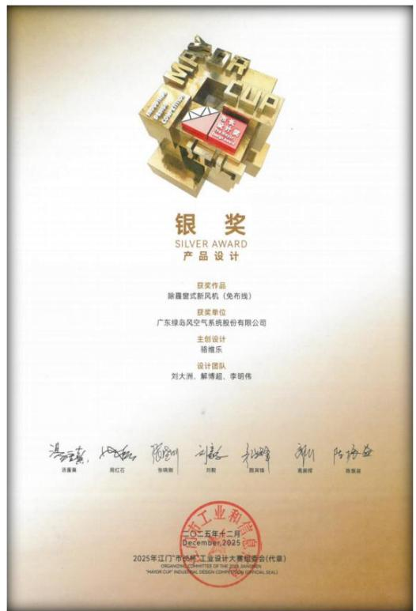

text_image

银奖
SILVER AWARD
产品设计

获奖作品
除霾窗式新风机(免布线)

获奖单位
广东绿岛风空气系统股份有限公司

主创设计
骆维乐

设计团队
刘大洲、解博超、李明伟

洛星晨  周红石  张晓刚  刘毅  李峰  郭其锋  蒙振辉  阮培益

二〇二五年十二月
December 2025

2025年江门市民桥工业设计大赛组委会(代章)
ORGANIZATION COMMITTEE OF THE JOB ANGERS
"MAJOR CLUB INDUSTRIAL DESIGN COMPETITION OFFICIAL SEAL"

# - 广东省名优技术产品

绿岛风自主研发的“风幕机”“全热新风交换机”及“浴室式换气扇”三项产品，入选广东省高新技术企业协会公布的“2025年第二批广东省名优高新技术产品名单”。

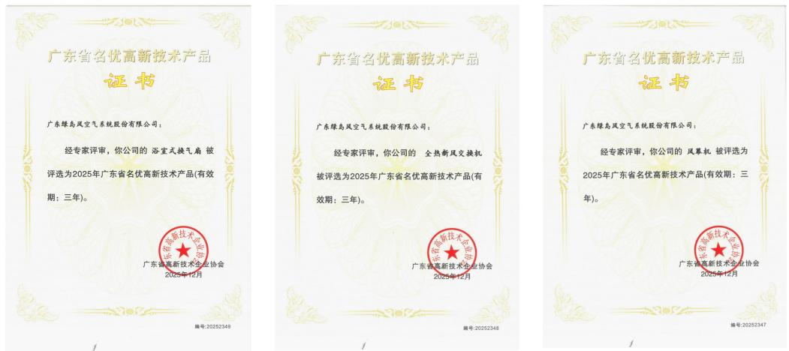

# - 获评2025年专精特新中小企业

2025年，在广东省工业和信息化厅组织开展的2025年专精特新中小企业认定和复核工作中，绿岛风参评成功。公司已获评2025年专精特新中小企业。

附件1

2025年专精特新中小企业公示名单

<table><tr><td>序号</td><td>区域</td><td>企业名称</td></tr><tr><td>523</td><td>江门</td><td>广东绿岛风空气系统股份有限公司</td></tr></table>

# 智能化

# - 启动AI智能设计系统研发

2025年11月13日，公司与中山大学在国家超算广州中心正式签署人工智能项目合作协议，共同启动新一代AI智能设计系统研发，将公司数十年积累的成功方案、产品数据与设计规范，与中山大学及国家超算中心的顶尖算力、算法能力相融

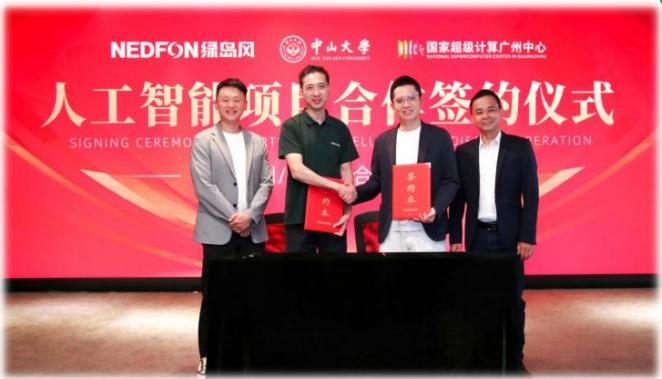

text_image

NEDFON绿岛风
中山大学
国家超级计算广州中心
NATIONAL DIVERSIFIED COMPUTER CENTER & COMMUNICATION
人工智能项目合作签约仪式
SIGNING CEREMONY CONFERENCE AND DEVELOPMENT OPERATION
合同

合，打造属于通风行业的“设计大脑”。此举能够将原本的沟通链路简单化，从“销售-设计-客户”的三角循环，变为“销售+AI”与客户的直接对话。面对客户需求，销售可通过AI实时生成、当场调整专业级解决方案示意图，将数天的等待压缩为几分

钟的共创。

同时，AI基于我们沉淀的全部知识进行推演，确保了设计方案的可行性与专业性，使得沟通一次比一次更精准。

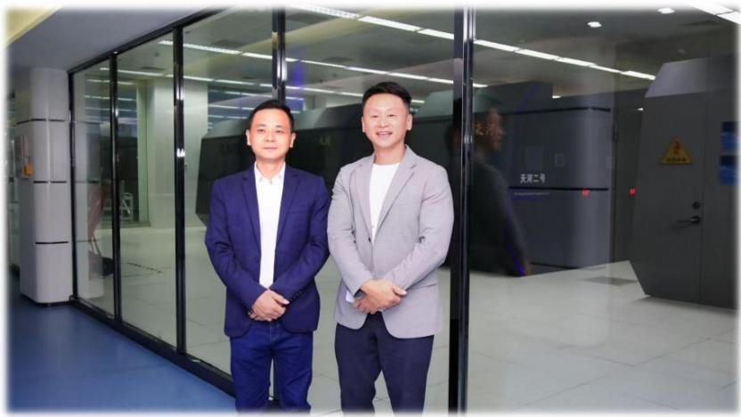

natural_image

Two men standing in front of a glass building with visible signage, no readable text or symbols on the image itself.

# 环保机制

- 绿岛风已取得《环境管理体系认证证书》，认证机构确认发行人环境管理体系符合GB/T24001-2016/ISO14001:2015标准，认证覆盖范围包括强制认证范围内的电风扇、排气扇、浴霸、风幕机、新风交换机等。  
- 绿岛风已取得江门市安全生产监督管理局核发的《安全生产标准化证书》，被认定为安全生产标准化三级企业（机械）。  
- 绿岛风依据国家的相关文件，结合公司实际情况，本着“预防为主、减少危害、统一领导、分类负责、属地管理、分级响应、充分利用资源”的原则，制定了《突发环境事件应急预案》。公司报告期内不存在环境污染事故。

# 绿色办公

绿岛风倡导“节约能源，从自身做起”的理念，推崇低碳生活方式，要求员工深化绿色办公的理念，形成良好的节约习惯。公司引入了外部专业的6S培训与管理，通过常态化的不定期检查工作环境的方式考核员工的6S工作效果，压实各位员工的环境管理责任。

- 倡导节约用电 办公区域统一做到“人走灯灭”，在每个工位的显示器上张贴“人离关显示器”标签，减少待机耗电。  
- 严格用水管理 及时关闭关紧水龙头，通过加强办公区、生活区的设施维护管理，杜绝“长流水”的现象。  
● 推行无纸化办公 公司提倡双面打印、不重要的文件反面利用，积极推行电子化办公。  
● 推动可持续消费 公司提倡少用塑料袋、一次性筷子。  
- 推广垃圾分类 公司办公区、生活区配备垃圾分类设施，让员工积极参与垃圾分类，养成良好习惯。

# 节能减排

绿岛风基于国家近年来关于加快构建清洁低碳安全高效能源体系的战略目标，秉持从自身做起的原则，研究并适行与发展理念相一致的经营、非经营性活动，主动拥抱国家的双碳战略，为我国实现“碳达峰、碳中和”贡献力量，同时树立企业良好社会形象。

# - 实施屋顶光伏项目

公司积极推行屋顶光伏项目，为提高公司的能源利用效率，于2021年在部分厂房屋顶实施安装一期光伏发电项目，并采用自发自用余电上网模式接入电网；2022年，公司在光伏屋顶一期收到良好效果的基础上，进行了光伏屋顶二期项目的组件铺设工作；2023年，组件铺设工作全部完成。公司主动降低外购电力量，逐步减少运营层面碳排放。

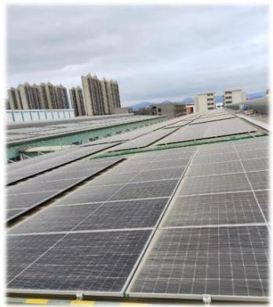

natural_image

Rows of solar panels installed on a rooftop with high-rise buildings in the background (no visible text or symbols)

# - 技术改造升级

在生产设备上，绿岛风始终重视生产设备、产品工艺的技术升级改造工作。公司逐步淘汰落后生产设备，替换或升级现有生产设备，以求综合提高能源使用效率。

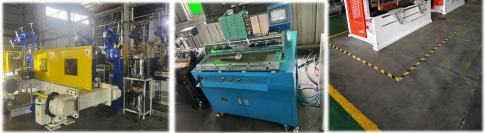

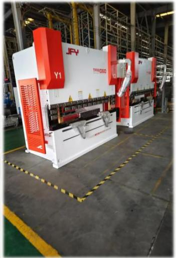

natural_image

Interior view of a factory with large industrial machinery (no visible text or symbols)

# ■ 严格雇佣规范

- 绿岛风严格遵守《中华人民共和国劳动法》《中华人民共和国劳动合同法》《中华人民共和国未成年人保护法》等有关法律法规，制定并不断完善各项人力资源管理制度，构建良好的劳资关系，切实保障员工合法权益。  
- 公司始终践行以人为本的理念，重视并保障员工的各项合法权益，为员工提供公平、健康、安全、舒适的工作环境。公司全面推行市场化公开招聘，在招聘、培养、晋升等人力资源管理方面，杜绝任何形式的歧视，坚持“兼收并蓄，包容开放”的用人原则，不因性别、民族、地域、文化背景等因素而作区别对待。  
- 公司在招聘过程中，对应聘人员身份进行查验，确保其符合用工年龄限制，不招聘未满16周岁的公民，杜绝任何形式的童工和强制劳动，规避用工风险。  
- 绿岛风积极带动就业，落实高校毕业生稳就业、促就业要求。公司在各类招聘平台上发布招聘信息，推行公开招聘，做好招聘工作动态监测。针对高校毕业生等潜在就业群体，适时组织现场介绍会，让求职者以及创业者能更好地了解公司的发展前景、员工职业规划、公司福利待遇。  
● 参加“南粤春暖”暨“春风行动”稳就业促发展就业服务活动

2025年2月6日，绿岛风人力资源部参加台山市“南粤春暖”暨“春风行动”稳就业促发展就业服务活动，前往昌大昌进行招聘。

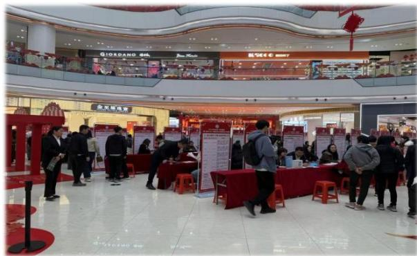

text_image

Interior photo of a shopping mall with visible signage including 'GIORDANO' and promotional banners, showing people interacting with booths and tables.

# - 参加校园招聘会

2025年10月29日-11月15日，绿岛风前往南宁学院、桂林电子科技大学、桂林航天工业学院及广西科技大学等多个高校进行招聘宣讲会和就业辅导会，促进校企合作和人才引流。

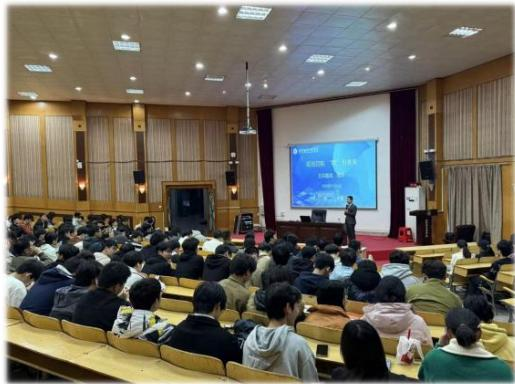

text_image

Conference hall photo with audience facing a presentation screen displaying Chinese text and logo

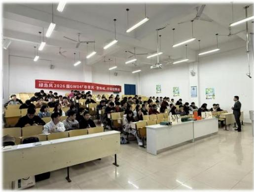

text_image

绿岛风2026届GW04"绿色风·生物体、开放空间会

2025年12月28日，绿岛风人力资源部积极响应人社局的号召，前往深圳会展中心参加“百万英才汇南粤”2025年大型综合招聘会，旨在借此平台引进高素质人才，为企业创新发展注入新鲜血液。

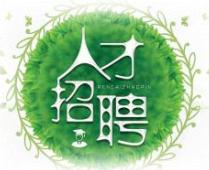

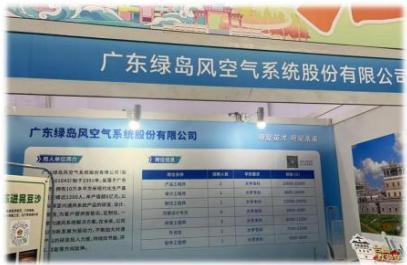

text_image

广东绿岛风空气系统股份有限公司
广东绿岛风空气系统股份有限公司
地址：广东省广州市海珠区东岗街道东岗西路1号
办公地址：广州市天河区珠江新城天河北路1号
法定代表人：陈伟
注册资本：人民币万元
经营范围：风力发电机组、风力发电机组、风力发电机组、风力发电机组、风力发电机组、风力发电机组、风力发电机组、风力发电机组、风力发电机组、风力发电机组、风力发电机组、风力发电机组、风力发电机组、风力发电机组、风力发电机组、风力发电机组、风力发电机组、风力发电机组、风力发电机组、风力发电机组、风力发电机组
联系电话：021-6388-549
传真号码：021-6388-549
电子邮箱：fjzq@fjzq.com.cn
客服电话：95577
网址：www.fjzq.com.cn

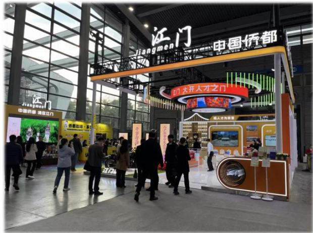

text_image

江门
中国侨都
Jiangmen
中国侨都 津悦江门
大开人才之门
新人行为盛宴

# - 2025年员工构成

报告期末，公司员工总数为1189人，构成如下。

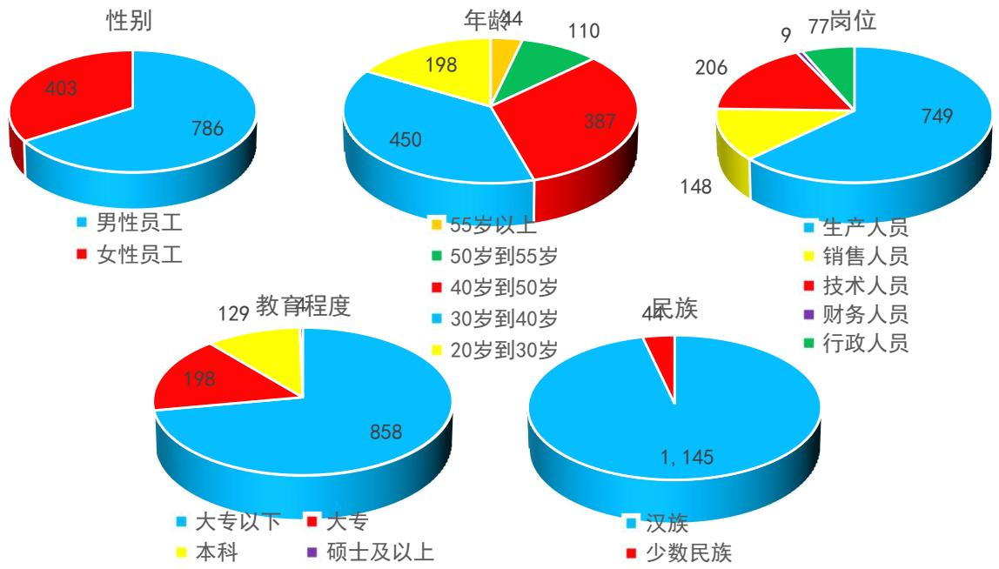

pie

| Category | Value |
| --- | --- |
| 性别::男性员工 | 786 |
| 性别::女性员工 | 403 |
| 年龄::55岁以上 | 110 |
| 年龄::40岁到50岁 | 387 |
| 年龄::20岁到30岁 | 198 |
| 岗位::生产人员 | 749 |
| 岗位::销售人员 | 206 |
| 岗位::技术人员 | 148 |
| 岗位::行政人员 | 77 |
| 教育程度::大专以下 | 858 |
| 教育程度::大专 | 198 |
| 教育程度::本科 | 129 |
| 民族::汉族 | 1,145 |
| 民族::少数民族 | 44 |

# 赋能人才培养

\- 组织“风之子”管培生培训

2025年3月13日，绿岛风开展“风之子”管培生培养项目，面向应届毕业生，通过现场授课与轮岗实践相结合的方式，助力职场新人快速完成从学生到职场人的角色转变。

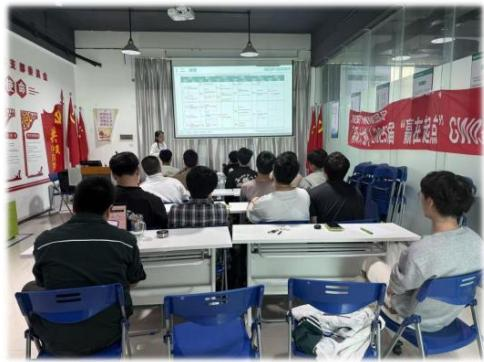

text_image

Classroom scene with students seated at desks and a projected slide on the screen, banners with Chinese text visible in background

# - 组织消防培训

2025年10月27日，为让员工深入了解消防应急常识，切实树立起消防意识，学会正确使用消防设施以及掌握逃生的方法，公司组织2024上半年新入职员工进行消防理论知识、消防器材现场使用的培训以及岗位消防紧急事故处理演练。

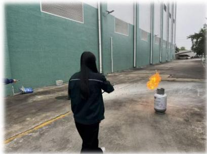

natural_image

Person in black hoodie walking outdoors near a building with green walls and a fire extinguisher (no visible text or symbols)

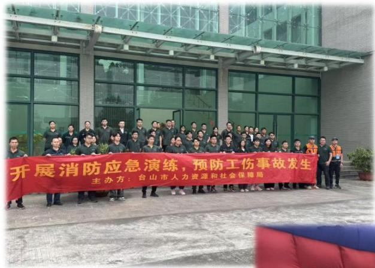

text_image

开展消防应急演练，预防工伤事故发生
主办方：台山市人力资源和社会保障局

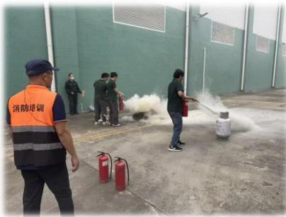

text_image

Street photo showing fire extinguisher training with firefighters and a person in safety vest, all using extinguishers and extinguishers.

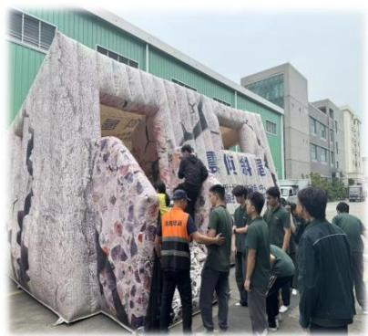

text_image

Street photo showing workers and officials gathered around a large wrapped material stall with visible Chinese signage in the background.

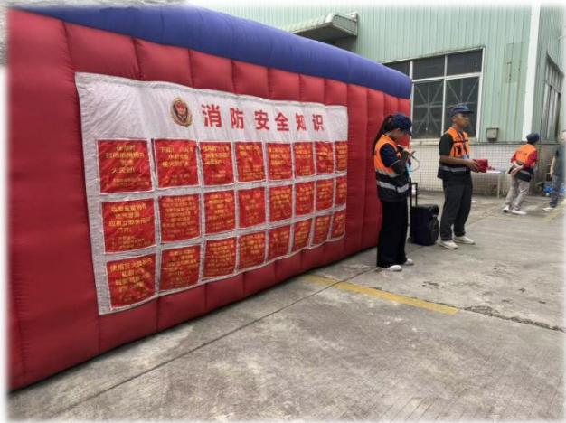

text_image

消防安全知识
2023年1月1日，中国防洪工程安全委员会颁发“三安”证书。
2023年1月1日，中国防洪工程安全委员会颁发“三安”证书。
2023年1月1日，中国防洪工程安全委员会颁发“三安”证书。
2023年1月1日，中国防洪工程安全委员会颁发“三安”证书。
2023年1月1日，中国防洪工程安全委员会颁发“三安”证书。
2023年1月2日，中国防洪工程安全委员会颁发“三安”证书。
2023年1月2日，中国防洪工程安全委员会颁发“三安”证书。
2023年1月2日，中国防洪工程安全委员会颁发“三安”证书。
2023年1月2日，中国防洪工程安全委员会颁发“三安”证书。
2023年1月2日，中国防洪工程安全会议
2023年1月2日，中国防洪工程安全会议颁发“三安”证书。
2023年1月2日，中国防洪工程安全会议颁发“三安”证书。
2023年1月2日，中国防洪工程安全会议颁发“三安”证书。
2023年1月2日，中国防洪工程安全会议颁发“三安”证书。
2023年1月2日，中国防洪工程安全会议颁发“三安”证书。
2023年1月3日，中国防洪工程安全会议颁发“三安”证书。
2023年1月3日，中国防洪工程安全会议颁发“三安”证书。
2023年1月3日，中国防洪工程安全会议颁发“三安”证书。
2023年1月3日，中国防洪工程安全会议颁发“三安”证书。
2023年1月4日，中国防洪工程安全会议颁发“三安”证书。
2023年1月4日，中国防洪工程安全会议颁发“三安”证书。
2023年1月4日，中国防洪工程安全会议颁发“三安”证书。
2023年1月4日，中国防洪工程安全会议颁发“三安”证书。
2023年1月5日，中国防洪工程安全会议颁发“三安”证书。
2023年1月5日，中国防洪工程安全会议颁发“三安”证书。
2023年1月5日，中国防洪工程安全会议颁发“三安”证书。
2023年1月6日，中国防洪工程安全会议颁发“三安”证书。
2023年1月6日，中国防洪工程安全会议颁发“三安”证书。
2023年1月6日，中国防洪工程安全会议颁发“三安”证书。
2023年1月7日，中国防洪工程安全会议颁发“三安”证书。
2023年1月7日，中国防洪工程安全会议颁发“三安”证书。
2023年1月7日，中国防洪工程安全会议颁发“三安”证书。
2023年1月8日，中国防洪工程安全会议颁发“三安”证书。
2023年1月8日，中国防洪工程安全会议颁发“三安”证书。
2023年1月8日，中国防洪工程安全会议颁发“三安”证书。
2023年1月9日，中国防洪工程安全会议颁发“三安”证书。
2023年1月9日，中国防洪工程安全会议颁发“三安”证书。
2023年1月9日，中国防洪工程安全会议颁发“三安”证书。
2023年1月10日，中国防洪工程安全会议颁发“三安”证书。
2023年1月10日，中国防洪工程安全会议颁发“三安”证书。
2023年1月10日，中国防洪工程安全会议颁发“三安”证书。
2023年1月11日，中国防洪工程安全会议颁发“三安”证书。
2023年1月11日，中国防洪工程安全会议颁发“三安”证书。
2023年1月11日，中国防洪工程安全会议颁发“三安”证书。
2023年1月14日，中国防洪工程安全会议颁发“三安”证书。
2023年1月14日，中国防洪工程安全会议颁发“三安”证书。
2023年1月14日，中国防洪工程安全会议颁发“三安”证书。
2023年1月14日，中国防洪工程安全会议颁发“三安”证书。
2023年1月15日，中国防洪工程安全会议颁发“三安”证书。
2023年1月15日，中国防洪工程安全会议颁发“三安”证书。
2023年1月15日，中国防洪工程安全会议颁发“三安”证书。
2023年1月16日，中国防洪工程安全会议颁发“三安”证书。
2023年1月16日，中国防洪工程安全会议颁发“三安”证书。
2023年1月16日，中国防洪工程安全会议颁发“三安”证书。
2023年1月17日，中国防洪工程安全会议颁发“三安”证书。
2023年1月17日，中国防洪工程安全会议颁发“三安”证书。
2023年1月17日，中国防洪工程安全会议颁发“三安”证书。
2023年1月18日，中国防洪工程安全会议颁发“三安”证书。
2023年1月18日，中国防洪工程安全会议颁发“三安”证书。
2023年1月19日，中国防洪工程安全会议颁发“三安”证书。
2023年1月19日，中国防洪工程安全会议颁发“三安”证书。
2023年1月20日，中国防洪工程安全会议颁发“三安”证书。
2023年1月20日，中国防洪工程安全会议颁发“三安”证书。
2023年1月24日，中国防洪工程安全会议颁发“三安”证书。
2023年1月24日，中国防洪工程安全会议颁发“三安”证书。
2023年1月24日，中国防洪工程安全会议颁发“三安”证书。
2023年1月25日，中国防洪工程安全会议颁发“三安”证书。
2023年1月25日，中国防洪工程安全会议颁发“三安”证书。
2023年1月26日，中国防洪工程安全会议颁发“三安”证书。
2023年1月26日，中国防洪工程安全会议颁发“三安”证书。
2023年1月27日，中国防洪工程安全会议颁发“三安”证书。
<nl>

# 员工关怀保障

# ● 制度保障

公司建立包括招聘制度、培训制度、薪酬制度、绩效制度、退休制度、福利制度等在内的多项人力资源管理制度，保障员工的合法权益。

# - 薪酬福利

公司遵循同工同酬原则，坚持效益导向，兼顾效率与公平、激励与约束相结合，关注长远，员工薪酬与个人绩效和企业效益紧密联动，构建包含绩效奖金、津贴补贴等的薪酬与福利体系。公司根据法律法规为员工购买五险一金，覆盖比例为100%。

# - 免费食宿

公司为全体员工提供住宿服务，免宿舍管理费及住宿费；为工厂员工提供免费自助早、中、晚餐，为夜班员工提供免费夜宵。

# - 免费体检

公司为员工报销入职体检费用，为在职员工定期组织免费体检。2025年公司组织职检208人次，普检549人次。

# - 在线问卷调查

公司充分尊重员工的生活权益，2025年公司就员工的利益相关问题，如节日礼品、饭菜样式、员工活动满意度等方面进行问卷投票调研，并根据反馈结果予以分析、总结、采纳并公示，提高员工的参与感和归属感。

# ● 举办年会活动

公司每年于春节放假前夕组织全体员工参与年会活动，进行抽奖，并发放形式多样的年货、礼品。

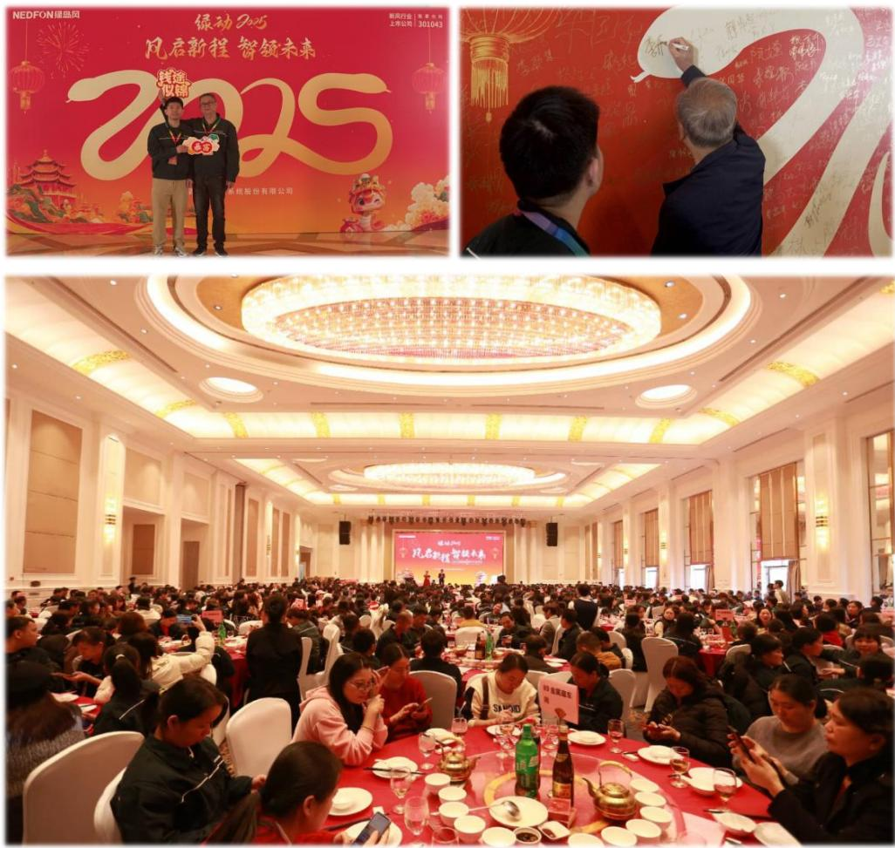

# - 组织旅游

2025年11月中旬，公司为提升组织的凝聚力和向心力，丰富全体职工的文化生活，开拓视野、放松身心，在北京、云南、江西、郴州、下川岛、珠海、澳门等地组织了旅游活动。

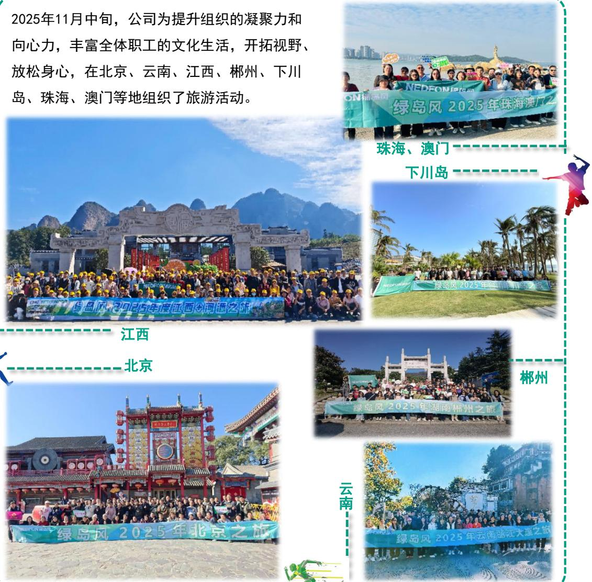

# - 工会活动

2025年度，绿岛风工会在妇女节为员工发放礼品。  
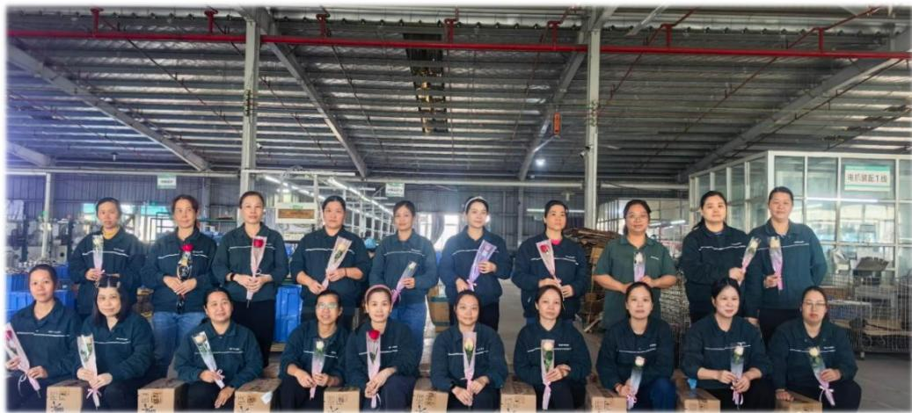

natural_image

Group photo of factory workers in uniform holding flower bouquets, inside a large warehouse (no visible text or symbols)

natural_image

Group of people practicing martial arts in orange vests outdoors under trees (no visible text or symbols)

2025年过年时，绿岛风工会举办拔河比赛活动，并向取得奖项的员工发放礼品。

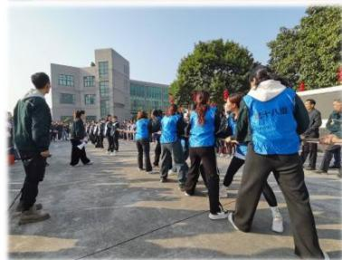

natural_image

Group of students in blue uniforms marching outdoors in front of a modern building, with no visible text or symbols.

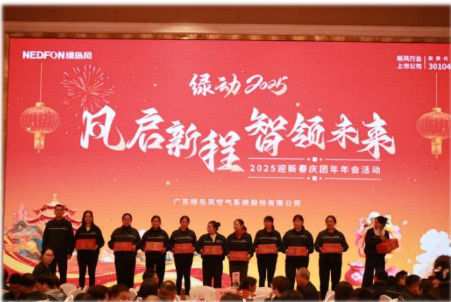

text_image

NEDFON绿岛风
绿动2025
风启新程智领未来
2025迎新春庆团年年会活动
广东绿岛风空气系统股份有限公司

# 社会捐赠

# - 捐赠台山市慈善会

台山市长者饭堂建立，旨在为周边长者提供营养均衡、价格实惠的餐食服务，优先保障经济困难、失能、高龄等特殊老年群体的用餐需求，同时通过"政府补贴+慈善资助+企业让利"的可持续运营模式，不断扩大普惠覆盖面。2025年2月，公司向台山市慈善会捐款1万元人民币，用于支持台山市长者饭堂的建设、运营项目。

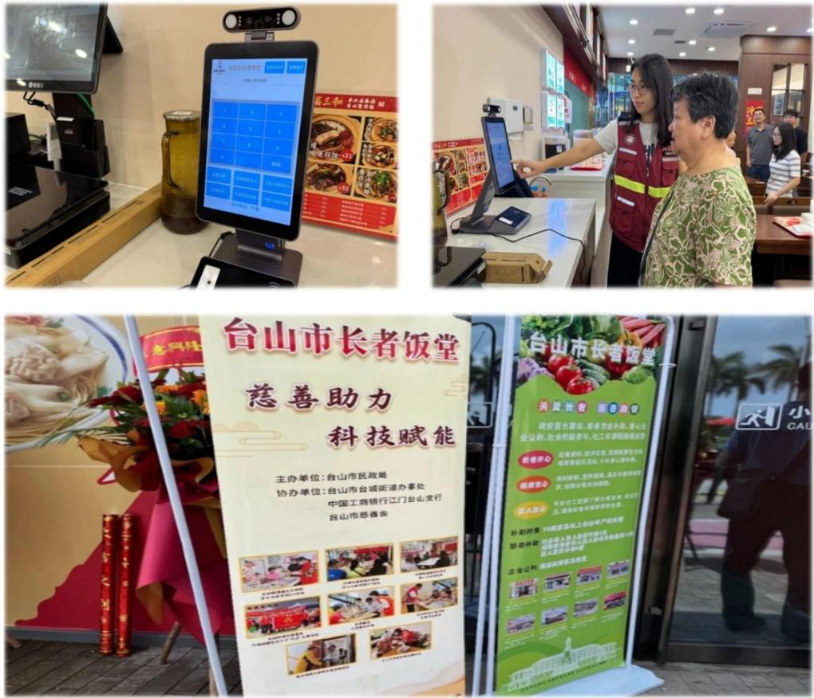

# - 助力全运会

2025年10月，公司为台山正贤体育馆、台山新宁体育馆安装了一批专业风幕机，以预防如基孔肯雅热等由蚊虫传播的疾病，为第十五届全运会的赛事环境保驾护航，助力台山迎接八方来客，共襄全民瞩目的体育盛会。

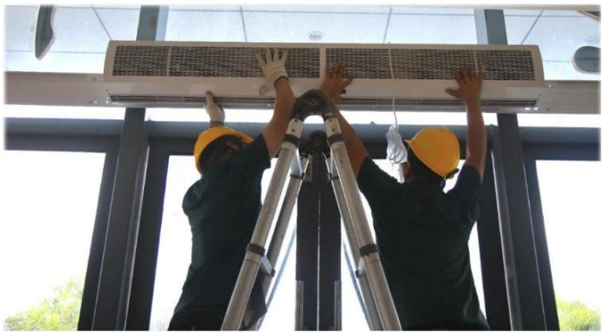

natural_image

Two workers in hard hats installing or maintaining a solar panel on a large window (no text visible)

绿岛风为体育馆安装风幕机并完成效果测试

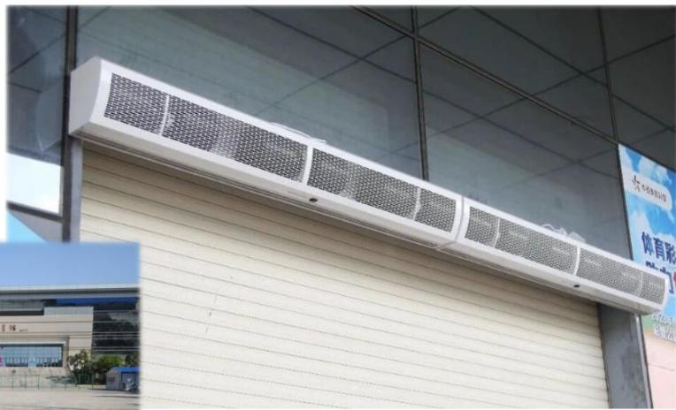

natural_image

Exterior view of a modern building with a large white cooling fan installed on the facade (no visible text or symbols)

绿岛风风幕机在台山体育馆各主要出口就位

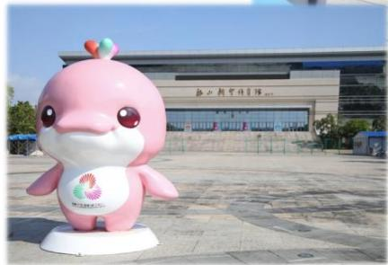

natural_image

Pink cartoon mascot statue in front of a building with Chinese signage (no readable text on mascot)

# 排污信息

\- 绿岛风及子公司均不属于环境保护部门公布的重点排污单位。公司及子公司在日常生产经营中认真执行《中华人民共和国环境保护法》等环保方面的法律法规，自觉履行生态环境保护的社会责任。报告期内，没有发生污染事故和纠纷，不存在因违反环境保护法律法规受到行政处罚的情形。

- 绿岛风污染物排放情况

<table><tr><td>主要污染物及特征污染物的名称</td><td>排放方式</td><td>排放口数量</td><td>排放口分布情况</td><td>排放浓度</td><td>执行的污染物排放浓度</td><td>排放总量</td><td>核定的排放总量</td><td>超标排放情况</td></tr><tr><td>COD</td><td>间接排放</td><td>1</td><td>污水处理车间</td><td>20</td><td>50</td><td>0.708t/a</td><td>0.957t/a</td><td>无</td></tr><tr><td>氨氮</td><td>间接排放</td><td>1</td><td>污水处理车间</td><td>0.4025</td><td>8</td><td>0.009t/a</td><td>0.153t/a</td><td>无</td></tr><tr><td>总磷</td><td>间接排放</td><td>1</td><td>污水处理车间</td><td>0.075</td><td>0.5</td><td>0.001t/a</td><td>0.01t/a</td><td>无</td></tr><tr><td>二氧化硫</td><td>有组织</td><td>1</td><td>喷粉车间</td><td>3.575</td><td>35</td><td>0.14t/a</td><td>0.153t/a</td><td>无</td></tr><tr><td>氮氧化物</td><td>有组织</td><td>1</td><td>喷粉车间</td><td>35</td><td>150</td><td>0.551t/a</td><td>0.918t/a</td><td>无</td></tr><tr><td>颗粒物</td><td>有组织</td><td>1</td><td>压铸车间</td><td>30</td><td>120</td><td>1.034t/a</td><td>1.14t/a</td><td>无</td></tr><tr><td>挥发性有机废物</td><td>有组织</td><td>5</td><td>注塑车间、喷粉车间、压铸车间、电机车间</td><td>7.5</td><td>30</td><td>2.888t/a</td><td>3.376t/a</td><td>无</td></tr></table>

# - 防治污染设施的建设和运行情况

废气处理设施：公司建设了全套废气处理设施，采用喷淋、二级活性炭吸附工艺，设施设备运行正常。

废水处理设施：公司自建整套污水处理设施，采用生化处理工艺，设施设备运行正常。

# ● 建设项目环境影响评价及其他环境保护行政许可情况

公司依据《中华人民共和国环境保护法》等法律法规要求完成项目的环境影响评价报告，并取得江门市生态环境局台山分局相关环评批复，同时扩建项目已完成验收。

指标索引

<table><tr><td colspan="2">目录</td><td>GRI Standards</td><td>中国社科院ESG 5.0</td><td>深交所上市公司社会责任指引</td><td>页码</td></tr><tr><td>关于本报告</td><td>关于本报告</td><td>GRI 102</td><td>P1.1/P1.2/P1.3</td><td>/</td><td>01</td></tr><tr><td>董事长致辞</td><td>董事长致辞</td><td>GRI 102</td><td>P2.1/P2.2</td><td>/</td><td>03</td></tr><tr><td rowspan="3">走进绿岛风</td><td>公司概况</td><td>GRI 102</td><td>P4.1</td><td>/</td><td>05</td></tr><tr><td>绿岛风产品</td><td>GRI 102</td><td>/</td><td>/</td><td>07</td></tr><tr><td>绿岛风数据</td><td>GRI 201</td><td>/</td><td>/</td><td>10</td></tr><tr><td rowspan="3">ESG管理</td><td>ESG治理机制</td><td>GRI 102</td><td>G2.1/G2.2/G3.1</td><td>/</td><td>11</td></tr><tr><td>利益相关方识别与沟通</td><td>GRI 102</td><td>G3.6</td><td>/</td><td>13</td></tr><tr><td>实质性议题分析</td><td>GRI 102</td><td>G3.5</td><td>/</td><td>15</td></tr><tr><td rowspan="5">合规治理</td><td>公司治理</td><td>GRI 102</td><td>G1.1/G1.3</td><td>第一章 总则</td><td>17</td></tr><tr><td>股东权益保护</td><td>GRI 102</td><td>G1.10</td><td>第二章 股东和债权人权益保护</td><td>19</td></tr><tr><td>责任运营</td><td>GRI 414/416/417</td><td>G1.6/S4.1/S4.3/S4.5/S5.1/S5.2/S5.6</td><td rowspan="2">第四章 供应商、客户和消费者权益保护</td><td>21</td></tr><tr><td>商业道德</td><td>GRI 205</td><td>/</td><td>30</td></tr><tr><td>依法纳税</td><td>GRI 207</td><td>/</td><td>/</td><td>30</td></tr><tr><td rowspan="2">科技创新</td><td>科研服务</td><td>/</td><td>V2.1/V2.2/V2.3/V2.4/V2.7</td><td>/</td><td>31</td></tr><tr><td>智能化</td><td>/</td><td>V2.8</td><td>/</td><td>38</td></tr><tr><td rowspan="3">环境保护</td><td>环保机制</td><td>/</td><td>E1.1/E1.4/E1.6</td><td rowspan="3">第五章 环境保护与可持续发展</td><td>39</td></tr><tr><td>绿色办公</td><td>/</td><td>E2.14/V4.4</td><td>39</td></tr><tr><td>节能减排</td><td>/</td><td>E1.8/V4.3/V4.4</td><td>40</td></tr><tr><td rowspan="3">员工权益保护</td><td>严格雇佣规范</td><td>GRI 401</td><td>S1.1/S1.2/S1.3/S1.6/S1.7/S1.8/V3.1</td><td rowspan="3">第三章 职工权益保护</td><td>41</td></tr><tr><td>赋能人才培养</td><td>GRI 404</td><td>S2.2/S3.5</td><td>43</td></tr><tr><td>员工关怀保障</td><td>GRI 102/401/405</td><td>S1.10</td><td>45</td></tr><tr><td>回馈社会</td><td>社会捐赠</td><td>GRI 413</td><td>V1.3/V3.3/V3.4/V3.5</td><td>第六章 公共关系和社会公益事业</td><td>49</td></tr><tr><td rowspan="3">附录</td><td>排污信息</td><td>/</td><td>E3.4/E3.5</td><td>/</td><td>51</td></tr><tr><td>指标索引</td><td>GRI 102</td><td>A4</td><td>/</td><td>52</td></tr><tr><td>意见反馈表</td><td>/</td><td>A5</td><td>/</td><td>53</td></tr></table>

# 意见反馈表

# 尊敬的读者：

感谢您百忙之中阅读《绿岛风2025年度环境、社会及治理（ESG）报告》，我们十分重视并期望聆听您对公司ESG工作和可持续发展管理的宝贵意见与建议。您的意见与建议是我们持续提高企业ESG信息披露水平、推进ESG实践的重要依据。诚挚邀请您协助完成反馈意见表中的相关问题并通过以下方式反馈给我们。我们由衷感谢您提出的宝贵意见！

电话：0750-5605598

邮箱：5605598@nedfon.com

地址：广东省台山市台城南兴路15号

1、对于绿岛风来说，您的身份是\_\_\_\_

□员工

□客户与消费者

□股东或投资者

□合作伙伴

□政府及监管机构

□媒体/行业协会

□其他

(请注明)

2、您对本报告的评价：（在相对应的位置选择打“✓”）

报告内容：□很好

□较好

□一般

□较差

□很差

信息质量：□很好

□较好

□一般

□较差

□很差

可读性：□很好

□较好

□一般

□较差

□很差

设计排版：□很好

□较好

□一般

□较差

□很差

总体评价：□很好

□较好

□一般

□较差

□很差

3、本年度ESG报告的哪些议题最引起您的关注？  
4、您还希望从报告中获取哪些信息？  
5、您对我们的ESG报告或ESG工作和可持续发展管理方面的意见或建议？