# 美新科技2025年可持续发展报告

ESG Report 2025

美新科技股份有限公司

# 目录

关于本报告 3

董事长致辞 4

关于美新科技 5

公司简介

发展历程

ESG管理 6

ESG治理架构

董事会多元化

重要性议题评估

风险管理

2025关键绩效汇总 56

认证汇总 60

深交所指标索引 63

# 环境 (Environment)

循环经济 10

应对气候变化 15

环境合规管理 17

污染物治理 19

废弃物处理 21

能源利用 22

水资源利用 24

生态系统和生物多样性保护 25

# 社会 (Social)

创新驱动 27

产品和服务 安全与质量 30

供应链安全 36

数据安全与客户隐私保护 40

科技伦理 41

平等对待中小企业 41

员工 42

社会贡献及乡村振兴 47

# 治理 (Governance)

尽职调查 50

利益相关方沟通 51

反商业贿赂及反贪污 52

反不正当竞争 54

# 关于本报告

# 关于本报告

报告披露美新科技股份有限公司及下属板块企业在履行经济、社会、环境和公司治理等方面责任的信息。报告时间范围以2025年1月1日至12月31日的信息为主，部分信息超出以上时间范围。

# 指代说明

报告中“美新科技股份有限公司”将以“美新科技”“美新”“公司”“我们”表示。

# 数据说明

本报告信息与数据来自公司及下属板块企业。如无特别说明，所有金额均以人民币表示。

# 准则与框架

《深圳证券交易所上市公司自律监管指引第17号——可持续发展报告（试行）》。

# 报告获取与反馈

报告所使用的语言为简体中文。报告以电子文档形式发布，电子文档可在公司网站（www.newtechwood.cn）及巨潮资讯网（www.cninfo.com.cn）中查阅获取。若对报告有任何建议，请按以下方式联系我们：

地址：惠州市惠东县大岭街道十二托乌塘地段

邮箱：xmzou@meixin-wpc.com

电话：0752-6531633。

# 董事长致辞

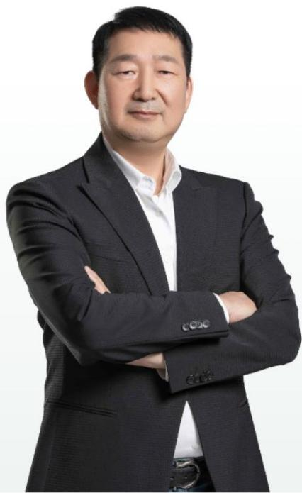

natural_image

Portrait of a man in a dark suit with arms crossed, against a plain white background (no text or symbols visible)

董事长：林东融

在联合国《2030 年可持续发展议程》《巴黎协定》等指引下，全球正以绿色低碳为核心，向可持续发展深度转型。绿色贸易作为衔接国际合作与绿色发展的关键载体，已成为重构全球经贸体系的重要环节。相关国际政策以全球协同为纽带，推动各国依托绿色贸易规则，降低经济活动对环境的影响，发展低碳与循环经济，构建人与自然和谐共生的发展模式。

国家大力发展绿色贸易，推动贸易优化升级、助力“双碳”目标、服务全球气候治理。商务部相关实施意见与对外贸易法通过促进绿色产品和服务贸易，为绿色产业搭建国际平台与市场渠道。《固废法》推动环境管理从传统管控向主动治理转变，保障生态安全；固废综合治理行动计划则借助市场力量与新兴技术发展循环经济。塑料循环利用作为绿色发展的重要方向，正迎来重大发展机遇。

美新科技自2024年3月13日在深交所创业板上市以来，在一方面持续深耕环保塑木复合材料领域的技术创新，为全球客户带来更优质的产品与服务体验；在另一方面则不断强化环境管理、从严推进环保治理，持续提升环境绩效。

顺应绿色贸易发展大势与国家战略需求，美新科技坚守“国际化、品牌化”战略定位，积极拓展海内外市场，推进国内及东南亚生产基地建设，持续优化全球供应链，提升经营抗风险能力。展望未来，公司将持续聚焦环境、社会及治理（ESG）核心议题，不断优化可持续发展绩效，积极履行企业社会责任，将绿色低碳、可持续发展理念深度融入日常经营与长期发展全过程。

# 关于美新科技

# 公司简介

美新科技股份有限公司（股票代码：301588.SZ）是一家资源循环再生利用的高科技制造商，从事塑木复合材料及其制品的研发、生产和销售。美新科技股份有限公司专注于新型环保塑木型材的研发，经过多年的技术积累和自主创新，成功在配方设计、产品开发、生产工艺和安装技术等方面形成了多项核心技术，使塑木产品具有更多优异性能，成为理想的木材代用品。公司塑木产品的原材料中 $85\%$ 以上是再生塑料及回收植物纤维，不使用粘合剂，不含有毒有害物质，VOC含量及甲醛含量远低于相关行业标准，重金属含量符合欧盟RoHS标准。公司产品通过中国绿色产品认证、中国绿色建材产品认证、儿童安全级产品认证、健康建材产品认证、FSC森林管理体系认证、SCS翠鸟回收物质量认证、韩国生态标签认证、新加坡绿色标签认证等，体现了塑木复合材料产品的可回收性、可重复使用性及可持续性。

# 发展历程

2004年：公司成立

2010年：研发全包覆塑木复合产品

2014年：推出超越木墙板系列

2018年：升级产品配方，掌握包覆层配方自主设计能力

2021年：引入专业投资机构并进行股份制改造，进军资本市场

2024年：在深圳证券交易所创业板上市（301588.SZ）

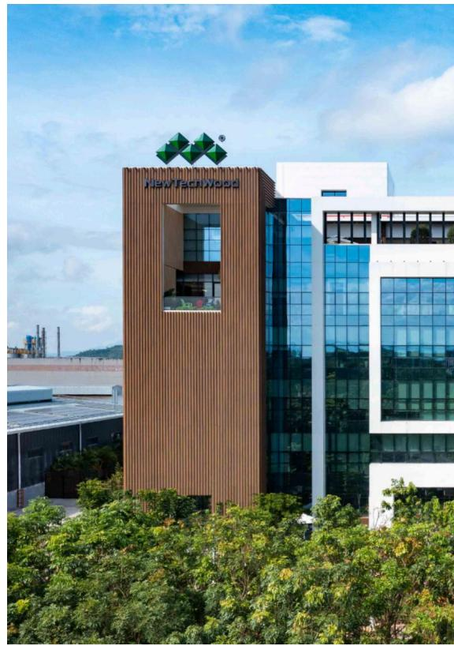

natural_image

Exterior view of a modern office building with 'NEWTECHWOOD' signage on the facade, surrounded by greenery under a blue sky (no other text or symbols visible)

# ESG管理

# 贯彻经营宗旨

美新科技积极响应商务部《关于拓展绿色贸易的实施意见》要求，恪守“实践循环利用，减少资源浪费，引领技术开发，创造新颖耐用、融入自然的户外代木产品，让每个家庭共享美好户外生活与和谐生态环境”的经营宗旨。

# 践行绿色贸易

美新科技深耕环保塑木领域，将绿色理念与可持续发展目标深度融合，贯穿贸易全流程。通过政策宣贯强化全员低碳意识，将绿色责任融入企业战略；生产端以再生材料为主材，推进绿色设计与低碳改造，推广可再生能源，降低产品碳足迹并落实绿色认证。

# 承担全球责任

美新科技立足全球，精准对接国内外低碳需求，凭借先进技术打造低环境影响、高附加值产品，提升国际竞争力。同时参与绿色贸易国际交流与标准衔接，分享实践经验，助力构建公平包容的国际环境，为全球可持续发展与“双碳”目标贡献力量。

# ESG治理架构

美新科技建立了稳健的ESG治理架构，确保有效规划、实施和监督可持续发展策略。同时，美新科技设立了专门的ESG团队，负责监督各部门及子公司的可持续发展策略规划与执行。ESG团队每周召开联席会议，由公司主要负责人或分管副总经理主持，确保ESG议题在决策层得到充分关注。会议参与者包括相关部门负责人、车间负责人以及职业健康、安全、环保专员，体现了公司对ESG事项的全面覆盖与协同管理。此外，ESG团队每年向董事会提交年度报告，汇报ESG活动的最新进展与成果，进一步强化了董事会在ESG治理中的领导作用。

美新科技ESG治理架构：  
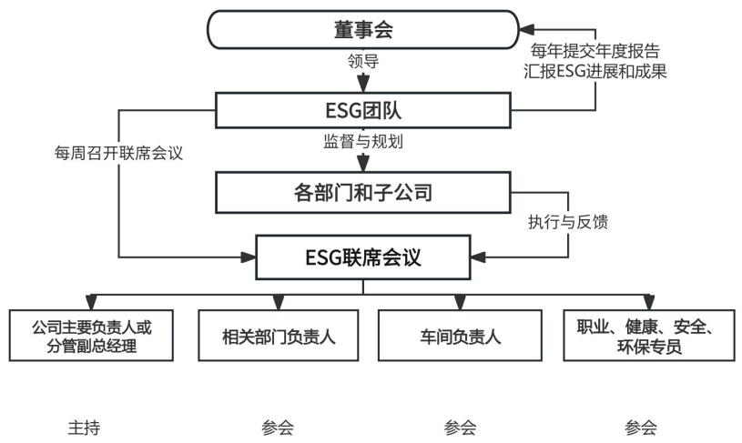

flowchart

```mermaid
graph TD
  A["董事会"] -->|领导| B["ESG团队"]
  B -->|监督与规划| C["各部门和子公司"]
  B -->|每周召开联席会议| D["ESG联席会议"]
  C -->|执行与反馈| D
  D --> E["公司主要负责人或分管副总经理"]
  D --> F["相关部门负责人"]
  D --> G["车间负责人"]
  D --> H["职业、健康、安全、环保专员"]
  subgraph Support
    direction TB
    direction LR
    subgraph Committee1
      A
      B
      C
      D
    end
    subgraph Committee2
      E
      F
      G
      H
    end
```

# 董事会多元化

2025年10月，美新科技取消了监事会，并修订了董事会议事规则及战略委员会、提名委员会、薪酬与考核委员会、审计委员会等四大董事会专门委员会工作细则，以此筑牢科学可持续、分工清晰的ESG治理架构基础。规则明确各委员会组成人员，规范各治理主体人员、职责、议事及工作流程，会议档案由董事会秘书保存不少于10年，细则均依规执行。四大委员会各司其职、协同联动，以专业能力为董事会决策提供前置研究与审核建议，既强化了董事会在公司治理及ESG工作中的核心领导作用，又通过专业化分工提升决策效率与质量，推动公司治理体系与ESG治理深度融合，实现规范运作与可持续发展的双重提升。

审计委员会履行监督、审核、协调、督导四大类职责，对董事会负责，具体为：

# 监督评估

监督评估内、外部审计工作，提议聘请/更换外部审计机构，协调内外部审计沟通

# 审核披露

审核公司财务信息及披露，5类核心事项需其全体委员过半数同意后方可提交董事会

# 内控监督

监督评估公司内部控制，督导内部审计部门每半年检查公司重大事项、大额资金往来

# 职权行使

行使《公司法》规定的监事会职权，以及董事会授权的其他相关事宜

# 重要性议题评估

美新科技通过对标分析和内外部利益相关方沟通，结合公司战略发展方向和利益相关方诉求，每年对重要性议题进行厘定和审议。报告期内，公司基于《深圳证券交易所上市公司自律监管指引第17号——可持续发展报告（试行）》，根据双重实质性原则，厘定和评估了对社会和环境有重大影响，并且对公司发展和长期价值创造有重大影响的21项重要性议题，并基于公司重要战略方向和利益相关方诉求对议题进行排序与确认。

ESG重要性议题评估流程：  
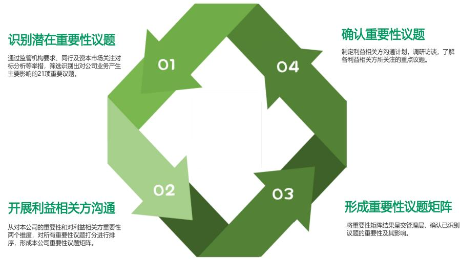

flowchart

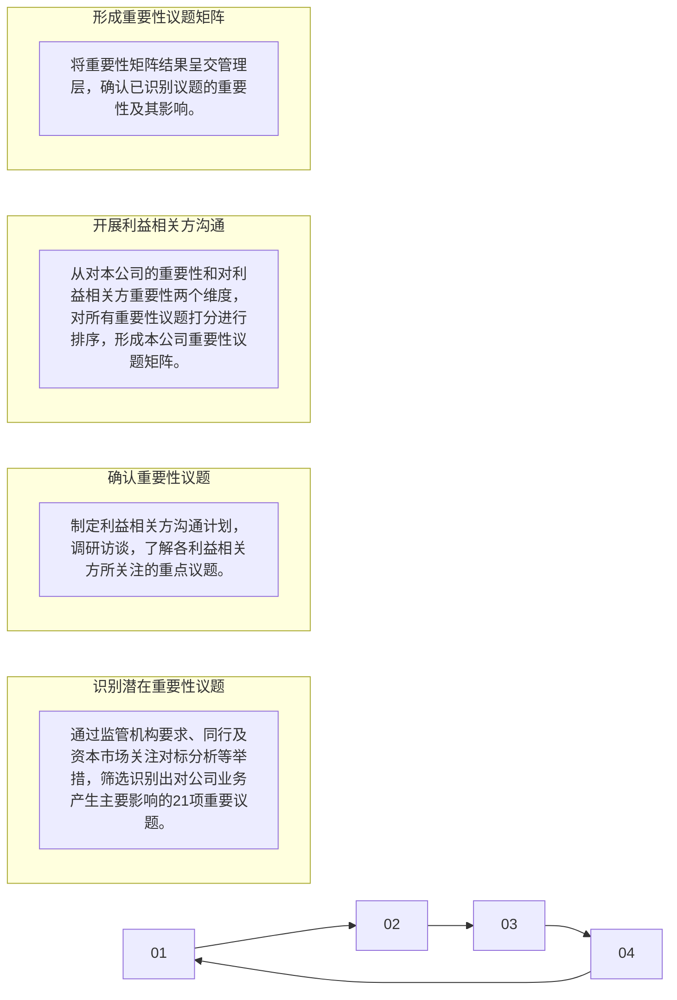
```mermaid
graph LR
  O1["01"] --> O2["02"]
  O2 --> O3["03"]
  O3 --> O4["04"]
  O4 --> O1
  
  subgraph Top_Left ["识别潜在重要性议题"]
    direction TB
    A1["通过监管机构要求、同行及资本市场关注对标分析等举措，筛选识别出对公司业务产生主要影响的21项重要议题。"]
  end
  
  subgraph Top_Right ["确认重要性议题"]
    direction TB
    B1["制定利益相关方沟通计划，调研访谈，了解各利益相关方所关注的重点议题。"]
  end
  
  subgraph Bottom_Left ["开展利益相关方沟通"]
    direction TB
    C1["从对本公司的重要性和对利益相关方重要性两个维度，对所有重要性议题打分进行排序，形成本公司重要性议题矩阵。"]
  end
  
  subgraph Bottom_Right ["形成重要性议题矩阵"]
    direction TB
    D1["将重要性矩阵结果呈交管理层，确认已识别议题的重要性及其影响。"]
  end
```

# 风险管理

随着公司业务规模扩大，资产与营收同步增长，如果管理水平、人才储备未适配发展速度，管理模式未及时调整，将影响生产经营。对此，美新科技建立健全法人治理结构，制定适配现阶段发展的内部控制体系，持续强化风险管理，应对内外部不确定性与潜在风险；结合灵活市场策略、多元化拓展，动态调整风险管理机制，并加强与合作伙伴及行业联盟协作，提升市场适应与抗风险能力。

面对日益激烈的市场竞争，公司通过持续技术创新与产品升级保持竞争力，专注塑木复合材料研发生产，产品性能优越且契合国家绿色低碳战略。同时，积极拓展国际市场和国内市场，销售网络覆盖全球50多个国家和地区，有效分散市场风险。此外，公司注重优化经营结构与财务状况，提升核心竞争力和市场占有率，确保公司稳健发展。

natural_image

Exterior view of a modern wooden patio with striped wooden panel, decorative white panel, and potted plants (no signage or text visible)

环境篇

# 绿色生态

[EMPTY]

# 循环经济

美新科技积极响应商务部《关于拓展绿色贸易的实施意见》中循环经济相关要求，秉持循环经济理念，专注新型环保木型材研发、生产与销售。公司以再生材料为主材，采用先进技术将新型建材与绿色新材料深度融合，产品超85%成分源自循环再利用资源，从原料、生产、销售到使用全流程符合环保健康安全原则。通过设备升级、工艺改造及可再生能源推广，实现产品与生产废弃物循环转化，精准对接国内外循环经济市场需求，以资源循环型产品提升国际竞争力。同时参与绿色贸易国际交流与标准衔接，分享实践经验，助力构建绿色贸易环境，践行“绿色低碳循环”战略，为全球可持续发展与“双碳”目标贡献力量。

# 原料端

使用合格供应商供应的再生塑料颗粒和植物纤维

# 生产端

涵盖原料检测与分类管控、核心装备与再生技术应用、节能低碳生产管理、生产废料全循环、提高员工绿色意识和能力等关键环节

# 产品端

以品质保障为基础，丰富多元产品供给，积极推进全球市场推广

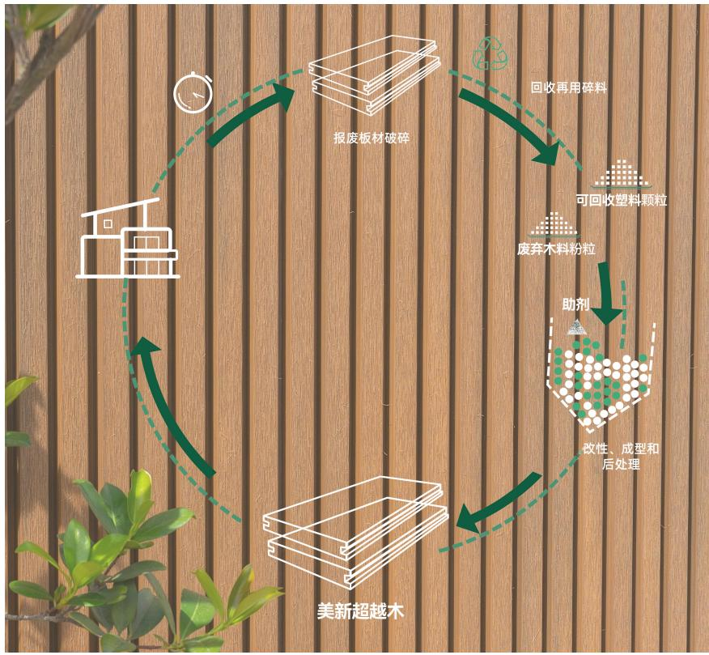

flowchart

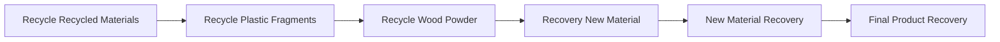
```mermaid
graph LR
  A["Recycle Recycled Materials"] --> B["Recycle Plastic Fragments"]
  B --> C["Recycle Wood Powder"]
  C --> D["Recovery New Material"]
  D --> E["New Material Recovery"]
  E --> F["Final Product Recovery"]
```

# 原料端：多元化废弃料回收体系

# 消费后塑料回收

利用聚乙烯（PE）、聚丙烯（PP）等塑料废弃物进行改性造粒而成的再生塑料

# 工农业废料再生

利用木材的边角及废料、工农业废弃木屑、稻壳、秸秆等植物纤维转化而成的植物纤维再生材料

# 生产废料和回收废旧塑料循环利用

对生产过程中产生的边角料、不合格品及回收的废旧塑木等进行精细破碎处理，重新投入到生产，作为新塑木产品的原料使用

85%

美新科技塑木产品再生塑料及回收植物纤维含量

100%

可实现100%循环再利用

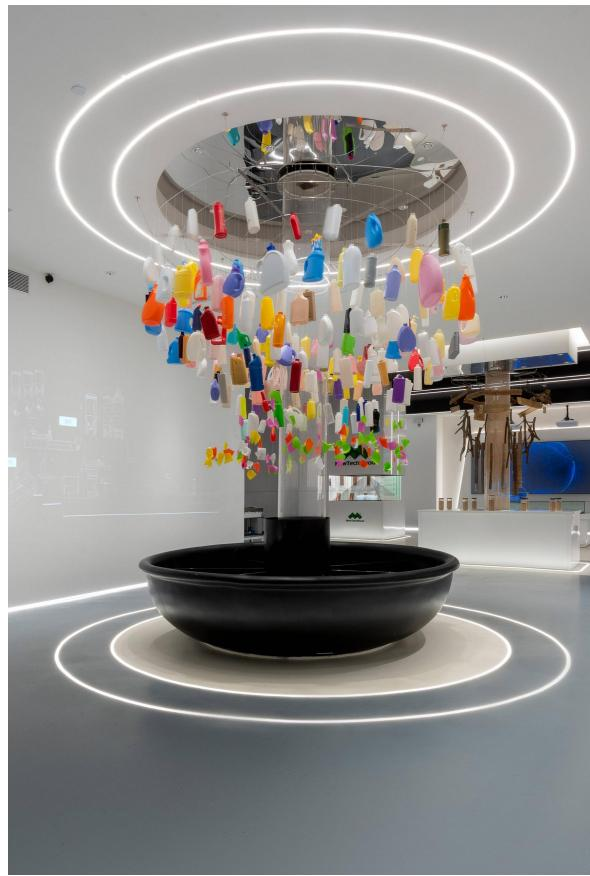

natural_image

Modern art installation featuring colorful plastic and fabric sculptures suspended in a circular light-lit ceiling, with a black base and white floor (no visible text or symbols)

# 生产端：高效节能再生转化

# 高效再生转化

- 原料管控：建立合格供应商准入机制，推行负责任采购，对每批次来料均抽样检测，其物理性能或化学性能需符合公司制定的相关进料检验标准如《HDPE再生粒进料检验标准》、《木粉进料检验标准》、《色粉类检验标准》等，从源头上保障原料的质量和稳定性  
- 装备升级：配备自动化配料系统，实现物料的精确配比与管道密闭输送  
- 生产管控：配备面料生产、改性料制备、型材挤出及表面处理等自动化程度高的生产设备，核心材料如面层材料及颜色母粒都是自主研发生产节能低碳生产  
- 节能减污：利用光伏发电+储能设备供能，生产用水100%循环利用  
- 能力提升：引入先进装备工艺，推广清洁能源与绿色产品，攻关绿色技术，完善标准与绿色制造服务体系

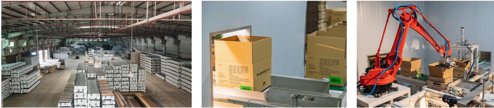

# 产品端：高品质多元产品服务全球化市场

# 品质保障

2025年，美新科技实施全流程严格的品质管控体系制度文件，如《进料检验管理规范》、《过程检验管理规范》、《成品检验管理规范》、《成品出货操作规程》，《品管部控制程序》、《不合格品控制程序》，《不符合纠正措施控制程序》、《标识和可追溯性控制程序》等，确保塑木产品在物理性能与外观品质具备优越性能，产品通过ROHS、REACH等权威检测认证

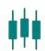

# 丰富产品矩阵

核心产品为户外地板、墙板、组合地板等新型环保塑木型材，覆盖家庭院落阳台、公用建筑设施、园林景观建设等户外场景

# 全球市场推广

精准对接现代消费趋势，向全球客户提供兼具功能性与环保价值的绿色产品

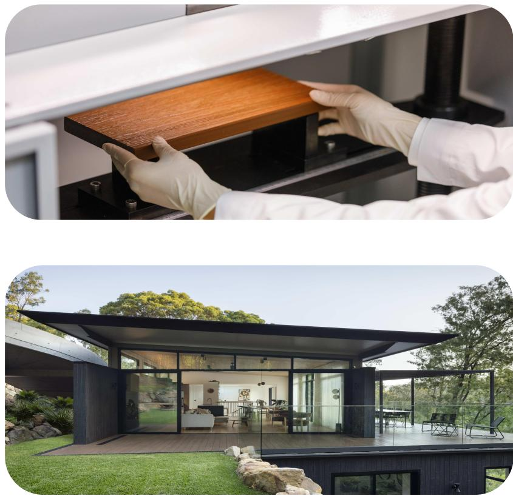

# 循环经济：关键绩效

• 2025年再生塑料使用量
1.4万吨  
- 边角料、塑木回收料使用量 6000吨  
• 2025年回收木粉使用量
2.7万吨  
- 产品销往

50+ 国家/地区

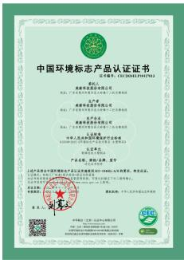

text_image

中国环境标志产品认证证书
申请人：
惠州市能源有限公司
地址：广东省深圳市福田区中心三路8号卓越时代广场
产品名称：
惠州市能源有限公司
地址：广东省深圳市福田区中心三路8号卓越时代广场
产品分类：
惠州市能源有限公司
产品名称：燃气、热力、燃气
产品类型：燃气、热力、燃气
证书编号：2019-034
证书有效期：2019年1月1日至2020年1月1日
证书类型：燃气、热力、燃气
证书编号：2019-034
证书有效期：2019年1月1日至2020年1月1日
证书类型：燃气、热力、燃气
证书编号：2019-034
证书有效期：2019年1月1日至2020年1月1日
证书类型：燃气、热力、燃气
证书编号：

<table><tr><td colspan="4">美新科技产品认证资质汇总</td></tr><tr><td>认证名称(英文)</td><td>认证名称(中文)</td><td>适用产品</td><td>适用地区</td></tr><tr><td>C2C Certified® Full Scope Bronze</td><td>摇篮到摇篮循环产品认证</td><td>塑木产品</td><td>全球</td></tr><tr><td>International Code Council Evaluation Service</td><td>ICC-ES美国国际法规委员会评估认证</td><td>塑木产品(部分型号)</td><td>美国</td></tr><tr><td>Canadian Construction Materials Centre</td><td>加拿大建筑材料中心认证</td><td>塑木产品(部分型号)</td><td>加拿大</td></tr><tr><td>National Construction Code (NCC) of Australia</td><td>澳大利亚建筑规范委员会管理</td><td>塑木产品(部分型号)</td><td>澳大利亚</td></tr><tr><td>Korea Eco Label</td><td>韩国生态标签</td><td>塑木产品</td><td>韩国</td></tr><tr><td>Singapore Green Label</td><td>新加坡绿色标识认证</td><td>塑木地板</td><td>新加坡</td></tr><tr><td>Recycled Content Certified</td><td>翠鸟回收物质含量认证</td><td>塑木产品</td><td>全球</td></tr><tr><td>FSC Chain-of-Custody</td><td>森林认证FSC</td><td>原材料,供应链</td><td>全球</td></tr><tr><td>China Environmental Label (CEL)</td><td>中国环境标志产品(十环认证)</td><td>塑木产品</td><td>中国/全球</td></tr><tr><td>China Green Product Certification (Indoor)</td><td>中国绿色产品认证-室内</td><td>室内塑木板材</td><td>中国</td></tr><tr><td>China Green Product Certification (Outdoor)</td><td>中国绿色产品认证-室外</td><td>室外塑木板材</td><td>中国</td></tr><tr><td>China Green Building Materials Product Certification</td><td>中国绿色建材产品认证</td><td>塑木墙板</td><td>中国</td></tr><tr><td>Healthy Building Materials Product Certification</td><td>健康建材产品认证</td><td>塑木产品</td><td>中国</td></tr><tr><td>Child-safe Product Certification</td><td>儿童安全级产品认证</td><td>塑木产品</td><td>中国</td></tr></table>

# 应对气候变化

美新科技秉承低碳发展理念，积极响应国家绿色低碳转型政策，高度重视气候变化对企业运营和发展带来的影响，并将环境保护与可持续发展融入企业战略与日常运营中，在降低碳排放、资源高效利用和绿色运营等方面取得显著成效。

生产环节中，公司以技术升级与工艺优化为重要环节，持续推进生产设备迭代、工艺技术改进，重点针对高能耗设备开展运行参数精细化优化，精准调试至最佳设定温度；同时健全设备全生命周期管理，杜绝机台空转，以实现生产环节能源消耗显著压降。

日常运营过程中，公司深入践行绿色运营理念，积极开展节能宣传与引导，培养全员节能意识与行为习惯；通过推行电脑休眠模式、照明分区智能管控、及时关停空调及非必要用电设备等精细化节能举措，从日常运营细节着手杜绝能源浪费，持续提升公司整体能源利用效率。

# 提升能源效益

公司坚定践行绿色低碳发展理念，多措并举推进生产运营环节的节能改造与低碳项目落地。主动启动屋顶光伏项目，充分利用清洁能源助力企业低碳转型，降低传统能源依赖；将低效电机更换为YE4二级能效电机，对原有加热系统完成电磁加热技术改造，同时将柴油叉车替换为电叉车，从设备端提升能源利用效率、减少碳排放。

公司于2025年正式投入使用储能系统，进一步优化了能源调配与管理能力，通过全链条、多维度的节能低碳举措，持续降低生产运营能耗，推动企业向绿色低碳模式转型。

2025年，美新科技累计投入运行的节能工程项目包括：

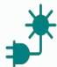

# 屋顶光伏项目建设

充分利用建筑空间，建设分布式光伏电站，将太阳能转化为清洁电力，减少外购电量

# 生产设备节能升级

引入高效能电机和自动化控制系统，优化工艺流程，从源头降低生产环节的能源消耗

# 储能系统智能投用

配置储能设备平衡峰谷用电，提高能源利用稳定性，进一步降低对传统化石能源的依赖

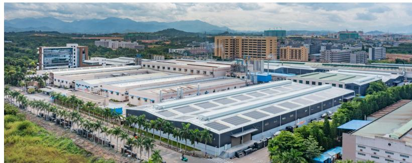

natural_image

Aerial view of a large industrial park with multiple factory buildings, palm trees, and surrounding urban buildings (no visible text or signage)

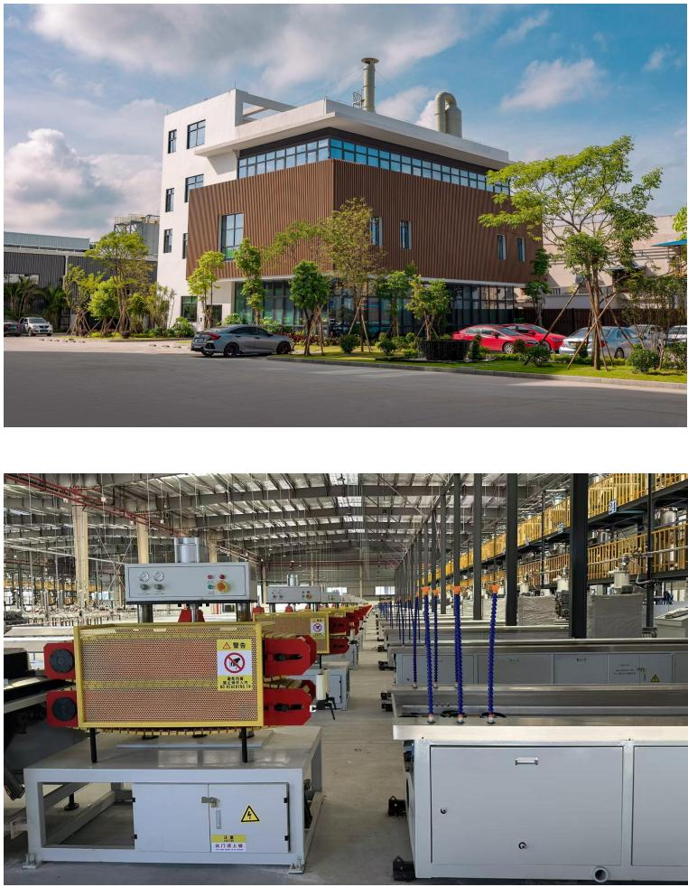

# 践行绿色办公

公司在建筑物设计阶段即融入绿色节能理念，在惠东县和建瓯市生产基地建设中全面考量了建筑物的自然采光、高效照明、保温隔热等核心需求。2022年，公司新建的办公楼和实验楼成功通过了《绿色建筑评价标准》2014版）一星级认定。此外，公司广泛采用了LED节能灯具作为主要的照明光源，为办公和实验环境提供了舒适而高效的照明体验。同时，公司严格遵循国家相关标准，确保厂区及所有办公场所的照明功率密度均达到了现行规定值。

# 筑牢安全生产防线 应对极端天气

针对台风及暴雨可能引发的生产影响，公司建立了完善的极端天气应急响应机制。在台风暴雨天气来临前，提前研判风险，备足生产所需各类物料，优化各工位工作安排；在极端天气下，密切跟踪政府发布的预警信息与相关指令，在确保人员安全、设施安全的前提下，有序推进生产运营。

未来，公司将进一步聚焦气候变化对绿色贸易的影响，量化监控碳排放等核心指标，以“双碳”目标下的减碳行动为绿色贸易赋能；通过技术创新、流程优化、可再生能源应用等举措降低生产全周期环境影响，强化气候风险防控与可持续业务机遇的融合，全方位深耕绿色贸易实践，为全球气候治理与产业绿色转型贡献企业力量。

# 环境合规管理

合规先行、绿色发展，美新科技将环境合规内化为运营核心，建立全方位环境合规管理体系。公司建立常态化EHS会议机制，覆盖各核心部门，通报环境合规、安全、职业健康相关工作，排查整改薄弱环节并开展相关宣贯培训；定期开展环保检查，规范事故事件处置流程。同时，公司健全环境突发事件应急管理体系，成立专项应急管理小组，配备相应应急设施与人员，定期更新应急预案、开展应急演练。此外，公司通过环保教育宣贯强化员工环保意识，主动对接周边社区、政府部门，接受公众监督。

# 定期应急演练

公司每年制定突发环境事件应急演练计划，针对由于污染物排放或自然灾害、生产安全事故等因素可能引发的大气、水体、土壤及辐射污染等各类突发环境事件，有序开展应急演练，并结合演练情况总结经验、优化提升，切实提升公司及全体员工应对突发环境事件的能力，全力保障公众健康与财产安全，严防生态环境遭受破坏。

2025年，美新科技共组织应急演练16场，其中4场为环境应急专项演练。演练重点覆盖生产及一线操作岗位，累计参与达614人次，实现一线员工 $100\%$ 全员覆盖，切实强化了关键岗位人员的应急处置能力。

# 常态化EHS巡查与会议机制

为强化环境合规管理，落实环保法律法规及行业标准，公司建立常态化EHS定期会议机制，于每周四定期召开，覆盖环保、安全、职业健康、技术、生产、设备、行政等部门。会议上，各部门分别汇报本阶段EHS工作推进情况，重点通报环境合规、安全生产、职业健康三大板块工作情况；针对薄弱点，明确整改责任部门、整改措施及完成时限，协调解决困难。

2025年，美新科技一共开展53次EHS巡查，召开50次EHS会议，及时发现隐患风险579项，整改率 $100\%$ 。

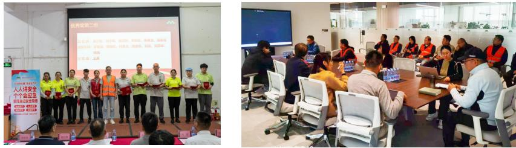

# 环保教育宣贯

公司定期开展环保知识培训及宣传活动，向员工普及污染物达标排放、废弃物合规处置、节能减排等知识，强化员工环保意识与责任感。自2015年起，公司每周定期开展环保检查，针对发现问题召开会议研讨整改方案；规范事故事件处置流程，落实调查与绩效应用，建立事故事件管理台账。此外，公司与周边社区、政府部门保持良好沟通，及时回应居民诉求，主动接受公众环境合规监督，设立投诉信箱和邮箱，通过公众参与、信息公开等方式，增强公众信任，减少环境相关纠纷。

美新科技高度重视环保安全培训，构建常态化培训机制。2025年，美新科技环保安全培训覆盖雇员800人，实现核心岗位100%参训；累计培训时长3200小时，人均培训4小时，有效提高员工环保合规意识与风险防控能力。

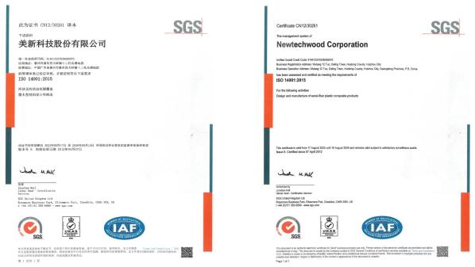  
美新科技环境管理体系认证

2025年，公司以总经理为环境保护工作第一责任人，并设置环境保护与管理专职人员，负责全面统筹、落实并监督指导各项环境保护管理工作，确保相关规章制度的有效执行。

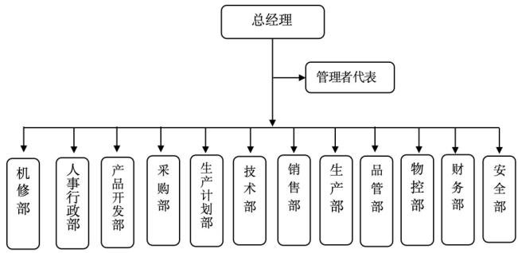

flowchart

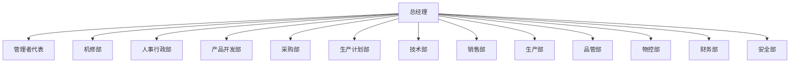
```mermaid
graph TD
  A["总经理"] --> B["管理者代表"]
  A --> C["机修部"]
  A --> D["人事行政部"]
  A --> E["产品开发部"]
  A --> F["采购部"]
  A --> G["生产计划部"]
  A --> H["技术部"]
  A --> I["销售部"]
  A --> J["生产部"]
  A --> K["品管部"]
  A --> L["物控部"]
  A --> M["财务部"]
  A --> N["安全部"]
```

2025年，公司根据有关规定编制《突发环境事件风险评估报告》《突发环境事件应急预案》，对相关标准及规范以及企业应急组织机构与完善外部救援（社会联动）相关内容进行了完善，同时更新了企业简介、原辅材料使用、产品产量、生产设备等情况。

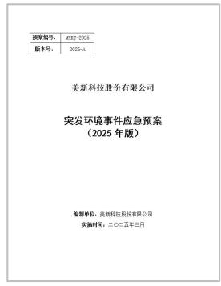

text_image

预案编号：WRLY-2023
版本号：2023-A
美新科技股份有限公司
突发环境事件应急预案
（2025年版）
编制单位：美新科技股份有限公司
实施时间：二〇二五年三月

# 污染物治理

美新科技坚持绿色生产，在污染物排放管理上，严守达标排放红线，以高标准、严要求确保生产过程中产生的各类污染物均符合国家与地方环保标准，以及环保设施有效运行。

美新科技严格遵守《中华人民共和国环境保护法》《中华人民共和国水污染防治法》《中华人民共和国大气污染防治法》《中华人民共和国土壤污染防治法》《中华人民共和国环境噪声污染防治法》等业务所在国家/地区的环境法律法规，有效控制生产运营过程中产生的各类环境污染物，积极打造环境友好型企业。

natural_image

Wood deck with diagonal lines in a lush green forest, no visible text or symbols

# 设备更新和升级

2025年，公司大力推进环保治理升级改造工作，通过多维度更新污染治理设备、优化环保处理工艺，从源头与过程强化污染物管控，有效降低各类污染物排放对周边环境的影响。

2025年，美新科技污染治理设备升级改造具体措施包括：

加强VOCs专项治理

新增9套活性炭净化塔，针对性强化挥发性有机物净化处理能力

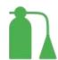

升级车间安全预警装置

除尘系统的火花探测熄灭装置供水系统从消防水升级为恒压供水系统

提升粉尘治理效率

专项增设一套除尘系统，提升粉尘收集处理效率

优化废气收集系统

为集气罩加装围帘，提升废气收集密封性，减少无组织排放

动态监控治理过程

在物料输送除尘上新增风压差和温度监控装置，实现污染治理过程的实时监测、动态管控

# 污染治理措施

# 废气治理

废气由多级水喷淋系统（污水回收处理后回用）、静电除尘、活性炭塔等工艺进行收集处理，重点治理粉尘和VOCs，确保废气达标排放。公司在第二和第四季度对公司VOCs和粉尘排放进行检测，并将各车间的检测报告和检测数据上传政府平台。

# 生产冷却水回用

实现生产冷却水循环利用，通过冷却塔、多介质过滤器、活性炭过滤器、软化水过滤器、精密过滤器等工艺处理回用，提升水资源利用效率。

# 噪声管控

从源头采取降噪措施，如将噪音大的设备增加隔音房，真空泵加装消音器，真空泵房加装隔音棉，做声屏障等，并加强设备的维护管理，降低生产过程中的噪音污染。公司每季度对噪声进行检测，将《厂界噪声检测报告》和检测数据上传政府平台。

2025年，公司持续强化环境管理，严格落实各项污染防治措施，各类污染物排放均稳定达标。2025年，美新科技污染物排放情况如下：

<table><tr><td>污染物种类</td><td>指标</td><td>单位</td><td>2025年</td></tr><tr><td rowspan="4">废气</td><td>VOCs排放量</td><td>千克</td><td>480.9</td></tr><tr><td>SO2排放量</td><td>千克</td><td>不涉及</td></tr><tr><td>NOx排放量</td><td>千克</td><td>不涉及</td></tr><tr><td>颗粒物排放量</td><td>千克</td><td>2050</td></tr><tr><td rowspan="2">废水</td><td>工业废水排放量</td><td>吨</td><td>不涉及</td></tr><tr><td>生活污水排放量</td><td>吨</td><td>不涉及(接入环保处理管网)</td></tr><tr><td colspan="3">因污染物排放合规问题受到行政处罚/追究刑事责任总次数</td><td>0</td></tr><tr><td colspan="3">因污染物排放合规问题接到当地社区居民投诉而立案总次数</td><td>0</td></tr></table>

# 废弃物处理

美新科技以“减量化、再利用、资源化”为核心，在源头降低废弃物产生的基础上，推动废弃物全流程循环利用，对塑木不良品及边角料实施100%回收破碎后重新投料，实现资源循环；同时在产品设计、生产工艺优化等各环节融入减排理念，持续减少废弃物生成。

# 废弃物减排措施与成效

公司通过选用环保资材、优化生产流程、强化回收利用，从根源减少固体废弃物产生，并筑牢污染防控防线，避免其对空气、土壤、水质造成环境影响。具体措施包括：

- 推行清洁生产：采用环保原材料、先进工艺技术及设备，优化管理模式，配套国际接轨的污染防治技术，确保达标排放与总量控制，获得了粤港清洁生产优越伙伴认证（该认证的最高级别）  
- 强化污染防控：落实固体废物污染预防与控制措施  
- 源头减量回收：加强废弃物源头管控，减少生成量并提升回收利用效率  
- 规范全流程管理：严格执行收集、存储、转移等各环节操作规范

# 无害废弃物

\- 公司对于固废管理建立和实施了一套完善的流程和管理制度，如《固体废弃物控制程序》、《废弃物料处理规范》、《废弃物分类标准》，从源头控制、分类存放、建立台账，与供应商合作回收再利用，将具备回收价值的无害废弃物委托专业机构处理，其余交由市政环卫部门或具备资质的机构进行规范处置。

# 有害废弃物

\- 实行源头分类，设置警示标识，合规留存并填写转移联单，交由有资质第三方处置，同步记录台账。每年在省固废平台申报固废情况，上传管理计划并备案相关单据。通过激光喷码改造降废，并对废弃物分类回收、追踪监督，接受环保部门监管，确保处置合法合规。公司对危废管理建立和实施了一套完善的流程和管理制度，各车间设立暂存点，公司建立专门危废仓库由专人进行管理，相关制度文件如《系统组织架构图》、《危险废物责任信息公示牌》、《危险废物处置管理规定》、《危险废物环境污染防治责任制》、《废弃物分类标准》、《危废仓库安全操作规程》等。

2025年，美新科技一般废弃物产生总量1081.28吨，一般废弃物利用处置量1081.28吨，危险废弃物产生总量11.08吨，并实现 $100\%$ 合法合规处置。

# 能源利用

2025年，美新科技聚焦生产全流程节能优化与环保提升，有序推进节能改造项目落地实施。通过多维度升级，实现设备效能提升、能源高效利用，构建绿色低碳、节能环保的生产体系。

# YE4二级能效电机替换

项目概况：替换厂区原有11台电机为YE4二级能效电机，优化生产动力。

运行情况：11台YE4二级能效电机常态化稳定运行。

节能绩效：降低动力端电能损耗，提升电机能源利用效率。

# 加热挤压系统电磁供能改造

项目概况：22套挤出机加热系统和1套烤箱加热系统，由电阻丝加热装置更换为电磁加热节能系统。

运行情况：电磁供能系统调试完毕并稳定投用，运行参数可控，稳定性显著提升。

节能绩效：每年预计节能30万kwh，节约标准煤30万\*123.03g/1000/1000=36.9吨标准煤/年。

# 电动叉车替换柴油叉车

项目概况：将2台燃油叉车更换为电动叉车，促进运输环节清洁化升级。

运行情况：电叉车全面投用，适配各类运输场景，逐步实现运输环节零燃油、零尾气排放。

节能绩效：每年预计减少柴油使用量约1.5吨，节约标准煤 $1.5*42.6 / 29.3 = 2.2$ 吨标准煤/年，实现节能与环保双重效益。

# 储能系统投用

项目概况：2025年增加3套1.5MW/6.7MWh储能系统。

运行情况：储能系统常态化运行，可实现用电错峰存储与动态调配，适配用电波动需求。

节能绩效：2025年2月正常投入使用，每月平均可节约电费约40万元。每年预计节约电费500万元。

# 光伏发电

项目概况：2023年投建3.5兆瓦屋顶光伏发电系统，覆盖面积达3.8万平方米。

运行情况：2025年屋顶光伏发电系统常态化运行。

节能绩效：2025年完成车间照明（1200余盏）、停车场路灯（80余盏）太阳能化升级，可再生能源应用场景覆盖率提升40%。

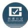

# 能源管理体系认证证书

CERTIFICATE FOR ENERGY MANAGEMENT SYSTEM CERTIFICATION

注册号：02524En20405R4M

美新科技股份有限公司

(统一社会信用代码: 914413237638068970)

广东省惠州市惠东县大岭镇十二托岛塘地段 邮政编码：516321

能源管理体系符合

GB/T 23331-2020/ISO 50001:2018《能源管理体系 要求及使用指南》

RB/T 121-2023《能源管理体系 建材企业认证要求（不含水泥、玻璃、陶瓷）》

认证范围

位于广东省惠州市惠东县大岭镇十二托乌塘地段的美新科技股份有限公司塑木型材的生产经营管理

(具体生产工艺及能源绩效见附表)

获证组织须接受监督审核，并将审核通过标识贴于证书，此证书方为有效。

初次发证日期：2014年01月22日

本次发证日期：2025年01月01日证书有效期至：2028年01月01日

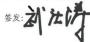

本证书信息可在国家认证认可监督管理委员会官方网站(http://cx.cnca.cn/CertECloud/index/index/page)和本机

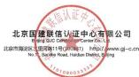

电话：400-900-756

美新科技能源管理体系认证证书

# 践行建筑和办公节能

美新科技的惠东县、建瓯市生产基地的建筑设计聚焦自然采光、高效照明、保温隔热三大节能维度，全面采用 LED节能灯具，严格遵循《建筑照明设计标准》（GB50034-2013）等规范。

厂区及办公场所照明功率密度远低于国家标准限值，每年预计节能6.5万kwh，节约标准煤6.5万\*123.03g/1000/1000=8吨标准煤/年；2022年新建的办公楼、实验楼通过《绿色建筑评价标准》（2014版）一星级认定。

# 精细化能源计量

美新科技依据《用能单位能源计量器具配备与管理通则》（GB17167-2006），搭建“厂区源头——配电转换——核算单位”三级能源计量体系。确保每一环节均配备高精度计量器具，确保数据的准确性和可靠性，为后续的维护和技术改造提供有力的数据支持，落实能源管理合规管控，从而推动能源利用效率的提升。

2025年，美新科技节能环保投资累计达2859万元，包括11台电机更换为YE4二级能效电机，22套挤出机加热系统和1套烤箱加热系统完成电磁供能改造，2台燃油叉车更换为电动叉车，切实推动5项节能设备更新改造，有效实现能源高效利用。

# 水资源利用

美新科技积极倡导并实践水资源的高效、循环利用，并在公司内部推广节水文化。美新科技严格遵循《中华人民共和国水法》《节约用水条例》和《城市节约用水管理规定》等业务所在国家/地区的相关法律法规，公司生产工艺和流程不涉及大规模工业用水，所有取水均为淡水，且不涉及用水压力地区，因此重点管控生活用水及其排放。公司积极倡导员工以负责任的态度使用水资源。

# 高效节水工艺体系

- 引入芯棒水回用系统，实现生产废水的即时循环  
- 配置专业中水处理设备，提升中水回用率  
- 建立雨水收集系统，有效补充绿化及清洗用水

# 2025年水资源管控成效

• 年度总耗水量控制在合理范围内，同比优化  
- 用水强度显著下降，生产用水效率大幅提升

# 关键绩效

- 每天能够节约市政用水量超过150吨  
- 估计全年最低可节省用水50000吨  
- 生产用水的重复利用率 $100\%$  
- 总耗水量159408吨  
- 总用水强度2.67吨/万元（营收）

# 生态系统和生物多样性保护

以源头规避为根本，深化过程管理是美新科技切实守护生态系统完整性与生物多样性所遵循的原则。公司在惠东县和建瓯市的生产基地建设项目严格遵守《中华人民共和国环境影响评价法》《建设项目环境保护管理条例》等业务所在国家/地区法律法规、标准规范，全面对标拟选址区域生态保护红线的划定边界及环境管控要求，以进入工业聚集区为首要选择，杜绝在重要生态功能区、生态环境敏感脆弱区或其周边重要区域建设或运营生产经营活动，并对建设项目的选址、设计和建成投产使用后可能对周边环境产生的不良影响进行调查、预测和评价，包括周边生态系统的脆弱性、植被、生物等，针对评估结果提出预防对策。在项目建设与运营阶段，公司污染防治设施与项目主体工程同步投入建设、同步投入使用，切实依照法规要求稳定运行污染防治设施处理污染物，严格遵循排污许可证记载的途径排放污染物，践行在过程中减缓生态影响。

2025年，美新科技不涉及在生态保护红线范围内开展生产经营活动。

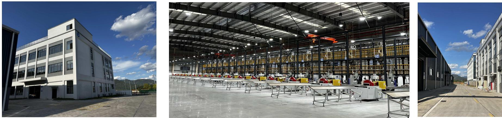

社会篇

# 和谐共融

# 创新驱动

美新科技自成立以来，坚持创新驱动战略，以技术创新建立核心技术优势，以产品开发践行绿色理念，实现技术创新与绿色制造双轮驱动、协同发展，同时通过优化全球供应链布局，进一步拓宽发展空间、增强核心竞争力。

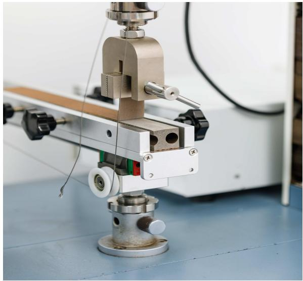

natural_image

Close-up of a laboratory instrument with metallic components and wiring, mounted on a blue surface (no visible text or symbols)

# 技术创新引领

公司持续投入核心技术、关键工艺及先进设备的自主研发与技术改造，聚焦塑木复合材料，突破技术瓶颈、优化生产模式，将回收PET塑料应用于新产品系列，扩大了塑木生产的再生原料利用范围。

# 核心工艺技术

- 核心全包覆技术：依托自主研发的全包覆技术，生产高品质塑木复合材料产品，同时完全掌握包覆层配方自主设计能力，有效控制生产成本，强化企业技术自主性与成本优势，实现核心工艺技术的自主可控与升级迭代。  
- 新型防火型材技术研发：开发研究PVC室外地板、墙板相关技术，对产品表面进行特殊工艺处理，使颜色、纹路、质感接近实木；同时采用B级难燃材料相关技术确保产品适配室外环保、安全使用需求。  
- 再生PET替代PVC室内地板技术：聚焦室内地板环保升级需求，使用改性再生PET作为室内地板核心材料，实现室内建材的绿色化、环保化升级。  
- 防滑适老化地板技术研发：聚焦适老化场景需求，开展防滑地板专项技术研发，兼顾产品安全性与实用性。

# 生产设备与流程创新

\- 经过二十余年自主创新与持续改良，美新科技建成多条自动化生产线，依托PLC数控系统与信息化管理平台，实现全流程生产追溯，使生产效率、产品良品率及品质稳定性稳居行业领先水平。

# 技术标准引领

\- 截至2025年，公司共参与编制28项国家、行业和地方标准。

# 绿色产品开发

# 打造绿色产品

\- 公司核心产品中超过85%的成分为循环再利用资源，涵盖回收塑料薄膜、塑料瓶及木屑等各类可回收物料，从原料采集、生产制造到销售使用的全生命周期，均严格遵循环保、健康及安全相关标准，坚守绿色发展初心。目前，公司产品已成功通过SCS翠鸟认证（回收物质含量）、SGLS新加坡绿标认证，并顺利入选国家标准《绿色产品评价木塑制品（GB/T 35612-2017）》认证名录。

# 丰富产品矩阵，精准对接市场需求

- 环保产品开发：推出PVC共挤高防火等级产品、PVC共挤肤感仿实木压花工艺产品、PET室内地板等创新品类，通过材料配方优化与生产技术革新，进一步强化产品环保属性。  
- 创新研发RPC地板：成功研发RPC（Recycled PET Composite）地板，通过高值化利用消费后再生塑料，为废弃PET物料开辟了循环经济新应用场景，开辟了环保型复合地板新赛道。  
- 推出全新中端品牌：2025年第三季度，全新推出Regreen“炜青木”品牌，产品矩阵涵盖空心户外地板、墙板及围栏等多个品类，依托“大品牌，实惠价”的核心定位，全力进军中端消费群体户外木市场及市政与商业工装领域。该系列产品，兼具高性价比与超越同价位产品的优点。

# 产品体验升级

\- 公司推出栏杆、天花整体一体化产品及配套安装服务，优化产品应用体验，进一步完善产品体系，满足不同场景下的多元化使用需求，有效提升产品市场适配性与核心竞争力。

# 研发筑基护航

# 创新研发团队

\- 组织架构：美新科技围绕核心业务设立研发中心，下设技术部（原材料及配方研发升级）、产品开发部（产品应用及外观设计研发）、设备模具开发部（配套设备及模具开发）。

# 外部协同创新

- 公司在强化内部自主创新的同时，积极联动外部机构，开展技术交流与研发合作，加速创新成果转化。  
- 2025年，美新科技与香港纳米及先进材料研发院（NAMI）携手启动地板抗静电技术联合研发工作。该技术针对性聚焦干燥地区应用需求，通过抗静电性能降低干燥环境下的火灾风险，有望填补行业内干燥地区地板防火抗静电的技术空白。  
- 此外，公司与香港理工大学、香港生产力促进局等机构开展研发合作，同时与上游供应商联合攻关原材料配方与生产机械研发，提升产品性能与生产效率。

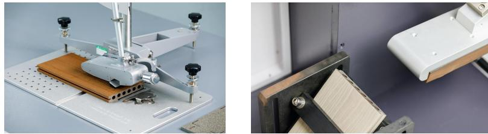

# 美新科技2025创新研发实践

# 研发投入

2025年，美新科技研发投入金额达2300万元占营业收入比例3.88%

# 研发团队

2025年，美新科技研发人员总数108人占员工总数比例 $13.2\%$

# 知识产权与标准

截至2025年，美新科技累计获得授权专利283项主导或参与制定28项国家、地方、行业标准

# 美新科技荣誉

第十七批“粤港清洁生产伙伴”标志企业

广东省塑木复合材料工程技术研究开发中心

广东省科学技术奖励三等奖

中国轻工业联合会科学技术进步奖三等奖

中国轻工业塑料行业（塑木制品）十强企业

广东省专精特新中小企业

广东省知识产权示范企业

高新技术企业证书

广东省知识产权示范企业

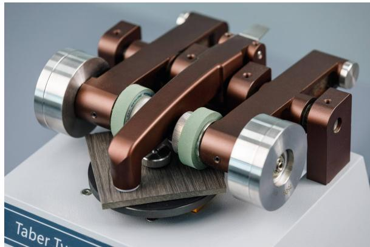

natural_image

Close-up of a mechanical device with brown and metallic components, no visible text or symbols on the main body.

# 产品和服务 安全与质量

产品和服务是企业安身立命之根本，也是决定企业发展的关键因素，美新科技坚持以最优的产品和服务为公司客户提供最大的价值。为此，公司结合产品标准及法规要求制定了科学的产品质量控制文件，并实施了全面且严格的质量控制流程。

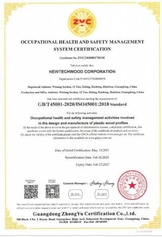

text_image

OCCUPATIONAL HEALTH AND SAFETY MANAGEMENT
SYSTEM CERTIFICATION
Certificate No: ZC24500917813M
This is hereby notified to:
NEWTECHWOOD CORPORATION
Registration Code: 441137506888970
Registered Address: Warring Section, 12 Tan, Ding, Huihao, Haidan, Guangdong, China
Production and Office Address: Warring Section, 12 Tan, Ding, Huihao, Haidan, Guangdong, China
See above registered certificate in setting the requirement of:
GBT45001-2020/ISO45001.2018 Standard
For the following sections:
Occupational health and safety management activities involved
in the design and manufacture of plastic wood profiles
(If the top address of the above involves the approval of administrative fees, company certification, this
certificate covers only by the license holders, the scope of the certificate or product and service)
(In check the validity of the certification plant at the CNCA official website www.nsan.gov.cn The certificate
information also available on www.gbgt.com).
Date of Initial Certification: May 19, 2021
Resemination Date: Feb 24, 2024
Expiry Date: Feb 27, 2027
Guangdong Zhongyu Certification Co.,Ltd.
Regal Number: Huyang Huyang
General Manager: 
# [ ] [ ] [ ] [ ] [ ] [ ] [ ] [ ] [ ] [ ] [ ] [ ] [ ] [ ] [ ] [ ] [ ] [ ] [ ] [ ] [ ] [ ] [ ] [ ] [ ] [ ] [ ] [ ] [ ] [ ] [ ] [ ] [ ] [ ] [ ] [ ] [ ] [ ] [ ] [ ] [ ] [ ] [ ] [ ] [ ] [ ] [ ] [ ] [ ] [ ] [ ]
Guangdong Zhongyu Certification Co.,Ltd.
380 Black Box 4 No. 1 Keyway Road, Guangzhou High-rise Industrial Development Zone: Guangdong, China,
TEN 01010194 - Fax: 021-365038

美新科技ISO45001-职业健康安全管理体系认证证书

# 筑牢安全基石

美新科技以"安全第一，预防为主，综合治理"为公司安全生产管理方针，为强化安全生产管理，落实相关法律法规及标准的要求，建立全员安全生产责任制和常态化EHS（环境、健康、安全）工作机制。在每周EHS会议上，重点通报生产安全、职业健康、环境合规情况，研究具体问题，明确整改责任、措施及时限。

通过EHS常态化会议，公司实现安全隐患、职业健康风险早发现、早整改、早消除，强化全员责任意识，保障员工生命安全与职业健康。

2025年，公司共开展53次以安全生产为重点的EHS巡查，召开50次专项会议，及时发现潜在风险579项，整改率100%。

2025年，公司持续完善职业健康与安全生产管理体系，对相关管理文件开展系统性新增与更新工作，形成从管理到操作的全链条安全保障。

2025年，美新科技合计新增32份、更新140份安全管理制度文件。

# 安全生产激励活动

2025年4月，美新科技启动“零工伤”激励专项活动和员工报告安全隐患奖励机制，强化全员安全生产责任意识，压紧压实全员安全生产责任，引导全体员工从“被动接受安全管理”向“主动践行安全规范”转变，主动参与隐患排查，自觉遵守操作规程，积极落实安全防护措施。

通过常态化、制度化的安全生产激励引导，公司有效防范化解生产安全风险，切实降低生产安全事件发生率。

2025年，美新科技安全生产激励活动实现一线和重点岗位员工100%覆盖

安全事故发生次数和公司相关支出同比降低40%以上。

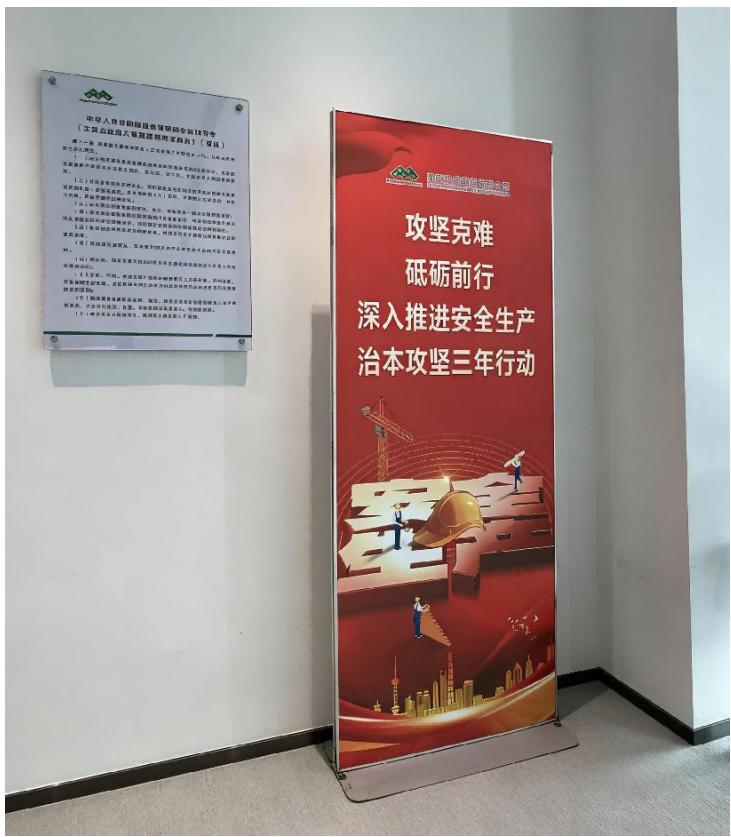

text_image

攻坚克难
砥砺前行
深入推进安全生产
治本攻坚三年行动

# 安全与健康

美新科技建立全方位、常态化的职业健康与安全生产管控体系，构建检测排查、日常监管、培训防护、闭环整改全链条管理，保障生产安全与员工职业健康。

职业危害防控：公司每年开展职业危害专项检测，依据第三方结果升级防护设施，重点排查粉尘、噪声等隐患，按岗位配备劳保用品，全域设置危害告示牌，落实新上岗、调岗职业病危害告知，从源头防控健康风险。

日常安全防控与隐患排查：公司建立《安全检查与隐患排查管理制度》、《安全风险分级管控和隐患排查治理双重预防工作指导书》、《粉尘防爆安全管理制度》《特种设备使用安全风险日管控、周排查、月调度管理制度》等相应制度。2025年，公司推行体系化排查：员工每日“六自查”，班组、车间部门分级自查互查；安全、机修部门开展消防、粉尘、电气等专项检查，负责人进行月度综合检查。检查全程建档，形成跟踪、追责、分析、整改闭环管理。

职业健康保障：公司建立《职业病危害防治责任制度》、《职业病防护用品管理制度》及《职业病危害监测及评价管理制度》等制度。对员工对上岗前、在岗员工每年及离岗员工进行职业健康体检。按照职业危害因素检查报告发放各岗位员工对应个人劳动防护用品。

2025年，美新科技共计开展80个不同岗位职业危害因素检测，合计205个检测点，完成职业防护设备升级改造2次。

2025年，公司各部门内部自查、互查、交叉检查执行率100%。

2025年，美新科技职业健康体检结果均未检出职业病。

# 安全文化宣贯

2025年，美新科技开展了一系列安全宣传活动：各车间均设置安全宣传栏，用于公布安全生产各项通知及制度；同时在员工聚集地如饭堂、茶水间、场所出入口等设立“每周安全热点”宣传牌，定期更新相关安全生产知识；就餐时段定时在饭堂播放职业健康和安全相关的法律法规、安全事故警示案例以及安全操作视频。2025年5月，公司还组织安全知识竞赛，进一步强化员工安全意识。

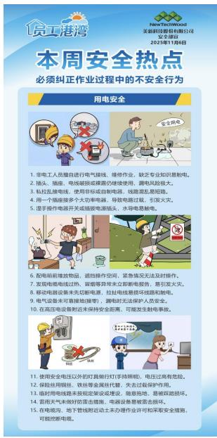

text_image

员工港湾
NewTechWood
美新联能源有限公司
安全建议
2025年11月8日
本周安全热点
必须纠正作业过程中的不安全行为
用电安全
1. 非电工作人员整自进行电气接线、维修作业，缺乏专业知识触电。
2. 接头、插座、电线锁紧或螺丝的继续使用，调配电风险很大。
3. 私拉或接线、使用非标或自给电源、线路乱乱易阻路。
4. 用一个插座等多个大功率电源，导致电机过阻，打阳灭火。
5. 逆手操作终端开关或连接电源接头，水电管易断电。
6. 配电脑前堆放物品，遮挡操作空间，紧急情况无法及时操作。
7. 发现电缆线过热，留略异常未交到断电报告，是引发火灾。
8. 移动设备设备未先切断电源，拉扯电线悬损环线路机械电。
9. 电气设备来可靠接触电零时，调配电无法保护人员安全。
10. 在高压电设备附近未保持安全距离，可能发生漏电事故。
11. 使用安全电压以对灯具做好灯打手持牌，电压过高有危险。
12. 保险丝绳短链、铁丝等金属丝衬罩，失去过载保护作用。
13. 临时用线缆未按规定架设或埋设，随意接地，悬挑踩踏损坏。
14. 面雨天气不得向雷击措施，电器设备易避雷击损坏。
15. 在电磁阀、地下管线附近边土未办理作业许可和采取安全措施，可能出错电源。

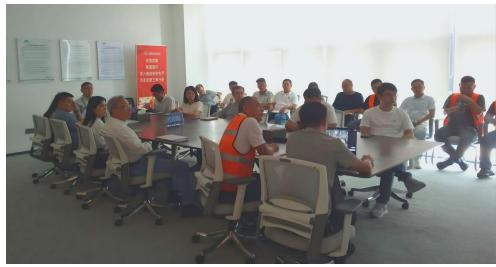

natural_image

Group of people seated around a conference table in an office setting, no visible text or signage

2025年，美新科技共设立9个安全热点宣传点，定期更新相关安全生产知识。公司自行制作安全教育视频16个，年度安全知识竞赛参与人数达610人。

# 应急与消防安全

专业急救队伍建设：2025年，美新科技完成43名员工的急救员专项培训，打造一支具备相当急救能力的现场救援队伍。

消防安全双重防线：配齐配全消防安全硬件设施，公司自备消防车及各类消防器材，组建专职和兼职消防员队伍，完善消防安全人力配置。

全员实战化演练：每年结合实际制定应急预案演练计划，组织全体员工参与模拟灭火、疏散逃生等实战化演练，进一步深化全员对消防安全知识的掌握与实操应用。

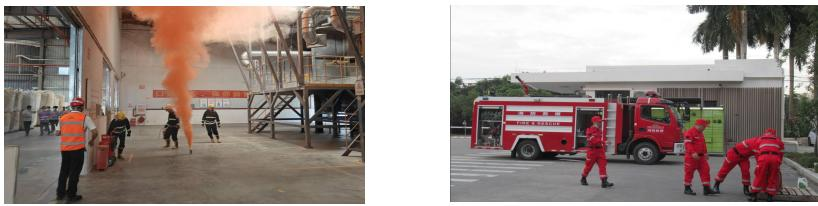

2025年，美新科技共计完成43名员工的急救员专项培训，成立合8人兼职消防队，2025年度组织16次应急演练。其中2次综合演练，2次应急疏散演练、12次专项演练。

2025年美新科技安全生产、职业健康情况

<table><tr><td>指标</td><td>绩效</td></tr><tr><td>安全生产演练总次数</td><td>16次</td></tr><tr><td>安全生产演练合计参与总人次</td><td>614人</td></tr><tr><td>识别的安全生产相关风险及隐患数量</td><td>579个</td></tr><tr><td>安全生产相关风险与隐患完成整改比例</td><td>100%</td></tr><tr><td>员工安全培训合格率</td><td>100%</td></tr><tr><td>特种岗位操作人员持证率</td><td>100%</td></tr><tr><td>职业病危害因素监测岗位数量</td><td>80个</td></tr><tr><td>职业病危害因素完成整改比例</td><td>100%</td></tr><tr><td>接受职业病危害因素体检的员工比例</td><td>100%</td></tr><tr><td>判定为职业禁忌症员工人数</td><td>0人</td></tr></table>

# 安全生产目标达成

# 100%

2025年公司设定的安全生产关键指标全部按期达成，无重大安全事故。

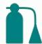

# 应急演练常态化

# 16次

全年组织各类应急演练16次，累计参与人数超过614人次，全员应急响应能力显著提升。

# 职业健康保障

# 100%

美新科技建立完善的职业健康监护体系，筑牢职业健康保障基础。

# 产品全生命周期质量保障

美新科技严格遵守《中华人民共和国产品质量法》等相关法律法规，制定和执行《产品含量限制控制程序》《原材料来料检验标准》等管理程序及质量检验标准，对生产和服务提供过程进行有效控制，确保产品质量和服务符合要求。报告期内，公司已通过ISO9001质量管理体系认证，并建立了从来料管理、生产管理、质量检测到召回处理等贯穿产品全生命周期的质量保障流程。

# 严格来料管理

源头把控，确保所有原材料符合环保与安全标准

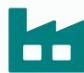

# 生产过程管控

标准化生产流程，实时监控每一道工序，杜绝瑕疵

# 成品质量检测

多重性能测试与外观检查，确保交付产品零缺陷

# 追溯与召回机制

建立全链路数据档案，实现产品快速精准追溯

# 权威认证体系

6项

国内认证

8项

国际认证

100%

核心产品线认证覆盖率

# 供应链安全

美新科技将供应链安全视为企业运营的基石，凭借严格的供应商筛选标准与持续的供应商管理优化，在构建可靠的供应链网络。2025年，公司执行《供应商分包商安全评审管理制度》，通过严格的供应商准入标准和评估机制，对供应商、分销商等进行全方位、体系化且规范化的管控，确保供应链各环节符合环境保护、社会责任和公司治理的要求。

# 供应商全流程管理

美新科技致力于构建绿色可持续的供应链体系，依据《供应商分级管理制度》，将供应商在环境、社会及治理（ESG）方面的表现全面纳入采购全生命周期管理。公司建立了从供应商准入评估到现场审核、绩效考核及数据维护的完整合规管理流程，确保供应商在满足公司产品要求的同时，严格遵守相关法律法规，积极履行社会责任。

natural_image

Futuristic chain link illustration with glowing nodes and light blue interconnects (no text or symbols)

# 调研评估

采购部通过背景、电话调查，审核待选供应商资质、认证、行政处罚等信息，确保符合公司标准；技术部对产品样品开展性能测试

# 绩效考核

美新科技定期依据《供应商评审评分表》对供应商考核打分，就不合格项沟通整改，督促优化提升

flowchart

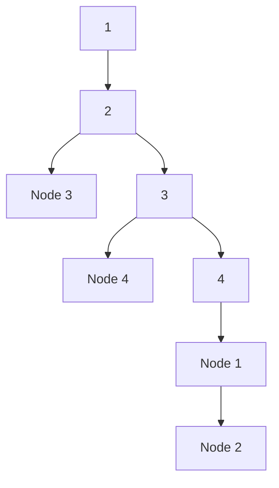
```mermaid
graph TD
  1["Node 1"] --> 2["Node 2"]
  n2["2"] --> 3["Node 3"]
  n3["3"] --> 4["Node 4"]
  n4["4"] --> 1["Node 1"]
  n1["1"] --> n2
  n2 --> n3
  n3 --> n4
```

# 现场审核

全面核查供应商环境、社会、合规运营情况：重点审核合规文件、质量体系、环保设施、废弃物处理、用工及劳工权益，排查潜在风险

# 数据维护

公司搭建供应商评审系统，归集交期、质量、社会责任、环保等数据，每年更新并进行年度评审

美新科技供应商管理环节

# 经销商管理

美新科技以自有品牌代理经销商渠道销售为主，建立经销商标准化管理体系，推动双方合作的可持续发展：

- 招商管理方面，严格执行《美新炜青木招商及市场支持政策》《美新超越木招商及市场支持政策》，明确经销商准入类型、提货要求、渠道开拓及保证金管理，健全市场支持、区域保护、窜货防治等市场秩序机制，保障合作公平规范  
- 订单管理方面，规范经销商开户申请与审批流程，严格依据经销商身份落实对应价格政策，统一签订《销售订单合同》，实现订单全流程透明、可追溯、风险可控  
- 培训与设计赋能方面，制定并执行《经销商培训计划》，采用线上线下相结合模式开展产品、安装、销售、售后等培训并留存资料，定期组织全国经销商到访参观或全球代理商大会进行交流，持续提升渠道专业能力与服务水平  
- 持续完善上样管理、售后客诉处理及合规风控机制，依托数字化系统实现全流程线上管控，强化廉洁合作与市场秩序维护，保障经销商与消费者合法权益

# 可持续采购

公司高度重视可持续及负责任的供应链建设，并将其贯穿于供应商选择、评估与合作的各个环节：

- 本地化采购：为减少物流运输环节的碳排放，公司在内部试行本地化采购政策，以降低采购过程中的温室气体排放。  
- 签署环保协议：要求所有供应商签订《供应商环保协议》，明确约定其须遵守国家、地方及行业相关环保法规，鼓励采用低污染生产流程与设备，并优先使用可回收包装材料。  
- 供应商纳入ESG评估：在供应商筛选与考核中，系统性纳入环境、社会及治理（ESG）因素，推动供应商开展绿色产品认证，并对部分大型供应商提出获取环境管理体系认证（如ISO 14001）等要求。

2025年，美新科技共有供应商750个，经销商179个，供应商、经销商的调研考核率 $100\%$ 。

# AEO管理体系

美新科技严格依照《中华人民共和国海关注册登记和备案企业信用管理办法》以及《海关高级认证企业标准》的各项规范要求，积极推进合规体系建设与管理提升，顺利通过审核，获得AEO高级企业认证。这一资质为公司全球化业务布局、跨境贸易往来以及全球供应链的安全稳定、高效顺畅运行提供了强有力的支撑与保障。

依托AEO高级认证的高标准管理要求，公司建立并持续完善覆盖供应链全链条、全流程的安全管理制度体系，先后制定并执行《信息化安全管理制度》、《信息安全应急处置制度》、《人员、车辆、物品进出工业园管理规定》、《入职管理规范》、《防止非授权人员进入管控区域规定》、《视频监控系统管理规定》、《闭锁装置及钥匙管理制度》、《运输安全协议》、《集装箱管理制度》、《商业伙伴安全评估程序》等一系列制度规范，将场所安全与出入管控、人员安全管理、商业伙伴准入与监督、货物及物品安全管控、运输工具安全管理等关键环节纳入统一管控范畴，实现供应链风险的全过程、全方位管理。与此同时，公司定期对视频监控、门禁系统、货物追踪溯源系统等软硬件设施进行检查、维护与升级，确保各类安全设施稳定可靠、有效运行。针对供应链运营相关数据，公司不断优化信息系统架构，强化数据安全防护与系统性能提升，切实保障供应链信息准确、传输高效、数据安全可控。

2025年，美新科技顺利完成海关AEO高级认证企业复核工作，充分彰显公司在国际贸易合规管理、供应链安全管控、内部风险防控、运营规范化水平等方面持续保持行业高标准。

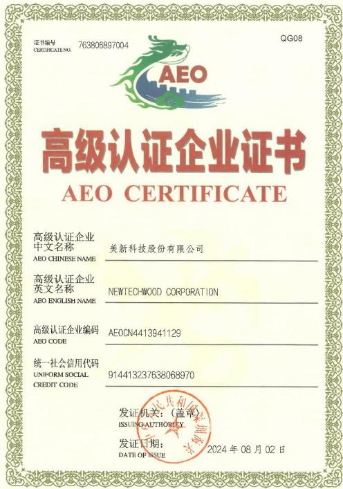

seal

AEO CERTIFICATE
高级认证企业证书
AEO CERTIFICATE
高级认证企业
中文名称
AEO CHINESE NAME
美新科技股份有限公司
高级认证企业
英文名称
AEO ENGLISH NAME
NEWTECHWOOD CORPORATION
高级认证企业编码
AEO CODE
AE0CN4413941129
统一社会信用代码
UNIFORM SOCIAL CREDIT CODE
914413237638068970
发证机关：（盖章）
ISSUE-GAUTHORITY
发证日期：
DATE OF ISSUE
2024年08月02日

# 构建绿色责任供应链

# 市场沟通与优化

公司建立系统化市场反馈机制，精准收集需求，推动再生材料产品技术升级。通过销售对接、客户调研、国际展会、合作商超等渠道，广泛收集产品反馈；构建销售、技术、品管协同机制，快速响应市场需求；依托市场反馈开展技术研发，优化再生料配方，提升产品性能，在提高再生料占比的同时保障品质、控制成本，助力绿色供应链升级。

# 绿色产品国际营销

公司以绿色供应链为核心，依托自主品牌开展国际营销，实现绿色价值市场化。通过国际展会、商超等渠道展示绿色认证，传递环保理念；深耕北美市场，线上线下协同服务客户；与Home Depot、Lowe's等国际巨头深度合作，将环保指标纳入合作条款。2025年，公司产品覆盖全球50多个国家和地区，海外自主品牌收入占比超90%，实现绿色价值国际化落地。

# 多元供应链

# 布局海外产能 提升国际竞争力

2025年，与大自然家居在泰国共建SPC地板智能化生产线，进入试生产阶段。

# 升级国内产能 强化本土支撑

2025年，福建建瓯募投项目进展顺利，将于2026年上半年陆续投产。

# 供应链反贪腐

美新科技通过与供应链上下游的合作，致力于打造“廉洁供应链”生态体系。公司制定并要求所有供应商签署《供应商反贪腐协议》，明确了供应商在合作过程中应遵守的道德规范和法律要求，禁止任何形式的贿赂、腐败行为，确保供应链的廉洁性。此外，美新科技通过培训、宣传等方式，向供应商传达了恪守商业道德、坚守诚信经营的理念。

# 数据安全与客户隐私保护

# 组织架构

美新科技建立专业的信息技术部门，明确物理性管理与网络分离管理规范。

# 数据防控体系

2025年，公司对现有数据保密系统进行全面升级与优化完善，进一步扩充数据保密管理范畴，正式将移动终端用户相关数据及操作行为纳入数据保密管理体系，实现数据保密管控的全域覆盖。

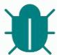

# 常态化风险排查机制

公司定期开展第三方漏洞检测与攻防演练，及时发现并修复潜在安全隐患。

natural_image

Shield with a white padlock icon on a binary code grid background (no text or symbols)

# 科技伦理与平等对待中小企业

# 科技伦理与合规

美新科技在研发过程中严格遵循合规要求，贯彻绿色低碳理念，建立了完善的数据保护机制，确保技术发展与社会责任相统一。

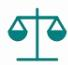

# 平等对待合作伙伴

美新科技坚持公平交易原则，严禁拖欠账款，建立了合规透明的支付流程，致力于为所有合作伙伴，特别是中小企业，创造平等的商业环境。

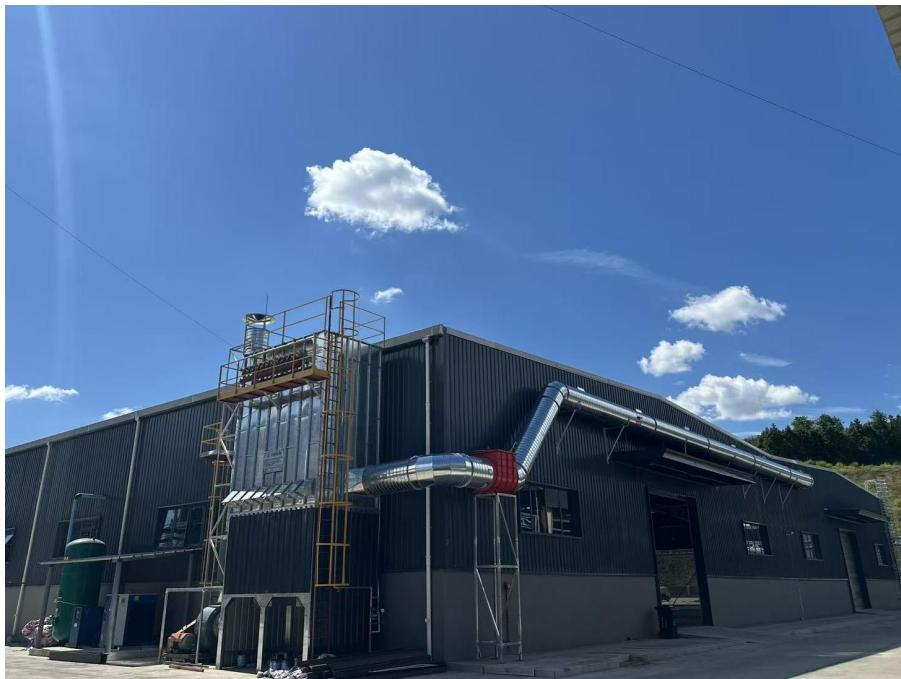

natural_image

Exterior view of a modern industrial building under a clear blue sky with scattered clouds (no signage or text visible)

# 员工

美新科技“以人为本”，构建以平等合规为基石，人才发展为引擎，员工参与为纽带，安全生产为底线的可持续发展生态。通过完善的薪酬和福利体系，丰富的员工关怀与活动，坚实的职业健康与安全保障，营造和谐、积极的企业文化，增强员工的归属感和认同感，激发员工的创造力和工作热情，为公司实现可持续高质量发展提供不竭动力。美新科技严格遵守《中华人民共和国劳动法》《中华人民共和国劳动合同法》《中华人民共和国社会保险法》等法律法规，制定《入职管理规范》《培训管理规范》《薪酬绩效管理制度》等内部规章制度，切实保障员工在合规招聘、劳动合同、培训与发展及职业健康与安全等层面的合法权益。此外，公司高度重视员工的工作体验，为员工提供包括五险一金、免费食宿、带薪休假、健康体检及节日慰问等福利措施，使员工真切感受尊重与关爱。

# 人才吸纳与发展

# 规范聘用

- 完善制度：2025年9月，公司修订《招聘管理制度》，明确招聘职责、流程与禁止行为，配套标准化表单，实现招聘全流程规范管理。  
- 公平招聘：公司公开招聘信息，保障求职公平；通过线上、校园、人才市场等多元渠道，广纳各类背景人才。  
- 多元就业：采用线上线下、内外部结合的招聘模式，积极为退伍军人、残障人士提供就业支持，2025年，美新科技在职退伍军人8人、残障人士3人。  
- 合规录用：公司严格遵守法律法规，规范入职资料签署流程，依法签订劳动合同及保密协议，保障员工合法权益。  
- 劳工保护：公司制定未成年员工保护、禁止强迫劳动等制度，通过身份核验严控童工风险，建立违规追责与整改机制。

# 优设薪酬

- 薪酬制度：董事会下设薪酬与考核委员会，制定《薪酬绩效管理制度》等文件，从治理层面保障薪酬体系合规、公平、合理。  
- 薪酬体系：整体采用“固定+浮动”薪酬结构，普通员工依岗定薪并实施年度薪酬检讨，结合个人表现、市场趋势动态调整。  
- 高管薪酬：董事及高管薪酬由薪酬与考核委员会多维度评估，薪酬与公司业绩、个人履职贡献深度挂钩。  
- 长效激励：针对核心岗位及核心员工不定期推出持股激励计划，绑定个人利益与公司长期发展，吸引并保留优秀核心人才。

# 力促培训

美新科技始终将人才队伍建设视为企业实现可持续高质量发展的核心驱动力。为保障人才培养工作的系统性与规范性，公司制定了《员工培训控制程序》，明确培训流程各环节要求，确保培训工作科学、规范且有效落实。

2025年，公司结合各部门及岗位实际需求，围绕通用培训与专项培训两大维度，建立覆盖全员的职业培训计划。通用培训面向全体人员开展，为新员工提供涵盖企业文化、员工手册、知识产权、安全生产、职业健康及内部规章制度等内容的基础教育，同时面向全体员工开展社会责任、反贪腐等主题培训，旨在提升职业道德与社会责任感。专项培训由各部门根据岗位专业需求自主策划并实施，内容涵盖技术技能提升、岗前操作培训、安全培训、体系要求培训及能力发展培训等多个方面。各项培训结束后，公司均会通过考核，对员工学习成效进行评估，确保培训成果落到实处。

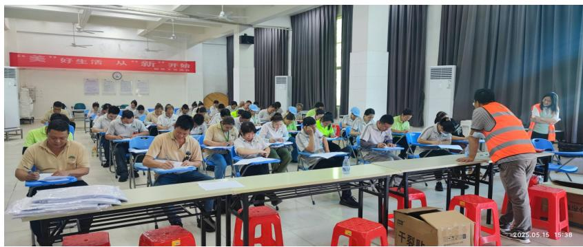

text_image

“美”好生活 从“新”开始
2025.05.15 15:38

<table><tr><td>培训种类</td><td>指标</td><td>绩效</td></tr><tr><td rowspan="2">岗前安全培训</td><td>受培训雇员人数</td><td>170</td></tr><tr><td>受培训总时数</td><td>4080</td></tr><tr><td rowspan="2">职业健康安全</td><td>受培训雇员人数</td><td>170</td></tr><tr><td>受培训总时数</td><td>510</td></tr><tr><td rowspan="2">环保安全培训</td><td>受培训雇员人数</td><td>800</td></tr><tr><td>受培训总时数</td><td>3200</td></tr><tr><td rowspan="2">食品安全培训</td><td>受培训雇员人数</td><td>16</td></tr><tr><td>受培训总时数</td><td>128</td></tr><tr><td rowspan="2">安全生产培训</td><td>受培训雇员人数</td><td>687</td></tr><tr><td>受培训总时数</td><td>1374</td></tr><tr><td rowspan="2">消防安全管理员培训</td><td>受培训雇员人数</td><td>4</td></tr><tr><td>受培训总时数</td><td>32</td></tr><tr><td rowspan="2">生产安全管理人员培训</td><td>受培训雇员人数</td><td>8</td></tr><tr><td>受培训总时数</td><td>128</td></tr></table>

2025年美新科技培训情况数据表

# 员工多元化和平等

美新科技坚信，多元包容是企业创新与发展的基石。我们尊重每位员工的独特价值，营造开放、平等、包容的工作氛围，推动多元文化交流融合，激发团队活力，助力公司可持续发展。

为落实多元共融理念，公司出台《禁止强迫劳动程序》《反歧视管理程序》等平等就业政策，保障员工在招聘、培训、晋升、薪酬等环节享有公平机会。我们严禁民族、宗教、性别、年龄、国籍等一切歧视与骚扰行为，致力打造尊重差异、公平友善的职场环境。

# 员工权益和福利

美新科技建立完善公司福利体系，涵盖各类补贴、法定带薪假期、免费体检、健身、食宿、劳动防护、节日福利、退休关怀及员工荣誉表彰等全方位保障与激励。

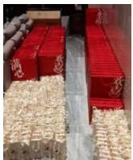

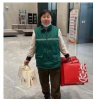

natural_image

Person in green vest holding a red delivery box and a white bag, standing indoors near glass doors (no visible text or symbols)

natural_image

Product display of gift boxes and snacks, including red boxes and pink flower-shaped items with ribbon and gift-like elements (no visible text or symbols)

2025年“三八”妇女节福利

# 职业健康安全

作为负责任的生产型企业，美新科技高度重视职业健康与安全生产工作，公司设立职业健康与安全管理委员会，常务副总经理任主任，各相关部门负责人为成员。

公司落实安全生产与职业健康全员责任制，通过EHS会议统筹部署，运用安全风险分级管控与隐患排查双重预防机制，开展各类安全检查，2025年隐患整改率达100%，同时健全应急体系，开展消防、急救培训，提升应急处置能力。

2025年，美新科技委托第三方完成上百个检测点的职业病危害监测，建立全周期职业健康体检制度。公司还将职业健康培训覆盖全体员工，常态化开展宣传与应急演练，全面提升防护意识与能力，切实守护员工职业健康。

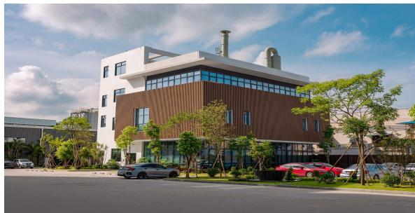

natural_image

Exterior view of a modern multi-story office building with glass windows and surrounding greenery under a partly cloudy sky (no signage or text visible)

# 施诚关怀

美新科技围绕员工活动、员工关爱及员工沟通开展了一系列的举措，旨在增强团队凝聚力，营造了积极向上的企业文化。这些活动不仅让员工放松身心，也为员工创造与同事交流互动的机会，助力培育团队意识，增强组织凝聚力。

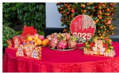

natural_image

Decorative red table with fruit and festive decorations, set against a backdrop of fruit trees and decorative elements (no readable text or symbols)

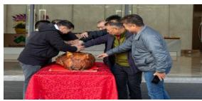

natural_image

Group of people gathered around a large steaming bird on a red table, indoors with no visible text or symbols.

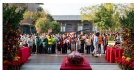

natural_image

Outdoor memorial ceremony with crowd gathered around a red carpet, surrounded by floral arrangements and greenery (no visible text or signage)

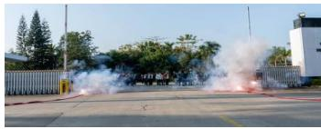

natural_image

Exterior view of a factory with smoke plumes and a vehicle on a road, surrounded by trees and a fence (no visible text or symbols)

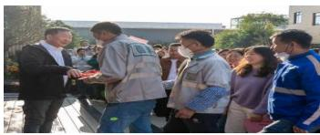

natural_image

Group of people outdoors, one person in a suit and vest interacting with others (no visible text or symbols)

2025年2月5日开门红

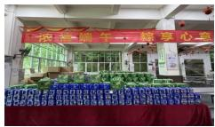

text_image

一农年端午·新五儿童

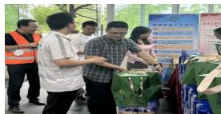

text_image

Street photo showing a public event with people distributing green bags, background includes informational posters and banners.

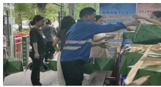

text_image

Street photo showing people interacting with a green display board, with visible Chinese text on the board and background signage

2025年6月1日端午节

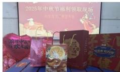

text_image

2025年中秋节福利领取现场
庆祝建党、建党终身

text_image

Two delivery workers in orange uniforms holding a large cardboard box, with a screen displaying Chinese text in the background.

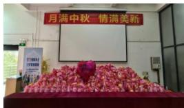

text_image

月满中秋 情满美新

2025年10月6日中秋节

美新科技2025年员工情况

<table><tr><td colspan="2">指标</td><td>绩效</td><td>单位</td></tr><tr><td colspan="2">期末在职员工总人数</td><td>817</td><td>人</td></tr><tr><td rowspan="2">期末在职员工结构(按性别)</td><td>男性</td><td>576</td><td>人</td></tr><tr><td>女性</td><td>241</td><td>人</td></tr><tr><td rowspan="5">期末在职员工结构(按岗位)</td><td>研发序列人员</td><td>108</td><td>人</td></tr><tr><td>生产运行序列人员</td><td>552</td><td>人</td></tr><tr><td>管理序列人员</td><td>89</td><td>人</td></tr><tr><td>技术序列人员</td><td>42</td><td>人</td></tr><tr><td>营销序列人员</td><td>24</td><td>人</td></tr><tr><td rowspan="3">期末在职员工结构(按年龄)</td><td>30岁及以下</td><td>120</td><td>人</td></tr><tr><td>30岁至50岁</td><td>496</td><td>人</td></tr><tr><td>50岁及以上</td><td>201</td><td>人</td></tr><tr><td rowspan="2">特殊群体保障就业</td><td>退伍军人</td><td>8</td><td>人</td></tr><tr><td>残障人士</td><td>3</td><td>人</td></tr><tr><td colspan="2">劳动合同签订比例</td><td>100</td><td>百分比</td></tr><tr><td colspan="2">员工五险一金覆盖比例(按入职时间购买)</td><td>100</td><td>百分比</td></tr><tr><td colspan="2">期末员工留存率</td><td>92.17</td><td>百分比</td></tr></table>

员工规模与结构

817人

2025年底员工总数

70%

男性员工占比

30%

女性员工占比

用工管理数据

100%

劳动合同签订率

100%

社会保险缴纳率

培训情况

5706人

培训人次

27.15小时

人均培训时长

# 社会贡献及乡村振兴

美新科技始终紧跟国家政策导向与社会发展大势，坚守企业初心与使命，在持续推进自身稳健经营、实现高质量发展的同时，积极主动履行社会责任，大力投身公益慈善事业，全力助力乡村振兴战略实施。公司立足地方发展需求，在惠东县和建瓯市投资建设的生产基地项目，有效带动了区域产业发展与经济活力，为当地直接提供超过千个稳定就业岗位，让众多当地居民实现就近就业、安稳增收，切实改善了群众生活水平与居住品质，履行企业社会责任。

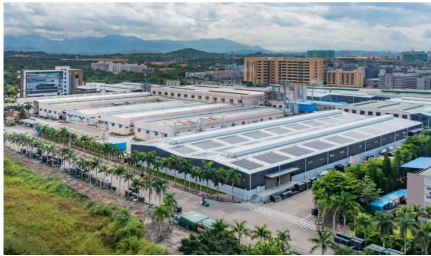

natural_image

Aerial view of a large industrial park with multiple factory buildings, palm trees, and surrounding urban buildings (no visible text or signage)

# 投身社会公益事业

美新科技倡导公益奉献精神，常态化组织员工开展无偿献血等各类志愿服务活动，以实际行动传递温暖与正能量，自觉践行企业公民的社会责任与担当。2025年，公司持续聚焦教育公益事业，主动资助家庭困难的大学生。

# 响应号召 积极践行东西部协作

美新科技积极响应国家乡村振兴与东西部协作部署，主动深入基层开展精准帮扶。公司通过产业扶持、完善基础设施带动地方发展，优先吸纳协作地区人员就业，切实助力稳岗增收。

# 赋能乡村振兴：产业力量助力养老社区建设

2025年，美新科技积极响应福建省建瓯市小桥镇人民政府乡村养老建设发展需求，与当地正式签订《捐赠协议》，承担起小桥镇“幸福里”二期农村养老社区户外塑木园林美化工程的建设工作，并全额捐赠工程所需建设材料及相关施工费用。此次公益实践以实际行动改善了农村养老社区居住环境，以产业力量精准赋能乡村振兴发展。

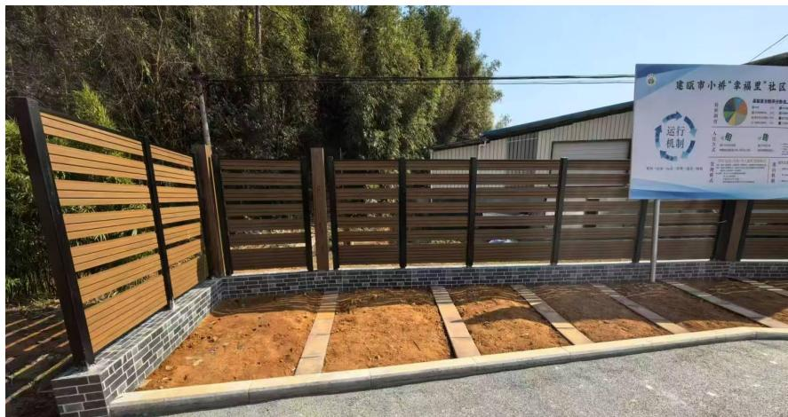

text_image

建瓯市小桥“幸福里”社区
运行机制
工人安全  健康健康生活
工人安全  健康健康生活
工人安全  健康健康生活
工人安全  健康健康生活
工人安全  健康健康生活
工人安全  健康健康生活
工人安全  健康健康生活
工人安全  健康健康生活
工人安全  健康健康生活
工人安全  健康健康生活
工人安全  健康健康活动

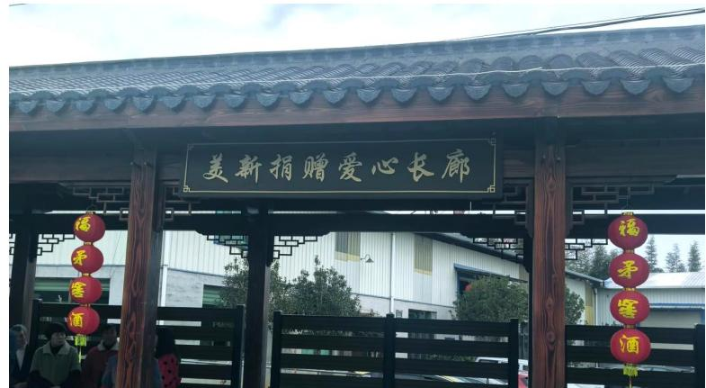

text_image

美新捐赠爱心长廊
福禾寒酒
福矛寒酒

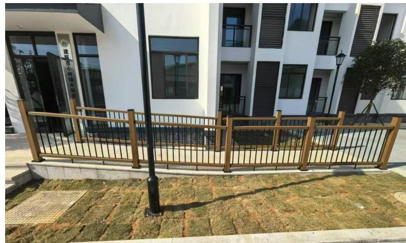

natural_image

Exterior view of a modern residential building with a wooden metal railing and grassy ground (no signage)

治理篇

# 精业笃行

[EMPTY]

# 尽职调查

美新科技开展的尽职调查工作覆盖法律、财务、业务运营、市场环境等多个关键领域，综合运用文件资料审查、现场实地核查、第三方专业评估等多种方式全面推进，确保所获取信息真实完整、系统全面。尽职调查的对象涵盖供应商、投资标的公司、代理商及其他相关利益机构，同时规范做好相关对接与接待保障工作。公司在主动对外开展尽职调查的同时，也积极配合外部机构开展相关尽职调查工作，全程规范有序。在工作开展过程中，恪守独立性、客观性、全面性的核心原则，坚持以事实为依据、以合规为准绳，确保调查流程规范、结果真实可靠，为公司投资决策、风险防控及经营管理提供坚实有力的支撑与保障。

natural_image

Close-up of wooden drafting tools including protractor, rulers, and compass on a grid paper (no text or symbols visible)

# 利益相关方沟通

美新科技高度重视与利益相关方的沟通，通过定期的调研活动和投资者交流会，积极回应市场关切，展示公司的发展战略和运营状况。公司与各利益相关方保持密切互动，旨在增进彼此之间的理解与信任，推动企业稳健发展。

报告期内，公司参考国内外ESG动态及行业热点，结合自身业务与运营特征，梳理出了对公司有决策权、影响力且关系紧密的主要利益相关方。

<table><tr><td>利益相关方</td><td>期望与建议</td><td>我们的回应</td></tr><tr><td>政府和监管机构</td><td>企业治理、企业风险管理、合规经营、依法纳税、能源管理</td><td>信息披露;回复监管问询及配合相关工作</td></tr><tr><td>股东与投资者</td><td>公司治理、财务绩效、合规经营、商业道德</td><td>信息披露;股东会议;投资者交流活动;路演</td></tr><tr><td>客户</td><td>产品安全及质量保证、客户服务及权益、隐私保障、研发创新</td><td>建立客户沟通及投诉咨询渠道</td></tr><tr><td>员工</td><td>培训及发展、员工健康保障、员工关爱</td><td>员工沟通及培训;文化生活</td></tr><tr><td>合作伙伴</td><td>商业道德、可持续供应链</td><td>培训与评估;供应商大会;行业协会</td></tr><tr><td>公众</td><td>节能环保</td><td>官方网站;对外电话;门店</td></tr></table>

# 反商业贿赂及反贪污

美新科技始终坚持诚信经营、廉洁从业的核心原则，严格遵守《中华人民共和国刑法》《中华人民共和国反洗钱法》等法律法规，并对接国际通行的反腐合规要求，建立覆盖企业治理、业务运营、供应链管理等各个环节的反商业贿赂及反腐败管理体系，每年就商业道德风险进行调查识别与评估，确保企业经营的透明性和公正性。

# 教育培训：分层分类覆盖全员

美新科技建立常态化的分层分类培训机制，针对董监高开展专项合规培训，确保全体员工充分理解并严格遵守反贿赂相关规定。

报告期内，美新科技所组织反腐培训累计588名员工参与，

人均培训时长1小时，重点覆盖高风险岗位及业务领域。此外，公司董监高成员均接受了第三方机构提供的反贿赂与合规治理培训，进一步提升企业高层的廉洁管理水平。未来，美新科技将进一步扩大培训覆盖范围，优化培训内容，确保反商业贿赂要求得到更广泛的贯彻和执行。

# 制度建设

美新科技严格遵守《BSCI行为守则（2021版）》《ICS行为守则》等反贪腐相关政策，以确保所有员工在从事业务活动时遵守法规，保持廉洁。公司反贪污政策适用于所有董事、各级管理人员、员工以及代表公司的第三方代表，包括但不限于顾问、代理人、介绍人和中间人，在全球化经营中积极践行高标准的商业道德和合规要求，确保企业及其供应链体系在合规框架下健康运营，推动公平竞争，树立负责任的企业形象。公司董事会积极履行治理责任，制定并实施全面的反贪腐计划，确保相关制度的严格执行，并对高风险业务领域进行持续监督与合规审查。董事会定期评估反腐败管理体系的有效性，推动管理层落实廉洁经营责任，同时加强内部沟通与培训，提升全员合规意识，确保公司在全球运营中的公正性和透明度

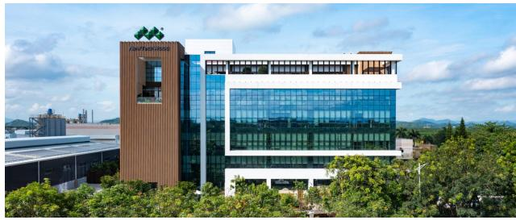

natural_image

Exterior view of a modern office building with glass facade and 'Fazifacios' signage, surrounded by greenery (no readable text beyond signage)

# 供应商管理

- 将反贪污条款纳入合同，确保法律约束  
- 要求供应商签署廉洁承诺书，明确责任  
- 定期开展廉洁培训与宣传，共建诚信生态

# 投诉举报与保护机制

- 建立多渠道举报流程，确保信息畅通无阻  
- 实施严格的保密措施，保护举报人隐私  
- 鼓励内部员工及外部人士积极举报违规行为  
- 建立主要供应商和公司总经理的直接沟通渠道

natural_image

Colorful wooden panel with black brackets, arranged in a row (no text or symbols visible)

# 反不正当竞争

美新科技始终坚持公平竞争、诚信经营的原则，严格遵守《中华人民共和国反不正当竞争法》《中华人民共和国专利法》等相关法律法规，并制定了《公平竞争控制程序》，以确保企业在市场竞争中的合规性和透明度。公司坚决反对任何形式的不正当竞争行为，包括恶意竞争、商业诋毁、侵犯知识产权等，致力于维护公平、公正的市场环境，促进行业健康可持续发展。

公司在与经销商及其他合作伙伴签订合作协议时，明确纳入反不正当竞争条款，确保合作方遵循公平竞争原则，避免恶性竞争、虚假宣传或恶意诋毁，维护健康有序的市场环境。公司在代理协议中明确要求经销商在授权范围内正确使用商标，并在规定地域内销售产品，不得经营未经授权的其他商品，以确保品牌形象的统一性和市场竞争的公平性。

2025年，美新科技及下属机构未因不正当竞争行为导致诉讼或重大行政处罚，没有涉及产品和服务信息与标签、广告不合规事件，也没有发生侵犯知识产权的行为。

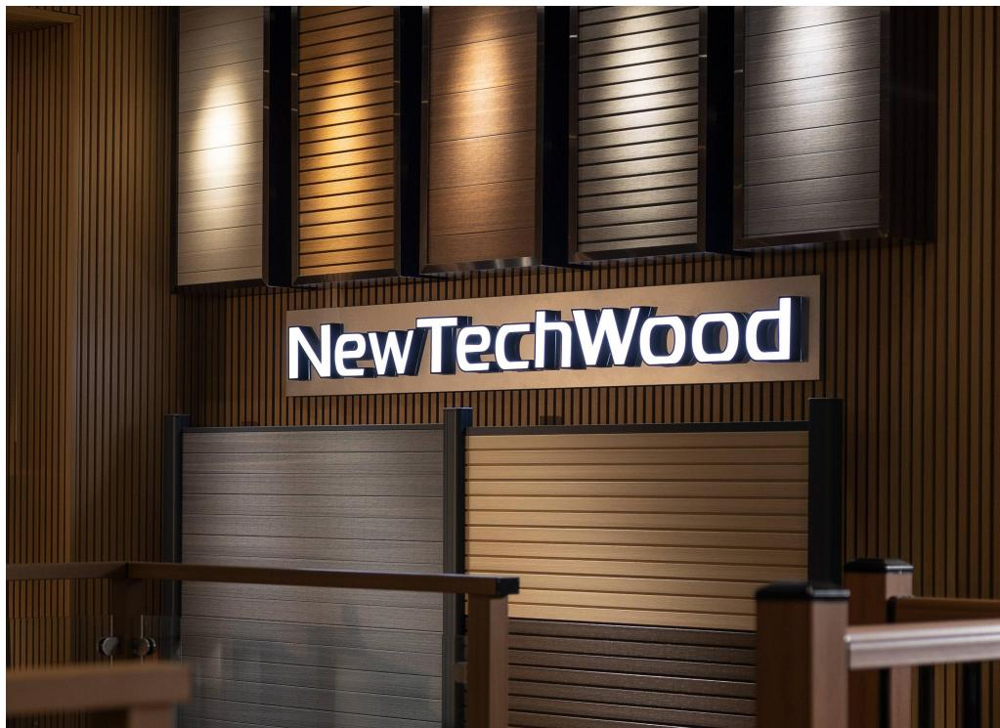

text_image

NewTechWood

# 未来展望

未来，美新科技将持续深化ESG管理实践，重点推进绿色供应链体系建设，持续优化节能降碳管理措施，健全与利益相关方的沟通机制，确保各项ESG工作落地见效，助力企业可持续发展。

natural_image

Simple green line drawing of a double-winding cable or wire (no text or symbols)

# 构建绿色供应链体系

致力于从源头把控，推动供应商共同践行绿色发展理念，打造环境友好、资源高效的供应链生态。

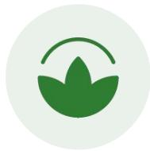

natural_image

Green leaf icon with a curved line above it, enclosed in a light circular background (no text or symbols)

# 提升节能降碳管理水平

持续优化生产流程，引入先进节能技术与设备，积极探索碳中和路径，降低运营过程中的碳排放。

natural_image

Green icon of a person sitting at a desk, no text or symbols present

# 加强利益相关方沟通

建立常态化沟通机制，倾听客户、员工、社区及合作伙伴的声音，提升企业透明度与信任度。

2025关键绩效汇总

<table><tr><td>关键绩效</td><td>数据</td><td>单位</td></tr><tr><td colspan="3">环境</td></tr><tr><td>再生塑料使用量</td><td>14000</td><td>吨</td></tr><tr><td>边角料、塑木回收料使用量</td><td>6000</td><td>吨</td></tr><tr><td>回收木粉使用量</td><td>27000</td><td>吨</td></tr><tr><td>EHS巡查次数</td><td>53</td><td>次</td></tr><tr><td>EHS会议次数</td><td>50</td><td>次</td></tr><tr><td>应急演练次数</td><td>16</td><td>次</td></tr><tr><td>参与员工人数</td><td>614</td><td>人</td></tr><tr><td>VOCs排放量</td><td>480.9</td><td>千克</td></tr><tr><td>SO2排放量</td><td>不涉及</td><td>吨</td></tr><tr><td>NOx排放量</td><td>不涉及</td><td>吨</td></tr><tr><td>颗粒物排放量</td><td>2050</td><td>千克</td></tr><tr><td>工业废水排放量</td><td>不涉及</td><td>吨</td></tr></table>

2025关键绩效汇总

<table><tr><td>关键绩效</td><td>数据</td><td>单位</td></tr><tr><td>一般废弃物产生总量</td><td>1081.28</td><td>吨</td></tr><tr><td>一般废弃物利用处置量</td><td>1081.28</td><td>吨</td></tr><tr><td>危险废弃物产生总量</td><td>11.08</td><td>吨</td></tr><tr><td>危险废弃物利用处置率</td><td>100%</td><td>百分比</td></tr><tr><td colspan="3">社会</td></tr><tr><td>研发人员总数</td><td>108</td><td>人</td></tr><tr><td>研发人员占员工总数比例</td><td>13.2</td><td>百分比</td></tr><tr><td>授权专利数</td><td>32</td><td>件</td></tr><tr><td>参与制定标准数</td><td>28</td><td>件</td></tr><tr><td>综合演练次数</td><td>2</td><td>次</td></tr><tr><td>专项演练次数</td><td>12</td><td>次</td></tr></table>

2025关键绩效汇总

<table><tr><td>关键绩效</td><td>2025年</td><td>单位</td></tr><tr><td>供应商数量</td><td>750</td><td>个</td></tr><tr><td>经销商数量</td><td>179</td><td>个</td></tr><tr><td>员工总数</td><td>817</td><td>人</td></tr><tr><td>男性</td><td>576</td><td>人</td></tr><tr><td>女性</td><td>241</td><td>人</td></tr><tr><td>30岁及以下</td><td>120</td><td>人</td></tr><tr><td>30岁至50岁</td><td>496</td><td>人</td></tr><tr><td>50岁及以上</td><td>201</td><td>人</td></tr><tr><td>退伍军人</td><td>8</td><td>人</td></tr><tr><td>残障人士</td><td>3</td><td>人</td></tr></table>

2025关键绩效汇总

<table><tr><td>关键绩效</td><td>2025年</td><td>单位</td></tr><tr><td>培训人次</td><td>5706</td><td>人</td></tr><tr><td>人均培训时长</td><td>27.15</td><td>小时</td></tr><tr><td colspan="3">治理</td></tr><tr><td>反腐培训参与员工数</td><td>588</td><td>人</td></tr><tr><td>反腐培训人均培训时长</td><td>1</td><td>小时</td></tr></table>

认证汇总

<table><tr><td colspan="5">企业认证</td></tr><tr><td>序号</td><td>认证全称 - 英文 EN</td><td>认证全称 - 中文</td><td>适用产品</td><td>适用地区</td></tr><tr><td>1</td><td>Quality Management System Certification</td><td>质量管理体系认证</td><td>N/A</td><td>全球</td></tr><tr><td>2</td><td>Environmental Management System Certification</td><td>环境管理体系认证</td><td>N/A</td><td>全球</td></tr><tr><td>3</td><td>Occupational Health and Safety Management System Certification</td><td>职业健康安全管理体系认证</td><td>N/A</td><td>全球</td></tr><tr><td>4</td><td>Energy Management Certification</td><td>能源管理体系认证</td><td>N/A</td><td>全球</td></tr><tr><td>5</td><td>Intellectual Property Compliance Management System Certificate</td><td>知识产权合规管理体系认证</td><td>N/A</td><td>全球</td></tr><tr><td>6</td><td>Measurement Management System Certification</td><td>测量管理体系认证</td><td>N/A</td><td>全球</td></tr><tr><td>7</td><td>Authorized Economic Operator</td><td>AEO高级认证企业</td><td>N/A</td><td>全球</td></tr></table>

认证汇总

<table><tr><td colspan="5">环境认证</td></tr><tr><td>序号</td><td>认证全称 - 英文 EN</td><td>认证全称 - 中文</td><td>适用产品</td><td>适用地区</td></tr><tr><td>8</td><td>Recycled Content Certified</td><td>翠鸟回收物质含量认证</td><td>塑木产品</td><td>全球</td></tr><tr><td>9</td><td>FSC Chain-of-Custody</td><td>森林认证FSC</td><td>原材料,供应链</td><td>全球</td></tr><tr><td colspan="5">国际产品认证</td></tr><tr><td>10</td><td>C2C Certified® Full Scope Bronze</td><td>摇篮到摇篮循环产品认证</td><td>塑木产品</td><td>全球</td></tr><tr><td>11</td><td>International Code Council Evaluation Service</td><td>ICC-ES美国国际法规委员会评估认证</td><td>塑木产品(部分型号)</td><td>美国</td></tr><tr><td>12</td><td>Canadian Construction Materials Centre</td><td>加拿大建筑材料中心认证</td><td>塑木产品(部分型号)</td><td>加拿大</td></tr><tr><td>13</td><td>National Construction Code (NCC) of Australia</td><td>澳大利亚建筑规范委员会管理认证</td><td>塑木产品(部分型号)</td><td>澳大利亚</td></tr><tr><td>14</td><td>Korea Eco Label</td><td>韩国生态标签</td><td>塑木产品</td><td>韩国</td></tr><tr><td>15</td><td>Singapore Green Label</td><td>新加坡绿色标识认证</td><td>塑木地板</td><td>新加坡</td></tr></table>

认证汇总

<table><tr><td colspan="5">中国产品认证</td></tr><tr><td>序号</td><td>认证全称 - 英文 EN</td><td>认证全称 - 中文</td><td>适用产品</td><td>适用地区</td></tr><tr><td>16</td><td>China Environmental Label (CEL)</td><td>中国环境标志产品(十环认证)</td><td>塑木产品</td><td>中国/全球</td></tr><tr><td>17</td><td>China Green Product Certification (Indoor)</td><td>中国绿色产品认证 - 室内</td><td>室内塑木板材</td><td>中国</td></tr><tr><td>18</td><td>China Green Product Certification (Outdoor)</td><td>中国绿色产品认证 - 室外</td><td>室外塑木板材</td><td>中国</td></tr><tr><td>19</td><td>China Green Building Materials Product Certification</td><td>中国绿色建材产品认证</td><td>塑木墙板</td><td>中国</td></tr><tr><td>20</td><td>Healthy Building Materials Product Certification</td><td>健康建材产品认证</td><td>塑木产品</td><td>中国</td></tr><tr><td>21</td><td>Child-safe Product Certification</td><td>儿童安全级产品认证</td><td>塑木产品</td><td>中国</td></tr></table>

除上述认证外，美新科技的产品也符合以下国际标准：

<table><tr><td>序号</td><td>标准名称-英文 EN</td><td>认证全称-中文</td><td>适用地区</td></tr><tr><td>1</td><td>Leadership in Energy and Environmental Design</td><td>能源与环境设计领导力</td><td>全球</td></tr><tr><td>2</td><td>The WELL Building Standard</td><td>健康建筑标准</td><td>全球</td></tr><tr><td>3</td><td>Building Research Establishment Environmental Assessment Method</td><td>英国建筑研究院环境评估方法</td><td>全球</td></tr><tr><td>4</td><td>Haute Qualité Environnementale Building under Construction</td><td>高质量环境</td><td>全球</td></tr></table>

深交所指标索引

<table><tr><td>维度</td><td>序号</td><td>议题</td><td>对应页码</td></tr><tr><td rowspan="8">环境</td><td>1</td><td>应对气候变化</td><td>15</td></tr><tr><td>2</td><td>污染物排放</td><td>19</td></tr><tr><td>3</td><td>废弃物处理</td><td>21</td></tr><tr><td>4</td><td>生态系统和生物多样性保护</td><td>25</td></tr><tr><td>5</td><td>环境合规管理</td><td>17</td></tr><tr><td>6</td><td>能源利用</td><td>22</td></tr><tr><td>7</td><td>水资源利用</td><td>24</td></tr><tr><td>8</td><td>循环经济</td><td>10</td></tr><tr><td rowspan="9">社会</td><td>9</td><td>乡村振兴</td><td>47</td></tr><tr><td>10</td><td>社会贡献</td><td>47</td></tr><tr><td>11</td><td>创新驱动</td><td>27</td></tr><tr><td>12</td><td>科技伦理</td><td>41</td></tr><tr><td>13</td><td>供应链安全</td><td>36</td></tr><tr><td>14</td><td>平等对待中小企业</td><td>41</td></tr><tr><td>15</td><td>产品和服务安全与质量</td><td>30</td></tr><tr><td>16</td><td>数据安全与客户隐私保护</td><td>40</td></tr><tr><td>17</td><td>员工</td><td>42</td></tr><tr><td rowspan="4">可持续发展相关治理</td><td>18</td><td>尽职调查</td><td>50</td></tr><tr><td>19</td><td>利益相关方沟通</td><td>51</td></tr><tr><td>20</td><td>反商业贿赂及反贪污</td><td>52</td></tr><tr><td>21</td><td>反不正当竞争</td><td>54</td></tr></table>