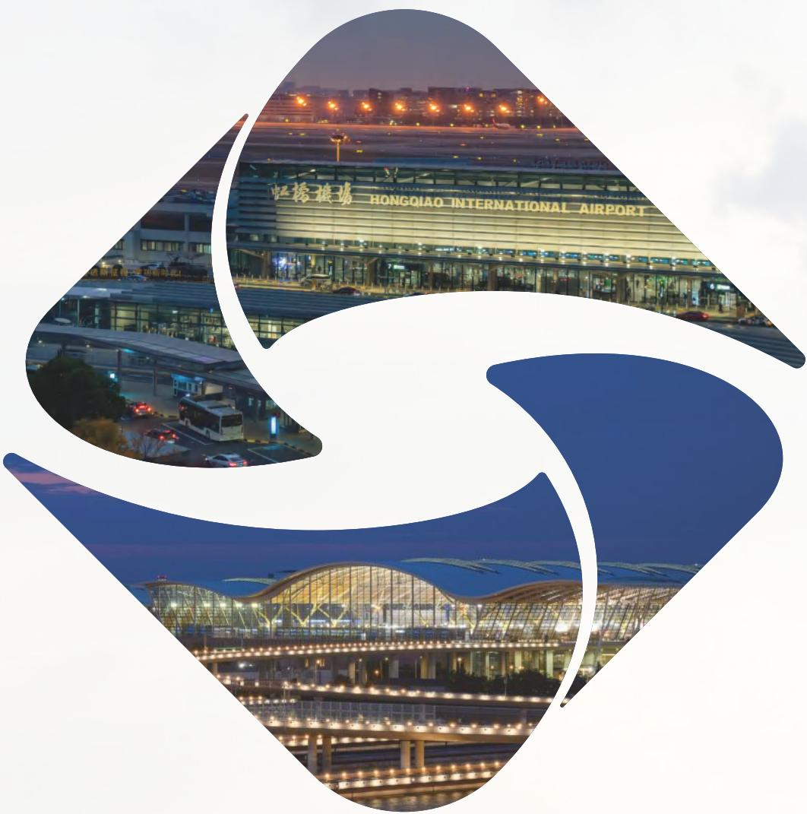

text_image

江都鐵場 HONGQIAO INTERNATIONAL AIRPORT

# 2025

# 上海国际机场股份有限公司 环境、社会和公司治理(ESG)报告

Environment, Social and Governance Report

# 目录

04 报告编制说明

06 管理者致辞

08 公司基本信息

08 议题重要性评估

双重重要性分析

尽职调查、利益相关方沟通

议题重要性分析结论

126 附录 1: ESG 数据表

130 附录2：索引表

136 附录 3: 意见反馈

# 01

# 公司 ESG 治理安排

22 公司可持续发展治理架构

27 可持续发展相关信息报告

27 监督与考核机制

natural_image

Exterior view of a modern building with golden wavy roof and grid windows against a blue sky (no signage or text visible)

# 03

# 社会维度

68 员工

81 产品和服务安全与质量

98 数据安全与客户隐私保护

102 创新驱动

107 供应链安全

108 乡村振兴与社会贡献

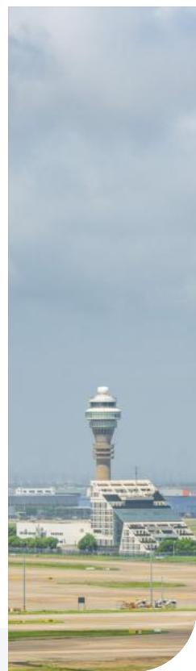

natural_image

Exterior view of an airport terminal with a watchtower and surrounding infrastructure under cloudy sky (no signage or text visible)

# 02

# 环境维度

32 应对气候变化

42 污染物排放

45 废弃物处理

49 环境合规管理

53 生态系统和生物多样性保护

55 能源利用

62 水资源利用

64 循环经济

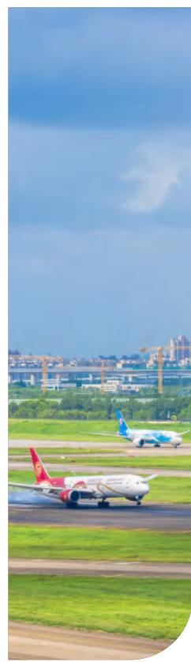

natural_image

Airport runway with two airplanes on the tarmac and a city skyline in the background (no visible text or symbols)

# 04

# 可持续发展

# 相关治理维度

120 反商业贿赂及反贪污

124 反不正当竞争

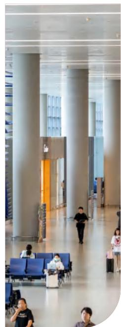

natural_image

Interior view of a modern, spacious lobby with tall columns and people walking (no visible text or signage)

# 报告编制说明

# 编制参考

《上海市国资委关于推进实施本市国有控股上市公司环境、社会和治理（ESG）工作的通知》（沪国资委综合〔2023〕251号）、《上海市国有控股上市公司环境、社会和治理(ESG)指标体系2026版》《上海证券交易所上市公司自律监管指引第14号——可持续发展报告（试行）》（上证发〔2024〕33号）、《上海证券交易所上市公司自律监管指南第4号——可持续发展报告编制》（上证函〔2025〕210号）等监管要求

# 报告组织范围

报告主体范围与公司年度报告一致。

# 报告时间范围

本报告时间范围为 2025 年 1 月 1 日至 2025 年 12 月 31 日。

# 资料说明

本报告数据主要来自上海机场内部文件、统计报表与财务报告。本报告不用于任何商业用途。

# 前瞻性说明

本报告对未来可能发生事件的表述均属前瞻性声明，包括但不限于预期目标及行动计划、风险识别与管理等。由于受不确定性和其他不可控因素影响，实际结果可能与前瞻性陈述存在差异。

# 指代说明

为便于表述和阅读，本报告：

• 以 “我们” “公司” “上海机场” 表示 “上海国际机场股份有限公司”  
以“上海两场、两场”指代“上海浦东国际机场、上海虹桥国际机场”  
• 以“浦东机场”指代“上海浦东国际机场”  
- 以“虹桥机场”指代“上海虹桥国际机场”  
以“浦东机场公司”指代“上海国际机场股份有限公司浦东国际机场”  
以“虹桥机场公司”指代“上海虹桥国际机场有限责任公司”  
以“机场物流公司”指代“上海机场集团物流发展有限公司”

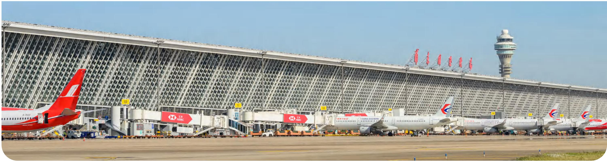

natural_image

Exterior view of a modern airport terminal with multiple China Eastern Airlines aircraft parked under the glass roof, including an airport tower in the background (no signage visible on main structures)

# 管理者致辞

2025 年是 “十四五” 收官之年，上海机场坚持以习近平新时代中国特色社会主义思想为指导，围绕上海 “五个中心” 建设大局，坚持 “稳中求进、以进促稳、守正创新” 的工作总基调，聚焦主责主业，上下一心、拼搏奋斗，实现了枢纽能级跨越提升、安全运行平稳受控、经营业绩有效增长的工作目标，以实干实绩为 “十四五” 圆满收官和 “十五五” 良好开局奠定了坚实基础，为上海国际航运中心从 “基本建成” 进入 “全面建成” 注入了新的动力。

坚守安全底线，护航平稳运行。我们始终将安全作为头等大事来抓，坚决贯彻落实习近平总书记关于安全生产的重要论述和对民航安全工作的重要指示批示精神，以“时时放心不下”的责任感狠抓工作落实。我们以安全生产治本攻坚三年行动为核心，深化安全管理体系现代化建设，确保安全形势总体平稳。

服务国家战略，勇担时代使命。我们聚焦主责主业，深度融入“一圈六廊五通道”国际航线网络布局，进一步强化与“一带一路”沿线地区及欧美重点市场的互联互通，加速航运中心能级跃升，三大生产运输指标再创历史新高。我们不断强化使命担当，增强服务国家和城市重大战略能力，基础设施加速投运，智慧物流体系初具规模，枢纽辐射能级不断增强。

践行绿色理念，打造低碳机场。我们积极探寻绿色转型发展新路径，有效推动能源供给侧多元化、清洁化、低碳化。我们持续推动光伏规模化发展，以信息化手段推动能碳与生产联动管理能力提升，两场分布式光伏装机规模位列行业领先水平。2025年，浦东、虹桥机场公司通过中国民用机场协会年度“双碳机场”四星级评价符合性审查，虹桥机场成为国内首个能源、环境、CCAA+EATNS碳管理四体系认证的机场。

数智赋能创新，驱动能级提升。我们依托机场大脑与人工智能联合创新实验室，实现人工智能技术在航班运行、机坪安全、旅客服务等核心环节的应用落地。我们持续深化拓展数智化应用场景，建成综合运控中心数字孪生系统，实现机场运行全要素可视化监管。

提升服务品质，彰显人文关怀。我们强化品牌引领，打造“中国样·China Young”上海机场人文品牌，推出“沪来沪往·适易中转”中转品牌，聚焦“产品+服务+效率”综合转型升级，实现全业务类型、全服务链条中转能级提升。我们致力于提升入境便利化水平，在“支付、交通、文旅、通讯”等方面发挥“两场三航站楼”外籍人员一站式综合服务中心便利服务功能。

促进价值共创，保障民生福祉。我们认真落实东西部协作与对口支援、百企帮百村、农村综合帮扶等战略部署和重点任务，深化结对帮扶，在巩固拓展脱贫攻坚成果、积极推动乡村振兴的实践中强化党建引领、勇担国有控股上市公司社会责任。我们着力构建和谐稳定的劳动关系和服务职工工作体系，为员工营造舒畅的工作氛围、良好的发展环境和发展预期。

2026 年，继往开来、向新向优。公司将坚持 “稳中求进、提质增效” 工作总基调，在新征程中展现新担当、新作为，锚定世界一流，坚定信心、勇担使命，持续深耕高质量发展核心动力，全面加快世界一流的上海全方位门户复合型国际航空枢纽建设，在时代浪潮中抢滩布局、勇立潮头，谱写上海机场跨越式发展的新篇章！

B-304A

# 公司基本信息

上海国际机场股份有限公司系于 1997 年 5 月经上海市人民政府以沪府〔1997〕28 号文批准设立，由上海机场（集团）有限公司作为独家发起人发起设立的股份有限公司。1998 年 2 月在上海证券交易所上市，所属行业为航空运输业。重大资产重组完成后，公司已实现上海航空枢纽客货运业务的统一管理和航空资源的统一配置，经营业务主要分为航空性业务和非航空性业务，注册资本 24.88 亿元。

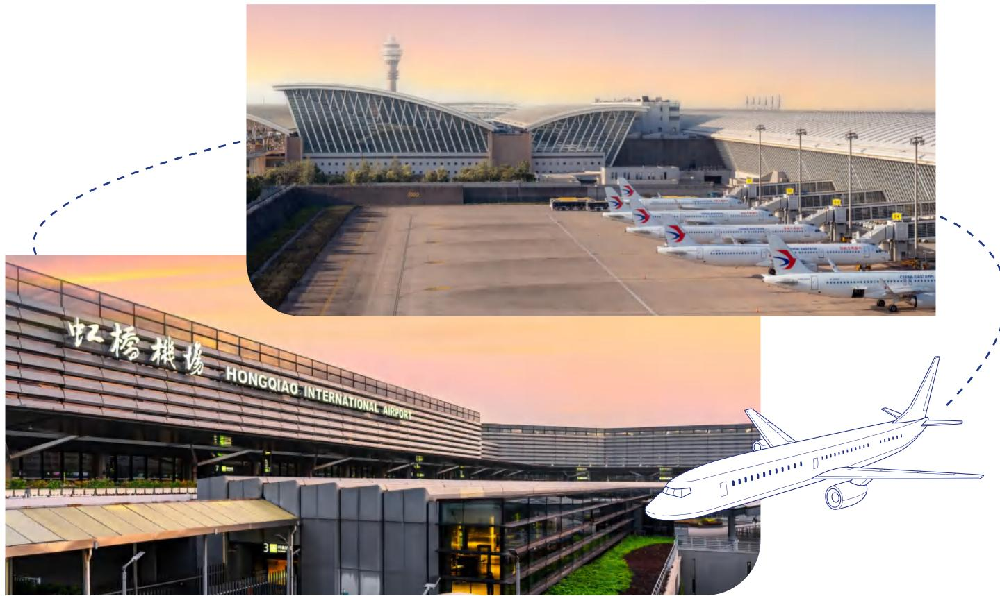

text_image

虹桥機場 HONGQIAO INTERNATIONAL AIRPORT

# 议题重要性评估

# - 双重重要性分析

公司重视可持续发展管理，持续开展 ESG 重要性议题的识别、评估工作。2025 年，参考《上海证券交易所上市公司自律监管指引第 14 号——可持续发展报告（试行）》设置的议题，组建议题库，并根据《上海证券交易所上市公司自律监管指南第 4 号——可持续发展报告编制》开展财务重要性和影响重要性分析。分析方法主要由以下 3 步组成：

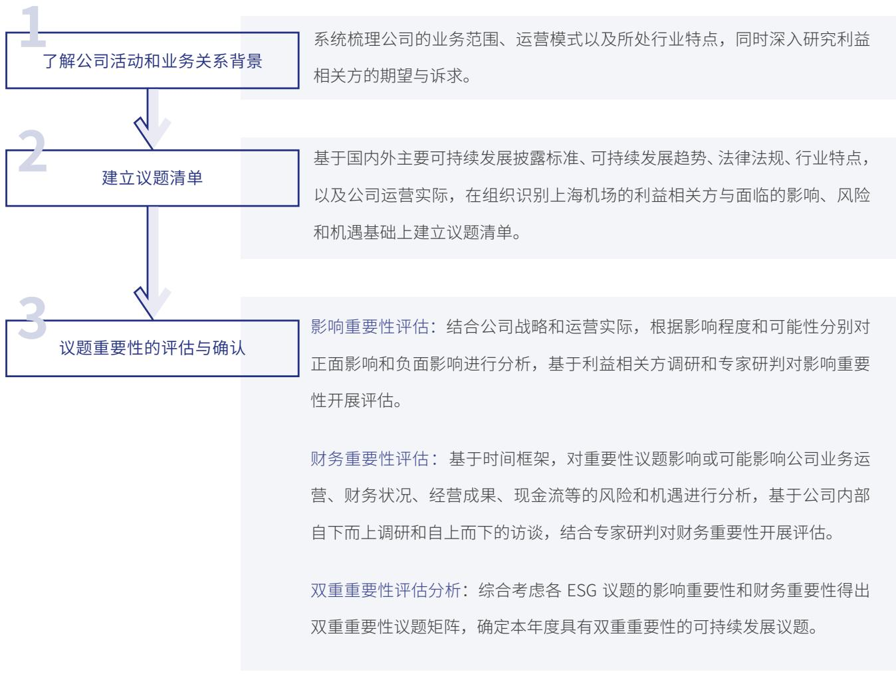

flowchart

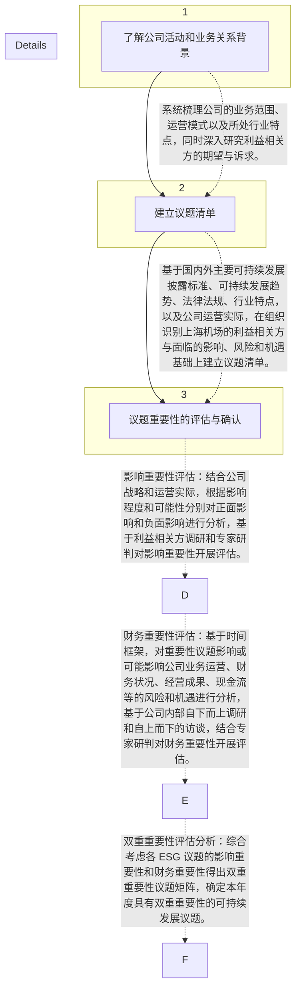
```mermaid
graph TD
  A["了解公司活动和业务关系背景"] --> B["建立议题清单"]
  B --> C["议题重要性的评估与确认"]
  
  subgraph Stage1 [1]
    A
  end
  
  subgraph Stage2 [2]
    B
  end
  
  subgraph Stage3 [3]
    C
  end
  
  subgraph Details
    A
    B
    C
  end
  
  subgraph Details
    A
    B
    C
  end
  
  subgraph Details
    A
    B
    C
  end
  
  A -.->|"系统梳理公司的业务范围、运营模式以及所处行业特点，同时深入研究利益相关方的期望与诉求。"| B
  B -.->|"基于国内外主要可持续发展披露标准、可持续发展趋势、法律法规、行业特点，以及公司运营实际，在组织识别上海机场的利益相关方与面临的影响、风险和机遇基础上建立议题清单。"| C
  C -.->|"影响重要性评估：结合公司战略和运营实际，根据影响程度和可能性分别对正面影响和负面影响进行分析，基于利益相关方调研和专家研判对影响重要性开展评估。"| D
  D -.->|"财务重要性评估：基于时间框架，对重要性议题影响或可能影响公司业务运营、财务状况、经营成果、现金流等的风险和机遇进行分析，基于公司内部自下而上调研和自上而下的访谈，结合专家研判对财务重要性开展评估。"| E
  E -.->|"双重重要性评估分析：综合考虑各 ESG 议题的影响重要性和财务重要性得出双重重要性议题矩阵，确定本年度具有双重重要性的可持续发展议题。"| F
```

# - 尽职调查、利益相关方沟通

根据上海机场风险管理办法相关规定，内部控制管理部门是风险管理的归口管理部门，指导、协调各部门和各直属单位有序开展全流程风险管理工作。

# 风险识别流程

各部门和各直属单位根据内外部审计和评价报告发现问题、经营管理流程变动或规章制度新增、修订等情况，全面系统地收集相关信息，确认各流程需达到的控制目标，从而准确识别达成控制目标时可能存在的风险，及时更新至内控手册和风险数据库中，识别出重大风险，形成重大风险排查清单并定期上报内控归口管理部门。

# 风险评估流程

各部门和各直属单位定期进行风险评估，针对已识别出的风险，根据风险评估具体标准，结合业务流程实际运行情况，在风险数据库中对应选择相应定量和定性的评估选项，由内控评价系统根据设置好的选项权重比例及对应数值自动计算出风险评估结果。

# 利益相关方识别

为更好地回应利益相关方诉求和期待，公司以2025年ESG报告编制为契机，持续梳理各方关注重点，进一步优化沟通与参与机制。各部门、各直属单位立足自身业务特性与运营需求，根据ESG管理的整体要求，通过定期或不定期的形式开展针对性沟通，实现兼顾多方的综合化价值创造导向。

<table><tr><td>利益相关方</td><td>关注内容</td><td>沟通方式</td></tr><tr><td rowspan="13">地方政府及监管机构</td><td>国有资产保值增值</td><td></td></tr><tr><td>贡献区域经济发展</td><td></td></tr><tr><td>机场规划与建设</td><td></td></tr><tr><td>交通联运与可及性</td><td></td></tr><tr><td>间接经济影响</td><td>工作会议及汇报</td></tr><tr><td>重大活动保障</td><td>业务考核</td></tr><tr><td>安全与安保</td><td>巡视</td></tr><tr><td>国际化</td><td>政府合作</td></tr><tr><td>道德与合规</td><td>监督检查</td></tr><tr><td>风险管理</td><td></td></tr><tr><td>党建</td><td></td></tr><tr><td>净空管理</td><td></td></tr><tr><td>周边环境治理</td><td></td></tr><tr><td rowspan="9">民航行业主管部门</td><td>机场规划与建设</td><td></td></tr><tr><td>航班正点</td><td></td></tr><tr><td>安全与安保</td><td>工作会议及汇报</td></tr><tr><td>运行效率</td><td>文件通知</td></tr><tr><td>中转能力</td><td>监督检查</td></tr><tr><td>旅客满意度</td><td>日常业务交流</td></tr><tr><td>机场便捷性</td><td></td></tr><tr><td>净空管理</td><td></td></tr><tr><td>行业发展贡献</td><td></td></tr></table>

<table><tr><td>利益相关方</td><td>关注内容</td><td>沟通方式</td></tr><tr><td rowspan="8">旅客</td><td>安全与安保</td><td></td></tr><tr><td>航班正常</td><td>服务热线</td></tr><tr><td>中转能力</td><td>投诉电话</td></tr><tr><td>机场便捷性</td><td>网络举报邮箱</td></tr><tr><td>旅客满意度</td><td>官网/微博/微信平台</td></tr><tr><td>智能化服务</td><td>满意度调查</td></tr><tr><td>特殊旅客服务</td><td>外部监督员</td></tr><tr><td>教育和文化促进</td><td></td></tr><tr><td rowspan="6">股东/投资人</td><td>经营业绩</td><td>股东会</td></tr><tr><td>回报股东</td><td>定期报告/临时报告</td></tr><tr><td>信息披露</td><td>ESG报告</td></tr><tr><td>投资者关系</td><td>业绩说明会</td></tr><tr><td>可持续发展</td><td>上证e互动</td></tr><tr><td></td><td>投资者热线</td></tr><tr><td rowspan="5">员工</td><td>培训与发展</td><td>职工代表大会</td></tr><tr><td>福利与关爱</td><td>工会组织</td></tr><tr><td>民主管理</td><td>满意度调查</td></tr><tr><td>包容与多元化</td><td>日常工作会议</td></tr><tr><td>健康舒适的工作环境</td><td>培训及活动</td></tr><tr><td rowspan="10">航空公司</td><td>安全与安保</td><td></td></tr><tr><td>机场规划和建设</td><td></td></tr><tr><td>航班正常</td><td></td></tr><tr><td>吞吐能力</td><td></td></tr><tr><td>交通联运和可及性</td><td>日常业务交流</td></tr><tr><td>中转能力</td><td>工作会议及汇报</td></tr><tr><td>运行效率</td><td>行业交流</td></tr><tr><td>旅客满意度</td><td></td></tr><tr><td>机场便捷性</td><td></td></tr><tr><td>行业发展贡献</td><td></td></tr><tr><td>驻场单位(边防、海关等)</td><td>安全与安保中转能力运行能力驻场单位支持旅客满意度机场便捷性</td><td>日常业务交流工作会议及汇报</td></tr><tr><td>同行/行业协会</td><td>安全与安保机场规划和建设航班正常国际化行业发展贡献</td><td>项目合作行业交流活动评估监督</td></tr><tr><td>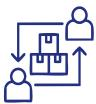供应商/合作伙伴</td><td>道德与合规机场规划和建设供应链可持续</td><td>日常业务交流项目合作商务洽谈</td></tr><tr><td>经营商户</td><td>安全与安保机场规划和建设风险管理运行效率机场便捷性旅客满意度投诉及争议解决</td><td>日常业务交流工作会议及汇报商务洽谈项目合作</td></tr></table>

<table><tr><td>利益相关方</td><td>关注内容</td><td>沟通方式</td></tr><tr><td>社区/公益组织</td><td>机场规划与建设社区投资参与社区联建共治净空管理噪声管理周边环境治理废气和空气质量教育和文化促进贡献乡村振兴公益志愿活动</td><td>联建共治委员会志愿者活动社会监督官网/微博/微信平台</td></tr><tr><td>媒体</td><td>机场规划与发展贡献区域经济发展旅客满意度社区投资与参与教育和文化促进</td><td>新闻发布会媒体采访官网/微博/微信平台媒体监督</td></tr></table>

# 案例

# 上海机场参加第18届全球航空货运论坛

4月15日，国际航空运输协会（IATA）举行第18届全球航空货运论坛（WCS），主题为航空货运业的可持续发展与数字化转型。上海机场作主旨演讲，分享了在跨境电商货物运输方面的创新实践成果，

为提升全球航空货物运输安全提供借鉴经验。会上，上海机场受 IATA 邀请加入了 IATA 全球数字化领导力章程，代表了上海机场领先的数字化水平得到行业认可。会议期间，上海机场还就加强航空货运合作，创新与数字化转型等议题与参会各方进行了深入讨论。

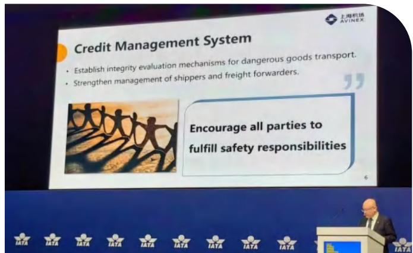

text_image

Credit Management System
• Establish integrity evaluation mechanisms for dangerous goods transport.
• Strengthen management of shippers and freight forwarders.
Encourage all parties to
fulfill safety responsibilities

# 上海机场承办 2025 年航空连通性大会

为了进一步提升亚太中东地区机场航空连通性，与国内外机场生态圈各方共话航线发展最新趋势、挑战和机遇，分享战略和实践经验，5月28日，中国民用机场协会携手国际机场协会亚太及中东区在沪召开“2025年航空连通性大会”，大会由上海机场承办。大会发布了“国际机场协会（ACI）亚太及中东区2024年航空连通性排名”，浦东机场和迪拜机场分别荣获亚太地区和中东地区连通性最佳机场第一名。

冯昕同志表示，目前，行业进入健康发展新周期，上海机场愿继续为全球连通添砖加瓦，携手各方进一步缩短中转最短衔接时间，提升出入境服务便利化和时效性，不断增强上海机场全方位门户复合型功能。上海机场愿全力为区域发展增添功能，培育壮大枢纽经济，融入周边地区新通道新模式，进一步辐射带动长三角区域发展。上海机场愿倾力为产业链伙伴搭建舞台，致力成为行业伙伴最佳平台搭档。

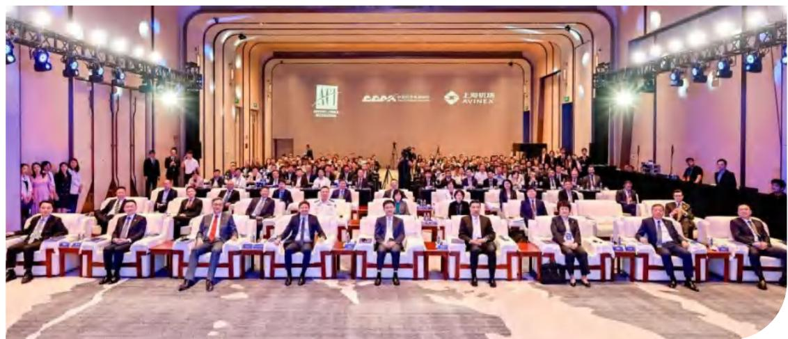

natural_image

Large conference hall with attendees seated in rows, featuring a stage backdrop with 'DBPX' and '上海机场' logos (no visible text on attendees or seating)

# 案例

# 上海机场、中国东航联合承办 2025 北外滩国际航空论坛

10月19日上午，由交通运输部与上海市人民政府共同主办的“2025北外滩国际航运论坛”在上海世界会客厅开幕。今年论坛主题为“协作共促全球航运可持续发展”，论坛包括开幕式暨国际绿色航运主论坛、国际海运论坛和国际航空论坛，以及4个分论坛和10余个特色活动。当日下午，以“创新领航智链未来——科技赋能全球航空新格局”为主题的2025北外滩国际航空论坛在上海世界会客厅举办，上海机场与中国东航已连续5年携手承办这一航空业盛会，论坛汇聚近300名全球航空领域的政企代表、专家学者等，共同探讨新时代航空发展新趋势、新路径。论坛上，上海机场发布《中转品牌“沪来沪往·适易中转”》。

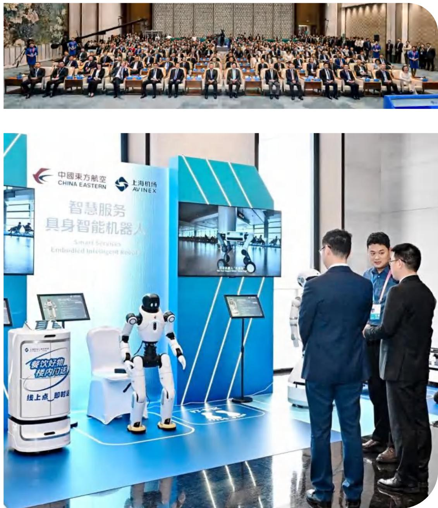

# 案例

# 上海机场免税招标签约

12月17日，上海机场浦东、虹桥国际机场进出境免税店项目经营权转让合同签约仪式举行。在三方集团负责人的见证下，上海机场签约代表分别与中国中免、Avolta（杜福睿）的签约代表签署了相应的机场进出境免税店项目经营权转让合同，上海机场免税业务将开启“国内龙头+国际巨头”的多元竞合新模式，助力国家高水平对外开放和机场商业品质升级。

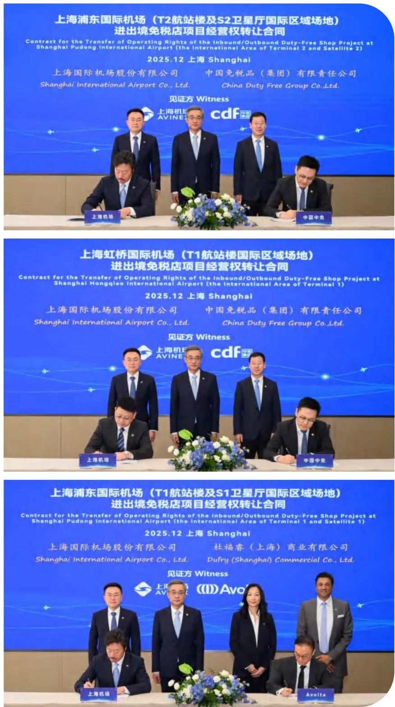

# 案例

# 智联全球、聚力共赢，空港协商会议机制年度第二次会议暨新品发布会举行

12月30日，上海空港协商会议机制2025年第二次会议暨新品发布会举行，会上发布了上海机场8大货运产品，包括“飞得更远”的新开货运航线产品、“转得更顺”的货运中转产品、“运得更好”的便利化运输服务产品、“控得更稳”的全球货运生态圈平台。会上还举行了上海航空货运枢纽最佳合作伙伴奖颁奖仪式，向一年来为上海机场货运枢纽服务能级提升作出贡献的航司、货代、物流、平台企业、研究机构等合作伙伴进行了表彰感谢。

未来，上海机场将更好发挥平台作用，推动空港社区从“物理集聚”向“生态融合”转型，促进政策、数据、设施、服务的高效衔接，让每位成员都能在协同合作中创造更大价值，共享发展成果，并将对标“全方位门户复合型国际航空枢纽”发展定位，推动航空货运从“物流通道”向“供应链中枢”转型，继续拓展全球网络、巩固规模优势，在模式创新、智慧升级、价值共创上实现新突破。相关领导共同宣布浦东机场智汇港货站与海关智慧货运检查中心落成试运行。

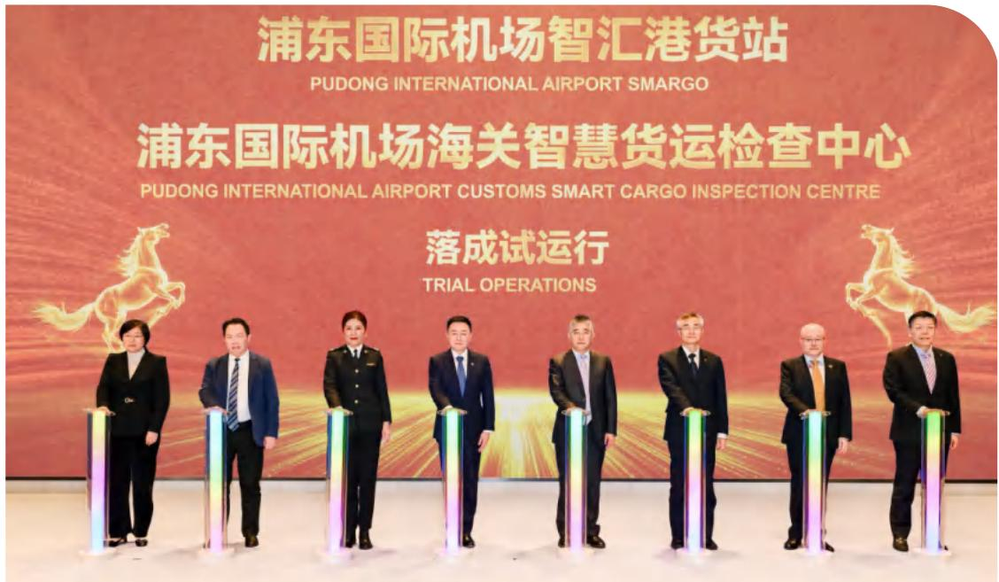

text_image

浦东国际机场智汇港货站
PUDONG INTERNATIONAL AIRPORT SMARGO
浦东国际机场海关智慧货运检查中心
PUDONG INTERNATIONAL AIRPORT CUSTOMS SMART CARGO INSPECTION CENTRE
落成试运行
TRIAL OPERATIONS

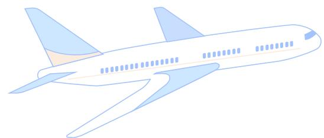

natural_image

Illustration of a commercial airplane in blue and white outline (no text or symbols)

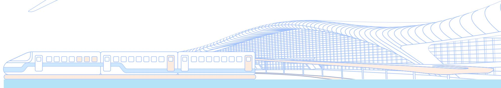

natural_image

Line drawing of a modern high-speed train on an elevated track, showing architectural details and design lines (no text or symbols)

# 案例

2025 年上海机场全年进出港航班量 84 万架次，同比增长 4.5%。全年旅客吞吐量超过 1.35 亿人次，同比增长 8.3%，其中出入境旅客吞吐量超过 4140 万人次，同比增长 18.2%。全年货邮吞吐量达到 450 万吨，同比增长 7.9%，三大生产运输指标再创历史新高。

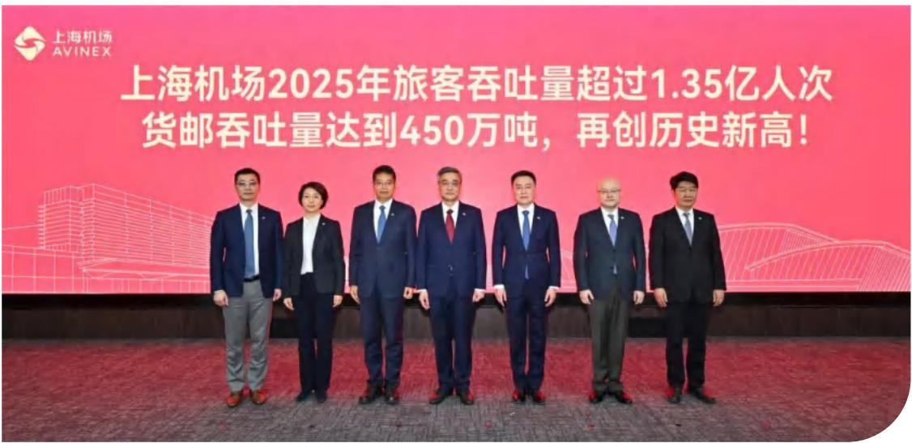

text_image

上海机场
AVINEX
上海机场2025年旅客吞吐量超过1.35亿人次
货邮吞吐量达到450万吨，再创历史新高！

# - 议题重要性分析结论

基于双重重要性分析步骤，共识别出 19 项具有重要性的议题，其中 3 项议题具有财务重要性，包括应对气候变化、能源利用、产品和服务安全与质量。具体如下图所示：

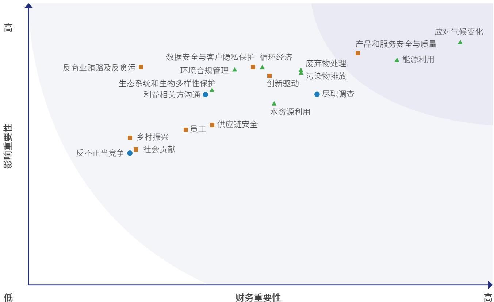

scatter

| Topic | Financial Importance (X) | Impact Importance (Y) |
| :--- | :--- | :--- |
| 反商业贿赂及反贪污 | ~25 | ~85 |
| 数据安全与客户隐私保护 | ~45 | ~85 |
| 循环经济 | ~50 | ~85 |
| 废弃物处理 | ~60 | ~80 |
| 污染物排放 | ~60 | ~75 |
| 创新驱动 | ~55 | ~70 |
| 利益相关方沟通 | ~35 | ~65 |
| 生态系统和生物多样性保护 | ~35 | ~65 |
| 尽职调查 | ~65 | ~60 |
| 水资源利用 | ~50 | ~50 |
| 供应链安全 | ~40 | ~45 |
| 乡村振兴 | ~25 | ~40 |
| 社会贡献 | ~25 | ~35 |
| 反不正当竞争 | ~20 | ~30 |
| 产品和服务安全与质量 | ~70 | ~90 |
| 能源利用 | ~75 | ~85 |
| 应对气候变化 | ~85 | ~95 |

注：因公司已建立供应商相关管理制度，报告期末应付账款（含应付票据）余额未超过300亿元，占总资产的比重未超过 $50\%$ ，且公司在国家企业信用信息公示系统无逾期尚未支付中小企业款项信息，公司未单独设置平等对待中小企业议题；因公司所属行业为航空运输业，未从事生命科学、人工智能等科技伦理敏感领域的科学研究、技术开发等活动，公司未单独设置科技伦理议题。

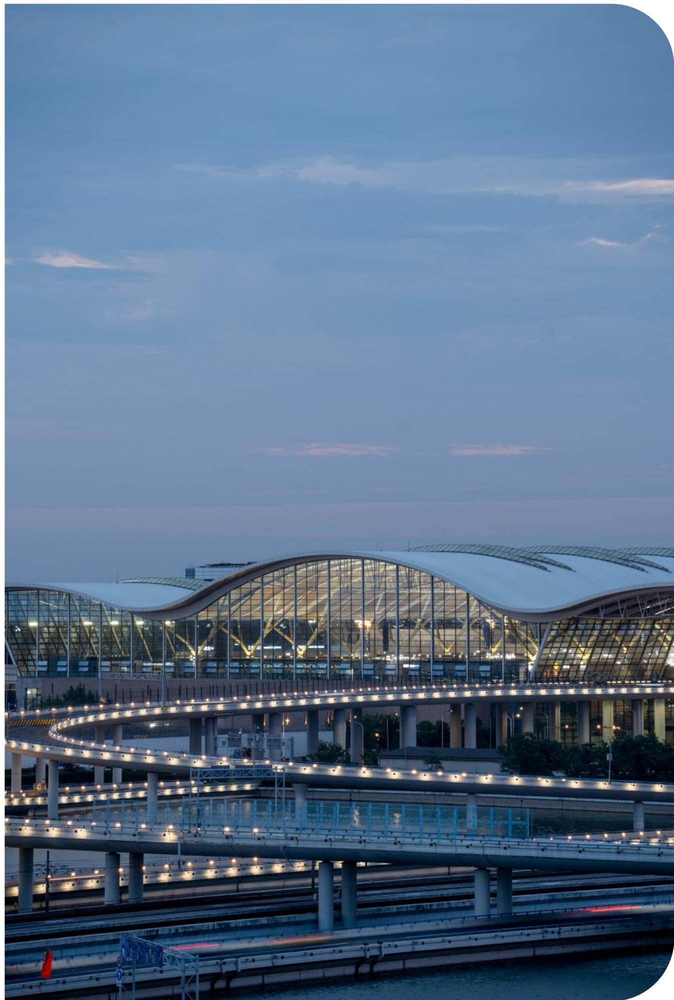

natural_image

Exterior view of a modern glass-architectural terminal at dusk, featuring illuminated walkways and water infrastructure (no signage or text visible)

# 01

# 公司 ESG

# 治理安排

公司可持续发展治理架构

可持续发展相关信息报告

监督与考核机制

B B7→

# 公司可持续发展治理架构

上海机场按照《中华人民共和国公司法》《中华人民共和国证券法》、中国证监会制定的法规和发布的有关上市公司治理的规范性文件以及《上海证券交易所股票上市规则》的要求，不断完善公司法人治理结构，规范公司运作行为，加强信息披露管理，维护全体股东利益。

上海机场坚持以习近平新时代中国特色社会主义思想为指导，全面贯彻落实党的二十大和二十届历次全会精神，深化落实习近平总书记考察上海重要讲话精神和对上海工作重要指示要求，忠诚拥护“两个确立”、坚决做到“两个维护”，完整准确全面贯彻新发展理念，聚焦高质量发展首要任务，围绕“十四五”规划圆满收官、改革深化提升行动胜利完成的目标，坚持和加强党的全面领导，推进全面从严治党向纵深发展，以高质量党建为加快建设全方位门户复合型国际航空枢纽提供坚强政治保证和组织保证。

上海机场各级党组织健全党委领导作用发挥的制度机制，进一步规范工作流程，在新一轮国资国企改革中切实把方向、管大局、保落实，推动党的领导全面嵌入企业治理各环节、全过程。

# 截至2025年12月31日

公司董事会成员共7人，其中外部董事6人、占比86%，女性董事占比14%

# - ESG 组织架构

# 董事会

ESG 工作最高领导机构

# 董事会战略委员会

ESG 工作研究和指导机构

# ESG 报告编制领导小组

贯彻落实监管部门 ESG 报告编制方面各项决策部署，统筹安排和协调上海机场 ESG 报告编制工作任务，审定相关重大决策并持续推动。

# ESG 报告编制工作办公室

负责规划、组织和推动 ESG 报告编制及披露工作，统筹推进、指导、督促和检查各单位、各部室落实 ESG 报告编制要求情况。

# 各直属单位

设置 ESG 编制工作小组，是公司 ESG 实践的责任主体。各单位分管领导担任组长，根据公司 ESG 工作相关要求，全面统筹并推进本单位 ESG 各领域工作的贯彻落实，将 ESG 工作要求系统融入日常运营管理流程，针对 ESG 指标逐项做好职责分解，健全并完善责任体系。

# - ESG 战略与目标

“十五五”时期是我国基本实现社会主义现代化夯实基础、全面发力的关键时期，也是上海加快建设“五个中心”、基本建成具有世界影响力的社会主义现代化国际大都市的关键期。

关于支持上海加快“五个中心”建设、推动长三角区域一体化发展及《新时代新征程谱写交通强国建设民航新篇章行动纲要》《关于推进国际航空枢纽建设的指导意见》《上海市国民经济和社会发展第十五个五年规划纲要》等一系列国家、行业和本市战略规划均提出，要加快提升上海国际航空枢纽辐射能级、强化国际航空枢纽全方位门户复合型功能、增强洲际连接能力和全球辐射能力，更好助力交通强国建设、民航高质量发展、长三角一体化发展及上海“五个中心”建设。公司将以建设品质领先的世界级国际航空枢纽为使命，打造国内外枢纽机场运营管理的典范和全球机场行业上市公司的领军企业。

# 航空枢纽战略

客运方面，浦东机场重点强化全方位门户复合型功能，强化洲际航线网络宽度和厚度，构建优质高效、通达全球的航线网络，虹桥机场以提升国内快线化、便捷化航空服务功能为重点，打造高品质航空服务标杆；货运方面，以浦东机场为主体、强化两场协同，聚焦“数智化、全球通、全链畅”综合转型升级，提升上海空港型物流枢纽能级。

# 高质量发展战略

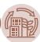

全面推进以 “平安、绿色、智慧、人文” 为核心的四型机场建设，对标世界一流、以科技为引领，完善体系、优化流程、提高效率，实现机场安全保障能力全面增强，数字化、智能化、绿色化水平大幅跃升，打造机场卓越运营标杆。

# 价值创造战略

通过持续创新和发展，提升两场商业资源的创利水平、开拓扩大非航业务领域、优化非航业务经营模式、拓宽机场投融资渠道，构建协同发展的“航空+”产业新生态，提升公司盈利能力，在保持公司长期稳定增长的基础上，实现企业价值最大化。

# 组织管控战略

全面贯彻市场化、专业化、法治化、数智化导向，以建设世界一流企业为目标，不断深化企业管理改革，增强制度体系、业务流程、资产管理和信息技术应用的创新能力，提升企业管理效率与抗风险能力。

# 和谐发展战略

以 “和谐发展” 为目标，充分发挥各级党群组织推动发展、服务群众、凝聚人心、促进和谐作用，为企业改革发展提供组织和思想保障。

# - 荣誉聚焦

<table><tr><td>奖项名称</td><td>获奖对象</td></tr><tr><td>2024年度浦东新区突出贡献奖</td><td>上海机场</td></tr><tr><td>中国航空运输协会三等奖—基于探识驱一体化的机场鸟击防范关键技术及应用</td><td rowspan="10">浦东机场</td></tr><tr><td>创新奖—浦乐GO、入境便利化服务创新、三立人服务生态管理模式</td></tr><tr><td>2025年CAPSE民航质量提升实践大赛金奖—缩短现场旅客客舱遗留物交付时间</td></tr><tr><td>2025年CAPSE民航质量提升实践大赛银奖—提升早高峰期间安检速率、提升隔油池浮油回收质效</td></tr><tr><td>“2025中国精益数智化创新大赛”全国三等奖—《数智化驱动航班全流程管控提升航空器运行效率》课题</td></tr><tr><td>民航机坪优秀管理案例—消防应急救援指挥视觉模拟系统、多跑道多航站楼机场TSAT优化关键技术与应用、航班地面保障节点视频分析项目</td></tr><tr><td>旅客满意度全球机场排名榜首</td></tr><tr><td>亚太地区连通性最佳机场第一名</td></tr><tr><td>“2025年度中国民用机场阳光助残志愿服务驿站”ACI“2024年度亚太地区4000万以上级最佳机场”奖</td></tr><tr><td>“年度国际机场”奖</td></tr><tr><td>民航科学技术奖二等奖—机场陆侧交通数智化管控与协同关键技术及应用</td><td rowspan="12">虹桥机场</td></tr><tr><td>2025机场智慧技术装备推广应用典型案例</td></tr><tr><td>智慧机场服务卓越奖</td></tr><tr><td>“AI领航杯”AI+交通运输赛道优秀奖</td></tr><tr><td>上海市减污降碳协同增效典型案例</td></tr><tr><td>上海市节能减排优秀示范案例</td></tr><tr><td>上海市2025年度市级“无废城市细胞”典型案例</td></tr><tr><td>CAPSE旅客满意度测评排名前三</td></tr><tr><td>2025年“全球五星机场奖”“中国最干净机场奖”</td></tr><tr><td>2024年度CAPSE最佳机场(千万级)年度大奖</td></tr><tr><td>2024年度中国民用机场服务质量评价“优秀机场”(1000万以上量级)</td></tr><tr><td>CAPSE民航质量提升先锋奖</td></tr></table>

# - 可持续发展（ESG）相关制度

上海机场以建设世界一流的全方位复合型国际航空枢纽，持续推动创建世界一流企业为目标，深入贯彻落实创新、协调、绿色、开放、共享的新发展理念，不断提升 ESG 管理水平，促进公司本身与全社会的协调、和谐发展。

公司已制定《环境、社会和治理（ESG）管理制度》，稳妥推进 ESG 各项工作开展，进一步推动可持续发展，持续提升治理能力、竞争能力、创新能力、抗风险能力和回报能力。报告期内，公司根据最新监管要求修订完善《ESG 工作实施方案》，进一步规范了治理架构与权责边界，明确了 ESG 责任落实机制。

在环境维度，针对环境保护、生态环境管理综合考核、节约能源及固定资产投资管理等实际领域，均建立了专项制度予以规范；在社会维度，各专项制度涵盖安全运行与应急保障、旅客服务质量、员工职业发展与激励、科技创新与人才奖励、供应链合规管理等实践领域；在治理维度，通过完善公司治理与董事会运作、合规与风险管理、组织绩效管理、数据安全与信息披露、公众沟通等机制，筑牢稳健经营基石。

# - ESG 专业技能和能力

公司持续优化上海机场 ESG 报告编制实践，按照上海市国资委、上海证券交易所等最新 ESG 监管要求，高度重视 ESG 综合及治理专业能力和队伍建设，在完善公司 ESG 管理制度体系与职能分工的基础上，积极推动各直属单位分别建立健全 ESG 工作推进机制。2025 年，上海机场先后参与了上海市国资委国企社会责任和 ESG 培训，中国上市公司协会 ESG 系列培训，上海证券交易所 ESG 报告编制等专题培训，通过系统性学习与行业对标，进一步开拓及提升了公司 ESG 治理、管理及实践等方面的视野和能力。

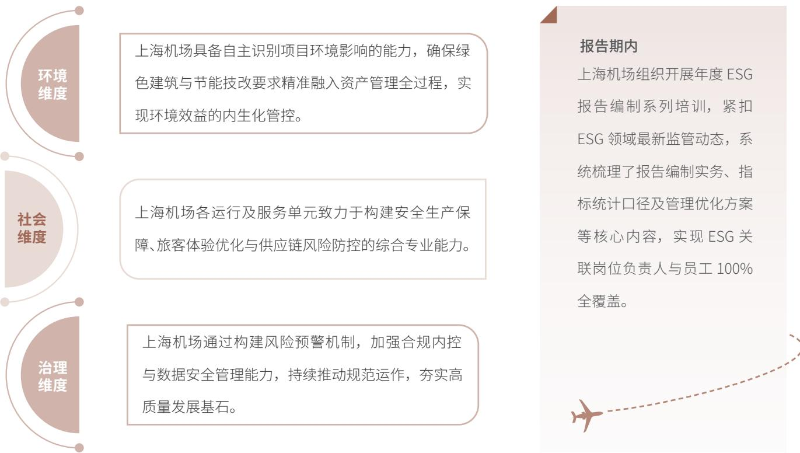

flowchart

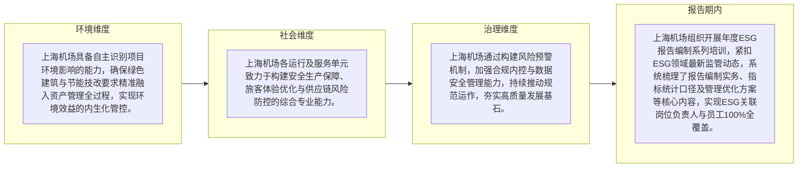
```mermaid
graph LR
  subgraph Environment_Review ["环境维度"]
    A1["上海机场具备自主识别项目环境影响的能力，确保绿色建筑与节能技改要求精准融入资产管理全过程，实现环境效益的内生化管控。"]
  end

  subgraph Social_Review ["社会维度"]
    B1["上海机场各运行及服务单元致力于构建安全生产保障、旅客体验优化与供应链风险防控的综合专业能力。"]
  end

  subgraph Governance_Review ["治理维度"]
    C1["上海机场通过构建风险预警机制，加强合规内控与数据安全管理能力，持续推动规范运作，夯实高质量发展基石。"]
  end

  subgraph Report_Review ["报告期内"]
    D1["上海机场组织开展年度ESG报告编制系列培训，紧扣ESG领域最新监管动态，系统梳理了报告编制实务、指标统计口径及管理优化方案等核心内容，实现ESG关联岗位负责人与员工100%全覆盖。"]
  end

  Environment_Review --> Social_Review
  Social_Review --> Governance_Review
  Governance_Review --> Report_Review
```

# 组织外部 ESG 培训

上海机场面向各利益相关方，围绕 ESG 相关领域开展专项培训与能力建设，共同提升 ESG 意识与管理水平。

# 浦东机场公司

为进一步优化营商环境，提升企业对商户监管工作专业度，特邀上海市市场监督管理局机场分局注册科及浦东监管所开展“市场监管视角的商户管理及现场监管”主题培训，通过案例分析与互动答疑，有效增强了公司在商户日常管理中的专业性与服务主动性。

# 虹桥机场公司

\- 为深入贯彻落实公司安全生产要求，持续筑牢航站楼安全用能防线，全面强化用能单位安全责任意识，组织召开了航站楼用户安全用能培训专题会议。专业技术人员为驻楼用户进行用能使用规范专项培训，对电气安全、污水处理、油烟排放、消防安全、管理界面界定与职责划分进行了宣贯，进一步提升重点区域驻楼用户的节能意识与规范化操作水平。

# 机场物流公司

\- 组织开展“凝心聚力，臻于至善”主题优秀服务案例交流培训活动，邀请机场海关、机场边检、东航物流、国货航、中远海运、中外运、PACTL、智汇港等单位负责人及服务条线业务骨干共同参与。

# - 具体业务考虑 ESG 要素

上海机场开拓新业务时，审慎评估项目对环境的潜在影响以及对社会的贡献度，确保新业务符合绿色发展理念，具有良好可持续发展前景，助力提升整体 ESG 绩效。

上海机场开展现有业务时，将 ESG 要素全面融入制度建设与流程管控，持续完善并落实固定资产投资项目、经营资源、招商、设施设备实物、不动产租赁等核心管理制度，在资源配置、招商遴选、租赁管理等关键业务环节统筹考虑环境、社会及治理要求，以制度化、规范化管理推动 ESG 理念与主营业务深度融合、协同落地。

# - ESG数字化建设

公司通过平台化、自动化等信息技术，优化 ESG 信息披露工作，提升 ESG 管理效率，控制 ESG 相关风险。

# 环境维度

建成上海机场智慧能碳管理平台，实现能源和碳排放管理与环境、航班、旅客等数据联动，进一步提升信息化管理覆盖范围及功能；强化信息化平台的应用，将废弃物监测数据纳入平台管理。

# 社会维度

推进旅客出行全流程监测系统应用，围绕旅客进港流程、行李提取环节提高旅客出行全流程数据的监测与应用，切实发挥数智监测在提高体验效率、管理效能的作用；推动服务管理数智模块建设，持续开展官方微信小程序、官网升级，推进浦东机场智能客服等项目落地，打通多系统数据运用；建设手推车智能管理系统，通过蓝牙定位与视频识别技术提升现场服务效能；推进 BI 数据场景建设，落地航班领域智能问数应用，赋能航班综合运控。

# 治理维度

法律纠纷案件管理和规章制度管理模块已开发完成嵌入OA系统，并在功能调试、系统界面、运行程序等方面进行了修改优化；依托数据治理项目，探索业财融合应用场景，顺利完成核心财务领域数据的标准化梳理与集成。

# 可持续发展相关信息报告

在董事会的领导下，上海机场构建了权责清晰、协同高效的 ESG 管理运行机制。公司由董事会战略委员会提供专业研究与指导，依托 ESG 报告编制领导小组及其办公室，实现了从监管决策部署到任务统筹落实的深度纵向贯通。各直属单位作为实践责任主体，将 ESG 管理要求深度嵌入日常运营全链条。

为确保管理闭环，公司建立了多层次的沟通汇报体系。各部门、各直属单位定期向公司管理层汇报 ESG 各领域工作重大进展；公司管理层不定期召开协调会议解决难点问题，统筹 ESG 报告标准并向董事会提交年度报告。

# 监督与考核机制

# - 合规管理体系

2025 年，上海机场以法治国企建设为引领，进一步完善管理机制，优化法务管理和合规运行，深化内控体系建设，扎实有序地推进各项工作，推动公司持续健康发展。

# 浦东机场公司

强化合同风控体系建设，制定《合同管理审查及使用指引》《合同监督及法律风险审核要点清单》，以标准化文本为基础，搭建事前审查、事中监督、事后追责的闭环机制，同步修订印发《合同管理办法》及《考核细则》，切实提升合同质量与权益保障水平；深化内控管理效能，建立常态化评价与监督检查机制，完成业务费（咨询费）后评估现场检查；针对新版内控手册21个流程、400余个风险点开展精准宣贯，推动内控责任向业务一线、基层岗位传导，健全全链条管理职责体系。同时，加快合规管理落地，完成环保领域合规体系建设试点调研报告及工作计划，优化合规规范清单、制定管理手册；顺利通过质量、环境、职业健康安全管理体系外审；规范作业标准管理，推进岗位作业标准编制、修订、培训、监管等全流程工作，以标准化建设夯实管理根基；完善外包单位作业监管机制，排查并建立外包作业标准800余项。

# 虹桥机场公司

着力加强合规治理，将合规要求嵌入制度和流程，新增和修订规章制度24项，废除制度8项，制定颁布《规章制度管理规范指引》，开展法律咨询服务70余次，试点公司律师自行出庭代理案件，融合前沿AI技术试点扩大“虹小查”系统应用；以标准化建设推动治理效能提升，围绕精品卫生间规划建设及运行、一线岗位班前会、商户施工等编制多项示范性标准，《机场周围民用航空器噪声自动监测系统建设与运行维护技术规程》完成专家评审，推动ESG管理理念融入公司治理体系。

# 机场物流公司

全面构建合规管理体系，制定《合规管理规定》，建立健全合规管理制度，成立合规委员会，完善合规管理组织架构，明确合规管理责任，加强合规文化建设，有效防控合规风险，确保依法合规经营。合规管理涉及安全生产运行、市场交易、工程建设和环境保护、劳动用工、知识产权、商业伙伴、员工行为规范和舆情监测、反腐败及反商业贿赂等重点领域。

# - 风险管理体系

2025 年，上海机场持续完善重大风险防控工作，围绕 “早发现、早预警、早暴露、早处置” 目标导向，根据《企业内部控制基本规范》《企业内部控制评价指引》等有关规定，强化风险管理，组织完成年度全面风险预警指标区间优化意见的征集与反馈，结合风险预警相关指标，定期开展风险排查和风险处置等工作。

上海机场内部控制管理部门是风险管理的归口管理部门，指导、协调各部门和各直属单位开展风险管理工作，组织开展风险识别、实施风险评估、审核风险清单、应对预案，对风险数据库进行日常维护等工作。

# 审计管理体系

上海机场深入贯彻习近平总书记关于内部审计工作的重要指示精神，严格遵循《中华人民共和国审计法》《中国内部审计准则》《审计署关于内部审计工作的规定》《上海市国有企业内部审计管理办法》等管理规定，全面落实审计工作总体部署。2025年，公司内部审计机构锚定经济监督定位，强化政治引领与专业赋能，精准执行审计计划，一体推进问题揭示、整改落地与成果转化，不断健全审计监督长效机制，以完善体制机制为根基，以提升审计精准性和穿透性为抓手，统筹推进各类审计项目，持续放大审计监督效能，有力支撑公司高质量发展。

# - 管理层薪酬同 ESG 绩效挂钩

上海机场通过构建科学全面的薪酬管理体系，持续推进绩效考核管理，结合年度财务状况、经营成果、安全生产和服务质量等目标的综合完成情况，对高级管理人员进行绩效考核与绩效工资分配。A股限制性股票激励计划《实施考核办法》与《实施管理办法》形成了良好均衡的价值分配体系，充分调动相关人员的工作积极性，促进公司业绩稳步提升，确保公司发展战略和经营目标的实现。

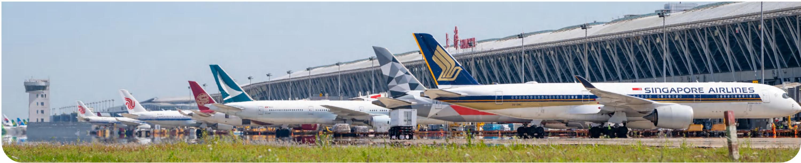

natural_image

Row of Singapore Airlines aircraft parked at an airport terminal with modern glass building and visible signage (no readable text on aircraft or surroundings)

# 02

# 环境维度

- 应对气候变化  
- 污染物排放  
- 废弃物处理  
- 环境合规管理  
- 生态系统和生物多样性保护  
- 能源利用  
- 水资源利用  
- 循环经济

上海 SHANGHAI

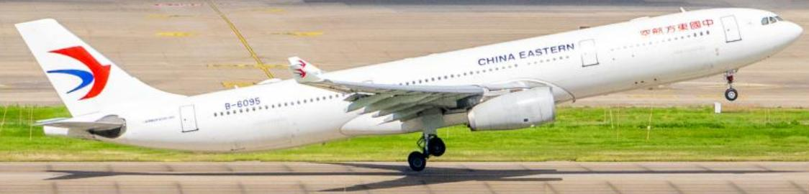

natural_image

White China Eastern Airlines aircraft on tarmac with visible tail and landing gear (no signage or text beyond branding)

# 应对气候变化

面对全球气候变化挑战，上海机场始终将应对气候变化作为企业可持续发展的核心议题。公司深入贯彻国家“双碳”战略目标，积极响应民航局绿色发展要求，识别出实体风险与转型风险对机场运营的潜在影响，构建起“决策层—管理层—执行层”三级治理架构。由高级管理层统筹气候战略，各直属单位相关部门协同推进减排举措，专业团队负责数据监测与绩效评估，为气候行动的系统性、规范化开展提供坚实支撑。

# - 治理

在气候变化相关的信息报告与监督工作中，上海机场各直属单位遵循统一管理体系，同时进一步完善各自工作机制，以《上海机场绿色机场创建总体工作方案》为根本依据开展核心设计与运营工作，通过制度化、平台化的流程，推动战略目标落地执行并实现闭环管理。在制度遵循上，上海机场严格落实《“十四五”民航绿色发展专项规划》《上海市碳排放管理办法》及《上海机场绿色机场创建总体工作方案》等相关要求，积极落实能源和碳排放管理相关内部制度，制定《浦东机场能源和碳排放统计分析管理细则》《浦东机场碳排放与碳资产管理细则》《绿色低碳绩效实施细则》等能碳综合管理文件，以更系统性的整合手段对能源和碳排放制度管理双把控。

# - 组织架构

为推进气候相关战略及风险管理，上海机场已初步建立气候变化治理架构，通过不断夯实治理根基、强化管理力度，提升执行层面的有效性。各直属单位均明确能源与碳排放主管部门及专职岗位，相关工作人员均具备应对气候变化和能源利用相关的专业管理能力。

flowchart

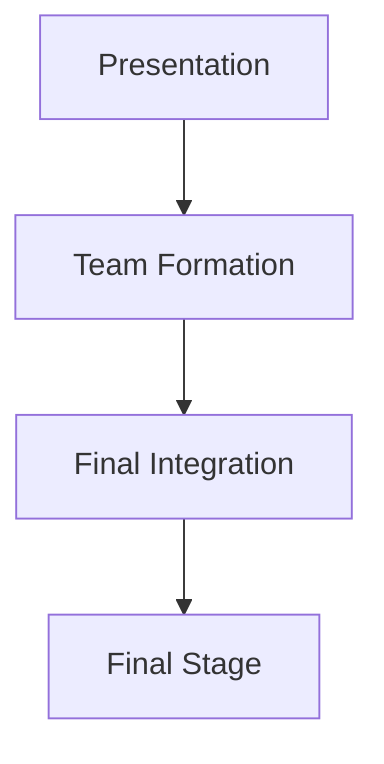
```mermaid
graph TD
  A["Presentation"] --> B["Team Formation"]
  B --> C["Final Integration"]
  C --> D["Final Stage"]
```

# 管理层

# 各直属单位能源和碳排放管理工作小组

审议气候变化及能源利用的战略与目标，审批相关重大项目，并持续监督执行情况。

拟定气候变化及能源利用领域重要决策文件，包括节能降碳相关规划计划、年度能源目标与考核指标、年度碳交易总体策略等；统筹策划能源审计、节能技术改造等重点工作。各直属单位均指定一名公司级领导担任能源和碳排放管理工作最高负责人。

作为应对气候变化及能源利用工作的责任主体，按照职责分工和工作要求明确对口管理部门，完善内部相应管理组织架构；组织、协调并推进节能降碳重点工作实施，包括光伏项目建设、新能源车辆推广、节能技术改造项目等，并承担相应分解考核指标。

# 各直属单位相关部门

# - 信息报告

浦东机场、虹桥机场分别以智慧能碳平台、能源管理平台为数据支撑，建立分级分类、常态化的信息流转机制，通过定期召开工作会议，推动治理架构各层级职责明晰、高效协同，保障关键信息及时传递并有效落地应用。

# 平台化数据报告

针对具体碳排放及能源数据，通过智慧能碳管理平台进行 7\*24 小时的在线数据采集与监测。平台可生成可视化看板、趋势分析及预警报告，是日常管理最基础、最直接的信息来源。

# 结构化会议报告

定期召开绿色机场例会，相关责任主体就目标进展、风险应对等情况进行专项汇报，供管理层审议决策。

# 正式书面报告

基于当年实际数据，定期编制节能降碳工作总结，作为正式汇报和内部存档的依据；针对重大气候事件（如启动防汛防台应急响应）、关键项目节点或政策变化等情况，及时编制专项分析报告。

# 日常监督

公司将碳指标、能源指标纳入各单位年度绩效考核，以内部绩效考核为重要抓手，以内部控制为合规支撑，构建嵌入日常运营的多层次监督体系，并依托动态考核机制及时识别薄弱环节、推动优化提升。通过定期复盘与经验分享，形成“监测—评估—改进”的良性循环，助力各项节能降碳措施稳步落地、持续见效。

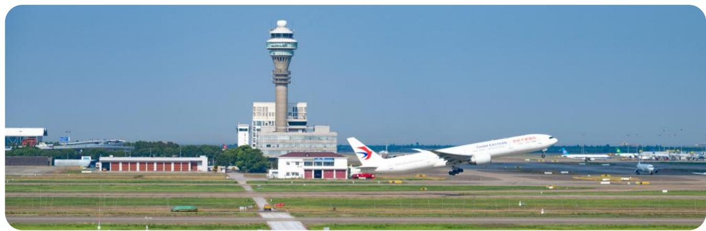

natural_image

Exterior view of a commercial airplane on an airport tarmac with a control tower in the background (no signage visible)

# - 战略

上海机场遵循“双碳”目标，基于业务现状与减碳潜力，制定了中长期减碳目标。浦东机场公司计划在2030年实现碳达峰，规划“十五五”期间光伏装机规模达100MW；虹桥机场公司以2019年碳排放量作为历史总峰值。同时，各直属单位依据应对气候变化风险战略目标，对各减碳目标阶段的战略目标贡献度进行分解，保障减碳目标的可评估、可追溯、可实现。

<table><tr><td>风险类型</td><td>风险名称</td><td>对业务影响</td><td>对财务影响</td><td>影响时间范围</td><td>影响程度</td><td>应对举措</td></tr><tr><td rowspan="5">转型风险</td><td rowspan="2">政策变化</td><td>全球“双碳”法规不断新增、更新与细化,合规要求逐渐收紧</td><td>合规与碳履约成本增加</td><td>短中长期</td><td>中</td><td>积极关注行业政策变化,及时响应可能的政策更新。</td></tr><tr><td>碳资源紧缺推高碳价</td><td>· 碳价上涨,碳市场履约成本提高· 机场上下游企业物流成本升高,导致机场运营和采购成本也相应提高</td><td>中期</td><td>中</td><td>在“高碳价情景”下,机场现有能源利用战略仍可通过逐年提升光伏装机,保持用能成本可控,计划“十五五”期间,浦东机场公司光伏装机规模达100MW</td></tr><tr><td>供应链要求</td><td>国际认证需求,如机场物流公司通过IEnvA、CEIV等认证,提升在全球绿色供应链中的竞争力</td><td>需在环保技术和管理体系上进行持续性的专项认证投入</td><td>中期</td><td>中</td><td>· 建立绿色供应链体系,提升国际竞争力· 引导合作方升级环保管理体系</td></tr><tr><td rowspan="2">服务及产品需求</td><td>高端物流解决方案(如跨境电商、冷链)的竞争压力,能够提升市场竞争力与品牌价值</td><td>需要业务升级投入</td><td>长期</td><td>中</td><td>发展绿色货物处理与高端冷链方案</td></tr><tr><td>绿色、可持续货物处理服务,如零碳物流等</td><td>需要业务升级投入</td><td>长期</td><td>中</td><td>发展环保制冷、废弃物循环管理等技术</td></tr></table>

<table><tr><td>风险类型</td><td>风险名称</td><td>对业务影响</td><td>对财务影响</td><td>影响时间范围</td><td>影响程度</td><td>应对举措</td></tr><tr><td rowspan="6">实体风险</td><td rowspan="4">极端天气,如雨雪、台风、洪涝等</td><td>航班延误、调减或取消,影响航班正常率,造成旅客滞留,增加机场客流压力和周边地面交通压力</td><td>需要缓解旅客滞留情况,缓解地面交通压力,运营成本增加投入资金用于应急抢险、设施加固和预案演练</td><td>中长期</td><td>高</td><td>制定极端天气应急方案,平时定期展开应急演练开展防汛工程搭建信息平台,实现对极端天气的预测和及时响应</td></tr><tr><td>地面基础保障设施受损,影响航班起降和地面交通</td><td>固定资产损失运营成本增加</td><td>中长期</td><td>高</td><td>关注机场重要设施资产并配置保险制定极端天气应急方案,平时定期展开应急演练</td></tr><tr><td>影响航空物流:如影响机坪货物装卸,影响仓储安全,货站运营受阻、货物损毁</td><td>保险费用成本增加运营成本增加</td><td>中期</td><td>高</td><td>货站仓储与设施智慧化:上线空运通、天运通等信息化平台,融入5G、大数据和人工智能技术,大幅提升处理能效、操作协同性与运营可靠性</td></tr><tr><td>员工通勤受阻</td><td>人力成本增加</td><td>短中期</td><td>低</td><td>及时发布预警安全提示,调整员工工作方案</td></tr><tr><td>大雾、沙尘暴等</td><td>影响能见度致航班受限</td><td>运营成本增加</td><td>短中期</td><td>低|中</td><td>制定低能见度情况的工作机制</td></tr><tr><td>生物多样性</td><td>生态保护要求影响扩建,也可能影响鸟类栖息和迁移路线,从而引发鸟击事件</td><td>项目审批周期延长,运营成本变高生物多样性专项工作投入增加</td><td>中长期</td><td>高</td><td>规划中纳入生态避让措施</td></tr></table>

# - 影响、风险和机遇管理

上海机场建立健全气候变化风险管理流程，并将气候风险管理全面融入企业风险管理体系，确保在应对气候变化带来的挑战时，能够及时、有效地采取针对性应对策略。

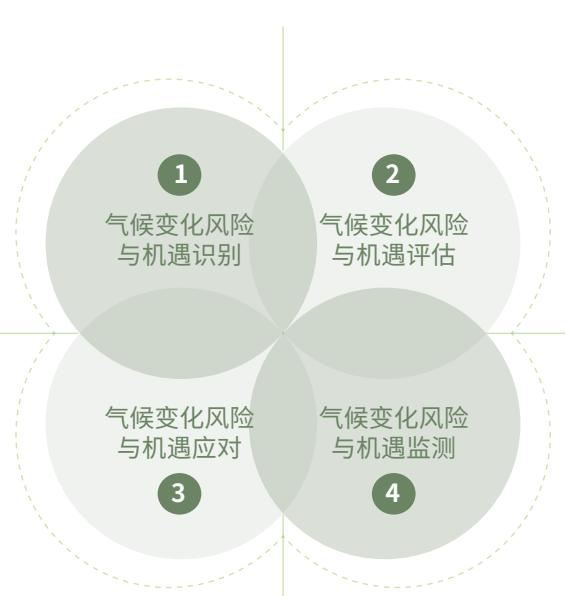

flowchart

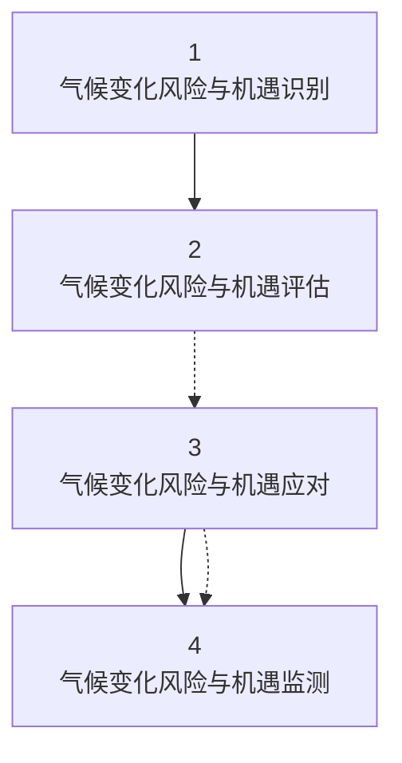
```mermaid
graph TD
  A["1\n气候变化风险与机遇识别"] --> B["2\n气候变化风险与机遇评估"]
  C["3\n气候变化风险与机遇应对"] --> D["4\n气候变化风险与机遇监测"]
  B -.-> C
  C -.-> D
```

1 收集长三角气象及“双碳”政策资料，识别极端天气导致的运营风险（航班延误、成本上升），以及绿色低碳转型带来的业务机遇。将识别结果梳理为包含发生概率、影响范围的清单。  
2 联合民航、能源等多领域专家，运用风险矩阵对识别出的气象风险进行优先级排序（重点关注台风、强对流天气等）；同时评估低碳转型的商业价值与实施可行性，确保相关举措贴合航空枢纽运营实际。  
3 风险应对：提升航站楼、跑道等基础设施的抗灾韧性，优化应急调度机制，推进光伏等清洁能源应用，推动供应链多元化发展。  
- 机遇把握：布局地面设备电动化与绿色低碳建筑，开发绿色出行套餐等低碳产品，提升品牌竞争力。  
4 建立常态化监测机制，跟踪区域气候趋势与政策变化。定期回顾防灾抗灾能力、能源转型进度及低碳业务成效，动态优化管理路径，保障机场长期可持续运营。

<table><tr><td>机遇类型</td><td>机遇名称</td><td>对业务影响</td><td>对财务影响</td><td>影响时间范围</td><td>影响程度</td><td>应对举措</td></tr><tr><td rowspan="2">“双碳”政策</td><td>政策支持</td><td>获得政策、技术、资源等方面的支持</td><td>浦东机场获交节能减排专项扶持资金92.6万元</td><td>短期</td><td>中</td><td>关注政策走向,申报并落地减排项目</td></tr><tr><td>合作航司增加</td><td>满足部分航司对下游产业链低碳运行要求</td><td>未来吸引更多合作航司</td><td>中期</td><td>中</td><td>· 碳排放管理常态化机制· 合规信息收集数字化工具、报告与分析常态化机制</td></tr></table>

# - 指标与目标

上海机场严格依据《中国民用航空企业温室气体排放核算方法和报告指南（试行）》核算碳排放数据，每年按要求参与全国温室气体排放报告与核查工作，由第三方专业机构对碳排放数据进行核查与验证，并按时完成履约工作。2025年，上海机场气候变化相关指标的目标达成情况如下：

<table><tr><td colspan="2">指标</td><td>浦东机场</td><td>虹桥机场</td></tr><tr><td rowspan="2">单位旅客吞吐量碳排放(tCO2e/万人次)</td><td>目标</td><td>21.42</td><td>10.61</td></tr><tr><td>达成情况</td><td>已完成</td><td>已完成</td></tr><tr><td rowspan="2">累计光伏建设规模(MW)</td><td>目标</td><td>44.00</td><td>5.35</td></tr><tr><td>达成情况</td><td>已完成</td><td>已完成</td></tr><tr><td rowspan="2">可再生能源利用率(%)</td><td>目标</td><td>6</td><td>22</td></tr><tr><td>达成情况</td><td>已完成</td><td>已完成</td></tr></table>

# - 实践举措

# 案例

# 清洁能源

2025 年，上海机场在能源结构转型方面成效显著，持续推动光伏项目规模化建设。

阳光赋能，打造国内民航“首位”分布式光伏矩阵

# 浦东机场公司

- 依据《光伏项目建设专项规划》《充电桩建设专项规划》等文件，持续扩大光伏布局，推动光伏规模化发展。近年来，先后完成 P4 停车库屋顶光伏试点及捷运基地、查验中心及一、三跑道北侧区域二期的光伏并网发电，实现浦东机场公司光伏总装机容量达 52.38MW，年减碳能力约 2.9 万 tCO₂e，跃居国内民用机场首位。可再生能源占比由 5% 升至 7.74%，显著提升绿色电力自给率。2025 年，浦东机场光伏发电量超 2,485 万 kWh，节约用电成本 700 余万元。  
- 统筹推进环保设施升级，优化充电桩整体布局，在空侧、陆侧更新及增补充电桩共168根。

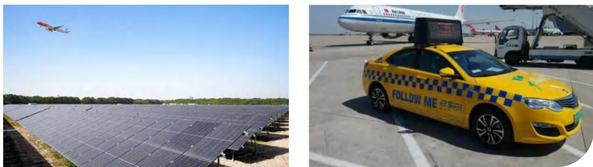  
浦东机场一、三跑道北侧二期分布式光伏发电项目

# 案例

# 虹桥机场公司

虹桥机场公司聚焦能源结构转型，持续加大光伏项目建设力度，先后完成 P16 停车场、西区市政管理大楼及特种车库、北泵站、航空业务楼、总部办公楼等光伏项目并网，同步推进南调节水池光伏项目建设，光伏总装机容量达 5.42MW。虹桥机场公司持续推动光伏、绿电等多种可再生能源利用在机场的综合应用，可再生能源占比达到 24%。

- 虹桥机场 P16 停车场、西区市政管理大楼及特种车库、北泵站光伏项目已并网至虹桥机场零碳办公实践区，每年可实现发电量约 140 万 kWh，预计可节约用电成本 48 万元，降碳约 $588\mathrm{tCO}_{2}\mathrm{e}$ ，提高虹桥机场总体可再生能源利用率 $1.5\%$ ，助力零碳办公实践区实现区域办公用电自发自用目标。  
- 新增空侧充电桩 16 个、新能源车辆 11 辆，充电设施布局得到进一步优化。  
“上海虹桥机场既有航站楼绿色建筑项目”获市节能减排优秀示范案例（第三批）

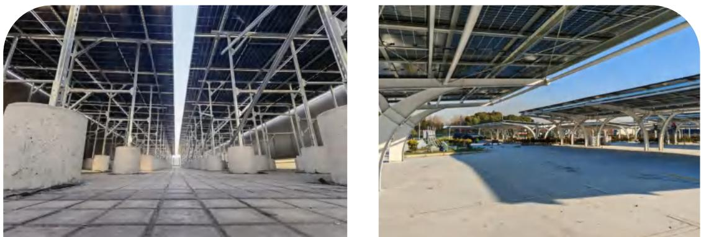

# 机场物流公司

机场物流公司落地首个“联邦快递分布式光伏发电项目”，安装 BIPV（光伏建筑一体化）光伏车棚，车棚顶部光伏面板总面积约 $4000 \, m^{2}$ ，装机容量约 757KWp，采用“自发自用、余电上网”模式，年均发电量约 70 万 kWh，年均二氧化碳减排量可达 $430tCO_{2}e$ ，助力货运区绿色能源高效利用与低碳转型。同时，新能源非道路移动机械投入方面，机场物流公司持续推进非道路移动机械新能源化。

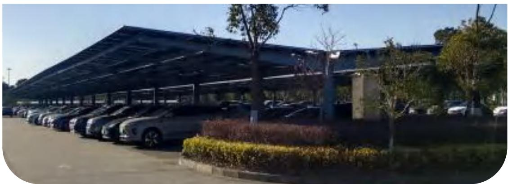

natural_image

Exterior view of a modern multi-level parking lot with parked cars and trees under clear sky (no signage or text visible)

# 报告期内

清洁能源使用量 7,335.86 吨标准煤 $^{1}$ ，清洁能源消耗量占比 10.66%

$^{1}$ 包含光伏、光热、地源热泵和绿电等清洁能源。

natural_image

Simple line drawing of an airplane flying along a dashed curved path (no text or symbols)

# 认证成效

上海两场均荣获首批“双碳机场”最高等级四星级机场评价。2025年，浦东、虹桥机场公司通过中国民用机场协会年度“双碳机场”四星级评价符合性审查。

浦东机场  
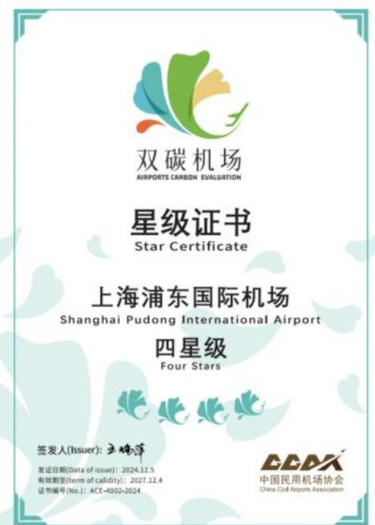

text_image

双碳机场
AIRPORTS CARBON EVALUATION
星级证书
Star Certificate
上海浦东国际机场
Shanghai Pudong International Airport
四星级
Four Stars
签发人(Issuer): 王艳萍
发证日期(Data of issue): 2024.12.5
有效期(term of validity): 2027.12.4
证书编号(No.): ACE-4002-2024
CCDX
中国民用机场协会
China Civil Airports Association

虹桥机场  
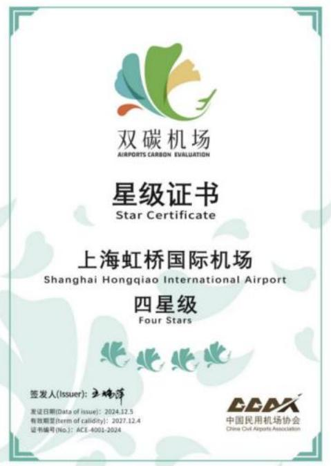

text_image

双碳机场
AIRPORTS CARBON EVALUATION
星级证书
Star Certificate
上海虹桥国际机场
Shanghai Hongqiao International Airport
四星级
Four Stars
签发人(Issuer): 王晓萍
签证日期(Data of issue): 2024.12.5
有效期至(term of validity): 2027.12.4
证书编号(No.): ACE-4001-2024
CCDX
中国民用机场协会
China Civil Airport Association

# 认证成效

2025 年，浦东机场公司实施环境、能源、碳三体系同步外审，顺利取得新一轮 ISO 50001 能源、ISO 14001 环境、中国认证认可协会 (CCAA) 碳管理体系认证。虹桥机场公司完成中国认证认可协会（CCAA）碳管理体系首次认证，并顺利通过 ISO 50001 能源、ISO 14001 环境、EATNS 体系复审，成为国内首个能源、环境、CCAA+EATNS 碳管理四体系认证的机场，实现“能 - 碳 - 环”三维一体体系。

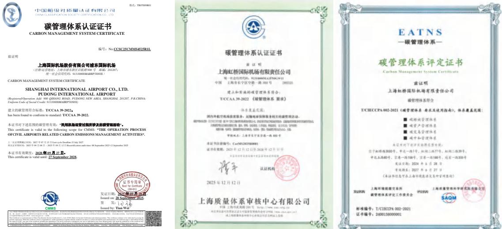

中国船级社质量认证有限公司
CHINA CLASSIFICATION SOCIETY CERTIFICATION CO., LTD.

格式：TR07009R01

# 碳管理体系认证证书

CARBON MANAGEMENT SYSTEM CERTIFICATE

编号：No. CCSC25CMMS4525R1L

兹证

# 上海国际机场股份有限公司浦东国际机场

号运营地址：上海市浦东新区后航路900号 邮编
统一社会信用代码：91310000MABRP58N0X

CARBON MANAGEMENT SYSTEM CERTIFICATE

# SHANGHAI INTERNATIONAL AIRPORT CO., LTD. PUDONG INTERNATIONAL AIRPORT

PUDONG INTERNATIONAL AIRPORT
(Registered/Operation Add: 900 QIHANG ROAD, PUDONG NEW AREA, SHANGHAI, 201207, P.R.CHINA; Uniform Code of Social Credit: 91310000MABRP58N0X)

建立的碳管理符合标准：T/CCAA 39-2022。

has been found to conform to standard: T/CCAA 39-2022.

本证书对下述范围的碳管理有效：\*民用机场运营过程所涉及的碳管理活动\*。

This certificate is valid to the following scope for CMMS: \*THE OPERATION PROCESS OF CIVIL AIRPORTS RELATED CABBON EMISSIONS MANAGEMENT ACTIVITIES\*.

上一认证周期截止时间：2027年07月15日（Last cycle Drilling:15 July 202

得试证审核时间：2023年09月08日-2023年09月12日Waldorfson limit limit of September 2023-12 September 2023

本证书有效期至：2028年09月27日。This certificate is valid until: 27 September

浦东机场公司

CCAA 碳管理体系认证证书

虹桥机场公司

CCAA、EATNS 碳管理体系认证证书

2025 年，机场物流公司成功获得两项关键国际资质，深化了与 MSC Air Cargo、汉莎货运等国际高端客户的合作关系，进一步提升市场核心竞争力。

\- 机场物流公司下属货运站公司成功通过国际航空运输协会（IATA）的环境评估认证（IEnvA），成为中国内地首家获此全球认证资质单位。作为一份国际通用的“绿色证明”，获得IEnvA认证将更好地助力国内外客户满足全球供应链的环保要求，为国际供应链的低碳运行提供了坚实的绿色保障。

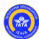

# Certificate of Registration

The International Air Transport Association (IATA) hereby certifies that

# Shanghai Pudong Int'l Airport Cargo Terminal Co., Ltd. (PACTL)

Shanghai, China (People's Republic of), PVG

has been successfully registered as an IATA Environmental

Assessment (IEIVA) Organization, under the following IEIVA Standards

Environment - In accordance with the Requirements of ISO 14001.2015

For the following activities:

Corporate Revenues: Cargo Handling and Equipment Preparation, Maintenance

Willie Walsh

Director General, IATA

Certification ID: ENVA-0009-IE-2025

Issue date: 22 January 2026
Expiration date: 22 January 2028

This document has been issued as a ceremonial certificate as of the date of

tissue and does not constitute conclusive proof of certification and good standing.

Official certification status is found on IATA ONE Source at https://prosecutors.info.org

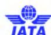

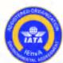

# Certificate of Registration

The International Air Transport Association (IATA) hereby certifies that

# Shanghai Pudong Int'l Airport Public Cargo Terminal Co., Ltd. (West)

Shanghai, China (People's Republic of), PVG

has been successfully registered as an IATA Environmental

Assessment (IENVA) Organization, under the following IENVA Star

Environment - In accordance with the requirements of ISO 14501.2015

For the following activities

Corporate Network: Cargo Handling and Equipment Preparation, Maintenance

Willie Walsh

Director General, IATA

Certification ID: ENVA-0009-E-2026

Issue date: 22 January 2026
Expiration date: 22 January 2026

This document has been issued as a ceremonial certificate as of the date of

issue and does not constitute conclusive
impact of verification and approval strategies

Official certification status is found on IATA ONE. Source at https://wwwsource.lata.org

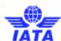

# 案例

# 绿色低碳实践——零碳办公示范区建设

虹桥机场公司积极响应国家“双碳”目标，率先打造零碳办公实践区，形成可在行业内复制的绿色机场样板。实践区涵盖光伏发电系统、储能充电设施及雨水回用装置等，构建了集清洁能源生产、高效利用与资源循环为一体的低碳办公场景。

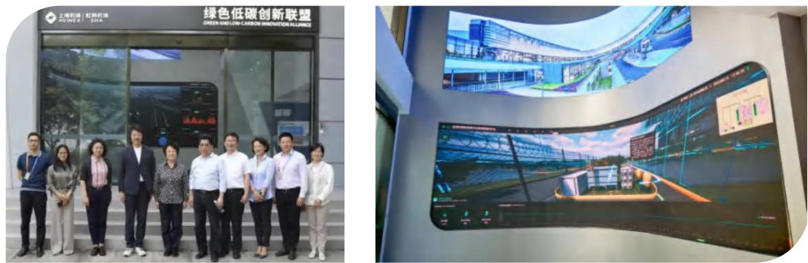

温室气体排放绩效 $^{2}$

# 报告期内

上海机场温室气体排放统计采用排放因子法，遵循《中国民用航空企业温室气体排放核算方法和报告指南（试行）》，规范开展温室气体数据统计、核算与信息报告工作。

温室气体排放总量 232,807.05tCO₂e

单位客货运 $^{3}$ 温室气体排放总量12.55tCO $_{2}$ e/万人次 温室气体排放强度174.44kgCO $_{2}$ e/万元

范围一 $^{4}$ 25,166.80tCO $_{2}$ e

范围二 $^{5}$ 207,640.25tCO $_{2}$ e

温室气体减排资金投入 $^{6}$ 9,327.71万元

温室气体减排量 $^{7}$ 1.93万 tCO $_{2}$ e

$^{2}$ 数据统计与全国碳排放核查口径一致。  
$^{3}$ 根据《“十四五”民航绿色发展专项规划》（民航发〔2021〕54号），机场单位旅客吞吐量是指单位折算旅客吞吐量，即旅客吞吐量与货邮吞吐量按每旅客90千克折算后相加。  
$^{4}$ 包含天然气、汽油、柴油，对应碳排放因子系数均参考《民用机场温室气体排放核算技术指南》TCCAATB 0066—2024。  
$^{5}$ 包含外购电力，不含光伏电量、转供蒸汽。电力碳排放因子系数参考《关于发布 2023 年电力二氧化碳排放因子的公告》中最新数据（0.5306tCO $_{2}$ e/kWh）。  
$^{6}$ 温室气体减排资金投入口径为环保投入中的大气污染防治分项，具体包含节能减排、绿电采购、光伏项目、桥载设备和新能源车辆采购等。  
$^{7}$ 温室气体减排量统计口径为光伏、节能技改等项目。

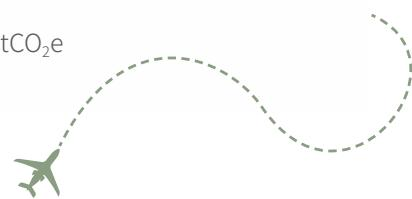

chemical

Simple chemical formula and airplane icon representing CO₂e

# 污染物排放

上海机场高度重视大气与水体污染防治工作，坚持源头防控、过程管控、末端治理相结合的综合管理策略。公司遵循《大气污染防治法》《水污染防治法》等相关法规要求，实现污染物稳定达标排放。结合机场运营特点，公司重点管控航空煤油挥发、餐饮油烟、车辆尾气、建筑施工扬尘等主要污染源，制定差异化管控措施。通过搭建环境监测网络，推行在线监控与人工巡检相结合的监管模式，实现对污染物排放的全方位、全过程管控。同时，公司注重提升全员环保意识，定期开展环保培训与宣传活动，推动全员养成绿色作业习惯，从源头减少污染产生，致力实现经济效益与环境效益的协调统一。

# - 管理体系及目标

上海机场持续做好各项污染源的管控，使其达到环境质量标准和污染物排放标准，对废水、废气等污染物展开管控。2025年，浦东机场围场河年均水质稳定达到III～IV类，虹桥机场围场河年均水质稳定保持IV类。2025年，上海机场持续健全废气监测与管理体系，实现氮氧化物（ $\mathrm{NO}_{\mathrm{x}}$ ）、硫化物（ $\mathrm{SO}_{\mathrm{x}}$ ）、颗粒物（PM）等污染物稳定达标排放。报告期内，未发生因污染物排放受到的重大行政处罚或被追究刑事责任的事件。

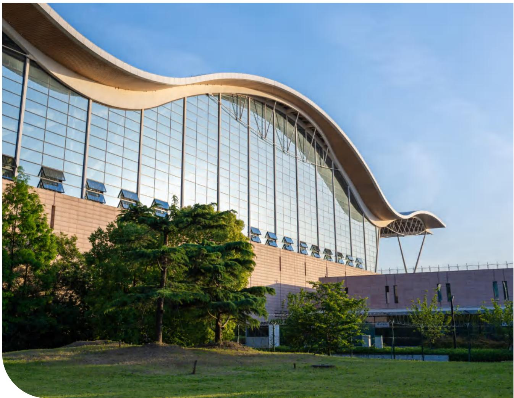

natural_image

Exterior view of a modern glass building with curved roof and surrounding greenery under a clear blue sky (no signage or text visible)

# - 实践举措

# 废水减排

上海机场结合浦东、虹桥两场的水文特征与运营实际，明确水污染源头减量、过程监控、末端治理的全流程管理要求，细化雨污分流、在线监测及异常响应机制，为机场水环境精细化管理提供可落地的制度保障，助力实现年度水质达标与水资源循环利用目标。

# 浦东机场公司

依托雨污混排治理工作领导小组，与各驻场单位协同配合，保障分流制排水系统高效运行；常态化开展雨污混接排查工作，定期对餐饮废水、污水总排口水质进行检测。  
- 对浦东机场湿垃圾处置中心的排水开展“压力测试”跟踪检测，确保处置中心在高处理量工况下，废水、臭气排放均能稳定达到标准要求。  
“机场之眼”数字化监测，守卫水环境生态底线

浦东机场公司创新打造“机场之眼”环境在线监测系统，自2020年投用以来，已实现超43,800小时的稳定监测。该系统通过分布在枢纽各处的10个环境监测站，实现了对地表水质、空气质量及噪声水平的全天候、高频次感知。依托“感知—预警—行动”的智慧化路径，环境管理实现了从“事后响应”向“事前预防”的根本性转变。

# 虹桥机场公司

- 定期对航站楼（污水总排口、油烟排口、隔油池排口）、排水泵站（雨水排口、有组织排放及无组织排放气体）、地表水（围场河、调节水池）、暖通（锅炉废气、锅炉排污、冷机冷冻水及冷却水、噪声）等进行人工采样监测。  
- 在急救站洗手池下方新增废水处理装置，并由专业团队对废水预处理设施开展定期维护与清理工作。

# 报告期内

本公司废水 $^{8}$ 排放总量 823.57 万立方米，废水排放强度 6.17 万立方米 / 万元

废水污染物 $^{9}$ 排放浓度均达标：

1.78 吨

氨氮（NH₃-N）

13.86 吨

总氮 (TN)

0.48 吨

总磷 (TP)

8 包括上海机场用于生产经营、办公活动的废水排放总量。  
$^{9}$ 废水污染物排放口径为浦东机场公司。

# 大气污染减排

# 浦东机场公司

依据《浦东机场大气环境管理细则》，定期开展现场检查，督促相关单位做好扬尘污染防治工作。

# 虹桥机场公司

- 油烟净化器油烟废气检测每年 1 次，垃圾房臭气检测每年 1 次。  
- 依据《上海市餐饮业大气污染防治办法》相关要求，通过加装13米排风管等工程手段，确保油烟排放合法合规，有效降低周边环境影响。

环境监测全覆盖与 APU 设施替代

虹桥机场公司针对航空器 APU 高污染、高排放问题，通过硬件设备更新、桥载监控系统建设等技术手段，创新引入“计件制”管理方式，提升桥载 APU 替代设施的使用效能，桥载电源使用率接近 100%，年减少 APU 开启时间 20 万小时，显著降低航空器停靠阶段的氮氧化物、噪声污染及碳排放，实现减污降碳协同治理。

2025 年，虹桥机场公司凭借 “桥载设备替代航空器 APU 的应用” 蝉联上海市减污降碳协同增效典型案例（第二批）。

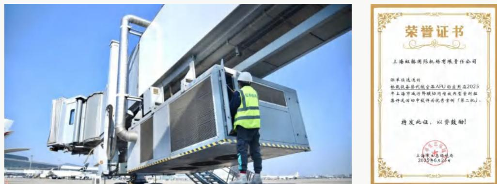

# 机场物流公司

聚焦货运区绿色低碳转型,有序推进非道路移动机械新能源化替代,同步配套建设充电设施,显著降低柴油消耗与尾气排放,为高端客户提供符合国际绿色供应链要求的作业环境,进一步巩固上海机场在航空物流低碳领域的行业领先地位。

# 噪声、辐射、光污染减排

上海机场坚持 “预防为主、综合管控” 的原则，建立噪声、辐射与光污染的常态化监测及台账管理机制，结合飞行区与航站楼的运营特点优化设备布局与作业时间，确保各项指标符合环保法规要求并兼顾旅客体验。同时，在两场分别开展专项降噪与光环境提升行动，实现安全运营与生态友好的兼顾。

# 浦东机场公司

按照排污许可要求，做好厂界噪声的定期检测；按照民航局设备管理规定，定期对 X 射线安全检查设备进行检测。针对其他污染源，虹桥机场公司实行噪声实时监控和台账记录机制，定期开展辐射设备的检测、维护，确保不产生放射性污染。涉及辐射安全相关设备均属于豁免管理范畴，并定期对设备开展检测，确保安全。

# 虹桥机场公司

参与制定《机场周围民用航空器噪声自动监测系统建设与运行维护技术规程》等团体标准，将技术创新与生态环保、运营品质深度融合，彰显出在民航行业技术标准建设中的主动引领与专业担当。

# 报告期内

废气 $^{10}$ 排放总量 12,327.38 万立方米，废气排放强度 92.37 立方米 / 万元

氮氧化物（NO $_{x}$ ）3.01吨

颗粒物（PM）0.10吨

硫氧化物（ $\mathrm{SO}_x$ ）、挥发性有机物（VOCs）0吨

# 废弃物处理

上海机场秉持 “减量化、资源化、无害化” 原则，严格遵循《固体废物污染环境防治法》等法规要求，针对机场废弃物产生量大、品类多的特点，实施精准分类管理。公司创新打造馨管家回收驿站、湿垃圾就地处置中心等特色设施，持续提升废弃物资源化利用水平。同时，通过技术创新与管理优化，持续挖掘减废潜力，推动废弃物产生强度稳步下降。

# - 管理体系及目标

公司积极落实固体废物管理细则等相关文件要求，构建覆盖分类投放、收集、运输、处置的全流程规范化管理体系，统筹推进固体废物源头减量、资源化利用与合规处置，持续提升固体废物精细化管理水平，为机场绿色运营提供有力支撑。

# - 实践举措

深耕“无废机场”，领航垃圾分类新时尚

# 浦东机场公司

\- 为推动“无废机场”建设，在航站楼举办“垃圾分类新时尚，绿色机场促发展”主题宣传周活动，通过科普赋能、全民互动、场景体验和联动聚力的形式，让垃圾分类从“新时尚”转化为“新日常”。

① 设置生活垃圾科普展和垃圾分类成果展, 感受上海垃圾分类进化之路  
② 开展趣味问答、模拟分类游戏, 提供环保文创礼品, 传递环保理念  
③ 以再生材料打造垃圾分类主题艺术装置, 打造沉浸式环保记忆  
④ 志愿者队伍进行现实案例讲解、物品分类演示等场景化宣传

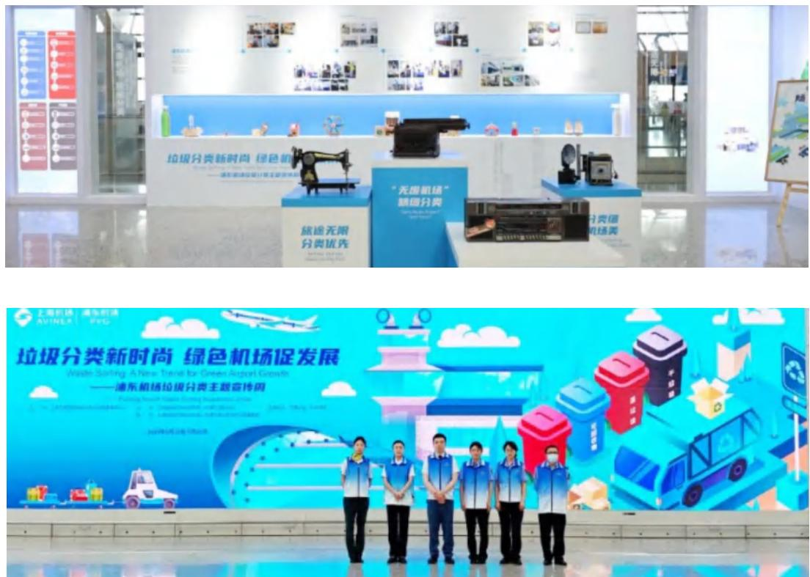

- 组织骨干赴上海黎明固废处理基地研学飞灰资源化、烟气提标等先进技术，汲取“变废为宝”循环经验，为绿色机场的垃圾分类和资源化利用提供创新思路，推动上海机场固废管理向高标准、高效益迈进。  
- 通过引入垃圾压缩设备（减量超 $40\%$ ）、投用干垃圾分拣中心（可回收物分拣率 $6.5\%$ ），实现干垃圾资源化利用，预计年节约处置费用160万元。  
- 全国民航首个湿垃圾无害化处理中心在浦东机场持续稳定运行。2025年，湿垃圾处理量达5072.0吨，垃圾降解率达 $95\%$ ，为浦东机场130余家单位提供服务，以创新实践推动减污降碳协同增效，助力“双碳”目标落地。

# 虹桥机场公司

- 固废源头减量与分类回收体系构建：推行“光盘行动”、无纸化办公，严控源头减量；构建“内外联动”的废弃物精细化管理体系。通过设置“馨管家”回收驿站，实现了干垃圾二次分拣及可回收物的内外循环利用。2025年，虹桥机场实现餐厨垃圾产生量下降 $14\%$ 、干垃圾产生量减量 $6\%$ 的阶段性目标。  
- 无废理念宣传与多方共建：制定环保细则与共建协议，结合环境日等节点面向公众、校园开展宣传；布设多元载体，营造绿色文化氛围，推动机场与社区、学校协同践行无废理念。同时，设立“无废楼宇”主题展板，向全体驻楼用户发布《“无废楼宇”倡议书》，共同践行绿色办公理念。2025年，虹桥机场公司市政楼及西区能源管理中心办公园区荣获上海市市级“无废城市细胞”典型案例及长宁区“无废楼宇”称号。  
- 危险废物闭环监管与无害处置：实施危废全流程监管，依托危废监管平台完成合规申报与台账记录，实现闭环可追溯；无害废弃物由专业单位统一收运处置，2025年共完成13批次收运处置工作，确保合法合规、环境安全。

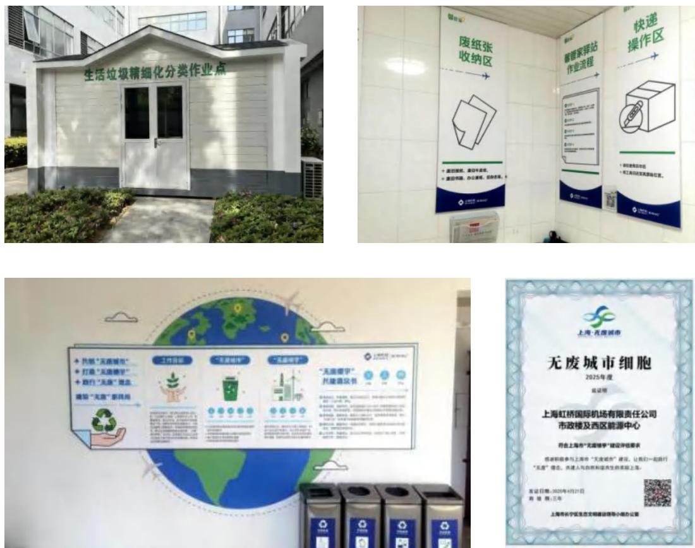

# 机场物流公司

\- 机场物流公司严格落实危险废物合规管理要求,委托具备专业资质的第三方单位对危废进行统一清运与处置,针对废含汞荧光灯管等特定危废,采用破碎、蒸馏两段式专业处置工艺,确保危废处置实现无害化与资源回收双重目标。通过全流程合规记录与闭环监管,有效防范环境合规风险。

# 固废绩效

# 报告期内

固体废弃物排放总量 36,487.70 吨，固体废弃物排放强度 27.34 千克 / 万元

一般废弃物排放总量 36,313.38 吨

3,567.24 吨 32,746.14 吨

建筑垃圾

生活垃圾

干垃圾 24,730.35 吨

湿垃圾 6,593.18 吨

可回收物 1,422.60 吨

危险废弃物 $^{11}$ 排放总量 174.33 吨

回收、利用及处置 $^{12}$

合规化处理 100%

无害化处理 100%

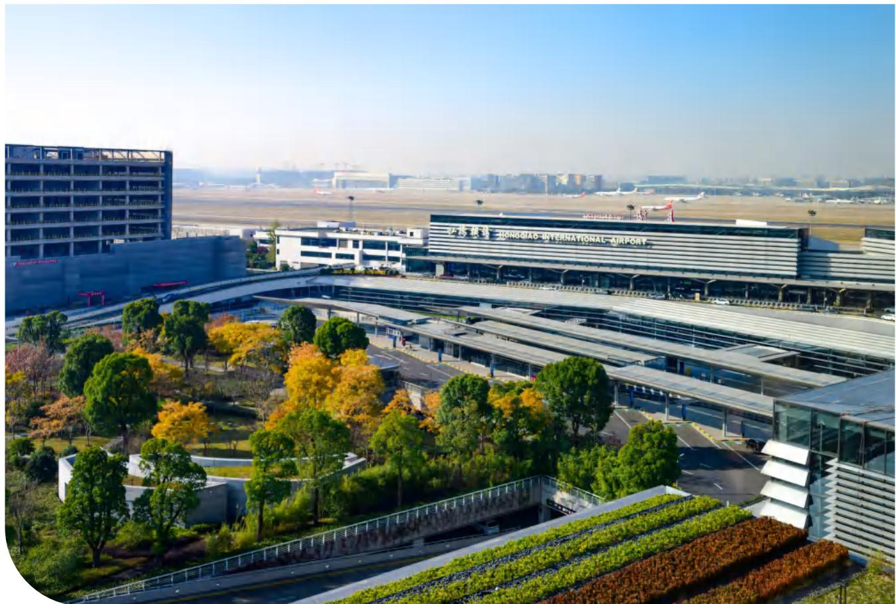

natural_image

Exterior view of the Hongda International Airport with modern architecture and autumn-colored trees (no signage visible)

$^{11}$ 包括废润滑油、废冷冻机油、废弃荧光灯管、废铅蓄电池、废矿物油、沾染危废的包装物和水质监测废液。  
$^{12}$ 公司不自行利用、处置废弃物，均交由第三方有相关资质的公司进行集中处理。

# 环境合规管理

上海机场将环境合规作为企业生存发展的底线要求，严格遵守环境影响评价、排污许可、危废转移联单等制度规定，确保所有建设项目依法履行环评手续，做到持证排污、按证管理。通过建立健全环境风险评估机制，公司定期开展环境隐患排查治理，实施分级分类管控，有效防范化解环境风险。公司还构建了环境应急预案体系，按标准配备必要的应急物资和装备，定期组织应急演练，提升突发环境事件应对处置能力。

# - 管理体系及目标

上海机场遵循《上海市生态环境保护“十四五”规划》《绿色机场建设规划（2020—2035年）》《2024—2026年绿色机场建设“三年行动计划”》，积极落实环境保护管理、生态环境管理综合考核等相关办法，持续推动贯彻落实环境管理体系建设工作方案，制定《虹桥机场环境污染控制管理实施细则》等相关文件，不断完善制度体系。由各直属单位相关责任部门落实绿色机场绩效考核要求，完成生态环境约束性指标清单的制定与季度环保核查。

在体系认证方面，2025年，浦东机场公司实施环境、能源、碳三体系同步外审，完成内审员培训、体系文件修订及内外部审核，顺利取得新一轮ISO 14001环境管理体系认证。虹桥机场公司2025年完成了环境管理体系的第一次监督审核，通过审核并保持认证资格。

2025 年，上海机场积极落实突发事件应急预案、突发事件应急预案操作手册、防汛防台专项预案等相关管理办法，并形成与化学品（农药）、除冰液及柴油等产品泄漏有关的一系列专项应急处置预案。报告期内各单位完成风险评估，并报上级生态环境主管部门备案。报告期内，公司未发生重大环境事件，未发生因环境事件受到生态环境等有关部门的重大行政处罚或被追究刑事责任。

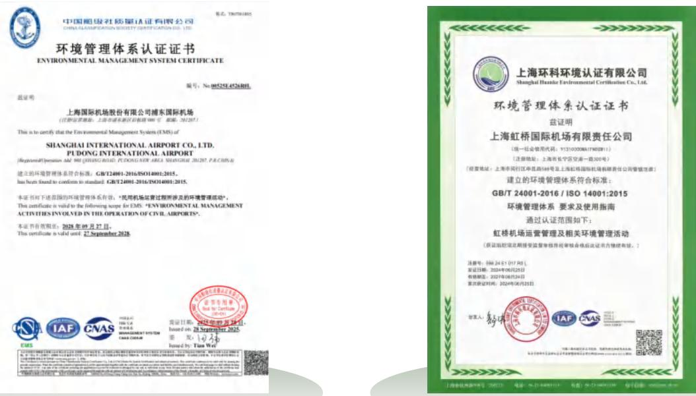  
浦东机场、虹桥机场环境管理体系认证证书

# 环保投入绩效

# 报告期内

环保总投入 12,765.63 万元，包括：

167.80 万元

环境监管

1,939.04 万元

废弃物处理

1,054.52 万元

环保设施采购与运维

67.14 万元

环保专项咨询

58.62 万元

环保宣传与培训

67.00 万元

水资源治理

83.80 万元

噪声治理

9,327.71 万元

大气污染防治

# - 环保宣传

[NO TEXT]

浦东机场公司 • 承办 “低碳空港 守护蔚蓝” 净滩护堤公益活动，百余名志愿者共清理垃圾 369.96 公斤，将清理所得的塑料废弃物进行资源化回收再造，并探索联动碳普惠体系，以实际行动践行海洋生态保护理念，深刻诠释了公司积极响应国家绿色发展战略的社会责任感与担当。

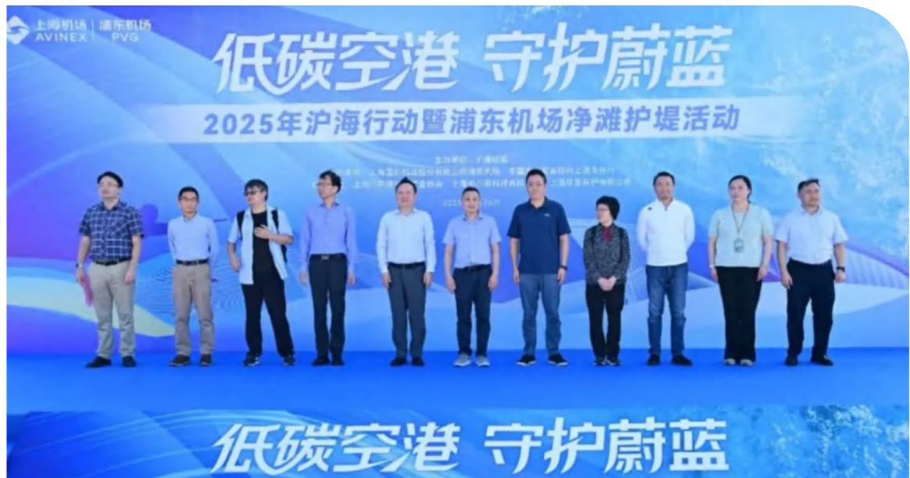

text_image

上海机场 | 浦东机场
AVINEX | PVG
低碳空港 守护蔚蓝
2025年沪海行动暨浦东机场净滩护堤活动
主办单位：沪海空港
承办单位：上海浦东机场股份有限公司（上海浦东机场）北京分公司
承办单位：上海沪港深投资管理合伙企业（上海浦东科技集团有限公司）
2025年1月26日
低碳空港 守护蔚蓝

# 虹桥机场公司

- 向员工赠送千余株小绿植，宣讲植树造林与绿色生活理念，旨在提升全员环保意识，推动绿色生活方式融入日常。  
- 通过构建“线上+线下”媒介矩阵，全方位营造绿色环保氛围。依托“三五学雷锋——无废知识进校园”“六五”世界环境日等主题活动，开展“无废”知识深度科普；同时打造减碳数据表、“无废”科普视频等多样化宣传载体，让绿色低碳理念潜移默化深入人心。  
- 根据节能标准设定公共区域空调温度，并在空调控制开关上加装锁定装置，有效规范公共区域能效管理，防止设定温度被随意更改。  
- 在“世界无烟日”组织开展控烟主题活动，通过设置宣传展板、签名承诺墙、互动游戏及党员志愿者现场劝烟等方式，旨在从源头抑制“游烟”现象；同时加装排风设备降低烟雾扩散，持续优化室内空气质量，并发起“拒绝游烟从我做起，无烟机场你我共建”的行动倡议，共同营造清新健康的出行环境。

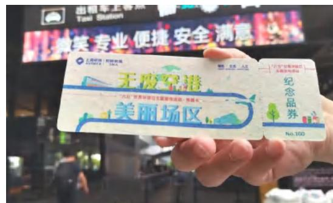

text_image

出租车上考点
Thai Station
学校专业便捷安全满满
上海站  利源商城
天下空港
“八边”世界环境与主题宣传活动，体验大
美丽场区
纪念品券
No.100

natural_image

Group of people examining potted plants at a table in an indoor setting (no visible text or symbols)

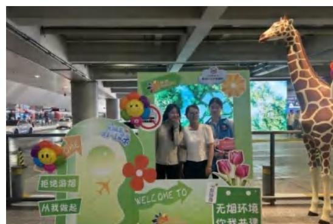

text_image

拒绝游想
从我做起
WELCOME TO
无旭环境
你我共建

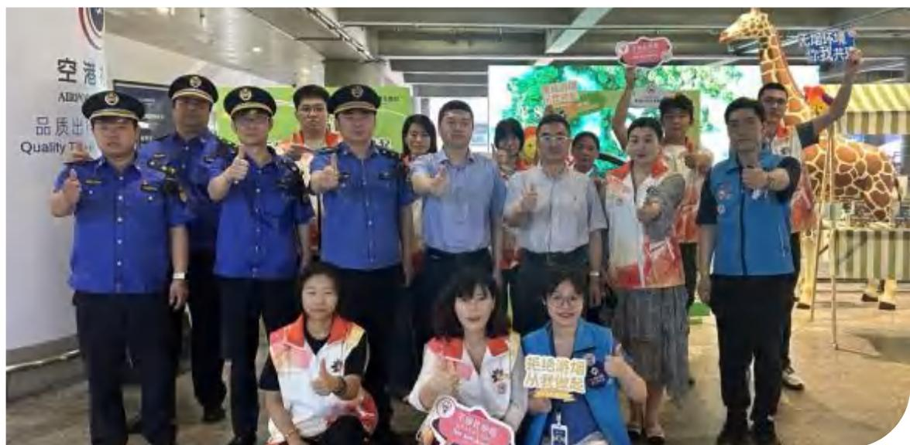

text_image

空港
品质出品
Quality
拒绝游客
从我做起

# 机场物流公司

- 联合各驻场单位启动“无烟货运·绿色同行”活动，通过开展控烟专题培训，精准赋能40余名控烟督导员；同时发挥党员与志愿者的先锋模范作用，深入一线开展控烟宣传与环境整治工作，清理烟头与废弃物，增设垃圾分类标识，显著减少吸烟引发的环境污染，夯实货运区无烟化、低碳化、智慧化建设基础。  
- 开展联合控烟整治行动，采用“宣传 + 执法”相结合的形式，强化全员控烟意识与行为规范。通过常态化劝导与环境巡查，有效遏制违规吸烟现象；增设禁烟标识、优化吸烟区配置，从源头减少对环境的负面影响。

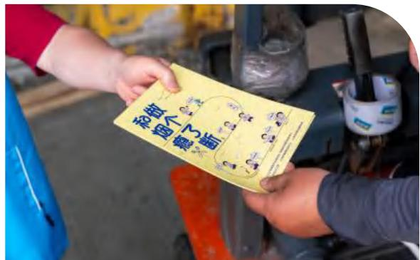

text_image

监督检查
安全意识

text_image

Street photo showing two uniformed officers interacting with informational booths and documents, surrounded by people in greenery.

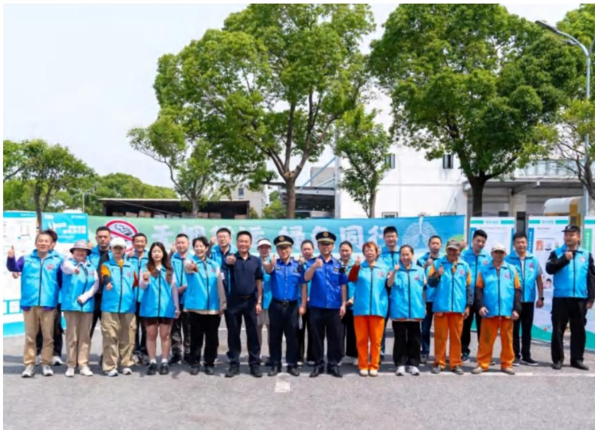

text_image

Group photo of volunteers in blue vests posing with thumbs-up, with a banner and outdoor infrastructure visible in the background.

# - 环保合规

浦东机场公司 结合上海市最新环保政策要求，浦东机场公司围绕“非道路移动机械管理”“餐饮业油烟管控”及“危险废物管理系统更新”三大主题，组织开展环保法规、认证培训及生态环境管理等培训，切实提升员工环境管理执行力，促进11家单位环保合规水平稳步提升，严守生态红线，压实绿色运营主体责任。

虹桥机场公司 2025 年，公司开展《规章制度等体系文件的宣贯及内外审问题的探讨》《固废分类处理宣贯及建筑垃圾全流程管理合规性实务》等专题培训，并参加外部组织的生活垃圾分类专项培训，持续夯实环保管理基础。

# 机场物流公司

围绕环保台账规范管理、环境突发事件应急预案、日常环境监测要点三大主题开展年度环保专题培训，推动环保工作保持“可知、可控、可治”状态。同时，组织 IATA 环境认证专项培训，帮助员工掌握航空领域环境评估要求，明确环境管理体系适用范围。

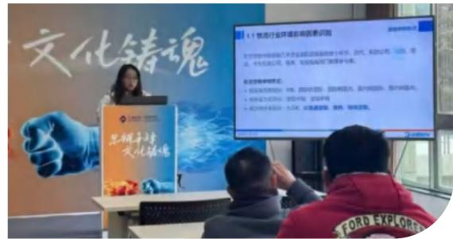

text_image

文化铸魂
LAWA
思维卓越
文化铸魂
1.1 您进行业环境影响意图识别
为什么对2009年城市和公共事业发展的影响很小，因为，相关公司、企业、企业、个人及社会公司、电商、电商与市场推广等因素与贵。
关注世界中的特点：
• 体验是自然的，未来，国际空间的，国际范围内，国内空间的，国内范围内
• 体验是人文的，国际空间的，国际范围内
• 体验是外币的，小汇率，代表香港、香港、香港等国家。

# 报告期内

环保专项培训及宣传78次 总覆盖人数15,352人 总时长792.5小时

同时，开展常规商户检查及日常培训，每周不少于3次。

# 生态系统和生物多样性保护

上海机场重视生态系统与生物多样性保护对保障机场安全运营、促进区域生态平衡的重要意义，积极探索机场建设与生态保护协调发展的实践路径。公司遵守《环境影响评价法》《野生动物保护法》《建设项目环境保护管理条例》《规划环境影响评价条例》等法律法规，贯彻生物多样性保护理念，通过鸟类保护及生态环境建设等措施，评估可能对生态环境和生物多样性产生的影响，降低引发生态损害事件的风险。

# - 管理体系及目标

在日常的鸟类及野生动物驱避工作中，遵守《中华人民共和国野生动物保护法》等相关法律法规，同时在《鸟击及动物侵入防范方案》中明确，对现场鸟类及野生动物以非伤害性驱赶为主，对于在机场内捕获的活体鸟类或者其他珍稀动物，均予以妥善处置，及时运送至远离机场区域放生，或移交当地动物保护组织。

# - 实践举措

# 浦东机场公司

# 人文景观升级

推行 T2 航站楼人文空间规划，全面升级 T2 航站楼绿化景观，打造到达区域 “玉兰花开” “凤凰百年” “天马驰骋” “司南指引” 四大主题景观，新增 6 组迎客大厅花坛座椅，绿化面积由 $170m^{2}$ 扩展至 $1501m^{2}$ ；出发大厅 19.6m 层户外屋顶花园匠心营造，融合东方古典与海派园林风格，为旅客提供闹中取静的休憩美学空间。

# 创新“生态驱鸟”，探索航空安全与自然的双赢之路

从草、虫、水、土四个方面持续深化生态治理，通过除虫控源、除草 11500 余亩、整治明水面 47 万 m²、平整低洼地 7400m² 等方式，系统优化鸟类栖息环境与食物链，有效减少鸟类活动与食源，从源头降低鸟击风险；公司贯彻生物多样性保护理念，在鸟类防治中改变单一物理驱赶模式，创新引入“生态管理员”——羊群。通过此种生物干扰方式，有效整治鸟类栖息环境，并避免化学药剂对土壤和水源的不利影响。这一跨界协同的治理实践，不仅提升了航空安全系数，更生动诠释了企业在生态安全治理领域的创新作为与责任担当。

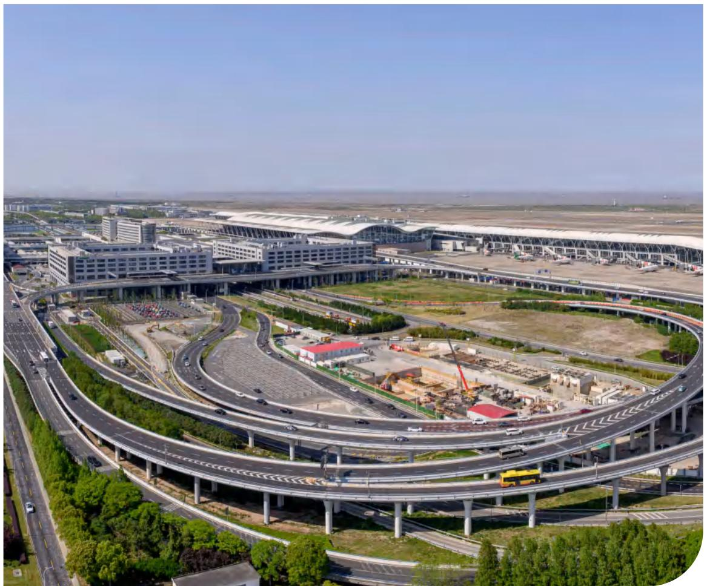

natural_image

Aerial view of a large modern airport terminal with multiple curved overpasses and surrounding infrastructure (no visible text or signage)

# 虹桥机场公司

# 飞行区鸟类保护与治理

在飞行区科学配备驱鸟设备,采用非伤害性的技术手段引导鸟类避开飞行区域,防止其误入风险区,有效平衡航空运行安全与周边生物种群数量及种类的稳定关系。

# 机场物流公司

# 周边环境专项整治

机场物流公司联合属地街道及航司，定期开展货运区周边生态环境专项整治。通过清除荒草、疏控过度生长的乔木，减少鸟类栖息环境，在保障航空器安全运行的同时，建立常态化沟通机制，共同维护枢纽周边区域生态和谐。

# 能源利用

上海机场将能源利用管理作为绿色机场建设和实现“双碳”目标的重要抓手，面对能源价格波动、用能需求提高等风险，公司积极把握能效提升和能源结构优化带来的机遇，推动余热回收、高效设备更新、老旧设备改造等措施落地，为机场高效节能发展注入绿色动能。

上海机场遵守《中华人民共和国节约能源法》《中华人民共和国可再生能源法》，遵守《上海市节约能源条例》《重点用能单位节能管理办法》《固定资产投资项目节能审查办法》等相关法律法规，持续强化能源管理工作。上海机场始终遵循绿色机场发展理念，已建立起完整的能源管理体系并贯彻落实，在2025年制定或修订《能源管理体系手册》《能源计量管理办法》《浦东机场用能设备设施节能管理细则》《绿色低碳绩效实施细则》《节能降耗考核管理办法》等文件，以更科学合理的考核与绩效机制，推动机场实现节能减排、低碳运行与循环发展。

# - 治理

上海机场的能源议题沿用气候变化议题所建立的“决策层－管理层－执行层”三级治理架构，由管理层统筹，能源和碳排放管理工作小组推进具体工作，确保气候变化与能源管理目标协同落实、数据互通。该架构保障能源利用与碳减排工作在统一框架下高效融合、系统推进。

# - 战略

上海机场围绕“双碳”战略目标，结合国际航空枢纽定位与长三角区域能源格局，制定覆盖能源转型升级、高效节能改造、智慧运维管理的综合能源战略，明确分阶段目标与实施路径，为行业提供可复制的机场能源节约样板。

<table><tr><td>风险类型</td><td>风险名称</td><td>对业务影响</td><td>对财务影响</td><td>影响时间范围</td><td>影响程度</td><td>应对举措</td></tr><tr><td rowspan="3">转型风险</td><td rowspan="2">用能需求</td><td>高耗能系统与设备,如APU</td><td>能耗升高</td><td>短中期</td><td>中</td><td>设施调整:近机位100%覆盖桥载设备</td></tr><tr><td>生产量及运营范围不断增大</td><td>用电量持续增长</td><td>长期</td><td>中</td><td>持续扩大清洁能源利用采购绿电</td></tr><tr><td>能源结构</td><td>能源来源受政策影响,可能会影响机场运营</td><td>能源价格波动,成本增加</td><td>中长期</td><td>高</td><td>持续扩大光伏建设规模浦东机场计划将老港蒸汽引入卫星厅等区域,实现能源中心去天然气化</td></tr><tr><td rowspan="6">实体风险</td><td rowspan="3">极端天气|高温</td><td>空调供冷能源消耗增加</td><td>运营成本增加:2025年,浦东机场节能降碳项目支出超1855.6万元;二季度高温导致供冷需求提前,用电量同比增长19.35%</td><td>中长期</td><td>低|中</td><td>针对高温天气优化制冷运行策略,提升系统经济性采购或更新改造高能效设备和系统,提升用能效率</td></tr><tr><td>机场物流公司冷链仓储能耗成本</td><td>物流成本增加</td><td>中长期</td><td>低|中</td><td>推动冷链仓储的高效运行的系统技术方案</td></tr><tr><td>高温中暑,员工生产效率降低</td><td>人力成本增加</td><td>中长期</td><td>低</td><td>及时发布预警及安全提示,调整员工工作方案</td></tr><tr><td rowspan="3">极端天气|严寒</td><td>空调供热能源消耗增加</td><td>设备运营与维护成本增加</td><td>中长期</td><td>低|中</td><td>针对严寒天气优化供暖运行策略,提升系统经济性采购或改造高能效设备和系统,提升用能效率</td></tr><tr><td>重要设备设施无法正常运行影响机场生产运营,如跑道、航空器结冰,设备冻裂、管道堵塞等</td><td>设备运营与维护成本增加</td><td>中长期</td><td>高</td><td>制定严寒天气设备设施保障制度,开展生产设备及管道进行防冻检查、除冰操作和维护保养,确保设备正常运行</td></tr><tr><td>员工安全问题、生产效率降低</td><td>设备运营与维护成本增加</td><td>短期</td><td>低</td><td>为员工提供保暖用品,合理安排作业时间,减少户外作业时间</td></tr></table>

# - 影响、风险和机遇管理

公司建立气候风险与机遇动态评估机制，将评估结果纳入战略决策与运营管理流程，通过跨部门协作与专家研判，确保应对措施契合机场运营实际，并定期开展复盘优化，持续提升机场应对极端天气、能源价格波动及绿色转型的韧性与核心竞争力。

<table><tr><td>机遇类型</td><td>机遇名称</td><td>对业务影响</td><td>对财务影响</td><td>影响时间范围</td><td>影响程度</td><td>应对举措</td></tr><tr><td rowspan="2">清洁能源</td><td>光伏项目</td><td>·提升机场可再生能源利用占比</td><td>·技术研发与设备采购成本增加·减少电费成本:2025年,浦东机场光伏实际发电2485.7万kWh,节约用电成本超700万元;虹桥机场光伏实际发电494.4万kWh;物流公司的联邦光伏项目投运后预计可增收11万元/年,减排约417tCO2</td><td>长期</td><td>高</td><td>·做好光伏项目前置建设规划和后期成效评估,跟踪分析成本回收期、投入产出比等关键指标·有序推进系列试点工程建设,2025年两场及物流光伏总装机容量达58.5MW·浦东机场规划“十五五”期间光伏装机规模达100MW</td></tr><tr><td>新能源车辆</td><td>·场内通用和特种车辆燃料用能较大</td><td>·前期采购及配套设施成本增加:2025年新增新能源车辆及充电桩</td><td>中期</td><td>中</td><td>·逐年提升可再生能源占比、车辆电动化比例·推进“油改电”项目,加快淘汰老旧燃油设备(如柴油叉车),推动机坪货物装卸与运输设备绿色转型</td></tr><tr><td>低碳技术</td><td>虚拟电厂</td><td>·保障机场用电系统高效稳定运行</td><td>抵抗电力价格波动</td><td>中期</td><td>中</td><td>探索智慧用能协同模式</td></tr></table>

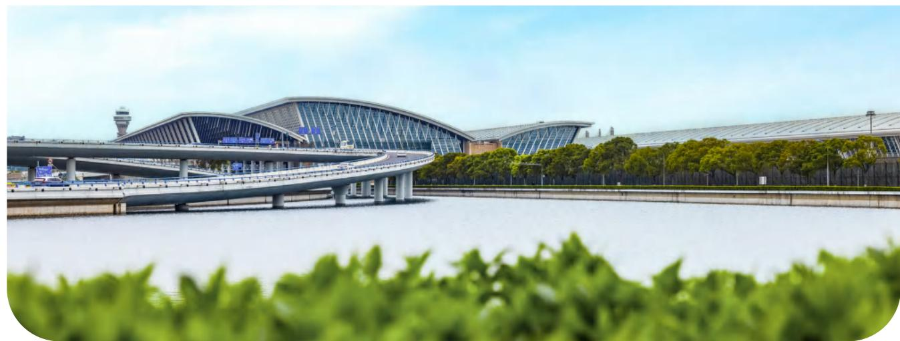

natural_image

Exterior view of a modern airport terminal with curved glass architecture and surrounding greenery (no signage or text visible)

# - 指标与目标

2025 年，上海机场能源相关指标的目标达成情况如下：

<table><tr><td colspan="2">指标</td><td>浦东机场</td><td>虹桥机场</td></tr><tr><td rowspan="2">能源消费总量(万吨标准煤)</td><td>目标</td><td>11.66</td><td>3.79</td></tr><tr><td>达成情况</td><td>已完成</td><td>已完成</td></tr><tr><td rowspan="2">单位旅客吞吐量能耗(吨标准煤/万人次)</td><td>目标</td><td>15.14</td><td>8.24</td></tr><tr><td>达成情况</td><td>已完成</td><td>已完成</td></tr></table>

# 认证成效

在体系认证方面,2025年浦东机场公司和虹桥机场公司均顺利取得新一轮ISO 50001能源管理体系认证。

中国船级社质量认证有限公司
CHINA CLASSIFICATION SOCIETY CERTIFICATION CO., LTD.

格式：TB07001807

# 能源管理体系认证证书

CERTIFICATE OF MANAGEMENT SYSTEM FOR ENERGY

鉴证明

# 上海国际机场股份有限公司浦东国际机场

(注册/运营地址:上海市浦东新区启航路900号 邮编:201207;统一社会信用代码:91310000MABRP5RN0X)

This is to certify that the Management System for Energy (EnMS) of

# SHANGHAI INTERNATIONAL AIRPORT CO., LTD. PUDONG INTERNATIONAL AIRPORT

(Published/Operation Add: 900 QIHANG ROAD, PUDONG NEW AREA, SHANGHAI, 201207, P.R.CHINA)
Uniform Code of Social Credit: 9(310000MABRP58NUE)

建立的能源管理体系符合标准：GB/T23331-2020/ISO50001:2018及RB/T107-2013《能源管理体系公共建筑管理组织认证要求》。

has been found to conform to standard GB/T23331-2020/ISO50001:2018 and RB/T107-2013 Energy Management Systems-Certification requirements for Public Building Management Organization.

本证书对下述范围的能源管理体系有效：\*民用机场运营过程所涉及的能源管理活动\*。This certificate is valid to the following scope for EnMS. \*THE OPERATION PROCESS OF CIVIL AIRPORTS RELATED ENERGY MANAGEMENT ACTIVITIES\*.

上一认证周期截止时间：2025年11月14日（Last cycle Imafline 14 November 2025）

本证书有效期至：2028年11月14日。

This certificate is valid until 14 November 2028.

资源使用信息见附件：Energy performance information online in station

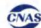

中国认证
管理体系
MANAGEMENT SYSTEM
CNAS COSIM

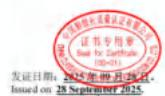

由于部分计算机网络连接器以及公司办公设备的外部控制与控制等，会定期召开三轮模拟机连续使用时间和时间表中各设备的安装、调试、维护等。在上述过程中，可随时关闭计算机网络连接器，同时可建立一个完整的网络连接器，即为设备的安装、调试、维护等。在系统运行过程中，本设备的安装、调试、维护等设备的安装、调试、维护等设备的安装、调试、维护等设备的安装、调试、维护等设备的安装、调试、维护等设备的安装、调试、维护等设备的安装、调试、维护等设备的安装、调试、维护等设备的安装、调试、维护等设备的安装、调试、维护等设备的安装、调试、维护等设备的安装、调试、维护等设备的安装、调试、维护等设备的安装

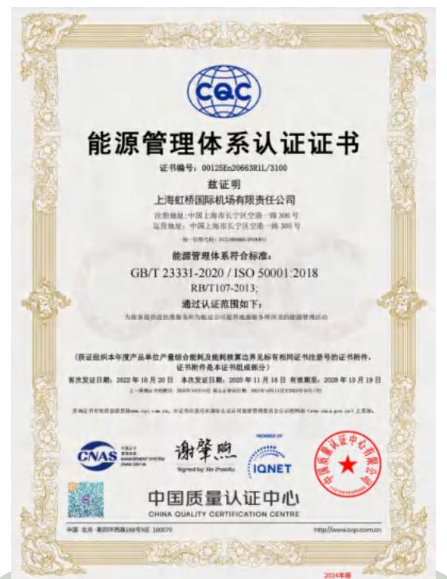  
浦东机场、虹桥机场能源管理体系认证证书

# - 实践举措

# 浦东机场公司

系统运行调控

\- 供暖季期间, 公司实施精准控温与动态运行优化, 充分发挥能源中心与楼宇自控 (BA) 集控系统优势, 首次实现板交温度动态调节, 显著提升一次侧能量利用率, 有效节约天然气资源。主要成效如下:

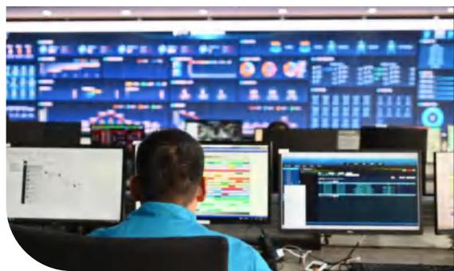

text_image

Control room scene with large digital dashboard displaying data dashboards and charts, operator monitoring multiple screens

① 供暖季：节电超 300 万 kWh，T1、T2 及卫星厅暖通用电同比下降超 10%，能源中心天然气用量同比下降超 15%。  
② 制冷季：T2 航站楼的长廊区域 7 月、8 月空调用电量同比分别下降 15%、20%，主楼区域同比分别下降 11%、9%。

③ 虚拟电厂响应：完成 4 次响应调用，通过蓄热削峰等运行措施实现额外经济效益约 8 万元，体现了大型枢纽机场在能源精细管理上的领先水平，助力绿色机场节能降碳目标的稳步实现。

\- 推进电力监控与电管平台建设,实现多电压等级监测及设备更新,缩短故障排查时间,提升电力系统运行安全性与效率,减少因电力故障造成的能源浪费。

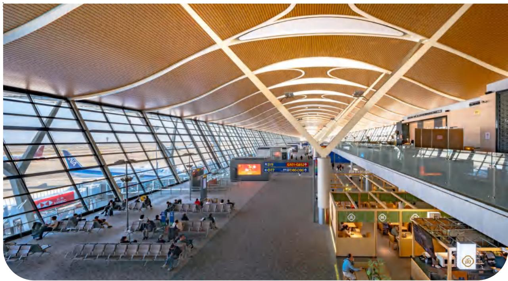

natural_image

Interior view of a modern airport terminal with large glass railings and multiple service counters (no visible text or signage)

# 多场景节能技改

浦东机场公司深挖存量设备节能潜力，通过一系列硬核技术手段实现效能飞跃，以技术革新驱动绿色供能，为构建绿色机场注入强劲动能：

\- 机坪高杆灯节能改造：完成全场机坪高杆灯光源替换，将传统高压灯统一升级为高效节能LED光源。改造后单灯功率降低 $60\%$ 以上，照明光均匀度提升 $30\%$ ，在显著改善机坪作业光照条件的同时，实现年节电约293万kWh，年节约用电成本226万元。

\- 锅炉系统余热回收改造：通过加装高效热交换设备与纯水处理装置，完成11台运行锅炉的烟气余热回收技术升级。改造后锅炉热效率提升至 $95\%$ 以上，有效减少排污热量损耗，实现年节约天然气25.79万立方米，年节约能源成本186万元。

\- 航站楼空调系统能效提升：针对航站楼区域空调系统实施三项优化改造，包括机组 EC 风机替换、风管保温层修复、多联机位置优化调整。改造后系统送风量与设备能效显著提升，实现年节电23.31 万 kWh，年节约用电成本 15.15 万元。

\- 冷源系统创新优化：面对供冷需求与节能降耗的双重挑战，在已投用25年的一号能源中心，浦东机场公司新增2台双一级能效变频冷水机组，其采用行业领先的永磁同步变频技术和高效离心压缩机，能效提升46.84%，年节约用电约300万kWh。

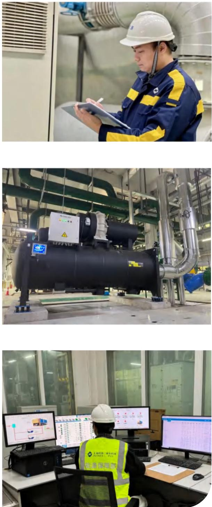

# 虹桥机场公司

- 技改项目持续运行：EC 风机改造、市政管理大楼及西区北合建泵站光伏、能源中心分布式光伏与储能建设等技改项目持续运行并发挥效益，2025年实现全年节能量约 175.8 万 kWh。  
- 风机系统智慧升级：2025年，开展T1航站楼排风机更新项目，年节能量27.18万kWh。完成卫生间高耗能排风机更新38台；将部分未接入BA系统的排风机设备接入既有系统通讯总线，实现与楼内BA系统对接并增加控制功能，共计11个点位。  
- 航站楼照明效果焕新: 完成 T2 航站楼的照明升级, 累计更换高品质灯具 2353 套, 引入智能调色系统, 实现功能与美学融合。以功能优化、美学升级、场景创新为导向, 聚焦老旧照明设施, 持续推进登机桥、出发远机位和东交 3 楼公共区域照明更新项目。更换 T1 航站楼 3600 多套灯具, 消除昏暗区域, 营造明亮温馨出行氛围, 兼顾舒适与节能。

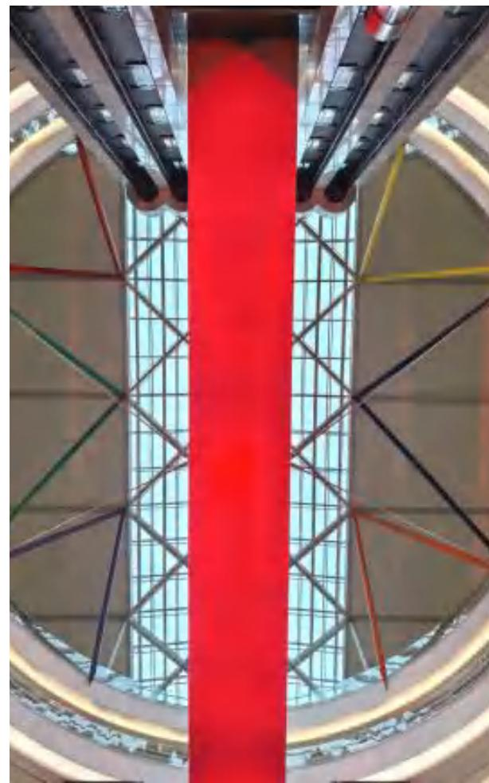

natural_image

Interior view of a modern architectural space with a red vertical stripe and geometric glass structure (no text or symbols visible)

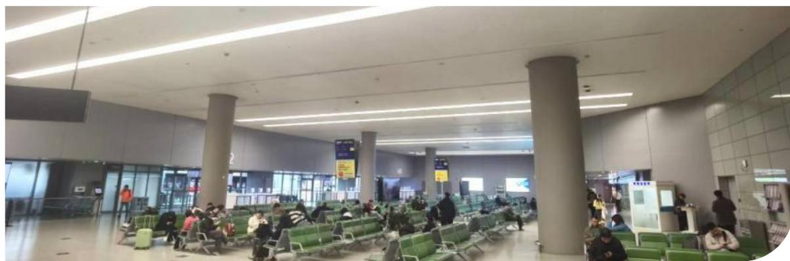

natural_image

Interior view of a large, empty airport terminal with green seating and pillars (no visible text or signage)

# 机场物流公司

- 灯具升级：将老旧金卤灯具更新为节能 LED 灯  
- 绿建改造项目：计划启动浦东机场西货运区的公共货站土建维修改造项目，在项目可研阶段充分考虑绿色建筑与节能环保要求，工业建筑及辅助办公建筑的绿建改造目标均为一星级。

# 能源绩效

# 报告期内

综合能源消耗总量 $^{13}$ 65,163.58吨标准煤

单位客货运 $^{14}$ 综合能耗3.51吨标准煤/万人次，能源消耗强度48.83千克标准煤/万元

其中，

直接能源消耗总量 14,725.98 吨标准煤

1,010.97 万立方米

天然气

311.7 吨

汽油

773.95 吨

柴油

间接能源消耗总量 50,437.60 吨标准煤

45,278.74 万千瓦时

用电总量

# 水资源利用

上海机场严格遵守《中华人民共和国水法》等法律法规及中国民航局相关标准，建立健全水资源管理制度体系，明确各直属单位取水、用水、排水各环节的管理要求。结合机场用水量大的特点，公司大力推进节水技术改造，广泛应用智能远传水表、DMA分区计量等技术手段，实现用水精细化管理；通过实施雨水收集利用、中水回用等项目，持续提升非常规水源利用率。公司注重培育节水文化，开展形式多样的节水宣传培训，引导员工和旅客养成节水习惯。依托系统化的节水管理与技术创新，公司用水效率持续提升，为建设资源节约型机场提供有力支撑。

# - 管理体系及目标

上海机场制定《水环境管理实施方案》《浦东机场水环境管理细则》等规范性文件，明确水质达标与水资源循环利用目标及考核要求，建立分区计量与雨水回用机制，构建水资源规范化管理体系，保障年度水质与节水目标有效落地。

# - 实践举措

# O

浦东机场公司 • 针对水表故障、数据上传率低的问题，构建“自主排查一

协同攻坚—创新修复—精准校验”全流程解决方案，通过拆解识别故障、创新维修工艺、搭建校验体系，完成36块故障水表的全面修复，水表数据上传率提升至100%，既节约设备采购成本，又有效降低供水漏损率。“智能远传水表故障修复与精准校验技术创新及应用”项目在“五小”创新成果比赛中荣获三等奖。

- 深化源头减量与再生利用，通过净化、加药等工艺，将雨水转化为可再次利用的中水，稳定应用于能源中心冷却塔、锅炉、景观水池、绿化等场景，累计使用量超170万吨，打造能源与水资源循环利用典范，助力绿色低碳转型。  
- 针对传统冷机、锅炉直排废水构建深度处理与净化系统，推动中水在大型制冷、制热系统中的广泛应用。2025年为锅炉增设纯水装置，降低了 $2\%$ 的锅炉排污热能损失，每年预计节约天然气20.25万立方米、市政水8.56万立方米，累计节省资源费用128.1万元，实现水资源与热能双重高效利用。  
- 实施湿垃圾上水改造，利用中水替代自来水，累计节水约 1000 吨，推进节水型机场建设，体现资源循环利用与降本增效的绿色理念。

# 虹桥机场公司

- 在零碳办公实践区配置雨水回用装置，实现雨水资源收集与再利用，满足区内清洁与绿化用水需求，减少对市政供水的依赖。  
- 市政楼新增用水计量表具 21 只，实现分区精准计量；将楼内 70 套坐便器、49 只水龙头、35 组小便器升级为节能器具，使用能设施达到认证标准，为零碳建筑评定创造条件。

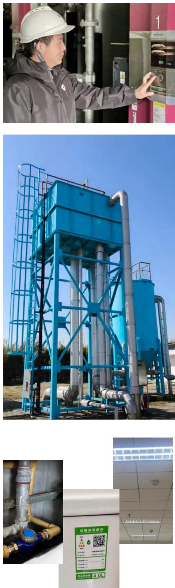

\- 以“世界水日”“中国水周”为契机，开展全域节水宣传活动：在员工生活用水区域张贴节水标识，邀请供水管理事务中心专家开展专题培训，推动《节约用水条例》落地，发布《节水倡议书》。同时，在航站楼与空港社区循环播放节水主题宣传视频、张贴宣传海报、举办知识讲座，切实提升公众节水护水意识，促进用水效率提升。

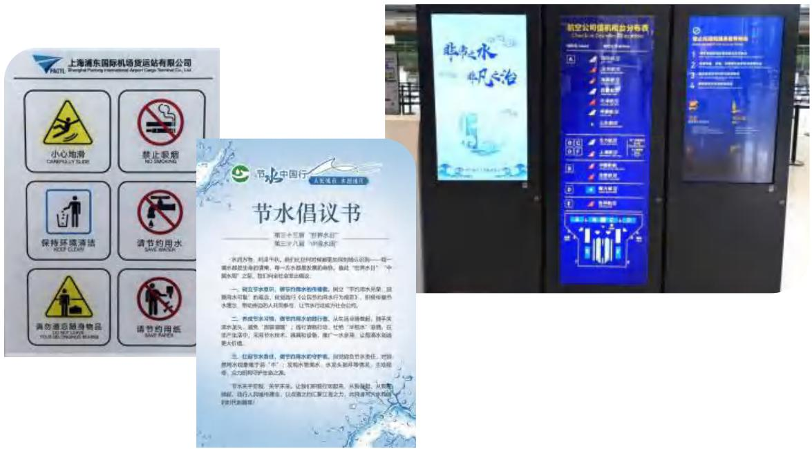

text_image

上海浦东国际机场货运站有限公司
FACTL Shanghai Parking International Airport Cargo Terminal Co., Ltd.
小心地滑
CANFULLY TOLER
禁止吸烟
NO SMOHOGS
保持环境清洁
WIDE CLEAN
请节约用水
SAVE BHAUY
消防遗忘随身物品
YOU ARE CONVERED TO BE HORN
请节约用纸
SAVE RAPER
节水中国行
人民现在，未来通过
节水倡议书
第三十三届“世界水日”
第三十五届“中国水网”
“水网万物，若是中秋，我们此次任何时候都是反相制的默认认为——每一滴水都是生命清潮，每一五水都是发展的路径。从此“世界水日”“中国水网”之窗，我们再安排着要出概念。
一、就改变水意识，调节自然的水能增效，闭边“下的用水光荣、更换用水可靠”的观念，故把现行《公民节约用水行为规范》，积极引导整备水理念，帮助群众的人共同参与，让节水进行成外社会交流。
二、养成节水习惯，调节自然的提升措施，从生活点做鉴别，扬子关系消失，避免“国家强弱”；进行调整行动，杜绝“平稳冰”浪费，在生产活动中，采用节水技术、调用设备，推广“一点多用，让您海水舒适更大价值。
三、在超节水意识，调节自然的保护者，识别负责节水责任，对居民用水消费属于“不”；发现水源需求、水质及环境等情况，主动指导，切实利用守护生命之爱。
节水关于复制、关乎未来，让我们积极行好服务，认真地抓、认真地抓起来，进行人民使用健康，以点燃之后汇到江淮之力，共同遵守相关规则，同时代表遵循！
航空公司国机柜台分布表
航空公司国机柜台分布表
1 2 3 4 5 6 7 8 9 10 11 12 13 14 15 16 17 18 19 20 21 22 23 24 25 26 27 28 29 30 31 32 33 34 35 36 37 38 39 40 41 42 43 44 45 46 47 48 49 50 51 52 53 54 55 56 57 58 59 60 61 62 63 64 65 66 67 68 69 70 71 72 73 74 75 76 77 78 79 80 81 82 83 84 85 86 87 88 89 90 91 92 93 94 95 96 97 98 99
节水倡议书

# 报告期内

总用水量（市政供水）374.13万立方米，用水强度2.80立方米/万元

非传统水源循环利用量 $^{15}$ 236.00万立方米 非传统水源利用率38.68%

# 循环经济

上海机场立足机场产业链发展特点，重点推进能源、水资源、物料等领域的资源循环利用：在能源领域，大力发展光伏等清洁能源，推进能源梯级利用与余热回收；在水资源领域，实施雨水收集、中水回用、废水再生利用，构建多水源保障体系；在物料领域，推进包装物循环使用、设备设施再制造及废弃物资源化利用。公司创新商业模式，与上下游企业建立循环经济合作关系，推动实现经济效益、社会效益、环境效益的有机统一。

# 案例

# 浦东机场公司 浮油回收质效升级,解锁资源化管理新境界

- 针对航空供油量持续增长带来的含油废水排放压力，浦东机场公司对隔油池系统实施自动化升级改造，并加装高效浮油回收装置。改造后，浮油回收率由 $75\%$ 大幅跃升至 $95\%$ ，单人处理1000升污水用时降至35分钟，效能提升 $80\%$ 。这一举措不仅实现了含油污水的高效截留与资源化转化，每年节约资金约57万元，更有效降低了作业现场的健康风险，体现了公司对环境与员工福祉的双重守护。  
• 2025 年，浦东机场公司《提升隔油池浮油回收质效》课题获第三届 CAPSE 民航质量提升大赛银奖。

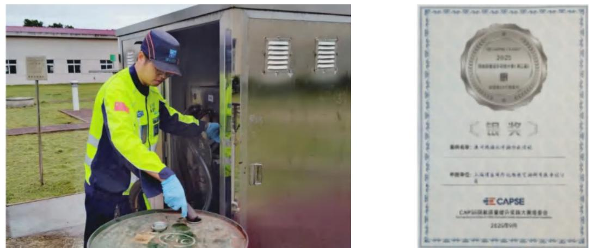

\- 联合东方航空推出“一码一证”无纸化全流程服务，覆盖值机、安检、登机等环节，减少纸张消耗与排队等待，降低航站楼运行环节碳排放。

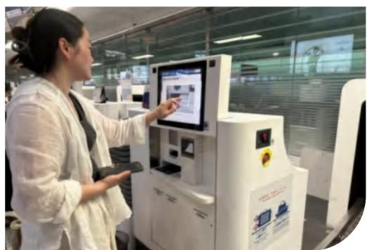

natural_image

Woman using a self-service kiosk in a modern industrial facility (no visible text or symbols)

# 报告期内

废弃物循环利用量1,691.20吨，其中可回收物1,422.60吨，可再生纸268.60吨

# 03

# 社会维度

员工

· 产品和服务安全与质量  
- 数据安全与客户隐私保护  
- 创新驱动  
- 供应链安全  
- 乡村振兴与社会贡献

# 员工

上海机场面向未来业务布局，持续完善人才引育机制，着力增强重点领域、关键岗位的人才资源整合和供给能力，稳步推进精准引才，加强建设运营一体化人力资源统筹；持续推进服务职工工作体系建设，上下联动提升职工生活品质，努力促进企业高质量发展和职工高品质生活“双向奔赴、同频共振”。

# - 聘用与待遇

上海机场聚焦提升引才质效，坚持招录标准，积极落实员工招录管理相关办法，充分发挥关键业务人才开发目录牵引作用，围绕业务发展实际需要，有机结合内部盘活与外部引进，进一步提高人岗适配度和人才引进质量。

# 员工雇佣和员工组成

# 报告期内

公司劳动用工总数 13,329 人。

公司女性员工总数 4,458 人，占员工总数比例 33.5%；少数民族员工总数 242 人，占员工总数比例 1.8%。

专业构成  
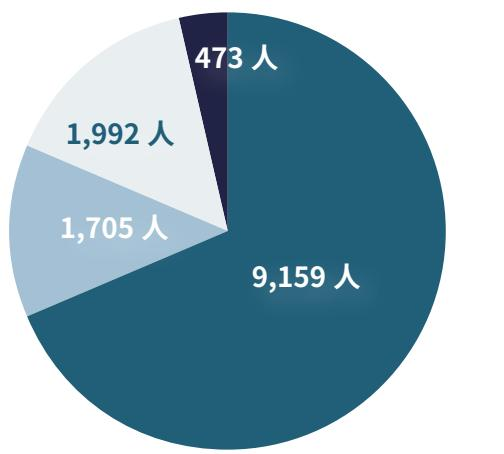

pie

| Category | Value (人) |
| --- | --- |
| Dark Blue | 473 |
| Light Blue | 1,992 |
| Medium Blue | 1,705 |
| Teal | 9,159 |

生产人员  
专业技术管理人员  
管理人员  
专业技术人员

教育程度  
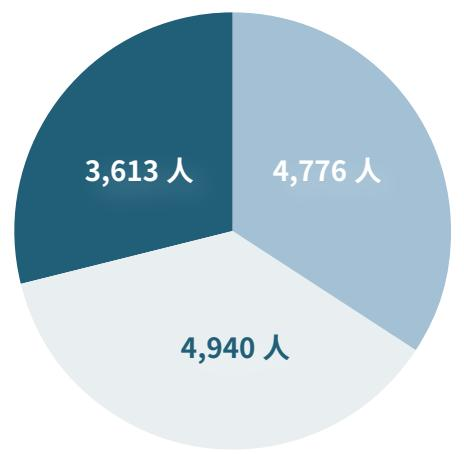

pie

| Category | Value (人) |
| --- | --- |
| Light Blue | 4,776 |
| Light Gray | 4,940 |
| Dark Blue | 3,613 |

大学本科及以上  
中专及以下  
大学专科

# 吸纳就业情况

上海机场统一组织应届毕业生招聘与社会招聘，接收安置军转复员人员，积极帮助农民工、劳务工就业。

# 报告期内

共吸纳就业人数 92 人

其中应届毕业生 82 人、社会招聘人员 6 人，安置、招募军转干部、退伍复员军人 2 人，招募退役运动员、退役消防员 2 人。

员工流失率 4.89%

# 薪酬与福利

上海机场围绕更好支撑高质量发展，深入开展薪酬激励机制改革，持续挖潜人力资源内生活力动力，落实工效决定机制、工资总额管理机制和领导人员薪酬管理，稳步推进中长期激励机制实施。

2025 年，上海机场贯彻落实国家和上海市关于完善收入分配制度的决策部署，研究落实工效决定机制改革实施方案，薪酬分配重点向基层一线岗位、艰苦复杂岗位、责任重大岗位和高技能人才、高层次专业技术人才、紧缺人才倾斜，有效发挥薪酬管理的激励约束作用。全面落实工资总额管理办法，按企业类型实施差异化工效联动机制，完善水平调节和效率对标机制，加强工资总额管理的科学性。同时，规范各直属单位领导人员薪酬管理，稳步推进薪酬结构优化，灵活运用上市公司股权激励等多种方式，初步形成长短结合、激励相容的绩效分配体系，有效激发干部人才干事创业的内生动力。

上海机场依据薪酬管理相关办法，支付员工工资和缴纳员工社保。公司实行基于岗位级别体系的宽带薪酬结构，按照国家规定为员工缴纳五险一金，员工享受年休假、女职工产假、哺乳假等国家法定假期，此外还提供补充公积金、商业保险、员工体检、劳防用品、节假日等各类福利。

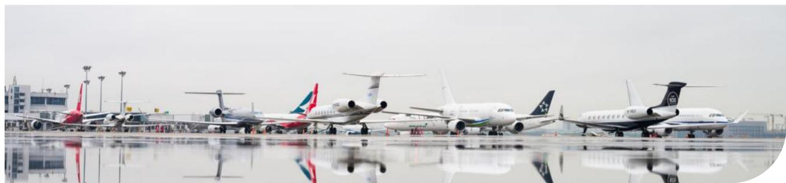

natural_image

Row of parked airplanes on a wet tarmac with reflections in the water (no visible text or signage)

# 员工民主管理

上海机场遵守《上海市职工代表大会条例》及工会制度有关要求，通过职工代表大会等方式对企业经济生活、政治生活、社会生活、文化生活以及其他事务实行民主决策、民主参与、民主监督。2025年，上海机场规范开展民主管理，在职代会中提高劳模先进和工匠、一线高技能人才等优秀产业工人占比，指导各直属单位开展民主管理规范化建设；职工民主参与程度不断深化，畅通民情和汇集民智通道，升级“职通车”平台，优化职工建言流程，围绕技能人才培育、班组建设和职代会提案落实情况，组织开展职工代表巡视，为企业高质量发展注入民主监督动能；劳动关系保持和谐稳定，深入推进劳动法律监督和一函两书工作，组织开展劳动法律监督员培训。

# 员工关爱

2025 年，上海机场职工帮扶保障工作持续做精，服务职工实事项目持续做优，关爱女职工的力度持续加大，各项工作均取得积极成效。

# 案例

# 困难员工帮扶

公司持续加强职工送温暖工作，加强对工会送温暖基金管理办法的宣传解读，帮助职工用好用足政策，提升政策覆盖面和办理便捷性。

# 浦东机场公司

工会持续完善困难职工动态梳理与建档机制，与基层单位工会共同开展冬季“元旦春节”送温暖，困难职工慰问88人次。开展民航患重疾职工专项慰问23人次，市交通委困难职工家庭子女金秋助学18人次。分类分层掌握职工需求，有针对性地开展“冬送温暖”“夏送清凉”及春运、中秋国庆、进博会等重要保障节点慰问活动。

# 虹桥机场公司

工会为进一步建立和完善工会组织多层面的帮扶保障体系，先后修订《工会职工互助金管理办法》《送温暖基金资金使用管理办法》《职工困难援助实施办法》。

# 机场物流公司

工会设立“送温暖基金”，开展“一日捐”活动，用于帮助困难职工；关爱职工健康，定期开展“夏送清凉”“冬送温暖”、重大节日及重要保障工作等现场慰问，并定期组织健康团建及四季养生等活动。

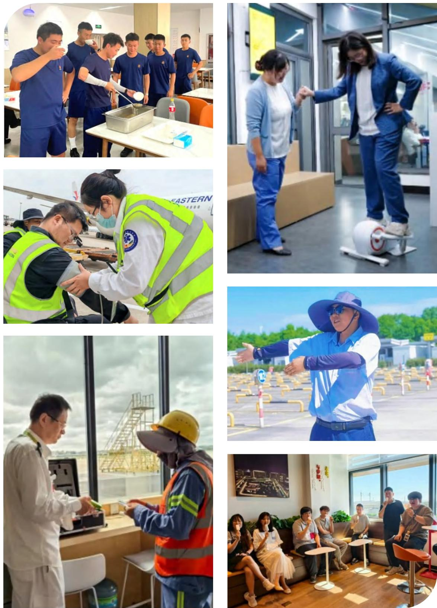

# 案例

# 共享休息室

上海机场持续开展建家优境，两场在机坪新投用 3 个站坪共享休息室，累计建成投用站坪共享工间休息室达 10 个，覆盖单位 80 余家，每天可服务职工约 3000 人次。

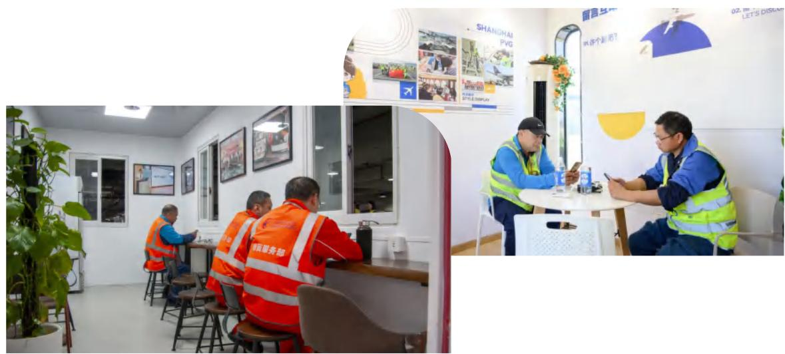

text_image

Interior photo of a service center with staff in orange vests and safety vests, featuring visible signage including 'SHANGHAI PVG' and promotional posters.

# 员工心理健康管理

上海机场积极组织参加安康杯竞赛，下拨安康护航专项经费和心理关爱专项经费，守护职工身心健康。切实加强对一线员工的心理关心与关爱，面向全体职工及直系家属，推出24小时心理关爱热线，为职工提供了一个随时可以倾诉、寻求专业支持的“安全港”。同时，深入开展“送课到基层”心理健康辅导，针对一线重点保障单位的业务特性和压力源，提供了定制化、场景化的EAP课程，有效帮助一线职工提升了情绪调节和压力管理能力。

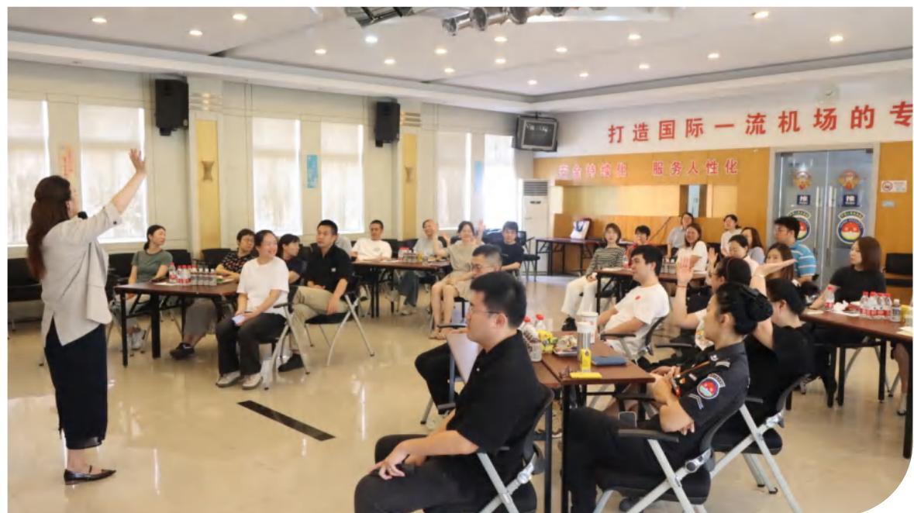

text_image

打造国际一流机场的专
安全弹奏化 服务人性化

# 案例

# 员工生育期间的权益保障

上海机场积极落实员工假期相关管理办法，组织签订了《女职工权益保障专项协议》，符合条件的员工可享受相应假期（产假、生育假等）。男性员工在其配偶生育期间享受陪产假。

# 关爱女职工

上海机场持续做好女职工“两病”筛查和“四期”保护，关爱女职工身心健康，维护女职工合法权益和特殊利益。落实女职工团体互助特种医疗保障计划，优化保障内容，提升保障实效。开展女职工关爱月活动，围绕提升女职工综合素养，推出女职工幸福热线、女性全生命周期健康科普课程、玫瑰书香“悦”读、我和春天有个约会、女工干部素能提升交流学习五大主题板块活动，激发巾帼“她力量”。

# 案例

# 职工生活品质提升

上海机场以职工生活品质提升系列活动为抓手，提升职工健康素质和文化素养。落实职工业余文体活动团体相关管理办法，形成公司级业余文体队伍、基层以上单位级职工社团和基层单位兴趣小组，实施分层分类有序管理和专项支持，进一步释放组织活力。全年围绕职工健康促进、职工品质生活、职工文化阅读三大主题开展70余项职工文体活动，其中20余项活动向全公司职工开放共享。“步”遗余力、“乒”搏奋进、精彩“羽”共、勇“网”直前、汇聚民“智”五大健身节赛事吸引近千名职工参加；健康美食品鉴、职工健康市集、家庭日“亲子关爱”和青年联谊交友四个主题日活动，向广大职工传递健康和谐生活理念；第八季金秋乐学为各年龄段升学职工子女开启新学年序曲，助力职工和家庭“乐生活”。

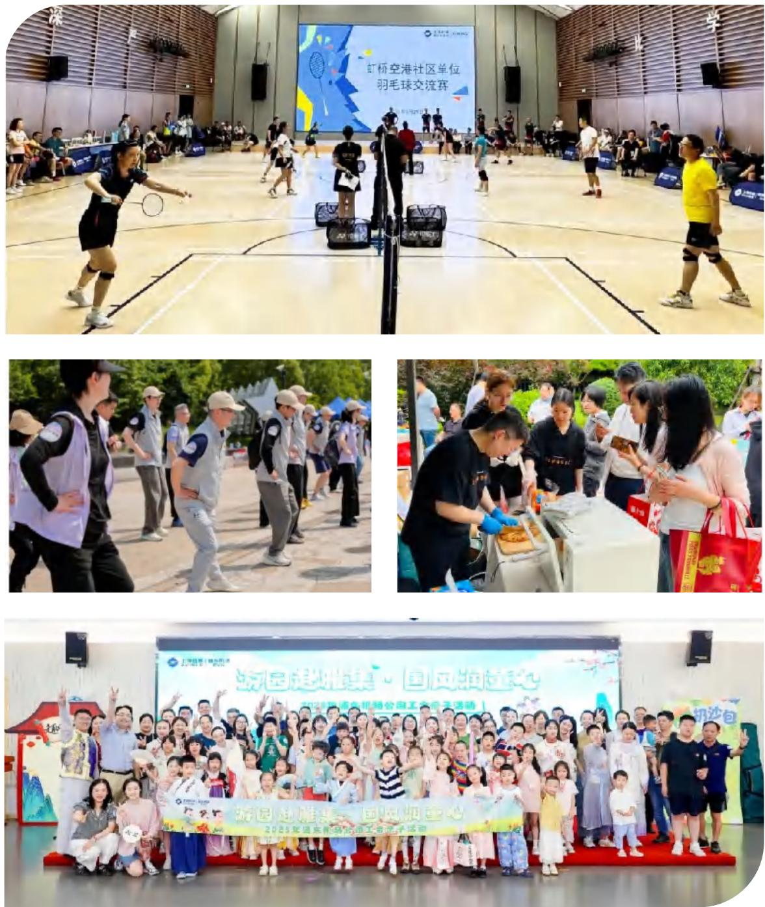

# 报告期内

结合问卷抽样调查，员工满意度调查得分 4.23 分（满分 5 分）。

# 员工劳动权益保障和申诉制度

公司遵循劳动保障相关法律法规，持续完善内部管理体系，搭建多元化、便捷高效的员工沟通与申诉渠道，积极回应员工诉求，构建和谐稳定的劳动关系。公司落实劳动合同管理相关办法，不存在强迫劳动、雇佣童工及任何形式的非法歧视行为，坚守公平、合规、人道的用工底线。

# - 员工职业健康与安全

# 员工职业健康安全管理体系

上海机场积极落实劳动防护用品使用和管理相关办法，持续推动贯彻职业健康安全管理体系，加强职业健康管理教育培训工作，合理发放和正确使用劳动防护用品，将员工健康安全放在首位。公司按规定足额缴纳工伤保险，人员100%全覆盖。

浦东机场公司制定实施《职业健康安全管理体系手册》，定期组织开展职业健康安全管理体系合规性评价工作，并顺利通过 ISO45001:2018 职业健康安全管理体系认证。

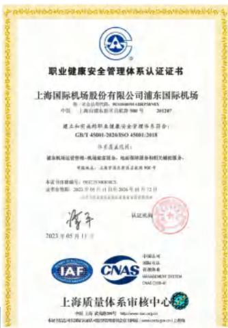

seal

上海国际机场股份有限公司浦东国际机场
职业健康安全管理体系认证证书
中国（上海）自由贸易试验区190号
G310000118025666
中国（上海）自由贸易试验区190号
201207
建立和实施的职业健康安全管理体系符合：
GB/T 45001-2026ISO 45001:2018
传承者或其：
浦东机场运营管理—机场配套服务、地面保障服务和相关辅助服务。
客服电话：上海市浦东新区浦东南路950号
本证书注册编号：0512230003625
证券信息截止：2023年05月11日和2025年05月12日
沪东证
认证机构
IAAF GNAS
上海质量体系审核中心
中国（上海）自由贸易试验区190号
SHANGHAI GINA
MANAGEMENT SYSTEM
DIAO (2018-4)

# 报告期内

因公受伤 18 人

因公死亡 0 人

因工伤损失工作日数346日

职业病发生率0%

30周岁以上员工体检覆盖率100%

# 案例

# 医疗巡诊员为一线员工撑起关爱“遮阳伞”

只要气温超过 $35^{\circ}$ C，两场的医疗巡诊队伍就会按时出动，穿梭于机坪、场区等户外工作区域，为高温下的一线员工提供上门医疗服务。每天清早 7 点，巡诊委员会提前准备风油精、清凉油、藿香正气丸、人丹等防暑降温用品，规划好巡诊路线，为安检、飞行区、地服、场区等单位的员工测量血压、发放药物，讲授防范中暑的措施和急救方法。每周二和周五，他们还会前往机坪员工休息室开展坐诊服务，为高温户外作业的一线员工撑起关爱的“遮阳伞”。

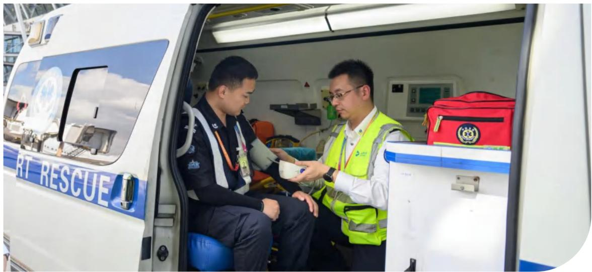

natural_image

Two medical staff in safety vests receiving a donation from an ambulance, with visible text on the vehicle's side (no signage or symbols on main subjects)

# - 职业发展与培训

上海机场以“人才强企”为核心理念，系统推进教育培训体系优化与人才能力提升，为公司高质量发展注入强劲人才动力。

# 员工职业发展制度、计划及晋升路线

# 浦东机场公司

制定《岗位级别管理体系实施办法（试行）》，以岗位所在单位的功能定位、组织架构及所处业务流程节点为基础，确定职能管理类（M）、运行管理类（O）、专业技术类（T）、生产作业类（P）四种岗位类别，并以岗位类别为依托，以岗位级别为路径，通过所在类别晋升级别或在不同类别岗位间交叉任职，形成纵向职业发展通道和不同类别间岗位横向职业转换通道，构建纵横互通的员工职业发展格局。

# 虹桥机场公司

制定了《岗位级别管理实施办法》，搭建了以岗位价值、岗位职责和工作业绩为基准的系统化层级结构，健全完善了多通道、多层次的员工职业发展路径。通过持续完善岗位级别管理机制，优化岗位设置，科学岗位评估，明确发展通道，鼓励员工专注于自身业务领域的能力提升和绩效贡献，激发员工立足岗位成长成才的内生动力。

# 机场物流公司

参照一般管理人员职务、职称聘任相关实施细则、科级管理人员队伍年轻化建设相关指导意见促进员工职业发展。一般管理人员原则上在本岗位工作满三年且个人绩效考核为良好及以上的，可参与职务晋升评选。

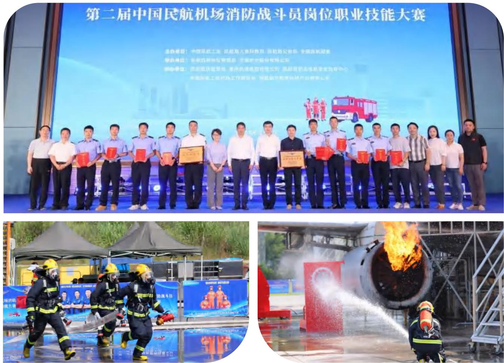

# 案例

为深入学习贯彻习近平总书记关于深化产业工人队伍建设改革的重要指示精神，充分发挥职业技能竞赛在技能人才培育方面积极作用，加快建设与长三角地区民航高质量发展相匹配的技能人才队伍，9月4日，首届长三角地区机场助航灯光机务员岗位技能大赛决赛在上海机场培训中心开幕。在为期三天的竞赛中，设置了理论测试和“一次电缆连接器制作”“精密进近航道指示器（PAPI）校准”2项单人项目，以及“跑道边灯回路绝缘故障排除”1项团体项目，来自上海、江苏、浙江、安徽等长三角各地24家机场的48名优秀选手同台竞技，最终决出个人综合奖、团体优胜奖等奖项。同时，决赛中个人综合成绩优异的选手被授予“全国民航技术能手”“全国民航青年岗位能手”“华东民航技术能手”“华东民航金牌员工”荣誉称号。

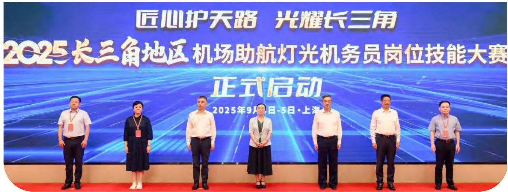

text_image

匠心护天路 光耀长三角
2025长三角地区 机场助航灯光机务员岗位技能大赛
正式启动
2025年9月5日-5日·上海

# 员工培训和实践举措

上海机场积极落实教育管理培训相关办法，与公司战略和业务发展需要相结合，与干部教育、人才培养相结合，与岗位体系建设相结合，形成科学高效的干部员工教育培训管理体系，实现企业与员工共同发展。公司在培训方面重点开展了以下工作：

全新打造中层干部系列专题培训，紧密围绕党建与改革、安全与效率、服务与中转、数智与绿色、枢纽与规划，邀请中层干部上讲台授课，树立了“在状态”良好学风。

优化专业人才队伍培育，围绕航空主业和非航业务，分别前往业内机场开展对标学习，分类形成学习清单，并开展内部交流分享。

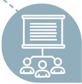

持续做好青年干部教育培养，首次引入青年导师机制，前置开展课题研究专项培训，围绕建运一体、绿色低碳、商业经营、党建宣传四个方向开展小组课题研究，强化年轻干部的综合能力。

加强技能人才队伍建设，持续开展民航安全检查员、机场运行指挥员等工种的职业技能鉴定与认定工作，促进高技能人才队伍壮大，进一步优化技能人才队伍结构。

# 报告期内

778.38 万元

员工培训总投入

58.40 万人次

员工培训总人次

339.85 万小时

员工培训总时长

100%

员工培训覆盖率

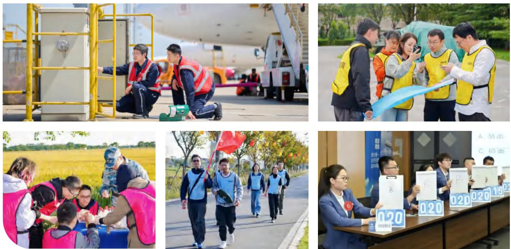

# 案例

# 员工发展成效

# 浦东机场公司

深化高技能人才培养，飞行区管理部成功获批华东地区首个机场场务员高级工自主认定资质，交通保障部停车管理员技师级直接认定方案通过上海市备案，技能人才培育机制持续完善。针对青年干部、新任干部、新进员工开展差异化培训，强化教育培训与实践锻炼，通过实战化训练提升综合能力；持续加大干部复合型培养力度，对外遴派23名干部赴市国资委、民航局等单位挂职，推荐23名技术骨干担任行业专家，对内选派32名骨干跨模块、跨层级、跨领域交流，推进启航人才三年培养项目收官，全方位锤炼干部复合型能力，为高质量发展提供坚实人才支撑。优化干部人才队伍结构，坚持“重状态、轻资历、论业绩”用人导向，80后中层干部占比超30%，90后科级干部同比增长5%、占比近20%，干部人才队伍数量和质量稳步提升。

# 虹桥机场公司

持续完善校企合作、劳务用工、勤务安排，创新招工模式；以年轻化、专业化为导向开展12个岗位中层干部选拔调整，完成机关部室定岗定编，涉及14个职能部室、49个岗位；深化与民航大学、法国Qair集团、航科院等战略合作，在高端人才育成、零碳机场建设、枢纽能级提升等领域协同发力；与东航开展首期三年干部人才交流合作。2025年，共有95名员工通过运行管理类、专业技术类、生产作业类职业发展通道得到岗级上的提升。

# 机场物流公司

通过完善干部考核机制，顺利完成中层干部任期综合考核，优化职能配置，提升组织效能。通过整合同类职能、补充关键岗位等举措，使各部门运转与沟通效率得到进一步提升。广泛开展企业文化大讨论活动，引导员工将个人理想融入物流枢纽建设，凝聚发展合力。

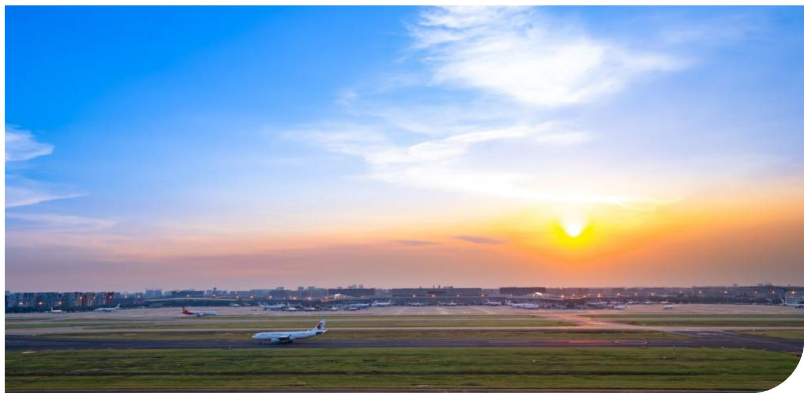

natural_image

Sunset over an airport runway with a jet and airplane visible, no text or symbols present.

# 案例

# 领导力培训

# 浦东机场公司

围绕发展战略与人才分层分类需求，以“青年干部塑才、新任干部立责”为培养目标，差异化开设青年干部培训班、新任科级干部培训班。针对青年干部，采取选调的形式，从政治素养、安全运营、管理创新等六大维度设计课程，首次引入“外出研学 + 集中研讨 + 成果汇报”模式，开展小组课题研究并提交研学分析报告，通过实战化训练提升综合能力。针对新任干部，围绕战略认知、管理实务、廉洁防控三大核心模块，采用“政策解读 + 案例教学 + 风险警示”形式，帮助学员快速适应岗位要求、规避管理风险。

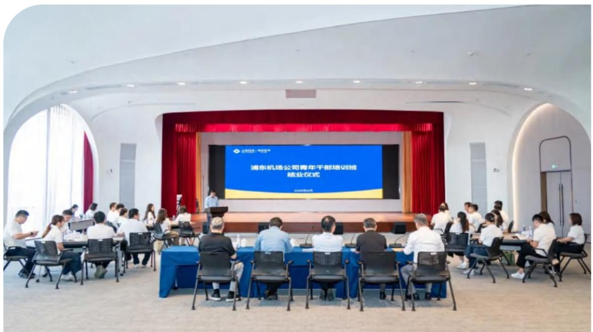

text_image

浦东机场公司青年干部培训班
结业仪式

# 虹桥机场公司

邀请中国民航大学教授对中高层领导开展了“学标杆、找差距、谋精品”专项培训，不断提升战略思维、管理视野和决策能力。邀请上海市委党校和中国民航大学讲师开展“全体优才和主要科职干部”专项培训，增强政治意识，认清形势任务，拓宽工作视野，提升业务能力。

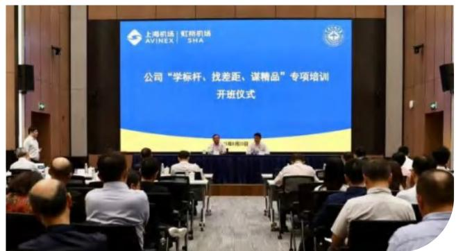

text_image

上海机场 | 虹桥机场
AYIHEK | SHA
公司“学标杆、找差距、谋精品”专项培训
开班仪式

# 机场物流公司

着力强化管理团队的战略思维与专业领导力，积极组织管理人员参加“万名书记进党校”等党性教育与领导力提升项目，并开展“企业文化共创”系列培训，旨在全面提升干部队伍的综合素养、战略执行力与思想共识。

# 产品和服务安全与质量

公司认识到产品和服务安全与质量对上海机场发展的重要性，通过构建系统的服务质量管理体系与安全管理体系，持续完善制度、强化风险管控、优化管理手段，推动产品和服务安全与质量实现可持续发展。

# - 治理

上海机场严格遵守《中华人民共和国安全生产法》《上海市安全生产条例》《安全生产事故隐患排查治理暂行规定》《民航安全风险分级管控和隐患排查治理双重预防工作机制管理规定》《公共航空运输旅客服务管理规定》《公共航空运输旅客服务质量》等法律法规，落实安全考核管理、服务质量工作管理等相关办法，制定全员安全责任体系、服务质量监督检查管理办法等内部制度，规范安全与服务等管理要求，并已建立完善的治理架构。

# 安全管理组织架构

上海机场把安全生产工作作为第一要务，实行安全生产党政同责一岗双责齐抓共管责任体系。公司实施安全生产工作情况通报制度，各级安全生产委员会办公室定期或不定期通报或报告有关安全生产工作情况。

管理层  

指导及审阅安全管理相关方针及目标，监督安全生产相关目标进展及完成情况，研究部署安全生产相关工作。

负责安全运行服务规划、安全运行服务研究、安全监督管理、应急处置管理、生产运行管理、重大任务保障、内部治安保卫和国防动员。

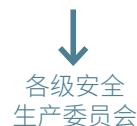

审批安全目标，审批安全考核关键指标体系和评价标准，审批安全考核意见，对安全管理中发生的争议事项作出决议。

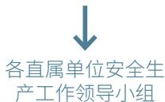

各直属单位设置安全生产工作领导小组，由高级管理层担任组长。小组定期听取安全生产工作汇报，研究落实安全生产工作，协调解决安全生产问题，落实各级安全生产责任，强化考核监督，确保各级安全生产责任履职到位。

# 服务管理组织架构

上海机场始终将旅客满意度与获得感作为服务评价的核心指标，持续优化服务效率、提升服务效能，以服务考核为导向，不断健全完善服务质量管理体系，推动机场服务品质稳步提升。

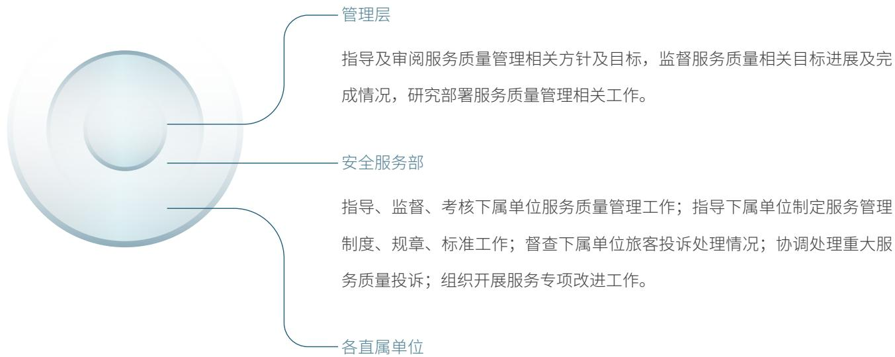

flowchart

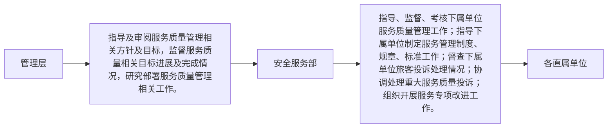
```mermaid
graph LR
  A["管理层"] --> B["指导及审阅服务质量管理相关方针及目标，监督服务质量相关目标进展及完成情况，研究部署服务质量管理相关工作。"]
  B --> C["安全服务部"]
  C --> D["指导、监督、考核下属单位服务质量管理工作；指导下属单位制定服务管理制度、规章、标准工作；督查下属单位旅客投诉处理情况；协调处理重大服务质量投诉；组织开展服务专项改进工作。"]
  D --> E["各直属单位"]
```

作为服务质量工作管理主体，负责对所属范围内的服务质量管理工作的组织、协调和实施，并承担相应责任。各直属单位均设立一名公司层级的领导作为服务质量工作的最高管理者。各直属单位根据职责分工和工作要求明确对口部门，落实各自内部相应的服务质量管理组织架构。

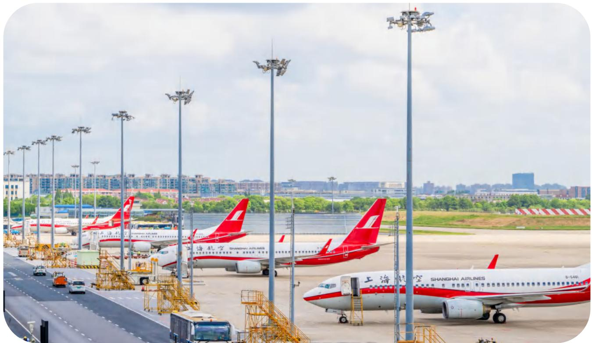

natural_image

Exterior view of a modern airport tarmac with multiple Shanghai Airlines aircraft parked on tarmac and city skyline in background (no signage)

# - 战略

上海机场以韧性安全为保障，筑牢枢纽发展稳固根基，更好统筹发展与安全。公司始终将安全作为头等大事，坚持安全第一、预防为主、综合治理方针，深化安全管理体系现代化建设，强化核心风险防控，深化双重预防机制，确保安全形势总体平稳。同时，公司立足为人民群众创造更加美好的航空出行体验，积极践行“真情服务”理念，对标世界一流，促进上海机场服务提质增效与消费提振扩容双向赋能，以多维度创新满足旅客多样化需求，以至臻服务保障旅客平安、便捷、温馨出行，以高品质服务彰显枢纽机场国际化门户形象。

上海机场持续优化安全生产管理体系和质量管理体系建设，通过一系列举措完善安全管理制度、强化隐患排查整治，夯实安全运行根基；优化服务流程与设施，提升服务品质与管理效能，强化服务管理与品牌建设，筑牢保障根基。

# 服务品质升级

# 案例

# 质量管理体系认证与标准建设

两场均通过了 GB/T19001-2016/ISO9001:2015 质量管理体系认证，根据各自情况分别制定了《服务质量管理体系手册》《服务质量监督检查管理办法》《服务质量投诉管理办法》等一系列规章制度，形成了覆盖服务全流程、各环节的标准化管理体系。

机场物流公司下属货运站公司搭建了专业化服务治理架构，设立服务管理委员会统筹服务管理工作，制定《服务规范手册》《服务风险管理暂行办法》《服务质量投诉管理办法》等制度，构建系统化客户服务规范体系。2025年货运站公司获得国际航空运输协会（IATA）独立验证卓越中心（CEIV）活体动物认证，成为境内首家同时获得CEIV药品、锂电池、鲜活易腐及活体动物航空货物运输全品类认证的货站，以此助力上海全方位门户复合型国际航空枢纽货运服务能级再提升。

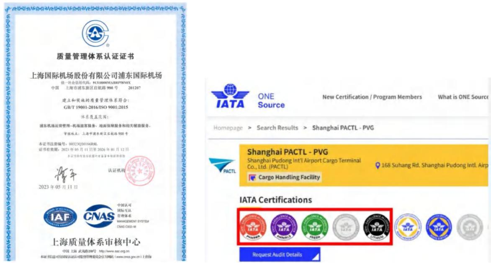

text_image

质量管理体系认证证书
上海国际机场股份有限公司浦东国际机场
统一社会信用代码：91310800MA8RP5NEX
中国 上海市浦东新区启航路908号 201207
建立和实施的质量管理体系符合：
GB/T 19001-2016/ISO 9001:2015
体系覆盖范围：
浦东机场运营管理-机场旅客服务-地面保障服务和相关辅助服务。
审核地点：上海市浦东新区启航路908号
本证书注册编号：90323Q0016GR8L
证书有效期：2023年10月11日至2026年01月12日
本证书的有效期限由国家市场监督管理总局颁布。
2023年05月11日
认证机构
IATA
CNSA
中国认可
国际互认
管理体系
MANAGEMENT SYSTEM
CNAS COG-M
上海质量体系审核中心
中国 上海 武海路388号 http://www.sac.org.cn
本证书须经可信网认可的监督管理委员会官方网站（www.cncs.gov.cn）上查询
IATA Source
New Certification / Program Members What is ONE Source
Homepage > Search Results > Shanghai PACTL - PVG
Shanghai PACTL - PVG
Shanghai Pudong Int'l Airport Cargo Terminal
Co., Ltd. (PACTL) 168 Suhang Rd. Shanghai Pudong Intl. Airp
Cargo Handling Facility
IATA Certifications
Request Audit Details

# 案例

# 服务质量提升举措

# 浦东机场公司

多维优化服务供给，全方位提升旅客出行体验。提升入境便利水平，精准服务外籍旅客，优化多语种入境导览系统，丰富登机口多语言广播，组建青年外语志愿者队伍，为外籍旅客提供主动指引、翻译和问询服务；逐步优化整体标识体系，通过色彩强化、信息精简、功能分区可视化等手段，有效提升旅客通行效率与体验；开展卫生间品质专项提升行动，打造便捷、温馨的女性友好型候机环境；开展宠物进客舱保障服务；提升陆侧交通通行效率，创新实施出租车“短途票”优化方案，有效缓解高峰时段交通压力，提升旅客乘车体验。

# 虹桥机场公司

致力于打造“四个友好”机场，即“商务人士友好、入境人员友好、全年龄段友好、宠物友好”，围绕“两个专属、两个优先、两个升级”，制定中国民航首个快线航班服务标准，包括设置专属值机柜台和安检通道，优先放行和优先靠桥等。针对首乘、母婴、陪护、长者四类人群推出爱心手环服务，升级“虹馨相伴”服务，建立“主动发现需求+全流程陪伴”模式，同时全面评估和健全无障碍设施和关爱体系。

# 机场物流公司

智汇港货站、海关智慧货运检查中心建成投运，为高端物流、跨境电商等业态提供了高标准硬件支撑；创新推出国际货物“换单”中转业务，实现“一票货物、两程航司”无缝衔接，中转便利性显著提升。

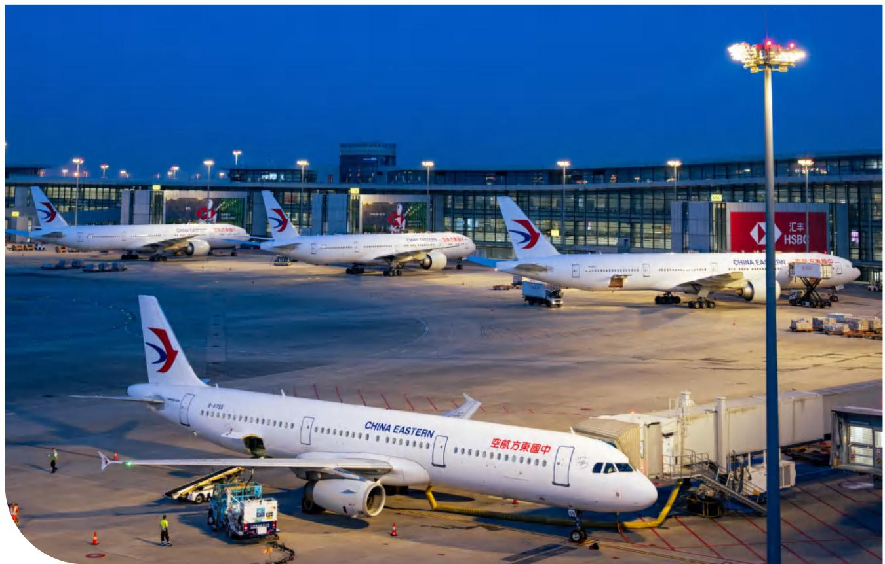

natural_image

Exterior view of multiple China Eastern Airlines parked at an airport gate during twilight, with no visible signage or text on the aircraft or surroundings.

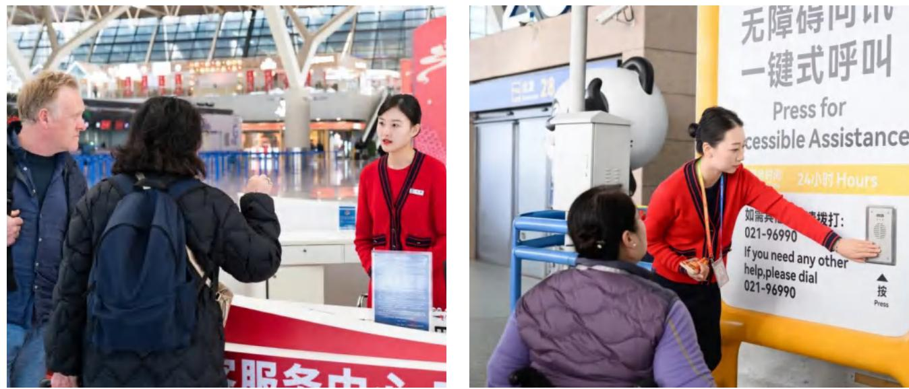

text_image

无障碍问讯
一键式呼叫
Press for
Accessible Assistance
24小时 Hours
如需其免费拨打：
021-96990
If you need any other
help,please dial
021-96990
按
Press

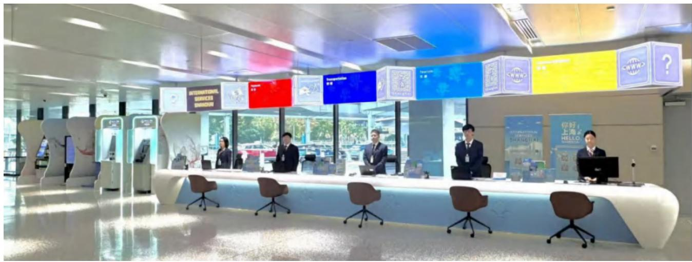

text_image

Interior photo of a modern service center with staff at counters and digital signage displaying 'INTERNATIONAL SERVICES GONZION' and 'WWW'.

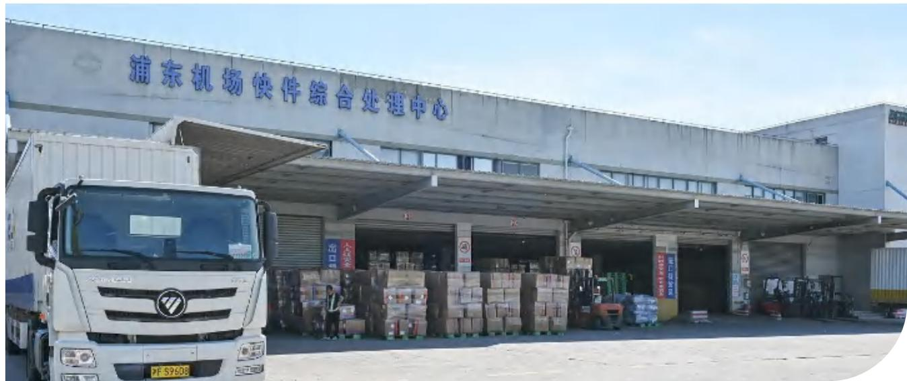

text_image

浦东机场快件综合处理中心

# 品牌价值管理

# 案例

# 品牌孵化与焕新

2025 年，上海机场举行第二届品牌日暨暑促嘉年华，两场深化文旅商体展联动助力提振消费，赋予“中国样·China Young”上海机场人文品牌新内涵，促销抽奖惊喜连连，精彩演出吸引旅客驻足，为广大旅客带来难忘人文出行体验。浦东机场重点做精中转、行李、休憩服务，虹桥机场聚焦“入境沪港通”“行李通”“ONE ID”升级；虹桥机场推动入境到达区域人文空间试点项目落地，动态完善上海机场品牌视觉形象体系，提升机场文化氛围，深化品牌形象推广。

  
1

# 客运—空空中转

已有 14 家航司在上海开展中转业务。上海机场携手联检单位进一步完善浦东机场 T1 通程联运功能，新增 T2 通程联运功能，实现各类中转场景全覆盖。同时，进一步缩短中转衔接时间，全力支持更多航司开展中转业务，为旅客提供更多更丰富的中转航班选择。

  
4

# 货运—空空换单中转

上海机场在依托基地航、集成商开展货运中转的基础上，推出分运单层面“换单中转”业务，覆盖同货站、跨货站等场景，货代企业预定前后两段航班舱位的中转业务，可按中转流程申报，无需按“进港+出港”流程申报，实现货物在机场“原进原出”高效中转，获得更丰富灵活的航班选择，以及更加低廉的运输成本。

  
2

# 客运一两场中转

市域机场线开通后，上海虹桥、浦东两场通行时间缩短至40分钟。上海机场携手东航依托市域机场线，开设“空港通”服务，在虹桥、浦东机场设置专用服务柜台，为东航旅客提供跨两场提前值机、行李托运等服务。未来还将进一步扩大“空港通”产品服务功能规模和航司覆盖范围。

  
5

# 货运一两场关检互认

上海机场发挥浦东、虹桥两场航线网络互补优势，在海关、民航等监管单位支持下，实现跨两场中转无需二次安检和海关转关及查验。

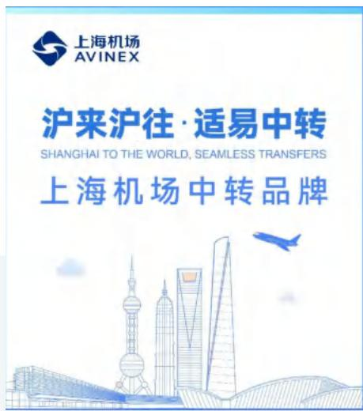

text_image

上海机场
AVINEX
沪来沪往·适易中转
SHANGHAI TO THE WORLD, SEAMLESS TRANSFERS
上海机场中转品牌

上海机场从服务能力、产品、岗位标杆三个维度梳理服务品牌定位，在2025北外滩国际航运论坛上发布上海机场“沪来沪往·适易中转”品牌。

# - 沪来沪往 -

三“客”三“货”六大中转产品

  
3

# 客运—空地中转

上海机场携手苏州、昆山等地打造上海机场异地城市航站楼，为长三角城市旅客航空出行提供高效、便捷运输环境。其中，苏州工业园区城市航站楼是全国首个同时具备国际国内航班值机功能的异地城市航站楼。未来，随着上海东站建成投运，浦东、虹桥两场将形成兼具航空、高铁、市域铁路、地铁等功能的综合交通枢纽。

  
6

# 货运—空地联运

上海机场携手长三角城市在昆山、苏州、合肥、松江等地设置异地货站，进一步前移上海机场对长三角区域产业链供应链服务功能。其中，上海机场 - 苏州异地货站已实现安检、海关功能前置。在市交通委指导下，上海机场联合东航、铁路组建上海空铁联运服务中心，拓展货运空铁联运业务。

# - 适易中转 -

三“客”三“货”六大中转产品

  
1

# 舒心适憩

浦东机场已实现国内、国际 24 小时通关，同步设置了 8 处免费过夜休息区，提供 1018 个休息位和 228 个充电插座；还布局了淋浴房、休息舱，24 小时便利店和餐饮店。

  
5

# 指引易达

上海两场双语标识已覆盖中转全流程,浦东机场推出8种语言语音导航的中转流程导览,上海机场小程序“中转导航”功能可根据到达与出发航班号一键规划中转路线。浦东机场T2国内转国际中转区布局智能引导机器人。上海机场青年员工组建多语种志愿者队伍,为中转旅客提供问询与引导服务,以至臻服务奏响“上海欢迎您”的生动乐章。

  
2

# 贴心适住

浦东、虹桥两大机场组建“酒店品质联盟”，为中转旅客推出多项服务：指定酒店4—6小时短时住宿，航旅信息综合问询台提供交通指引、文旅信息、电子支付协助及乘机流程指导，还提供“中转旅客专属优惠权益包”，可在指定酒店享受客房、餐饮、洗衣、健身、康乐等服务优惠或体验权益。

  
6

# 网络易连

针对部分外籍旅客没有国内手机号，在航班落地后难以第一时间连网的问题，两大机场推出“Wi-Fi易认证拍护照上网”服务。此外，浦东机场布设了20处SIM卡销售点，并根据停留时长、通讯需求推出差异化资费套餐。

  
3

# 乐购适享

浦东机场依托上海机场官方微信小程序“浦乐 GO”，串联场内 200 多家优质店铺形成“美食购物网”，旅客一键下单后，餐食等可通过送餐机器人直达登机口，日活量高达 1.26 万人。虹桥机场打造“最潮商圈”的同时，引入平价餐饮与上海老字号品牌。两场还布局多处离境退税点，方便国际旅客退税。

  
7

# 行李易查

浦东机场联程航班托运行李已实现直挂免提。在中转厅国际转国内区域，上海机场还联合海关设置托运行李进度动态显屏，中转旅客可实时知晓自身行李的查验进度。

  
4

# 半日适游

上海机场联合市文旅局、携程，为国际中转停留8小时以上的旅客推出“免费上海半日游”服务，覆盖豫园、外滩、武康大楼等多条路线。旅客还可预约免费交通接送、24小时移动上网和外文向导讲解等服务。

  
8

# 消费易付

上海两大机场所有商铺均支持 VISA、万事达卡及 Apple Pay 等境内外主流支付方式，并可用外卡购买 “SHANGHAI PASS” 交通卡，机场磁浮、轨交、市域线均支持主流外卡直接刷卡乘车。

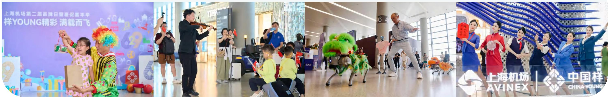

# 案例

# 上海机场航空物流领域深耕国际化运营策略

6月4日，在慕尼黑国际物流博览会上，上海机场旗下浦东机场货运站有限公司（PACTL）先后与埃塞俄比亚航空集团、墨西哥汉莎货运物流服务公司签署战略合作协议，分别合作设立 PACTL 亚的斯亚贝巴机场和 PACTL 墨西哥城国际机场海外货站，并在业务延伸、市场开发、技术交流、物流提效、品牌推广等方面加强合作，为促进国内国际双循环提供更便捷物流服务，助力上海国际航空物流枢纽高质量发展。

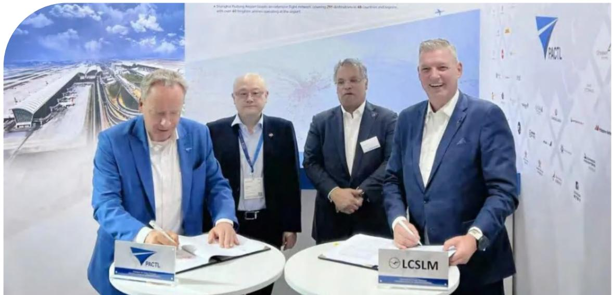

text_image

Photo of four men signing documents at a PACTL and LCSLM signing event, with visible signage and background text about Shanghai Portong Airport's 2011 flight network.

上海机场在航空物流领域深耕国际化运营策略，通过深化与国内外航司交流合作，持续拓展上海国际航空物流枢纽网络在非洲和美洲的覆盖面。埃塞俄比亚亚的斯亚贝巴机场海外货站仓储面积约4万平方米，货物处理能力预计在60万吨/年以上，墨西哥城机场海外货站仓储面积约1万平方米，货物处理能力预计在10万吨/年以上。两家海外货站设立后，将进一步提升从上海畅连全球的货运服务保障能级，为上海全方位门户复合型国际航空枢纽建设提供新的有力支撑。

上海机场在苏州、昆山、松江等地持续推进设立前置货站，把机场“搬”到企业“家门口”，在服务企业提升通关效率的同时进一步降低物流成本。未来将依托海外货站，与合作方探索推出更多高效、顺畅、便捷的航空物流解决方案，更好地服务企业、服务区域产业升级和城市经济发展。

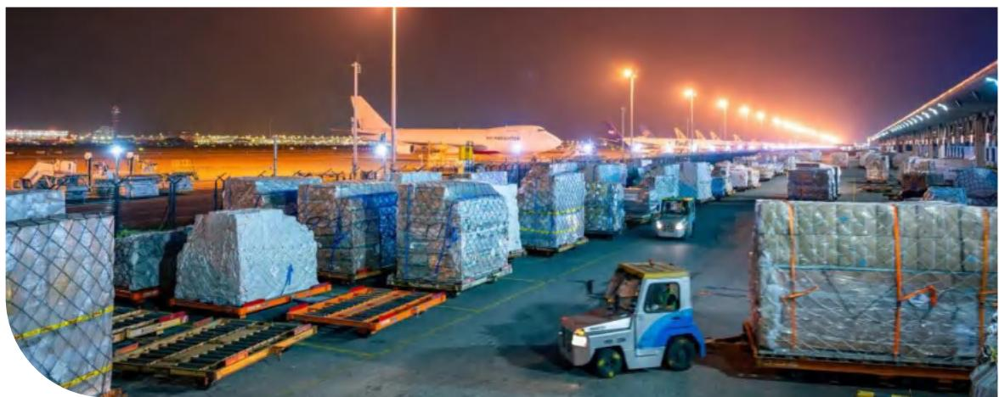

natural_image

Nighttime airport terminal with cargo pallets, forklift, and airplane in background (no visible text or symbols)

# 案例

# 品牌公益

2025 年，上海机场聚焦服务品质年，紧扣 “服务品质提升年” 工作主线，打造 “小航星” 志愿服务品牌，深耕品牌建设，聚焦外籍旅客出行需求，组建了外语志愿服务青年突击队。锚定春运、进博会等重大保障任务，以及北外滩国际航运论坛、世界赛艇锦标赛等国际赛会服务需求，广泛动员青年志愿者投身一线服务。志愿者们以热情周到的服务、严谨细致的作风，在客流疏导、嘉宾接待、后勤保障等岗位上发光发热，用实际行动擦亮 “小航星” 志愿服务品牌，充分展现了上海机场青年的青春风采与使命担当。

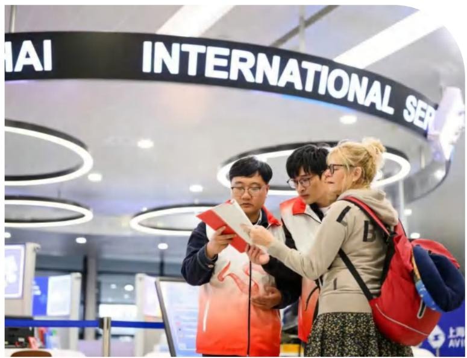

text_image

MAI
INTERNATIONAL SER

# 报告期内

11,286 人次

上海机场累计参与志愿服务

46,884 小时

贡献服务时长

natural_image

Three men in blue vests and caps at an airport or terminal, one gesturing while speaking; no visible text or symbols.

# 案例

# 品牌保护

公司遵守《中华人民共和国著作权法》《中华人民共和国商标法》《中华人民共和国专利法》等知识产权相关法律法规，各直属单位构建知识产权管理体系，开展专利与著作权的申请、维护工作，明确知识产权的归属责任，保护无形资产权益，有序推进知识产权保护工作。

# - 影响、风险和机遇管理

上海机场重视产品和服务安全与质量的风险，建立系统化服务质量与安全风险评估机制，确保在产品全生命周期内及时识别和评估潜在的质量与安全问题。公司持续落实安全风险分级管控和隐患排查治理、服务质量工作管理等相关制度要求，各直属单位通过制定《服务质量风险管理办法》《安全风险管理工作程序》等制度，明确服务质量与安全的风险识别、风险评估、风险控制等方法，为产品和服务安全与质量的影响、风险和机遇管理工作提供科学依据和规范指导。

<table><tr><td>潜在风险/机遇描述</td><td>类型</td><td>影响</td><td>时间维度</td></tr><tr><td>旅客服务流程优化不足,数字化体验不佳</td><td>风险</td><td>旅客满意度下降,收到旅客投诉,中转效率降低,影响航司合作意愿与非航空性收入增长</td><td>短期</td></tr><tr><td>安全运行标准升级,人力与设备投入增加</td><td>风险</td><td>运营成本上升,若发生安全事件将导致航班延误、罚款及品牌受损</td><td>中期</td></tr><tr><td>安全运行智能化监控与应急响应体系建设</td><td>机遇</td><td>依托安全管理体系(SMS)系统平台,完善数据分析和风险预警机制,降低安全事件发生率,减少航班延误与运营损失,提升品牌公信力</td><td>短期</td></tr><tr><td>旅客服务打造“航空+商业+文旅”综合枢纽</td><td>机遇</td><td>拓展免税、餐饮、会展等非航空性业务,多元化收入结构</td><td>长期</td></tr></table>

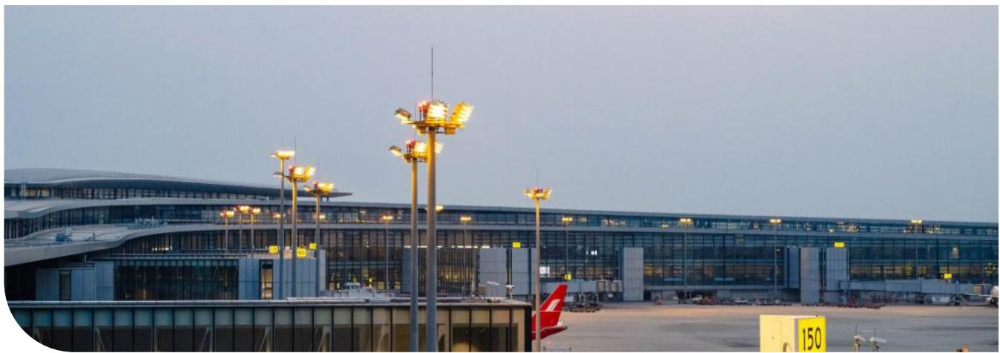

natural_image

Exterior view of a modern airport terminal with illuminated streetlights and a red warning sign in the foreground (no signage visible)

# 安全风险管理流程

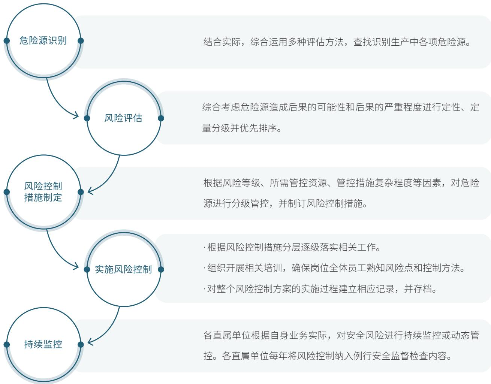

flowchart

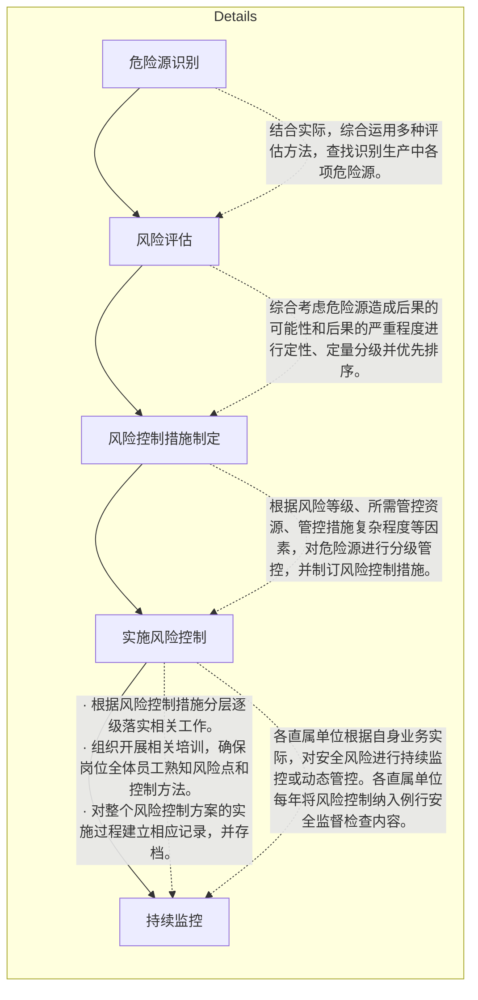
```mermaid
graph TD
  A["危险源识别"] --> B["风险评估"]
  B --> C["风险控制措施制定"]
  C --> D["实施风险控制"]
  D --> E["持续监控"]
  
  subgraph Details
    direction TB
    A -.->|"结合实际，综合运用多种评估方法，查找识别生产中各项危险源。"| B
    B -.->|"综合考虑危险源造成后果的可能性和后果的严重程度进行定性、定量分级并优先排序。"| C
    C -.->|"根据风险等级、所需管控资源、管控措施复杂程度等因素，对危险源进行分级管控，并制订风险控制措施。"| D
    D -.->|"· 根据风险控制措施分层逐级落实相关工作。\n· 组织开展相关培训，确保岗位全体员工熟知风险点和控制方法。\n· 对整个风险控制方案的实施过程建立相应记录，并存档。"| E
    D -.->|"各直属单位根据自身业务实际，对安全风险进行持续监控或动态管控。各直属单位每年将风险控制纳入例行安全监督检查内容。"| E
  end
```

# 案例

# 虹桥机场公司服务质量风险管理流程

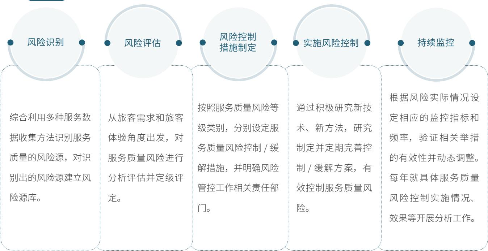

flowchart

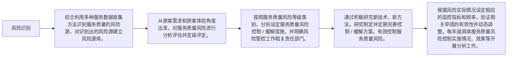
```mermaid
graph LR
  A["风险识别"] --> B["综合利用多种服务数据收集方法识别服务质量的风险源，对识别出的风险源建立风险源库。"]
  B --> C["从旅客需求和旅客体验角度出发，对服务质量风险进行分析评估并定级评定。"]
  C --> D["按照服务质量风险等级类别，分别设定服务质量风险控制 / 缓解措施，并明确风险管控工作相关责任部门。"]
  D --> E["通过积极研究新技术、新方法，研究制定并定期完善控制 / 缓解方案，有效控制服务质量风险。"]
  E --> F["根据风险实际情况设定相应的监控指标和频率，验证相关举措的有效性并动态调整。每年就具体服务质量风险控制实施情况、效果等开展分析工作。"]
```

# 指标与目标

服务与安全目标

持续实现安全年目标

持续保持高客户满意度

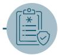

报告期内安全指标完成情况

浦东、虹桥机场分别实现第 26 个、第 38 个安全年。

客户满意度

浦东机场 2025 年度 ACI 满意度测评平均分 5.00 分。

虹桥机场 2025 年第一至第四季度旅客满意度测评平均分为 4.96 分。

客户投诉处理率

2025 年, 上海机场客户投诉处理率 100%

# 应对客户投诉机制

上海机场高度重视客户投诉相关工作。根据上海机场服务质量工作管理的有关规定，凡使用机场或机场所属相关设施、接受机场相关服务的各类人员，为维护自身合法权益，可通过电话、来信、来访、口头反馈、网络（官方微博、官方电子邮箱）、旅客意见卡等形式，在服务现场或非服务现场向上海机场直接或间接反映情况、提出建议。

服务质量投诉处理流程  
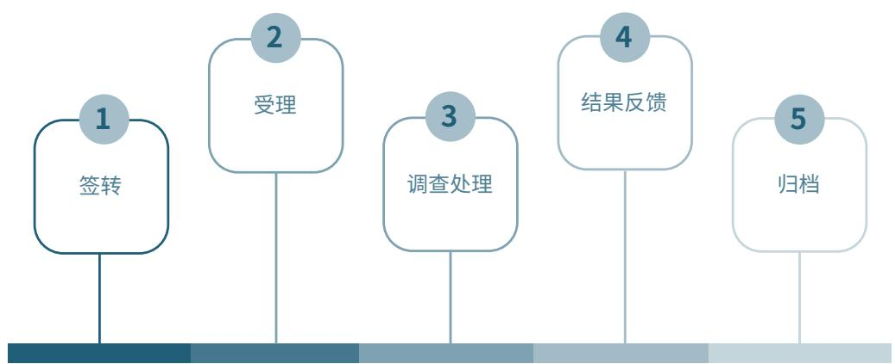

flowchart

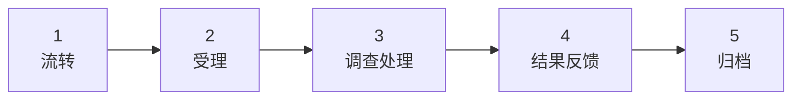
```mermaid
graph LR
  A["1\n流转"] --> B["2\n受理"]
  B --> C["3\n调查处理"]
  C --> D["4\n结果反馈"]
  D --> E["5\n归档"]
```

# 安全生产管理

2025 年，上海机场严格守法合规，按照 “统筹部署、分级负责” 机制，持续完善优化安全管理体系，强化配套制度建设，积极落实关于安全生产投入管理的相关指导意见，确保安全费用合规高效使用；加强航空运行安全信息管理，以项目整合多源数据，试行构建风险预警模型，综合分析行业信息，实现全链条闭环，打造安全信息管理标杆；完善数据分析和风险预警机制，依托安全管理体系（SMS）系统平台，推动危险源实现 “线上管理” “清单化管理” 和 “动态管理”，推动风险管理数据驱动，结合已有数据、季节及时段特点深入剖析风险特征，下发风险工作提示；加强过程性安全考核，按管理体系要求实施考核，明确考核结果，提升考核广度与深度；各直属单位开展管理体系评估和内审，结合实际优化流程，动态更新落实体系文件，履行守法合规责任。

# 报告期内

安全生产投入总额 21.07 亿元

开展安全类培训总计 456.78 万课时

开展的安全类培训总计 48.08 万人次

安全培训总场次 856 次

培训覆盖率100%

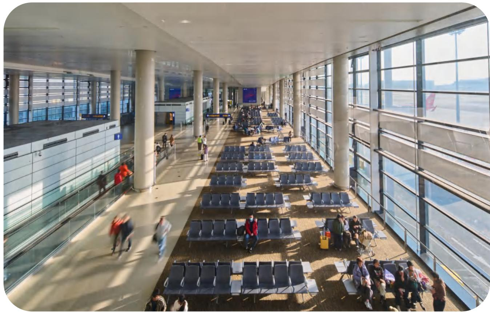

natural_image

Interior view of a large modern airport terminal with rows of seats and visitors, no visible text or signage

# 安全应急管理

2025 年，上海机场聚焦 “自然灾害、事故灾难、公共卫生、社会安全” 四大类突发事件，密切关注国内外相关应急管理工作最新动向，建立健全应急预案体系，强化桌面和实战演练，探索信息技术赋能，严密组织实战和复盘，全面提升了综合应急管理能力和应急响应水平。

# 实践举措

聚焦预案精细化与规范化，各直属单位细化修订机场级应急预案60余份，深入分析风险，精准调整内容，提升针对性和可操作性。同时，指导督促各部门完善部门级预案，确保各级预案紧密衔接，形成同频共振的应急预案体系，为应急处置提供制度保障。

对重点单位开展应急管理现场检查，全面排查问题隐患。分别对上海两场开展残损航空器搬移能力自查、评估及提升专项行动。推动应急管理工作科学化、规范化，持续提升整体应急管理水平。

两场积极推进预案演练，围绕季节变化特点、近期突发事件热点和长期应急处置难点三个维度，演练场景覆盖空防安全、残损航空器搬移、充电宝失火、二次安检、防汛防台、除冰雪等今年重点预判的应急事件。

全面优化 SMS 系统 “应急管理” 板块，进一步完善 “组织机构管理、应急预案管理、应急演练管理、应急物资管理、案例库和专家库管理” 等功能。

邀请来自民航管理干部学院、华东空管局、市政府总值班室等部门的专家，开展面向应急管理、运行指挥、机坪管制和值班值守等岗位的应急培训课程。

围绕 “主要概况、指挥机制、航班信息、处置进程、应急一张图、现场视频、应急会商、后台支撑” 八项功能，实现了大屏应急管理功能。

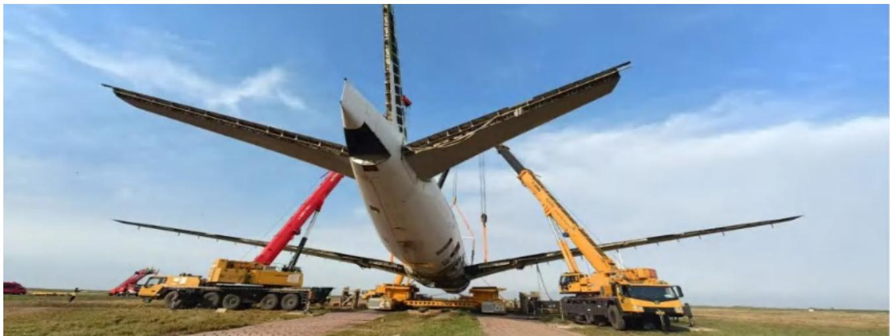

natural_image

Large aircraft undergoing maintenance with yellow cranes and trucks on a tarmac under a clear blue sky (no visible text or symbols)

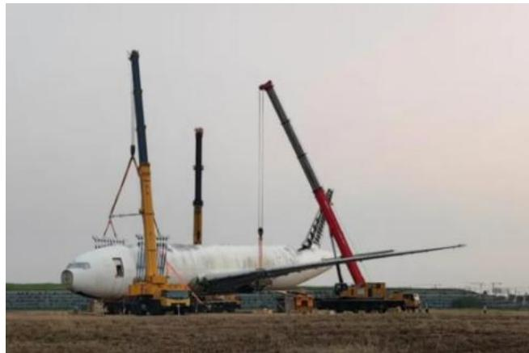

natural_image

Large aircraft undergoing maintenance with two cranes and a partially assembled fuselage, parked on an airfield (no visible text or symbols)

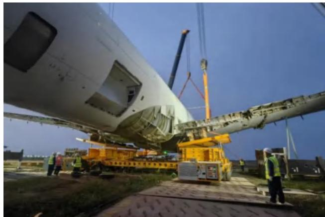

natural_image

Large aircraft wing being lifted by crane at an airport tarmac, with ground crew and equipment visible (no text or symbols)

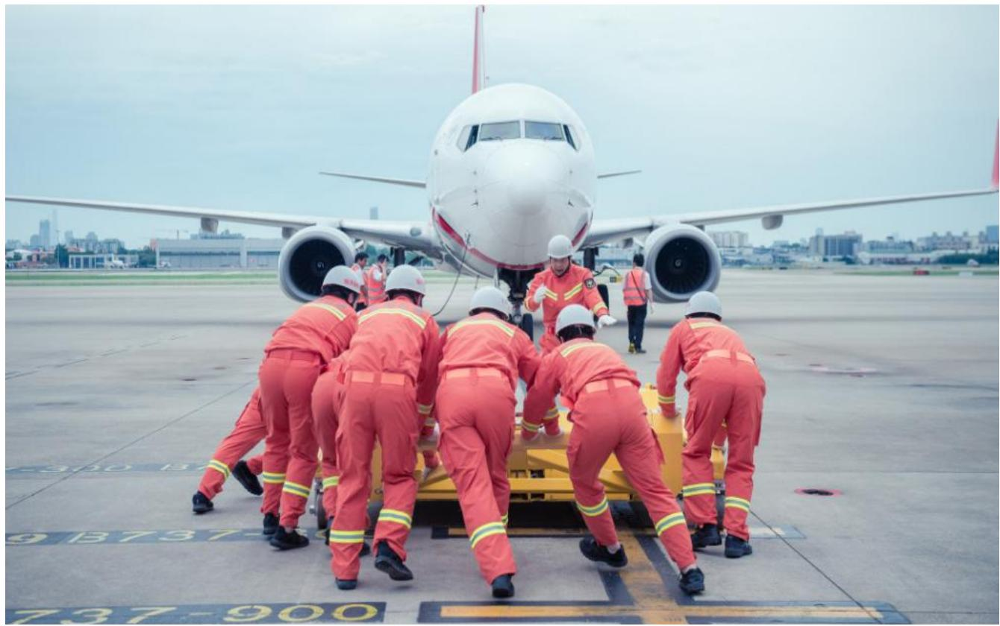

natural_image

Group of workers in orange uniforms loading a cargo onto an aircraft on a tarmac, with city skyline and building in background (no visible text or symbols)

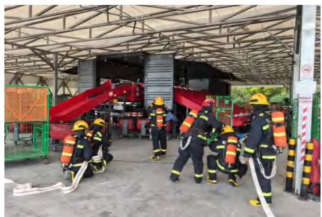

natural_image

Firefighters in full gear inside a large industrial facility with red fire extinguishers and safety equipment (no visible text or symbols)

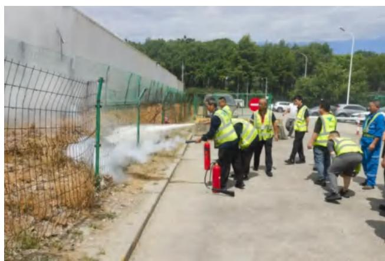

natural_image

Group of workers in safety vests and vests conducting outdoor fire extinguisher training near a concrete structure with smoke, surrounded by greenery (no visible text or symbols)

# 宣传管理

2025 年，上海机场围绕改革主线，通过全媒体宣传、社会主流媒体刊发推送、会同空港社区成员单位共同策划《航空港》杂志“领航者人物志”专栏展现新时代上海机场产业工人风采等举措，深化打造全媒体传播平台，做精做强全媒体传播平台体系，讲好上海机场高质量发展故事。

# 浦东机场公司

构建正向舆论引导机制，激励员工开展正面宣传内容创作，联动新浪微博、小红书、抖音等社交媒体平台，建立内容审核机制，形成服务创新、舆论共振、形象增值的良性循环，持续提升服务品牌影响力。

# 虹桥机场公司

制定《对外宣传审核发布机制》，始终坚持对外发布逐级审核原则，外宣稿件均秉持高度的责任感，客观真实报道各类活动及服务举措，无夸大或过度营销等情况。

# 机场物流公司

把好对外宣传内容合规审核质量关，明确外宣稿件均须履行内部审核程序，经公司领导审批，报送上级宣传管理部门审核后发布。

# 数据安全与客户隐私保护

上海机场严格遵守落实《中华人民共和国网络安全法》《中华人民共和国数据安全法》《中华人民共和国个人信息保护法》《网络数据安全管理条例》《民航数据管理办法（试行）》《信息安全技术个人信息安全规范》《信息安全技术 网络数据处理安全要求》《智慧民航数据治理规范——数据安全》《民航领域数据分类分级要求》等法律法规、规范性文件及标准要求，积极落实数据管理、数据安全和个人信息保护管理等相关办法，进一步推动“业务数字化，数字业务化”及数据资产化运营。2025年，上海机场持续筑牢网络安全防线。基于私域多模态大模型的智慧办公项目正式上线，构建管理赋能新生态，有效管控企业内部数据泄露风险。报告期内，未发生数据安全事件或泄露客户隐私相关事件。

# - 制度体系及管理架构

根据数据安全和个人信息保护管理办法，上海机场持续推进数据安全管理制度建设，按照数据安全与个人信息保护管理的相关要求，完成所辖信息系统的分级分类梳理，针对敏感数据销毁全流程形成可追溯的过程性文件。各直属单位依据“谁管业务、谁管业务数据、谁管数据安全”的原则，开展管辖范围内数据安全及个人信息保护的日常管理工作。

上海机场实施数据分类分级管理，依据法律法规、行业标准制定数据分类分级标准规范，并明确各级数据的数据安全要求。数据安全级别从高到低分为核心数据、重要数据、一般数据三个级别。

# 浦东机场公司

已成立网信委网信办，负责管理及开展数据安全工作。浦东机场公司已建立数据安全管理制度体系，制定《数据安全及个人信息保护管理办法》为数据安全管理总体制度，各单位根据自身数据情况以及管理要求形成相应各自的管理细则。网络安全方面，浦东机场公司健全网络安全管理体系，修订《网络安全管理手册》，强化公共区域大屏管控，制定DMS系统大屏阻断方案并顺利通过测评并获公安三所认证。

# 虹桥机场公司

制定《网信委及网信办工作管理办法》《网络安全管理办法》等相关制度，内容涵盖：防病毒应急操作流程、数据泄露处置预案、系统账户管理细则、系统访问控制细则、工业控制系统安全管理细则、物联网系统安全管理细则、人脸识别系统安全管理细则、供应链安全管理细则、商用密码安全管理细则等方面。

# 机场物流公司

参照数据安全和个人信息保护管理和数据管理等相关办法制定了《网络安全管理制度》《保密工作管理办法》《网络安全事件应急预案》等专项管理制度，明确了应急事件的处置方式、响应流程等内容，保障核心信息、客户隐私及网络运行安全。

# - 数据安全管理体系认证情况

上海机场按照《数据安全及个人信息保护管理办法》相关要求，积极落实信息系统建设和运维管理，对数据进行分级分类，并做好相应的保护措施，已通过 ISO 27001:2022 信息安全管理体系认证。

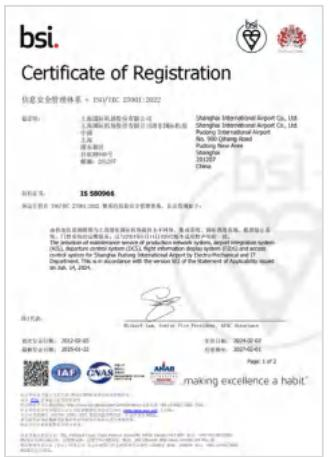

text_image

bsi.
Certificate of Registration
信息安全管理体系 - 1947/IEC 25908-2022
证书号：上海国际航空股份有限公司
上海国际航空股份有限公司注册商标
中国
上海
成都
成都
成都
成都
成都
成都
成都
成都
成都
成都
成都
成都
成都
成都
成都
成都
成都
成都
成都
成都
成都
成都
成都
成都
成都
成都
成都
成都
成都
成都
成都
成都
成都
成都
成都
成都
成都
成都
成都
成都
成都
成都
成都
成都
成都
成都
成都
成都
成都
成都
上海国际航空股份有限公司注册商标
中国
上海国际航空股份有限公司注册商标
中国
上海国际航空股份有限公司注册商标
中国
上海国际航空股份有限公司注册商标
中国
上海国际航空股份有限公司注册商标
中国
上海国际航空股份有限公司注册商标
中国
上海国际航空股份有限公司注册商标
中国
上海国际航空股份有限公司注册商标
中国
上海国际航空股份有限公司注册商标
中国
上海国际航空股份有限公司注册商标
中国
上海国际航空股份有限公司注册商标
中交所: 上海市市场监督管理局、上海市市场监督管理委员会、上海市国有资产监督管理委员会、上海市交通运输厅、上海市商业保理处、上海市金融保险监督管理委员会、上海市地方税务局、上海市地方税务局、上海市地方税务局、上海市地方税务局、上海市地方税务局、上海市地方税务局、上海市地方税务局、上海市地方税务局、上海市地方税务局、上海市地方税务局、上海市地方税务局、上海市地方税务局、上海市地方税务局、上海市地方税务局、上海市地方税务局、上海市地方税务局、上海市地方税务局、上海市地方税务局、上海市地方税务局、上海市地方税务局、上海市地方税务局、上海市地方税务局、上海市地方税务局、上海市地方税务局、上海市地方税务局、上海市地方税务局、上海市地方税务局、上海市地方税务局、上海市地方税务局、上海市地方税务局、上海市地方税务局、上海市地方税务局、上海市地方税务局、上海市地方税务局、上海市地方税务局、上海市地方税务局、上海市地方税务局、上海市地方税务局、上海市地方税务局、上海市地方税务局、上海市地方税务局、上海市地方税务局、上海市地方税务局、上海市地方税务局、上海市地方税务局、上海市地方税务局、上海市地方税务局、上海市地方税务局、上海市地方税务局、上海市地方税务局、上海市地方税局、上海市地方税务局、上海市地方税务局、上海市地方税务局、上海市地方税务局、上海市地方税务局、上海市地方税务局、上海市地方税务局、上海市地方税务局、上海市地方税务局、上海市地方税务局、上海市地方税务局、上海市地方税务局、上海市地方税务局、上海市地方税务局、上海市地方税务局、上海市地方税务局、上海市地方税务局、上海市地方税务局、上海市地方税务局、上海市地方税务局、上海市地方税务局、上海市地方税务局、上海市地方税务局、上海市地方税务局、上海市方税局、上海市地方税务局、上海市地方税务局、上海市地方税务局、上海市地方税务局、上海市地方税务局、上海市地方税务局、上海市地方税务局、上海市地方税务局、上海市地方税务局、上海市地方税务局、上海市地方税务局、上海市地方税务局、上海市地方税务局、上海市地方税务局、上海市地方税务局、上海市地方税务局、上海市地方税务局、上海市地方税务局、上海市地方税务局、上海市地方税务局、上海市地方税务局、上海市地方税务局、上海市地方税务局、上海市地方税务局、上海浦东发展银行股份有限公司上海分行营业部

# 虹桥机场公司

已经建立数据安全管理的组织架构，明确数据安全分类分级要求和数据全生命周期各阶段要求，已获得 DCMM 三级认证。

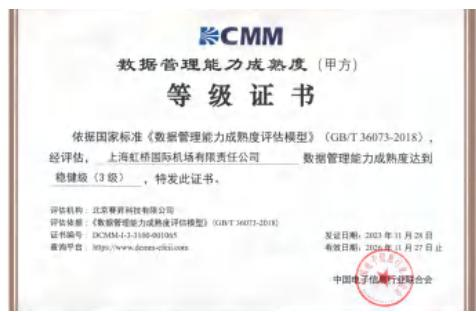

text_image

CMM
数据管理能力成熟度（甲方）
等级证书
依据国家标准《数据管理能力成熟度评估模型》（GB/T 36073-2018），
经评估，上海虹桥国际机场有限责任公司______数据管理能力成熟度达到
稳健级（3级），特发此证书。
评估机构：北京尊昇科技有限公司
评估依据：《数据管理能力成熟度评估模型》（GB/T 36073-2018）
证书编号：DCMM-1-3-3100-001065
查询平台：https://www.dcmse-citic.com
发证日期：2021年11月28日
有效日期：2024年11月27日止
中国电子信箱行业联合会

# 案例 - 网络数据安全意识宣贯

公司积极构建网络安全立体防护体系，获评上海市网络安全优秀案例。同时，公司积极参与国家网络安全宣传周活动，通过全方位多样化的手段，最大限度向机场旅客、工作人员宣传网络安全相关知识，提升安全意识。一是利用机场航站楼内存在大面积公共区域的特点，充分利用机场公共区域多媒体显示屏，在航站楼内播放网络安全宣传海报、文章，并作为本次网络安全宣传周针对广大旅客宣传的主要阵地，另外在公司公共区域滚动播放网络安全宣传片，张贴纸质宣传海报；二是在对员工宣传方面开展线上线下培训工作，公司各单位积极开展网络安全培训和宣贯会，组织员工通过线上知识竞赛和答题检验学习成效；三是通过企业公众号、微信小程序等手段，发布以“网络安全为人民，网络安全靠人民”为主题的微信公众号推文，制作网络安全宣传周报等，介绍网络安全宣传周开展情况，利用全媒体平台普及网络安全意识。

# 个人信息保护影响评估

公司涉及个人信息使用主要为两场安检信息系统，目前已积极推进安检重要系统个人信息的数据脱敏、本地加密、账号鉴权等安全措施保证数据安全，并在民航局规定的范围内合规使用旅客个人信息实施安全检查工作。

# 数据泄露应急预案

各直属单位均建立数据安全事件应急响应机制，根据数据安全计划的变化进行调整，确保数据安全事件得到及时有效处置。发生数据安全事件时，各直属单位立即启动应急响应机制，采取相应的补救和防范措施。

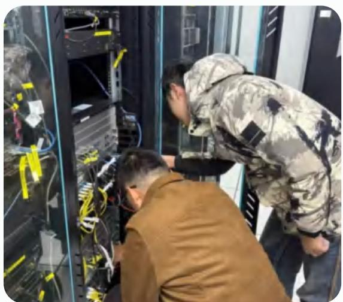

natural_image

Two technicians in camouflage uniforms inspecting server racks with yellow cables and cables (no visible text or symbols)

# 关键信息系统与硬件设备备份

浦东机场公司的信息系统核心为集成系统，该系统主要功能包括中长期航班计划的收集、编排、生成；次日航班计划的生成和当日到港、离港航班的生成、调整等内容。系统用户通过客户端软件进行相应的航班信息及资源操作，系统再通过消息中间件向各相连子系统分发中长期航班计划、短期航班计划，与子系统交互航班动态与资源动态信息。

备份情况方面，集成系统生产服务器分为两组，两组服务器实现双机房热备，任何一台故障，均可自动或手动切换至备机。

# 信息安全审查

上海机场建立了信息安全定期审查机制，各直属单位每年接受1—2次信息安全专项检查工作，并定期开展自身专项检查工作。

# 创新驱动

上海机场坚持以公司战略为引领，以科技创新为引擎，以数智化转型为路径，以网络安全为基石，精准赋能高质量发展。

强化顶层规划引领，擘画科技发展新蓝图。2025年，上海机场根据科技发展规划纲要，构建了科技发展总体框架，明确了巩固提升规划建设、设施设备运维、安全运行服务三大传统领域和重点突破数字智能、绿色低碳两大新兴领域的总体布局，统一技术方向与实施路径；同步优化“四梁八柱”的科技管理组织架构，形成权责清晰、运转协调的科技治理新格局，为科技发展规划全面落地提供组织和机制保障。

健全研发管理机制，提升科技创新投入效能。上海机场坚持科技创新“服务型”发展导向，优化科技创新整体布局，强化创新服务支撑，激发科技创新动能，统筹业务场景与研发创新需求，推动技术创新与机场生产运行高效融合，持续提升创新工作质效，促进科技创新与产业发展深度协同，不断提升科技应用能级，巩固行业科技创新与智慧应用的引领优势。

加速智慧转型，激发创新活力。上海机场深入落实国家数字经济战略与民航数据治理要求，统筹推进智慧机场建设与数据资产运营，持续提升数据管理能力。以机场大脑、数据中台和数字孪生为核心，实现核心业务系统数据汇聚治理与多场景智能应用，强化跨单位数据互通与线上线下数智服务。不断健全数据治理体系，释放数据要素价值，两场数字化应用成效显著，为机场高质量发展和数字化转型提供坚实支撑。

# - 研发与创新管理体系

上海机场通过持续落实科技创新管理相关办法，科技创新项目管理、科技奖励管理相关实施细则等制度，全面提高科技创新能力及科技成果应用水平，发挥创新引领发展的第一动力作用，以满足提升安全保障、运行效率和服务体验的需要。

# 参与制定行业标准

上海机场各直属单位分别参与制定《民用机场飞行区技术标准》《危险品货物航空运输存储场所安全管理规范》《民用航空危险品货物运输信用管理办法》《危险货物磁性试验方法》《温控货物公共航空运输保障操作规范》等行业标准。

# - 企业研发创新能力与投入强度

# 科技研发活动金额筹措安排及保障措施

上海机场持续落实科技创新管理相关办法，成立科技创新专项计划，制定研发项目计划预算，保障研发项目全过程实施。报告期内，上海机场研发费用1,827.20万元。研发人员数量126人，有效专利数52件，软件著作权57件。

# 案例

# 新技术、科技等取得的重大创新成果

# 浦东机场公司

科技成果不断涌现。《数智化驱动航班全流程管控提升航空器运行效率》课题荣获“2025中国精益数智化创新大赛”全国三等奖；《基于探识驱一体化的机场鸟击防范关键技术及应用》荣获中国航空运输协会三等奖；《消防应急救援指挥视觉模拟系统》《多跑道多航站楼机场TSAT优化关键技术与应用》《航班地面保障节点视频分析项目》3个项目入选民航机坪优秀管理案例，全面赋能智慧机场转型。

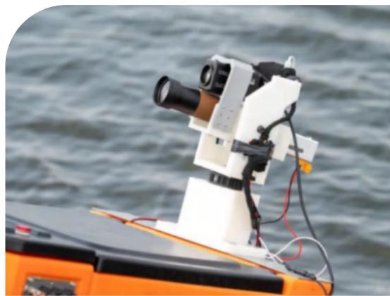

natural_image

Close-up of a white optical instrument mounted on an orange surface with water in the background (no visible text or symbols)

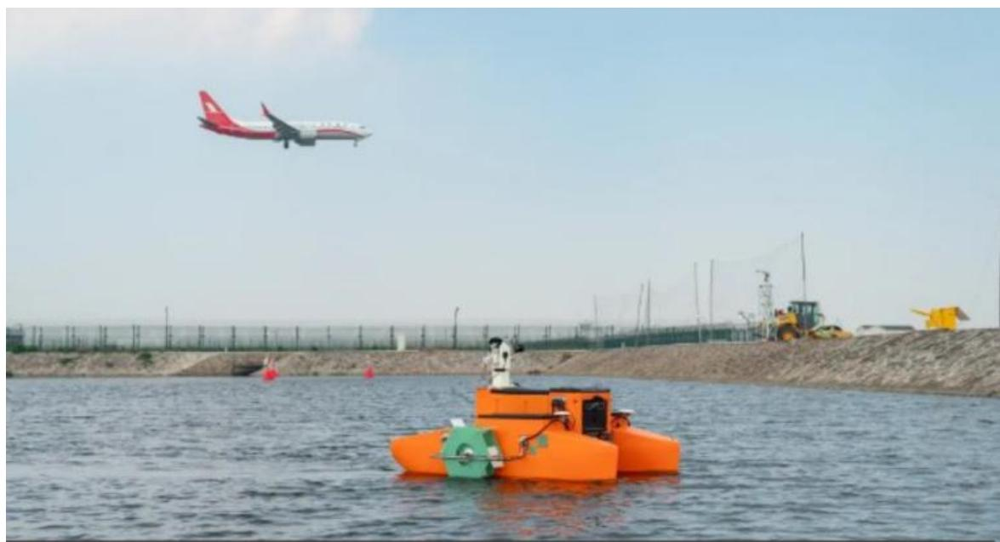

natural_image

Aerial view of a small orange floating platform on water with an airplane flying overhead and construction equipment in the background (no visible text or symbols)

# 虹桥机场公司

《机场陆侧交通数智化管控与协同关键技术及应用》课题获得民航科学技术奖二等奖，《全国首套智慧跑道状态灯系统的建设与推广应用》等2个课题成功入选中国机场协会“2025机场智慧技术装备推广应用典型案例”，同时获得市航空协会“智慧机场服务卓越奖”和中交协首届“AI领航杯”AI+交通运输赛道优秀奖。

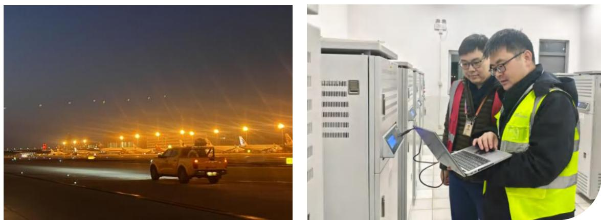

# 机场物流公司

下属单位货运站公司“大型货库弱磁性物质快速筛查关键技术”通过专家评审，设备检测方法被纳入国家标准《危险货物磁性试验方法》，填补了行业标准空白。在联合国危险货物运输专家分委会第66届会议上，由中国民航局提交，上海机场联合中国民航危险品运输管理中心、上海化工院共同起草的“关于在危险品纸板箱上钻孔或开洞作为把手”的提案被采纳，修订入新一版的《关于危险货物运输的建议书规章范本》。

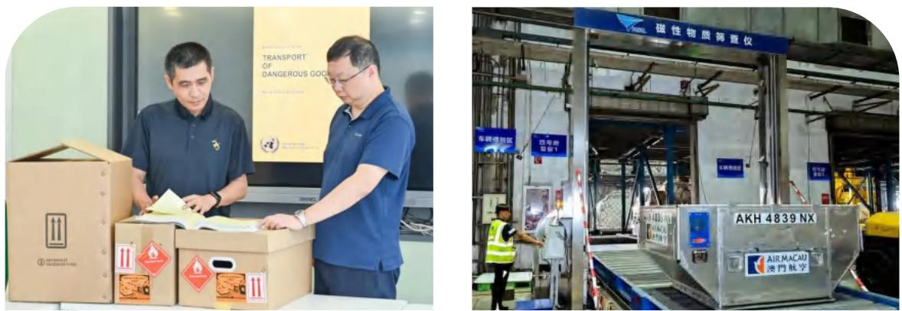

# 案例

10月21日，机场物流公司旗下智汇港公司与瑞士国际空港服务公司签署运营服务管理合作协议。智能货站的建设运营全方位融入智慧机场建设新理念，结合5G、大数据、人工智能等先进物流技术，大幅提升作业效率，实现货物处理系统自动化、货物安检流程化、建筑设施智能化，作业环节中人员、货物、设备等多场景管理、全流程可视、可控、可追溯，力争打造全国乃至全球货运站智能化运营新标杆。智能货站的投运，进一步提升了上海国际航空货运枢纽竞争力和辐射能力，更好地服务高水平对外开放、服务国家战略，为全球供应链的稳定、畅通、高效提供“上海机场方案”。

5月26日至28日，第三届民航科教创新成果展在北京举行。本届展览以“创新领航智连世界”为主题，集中展示我国民航自主创新技术和国产民机、无人机等先进制造技术成果，是民航系统举办的最大规模专业展会。上海机场以“智慧未来·AI领航智慧机场新生态”为主题，携浦东机场、虹桥机场及物流公司，全景式呈现超大型航空枢纽数字化转型的“上海机场方案”。上海机场通过展示机场智能管理中枢、航空5G应用、机位资源优化系统、智慧调度平台及智慧货站五大核心场景，系统化呈现航空器地面运行减排、空地协同运行、物流全链条智慧化等领域的39项创新成果。今年展区还设置了职工创新与青年课题展示区，介绍群团组织在智慧机场建设中的创新支撑作用。

natural_image

Aerial rendering of a modern industrial complex with multiple buildings and surrounding greenery under a partly cloudy sky (no visible text or signage)

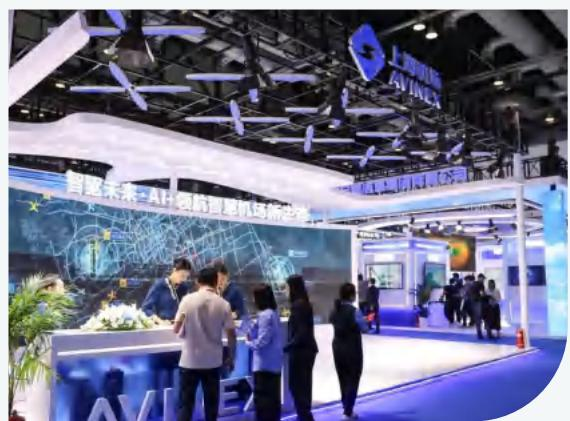

text_image

上海好想
AI+智能机器人新平台

# - 鼓励研发与创新

上海机场各直属单位持续落实科技奖励管理实施细则等相关制度文件。浦东机场公司制定覆盖各类科技成果的奖励标准，每年对成果发明人实施物质奖励，以嘉奖研发积极性。同时，制定科技创新考核绩效指标，具体包括研发投入、成果转化、机制建设、产学研平台构建等方面。

# 浦东机场公司

在安全防控方面，部署车辆高精度定位、低慢小目标探测识别驱离技术，建立机坪全域追踪与智能风险识别体系；运行管理方面，首创机场地面流量管理系统与航班智能排序系统，实现每架次航班推出等待时间缩短2分钟、整体滑行时间减少1分钟的运行协同效能提升；旅客服务方面，构建航站楼客流智能分析系统，通过机场小程序推出旅客楼内出行导航及商业O2O服务，打造全流程无纸化服务与线上线下融合体验。

# 虹桥机场公司

创新应用全国首套跑道状态灯系统，基于航空5G-AeroMACS通信网络与北斗高精度定位技术构建防车辆侵入跑道系统，实现电子围栏自动告警；资源管理方面，通过“近机位资源高效优化与综合效益创新实践”，在不新增设施资源情况下提升靠桥率，等效新增7个近机位；旅客服务端打通值机、托运、安检、登机全链条，实现“一脸通行”智能服务。

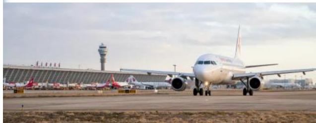

natural_image

Exterior view of an airport tarmac with a parked commercial airplane and surrounding aircraft (no visible text or signage)

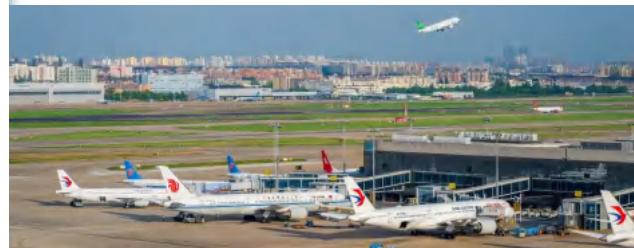

natural_image

Airport terminal with multiple airplanes parked on tarmac, city skyline in background (no visible text or signage)

# 机场物流公司

持续积极推进打通航空货运全链路，优化口岸营商环境，联合各相关方共同开发打造上海空运全链路数字化运行平台“空运通”，平台整合机场、海关、电子口岸、地服、货站、监管仓、货代企业等400余家单位的生产运行数据，补齐了上海国际贸易“单一窗口”空运模块，显著提升口岸货物处理和通关效率，帮助企业节省物流成本。

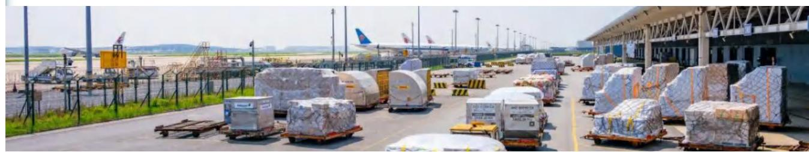

natural_image

Airport terminal with cargo pallets and airplanes, no visible text or signage

上海机场群团组织开展一线员工参与多维创新，通过“揭榜领题”攻关、创新工作室建设、“五小成果”、青年课题研究评选等机制，打造了人才培育、成果孵化、推广应用的全链条创新模式。

# - 数据治理

上海机场深入贯彻国家数字经济发展战略，响应民航局数据治理体系、数据管理和共享体系建设要求，进一步推动数据资产化运营，为高质量发展与数字化转型提供坚实的底层支撑。

# 基础平台建设

上海机场以机场大脑和数字孪生为核心，逐步构建“一图观天下、一线通全域、一脑智全局”的智慧机场管理新格局，以新技术赋能业务运营。公司依托机场大脑与人工智能联合创新实验室，实现人工智能技术在航班保障节点智能识别、机坪安全监管、全场航迹预测等核心环节的技术落地，提升运行效率与安全水平；建成投用数据中台，并完成了数据技术架构的构建与运行；建设完成综合运控中心数字孪生系统，构建集综合态势感知、资源统筹优化、日常监管及应急监管功能于一体的多源运行数据实时融合与可视化展示平台，实现机场运行全要素可视化监管。

# 数据汇聚互通

通过数据中台，上海机场已完成 30 余个核心业务系统数据的全量汇聚与深度治理，推动航司画像、项目管理等重点数据应用场景建设，每日对外数据共享近 200 万条，初步形成“让数据流动、让价值共生”的良性合作机制；跨部门与跨单位协同，实现了与海关的数据互通，支撑枢纽战略落地。同时，推进上海机场官方微信小程序持续升级优化、配合做好会员体系技术对接和协同落地，打通信息壁垒，提供线上线下全媒体、多场景数智交互服务，提升响应效率。

# 数据治理体系

上海机场落实数据相关管理办法，同步配套数据资产、数据指标等管理规范，构建起覆盖全面的数据制度体系。通过夯实数据治理根基，有效释放数据要素价值，为枢纽数字化转型注入新动能。通过数据治理，浦东机场聚焦12个核心生产系统，落地7个数据应用场景试点，实现行李超时分析、能源报表自动生成等数字化赋能；虹桥机场完成74个系统梳理盘点，顺利通过“上海数据”品牌复审，获得数字化转型诊断及成熟度评估“三星级”贯标认证。

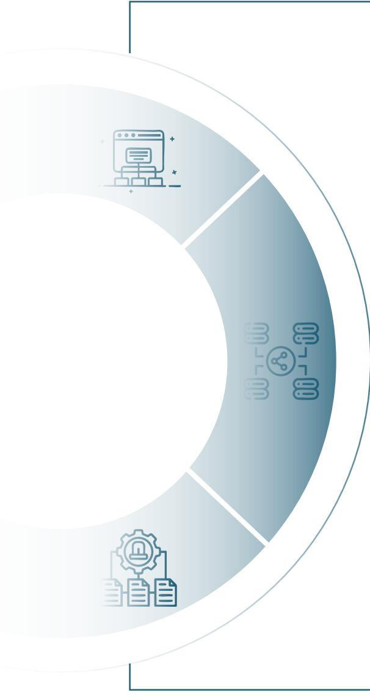

flowchart

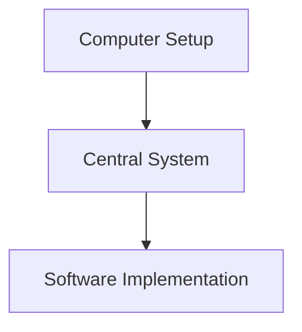
```mermaid
graph TD
  A["Computer Setup"] --> B["Central System"]
  B --> C["Software Implementation"]
```

# - 科技伦理

上海机场所属行业为航空运输业，未从事生命科学、人工智能等科技伦理敏感领域的科学研究、技术开发等活动。报告期内，不存在违反科技伦理的行为。

# 供应链安全

2025 年，上海机场以 “专业、规范、高质、高效” 为行动准则，在守正创新中强基固本，在系统施策中破解难题，持续夯实采购管理基础、稳步提升运行服务外包质效，为实现战略目标提供了坚实可靠的服务保障。

# - 供应商管理

# 供应商管理制度

上海机场积极落实供应商信息库管理规定、不良行为供应商处理管理办法等相关制度，由采购归口管理部门负责供应商信息库的统筹管理、协调工作，供应商信息库实行统一组织、分级管理、共同使用的原则，各直属单位负责对本单位审批入库的供应商应当开展动态管理，组织年度维护工作。

# 考核评价与审查方面的具体行动

上海机场各直属单位积极落实巡察整改要求，梳理上报不良供应商单位名录，经考核评价与审查后，不良供应商将及时出库。机场物流公司分级分类建立供应商体系，确保资源向高评价、高潜力的优质供应商倾斜，从而构建一个良性竞争、持续优化的供应商生态系统。

# 能力建设与培训

上海机场各直属单位每年安排采购相关业务条线人员参加各类培训以提高业务管理水平与能力。

# 信息化建设

上海机场已建立采购平台系统，可线上进行供应商入库申请、审批、维护等工作。

# 供应商 ESG 管理

机场物流公司下属单位货运站公司要求供应商积极履行社会责任，签署《供应商安全、健康和环保承诺书》。

# - 供应链风险管理

上海机场依托统一的采购管理平台开展供应商全流程管理工作，以集约化提升采购效能、以策略优化助力采购创新，通过立足采购实际需求，不断完善采购理念、提升采购策略、把握市场动态，积极探索与实践各类采购方式，实现了从需求归集、供应商管理到履约交付的全流程高效协同，有力保障了各直属单位的运营需求与成本控制目标，供应链合规管理扎实有效，风险防控能力凸显。

# - 平等对待中小企业

上海机场在与中小企业合作过程中，始终恪守公平、公正、透明的合作准则，保障中小企业享有与大型企业同等的商业机会与平等对待，积极营造公平竞争、开放包容、互惠共赢的市场生态，助力构建更具韧性与可持续性的商业环境。报告期末应付账款（含应付票据）余额未超过300亿元，占总资产的比重未超过50%，且公司在国家企业信用信息公示系统无逾期尚未支付中小企业款项信息。

# 乡村振兴与社会贡献

上海机场坚决贯彻落实国家乡村振兴战略，积极履行社会责任，通过结对帮扶、资金支持等多种形式参与公益事业。持续深化结对帮扶，聚焦组织建设、民生服务与乡村治理，以实际行动展现企业的社会担当，为巩固拓展脱贫攻坚成果、稳步推进乡村振兴贡献企业力量。

# 案例

# 乡村振兴与公益慈善

\- 乡村振兴

2025 年，上海机场乡村振兴总投入金额 81.8 万元，惠及人数 620 人。从教育帮扶方面，助力云南省楚雄州南华县乡村振兴，惠及云南省南华县师生 350 人；产业帮扶方面，通过技能培训惠及绣娘 270 人（其中包含残疾绣娘 106 人）传承民族刺绣工艺文化，培养了一批技术成熟的绣娘带领南华县广大农村妇女巧手致富。

\- 公益慈善

2025 年，上海机场公益慈善投入金额为 27.8 万元，惠及人数 2256 人。

# 浦东机场公司

与崇明运南村、群英村紧紧围绕“先锋堡垒”“强村富民”“为民办事”“和美共治”等四项行动内容开展帮扶工作，全年投入帮扶资金16.8万元。

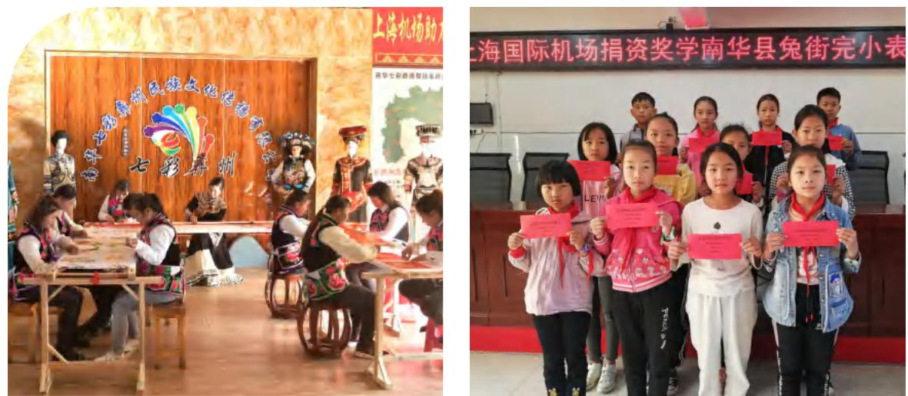

# 虹桥机场公司

与上海市奉贤区金汇镇光辉村围绕改善村民生活条件、提升健康保障水平、促进特色产业发展、弘扬敬老爱老文化等方面开展城乡帮扶工作，全年投入帮扶资金10万元，惠及2256人。虹桥机场公司为上海市奉贤区金汇镇光辉村292名老人提供老年群体助餐补助，为全村1786名六十周岁及以上老年人发放重阳慰问品，助力首支“宅基医疗队”为178名独居、孤寡、大病等特殊人群提供上门医疗服务。

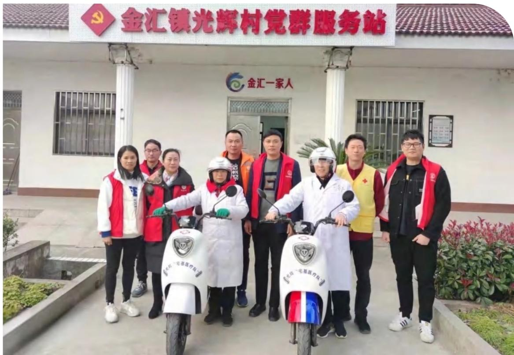

text_image

金汇镇光辉村党群服务站
金汇一家人

# 机场物流公司

下属单位货运站公司在中国民航大学设立PACTL奖学金，旨在激励优秀学子勤奋学习、追求卓越，助力民航领域专业人才培养，为行业发展储备有生力量，在教育扶持方面展现出坚定的决心与长期的担当，有力推动教育资源优化与人才成长环境建设，赢得学校师生及社会各界的广泛赞誉与高度认可。积极参与由上海蝴蝶宝贝关爱中心和民间企业家慈善社团举办的第六届上海“蝴蝶杯”公益足球赛。

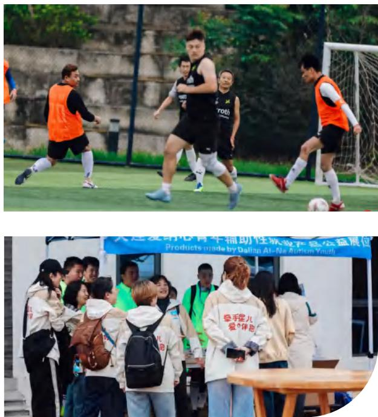

# - 承担社会责任

# 税务贡献

2025 年上海机场所交各类税金共计 82,457.0 万元。

# 社区关系

上海机场立足自身优势，积极投身和谐空港社区建设，持续健全社区联建共治机制，加强与周边社区的常态化沟通联动，携手各方共建共享、协同发展。

# 浦东机场公司

坚持党建引领，深化空港社区联建共治，搭建多元党建联盟平台，强化区域协同；联合开展普法宣传与安全共治，推进劳模宣讲、班组联建交流；举办文体赛事、青年交友等活动，营造和谐共融的社区氛围，持续构建协同发展的空港共同体。

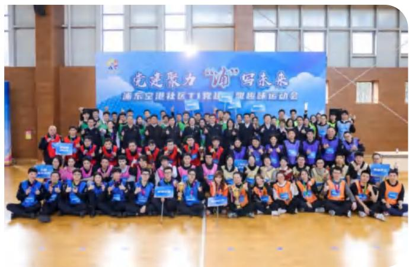

text_image

党建聚力“浦”写未来
浦东空港社区工作站——思思环运动会

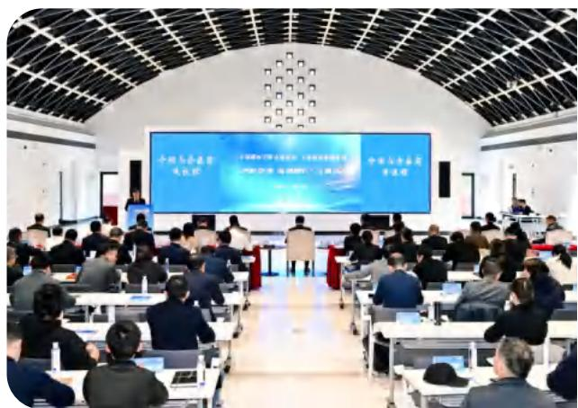

text_image

Conference hall with large screen displaying Chinese text about a 2023 event, audience seated at desks with laptops

# 虹桥机场公司

携手长宁区人民法院举行“护航空港·法治随行”主题活动，创新“航空+司法”服务模式，推动常态化法治服务进航站楼，更好向旅客和驻楼单位进行普法宣传和法律服务，助力虹桥国际开放枢纽法治化营商环境进一步提升。

# 机场物流公司

建立空港社区货运枢纽专业委员会和上海空港协商会议机制，搭建沟通渠道，召开会议，建立联络群。每年组织各类联建活动，邀请各单位共同参与。

# 服务国家战略和区域发展

上海机场对标高质量建设国际航空枢纽目标任务，强化使命担当，在国内市场保持旺盛、国际市场加快恢复的背景下，国际航线网络密度与广度稳居国内前列，服务国家战略能力持续增强。

# 案例

# 助力“进口博览会举办”

上海机场深入贯彻办好进博会的相关指示精神与部署要求，组建专项保障领导小组，优化完善安全运行、服务保障等全维度方案，临战阶段启动两场进博会保障例会机制。在浦东、虹桥机场启用3处进博会专用服务中心及外籍人员一站式综合服务中心，落地苏州服务中心辐射长三角便民出行；组建197人的多语种青年志愿者团队，全流程提供翻译、指引等服务，同时在两场布设进博会主题景观、宣传物料，营造浓厚展会氛围，以一流服务护航第八届进博会。

# 浦东机场

聚焦外籍旅客入境核心需求，贴合旅客动线在廊桥、行李提取区、到达公共区设立自助服务点和集成服务区，新增离境退税、联程航班中转指引多语种导览，持续提升出入境便利化服务水平；同时配合机场物流板块，为进博会物资保障提供货运场站、航线资源等基础支撑，助力参展物资高效通关、快速提离。

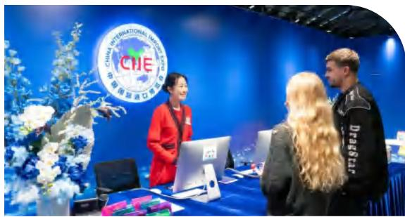

text_image

CHINESE INTERNATIONAL INTERACTION CO
中国船舶港口有限公司
CHIE

# 虹桥机场

推出 12 项迎进博专属服务举措，缩短国内航班截载时间、实现全流程自助登机全覆盖，升级跨航司签转“双免”优惠与廊桥直办中转手续服务，打造出入境“无感”通关体验并实现国际航班电子登机牌全流程无纸化；同步优化网约车智慧寻车、航站楼快递等配套服务，打造 4 大人文主题休憩空间、推出宠物友好服务。

text_image

Street photo with visible store signboards and promotional banners in an indoor setting

# 机场物流公司

联合海关、航司打造进博会物资 24 小时全天候绿色通道，推出 “四个专用” “四个优先” 服务，在浦东机场货站设立专用储存区，全流程开设专用通道，对未提前申报展品确认身份后即时启动优先处理流程；依托 “空运通 Aviport” 平台实现进港货物 “一单通查”，进口展品从货站作业到提货最快半小时完成，全链条无缝衔接市内运输。

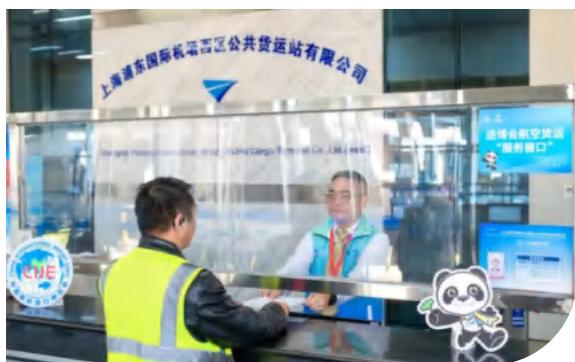

text_image

上海浦东国际机场西安区公共货运站有限公司
Shanghai International Airport (CIC) Cargo Shipping Co., Ltd.
运得点航空货运
“服务窗口”

# 案例

# 助力高质量共建“一带一路”

2025 年，上海机场加快建设全方位门户复合型国际航空枢纽，持续提升国际航线网络通达性，加快布局共建“一带一路”国家通航点，为各方互联互通，促进人员经贸文化往来架起了更高效便捷的“空中丝绸之路”。

首开中亚客运航线，直通哈萨克斯坦奇姆肯特、阿拉木图和乌兹别克斯坦塔什干，新开蒙古国乌兰巴托航线，与中亚、东亚地区的空中“丝绸之路”更加紧密，旅客出行选择更加丰富。新增了塞尔维亚贝尔格莱德、摩洛哥卡萨布兰卡、瑞士日内瓦、阿根廷布宜诺斯艾利斯等洲际航点，填补了上海至南美航线空白，上海实现航点覆盖全球各大洲，进一步提升上海航空枢纽的全球辐射范围。

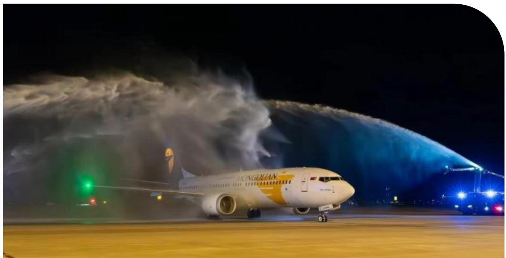

natural_image

Nighttime airport scene with a Mongolia Airlines aircraft receiving water cannon salute, emitting smoke (no visible text or symbols)

机场物流公司下属货运站公司构建“一带一路”沿线国家直达货运通道，通过与头部国际航司的战略合作，强化与东南亚、中亚、欧洲等沿线地区的物流联通。依托卡车中转服务网络，将“一带一路”进口货物辐射至中西部内陆，同时推动中国东部制造品、西部特色产品通过上海枢纽走向全球，助力贸易畅通与产能合作。

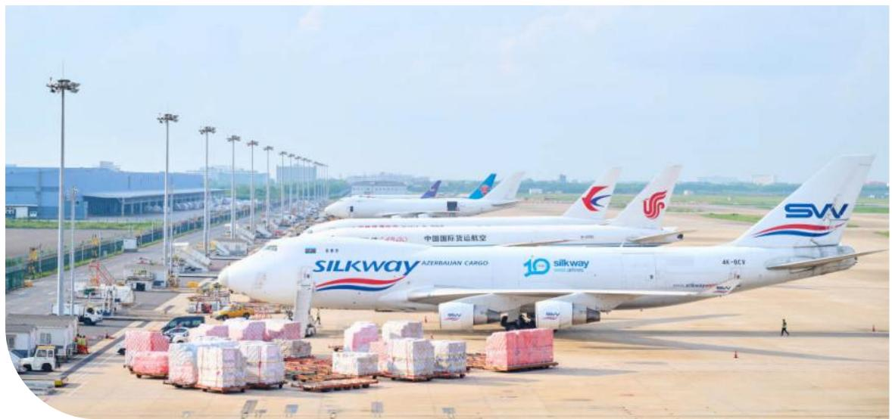

natural_image

Exterior view of a modern airport tarmac with multiple Silkway cargo aircraft parked under overhead infrastructure (no signage visible)

# 案例

# 助力“自贸试验区及临港新片区建设”

浦东机场公司牵头编制《MRO 园区代管方案》，全流程完成意见征集、安全评估及法律合规性审查，组织波音、商飞、东航三家业主方开展多轮深度征询并获书面认可，成功推动临港管委会与机场明确委托代理关系，《临港新片区机务维修园区管理方案》正式印发实施，为园区规范运营奠定制度基础。

机场物流下属货运站公司响应临港新片区“五自由一便利”制度型开放要求，深化航运物流制度创新。参与新片区国际航运数字船供服务平台协同建设，探索货运数据链上共享，推动“数字通关”等创新实践落地，提升跨境物流效率。依托临港新片区产业优势，重点保障集成电路、民用航空、智能新能源汽车等“4+1”产业集群的供应链物流需求，提供精密零部件等专项运输服务，助力新片区打造高端产业集聚区。

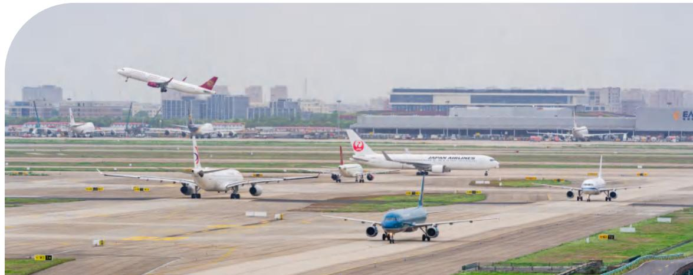

natural_image

Airport tarmac scene with multiple airplanes including Japanese Airlines and others, no visible text or signage

# 案例

# 长三角区域发展协同

2025 年，上海机场苏州城市航站楼、上海机场昆山城市航站楼新增办理香港航空业务，为长三角地区广大居民来沪出行提供更多元和便利的出行体验，更好地服务长三角地区互联互通和高质量发展。上海机场持续提升异地城市航站楼服务功能，此前，成都航空、英国航空先后入驻昆山城航楼。共有 18 家国内外航空公司可在上海机场异地城市航站楼提供“值机办理、行李托运、专车接送”全流程服务，自 2023 年两座异地城航先后启用至今，已服务旅客超 15 万人次，保障行李运输超 2.7 万件。

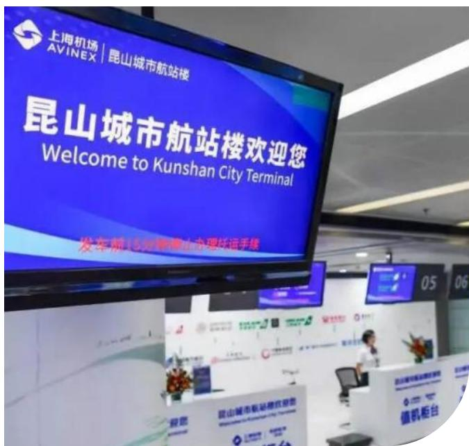

text_image

上海机场 AVINEX | 昆山城市航站楼
昆山城市航站楼欢迎您
Welcome to Kunshan City Terminal
发车前15公里，佛山办理客运手续
05 06
昆山城市航站楼欢迎您
Shanghai City Avinex Airport Terminal
微机柜台

机场物流公司定期召开工作例会，推动重点项目实施。牵头长三角民航机场协同发展党建联席会物流专委会，推动安检互认、多式联运等合作项目；推出专用通道、专用窗口、专用车辆、专用队伍“四个专用”和优先理货、分拨、查验、提货“四个优先”的24小时全天候进博会物资运输绿色通道服务。机场物流公司下属单位货运站公司积极响应《有效降低全社会物流成本行动方案》相关要求，顺利完成苏州、松江前置货站的建设与投运，有效强化了上海机场对长三角区域产业链供应链的服务前移与辐射拓展功能，为长三角区域经济协同发展、上海机场航空货运枢纽能级提升提供坚实支撑，助力新发展格局构建，为新时代航空物流高质量发展探索并积累了可复制、可推广的新模式与新经验。

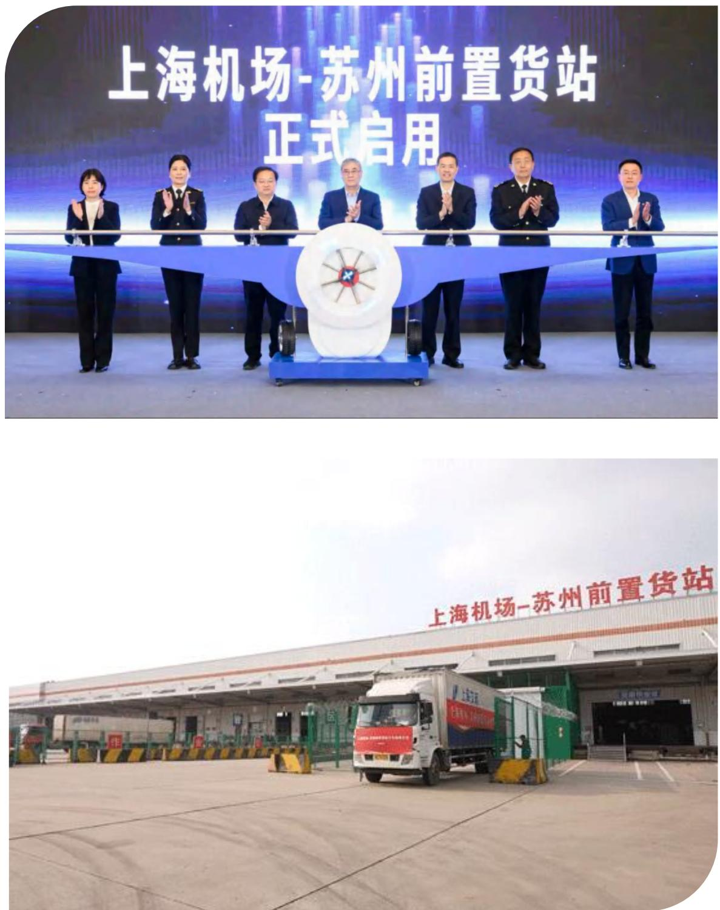

# 案例

# 助力“推进东西部协作”

1月7日9时5分，西藏日喀则市定日县发生6.8级地震，造成重大人员伤亡，大量房屋倒塌。冯昕同志第一时间关心上海机场派往定日机场协助运行管理的援藏干部，要求做好个人自身防护，积极协助做好机场安全运行，全力保护好这条生命通道。

当时正值航班即将降落，定日机场立即启动应急预案，组织人员疏散。CA4431 航班（成都—定日）备降拉萨，CA4432 航班（定日—拉萨—成都）取消，援藏干部和机场人员第一时间着手做好旅客的安抚工作并帮助其退票改签。同时，立即与当地政府部门和上级单位密切对接，组织开展震后的设施设备安全运行评估，机场飞行区道面、助航灯光系统、消防设施设备、构建筑物均无异常。14 时 10 分，定日机场恢复正常运行。14 时 49 分，执行紧急运输任务的震后第一个航班 CA4431 安全降落在定日机场。定日机场已经全面做好应急运输准备，上海机场援藏干部全力以赴做好安全运行各项保障工作。

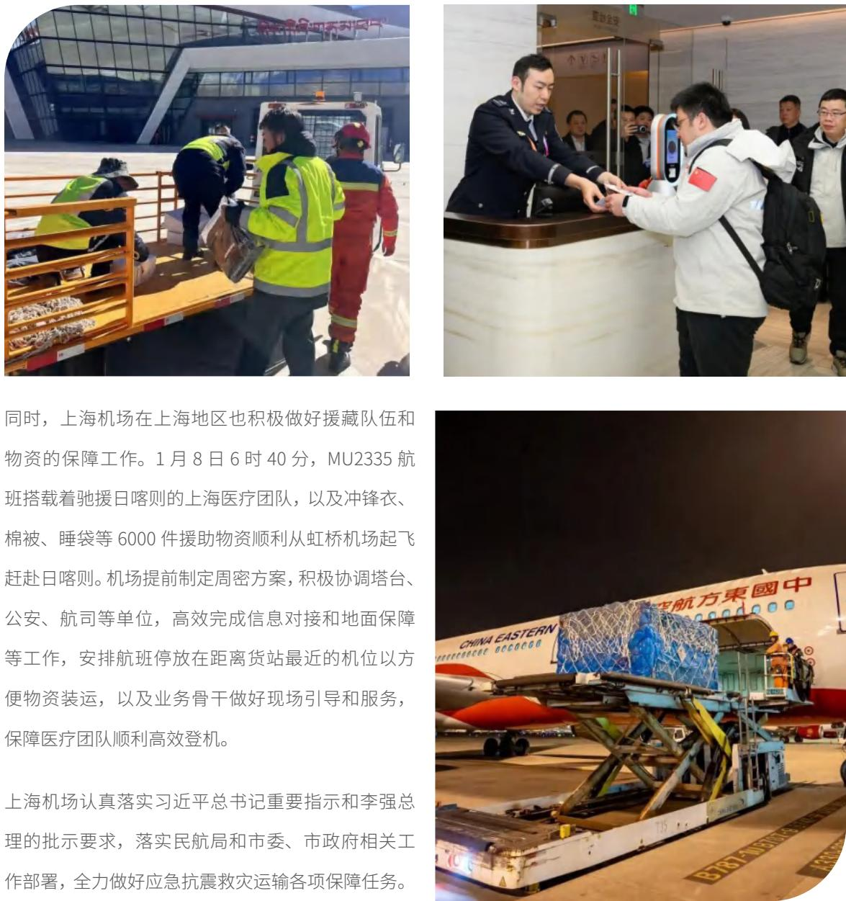

同时，上海机场在上海地区也积极做好援藏队伍和物资的保障工作。1月8日6时40分，MU2335航班搭载着驰援日喀则的上海医疗团队，以及冲锋衣、棉被、睡袋等6000件援助物资顺利从虹桥机场起飞赶赴日喀则。机场提前制定周密方案，积极协调塔台、公安、航司等单位，高效完成信息对接和地面保障等工作，安排航班停放在距离货站最近的机位以方便物资装运，以及业务骨干做好现场引导和服务，保障医疗团队顺利高效登机。

上海机场认真落实习近平总书记重要指示和李强总理的批示要求，落实民航局和市委、市政府相关工作部署，全力做好应急抗震救灾运输各项保障任务。

# 应对公共危机

# 浦东机场公司

参照《突发事件应急预案手册》执行应对重大、突发公共危机和灾害事件的措施。通过应急管理一体化建设，应急预案体系建设与要素承接水平均得到了大幅提升，基本实现了机场应急预案的“纵向到底”和一体化贯穿。完善了防汛防台体制机制，在汛期和雨季压实防汛责任，确保防汛各项工作落到实处，有力有序应对了多轮降雨和台风天气影响，守住了机场防汛安全底线。

# 虹桥机场公司

印发《关于成立虹桥公司应急管理领导小组及其办公室（总值班室）的通知》及《突发事件应急预案管理实施细则》。成立应急管理领导小组及其办公室，进一步强化虹桥机场应急管理工作，完善应急管理体制建设，健全应急管理工作机制。

# 机场物流公司

制定了《突发事件应急预案手册》
《突发事件应急预案操作手册》
等文件，规范应对重大、突发公共危机和灾害事件时的流程、举措。

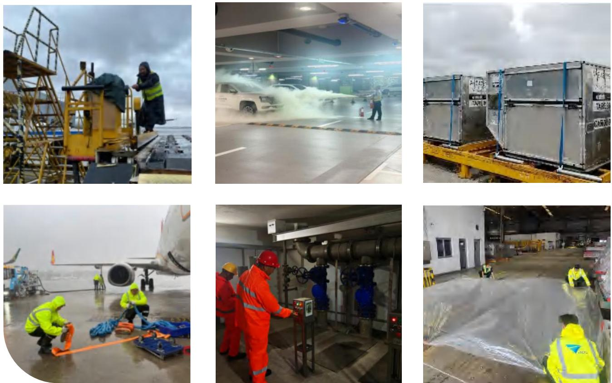

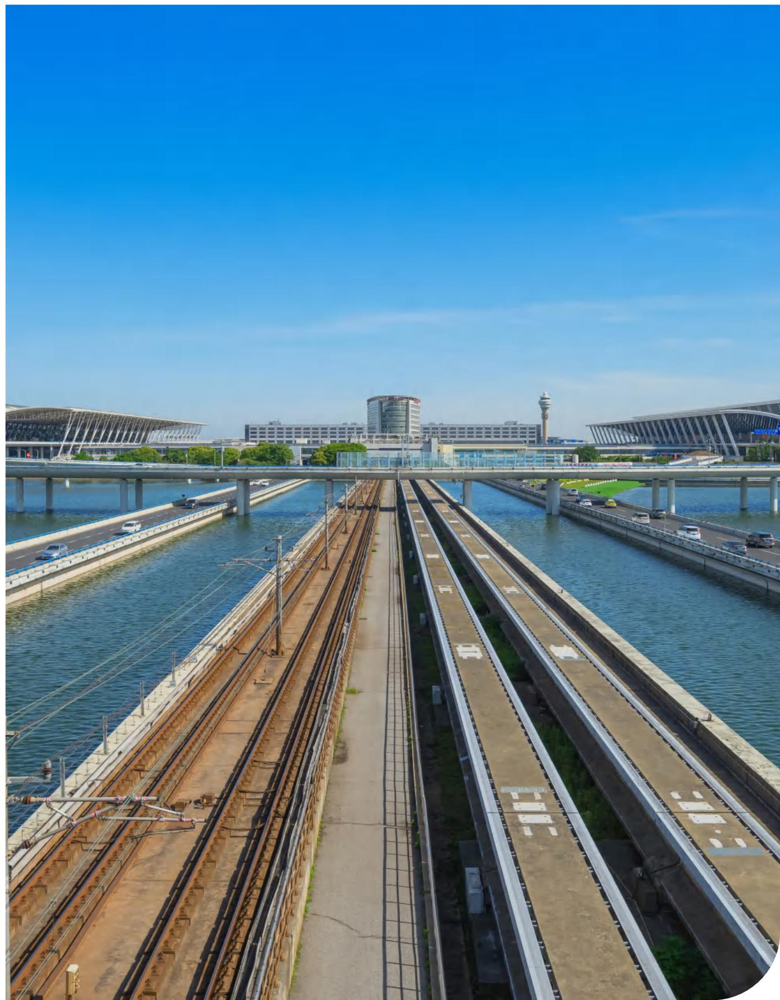

natural_image

Aerial view of a modern transportation hub with multiple railway tracks and bridges spanning a wide river under a clear blue sky.

# 04

# 可持续发展 相关治理维度

- 反商业贿赂及反贪污  
- 反不正当竞争

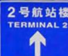

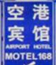

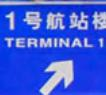

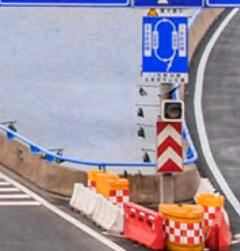

# 反商业贿赂及反贪污

上海机场在经营活动中，始终遵循自愿、公平、等价有偿、诚实信用的原则，严格遵守国家法律法规及国有企业廉洁从业规定，将反商业贿赂、反贪污作为底线要求，坚持严的基调、严的措施、严的氛围不动摇，一体推进“不敢腐、不能腐、不想腐”，以全面从严治党新成效为推进上海机场改革发展提供坚强保障。

浦东机场公司、虹桥机场公司、机场物流公司党委履行全面从严治党加强党风廉政建设主体责任，党委书记作为第一责任人，纪委履行监督专责，纪律检查室作为反贪污腐败管理的专门部门，公司党委建立党风廉政建设和反腐败工作协调小组，由纪委书记任协调小组组长，整合纪律检查、巡察、审计、法务、干部监督等各类监督资源，定期召开会议分析研判各类监督管理中发现的问题，形成“大监督”格局。

# - 避免违反商业道德的举措

2025 年，上海机场一体推进不敢腐、不能腐、不想腐，扎实开展监督执纪执法工作，坚持风腐同查同治，加强重要节假日教育提醒和监督检查，警示广大干部充分认清形势，防止违规吃喝反弹回潮，以节日风气之变推动党风政风持续向好。同时，不断深化以案促改，督促相关单位落实专项督查整改，推动责任体系、关键环节审核、职能监管等方面的制度完善和流程优化。

上海机场持续落实“净风行动”要求和领导人员防止利益冲突管理办法相关内容，严格执行“一评估四报告”制度，定期排查廉洁风险，通过“清风空港”宣传专栏宣贯廉洁文化，锲而不舍落实中央八项规定精神，扎实推动学习教育，推动作风建设常态长效。

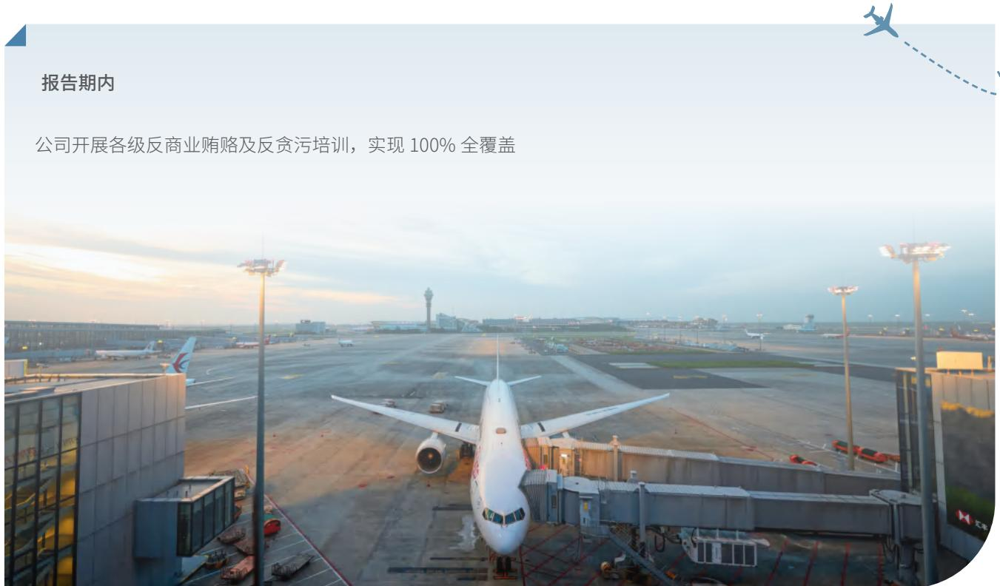

text_image

报告期内
公司开展各级反商业贿赂及反贪污培训，实现 100% 全覆盖

# 案例

# 评估机制

各直属单位每季度对监管领域廉洁风险进行评估排查，动态对廉洁风险点进行分类管理，制定完善防控措施，防范廉洁风险。

# 对商业伙伴开展反贪污腐败培训

与供应商签订合同时同步签订《反商业贿赂公约》，坚决反对和抵制商业贿赂行为，共同构建公平、公正、公开、诚信、和谐的合作环境和业务关系，自觉做到依法办事，合法经营，廉洁从业。

浦东机场公司年内与 77 家商业伙伴、兄弟单位、驻楼单位等开展 33 次廉洁共建活动。

虹桥机场公司年内与 31 家商业伙伴、兄弟单位、驻楼单位等开展 19 次廉洁共建活动。

机场物流公司年内与 41 家商业伙伴、兄弟单位、社区单位等开展 7 次廉洁共建活动。

# • 筑牢廉洁防线 开展深入贯彻中央八项规定精神警示教育

为深入贯彻落实中央八项规定精神警示教育、持续强化作风建设，各直属单位以实地研学、宣讲授课、特色创新为抓手开展了一系列警示教育活动，有效推动廉洁理念入脑入心，为高质量发展筑牢纪律根基。

# - 警示教育宣讲

浦东机场公司、虹桥机场公司、机场物流公司组织开展中央八项规定精神警示教育宣讲，由各级纪委书记及纪检干部组成宣讲团，向全体党员及新提任干部、年轻干部、关键岗位干部等开展宣讲，督促其扣好廉洁从业“第一粒扣子”。

# - 实地研学

浦东机场公司年内累计组织 2 场次 42 人次参观市级警示教育基地，93 场次 1800 余人次走进区级及其他警示教育基地。累计开展 4 场次、90 余人次庭审旁听活动。

虹桥机场公司年内累计组织 2 场次 55 人次参观市级警示教育基地，46 场次 959 人次走进区级及其他警示教育基地。

机场物流公司年内累计组织 7 场次 127 人次参观市级警示教育基地，5 场次 105 人次参观其他廉洁教育基地。累计开展 3 场次、15 人次庭审旁听活动。

# 案例

# 专家授课

各单位结合业务场景不断创新教育形式，推动警示教育更接地气、更富感染力：

浦东机场公司外请专家开展廉洁教育授课 19 次，超 1000 人次参与学习。浦东机场公司编制《清风纪语》，打造 PVG “廉洁教育” 在线学习版块；建设 “IOC 楼宇党建阵地” “清风廊” 等廉洁教育阵地，制作《廉在身边》《“榜一大哥”的真面目》等廉洁教育短视频；鼓励业务骨干开讲 “业廉讲堂”，推动业廉融合，不断筑牢党员干部思想防线。

虹桥机场公司外请专家开展廉洁教育授课13次，超1661人次参与学习。虹桥机场公司在《安检人》报纸开设“纪法小课堂”专栏，在“彩虹之桥”平台推出“每月话廉”廉政主题微信稿；依托“机电e先锋”小程序开设中央八项规定精神学习专栏；纵向延伸教育触角，在办公楼宇、候机楼办公区等55个公屏滚动播放中央八项规定精神主题视频，让廉洁提醒随处可见。

机场物流公司外请专家开展廉洁教育授课 7 次，149 人次参与学习。物流公司从构建企业全业务链条廉洁文化出发，启动岗位小微权力梳理管控工作；依托“魅力货运”平台发布廉洁方面宣传稿；通过制发廉洁提醒、提示，播放廉洁视频等方式加强廉洁宣传。

# - 举报者保护政策

纪检监察机构严格落实保密要求，对检举控告人有关情况以及检举控告内容严格保密，严禁将检举控告材料、检举控告人信息转给或者告知被检举控告的组织、人员，在不暴露检举控告人身份的情况下受理检举控告或者开展核查工作。

# - 举报与投诉

# 浦东机场公司

在固定办公场所设举报箱，楼层导航明确标示纪律检查室所在位置，按照纪检监察机关处理检举控告工作规则相关要求保护举报者并保障举报者的个人信息，依据纪检监察机关有关规定处理检举控告。

# 虹桥机场公司

设有信访办，专门的信访接待室，公司纪委设有举报电话和举报邮箱，按照公司信访工作管理办法有关规定保护举报者并保障举报者的个人信息。

# 机场物流公司

利益相关方及群众均可以通过信访、面对面反馈等方式向公司纪委反映情况，按照纪检监察机构监督执纪执法工作规定相关要求做好保密工作，保护举报者并保障举报者的个人信息，进一步规范信访受理、调查和处理工作。

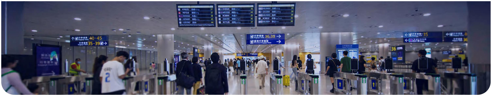

text_image

KY8221
Y87516
HQ3162
GZ3697.
GZ5792
KU3468
GCA3254
MU3388
9C8810
9C7128
行李提取 36-39 →
超规行李提取
Overseas Baggage Chaks
行李提取引导
36
行李提取 35
超规行李提取
Overseas Baggage Chaks
行李提取 40-45
行李提取 35-39 →

# 反不正当竞争

# - 反垄断与公平竞争

上海机场遵守《中华人民共和国反垄断法》《中华人民共和国反不正当竞争法》等有关要求，尊重市场竞争原则，反对垄断和不正当竞争行为，报告期内未发生因公司不正当竞争行为导致的诉讼或重大行政处罚。

上海机场坚持公平竞争、诚信经营理念，将反垄断与公平竞争管理融入日常运营与业务全流程。各直属单位法务合规部门作为归口管理部门，牵头组织相关运营部门和单位构建系统化的管理体系，持续完善制度规范、强化风险防控与合规审查。在业务开展、资源配置、服务供给及对外合作等关键环节，执行公平竞争审查要求，主动防范垄断及不正当竞争行为，推动形成透明、规范、有序的市场环境。通过常态化合规宣贯、专项培训与流程管控，公司不断提升全员公平竞争意识，切实保障航空枢纽运营高效、公正、可持续。

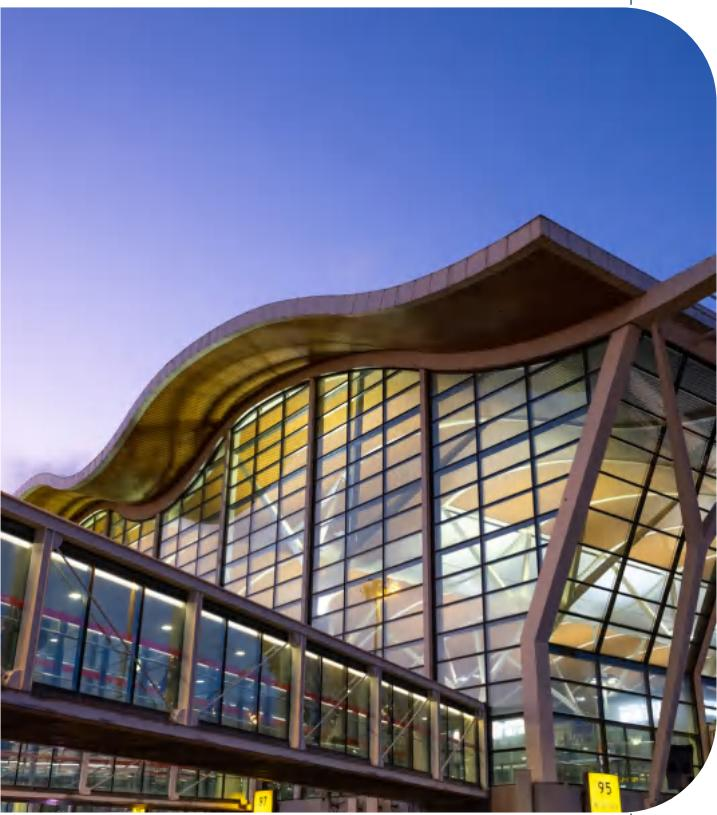

natural_image

Exterior view of a modern glass building with wavy golden roof and metal walkway, under a twilight sky (no signage or text visible)

• 上海机场对管理层、员工组织反垄断培训 100% 全覆盖。  
- 两场通过强化公平竞争审查，推动采购管理从传统的合规管理向价值挖掘跃升，助力高质量发展。  
- 浦东机场公司为提升服务品质，强化诚信经营理念，维护消费者合法权益，制定上海浦东国际机场商户诚信经营公约，对楼内商户开展了制度宣贯会，并持续进行诚信经营公约签署工作，动态评估商户诚信履约情况。  
- 机场物流公司立足货站服务领域，制定《反垄断合规手册》，严格依据《履行方案》要求，扎实推进反垄断合规日常管理工作。积极开展反垄断专项培训，强化全员合规意识，完成反垄断合规报告编制及相关材料筹备工作，并通过内部公众号开展反垄断合规宣传，持续营造合规经营氛围，全面提升反垄断治理水平。

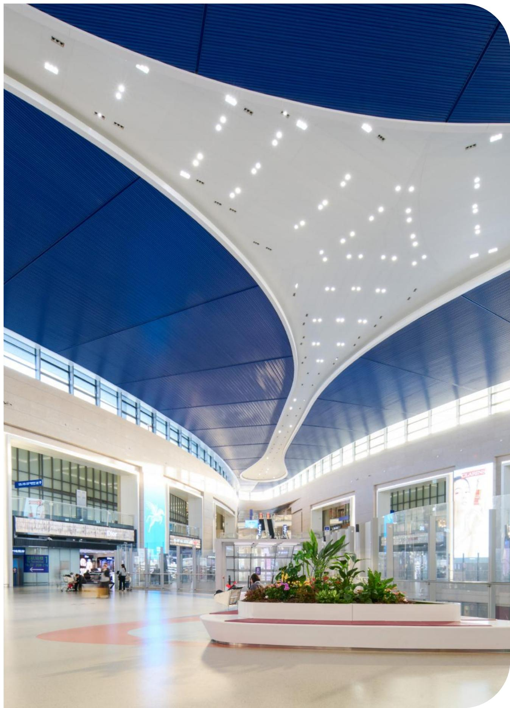

natural_image

Interior view of a modern, curved, and glass-lit exhibition space with blue-tinted ceiling and white walls (no visible text or symbols)

附录 1: ESG 数据表

<table><tr><td colspan="3">主要生产经营数据</td></tr><tr><td>绩效指标</td><td>单位</td><td>数据</td></tr><tr><td>总资产</td><td>亿元</td><td>716.79</td></tr><tr><td>营业收入</td><td>亿元</td><td>133.46</td></tr><tr><td>归属于上市公司股东的净利润</td><td>亿元</td><td>21.17</td></tr><tr><td>航班起降(浦东机场)</td><td>架次</td><td>557,043</td></tr><tr><td>航班起降(虹桥机场)</td><td>架次</td><td>282,692</td></tr><tr><td>旅客吞吐量(浦东机场)</td><td>万人次</td><td>8,499.45</td></tr><tr><td>旅客吞吐量(虹桥机场)</td><td>万人次</td><td>5,015.10</td></tr><tr><td>货邮吞吐量(浦东机场)</td><td>万吨</td><td>409.19</td></tr><tr><td>货邮吞吐量(虹桥机场)</td><td>万吨</td><td>44.53</td></tr></table>

<table><tr><td colspan="3">环境绩效</td></tr><tr><td>绩效指标</td><td>单位</td><td>数据</td></tr><tr><td colspan="3">- 环境合规管理</td></tr><tr><td>环保总投入</td><td>万元</td><td>12,765.63</td></tr><tr><td>- 环境监管</td><td>万元</td><td>167.80</td></tr><tr><td>- 废弃物处理</td><td>万元</td><td>1,939.04</td></tr><tr><td>- 环保设施采购与运维</td><td>万元</td><td>1,054.52</td></tr><tr><td>- 环保专项咨询</td><td>万元</td><td>67.14</td></tr><tr><td>- 环保宣传与培训</td><td>万元</td><td>58.62</td></tr><tr><td>- 水资源治理投入</td><td>万元</td><td>67.00</td></tr><tr><td>- 噪声治理投入</td><td>万元</td><td>83.80</td></tr><tr><td>- 大气污染防治投入</td><td>万元</td><td>9,327.71</td></tr><tr><td colspan="3">环保培训及宣传</td></tr><tr><td>- 总次数</td><td>次</td><td>78</td></tr><tr><td>- 总覆盖人数</td><td>人次</td><td>15,352</td></tr><tr><td>- 总时长</td><td>小时</td><td>792.5</td></tr></table>

<table><tr><td colspan="3">环境绩效</td></tr><tr><td>绩效指标</td><td>单位</td><td>数据</td></tr><tr><td colspan="3">-能源利用</td></tr><tr><td>能源消费总量</td><td>吨标准煤</td><td>65,163.58</td></tr><tr><td>-直接能源总消耗量</td><td>吨标准煤</td><td>14,725.98</td></tr><tr><td>-间接能源总消耗量</td><td>吨标准煤</td><td>50,437.60</td></tr><tr><td>单位客货运综合能耗</td><td>吨标准煤/万人次</td><td>3.51</td></tr><tr><td>能源消耗强度</td><td>千克标准煤/万元</td><td>48.83</td></tr><tr><td>用电总量</td><td>万千瓦时</td><td>45,278.74</td></tr><tr><td>天然气消耗</td><td>万立方米</td><td>1,010.97</td></tr><tr><td>汽油消耗</td><td>吨</td><td>311.70</td></tr><tr><td>柴油消耗</td><td>吨</td><td>773.95</td></tr><tr><td>清洁能源使用量</td><td>吨标准煤</td><td>7,335.86</td></tr><tr><td>清洁能源占比</td><td>%</td><td>10.66</td></tr><tr><td colspan="3">-水资源利用</td></tr><tr><td>总用水量(市政供水)</td><td>万立方米</td><td>374.13</td></tr><tr><td>用水强度</td><td>立方米/万元</td><td>2.80</td></tr><tr><td>非传统水源循环利用量</td><td>万立方米</td><td>236.00</td></tr><tr><td>非传统水源利用率</td><td>%</td><td>38.68</td></tr><tr><td colspan="3">-废弃物处理与循环经济</td></tr><tr><td>固体废弃物排放总量</td><td>吨</td><td>36,487.70</td></tr><tr><td>固体废弃物排放强度</td><td>千克/万元</td><td>27.34</td></tr><tr><td>危险废弃物排放总量</td><td>吨</td><td>174.33</td></tr><tr><td>一般废弃物排放总量</td><td>吨</td><td>36,313.38</td></tr><tr><td>-建筑垃圾</td><td>吨</td><td>3,567.24</td></tr><tr><td>-生活垃圾</td><td>吨</td><td>32,746.14</td></tr><tr><td>-干垃圾</td><td>吨</td><td>24,730.35</td></tr><tr><td>-湿垃圾</td><td>吨</td><td>6,593.18</td></tr><tr><td>-可回收物</td><td>吨</td><td>1,422.60</td></tr><tr><td>一般废弃物合规化处理率</td><td>%</td><td>100</td></tr><tr><td>危险废弃物无害化处理率</td><td>%</td><td>100</td></tr><tr><td>废弃物循环利用量</td><td>吨</td><td>1,691.20</td></tr><tr><td colspan="3">-污染物排放</td></tr><tr><td>废水排放总量</td><td>万立方米</td><td>823.57</td></tr><tr><td>废水排放强度</td><td>立方米/万元</td><td>6.17</td></tr></table>

环境绩效

<table><tr><td>绩效指标</td><td>单位</td><td>数据</td></tr><tr><td colspan="3">-污染物排放</td></tr><tr><td>氨氮( $NH_3-N$ )</td><td>吨</td><td>1.78</td></tr><tr><td>总氮(TN)</td><td>吨</td><td>13.86</td></tr><tr><td>总磷(TP)</td><td>吨</td><td>0.48</td></tr><tr><td>废气排放总量</td><td>万立方米</td><td>12,327.38</td></tr><tr><td>废气排放强度</td><td>立方米/万元</td><td>92.37</td></tr><tr><td>氮氧化物( $NO_x$ )</td><td>吨</td><td>3.01</td></tr><tr><td>颗粒物(PM)</td><td>吨</td><td>0.10</td></tr><tr><td>硫氧化物( $SO_x$ )</td><td>吨</td><td>0</td></tr><tr><td>挥发性有机物( $VOC_s$ )</td><td>吨</td><td>0</td></tr><tr><td colspan="3">-应对气候变化</td></tr><tr><td>温室气体排放总量</td><td>吨 $CO_2e$ </td><td>232,807.05</td></tr><tr><td>-范围一温室气体排放</td><td>吨 $CO_2e$ </td><td>25,166.80</td></tr><tr><td>-范围二温室气体排放</td><td>吨 $CO_2e$ </td><td>207,640.25</td></tr><tr><td>单位客货运温室气体排放量</td><td>吨 $CO_2e$ /万人次</td><td>12.55</td></tr><tr><td>温室气体排放强度</td><td>千克 $CO_2e$ /万元</td><td>174.44</td></tr><tr><td>温室气体减排资金投入</td><td>万元</td><td>9,327.71</td></tr><tr><td>温室气体减排量</td><td>万吨 $CO_2e$ </td><td>1.93</td></tr></table>

<table><tr><td>绩效指标</td><td>单位</td><td>数据</td></tr><tr><td colspan="3">-员工聘用</td></tr><tr><td>员工总人数</td><td>人</td><td>13,329</td></tr><tr><td colspan="3">专业构成类别</td></tr><tr><td>-生产人员</td><td>人</td><td>9,159</td></tr><tr><td>-管理人员</td><td>人</td><td>1,705</td></tr><tr><td>-专业技术管理人员</td><td>人</td><td>1,992</td></tr><tr><td>-专业技术人员</td><td>人</td><td>473</td></tr><tr><td colspan="3">教育程度类别</td></tr><tr><td>-大学本科及以上</td><td>人</td><td>4,776</td></tr></table>

<table><tr><td>绩效指标</td><td>单位</td><td>数据</td></tr><tr><td>- 大学专科</td><td>人</td><td>4,940</td></tr><tr><td>- 中专及以下</td><td>人</td><td>3,613</td></tr><tr><td colspan="3">- 员工管理</td></tr><tr><td>员工流失率</td><td>%</td><td>4.89</td></tr><tr><td>员工满意度</td><td>分</td><td>4.23 (5)</td></tr><tr><td colspan="3">- 职业健康</td></tr><tr><td>工伤保险覆盖率</td><td>%</td><td>100</td></tr><tr><td>体检覆盖率</td><td>%</td><td>100</td></tr><tr><td colspan="3">- 员工培训</td></tr><tr><td>员工培训总投入</td><td>万元</td><td>778.38</td></tr><tr><td>员工培训覆盖率</td><td>%</td><td>100</td></tr><tr><td colspan="3">- 客户服务</td></tr><tr><td>投诉处理率</td><td>%</td><td>100</td></tr><tr><td>客户满意度(浦东机场;虹桥机场)</td><td>分</td><td>5.00; 4.96</td></tr><tr><td colspan="3">- 安全生产</td></tr><tr><td>安全投入总额</td><td>亿元</td><td>21.07</td></tr><tr><td>安全培训覆盖率</td><td>%</td><td>100</td></tr><tr><td colspan="3">- 研发创新</td></tr><tr><td>研发费用</td><td>万元</td><td>1,827.20</td></tr><tr><td>研发人员数量</td><td>人</td><td>126</td></tr><tr><td>有效专利数</td><td>件</td><td>52</td></tr><tr><td>软件著作权数量</td><td>件</td><td>57</td></tr><tr><td colspan="3">- 乡村振兴与公益慈善</td></tr><tr><td>乡村振兴投入</td><td>万元</td><td>81.80</td></tr><tr><td>公益慈善投入</td><td>万元</td><td>27.80</td></tr><tr><td>乡村振兴惠及人数</td><td>人</td><td>620</td></tr><tr><td>公益慈善惠及人数</td><td>人</td><td>2,256</td></tr><tr><td colspan="3">- 税务贡献</td></tr><tr><td>纳税总额</td><td>万元</td><td>82,457.00</td></tr></table>

# 附录 2：索引表

《上海证券交易所上市公司自律监管指引第 14 号—可持续发展报告（试行）》内容索引

<table><tr><td>披露要求</td><td>对应的本报告章节</td></tr><tr><td colspan="2">环境</td></tr><tr><td>应对气候变化</td><td>环境维度 - 应对气候变化</td></tr><tr><td>污染物排放</td><td>环境维度 - 污染物排放</td></tr><tr><td>废弃物处理</td><td>环境维度 - 废弃物处理</td></tr><tr><td>生态系统和生物多样性保护</td><td>环境维度 - 生态系统和生物多样性保护</td></tr><tr><td>环境合规管理</td><td>环境维度 - 环境合规管理</td></tr><tr><td>能源利用</td><td>环境维度 - 能源利用</td></tr><tr><td>水资源利用</td><td>环境维度 - 水资源利用</td></tr><tr><td>循环经济</td><td>环境维度 - 循环经济</td></tr><tr><td colspan="2">社会</td></tr><tr><td>乡村振兴</td><td>社会维度 - 乡村振兴与社会贡献</td></tr><tr><td>社会贡献</td><td>社会维度 - 乡村振兴与社会贡献</td></tr><tr><td>创新驱动</td><td>社会维度 - 创新驱动</td></tr><tr><td>科技伦理</td><td>社会维度 - 创新驱动</td></tr><tr><td>供应链安全</td><td>社会维度 - 供应链安全</td></tr><tr><td>平等对待中小企业</td><td>社会维度 - 供应链安全</td></tr><tr><td>产品和服务安全与质量</td><td>社会维度 - 产品和服务安全与质量</td></tr><tr><td>数据安全与客户隐私保护</td><td>社会维度 - 数据安全与客户隐私保护</td></tr><tr><td>员工</td><td>社会维度 - 员工</td></tr><tr><td colspan="2">治理</td></tr><tr><td>尽职调查</td><td>尽职调查、利益相关方沟通</td></tr><tr><td>利益相关方沟通</td><td>尽职调查、利益相关方沟通</td></tr><tr><td>反商业贿赂及反贪污</td><td>可持续发展相关治理维度 - 反商业贿赂及反贪污</td></tr><tr><td>反不正当竞争</td><td>可持续发展相关治理维度 - 反不正当竞争</td></tr></table>

上海市国有控股上市公司 ESG 指标体系（2026 版）内容索引

<table><tr><td colspan="3">指标名称</td><td>对应报告内容</td></tr><tr><td colspan="4">环境</td></tr><tr><td rowspan="9">E1 环境管理</td><td>E1.1</td><td>环境管理目标和制度</td><td>环境维度 - 环境合规管理</td></tr><tr><td>E1.2</td><td>通过环境管理体系认证</td><td>环境维度 - 环境合规管理</td></tr><tr><td>E1.3</td><td>绿色产品研发与环保技术使用</td><td>环境维度 - 污染物排放、循环经济</td></tr><tr><td>E1.4</td><td>绿色产品或服务收益</td><td>/</td></tr><tr><td>E1.5</td><td>环保总投入</td><td>环境维度 - 环境合规管理</td></tr><tr><td>E1.6</td><td>环保培训绩效</td><td>环境维度 - 环境合规管理</td></tr><tr><td>E1.7</td><td>环境事件风险评估及预防</td><td>环境维度 - 环境合规管理</td></tr><tr><td>E1.8</td><td>环境违法违规及入刑事件</td><td>环境维度 - 环境合规管理</td></tr><tr><td>E1.9</td><td>发展循环经济</td><td>环境维度 - 循环经济</td></tr><tr><td rowspan="5">E2 能源</td><td>E2.1</td><td>能源管理目标和规划</td><td>环境维度 - 能源利用</td></tr><tr><td>E2.2</td><td>节约能源举措</td><td>环境维度 - 能源利用</td></tr><tr><td>E2.3</td><td>可再生能源开发与应用</td><td>环境维度 - 应对气候变化</td></tr><tr><td>E2.4</td><td>能源消耗总量</td><td>环境维度 - 能源利用</td></tr><tr><td>E2.5</td><td>能源消耗强度</td><td>环境维度 - 能源利用</td></tr><tr><td rowspan="5">E3 资源</td><td>E3.1</td><td>水资源目标和规划</td><td>环境维度 - 水资源利用</td></tr><tr><td>E3.2</td><td>节约用水举措</td><td>环境维度 - 水资源利用</td></tr><tr><td>E3.3</td><td>用水总量</td><td>环境维度 - 水资源利用</td></tr><tr><td>E3.4</td><td>用水强度</td><td>环境维度 - 水资源利用</td></tr><tr><td>E3.5</td><td>水资源循环利用量</td><td>环境维度 - 水资源利用</td></tr><tr><td rowspan="7">E4 污染物</td><td>E4.1</td><td>废水管理目标和规划</td><td>环境维度 - 污染物排放</td></tr><tr><td>E4.2</td><td>减少废水排放举措</td><td>环境维度 - 污染物排放</td></tr><tr><td>E4.3</td><td>废水污染物排放量</td><td>环境维度 - 污染物排放</td></tr><tr><td>E4.4</td><td>废水污染物排放强度</td><td>环境维度 - 污染物排放</td></tr><tr><td>E4.5</td><td>废气管理目标和规划</td><td>环境维度 - 污染物排放</td></tr><tr><td>E4.6</td><td>减少废气排放举措</td><td>环境维度 - 污染物排放</td></tr><tr><td>E4.7</td><td>废气污染物排放量</td><td>环境维度 - 污染物排放</td></tr><tr><td rowspan="8">E4污染物</td><td>E4.8</td><td>废气污染物排放强度</td><td>环境维度-污染物排放</td></tr><tr><td>E4.9</td><td>固体废弃物管理目标和规划</td><td>环境维度-废弃物处理</td></tr><tr><td>E4.10</td><td>固体废弃物处理举措</td><td>环境维度-废弃物处理</td></tr><tr><td>E4.11</td><td>危险固体废弃物处理举措</td><td>环境维度-废弃物处理</td></tr><tr><td>E4.12</td><td>固体废弃物排放量</td><td>环境维度-废弃物处理</td></tr><tr><td>E4.13</td><td>固体废弃物排放强度</td><td>环境维度-废弃物处理</td></tr><tr><td>E4.14</td><td>固体废弃物回收、利用、处置量</td><td>环境维度-废弃物处理</td></tr><tr><td>E4.15</td><td>其他污染物管理</td><td>环境维度-污染物排放</td></tr><tr><td rowspan="7">E5气候变化</td><td>E5.1</td><td>气候变化管理</td><td>环境维度-应对气候变化</td></tr><tr><td>E5.2</td><td>助力“双碳”目标的举措</td><td>环境维度-应对气候变化</td></tr><tr><td>E5.3</td><td>碳核查/盘查举措</td><td>环境维度-应对气候变化</td></tr><tr><td>E5.4</td><td>温室气体排放量(范围一)</td><td>环境维度-应对气候变化</td></tr><tr><td>E5.5</td><td>温室气体排放量(范围二)</td><td>环境维度-应对气候变化</td></tr><tr><td>E5.6</td><td>温室气体排放量(范围三)</td><td>/</td></tr><tr><td>E5.7</td><td>温室气体排放强度</td><td>环境维度-应对气候变化</td></tr><tr><td rowspan="2">E6生物多样性</td><td>E6.1</td><td>生物多样性保护制度</td><td>环境维度-生态系统和生物多样性保护</td></tr><tr><td>E6.2</td><td>生物多样性保护举措</td><td>环境维度-生态系统和生物多样性保护</td></tr><tr><td colspan="4">社会</td></tr><tr><td rowspan="8">S1品牌价值管理</td><td>S1.1</td><td>品牌战略规划与资源保障</td><td>社会维度-产品和服务安全与质量</td></tr><tr><td>S1.2</td><td>产品服务质量管理体系与标准建设</td><td>社会维度-产品和服务安全与质量</td></tr><tr><td>S1.3</td><td>新品牌孵化与老品牌焕新</td><td>社会维度-产品和服务安全与质量</td></tr><tr><td>S1.4</td><td>核心技术驱动品牌溢价</td><td>社会维度-创新驱动</td></tr><tr><td>S1.5</td><td>品牌满意度与忠诚度</td><td>社会维度-产品和服务安全与质量</td></tr><tr><td>S1.6</td><td>品牌全球化表现</td><td>社会维度-产品和服务安全与质量</td></tr><tr><td>S1.7</td><td>品牌公益</td><td>社会维度-产品和服务安全与质量</td></tr><tr><td>S1.8</td><td>品牌保护</td><td>社会维度-产品和服务安全与质量</td></tr><tr><td rowspan="2">S2产品和服务</td><td>S2.1</td><td>信息安全</td><td>社会维度-数据安全与客户隐私保护</td></tr><tr><td>S2.2</td><td>客户隐私保护</td><td>社会维度-数据安全与客户隐私保护</td></tr></table>

<table><tr><td colspan="3">指标名称</td><td>对应报告内容</td></tr><tr><td colspan="4">社会</td></tr><tr><td rowspan="11">S2产品和服务</td><td>S2.3</td><td>负责任宣传</td><td>社会维度-产品和服务安全与质量</td></tr><tr><td>S2.4</td><td>产品和服务可及性</td><td>社会维度-产品和服务安全与质量</td></tr><tr><td>S2.5</td><td>应对客户投诉</td><td>社会维度-产品和服务安全与质量</td></tr><tr><td>S2.6</td><td>客户投诉量/投诉解决率</td><td>社会维度-产品和服务安全与质量</td></tr><tr><td>S2.7</td><td>产品研发创新</td><td>社会维度-创新驱动</td></tr><tr><td>S2.8</td><td>研发投入金额</td><td>社会维度-创新驱动</td></tr><tr><td>S2.9</td><td>研发强度</td><td>社会维度-创新驱动</td></tr><tr><td>S2.10</td><td>研发人员数量</td><td>社会维度-创新驱动</td></tr><tr><td>S2.11</td><td>知识产权保护</td><td>社会维度-产品和服务安全与质量</td></tr><tr><td>S2.12</td><td>有效专利数</td><td>社会维度-创新驱动</td></tr><tr><td>S2.13</td><td>遵守科技伦理规范</td><td>社会维度-创新驱动</td></tr><tr><td rowspan="17">S3员工责任</td><td>S3.1</td><td>员工雇佣和员工组成</td><td>社会维度-员工</td></tr><tr><td>S3.2</td><td>员工权益保障</td><td>社会维度-员工</td></tr><tr><td>S3.3</td><td>员工流失率</td><td>社会维度-员工</td></tr><tr><td>S3.4</td><td>员工民主管理</td><td>社会维度-员工</td></tr><tr><td>S3.5</td><td>薪酬与福利体系</td><td>社会维度-员工</td></tr><tr><td>S3.6</td><td>员工关爱</td><td>社会维度-员工</td></tr><tr><td>S3.7</td><td>员工满意度</td><td>社会维度-员工</td></tr><tr><td>S3.8</td><td>吸纳就业情况</td><td>社会维度-员工</td></tr><tr><td>S3.9</td><td>建立合理有效的员工申诉制度</td><td>社会维度-员工</td></tr><tr><td>S3.10</td><td>员工职业健康安全管理</td><td>社会维度-员工</td></tr><tr><td>S3.11</td><td>通过职业健康安全管理体系认证</td><td>社会维度-员工</td></tr><tr><td>S3.12</td><td>安全应急管理举措</td><td>社会维度-产品和服务安全与质量</td></tr><tr><td>S3.13</td><td>安全生产投入总额</td><td>社会维度-产品和服务安全与质量</td></tr><tr><td>S3.14</td><td>安全生产培训绩效</td><td>社会维度-产品和服务安全与质量</td></tr><tr><td>S3.15</td><td>因工受伤和死亡</td><td>社会维度-员工</td></tr><tr><td>S3.16</td><td>员工体检覆盖率</td><td>社会维度-员工</td></tr><tr><td>S3.17</td><td>员工职业发展制度</td><td>社会维度-员工</td></tr><tr><td rowspan="2">S3 员工责任</td><td>S3.18</td><td>员工培训和实践举措</td><td>社会维度 - 员工</td></tr><tr><td>S3.19</td><td>员工发展的成效</td><td>社会维度 - 员工</td></tr><tr><td rowspan="4">S4 供应链责任</td><td>S4.1</td><td>供应商管理制度</td><td>社会维度 - 供应链安全</td></tr><tr><td>S4.2</td><td>保障供应链安全稳定</td><td>社会维度 - 供应链安全</td></tr><tr><td>S4.3</td><td>引领带动民营和中小企业协同发展</td><td>社会维度 - 供应链安全</td></tr><tr><td>S4.4</td><td>供应商 ESG 管理</td><td>社会维度 - 供应链安全</td></tr><tr><td rowspan="7">S5 企业责任</td><td>S5.1</td><td>服务国家战略或区域发展</td><td>社会维度 - 乡村振兴与社会贡献</td></tr><tr><td>S5.2</td><td>金融“五篇大文章”</td><td>/</td></tr><tr><td>S5.3</td><td>社区关系</td><td>社会维度 - 乡村振兴与社会贡献</td></tr><tr><td>S5.4</td><td>公共服务</td><td>社会维度 - 乡村振兴与社会贡献</td></tr><tr><td>S5.5</td><td>应对公共危机</td><td>社会维度 - 乡村振兴与社会贡献</td></tr><tr><td>S5.6</td><td>税务贡献</td><td>社会维度 - 乡村振兴与社会贡献</td></tr><tr><td>S5.7</td><td>促进共同富裕</td><td>社会维度 - 乡村振兴与社会贡献</td></tr><tr><td colspan="4">治理</td></tr><tr><td rowspan="10">G1 公司治理</td><td>G1.1</td><td>党的领导融入公司治理</td><td>公司 ESG 治理安排 - 公司可持续发展治理架构</td></tr><tr><td>G1.2</td><td>外部董事占比</td><td>公司 ESG 治理安排 - 公司可持续发展治理架构</td></tr><tr><td>G1.3</td><td>合规管理体系</td><td>公司 ESG 治理安排 - 监督与考核机制</td></tr><tr><td>G1.4</td><td>风险管理体系</td><td>公司 ESG 治理安排 - 监督与考核机制</td></tr><tr><td>G1.5</td><td>审计制度</td><td>公司 ESG 治理安排 - 监督与考核机制</td></tr><tr><td>G1.6</td><td>避免违反商业道德的举措</td><td>可持续发展相关治理维度 - 反商业贿赂及反贪污</td></tr><tr><td>G1.7</td><td>商业道德培训绩效</td><td>可持续发展相关治理维度 - 反商业贿赂及反贪污</td></tr><tr><td>G1.8</td><td>反垄断与公平竞争</td><td>可持续发展相关治理维度 - 反不正当竞争</td></tr><tr><td>G1.9</td><td>举报者保护政策</td><td>可持续发展相关治理维度 - 反商业贿赂及反贪污</td></tr><tr><td>G1.10</td><td>诚信经营及信用体系建设</td><td>可持续发展相关治理维度 - 反不正当竞争</td></tr><tr><td rowspan="4">G2 ESG 治理</td><td>G2.1</td><td>董事会参与 ESG 管理</td><td>公司 ESG 治理安排 - 公司可持续发展治理架构</td></tr><tr><td>G2.2</td><td>ESG 工作组织架构</td><td>公司 ESG 治理安排 - 公司可持续发展治理架构</td></tr><tr><td>G2.3</td><td>ESG 战略/目标</td><td>公司 ESG 治理安排 - 公司可持续发展治理架构</td></tr><tr><td>G2.4</td><td>ESG 利益相关方识别</td><td>尽职调查、利益相关方沟通</td></tr></table>

<table><tr><td colspan="3">指标名称</td><td>对应报告内容</td></tr><tr><td colspan="4">治理</td></tr><tr><td rowspan="10">G2 ESG 治理</td><td>G2.5</td><td>重要性议题和指标识别</td><td>双重重要性分析、议题重要性分析结论</td></tr><tr><td>G2.6</td><td>ESG 相关制度</td><td>公司 ESG 治理安排 - 公司可持续发展治理架构</td></tr><tr><td>G2.7</td><td>开展利益相关方沟通活动</td><td>尽职调查、利益相关方沟通</td></tr><tr><td>G2.8</td><td>管理层薪酬同 ESG 绩效挂钩</td><td>公司 ESG 治理安排 - 监督与考核机制</td></tr><tr><td>G2.9</td><td>具体业务考虑 ESG 要素</td><td>公司 ESG 治理安排 - 公司可持续发展治理架构</td></tr><tr><td>G2.10</td><td>ESG 专业技能和能力</td><td>公司 ESG 治理安排 - 公司可持续发展治理架构</td></tr><tr><td>G2.11</td><td>ESG 信息报告机制</td><td>公司 ESG 治理安排 - 可持续发展相关信息报告</td></tr><tr><td>G2.12</td><td>ESG 第三方评价</td><td>/</td></tr><tr><td>G2.13</td><td>ESG 数字化建设</td><td>公司 ESG 治理安排 - 公司可持续发展治理架构</td></tr><tr><td>G2.14</td><td>推动海外经营机构加强 ESG 工作</td><td>/</td></tr><tr><td rowspan="3">G3 数据治理</td><td>G3.1</td><td>基础平台建设</td><td>社会维度 - 创新驱动</td></tr><tr><td>G3.2</td><td>数据汇聚互通</td><td>社会维度 - 创新驱动</td></tr><tr><td>G3.3</td><td>数据治理体系</td><td>社会维度 - 创新驱动</td></tr></table>

# 附录 3: 意见反馈

感谢您阅读《上海国际机场股份有限公司 2025 年环境、社会和公司治理（ESG）报告》。我们非常重视并期望聆听您对公司和此份报告的反馈意见。您可填写下表，通过以下方式反馈给我们。

邮箱：ir@shairport.com

您对本报告的总体评价；

□ 非常好

□ 好

□ 一般

□ 较差

□ 差

您认为报告结构是否合理？

□ 非常合理

□ 合理

□ 一般

□ 较不合理

□ 不合理

您认为报告是否易读？

□ 非常易读

□ 易读

□ 一般

□ 较不易读

□ 不易读

您最为关注上海机场哪方面的环境、社会和公司治理（ESG）议题（可多选）

□ 应对气候变化

□ 污染物排放

□ 废弃物处理

□ 生态系统和生物多样性保护

□ 环境合规管理

□ 能源利用

□ 水资源利用

□ 循环经济

□ 乡村振兴

□ 社会贡献

□ 创新驱动

□ 科技伦理

□ 供应链安全

□ 平等对待中小企业

□ 产品和服务安全与质量

□ 数据安全与客户隐私保护

□ 员工

□ 尽职调查

□ 利益相关方沟通

□ 反商业贿赂及反贪污

□ 反不正当竞争

您所关注信息在议题中披露程度如何？

□ 很全面

□ 比较全面

□ 有所涉及

□ 涉及很少

□ 未涉及

您还有哪些关注的议题未反映在报告中？

您对公司的环境、社会和公司治理（ESG）工作或环境、社会和公司治理（ESG）报告的其他建议。

上海机场

AVINEX

上海国际机场股份有限公司