# 2025

# 环境、社会与公司治理(ESG)报告

安徽金种子酒业股份有限公司

text_image

头号种
7
金種3
一酸合香
9
金種3
一酸合香
16
金種3
一酸合香
20
金種子
一酸合香
150℃
醉三秋
150℃
金種子
福子酒
福子酒
福佳酿州

# 报告编制说明

本报告是金种子酒第二份环境、社会与公司治理（ESG）报告，旨在向利益相关方披露公司在经营中对于可持续发展议题所秉持的理念、建立的管理方法、推行的工作与取得的成果。本报告通过年度专题展示金种子酒在部分 ESG 重点领域的贡献。

# 报告范围

本报告披露信息的范围涵盖安徽金种子酒业股份有限公司及其附属公司（简称“金种子酒”或“金种子酒业”或“公司”或“我们”），与金种子酒（600199）合并财务报表范围一致。本报告数据覆盖范围参见“ESG数据绩效表”说明。

# 时间范围

本报告为年度报告，报告时间范围为 2025 年 1 月 1 日至 2025 年 12 月 31 日。部分文字信息超出此范畴的，将在所涉及处予以说明。

# 编制依据

# 本报告编制过程参考以下报告编制准则：

- 联合国 2030 年可持续发展目标（SDGs）  
- 全球可持续发展标准委员会 GRI《可持续发展报告标准》（GRI Standards）  
- 可持续发展会计标准委员会准则（SASB Standards）  
- 中国国家标准《社会责任报告编制指南》（GB/T 36001-2015）

\- 上海证券交易所：《上海证券交易所上市公司自律监管指南第14号——可持续发展报告（试行）》

# 数据来源

报告中所披露的文字信息和量化数据均来自公司实际运行的原始记录或财务报告。相关财务数据与公司年度报告不符的，以年度报告为准。

# 报告获取

本报告以电子版形式供您阅读，您可登录公司上海证券交易所网站（www.sse.com.cn）或官网（https://www.jzz.cn）阅读电子版报告。如对本报告有任何疑问或建议，敬请发送电子邮件至jnsy199@163.com，或致电0558-2210568。

# 目录 CONTENTS

董事长致辞 01

关于金种子酒 03

金种子酒的 2025 09

2025年荣誉奖项 10

ESG 管理 11

# 党建引领 合规强基 15

党建领航 17

公司治理 19

投资者关系管理与信息披露 20

合规经营 21

# 绿色酿造 低碳共生 27

应对气候变化 29

环境管理 32

能源管理 36

资源管理与循环经济 36

废弃物管理 37

# 质创双驱 客户至上 39

产品质量保障 41

研发与创新 46

行业共进 48

知识产权保护 49

数字化赋能 49

客户权益 52

责任营销 53

# 人才为本 聚力成长 57

员工权益与福利 59

员工培训与发展 63

职业健康与安全 65

# 初心如磐 回馈社会 69

服务社会公益 71

践行乡村振兴 73

附录 75

ESG 数据绩效表 75

指标索引 77

意见反馈表 82

# 董事长致辞

2025年，公司以习近平新时代中国特色社会主义思想为指导，深入贯彻党的二十大和二十届历次全会精神，全面落实“做强底盘，做大馥合香，提质增效，再创新辉煌”的发展战略，持续深化改革创新，将ESG理念深度融入企业战略决策与生产经营全流程，以长期主义应对行业调整的不确定性，行稳致远推动企业高质量可持续发展，各项工作取得新突破，发展根基得到进一步夯实。

# 固本强基，合规共治绘就治理“新蓝图”

公司持续优化 ESG 治理架构，构建权责清晰、流程规范的闭环管理体系。扎实推进合规经营，持续健全风险防控与廉洁从业规范，将可持续发展理念融入公司治理全过程，切实维护股东、员工、客户及合作伙伴等相关方的合法权益，全力营造公开透明、合规有序的商业环境，为企业行稳致远筑牢制度屏障。

# 绿韵润企，生态酿造铺就发展“新底色”

公司深入践行 “绿水青山就是金山银山” 理念，以生态酿造为核心，大力推进绿色生产与循环经济。依托国家级绿色工厂、省级智能工厂优势，持续推进节能降碳，优化能源利用结构，积极推进绿电使用，提升可再生能源使用占比，切实降低生产环节碳排放。严格落实环保全流程管控，规范危险化学品、危险废物全生命周期管理，实现从原料到成品的绿色运营闭环，探索白酒行业生态酿造路径，助力企业迈向零碳发展。

# 匠心致远，科创质效共谱创新“新篇章”

公司坚持以 “一体两翼” 品牌战略为引领，深化馥合香品类创新，积极推进产学研协同创新，完成多项核心技术攻关，授权专利 30 余项，斩获行业科技进步奖项，持续巩固馥合香型白酒创领地位。同时，公司强化全流程质量管控，构建从 “田间” 到 “舌尖” 的食品安全体系，推进生产环节智能化升级，以技术创新赋能品质提升，推动企业在行业调整期实现向上突破。

# 同心致远，责任温度凝聚社会“新合力”

公司始终将人才视为企业发展的核心资产，完善人才引育用留机制，培育多层次技能人才梯队，健全员工职业发展与福利保障体系，营造安全舒心的工作环境，助力员工与企业共同成长。在履行社会责任方面，公司积极践行国企担当，深入开展乡村振兴定点帮扶，激活产业引擎，带动脱贫增收，完善乡村基础设施；持续推进公益服务，开展爱心送考、志愿服务等活动，以实际行动回馈社会信任，为地方发展贡献力量。

2026 年是 “十五五” 规划开局之年，公司将立足新起点，抢抓产业升级与品牌焕新机遇，以品质为根、以创新为翼、以可持续为导向，深耕主业、做强优势、精进管理、提升价值，聚焦合规治理、绿色酿造、创新驱动、人才发展等领域，以实干担当推动企业行稳致远，为行业高质量发展与社会进步贡献金种子力量。

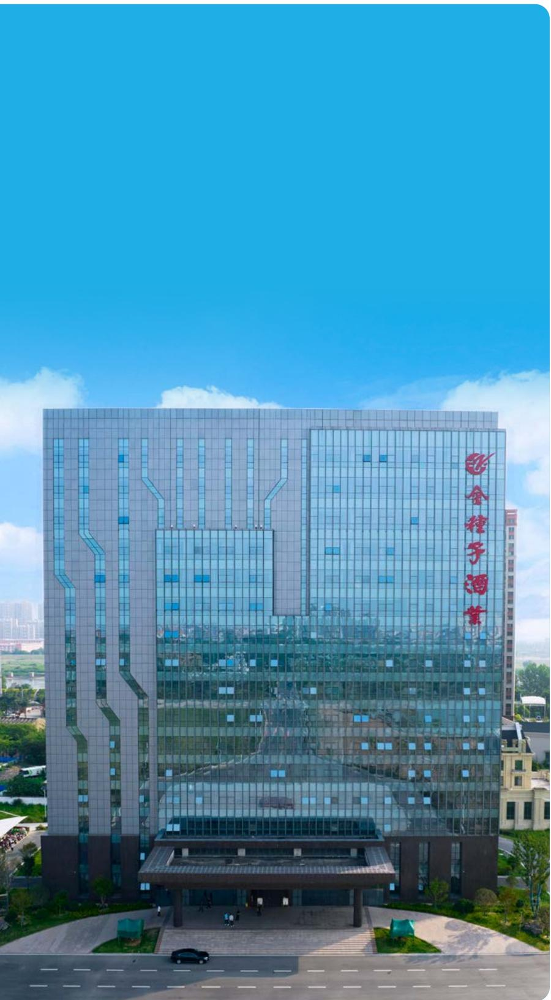

text_image

超金种子酒業

# 关于金种子酒

# 公司简介

安徽金种子酒业股份有限公司位于中国两大黄金名酒带之一的黄淮名酒带核心产区，传承自明代大升酒坊，正式建厂于1949年7月，是新中国首批酿酒企业，于1998年上市，是全国第八家白酒上市公司。公司现有“金种子”“种子”“醉三秋”“和泰”“颍州”五大白酒品牌，拥有2个“中国驰名商标”、1个“中华老字号”，是全国绿色食品示范企业。2023年金种子酒业以188.98亿元的品牌价值位列全国酒类榜单第67位。2005年，金种子酒业开创柔和品类，打造柔和种子酒成为单瓶销量破亿的行业大单品；2020年，与江南大学合作研发战略产品金种子馥合香，先后取得中国食品工业协会、中国酒业协会两大团体标准，是馥合香型白酒标准的定义者；2022年，华润入驻金种子集团，深入实施组织重塑和品牌重塑，为公司高质量发展注入了新的动能，全力做强主业白酒。金种子酒业以“引领白酒新世界、酿造美好新生活”为企业使命，不断守正创新，高标准打造绿色智能工厂、生态酿造科研基地、建立江南大学陈坚院士工作站、组建中国馥香白酒研究院等11个科研平台，先后荣获“国家地理标志保护产品”“全国绿色食品示范企业”，争做让消费者信赖、客户信任、员工自豪、投资者满意的中国一流白酒企业。

# 产品文化

# 金种子 馥合香系列

金种子馥合香是华润入驻金种子后重塑升级的核心战略产品，定位全国第13种香型的次高端白酒，该产品由非遗酿造团队精选六种粮食为酿酒原料，首创三曲融合配方，一步成香，一口三香。自2020年上市4年来，金种子馥合香以“芝头浓韵酱尾，一口三香”的独特品质享誉次高端、引领新名酒。金种子酒业先后取得中国食品工业协会、中国酒业协会两大团体标准，是馥合香型白酒的创领者。

阜阳特产“醉三秋”白酒历史悠久，源自刘伶“一醉三秋”的民间传说。相传魏晋时杜康后裔在汝阴（今阜阳）酿酒，刘伶闻香而至，醉卧三年，留下“杜康酿酒刘伶醉”的典故。宋代欧阳修、苏轼先后任颍州太守时，都喜饮颍酒并畅游西湖。凭借地理优势和文化底蕴，醉三秋发展为徽派浓香白酒标杆，品质密码为“五老”，即老技艺、老窖池、老陶坛、老酒、老匠心。其坚守老五甑浓香非遗工艺、坚定180天超长发酵、坚持5-20年真实年份老酒，延续了传统酿造技艺，彰显出“非遗”的独特价值，承载着阜阳人的老记忆、老情怀，是阜阳人印象里的老味道。

# 醉三秋系列

# 种子酒系列

“种子”象征生命、希望、传承与自强不息。金种子酒是国家地理标志保护产品。其起源可追溯至杜康秫酒，“秫”即种子。东汉《说文解字》记载杜康用种子酿酒，民间传说杜康因霉粮酿成酒浆。颍州地处中原，水源丰富，拥有百亿粮仓，为酿酒提供优质原料。种子酒传承宋代“颍州大曲”，延续传统“老五甑”工艺，是宋代颍州大曲的再现，兼具历史传承与现代柔和品质。金种子酒业于2005年首创柔和型白酒品类命名“种子酒柔和”并成功上市，至今连续畅销二十年，是柔和型白酒定义者，爱柔和，就喝种子酒。

# 企业文化

# 愿景

成为消费者信赖、客户信任、员工自豪、投资者满意的中国一流白酒企业

# 使命

引领白酒新世界，酿造美好新生活

# 金种子酒文化博物馆

金种子酒文化博物馆是一座集历史、文化与科技体验于一体的综合性展馆，总面积 3000 多平方米，分为四层，是展示金种子酒文化、传承酿酒技艺的重要窗口，重点发掘和展示与阜阳息息相关的酒文化传奇、人文历史及酿酒技艺，彰显阜阳作为中华酒文化重要发祥地的深厚底蕴。

博物馆一层为接待大厅及金种子工厂旗舰店；二层以酒道文化为核心，还原颍州民俗酒文化，设置酒令互动、调酒品鉴等体验区；三层聚焦酿酒工艺，展现金种子“老五甑”非遗技艺与馥合香创新工艺，介绍优质原料与深层矿岩水对酒质的保障；四层梳理企业从明代大昇酒坊至今的发展脉络，展现金种子品牌变迁与白酒香型文化。

馆内设有明代酒坊复原、西湖酒肆等沉浸式场景及各类互动装置，生动诠释“从一粒粮到一滴酒”的匠心精神，同时联动馆后明代古窖池，完整呈现金种子酿酒文化的传承与发展，让游客全方位感受白酒文化的博大精深与金种子的匠心传承。

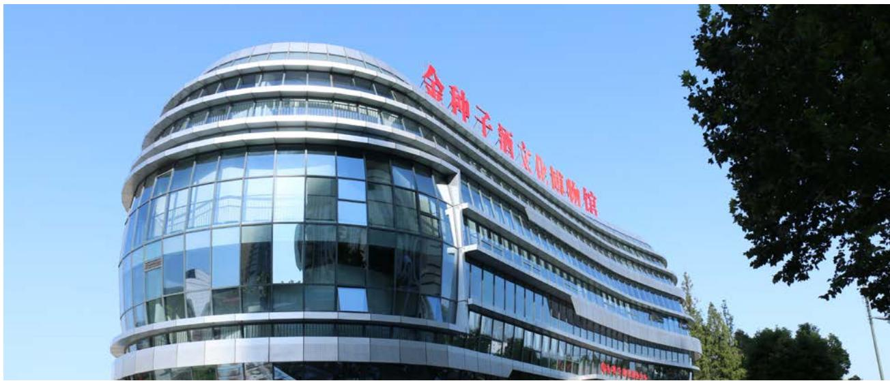

text_image

金种子酒文旅物馆

# 组织能力

品质至上、客户为先、奋斗者为本

# 发展战略

做强底盘，做大馥合香；提质增效，再创新辉煌

# 明代古窖池

金种子明代窖池共 7 口，起源于明代中期，历史底蕴深厚，于 2013 年被省政府列入省级重点文物保护单位，在行业内享有 “中原第一窖” 之美誉。公司现存的 8000 余条窖池皆衍生于此，源于明窖的有益微生物菌群已被推广应用到公司所有酿酒窖池，保证新窖也能酿造出高品质白酒。

窖池及窖泥中滋生着种类丰富、功能多样且对酿酒有益的微生物菌落群。这些肉眼不可见的微生物能够利用谷物中的淀粉、蛋白质等营养成分，通过发酵作用生成浓香型白酒中各类呈香呈味物质。窖龄越长，窖池及窖泥中的微生物种类和数量就越丰富，生成的香味物质也就越多，白酒的香气便愈发醇厚浓郁。优质的窖池与窖泥，是生产高品质浓香型白酒的重要前提和核心基础。

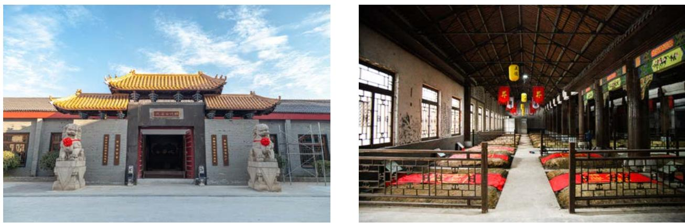

# 发展历程

# 1949年7月—1950年7月

# 创立于龙王堂集的新中国首批国营酒厂——国营阜阳县酒厂

\- 1949年7月（阜阳于1948年8月解放），阜阳县税务局接管蕴泰酒坊，并将大升酒坊等数家私人酒坊并入蕴泰酒坊，并从阜阳、阜南、颍上、蒙城、临泉等地抽调人员成立国营阜阳县酒厂。新生的阜阳县酒厂与阜阳百年老字号“大升酒坊”、霍蕴年创办的蕴泰酒坊一脉相承。

# 1993 年—1998 年

# 创业创牌时期（1993—1998年）

\- 推出的新品牌“金种子”“种子”白酒家喻户晓，企业产值、销售、利税连年翻番，厂长锁炳勋于1995年元旦，将阜阳酿酒总厂更名为“安徽种子酒总厂”，1996年11月以种子酒总厂为核心企业成立“安徽金种子集团有限公司”。

# 2004—2009年

# 产业整合时期

\- 2006年9月5日起，安徽金牛实业股份有限公司正式更名为“安徽金种子酒业股份有限公司”。2005年5月，首创柔和型白酒和物理恒温窖藏新技术，成功推出柔和种子酒、祥和种子酒、恒温窖藏地蕴醉三秋三款产品，柔和种子酒连续畅销十余年，成为单品销量过亿瓶的超级大单品，创行业奇迹。

# 2019年10月—2022年

# 推进高质量发展新时期

\- 2019年10月，贾光明出任安徽金种子集团董事长，兼任安徽金种子酒业董事长，先后引进北京和君咨询、安永（中国）咨询、盛初咨询，制定了“十四五”发展战略，改革创新成效显著，金种子驶入高质量发展新轨道。

# 1950年8月—1992年

# 走出安徽——代表安徽酒企参加评酒会

- 1952 年，阜阳县酒厂代表安徽酒企参加第一届全国白酒评酒会。  
- 1981年、1983年、1986年，醉三秋酒连续三届获评安徽名酒，1990年获评轻工业部部优产品。  
- 1992 年 7 月，阜阳县酒厂兼并阜阳插花镇的颍泉酒厂，更名为“阜阳酿酒总厂”。

# 2010－2019年

# 转型升级阶段

\- 高起点建成金种子生态酿造科研基地一期工程、白酒灌装中心、酒体设计中心、品控研发大楼，企业生产规模和生产能力实现跃升。在科技创新上，组建了CNAS国家认可实验室、博士后工作站、大师工作室等11个科研平台，成功推进“浓、酱、芝”三香融合的馥合香型白酒研发。在营销上大力发展电商、定制酒业务，“金种子”“醉三秋”分别获评中国驰名商标，颍州佳酿酒被商务部评定为“中华老字号”产品。

# 2022年7月—至今

# 改革调整开启央地合作新时期

\- 金种子酒业引进华润管理团队及资源机制，深化改革，聚焦主责主业，夯实高质量发展根基。品牌方面，做实“馥合香”品类，完成品牌与产品焕新，搭建核心产品体系，品牌影响力与销量同步提升。产业升级成效显著，新增酿酒、储酒及制曲产能，推进“智改数转”与绿色发展，获评国家级绿色工厂、省级智能工厂；强化科创投入，搭建科研平台，斩获多项专利与科技奖项，培育多名行业技术人才。

# 金种子酒的 2025

# 经济绩效

营业收入

7.22亿元

归属母公司股东的净利润

-1.99亿元

纳税总额

1.96亿元

# 环境绩效

环保投入金额

255万元

环保培训覆盖率

100%

重大环境污染事故

0

采购绿电

1,059 MWh

光伏发电使用量

66.63 万千瓦时

公司温室气体排放总量（范围一、范围二）

18,709.47 吨二氧化碳当量

# 社会绩效

研发投入

1,738万元

女性员工占比

23.58%

员工培训总时长

117,825 小时

# 2025年荣誉奖项

# 50%Vol 浓香型醉三秋 1507 壹被评为地域标志产品

中国食品工业协会白酒专业委员会

山东省食品工业协会

江苏省食品行业协会

# 2024-2025 中国酒业 “名酒之星” 年度最具潜力新品

酒业家传媒 中酒展组委会

# 2025 全国 “质量月” “诚信兴商宣传月” 阜阳市质量和诚信品牌建设优秀案例

阜阳市企业家联合会

# 25 中国品牌日阜阳十佳竞争力商标 品牌企业

阜阳市企业家联合会

阜阳市工业经济联合会

阜阳市循环经济研究会

# 金种子馥合香安徽有礼旅游商品大赛入围

安徽省文化和旅游厅

# “柔和种子酒”入列中国酒类流通协会30周年系列活动--经典30产品推介名单

中国酒类流通协会

# 2024-2025 中国酒业 “名酒之星” 年度最具潜力新品（醉三秋 1507 壹、贰、叁）

酒业家传媒 中酒展组委会

# 50%Vol 醉三秋 1507（贰）荣获安徽省白酒评委第十一届年会标志产品奖

安徽省酒业协会
安徽省食品行业协会

# 2024年度安徽省食品行业质量管理先进企业

安徽省食品行业协会

# “2025 中国特色旅游商品大赛”银牌

中国旅游协会
中国特色旅游商品大赛组委会

# 华润啤酒 2024 年度 “十佳学习项目” 优秀奖学习者大会

华润啤酒学习与创新中心

# 全国放心酒工程示范企业

中国酒类流通协会

# 中国酒业华夏奖金种子馥合香 2024 最具香型创新品牌

华夏酒报中国酒业新闻网

# ESG 实践优秀范例

大众证券报

text_image

11 安徽金种子酒业股份有限公司

# ESG 管理

公司持续完善 ESG 管理体系，强化 ESG 治理能力，推动 ESG 工作规范化、常态化开展。为进一步统筹战略发展与 ESG 管理，报告期内公司将原战略委员会调整为战略与 ESG 委员会，同步修订《董事会战略与 ESG 委员会实施细则》，明确委员会职责权限，强化其在 ESG 战略规划、风险评估、工作监督等方面的作用，夯实 ESG 治理根基。同时，公司修订《ESG 管理制度》，进一步细化 ESG 管理要求、工作流程及责任分工，不断健全 ESG 管理机制，为公司可持续发展提供坚实制度保障。

# 利益相关方沟通

金种子酒高度重视与各利益相关方开展全面、及时的沟通，公司建立了高效、规范的沟通机制，确保沟通的有效性和常态化。通过多元化、高效率的利益相关方沟通渠道，公司能够及时了解并回应各利益相关方的诉求和期望，进一步提升 ESG 管理水平，更好地履行对各利益相关方的责任。

<table><tr><td>利益相关方</td><td>关注议题</td><td>沟通与回应</td></tr><tr><td>股东/投资者</td><td>·反腐败与商业道德·产品质量与安全·气候变化应对·合规稳定运营</td><td>·召开股东大会·接待投资者来访·定期公开信息</td></tr><tr><td>政府与监管机构</td><td>·乡村振兴·反腐败与商业道德</td><td>·践行社会公益·创造就业机会·遵纪守法</td></tr><tr><td>供应商等合作伙伴</td><td>·供应链管理·绿色采购·知识产权保护</td><td>·公开透明采购·开展战略合作·打造绿色供应链·保护知识产权</td></tr><tr><td>客户</td><td>·产品质量与安全·客户满意度·研发创新·信息安全与隐私保护</td><td>·加强产品质量管控·加强隐私保护·提供优质服务·开展客户参观及培训活动·按时交付产品</td></tr><tr><td>员工</td><td>·员工权益·员工关怀·员工培训与发展·员工健康与安全·多元性与包容性</td><td>·完善薪酬体系·提供安全健康的工作环境·加强员工培训·提供公平晋升通道·开展员工关爱</td></tr><tr><td>社会与公众</td><td>·社区贡献·乡村振兴</td><td>·爱心助学·助力乡村振兴</td></tr></table>

# 议题重要性评估

公司积极响应交易所对双重重要性议题的识别和分析要求，主要依据《上海证券交易所上市公司自律监管指引第14号——可持续发展报告（试行）》中规定的21项可持续议题、行业特征及国内外披露标准的关注议题，结合公司战略、行业特征对ESG议题进行初步识别与筛选，并从影响重要性、财务重要性双维度开展本年度重要性议题评估与分析。

# 议题评估流程

# 步骤一

# 了解公司背景

# 评估方法

- 基于行业分析  
- 基于公司的商业模式分析  
- 识别公司的利益相关方与公司面临的影响、风险与机遇

# 步骤二

# 议题初步筛选

\- 结合标准对标、政策分析、同行业实践，对公司相关的 ESG 议题进行识别、筛选和边界定义，建立可持续发展相关议题库。

# 步骤三

# 议题重要性评估

\- 采取双重重要性原则，开展内、外部利益相关方沟通，对议题清单的重要性进行评分。

# 步骤四

# 议题确认

\- 形成影响重要性和财务重要性议题清单，并确保相关议题透明、平衡且完整披露于报告中。

<table><tr><td>层面</td><td>定义</td><td>重大性分析维度</td></tr><tr><td>影响重要性</td><td>企业在相应议题的表现是否会对经济、社会和环境产生实际或潜在重大影响</td><td>· 影响发生的可能性· 影响的规模、范围、不可补救性</td></tr><tr><td>财务重要性</td><td>议题是否预期在短期、中期和长期内对公司商业模式、业务运营、发展战略、财务状况、经营成果、现金流、融资方式及成本等产生重大影响</td><td>· 影响发生的可能性· 财务影响的程度</td></tr></table>

# 非常重要

- 利益相关方沟通  
- 党建领航  
- 公司治理  
- 合规经营  
- 投资者关系管理与信息披露  
- 能源管理

- 水资源管理  
- 行业共进  
- 员工权益与福利  
- 员工培训与发展  
- 服务社会公益  
- 践行乡村振兴

- 商业道德  
- 信息安全与隐私保护  
- 应对气候变化  
- 环境管理

- 产品质量保障  
- 研发与创新  
- 客户权益  
- 供应链管理  
- 职业健康与安全

# 对经济、社会和环境影响的重要性

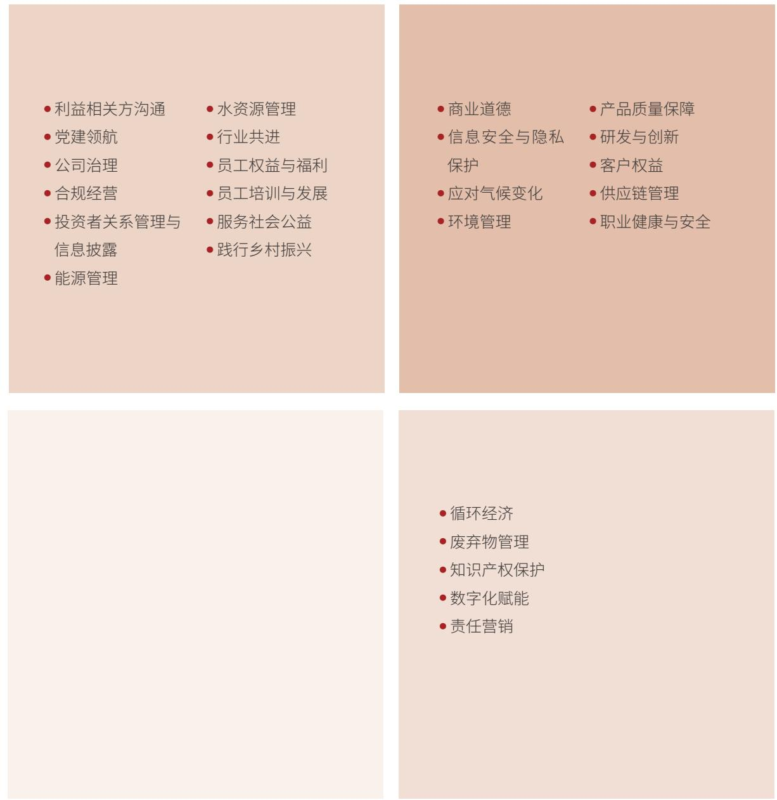

flowchart

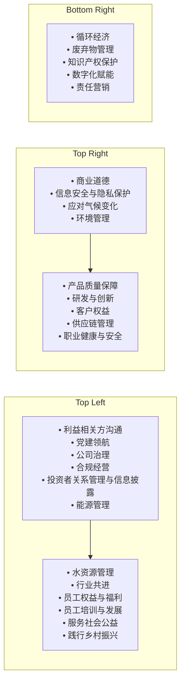
```mermaid
graph LR
  subgraph TopLeft["Top Left"]
  A["• 利益相关方沟通\n• 党建领航\n• 公司治理\n• 合规经营\n• 投资者关系管理与信息披露\n• 能源管理"] --> B["• 水资源管理\n• 行业共进\n• 员工权益与福利\n• 员工培训与发展\n• 服务社会公益\n• 践行乡村振兴"]
  end

  subgraph TopRight["Top Right"]
  C["• 商业道德\n• 信息安全与隐私保护\n• 应对气候变化\n• 环境管理"] --> D["• 产品质量保障\n• 研发与创新\n• 客户权益\n• 供应链管理\n• 职业健康与安全"]
  end

  subgraph BottomRight["Bottom Right"]
    E["• 循环经济\n• 废弃物管理\n• 知识产权保护\n• 数字化赋能\n• 责任营销"]
  end
```

# 对公司财务的重要性

# 非常重要

具有双重重要性的议题

仅具有影响重要性的议题

仅具有财务重要性的议题

非重要性议题

# 01 党建引领合规强基

党建领航

投资者关系管理与信息披露

公司治理

合规经营

本章所响应的 SDGs

10 减少不平等

16 和平、正义与强大机构

# 金種子酒業

# 灌装中心

# 党建领航

金种子酒党委坚持以习近平新时代中国特色社会主义思想为指导，持续深入学习贯彻党的二十届四中全会精神、习近平总书记关于国资国企改革发展和党的建设重要论述、习近平总书记考察安徽重要讲话精神，全面推进党的政治建设、思想建设、组织建设、作风建设、纪律建设，把制度建设贯穿其中。

公司从严规范党内政治生活，认真组织开展理论学习研讨，落实“三会一课”、组织生活会等基础党建制度，坚持用党的创新理论武装党员干部职工，不断提升干部职工政治素质和业务能力。报告期内，公司学习主要围绕中央八项规定精神、党风廉政、意识形态、党建理论、时政学习、二十届四中全会精神、业务知识等方面开展。

通过 “三会一课”、党员大会、党小组会、支部书记上党课、主题党日等形式，组织党员深入学习党的创新理论  
以“学思想、强党性、重实践、建新功”为主线，深入开展主题教育，引导党员坚定理想信念，增强责任感和使命感  
开展基层调研和座谈活动，组织全体党员学习新党章，重温入党誓词，以增强党员的党性和党组织观念

# 截至报告期末

公司共设立

10 支部

党员

376名

接收并培养

16 名入党积极分子，为党组织注入了新鲜血液

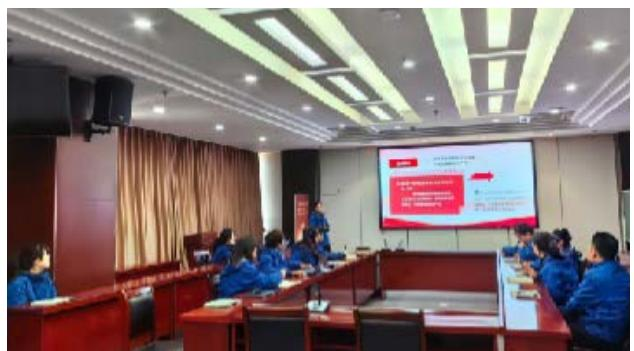

text_image

Conference room scene with attendees in blue uniforms and a presentation screen displaying Chinese text about the 2023 China National Congress.

学习贯彻党的二十届四中全会精神

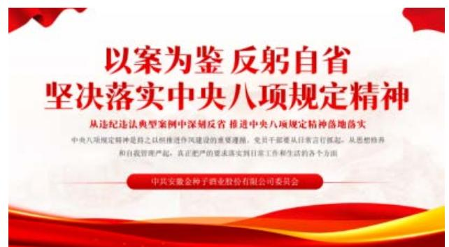

text_image

以案为鉴 反躬自省
坚决落实中央八项规定精神
从违纪违法典型案例中深刻反省 推进中央八项规定精神落地落实
中央八项规定精神是将之旗帜推进作风建设的重要遵循，党员干部要从日常言行抓起，从思想修养和自我管理严起，真正把严的要求落实到日常工作和生活的各个方面
中共安徽金种子酒业股份有限公司委员会

书记讲党课

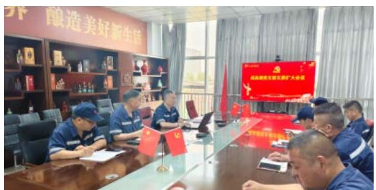

text_image

酿造美好新生桥
武汉青年文明大修大会

支委会

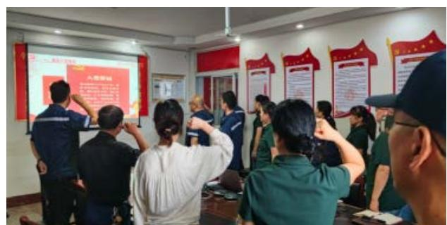

text_image

Group of people in uniform viewing posters on a wall with red banners and Chinese text, likely during a meeting or briefing session.

重温入党誓词

公司坚持党建工作与业务工作同部署、同落实、同检查、同考核，成立党员突击队、先锋岗、示范岗等，在关键岗位上发挥党员的示范引领作用。

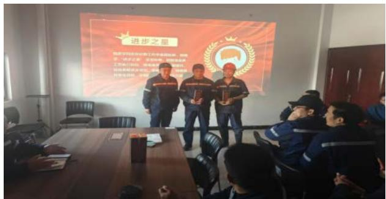

text_image

进步之星
领导干部在学习过程中取得经验，培养第一代学生，培养第二代学生，培养第三代学生。工作进行考核，培养第五代学生，培养第六代学生，培养第七代学生。教学技巧与技能基本匹配，培养第三代学生，培养第四代学生，培养第五代学生，培养第六代学生。

党员带头促进产质量提升

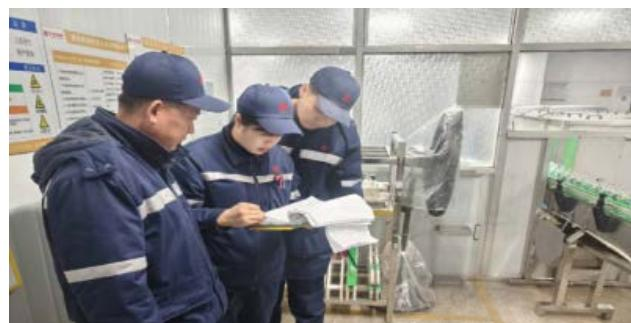

text_image

Three workers in blue uniforms reviewing documents inside a factory or processing facility, with visible safety posters and equipment labels on the wall.

支部委员带队对车间进行食品安全卫生检查

# 案例：“携手同行、筑梦未来”啤白结对主题党日活动

公司积极探索开展主题“鲜”、形式“活”、内容“实”的主题党日活动，丰富学习内容。4月26日开展“携手同行、筑梦未来”啤白结对主题党日活动，通过交流合作，了解更多的市场信息、管理经验，相互取长补短、拓展发展空间，实现可持续发展。

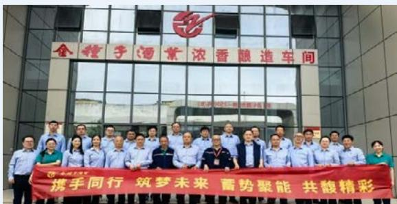

text_image

金橙子酒紫浓香酿造车间
携手同行 筑梦未来 蓄势聚能 共馥精彩

# 案例：开展“世界计量日”宣传活动

2025 年 5 月 20 日是第 26 个 “世界计量日”，公司支部党员干部带头践行党建工作和业务工作融合的理念，将党建工作同计量业务相结合，隆重举行诚信计量宣誓活动，广泛普及计量知识，采用二维码扫码答题组织来自不同岗位的 832 人参与计量知识答题，其中 90 分以上占比达 96%，带动全员进一步了解和学习计量知识。

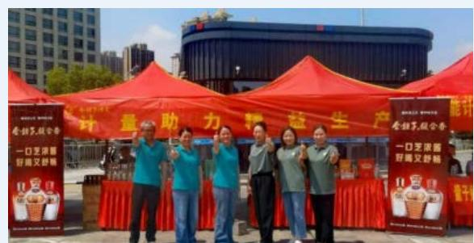

text_image

计量助力精益生产
香料乳酸合参
一口芝浓器
好面又舒糖
香料乳酸合参
一口芝浓器
好面又舒糖

此外，公司积极参与由阜阳市市场监管局举办的“世界计量日”主题宣传活动，在颍州万达广场计量宣传点设置产品展台，宣传金种子馥合香酿造技艺、产品特点、产品计量知识和计量法规，并开展免费品尝活动，受到市局领导及消费者的一致好评。

# 案例：我为职工办实事

公司党员利用班后时间开辟“微菜园”，将收获的蔬菜水果提供给食堂和车间员工约400公斤，丰富了员工菜品，增强了员工幸福感，归属感。

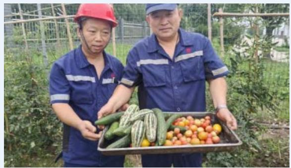

natural_image

Two workers in blue uniforms and red helmets holding a tray of fresh vegetables outdoors (no visible text or symbols)

# 公司治理

# 股东会

金种子酒严格遵守《中华人民共和国公司法》《中华人民共和国证券法》等法律法规，制定《公司章程》《股东会议事规则》《董事会议事规则》等规章制度，构建了以股东会、董事会及管理层为核心的决策、经营管理及监督体系，并不断优化治理结构，确保公司稳健运行。

公司规范股东会的召集、召开与决策程序，确保股东会作为公司最高权力机构有效运作。公司始终平等对待所

有股东，依法保障股东的知情权、参与权、表决权等合法权利，引导股东依法行使权利、履行相应义务。报告期内，公司共召开股东会4次，审议并通过各类议案13项，持续提升公司治理的规范性、透明度与决策科学性。

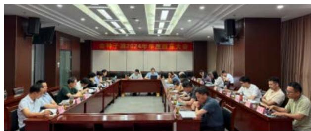

text_image

电子部2024年年度股东大会

2024 年度股东大会

# 董事会

公司董事会严格按照《董事会议事规则》等法律法规与制度规范履行职责，负责召集股东会、执行股东会决议、统筹信息披露等重要事项。公司董事人员的聘任秉持专业适配与多元互补原则，所聘人员需具备契合公司业务发展需求的核心技能与经验。公司董事会现任董事8名，其中包括独立董事3名。董事会成员拥有战略管理、市场营销、技术研发、财务管理和法律合规等多领域的专业能力，且均具备丰富的行业经验。

公司修订完善《董事会议事规则》，依法依规召开董事会会议8次，审议通过议案41项，确保决策科学、程序规范。董事会下设审计委员会、提名委员会、薪酬与考核委员会、战略与ESG委员会四个专门委员会，均制定并执行专项实施细则，权责清晰、独立运作、高效履职。报告期内，审计委员会召开6次会议，提名委员会召开1次会议，薪酬与考核委员会召开1次会议，战略与ESG委员会召开2次会议，充分发挥专业决策与监督作用，切实维护公司、全体股东及债权人的合法权益。

# 投资者关系管理与信息披露

# 投资者关系管理

公司将尊重与保障投资者合法权益置于公司治理的重要位置，以合规、透明、高效、平等为原则，持续完善投资者关系管理，通过制度化建设、多元化沟通、积极回应诉求，切实维护投资者知情权、参与权与决策权，提升公司在资本市场的透明度与公信力，实现与全体投资者的价值共享。报告期内，公司修订《投资者关系管理制度》，进一步确保投资者关系工作有章可循、规范运作。

公司重视与投资者的常态化、多层次沟通，充分整合线上线下资源，构建了立体化、全覆盖的沟通网络，确保信息传递及时、准确、畅通。全年共召开3次业绩说明会，上证e互动回复投资者提问34条，接听投资者电话咨询600余条，回复投资者邮件40余次。

  
沟通渠道

- 股东会  
- 业绩说明会  
- 上证e互动

- 官网、新媒体平台  
- 投资者专线电话、专属邮箱  
- 投资者说明会、接待来访、座谈交流

# “我是股东”——走进沪市上市公司金种子酒

“我是股东”——走进沪市上市公司金种子酒活动设置高管面对面、投资价值论坛、酒文化体验三大核心环节，为投资者提供了深度交流与实地体验的机会。活动期间，上交所向公司授予活动纪念奖杯，表彰公司在投资者关系维护与市场透明度建设上的突出贡献。央媒中国网对本次活动进行直播报道，引发广大投资者和社会各界关注。

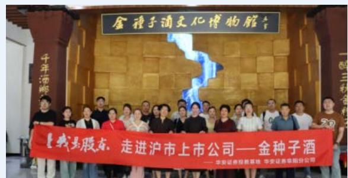

text_image

金种子酒文化博物馆
千年酒廊
我爱股东，走进沪市上市公司——金种子酒
——华安证券投资基金 华安证券股份有限公司

# 信息披露

公司坚持“真实、准确、完整、及时、公平”的信息披露原则，根据《中华人民共和国公司法》《中华人民共和国证券法》《上市公司信息披露管理办法》等法律法规规定，制定《信息披露事务管理制度》等一系列制度，加强信息披露事务管理，真实、准确、完整、及时地履行信息披露义务，杜绝虚假记载、误导性陈述或重大遗漏，不断提高信息披露管理水平和信息披露质量，切实保障全体投资者尤其是中小投资者的知情权和参与决定权。

报告期内，公司信息披露工作规范有序，共披露公告 120 份，全面、准确地向资本市场传递公司经营发展相关信息，满足投资者对公司信息的合理需求。

# 合规经营

# 风险管控

公司持续完善业务链风险防控机制，2025年初组织各业务单元开展年度风险排查，覆盖采购、销售、运营、财务等核心领域。公司基于风险发生概率与影响程度开展量化评估，按极低、低、中等、高、极高五级进行分级排序，经管理层审议后锁定年度重大风险清单，明确风险边界、责任主体与管控优先级，为全年风险应对提供清晰导向。

公司围绕已识别重大风险，制定 2025 年度风险应对行动计划，逐项明确防控措施、责任部门、完成时限与验收标准。建立季度跟踪督办机制，按周期核查措施落地进度、风险缓释效果，形成“识别—评估—应对—监控—改进”的闭环管理，确保风险可控在控。

# 合规管理

公司持续深化合规管理体系建设，以三道防线为架构基础健全合规治理机制，将合规要求深度嵌入业务链条与关键运营环节，全年共计修订41项制度，压实各层级合规管理责任，确保合规管理贯穿企业经营全流程，为公司稳健发展筑牢合规根基。

# 第一道防线

- 建立健全业务合规管理制度和流程，编制岗位合规职责清单和业务流程管控清单。  
- 定期梳理所在领域合规风险，将合规要求嵌入岗位职责。

# 第二道防线

- 组织开展对规章制度、经济合同、重大决策等事项的合法合规性审查，不断提高审核质量。  
- 组织开展合规培训等活动，提升全员合规意识和依法治企水平。

# 第三道防线

\- 加强监督部门专项监督检查，强化纪检监察、审计和监督追责等监督责任。

报告期内，公司完成上级对接审计、外部审计及多项自主专项审计，聚焦高风险领域开展深度检查。建立审计整改季度评估机制，对发现问题跟踪督办，推动相关部门完善流程、补全制度漏洞，以审计监督赋能内控提升，夯实合规运营基础。

对于发现的典型问题，公司进行分类提炼形成案例，对涉及的领域人员开展业务合规宣贯，强化全员合规意识，推动风险管理从“被动应对”向“主动预防”转变，营造稳健合规的治理氛围。报告期内，员工合规培训覆盖人数84人，合规培训时数5.5小时。

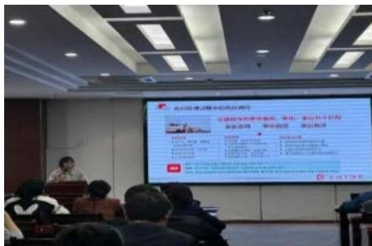

text_image

Presentation slide showing a business meeting with Chinese text and a presentation slide on the right, attended by an audience.

法律培训

# 商业道德

# 治理

公司对任何违反商业道德的行为坚持零容忍，持续完善反腐败治理体系和监督机制，在合规的基础上，营造廉洁、阳光的商业道德环境，坚定不移推进党风廉政建设与反腐败工作走深走实。

公司纪委办公室作为党风廉政建设与反腐败工作专职机构，为企业廉洁治理提供坚强纪律保障。纪委办公室下设纪委办公室主任和纪检岗，分别负责统筹协调与具体执行工作，结合《安徽金种子集团有限公司员工违规违纪处理办法》等制度，确保纪律监督和案件处理高效开展。

# 战略

公司坚定推进党风廉政建设，配合上级纪检监察部门开展相关工作，受理对党组织和党员违反党纪党规的检举和来信来访，对公司人员的违纪违法违规案件进行调查审核，通过统筹推进纪律监督、执纪问责、廉洁教育与制度完善，持续提升全员商业道德素养与廉洁自律意识，以高质量纪律监督保障企业稳定发展。

# 影响、风险与机遇管理

# 监督

- 聚焦重点领域、关键岗位与高风险环节开展常态化监督，紧盯风险苗头，及时开展谈话函询与廉洁提醒  
- 落实廉洁过节提醒、关键岗位监督、任前廉政谈话等机制，筑牢廉洁自律防线

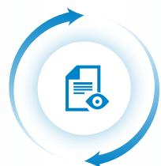

# 执纪

- 规范受理信访举报、群众来信来访，对问题线索统一管理、分类处置、依规核查  
- 依规开展初步核实、立案审查调查，严肃查处违纪违规行为

# 违纪处理

公司严格依据《安徽金种子酒业股份有限公司员工违规违纪处理办法》开展员工违规违纪处理管理。对员工各类违规违纪行为坚持实事求是、从严治企、平等公正原则，按规定开展调查核实、分级分类处置，根据情节轻重采取谈话教育、组织处理、纪律处分等措施，对涉嫌犯罪的移送司法机关追究责任。

# 举报渠道及举报人保护

公司严格依据《中央纪委监察部关于保护检举、控告人的规定》，建立规范、安全、保密的举报受理与举报人权益保障机制，全力维护检举、控告人合法权益，畅通内部监督渠道。

公司明确，任何单位及个人均有权对违纪违法行为依法进行检举、控告，纪委办公室统一受理来信来访与问题线索，对属实检举予以支持鼓励，对有功人员依规奖励；对错告及时澄清事实，对诬告陷害依规严肃处理。

# 主要举报渠道

举报投诉电话：0558-2210510

举报投诉邮箱：crb\_jzz\_jwbgs@jzz.cn

举报投诉地址：安徽省阜阳市颍州区河滨路302号安徽金种子酒业股份有限公司

公司严格执行全流程保密制度，对检举人的个人信息、工作单位及举报内容严格保密，严禁向被检举对象及无关人员泄露，严禁私自摘抄、复制、扣押、销毁举报材料。严格执行回避制度，与举报事项存在利害关系、可能影响公正处理的工作人员必须回避。公司严禁任何形式的打击报复行为，对打击报复举报人及其亲属的，一经查实严肃处理；因打击报复造成损害的，依法依规予以纠正与追责。对泄露举报信息、违规处置举报材料的，依规给予党纪政纪处分，对涉嫌犯罪的移送司法机关追究刑事责任，以严密机制保障举报渠道畅通、举报人权益安全。

natural_image

Hand interacting with a digital interface displaying email icons and user interfaces (no readable text or symbols)

# 廉洁宣传教育

公司常态化开展廉洁宣传教育、集中警示教育及典型案例通报工作，引导全员恪守职业操守、践行廉洁经营理念；制定年度党风廉政建设工作计划并按月推进落实，组织全员开展党纪、廉洁准则、典型问题案例及上级文件等内容学习，通过观看警示教育片、通报典型案例、开展廉洁教育主题党课、节假日专项提醒、酒驾醉驾及违规打牌赌博专项提醒等多种形式，强化全员廉洁意识。同时，公司针对重点人群、重点领域开展专题警示教育，对公司员工开展酒驾醉驾专题警示教育，对支部书记开展档案管理专题警示教育，组织中层以上管理人员参观第一监狱警示教育基地、开展专题廉洁警示教育；组织党员学习党规党纪和廉洁自律各项规定，签订《廉洁从业承诺书》，通过观看警示教育片、参观廉政教育基地等方式增强党员纪律意识和规矩意识，签订党风廉政建设责任书，加强对权力运行的制约和监督。

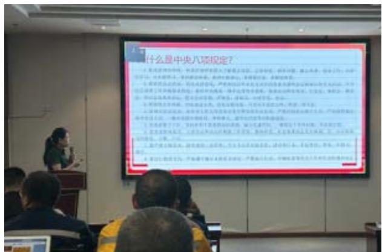

text_image

什么是中央八项规定？
1. 通过研究和分析，制定要科学的教育投入，以丰富知识、科学习惯，提高学习水平。2. 通过研究和分析，制定要科学的教育投入，以丰富知识、科学习惯，提高学习水平。
3. 通过研究和分析，制定要科学的教育投入，以丰富知识、科学习惯，提高学习水平。
4. 通过研究和分析，制定要科学的教育投入，以丰富知识、科学习惯，提高学习水平。
5. 通过研究和分析，制定要科学的教育投入，以丰富知识、科学习惯，提高学习水平。
6. 通过研究和分析，制定要科学的教育投入，以丰富知识、科学习惯，提高学习水平。
7. 通过研究和分析，制定要科学的教育投入，以丰富知识、科学习惯，提高学习水平。
8. 通过研究和分析，制定要科学的教育投入，以丰富知识、科学习惯，提高学习水平。
9. 通过研究和分析，制定要科学的教育投入，以丰富知识、科学习惯，提高学习水平。
10. 通过研究和分析，制定要科学的教育投入，以丰富知识、科学习惯，提高学习水平。

思廉日活动

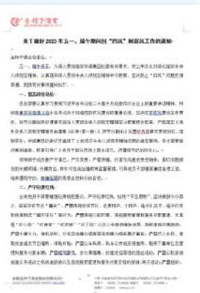

text_image

关于做好2023年五一、端午期间对“四风”新风工作的活动
今年中小企业发展

一、建设期
企业主要致力于打造中国风力发电和风能的风力发电，建立核心功能和风力发电的协同效应，实现国家风力发电和风能的协同发展。这标志着“四风”新风的发展
环境，持续发展风力发电。
二、规划阶段
企业要深入研究风力发电项目，结合近年来风力发电项目的实际情况，制定具体发展规划，重点分析风力发电在风力发电领域的重大战略，包括风力发电、风力发电、风力发电、风力发电、风力发电、风力发电、风力发电、风力发电、风力发电、风力发电、风力发电、风力发电、风力发电、风力发电、风力发电、风力发电、风力发电、风力发电、风力发电、风力发电、风力发电、风力发电、风力发电、风力发电、风力发电、风力发电
公司于2023年1月1日发布《关于进一步深化风电场建设的公告》，以确保风电场建设的顺利实施，为公司提供更快速的能源化改造，有利于提高风电场的效率，为公司带来更大效益。
三、审批阶段
企业应建立完善并有效执行风电场建设的政策体系，严格执行风电场建设的有关规定，明确“风电场”、“风电场”、“风电场”、“风电场”、“风电场”、“风电场”、“风电场”、“风电场”、“风电场”、“风电场”、“风电场”、“风电场”、“风电场”、“风电场”、“风电场”、“风电场”、“风电场”、“风电场”、“风电场”、“风电场”、“风电场”、“风电场”、“风电场”、“风电场”、“风电场”、“风电场”等。
根据国家Wind网（2023）第4号《关于进一步深化风电场建设的公告》，公司于2023年1月1日发布《关于进一步深化风电场建设的进展公告》，以确保风电场建设的顺利实施，为公司提供更快速的能源化改造，有利于提高风电场的效率，为公司带来更大效益。
四、审批阶段
企业应建立完善并有效执行风电场建设的政策体系，严格执行风电场建设的有关规定，明确“风电场”、“风电场”、“风电场”、“风电场”、“风电场”、“风电场”、“风电场”、“风电场”、“风电场”、“风电场”、“风电场”、“风电场”、“风电场”、“风电场”、“风电场”、“风电场”等。
根据国家Wind网（2023）第4号《关于进一步深化风电场建设的公告》，公司于2023年1月1日公布《关于进一步深化风电场建设的进展公告》，以确保风电场建设的顺利实施，为公司提供更快速的能源化改造，有利于提高风电场的效率，为公司带来更大效益。
五、审批阶段
企业应建立完善并有效执行风电场建设的政策体系，严格执行风电场建设的有关规定，明确“风电场”、“风电场”、“风电场”、“风电场”、“风电场”、“风电场”、“风电场”、“风电场”、“风电场”、“风电场”等。
根据国家Wind网（2023）第4号《关于进一步深化风电场建设的公告》，公司于2023年1月1日公布《关于进一步深化风电场建设的进展公告》，以确保风电场建设的顺利实施，为公司提供更多快速的能源化改造，有利于提高风电场的效率，为公司带来更大效益。
六、审批阶段
企业应建立完善并有效执行风电场建设的政策体系，严格执行风电场建设的有关规定，明确“风电场”、“风电场”、“风电场”、“风电场”、“风电场”、“风电场”、“风电场”、“风电场”等。
根据国家Wind网（2023）第4号《关于进一步深化风电场建设的公告》，公司于2023年1月1日公布《关于进一步深化风电场建设的进展公告》，以确保风电场建设的顺利实施，为公司提供更多快速的能源化改造，有利于提升新能源汽车市场占有率。<nl>

节日提醒

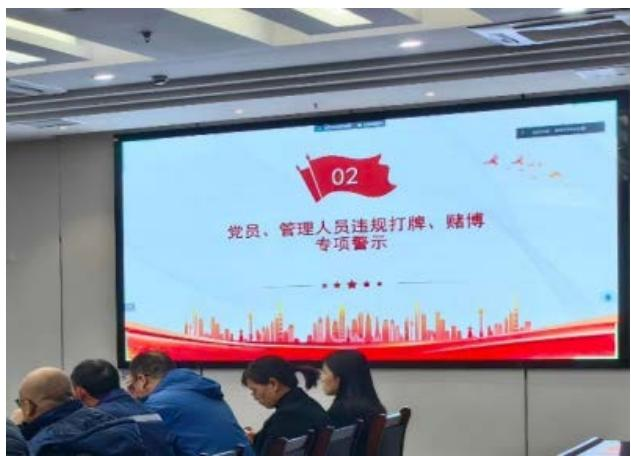

text_image

02
党员、管理人员违规打牌、赌博
专项警示

专题警示教育

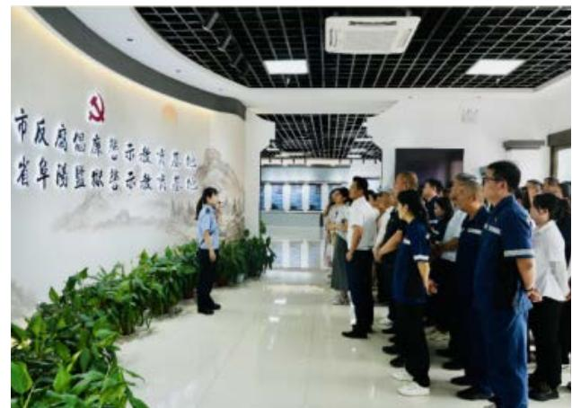

text_image

市反腐倡庫警示教共基地
省阜陽監督教共基地

廉洁教育基地学习

# 截至报告期末

公司全体员工接受了廉洁反腐教育，有效筑牢了全员廉洁自律思想防线，为公司高质量发展营造了风清气正的良好环境。

# 信息安全与隐私保护

# 治理

公司严格遵循《中华人民共和国网络安全法》《中华人民共和国数据安全法》等数据安全管理法律法规，制定了《信息安全管理办法》《数据管理办法》《信息系统建设安全管理办法》等制度，强化信息合规性管理，重点防控数据泄露、篡改等风险，并通过持续改进机制应对动态安全威胁。

公司信息安全管理体系依托四级组织架构，明确分工、协同合作，确保信息安全策略的制定与执行。

natural_image

Abstract graphic with a gear icon and shield inside a blue circular frame, surrounded by blue dots (no text or symbols)

# 信息化管理委员会

由总经理及财务总监领导,统筹信息化战略、制度审核及重大事项决策

# 信息化执行委员会

负责风险评估、跨部门协调，制定应急响应计划

# 财务总监（信息化分管领导）

主导信息化战略规划、预算审核及 IT 协同机制建设

# 流程与信息化部

落实信息安全策略，包括数据分类、访问控制、安全审计及员工培训

# 战略

公司以“数据即资产”为核心，构建覆盖全生命周期的数据安全管理体系，持续优化数据安全管理流程和技术手段，定期审查并改进相关措施，以应对日益复杂的安全威胁。

# 制度筑基

制定覆盖数据全生命周期（收集、存储、处理、传输、销毁）的安全政策，明确违规追责机制

# 权限管控

实施分级访问控制与多因素认证，确保敏感数据仅授权人员可访问

# 灾备保障

定期备份核心数据并建立灾难恢复预案，确保业务连续性

# 全员参与

定期开展数据安全培训，强化员工风险意识，推动安全文化落地

# 技术赋能

引入大数据分析及第三方安全服务（如渗透测试），动态提升防护能力

# 持续优化

建立评估机制，定期检视隐私保护成效，吸纳员工建议优化管理策略

# 影响、风险与机遇管理

公司高度重视信息安全管理工作，制定《信息系统用户账户及权限管理说明》，明确涵盖账户分类、权限管理、密码策略、应急响应和定期审计等核心内容，从制度层面防范数据泄露风险。同时，通过明确各部门职责分工，聚焦离职账号清理、权限与岗位匹配、账号共用等核心风险点，制定数据导出、在线复核、权限整改分阶段工作计划，进一步规范权限管理流程，清理冗余账户、优化权限匹配，有效降低账户权限类安全风险，保障业务系统稳定运行。

在数据安全保障方面，公司筑牢数据防护屏障，针对所有业务设备数据库、服务器关键数据、源文件开展全面备份，新增备份一体机设备，实现高效、可靠、安全的数据备份与恢复解决方案，切实保障业务连续性与数据安全；定期开展灾备数据演练，提升数据应急恢复能力，确保极端情况下数据安全可控。

公司强化办公设备与人员管理，对本地办公设备业务台账实施动态管理，实时调整人员与办公设备的动态变更信息；每半年开展一次全公司自助盘点，实现人员与办公设备的精准对应、规范管理，从终端层面防范信息安全隐患。

公司完善硬件与系统支撑，新增 UPS 电源设备，在突发停电时可提供应急电力供应、稳定电压、净化电源及防浪涌保护，保障关键设备持续运行，守护设备运行过程中的数据安全；新增原酒管理系统云端服务集群，并采购防爆 PDA 设备，用于原酒业务日常管理与数据上传，规范业务数据采集、传输流程，进一步强化核心业务信息安全。

为有效应对各类网络安全威胁、保障信息系统稳定运行，公司还组织开展覆盖多场景的突发事件应急预案演练。演练通过模拟软件异常、黑客攻击、设备故障等各类可能发生的安全情景，进一步细化各部门责任分工，成立专项领导小组，以实战化演练模式，全面检验应急预案的可行性与应急响应效率，提升公司应对网络安全突发事件的处置能力。

此外，公司常态化开展信息安全宣传教育，积极普及《中华人民共和国网络安全法》《中华人民共和国数据安全法》《中华人民共和国个人信息保护法》《关键信息基础设施安全保护条例》等法律法规，结合网络攻防演习案例，广泛宣传网络安全常识与防护技能；通过在公共区域张贴海报、发放宣教手册及科普读物，辅以邮件、线上推送等多渠道，全方位普及网络安全知识。3月公司组织全员网络安全培训，强化网络安全知识学习普及，提升攻防演练实战水平；7月公司开展防钓鱼专项培训，开展钓鱼邮件测试，重点增强全员钓鱼攻击风险防范意识与应对能力，切实筑牢企业网络安全思想防线。

2025 年信息安全周期间，公司深入学习贯彻习近平总书记关于网络强国的重要思想以及对网络安全工作“四个坚持”的重要指示精神，积极展现网络安全领域所取得的重要成果，组织开展宣传教育活动，提高全员网络安全意识。报告期内，公司未发生信息安全与隐私泄露事件。

text_image

网络安全为人民
网络安全靠人民
网络安全，打卡规范
[2] 网络安全系统
[3] 网络安全
[4] 网络安全
[5] 网络安全
[6] 网络安全
[7] 网络安全
[8] 网络安全
[9] 网络安全
[10] 网络安全
[11] 网络安全
[12] 网络安全
[13] 网络安全
[14] 网络安全
[15] 网络安全
[16] 网络安全
[17] 网络安全
[18] 网络安全
[19] 网络安全
[20] 网络安全
[21] 网络安全
[22] 网络安全
[23] 网络安全
[24] 网络安全
[25] 网络安全
[26] 网络安全
[27] 网络安全
[28] 网络安全
[29] 网络安全
[30] 网络安全
[31] 网络安全
[32] 网络安全
[33] 网络安全
[34] 网络安全
[35] 网络安全
[36] 网络安全
[37] 网络安全
[38] 网络安全
[39] 网络安全
[40] 网络安全
[41] 网络安全
[42] 网络安全
[43] 网络安全
[44] 网络安全
[45] 网络安全
[46] 网络安全
[47] 网络安全
[48] 网络安全
[49] 网络安全
[50] 网络安全
[51] 网络安全
[52] 网络安全
[53] 网络安全
[54] 网络安全
[55] 网络安全
[56] 网络安全
[57] 网络安全
[58] 网络安全
[59] 网络安全
[60] 网络安全
[61] 网络安全
[62] 网络安全
[63] 网络安全
[64] 网络安全
[65] 网络安全
[66] 网络安全
[67] 网络安全
[68] 网络安全
[69] 网络安全
[70] 网络安全
[71] 网络安全
[72] 网络安全
[73] 网络安全
[74] 网络安全
[75] 网络安全
[76] 网络安全
[77] 网络安全
[78] 网络安全
[79] 网络安全
[80] 网络安全
[81] 网络安全
[82] 网络安全
[83] 网络安全
[84] 网络安全
[85] 网络安全
[86] 网络安全
[87] 网络安全
[88] 网络安全
[89] 网络安全
[90] 网络安全
[91] 网络安全
[92] 网络安全
[93] 网络安全
[94] 网络安全
[95] 网络安全
[96] 网络安全
[97] 网络安全
[98] 网络安全
[99] 网络安全

宣传海报

# 02 绿色酿造 低碳共生

> 应对气候变化

资源管理与循环经济

> 环境管理

> 废弃物管理

> 能源管理

本章所响应的 SDGs

6 清洁饮水和卫生设施

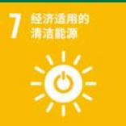

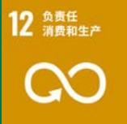

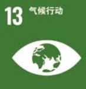

# 应对气候变化

# 治理

公司高度重视气候变化对企业及社会可持续发展带来的潜在挑战，持续健全配套管理制度，编制《碳中和管理手册》《碳排放核查、核算管理手册》《碳排放管理手册》等制度程序文件，同步优化监督考核机制，动态研判气候变化对生产经营的各类影响，保障企业在复杂气候环境下稳健运营。为统筹推进气候变化相关专项工作，公司专门成立碳达峰行动工作领导小组，统筹协调各部门落地落实气候变化领域各项具体工作。

# 碳达峰行动工作领导小组

- 制定公司碳达峰重大方针政策  
- 推动完善碳达峰管理机制，促进碳达峰工作有效开展  
- 协调内外部资源，解决碳达峰工作中出现的重大问题  
- 听取碳达峰工作汇报，研究决策碳达峰重要事项，并督促落实到位

# 碳达峰行动工作领导小组办公室

- 负责碳达峰行动的日常工作  
- 落实上级及领导小组决策，完善碳管理体系与制度  
- 制定碳达峰规划、行动方案及年度计划，推动落地  
- 编制年度工作报告，考核各部门绩效并提交领导小组审议

# 战略

公司结合自身实际经营情况，评估气候变化带来的潜在风险与机遇，深入分析其对业务运营的综合影响；在此基础上制定了碳达峰行动方案，按照行动方案和重点项目逐步落实，将气候风险管理与低碳解决方案深度融入日常经营管理，持续强化整体业务的气候适应能力与发展韧性。

<table><tr><td colspan="2">风险类型</td><td>风险描述</td><td>发生概率</td><td>影响大小</td><td></td><td>影响时间范围</td><td>影响价值链环节</td><td>优先级排序</td><td>潜在财务影响</td><td>应对措施</td></tr><tr><td rowspan="2">实体风险</td><td>急性风险</td><td>公司在安徽等地的研发中心和制造生产基地会面临高温、暴雨、暴雪等极端天气,可能会对公司的设备、员工安全产生影响,导致业务中断或设备受损。</td><td>低</td><td>高</td><td></td><td>短中期</td><td>运营</td><td>中</td><td>营业收入减少</td><td>定期检查设备运行状态,重点监控高温环境下的过热、过载设备并维护。定期检查排水系统,暴雨前清理杂物,减少户外作业时间,保障员工安全。建立风险预警机制,获取极端天气预警信息,制定应急预案,明确责任分工。</td></tr><tr><td>慢性风险</td><td>气候变化引发长期气温波动、降水异常等持续性影响,对生产运营、能源消耗及供应链稳定逐步形成风险。</td><td>中</td><td>中</td><td></td><td>中长期</td><td>运营</td><td>中</td><td>营业收入减少</td><td>监测气候变化的趋势,并制定应急预案,提高应对极端天气和自然灾害的能力。</td></tr><tr><td rowspan="2">转型风险</td><td>政策与法律风险</td><td>随着全球对碳排放控制的加强,政策法规日益严格,增加企业合规成本。</td><td>高</td><td>高</td><td></td><td>中长期</td><td>运营</td><td>中</td><td>运营成本增加营业收入减少</td><td>及时关注相关法律法规的更新和变化,确保生产流程、产品设计和排放标准等方面符合最新要求。</td></tr><tr><td>市场风险</td><td>对低碳、绿色包装需求增加,可能会导致市场波动,面临市场需求不稳定的风险,影响公司的业务发展和盈利能力。</td><td>中</td><td>高</td><td></td><td>短中期</td><td>下游</td><td>中</td><td>营业收入减少</td><td>加强品牌建设和宣传,提高公司在低碳、绿色包装及绿色生产的知名度和影响力。</td></tr></table>

natural_image

Scenic view of a green grassland beside a calm blue river under a clear blue sky with scattered clouds (no text or symbols visible)

# 影响、风险与机遇管理

公司积极响应国家的绿色发展政策，加大在节能减排、资源循环利用等方面的投入，通过技术创新、优化生产流程和加强能源管理等手段，逐步降低温室气体排放，致力于打造绿色的品牌形象。

# 工艺改进

污水站原采用预处理 +UASB+AAO 的处理方式，报告期内改为协议排放预处理 + 沉降，将酿造原水经初步稻壳过滤和沉淀后，直排到下游污水处理厂作为碳源，在节约电和蒸汽的同时，消除污水进入厌氧处理环节所产生的 CH4，综合收益估算可减碳 4,099 吨。

# 能源结构改善

2025 年通过采购绿电及使用光伏发电，提升清洁能源使用占比。

# 提高能源效率

蒸汽管网提升改造、空压机系统提升改造等。

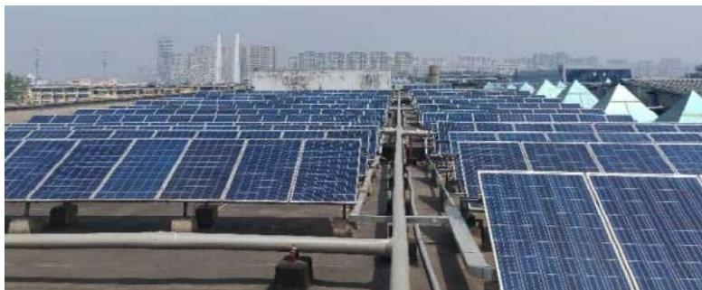

natural_image

Rows of solar panels installed on a rooftop with urban buildings in the background (no visible text or symbols)

屋顶铺设光伏

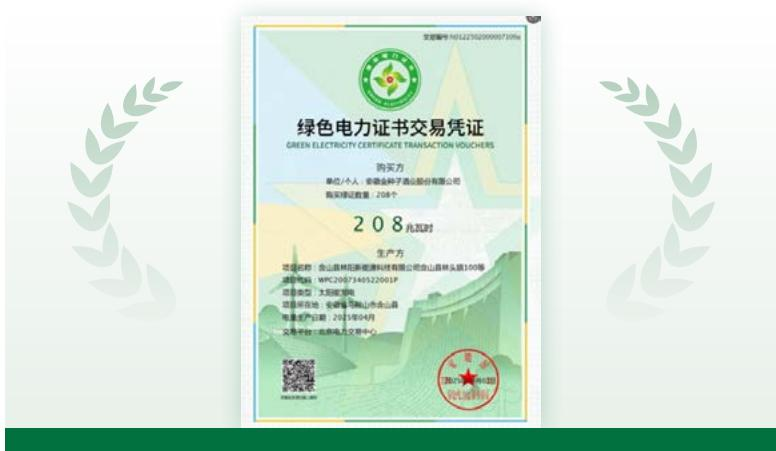

text_image

绿色电力证书交易凭证
GREEN ELECTRICITY CERTIFICATE TRANSACTION HOUCHERS
购买方
单位/个人：安徽金种子酒业股份有限公司
购买保证数量：208个
208兆瓦时
生产方
项目名称：含山县林阳新能源科技有限公司含山县林头镇100幢
通信电话：WPC2007340522001P
信息类型：太阳能发电
项目所在地：安徽省芜湖市含山县
年度生产日期：2021年04月
交易平台：北京电力交易中心

绿色电力消费凭证

2025 年，公司完成主要产品碳足迹核查，通过了零碳工厂认证。

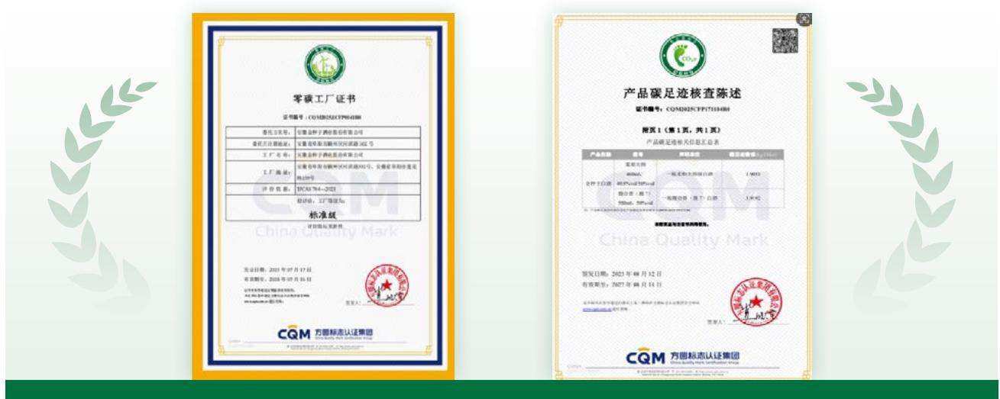

text_image

零碳工厂证书
证书编号：CQMD025CFP941888
委托方名称：安徽金种子酒股份有限公司
委托注册地址：安徽省阜阳市颍州区河滨路362号
工厂名称：安徽金种子酒股份有限公司
工厂地址：安徽省阜阳市颍州区河滨路362号、安徽省阜阳市颍州区河滨路362号
评价依据：YCCA1764-2023
评价结论：工厂等级为：
标准级
产品碳足迹核查陈述
证书编号：CQMD025CFP171184888
附页1《第1页，共1页》
产品碳足迹相关信息汇总表
产品名称	型号	碳足迹值/g/t/年
文件子代码	400Pc/d	一般碳足迹值/吨	1.0033
成分费（单位）	一般碳足迹（单位）	1.992
产品名称	型号	碳足迹值/g/t/年
文件子代码	400Pc/d	一般碳足迹值/吨	1.0033
成分费（单位）	一般碳足迹（单位）	1.992
产品名称	型号	碳足迹值/g/t/年
文件子代码	400Pc/d	一般碳足迹值/吨	1.0033
产品名称	型号	碳足迹值/g/t/年
文件子代码	400Pc/d	一般碳足迹值/吨	1.0033
产品名称	型号	碳足迹值/g/t/年
文件子代码	400Pc/d	一般碳足迹值/吨	1.0033
产品名称	型号	碳足迹值/g/t/年
文件子代码	400Pc/s	一般碳足迹值/吨	1.0033
产品名称	型号	碳足迹值/g/t/年
文件子代码	400Pc/s	一般碳足迹值/吨	1.0033
产品名称	型号	碳足迹值/g/t/年
文件子代码	400Pc/s	一般碳足迹值/吨	1.0033
产品名称	型号	碳足迹值/Gt/LCO₂
文件子代码	400Pc/s	一般碳足迹值/吨	1.0033
产品名称	型号	碳足迹值/Gt/LCO₂
文件子代码	400Pc/s	一般碳足迹值/吨	1.0033
产品名称	型号	碳足迹值/Gt/LCO₂
文件子代码	400Pc/s	一般碳足迹值/吨	1.992
产品名称	型号	碳足迹值/Gt/LCO₂
文件子代码	400Pc/s	一般碳足迹值/吨	1.992
产品名称	型号	碳足迹值/Gt/LCO₂
文件子代码	400Pc/s	一般碳足迹值/吨	1.992
产品名称	型号	碳足迹值/Gt/LCO₂
文件子代码	400Pb/s	一般碳足迹值/吨	1.992
产品名称	型号	碳足迹值/Gt/LCO₂
文件子代码	400Pb/s	一般碳足迹值/吨	1.992
产品名称	型号	碳足迹值/Gt/LCO₂
文件子代码	400Pb/s	一般碳足迹值/吨	1.992
产品名称	型号	碳足迹值/(g/LCO₂)
文件子代码	400Pb/s	一般碳足迹值/吨	1.992
产品名称	型号	碳足迹值/(g/LCO₂)
文件子代码	400Pb/s	一般碳足迹值/吨	1.992
产品名称	型号	碳足迹值/(g/LCO₂)
文件子代码	400Pb/s	一般碳足迹值/吨	1.992

零碳工厂证书  
产品碳足迹核查陈述

# 指标与目标

到 2027 年，公司产能结构和用能结构进一步优化，生产经营效能和资源能源利用效率进一步提升，生产经营数字化、智能化初步实施，价值链协同降碳机制初步建立：

单位产品碳排放量（范围一和范围二）较 2023 年下降 15%

进展：已达成

到 2030 年，公司产能优化基本完成，可再生能源使用比例显著提升，生产经营数智化全面实施，价值链协同降碳体系基本完善，进入低碳、零碳应用为主阶段：

单位产品碳排放量（范围一和范围二）较 2023 年下降 30%

2030 年创建国家级绿色工厂

进展：已达成

<table><tr><td>指标</td><td>单位</td><td>2024年</td><td>2025年</td></tr><tr><td>直接温室气体排放量(范围一)</td><td>吨二氧化碳当量</td><td>1,148.44</td><td>39.56</td></tr><tr><td>间接温室气体排放量(范围二)</td><td>吨二氧化碳当量</td><td>29,161.99</td><td>18,669.9</td></tr><tr><td>温室气体排放总量</td><td>吨二氧化碳当量</td><td>30,310.43</td><td>18,709.47</td></tr></table>

# 环境管理

# 治理

公司严格遵循《中华人民共和国环境保护法》《中华人民共和国环境影响评价法》等法律法规，建立了完善的EHS管理体系，在环境方面制定了《固体废物管理细则》《水污染防治管理细则》《EHS 事故事件管理办法》等管理程序文件，并已通过环境管理体系 ISO14001 认证。

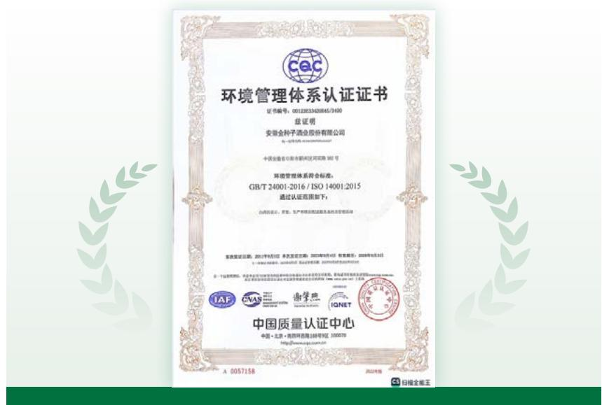

text_image

COC
环境管理体系认证证书
证书编号：0012833420845/3450
兹证明
安徽金种子酒业股份有限公司
中国安徽省合肥市蜀洲区河滨路362号
环境管理体系符合标准：
GB/T 24001-2016 / ISO 14001:2015
通过认证范围如下：
山西省进出口、批发、生产销售和法律法规允许的其他活动
首次颁发日期：2017年9月3日 本页颁发日期：2017年9月4日 特别期日：2018年9月3日
一、申请有效期：2018年9月4日 证书有效期：2018年9月3日
第一个重要事项：本次申请与发行安排相适应的环境管理体系符合相关要求，即采用有效措施完成认证。
中国质量认证中心
中国·北京·南昌市昌隆188号XJ 100070
http://www.qzq.com.cn
A 0057158
2021年度
扫描全框王

公司通过 ISO14001 认证

公司形成 EHS 委员会—EHS 日常办事机构（安全环境部）—各职能部门的多级管理架构。EHS 委员会为决策层，负责研究部署、指导协调公司 EHS 工作，贯彻执行国家和地方 EHS 相关法律法规、规章、行业规范，审定公司 EHS 规划、制度、标准、工作计划和管理工作重点等；安全环境部为管理层，代表公司 EHS 委员会对各部门 EHS 领导小组实施日常管理工作，制定 EHS 工作规划、制度、标准和工作计划，开展日常隐患排查，跟进隐患整改等工作；各职能部门为执行层，成立相应的 EHS 领导小组，明确部门 EHS 工作职责并组织落实。年初公司全员签订安全生产责任书，进一步压实安全生产责任。报告期内，公司在环保方面投入为 255 万元，未发生重大环保事故，成功申报国家绿色工厂。

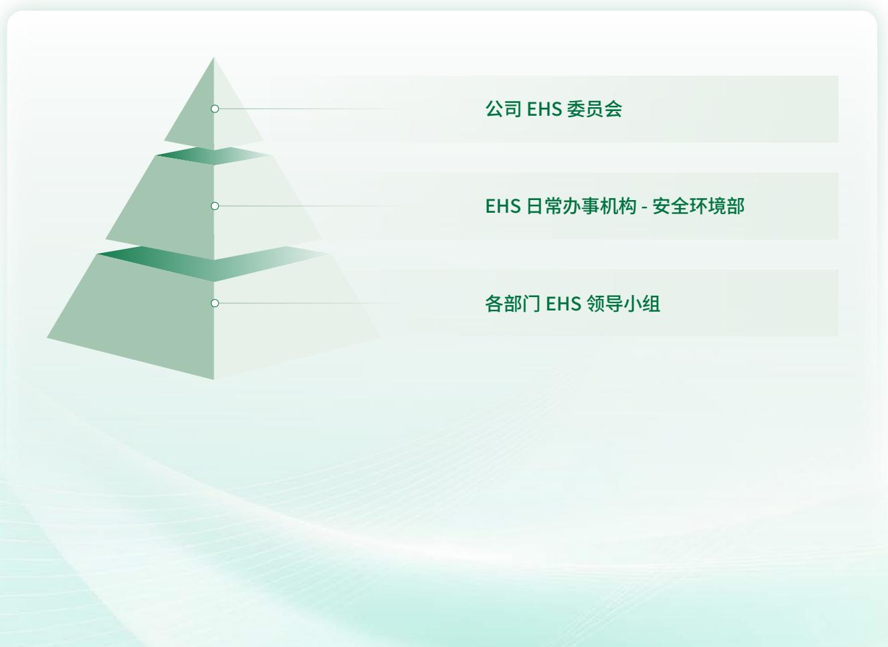

funnel

| Level | Entity |
| --- | --- |
| Top | 公司 EHS 委员会 |
| Middle | EHS 日常办事机构 - 安全环境部 |
| Bottom | 各部门 EHS 领导小组 |

绿色工厂（2025年）公示名单

<table><tr><td>序号</td><td>地区</td><td>工厂名称</td></tr><tr><td>1</td><td>北京</td><td>北京理想汽车有限公司</td></tr><tr><td>2</td><td>北京</td><td>小米汽车科技有限公司</td></tr><tr><td>3</td><td>北京</td><td>北京天成瑞源电缆有限公司</td></tr><tr><td>4</td><td>北京</td><td>北京斯普乐电线电缆有限公司</td></tr><tr><td>5</td><td>北京</td><td>北京燕东微电于科技有限公司</td></tr><tr><td>6</td><td>北京</td><td>长鑫集电(北京)存储技术有限公司</td></tr><tr><td>7</td><td>北京</td><td>中芯京城集成电路制造(北京)有限公司</td></tr><tr><td>8</td><td>北京</td><td>北京三元电子有限公司</td></tr><tr><td>9</td><td>北京</td><td>北京源发动机管理有限公司</td></tr><tr><td>10</td><td>北京</td><td>通用电气华伦医疗设备有限公</td></tr><tr><td>11</td><td>北京</td><td>亚持气控制系统(北京)有限公</td></tr><tr><td>12</td><td>北京</td><td>......</td></tr><tr><td>......</td><td>......</td><td>安徽金种子酒业股份有限公司</td></tr><tr><td>970</td><td>安徽</td><td rowspan="2">蒙牛高科乳制品(马鞍山)有限公司</td></tr><tr><td>971</td><td>安徽</td></tr></table>

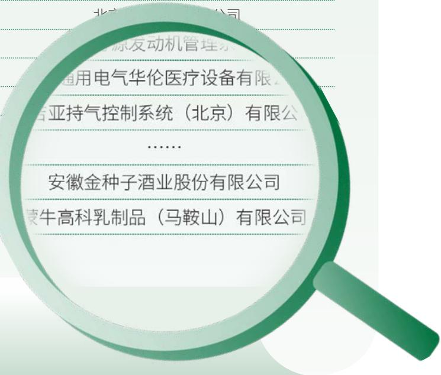

text_image

北京
源发动机管理
通用电气华伦医疗设备有限
亚持气控制系统（北京）有限公
……
安徽金种子酒业股份有限公司
蒙牛高科乳制品（马鞍山）有限公司

国家级绿色工厂

# 战略

公司识别未来 3 至 5 年内对公司经营发展造成重要影响的环境领域相关风险与发展机遇，风险层面聚焦环保政策法规持续收紧推高运营成本，以及极端天气、设备故障、物料泄漏引发的设施损毁、环境污染、成本增加、品牌声誉受损等隐患，而依托绿色技术迭代升级，可有效降低能耗、优化品牌形象，通过设施加固优化、管理制度健全完善，能够全面提升环境治理水平、增强核心竞争力，抢抓可持续发展机遇。

立足风险防控与机遇赋能，公司构建完善的环境管理应对体系与落地机制。针对环保法规趋严等关键风险，公司强化内部合规管控，加强水质在线监测设备监测和监管维护培训，推行水质源头综合治理，锚定绿色低碳发展方向，科学制定年度环境管理目标与碳排放强度管控指标，稳步推进从能耗双控向碳排放总量、强度双降转型。

# 影响、风险与机遇管理

公司在业务与项目开展过程中严格落实环境影响评价内容，包括三同时、排污许可证重新申领、环评验收等事项。在白酒生产过程中，公司采取一系列措施来降低酒糟气味和污水站气味对环境的影响，通过对二沉池加盖改造，确保环保生物除臭设备正常运行，落实酒糟日结日清、密闭转移等管理，大幅度减轻气味对周边环境的影响，每半年做一次厂界大气监测，以确保符合环保要求。

公司常态化推进环境保护管理工作，积极组织并参与各类环保专项活动与监督检查，每年开展环保专题培训，涵盖环保法规解读、各业务环保管理模块实操讲解等内容。同时依托线下演练与线上平台，多渠道宣讲环保知识，培训实行理论学习、实操演练及课时考勤综合考核机制，并对表现优异的学员予以表彰激励，持续夯实全员环保履职能力。

在应急管理方面，公司制定并实施《突发环境事件应急预案》，每3年一更新环保突发预案并在当地政府部门备案。公司内部建立应急救援队伍，明确了应急响应流程和责任分工，配备较为齐全的应急设施并储备必要的应急物资，定期组织应急演习，防控各类事故发生。2025年全年共开展应急演练6次，参与人数累计800人次。

# 报告期内

废水、废气达标排放率

100%

固废委托合规处理率

100%

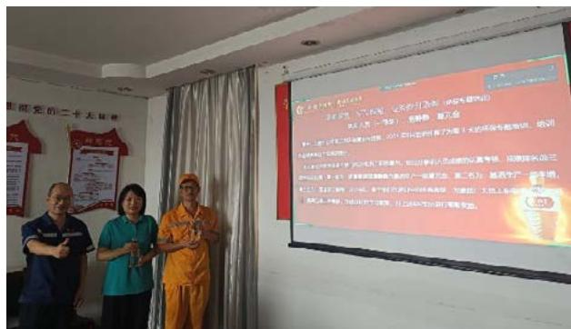

text_image

Classroom scene with three people holding awards and a presentation screen displaying Chinese text about environmental protection education.

考核奖励表彰

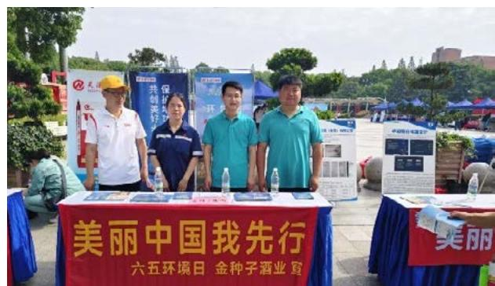

text_image

美丽中国我先行
六五环境日 金种子酒业室

六五环境日活动

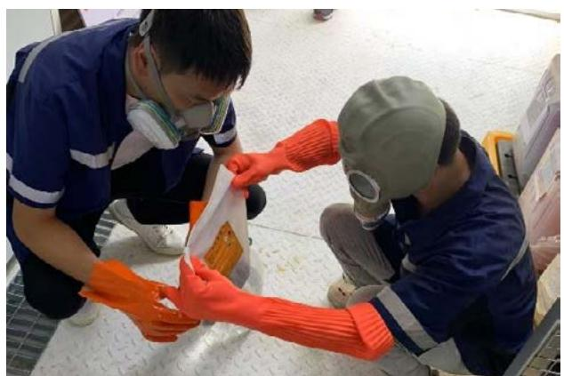

natural_image

Two workers in protective gear handling a packaged item on a tiled floor (no visible text or symbols)

危废泄露应急演练

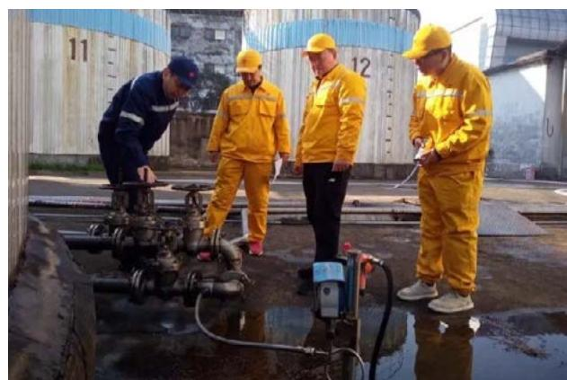

natural_image

Four workers in yellow uniforms and hard hats inspecting industrial piping equipment near storage tanks (no visible text or symbols)

防泄漏应急演练

# 能源管理

公司遵循《中华人民共和国清洁生产促进法》《中华人民共和国节约能源法》等法规，坚持“遵章守法、科技创新、精益管理、节能降耗、持续改进、绿色低碳”的能源管理方针，成立节能工作领导小组，制定《能源管理制度》《计量管理办法》《行政办公及公共区域节水节电操作指引》等制度文件，通过管理节能、技术改造节能、设备更新等多个层面，推动能源的节约与高效利用，减少能源损失和浪费。截至报告期末，公司已获得能源管理体系ISO50001认证。

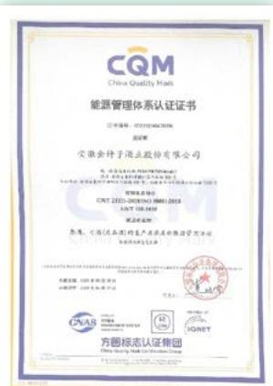

text_image

CQM
China Quality Mark
能源管理体系认证证书
证书编号：07320104287896
注册号：
安徽金种子酒业股份有限公司
CXM 2222-20201941 8881-2018
客服电话：95578-3618
参与、交流与交流的农产品质量检测认证活动
CNAS
方圆标志认证集团
China Quality Mark Corporation Group

公司通过 ISO50001 认证

公司对能源做精细化管理，依托上线的数字化能源管控系统，实现用能数据实时监测、智能分析与动态优化调控，将能源使用情况与绩效挂钩，充分调动全员参与能源管控的主动性与能动性，提升资源能源利用效率。

# 案例：蒸汽管网提升改造

公司聚焦蒸汽管道系统优化、保温性能提升及疏水效率提高三大核心方向，对蒸汽关口管道系统和主蒸汽管道保温层进行改造，实现能源利用效率显著提升。改造后，核算年节约蒸汽费用20万元，蒸汽管损率下降15%，为原酒生产提供稳定高效的蒸汽保障。

# 空压机提升改造

为提升酿酒车间生产用能效率，降低空压机系统能耗，公司实施空压机系统提升改造项目，新设备采用先进的螺杆技术与高效电机设计，能效等级达到国家1级标准，预估每年可直接节约电费4.94万元，实现了能源利用效率与生产稳定性的双重提升。

# 资源管理与循环经济

# 水资源管理

公司在生产运营过程中使用的水资源来源于深井水、市政水以及循环水。公司根据实际生产与运营情况，更换配备了更高效的洗瓶机，优化生产环节水资源集约利用模式，洗瓶车间使用循环水回用系统，替代传统一次性用水冲洗工艺，实现水资源多次循环复用，大幅减少新鲜水取水量，有效提升水资源利用效率，稳步践行节水减污的绿色生产理念。

# 循环经济

公司深入践行循环经济理念，聚焦生产全流程减量化，从源头降低资源消耗与废弃物产生。

<table><tr><td>原料管理</td><td>优化生产流程,精准核算原料用量,杜绝过度采购与物料浪费</td></tr><tr><td>生产过程管控</td><td>改进产品包装设计,精简包装材料用量加强质量控制,减少不合格产品的产生,从过程中降低物料浪费</td></tr><tr><td>废弃物回收利用</td><td>建立完善的废弃物分类收集系统,推动废弃物资源化、无害化处置,与专业的回收企业合作,实现废弃物的再利用对酒糟等酿造废弃物进行综合利用,用于动物饲料</td></tr></table>

报告期内

<table><tr><td>公司回收污泥</td><td>酒糟</td><td>废纸</td><td>废塑料</td></tr><tr><td>27.02吨</td><td>59,325.62吨</td><td>427.22吨</td><td>95.47吨</td></tr><tr><td>废玻璃</td><td>废铁</td><td colspan="2">废弃物综合利用率达到</td></tr><tr><td>51.54吨</td><td>218.14吨</td><td colspan="2">100%</td></tr></table>

# 废弃物管理

公司严格遵守《中华人民共和国大气污染防治法》《中华人民共和国水污染防治法》《中华人民共和国固体废物污染环境防治法》等法律法规，制定了《固体废物管理细则》等制度，确保管理体系规范有效。

# 废气管理

公司规范使用环保处理设施，探索工艺优化和除尘技术，引入先进的除尘工艺和除尘设备，致力于减少废气排放。

# 案例：新型脉冲布袋除尘器

白酒酿造前需要对粮食原料进行除渣和粉碎，脉冲除尘器占地面积小，运行稳定可靠，清灰效果好。脉冲喷吹能快速抖落滤袋粉尘，除尘效率高，处理风量大，可有效去除各类粉尘，净化车间空气，满足生产多环节产生的含尘气体处理需求，废气处理效率98%，有效减少粉尘排放。

# 废水管理

公司建立规范化的废水处理流程，配套完善废水处理设施，严格管控废水产生量，对生产及运营过程中产生的污水进行规范处理，确保达标后排放。公司废水排放严格执行《发酵酒精和白酒工业水污染物排放标准》，持续推进废水减排工作。同时，在废水排放口配备水质在线数字化环境监测系统，对 COD 排放量、氨氮含量等关键污染物指标进行实时监测，确保各项污染物指标 100% 达标排放，切实防范污水风险。

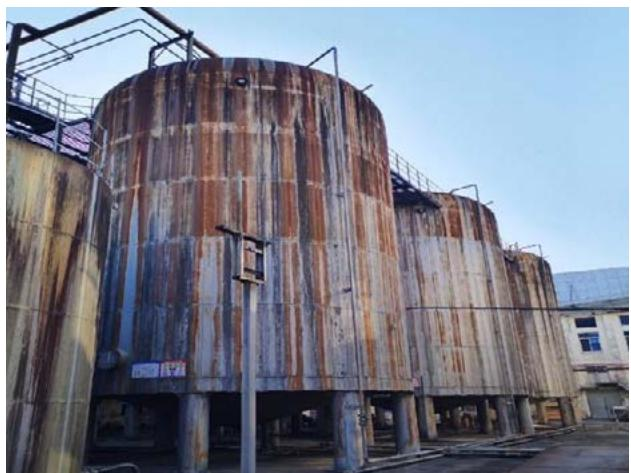

natural_image

Exterior view of an industrial storage facility with rusted cylindrical tanks and metal railings (no visible text or symbols)

将勾调车间产生的浓缩水处理后回用消防喷淋

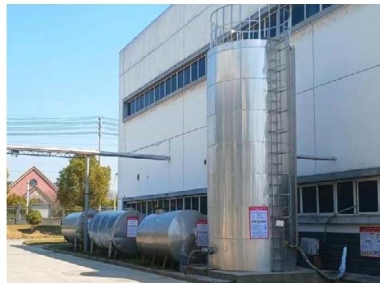

natural_image

Exterior view of an industrial facility with large stainless steel tanks and a building in the background (no visible text or symbols)

将底锅水作为窖泥车间培养菌液营养物质使用

# 固体废弃物管理

公司的固体废弃物主要分为一般废弃物和危险废弃物，实行分类管控、分级处置。对于一般废弃物，在厂区内设置规范分类设施，经分类整理后进行合规处置，对于危险废弃物，则委托给有资质的单位处置，设立规范的危废暂存间管理体制，加强危废收运管理，确保危险废弃物转移过程中无洒落、无泄漏，杜绝二次污染。

公司强化源头削减、资源回收利用和末端安全处置的原则，致力于实现废弃物的减量化、资源化和无害化。公司积极推进废弃物资源化再利用，最大化挖掘废弃物价值，将污泥用于制砖原料使用、酒糟优先在酿造环节用于配醅使用，剩余酒糟对外出售，用于养牛等领域。

针对危险废弃物，公司重点强化源头管控与全流程监管，减少其产生量和危害性。公司加强源头控制，采用清洁技术和低污染工艺，改进检测方法，减少有机试剂使用量，采用先进工艺技术与设备，降低危废产生；将酒醅监测方法由化学检测改为近红外光谱仪仪器检测，减少废液产生，同时推广使用清洁能源与原料，从根源上减少危险废弃物产生。

natural_image

Close-up of a young plant sprouting from soil, with soft green background and no visible text or symbols.

# 03 质创双驱 客户至上

产品质量保障  
研发与创新  
行业共进  
> 知识产权保护

> 数字化赋能  
客户权益  
▶ 责任营销

本章所响应的 SDGs

# 产品质量保障

# 治理

公司始终坚持“以卓越品质为根基、传承非遗技艺、弘扬工匠精神”的理念，严格遵守《中华人民共和国产品质量法》《中华人民共和国食品安全法》等相关法律法规，持续完善质量管理体系和食品安全管理制度体系。

公司设立标准化委员会，严格执行 ISO 9001 质量管理体系要求与 CNAS 体系认证标准，体系按计划正常运行，并持续改进升级，全面夯实质量基础、消除质量隐患，保障产品质量稳定可靠。食品安全方面，公司成立食品安全委员会，落实食品安全责任制，由总经理任委员会主任，其中白酒生产食品安全管理日常办事机构设在质量管理部，由 10 名兼职食品安全员对食品安全实施日常监督管理。

报告期内，公司优化《全流程质量管理办法》等制度文件，新增及修订质量管理制度11项，编制发布标准13项，进一步健全质量管控机制，全年未发生质量和食品安全重大责任事故，无撤回召回事件，产品出厂合格率100%。

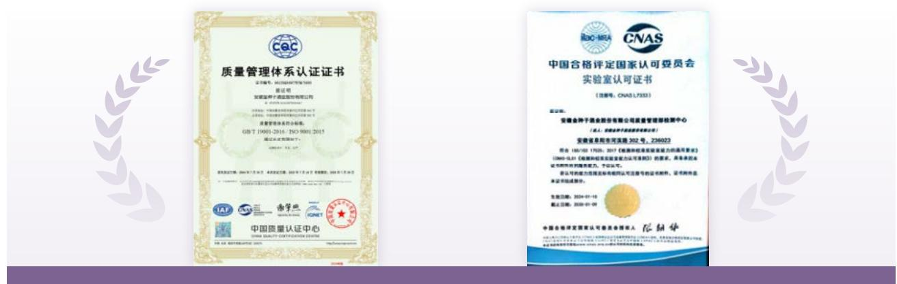

text_image

CQC
质量管理体系认证证书
证书编号：2024-01-19
ISSN 2024/01/19
原证明
安徽金种子酒股份有限公司
GHS T 19881-2016 / ISO 90081 2015
中国质量认证中心
CNAS BEAUTY CERTIFICATION CENTER
中国合格评定国家认可委员会
实验室认可证书
（注册号：CNAS L7333）
安德金种子酒业股份有限公司质量管理部检测中心
（法人：安徽省种子酒业股份有限公司）
安德金早期市河滨路202 号、236023
符合 198/168 17025，2017《检测标准实验室能力的通用要求》
（CNAS-LJG）《检测标准实验室能力可识别》的要求，具备本报告
证书的条件和范围，予以认可。
本认可的能力建设实际有效认可注册号的证书原件，证书附件是
本证书组成部分。
生效日期：2024-01-19
截止日期：2024-01-09
中国合格评定国家认可委员会组织人：张银华

公司通过 ISO9001 认证  
公司获得 CNAS 实验室认可证书

# 战略

公司建立食品安全风险防控的动态管理机制，制定《食品安全风险管控清单》，涵盖生产场所环境管理、设施设备管理、原辅料控制、生产过程控制、人员管理、检验控制等各风险控制环节和风险点，制定对应的管控措施，明确管控频次及责任人。公司通过“日管控、周排查、月调度”的食品安全风险全流程防控措施，实现了食品安全风险的动态监控和闭环管理，有效降低系统性风险，同时通过持续改进，提升企业质量管理水平。

日管控机制  
每日对原料采购、加工工艺、设备清洁、生产环境等关键环节进行巡查，确保符合食品安全标准，发现异常时，通过明确责任人、整改时限及措施，并跟踪闭环  
周排查机制  
每周开展全面排查，覆盖原料储存、操作规范、交叉污染风险等，形成排查报告并整改  
月调度机制  
定期抽检白酒成品、半成品，检测甲醇、铅、塑化剂等 13 项安全指标并进行数据分析：汇总日管控、周排查数据，识别风险趋势并制定优化策略

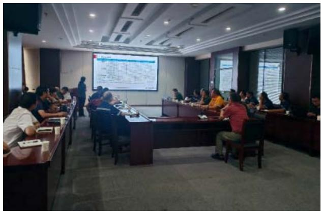

text_image

Conference room scene with attendees seated around a U-shaped table, projected presentation screen showing data and charts on the screen

食品安全月调度会

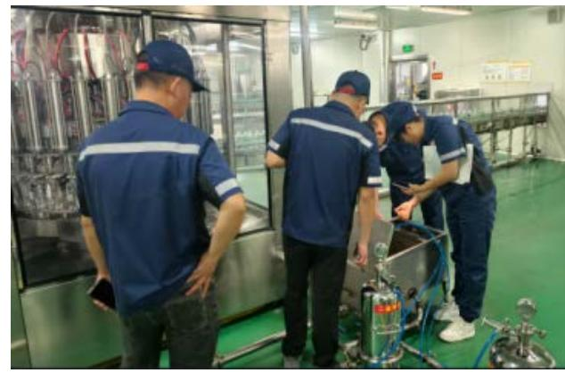

natural_image

Four workers in blue uniforms and caps inspecting industrial equipment inside a factory (no visible text or symbols)

月度食品安全检查

# 影响、风险与机遇管理

# 全生命周期质量管理

公司建立全流程质量管理机制，对原料端质量保障、生产端质量管理等环节层层把控，对发现的问题分析研讨并制定整改措施，确保所有问题均已闭环整改，实现产品精细化质量监督与动态管理。

# 设计端酒体设计

- 成立酒体设计小组，制定专项品评计划，常态化开展常规产品一致性、产品升级、库存原酒及竞品等多维度品评工作  
- 规范运行三级品评体系，对每批次原酒实施品评打分与分级管理，从源头保障基酒品质  
- 建立产品品质比对评价机制，通过感官品评与理化检测相结合的方式，与行业竞品开展综合对标，精准定位产品质量水平与改进方向，持续稳定并提升产品品质

# 设计端包材管理

- 规范封样评审程序，完善评审标准与流程，确保封样规范、图纸完整  
- 梳理包材检验流程，优化关键控制点，严格按标准执行到货检验  
- 强化新产品试生产沟通与抽检，及时解决现场问题  
- 开展瓶口尺寸优化，整合修订多款口模图纸，提高产品适配性

# 生产端 酿造

- 启动基酒质量提升项目，将基酒纳入全流程质量管理体系，修订质量控制点并开展周度联合监督检查与问题整改  
- 制定原辅料、制曲、制酒专项质量控制计划，优化麸曲检验标准与方法  
- 严格执行原酒入库分级标准，完成大量原酒、酒曲、酒醅检测品评，开展班组长品评培训，提升分级管控能力，并开展工艺专项检查

# 生产端成品酒生产与出厂检验

- 加强对新产品生产管控，开展成品酒异物风险源排查，实施成品酒倒置试验  
- 及时把管控信息传递给车间，按照标准进行生产  
- 检验人员严格按照标准进行产品抽检，对质量问题及时反馈和改进。  
- 实施库内成品酒贮存质量月度抽查工作，监督成品酒库存质量，对库存质量异常问题进行处理

# 生产端检验质量控制

- 实施质量标准、体系文件及检测设备操作内外部培训  
实施质量监督计划，对重点岗位与人员开展监督检查，推进检测准确率考核  
- 实施内外部质量控制计划，参加能力验证和实验室间比对，确保检测结果的准确性，各项目比对合格

# 食品安全事故应急处置预案

公司不断加强食品安全管控，制定并落实《食品安全事故应急处置预案》，建立分级响应机制，明确事故上报、现场控制、产品召回等全流程处置规范，强化风险溯源与消费者沟通，保障问题产品快速、精准处置与召回。报告期内，公司开展食品安全应急演练，模拟批次白酒甲醇超标场景，完整完成事件报告、应急响应、现场控制、产品召回、危机公关及总结改进全流程演练，持续提升食品安全保障水平。

# 产品质量与食品安全文化建设

公司高度重视质量与食品安全文化建设，通过海报标语、专题会议开展常态化文化宣贯，面向生产操作人员、食品安全员等开展全流程关键节点培训，并围绕食品安全政策、检测设备操作等组织专项培训与考核，持续提升全员质量安全意识与专业能力。

报告期内，公司编制发布《“品质至上”培训项目2025年实施方案》，开展“品质至上”培训。对基酒生产部、勾贮部、质量管理部、成品酒生产部、营运部、采购供应部人员进行培训，总培训人数912人，考试合格率100%。

# 案例：2025 年度超级品酒师技能比赛

为持续提升品酒师专业素养，夯实产品品质根基，公司于2025年11月成功举办年度超级品酒师技能比赛。竞赛围绕理论知识、感官品评、酒体分析、风味辨识、盲品定级四大核心模块展开，全面检验参赛人员的专业功底与实战能力。比赛期间，参赛选手精准捕捉复杂酒体风味差异，高效完成品质判定，有效锤炼了专业技能，为公司业务高质量发展提供坚实技术支撑，助力打造一支高素质、专业化的品评人才队伍。

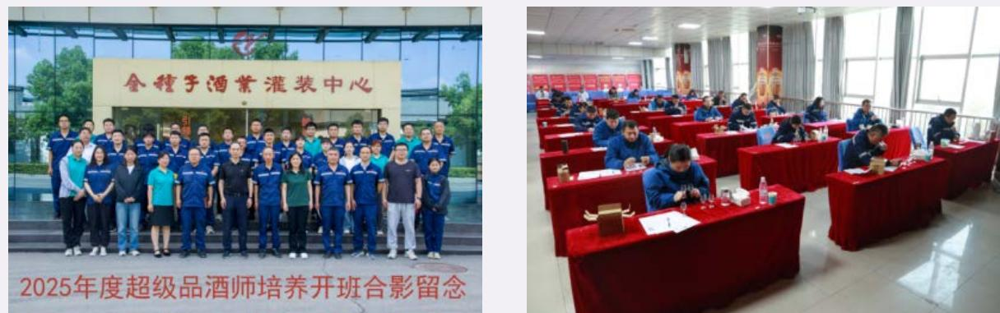

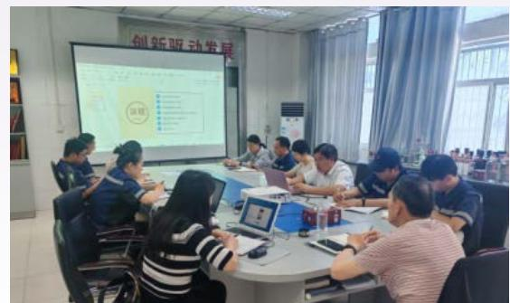

text_image

创新驱动发展

食品安全员培训

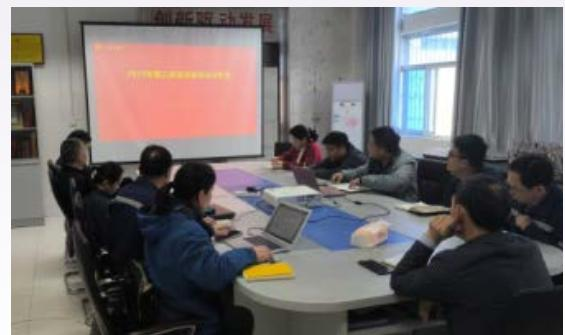

text_image

Meeting room photo with visible presentation screen showing Chinese text and participants seated around a table

质量投诉季度分析会

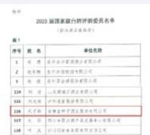

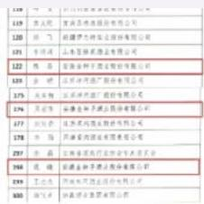  
公司多人被聘任为国家级白酒评酒委员

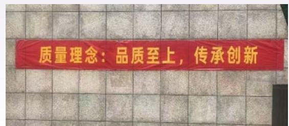

text_image

质量理念：品质至上，传承创新

质量文化宣传条幅

# 精益生产

公司全面推进 “三精” （精简、精益、精细）管理，围绕精益生产、工艺优化、效率提升等开展专项工作，进一步优化资源配置，提质增效。

# 精简

# 优化调整、提升效能

- 结合市场及销售情况，适时优化调整生产组织方式，实现资源优化配置  
- 开展岗位技能培训，提升员工技能水平，实现人员优化配置，提升生产效率

# 精细

# 精细化管理、标准化作业

- 推进生产作业标准化，精细化生产操作  
- 全面运行工厂运营管理系统（FOMS），提升管理成效

# 精益

# 成本解码、内外部对标

- 通过内部成本解码、对标行业标杆，设置更高目标，推动各部门分解承接  
- 利用精益黄带项目、闪电战、日常改善工具解决问题（例如开展降低原酒蒸汽消耗、提高馥合香特级率、提升包材库周转率、提升灌装线生产效率等黄带项目）  
- 持续实施精优采购，引进优质供应商  
- 推进底盘产品包材优化项目

# 案例：标准作业体系建设（工匠传承 + SOP 标准化）

公司成立标准化工作小组，通过一线写实、经验师傅分享，优化作业流程并编制统一 SOP，完成文字与视频版作业指导书定稿，将工匠经验转化为标准化操作规范，实现关键工序可视化指导。

# 案例：工厂运营管理系统（FOMS）落地应用

公司全面推行 FOMS 系统，规范三级会议与问题闭环机制，建立绩效管理看板，落实管理者现场标准作业，强化现场问题解决与即时激励，有效提升生产运营效率与团队执行力。

# 研发与创新

# 治理

公司坚持以研发创新与核心技术攻关为发展引擎，围绕“三大导向”组建金种子馥合香白酒技术研究院，搭建品牌与消费者研究、酒体设计与产品开发、科技研发、酿造技术中心、质量与食品安全、智慧制造六大专业研究平台，形成系统化、全链条的研发创新管理体系。

公司推进研发人才队伍建设，现有研发人员70余人，核心研发团队共35人，汇聚国家级技能大师、省级技能大师、国家级白酒评委、国家一级品酒师、一级酿酒师及高级工程师等高层次专业人才，技术实力雄厚。公司设立由首席科学家领衔的专家委员会，并组建由大师、高级工程师等11名专业人才构成的技术委员会，持续提升研究院学术能力，为日常创新工作提供坚实支撑。

公司建立健全研发创新治理机制，制定并执行《馥合香白酒技术研究院管理办法》《创新成果奖励办法》等制度，遵循“创新引领、需求推动、考核评估、动态调整”原则，推行项目负责人责任制、科技成果转化责任制与创新激励常态化机制，明确成果转化责任追溯，持续激发科研创新活力。报告期内，公司修订完善《创新成果奖励办法》，优化人员范围与团队项目奖励分配规则，进一步营造鼓励创新、支持转化的良好氛围，全面提升自主创新能力与核心竞争力。

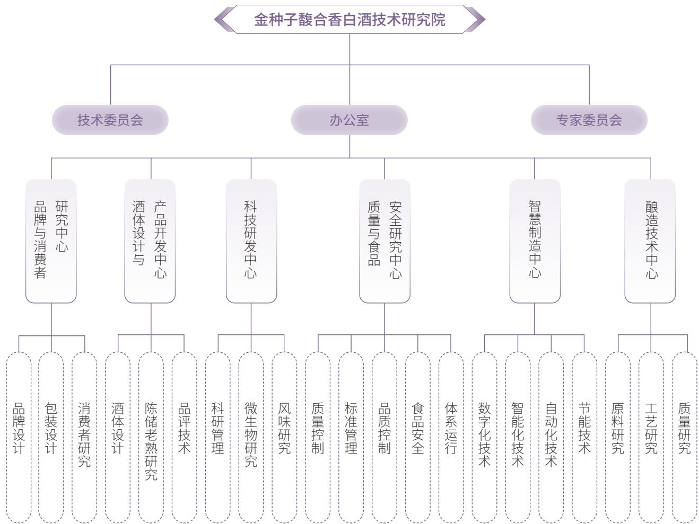

flowchart

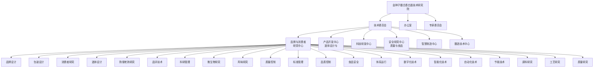
```mermaid
graph TD
  A["金种子馥合香白酒技术研究院"] --> B["技术委员会"]
  A --> C["办公室"]
  A --> D["专家委员会"]
  
  B --> E["品牌与消费者\n研究中心"]
  B --> F["产品开发中心\n酒体设计与"]
  B --> G["科技研发中心"]
  B --> H["安全研究中心\n质量与食品"]
  B --> I["智慧制造中心"]
  B --> J["酿造技术中心"]
  
  E --> K["品牌设计"]
  E --> L["包装设计"]
  E --> M["消费者研究"]
  E --> N["酒体设计"]
  E --> O["陈储老熟研究"]
  E --> P["品评技术"]
  E --> Q["科研管理"]
  E --> R["微生物研究"]
  E --> S["风味研究"]
  E --> T["质量控制"]
  E --> U["标准管理"]
  E --> V["品质控制"]
  E --> W["食品安全"]
  E --> X["体系运行"]
  E --> Y["数字化技术"]
  E --> Z["智能化技术"]
  E --> AA["自动化技术"]
  E --> AB["节能技术"]
  E --> AC["原料研究"]
  E --> AD["工艺研究"]
  E --> AE["质量研究"]
```

# 战略

解决生产经营中的实际问题，
通过科技创新引领，驱动企业
高质量发展

研发客户需要的产品，突出金种子酒业自主特色、个性化、差异化

持续突破关键核心技术，做中国馥合香白酒行业的领导者和创新者

公司引进多套现代化研发仪器设备，拥有博士后科研工作站、杨红文技能大师工作室、企业技术中心等多个自主研发和产学研合作平台，2025年安徽省企业技术中心复评通过。

公司保持稳定的研发投入与项目创新，重点围绕馥合香白酒的微生物、发酵机理、呈味物质、特征性成分、生产工艺优化、装备智能化、新产品开发等课题，组织课题攻关，与各高校、科研院所开展产学研合作，促进技术水平升级。

# 影响、风险与机遇管理

公司以技术创新赋能生产，报告期内，梳理制曲、酿酒、窖泥生产全流程工艺，完善工艺细节与参数规范，开展己酸菌液中试试验，以标准化工艺与科研成果转化持续提升基酒品质与酿造水平。

公司积极推进产学研协同创新，与江南大学、淮北师范学院、阜阳职业技术学院、陕西科技大学开展合作项目，落地博士后研究项目2项；同步推进企业自主研发项目15项（已结题9项）。

# 产学研合作项目

淮北师范大学、 基于产四甲基吡嗪菌种资源挖掘的徽派创新白酒现代固体酿造关键技术  
阜阳师范大学 研究与应用

江南大学 金种子馥合香型白酒酿造工艺及品质提升关键技术研究与应用

阜阳职业技术学院 基于创新技术的酒曲害虫防治和生产中真菌毒素的预防性控制技术研发

# 科研成果案例

\- 公司开展酒曲害虫防治与真菌毒素前置防控技术研究，提升酒曲品质与出曲率、降低生产成本，同时强化了食品安全保障。

# 荣誉获奖

- 《复合香型白酒细菌曲产四甲基吡嗪枯草芽孢杆菌的筛选鉴定、挥发性产物及其应用性能研究》获2025安徽省白酒评委第十一届年会论文一等奖  
- 《基于风味组学分析枯草芽孢杆菌代谢的挥发性组分差异》《基于 HS-SPME-GC-MS、OAV 值和感官评价表征三种香型白酒和不同质量等级复合香型白酒的品质特点》获 2025 安徽省白酒评委第十一届年会论文三等奖

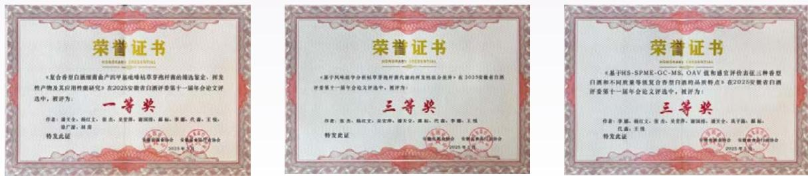

# 案例：谢国排劳模工匠工作室

谢国排劳模工匠工作室于 2014 年成立，深耕白酒酿造领域，以技术创新破局，累计推进起草《馥合香型白酒》等 8 项团体标准，填补我国馥合香白酒领域标准空白。工作室领衔人谢国排带领团队融合多香型酿造工艺，研发馥合香型白酒核心技术，完成多项省级科技成果，筛选的高产己酸菌株获权威收录，革新窖泥培养技术，显著提升浓香型白酒出酒率与优质率。工作室年均培训技术人员超 200 人次，培育多名国家级白酒评委、高级技师，实现技艺传承与产业升级双向赋能。

# 行业共进

公司顺应行业协同发展趋势，深化交流合作与品牌共建，积极参与华润酒业渠道伙伴大会、啤酒活动赞助与展陈等行业会展，与行业伙伴共享渠道资源与经验。通过深度参与行业互动，公司有效提升了品牌曝光度与行业影响力，为馥合香型品类标准推广夯实基础，依托伙伴企业的协同合作，进一步强化产业链联动效能。

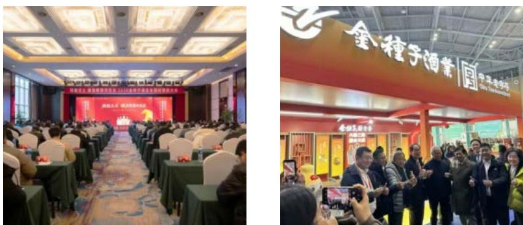

# 知识产权保护

公司通过制定《知识产权管理制度》《创新成果奖励办法》等制度，完善知识产权管理体系，强化商标、专利、版权保护，促进研发成果专利化，推动技术优势转化为市场竞争力。

公司围绕品牌发展战略持续完善知识产权布局，针对核心商标、专利到期续展及侵权风险等关键问题，全面推进知识产权管理工作。报告期内累计完成商标申请59项、商标续展1项、专利续展50项，对33类白酒核心类别实现全群组覆盖梳理，并常态化开展证据留存与风险排查；对外观专利到期及未登记版权产品提前规划补充申请，进一步优化核心产品知识产权保护体系，有效规避商标撤三、专利失效等风险，保障产品全生命周期合法合规运营，筑牢品牌法律保护屏障。

面对新媒体传播与产品创新带来的版权侵权、知识产权纠纷风险，公司建立健全风险防控体系。公司积极推进知识产权申报工作，完成著作权申请及补充8项、外观专利申请8项，建立知识产权风险预警机制，在产品包装设计、广告内容创作等关键环节实施全流程合规审查，从源头防范法律风险。全年未发生重大知识产权侵权纠纷，为公司持续创新营造稳定的环境。

截至报告期末

<table><tr><td>公司目前持有专利数量</td><td>持有版权数量</td><td>持有商标和文字注册权数量</td></tr><tr><td>115个</td><td>51个</td><td>308个</td></tr></table>

2025年

<table><tr><td>申请专利</td><td>授权专利</td><td>其中发明专利</td><td>实用新型专利</td><td>外观设计专利</td></tr><tr><td>39项</td><td>31项</td><td>3项</td><td>14项</td><td>15项</td></tr></table>

# 数字化赋能

# 智能制造

公司积极响应国家智能制造战略，以智能制造、绿色酿造为方向，打造安徽省首家白酒智能工厂，获评国家级绿色工厂、安徽省绿色工厂，拥有数字化车间4个，智能化成熟度稳居行业前列。公司以物联网、5G、工业控制与大数据平台为支撑，构建覆盖智能酿造、智能制曲、智能勾调、智能仓储、智能包装的全流程智能制造体系，实现生产高效化、管控数字化、品质稳定化。

# 智能酿酒

公司新建的馥合香酿酒车间融合连续蒸煮机、双层圆盘堆积床、智能上甑机器人、智能摘酒系统、高效摊粮机、智能物料转运等先进装备，依托 5G + 物联网 + 全流程数字化控制，除人工辅助出入池外，已实现从原料处理到收酒全流程自动化作业。

# 案例：多曲融合智能制曲技术

公司依托“六粮酿造、三曲共酵、石板泥窖分层发酵、一步成香”等创新工艺，建成国内首个将麸曲培养与小曲培养一体化融合的智能制曲车间。车间采用模块化控制模式，实现从原料处理、制曲发酵到成品酒曲产出的高度集成与全生命周期管理，大幅提升制曲关键工序数控化率与酒曲品质稳定性，为馥合香白酒浓、酱、芝三香自然融合提供稳定、优质的曲药保障，形成行业稀缺的工艺技术优势。

# 设备互联

通过数电接口与工业互联网平台，实现机器人、传感器、控制系统之间的高速数据交互与协同调度

# 智能感知

在窖池、曲房、蒸馏工位部署温度、湿度、红外热成像等传感设备，实时监测酒醅、粮醅、蒸汽状态

# 提质增效

车间智能化率达 90%，优质酒率提升 4%，能耗降低 10%

# 智能决策

基于 PLC、TIA、WINCC 平台与专用数据传输技术，搭建智能中央控制平台，实现工艺参数实时监控、异常报警与自适应优化，达成“轻、松、匀、薄、准、平”上甑与精准蒸馏控制

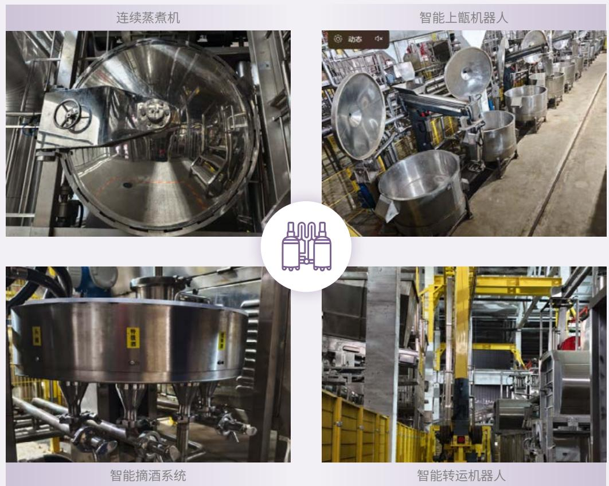

# 基酒储存与数字化勾调

公司构建原酒从酿造、定级、储存到勾调、灌装的全链路数字化管理体系，支撑质量精准管控。

# 数字化勾调

采用计算机一键勾调，配套高精度液位、流量仪表与专家系统，实现原酒收、发、存、勾、滤全流程数字化。

# 智能酒库

万吨陶坛酒库配备智能仪表与无线传输系统，实现原酒输送、出入坛、称重盘点、老熟监控全流程数字化、一键操作。

# 全链路拉通

统一标准与平台，打通制曲、酿造、收酒、定级、存储、勾调、灌装质量链路，提升管理效率与原酒品质，为精细化核算提供数据支撑。

  
原酒管理系统

# 智能包装与机器人应用

公司推行包装物托盘标准化、智能排产与智能调配，建立包装质量五码关联及信息追溯体系，实现成品从生产到流向的全程可查、可控。同时引入智能码垛机器人，采用双线共用配置并配套安全护栏、交叉光电与分组安全控制系统，大幅提升作业安全性，码垛效率提升200%，用工数量减少50%，以智能化装备有效降低人力成本、提升包装产能与标准化水平。

# 数字化建设

公司全面推进数字化转型，结合企业实际完善信息化制度，构建科学规范的数字化管理体系。在基础设施层面，严格遵循集团统一标准，分级推进网络安全建设，筑牢数字化底座；以数字化平台为核心，整合即时通讯、OA办公、邮箱等功能，建成一体化协同办公体系，并依托人力PS系统实现培训、学习、绩效等共享服务全面数字化。

公司聚焦营销、营运、供应链、生产运营全链条数字化升级：搭建以费控管理、访销、数字化营销为核心的营销数字化平台，辅以微信团购小程序、品鉴大使、内购等工具，实现业务流程与客户服务在线化、信息化；以ERP系统为支撑，吸收行业先进实践，持续完善营运领域信息系统；优化供应链采购模式，推动采购业务全流程线上化，提升协同效率；以智能制造为方向，深化酿造、勾储、包装等环节数字化改造，同步强化财务成本精细化管控，全面提升生产运营效率与管理效能。2025年，公司上线原酒管理系统，实现原酒的收贮动态、实时监控。

# 客户权益

# 治理

公司建立健全制度规范与闭环管理机制，制定《质量投诉处理管理办法》，于报告期内下发《安徽金种子酒业股份有限公司400客服热线市场诉求处理管理办法》，明确诉求响应、投诉处置、赔付流程与责任追溯标准，构建24小时跨部门快速响应小组，实施季度投诉分析会与系统性改进机制，形成制度先行、流程规范、追责到位的客户权益管理体系。

# 战略

公司通过权益保障落地，以高标准权益服务巩固消费信任、强化品牌口碑，客户投诉解决率 100%，线下满意度达 88.20%，有效降低质量投诉与品牌声誉风险，为馥合香品类市场拓展与长期可持续发展创造有利条件。

# 影响、风险与机遇管理

公司以提升服务质量、强化品质沟通、保障消费安全为核心，全面推进客户权益落地。

- 服务与投诉管理  
推行问题酒邮寄机制，建立赔付凭证与投诉统计系统，开展市场质量巡查，全年编制19份典型投诉案例，开展20场现场警示培训，实现投诉高效处置与源头预防。  
品质与消费沟通  
面向喜力 HMC 团队、市场人员、消费者开展品质讲解十余次，组织新进人员培训 5 次、“大师面对面”互动 9 次，提升产品认知与品牌信任。  
质量双重监控  
严格执行 “三级品评 + 市场抽样” 体系，市场抽样合格率保持 100%，坚守产品安全底线。

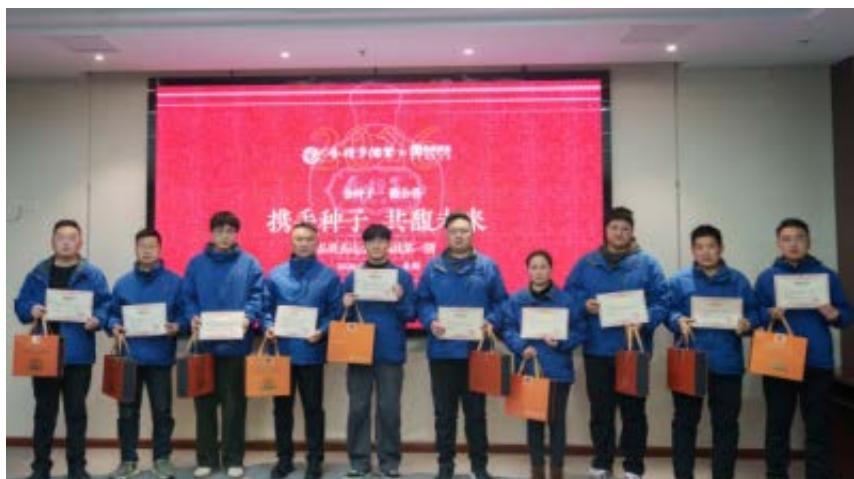

text_image

Group photo of people holding certificates in front of a red banner with Chinese text, likely at an event or ceremony.

品牌培训

text_image

Scanned screenshot of a Chinese web interface with navigation tabs and a promotional graphic on the screen.

抖音商城 50 度白酒超值爆款上榜

# 责任营销

# 消费者责任

金种子酒坚守白酒行业消费者责任，始终把消费者健康与合法权益放在首位。公司严格践行理性饮酒倡议，坚决遵守不鼓励过量饮酒、不向未成年人售酒、不宣传饮酒驾驶的行业准则，通过产品包装警示语、线下终端宣传物料等多种渠道，持续向公众普及健康饮酒、文明饮酒理念。在营销推广环节，公司建立严格的营销行为合规审查机制，制定《新闻发言人办法》，所有新闻发言和宣传内容均经法务、品牌管理等部门联合审核，确保全面符合《广告法》及酒类行业相关规定，以合规、负责任的品牌行为守护消费者权益。

# 消费者权益保护

公司制定《打假维权管理规定》等专项制度，明确打假工作流程、侵权处置规范、管理原则与奖惩机制，构建制度化打假维权体系。公司设立专人专岗负责打假维权工作，常态化收集、核查各类侵权线索，统筹法务、品牌、销售、质量等多部门协同开展调查取证，并与地方执法机关紧密联动，依法高效打击各类侵权假冒行为，切实维护品牌权益与消费者合法权益。报告期内，公司共处理假冒 / 仿冒侵权案件 15 起，处理率 100%，组织联合鉴定 9 次，查出侵权酒水 442 瓶，配合执法部门销毁假冒产品 1.1 万余瓶。

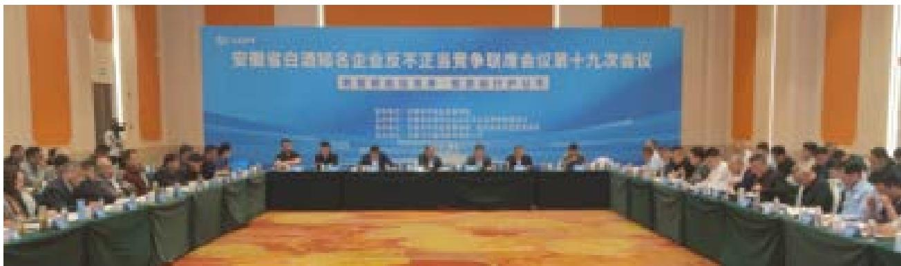

text_image

安徽省白酒知名企业反不竞争联盟席会议第十九次会议
上海黄浦区酒泉镇黄浦区黄浦区酒泉镇黄浦区酒泉镇

公司每年参与反不正当竞争会议

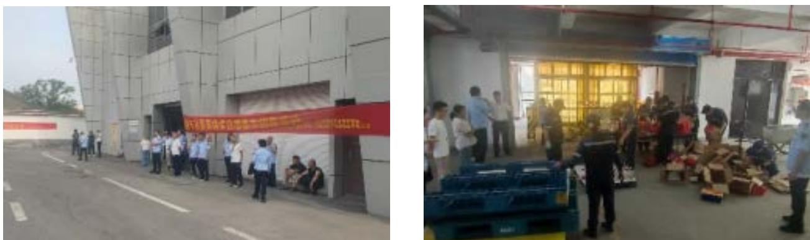  
联合销毁现场

# 品牌活动

公司顺应白酒产业文旅化、公益化发展趋势，深度推进文旅、体育、商业与公益多元融合，构建特色品牌传播生态。依托本土资源深耕城市IP共建，常态化落地特色文化与公益活动，冠名地方群众性赛事、赞助城市体育盛会、举办大型文化演艺活动，持续开展爱心送考公益行动，并联动政府部门凝聚社会公益力量；连续六届打造开窖节文化IP，逐步形成标志性城市文化符号。

系列活动累计吸引 30 万余名市民参与，获得主流媒体广泛报道，成功打造 “文旅体商 + 公益” 融合赋能的示范模式。通过跨界创新，公司持续拓宽白酒品牌社会价值边界，深化与地方经济、城市文明建设的共生联结，为行业生态化、责任化发展提供实践样本。

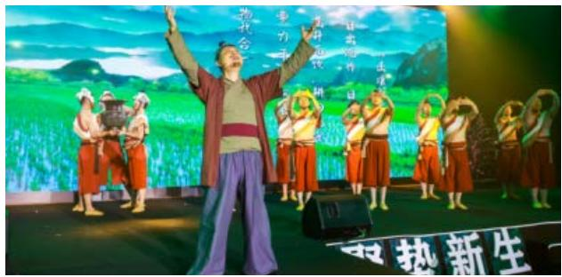

text_image

物会
重力千
日
日
日
日
日
日
日
日
日
日
日
日
日
日
日
日
日
日
日
日
日
日
日
日
日
日
日
日
日
日
日
日
日
日
日
日
日
日
日
日
日
日
日
日
日
日
日
日
日
日
火热新生

舞台剧

text_image

Nighttime outdoor stage performance with large illuminated screens displaying Chinese text and floral patterns, surrounded by a crowd.

春季群星演唱会

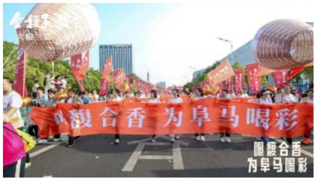

text_image

馥合香 为皇马喝彩
馥合香
为皇马喝彩

阜阳马拉松赞助现场

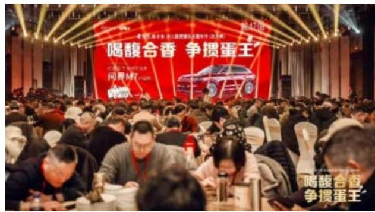

text_image

喝酸合香 争掼蛋王
问界M7

掼蛋比赛活动

# 供应链管理

# 治理

公司持续完善供应链管理体系，设立由总经理及各业务分管领导组成的采购委员会，作为采购管理的最高决策机构，决定公司采购战略规划及管控模式，由采购专业委员会审批把控采购方案和考核结果等，并由采购供应部负责采购管理和供应商管理。

公司制定《采购管理制度》《供应商管理办法》《供应商过程考核工作指引》等制度要求，且于报告期内发布、修订16项采购相关制度，通过不断完善制度体系，持续提升风险管控能力，确保采购行为依法合规，实现采购工作的规范化、程序化、透明化和高效化。

# 战略

面对国际形势动荡、极端天气频发、国家产业政策调整带来的采购成本上涨、供应断供等外部风险，以及供应商管理不规范、采购流程不合规等内部潜在风险，公司立足供应链安全稳定与高效协同核心目标，制定供应链管理策略，通过强化供应商管控、精准应对市场变化、健全风险防控体系，防范采购违规、成本增加、项目质量下降等损失，另外还定期开展采购专项培训和风险案例共享，提高采购和管理人员的业务水平和风险防控水平，构建稳定、可控、高效、绿色的供应链体系，为公司生产经营持续赋能。

<table><tr><td>供应商管理</td><td>·加强与供应商的沟通和协作,建立长期稳定的合作关系
·持续引入优质供应商,避免对单一供应商的过度依赖,建立稳定、可控、安全的供应链
·制定应急预案,包括备用供应商和原辅料、包装物库存储备策略,以应对突发事件
·开展供应商征集和星级管理、合作过程考核,实现供应商优胜劣汰
·根据供应商等级、实施星级管理,发挥集中采购优势</td></tr><tr><td>采购形势变化跟进与应对</td><td>·密切跟踪国际局势,定期跟踪原材料价格及市场行情、国家环保政策,及时制定应对措施
·对包装物进行适量储备,或制定合理的消化计划,缓解成本压力
·加快推进包材减重项目</td></tr></table>

# 影响、风险与机遇管理

# 供应商管理流程

公司供应商目录实行引进、评价、淘汰动态循环机制，供应商管理一般按照开发、认证、考核、分类四个程序开展：

# 开发

采购主责部门根据业务需求分品类制定资质或现场认证标准并公开，通过守正平台、市场走访等多种渠道公开寻源，收集潜在供应商资源信息并整理登记

# 认证

依据品类特点确定认证范围，新供应商认证分资质和现场认证，资质认证审核相关证件，现场认证按标准组建小组开展，不合格可整改，合作供应商认证周期不超过3年

# 分类

采购主责部门将供应商按业务需求分类，包括品类供应商、黑名单供应商等，分别依据相应条件建立目录并管理，同时对包材供应商开展星级管理，通过多种方式帮助供应商提升能力

# 考核

采购主责部门建立考核评价标准，明确考核项目、标准、周期及数据来源，及时处理合作过程中的问题，年度考核评价后按结果进行管理

# 供应商考核结果应用

供应商考核分为过程考核和年度评价，过程考核通过对供应商合作过程中出现的交付、质量、违规等问题进行考核，如发现重大问题，可能采取警示、约谈、货源扣减、暂停供货甚至直接淘汰的措施。年度评价则通过对合格供应商现场考察认证、合作考核、质量延伸等进行全过程的年度评价，年度综合评价报告将上报给采购委员会，也是作为供应商星级管理依据之一，如年度评价不合格将予以淘汰。

# 供应商赋能

公司始终重视供应商协同合作，组织交流会、对标及专项培训，全面宣导供应商管理制度与质量标准要求。公司积极推进质量延伸管理机制，通过现场认证查找问题、提出改进建议，通过专题会议推广行业新技术、新设备、新方法应用等，帮助供应商进行问题攻关、技能提升，以满足公司发展需要。

# 阳光采购

公司加强供应商管理工作廉政建设，推进反腐倡廉向纵深开展，制定并严格遵守供应商制度中的廉洁管理规定，若供应商管理人员与关键岗位等存在利益关系应主动申报；所有物资类除应急生产及应急安全类物资，均通过华润守正采购交易平台公开采购；大宗物资采购通过华润守正采购交易平台发布包装物、原料类大宗物资供应商征集公告。

公司明确廉洁合作条款，将廉洁合规承诺书作为合同附件要求供应商进行签署，签署率达100%。若发现任何供应商黑名单行为，将供应商认定为黑名单供应商，至少5年内禁止合作。

# 供应商紧急事件管理

供应商如出现信用危机、食品安全、生产经营场所发生重大事故 / 事件等情形时，公司获知后将第一时间形成紧急事件报告，调查并持续跟踪事件情况和发展趋向，并提出应对措施落实，直至紧急事件对公司的影响消除。

# 绿色采购

公司增加绿色原料采购标准要求，针对小麦、高粱等六类核心原料制定包含绿色食品认证的考察认证标准，并要求有资质的供应商提供绿色食品认证证书，逐步扩大绿色原料的使用比例。公司还长期开展包装优化项目，报告期内通过调整印刷方式、材质，使用无纺布袋等方式，进一步推动包装材料执行减量、轻量化设计。

natural_image

Modern skyscrapers with abstract digital network graphic overlay (no text or symbols)

# 04 人才为本 聚力成长

> 员工权益与福利  
员工培训与发展  
> 职业健康与安全

本章所响应的 SDGs

3 良好健康

4 优质教育

5 性别平等

8 体面工作和经济增长

10 减少不平等

# 员工权益与福利

# 员工雇佣

公司严格遵守《中华人民共和国劳动法》《劳动合同法》等法律法规，将保障员工合法权益作为人力资源管理的核心原则。报告期内，公司系统修订招聘、培训、薪酬、福利等7项人力资源管理制度，重点优化《劳动合同管理制度》，从合同订立、续订、变更、解除及终止等全生命周期进行规范化管理，确保用工全流程合法合规，切实维护公司与员工双方的合法权益。

公司坚持 “内部培养为主、外部引进为辅” 的人才供应策略：关键岗位实施后备储备，紧缺岗位打通社招校招双通道，为新员工搭建快速成长平台。招聘坚持平等雇佣、公平透明，杜绝就业歧视，同时严禁雇佣未满 16 周岁人员。

公司始终将残疾人、退伍军人等特殊群体就业保障纳入可持续发展战略，构建平等、包容、赋能的职场生态，做好用工保障，确保人岗匹配，助力特殊群体融入社会、实现自我价值。报告期内，公司有残疾员工4人、退伍军人员工56人。

(单位：人)  
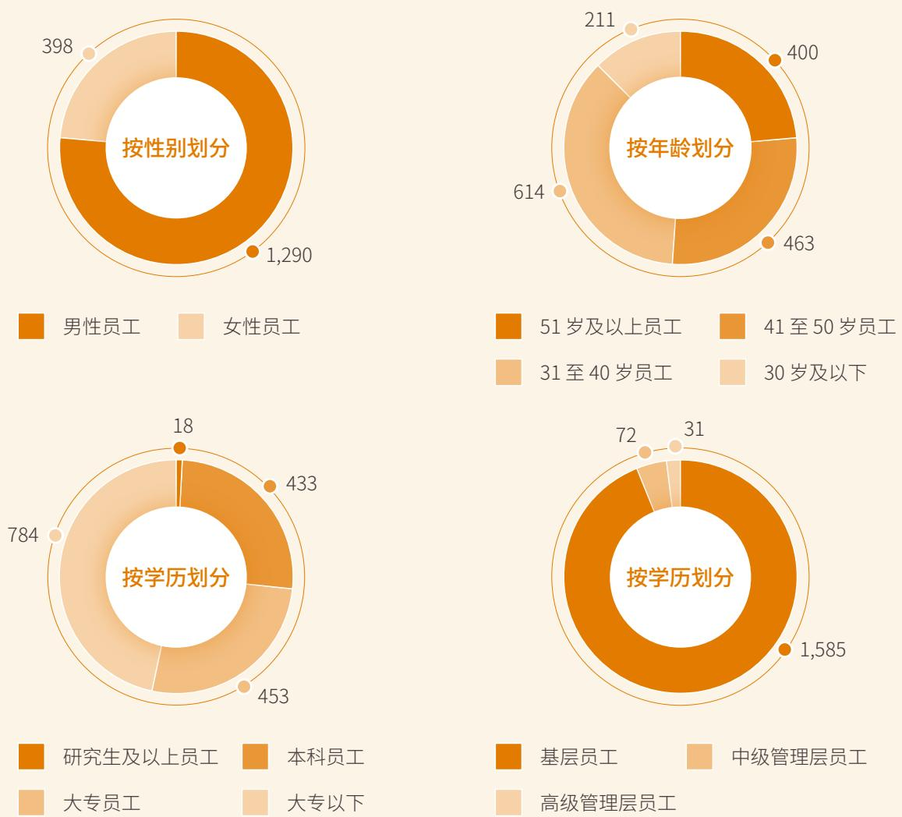

# 民主管理与沟通

公司坚持民主管理理念，依法保障员工参与工会及集体协商的合法权利，搭建公平透明、畅通高效的沟通桥梁，确保员工能够在平等条件下，就工作条件、权益保障等相关事项与管理层开展有效对话，充分保障员工的知情权、参与权与监督权。同时，设立“金点子”建议反馈渠道，积极激励员工立足岗位献计献策，凝聚全员创新合力；在管理岗位调整过程中，严格执行信息公示制度，主动接受全员监督。

公司高度重视员工诉求回应，定期研究信访工作相关事宜，建立常态化诉求解决机制。通过开展各类谈心谈话活动，主动倾听职工群众心声，及时排查、化解各类矛盾纠纷，精准回应员工合理诉求，持续优化员工工作环境与权益保障水平，构建和谐稳定的劳资关系，增强员工的归属感与凝聚力。

# 案例：“金点子”反馈平台

为破解业务推进中的堵点、卡点与痛点问题，提高跨部门协作、沟通协调效率，报告期内公司依托“金点子”意见反馈平台，集中梳理并高效解决员工提出的各类问题，切实打通工作衔接卡点，强化协同效能，提升业务服务保障能力。

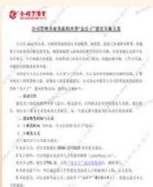

# 案例：建立职工茶吧

为发扬民主精神，营造和谐企业文化氛围，促进员工畅所欲言，公司在基酒、成品酒生产车间打造特色职工茶吧，茶吧内布置简约，提供茶饮、瓜果等，便于职工休憩交流。工作间隙，员工可在茶吧交流座谈，在轻松愉快的氛围中拉近管理者与员工的距离。

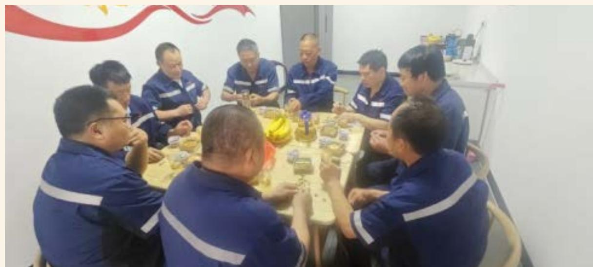

natural_image

Group of workers in blue uniforms gathered around a dining table, engaged in a meal or activity (no visible text or symbols)

# 员工薪酬与福利

# 员工薪酬

公司高度重视薪酬激励与绩效考核的科学性、规范性，建立科学规范的薪酬激励体系，报告期内修订并实施《薪酬管理制度》《全员绩效管理制度》等一系列制度办法，进一步完善薪酬激励体系，明确薪酬管理、绩效考核的核心规则与实施流程，确保各项工作有章可循、规范落地。

公司建立以岗位、能力、业绩、市场化为核心的付薪依据，构建清晰的职级、薪级与薪酬矩阵体系，确保薪酬分配公平合理、贴合市场。员工薪酬主要包括年度目标薪酬、特殊奖励、加班工资及其他现金性津补贴福利，兼顾固定保障与绩效激励。

# 员工福利

公司不断改善和优化员工福利，致力于打造温暖和谐的人文氛围，切实保障员工权益、提升员工幸福感。报告期内，公司修订《员工福利管理制度》，优化福利管理流程，明确员工福利涵盖法定福利与补充福利两大板块，实现福利体系的标准化、规范化升级。

法定福利方面，公司严格依法合规落实各项保障，2025年为全体职工足额缴纳“五险一金”，发放高温津贴、独生子女费等法定福利，筑牢员工基础保障防线。补充福利方面，公司围绕员工工作与生活需求，构建多元化福利体系，包括经营保障类（交通福利、通讯费、工装福利等）、风险保障类（商业保险、员工体检）、工作与生活类（异地福利、节日/生日/生育/婚丧福利等）三大类别。

# 案例：三八节活动

公司关注女员工成长与需求，用心呵护每一位女职工的身心健康与职业发展。在“三八”国际妇女节来临之际，公司精心筹备节日惊喜，为全体女员工送上专属节日礼品，传递温暖关怀与美好祝福。同时，特别举办插花、剪纸两大传统技艺体验活动，特邀非遗剪纸讲师与专业花艺老师现场授课指导，让女员工在繁忙的工作之余，暂享闲适时光，沉浸式感受传统非遗的魅力与花艺的雅致，在动手实践中舒缓压力、陶冶情操，收获满满的幸福感与归属感。

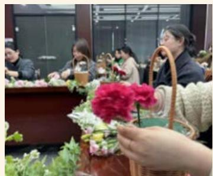

natural_image

Group of people arranging flowers in a workshop, one person holding a pink flower basket (no visible text or symbols)

公司制定《食堂管理办法》《宿舍管理办法》等配套制度，提供价格优惠的工作餐，并为符合条件的新入职员工提供宿舍，切实便利员工工作与生活，全方位提升员工归属感与幸福感。

# 案例：食堂焕新计划

为切实保障员工饮食安全与用餐体验，公司推进食堂焕新计划，全面升级食堂硬件设施与管理，打造安全、卫生、高效、温馨的就餐环境。在硬件改造方面，实施北区就餐区域升级工程，对老旧食堂包间进行全面翻新，并推进空间整合与标准化建设，同步更新线路设备、优化动线设计，引入“明厨亮灶”模式，实现操作流程全程可视化。

在管理服务升级层面，公司启用智慧食堂系统，依托云计算技术实现食堂全业务链智能化管理，替代传统线下一卡通，支持手机轻松付款；实施食材成本精细化管控，严控食材安全与品质；增设端午粽子、节日汤圆等特色菜品，丰富早餐品类，全面提升服务质量与员工幸福感。

natural_image

Interior view of a modern conference room with empty chairs, tables, and large windows (no visible text or signage)

公司积极营造活力向上的团队氛围，依托团建拓展、部门共创研讨、特色文体活动等多元形式，推动职能与业务深度协同融合，持续激发组织动能与员工活力。同时倡导健康生活理念，丰富员工业余文化生活，助力平衡工作与生活，在凝聚协作共识、舒缓身心压力的过程中，不断增强团队凝聚力、向心力与全员幸福感。

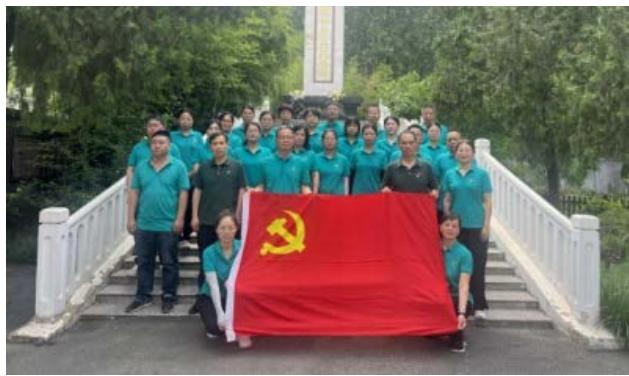

natural_image

Group photo of people in green shirts holding a large red flag with a yellow hammer and sickle emblem, standing on a stone bridge (no visible text or symbols)

组织支部参观红色教育基地

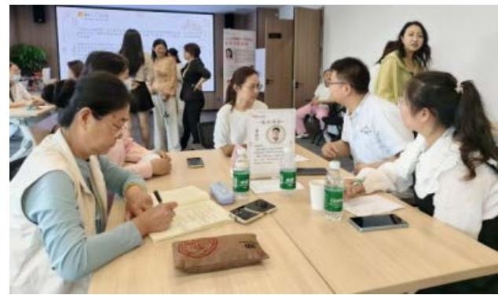

text_image

Group of people in a meeting room reviewing documents and tablets, with visible posters on the wall in the background.

中医义诊活动

# 员工关怀

公司深耕暖心人文关怀，聚焦困难群体帮扶，常态化开展职工慰问帮扶，依托专项爱心基金，重点面向退休职工、遭遇重大疾病及意外变故的困难员工提供精准救助，纾解生活压力。针对患病在岗员工，公司定期组织管理人员与职工代表上门探访，送上暖心慰问物资，细致了解病情诊疗、康复休养及生活近况，叮嘱安心养病、积极康复；同步宣讲职工医疗互助保障报销政策，全程协助对接办理相关报销事宜，切实减轻员工就医负担，化解后顾之忧。

# 员工培训与发展

# 员工培训

公司围绕发展战略和业务需求，以赋能员工成长、提升专业能力与管理水平为目标，构建分层分类、覆盖全员的培训课程体系，打造特色“超级系列”培训矩阵，助力员工成长与企业发展同频共进，夯实高质量发展的人才根基。

# 营销中心

\- 业务赋能与客户赋能，提升市场拓展、销售策略及客户服务能力

# 新员工

\- 超级种子入职培训，帮助新员工快速融入企业文化、熟悉规章制度与岗位流程

natural_image

Abstract orange hexagonal icon with a white person and pointer inside, no text or symbols present.

# 生产系统

- 超级酿酒师、超级品酒师专项培训，提升酿酒、品酒关键岗位人员专业能力  
- 新增面向车间主任、班长等基层管理人员的“超级班主任”管理培训，提升基层现场管理、团队带领与执行落地能力

报告期内，各项培训按计划有序开展并达成预期目标，超级酿酒师培训共有22人通过职业技能等级认定；超级品酒师20人通过职业技能等级认定；营销中心累计229人次参训，培训总时长2,433小时，人均培训时长约10.62小时。同时，公司强化关键人才梯队建设，常态化开展核心岗位人才盘点，储备优质技术骨干；推行一岗多能培育模式，着力打造复合型人才队伍；深化传统师带徒传承机制，持续优化人才结构、提升生产效能，为企业长效发展筑牢智力与技能支撑。

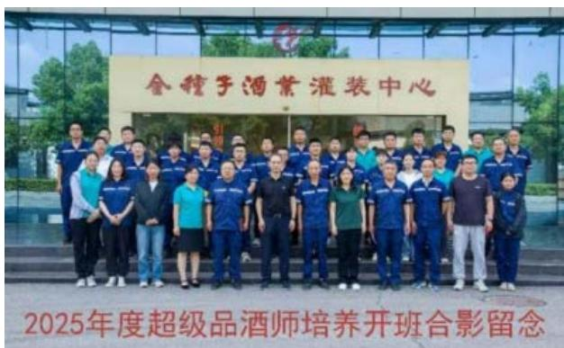

text_image

金种子酒業灌装中心
2025年度超级品酒师培养开班合影留念

超级品酒师培训

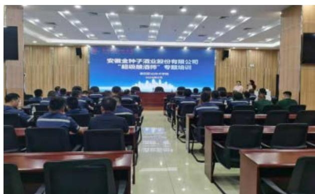

text_image

安徽金种子酒业股份有限公司
“超级颜酒师”专题培训

超级酿酒师培训

# 案例：2025年大有可“维”培训

为培养维修技术人才，提升公司设备维修技术水平，公司优选12名维修技术骨干人员开展脱产专项进阶培训。培训内容聚焦白酒专用设备技术、PLC控制技术、工业互联网技术三大核心模块，以“练中学、学中练”的实战化培养模式，提升技能和认知。

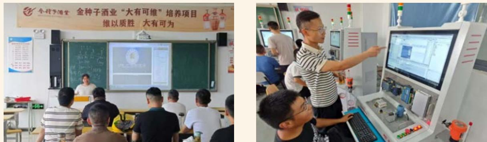

# 员工晋升与发展

公司为员工铺设清晰、公正的成长路径，构建了系统化职业发展体系，完善考核激励机制，让每位员工都能看到发展方向、获得公平机会、实现价值提升，在人才与企业的相互成就中，共创共享成长成果。

公司结合业绩规模、市场对标情况，建立完善的职级体系。搭建管理通道（M 序列）、专业通道（P 序列）、操作通道（O 序列）三大职业发展通道，通过《职级体系表》明确各通道任职资格标准、发展路径，覆盖了全体员工发展需求，打破职业成长壁垒。

公司遵循战略导向、全过程沟通与辅导、有效激励、客观公平透明的绩效管理原则，建立标准化考核体系，考核结果将作为薪酬调整、岗位变动的重要依据。实行月度/季度与年度相结合的考核频次，考核者与被考核者通过双向沟通，就绩效周期内的工作目标、预期效果等达成共识，签订绩效承诺，明确工作方向。定期开展组织和个人绩效回顾与辅导工作，及时发现问题、优化工作方法，帮助员工提升工作绩效。每月绩效考核得分由被考核人书面签字确认，被考核人若对反馈的绩效结果有异议，可参照《全员绩效管理制度》在收到绩效考核结果后五个工作日内提出绩效申诉。

natural_image

Close-up of hands assembling a white cylindrical object with a red ribbon, wearing a striped shirt (no text visible)

# 职业健康与安全

# 治理

公司坚持“预防为主、防治结合、综合治理”的安全管理方针，高度重视安全生产与职业健康管理，构建健全的 EHS 管理体系，以“决策、执行、监督”三级责任体系为核心，筑牢安全生产防线。公司成立由总经理牵头领导的安全生产委员会，统筹部署年度 EHS 工作规划，指导、协调全公司安全生产与职业健康管理各项工作，明确管理方向与核心目标。组织架构详见环境管理章节。

公司制定《安全生产风险分级和隐患排查治理》等安全专项制度，并根据内部管理要求持续修订完善各类相关制度，不断健全 EHS 管理制度体系；同时，通过《职业危害与职业病防治健康管理办法》强化职业病防治工作，严格落实各项防护措施，持续改善员工作业环境，切实保障员工职业健康。

公司严格遵循 “一岗双责” “三管三必须” 要求，持续完善 EHS 责任体系，深化 “两个清单” 落地执行，定期开展履职清单任务更新与履职评价工作，确保各项责任落到实处、各项工作有序推进，切实保障员工人身安全与企业安全生产稳定。

# 战略

公司制定《安徽金种子酒业安全生产治本攻坚三年行动方案（2024—2026年）》，专门成立安全生产治本攻坚三年行动工作小组，明确职责分工，细化编制三年行动实施计划及核心工作要点，明确完成时限与责任主体，持续强化重大安全风险管控能力，坚决防范各类生产安全事故发生，筑牢安全生产防线。

为防范安全风险，公司常态化开展安全风险全面评估工作，系统排查生产全流程、各岗位潜在安全隐患，建立风险分级管控机制，对排查出的安全风险进行分类分级、动态管控，确保风险早发现、早预警、早处置。公司针对谷物粉尘等重点职业病危害因素，全面开展职业病危害因素检测工作，检测范围覆盖所有存在职业病风险的作业区域；同步推进职业健康管理，建立完善的员工个人健康档案，开展职业健康监测与防护，切实保障员工职业健康安全，推动安全生产与员工健康保障协同发展。

natural_image

Golden shield icon with heart symbol, set against a soft gradient orange background (no text or symbols)

# 影响、风险与机遇管理

# 隐患排查

公司隐患排查实施定期检查与不定期抽查相结合的方式，强化整改落实，实现隐患排查、整改、复查、归档的全流程闭环管理，切实防范各类安全事故发生。公司每季度定期组织开展安全专项检查，聚焦生产全流程、关键岗位、高风险区域，全面排查设备设施运行、作业环境安全、安全防护措施落实等方面的隐患，节假日前专门开展重大事故隐患专项排查，并依据年度隐患排查计划，结合生产实际需求，灵活开展针对性抽查。

针对排查发现的各类隐患，公司严格落实“谁排查、谁负责，谁整改、谁落实”的责任机制，立即组织相关责任部门制定针对性整改方案，明确整改措施、责任人员、整改时限及临时管控措施，杜绝隐患扩大蔓延。公司建立隐患排查治理台账，定期开展隐患排查复盘分析，总结共性问题、优化排查标准，持续提升隐患治理能力，筑牢安全生产防线。

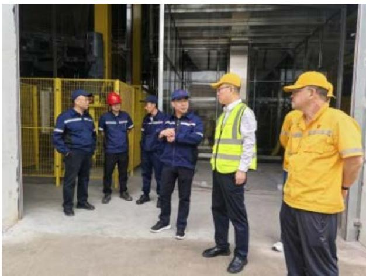

natural_image

Group of workers in uniforms and hard hats standing outside a glass building entrance (no visible text or signage)

安全生产检查督导

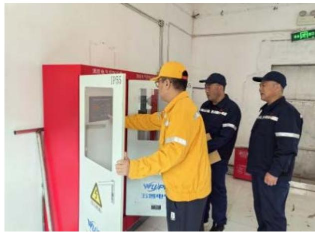

text_image

Photo of three workers in uniforms operating a control panel with visible labels and warning signs, likely in an industrial facility setting.

消防安全专项行动

报告期内，各级政府检查无重大隐患，隐患整改率 100%，安全事故 0 起，环保事故 0 起，EHS 主要负责人、安全管理人员、特种作业人员持证上岗率 100%，特种设备及安全附件检测率 100%。

# 案例：“百日安全无事故”活动启动

报告期内，公司举办“百日安全无事故”暨安全生产月活动，启动仪式上公司重温安全生产相关重要论述，在明确活动核心目标的同时，部署常态化“飞行检查”、隐患清单抽查等关键举措，强化全员安全责任意识。

活动明确了具体奖惩机制，对安全工作落实到位的予以表彰，对失职渎职行为严肃追责；同步开展安全宣传教育，组织观看安全宣传视频、复盘典型安全隐患案例，并对表现突出的相关人员予以表彰，进一步夯实安全管理基础。

# 安全培训

公司制定《EHS 教育培训管理办法》等专项制度，结合不同岗位的职业健康安全风险差异与岗位管理需求针对性实施培训，采用理论讲解、示范操作、测试评估及实训演练相结合的方法，增强培训实效性。公司同步开展消防、应急处置等实操演练，广泛普及消防安全、应急处置相关知识，同步开展安全隐患随手拍等特色活动，有效提升全体员工的消防安全意识、安全操作技能及应急处置能力，筑牢安全生产思想防线。

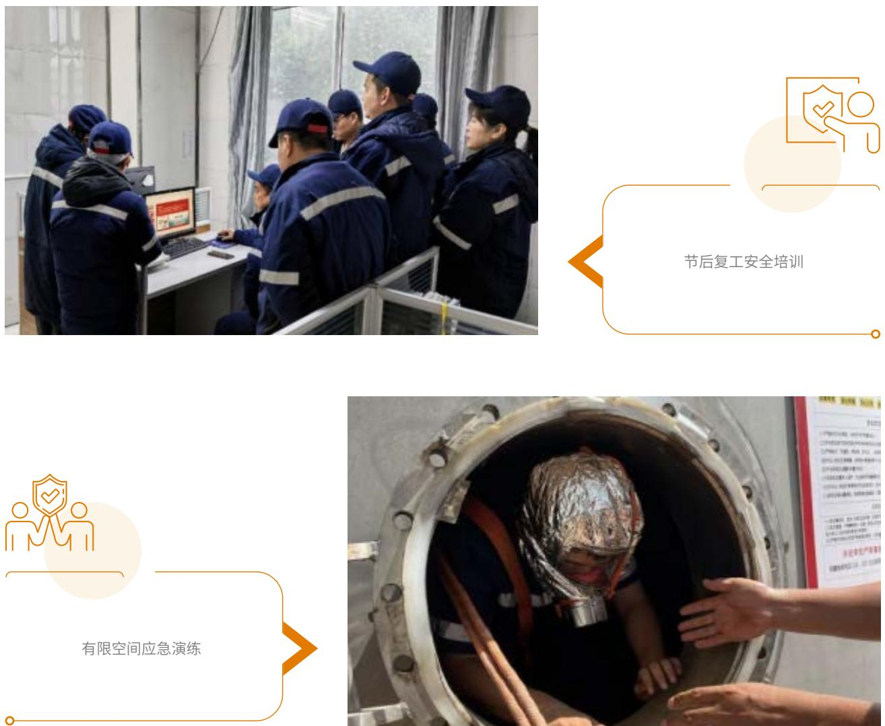

# 案例：安全生产知识讲座

2025 年 6 月公司成功举办安全生产知识讲座。讲座覆盖成品酒生产部、基酒生产部等 8 个部门共 88 名员工，聚焦白酒行业安全生产重点，特邀行业专家现场授课。专家结合安全生产法律法规、典型事故预防及应急处置案例、食品安全等核心内容，结合酒企生产实际，分享专业实用的安全知识，兼具理论性与实操性，有效提升了员工安全素养，强化了安全责任意识，为公司筑牢安全生产防线提供了有力支撑。

# 危险化学品管理

公司制定《易制毒等化学品出入库控制程序》《危险化学品管理办法》《关于规范化学品使用的通知》等专项管理制度，明确各环节管理要求，定期对管理流程进行评估和改进，确保危险化学品从采购、储存、使用到废弃处置的全过程合法合规，切实防范危险化学品安全风险。

# 采购

加强审批和供应商资质审核，确保所采购的危险化学品质量合格、来源合法

# 入库

严格执行检验和登记制度，保证化学品的信息准确无误

# 储存

根据化学品的特性进行分类存放，优化仓库的安全设施和监控系统

# 使用

加强员工培训，提高操作技能和安全意识，并制定详细的使用操作规程

# 出库

规范审批流程，确保化学品的流向清晰可追溯

# 第三方安全管理

公司重视第三方的安全管理，与进厂合作方签订安全责任协议，明确双方安全职责，针对承包商开展安全培训与考核，规范其作业流程，要求承包商严格遵守公司安全生产相关规定。报告期内，公司督促所有第三方人员在第三方安全管理平台完成注册，对进出厂的第三方人员进行安全培训及考试，考试合格后方可开展相关作业，全方位筑牢第三方作业安全防线。

# 05 初心如磐 回馈社会

服务社会公益  
> 践行乡村振兴

本章所响应的 SDGs

体面工作和经济增长

产业、创新和基础设施

可持续城市和社区

# 服务社会公益

公司以教育公平与社会福祉为核心，积极履行企业社会责任，组建志愿服务队，发起参与各类公益实践活动，以实际行动传递温暖、回馈社会，推动社会和谐发展。

# 案例：爱心送考

6月5日，由金种子酒独家冠名，携手阜阳交通广播举办的“金种子馥合香”第23届爱心送考活动，在安徽金种子酒文化博物馆正式启动。来自阜阳市委宣传部、市委社会工作部、共青团阜阳市委、市妇联、市残联及阜阳市城市管理局、公安局、应急管理局等单位领导，与约300名爱心司机、志愿者代表一起，再次吹响爱心护航高考的“集结号”。

爱心送考自 2003 年发起至今，已走过 23 年历程，从最初的点滴关爱，成长为一项覆盖全市、感动社会、深受赞誉的公益名片，截至目前，累计服务考生超过百万人次。作为诞生于阜阳、壮大于阜阳的阜阳上市国企，公司始终坚定履行社会责任，用实际行动持续参与其中、共同为广大考生保驾护航。

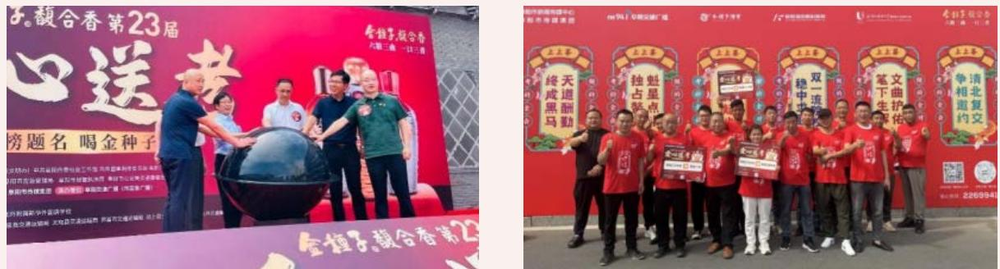

# 案例：程圩助学防溺水自救科普

8月22日，公司组织志愿者开展关爱学龄留守儿童，送上生活学习物资，同时进行防溺水自救科普。

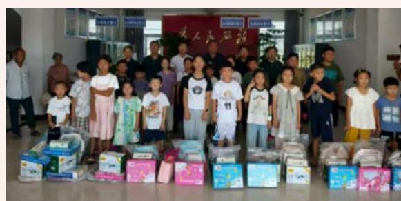

text_image

Group photo of children and adults gathered around boxes of packaged goods in a public indoor space, with visible Chinese banner text in the background.

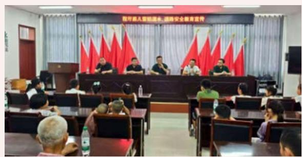

text_image

我厅第八章能灌灌、道路安全教育宣传

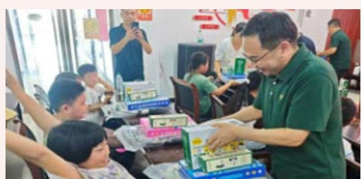

text_image

Classroom scene with teacher assisting students, visible product packaging and posters on walls

# 案例：金寨希望小镇助学

公司捐赠图书 200 册，采购 50 块体操垫为金寨希望小镇学子们搭建书香校园、完善体育设施。

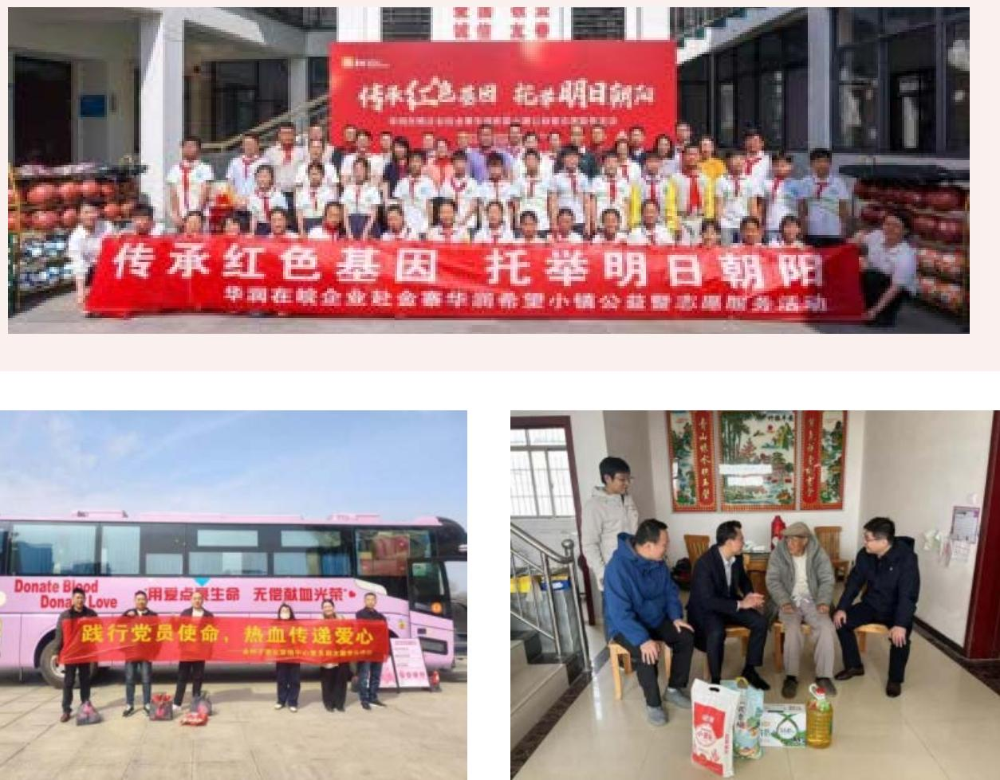  
义务献血  
“爱在重阳”慰问孤寡病弱老人

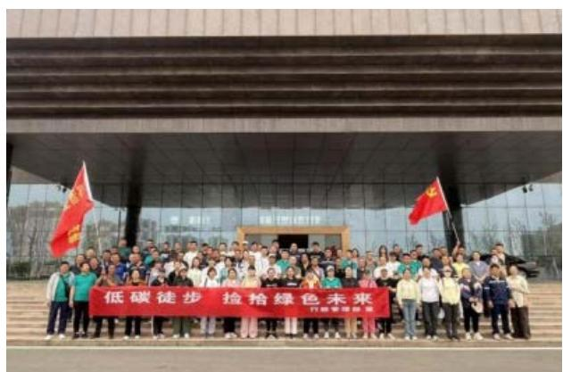

text_image

低碳徒步 拾拾绿色未来
行政管理部

低碳徒步，拾捡绿色未来

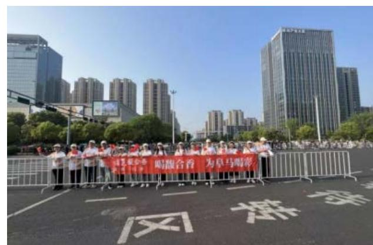

text_image

岗区
喝馥合香 为皇马喝彩

护航阜阳马拉松

# 践行乡村振兴

公司坚守国企担当，将助力乡村振兴作为履行社会责任的重要抓手，聚焦临泉县长官镇王营村定点帮扶工作，以党建为引领、产业为核心、民生为根本、治理为支撑，全方位推动乡村发展、乡村建设、乡村治理，扎实谱写乡村振兴新篇章。

# 筑牢红色堡垒

- 公司派驻专业驻村工作队，深耕王营村基层党建，全年组织6次党员大会，开展党的创新理论与惠农政策学习，推行“流动书包”送学上门，确保党的政策方针直达基层、深入人心；  
- 创新“退伍军人 + 党员”双带头机制，充分发挥党员先锋模范作用，凝聚乡村发展合力；  
- 推行“有事找书记工作法”，建立党员联户包片机制，全年化解矛盾纠纷47起，显著提升党组织凝聚力与号召力。

# 激活产业引擎

- 构建“党支部 + 合作社 + 农户”模式，带动120户脱贫户通过土地流转、入股分红、务工就业增收；  
- 推动特色种植、水产养殖成为村集体经济新增长点，有效盘活闲置资源，实现“单一田”向“聚宝盆”转变；  
- 建立“企业 + 村集体 + 农户”产销对接机制，做活帮扶联动，全年帮助村民销售特色产品6.1万余元；  
- 引入长官镇花篮编织厂，开设“乡村车间”，培训50名留守妇女掌握编织技艺，人均月增收800元；  
- 瞄准“农旅融合”潜力，开发“田园观光 + 农事体验”微旅游线路，做强三产融合，丰富乡村产业形态；  
- 协调上级有关部门开展为期四天的“巾帼创业就业电商直播培训班”，提升农村女性电商技能，拓宽创业增收渠道，助力女性实现自主创业。

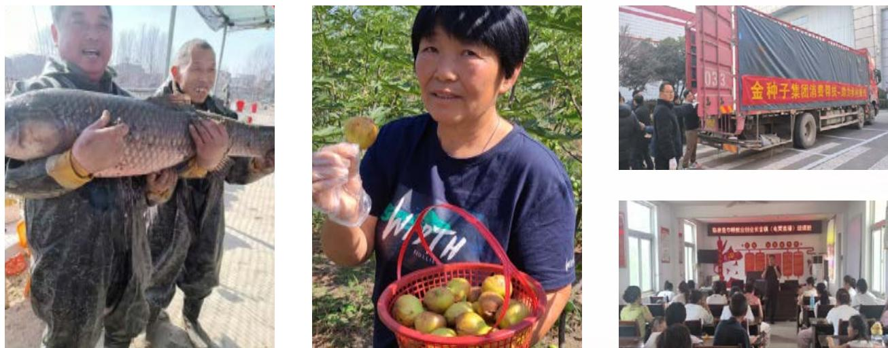

# 创新治理模式

- 推行“积分制 + 清单制”，依托捐赠的 1.4 万元物资，建立“积分超市”，村民参与环境整治、志愿服务可兑换生活用品，调动村民参与乡村建设的积极性；  
- 邀请镇司法所开展“法律讲堂”，增设“法治文化墙”“反诈宣传角”，针对留守老人易受骗问题，组织村“两委”干部党员志愿者深入自然村开展村头群众会，宣传防“电信诈骗”知识；  
- 协同王营村委会开展 2025 年度 “最美媳妇” “最美婆婆” “最美村嫂” 评选活动，树立文明榜样；  
- 开展 “纪念三八国际妇女节” “纪念抗日战争胜利 80 周年优秀退伍军人表扬” 等活动，对先进典型给予奖励，将其事迹搬上文化墙，引导村民践行 “孝老爱亲、邻里互助” 的良好风尚；  
- 开展“情暖重阳，银龄关爱”主题活动，采用“集中服务 + 上门慰问”双模式，关爱村内老年群体，传承尊老敬老传统美德；  
- 组建“志愿宣讲团”，8名“最美村嫂”、5名老党员义务宣讲政策、调解纠纷，推动乡村治理提质增效。

# 办好民生实事

- 集团聚焦民生福祉，用心办好惠民实事。协调资金硬化自然村巷道25条，推进主干道加宽修缮，全村道路硬化率达 $98\%$ ，解决群众出行难题；  
- 完善农家书屋、建成幸福院，健全文化与养老阵地；  
- 开展 5 次防返贫大走访，为监测户制定 “一户一策”，落实医疗、教育帮扶，为老人建立健康档案，办理低保、困难救助，筑牢防返贫底线；  
- 重点关注留守儿童、孤寡老人等群体，累计出资万余元，在重要节日送去生活物资与学习用品。

# 附录

ESG 数据绩效表

<table><tr><td></td><td>环境绩效</td><td>单位</td><td>2024年</td><td>2025年</td></tr><tr><td rowspan="3">能源</td><td>环保投入</td><td>万元</td><td>475</td><td>255</td></tr><tr><td>汽油</td><td>升</td><td>21,138</td><td>8,809.47</td></tr><tr><td>光伏发电项目发电量</td><td>千瓦时</td><td>506,100</td><td>666,300</td></tr><tr><td rowspan="2">温室气体</td><td>温室气体排放(范围一)</td><td>吨二氧化碳当量</td><td>1,148.44</td><td>39.56</td></tr><tr><td>温室气体排放(范围二)</td><td>吨二氧化碳当量</td><td>29,161.99</td><td>18,669.90</td></tr><tr><td>废气</td><td>颗粒物排放量</td><td>毫克/立方米</td><td>2.847</td><td>3.016</td></tr><tr><td rowspan="5">废水</td><td>总量</td><td>立方米</td><td>112,716</td><td>115,690</td></tr><tr><td>化学需氧量(COD)</td><td>毫克/升</td><td>7,735.38</td><td>6,176.44</td></tr><tr><td>氨氮</td><td>毫克/升</td><td>254.61</td><td>147.48</td></tr><tr><td>总磷</td><td>毫克/升</td><td>129.04</td><td>335.23</td></tr><tr><td>总氮</td><td>毫克/升</td><td>356.96</td><td>85.12</td></tr><tr><td rowspan="3">固废</td><td>固体废弃物总量</td><td>吨</td><td>70,299.77</td><td>60,154.93</td></tr><tr><td>一般固体废弃物总量</td><td>吨</td><td>70,291.38</td><td>60,145</td></tr><tr><td>危险废弃物回收总量</td><td>吨</td><td>8.39</td><td>9.93</td></tr></table>

<table><tr><td></td><td>社会绩效</td><td>单位</td><td>2024年</td><td>2025年</td></tr><tr><td rowspan="2">研发</td><td>研发投入</td><td>万元</td><td>2,406.29</td><td>1,738</td></tr><tr><td>研发投入比例</td><td>%</td><td>2.60</td><td>2.41</td></tr><tr><td rowspan="4">安全</td><td>工伤事故数</td><td>起</td><td>0</td><td>0</td></tr><tr><td>工伤人数</td><td>人</td><td>0</td><td>0</td></tr><tr><td>职业健康体检覆盖率</td><td>%</td><td>100</td><td>100</td></tr><tr><td>职业发病人数</td><td>人</td><td>0</td><td>0</td></tr></table>

<table><tr><td></td><td>社会绩效</td><td>单位</td><td>2024年</td><td>2025年</td></tr><tr><td rowspan="2">供应链</td><td>供应商数量</td><td>家</td><td>283</td><td>703</td></tr><tr><td>中国大陆供应商</td><td>家</td><td>283</td><td>699</td></tr><tr><td rowspan="25">员工</td><td>员工总数</td><td>人</td><td>2,018</td><td>1,688</td></tr><tr><td>男性员工</td><td>人</td><td>1,453</td><td>1,290</td></tr><tr><td>女性员工</td><td>人</td><td>565</td><td>398</td></tr><tr><td>51岁及以上</td><td>人</td><td>392</td><td>400</td></tr><tr><td>41岁至50岁</td><td>人</td><td>569</td><td>463</td></tr><tr><td>31岁至40岁</td><td>人</td><td>751</td><td>614</td></tr><tr><td>30岁以下</td><td>人</td><td>306</td><td>211</td></tr><tr><td>硕士及以上</td><td>人</td><td>21</td><td>18</td></tr><tr><td>本科</td><td>人</td><td>493</td><td>433</td></tr><tr><td>大专</td><td>人</td><td>548</td><td>453</td></tr><tr><td>大专以下</td><td>人</td><td>956</td><td>784</td></tr><tr><td>基层管理及员工总数</td><td>人</td><td>1,895</td><td>1,585</td></tr><tr><td>中级管理层员工总数</td><td>人</td><td>89</td><td>72</td></tr><tr><td>中级管理层中女性员工人数</td><td>人</td><td>8</td><td>8</td></tr><tr><td>高级管理层员工总数</td><td>人</td><td>34</td><td>31</td></tr><tr><td>高级管理层中女性员工人数</td><td>人</td><td>5</td><td>4</td></tr><tr><td>接受培训的员工总数</td><td>人</td><td>2,018</td><td>1,688</td></tr><tr><td>员工接受培训的总时长</td><td>小时</td><td>39,606</td><td>117,825</td></tr><tr><td>员工培训平均时长</td><td>小时</td><td>19.6</td><td>62</td></tr><tr><td>男性员工接受培训的总小时数</td><td>小时</td><td>24,342</td><td>88,975</td></tr><tr><td>女性员工接受培训的总小时数</td><td>小时</td><td>15,264</td><td>28,850</td></tr><tr><td>基层员工接受培训的总小时数</td><td>小时</td><td>32,455</td><td>100,910</td></tr><tr><td>中级管理层员工接受培训的总小时数</td><td>小时</td><td>6,009</td><td>16,415</td></tr><tr><td>高级管理层员工接受培训的总小时数</td><td>小时</td><td>1,142</td><td>500</td></tr><tr><td>社会保险覆盖率</td><td>%</td><td>100</td><td>100</td></tr><tr><td>公益</td><td>参与志愿活动的人数</td><td>人</td><td>900</td><td>617</td></tr></table>

# 指标索引

GRI 内容索引

<table><tr><td>使用说明</td><td>金种子酒在2025年1月1日至2025年12月31日参照GRI标准报告了在此份GRI内容索引中引用的信息。</td></tr><tr><td>使用的GRI 1 标准</td><td>GRI 1:基础2021</td></tr></table>

<table><tr><td>GRI 标准</td><td colspan="2">披露项</td><td>对应章节</td></tr><tr><td rowspan="14">GRI 2:一般披露 2021</td><td>2-1</td><td>组织详细情况</td><td>报告编制说明</td></tr><tr><td>2-2</td><td>纳入组织可持续发展报告的实体</td><td>报告编制说明</td></tr><tr><td>2-3</td><td>报告期、报告频率和联系人</td><td>报告编制说明</td></tr><tr><td>2-4</td><td>信息重述</td><td>数据绩效表</td></tr><tr><td>2-6</td><td>活动、价值链和其他业务关系</td><td>报告编制说明</td></tr><tr><td>2-7</td><td>员工</td><td>数据绩效表</td></tr><tr><td>2-9</td><td>管治架构和组成</td><td>公司治理</td></tr><tr><td>2-10</td><td>最高管治机构的提名和遴选</td><td>公司治理</td></tr><tr><td>2-12</td><td>在管理影响方面,最高管治机构的监督作用</td><td>ESG 管理</td></tr><tr><td>2-22</td><td>关于可持续发展战略的声明</td><td>董事长致辞</td></tr><tr><td>2-27</td><td>遵守法律法规</td><td>详见报告各章节</td></tr><tr><td>2-28</td><td>协会的成员资格</td><td>行业共进</td></tr><tr><td>2-29</td><td>利益相关方参与的方法</td><td>利益相关方沟通</td></tr><tr><td>2-30</td><td>集体谈判协议</td><td>员工权益与福利</td></tr><tr><td rowspan="3">GRI 3:实质性议题 2021</td><td>3-1</td><td>确定实质性议题的过程</td><td>议题重要性评估</td></tr><tr><td>3-2</td><td>实质性议题清单</td><td>议题重要性评估</td></tr><tr><td>3-3</td><td>实质性议题的管理</td><td>议题重要性评估ESG 管理</td></tr></table>

<table><tr><td>GRI 标准</td><td colspan="2">披露项</td><td>对应章节</td></tr><tr><td rowspan="2">GRI 201: 经济绩效2016</td><td>201-1</td><td>直接产生和分配的经济价值</td><td>数据绩效表</td></tr><tr><td>201-3</td><td>固定福利计划义务和其他退休计划</td><td>员工权益与福利</td></tr><tr><td>GRI 203: 间接经济影响2016</td><td>203-1</td><td>基础设施投资和支持性服务</td><td>服务社会公益践行乡村振兴</td></tr><tr><td rowspan="3">GRI 205: 反腐败2016</td><td>205-1</td><td>已经进行腐败风险评估的运营点</td><td>商业道德</td></tr><tr><td>205-2</td><td>反腐败政策和程序的传达及培训</td><td>商业道德</td></tr><tr><td>205-3</td><td>经确认的腐败事件和采取的行动</td><td>商业道德</td></tr><tr><td>GRI301: 物料2016</td><td>301-3</td><td>再生产品及其包装材料</td><td>循环经济</td></tr><tr><td rowspan="4">GRI 302: 能源2016</td><td>302-1</td><td>组织内部的能源消耗量</td><td>数据绩效表</td></tr><tr><td>302-3</td><td>能源强度</td><td>数据绩效表</td></tr><tr><td>302-4</td><td>降低能源消耗量</td><td>能源管理</td></tr><tr><td>302-5</td><td>降低产品和服务的能源需求量</td><td>能源管理</td></tr><tr><td rowspan="4">GRI 303: 水资源和污水2018</td><td>303-1</td><td>组织与水作为共有资源的相互影响</td><td>水资源管理</td></tr><tr><td>303-2</td><td>管理与排水相关的影响</td><td>水资源管理</td></tr><tr><td>303-4</td><td>排水</td><td>水资源管理</td></tr><tr><td>303-5</td><td>耗水</td><td>水资源管理</td></tr><tr><td rowspan="2">GRI 305: 排放2016</td><td>305-1</td><td>直接(范围1)温室气体排放</td><td>数据绩效表</td></tr><tr><td>305-2</td><td>能源间接(范围2)温室气体排放</td><td>数据绩效表</td></tr><tr><td rowspan="5">GRI 306: 废弃物2020</td><td>306-1</td><td>废弃物的产生及废弃物相关重大影响</td><td>固体废弃物管理</td></tr><tr><td>306-2</td><td>废弃物相关重大影响的管理</td><td>固体废弃物管理</td></tr><tr><td>306-3</td><td>产生的废弃物</td><td>固体废弃物管理</td></tr><tr><td>306-4</td><td>从处置中转移的废弃物</td><td>固体废弃物管理</td></tr><tr><td>306-5</td><td>进入处置的废弃物</td><td>固体废弃物管理</td></tr><tr><td rowspan="2">GRI 308: 供应商环境评估2016</td><td>308-1</td><td>使用环境评价维度筛选的新供应商</td><td>供应链管理</td></tr><tr><td>308-2</td><td>供应链的负面环境影响以及采取的行动</td><td>供应链管理</td></tr><tr><td rowspan="3">GRI 401:雇佣2016</td><td>401-1</td><td>新进员工雇佣率和员工流动率</td><td>员工权益与福利</td></tr><tr><td>401-2</td><td>提供给全职员工(不包括临时或兼职员工)的福利</td><td>员工权益与福利</td></tr><tr><td>401-3</td><td>育儿假</td><td>员工权益与福利</td></tr><tr><td rowspan="9">GRI 403:职业健康与安全2018</td><td>403-1</td><td>职业健康安全管理体系</td><td>职业健康与安全</td></tr><tr><td>403-2</td><td>危害识别、风险评估和事故调查</td><td>职业健康与安全</td></tr><tr><td>403-3</td><td>职业健康服务</td><td>职业健康与安全</td></tr><tr><td>403-5</td><td>工作者职业健康安全培训</td><td>职业健康与安全</td></tr><tr><td>403-6</td><td>促进工作者健康</td><td>职业健康与安全</td></tr><tr><td>403-7</td><td>预防和减缓与业务关系直接相关的职业健康安全影响</td><td>职业健康与安全</td></tr><tr><td>403-8</td><td>职业健康安全管理体系覆盖的工作者</td><td>职业健康与安全</td></tr><tr><td>403-9</td><td>工伤</td><td>职业健康与安全</td></tr><tr><td>403-10</td><td>工作相关的健康问题</td><td>职业健康与安全</td></tr><tr><td rowspan="3">GRI 404:培训与教育2016</td><td>404-1</td><td>每名员工每年接受培训的平均小时数</td><td>员工培训与发展</td></tr><tr><td>404-2</td><td>员工技能提升方案和过渡援助方案</td><td>员工培训与发展</td></tr><tr><td>404-3</td><td>接受定期绩效和职业发展考核的员工百分比</td><td>员工培训与发展</td></tr><tr><td>GRI 405:多元化与平等机会2016</td><td>405-1</td><td>管治机构与员工的多元化</td><td>员工权益与福利</td></tr><tr><td>GRI 413:当地社区2016</td><td>413-1</td><td>有当地社区参与、影响评估和发展计划的运营点</td><td>服务社会公益践行乡村振兴</td></tr><tr><td rowspan="2">GRI 414:供应商社会评估2016</td><td>414-1</td><td>使用社会评价维度筛选的新供应商</td><td>供应链管理</td></tr><tr><td>414-2</td><td>供应链的负面社会影响以及采取的行动</td><td>供应链管理</td></tr><tr><td>GRI 417:营销与标识2016</td><td>417-1</td><td>对产品和服务信息与标识的要求</td><td>责任营销</td></tr><tr><td>GRI 418:客户隐私2016</td><td>418-1</td><td>涉及侵犯客户隐私和丢失客户资料的经证实的投诉</td><td>信息安全与隐私保护</td></tr></table>

央企控股上市公司 ESG 专项报告参考指标体系

<table><tr><td colspan="2">对应章节</td><td>《央企控股上市公司 ESG 专项报告参考指标体系》</td></tr><tr><td colspan="2">董事长致辞</td><td>/</td></tr><tr><td colspan="2">关于金种子酒</td><td>/</td></tr><tr><td colspan="2">金种子酒的 2025</td><td>/</td></tr><tr><td colspan="2">ESG 管理</td><td>/</td></tr><tr><td rowspan="5">党建引领 合规强基</td><td>党建领航</td><td>G1.1</td></tr><tr><td>公司治理</td><td>G1.1-1.2</td></tr><tr><td>投资者关系管理与信息披露</td><td>G3.1-3.2, G4.1-4.2</td></tr><tr><td>合规经营</td><td>G2.1, G5.1-5.2</td></tr><tr><td>商业道德信息安全与隐私保护</td><td>G2.2-2.3</td></tr><tr><td rowspan="5">绿色酿造 低碳共生</td><td>应对气候变化</td><td>E3.1-3.4, E5.1</td></tr><tr><td>环境管理</td><td>E5.5-5.6</td></tr><tr><td>能源管理</td><td>E1.3</td></tr><tr><td>资源管理与循环经济</td><td>E1.1-1.2</td></tr><tr><td>废弃物管理</td><td>E2.1-2.3</td></tr><tr><td rowspan="8">质创双驱 客户至上</td><td>产品质量保障</td><td>S2.1</td></tr><tr><td>研发与创新</td><td>S2.3</td></tr><tr><td>行业共进</td><td>/</td></tr><tr><td>知识产权保护</td><td>G2.3</td></tr><tr><td>数字化赋能</td><td>/</td></tr><tr><td>客户权益</td><td>S2.2</td></tr><tr><td>责任营销</td><td>S2.2</td></tr><tr><td>供应链管理</td><td>S3.1-3.2</td></tr><tr><td rowspan="3">人才为本 聚力成长</td><td>员工权益与福利</td><td>S1.1, S1.5</td></tr><tr><td>员工培训与发展</td><td>S1.2, S1.4</td></tr><tr><td>职业健康与安全</td><td>S1.3</td></tr><tr><td rowspan="2">初心如磐 回馈社会</td><td>服务社会公益</td><td>S4.2-4.3</td></tr><tr><td>践行乡村振兴</td><td>S4.4</td></tr></table>

# 《上海证券交易所上市公司自律监管指引第 14 号——可持续发展报告（试行）》议题索引表

<table><tr><td>维度</td><td>议题</td><td>对应条款</td><td>对应章节</td></tr><tr><td rowspan="8">环境</td><td>应对气候变化</td><td>第二十一条至第二十八条</td><td>应对气候变化</td></tr><tr><td>污染物排放</td><td>第三十条</td><td>废弃物管理</td></tr><tr><td>废弃物处理</td><td>第三十一条</td><td>废弃物管理</td></tr><tr><td>生态系统和生物多样性保护</td><td>第三十二条</td><td>不适用</td></tr><tr><td>环境合规管理</td><td>第三十三条</td><td>环境管理</td></tr><tr><td>能源利用</td><td>第三十五条</td><td>能源管理</td></tr><tr><td>水资源利用</td><td>第三十六条</td><td>资源管理与循环经济</td></tr><tr><td>循环经济</td><td>第三十七条</td><td>资源管理与循环经济</td></tr><tr><td rowspan="9">社会</td><td>乡村振兴</td><td>第三十九条</td><td>践行乡村振兴乡村振兴议题与公司主营业务、核心价值链关联度较低,未对公司经营、财务及利益相关方构成重大影响,经评估该议题不具有财务重要性或影响重要性</td></tr><tr><td>社会贡献</td><td>第四十条</td><td>服务社会公益社会贡献议题与公司主营业务、核心价值链关联度较低,未对公司经营、财务及利益相关方构成重大影响,经评估该议题不具有财务重要性或影响重要性</td></tr><tr><td>创新驱动</td><td>第四十二条</td><td>研发与创新</td></tr><tr><td>科技伦理</td><td>第四十三条</td><td>不适用</td></tr><tr><td>供应链安全</td><td>第四十五条</td><td>供应链管理</td></tr><tr><td>平等对待中小企业</td><td>第四十六条</td><td>不存在通过国家企业信用信息公示系统向社会公示逾期尚未支付中小企业款项信息的情形。经评估该议题不具有财务重要性或影响重要性</td></tr><tr><td>产品和服务安全与质量</td><td>第四十七条</td><td>产品质量保障客户权益</td></tr><tr><td>数据安全与客户隐私保护</td><td>第四十八条</td><td>信息安全与隐私保护</td></tr><tr><td>员工</td><td>第五十条</td><td>人才为本聚力成长</td></tr><tr><td rowspan="4">可持续发展相关治理</td><td>尽职调查</td><td>第五十二条</td><td>ESG管理</td></tr><tr><td>利益相关方沟通</td><td>第五十三条</td><td>ESG管理</td></tr><tr><td>反商业贿赂及反贪污</td><td>第五十五条</td><td>商业道德</td></tr><tr><td>反不正当竞争</td><td>第五十六条</td><td>商业道德经评估该议题不具有财务重要性或影响重要性</td></tr></table>

# 意见反馈表

本报告是金种子酒向社会公开发布的第二份环境、社会与公司治理（Environmental, Social and Governance，简称 ESG）报告。为了持续改进公司 ESG 管理工作，不断提高履行 ESG 责任的能力和水平，我们非常希望倾听您的意见和建议。恳请您协助完成反馈意见表中提出的相关问题，并选择以下方式反馈给我们。

1. 您对本报告的总体评价是：

□非常好 □好 □一般 □较差 □差

2. 您认为本报告是否能全面、准确地反映公司对治理、社会、环境的重大影响？

□非常好 □好 □一般 □较差 □差

3. 您认为本报告对利益相关方所关心问题的回应和披露质量如何？

□非常好 □好 □一般 □较差 □差

4. 您认为本报告披露的信息、指标，数据的清晰、准确、完整度如何？

□非常好 □好 □一般 □较差 □差

5. 您认为本报告的可读性，即按报告的逻辑主线、内容设计、语言文字和版式设计如何？

□非常好 □好 □一般 □较差 □差

开放性问题

本报告最让您满意的方面是什么？

对我们今后的 ESG 报告有何建议？

# 金種子酒業

# ANHUI GOLDEN SEED WINERY CO.,LTD