# 2025|环境、社会 和公司治理(ESG)报告

2025 ENVIRONMENTAL, SOCIAL ANDGOVERNANCE (ESG)REPORT

中稀有色金属股份有限公司

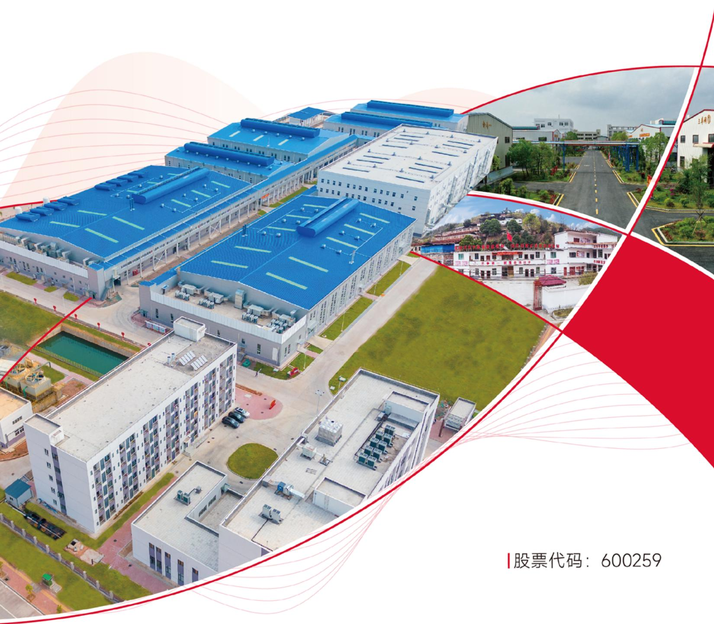

text_image

股票代码：600259

# CONTENTS

# 目录

# 专题

践行国企使命，实现战略转型新突破 13

# 01

# 可持续发展治理

可持续发展目标与愿景 17

可持续发展治理架构 18

可持续发展实践 18

利益相关方沟通 19

重要性议题管理 20

关于本报告 03

董事会致辞 05

走进中稀有色 07

附录 99

# 02

# 精耕管理提效能 严守合规固根基

党建引领发展 23

完善公司治理 25

维护股东权益 29

强化合规风控 31

恪守商业道德 33

# 专题

精益节能降耗 赋能绿色生产 37

# 03

# 绿矿赋能启新程生态协同谱华章

践行气候责任 41

严守环境合规 45

资源精益配置 54

生态共生守护 57

# 专题

笃行实干创新 铸就大国重器 59

# 04

# 科创引领强质效数智赋能兴产业

科创驱动发展 63

匠造品质根基 71

筑牢信息防线 77

负责任供应链 77

# 专题

精育骨干力量 赋能企业发展 79

# 05

# 同心聚力护民生公益担当向未来

厚植员工福祉 83

守护职业健康 90

践行社会责任 97

text_image

RE

# 关于本报告

# >报告说明

本报告是中稀有色金属股份有限公司发布的第四份环境、社会与公司治理（ESG）报告，报告遵循客观、规范、透明及全面的原则，详细披露了中稀有色在环境、社会和公司治理方面采取的实践举措以及所取得的成绩。

# > 时间范围

本报告为年度报告，时间跨度为 2025 年 1 月 1 日至 2025 年 12 月 31 日，为增强报告可比性及前瞻性，部分内容有所延伸。

# >报告范围

本报告以 “中稀有色” 为主体，如无特别说明，本报告的组织范围覆盖中稀有色金属股份有限公司及各所属企业（具体详见中稀有色金属股份有限公司 2025 年年度报告）。

# > 编制依据

·上海证券交易所《上海证券交易所上市公司自律监管指引第14号——可持续发展报告（试行）》  
·上海证券交易所《上海证券交易所上市公司自律监管指南第4号——可持续发展报告编制（2026年1月修订）》  
·国资委办公厅《央企控股上市公司 ESG 专项报告参考指标体系》  
·全球报告倡议组织《GRI 可持续发展报告标准（GRI Standards）》  
·中国企业改革与发展研究会等《中国企业可持续发展报告指南（CASS-ESG 6.0）》之一般框架  
·联合国可持续发展目标（SDGs）

# > 资料来源及可靠性保证

本报告引用的全部信息数据均来自中稀有色正式文件、统计报告及财务报告，涵盖公司各部门及经营单位的内部数据和公开信息，并经公司统计、汇总与审核。同时，为确保阐释的完整性与连续性，公司在特定议题下对部分内容予以回顾和延展。货币计量若无特别标注，均采用人民币为计量单位。如财务数据与年报不一致，以年报为准。

# > 称谓说明

在本报告书中，为便于表述和阅读，中稀有色金属股份有限公司及其所属企业根据行文具体情况，简称“中稀有色”“公司”或“我们”，具体表述参考中稀有色金属股份有限公司2025年年度报告。

<table><tr><td>释义项</td><td>释义内容</td></tr><tr><td>中稀有色、广晟有色、公司、企业、我们</td><td>中稀有色金属股份有限公司</td></tr><tr><td>中国稀土集团、集团</td><td>中国稀土集团有限公司</td></tr><tr><td>广东稀土集团</td><td>广东省稀土产业集团有限公司</td></tr><tr><td>广晟控股</td><td>广东省广晟控股集团有限公司</td></tr><tr><td>有色集团、广晟矿业</td><td>广东省广晟矿业集团有限公司</td></tr><tr><td>华企公司</td><td>平远县华企稀土实业有限公司</td></tr><tr><td>富远公司</td><td>广东省富远稀土有限公司</td></tr><tr><td>大埔公司</td><td>大埔县新诚基工贸有限公司</td></tr><tr><td>红岭公司</td><td>翁源红岭矿业有限责任公司</td></tr><tr><td>石人嶂公司</td><td>韶关石人嶂矿业有限责任公司</td></tr><tr><td>兴邦公司</td><td>德庆兴邦稀土新材料有限公司</td></tr><tr><td>嘉禾公司</td><td>清远市嘉禾稀有金属有限公司</td></tr><tr><td>和利公司</td><td>龙南市和利稀土冶炼有限公司</td></tr><tr><td>晟源公司</td><td>广东晟源永磁材料有限责任公司</td></tr><tr><td>东电化公司</td><td>广东东电化广晟稀土高新材料有限公司</td></tr><tr><td>进出口公司</td><td>广东广晟有色金属进出口有限公司</td></tr><tr><td>瑶岭公司</td><td>广东韶关瑶岭矿业有限公司</td></tr><tr><td>大宝山公司/大宝山矿</td><td>广东省大宝山矿业有限公司</td></tr><tr><td>国务院国资委</td><td>国务院国有资产监督管理委员会</td></tr></table>

# >报告获取

为了践行低碳环保和可持续发展的理念，本报告可以在上交所网站（http://www.sse.com.cn）在线阅读或下载报告电子版，如果您还想了解本报告以外的公司其他信息，可查阅公司年度财务报告或浏览公司网站。

如有任何反馈及建议，请通过以下方式联系我们

通信地址

广州市番禺区汉溪大道东 386 号
广晟万博城 A 塔写字楼 36-37 楼

系电话 (020)87073456

公司网址 www.gsysgf.com

# 董事会致辞

2025 年，是中稀有色融入中国稀土集团后从“整合适应”迈向“战略转型”的关键一年。我们以习近平新时代中国特色社会主义思想为指导，贯彻新发展理念，践行“资源报国、稀土强国”使命，将 ESG 理念融入企业发展全局，在治理、绿色、创新、社会责任等方面成效显著，Wind ESG 评级从 BBB 级升至 A 级，践行国企高质量发展责任。2025 年公司实现营业收入 58.20 亿元，归属于上市公司股东的净利润 1.28 亿元，同比实现扭亏为盈，并向全体股东合计派发现金红利 50,465,386.50 元（含税），首次实现分红。

坚持治理筑基，激活发展动能。深化国企改革深化提升行动，推进“瘦身健体”优化组织架构，总部管理人员占比由33%降至19%，专业人员占比提升至81%。践行董事会“211”模式，完善“决策层—管理层—执行层”三级ESG治理体系，信息披露零差错，获评“2025年上市公司董事会最佳实践案例”“2025年度上市公司信息披露水晶球奖”。构建“1+1+N”合规制度体系，筑牢合规经营防线，保障企业稳健发展。

坚持绿色引领，厚植生态底色。将绿色发展作为核心战略，全年环保投入6,100万元，污染物监测合格率、环保设施同步运转率均达100%。推进碳达峰行动，各所属企业更换节能伺服电机190台，采购绿电462.12万Kwh。华企公司离子型稀土矿生物开采技术实现产业化，富远公司高盐废水零排放技术入选国资委推广目录，红岭公司极低品位钨矿利用技术纳入自然资源部先进适用技术目录，推动资源开发与生态保护协同发展。

坚持创新驱动，锻造核心优势。聚焦主业深耕技术创新，全年研发经费9,663.44万元，新增授权专利11项，累计达150项。晟源公司“高性能高一致性烧结钕铁硼磁体制备关键技术”获广东省科技进步奖二等奖，兴邦公司“高纯中重稀土氧化物”项目获“创客广东”大赛一等奖，华企公司矿山数字化技术入选稀土科学技术奖申报项目。深化产学研协同，与中南大学、中国稀土集团永磁院士工作站合作，推动关键技术产业化，培育省级科技专家工作站、博士工作站，增强创新后劲。

坚持责任担当，共享发展成果。始终坚持以人为本，完善员工薪酬福利与职业发展通道，开展各类培训，提升全员专业技能与综合素质。践行社会责任，助力乡村振兴，通过消费帮扶、公益捐赠回馈社会。深化客户服务，客户投诉解决率100%，赢得市场认可。

2026 年是 “十五五” 规划谋划开局关键年，中稀有色将坚守可持续发展理念，高标准推进治理升级、完善 ESG 管理体系；实举措深化绿色转型、推进节能降碳；大力度攻坚科技创新、聚焦稀土高端材料与绿色工艺研发；厚情怀履行社会责任，实现企业、员工、社会协同发展。我们将牢记 “发展企业、造福于民” 初心，履行央企上市公司担当，真抓实干，开创高质量发展新局面，为国家稀土产业贡献力量，回报股东、成就员工、奉献社会！

# 走进中稀有色

# > 公司简介

中稀有色金属股份有限公司（证券简称：中稀有色，证券代码：600259）是中国稀土集团的核心上市公司，由始建于1953年的广东省冶金厅、1983年成立的中国有色金属工业广州公司沿革而来。2024年1月，国务院国有资产监督管理委员会批复，同意广晟控股将其所持有的广东稀土集团100%股权无偿划转给中国稀土集团，本次股权划转后，中国稀土集团成为公司的实际控制人。2025年12月26日，公司更名为“中稀有色金属股份有限公司”，证券简称为“中稀有色”。

公司是广东省内稀土资源的唯一合法开采企业，截至报告期末，拥有全资、控股企业16家，员工总数938人，主要从事稀土矿开采、冶炼分离、深加工以及有色金属贸易业务，横向构筑“稀土、钨、铜”三大产业布局，纵向打造“矿山开采、冶炼分离、精深加工、贸易流通与进出口”完整的稀土产业链，生产品包括稀土精矿、混合稀土、稀土氧化物、稀土永磁材料等。

# > 产业布局

公司作为广东区域唯一稀土资源合法开采企业，持有目前广东省内获批的全部稀土采矿证，具备稀土全产业链优势。公司拥有稀土全元素分离能力，在中重稀土领域具有突出的竞争优势，是全球重要的中重稀土产品生产企业和供应商。

# 中稀有色业务优势

# 稀土板块

·资源优势：公司拥有广东省内全部3本稀土采矿证，其中新丰稀土矿是全国储量最大的离子型稀土矿山。  
·冶炼分离技术：控股3家南方离子吸附型稀土矿冶炼分离厂，掌握国内最先进的冶炼分离技术。  
·产业链延伸：投资设计年产8,000吨高性能钕铁硼磁性材料晟源公司，并与世界500强企业TDK公司合资成立东电化公司，具备先进的高性能烧结钕铁硼生产技术和装备。

# 钨板块

·钨矿资源：公司参控股广东省内2家钨矿山，其中红岭钨矿已探明钨矿资源量6.4万吨，为国内大型露天开采钨矿山。近期红岭矿区内资源综合勘查项目，已完成第一阶段找矿预测工作。  
·转型升级：通过实施大型专业化白钨资源开发升级，钨板块未来将成为公司新的盈利增长点。

# 铜硫板块

·资源开发：参股广东省大宝山矿，该矿铜、硫、钨、钼资源丰富，拥有华南地区规模最大的铜硫采场和选厂，以及广东省内最大的钨综合回收选厂。  
·绿色发展：致力于打造生态友好、技术一流、效益领先的全国绿色矿山建设示范基地，推动资源开发与环保协同发展。

# 贸易板块

·贸易优势：公司以高质量贸易推动主业发展，建立了健全的贸易风险管控体系，并拥有强大的市场营销团队。  
·历史积淀：依托逾40年的进出口经验，并拥有开展境外业务的平台窗口，国际化布局稳步推进。

# 中稀有色主要产品

稀土氧化物  
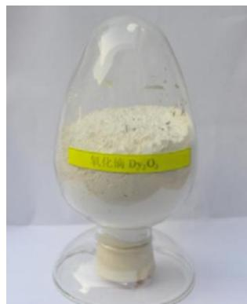

text_image

氧化镝 Dy₂O₃

氧化镝

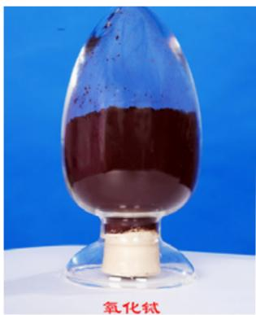

text_image

氧化钛

氧化铽

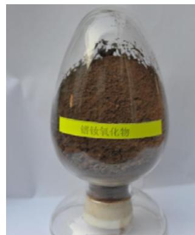

text_image

镀钕氧化物

镨钕氧化物

N52H 成品  

natural_image

Close-up of a textured surface with uniform gray squares, no visible text or symbols

主要钨产品  
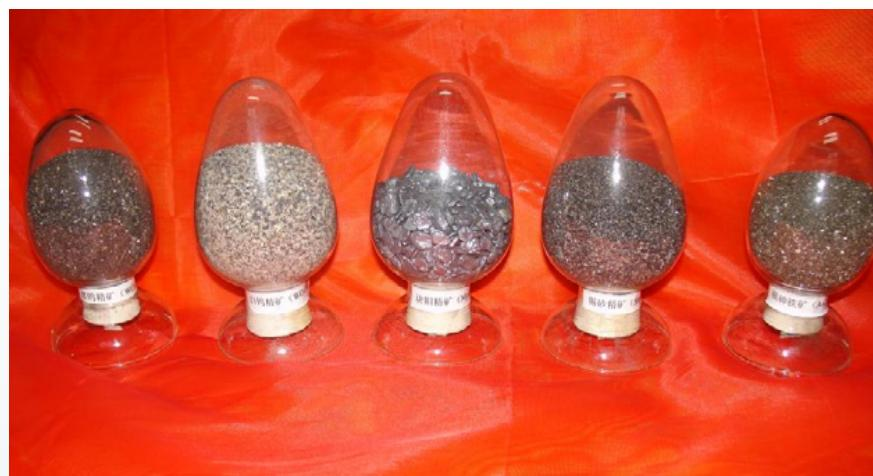

natural_image

Six glass domes containing granular material on red fabric, labeled with mineral types (no text or symbols visible)

烧结钕铁硼磁体  
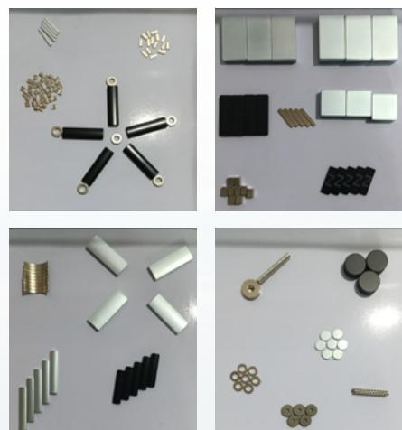

# > 企业文化

# 企业理念

政治建企

党建强企

资源立企

改革活企

科技兴企

# 企业使命

政治建企

党建强企

资源报国

稀土强国

# 企业价值观

聚焦价值创造，突出效率效益

# 企业经营方针

以党建为引领，以资源为依托，以市场为导向，以创新为动力

# >发展历程

2009。

·公司成功借壳“ST兴业聚酯”，在上交所上市；  
·收购大埔五丰稀土矿采矿权证，成立大埔县新诚基工贸有限公司；  
·收购嘉禾公司 30.5% 股权，成为嘉禾公司第一大股东。

2011。

\- 有色集团将 $50.02\%$ 股权无偿划给广晟控股，广晟控股成为广晟有色第一大股东。

2013°

· 与世界 500 强企业 TDK 合资成立广东东电化广晟稀土高新材料有限公司，实现产业链延伸重大突破。

# RE

• 2010

·成功扭亏摘帽，股票名称由“ST有色”更名为“广晟有色”。

• 2012

·氧化铕、氧化镧获得“第二届中国新材料产业博览会金奖”，铸就企业新品牌。

# 2025 °

· 公司更名为 “中稀有色金属股份有限公司”，证券简称为 “中稀有色”。2025 年 12 月 26 日起，公司以新名称全面开展经营活动。

# 2023 °

- 公司全年实现营收 208 亿元，实现利润总额 2.97 亿元；  
·省重点项目——晟源公司高性能永磁项目投料试产仪式成功举行；  
·公司总部乔迁至广晟万博城；  
·东电化公司永磁材料项目（二期）奠基仪式  
·公司获表彰为“全国稀土行业领军企业”；  
·公司荣获“2023年上市公司董事会优秀实践案例”奖；  
·公司荣登“中国上市公司 ESG 百强”榜单。

# 2020。

·广晟控股将广晟有色42.87%股权无偿划转至广东稀土集团，公司获得稀土办证主体资格；  
·战略收购华南最大铜硫矿大宝山矿 40% 股权，成功打造第三支柱产业；  
·华企公司成功取得扩界整合后新采矿许可证，新增稀土资源储量1.1万吨。

# 2019。

\- 推动片区企业一体化管控，实现优势互补和降本增效，为公司成功扭亏增盈奠定基础。

# 2017°

\- 红岭公司《极低品位复杂稀有金属矿产资源综合利用关键技术》获2017年度广东省科学技术一等奖。

# 2015°

\- 启动实施员工持股计划，推动员工与公司发展形成利益共同体。

# • 2024

·2024 年 1 月，国务院国有资产监督管理委员会批复，同意将广晟控股所持有广东稀土集团 100% 股权无偿划转给中国稀土集团。

# • 2022

·完成公司第三次非公开发行股票，募集资金13.96亿元，为公司重大项目建设提供坚实资金保障；  
·成功取得全国最大离子型稀土矿——新丰稀土矿采矿证，新增稀土资源储量 11.14 万吨；  
·富远公司异地搬迁升级改造项目成功实现当年建设当年投产。

# • 2021

- 全国政协常委、稀土磁材领军人物李卫院士唯一一个院士工作站落户广晟有色；  
- 华企公司成功取得安全设计审查批复，为规模化开采奠定基础；  
- 红岭公司成功办获新采矿证，新增钨矿资源金属量6.4万吨。

# • 2018

·公司党委提出“三步走”发展战略，为公司发展指明方向。

# • 2016

·推动 2 家钨矿山股权市场化转让，有效盘活钨矿企业资产；  
·完成公司第二次非公开发行股票，募集资金13.55亿元，为公司产业发展奠定坚实基础。

# • 2014

·关联企业广东稀土集团获得工信部备案，成功跻身国家级稀土集团；  
·圆满完成公司首次非公开发行股票，募集资金4.99亿元。

# > 2025 年所获荣誉

2025 年上市公司董事会最佳实践案例

中国上市公司协会

2025年度上市公司信息披露水晶球奖

证券市场周刊

2025年广东省博士工作站

广东省人力资源和社会保障厅

广东省科技专家工作站

广东省科学技术协会

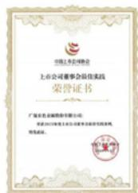

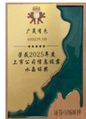

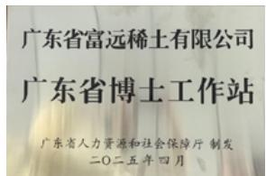

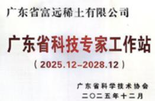

第十届“创客中国”广东省中小企业创新创业大赛暨第九届“创客广东”大赛决赛一等奖

广东省工业和信息化厅与东莞市人民政府

# 2025年广东省制造业500强企业

广东省制造业协会、广东省发展和改革研究院、暨南大学产业经济研究院

# 专精特新中小企业

广东省工业和信息化厅

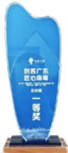

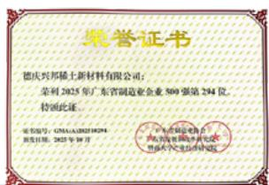

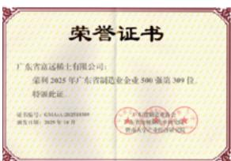

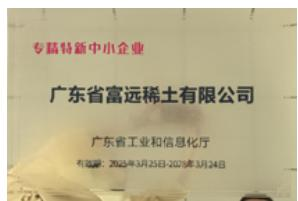

# > 2025 年亮点绩效

<table><tr><td colspan="3">经济绩效</td></tr><tr><td>营业收入</td><td>归母净利润</td><td>纳税总额</td></tr><tr><td>582,001.71 万元</td><td>12,755.59 万元</td><td>15,349 万元</td></tr><tr><td>基本每股收益</td><td>资产总额</td><td></td></tr><tr><td>0.38 元/股</td><td>687,539.66 万元</td><td></td></tr></table>

<table><tr><td colspan="3">环境绩效</td></tr><tr><td>污染物监测合格率100%</td><td>环保设施同步运转率100%</td><td>建设项目环保“三同时”执行率100%</td></tr><tr><td>环保投入总金额6,100万元</td><td>能源消耗总量9,617.16吨标准煤</td><td>总用水量1,054.03吨</td></tr></table>

<table><tr><td colspan="3">社会绩效</td></tr><tr><td>员工总人数938人</td><td>劳动合同签订率100%</td><td>社会保险覆盖率100%</td></tr><tr><td>员工培训总投入35.95万元</td><td>员工培训总时长11,220小时</td><td>安全生产投入1,420万元</td></tr><tr><td>研发经费投入9,553.96万元</td><td>客户投诉解决率100%</td><td></td></tr></table>

<table><tr><td colspan="3">治理绩效</td></tr><tr><td>股东会会议6次</td><td>董事会会议12次</td><td>召开党委会次数26次</td></tr><tr><td>董事会女性董事占比11.11%</td><td>董事会独立董事占比33.33%</td><td></td></tr></table>

# 专题

# 践行国企使命 实现战略转型新突破

2025 年是 “十四五” 规划的收官之年，面对稀土行业错综复杂的国际国内形势、公司改革转型与历史包袱重压下，公司坚持以习近平新时代中国特色社会主义思想为指导，以 “铁” 的意志深化改革，以 “钢” 的韧劲优化布局，以 “火” 的淬炼提质增效，围绕 “价值创造” 核心，打赢 “扭亏增盈、提质增效、破旧立新” 三大战役。

01

# 提质增效

夯实可持续运营“基本盘”

工贸协同，降本增效。公司坚持价值创造导向，深化工贸营销协同，采购端发挥“541”模式优势严控原料成本；销售端采取“长协锁定+动态营销+内外协同”策略，推动主产品销量稳步增长、效益持续提升，同步盘活存量资产及历史库存，资金周转效率显著提高。对内纵深推进全要素成本对标与精益管控，三项费用及融资成本有效压降，各生产单元深挖内潜，物耗水平与生产成本持续优化，集中采购效能不断释放。

深化改革，激活组织。公司高质量完成国企改革深化提升行动，以“瘦身健体”优化管理架构，总部管理人员占比由33%降至19%，专业人员占比提升至81%，人岗匹配度与运行效率明显增强。依托“四专协同”攻坚机制，扎实推进法人压减与亏损治理，资产结构与盈利能力持续改善。深入践行董事会“211”模式，公司治理效能稳步提升，获评“2025年上市公司董事会最佳实践案例”，信息披露保持零差错，为高质量发展筑牢坚实根基。

02

# 产业布局优化

构建绿色低碳“新格局”

资源保障，绿色先行。华企仁居矿完成资源详勘并通过专家评审，为稳产高产提供有力支撑；红岭北部探矿工作有序推进，资源保障能力进一步巩固。华企公司离子型稀土矿生物开采技术实现产业化示范应用，为绿色矿山建设提供新路径，有效减少生态扰动，守护生态环境。

产能升级，链式发展。晟源公司高性能钕铁硼项目产能稳步提升，磁材应用领域持续拓展。红岭公司白钨项目取得关键突破，钨矿资源综合利用技术攻关成功，为构建“稀土+稀有”双轮驱动发展格局奠定坚实基础，推动资源高效集约利用。

03

# 科技创新驱动

锻造绿色发展“硬实力”

绿色技术，行业领先。公司坚持创新驱动发展战略，以技术创新赋能产业绿色转型。兴邦公司攻克高氟矿处理难题，突破5N高纯氧化钇量产及低放射性氧化镥制备技术，构筑差异化竞争优势；富远公司高盐废水零排放技术荣获稀土科学技术二等奖，并入选国资委推广目录；晟源公司突破大尺寸磁体工艺，生产成本显著下降；红岭公司极低品位钨多金属矿绿色高效利用技术入选自然资源部《矿产资源节约与综合利用先进适用技术目录（2025年版）》。多项科技成果荣获省级重要奖项，科研平台实力持续增强，为企业高质量发展注入强劲绿色动能。

# 01

# 可持续发展治理

# > 可持续发展目标与愿景

中稀有色作为中国稀土与有色金属行业的领军企业，坚持高效绿色发展，积极响应联合国可持续发展目标（SDGs）与国家“双碳”战略，将低碳发展融入整体战略。公司以技术创新提升资源利用效率，推进绿色低碳、智能安全的产业升级，积极履行社会责任，深化 ESG 治理与风险防控，以实干担当推动公司高质量可持续发展。

# □ 贡献联合国可持续发展目标（SDGs）

中稀有色立足行业特性，围绕联合国可持续发展目标（SDGs），积极开展 ESG 实践工作，实现公司可持续发展。

<table><tr><td>维度</td><td>SDGs</td><td>我们的响应</td></tr><tr><td>公司治理</td><td>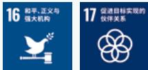</td><td>持续完善治理体系,坚持党建引领,牢固树立合规经营理念,切实维护股东及投资者合法权益,不断深化廉洁文化建设,以规范高效的治理保障企业长期稳健、可持续发展。</td></tr><tr><td>环境保护</td><td>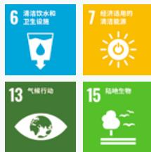</td><td>积极应对气候变化,推进碳减排与绿色矿山建设,推动低碳转型。持续开展生态修复、矿山复绿及生物多样性保护,不断完善环境管理体系,促进人与自然和谐共生。</td></tr><tr><td>产业价值</td><td>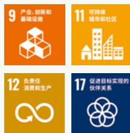</td><td>持续完善研发创新体系,积极引进高素质专业人才;同时构建负责任供应链体系,切实保障产品质量与消费者合法权益。</td></tr><tr><td>人力资源</td><td>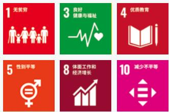</td><td>坚持安全规范运营;同时制定并落实性别平等政策,切实保障员工职业发展与合法权益,积极构建平等包容的企业文化;搭建多元化职业发展通道,健全人才梯队建设体系,全面赋能员工成长与发展。</td></tr></table>

# > 可持续发展治理架构

中稀有色将可持续发展理念融入公司日常管理与运营决策全过程，构建并持续完善“决策层—管理层—执行层”三级联动的 ESG 管理体系，通过明确各层级职责，强化统筹推进、过程监督与落地执行，为公司环境、社会及治理各项工作规范、高效、有序开展提供保障。

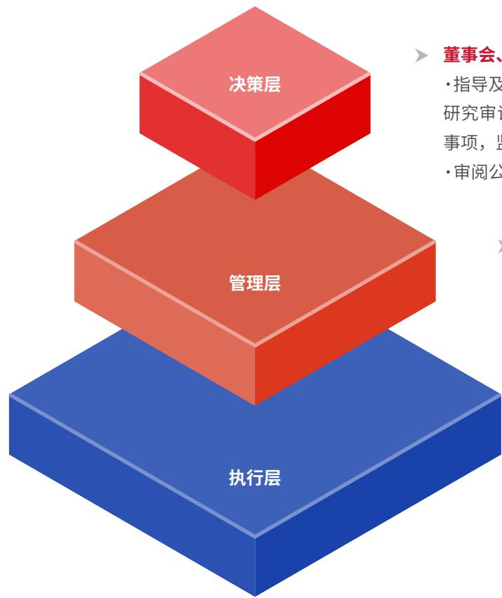

flowchart

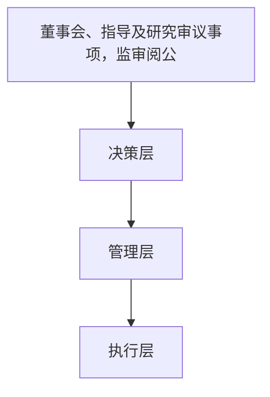
```mermaid
graph TD
  A["董事会、指导及研究审议事项，监审阅公"] --> B["决策层"]
  B --> C["管理层"]
  C --> D["执行层"]
```

# 董事会、战略与可持续发展委员会

\- 指导及审阅公司总体的 ESG 理念、绩效目标及实施计划，研究审议公司环境保护、社会责任、公司治理等 ESG 重大事项，监督目标实施进度并提供建议；
- 审阅公司可持续发展相关披露文件。

# 各职能部门负责人

\- 制定 ESG 工作方案；
- 编制及发布 ESG 报告；
- 管理 ESG 议题实践。

# 各职能部门、所属企业

\- 协助编制 ESG 报告，执行可持续发展工作计划；
- 负责公司可持续相关管理、数据统计与分析；
- 就工作成果向管理层汇报。

# > 可持续发展实践

# 2025年度ESG启动与培训大会

中稀有色组织召开 2025 年度 ESG 启动与培训大会。公司邀请外部专业机构，围绕 ESG 理念、政策法规、实践案例等内容开展专题培训，公司高管及各部门管理人员等通过线上线下方式共同参与。本次大会标志着公司 2025 年度 ESG 工作正式启航。公司将以此次启动为契机，持续提升可持续发展能力，以实际行动践行企业责任。

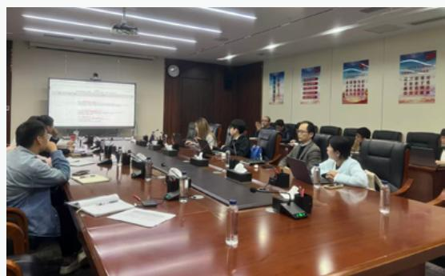

text_image

Meeting room photo with visible presentation screen and wall posters, showing attendees seated at a long table

# > 利益相关方沟通

中稀有色重视各利益相关方的意见与诉求，通过识别并明确七大关键利益相关方，依托多元化沟通渠道充分倾听、积极回应各方关切与期望，将相关议题全面融入经营决策，稳步推动公司高质量可持续发展。

<table><tr><td>利益相关方</td><td>关注议题</td><td>沟通与回应</td></tr><tr><td rowspan="5">政府及监管部门</td><td>健康与安全</td><td>政府接待及走访</td></tr><tr><td>响应国家战略</td><td>政府沟通会议</td></tr><tr><td>节能降碳</td><td>信息披露与报送</td></tr><tr><td>依法纳税</td><td>乡村振兴</td></tr><tr><td>循环经济</td><td>社会公益</td></tr><tr><td rowspan="5">投资者/股东</td><td>保障股东权益</td><td>召开股东会</td></tr><tr><td>风险与合规管理</td><td>合规信息披露</td></tr><tr><td>守法合规经营</td><td>完善内控体系</td></tr><tr><td>内控及风险管理</td><td>合规专题培训</td></tr><tr><td>投资者关系管理</td><td>投资者接待业绩说明会</td></tr><tr><td rowspan="5">员工</td><td>合规雇佣</td><td>遵守劳工准则</td></tr><tr><td>健康与安全</td><td>完善薪酬福利体系</td></tr><tr><td>员工培养与发展</td><td>安全生产保障</td></tr><tr><td>技能培训和职业发展</td><td>员工教育培训</td></tr><tr><td>员工权益及福利</td><td>员工福利</td></tr><tr><td rowspan="2">供应商</td><td>商业道德</td><td>长期稳定合作</td></tr><tr><td>合作共赢</td><td>完善的采购程序廉洁采购</td></tr><tr><td rowspan="4">客户</td><td>产品质量管理</td><td>客户拜访及日常沟通会议</td></tr><tr><td>客户关系管理</td><td>客户满意度调查</td></tr><tr><td>研发创新</td><td>邮件、电话</td></tr><tr><td>客户隐私保护</td><td></td></tr><tr><td rowspan="3">行业协会</td><td>产品质量管理</td><td>技术交流与研发合作</td></tr><tr><td>研发创新</td><td>产品交流会</td></tr><tr><td>安全生产</td><td></td></tr><tr><td rowspan="2">社区</td><td>环境管理与合规</td><td>矿山修复</td></tr><tr><td>社会公益</td><td>社会公益活动乡村振兴</td></tr></table>

# > 重要性议题管理

中稀有色严格遵守《上海证券交易所上市公司自律监管指南第4号——可持续发展报告编制（2026年1月修订）》等相关规定，结合行业特点与公司经营实际情况，系统开展可持续发展议题识别与评估。公司从财务重要性、影响重要性两大维度开展分析，全面研判并形成重要性议题矩阵，为信息披露和持续改进提供科学依据。

重要性议题分析流程  
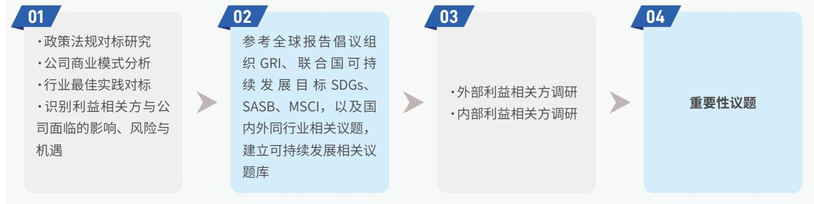

flowchart

```mermaid
graph LR
  subgraph Step1["01\n• 政策法规对标研究\n• 公司商业模式分析\n• 行业最佳实践对标\n• 识别利益相关方与公司面临的影响、风险与机遇"]
    Step2["02\n参考全球报告倡议组织 GRI、联合国可持续发展目标 SDGs、SASB、MSCI，以及国内外同行业相关议题，建立可持续发展相关议题库"]
    Step3["03\n• 外部利益相关方调研\n• 内部利益相关方调研"]
    Step4["04\n重要性议题"]

  Step1 --> Step2
  Step2 --> Step3
  Step3 --> Step4
```

2025年，公司通过对2024年度重要性议题清单实施内部复核与评估，结合公司战略及外部环境未发生重大变化的实际情况，本年度仅调整部分议题，其余重要性议题识别结论延续此前核心判定逻辑。具体重要性议题矩阵图如下：

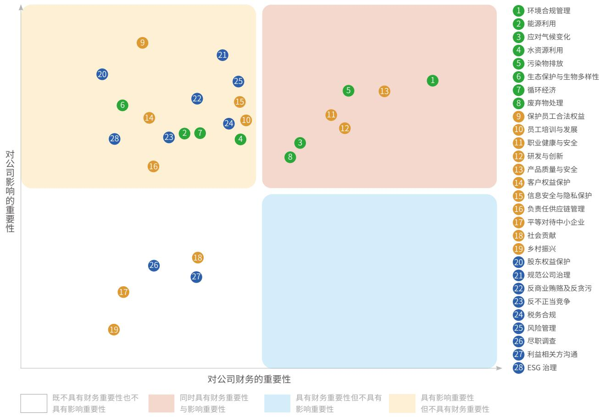

scatter

| ID | Topic | X-axis: 对公司财务的重要性 | Y-axis: 对公司影响的重要性 |
| --- | --- | --- | --- |
| 1 | 环境合规管理 | ~0.85 | ~0.75 |
| 2 | 能源利用 | ~0.35 | ~0.65 |
| 3 | 应对气候变化 | ~0.45 | ~0.65 |
| 4 | 水资源利用 | ~0.55 | ~0.65 |
| 5 | 污染物排放 | ~0.65 | ~0.65 |
| 6 | 生态保护与生物多样性 | ~0.65 | ~0.65 |
| 7 | 循环经济 | ~0.75 | ~0.65 |
| 8 | 废弃物处理 | ~0.75 | ~0.60 |
| 9 | 保护员工合法权益 | ~0.45 | ~0.65 |
| 10 | 员工培训与发展 | ~0.75 | ~0.65 |
| 11 | 职业健康与安全 | ~0.75 | ~0.60 |
| 12 | 研发与创新 | ~0.75 | ~0.60 |
| 13 | 产品质量与安全 | ~0.85 | ~0.65 |
| 14 | 客户权益保护 | ~0.45 | ~0.55 |
| 15 | 信息安全与隐私保护 | ~0.75 | ~0.60 |
| 16 | 负责任供应链管理 | ~0.45 | ~0.45 |
| 17 | 平等对待中小企业 | ~0.45 | ~0.45 |
| 18 | 社会贡献 | ~0.45 | ~0.45 |
| 19 | 乡村振兴 | ~0.35 | ~0.25 |
| 20 | 股东权益保护 | ~0.35 | ~0.45 |
| 21 | 规范公司治理 | ~0.45 | ~0.45 |
| 22 | 反商业贿赂及反贪污 | ~0.45 | ~0.45 |
| 23 | 反不正当竞争 | ~0.45 | ~0.45 |
| 24 | 税务合规 | ~0.45 | ~0.45 |
| 25 | 风险管理 | ~0.45 | ~0.45 |
| 26 | 尽职调查 | ~0.45 | ~0.35 |
| 27 | 利益相关方沟通 | ~0.45 | ~0.35 |
| 28 | ESG 治理 | ~0.35 | ~0.45 |
| 29 | N/A | ~0.35 | ~0.35 |
| 30 | N/A | ~0.35 | ~0.95 |
| 31 | N/A | ~0.35 | ~0.95 |
| 32 | N/A | ~0.35 | ~0.95 |
| 33 | N/A | ~0.35 | ~0.95 |
| 34 | N/A | ~0.35 | ~0.95 |
| 35 | N/A | ~0.35 | ~0.95 |
| 36 | N/A | ~0.35 | ~0.95 |
| 37 | N/A | ~0.35 | ~0.95 |
| 38 | N/A | ~0.35 | ~0.95 |
| 39 | N/A | ~0.35 | ~0.95 |
| 40 | N/A | ~0.35 | ~0.95 |
| 41 | N/A | ~0.35 | ~0.95 |
| 42 | N/A | ~0.35 | ~0.95 |
| 43 | N/A | ~0.35 | ~0.95 |
| 44 | N/A | ~0.35 | ~0.95 |
| 45 | N/A | ~0.35 | ~0.95 |
| 46 | N/A | ~0.35 | ~0.95 |
| 47 | N/A | ~0.35 | ~0.95 |
| 48 | N/A | ~0.35 | ~0.95 |
| 49 | N/A | ~0.35 | ~0.95 |
| 50 | N/A | ~0.35 | ~0.95 |
| 51 | N/A | ~0.35 | ~0.95 |
| 52 | N/A | ~0.35 | ~0.95 |
| 53 | N/A | ~0.35 | ~0.95 |
| 54 | N/A | ~0.35 | ~0.95 |
| 55 | N/A | ~0.35 | ~0.95 |
| 56 | N/A | ~0.35 | ~0.95 |
| 57 | N/A | ~0.35 | ~0.95 |
| 58 | N/A | ~0.35 | ~0.95 |
| 59 | N/A | ~0.35 | ~0.95 |
| 60 | N/A | ~0.35 | ~0.95 |
| 61 | N/A | ~0.35 | ~0.95 |
| 62 | N/A | ~0.35 | ~0.95 |
| 63 | N/A | ~0.35 | ~0.95 |
| 64 | N/A | ~0.35 | ~0.95 |
| 65 | N/A | ~0.35 | ~0.95 |
| 66 | N/A | ~0.35 | ~0.95 |
| 67 | N/A | ~0.35 | ~0.95 |
| 68 | N/A | ~0.35 | ~0.95 |
| 69 | N/A | ~0.35 | ~0.95 |
| 70 | N/A | ~0.35 | ~0.95 |
| 71 | N/A | ~0.35 | ~0.95 |
| 72 | N/A | ~0.35 | ~0.95 |
| 73 | N/A | ~0.35 | ~0.95 |
| 74 | N/A | ~0.35 | ~0.95 |
| 75 | N/A | ~0.35 | ~0.95 |
| 76 | N/A | ~0.35 | ~0.95 |
| 77 | N/A | ~0.35 | ~0.95 |
| 78 | N/A | ~0.35 | ~0.95 |
| 79 | N/A | ~0.35 | ~0.95 |
| 80 | N/A | ~0.35 | ~0.95 |
| 81 | N/A | ~0.35 | ~0.95 |
| 82 | N/A | ~0.35 | ~0.95 |
| 83 | N/A | ~0.35 | ~0.95 |
| 84 | N/A | ~0.35 | ~0.95 |
| 85 | N/A | ~0.35 | ~0.95 |
| 86 | N/A | ~0.35 | ~0.95 |
| 87 | N/A | ~0.35 | ~0.95 |
| 88 | N/A | ~0.35 | ~0.95 |
| 89 | N/A | ~0.35 | ~0.95 |
| 90+1+1+1+1+1+1+1+1+1+1+1+1+1+1+1+1+1+1+1+1+1+1+1+1+1+1+1+1+1+1+1+1+1+1+1+1+1+1+1+1+1+1+1+1+1+1+1+1+1+1+<ecel><ecel><nl>

注：因公司核心业务不涉及生命科学、人工智能伦理等敏感领域的科学研究、技术开发等活动，故未将《上海证券交易所上市公司自律监管指引第14号——可持续发展报告（试行）》中的“科技伦理”纳入重要性议题。

# 02

# 精耕管理提效能 严守合规固根基

# 我们的行动

·党建引领发展  
·完善公司治理  
- 维护股东权益  
- 强化合规风控  
·恪守商业道德

# SDGs

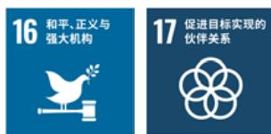

# > 党建引领发展

# 坚持党的全面领导

2025 年是中稀有色转型攻坚、深化改革的关键之年。公司党委以习近平新时代中国特色社会主义思想为指导，贯彻党的二十大和二十届历次全会精神，全面落实“重要指示批示”精神与中国稀土集团部署，以“改革深化提升”为主线，聚焦“三大战役”，实现党建与经营双向赋能。

公司严格执行 “三重一大” 决策制度，将党组织研究讨论作为董事会、经理层重大事项决策的前置程序，充分发挥党组织把方向、管大局、保落实的领导核心作用。同时，公司修订完善《党委会议事规则》《“三重一大”决策制度实施办法》，进一步厘清权责边界，提升决策科学化、规范化水平。2025 年，公司获评 “2025 年上市公司董事会最佳实践案例”。报告期内，公司召开党委会 26 次，前置审议重大事项 71 项。

# 基层党组织建设

中稀有色秉持“政治建企、党建强企”理念，成立党建工作领导小组，制定《中共中稀有色金属股份有限公司委员会党建领导小组工作规则》，通过明确职责分工与定期召开党建工作专题会议，推动形成责任明确、领导有力、运转有序的党建工作格局。

同时，公司根据改革实际，对党组织进行调整与优化，确保组织体系高效运行。此外，公司建立党员发展“双培养”机制。2025年，公司发展党员6名，组织入党积极分子和发展对象参训27人次。截至报告期末，公司共有党组织（含党委、党总支及党支部）27个，党员290名。

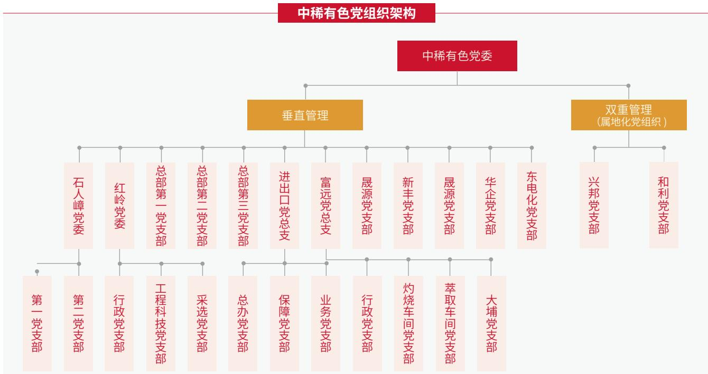

flowchart

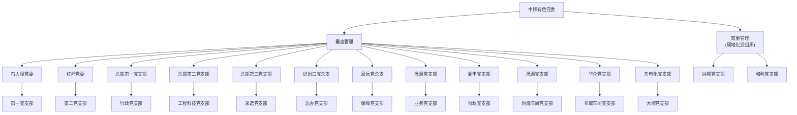
```mermaid
graph TD
  A["中稀有色党委"] --> B["垂直管理"]
  A --> C["双重管理\n(属地化党组织)"]
  
  B --> D["石人嶂党委"]
  B --> E["红岭党委"]
  B --> F["总部第一党支部"]
  B --> G["总部第二党支部"]
  B --> H["总部第三党支部"]
  B --> I["进出口党总支"]
  B --> J["富远党总支"]
  B --> K["晟源党支部"]
  B --> L["新丰党支部"]
  B --> M["晟源党支部"]
  B --> N["华企党支部"]
  B --> O["东电化党支部"]
  
  C --> P["兴邦党支部"]
  C --> Q["和利党支部"]
  
  D --> R["第一党支部"]
  E --> S["第二党支部"]
  F --> T["行政党支部"]
  G --> U["工程科技党支部"]
  H --> V["采选党支部"]
  
  I --> W["总办党支部"]
  J --> X["保障党支部"]
  K --> Y["业务党支部"]
  L --> Z["行政党支部"]
  M --> AA["灼烧车间党支部"]
  N --> AB["萃取车间党支部"]
  O --> AC["大埔党支部"]
```

# 思想政治建设

持续深化政治理论学习：公司党委创新“书记领学、分管研讨、部门贯彻、与会发言”机制，全年开展“第一议题”学习23次，形成贯彻意见37项103条，切实将党的创新理论转化为推动企业改革发展的生动实践。同时通过专题宣讲、集中培训、线上推送等形式全面宣贯党的二十届四中全会精神，累计开展集中学习23场次，组织开展专题宣讲6场。

贯彻落实“重要指示批示”精神：公司党委紧扣国家稀土产业发展战略，坚持把落实公司“十大行动”与资源保障、产业升级、深化改革等核心业务同谋划、同部署、同推进，形成27项工作重点和82项举措，每季度跟踪落实、督查问效，大力推动各项工作有效落地。

深入贯彻中央八项规定精神学习教育：公司党委组织召开动员部署会并成立工作专班，明确责任清单，构建“一级抓一级、层层抓落实”的工作格局，并采取“线上+线下”结合模式，依托中心组学习、读书班、专题辅导、线上课堂等载体开展宣贯，覆盖党员干部900余人次。

压实意识形态责任：公司党委严格落实意识形态工作责任制，专题研究意识形态工作2次，制定意识形态工作责任清单，细化落实举措42项，压实各级党组织主体责任。持续加强意识形态领域形势分析研判，定期开展意识形态风险排查，及时化解潜在风险。

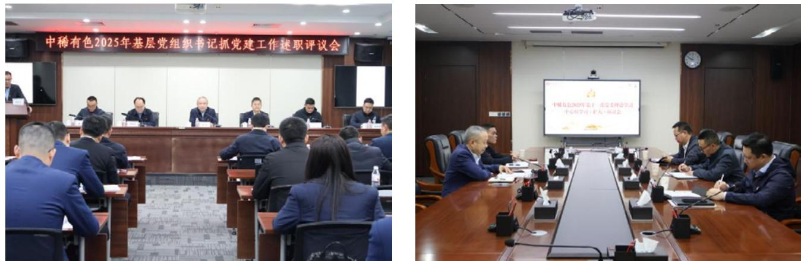

# 党建主题活动

公司党委始终坚持以高质量党建引领企业发展，精心组织开展系列主题党建活动，通过赴中共三大会址开展沉浸式红色教育、组织红色观影、集中收看纪念中国人民抗日战争暨世界反法西斯战争胜利80周年大会直播等形式，引导广大党员干部深刻感悟伟大抗战精神，强化理想信念教育与爱国主义情怀，持续凝聚奋进共识、锤炼实干作风，以过硬担当与务实举措助推企业高质量发展。

党建活动  
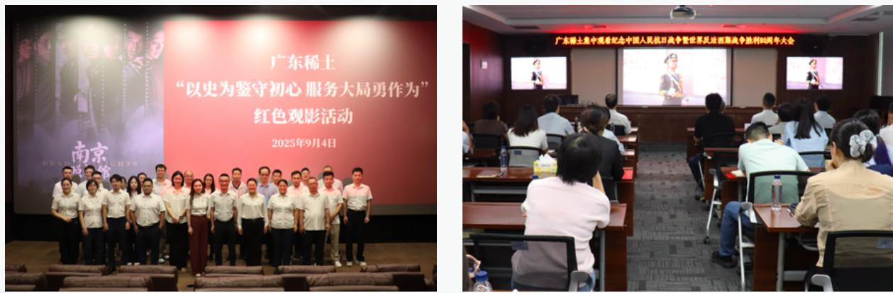

# > 完善公司治理

# 治理架构

公司严格遵循《中华人民共和国公司法》《中华人民共和国证券法》《上海证券交易所股票上市规则》及《公司章程》等规范性文件要求，持续健全法人治理结构，优化公司治理机制，提升治理水平和运作规范性。目前，公司已构建由股东会、董事会及下设专门委员会、经营班子及其下属部门组成的治理架构，各层级权责清晰、协作有序、运行高效，并通过科学的制度安排与流程管控，将合规要求融入日常运营，以透明规范的治理，全面保障股东及各利益相关方的合法权益。

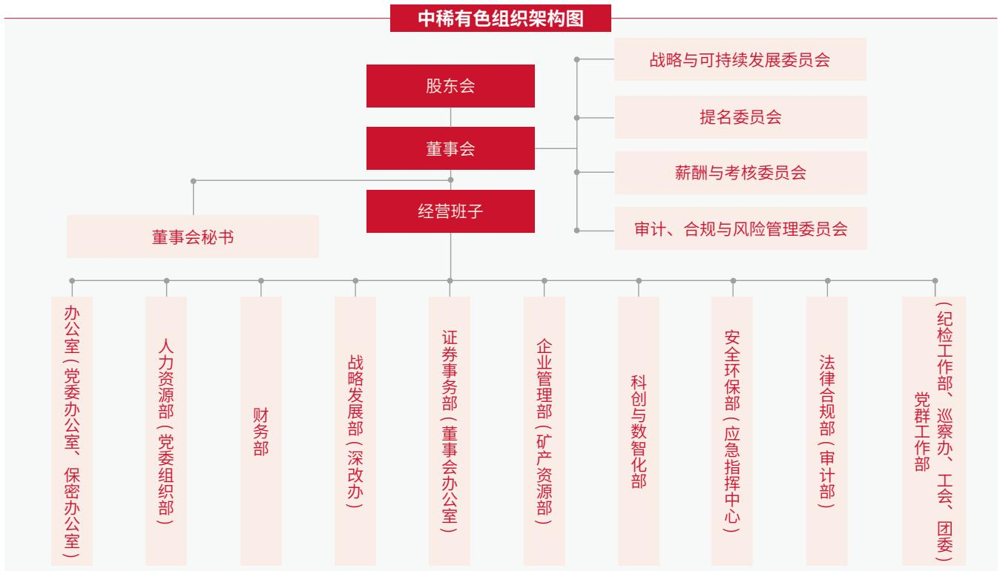

flowchart

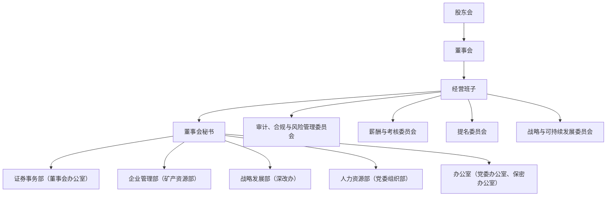
```mermaid
graph TD
  A["股东会"] --> B["董事会"]
  B --> C["经营班子"]
  C --> D["董事会秘书"]
  D --> E["证券事务部（董事会办公室）"]
  D --> F["企业管理部（矿产资源部）"]
  D --> G["战略发展部（深改办）"]
  D --> H["人力资源部（党委组织部）"]
  D --> I["办公室（党委办公室、保密办公室）"]
  C --> J["审计、合规与风险管理委员会"]
  C --> K["薪酬与考核委员会"]
  C --> L["提名委员会"]
  C --> M["战略与可持续发展委员会"]
```

# 股东会

公司严格遵守相关法律法规及《股东会议事规则》的要求，规范股东会的召集、召开及表决程序。公司采用现场投票和网络投票相结合的表决方式，为股东参加股东会提供便利，维护全体股东尤其是中小股东的权利，确保股东会合规运营及决策有效。

# 关键绩效

报告期内，公司共召开股东会会议 6 次，

其中年度股东会会议 1 次，临时股东会会议 5 次，审议议案 23 项。

# 董事会

公司始终坚持以董事会建设为核心，持续健全并深化“两个机制、一个抓手、一个核心”的董事会211运行模式，不断推动董事会规范运作与效能提升。“两个机制”突出闭环管理，落实董事会授权、反馈两大机制，通过制定《董事会授权管理办法》及《重大事项决策清单》，明确董事会向经理层授权事项，厘清各治理主体权责边界，确保董事会依法依规。“一个抓手”突出专门委员会的专业性，制定《董事会专门委员会工作细则》配套建立长效工作机制，保障各专门委员会充分履职，提升董事会决策质量。

公司董事会认真履行职责，确保公司遵守法律法规以及《公司章程》《董事会议事规则》的规定，且所有董事会成员均具备良好的专业背景和履行职责所必备的知识、技能和素质，能够了解并持续关注公司生产经营情况、财务状况、重大事件的影响及风险，确保董事会高效运作和科学决策。

# 关键绩效

报告期内，公司共召开董事会会议12次，

审议议案 61 项。

# · 董事会专门委员会

公司制定《董事会专门委员会工作细则》，明确各专门委员会的组成、职责及议事规则。董事会下设战略与可持续发展委员会、提名委员会、薪酬与考核委员会和审计、合规与风险管理委员会四个专门委员会，委员均由公司董事担任。各委员会围绕战略规划与可持续发展、人选标准与提名建议、考核标准与薪酬审查、审计监督与风控合规管理等重要事项，为董事会提供专业支撑与决策支持。

<table><tr><td>专门委员会类别</td><td>人员构成</td><td>独董是否担任主任委员</td></tr><tr><td>战略与可持续发展委员会</td><td>5名董事,2名为独立董事</td><td>否</td></tr><tr><td>提名委员会</td><td>5名董事,3名为独立董事</td><td>是</td></tr><tr><td>审计、合规与风险管理委员会</td><td>5名董事,3名为独立董事</td><td>是</td></tr><tr><td>薪酬与考核委员会</td><td>5名董事,3名为独立董事</td><td>是</td></tr></table>

# 关键绩效

报告期内，公司共召开16次专门委员会会议，累计审议议案35项，其中：

·战略与可持续发展委员会会议3次，审议议案4项；  
·提名委员会会议 2 次，审议议案 3 项；  
·审计、合规与风险管理委员会会议7次，审议议案22项；  
·薪酬与考核委员会会议 4 次，审议议案 6 项。

# · 董事会多元化构成

公司对董事会成员选聘充分考虑性别、年龄、教育背景、专业知识和行业经验等多方面因素，旨在实现董事会的多元化构成，满足公司业务需求。目前，公司董事会成员共计9人，其中独立董事有3名，占比33.33%。公司董事成员忠诚勤勉、恪尽职守，专业背景覆盖采矿工程、财务会计、经济学、法律等多个领域，严格审议并有效执行董事会各项决策与决议。

董事会成员 9 人  
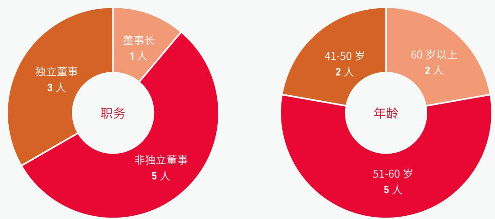

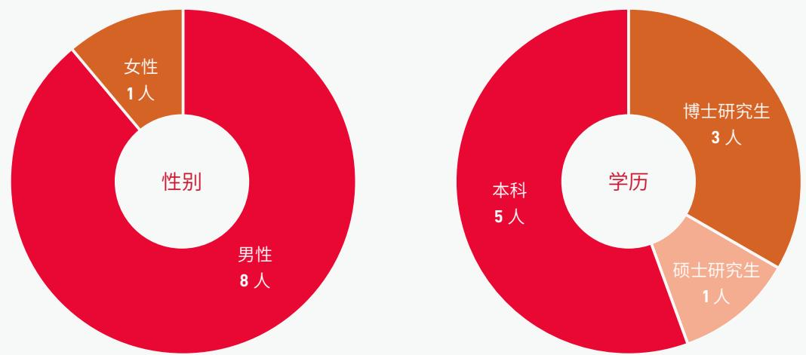

# · 董事会独立性

公司重视独立董事在规范运作中的专业作用，通过制定《独立董事管理办法》，明确独立董事职责与履职要求，为其独立、有效行使监督与决策职权提供制度保障。公司设3名独立董事，占董事会成员比例不低于三分之一，符合相关法律法规要求。公司为独立董事履职提供必要的信息与资源支持，确保其能够充分发挥专业性，为董事会决策提供科学、独立的意见建议。

在提名委员会、薪酬与考核委员会和审计、合规与风险管理委员会中，独立董事均占多数并担任主任委员，有效提升董事会审议的独立性、透明度与规范性，进一步增强公司整体治理效能。

公司建立独立董事专门会议机制，对应当披露的关联交易、聘用会计师事务所等重大事项进行前置审议。报告期内，共召开独立董事专门会议3次，审议议案4项，独立董事平均出席率达100%。

# · 董事会有效性评估

公司由董事会秘书及证券事务部（董事会办公室）负责董事会会议的组织协调，涵盖议程安排、文件准备、会议召开、记录起草及决议公告等全流程规范管理；通过每年度发布《董事会工作报告》，系统评估董事会议参与度、信息披露质量及投资者关系维护等情况；定期召开董事会与股东会对董事薪酬进行审议，确保薪酬机制与董事履职贡献相匹配，公司通过多种方式开展董事会有效性评估工作，为公司治理水平的持续提升提供有力保障。

natural_image

Illustration of a business meeting with three people, one presenting on a presentation board (no text or symbols visible)

# 董高薪酬管理

公司董高薪酬由基本年薪、绩效年薪、专项奖励、任期激励四部分构成，并对各项标准作出细化规定。董事会下设薪酬与考核委员会，负责组织年度考评，协调董事长及高管薪酬年度考核工作。薪酬方案经薪酬与考核委员会及董事会审议后，报股东会批准并披露。独立董事实行年度津贴制，确保薪酬管理科学透明。

报告期内，全体董事、高级管理人员实际获得的税前报酬共计634.18万元。

# > 维护股东权益

# 信息披露

公司严格遵守《上市公司信息披露管理办法》等法律法规，制定并执行《信息披露管理办法》，履行上市公司信息披露义务，保证财务及非财务信息披露的及时、公平、真实、准确及完整，确保所有股东平等获取信息，以高质量的信息披露切实维护公司、投资者及其他利益相关方的合法权益。

报告期内，公司在上海证券交易所公布的 2024 至 2025 年度信息披露工作评价结果中，荣获信息披露工作最高评级 “A” 级，体现了监管部门和行业协会对公司规范治理、合规运作的充分认可。

# 关键绩效

报告期内，公司未发生信息披露违规事件；共对外披露74份公告，其中定期公告数量4份，临时公告数量70份。

# 资本市场舆情管理

公司严格按照《中华人民共和国证券法》《上市公司信息披露管理办法》等监管要求开展资本市场舆情管理工作，建立常态化舆情监测、研判、核实与响应机制，持续关注公司证券交易情况与媒体报道、市场传闻，对可能影响公司证券交易或投资者决策的重大信息及时核查、依法澄清，确保信息披露真实、准确、完整、及时、公平，维护资本市场秩序与投资者合法权益。

# 投资者关系管理

为加强与投资者的信息沟通，提升公司诚信度和核心竞争力，公司制定《投资者关系管理制度》及《2025年度投资者关系管理计划》，通过网上业绩说明会、投资者电话、实地调研、传真、电子邮箱及互动平台等多种渠道，与投资者保持稳定、有效的良性互动。公司董事会秘书为投资者关系管理负责人，全面策划并组织相关活动，确保投资者充分了解公司经营与发展情况；证券事务部（董事会办公室）作为职能部门，具体承担投资者关系管理的日常事务。

<table><tr><td>关键指标</td><td>单位</td><td>2025年</td></tr><tr><td>接待投资者现场调研次数</td><td>次</td><td>21</td></tr><tr><td>接待投资者现场调研人次</td><td>人次</td><td>211</td></tr><tr><td>在上证e互动与投资者互动次数</td><td>次</td><td>12</td></tr><tr><td>召开业绩说明会次数</td><td>次</td><td>4</td></tr><tr><td>通过邮件沟通/社交平台沟通次数</td><td>次</td><td>3</td></tr></table>

# 参加“2024年度海南辖区上市公司业绩说明会暨投资者集体接待日”

2025 年 5 月，公司通过网络在线交流形式，就公司 2024 年年报披露、财务数据、公司治理、内部控制、发展战略、经营状况、现金分红、重大事项、可持续发展等投资者所关心的问题，与投资者进行 “一对多” 形式的沟通与交流，树立了良好的资本市场形象，加强投资者对公司的了解和认同。

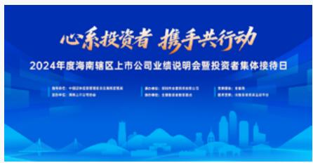

text_image

心系投资者 携手共行动
2024年度海南辖区上市公司业绩说明会暨投资者集体接待日

# 股东回报

公司遵循《上市公司监管指引第3号——上市公司现金分红》《公司章程》等相关法律法规与规章，致力于构建科学合理、持续稳定且透明的分红机制，提升利润分配的清晰度，有效保障投资者的合法权益。

2026 年 3 月 20 日，公司披露《关于 2025 年度利润分配方案的公告》，2025 年度利润分配方案为：上市公司向全体股东每股派发现金红利 0.15 元（含税），截至 2025 年 12 月 31 日，公司总股本 336,435,910 股，以此计算合计派发现金红利 50,465,386.50 元（含税）。

<table><tr><td>关键绩效</td><td>单位</td><td>2025年</td></tr><tr><td>每股派发现金红利(含税)</td><td>元/股</td><td>0.15</td></tr><tr><td>共计派发现金(含税)</td><td>元</td><td>50,465,386.50</td></tr><tr><td>占合并报表中归属于上市公司股东的净利润比例</td><td>%</td><td>39.56</td></tr></table>

# > 强化合规风控

# 合规经营

合规管理是企业经营管理的重要组成部分，是内部控制和风险管理的基础。公司以打造从顶层设计到基础执行“一竿子插到底”的合规管理体系为目标，持续完善党委统一领导、董事会审计、合规与风险管理委员会统筹把关、合规部门协调推进、各业务部门及所属企业分工落实、全体员工共同参与的合规管理架构。公司组织全体员工签署《合规承诺书》，明确遵规守法、恪尽职守、强化学习、严格监督等要求，推动合规要求融入业务各环节，逐步形成覆盖全员、贯穿流程的合规责任体系。

公司制定《合规管理办法》，秉持“管业务必须管合规，管合规必须精业务”理念，构建以管理办法为核心、配套制度为补充的“1+1+N”制度体系。聚焦投资管理、合同管理、安全环保等重点领域，强化合规审查，细化决策权限，加强运营监督。定期开展合规评价，分析管理现状及风险，由法律合规部（审计部）监督改进。将合规纳入经营业绩考核，定期评选先进并予以表彰奖励。

公司制定《法律合规审查办法》，建立合规审查前置工作机制，将合规要求嵌入业务流程，明确各部门合规审查职责，压实主体责任，有效防范和控制合规风险。公司每年组织开展重点领域合规检查，重点检查各部门是否存在违反法律法规、行业准则、规章制度及道德规范等情形，并督促落实整改。

2025 年 11 月，公司组织开展 “2025 年所属企业收官检查暨经营合规风险 ‘回头看’ 检查” 专项工作，重点对照 “生产经营 ‘十不准’ ” 要求，检查企业在生产组织、产能合规、溯源管理、出口管制、技术保密、安全生产、关联交易等方面的合规落实情况，坚决守住经营底线。

# 风险管理

公司建立《风险控制管理制度》《合规风险管理办法》，并成立全面风险管控工作领导小组，负责风险管理的组织领导与统筹协调。领导小组在法律合规部（审计部）下设风控办公室，承担全面风险管控的实施及日常工作，通过制度约束、组织保障与常态化执行相结合的方式，持续推进风险管理工作。

<table><tr><td colspan="2">风险管理举措</td></tr><tr><td>风险辨识评估与应对</td><td>广泛、持续收集与业务相关的内外部信息,通过风险辨识、分析、评价三个步骤开展评估,并选择规避、降低、分担或承受等相应策略进行应对。</td></tr><tr><td>风险动态监控与台账管理</td><td>定期汇总分析风险管理措施落实成效、预警指标变化及外部风险信息,研判发展趋势。建立管理台账,对高等级风险实施持续跟踪,并对重大风险事件实行销号闭环管理。</td></tr><tr><td>内审监督与评价</td><td>内审机构定期对各部门及所属企业的风险管理和内控执行情况进行监督评价,并向董事会汇报;同时,公司通过与审计机构专业协作,持续优化风险管理体系,提升核心竞争力与抗风险能力。</td></tr><tr><td>风险文化宣贯</td><td>通过多种形式宣传道德诚信与合规文化,开展风险管理案例教育,加强理念、流程及管控核心等方面的专业培训。积极组织职能部门学习,邀请专家举办法规、行业规定及内部规程等讲座,提升全员风险管理意识。</td></tr></table>

# 合同管理培训

2025 年 3 月，公司顾问律师为合同管理相关人员作专题培训，系统讲解合同相关法律与合规风险防范要点，并结合实务案例进行互动答疑，进一步提升了参训人员的风险识别与应对能力。

# “企业信用法律风险管控与应收账款催收实务”专题培训

2025 年 8 月，公司邀请外部律师开展专题培训，法律合规相关人员参加，围绕信用风险识别与账款催收实务进行讲解与互动交流。

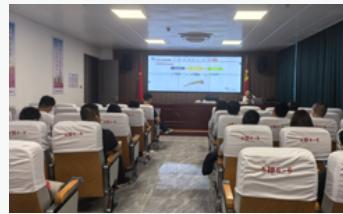

# 关键绩效

报告期内，开展法律培训 8 次，参与法律培训 369 人，开展法律培训 18 小时。

# 内部控制管理

公司始终将内部控制作为规范运作与稳健经营的基石。严格遵守相关法规，紧密契合经营管理实际，持续优化内控管理架构。通过全面系统的内部监控制度建设，不断夯实管理基础，确保内控体系覆盖全面、权责清晰、运行有效，为公司高质量可持续发展提供坚实保障。

报告期内，公司对内部控制有效性进行了自我评价，全年未发现公司在内部控制设计及执行方面存在重大缺陷。公司针对2025年度的内部控制情况出具了《内部控制评价报告》，并聘请第三方审计机构出具了《内部控制审计报告》，均与年度报告同日披露于巨潮资讯网。

公司协同各业务部门将风险应对策略、风险应对措施、法律合规要求等融入企业的各项规章制度，嵌入各业务流程与业务活动。通过循序渐进优化内部控制，促使公司在日常运营过程中有效提高运行效率，保障公司运营的稳健性与高效性。

# 关键绩效

报告期内，公司完成 2025 内部控制审计项目 1 项，发现问题 20 个，提出审计意见 20 条，整改完成率 100%。

# 税务管理

公司严格遵守《税收征收管理法》《发票管理办法》等法律法规，制定并实施《税务管理办法》，规范税务管理流程，控制税务风险，确保依法合规纳税。同时，财务部全面梳理税收情况，对所属企业税务管理工作进行指导、监督与考核，持续提升纳税管理水平。

税务风险管控措施

<table><tr><td>建立税务管理体系</td><td>公司及子公司均配有专业的税务人员,通过多级复核、抽查等方式控制税务风险。</td></tr><tr><td>事前评估风险</td><td>涉及重点业务领域,开展税务风险评估,履行事前税务预测、评价等程序,出具税务风险提示及提出税务处理建议,发挥事前控制的作用。</td></tr><tr><td>关注重大税务风险因素</td><td>关注并识别重大税务风险因数,出现重大税务风险因数异常时,及时对风险因数进行分析,评估可能带来的税务风险,并作出相关应对方案。</td></tr></table>

# 关联交易管理

公司依据相关法律法规制定《关联交易管理制度》，明确关联交易的认定、审批、执行、披露及监督等全流程规范，确保关联交易行为合规透明。实现对关联交易的及时识别、日常管理和有效监督，防范潜在利益冲突，切实保护公司及全体股东的合法权益，提升公司规范运作水平。

# >恪守商业道德

# 反商业贿赂及反贪污

# · 廉洁管理体系

公司将《员工诚信合规手册》作为廉洁管理体系的核心载体，明确要求全体员工坚决抵制腐败行为。手册严格界定行为红线，严禁任何形式的滥用职权、侵害国有资产权益；严禁利用职权谋取私利、损害公司利益；严禁擅自挪用、侵占、侵吞公司财产或收受贿赂，构建起覆盖全员的行为约束机制。

# · 反贪腐风险管理

公司制定《风险控制管理制度》对反商业贿赂及反贪污实施管理，由党群工作部（纪检工作部、巡察办、工会、团委）牵头负责廉洁风险的分析与管控。报告期内，公司组织开展“2025年度全面风险排查及内部控制评价工作”，其中对廉洁风险开展了自查，进一步提升风险识别与应对能力。

natural_image

Illustration of a clipboard with checklist and magnifying glass, accompanied by warning symbols and a person examining it (no text or symbols present)

# ·反腐败教育

中稀有色坚持以习近平新时代中国特色社会主义思想为指导，深入落实全面从严治党各项部署要求，持续完善内部监督机制。通过开展形式多样的廉洁教育活动，强化员工廉洁从业意识，增强纪律观念，营造风清气正的工作环境。

# 总部新任职干部任前集体谈话会议

2025 年 6 月，公司召开总部新任职干部任前集体谈话会。会议强调，要严守廉洁底线，恪守清正廉洁，慎独慎微、清正履职；严守党的各项纪律，严以律己、依法用权，自觉接受监督。

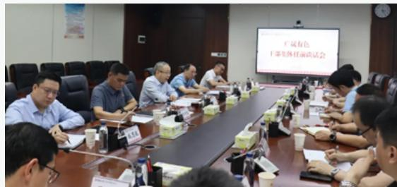

text_image

广东有色
干聚生化座谈会

# 中稀有色召开党风廉政建设会商会

2025 年 9 月，公司党委纪委召开党风廉政建设会商会，通报上半年工作情况，部署下一步任务。会议要求深化标本兼治，一体推进 “三不腐”，强化纪律教育与廉洁文化建设，营造风清气正氛围。

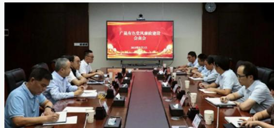

text_image

广西有色党风廉政建设
公会

# 中稀有色召开党风廉政建设暨作风整顿警示教育大会

2025 年 11 月，公司召开党风廉政建设暨作风整顿警示教育大会，集中观看警示教育片，通报典型案例，剖析违纪案件思想根源与制度漏洞，以案为鉴、以案促改，增强党员干部纪律规矩意识。

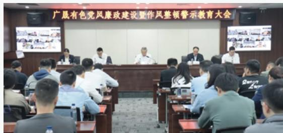

text_image

广晟有色党风廉政建设暨作风整顿警示教育大会

# 关键绩效

报告期内，公司组织开展廉政培训共2次；  
组织员工走进廉政教育基地3次；  
组织员工观看警示教育片3次；  
召开党风廉政建设和反腐败会议2次；  
开展集体廉洁提醒谈话103人次。

# ·举报与举报人保护

公司高度重视举报及举报人保护工作，设立信件、电话、邮箱及现场反映等多种举报渠道，鼓励员工如实反映不正当行为。党群工作部（纪检工作部、巡察办、工会、团委）接到举报后登记信访台账，10个工作日内提出拟办意见，按程序审批办理。对实名举报经查实的违反《诚信合规手册》行为，向举报人反馈处理结果并严格保密。举报管理工作严格遵循《广东省纪检监察机关实名举报工作办法（试行）》执行。

# 中稀有色举报投诉渠道

电子邮箱

gsysjljcs@regcc.cn

电话号码

020-87073533

投诉地址：

广东省广州市番禺区汉溪大道东广晟万博城晟峰写字楼36楼党群工作部（纪检工作部、巡察办、工会、团委）

# 反不正当竞争

公司严格遵守《中华人民共和国反不正当竞争法》等法律法规，由法律合规部（审计部）统筹负责反垄断合规管理，印发《反垄断合规工作指导手册》组织学习宣传，手册围绕垄断行为禁止规定、高风险事项识别、投资并购中的事前评估与风险识别、执法调查及诉讼应对等方面作出系统规范，为全体员工提供明确的操作指引。

在日常宣传与对外沟通中，公司严格规范用语，避免使用涉及市场支配地位的夸大表述，杜绝反垄断敏感词汇，防止任何可能被理解为排除、限制竞争的不当言论。公司始终坚持以产品和服务赢得市场，自觉维护公平竞争的市场环境。

此外，公司持续推进反不正当竞争文化建设，不断提升全员合规素养。报告期内，针对反垄断合规重点领域，组织开展系列专题培训，通过法规宣贯、实务讲解、互动交流等多种形式，帮助员工深入理解公平竞争要求，切实将反不正当竞争理念融入日常业务实践。

# 2025年度法律合规及审计专题培训

2025 年 9 月，公司聚焦重点难点工作，组织开展实务专题培训，涵盖知识产权管理、股权退出、风险内控智能化、人工智能与大数据审计应用、内部审计实务及反垄断合规指引宣贯等内容。

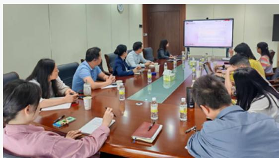

natural_image

Group of people seated around a conference table in a meeting room, with water bottles and a presentation screen visible (no text or symbols)

# “加强反垄断合规、服务高质量发展”合规讲座

2025 年 12 月，公司组织全体员工参加国务院国资委举办的反垄断专题讲座，围绕风险识别、评估与防范等重点内容开展系统培训，提升全体员工反垄断合规意识与风险应对能力。

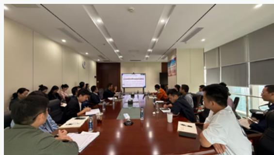

natural_image

Interior view of a conference room with attendees seated around a long table, facing a presentation screen (no visible text or signage)

# 关键绩效

报告期内，公司共开展 2 次反不正当竞争相关培训，参与 36 人次，培训总时长 6 小时。

# 反洗钱

中稀有色秉持高度的社会责任感和法治精神，严格落实国家反洗钱法律法规，持续完善内部管理制度，强化风险防控机制，提升全员反洗钱意识。公司密切配合监管机构，及时报告可疑交易活动，并主动接受监督检查，切实履行反洗钱企业义务。

natural_image

Illustration of business professionals collaborating around a large document with icons like gears, lightbulb, and checkmark (no text or symbols)

# 专题

# 精益节能降耗 赋能绿色生产

兴邦公司深耕生产流程节能降耗，以工艺创新与能源结构优化为抓手，持续推进资源集约利用与低碳转型，为企业绿色高质量发展提供坚实支撑。

在沉淀工序，兴邦公司采用新型灼烧工艺，叠加“尖峰平谷”错峰用电策略，成功将氧化铽灼烧成本降低超1,500元/吨。在加热系统优化方面，将热水加热能源由天然气全面切换为蒸汽，既显著降低生产能耗与碳排放，又精简人力配置，同时有效保障了生产水温的稳定性。此外，兴邦公司创新实现低电导率水的高效循环利用，将其“变废为宝”应用于回收料水洗环节，在节约水资源的同时进一步降低运营成本，达成资源节约与效益提升的双赢。

兴邦公司聚焦蒸汽能源替代、水循环利用等细节创新，清晰勾勒出通过工艺与能源优化实现降本、增效、减排的坚实步伐，既体现了科技赋能传统产业的深度应用，也强化了企业在资源集约、绿色制造领域的责任担当，为行业节能降碳提供了可借鉴的实践样本。

新型灼烧工艺  
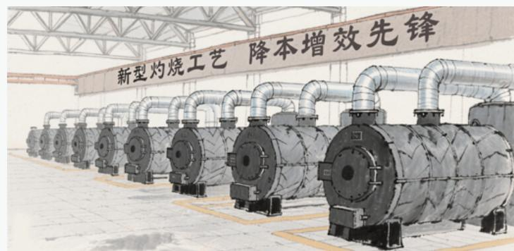

text_image

新型灼烧工艺 降本增效先锋

“尖峰平谷” 错峰用电策略  
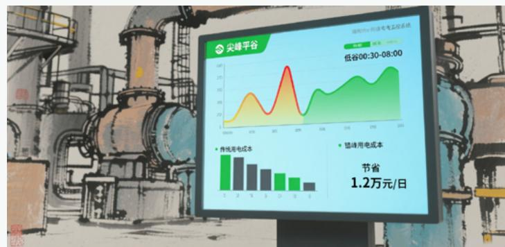

area

| Time | Generation (MW) | Cost (万元/日) |
| --- | --- | --- |
| 1 | ~50 | ~1.2 |
| 2 | ~150 | ~1.1 |
| 3 | ~250 | ~1.0 |
| 4 | ~150 | ~0.9 |
| 5 | ~200 | ~0.8 |
| 6 | ~350 | ~0.7 |
| 7 | ~150 | ~0.6 |
| 8 | ~250 | ~0.5 |
| 9 | ~200 | ~0.4 |
| 10 | ~250 | — |
| 11 | ~300 | — |
| 12 | ~350 | — |
| 13 | ~300 | — |
| 14 | ~350 | — |
| 15 | ~400 | — |
| 16 | ~350 | — |
| 17 | ~450 | — |
| 18 | ~400 | — |
| 19 | ~450 | — |
| 20 | ~400 | — |
| 21 | ~450 | — |
| 22 | ~500 | — |
| 23 | ~450 | — |
| 24 | ~450 | — |
| 25 | ~500 | — |
| 26 | ~550 | — |
| 27 | ~500 | — |
| 28 | ~550 | — |
| 29 | ~600 | — |
| 30 | ~550 | — |
| 31 | ~600 | — |
| 32 | ~650 | — |
| 33 | ~600 | — |
| 34 | ~650 | — |
| 35 | ~700 | — |
| 36 | ~650 | — |
| 37 | ~650 | — |
| 38 | ~700 | — |
| 39 | ~750 | — |
| 40 | ~700 | — |
| 41 | ~750 | — |
| 42 | ~800 | — |
| 43 | ~750 | — |
| 44 | ~750 | — |
| 45 | ~800 | — |
| 46 | ~750 | — |
| 47 | ~750 | — |
| 48 | ~800 | — |
| 49 | ~750 | — |
| 50 | ~750 | — |
| 51 | ~800 | — |
| 52 | ~750 | — |
| 53 | ~750 | — |
| 54 | ~800 | — |
| 55 | ~750 | — |
| 56 | ~750 | — |
| 57 | ~800 | — |
| 58 | ~750 | — |
| 59 | ~750 | — |
| 60 | ~800 | — |
| 61 | ~750 | — |
| 62 | ~750 | — |
| 63 | ~800 | — |
| 64 | ~750 | — |
| 65 | ~750 | — |
| 66 | ~800 | — |
| 67 | ~750 | — |
| 68 | ~750 | — |
| 69 | ~800 | — |
| 70 | ~750 | — |
| 71 | ~750 | — |
| 72 | ~800 | — |
| 73 | ~750 | — |
| 74 | ~750 | — |
| 75 | ~800 | — |
| 76 | ~750 | — |
| 77 | ~750 | — |
| 78 | ~800 | — |
| 79 | ~750 | — |
| 80 | ~750 | — |
| 81 | ~800 | — |
| 82 | ~750 | — |
| 83 | ~750 | — |
| 84 | ~800 | — |
| 85 | ~750 | — |
| 86 | ~750 | — |
| 87 | ~800 | — |
| 88 | ~750 | — |
| 89 | ~750 | — |
| 90 | ~800 | — |
| 91 | ~750 | — |
| 92 | ~750 | — |
| 93 | ~800 | — |
| 94 | ~750 | — |
| 95 | ~750 | — |
| 96 | ~800 | — |
| 97 | ~750 | — |
| 98 | ~750 | — |
| 99 | ~800 | — |
| 1,2,3,4,6,8,12,14,16,18,2,3,4,6,8,12,14,16,18,2,3,4,6,8,12,14,16,18,2,3,4,6,8,12,14,16,18,2,3,4,6,8,12,14,16,18,2,3,4,6,8,<nl>

低电导率水循环利用  
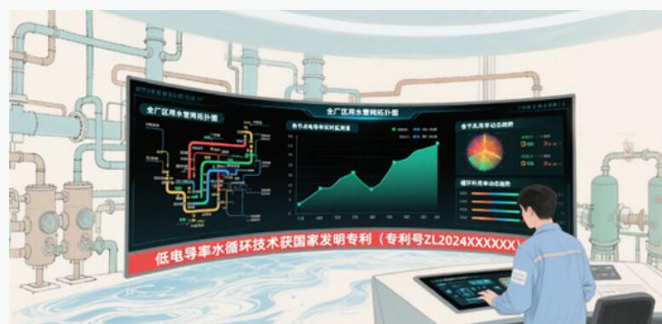

text_image

全区低用水管网补漏
全区低用水管网反补漏
高导率电循环技术获国家发明专利（专利号ZL2024XXXXXX）
低电导率水循环技术获国家发明专利（专利号ZL2024XXXXXX）

natural_image

Wind farm landscape with multiple turbines on a rolling green field under a blue sky with clouds (no text or symbols visible)

# 03

# 绿矿赋能启新程 生态协同谱华章

# 我们的行动

·践行气候责任  
·严守环境合规  
·资源精益配置  
- 生态共生守护

# SDGs

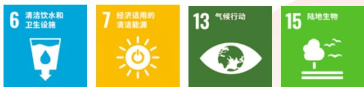

# > 践行气候责任

# 治理

# · 治理体系

中稀有色贯彻落实《中国稀土集团有限公司碳达峰行动方案》，深入聚焦“减污降碳”总体要求，推动公司绿色低碳、高质量发展。

公司成立双碳工作领导小组，由公司党委书记、董事长牵头统筹，对碳达峰工作实施统一领导；领导小组下设安全环保部（应急指挥中心）为工作组，负责落实双碳工作领导小组议定事项、制定任务分工方案、跟踪任务落实情况等日常工作；各所属企业依据层级成立配套的双碳工作小组，与工作组协同配合，细化落实各项任务举措，推进碳达峰工作落地。

# - 双碳考核

公司建立健全双碳督察考核机制，将碳达峰相关指标纳入综合评价体系，形成与绩效结果挂钩的激励约束机制。各所属企业每年开展碳达峰水平评估，公司对碳达峰目标任务落实情况进行考核，及时排查问题、提出改进要求并督促整改落实，对工作成效突出的单位和个人按规定予以表彰奖励。

# - 节能降碳意识提升

中稀有色致力于强化员工双碳意识与专业能力建设，针对性开展节能降碳相关培训，依托六五环境日、低碳日、节能周等时间节点，邀请专家进行专题解读、开展科普活动；同时利用网络、微信平台等形式开展线上宣传，营造节能降碳氛围，提升全员节能降碳意识。

同时，公司结合行业特点和需求，组织开展碳排放核算、碳交易等专业化培训，提升相关岗位人员的专业素养与实操能力，持续加强碳排放管理专业人才队伍建设，为公司碳达峰、碳中和目标实现提供坚实的人才支撑。

# 绿色低碳专题培训

2025 年 3 月，公司围绕 “碳达峰行动方案与节能降碳” 主题开展培训，系统解读碳达峰政策要求、节能降碳关键要点及中国稀土集团行动方案，有效提升全体员工的绿色低碳意识与碳管理专业能力。

natural_image

Line art illustration of a renewable energy ecosystem with wind turbine, house, rain, and trees (no text or symbols)

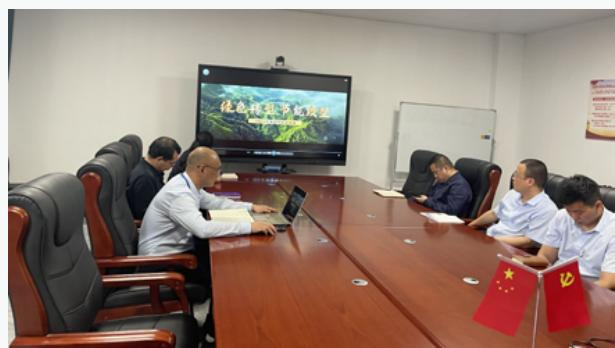

text_image

Meeting room photo with visible presentation screen showing Chinese text and flags, attendees seated around a table with laptops and red flags

# 战略

为深入识别与评估公司所面临的与气候相关的潜在风险及机遇，中稀有色结合行业政策、外部环境及自身业务实际，系统开展气候变化影响分析，并将评估结果融入公司战略规划，动态优化业务布局与资源配置，持续提升应对气候变化的韧性与适应能力。

<table><tr><td colspan="2">风险类型</td><td>描述</td><td>财务影响说明</td><td>发生可能性</td><td>影响大小</td><td>影响时间范围</td><td>影响价值链环节</td><td>应对措施</td></tr><tr><td rowspan="3">物理风险</td><td>极端天气事件</td><td>1.暴雨容易引发山体滑坡或泥石流等,威胁员工生命安全,甚至出现人员伤亡事件,影响公司声誉;2.极端天气可能会出现损坏输电线路情况,造成电力中断。同时,矿山设备如挖掘机、装载机等暴露在室外,可能会进水等造成损坏;3.极端暴雨可能使雨水大量涌入企业废水处理系统,造成废水溢流,会对周边土壤、水体等造成污染。</td><td>成本增加固定资产减值</td><td>高</td><td>大</td><td>短期</td><td>运营下游</td><td>1.调整雨水收集池、应急池等水池水位,确保事故应急池常空状态,保持最大储蓄能力;2.与气象部门建立信息互通机制,掌握气象信息,预防极端天气突变;3.配备足够防洪、防汛、极端抗灾的人力、物力、财力;4.定期组织极端天气带来的各种极端隐患排查分析;5.制定应急救援预案,成立应急救援组织架构。</td></tr><tr><td>极端温度</td><td>1.极端高温可能使矿区工作人员面临中暑风险,影响工作的正常开展;2.极端温度下,为维持生产环境的适宜温度或保证设备正常运行,会导致额外的能源消耗,增加碳排放。</td><td>收入下降成本增加</td><td>中</td><td>中</td><td>短期</td><td>运营下游</td><td>1.储备防暑设施和防暑物资,提高员工工作舒适度,开展防暑等相关培训及合理安排工作班次,保障员工身体健康;2.开展节能改造,采用先进的节能设备。</td></tr><tr><td>山火</td><td>1.山火可能会烧毁矿山开采设备、选矿厂等生产设施,以及输电线路、运输道路等基础设施,导致生产中断,修复和重建成本高昂;2.山火可能会破坏周边的植被和生态环境,影响稀土等有色金属的开采和运输,影响正常生产。</td><td>收入降低成本增加固定资产减值</td><td>中</td><td>大</td><td>中期</td><td>运营下游</td><td>1.开展应急演练活动,提高员工应急处置能力;2.积极开展生态修复,建立防火隔离带,降低山火的影响。</td></tr><tr><td>转型风险</td><td>政策风险</td><td>政府可能会出台更严格的环保政策和碳排放法规,企业需要投入更多资金用于节能减排,否则企业可能面临行政处罚或生产受限。</td><td>成本增加</td><td>高</td><td>大</td><td>长期</td><td>运营</td><td>1.密切关注温室气体排放披露相关政策法规,及时解读政策变化,为合规信息披露做好准备;2.推动非化石能源的开发和应用,加大清洁能源的使用,提高清洁能源的占比,降低温室气体排放。</td></tr></table>

<table><tr><td>机遇类型</td><td>描述</td><td>财务影响说明</td><td>发生可能性</td><td>影响大小</td><td>影响时间范围</td><td>影响价值链环节</td><td>应对措施</td></tr><tr><td>市场机遇</td><td>随着市场对绿色、低碳环保产品的需求不断增加,加大低碳产品的研发和生产力度,满足市场对环保产品的需求,同时能够助力下游企业减少碳排放,有利于全球气候的改善。</td><td>收入增加公司声誉增加市场份额扩张</td><td>中</td><td>中</td><td>长期</td><td>运营下游</td><td>积极推进绿色低碳科技创新工作,积极投入绿色低碳技术开发和应用,打造绿色产品。</td></tr><tr><td>政策机遇</td><td>政府为推动有色金属行业绿色低碳转型,如绿色矿山建设、节能减排项目财政补贴、税收优惠等。公司争取政策支持,降低运营成本,提升经济效益。</td><td>降低成本</td><td>高</td><td>中</td><td>中期</td><td>运营</td><td>全面推进绿色矿山、绿色工厂建设,促进绿色发展。</td></tr></table>

# 影响、风险和机遇管理

中稀有色积极应对气候变化带来的潜在风险与机遇，将气候风险纳入风险管理体系，建立并持续完善评估与管控机制，构建起系统的气候变化风险识别、评估及应对流程，切实保障公司稳健运营。

# 风险识别

根据法规、社会、公司运营等过程中可能发生的风险，识别与气候变化相关的风险，持续收集风险清单相关内外部信息，对所面临的风险进行识别。

# 风险评价

依据公司运营情况，从风险发生可能性、影响程度、影响范围以及影响的不可补救性维度开展风险评估。

# 风险管理

根据风险等级，针对不同等级风险制定相应措施。

# 风险调整

根据法律法规、标准及其他要求的变化，及时更新风险并制定相应控制措施。

# 指标与目标

中稀有色按照《中国稀土集团有限公司碳达峰行动方案》下达的碳排放目标任务，将其纳入年度安全环保目标中。同时，公司通过采购绿电、低碳技术创新应用等举措持续降低公司碳排放强度，严格控制碳排放增量，助力公司2030年前实现碳达峰目标。

<table><tr><td>碳排放管理目标</td><td>目标进度</td></tr><tr><td>·万元产值(收入)二氧化碳排放量降低·万元产值(收入)二氧化碳排放量下降率提高</td><td>·生产型企业万元产值(收入)二氧化碳排放量降低;公司整体万元产值(收入)二氧化碳排放量增加(因贸易板块营业收入减少)·生产型企业万元产值(收入)二氧化碳排放量下降率提高</td></tr></table>

<table><tr><td>关键指标</td><td>单位</td><td>2025年</td></tr><tr><td>范围一温室气体排放量</td><td>吨二氧化碳当量</td><td>10,160.46</td></tr><tr><td>化石燃料排放</td><td>吨二氧化碳当量</td><td>7,821.78</td></tr><tr><td>过程排放(碳酸盐/草酸)</td><td>吨二氧化碳当量</td><td>2,338.68</td></tr><tr><td>范围二温室气体排放量</td><td>吨二氧化碳当量</td><td>25,230.63</td></tr><tr><td>净购入电力消费</td><td>吨二氧化碳当量</td><td>25,230.63</td></tr><tr><td>温室气体排放总量</td><td>吨二氧化碳当量</td><td>35,391.10</td></tr><tr><td>温室气体排放强度</td><td>吨二氧化碳当量/营业收入(万元)</td><td>0.061</td></tr></table>

注：  
1. 统计口径为中稀有色及所属企业；  
2. 天然气、汽油、柴油等燃料，燃料燃烧排放因子及计算系数参考《其他有色金属冶炼和压延加工业企业温室气体排放核算方法与报告指南》；  
3. 电网碳排放因子采用 0.5810tCO2/kWh;  
4. 温室气体排放总量由于四舍五入存在尾差。

# 温室气体排放管理

公司积极响应应对气候变化号召，大力推进节能减排工作。通过引进先进节能设备、提高绿色能源占比，持续提升公司绿色低碳发展水平，为行业绿色转型与高质量可持续发展贡献力量。

# 数字化智能化提升

推广 “工业互联网 + 绿色低碳” 模式，建立碳排放统计核算体系，精准实施碳减排，为碳减排提供坚实数据支撑。

natural_image

Line art illustration of an industrial ecosystem with factory, solar, wind, and power plant symbols (no text or labels)

# > 严守环境合规

# 治理

# · 管理体系

公司严格遵守《中华人民共和国环境保护法》等相关法律法规，制定《能源节约与生态环境保护暂行管理办法》《能源节约和生态环境保护责任制管理办法》《环境保护管理制度》等相关管理制度。

公司实行 “党政同责、一岗双责”，将环境保护要求落实到决策、执行、管理等各个层面，构建完善的环保管理体系。公司成立安全环保委员会作为环境管理领导机构，负责组织贯彻国家生态环境保护的重大方针、政策和决定等。截至报告期末，公司未因环境违法违规被环保部门调查，不存在行政处罚或刑事处罚。

报告期内，公司环保投入共计 6,100 万元，环保投入占营业收入比例为 1.05%。

<table><tr><td>层级</td><td>负责事项</td></tr><tr><td>安全环保委员会</td><td>·组织贯彻国家生态环境保护重大政策、方针和决定;·研究审议公司生态环境保护工作方案、重大目标任务和生态环境保护重大事项;·监督“一岗双责”“党政同责”落实情况。</td></tr><tr><td>安全环保部(应急指挥中心)</td><td>·负责宣传和贯彻执行环保相关政策、法律法规,负责公司生态环境保护监督管理工作;·负责对公司生态环境保护工作进行督查;·负责组织制定公司生态环境保护发展规划、管理制度体系和督促指导等工作;·负责组织推广先进生态环境保护技术的应用。</td></tr><tr><td>其他职能部门、所属企业</td><td>·负责环境保护工作的执行。</td></tr></table>

报告期内，公司旗下六家所属企业已通过 GB/T 24001-2016/ISO 14001: 2015 环境管理体系认证。部分所属企业证书如下：

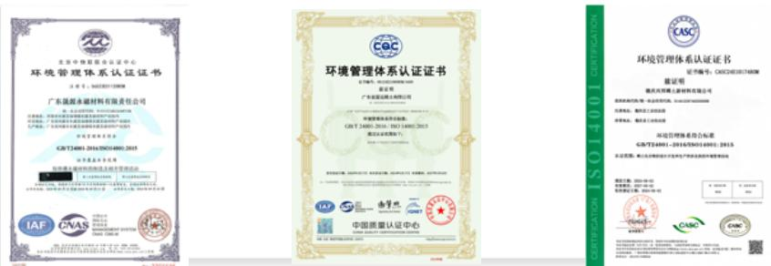

晟源公司

富远公司

兴邦公司

# · 环保考核

公司高度重视环境管理，为确保环境管理体系有效运行，实行环保责任落实情况与考核目标挂钩的制度，加大考核权重，确保责任落实到人到岗。同时，公司每年制定节能环保责任状，并与各所属企业签订责任状，确保环境管理落实到位。

# · 环保培训与宣贯

公司重视环境管理能力建设，制定《环境保护宣传教育管理制度》及年度环保培训计划并严格执行。针对各级负责人、分管领导及安环管理人员开展安全环保管理专业技能培训，每年面向全体员工开展不少于一次环保教育培训；同时对新入职员工实施三级环保教育培训，持续提升全员环保意识与专业能力。

# “六五”环境日知识培训

2025 年 6 月，公司紧扣 “六五” 环境日契机，举办环保知识专题培训。内容涵盖环保政策解读、污染防治案例分析与绿色办公实践，以多样化形式深化环保知识普及，提升全员环保素养，为持续推进公司环保治理工作注入动力。

natural_image

Simple line drawing of a landscape with houses, trees, and a sun, no text or symbols present.

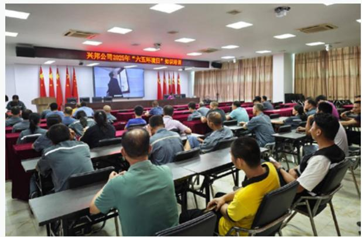

text_image

兴邦公司2025年“六五环通日”知识问答

# 战略

随着环保法律法规越趋严格，公司在运营过程中可能存在着环境合规管理的风险。公司从环境管理的风险和机遇双面切入，结合相关法律法规及生产运营实际，系统识别与评估环境合规风险及机遇，为持续改进提供支撑，严守生态环保底线，助力企业高质量可持续发展。

<table><tr><td>风险类型</td><td>描述</td><td>财务影响说明</td><td>发生概率</td><td>影响大小</td><td>影响时间范围</td><td>影响价值链环节</td><td>应对措施</td></tr><tr><td>政策风险</td><td>政府将来可能出台更严格的污染物排放标准,公司需投入更多资金进行处理设施升级改造、改进处理工艺。</td><td>成本增加</td><td>高</td><td>高</td><td>中期</td><td>运营</td><td>1.及时关注行业相关环保法律法规,根据环保法规的趋势,改进处理设施及处理工艺;2.关注环保前沿技术与新工艺动态,加大环保投入,应用先进工艺及处理设施。</td></tr><tr><td>泄漏风险</td><td>废矿物油等危险废物在储存和运输过程中,或废气废水管道设备在输送中可能发生泄漏,对环境和周边居民造成影响。</td><td>成本增加公司声誉受损</td><td>中</td><td>高</td><td>短期</td><td>运营</td><td>1.建立健全环保管理制度;2.加强环保培训,提高员工环保意识和应急处理能力;3.加强监控巡查与隐患排查,及时掌握危险废物及废气废水管理情况,降低事故发生的概率;4.加强对危险废物设施检查,确保地面硬化、防风防雨设施的完好性,确保无雨水进入,无渗滤液产生,杜绝危废流失。</td></tr><tr><td>末端排放故障风险</td><td>1.公司生产工序含有矿产开采冶炼和金属加工等,废水中含有重金属物质,废水处理系统可能会发生故障,废水处理不达标,导致含重金属废水排生产车间,影响周边生态环境甚至对周边居民身体健康产生影响,影响公司声誉;2.如废气处理系统发生故障,粉尘等废气得不到有效处理,污染大气环境,排放超标可能会受到政府部门处罚。</td><td>成本增加公司声誉受损</td><td>中</td><td>高</td><td>短期</td><td>运营</td><td>1.设置废水事故池,在废水处理系统故障时,及时更换设备恢复运行;2.安排巡检,及时发现故障情况,及时安排检修,定期检查水泵、阀门、管道等,确保运行正常;3.设置废气、废水在线监测系统,及时发现故障情况,当污染物浓度达到预警设定值,进入预警状态;4.开展应急演练活动,确保能及时高效地进行应急救援;5.开展环境监测,确保周边生态环境未受到污染。</td></tr><tr><td>环保信息披露</td><td>公司部分所属企业为重点排污单位,需要根据监管要求,定期披露环境管理信息及污染物排放情况,如披露信息不符合规范,可能使公司受到处罚和声誉受损。</td><td>成本增加声誉受损</td><td>高</td><td>中</td><td>短期</td><td>运营</td><td>1.及时关注环境信息披露的要求、时间,及时合规地披露污染物与废弃物排放信息;2.定期对员工开展培训,确保员工了解最新环保法规、信息披露政策等,增强相关人员对信息披露要求的认识。</td></tr></table>

<table><tr><td>机遇类型</td><td>描述</td><td>财务影响说明</td><td>发生概率</td><td>影响大小</td><td>影响时间范围</td><td>影响价值链环节</td><td>应对措施</td></tr><tr><td>市场机遇</td><td>随着污染防治相关法律法规政策的收紧,市场对绿色企业的认可度越来越高,公司通过绿色生产、技术创新等实现环保升级,在行业内树立绿色标杆,提升市场竞争力。</td><td>收入增加</td><td>中</td><td>高</td><td>长期</td><td>运营下游</td><td>持续提高环境合规管理水平,降低污染物排放量,打造绿色产品。</td></tr></table>

# 影响、风险和机遇管理

# · 环境风险管理

中稀有色重视环境风险管理，为确保能及时、有效地监控环境风险，建立了一套科学、规范的环境风险识别和评价工作流程，全面识别运营活动、产品及服务中的环境因素，为环境风险评估与管控提供坚实依据，保障环境管理体系高效运行。

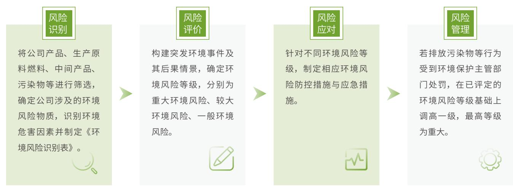

flowchart

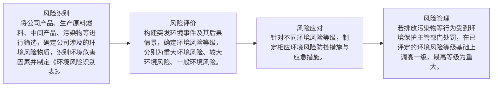
```mermaid
graph LR
  A["风险识别\n将公司产品、生产原料燃料、中间产品、污染物等进行筛选，确定公司涉及的环境风险物质，识别环境危害因素并制定《环境风险识别表》。"] --> B["风险评价\n构建突发环境事件及其后果情景，确定环境风险等级，分别为重大环境风险、较大环境风险、一般环境风险。"]
  B --> C["风险应对\n针对不同环境风险等级，制定相应环境风险防控措施与应急措施。"]
  C --> D["风险管理\n若排放污染物等行为受到环境保护主管部门处罚，在已评定的环境风险等级基础上调高一级，最高等级为重大。"]
```

# · 环境应急管理

公司严格遵循《中华人民共和国突发事件应对法》等法律法规要求，公司及各所属企业均结合生产经营实际制定《突发环境事件应急预案》。公司设立专门应急组织机构，由党委书记、董事长担任总指挥，统一负责应急指挥与统筹协调工作。通过不断健全突发环境事件应急管理机制，持续提升应急处置能力，确保突发事件发生后迅速响应、高效处置。同时，公司制定应急演练计划并按计划实施，进一步强化应急响应水平，切实保障公众生命健康与财产安全。

# - 隐患排查

公司制定《环境风险排查及隐患治理制度》，采取月度、季度现场排查与不定期巡回检查相结合的方式，对各生产部门、车间开展全面环境风险排查。对排查发现的环境风险与事故隐患，由安全环保部（应急指挥中心）下达整改通知书，严格按照“三定、四不推”原则落实整改。公司建立健全风险隐患排查整治长效机制，规范隐患登记与评估工作，从源头防范化解环境风险，有效预防和减少突发环境事件。报告期内，公司针对环境隐患开展全面排查整治，隐患整改率达100%。

# - 土壤及地下水隐患排查

为加强土壤及地下水环境污染防治，持续改善公司周边土壤与地下水环境质量，保障水土资源可持续利用。公司制定土壤和地下水监测方案，由安全环保部（应急指挥中心）负责定期开展土壤、地下水隐患排查及土壤、地下水的监测工作，并对检测结果进行记录形成台账，切实防范土壤及地下水污染风险。

# · 环境监测

公司严格落实自行监测主体责任，定期聘请第三方专业监测机构对污染物排放情况开展监测并出具检测报告。同时，公司结合生产实际与标准规范编制《环保自行监测方案》，明确监测点位、监测因子及频次，确保污染物排放符合相关要求。

# 指标与目标

环境管理目标

<table><tr><td>不发生一般突发环境事件</td><td>不因环境问题受到行政处罚</td><td>环保统计数据不弄虚作假</td><td>严格执行排污许可证制度,污染物100%达标排放</td><td>环保隐患整改完成率达100%</td><td>氨氮排放量≤13.6吨</td><td>化学需氧量排放量≤103吨</td></tr></table>

关键绩效

<table><tr><td>污染物监测合格率</td><td>环保设施同步运转率</td><td>建设项目环保“三同时”执行率</td></tr><tr><td>100%</td><td>100%</td><td>100%</td></tr></table>

# 三废排放与处理

# · 废气管理

公司严格遵循《大气污染物综合排放标准》《稀土行业污染物排放限值》等相关法律法规，制定《生产废气处理作业指导书》等制度规范。公司废气来源主要为生产及锅炉燃烧、窑炉燃烧过程产生的废气，公司通过废气处理设施，有序开展废气污染防治工作。报告期内，公司废气均达标排放。

# 废气污染防治措施

- 富远公司采用水洗、碱洗、酸雾吸收塔、碱液吸收塔 + 活性炭除臭剂、布袋除尘器等治理工艺与设施处理废气，有效减轻对空气质量的影响。  
- 兴邦公司共建设 4 座碱液喷淋塔，2 座酸液喷淋塔用于处理废气，确保排放废气达标排放。

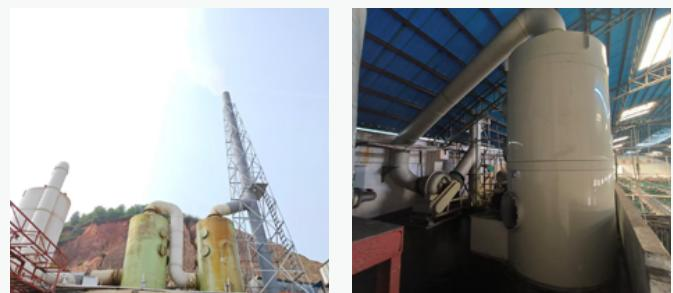

# 关键绩效

颗粒物

0.244吨

二氧化硫

0.159吨

氮氧化物

5.430吨

注：1.2025年各类废气污染物统计范围：富远公司、华企公司、晟源公司、兴邦公司。

# · 废水管理

公司严格遵循《中华人民共和国水污染防治法》《稀土行业污染物排放限值》等法律法规及标准要求，制定《生产废水处理作业指导书》《污染物防治管理制度》《废水站管理规定》等制度，督促各所属企业严格落实执行，实现废水处理规范化、精细化。

公司废水类型为含酸废水、萃取废水、沉淀废水。公司坚持源头治理与过程管控相结合，持续优化生产工艺减少废水产生，并依托完善的处理设施与管理措施，确保废水稳定达标排放。

natural_image

Illustration of three people cleaning a waterway with raindrops and buildings in the background (no text or symbols)

生产废水处理工艺流程图（兴邦公司）  
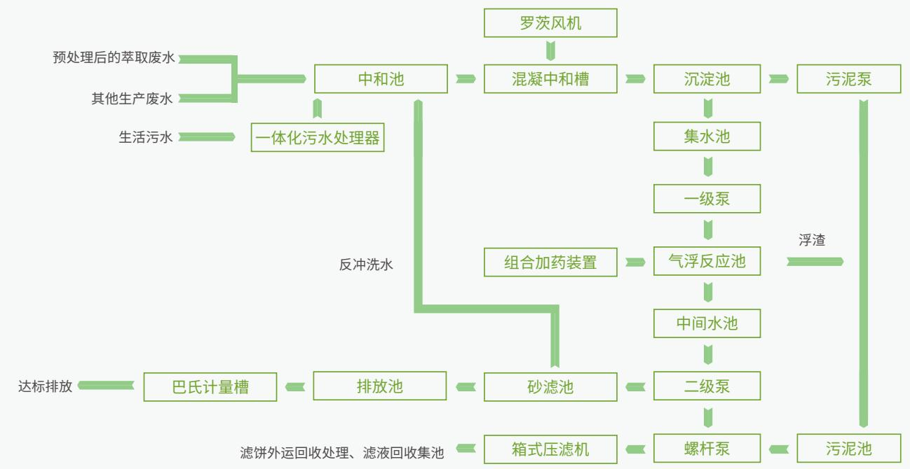

flowchart

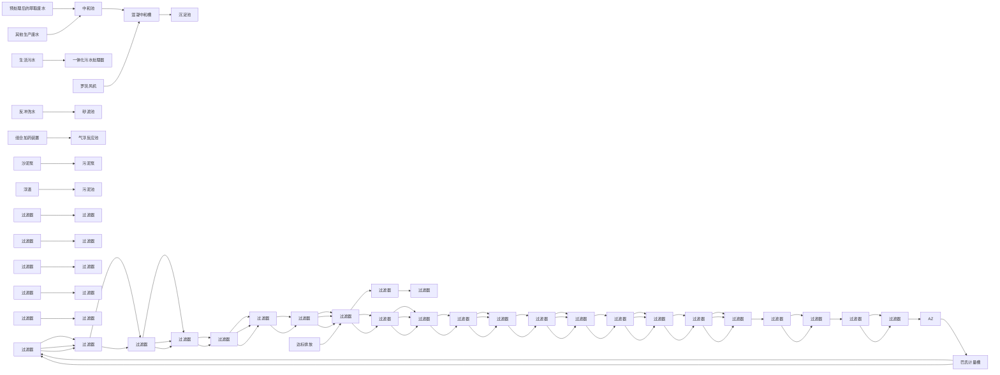
```mermaid
graph LR
  A["预处理后的萃取废水"] --> B["中和池"]
  C["其他生产废水"] --> B
  D["生活污水"] --> E["一体化污水处理器"]
  B --> F["混凝中和槽"]
  G["罗茨风机"] --> F
  F --> H["沉淀池"]
  I["反冲洗水"] --> J["砂滤池"]
  K["组合加药装置"] --> L["气浮反应池"]
  M["沙泥泵"] --> N["污泥泵"]
  O["浮渣"] --> P["污泥池"]
  Q["过滤器"] --> R["过滤器"]
  S["过滤器"] --> T["过滤器"]
  U["过滤器"] --> V["过滤器"]
  W["过滤器"] --> X["过滤器"]
  Y["过滤器"] --> Z["过滤器"]
  AA["过滤器"] --> AB["过滤器"]
  AC["过滤器"] --> AD["过滤器"]
  AE["过滤器"] --> AF["过滤器"]
  AG["过滤器"] --> AH["过滤器"]
  AI["过滤器"] --> AJ["过滤器"]
  AK["过滤器"] --> AL["过滤器"]
  AM["过滤器"] --> AN["过滤器"]
  AO["过滤器"] --> AP["过滤器"]
  AQ["过滤器"] --> AR["过滤器"]
  AS["过滤器"] --> AT["过滤器"]
  AU["过滤器"] --> AV["过滤器"]
  AW["过滤器"] --> AX["过滤器"]
  A1["达标排放"] --> AJ
  AJ --> AA
  BB["巴氏计量槽"] --> AC
  AC --> AD
  AD --> AE
  AE --> AF
  AF --> AG
  AG --> AH
  AH --> AI
  AI --> AJ
  AJ --> AK
  AK --> AL
  AL --> AM
  AM --> AN
  AN --> AO
  AO --> AP
  AP --> AQ
  AQ --> AR
  AR --> AS
  AS --> AT
  AT --> AU
  AU --> AV
  AV --> AW
  AW --> AX
  AX --> AZ
  AZ --> BB
  BB --> AC
  AC --> AD
  AD --> AE
  AE --> AF
  AF --> AG
  AG --> AH
  AH --> AI
  AI --> AJ
  AJ --> AK
  AK --> AL
  AL --> AM
  AM --> AN
  AN --> AO
  AO --> AP
  AP --> AQ
  AQ --> AR
  AR --> AS
  AS --> AT
```

生产废水站工艺流程图（石人嶂公司）  
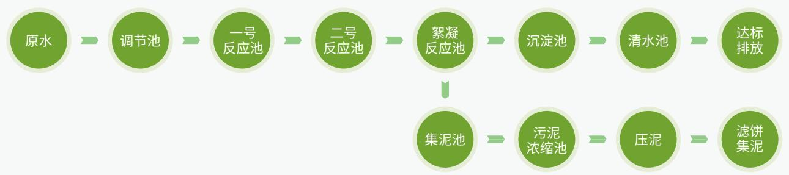

flowchart

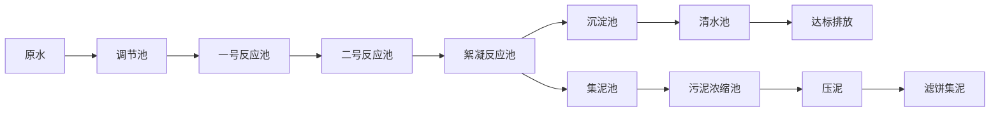
```mermaid
graph LR
  A["原水"] --> B["调节池"]
  B --> C["一号反应池"]
  C --> D["二号反应池"]
  D --> E["絮凝反应池"]
  E --> F["沉淀池"]
  F --> G["清水池"]
  G --> H["达标排放"]
  E --> I["集泥池"]
  I --> J["污泥浓缩池"]
  J --> K["压泥"]
  K --> L["滤饼集泥"]
```

生活废水处理工艺流程图  

flowchart

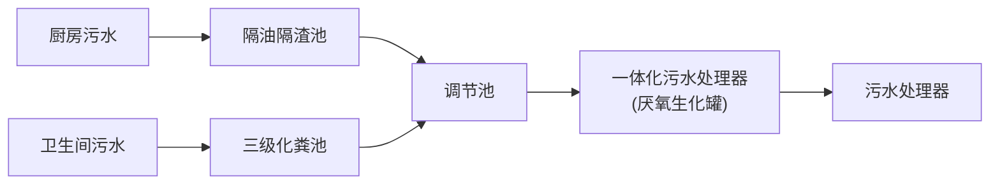
```mermaid
graph LR
  A["厨房污水"] --> B["隔油隔渣池"]
  C["卫生间污水"] --> D["三级化粪池"]
  B --> E["调节池"]
  D --> E
  E --> F["一体化污水处理器\n(厌氧生化罐)"]
  F --> G["污水处理器"]
```

# 废水减排举措

富远公司通过降低高价元素压槽，并停开部分重稀土槽，降低压槽，减少 $NH_{4}Cl$ 废水；同时，富远公司通过沉淀协同技术，解决 $CaCl_{2}$ 废水处理压力，从而减少废水排放种类。

<table><tr><td>关键指标</td><td>单位</td><td>2025年</td></tr><tr><td>COD</td><td>吨</td><td>10.11</td></tr><tr><td>氨氮</td><td>吨</td><td>0.84</td></tr><tr><td>总铅</td><td>吨</td><td>0.0073</td></tr><tr><td>总砷</td><td>吨</td><td>0.0001</td></tr><tr><td>工业废水排放总量</td><td>万吨</td><td>35.55</td></tr></table>

注：2025年各类污染物统计范围：富远公司、华企公司、晟源公司、兴邦公司。

# · 废弃物管理

中稀有色坚持“减量化、资源化、无害化”的固废处理原则，制定《固体废物管理暂行办法》等制度，明确规范废弃物分类、收集、存储和处置全过程，确保废弃物处理全过程符合环保要求。公司持续完善废弃物管理机制，明确由安全环保委员会作为固体废物管理的领导机构，负责公司固体废物监管工作，研究审议固体废物管理工作的重大事项，确保固体废物管理工作有效落实。

公司产生的固体废弃物分为一般固体废弃物、伴生放射性固体废物与危险固体废弃物。对于一般固体废弃物，公司优先进行回收利用，无法回收的则由有资质的公司进行处置；对于伴生放射性固体废物、危险固体废弃物，统一暂存渣库、危废仓库贮存，并联系有资质的第三方专业机构进行处置。

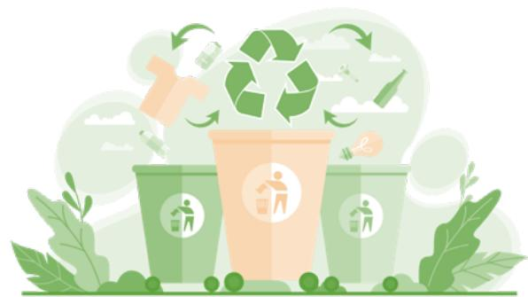

natural_image

Illustration of recycling bins with recycling symbols and waste sorting, surrounded by green leaves and a cloud (no text or symbols)

# 废弃物减量化

公司积极鼓励、引导各子公司合理选择和利用原材料及其他资源，优化生产工艺，减少废弃物产生，提高资源综合利用率。

# 固体废渣减量化

富远公司生产过程中产生固体废渣，其中沉淀废渣具有含水率高的显著特性，导致储存及处置成本较高。富远公司通过高温烘烧方式，降低固体废渣的含水率，实现固体废渣减量约50%，从而降低环境风险。

<table><tr><td>关键指标</td><td>单位</td><td>2025年</td></tr><tr><td>无害废弃物产生量</td><td>吨</td><td>5,322.40</td></tr><tr><td>无害废弃物处置量</td><td>吨</td><td>7,820.46</td></tr><tr><td>无害废弃物产生强度</td><td>吨/营业收入(亿元)</td><td>91.45</td></tr><tr><td>有害废弃物产生量</td><td>吨</td><td>25.48</td></tr><tr><td>有害废弃物处置量</td><td>吨</td><td>26.07</td></tr><tr><td>有害废弃物产生强度</td><td>吨/营业收入(亿元)</td><td>0.44</td></tr></table>

注：  
1.2025 年各类废弃物统计范围：富远公司、华企公司、晟源公司、兴邦公司。

# - 噪声控制

公司严格遵守《中华人民共和国环境噪声污染防治法》《工业企业厂界环境噪声排放标准》等法律法规。为保障员工的身体健康、减轻厂界噪声对周边环境的影响，公司采用低噪声设备、对高噪音的设备采用消声减振等措施实现降低噪音的影响。同时，公司定期开展噪声检测，确保满足相关标准，降低噪声污染。

# 尾矿管理

为加强尾矿库管理，公司制定《尾矿库日常运行安全管理十项规定》，建立健全尾矿库安全管理责任制，明确安全管理责任人。同时，公司积极落实尾矿库应急管理，储备应急物资并定期开展应急预案演练，确保各项安全、技术管理措施落实到位，切实保障尾矿库安全稳定运行。

报告期内，公司积极推进已闭库尾矿库销库工作，已对河口山2号库、师姑山库开展清砂销库工作，同时稳步推进梅子窝2号库的清砂销库进程，通过销库工作，有效消除尾矿库风险。

# 践行绿色运营

# - 绿色矿山建设

中稀有色深入贯彻“绿水青山人人共享，绿色管理人人有责”的发展理念，大力推进矿区生态建设，建立健全绿色矿山建设管理制度与标准，强化矿山生产经营全过程管理，推动稀土矿山绿色化、智能化发展。

华企公司依托工业互联网平台，打造涵盖数字孪生矿山、矿产资源管理、透植被边坡雷达在线监测预警系统等在内的数字化智能矿山，有效防范山体滑坡等安全风险。同时积极推行节能措施，深化绿色矿山建设，致力于打造绿色智能矿山。此外，富远公司积极推进绿色工厂建设。公司通过协同推进绿色矿山与绿色工厂建设，持续提升生态环境保护水平。

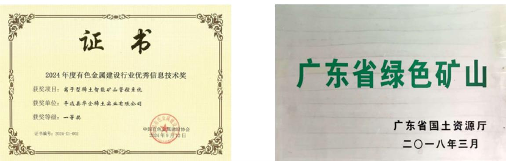  
智能矿山绿色化建设示范工程证书  
绿色矿山

# · 清洁生产

中稀有色坚持绿色生产环保理念，全面深化清洁生产工作，着力降低产品能耗、水耗，减少污染物产生。各所属企业已成立清洁生产审核小组，通过明确人员分工，制定清洁生产目标，落实生态环境部门提出的验收意见，持续优化生产工艺，进一步提升清洁生产水平。截至报告期末，各所属企业清洁生产审核均在有效期内。

# · 绿色办公

公司积极倡导绿色办公理念，从节水、节电、垃圾分类等多维度开展，打造低碳高效办公环境。

# 节水

· 在办公楼、食堂等区域安装节水器具，强化用水管控，切实降低水资源消耗。

# 节电

\- 使用LED等节能灯具；

·规范电脑、打印机等办公设备用电管理，推行人走断电、设备定时关机等措施，有效减少电力及待机能耗。

# 节约纸张

\- 大力推行无纸化办公，依托内部办公系统、电子邮件等开展文件传输与信息沟通，倡导纸张双面打印、单面废纸重复利用，提升纸张使用效率。

# 规范垃圾分类

\- 规范办公垃圾分类处置，设置分类回收设施，引导员工分类投放，强化废纸、塑料瓶等可回收物资源化利用。

# > 资源精益配置

# 能源管理

# · 能源管理体系

公司严格遵循《中华人民共和国节约能源法》等法律法规，结合公司实际情况制定《能源节约与生态环境保护暂行管理办法》《能源节约和生态环境保护责任制管理办法》，落实节能环保主体责任，全面推进公司节能环保工作，确保公司节能环保管理目标的顺利实现。

公司成立安全环保部（应急指挥中心），负责组织分解公司节能减排目标任务；负责推进节能技术改造、能源管理体系建设等项目实施，提升公司能源利用效率，助力公司建设资源节约型企业。

报告期内，富远公司已获得 GB/T 23331-2020/ISO 50001：2018 能源管理体系认证。

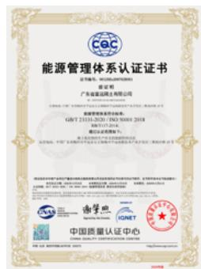

text_image

CEC
能源管理体系认证证书
王学梅，中国能源建设协会
校正
广东富润能源有限公司
GENT 23315-2020/IND NOVI 2018
1997年1月1日
通过认证有效期至：
广东省电力公司广东省电力公司广东省电力公司广东省电力公司广东省电力公司广东省电力公司广东省电力公司广东省电力公司广东省电力公司广东省电力公司广东省电力公司广东省电力公司广东省电力公司广东省电力公司广东省电力公司广东省电力公司广东省电力公司广东省电力公司广东省电力公司广东省电力公司广东省电力公司广东省电力公司广东省电力公司广东省电力公司广东省电力公司广东省电力公司广东省电力公司广东省电力公司广东省电力公司广东省电力公司广东省电力公司广东省电力公司广东省电力公司广东省电力公司广东电力公司广东省电力公司广东省电力公司广东省电力公司广东省电力公司广东省电力公司广东省电力公司广东省电力公司广东省电力公司广东省电力公司广东省电力公司广东省电力公司广东省电力公司广东省电力公司广东省电力公司广东省电力公司广东省电力公司广东省电力公司广东省电力公司广东省电力公司广东省电力公司广东省电力公司广东省电力公司广东省电力公司广东省电力公司广东省电力公司广东省电力公司广东省电力公司广东省电力公司广东省电力公司广东省电力公司广东省电力公司广东省电力公司广东省 electricity power plant
中国质量认证中心
China National Power Plant Co., Ltd.
CHINA QINAN POWER Plant Co., Ltd.
QINET
中国质量认证中心

能源管理体系认证证书

# 节能宣传周

为普及节能知识，提高全员节能意识，公司紧紧围绕全国节能宣传周组织实施一系列活动，如“光盘行动”“关灯一小时”活动，对重点生产所属企业开展用能、节能检查，重点检查各部门的用能管理、用能环节和高能耗设备的使用情况，对发现的问题提出整改措施，致力于提高公司用能效率。

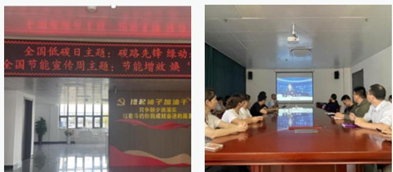

# · 能源管理指标与目标

公司依据安全环保考核机制，将碳达峰相关指标纳入安全环保责任书考核评价体系，将重点任务落实情况纳入考核范围，强化指标约束。各所属企业按照公司双碳工作组要求，规范开展碳强度下降率基础数据统计，制定可再生能源利用发展规划，按年度开展碳达峰水平评估，并接受上级公司监督考核。公司持续强化对各所属企业碳达峰目标与任务落实情况的考核评价，及时排查问题、提出改进措施，并督促企业完成整改落实。

<table><tr><td>关键指标</td><td>单位</td><td>2025年</td></tr><tr><td>直接能源消耗量</td><td>吨标准煤</td><td>4,280.08</td></tr><tr><td>天然气</td><td>万立方米</td><td>305.87</td></tr><tr><td>汽油</td><td>吨</td><td>10.06</td></tr><tr><td>柴油</td><td>吨</td><td>33.68</td></tr><tr><td>煤油</td><td>吨</td><td>100.68</td></tr><tr><td>间接能源消耗量</td><td>吨标准煤</td><td>5,337.08</td></tr><tr><td>外购电力</td><td>万千瓦时</td><td>4,342.62</td></tr><tr><td>能源消耗总量</td><td>吨标准煤</td><td>9,617.16</td></tr><tr><td>能源消耗强度</td><td>吨标准煤/营业收入(亿元)</td><td>165.24</td></tr></table>

注：  
1.2025 年年外购电力统计范围：富远公司、华企公司、晟源公司、兴邦公司，且已扣除绿电。

# - 节能措施

公司积极推动节能降耗工作，持续推进节能降耗工艺及设备低碳化更新改造，全面提升能源利用效率。

报告期内，晟源公司开展光伏发电项目，目前已完成合同签订。公司各所属企业共购买绿电 462.12 万 Kwh，其中富远公司 220 万 Kwh，兴邦公司 67.21 万 Kwh，晟源公司 119.71 万 Kwh，华企公司 55.2 万 Kwh。

<table><tr><td>节能举措</td><td>具体实施内容与成效</td></tr><tr><td>推广工艺技改,进一步降低能耗</td><td>富远公司通过降低萃取车间电机转速和调整产品结构等措施,电单耗从1,848度/吨降至1,700度/吨,降低8%。</td></tr><tr><td>增加稀土永磁电机应用比例,进一步降低电耗</td><td>各所属企业全年陆续更换节能伺服电机190台,节约用电约50万千瓦时。</td></tr><tr><td>优化生产工艺流程</td><td>晟源公司开展冷却循环水系统改造,实现熔炼车间与烧结车间水资源复用,同步关停2台水泵,改造后可节约电能135千瓦时,降低了生产运营成本。</td></tr></table>

# 水资源管理

中稀有色重视水资源的合理合规利用，将水资源管理融入生产运营全过程，持续采取有效措施提升水资源利用率，并加强对用水过程的监督检查。

公司积极推进生产用水循环利用，以节水增效促进节能降耗。富远公司采用新工艺技术，实现生产废水回用，通过 MVR 蒸发处理，减少生产废水约 16 万 $m^{3}$ ，生产废水回用率达 70% 以上。兴邦公司通过回收草酸类的产品低电导水洗水，用于回收料产品水洗，每月约节省用水 $600m^{3}$ ；同时将回转窑余热废水回用于草酸镨钕沉淀底水，月回用约 $300m^{3}$ ，有效降低镨钕沉淀用水量与底水加热天然气消耗。

<table><tr><td>关键指标</td><td>单位</td><td>2025年</td></tr><tr><td>新鲜水取水总量</td><td>万吨</td><td>39.96</td></tr><tr><td>循环用水量</td><td>万吨</td><td>1,014.07</td></tr><tr><td>循环水用量占比</td><td>%</td><td>96.21</td></tr><tr><td>总用水量</td><td>万吨</td><td>1,054.03</td></tr><tr><td>水资源消耗强度</td><td>万吨/营业收入(亿元)</td><td>0.687</td></tr></table>

注：  
1.2025 年水资源管理统计范围：富远公司、华企公司、晟源公司、兴邦公司；  
2. 水资源消耗强度仅统计新鲜水。

# 物料管理

公司制定《物料采购管理制度》《存货管理制度》《仓库管理制度》等制度，规范物料入库、验收、贮存、发放管理等流程，确保物料符合生产要求，有效提升生产效率，降低运营成本。

natural_image

Illustration of two warehouse workers carrying boxes, one forklift in background (no text or symbols)

# 循环经济

中稀有色高度重视循环经济发展，聚焦能源、水资源、物料三大维度推进资源精益配置，通过工艺技改、绿电采购、设备升级等举措降低能耗，强化生产用水循环利用，规范物料全流程管理，推动企业向循环经济发展新模式转型，全面提升可持续发展能力。

# > 生态共生守护

中稀有色关注自身生产经营对生物多样性的影响，严格遵循《中华人民共和国土壤污染防治法》《中华人民共和国水污染防治法》《关于进一步加强生物多样性保护的意见》等国家及所在地相关法律法规，严格遵守生态保护红线监管规定，不在生态保护红线范围内开展不符合主体功能定位的建设活动或排放污染物。公司坚持人与自然是生命共同体，制定并实施生态保护和恢复治理方案，积极保护生物多样性，保障生态安全。

公司持续推进绿色矿山建设，积极开展矿山生态修复与复绿工作。华企公司着力加强生态环境的系统修复与保护，2025年共计完成老矿山复绿面积430亩（含滑坡区），老矿区生态得到根本性改善；同时完成废水处理站建设并投入运行，有序开展矿山淋洗作业，累计处理山体淋洗废水82,997m³，实现废水规范处置。石人嶂公司持续推进原石人嶂尾矿库复绿工作，目前已完成总工程量约90%。

矿山复绿  
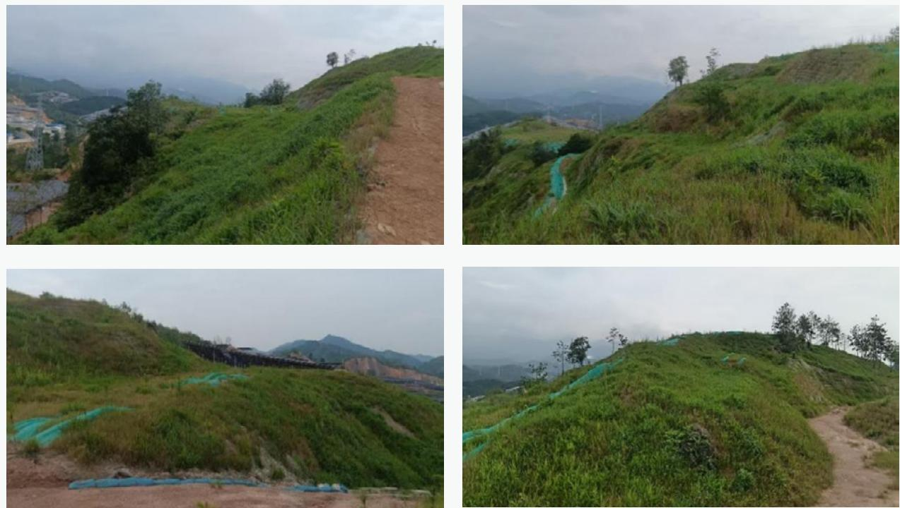

# 专题

# 笃行实干创新 铸就大国重器

作为中国稀土集团骨干企业，中稀有色始终践行科技自立自强与绿色高效发展使命，将技术创新深度融入生产实践，以“小改小革”推动稀土产业高质量发展。

在前处理车间，公司成功研发并应用第三代皂化技术，在效率、成本与环保方面实现重大提升，实现皂化生产高度自动化，有效降低员工劳动强度，达成高效、环保、低成本协同发展。同时，为进一步提高溶矿环节的效率和安全性，公司正推进稀土离子矿一体化连续自动化投料、除渣与低温溶矿系统建设。

在萃取分离领域，公司通过实施车间环境优化及镧铈镨钕槽体全面升级改造，进一步提升了萃取环节效率与稳定性；对分组槽等关键设备实施系统性提升改造，有力保障生产线持续稳产高产，月均处理量成功突破300吨大关；高纯钇项目实现重大突破，成功产出纯度高达5N的氯化钇产品，彰显公司突破关键核心技术的硬实力。

这些立足实际、务实高效的创新实践，生动缩影了中稀有色作为央企践行责任、追求卓越的坚定步伐，深刻诠释了“大国重器”所蕴含的创新基因与实干精神。

第三代皂化技术  

text_image

第三代皂化技术示范线

高度自动化生产体系  
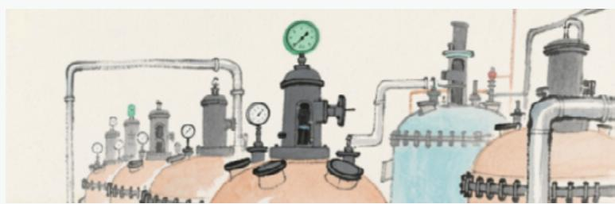

natural_image

Illustration of industrial piping and tanks with valves and valves (no text or symbols)

稀土离子矿  
一体化预处理项目

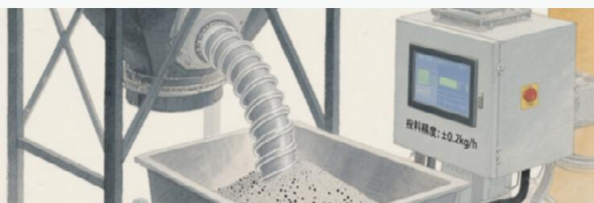

text_image

投料精度: ±0.2kg/h

高效萃取分离  

text_image

洁净生产 精细萃取

# 04

# 科创引领强质效 数智赋能兴产业

# 我们的行动

·科创驱动发展  
- 匠造品质根基  
·筑牢信息防线  
· 负责任供应链

# SDGs

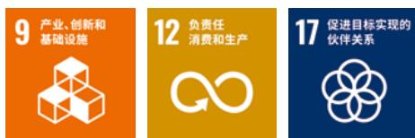

# > 科创驱动发展

# 治理

为充分调动科技人员和广大员工对科技创新工作的积极性，有效解决公司在生产、经营、安全和发展中的技术难题，实现科技项目管理工作科学化、规范化、制度化，公司制定《科技项目管理办法》《科技经费管理办法》《科技成果管理办法》等内部管理制度，通过统筹布局、权责清晰、程序规范、监督有力，有效避免重复研发投入，构建规范、高效的科技项目管理体系，提升公司科技项目管理水平。

# · 研发管理架构

公司设立科技创新委员会，负责研究审议公司科技创新体系建设工作，统筹协调、整体推进、督促落实科技创新领域重大事项。科技创新委员会下设专家库，按矿业、冶金、材料、环安等专业划分组别，由科创与数智化部会同人力资源部（党委组织部）从公司系统内外遴选主营业务相关领域的技术专家和管理人员入库，并邀请部分外部技术专家共同组成，构建多层次、跨领域的专家库，为公司科技决策提供强有力的智力支撑。

# · 研发创新平台

公司始终坚持科技创新在引领公司高质量发展中的核心地位，聚焦主责主业，加强科技创新，推动公司及所属企业可持续发展。截至报告期末，公司拥有5家高新技术企业、4家专精特新企业，9个省级研发平台（含4个省级工程技术中心、1个省级企业技术中心、2个博士工作站、2个科技专家工作站），以及6个市级研发平台。

报告期内，中稀有色多家所属企业科技创新平台建设取得显著成效：富远公司相继获批“广东省博士工作站”“广东省专精特新中小企业”“广东省科技专家工作站”；晟源公司获评2025年河源市市级企业技术中心；兴邦公司获批建设2025年度肇庆市重点实验室。

“广东省博士工作站”  
—富远公司—  
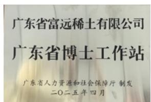

“广东省专精特新中小企业”  
- 富远公司 -  
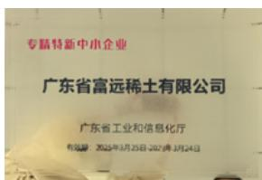  
“广东省科技专家工作站”  
- 富远公司 -  
广东省富远稀土有限公司

广东省科技专家工作站  
(2025.12-2028.12)  
广东省科学技术协会二〇二五年十二月  
2025年河源市市级企业技术中心  
一 晟源公司一  
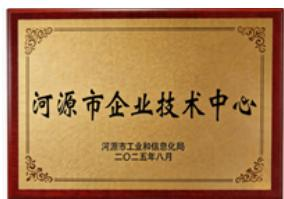

# · 研发团队建设

公司高度重视团队建设与人才培育，依托企业技术中心、博士工作站、科技专家工作站等多层次研发平台，集聚高层次科研人才，完善产学研协同创新机制，聚焦稀土领域关键技术攻关与成果转化，持续打造专业结构优、创新能力强、梯队完善的研发队伍，为公司技术升级与高质量发展提供坚实人才与科技支撑。

<table><tr><td colspan="3">研发团队</td></tr><tr><td>关键指标</td><td>单位</td><td>2025年</td></tr><tr><td>研发团队总人数</td><td>人</td><td>116</td></tr><tr><td>研发人员占员工总人数比例</td><td>%</td><td>12.37</td></tr><tr><td colspan="3">按学历划分</td></tr><tr><td>本科以下</td><td>人</td><td>66</td></tr><tr><td>本科</td><td>人</td><td>39</td></tr><tr><td>硕士</td><td>人</td><td>9</td></tr><tr><td>博士</td><td>人</td><td>2</td></tr><tr><td colspan="3">按年龄划分</td></tr><tr><td>30岁以下(不含30岁)</td><td>人</td><td>27</td></tr><tr><td>30-40岁(含30岁,不含40岁)</td><td>人</td><td>29</td></tr><tr><td>40-50岁(含40岁,不含50岁)</td><td>人</td><td>36</td></tr><tr><td>50-60岁(含50岁,不含60岁)</td><td>人</td><td>24</td></tr><tr><td>60岁以上</td><td>人</td><td>0</td></tr><tr><td colspan="3">按性别划分</td></tr><tr><td>男性</td><td>人</td><td>108</td></tr><tr><td>女性</td><td>人</td><td>8</td></tr></table>

# · 科技奖项

报告期内，公司及其所属企业深耕稀土领域技术研发与创新实践，在稀土冶炼废水处理、永磁材料制备、高端稀土新材料研发、稀土矿山数字化等多个关键技术方向取得丰硕成果，斩获多项省市级、行业级重要科技奖项及创新创业大赛奖项，科技创新实力与技术成果转化能力持续提升，为公司高质量发展筑牢技术创新根基。

广东省富远稀土有限公司  
《南方离子吸附型稀土冶炼高盐废水零排放关键技术》  
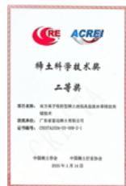

广东晟源永磁材料有限责任公司  
《高性能高一致性烧结钕铁硼磁体制备关键技术与产业化》  
《磁粉颗粒分布及磁粉流动性调控技术研发》  
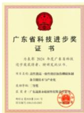

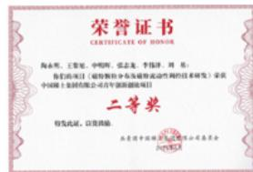

稀土科学技术奖

二等奖

2025 年度广东省

科技进步奖二等奖

中国稀土集团有限

公司青年创新创效

项目二等奖

# 中稀有色金属股份有限公司

《面向废水零排放的南方离子吸附型稀土冶炼新技术》

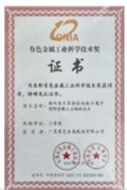

《基于综合除杂萃取技术的高端稀土新材料 - 高纯中重稀土氧化物》

# 德庆兴邦稀土新材料有限公司

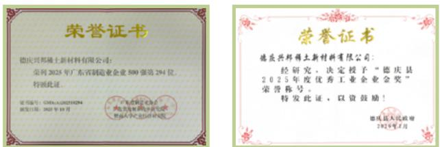

# 有色金属工业科学技术奖三等奖

# 第九届“创客广东”大赛一等奖

# 2025年广东制造业企业500强

# 德庆县2025年度优秀工业企业金奖

# 战略

面对市场需求的日益个性化和多元化发展趋势，中稀有色始终坚持以创新驱动发展，通过深度研判行业技术方向、精准把握市场动态变化、快速响应政策导向，持续完善研发创新体系。公司着力构建高素质、专业化的研发人才梯队，不断优化创新激励机制和研发管理体系，为打造具有核心竞争力的创新型企业提供强劲动力，推动公司实现高质量发展。

<table><tr><td>风险类型</td><td>描述</td><td>财务影响说明</td><td>发生可能性</td><td>影响大小</td><td>影响时间范围</td><td>影响价值链环节</td><td>应对措施</td></tr><tr><td>技术风险</td><td>新出现的技术在理论上可行,但在实施过程中存在无法解决的问题,对技术顺利实施造成制约。</td><td>收入减少成本增加</td><td>低</td><td>大</td><td>中期</td><td>上游</td><td>通过进行多阶段的分析和评估,谋划阶段性的技术指标,有针对性地实施,尽力解决可能存在的风险。</td></tr><tr><td>技术创新应用后所产生的风险</td><td>部分科技人员的目标比较单一,主要集中在技术上的创新,但技术创新滞后对企业、行业的影响考虑得较少。</td><td>收入减少</td><td>低</td><td>大</td><td>中期</td><td>上游</td><td>建立学习型组织,通过学习、培训和指导等方式,促使技术人员在技术应用过程中做到目标明确,效益可观。</td></tr><tr><td>科技项目立项所产生的风险</td><td>部分所属企业未能按照《中稀有色科技管理制度》的规定进行落实,可能导致项目目标不明确、项目资源分配不合理、进度监控缺失等情况发生。</td><td>收入减少</td><td>低</td><td>大</td><td>中期</td><td>上游</td><td>1.持续关注下属企业研发项目,时常提醒企业在项目立项前将备案材料报送科创与数智化部;2.修订和印发《中稀有色科技管理制度》,科技计划管理严格按管理制度执行;3.做好年度科技项目计划,合理规范编制项目可行性报告和资金使用及实施计划。</td></tr></table>

<table><tr><td>风险类型</td><td>描述</td><td>财务影响说明</td><td>发生可能性</td><td>影响大小</td><td>影响时间范围</td><td>影响价值链环节</td><td>应对措施</td></tr><tr><td>知识产权风险</td><td>1.公司专利申请的时机选择不当,可能导致技术泄露或被他人抢先申请;2.未能及时缴纳专利年费可能导致专利权失效,管理不善可能导致专利资产流失;3.相似商标会有注册风险,管理不善可能导致商标流失。</td><td>收入减少</td><td>低</td><td>大</td><td>中期</td><td>上游</td><td>1.待技术成熟时,及时完成专利申请;2.及时缴纳专利年费,加强专利日常管理和维护;3.定期检查商标更新情况,加强商标日常维护和管理。</td></tr></table>

<table><tr><td>机遇类型</td><td>描述</td><td>财务影响说明</td><td>发生可能性</td><td>影响大小</td><td>影响时间范围</td><td>影响价值链环节</td><td>应对措施</td></tr><tr><td>市场机遇</td><td>新兴技术的涌现往往预示着全新市场领域的开辟,公司可以敏锐捕捉这一契机,便能显著提升生产效率,迅速扩大市场版图,从而实现业务的飞跃式增长。</td><td>成本降低收入增加</td><td>中</td><td>大</td><td>中期</td><td>上游</td><td>1.建立技术中心、博士工作站等研发创新平台,聚焦主责主业,加强科技创新;2.打造数字化应用平台,优化生产经营流程,推动业务效能的提升。</td></tr></table>

# 影响、风险和机遇管理

为降低研发创新风险，公司从实际经营情况出发，依据《风险控制管理制度》，对风险和机遇进行识别及评估，通过有效识别研发过程中的风险因素，跟踪监测重大风险事件，以降低风险，实现技术创新。

# 风险信息收集

利用各种方法和途径收集、整理公司各项管理活动和经营活动中所有相关的内、外部风险信息，并对风险信息进行筛选、提炼，并及时传达给相关单位及人员。

# 风险评估

通过定性与定量相结合的方式定期对风险进行评估，按照风险评价标准，从风险的可能性、可能的影响程度对识别出的风险进行排序，确定风险的高、中、低等级和管理的优先顺序与策略。

# 风险应对

公司根据不同业务特点确定风险偏好和风险承受度，明确风险点最低限度和不能超过的最高限度，并据此确定风险的预警线及相应采取的策略。

# 风险监测

建立风险监测、预警与报告机制，根据业务领域特点和绩效指标，结合行业水平、实际状况等因素设定相关风险监测预警指标和风险水平预警值，动态显示风险水平和预警。

# 风险管理

定期对风险管理工作进行自查、检验，及时发现缺陷并改进。

# 指标与目标

2025 年考核目标和完成情况如下:

<table><tr><td>考核内容</td><td>2025年完成情况</td></tr><tr><td>研发经费投入强度(工业企业)达到3.9%以上</td><td>已完成</td></tr><tr><td>牵头获批省部级研发项目1项</td><td>已完成</td></tr><tr><td>新增省部级平台2个以上</td><td>已完成</td></tr><tr><td>实现5项自有科技成果转化</td><td>已完成</td></tr><tr><td>6件发明专利受理,3件发明专利授权</td><td>已完成</td></tr></table>

<table><tr><td>关键指标</td><td>单位</td><td>2025年</td></tr><tr><td>研发经费投入</td><td>万元</td><td>9,663.44</td></tr><tr><td>研发经费投入占工业收入比例</td><td>%</td><td>4.09</td></tr><tr><td>新产品开发项目数</td><td>个</td><td>10</td></tr><tr><td>新产品销售收入</td><td>万元</td><td>15,907.12</td></tr><tr><td>新产品产值率</td><td>%</td><td>6.73</td></tr></table>

注：1.研发经费投入由日常性研发经费支出、购买固定资产、新技术、科研设备等支出、其他支出构成；  
2. 新产品产值率的计算分母为工业收入。

# 创新驱动措施

# ·研发激励

公司依据《科技成果奖励管理办法》《创新驱动发展奖励暂行办法》等制度，构建起权责清晰、程序规范的科技创新激励与评审体系。通过设立国家级、省部级科技成果配套奖励，明确差异化奖励标准与兑现原则，对为公司科技创新作出突出贡献的集体和个人予以表彰奖励，充分调动科技人员创新积极性与主动性，助力公司科技创新水平和核心竞争力提升。

公司严格规范创新奖项评审全流程管理，设立专门监督机构对评审工作开展全程监督，从评审专家遴选、评审组织实施、现场评审管理，到评审结果公示、异议受理处理形成闭环管控机制，始终秉持公开、公平、公正原则开展评审工作，确保科创激励工作规范落地、有效实施，为公司创新驱动发展提供坚实制度保障。

同时，公司秉持“效益导向、贡献匹配、公平公正公开”原则，建立研发项目收益分红机制，依据《研发项目收益分红制度》，对成功落地并产生收益的研发项目团队予以分红激励。为保障激励机制公平有效，公司成立由财务、审计、人力资源等部门组成的监督小组，对分红方案实施全过程开展监督。

# 关键绩效

报告期内，公司在创新驱动发展奖励方面，授予融资贡献奖4项、科技创新先进单位1家、先进工作者7名、创新驱动发展奖励单项奖24项、优秀首席专家工作室2个、优秀科技特派员2名、产学研合作贡献奖1项；2025年度累计发放创新驱动发展奖励为171.6万元。

# · 产学研合作

公司积极探索产学研协同创新模式，与多所高校、科研院所及院士工作站建立长期稳定的战略合作伙伴关系，汇聚优质科研资源，加速科技成果产业化转化，持续提升核心竞争力，为行业技术进步与产业升级提供有力支撑。

# 中国稀土集团永磁院士工作站合作

公司所属晟源公司与中国稀土集团创新科技有限公司深化产学研合作，依托其稀土永磁院士工作站的优质科研资源，围绕高性能、超高性能稀土永磁材料研发及磁应用技术与器件开发等核心方向开展深度合作。双方将联合开展技术攻关、申报各级科创项目，院士工作站还将为公司提供技术指导、人才培养等支持，助力公司实现技术成果产业化落地。

# 联合中南大学深化产学研合作

2025 年，中稀有色、华企公司联合中南大学深化产学研合作，携手开展离子型稀土矿生物开采工业应用关键技术研发，作为绿色无氨新型稀土矿开采工艺相关研究的延续工作，重点推动离子型稀土矿生物开采关键技术的科技成果工业转化，建设年开采 200 吨稀土氧化物的工业生产试验线，验证完善生产参数，助力技术规模化落地应用。

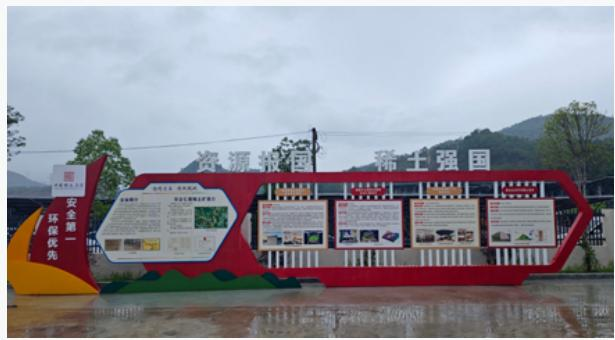

text_image

资源报国 稀土强国
安全第一
环境优先

# ·行业标准制定

中稀有色依托深厚的研发实力与丰富的市场经验，积极参与国际、国家和行业标准的制定工作，为规范行业发展、提升行业整体质量水平贡献重要力量，彰显了公司的行业担当与社会责任。

# ·行业交流

为强化行业交流合作，公司以“市场需求导向、技术协同创新、产业化落地”为总体思路，聚焦“稀土功能材料国产替代化、产业化”核心使命，围绕抛光粉、热障涂层等战略性新材料领域，与行业内优质企业、科研院所开展全方位调研交流与技术对接。积极走访上下游企业及科研机构，深挖市场需求与行业技术瓶颈。报告期内，立足“市场需求-技术瓶颈-合作资源”三维度，完成半导体抛光液、功能材料、高纯纳米化三大领域21家单位调研。

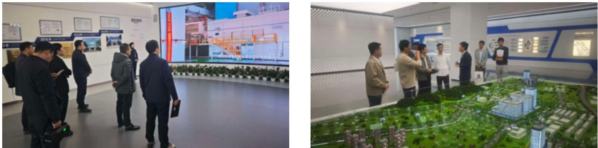

  
行业交流考察

# 创新成果展示

公司深耕稀土产业链技术创新，聚焦绿色开采、冶炼环保、资源综合利用等核心领域，联合科研院所攻坚关键技术，多项成果达国际先进、领先水平，入选央企科技创新成果推荐目录、国家生态环境科技成果转化典型案例等国家级榜单，实现技术突破与产业化落地深度融合，持续提升核心竞争力。

<table><tr><td>创新成果名称</td><td>创新成果内容</td></tr><tr><td>离子吸附型稀土冶炼高盐废水零排放技术</td><td>入选央企科创成果推荐目录、国家生态环境科技成果转化典型案例,建成国内首座南方离子吸附性稀土冶炼高盐废水零排放处理系统,实现高盐废水零排放。</td></tr><tr><td>高一致性烧结钕铁硼磁体调控关键技术与应用</td><td>整体技术达国际先进水平,核心技术国际领先,建成年产3,000吨生产线,实现了高性能、高一致性烧结钕铁硼磁体的可控制备。</td></tr><tr><td>离子型稀土矿生物开采关键技术</td><td>技术水平国际领先,实现离子型稀土矿绿色高效开采,有效保障稀土关键原材料的稳定供应,提升我国稀土战略关键矿产的安全保供度。</td></tr><tr><td>极低品位钨矿工业生产技术</td><td>研发“破碎-跳汰-重选-毛毯”选矿工艺,有效提升钨精矿品位与回收率,实现低品位稀有矿产资源高效利用与经济收益双提升。</td></tr><tr><td>离子型稀土矿山数字化关键技术与应用</td><td>入选稀土科学技术奖申报项目,构建矿山数字化技术体系,实现离子型稀土矿山开采的智能化、精细化管控。</td></tr></table>

公司累计获授权专利 150 项，2025 年新增 11 项，研发成果转化 9 项，拥有多项国际国内领先科技成果。

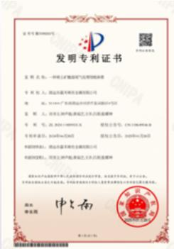

text_image

证书号:2018020号
发明专利证书
发明名称:一种用于实验室使用广泛透明质谱仪
专利权人:浙江海通光电科技有限公司
地址:浙江省宁波市鄞州区宁南西路37号21层
发明人:刘文生,许伟峰,廖志红,王小兵,沈连建坤
专利号:ZL 2018110005X
授权公告号:CN1100494636
专利申请日:2018年06月28日
授权公告日:2018年06月28日
申请时间:浙江海通光电科技有限公司
申请时间至:2018年06月28日
申请人:浙江海通光电科技有限公司
申请人(个人)：浙江海通光电科技有限公司
申请人(机构)：浙江海通光电科技有限公司
申请人(单位)：浙江海通光电科技有限公司
申请人(联系电话):037-633-633-633-633-633-633-633-633-633-633-633-633-633-633-633-633-633-633-633-633-633-633-633-633-633-63<nl>

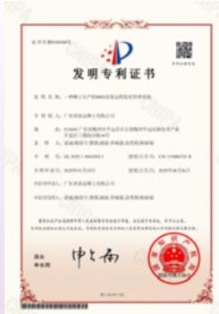

text_image

专利号: 31010500000
发明专利证书
专利名称：一种用于生产4000万套高分子结构的专用商标
专利权人：广东宏远建设工程有限公司
地址：广州市广州天行区天行工业区西门街道中路高新技术产业开发区三路8号2幢2单元
发明人：珠海市海宁区香洲镇南港街道南港街道南港街道
专利号：ZL 2019 11610251
授权公告号：CN 119006723 B
专利申请日：2020年04月23日
授权公告号：2020年04月24日
中国科学院、广东省高速公路工程局
专利登记机关：珠海市海宁区香洲镇南港街道南港街道南港街道
通知书（仅限申请人）详见本公告。
特此公告。
申请人：中山雨

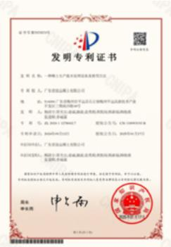

text_image

专利号: 广东富远运输有限公司
发明人: 广东富远运输有限公司
专利号: 2014-0317
专利申请日: 2024年05月22日
授权公告号: CN 110991018.X
授权公告号: 2025年05月27日
专利权人: 广东富远运输有限公司
专利权人: 银行宁市立成高速公路技术改造系统工程股份有限公司
专利权人: 广东富远运输有限公司
授权委托书送达之日起生效,并可在指定时间内送达。本授权委托书的签署日期为2025年05月27日
授权书编号: 中交所
发证机关: 广东富远运输有限公司
专利权人: 广东富远运输有限公司
专利权人: 广东富远运输有限公司
专利权人: 广东富远运输有限公司
专利权人: 广东富远运输有限公司
专利权人: 广东富远运输有限公司
专利权人: 广东富远运输有限公司
专利权人: 广东富远运输有限公司
专利权人: 广东富远运输有限公司
专利权人: 广東富远运输有限公司
专利权人: 广東富远运输有限公司
专利权人: 广東富远运输有限公司
专利权人: 广東富远运输有限公司
专利权人: 广東富远运输有限公司
专利权人: 广東富远运输有限公司
专利权人: 广東富远运输有限公司
专利权人: 广東富远运输有限公司
专利权人: 广東富远运输(中国)有限公司

# 知识产权保护

中稀有色聚焦技术创新能力提升与自主知识产权培育，制定并实施《知识产权管理办法》，设立知识产权工作领导小组统筹相关工作。公司强化知识产权保护，建立科学的知识产权档案管理体系，配备兼职档案管理员，档案管理部门定期开展档案审查鉴定，对无保存价值档案按规定执行销毁程序，实现规范管理。

截至报告期末，公司所属企业富远公司知识产权管理体系于4月份通过年度审核。

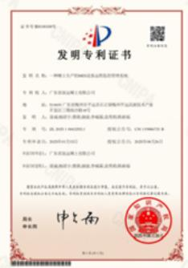

text_image

专利号: 20180309号
发明专利证书
专利名称：一种用于生产4000万套高精度高精度塑料制品
专利权人: 广东富通运输有限公司
地址: 京(2018)京沪西区长江路西侧中远达高新技术产业园
专利权人: 广东富通控股, 肖源地址: 广东富通市高新区
专利号: 京(2018)京沪西区
授权公告号: CN 110607528 B
专利申请日: 2020年6月6日
授权公告号: 2020年6月26日
专利授权公告: 广东富通运输有限公司
专利申请日: 广东富通控股, 肖源地址: 广东富通市高新区
授权公告号: 广东富通控股, 肖源地址: 广东富通市高新区
授权公告号: 广东富通控股, 肖源地址: 广东富通市高新区
授权公告号: 广东富通控股, 肖源地址: 广东富通市高新区
授权公告号: 广东富通控股, 肖源地址: 广东富通市高新区
授权公告编号: 中南雨

富远公司知识产权合规管理体系认证证书

# 遵守科技伦理

公司恪守科学伦理准则，严格遵守相关法律法规，以严谨、真实、透明的态度推进稀土及有色金属领域研发创新，严格规避可能加剧环境污染、资源过度消耗的技术开发，绝不参与违背伦理道德的研发活动，确保公司的技术和产品始终服务于可持续发展和社会福祉。

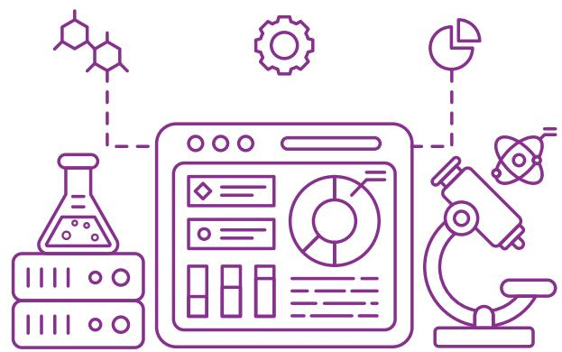

flowchart

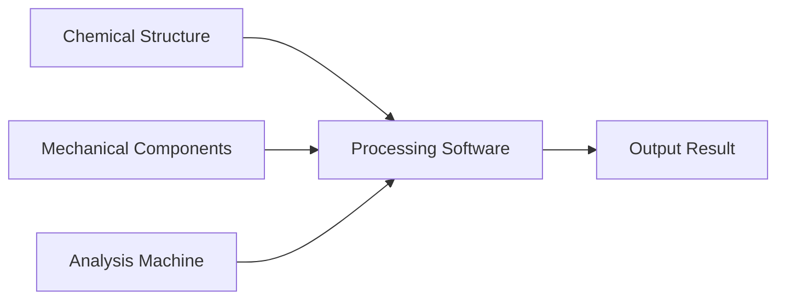
```mermaid
graph LR
  A["Chemical Structure"] --> B["Processing Software"]
  C["Mechanical Components"] --> B
  D["Analysis Machine"] --> B
  B --> E["Output Result"]
```

# > 匠造品质根基

# 治理

公司秉持“质量第一，客户至上，创新引领，追求卓越”质量方针，制定《质量管理办法（试行）》《质量/环境管理手册》等制度，构建完善的产品质量管理体系。公司明确质量管理组织职责，由主要负责人负主要领导责任、分管领导统筹管理，企业管理部（矿产资源部）作为归口管理部门，牵头推进质量管理体系的搭建、运行与持续改进，各相关部门按职责分工协同落实质量管控工作；所属企业均设立专门质量管理机构、配备专业人员，全面负责本单位日常质量管理工作。

此外，公司推行 QC 小组建设，引导员工围绕生产经营实际开展质量改进、降本增效等专项活动，通过专业培训、成果评审及分级奖励等举措，充分激发全员质量提升积极性，持续推动公司质量管理水平提升。

<table><tr><td>部门</td><td>职责</td></tr><tr><td>企业管理部(矿产资源部)</td><td>·负责将质量工作纳入公司发展规划;·组织对公司决策的新建和改扩建项目的产品方案、质量保障措施进行论证。</td></tr><tr><td>财务部</td><td>·负责将质量工作所需经费纳入公司财务预算;组织质量成本的统计、核算、分析和控制。</td></tr><tr><td>科创与数智化部</td><td>·负责提升公司产品质量创新力,协助提升产品质量竞争力;·组织开展产品质量技术研究、开发和成果应用,推进各类质量技术奖的申报。</td></tr><tr><td>纪检工作部</td><td>·负责与A类质量相关的违纪、违规事件的调查处理。</td></tr></table>

截至报告期末，公司及所属企业富远公司、兴邦公司通过了 ISO 9001 质量管理体系认证。

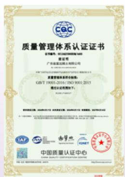

text_image

质量管理体系认证证书
证书编号：中国注册会计师协会
证书号：
广东粤财证券股份有限公司
GB/T 19901-2016/ISO 9001.2015
国家认证机构发证：
CAIC
中国质量认证中心
IAF
中审众环
ICNET
中国质量认证中心
ISSN 1000000000000000000000000000000000000000000000000000000000000000000000000000000000
中国质量认证中心
ISSN 100000000000000000000000000000000000000
ISSN 10001-2016/ISO 9001.2015
国家认证机构发证：
CAIC
中审众环
ICNET
中国质量认证中心
ISSN 1001-2016/ISO 901-2015
国家认证机构发证：
CAIC
中审众环
ICNET
中国质量认证中心
ISSN 118-2-24/ISO 91-2-24/ISO 91-2-24/ISO 91-2-24/ISO 91-2-24/ISO 91-2-24/ISO 91-2-24/ISO 91-2-24/ISO 91-2-24/ISO 91-2-24/ISO 91-2-24/ISO 9
ISSN 118-2-24/ISO 91-2-24/ISO 91-2-24/ISO 91-2-24/ISO 91-2-24/ISO 91-2-24/ISO 91-2-24/ISO 91-2-24/ISO 91-2-24/ISO 91-2<nl>

富远公司质量管理体系认证

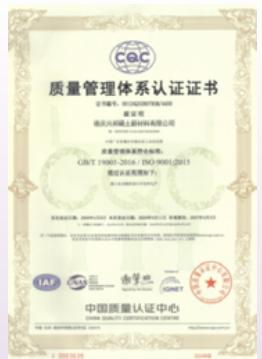

text_image

质量管理体系认证证书
证书编号：CEC201900004888
企业号：SICHUANQIYUHUAQIYUHUAQIYUHUAQIYUHUAQIYUHUAQIYUHUAQIYUHUAQIYUHUAQIYUHUAQIYUHUAQIYUHUAQIYUHUAQIYUHUAQIYUHUAQIYUHUAQIYUHUAQIYUHUAQIYUUHUAQIYUHUAQIYUHUAQIYUHUAQIYUHUAQIYUHUAQIYUHUAQIYUHUAQIYUHUAQIYUHUAQIYUHUAQIYUHUAQIYUHUAQIYUHUAQIYUHUAQIYUHUAQIYUHUAQIC
中国质量认证中心
中国质量认证中心
中国质量认证中心
中国质量认证中心
中国质量认证中心
中国质量认证中心
中国质量认证中心
中国质量认证中心
中国质量认证中心
中国质量认证中心
中国质量认证中心
中国质量认证中心
中国质量认证中心
中国质量认证中心
中国质量认证中心
中国质量认证中心
中国质量认证中心
中国质量认证中心
中国质量认证中心
中国质量认证中心
中国质量认证管理中心
中国质量认证管理中心
中国质量认证管理中心
中国质量认证管理中心
中国质量认证管理中心
中国质量认证管理中心
中国质量认证管理中心
中国质量认证管理中心
中国质量认证管理中心
中国质量认证管理中心
中国质量认证管理中心
中国质量认证管理中心
中国质量认证管理中心
中国质量认证管理中心
中国质量认证管理中心
中国质量认证管理中心
中国质量认证管理中心
中国质量认证管理中心
中国质量认证管理中心
中国质量认证管理中心
中国质量认证中心
中国质量认证中心
中国质量认证中心
中国质量认证中心
中国质量认证中心
中国质量认证中心
中国质量认证中心
中国质量认证中心
中国质量认证中心
中国质量认证中心
中国质量认证中心
中国质量认证中心
中国质量认证中心
中国质量认证中心
中国质量认证中心
中国质量认证中心
中国质量认证中心
中国质量认证中心
中国质量认证中心
中国质量认证服务中心

兴邦公司质量管理体系认证

# 战略

公司始终将产品质量视为生存与发展的生命线，严格恪守国家法律法规及行业标准要求。结合实际经营发展，公司对潜在质量风险开展深度评估，对发展机遇进行科学研判，保障产品品质持续稳定。

<table><tr><td>风险类型</td><td>描述</td><td>财务影响说明</td><td>发生可能性</td><td>影响大小</td><td>影响时间范围</td><td>影响价值链环节</td><td>应对措施</td></tr><tr><td>声誉风险</td><td>部分产品质量未达到行业标准或未达到客户要求,可能造成客户投诉,进而导致公司品牌形象受损和客户忠诚度降低。</td><td>成本增加公司声誉受损</td><td>高</td><td>中</td><td>中期</td><td>下游</td><td>严格把控质量标准,与各部门沟通协调,若出现质量问题,加强销售人员与客户信息沟通,将客户损失降到最低。</td></tr></table>

<table><tr><td>机遇类型</td><td>描述</td><td>财务影响说明</td><td>发生可能性</td><td>影响大小</td><td>影响时间范围</td><td>影响价值链环节</td><td>应对措施</td></tr><tr><td>市场竞争</td><td>随着全国人工成本的不断提高和环保要求的日趋严格,单位产品的制造成本呈逐步上升趋势,而整个行业又处于产能过剩、产品价格低迷的情况,对所有公司来说都是一个严峻的挑战。同时这也是淘汰落后过剩产能的机会,只要公司能够度过这个阶段,必然能够迎来大发展。</td><td>收入增加</td><td>高</td><td>高</td><td>长期</td><td>运营</td><td>主动积极扩大原料采购来源,同时加强滞销品种的销售。</td></tr><tr><td>经营环境</td><td>公司通过积极技改和加强管理的方法,降本增效。通过不断地研发新技术及引入自动化设备,持续降低生产成本。</td><td>成本减少</td><td>中</td><td>中</td><td>中期</td><td>运营</td><td>推进精益生产,通过推进技改,降低生产成本提高生产效率,增强竞争力。</td></tr></table>

# 影响、风险和机遇管理

为有效降低产品质量风险，公司制定《风险和机遇应对措施控制程序》《风险评估与机遇分析报告》等制度文件，明确相关管理工作流程及部门职责，实现对各类质量风险与发展机遇的规范化应对。

# 风险识别

对可能存在风险的车间、生产过程和人员存在的风险进行逐一筛选识别，考虑法律、市场、技术、供应商等多方面因素，识别潜在风险点。

# 风险评估

对识别出的产品风险进行评估, 按照风险的严重度和发生频率评价准则确认风险等级系数, 找出重要风险项目。

# 风险应对

各部门确定应对风险和机遇采取的措施,采用风险接受、风险降低、风险规避等方法应对,确保风险控制措施的有效性及可行性。

# 风险监督

指派相关人员为措施的执行进度和效果进行跟进,确保措施的有效落实,并对应对措施有效性进行评价,直到目标达成。

# 指标与目标

公司将质量指标纳入绩效考核体系，对质量指标改善的部门予以奖励，对指标劣化的部门予以处罚，考核结果与员工绩效收入直接挂钩，推动质量管理水平稳步提升。

<table><tr><td>质量管理目标</td><td>2025年完成情况</td></tr><tr><td>顾客满意度总体水平≥85%</td><td>已完成</td></tr></table>

中稀有色所属企业富远公司绩效

<table><tr><td>关键指标</td><td>单位</td><td>2025年</td></tr><tr><td>开展风险评估次数</td><td>次</td><td>2</td></tr><tr><td>年内质量内审次数</td><td>次</td><td>1</td></tr><tr><td>聘请第三方机构抽检次数</td><td>次</td><td>4</td></tr><tr><td>因健康与安全原因须撤回和召回的产品数量百分比</td><td>%</td><td>0</td></tr><tr><td>因健康与安全原因需撤回和召回的产品数量</td><td>件</td><td>0</td></tr><tr><td>公司负面舆情</td><td>次</td><td>0</td></tr></table>

中稀有色所属企业兴邦公司绩效

<table><tr><td>关键指标</td><td>单位</td><td>2025年</td></tr><tr><td>开展风险评估次数</td><td>次</td><td>1</td></tr><tr><td>年内质量内审次数</td><td>次</td><td>1</td></tr><tr><td>聘请第三方机构抽检次数</td><td>次</td><td>5</td></tr><tr><td>因健康与安全原因须撤回和召回的产品数量百分比</td><td>%</td><td>0</td></tr><tr><td>因健康与安全原因需撤回和召回的产品数量</td><td>件</td><td>0</td></tr><tr><td>公司负面舆情</td><td>次</td><td>0</td></tr></table>

中稀有色所属企业富远公司、兴邦公司、晟源公司绩效

<table><tr><td>关键指标</td><td>单位</td><td>2025年</td></tr><tr><td>责任营销培训人次</td><td>人次</td><td>67</td></tr><tr><td>责任营销培训总时长</td><td>小时</td><td>27</td></tr><tr><td>责任营销培训次数</td><td>次</td><td>13</td></tr></table>

# 质量管理措施

# · 产品制造全生命周期管理

公司依据《质量管理办法（试行）》，建立完善的产品制造全生命周期质量管理体系，覆盖计划、采购、生产、成品、销售售后及质量改进各环节，明确各环节质量要求与处置规范，通过闭环管理持续提升产品质量与核心竞争力。

<table><tr><td>环节</td><td>内容</td></tr><tr><td>采购物资质量管理</td><td>采购合同明确质量要求,物资进厂按标准检验、计量、标识,合格后方可入库结算与使用,做好储运管理及质量统计分析。</td></tr><tr><td>生产过程质量控制</td><td>新产品研发从源头把控质量,批量生产执行首件鉴定与批检;生产遵循工艺标准,关键工序重点管控,实施自检互检专检,杜绝不合格品流转。</td></tr><tr><td>成品管控</td><td>成品经检验合格后方可入库,做好入库记录与质量标识;出厂凭质量合格证明,包装、标识、计量符合标准,不合格品按规处置。</td></tr><tr><td>售后质量管理</td><td>收集顾客反馈,开展满意度调查与回访,及时处理质量异议,持续改进产品质量。</td></tr></table>

# · 产品召回管理

中稀有色所属企业兴邦公司建立了完善的不合格品管控及退（换）货管理机制，依据《不合格品控制程序》，实现对原材料、半成品、成品等各生产环节不合格品的闭环管理，明确质检部为不合格品判定评审主体，按层级划分质检部、副总经理、总经理的审批处置权限。针对出厂不合格成品，由总经理制定专项处理方案，同时配套规范的《退（换）货管理办法》，规范内外部退（换）货的条件、书面申请流程及多层级审核要求。

# 客户服务

# · 客户服务管理

公司高度重视客户权益保障，制定《销售业务管理制度》，以标准化管理规范销售流程、提升运营效率，实现公司经济效益最大化。

公司围绕稀土产品发展目标与销售需求，多渠道收集、分析客户资料并建立规范客户档案，通过电话沟通、客户走访、信函联系等多元化方式，保持与客户的常态化互动。

同时，公司构建完善客户服务机制，定期开展客户回访与满意度调查，系统收集客户反馈，及时响应诉求，持续优化产品性能与服务质量，以优质产品及服务解决方案提升客户满意度与品牌忠诚度，实现与客户共赢发展。

# · 客户满意度

公司致力于构建长期稳定的合作伙伴关系，为持续提升客户体验，所属企业兴邦公司制定《顾客满意度管理程序》，通过定期开展顾客满意度调查，系统收集并分析顾客反馈信息，识别客户需求，持续优化沟通机制，全面提升客户服务质量。

公司建立直接沟通、满意度调查表等多渠道顾客信息收集机制，由企业管理部（矿产资源部）统一登记、整理客户反馈与投诉并转交质检部分析处置。相关部门依据分析结果制定并落实纠正预防措施，企业管理部（矿产资源部）对相关资料存档管理并定期编制汇总报告，质检部跟踪改进措施的实施效果，及时向客户反馈改进情况，确保客户满意度持续提升。

客户满意度调查流程  
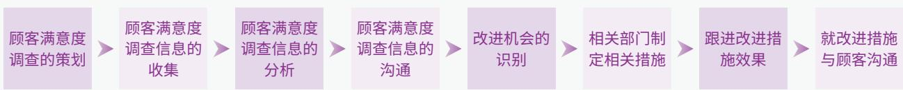

flowchart

```mermaid
graph LR
  A["顾客满意度调查的策划"] --> B["顾客满意度调查信息的收集"]
  B --> C["顾客满意度调查信息的分析"]
  C --> D["顾客满意度调查信息的沟通"]
  D --> E["改进机会的识别"]
  E --> F["相关部门制定相关措施"]
  F --> G["跟进改进措施效果"]
  G --> H["就改进措施与顾客沟通"]
```

中稀有色所属企业富远公司绩效

<table><tr><td>关键指标</td><td>单位</td><td>2025年</td></tr><tr><td>客户投诉数量</td><td>次</td><td>0</td></tr><tr><td>客户投诉解决数量</td><td>件</td><td>0</td></tr><tr><td>参与调查的客户数量</td><td>人</td><td>16</td></tr><tr><td>参与调查的客户占比</td><td>%</td><td>60</td></tr><tr><td>客户满意度调查问卷发放有效份数</td><td>份</td><td>16</td></tr><tr><td>客户满意度</td><td>%</td><td>100</td></tr><tr><td>应对客户投诉响应考核通过率</td><td>%</td><td>100</td></tr></table>

中稀有色所属企业兴邦公司绩效

<table><tr><td>关键指标</td><td>单位</td><td>2025年</td></tr><tr><td>客户投诉数量</td><td>次</td><td>0</td></tr><tr><td>客户投诉解决数量</td><td>件</td><td>0</td></tr><tr><td>参与调查的客户数量</td><td>人</td><td>5</td></tr><tr><td>参与调查的客户占比</td><td>%</td><td>100</td></tr><tr><td>客户满意度调查问卷发放有效份数</td><td>份</td><td>5</td></tr><tr><td>客户满意度</td><td>%</td><td>100</td></tr><tr><td>应对客户投诉响应考核通过率</td><td>%</td><td>100</td></tr></table>

·中稀有色所属企业晟源公司绩效

<table><tr><td>关键指标</td><td>单位</td><td>2025年</td></tr><tr><td>客户投诉数量</td><td>次</td><td>26</td></tr><tr><td>客户投诉解决数量</td><td>件</td><td>26</td></tr><tr><td>参与调查的客户数量</td><td>人</td><td>38</td></tr><tr><td>参与调查的客户占比</td><td>%</td><td>100</td></tr><tr><td>客户满意度调查问卷发放有效份数</td><td>份</td><td>38</td></tr><tr><td>客户满意度</td><td>%</td><td>95</td></tr><tr><td>应对客户投诉响应考核通过率</td><td>%</td><td>100</td></tr></table>

# · 质量文化建设

为加强质量宣传教育，公司通过质量安全培训、质量管理评比等不定期活动，持续提升全员质量意识与服务素养。

# 质量管理知识竞赛活动

2025 年，公司组织开展全面质量管理知识竞赛活动，引导广大员工学习运用全面质量管理相关知识与方法，进一步提升全员质量意识和综合素养，夯实企业质量提升工作基础。

中稀有色所属企业富远公司绩效

<table><tr><td>关键指标</td><td>单位</td><td>2025年</td></tr><tr><td>质量文化培训人次</td><td>人次</td><td>30</td></tr><tr><td>质量文化培训总时长</td><td>小时</td><td>15</td></tr><tr><td>质量文化培训次数</td><td>次</td><td>4</td></tr></table>

中稀有色所属企业兴邦公司绩效

<table><tr><td>关键指标</td><td>单位</td><td>2025年</td></tr><tr><td>质量文化培训人次</td><td>人次</td><td>16</td></tr><tr><td>质量文化培训总时长</td><td>小时</td><td>2.5</td></tr><tr><td>质量文化培训次数</td><td>次</td><td>2</td></tr></table>

# · 客商信用管理

公司建立完善的客商信用管理体系，依据《客商信用管理制度》《销售客商管理制度》等制度，规范开展销售客商信息管理与信用管控工作，有效防范商贸业务风险。由企业管理部（矿产资源部）牵头客商开发与信息收集建档，实施动态化管理并严格保密客商档案。通过多渠道开展客商信用调查，综合多维度指标进行资信评分，将客商划分为 A、B、C、D 四个信用等级，分级设定差异化授信额度与期限。建立客商信用动态评价与风险应对机制，及时调整授信策略，同时规范合同签订、货款催收等全流程业务操作，以标准化、精细化的信用管理保障商贸业务稳健开展。

# > 筑牢信息防线

# 信息安全管理

公司信息化工作遵循“统筹规划、资源共享、安全可靠、务求实效”的原则，依据《中华人民共和国网络安全法》《广东省计算机信息系统安全保护条例》《信息化工作管理办法》等相关法律法规，制定《信息化工作管理办法》，进一步加强信息化工作的规范管理，提高管理水平。

公司办公室（党委办公室、保密办公室）作为信息化工作的日常管理机构，负责公司信息化工作的日常管理。各部门按照公司信息化规划方案有关要求，有序开展相应业务类信息系统的建设及管理工作，确保信息化工作与业务发展深度融合。

公司持续加强基础设施的安全防护，为本地网络、OA系统、ERP系统部署防火墙，并定期开展漏洞扫描。同时，公司聘请专职团队实时监控安全状况，及时排查处置安全风险，为信息化系统的稳定运行提供坚实保障。

# 关键绩效

报告期内，公司未发生重大信息安全事件及泄露客户隐私事件。

# 信息安全应急管控

为健全网络安全事件应急工作机制，提升应急处置能力，公司依据《中华人民共和国网络安全法》《国家网络安全事件应急预案》等法律法规，制定《网络安全事件应急预案》，有效预防和减少网络安全事件造成的损失与影响。公司根据事件影响范围与严重程度，对网络安全事件实施分级管理，明确应急处置标准。

在公司网络安全和信息化领导小组统一领导下，由领导小组办公室统筹组织网络安全事件应对工作；公司各部门及所属企业依据职责与权限，负责本单位网络与信息系统的预防、监测、报告及应急处置，并积极配合网信办开展相关工作。

# > 负责任供应链

# 供应链管理体系

为规范公司供应商管理工作，明确管理职责边界，公司制定《供应商管理制度》《客户和供应商管理暂行办法》《采购管理暂行规定》等制度，建立供应商准入审查、动态考评、分级管理机制，持续提升贸易与供应链安全保障能力。

# 公司供应商管理应当遵循以下原则

统一管理，分级负责

量化考核，动态评级

充分竞争，扶优劣汰

供应商全生命周期管理

<table><tr><td>供应商准入</td><td>·供应商需经过资质审查和供应范围审查,经审查通过后加入公司供应商资源库;·供应商应向公司部门或所属企业提交准入申请。</td></tr><tr><td>供应商分类</td><td>·按照产品依存度、采购数量、产品重要性等,分为核心供应商、重要供应商、一般供应商、不合格供应商。</td></tr><tr><td>供应商考核</td><td>·对供应商实行“动态考核、择优汰劣”的考评管理,公司部门和所属企业分别负责对其审查通过的供应商采取日常管理与定期考评相结合的方式进行考评;·每年对发生业务合作的供应商从“综合实力、报价行为、合同执行情况、奖罚情况”等方面进行年度考评;对未发生业务合作的供应商,从资质和准入资料有效性等方面进行符合性审查。</td></tr><tr><td>供应商动态调整</td><td>·公司及所属企业每年根据年度考核动态调整供应商的分级,淘汰不合格的供应商;对考核业绩优秀、保障供应工作有突出贡献的供应商,在进行考评时适当加分和提高信用等级。</td></tr><tr><td>供应商分级</td><td>·根据考评结果将供应商分为“A”“B”“C”“D”四个由高到低的资信等级;·A级、B级、C级供应商视为合格供应商,D级供应商为不合格供应商。</td></tr><tr><td>供应商监督</td><td>·公司部门和所属企业按年度向企业管理部(矿产资源部)反馈其供应商在合同履约、付款时效、质量、价格、交货期、售后服务及廉政建设等方面的重大不良表现;·企业管理部(矿产资源部)负责对本单位在供应商管理方面的投诉及举报问题进行初步核实,涉及违规违纪的问题线索按规定移交纪委处理。</td></tr><tr><td>供应商退出</td><td>·对出现违约行为的供应商给予警告、降低信用等级、暂停合作、冻结交易、退出资源库、列入灰名单、黑名单等处罚。</td></tr></table>

# 廉洁采购

公司恪守公开、公平、公正的采购原则，坚持廉洁采购，持续深化与供应商的合作关系，将可持续发展理念融入供应商管理，推动供应商在安全生产、环境保护、劳工权益等方面履行社会责任。

公司持续开展供应链管理及合作伙伴管理，通过在与供应商签订的合同中明确廉洁条款及合作伙伴尽职调查，严禁供应商以任何形式提供贿赂、回扣及其他不正当利益。对存在廉洁风险的供应商，公司审慎处置或拒绝合作。同时，公司定期开展供应商审计与监督检查，确保供应商在业务往来中严格遵守公司廉洁规定。

# 关键绩效

报告期内，中稀有色所属企业晟源公司、富远公司供应商廉洁协议签署率均为100%。

# 平等对待中小企业

公司秉持诚信经营、平等包容的准则，严格恪守款项支付相关法律法规及合同约定，尊重并公平对待各合作中小企业，不存在拖欠中小企业款项的情形，切实维护供应链上下游合作伙伴的合法权益。

# 专题

# 精育骨干力量 赋能企业发展

2025年10月，中稀有色紧扣体制机制改革部署与年度教育培训计划，联合中国稀土集团资源科技股份有限公司，重磅启动“启新·聚变”中层管理人员及年轻骨干综合能力提升发展研修班，精准聚焦总部中层管理人员、业务骨干及第三支“星石计划”优秀年轻干部培育，为企业高质量发展锻造核心人才队伍。研修班分两期于11月在杭州开展封闭式培训，教学落地浙江大学紫金港校区及实践参访企业，通过系统理论教学与标杆对标学习，全方位提升参训人员政治素养、战略思维、组织领导、决策执行等综合能力，助力管理思维迭代与专业能力精进。培训实行规范化管理，参训人员需严守纪律，以学促干、以知促行，切实将培训成果转化为企业战略执行与协同效能提升的内生动力，为企业可持续发展筑牢人才根基。

natural_image

Illustration of three people in a classroom setting, one pointing at a whiteboard with a laptop and icons (no text or symbols present)

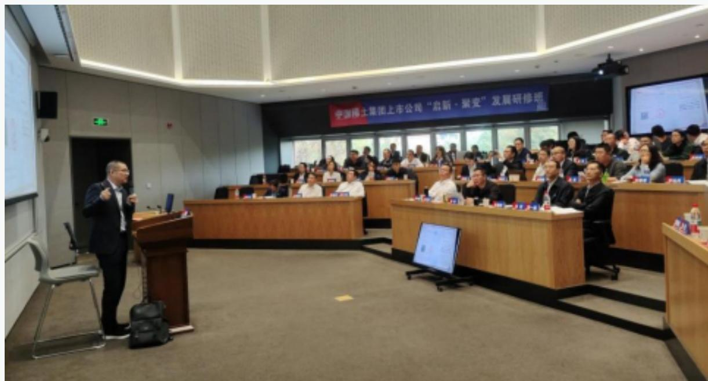

text_image

宁波稀土集团上市公司“启新·聚变”发展研修班

natural_image

Group of people in a medical setting, hands arranged in a circle (no visible text or symbols)

# 同心聚力护民生公益担当向未来

# 我们的行动

- 厚植员工福祉  
·守护职业健康  
·践行社会责任

# SDGs

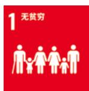

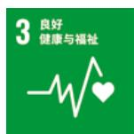

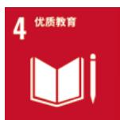

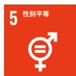

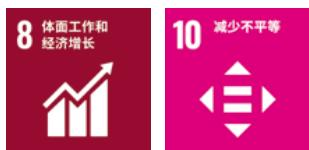

# > 厚植员工福祉

# 人才吸引与招聘

# · 招聘管理

公司遵循 “公开招聘、先内后外、平等竞争、能岗匹配、择优聘用” 原则，制定《招聘管理制度》，规范员工招聘流程，完善人才选用机制，由人力资源部（党委组织部）负责年度招聘规划及相关招聘工作。

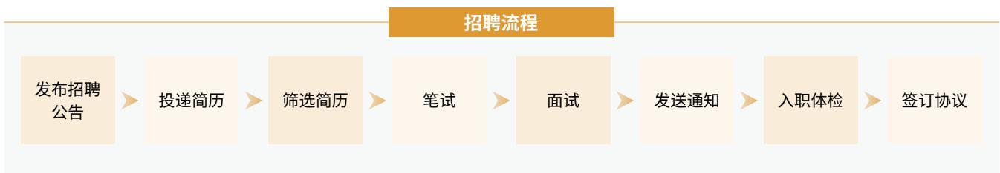

flowchart

```mermaid
graph LR
  A["发布招聘公告"] --> B["投递简历"]
  B --> C["筛选简历"]
  C --> D["笔试"]
  D --> E["面试"]
  E --> F["发送通知"]
  F --> G["入职体检"]
  G --> H["签订协议"]
```

公司通过社会招聘、校园招聘等多元渠道引才育才，持续优化人才资源配置，助力稳定就业与激发市场活力。招聘工作坚持公平公正原则，杜绝各类就业歧视。

# 关键绩效

报告期内，公司员工劳动合同签订率为100%。

新进员工数 45 人  
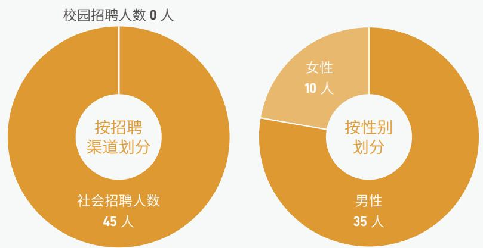

donut

| 类别 | 人数 |
| --- | --- |
| 校园招聘人数 | 0 |
| 社会招聘人数 | 45 |
| 女性 | 10 |
| 男性 | 35 |

员工流失情况

离职员工数 295 人

其中：员工自愿辞职人数295人

员工流失率 24%

# · 多元化、平等与包容性

# 多元化与反歧视

中稀有色坚持多元化与平等包容的治理理念，尊重员工个体差异，坚决杜绝各类歧视行为。公司在招聘录用、职业培训、岗位晋升等环节严格遵循公平公正原则，不因宗教信仰、性别等因素区别对待。

公司严格执行同工同酬制度，保障男女员工享有同等薪酬权益；在劳动合同订立过程中恪守平等自愿原则，切实维护员工合法权益，持续营造公平、公正、和谐的职场环境。

报告期内，公司未发生任何劳工歧视事件。

# 禁止强迫劳动和雇佣童工

中稀有色始终坚持平等用工原则，严格恪守用工合规与社会责任，坚决杜绝强迫劳动、职场骚扰等行为，致力营造安全、健康、和谐的工作环境。公司严格遵守《禁止使用童工规定》等法律法规，在招聘与入职环节严格核查员工身份信息，严禁使用童工，切实保障员工合法权益，积极履行企业社会责任。

报告期内，公司未发生任何童工雇佣、强迫劳动或侮辱骚扰事件。

员工总人数 938 人

劳动合同签订率 100%

少数民族员工人数 15 人

残疾员工人数4人

劳务派遣人员 32 人

兼职员工人数 0 人

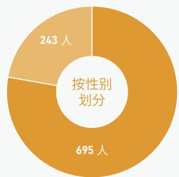

donut

| Category | Value |
| --- | --- |
| 一般部分 | 695 |
| 按性别划分 | 243 |

男性

女性

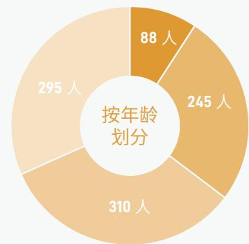

donut

| 年龄段 | 人数 |
| --- | --- |
| 88人 | 88 |
| 245人 | 245 |
| 310人 | 310 |
| 295人 | 295 |

30岁以下(不含30岁)

30-40岁(含30岁,不含40岁)

40-50岁(含40岁,不含50岁)

50 岁及以上

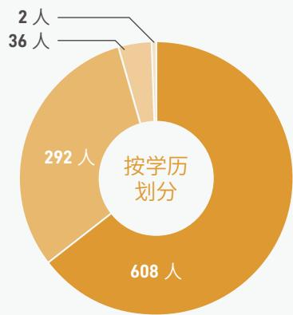

donut

| Category | Value |
| --- | --- |
| 2人 | 2 |
| 36人 | 36 |
| 608人 | 608 |
| 292人 | 292 |

■ 本科以下

■ 本科

硕士

博士

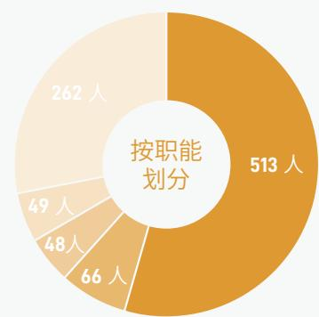

donut

| Category | Value (人) |
| --- | --- |
| 占职能 1 | 513 |
| 占职能 2 | 262 |
| 占职能 3 | 49 |
| 占职能 4 | 48 |
| 占职能 5 | 66 |

生产

销售

技术

财务

行政

# 培训与发展

# · 员工培训

中稀有色高度重视人才培养与员工发展，构建系统化培训体系，持续提升员工专业技能与岗位胜任力，支撑公司战略发展。公司制定《培训管理暂行办法》，由人力资源部（党委组织部）统筹负责培训体系建设、计划编制、预算与资源管理，着力打造内部培训师队伍，为员工职业发展提供坚实保障。

公司坚持培训的全面性与实效性，针对不同群体分层分类开展培训：为新员工提供入职培训，促进快速融入；围绕岗位需求开展任职能力培训，提升综合素养；组织专业资格培训，助力技能认证；实施委托培养，储备后备人才；开展文化制度培训，强化价值认同；组织外部交流学习，借鉴行业先进经验；加强合规培训，提升合规意识。同时，综合运用案例教学、实操演练等多元方式，保障培训实效，为企业高质量发展提供人才支撑。

flowchart

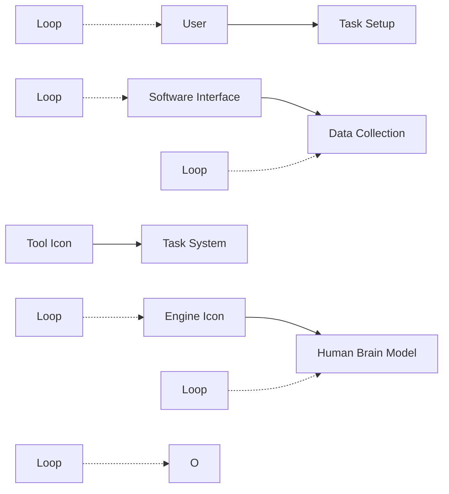
```mermaid
graph LR
  A["User"] --> B["Task Setup"]
  C["Software Interface"] --> D["Data Collection"]
  E["Engine Icon"] --> F["Human Brain Model"]
  G["Tool Icon"] --> H["Task System"]
  I["Loop"] -.-> A
  J["Loop"] -.-> C
  K["Loop"] -.-> D
  L["Loop"] -.-> E
  M["Loop"] -.-> F
  N["Loop"] -.-> O
```

# 开展班组建设专题培训

2025 年 12 月，公司开展 “匠心传承，赋能担当” 班组建设与管理培训班，面向各所属企业班组长、生产技术骨干及工匠劳模培育负责人开展封闭式培训，通过实战性、针对性、互动式的课程设置与专业指导，提升班组长团队管理、任务执行及沟通协调核心能力，打造高绩效班组长团队，为企业发展筑牢基层管理人才保障。

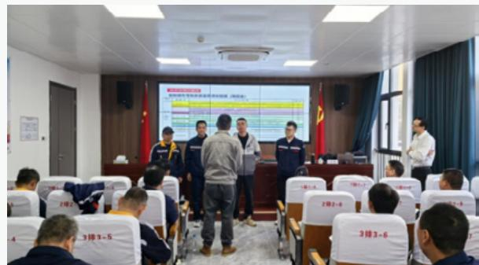

text_image

Conference room scene with attendees seated in front of a presentation screen displaying Chinese text and numbers

# 举办职工职业技能大赛

2025 年 4 月，公司举办 “广东稀土杯” 第一届职工职业技能大赛决赛，设置稀土冶炼工、化学检验员、设备点检员三大赛项，参赛选手经区域选拔初赛晋级，比赛融合理论知识测试与技能实操考核。大赛设置个人与集体多类奖项，以赛育才、以赛促技，弘扬劳模精神、劳动精神、工匠精神，深化产业工人队伍建设改革，夯实公司技能人才队伍建设根基。

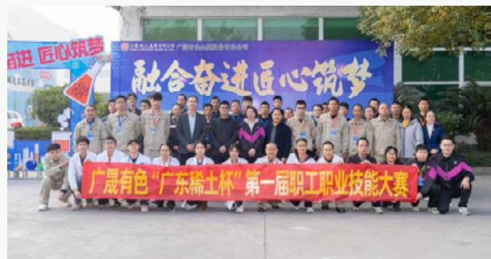

text_image

奋进匠心筑梦
融合奋进匠心筑梦
广是有色“广东稀土杯”第一届职工职业技能大赛

<table><tr><td>关键指标</td><td>单位</td><td>2025年</td></tr><tr><td>员工培训投入</td><td>万元</td><td>35.95</td></tr><tr><td>员工培训场次</td><td>场次</td><td>181</td></tr><tr><td>接受培训总人数</td><td>人</td><td>853</td></tr><tr><td>接受培训总人次</td><td>人次</td><td>6,833</td></tr><tr><td>员工培训覆盖率</td><td>%</td><td>90.94</td></tr><tr><td>员工培训总时长</td><td>小时</td><td>11,220</td></tr><tr><td>每名员工每年接受培训的平均时长</td><td>小时/人</td><td>13.15</td></tr></table>

# · 职业发展

中稀有色重视员工职业发展与成长成才，积极激发组织内生动力，为员工规划清晰的职业发展路径。公司建立管理序列（M 序列）与专业序列（P 序列）两大职业发展通道，制定《总部岗位管理办法》《中共中稀有色金属股份有限公司委员会管理的领导人员管理规定》等制度，明确两大序列职级按岗位职责、价值差异及能力业绩要求，分为 1 至 8 级，员工可依据工作需要、个人意愿及资格条件，通过通道内纵深发展、跨序列转换发展等多路径实现职业晋升。

管理序列  
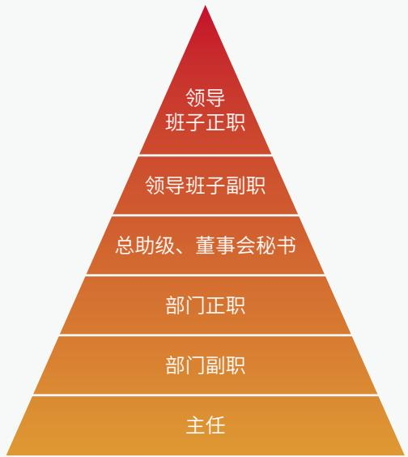

flowchart

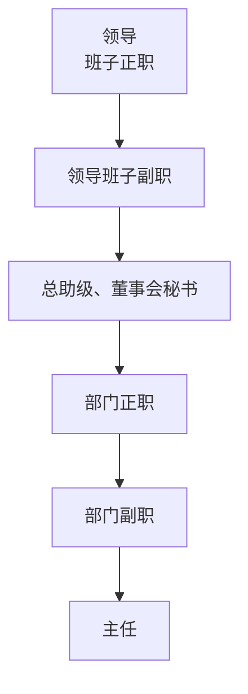
```mermaid
graph TD
  A["领导\n班子正职"] --> B["领导班子副职"]
  B --> C["总助级、董事会秘书"]
  C --> D["部门正职"]
  D --> E["部门副职"]
  E --> F["主任"]
```

专业序列  
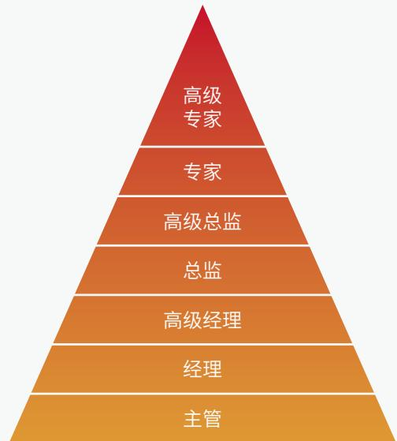

flowchart

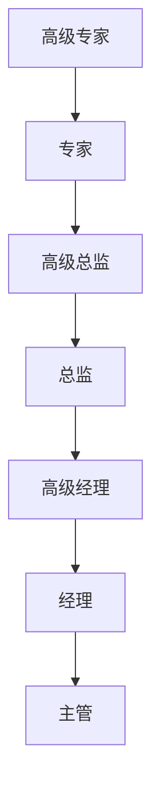
```mermaid
graph TD
  A["高级专家"] --> B["专家"]
  B --> C["高级总监"]
  C --> D["总监"]
  D --> E["高级经理"]
  E --> F["经理"]
  F --> G["主管"]
```

<table><tr><td>关键指标</td><td>单位</td><td>2025年</td></tr><tr><td>员工内部调动或内部应聘的人数</td><td>人</td><td>88</td></tr><tr><td>定期接受绩效和职业发展考核的员工比例</td><td>%</td><td>100</td></tr></table>

# 薪酬福利管理

# - 薪酬管理

中稀有色建立健全薪酬福利与绩效考核管理制度，薪酬体系遵循合规公平原则，由基本工资、绩效工资、专项奖励构成，兼顾保障性与激励性。公司实施月度、年度双周期考核，科学设定考核目标与指标，以考核倒逼履职落实、强化服务协同，凝聚发展合力，赋能企业高质量发展。

# · 绩效管理与申诉

# 绩效考核机制

公司制定实施《总部绩效管理暂行办法》，搭建覆盖公司各部门及在职人员的绩效考核体系，分部门、员工两类对象实施月度、年度考核，遵循战略、发展、激励原则，按部门及总助级、中层、专业人员等层级设置差异化考核指标与评定规则，明确特殊人员考核要求。公司建立规范考核实施流程，设置绩效回顾、目标调整等环节，考核结果与绩效薪酬直接挂钩，作为员工职级调整、晋升评优、末等调整及中层管理人员岗位聘用的重要依据，以健全的激励约束机制激发员工活力，推动公司发展战略落地。

# 申诉与反馈机制

中稀有色建立完善的绩效申诉机制，切实保障员工合法权益。若部门或个人对绩效评估结果存在异议，可在获知结果后5个工作日内，以书面形式向人力资源部提交申诉书；人力资源部（党委组织部）接到员工申诉后，应在3个工作日内作出是否受理的答复；受理员工申诉后，组织开展调查、核实工作，并在7个工作日之内形成正式的处理意见；未能协调处理的员工申诉，由公司党委作出最终决定，以此保障绩效评估工作的公正、透明与有效开展。

# · 福利待遇

# 福利休假

中稀有色高度重视员工福利保障，构建多维度全方位福利体系，切实维护员工合法权益。法定保障上，严格按规定足额缴纳五险，同步推行补充医疗保险、企业年金制度，形成“基本+补充”双重保障格局，筑牢员工保障防线，增强归属感与安全感；福利激励上，奖金福利与员工绩效、公司效益挂钩，完善休假制度并明确各类假期标准，有效激发员工工作活力。同时，配套员工食堂、爱心理发屋等生活设施，增设娱乐区域并定期组织文体活动，常态化开展健康体检与安全培训，兼顾员工生活、休闲与健康需求，打造有温度的福利体系，切实履行企业社会责任，营造多元化、平等包容的工作环境。

natural_image

Illustration of two figures handling stacked boxes, one with a plus sign and the other in contemplative pose, enclosed in a dashed circle (no text or symbols)

<table><tr><td>关键指标</td><td>单位</td><td>2025年</td></tr><tr><td>社会保险覆盖率</td><td>%</td><td>100</td></tr></table>

# 关注女性权益与福利

中稀有色严格遵循《中华人民共和国妇女权益保障法》《女职工劳动保护特别规定》等法律法规，全面保障女性员工合法权益。针对女性员工孕期、产假、哺乳期等特殊时期，公司制定专项关怀保障措施，切实维护其劳动权益，营造和谐健康的工作环境，为公司可持续发展筑牢基础。

报告期内，公司为庆祝第 115 个国际 “三八” 妇女节，组织开展一系列形式多样、内容丰富的主题活动，全面展现女性员工昂扬向上、奋发有为的良好风貌，引领广大女性员工立足岗位、履职尽责，为企业高质量发展积极贡献巾帼力量。

中稀有色“三八”活动  
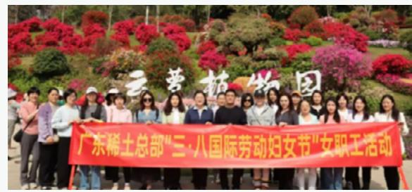

text_image

云梦植物园
广东稀土总部“三·八国际劳动妇女节”女职工活动

兴邦公司“三八”活动

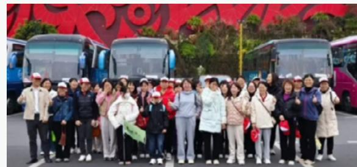

natural_image

Group photo of people posing in front of buses with large red decorative backdrop (no visible text or symbols)

晟源公司“三八”活动  
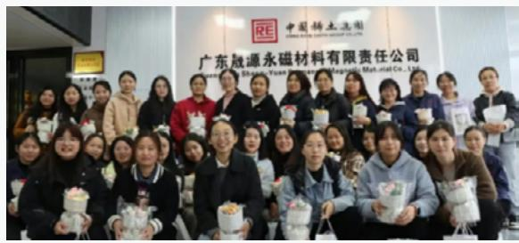

text_image

中国稀土集团
广东能源永磁材料有限责任公司
Shenzhen-Tianjin Power Material Co., Ltd.

石人嶂公司“三八”活动

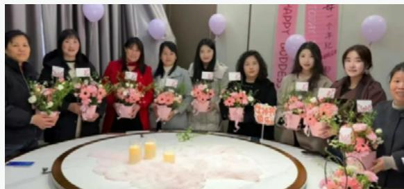

natural_image

Group of women holding flower bouquets at a decorated table, with balloons and a pink banner in the background (no visible text on main subjects)

<table><tr><td>关键指标</td><td>单位</td><td>2025年</td></tr><tr><td>管理人员中女性人数比例</td><td>%</td><td>17</td></tr><tr><td>享受产假返岗率</td><td>%</td><td>100</td></tr><tr><td>享受育儿假员工返岗率</td><td>%</td><td>100</td></tr></table>

# 劳动关系管理

# - 离职管理

公司建立规范的员工离职管理流程，个人提出离职申请后，依次经部门领导、人力资源部（党委组织部）、分管领导及公司主要领导审批。离职人员同步完成工作交接，签订离职保密协议，办结劳动合同解除及人事档案移交等相关手续，确保离职流程合规有序推进。

# 员工关怀与沟通

# · 员工活动

中稀有色注重丰富员工精神文化生活，常态化组织各类文体活动，搭建员工互动交流平台。结合员工需求开展趣味竞赛、运动比赛、节日联欢等多样活动，兼顾参与性与趣味性，既缓解员工工作压力，又增强团队凝聚力与集体归属感，让员工在丰富的活动中感受企业关怀，营造积极向上、和谐融洽的团队氛围。

# 中稀有色勇夺中国稀土集团首届“凉山稀土杯”职工篮球赛冠军

2025 年 11 月，中国稀土集团 “凉山稀土杯” 首届职工篮球赛在江西赣州举办。作为中国稀土集团组建后首次全体员工体育赛事，活动以 “以球会友，以赛赋能” 为主题，展现了员工积极向上、协同共进的精神风貌，增强了团队凝聚力与企业文化建设。

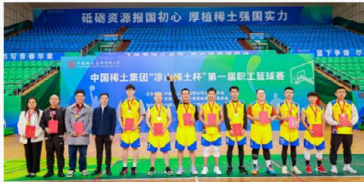

text_image

砥砺资源报国初心 厚植稀土强国实力
中国稀土集团“凉山稀土杯”第一届职工篮球赛

# · 员工关怀

中稀有色坚持员工关怀与福利保障优先，健全全方位关怀体系，为员工提供多维度生活支持。制定《困难职工帮扶办法》实施分层分类精准帮扶，工会开展生活、助学等多元走访慰问；同时完善健康保障体系，拓宽职业发展通道，助力员工实现工作与生活平衡。

# “工会送清凉”职工慰问及安全生产检查

2025 年 8 月，中稀有色开展 “工会送清凉” 慰问职工活动，深入一线慰问干部员工，发放防暑物资，督促落实防暑降温措施，确保员工健康与企业安全生产。

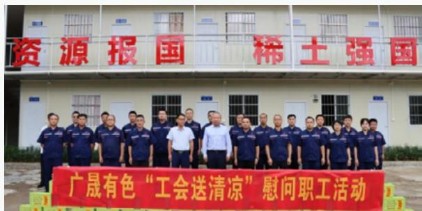

text_image

资源报国 稀土强国
广晟有色“工会送清凉”慰问职工活动

<table><tr><td>关键指标</td><td>单位</td><td>2025年</td></tr><tr><td>困难员工帮扶人次</td><td>人次</td><td>61</td></tr><tr><td>困难员工帮扶金额</td><td>万元</td><td>13.8</td></tr></table>

# ·民主管理

# 管理体系

中稀有色依据《中华人民共和国工会法》《劳动法》《公司法》等法律法规依法成立工会，切实维护员工合法权益，保障劳动关系和谐稳定。公司工会积极参与劳动关系协调，协商解决员工切身利益问题，协助督促劳动保险、劳动保护工作落地，同时全力推进员工集体福利事业建设，持续改善员工生活条件。

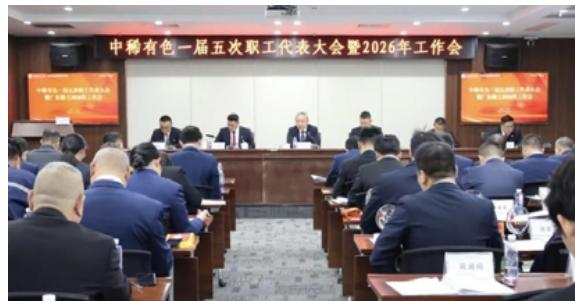

text_image

中稀有色一届五次职工代表大会暨2026年工作会

第一届五次职工代表大会  

<table><tr><td>关键指标</td><td>单位</td><td>2025年</td></tr><tr><td>职代会/工会审议通过项目数</td><td>项</td><td>4</td></tr><tr><td>工会会员占在职员工的比例</td><td>%</td><td>100</td></tr></table>

# 多元化沟通

中稀有色重视员工多元化沟通建设，助力营造和谐职场氛围。公司办公室（党委办公室、保密办公室）在食堂设置意见反馈簿，专项收集员工关于餐饮等生活服务的意见建议，推动诉求直达相关部门并落地整改、持续优化。

# >守护职业健康

# 治理

中稀有色秉持“安全第一、预防为主、综合治理”方针，严格遵守《安全生产法》《职业病防治法》等法律法规，制定《职业健康管理办法》《全员安全生产职责》等制度，持续健全职业健康安全管理体系，切实保障员工职业健康权益，营造安全健康的工作环境。

公司建立健全安全管理组织架构，由安全环保委员会统筹领导安全生产与职业健康工作，定期研究解决重大事项；安全环保部（应急指挥中心）负责日常归口管理，各所属企业相应设立管理机构、配备专（兼）职管理人员，保障各项工作规范落地、有效运行。

# 关键绩效

报告期内，公司为安全生产累计投入1,420万元

安全生产投入占营业收入比例为 0.24%。

截至报告期末，中稀有色所属企业晟源公司、兴邦公司已通过 ISO 45001 职业健康安全管理体系认证，富远公司、嘉禾公司获评三级安全生产标准化企业。

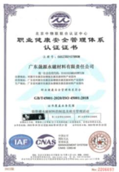

text_image

北京中物联联合认证中心
职业健康安全管理体系
认证证书
注册号：0412701015980M
广东源源永磁材料有限责任公司
GB/T 45001-2020/ISO 45001-2018
证券业务范围
经国家有关的机构及相关部门管理活动
IAF CNAS CNAS SYSTEM
No. 2206637

晟源公司职业健康安全管理体系认证

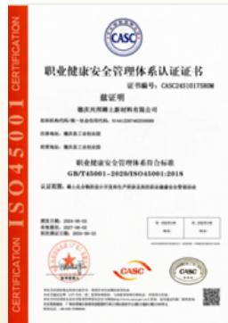

text_image

CASC
职业健康安全管理体系认证证书
证书编号：CASC245101780M
藏证明
重庆兴润海上新材料有限公司
组织机构代码：渝能工业科技有限公司
注册地址：渝能工业科技工业园
经营范围：建设工程总承包
职业健康安全管理体系符合标准
GB/T 45001-2020/ISO45001:2018
认证范围：渝能工业科技有限公司及中国高新技术产业投资基金业协会颁发的证书
截止日期：2020-06-03
有效期至：2020-06-03
发证机关：重庆市工商行政管理局
CASC
CASC

兴邦公司职业健康安全管理体系认证

# 战略

中稀有色严格遵守国家职业健康安全法律法规，全面识别生产过程中的安全健康风险。公司通过科学评估持续优化管理体系，强化风险防控，切实保障员工职业安全与健康，推动企业可持续发展。

<table><tr><td>风险类型</td><td>描述</td><td>财务影响说明</td><td>发生可能性</td><td>影响大小</td><td>影响时间范围</td><td>影响价值链环节</td><td>应对措施</td></tr><tr><td>法律风险</td><td>若公司对安全生产法律法规理解不足,未能有效执行相关措施,将面临重大罚款、限期整改等严厉处罚,这将严重干扰公司的日常运营,损害经济效益,进而威胁公司的可持续发展根基。</td><td>减少营收</td><td>中</td><td>中</td><td>长期</td><td>运营</td><td>1.公司每年制定安全生产实践和法律法规培训计划,将其纳入年度计划中;2.公司定期组织开展安全生产月宣贯活动。</td></tr><tr><td>声誉风险</td><td>公司若在生产经营中忽视安全管理,一旦发生重大安全事故并造成人员伤亡,经舆论曝光后,将严重损害企业品牌形象与市场信誉,引发社会关注和舆论压力,冲击市场份额。同时,负面事件还会对企业融资能力、业务拓展及持续经营产生长期不利影响。</td><td>减少收入</td><td>中</td><td>中</td><td>长期</td><td>运营</td><td>1.制定《全员安全生产职责》《生产安全事故管理制度(试行)》等相关管理规定;2.建立安全生产责任体系,明确各部门安全生产责任;3.公司安全环保部(应急指挥中心)组织综合性安全生产大检查,所属企业依据相关法规开展安全隐患排查工作;4.制定应急管理预案,并定期组织开展应急演练,强化员工安全生产意识。</td></tr></table>

<table><tr><td>风险类型</td><td>描述</td><td>财务影响说明</td><td>发生可能性</td><td>影响大小</td><td>影响时间范围</td><td>影响价值链环节</td><td>应对措施</td></tr><tr><td>营运风险</td><td>公司若发生职业健康或安全生产事故,其生产经营将遭受严重干扰。公司需要投入巨额资金进行事故救援、现场复原与安全改进等工作。</td><td>增加营运成本/罚款</td><td>中</td><td>中</td><td>短期</td><td>运营</td><td>1.严格遵循《稀土矿山开采企业安全环保职业健康管理规范》《职业健康管理办法》等相关管理制度;2.制定年度安全培训计划,加强员工安全意识;3.定期组织生产单位开展安全生产应急演练,并做好相关记录,提高员工安全应急能力。</td></tr><tr><td>市场风险</td><td>公司在生产过程中为确保职业健康安全生产管理体系有效运行,投入大量资源,在一定程度上增加了生产成本,从而对产品的市场竞争力及定价策略产生相应影响。</td><td>成本增加</td><td>低</td><td>中</td><td>长期</td><td>运营</td><td>1.制定《全员安全生产职责》等制度,通过ISO 45001职业健康安全管理体系认证,建立完善的职业健康安全生产管理流程体系;2.定期组织员工开展职业健康体检。</td></tr></table>

<table><tr><td>机遇类型</td><td>描述</td><td>财务影响说明</td><td>发生可能性</td><td>影响大小</td><td>影响时间范围</td><td>影响价值链环节</td><td>应对措施</td></tr><tr><td>管理效率</td><td>公司持续优化职业健康安全的财务预算与管理流程,不仅能提升整体运营效率,还能显著减少事故发生的概率,进而避免因事故产生的高昂财务支出。</td><td>成本降低</td><td>中</td><td>中</td><td>中长期</td><td>运营</td><td>通过信息化系统实现风险预警和可视化管理,公司能够实现快速感知、实时监测、提前预警和联动处置,有效将“事后发现”转变为“事前预警、事后追溯”,显著提升公司的安全生产风险防范水平,确保职业健康安全财务预算与管理流程的优化成果能够得到有效落实。</td></tr></table>

# 影响、风险和机遇管理

# · 风险管理机制

为降低生产运营中的安全与职业健康风险，公司制定《安全生产管理办法（试行）》，由安全环保部（应急指挥中心）牵头组织安全风险与危险源辨识、评估工作，督促落实风险分级管控及重大危险源管理要求，指导各部门及所属企业开展全流程风险管理，切实应对员工安全健康相关风险与机遇。

公司每季度召开风险研判会，重点研判下一季度重大风险，组织各所属企业结合季节特征、重要节点及生产经营实际，梳理识别本单位主要风险及公司级管控风险点；同时对各所属企业隐患整改情况开展复核检查，核查安全管理措施落实情况与整改成效。

# 风险识别

建立全面风险识别机制，定期辨识生产过程中的危险有害因素，覆盖法规更新、工艺调整、新设备投用等场景，确保及时识别职业健康与安全生产领域的潜在风险。

# 风险评估

根据风险类别与等级，运用科学方法评估风险发生概率及危害程度，重点研判对人员、财产及环境的影响，为制定精准有效的风险控制措施提供支撑。

# 风险控制

综合采取工程技术、管理控制、个体防护等措施，实施风险分级管控，将风险降至可接受水平；同时强化安全培训，提升员工风险防范意识与应急处置能力。

# 风险管控更新

建立风险管控动态更新机制, 定期评估管控措施有效性, 根据实际情况及时优化调整, 确保风险管控持续合规、精准有效。

# · 安全应急管理

公司构建完善应急预案体系，明确应急响应流程、处置措施与责任分工，定期开展应急演练，提升员工应急处置与自救互救能力。同时加强与外部应急救援力量协同联动，强化应急保障能力，以健全的应急管理与高效响应机制，为公司生产经营安全稳定运行提供坚实支撑。

# 关键绩效

报告期内，公司及所属企业开展各类应急演练共23次，其中专项演练20次。

# 消防疏散演练

2025 年 6 月，公司组部员工开展高层火灾疏散逃生培训及应急演练。本次演练模拟办公楼高层火情场景，围绕应急响应、初期火灾扑救、人员疏散及应急联动等环节开展实战化演练，圆满完成既定科目，为公司安全生产与高质量发展筑牢安全保障。

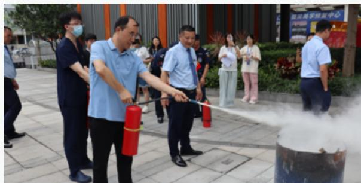

text_image

Street photo showing fire extinguishing with firefighters and a fire extinguisher, people observing in background with visible signage

# 危化品泄漏应急演练

2025 年 10 月，公司组织开展危险化学品泄漏应急培训及应急演练。本次演练由中稀有色主办、富远公司承办，梅州市和平远县应急管理局、平远县消防救援大队等多单位协办，在富远公司厂区举行。此次演练组织有序、协同高效，圆满完成既定科目，员工危化品应急处置能力显著提升。

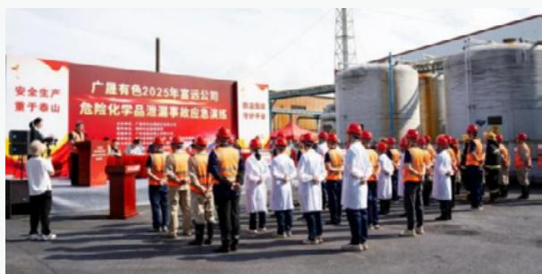

text_image

广晟有色2025年喜远公司
危险化学品泄漏事故应急演练
安全生产
重于泰山

# · 安全隐患排查

中稀有色重视安全生产隐患排查工作，严格落实安全生产专项整治三年行动及危险化学品集中治理要求，完善公司安全管理规章制度体系，制定《安全生产风险分级管控与隐患排查治理管理办法》《危险化学品安全管理制度》，通过“定期排查+不定期抽查”“全面检查+专项督查”“自查自纠+专家会诊”相结合的方式，深入排查各类风险隐患，切实把隐患消除在萌芽状态，坚决遏制重特大事故发生。

# 关键绩效

报告期内，公司下发整改考核书34份，整治问题隐患152项，公司及所属企业共同开展安全生产隐患排查工作，整改率 $100\%$ 。

# 指标与目标

公司依据各所属企业职业健康与安全生产目标开展月度考核，并结合年度安全环保责任书，对各企业安全生产及职业健康工作进行年终综合考评。报告期内，公司以目标为导向统筹推进各项安全工作，持续提升安全生产管理水平。

<table><tr><td>目标</td><td>2025年完成情况</td></tr><tr><td>无工亡事故</td><td>已完成</td></tr><tr><td>无重大火灾事故</td><td>已完成</td></tr><tr><td>无重大设备事故</td><td>已完成</td></tr><tr><td>无群伤事故</td><td>已完成</td></tr><tr><td>无群体新增职业病</td><td>已完成</td></tr><tr><td>减少工伤事故</td><td>已完成</td></tr><tr><td>减少外委单位的安全事故</td><td>已完成</td></tr></table>

<table><tr><td>关键指标</td><td>单位</td><td>2025年</td></tr><tr><td>特种作业人员持证上岗率</td><td>%</td><td>100</td></tr><tr><td>工伤保险的投入金额</td><td>万元</td><td>54.45</td></tr><tr><td>工伤保险人员覆盖率</td><td>%</td><td>100</td></tr><tr><td>安全生产责任险的投入金额</td><td>万元</td><td>13.83</td></tr></table>

# 安全生产措施

# · 安全事故管理

为健全生产安全事故管理体系，规范事故现场救援、汇报、调查处理、统计分析及档案管理等工作，以事故教训强化安全生产、落实责任追究、防范事故发生，中稀有色依据《中华人民共和国安全生产法》《生产安全事故报告和调查处理条例》等法律法规，制定生产安全事故管理制度，明确事故发生后汇报、应急救援、调查、责任追究及警示教育等相关要求。

报告期内，公司未发生工亡事件或重大安全事故。

# · 安全培训与文化建设

中稀有色制定了《职业健康、安全、环保教育和培训管理》相关培训制度，定期开展安全教育培训，内容覆盖职业健康法律法规、安全操作规程、职业病危害防护等知识，通过线上课程、线下讲座、实操演练等多元形式，提升员工安全意识与职业健康防护能力。报告期内，公司围绕安全标志应用、矿山重大事故隐患判定标准、消防安全、一线班组建设、制度宣贯等主题开展安全教育培训95场；累计参与4,399人次，培训覆盖率达100%。

# “安全生产月”活动专题会议

2025 年 6 月，中稀有色以线上线下结合形式召开“安全生产月”专题会议，深入学习贯彻习近平总书记关于安全生产重要论述和指示批示精神。会议部署开展宣贯学习、警示教育与应急演练，推动安全意识与应急技能全员覆盖，层层落实全员安全生产责任制，深化隐患排查整治，以高水平安全保障公司高质量发展。

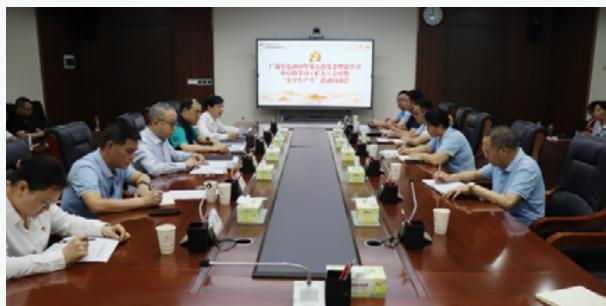

text_image

Meeting scene with participants seated at a long table, large screen displaying Chinese text about 'Gangzhou's 2023 Guangdong Province General Meeting'

# · 相关方安全管理

为规范外包工程管理，落实安全环保与职业健康主体责任，预防和减少生产安全、环境及职业健康事故，公司依据《安全生产法》《环境保护法》《职业病防治法》等法律法规，制定《外包工程安全环保职业健康管理办法》，明确管理组织机构与职责，规范发包、施工及零星工程全流程安全环保与职业健康管理要求。

# · 危险化学品管理

为强化危险化学品安全管理，防范安全事故，保障员工健康、生产运营与环境安全，公司依据《安全生产法》《危险化学品安全管理条例》，制定《中稀有色危险化学品安全管理制度》，明确危化品生产、储存、经营、运输、使用及废弃处置全流程管理要求，并督促各所属企业结合实际制定相应管理制度。

# 富远公司危险化学品（盐酸）泄漏应急疏散演练

2025 年 6 月，公司针对厂区危险化学品（盐酸）储罐泄漏场景，组织开展盐酸泄漏应急救援与疏散预案演练，以防范事故引发人员伤害及环境影响。通过本次演练，员工进一步熟悉并掌握盐酸泄漏应急预案流程，实战处置能力与安全意识得到提升；同时检验了盐酸泄漏事故专项应急救援预案的可行性与有效性。

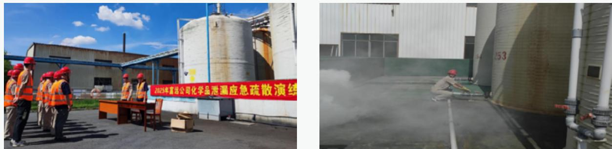

# 职业健康保障

# · 职业危害因素检测

公司切实履行主体责任，将员工职业健康与安全保障作为重要工作，每年对存在职业危害的作业场所开展专项检测，通过职业卫生调查、工程分析等科学方法，系统识别作业过程中的各类危险有害因素。同时，严格落实检测结果应用，针对性制定并实施防控措施，强化各环节管理，全方位筑牢员工职业健康防护防线，切实履行企业安全生产与健康保障责任。

<table><tr><td>关键指标</td><td>单位</td><td>2025年</td></tr><tr><td>职业病危害因素检测率</td><td>%</td><td>100</td></tr></table>

# · 职业危害防护措施

公司为各作业岗位员工按需配发防尘、降噪等劳动防护用品并督促规范使用，优化生产设备及实施减震降噪技术改造从源头防控职业病风险，同时以签订危害告知书、开展专项培训、设置警示标识及报警装置等举措强化风险告知与安全宣教，全方位筑牢员工职业健康防护屏障，切实保障员工身心健康与生命安全。

# 发放职业卫生宣传手册

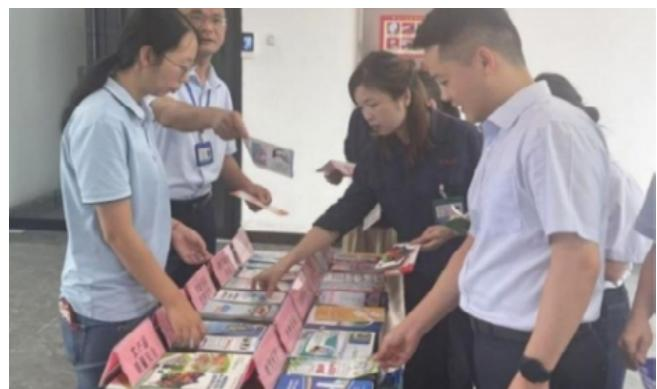

text_image

Group of people examining printed materials in a meeting room, with visible Chinese text on packaging and background signage

# 职业病危害告知卡

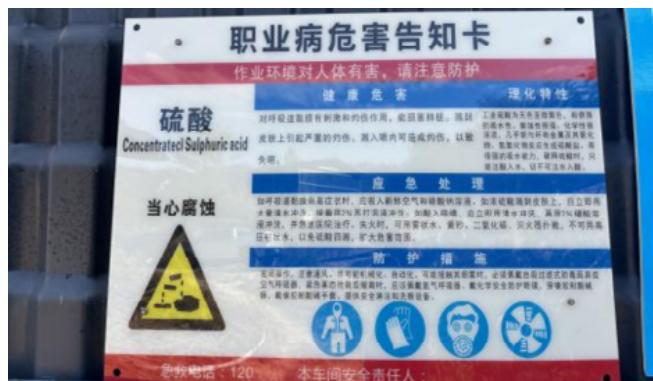

text_image

职业病危害告知卡
作业环境对人体有害，请注意防护
硫酸
Concentrate Sulphuric acid
当心腐蚀
健康危害
理化特性
对呼吸道脏膜有刺激和药作用，给损害赔偿。症状
皮肤上引起严重的灼伤，落入眼内可造成的伤，以豁
失明。
工业吸附为活性炭的有害，有毒性
的挥发性，易燃性较高，化学性高
湿性，几乎不与有机氯基苯基化物、
氰酸化合物反应生成硫酸盐，有
物质的毒死物，属病毒载体，只
易使吸入水，这不可注水入肺。
应急处理
如呼吸道脏腺炎或症状时，应进入新鲜空气和碳酸钠溶液，如果硫酸滴到皮肤上，应立即用
水量减去水分，减缓至7%至7%的浓度。加酶入硫碱，应立即停碘水3块，具有7%硝酸氢
溶液液，并快速返回治疗。失火时，可用管状水、黄砂、二氧化碳、灭火器补救，不可再离
压5升水，以免超剧四源，扩大发散范围。
防护措施
无可操作。注意通风，不宜密封机械化、自动化，可能因其致密时，必须佩戴药品过格式的最高值应
空为用容器，避免单击伤后辐射时，应该佩戴氧气环境感、氟化学安全防护措施、管道或机械
解，确保反射耐碱手套、提供安全警示和防潮设备。
急救电话：120 本车间安全责任人：

# · 职业健康体检

中稀有色持续完善职业健康安全管理体系，制定《职业卫生管理制度》等相关规定，定期委托专业机构开展职业病危害因素检测并公示结果。公司建立员工全周期职业健康体检机制，切实保障员工健康权益；对排查出的职业禁忌人员，由安全环保部（应急指挥中心）及时调整岗位并妥善处置。

# 关键绩效

报告期内，公司938名员工参与职业健康体检，员工职业健康体检覆盖率100%，新增职业病0例。

# · 心理健康管理

中稀有色结合职业病防治法宣传周开展劳动者心理健康关爱活动，引导员工正确应对工作生活压力，提升心理调适与情绪管理能力，营造积极健康的工作氛围，助力员工以良好状态投入工作，推动企业稳健发展。

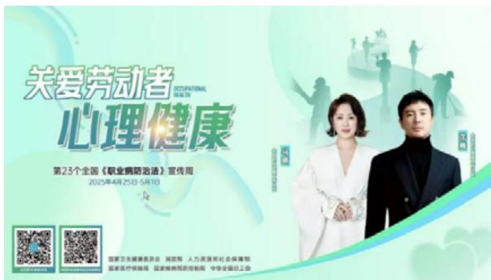

text_image

关爱劳动者
心理健康
第23个全国《职业病防治法》宣传周
2025年4月25日-5月13
国家卫生健康委员会 国家工人 劳业资源和社会保障部
国家医疗管理局 国家疾病预防控制局 中非金融总工会

职业病防治宣传

# > 践行社会责任

# 乡村振兴

# · 产业振兴

公司积极开展消费帮扶工作，组织全系统参与中国稀土集团主办的“央企消费帮扶迎春行动”，采购扶贫产品金额24.6万元；参与“第四届央企消费帮扶兴农周活动”，采购扶贫产品金额5.1万元。同时，红岭公司主动为附近东鹊村解决农副产品滞销难题，帮助解决近2.7万元农副产品滞销问题，以实际行动助力乡村振兴。报告期内，公司累计投入30.05万元开展消费帮扶，惠及群众20余万人。

# · 乡村建设

为积极响应 “千企帮千镇、万企兴万村” 行动号召，主动践行国企担当与社会责任，公司累计投入 21.9 万元实施帮扶项目，惠及群众 10 余万人。华企公司捐赠 7 万元实施木溪村委至大水小组村道拓宽工程，将原有 4 米宽道路拓宽至 6 米双向车道，有效解决会车难题，便利村民出行与农产品运输。同时，针对仁居稀土矿矿区周边基本农田较多的实际情况，捐赠 3 万元用于黄畲村委机耕路改造，改善农业生产条件，构建和谐矿农关系。

# 社会公益

公司坚守“资源报国、稀土强国”初心使命，立足央企属性与稀土行业特点，积极开展特色社会公益实践，以实际行动传递央企温度、彰显责任担当。聚焦矿区及周边乡村教育事业，紧扣矿地融合发展理念，深入推进和谐共建，积极参与地方防汛抗旱、应急救援等民生保障工作，常态化走访慰问矿区周边困难群众、老党员及孤寡老人，用心用情解决群众急难愁盼，构建和谐融洽的矿地、矿农关系。同时，组建党员及青年志愿服务队，积极参与无偿献血、慈善捐赠、文明创建、安全环保宣传等志愿活动，大力弘扬志愿服务精神，以公益善举回馈社会、服务民生。

<table><tr><td>关键指标</td><td>单位</td><td>2025年</td></tr><tr><td>公益总投入</td><td>万元</td><td>40.05</td></tr><tr><td>公益捐赠投入</td><td>万元</td><td>10</td></tr><tr><td>志愿者活动参与人次</td><td>人次</td><td>7</td></tr><tr><td>志愿者活动数量</td><td>次</td><td>1</td></tr><tr><td>志愿者活动总时间</td><td>小时</td><td>21</td></tr></table>

natural_image

Illustration of a park scene with people, a bicycle, and a city skyline in the background (no text or symbols)

# 附录

> 绩效表

<table><tr><td colspan="4">公司治理</td></tr><tr><td>议题</td><td>指标名称</td><td>基准单位</td><td>2025年</td></tr><tr><td rowspan="18">公司治理</td><td colspan="3">股东会</td></tr><tr><td>股东会会议召开总次数</td><td>次</td><td>6</td></tr><tr><td>其中:年度股东会会议召开次数</td><td>次</td><td>1</td></tr><tr><td>其中:临时股东会会议召开次数</td><td>次</td><td>5</td></tr><tr><td>审议通过议案</td><td>项</td><td>23</td></tr><tr><td colspan="3">董事会</td></tr><tr><td>董事会成员人数</td><td>人</td><td>9</td></tr><tr><td colspan="3">按性别划分董事</td></tr><tr><td>男性董事人数</td><td>人</td><td>8</td></tr><tr><td>女性董事人数</td><td>人</td><td>1</td></tr><tr><td colspan="3">按类别划分董事</td></tr><tr><td>董事长</td><td>人</td><td>1</td></tr><tr><td>非独立董事人数</td><td>人</td><td>5</td></tr><tr><td>独立董事人数</td><td>人</td><td>3</td></tr><tr><td colspan="3">按年龄划分董事</td></tr><tr><td>41-50岁</td><td>人</td><td>2</td></tr><tr><td>51-60岁</td><td>人</td><td>5</td></tr><tr><td>60岁以上</td><td>人</td><td>2</td></tr></table>

<table><tr><td>议题</td><td>指标名称</td><td>基准单位</td><td>2025年</td></tr><tr><td rowspan="24">公司治理</td><td colspan="3">按学历划分董事</td></tr><tr><td>博士研究生</td><td>人</td><td>3</td></tr><tr><td>硕士研究生</td><td>人</td><td>1</td></tr><tr><td>本科</td><td>人</td><td>5</td></tr><tr><td>董事会会议召开次数</td><td>次</td><td>12</td></tr><tr><td>审议通过议案</td><td>项</td><td>61</td></tr><tr><td>董事会平均出席率</td><td>%</td><td>100</td></tr><tr><td>独立董事专门会议召开次数</td><td>次</td><td>3</td></tr><tr><td>独立董事专门会议审议议案数</td><td>项</td><td>4</td></tr><tr><td>独立董事专门会议平均出席率</td><td>%</td><td>100</td></tr><tr><td>审计、合规与风险管理委员会会议召开次数</td><td>次</td><td>7</td></tr><tr><td>审计、合规与风险管理委员会会议审议议案数</td><td>项</td><td>22</td></tr><tr><td>审计、合规与风险管理委员会会议平均出席率</td><td>%</td><td>100</td></tr><tr><td>薪酬与考核委员会会议召开次数</td><td>次</td><td>4</td></tr><tr><td>薪酬与考核委员会会议审议议案数</td><td>项</td><td>6</td></tr><tr><td>薪酬与考核委员会会议平均出席率</td><td>%</td><td>100</td></tr><tr><td>战略与可持续发展委员会会议召开次数</td><td>次</td><td>3</td></tr><tr><td>战略与可持续发展委员会会议审议议案数</td><td>项</td><td>4</td></tr><tr><td>战略与可持续发展委员会会议平均出席率</td><td>%</td><td>100</td></tr><tr><td>提名委员会会议召开次数</td><td>次</td><td>2</td></tr><tr><td>提名委员会会议审议议案数</td><td>项</td><td>3</td></tr><tr><td>提名委员会会议平均出席率</td><td>%</td><td>100</td></tr><tr><td colspan="3">薪酬政策</td></tr><tr><td>董事及高级管理人员报酬(包含现任和离任)</td><td>万元</td><td>634.18</td></tr><tr><td rowspan="4">公司治理</td><td colspan="3">风险管理</td></tr><tr><td>开展法律培训次数</td><td>次</td><td>8</td></tr><tr><td>开展法律培训参与人数</td><td>人</td><td>369</td></tr><tr><td>开展法律培训总时长</td><td>小时</td><td>18</td></tr><tr><td rowspan="5">公司经营绩效指标</td><td>营业收入</td><td>万元</td><td>582,001.71</td></tr><tr><td>归母净利润</td><td>万元</td><td>12,755.59</td></tr><tr><td>纳税总额</td><td>万元</td><td>15,349</td></tr><tr><td>基本每股收益</td><td>元/股</td><td>0.38</td></tr><tr><td>资产总额</td><td>万元</td><td>687,539.66</td></tr><tr><td rowspan="6">党建</td><td>党组织数量(含党委、党总支及党支部)</td><td>个</td><td>27</td></tr><tr><td>召开党委会次数</td><td>次</td><td>26</td></tr><tr><td>党员数量</td><td>人</td><td>290</td></tr><tr><td>明确党委决策事项</td><td>项</td><td>147</td></tr><tr><td>前置审议重大事项</td><td>项</td><td>71</td></tr><tr><td>“三重一大”决策事项</td><td>项</td><td>218</td></tr><tr><td rowspan="6">商业道德</td><td colspan="3">向董事、管理层及员工提供的反商业贿赂及反贪污培训</td></tr><tr><td>开展廉政培训次数</td><td>次</td><td>2</td></tr><tr><td>员工走进廉政教育基地次数</td><td>次</td><td>3</td></tr><tr><td>员工观看警示教育片次数</td><td>次</td><td>3</td></tr><tr><td>召开党风廉政建设与反腐败会议次数</td><td>次</td><td>2</td></tr><tr><td>开展集体廉洁提醒谈话人次</td><td>人次</td><td>103</td></tr></table>

<table><tr><td>议题</td><td>指标名称</td><td>基准单位</td><td>2025年</td></tr><tr><td rowspan="4">商业道德</td><td colspan="3">反垄断与公平竞争</td></tr><tr><td>反垄断与公平竞争的培训活动次数</td><td>次</td><td>2</td></tr><tr><td>反垄断与公平竞争参与人数</td><td>人</td><td>18</td></tr><tr><td>反垄断与公平竞争培训总时长</td><td>小时</td><td>6</td></tr><tr><td rowspan="15">投关管理</td><td colspan="3">投资者交流</td></tr><tr><td>接待投资者现场调研次数</td><td>次</td><td>21</td></tr><tr><td>接待投资者现场调研人次</td><td>人次</td><td>211</td></tr><tr><td>在上证e互动与投资者互动次数</td><td>次</td><td>12</td></tr><tr><td>召开业绩说明会次数</td><td>次</td><td>4</td></tr><tr><td>通过邮件沟通/社交平台沟通次数</td><td>次</td><td>3</td></tr><tr><td colspan="3">信息披露</td></tr><tr><td>对外披露公告总数</td><td>份</td><td>74</td></tr><tr><td>披露定期公告数量</td><td>份</td><td>4</td></tr><tr><td>披露临时公告数量</td><td>份</td><td>70</td></tr><tr><td>因信息披露方面违规而受到处罚次数</td><td>次</td><td>0</td></tr><tr><td colspan="3">现金分红情况</td></tr><tr><td>每股派发现金红利(含税)</td><td>元/股</td><td>0.15</td></tr><tr><td>共计派发现金(含税)</td><td>元</td><td>50,465,386.50</td></tr><tr><td>占合并报表中归属于上市公司股东的净利润比例</td><td>%</td><td>39.56</td></tr></table>

环境保护

<table><tr><td>议题</td><td>指标名称</td><td>基准单位</td><td>2023年</td><td>2024年</td><td>2025年</td></tr><tr><td rowspan="7">应对气候变化</td><td>范围一温室气体排放量</td><td>吨二氧化碳当量</td><td>16,946.65</td><td>10,904.30</td><td>10,160.46</td></tr><tr><td>化石燃料排放</td><td>吨二氧化碳当量</td><td>5,452.37</td><td>7,212.04</td><td>7,821.78</td></tr><tr><td>过程排放(碳酸盐/草酸)</td><td>吨二氧化碳当量</td><td>11,494.28</td><td>3,692.26</td><td>2,338.68</td></tr><tr><td>范围二温室气体排放量</td><td>吨二氧化碳当量</td><td>30,620.73</td><td>32,856.81</td><td>25,230.63</td></tr><tr><td>净购入电力消费</td><td>吨二氧化碳当量</td><td>30,620.73</td><td>32,856.81</td><td>25,230.63</td></tr><tr><td>温室气体排放总量</td><td>吨二氧化碳当量</td><td>47,567.38</td><td>43,761.11</td><td>35,391.10</td></tr><tr><td>温室气体排放强度</td><td>吨二氧化碳当量/营业收入(万元)</td><td>0.023</td><td>0.035</td><td>0.061</td></tr><tr><td rowspan="6">环境合规管理</td><td>污染物监测合格率</td><td>%</td><td>/</td><td>100</td><td>100</td></tr><tr><td>环保设施同步运转率</td><td>%</td><td>/</td><td>100</td><td>100</td></tr><tr><td>建设项目环保“三同时”执行率</td><td>%</td><td>/</td><td>100</td><td>100</td></tr><tr><td>环保培训次数</td><td>次</td><td>26</td><td>28</td><td>15</td></tr><tr><td>环保培训参加人次</td><td>人次</td><td>1,023</td><td>1,051</td><td>1,048</td></tr><tr><td>环保培训时长</td><td>小时</td><td>922</td><td>999</td><td>920</td></tr><tr><td rowspan="9">能源管理</td><td>直接能源消耗量</td><td>吨标准煤</td><td>3,258.29</td><td>4,802.74</td><td>4,280.08</td></tr><tr><td>天然气</td><td>万立方米</td><td>243.16</td><td>328.22</td><td>305.87</td></tr><tr><td>汽油</td><td>吨</td><td>1.41</td><td>12.53</td><td>10.06</td></tr><tr><td>柴油</td><td>吨</td><td>15.23</td><td>23.65</td><td>33.68</td></tr><tr><td>煤油</td><td>吨</td><td>/</td><td>261.33</td><td>100.68</td></tr><tr><td>间接能源消耗量</td><td>吨标准煤</td><td>6,707.89</td><td>6,950.27</td><td>5,337.08</td></tr><tr><td>外购电力</td><td>万千瓦时</td><td>5,458.01</td><td>5,655.22</td><td>4,342.62</td></tr><tr><td>能源消耗总量</td><td>吨标准煤</td><td>9,966.18</td><td>11,753.01</td><td>9,617.16</td></tr><tr><td>能源消耗强度</td><td>吨标准煤/营业收入(亿元)</td><td>47.90</td><td>93.31</td><td>165.24</td></tr></table>

<table><tr><td>议题</td><td>指标名称</td><td>基准单位</td><td>2023年</td><td>2024年</td><td>2025年</td></tr><tr><td rowspan="5">水资源利用</td><td>新鲜水取水总量</td><td>万吨</td><td>60.64</td><td>51.87</td><td>39.96</td></tr><tr><td>循环用水量</td><td>万吨</td><td>9.65</td><td>1,050.70</td><td>1,014.07</td></tr><tr><td>循环水用量占比</td><td>%</td><td>15.91</td><td>95.30</td><td>96.21</td></tr><tr><td>总用水量</td><td>万吨</td><td>70.29</td><td>1,102.57</td><td>1,054.03</td></tr><tr><td>水资源消耗强度</td><td>万吨/营业收入(亿元)</td><td>0.291</td><td>0.412</td><td>0.687</td></tr><tr><td rowspan="17">三废管理</td><td colspan="5">废水排放种类</td></tr><tr><td>COD</td><td>吨</td><td>21.23</td><td>9.70</td><td>10.11</td></tr><tr><td>氨氮</td><td>吨</td><td>1.05</td><td>0.90</td><td>0.84</td></tr><tr><td>总铅</td><td>吨</td><td>0.0047</td><td>0.0030</td><td>0.0073</td></tr><tr><td>总砷</td><td>吨</td><td>0.1100</td><td>0.0160</td><td>0.0001</td></tr><tr><td>工业废水排放总量</td><td>万吨</td><td>149.02</td><td>102.98</td><td>35.55</td></tr><tr><td colspan="5">废气排放种类</td></tr><tr><td>颗粒物</td><td>吨</td><td>1.740</td><td>0.738</td><td>0.244</td></tr><tr><td>二氧化硫</td><td>吨</td><td>1.007</td><td>0.433</td><td>0.159</td></tr><tr><td>氮氧化物</td><td>吨</td><td>3.402</td><td>5.411</td><td>5.430</td></tr><tr><td colspan="5">废弃物排放情况</td></tr><tr><td>无害废弃物产生量</td><td>吨</td><td>3,086.32</td><td>4,602.49</td><td>5,322.40</td></tr><tr><td>无害废弃物处置量</td><td>吨</td><td>2,916.10</td><td>5,174.16</td><td>7,820.46</td></tr><tr><td>无害废弃物产生强度</td><td>吨/营业收入(亿元)</td><td>14.83</td><td>36.54</td><td>91.45</td></tr><tr><td>有害废弃物产生量</td><td>吨</td><td>30.74</td><td>21.61</td><td>25.48</td></tr><tr><td>有害废弃物处置量</td><td>吨</td><td>19.50</td><td>27.00</td><td>26.07</td></tr><tr><td>有害废弃物产生强度</td><td>吨/营业收入(亿元)</td><td>0.15</td><td>0.17</td><td>0.44</td></tr><tr><td rowspan="2">物料耗用(富远公司)</td><td>包装材料使用量</td><td>吨</td><td>44.7799</td><td>98.3781</td><td>235.2000</td></tr><tr><td>包装材料消耗强度</td><td>吨/营业收入(亿元)</td><td>4.10</td><td>6.35</td><td>16.15</td></tr><tr><td rowspan="2">物料耗用(兴邦公司)</td><td>包装材料使用量</td><td>吨</td><td>19.71</td><td>19.71</td><td>46.89</td></tr><tr><td>包装材料消耗强度</td><td>吨/营业收入(亿元)</td><td>2.68</td><td>1.63</td><td>6.29</td></tr></table>

注：  
2024 年二氧化硫、无害废弃物产生强度、有害废弃物产生强度进行回溯调整；  
报告期内，由于公司2025年度营业收入较往年度下降，因此环境保护维度相关强度有所波动。

产业价值

<table><tr><td>议题</td><td>指标名称</td><td>基准单位</td><td>2023年</td><td>2024年</td><td>2025年</td></tr><tr><td rowspan="13">研发与创新</td><td>研发经费投入</td><td>万元</td><td>12,426.88</td><td>12,058.91</td><td>9,663.44</td></tr><tr><td>研发经费投入占工业收入比例</td><td>%</td><td>5.52</td><td>5.20</td><td>4.09</td></tr><tr><td>新产品开发项目数</td><td>个</td><td>9</td><td>11</td><td>10</td></tr><tr><td>新产品销售收入</td><td>万元</td><td>2,263.90</td><td>4,024.05</td><td>15,907.12</td></tr><tr><td>新产品产值率</td><td>%</td><td>1.02</td><td>1.73</td><td>6.73</td></tr><tr><td colspan="5">研发团队</td></tr><tr><td>研发团队总人数</td><td>人</td><td>173</td><td>179</td><td>116</td></tr><tr><td>研发人员数量占公司总人数的比例</td><td>%</td><td>12.54</td><td>15.07</td><td>12.37</td></tr><tr><td colspan="5">按学历划分</td></tr><tr><td>本科以下</td><td>人</td><td>102</td><td>97</td><td>66</td></tr><tr><td>本科</td><td>人</td><td>61</td><td>68</td><td>39</td></tr><tr><td>硕士</td><td>人</td><td>9</td><td>12</td><td>9</td></tr><tr><td>博士</td><td>人</td><td>1</td><td>2</td><td>2</td></tr></table>

<table><tr><td>议题</td><td>指标名称</td><td>基准单位</td><td>2023年</td><td>2024年</td><td>2025年</td></tr><tr><td rowspan="21">研发与创新</td><td colspan="5">按性别划分</td></tr><tr><td>男性</td><td>人</td><td>141</td><td>152</td><td>108</td></tr><tr><td>女性</td><td>人</td><td>32</td><td>27</td><td>8</td></tr><tr><td colspan="5">按年龄划分</td></tr><tr><td>30岁以下(不含30岁)</td><td>人</td><td>34</td><td>35</td><td>27</td></tr><tr><td>30-40岁(含30岁,不含40岁)</td><td>人</td><td>42</td><td>43</td><td>29</td></tr><tr><td>40-50岁(含40岁,不含50岁)</td><td>人</td><td>38</td><td>39</td><td>36</td></tr><tr><td>50-60岁(含50岁,不含60岁)</td><td>人</td><td>57</td><td>59</td><td>24</td></tr><tr><td>60岁以上</td><td>人</td><td>2</td><td>3</td><td>0</td></tr><tr><td colspan="5">创新成果</td></tr><tr><td>授权专利累计数</td><td>项</td><td>131</td><td>145</td><td>150</td></tr><tr><td colspan="5">按专利类型划分</td></tr><tr><td>授权发明专利累计数</td><td>项</td><td>32</td><td>40</td><td>46</td></tr><tr><td>授权实用新型专利累计数</td><td>项</td><td>99</td><td>105</td><td>104</td></tr><tr><td colspan="5">其他知识产权</td></tr><tr><td>商标累计数</td><td>项</td><td>12</td><td>12</td><td>12</td></tr><tr><td>发表论文累计数</td><td>篇</td><td>42</td><td>46</td><td>46</td></tr><tr><td colspan="5">企业创新能力认证</td></tr><tr><td>国家高新技术企业</td><td>家</td><td>5</td><td>6</td><td>5</td></tr><tr><td>专精特新企业</td><td>家</td><td>3</td><td>4</td><td>4</td></tr><tr><td>省级企业技术中心</td><td>个</td><td>3</td><td>3</td><td>1</td></tr><tr><td rowspan="20">产品与服务质量(富远公司)</td><td colspan="5">质量风险管理</td></tr><tr><td>开展风险评估次数</td><td>次</td><td>2</td><td>2</td><td>2</td></tr><tr><td colspan="5">产品质量检测</td></tr><tr><td>年内质量内审次数</td><td>次</td><td>2</td><td>2</td><td>1</td></tr><tr><td>聘请第三方机构抽检次数</td><td>次</td><td>4</td><td>4</td><td>4</td></tr><tr><td>因健康与安全原因须撤回和召回的产品数量百分比</td><td>%</td><td>0</td><td>0</td><td>0</td></tr><tr><td>因健康与安全原因需撤回和召回的产品数量</td><td>件</td><td>0</td><td>0</td><td>0</td></tr><tr><td>公司负面舆情</td><td>次</td><td>0</td><td>0</td><td>0</td></tr><tr><td colspan="5">质量文化培训</td></tr><tr><td>质量文化培训人次</td><td>人次</td><td>18</td><td>25</td><td>30</td></tr><tr><td>质量文化培训总时长</td><td>小时</td><td>8</td><td>12</td><td>15</td></tr><tr><td>质量文化培训次数</td><td>次</td><td>3</td><td>4</td><td>4</td></tr><tr><td colspan="5">客户服务</td></tr><tr><td>客户投诉数量</td><td>次</td><td>1</td><td>2</td><td>0</td></tr><tr><td>客户投诉解决数量</td><td>件</td><td>1</td><td>2</td><td>0</td></tr><tr><td>参与调查的客户数量</td><td>人</td><td>18</td><td>30</td><td>16</td></tr><tr><td>参与调查的客户占比</td><td>%</td><td>60</td><td>80</td><td>60</td></tr><tr><td>客户满意度调查问卷发放有效份数</td><td>份</td><td>18</td><td>30</td><td>16</td></tr><tr><td>客户满意度</td><td>%</td><td>100</td><td>100</td><td>100</td></tr><tr><td>应对客户投诉响应考核通过率</td><td>%</td><td>100</td><td>100</td><td>100</td></tr></table>

<table><tr><td>议题</td><td>指标名称</td><td>基准单位</td><td>2023年</td><td>2024年</td><td>2025年</td></tr><tr><td rowspan="20">产品与服务质量(兴邦公司)</td><td colspan="5">质量风险管理</td></tr><tr><td>开展风险评估次数</td><td>次</td><td>1</td><td>1</td><td>1</td></tr><tr><td colspan="5">产品质量检测</td></tr><tr><td>年内质量内审次数</td><td>次</td><td>1</td><td>1</td><td>1</td></tr><tr><td>聘请第三方机构抽检次数</td><td>次</td><td>3</td><td>4</td><td>5</td></tr><tr><td>因健康与安全原因须撤回和召回的产品数量百分比</td><td>%</td><td>0</td><td>0</td><td>0</td></tr><tr><td>因健康与安全原因需撤回和召回的产品数量</td><td>件</td><td>0</td><td>0</td><td>0</td></tr><tr><td>公司负面舆情</td><td>次</td><td>0</td><td>0</td><td>0</td></tr><tr><td colspan="5">质量文化培训</td></tr><tr><td>质量文化培训人次</td><td>人次</td><td>2</td><td>2</td><td>16</td></tr><tr><td>质量文化培训总时长</td><td>小时</td><td>6</td><td>8</td><td>2.5</td></tr><tr><td>质量文化培训次数</td><td>次</td><td>1</td><td>2</td><td>2</td></tr><tr><td colspan="5">客户服务</td></tr><tr><td>客户投诉数量</td><td>次</td><td>0</td><td>0</td><td>0</td></tr><tr><td>客户投诉解决数量</td><td>件</td><td>0</td><td>0</td><td>0</td></tr><tr><td>参与调查的客户数量</td><td>人</td><td>25</td><td>35</td><td>5</td></tr><tr><td>参与调查的客户占比</td><td>%</td><td>61</td><td>85</td><td>100</td></tr><tr><td>客户满意度调查问卷发放有效份数</td><td>份</td><td>25</td><td>35</td><td>5</td></tr><tr><td>客户满意度</td><td>%</td><td>100</td><td>100</td><td>100</td></tr><tr><td>应对客户投诉响应考核通过率</td><td>%</td><td>100</td><td>100</td><td>100</td></tr><tr><td rowspan="8">产品与服务质量(晟源公司)</td><td colspan="5">客户服务</td></tr><tr><td>客户投诉数量</td><td>次</td><td>1</td><td>10</td><td>26</td></tr><tr><td>客户投诉解决数量</td><td>件</td><td>1</td><td>10</td><td>26</td></tr><tr><td>参与调查的客户数量</td><td>人</td><td>12</td><td>43</td><td>38</td></tr><tr><td>参与调查的客户占比</td><td>%</td><td>100</td><td>100</td><td>100</td></tr><tr><td>客户满意度调查问卷发放有效份数</td><td>份</td><td>12</td><td>43</td><td>38</td></tr><tr><td>客户满意度</td><td>%</td><td>98</td><td>93</td><td>95</td></tr><tr><td>应对客户投诉响应考核通过率</td><td>%</td><td>100</td><td>100</td><td>100</td></tr><tr><td rowspan="3">责任营销(富远公司、兴邦公司、晟源公司)</td><td>责任营销培训人次</td><td>人次</td><td>40</td><td>50</td><td>67</td></tr><tr><td>责任营销培训总时长</td><td>小时</td><td>29</td><td>37</td><td>27</td></tr><tr><td>责任营销培训次数</td><td>次</td><td>14</td><td>18</td><td>13</td></tr><tr><td rowspan="8">供应链安全(富远公司、兴邦公司、晟源公司)</td><td>供应商总数</td><td>个</td><td>290</td><td>288</td><td>290</td></tr><tr><td>国内供应商数量</td><td>个</td><td>290</td><td>288</td><td>290</td></tr><tr><td colspan="5">供应商审查</td></tr><tr><td>拥有质量管理体系认证的供应商数目</td><td>个</td><td>68</td><td>59</td><td>86</td></tr><tr><td>拥有环境管理体系认证的供应商数目</td><td>个</td><td>55</td><td>46</td><td>47</td></tr><tr><td>拥有职业健康安全管理体系认证的供应商数目</td><td>个</td><td>40</td><td>43</td><td>45</td></tr><tr><td>因不合规被中止合作的供应商数目</td><td>个</td><td>1</td><td>0</td><td>1</td></tr><tr><td>因不合规被否决的潜在供应商数目</td><td>个</td><td>3</td><td>3</td><td>0</td></tr></table>

<table><tr><td>议题</td><td>指标名称</td><td>基准单位</td><td>2023年</td><td>2024年</td><td>2025年</td></tr><tr><td rowspan="2">供应链安全(富远公司、兴邦公司、晟源公司)</td><td colspan="5">当地供应商绩效</td></tr><tr><td>向当地供应商采购支出的比率</td><td>%</td><td>65</td><td>50</td><td>40</td></tr><tr><td rowspan="7">信息安全与隐私保护</td><td colspan="5">信息安全培训</td></tr><tr><td>信息安全/客户隐私保护相关培训次数</td><td>次</td><td>/</td><td>1</td><td>1</td></tr><tr><td>信息安全/客户隐私保护相关培训覆盖率</td><td>%</td><td>/</td><td>20</td><td>80</td></tr><tr><td>信息安全/客户隐私保护相关培训人均培训时长</td><td>小时</td><td>/</td><td>2</td><td>2</td></tr><tr><td colspan="5">信息安全管理</td></tr><tr><td>发生泄露客户信息事件数量(富远、兴邦、晟源)</td><td>件</td><td>0</td><td>0</td><td>0</td></tr><tr><td>涉及侵犯客户隐私和丢失客户资料的经证实的投诉</td><td>件</td><td>0</td><td>0</td><td>0</td></tr></table>

人力资源

<table><tr><td>议题</td><td>指标名称</td><td>基准单位</td><td>2023年</td><td>2024年</td><td>2025年</td></tr><tr><td rowspan="8">劳动关系管理</td><td colspan="5">员工招聘与就业</td></tr><tr><td>员工总人数</td><td>人</td><td>1,450</td><td>1,188</td><td>938</td></tr><tr><td>劳动合同签订率</td><td>%</td><td>100</td><td>100</td><td>100</td></tr><tr><td colspan="5">多元化与机会平等</td></tr><tr><td>少数民族员工人数</td><td>人</td><td>29</td><td>26</td><td>15</td></tr><tr><td>残疾员工人数</td><td>人</td><td>7</td><td>8</td><td>4</td></tr><tr><td>劳务派遣人员</td><td>人</td><td>0</td><td>0</td><td>32</td></tr><tr><td>兼职员工人数</td><td>人</td><td>0</td><td>0</td><td>0</td></tr><tr><td rowspan="21">劳动关系管理</td><td colspan="5">按性别划分员工总人数</td></tr><tr><td>女性</td><td>人</td><td>404</td><td>302</td><td>243</td></tr><tr><td>男性</td><td>人</td><td>1,046</td><td>886</td><td>695</td></tr><tr><td colspan="5">按年龄划分员工总人数</td></tr><tr><td>30岁以下(不含30岁)</td><td>人</td><td>213</td><td>162</td><td>88</td></tr><tr><td>30-40岁(含30岁,不含40岁)</td><td>人</td><td>363</td><td>286</td><td>245</td></tr><tr><td>40-50岁(含40岁,不含50岁)</td><td>人</td><td>457</td><td>375</td><td>310</td></tr><tr><td>50岁及以上</td><td>人</td><td>417</td><td>365</td><td>295</td></tr><tr><td colspan="5">按学历划分员工总人数</td></tr><tr><td>本科以下</td><td>人</td><td>1,071</td><td>855</td><td>608</td></tr><tr><td>本科</td><td>人</td><td>330</td><td>288</td><td>292</td></tr><tr><td>硕士</td><td>人</td><td>48</td><td>43</td><td>36</td></tr><tr><td>博士</td><td>人</td><td>1</td><td>2</td><td>2</td></tr><tr><td colspan="5">按职能划分员工总人数</td></tr><tr><td>生产</td><td>人</td><td>777</td><td>636</td><td>513</td></tr><tr><td>销售</td><td>人</td><td>82</td><td>73</td><td>66</td></tr><tr><td>技术</td><td>人</td><td>140</td><td>144</td><td>48</td></tr><tr><td>财务</td><td>人</td><td>64</td><td>60</td><td>49</td></tr><tr><td>行政</td><td>人</td><td>317</td><td>275</td><td>262</td></tr><tr><td colspan="5">新进员工管理</td></tr><tr><td>新进员工数</td><td>人</td><td>355</td><td>58</td><td>45</td></tr></table>

<table><tr><td>议题</td><td>指标名称</td><td>基准单位</td><td>2023年</td><td>2024年</td><td>2025年</td></tr><tr><td rowspan="20">劳动关系管理</td><td colspan="5">按性别划分的新进员工数</td></tr><tr><td>女性</td><td>人</td><td>132</td><td>17</td><td>10</td></tr><tr><td>男性</td><td>人</td><td>223</td><td>41</td><td>35</td></tr><tr><td colspan="5">按招聘渠道划分的新进员工数</td></tr><tr><td>社会招聘人数</td><td>人</td><td>295</td><td>48</td><td>45</td></tr><tr><td>校园招聘人数</td><td>人</td><td>60</td><td>10</td><td>0</td></tr><tr><td colspan="5">员工流失情况</td></tr><tr><td>员工离职数</td><td>人</td><td>353</td><td>344</td><td>295</td></tr><tr><td>其中:员工自愿辞职人数</td><td>人</td><td>306</td><td>247</td><td>295</td></tr><tr><td>员工总流失率</td><td>%</td><td>15.07</td><td>23.71</td><td>24</td></tr><tr><td colspan="5">女性权益保护</td></tr><tr><td>管理人员中女性人数比例</td><td>%</td><td>/</td><td>/</td><td>17</td></tr><tr><td>享受产假返岗率</td><td>%</td><td>/</td><td>/</td><td>100</td></tr><tr><td>享受育儿假员工返岗率</td><td>%</td><td>/</td><td>/</td><td>100</td></tr><tr><td colspan="5">福利与薪酬</td></tr><tr><td>社会保险覆盖率</td><td>%</td><td>100</td><td>100</td><td>100</td></tr><tr><td>困难员工帮扶金额</td><td>万元</td><td>53.47</td><td>61.45</td><td>13.8</td></tr><tr><td colspan="5">员工民主管理</td></tr><tr><td>职代会/工会审议通过项目数</td><td>项</td><td>12</td><td>11</td><td>4</td></tr><tr><td>工会会员占在职员工的比例</td><td>%</td><td>100</td><td>100</td><td>100</td></tr><tr><td rowspan="7">劳动关系管理</td><td colspan="5">员工满意度</td></tr><tr><td>劳工歧视事件数</td><td>宗</td><td>0</td><td>0</td><td>0</td></tr><tr><td>收到员工投诉数目</td><td>宗</td><td>/</td><td>/</td><td>0</td></tr><tr><td>员工满意度</td><td>%</td><td>/</td><td>/</td><td>100</td></tr><tr><td>满意度调查的员工参与率</td><td>%</td><td>/</td><td>/</td><td>100</td></tr><tr><td>员工敬业度</td><td>%</td><td>/</td><td>/</td><td>100</td></tr><tr><td>敬业度调查的员工参与率</td><td>%</td><td>/</td><td>/</td><td>100</td></tr><tr><td rowspan="11">发展与培训</td><td colspan="5">员工培训</td></tr><tr><td>员工培训总投入</td><td>万元</td><td>56.42</td><td>23.18</td><td>35.95</td></tr><tr><td>员工培训场次</td><td>场次</td><td>210</td><td>244</td><td>181</td></tr><tr><td>接受培训总人数</td><td>人</td><td>1,350</td><td>1,130</td><td>853</td></tr><tr><td>接受培训总人次</td><td>人次</td><td>8,720</td><td>9,392</td><td>6,833</td></tr><tr><td>员工培训覆盖率</td><td>%</td><td>93</td><td>95.1</td><td>90.94</td></tr><tr><td>员工培训总时长</td><td>小时</td><td>5,839</td><td>5,944.50</td><td>11,220</td></tr><tr><td>每名员工每年接受培训的平均时长</td><td>小时/人</td><td>4</td><td>5.2</td><td>13.15</td></tr><tr><td colspan="5">员工发展</td></tr><tr><td>员工内部调动或内部应聘的人数</td><td>人</td><td>49</td><td>49</td><td>88</td></tr><tr><td>定期接受绩效和职业发展考核的员工比例</td><td>%</td><td>100</td><td>100</td><td>100</td></tr></table>

<table><tr><td>议题</td><td>指标名称</td><td>基准单位</td><td>2023年</td><td>2024年</td><td>2025年</td></tr><tr><td rowspan="21">职业健康与安全</td><td colspan="5">安全生产</td></tr><tr><td>因工死亡事件或重大安全事故</td><td>起</td><td>/</td><td>0</td><td>0</td></tr><tr><td>因工亡故比率</td><td>%</td><td>/</td><td>0</td><td>0</td></tr><tr><td>因工作关系死亡人数</td><td>人</td><td>/</td><td>0</td><td>0</td></tr><tr><td>其中:公司雇员</td><td>人</td><td>/</td><td>0</td><td>0</td></tr><tr><td>承包商员工</td><td>人</td><td>/</td><td>0</td><td>0</td></tr><tr><td>总工伤人数</td><td>人</td><td>/</td><td>0</td><td>1</td></tr><tr><td>其中:公司雇员</td><td>人</td><td>/</td><td>0</td><td>1</td></tr><tr><td>承包商员工</td><td>人</td><td>/</td><td>0</td><td>0</td></tr><tr><td>安全风险防护培训覆盖率</td><td>%</td><td>/</td><td>100</td><td>100</td></tr><tr><td colspan="5">安全培训</td></tr><tr><td>安全教育培训场次</td><td>场</td><td>/</td><td>151</td><td>95</td></tr><tr><td>参与安全培训人次</td><td>人次</td><td>/</td><td>4,841</td><td>4,399</td></tr><tr><td>安全教育培训覆盖率</td><td>%</td><td>/</td><td>100</td><td>100</td></tr><tr><td colspan="5">职业健康</td></tr><tr><td>特种作业人员持证上岗率</td><td>%</td><td>/</td><td>100</td><td>100</td></tr><tr><td>工伤保险的投入金额</td><td>万元</td><td>/</td><td>11.47</td><td>56.45</td></tr><tr><td>工伤保险人员覆盖率</td><td>%</td><td>/</td><td>100</td><td>100</td></tr><tr><td>安全生产责任险的投入金额</td><td>万元</td><td>/</td><td>28.43</td><td>13.83</td></tr><tr><td>新增职业病数</td><td>宗</td><td>/</td><td>0</td><td>0</td></tr><tr><td>职业病危害因素检测率</td><td>%</td><td>/</td><td>100</td><td>100</td></tr><tr><td rowspan="5">社会贡献</td><td>公益总投入</td><td>万元</td><td>532.25</td><td>227.87</td><td>40.05</td></tr><tr><td>公益捐赠投入</td><td>万元</td><td>492.87</td><td>204.8</td><td>10</td></tr><tr><td>志愿者活动参与人次</td><td>人次</td><td>6</td><td>8</td><td>7</td></tr><tr><td>志愿者活动数量</td><td>次</td><td>1</td><td>1</td><td>1</td></tr><tr><td>志愿者活动总时间</td><td>小时</td><td>12</td><td>16</td><td>21</td></tr><tr><td>乡村振兴</td><td>乡村帮扶投入金额</td><td>万元</td><td>543.87</td><td>254.07</td><td>30.05</td></tr></table>

> 指标索引

<table><tr><td colspan="2">对应章节</td><td>上海证券交易所上市公司自律监管指引第14号——可持续发展报告(试行)</td><td>中国企业可持续发展报告指南CASS-ESG 6.0</td><td>GRI可持续发展报告标准</td></tr><tr><td colspan="2">关于本报告</td><td>/</td><td>P1.1-P1.2</td><td>2-1, 2-2, 2-3</td></tr><tr><td colspan="2">董事会致辞</td><td>/</td><td>P2.1</td><td>2-22</td></tr><tr><td colspan="2">走进中稀有色</td><td>/</td><td>P3.1-P3.3</td><td>2-6</td></tr><tr><td colspan="2">专题: 践行国企使命, 实现战略转型新突破</td><td>/</td><td>/</td><td>/</td></tr><tr><td colspan="2">可持续发展治理</td><td>第九条, 第十九条, 第五十一条, 第五十三条</td><td>G1.1.1-1.1.9, G1.1.11, G1.3.1-1.3.2</td><td>2-9, 2-12, 2-29, 3-1, 3-2</td></tr><tr><td rowspan="5">精耕管理提效能严守合规固根基</td><td>党建引领发展</td><td>/</td><td>/</td><td>/</td></tr><tr><td>完善公司治理</td><td>第十二条</td><td>/</td><td>2-9, 2-10, 2-12, 2-19, 207-1, 207-2</td></tr><tr><td>维护股东权益</td><td>/</td><td>/</td><td>/</td></tr><tr><td>强化合规风控</td><td>/</td><td>/</td><td>/</td></tr><tr><td>恪守商业道德</td><td>第五十四条, 第五十五条, 第五十六条</td><td>G2.1.1-2.1.3, G2.2.1-2.2.3</td><td>205-2</td></tr><tr><td colspan="2">专题: 精益节能降耗赋能绿色生产</td><td>/</td><td>/</td><td>/</td></tr><tr><td rowspan="2">绿矿赋能启新程生态协同谱华章</td><td>践行气候责任</td><td>第十一条, 第二十条, 第二十一条, 第二十二条, 第二十三条, 第二十四条, 第二十五条, 第二十七条</td><td>E1.1.1-1.1.8, E1.1.13, E1.1.16</td><td>201-2, 305-1, 305-2, 305-3</td></tr><tr><td>严守环境合规</td><td>第十一条, 第二十九条, 第三十条, 第三十一条, 第三十三条</td><td>E2.1.1, E2.1.6, E2.2.1, E2.2.3, E2.2.5-2.2.6, E2.4.1-2.4.2</td><td>303-4, 306-1, 306-2, 306-3</td></tr><tr><td rowspan="2">绿矿赋能启新程生态协同谱华章</td><td>资源精益配置</td><td>第三十四条,第三十五条,第三十六条,第三十七条</td><td>E3.1.1-3.1.5,E3.2.3-3.2.4,E3.3.1-3.3.4</td><td>301-1,301-3,302-1,302-3,302-4,302-5,303-1,303-3,303-5</td></tr><tr><td>生态共生守护</td><td>第三十二条</td><td>E2.3.2-2.3.3</td><td>304-1,304-2</td></tr><tr><td colspan="2">专题:笃行实干创新 铸就大国重器</td><td>/</td><td>/</td><td>/</td></tr><tr><td rowspan="4">科创引领强质效数智赋能兴产业</td><td>科创驱动发展</td><td>第十一条,第四十一条,第四十二条</td><td>S2.1.1-2.1.7,S2.1.9-2.1.13</td><td>203-2</td></tr><tr><td>匠造品质根基</td><td>第十一条,第四十七条</td><td>S3.3.1-3.3.6</td><td>417-1,417-2</td></tr><tr><td>筑牢信息防线</td><td>第四十八条</td><td>S3.4.1-3.4.4</td><td>418-1</td></tr><tr><td>负责任供应链</td><td>第四十四条,第四十五条</td><td>S3.1.1-3.1.4</td><td>308-1,414-1</td></tr><tr><td colspan="2">专题:精育骨干力量 赋能企业发展</td><td>/</td><td>/</td><td>/</td></tr><tr><td rowspan="3">同心聚力护民生公益担当向未来</td><td>厚植员工福祉</td><td>第四十九条,第五十条</td><td>S4.1.1,S4.1.3-4.1.6,S4.1.11-4.1.12,S4.3.1-4.3.6</td><td>2-7,2-30,401-1,401-2,404-2,405-1,406-1,408-1,409-1</td></tr><tr><td>守护职业健康</td><td>第十一条,第四十九条,第五十条</td><td>S4.2.1-4.2.6</td><td>403-1,403-2,403-3,403-5</td></tr><tr><td>践行社会责任</td><td>第三十八条,第四十条</td><td>S1.2.1-1.2.3,S1.2.5</td><td>203-1,413-1</td></tr><tr><td rowspan="3">附录</td><td>绩效表</td><td>/</td><td>A2</td><td>/</td></tr><tr><td>指标索引</td><td>第五十七条</td><td>A3</td><td>/</td></tr><tr><td>反馈意见表</td><td>/</td><td>A6</td><td>/</td></tr></table>

# > 反馈意见表

尊敬的读者：

非常感谢您阅读本报告。我们非常重视并期望聆听您对本报告的反馈意见。您的意见和建议，是我们持续提高企业 ESG 信息披露水平、推进企业 ESG 管理和实践的重要依据。我们欢迎并由衷感谢您提出宝贵意见！

1. 您对我们履行 ESG 的总体评价是：

□ 非常好    □ 好    □ 一般    □ 较差    □ 差

2. 您对本报告的总体评价是：

□ 非常好    □ 好    □ 一般    □ 较差    □ 差

3. 您认为我们在利益相关方沟通方面做得如何？

□ 非常好    □ 好    □ 一般    □ 较差    □ 差

4. 您认为我们在产品责任方面做得如何？

□ 非常好    □ 好    □ 一般    □ 较差    □ 差

5. 您认为我们在环境、安全和职业健康方面做得如何？

□ 非常好    □ 好    □ 一般    □ 较差    □ 差

6. 您认为我们在员工责任方面做得如何？

□ 非常好    □ 好    □ 一般    □ 较差    □ 差

7. 您认为我们在 ESG 方面做得如何？

□ 非常好    □ 好    □ 一般    □ 较差    □ 差

8. 您对我们履行 ESG 及本报告有何意见和建议？

您可通过以下方式联系我们：

通信地址：广州市番禺区汉溪大道东386号广晟万博城A塔写字楼36-37楼

联系电话：（020）87073456

公司网址：www.gsysgf.com

# CONTACY INFORMATION

电话：(020) 87073456

传真：(020) 87739583

地址：广州市番禺区汉溪大道东386号广晟万博城A塔写字楼36-37楼

网址：www.gsysgf.com

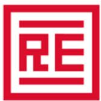

# 中國稀土集團

# CHINA RARE EARTH GROUP CO.,LTD.

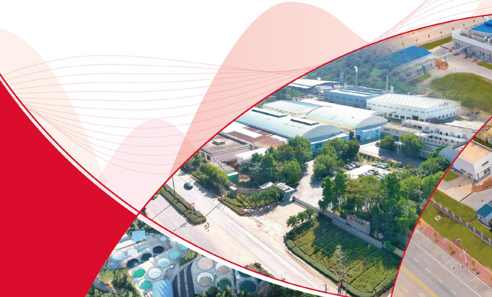

natural_image

Aerial view of an industrial complex with multiple buildings, green spaces, and surrounding roads (no visible text or symbols)

