# YAnkon阳光

以人为本·创新发展

Putting people first, innovating and developing

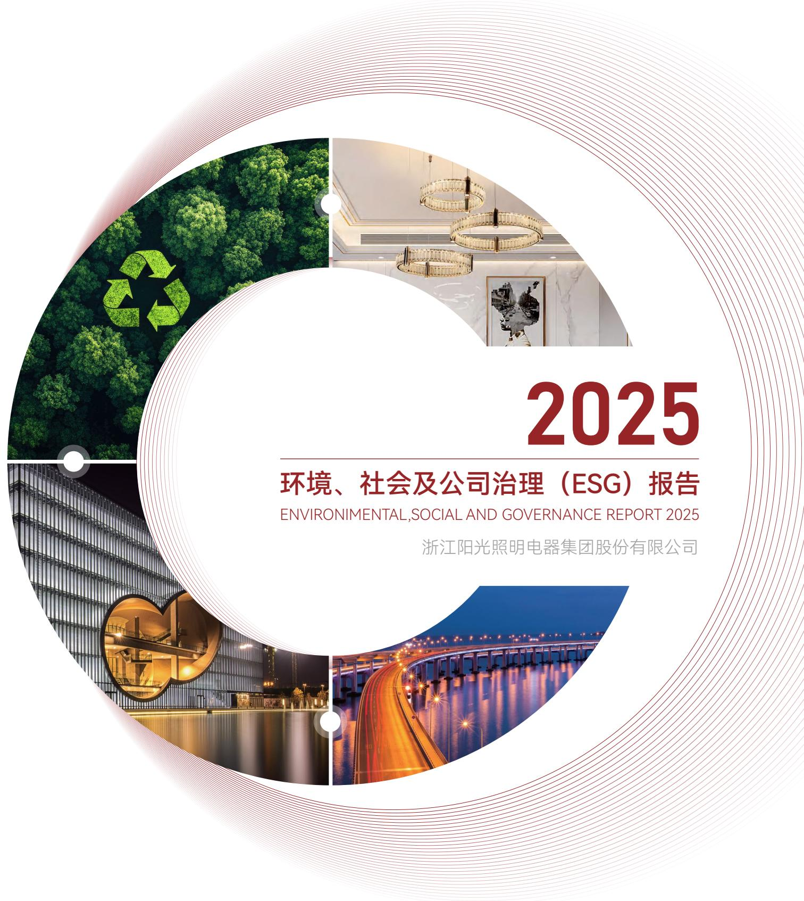

text_image

2025
环境、社会及公司治理（ESG）报告
ENVIRONMENTAL,SOCIAL AND GOVERNANCE REPORT 2025
浙江阳光照明电器集团股份有限公司

# 2025

环境、社会及公司治理（ESG）报告

ENVIRONMENTAL, SOCIAL AND GOVERNANCE REPORT 2025

浙江阳光照明电器集团股份有限公司

# Contents

# 目录

# 01

# 报告前言

Foreword

关于本报告 03

董事长致辞 05

企业荣誉 07

企业简介 09

可持续发展相关治理机制 13

# 04

# 产业价值篇

Industrial Value Chapter

研发与创新体系 43

产品和服务安全与质量 45

负责任供应链 47

助力于行业发展 49

平等对待中小企业 50

# 02

# 可持续治理篇

Sustainable Governance Chapter

党建引领 17

规范治理 19

风险管理 21

商业行为 23

# 05

# 美好生活篇

Beautiful Life Chapter

劳工权益 55

职业健康与安全 59

# 03

# 环境保护篇

Environmental Protection Chapter

应对气候变化 27

绿色运营 31

环境管理 33

资源管理 36

资源效率 37

物料利用 39

# 06

# 报告后言

Later words

未来计划 63

意见反馈 65

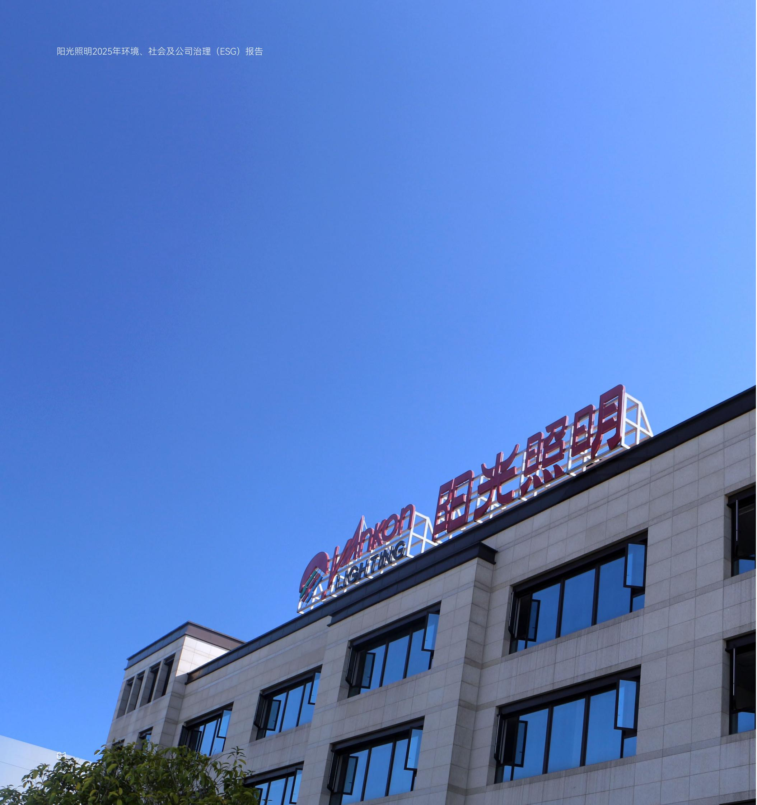

text_image

阳光照明2025年环境、社会及公司治理（ESG）报告

# 01

# 报告前言

Foreword

关于本报告 03  
董事长致辞 05  
企业荣誉 07  
企业简介 09  
可持续发展相关治理机制 13

# 关于本报告

# 报告范围

本报告以浙江阳光照明电器集团股份有限公司作为主体，涵盖各附属公司，如无特别说明，覆盖范围与公司年度报告保持一致。

# 报告时间范围

除另有说明外，本报告时间范围涵盖2025年1月1日至2025年12月31日，部分内容超出此范围。

# 报告编制依据

本报告主要参照全球报告倡议组织《可持续发展报告标准》（GRI 标准）和《中国企业社会责任报告编写指南 CASS—ESG6.0》进行编写，同时参考与回应了联合国可持续发展目标（SDGs）、国际可持续准则理事会（ISSB）标准、可持续发展会计准则委员会（SASB）准则。

# 数据来源

报告使用数据来源包括政府部门公开数据、公司行政文件、统计报表。

# 报告质量保证

本报告旨在全面、透明地展示公司在过去一年中在环境、社会和公司治理方面的表现，以及我们对于可持续发展的承诺和成果。本报告涵盖了公司在其业务运营中的ESG关键领域，包括但不限于环境保护、社会责任、员工关怀、供应链管理、公司治理结构及透明度。公司设立了专门的ESG工作小组，负责对报告内容进行内部审核，确保信息的准确性和完整性。

# 称谓说明

为了便于表述和阅读，本报告中“公司”或“我们”表述。

# 报告获取

您可以在证券交易所网站https://www.sse.com.cn/下载本报告电子文本，获取更多公司信息。

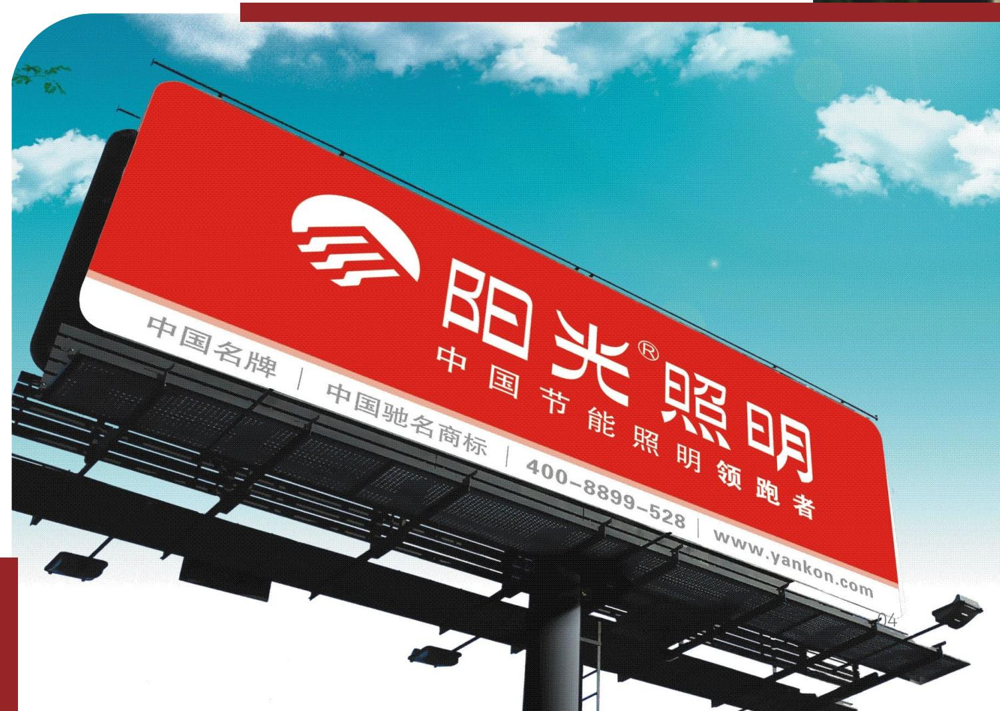

text_image

阳光照明
中国驰名商标 | 中国驰名商标 | 400-8899-528 | www.yankon.com
中国名牌 | 中国驰名商标 | 400-8899-528 | www.yankon.com

# 董事长致辞

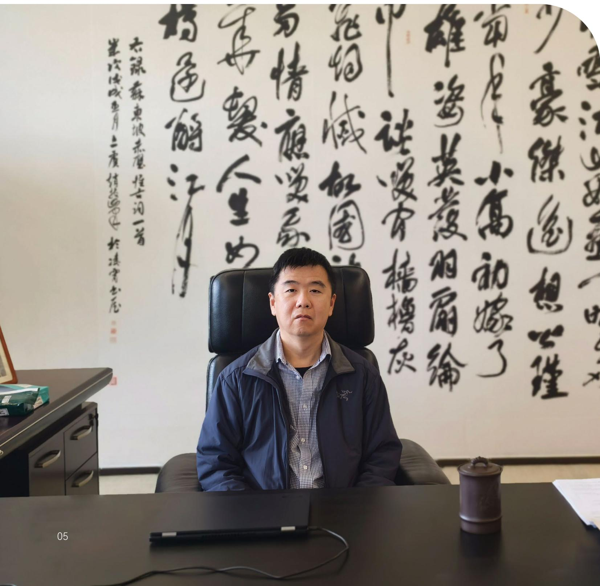

text_image

雲江如水道一時來
少豪陳逸想必僅
前尾小萬初嫁了
雄逸英薇羽扇綸
中 讲愛宵橋榜灰
花狗減如園
易情應愛高
喜製人生也
情色餚江
志祿蘇東波赤塵柱古洞一著
峯次城至月上虞
修遠安於清寶山尾
05

尊敬的各位股东、合作伙伴及关心阳光照明发展的各界朋友：

光，是文明的底色，亦是可持续发展的引擎。当前全球照明产业正迈向高效节能、智能互联、绿色低碳的全新周期，健康光环境与碳中和目标深度绑定，产业格局迎来系统性重构。作为深耕行业五十载的民族品牌，阳光照明始终以长期主义锚定发展航向，将环境、社会与治理融入战略核心，以技术创新驱动产业升级，以责任担当践行时代使命，为全球用户提供更智慧、更低碳、更健康的光解决方案。

智能制造是照明产业进阶的核心引擎。我们坚定推进数字化转型与绿色制造深度融合，建成行业领先的智能工厂，以全流程数字化管控、柔性化生产、低碳化运营为标杆，实现能效提升、资源循环与品质跃升，引领中国照明制造业向高端化、智能化、绿色化跨越。

社会责任是企业行稳致远的根基。我们坚守产品安全底线，护航员工成长与权益保障，积极投身公益事业与社区共建；在供应链协同、绿色包装、循环回收等领域持续深耕，以全生命周期理念降低环境负荷，用实际行动守护万家灯火，传递阳光温度。

面向双碳战略纵深推进，我们以阳光绿氢开辟绿色能源新赛道。作为集团布局氢能产业的核心载体，阳光绿氢聚焦绿色制氢技术研发与产业化应用，以 AEM 电解槽等核心装备突破能源转型瓶颈，打造“绿电+绿氢+绿色制造”的闭环生态，为生产基地低碳运营、产业绿色升级提供清洁能源支撑，构筑照明与氢能协同发展的新增长极。

道阻且长，行则将至。未来，阳光照明将继续秉持“用光创造价值”的初心，以 ESG 为牵引，深耕智能照明主航道，加速阳光绿氢产业化落地，以行业领先的智能工厂为基石，协同伙伴共筑绿色产业生态，用责任与创新点亮可持续发展之路，为全球碳中和与人类美好生活贡献阳光力量！

阳光照明董事长：陈卫

2026年4月30日

# 企业荣誉

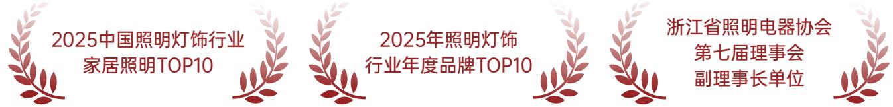

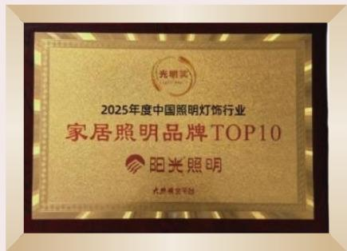

text_image

光明奖
2025年度中国照明灯饰行业
家居照明品牌TOP10
阳光照明
占晨珠宝可选

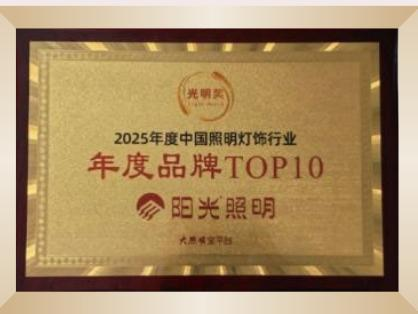

text_image

光明奖
2025年度中国照明灯饰行业
年度品牌TOP10
阳光照明
大智慧宝评选

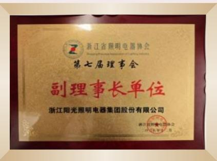

text_image

浙江省照明电器协会
第七届理事会
副理事长单位
浙江阳光照明电器集团股份有限公司
浙江阳光照明电器协会
2019年1月

  
浙江省照明电器协会卓越贡献会员单位

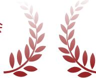

2025房建供应链综合实力TOP500首选供应商·照明灯具+浴霸类  

  
2025供应链大数据企业入库证书5A供应商（地产）

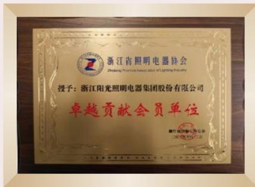

text_image

浙江省照明电器协会
Zhejiang Sunshine Foundation of Lighting Industry
授予：浙江阳光照明电器集团股份有限公司
卓越贡献会员单位

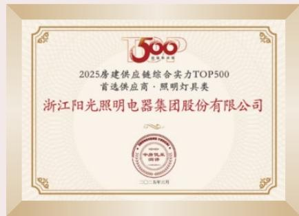

text_image

2025房建供应链综合实力TOP500
首选供应商·照明灯具类
浙江阳光照明电器集团股份有限公司

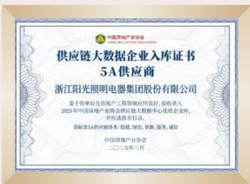

text_image

中国房地产业协会
CHINA FOCALTY ELECTRICAL ASSOCIATION
供应链大数据企业入库证书
5A供应商
浙江阳光照明电器集团股份有限公司
鉴于你单位在房地产工程领域应用良好，县收录入
2025年中国房地产业协会供应链大数据中心优质企业库，
并形成推荐目录。
高标准5A供应商体系：稳健、绿色、创新、服务、诚信
中国房地产业协会
二〇二五年三月

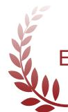  
香港公司获
ESG卓越可持续发展企业大奖

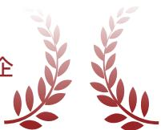

2025年
行业领袖品牌  

第四届“浙江照明奖 创新 工程奖”优秀奖  
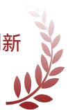

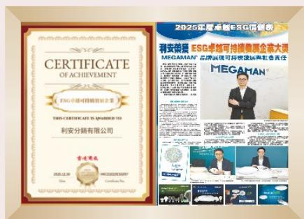

text_image

CERTIFICATE
OF ACHIEVEMENT
ESG卓越可持續發展企業大獎
THIS CERTIFICATE IS SPARDED TO
利安分銷有限公司
2025.11.30
MEGAMAN®
2025年度卓越ESG區費
利安榮譽 ESG卓越可持續發展企業大獎
MEGAMAN®
品牌演說可持續發展和社會責任
MEGAMAN®

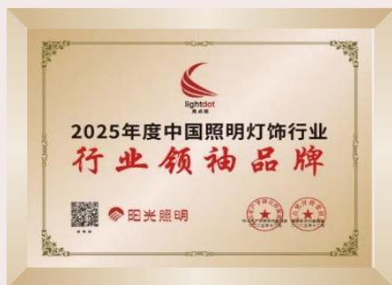

text_image

lightslot
2025年度中国照明灯饰行业
行业领袖品牌
阳光照明

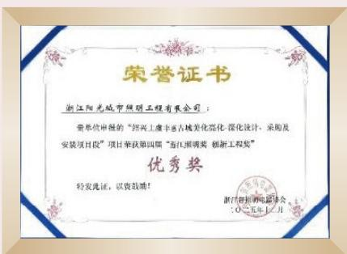

text_image

荣誉证书
浙江阳光城市照明工程有限公司：
带形绘希腊的“绍兴上虞丰嘉古城美化器化-深化设计、采购及安装项目良”项目荣获第四届“浙江照明奖·创新工程奖”
优秀奖
特发此证，以贵鼓励！
浙江省科学技术厅
2017年5月1日

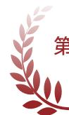  
第四届“浙江照明奖 创新 工程奖”优秀奖

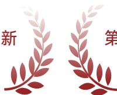

第四届“浙江照明奖 创新 工程奖”三等奖  
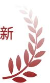

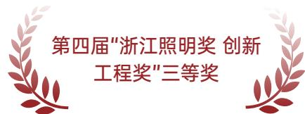

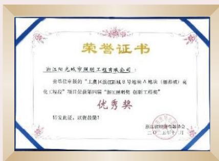

text_image

荣誉证书
浙江阳光城市照明工程有限公司：
各单位申报的“上虞区滨江新城B号地块A地块（细形城）亮化工程段”项目获第四届“浙江展明奖 创新工程奖”
优秀奖
特发此证，以资鼓励！
浙江省住房和城乡建设厅
二〇一五年七月

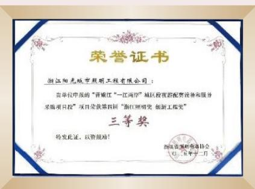

text_image

荣誉证书
浙江阳光城市照明工程有限公司：
首单位申报的“晋城江一江润谷”城区段配套配套设备和服务采购项目投”项目荣获第四届“浙江照明奖”创新工程奖”
三等奖
特发此证，以资鼓励！
浙江黄冈律师事务所
（2015年1月）

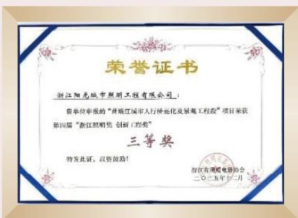

text_image

荣誉证书
浙江阳光城市照明工程有限公司：
贵单位申报的“黄陂江城市人行桥亮化及景海工程奖”项目荣获
第四届“浙江照明奖 创新（工程奖）”
三等奖
特发此证，以资鼓励！
浙江省人民政府办公厅
二〇一五年十二月

# 企业简介

# 基本信息

浙江阳光照明电器集团股份有限公司（以下简称“阳光照明”或“公司”）创立于1975年，是一家全球领先的照明灯具及系统服务商。2000年在上海证券交易所上市（股票代码：600261），公司本部位于绍兴市上虞区。

公司专注于研发、生产、推广行业领先的节能照明灯具。产品线全面涵盖LED家居照明、商业照明、户外照明、电工电器及智能照明五大领域，并以绿色理念贯穿产品的设计、制造、推广和回收全过程，致力于研发和推广更节能、更环保的照明解决方案。2024年开始，公司逐步进入氢能源设备制造领域，先后成立多家子公司。

作为中国最早拥有自营进出口权的企业之一，阳光照明始终怀揣“打造全球化照明公司”的愿景，不断深耕照明领域，目前在国内拥有浙江上虞、江西余江、福建厦门、安徽金寨四大生产基地，并在泰国设有海外生产基地。

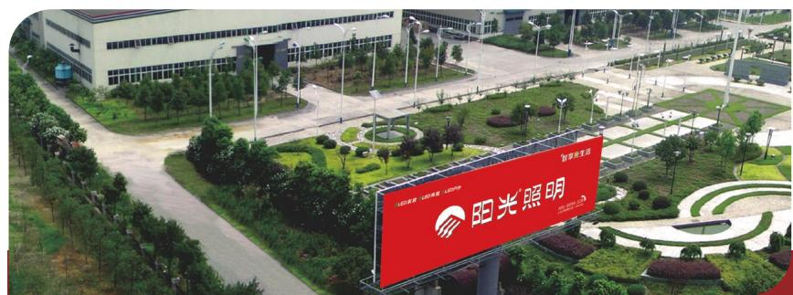

text_image

阳光照明
智学光生活

< 浙江上虞 >  
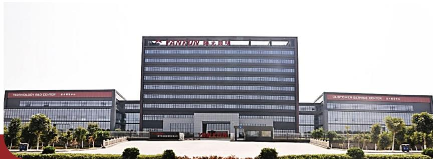

natural_image

Exterior view of a modern office building with 'TANKUN' signage and 'CUSTOMER SERVICE CENTER' branding (no other text or symbols visible)

< 福建厦门 >  
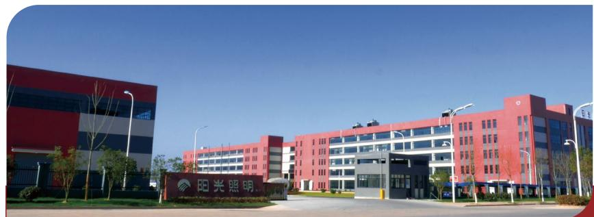

natural_image

Exterior view of a modern multi-story office building with red and gray facade, featuring the company name '阳光照明' on the ground (no other signage visible)

< 安徽金寨 >  
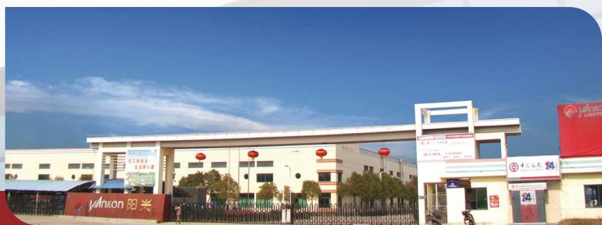

natural_image

Exterior view of a modern industrial facility with gateways and red lanterns under a clear blue sky (no signage visible)

< 江西余江 >

# 战略与文化

从创业之初沿用的“团结务实 高效 优质”，发展为“创新创业 诚信敬业 锲而不舍 追求卓越”。

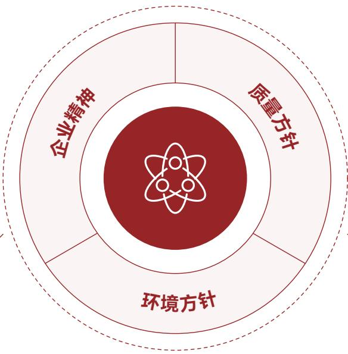

flowchart

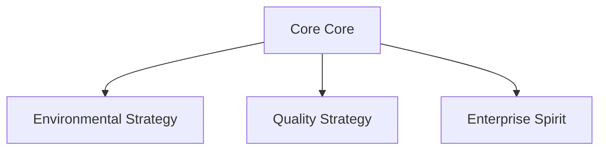
```mermaid
graph TD
  A["Core Core"] --> B["Environmental Strategy"]
  A --> C["Quality Strategy"]
  A --> D["Enterprise Spirit"]
```

优良的品质，是我们的追求；世界的光明，有“阳光”的奉献；完善的质量体系，一流的管理水平，良好的企业信誉是我们的保证；克己的敬业精神，细致的工作作风，真诚的服务态度是“阳光”的承诺。

为了让世界更明亮、使地球更清洁，我们将不遗余力的致力与“绿色”、“节能”产品的设计和制造，并对此做了四点承诺。坚决遵守国家和地方的各项法律法规要求；阳光的每一款节能产品设计、每一项操作工艺设计、每一个工作方案设计，将尽可能消除污染产生的源头；阳光的每一位员工、每一条工作思路、每一项操作步骤，将尽可能预防污染的产生，并将对此持续改进；阳光的每一位员工和每一个供应商将为制造“绿色节能”照明产品而努力，并将为此而自豪。

# 产业布局

家居照明、商业照明、户外照明、电工电器及智能照明五大领域。

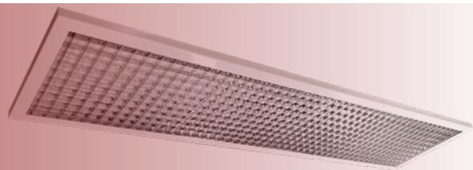

natural_image

Exterior view of a large, grid-patterned ceiling structure with no visible text or symbols

# LED照明

先进的电解水制氢技术，利用可再生能源产生的电力进行制氢，实现零排放的绿色生产。

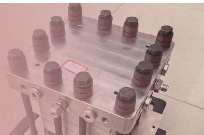

natural_image

Metal mechanical assembly with multiple cylindrical components mounted on a base (no visible text or symbols)

# AEM制氢装备

# 业务概况

# 发展历程

# 1975

创立于1975年

# 1975- 1990

照明行业技术先锋，发明国内第一支三基色稀土节能荧光灯

# 1992- 1997

国务院发展研究中心认定为“中国最大的节能灯生产出口基地”

# 1998-2006

开创T5三基色荧光照明时代。A股上市，股票代码600261

# 2007 2012

率先转型LED，形成规模宏大的四大生产基地

# 2013-2018

签约阿里巴巴AI战略合作，中标苏州、杭州、深圳等城市地铁LED照明项目，签约一系列大型公共照明项目

# 2019

入选中国轻工业百强企业，连续四年获得德国红点设计奖

# 2020

城市及道路照明工程专业承包
壹级照明工程设计专项乙级

# 2024

成为国内领先商业照明品牌，照明综合解决方案系统服务商阳光氢能科技公司成立

# 2025

成功入选浙江民营跨国公司“领航企业”榜单，成为上虞区外向型经济标杆，彰显跨国经营和全球化布局成果。

泰国工厂通过ISO9001等国际认证，年产能500万套，规避美国关税，保障北美市场供应。

公司氢能业务攻克三大系列AEM电解槽核心技术，100kW单槽稳定运行超1500小时，2026年启动兆瓦级试验。

# 可持续发展相关治理机制

# 可持续发展目标与愿景

是将绿色理念贯穿于整个照明产品的设计、制造、推广和回收体系。

为了践行这一理念，公司首先会强化绿色技术的研发与创新力度，积极促进生产方式的绿色低碳转型。其次，全面实施碳足迹管理，加强对产品全生命周期的碳排放监测和控制。再者，加强 ESG 信息的透明度与沟通机制，通过建立专门的 ESG 管理委员会，确保企业在环境、社会及治理方面的绩效得到全面展现与持续改进。

此外，公司还将 ESG 理念融入公司战略规划和日常运营，力求实现经济效益与社会责任的共同提升。

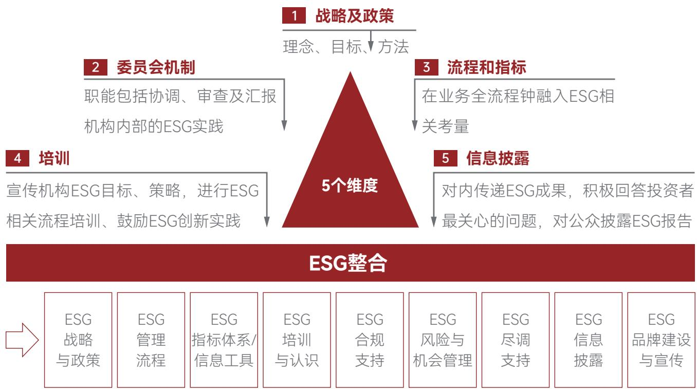

flowchart

```mermaid
graph TD
  subgraph Pillar1["1 战略及政策\n理念、目标、方法"]
    direction TB
  Step1["1 战略及政策"] --> Step2["2 委员会机制\n职能包括协调、审查及汇报\n机构内部的ESG实践"]
  Step2 --> Step3["3 流程和指标\n在业务全流程钟融入ESG相\n关考量"]
  Step3 --> Step4["4 培训\n宣传机构ESG目标、策略，进行ESG\n相关流程培训、鼓励ESG创新实践"]
  Step4 --> Step5["5 信息披露\n对内传递ESG成果，积极回答投资者\n最关心的问题，对公众披露ESG报告"]
  end

  subgraph Bottom["ESG整合"]
    direction TB
    direction LR
  Bottom --> Bottom1["ESG战略与政策"]
  Bottom --> Bottom2["ESG管理流程"]
  Bottom --> Bottom3["ESG指标体系/信息工具"]
  Bottom --> Bottom4["ESG培训与认识"]
  Bottom --> Bottom5["ESG合规支持"]
  Bottom --> Bottom6["ESG风险与机会管理"]
  Bottom --> Bottom7["ESG尽调支持"]
  Bottom --> Bottom8["ESG信息披露"]
  Bottom --> Bottom9["ESG品牌建设与宣传"]
  end
```

ESG管理架构

阳光照明致力于将可持续发展理念深度融合到核心业务中，推动环境友好、社会责任和公司治理的和谐统一。其可持续发展目标包括：

<table><tr><td>环境目标</td><td>持续拓展绿色产品线,推动照明产品的绿色低碳化。积极响应全球能源转型,布局绿色制氢专用设备制造,助力氢能产业发展。在产品设计、制造、推广和回收全过程中贯彻绿色理念,降低环境影响。</td></tr><tr><td>社会目标</td><td>积极履行社会责任,通过提供高品质、智能化的照明产品,满足市场需求。推动社区发展,提升社区福祉,助力城市实现绿色低碳化发展。</td></tr><tr><td>治理目标</td><td>持续优化ESG管理体系,强化利益相关方沟通与合作。提升透明度,完善治理框架,推动内部协作与外部合作。</td></tr></table>

阳光照明的可持续发展愿景是构建环境友好型与社会责任共融的发展路径。具体包括：

<table><tr><td>应对气候变化与资源短缺</td><td>●积极应对气候变化挑战,推动企业低碳转型。●通过技术创新和产品升级,助力全球能源转型。</td></tr><tr><td>增强社区福祉与多元包容</td><td>●助力社区发展,提升社区福祉。●培养多元包容的企业文化,确保长期价值创造惠及所有利益相关方。</td></tr><tr><td>塑造卓越品牌形象</td><td>●通过践行可持续发展理念,打造值得信赖的品牌形象。●推动行业标准与最佳实践分享,引领行业发展。</td></tr></table>

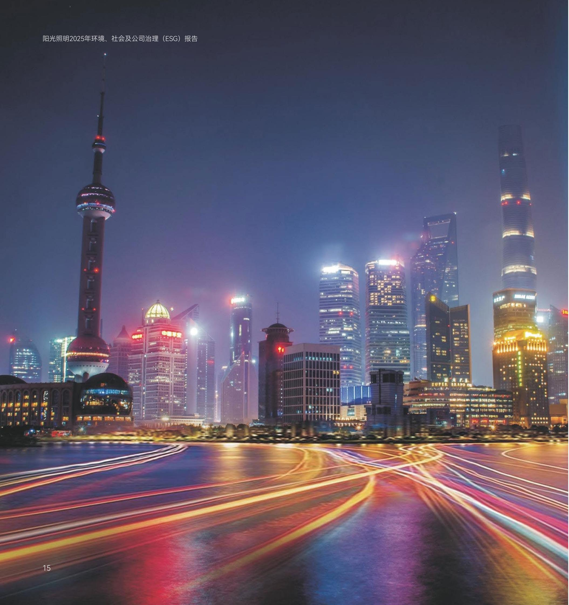

text_image

阳光照明2025年环境、社会及公司治理（ESG）报告
15

# 02

# 公司治理篇

Corporate Governance Chapter

党建引领 17  
规范治理 19  
风险管理 21  
商业行为 23

# 党建引领

2025年，公司党委坚持以习近平新时代中国特色社会主义思想为指导，深入学习贯彻党的二十大及二十届历次全会精神，紧紧围绕“稳中求进”工作总基调，持续深化“党建强、发展强”理念，不断擦亮“红色光芒、绿色照明”党建品牌，以高质量党建引领公司高质量发展。

# 深化作风学习教育，严明纪律规矩

自2025年3月起，公司党委将深入贯彻中央八项规定精神学习教育作为坚定拥护“两个确立”、坚决做到“两个维护”的实际行动，坚持“原原本本集中学、联系实际共研讨、聚焦重点细检视、紧盯问题常警示、上下联动一起改、常态长效促发展”的“六步工作法”。

# 统筹部署有力

第一时间制定工作计划及重点任务清单，建立“实时督导、月度调度”机制，组织深入学习《习近平关于加强党的作风建设论述摘编》等，推动全体党员正风肃纪。

# 检视整改从严

组织全体党员签订承诺书，梳理问题清单并开展“回头看”，聚焦采购、销售、财务等关键岗位强化监督，构建亲清政商关系，用身边事警示教育身边人。

# 学习研讨 深入

严格落实“第一议题”制度，通过培训会、专题会、线上学习等多种形式，持续深入学习贯彻习近平新时代中国特色社会主义思想，确保党中央决策部署落实落地。

# 开门纳谏 解忧

班子成员深入一线调研座谈，广泛征求群众意见，形成办实事清单并及时反馈进度，以发展实绩检验学习教育成效。

# 持续夯实党建基础，推动深度融合

一年来，公司党委在抓党建打基础、抓班子带队伍、抓廉洁涵养生态、抓融合促发展上持续用力，党建工作标准化、规范化水平进一步提升。坚持党建工作与生产经营深度融合，在技术创新、生产管理、市场拓展等关键岗位，党员骨干冲锋在前，“党员示范岗”“党员责任区”常态化运行，有效提升了工作质量和效率。

# 创新特色党建活动，营造浓厚氛围

组织党员赴新昌梁柏台等红色教育基地开展现场教学，赓续红色血脉；深入学习习近平新时代中国特色社会主义思想、党的二十大及二十届历次全会精神，扎实开展中央八项规定精神学习教育，组织《习近平关于加强党的作风建设论述摘编》学习、应知应会测试及专题党课，增强党员纪律意识。巧用“清廉+”模式，深化廉政学习，组织观看警示教育片及现场教学，将廉洁要求嵌入各业务流程，推动警示教育入脑入心，营造风清气正的工作氛围。积极开展“党建+志愿服务”活动，组织义务献血，动员党员志愿者深入社区、乡村，为群众提供灯具安装、照明知识科普等服务，展现企业良好社会形象。

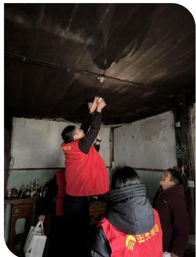

text_image

Street photo showing people in red vests installing or repairing ceiling debris, with visible Chinese text on vests and background signage

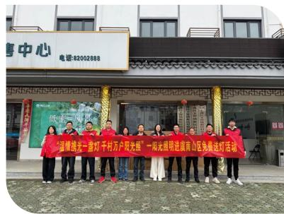

text_image

售中心 电话:82002888
“国情巡光一盏灯 千村万户阳光照 一盏光照明建成南山区免费送灯活动”

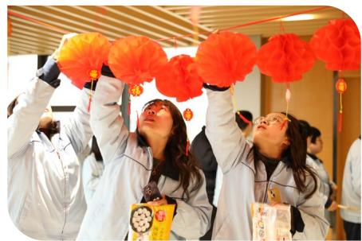

natural_image

Two students in school uniforms holding red paper fans indoors, no visible text or symbols

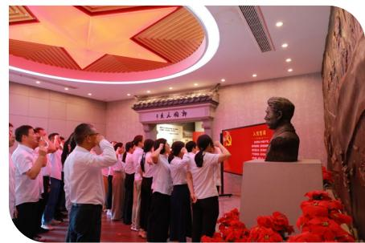

natural_image

Group of people in white shirts clapping in a museum or exhibition hall with a large red star-shaped ceiling and a bust statue (no visible text or symbols)

# 升级改造党建阵地，巩固荣誉成果

公司在原有党建展馆基础上完成改造升级，并新建产品馆，形成“党建+产品”融合展示新阵地，持续发挥主题教育学习点作用。该展馆曾作为第二批学习贯彻习近平新时代中国特色社会主义思想主题教育上虞区学习点之一。公司党建工作得到区委社工部充分肯定，继续保持上虞区“双融双强”青春六星党组织荣誉，为公司高质量发展提供了坚强的政治保障和组织支撑。

# 规范治理

治理结构  
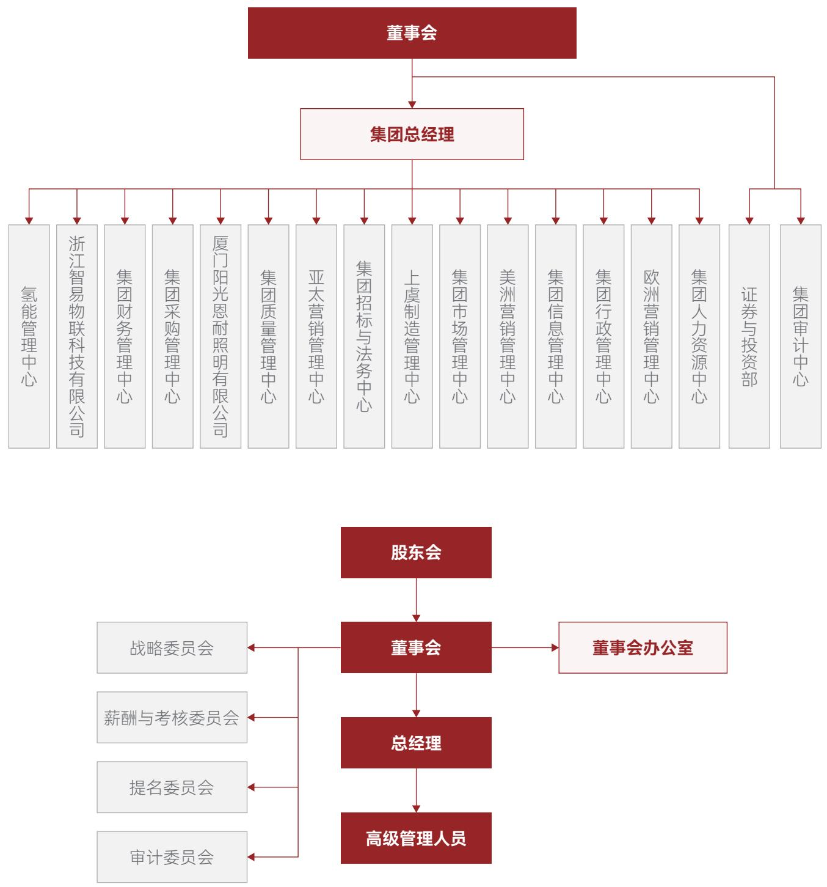

# 信息披露

阳光照明秉持公开、透明的原则，严格遵守《中华人民共和国公司法》《中华人民共和国证券法》《上海证券交易所股票上市规则》等要求，制定了《阳光照明信息披露制度》《信息披露暂缓与豁免业务内部管理制度》等文件，坚持高度合规的信息披露。

# 报告期内

阳光照明共编制与披露

定期报告共

发布临时公告

4份

30个

# 股东和股东会

公司严格按照《中华人民共和国公司法》《公司章程》《股东会议事规则》等法律法规和内部制度召集、召开股东会并聘请律师见证公司股东会,为股东参加会议、充分行使表决权提供便利。公司平等对待所有股东,及时回复股东问题,听取股东的意见与建议。股东会审议关联事项时，严格执行关联股东回避表决程序。

关于控股股东与上市公司：公司与控股股东产权关系相互独立。公司建立了防止控股股东及其关联企业占用上市公司资金、侵害上市公司利益的长效机制。

# 董事和董事会

阳光照明董事会下辖四个专门委员会，包括战略委员会、审计委员会、薪酬与考核委员会、提名委员会。董事会及各委员会明确职权范围，了解实施细则，高效执行各项管理决策职能。

公司按照《董事会议事规则》积极搭建一个涵盖不同性别、年龄段、教育背景的董事会,同时秉承任人唯贤的宗旨,基于候选人的教育背景、行业经验、技能专长和工作履历等多元化指标进行综合考量,确保董事发挥各自的专业特长,审慎决策,维护公司和广大股东的利益。

公司严格依照法律法规及公司章程规定构建董事会治理体系，全环节保障董事会独立规范运作。公司现有董事会成员9名，其中独立董事3名。独立董事候选人于会前按规定签署相关独立性声明，承诺独立履职，与公司及相关方不存在任何影响独立性的利害关系。

# 风险管理

公司严格遵守相关法律，积极开展风险评估工作，对内外部因素进行分析研究与评估，判断其对公司运行产生的影响，并采取可行的应对策略，达到控制风险的目的。通过风险识别、风险分析，预先发现风险征兆提前采取必要预防控制措施，以规避或削减风险;对于已发生的风险，通过已有风险应对措施，把风险损失降到最低。以科学有效的风险防范机制开展风险管理工作，确保公司面临的各类风险能够得到及时识别和有效管理。

# 内部控制

阳光照明始终将风险内部控制视为企业稳健发展的核心要素，予以高度重视。公司制定《阳光照明重大信息内部报告制度》《阳光照明信息披露制度》《阳光照明内幕信息保密制度》《阳光照明防范控股股东及关联方占用公司资金制度》等内部规章制度，构建内部控制体系，包括建立风险管理团队、制定风险管理计划、识别和评估风险、采取风险应对措施、监督和改进风险管理等关键环节。

为确保审计监察工作的高质量，助力公司生产经营的持续健康发展，公司成立审计监察部，承担公司内部审计监督和评价。对审计发现问题整改督查、信访举报调查处理、纪律审查、监察调查、效能督查、违法违规监督处理等工作的责任。

# 报告期内

在公司的指导下，结合年度审计计划和公司实际情况，审计监察部充分发挥审计监督的职能作用，按时完成每季度及年度内部审计工作报告，提高审计管理水平，强化对公司经营管理和各部门的监督与管控，为公司迈向高质量发展之路提供坚实的监督支撑。

# 投资者关系管理与股东权益

公司始终坚持“尊重投资者，回报投资者”的理念，最大限度地保障全体股东的合法权益，与投资者开展多层次、全方位的互动与交流，通过建立常态化与动态管理相结合的沟通机制，进一步健全投资者交流平台，提高投资者对企业的认知度，实现公司信息与价值在资本市场的有效传播，树立在资本市场良好的企业形象。公司设立专人接听的投资者热线，公司传、电子信箱、网站互动平台、上证E互动均运转良好，及时回复。平时关注公司外部舆论，重视情管理，注意加强与各新闻体的交流，确保信息沟涵渠道,顺捷畅通。

在2025年，公司依照浙江证监局的相关要求，成功举办了1次网上业绩说明会。并且，我们还积极热情地接待了40多家机构投资者，接听了多达99通投资者的电话。在与投资者的交流过程中，我们始终保持耐心，认真答疑解惑，加强与投资者的互动交流，建立了良好的沟通桥梁。此外，公司密切关注机构调研报告与媒体报道，及时回复上证“E互动”60左右人次的留言。通过这些努力，积极维护了公司的良好形象，保障了中小投资者的合法权益，进一步增强了市场对公司的信心。

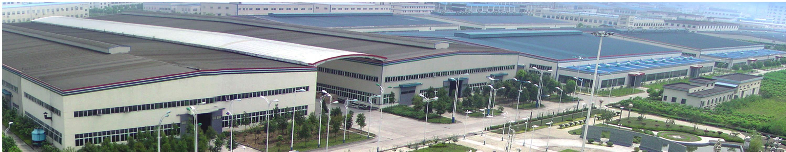

natural_image

Aerial view of a large industrial complex with multiple factory buildings and surrounding greenery (no visible text or signage)

# 股东回报

在经济效稳步增长的同时，公司十分重视对投资者的合理回报，公司每年通过现金分红实现对股东投资的回报。2025年度，公司利润分配预案为向全体股东每10股发现金红利1.30元(含税)，发放现金红利17,355.69万元，分红占归母净利润比例达 $92.04\%$ 。自2000年上市至今，公司已连续25年稳步实施现金分红政策，合计连续十年现金分红金额占当年归属于上市公司股东净利润比例 $50\%$ 以上。

公司历年利润分配方案一览表（2020年度—2025年度） 单位：人民币 万元

<table><tr><td>分红时间</td><td>每10股派息数(元)(含税)</td><td>现金分红的数额(含税)</td></tr><tr><td>2025年度</td><td>1.3</td><td>17,355.69</td></tr><tr><td>2024年度</td><td>1.4</td><td>18,690.74</td></tr><tr><td>2023年度</td><td>1.3</td><td>17,355.69</td></tr><tr><td>2022年度</td><td>1.3</td><td>17,877.36</td></tr><tr><td>2021年度</td><td>2.0</td><td>27,506.63</td></tr><tr><td>2020年度</td><td>3.0</td><td>42,378.75</td></tr></table>

2025年每股社会贡献值=0.59元/股

每股社会贡献值=每股收益+（上缴税费+工资+利息+捐赠）/总股本。计算标注源于《关于加强上市公司社会责任承担工作暨发布〈上海证券交易所上市公司环境信息披露指引〉的通知》。

# 商业行为

公司在业务开展过程中严格把控关键环节，防范商业贿赂与不正当竞争。建立透明化沟通机制与内部监督体系，强化员工培训与道德文化建设。通过定期第三方审核，确保各项运营活动合规合法。积极参与行业协会，倡导公平市场竞争环境，共同维护行业健康生态。持续改进内部控制措施，积极识别与整改潜在风险点，保障业务稳健发展。公司秉持高度的道德与诚信标准，在全球商业活动中严格遵守反商业贿赂、反贪污及反不正当竞争的相关法律法规。通过建立严格的内部规章制度，全面覆盖岗位职责、业务流程与合作伙伴管理，确保员工行为规范。定期进行合规培训与风险评估，强化廉洁文化建设，将合规要求融入日常业务操作，以实际行动践行诚信经营承诺。

# 反商业贿赂及反贪污

公司秉持廉洁经营的核心价值观,坚决对贪污腐败行为采取零容忍态度。严格遵守公司相关制度，促使公司全体员工严格遵守相关法律法规、行业规范和准则、公司规章制度及职业道德，树立廉洁自律和勤勉尽责的良好风气。公司积极提倡合作伙伴签署《廉洁诚信承诺书》,全方位推进反贿赂和反腐败工作。同时,要求员工签署《员工廉洁自律承诺书》，确保廉洁自律的理念深入人心。

# 申诉与举报机制

公司建立信访举报渠道，及时、客观、公正地受理举报和信访事件。审计监察部负责举报渠道的重要职责，包括设立举报电话、电子邮箱和信箱等，并将这些举报方式的具体信息对外公布。对于违反廉洁要求的行为，公司将对相关责任人进行及时的惩罚。公司高度重视对举报人的保护，对举报的受理、调查等各个环节都实行严格保密，确保举报人的信息安全，严禁任何人员泄露举报人的信息。

举报渠道

<table><tr><td>公众号举报:</td><td>邮箱举报:</td></tr><tr><td>xmygsj / yankon-shenji</td><td>xmsj@yankon-xm.com /</td></tr><tr><td>电话举报:</td><td>ygsj@yanlon.com</td></tr><tr><td>0592-3759728 / 0575-82122102</td><td>以上渠道均可采取实名/匿名形式举报</td></tr></table>

# 反不正当竞争

公司严格遵守《中华人民共和国反不正当竞争法》等相关法律法规，坚决抵制不正当竞争行为。公司通过建立健全内部管理制度，强化员工培训，提高员工对不正当竞争行为的认识和防范意识。同时，公司积极倡导公平竞争，鼓励员工在合法合规的框架内开展业务活动，确保公司的商业行为符合市场规则和社会道德标准。

# 知识产权

公司高度重视知识产权保护，是国家知识产权局首批“全国专利试点企业”。截至2025年末，公司累计获授权国家专利1361项，其中发明专利225项、实用新型专利824项，境外专利47项，主持或参与起草国家标准55项。作为传统照明行业向LED转型最早的领军企业之一，公司在热学管理、光学设计、驱动芯片开发、智能控制系统等关键领域持续实现技术突破。

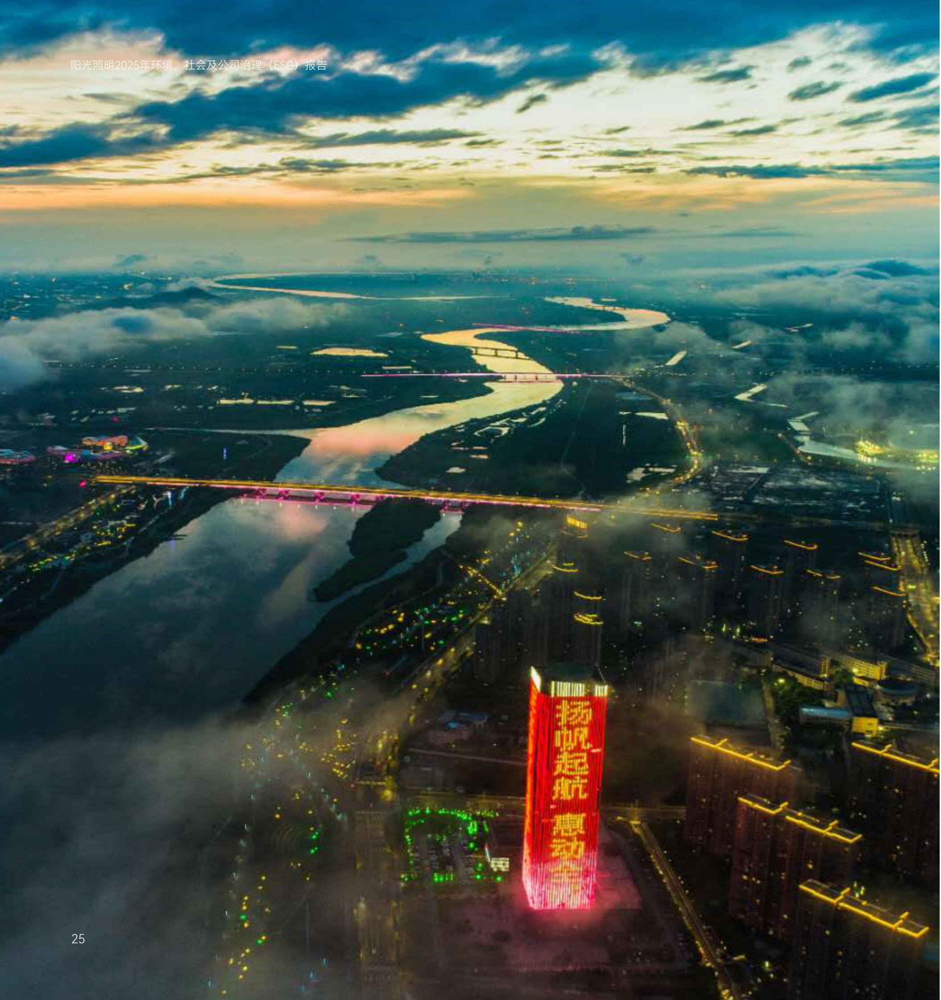

text_image

阳光照明2025年环境、社会及公司治理（ESG）报告
扬帆起航
惠动

# 03

# 环境保护篇

Environmental Protection Chapter

应对气候变化 27  
绿色运营 31  
环境管理 33  
资源管理 36  
资源效率 37  
物料利用 39

# 应对气候变化

# 应对气候变化综述

在未来的道路上，公司将继续深化对可持续发展理念的理解与践行。我们致力于通过创新技术驱动绿色转型，强化环境管理体系，旨在显著降低运营过程中的碳排放与资源消耗。通过打造智慧能源系统，我们将持续探索并应用清洁能源解决方案，促进能源利用效率的不断提升。

积极履行气候责任，严格遵循国际通行的环境标准与政策框架，将碳排放管理纳入核心运营体系，持续优化能源结构，推动绿色技术应用，确保各项活动符合行业监管要求，提升可持续发展能力。双碳政策持续推动能源结构深度调整，低碳转型成为发展核心方向。全球气候议题日益突出，极端天气频发引发广泛关注。产业格局加速重塑，绿色技术应用不断拓展。政策导向与市场趋势形成合力，促使各领域加快碳减排步伐。气候变化影响深远，适应与减缓并重成为必然选择。

# 应对气候变化治理

构建系统化气候治理体系，明确责任主体与执行路径。设立跨部门协调机构，统筹政策制定与实施监督。完善内部管理制度，涵盖碳排放监测、减排目标分解及风险评估机制。强化高层引领作用，推动全员参与气候行动，提升组织响应能力与可持续发展水平。员工普遍具备应对气候变化的专业知识与实践能力，公司在气候议题上持续强化人才储备。制定系统性培训计划，聚焦气候科学、低碳技术及风险管理等核心领域。报告期间开展多场专题培训，提升全员对气候挑战的认知与响应水平。将气候变化风险纳入日常管理流程，建立多层级监督体系。通过设定明确目标与指标，定期评估行动成效。强化内部沟通机制，提升全员气候意识。形成持续改进的闭环管理，确保战略落地执行。

# 应对气候变化战略

公司遵循气候相关财务信息披露小组框架，识别、应对风险与机遇，深入分析气候变化带来的物理、转型风险，挖掘转型机遇，公司将气候因素纳入公司的长期战略规划，积极调整业务布局，推动产品和服务的绿色升级，抓住绿色发展新机遇，实现可持续发展与社会责任的双重目标。

潜在风险

<table><tr><td>风险</td><td>类型</td><td>风险描述</td><td>发生可能性1</td><td>影响周期2</td><td>财务影响</td><td>应对策略</td></tr><tr><td>物理风险</td><td>急性风险</td><td>台风、洪水等自然灾害可能导致劳动力损失、供应链中断及能源问题。</td><td>低</td><td>短期</td><td>成本增加:设施修复、运营中断,替代供应链等导致成本增加;收入减少:销量下降导致收入减少。</td><td>制定应急响应管理流程,建立应急管理小组,识别并应对风险。</td></tr><tr><td rowspan="2">转型风险</td><td>法律法规风险</td><td>现行气候相关监管要求日益严格,新兴法律法规带来合规管理方面的挑战。</td><td>低</td><td>中期</td><td>成本增加:可能违反法律法规承担经济损失。</td><td>·遵守运营、产品销售所在地的法律法规,确保合规经营;·关注气候变化领域法规要求,加强相应管理措施。</td></tr><tr><td>声誉风险</td><td>应对气候变化的表现逐渐成为利益相关方关注焦点,若公司在运营过程中无法满足利益相关方期望,可能导致企业形象和声誉受到负面影响。</td><td>低</td><td>中期-长期</td><td>收入减少:形象和声誉的负面影响可能导致销量下滑,收入减少。</td><td>积极响应利益相关方期待,落实应对气候变化措施,开展碳排放管理工作。</td></tr></table>

1发生可能性：  
低：风险 / 机遇发生的可能性非常小，通常在过去的经验中几乎未发生，或在行业中罕见。  
中：风险 / 机遇发生的可能性适中，可能在一定时间内发生，历史上有过一些案例，但不是频繁。  
高：风险 / 机遇发生的可能性很大，通常在业务过程中经常出现，历史上有多个相关案例。  
2影响周期：  
短期（1年以内）：对公司的影响通常是快速且临时的，持续时间较短，通常不会超出1年。  
中期（1-5年）：对公司的影响较为持续，通常在1至5年内具有较大影响力。  
长期（5年以上）：对公司的影响是深远且持久的，持续时间通常超过5年以上。

# 应对气候变化影响、风险和机遇管理

公司建立气候风险识别、评估与应对策略体系，采用标准化风险管理流程，确保精准识别潜在气候变化风险，进行科学评估，并据此制定有效应对措施，强化公司环境韧性和可持续发展能力。

# 应对气候变化的指标与目标

公司将气候变化纳入可持续发展核心战略，构建全链条气候治理体系，以量化指标和目标驱动节能降碳与低碳转型，巩固行业绿色标杆地位。

# 核心管控指标

- 温室气体排放管控：规范核算与监测排放，确保数据准确，持续降低总量和强度。  
- 能源利用效率：通过工艺优化与智能管理，提升能效，降低能耗。  
- 清洁能源替代：提高可再生能源比例，推进绿电和天然气掺氢应用，优化低碳供能结构。  
绿色技术与产品：加大低碳材料与节能技术研发，提升低碳产品占比，推动绿色成果转化。  
- 气候治理能力：完善碳管理制度，加强培训与风险应对，促进供应链低碳协同。

# 减排与发展目标

- 短期目标：降低碳排放总量与强度，完成节能任务，扩大清洁能源与掺氢应用，规范环境信息披露。  
中长期目标：对标国家双碳战略，深化节能改造与清洁能源替代，推进全价值链减碳，打造制造业低碳转型标杆，支撑碳中和目标。

碳资产管理

<table><tr><td>指标名称</td><td>碳排放量(tCO2e)</td><td>能源消耗量(吨标煤)</td></tr><tr><td>温室气体排放总量</td><td>10,853.50</td><td>3,369.60</td></tr><tr><td>直接排放(范畴一)</td><td>1,058.31</td><td>650.99</td></tr><tr><td>间接排放(范畴二)</td><td>9,795.19</td><td>2,268.81</td></tr><tr><td>其他间接排放(范畴三)</td><td>/</td><td>/</td></tr><tr><td>化石能源</td><td>1,058.31</td><td>650.99</td></tr><tr><td>电力消耗</td><td>9,795.19</td><td>2,268.81</td></tr><tr><td>热力消耗</td><td>/</td><td>/</td></tr><tr><td>人员交通</td><td>/</td><td>/</td></tr><tr><td>可再生能源</td><td>3,004.86</td><td>449.81</td></tr></table>

注：可再生能源的碳排放量为碳减排量，代表使用可再生能源可减少的温室气体排放量。

# 温室气体排放管理

公司持续健全温室气体排放管理体系，稳步推进环境信息透明化披露。依托第三方专业机构开展排放数据核查鉴证，保障数据真实准确，进一步强化内部环境管控，提升可持续发展治理能力，为利益相关方提供可信决策依据。

通过优化生产工艺、引入智能管理系统，持续提升能源利用效率，降低单位产品碳排放强度；积极推广清洁可再生能源应用，逐步降低高碳能源依赖。同时建立全流程碳排放监测体系，开展员工环保理念培训，推动绿色低碳发展理念落地。报告期内，公司碳排放总量稳步下降，阶段性减排目标提前达成。

公司以技术改造与低碳材料创新强化全链条减碳效能，持续加大绿色研发投入，构建核心低碳技术储备，为照明行业可持续转型提供实践示范。

# 绿色运营

# 聚焦全生命周期，打造环保智能产品

公司在保护生态、防治污染和履行环境责任方面积极作为，成效显著。公司通过推广高效节能的LED灯，助力节能减排和低碳经济发展。自通过ISO14001环境体系认证后，公司持续完善环境管理体系，设立专门部门监督运行，推动环保工作。在“三废”处理、噪音控制、粉尘治理等方面全面达标，同时注重减少光污染，合理规划城市照明，避免对生态环境的负面影响。

公司积极参与“一带一路”项目，推动绿色照明产品全球推广，助力我国节能减排和低碳经济发展。作为行业领军企业，公司参与或主导国家标准及专利起草，推动行业健康发展，提升中国照明产品的国际竞争力。顺应欧洲LED照明市场“环保、可替换、可拆解”的趋势，公司从产品的初始选材、精细化生产环节到后期废弃处理阶段，全方位考量如何减少对环境的负面影响，致力于打造涵盖整个产品生命周期的优质照明解决方案。通过这种方式，公司向全球市场输出既满足功能需求，又兼顾环保与智能属性的照明产品，在激烈的国际竞争中脱颖而出，实现可持续发展。

natural_image

Hand interacting with a glowing digital interface overlay on a blurred mountain landscape (no text or symbols)

# 氢能战略加速推进,研发成果与示范项目双丰收

公司前瞻布局氢能赛道，新设浙江阳光绿色氢能科技有限公司，聚焦AEM阴离子交换膜电解槽全链条自主研发，核心技术实现关键突破。

公司自研AEM电解槽性能指标行业领先：电压衰减率、使用寿命、能耗水平及功率调节灵活性表现优异，综合降本超30%，显著提升投资回报。

目前已完成5kW-500kW全系列产品技术攻关，多款机型长时间稳定运行，核心运行参数优于行业均值。兆瓦级电解槽已进入试制阶段，计划2026年下半年开展试运行，产业化落地节奏持续加快。

阳光照明通过在LED灯具节能、氢能源AEM电解槽项目以及屋顶光伏节电等方面的实践和创新，取得了显著的绿色运营成果，展现了公司在可持续发展领域的责任担当和创新能力。

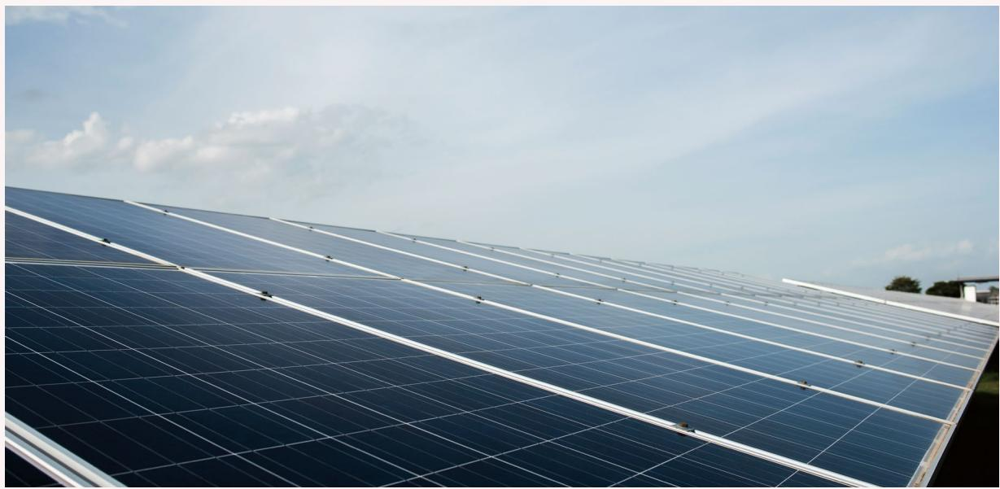

natural_image

Rows of solar panels installed on a rooftop under a partly cloudy sky (no text or symbols visible)

# 环境管理

# 环境管理综述

生产制造环节是主要污染物排放来源，涉及各类化学物质与废气排放。物流运输过程中产生一定尾气及包装废弃物。日常运营中包含办公废纸、电子垃圾等固体废弃物，以及污水处理产生的污泥。不同环节产生的污染物种类多样，需针对性管理与处理。公司严格遵循国家及地方关于污染物排放与废弃物处理的法律框架，持续优化环境管理体系。通过引入先进治理技术，强化过程管控，提升资源利用效率。制度设计注重预防与责任落实，推动合规运营与可持续发展并行。

# 环境治理

构建环境治理体系，设立专门管理机构统筹执行环境事务。制度包括合规评估、排放监测与控制标准，确保合规。废弃物处理涵盖分类、回收与无害化处置，提升资源效率。组织架构明确职责，强化内外部监督与沟通，提升治理效能。构建培训体系，将环境知识融入员工发展。通过多维课程与实践结合，提升素养。组织跨部门交流，强化责任与协作。建立激励机制，鼓励学习与创新。引入专家资源，拓展视野。优化评估，确保技能落地。形成可持续人才培养模式，支撑环境治理目标。公司构建监督体系，将环保目标纳入年度计划，定期评估核查。设定绩效指标与管理层激励挂钩，落实责任。对员工建立奖惩制度，鼓励环保行为，提升参与度。通过多维考核，推动可持续发展目标落地。

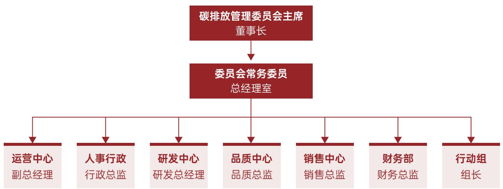

flowchart

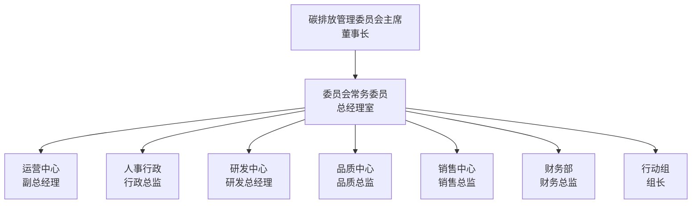
```mermaid
graph TD
  A["碳排放管理委员会主席\n董事长"] --> B["委员会常务委员\n总经理室"]
  B --> C["运营中心\n副总经理"]
  B --> D["人事行政\n行政总监"]
  B --> E["研发中心\n研发总经理"]
  B --> F["品质中心\n品质总监"]
  B --> G["销售中心\n销售总监"]
  B --> H["财务部\n财务总监"]
  B --> I["行动组\n组长"]
```

碳排放管理委员会

# 环境管理战略

# 公司聚焦全生命周期，打造环保智能产品。

2025年，公司将生态保护融入经营全流程，依托ISO14001体系完善环境管控，在废气、废水等方面全面达标，优化照明以降低光污染。作为行业领军，公司参与制定国家及行业标准，布局核心专利，提升中国照明产品国际竞争力，并依托“一带一路”推广高效节能LED产品，助力低碳转型。紧跟欧洲市场趋势，公司强化产品全生命周期环境管理，从选材到回收全链条降低影响，同时深化智能技术，加快智能化产品落地。未来，公司以绿色照明与氢能技术双轮驱动，深化环保管理，探索低碳能源应用，提升生态附加值，构筑可持续发展优势。

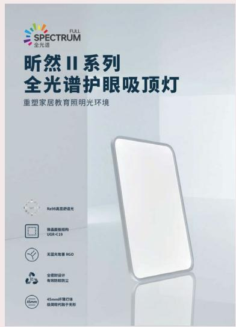

text_image

FULL
全光谱
昕然II系列
全光谱护眼吸顶灯
重塑家居教育照明光环境
Rathium fluorescent light
液晶面板结构
UGR <19
无蓝光危害 HGO
全密封设计
有效防锈防尘
45mm舒缓打体
稳固现代助手无形

# 氢能战略加速推进，研发成果与示范项目双丰收

公司设立浙江阳光绿色氢能科技有限公司，专注于氢能源的研发与应用。在总公司氢能业务方面，已成功攻克A115-20kW、A2225-100kW、A44125-500kW三大系列AEM电解槽的核心技术。其中，100kW单槽在 $1.5\mathrm{A} / \mathrm{cm}^2$ 电流密度下稳定运行超过1500小时。公司计划于2026年下半年启动兆瓦级单槽运行试验，从而形成覆盖从中小功率到兆瓦级的产品矩阵，并持续推进“制-纯-储-用”全链条的设备集成。总部园区已建成集光伏发电、制氢、储氢、用氢于一体的绿氢微电网示范项目，采用“自发自用、余电上网”模式，为氢能规模化应用提供了示范支撑。

2025年，公司联合科研机构及产业伙伴，经浙江省经信厅推荐，申报了工信部未来产业创新任务，旨在推进氢能技术攻关与产业化落地。公司依托LED节能、屋顶光伏及绿氢技术的创新，构建了多维度的绿色运营体系，持续彰显其可持续发展能力与企业责任担当。

# 环境影响、风险和机遇的管理

构建系统化环境管理体系，将影响评估嵌入决策流程。通过多维度识别潜在风险与绿色机遇，结合行业趋势优化资源配置。持续监测与动态调整机制保障措施有效性，推动可持续发展目标落地。建立完善的环境突发事件应急预案是提升风险防控能力的重要举措。在报告期内，持续完善响应机制，强化多部门协同联动，确保处置流程科学高效。通过开展多样化应急演练，提升员工应对突发状况的实战能力，检验预案有效性，推动环境风险管理体系不断优化。持续关注环境影响、风险与机遇，推动隐患排查机制建设。通过系统化评估识别潜在环境风险，结合行业动态优化应对策略。提升资源利用效率，降低 operational 风险，同时探索绿色转型带来的新兴机会。强化全链条环境管理，增强韧性与可持续发展能力。

# 废水管理

采用先进物理化学与生物处理技术，结合智能化监测系统，实现废水高效净化与资源化利用，降低环境风险，提升可持续运营水平。构建完善废水处理体系，持续优化工艺流程，提升污染物去除效率。运行过程中强化监测与维护，确保稳定达标排放。治理成效显著，有效降低环境负荷，推动可持续发展。

# 废气管理

公司采用先进废气处理技术，结合多级净化工艺，有效降低污染物排放。系统融合高效除尘、吸附及催化氧化等手段，确保空气达标排放。注重技术持续优化，提升处理效率与资源利用率，实现环保与生产的协调发展。构建全面的废气处理体系，持续优化治理流程，提升设备运行效率。通过技术升级与管理强化，有效降低排放水平，推动环境绩效稳步提升。

# 废弃物处理

公司构建了涵盖分类、收集、运输与处置的全链条废弃物管理体系。通过引入高效处理技术，确保废弃物无害化、资源化。持续优化流程，降低环境风险，提升资源利用效率，推动可持续发展。建立全过程管理体系，确保有害废弃物分类明确、存放规范。采用安全运输方式，委托具备资质单位进行无害化处理，定期评估处置效果，持续优化流程，降低环境风险。推动生产流程优化，引入资源循环利用机制，强化员工环保意识培训，从源头减少废弃物产生。建立废弃物分类管理体系，提升回收利用率。通过构建闭环管理体系，推动废弃物资源化利用。引入生物降解技术处理有机垃圾，提升转化效率。同时探索多种再利用途径，提升材料循环价值。优化分类流程，增强员工参与度，形成可持续的环保实践。

# 资源管理

<table><tr><td>部门</td><td>职责</td></tr><tr><td>董事会</td><td>负责推动建立公司的碳排放管理机制,组建公司碳排放管理委员会并赋予相应的职责和权限</td></tr><tr><td>总经理室</td><td>负责主持碳排放委员会的日常工作,签署并落实碳排放管理方针和目标,并给予节能减排项目资源支持</td></tr><tr><td>运营中心</td><td>负责将碳排放管理要求融入到整个运营过程中,开展节能减排专项活动,并不断优化工艺,提高效率降低损耗,降低碳排放强度</td></tr><tr><td>人事行政</td><td>负责将碳排放管理要求融入到日常能源环保管理工作中,组织碳排放源识别,监控碳排放的指标数据,实施持续改进活动。负责相关法律法规收集工作</td></tr><tr><td>研发中心</td><td>负责从产品设计阶段融入降低碳排放管理理念,促进新产品生产时碳排放强度的降低(碳排放强度指单位产品产量/产值或服务量的碳排放量)</td></tr><tr><td>销售中心</td><td>负责将减碳理念和管理情况传递给客户</td></tr><tr><td>品质中心</td><td>负责在文件制定,内外部审核上协助管理委员会对公司碳排放进行管理</td></tr><tr><td>财务部</td><td>负责对公司碳排放管理进行财务支持工作。负责节能减排、工艺过程改善活动对成本改进的财务数据核算工作</td></tr></table>

# 资源效率

# 资源效率综述

能源利用贯穿生产、运输与办公全过程，重点聚焦于制造环节的电力消耗及设备运行效率。水资源管理覆盖原料处理、清洁工艺及废弃物处置等关键节点，强调循环利用与节水技术的应用。通过优化流程设计与技术创新，持续提升资源使用效能，降低环境负荷。公司严格遵循国家在能源与水资源管理方面的法规框架，积极落实节能减排政策，推动资源高效利用。在能源使用领域，持续优化用能结构，强化能耗监测与报告机制，确保符合相关标准要求。水资源管理方面，严格执行用水定额制度，推进循环用水系统建设，减少取水量与排放量。整体做法体现对国家可持续发展战略的积极响应，助力生态文明建设。

# 资源利用治理

公司构建了涵盖资源管理的多层级治理体系，设立专项工作小组统筹协调各项资源使用与优化。制度设计强调全生命周期管控，从采购、分配到回收形成闭环管理。通过建立动态监测机制和绩效评估体系，确保资源利用效率持续提升。制度内容注重与国际标准接轨，结合行业特点进行细化落地，形成具有自身特色的资源治理框架。强化再资源利用能力，通过系统化培训提升员工对循环经济理念的理解与实操水平。课程涵盖资源分类、回收标准及高效管理方法，注重理论与实践结合。持续优化学习机制，激发员工创新意识，推动绿色发展理念深入人心。公司构建了涵盖资源利用效率与可持续管理的绩效评估体系，将关键指标纳入管理层考核范畴。资源使用成效直接关联岗位职责，影响年度评价结果。部分环节实施动态监测，确保数据真实可追溯。奖惩机制体现激励导向，优秀表现者获得额外激励，未达标者则触发改进流程。整体设计强调责任落实与持续优化，推动资源管理向精细化迈进。

# 水资源利用

建立系统化水资源管理制度，贯穿产品全生命周期，强化用水效率监测与技术创新应用，推动循环用水体系建设。结合行业特性优化用水配置，提升资源利用效能。通过持续改进机制，实现用水过程的可追溯与可控性，保障用水安全与可持续发展。推动水资源管理体系建设，将节水理念贯穿生产全流程。优化设备运行参数，减少不必要的用水消耗。引入智能化监测系统，实时掌握用水动态。建设中水回收利用设施，提升水资源再利用率。通过技术创新与流程改进，构建可持续的水循环模式。构建智能化水资源管理体系，推动数据驱动决策。通过整合物联网与大数据技术，实时监控用水流程，提升资源利用效率。系统实现从取水、供水到排水的全链条动态管理，优化配置资源，降低消耗风险。数字化手段强化节水意识，助力可持续发展目标落地。

# 能源利用

构建能源管理流程，聚焦全生命周期优化。通过系统化监测与评估机制，持续识别能效提升空间。强化设备运行管控，推动技术升级与替代方案应用。建立动态反馈体系，结合政策趋势调整策略，实现能源利用效率与环境效益双提升。清洁能源使用覆盖多种类型，结构持续优化。各类能源占比呈现差异化趋势，部分领域增速显著。整体用能比例不断提升，助力碳减排目标实现。积极布局绿色转型路径，持续优化能源使用效率。通过引入高效能生产设备、智能照明系统与精准温控装置，显著降低单位能耗。同步推进余热回收与能量分层利用，提升资源循环利用率，构建可持续的能源管理体系。积极构建低碳运输体系，推广新能源车辆使用，优化物流路径，减少碳排放。引入智能化调度系统，提升能源利用效率。持续探索清洁能源应用，推动运输环节绿色转型。

# 物料利用

# 物料利用综述

物料利用贯穿于生产经营各环节，涵盖原材料采购、加工制造及产品包装等阶段。涉及类别包括基础化工原料、金属材料及可再生资源，注重源头减量与循环使用，推动资源高效配置与环境友好型发展。遵循国家关于资源节约与循环利用的相关要求，公司在物料使用及循环经济实践中持续优化流程，强化全生命周期管理。通过引入先进技术和管理模式，提升资源转化效率，减少废弃物排放。积极对接政策导向，推动绿色供应链建设，保障各项操作符合法规标准，助力可持续发展目标实现。

# 物料利用治理

国家对物料管理提出明确要求，强调资源高效利用与循环经济发展。公司建立系统化管理制度，涵盖采购、使用、回收等全流程，提升资源利用效率。设立专项工作组，统筹协调各部门执行相关措施，确保制度落地见效。组织架构清晰，职责分工明确，推动物料管理持续优化。员工在物料利用方面展现出扎实的专业技能与实践能力。通过系统培训和持续学习，人员具备对材料性能、使用标准及环保要求的深入理解。在实际操作中，能够灵活应用优化策略，提升资源使用效率。岗位职责与技能匹配度高，推动可持续发展目标实现。员工主动参与流程改进，体现对资源管理的重视与责任感。建立全面的物料利用监督体系，将资源效率纳入绩效考核核心指标。通过设定量化目标与定期评估，强化执行力度。薪酬激励与节约成效直接挂钩，推动全员参与。设立明确奖惩制度，鼓励创新优化，抑制浪费行为，提升整体资源配置水平。

# 物料利用影响、风险和机遇管理

物料消耗管理直接影响资源利用效率与环境绩效。合理优化流程可降低浪费，提升可持续性。同时，供应链波动与政策变化带来不确定性。通过技术创新与循环利用，可挖掘降本增效潜能，增强抗风险能力。

# 物料利用管理措施

公司构建了涵盖物料全生命周期的管理体系，通过优化存储条件与运输流程降低资源浪费与环境风险。采用智能化仓储系统提升物资周转效率，同时强化运输环节的合规性与安全性，确保物料在流转过程中保持完整与可控。该体系有效支撑可持续发展目标。通过优化产品设计与生产工艺，持续探索替代材料应用，有效降低主要原材料消耗。强化供应链管理，推动供应商协同改进，提升资源利用效率。同时建立回收再利用机制，减少废弃产生，实现循环利用目标。通过优化产品设计，减少不必要的包装层次，提升材料利用效率。引入可降解或可回收材质，降低环境负担。持续探索新型包装解决方案，推动循环经济发展。强化供应链协同，确保包装环节符合可持续目标。

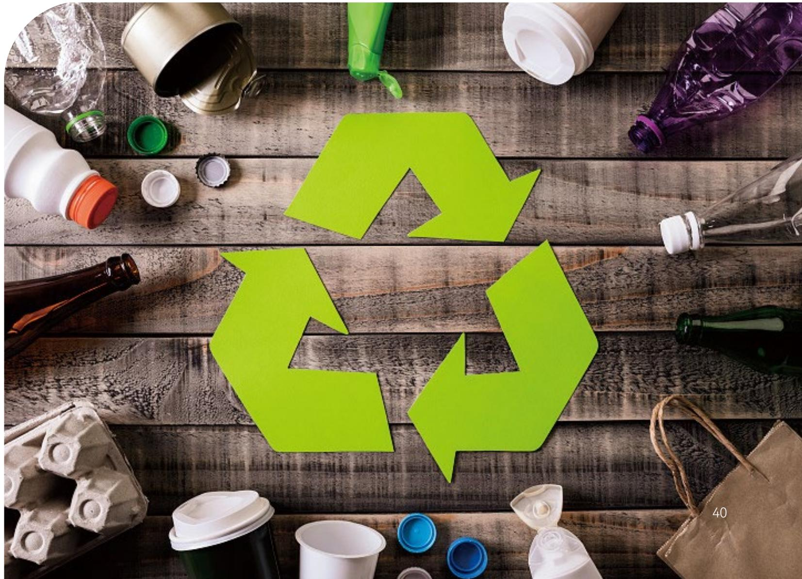

natural_image

Overhead view of recycling symbols on a wooden surface, surrounded by plastic containers and waste items (no text or symbols)

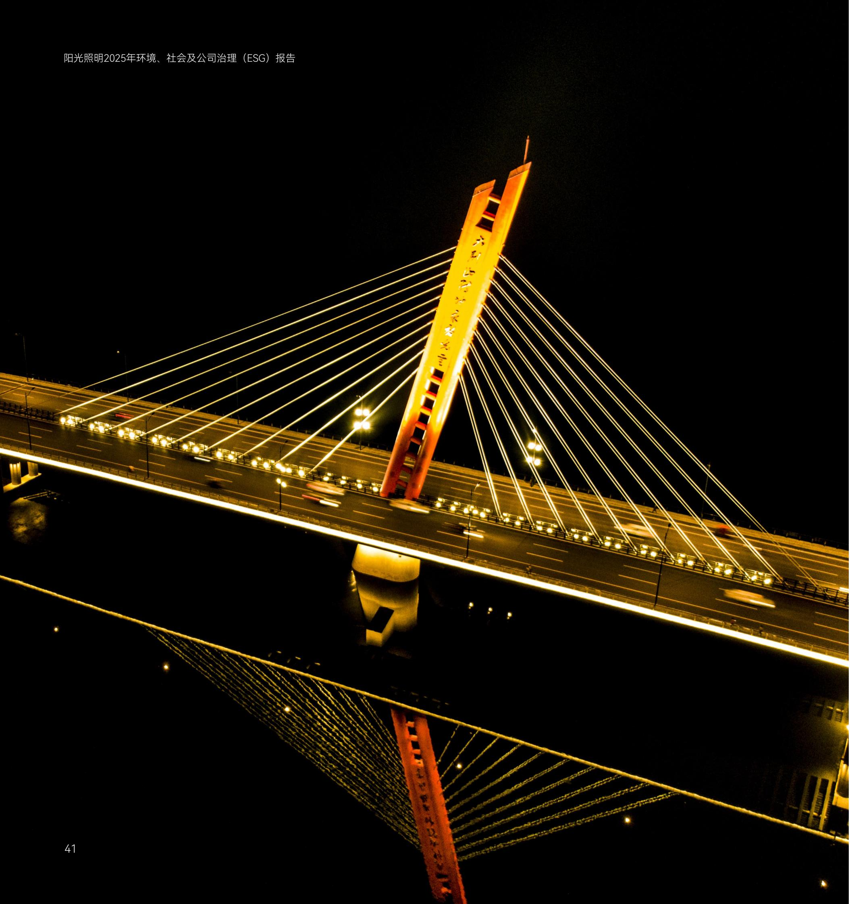

text_image

阳光照明2025年环境、社会及公司治理（ESG）报告
41

# 04

# 产业价值篇

Industrial Value Chapter

研发与创新体系 43

产品和服务安全与质量 45

负责任供应链 47

助力于行业发展 49

平等对待中小企业 50

# 研发与创新体系

# 环境方面

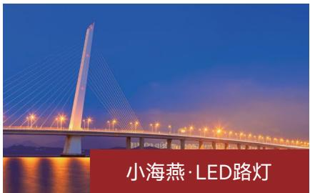

text_image

小海燕·LED路灯

# 绿色照明产品研发与推广

阳光照明始终致力于研发、制造和推广行业领先的节能照明产品，坚守将绿色理念贯穿于整个照明产品的设计、制造、推广和回收体系的理念。通过不断优化产品性能，提高能源利用效率，减少能源消耗，降低碳排放，为环境保护和可持续发展做出贡献。

natural_image

Hand interacting with a laptop displaying a circular security and data icons (no text or symbols visible)

# 氢能技术研发与应用

公司出资设立浙江阳光绿色氢能科技有限公司，积极开拓氢能源相关业务。主要研发的可量产阴离子交换膜电解堆面向可再生能源电解水制氢的规模化和低成本需求，通过提高电解堆的效率和降低能耗，降低制氢成本，推动氢能产业的发展，促进可再生能源的利用，减少对化石燃料的依赖，降低温室气体排放，对环境保护和可持续发展具有重要意义。

公司在产品创新上持续大力投入研发，推动产品迭代升级以贴合市场需求。亚太营销中心巧用2/8原则，80%精力用于主力产品保成本优势与加速迭代，20%打造区域特色简约风差异化产品，与韩、日、中国台湾地区及印尼、孟加拉国等地合作，开拓沙特市场，拓宽边界。

美洲营销中心洞察美国市场律动，于经济下行、消费降级时捕捉终端需求，为产品研发与推广找准方向，确保每一项投入都能精准命中市场痛点，助力公司在当地站稳脚跟。

欧洲营销中心面对德、法、英等国庞大灯具市场，顺应当地消费者对品质、环保及可持续灯具的喜好，借欧洲LED照明市场“环保、可替换、可拆解”趋势，从产品的初始选材，到精细化生产环节，再到后期废弃处理阶段，全方位考量如何减少对环境的负面影响，致力于打造涵盖整个产品生命周期的优质照明解决方案。如此，方能向全球市场输出既满足功能需求，又兼顾环保与智能属性的照明产品，在激烈的国际竞争中脱颖而出，实现可持续发展。

中国区营销中心将目光聚焦于前沿科技融合，大力引入物联网、人工智能技术赋能照明产品，推动智能照明系统蓬勃发展。如今的智能灯具已然超越传统照明功能，不仅点亮空间，更借助手机APP、语音控制等智能交互方式，实现远程操控、定时任务、智能调光调色等多元功能，无缝嵌入用户生活场景，重塑便捷智能的照明新体验。

natural_image

Digital globe icon with glowing human head and glowing nodes, overlaid with a curved digital speedometer (no text or symbols)

# 产品和服务安全与质量

# 产品和服务安全与质量综述

公司始终将产品与服务质量作为核心运营要素，严格遵循国家相关法律法规要求，确保各项经营活动符合监管标准。通过构建系统化管理机制，明确责任分工与执行流程，保障产品全生命周期的合规性与稳定性。同时，结合行业特点与社会责任目标，制定内部管理制度，强化质量控制体系，提升服务响应效率，持续优化客户体验。主动构建责任管理体系强化内部监督机制优化供应链协同提升产品全流程安全标准建立快速响应机制完善客户沟通渠道持续改进质量标准实现从源头到终端的全链条风险防控。

# 产品和服务安全与质量治理

构建科学的产品质量管理组织架构，明确各层级职责与协作机制，强化全流程管控能力。设立独立的质量监督部门，统筹标准制定、过程监控与问题溯源，确保各项措施有效落地。通过跨部门协同提升响应效率，推动质量文化深入发展。构建完善的产品与服务管理制度，确保运营全过程符合可持续发展要求。制度设计强调全生命周期管理，涵盖设计、生产、交付及回收各环节。通过建立系统化评估机制，推动绿色创新与资源高效利用，提升产品附加值与社会责任表现。构建完善的售后服务体系是推动可持续发展的重要举措。通过设立专业服务团队与反馈机制，提升客户满意度与品牌信任度。持续优化流程提升效率，强化责任意识，确保服务质量与用户体验同步提升。制度设计注重长期效益，体现对利益相关方的重视与承诺。建立完善的产品召回机制是保障消费者权益与品牌信誉的重要举措。制度设计强调预防为主，通过全流程监控与风险评估，实现问题产品的快速识别与有效处置。同时，持续优化响应流程，提升透明度与沟通效率，增强利益相关方信任。公司对生产设备实施科学折旧与规范报废管理，确保资产价值合理释放。政策注重设备全生命周期管控，结合使用状况与环保要求动态调整处置方案，提升资源利用效率，降低环境影响。构建生产设备管理体系，涵盖全生命周期管理、安全操作规程与能效监控机制。制度强调预防性维护与数据驱动决策，提升资源利用效率，降低环境影响，推动可持续运营。构建多层次培训体系，聚焦岗位需求定制课程，强化实践与理论结合。引入外部专家资源，提升专业深度。设立技能认证机制，激励员工持续成长。建立多层次质量管理体系，涵盖从原材料入库到成品出厂的全流程监控。通过定期抽检与动态评估机制，确保产品符合标准。引入第三方检测机构强化外部监督，同时设立内部反馈通道，提升问题响应效率。持续优化考核指标，将质量表现与绩效挂钩，推动全员参与品质管理。

# 产品和服务安全与质量的影响、风险和机遇管理

建立完善的质量管理体系，持续优化内部审核机制，强化各环节风险防控。通过系统化评估与反馈，推动流程标准化，提升产品和服务一致性。注重员工能力培养，确保审计工作的专业性与独立性，为高质量发展提供保障。

# 产品和服务的可获得性

聚焦普惠金融领域，持续优化产品设计与服务模式，提升金融服务可及性与包容性。通过创新技术手段降低服务门槛，增强对中小微企业及个人客户的覆盖能力。不断探索多元化金融解决方案，助力实现更加公平高效的资源配置。积极构建覆盖广泛的服务网络，推动医疗资源均衡分配。聚焦基层需求，优化诊疗流程，提升服务可及性。强化数字化手段应用，增强健康信息共享与管理效率。关注特殊群体权益，持续完善多层次医疗保障体系。推动金融、医疗、电力、通讯及公用事业等关键领域服务的普及与公平获取，是实现社会包容性发展的核心。通过优化资源配置与技术创新，提升产品可及性，促进多方共赢。

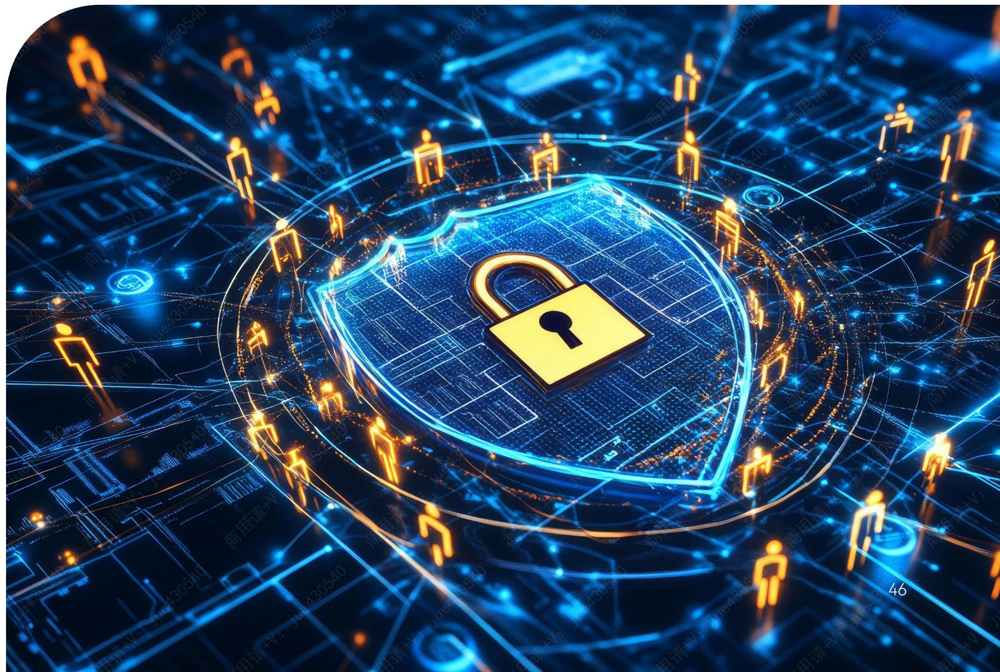

natural_image

Digital illustration of a glowing padlock over a circuit board, surrounded by glowing human figures and digital network lines (no text or symbols)

# 负责任供应链

# 供应链综述

公司持续关注供应链安全相关法规动态，将合规要求嵌入采购与合作流程。通过建立系统化管理机制，确保供应商资质审核、合同条款设定及履约监督符合国家行业标准。同时结合国际通行准则，强化风险识别与应对能力，提升整体供应链韧性与透明度。

# 供应链治理

公司构建完善的供应商治理框架，将可持续发展要求嵌入供应链管理全过程。通过明确责任分工与协作机制，强化对供应商环境及社会表现的评估与监督。建立动态反馈系统，推动供应商持续改进，提升整体供应链韧性。注重利益相关方沟通，形成协同共进的治理生态。公司构建完善的供应商管理制度，以确保供应链全过程符合可持续发展要求。制度涵盖环境标准、社会责任履行及商业道德规范，强化对供应商的准入评估与持续监督。通过建立透明化沟通机制，推动上下游协同发展，提升整体价值链的合规性与韧性。该体系不仅降低运营风险，还促进资源高效利用，为实现长期价值创造奠定基础。公司构建采购管理体系，聚焦资源高效利用与环境责任。制度设计注重全流程透明，强化供应商评估标准，推动绿色低碳产品优先纳入采购清单。同时建立多方监督机制，确保公平竞争与合规操作。通过持续优化采购策略，提升供应链韧性，实现经济、社会与环境效益的协同提升。构建全面的员工供应链治理框架，注重提升多方协作与风险管控能力。通过系统化培训与持续教育，强化从业人员对可持续发展的认知与实践水平。优化供应商评估机制，推动责任采购标准落地。建立透明沟通渠道，保障员工权益与供应链稳定。形成以价值为导向的治理模式，促进长期可持续发展。公司构建了涵盖绩效评估、责任落实与激励约束的供应链治理监督体系。将可持续发展指标纳入管理层考核范畴，强化对供应商合规性与环境表现的动态评价。薪酬结构中明确体现ESG绩效权重，推动责任意识内化。通过清晰的奖惩规则，确保治理要求在全链条有效执行，形成持续改进机制。

# 供应链影响、风险和机遇管理

构建系统化供应链管理体系，以实现可持续发展目标。通过定期更新风险评估框架，识别关键节点的环境与社会影响，强化供应商准入标准。建立动态监测机制，确保风险预警与响应及时有效。结合战略目标，优化资源配置，提升供应链韧性。持续推动多方协作，增强透明度与责任落实，积极捕捉绿色转型带来的发展机遇。构建多元化采购体系，强化供应链韧性。建立动态风险评估机制，识别关键节点潜在威胁。制定多层次应急预案，提升突发事件响应效率。定期开展演练与培训，确保各环节协同能力。加强与供应商战略合作，推动信息共享与联合应对。优化库存管理策略，平衡成本与安全。持续改进流程，提升整体抗风险能力。

# 加强供应链管理

公司构建了系统化的供应商遴选机制，将环境与社会责任纳入核心考量。通过设定明确评估标准，优先选择在可持续发展方面表现突出的合作伙伴。强化对供应商的动态管理，推动供应链整体绿色转型。建立信息共享平台，提升透明度与协作效率。持续优化筛选流程，确保资源分配公平合理，实现多方共赢。公司持续完善供应商管理体系，将可持续发展理念融入采购流程。通过定期审核确保供应商符合环保与社会责任标准，推动供应链透明化。审核内容涵盖劳工权益、资源使用及道德经营等关键领域，强化对潜在风险的识别与应对。此举不仅提升整体运营质量，也促进与合作伙伴共同成长，构建更具韧性与责任感的商业生态。构建全面的供应商评估体系，将环境、社会及治理标准融入合作方遴选流程。评估内容涵盖碳排放、劳动权益、商业道德等维度，强化供应链透明度与责任意识。通过动态跟踪与持续反馈，推动合作伙伴共同提升可持续发展水平。构建供应商分级体系旨在提升供应链整体可持续发展水平。通过多维度评估标准，明确各层级供应商的绩效表现与改进方向。此机制促进资源优化配置，强化关键供应商责任意识，推动全链协同提升环境与社会表现。分级结果用于制定差异化的管理策略，确保风险可控，价值共创。推动供应链信息化建设，强化数据驱动决策能力，提升各环节协同效率。通过数字化工具实现全链条可视化管理，增强信息流通与响应速度。构建透明化管理体系，确保各参与方信息对称，促进责任落实与风险可控。持续优化技术应用，助力可持续发展目标实现。强化供应链责任意识，推动供应商深度参与可持续发展进程。聚焦关键环节，制定系统性沟通机制，提升利益相关方对环境与社会议题的认知水平。通过定制化培训项目，增强供应商执行标准的能力，促进整体供应链合规性与透明度提升。建立长期互动平台，确保理念落地与实践同步推进。

# 促进供应链可持续发展

构建全面的供应商ESG评价体系，推动供应链可持续发展。通过设定明确的标准与流程，系统评估供应商在环境、社会及治理方面的表现。强化尽职调查机制，识别潜在风险并提出改进措施，提升整体供应链责任水平。形成良性互动，促进合作伙伴共同履行社会责任。构建供应商ESG动态考核体系是推动供应链可持续发展的关键。通过设定多维度评估指标，持续监测供应商在环境、社会及治理方面的表现，确保合作方符合核心价值标准。对未达标的供应商实施分级预警与整改机制，形成良性淘汰循环，增强整体供应链韧性与责任感。积极构建负责任的供应链体系，确保材料来源透明可追溯。通过严格筛选供应商，实施尽职调查流程，防范冲突矿产流入生产环节。强化与合作伙伴沟通，推动行业标准提升，保障资源开采符合伦理与可持续发展要求。构建绿色供应链是实现可持续发展的重要路径。通过优化物流体系、引入环保材料、强化供应商管理，推动全链条减碳。关注资源高效利用与废弃物回收，提升整体运营效能。加强与上下游合作伙伴协同，共同应对环境挑战，形成良性循环。

# 助力于行业发展

# 供应链综述

公司成立以来，始终致力于研发、制造和推广行业领先的节能照明产品，坚守将绿色理念贯穿于整个照明产品的设计、制造、推广和回收体系的理念。基于以上理念，根据公司战略规划，公司出资设立浙江阳光绿色氢能科技有限公司，积极开拓氢能源相关业务。在此过程中，公司不断吸引业内精英加盟，设立氢能技术研发实验室，为掌握核心技术奠定了坚实基础。公司战略投资了上海莒纳新材料科技有限公司、宁波中科氢易膜科技有限公司等优秀上游企业，用于加强氢能产业链的协同合作，打造产投研一体化平台。

对于未来三年，公司设定了以下工作目标:阴离子交换电解槽制氢技术的成功研发将解决“绿氢”发展的瓶颈问题，有效降低生产成本，增强氢能产业竞争力。我们计划在三年内，即2026年底前，建立达到国际先进水平的阴离子交换电解槽制设备开发实验室，成功研发出从2.5kW、5kW等小功率规格到500kW、1MW等大功率规格的制设备。同时，完成产品半自动化或自动化装配示范线的调试工作，确保具备批量产品订单交付能力。我们致力于使产品整体技术水平跻身国内同行业前列。

# 研发目标

# 2025年

- 确保开发出单槽100kW(千瓦)阴离子交换电解槽制氢设备。  
- 瞄准分布式应用，争取拿下若干个绿色氢能示范项目。

# 2026年

\- 产品整体技术水平位于国内同行业前列，能够生产商用级单槽500kW(千瓦)至1MW(兆瓦)阴离子交换电解槽制氢大功率产品规格。

# 平等对待中小企业

公司持续关注与中小企业的合作关系，针对逾期未支付款项问题，已建立专项跟踪机制，明确责任部门及处理流程。通过优化内部审批效率、加强财务透明度，提升资金流转速度。同时，推动供应链金融工具的应用，为中小企业提供灵活的资金支持方案，减少账款拖欠风险。未来将深化信用管理体系，强化契约精神，构建可持续的商业生态。

# 创新驱动

# 创新驱动综述

聚焦前沿技术领域，推动可持续发展。持续投入研发资源，优化智能系统与绿色工艺，提升运营效率与环境绩效。强化技术引领作用，助力行业低碳转型。积极构建合规管理体系，确保科技创新活动始终符合国家及行业相关法规要求。通过持续更新政策解读与内部培训，强化法律意识，保障技术发展与社会价值相统一。通过持续投入研发，推动技术突破与成果转化，强化创新在产业升级中的核心作用，助力新质生产力高效发展。聚焦关键领域，优化资源配置，提升全要素生产率，实现可持续增长。科技创新成果推动行业标准升级，提升整体技术水平。技术应用拓展至多领域，促进资源高效利用与可持续发展。创新成果带来的效率提升降低能耗，助力绿色转型。技术成果形成良性循环，激发产业链协同进步。

# 创新与研发治理

构建以战略为导向的创新体系，将可持续发展理念深度嵌入研发全过程。通过建立跨部门协作机制，激发内部创造力，持续优化技术储备与成果转化路径。注重知识产权保护与资源共享，推动技术成果向实际应用有效转化，增强核心竞争力。构建持续学习机制，推动员工在创新与研发领域不断突破。通过多维度培训体系与实践平台，激发个体潜能，提升专业素养。鼓励跨部门协作与知识共享，形成良性成长生态。聚焦前沿技术趋势，强化实战能力，助力员工在快速变化的环境中保持竞争力。构建多层次创新激励体系，注重激发员工创造力与责任感。设立专项基金支持内部创业项目，鼓励跨部门协作探索新可能性。完善成果转化机制，将创新成果与个人发展深度绑定，推动技术突破与业务模式升级。通过制度设计营造开放包容的创新氛围，持续提升核心竞争力。

# 创新与研发的影响、风险和机遇管理

绿色照明产品研发与推广：阳光照明始终致力于研发、制造和推广行业领先的节能照明产品，坚守将绿色理念贯穿于整个照明产品的设计、制造、推广和回收体系的理念。通过不断优化产品性能，提高能源利用效率，减少能源消耗，降低碳排放，为环境保护和可持续发展做出贡献。氢能技术研发与应用：公司出资设立浙江阳光绿色氢能科技有限公司，积极开拓氢能源相关业务。主要研发的可量产阴离子交换膜电解堆面向可再生能源电解水制氢的规模化和低成本需求，通过提高电解堆的效率和降低能耗，降低制氢成本，推动氢能产业的发展，促进可再生能源的利用，减少对化石燃料的依赖，降低温室气体排放，对环境保护和可持续发展。

公司在产品创新上持续大力投入研发，推动产品迭代升级以贴合市场需求。亚太营销中心巧用2/8原则，80%精力用于主力产品保成本优势与加速迭代，20%打造区域特色简约风差异化产品，与韩、日、中国台湾地区及印尼、孟加拉国等地合作，开拓沙特市场，拓宽边界。美洲营销中心洞察美国市场律动，于经济下行、消费降级时捕捉终端需求，为产品研发与推广找准方向，确保每一项投入都能精准命中市场痛点，助力公司在当地站稳脚跟。欧洲营销中心面对德、法、英等国庞大灯具市场，顺应当地消费者对品质、环保及可持续灯具的喜好，借欧洲LED照明市场“环保、可替换、可拆解”趋势，从产品的初始选材，到精细化生产环节，再到后期废弃处理阶段，全方位考量如何减少对环境的负面影响，致力于打造涵盖整个产品生命周期的优质照明解决方案。如此，方能向全球市场输出既满足功能需求，又兼顾环保与智能属性的照明产品，在激烈的国际竞争中脱颖而出，实现可持续发展。中国区营销中心将目光聚焦于前沿科技融合，大力引入物联网、人工智能技术赋能照明产品，推动智能照明系统蓬勃发展。如今的智能灯具已然超越传统照明功能，不仅点亮空间，更借助手机APP、语音控制等智能交互方式，实现远程操控、定时任务、智能调光调色等多元功能，无缝嵌入用户生活场景，重塑便捷智能的照明新体验。

持续加大在创新与研发领域的投入，推动核心技术突破与产业升级。注重技术成果转化与市场应用，提升竞争优势。建立风险预警机制，应对技术迭代与政策变化带来的挑战。优化资源配置，加强跨部门协作，激发内部创造力。积极布局前沿领域，把握新兴市场机遇，实现可持续发展。

# 指标与目标

构建多元化融资渠道，强化财务韧性。通过内部积累与外部资本结合，确保战略实施资金稳定。建立专项基金机制，提升资源使用效率。优化投资决策流程，强化风险管控能力。

# 知识产权保护措施

公司始终重视知识产权保护，严格遵守相关法律法规，将合规要求融入日常运营。建立系统化管理制度，明确权责划分，强化流程管控。注重员工培训与意识提升，推动创新成果有效转化。持续优化内部机制，防范侵权风险，保障核心资产安全。构建全面的知识产权管理体系，强化创新成果的保护与运用。通过制度设计和技术手段，明确权属划分，防范侵权风险。持续优化内部流程，提升员工意识，推动成果转化为竞争优势。对外积极应对侵权行为，维护市场秩序与品牌价值。

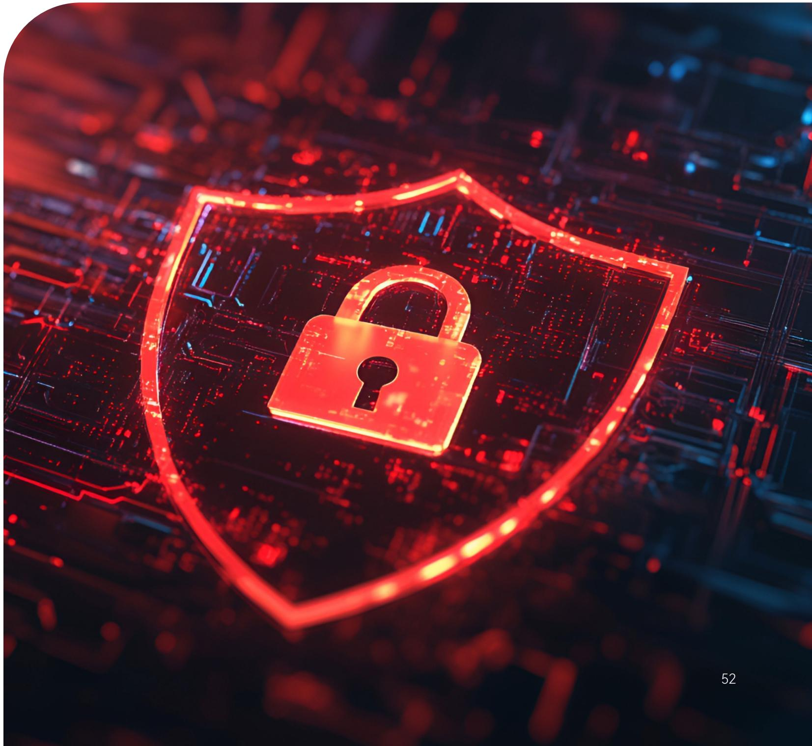

natural_image

Futuristic digital security icon with glowing red and blue elements on a circuit board background (no text or symbols)

# 阳光照明2025年环境、社会及公司治理（ESG）报告 SMT Line 预留

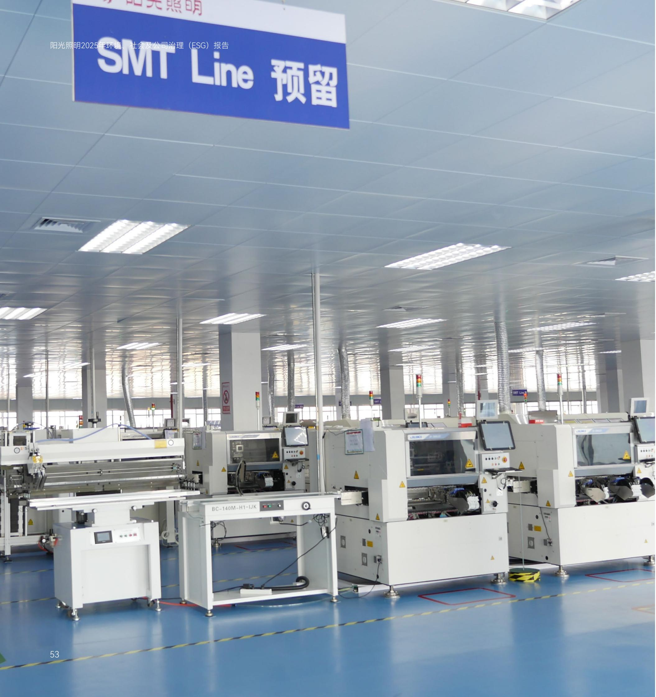

text_image

阳光照明2025年环境、社会及公司治理（ESG）报告
SMT Line 预留
53

# 05

# 美好生活篇

Beautiful Life Chapter

劳工权益 55

职业健康与安全 59

# 劳工权益

# 全方位保障员工权益

公司始终坚守法治精神，严格遵循《劳动法》《劳动合同法》《社会保险法》等国家法律法规，在合规经营中彰显企业责任担当。公司精心打造了涵盖劳动合同管理、薪酬福利体系、休假考勤规范、职业发展通道等全方位的人力资源制度框架，形成科学化、标准化、人性化的管理体系。目前，公司已实现劳动合同签订率、薪酬按时足额发放率、社会保险参保率三项指标均达成100%。同时，通过建立健全职工代表大会制度、设立员工意见直通车平台、定期开展民主评议活动等多种渠道，充分保障员工在企业决策中的知情权、参与权、监督权和建议权，切实保障了员工的合法权益。

# 合规为本 平等多元雇佣

公司始终秉持高度的责任意识与法治理念，全面、严谨地贯彻执行国家劳动法律法规，将依法合规用工作为企业运营管理的根本准则。在员工管理全过程中，坚持公平公正、一视同仁，充分尊重每一位员工的人格与合法权益，将反对歧视纳入企业文化建设核心内容，从制度设计与日常管理中从源头防范各类歧视行为。

公司充分尊重员工在种族、性别、年龄、国籍、宗教信仰、身体条件等方面的个体差异，绝不以此作为差异化对待的依据。公司持续健全员工权益保障体系，依法维护员工自由择业权利，严格禁止童工、坚决杜绝强迫劳动。报告期内，公司严格遵守各项劳动规范，未发生任何涉及童工、强迫劳动及劳工违规的不良事件，全力构建和谐稳定的劳动关系。

员工构成比例  
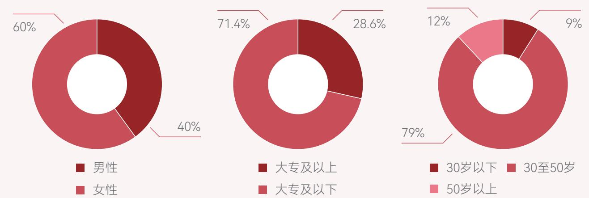

donut

| Category | Percentage |
| --- | --- |
| 男性 | 40% |
| 女性 | 60% |
| 大专及以上 | 28.6% |
| 大专及以下 | 71.4% |
| 30岁以下 | 9% |
| 30至50岁 | 79% |
| 50岁以上 | 12% |

# 健全员工福利与关怀机制

公司始终以提升员工幸福感与归属感为重要使命，秉持多样化、全覆盖、常态化理念，搭建系统完备的员工福利政策体系，切实让每位员工受惠、解除后顾之忧。公司结合时节与传统节日，发放高温慰问品及端午、中秋、春节等节日福利，为外省员工报销探亲差旅补贴，为获评职称员工发放奖励，并依据经营效益发放年终奖，与员工共享发展成果，构建起生活休假、健康安全、节日关怀三维福利网络。同时，公司加大后勤投入，完善食堂、室内运动场等配套设施，举办羽毛球、篮球、趣味运动会等文体活动，打造舒适宜人的工作生活环境，做实后勤保障，让员工安心专注投入工作。

# 全力保障女职工权益

公司始终高度重视女职工权益保障工作，坚决维护女职工合法权益与特殊利益，全力保障女职工在职业平等、职业发展、晋升成长等方面享有公平机会，积极支持女职工立足岗位实现自我价值。针对女职工的生理特点与特殊需求，公司给予专项关注与悉心呵护，严格依照相关法律法规，全面保障女职工婚假、孕期、产期、哺乳期的各项休假权益，严禁安排女职工从事第四级重体力劳动，禁止安排女职工在经期从事冷水、低温等禁忌作业，切实守护女职工劳动安全。

公司持续深化女职工健康保障，与专业医疗机构合作，为女职工提供免费健康检查。在三八妇女节，为女职工发放节日礼品，并组织外出交流活动。同时，公司专门设立标准化母婴关爱室，为孕期、哺乳期女职工提供舒适私密的休息与哺乳场所，以全方位、精细化的人文关怀，切实呵护女职工身心健康，营造尊重关爱女职工的良好职场环境。

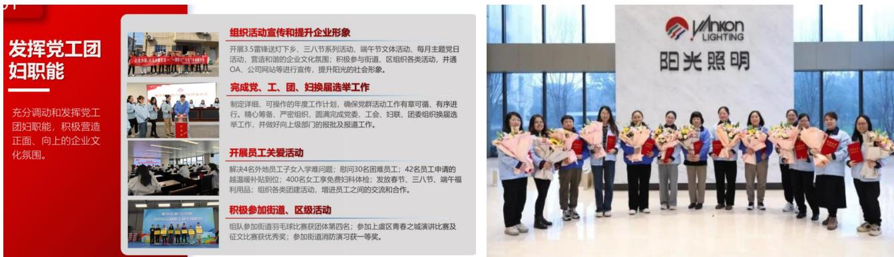  
关怀女职工

构建多层次人才培养体系

<table><tr><td>培训类型</td><td>培训对象</td><td>主要培训内容</td></tr><tr><td>新员工培训</td><td>新入职员工、换岗员工</td><td>公司简介、规章制度、岗位技能、行为规范、安全环保、产品、质量、生产等</td></tr><tr><td>在职员工能力提升培训</td><td>所有在职员工</td><td>沟通技巧、团队协作、时间管理、工作技能、营销技巧、压力管理、项目管理、安全环保等</td></tr><tr><td>特殊岗位培训</td><td>持证上岗员工</td><td>电工作业、焊锡作业、特种设备作业、有限空间作业、动火作业、高处作业、设备检修作业、操作安全等</td></tr><tr><td>管理人员培训</td><td>基层、中高层管理人员</td><td>目标管理与计划执行、高效时间管理、团队建设、创新思维、效沟通与协调、领导力、绩效管理、财务管理、员工激励管理</td></tr></table>

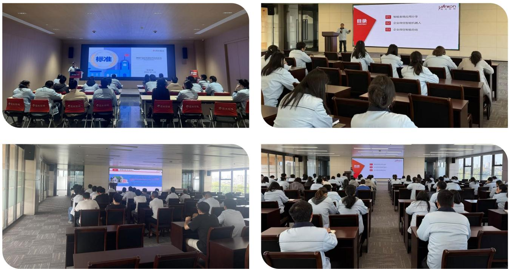

# 情系留守儿童，点亮希望之光

公司始终将履行社会责任视为企业发展的重要使命，积极投身教育公益事业，以实际行动关爱弱势群体、传递社会温暖。2025年9月，公司联合看台公益、云南上市公司协会及多家上市公司，向云南省保山市汉营润泽学校捐赠LED护眼台灯，为220名留守困境儿童点亮更明亮、舒适的学习环境，助力他们在优质光照中汲取知识、追逐梦想。汉营润泽学校作为云南省首家专注接收留守特困儿童的公办九年一贯制寄宿学校，承担着为孤儿、事实无人抚养儿童等最需要帮助的群体提供"兜底式服务"的重要职能。通过此次捐赠，公司不仅为孩子们带来了实质性的帮助，更搭建了上市公司与偏远地区教育机构之间的沟通桥梁。未来，阳光照明将持续关注留守困境儿童群体的需求，探索更多元化的公益模式，带动更多社会力量共同营造充满爱与希望的成长环境，以实际行动践行企业社会责任（ESG）理念，为推动偏远地区教育事业发展贡献阳光力量。

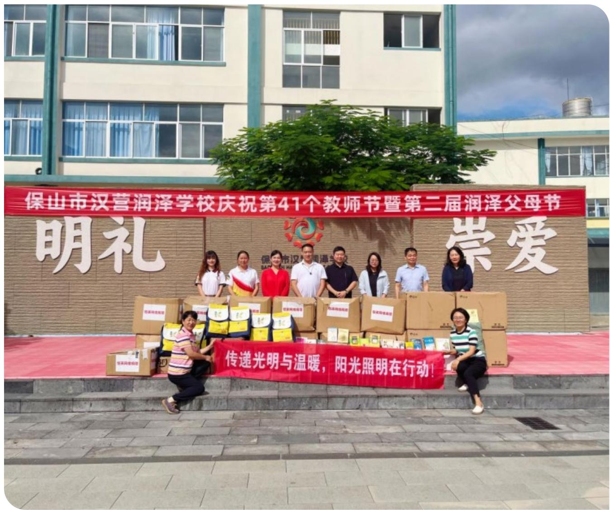

text_image

保山市汉营润泽学校庆祝第41个教师节暨第二届润泽父母节
明礼
崇爱
传递光明与温暖，阳光照明在行动！

# 职业健康与安全

# 职业健康与安全综述

部分生产流程涉及高温高压环境，存在物理伤害风险。部分岗位需长时间接触有害物质，增加职业病发生概率。作业场所噪声较大，可能影响听力健康。特殊工种操作复杂，需强化安全培训与防护措施。遵循国家及行业相关法规，建立完善的职业健康与安全管理体系。制度设计注重预防为主，强化风险管控，提升员工安全意识和应急能力。持续优化流程，确保合规性与有效性并重。

# 职业健康与安全治理

构建多层次职业健康与安全管理体系，明确责任分工，强化风险防控机制。通过制度规范与持续改进，保障员工权益，提升整体安全水平。构建系统化培训体系，强化员工安全意识与应急能力。通过多维度课程设计，结合实际案例提升操作规范性。持续优化培训形式，确保内容实用、易懂，推动职业健康与安全文化深入人心。将职业健康与安全纳入绩效考核体系，通过定期评估与反馈机制推动责任落实。明确岗位风险点，强化培训与监督，确保制度落地见效。强化生产安全责任意识，将员工生命健康置于核心位置。健全管理体系，明确各级职责，持续完善制度建设。通过培训提升安全素养，推动全员参与安全管理。建立风险预警机制，防范潜在隐患，保障生产稳定运行。

# 职业健康与安全影响、风险和机遇管理

构建全面职业健康与安全管理体系，识别潜在风险因素，评估其对员工福祉及运营连续性的影响。通过持续监测与改进机制，提升应对能力，降低事故率，优化工作环境，创造更安全高效的职业生态。建立系统化隐患排查机制，定期开展风险评估与现场巡查，强化员工安全意识培训，持续优化作业环境，确保职业健康与安全管理体系有效运行。建立全面的应急响应机制，定期开展多样化演练，提升员工安全意识与实操能力。通过持续优化预案内容，强化风险预判与快速反应，保障作业环境安全稳定。建立系统化职业病危害监测机制，定期开展环境与健康风险评估。通过专业设备与技术手段，持续跟踪工作场所潜在危害因素。强化员工健康档案管理，推动预防性健康管理措施落地。

# 职业健康与安全指标与目标

职业健康安全目标指标管理方案是组织为实现职业健康安全目标而制定的具体行动计划，通常包括目标、指标、管理措施、责任分工、资源投入、时间安排等内容。

# 目标与指标

- 目标：明确组织在职业健康安全方面希望达到的总体成果，如“杜绝重大安全事故”“降低工伤事故率”等。  
- 指标：将目标细化为可测量的具体数值或标准，如“工伤事故率控制在0.5‰以下”“特种作业人员持证上岗率100%”等。

# 管理措施

针对每个目标指标，制定具体的管理措施，包括技术措施、管理措施、培训措施等，确保目标指标的实现。

# 责任分工

\- 明确负责实施管理措施的部门、岗位和责任人，确保各项工作有人负责、有人落实。

# 资源投入

\- 列出实现目标指标所需的资源，包括人力、物力、财力等，确保资源的充足供应。

# 时间安排

○ 设定管理措施的实施时间节点和完成期限，形成时间表，便于跟踪进度。

# 安全管理措施

关注员工健康是持续发展的核心。定期开展职业病体检，有效预防和控制职业危害，体现对员工身心健康的承诺，促进安全和谐的工作环境。构建全面安全管理体系，强化与利益相关方沟通机制。聚焦风险识别与防控，推动各方协同参与。持续优化应急预案，提升响应效率。关注员工、客户及合作伙伴的健康与安全，营造负责任的运营环境。构建智能安全管理体系，推动技术与管理深度融合。引入先进数字化工具，提升风险预警与应急响应能力。优化流程，强化数据驱动决策。实现安全管理精细化、可视化和高效化。构建全面职业健康体系，强化风险预警机制，定期开展专业培训，优化作业环境，提升员工防护意识与能力，保障员工安全与福祉。

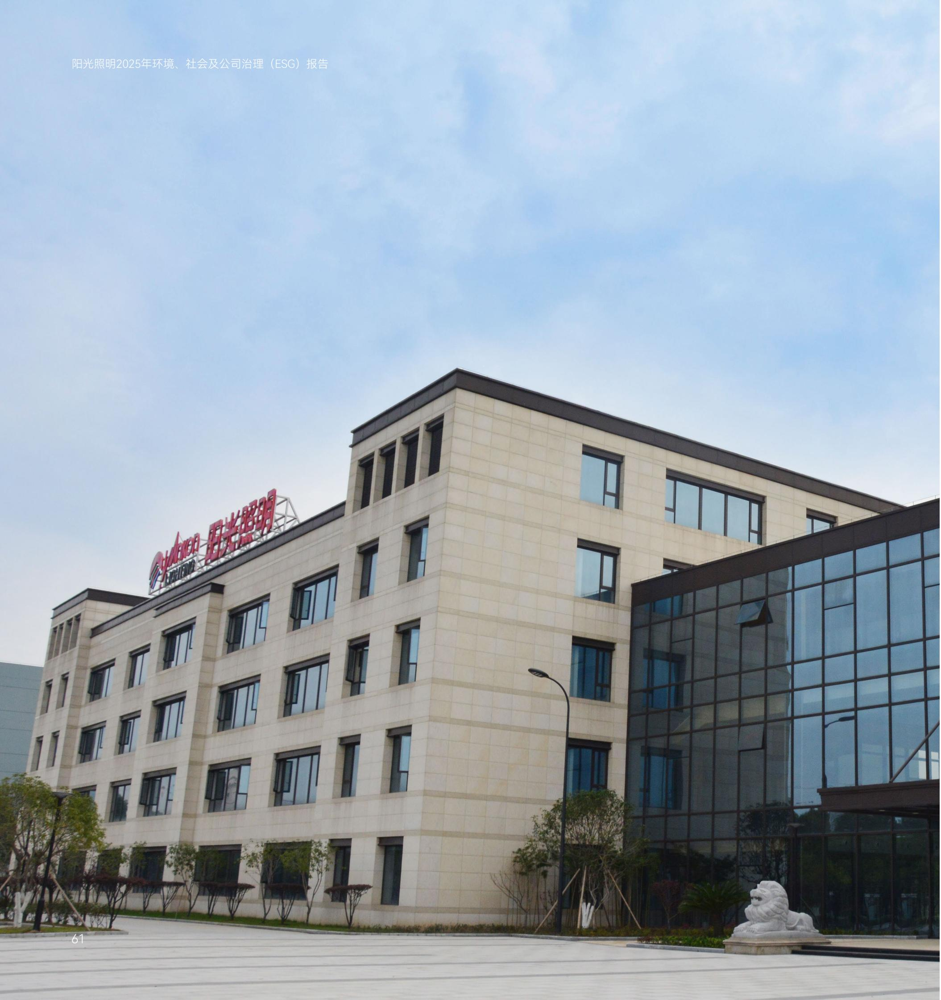

text_image

阳光照明2025年环境、社会及公司治理（ESG）报告
61

# 06

# 报告后言

Later words

未来计划 63

意见反馈 65

# 未来计划

未来发展方向将继续聚焦可持续发展核心，探索绿色转型路径。在战略层面强化环境责任，推动资源高效利用与废弃物管理优化。加大技术创新投入，提升运营过程中的能源效率。深化与利益相关方的沟通机制，确保发展理念与各方期待保持一致。关注员工福祉与职业发展，构建包容性组织文化。持续完善治理结构，提升透明度与合规水平。注重社会责任履行，积极参与社区建设与公益事业。通过系统化布局，实现经济效益与社会价值的协同增长。强化风险防控体系，应对复杂多变的外部环境。始终以长期视角规划发展，保持灵活性与适应性。不断优化产品与服务，满足市场与客户需求。坚持高标准，推动行业向更可持续方向迈进。

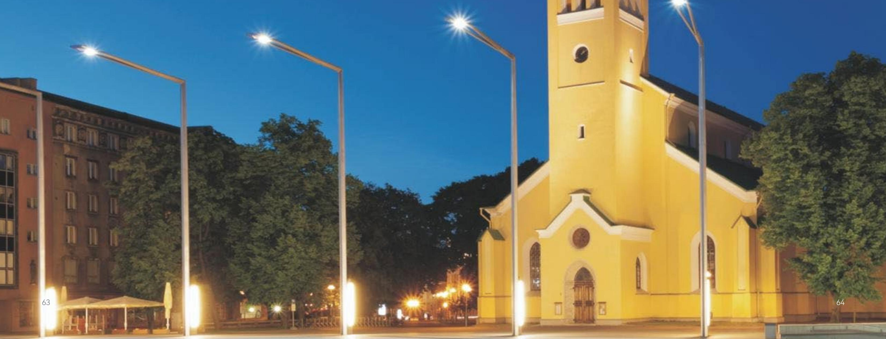

natural_image

Night view of a yellow church building with illuminated windows and streetlights, surrounded by trees and old buildings (no visible text or signage)

# 意见反馈

感谢您阅读《阳光照明2025年环境、社会及公司治理（ESG）报告》。为改进阳光照明在环境、社会和治理等方面的工作，进一步提升公司可持续发展的能力和水平，加强与社会各界的沟通交流，我们衷心地希望您能够在百忙之中对我们的工作和报告提出宝贵的意见和建议，并把反馈发送至ir@yankon.com

# 您的信息

姓名：\_\_\_\_

联系电话：\_\_\_\_

单位：\_\_\_\_

电子邮箱：\_\_\_\_

# 选择题（请在相应位置打 √）

1．您对阳光照明2025年环境、社会及公司治理（ESG）报告的总体评价：

□好

□ 一般

□ 待提高

□不了解

2. 您认为阳光照明在客户服务方面做得如何？

□ 好

□ 一般

□ 待提高

□不了解

3. 您认为阳光照明在科技创新方面做得如何？

□ 好

□ 一般

□ 待提高

□不了解

4．您认为阳光照明在公司治理方面做得如何？

□好

□ 一般

□ 待提高

□不了解

5．您认为阳光照明在员工队伍建设方面做得如何？

□好

□ 一般

□ 待提高

□不了解

6. 您认为阳光照明在社会公益方面做得如何？

□ 好

□ 一般

□ 待提高

□不了解

7. 您认为阳光照明在可持续供应链方面做得如何？

□ 好

□ 一般

□ 待提高

□不了解

8.您对阳光照明在可持续发展工作方面的其他意见?

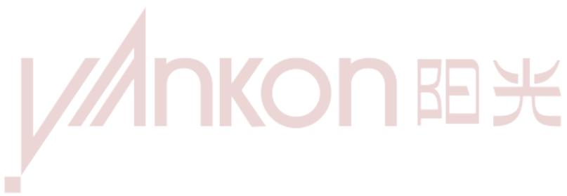

text_image

YAnkon阳光

