# 东方创业2025年度环境、社会和公司治理报告

ENVIRONMENTAL SOCIAL AND GOVERNANCE (ESG) REPORT

# 依法合规夯实根基

# 01

公司治理 17

风险与合规管理 21

商业道德 23

信息安全 26

党建引领 29

# 创领升级 责任共担

# 02

创新驱动 33

产品质量 37

供应商管理 39

客户服务 41

# 低碳发展绿色前行

# 03

应对气候变化 45

环境合规管理 49

能源利用 51

污染物与废弃物管理 52

水资源利用 53

化学品安全 54

# 以人为本共绘美好

# 04

社会贡献与乡村振兴 57

员工权益与福利 59

员工培训与发展 63

职业健康与安全 65

报告编制说明 01

董事长致辞 03

关于东方创业 05

年度专题 08

ESG 管理 12

ESG 数据表和附注 68

对标索引表 71

读者反馈表 72

# 报告编制说明

本报告旨在向政府与监管机构、股东与投资者、客户、供应商与行业、员工、社会公众等利益相关方披露东方国际创业股份有限公司（股票代码：600278.SH）2025年度在环境、社会及公司治理（以下简称“ESG”）方面的实践与绩效。

# 指代说明

# 简称

我们、公司、东方创业

外贸公司

新联纺公司

纺织品公司

商业公司

物流集团

国际物流

新海航业

东松公司

家纺公司

荣恒公司

康健公司

国服公司

埃塞俄比亚工厂

孟加拉工厂

柬埔寨工厂

荣恒济宁工厂

荣恒内衣工厂

荣恒济宁上海分公司

# 全称

东方国际创业股份有限公司

东方国际集团上海市对外贸易有限公司

上海新联纺进出口有限公司

东方国际集团上海市纺织品进出口有限公司

东方国际商业（集团）有限公司

东方国际物流（集团）有限公司

上海纺织集团国际物流有限公司

东方国际物流集团上海新海航业有限公司

上海东松医疗科技股份有限公司

东方国际集团上海家纺有限公司

东方国际集团上海荣恒国际贸易有限公司

上海康健进出口有限公司

东方创业（上海）国际服务贸易有限公司

东方国际纺织制衣埃塞俄比亚有限公司

东方魅力针织有限公司

东方祥和（柬埔寨）制衣有限公司

济宁荣恒服装有限公司

Orient Allure Lingerie Ltd

济宁荣恒服装有限公司上海分公司

\* 本报告披露范围涵盖东方创业及旗下公司。为了便于表述和阅读，本报告中称谓指代如上。

# 报告范围

本报告为年度报告，时间范围为 2025 年 1 月 1 日至 2025 年 12 月 31 日，为增强报告可比性和完整性，部分内容适当溯及以往年份。

# 数据说明

本报告中涉及数据如与公司 2025 年年度报告有出入，均以公司 2025 年年度报告为准。

# 编制依据

本报告依据上海证券交易所刊发的《上海证券交易所上市公司自律监管指引第14号--可持续发展报告（试行）》《上海证券交易所上市公司自律监管指南第4号--可持续发展报告编制（2026年1月修订）》、全球报告倡议组织（Global Reporting Initiative，GRI）《可持续发展报告标准》（2021年版）（简称“GRI标准”）、中国社科院《中国企业可持续发展报告指南》（CASS-ESG 6.0）和上海市国有资产监督管理委员会《市国资委关于推进实施本市国有控股上市公司环境、社会与治理（ESG）工作的通知》编制。

# 报告编制原则

# 时效性

本报告为年度报告，与公司2025年年度报告同步发布，旨在为利益相关方提供及时的信息参考，助力决策。

# 可持续发展背景

公司通过外部政策调研和相关方需求识别，明确投资者等利益相关方关注的、与公司可持续经营密切相关的实质性议题。本报告在披露实质性议题时，充分考虑公司运营涉及的行业特征和地区特点。议题的分析过程及结果详见“实质性议题管理”章节。

# 准确性

本报告力求信息准确可靠。定量数据均明确数据口径、计算依据及假设条件，以确保计算误差不会误导信息使用者。董事会对报告内容进行审阅与保证，确保不存在虚假记载、误导性陈述或重大遗漏。

# 平衡性

本报告遵循客观、公正的披露原则，全面呈现公司在报告期内的正面与负面信息，不偏不倚。报告期内，公司未发生需披露且可能对经营产生重大影响的负面事件。

# 完整性

除特别说明外，本报告披露的信息范围涵盖东方国际创业股份有限公司及旗下公司。

# 量化及可比性

本报告披露报告期内的 ESG 量化绩效指标，并尽可能提供历史数据以供对比。同一指标在不同报告期内采用一致的统计和披露方式；如有变更，将在报告附注中充分说明，便于相关方进行有效分析与评估。

# 可验证性

本报告中披露的量化数据均可追溯至来源及计算过程，以支持外部验证。

# 清晰性

本报告以简体中文发布，并辅以表格、图表及专业术语表等辅助信息，以增强可读性。为便于利益相关方快速获取所需信息，报告提供目录及ESG相关标准对标索引表。

# 报告发布

姓名

联系地址

电话

传真

电子信箱

# 董事会秘书

陈乃轶

上海市娄山关路85号A座

021-52291111

021-52291450

oiehq@oie.com.cn

# 证券事务代表

庞学英、王薇

上海市娄山关路85号A座

021-52291197 52291198

021-52291450

oiehg@oie.com.cn

# 确认及批准

本报告经管理层确认后，于2026年4月24日获董事会审批通过。

# 董事长致辞

尊敬的各位股东、合作伙伴、公司同仁：

2025 年，对东方创业来说，是稳中求进、承压前行的一年。外部环境复杂多变，全球贸易格局深度调整，绿色合规要求持续升级。但我们始终坚守高质量发展初心，以战略定力应对市场变局，在挑战中挖掘机遇，在风浪中稳住发展节奏，不仅实现全年经营稳健运行，更在绿色供应链构建、合规治理完善、数字化转型推进上迈出坚实步伐，让 ESG 理念从顶层设计深度融入日常经营、嵌入决策全过程，成为驱动企业可持续发展的内生动力。

# 立足双循环，筑牢发展基本盘

我们始终坚持推进内外贸一体化布局，持续强化“双循环”发展能力，推动业务布局向纵深发展。2025年，公司在进博会的角色实现重要转型，从单纯的“参与者”稳步升级为“资源整合者”，依托各板块协同联动，将优质进口资源高效转化为落地实效，显著提升了进口业务的稳定性与质量效益。在全球化布局方面，公司海外生产基地顶住市场波动压力，保持稳健运营态势，成为支撑公司业务持续发展的重要基石，标志着我们的全球化布局从“规模扩张”向“质量提升”稳步转型。与此同时，“中欧班列－上海号”持续拓展物流通道、完善服务网络，进一步提升了国际物流通达效能，为公司高效连接国内外市场、畅通供应链循环提供了坚实支撑。

# 推进绿色转型，践行长期价值理念

绿色发展已经从行业“加分项”转变成企业生存发展的“必答题”。我们始终坚守长期主义，扎实推进绿色转型各项工作，把绿色发展理念落到每一个细节。面对欧盟CBAM等国际绿色新规，公司提前谋划、主动布局，做好充分应对准备。荣恒公司已完成重点工厂碳足迹盘查，同时推进绿色办公、废纺回收等低碳举措，持续降低运营碳足迹；纺织品公司完成GRS、OCS、BCI、RDS等多项国际认证续证工作，保障产品在国际市场的准入能力，夯实了海外市场竞争力。在产品端，数字板房、3D设计和线上展示的应用，让样品开发更高效，也减少了资源浪费。与合作伙伴联合研发的绿色纤维产品，获得行业认可。在物流环节，我们推进“零碳仓储”建设，持续提升新能源设备使用比例，扩大可循环包装应用范围，这些点滴积累的绿色举措，正逐步转化为公司的长期核心竞争力。

# 夯实合规基础，护航公司行稳致远

合规始终是公司发展的底线，也是行稳致远的根基。公司持续优化董事会治理结构，完善决策机制，确保各项决策规范、透明、科学，为企业合规发展提供坚实的治理保障。同时，公司持续完善“大监督”体系建设，把合规要求嵌入到业务全流程各环节，实现合规管理与业务发展同频共振。我们优化组织架构，理顺各业务单元与管理部门的协同机制，提升运营效率与管理效能；针对国际贸易领域的数据安全、反洗钱、供应链合规等重点风险点，持续强化风险识别、预警与防控机制，通过增加供应商实地走访、强化环保审核等方式，不断提升供应链透明度，同时借助数字化手段，提升风险识别的精准度与效率。

# 以人为本，共筑成长发展共同体

人才始终是驱动企业发展的核心力量。2025年，我们持续完善人才培养体系，搭建多元化成长平台，一批优秀年轻员工脱颖而出，逐步走上关键岗位。同时，我们高度重视海外员工的发展与权益保障，在海外基地扎实推进本地化人才培养，完善安全健康管理体系，努力打造稳定、包容、共赢的用工环境。从优化激励机制到强化员工关怀，从搭建成长通道到营造企业文化，我们始终致力于让每一位员工都能在企业平台上实现个人价值，增强归属感与幸福感，与企业共同成长。

# 面向未来，笃行致远

2026 年是 “十五五” 开局之年，我们将立足新起点，把 ESG 理念深度融入企业战略布局与经营全流程，以责任践行使命，持续加大在绿色发展、数字化供应链、合规体系建设等关键领域的投入力度，深耕综合贸易服务领域，努力打造一家长期稳健、值得信赖、持续创造价值的企业。衷心期待与各位股东、合作伙伴以及全体员工携手并进、同心致远，以踏实务实的作风、坚韧不拔的毅力，在变局中育新机、在挑战中开新局，共同走出一条更具韧性、更具质量、更具价值的可持续发展之路！

natural_image

Illustration of a renewable energy facility with wind turbines, solar panels, and a building on grass (no text or symbols)

东方国际创业股份有限公司

董事长

2026年4月20日

# 关于东方创业

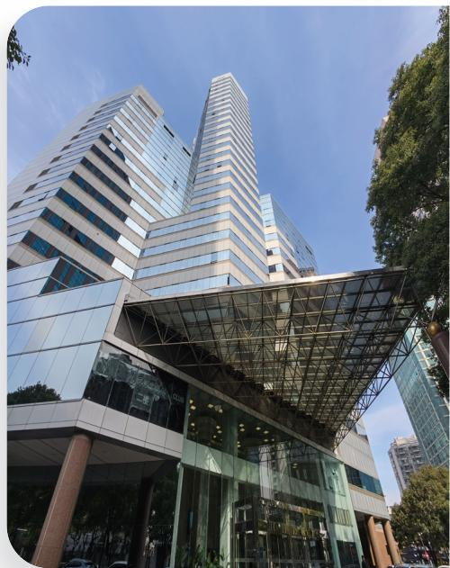

natural_image

Exterior view of a modern glass skyscraper with a glass facade under a clear blue sky, surrounded by trees (no signage or text visible)

# 公司简介

东方国际创业股份有限公司成立于 1998 年，并于 2000 年 7 月在上海证券交易所发行 A 股上市。上市以来，公司通过多轮资产重组与业务整合，逐步形成以货物贸易、现代物流和大健康产业为核心，产业经营与资本运作相结合的综合型上市公司发展格局，现已成为上海地区具有重要影响力的进出口企业和综合物流服务提供商之一。

东方创业积极服务国家“双循环”“一带一路”和“长三角一体化”等重大战略，是推动上海国际贸易中心建设的重要力量之一。公司坚持以转型发展为突破口，以新业态、新模式培育新动能，持续夯实核心竞争力、发展新质生产力，致力于打造能够高效配置国内国际两种资源、深度参与国际竞争、具备跨国经营能力的综合性上市公司。

# 贸易板块

公司构建了覆盖国内外订单承接、研发设计、打样制作、原辅材料与成品采购、生产组织及全球物流配送的完整贸易产业链。进出口产品涵盖服装成衣、面料纱线、家用纺织品、快消品及各类进口食品等。作为国内纺织服装等产品进出口领域的重要企业之一，公司深耕行业数十年，持续聚焦服装生产制造的ODM能力建设，加快推动传统制造向智能制造、柔性制造转型升级。

# 现代物流板块

公司以综合集成能力为核心，打造水、陆、空一体化的全供应链物流服务体系，从“仓储+”供应链一体化服务切入，不断深化与国内外贸易业务联动，加强对产业“走出去”的支撑保障，持续提升物流组织能力与供应链综合服务水平，着力培育具有差异化竞争优势的现代物流与供应链服务产业体系。

# 大健康板块

公司大健康业务主要涵盖招标代理、医疗设备代理进口等领域。依托既有业务基础，围绕国际国内贸易流通的供应链体系，构建“服务、贸易、供应链管理、租赁”四大系列、十二大业务平台，持续为本市优质医院客户及行业合作伙伴提供高附加值综合服务，探索形成结构更清晰、内涵更丰富、模式更成熟的发展路径，推动货物贸易向服务贸易延伸拓展。

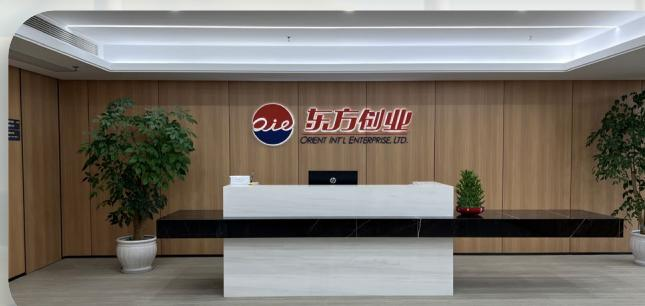

text_image

Zie 东方创业
ORIENT INT'L ENTERPRISE LTD.

# 企业使命

创新引领 服务全球

# 企业愿景

致力于成为全球综合贸易服务商

# 企业价值观

至诚守信 守正创新 以人为本

# 业务布局

公司持续深化国际化发展布局，目前已在东南亚、非洲、欧美等多个国家和地区设立分支机构，并与全球100多个国家和地区建立了稳定、紧密的业务往来关系。公司依托覆盖广泛、协同高效的国际经营网络，不断拓展全球商业机遇，持续提升国际资源配置能力和综合竞争实力。

# 贸易板块

公司主营国际贸易和国内贸易，已形成纺织服装、食品、文教用品、机电产品、箱包等多元化出口体系。公司的进出口规模名列国内行业前茅，凭借数十年纺织服装进出口的专业经验，公司构建了涵盖接单、研发、设计、采购、生产、仓储及全球物流的纺织服装的完整供应链。近年来，依托海外生产基地和整体资源优势，公司聚焦毛衫等服装产品，强化研发设计，推动传统产业数智化转型，致力于成为国内毛衫行业 OEM+ODM 领先企业。

公司从事进口业务多年，与国际知名的供应商建立了长期的业务合作关系，进口规模稳步增长。为提升进口业务的规模和质量，自2018年起，公司每年都积极参与进博会，充分利用和承接进博会溢出效应，重点发展进口业务，跨境电商进口业务不断增长。公司集聚资源，依托专业团队开展多项消费品的境外直采，并拓展国内推广、分销与零售渠道。

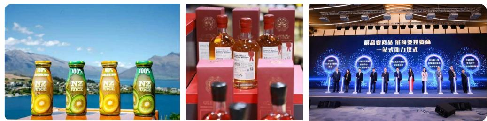

# 现代物流板块

公司现代物流业务涵盖仓储、空运、海运及陆运（包括铁路运输）等多个领域，构建起功能完善、协同高效的综合物流服务体系。公司在上海运营曹路、洋山、浦东国际机场等核心物流节点，并依托汇智供应链基地持续提升仓储服务能力。

在货物运输行业，公司构建了覆盖空运、海运、陆运的多元化服务体系。空运方面，公司提供涵盖安防监控及特殊货物运输在内的专业化服务，并依托苏州、无锡直通模式，有效提升通关效率。海运方面，公司与多家世界级船公司建立合作，提供多式联运及一体化物流解决方案。船运领域，公司自主运营散货船舶，同时开展国际船舶代理服务。此外，公司积极拓展“一带一路”沿线物流网络，持续优化“中欧班列-上海号”运营，推出精品班列服务长三角地区客户，并提供危险品运输、报关报检、存货管理及物流加工等一站式综合物流服务。

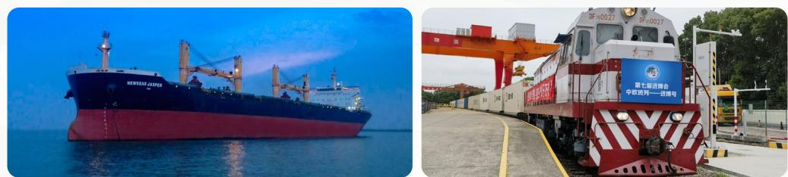

# 大健康板块

公司长期布局大健康产业，构建起涵盖医疗设备招标代理、进口代理、销售管理及供应链管理在内的全链条服务体系。公司面向全国医疗机构，提供从招标采购、物流配送到安装维护的综合解决方案，业务覆盖医疗设备、配件及耗材试剂等领域，具备较强的系统集成与综合服务能力，并与多家医疗机构及科研院所建立了长期稳定的合作关系，助力医疗产业高质量、可持续发展。

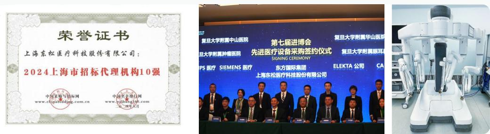

# 发展历程

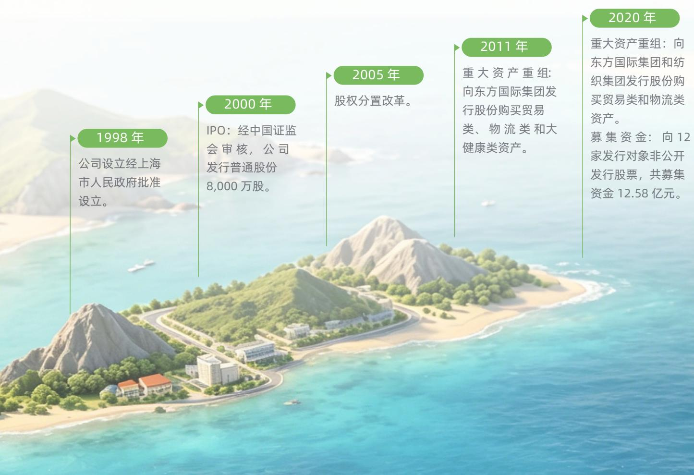

text_image

1998年
公司设立经上海市人民政府批准设立。
2000年
IPO：经中国证监会审核，公司发行普通股份8,000万股。
2005年
股权分置改革。
2011年
重大资产重组：
向东方国际集团发行股份购买贸易类、物流类和大健康类资产。
2020年
重大资产重组：向东方国际集团和纺织集团发行股份购买贸易类和物流类资产。
募集资金：向12家发行对象非公开发行股票，共募集资金12.58亿元。

# 年度专题

# 专题 1

# 全球布局 - 海外供应链建设稳健运营支撑跨国经营战略

2025 年，东方创业持续推进 “全球布局、跨国经营” 战略。公司在埃塞俄比亚、孟加拉国、柬埔寨等国家建设和运营的海外生产基地，面对复杂外部环境，主动创新求变、稳步发展。基地通过抓实生产管理、优化客户结构、整合本地资源，有效抵御贸易保护主义冲击，成为公司链接全球市场、强化供应链韧性的重要支撑。

# 埃塞俄比亚毛衫生产基地：提质增效，蓄力新市场

2025年，埃塞工厂核心聚焦生产管理体系优化与产品综合品质升级。面对红海区域局势波动导致跨境物流周期延长、欧洲常规客户订单排布衔接受阻的挑战，工厂积极采取应对措施，有效稳住欧洲市场基本盘，保障自营接单业务平稳有序运转。与此同时，工厂灵活调整经营思路，深入挖掘埃塞本土内需市场潜力，成功开拓非洲当地市场，以新增订单体量有效弥补外部缺口。

在生产管理方面，基地通过统筹规划组织架构、科学优化人员配置，在稳固基础产能的同时实现人力结构精简；全厂货物发运流转效率持续提升，综合生产运营效能实现系统性改善，经营亏损呈现稳步收窄态势。此外，业务团队前瞻布局海外增量市场，积极储备美国客户资源，已敲定长期合作意向，凸显工厂依托政策与地理优势打造对欧美市场出口枢纽的核心价值与未来成长潜力。

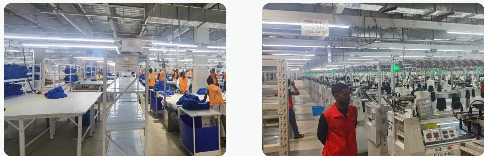  
埃塞俄比亚工厂

# 孟加拉毛衫生产基地：稳定运营，优化客户结构

2025 年，孟加拉生产基地统筹推进老厂区的常态化生产运营与新厂区的建设及装修筹备工作，整体运行平稳有序。基地在保障既有产能稳定释放的同时，加快新厂区建设进度，为后续产能扩展与业务升级奠定基础。报告期内，基地顺利完成碳核查认证，进一步提升了环境管理水平与绿色合规能力，为拓展国际市场提供了有力支撑。

业务经营方面，基地稳步推进自营接单模式，持续增强自主经营能力，有效保障贸易利润保持在合理区间。同时，公司主动优化客户结构，降低对单一客户的依赖程度，提升业务抗风险能力与经营稳定性。

市场拓展方面，基地聚焦优质客户开发，重点推进与美国品牌客户的合作。通过前期试单阶段的高质量交付与稳定履约表现，赢得客户认可，成功转化为长期合作订单，不仅提升了订单质量，也为基地后续业务持续增长注入了新的动力。

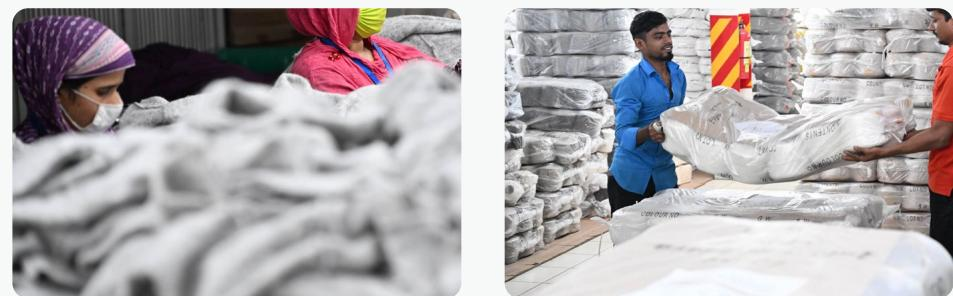  
孟加拉工厂

# 柬埔寨生产基地：整合资源，深化运营

柬埔寨跟单基地：公司持续整合当地成熟供应链资源，与多家合作工厂构建深度协作关系。2025年自营接单稳步推进，经营规模良性提升，营收向好，业务以转口贸易为核心。基地努力维护与核心客户的长期合作，同时成功开拓新客户并落地试单。运营上依托国内团队协同与本地化驻场作业强化现场管控，在海外供应链整体承压的行业环境下，保障批量订单按时交付，全程无加急空运，有效严控成本、维持稳定品质。

柬埔寨东方祥和工厂：针对过往经营挑战，公司聘请专业第三方开展全方位运营诊断，并据此启动厂区整体升级。面对熟练劳动力供给不足，工厂加快推进自动化设备迭代，优化生产效率。同时，同步落地数字化信息化体系升级，引入专业ERP管理系统，为持续提升劳动生产效能筑牢基础。

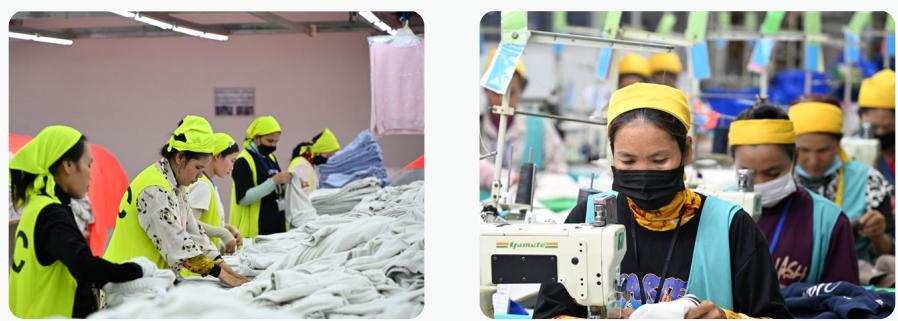

# 专题 2 创新驱动--数智化赋能贸易主业转型升级

2025 年，面对国际贸易数字化浪潮与客户需求迭代的双重挑战，东方创业坚持“科技赋能、模式创新”的发展理念，将创新深度融入业务全链条，在数字化转型、服务模式创新及产品工艺革新等领域取得实质性进展，为主业发展注入新动能。

# 数字化设计引领研发变革

公司旗下各业务单元积极推进数字化转型，深度融合3D设计、AI智能等前沿技术，在优化研发流程、提升客户体验、降低运营成本、拓展海外市场等方面取得显著成效，以技术创新为业务增长注入强劲动能。

公司本部技术创新中心深耕数字化设计，将单一软件应用升级为多款3D软件集成协同，有效提升设计体验与客户需求匹配度。广交会上，其推出的3D展厅覆盖全部毛针织及部分棉针织款式，凭借高效直观的展示方式吸引客户选样，成功拿下美国大型零售客户的3D毛针织开发订单。

新联纺设计团队融合 3D 与 AI 技术，自主研发 “3D 服装炫款” 数字化模块，实现版型、面料参数的数字化转化与优化。该创新将研发周期缩短 40%，减少打样损耗、践行绿色理念，同时通过虚拟试穿等功能提升沟通与决策效率。2025 年多场订货会上，团队以此打造沉浸式虚拟秀场，吸引众多国际客商下单，成为市场开拓的重要支撑。

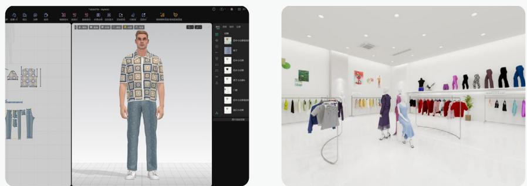  
本部技术创新中心 3D 软件和 3D 展厅

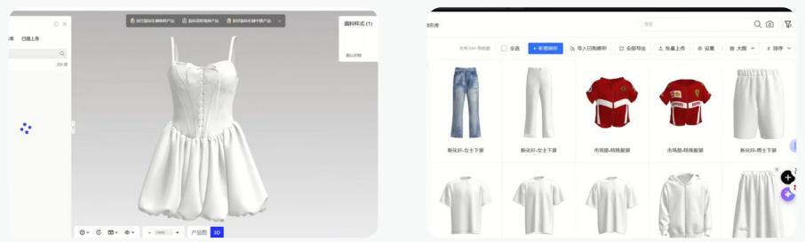  
新联纺公司 3D 数字服装技术

# 信息化系统赋能管理提效

船舶管理数智化方面，新海航业稳步推进船管系统落地运营，完成自有船队及7艘外管船舶的系统全面上线的工作。依托该数智化管理系统，实现船舶信息实时共享、业务流程自动化处理及决策科学化支撑，有效优化船舶运营管理流程，降低运营成本，提升船舶运营安全性与效率，为企业高质量发展提供坚实保障。

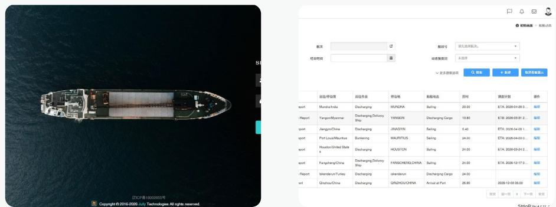  
新海航业船舶数智化管理系统

# 服务模式创新开拓新增长极

档案服务数字化转型方面，国服公司下属“云档通”持续提升数字化创新能级，已获取多项软件著作权，成功通过工信部科技型中小企业和上海市高新技术企业认定。云档通运营管理系统持续迭代升级，公司通过物联网技术实现档案资产全生命周期追踪管理的创新服务模式，获得了市场认可。

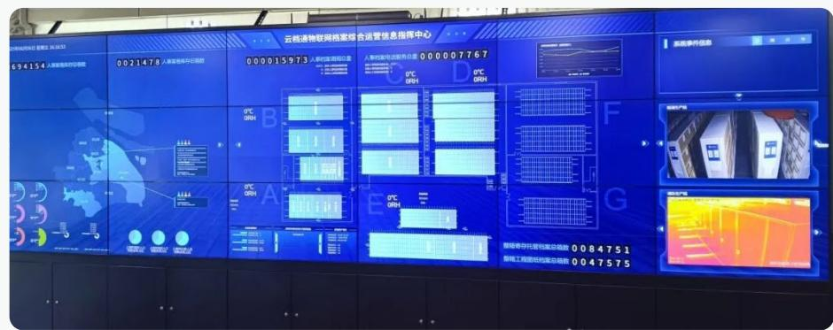

text_image

云海通物联网配套综合运营信息指挥中心
00015973 人机空调调度工量 000007767
0°C GRM
0°C GRM
0°C GRM
0°C GRM
0°C GRM
0°C GRM
0°C GRM
0°C GRM
0°C GRM
0°C GRM
0°C GRM
0°C GRM
0°C GRM
0°C GRM
0°C GRM
0°C GRM
0°C GRM
0°C GRM
0°C GRM
0°C GRM
0°C GRN
0°C GRN
0°C GRN
0°C GRN
0°C GRN
0°C GRN
0°C GRN
0°C GRN
0°C GRN
0°C GRN
0°C GRN
0°C GRN
0°C GRN
0°C GRN
0°C GRN
0°C GRN
0°C GRN
0°C GRN
0°C GRN
0°C GRN
0°C GRP
0°C GRP
0°C GRP
0°C GRP
0°C GRP
0°C GRP
0°C GRP
0°C GRP
0°C GRP
0°C GRP
0°C GRP
0°C GRP
0°C GRP
0°C GRP
0°C GRP
0°C GRP
0°C GRP
0°C GRP
0°C GRP
0°C GRP
0°C GRN
0°C GRN
0°C GRN
0°C GRN
0°C GRN
0°C GRN
0°C GRN
0°C GRN
0°C GRN
0°C GRN
0°C GRN
0°C GRN
0°C GRN
0°C GRN
0°C GRN
0°C GRN
0°C GRN
0°C GRN
0°C GRN
0°C GRG
0°C GRG
0°C GRG
0°C GRG
0°C GRG
0°C GRG
0°C GRG
0°C GRG
0°C GRG
0°C GRG
0°C GRG
0°C GRG
0°C GRG
0°C GRG
0°C GRG
0°C GRG
0°C GRG
0°C GRG
0°C GRG
0°C GRG
0°C GRC
0°C GRC
0°C GRC
0°C GRC
0°C GRC
0°C GRC
0°C GRC
0°C GRC
0°C GRC
0°C GRC
0°C GRC
0°C GRC
0°C GRC
0°C GRC
0°C GRC
0°C GRC
0°C GRC
0°C GRC
0°C GRC
0°C GRC
0°C CRP
0°C CRP
0°C CRP
0°C CRP
0°C CRP
0°C CRP
0°C CRP

云档通智慧大屏

物流模式创新方面，物流集团空运板块首创“机坪接货”服务模式，大幅缩短接货时效，时效提升幅度达 $75\%$ ，显著优化客户服务体验；海运订舱平台构建“7×24小时”全天候、全流程服务体系，持续提升服务响应速度与服务质量，助力其在上海五大订舱平台中的排名从第三位提升至第二位，市场竞争力持续增强。

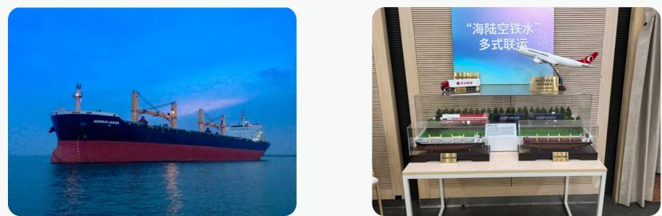  
物流模式创新

# 工艺革新夯实产品竞争力

公司本部技术创新中心在传统毛衫工艺领域持续深耕攻坚，重点开发仿手勾产品、各类工艺绣花产品、针梭织结合产品等高附加值工艺品类，既丰富产品品类多样性，满足客户多元化需求，更有效带动订单增量提升，其中新开发的仿手勾工艺产品已成功获得客户认可。纺织品公司依托“季节、成分、时尚、拳头、平台”五大关键词指导产品创新，聚焦不同市场需求开发差异化面料产品，例如针对非洲上层人士生理特征研发的“香味花布”，以及通过调整棉涤配比延伸开发的、适配不同国家市场的涤棉布子品类，推动存量业务向新品增量转化，实现提质增效与市场拓展的双重突破。

本部技术创新中心仿手勾工艺产品  

natural_image

Person operating a sewing machine for fabric handling, with fabric piles in the foreground (no visible text or symbols)

# ESG 管理

公司始终将长期可持续发展置于战略核心，致力实现经济效益、环境效益与社会效益协同共进。秉持诚信合规经营理念，公司把环境保护与社会责任全面融入发展战略与日常运营，积极响应国家“双碳”目标，持续构建绿色、安全、负责任的经营体系。在降低运营环境影响的同时，不断加大创新研发投入，强化员工权益保障与人才队伍建设，推动可持续发展理念与企业实践深度融合。

为进一步提升 ESG 管理水平，公司已正式成立 ESG 工作小组，系统统筹并推进各项 ESG 相关工作落地实施。同时，公司积极组织开展 ESG 专项培训，聚焦环境、社会及公司治理等核心议题，持续提升团队专业认知与综合管理能力，为企业高质量可持续发展夯实人才支撑与制度保障。

# 实质性议题管理

公司建立实质性议题常态化审阅机制，确保各项议题与公司所处行业高度契合。2024年，公司通过访谈与问卷调研，深入倾听利益相关方声音，系统识别与判定其在环境、社会及管治领域的建议与期望，最终确立了19项核心ESG实质性议题，为信息披露的实质性与完整性奠定基础。

2025 年，公司在延续 2024 年双重重要性评估整体框架的基础上，结合主营业务特征、外部经营环境及利益相关方关注重点，对部分议题评分进行了适度微调。总体上，公司适度提升了对供应商管理、客户服务、风险及合规管理、信息安全、员工培训与发展等与供应链韧性、服务质量、稳健经营和组织能力相关议题的财务重要性判断；同时，对部分影响重要性评分进行了小幅校准，使议题矩阵更贴合公司贸易与供应链平台型业务特征。

natural_image

Gavel resting on wooden gavel beside an open book, set against a blue background (no text or symbols visible)

东方创业 2025 年双重重要性议题矩阵图  
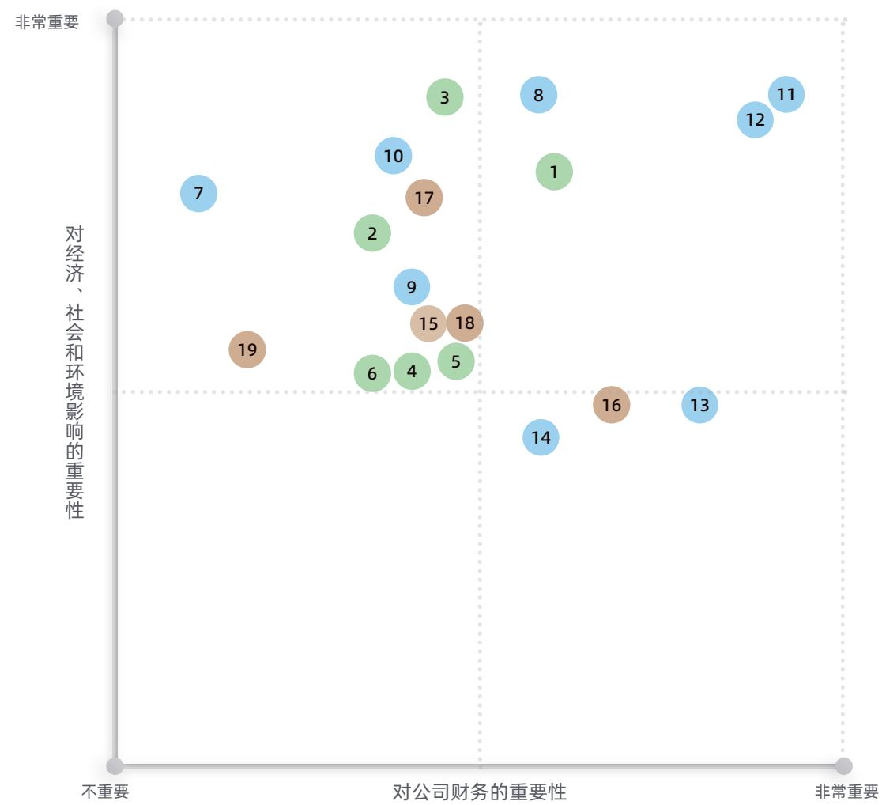

bubble

| Item | 对公司财务的重要性 (X-axis) | 对经济、社会和环境影响的重要性 (Y-axis) |
| --- | --- | --- |
| 1 | ~0.65 | ~0.75 |
| 2 | ~0.35 | ~0.65 |
| 3 | ~0.45 | ~0.85 |
| 4 | ~0.45 | ~0.45 |
| 5 | ~0.50 | ~0.45 |
| 6 | ~0.35 | ~0.45 |
| 7 | ~0.15 | ~0.70 |
| 8 | ~0.55 | ~0.85 |
| 9 | ~0.40 | ~0.60 |
| 10 | ~0.35 | ~0.75 |
| 11 | ~0.90 | ~0.85 |
| 12 | ~0.85 | ~0.80 |
| 13 | ~0.85 | ~0.45 |
| 14 | ~0.55 | ~0.35 |
| 15 | ~0.45 | ~0.50 |
| 16 | ~0.65 | ~0.45 |
| 17 | ~0.45 | ~0.65 |
| 18 | ~0.50 | ~0.50 |
| 19 | ~0.20 | ~0.45 |

# 环境

1 应对气候变化  
2 环境合规管理  
3 污染物与废弃物管理  
4 水资源利用  
5 能源利用  
6 化学品安全

# 社会

7 社会贡献与乡村振兴  
8 员工权益与福利  
9 员工培训与发展  
10 职业健康与安全  
11 创新驱动  
12 产品质量  
13 供应商管理  
14 客户服务

# 治理

15 公司治理  
16 风险及合规管理  
17 商业道德  
18 信息安全  
19 党建引领

# 利益相关方沟通、尽职调查

公司基于行业特性与运营实际，系统识别并确立了核心利益相关方，主要包括政府及监管机构、股东及投资者、周边社区与环境、客户、员工、商业合作伙伴、非政府组织、媒体及科研教育机构。公司通过定期访谈、问卷调查、专题交流等常态化机制，持续倾听各方关切与期望，并依托多元化的沟通渠道积极回应，致力于与利益相关方携手共创长期可持续价值。

<table><tr><td>利益相关方</td><td>关注议题</td><td>沟通方式与措施</td></tr><tr><td rowspan="7">政府及监管机构</td><td>风险与合规管理</td><td></td></tr><tr><td>商业道德</td><td>证券监管机构相关会议</td></tr><tr><td>信息安全</td><td>政府会议</td></tr><tr><td>党建引领</td><td>定期与临时信息披露</td></tr><tr><td>社会贡献与乡村振兴</td><td>现场调研、问卷调研</td></tr><tr><td>员工权益与福利</td><td></td></tr><tr><td>应对气候变化</td><td></td></tr><tr><td rowspan="5">股东及投资者</td><td>公司治理</td><td>股东会业绩说明会</td></tr><tr><td>风险与合规管理</td><td>券商策略会</td></tr><tr><td>商业道德</td><td>投资者热线、咨询邮箱、e互动</td></tr><tr><td>创新驱动</td><td>投资者现场调研</td></tr><tr><td></td><td>投资者回报</td></tr><tr><td rowspan="5">周边社区与环境</td><td>环境合规管理</td><td></td></tr><tr><td>污染物与废弃物管理</td><td>ESG报告</td></tr><tr><td>水资源利用</td><td>媒体采访</td></tr><tr><td>能源利用</td><td>与相关物业管理单位沟通协调</td></tr><tr><td>化学品安全</td><td></td></tr><tr><td rowspan="6">客户</td><td>公司治理</td><td>公司公众号</td></tr><tr><td>商业道德</td><td>业绩说明会</td></tr><tr><td>信息安全</td><td>定期与临时信息披露</td></tr><tr><td>创新驱动</td><td>合格供方评审</td></tr><tr><td>产品质量</td><td>沟通拜访</td></tr><tr><td>客户服务</td><td></td></tr><tr><td rowspan="7">员工</td><td>公司治理</td><td>职工代表大会</td></tr><tr><td>风险与合规管理</td><td>工会会员代表大会</td></tr><tr><td>员工权益与福利</td><td>民主生活会</td></tr><tr><td>员工培训与发展</td><td>开展各类培训</td></tr><tr><td>职业健康与安全</td><td>公司内网</td></tr><tr><td></td><td>公司公众号</td></tr><tr><td></td><td>员工满意度调查</td></tr><tr><td rowspan="4">商业合作伙伴</td><td>商业道德</td><td>定期与临时信息披露业绩说明会</td></tr><tr><td>信息安全</td><td>沟通拜访</td></tr><tr><td>创新驱动</td><td>ESG报告</td></tr><tr><td>供应商管理</td><td></td></tr><tr><td rowspan="5">非政府组织、媒体及科研教育机构</td><td>商业道德</td><td>ESG报告</td></tr><tr><td>信息安全</td><td>年度报告</td></tr><tr><td>应对气候变化</td><td>公司官网</td></tr><tr><td></td><td>媒体沟通</td></tr><tr><td></td><td>公司公众号</td></tr></table>

# 01

# 依法合规夯实根基

# 理念

依法经营，科学治理，维护股东合法权益，注重风险防控

# 我们的行动

公司治理

风险与合规管理

商业道德

信息安全

党建引领

SDGs 对标

和平、正义与强大机构

natural_image

Illustration of a modern office environment with employees at workstations, a winding road, and a landscape featuring a small bridge-shaped water body (no text or symbols)

# 公司治理

东方创业严格遵循《中华人民共和国公司法》《中华人民共和国证券法》《上市公司治理准则》《上市公司章程指引》及《上海证券交易所股票上市规则》等相关法律法规，持续构建权责明确、运作高效的公司法人治理结构，不断完善治理机制与制度体系，确保企业依法合规、稳健运营。

治理框架  
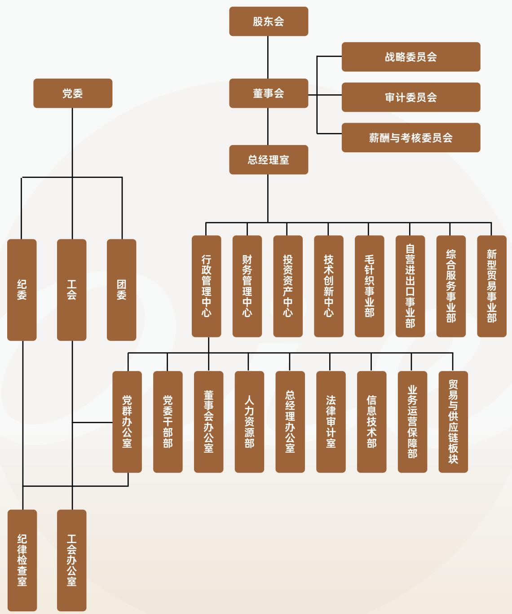

flowchart

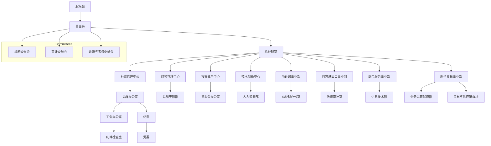
```mermaid
graph TD
  A["股东会"] --> B["董事会"]
  B --> C["总经理室"]
  
  subgraph Committees
    D["战略委员会"]
    E["审计委员会"]
    F["薪酬与考核委员会"]
  end
  
  B --> D
  B --> E
  B --> F
  
  C --> G["行政管理中心"]
  C --> H["财务管理中心"]
  C --> I["投资资产中心"]
  C --> J["技术创新中心"]
  C --> K["毛针织事业部"]
  C --> L["自营进出口事业部"]
  C --> M["综合服务事业部"]
  C --> N["新型贸易事业部"]
  
  G --> O["党群办公室"]
  H --> P["党群干部部"]
  I --> Q["董事会办公室"]
  J --> R["人力资源部"]
  K --> S["总经理办公室"]
  L --> T["法律审计室"]
  M --> U["信息技术部"]
  N --> V["业务运营保障部"]
  N --> W["贸易与供应链板块"]
  
  O --> X["工会办公室"]
  O --> Y["纪委"]
  
  X --> Z["纪律检查室"]
  Y --> AA["党委"]
```

2025 年 6 月，公司董事会审议通过《关于修订〈公司章程〉及取消监事会的议案》，主要修订内容包括：

依据最新法律法规修订：根据《中华人民共和国公司法》《中华人民共和国证券法》《上市公司治理准则》《上市公司信息披露管理办法》《上海证券交易所股票上市规则》《上市公司章程指引》等法律法规进行全面修订。

取消监事会设置: 修订后的《公司章程》经股东会审议通过后, 公司将不再设置监事会, 监事会的职权由董事会审计委员会行使, 《监事会议事规则》等监事会相关制度相应废止。

“股东大会”表述调整：新《公司章程》中将“股东大会”的表述统一调整为“股东会”。

股东会：股东会是由全体股东组成的权力机构，是企业经营管理和股东利益的最高决策机构，拥有选举或任免董事会成员的权力，拥有批准企业的重大经营决策和股东利益分配方案的权力。

董事会：董事会是公司经营决策机构，下设董事会战略委员会、审计委员会、薪酬与考核委员会；

战略委员会：主要负责对公司长期发展战略和重大投资决策进行研究并提出建议；

审计委员会：依据公司章程规定行使监事会职权，负责审核公司财务信息及其披露、监督及评估内外部审计工作和内部控制；

薪酬与考核委员会：主要负责制定公司董事及高级管理人员的考核标准并进行考核；制定、审查薪酬政策与方案，并向董事会提出建议。

# 关键绩效

董事会成员男女比例为 7:2

非独立董事和独立董事比例为 6:3

<table><tr><td>股东会召开次数</td><td>3次</td><td>审议事项数</td><td>17项</td></tr><tr><td>董事会召开次数</td><td>10次</td><td>审议事项数</td><td>47项</td></tr><tr><td>战略委员会召开次数</td><td>2次</td><td>审议事项数</td><td>2项</td></tr><tr><td>股审计委员会召开次数</td><td>6次</td><td>审议事项数</td><td>18项</td></tr><tr><td>薪酬与考核委员会召开次数</td><td>4次</td><td>审议事项数</td><td>8项</td></tr></table>

# 投资者关系

公司持续完善投资者关系管理体系建设，于 2025 年 8 月完成《投资者关系管理制度》《投资者调研和媒体采访接待管理制度》的修订，为规范、透明、高效的投资者沟通提供制度保障。

公司高度重视网络沟通平台建设，在官网设立投资者关系专栏，开设电子信箱及在线论坛，多渠道接收投资者提出的问题与建议，并及时予以答复。同时，公司设立专门的投资者咨询电话和传真，配备熟悉公司情况的专人负责接听，确保工作时间线路畅通、沟通高效。针对收到的投诉举报事项，公司严格执行公正、公开的处理程序；对涉及欺诈、操纵市场等违法违规行为的投诉，深入调查并依法严肃处理，切实维护投资者的合法权益。

2025 年，公司召开 2024 年年度暨 2025 年第一季度业绩说明会、2025 年半年度暨 2025 年第三季度业绩说明会，通过线上互动与投资者深入交流经营情况与发展规划。此外，公司通过上证易互动平台及时回复投资者提问 17 项，并接待机构现场来访调研 2 次，持续畅通沟通渠道，增强市场认同，致力于为投资者创造长期可持续的价值回报。

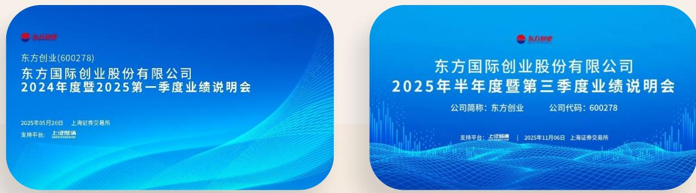

# 投资者回报

2025 年，公司持续强化股东回报机制，积极通过利润分配彰显对股东利益的重视，切实增强投资者信心。年内共实施两次利润分配，具体如下：

2024年度利润分配：公司向全体股东每股派发现金红利0.074元（含税），合计派发现金红利64,908,636.54元（含税）。

2024 年度公司现金分红总额为 146,541,299.09 元（包括中期已分配的现金红利），占本年度归属于上市公司股东净利润的 67.76%。

2025年度中期利润分配：公司向全体股东每股派发现金红利0.029元（含税），合计派发现金红利25,285,551.15元（含税），占2025年1-9月归属于上市公司股东净利润的 $14.05\%$ ，占上市公司最近一期经审计的归属于上市公司股东净利润的 $11.69\%$ 。

上述利润分配方案充分体现了公司稳健的盈利能力和对股东长期回报的高度重视，进一步提振了投资者对公司未来发展的信心。

股利支付率（分红 / 净利润）  
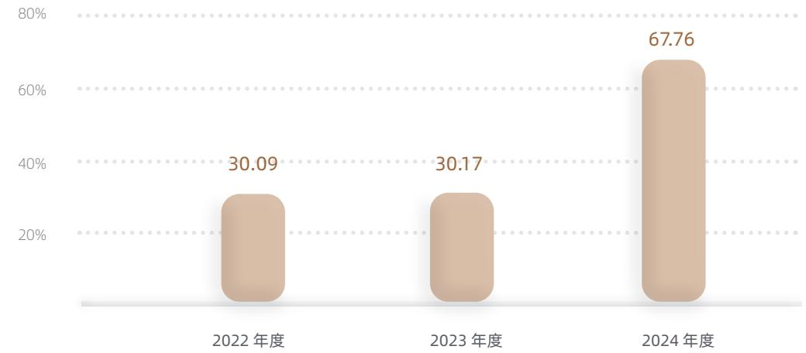

bar

| Category | Value (%) |
| --- | --- |
| 2022 年度 | 30.09 |
| 2023 年度 | 30.17 |
| 2024 年度 | 67.76 |

# 信息披露

公司严格遵循信息披露相关监管要求，持续加强信息披露事务管理，统一信息披露渠道，确保披露内容的真实、准确、完整与及时，切实保障投资者的合法权益。2025年8月，依据《中华人民共和国公司法》《中华人民共和国证券法》《上海证券交易所股票上市规则》《上市公司信息披露管理办法》等法律法规。公司进一步修订完善了《信息披露制度》及《信息披露暂缓与豁免管理制度》，持续优化信息披露管理体系，提升规范运作水平，为投资者权益保障提供更坚实的制度基础。

报告期内，公司共发布定期报告 4 份、临时报告 52 份，并在上海证券交易所网站（www.sse.com.cn）及《上海证券报》《中国证券报》《证券日报》等指定信息披露媒体及时发布，确保信息传递的公开、公平、公正。

报告期内，公司未发生任何因违反信息披露规定而受到处罚的情形。

natural_image

Interior office scene with a person standing beside a large monitor displaying charts, and a white desk with books and a potted plant (no visible text or symbols)

# 风险合规管理

东方创业始终将风险防范置于经营管理的核心位置，秉持“防范风险、稳健经营”的原则，构建了覆盖业务排查、流程细化、培训宣导、存量处置与制度建设的多层次、全流程风险管控框架。

<table><tr><td>治理</td></tr><tr><td>战略</td></tr><tr><td>风险管理</td></tr><tr><td>指标与目标</td></tr></table>

公司构建了以股东会、董事会及高级管理层为核心的风险管理与合规治理架构，各治理主体权责分明、各司其职。董事会下设审计委员会等专门委员会，为风险管理与合规决策提供专业支持。内部审计部门独立向审计委员会汇报工作，定期对财务状况、内部控制及重大决策执行情况开展监督检查，确保风险管理体系有效运行。

公司持续强化风险管理体系建设，聚焦薄弱环节实施提级管理，依托中国信保等专业机构，有效压降风险敞口。在具体风险应对方面，公司多措并举、精准施策：针对市场风险，动态优化业务结构，提升抗周期波动能力；针对信用风险，严格评估客户资信状况，筑牢交易准入防线；针对操作风险，加强员工培训与内控执行，提升流程规范性；针对法律风险，强化合同审核与合规审查，确保业务开展合法合规。通过上述举措，公司不断提升风险识别、预警与应对能力，为稳健经营提供坚实保障。

公司定期分析内外部发展环境，系统识别市场、信用、操作及法律等领域风险，综合运用定性与定量方法评估各类风险的优先级及潜在影响。2025年，面对复杂严峻的国际贸易形势，我们重点聚焦委托业务真实性、资金占用、境外运营等关键风险领域，全面排查存量业务，强化对交易环节背景调查与真实性评审，从源头筑牢风险防线。

公司严格遵循《公司章程》《财务管理制度》等内部规章制度，持续规范业务流程、明晰职责权限，并将风险管理成效纳入绩效考核体系，定期开展评估与改进，推动风险管理与经营管理深度融合。

# 风险应对措施

<table><tr><td>业务风险管控</td></tr><tr><td>财务风险管理</td></tr><tr><td>法律与合规风险</td></tr><tr><td>资产风险防控</td></tr></table>

公司完善内控治理与组织保障，构建风险管理三道防线：业务部门自主管控（第一道防线）、风控 / 法务 / 财务职能监控（第二道防线）、内部审计独立监督（第三道防线）的内控与风险管理体系，形成事前评审、事中跟进、事后复盘整改的闭环管理机制，防范风险。公司优化业务流程与关键控制，公司法律审计室与纪检监察室、业务运营保障部、计划财务部、投资资产部、风控小组等部门密切协作，实现风险联防联控、信息互通共享。

公司以 ERP 系统为核心推进业财一体化，将客户资信审核、价格审批、付款条件等财务控制节点嵌入业务全流程，实现业务流、资金流、信息流同步，强化货、款实时监控。公司强化对核心业务风险管控。在销售与收款环节建立客户信用动态评估、合同事权 - 法务 - 决策三级审批和应收账款全周期跟踪与催收机制。在采购与付款环节，完善供应商准入与考核体系，推行标准采购合同模板，通过 OA 系统规范审批流程，严格落实不相容岗位分离。公司还建立专项风险应对机制，及时跟踪出口退税、贸易管制等政策变化，并强化单证合规审核，保障出口退税业务合规与资金安全。公司强化制度体系优化，健全内控管理制度体系，确保经营活动有章可循、有规可依。公司还依托信息化系统赋能管控，推进内控制度流程化、线上化，减少人为操作风险，提升管控效率与透明度。

公司通过全链条法律风险管控与常态化审计监督，成功预警化解多起潜在重大法律及运营风险，保障公司资产安全与运营稳定；通过案件处置与法律谈判维护公司合法权益，避免大额经济损失。日常法务咨询推动形成依法办事、遇事找法的工作氛围，保障业务规范开展；审计发现问题及整改建议，有效促进流程优化、效能提升与内控完善，为公司应对严格监管奠定基础。

投资资产中心统一归并公司旗下资本及不动产，坚持合规优先、服务主业、风险可控、保值增值的原则。资本运作方面，首先通过“三重一大”决策程序，分级授权审批机制，严控组织决策风险；其次，通过产业协同论证、全面尽调、资产审计评估等手段，加强投资项目风控；最后，通过投后跟踪机制、设立风险预警指标和规范退出，加强投后管理。物业资产管理方面，首先，坚持安全第一、预防为主的原则，杜绝安全生产隐患和事故；其次，通过建立完整资产台账、市场化定价、规范招租、标准合同、维修改造工程比价招标等手段，确保各项操作符合相关规章制度。

# 合规管理与培训

以能力建设与意识提升为目标，组织开展专题风控培训：重点围绕买方资信审核、货源真实性、业务合理性与匹配性等关键点，强化业务人员的风险研判与应对能力；通过剖析虚构贸易背景下的出口退税所涉税务及法律风险，持续警示并敦促业务部门夯实交易审核基础。

审计职能得到进一步优化，通过明确内部职责分工、结合集团巡察工作，常态化审计监督机制得以加强。

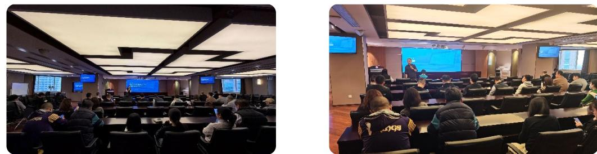  
风控培训现场

# 案例：纺织品公司--构建多层次内控与合规体系

纺织品公司面对复杂多变的国际贸易环境，系统推进风险与合规管理能力建设，在制度建设、供应商管理、合规认证等方面形成扎实实践。

制度完善与业务评审升级。公司修订《委托业务操作指引（2025年版）》，实现委托业务评审全覆盖，建立中期复查及随机抽查制度，新增对供应商的实地走访要求，强化对重大供应链服务客户的动态跟踪，从源头防范业务风险。

法人治理与合规认证。依据新《中华人民共和国公司法》要求，公司按时完成公司章程修订；完成新一轮 ISO 质量管理体系认证及 AEO 高级认证企业复核，持续夯实合规运营基础。

业务风险多维管控。深化与中信保合作，加强风险案例培训与辅导；强化与银行沟通，提高汇率走势研判能力；对存量业务定期做好风险预警与走势分析，控制出运节奏，防范单一客户体量过大及非美货币贬值风险。

资产质量与巡视整改。成立专班加大对应收账款、库存的梳理和监督，推动专项清理长账龄资产。配合集团巡察，系统推进整改落实，新建和修订制度18项，优化业务流程，合并部门增强协同，切实提升治理能力。

供应链环保合规。及时完成 GRS、OCS、BCI、RDS 等认证续证，确保产品符合国际环保要求，巩固与国际客户合作关系；申办多项进境动植物检疫许可，保障进口水果等业务合规开展。

# 案例：新海航业--船舶运营精细化风控与合规管理

新海航业聚焦航运主业特点，构建覆盖船舶运营、船员管理、资产处置等关键环节的风险与合规管控体系。船舶审核与安全检查。面对日益严格的检查要求，公司制定专项检查计划并强化预检准备，按期完成各项内外审核及船舶检查任务，按要求落实缺陷整改，确保管理船舶持续保持高等级安全评级，船岸证书始终有效。船员管理与合规换班。公司紧盯船员在船工作情况、心理状态及船舶动态，科学安排船员更换，确保换班工作安全平稳。在部分船舶推行中外船员混派模式，有效提升船员素质并降低合规成本。

单证与关务零差错。公司严控单证质量，舱单申报准确率、提单签发合规率保持双达标，关务手续实现零差错。针对太阳能设备等特殊货物，主动优化查验流程，加强各方协调，高效办结通关手续。

资产处置合规管控。“新海明珠”轮处置过程中，公司由常年法律顾问全程参与，创新申办路径，有效提升办证效率、降低企业成本。通过“事前推演 + 高效执行”模式，在实现资产合规处置的同时取得良好经营收益，做到资产增值与合规双赢。

安全培训与应急能力。公司持续开展船舶知识、技能及安全生产培训，切实提升职工综合素养。全年积极履行社会责任，多次完成海上救援任务，在提升行业口碑与品牌形象的同时，彰显企业责任担当。

# 商业道德

<table><tr><td>治理</td><td>在顶层设计层面,董事会负责商业道德建设的战略引领与监督,定期审议并批准防止利益冲突、重大决策管理等关键制度,确保合规治理体系的制度根基坚实稳固。在执行层面,管理层统筹推进商业道德制度的具体实施与落地,涵盖制度修订完善、日常监督检查及违规事项处理等环节,确保各项要求融入经营管理全过程。在监督层面,公司纪委牵头商业道德监督工作,联合纪律检查室、计划财务部、业务运营保障部、人力资源部、法律审计室等职能部门,定期开展专项监督检查,切实筑牢制度执行的“防火墙”。</td></tr><tr><td>战略</td><td>商业道德建设是公司战略发展的重要基石。公司通过系统防范利益冲突、规范重大决策行为,切实保障各项经营活动的合规性与可持续发展。严格约束管理人员及特定关系人在经营、投融资和任职等方面的行为边界,确保权力运行公开透明。同时,公司严格执行《“三重一大”决策制度实施办法》,推动决策过程科学化、民主化、合规化,从制度层面筑牢商业道德防线。</td></tr><tr><td>风险管理</td><td>公司将利益冲突与决策合规风险纳入重点防控领域,通过建立健全相关制度并严格监督执行,确保各类风险始终处于可控范围。公司纪委定期对管理人员利益冲突申报事项开展抽查,重点核实申报信息的真实性与完整性,强化制度执行刚性,切实筑牢廉洁合规防线。</td></tr><tr><td>指标与目标</td><td>报告期内,公司本部管理人员防利益冲突申报率和廉洁承诺签订率100%,巡察问题整改率100%。公司纪委牵头开展多次专项监督检查,重点核查制度执行与风险防控情况。</td></tr></table>

# 反商业贿赂及反贪污

公司持续深化廉洁合规体系建设，坚持教育、制度、监督并重，构建覆盖全面、权责清晰、运行有效的廉洁风险防控机制，为企业高质量发展营造风清气正的良好生态。

# 责任体系建设

公司党委切实履行主体责任，第一责任人与班子成员签订廉政重点项目职责责任书、“一岗双责”廉洁从业承诺表，明确责任分工与履职要求。党政领导班子分别与中层干部、下属企业负责人签订《廉洁从业责任书》《信访责任书》《安全责任书》，推动责任层层传导、压力逐级下沉，确保廉洁风险防控要求落实到每一个管理单元。

报告期内，公司本部管理人员防利益冲突申报率和廉洁承诺签订率均保持 100%，巡察反馈问题整改率达 100%，实现制度执行与问题整改“双闭环”。

# 廉洁风险排查与防控

深入开展廉洁风险点排查。以深入贯彻中央八项规定精神为契机，公司纪委组织开展廉洁风险点专项排查工作，全面梳理岗位职责和制度规范执行情况，深入查找经营活动中存在或潜在的廉洁风险点，针对性提出防控要求并做好分类处置，从源头上防范廉洁风险。

利益冲突申报规范化。结合公司层级改革后组织架构调整，公司纪委对《防止利益冲突表》的填写对象重新梳理界定，组织完成防止利益冲突表填报工作，同步完成廉政档案的更新完善，确保重点岗位人员廉洁信息动态可查、全程可溯。

# 专项监督检查

# 开展“七个不得”专项检查

围绕各级管理人员经营管理活动中防止利益冲突情况，公司纪委组织完成“七个不得”专项检查，并形成《2025年东方创业关于开展各级管理人员经营管理活动中防止利益冲突情况专项监督检查工作的报告》，为持续完善廉洁风险防控机制提供决策参考。

# 大监督体系协同联动

公司监督阵线前移。纪委深度融入经营管理全过程，报告期内，纪委书记及纪检干部列席公司月度经济活动分析会，动态了解企业各项关键经营指标完成情况。

风险事项协同处置。依托大监督体系协同联动机制，公司纪委持续关注各部门风险点及防控措施落实情况，协同法律审计室等部门针对已造成公司经济损失的案件开展专项分析，提出处置意见，推动监督与业务深度融合、同向发力。

公司从完善机制入手，提升监督效能，落实责任。公司坚持“机制先行、责任闭环”，筑牢监督根基，以协同追责压实监督责任，推动监督工作从“被动应对”向“主动应对”转变。公司健全管理机制，做到“五个健全、多面覆盖”。

一是健全领导分工机制，实现监督“高位统筹”  
二是健全纪委班子机制，实现监督“专业赋能”  
三是健全支部建制机制，实现监督“凝心聚力”  
四是健全上下联动机制，实现监督“蓄力提质”  
五是健全例会监督机制，实现监督“精准嵌入”

公司强化责任追究机制，组建“大监督”工作小组，做到“协同联动、从严问责”，以严厉问责敲响警钟，以刚性约束筑牢防线。公司坚持“事前防范、事中管控、事后整改”的全过程监督理念，将监督贯穿企业经营管理各环节、各领域，力争打造“事前有预防、事中有管控、事后有整改”的监督闭环，让监督从“事后补救”向“事前预防”延伸，从“单点监督”向“全域防控”拓展，切实增强监督的预防性功能和整体效能。

# 廉洁培训与文化培育

公司持续加强廉洁文化建设，通过分层分类开展反腐败专题培训，覆盖各级管理人员及关键岗位人员，不断提升全员廉洁从业意识。同步打造“东创清韵”廉洁文化品牌，将廉洁理念融入企业文化内核，推动清廉生态与企业发展同频共振。

natural_image

Close-up of a wooden gavel resting on a dark surface next to a rough black book (no text or symbols visible)

# 关键绩效

防利益冲突表填报数量 235 份

反腐败培训开展次数 4 次

注：披露范围仅覆盖东方创业本部。

反腐败培训参与人数 212 人次

签署廉洁承诺书的员工人数 53 人

# 反垄断与反不正当竞争

公司严格遵守《中华人民共和国反垄断法》《中华人民共和国反不正当竞争法》等相关法律法规，始终秉持公平、公正、诚信的市场竞争原则，坚决反对任何形式的垄断行为和不正当竞争。公司建立健全内部合规管理体系，持续规范市场经营活动，强化员工公平竞争意识，确保各项业务在法治化、市场化轨道上稳健运行。在供应商合作、客户拓展及市场开拓过程中，公司坚持以产品品质和服务能力赢得市场认可，杜绝商业贿赂、虚假宣传、侵犯商业秘密等不当行为，切实维护公平有序的市场秩序，助力构建健康透明的行业生态。

natural_image

Interior office scene with miniature business people and workstations, no visible text or signage

# 信息安全

# 治理

东方创业深知数据安全与客户隐私保护是公司可持续发展的基石。公司建立健全了由决策、管理与执行三个层级构成的信息安全治理架构，确保信息安全战略与公司业务目标相协调，并有效落实监督职责。

公司在信息安全方面的治理架构如下：

# 决策机构：

设立信息安全领导小组，由公司领导和各部门主管组成，是公司信息安全管理的最高机构，负责信息安全建设总体规划、统筹安排，审批发布信息安全方针和管理体系，提供信息安全资源保证，协调各部门与信息化之间的关系。

# 执行机构：

信息安全领导小组下设信息安全工作小组，以信息技术部为主体，负责公司信息安全日常工作和执行工作，包括起草、制定和具体执行信息安全管理体系，负责信息系统及信息安全的日常维护和管理。

公司为信息安全工作小组配备了具备专业资质的岗位人员，包括信息安全岗、系统管理岗、网络管理岗等，其任职要求明确需持有国家或行业认可的专业技术资格（如信息安全工程师、网络工程师等），以确保管理团队具备足够的专业技能。公司建立了例行的工作报告机制，各岗位定期汇总安全运维情况，并向信息安全工作小组及领导小组汇报，确保管理层及时掌握信息安全动态。

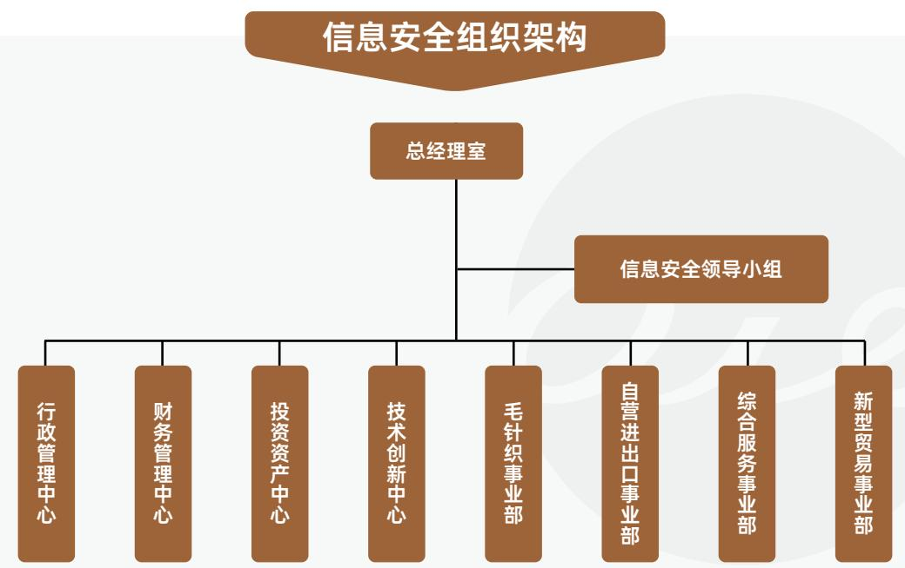

flowchart

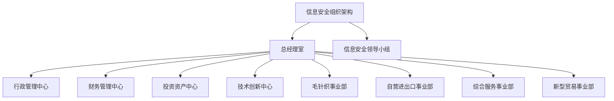
```mermaid
graph TD
  A["信息安全组织架构"] --> B["总经理室"]
  A --> C["信息安全领导小组"]
  B --> D["行政管理中心"]
  B --> E["财务管理中心"]
  B --> F["投资资产中心"]
  B --> G["技术创新中心"]
  B --> H["毛针织事业部"]
  B --> I["自营进出口事业部"]
  B --> J["综合服务事业部"]
  B --> K["新型贸易事业部"]
```

# 战略

根据《东方国际创业信息安全方针及安全策略制度》，公司确立的信息安全总体方针为：“提高人员信息安全风险意识，确保医疗信息系统安全；强化信息安全管理，坚持以人为本。”

公司遵循“统一规划、分级管理、积极防范、人人有责”的原则，通过风险评估和风险管理，加强公司信息安全的建设和管理。

# 影响、风险和机遇管理

根据《信息安全方针及安全策略制度》《信息系统授权及审批管理制度》《备份与恢复管理制度》《系统安全管理制度》等文件，公司对信息安全风险的管理措施主要包括：

<table><tr><td>授权与审批管理</td></tr><tr><td>备份与恢复管理</td></tr><tr><td>系统安全管理</td></tr><tr><td>访问控制与权限管理</td></tr></table>

内部人员授权：信息安全工作小组由信息安全领导小组授权；各安全岗位人员由信息安全工作小组授权；各业务信息系统经办人员由信息安全工作小组授权。

外包人员审批：外包运维人员参与信息系统环节需经信息技术部经理或信息安全领导小组成员审批。

变更审批：功能优化类变更需经业务经办部门领导审批后，由信息技术部经理审批；系统完善类变更由系统管理员发起，报信息技术部经理审批。

重要操作（如业务系统重大升级、网络架构重大调整）需经信息技术部经理初审后，报信息安全领导小组终审。

备份范围：包括重要系统的操作系统、系统配置文件、数据文件和数据库。

备份频率：重要系统数据至少每周一次全备份，每天一次增量备份。

备份有效期：备份有效时间为一年。

恢复测试：每半年对备份恢复工作进行测试。

备份介质管理：备份介质未经同意不得外借，不得流出信息技术部。

运维组织：重要应用系统由两名以上技术人员担任系统管理员，实行 AB 岗制；日常运维人员、第三方维护人员须通过堡垒机系统进行运维管理。

数据修改流程：后台数据修改需参照《变更管理程序》执行。

漏洞扫描：每季度对应用系统进行一次漏洞扫描。

系统异常行为分析：每季度记录一次阶段内系统异常行为。

基本原则：隔离运行、最小权限、按需审批、职责分离、默认拒绝。

账户管理：用户账户每 90 天未登录将被禁用；离职用户账户立即关闭或删除；连续三个月未使用的账户经批准后禁用。

口令管理：口令长度不得低于8位，包括数字和字符；口令最长使用期限为90天；记录用户10次口令使用记录，防止重复使用；登录失败超过5次后账户被临时锁定。

# 指标与目标

根据《信息安全方针及安全策略制度》，公司设定的信息安全目标为：“最大限度保证信息系统的完整性、保密性和可用性免遭破坏。确保每年信息安全重大事故（Ⅱ级）的发生频率为可控范围内的最低，目标为‘0’次”。

2025 年，根据国家相关要求，公司积极推进网站二级等保工作，委托了具有资质的第三方测评机构对网站进行了全面的安全测评，并对安全隐患问题进行整改。整改后，新增了制度文件《个人信息管理制度》，使公司的信息管理制度更加完善。公司网站完成二级等保工作后，安全防护能力亦得到了显著提升。通过第三方测评机构的复测，网站的安全漏洞数量大幅减少，网络攻击抵御能力明显增强。公司二级等保复测通过以来，未发生任何个人信息泄露和网络安全事件，保障了用户的合法权益和企业的正常运营。

报告期内，公司未发生信息安全事故。

# 关键绩效

经确认的网络安全事故次数 0 例

网络安全培训次数 3 次

注：披露范围仅覆盖东方创业本部。

网络安全应急演练次数 1 次

经确认的数据泄露事故次数0例

natural_image

Group of people working at a table with laptops and documents, no visible text or symbols

# 党建引领

2025年，东方创业党委在集团党委的正确领导下，坚持以习近平新时代中国特色社会主义思想为指导，深入贯彻落实党的二十大和二十届二中、三中、四中全会精神，扎实开展中央八项规定精神学习教育，以作风建设新成效强化政治引领，持续推进企业高质量发展取得新成效。

# 政治领航，深化理论武装

公司党委扎实推进中央八项规定精神学习教育，一体落实“学查改”，推动走深走实。

# 领导带头示范：

将八项规定精神纳入党委理论学习中心组专题，以读书班领学《习近平关于加强党的作风建设论述摘编》，全年开展中心组专题学习21次，班子成员结合分管工作交流研讨。

# 全员覆盖学习：

依托 “三会一课”，各支部制订计划、组织全体党员学习，用好中央 60 个、上海 50 个典型案例并动态更新；班子成员以普通党员身份参加支部学习，发挥引领作用。

# 学用结合整改：

对照问题清单全面排查作风短板，建立整改台账、明确责任。学习期间，班子成员调研21人次，解决群众与基层突出问题2个；班子共查摆问题6个，成员个人查摆问题32个。

# 组织建设，夯实基层基础

公司顺利完成党委和纪委的换届，严格依照党章及党内法规要求，周密部署、规范程序、公开透明开展党委、纪委换届选举，公司纪委全程监督，确保换届风清气正。

持续加强支部建设，通过党委会、支部书记例会统筹推进党建工作，开展支部书记专题培训，完成支部调整与换届改选。规范党员发展工作，严把标准与程序关，全年发展党员4名、预备党员转正6人，新增入党申请人6人。深化党建联建，各支部分别开展跨支部、跨单位主题党日与联学共建活动，签署共建协议，有效凝聚党建工作合力。

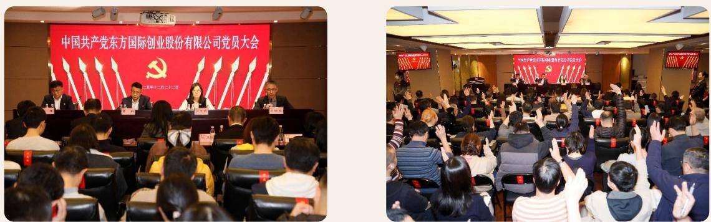  
党委、纪委换届选举

# 廉政建设，筑牢廉洁防线

层层压实廉洁责任。党委书记与班子成员签订廉政职责责任书及“一岗双责”廉洁从业承诺表，班子成员分别与中层干部、下属企业负责人签订廉洁从业、信访、安全等责任书，逐级压实责任。

做实做细日常监督。纪委书记列席党委会，紧盯重大项目、招投标、采购、资产处置等重点领域履职监督；按月更新“三重一大”决策督查表并跟踪落实；强化境外人员回国述职述廉，夯实境外廉洁监督。

开展专项监督检查。全面排查廉洁风险点，完善防控措施；开展违规吃喝专项整治，严查各类隐形变异吃喝问题，运用数据比对、审计联动等方式强化督查。

创新廉洁教育载体。组织观看3场廉政教育片、开展2场作风建设情景党课；向新提拔干部、新党员、新员工发放《廉洁家书》；为48名科级以上干部配发纪律学习书籍，强化“八小时以外”纪律约束。

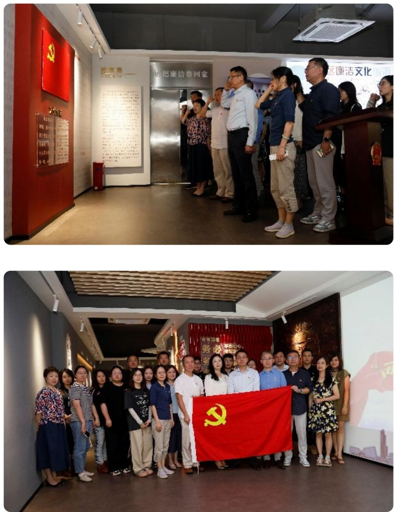  
长宁区尚廉新泾警示教育基地参观学习

# 02

# 创领升级 责任共担

SDGs 对标

9 产业、创新和基础设施

12 负责任消费和生产

17 促进目标实现的伙伴关系

理念

坚持创新驱动，提升产品质量，规范供应管理，共建责任链条。

我们的行动

创新驱动

产品管理

供应商管理

客户服务

# 创新驱动

东方创业将技术创新作为驱动业务增长与可持续发展的战略支柱。技术创新中心聚焦纺织行业技术升级与绿色转型，围绕制度管理、流程优化与持续研发，系统推进核心业务拓展，不断提升市场竞争力与可持续发展能力。

公司本部于2020年至2025年间四次荣获年度“十大类纺织创新产品”奖项，并荣膺“十大类纺织创新产品持续创新单位”称号。

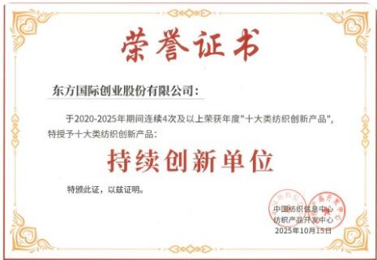

text_image

荣誉证书
东方国际创业股份有限公司：
于2020-2025年期间连续4次及以上荣获年度"十大类纺织创新产品"，
特授予十大类纺织创新产品：
持续创新单位
特颁此证，以兹证明。
中国纺织信息中心
纺织产品开发中心
2025年10月15日

<table><tr><td>治理</td><td>公司本部通过持续加大研发投入、优化创新机制,为技术创新中心的高效运转提供制度保障。技术创新中心通过“研发+服务+赋能”三位一体的模式,在传统毛衫工艺领域深耕细作的同时,积极拓展数字化设计、高附加值原料应用和复杂工艺开发,形成差异化的竞争优势。</td></tr><tr><td>战略</td><td>围绕毛衫“亚洲第一”战略目标,本部技术创新中心以“市场开拓、品类升级、设计引领、供应链全球化”四轮驱动为指引,持续推动订单从“规模扩张”向“增值增量”转型。</td></tr><tr><td>风险管理</td><td>技术创新中心在推进研发创新过程中,系统识别并管控技术研发、市场需求、人才流失、技术迭代及知识产权等主要风险。通过建立设计团队与业务部门的协同机制,实施目标导向开发,提升样品命中率与订单转化率;依托数字化设计工具缩短研发周期,强化对客户需求的响应能力;与纱线供应商、高校等外部资源开展合作,分散技术研发风险,保持对行业前沿的跟踪;构建“三横三纵”全覆盖人才培养体系,通过海外实训、技术培训等方式增强人才黏性;同时,通过启动技术资料库建设、规范设计成果内部流转、强化员工知识产权意识培训,筑牢技术与知识资产的保护屏障。</td></tr><tr><td>指标与目标</td><td>公司通过技术创新与数字化转型,提升负责任运营效率与行业影响力。</td></tr></table>

# 制度与团队保障

公司本部技术创新中心已建立完善的管理制度体系，涵盖《创新中心管理制度》《研发设计工作准则》及《展厅及样品管理制度》，为创新工作提供清晰的规范与流程指引。同时，技术创新中心组织架构健全，配备专业团队，全面覆盖设计开发、工艺改进及数字化转型全流程。制度与团队的有效结合，为技术研发与设计创新提供了坚实保障，确保创新工作规范有序、高效执行。

# 研发能力建设

# 工艺研发与高附加值产品

在传统毛衫工艺领域，技术创新中心凭借扎实的专业知识，积极拓展高价值原料订单，如羊绒订单；持续开发高附加值工艺的毛衫产品，如仿手勾产品、各类工艺绣花产品、针梭织结合产品等，提升产品专业性的同时丰富多样性。新开发的仿手勾工艺产品已实现客户下单。

  
仿手勾工艺产品

# 技术交流与协同创新

技术创新中心组织纱线供应商推介新品纱线，推动上下游技术交流与协同创新。与德福伦等联动，共同开发的“BioFleax全生物基PEF毛衫”与“超柔丽纤维提花针织连衣裙”两款产品，双双入选“2025年度十大类纺织创新产品”名单。

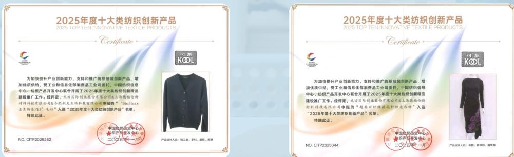  
BioFleax 全生物基 PEF 毛衫  
舒莱棉丝丽绒纤维全成形毛衫

# 数字化设计应用

# 3D 数字技术深度应用

技术创新中心拓宽 3D 软件开发思路，从使用单一软件升级至集成多款 3D 软件，以协同作用获取更佳视觉效果和产品体验，使 3D 设计与研发客户契合度大幅提升，成功获取美国大型零售客户 3D 毛针织开发订单。

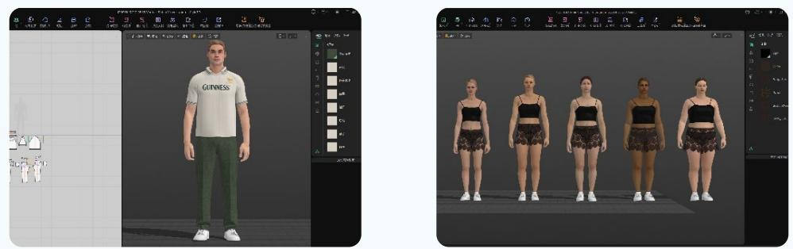  
本部技术创新中心 3D 软件

# 3D 展厅服务创新

在广交会展台上推出 3D 展厅服务, 覆盖展会全部毛针织实样款式和棉针织部分款式, 以精准、直观、快捷的展示吸引客户选样、订货, 有效提升展会营销效率。

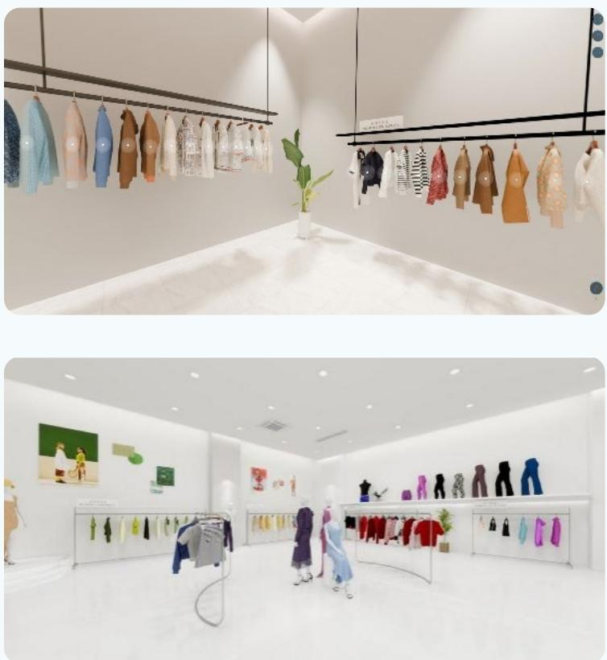  
本部技术创新中心 3D 展厅

# 助力行业发展

公司本部秉持“创新引领，服务全球”的企业使命，充分发挥投资企业资源与业务协同优势，积极拓展行业创新合作，深化产业链战略协同，主动融入“双循环”新发展格局，持续推进技术创新与业务模式变革，助力行业实现高质量发展。

# 公司参与的协会

中国纺织品进出口商会（理事单位）

中国纺织品进出口商会国际供应链委员会（创始单位）

中国对外贸易经济合作企业协会（副会长单位）

上海进出口商会（副会长单位）

中国毛纺织行业协会（理事单位）

大虹桥国家外贸转型升级基地（首批会员单位暨理事单位）

上海纺织协会（副会长单位）

上海市服装协会（理事单位）

# 关键绩效

2025年研发人员数量65人

占员工总数比例 1.3%

研发投入金额 1450.89 万元

研发占营收比例 0.04 %

发明专利的申请数 1 件

有效专利数 10 件

注：披露范围仅覆盖东方创业本部

# 产品质量

东方创业将产品质量视为企业生存与发展的基石，持续完善质量管理体系，推动技术创新与流程优化，确保产品稳定可靠、服务高效优质，为客户创造长期价值。

报告期内，公司本部及各子公司均未发生因产品质量问题被监管部门通报或下架的情况。

<table><tr><td>治理</td><td>公司建立了系统化、规范化的质量管理与控制体系,明确质量责任分工,强化全过程质量监督与持续改进机制,确保产品和服务符合相关标准与客户要求。本部及多家子公司已通过ISO 9001质量管理体系认证,依托技术创新与精细化过程控制,不断提升质量管理水平。</td></tr><tr><td>战略</td><td>公司将质量管理纳入发展战略核心,通过持续优化质量政策与管理机制,推动产品与服务质量不断提升。围绕客户需求导向,构建以高质量供给为核心的竞争优势,支撑企业稳健发展与长期价值创造。</td></tr><tr><td>风险管理</td><td>公司建立覆盖全流程的质量风险识别与管控机制,通过进货检验、过程控制与成品检测等手段,系统分析不合格原因并制定改进措施。针对境外工厂,持续优化生产管理流程与质量管控标准,降低质量风险,保障产品稳定性与客户满意度。</td></tr><tr><td>指标与目标</td><td>公司坚持“首次即正确”的质量管理目标,持续提升产品一次交付合格率与客户满意度。通过客户反馈与内部改进机制,不断优化产品性能与服务质量。同时,营造安全、规范的工作环境,提升员工满意度与质量执行力,确保服务的稳定性与可靠性。</td></tr></table>

# 质量管理体系认证

公司本部及旗下国际物流、新海航业、外贸公司、纺织品公司、物流集团、东松公司和荣恒公司等多家企业，均已建立并通过 ISO 9001 质量管理体系认证，构建了覆盖本部及境外工厂的系统化、规范化质量管理体系，实现质量管理的全面贯通与持续优化。

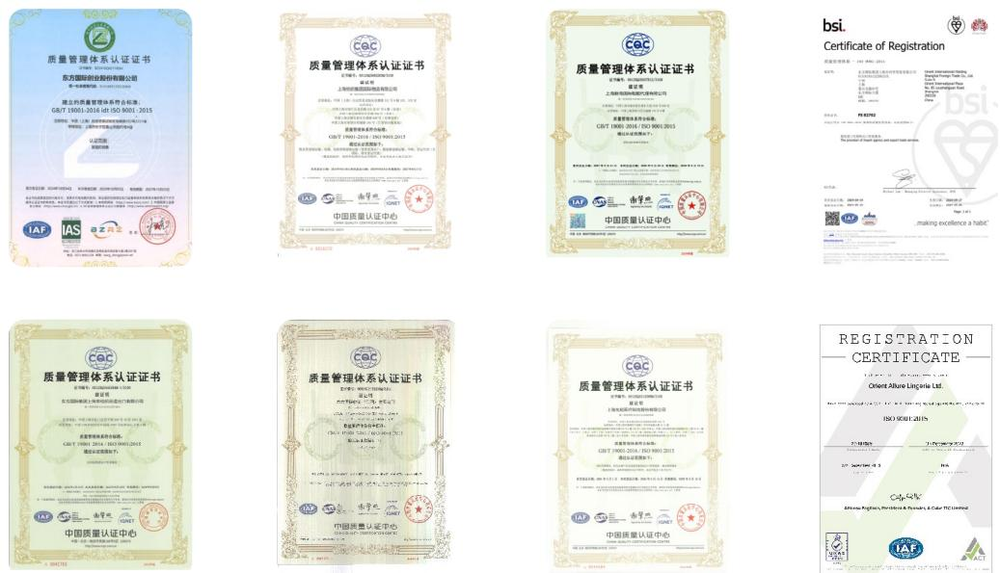

# 质量方针与目标

公司秉持“客户至上、高质量服务、持续改进”的质量方针，致力于满足并超越客户期望，不断提升产品与服务品质。

客户至上：以客户需求为核心，首次接触即提供符合标准的产品和服务，并持续改进性能、交付效率与价值。

高质量产品与服务：承诺在市场上提供领先品质的产品和服务，保持行业竞争优势。

持续改进：利用客户反馈和内部质量数据，持续优化产品与服务，确保长期稳定的质量表现。

尊重与诚信：尊重并诚信对待客户、员工与供应商，维护良好的合作关系。

员工激励与工作满意度：营造激励性强的工作环境，提升员工满意度与工作积极性。

首次即正确：确保首次生产与服务即符合客户预期，减少质量问题与返工风险。

# 案例：埃塞工厂获 OEKO-TEX 生态纺织品认证

2025 年，东方创业埃塞毛衫生产基地获得 OEKO-TEX Standard 100 生态纺织品认证，证明工厂生产的纺织产品在有害物质检测、人体生态安全性等方面符合国际严格标准。该认证为产品进入欧美高端市场提供了绿色通行证，进一步巩固了公司在全球供应链中的可持续发展优势。

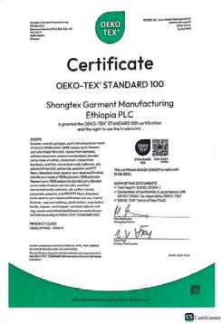

text_image

OEKO-TEX®
Certificate
Oeko-Tex® STANDARD 100
Shangkex Garment Manufacturing
Ethiopia PLC
In granted the OECO-TEX® STANDARD 100 certification
and is right to ensure the Standard 100.
ISSN
ISSN 2019-03-04
ISSN 2019-03-05
ISSN 2019-03-06
ISSN 2019-03-07
ISSN 2019-03-08
ISSN 2019-03-09
ISSN 2019-03-10
ISSN 2019-03-11
ISSN 2019-03-12
ISSN 2019-03-13
ISSN 2019-03-14
ISSN 2019-03-15
ISSN 2019-03-16
ISSN 2019-03-17
ISSN 2019-03-18
ISSN 2019-03-19
ISSN 2019-03-20
ISSN 2019-03-21
ISSN 2019-03-22
ISSN 2019-03-23
ISSN 2019-03-24
ISSN 2019-03-25
ISSN 2019-03-26
ISSN 2019-03-27
ISSN 2019-03-28
ISSN 2019-03-29
ISSN 2019-03-30
ISSN 2019-03-31
ISSN 2019-04-01
ISSN 2019-04-02
ISSN 2019-04-03
ISSN 2019-04-04
ISSN 2019-04-05
ISSN 2019-04-06
ISSN 2019-04-07
ISSN 2019-04-08
ISSN 2019-04-09
ISSN 2019-04-10
ISSN 2019-04-11
ISSN 2019-04-12
ISSN 2019-04-13
ISSN 2019-04-14
ISSN 2019-04-15
ISSN 2019-04-16
ISSN 2019-04-17
ISSN 2019-04-18
ISSN 2019-04-19
ISSN 2019-04-20
ISSN 2019-04-21
ISSN 2019-04-22
ISSN 2019-04-23
ISSN 2019-04-24
ISSN 2019-04-25
ISSN 2019-04-26
ISSN 2019-04-27
ISSN 2019-04-28
ISSN 2019-04-29
ISSN 2019-04-30
ISSN 2019-05-01
ISSN 2019-05-02
ISSN 2019-05-03
ISSN 2019-05-04
ISSN 2019-05-05
ISSN 2019-05-06
ISSN 2019-05-07
ISSN 2019-05-08
ISSN 2019-05-09
ISSN 2019-05-10
ISSN 2019-05-11
ISSN 2019-05-12
ISSN 2019-05-13
ISSN 2019-05-14
ISSN 2019-05-15
ISSN 2019-05-16
ISSN 2019-05-17
ISSN 2019-05-18
ISSN 2019-05-19
ISSN 2019-05-20
ISSN 2019-05-21
ISSN 2019-05-22
ISSN 2019-05-23
ISSN 2019-05-24
ISSN 2019-05-25
ISSN 2019-05-26
ISSN 2019-05-27
ISSN 2019-05-28
ISSN 2019-05-29
ISSN 2019-05-30
ISSN 2019-05-31
ISSN 2019-06-01
ISSN 2019-06-02
ISSN 2019-06-03
ISSN 2019-06-04
ISSN 2019-06-05
ISSN 2019-06-06
ISSN 2019-06-07
ISSN 2019-06-08
ISSN 2019-06-09
ISSN 2019-06-10
ISSN 2019-06-11
ISSN 2019-06-12
ISSN 2019-06-13
ISSN 2019-06-14
ISSN 2019-06-15
ISSN 2019-06-16
ISSN 2019-06-17
ISSN 2019-<nl>

案例：国际物流公司建立了完善的质量控制体系

<table><tr><td>产品检验与测量控制</td><td>国际物流公司严格执行《产品监视和测量控制程序》,对产品和服务在生产、交付等关键环节实施全过程检验与测量,确保符合既定质量标准与技术规范。通过规范检验流程与质量审核机制,有效防止不合格产品流入下道工序或交付客户,保障产品质量的稳定性与一致性。</td></tr><tr><td>纠正与预防措施</td><td>国际物流公司依据《纠正措施控制程序》,定期分析实际及潜在不合格原因,制定并落实针对性的纠正与预防措施。通过开展根因分析与持续改进,防止质量问题重复发生,推动质量管理体系持续优化。</td></tr><tr><td>不合格品管理</td><td>国际物流公司严格执行《不合格控制程序》,明确不合格品的识别、隔离与处置流程,防止误用或流入后续环节。所有不合格品均按要求进行评审与处理,确保质量管理体系有效运行。</td></tr></table>

# 供应商管理

东方创业始终坚持公平、公正、透明的采购原则，持续完善供应商管理制度，致力于与供应伙伴建立长期互信、协同共赢的合作关系。通过推动绿色、韧性与负责任的供应链建设，助力企业可持续发展目标的实现。

<table><tr><td>治理</td><td>公司高度重视供应链可持续管理,秉持合作共赢理念,建立系统化的供应商管理体系,对供应链中的人权保护、职业健康与安全等关键议题实施监督与管理,确保员工权益保障与业务合规稳步推进。</td></tr><tr><td>战略</td><td>公司将可持续发展理念融入采购与供应链管理全过程,通过责任采购保障员工权益,积极响应联合国可持续发展目标。优先选择具备良好可持续发展绩效的供应商,持续提升产品与服务质量,携手合作伙伴推动产业链高质量发展。</td></tr><tr><td>风险管理</td><td>公司通过供应商管理机制识别并管控与员工权益相关的潜在风险,建立覆盖供应商准入、评估与退出的全流程管理体系。包括新供应商准入评审、定期复评及黑名单管理等措施,由业务部门与相关职能部门协同开展能力评估与风险分级管理,并建立异常供应商申诉与处置机制,保障供应链稳定运行及员工权益。</td></tr><tr><td>指标与目标</td><td>公司以构建可持续供应链为目标,建立供应商分级与动态管理机制。合格供应商有效期为一年,通过年度复评决定合作延续。优先选择高等级供应商,持续提升服务质量与合规水平,推动形成稳定、高效、负责任的供应链体系,助力公司迈向行业领先水平。</td></tr></table>

# 治理架构与管理制度

公司建立了覆盖供应商全生命周期的管理制度体系，明确供应商准入、评估、考核、退出等各环节的管理要求。东方创业本部：制定并实施《关务管理制度》《客商管理制度》，规范供应商管理流程。

物流集团：制定《供应商管理制度》，覆盖全部供应商，明确供应商准入、考核及退出机制。

外贸公司：出台《客商管理办法》，覆盖公司国内外客商，强化客户全流程管理；同时制定《出口信用保险管理办法》，提升风险防控能力。

荣恒公司: 制定《供应商管理制度》, 建立供应商合规审查机制, 要求供应商签署《供应商行为准则》, 并开展社会责任尽职调查。国际物流: 建立《管理制度汇编--第八部分采购管理》, 明确供应商行业资质审核要求, 通过企信宝查询供应商失信、被执行及行政处罚情况, 审核供应商规模与注册资本。

# 供应商准入与审核

为规范供应商准入机制，引进优质供应商，降低采购风险，公司通过设定严格的供应商引进标准和要求，完善供应链管理体系。公司设定了供应商的筛选原则，供应商需要在各项检验合格后才可进入公司的供应商名录。

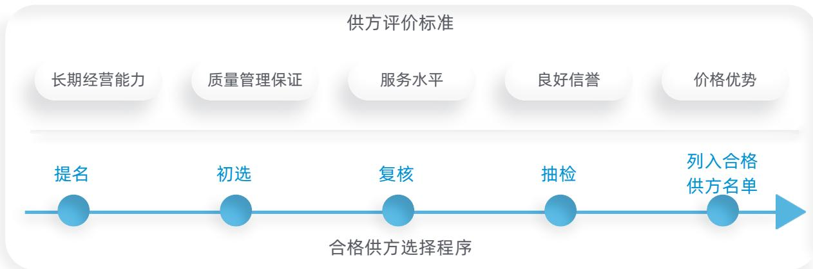

flowchart

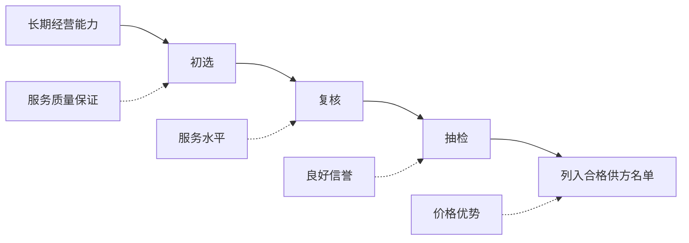
```mermaid
graph LR
  A["长期经营能力"] --> B["初选"]
  B --> C["复核"]
  C --> D["抽检"]
  D --> E["列入合格供方名单"]
  F["服务质量保证"] -.-> B
  G["服务水平"] -.-> C
  H["良好信誉"] -.-> D
  I["价格优势"] -.-> E
```

<table><tr><td>公司</td><td>准入审核内容</td></tr><tr><td>外贸公司</td><td>建立ERP客商背景调查系统,实施红黄灯、黑名单审批机制</td></tr><tr><td>物流集团</td><td>要求所有供应商签署《反商业贿赂协议书》</td></tr><tr><td>国际物流</td><td>审核供应商行业资质、失信及被执行情况、规模与注册资本</td></tr><tr><td>荣恒公司</td><td>供应商合规审查表、社会责任尽职调查问卷、《供应商行为准则》签署</td></tr><tr><td>康健公司</td><td>供应商质量体系调查表;医药板块执行首营企业审核制度,经质保部、总经理审核批准后方可开展业务</td></tr></table>

# 供应链风险识别与管理

公司持续开展供应链风险识别，重点防范断供、质量、合规及地缘风险。

# 风险识别机制：

物流集团：按照供应商管理制度监督供应商产品和服务质量，各部门及时上报合作中发现的问题，安质部记录并会同法审部处理；借助启信宝、爱企查等平台定期开展供应商检查。2025年供应商考核中发现两家不合格供应商，分别因产品质量问题和欠税风险信息被处置。

国际物流：通过巡检识别风险，形成巡检报告。

荣恒公司：建立供应链管理风险清单，对交付稳定性等关键指标进行监控。

# 风险应对：

公司对存在质量、合规风险的供应商及时采取整改、淘汰等措施，确保供应链安全。

# 供应商基础情况

公司本部和各子公司根据业务特点，对供应商进行多维度审核，涵盖质量、安全、环境、劳动保障、商业道德等方面。

<table><tr><td>指标</td><td>单位</td><td>东方创业(本部)</td><td>子公司合计</td><td>集团合并</td></tr><tr><td>年度供应商总数</td><td>家</td><td>776</td><td>7552</td><td>8328</td></tr><tr><td>中国境内供应商数量</td><td>家</td><td>628</td><td>6275</td><td>6903</td></tr><tr><td>中国境外供应商数量</td><td>家</td><td>148</td><td>1277</td><td>1425</td></tr><tr><td>供应商考核覆盖率</td><td>%</td><td>100</td><td>97</td><td>98</td></tr><tr><td>供应商考核合格率</td><td>%</td><td>98.7</td><td>99</td><td>99</td></tr><tr><td>开展ESG评估供应商数量</td><td>家</td><td>75</td><td>51</td><td>126</td></tr><tr><td>年度供应商培训次数</td><td>次</td><td>2</td><td>85</td><td>87</td></tr></table>

1. 数据来源：东方创业本部及旗下纺织品公司、物流集团、国际物流、康健公司、荣恒公司、家纺公司、商业公司、外贸公司、新海航业、新联纺等主要子公司的供应商统计。  
2. 披露范围说明：当前披露范围覆盖东方创业本部及纳入统计的主要子公司。未来公司将逐步扩展至合并报表范围内全部子公司，实现供应商管理绩效的完整合并口径披露，进一步提升供应链管理的透明度与可比性。

# 客户服务

公司始终秉持“客户至上”的服务理念，持续完善服务体系，不断提升服务响应效率与客户满意度。通过健全沟通机制、规范服务流程及专业支持团队建设，持续构建稳定、诚信、共赢的客户关系，为企业高质量发展注入持续动力。

报告期内，公司本部就 2024 全年的业务与服务满意度，对重点客户进行了调查。客户满意度高达 100%。

# 治理

# 战略

# 风险管理

# 指标与目标

公司高度重视客户满意度与服务质量管理，建立系统化服务管理体系，通过客户反馈监测与数据化管理机制，持续优化服务流程，强化员工服务能力，履行对客户与社会的服务承诺。

公司以客户需求为导向，将服务质量纳入质量管理体系及绩效考核指标，通过系统化收集客户意见与投诉，不断优化服务体验，提升服务水平，支撑企业可持续发展与客户价值创造。

公司建立多渠道客户反馈与投诉管理机制，通过定期开展客户满意度调查、收集商务沟通反馈及投诉处理信息，识别服务过程中的潜在风险。业务部门负责信息收集与响应，运营保障部门进行汇总分析与改进跟踪，确保服务质量持续提升并有效保障客户权益。

公司以提升客户满意度为核心目标，设定客户覆盖率与满意度等关键指标，确保年度客户调研覆盖率不低于70%。通过对满意度结果及投诉原因的系统分析，持续提出改进措施，推动服务质量不断优化与提升。

# 客户服务管理体系

公司建立了完善的顾客满意度管理体系，通过制定《顾客满意度测量控制程序》，对客户对公司产品与服务的满意度进行持续监测与量化。该体系将满意度作为质量管理体系的重要测量指标，为数据分析和管理评审提供科学依据。此举不仅彰显了公司对客户需求的深切关注，更通过持续优化服务质量，切实践行了企业对社会责任的承诺

# 顾客意见征询

制度与流程：业务运营保障部负责设计《顾客意见征询表》，经审核通过后使用。

发放与回收：每年发放调查问卷，选择在销售季节间隙进行，以提高反馈率。业务部门负责回收，业务运营保障部汇总数据。

数据应用：计算顾客满意率，作为质量目标考核的重要依据。

# 满意度信息收集

渠道与方式：业务人员在商务洽谈、客户拜访、交易会及往来函电过程中收集顾客意见。

数据汇总：年终由业务部将收集信息汇总提交至业务运营保障部。

# 顾客投诉管理

投诉受理：业务运营保障部负责受理、登记与处理顾客投诉。

问题解决：依据《不合格品控制程序》和《纠正措施控制程序》，协同相关部门进行整改，并保存投诉处理记录。

数据分析：每年对投诉数据进行汇总与趋势分析，纳入顾客满意度测量体系，为改进提供依据。

# 分析与改进

总结分析：业务运营保障部对顾客满意度进行综合分析，包括满意率、总体情况、投诉原因及改进建议。

管理评审：分析情况及结果提交管理层审阅，作为服务质量改进与经营决策的重要参考。

# 案例：物流集团--进博会智能物流服务

第八届中国国际进口博览会期间，物流集团作为主场运输服务商，面临展品种类繁多、物流需求复杂等挑战。

# 服务创新：

针对海外直运展品、自行发货到港展商、已完税展品，创新推出三类个性化供应链服务模式

为每件展品配备智能追踪器，实现物流全程可视化首创空运进口“机坪接货”模式，接货时效提升75%

# 成效：

累计服务展商近 635 家，操作展品 3000 余立方米

服务面积超过90000平方米，特装展台面积占比超过 $70\%$

海运订舱平台排名由上海第三位上升至第二位

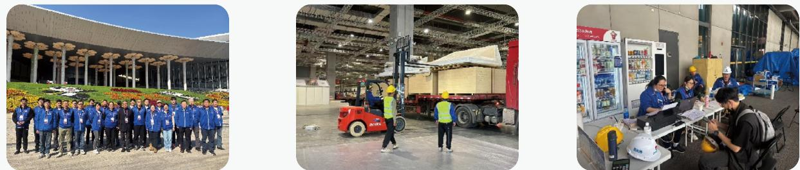  
第八届进博会主场物流服务

# 关键绩效

# 客户满意度评分：

东方创业（本部） 100 分

子公司合计（加权平均）98.2分

集团合并 98.2 分

# 客户投诉量：

东方创业（本部）0项

子公司合计0项

集团合并 0 项

1. 数据来源：东方创业及各部分子公司客户服务绩效数据。其中，客户满意度评分为物流集团（99.23分）、康健公司（99.8分）、荣恒公司（80分）、外贸公司（9分/10分）、新海航业（100分）、新联纺（97.92分）的加权平均值。  
2. 披露范围说明：当前披露范围覆盖东方创业本部及纳入统计的主要子公司。未来公司将逐步扩展至合并报表范围内全部子公司，实现客户服务绩效的完整合并口径披露，进一步提升数据可比性与透明度。

# 03

# 低碳发展 绿色前行

SDGs 对标

6 清洁饮水和卫生设施

11 可持续城市和社区

13 气候行动

# 理念

积极应对气候变化，强化环境合规管理，规范污染治理，优化废弃物处置。

提升水资源利用效率，推动能源清洁高效使用，加强化学品安全管理。

# 我们的行动

应对气候变化

环境合规管理

能源利用

污染物与废弃物管理

水资源利用

化学品安全

# 应对气候变化

气候变化已成为全球共同面临的重大挑战。积极应对气候变化不仅是企业履行社会责任的重要体现，也是推动可持续发展的关键路径。东方创业将绿色低碳理念融入经营发展全过程，持续推进低碳转型与绿色发展。

# 治理

公司严格遵守《中华人民共和国环境保护法》等相关法律法规及政策要求，建立环境与气候管理责任体系，推动各项环保与减排措施有效落实，确保经营活动合规运行。

# 战略

公司将应对气候变化纳入发展战略，通过优化业务布局，推动产品多元化与市场拓展，提升供应链韧性。同时，积极引入绿色技术与管理创新，推进节能降耗与资源高效利用，持续增强在全球产业链中的低碳竞争力。

# 风险管理

公司围绕气候变化相关议题，系统识别和评估短期、中期及长期的气候风险与机遇，提升对转型风险与物理风险的应对能力。同时，积极把握绿色转型带来的发展机遇，推动企业可持续发展目标的实现。

<table><tr><td>类别</td><td>风险类型</td><td>风险描述</td><td>影响周期</td><td>应对措施</td></tr><tr><td rowspan="3">转型风险</td><td>政策法规</td><td>欧盟碳关税(CBAM)等国际贸易绿色壁垒增加,出口产品碳排放合规成本上升</td><td>短期至中期</td><td>外贸公司紧固件业务已完成欧盟CBAM碳排放数据第三方审核及年度填报,持续推进碳足迹管理</td></tr><tr><td>市场风险</td><td>国际品牌客户对绿色产品要求趋严,传统产品面临订单流失压力</td><td>短期至中期</td><td>开发绿色材料产品(如BioFleax全生物基PEF毛衫),完成GRS、OCS、BCI、RDS等环保认证续证</td></tr><tr><td>技术风险</td><td>传统高能耗工艺面临淘汰压力,需投入资金进行技术改造</td><td>中期</td><td>推进库区作业设备“油改电”,提升能源效率;埃塞工厂推进生产管理优化</td></tr><tr><td rowspan="2">物理风险</td><td>极端天气事件</td><td>台风、暴雨等极端天气导致物流中断、仓库受损、海外工厂运营受阻</td><td>短期</td><td>建立应急预案,加强库区安全检查,制定防汛防台专项应急预案</td></tr><tr><td>供应链中断</td><td>极端天气影响原材料供应、海运物流周期延长</td><td>短期至中期</td><td>拓展多元化采购渠道,建立海外供应链网络,优化库存管理</td></tr></table>

<table><tr><td>类别</td><td>机遇类型</td><td>机遇描述</td><td>影响周期</td><td>应对措施</td></tr><tr><td>绿色产品</td><td>绿色材料需求增长</td><td>国际品牌客户对生物基、可回收材料的需求增加</td><td>中期至长期</td><td>开发BioFleax全生物基PEF毛衫,入选“2025年度十大类纺织创新产品”;持续研发绿色面料</td></tr><tr><td>绿色产品</td><td>功能性服装市场扩大</td><td>工装及功能性服装采用永久阻燃、防酸碱等环保高性能面料</td><td>短期至中期</td><td>工装及功能性服装板块出口同比增长19.85%,利润同比增长82%,持续强化产品优势</td></tr><tr><td>绿色供应链</td><td>低碳供应链竞争优势</td><td>客户对供应商碳管理能力的要求提升,提前布局可获得先发优势</td><td>中期</td><td>2025年开展供应商环境评估75家,推动供应链低碳化转型</td></tr><tr><td>能源效率</td><td>节能降耗降低成本</td><td>设备“油改电”等节能措施可降低能源成本,提升运营效益</td><td>短期至中期</td><td>物流集团各库区推动作业设备“油改电”,同步申领新能源补贴</td></tr><tr><td>品牌声誉</td><td>绿色品牌形象提升</td><td>绿色实践可提升企业品牌形象,增强客户认同</td><td>中期</td><td>荣恒公司完成上海办公室绿色办公、T2T废纺回收及国内外工厂碳足迹盘查,践行“双碳”目标</td></tr></table>

# 目标与指标

东方创业致力于推动企业绿色低碳转型，通过持续优化运营、创新技术应用和加强环境管理，努力降低温室气体排放，提升资源利用效率，积极履行社会责任，实现企业可持续发展目标，促进环境与经济效益的协调发展。

# 温室气体排放

案例：上海祥虹纺织制衣有限公司温室气体排放情况如下

<table><tr><td>指标</td><td>单位</td><td>2025年</td></tr><tr><td>范围1、2和3排放</td><td>吨二氧化碳当量</td><td>88.94</td></tr><tr><td>范围1排放</td><td>吨二氧化碳当量</td><td>13.96</td></tr><tr><td>范围2排放</td><td>吨二氧化碳当量</td><td>28.83</td></tr><tr><td>范围3排放</td><td>吨二氧化碳当量</td><td>46.15</td></tr></table>

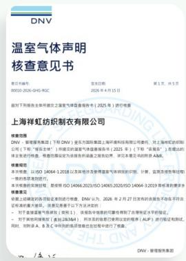

text_image

DNV
温室气体声明
核查意见书
签发日期： 2025年4月15日
00010-2026-GHQ-RGC
温度范围： 2025年4月15日
截至下列报告主所提交之温室气体量查报告书（2025年）进行核查
上海祥虹纺织制衣有限公司
核查意见
DNV：星展集团确认（下同DNV）嘉乐方国际集团上海环境科技有限责任公司、对上海祥虹纺织
有限公司（下称“供应商”）将依据的废气监测报告（2025年）（下称“报表”）及提出的
技术要求进行核查，根据国家规定在检测报告通过后进行审核，并对本报告中的附录A&B。
核查意见
本报告经：ISO 14064-1.2018（以及其他涉及管道温氏气体持续的实验、计算、监测及检验等检验）
一、符合本报告的说明：
本次核查的实验室项目、使用单位 ISO 14066.2023/ISO 14065.2020/ISO 14064-3.2019 标准的要求的核
备核查意见
本公司对该项目现场见证和现场核查。DNV认为，2026年2月27日发布的该报告不存在不符合
标准要求的主体，该意见须于以下方式中列出：
一、对于温室气体量检（见附件1）、该告知书的患者可解释性得到了合理保证水平的保证；
二、对于环境和环境类（含氮）25/36.4（所涉及的项目已制定相应的程序（ALP）进行验证和测试，
同时，同时A、B、C与C中的危险废物经过审批进行了核查。
DNV- 管理服务集团

本次核查，以 ISO 14064-1:2018 以及其他涉及使得温室气体排放的识别、计算、监测及报告等过程能趋于一致的各项准则进行。本次核查的实施过程，是按照 ISO 14066:2023/ISO 14065:2020/ISO 14064-3:2019 等标准的要求执行的。

# 案例：孟加拉工厂温室气体排放情况如下

<table><tr><td>指标</td><td>单位</td><td>2025年</td></tr><tr><td>范围1、2和3排放</td><td>吨二氧化碳当量</td><td>2572.72</td></tr><tr><td>范围1排放</td><td>吨二氧化碳当量</td><td>723.82</td></tr><tr><td>范围2排放</td><td>吨二氧化碳当量</td><td>1848.31</td></tr><tr><td>范围3排放</td><td>吨二氧化碳当量</td><td>0.59</td></tr></table>

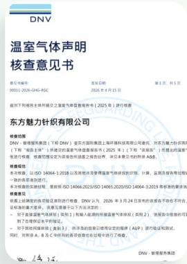

text_image

DNV
温室气体声明
核查意见书

DNV - 气候监测系统（下风 DNV）表示为国家能源工业环境科技有限公司或企业，对东方魅力分析院（下风“报告室”）所表述的温室气体质量指标（2025年）（下风“报告室”）可能是烟气量值与排放标准、检测范围及方法等是否符合规定并纳入评价表。详见本章中的附件A&B。

核查意见
本次审核：ISO 14064-20183 及其他文件要求确保温室气体质量的识别、计算、监测及报告等过程。
一、验收合格后方可进行审核。使用 ISO 14066.2023/ISO/14065.2020/ISO/14064-3:2029 等资料的副本资料。

核查意见
依据《环境影响评估报告》的相关规定，DNV为：2026年3月24日发布的该报告不存在不符合
标准的基准条件，其余数据可进行了下次表决。

对于温室气体质量指标（第1号）输入框内的预测温室气体排放（共用2），该报告中信息的可
为了了解环保水平的规定。

对于环境影响指标（第3号）所表述的信息已按规定报送的报告（AUP）验证和测试。同时，评价人员负责公司内部绩效评价报告全过程进行了复核。

DNV - 管理服务部

本次核查，以 ISO 14064-1:2018 以及其他涉及使得温室气体排放的识别、计算、监测及报告等过程能趋于一致的各项准则进行。本次核查的实施过程，是按照 ISO 14066:2023/ISO 14065:2020/ISO 14064-3:2019 等标准的要求执行的。

# 案例：埃塞俄比亚工厂获国际绿色产品认证

2025 年，东方创业埃塞毛衫生产基地通过 GOTS（全球有机纺织品标准）及 GRS（全球回收标准）两项国际权威认证，标志着工厂在有机材料使用、回收材料追溯及可持续生产管理方面达到国际先进水平，为公司绿色产品开发和全球供应链可持续发展提供有力支撑。

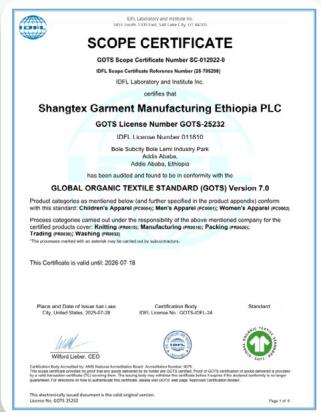

text_image

SOPE CERTIFICATE
GOTS Scope Certificate Number SC-019202.0
GOTS Scope Certificate Reference Number (38-19628)
IDFL Laboratory and Institute Inc.
certifies that
Shangtex Garment Manufacturing Ethiopia PLC
GOTS License Number GOTS-25232
IDFL License Number 011810
Bole Subcity Bole Lern Industry Park
Aldis Alakota
Andes Ababa, Ethiopia
has been audited and found to be in conformity with the
GLOBAL ORGANIC TEXTILE STANDARD (GOTS) Version 7.0
Product categories as mentioned before and further specified in the product appendix: conform
with the standard: Children's Apparel products; Packaging & Testing
Process categories carried out under the responsibility of the above mentioned company for the
certified products cover: Knitting means: Manufacturing means: Packing means: 
Tracking means: Washing means:
The process method will not be used as a result for any substitution.
This Certificate is valid until: 2026-07-18
Place and Date of Issue on use:
City, United States, 2025-07-28
Certificate Body
IDFL License No.: GOTS-CFL-24
Standard
Willard Labor, CEO
Certification Body, according by The National Association Board, Association Number 2078
The certificate issued has been made for the purpose of the certification period. The proof of GOTS certification of an approved company is
the certificate issued by the Company of Technology and Design, dated 2026-07-28.
If you are not to be certified by the Company of Technology and Design, please contact the approval of this certification period.
This electronic record issued to the original version.
Date: 7/1/2026
Page 1 of A

GOTS 认证

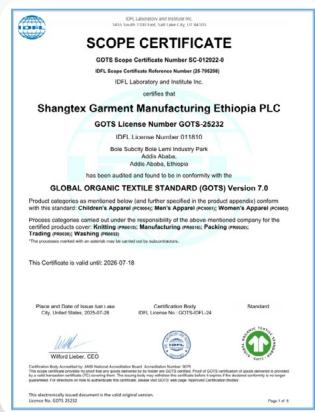

text_image

SOPE CERTIFICATE
GOTS Scope Certificate Number SC-01922-0
GOTS Scope Certificate Reference Number 26-191808
IDFL Laboratory and Institute Inc.
certifies that
Shangtex Garment Manufacturing Ethiopia PLC
GOTS License Number GOTS-25232
IDFL License Number 011810
Bole Subcity Bole Lern Industry Park
Acidis Abadus
Address: Mumbai, Ethiopia
has been audited and found to be in conformity with the
GLOBAL ORGANIC TEXTILE STANDARD (GOTS) Version 7.0
Product categories as mentioned below (and further specified in the product appendix) conform
with this standard. Children's Apparel category is a product type; Women's Apparel class.
Process categories carried out under the responsibility of the above-mentioned company for the
certified products cover: Knitting means: Manufacturing means: Packing means:
Trading means: Washing means:
This certificate is valid until: 2026-07-18
This Certificate is valid until: 2026-07-18
Place and Date of Issue not less
City, United States, 2026-07-28
Certification Body
IDFL License No.: GOTS-DFL-24
Standard
Willard Letter, CEO
ISO/ISO 2026-07-01
ISO/ISO 2026-07-02
ISO/ISO 2026-07-03
ISO/ISO 2026-07-04
ISO/ISO 2026-07-05
ISO/ISO 2026-07-06
ISO/ISO 2026-07-07
ISO/ISO 2026-07-08
ISO/ISO 2026-07-09
ISO/ISO 2026-07-10
ISO/ISO 2026-07-11
ISO/ISO 2026-07-12
ISO/ISO 2026-07-13
ISO/ISO 2026-07-14
ISO/ISO 2026-07-15
ISO/ISO 2026-07-16
ISO/ISO 2026-07-17
ISO/ISO 2026-07-18
ISO/ISO 2026-07-19
ISO/ISO 2026-07-20
ISO/ISO 2026-07-21
ISO/ISO 2026-07-22
ISO/ISO 2026-07-23
ISO/ISO 2026-07-24
ISO/ISO 2026-07-25
ISO/ISO 2026-07-26
ISO/ISO 2026-07-27
ISO/ISO 2026-07-28
ISO/ISO 2026-07-29
ISO/ISO 2026-07-30
ISO/ISO 2026-07-31
ISO/ISO 2026-08-01
ISO/ISO 2026-08-02
ISO/ISO 2026-08-03
ISO/ISO 2026-08-04
ISO/ISO 2026-08-05
ISO/ISO 2026-08-06
ISO/ISO 2026-08-07
ISO/ISO 2026-08-08
ISO/ISO 2026-08-09
ISO/ISO 2026-08-10
ISO/ISO 2026-08-11
ISO/ISO 2026-08-12
ISO/ISO 2026-08-13
ISO/ISO 2026-08-14
ISO/ISO 2026-08-15
ISO/ISO 2026-08-16
ISO/ISO 2026-08-17
ISO/ISO 2026-08-18
ISO/ISO 2026-08-19
ISO/ISO 2026-08-20
ISO/ISO 2026-08-21
ISO/ISO 2026-08-22
ISO/ISO 2026-08-23
ISO/ISO 2026-08-24
ISO/ISO 2026-08-25
ISO/ISO 2026-08-26
ISO/ISO 2026-08-27
ISO/ISO 2026-08-28
ISO/ISO 2026-08-29
ISO/ISO 2026-08-30
ISO/ISO 2026-08-31
ISO/ISO 2026-09-14
ISO/ISO 2026-09-15
ISO/ISO 2026-09-16
ISO/ISO 2026-09-17
ISO/ISO 2026-09-18
ISO/ISO 2026-09-19
ISO/ISO 2026-09-20
ISO/ISO 2026-09-21
ISO/ISO 2026-09-24

GRS 认证

# 案例：纺织品公司深化绿色认证体系，筑牢供应链环保根基

2025 年，纺织品公司持续强化绿色认证体系建设，及时完成 GRS（全球回收标准）、OCS（有机含量标准）、BCI（良好棉花发展倡议）、RDS（负责任羽绒标准）等多项国际环保认证的续证工作，确保供应链各环节符合可持续发展要求。上述认证覆盖原材料追溯、环保属性验证及社会责任管理，有效巩固了与国际品牌客户的长期合作关系，为出口业务的稳定增长提供了绿色背书。通过将环保合规贯穿于采购、生产及流通全流程，纺织品公司进一步提升了产品在国际市场的绿色竞争力。

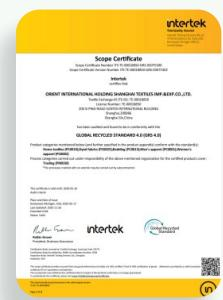  
GRS 证书

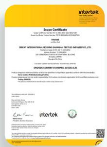  
OCS 证书

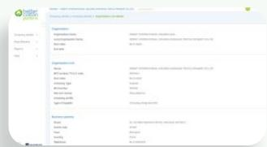  
BCI 证书

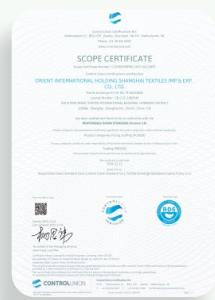  
RDS 证书

# 温室气体减排行动

公司持续推进温室气体减排工作，围绕清洁能源使用、绿色产品开发、绿色办公实践、绿色物流体系打造等多个领域，系统构建低碳运营体系。

清洁能源使用: 物流集团在各库区推动作业设备“油改电”，将传统燃油叉车、搬运设备替换为电动设备，同步申领新能源补贴，有效减少化石能源消耗。

绿色产品开发：技术创新中心研发 BioFleax 全生物基 PEF 毛衫，入选“2025 年度十大类纺织创新产品”；3D 服装炫款模块将设计开发周期缩短 40%，减少实体打样材料损耗。荣恒公司推进碳足迹盘查及 T2T 废纺回收，践行“双碳”目标。

绿色办公实践：荣恒公司完成上海办公室绿色办公改造，降低办公环节碳排放；公司持续推进 ERP 及 OA 系统优化，推动无纸化流程，减少资源消耗。

绿色物流体系打造: 东方物流首创空运进口“机坪接货”模式, 接货时效提升 75%, 减少车辆怠速排放; 探索 CFS 仓库数字化系统, 优化仓储作业流程; 在空运出口仓库试点 AI 机器人, 提升作业效率; 通过优化仓库立体式存货模式, 库容率达 95%, 减少新建仓储需求。

绿色供应链管理：东方创业本部 2025 年开展环境影响评估考核供应商 75 家，推动供应链上下游协同减排；纺织品公司完成 GRS、OCS、BCI、RDS 等多项国际环保认证续证，确保供应链各环节符合可持续发展要求。

# 环境合规管理

东方创业高度重视环境保护，将其纳入企业发展战略核心，严格遵守《中华人民共和国环境保护法》等相关法律法规，构建系统化、规范化的环境管理体系，持续强化合规运营能力，不断提升环境管理水平与环境绩效表现。

# 环境管理体系认证

截至报告期末，公司本部及旗下新联纺公司、东松公司、荣恒公司、外贸公司等多家单位已通过 ISO 14001:2015 环境管理体系认证，推动环境管理标准化、规范化运行，为提升整体环境管理能力提供有力支撑。

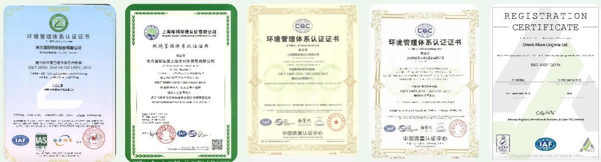

# 制度建设与合规管理

公司本部及旗下各单位持续完善环境管理制度体系，制定并实施《环境管理体系要求》《设备管理规范》《环境风险防控与应急管理制度》《废弃物排放管理规范》《消防安全管理规范》等制度文件，系统明确环境管理方针与目标，规范环境风险识别、评估与管控流程，强化废弃物排放管理及应急响应机制。

通过制度体系的持续优化与有效执行，公司不断提升环境合规管理水平，实现环境合规运营，并推动环境绩效持续改进与环境风险的有效控制。

# 环境应急与意识提升

各子公司制定环境应急预案，定期开展应急演练，提升突发环境事件应对能力。

<table><tr><td>公司</td><td>应急预案</td><td>演练类型</td></tr><tr><td>物流集团</td><td>化学品泄漏、防台防汛、火灾事故应急预案</td><td>消防应急演练培训与技能比武</td></tr><tr><td>国际物流</td><td>电力应急预案</td><td>应急演练</td></tr><tr><td>荣恒公司</td><td>化学品泄漏应急预案</td><td>化学品泄漏应急演练和培训</td></tr><tr><td>外贸公司</td><td>电梯困人、防台防汛、燃气泄漏应急预案</td><td>电梯困人演练、防台防汛培训、消防演习</td></tr></table>

# 案例：物流集团环保架构与执行

公司旗下物流集团设立环境保护委员会，负责统筹推进环境保护工作，贯彻落实国家及各级政府关于环境保护的方针、政策、法律法规及相关标准。委员会结合公司实际情况，制定环境管理方针与目标，并定期开展监督检查与评估，确保各项环保措施有效落地。

通过完善的组织架构与管理机制，公司持续推动环境管理体系的有效运行，确保各项环境管理工作符合相关法规要求，不断提升环境管理水平与环境绩效表现。

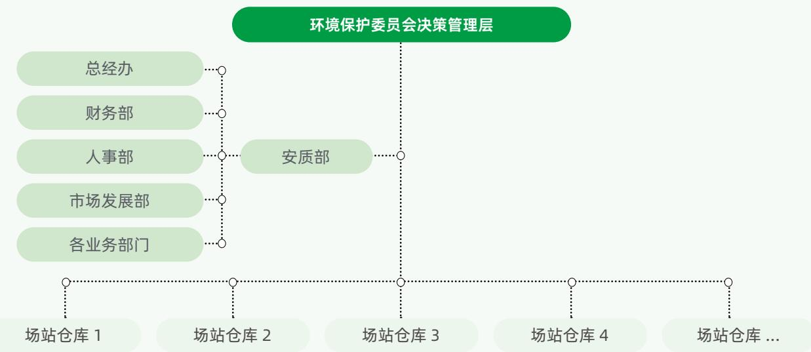

flowchart

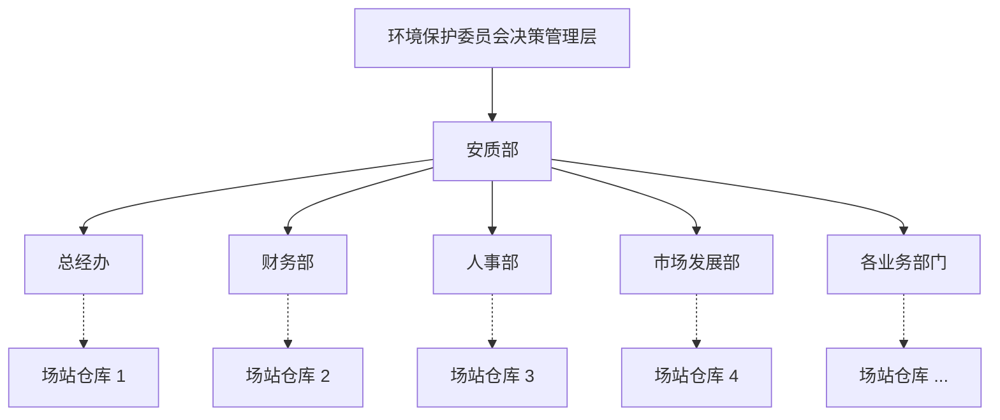
```mermaid
graph TD
  A["环境保护委员会决策管理层"] --> B["安质部"]
  B --> C["总经办"]
  B --> D["财务部"]
  B --> E["人事部"]
  B --> F["市场发展部"]
  B --> G["各业务部门"]
  C -.-> H["场站仓库 1"]
  D -.-> I["场站仓库 2"]
  E -.-> J["场站仓库 3"]
  F -.-> K["场站仓库 4"]
  G -.-> L["场站仓库 ..."]
```

# 环境处罚与整改事项

2025 年，公司下属全资孙公司东方国际集团上海家纺有限公司因进口货物被认定为固体废物，受到大榭海关行政处罚，罚款 12 万元。公司立即整改，于 2025 年 6 月 5 日完成涉案固体废物退运。事件发生后，公司已加强进口货物合规审查，完善申报流程，开展专项培训，未再发生类似违规事件。

natural_image

Close-up of a glowing incandescent light bulb resting on green grass (no text or symbols visible)

# 能源利用

# 能源管理体系

公司持续推进能源管理体系建设，通过制度规范、目标牵引和全员参与，不断提升能源利用效率。东方物流制定了《节能降耗管理规定》，明确节能管理要求，并将水电等费用与各部门绩效挂钩，强化全员节能意识。荣恒公司建立能源管理制度，规范能源使用流程，持续推进节能技术改造。国际物流倡导绿色办公理念，通过张贴节能提示标识、组织节能宣导等方式，营造节约用电、低碳运营的良好氛围。

# 清洁能源应用

旗下子公司积极推动清洁能源替代，降低化石能源消耗。物流集团2025年购置11台电叉车、1台电动货运厢式货车、1台电动集装箱卡车，合计投入198.08万元，并全面更换节能灯具，在空运库区试点太阳能照明。同时，空运库区启动屋顶光伏发电工程前期准备，完成屋顶修缮与平整。国际物流马陆仓库屋顶光伏项目已完成招投标及合同签订，计划2026年6月交付、7月正式投运，采用“自发自用”屋顶租赁模式，无需公司投入建设资金。荣恒公司内衣工厂于2025年11月投入使用70kW光伏，年节能约7000kWh。

# 节能降耗实践

公司本部及旗下子公司通过多种举措降低能源消耗。物流集团实施 RPA 单证自动化项目建设，推进无纸化办公；将水电费用与绩效挂钩，激发全员节能主动性。国际物流积极推行可降解缠绕膜和可循环托盘，减少一次性耗材消耗；推进电子单证、线上审批及数字档案管理，大幅降低纸张与打印耗材消耗。荣恒公司持续推进设备节能改造，单件产品能耗实际完成 0.461，优于 0.5 的目标值。

<table><tr><td>公司</td><td>电力(kWh)</td><td>天然气( $m^{3}$ )</td><td>汽油(L)</td><td>柴油(L)</td></tr><tr><td>东方创业</td><td>705437</td><td>0</td><td>8192</td><td>0</td></tr><tr><td>物流集团</td><td>2785666</td><td>0</td><td>19101</td><td>308810</td></tr><tr><td>国际物流</td><td>3724165</td><td>0</td><td>2757</td><td>9120</td></tr><tr><td>荣恒公司</td><td>1985480</td><td>3036</td><td>3439</td><td>47600</td></tr><tr><td>外贸公司</td><td>18830</td><td>18680</td><td>0</td><td>0</td></tr><tr><td>新联纺</td><td>779386</td><td>0</td><td>8376</td><td>0</td></tr></table>

# 污染物与废弃物管理

公司本部及旗下子公司严格遵守《中华人民共和国固体废物污染环境防治法》等法律法规，建立污染物与废弃物管理制度，持续推进减量化、资源化、无害化处理。东方物流制定《危险废弃物管理规定》《废弃物管理程序》《公司回收危废物质名录》，明确废弃物分类、收集、储存及处置流程。荣恒公司内衣工厂建立固废管理制度，规范生产废弃物管理。外贸公司制定危险废物委托处置合同，确保危险废物合规处置。

# 大气污染物排放

公司主要大气污染物来源于公务车、叉车、货运车辆燃油燃烧产生的二氧化硫、氮氧化物和颗粒物。2025年物流集团大气污染物排放情况如下：

<table><tr><td>指标</td><td>单位</td><td>物流集团</td></tr><tr><td>废气总量</td><td>kg</td><td>9,359.37</td></tr><tr><td>二氧化硫( $SO_{2}$ )</td><td>kg</td><td>632.99</td></tr><tr><td>氮氧化物( $NO_{x}$ )</td><td>kg</td><td>8,504.27</td></tr><tr><td>颗粒物(PM)</td><td>kg</td><td>222.11</td></tr></table>

披露范围说明：当前披露范围覆盖物流集团。

# 废弃物管理

# 废弃物分类与处置

各子公司对废弃物进行分类收集、合规处置，2025年废弃物产生及处置情况如下：

<table><tr><td>公司</td><td>废弃物类型</td><td>产生量(kg)</td><td>处置方式</td><td>备注</td></tr><tr><td>物流集团</td><td>建筑垃圾</td><td>944,000</td><td>委外处置</td><td>内部回收利用量 0</td></tr><tr><td rowspan="3">荣恒公司</td><td>一般工业固体废物</td><td>7,949.5</td><td>委外回收利用</td><td>废纸、废塑料等</td></tr><tr><td>危险废物(HW49)</td><td>525</td><td>委外合规处置</td><td>-</td></tr><tr><td>生活垃圾</td><td>17,239.5</td><td>环卫清运</td><td>-</td></tr></table>

# 废弃物减量化实践

物流集团：耗材定点存放、统一回收管理；利用废旧托盘木料制作内场休息室长椅、消防比赛标靶等；单证纸张回收利用；包装废弃物回收率达100%。

国际物流：在汇智仓储基地广泛应用可循环托盘（木屑压缩制成），替代一次性木质或塑料托盘；积极推广可降解缠绕膜，减少传统塑料依赖。

荣恒公司：积极推进固废减量，2025年固废较2024年减少 $4\%$ ，完成年度目标。

# 水资源利用

公司本部及旗下子公司严格遵守《中华人民共和国水法》等法律法规，坚持“合理使用、杜绝浪费”的用水原则，将节水理念融入办公与仓储场所日常运维。物流集团制定《废水管理程序》，规范废水排放管理；各子公司通过加强用水设施巡检、推广节水型器具、提升员工节水意识等举措，持续优化用水效率。

2025 年，公司及旗下部分子公司总取水量如下：

<table><tr><td>公司</td><td>总取水量(吨)</td><td>主要用途</td></tr><tr><td>东方创业</td><td>9,213</td><td>办公生活</td></tr><tr><td>物流集团</td><td>46,189</td><td>办公生活</td></tr><tr><td>国际物流</td><td>55,672</td><td>办公生活</td></tr><tr><td>荣恒公司</td><td>46,251</td><td>办公生活及少量生产</td></tr><tr><td>外贸公司</td><td>7,479</td><td>办公生活</td></tr><tr><td>新联纺公司</td><td>4,806</td><td>办公生活</td></tr></table>

公司废水主要为办公生活废水，全部排入市政污水管网，无直排环境情况。

# 化学品安全

公司本部及旗下子公司严格遵守《危险化学品安全管理条例》等法律法规，将化学品安全管理纳入环境与职业健康管理体系，建立覆盖采购、储存、使用、处置全流程的管理制度。

荣恒内衣工厂及荣恒济宁工厂已制定并实施《化学品管理政策》，对化学品的采购、运输、储存、使用及处置等环节进行全流程规范管理，确保各项作业符合安全管理标准，定期开展化学品应急演练。

物流集团建立了系统化的化学品管理体系，制定并实施《化学品管理程序》《危险化学品安全管理制度》《化学品泄漏应急预案》等制度文件，明确化学品操作规范及应急处置流程。通过定期开展风险排查与应急演练，持续提升作业人员的安全意识与应急处置能力，确保化学品管理的合规性与安全性。

国际物流业务板块制定《化学品管理政策制度》，对化学品在采购、运输、验收、储存、使用及废弃处置等环节实施全过程规范管理，严格落实风险防控与安全管理措施，持续提升化学品管理的规范化水平与安全保障能力。

外贸公司持有危险品经营许可证，制定《危险化学品经营管理办法》及《生产安全事故应急预案危险化学品经营专项预案》。

# 案例

国际物流公司持续强化危险货物运输安全管理，于2024年4月通过化学品道路运输安全评估体系（CRSAS）认证，有效期至2027年4月。该认证是对公司危险品运输安全管理体系、操作规范、人员培训及应急能力的全面认可。

natural_image

Aerial view of turquoise ocean with a small boat navigating through the water (no text or symbols visible)

# 04

# 以人为本 共绘美好

SDGs 对标

3 良好健康与福祉

4 优质教育

5 性别平等

8 体面工作和经济增长

10 减少不平等

# 理念

履行社会责任，助力乡村振兴，保障员工权益，完善福利体系。

重视人才培养，推动员工成长，加强职业健康，筑牢安全防线。

# 我们的行动

社会贡献与乡村振兴

员工权益与福利

员工培训与发展

职业健康与安全

# 社会贡献与乡村振兴

东方创业始终秉持企业公民责任，积极关注社区沟通与合作，致力于推动社区发展与民生改善。公司主动响应国家乡村振兴，充分发挥自身资源与产业优势，助力乡村经济发展与民生福祉提升。坚持将企业发展融入社会整体进步之中，推动实现企业与社会的协同共赢。以低碳发展为导向，践行绿色发展理念，为共建可持续发展的美好社会持续贡献力量。

报告期内，荣恒公司通过上海市残疾人福利基金会，向M50非遗助残公益基地项目搭建捐款10万元。

# 组织保障与责任落实

公司本部及旗下子公司积极响应国家乡村振兴战略部署，建立健全结对帮扶工作机制。各子公司党委（党总支）将乡村振兴纳入年度重点工作，明确责任分工，通过党组织结对、专项工作小组等形式，确保帮扶工作落地见效。

<table><tr><td>公司</td><td>帮扶机制</td><td>责任落实</td></tr><tr><td>物流集团</td><td>党委与崇明庙镇猛东村党总支结对帮扶</td><td>党委书记牵头,党组织结对</td></tr><tr><td>商业公司</td><td>党委与崇明庙镇镇东村党总支结对帮扶</td><td>党委书记参加结对签约,专项工作小组推进</td></tr><tr><td>外贸公司</td><td>党委与崇明庙镇小竖村党总支结对帮扶</td><td>党委统一部署,每年提供帮扶款</td></tr><tr><td>新联纺</td><td>采购扶贫产品及联建新农村产品</td><td>工会、采购部门协同落实</td></tr></table>

# 乡村振兴战略定位

公司将乡村振兴作为履行国有企业社会责任的重要载体，秉持“党建引领、村企联动、资源共享、互利共赢”的帮扶理念，通过资金支持、消费帮扶、党建联建等多种方式，助力乡村基础设施改善、产业发展和民生提升。

<table><tr><td>路径</td><td>具体内容</td></tr><tr><td>资金帮扶</td><td>提供专项帮扶资金,支持乡村基础设施建设、民生实事项目落地</td></tr><tr><td>消费帮扶</td><td>采购扶贫产品,推动农产品“出岛”和进口商品“进岛”双向互动</td></tr><tr><td>党建联建</td><td>开展党组织结对共建,通过高质量党建联建实现资源共享</td></tr><tr><td>产业联动</td><td>利用虹桥品汇等平台,助力乡村直采中心建设,推动产业发展</td></tr></table>

# 社会贡献

# 案例：商业公司向上海纺织博物馆捐赠俄文轧唛机

2025 年 3 月，商业公司下属家纺公司向上海纺织博物馆捐赠俄文轧唛机、英文轧唛机各 1 台。该设备是新中国成立后外贸人手工标识出口货物的实物见证，承载着我国对外贸易发展的历史记忆。

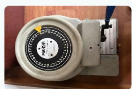

# 案例：商业公司党委与庙镇镇东村结对帮扶、党建联建

2025 年，商业公司党委与崇明庙镇镇东村党总支开展第五轮城乡党组织结对帮扶。公司党委书记代表党委签约，通过虹桥品汇平台助力直采中心建设，推动进口商品“进岛”与农副产品“出岛”双向互动。双方以党建联建为纽带，整合资源优势，开展多种形式共建活动，促进企业蓬勃发展，助力乡村振兴产业。

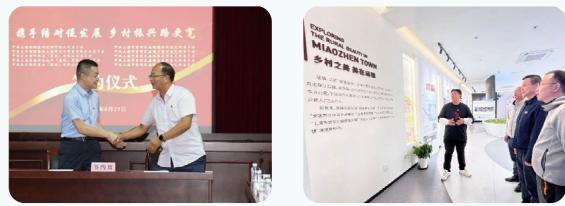

# 案例：新海航业“GATLANTIC”轮成功救起59名海上遇险难民

2025 年 9 月，新海航业所属 “GATLANTIC” 轮在希腊海域执行航行任务时，接到紧急救援请求，立即启动应急响应程序，成功救起 59 名海上遇险难民，并安全移交希腊海岸警卫队。此次救援行动充分体现了公司履行国际海上救助义务、践行 “生命至上” 理念的责任担当。

# 关键绩效

参与志愿服务的员工人数：

东方创业（本部）25人

子公司合计 37 人

集团合并 62 人

员工志愿服务总时长：

东方创业（本部） 597 小时

子公司合计 280 小时

集团合并 877 小时

人均志愿服务时长：

东方创业（本部）23.88小时/人

子公司合计 7.57 小时 / 人

集团合并 14.14 小时 / 人

数据来源：东方创业及各子公司志愿服务绩效数据。子公司合计包含东松公司（20人/100小时）、国际物流（10人/20小时）、康健公司（3人/120小时）、荣恒公司（4人/32小时）、新海航业（3人/128小时）等。

披露范围说明：当前披露范围覆盖东方创业本部及纳入统计的主要子公司。未来公司将逐步扩展至合并报表范围内全部子公司，实现志愿服务绩效的完整合并口径披露，更好地展现公司员工履行社会责任的精神风貌。

# 员工权益与福利

东方创业高度重视员工权益与福利保障，通过持续完善制度体系并提供多元化福利措施，切实保障员工合法权益得到充分保护与尊重，营造公平、规范、关怀型的用工环境。

<table><tr><td>治理</td><td>公司高度重视员工权益保障,建立了完善的工会管理体系,包括工会委员会、女工委员会等组织架构,负责监督并推动员工相关制度的落实,确保用工合规与管理公平,切实维护员工合法权益。</td></tr><tr><td>战略</td><td>公司将员工权益保护纳入发展战略,严格遵守相关法律法规,通过完善内部制度体系保障员工合法权益。积极推进多元平等雇佣与集体协商机制,持续提升员工福利水平与组织凝聚力。</td></tr><tr><td>风险管理</td><td>公司通过民主协商与职工代表大会机制,识别并有效应对员工权益相关风险。2024年职代会审议通过年度集体合同草案及薪酬考核方案,采用无记名投票方式,提升决策透明度,降低劳动关系与权益纠纷风险。</td></tr><tr><td>指标与目标</td><td>2025年,公司共有员工9,486人,其中女性员工6,646人,外籍员工7,037人,多元包容氛围日益浓厚。公司本部全年开展慰问帮扶40人次,切实解决员工困难。公司将继续完善权益保障与职业发展体系,推动员工价值与企业高质量发展同步提升。</td></tr></table>

# 员工权益制度保障

公司严格遵守《中华人民共和国劳动法》《中华人民共和国未成年人保护法》《禁止使用童工规定》《中华人民共和国妇女权益保障法》等法律法规，建立并完善《员工手册》《员工行为准则》《劳动用工管理规定》《绩效考核办法》《薪酬分配管理办法》等制度体系，依法规范劳动用工管理，确保与员工签订劳动合同，切实保障员工合法权益。

同时，公司严格落实《上海市集体合同条例》，积极开展集体协商并依法签订集体合同，推动构建和谐稳定的劳动关系。公司建立了完善的工会管理体系，涵盖工会委员会、女工委员会、经费审查委员会及工会办公室，形成职责清晰、运行规范的组织架构，有效发挥工会在权益保障、民主管理和员工关怀中的作用，助力企业可持续发展。

# 民主管理

公司高度重视民主协商机制建设，制定并持续完善《东方国际创业股份有限公司厂务公开民主管理工作制度》《东方国际创业股份有限公司职工代表大会制度》及《东方国际创业股份有限公司集体协商与集体合同管理制度》等制度文件，为保障员工权益、促进劳动关系和谐发展提供制度支撑。在集体协商过程中，公司充分听取职工意见，确保协商内容真实反映员工诉求，持续推动企业与员工之间的良性沟通与协同发展。

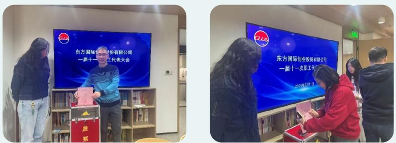  
职代会现场

教育程度  
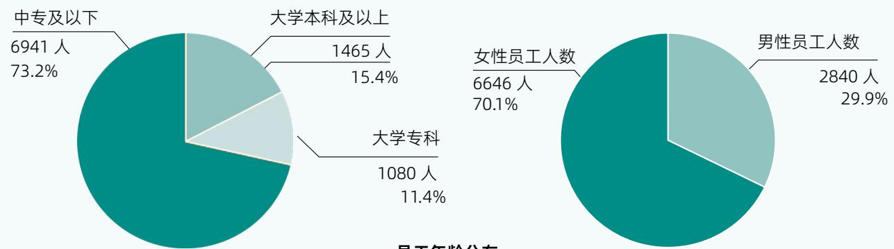

pie

| 类别 | 人数 | 占比 |
| --- | --- | --- |
| 中专及以下 | 6941 | 73.2% |
| 大学本科及以上 | 1465 | 15.4% |
| 大学专科 | 1080 | 11.4% |
| 女性员工人数 | 6646 | 70.1% |
| 男性员工人数 | 2840 | 29.9% |

员工年龄分布

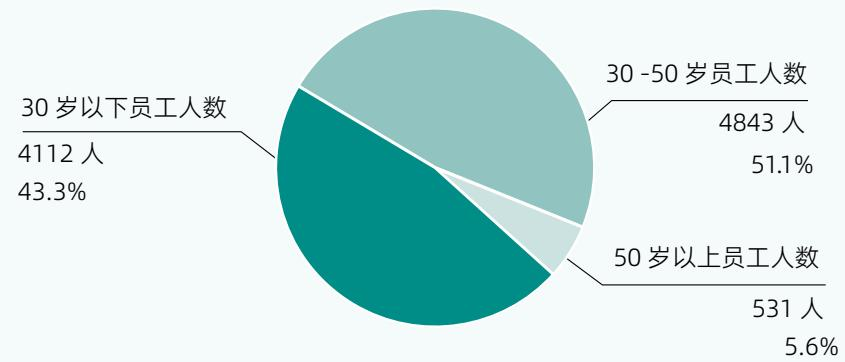

pie

| 年龄段 | 人数 (人) | 占比 (%) |
| --- | --- | --- |
| 30岁以下 | 4112 | 43.3% |
| 30-50岁 | 4843 | 51.1% |
| 50岁以上 | 531 | 5.6% |

公司尊重民族文化多样性，积极吸纳少数民族员工，营造包容、和谐的工作氛围。公司积极履行社会责任，为残障人士提供就业机会，支持其融入社会、实现自我价值。

<table><tr><td>指标</td><td>人数(人)</td></tr><tr><td>少数民族员工</td><td>32</td></tr><tr><td>残障员工</td><td>32</td></tr><tr><td>外籍员工</td><td>7037</td></tr></table>

# 员工申诉

公司严格遵守《中华人民共和国劳动合同法》《中华人民共和国劳动争议调解仲裁法》等相关法律法规，制定并实施《群众来信办理工作制度》《群众来访接待工作制度》《厂务公开民主管理工作制度》《职工代表大会制度》等内部制度，为员工提供多元、畅通的申诉与反馈渠道，确保员工诉求得到及时受理与有效回应。

# 申诉渠道与流程

# 来信来访机制：

员工可通过书面来信或现场来访等方式向公司反映诉求、提出建议或进行投诉。

公司按照“党政同责、‘一岗双责’、属地管理、分级负责、谁主管、谁负责，依法依规、及时高效”的原则进行受理与处理。

对符合受理条件的事项，公司在规定时限内完成登记、转办、交办及反馈，确保处理闭环。

# 民主管理与职代会机制：

公司通过职工代表大会等形式保障员工参与民主管理，员工可就涉及切身利益的事项提出意见与建议。

职代会由员工民主选举产生的代表组成，依法行使审议建议、审查监督及民主评议等职权，切实保障员工民主权利。

# 处理与跟进：

公司对所有申诉与反馈事项进行规范登记与档案管理，严格按照制度流程开展处理，确保过程合规、响应及时。对于涉及员工权益的重大事项，由相关部门协同推进，并定期向管理层汇报处理进展与结果。公司持续跟踪问题整改情况，确保问题得到有效解决。

# 监督与改进：

公司定期评估申诉与反馈机制的运行效果，持续优化处理流程，提升制度透明度与公信力。通过员工满意度调查及意见征集等方式，评估申诉机制的有效性，推动持续改进与完善。

# 员工福利与关爱

公司为全体员工建立了覆盖全面的福利保障体系，涵盖社会保险、带薪休假、节日关怀及文体活动等多元内容，致力于丰富员工文化生活，关注员工身心健康。同时，公司持续关怀困难员工群体，营造关爱互助、和谐稳定的工作环境。员工福利保障体系严格遵循上海市总工会相关规范，定期开展节日慰问、生日关怀及住院探视等关爱活动。

报告期内，公司本部累计开展慰问帮扶活动40余人次，涵盖困难员工、亲属离世员工、退休员工、住院员工及重病员工等群体，切实提升员工获得感与归属感。

# 案例：强化职工关怀，组织开展形式多样的文化活动

公司本部先后举办“迎新登高展未来 蓄力向上创佳绩”新年登高活动、“灵蛇闹元宵 廉韵猜灯谜”活动及三八妇女节手工灯制作体验活动，有效增强职工队伍凝聚力。

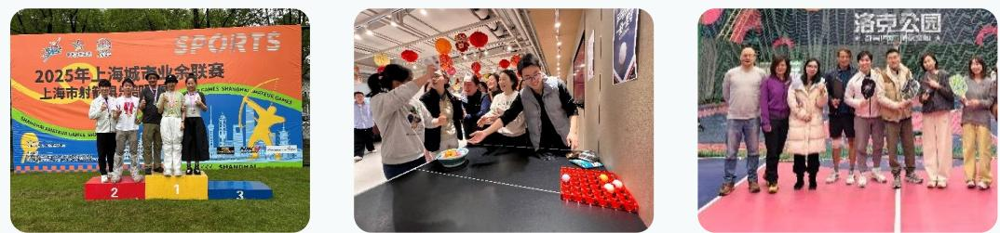

# 案例：埃塞俄比亚工厂通过国际社会责任认证

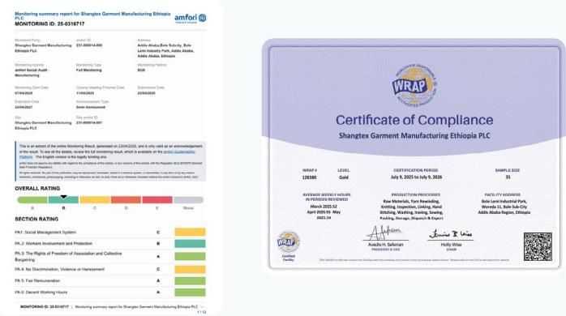  
WRAP 认证  
BSCI 评级 B 级

2025 年，东方创业埃塞毛衫生产基地顺利通过 BSCI（商业社会标准认证）及 WRAP（全球负责任认证生产）两项国际审计，涵盖劳工权益、工作场所安全、工时薪酬等核心维度，标志着公司海外工厂的社会责任管理水平获国际权威认可。

# 员工培训与发展

东方创业秉持“服务企业发展、助力员工成长”的理念，在推动公司稳健运营的同时，尊重员工个性与职业发展需求，打造多元化培训体系，提升综合素质。公司营造优质人才成长环境，结合业务实际，推出专项培训、经验交流、新员工培训等项目，联系专业机构，为员工提供专业化、系统化、个性化的学习课程及资源，助力职业发展。

# 人才培养治理架构

公司本部围绕战略及业务发展需求，构建了“三横三纵”全覆盖人才培养体系，为不同阶段人才提供精准赋能。

# 三横（按人员维度分类）

青年骨干：针对青年员工制定专项培养计划

一般员工：覆盖专业技能与职业素养培训

中层干部：聚焦管理能力与战略思维提升

# 三纵（按培训方式分类）

内部培养：针对青年员工制定专项培养计划

一般员工：覆盖专业技能与职业素养培训

中层干部：聚焦管理能力与战略思维提升

# 人才强企战略定位

公司将人才作为企业转型升级的核心支撑，明确提出“创新引领，服务全球”的企业使命，通过体系化培养实现人才与企业双向奔赴。2025年，公司以“十四五”收官和“十五五”规划谋篇为统领，将人才建设与组织建设、文化建设协同推进。

# 管培生计划

通过校企合作与校园招聘，引进优秀应届毕业生，构建青年人才培养与储备机制，打造具有发展潜力的人才梯队。

# 企业内部导师计划

为员工配备经验丰富的导师，提供专业指导与职业发展支持，促进员工能力提升与职业成长，助力人才快速融入与发展。

# 干部人才库计划

建立干部人才储备库，选拔具备管理潜质与专业能力的员工，开展系统化培养与梯队建设，为公司持续发展储备后备管理人才。

战略实施路径

<table><tr><td>路径</td><td>具体内容</td></tr><tr><td>全周期培养</td><td>打造“一对一导师制+轮岗带教+外贸实践训战+职业技能辅导”四位一体模式</td></tr><tr><td>海外能力拓展</td><td>组织员工赴海外关联企业开展业务技能与管理实训,强化跨文化沟通与国际化运营能力</td></tr><tr><td>内部知识分享</td><td>推出企业内部大讲堂,通过真实案例复盘与互动交流,实现战略与人才成长同频共振</td></tr><tr><td>一线实践锻炼</td><td>慧联工厂实训,让管培生深入生产一线,掌握订单履约全流程,锻造复合型能力</td></tr></table>

# 人才引进模式

公司形成了以校园招聘为主，内部招聘和社会招聘为辅的“1+2”人才引进模式：

校园招聘：与高校建立校企合作，选拔优秀应届生，为公司注入新生力量。

内部招聘：鼓励公司内部人才流动，提供职业发展机会，激发员工活力。

社会招聘：针对特殊岗位需求，通过社会招聘引进成熟型人才，优化人才结构。

此外，公司还通过鼓励青年员工参与异地与海外项目，拓宽青年人才的培养与发展渠道。

# 人才留任与激励

# 职业发展规划

为员工提供清晰的职业发展路径，定期开展职业规划辅导，助力员工成长。

# 激励机制

通过绩效考核、晋升机制和薪酬激励，激发员工积极性与创造力，提高人才留任率。

# 文化关怀

关注员工职业成长与个人发展，营造积极向上的企业文化，增强员工归属感与凝聚力。

# 案例：企业大讲堂

为深化人才培养体系建设，东方创业于2025年推出“企业大讲堂”系列培训，旨在通过真实案例复盘与互动交流，实现战略与人才成长同频共振，推动企业转型升级。

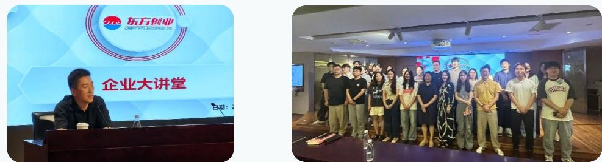

# 案例：青年人才选拔

东方创业将青年人才作为企业转型升级的核心力量，依托“青苗计划”和“层级改革”，系统推进青年人才选拔与培养，着力破解干部年轻化不足、复合型人才短缺等发展瓶颈。

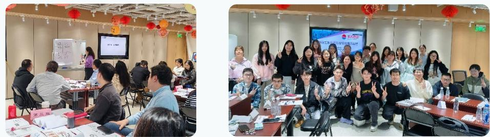

# 关键绩效

员工培训总时长：

东方创业（本部）11724小时

子公司合计 49716.5 小时

集团合并 61440.5 小时

高级管理层培训总时长：

东方创业（本部） 336 小时

子公司合计 5200.5 小时

集团合并 5536.5 小时

人均培训时长：

东方创业（本部）2.33小时/人

子公司合计 15.40 小时 / 人

集团合并 7.44 小时 / 人

高级管理层人均培训时长：

东方创业（本部）8.00小时/人

子公司合计 47.71 小时 / 人

集团合并 36.66 小时 / 人

# 职业健康与安全

东方创业以“安全第一、预防为主、综合治理”为指导方针，严格遵守《中华人民共和国安全生产法》《中华人民共和国劳动法》《中华人民共和国职业病防治法》等法律法规及行业标准，制定并实施《职业健康与安全政策》，持续完善职业健康与安全管理体系建设，致力于为全体员工营造健康、安全、舒适的工作环境。

# 职业健康与安全管理体系

公司始终坚持安全生产与员工健康并重的原则，严格落实国家相关法律法规要求，建立系统化、规范化的职业健康与安全管理体系。为进一步提升管理水平，公司本部及旗下物流集团、新联纺公司和东松公司等单位已通过 ISO 45001 职业健康与安全管理体系认证，推动职业健康与安全管理持续规范化、标准化运行。

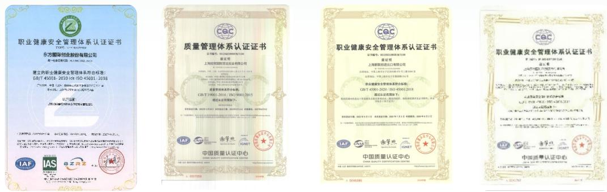

# 安全生产责任体系

公司建立安全生产责任制，明确“一把手”作为第一安全责任人担任公司安委会负责人。公司严格落实管理人员“一岗双责”及全员安全生产责任制，层层签订安全责任书，将安全责任压实到每个岗位、每个环节。

各子公司结合自身业务实际，建立了完善的安全生产管理架构，并制定了覆盖全流程的职业健康与安全管理制度，确保各项安全管理要求有效落实与持续运行。

<table><tr><td>公司</td><td>制度建设</td><td>具体内容</td></tr><tr><td>纺织品公司</td><td>《安全生产责任制管理制度》、安全责任书</td><td>明确安全生产责任分工</td></tr><tr><td>物流集团</td><td>安全生产责任制</td><td>严格落实管理人员“一岗双责”及全员安全生产责任制;各库区建立每日安全晨会、安全周会和月度例会制度</td></tr><tr><td>国际物流</td><td>建立安全生产责任制和安委会</td><td>开展重大风险识别与安全风险分级管控</td></tr><tr><td>荣恒公司</td><td>安全风险识别、评价和控制程序</td><td>建立职业健康安全危险源辨识、风险评价和控制体系</td></tr><tr><td>商业公司</td><td>《安全生产责任制管理制度》《安全生产管理办法》</td><td>建立安全生产责任制、安委会;2025年度组织检查12次</td></tr><tr><td>外贸公司</td><td>安全生产责任制</td><td>建立安全生产责任制、安委会,排查一般隐患3个,整改率100%</td></tr><tr><td>新海航业</td><td>安全生产管理办法、安委会安委办成员文件</td><td>建立安全生产责任制和应急管理组织</td></tr><tr><td>新联纺公司</td><td>《安全生产责任制管理制度》</td><td>建立风险分级管控报告、隐患排查治理管理制度</td></tr></table>

# 安全培训与教育

公司高度重视安全培训与教育工作，定期组织开展形式多样、内容丰富的培训与应急演练，确保全体员工熟悉并严格遵守安全生产管理规范。培训内容涵盖消防演练、危险源辨识及相关制度学习。

# 案例：物流集团工会与国际物流工会职工运动会消防灭火项目比赛

2025 年 6 月，物流集团工会与国际物流工会首次联合举办职工运动会消防灭火项目比赛。赛前组织消防知识专项培训，普及消防安全知识；赛场上，各库区参赛队伍围绕灭火器使用、水带连接与铺设、标靶射击等环节展开竞技。活动有效提升了职工防灾减灾救灾能力，强化了“生命至上、安全第一”的理念，为公司高质量发展筑牢安全屏障。

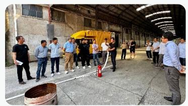

natural_image

Group of people gathered indoors near a fire hose in a warehouse-like setting (no visible text or symbols)

赛前培训

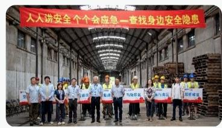

text_image

人人讲安全个个会应急—查找身边安全隐患

参赛队伍合影

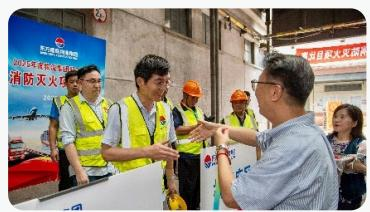

text_image

2023年消防灭火报告
消防灭火报告

获奖队伍

<table><tr><td>指标</td><td>单位</td><td>东方创业(本部)</td><td>子公司合计</td><td>集团合并</td></tr><tr><td>员工体检率</td><td>%</td><td>100</td><td>98.9</td><td>99.2</td></tr><tr><td>环境、生产安全类培训总时长</td><td>小时</td><td>26</td><td>691</td><td>717</td></tr><tr><td>安全演习次数</td><td>次</td><td>8</td><td>27</td><td>35</td></tr><tr><td>安全事故发生次数</td><td>次</td><td>0</td><td>0</td><td>0</td></tr><tr><td>因工受伤(轻伤及以上)人数</td><td>人</td><td>0</td><td>1</td><td>1</td></tr><tr><td>因工死亡人数</td><td>人</td><td>0</td><td>0</td><td>0</td></tr></table>

披露范围说明：当前披露范围覆盖东方创业本部及子公司，包括纺织品公司、物流集团、国际物流、康健公司、荣恒公司、国服公司、家纺公司、商业公司、外贸公司、新海航业、新联纺公司。

# ESG 数据表

环境议题

<table><tr><td>议题</td><td>指标</td><td>单位</td><td>2025年</td></tr><tr><td rowspan="4"> $温室气体排放^1$ </td><td>范围1、2和3排放总量</td><td>吨二氧化碳当量</td><td>2,661.66</td></tr><tr><td>范围1排放量</td><td>吨二氧化碳当量</td><td>737.78</td></tr><tr><td>范围2排放量</td><td>吨二氧化碳当量</td><td>1,877.14</td></tr><tr><td>范围3排放量</td><td>吨二氧化碳当量</td><td>46.74</td></tr><tr><td rowspan="7"> $能源利用^2$ </td><td>电力消耗总量</td><td>千瓦时(kWh)</td><td>9,998,964</td></tr><tr><td>天然气消耗总量</td><td>立方米( $m^3$ )</td><td>21,716</td></tr><tr><td>汽油消耗总量</td><td>升(L)</td><td>41,865</td></tr><tr><td>柴油消耗总量</td><td>升(L)</td><td>365,530</td></tr><tr><td>直接能源总消耗量</td><td>吨标准煤(tce)</td><td>518.45</td></tr><tr><td>间接能源总消耗量</td><td>吨标准煤(tce)</td><td>1,228.88</td></tr><tr><td>能源消费总量</td><td>吨标准煤(tce)</td><td>1,747.33</td></tr><tr><td> $水资源利用^3$ </td><td>总取水量</td><td>吨</td><td>169,610</td></tr><tr><td rowspan="4"> $污染物排放^4$ </td><td>废气总量</td><td>千克(kg)</td><td>9,359.37</td></tr><tr><td>二氧化硫( $SO_2$ )</td><td>千克(kg)</td><td>632.99</td></tr><tr><td>氮氧化物( $NO_x$ )</td><td>千克(kg)</td><td>8,504.27</td></tr><tr><td>颗粒物(PM)</td><td>千克(kg)</td><td>222.11</td></tr><tr><td rowspan="4">固体废弃物</td><td>一般工业固体废物产生量(荣恒公司)</td><td>千克(kg)</td><td>7,949.50</td></tr><tr><td>危险废物(HW49)产生量(荣恒公司)</td><td>千克(kg)</td><td>525</td></tr><tr><td>建筑垃圾产生量(物流集团)</td><td>千克(kg)</td><td>944,000.00</td></tr><tr><td>生活垃圾产生量(荣恒公司)</td><td>千克(kg)</td><td>17,239.50</td></tr><tr><td rowspan="2">环境合规管理</td><td>重大环境事件</td><td>次</td><td>0</td></tr><tr><td>环境重大违法违规与刑事责任情况</td><td>次</td><td>0</td></tr></table>

1 数据仅覆盖上海祥虹和孟加拉工厂。核算与核查依据 ISO 14064-1:2018、ISO 14066:2023、ISO 14065:2020、ISO 14064-3:2019 标准执行，经第三方核查。  
2 数据覆盖东方创业本部、物流集团、国际物流、荣恒公司、外贸公司、新联纺公司共 6 家披露主体。直接 / 间接能源及总消费量数据来源于报告正文或基于折算系数计算得出（吨标准煤）  
3 数据覆盖东方创业本部、物流集团、国际物流、荣恒公司、外贸公司、新联纺公司共 6 家披露主体。取水量均为办公生活用水，少量生产用水仅出现在荣恒公司。废水全部排入市政污水管网，无直排环境情况。  
4 数据仅覆盖物流集团，不代表集团全部运营主体。废气主要来源于公务车、叉车、货运车辆燃油燃烧。

natural_image

Interior view of a modern conference room with attendees seated at a long table, laptops, and documents (no visible text or signage)

社会绩效

<table><tr><td>议题</td><td>指标</td><td>单位</td><td>2025年</td></tr><tr><td rowspan="5">创新驱动 $^{5}$ </td><td>研发人员数量</td><td>人</td><td>65</td></tr><tr><td>研发人员占员工总数比例</td><td>%</td><td>1.3</td></tr><tr><td>研发投入金额</td><td>万元</td><td>1450.89</td></tr><tr><td>发明专利申请数</td><td>件</td><td>1</td></tr><tr><td>有效专利总数</td><td>件</td><td>10</td></tr><tr><td rowspan="3">产品质量</td><td>客户满意度</td><td>分</td><td>98.2</td></tr><tr><td>客户投诉量</td><td>项</td><td>0</td></tr><tr><td>因产品质量被监管部门通报或下架事件</td><td>起</td><td>0</td></tr><tr><td rowspan="7">供应商管理</td><td>年度供应商总数</td><td>家</td><td>8,328</td></tr><tr><td>中国境内供应商数量</td><td>家</td><td>6,903</td></tr><tr><td>中国境外供应商数量</td><td>家</td><td>1,425</td></tr><tr><td>供应商考核覆盖率</td><td>%</td><td>98</td></tr><tr><td>供应商考核合格率</td><td>%</td><td>99</td></tr><tr><td>开展ESG评估的供应商数量</td><td>家</td><td>126</td></tr><tr><td>年度供应商培训次数</td><td>次</td><td>87</td></tr><tr><td rowspan="4">社会贡献与乡村振兴</td><td>参与志愿服务的员工人数</td><td>人</td><td>62</td></tr><tr><td>员工志愿服务总时长</td><td>小时</td><td>877</td></tr><tr><td>人均志愿服务时长</td><td>小时/人</td><td>14.14</td></tr><tr><td>公益及乡村振兴捐款金额</td><td>万元</td><td>10</td></tr><tr><td rowspan="13">员工</td><td>员工总数</td><td>人</td><td>9,486</td></tr><tr><td>男性员工人数/占比</td><td>人</td><td>2,840</td></tr><tr><td>女性员工人数/占比</td><td>人</td><td>6,646</td></tr><tr><td>30岁以下员工人数/占比</td><td>人</td><td>4,112</td></tr><tr><td>30-50岁员工人数/占比</td><td>人</td><td>4,843</td></tr><tr><td>50岁以上员工人数/占比</td><td>人</td><td>531</td></tr><tr><td>大学本科及以上员工人数/占比</td><td>人</td><td>1,465</td></tr><tr><td>大学专科员工人数/占比</td><td>人</td><td>1,080</td></tr><tr><td>中专及以下员工人数/占比</td><td>人</td><td>6,941</td></tr><tr><td>少数民族员工</td><td>人</td><td>32</td></tr><tr><td>残障员工</td><td>人</td><td>32</td></tr><tr><td>外籍员工</td><td>人</td><td>7,037</td></tr><tr><td>新入职员工</td><td>人</td><td>2,188</td></tr><tr><td rowspan="4">员工培训与发展</td><td>员工培训总时长</td><td>小时</td><td>61,441</td></tr><tr><td>人均培训时长</td><td>小时/人</td><td>7.44</td></tr><tr><td>高级管理层培训总时长</td><td>小时</td><td>5536.5</td></tr><tr><td>高级管理层人均培训时长</td><td>小时/人</td><td>36.66</td></tr><tr><td rowspan="6">职业健康与安全</td><td>员工体检率</td><td>%</td><td>99.2</td></tr><tr><td>环境、生产安全类培训总时长</td><td>小时</td><td>717</td></tr><tr><td>安全演习次数</td><td>次</td><td>35</td></tr><tr><td>安全事故发生次数</td><td>次</td><td>0</td></tr><tr><td>因工受伤(轻伤及以上)人数</td><td>人</td><td>1</td></tr><tr><td>因工死亡人数</td><td>人</td><td>0</td></tr></table>

5 数据仅覆盖东方创业本部，不包括子公司。

治理绩效

<table><tr><td>议题</td><td>指标</td><td>单位</td><td>2025年</td></tr><tr><td rowspan="9">公司治理</td><td>董事会成员男女比例</td><td>-</td><td>7:2</td></tr><tr><td>非独立董事:独立董事</td><td>-</td><td>6:3</td></tr><tr><td>股东会召开次数</td><td>次</td><td>3</td></tr><tr><td>股东会审议事项数</td><td>项</td><td>17</td></tr><tr><td>董事会召开次数</td><td>次</td><td>10</td></tr><tr><td>董事会审议事项数</td><td>项</td><td>47</td></tr><tr><td>定期报告发布数量</td><td>份</td><td>4</td></tr><tr><td>临时报告发布数量</td><td>份</td><td>52</td></tr><tr><td>因违反信息披露规定受处罚事件</td><td>起</td><td>0</td></tr><tr><td rowspan="4">商业道德</td><td>防利益冲突表填报数量</td><td>份</td><td>235</td></tr><tr><td>反腐败培训开展次数</td><td>次</td><td>4</td></tr><tr><td>反腐败培训参与人数</td><td>人次</td><td>212</td></tr><tr><td>签署廉洁承诺书的员工人数</td><td>人</td><td>53</td></tr><tr><td rowspan="4">信息安全</td><td>经确认的网络安全事故次数</td><td>次</td><td>0</td></tr><tr><td>经确认的数据泄露事故次数</td><td>次</td><td>0</td></tr><tr><td>网络安全培训次数</td><td>次</td><td>3</td></tr><tr><td>网络安全应急演练次数</td><td>次</td><td>1</td></tr></table>

natural_image

Illustration of a large circular stadium with solar panels, wind turbines, and urban skyline in the background (no text or symbols)

对标索引表

<table><tr><td colspan="2">报告内容</td><td>《指引》议题</td><td>GRI 1: 基础 2021</td></tr><tr><td colspan="2">报告编制说明</td><td>2-2、2-3</td><td>2-2、2-3</td></tr><tr><td colspan="2">董事长致辞</td><td>/</td><td>/</td></tr><tr><td colspan="2">关于东方创业</td><td>2-1、2-6、2-23</td><td>2-1、2-6、2-23</td></tr><tr><td colspan="2">年度专题</td><td>创新驱动</td><td>203-2</td></tr><tr><td colspan="2">ESG治理</td><td>利益相关方沟通、尽职调查</td><td>2-9、2-13、2-14、2-16、2-29、3-1、3-2、3-3</td></tr><tr><td rowspan="5">依法合规夯实根基</td><td>公司治理</td><td>尽职调查</td><td>2-10、2-12、2-15</td></tr><tr><td>合规及风险管理</td><td>尽职调查</td><td>419-1</td></tr><tr><td>商业道德</td><td>反商业贿赂及反贪污、反不正当竞争</td><td>205-2、206-1</td></tr><tr><td>信息安全</td><td>数据安全与客户隐私保护</td><td>418-1</td></tr><tr><td>党建引领</td><td>/</td><td>/</td></tr><tr><td rowspan="4">创领升级责任共担</td><td>创新驱动</td><td>创新驱动</td><td>203-2</td></tr><tr><td>产品质量</td><td>产品和服务安全与质量</td><td>416-1、416-2</td></tr><tr><td>供应商管理</td><td>供应链安全</td><td>308-1、414-1</td></tr><tr><td>客户服务</td><td>产品和服务安全与质量、数据安全与客户隐私保护</td><td>418-1</td></tr><tr><td rowspan="4">以人为本共绘美好</td><td>社会贡献与乡村振兴</td><td>社会贡献、乡村振兴</td><td>203-1、203-2</td></tr><tr><td>员工权益与福利</td><td>员工</td><td>401-1、401-2、401-3</td></tr><tr><td>员工培训与发展</td><td>员工</td><td>401-1、401-2</td></tr><tr><td>职业健康与安全</td><td>员工</td><td>403-1、403-2、403-3、403-5、403-6、403-9、403-10</td></tr><tr><td rowspan="5">低碳发展绿色前行</td><td>应对气候变化</td><td>应对气候变化</td><td>305-1、305-2、305-4</td></tr><tr><td>环境合规管理</td><td>环境合规管理</td><td>307-1</td></tr><tr><td>污染物与废弃物管理</td><td>污染物排放、废弃物处理、循环经济</td><td>305-7、306-3、306-4、306-5</td></tr><tr><td>水资源利用</td><td>水资源利用</td><td>303-1、303-2、303-3、303-4</td></tr><tr><td>化学品安全</td><td>-</td><td>403-7</td></tr></table>

<table><tr><td>未披露《指引》议题</td><td>说明</td></tr><tr><td>生态系统和生物多样性保护</td><td>公司各运营点未位于重点生态保护区域,生产经营活动对生态环境和生物多样性无显著不利影响,故未被纳入东方创业的ESG关注议题。</td></tr><tr><td>科技伦理</td><td>公司核心业务集中于货物贸易、国际物流、大健康领域,未涉及基因编辑、人工智能伦理等领域,在经营活动中未涉及科技伦理相关议题,未被纳入东方创业的ESG关注议题。</td></tr><tr><td>平等对待中小企业</td><td>公司报告期末应付账款(含应付票据)余额未超过300亿元旦占总资产的比重不超过50%的,故未被纳入东方创业的ESG关注议题。</td></tr></table>

# 读者反馈表

您好！

非常感谢您在百忙之中阅读《东方国际创业股份有限公司 2025 年度环境、社会和公司治理报告》。为了向您及其他利益相关方提供更有价值的信息，并有效促进公司提升履行企业社会责任的能力与水平，我们真诚期待您的意见和建议。

1. 您对本报告的总体评价是：

□ 非常好    □ 好    □ 一般    □ 较差    □ 差

2. 报告对利益相关方所关心问题的回应和披露？

□ 非常好    □ 好    □ 一般    □ 较差    □ 差

3. 您认为东方创业在经济责任方面做得如何？

□ 非常好    □ 好    □ 一般    □ 较差    □ 差

4. 您认为东方创业在环境责任方面做得如何？

□ 非常好    □ 好    □ 一般    □ 较差    □ 差

5. 您认为东方创业在安全管理方面做得如何？

□ 非常好    □ 好    □ 一般    □ 较差    □ 差

6. 您认为东方创业在员工责任方面做得如何？

□ 非常好    □ 好    □ 一般    □ 较差    □ 差

7. 您认为东方创业在社区责任方面做得如何？

□ 非常好    □ 好    □ 一般    □ 较差    □ 差

8. 报告披露的信息、指标、数据是否清晰、准确、完整？

□ 非常好    □ 好    □ 一般    □ 较差    □ 差

9. 您认为本报告的内容安排和版式设计是否方便阅读？

□ 非常好    □ 好    □ 一般    □ 较差    □ 差

# 开放性问题

您对东方创业履行社会责任及本报告有任何意见与建议？

# Oie 东方创业 ORIENT INT'L ENTERPRISE, LTD.

您可以选择下面联系方式反馈意见

电话：021-52291197

传真：021-52291450

邮箱：oiehg@oie.com.cn

地址：上海市娄山关路85号A座