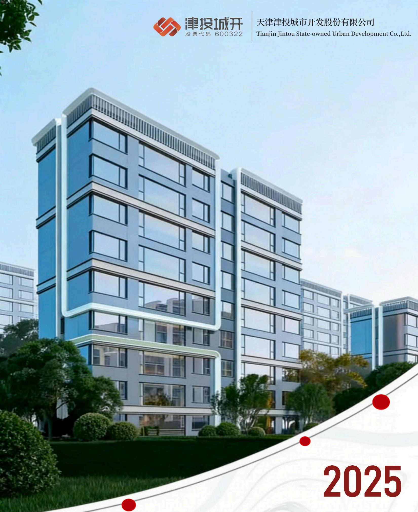

text_image

津投城开
股票代码 600322
天津津投城市开发股份有限公司
Tianjin Jintou State-owned Urban Development Co.,Ltd.
2025

# 2025

环境、社会与治理 (ESG) 报告

Environmental, Social and Governance Report

# 目录

关于本报告 01

公司致辞 03

走进津投城开 05

双重重要性分析 06

指标索引 69

读者信息 70

# 01 党建引领 筑牢发展根基

聚焦政治建设 09  
强化组织建设 09  
优化队伍建设 11  
擦亮党建品牌 12  
深化作风建设 14

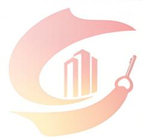

一把津钥匙 幸福千万家

# 02 绿色低碳 守护美好家园

绿色设计 17

绿色施工 22

绿色运营与绿色生活 29

环境治理与低碳建设 31

natural_image

3D architectural rendering of a modern courtyard with yellow umbrellas, green landscaping, and a building (no text or symbols visible)

# 03 以人为本 构建和谐社会

社会责任实践 35

产品与客户责任 42

供应链管理 43

员工发展与权益保障 44

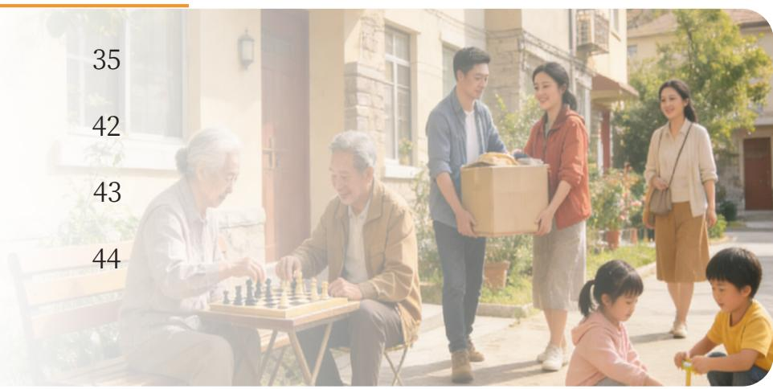

text_image

35
42
43
44

# 04 合规治理 护航公司发展

治理体系 53

风险管理 55

商业诚信 61

信息安全 64

利益相关方沟通 65

bar_stacked

| Category | Series 1 (Blue) | Series 2 (Green) |
| --- | --- | --- |
| Group 1 | ~6500 | ~4500 |
| Group 2 | ~4500 | ~4500 |
| Group 3 | ~6000 | ~4500 |
| Group 4 | ~4500 | ~5500 |
| Group 5 | ~6000 | ~7500 |
| Group 6 | ~6500 | ~5500 |
| Group 7 | ~5500 | ~4000 |

# 关于本报告

# 报告说明

本报告为天津津投城市开发股份有限公司的第2份年度环境、社会及治理（ESG）报告（以下简称“本报告”）。本报告秉持真实、客观的原则，全面呈现了天津津投城市开发股份有限公司2025年在可持续发展领域的实践成果与路径举措，着重阐述公司在社会贡献、环境保护以及公司治理等关键维度的绩效表现与相关措施，旨在向利益相关方透明展示公司的可持续发展进程，彰显企业对社会责任的担当与对绿色发展理念的坚守，为推动行业的可持续发展贡献津投城开的智慧与力量。

# 报告范围

报告时间范围：2025年1月1日至2025年12月31日（以下简称“报告期”），为确保报告完整性与前瞻性，部分信息可能涉及报告期外。报告组织范围：天津津投城市开发股份有限公司及分子公司。

# 编制依据

《上海证券交易所上市公司自律监管指引第14号——可持续发展报告（试行）》

《上海证券交易所上市公司自律监管指南第4号——可持续发展报告编制》

全球报告倡议组织（GRI）《可持续发展报告标准（GRI Standards）》

国际标准化组织（ISO）ISO/IWA 48:2024《实施环境、社会和治理（ESG）原则的框架》

称谓说明

<table><tr><td>释义项</td><td>释义内容</td></tr><tr><td>津投城开、公司、我们</td><td>天津津投城市开发股份有限公司</td></tr><tr><td>华升物业</td><td>天津市华升物业管理有限公司</td></tr><tr><td>华欣公司</td><td>天津市华欣城市开发有限公司</td></tr><tr><td>华博公司</td><td>天津市华博房地产开发有限公司</td></tr><tr><td>治远公司</td><td>天津市治远房地产销售有限公司</td></tr><tr><td>华强公司</td><td>苏州华强房地产开发有限公司</td></tr><tr><td>天蓟公司</td><td>天津市天蓟房地产开发有限责任公司</td></tr></table>

# 资料来源说明

本报告所披露的信息与数据均源自天津津投城市开发股份有限公司内部的正式文件、统计资料及财务报告，以及由公司相关部门汇总整理的各单位可持续发展实践信息，确保信息的真实性和准确性。

# 确认及批准

公司承诺本报告内容不存在任何虚假记载、误导性陈述或重大遗漏。本报告经董事会批准发布。

# 免责声明

本报告包含前瞻性陈述，即除历史事实陈述外，公司对可能或即将发生的业务活动、事件或发展动态的预期或预测。然而，由于市场环境、政策变化、经济形势等多种不可预测因素的影响，实际结果或发展趋势可能与前瞻性陈述存在差异。公司于2026年4月30日前做出本报告中的前瞻性陈述，除非法律法规或监管机构另有要求，公司无义务或责任对前瞻性陈述进行更新。

# 读者回应

为不断提升天津津投城开股份有限公司的 ESG 管理水平，优化 ESG 信息披露质量，确保企业深度践行 ESG 发展理念，针对本报告，我们诚挚地向广大读者征求意见与建议（详见附录“读者反馈表”）。我们殷切期望读者能够将宝贵的意见反馈至公司指定邮箱 tffz@sina.com，以便我们能够及时了解读者需求，持续改进报告内容与质量，更好地向利益相关方展现公司的可持续发展实践与成效。您的每一份反馈都是我们前行的动力，感谢您的关注与支持。

# 公司致辞

尊敬的朋友们:

2025年是“十四五”规划圆满收官的决胜之年,也是“十五五”发展蓝图谋篇布局的关键之年。本年度,津投城开在市国资委与控股股东津投资本的指导支持下,始终聚焦主责主业,挖掘存量,打造新的增长点;持续优化企业管理水平,探索业态融合,提升抗风险能力,确保公司在复杂形势下的稳健运营与向上发展。

过去一年, 我们深耕房地产项目开发与运营, 落实“三新”“三量”工作, 践行“四个善作善成”。在项目开发方面, 我们成功竞得并快速启动沙柳北路A地块住宅项目, 高效完成了从立项到奠基。在销售去化方面, 美域东霖项目2025年多次位列东丽区销售排名前列, 业绩稳健领跑, 并获评2025年度“好房子”示范项目, 以过硬品质与市场口碑, 持续印证区域标杆价值。渠道带客方面, 项目以激励等政策强化经纪人合作粘性, 持续激活带访势能; 连续多月报备量、带访量与项目热度稳居贝壳榜单前三, 渠道势能强劲、市场热度领跑。苏州项目在激烈的市场竞争中灵活调整策略, 取得了相城区商品住宅年度销售套数TOP7的业绩。在资产盘活方面, 全年租赁指标超额完成, 完成率为101.8%, 存量资产活力得到持续激发。

过去一年，我们以战略重组引领全局。根据市委市政府、市国资两委的决策部署，公司全力推动重大资产出售工作，先置出涉房资产和负债，将主营业务聚焦于物业管理、资产运营等能够实现稳健经营的业务，优化了公司产业布局，拓展了未来发展空间，维护了广大股东的根本利益。

过去一年，我们持续做强做优物业板块。借鉴天开园物业模式，拓展产业园服务业务，重点围绕产业定位、招商协同、企业孵化等环节，构建“基础运维+产业配套+增值服务”体系，

以 “精细化物业 + 专业化产业园服务” 双轮驱动，从而实现从单一物业管理向产业生态服务商的战略转型。成功获取了岚图汽车4S店、天津市体育综合保障中心、大吉利体育梦乐园物业服务、东疆综合保税区东疆体育公园物业服务等市场项目，持续探索 “物业服务 + 居家助老” 的运营模式，深挖 “银发经济”，为高质量发展蓄力聚能。

过去一年，我们在党建、环境、社会及治理等方面协同推进：我们积极践行绿色发展理念，将绿色设计、绿色施工与绿色运营贯穿于项目全生命周期，在推动业务发展的同时，履行对环境的社会责任；我们始终坚持党的领导与公司治理深度融合，以高质量党建引领高质量发展，积极创建特色党建品牌，推动“红色物业”扎根基层，将为民服务、履行社会责任落到实处；我们系统性完善了公司治理与内控审计工作，完成了制度修订与监事会改革，内控与风险防线更加牢固。

2026 年，我们将坚持以习近平新时代中国特色社会主义思想凝心铸魂，围绕 “三新”，做实 “三量”，践行 “三管”，积极承担社会责任，铸造责任企业。全力推进公司稳定运营，确保项目优质高效建设；积极拓展物业服务，探索模式创新，巩固市场地位；全力推动优质资产置入，形成支撑公司可持续发展的基本盘。

征程万里风正劲, 重任千钧再出发。由衷感谢广大客户、合作伙伴及全体员工的信任与支持! 未来，让我们携手同心，共赴新征程，共绘津投城开更加美好的明天。

天津津投城市开发股份有限公司

# 走进津投城开

# 公司简介

天津津投城市开发股份有限公司（以下简称“津投城开”，股票代码“600322”）是天津市最早成立的房地产综合开发企业。公司拥有国家房地产开发一级资质，并于1992年实行股份制试点改革，于2001年在上海证券交易所成功上市，成为天津市房地产行业首家上市企业。

上市以来，公司不断发展，形成了以房地产开发经营为主，物业管理为辅，集商品房销售、商业资产运营和建筑材料经营为一体的业务格局。公司长期致力于城市开发与保障性住房建设，先后五次荣获“广厦奖”，四次获得“詹天佑金奖”。报告期内，公司在建及在售项目主要有东丽区沙柳北路A、B地块，河北区盛文佳苑，津南区林里公园，以及苏州美瑜华庭等。

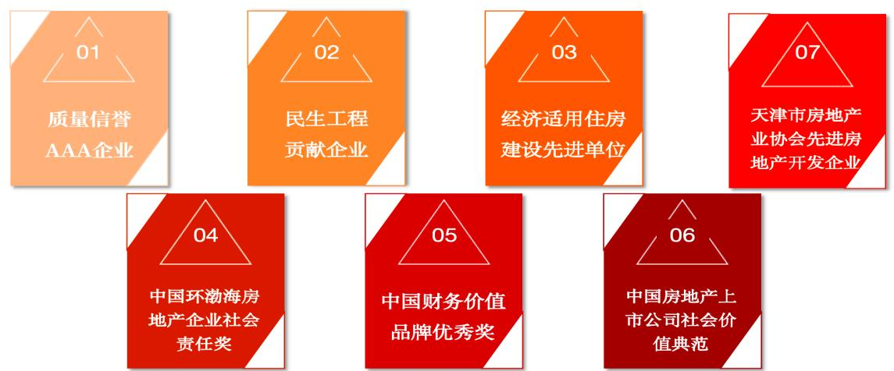

flowchart

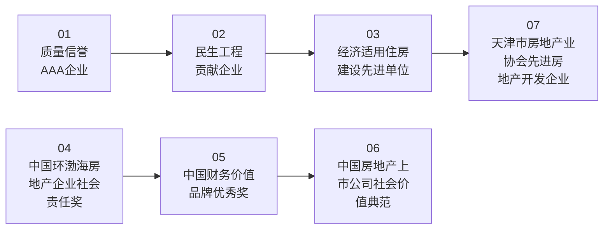
```mermaid
graph LR
  A["01\n质量信誉\nAAA企业"] --> B["02\n民生工程\n贡献企业"]
  B --> C["03\n经济适用住房\n建设先进单位"]
  C --> D["07\n天津市房地产业\n协会先进房\n地产开发企业"]
  E["04\n中国环渤海房\n地产企业社会\n责任奖"] --> F["05\n中国财务价值\n品牌优秀奖"]
  F --> G["06\n中国房地产上\n市公司社会价\n值典范"]
```

公司文化理念

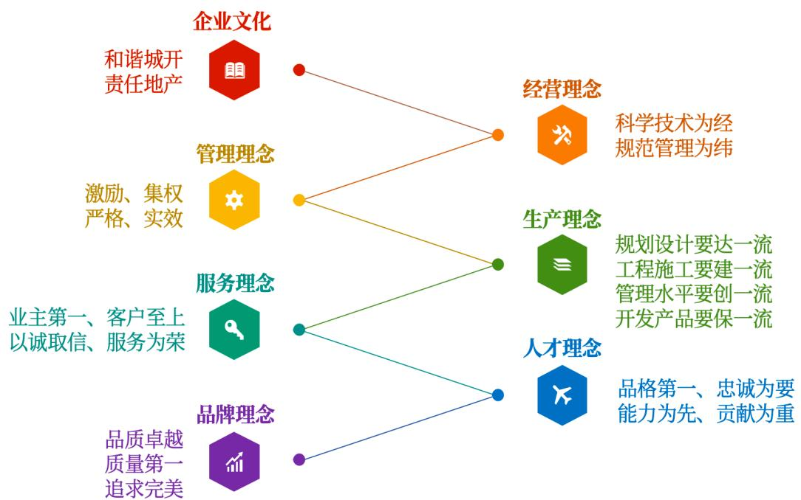

flowchart

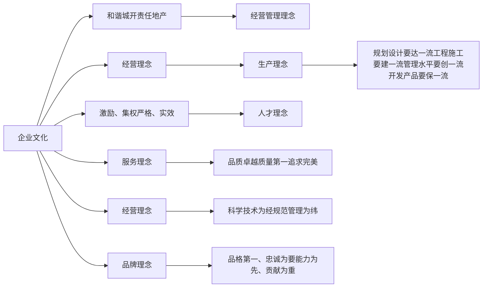
```mermaid
graph LR
  A["企业文化"] --> B["和谐城开责任地产"]
  A --> C["经营理念"]
  A --> D["经营理念"]
  A --> E["激励、集权严格、实效"]
  A --> F["服务理念"]
  A --> G["品牌理念"]
  
  B --> H["经营管理理念"]
  C --> I["生产理念"]
  E --> J["人才理念"]
  F --> K["品质卓越质量第一追求完美"]
  
  D --> L["科学技术为经规范管理为纬"]
  I --> M["规划设计要达一流工程施工要建一流管理水平要创一流开发产品要保一流"]
  G --> N["品格第一、忠诚为要能力为先、贡献为重"]
```

# 双重重要性分析

津投城开高度重视 ESG 实质性议题的识别与管理工作，系统推进相关行动。公司以国际权威指南标准及监管机构自律监管指引为根本遵循，同步参考国际主流 ESG 指数、专业评级机构及行业内重点关注的 ESG 核心议题，面向内外部全体利益相关方开展广泛的问卷调查与意见征集。在此基础上，从“对利益相关方的重要性”和“对公司发展的重要性”双重维度，对各类 ESG 实质性议题开展全面系统评估，依托双重重要性分析模型精准筛选出核心重要议题，为公司靶向完善 ESG 管理体系、持续提升 ESG 管理水平明确实施方向，从而更精准地回应并满足各利益相关方的期望与诉求。

2025年度实质性议题的双重重要性评估结果如下, 评估矩阵右上角议题为高度重要性议题。根据评估结果, 公司识别的重要议题包括: 绿色设计、绿色施工、绿色运营、废弃物处理、产品安全与服务质量、员工发展与权益保障、社区关系、社会贡献、供应链管理、公司治理、信息安全、反商业贿赂与反贪污、反不正当竞争、利益相关方沟通。

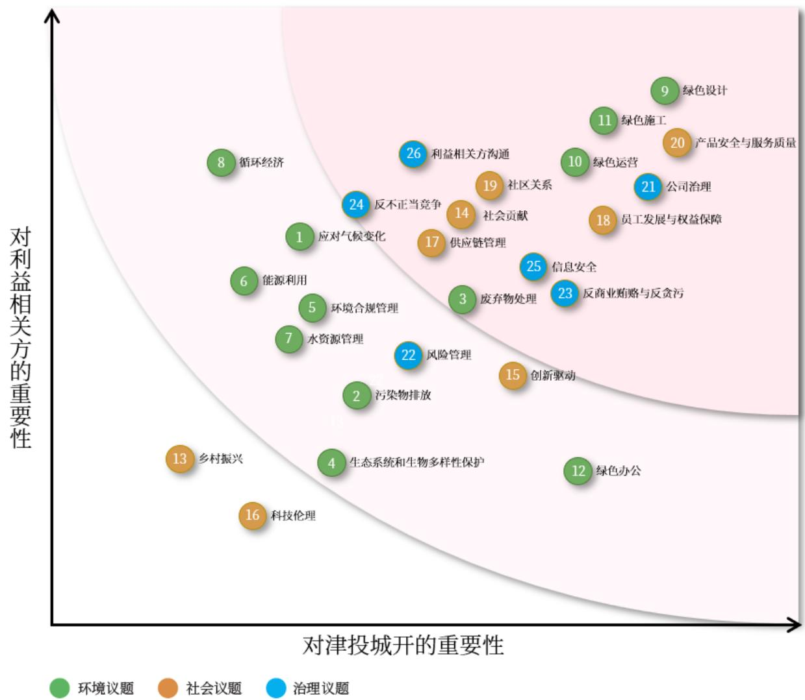

scatter

| Topic | Category | X (对津投城开的重要性) | Y (对利益相关方的重要性) |
| --- | --- | --- | --- |
| 8 | 环境议题 | ~15 | ~75 |
| 26 | 治理议题 | ~45 | ~80 |
| 10 | 环境议题 | ~60 | ~75 |
| 9 | 环境议题 | ~70 | ~90 |
| 11 | 环境议题 | ~65 | ~85 |
| 20 | 社会议题 | ~75 | ~80 |
| 24 | 治理议题 | ~40 | ~65 |
| 19 | 社会议题 | ~50 | ~70 |
| 21 | 治理议题 | ~70 | ~70 |
| 18 | 社会议题 | ~65 | ~65 |
| 14 | 社会议题 | ~50 | ~60 |
| 17 | 社会议题 | ~50 | ~55 |
| 1 | 环境议题 | ~35 | ~60 |
| 25 | 治理议题 | ~60 | ~55 |
| 6 | 环境议题 | ~30 | ~50 |
| 3 | 环境议题 | ~50 | ~45 |
| 23 | 治理议题 | ~65 | ~45 |
| 5 | 环境议题 | ~35 | ~45 |
| 7 | 环境议题 | ~30 | ~40 |
| 22 | 治理议题 | ~45 | ~35 |
| 15 | 社会议题 | ~60 | ~30 |
| 2 | 污染物排放 | ~40 | ~30 |
| 12 | 环境议题 | ~65 | ~20 |
| 4 | 环境议题 | ~35 | ~20 |
| 13 | 社会议题 | ~20 | ~20 |
| 16 | 社会议题 | ~30 | ~15 |
| 14 (Social) | 社会议题 | ~50 | ~60 |
| 18 (Social) | 社会议题 | ~65 | ~60 |
| 13 (Community) | 社会议题 | ~20 | ~20 |
| 4 (Biological) | 环境议题 | ~35 | ~20 |
| 16 (Tech) | 社会议题 | ~30 | ~15 |
| 8 (Cyclical) | 环境议题 | ~25 | ~75 |
| 26 (Profit) | 治理议题 | ~45 | ~75 |
| 19 (Social) | 社会议题 | ~50 | ~70 |
| 24 (Reversal) | 治理议题 | ~40 | ~65 |
| 17 (Supply Chain) | 社会议题 | ~50 | ~60 |
| 25 (Security) | 治理议题 | ~60 | ~55 |
| 3 (Disposal) | 环境议题 | ~50 | ~45 |
| 22 (Risk Management) | 治理议题 | ~45 | ~40 |
| 15 (Innovation) | 社会议题 | ~60 | ~35 |
| 23 (Debt) | 治理议题 | ~65 | ~40 |
| 21 (Company Governance) | 治理议题 | ~70 | ~60 |
| 23 (Finance) | 环境议题 | ~65 | ~35 |
| 12 (Green Office) | 环境议题 | ~65 | ~20 |
| 9 (Green Design) | 环境议题 | ~70 | ~90 |
| 11 (Green Construction) | 环境议题 | ~65 | ~85 |
| 21 (Company Governance) | 治理议题 | ~70 | ~70 |
| 20 (Product Safety & Services) | 社会议题 | ~75 | ~80 |
| 18 (Employee Development & Rights Protection) | 社会议题 | ~70 | ~65 |
| 22 (Financial Management) | 治理议题 | ~45 | ~40 |
| 13 (Dural Revitalization) | 社会议题 | ~20 | ~20 |
| 16 (Technology Ethics) | 社会议题 | ~30 | ~15 |
| 17 (供应链管理) | 社会议题 | ~50 | ~60 |
| 19 (Social Relations) | 社会议题 | ~50 | ~70 |
| 14 (Social Contribution) | 社会议题 | ~50 | ~60 |
| 15 (Innovation) | 社会议题 | ~60 | ~35 |
| 16 (Environmental Reform) | 社会议题 | ~30 | ~20 |
| 18 (Employee Development & Rights Protection) | 社会议题 | ~65 | ~60 |
| 19 (Social Relations) | 社会议题 | ~50 | ~70 |
| 21 (Company Governance) | 治理议题 | ~70 | ~70 |
| 23 (Debt) | 治理议题 | ~65 | ~40 |
| 22 (Risk Management) | 治理议题 | ~45 | ~40 |
| 23 (Finance) | 治理议题 | ~65 | ~40 |
| 24 (Reversal竞争) | 治理议题 | ~40 | ~65 |
| 25 (Security) | 治理议题 | ~60 | ~55 |
| 26 (Profit Corrugated) | 治理议题 | ~45 | ~75 |
| 27 (Green Operations) | 环境议题 | ~60 | ~80 |
| 28 (Green Design) | 环境议题 | ~70 | ~90 |
| 29 (Green Construction) | 环境议题 | ~65 | ~85 |
| 30 (Social Relations) | 社会议题 | ~50 | ~70 |
| 31 (Disposal) | 环境议题 | ~45 | ~45 |
| 32 (Disposal) | 环境议题 | ~45 | ~45 |
| 33 (Disposal) | 环境议题 | ~45 | ~45 |
| 34 (Disposal) | 环境议题 | ~45 | ~45 |
| 35 (Disposal) | 环境议题 | ~45 | ~45 |
| 36 (Disposal) | 环境议题 | ~45 | ~45 |
| 37 (Disposal) | 环境议题 | ~45 | ~45 |
| 38 (Disposal) | 环境议题 | ~45 | ~45 |
| 39 (Disposal) | 环境议题 | ~45 | ~45 |
| 40 (Disposal) | 环境议题 | ~45 | ~45 |
| 41 (Disposal) | 环境议题 | ~45 | ~45 |
| 42 (Disposal) | 环境议题 | ~45 | ~45 |
| 43 (Disposal) | 环境议题 | ~45 | ~45 |
| 44 (Disposal) | 环境议题 | ~45 | ~45 |
| 45 (Disposal) | 环境议题 | ~45 | ~45 |
| 46 (Disposal) | 环境议题 | ~45 | ~45 |
| 47 (Disposal) | 环境议题 | ~45 | ~45 |
| 48 (Disposal) | 环境议题 | ~45 | ~45 |
| 49 (Disposal) | 环境议题 | ~45 | ~45 |
| 50 (Disposal) | 环境议题 | ~45 | ~45 |
| 51 (Disposal) | 环境议题 | ~45 | ~45 |
| 52 (Disposal) | 环境议题 | ~45 | ~45 |
| 53 (Disposal) | 环境议题 | ~45 | ~45 |
| 54 (Disposal) | 环境议题 | ~45 | ~45 |
| 55 (Disposal) | 环境议题 | ~45 | ~45 |
| 56 (Disposal) | 环境议题 | ~45 | ~45 |
| 57 (Disposal) | 环境议题 | ~45 | ~45 |
| 58 (Disposal) | 环境议题 | ~45 | ~45 |
| 59 (Disposal) | 环境议题 | ~45 | ~45 |
| 60 (Disposal) | 环境议题 | ~45 | ~45 |
| 61 (Disposal) | 环境议题 | ~45 | ~45 |
| 62 (Disposal) | 环境议题 | ~45 | ~45 |
| 63 (Disposal) | 环境议题 | ~45 | ~45 |
| 64 (Disposal) | 环境议题 | ~45 | ~45 |
| 65 (Disposal) | 环境议题 | ~45 | ~45 |
| 66 (Disposal) | 环境议题 | ~45 | ~45 |
| 67 (Disposal) | 环境议题 | ~45 | ~45 |
| 68 (Disposal) | 环境议题 | ~45 | ~45 |
| 69 (Disposal) | 环境议题 | ~45 | ~45 |
| 70 (Disposal) | 环境议题 | ~45 | ~45 |
| 71 (Disposal) | 环境议题 | ~45 | ~45 |
| 72 (Disposal) | 环境议题 | ~45 | ~45 |
| 73 (Disposal) | 环境议题 | ~45 | ~45 |
| 74 (Disposal) | 环境议题 | ~45 | ~45 |
| 75 (Disposal) | 环境议题 | ~45 | ~45 |

# 党建引领

# 筑牢发展根基

聚焦政治建设

强化组织建设

优化队伍建设

擦亮党建品牌

深化作风建设

# 聚焦政治建设

# 强化理论学习，武装政治头脑

公司坚持把思想政治建设摆在首位，全年扎实开展党委理论学习中心组集中学习10次、自学6次，并举办专题研讨6次、读书班2期。通过丰富多样的学习形式，推动理论学习从转向主动思考、融会贯通，有效提升党员干部运用党的创新理论研判形势、谋划发展的能力，为企业高质量发展提供坚实的思想保证。

# 强化政治引领，落实党委主责

津投城开党委充分发挥“把方向、管大局、保落实”的领导作用，严格落实党组织在公司治理中的法定地位。全年共召开党委会41次，前置研究讨论“三重一大”事项百余项，并建立动态台账，修订完善《党委前置研究重大经营管理事项清单》，确保党的领导与公司治理深度融合。同时，结合实际三次修订并宣贯《1+3权责表》，进一步厘清各治理主体权责边界，实现了治理机制的动态优化与高效运转。

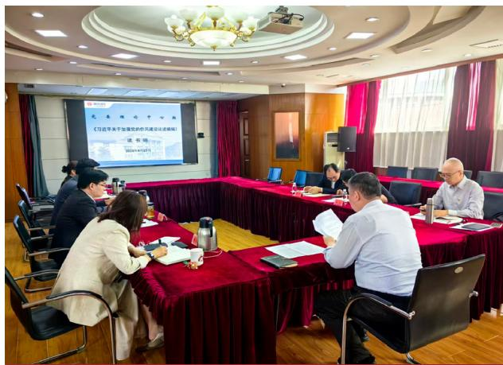

text_image

Meeting room photo with visible presentation screen showing Chinese text about a 2019 event on the road of traffic and road network.

党委理论学习中心组读书班

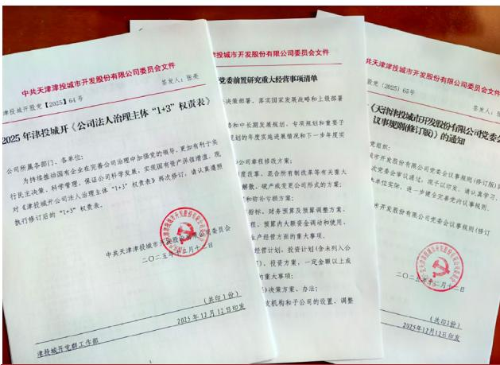

text_image

中共天津津投城市开发股份有限公司委员会文件
公司所属各部门、各单位：
为持续推动国有企业在完善小公治理中加强党的领导，更加有利于实
行民主决策、科学管理，保证公司科学发展、实现国有资产保值增值。现
行“建投城开公司法人治理主体”+1+3”权责表》再次修订，请认真遵照
对《津投城开公司法人治理主体”+1+3”权责表》两次修订，请认真遵照
执行修订后的“+1+3”权责表。
中共天津津投城市开发股份有限公司委员会
二〇一五年十二月十二日
（共1份）
2015年12月11日印发
津投城开党群工作部
党委前置研究重大经营事项清单
决策部署，落实国家发展战略和上级部署
本和中长期发展规划、专项规划和重要不
划的年度实施进展情况和下一步年度实
司章程修改方案；
厦设案、混合所有制改革等有关重大
解散、破产或变更公司形式的方案；
和弥补亏损方案；
招标、财务预算及预算调整方案、
理、预算内大幅资金调动和使用、
生产经营方面的重大事项。
经营计划、投资计划（含未列入公
司）、投资方案，一定金额以上成
有重大事项；
（共1份）
2015年12月11日印发
中共天津津投城市开发股份有限公司委员会文件
（共1份）
2015年12月11日印发
中共天津津投城市开发股份有限公司委员会文件
（共1份）
2015年12月11日印发

召开党委会研究讨论

# 强化组织建设

为确保 “强根铸魂” 行动各项任务落地见效，公司党委坚持系统思维，健全完善组织体系，实现基层党组织与工作机构同步设置、党务人员同步配备、党建业务同步考核，充分发挥党建引领保障作用。

# 优化组织架构，筑牢战斗堡垒

公司党委紧跟业务发展与项目布局，动态调整基层党组织设置，在重点项目、新业务领域及时设立党支部，确保党的组织和党的工作全面覆盖。2025年，结合公司实际情况，增设2个机关党支部，选优配强并调整6个党支部书记，同时撤销2个项目及子公司党支部。按期完成9个基层党支部换届选举工作，选配政治强、业务精、作风好的党员担任支部委员，做到“应建必建，应换必换”，不断夯实基层基础。

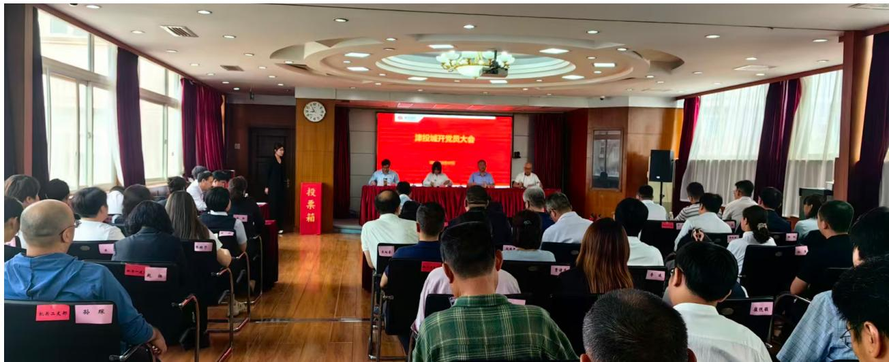

text_image

津投城开发员大会
投票箱
杭州三友新 孙琛

党员大会党支部换届选举

# 压实工作责任，凝聚发展合力

公司党委积极投身全市高质量发展“十项行动”，以钉钉子精神扎实推进“三新”“三量”工作部署，加速存量资产盘活。明确基层党支部在安全管理和廉政监督等工作中的职责，认真落实直接责任，具体组织实施各项行动任务。党组织书记履行第一责任人职责，亲自谋划、亲自推动；完善制度机制，强化保障支撑。班子成员履行“一岗双责”，抓好分管领域的党建工作。通过压实责任，形成上下联动、齐抓共管的工作格局。

# 强化考核评价，促进深度融合

坚持党建与业务同谋划、同部署、同考核。年初签订党建工作目标责任书，全面压实支部书记第一责任人责任，年底进行述职评议。将党建工作成效纳入业绩考核体系，与项目绩效、评优评先硬挂钩，推动党建工作与项目建设同频共振、互促共进。

# 优化队伍建设

# 严把“入口关”，优化党员队伍结构

坚持把政治标准放在首位，注重在业务骨干、青年人才和一线员工中发展党员。2025年，新增入党申请人2人、积极分子1人，吸纳3名青年职工、高层次人才及一线骨干加入预备党员队伍，有效提升党员队伍的整体素质和战斗力。

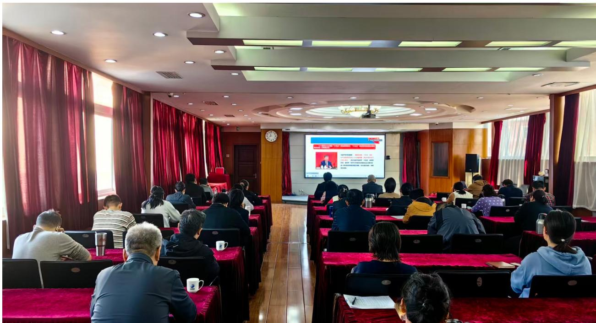

text_image

Conference hall photo with visible presentation screen showing Chinese text and speaker at podium

在业务骨干、青年人才和一线员工中发展党员

# 建强“主力军”，激发干部队伍活力

坚持党管干部原则，2025年提拔任用5名业务骨干担任中层管理人员，同时强化对中层及以上管理人员的出入境管理，从严加强干部监督。注重教育培训实效，组织6人次优秀党员、组织干部参加国资委培训，14人次党务干部参加津投资本系统培训，有效提升干部队伍的政治素养和履职能力。

# 储备“后备军”，搭建青年成长梯队

着眼长远发展，动态调整年轻干部人才库，深入实施人才培养工程。积极选送优秀青年人才参与“津投资本青藤计划”，通过系统化培训持续提升专业水平，为公司高质量发展储备坚实的后备力量。

# 擦亮党建品牌

2025 年公司党委以特色党建品牌创建为 “强根铸魂” 行动的重要载体，主动融入津投资本生态圈，找准结合点，创建津投城开党委 “一把津钥匙 幸福千万家” 主品牌。围绕房地产开发及物业管理 “双主业”，赋予 “红色引擎” 新内涵。

公司党委将党建品牌建设发力点定标在华升物业公司党支部和华欣公司党支部，系统谋划，精准施策，取得实效。

# 聚焦红色物业，以服务铸品牌

华升物业公司党支部依托“我为群众办实事”“民呼我为擦亮窗口”实践活动，以红色信仰凝聚党员群众，以红色热情服务居民用户，以红色善举践行社会责任，创立“红心向党、服务万家”的支部党建子品牌。以党建引领物业管理提升为核心，全面提升管理效率、服务品质与用户体验，将“为民服务”工作落到实处，推动党建品牌建设与物业服务提升同频共振、深度融合、协同共进。

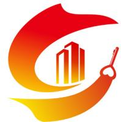  
一把津钥匙 幸福千万家  
公司党建品牌 logo

  
华升物业党建子品牌 logo

# 党支部书记强化安全管理体系

党支部书记围绕作风建设引入安全生产、物业矛盾调解等主题，通过讲授党课等形式，强化党组织在安全管理中的主导作用，构建以党组织为核心的安全生产管理体系。以作风建设提升，带动党员政治理论素养、业务能力提升。

# "三红工程"提升物业品质

党支部班子以红色为民活动为依托，以打造“红色管家”“红色服务”“红色堡垒”的“三红工程”为抓手，推动物业管理服务品质提升，夯实“红色物业”品牌基础。重点项目天开高教科创园制定了专项服务理念，2025年被市物业办授予“红色物业”称号。

# 党员圆心组团服务强化思想

开展党员 “三亮” 活动。在项目上，以党员为 “圆心”，辐射带动业务相近、联系紧密的入党积极分子、团员及群众结成 “对子”，开展 “组团式” 服务，强化 “组员” 的思想淬炼。

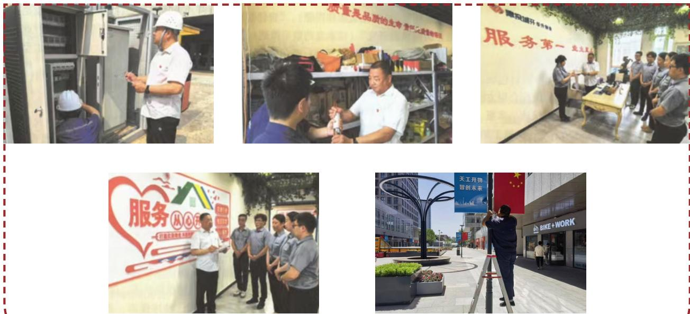  
华升物业公司党支部 - 天开园物业管理

# 聚焦三新，做实三量，以“党建+项目”跑出加速度

华欣公司党支部围绕地产业务板块增量即美域东霖项目建设为核心任务，以“红旗飘扬匠心筑梦”为党建子品牌，以实际行动诠释“津钥匙”开启幸福之门的深刻内涵。

# 党建引领民心住宅建设提速提质

推动党组织进工地、进案场，实现党建工作与生产经营同频共振。公司总经理挂帅党支部书记，带领党员及全体职工迎难而上，高品质打造4.0版本民心住宅，严格按照交付标准做好各环节质量把控，全力加快施工进度。

# 党员技术攻关保质提速显先锋

组织党员开展技术攻关，成功解决了一系列工程前期规划及施工建设中的难题，确保了项目加速推进、工程质量与进度双达标，同时着力攻克工程建设节点与安全生产难关，充分展现了党员在项目建设中的先锋模范作用。

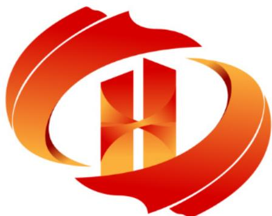

natural_image

Abstract red and orange logo design with a stylized letter 'H' in the center (no text or symbols)

红旗飘扬 匠心筑梦  
华欣公司党建品牌 logo

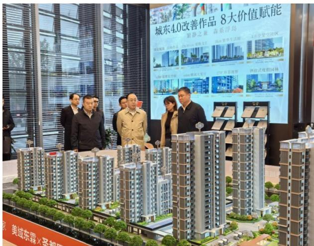

text_image

城东4.0改善作品 8大价值赋能
紧静之束 森燕浮岛
1997年城市改造
2000年城市改造
2005年城市改造
2010年城市改造
2015年城市改造
美域东霖×圣如

华欣公司党支部 - 美域东霖项目建设

# 深化作风建设

# 扎实开展深入贯彻中央八项规定精神学习教育

以学习教育为契机，持续改进工作作风。在学习教育期间，公司党委组织召开了2次警示教育大会，党委层面查摆出问题6条，并制定了13条针对性措施；公司所属的14个党支部共查摆问题47条，制定了50条措施，截至本报告期内，所有问题均已完成整改并销号。同时，各党支部结合反面典型案例的剖析，深入开展了集中学习活动，并进行了四次交流研讨。公司党委责令相关部门制定一系列制度规范，以推动作风建设常态化、长效化制度机制的健全与完善。

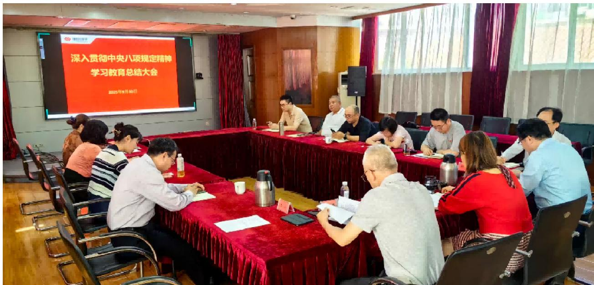

text_image

深入贯彻中央八项规定精神
学习教育总结大会
2025年9月30日

深入贯彻中央八项规定精神学习教育

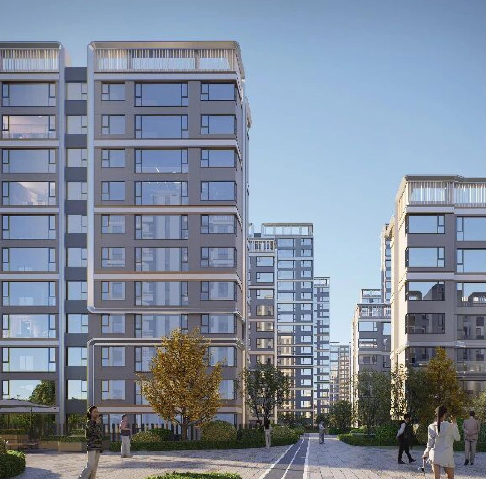

natural_image

Exterior view of modern multi-story residential buildings under clear sky, with pedestrians walking along a paved path (no signage or text visible)

# 绿色低碳

# 守护美好家园

绿色设计

绿色施工

绿色运营与绿色生活

环境治理与低碳建设

# 绿色设计

# 建筑创新

# 1) 装配式建筑

公司积极响应国家关于发展装配式建筑、推动建筑业转型升级的政策要求，将装配式建筑作为提升建造效率、降低资源消耗和减少施工环境影响的重要抓手，推动建造方式向标准化、低碳化转型。

在装配式建筑实践中，公司通过主体结构与内装系统分离、构件工厂化生产和现场装配施工，有效减少施工现场湿作业比例，降低扬尘、噪声和建筑垃圾产生量，提高施工效率和工程质量，为推进绿色低碳建造提供有力支撑。

沙柳北路 A、B 地块项目均 100% 实施装配式建筑, 项目装配率均不低于 50%。项目应用 ALC 条板、叠合板、楼承板等预制构件体系，提升装配率与建造标准化水平，促进质量与效率协同提升。

# 2）全架空住宅

通过架空层设计实现人车分流，机动车直接驶入架空层，架空层上部空间作为居民公共活动区域，设置廊架、儿童活动场地、成人活动区等设施，显著提升社区公共空间利用效率和安全性。

在土地资源集约利用方面，架空设计有效整合设备用房和配套功能空间，减少对地面绿化和公共活动空间的占用，在提升居住品质的同时，降低土地开发强度。

# 沙柳北路 A、B 地块项目

# 首层架空设计

通过首层架空设计, 构筑漫步街区、下沉庭院、全龄会所、阳光车库等，创造复合型多维空间。

# 高效利用架空平台

同时高效利用架空平台，将设备用房及部分配套公建功能合理布置于架空层内，在满足功能需求的同时，提升了社区整体环境品质和空间使用效率。

# 3）海绵城市

公司在项目规划和建设过程中，积极推进海绵城市理念，将雨水管理与景观设计、道路铺装和公共空间布局相结合，提升城市雨洪调蓄和水资源利用能力。在水土资源开发方面坚持审慎原则，控制硬化面积比例，在保障功能需求的前提下，最大限度降低对自然环境的扰动。

# 盛庭花园项目

通过铺设透水砖、嵌草砖、鹅卵石和碎石等透水铺装材料，增强雨水自然渗透能力，减少地表径流。同时，结合景观设计合理布局雨水花园，实现雨水收集、滞蓄和回用。

# 沙柳北路 B 地块项目-

在景观设计中室外铺装采用透水地面材料，绿地内设置下凹式绿地，有效促进雨水自然下渗和滞蓄，减少地表径流。

# 数智安居

公司在项目开发过程中积极推进智慧建造和智能化系统应用，以信息化、数字化手段提升建造管理效率和社区运行水平，为绿色运营和节能管理奠定坚实基础。公司相关应用主要围绕工程建设、社区管理和运营服务等场景开展，不涉及生命科学、人工智能等科技伦理敏感领域的科学研究、技术开发等活动。

沙柳北路 A、B 地块项目在建设过程中，系统应用多项智能化设施和信息系统，主要包括：

# 基础信息系统方面

# 社区安全与管理方面

# 设施协同方面

统一预埋网络、电话、有线电视“三网合一”系统，减少后期改造和重复施工。

配置可视对讲系统、视频监控系统、停车场管理系统（车牌识别）、离线式巡更系统及电梯五方对讲系统，有效提升社区运行安全性与管理效率。

通过系统化预留与集成设计，为后期智慧社区管理及节能控制提供基础条件。

# 绿色社区

公司在社区规划设计中注重空间秩序与生态环境协同，通过科学组织交通系统和公共空间布局，营造安全、宜居的社区环境。

# 苏州·心著华庭项目

苏州·心著华庭项目将核心景观、水景节点和林荫步道有机结合，形成层次分明、动静分区合理的社区景观体系。楼间绿地与中央主轴景观相互呼应，为居民提供多样化的休闲、社交和健身空间。

项目实行人车分流设计，机动车直接进入地下车库，减少地面交通干扰，有效提升社区环境安全性和整体景观品质。项目结合轨道交通区位与城市界面营造需求，通过出入口节点品质化与园区界面渗透设计，增强城市与社区空间连接性，提升慢行体验与公共空间活力。

# 品质人居

公司在项目规划、设计及建造过程中，将 “以人为本” 的绿色设计理念贯穿住宅全生命周期，持续提升建筑健康性与居住舒适度。

# 室内环境控制

在室内环境控制方面，公司重点关注温度、湿度、空气质量与采光条件的综合优化，通过合理配置新风系统、空调系统及围护结构节能构造，保障居住空间空气清新、温湿适宜。在部分项目中，引入全屋新风系统和高性能围护结构，有效降低室内污染物浓度，减少外界噪声干扰，提升居住舒适体验。项目在户型设计中强化南北通透与全明采光，部分户型配置开敞景观阳台与可变空间，提高空间利用效率与家庭生命周期适配能力。

# 公共空间及地下空间管理

在公共空间及地下空间管理方面，公司积极应用智能化控制技术。以苏州·心著华庭项目为例，地下自行车库、走廊、前室及门厅区域采用声光控感应延时开关，实现按需照明，有效降低公共区域电能消耗；地下机动车库实施分区集中控制管理，提高能源使用效率。同时，通过设置采光天井，引入自然光照，减少白天人工照明需求，进一步提升能源利用效率。

# 生态宜居

公司高度重视项目周边绿化与生态环境建设，将提升绿地率、丰富植物多样性和改善生态功能作为住宅项目规划的重要内容，持续推进生态友好型社区建设。

# 盛庭花园项目

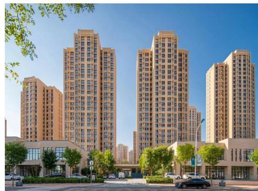

natural_image

Exterior view of a modern residential high-rise complex under clear blue sky, surrounded by greenery and parked cars (no signage or text visible)

盛庭花园项目实景图

盛庭花园项目景观面积约 14 万平方米，绿地率约 40%。项目在植物配置上优先选择成活率高、养护成本低的本土及适生植物，通过减少大面积草坪配置，增加乔木、灌木和地被植物比例，构建稳定、多层次的植物群落结构，提升生态系统稳定性。

在景观设计方面，充分考虑不同人群的使用需求，合理设置儿童活动区和成人休憩空间，并通过大乔木遮阴设计，为居民提供舒适的户外活动环境。通过落叶植物与观花植物的合理搭配，营造“三季有花、四季有景”的景观效果。

# 苏州·心著华庭项目

苏州·心著华庭项目整体绿地率约 41%，社区内部绿化空间以自然植被为主，硬质铺装为辅，实现自然景观与功能空间的有机融合。项目绿化设计注重植物群落的多样性和层次感，涵盖乔木、灌木、草本植物及观赏花卉等多种类型，木本植物种类不少于 48 种，实现裸土全面覆盖。

通过科学配置植物种类和景观节点，项目在不同季节呈现丰富的观色、观花和观叶效果，为居民营造四季变化、生态友好的居住环境。

# 沙柳北路B 地块项目

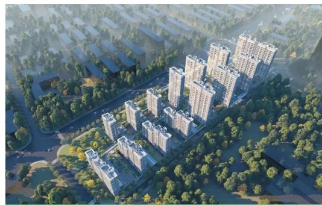

natural_image

Aerial rendering of a modern residential housing complex surrounded by greenery and pathways (no visible text or signage)

沙柳北路 B 地块项目实景图

沙柳北路 B 地块项目景观面积约 2.8 万平方米，绿地率约 40%。通过集中绿地与多节点景观空间相结合的方式，形成了层次分明、功能复合的绿化体系。项目以自然生态体验为导向，结合架空层高差与场地条件组织下沉庭院、架空平台与组团绿化等景观空间，构建多层次、可参与的生态公共空间体系。不仅有效提升了小区整体景观效果，还在一定程度上增强了雨水调蓄能力，改善了社区微气候环境，为居民提供了舒适、健康的户外活动空间。

# 绿色采购

津投城开坚持将绿色发展理念贯穿项目开发建设全过程，把绿色采购作为推动绿色建造的重要抓手，持续完善合同管理、招标投标管理及采购执行等工作流程，将节能环保要求前置嵌入供应商准入、技术标准设定、评标定标与履约验收等关键环节，推动绿色要求从“材料选用”延伸至“全链条管控”，以采购端的制度约束与市场选择带动供应链绿色转型。

# 工程招标采购

公司在建筑工程、机电安装、装修装饰等项目招标文件中明确绿色施工与环境管控要求，要求投标单位结合项目特点制定节能减排与文明施工方案，明确扬尘、噪声、废水、固废等污染防治措施以及节能设备选型、材料节约与周转使用等资源管理安排，并将其纳入评标考量与合同条款，强化过程履约约束。对关键设备与重点工序，公司同步提出符合国家及行业环保标准的技术要求，引导施工单位优先选用低能耗、低噪声、低排放设备，优化施工工艺，降低施工阶段环境影响，提升绿色施工水平。

# 物资采购

公司坚持 “优选环保供应商、优选绿色产品” 的原则，确保所选供应商环境管理体系健全、产品符合国家环保标准和质量要求，推动绿色建材与环保材料在项目中的规模化应用。公司对主要材料设备实行规范化验收管理，重点关注产品环保性能、能效水平及健康指标，促进采购决策从 “单一成本导向” 向 “质量、性能与环境友好并重” 转变，不断提升住宅产品的健康性、舒适度与低碳属性。

报告期内，公司在部分项目中进一步强化绿色产品选型与集成化采购，持续推进绿色材料与低碳技术的应用落地：

# 整体卫浴系统

采购集成化整体卫浴解决方案，配套洁具、龙头等，并采用同层排水等技术路径，有效降低排水噪声与振动干扰，提升居住舒适度与系统耐久性，符合绿色健康居住理念。

# 轻钢龙骨内隔墙

采用轻钢龙骨内隔墙系统，便于后期空间调整与功能改造，提升建筑可变性与全生命周期适配能力，在满足使用需求的同时减少二次拆改带来的资源浪费与环境负担。

# 全屋空调新风系统

推动空调与新风系统一体化配置，通过新风引入与空气过滤改善室内空气质量，并以高效设备与合理控制提升运行能效，为居住者营造健康、舒适的室内环境。

# 干式地暖系统

采用干式地暖等高效供暖方式，相较传统湿式地暖具备施工便捷、占用空间小、热响应快等特点，有助于提升热效率并降低运行能耗。

# 环保墙面材料

在室内装饰材料选择上更加注重健康与环保属性，优先选用低污染、低挥发的墙面材料方案，降低室内污染风险，提升居住环境安全性。

# 外窗降噪与节能构造

外窗选用三玻两腔配置，并结合 Low-E 在线镀膜及暖边等节能构造，提高门窗隔热性能与气密性，在有效降低外部噪声影响的同时减少冷热量损失，提升建筑节能表现。

通过持续推进绿色采购制度化、标准化与场景化应用，津投城开不断强化从招采源头推动绿色建造的能力，促进供应链绿色协同与住宅品质提升，为公司实现绿色低碳发展目标提供坚实支撑。

# 绿色施工

# 管理赋能：绿色施工全过程管控

# 全过程管控

津投城开坚持以管理体系建设为牵引，将绿色施工要求前置嵌入项目策划、招标采购、施工组织、过程控制与竣工验收等关键环节，形成“制度标准引导—责任链条落实—监测巡查支撑—应急整改闭环—宣贯培训固化”的全过程管控机制，推动绿色施工由“经验管理”向“体系化、可追溯、可持续改进”升级。

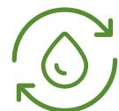

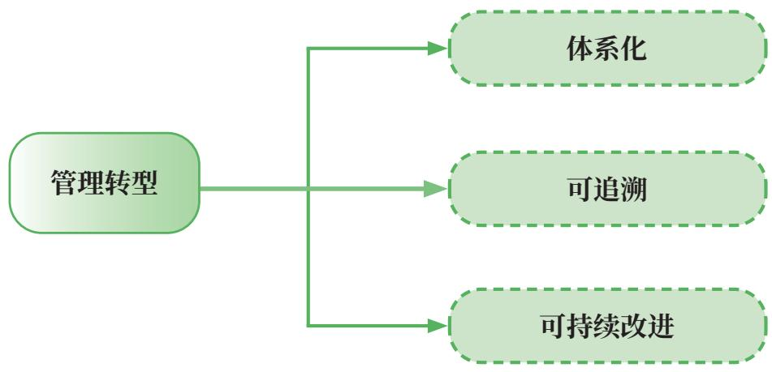

flowchart

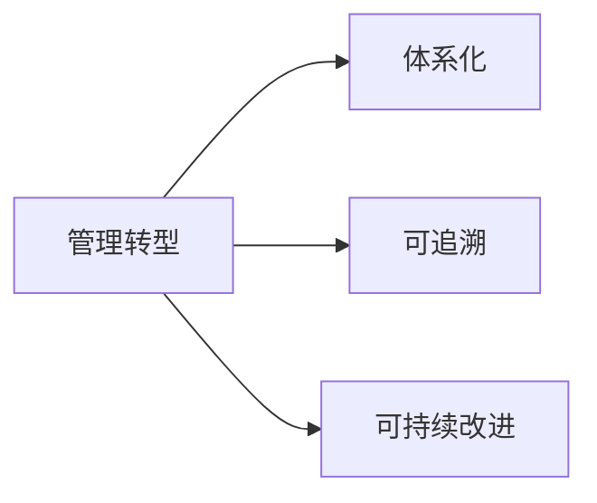
```mermaid
graph LR
  A["管理转型"] --> B["体系化"]
  A --> C["可追溯"]
  A --> D["可持续改进"]
```

# 1) 制度与标准

公司持续完善绿色施工制度体系，将扬尘、噪声、废水、固废等环境管控要求以及节能、节水、节材等资源管理要求纳入项目管理制度、现场文明施工标准及相关作业指引，明确重点工序环保控制要点和管理底线。结合工程特点，在施工组织设计、专项方案（如土方作业、夜间施工、临时排水等）编制与审批中同步开展绿色施工要素审查，做到“方案先行、标准先行、措施先行”，提升绿色施工的刚性约束与可操作性。

# 2）责任与协同

公司建立以项目为单元的绿色施工管理责任体系，明确建设单位项目团队对绿色施工负总责，统筹协调施工总包、监理及各分包单位落实环保与资源管理措施。对关键岗位职责进行清单化管理，形成“目标分解—任务到岗—责任到人”的责任闭环；同时将绿色施工要求纳入合同条款与交底管理，强化分包单位、供应商在设备选型、材料进场、现场作业和废弃物处置等环节的合规责任，推动参建各方同向发力、协同管控。

# 3）监测与巡查

公司坚持 “线上监测 + 现场巡查” 相结合，推动绿色施工过程管理可视、可控、可追溯。对施工现场重点环境指标实施动态监控，结合视频巡查、现场检查、旁站监督等方式，及时识别扬尘、噪声扰民、污水外排、垃圾堆放等风险点；对土方作业、物料堆放、渣土清运、拆除作业等重点工序实施强化管控，做到问题早发现、早预警、早处置。对监测与巡查发现的问题，形成台账管理，明确整改责任、措施、时限和验收标准，确保闭环落实。

# 4）应急与整改

公司结合工程建设特点，完善环境风险应急管理机制，针对重污染天气、极端大风干燥天气、突发扬尘外溢、污水跑冒滴漏、危废管理异常等情形制定应急处置流程，明确启动条件、处置措施与信息报送路径，提升现场快速响应与联动处置能力。对监管检查、投诉反馈及内部巡查暴露的问题，坚持“溯源分析+举一反三”，同步推进原因排查、措施加严、标准优化与责任追究，推动从“整改一个点”向“完善一类机制”转变。

# 5) 宣贯与培训

公司将绿色施工纳入项目开工交底、班前教育与专项培训内容，围绕文明施工、污染防治、资源节约、危险废物规范管理等主题开展常态化宣贯，推动绿色施工要求由“管理层倡导”向“作业层自觉执行”延伸。通过制度宣贯、现场示范、案例复盘等方式，持续提升参建人员环保意识和规范作业水平，夯实绿色施工管理的执行基础。

# 6) 合规与监督

公司严格遵循国家及属地关于生态环境保护、文明施工与污染防治等法律法规及管理要求，主动接受主管部门监督检查，确保各项防治措施落实到位、排放与处置符合相关标准。对监管检查、内部巡查及公众反馈发现的问题，公司实行台账管理、限期整改与复查验收闭环，推动风险隐患早发现、早处置、早化解。报告期内，公司持续强化环境合规管理，未发生已知造成重大环境影响的突发事件；同时持续对标绿色工地、文明工地标准，推进现场标准化建设，积极争创示范项目与标杆工地。

# 资源节约与低碳举措

报告期内，津投城开围绕“资源节约、集约利用、循环增效”的绿色建造要求，将节约集约用地、水资源高效利用、能源规范管理以及材料循环利用与绿色建材应用等内容纳入项目策划、施工组织与现场管理全过程，通过优化施工组织、强化计量台账、推进技术与管理双轮驱动，持续降低项目建设阶段资源消耗强度，在保障工程质量与进度的同时，推动绿色施工从“单点控制”向“系统提效”转变。

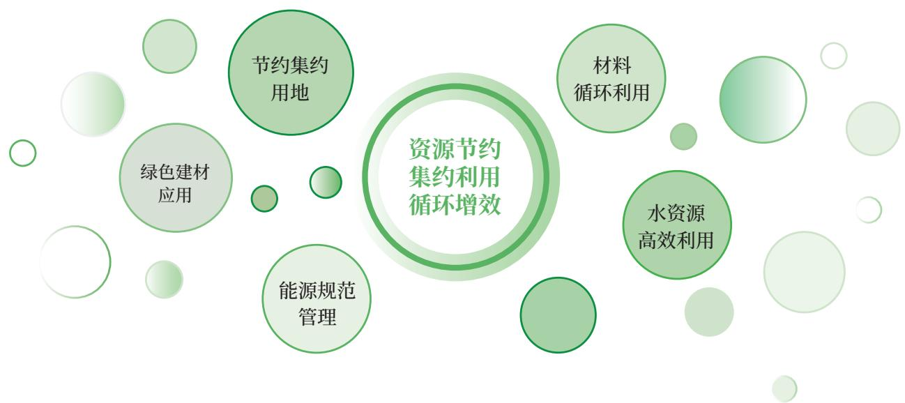

flowchart

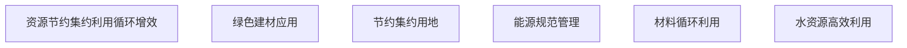
```mermaid
graph TD
  Center["资源节约集约利用循环增效"]
  
  sub1["绿色建材应用"]
  sub2["节约集约用地"]
  sub3["能源规范管理"]
  sub4["材料循环利用"]
  sub5["水资源高效利用"]
```

# 1) 节约用地

公司坚持节约集约用地原则，结合项目特点优化总平面布置，科学划分材料堆放区、加工区、道路通行区及生活办公区，减少无效占地与重复占用，提升施工现场空间利用效率。临建设施优先采用可拆卸、可重复利用的板房或集装箱式办公用房，项目结束后及时拆除并回收周转，降低临建对土地资源的长期占用。施工完成后，公司按规划要求开展场地清理与恢复，减少施工活动对土地资源和周边环境的持续影响。

# 2）水资源管理

公司严格落实属地节水管理要求，推动项目用水纳入统一管理体系，提升用水精细化水平。

<table><tr><td>施工工艺与设备</td><td>施工现场优先采用节水型施工工艺与设备,合理控制冲洗、养护等高耗水环节用水强度。</td></tr><tr><td>收集与回用设施</td><td>在具备条件的项目中配套雨水收集与回用设施,将雨水用于施工现场洒水降尘、绿化养护及景观补水等用途,提升非常规水利用水平,减少市政用水消耗。</td></tr><tr><td>办公与生活区</td><td>办公与生活区同步加强节水管理,强化用水规范与日常巡检,推动节水措施常态化运行。</td></tr></table>

# 3）能源管理

公司持续加强施工现场与办公区域用能管理，推进“一表计量、分类统计、定期分析”的管理方式，强化非工作时段用电管控与节能运行要求。施工现场照明与临建用能优先选用高效节能设备，公共区域照明配合智能控制装置实现分区与定时管理，减少无效能耗；同时通过优化施工组织、加强设备维护保养与合理调度，降低机械设备空转与高耗能运行。结合项目实际，公司在新开发项目中持续推进太阳能热水、光伏发电等可再生能源配置与应用探索，推动清洁能源与建筑一体化实施，为后续规模化应用积累经验。

# 4）材料循环利用

公司坚持 “减量化、再利用、资源化” 原则，强化材料计划管理与限额领用，优先推进模板、脚手架等周转材料的规范化使用与回收周转，减少一次性耗材与材料浪费。对施工过程中产生的可回收材料实施分类收集、集中管理与规范转运，提高材料综合利用效率；对具备条件的建筑废弃物，结合现场实际推动资源化利用，提升材料闭环管理水平。

# 5）绿色建材应用

在满足工程质量与安全要求的前提下, 公司积极推广符合国家标准的绿色建材和环保材料, 推动低污染、低挥发、可循环材料在适宜场景中替代传统材料, 降低资源消耗与环境负荷。公司同步强化采购与进场环节的合规管理要求, 推动绿色建材应用由 “零散使用” 向 “可复制、可推广” 转变, 进一步提升工程建设的绿色化水平与居住健康性能。

# 污染防治与文明施工

报告期内，津投城开坚持将生态环境保护贯穿工程建设全过程，严格落实国家及属地关于生态文明建设和污染防治的各项要求，围绕施工活动中易产生环境影响的重点环节，持续完善“源头预防—过程管控—末端治理”相结合的污染防控体系。公司以现场文明施工为抓手，统筹推进扬尘、噪声、废水及固体废弃物的分类治理与规范处置，强化重点工序、关键时段和敏感点位的管控力度，推动污染防治从“被动应对”向“常态治理、提前预防”转变，切实降低施工活动对周边环境和居民生活的影响。

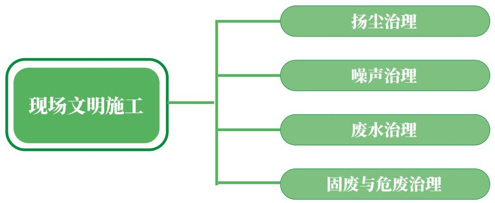

flowchart

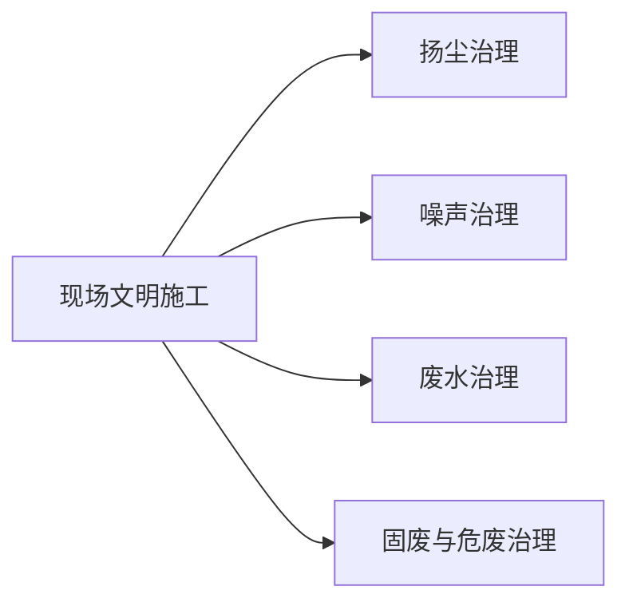
```mermaid
graph LR
  A["现场文明施工"] --> B["扬尘治理"]
  A --> C["噪声治理"]
  A --> D["废水治理"]
  A --> E["固废与危废治理"]
```

# 1) 扬尘治理

公司将施工扬尘防控作为文明施工和环境管理的重要内容，围绕土方作业、拆除作业、物料堆放与运输、场内道路通行等扬尘高发环节实施全过程管控。

施工现场按要求设置连续封闭围挡，重点区域道路硬化、定期清扫保洁，减少车辆碾压与二次扬尘。对裸露土方、临时堆土及易产生扬尘的散装物料实施全覆盖管理，采取防尘网、苫布等方式降低风蚀扬尘风险；在土方开挖、回填、装卸等作业过程中，配套洒水、喷雾、雾炮等降尘设施，结合气象条件实施定时、定点抑尘作业，提升扬尘控制的针对性与有效性。在非施工时段，通过视频监控系统对现场进行远程巡查，确保施工场地始终保持规范有序状态。通过一系列综合治理措施，公司在建项目施工扬尘得到有效控制，相关指标稳定符合国家和地方环境管理标准。

同时，公司强化运输环节管理，推动车辆规范冲洗、密闭运输与路线管控，减少“带泥上路、沿途遗撒”等问题。在不利气象条件或重污染天气期间，严格执行属地管控要求，及时调整作业计划、加密抑尘频次或采取停限措施，确保施工扬尘风险可控、现场管理标准不降。

# 2）噪声治理

公司高度重视施工噪声管控，严格执行建筑施工噪声污染防治和文明施工相关规定，将噪声防控纳入施工组织设计与现场管理全过程。

项目建设优先选用低噪声施工机械设备，并定期开展维护保养，减少因设备老化、部件松动等造成的异常噪声。对搅拌机、电锯等固定噪声源，结合现场条件设置隔音棚、隔声屏障或采取合理布置与封闭作业方式，降低噪声传播强度。

# 施工噪声管控

在施工时间安排上，公司严格落实属地噪声管控时段要求，尽量避开夜间及居民休息时段开展高噪声作业；确需连续作业或特殊作业的，依法依规履行审批手续，并做好提前告知与沟通协调，降低扰民风险。

公司同步畅通现场反馈与处置机制，对周边居民反映的问题及时核查、快速整改，推动噪声治理从“事后处理”向“前置预防”强化。

# 3）废水治理

公司坚持 “雨污分流、分类收集、规范处理、达标排放” 的原则，持续完善施工废水管理。各项目对施工废水、车辆冲洗废水、设备清洗废水等分类收集处理，经沉淀、过滤等措施达到相关要求后方可排入市政管网，严禁污水直排、跑冒滴漏。对雨季易发生径流污染的环节，公司加强临时排水系统维护与现场巡查，避免泥浆外溢和雨污混排。

# 4）固废与危废治理

公司坚持施工废弃物 “分类管理、规范处置、资源化优先” 的原则，在施工现场设置标识清晰的分类收集设施，对建筑垃圾、生活垃圾及危险废物实行分区管理、专人负责，确保收集、暂存、转运全过程可控。建筑垃圾做到及时清运，防止长期堆存造成扬尘、渗漏与环境脏乱；对具备回收利用条件的废弃物，如废砖、废混凝土等，结合项目实际推动破碎筛分后用于场地回填、临时道路铺设等，提高资源化利用水平。

# 典型项目—沙柳北路项目

沙柳北路 A、B 地块项目在建设过程中结合项目实际，围绕 “节能降耗、舒适健康与安全保障” 系统推进绿色措施应用：

# 可再生能源利用

B 地块配置太阳能热水系统，A 地块引入光伏发电设施，相关系统与建筑主体同步开展方案深化与施工实施，并统筹预留检修维护通道，提升系统可达性与后期运维便利性。

# 居住舒适度与环境控制

分户楼板采取降低楼板撞击声的技术措施，有效改善室内声环境质量，进一步提升居住体验与产品品质。

# 地下环境空间安全

地库设置一氧化碳（CO）探测器，强化地下空间运行安全保障，提升风险预警与处置能力。

通过上述配置的协同实施，项目在节能低碳、舒适健康与运行安全等方面形成集成化提升路径，为同类型项目开展“配置前置、同步实施、运维兼顾”的绿色建造提供了参考样板，持续提升绿色施工与高品质交付的协同水平。

# 绿色运营与绿色生活

津投城开坚持将绿色理念从“建造端”延伸至“运营端”和“生活端”，围绕节能降耗、资源节约、环境友好与低碳生活倡导，持续完善绿色运营管理机制，推动社区运行效率提升与居民绿色生活方式培育协同推进。公司以精细化管理和智能化手段为支撑，通过绿色办公、公共区域能耗管控、低碳出行支持及生态空间维护等举措，实现“建造—运营”一体化的可持续价值延续。

# 推行绿色办公

公司在日常办公中持续推进绿色办公实践，将节能用电、节约用纸与垃圾分类纳入日常管理要求，倡导形成低碳、节约的工作方式。

# 节能用电

办公区域用能坚持规范化管理，强化非工作时段用电控制，合理设置空调温度与照明开启时段，减少无效能耗。

# 节约用纸

公司积极推进无纸化办公与电子化流程应用, 鼓励线上审批、电子归档与会议材料电子化分发, 降低纸张与耗材使用强度。

# 垃圾分类

公司落实垃圾分类投放与集中收集要求，设置分类标识清晰的回收设施，推动可回收物规范回收与再利用，减少混投混收带来的处置成本与环境负担。

通过制度约束与行为引导相结合，公司持续提升员工绿色办公意识，推动绿色低碳理念在组织层面常态化落地。

# 推进绿色运营

公司注重提升项目交付后的绿色运营水平，将公共区域能耗控制、设备节能运行与智能化管理作为运营阶段节能降碳的重要抓手。在公共区域能效管理方面，社区走廊、前室、门厅等区域优先采用高效节能照明，并结合声光控、人体感应、延时关闭等控制方式实现按需照明，减少长明灯和空置照明造成的浪费；地下空间照明与通风系统推动分区控制与联动管理，依据使用强度与环境参数优化开启策略，提高能源使用效率。

在电梯系统方面，公司注重通过运行策略优化与维护保养提升能效水平，减少不必要的能耗损失，并持续加强设备状态巡检，降低因老化或故障导致的低效运行。对地下车库等重点空间，公司在保障安全的前提下，推动通风与照明系统与环境监测、分区管理相结合，兼顾运行安全与节能降耗。

此外，公司强化设备运维节能管理理念，推动能耗管理由“事后统计”向“过程优化”转变，通过日常巡检、维护保养与运行参数优化，持续提升设备系统运行效率，为社区长期低碳运行提供保障。

# 倡导绿色生活

公司将绿色生活倡导融入社区运营与服务管理，推动绿色理念由“企业行动”向“居民共治共享”延伸。

一方面，通过社区宣传栏、业主通知、线上社群等渠道，开展垃圾分类、节水节电、绿色出行等主题宣传，引导居民形成节约资源、减少浪费的生活习惯；在垃圾分类方面，通过设置分类提示、优化投放点位标识与投放指引，提升居民分类投放的便利性和规范性，促进生活垃圾源头减量与资源化利用。

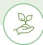

另一方面，结合社区公共空间与配套设施条件，积极营造绿色出行友好环境，鼓励居民选择步行、骑行与公共交通等低碳方式出行。公司不断提升居民对绿色生活方式的认同度与参与度，推动形成共建共享的绿色社区氛围。

# 开展生态保护

# 绿化养护方面

公司注重植物群落的健康维护与季节性管养，通过科学修剪、补植复绿、病虫害防治等措施，保持绿地景观效果与生态稳定性，提升社区微气候调节与生态服务功能。

# 海绵设施维护方面

公司加强雨水花园、下凹式绿地、透水铺装等设施的日常巡检与维护，及时清理落叶与淤积物，保障渗透、滞蓄与排水通畅，确保设施在降雨条件下有效发挥雨洪调蓄与径流削减作用；对雨水收集回用系统等设施，注重运行状态检查与必要维护，提升系统稳定性与使用效率。

# 生态扰动控制方面

公司在涉及绿化改造、维修施工等运营活动中强调生态扰动控制，尽量减少对现有植被与生态空间的影响，施工结束后及时恢复场地与绿化，持续维护社区生态环境品质。

# 环境治理与低碳建设

津投城开持续加强环境治理资源保障，围绕施工现场污染防治、资源节约利用及运营阶段生态维护等工作，统筹推进环保相关投入与合规缴费，确保环境管理措施落实到位、风险防控可控有效。

# 环保投入

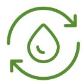

公司结合项目实施与日常管理需要，落实环保相关投入与合规费用支出。报告期内，部分下属公司发生环保相关费用及资源类缴费情况如下：苏州华强公司环保相关费用40.25万元，天蓟公司缴纳水资源费17.56万元，华博公司环保相关费用3.4325万元。上述费用主要用于支持环境治理与资源管理相关工作开展，为绿色建造与合规运营提供必要保障。

# 低碳宣贯

公司注重以过程宣贯带动能力提升，将绿色低碳理念融入方案研究、技术论证、项目沟通与日常管理环节，持续推动设计、工程与运营条线对绿色建造要求的理解与执行。报告期内主要通过方案研究、技术交流与项目评审等方式强化绿色要点落实。

# 以人为本

# 构建和谐社会

社会责任实践

产品与客户责任

供应链管理

员工发展与权益保障

津投城开在履行社会责任过程中，立足城市开发主体定位，将服务城市发展、回应民生关切作为社会责任实践的重要方向。公司坚持将社会责任融入项目建设与运营全过程，通过参与社区共建、完善城市功能、开展公益服务和强化应急保障等方式，持续拓展企业发展的价值内涵。在此基础上，公司同步加强员工权益保障、客户责任履行和供应链规范管理，推动社会责任在外部实践与内部治理中协同落实。鉴于公司主营业务主要集中于城市开发、物业服务及相关资产运营领域，业务开展区域和服务对象主要面向城市社区与城市功能提升，未直接涉及乡村振兴相关业务或专项工作。报告期内，乡村振兴议题对公司经营发展不具有重要性。

# 社会责任实践

# 社区共建

# 文化活动

报告期内，津投城开旗下华升物业立足项目运营一线，持续加强与属地街道、居委会及业主组织的联动协作，以节庆活动、主题纪念与公益课堂为主要载体，推动社区文化共建常态化开展。华升物业坚持“共建共治共享”的工作导向，将文化活动组织、居民参与和关怀延伸有机结合，在丰富业主精神文化生活的同时，增进邻里互动与社区凝聚力，体现国有企业基层服务的责任担当与温度。

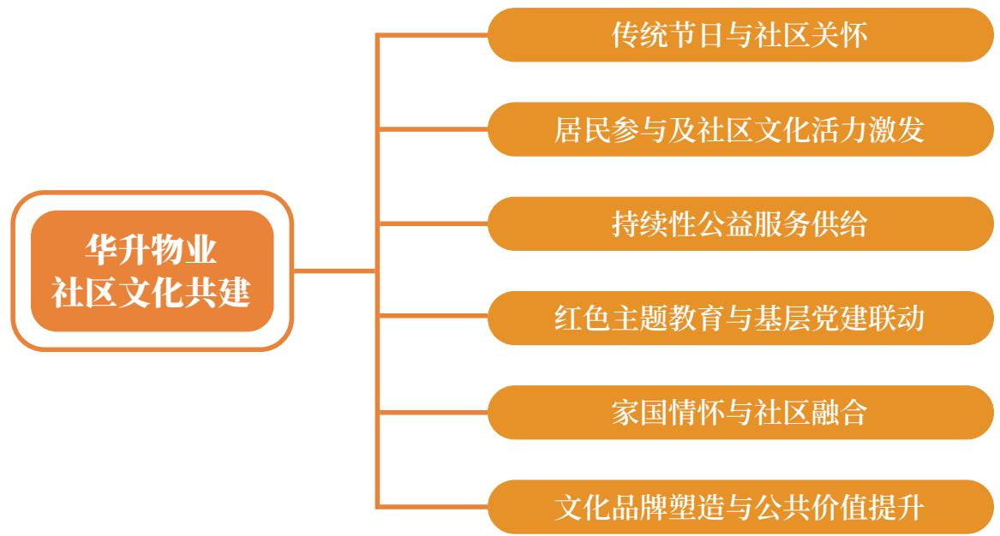

flowchart

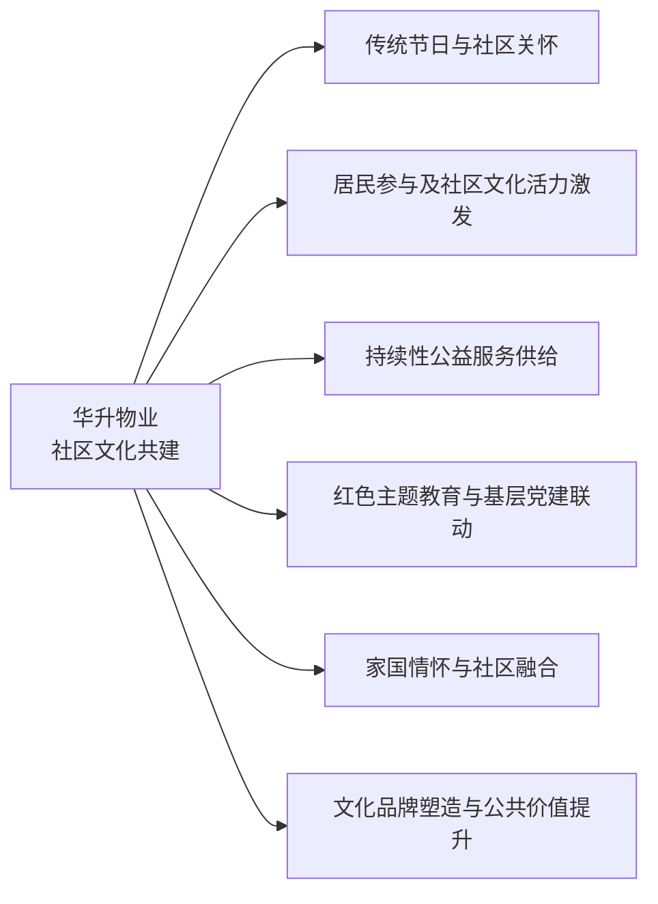
```mermaid
graph LR
  A["华升物业\n社区文化共建"] --> B["传统节日与社区关怀"]
  A --> C["居民参与及社区文化活力激发"]
  A --> D["持续性公益服务供给"]
  A --> E["红色主题教育与基层党建联动"]
  A --> F["家国情怀与社区融合"]
  A --> G["文化品牌塑造与公共价值提升"]
```

# 传统节日与社区关怀

2月11日，华升物业天开园项目部联合南开区学府街与荣迁西里社区居委会启动“艺起悦来”文化艺术节并开展蛇年闹元宵活动，通过猜灯谜、民俗互动等形式营造节日氛围。活动结束后，物业与社区工作人员共同走访空巢老人，将节日慰问与入户关怀落到实处，以“小行动”传递“真关切”，让服务延伸到社区更需要的角落。

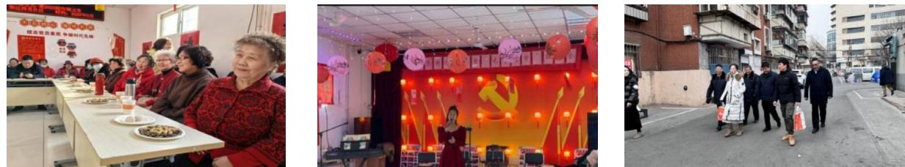

# 居民参与及社区文化活力激发

3月8日，华升物业联合荣迁西里社区戏曲班、舞蹈队、交际舞队等居民文艺团队开展“三八妇女节”联谊活动，搭建居民展示舞台，推动“物业搭平台、居民唱主角”。通过组织社区文艺力量共同参与，既提升居民参与感与获得感，也在共同的兴趣与互动中促进邻里关系更加融洽。

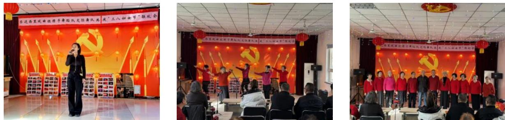

# 持续性公益服务供给

天开园项目于 4 月至 9 月期间开展每周固定的奥尔夫幼儿音乐课堂，面向业主及周边群众免费开放，形成稳定、可持续的社区亲子公益课程体系。课程以音乐启蒙为纽带，为幼儿家庭提供共同学习与成长的公共空间，在“润物细无声”的陪伴中提升社区生活的教育内涵与文化质感。

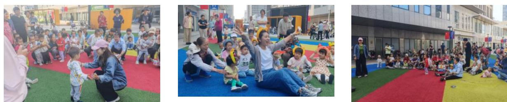

# 红色主题教育与基层党建联动

7月1日，华升物业联合学府街及荣迁西里社区居委会举办“百年风华—七一弦歌”文艺汇演，庆祝建党104周年，并融入“光荣在党50年”纪念章颁发等环节，将社区文化活动与庄重的政治纪念有机结合，增强社区价值认同，彰显国有企业服务基层治理的政治底色与责任意识。

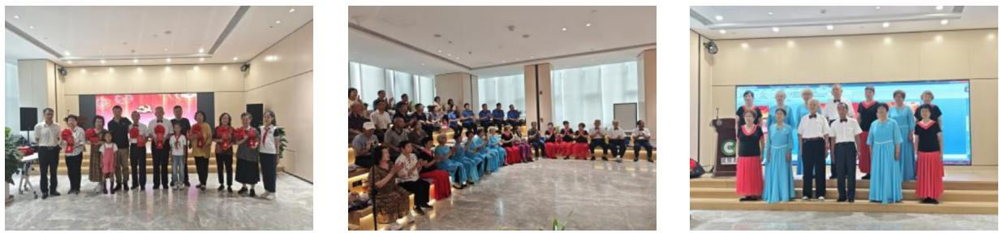

# 家国情怀与社区融合

9月30日，华升物业在新盈庄园项目联合双新街新薇家园社区党总支举办“月满中秋家国庆—情暖新薇颂华章”文艺汇演，将中秋团圆意象与国庆氛围融合，凝聚居民对家国安康、社区和睦的共同情感与认同。

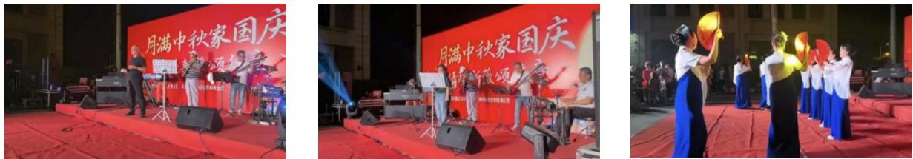

# 文化品牌塑造与公共价值提升

9月组织开展第二届“天开—宏达文化生活月”，华升物业员工参与活动组织与服务保障，以音乐演出、现场互动等形式丰富园区夜间文化生活，并在9月29日以交响乐团闭幕盛典为文化生活月画上句号。通过持续一个月的文化活动供给，园区文化吸引力与人气活力得到有效提升，文化活动在片区运营中成为增强社区黏性、促进公共空间活化的重要“软实力”。

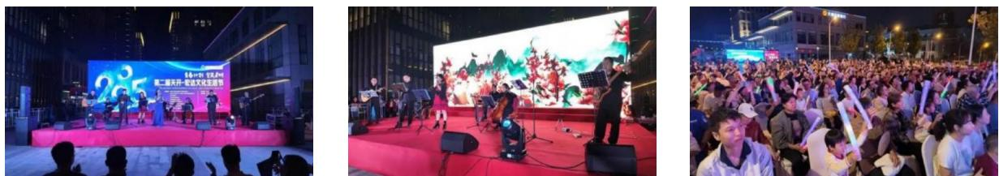

总体来看, 华升物业围绕 “节庆有氛围、活动有参与、服务有延伸、共建有联动” 的思路, 形成覆盖老人、妇女、幼儿及广大居民的多元化社区活动体系。公司以文化共建推动物业服务从 “环境维护与秩序管理” 向 “人文关怀与社区营造” 拓展, 持续增进业主与社区的情感联结, 为构建和谐社区关系、提升基层公共服务温度贡献力量。

# 红色物业

报告期内，华升物业以“红色物业”建设为抓手，主动融入属地社区治理体系，围绕居民实际需求和基层治理中的突出问题，持续深化党建引领下的物业服务实践。在新盈庄园项目，物业服务中心设立24小时服务热线，畅通居民咨询、报修和诉求表达渠道，做到“有求必应、有问必答”。

  
2025年全年累计

<table><tr><td>受理居民诉求</td><td>办结率</td><td>居民满意率</td></tr><tr><td>279件</td><td>100%</td><td>97%</td></tr></table>

在夯实基础服务的同时，华升物业注重将服务向社区特殊群体延伸，围绕老年人、残疾人等群体，组织开展上门服务和关爱活动，全年累计提供上门服务约30余次。同时，结合居民实际需求，持续开展便民服务活动12次、各类节日主题活动10余次，通过贴近生活的服务举措，增强居民对社区的认同感与归属感。

# 依托 “红色物管团”，华升物业在重要时间节点开展系列暖心行动。

春季前夕，组织入户慰问孤寡老人、失能老人及失独老人，为其送去米、面、油等生活必需品。

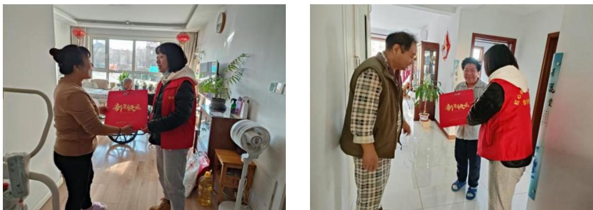  
入户慰问孤寡老人

春节期间，开展入户送福活动，传递节日祝福与关怀。

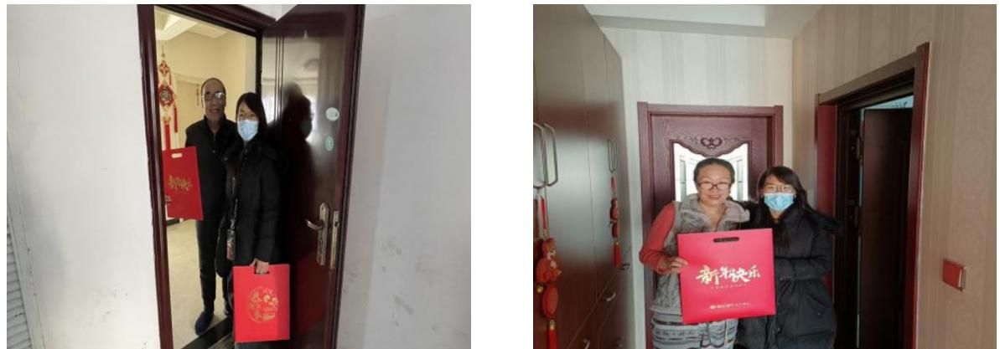  
为业主入户送福

围绕 “3·5 学雷锋纪念日” “三八妇女节” “3·12 植树节” 等主题，组织入户敬老、送花慰问及社区共建活动，推动党建引领与社区服务深度融合。

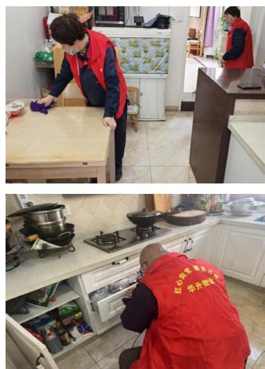  
3·5 学雷锋纪念日

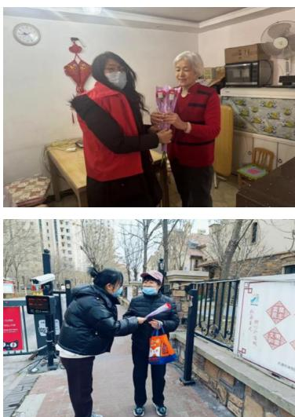  
三八妇女节

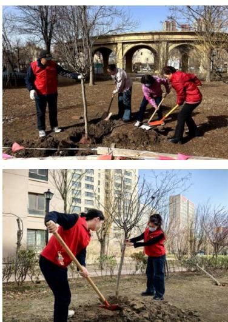  
3·12 植树节

在母亲节期间，开展送伴手礼活动，以细致关怀回应居民情感需求。

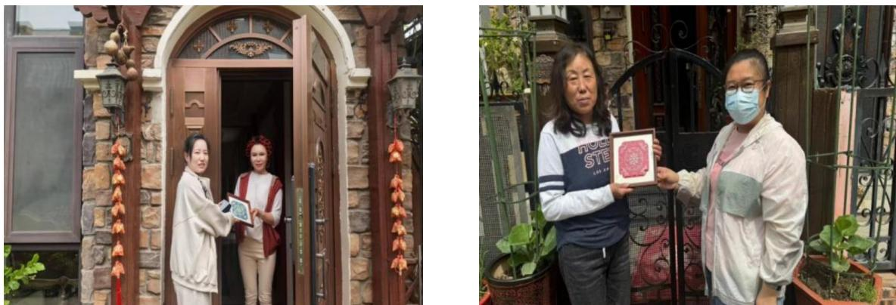  
母亲节送伴手礼

# 机制建设方面

华升物业坚持常态化沟通协商机制，每月联合社区开展“项目经理接待日及便民服务日”活动，搭建物业、社区与居民面对面交流的平台，推动问题及时发现、诉求快速响应和服务持续改进，逐步形成“党建引领—诉求响应—服务延伸—居民反馈”的社区服务闭环。

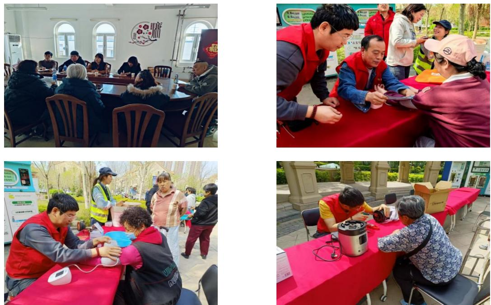

总体来看，华升物业通过推进“红色物业”建设，将物业管理服务由基础保障向参与基层治理延伸，在提升社区服务温度的同时，强化了社区治理协同效能，充分体现了国有企业在基层治理和民生服务中的责任担当。

# 城市功能提升公共价值创造

# 服务城市发展

津投城开在项目规划和实施过程中，注重与城市发展规划和区域功能定位相衔接，围绕居住、公共服务和配套设施建设等方面，推动项目建设与城市功能完善协同推进。公司通过合理布局项目功能，促进居住、交通、公共服务等要素的有机衔接，助力城市空间结构优化和功能提升。

通过将项目建设融入城市发展整体布局，公司在满足自身经营目标的同时，积极服务城市功能完善和发展需求，体现城市开发企业的责任担当。

# 公共空间运营

津投城开立足城市开发主体责任，将服务园区功能完善与公共空间高效利用作为履行社会责任的重要内容。在天开高教科创园物业服务管理过程中，公司通过强化公共活动保障、完善园区服务支撑，推动园区商业活力、文化氛围与公共秩序协同提升，助力打造创新要素集聚、功能复合、活力充沛的城市空间。

# 案例：第二届“天开—宏达文化生活节”

报告期内，在首届“天开—宏达文化生活节”取得良好社会反响的基础上，天开园于2025年9月举办第二届“天开—宏达文化生活节”，活动持续25天，采用“大型主题演出+日常小型展演”相结合的形式，系统开展公共文化活动供给。活动期间设置固定及临时摊位共44个，涵盖文创、非遗、餐饮及便民服务等多元业态，有效集聚人气，促进园区公共空间活化与商业氛围提升。

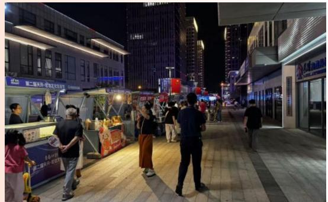

text_image

Night street scene with illuminated buildings, a food truck, and people walking, featuring visible Chinese signage on the vehicle and banners.

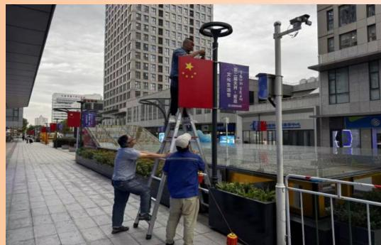

text_image

Street photo showing people cleaning a large Chinese national flag on a public area, with visible signage and modern buildings in the background.

作为园区物业管理服务的核心力量，华升物业围绕活动全周期运行需求，提前介入方案审核与现场踏勘，制定专项保障方案，统筹推进工程保障、安全防控、秩序维护和环境卫生等工作。在活动期间，物业团队通过设施设备巡检、用电保障、人员疏导、高频次保洁及应急处置等举措，确保公共活动安全有序开展，为园区持续一个月的文化活动运行提供稳定支撑。

通过参与天开园公共文化活动的组织保障与空间运营，津投城开及所属华升物业有效提升了园区公共服务承载能力和空间使用效率，在激发园区文化活力的同时，促进商业要素集聚与人气提升，体现了国有企业在城市功能运营和公共价值创造中的责任担当。

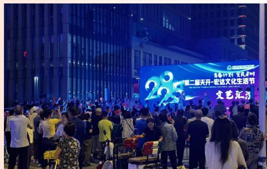

text_image

第二届天开-宏达文化生活节
文艺汇源

# 公益活动

津投城开始终将公益行动融入企业治理与日常运营，坚持以“员工参与+社区共建”的方式履行社会责任。公司持续倡导并组织员工参与无偿献血等公益活动，以实际行动支持地方公共卫生保障体系建设，在企业内部营造“人人可参与、处处可公益”的氛围。

未来，公司将结合员工志愿服务机制建设，进一步完善公益活动组织、激励与保障措施，持续拓展公益参与的覆盖面与专业化水平，让公益行动成为企业可持续发展的重要组成部分。

# 产品与客户责任

津投城开将产品品质与客户责任作为回应民生需求、夯实企业信誉的重要支点，围绕城市开发建设主业，持续把质量控制、交付管理与服务体验贯穿项目全生命周期，通过制度固化、过程管控与持续改进，为客户提供安全可靠、体验稳定的产品与服务。

# 质量管控

公司持续完善工程质量管理制度与责任体系，明确规划设计、施工实施、竣工验收等各阶段的质量要求和职责边界，推动质量管理由“结果把关”向“全程控制”转变。围绕关键工序与重点节点，公司加强材料进场管理、工序交接检查与现场巡检抽查，及时识别并纠正质量偏差；同时将质量要求纳入参建单位过程管理，与进度、安全同步推进，压实施工单位质量责任。公司严格落实竣工验收程序与质量责任机制，规范验收标准与流程要求，确保交付成果符合设计要求与使用规范。在此基础上，公司结合项目定位与客户需求，持续优化细节与施工品质，提升居住耐久性与使用合理性。

# 客户服务

公司坚持以客户需求为导向，依法合规开展销售与服务活动，注重保障客户在信息获取、合同履行与售后服务等方面的合法权益，降低信息不对称带来的沟通成本与争议风险。公司持续完善服务渠道与沟通机制，通过服务窗口、服务热线等方式提升诉求受理与响应效率，推动客户问题实现“可受理、可流转、可跟踪、可反馈”。针对投诉与问题处理，公司建立分类受理与责任到人的处置流程，注重从源头分析原因并推动改进措施落地，减少问题重复发生。交付后，公司依托物业运营与社区服务持续提升客户体验，围绕设施维护、秩序管理与日常响应优化服务流程，增强客户满意度与信任度。

# 宜居体验

公司将安全、健康与舒适作为产品建设与社区运营的重要目标，贯穿规划设计、工程实施、交付使用与后续管理全过程。

# 安全方面

公司严格落实设计规范与工程标准，关注结构安全、设施设备安全与公共空间风险管理；交付后通过巡检维护与隐患排查形成闭环，降低居住风险。

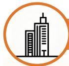

# 健康方面

公司通过通风采光优化、环境卫生管理与绿化养护等举措改善居住环境质量。

# 舒适方面

公司结合不同家庭结构与生活方式需求，优化户型功能与公共配套配置，提升空间使用效率与生活便利性，并持续维护社区公共空间品质，营造整洁有序、宜居友好的社区氛围。

# “好房子”建设

公司积极对接国家与地方“好房子”政策导向，将安全舒适绿色智慧理念融入开发、建设与运营全过程，推动住房供给从“满足基本居住”向“提升居住品质”升级。公司结合城市功能布局与区域发展特点，优化产品供给结构与定位，提升供给与需求适配度；在规划设计中强化功能完善与使用体验，注重户型、公共空间与生活配套的协同配置，增强居住便利性与获得感。公司统筹住宅开发与城市更新、片区提升及公共配套建设，服务城市品质提升与民生改善，并通过项目经验沉淀与居民反馈吸收持续优化供给质量，体现国有企业在住房建设与城市发展中的责任担当。

# 供应链管理

津投城开高度重视供应链管理在保障工程品质、控制经营风险与履行社会责任中的基础作用，坚持依法合规、公开透明、风险可控的原则，持续完善招采管理、供应商管理与履约监督机制，推动与合作伙伴形成规范协作、互信共赢的合作生态。

# 准入招采

公司建立并持续完善招标采购管理制度，对采购方式、流程节点、职责分工与审议要求作出明确规范，确保采购活动有章可循、过程可追溯。公司依据项目性质依法依规选择采购方式，规范信息发布、评审组织与结果确认等关键环节，维护公平竞争秩序。

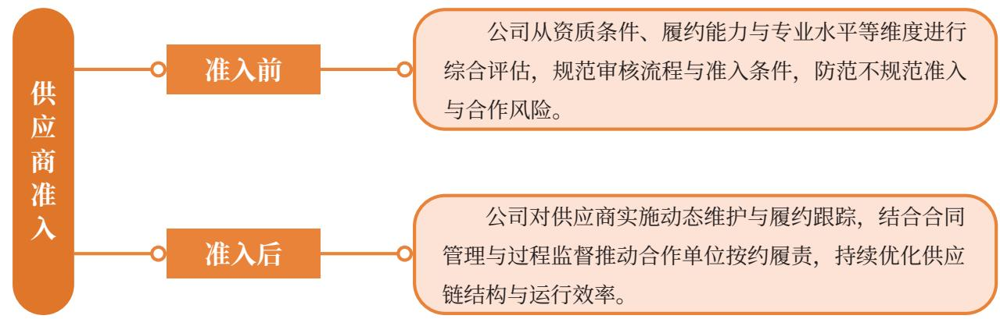

flowchart

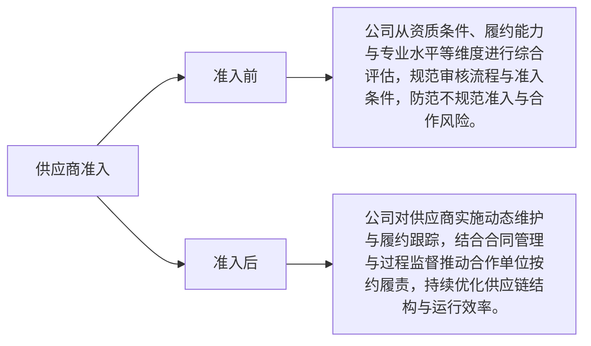
```mermaid
graph LR
  A["供应商准入"] --> B["准入前"]
  A --> C["准入后"]
  B --> D["公司从资质条件、履约能力与专业水平等维度进行综合评估，规范审核流程与准入条件，防范不规范准入与合作风险。"]
  C --> E["公司对供应商实施动态维护与履约跟踪，结合合同管理与过程监督推动合作单位按约履责，持续优化供应链结构与运行效率。"]
```

# 合规廉洁

公司将合规与廉洁要求贯穿招采、合同与履约管理全过程，聚焦供应商选择、合同签订、变更管理与结算支付等关键风险点，通过制度约束、流程管控与岗位责任落实，防范商业贿赂与不正当交易。公司依法签订合同，明确权利义务与履约边界，并在执行阶段强化监督管理，降低合规风险与纠纷隐患。公司通过职能协同与内部监督形成相互制约的管理格局，同时在合作过程中强化合规倡导与廉洁提醒，促进与合作伙伴形成守法合规、诚信合作的共识，营造公平有序的合作环境。

# 安全质量

公司将安全生产与工程质量作为供应链管理的底线要求，注重在招标文件、合同条款与现场管理标准中前置明确安全、质量责任边界，推动合作单位严格执行施工规范与安全操作要求。

结合工程建设参与主体多、链条长的特点，公司通过现场巡查、过程检查与节点验收强化责任落实，及时发现并纠正不规范行为，推动质量管理由事后整改向过程控制转变。

# 安全生产与工程质量

对检查发现问题，公司落实“发现—整改—复核”的闭环机制，督促责任方整改到位，减少同类问题反复发生，持续提升供应链整体安全性与可靠性。

# 协同发展

在依法合规基础上，公司注重与具备能力与良好履约记录的合作伙伴建立稳定合作关系，通过明确分工界面与加强沟通协调，提升项目推进效率并降低衔接风险。公司重视信息沟通机制建设，保障进度安排、质量要求与管理标准准确传达与有效执行；并通过强化履约管理，督促合作单位按照合同约定履行责任义务，提升供应链运行稳定性与可控性。公司倡导合作伙伴规范经营与能力提升，促进良性互动与共同发展，并结合项目实践持续总结改进，优化协同机制与管理方式，推动供应链体系更加规范、稳定、可持续。

# 员工发展与权益保障

津投城开坚持以人为本的企业价值观，重视员工个性化需求与职业发展，尊重并保障每一位员工的合法权益。报告期内，公司结合业务布局持续优化人才结构，强化合规用工与安全管理，完善薪酬福利与关怀机制，推进培训赋能与职业发展通道建设，致力于构建与员工、企业共同成长的发展平台。

# 用工合规

津投城开严格遵守《中华人民共和国劳动法》《中华人民共和国劳动合同法》《中华人民共和国社会保险法》等法律法规，结合国有企业管理要求，持续健全人力资源管理体系。公司围绕招聘录用、聘任上岗、薪酬管理、绩效考核、休假管理、员工保险等关键环节，制定《员工招聘管理规定》《员工晋升考核管理规定》《员工薪酬管理办法》等四十余项人力资源管理制度，以制度化、流程化管理提升用工管理规范性与可控性。

公司依法与员工建立劳动关系，规范劳动合同签订、履行与管理流程，明确岗位职责与权责边界，保障劳动关系合法、清晰、稳定；同时严格禁止使用童工和非法劳工，坚决杜绝强迫劳动、骚扰虐待等行为，倡导多元化与公平竞争，对不同民族、国籍、性别、年龄、宗教信仰等员工一视同仁，坚决反对任何形式就业歧视。

# 截至 2025 年末

公司共有员工

409名

劳动合同签订率

100%

社会保险覆盖率

100%

# 员工构成

员工性别结构  
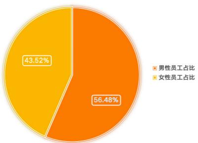

pie

| Category | Percentage |
| --- | --- |
| 男性员工占比 | 56.48% |
| 女性员工占比 | 43.52% |

员工年龄结构  
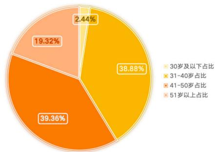

pie

| Category | Percentage |
| --- | --- |
| 30岁及以下占比 | 2.44% |
| 31-40岁占比 | 38.88% |
| 41-50岁占比 | 39.36% |
| 51岁以上占比 | 19.32% |

员工学历结构  
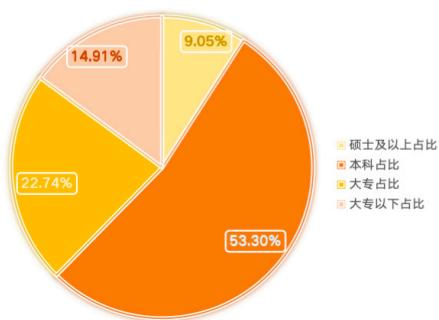

pie

| Category | Percentage |
| --- | --- |
| 硕士及以上占比 | 9.05% |
| 本科占比 | 53.30% |
| 大专占比 | 22.74% |
| 大专以下占比 | 14.91% |

员工职称结构  
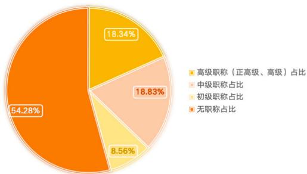

pie

| Category | Percentage |
| --- | --- |
| 高级职称（正高级、高级）占比 | 18.34% |
| 中级职称占比 | 18.83% |
| 初级职称占比 | 8.56% |
| 无职称占比 | 54.28% |

# 薪酬福利

公司持续优化薪酬结构与绩效考核制度，强化薪酬与绩效结果联动，实行差异化薪酬激励机制；同时设立基于绩效的奖金制度，明确绩效评估标准与分配规则，确保激励分配的公平性与透明度，提升组织效率与队伍活力。

公司严格按规定为员工缴纳五险一金，依法保障员工休息休假等合法权益，并在法定福利基础上构建多层次补充福利体系，涵盖带薪休假、防暑降温补贴、采暖补贴、困难员工慰问、退休人员慰问、节日/生日/婚丧慰问等，持续提升员工获得感、幸福感与归属感。

# 2025年“夏送清凉”慰问活动

连日高温期间，为做好防暑降温、保障一线职工健康安全，公司工会开展2025年“夏送清凉”慰问活动。7月15日，公司党委副书记、工会主席商鹏带队赴沙柳北路项目、盛文佳苑项目现场慰问，为坚守岗位的职工发放防暑降温物资及补充电解质饮品，并详细了解一线工作生活情况，叮嘱科学安排作息、加强高温防护，推动项目将职工健康安全放在首位，确保安全生产与工程建设稳步推进。

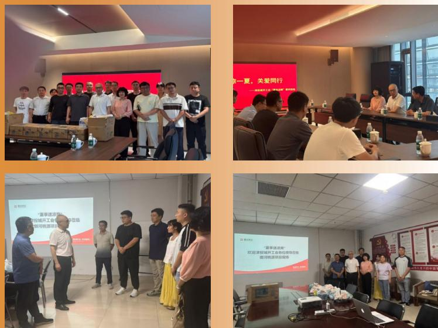

# 安全生产

津投城开坚持 “安全第一、预防为主”，依据《中华人民共和国安全生产法》等法规，建立 “全员安全责任制” 体系，涵盖安全生产组织架构、安全施工规范、教育培训、隐患排查、应急管理等核心制度，明确从主要负责人到岗位员工的 “一岗双责”。报告期内，公司未发生重大安全事故。

# “风险管控，隐患清零”

# 检查

开展各类安全检查123次，发现安全隐患125件，整改完成125件，整改完成率100%。

# 预算

落实安全投入预算88万元，用于安全设施升级、应急物资储备等。

# 演练

组织应急演练2场，
覆盖火灾、汛期等场景。

安委会会议每季度召开 1 次，本年度累计召开 4 场，由总经理牵头召集，安委会成员全员参会（特殊情况委托部门安全负责人参会），审议安全投入、制度修订等重大事项。

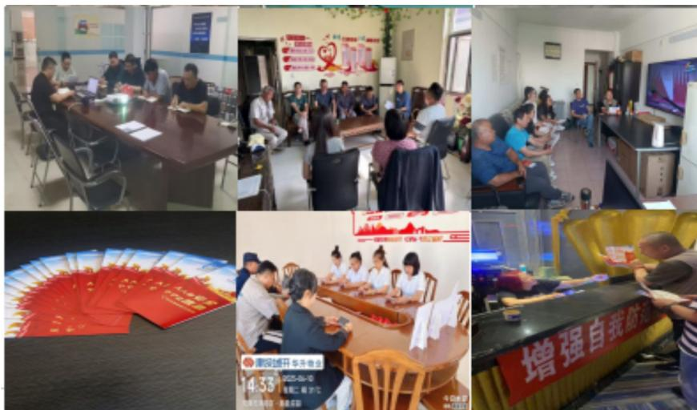

text_image

Collage of four scenes: meeting room with participants, meeting room with TV, meeting room with people, and community service counter with visible signage.

安委会会议现场图

在安全教育方面，公司采用线上线下同步的方式，持续开展安全生产培训，本年度累计培训940人次，应培训员工总数290人，全员覆盖率100%。

# 2025年

本年度累计培训

940 人次

应培训员工总数

290人

全员覆盖率

100%

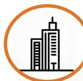

# 公司积极开展“安全生产月”专题活动

一是在公司各在建项目和物业管理项目，利用现场宣传橱窗、宣传栏、宣传画册和宣传条幅，广泛宣传学习《中华人民共和国安全生产法》、《天津市安全生产条例》等安全生产法律、法规。6月中旬，公司工会、公司安委会联合组织举行津投城开2025年安全生产知识考试，共计有200余人次参与本次安全知识考试活动。

二是组织进行应急演练活动，进一步提高应对突发事件的能力。公司于6月19日邀请第三方专家指导沙柳北路项目依据自身实际风险特点进行一次安全应急演练，同时邀请其他各子公司主要负责人及安全管理人员到场观摩，推动安全意识入脑入心。

# 员工发展

公司高度重视人才培养与发展, 建立灵活的人才引进机制, 拓宽招聘渠道, 通过内部招聘、线上招聘平台、校园招聘、猎头服务等多种方式, 引进高质量人才, 为企业注入新鲜血液。

# 完善人才激励机制

设立基于绩效的奖金制度，通过明确的绩效评估标准，确保奖金分配的公平性和透明度。全面深化项目承包制改革，建立“权责对等、利益共享、风险共担”的市场化经营机制，充分激发员工主人翁意识。对于关键岗位及核心人才，建立人才储备库，为其提供晋升机会和职业发展空间。

# 推动组织变革

根据业务变化不断优化组织架构，增强职能部门条线管控及整合能力，提高组织的灵活性和协同性，全面提升组织效能与市场竞争力。

# 调整薪酬结构及绩效考核制度

将薪酬与绩效强挂钩，实行差异化薪酬激励机制及不胜任干部强制退出制度，提高管理效率、增强员工队伍活力。

# 人文关怀

公司持续关注员工身心健康与人文关怀，努力营造温馨、健康、幸福的职场氛围。通过工会组织与多元活动载体，公司常态化开展节日慰问、困难帮扶等关爱举措，把关怀延伸到基层一线；同时结合员工兴趣与结构特征，定期组织文体与主题活动，增强沟通交流与团队凝聚力。

# 2025 年度职工文体活动

为丰富职工文化生活、促进身心健康，公司工会组织开展2025年度职工文体活动。活动设置棋牌与竞技两大类，涵盖象棋、跳棋、踢毽、跳绳、呼啦圈等项目，以多元形式激发职工活力、增强团队凝聚力和企业文化认同。报告期内，共有260余名职工报名参赛，其中45岁以上员工占比超过40%，活动兼顾不同年龄段需求，参与面广、带动性强。

通过本次活动，职工在运动中释放压力、放松身心，跨部门互动进一步打破沟通壁垒，推动形成协同联动的“一盘棋”工作氛围，增强了团队归属感与组织凝聚力。未来，公司工会将持续优化活动形式与组织机制，提升职工文体活动的吸引力与实效性，推动其从“娱乐载体”向“文化引擎”升级，为企业高质量发展注入持久活力。

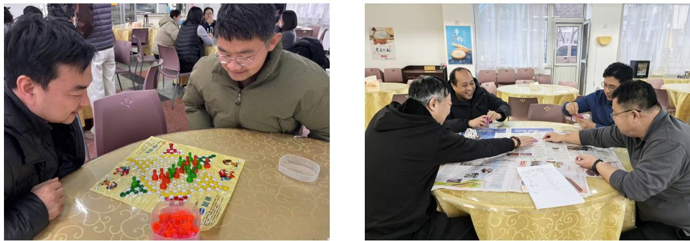

# 走访慰问市级劳模与退休员工

为弘扬劳模精神、传递组织关怀，津投城开领导班子在重要节日及集中慰问期间，组织开展对天津市劳动模范和退休员工的走访慰问。慰问过程中，领导与劳模、退休员工亲切交流，详细了解其身体状况、生活情况与实际需求，感谢他们为公司改革发展和项目建设作出的贡献，并送上慰问品与节日祝福。

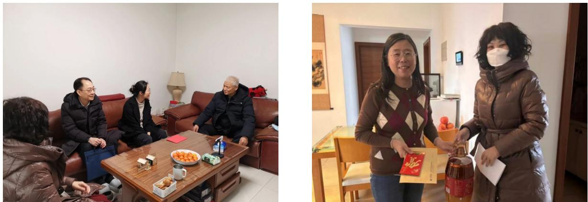

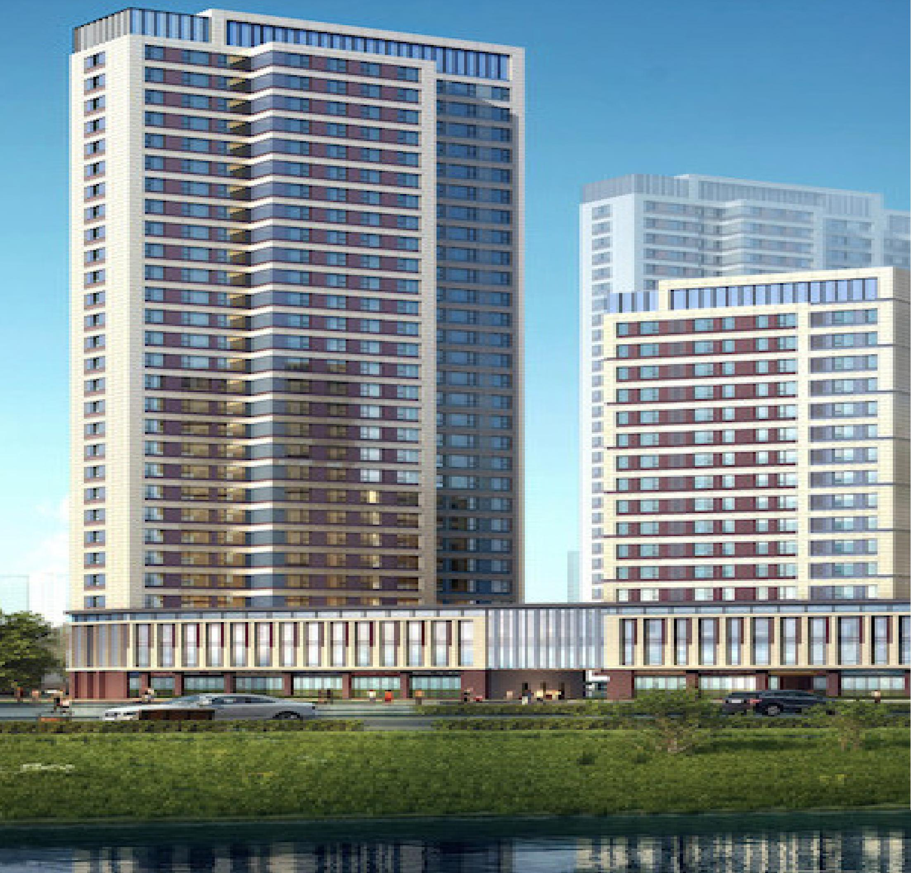

natural_image

Exterior view of modern high-rise residential buildings with glass facades and adjacent greenery (no signage or text visible)

# 合规治理

# 护航公司发展

治理体系

风险管理

商业诚信

信息安全

利益相关方沟通

# 治理体系

津投城开严格遵循《公司法》《证券法》及行业监管要求，构建契合中国特色现代企业制度与行业特性的治理体系，筑牢稳健经营与可持续发展根基。深度融合房地产行业资金密集、产业链长的特点，以合规运营为核心，建立覆盖项目全生命周期的风控闭环，强化信息披露与投资者沟通机制。同时兼顾利益相关者权益，将社会责任与行业转型要求嵌入治理实践，通过规范的议事规则与内控机制，保障公司运营透明高效，为高质量发展提供坚实支撑。

# 治理结构

公司构建了以股东会为最高权力机构、董事会为决策核心、高级管理层为执行主体的治理架构，全面契合《公司法》及房地产行业监管要求。股东会依法行使重大事项决策权；董事会下设提名委员会、薪酬与考核委员会、战略及投资评审委员会、预算与审计委员会4个专门委员会，为董事会决策提供专业支撑与科学论证；高级管理层聚焦战略落地，统筹推进项目开发、投融资管理等核心业务。各治理主体权责清晰、制衡有效，保障公司运营规范透明，为企业稳健发展筑牢组织根基。

# 股东会

作为公司最高权力机构，依法行使重大事项决策权。严格保障全体股东平等行使股东权利，规范议事程序与表决机制，充分听取股东意见，维护股东合法权益，为公司治理奠定坚实基础。

# 报告期内

召开股东会

8 次

# 董事会

作为公司决策核心，统筹制定中长期发展战略、重大经营决策及风险防控方案。严格履行对股东会的忠实与勤勉义务，高效衔接股东诉求与经营实践，通过科学决策推动公司稳健发展。

# 报告期内

召开董事会

16 次

# 董事长

主持股东会、董事会会议，统筹战略规划与治理架构，对合规运营、股东权益保护负统领责任。

# 总经理

主持日常经营管理，组织实施董事会决议，统筹生产运营与团队管理，对经营效益与战略落地承担执行责任。

公司董事会下设提名委员会、薪酬与考核委员会、战略及投资评审委员会、预算与审计委员会。

# 提名委员会

主要负责对公司董事和高级管理人员的人选、选择标准和程序进行选择并提出建议，规范公司领导人员的产生，优化董事会组成。

# 薪酬与考核委员会

主要负责制定公司董事及高级管理人员的考核标准并进行考核；负责制定、审查公司董事及高级管理人员的薪酬政策与方案，对董事会负责。

# 战略及投资评审委员会

主要负责对公司长期发展战略和重大投资决策进行研究并提出建议。增强公司核心竞争力，确定公司发展规划, 健全投资决策程序, 加强决策科学性, 提高重大投资决策的效益和决策的质量。

# 预算与审计委员会

主要负责公司内、外部审计的沟通、监督和核查工作。强化董事会决策功能，做到事前审计、专业审计，确保董事会对经理层的有效监督，进一步完善公司治理结构。

# 组织召开《公司法》讲座

2025 年 12 月，津投城开邀请天津嘉德恒时律师事务所召开以 “上市公司规范运作之新公司法视角” 为主题的讲座。会上对《公司法》的修订背景、新《公司法》修订内容进行解读，同时提出新《公司法》规制体系下需注意的法律问题以及上市公司应对新公司法的规范运作建议。

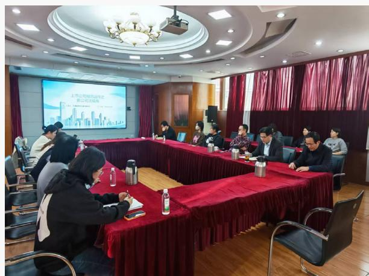

text_image

Meeting room photo with visible presentation screen showing Chinese text about a company's business development and data visualization

# 治理制度

津投城开严格以《公司法》《证券法》及房地产行业监管政策为根本遵循，合规制定完善治理制度体系。制度构建覆盖治理架构、决策流程、权责边界、风险防控等核心领域，制定过程严格履行调研论证、合规审查、集体审议等规范流程。同时建立动态更新机制，持续对标最新监管要求，将合规理念深度融入治理全环节，确保制度的合法性、科学性与实操性，为公司规范运营、稳健发展筑牢制度根基，切实维护股东及利益相关者合法权益。

# 津投城开报告期内公司主要治理制度

《天津津投城市开发股份有限公司公司章程》

《天津津投城市开发股份有限公司股东会议事规则》

《天津津投城市开发股份有限公司董事会议事规则》

《天津津投城市开发股份有限公司董事会提名委员会实施细则》

《天津津投城市开发股份有限公司董事会薪酬与考核委员会实施细则》

《天津津投城市开发股份有限公司董事会战略及投资评审委员会实施细则》

《天津津投城市开发股份有限公司董事会预算与审计委员会实施细则》

《天津津投城市开发股份有限公司董事会授权管理办法》

《天津津投城市开发股份有限公司独立董事制度》

《天津津投城市开发股份有限公司独立董事年报工作制度》

《天津津投城市开发股份有限公司关联方交易管理方法》

《天津津投城市开发股份有限公司内部审计办法》

《天津津投城市开发股份有限公司内部控制评价办法》

# 风险管理

报告期内，津投城开构建起以风险管理为核心、内部控制为支撑的治理保障体系，全面覆盖经营管理各环节。建立全流程风险管控机制，精准识别、评估、管控风险。通过健全内控规章制度、明确权责分工、强化流程监督，形成风险预警、处置与复盘的闭环管理。持续优化内控流程与风控技术，保障公司经营决策科学合规，有效防范化解各类风险，护航企业高质量发展。

# 风险管理体系

津投城开建立内审与外审协同发力的风险管理体系，为合规经营与稳健发展筑牢坚实保障。内审立足企业内部管理需求，围绕内部控制与全面风险管理开展工作，覆盖经营发展各领域各环节，重点抓实三项法律审核等法治基础工作，通过机制优化完善持续提升内部治理与风险防控水平。外审借助外部律师专业资源，与公司法务部形成工作合力，全方位参与公司法律风险防范相关工作，从合规体系建设、风险应对处置到专业能力培训多维度发力，有效补强公司风险防控专业支撑，构建起内外联动、全域覆盖的风险防控格局。

# 内审方面

内审主要关注企业的内部控制和风险管理，范围相对广泛，涵盖组织的各个方面，包括财务、运营、合规、风险管理等，特别是在规章制度、经济合同和重要决策法律审核（以下简称三项法律审核）等法治基础性工作上下大功夫，筑牢法治城开的体制之基，报告期内三项法律审核已优化完善，取得了显著效果。

# 外审方面

外审是指聘用外部律师，配合公司法务人员完成公司法律风险防范工作。包括负责进行日常合规问题的解答（如梳理存在的法律风险并出具整改建议）、合规体系的建设（如设计多业务板块的一体化合规组织架构、全面完善合规制度体系）、合规事件的应对（如配合公司接受合规行政调查，进行综合危机管控）和相关专题（如反垄断、反腐败、公司法、刑事等方面）的培训。

公司按照国家法律法规规定及上级主管单位要求，构建并完善“三道防线”责任体系，严格执行合规审查机制，所有重要规章制度、经济合同、重大决策必须经过法务合规部门审查，并留痕存档；建立合规咨询便捷渠道，法务人员、公司律师及时解答回复；对全员开展合规培训，通过常态化培训、高管宣讲、案例警示等方式，将合规要求嵌入企业文化与员工行为准则，使合规从外在要求内化为行为自觉。

# 业务部门

业务部门作为风险识别第一道防线，立足日常经营全业务流程，承担前端风险排查首要职责。通过建立常态化风险排查机制，将风险识别嵌入日常工作各环节，实时收集、初步研判各类潜在风险信息，及时向上传导风险信号，为后续风险管控提供基础支撑。

# 风控合规部门

风控合规部门作为风险管理的统筹管控主体，承接前端业务风险信息，搭建系统化、标准化的风险管理体系。牵头制定风险管理制度、管控标准及操作流程，明确各领域风险识别要点与处置规范，统筹跨部门风险研判与协同管控。通过常态化巡查、专项核查，监督业务部门风险责任落实及处置成效，精准识别系统性风险，搭建风险信息平台实现动态监控。同时为业务部门提供专业培训与支持，优化管控流程，推动风险管理与业务发展深度融合，防范各类合规及运营风险。

# 审计监督部门

审计监督部门以独立客观视角履行监督职责，为风险管理体系有效性提供最终保障。围绕公司战略与经营重点，制定审计计划，对前两道防线工作成效、制度执行、风险处置结果开展全面核查评估。重点排查体系中的制度漏洞、流程缺陷及责任落实不到位等问题，深挖潜在重大风险隐患，精准揭示薄弱环节。通过出具审计报告、提出整改建议，督促限期闭环整改，跟踪整改成效，推动优化风险管理与内控机制，为管理层决策提供参考，持续提升整体风险管控水平。

# 风险管理制度

津投城开构建了完整、系统的风险管理制度体系，将其作为合规运营与稳健发展的核心保障，贯穿经营管理全流程。制度覆盖内部控制、审计、运营、廉洁、信息安全等多维度风险场景，明确风险管控原则、流程标准及各部门职责边界，形成全方位风险防控网络。公司持续优化制度条款，适配政策法规更新与业务发展需求，强化制度执行监督与考核问责，确保各项管控要求落地见效。通过常态化风险排查与动态管控，最大限度防范化解各类潜在风险，为企业经营安全及利益相关方权益提供坚实制度支撑。

# 津投城开报告期内风险管理与内部控制相关制度

《天津津投城市开发股份有限公司内控手册》

《天津津投城市开发股份有限公司内部审计办法》

《天津津投城市开发股份有限公司内部控制评价管理办法》

《天津津投城市开发股份有限公司内部报告管理规定》

《天津津投城市开发股份有限公司证券违法违规行为内部问责制度》

《天津津投城市开发股份有限公司重大风险与突发事件预警与应急处置制度》

《天津津投城市开发股份有限公司预警体系实施暂行管理办法》

《天津津投城市开发股份有限公司质量预警管理制度》

《天津津投城市开发股份有限公司信息披露管理制度》

《天津津投城市开发股份有限公司反舞弊管理规定》

《天津津投城市开发股份有限公司工程项目结算内部审计规定》

《天津津投城市开发股份有限公司关键岗位员工离任经济责任审计暂行规定》

《天津津投城市开发股份有限公司关联方交易管理办法》

# 内控合规

津投城开将法律审核作为内控合规体系的核心抓手，建立覆盖经营全流程的三项法律审核机制，筑牢合规经营法治防线。审核工作聚焦核心业务场景，一是合同法律审核，对各类业务合同的合法性、合规性及风险点全面核查，防范履约纠纷；二是重大决策法律审核，为经营发展关键决策提供专业法律意见，保障决策合法合规；三是规章制度法律审核，确保公司制度与现行法律法规衔接一致。通过标准化审核流程与专业把关，强化全员合规意识，防范法律风险，为企业合规运营提供坚实法律支撑。

三项法律审核是国务院国资委成立以来特别强调并重点推进和考核的管理工作，是国有企业法律顾问最基本的工作，也是预防和控制法律风险的基础性工作，必须抓紧抓牢抓实。津投城开深刻认识其战略意义，始终将三项法律审核抓紧抓牢抓实，建立全流程、全覆盖的审核机制，将100%审核要求深度嵌入三大核心事项全流程，形成事前防范、事中控制、事后复盘的闭环管理体系。

重要决策环节严格落实合法性前置审核，对于投融资、资产重组、关联交易、重大项目落地等影响企业发展全局的重要决策，必须前置法律审核程序，由法律顾问出具专业法律意见，全面评估决策的合法性、合规性及潜在法律风险，为决策层提供科学依据，从源头规避违法违规决策行为，保障决策的科学性、合法性和可行性，护航企业战略落地与可持续发展。

# 重要决策

规章制度环节聚焦制定、修订、废止全流程，审核条款合规性与实操性，保障制度体系依法健全。覆盖治理结构、业务流程、内控管理等全领域，确保制度与《公司法》《证券法》等法律法规及监管要求保持一致，同时兼顾企业经营实际需求，避免因制度漏洞引发合规风险，为企业运营提供清晰的行为准则和制度保障，推动管理体系规范化、标准化。

# 规章制度

经济合同环节实现从谈判、起草到签署、履行、终止的全生命周期审核，重点核查合同主体资格、权利义务约定、违约责任、争议解决方式等关键条款权责，防范合同欺诈、条款瑕疵等潜在风险，保障合同的法律效力和可执行性，维护企业财产权益，确保经营活动在法治轨道上有序开展。

# 经济合同

# 天津市房地产发展（集团）股份有限公司文件

天房股〔2022〕25号
签发人：张亮

# 关于印发《天津市房地产发展（集团）股份有限公司法律纠纷案件管理办法（试行）》的通知

公司各单位：

为规范股份公司及所属各分公司、承包制公司、全资子公司（以下简称各公司）法律纠纷案件的管理，防范法律风险，维护公司合法权益，特制定本办法。本办法经2022年3月28日总经理办公会审议通过，现印发给你们，请遵照执行。

附件：《天津市房地产发展（集团）股份有限公司法律纠纷案件管理办法（试行）》

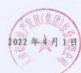

主题词：案件管理 风险防范 （共印2份）
天房发展总经办 2022年4月1日印发

# 天津津投城市开发股份有限公司文件

津投城开〔2024〕90号 签发人：张亮

# 天津津投城市开发股份有限公司重大决策法律管理工作指引（试行）

公司各部室、分公司、子公司：为加强天津津投城市开发股份有限公司（以下简称“公司”）重大决策法律管理工作，规范重大决策法律管理流程，防范和化解经营中的法律风险，维护公司合法权益。经2024.11.25总经理办公会讨论通过，结合公司实际制定本工作指引。

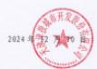

主题词：重大决策 法律管理 (共印3份)
津投城开总经办 2024年12月10日印发

# 天津津投城市开发股份有限公司文件

津投城开〔2024〕91号 签发人：张亮

# 天津津投城市开发股份有限公司规章制度法律审核管理办法（试行）

公司各单位：

为建立和完善公司规章制度体系，规范规章制度合法性审查，促进依法治企，根据国家相关法律法规，监管机构监管要求，经2024.11.25总经理办公会讨论通过。结合公司实际情况，特制定本办法。

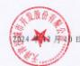

主题词：规章制度法律审核 (共印3份)
津投城开总经办 2024年12月10日印发

# 审计情况

公司董事会于年初对当年年度内部审计情况汇报、内部控制评价工作计划、内控评价报告、年度内控制制度修订情况进行审议。公司各年度审计计划均按时保质保量完成，同时每季度结束后5个工作日内，监督集团部室及所属子公司按期提交自查报告，并就自查结果进行抽查测试。

津投城开坚持以推动经济责任全面落实、内部控制全面过硬为目标，以推动各级“一把手”落实经济安全责任为切入点，以系统治理思维和网格化方式，持续更新备案并深化落实“两员一格”搭建内部审计统计调查直报系统。

2025 年，津投城开全面落实天津市国资委关于内部审计工作的部署要求，围绕公司战略目标和深化改革任务，以五部委联合下发的《企业内部控制基本规范》及配套指引为指导，聚焦主责主业，深化改革创新，加强自身建设，着力构建集中统一、全面覆盖、权威高效的审计监督体系，持续做好制度体系修订工作，不断提高审计监督质效，以高质量审计监督护航企业高质量发展。

# 报告期内

# 审计项目开展 13 次

# 季度抽查审计

# 不定期开展 各项专业审计

# 年度内控审计

# 审计工作计划

# 开展年度内控审计工作

2025 年四季度公司聘请外部事务所着手开展年度内控审计，对集团及所属各子公司进行集中内控检查，就发现问题集中整改。在日常内控审计监督管理的同时，完成各类专项审计监督事项：全面梳理内控体系，排查制度流程漏洞；搭建内部审计统计调查直报系统；按 “11+6” 专项工作要求，开展境外业务风险专项整治；召开专项整治工作会议，部署审计部牵头的 “捞偏门” 整治工作，组织开展靠企吃企专项排查工作。落实国资监管及津投资本工作要求，排查违规经营投资责任追究事项。对 2021-2024 年审计（检查）发现的问题实施清单化管理，跟踪整改进度，开展整改 “回头看”，巩固风险防控成效。

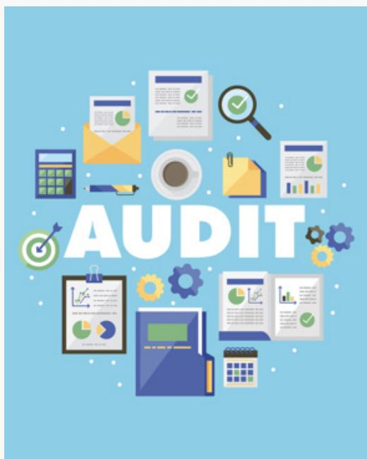

text_image

AUDIT

# 商业诚信

津投城开坚守商业诚信底线，将其纳入公司治理核心范畴，构建全方位廉洁经营体系。严格防控反商业贿赂及反贪污风险，健全内控机制，规范业务往来流程，杜绝利益输送行为。常态化开展员工廉洁培训，覆盖各层级岗位，强化合规意识与职业操守教育。畅通信访举报渠道，建立闭环处理机制，保障举报信息保密与及时核查反馈。通过多维度举措筑牢廉洁防线，维护公平市场秩序，彰显公司诚信经营的责任与担当，助力企业可持续发展。

# 反商业贿赂及反贪污

津投城开将反商业贿赂及反贪污作为商业诚信建设的重中之重，筑牢廉洁经营防火墙。建立健全全流程内控管控机制，明确业务往来合规标准，对采购、销售、合作等关键环节强化审核监督，严禁任何形式的利益输送、贿赂及贪污行为。同步完善责任追溯体系，将合规要求嵌入岗位职责，强化全员反贿赂、反贪污意识。通过刚性制度约束与常态化风险排查，从源头防范廉洁风险，维护公平公正的市场秩序，践行公司合规经营的责任与担当，保障企业可持续发展。

# 组织召开“以案四说”警示教育大会

4月，津投城开组织召开“以案四说”警示教育大会。会上通报了国企领域违反中央八项规定精神典型问题案例、系统内发生的违纪违法案例，集中观看了警示教育片《重点领域腐败案件警示录》。纪委主要负责同志讲授专题廉洁党课，围绕近年来发生的违法违纪案件，从“纪、法、德、责”开展“以案四说”，深度剖析违法违纪典型案例的问题根源，教育引导全体党员干部清醒认识当前党风廉政建设和反腐败斗争形势。

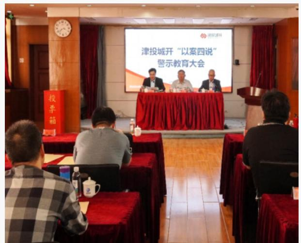

text_image

津投城开“以案四说”
警示教育大会
投票箱

# 反不正当竞争

津投城开秉持公平竞争理念，严守相关法律法规及行业准则。明确禁止虚假宣传、商业诋毁、侵犯商业秘密、不正当低价销售等行为，规范市场经营活动。强化全流程风险管控，对营销推广、市场拓展等关键环节开展合规核查，常态化开展全员合规培训，筑牢思想防线。以合规经营维护市场竞争秩序，保障消费者与合作伙伴合法权益，助力行业良性发展。

# 员工廉洁培训

报告期内，津投城开将廉洁从业教育纳入员工常态化培训体系，多维度、全覆盖开展廉洁主题教育活动。公司通过组织专题讲座、观看警示教育片、剖析典型案例等形式，深入解读反腐败反贿赂相关法律法规及企业内部廉洁制度，引导全体员工深刻认识廉洁自律的重要意义。同时，针对关键岗位人员开展定制化廉洁风险防控培训，强化岗位廉洁责任意识，筑牢拒腐防变的思想防线。一系列扎实有效的廉洁教育举措，推动廉洁文化融入经营管理各环节，为公司营造了风清气正的良好发展氛围。

# 报告期内

# 学法用法培训5次

# 民法典

# 公司法

# 宪法

# 反走私

# 召开深入贯彻中央八项规定精神学习教育警示教育会

5月29日，津投城开召开深入贯彻中央八项规定精神学习教育警示教育会。会上，播放了国资国企领域清廉主题微视频，剖析了反中央八项规定及其实施实则精神典型案例，通报了津投城开内部查处违反中央八项规定精神案件情况，纪委主要负责同志进行了宣讲教育，通过真实鲜活的案例，深刻揭示了违反中央八项规定精神带来的严重危害和严重后果，为全体参会人员敲响了警钟。

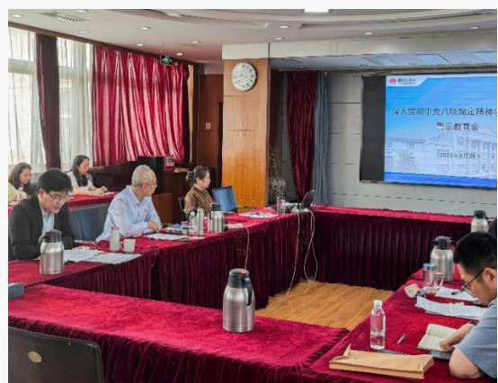

text_image

深入推动中央八项规定精神
演示教育会
2024.4.17:36

# 商业道德

商业道德是商业诚信建设的核心基石，津投城开坚守诚信守法、公正廉洁的经营准则，贯穿生产运营与合作全流程。构建完善商业道德管控体系，明确全员行为规范，杜绝违背公序良俗、损害利益相关方权益的行为，兼顾企业发展与社会价值。常态化开展商业道德专项培训，强化员工职业操守与责任意识，引导全员自觉践行道德准则。以高尚商业道德赋能合规经营，凝聚诚信发展共识，维护行业公序良俗，彰显上市公司的社会担当与品牌公信力，助力企业可持续发展。

# 开展“3·15”投资者保护教育宣传专项活动

津投城开以天津证监局 2025 年 “3·15” 投资者保护教育宣传专项活动为契机，于 3 月期间组织内部员工开展一系列投资者保护活动。活动期间，津投城开组织公司内部员工通过多渠道转发新 “国九条” 及 “1+N” 政策体系，举办投资者课堂讲解法律法规并开展风险提示，同时做好投资者沟通工作。公司工作人员累计接听投资者来电二十余次，详细解答房地产市场环境、公司经营情况、重大资产重组进展等问题，进一步增强了投资者对公司的了解和认同感。

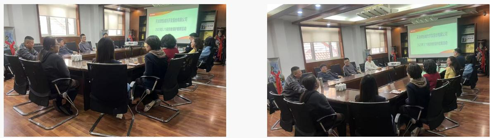

# 开展金融教育宣传周活动

津投城开按照《国家金融监督管理总局办公厅中国人民银行办公厅中国证券监督管理委员会办公厅关于开展2025年金融教育宣传周活动的通知》，紧扣此次活动主题，于近期在公司会议室组织了相关培训学习活动，参会人员均表示受益匪浅。

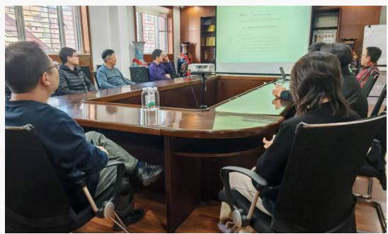

text_image

Meeting room scene with participants seated around a conference table, projected presentation screen visible in background

# 举报渠道与处理情况

公司建立健全信访举报管理体系，构建“多渠道受理、全流程管控、高效率处置”的工作机制，保障利益相关方合法权益。畅通多样化举报渠道，确保诉求表达便捷高效。严格落实举报事项登记、甄别、核查、反馈闭环管理流程，明确各环节责任主体与办理时限，严守举报人与举报信息保密制度。同时，定期对信访举报数据进行梳理分析，将相关问题纳入风险防控体系，为公司合规经营与可持续发展筑牢监督防线。

# 报告期内

<table><tr><td>受理来访案件</td><td>接待来访人员</td><td>案件解决率</td></tr><tr><td>79件</td><td>10人次</td><td>100%</td></tr></table>

# 信访工作流程

初访接待
分公司、项目部

分公司、项目部无法解决的信访问题，提出具体的解决意见或建议，网上传送至公司信访办公室主任、副主任邮箱，并电话告知。(15个工作日内完成)

公司信访办公室依据分公司和项目部的意见和建议, 协调有关部门提出意见后,请示或转发有关领导或部门落实。(30 个工作日内完成)

收集领导和部门处理意见，向分公司、项目部反馈，在接到领导或部门处理意见后15个工作日内完成

# 信息安全

针对信息安全与客户隐私保护，津投城开构建全流程管控体系。制度层面明确数据收集、存储、使用、销毁的合规标准，划定客户隐私保护红线，严禁超范围采集与违规披露信息。技术层面搭建多层级防护系统，定期开展安全漏洞扫描与风险评估，防范数据泄露、篡改等风险。同时，常态化组织员工专项培训，强化全员合规意识与操作规范。通过制度约束、技术防护与人员管理相结合的方式，切实保障客户信息权益，维护企业信息安全与品牌公信力。

# 信息安全管理制度

津投城开高度重视信息安全管理工作，构建覆盖全业务流程、全岗位人员的信息安全管理制度体系。制度明确信息安全管理目标、组织架构及各层级责任边界，对数据收集、存储、传输、使用等全生命周期环节制定刚性管控规范，重点防范核心信息泄露、丢失、篡改等风险。同时，配套建立信息安全技术防护体系，定期开展系统安全检测与漏洞修复，强化网络边界防护能力。此外，常态化组织信息安全培训，提升全员信息安全意识与风险处置能力，全方位保障公司及利益相关方信息资产安全，为企业稳健发展筑牢数字安全屏障。

# 内部信息管理

建立完善的信息安全管理体系和流程制度并常态化应用于线上办公系统，确保信息安全工作有序进行，严把信息安全的警戒线。

加强对网络安全的重视和投入，定期采用入侵检测系统对可能发生的安全漏洞进行针对性排查和系统维护，有效防范网络攻击和数据泄露的风险。

# 2025 年 “4·15” 第十个全民国家安全教育日宣传

信息安全是国家安全的重要环节，2025年是我国《国家安全法》颁布施行10周年，也是全民国家安全教育日设立10周年。在这一重要节点，津投城开积极响应中央号召，深入贯彻落实总体国家安全观，以“全民国家安全教育走深走实十周年”为主题，以会议、宣讲、海报等多形式开展了普法宣传活动。这些活动不仅延续了传统普法方式的优势，更在创新性、互动性和实效性方面取得了显著突破。

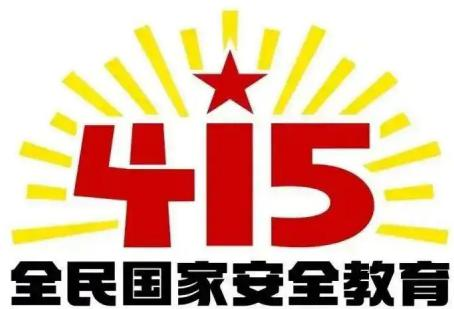

text_image

415
全民国家安全教育

# 利益相关方沟通

津投城开坚持以系统化、常态化机制开展利益相关方沟通，搭建起覆盖监管机构、投资主体、商业伙伴、内部员工、社会公众及媒体的多元对话桥梁。公司通过合规报告报送、专项座谈研讨、需求调研访谈、信息公开披露等多样化形式，精准对接不同利益相关方的核心诉求，充分吸纳各方意见建议，将利益相关方关切全面融入企业战略规划、运营管理与项目实施的全过程。以此构建起互信共赢的合作生态，夯实企业可持续发展的社会基础，有效推动经济效益、社会效益与环境效益的协同提升，助力企业实现高质量发展目标。

# 信息披露

津投城开严格遵循资本市场信息披露规则，构建全面、规范、透明的信息披露体系。披露内容覆盖经营业绩、财务状况、重大投融资、公司治理等核心经营信息，同步纳入ESG领域的环境治理、社会责任履行、利益相关方沟通等实践成果。公司依托监管指定平台、官方网站、年度报告及投资者交流会等多元渠道，确保信息及时、准确、完整触达公众。同时建立信息披露核查机制，强化内部审核，切实保障投资者及社会公众的知情权，维护资本市场公开、公平、公正秩序。

2025 年 7 月 30 日，天津上市公司协会特聘专家金祥慧讲解《上市公司信息披露管理办法》《上市公司章程指引》等规则修订要点。

2025年9月29日，公司参加2025ESG中国·京津冀国有企业社会责任发布会。

2025 年 8 月 1 日，公司发布《天津津投城市开发股份有限公司信息披露管理制度（修订稿）》。根据《中华人民共和国公司法》、《中华人民共和国证券法》、《上市公司信息披露管理办法》等法律、行政法规，制定本制度。

# 投资者关系管理

津投城开高度重视投资者关系管理，构建“透明沟通、价值共创”的长效工作机制。严格遵循监管要求，通过年度股东会、业绩说明会、投资者调研会等多元化渠道，及时、准确披露经营业绩、财务状况、战略规划及重大事项，充分保障投资者知情权。针对不同群体的关切，建立专项沟通反馈机制，常态化回应市场关于公司治理、ESG、行业发展趋势等方面的问询。同时，依托官方投资者关系平台、互动易等线上渠道，搭建便捷高效的信息交互桥梁，持续提升公司治理透明度与市场公信力，切实维护全体股东的合法权益。

报告期内，公司接待投资者来电800余次、来访10余次，及时进行答复，并对投资者关心的热点问题进行梳理。帮助投资者完成原始股股权确认、领取分红、继承过户、挂失等股权手续相关工作。完成22户共计16.85万股的股权确认登记，协助股东领取历年应分未领股息。协助内部职工股股东办理确认。

# 投资者关系管理及舆情管理培训

公司于 10 月 23 日参加 “上市公司投资者关系管理及舆情管理主题培训”。会议邀请中国上市公司舆情中心专家授课。这是深入贯彻资本市场监管要求，切实提升辖区上市公司投资者关系管理专业化水平与舆情风险处置能力，进一步强化证券事务团队的媒体素养与履职效能，助力上市公司实现高质量发展的重要举措。

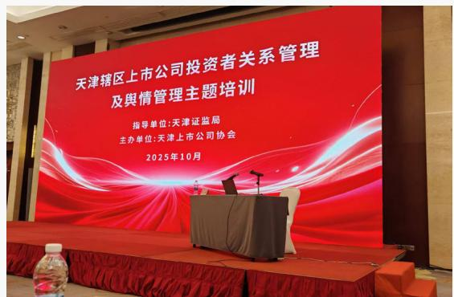

text_image

天津辖区上市公司投资者关系管理
及舆情管理主题培训
指导单位:天津证监局
主办单位:天津上市公司协会
2025年10月

2025 年 5 月 30 日，公司召开 2024 年度暨 2025 年第一季度业绩说明会，以便于广大投资者更全面深入地了解公司 2024 年度及 2025 年第一季度经营成果、财务状况。

2025 年 9 月 22 日，公司召开重大资产重组方案进行重大调整投资者说明会。公司主要领导出席本次会议，与投资者进行了交流和沟通，在信息披露允许的范围内就投资者关心的问题进行了答复。

利益相关方沟通渠道

<table><tr><td>利益相关方</td><td>沟通机制与方式</td></tr><tr><td>股东及投资者</td><td>1. 股东会;2. 定期报告与临时公告;3. 投资者说明会;4. 投资者热线与邮箱;5. 互动平台沟通。</td></tr><tr><td>业主与客户</td><td>1. 业主评价与管理;2. 日常沟通。</td></tr><tr><td>供应商与分包商</td><td>1. 招投标;2. 商业谈判;3. 业务函电往来;4. 不定期沟通。</td></tr><tr><td>员工</td><td>1. 党支部;2. 征求合理化建议;3. 日常工作沟通。</td></tr><tr><td>工会组织</td><td>1. 职工代表大会;2. 公司重大决策参与权;3. 工会代表与联络人定期沟通。</td></tr><tr><td>社区</td><td>1. 文明建设;2. 参与社区公益活动。</td></tr><tr><td>对公司感兴趣的个人、团体和媒体</td><td>1. 依法披露信息;2. 新闻报道与宣传。</td></tr></table>

指标索引

<table><tr><td>报告章节</td><td>GRI指标体系</td><td>上交所指引议题</td></tr><tr><td>关于本报告</td><td>2-2/2-3</td><td>/</td></tr><tr><td>公司致辞</td><td>2-6</td><td>/</td></tr><tr><td>走进津投城开</td><td>2-1/2-2/2-6</td><td>/</td></tr><tr><td>双重重要性分析</td><td>3-1/3-2/3-3</td><td>第五条、第十一条</td></tr><tr><td colspan="3">党建引领 筑牢发展根基</td></tr><tr><td>聚焦政治建设</td><td>2-12</td><td>/</td></tr><tr><td>强化组织建设</td><td>/</td><td>/</td></tr><tr><td>优化队伍建设</td><td>401-1</td><td>第五十条</td></tr><tr><td>擦亮党建品牌</td><td>/</td><td>第四十条、第五十三条</td></tr><tr><td>深化作风建设</td><td>205-2</td><td>第五十五条、第五十六条</td></tr><tr><td colspan="3">绿色低碳 守护美好家园</td></tr><tr><td>绿色设计</td><td>302-4/302-5/303-1</td><td>第二十一至第二十八条、第三十二条、第三十五条、第三十六条、第三十七条、第四十二条</td></tr><tr><td>绿色施工</td><td>302-4/303-1/306-2</td><td>第二十一至第二十八条、第三十条、第三十一条、第三十五条、第三十六条、第三十七条</td></tr><tr><td>绿色运营与绿色生活</td><td>302-1/302-4</td><td>第二十一至第二十八条、第三十二条、第三十五条</td></tr><tr><td>环境治理与低碳建设</td><td>2-27</td><td>第三十三条</td></tr><tr><td colspan="3">以人为本 构建和谐社会</td></tr><tr><td>社会责任实践</td><td>413-1/413-2</td><td>第四十条</td></tr><tr><td>产品与客户责任</td><td>416-1</td><td>第四十七条</td></tr><tr><td>供应链管理</td><td>308-1/414-1</td><td>第四十五条、第四十六条</td></tr><tr><td>员工发展与权益保障</td><td>2-7/2-19/201-3/401-2/403-3</td><td>第五十条</td></tr><tr><td colspan="3">合规治理 护航公司发展</td></tr><tr><td>治理体系</td><td>2-9/2-12</td><td>第五十一条</td></tr><tr><td>风险管理</td><td>/</td><td>第五十二条</td></tr><tr><td>商业诚信</td><td>205-2/206-1</td><td>第五十五条、第五十六条</td></tr><tr><td>信息安全</td><td>/</td><td>第四十八条</td></tr><tr><td>利益相关方沟通</td><td>2-29</td><td>第五十三条</td></tr></table>

# 读者反馈

尊敬的读者：

感谢您阅读《天津津投城市开发股份有限公司2025年度环境、社会与治理(ESG)报告》。为向您及其他利益相关方更有价值的企业ESG信息，请您协助我们完成反馈意见表中的相关问题，并通过以下方式反馈给我们，以帮助我们在今后进一步提升ESG工作水平。

电话：022-23317185

邮编：300050

邮箱：tffz@sina.com

1. 对于津投城开而言，您的身份是：

□员工

□客户

□供应商

□监管机构

□媒体

其他：\_\_\_\_

2. 您对本报告的评价是:

□很好

□ 较好

□一般

□较差

□很差

3. 您认为本报告结构：

□很好

□较合理

□一般

较差

□很差

版式设计：

□很好

□ 较好

□一般

□较差

□很差

信息披露：

□很好

□ 较好

□一般

较差

□很差

可读性：

□很好

□ 较好

□一般

较差

□很差

4. 您所关注的信息在本年度社会责任报告中是否都有所体现

□是

□否

(您还希望看到哪些信息\_\_\_\_)

5. 您对我们的社会责任报告或者 ESG 工作有哪些意见或建议？

津投城开

股票代码 600322

天津津投城市开发股份有限公司

联系地址：天津市和平区常德道80号

联系电话：022-23317185

邮政编码：300050

电子邮箱：tffz@sina.com

公司官网：http://www.tjjtck.com/gufen/