# 2025年度

# 环境、社会和

# 公司治理（ESG）报告

ENVIRONMENTAL, SOCIAL AND

GOVERNANCE(ESG) REPORT

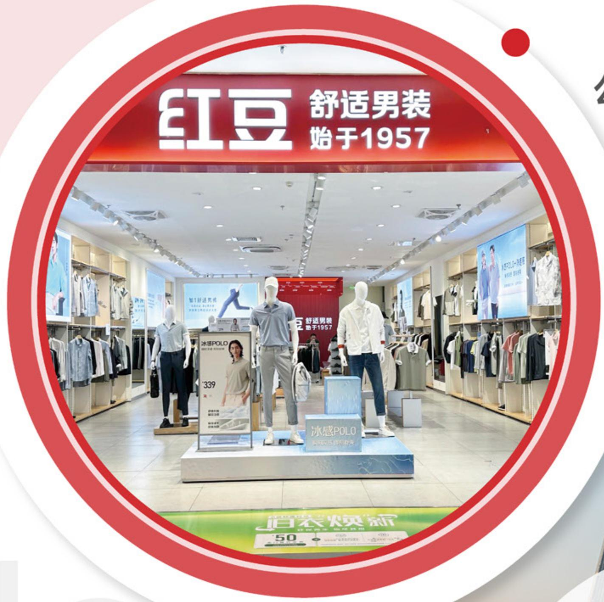

text_image

红豆 舒适男装
始于1957
339
冰感POLO
舒适男装
始于1957
追衣焕新
50

text_image

HODO

# 目录

# CONTENTS

# 开篇

关于本报告 03

走进红豆股份 05

# 01 治理篇

# 完善治理，厚植发展根基

公司治理 15

党建引领 18

风险与内控管理 19

商业道德 23

投资者关系管理 25

守护信息安全 26

# 02 社会篇

# 创新驱动，赋能产业生态

研发创新驱动 31

保障品质与服务 37

可持续供应链 41

社会贡献 44

# 03 员工篇

# 以人为本，共筑幸福职场

员工权益保障 47

人才培训与发展 53

员工关怀 59

职业健康安全 61

# 0/环境篇

# 绿色运营，护航生态发展

可持续生产 69

环境合规管理 70

资源高效利用 71

污染排放治理 73

# 附录

ESG关键绩效表 76

报告索引表 78

读者反馈表 80

# 关于本报告

# 编制说明

本报告是江苏红豆实业股份有限公司（以下简称“公司”“红豆股份”）面向利益相关方发布的第5份ESG报告。报告详细披露了公司及其下属子公司2025年度在经济、环境、社会和公司治理等责任领域的实践和绩效，旨在与各利益相关方进行有效交流，系统地回应利益相关方的期望和要求。

# 时间范围

2025年1月1日至2025年12月31日，为增强报告可比性及前瞻性，部分内容往前后年度适度延伸。

# 数据来源

本报告所披露的信息来源于政府部门公开数据、公司2025年年度报告及内部统计报表。本报告的财务数据以人民币为单位，一切以股份公司财务报告为准。

# 编制依据

《上海证券交易所上市公司自律监管指引第14号——可持续发展报告（试行）》  
《上海证券交易所上市公司自律监管指南第4号——可持续发展报告编制》  
- 全球报告倡议组织（GRI）《可持续发展报告标准》（GRI Standards）  
- 联合国可持续发展目标（Sustainable Development Goals, SDGs）  
- 中国国家标准《社会责任报告编写指南》（GB/T36001-2015）

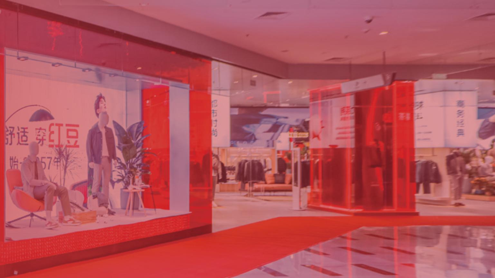

text_image

舒适穿红豆
始-2057年
商务经典

# 报告称谓

<table><tr><td>简称</td><td>释义</td></tr><tr><td>公司、红豆股份</td><td>江苏红豆实业股份有限公司</td></tr><tr><td>舒适红豆</td><td>公司旗下男装品牌“舒适红豆”</td></tr></table>

# 报告获取

本报告以电子版形式供您阅读，可在上海证券交易所网站（www.sse.com.cn）和公司网站（https://www.hongdou.com.cn）查阅获取。

# 联系方式

地址：江苏省无锡市锡东新城商务区核心区同惠街19号红豆财富广场  
邮编：214105  
电话：0510-66868422、0510-66868278  
邮箱：hongdou@hongdou.com

# 走进红豆股份

# 公司简介

江苏红豆实业股份有限公司成立于1995年6月，是红豆集团（江苏省重点企业集团、国务院深化改革试点企业）核心子公司，2001年1月8日在上海证券交易所挂牌上市，股票代码600400。

经过多年的发展，公司男装业务取得了较多的荣誉：“红豆”商标被国家工商总局认定为“中国驰名商标”，红豆衬衫、西服相继被推举为中国名牌产品，并获得“国家免检产品”称号等。公司曾获“中国服装品牌年度价值大奖”“中国服装品牌年度成就大奖”“十大男装品牌”“中国职业装十大领军企业”等荣誉，连续2年被评为“当红国潮评选”年度国潮品牌。

公司以品牌运营及服装制造为优势，形成红豆男装全域零售、红豆职业装定制两大业务。红豆男装全域零售业务，以“舒适红豆”为品牌理念。目前，全域零售的线下销售渠道主要为全国二三线城市，同时依托门店数字化建设增强用户互动体验；线上销售由公司直营为主，试点品牌联营模式，主要入驻天猫、京东、小程序商城、抖音等第三方主流电商开放平台，多触点触达用户。红豆职业装定制业务，主要为客户量身定制各类中高档职业装，以及个性化的轻定制服务，客户范围覆盖金融、通信、交通运输等行业。

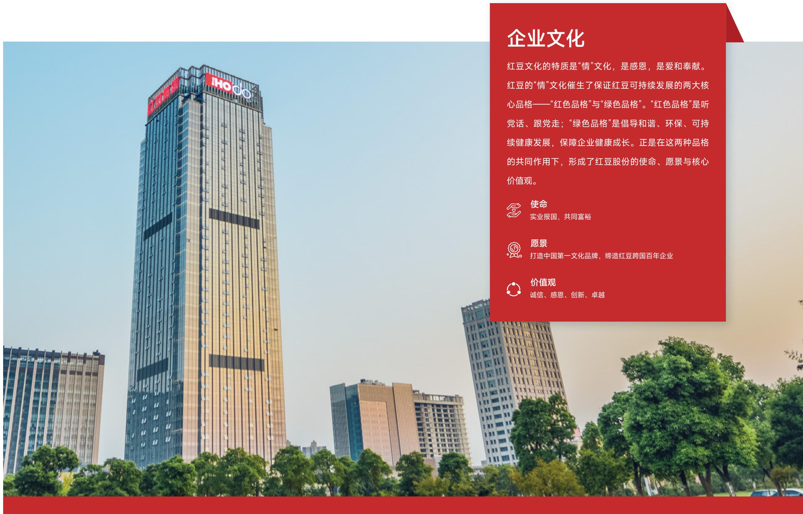

text_image

企业文化
红豆文化的特质是“情”文化，是感恩，是爱和奉献。
红豆的“情”文化催生了保证红豆可持续发展的两大核心品格——“红色品格”与“绿色品格”。“红色品格”是听党话、跟党走；“绿色品格”是倡导和谐、环保、可持续健康发展，保障企业健康成长。正是在这两种品格的共同作用下，形成了红豆股份的使命、愿景与核心价值观。
使命
实业报国，共同富裕
愿景
打造中国第一文化品牌，缔造红豆跨国百年企业
价值观
诚信、感恩、创新、卓越

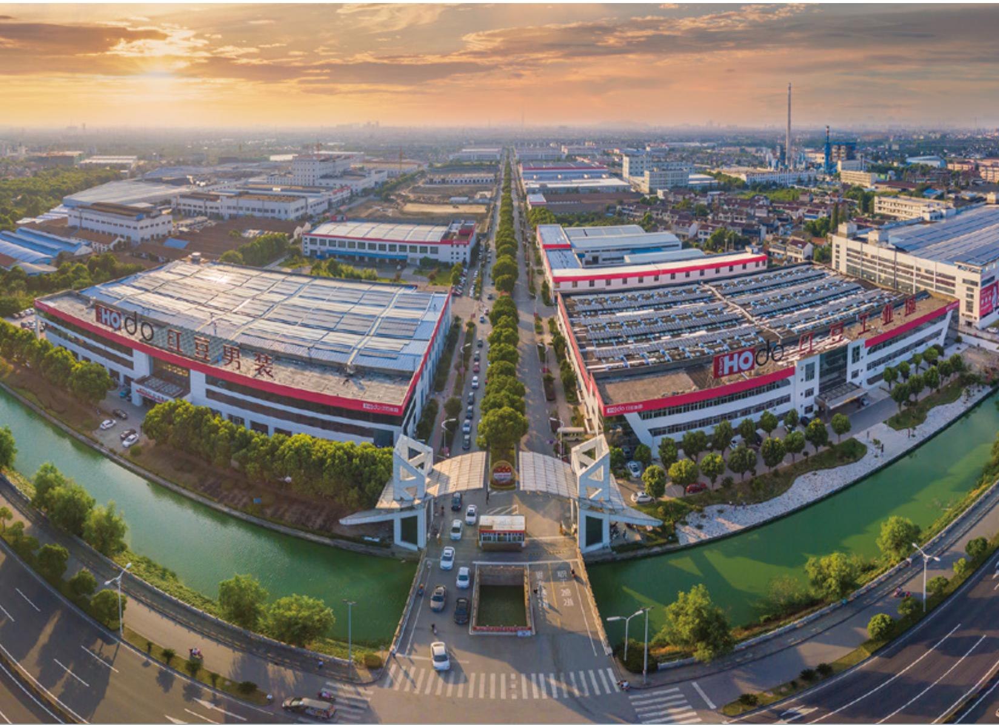

natural_image

Aerial view of a modern industrial complex with multiple factory buildings, a canal, and surrounding greenery at sunset (no visible signage or text)

# 战略部署

以服装为主业，秉承“舒适红豆”品牌理念，公司坚持以科技创新驱动产业升级。业务层面，公司聚焦舒适赛道，构建“服装零售+职业装定制”双引擎模型，持续推进全渠道零售网络建设，提升品牌竞争力与市场影响力。管理层面，公司加快推进AI与数字化转型升级，重点布局智能制造、柔性供应链及精准营销体系建设，积极探索AI新零售模式，着力打造面向未来的新质生产力。通过持续的产品创新迭代与精细化运营管理，公司持续打造高性价比的舒适着装解决方案，引领普惠型消费升级，致力于成为服装行业领军型企业。

# 品牌发展

红豆始于1957年，“红豆”商标是1997年国家工商行政管理局认定的首批中国驰名商标。红豆男装是中国较早崛起的男装品牌之一，69年专注舒适男装领域，自创建以来，从产品、服务、传播等多维度构建以“情”文化为核心的民族品牌体系。

公司开创新一代“红豆0感舒适衬衫”，引领衬衫的创新变革，用不断迭代的现代科技和匠心工艺，致力于让更多人穿上奢侈品级舒适男装。2025年，红豆男装通过代言人林更新的亲身体验和分享，围绕“更新状态·舒适一身”，向大众传达了舒适的生活哲学，强化了舒适男装的品牌形象，引领当代男性的舒适着装与生活方式。

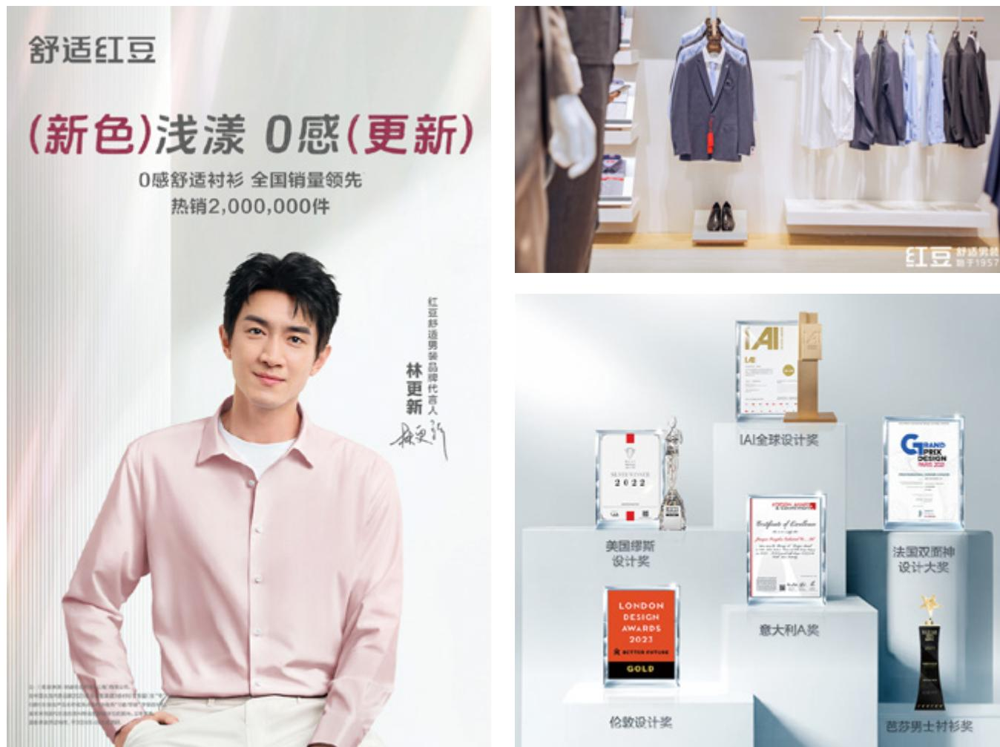

# 年度荣誉

# 利益相关方沟通

公司以实现长期可持续发展为目标，通过制定清晰的ESG战略、完善管理架构及推动绿色转型，全面融入可持续

发展理念，积极承担对政府及监管机构、股东及投资者、客户、合作伙伴、员工、环境、社区的责任。

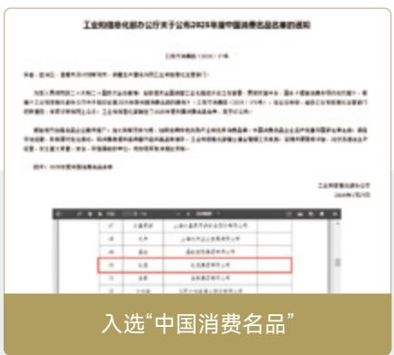

text_image

工业和信息化部办公厅关于公布2023年度中国消费名品名单的通知
[新华社编辑（2023）] 广东
年鉴：XXX，管理类上市公司与客户、新建生产类公司之间的日常经营项目：
为员工提供员工人数少、新产品开发等，研发需求在建员工面上基本完成并产生费用，费用的支出。因个人需求曲线未明确而导致，需按《工作指导书》或《工作计划表》规定，由公司制定具体方案并提交至相关部门。
根据行业特点及产品特点，企业可开展相关业务，如以销售为主产品或服务，以及对各产品进行售后服务，以及对各产品进行售后服务，以及对各产品进行售后服务，以及对各产品进行售后服务，以及对各产品进行售后服务，以及对各产品进行售后服务，以及对各产品进行售后服务，以及对各产品进行售后服务，以及对各产品进行售后服务，以及对各产品进行售后服务，以及对各产品进行售后服务，以及对各产品进行售后服务，以及对各产品进行售后服务，以及对各产品进行售后服务，以及对各产品进行售后服务，包括但不限于：第一类、第二类、第三类、第四类、第五类、第六类、第七类、第八类、第九类、第十类、第十一类、第十二类、第十三类、第十四类、第十五类、第十六类、第十七类、第十八类、第十九类、第二十类、第十三类、第十四类、第十五类、第十六类、第十七类、第十八类、第十九类、第二十类、第十三类、第十四类、第十五类、第十六类、第十七类、第十八类、第十九类、第二十类、第十三类、第十四类、第十五类、第十六类、第十七类、第十八类、第十九类、第二十类、第十一类、第十二类、第十三类、第十四类、第十五类、第十六类、第十七类、第十八类、第十九类、第二十类、第十一类、第十二类、第十三类、第十四类、第十五类、第十六类、第十七类、第十八类、第十九类、第二十类、第十一类、第十二类、第十三类、第十四类、第十五类、第十六类、第十五A级
[27] 本公司名称：上海申通汽车股份有限公司
[28] 电话：上海申通汽车股份有限公司
[29] 基本：上海申通汽车股份有限公司
[30] 电话：上海申通汽车股份有限公司
[31] 电话：上海申通汽车股份有限公司
[32] 电话：上海申通汽车股份有限公司
[33] 电话：上海申通汽车股份有限公司
[34] 电话：上海申通汽车股份有限公司
[35] 电话：上海申通汽车股份有限公司
[36] 电话：上海申通汽车股份有限公司
[37] 电话：上海申通汽车股份有限公司
[38] 电话：上海申通汽车股份有限公司
[39] 电话：上海申通汽车股份有限公司
[40] 电话：上海申通汽车股份有限公司
[41] 电话：上海申通汽车股份有限公司
[42] 电话：上海申通汽车股份有限公司
[43] 电话：上海申通汽车股份有限公司
[44] 电话：上海申通汽车股份有限公司
[45] 电话：上海申通汽车股份有限公司
[46] 电话：上海申通汽车股份有限公司
[47] 电话：上海申通汽车股份有限公司
[48] 电话：上海申通汽车股份有限公司
[49] 电话：上海申通汽车股份有限公司
[50] 电话：上海申通汽车股份有限公司
[51] 电话：上海申通汽车股份有限公司
[52] 电话：上海申通汽车股份有限公司
[53] 电话：上海申通汽车股份有限公司
[54] 电话：上海申通汽车股份有限公司
[55] 电话：上海申通汽车股份有限公司
[56] 电话：上海申通汽车股份有限公司
[57] 电话：上海申通汽车股份有限公司
[58] 电话：上海申通汽车股份有限公司
[59] 电话：上海申通汽车股份有限公司
[60] 电话：上海申通汽车股份有限公司
[61] 电话：上海申通汽车股份有限公司
[62] 电话：上海申通汽车股份有限公司
[63] 电话：上海申通汽车股份有限公司
[64] 电话：上海申通汽车股份有限公司
[65] 电话：上海申通汽车股份有限公司
[66] 电话：上海申通汽车股份有限公司
[67] 电话：上海申通汽车股份有限公司
[68] 电话：上海申通汽车股份有限公司
[69] 电话：上海申通汽车股份有限公司
[70] 电话：上海申通汽车股份有限公司
[71] 电话：上海申通汽车股份有限公司
[72] 电话：上海申通汽车股份有限公司
[73] 电话：上海申通汽车股份有限公司
[74] 电话：上海申通汽车股份有限公司
[75] 电话：上海申通汽车股份有限公司
[76] 电话：上海申通汽车股份有限公司
[77] 电话：上海申通汽车股份有限公司
[78] 电话：上海申通汽车股份有限公司
[79] 电话：上海申通汽车股份有限公司
[80] 电话：上海申通汽车股份有限公司
[81] 电话：上海申通汽车股份有限公司
[82] 电话：上海申通汽车股份有限公司
[83] 电话：上海申通汽车股份有限公司
[84] 电话：上海申通汽车股份有限公司
[85] 电话：上海申通汽车股份有限公司
[86] 电话：上海申通汽车股份有限公司
[87] 电话：上海申通汽车股份有限公司
[88] 电话：上海申通汽车股份有限公司
[89] 电话：上海申通汽车股份有限公司
[90] 电话：上海申通汽车股份有限公司
[91] 电话：上海申通汽车股份有限公司
[92] 电话：上海申通汽车股份有限公司
[93] 电话：上海申通汽车股份有限公司
[94] 电话：上海申通汽车股份有限公司
[95] 电话：上海申通汽车股份有限公司
[96] 电话：上海申通汽车股份有限公司
[97] 电话：上海申通汽车股份有限公司
[98] 电话：上海申通汽车股份有限公司
[99] 电话：上海申通汽车股份有限公司
[100]

2025年度“中国消费名品”是由中华人民共和国工业和信息化部于2026年2月3日正式公布的权威品牌名单，“红豆”品牌作为时代优品入选。

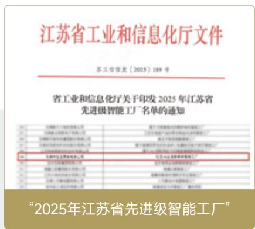

text_image

江苏省工业和信息化厅文件
苏工信信发〔2025〕189号
省工业和信息化厅关于印发2025年江苏省
先进级智能工厂名单的通知
“2025年江苏省先进级智能工厂”
“2025年江苏省先进级智能工厂”

江苏省工业和信息化厅公布“2025年江苏省先进级智能工厂”名单，红豆股份5G全连接服装智能工厂荣登榜单。

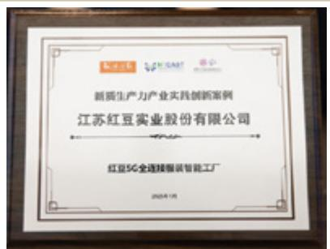

text_image

新质生产力产业实践创新案例
江苏红豆实业股份有限公司
红豆5G全连接服装智能工厂
2024/1/6

新质生产力产业实践创新案例

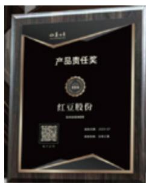  
产品责任奖

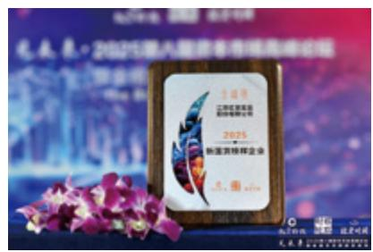

text_image

1届年
江苏红箭集团
有限公司
2025年
新星美特殊企业
8. 国际

“2025新国货榜样企业”奖

红豆5G全连接服装智能工厂上榜“新质生产力产业实践创新案例”，引领行业智能化转型。

红豆股份获证券之星第三届ESG新标杆企业评选“产品责任奖”。

红豆股份凭借在自主品牌建设、科技创新、智造转型与可持续责任等方面的卓越表现，荣获金禧奖“2025新国货榜样企业”称号。

<table><tr><td>利益相关方</td><td>期待与诉求</td><td>沟通渠道</td></tr><tr><td>政府及监管机构</td><td>优化公司治理合规与商业道德能源与温室气体排放劳动关系纳税与创造就业社区贡献和参与</td><td>日常沟通与汇报座谈与研讨会项目审批审核上报统计报表</td></tr><tr><td>股东及投资者</td><td>生产经营与业绩合规与商业道德商业风险与机遇产品研发与创新</td><td>定期报告与信息公告股东会投资者调研业绩发布会</td></tr><tr><td>客户</td><td>产品与服务质量可持续产品原材料采购智慧化建设</td><td>客户日常交流门店交流访谈电话回访客户调研官网、微信等互动平台</td></tr><tr><td>合作伙伴</td><td>供应商管理合规与商业道德商业风险与机遇产品研发与创新</td><td>日常沟通与答疑供应商SRM系统供应商验厂与检查供应商交流回访供应商大会</td></tr><tr><td>员工</td><td>劳动关系人权与员工权益职业健康安全员工薪酬与福利培训与职业发展</td><td>员工满意度调查员工培训活动员工文体健康活动举报与申诉机制</td></tr><tr><td>环境</td><td>可持续产品环境管理体系能源与温室气体排放废弃物管理原材料采购水资源管理</td><td>可持续产品推广环境信息统计污染物排放监测环保理念倡导</td></tr><tr><td>社区</td><td>纳税与创造就业社区贡献和参与</td><td>社区项目建设员工志愿服务慈善与公益捐赠</td></tr></table>

# 实质性议题分析

公司依据《上海证券交易所上市公司自律监管指引第14号——可持续发展报告（试行）》及其他国内外主流披露框架，采用“双重重要性”（影响重要性与财务重要性）原则，识别出关键ESG议题，并在本报告中进行重点披露与回应。

# 01 议题识别

基于价值链分析，识别公司在各运营环节中存在的ESG相关影响、风险与机遇，并梳理利益相关方的核心诉求与期望。

# 02 议题筛选

参考国内外标准，并结合国内外同行业披露实践，对公司既有议题库进行更新与初步筛选。

# 03 重要性评估

影响重要性：分析各议题对环境、社会及经济的正面与负面影响，通过利益相关方调研，识别其关注程度。

财务重要性：从风险与机遇两方面，评估各议题对公司财务的潜在影响，结合专家意见，从发生可能性、影响程度与时间范围等维度进行综合分析。

# 04 议题确认

整合形成具有“双重重要性”（影响重要性与财务重要性）的议题清单并绘制议题矩阵，经内部审核确认后，确保相关议题在报告中得以透明、平衡、完整地披露。

实质性议题识别流程

红豆股份实质性议题矩阵  
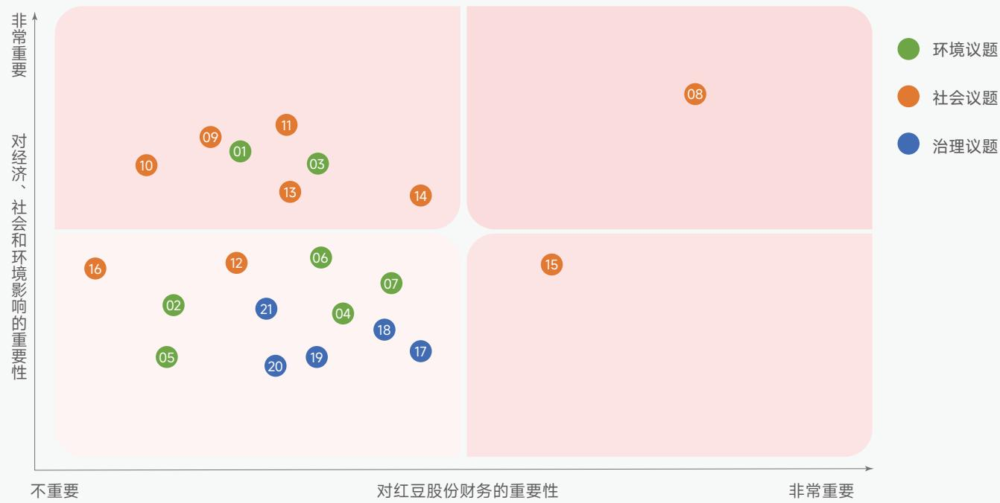

scatter

| ID | Topic | Importance to Red Soy Company (Approx.) | Importance to Economic, Social, Environmental Impact (Approx.) |
| --- | --- | --- | --- |
| 08 | 社会议题 | High | High |
| 10 | 社会议题 | Low-Mid | Mid-High |
| 09 | 社会议题 | Low-Mid | High |
| 01 | 环境议题 | Low-Mid | Mid-High |
| 11 | 社会议题 | Low-Mid | High |
| 03 | 环境议题 | Low-Mid | Mid-High |
| 13 | 社会议题 | Low-Mid | Mid-High |
| 14 | 社会议题 | High | Mid-High |
| 12 | 社会议题 | Low-Mid | Mid |
| 06 | 环境议题 | Low-Mid | Mid |
| 07 | 环境议题 | Low-Mid | Mid-Low |
| 04 | 环境议题 | Low-Mid | Mid-Low |
| 15 | 社会议题 | High | Mid-Low |
| 18 | 治理议题 | Low-Mid | Low-Mid |
| 17 | 治理议题 | Low-Mid | Low-Mid |
| 19 | 治理议题 | Low-Mid | Low-Mid |
| 20 | 治理议题 | Low-Mid | Low-Mid |
| 21 | 治理议题 | Low-Mid | Low-Mid |
| 02 | 环境议题 | Low-Mid | Low-Mid |
| 16 | 社会议题 | Low-Mid | Mid-Low |
| 05 | 环境议题 | Low-Mid | Low-Mid |

# 环境议题(E)

01 环境合规管理

02 应对气候变化

03 废弃物处理

04 绿色产品

05 水资源利用

06 循环经济

07 能源利用

# 社会议题(S)

08 产品研发与创新

09 员工雇佣

10 尊重人权

11 职业健康安全

12 员工薪酬与福利

13 培训与职业发展

14 产品与服务质量

15 供应链管理

16 社会贡献与乡村振兴

# 治理议题(G)

17 优化治理结构

18 合规经营

19 反商业贿赂及反贪污

20 反不正当竞争

21 利益相关方沟通

红豆股份实质性议题清单

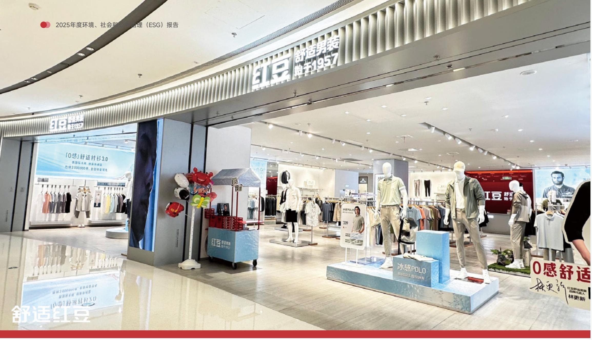

text_image

2025年度环境、社会和文化治理（ESG）报告
红豆 舒适男装
始于1957
「0感」舒适衬衫3.0
两领大市，创新空间高
总销量200000件，全国最佳领先
红豆 舒适
始于
冰感POLO
我更新
红豆舒适男装
品牌代言人
林更新
舒适红豆

# 核心理念

红豆股份将高标准的公司治理视为企业行稳致远的核心基石。公司坚持以党建引领与现代企业制度深度融合，构建“决策科学、执行有力、监督有效”的治理架构；通过筑牢风险内控、商业道德与信息安全的三重防线，将合规经营内化为组织韧性。公司致力于以透明高效的运作机制驱动价值创造，在提升运营效率的同时，积极履行责任担当，与利益相关方共筑可持续发展的长效价值，夯实行业领先地位。

# 核心行动

公司治理  
党建引领  
- 风险与内控管理  
● 商业道德  
- 投资者关系管理  
- 守护信息安全

# SDGs

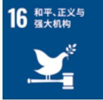

# 01

# 完善治理

# 厚植发展根基

text_image

HO

# 公司治理

公司视公司治理为保障企业长期稳健发展的基础,严格按照《中华人民共和国公司法》《中华人民共和国证券法》《上市公司治理准则》等法律法规及规范性文件的规定,结合公司实际情况,制定并优化多项内部治理相关制度,持续完善公司法人治理结构，积极履行信息披露义务，加强投资者关系管理，全方位提高公司经营管理和规范运作水平。

# 治理架构

公司设置了“股东会－董事会及其专委会－高级管理层”的科学治理架构，其中董事会下设专门委员会，自上至下贯彻公司治理原则，保证合规经营与业务的高效运作。2025年，公司围绕监管新规系统推进治理制度体系优化，完成《公司章程》《董事会议事规则》《股东会议事规则》等制度的修订与披露，强化制度与监管要求的衔接。

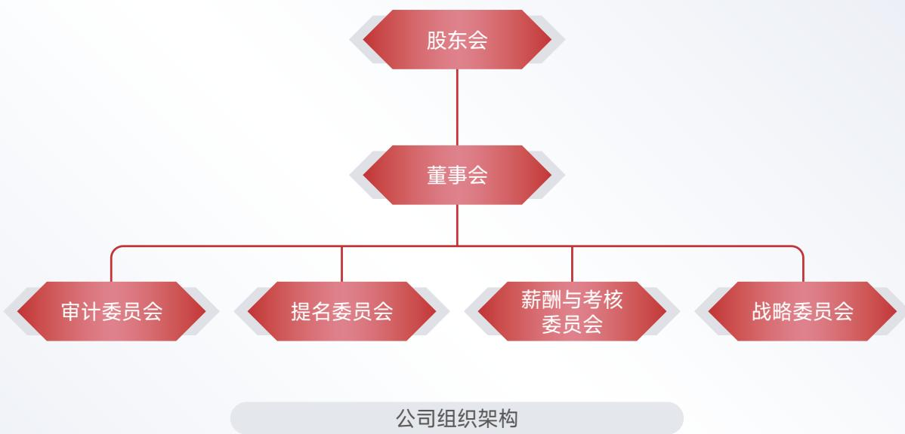

flowchart

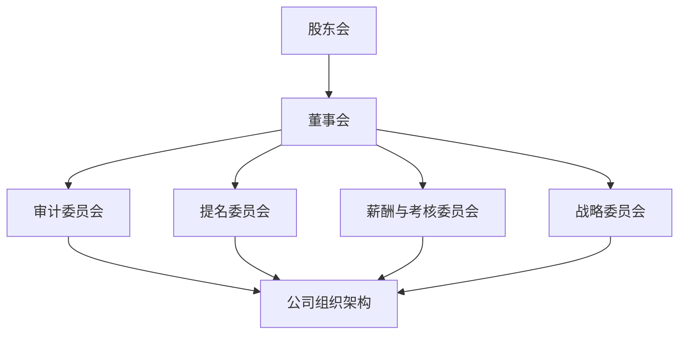
```mermaid
graph TD
  A["股东会"] --> B["董事会"]
  B --> C["审计委员会"]
  B --> D["提名委员会"]
  B --> E["薪酬与考核委员会"]
  B --> F["战略委员会"]
  C --> G["公司组织架构"]
  D --> G
  E --> G
  F --> G
```

# 股东会

公司严格按照《公司章程》《股东会议事规则》的有关规定，规范股东会的召集、召开和议事程序，聘请律师对股东会的合法性出具法律意见，确保所有股东特别是中小股东的平等地位，充分行使股东的合法权益，保证了股东对公司重大事项的知情权、参与权和表决权。

公司严格按照《公司章程》规定选聘董事，董事人数及人员构成符合有关法律法规，各位董事能够认真、勤勉地履行职责，积极参加有关业务培训，认真学习相关法律法规，公司董事的权利义务和责任明确。

# 董事会

# 关键绩效

2025年，公司召开股东会3次，董事会会议6次，董事会平均出席率100%。

# 董事会独立性与多元化

公司充分关注董事会成员多元化及独立性情况，依据相关法律法规及《公司章程》，制定《独立董事制度》《独立董事专门会议制度》等治理制度，在选聘董事过程中不以性别、年龄、种族、国籍等因素为限制，确保董事会构成的多元化及专业的平衡性。同时，公司鼓励不同的董事结合自身的知识、技能、素养及经验为董事会决策提供专业意见，保障公司治理的专业性。

# 关键绩效

2025年，公司董事会由9名董事组成，其中独立董事3名，女性董事2名。

公司董事会下设立了审计、提名、薪酬与考核、战略四个专门委员会，持续修订并完善各专门委员会工作细则，明确各专门委员会的职责及议事规则并严格实施，为董事会的决策提供有效、科学、专业的参考建议。

<table><tr><td>委员会名称</td><td>主要职责</td><td>独立性</td></tr><tr><td>审计委员会</td><td>负责审核公司财务信息及其披露、监督及评估内外部审计工作和内部控制。</td><td>委员会由沈大龙(主任委员)、奚丰、徐而迅组成;委员会包含2名独立董事。</td></tr><tr><td>提名委员会</td><td>负责拟定董事、高级管理人员的选择标准和程序,对董事、高级管理人员人选及其任职资格进行遴选、审核。</td><td>委员会由徐而迅(主任委员)、周宏江、王昌辉、刘春红、沈大龙组成;委员会包含3名独立董事。</td></tr><tr><td>薪酬与考核委员会</td><td>负责制定董事、高级管理人员的考核标准并进行考核,制定、审查董事、高级管理人员的薪酬决定机制、决策流程、支付与止付追索安排等薪酬政策与方案。</td><td>委员会由刘春红(主任委员)、王昌辉、沈大龙组成;委员会包含2名独立董事。</td></tr><tr><td>战略委员会</td><td>负责研究公司长期发展战略,并提出建议。</td><td>委员会由周宏江(主任委员)、王昌辉、刘春红组成;委员会包含1名独立董事。</td></tr></table>

董事会下设委员会职责及独立性

# 关键绩效

2025年，公司审计委员会召开会议5次，提名委员会召开会议1次，薪酬与考核委员会召开会议2次，战略委员会召开会议1次。

# 党建引领

红豆股份始终将党的政治建设置于首要地位，不断强化党建工作“第一责任人”的角色定位，全面贯彻习近平新时代中国特色社会主义思想和党的二十大精神，认真落实党中央和上级党委的决策部署，以实际行动践行党的初心和使命，助力企业高质量发展。

# 党建总体目标与成果

2025 年，红豆股份党委始终坚持以习近平新时代中国特色社会主义思想为指导，全面落实党的二十大和二十届二中、三中全会精神。公司紧扣“降本增效”主题和高质量发展目标，积极开展了“高质量发展先锋堡垒”“一党组织一特色”以及党纪学习教育。

# 关键绩效

2025年，公司共有23个党员示范岗、6个党员示范区、11个党员示范团队，为各项工作的有序开展提供了强劲动力和坚实的组织保障。

# 党员先锋模范作用

公司党委通过组建党员先锋队，将党旗插在市场经营最前线，充分发挥党员在急难险重任务中的模范带头作用。以“元旦开门红”“五一劳动节”“十一国庆节”“旺季销售爆破”等重大促销活动为载体开展志愿服务，安排党员同志协助高势能门店冲刺销售；党员主动报名参与门店一线服务工作，做好售后服务工作，为爆破销售业绩贡献自己的力量。通过多次开展的志愿服务，加快业务部门工作节奏，提高工作效率，进一步提升了党组织的凝聚力和向心力，增强了党员志愿者的服务意识。

# 党群凝聚保障功能

党委扎实开展“五必到”员工慰问活动，2025年累计走访慰问达20次，覆盖员工112余名，确保党组织的关怀能够精准传递到每一位基层员工。在聚焦女职工权益保障方面，公司党委通过精细化服务提升女职工的获得感与幸福感，专项组织35岁以上女职工开展健康体检活动，惠及41余人。通过这一系列具有温度的党群联动举措，公司党委不断增强党组织的感召力与凝聚力，实现了党建工作与企业文化、员工幸福的同频共振，为公司稳健经营筑牢了和谐坚实的群众基础。

# 风险与内控管理

红豆股份将风险管理与内部控制视为企业行稳致远的核心引擎。公司致力于构建覆盖全业务、全流程的全面风险治理体系，通过强化顶层设计、健全内控机制及深化审计监督，筑牢经营合规底线；坚持将风险防控与业务实践深度融合，持续优化动态预警与响应能力，在复杂多变的市场环境中不断增强经营韧性，为公司的稳健运营及核心竞争力的持续提升提供坚实保障。

# 风险管理

公司致力于构建覆盖全业务、全流程的全面风险管理体系，通过持续优化风险管理制度建设，细化风险管理目标与执行路径，将风险管理深度融入企业文化，确保风险防范意识贯穿于日常运营的各个环节。同时，公司注重风险管理的动态调整与创新，结合行业特点与外部环境变化，定期开展风险评估与培训，提升全员风险识别与应对能力，为公司的持续、健康、稳定发展提供坚实保障。

# 风险管理机制

董事会授权公司管理层设计和实施能确保风险管理目标和政策得以有效执行的程序。

董事会通过财务部门递交的月度报告来审查已执行程序的有效性以及风险管理目标和政策的合理性。

公司的内部审计师将风险管理的政策和程序纳入审计范畴，并且将有关发现汇报给董事会审计委员会。

<table><tr><td>风险类型</td><td>风险描述</td><td>应对措施</td></tr><tr><td>市场风险</td><td>服装消费兼具可选消费和社交属性,受宏观经济波动、行业景气度、人均可支配收入、消费者个性需求等多重因素的影响。且公司所处的男装、内衣居家服零售行业处于充分竞争状态,市场总量不确定,公司可能面临市场份额下滑等风险。</td><td>适应和把握新零售的发展趋势,公司将优化覆盖线下门店、线上店铺的全渠道营销网络体系,重点加强实体门店ShoppingMall类渠道拓展及电商平台服务优化,提升消费场景覆盖和业务敏捷创新能力,持续创新数字新零售提升消费体验。职业装市场需求亦与宏观经济、客户效益高度相关,行业客户可能面临预算减少、招标周期延长、订单量减少等风险。聚焦核心客户,公司重点加强大客户维护,系统性开发行业类客户,依托全国办事处做大订单量。</td></tr><tr><td>产品研发风险</td><td>服装行业的特点是消费者品味多元化和偏好不断变化。因此,准确把握时尚潮流和消费者需求变化,并能不断开发新的适销对路的产品是服装企业成功的关键因素。随着国潮消费、行业品类加速细分趋势的日益增强,对产品研发提出更高要求。若公司对服装流行时尚和消费者需求判断失误,产品研发与品牌核心消费人群的需求不能有效匹配,将对商品流转和销售业绩造成一定不利影响。</td><td>公司坚持“以用户为中心”,一是基于市场调研情况,明确了“舒适红豆”的品牌理念,强调产品穿着体验,构建以精准消费者需求洞察为核心的柔性供应链网络,以多样化互动营销提高用户粘性;二是灵活响应用户的舒适需求,加强以科技研发支撑产品创新,让产品创新力与供应链效率形成共振,以消费者为导向综合提升公司产品竞争力。</td></tr><tr><td>运营管理风险</td><td>以人工智能大模型、具身智能、5G、云计算、大数据为代表的新一代信息技术全面创新升级,企业的数字化进程加速。目前,大部分企业的数字化转型可划分为起步探索、单点业务改造、系统集成等不同阶段,与生产运营管理业务全流程深度融合的尚不多见,存在转型过程中认识不统一、机制不健全、能力不具备等困难,数字化转型滞后则会面临运营管理混乱的风险。</td><td>公司将以所处的转型阶段为出发点,制定符合企业自身需求的转型方案,构建“以用户为中心”的能力体系,探索AI在设计研发、智能制造、柔性供应链、智慧零售等各环节的全面应用;并加强与生态伙伴的合作,共同构建开放的数字化生态体系,有效解决信息孤岛问题,实现数据整合、流程贯通和业务协同,提升企业运营效率和竞争力。</td></tr></table>

可能面对的风险及应对措施

# 内部控制

公司已建立企业内部控制规范体系，持续健全并有效实施内部控制，制定并发布了《江苏红豆实业股份有限公司内控手册》，涵盖22个模块、109个流程、30个制度，为规范公司运营、降低经营风险提供指导。同时，公司建立内控的长效管理机制，明确内部控制管理组织架构，不断制定改进措施并跟踪落实，提升内控有效性。此外，公司法务部根据日常工作中识别出的业务/管理类相关风险，每季度对相关条线进行法律法规制度培训，以加强全体员工的合规意识。

# 董事会

\- 负责评价内部控制的有效性，并如实披露内部控制评价报告

# 经理层

\- 负责组织领导企业内部控制的日常运行，确保内部控制机制的有效性和稳定性

内部控制管理组织架构

合理保证资产安全和使用有效

保证财务报告的质量并及时提供可靠的财务信息

防止可能出现的舞弊行为和操作错误，从而维护企业的利益

内部控制工作目标

# 案例

# 赋能业务循环内控，筑牢风险管理防线

2025年7月，公司组织相关核心岗位人员参加了《业务循环中的内部控制》专项培训。本次培训紧扣业务实践，围绕合规、安全、运营、报告及战略五大内控目标，深入剖析了业务循环中的主要风险点与关键控制节点，并明确了精细化的控制措施。通过此次学习，公司将风险防控意识渗透至业务全链条，并以此为契机，持续完善内部控制体系，将培训成果转化为制度保障，全面提升了对经营风险的识别、预警与处置能力。

# 案例

# 实施全覆盖内控审计，夯实稳健经营基石

红豆股份定期开展公司及子公司内部控制审计，全面排查业务风险点。通过审计监督，公司持续优化内控体系，筑牢合规与安全防线，有效提升了风险管控能力与治理效能，为实现长期战略目标提供稳健保障。

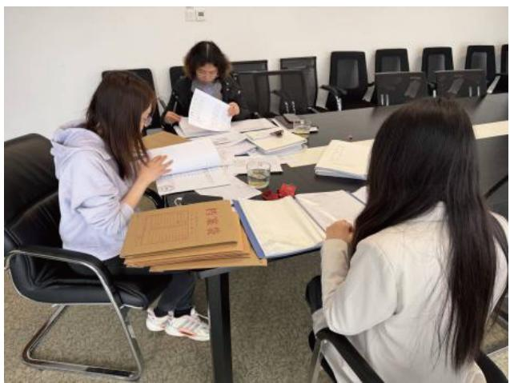

natural_image

Three students seated at a conference table reviewing documents and folders, with chairs in the background (no visible text or symbols)

红豆股份子公司内控审计现场

# 税务管理

公司财务部负责税务管理工作，设置专职税务管理岗位负责工作组织与执行，依据各级税务机关制定的税收法律、法规及地方税收规章制度，研究制定内部税务管理制度及税务风险控制方案，从税务管理与筹划角度出发积极参与公司的经营管理，定期组织专人进行税务自查，以规避税务风险。

# 商业道德

红豆股份将商业道德建设作为可持续发展的重要基石，倡导“诚信、感恩、创新、卓越”的企业核心价值观，将诚信合规理念系统化落实于经营管理的各个层面。公司从反商业贿赂、维护公平竞争秩序、负责任营销等维度构建全面的商业道德管理体系，将合规经营要求贯穿于公司内外部商业活动的全链条，切实防范道德与合规风险，维护各利益相关方的合法权益。

# 反商业贿赂

公司坚决抵制任何形式的商业贿赂行为，将廉洁合规要求系统延伸至供应链管理全链条。在合作准入环节，公司要求合作单位签订《一家两制自查表》，承诺其不属于公司在职员工或离职员工所办企业；同时要求供应商、外协等合作伙伴人员签署《廉洁自律承诺书》及《禁止商业贿赂协议书》，明确承诺不向本公司员工以任何形式输送利益。2025年，公司供应商、外协等相关人员全面完成上述协议的签署工作。

在举报与调查机制层面，公司设立总经理信箱与董事长信箱，专项受理员工提出的各类举报线索，由专人负责整理并提交至公司管理层；在确认相关线索后，组织法务部门依程序开展调查，涉及刑事犯罪的案件将第一时间移交公安机关处理。公司郑重承诺对举报人信息予以严格保护，支持匿名举报，并制定专项保护制度与措施，明确禁止任何形式的打击报复行为，切实保障举报人的合法权益。

# 关键绩效

2025年，公司未发生商业贿赂及贪污事件。

# 反不正当竞争

公司高度重视市场竞争秩序的合规性，通过制度约束与协议管理双管齐下，有效防范不正当竞争风险。在员工管理层面,公司组织员工签订《竞业限制协议》《保密协议》及《服务期协议》,明确告知员工应遵守的商业道德规范，涵盖禁止从事同业竞争及对商业秘密依法保密等核心要求，从源头筑牢竞争合规防线。

# 关键绩效

2025年，公司未发生因不当竞争导致诉讼或处罚的情况。

# 负责任营销

公司秉持诚信、透明的营销原则，依据《中华人民共和国广告法》及相关法律法规，制定并实施《广告宣传审核制度》与《广告宣传审核流程》，对广告宣传中涉及的宣传用语、价格标注、字体、图片、音乐、视频、引用文字及商标标识等各项要素实施全面审核管理。在价格与用语规范方面，公司明确要求所有产品须明码标价，不得虚标产品原价，对未销售过的产品开展促销活动时，不得使用“原价”“原售价”“成交价”等误导性概念，宣传内容中不得出现“最终解释权”等侵害消费者权益的表述。

此外，公司法务部依据《宣传使用手册》等规章制度定期开展专项检查，对线上线下宣传内容的合规性进行系统核查，针对发现的不合规内容及时提出整改意见并跟踪落实整改情况，并适时更新《宣传使用手册》，确保宣传活动的合法性与规范性持续提升。

<table><tr><td colspan="2">广告宣传品审核节点</td></tr><tr><td>制作广告宣传品</td><td>公司各部门及下属企业依据《广告宣传审核制度》要求及本部门业务需要,制作相关广告宣传材料。</td></tr><tr><td>部门负责人审批</td><td>制作部门的上级负责人需对制作的广告宣传品材料进行审批,宣传材料中涉及的要素符合《宣传使用手册》要求。</td></tr><tr><td>数据支持与核验</td><td>若广告宣传品材料中涉及产品相关的功能性术语、质检报告、产品技术参数等数据,将流转至质量监督部门进行审核确认。</td></tr><tr><td>合规审核</td><td>法务部门结合《中华人民共和国广告法》《中华人民共和国价格法》《中华人民共和国消费者权益保护法》等相关法律法规,对产品涉及功能性术语、产品技术参数等数据,或者超出《宣传使用手册》内容的部分进行审核。</td></tr><tr><td>正式发布</td><td>通过上述审批流程的广告宣传品材料,制作部门可直接发布、制作或者展示。</td></tr></table>

# 投资者关系管理

# 信息披露

公司严格按照《中华人民共和国公司法》《中华人民共和国证券法》《上海证券交易所股票上市规则》《上市公司信息披露管理办法》及《公司章程》等有关规定，于本年度修订并完善了《信息披露管理制度》及《信息披露暂缓与豁免管理制度》。公司依法履行信息披露义务，确保信息披露真实、及时、准确、完整。同时，公司持续优化信息披露质量，增强公告的可读性和有效性，力求达到“简明扼要、通俗易懂”的效果，充分保障广大股东及投资者的知情权。

公司所有需披露的信息均通过指定信息披露媒体《上海证券报》和上海证券交易所网站（www.sse.com.cn）公告。

# 关键绩效

2025年，公司披露定期报告4份，临时报告62份，未发生违反信息披露规定而受到处罚的事件。

# 投资者关系管理

公司高度重视投资者关系的建立和维护。本年度，公司修订了《投资者关系管理制度》，进一步规范并完善投资者交流机制。在制度保障下，公司持续畅通线上线下沟通渠道，充分利用电话、电子邮件、上证e互动、现场接待等方式，增进投资者对公司的了解，听取其意见建议并及时反馈至董事会及管理层，助力审慎决策。此外，依托舆情管理机制，公司有效建立了快速反应和应急处置体系，能够及时妥善处理各类舆情影响，保障公司商业信誉及经营活动稳定，切实维护投资者合法权益。

# 关键绩效

2025年，公司共召开2场业绩说明会，回答上证e互动平台问题24个。

# 守护信息安全

公司始终重视信息安全管理，通过构建以网络安全、数据安全、系统安全为核心的信息安全管理体系、实施多层次防护、强化技术保障与员工培训，全面筑牢信息安全防线，不仅有效防范了数据泄露风险，也为客户和合作伙伴

伴创造了更加安全可靠的信息环境。

为保障信息的安全性、可靠性、完整性和有效性，公司制定并实施《业务管理制度》《机房管理制度》等多项制度，建立“三层治理模型”的数据安全管理组织架构，要求员工签署保密协议，持续加强信息系统用户账号和权限的规范化管理，确保各信息系统安全、有序、稳定运行，防范应用风险及信息泄露风险。

natural_image

Abstract digital illustration with lock, padlock, envelope, and user interface elements on red background (no text or symbols)

# 决策层 (数据安全委员会)

职责：审批年度数据安全战略及预算；处理重大数据安全事件（如跨境数据泄露）；监督跨部门协作（如 IT 与法务的合规衔接）。

# 管理层 (数据安全管理部)

职责：制定《数据安全管理制度》《数据备份管理制度》《数据访问制度》等制度；每季度向决策层汇报风险态势及防护成效。

# 执行层 (业务部门与IT运维)

职责：落实数据安全操作规范（如权限申请、日志记录）；配合安全演练与整改（如钓鱼邮件模拟、漏洞修复）。

数据安全管理组织架构

  
数据安全

  
数据加密与解密

  
数据备份

  
机房管理

  
出入管理

  
环境管理

  
设备管理

  
消防管理

  
流程管控

  
用户权限管控流程

  
业务管理流程

  
信息系统安全

  
服务器管理

  
信息系统账户安全设置

数据安全管理措施  

natural_image

Line art illustration of a city skyline with houses, trees, clouds, and wind turbines (no text or symbols)

关键绩效  

<table><tr><td>指标分类</td><td>指标名称</td><td>单位</td><td>2025年数据</td></tr><tr><td rowspan="5">数据安全与客户隐私</td><td>经确认的数据安全事故次数</td><td>例</td><td>0</td></tr><tr><td>数据安全事件涉及的具体金额</td><td>万元人民币</td><td>0</td></tr><tr><td>数据安全与客户隐私保护培训次数</td><td>次</td><td>2</td></tr><tr><td>经确认的客户隐私泄露事故次数</td><td>例</td><td>0</td></tr><tr><td>客户隐私泄露事件涉及的具体金额</td><td>万元人民币</td><td>0</td></tr></table>

natural_image

Illustration of a business presentation with three people seated at tables, one presenting a bar chart on screen, no text or symbols present.

# 更新状态 舒适一身

0感舒适衬衫3.0 全国销量领先

热销2,000,000件

注：1数据来源：欧睿信息咨询（上海）有限公司，按中国大陆内各品牌2023年全零售渠道0感衬衫零售量（按“件”）计。

0感衬衫指在产品名称或卖点宣称中使用“0感/零感”字眼的衬衫，通常采用莫代尔混纺面料等具备舒适特性的面料，立体剪裁，具备亲肤舒适特性。于2024年4月完成调研。

# 02

# 创新驱动

# 赋能产业生态

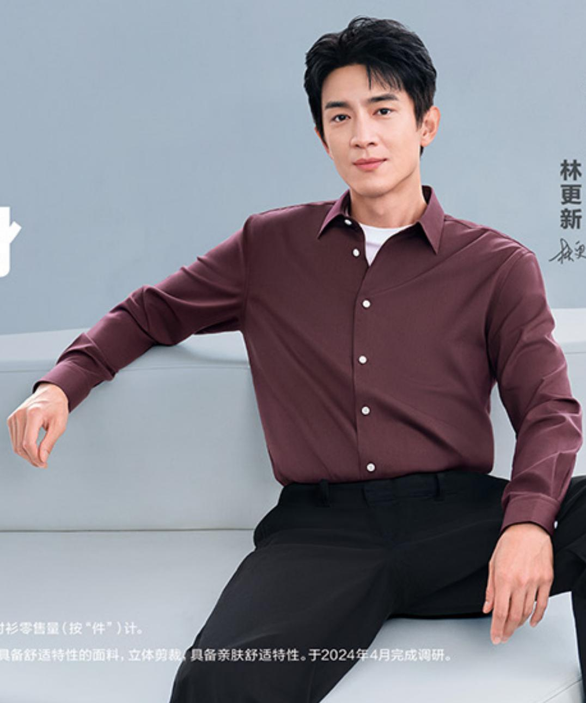

text_image

林更新
衬衫零售量(按“件”)计。
具备舒适特性的面料,立体剪裁,具备亲肤舒适特性。于2024年4月完成调研。

红豆舒豆
代品牌装品人

# 核心理念

红豆股份致力于推进研发创新、品质服务、供应链协同与社会贡献，以技术迭代与知识产权保护为基石，持续优化产品矩阵与客户体验；同时，依托数字化供应链管理与公平共赢的生态建设，赋能产业链上下游协同发展，为行业高质量增长注入可持续动力。

# 核心行动

研发创新驱动  
- 保障品质与服务

- 可持续供应链  
● 社会贡献

# SDGs

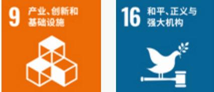

# 研发创新驱动

红豆股份始终将创新作为发展的核心动力，通过持续投入与优化研发体系，不仅提升了核心竞争力，也为行业的创新发展注入了新动能，助力行业及社会实现更高效、更可持续的未来。

# 治理

公司已明确研发与创新管理组织架构，建立并完善《研发管理流程》，确保技术创新与市场需求紧密结合，为产品升级和绿色转型提供坚实支撑。公司将商品企划结构达成率、商品产销率等研发创新相关指标纳入研发人员绩效考核，并设立专项“研发创新奖”，鼓励能创造市场价值的产品创新。

# 战略

公司定期系统梳理可能影响研发与创新管理的风险和机遇，以分析其潜在影响，为针对性制定应对策略提供依据。

红豆股份研发与创新相关风险

<table><tr><td>风险类型</td><td>风险描述</td><td>发生可能性</td><td>潜在财务影响</td><td>影响周期</td></tr><tr><td>技术迭代风险</td><td>行业向绿色、功能化面料加速迭代。若公司在可持续材料研发、环保工艺上落后,将导致产品竞争力下降,面临监管或市场压力,增加合规或转型成本,品牌价值受损,市场份额被竞争对手侵蚀。</td><td>中</td><td>运营成本上升,营业收入下降</td><td>中期、长期</td></tr><tr><td>知识产权风险</td><td>原创设计及面料专利可能被侵权,或因无意中涉及他人知识产权而产生纠纷,产生法律诉讼费用、赔偿支出,核心产品可能被禁售。</td><td>中</td><td>运营成本上升,营业收入下降</td><td>短期、中期</td></tr></table>

红豆股份研发与创新相关机遇

<table><tr><td>机遇类型</td><td>机遇描述</td><td>发生可能性</td><td>潜在财务影响</td><td>影响周期</td></tr><tr><td>数字化研发机遇</td><td>利用销售、天气、用户评价等数据反向驱动设计企划和版型调研,实现精准研发,减少试错成本。</td><td>高</td><td>降低研发成本,增加营业收入</td><td>短期、中期、长期</td></tr></table>

# 影响、风险与机遇管理

公司建立了一套研发与创新相关风险与机遇的识别管理流程，旨在将风险控制和机遇把握融入日常研发工作，确保公司能有效应对相关风险与机遇。

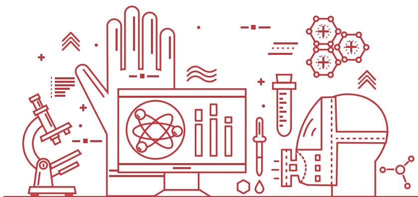

natural_image

Illustration of scientific laboratory components including lab gloves, microscope, microscope, test tube, and molecular structures (no text or symbols)

# 识别与评估

- 结合同行业与公司自身运营特点，识别梳理潜在风险与机遇；  
- 对所识别的风险与机遇从可能性、财务影响、影响周期维度进行评估排序。

# 制定应对策略

\- 针对各风险与机遇制定相应的应对策略。

# 回顾与改进

\- 定期回顾并检验流程的有效性，总结经验教训，优化流程。

研发与创新相关风险机遇识别管理流程

# 研发与创新

公司建立了研发管理流程，以“消费者画像”为起点，强调对消费者行为与偏好的研究，确保产品与服务紧密贴合市场需求。流程涵盖市场调研、面料规划、设计企划、定向开发、多轮评审及最终下单等关键环节，体现了从洞察到落地的完整闭环管理。

2025 年，公司通过举办 “舒适红豆发展大会” 及推动货盘焕新，在推动技术研发、产品迭代及品牌赛道构建上取得了显著成果。

# 案例 举办舒适红豆发展大会，引领创新技术与产品迭代

2025年，公司在舒适红豆发展大会上正式发布0感衬衫3.0。该产品与国际大师吉國武合作，引入核心版型技术Flexpand（自由度扩展），首次实现对衬衫领部、肩部、背部、肘部、袖口五大部位的自由度进行全面系统性升级。同时，公司首次以“0感矩阵”的形式呈现产品家族化布局，发布了涵盖衬衫、冲锋衣、抓绒衣、型动裤在内的系列化产品，展现了以核心技术为原点、满足多场景舒适着装需求的研发能力。

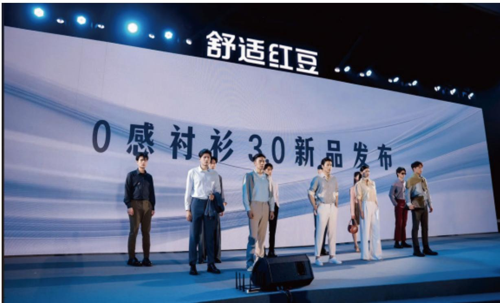

text_image

舒适红豆
0感衬衫30新品发布

舒适红豆发展大会

natural_image

Illustration of a computer screen displaying web interface elements, with a woman holding a scroll nearby (no text or symbols)

# 案例 聚焦舒适休闲，推动货盘焕新

公司以标杆焕新为导向，全面升级产品货盘战略，立足舒适，将研发资源与设计重点聚焦于“轻户外”与“轻休闲”两大高成长性舒适场景。通过对“品质休闲”与“运动户外”产品线的强化与重塑，公司推动了整体产品结构向更年轻、更具功能性与场景化的方向演进，以产品创新引领大盘增长与品牌年轻化转型。

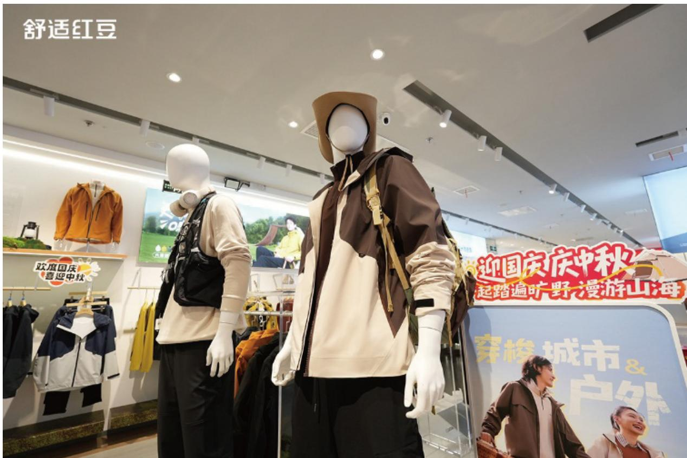

text_image

舒适红豆
欢迎国庆
喜迎中秋
迎国庆中秋
起踏遍旷野 漫游山海
穿梭城市&
户外

# 知识产权

公司高度重视知识产权保护与创新成果转化，制定并实施《商标注册和著作权登记规定》《宣传使用手册》等管理制度，对申请注册商标的类别及范围、商标注册流程、著作权权属、著作权登记流程等进行规范管理，并定期对相关商标及著作权进行登记和年审，有效防范知识产权风险。

<table><tr><td rowspan="4">商标权</td><td>及时跟踪商标注册申请的进展情况,通过登录“国家知识产权局商标局中国商标网”,查阅商标局发出的公告,跟踪审批状态。</td></tr><tr><td>若他人对公司申请并经商标局初步审定的商标提出异议,公司将在一个月内向商标注册部门进行答辩。</td></tr><tr><td>公司定期审阅中国商标网商标注册公告,若发现他人近似或相同商标注册,将在3个月异议期内向商标注册部门提出异议申请。</td></tr><tr><td>对于他人注册商标与公司注册商标相似而引起争议的情况,若对方注册商标期限未满五年,公司将向国家商标评审委员会提出商标无效宣告申请。</td></tr><tr><td rowspan="3">著作权</td><td>公司及其下属公司在使用公司商标权和著作权时,负有维护其完整性的责任;同时,员工对著作权侵权行为负有监督和举报的义务。</td></tr><tr><td>若发生著作权侵权纠纷,公司将采取及时调查、搜集和固定证据,并报相关部门处理,与侵权责任人协商赔偿并向法院提起侵权诉讼等法律行动。</td></tr><tr><td>公司在日常排查工作中,若发现他人侵犯公司商标权和著作权,将及时汇总上报相关案件,积极维护公司合法权益,维护市场秩序和品牌形象。</td></tr></table>

2025 年，公司取得多项创新研发成果并申请专利。

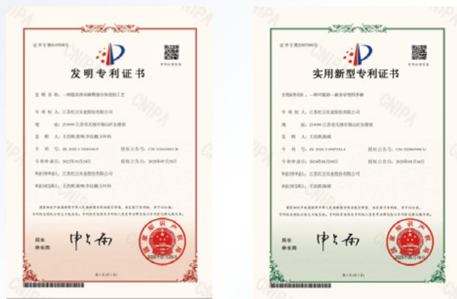  
研发专利部分示例

# 数字化与智能制造

公司以智能制造为核心发展方向,构建了以 MES 系统为中枢的“一个核心、多系统联动、全流程覆盖”智能生产体系。通过集成 SAP、O2M、CAD、智能吊挂流传系统、自动裁床设备等各类设施，并依托 5G 工业网络，实现了从设计、裁剪、缝制到检验的全流程数据实时协同，成功落地 MES 柔性全链控制吊挂模式。此举显著提升了产线柔性调度能力、生产响应速度与协同效率，降低了人工干预与生产损耗。

2025 年，公司深化数据治理与应用，通过规范数据采集、优化传输流程，提升数据质量，为生产分析、异常预警、效率改善、成本管控与质量追溯提供精准支撑，推动工厂向精细化、智能化管理转型。凭借上述成果，公司获评 2025 年 “江苏省先进级智能工厂”，为行业数字化转型树立标杆。

# 保障品质与服务

红豆股份始终以客户为中心，秉承“一切只为顾客满意”的服务理念，致力于通过卓越的产品质量和优质的服务为客户创造长期价值。公司通过严格的质量管理体系和高效的客户服务机制，不断提升产品与服务的可靠性，增强客户信任与满意度，为企业的可持续发展奠定了坚实基础，也为行业的品质提升与服务优化树立了标杆。

# 质量管理

公司以打造卓越品质为核心目标，目前已建立了完善的产品和服务质量安全主体责任体系，严格遵循《红豆男装产品标准》，制定并执行《公司质量监督管理流程》《外部质量抽查管理流程》《外协产品检验流程》等制度文件，以及《关于加强产品质量管理相关规定的通知》《关于开展红豆男装门店无次品活动的通知》等管理要求，明确高层领导对产品和服务质量安全负首要责任，公司首席质量官、质量主管对质量安全负直接责任，实行质量安全“一票否决”。公司严把产品质量关，从原辅料到成品全过程的质量检验，在每个生产过程中质控点设立专检人员，要求所有检验人员全部考试合格后持证上岗。

# 三级企业负责人

质量第一责任人，对所采购的产品质量负全责，发生外部质量抽查及时跟踪处理，杜绝负面舆情发生。

# 商品中心供应链管理部 / 各三级企业采购外协部

负责外协产品过程质量管控, 跟单过程中发现质量问题及时整改, 确保每批产品检验合格后发回公司。

# 各三级企业质检科人员

负责产品入库前最终检验，若发现产品不合格（零星或批次）的，立即书面通知外协跟单人员限期整改，直至检验合格后方可入库。

# 企管部质监科

负责公司产品质量监督管理,每月对合格入库的产品进行抽查,形成月度质量报告督促改进。

质量管理部门职责

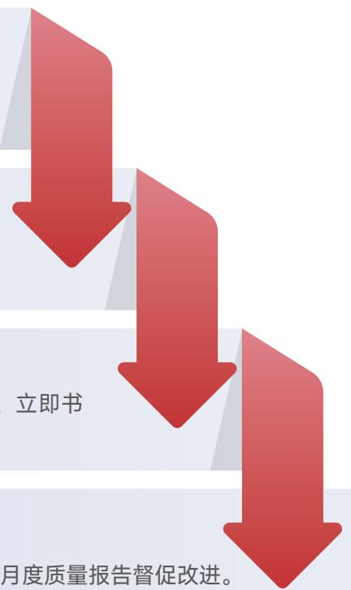

text_image

立即书
月度质量报告督促改进。

# 体系认证

目前，公司已成功取得ISO 9001质量管理体系认证。

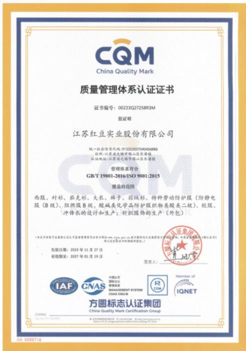

text_image

CQM
China Quality Mark
质量管理体系认证证书
证书编号：00223Q27258R3M
兹证明
江苏红豆实业股份有限公司
统一社会信用代码：9132020704045688G
住所：江苏省无锡市锡山区东港镇
认证地址：江苏省无锡市锡山区东港镇
管理体系符合
GB/T 19001-2016/ISO 9001:2015
覆盖的范围
西服、衬衫、茄壳衫、大衣、裤子、羽绒衫、特种劳动防护服（防静电服（B级）、阻燃服B级、酸碱类化学品防护服织物类酸类二级）、校服、冲锋衣的设计和生产；针织服饰的生产（外包）
（本证书有效期以国家认可后可监督管理委员会官方网站www.cqms.gov.cn或中国环保认证集团有限公司审核，年度鉴证结果详见《认证证书》
用以证鉴证文件的种类有效。
生效日期：2023年11月27日
有效期至：2027年01月19日
签发人：
IAAF CNAS
中国石化
国际认证
管理信息系统
MANAGEMENT SYSTEM
CNAS CNGS
Member of
IQNET
方圆标志认证集团
China Quality Mark Certification Group
CHINA
QUALITY MARK
© 2023 International Association of China's Quality Management Corporation, Ltd.
AA 0050716

ISO 9001质量管理体系认证证书

产品质量是消费者关注的重要指标，因此需要不断地优化质量相关过程，以满足消费者日益提升的产品质量需求。为了快速获取市场的前沿质量信息，公司内部建立微信质量工作群，对客户反馈的质量信息第一时间作出回应以及监管。此外，公司定期开展质量培训并积极参与外部质量管理会议，以进一步提升企业质量管理成效。

<table><tr><td>管理目标</td><td>达成情况</td></tr><tr><td>入库产品质量合格率达100%</td><td>已达成</td></tr><tr><td>产品一等品率达98%</td><td>已达成</td></tr><tr><td>未出现外部抽查不合格情况</td><td>已达成</td></tr></table>

红豆股份年度产品质量管理目标

# 客户服务

公司以消费者为中心，始终坚持“实体是根基，数字是羽翼”的原则，制定并实施《顾客投诉处理流程》《连锁门店顾客投诉处理流程》《电商客诉处理流程》等管理文件，明确各相关部门在客诉处理过程中的职责、管理指标与目标、关键控制点等，畅通客户投诉渠道，确保及时、高效地收集和处理顾客投诉意见，促进公司质量和服务的不断改进，确保用户满意度的提升。

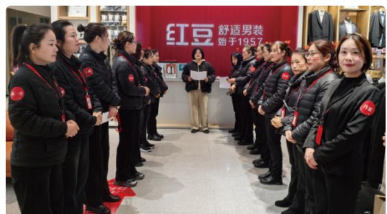

text_image

红豆 舒适男装
始于1957

客户服务培训

公司按投诉问题重要程度将投诉分为一般投诉、重大投诉两种类型，并制定相应措施及解决方案，确保投诉得到及时有效地解决，以减少顾客不满和业务流失。此外，公司定期开展客户服务相关培训，以持续提升员工整体服务质量。

门店店员在接到顾客投诉后负责与顾客沟通，认真倾听顾客心声，详细记录顾客投诉内容和诉求，以及顾客提出不满意需提升改进的建议。

门店负责对顾客投诉的货品进行判定，快速（受理投诉后20分钟内）响应。判定为产品本身质量问题的，按公司《商品退换规定》对投诉进行处理。

门店无法直接判定是否为产品质量问题的，需第一时间（受理投诉5分钟内）与公司新零售科售后人员联系，就投诉内容进行反馈、沟通，确保判定的准确，防止误判，必要时由质检科质检人员配合判定，若仍无法判定，可咨询公司质监科。

所有投诉从受理、处理、回复必须当天完成，如遇特殊情况，回复时间可与顾客协商，但必须在协商时间内进行回复，回复时间最长不可超过24小时（产品需寄回公司判定的，回复时间从收到样衣起开始计算）。

顾客投诉处理原则

公司致力于推进线上线下协同发展，基于数字化新零售，建立了覆盖线下门店、线上店铺的全渠道营销网络体系，并凭借优质的客户服务，荣获全国商品售后服务达标五星级认证证书及 CTEAS 售后服务体系完善程度认证七星级（卓越）证书。

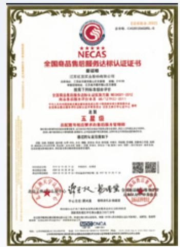

text_image

NECAS
全国商品售后服务达标认证证书
鉴证师
江苏汇成实业股份有限公司
注册地址：江苏省南京市江宁区南京西路188号
办公地址：江苏省南京市江宁区南京西路188号
客服电话：95573
注册会计师：王洪波
注册会计师事务所：国信证券有限责任公司
2021年1月1日-2021年1月26日
注册会计师事务所（特殊普通合伙）
2021年1月26日-2021年1月27日
注册会计师事务所（特殊普通合伙）
2021年1月28日-2021年1月29日
五星信
五星信
注册会计师事务所（特殊普通合伙）
2021年1月26日-2021年1月27日
注册会计师事务所（特殊普通合伙）
2021年1月28日-2021年1月29日
注册会计师事务所（特殊普通合伙）
2021年1月30日-2021年1月31日
注册会计师事务所（特殊普通合伙）
2021年2月4日-2021年2月5日
注册会计师事务所（特殊普通合伙）
2021年2月6日-2021年2月7日
注册会计师事务所（特殊普通合伙）
2021年2月9日-2021年2月10日
注册会计师事务所（特殊普通合伙）
2021年2月13日-2021年2月14日
注册会计师事务所（特殊普通合伙）
2021年2月15日-2021年2月16日
注册会计师事务所（特殊普通合伙）
2021年2月19日-2021年2月20日
注册会计师事务所（特殊普通合伙）
2021年2月23日-2021年2月24日
注册会计师事务所（特殊普通合伙）
2021年3月3日-2021年3月4日
注册会计师事务所（特殊普通合伙）
2021年3月7日-2021年3月8日
注册会计师事务所（特殊普通合伙）
2021年3月9日-2021年3月10日
注册会计师事务所（特殊普通合伙）
2021年3月13日-2021年3月14日
注册会计师事务所（特殊普通合伙）
2021年3月15日-2021年3月16日
注册会计师事务所（特殊普通合伙）
2021年3月19日-2021年3月20日
注册会计师事务所（特殊普通合伙）
2021年3月23日-2021年3月24日
注册会计师事务所（特殊普通合伙）
2021年3月25日-2021年3月26日
注册会计师事务所（特殊普通合伙）
2021年3月30日-2021年3月31日
注册会计师事务所（特殊普通合伙）
2021年4月4日-2021年4月5日
注册会计师事务所（特殊普通合伙）
2021年4月7日-2021年4月8日
注册会计师事务所（特殊普通合伙）
2021年4月9日-2021年4月10日
注册会计师事务所（特殊普通合伙）
2021年4月13日-2021年4月14日
注册会计师事务所（特殊普通合伙）
2021年4月15日-2021年4月16日
注册会计师事务所（特殊普通合伙）
2021年4月19日-2021年4月20日
注册会计师事务所（特殊普通合伙）
2021年4月19日-2021年4月30日
注册会计师事务所（特殊普通合伙）
深圳市前海深港合作区管理局
深圳市前海深港合作区管理局
深圳市前海深港合作区管理局
深圳市前海深港合作区管理局
深圳市前海深港合作区管理局
深圳市前海深港合作区管理局
深圳市前海深港合作区管理局
深圳市前海深港合作区管理局
深圳市前海深港合作区管理局
深圳市前海深港合作区管理局
深圳市前海深港合作区管理局
深圳市前海深港合作区管理局
深圳前海深港合作区管理局

全国商品售后服务达标五星级认证证书

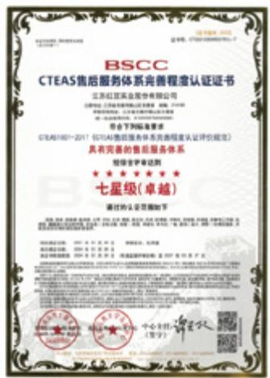

text_image

BSCC
CTEAS售后服务体系完善程度认证证书
江苏红花实业股份有限公司
注册地址：江苏省无锡市锡山区金桥路19号
客服电话：95568
客户服务热线：95568-7
符合下列标准要求
CTEAS1001-2011（包括TCL售后服务体系完善程度认证评估规范）
具有完善的售后服务体系
接待签字确认时间
★★★★★★★
七星级(卓越)
通过的认可事项如下
请在以下内容中说明：
一、服务范围：2011年1月1日至2011年12月31日
二、服务期限：2011年1月1日至2011年12月31日
三、服务地点：苏州工业园区翠屏路4号
四、服务对象：中心主材（签字）

CTEAS售后服务体系完善程度认证七星级（卓越）证书

在持续优化营销策略的同时，公司充分运用信息技术赋能客户运营管理，提升全渠道销售和客户体系，发展以小程序、抖音、快手为代表的社交电商平台，建设并成功运营“400热线”“线上客服”“红粉会”等客户沟通模式，全方位提升公司客户服务能力。

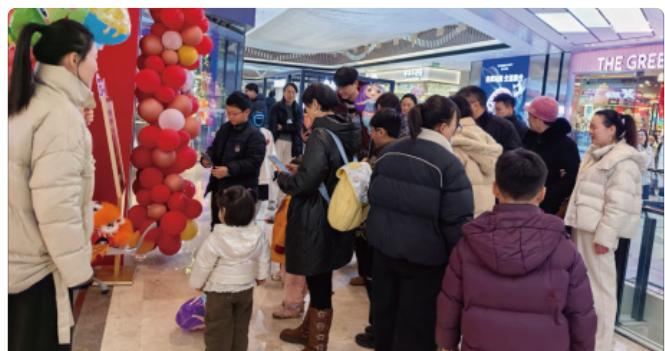

text_image

Street photo showing a crowded indoor event with people gathered around colorful balloons and visible store signs including 'THE GREE'

红粉会

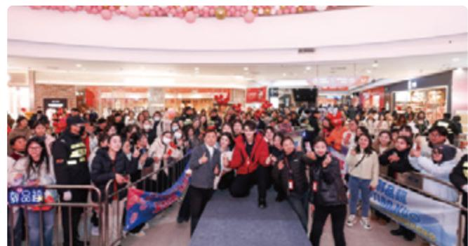

text_image

Crowd photo inside a shopping mall with visible Chinese signage and festive decorations

明星见面会

# 关键绩效

2025年，公司客户反馈响应率为100%，客诉率低于0.03%，二次客诉率为0%。

# 可持续供应链

红豆股份以打造可持续、负责任的供应链为目标，通过持续完善供应商评估体系，全面提升供应链的透明度与韧性，为供应链上下游的协同发展提供了有力支撑，同时为行业的高质量发展树立了标杆，进一步巩固了公司在产业链中的核心地位。

# 治理

公司制定了《供应商管理流程》，建立了由企管部统筹负责，权责清晰、多层联动的供应链管理架构，实现对供应商从开发、准入、合作到评估、分级与淘汰的闭环管理。

# 战略

公司定期梳理供应链管理相关的风险和机遇，以分析其潜在影响，为针对性制定应对策略提供依据。

红豆股份供应链管理相关风险

<table><tr><td>风险类型</td><td>风险描述</td><td>发生可能性</td><td>潜在财务影响</td><td>影响周期</td></tr><tr><td>供应商风险</td><td>供应商选择不当,提供的服务和产品质量,不能满足公司的生产经营需要,甚至出现舞弊行为。</td><td>中</td><td>管理成本上升,营业收入下降</td><td>中期、长期</td></tr><tr><td>原材料与成本风险</td><td>原材料价格大幅波动(如棉花价格上涨)或关键功能性面料供应中断,将直接影响采购成本与生产计划。</td><td>中</td><td>生产成本上升,营业收入下降</td><td>短期、中期</td></tr></table>

红豆股份供应链管理相关机遇

<table><tr><td>机遇类型</td><td>机遇描述</td><td>发生可能性</td><td>潜在财务影响</td><td>影响周期</td></tr><tr><td>柔性供应链机遇</td><td>利用数字化工具打通从门店销售到面料采购的数据链条,构建小单快反的柔性供应链能力,以快速响应“全域零售”的市场需求变化。</td><td>中</td><td>降低运营成本,增加营业收入</td><td>中期、长期</td></tr></table>

# 影响、风险与机遇管理

为有效应对供应商管理相关风险与机遇，公司构建了标准化的供应商管理流程，贯穿供应商从准入到退出的全生命周期，并要求合作伙伴签署《廉政管理协议书》《禁止商业贿赂协议书》以规范供应商行为。

# 准入评审

- 由采购部门执行寻找、调查与资料收集；  
- 随后必须通过严格的跨部门联合评审、小批量试样、企管部审核验厂及内部公示，并最终由集团供应商管理委员会审批，从而在源头确保供应商的质量与合规性。  
- 双方依据规范签订合同并执行采购，同时公司通过每月业绩打分、飞行检查对供应商的质量、交期、价格、研发能力与服务等进行持续的数据化评价与跟踪整改，实现对合作过程的实时监督与风险控制。  
- 公司每半年组织一次综合等级评定，并据此对供应商进行差异化处理（如优先合作、辅导或淘汰），形成优胜劣汰机制；  
- 同时，通过组织培训、交流及年度供应商大会，致力于构建长期共赢的战略合作伙伴关系，推动供应链整体水平的提升。

供应商管理流程

# 供应商评估

公司通过制定《供方调查评定记录表》《技术、质量保证能力验收打分表》《供应商承诺书》等规章制度，建立了公平公正的供应商评估体系，对供应商进行多维度评估，包括对供应商提交的相关证明材料进行审核、组织相关人员进行验厂（包括临时供应商）、填写《供方调查评定记录表》等。对未能通过审核或飞行检查的供应商，公司将退回至供应商寻找环节。

公司建立了供应商协同管理系统 (SRM)，通过该系统实现对供应链上下游采购和供应商关系管理环节的深度集成，实现需求 / 计划、采购过程、合同管理、付款结算、成本分析、预警识别等业务流程的全线融合。

# 平等对待中小企业

公司以构建公平、共赢的供应链生态为目标，通过优化采购流程、强化供应商赋能及建立透明合作机制，全面保障中小企业的合法权益，为中小企业提供了平等参与市场竞争的机会，同时为产业链的可持续发展注入了活力，进一步提升了公司在行业中的责任形象与影响力。

natural_image

Illustration of two people pushing puzzle pieces against a city skyline background (no text or symbols)

# 指标与目标

公司设定了年度供应链管理目标并定期追踪目标达成情况。

# 关键绩效

截至报告期末，公司供应商共计236家，考核覆盖率达100%，考核合格率达100%，签署禁止商业贿赂协议书的供应商比例为100%。

# 社会贡献

红豆股份认识到，履行社会责任是一个持续、深入的过程，不仅体现在专项的外部行动上，更应根植于日常运营的各个层面。2025年，公司通过优化供应链管理、提供稳定就业与合格产品等基本但至关重要的方式，持续创造社会价值。同时，公司正努力在未来形成与业务专长结合更紧密、社会效益更显著的行动模式。

公司始终以推动行业高质量发展为己任，致力于通过创新实践和可持续发展理念为行业注入新动能，在技术创新、产业链协作及绿色低碳领域持续探索，为行业树立标杆、引领方向，助力构建更加健康、繁荣的产业生态，为行业的长期可持续发展贡献价值。

# 关键绩效

公司共参与制定国家标准1项、行业标准4项、团体标准5项。

other

| Category | Relative Height (Approximate) |
| --- | --- |
| City Sky Structure | High to Low (shaded) |

text_image

Interior of a clothing store with mannequins, racks of jackets, and promotional banners displaying Chinese text.

# 核心理念

红豆股份始终坚持“以奋斗成功者为本”的人才理念,致力于“让奋斗者有志竟成、让创新者心无旁骛、让成功者有为有位”，构建科学的人才管理体系，开展员工选育用留等工作，将人作为公司的关键资源，关注员工的健康安全、权益福祉，激发员工潜能、创造性和积极性，实现企业与员工共成长、同发展的双赢。

# 核心行动

- 员工权益保障  
● 人才培训与发展

- 员工关怀

● 职业健康安全

# SDGs

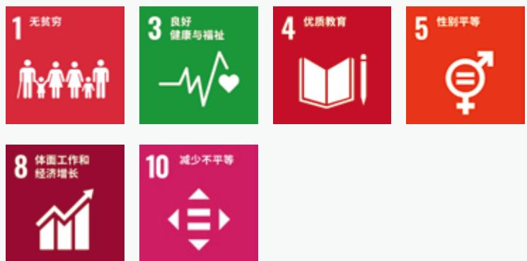

# 03

# 以人为本

# 共筑幸福职场

text_image

HO

natural_image

Abstract geometric logo design with circular shapes and a vertical line (no text or symbols)

# 员工权益保障

红豆股份严格遵守国家《中华人民共和国劳动法》《中华人民共和国劳动合同法》《中华人民共和国民法典》等人事相关的法律法规，制定了《员工手册》等规章制度，通过人员合同、集体协商协议、职代会等多种形式和渠道，明确招聘制度和用工制度，保障所有员工权益，推动员工不断进步，促进公司健康、高质量发展。

# 引进与留存

公司根据战略方向与业务发展，利用人才分析（PA）和人力资源规划（SWP），对现有人才状况进行分析，明确招聘需求，进而制定招聘计划，完成人才引进。未来5年，公司将围绕战略升级转型，配合战役落地，制定中长期人才规划。

# 关键绩效

2025年，公司员工总数3,754人，公司员工劳动合同签订比例为100%。

公司建立基于岗位胜任力模型的招聘体系，采用多元化的招聘渠道和科学的测评方法，秉承“公开、公平、公正”的招聘原则，尊重并维护员工的各项权益，承诺不因民族、种族、年龄、性别、婚姻状况以及宗教信仰等差异给予员工不同待遇，所有聘用均签订合法有效的劳动合同，从源头上杜绝强迫劳动、童工和女性就业歧视，坚决杜绝任何形式的用工违法行为与歧视行为，并为员工提供符合法律规定的假期。公司采取双向选择，择优招聘录用，避免任何形式的歧视行为，从而更多引进和留存高质量人才，强化公司实力。

# 关键绩效

2025年，公司未发生经确认的歧视事件、强迫劳动事件及雇佣童工事件。

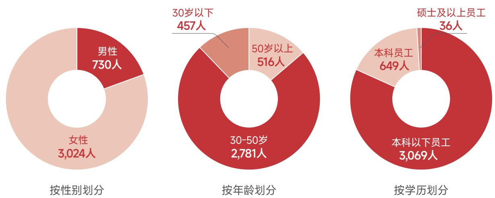

公司重视人才的保留，积极识别人力资源风险，并划分为三个等级。针对不同层级的人力资源风险，公司分别开展对应风险管控工作，制定相应的预控方案，并明确责任部门，定期进行巡查与整改。每季度，开展关键岗位人才流失分析，每半年度对科员、职工和店员的流失率进行分析。此外，公司制定相关员工保障及激励的政策，保障过年留岗及节后外地返岗的生产职工的稳定性，并通过公司会议、开设训练营、PK表彰等各种形式，持续提升员工对企业的信心，保障员工稳定性、降低流失率。

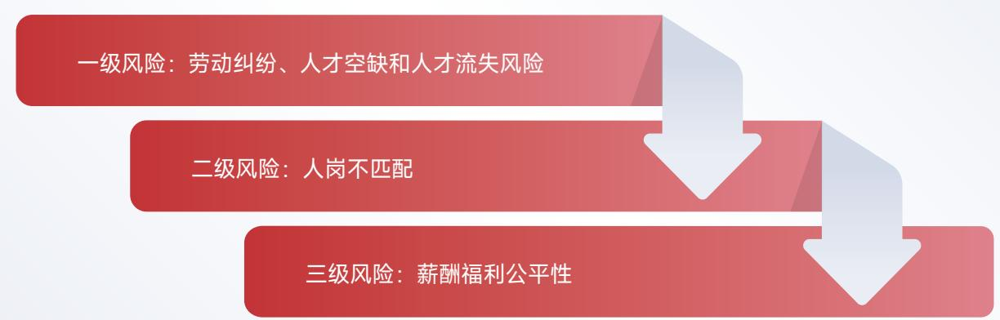

flowchart

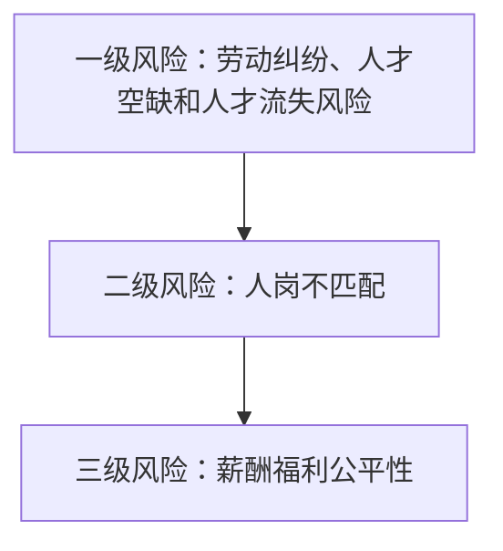
```mermaid
graph TD
  A["一级风险：劳动纠纷、人才空缺和人才流失风险"] --> B["二级风险：人岗不匹配"]
  B --> C["三级风险：薪酬福利公平性"]
```

人力资源风险等级分布

# 关键绩效

2025年，公司外地生产工人返岗率超过96%。

# 薪酬与福利

公司制定并执行《薪酬绩效管理制度》，在薪酬确定、福利保障、绩效考核及激励机制等方面建立了系统的管理框架，坚持竞争性、激励性和公平性原则，充分调动各层级员工的积极性与创造力。

# 薪酬体系

公司坚持以岗定薪原则，遵循竞争性、激励性和公平性的原则确定员工薪酬，并根据岗位性质将员工薪酬分为责任工资制、岗位绩效工资制和提成工资制，充分激发员工积极性、主动性、创造性。此外，公司与专业的人力资源咨询公司保持密切关系，持续开展薪酬调研，不断提升薪酬管理的合理性和竞争力。

# 责任工资制

包含：

基本工资

岗位工资

责任工资

# 岗位绩效工资制

包含:

基本工资

岗位工资

绩效工资

  
薪资结构构成

# 提成工资制

包含：

基本工资

岗位工资

业务提成

# 福利与休假

公司建立健全福利体系，在休假制度方面，配套带薪年假、节日福利等节假福利；在薪酬激励方面，设置各类专项补贴。通过多元化的福利举措，切实提高员工幸福感，调动各层级员工积极性，增强核心团队凝聚力与企业核心竞争力。

# 福利体系

# 专项补贴

吸引优秀人才的学历补贴

提高员工专业技术能力的技术补贴

关怀党务工作者的党务补贴

缓解北上广员工生活压力的区域补贴

# 福利体系构成

# 绩效考核与激励

公司建立了基于目标管理和关键绩效指标的绩效考核体系，全面、客观、公正地评价员工的工作绩效。公司持续完善以沟通为核心的绩效管理闭环，重视员工与上级主管之间的沟通反馈，由上级主管就考核结果、评价依据及改进方向与员工开展绩效面谈，帮助员工明确职业目标和发展路径，赋能员工成长。同时建立绩效申诉机制，若员工对考核结果存有异议，可依据制度向人力资源部提出申诉，确保考核过程的公平性与透明度。

由公司经营层班子成员和各部门主管共同确定年度规划和考核目标

由人力资源部及各部门负责人组织向员工开展季度、半年度考核

由部门主管通过面谈的方式向员工反馈绩效考核结果与判定原因，与员工共同分析其绩效表现中存在的不足并制定改进与提升计划

若员工对考核内容有异议，可在收到考核结果后5个工作日内以书面形式向人力资源部提出异议

绩效考核管理流程

在考核结果的运用上，公司形成了多元化的激励机制，涵盖薪酬福利、晋升机会、奖励基金、荣誉表彰等多项措施。

# 案例

# 推出店长合伙制利润奖，激励优秀门店管理者

2025年，公司以“共享发展、激发活力”为激励目标，创新推行店长合伙制利润奖，将门店经营成果与管理者利益深度绑定，表彰并激励优秀门店管理者。针对服装设计、智能制造等关键领域，设置专项奖励基金，对取得重大突破的高技术人才给予奖励，激发员工工作热情。公司致力于营造尊重设计、尊重人才的企业文化，鼓励员工创新发展，从而更好地留住人才，提升公司综合竞争力。

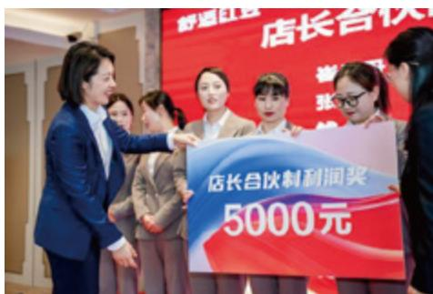

text_image

舒通社区
店长合伙料
店长合伙料利润奖
5000元

店长合伙制利润表彰

# 关键绩效

2025年，公司员工社保缴纳覆盖率为100%；公司开展绩效考核沟通覆盖员工比例为100%。

# 民主与沟通

公司充分尊重并切实保障员工的知情权与监督权，建立起多渠道、多形式的沟通参与机制。2025年4月，公司召开集体协商会议，以职代会民主评议的形式，就工资待遇、劳动安全卫生、职业病防护及女职工特殊权益保护等议题形成集体协议，将员工核心权益以制度化方式予以保障。

在日常沟通层面，公司通过车间回音壁、OA 办公平台、部门例会、表彰大会及办公场所公告栏等多元渠道，与员工保持坦诚、双向的信息交流，确保政策传递与问题反馈的及时性与有效性。节假日期间，管理层及职能人员主动下沉一线，深入门店了解员工实际状况，推动问题的快速识别与解决。此外，公司定期组织员工满意度调查，由部门负责人跟进落实，从薪酬福利、团队氛围等维度持续优化员工体验，推动企业管理的螺旋式改进与发展。

# 民主沟通管理措施

# 常态化沟通

● 通过表彰大会、部门例会、视频会议各种形式，传递公司精神、指令信息。  
- 管理层每周深入一线，了解门店、员工状况，发现并解决一线问题。  
● 每年年底开展科员、职工、满意度调查，通过深入分析，抓取员工迫切期望改善的问提点，例如福利待遇、团队活动等。  
在车间、食堂等地设有总经理、工会信箱，车间设置回音壁，每周给与回复。

# 专项沟通

● 每年的年度挖潜月，立足岗位的群众性创新，鼓励每位员工积极提出合理化建议，解决企业经营活动中的痛点，对产生效益的给与奖励。  
- 员工职代会，就员工关注的重点问题商讨。

# 人才培训与发展

natural_image

Illustration of a business meeting with four people seated at a table, one presenting on a presentation board (no text or symbols visible)

红豆股份秉持“人才是第一资源”的理念，部署了人才发展战略及保障战略落地实施的管理制度，致力于打造一支高素质、专业化、创新型的人才队伍，支撑公司实现战略目标和可持续发展。2025年，公司紧扣“舒适红豆”定位，以提质增效、数字化赋能、低重心经营为导向，全面升级人才引、育、用、留全生命周期管理体系。通过深耕智慧零售学院建设，公司构建起覆盖管理、专业、一线的阶梯化培养矩阵，并积极探索AI时代下的数字化赋能模式，将人才发展深度嵌入业务链条。在持续优化组织结构与激励机制的同时，公司致力于实现员工价值与品牌高质量发展的同频共振，为智慧零售转型提供坚实的智力保障与人才支撑。

# 战略与内涵

公司将人才发展纳入整体战略规划，确立“人才优先、战略引领”的理念，以引才、育才、用才、留才一体化为人才发展主线，坚持内部培养与外部引进并举，营造尊重人才、关心人才、成就人才的良好生态，鼓励员工持续学习成长，推动企业创新发展。公司围绕管理、专业、终端三大梯队建设，完善三级培养体系，健全竞争上岗、优胜劣汰与多元激励机制，实现人才培养的标准化、数字化与可落地，为终端运营与业绩增长提供坚实的人才保障。
2025 年，公司以提质增效、数字化赋能、低重心经营为战略导向，全面推进人才发展体系建设。制度层面，年内系统修订绩效考核、培训管理、人才梯队建设及用工优化等核心制度，推行店长联营合伙、基层虚拟股权等创新激励机制，强化人才结构优化与人效提升。培养层面，依托红豆大学、智慧零售学院，开展店长班、AI 工具应用、陈列运营、店务管理等专项培训，优化师徒制、内部讲师及课程库建设，系统覆盖新员工融入、在岗技能提升及核心人才专项发展三大场景。选拔层面，深入推进人才盘点、竞聘上岗与末位优化机制，助力员工与企业实现共同成长。

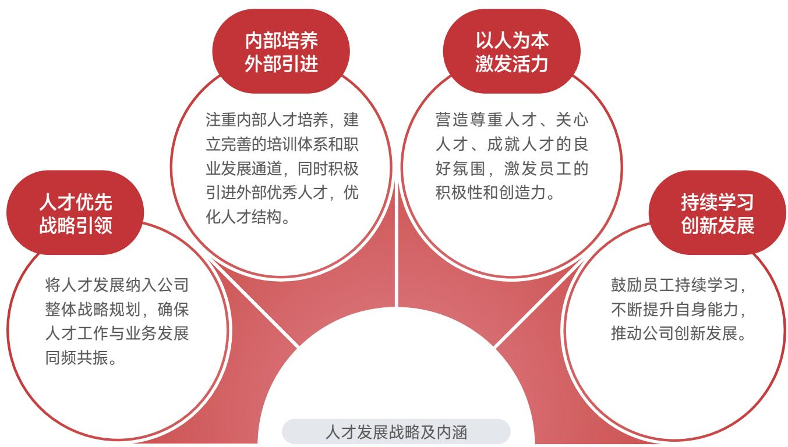

flowchart

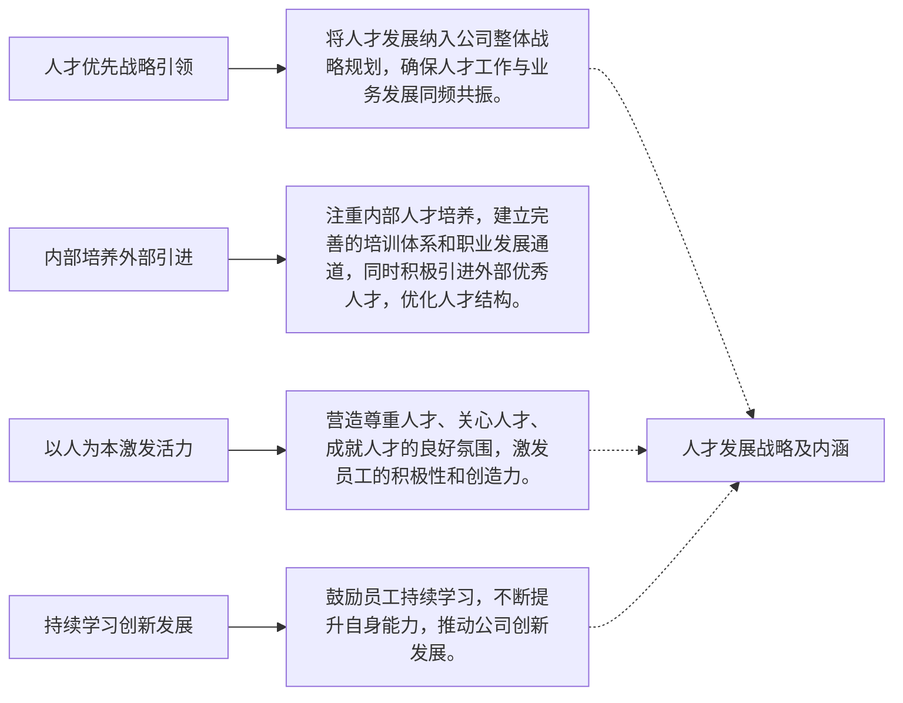
```mermaid
graph LR
  A["人才优先战略引领"] --> B["将人才发展纳入公司整体战略规划，确保人才工作与业务发展同频共振。"]
  C["内部培养外部引进"] --> D["注重内部人才培养，建立完善的培训体系和职业发展通道，同时积极引进外部优秀人才，优化人才结构。"]
  E["以人为本激发活力"] --> F["营造尊重人才、关心人才、成就人才的良好氛围，激发员工的积极性和创造力。"]
  G["持续学习创新发展"] --> H["鼓励员工持续学习，不断提升自身能力，推动公司创新发展。"]
  B -.-> I["人才发展战略及内涵"]
  F -.-> I
  H -.-> I
```

# 发展与晋升

公司建立管理序列与专业序列并行的双轨职业发展通道，针对不同岗位特性设计差异化成长路径，使员工可基于自身专业禀赋自主选择发展方向。公司同步构建可视化晋升路径，搭建阶梯式成长平台，为员工提供个性化的职业规划指导，帮助其明确发展目标，并配套相应的培训资源与发展机会，确保晋升路径清晰可及。

在高端人才发展层面，公司积极提供国际化发展机会，鼓励高技术人才参与国际交流合作，拓宽国际视野；同时搭建更广阔的展示平台，支持设计人才参与国际时装周、设计大赛等高水平赛事，激励其挑战自我、实现价值。红豆股份衬衫厂特设“大师工作室”，为核心设计师提供独立创作空间与充足研发经费，并配以作品销售分成机制，将设计师的个人创造力与企业发展成果深度绑定，形成良性共赢的人才激励生态。

natural_image

Exterior view of a modern office building with 'HOO' signage, set against a backdrop of a city skyline (no readable text or symbols on buildings)

# 培训与赋能

公司在 2016 年成立智慧零售学院，负责公司培训工作的开展。公司形成了以《红豆男装内部培训管理流程》为核心的一整套培训管理制度及流程，包括《红豆男装培训实施管理办法》《红豆男装内部培训师管理办法》《红豆男装课程评审流程》《红豆男装培训课程库管理办法》等共 16 项标准化制度，为培训工作的开展奠定基础制度保障。

公司将讲师体系、项目班体系、课程体系作为培训体系的三大支柱，以提升关键岗位的业务技能为抓手，以提升关键岗位绩效为导向，开展包括新员工入职培训、专业技能培训、管理能力培训等多样化的课程培训，采用线上线下相结合的方式，包括课堂讲授、案例分析、情景模拟、行动学习等多元化的培训方式，全方位助力员工更新知识储备，提升专业技能。

# 讲师体系

讲师是培训实施的重要资源，红豆男装从业务角度出发，从选育用留四个步骤，逐步搭建起红豆男装的讲师体系，目前红豆男装共设有六大系讲师。

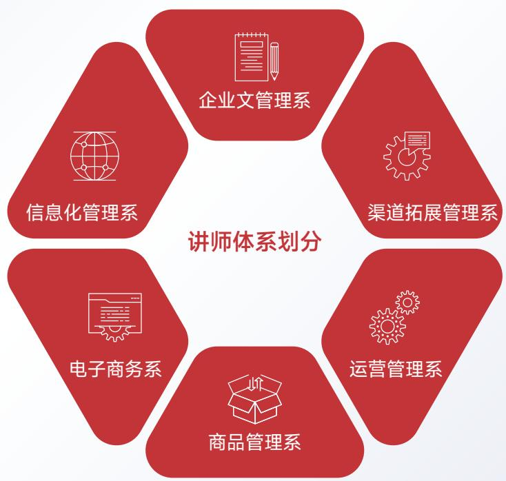

flowchart

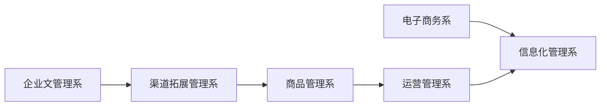
```mermaid
graph LR
  A["企业文管理系"] --> B["渠道拓展管理系"]
  C["商品管理系"] --> D["运营管理系"]
  E["电子商务系"] --> F["信息化管理系"]
  B --> C
  D --> F
```

# 关键绩效

2025年，公司聘用内外部讲师共计86名，其中外部讲师6名，内部讲师80名。内部讲师从业务骨干中挑选，年度进行考核评级淘汰奖励，保证讲师队伍的持续优化。

# 项目班体系

智慧零售学院抓取关键岗位，从岗位的职责以及胜任能力，搭建关键岗位的学习地图，形成从初级到专业技能学习到管理提升的项目班培养体系。目前关键岗位包括门店店长、职业店长、区域经理、拓展专员、陈列人员、调配专员等。

# 案例

# 深耕基础人才赋能，夯实终端服务根基

2025年，公司重视基层员工成长，通过系统化培训夯实人才基础。全年开展线上线下新店员入职培训共12期，覆盖704人；组织店长晋升培训18期，参训122人；并针对核心人才开展星级导购训练营。同时，加强后备力量储备，完成管培生及新员工培训共39人。深化校企合作，开展常州纺织学院学生培训81人，并跟进门店实习与评比。通过精细化培训体系，有效提升基层员工专业技能与岗位适应能力。

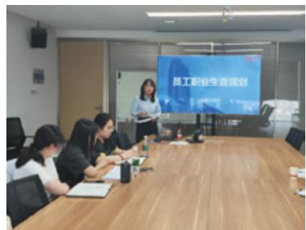

text_image

员工职业生涯规划

2025年第一期新员工培训

# 案例

# 开展关键岗位专项赋能，驱动零售业务运营效率升级

公司围绕关键岗位能力建设，开展多维度专项培训，精准赋能一线核心力量。在管理赋能方面，组织“双百强”店长、区域店长及重点工作专项培训共10场，提升管理者综合履职能力。专业技能方面，开展春夏、秋冬产品季陈列培训36场，抖音技能培训2场，并举办销售精英集训、组织SA产品买点学习考试28场，平均学习完成率达92%。培训有效提升了关键岗位的专业素养与执行力，为零售业务高质量发展夯实人才基础。

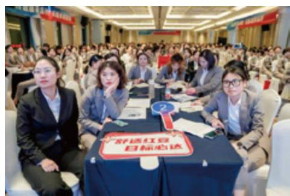

text_image

舒适红豆
目标必达

双百强店长专项培训

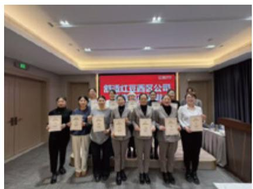

text_image

东升红百盈公司
东升红百盈公司

销售精英集训

# 案例 开展中高层专项培训，驱动经营管理水平稳步进阶

2025年，公司持续推进多层次人才梯队建设，通过靶向培训提升管理及专业人才综合能力。针对管理层，开展新晋大区经理提升培训、量体培训及中高层交流会，强化战略视野与执行力。面向专业岗位，组织13场科员技能提升培训，促进专业能力进阶。体系化赋能举措有效促进人才发展与业务协同，为高质量发展提供坚实人才支撑。

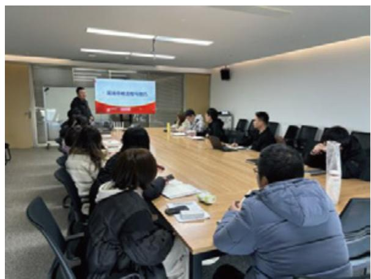

text_image

Meeting room photo with visible presentation screen displaying Chinese text and attendees seated around a long table

大区经理提升培训

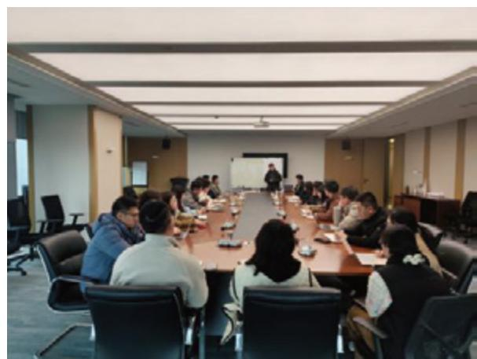

natural_image

Interior view of a conference room with attendees seated around a long table, facing a presentation screen (no visible text or signage)

交流会

# 课程体系

课程开发从业务需求出发，开发点包括业务难点、优秀经验、基础知识和技能，鼓励内外部讲师开发课程，并进行相应的物质激励。围绕连锁门店销售业务开展，持续萃取一线主推产品推广、团购业务开发、用户管理、节日爆破、大单连带技术等主题的案例经验分享，以多样化的呈现形式，利用学习平台、工作群、练货任务实现案例推广、应用、反馈、再优化的循环机制。

# 案例 落地数字化学习平台，驱动运营与员工成长双提升

2025年，红豆股份与酷店掌科技合作，全面落地数字化管理平台，实现零售运营、培训考核与店务自检一体化管理。平台构建了包含573门课程、519条试题的知识库，有效支撑人才梯队建设。全年新店员入职培训670人，参与率 $95.54\%$ ；店长与领班晋升培训16场，参与率均超 $96\%$ ；专项技能与产品学习参与率分别达 $90.59\%$ 和 $84.13\%$ ，实现标准化知识的快速沉淀与精准触达。

在管理效能方面，平台累计巡店1614次，工单整改率89%；门店安全自查完成率89.62%，货品盘点与陈列巡查任务高效完成。通过数字化转型，公司显著降低督导成本，保障全国门店形象统一与服务规范，为智慧零售高质量发展奠定坚实管理基础。

关键绩效  

<table><tr><td>指标分类</td><td>指标名称</td><td>单位</td><td>2025年数据</td></tr><tr><td rowspan="2">员工培训时长</td><td>培训总时长</td><td>小时</td><td>72,215.08</td></tr><tr><td>人均参与培训时长</td><td>小时</td><td>18.75</td></tr><tr><td rowspan="2">员工培训考核</td><td>全年培训总场次</td><td>次</td><td>415</td></tr><tr><td>员工培训人次</td><td>人次</td><td>77,397</td></tr></table>

# 员工关怀

红豆股份秉承“以人为本”的发展理念，将人文关怀深度融入经营管理全过程。公司通过构筑多元化互动平台，常态化开展团建拓展、庆典盛会及文体竞技等丰富活动，在舒缓员工压力的同时，有效激发了组织的创新活力与向上向善的企业文化。在普惠关怀的基础上，公司高度重视精准帮扶，建立健全困难员工关怀机制，通过专项慰问与实务援助，切实解决员工实际生活中的燃眉之急，将企业温暖落到实处。通过构建全方位、多维度的关怀体系，红豆股份致力于打造充满活力与温度的职场环境，全方位提升员工的职场幸福感与归属感，实现员工与企业的共同成长。

# 工作环境保障

- 舒适的办公环境、先进的设计软件和生产设备。  
- 提供舒适的用餐环境，实施严格的食品安全监控。  
- 职工之家开设员工健身房和瑜伽室。

# 人文福利帮扶

- 定期组织高技术人才参加时装秀、艺术展览等文化活动。  
- 协助异地员工解决住房问题，简化落户流程，如提供人才公寓、租房补贴等。  
- 协助解决高技术人才子女入学、配偶就业等问题。

# 员工专项关怀

- 单身员工关怀：积极组织员工参加单身员工联谊活动。  
女性员工关怀：设有母婴室、产假、育儿假，举办三八节主题活动，2025年度办理育儿假补贴26人。  
- 退休员工关怀：各部门组织退休欢送会，颁发荣誉证书和纪念品，如需亦提供了返聘机会。  
- 慈善帮扶：设有慈善救助帮扶机制，每年开展2次救助帮扶工作。

员工关怀项目

# 案例

# 开展“三八”妇女节专题关怀活动，构建多元包容的职场文化生态

2025年3月，公司举办了以“国际妇女节”为主题的系列专题关怀活动。公司通过发放节日鲜花、精美甜品及专属礼品，将企业人文关怀落到实处，同步组织了心愿寄语、暖心合影及“巾帼风采”分享等多元化文化交流环节，为女性员工搭建了展现自我、共话成长的平台。此次活动不仅传递了公司对女性员工的深度尊重与关爱，更有效促进了跨部门的互动沟通，进一步强化了多元包容、温暖向上的职场氛围，显著提升了员工的团队凝聚力与职业幸福感。

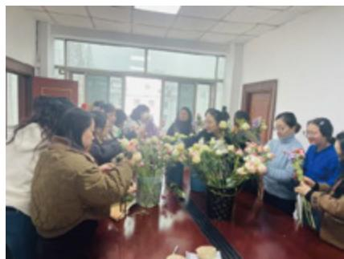

natural_image

Group of people arranging roses in a meeting room with large windows (no visible text or symbols)

“三八”国际妇女节活动

# 案例

# 举办“熔炼团队”主题拓展活动，提升组织协同效能与员工心理韧性

2025年7月，公司组织开展了“熔炼团队”主题户外拓展活动，通过多元化协作项目，引导员工释放工作压力，关注情绪价值与身心健康。活动期间，团队成员通过紧密配合攻克挑战，进一步强化了互信基础与协同意识。活动强化了团队互信与协同意识，落实“以人为本”理念，有效构建积极和谐的职场氛围，提升团队凝聚力与员工心理韧性，持续优化组织软实力，为高效运营提供有力支撑。

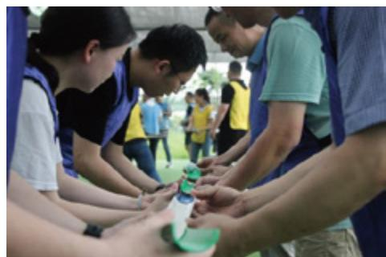

natural_image

Group of students and an instructor gathered around a small green object outdoors, with other students in the background (no visible text or symbols)

“熔炼团队”团建活动

# 案例

# 举办荣休欢送仪式，厚植感恩文化并增强员工归属感

2025年6月，公司进一步完善退休员工关怀机制，为荣休员工举办了专题欢送仪式，通过颁发“光荣退休”纪念证书及定制礼品，向退休员工表达了深切感谢与诚挚祝福。此举不仅是对员工多年奉献的高度肯定，更是公司感恩文化的重要体现。通过强化退休节点的关怀举措，公司有效提升了员工的职业尊严感与企业认同感，在组织内部营造了尊贤敬长、和谐温暖的职场氛围，为构建持久的品牌凝聚力奠定了坚实的人文基础。

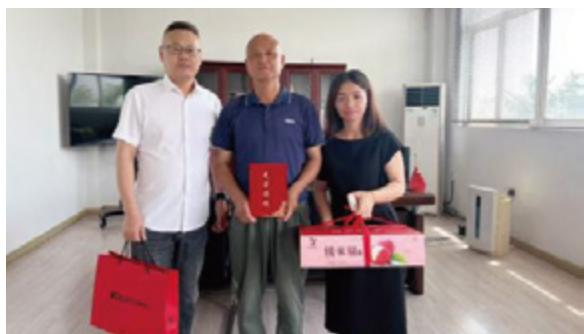

text_image

Three people holding red gift bags in an office setting, with visible Chinese text on gift boxes and background screens

颁发“光荣退休”纪念证书及赠送定制慰问礼品

# 职业健康安全

红豆股份视员工为共同事业的伙伴，将保障员工生命安全与身心健康作为企业履责的重中之重。公司通过夯实安全生产主体责任、完善职业健康管理体系，为员工创造安全、舒适、规范的工作环境。同时，公司深耕“感恩文化”，通过多维度的员工关怀举措，解决员工燃眉之急，提升职场幸福感。公司致力于在严谨的安全防线与温情的关怀机制之间寻找平衡，让每一位员工在安全的环境中工作，在健康的体魄下生活，在受尊重的氛围中成长。

# 安全生产

公司严格遵守《中华人民共和国劳动法》《中华人民共和国安全生产法》《中华人民共和国职业病防治法》《中华人民共和国消防法》等相关法律法规，认真贯彻落实各级政府安全生产工作部署和要求，通过并结合 ISO 45001 职业健康与安全管理体系认证要求,制定《安全生产管理制度》等制度以规范化安全生产,形成“安全生产标准化、风险管控与隐患排查双重预防机制”管理机制，将安全生产重点工作与专项整治工作相结合，全面开展安全生产各项活动，落实企业主体责任，规避法律风险，不断提升安全管理水平，压实安全生产底线，从而进一步提升企业竞争力。

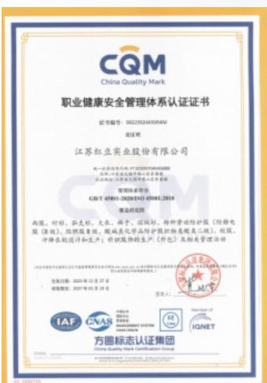

text_image

CQM
China Quality Mark
职业健康安全管理体系认证证书
证书编号：022252643994AM
证书简称
江苏红立实业股份有限公司
统一社会信用代码：9111000079446688E
注册会计师执业资格：北京市第二中级人民法院
执业证书编号：SCHN1000000000000000000000000000000000000000000000000000000000000000000000000
营业执照号
GB/T 45801-202615343 45841-2018
经营范围
丙酮、衬剂、衍亮杉、大衣、裤子、前风针、特种劳动防护服（防静电服（漆级）、防燃易爆级、酸碱类化学品防护胶织物及酸类二级）、校级、冲锋衣的设计和生产；软控服饰的生产（外包）及相关管理活动
注册日期：2023年11月27日
客服电话：2023年11月28日
保荐人：
ICBC
IAAF
CNAS
方圆标志认证集团
QINET

ISO 45001职业健康与安全管理体系认证

# 安全生产责任制

公司坚持“以人为本，安全第一；预防为主，持续改进；改善环境，保护健康”的安全生产管理理念，不断完善安全生产责任制，优化构建了“主要负责人—生产部分管负责人—车间主任—班组长—员工”的管理架构。在年度安全生产目标的指引下，公司层层压实安全主体责任，2025年实现全员安全生产责任书签署全覆盖，涵盖驻外门店店员在内的员工均完成签署。通过这种方式，公司推进各监管部门相互配合、高效联动，确保安全意识渗透到每一个基层岗位，全方位贯彻落实各级各类人员的安全生产责任，最大程度减少风险损失，切实保障员工的人身安全。

<table><tr><td>目标指标</td><td>达成情况</td></tr><tr><td>年内无中毒事故、特种设备事故、安全生产事故和火灾事故,伤亡事故为零</td><td>已达成</td></tr><tr><td>职业病发生数为零</td><td>已达成</td></tr><tr><td>特种设备检测合格率100%</td><td>已达成</td></tr><tr><td>消防设施完好率100%</td><td>已达成</td></tr><tr><td>不存在重大事故隐患,隐患排查发现的安全隐患整改率达100%</td><td>已达成</td></tr><tr><td>资格准入类人员持证率100%</td><td>已达成</td></tr><tr><td>员工安全教育培训合格率100%</td><td>已达成</td></tr></table>

# 安全管理目标及达成情况

此外，公司将安全生产管理的结果性指标纳入管理层的绩效考核中，并作为相关人员政绩考核的主要指标，与年度安全奖挂钩。通过制定合理的考核指标实行严格的考核办法进行考核，对关键指标如安全责任书签订率、隐患排查率、隐患整改率、员工培训率要求达到100%，每半年对各部门安全生产目标完成情况进行一次考核，并对年度优秀和良好的予以奖励。同时，公司针对安保部巡查中发现的隐患，要求必须在限期内整改，未在限期内整改到位的将取消年度评比资格。对于年内发生死亡、重大事故（一次）或重伤事故（二次）的情况，将被视为不合格，并实行“一票否决制”，取消当年先进集体和先进个人的评比资格。

# 安全隐患与风险管控

公司构建了以安全员、监督员、义务消防队及特种设备管理员为核心的安全风险管控体系，通过安全管理网络图与“一岗双责”制的实施，由管理层牵头深入一线开展巡查与督导，确保安全压力层层传导。在此基础上，公司深化四级体系防范机制，严格执行三级安全检查制度及部门例会检查，确保了职责分工明确、隐患排查不留死角，实现了从宏观架构到一线执行的紧密衔接。

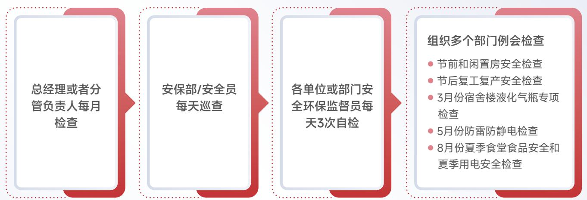

flowchart

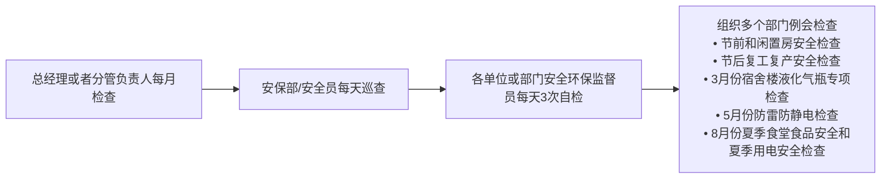
```mermaid
graph LR
  A["总经理或者分管负责人每月检查"] --> B["安保部/安全员每天巡查"]
  B --> C["各单位或部门安全环保监督员每天3次自检"]
  C --> D["组织多个部门例会检查\n• 节前和闲置房安全检查\n• 节后复工复产安全检查\n• 3月份宿舍楼液化气瓶专项检查\n• 5月份防雷防静电检查\n• 8月份夏季食堂食品安全和夏季用电安全检查"]
```

三级安全检查制度及部门例会检查

flowchart

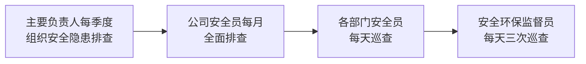
```mermaid
graph LR
  A["主要负责人每季度\n组织安全隐患排查"] --> B["公司安全员每月\n全面排查"]
  B --> C["各部门安全员\n每天巡查"]
  C --> D["安全环保监督员\n每天三次巡查"]
```

四级安全隐患防范体系

依托《安全检查 2025 年度计划》,公司深入开展危险源识别与风险评估,通过建立合规透明的《风险分级管控清单》与隐患排查台账，实现了对重点区域的实时监控及重大风险的主动申报。2025 年，在政府督导与内部专项整治的推动下,公司全年共开展月度全覆盖检查 12 次、日常巡查 112 次,累计排查出的 139 项隐患均已实现 100% 整改。同时，公司确保了消防设施完好率达 100% 及消防通道畅通，并延伸保障至生活区域，在各宿舍楼统一配备了医药箱，全方位筑牢了安全生产防线。

# 安全应急与培训

安全生产教育培训与应急管理是企业安全管理工作的核心组成部分，也是从根本上杜绝人的不安全行为、预防和控制事故的重要手段。公司始终坚持将教育培训作为保障安全生产的基石，通过完善突发事件应急管理机制，构建起“总体预案 + 部门预案”的响应体系。在队伍建设上，公司组建了由安全员、安全环保监督员、义务消防队及微型消防站构成的多维应急保障力量，并将常态化的办公区安全检查、安全知识宣传与实战化应急演练深度融合。通过教育培训与应急响应的协同发力，公司确保了安全压力传导至每一名员工，为各项安全工作的平稳开展筑牢了思想与行动的双重防线。

# 案例

# 深化实战演练强化应急效能，千人专项培训夯实安全根基

2025年，公司紧扣实战需求，组织开展了共计7场专项应急演练，演练科目涵盖人员紧急疏散、灭火器实操灭火、消防水带出水、关键物资抢救及物资单位保护等核心环节。系列演练累计触达员工1,188人，实现了多部门、多岗位的广泛覆盖。通过模拟真实险情与现场实操考核，公司检验了应急预案的可行性与各部门间的联动协作能力，提升了全员的安全防范意识与自救互救技能，为企业的稳健经营构筑了坚实的应急安全屏障。

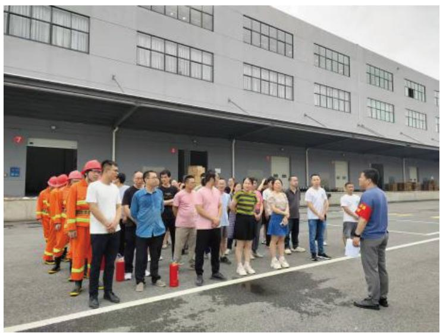

natural_image

Group of people in orange uniforms and helmets gathered outside a large industrial building, with fire extinguishers visible on the ground (no signage or text)

消防应急演练现场

# 案例 构建多维安全教育培训体系，赋能全员安全实战素养

2025年，公司构建多层次、全覆盖的安全教育培训体系，依托“红豆大学”开展系统性专业培训，覆盖新员工入职、特种作业及安全管理人员取证与能力提升，确保关键岗位持证上岗；日常通过班前会、电子屏等载体强化安全意识，持续纠正习惯性违章；将常态化应急演练与义务消防队实战拉练相结合，提升火情响应与协同救援能力。公司还坚持“边查边教”，将微型培训嵌入日常巡查，通过现场示范与即时讲解，实现隐患排查与技能提升同步推进，筑牢生产安全防线。

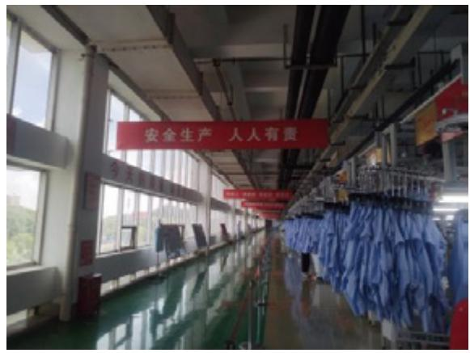

text_image

安全生产 人人有责

安全生产海报条幅

关键绩效

<table><tr><td>指标分类</td><td>指标名称</td><td>单位</td><td>2025年数据</td></tr><tr><td rowspan="3">健康安全培训与演习</td><td>职业健康、生产安全类培训总时长</td><td>小时数</td><td>6,208</td></tr><tr><td>人均培训总时长</td><td>小时数</td><td>2.28</td></tr><tr><td>安全演习(火灾、有毒气体泄漏等)次数</td><td>次数</td><td>7</td></tr></table>

# 职业健康

公司坚持以人为本的理念，严格遵守《中华人民共和国劳动法》《中华人民共和国安全生产法》《中华人民共和国职业病防治法》等相关法律法规，制定了《职业健康管理制度》，按照“安全第一、预防为主、综合治理”方针，落实职业病防治责任制，持续改善员工工作和生活环境，落实劳动保护和职业病危害防治措施，全力防范安全生产和职业健康事故发生，确保员工在劳动过程中的健康与安全。

# “三同时”管理

公司实施建设项目安全设施“三同时”管理制度，在建设项目投入使用前，对职业病防护设施的运行情况和工作场所职业病危害因素进行监测，在验收合格后方可投产使用。

# 职业危害因素告知与培训

与员工签订合同（含聘用合同）时，将工作过程中可能产生的职业病危害及其后果、职业病危害防护措施和待遇等均如实告知，并在劳动合同中写明。同时，要求参加岗前职业卫生教育培训，若未经职业卫生教育和培训合格，将不得上岗作业。

# 配发高标准劳动防护用品

根据各岗位职业健康危害因素，为员工免费提供全方面、高标准的劳动防护用品，保护员工在生产过程中免遭或减轻职业病危害。

# 档案与体检

公司为员工建立了职业卫生档案和劳动者职业健康监护档案，定期组织全员常规体检，并提供灵活多样的体检套餐来满足不同层级需求。公司如实告知员工职业健康检查结果，若发现疑似职业病危害，及时告知本人。

# 知识培训答疑

公司不定期举办健康知识讲座、急救讲座、健康答疑等活动，并创新开展心理健康知识讲座等活动，丰富职业健康关怀体系。

# 职业健康管理措施

# 「更新舒适标准」 ▶0感户外夹克

六维舒适系统

# 04

# 绿色运营

# 护航生态发展

红豆舒适男装品牌代言人
林更新
林更新

林更新

# 核心理念

红豆股份将环境管理深度融入运营流程，以碳中和目标为引领，通过体系化资源管理、绿色产品研发与循环经济实践，降低环境足迹；同时，严格履行环境合规义务，强化污染防控与废弃物资源化处理，积极探索纺织服装行业的低碳转型路径，助力生态友好型产业生态构建。

# 核心行动

- 可持续生产  
环境合规管理

资源高效利用  
- 污染排放治理

# SDGs

6 清洁饮水和卫生设施

7 经济适用的清洁能源

12 负责任消费和生产

13 气候行动

text_image

HO

natural_image

Abstract geometric logo design with circular shapes and a vertical line (no text or symbols)

# 可持续生产

随着民众环境保护意识的提升，红豆股份积极探索天然性、可再生等环保材质在服装领域的应用，并建立了产品碳足迹的管理平台、核算与认证机制，向消费者客观展示产品碳足迹信息，为消费者提供绿色环保的产品，契合消费者对可持续消费及可持续时尚等理念的认同。

# 应对气候变化

公司制定并发布了《红豆股份碳达峰碳中和宣言》，明确提出公司的碳中和愿景，将致力于到2041年实现红豆股份企业的全面碳中和。公司在规划和实践自身碳中和路径的同时，积极带动供应链企业履行碳减排责任，促进上下游供应链进行科学减碳。

# 绿色产品

公司高度重视原材料的环境影响，将供应商环境管理体系证书纳入验厂范围，优先选择采用低碳能源面料的供应商，如兰精莫代尔纤维公司、广东溢达纺织有限公司等，并通过与客户及供货商三方共同开发与合作，推动天然、可再生原物料使用，持续进行材质和产品研发创新，推动原材料转型。

此外，公司与 BOKE 软件公司合作，在服装设计环节，积极优化排版参数程序，改进批量特体裁剪方案，综合用工量减少修剪和裁剪耗材成本，优化自动裁剪分床数和最优排版耗用，减少服装边角料的产生，提高面辅料利用率。

# 红豆三分弹竹纤维衬衫

选用竹纤维+杜邦SORONA（舒弹丝）环保聚合纤维混纺面料。

- 竹纤维为天然成分，可减少异味汗味，长久清新干爽，并可呈现出良好光泽感。  
- 混纺67%舒弹环保聚合纤维，自带弹力，成衣舒弹有型且具有抗皱性能，易打理。  
- 竹纤维为可生物降解的材料，在土壤中可被微生物和阳光完全降解，且不会造成环境污染。

text_image

三分弹 | 竹纤维衬衫
3Dvo 过程编辑

# 环境合规管理

红豆股份企管部统筹环境保护的整体工作，包括开展环境管理监测、环境信息统计、环境证照办理等，并不定期向管理层和董事会汇报环境保护工作进展。公司在车间设立了专职安全环保监督员，负责环境监督管理工作，并直接向车间负责人汇报。此外，公司定期对管理人员进行环保培训，不断提高管理水平。

# 体系认证

公司遵循 GB/T 24001-2016《环境管理体系要求及使用指南》等相关要求，参考并通过了 ISO 14001:2015 环境管理体系认证，持续优化环境管理体系。

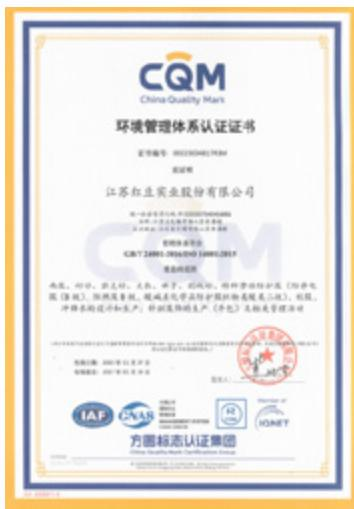

text_image

CQM
China Quality Mark
环境管理体系认证证书
证书编号: 0023030481793M
证书号:
江苏红豆实业股份有限公司
统一社会信用代码: 91520000MA06W6888
注册会计师: 年检专用章
执业资质证书
GB/T 26891-0304-0901-10001-2019
执业范围
西南、东北、华北、华东、华南、华南地区，特种作业区的扩展（包括电
院（特级）、防爆及事故、烟碱及化学危险废物处理及再生工程）、检验、
冲探和设计和生产；科技型物的生产（外包）及相关管理活动
IAP
NAR
方图标志认证集团

ISO 14001环境管理体系认证证书

为有效管理环境风险,公司严格按照《中华人民共和国环境保护法》,严格执行“三同时”制度,要求所有新建、改建、扩建和技术改造项目在施工前、重点污染建设项目均取得环评批复，并按环保审批要求实施各项环保措施。

# 关键绩效

2025年，公司全年未发生因环境事件受到重大行政处罚的事件。

# 资源高效利用

natural_image

Line art illustration of a rural landscape with wind turbine, house, bike, and raindrops (no text or symbols)

红豆股份高度重视节水节能与可持续发展，持续推进资源高效利用工作，积极推动节能节水方案，竭力减少污染物对大气、水体、土壤及其他环境的影响，实现公司绿色、长期发展。

# 能源管理

公司遵守并获得了 ISO 50001 能源管理体系认证，根据国家能源工作方针政策和能源管理标准，深入推进能源管理体系建设，以优化自身能源结构、综合规划和应用节能减排措施为主要目标，持续提高能源管理水平与能源利用效率。

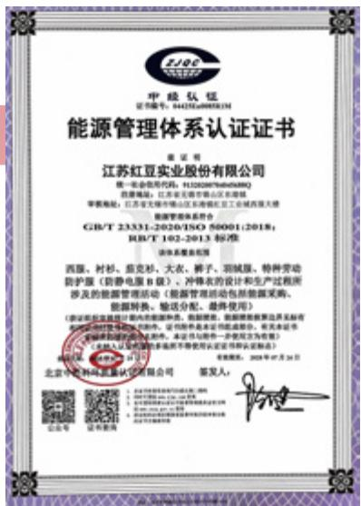

text_image

中经认证
证书编号：944250600858134
能源管理体系认证证书
被证明
江苏红豆实业股份有限公司
统一社会信用代码：9132020079456588Q
注册地址：江苏省无锡市锡山区东港镇
审批地址：江苏省无锡市锡山区东港镇工业区西园大楼
能源管理体系符合
GB/T 23331-2020/ISO 50001:2018:
HRT/T 102-2013 标准
该体系覆盖范围
西服、衬衫、装克衫、大衣、裤子、羽绒服、特种劳动防护服（防静电服B级）、冲锋伞的设计和生产过程所涉及的能源管理活动（能源管理活动包括能源采购、能源转换、输送分配、最终使用）
《李家桥年度报告》详见2023年7月24日
北京中电科科技集团有限公司
签发人：
身份证号码：37010000000000000000000000000000000000000000000000000000000000000000
证书类型：电子证照
EJOE
中国能源建设集团有限公司
北京市海淀区能源局

ISO 50001能源管理体系认证证书

# 水资源管理

公司主要的生产设施位于无锡市锡山区东港镇红豆工业园内，工业用水均由地面水厂抽取地表水进行处理供应。公司已将水资源纳入能源管理体系范畴，通过统计核算水资源消耗总量和单位产品取水量，探索并实施运用蒸汽冷凝水回收等节水措施，以确保单位产品取水量符合纺织业清洁生产一级标准要求。

# 绿色办公

公司制定并下发《办公区域节能公约》，旨在要求员工加强办公区域的用电管理，以增强员工规范、安全用电及节能降耗意识，鼓励员工节约资源和能源，共同营造绿色的办公环境。

# 公司绿色办公举措

提倡使用双面打印，并鼓励尽量通过电子化方式减少纸张的使用。

在非办公时段，要求关闭或减少使用空调及照明设备，以减少能源消耗。

推动无纸化办公、门店申请线上化流程办理，如门店活动反馈、费用申请、报销申请等。

# 污染排放治理

公司严格遵守各项环境相关的法律法规，确保所有对废水、废弃物的处理、排放合规，合规开展生产经营活动，减少对环境的负面影响。

# 废水管理

公司严格遵循废水达标排放要求，委托有资质的单位进行废水处置。

# 废弃物管理

公司产生的废弃物主要为服装边角料和废纸箱两类，遵循固体废弃物处理无害化、减量化、资源化的原则，制定了《固废管理制度》，严格落实废弃物产生、收集、贮存、运输、利用、处置等环节的环保和安全责任，并实施两级管理制度，工厂和车间的环保人员各司其职，确保公司废弃物的妥善处置和管理。

工厂的环保负责人承担固体废弃物的监督管理责任，对公司各个车间进行不定期抽查，审核固体废弃物处置单位资质，并制定危险废弃物管理计划。

各车间的环保负责人每日对固体废弃物的收集贮存情况进行巡查，每月定期将危险废弃物产生情况进行网上申报，并在年末将下年度危险废弃物计划产生情况汇报至江苏省危险废物动态管理系统。

各车间固体废弃物管理员负责固体废弃物的称重、分类贮存、处置与台账管理。

# 固废管理职责

公司将固体废弃物划分为 A 类、B 类、C 类，明确各类废弃物的具体范围和处置措施，通过建立固体废弃物台账进行精细化管理。

<table><tr><td colspan="2">废弃物分类</td><td>废弃物定义</td><td>管理处置措施</td></tr><tr><td rowspan="2">一般固体废弃物</td><td>A类废弃物</td><td>可内部回收利用或对固体废弃物收购商有回收利用价值,非《国家危险废物名录》的废弃物。如废胶、废包装袋、废纸、废金属、废硒鼓、废墨盒等。</td><td>除废硒鼓、废墨盒外全部委托有资质单位处置;废硒鼓和废墨盒由供应厂家回收。</td></tr><tr><td>B类废弃物</td><td>不可内部回收利用且固体废弃物收购商对其没有回收利用价值,非《国家危险废物名录》的废弃物。例如生活垃圾、建筑垃圾、各车间产生的工业垃圾、施工单位产生的固废。</td><td>生活垃圾由公司后勤统一清运;工业垃圾及施工单位产生的固废均委托资质单位处置。</td></tr><tr><td>危险固体废弃物</td><td>C类废弃物</td><td>按《国家危险废物名录》识别出的废弃物。例如废矿物油、废油渣、废活性炭、废树脂、废有机溶剂、废酸、废旧灯管、废化学瓶。</td><td>委托有资质的单位处理危险废弃物,审查资质单位的证书有效性并签订协议;危险废弃物移出、运输和接收等环节,必须填写危险废物转移单并存档。</td></tr></table>

# 废弃物分类管理措施

# 案例 深化旧衣“焕”新计划，践行循环时尚

2025年，公司持续深化“环保再生，物尽其用”理念下的“旧衣焕新”计划。该计划通过提供服装以旧换新体验与回收奖励，在提升公众环保意识、强化品牌绿色价值的同时，对回收衣物进行专业处理，促进了资源循环利用，切实减少了纺织品废弃物对环境的影响。

text_image

红豆
舒送男装
¥50
无门槛代金券
可与活动意外便利
¥50
¥50
¥50
¥50
¥50
¥50
¥50
¥50
¥50
¥50
¥50
¥50
¥50
¥50
¥50
¥50
¥50
¥50
¥50
¥50
¥50
¥50
¥50
¥50
¥50
¥5<nl>

旧衣“焕”新计划

# 化学品管理

公司制定了严格的化学品管理办法，要求按照操作规程领取和使用化学品，对使用后拟废弃的危险化学品进行预处理，确保稳定化后，编制危险废物管理计划并向生态环境部门申报，申请纳入危险废物管理。对于未达稳定化的化学品，公司仍严格按照危险化学品管理。2025年，公司未发生任何重大的化学品泄漏事件。

所有涉及化学品储存和使用的区域，如化学品仓库、生产车间等，须进行必要的防渗透、抗腐蚀处理。

化学品管理要求  

所有涉及储存和使用油品的地点，如油库、地下室等，须设置相应的油坝、集油槽、集油坑等设施。

# 附录

# ESG关键绩效表

公司治理绩效

<table><tr><td>指标</td><td>单位</td><td>2023年</td><td>2024年</td><td>2025年</td></tr><tr><td colspan="5">董事会</td></tr><tr><td>董事会总成员数</td><td>人</td><td>9</td><td>9</td><td>9</td></tr><tr><td>其中:女性成员数</td><td>人</td><td>3</td><td>3</td><td>2</td></tr><tr><td>其中:独立董事人数</td><td>人</td><td>3</td><td>3</td><td>3</td></tr></table>

三会召开

<table><tr><td>董事会全员会议次数</td><td>次</td><td>15</td><td>10</td><td>6</td></tr><tr><td>股东会召开次数</td><td>次</td><td>4</td><td>2</td><td>3</td></tr></table>

公平竞争

<table><tr><td>重大舆情事故发生总数</td><td>起</td><td>0</td><td>0</td><td>0</td></tr><tr><td>违反相关产品和服务信息及标识的事件总数</td><td>起</td><td>0</td><td>0</td><td>0</td></tr><tr><td>违反相关市场推广(包括广告、推销及赞助)法规的时间总数</td><td>起</td><td>0</td><td>0</td><td>0</td></tr></table>

商业道德

<table><tr><td>签署反贿赂承诺书的供应商数量</td><td>家</td><td>256</td><td>255</td><td>236</td></tr><tr><td>签署反贿赂承诺书的供应商比例</td><td>%</td><td>100</td><td>100</td><td>100</td></tr></table>

数据安全与客户隐私

<table><tr><td>经确认的数据安全事故次数</td><td>例</td><td>0</td><td>0</td><td>0</td></tr><tr><td>经确认的客户隐私泄露事件次数</td><td>例</td><td>0</td><td>0</td><td>0</td></tr></table>

环境绩效

<table><tr><td>指标</td><td>单位</td><td>2023年</td><td>2024年</td><td>2025年</td></tr><tr><td>违反环境法律法规事件数</td><td>件</td><td>0</td><td>0</td><td>0</td></tr></table>

社会绩效

<table><tr><td>指标</td><td>单位</td><td>2023年</td><td>2024年</td><td>2025年</td></tr><tr><td colspan="5">供应商管理</td></tr><tr><td>供应商数量</td><td>家</td><td>256</td><td>255</td><td>236</td></tr><tr><td>供应商考核覆盖率</td><td>%</td><td>100</td><td>100</td><td>100</td></tr><tr><td>供应商考核合格率</td><td>%</td><td>100</td><td>100</td><td>100</td></tr></table>

员工人数

<table><tr><td>总员工人数</td><td>人</td><td>4,324</td><td>3,681</td><td>3,754</td></tr><tr><td>本科以下员工人数</td><td>人</td><td>3,628</td><td>3,081</td><td>3,069</td></tr><tr><td>本科员工人数</td><td>人</td><td>651</td><td>566</td><td>649</td></tr><tr><td>硕士及以上员工人数</td><td>人</td><td>45</td><td>34</td><td>36</td></tr></table>

员工权益

<table><tr><td>员工社保缴纳覆盖率</td><td>%</td><td>100</td><td>100</td><td>100</td></tr><tr><td>经确认的歧视事件</td><td>例</td><td>0</td><td>0</td><td>0</td></tr><tr><td>经确认的强迫劳动事件</td><td>例</td><td>0</td><td>0</td><td>0</td></tr><tr><td>经确认的童工事件</td><td>例</td><td>0</td><td>0</td><td>0</td></tr></table>

职业健康与安全

<table><tr><td>职业健康与安全类培训总时长</td><td>小时</td><td>10,152</td><td>10,280</td><td>6,208</td></tr></table>

社会绩效

<table><tr><td>指标</td><td>单位</td><td>2023年</td><td>2024年</td><td>2025年</td></tr><tr><td colspan="5">职业健康与安全</td></tr><tr><td>安全演习次数</td><td>次</td><td>9</td><td>7</td><td>7</td></tr><tr><td>职业病发生率</td><td>%</td><td>0</td><td>0</td><td>0</td></tr></table>

员工培训

<table><tr><td>培训总时长</td><td>小时</td><td>125,703.94</td><td>122,012.80</td><td>72,215.08</td></tr><tr><td>人均参与培训时长</td><td>小时</td><td>29.07</td><td>33.15</td><td>18.75</td></tr><tr><td>全年培训总场次</td><td>次</td><td>238</td><td>249</td><td>415</td></tr><tr><td>员工培训人次</td><td>人次</td><td>71,927</td><td>80,891</td><td>77,397</td></tr></table>

报告索引表

<table><tr><td rowspan="2">报告框架</td><td>《上海证券交易所上市公司自律监管指引第14号——可持续发展报告(试行)》1</td></tr><tr><td>对应议题</td></tr><tr><td>关于本报告</td><td></td></tr></table>

走进红豆股份

<table><tr><td>公司简介</td><td>/</td></tr><tr><td>企业文化</td><td>/</td></tr><tr><td>战略部署</td><td>/</td></tr><tr><td>年度大事记</td><td>/</td></tr><tr><td>利益相关方沟通</td><td>利益相关方沟通</td></tr><tr><td>实质性议题分析</td><td>/</td></tr><tr><td rowspan="2">报告框架</td><td>《上海证券交易所上市公司自律监管指引第14号——可持续发展报告(试行)》1</td></tr><tr><td>对应议题</td></tr><tr><td colspan="2">治理篇:完善治理,厚植发展根基</td></tr><tr><td>公司治理</td><td>/</td></tr><tr><td>党建引领</td><td>/</td></tr><tr><td>风险与内控管理</td><td>尽职调查</td></tr><tr><td>商业道德</td><td>尽职调查反商业贿赂与反贪污反不正当竞争</td></tr><tr><td>投资者关系管理</td><td>利益相关方沟通</td></tr><tr><td>守护信息安全</td><td>数据安全与客户隐私保护</td></tr><tr><td colspan="2">社会篇:创新驱动,赋能产业生态</td></tr><tr><td>研发创新驱动</td><td>创新驱动</td></tr><tr><td>保障品质与服务</td><td>产品和服务安全与质量</td></tr><tr><td>可持续供应链</td><td>供应链安全平等对待中小企业</td></tr><tr><td>社会贡献</td><td>社会贡献乡村振兴</td></tr><tr><td colspan="2">员工篇:以人为本,共筑幸福职场</td></tr><tr><td>员工权益保障</td><td>员工</td></tr><tr><td>人才培训与发展</td><td>员工</td></tr><tr><td>员工关怀</td><td>员工</td></tr><tr><td>职业健康安全</td><td>员工</td></tr><tr><td colspan="2">环境篇:绿色运营,护航生态发展</td></tr><tr><td>可持续生产</td><td>应对气候变化</td></tr><tr><td>环境合规管理</td><td>环境合规管理</td></tr><tr><td>资源高效利用</td><td>能源利用水资源利用</td></tr><tr><td>污染排放治理</td><td>污染物排放废弃物处理循环经济</td></tr><tr><td colspan="2">附录</td></tr><tr><td>ESG关键绩效表</td><td>/</td></tr><tr><td>报告索引表</td><td>/</td></tr><tr><td>读者反馈表</td><td>/</td></tr></table>

$^{1}$ 科技伦理：公司主营业务并不直接涉及生命科学、人工智能等科技伦理敏感领域的科学研究、技术开发等活动，故本报告中未披露公司报告期内遵守科技伦理的基本情况。  
生物多样性保护: 公司的经营活动未对生物多样性及濒危物种造成不利影响。根据上交所《指引》的要求，“生态系统和生物多样性保护”议题对公司不具有重要性，故未纳入重要性议题进行披露。

# 读者反馈表

尊敬的读者：

您好！

非常感谢您在百忙之中阅读《江苏红豆实业股份有限公司2025年度环境、社会和公司治理（ESG）报告》。为了向您及其他利益相关方提供更有价值的信息，并有效促进公司提升履行企业社会责任的能力与水平，公司真诚期待您的意见和建议。

选择题（请在相应位置打√）

1.您对本报告的总体评价是：

□ 非常好    □ 好    □ 一般    □ 较差    □ 差

2.报告对利益相关方所关心问题的回应和披露？

□ 非常好    □ 好    □ 一般    □ 较差    □ 差

3.您认为红豆股份在经济责任方面做得如何？

□ 非常好    □ 好    □ 一般    □ 较差    □ 差

4.您认为红豆股份在环境责任方面做得如何？

□ 非常好    □ 好    □ 一般    □ 较差    □ 差

5.您认为红豆股份在安全管理方面做得如何？

□ 非常好    □ 好    □ 一般    □ 较差    □ 差

6.您认为红豆股份在员工责任方面做得如何？

□ 非常好    □ 好    □ 一般    □ 较差    □ 差

7.您认为红豆股份在社区责任方面做得如何？

□ 非常好    □ 好    □ 一般    □ 较差    □ 差

8.报告披露的信息、指标、数据是否清晰、准确、完整？

□ 非常好    □ 好    □ 一般    □ 较差    □ 差

9.您认为本报告的内容安排和版式设计是否方便阅读？

□是 □否

# 开放性问题

您对红豆股份履行社会责任及本报告有任何意见与建议？