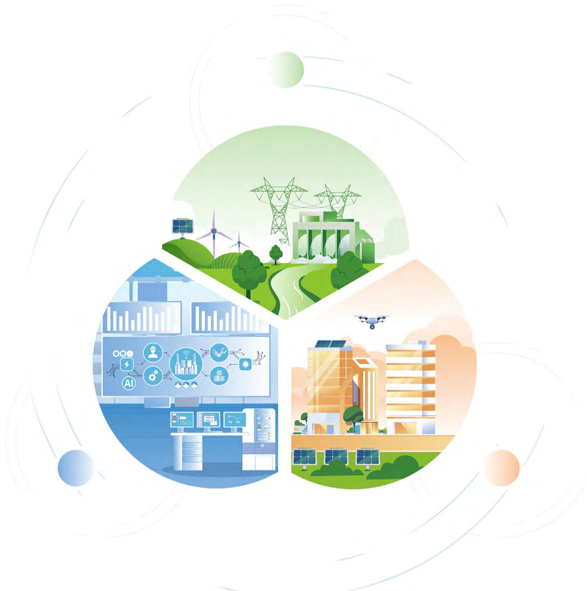

natural_image

Illustration of two circular technologies: green power generation infrastructure and modern urban buildings, with no text or symbols present.

# 2025

# 国电南瑞科技股份有限公司

环境、社会及公司治理（ESG）报告

# 报告导读

本报告是国电南瑞科技股份有限公司自2012年以来发布的第四份环境、社会及公司治理（ESG）报告，也是第十四份社会责任类报告。本着客观、规范、透明和全面的原则，报告详细披露了公司2025年在治理、环境和社会责任领域的管理理念、实践和绩效。公司承诺本报告不存在任何虚假记载、误导性陈述，并对其内容真实性、准确性和完整性负责。本报告经公司董事会确认，予以发布。

# 组织范围

本报告组织范围为公司整体，直属及控股各单位。

# 时间范围

本报告为年度报告。报告时间范围为 2025 年 1 月 1 日至 12 月 31 日，为增强报告完整性和可比性，部分内容适当向前追溯、向后延伸。

# 参考标准

国务院国资委《关于新时代中央企业高标准履行社会责任的指导意见》《提高央企控股上市公司质量工作方案》《央企控股上市公司 ESG 专项报告参考指标体系》

财政部《企业可持续披露准则——基本准则（试行）》

上海证券交易所《上海证券交易所上市公司自律监管指引第14号——可持续发展报告（试行）》《上海证券交易所上市公司自律监管指南第4号——可持续发展报告编制》

中国企业改革与发展研究会《中国企业可持续发展报告指南（CASS-ESG 6.0）》

中国国家标准化管理委员会《社会责任报告编写指南》（GB/T 36001-2015）

国际标准化组织《ISO 26000：社会责任指南（2010）》

全球报告倡议组织《可持续发展报告标准》（GRI Standards）

联合国可持续发展目标（SDGs）

# 数据说明

报告中的财务数据均来自国电南瑞年度财务报告和正式文件。除特别说明外，报告中所涉及货币金额均以人民币计量。

# 称谓说明

为便于表述，报告中“我们”“公司”“南瑞”“国电南瑞”均指代“国电南瑞科技股份有限公司”。部分所属企业简称如下：

<table><tr><td>名称</td><td>释义内容</td></tr><tr><td>南瑞继保</td><td>南京南瑞继保电气有限公司</td></tr><tr><td>电网公司</td><td>电网调控技术分公司</td></tr><tr><td>稳定公司</td><td>电网安全稳定控制技术分公司</td></tr><tr><td>变电公司</td><td>变电技术分公司</td></tr><tr><td>南控公司</td><td>国电南瑞南京控制系统有限公司</td></tr><tr><td>北京科东</td><td>北京科东电力控制系统有限责任公司</td></tr><tr><td>中电普瑞</td><td>中电普瑞电力工程有限公司/中电普瑞科技有限公司</td></tr><tr><td>南瑞继远</td><td>安徽南瑞继远电网技术有限公司</td></tr><tr><td>配电公司</td><td>配电技术分公司/南瑞智能配电技术有限公司</td></tr><tr><td>用电公司/雄安公司/南瑞捷鸿</td><td>用电技术分公司/河北雄安南瑞能源科技有限公司/北京南瑞捷鸿科技有限公司</td></tr><tr><td>深圳南瑞</td><td>深圳南瑞科技有限公司</td></tr><tr><td>南瑞中天</td><td>安徽南瑞中天电力电子有限公司</td></tr><tr><td>南瑞三能</td><td>国电南瑞三能电力仪表(南京)有限公司</td></tr><tr><td>南瑞机器人</td><td>国网瑞嘉(天津)智能机器人有限公司</td></tr><tr><td>信通科技</td><td>南京南瑞信息通信科技有限公司/信息通信技术分公司</td></tr><tr><td>南瑞瑞腾/集成公司</td><td>南京南瑞瑞腾科技有限责任公司/信息系统集成分公司</td></tr><tr><td>南瑞瑞中</td><td>南京南瑞瑞中数据股份有限公司</td></tr><tr><td>南瑞新能源/电控公司/南瑞氢电</td><td>南京南瑞新能源科技有限公司/电气控制分公司/南京南瑞氢电智联科技有限公司</td></tr><tr><td>南瑞水电</td><td>南京南瑞水利水电科技有限公司/水利水电技术分公司</td></tr><tr><td>南瑞工控</td><td>南京南瑞工业控制技术有限公司</td></tr><tr><td>南瑞半导体</td><td>南京南瑞半导体有限公司</td></tr><tr><td>博瑞电力</td><td>常州博瑞电力自动化设备有限公司</td></tr></table>

# 报告获取

报告以印刷版和电子版两种形式发布，您可在国电南瑞官网下载本报告的电子文档，网址为：http://www.naritech.cn/。如需获取纸质版报告，或对本报告内容有任何疑问或建议，敬请联系我们：

国电南瑞科技股份有限公司

地址：江苏省南京市江宁区诚信大道19号

邮政编码：211106

电话：025-81087102

传真：025-83422355

电子邮箱：stock@sgepri.sgcc.com.cn

# 目录

董事长致辞 04 ESG 管理 14

企业简介 06 专题：氢电智联创新力，电控蓄能领未来 20

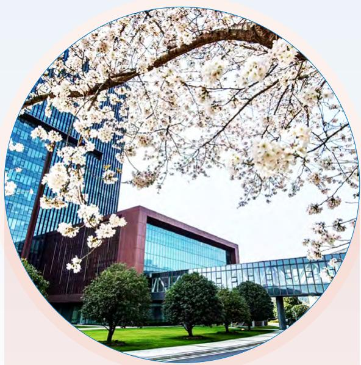

natural_image

Modern glass building with cherry blossoms in the foreground, surrounded by green lawns and trees (no visible text or signage)

# 至正·瑞意进取 迈出稳健新步伐

规范治理 夯基固本 28

律己正身 行止有矩 36

信息安全 数盾铸防 41

透明履责 增进沟通 45

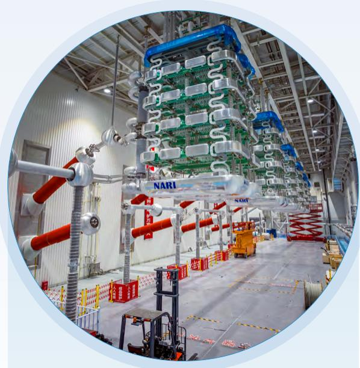

natural_image

Interior of a large industrial facility with a suspended green electronic module labeled 'NARI' and overhead piping, no visible text or symbols on the main structure.

# 至诚·瑞智驱动 积蓄发展新动能

矢志改革 活力迸发 54

科技引领 智创未来 56

防微杜渐 安全守护 67

品质至臻 精诚服务 70

未来展望 134

附录 136

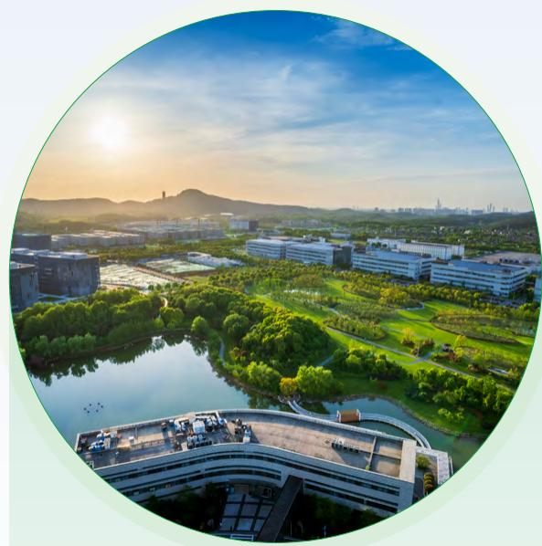

natural_image

Aerial view of a modern urban park with greenery, a lake, and distant hills under a clear sky (no visible text or symbols)

# 至美·瑞见绿意 擘画生态新画卷

锚定双碳 气候应对 78

绿色研发 赋能产业 87

环保为本 减废防污 92

绿意传递 呵护自然 96

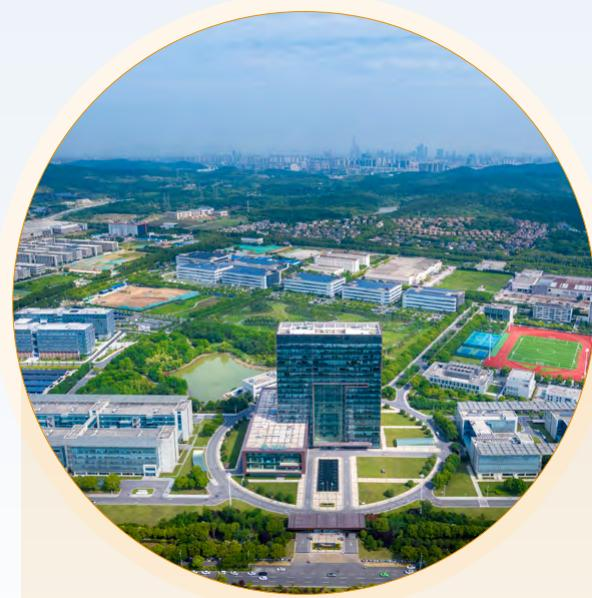

natural_image

Aerial view of a modern industrial park with glass skyscrapers, surrounded by green hills and urban skyline in the background (no visible text or signage)

# 至善·瑞气祥和 奉献幸福新力量

聚才汇智 共话发展 106

强链扩圈 稳健前行 117

携手并进 和合共生 120

惠泽民生 传递温情 128

# 董事长致辞

科技赋能能源变革，责任引领可持续发展。2025年恰逢“十四五”圆满收官、“十五五”谋篇启新的战略节点，“双碳”目标引领下的新型能源体系、新型电力系统和新型电网建设加速推进，“AI+数字能源”成为驱动能源治理现代化的核心引擎，能源转型已进入“智绿双变”的关键攻坚期。国电南瑞始终以国家战略为纲，以全球视野为舵，将可持续发展融入企业基因，在完善现代治理体系、突破关键核心技术、引领产业链协同发展、履行企业公民责任等方面持续发力，用实干开辟发展新局，以实绩作答时代问卷，在高质量可持续发展的征途上镌刻绚丽的南瑞印记。

规范治理，夯基固本，我们以精益管控筑牢发展底盘。国电南瑞建立健全全链条 ESG 合规管理体系，ESG 委员会审议通过《ESG 管理制度》及指标体系，构建形成 “1+N” 双层次 ESG 报告体系，为推动 ESG 工作标准化、体系化落地筑牢根基。进一步优化公司治理体系，推动审计与风险管理委员会平稳承接监事会职权，以科学决策、有效监督和风险管理为支撑，持续强化商业道德风险识别和应对，严格管控信息安全与隐私保护，不断提升合规管理效能。积极履行信息披露义务，优化投资者沟通机制，通过多层次价值传播与互动，切实保障广大股东合法权益，以开放透明的姿态在资本市场树立良好的企业形象。2025 年，公司再度蝉联国务院国资委 “科改企业” 标杆，连续三届入选央视 “中国 ESG 上市公司先锋 100” 榜单，连续三年获颁责任鲸牛奖 “ESG 先锋企业” 称号。

矢志创新，严守安全，我们以精品匠心锻造硬核支撑。国电南瑞坚持创新驱动发展战略，强化突出研究与研发并重、科研与产业互促，构建以“三极”科研体系为核心的科创治理格局，组建7支“十年磨剑”研究团队，打造研产深度捆绑的“任务共同体”，以体系化改革激活全链条创新活力。注重价值多维释放，一体推进科技创新和产业创新深度融合，在特高压装备、继电保护、大电网安全稳定、新能源并网控制等关键技术领域取得突破性进展，实现能源领域首台（套）重大技术装备在多个示范工程、重大项目中“上岗”。统筹构建运行“八标”整合管理体系，严抓安全生产，凭借先进的技术、卓越的产品质量和完善的服务体系，持续巩固公司在中国乃至全球能源电力领域的标杆地位。2025年，公司累计斩获各级各类科技奖励168项，荣获各级质量表彰58项。

锚定双碳，绿色赋能，我们以生态实践擘画发展新篇。国电南瑞深入贯彻绿色发展理念，秉承“节能增效、绿色发展，主动履行社会责任”环保、节能方针，勇当绿色转型的探索者、低碳循环的实践者，将环保理念贯穿于生产运营的每一个环节，积极创建绿色工厂，让资源利用更高效，让绿色发展更可持续。紧扣新型能源体系、新型电力系统、新型电网“三新”建设的前瞻性、紧迫性需求，打造服务大型新能源基地发电送出、支撑水电站可靠运行、发挥“一氢二储”支撑调节能力、助力全链条一体化电碳协同等应用场景，推动能源绿色低碳转型。聚焦零碳园区建设与工业降碳、高耗能转型需求，定制差异化、个性化系统解决方案和场景化应用方案，提升能源利用效率。2025年，公司获评江宁开发区环保优秀标杆示范企业，南控公司、南瑞中天成功创建国家级绿色工厂。

聚才惠民，和合共生，我们以责任担当汇聚幸福力量。国电南瑞牢记“国之大者”，全面提升能源安全和保障能力，在全国两会保电、上海合作组织峰会保电、日喀则地震抢修复电等重大支撑任务中勇挑重担。坚持服务大局，充分发挥技术、人才、管理、产业链条等优势，积极助力区域协调发展战略、乡村振兴战略、“一带一路”倡议等国家战略落地，与上下游合作伙伴共筑优质产业生态，打造可持续价值链。深化人才战略，多元举措广纳贤才，托举赋能精育良才，实战历练善用英才，创新机制留住人才，人才队伍结构不断优化，干事创业活力充分激发。积极投身于社会公益事业，通过公益捐赠、志愿服务等多元方式回馈社会，传递爱心与温暖，增进民生福祉。2025年，公益捐赠总额100万元，志愿活动时长达8516小时。

风劲潮涌，自当扬帆破浪。面对全球能源转型的新形势、新任务、新挑战，国电南瑞将继续坚持可持续发展的核心理念，秉持“努力超越、追求卓越”的企业精神，把握处于技术革命之维、能源革命之维、国家安全之维、产业升级之维、全球竞合之维“五维”叠加的战略交汇区的历史机遇，怀揣“闯”的勇气、凝聚“创”的智慧、秉持“干”的作风，以更坚定的信念深化治理变革，以更开放的姿态链接全球创新资源，携手各利益相关方同心同向、协同发力，共同探索能源领域可持续发展新路径，为全球可持续发展贡献南瑞智慧！

国电南瑞科技股份有限公司 董事长

郑宗强

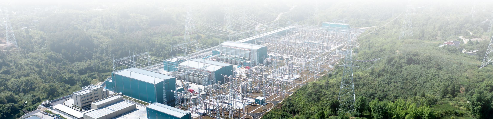

natural_image

Aerial view of a large electrical substation complex surrounded by green forest, with transmission towers and power lines visible (no signage or text)

# 企业简介

# 公司简介

公司作为能源电力及工业控制领域的领军企业，是以能源电力智能化为核心的能源互联网整体解决方案提供商，深耕自动化技术、柔性技术和数字技术，为能源电力、市政公用、水利水务、轨道交通、石化工矿等多领域提供高价值软硬件产品与整体解决方案，产品和服务覆盖全国及100多个国家和地区。凭借深厚的技术积淀与品牌壁垒，公司在电网调度自动化、继电保护、柔性输电、新能源并网控制等核心细分领域市场份额行业领先，竞争优势明显。公司获得国家火炬计划重点高新技术企业、国家规划布局内重点软件企业等资质，软件产品入选“中国十大创新软件产品”；所属5家单位获得国家级制造业单项冠军企业荣誉，数量位居行业首位，充分彰显了公司的行业引领力与技术硬实力。

当前，新型电力系统构建与新型能源体系建设持续向纵深推进，能源电力安全、数智化转型、新能源高质量发展以及新型工业化等方面的要求更为迫切，产业跨界融合发展的趋势愈发显著。面对深刻行业环境变化，公司坚持“技术为本、产业为果、支撑为责”的价值理念，构建“三域四层”（电网域、能源互联网域、工业互联网域；控制层、感知层、平台层、应用层）产业布局，打造增量发展空间。持续巩固电网智能、数能融合、能源低碳、工业互联等四大产业集群，重点打造大电网运行控制与电力市场、先进输电与功率器件、智能配电与零碳园区、智慧用电与高级量测、能源数智、清洁发电与能量转换、工业控制与市政交通、智能运维装备等业务。深度推动人工智能、数字孪生、算电协同、新型储能、新型微网、零碳园区等技术，以及先进信息通信技术、控制技术与柔性直流、新型电力系统故障防御、可再生能源友好接入、源网荷储协调控制、微电网稳定控制和运行等能源电力技术深度融合，进一步筑牢技术护城河、增强核心竞争能力。

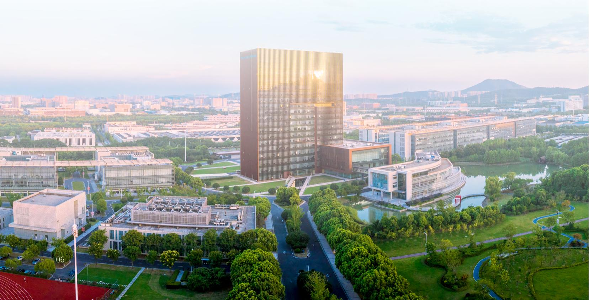

natural_image

Aerial view of a modern office complex with glass skyscrapers, surrounded by greenery and urban buildings (no visible text or signage)

# “五维”战略交汇

技术革命之维 能源革命之维 国家安全之维

产业升级之维 全球竞合之维

# 核心驱动

科技创新 产业创新

# 产业布局

三域四层

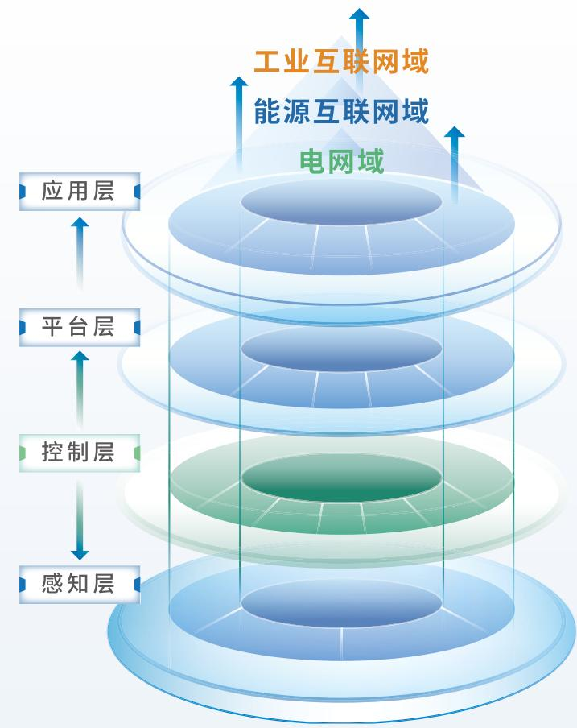

flowchart

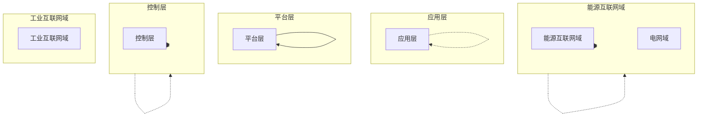
```mermaid
graph TD
  subgraph ApplicationLayer["应用层"]
    App1["应用层"]
  end
  
  subgraph PlatformLayer["平台层"]
    Platform1["平台层"]
  end
  
  subgraph ControlLayer["控制层"]
    Control1["控制层"]
  end
  
  subgraph EnergyLayer["能源互联网域"]
    Energy1["能源互联网域"]
    Energy2["电网域"]
  end
  
  subgraph IndustrialInternet["工业互联网域"]
    Industrial1["工业互联网域"]
  end
  
  App1 --> App1
  App1 --> App1
  App1 --> App1
  
  Platform1 --> Platform1
  Platform1 --> Platform1
  
  ControlLayer --> Control1
  ControlLayer --> Control1
  
  EnergyLayer --> Energy1
  EnergyLayer --> Energy1
  EnergyLayer --> Energy1
  
  ControlLayer --> Control1
  
  EnergyLayer --> EnergyLayer
  EnergyLayer --> EnergyLayer
  
  App1 -.-> App1
  App1 -.-> App1
  
  ControlLayer -.-> ControlLayer
  ControlLayer -.-> ControlLayer
  
  EnergyLayer -.-> EnergyLayer
  EnergyLayer -.-> EnergyLayer
  
  App1 -.-> App1
  
  ControlLayer -.-> ControlLayer
  ControlLayer -.-> ControlLayer
  
  EnergyLayer -.-> EnergyLayer
  EnergyLayer -.-> EnergyLayer
  
  App1 -.-> App1
  
  ControlLayer -.-> ControlLayer
  ControlLayer -.-> ControlLayer
  
  EnergyLayer -.-> EnergyLayer
  EnergyLayer -.-> EnergyLayer
  
  App1 -.-> App1
  
  ControlLayer -.-> ControlLayer
  ControlLayer .-> ControlLayer
  
  EnergyLayer -.-> EnergyLayer
  EnergyLayer -.-> EnergyLayer
  
  App1 -.-> App1
  
  ControlLayer -.-> ControlLayer
  ControlLayer -.-> ControlLayer
  
  EnergyLayer -.-> EnergyLayer
  EnergyLayer -.-> EnergyLayer
  
  App1 -.-> App1
  
  ControlLayer -.-> ControlLayer
  ControlLayer -.-> ControlLayer
  
  EnergyLayer -.-> EnergyLayer
  EnergyLayer -.-> EnergyLayer
```

# 技术演进

主动适应电力电子带来的柔性化，可重构趋势，以及 AI 与数字孪生带来的智能化，融合化趋势

# 组织架构

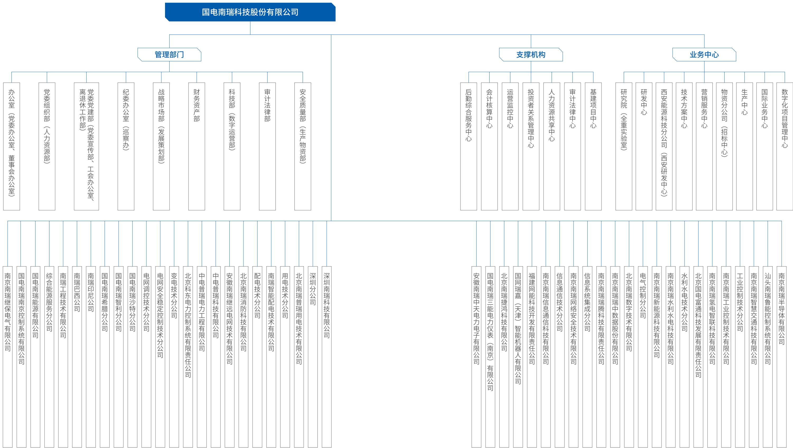

flowchart

```mermaid
graph TD
  Root["国电南瑞科技股份有限公司"]
  
  subgraph Management [管理部门]
    M1["办公室（党委办公室、董事会办公室）"]
    M2["党委组织部（人力资源部）"]
    M3["离退休工作部"]
    M4["纪委办公室（巡察办）"]
    M5["战略市场部（发展策划部）"]
    M6["财务资产部"]
    M7["科技部（数字运营部）"]
    M8["审计法律部"]
    M9["安全质量部（生产物资部）"]
  end
  
  subgraph Support [支撑机构]
    S1["后勤综合服务中心"]
    S2["会计核算中心"]
    S3["运营监控中心"]
    S4["投资者关系管理中心"]
    S5["人力资源共享中心"]
    S6["审计法律中心"]
    S7["基建项目自中心"]
    S8["研究院（全重实验室）"]
    S9["研发中心"]
    S10["西安能源科技分公司（西安研发中心）"]
    S11["技术方案中心"]
    S12["营销服务中心"]
    S13["物资分公司（招标中心）"]
    S14["生产中心"]
    S15["国际业务中心"]
    S16["数字化项目管理中心"]
  end
  
  subgraph Business [业务中心]
    B1["南京南瑞半导体有限公司"]
    B2["汕头南瑞鲁能控制系统有限公司"]
    B3["工业控制技术分公司"]
    B4["南京南瑞工业控制技术有限公司"]
    B5["北京国电富通科技发展有限责任公司"]
    B6["北京国电水利水电科技有限公司"]
    B7["水利水电技术分公司"]
    B8["南京南瑞氢电智联科技有限公司"]
    B9["南京南瑞新能源科技有限公司"]
    B10["电气控制分公司"]
    B11["北京南瑞数字技术有限公司"]
    B12["南京南瑞中数据股份有限公司"]
    B13["信息系统集成分公司"]
    B14["南京南瑞网络安全技术有限公司"]
    B15["信息通信技术分公司"]
    B16["南京南瑞信息通信科技有限公司"]
    B17["福建网能科技开发有限责任公司"]
    B18["国家网瑞嘉（天津）智能机器人有限公司"]
    B19["北京南瑞捷鸿科技有限公司"]
    B20["安徽南瑞中天电力电子有限公司"]
  end
  
  Root --> M1
  Root --> M2
  Root --> M3
  Root --> M4
  Root --> M5
  Root --> M6
  Root --> M7
  Root --> M8
  Root --> M9
  Root --> S1
  
  subgraph Subsidiaries [支撑机构]
    direction TB
  S1 --> S2
  S2 --> S3
  S3 --> S4
  S4 --> S5
  S5 --> S6
  S6 --> S7
  S7 --> S8
  S8 --> S9
  S9 --> S10
  S10 --> S11
  S11 --> S12
  S12 --> S13
  S13 --> S14
  S14 --> S15
  end
  
  subgraph Subsidiaries [业务中心]
    direction TB
  S1 --> S2
  S2 --> S3
  S3 --> S4
  S4 --> S5
  S5 --> S6
  S6 --> S7
  S7 --> S8
  S8 --> S9
  S9 --> S10
  S10 --> S11
  S11 --> S12
  S12 --> S13
  S14 --> B1
  B1 --> B2
  B2 --> B3
  end
  
  subgraph Subsidiaries [管理部门]
    M1 -.->|下层 | M2
    M2 -.->|下层 | M3
    M3 -.->|下层 | M4
    M4 -.->|下层 | M5
    M5 -.->|下层 | M6
    M6 -.->|下层 | M7
    M7 -.->|下层 | M8
    M8 -.->|下层 | M9
  end
  
  subgraph Subsidiaries [业务中心]
    direction TB
  B1 -.->|下层 | B2
  B2 -.->|下层 | B3
  B3 -.->|下层 | B4
  B4 -.->|下层 | B5
  B5 -.->|下层 | B6
  B6 -.->|下层 | B7
  B7 -.->|下层 | B8
  B8 -.->|下层 | B9
  B9 -.->|下层 | B10
  B10 -.->|下层 | B11
  B11 -.->|下层 | B12
  B12 -.->|下层 | B13
  B13 -.->|下层 | B14
  B14 -.->|下层 | B15
  B15 -.->|下层 | B16
  B16 -.->|下层 | B17
  B17 -.->|下层 | B18
  B18 -.->|下层 | B19
  B19 -.->|下层 | B20
  B20 -.->|下层 | B21
  B21 -.->|下层 | B22
  B22 -.->|下层 | B23
  B23 -.->|下层 | B24
  B24 -.->|下层 | B25
  B25 -.->|下层 | B26
  B26 -.->|下层 | B27
  B27 -.->|下层 | B28
  B28 -.->|下层 | B29
  B29 -.->|下层 | B30
  B30 -.->|下层 | B31
  B31 -.->|下层 | B32
  B32 -.->|下层 | B33
  B33 -.->|下层 | B34
  B34 -.->|下层 | B35
  B35 -.->|下层 | B36
  B36 -.->|下层 | B37
  B37 -.->|下层 | B38
  B38 -.->|下层 | B39
  B39 -.->|下层 | B40
  B40 -.->|下层 | B41
  B41 -.->|下层 | B42
  B42 -.->|下层 | B43
  B43 -.->|下层 | B44
  B44 -.->|下层 | B45
  B45 -.->|下层 | B46
  B46 -.->|下层 | B47
  B47 -.->|下层 | B48
  B48 -.->|下层 | B49
  B49 -.->|下层 | B50
```

参加的主要社会组织

<table><tr><td>组织名称</td><td>担任职务</td></tr><tr><td>IEC 互联电力系统网络管理分委会(SC 8C)</td><td>秘书处</td></tr><tr><td>IEC 可持续电气化交通系统委员会(SyC SET)</td><td>秘书处</td></tr><tr><td>中国电机工程学会电力系统自动化专委会</td><td>秘书处</td></tr><tr><td>中国能源研究会新能源电力系统保护和控制技术专委会</td><td>秘书处</td></tr><tr><td>中国能源研究会多能互补及流域优化运行技术专委会</td><td>秘书处</td></tr><tr><td>中国能源研究会源网荷储协调运行与控制技术专委会</td><td>秘书处</td></tr><tr><td>中国电子信息行业联合会</td><td>会员</td></tr><tr><td>中国核能行业协会</td><td>会员</td></tr><tr><td>中国城市轨道交通协会</td><td>会员</td></tr><tr><td>中国安全防范产品行业协会</td><td>会员</td></tr><tr><td>中国银行间市场交易商协会</td><td>会员</td></tr><tr><td>中国上市公司协会</td><td>理事</td></tr><tr><td>江苏省电机工程学会</td><td>常务理事</td></tr><tr><td>江苏省电工技术学会</td><td>常务理事</td></tr><tr><td>江苏省可再生能源行业协会</td><td>副理事长</td></tr><tr><td>江苏省上市公司协会</td><td>副会长</td></tr><tr><td>江苏省科学学与科研管理研究会</td><td>会员</td></tr><tr><td>江苏省企业信用管理协会</td><td>会员</td></tr><tr><td>江苏省电机工程学会电力系统自动化专委会</td><td>秘书处</td></tr><tr><td>贵州省电力行业协会</td><td>会员</td></tr><tr><td>上海市计量协会</td><td>会员</td></tr><tr><td>江苏省企业法制工作协会</td><td>副会长</td></tr><tr><td>南京轨道交通产业协会</td><td>副理事长</td></tr><tr><td>南京市对外经济技术合作协会</td><td>副会长</td></tr><tr><td>南京安全技术防范行业协会</td><td>会员</td></tr><tr><td>南京市勘察设计行业协会</td><td>会员</td></tr></table>

社会认可与荣誉

<table><tr><td>获得奖项</td><td>获奖项目名称</td></tr><tr><td>第50届日内瓦国际发明展金奖</td><td>空地协同智能运检系统</td></tr><tr><td>2025年电力科技进步奖一等奖</td><td>自主可控的新一代直流控制保护关键技术及工程应用</td></tr><tr><td>2025年电力科技进步奖一等奖</td><td>混合级联特高压直流输电关键技术、成套装备及应用</td></tr><tr><td>2025年电力科技进步奖一等奖</td><td>电力监控系统网络安全主动防御关键技术及成套装备</td></tr><tr><td>2025年电力科技进步奖一等奖</td><td>高比例分布式电源配电系统故障快速定位隔离与孤岛运行控制</td></tr><tr><td>2025年电力科技进步奖一等奖</td><td>高比例分布式电源配电系统高性能继电保护技术及规模化应用</td></tr><tr><td>2025年电力创新奖特等奖</td><td>智能水电厂IEC/IEEE双标国际标准及系列国家标准</td></tr><tr><td>2025年电力创新奖一等奖</td><td>含高比例不确定源荷的台区供需灵活互动技术研究及应用</td></tr><tr><td>2025年电力创新奖一等奖</td><td>面向新型电力系统的网络安全纵深防御与自主可控关键技术及应用</td></tr><tr><td>2025年度电工技术学会科技进步奖一等奖</td><td>规模化地铁杂散电流耦合城市电网态势感知与调控关键技术及应用</td></tr><tr><td>2025年度电工技术学会科技进步奖一等奖</td><td>硅和碳化硅混合型光储变流器高效变换与可靠运行关键技术及应用</td></tr><tr><td>2025年度电工技术学会科技进步奖一等奖</td><td>应对极端灾害的新型配电系统高韧性运行关键技术、装备与系统</td></tr><tr><td>2025年度电工技术学会科技进步奖一等奖</td><td>数据机理融合的电力智能物联关键技术、系列装置及应用</td></tr><tr><td>2025年度电工技术学会科技进步奖一等奖</td><td>柔性直流系统快速保护与故障穿越关键技术及应用</td></tr><tr><td>2025年度电工技术学会科技进步奖一等奖</td><td>新型配电系统多状态运行控制关键技术与应用</td></tr><tr><td>2025年度电工技术学会科技进步奖一等奖</td><td>新能源高渗透有源配电系统电压质量提升关键技术、装备与应用</td></tr><tr><td>2025年度电工技术学会科技进步奖一等奖</td><td>海量分布式资源接入的配电网安全承载与柔性控制关键技术及应用</td></tr><tr><td>2025年度电工技术学会科技进步奖一等奖</td><td>新型配电网多源同步可信感知与源荷互济调控关键技术及应用</td></tr><tr><td>2025年度电工技术学会科技进步奖一等奖</td><td>高比例新能源电力系统不确定性感知与平衡调控关键技术及应用</td></tr><tr><td>2025年度电工技术学会技术发明一等奖</td><td>高压电力电子装备基础组件关键技术及应用</td></tr><tr><td>2025年度中国能源研究会科技进步奖一等奖</td><td>支撑任意比例广域新能源电力系统并/离网构建的构网型储能一体化技术及装备</td></tr><tr><td>2025年度中国能源研究会科技进步奖一等奖</td><td>北京城市副中心数字化配电网构建及协同调控关键技术、示范应用</td></tr><tr><td>2025年度中国能源研究会科技进步奖一等奖</td><td>内河电动船舶先进补能装备、平台及应用</td></tr><tr><td>2025年度中国能源研究会科技进步奖一等奖</td><td>新型电力系统智感无线网络构架及安全可信关键技术与应用</td></tr><tr><td>2025年度中国能源研究会能源创新科技进步奖一等奖</td><td>特高压大型充油设备故障防御技术及工程应用</td></tr><tr><td>2025年中国通信学会科学技术奖一等奖</td><td>大规模网络流量精准感知与可信治理关键技术及应用</td></tr><tr><td>2025年度机械工业科学技术奖技术发明奖一等奖</td><td>大容量高压直挂电池储能装备关键技术与应用</td></tr><tr><td>2025中国商业联合会科技进步奖一等奖</td><td>电网友好型兆瓦级城市枢纽光储充一体化能源站关键技术及应用</td></tr><tr><td>2024年度吴文俊人工智能科技进步奖一等奖</td><td>复杂场景高性能目标检测关键技术与应用</td></tr><tr><td>2024年北京市技术发明奖一等奖</td><td>电子式大容量直流电压变化技术及其系列化设备</td></tr><tr><td>2023年度安徽省科技进步奖一等奖</td><td>±1100kV特高压直流输电重大工程保护控制关键技术及应用</td></tr><tr><td>2024年度广西科技进步奖一等奖</td><td>大电网运行安全约束下新能源承载能力协同提升关键技术及应用</td></tr><tr><td>2024年度山东省技术发明奖一等奖</td><td>大规模新能源并网与多能互补智慧管控关键技术及应用</td></tr><tr><td>2024年内蒙古科技进步奖一等奖</td><td>新能源大基地“风光火储热”多能互动与并网消纳关键技术及应用</td></tr><tr><td>2024年重庆市科技进步奖一等奖</td><td>大型受端城市电网灵活性负荷侧资源全环节调控关键技术及应用</td></tr><tr><td>2024年重庆市科技进步奖一等奖</td><td>大规模可再生能源接入的电力系统可靠性评估和提升关键技术及应用</td></tr><tr><td>2024年陕西省科学技术进步奖一等奖</td><td>复杂条件下高拱坝健康诊断与安全监控关键技术及应用</td></tr><tr><td>2024年度江苏省环境能源领域十大科技进展</td><td>能源的信息—物理—社会系统(CPSSE):理论、技术与应用</td></tr><tr><td>2024年度江苏省环境能源领域十大科技进展</td><td>宽运行域新能源发电协同支撑电网暂态频率电压关键技术及应用</td></tr></table>

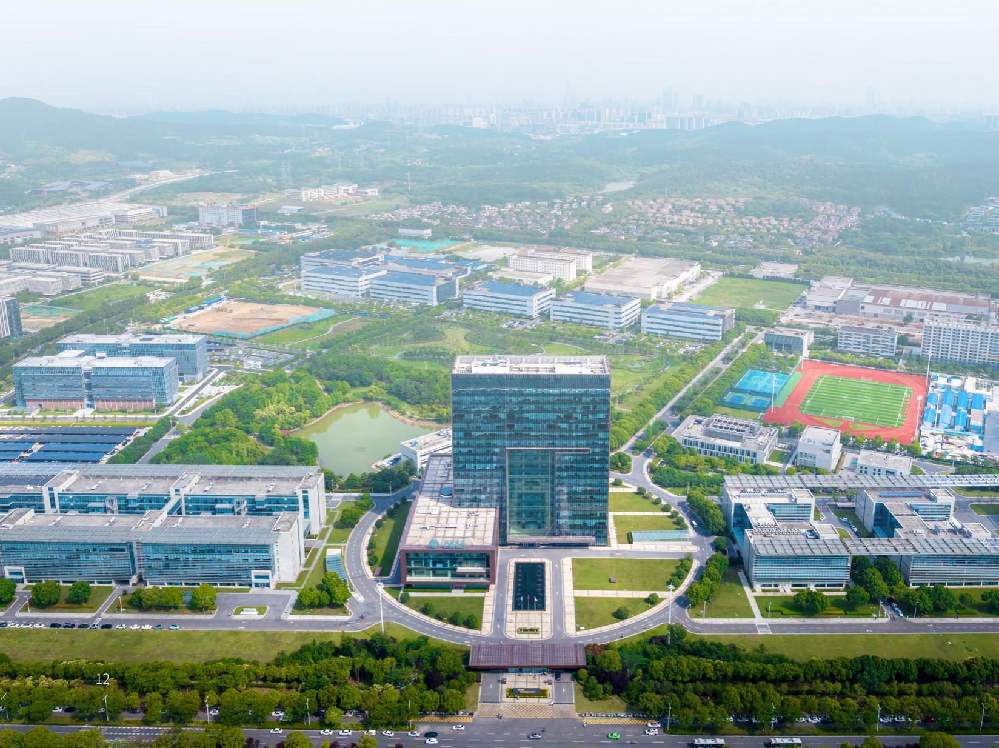

natural_image

Aerial view of a modern campus with glass skyscrapers, sports fields, and surrounding greenery (no visible text or signage)

<table><tr><td>获得奖项</td><td>颁奖机构</td></tr><tr><td>“科改企业”标杆</td><td>国务院国资委</td></tr><tr><td>中央企业品牌引领行动第二批优秀企业品牌</td><td>国务院国资委</td></tr><tr><td>第九批国家级制造业单项冠军企业(南瑞水电、南瑞工控)</td><td>工业和信息化部</td></tr><tr><td>国家级专精特新“小巨人”企业(南瑞智能配电、南瑞中天、瑞中数据)</td><td>工业和信息化部</td></tr><tr><td>国家卓越级智能工厂(南瑞中天、南控公司、博瑞电力)</td><td>工业和信息化部</td></tr><tr><td>国家级绿色工厂(南控公司、南瑞中天)</td><td>工业和信息化部</td></tr><tr><td>2024-2025年度信息披露工作A级</td><td>上海证券交易所</td></tr><tr><td>中国ESG上市公司先锋100</td><td>中央广播电视总台</td></tr><tr><td>中国ESG上市公司央企先锋100</td><td>中央广播电视总台</td></tr><tr><td>供应链ESG先锋50</td><td>中央广播电视总台</td></tr><tr><td>能源企业可持续发展(ESG)A级评价</td><td>中国能源研究会</td></tr><tr><td>第十九届(2025)中国上市公司价值评选——中国上市公司ESG百强</td><td>证券时报</td></tr><tr><td>第十九届(2025)中国上市公司价值评选——中国上市公司价值百强</td><td>证券时报</td></tr><tr><td>第十六届中国上市公司投资者关系管理天马奖</td><td>证券时报</td></tr><tr><td>上市公司投资者关系管理最佳实践</td><td>中国上市公司协会</td></tr><tr><td>上市公司现金分红榜单</td><td>中国上市公司协会</td></tr><tr><td>2025年中国上市公司可持续发展最佳实践案例</td><td>中国上市公司协会</td></tr><tr><td>2025“年报业绩说明会最佳及优秀实践”</td><td>中国上市公司协会</td></tr><tr><td>A级</td><td>Wind ESG评级</td></tr><tr><td>2025年责任鲸牛奖“ESG先锋企业”</td><td>责任云研究院</td></tr><tr><td>“五星级”可持续发展报告</td><td>中国企业社会责任报告评级专家委员会</td></tr><tr><td>2025企业ESG“金责奖”优秀社会(S)责任奖</td><td>新浪财经</td></tr><tr><td>2025中国企业ESG百强</td><td>新浪财经</td></tr><tr><td>中国供应商ESG评级平台发起单位</td><td>中国企业改革与发展研究会</td></tr><tr><td>能源企业可持续发展(ESG)评价“A”级评价</td><td>中国能源研究会</td></tr><tr><td>2025年华证A股上市公司ESG卓越表现TOP100</td><td>华证指数</td></tr><tr><td>华证2025年A股上市公司工业行业ESG绩效TOP20</td><td>华证指数</td></tr><tr><td>2025年华证A股和港股上市公司工业行业ESG绩效优秀企业TOP20</td><td>华证指数</td></tr><tr><td>中国ESG领航者TOP100</td><td>同花顺iFinD</td></tr><tr><td>金蜜蜂2025优秀企业可持续发展报告·员工责任信息披露奖</td><td>金蜜蜂智库</td></tr><tr><td>“AAApi”级</td><td>绿发信评</td></tr></table>

# ESG 管理

# ESG 理念

作为我国能源电力及工业控制领域的领军企业，国电南瑞以改革破局、以创新赋能，在能源电力领域深耕不辍、勇攀高峰，致力于发展成为服务能源互联网建设的技术引领者和服务经济社会发展的价值创造者。

公司将 ESG 管理实践融入企业发展目标与经营管理全环节，与政府、股东、员工、客户、合作伙伴等利益相关方共同构建价值共创、资源共享的 ESG 生态圈，积极建设负责任、可信赖的世界级的能源互联网高科技领军企业，积极投身全球可持续发展进程，为构建更加美好的全球社会贡献着不可或缺的力量。

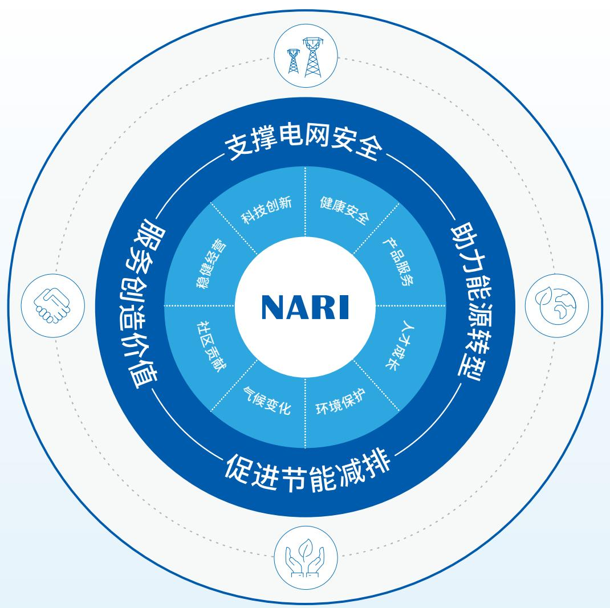

flowchart

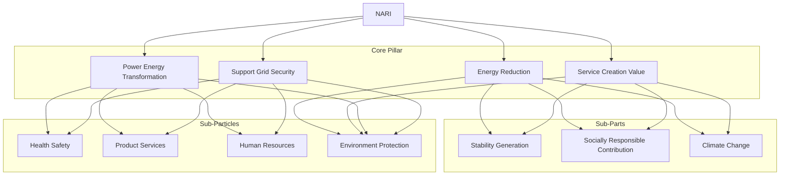
```mermaid
graph TD
  Center["NARI"]
  
  subgraph Core Pillar
    direction TB
    A["Support Grid Security"]
    B["Power Energy Transformation"]
    C["Service Creation Value"]
    D["Energy Reduction"]
  end
  
  subgraph Sub_Particles["Sub-Particles"]
    direction TB
    E["Health Safety"]
    F["Product Services"]
    G["Human Resources"]
    H["Environment Protection"]
  end
  
  subgraph Sub_Parts["Sub-Parts"]
    direction TB
    I["Stability Generation"]
    J["Socially Responsible Contribution"]
    K["Climate Change"]
  end
  
  Center --> A
  Center --> B
  Center --> C
  Center --> D
  
  A --> E
  A --> F
  A --> G
  A --> H
  
  B --> E
  B --> F
  B --> G
  B --> H
  
  C --> I
  C --> J
  C --> K
  C --> H
  
  D --> I
  D --> J
  D --> K
  D --> H
```

国电南瑞 ESG 理念模型

# ESG 治理架构

国电南瑞持续完善 ESG 治理架构，构建起“董事会－环境、社会及治理（ESG）委员会－ESG 工作组－各部门 / 所属各单位”的四级管理架构，形成自上而下、横向协调、纵向联动、分工明确的 ESG 工作体系。依托《董事会环境、社会及治理（ESG）委员会议事规则》《环境、社会及公司治理（ESG）管理制度》等制度文件，明确董事会 ESG 委员会、ESG 工作组及各配合部门、所属各单位的工作职责，保障 ESG 管理工作的有效落实。

# 2025年

公司共召开

1 次 ESG 委员会会议

2025 年，公司共召开 1 次 ESG 委员会会议，审议了《关于 2024 年环境、社会及公司治理（ESG）报告编制情况的议案》《关于环境、社会和公司治理（ESG）管理制度的议案》《关于管理 ESG 指标体系的议案》。

# 主要职责

审议批准公司 ESG 战略规划、计划，ESG 治理架构及重要 ESG 制度，年度 ESG 报告等，审议对公司有重大影响的 ESG 相关风险、重大 ESG 负面事件应对方案。

# 主要职责

对董事会负责，主要负责对公司环境、社会及治理工作决策、研究并提出建议，监督指导公司环境保护及气候相关事宜、社会责任、规范治理等工作的有效实施。

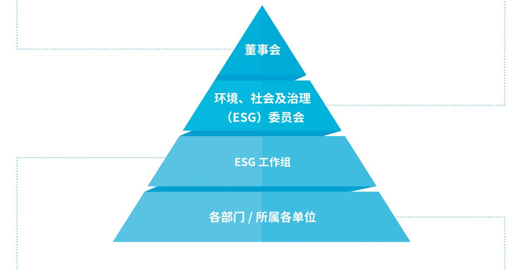

flowchart

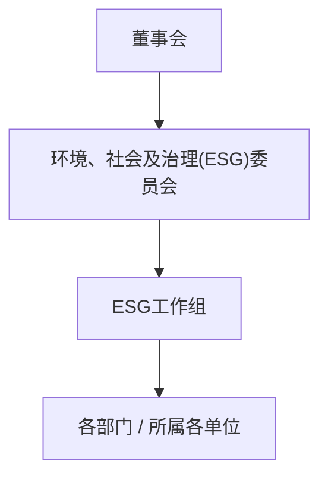
```mermaid
graph TD
  A["董事会"] --> B["环境、社会及治理(ESG)委员会"]
  B --> C["ESG工作组"]
  C --> D["各部门 / 所属各单位"]
```

# 主要职责

主要负责制订、推进和落实具体 ESG 工作计划，推动公司 ESG 管理体系建设，建立和完善 ESG 制度体系，组织开展公司 ESG 重要议题分析，开展公司 ESG 关键信息的统计、审核及调整，组织编制、发布、传播公司年度 ESG 报告，定期向公司 ESG 委员会汇报 ESG 工作进展。

# 主要职责

各部门是 ESG 管理工作的执行主体，按照 ESG 工作组要求，结合部门职责分工和工作实际，负责在各自专业领域做好 ESG 管理具体落实工作，规范 ESG 工作开展。所属各单位是 ESG 管理责任主体，按照 ESG 工作小组的要求，落实公司 ESG 管理工作决策部署，配合公司 ESG 工作开展，持续优化和改进 ESG 管理工作。

# ESG 指标体系

国电南瑞以国内外主流 ESG 标准、指引为基础，着重开展电气设备行业 ESG 标准对标、同业企业报告对标以及资本市场对行业的重点关注议题等研究工作，系统梳理总结行业特色实践，明确行业特色指标，搭建起一套包含 300 余项细分指标在内，兼具专业性、行业属性和企业特殊性的 ESG 指标体系。

结合业务实践，ESG 工作组及牵头部门定期组织各部门及所属各单位对 ESG 指标体系进行审阅、更新和完善，并依据最新版指标体系开展年度 ESG 报告编制工作，编制并发布 ESG 管理手册，推进 ESG 管理信息化系统建设，探索将 ESG 考核纳入年度考核体系，有效推动公司 ESG 整体管理水平持续提升。

# ESG 能力提升

在 ESG 委员会的指导下，国电南瑞稳步推进公司 ESG 管理提升三年行动，统筹开展 ESG 工作，持续健全 ESG 治理架构、完善 ESG 工作机制、开展 ESG 系统培训，以更高标准、更实举措全面深化 ESG 实践，推动 ESG 治理绩效和传播水平稳定提升。

# 年度 ESG 行动

- 邀请外部 ESG 专家对近期发布的 ESG 政策法规展开培训，提升相关工作人员履职能力。  
- 参与监管机构和行业协会举办的 ESG 交流论坛、ESG 培训等活动，精准把握 ESG 前沿趋势与合规要点。  
- 接待投资机构 ESG 专项调研、联合南京师范大学金融学院 ESG 课题研究团队开展主题调研、配合中国电力企业联合会 ESG 试点企业课题研究，提高 ESG 信息的透明度。  
- 参与中国电力企业联合会 2 项 ESG 标准制定，《电力企业环境、社会、治理（ESG）评价指南》《电力企业环境、社会、治理（ESG）信息披露指南》均已正式出版，赋能 ESG 行业标准规范发展。  
- 推动南控公司、国网瑞嘉、南瑞瑞腾、深圳南瑞等控股子公司实现 ESG 报告独立披露，初步建立 “1+N” （主报告 + 子公司报告）双层次 ESG 报告体系，实现 ESG 信息披露广覆盖、高质量。  
- 编制《国电南瑞 ESG 体系化建设研究报告》，全面分析公司 ESG 工作现状与提升路径，为公司可持续发展筑牢根基。

# 年度 ESG 荣耀

- 入选央视“中国 ESG 上市公司先锋 100（2025）”榜单，位列第 28 名  
- 入选央视“中国 ESG 上市公司央企先锋 100（2025）”榜单，位列第 13 名  
- 入选央视“供应链 ESG 先锋 50（2025）”榜单

- 荣获能源企业可持续发展（ESG）评价“A”级评价  
- 入选中国供应商 ESG 评级平台发起单位并获荣誉授牌  
- 连续三年获颁责任鲸牛奖“ESG先锋企业”称号  
- 连续三年获得 Wind ESG 评级 “A” 级评级  
- 荣获证券时报“中国上市公司 ESG 百强”奖项  
- 荣登华证指数“2025年华证A股上市公司ESG卓越表现TOP100”榜单  
- 荣登华证指数“华证2025年A股上市公司工业行业ESG绩效TOP20”榜单  
- 荣登华证指数“2025年华证A股和港股上市公司工业行业ESG绩效优秀企业TOP20”榜单  
- 荣登同花顺 iFinD “中国 ESG 领航者 TOP100” 榜单  
- 荣登新浪财经“2025中国企业ESG百强”榜单  
- 荣获新浪财经 2025 企业 ESG “金责奖” 优秀社会（S）责任奖  
- 荣获绿发信评“AAApi”级评级  
- ESG 报告和《大功率电力电子构网型装备破解高比例新能源接入难题 守护电网安全》ESG 实践案例均成功入选《中央企业上市公司环境、社会及公司治理（ESG）蓝皮书（2025）》  
- 《创新驱动十二载：攻坚以构网型技术突破高比例新能源接入难题 用责任担当守护电网安全与可持续发展》案例获评“2025年中国上市公司可持续发展最佳实践案例”  
- ESG报告连续两年荣获中国企业社会责任报告评级专家委员会“五星级（卓越）”评价  
- ESG报告荣获“金蜜蜂2025优秀企业可持续发展报告·员工责任信息披露奖”

natural_image

Black-and-white photo of a transparent glass trophy with a small gemstone, placed on a white surface (no visible text or symbols)

中国上市公司 ESG 百强

natural_image

Golden trophy sculpture of a bull-like creature on a black base, labeled 'ESG先锋企业' (ESG Emerging Markets Enterprise)

“责任鲸牛奖”——ESG 先锋企业

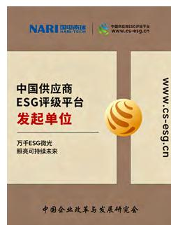

text_image

NARI 国际咨询
ESG评级平台
中国供应商ESG评级平台
www.nar-中电投.cn
中国供应商ESG评级平台
发起单位
万千ESG微光
照亮可持续未来
www.nar-esg.com
中国企业改革与发展研究会

中国供应商 ESG 评级平台
发起单位

# ESG 议题管理

2024年，公司依据《上海证券交易所上市公司自律监管指引第14号——可持续发展报告（试行）》《GRI 3: 重大主题》《国际财务报告可持续披露准则第1号——可持续相关财务信息披露一般要求》（IFRS S1）等国内外披露标准的评估方法，引入财务重要性和影响重要性的分析视角，面向各利益相关方开展双重重要性议题调研，并结合外部专家意见建议，识别和评估重要性议题。

2025 年，公司在编制《国电南瑞 ESG 体系化建设研究报告》过程中，采用同业与政策对标法，参照 ISSB、SASB、MSCI、S&P Global、国务院国资委、上交所、中企研、Wind 等国内外主流机构的 ESG 相关披露标准及评级要求，开展重点议题对标研究，进一步识别与梳理 ESG 战略重要性议题。面向内外部利益相关方开展议题调研，结合不同专业背景 ESG 专家意见，综合开展议题双重重要性分析，最终识别应对气候变化、创新驱动、产品和服务安全与质量、员工、反商业贿赂及反贪污 5 项具财务重要性议题，并按照监管要求，采用“治理—战略—影响、风险和机遇管理—指标与目标”四要素框架在本报告中进行披露，全面展现相关管理实践、战略规划与目标进展。

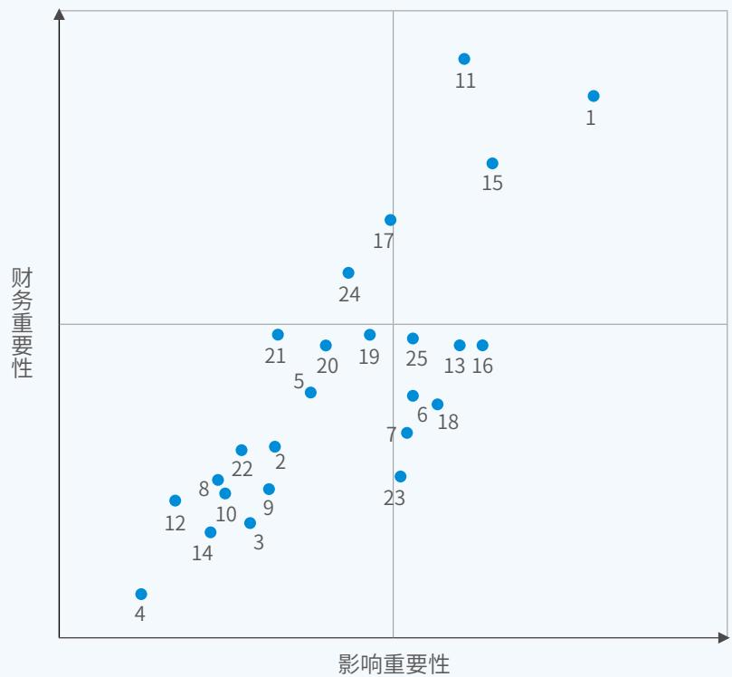

scatter

| Item | 影响重要性 (X) | 财务重要性 (Y) |
| --- | --- | --- |
| 4 | ~0.15 | ~0.15 |
| 12 | ~0.25 | ~0.35 |
| 14 | ~0.30 | ~0.25 |
| 8 | ~0.30 | ~0.35 |
| 10 | ~0.35 | ~0.35 |
| 22 | ~0.35 | ~0.40 |
| 3 | ~0.40 | ~0.30 |
| 9 | ~0.40 | ~0.35 |
| 2 | ~0.45 | ~0.40 |
| 21 | ~0.45 | ~0.50 |
| 5 | ~0.50 | ~0.45 |
| 20 | ~0.55 | ~0.50 |
| 19 | ~0.60 | ~0.50 |
| 7 | ~0.60 | ~0.45 |
| 23 | ~0.60 | ~0.35 |
| 6 | ~0.65 | ~0.45 |
| 18 | ~0.70 | ~0.45 |
| 17 | ~0.65 | ~0.65 |
| 24 | ~0.65 | ~0.60 |
| 13 | ~0.75 | ~0.55 |
| 16 | ~0.80 | ~0.55 |
| 25 | ~0.65 | ~0.55 |
| 11 | ~0.75 | ~0.95 |
| 15 | ~0.85 | ~0.85 |
| 1 | ~0.95 | ~0.95 |

国电南瑞重要性议题矩阵图

# 2025年议题库

# 环境（8项）

1 应对气候变化  
2 污染物排放  
3 废弃物处理  
4 生态系统和生物多样性保护  
5 环境合规管理  
6 能源利用  
7 水资源使用  
8 循环经济

# 社会（10项）

9 乡村振兴  
10 社会贡献  
11 创新驱动  
12 科技伦理  
13 供应链安全  
14 平等对待中小企业  
15 产品和服务安全与质量  
16 数据安全与客户隐私保护  
17 员工  
18 行业发展与合作

# 治理 (7项)

19 公司治理机制  
20 ESG 管理  
21 合规风控  
22 尽职调查  
23 利益相关方沟通  
24 反商业贿赂及反贪污  
25 反不正当竞争

# ESG 沟通

国电南瑞重视 ESG 沟通，积极开展现场尽职调查及背景研究工作，强化与利益相关方沟通和交流，在经营中秉承诚实守信、公平公开的原则，不断推进公司持续、健康发展。

# 尽职调查

为主动加强 ESG 信息披露及管理，由公司党委党建部（党委宣传部、工会办公室、离退休工作部）牵头，联合专业咨询机构，开展 ESG 趋势研究、ESG 管理对标分析，并对公司各重要部门及下属单位开展尽职调查，深入了解公司 ESG 治理现状，识别可持续发展相关影响与风险及应对措施，推动 ESG 指标体系优化完善。

# 利益相关方沟通

通过官方网站、官方微信平台、主流媒体网站、业绩说明会、定期交流会、接待机构调研、接听投资者电话等方式及时披露企业 ESG 相关的工作信息或活动资讯，与各利益相关方建立起高效沟通机制，主动识别各利益相关方对公司的期望并进行积极回应，提高利益相关方对公司的了解和信任。

<table><tr><td>利益相关方类别</td><td>关注内容</td><td>沟通方式</td><td>沟通频次</td></tr><tr><td>政府及监管机构</td><td>守法合规经营促进经济发展支持地区发展保障电力安全优化能源结构</td><td>政企沟通与汇报政府及监管机构专题调研合规信息披露内部政策宣讲会</td><td>不定期不定期不定期不定期</td></tr><tr><td>股东和投资者</td><td></td><td>股东会业绩说明会定期报告披露临时公告披露上证E互动平台交流机构策略会接待现场调研接待股东拜访电话会及邮件沟通</td><td>每年每季度定期不定期不定期不定期不定期不定期不定期</td></tr><tr><td>员工</td><td>保障员工权益员工成长与发展职业健康与安全良好的工作环境</td><td>职工代表大会职工代表和董事长联络员调研活动员工座谈会员工培训(包含线上平台)员工文体活动</td><td>每年每年不定期不定期不定期</td></tr><tr><td>客户</td><td>产品质量保障优化服务质量信息安全客户权益保护</td><td>客服热线客服小程序邮件沟通客户满意度调查</td><td>不定期不定期不定期每年</td></tr><tr><td>供应商与合作伙伴</td><td>公平透明合作共赢</td><td>供应商培训交流供应商合格审查接待企业拜访</td><td>不定期不定期不定期</td></tr><tr><td>行业与协会组织</td><td>促进行业发展参与行业标准制定</td><td>承办、参加行业学术会议参加大型展览会参加标准研讨会</td><td>不定期不定期不定期</td></tr><tr><td>公众、媒体及非政府组织</td><td>维护公共关系热心公益慈善促进社区、城市发展应对气候变化生态环境保护</td><td>公益捐赠志愿服务社区沟通接待高校拜访接受媒体调研访谈社交媒体信息发布</td><td>每年不定期不定期不定期不定期不定期不定期</td></tr></table>

# 专题

# 氢电智联创新力 电控蓄能领未来

氢能、储能、抽水蓄能是保障新能源高效消纳，支撑新型电力系统稳定运行的重要支撑调节手段。国电南瑞氢能、储能、抽水蓄能产业发展以解决行业痛点为出发点，持续推出支撑双高新型电力系统的先进产品和高效方案，积极打造全产业链条，为国家能源安全和电力系统稳定运行提供有力保障。

2025 年 6 月 27 日，“氢电智联创新力 电控蓄能领未来”——国电南瑞“一氢二储”新技术·新产品·新范式发布会在南京召开，吸引电力、建工、石化冶金领域企业代表、高校、行业学会专家、投资机构、媒体等约 400 名嘉宾参会，共同探索能源发展新范式。会上，国电南瑞发布 4S 储能系统整体解决方案及产品、绿电制氢整体解决方案及产品、变速抽蓄交流励磁系统，并发布《绿电制氢技术白皮书》，呼吁全行业共同攻克前沿技术难题。

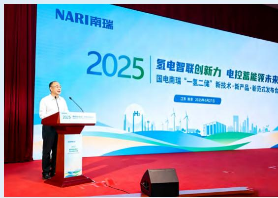

text_image

NARI南瑞
2025 | 氢电智联创新力 电控蓄能领未来
国电南瑞“一氢二储”新技术·新产品·新范式发布会
江苏·南京·2025年6月27日

国电南瑞董事长郑宗强为发布会致辞

  
“码”上了解：“一氢二储”新技术·新产品·新范式发布会

  
“码”上了解：各类媒体广泛报道南瑞这场发布会

南瑞本着 ‘为电网安全服务、为客户创造价值’ 的理念，坚持 ‘技术为本、产业为果、支撑为责’ 的价值逻辑，在绿电制氢、新型储能、抽水蓄能领域打造了 ‘一氢二储’ 三项最新成果，以新技术、新产品、新范式突破传统储能的瓶颈，为送端电网保消纳、受端电网强支撑、薄弱电网保供电提供能量充足又配比均衡的 ‘营养餐’。

——国电南瑞董事长 郑宗强

# 氢启未来：以“氢”为媒 解锁绿色能源新路径

所谓绿电制氢，即用风电、光伏等清洁电力电解水制氢，“绿电 + 绿氢”协同发展已成为全球能源转型新趋势。国电南瑞聚焦大规模电解水制氢技术、氢能高效转化、柔性绿氢耦合化工等关键技术工艺和核心设备创新迭代，以自主可控电力电子新能源装备为基础，以电网友好型新能源并网技术为核心，打造“器件—装备—场站—电网”协同优化的系统友好型绿电制氢整体解决方案，通过暂稳态联合仿真、电氢优化调度、能量管理、电解槽集群控制等技术实现电网友好互动、系统运营最优、绿氢成本最低，推动风光储氢有效承担系统安全和调节责任，助力新型能源体系及新型电力系统建设。

绿电制氢“四大”产品系列  
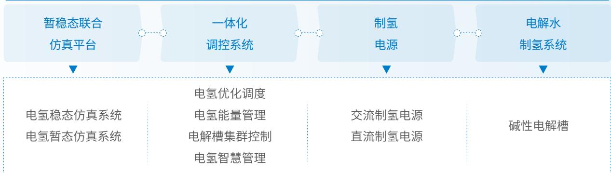

flowchart

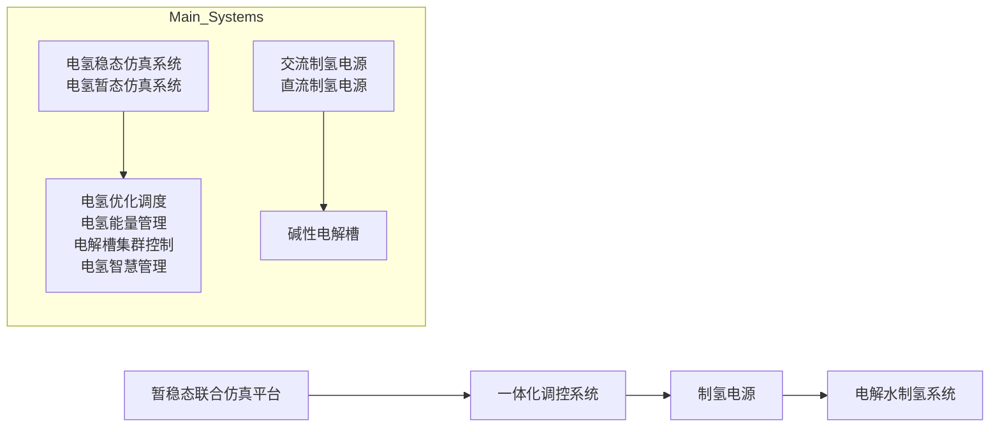
```mermaid
graph LR
  A["暂稳态联合仿真平台"] --> B["一体化调控系统"]
  B --> C["制氢电源"]
  C --> D["电解水制氢系统"]
  
  subgraph Main_Systems
  E["电氢稳态仿真系统\n电氢暂态仿真系统"] --> F["电氢优化调度\n电氢能量管理\n电解槽集群控制\n电氢智慧管理"]
  G["交流制氢电源\n直流制氢电源"] --> H["碱性电解槽"]
  end
```

# 案例 国电南瑞参建的全球最大单体绿氨项目正式投产

2025 年 7 月 26 日，国电南瑞参建的吉电股份大安风光制绿氢合成氨一体化示范项目，在吉林省大安市清洁能源化工产业园区正式投产。该项目为当前全球最大单体绿氨项目，创新采用“绿氢消纳绿电、绿氨消纳绿氢、源网荷储一体化”的全产业链设计思路，规划年制绿氢 3.2 万吨，搭载国电南瑞自主研发的风光储氢整体解决方案、绿电制氢能量管理系统，以及配套 12 套碱性电解槽制氢电源和 16 套质子交换膜电解槽制氢电源。项目投产后，替代传统化石能源高碳合成氨工艺，年减少碳排放约 65 万吨、节约标煤约 23 万吨，验证了大规模绿氢全产业链商业化可行性，为全球低碳转型提供示范样板。

该国家级清洁低碳氢能示范项目的落地，巩固了国电南瑞在绿电制氢领域的技术领先地位，推动绿色能源高效转化利用，为全球能源转型注入“南瑞动力”。

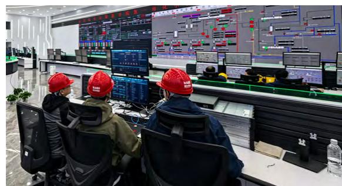

natural_image

Two operators in red hard hats seated at a control room with multiple monitors and large display screens (no visible text or symbols)

国电南瑞技术人员在调试现场

# 储赢先机：以“储”为器 重塑灵活调节新高度

融储于网、价值共生。国电南瑞前瞻研判、主动部署，组建“新型储能与构网业务特遣队”，快速整合电力系统分析、调度控制、电力电子、网络安全等领域的优势资源，以“集团军”协同作战模式攻坚储能核心技术，创新提出“4S”储能系统技术框架（System、Smart、Safety、Savvy），立足电力系统需求，提供更智能、更安全、更经济的解决方案，全面赋能储能系统关键技术研发与市场拓展进程，可广泛应用于新能源配储、独立储能电站、薄弱微网、常规机组配储等场景，实现电网精准支撑、储能效益最优。目前，公司储能变流器、协调控制器、能量管理系统等技术产品方案已在国内外数百个储能项目成功应用。

# 国电南瑞承建的四川省电网侧首个组串式储能项目并网

2025 年 7 月 14 日，由国电南瑞承建的四川省电网侧首个组串式储能项目——乐山电力龙泉驿区 100 兆瓦 /200 兆瓦时电化学储能电站正式并网。该项目所在的成都市龙泉驿区是全国重要的汽车产业基地，聚集了多家智能网联汽车和新能源汽车制造企业，对供电可靠性要求极高。电站投运后，可通过“低谷充电、高峰放电”的模式，缓解电力供需分布和电网输送能力不匹配的问题，降低事故风险，提升调度灵活性，为龙泉驿汽车城高端制造集群提供应急电源支持，保障汽车产业链稳定运行。龙泉驿储能电站的投运，标志着四川省在新型储能规模化应用与电网调峰能力建设上取得重要突破，为区域内风电、光伏等清洁能源消纳能力提升提供硬件支撑，持续助力能源结构转型升级。

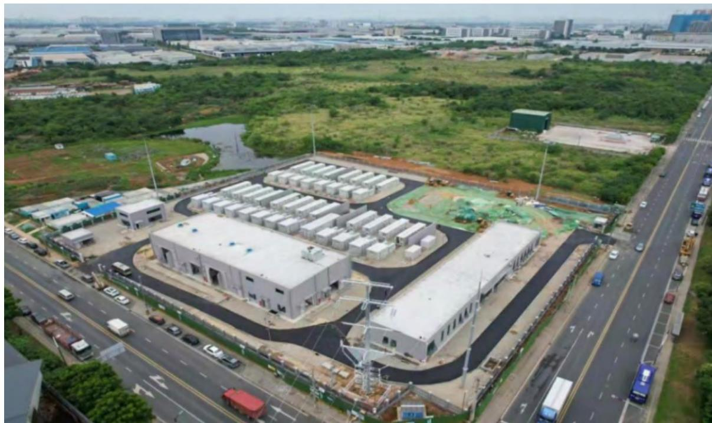

natural_image

Aerial view of an industrial complex with multiple warehouses and surrounding roads, no visible text or signage.

四川省电网侧首个组串式储能项目

# “4S”储能系统技术框架

# System（系统需求准确评估）

通过仿真规划平台对系统需求准确评估，实现储能类型容量精准配置规划

# Smart（灵活准确功率控制）

通过灵活准确功率控制，实现电网全时间尺度能量支撑

# Safety（电池安全主动防护）

通过电芯至舱体全链条安全防护，实现系统长期可靠运行

# Savvy（全面优化收益提升）

通过场景优化全面提升收益，为用户提供最大价值

# 国电南瑞承建的西藏安多构网型离网储能项目并网投运

2025 年 8 月 28 日，国电南瑞承建的西藏安多构网型离网储能项目正式并网投运，标志着公司在高海拔地区能源技术领域实现新突破，为我国偏远地区可靠供电提供坚实支撑。安多县地处西藏自治区最北部，平均海拔超 5200 米，气候恶劣，长期面临清洁能源开发难、电力供应不稳定的问题。本次西藏安多项目是国电南瑞构网型储能变流器首次在海拔近 5000 米地区投运，项目团队针对高海拔严苛的自然环境、极低温天气开展防护设计优化，在 IGBT 模组散热设计、叠排绝缘设计、电抗器绝缘设计、机柜内部电气设计等方面实施强化提升，成功攻克高海拔环境下的设备散热难题，保障电力供应持续稳定可靠。项目成功投运，将有效降低碳排放、减轻生态环境压力，推动安多县环境保护和可持续发展，助力我国能源结构优化转型。

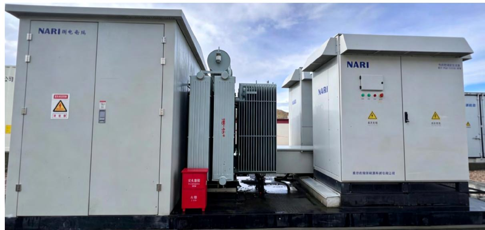

text_image

NARI国电南场
安久新旺
安久新旺
安久新旺
安久新旺
安久新旺
安久新旺
安久新旺
安久新旺
安久新旺
安久新旺
安久新旺
安久新旺
安久新旺
安久新旺
安久新旺
安久新旺
安久新旺
安久新旺
安久新旺
安久新旺
安久新延
安久新延
安久新延
安久新延
安久新延
安久新延
安久新延
安久新延
安久新延
安久新延
安久新延
安久新延
安久新延
安久新延
安久新延
安久新延
安久新延
安久新延
安久新延
安久新延
安久新通
安久新通
安久新通
安久新通
安久新通
安久新通
安久新通
安久新通
安久新通
安久新通
安久新通
安久新通
安久新通
安久新通
安久新通
安久新通
安久新通
安久新通
安久新通
安久新通
安久新源
安久新源
安久新源
安久新源
安久新源
安久新源
安久新源
安久新源
安久新源
安久新源
安久新源
安久新源
安久新源
安久新源
安久新源
安久新源
安久新源
安久新源
安久新源
安久新源
安久新通
安久新通
安久新通
安久新通
安久新通
安久新通
安久新通
安久新通
安久新通
安久新通
安久新通
安久新通
安久新通
安久新通
安久新通
安久新通
安久新通

国电南瑞研制的构网型储能变流器

# 蓄势而发：以“蓄”为基 筑牢稳定供电新基石

在 “双碳” 目标推动下，抽水蓄能电站作为新能源消纳的关键枢纽，正迎来建设高峰期。国电南瑞瞄准行业痛点，主导研发 NGS 系列国产化调速器，形成覆盖 “中小型机组—大型机组—巨型机组—抽水蓄能机组” 的全谱系产品矩阵，核心性能指标达到国际领先水平；围绕控制系统、系统性能、功率阀组、可靠试验四个领域开展技术攻关，成功研制变速抽蓄机组交流励磁系统，显著提升系统可靠性、响应速度及运维效率，构建 “物理动模 + 数字仿真 + 功率检测” 试验验证体系，提供完备验证环节；在总结 100 余座抽蓄工程经验的基础上，依托多专业融合技术优势，研发了抽蓄电站数智一体化控制系统，实现系统间信息共享与全面融合，综合效益显著，高质量支撑抽水蓄能电站数智化建设与安全稳定运行。

# 案例 国电南瑞助力东北地区规模最大的抽水蓄能电站全面投产发电

2025 年 1 月 16 日，国电南瑞参建的东北地区规模最大的抽水蓄能电站——辽宁清原抽水蓄能电站 6 号机组正式投入商业运行，标志着电站实现全面投产发电。辽宁清原抽水蓄能电站位于辽宁省清原满族自治县，是振兴东北重点工程、国家“十三五”重点大型能源项目。电站总装机容量 180 万千瓦，装有 6 台单机容量 30 万千瓦可逆式水泵水轮发电机组，年发电量 30 亿千瓦时。电站采用国电南瑞所属南瑞水电自主研制计算机监控系统、水轮机调速系统、机组振摆保护系统及工程安全监测仪器等产品。在机组试运行期间，南瑞水电提供的各项系统、产品性能稳定、运行可靠、操作便捷，为电站全面投产发电提供坚强保障。电站全面投产后，将显著提升辽宁省乃至东北、蒙东地区风电、核电、光伏发电等可再生能源的消纳能力，有效改善东北电网能源结构。

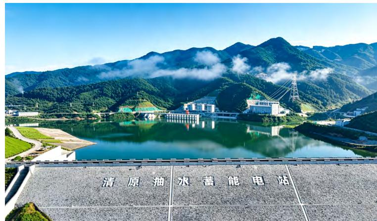

text_image

清原抽水蓄能电站

辽宁清原抽水蓄能电站外景

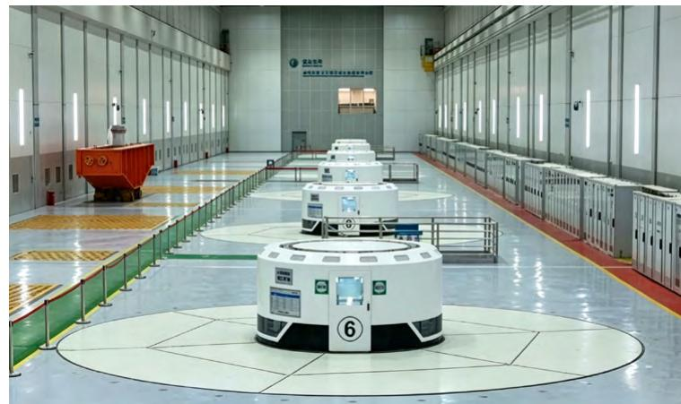

natural_image

Interior of a large industrial facility with multiple autonomous guided vehicles and control panels (no visible text or symbols)

辽宁清原抽水蓄能电站内景

# 案例 国电南瑞助力江苏句容抽水蓄能电站全面投产发电

2025 年 10 月 28 日，国电南瑞参建的世界坝体最高、运行水头最低的抽水蓄能电站——国网新源江苏句容抽水蓄能电站最后一台机组正式投入商业运行。至此，句容抽水蓄能全厂 6 台机组全面投产发电，标志着我国抽水蓄能领域在复杂工况建设与运维能力上再获突破。电站装机容量 1350 兆瓦，日蓄能量 607.5 万千瓦时，多年平均抽水电量 18 亿千瓦时，预计每年可节约燃煤消耗量约 14 万吨，减排二氧化碳、二氧化硫等约 35.7 万吨。国电南瑞所属南瑞水电为江苏句容抽水蓄能电站提供了计算机监控系统、水轮机调速系统、大坝安全监测系统，南瑞新能源 / 电控公司 / 南瑞氢电为电站提供了励磁系统。电站全面投产发电后，具备显著的容量支撑与调峰填谷功能，可有效增强电网峰谷调控能力，缓解苏南供电紧缺的矛盾，成为“西电东送”、特高压交流送电受端电网有力的电源支撑。

natural_image

Aerial view of a large hydroelectric dam spanning a reservoir surrounded by forested hills and rural settlements (no visible text or symbols)

江苏句容抽水蓄能电站

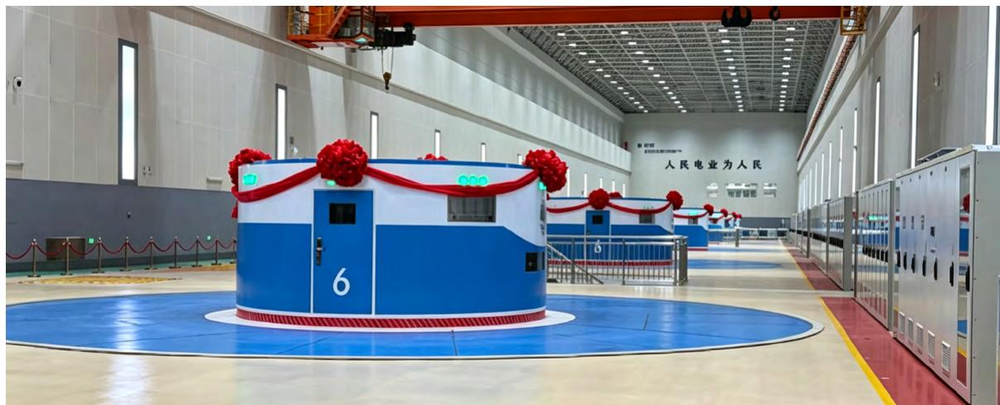

natural_image

Interior of a large industrial facility with blue and white equipment arranged on circular platforms, decorated with red ribbons (no visible text or symbols)

电站 6 号机组正式投入商业运行

# 01

# 至正·瑞意进取迈出稳健新步伐

国电南瑞始终严格按照相关法律法规及规范性文件等要求，健全完善现代企业治理体系，持续优化治理结构，强化风险防控，深化合规经营，恪守商业道德，筑牢信息安全防线，提升信息披露质量，全面推进企业治理体系和治理能力现代化，以高效规范治理为企业高质量发展保驾护航。

28

规范治理 夯基固本

36

律己正身 行止有矩

41

信息安全 数盾铸防

45

透明履责 增进沟通

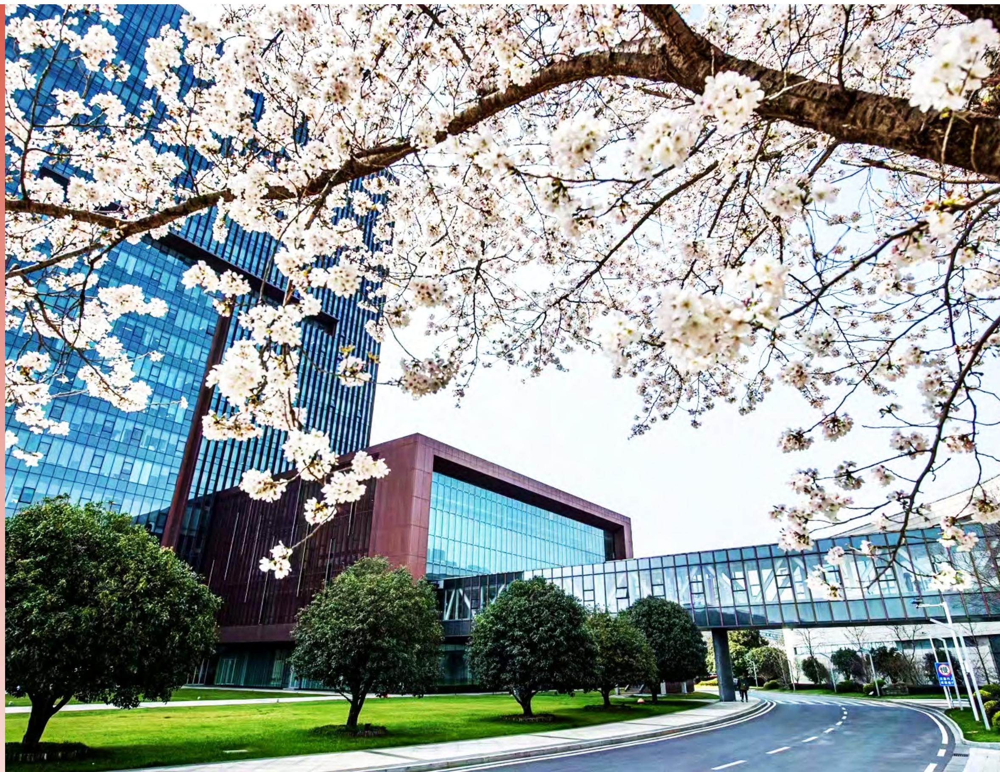

natural_image

Modern glass building with cherry blossoms in the foreground, surrounded by green lawns and trees (no visible text or signage)

# 规范治理 夯基固本

国电南瑞坚守规范治理底线，严格遵循监管要求，完善治理架构、健全合规管理体系、筑牢风险防控屏障，将精益管控融入经营管理全过程，以透明高效的治理机制、坚实的内控合规基础，为企业高质量可持续发展筑牢坚实底盘。

# 完善治理架构

国电南瑞严格遵守《中华人民共和国公司法》《中华人民共和国证券法》《上市公司治理准则》及证监会相关监管规定，构建以股东会、董事会及专门委员会、管理层为核心，职能部门协同配合的分层级治理体系，通过制度规范与流程优化建立健全权责清晰、决策科学的治理机制，充分发挥决策层在重大决策、日常经营、监督管理等方面的作用，确保企业规范治理与高效运营。

# 2025年“三会”治理绩效

- 召开股东会 3 次，审议议案 20 项  
召开董事会会议 11 次，审议议案 68 项  
- 召开监事会会议 6 次，审议议案 23 项

# 优化治理举措

# 规范“三会”运行

会前加强统筹规划、会中做好会议组织和服务、会后督促决议落实，针对所涉部门多、上会议题繁杂等问题，通过计划表、任务清单、信息平台等多种方式逐项细化落实。

# 完善管理制度

根据法律法规和监管政策，结合公司所需，修订《公司章程》《股东会议事规则》《董事会议事规则》《独立董事工作制度》《关联交易决策管理办法》《信息披露事务管理制度》等23项制度。

# 提升高管履责能力

加强新《公司法》及证券监管法规的宣贯和培训，做好持股变动提醒、窗口期提醒、新任董事及高管任职须知、关键岗位人员监管培训，提升其履职能力。

# 股东会

公司股东享有法律、法规和《公司章程》规定的合法权利，各股东按其持有的股份享有平等的权利，特别是中小股东享有平等地位。公司依据《中华人民共和国公司法》《公司章程》及《股东会议事规则》的相关要求召集、召开股东会；通过现场投票和网络投票相结合的方式，确保所有股东尤其是中小股东充分行使表决权，并聘请专业律师对股东大会进行现场见证及出具法律意见书。

# 董事会

公司设董事会，非职工代表董事由股东会选举或更换，董事任期三年，任期届满可连选连任。职工代表担任的董事，由公司职工通过职工代表大会或者其他形式民主选举产生，直接进入董事会，任期与非职工代表董事相同。公司按照《公司章程》和《股东会议事规则》《董事会议事规则》的相关要求规范董事选举流程，召集、召开董事会，确保历次董事会会议符合法律法规要求。公司董事会下设战略委员会，审计与风险管理委员会，提名委员会，薪酬与考核委员会，环境、社会及治理（ESG）委员会，科技创新委员会，为公司重大事项提供科学决策，保障董事会专业化运作水平。

# 董事会多元化

董事会所有委任均用人唯才，并在考虑人选时以客观条件顾及董事会成员多元化的益处，包括性别、年龄、教育背景、工作经验等因素，为公司提供更为全面的视角和观点，有利于作出更全面、更客观的决策。

# 董事会独立性

董事会下设的审计与风险管理委员会、提名委员会、薪酬与考核委员会明确要求独立董事占比达三分之二，召集人由独立董事担任，并通过议事规则规定审议事项须经全体委员半数以上表决通过。

# 截至报告期末，董事会结构如下

非独立董事 6 名，独立董事 4 名，其中女性董事 1 名

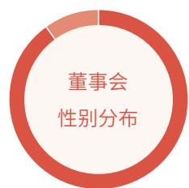

■ 男性：90%  
■ 女性：10%

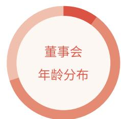

40—49岁：10%  
50—59岁：60%  
60岁以上：30%

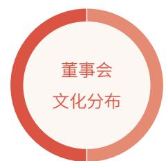

■ 博士学位：50%  
■ 硕士学位：50%  
■ 正高级工程师：10%  
■ 教授：40%  
正高级工程师：10%

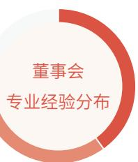

■ 研究员级高级工程师：30%

董事会下设专门委员会管理情况

<table><tr><td>专门委员会</td><td>主要职责</td><td>召开频次</td></tr><tr><td>战略委员会</td><td>负责对公司长期发展战略和重大投资决策进行研究并提出建议。</td><td>5次</td></tr><tr><td>审计与风险管理委员会</td><td>负责审核公司财务信息及其披露、监督及评估内外部审计工作和内部控制、推进风险管理和依法治企、监督ESG披露等。独立董事中会计专业人士担任召集人。</td><td>9次</td></tr><tr><td>提名委员会</td><td>负责拟定董事、高级管理人员的选择标准和程序,充分考虑董事会的人员构成、专业结构等因素,对董事、高级管理人员人选及其任职资格进行遴选、审核。独立董事担任召集人。</td><td>6次</td></tr><tr><td>薪酬与考核委员会</td><td>负责制定公司董事及高级管理人员的考核标准并进行考核;负责制定、审查公司董事、高级管理人员的薪酬决定机制、决策流程、支付与止付追索安排等薪酬政策与方案。独立董事担任召集人。</td><td>3次</td></tr><tr><td>环境、社会及治理(ESG)委员会</td><td>负责对公司环境、社会及治理工作决策、研究并提出建议,监督指导公司环境保护及气候相关事宜、社会责任、规范治理等工作的有效实施。</td><td>1次</td></tr><tr><td>科技创新委员会</td><td>负责对公司科技创新重大事项开展研究,向公司董事会提供咨询意见和建议。</td><td>1次</td></tr></table>

# 监事会

公司监事会严格按照《公司章程》《监事会议事规则》等制度履行职权，对公司财务状况、募集资金、关联交易、定期报告以及公司董事、高级管理人员履行职责的合法合规性进行监督，对公司重大事项发表意见，保障公司规范运作，维护公司及股东的合法权益。2025年12月13日，公司坚决落实国务院国资委深化国有企业监事会改革部署及证券监管规定，完成取消监事会及《公司章程》修订工作，明确由董事会审计与风险管理委员会承接原属监事会的职权。

# 管理层

国电南瑞设总经理一名，由董事会决定聘任或解聘。公司设副总经理、财务负责人、总工程师、董事会秘书等高级管理人员，协助总经理工作，由董事会决定聘任或解聘。根据《中华人民共和国公司法》《公司章程》《董事会议事规则》《董事会授权管理办法》等相关规定和董事会授权，经理层负责执行董事会决议，组织公司生产经营等业务活动。

截至报告期末，高管结构如下  
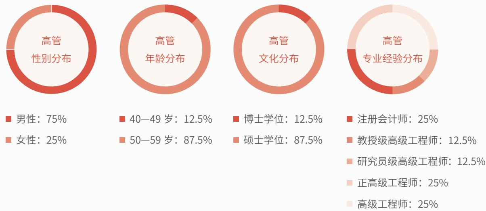

donut

| 维度 | 类别 | 占比 |
| --- | --- | --- |
| 高管性别分布 | 男性 | 75% |
| 高管性别分布 | 女性 | 25% |
| 高管年龄分布 | 40—49岁 | 12.5% |
| 高管年龄分布 | 50—59岁 | 87.5% |
| 高管文化分布 | 博士学位 | 12.5% |
| 高管文化分布 | 硕士学位 | 87.5% |
| 高管专业经验分布 | 注册会计师 | 25% |
| 高管专业经验分布 | 教授级高级工程师 | 12.5% |
| 高管专业经验分布 | 研究员级高级工程师 | 12.5% |
| 高管专业经验分布 | 正高级工程师 | 25% |
| 高管专业经验分布 | 高级工程师 | 25% |

# 精进合规管理

国电南瑞始终坚持诚信经营，持续健全合规管理体系，定期梳理并严格遵守经营业务相关法律法规、行业及监管规范，多措并举防范重大合规风险，不断强化全员合规意识，分层次开展合规宣贯培训，有力保障企业依法合规经营。

# 健全合规管理

公司持续深化合规管理体系建设，推动制度迭代与宣贯落地，延伸管理触角至基层一线，夯实合规经营制度根基，提升全流程合规管控能力。

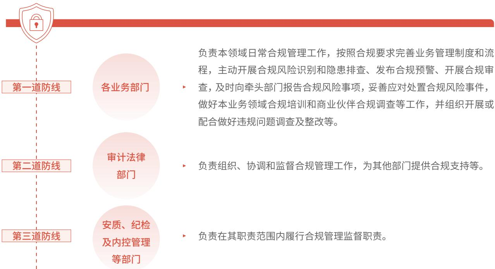

flowchart

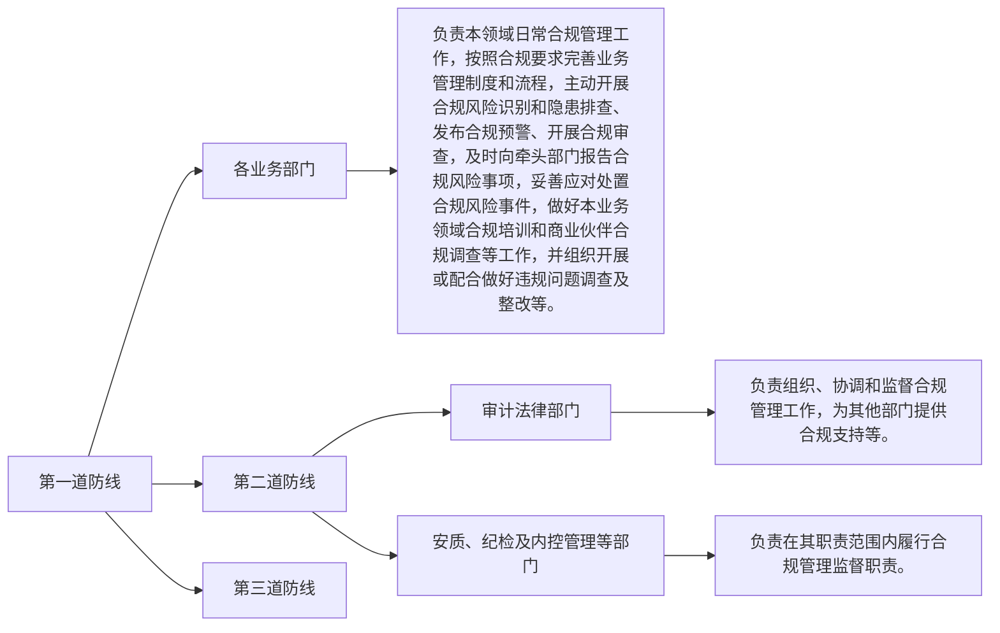
```mermaid
graph LR
  A["第一道防线"] --> B["各业务部门"]
  A --> C["第二道防线"]
  A --> D["第三道防线"]
  
  B --> E["负责本领域日常合规管理工作，按照合规要求完善业务管理制度和流程，主动开展合规风险识别和隐患排查、发布合规预警、开展合规审查，及时向牵头部门报告合规风险事项，妥善应对处置合规风险事件，做好本业务领域合规培训和商业伙伴合规调查等工作，并组织开展或配合做好违规问题调查及整改等。"]
  
  C --> F["审计法律部门"]
  C --> G["安质、纪检及内控管理等部门"]
  
  F --> H["负责组织、协调和监督合规管理工作，为其他部门提供合规支持等。"]
  G --> I["负责在其职责范围内履行合规管理监督职责。"]
```

# 优化公司治理体系

组织 40 家所属单位完成公司章程修订，撤销监事会和监事，进一步优化董事会、经理层职权设置，理顺治理权责体系。

# 持续开展基层合规管理三年行动

组织合规管理体系年度有效性评价，推动合规管理要求落实到业务一线、基层一线。

# 夯实合规管理基础

修订《“三重一大”决策管理办法》《规章制度管理办法》《授权管理办法》等规章制度。

# 创新规章制度宣贯模式

编制《行业战队业务合规手册》，修订《新员工应知应会手册》，组织全员通识制度测评，考试合格率100%。

# 开展“八标”体系法律法规查新

组织各部门、单位识别、更新法律法规及相关要求693项，及时对接内外部法规政策制度。

# 防范合规风险

公司聚焦重大决策、涉外业务、合同管理等关键领域，构建全链条风险防控体系，从源头精准识别、从严管控各类合规风险，坚守经营发展安全底线。

# 强化重大决策合法合规性审核

持续规范审核流程，提高审核质量和效率，保障重大决策合法合规，从源头上防范合规风险。

# 加强重点领域合规管理

修订境外项目立项、投标评审和决策管理办法，强化涉外业务项目评审，实现境外项目 100% 法律评审。

# 推进合同全过程管控

优化合同审批流程、强化高风险合同法律审核，编制客户资质资信调查清单、严把风险源头，发布《合同法律审核标准》、推进管理标准化，开展合同问题诊断并督促整改，对重大合同履行开展纠偏，全面提升合同管理规范化与风险防控水平。

# 厚植合规文化

公司聚焦 “关键少数”、覆盖全员，打造线上线下融合的普法宣教体系，让合规文化深植人心、融入日常，厚植依法合规经营的文化根基。

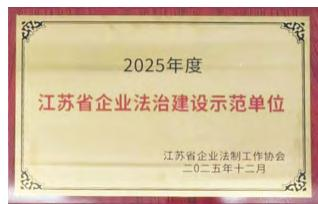

国电南瑞获评“2025年度江苏省企业法治建设示范单位”

# 紧抓“关键少数”

董事长带头签署《知识产权合规承诺书》，明确知识产权保护合规责任，以上率下，推动提升全员合规意识。组织开展领导人员、优秀年轻管理人员合规管理培训7期。

# 分层次开展合规培训

全年组织 “送法下基层” 等合规培训 110 余场，累计培训 1.5 万余人次，着力提升全员合规履责能力。

# 拓展新媒体普法平台

线上开设法治合规专区，开辟“以案说法”“新法速递”等特色专栏，解答各类线上法律咨询，累计发布普法文章400余篇，点赞4万余次，打造“指尖上的法律顾问”。

# 组织专题普法活动

开展 “4·15” 全民国家安全教育日、“4·26” 世界知识产权日、“12·4” 国家宪法日等专题普法宣传系列活动，通过专题讲座、知识竞赛、主题宣讲、线上答题等多种方式，推动合规文化深植员工内心。

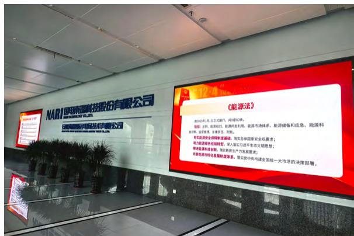

text_image

NARI能源装备科技股份有限公司
《能源法》
2021年1月1日正式施行，开展活动。
根据、业务、经济状况、能源开发利用、能源市场体系、能源储备和应急、能源科
份、行业、政策、法律、行政、经济、社会等信息，落实实体经济安全观要求；
将落实环保专项措施，落实具体国家安全观要求；
将为能源市场化稳定增长、深入落实应对气候变化明显感；
将促进科技创新，深化优质生产力发展要求；
将推动市场化发展稳定部署，落实党中央构建全国统一大市场的决策部署。

开展能源法学习宣贯活动

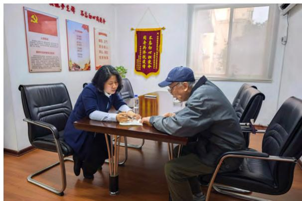

text_image

Street photo with visible store signboards and wall posters featuring Chinese text and party symbols

律师接待日为老同志普法

# 强化风险防范

公司紧扣企业经营发展核心，持续健全风险防控体系、完善审计监督机制、强化内部控制建设，构建全流程风险防控屏障，推动风险管控与经营管理深度融合，切实提升企业抗风险能力与精益化管理水平。

# 强化风险管理

公司构建多层级风控治理架构，完善全维度标准体系，强化全流程机制运行，织密全员全业务风险防控网，实现风险精准识别、有效预警与闭环管控。

# 风控治理架构

董事会负责内部控制建立健全和有效实施，并评价其有效性。董事会下设审计与风险管理委员会，负责指导风险管理与内部控制机制建设。  
在经营层设立全面风险管理委员会，负责落实董事会关于风险、内控各项工作要求。  
所属各级单位均成立本单位层面风委会，风委会办公室负责组织协调全面风险管理及内部控制日常工作。  
深化“全员、全业务、全流程”风险防控体系建设运行，建立由业务部门、支持职能部门、监督部门组成的风险管理“三道防线”，不断增强风险管控合力。

# 风险管理

全面梳理排查制度流程的合规性、适用性及效率性，持续健全覆盖经营管理各环节的规章制度体系。  
选取重点领域关键指标，构建经营风险预警指标体系，针对所属单位开展经营风险预警，督促各单位有效开展风险应对。  
细化重大经营风险事件报告标准，畅通风险信息传递渠道，明确逐级上报要求，建立上下联动、横向协同的报送机制。  
- 充分发挥公司内外部监督检查合力，协同监督风险处理情况。  
加强风险事件舆情处置，做好舆论宣传引导。

# 严格审计监督

公司以防范经营风险为主线，立足经济监督定位，聚焦改革发展、强化履职质效，有序开展各项内部审计工作，持续提升审计监督效能，充分发挥内部审计“经济体检”“治已病防未病”的作用。

# 落实上市公司监管要求

对募集资金存放及使用情况、关联交易、金融衍生品、对外投资等重大事项规范性开展4项合规性审计检查。完成上市公司2025年度内部控制有效性评价。

# 完善审计监督机制建设

以减负增效、赋能发展为导向，协同开展巡察、审计同步实践，打造全面高效的审计监督体系。探索数字化审计实践，推进审计关口前移，有效提升风险识别精准度与响应效率。

# 紧抓关键业务环节

重点关注经营管理中的重点业务领域等，实施各项内部审计工作任务。根据投资项目实施进度需求，加强对工程项目实施、项目经费列支等情况的监督管理。结合各单位主要负责人变动情况，拟订年度计划，按期实施经济责任审计项目。

# 加强审计队伍建设

将研究思维贯穿审计工作始终，加强审计人员培训及审计内部人员的老带新，锻造高素质专业队伍，培养既懂专业又熟悉业务的复合型人才。

# 加强内部控制

公司持续完善内控体系，结合行业特点与政策变化，及时制修订《内控手册》等制度规范，优化制度规范与业务流程，强化重点领域、关键环节风险防控与监督管理，夯实规范经营内控根基。

编制公司内控手册，提炼覆盖人资、财务、研发、营销、物资等多领域的业务流程、风险点及控制措施，并在所属各单位全面推广应用，实现内控标准全面覆盖。

围绕内控体系建设、内控制度建设、重点业务及关键环节等领域对所属单位定期开展内部控制执行情况的监督评价，促进内控体系持续优化。

# 律己正身 行止有矩

国电南瑞恪守商业道德，严守相关法律法规，不断加强反商业贿赂及反贪污工作，坚持公平竞争原则，致力于构建廉洁、清正的商业环境，以维护各利益相关方的合法权益。

# 遵从商业道德

国电南瑞建立完善的商业道德管控体系，坚决对逃税漏税、商业欺诈、贪污贿赂、垄断与不正当竞争等违反商业道德的行为持零容忍态度，倡导员工遵从商业道德要求，履行好社会责任，展现良好企业声誉。2025年，公司未发生因不正当竞争行为导致的诉讼或重大行政处罚。

# 见证荣耀

- 国电南瑞连续 10 年获评 A 级纳税人  
- 国电南瑞获评江苏省“守合同重信用”企业  
6 家下属单位获评江苏省“守合同重信用”企业

# 诚信经营

高度重视信用建设，严格恪守法律法规与合同约定，持续规范合同履约，不断提升合同履约管理的规范化、专业性水平，努力营造诚实守信的市场营商环境。

# 税务管理

秉持合规经营的理念，严格遵守投资目的地国家或地区的税收法律法规，规范履行纳税义务，依法披露税务信息、按时申报和缴纳税项；每年定期开展全面的税务审计，以系统化识别和应对潜在的税务风险；自主研发数字化税务管理系统，实现对各类税务风险的全流程闭环管理，显著增强税务管理的前瞻性与精准性。

# 员工商业行为

按照《领导人员应知应会制度手册》《员工应知应会制度手册》及《新员工应知应会制度手册》要求，强化全员规范从业意识，严禁以权谋私，防止利益冲突。

# 反垄断与反不正当竞争

要求员工严格遵守反垄断与反不正当竞争相关规则，避免因各类不当接触、言论（如串通价格、分割市场、联合抵制等）引发违法风险；严禁利用在相关领域的市场支配地位，以不公平的高价销售商品或低价购买商品，阻碍、限制其他经营者进入相关市场，削弱其市场竞争能力。

# 负责任营销

遵守《中华人民共和国广告法》《中华人民共和国数据安全法》等法律法规，制定《产业品牌宣传管理办法》等制度，规范产业品牌宣传行为，在所有营销活动中杜绝任何夸大、欺骗、虚假宣传行为。

# 深耕廉洁建设

国电南瑞严格遵守《中华人民共和国刑法》《关于禁止商业贿赂行为的暂行规定》等法律法规及规范性文件要求，不断完善制度机制，持续强化监督执纪，推进廉洁文化教育，一体推进不敢腐、不能腐、不想腐，坚定不移地守好廉洁从业底线，为构建公平公正的市场环境和行业生态贡献力量。

# 国电南瑞反商业贿赂及反贪污管理体系

# 治理

- 公司设立纪委，并由纪委书记负责相关纪检监察工作，纪委委员6人。  
- 纪委办公室（巡察办）作为公司纪委的办事机构，负责反腐败工作；负责开展政治监督和日常监督工作；负责涉嫌违纪问题线索受理、查处及以案促改；负责开展廉洁宣教等工作。

# 战略

- 定期识别反商业贿赂及反贪污对公司运营及财务带来的影响、风险和机遇，并根据识别结果，制定管理策略和方法。  
- 聚焦业务流程和管理流程，系统识别廉洁风险点，从源头加强防控。

# 影响、风险和机遇管理

- 加强对重点领域、重要岗位和关键环节廉洁风险点的防控和跟踪检查。  
- 系统排查 7 个专业领域 23 个 “小微权力” 风险隐患，制定并落实防控措施。  
- 梳理新任“一把手”所在单位重点风险，开展针对性任前风险提示谈话。  
- 推进境外腐败预防治理研究，为派驻纪检监察组提供政策参考和决策依据。

- 组织廉洁教育、培训 1121 次，覆盖人员 128850 人次  
- 接受反商业贿赂及反贪污培训的董事总数 10 人，占比 100%  
- 接受反商业贿赂及反贪污培训的管理层人员总数 33 人，占比 100%  
- 接受反商业贿赂及反贪污培训的员工总数 12781 人，占比 100%  
- 未发生重大腐败事件

反商业贿赂及反贪污影响、风险与机遇分析与应对

<table><tr><td>风险/机遇类型</td><td>风险/机遇描述</td><td>潜在财务影响</td><td>影响程度</td><td>影响周期</td><td>影响环节</td><td>应对措施</td></tr><tr><td>廉洁风险</td><td>若管理体系不健全,可能在采购、销售、人力资源等环节滋生商业贿赂、贪污等问题,导致利益相关方权益受损。若反商业贿赂和反贪污管理不当或出现负面事件,可能导致法律诉讼、罚款、客户流失及声誉受损,进而影响财务表现和市场地位。</td><td>营业收入减少</td><td>高</td><td>短期、中期</td><td>价值链上游、自身运营、价值链下游</td><td rowspan="2">突出常态长效,抓实纪律学习培训,深化纪律警示教育。持之以恒纠治“四风”,一严到底惩治腐败,持续深化风腐同查同治。加强纪检工作规范化、法治化正规化建设,不断提高正风肃纪反腐能力。加大应知应会制度手册宣贯力度,并通过健全的反腐败合规机制和廉洁从业制度,规范员工商业行为。</td></tr><tr><td>市场机遇</td><td>有效的反商业贿赂及反贪污举措,既能帮助企业树立廉洁合规的正面形象,吸引并留住具备专业能力与职业操守的高素质人才,提升投资者及各利益相关方的信心,更能进一步拓宽融资渠道,为企业发展争取更多融资机会。</td><td>运营成本降低</td><td>中</td><td>中期、长期</td><td>价值链上游、自身运营、价值链下游</td></tr></table>

# 说明：

1. 影响程度：通过冲击水平和风险 \ 机遇发生可能性判定影响的大小，综合考虑对商业模式、价值链、财务影响等因素。影响大小从“低”到“高”。  
2. 影响周期: 不同风险和机遇对公司产生影响, 公司将影响的时间范畴划分为短期 (0—1 年)、中期 (1—5 年)、长期 (5 年以上)。  
3. 影响环节：应对气候变化议题对经济、社会和环境产生影响的公司价值链环节，包括价值链上游（包括供应商等）、自身运营、价值链下游（包括客户等）。

(注：报告其他章节关于影响程度、影响周期、影响环节的定义与上文一致，将不再重复说明)

# 2025 年反商业贿赂及反贪污主要行动举措

# 加强纪律建设

“全员覆盖 + 骨干提升”双向发力，实现任前廉政谈话全覆盖，引导明晰纪律红线。

通过 “我的南瑞” 纪检服务号发布 10 期廉洁提醒，让长期出差驻外员工纪律教育 “不掉队”。

针对公司“一把手”、班子其他成员开展廉政约谈，加强日常沟通，“四责联动”形成敢管敢治、严管严治、长管长治的强大合力。

# 推进腐败惩治

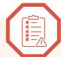

针对个别员工价值观与企业核心导向不符、消极怠工、妨碍工作秩序等问题，指导相关单位收集和固定事实证据，落实处理处分，切实维护组织秩序与管理权威。

深入开展案件复盘和类案剖析，针对办案过程中发现的廉洁风险隐患，精准下发纪检建议书，做到既善于发现又善于推动解决问题。

制发 2025 年廉洁大讲堂工作计划，逐级召开警示教育大会，组织观看专题警示片、旁听法院职务犯罪案件庭审，编制《实干筑基 廉脉永续》廉洁文化手册，编印《廉洁月报》，涵养清朗发展环境。

# 强化作风建设

持续整治违规吃喝，针对规模较大、风险较高的基层单位开展“四不两直”检查。

纵深推进群众身边不正之风和腐败问题集中整治，系统排查客户服务电话投诉工单，坚决防止吃拿卡要、颐指气使等行为。

在案件查办过程中，注重正风反腐一体深化，坚决纠治带有腐化蜕变特征的“四风”问题，以风气的持续净化不断铲除腐败滋生的空间。

# 提升纪检能力

组织纪检干部专题学习严禁违规吃喝、违规饮酒等纪律要求，加强政策解读等内容学习，引导自觉绷紧纪律之弦。

制定《纪检队伍教育培训规划》，举办纪检业务综合培训班，组织纪律审查模拟实操竞赛，提升业务能力。

# 案例

# 坚守底线，廉洁从业

2025 年 4 月 27 日，南瑞瑞腾 / 集成公司赴南京市第五看守所开展警示教育活动。在看守所负责人的引导下，大家通过 “零距离” 观摩收押监管流程、听取监所管理机制讲解，深刻体会高墙内外 “一步之遥、一念之差” 的巨大反差。大家来到富有监管元素的廉政警示教育室，依次参观 “防微杜渐律己篇” “末路忏悔篇” “互动体验区” 等五个主题展区，通过 “声、光、电” 一体的形式，以案为鉴知敬畏、警钟长鸣守底线。参观结束后，大家纷纷表示，此次警示教育活动是一次深刻的思想淬炼和精神洗礼，将时刻绷紧廉洁自律这根弦，筑牢思想防线、坚守法纪红线。

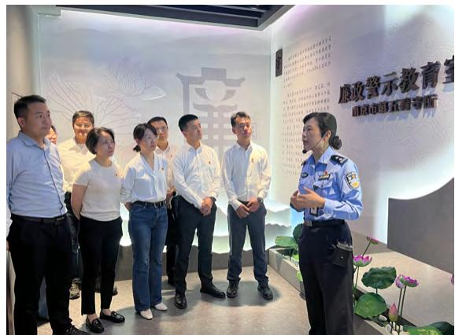

text_image

廉政警示教育室
法治人事监督考核院

参观廉政警示教育室

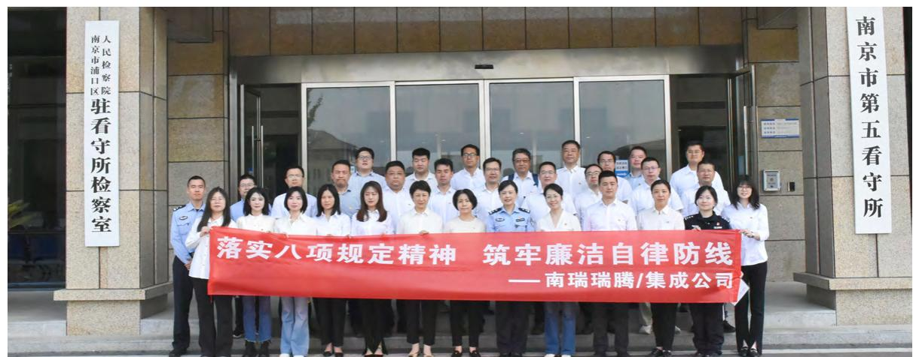

text_image

人民检察院
驻看守所检察室
南京市浦口区
南京市第五看守所
落实八项规定精神 筑牢廉洁自律防线
——南瑞瑞腾/集成公司

开展警示教育活动

# 畅通举报渠道

国电南瑞建立健全信访举报机制，设置专线举报电话，旨在接受员工及社会的监督，确保举报事项得到高效处理，并保护举报人利益。公司谨慎处理举报信息，明确投诉举报处理程序、办理时限和办结要求，针对举报内容及时提出分类处置意见。同时，公司加强保密工作，严禁将信访举报人的信访举报信、上访揭发的材料及有关情况透露或转交被信访举报单位及被信访举报人，防止举报人及举报信息泄露，严禁以任何形式对举报人采取打击报复行为。

# 国电南瑞反腐败举报渠道

举报电话：025-81092966

# 信息安全 数盾铸防

良好的信息安全与隐私保护是企业与商业伙伴、客户及员工之间相互信任和长远合作的基础。国电南瑞严格遵守《中华人民共和国网络安全法》《中华人民共和国数据安全法》《中华人民共和国个人信息保护法》等法律法规，以信息安全管理体系认证和信息技术服务管理体系认证为基础，持续健全信息安全与隐私保护管理，为数据安全和业务连续性提供坚实保障。

# 数读南瑞

○ 数据安全事件 0 起  
○ 重大信息或数据泄露事件 0 起

○ 重大网络安全事件 0 起  
- 泄露客户隐私事件 0 起

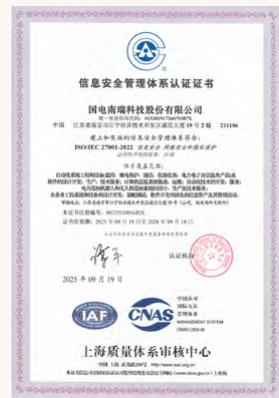

text_image

信息安全管理体系认证证书
国电南瑞科技股份有限公司
中国（江苏）自由贸易试验区股份有限公司江阴市江津区大兴路19号2幢
地址：上海市黄浦区南京西路688号新天地大厦3层
ISBN:2701-7023
证书类型及编号：
自然人股东名称：
自然人股东名称：
法人代表人：周晓峰、周晓峰、周晓峰、周晓峰、周晓峰、周晓峰、周晓峰、周晓峰、周晓峰、周晓峰、周晓峰、周晓峰、周晓峰、周晓峰、周晓峰、周晓峰、周晓峰、周晓峰、周晓峰、周晓峰、周晓峰、周晓峰、周晓峰、周晓峰、周晓峰、周晓峰
证券代码：60175000428
证券简称：国电南瑞
证券代码：60175000428
证券简称：国电南瑞
证券代码：60175000428
证券简称：国电南瑞
证券代码：60175000428
证券简称：国电南瑞
证券代码：60175000428
证券简称：国电南瑞
证券代码：6018199999
证券简称：国电南瑞
证券代码：6018199999
证券简称：国电南瑞
证券代码：6018199999
证券简称：国电南瑞
证券代码：6018199999
证券简称：国电南瑞
证券代码：6018199999
证券简称：国电南瑞
证券代码：
2025年09月19日
2025年09月19日
IAF CNAS MANAGEMENT SYSTEMS CO.,LTD.
上海质量体系审核中心
中国（上海）质量管理体系认证中心 http://www.sse.com.cn/ 本公司于2025年9月19日发布《上海证券报》《中国证券报》《上海证券报》《证券时报》《上海证券报》《证券日报》和巨潮资讯网（http://www.sse.com.cn）上披露的《上海证券报》《中国证券报》《上海证券报》《证券时报》《上海证券报》《证券日报》和巨潮资讯网（http://www.sse.com.cn）上披露的《上海证券报》《中国证券报》《上海证券报》《证券时报》《上海证券报》《证券日报》和巨潮资讯网（http://www.sse.com.cn）上披露的《上海证券报》《中国证券报》《上海证券报》《证券日报》和巨潮资讯网（http://www.sse.com.cn）上披露的《上海证券报》《中国证券报》《上海证券报》《证券时报》《上海证券报》《证券日报》和巨潮资讯网（http://www.sse.com.cn）上披露的《上海证券报》《中国证券报》《上海证券报》《证券时报》《上海证券报》《证券日报》和巨潮资讯网（https://www.sse.com.cn）上披露的《上海证券报》《中国证券报》《上海证券报》《证券时报》《上海证券报》《证券日报》和巨潮资讯网（http://www.sse.com.cn）上披露的《上海证券报》《中国证券报》《上海证券报》《证券时报》《上海证券报》《证券日报》和巨潮资讯网（http://www.sse.com.cn）上披露的《上海证券报》《中信建投证券股份有限公司关于变更部分注册地址的公告》

国电南瑞通过 GB/T 22080-2016/ISO/IEC 27001:2013
信息安全管理体系认证

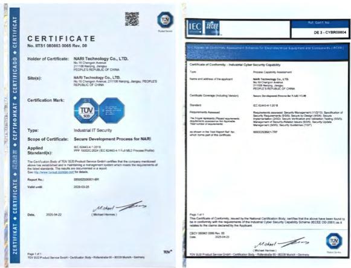

text_image

CERTIFICATE
No. I/TS1 08063 0066 Rev. 00
Holder of Certificate: NARI Technology Co., LTD.
No. 19 Changcheng Avenue
271108 Nanjing, 28990
PEOPLES REPUBLIC OF CHINA
Site(s): NARI TECHNOLOGY CO., LTD.
No. 19 Changcheng Avenue, 271108 Nanjing, Jiangsu, PEOPLES REPUBLIC OF CHINA
Certification Mark:
Type: Industrial IT Security
Scope of Certificate: Secure Development Process for NARI
Applied Standard(s):
The Certification Code of TSM ECIC Product Service GmbH certifies that the company mentioned above has established a comprehensive management certification which meets the requirements of the listed companies. This results are documented in this report.
Report No.: 0500020000149R
Valid unit: 2020-03-03
Date: 2020-04-22
KEC ECIC 08063 0066 Rev. 00
Page 1 of 1
TSM ECIC Product Service GmbH - Certification Body - Institute 95 - 2020 March - Germany
ZERTIFIKAT CERTIFICATE
Certification Date: DE 3 - CYBR00004
Certificate of Conformity - Industrial Cyber Security Capability
Type Name and address of the applicant: NARI Technology Co., Ltd.
Name and address of the applicant: NARI Technology Co., Ltd.
Certification Coverage (including version): Name Development Procedure for 3.5.11.13.08
Standard: EC-63414-12/19
Requirements Assessed: Requirements assessed: Security Management (113/12): Specification of Security Management Standards (ISO): Scope of Design, Design, and Design Authority, ISO/ISO Management of Security Product Solutions (ISO): Security System Management (ISO): Security Compliance (ISO): Management of Security Product Solutions (ISO): Security System Management (ISO): Security Compliance (ISO): Management of Security Product Services (ISO): Security System Management (ISO): Security Compliance (ISO): Management of Security Product Services (ISO): Security System Management (ISO): Security Compliance (ISO): Management of Security Product Services (ISO): Security System Management (ISO): Security Compliance (ISO): Management of Security Product Services (ISO): Security System Management (ISO): Security Compliance (ISO): Management of Security Product Services (ISO): Security System Management (ISO): Security Compliance (ISO): Management of Security Product Services (ISO): Security Systems Management (ISO): Security Compliance (ISO): Management of Security Product Services (ISO): Security Systems Management (ISO): Security Compliance (ISO): Management of Security Product Services (ISO): Security Systems Management (ISO): Security Compliance (ISO): Management of Security Product Services (ISO): Security Systems Management (ISO): Security Compliance (ISO): Management of Security Product Services (ISO): Security Systems Management (ISO): Security Compliance (ISO): Management of Security Product Services (ISO): Security Systems Management (ISO): Securities Compliance (ISO): Management of Security Product Services (ISO): Security Systems Management (ISO): Securities Compliance (ISO): Management of Security Product Services (ISO): Security Systems Management (ISO): Securities Compliance (ISO): Management of Security Product Services (ISO): Security Systems Management (ISO): Securities Compliance (ISO): Management of Security Product Services (ISO): Security Systems Management (ISO): Securities Compliance (ISO): Management of Security Product Services (ISO): Security Systems Management (ISO): Securities Compliance (ISO): Monitoring of CEIC ECIC 08063 0066 Rev. 00
Page 1 of 1
This Certificate of Conformity, Issued by the National Certification Body certifies that the above have been issued to be with permission by the Implementation of the Industrial Cyber Security Capability Scheme ECIC ECIC 08063 0066 Rev. 00
Date: 2020-04-22
KEC ECIC 08063 0066 Rev. 00
Date: 2020-04-22
KEC ECIC 08063 0066 Rev. 00
KEC ECIC 08063 0066 Rev. 00
KEC ECIC 08063 0066 Rev. 00
KEC ECIC 08063 0066 Rev. 00
KEC ECIC 08063 0066 Rev. 00
KEC ECIC 08063 0065 Rev. 00
KEC ECIC 08063 0065 Rev. 00
KEC ECIC 08063 0065 Rev. 00
KEC ECIC 08063 0065 Rev. 00
KEC ECIC 08063 0065 Rev. 00
KEC ECIC 08062 0888 Rev. 18
KEC ECIC 08062 0888 Rev. 18
KEC ECIC 08062 0888 Rev. 18
KEC ECIC 08062 0888 Rev. 18
KEC ECIC 08062 0888 Rev. 18
KEC ECIC 08062 0887 Rev. 18
KEC ECIC 08062 0887 Rev. 18
KEC ECIC 08062 0887 Rev. 18
KEC ECIC 08062 0887 Rev. 18
KEC ECIC 08062 0887 Rev. 18
KEC ECIC 08061 1777 Rev. 18
KEC ECIC 08061 1777 Rev. 18
KEC ECIC 08061 1777 Rev. 18
KEC ECIC 08061 1777 Rev. 18
KEC ECIC 08061 1777 Rev. 18
KEC ECIC 08059 1777 Rev. 18
KEC ECIC 08059 1777 Rev. 18
KEC ECIC 08059 1777 Rev. 18
KEC ECIC 08059 1777 Rev. 18
KEC ECIC 08059 1777 Rev. 18
KEC ECIC<fcel>IEC CEC<nl>IEC CEC<fcel>IEC CEC<nl>IEC CEC<fcel>IEC CEC<nl>IEC CEC<fcel>IEC CEC<nl>IEC CEC<fcel>IEC CEC<nl>IEC CEC<fcel>IEC CEC<nl>IEC CEC<fcel>IEC CEC<nl>IEC CEC<fcel>IEC CEC<nl>IEC CEC<fcel>IEC CEC<nl>IEC CEC<fcel>IEC CEC<nl>IEC CEC<fcel>IEC CEC<nl>IEC CEE<fcel>IEC CEE<nl>IEC CEE<fcel>IEC CEE<nl>IEC CEE<fcel>IEC CEE<nl>IEC CEE<fcel>IEC CEE<nl>IEC CEE<fcel>IEC CEE<nl>IEC CEE<fcel>IEC CEE<nl>IEC CEE<fcel>IEC CEE<nl>IEC CEE<fcel>IEC CEE<nl>IEC CEE<fcel>IEC CEE<nl>IEC CEE<fcel>IEC CEE<nl>IEC CEE<fcel>IEC CCE<nl>IEC CEE<fcel>IEC CEE<nl>IEC CEE<fcel>IEC CEE<nl>IEC CEE<fcel>IEC CEE<nl>IEC CEE<fcel>IEC CEE<nl>IEC CEE<fcel>IEC CEE<nl>IEC CEE<fcel>IEC CEE<nl>IEC CEE<fcel>IEC CEE<nl>IEC CEE<fcel>IEC CEE<nl>IEC CEE<fcel>IEC CEE<nl>IEC CEE<fcel>IEC CED<nl>IEC CEE<fcel>IEC CED<nl>IEC CEE<fcel>IEC CED<nl>IEC CEE<fcel>IEC CED<nl>IEC CEE<fcel>IEC CED<nl>IEC CEE<fcel>IEC CED<nl>IEC CEE<fcel>IEC CED<nl>IEC CEE<fcel>IEC CED<nl>IEC CEE<fcel>IEC CED<nl>IEC CEE<fcel>IEC CED<nl>IEC CEE<fcel>IEC CDD<nl>IEC CEE<fcel>IEC CDD<nl>IEC CEE<fcel>IEC CDD<nl>IEC CEE<fcel>IEC CDD<nl>IEC CEE<fcel>IEC CDD<nl>IEC CEE<fcel>IEC CDD<nl>IEC CEE<fcel>IEC CDD<nl>IEC CEE<fcel>IEC CDD<nl>IEC CEE<fcel>IEC CDD<nl>IEC CEE<fcel>IEC CDD<nl>IEC CEE<fcel>IEC CCD<nl>IEC CEE<fcel>IEC CCD<nl>IEC CEE<fcel>IEC CCD<nl>IEC CEE<fcel>IEC CCD<nl>IEC CEE<fcel>IEC CCD<nl>IEC CEE<fcel>IEC CDCC<nl>IEC CCDC CCDC CCDC CCDC CCDC CCDC CCDC CCDC CCDC CCDC CCDC CCDC CCDC CCDC CCDC CCDC CCDC CCDC CCDC CCDC CCDC CCDC CCDC CCDC CCDC CCDC CCDC CCDC CCDC CCDC CCDC CCDC CCDC CCDC CCDC CCDC CCDC CCDC CCDC CCDC CCDC CCDC CCDC CCDC CCDC CCDC CCDC CCDC CCDC CCDC CCDECC CCDECC CCDECC CCDECC CCDECC CCDECC CCDECC CCDECC CCDECC CCDECC CCDECC CCDECC CCDECC CCDECC CCDECC CCDECC CCDECC CCDECC CCDECC CCDECC CCDECC CCDECC CCDECC CCDECC CCDECC CCDECC CCDECC CCDECC CCDECC CCDECC CCDECC CCDECC CCDECC CCDECC NCDECC NCDECC NCDECC NCDECC NCDECC NCDECC NCDECC NCDECC NCDECC NCDECC NCDECC NCDECC NCDECC NCDECC NCDECC NCDECC NCDECC NCDECC NCDECC NCDECC NCDECC NCDECC NCDECC NCDECC NCDECC NCDECC NCDECC NCDECC NCDECC NCDECC NCDECC NCDECC NCDECC NCSECCC NCSECCC NCSECCC NCSECCC NCSECCC NCSECCC NCSECCC NCSECCC NCSECCC NCSECCC NCSECCC NCSECCC NCSECCC NCSECCC NCSECCC NCSECCC NCSECCC NCSECCC NCSECCC NCSECCC NCSECCC NCSECCC NCSECCC NCSECCC NCSECCC NCSECCC NCSECCC NCSECCC NCSECCC NCSECCC NCSECCC NCSECCC NCSECCC NCSECCC NCECCC NCECCC NCECCC NCECCC NCECCC NCECCC NCECCC NCECCC NCECCC NCECCC NCECCC NCECCC NCECCC NCECCC NCECCC NCECCC NCECCC NCECCC NCECCC NCECCC NCECCC NCECCC NCECCC NCECCC NCECCC NCECCC NCECCC NCECCC NCECCC NCECCC NCECCC NCECCC NCECCC NCECCCC NCECCC NCECCC NCECCC NCECCC NCECCC NCECCC NCECCC NCECCC NCECCC NCECCC NCECCC NCECCC NCECCC NCECCC NCECCC NCECCC NCECCC NCECCC NCECCC NCECCC NCECCC NCECCC NCECCC NCECCC NCECCC NCECCC NCECCC NCECCC NCECCC NCECCC NCECCC NCECCC NCECCCNCECCCNCNCECCCNCNCECCCNCNCECCCNCNCECCCNCNCECCCNCNCECCCNCNCECCCNCNCECCCNCNCECCCNCNCECCCNCNCECCCNCNCECCCNCNCECCCNCNCECCCNCNCECCCNCNCECCCNCNCECCCNCNCECCCNCNCECCCNCNCECCCNCNCECCCNCNCECCCNCNCECCCNCNCECCCNCNCECCCNSNCNCECCCNCNCECCCNCNCECCCNCNCECCCNCNCECCCNCNCECCCNCNCECCCNCNCECCCNCNCECCCNCNCECCCNCNCECCCNCNCECCCNCNCECCCNCNCECCCNCNCECCCNCNCECCCNCNCECCCNCNCECCCNCNCECCCNCNCECCCNCNCECCCNCNCECCCNCNCECCCNCNCECCCNCNCECCCCNCNCECCCCNCNNECCCCNCNNECCCCNCNNECCCCNCNNECCCCNCNNECCCCNCNNECCCCNCNNECCCCNCNNECCCCNCNNECCCCNCNNECCCCNCNNECCCCNCNNECCCCNCNNECCCCNCNNECCCCNCNNECCCCNCNNECCCCNCNNECCCCNCNNECCCCNCNNECCCCNCNNECCCCNCNNECCCCNCNNECCCCNCNNECCCCNCNNECCCCNCNNECCCCNCNUECCCCNCNUECCCCNCNUECCCCNCNUECCCCNCNUECCCCNCNUECCCCNCNUECCCCNCNUECCCCNCNUECCCCNCNUECCCCNCNUECCCCNCNUECCCCNCNUECCCCNCNUECCCCNCNUECCCCNCNUECCCCNCNUECCCCNCNUECCCCNCNUECCCCNCNUECCCCNCNUECCCCNCNUECCCCNCNUECCCCNCNUECCCCNCNUECCCCNCNueCCCCNCNueCCCCNCNueCCCCNCNueCCCCNCNueCCCCNCNueCCCCNCNueCCCCNCNueCCCCNCNueCCCCNCNueCCCCNCNueCCCCNCNueCCCCNCNueCCCCNCNueCCCCNCNueCCCCNCNueCCCCNCNueCCCCNCNueCCCCNCNueCCCCNCNueCCCCNCNueCCCCNCNueCCCCNCNueCCCCNCNueCCCCNCNueCCCCNCNUECCCCNCNUECCCCNCNUECCCCNCNUECCCCNCNUECCCCNCNUECCCCNCNUECCCCNCNUECCCCNCNUECCCCNCNUECCCCNCNUECCCCNCNUECCCCNCNUECCCCNCNUECCCCNCNUECCCCNCNUECCCCNCNUECCCCNCNUECCCCNCNUECCCCNCNUECCCCNCNUECCCCNCNUECCCCNCNUECCCCNCNUECCCCNCNVECCCCCCNNECCCCCCNNECCCCCCNNECCCCCCNNECCCCCCNNECCCCCCNNECCCCCCNNECCCCCCNNECCCCCCNNECCCCCCNNECCCCCCNNECCCCCCNNECCCCCCNNECCCCCCNNECCCCCCNNECCCCCCNNECCCCCCNNECCCCCCNNECCCCCCNNECCCCCCNNECCCCCCNNECCCCCCNNECCCCCCNNECCCCCCNNECCCCCCNNECCCCCCNNECCCCCCNNECCCCCCNNECCCCCCNNECCCCCCNNECCCCCCNNECCCCCCNNECCCCCCNNECCCCCCNNEPCCCCCCCNNECCCCCCNNECCCCCCNNECCCCCCNNECCCCCCNNECCCCCCNNECCCCCCNNECCCCCCNNECCCCCCNNECCCCCCNNECCCCCCNNECCCCCCNNECCCCCCNNECCCCCCNNECCCCCCNNECCCCCCNNECCCCCCNNECCCCCCNNECCCCCCNNECCCCCCNNECCCCCCNNECCCCCCNNECCCCCCNNECCCCCCNNECCCCCCNNECCCCCCNNECCCCCCNNECCCCCCNNECCCCCCNNECCCCCCNNECCCCCCNNECCCCCCNNECCCCCCNNE McC### ELC### ELC### ELC### ELC### ELC### ELC### ELC### ELC### ELC### ELC### ELC### ELC### ELC### ELC### ELC### ELC### ELC### ELC### ELC### ELC### ELC### ELC### ELC### ELC### ELC### ELC### ELC### ELC### ELC### ELC### ELC### ELC### ELC### ELC#### ELC#### ELC#### ELC#### ELC#### ELC#### ELC#### ELC#### ELC#### ELC#### ELC#### ELC#### ELC#### ELC#### ELC#### ELC#### ELC#### ELC#### ELC#### ELC#### ELC#### ELC#### ELC#### ELC#### ELC#### ELC#### ELC#### ELC#### ELC#### ELC#### ELC#### ELC#### ELC#### ELC#### EELESSA ELESSA ELESSA ELESSA ELESSA ELESSA ELESSA ELESSA ELESSA ELESSA ELESSA ELESSA ELESSA ELESSA ELESSA ELESSA ELESSA ELESSA ELESSA ELESSA ELESSA ELESSA ELESSA ELESSA ELESSA ELESSA EELESSA EELESSA EELESSA EELESSA EELESSA EELESSA EELESSA EELESSA EELESSA EELESSA EELESSA EELESSA EELESSA EELESSA EELESSA EELESSA EELESSA EELESSA EELESSA EELESSA EELESSA EELESSA EELESSA EELESSA EELESSA EEGLEC AEGLEC AEGLEC AEGLEC AEGLEC AEGLEC AEGLEC AEGLEC AEGLEC AEGLEC AEGLEC AEGLEC AEGLEC AEGLEC AEGLEC AEGLEC AEGLEC AEGLEC AEGLEC AEGLEC AEGLEC AEGLEC AEGLEC AEGLEC AEGLEC AEGLEC AEGLEC AEGLEC AEGLEC AEGLEC AEGLEC AEGLEC AEGLEC AEGLEC AEGREC AEGLEC AEGLEC AEGLEC AEGLEC AEGLEC AEGLEC AEGLEC AEGLEC AEGLEC AEGLEC AEGLEC AEGLEC AEGLEC AEGLEC AEGLEC AEGLEC AEGLEC AEGLEC AEGLEC AEGLEC AEGLEC AEGLEC AEGLEC AEGLEC AEGLEC AEGLEC AEGLEC AEGLEC AEGLEC AEGLEC AEGLEC AEGLEC AEGLEC ANGELICA ANGELICA ANGELICA ANGELICA ANGELICA ANGELICA ANGELICA ANGELICA ANGELICA ANGELICA ANGELICA ANGELICA ANGELICA ANGELICA ANGELICA ANGELICA ANGELICA ANGELICA ANGELICA ANGELICA ANGELICA ANGELICA ANGELICA ANGELICA ANGELICA ANGELYC ANGELYC ANGELYC ANGELYC ANGELYC ANGELYC ANGELYC ANGELYC ANGELYC ANGELYC ANGELYC ANGELYC ANGELYC ANGELYC ANGELYC ANGELYC ANGELYC ANGELYC ANGELYC ANGELYC ANGELYC ANGELYC ANGELYC ANGELYC ANGELYC ANGELYAN ENGLYAN ENGLYAN ENGLYAN ENGLYAN ENGLYAN ENGLYAN ENGLYAN ENGLYAN ENGLYAN ENGLYAN ENGLYAN ENGLYAN ENGLYAN ENGLYAN ENGLYAN ENGLYAN ENGLYAN ENGLYAN ENGLYAN ENGLYAN ENGLYAN ENGLYAN ENGLYAN ENGLYAN ENGLYAN ENLGEN YENGE YENGE YENGE YENGE YENGE YENGE YENGE YENGE YENGE YENGE YENGE YENGE YENGE YENGE YENGE YENGE YENGE YENGE YENGE YENGE YENGE YENGE YENGE YENGE YENGE YENGE YENGE YENGE YENGE YENGE YENGE YENGE YENGE YENGE ZENGE ZENGE ZENGE ZENGE ZENGE ZENGE ZENGE ZENGE ZENGE ZENGE ZENGE ZENGE ZENGE ZENGE ZENGE ZENGE ZENGE ZENGE ZENGE ZENGE ZENGE ZENGE ZENGE ZENGE ZENGE ZENGE ZENGE ZENGE ZENGE ZENGE ZENGE ZENGE ZENGE ZERGG ZERGG ZERGG ZERGG ZERGG ZERGG ZERGG ZERGG ZERGG ZERGG ZERGG ZERGG ZERGG ZERGG ZERGG ZERGG ZERGG ZERGG ZERGG ZERGG ZERGG ZERGG ZERGG ZERGG ZERGG ZERGG ZERGG ZERGG ZERGG ZERGG ZERGG ZERGG ZERGG ZERGGZERGG ZERGG ZERGG ZERGG ZERGG ZERGG ZERGG ZERGG ZERGG ZERGG ZERGG ZERGG ZERGG ZERGG ZERGG ZERGG ZERGG ZERGG ZERGG ZERGG ZERGG ZERGG ZERGG ZERGG ZERGG ZERGG ZERGG ZERGG ZERGG ZERGG ZERGG ZERGG ZERGG ZARGGZERGGZERGGZERGGZERGGZERGGZERGGZERGGZERGGZERGGZERGGZERGGZERGGZERGGZERGGZERGGZERGGZERGGZERGGZERGGZERGGZERGGZERGGZERGGZERGGZERGGZERGGZERGGZERGGZERGGZERGGZERGGZERGGZERGGZERCGS S S S S S S S S S S S S S S S S S S S S S S S S S S S S S S S S S S S S S S S S S S S S S S S S S S S S S S S S S S S S S S S S S S S S S S S S S S S S S S S S S S S S S S S S S S S S S S S S S S S S SCBSCSCSCSCSCSCSCSCSCSCSCSCSCSCSCSCSCSCSCSCSCSCSCSCSCSCSCSCSCSCSCSCSCSCSCSCSCSCSCSCSCSCSCSCSCSCSCSCSCSCSCSCSCSCSCSCSCSCSCSCSCSCSCSCSCSCSCSCSCSCSCSCSCSCSCSCSCSCSCSCSCSCSCSCSCSCSCSCSCSCSCSCSCSCSCSCSCSCSCSCS SCBSCS SCBSD SCBSD SCBSD SCBSD SCBSD SCBSD SCBSD SCBSD SCBSD SCBSD SCBSD SCBSD SCBSD SCBSD SCBSD SCBSD SCBSD SCBSD SCBSD SCBSD SCBSD SCBSD SCBSD SCBSD SCBSD SCBSD SCBSD SCBSD SCBSD SCBSD SCBSD SCBSD SCBSD SCBSD CSCS SCS SCS SCS SCS SCS SCS SCS SCS SCS SCS SCS SCS SCS SCS SCS SCS SCS SCS SCS SCS SCS SCS SCS SCS SCS SCS SCS SCS SCS SCS SCS SCS SCS SCS SCS SCS SCS SCS SCS SCS SCS SCS SCS SCS SCS SCS SCS SCS SCS SCS ESCS ESCS ESCS ESCS ESCS ESCS ESCS ESCS ESCS ESCS ESCS ESCS ESCS ESCS ESCS ESCS ESCS ESCS ESCS ESCS ESCS ESCS ESCS ESCS ESCS ESCS ESCS ESCS ESCS ESCS ESCS ESCS ESCS ESCS ESCS ESCS ESCS ESCS ESCS ESCS ESCS ESCS ESCS ESCS ESCS ESCS ESCS ESCS ESCS ESCS MSCD SSCD SSCD SSCD SSCD SSCD SSCD SSCD SSCD SSCD SSCD SSCD SSCD SSCD SSCD SSCD SSCD SSCD SSCD SSCD SSCD SSCD SSCD SSCD SSCD SSCD SSCD SSCD SSCD SSCD SSCD SSCD SSCD SSCD SSCD SSCD SSCD SSCD SSCD SSCD SSCD SSCD SSCD SSCD SSCD SSCD SSCD SSCD SSCD SSCD SSCD MSCD MSCD MSCD MSCD MSCD MSCD MSCD MSCD MSCD MSCD MSCD MSCD MSCD MSCD MSCD MSCD MSCD MSCD MSCD MSCD MSCD MSCD MSCD MSCD MSCD MSCD MSCD MSCD MSCD MSCD MSCD MSC DSG SCC DSG SCC DSG SCC DSG SCC DSG SCC DSG SCC DSG SCC DSG SCC DSG SCC DSG SCC DSG SCC DSG SCC DSG SCC DSG SCC DSG SCC DSG SCC DSG SCC DSG SCC DSG SCC DSG SCC DSG SCC DSG SCC DSG SCC DSG SCC DSG SCC DSG SCC DSG SCC DSG SCC DSG SCC DSG SCC DSG SCC DSG SCC DSG SCC DSG SCC DCX SECDEC SECDEC SECDEC SECDEC SECDEC SECDEC SECDEC SECDEC SECDEC SECDEC SECDEC SECDEC SECDEC SECDEC SECDEC SECDEC SECDEC SECDEC SECDEC SECDEC SECDEC SECDEC SECDEC SECDEC SECDEC SECDEC SECDEC SECDEC SECDEC SECDEC SECDEC SECDEC SECDEC SECDEC SECDEC SECDEC SECDEC SECDEC SECDEC SECDEC SECDEC SECDEC SECDEC SECDEC SECDEC SECDEC SECDEC SECDEC SECDEC SECDEC SECDBC SEPCSECSECSECSECSECSECSECSECSECSECSECSECSECSECSECSECSECSECSECSECSECSECSECSECSECSECSECSECSECSECSECSECSECSECSECSECSECSECSECSECSECSECSECSECSECSECSECSECSECSECSECSECSECSECSECSECSECSECSECSECSECSECSECSECSECSECSECSECSECSECSECSECSECSECSECSECSECSECSECSECSECSECSECSECSECSECSECSECSECSECSECSECSECSECSECSECSECSECSECSECSEA SECSEA SECSEA SECSEA SECSEA SECSEA SECSEA SECSEA SECSEA SECSEA SECSEA SECSEA SECSEA SECSEA SECSEA SECSEA SECSEA SECSEA SECSEA SECSEA SECSEA SECSEA SECSEA SECSEA SECSEA SECSEA SECSEA SECSEA SECSEA SECSEA SECSEA SECSEA SECSEA SECSEA SECSEA SECSEA SECSEA SECSEA SECSEA SECSEA SECSEA SECSEA SECSEA SECSEA SECSEA SECSEA SECSEA SECSEA SECSEA SECSEA SECSEA SESEA SESEA SESEA SESEA SESEA SESEA SESEA SESEA SESEA SESEA SESEA SESEA SESEA SESEA SESEA SESEA SESEA SESEA SESEA SESEA SESEA SESEA SESEA SESEA SESEA SESEA SESEA SESEA SESEA SESEA SESEA SESEA SESEA SESEA SESEA SESEA SESEA SESEA SESEA SESEA SESEA SESEA SESEA SESEA SESEA SESEA SESEA SESEA SESEA SESEA DESE SDAG GND GND GND GND GND GND GND GND GND GND GND GND GND GND GND GND GND GND GND GND GND GND GND GND GND GND GND GND GND GND GND GND GND GND GND GND GND GND GND GND GND GND GND GND GND GND GND GND GND GND GIND GND GND GND GND GND GND GND GND GND GND GND GND GND GND GND GND GND GND GND GND GND GND GND GND GND GND GND GND GND GND GND GND GND GND GND GND GND GND GND GND GND GND GND GND GND GND GND GND GND GEND RAE RAE RAE RAE RAE RAE RAE RAE RAE RAE RAE RAE RAE RAE RAE RAE RAE RAE RAE RAE RAE RAE RAE RAE RAE RAE RAE RAE RAE RAE RAE RAE RAE RAE RAE RAE RAE RAE RAE RAE RAE RAE RAE RAE RAE RAE RAE RAE RAE RAE RAA RAA RAA RAA RAA RAA RAA RAA RAA RAA RAA RAA RAA RAA RAA RAA RAA RAA RAA RAA RAA RAA RAA RAA RAA RAA RAA RAA RAA RAA RAA RAA RAA RAA RAA RAA RAA RAA RAA RAA RAA RAA RAA RAA RAA RAA RAA RAA RAA RAA RAU RESE SDAG SDAG SDAG SDAG SDAG SDAG SDAG SDAG SDAG SDAG SDAG SDAG SDAG SDAG SDAG SDAG SDAG SDAG SDAG SDAG SDAG SDAG SDAG SDAG SDAG SDAG SDAG SDAG SDAG SDAG SDAG SDAG SDAG SDAG SDAG SDAG SDAG SDAG SDAG SDAG SDAG SDAG SDAG SDAG SDAG SDAG SDAG SDAG SDAG SDAG SDAB SDAB SDAB SDAB SDAB SDAB SDAB SDAB SDAB SDAB SDAB SDAB SDAB SDAB SDAB SDAB SDAB SDAB SDAB SDAB SDAB SDAB SDAB SDAB SDAB SDAB SDAB SDAB SDAB SDAB SDAB SDAB SDAB SDAB SDAB SDAB SDAB SDAB SDAB SDAB SDAB SDAB SDAB SDAB SDAB SDAB SDAB SDAB SDAB SDAB SRAS SRAS SRAS SRAS SRAS SRAS SRAS SRAS SRAS SRAS SRAS SRAS SRAS SRAS SRAS SRAS SRAS SRAS SRAS SRAS SRAS SRAS SRAS SRAS SRAS SRAS SRAS SRAS SRAS SRAS SRAS SRAS SRAS SRAS SRAS SRAS SRAS SRAS SRAS SRAS SRAS SRAS SRAS SRAS SRAS SRAS SRAS SRAS SRAS SRAS SRAD SPAC SPAC SPAC SPAC SPAC SPAC SPAC SPAC SPAC SPAC SPAC SPAC SPAC SPAC SPAC SPAC SPAC SPAC SPAC SPAC SPAC SPAC SPAC SPAC SPAC SPAC SPAC SPAC SPAC SPAC SPAC SPAC SPAC SPAC SPAC SPAC SPAC SPAC SPAC SPAC SPAC SPAC SPAC SPAC SPAC SPAC SPAC SPAC SPAC SPAC SP.ASP ACSP ACSP ACSP ACSP ACSP ACSP ACSP ACSP ACSP ACSP ACSP ACSP ACSP ACSP ACSP ACSP ACSP ACSP ACSP ACSP ACSP ACSP ACSP ACSP ACSP ACSP ACSP ACSP ACSP ACSP ACSP ACSP ACSP ACSP ACSP ACSP ACSP ACSP ACSP ACSP ACSP ACSP ACSP ACSP ACSP ACSP ACSP ACSP ACSP ACSP AGP AGP AGP AGP AGP AGP AGP AGP AGP AGP AGP AGP AGP AGP AGP AGP AGP AGP AGP AGP AGP AGP AGP AGP AGP AGP AGP AGP AGP AGP AGP AGP AGP AGP AGP AGP AGP AGP AGP AGP AGP AGP AGP AGP AGP AGP AGP AGP AGP AGP AGF ASSED SALED SALED SALED SALED SALED SALED SALED SALED SALED SALED SALED SALED SALED SALED SALED SALED SALED SALED SALED SALED SALED SALED SALED SALED SALED SALED SALED SALED SALED SALED SALED SALED SALED SALED SALED SALED SALED SALED SALED SALED SALED SALED SALED SALED SALED SALED SALED SALED SALED SALED SALENSAI SSEPC SSEPC SSEPC SSEPC SSEPC SSEPC SSEPC SSEPC SSEPC SSEPC SSEPC SSEPC SSEPC SSEPC SSEPC SSEPC SSEPC SSEPC SSEPC SSEPC SSEPC SSEPC SSEPC SSEPC SSEPC SSEPC SSEPC SSEPC SSEPC SSEPC SSEPC SSEPC SSEPC SSEPC SSEPC SSEPC SSEPC SSEPC SSEPC SSEPC SSEPC SSEPC SSEPC SSEPC SSEPC SSEPC SSEPC SSEPC SSEPC SSEPC SSEP ASSED SALED SALED SALED SALED SALED SALED SALED SALED SALED SALED SALED SALED SALED SALED SALED SALED SALED SALED SALED SALED SALED SALED SALED SALED SALED SALED SALED SALED SALED SALED SALED SALED SALED SALED SALED SALED SALED SALED SALED SALED SALED SALED SALED SALED SALED SALED SALED SALED SAED ASCSED ASCSED ASCSED ASCSED ASCSED ASCSED ASCSED ASCSED ASCSED ASCSED ASCSED ASCSED ASCSED ASCSED ASCSED ASCSED ASCSED ASCSED ASCSED ASCSED ASCSED ASCSED ASCSED ASCSED ASCSED ASCSED ASCSED ASCSED ASCSED ASCSED ASCSED ASCSED ASCSED ASCSED ASCSED ASCSED ASCSED ASCSED ASCSED ASCSED ASCSED ASCSED ASCSED ASCSED ASCSED ASCSED ASCSED ASCSED ASCSED ASCSED ASCSEO ASCSED ASCSED ASCSED ASCSED ASCSED ASCSED ASCSED ASCSED ASCSED ASCSED ASCSED ASCSED ASCSED ASCSED ASCSED ASCSED ASCSED ASCSED ASCSED ASCSED ASCSED ASCSED ASCSED ASCSED ASCSED ASCSED ASCSED ASCSED ASCSED ASCSED ASCSED ASCSED ASCSED ASCSED ASCSED ASCSED ASCSED ASCSED ASCSED ASCSED ASCSED ASCSED ASCSED ASCSED ASCSED ASCSED ASCSED ASCSED ASCSED ASCDED ATGENO TIN TIN TIN TIN TIN TIN TIN TIN TIN TIN TIN TIN TIN TIN TIN TIN TIN TIN TIN TIN TIN TIN TIN TIN TIN TIN TIN TIN TIN TIN TIN TIN TIN TIN TIN TIN TIN TIN TIN TIN TIN TIN TIN TIN TIN TIN TIN TIN TIN TIN TING

国电南瑞荣获 TÜV 南德颁发的 IEC 62443-4-1 网络安全产品开发生命周期 Maturity Level 2（ML2）成熟度二级证书

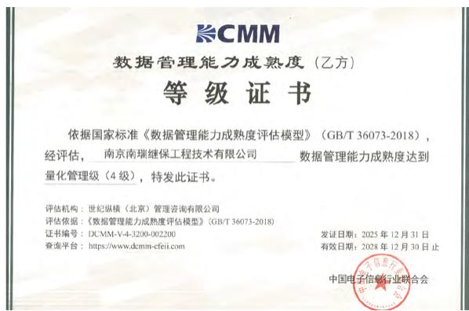

text_image

CMM
数据管理能力成熟度（乙方）
等级证书
依据国家标准《数据管理能力成熟度评估模型》（GB/T 36073-2018），经评估，南京南瑞继保工程技术有限公司 数据管理能力成熟度达到量化管理级（4级），特发此证书。
评估机构：世纪纵横（北京）管理咨询有限公司
评估依据：《数据管理能力成熟度评估模型》（GB/T 36073-2018）
证书编号：DCMM-V-4-3200-002200 发证日期：2025年12月31日
查询平台：https://www.dcmm-cfeii.com 有效日期：2028年12月30日止
中国电子信息行业联合会

南瑞继保通过 DCMM 数据管理能力成熟度（乙方）四级量化管理级认证，成为国内电力二次设备厂家中首家通过 DCMM（乙方）四级认证的企业

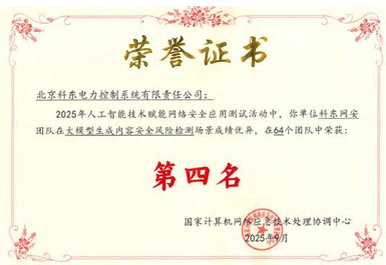

text_image

荣誉证书
北京科东电力控制系统有限责任公司：
2025年人工智能技术赋能网络安全应用测试活动中，你单位科东网安团队在大模型生成内容安全风险检测场景成绩优异，在64个团队中荣获：
第四名
国家计算机网络应急技术处理协调中心
2025年9月

北京科东获国家级“2025年人工智能技术赋能网络安全应用测试”赛事大奖，成为电力行业首家在该权威赛事中上榜的单位

# 信息安全治理架构

- 科技部（数字运营部）指导运营监控中心开展网络与信息安全管理工作。  
- 运营监控中心负责网络与信息安全建设及运行维护工作。  
- 各部门、各单位对已识别的与信息安全风险和机遇有关的过程和活动进行控制，确保其在规定的条件下进行，促进目标的实现。  
- 各下属单位落实本单位安全责任部门及管理人员，负责本单位信息安全具体工作，并及时与上级信息安全管理部门联系。

# 信息安全风险管理

公司建立并保持《信息安全风险评估管理程序》《信息安全适用性声明》，以定义并应用信息安全风险评估过程，识别与信息保密性、完整性、可用性损失有关的风险，定义并应用信息安全风险处置过程。各部门、各单位按照《信息安全风险评估管理程序》开展风险识别、评价、处置工作，保留信息安全风险评估和风险处置结果的记录。

# 风险识别

识别信息安全管理体系范围内的资产及其责任人。

识别资产所面临的威胁。

识别可能被威胁利用的脆弱点。

识别丧失保密性、完整性和可用性可能对资产造成的影响。

# 风险评价

在考虑丧失资产的保密性、完整性和可用性所造成的后果的情况下，评估安全失误可能造成的对组织的影响。

评估由主要威胁和脆弱点导致安全失误的现实可能性、对资产的影响以及当前所实施的控制措施。

估计风险的级别。

依据《信息安全风险评估管理程序》中风险接受和处理准则，确定风险是否可接受，或者是否需要进行处理。

# 风险处置

为处理风险选择控制目标和控制措施，以满足风险评估和风险处理过程中所识别的要求，选择应考虑接受风险的准则及法律法规和合同要求。

在明显满足组织方针策略和接受风险的准则的条件下，有意识地、客观地接受风险。

避免风险。

将相关业务风险转移到其他方，如：保险、供应商等。

# 保障数据安全

国电南瑞已建立覆盖数据全生命周期的安全管理制度体系，积极采取权限控制、安全加密、数字签名、数据脱密脱敏等安全技术措施，并通过常态化培训推动各项要求落地执行，全面强化数据安全管理工作。报告期内，未发生数据安全事件。

# #

# 规范机房管理

值班人员随时监控中心设备运行状况，保持机房合适的温度、湿度，保障设备安全稳定运行。机房工作人员严格按照“最小权限”“最小范围”原则查询、处理和保管机房及储存在服务器和磁介质上的有关信息和数据，保证数据安全与私密。

# #

# 提升技术防护

加强 API 安全治理，通过流量控制、异常调用监测，实现接口监控；依托数据中台构建监测预警能力，对数据流转、用户行为、异常操作等场景进行实时分析与风险预警，实现从“被动响应”向“主动防御”的转变，有效保障企业核心数据资产安全。

# 强化数据库安全

数据库存放于管理信息大区，不再与互联网相连的网络存放数据，边界以行业专用防护设备逻辑隔离装置，通过防火墙、堡垒机等访问控制设备限制访问生产数据库，定期开展容灾备份及备份恢复演练，通过水印、加密存储、脱敏等自建安全服务保护核心数据。部署数据库审计系统，对所有 SQL 操作进行全量记录、敏感行为及高危操作告警。

# 存储介质数据安全

存储介质数据访问清单力求精简，且需经应用者授权；严禁在互联网大区传输、存储公司商业秘密数据，重要数据在互联网大区传输时，须采取加密保护措施；境内产生的数据确需向境外提供的，须严格按照企业相关规定开展安全评估、审批及报备工作；境外产生并跨境传输至境内的数据，须依照国家相关要求落实安全防护措施。

# 强化网络安全

国电南瑞建立健全网络安全制度标准体系和网络安全应急体系，加强网络安全监督管理，常态化开展网络安全培训和宣传教育、风险隐患排查、研发安全检查，高质量完成各级网络安全重大活动保障及演习任务，全方位增强公司的网络安全防护能力。

# 强化网络安全保障

夯实企业级网络架构根基，推进核心网络基础设施升级与信创终端更新替换。  
完善网络安全体系机制，全面压实主体责任，健全网络安全责任制，确保网络安全工作规范化运行。  
企业办公终端网络安全管理遵循“涉密不上网、上网不涉密”的原则，严禁在办公终端上处理、存储国家秘密信息。

# 防范网络安全风险

- 严格遵守《中华人民共和国网络安全法》，开展网络安全认证、检测、风险评估等活动。  
完善网络安全防护体系，制定产业单位典型场景防护标准，加大风险隐患排查力度，推动风险隐患闭环整改。  
建立国电南瑞网络安全隐患排查标准，制定《较大隐患排查标准（NARI）》和《网络安全典型违章库》，形成《网络安全隐患排查手册》。  
- 联合开展专项排查，完成 44 家单位、52 处办公场所的现场检查，累计发现并整改问题 294 项，切实强化风险源头管控。

# 加强网络安全教育

将网络安全专题培训纳入 5 期中层干部研修班教学计划，同步组织 4 场专家讲座、管理员技能实训及认证考核，56 名网络安全管理员通过现场认证，提升专业岗位工作技能。  
策划开展 3 轮全员网络安全知识答题，累计参与达 1.6 万余人次，提升员工的信息安全意识和风险防范能力。  
累计发布网络安全重要提示、专题科普等宣传材料80余篇，并制作网络安全宣传视频、海报、手册、微电影等15类宣传产品，实现网络安全知识的多渠道、全覆盖普及。

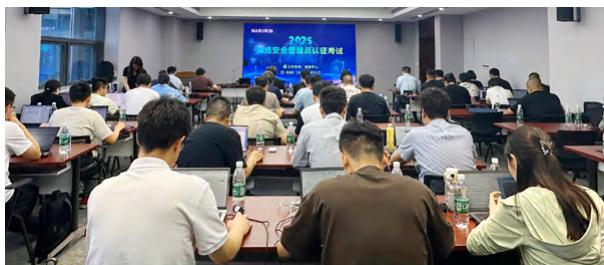

text_image

2025
消防安全管道认证考试

开展网络安全管理员认证考试培训

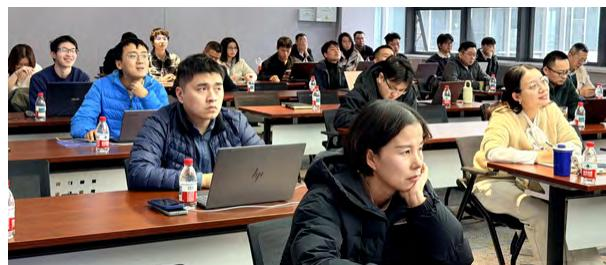

natural_image

Group of people seated at desks in a conference room, some wearing laptops and water bottles (no visible text or signage)

举办网络安全攻防演习专家讲座

# 保护隐私安全

国电南瑞构建并不断完善员工与客户信息保护制度体系，持续优化信息保护的工作流程，防范信息泄露风险，培育尊重和保护隐私的企业文化，增强员工、客户和其他利益相关者的信任。

# 保护员工隐私

公司高度重视员工隐私保护，在招聘、入职及工作全流程中，严格遵循最小必要原则，不收集与企业经营管理无关的员工信息。分层、分类严控员工信息访问权限，保护员工信息安全。对于泄露员工隐私行为，按照公司规章制度处理，造成严重后果的，将依法追究泄露者的法律责任，切实维护员工合法权益。

# 保护客户隐私

面向电力相关企业，通过建设研发专网及配套体系保护核心数据；针对个人隐私数据，在收集用户数据时明确告知范围、用途等，并通过加密、脱敏等手段安全存储数据，根据授权范围正常使用。加强对用户发布信息的管理，不传输法律、法规禁止发布或者传输的信息。

# 透明履责 增进沟通

国电南瑞坚持“合规性、平等性、主动性、诚实守信”的投资者关系管理基本原则，畅通投资者沟通渠道，确保信息准确及时披露，充分保障股东的各项权益得以有效行使，努力营造长期、稳定且良好的投资者关系。

# 投资者关系管理战略

公司将投资者关系管理作为市值管理的重要抓手，坚持依法合规运作，持续提升信息披露质量，不断增强投资者对企业经营业绩和发展前景的认可度。做精做细投资者关系管理各项工作，彰显优质蓝筹上市公司形象，推动公司治理与运作规范化水平持续提升，助力公司核心竞争力稳步增强。

# 投资者关系管理部门建设

搭建独立、合规、高效的投资者关系管理架构，设立投资者关系管理中心，作为公司投关工作的统一出口，直接向董事会秘书汇报，独立开展工作。投资者关系管理中心是涵盖董事、监事、高级管理人员、投关事务团队、公司内部相关部门或单位的多层级、全覆盖的柔性团队，主要负责上市公司信息披露、三会运作、投资者关系管理等工作。

# 投资者关系管理核心目标

# 合规经营

严格遵守《中华人民共和国证券法》《信息披露管理办法》《投资者关系管理工作指引》等监管规则，规范信息披露流程及投资者沟通机制，有效防范内幕信息泄露、信息披露违规、沟通口径不一致等合规风险。

# 价值传递

精准传递公司战略布局、经营业绩、核心技术、行业地位、发展前景等核心投资价值，有效弥合公司与投资者之间的信息不对称，提升投资者对公司的认知度、认可度，塑造透明、规范、有价值的资本市场形象。

# 沟通赋能

构建 “线上 + 线下、常态化 + 专题化、机构 + 中小投资者” 的全维度沟通体系，实现与各类投资者的双向良性互动，及时响应投资者诉求，保障投资者知情权、参与权、监督权，构建和谐稳定的投资者关系。

# 市值维护

通过专业的投关管理，稳定市场预期，引导市场形成对公司的合理估值判断，吸引长期价值投资者持仓；为公司后续资本市场融资、并购重组等资本运作奠定坚实的投资者基础，助力公司市值与长期价值同步提升。

# 真诚沟通交流

国电南瑞积极回应市场关切，不断健全投资者权益保护机制，建立健全以《投资者关系管理办法》为核心的投资者关系服务管理制度体系，通过业绩说明会、接待现场调研、股东拜访、电话会、机构策略会等多种形式搭建沟通矩阵，全方位展示经营成果和投资价值，不断增进投资者对公司的了解和认同，努力提高资本市场对公司价值的认可。

# 数读南瑞

- 召开业绩说明会3场  
- 开展投资者交流 94 场次，其中内资机构 48 次、外资机构 46 次  
- 开展 12 场定期报告专场解读，参加机构超 1000 家  
参加券商策略会 9 场  
○ 全年主要研究机构出具 37 份研究报告  
- 回复上证 E 互动 83 题次，问题回复率 100%

# 见证荣耀

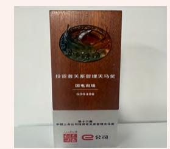  
公司荣获证券时报“第十六届中国上市公司投资者关系天马奖”

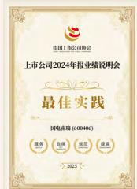  
2024 年业绩说明会被中国上市公司协会评为“最佳实践案例”

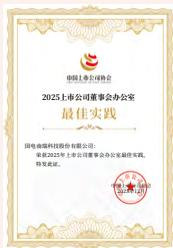  
董事会办公室履职被中国上市公司协会评为“最佳实践案例”

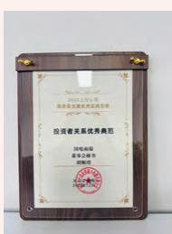  
董事会秘书荣获大众证券报“上市公司投资者关系优秀典范”

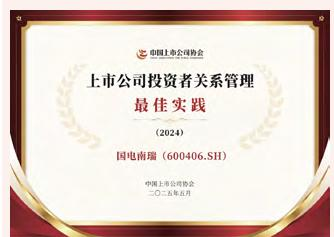

text_image

中国上市公司协会
上市公司投资者关系管理
最佳实践
(2024)
国电南瑞（600406.SH）
中国上市公司协会
二〇一三年年度工作

公司荣获中国上市公司协会“2024年度上市公司投资者关系管理最佳实践”案例

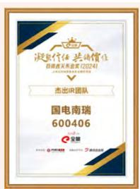  
公司荣获 2024 年度全景投资者关系金奖 “杰出 IR 团队”

# 投资者沟通渠道 / 方式

  
举办业绩说明会  
定期召开业绩说明会，编制可视化财报，充分向市场传递公司发展动态及投资价值，提振投资者信心；认真听取并分析采纳投资者对公司运营发展的宝贵意见与建议，深度挖掘投资者反馈信息的积极效用。

  
接待投资者调研  
积极推动行业主流券商持续关注公司，接待券商分析师调研，向机构投资者推介公司价值；主动邀请投资者现场调研，使其沉浸式感受公司经营文化，全方位感知产品技术实力。

  
加强外资股东沟通  
做好外资股东的日常沟通和议案预沟通，便于外资股东及时了解公司的运营情况和发展动态，及时听取股东意见和建议，推动重要议案顺利过会。

  
回应投资者
问询  
在遵守信息披露规定的前提下，通过投资者专线电话、投资者邮箱和“上证E互动”平台与投资者开展日常沟通交流，帮助投资者及时了解行业环境和公司近况。

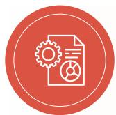  
发布投资者
关注信息  
在公司官网设置“投资者关系”专栏，发布公司公告等信息，方便投资者查阅；利用微信公众号等社交媒体平台，积极发布公司最新动态，方便各类投资者及时关注相关信息。

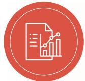  
积极践行上市公司责任

坚持 “以投资者为本” 理念，主动披露 “提质增效重回报” 行动方案及评估报告，合规披露 ESG 报告，突出经营亮点与核心信息，主动传递高质量发展信心。  

text_image

上海證券交易所
SHANGHAI STOCK EXCHANGE
价值创新发展
创新电商东卖

国电南瑞亮相国家电网控股上市公司集体业绩说明会

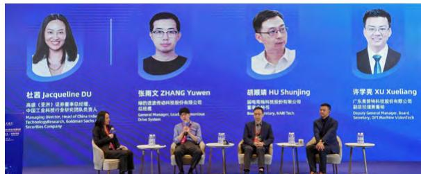

text_image

杜茜 Jacqueline DU
英盛（亚洲）证券董事总经理
中国工业科技行业研究部负责人
Huayang Jiejun, Head of China Institute
Technology/Pharmaceutical, Goldman Sachs Securities Company
张雨文 ZHANG Yuwen
绿的资源投资科技股份有限公司
总经理
General Manager, Chief Commissioner
Olive System
胡晟晴 HU Shunjing
国电集团核能股份有限公司
董事会秘书
Biology History, NAB Tech
许学英 XU Xueliang
广东智联科技股份有限公司
副总经理兼编
Edually General Reserve, Board
Security, DTM Machine VisionTech

国电南瑞董事会秘书参加 2025 上海证券交易所国际投资者大会圆桌论坛

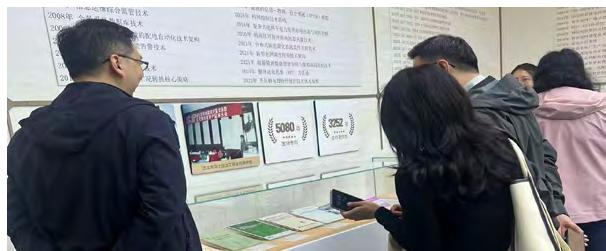

text_image

Group of people viewing a presentation board with Chinese text and images, likely related to an educational or technical study.

上海证券报一行到公司调研

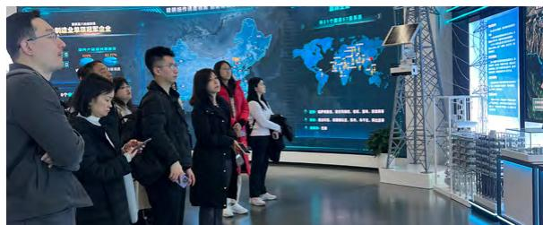

text_image

Group of people viewing a large digital dashboard displaying maps and charts, likely in a technology or business context.

美林证券等境外投资者到公司调研

# 透明信息披露

国电南瑞根据《上市公司信息披露管理办法》《上海证券交易所上市公司自律监管指引第2号——信息披露事务管理》等有关规定，制定《公司信息披露事务管理制度》《信息披露暂缓与豁免事务管理制度》，严格履行信息披露义务，做到信息披露工作的真实、准确、及时、完整，确保公司所有股东平等获取公司信息。同时，制定《内幕信息知情人登记管理制度》，开展内幕信息全流程管控，全面规范内幕信息知情人行为和内幕信息登记管理工作，禁止未经授权对外发布信息。

# 数读南瑞

对外披露文件 165 份，无修订补充情形  
○ 编制发布定期报告 4 份  
○ 起草发布临时公告 81 份  
因违反信息披露规定而受到处罚的事件数 0 件  
○ 利用内幕信息从事内幕交易事件 0 件

# 上海证券交易所

上证公函【2025】2241号

# 关于2024-2025年度信息披露工作评价结果的通报

国电南瑞科技股份有限公司：

根据《上海证券交易所上市公司自律监管指引第9号——信息披露工作评价》（以下简称《评价指引》），本所已完成沪市上市公司2024-2025年度信息披露工作评价。经综合考评，你公司2024-2025年度信息披露工作评价结果为A。

信息披露工作连续11年被上海证券交易所评为A类（最高等级）

# 信息披露 遵循原则

真实性原则

准确性原则

完整性原则

及时性原则

# 信息披露质量保障

- 以依法合规为重点，着力夯实信息披露基础，健全内部多层次过程审核流程并实现信息披露“零差错”。  
- 简明通俗地从相关行业、业务、产品等多维度展示企业及重大事项的情况，提高披露信息的有效性和可读性。  
- 在法律体系和监管制度允许的情况下，与监管部门和外部审计机构充分沟通协调，使所披露的信息得到专业的监督、审计和评估。

# 信息披露渠道

- 指定媒体（中国证券报、上海证券报等）  
- 上海证券交易所官网 (www.sse.com.cn)  
- 公司官网（http://www.naritech.cn/list-33.html）  
- 其他合法渠道（业绩说明会、上交所 e 互动平台等）

# 信息披露范围

- 定期报告（包括年度报告、半年度报告和季度报告）  
- 临时公告（包括董事会决议、监事会决议、股东会决议等重要事项的公告）  
- 其他重要信息（包括内部控制、ESG等方面的信息）

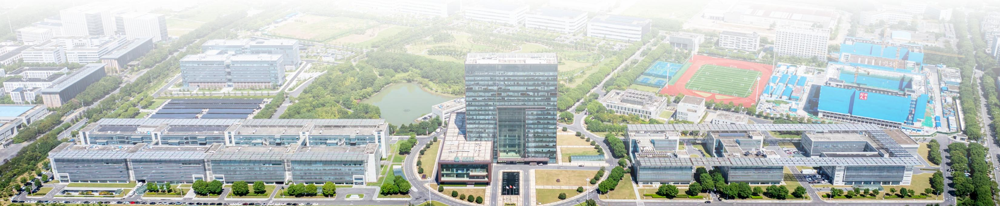

natural_image

Aerial view of a modern campus with glass skyscrapers, sports fields, and surrounding greenery (no visible text or signage)

# 规范关联交易

国电南瑞根据《中华人民共和国公司法》《中华人民共和国证券法》《上海证券交易所股票上市规则》《上海证券交易所上市公司自律监管指引第5号——交易与关联交易》等法律法规、规范性要求和《公司章程》的规定，制定并及时修订《关联交易决策管理办法》，对关联交易的审议和披露、关联交易的定价进行了详细的规定，以保证公司关联交易决策对所有股东的公平性和公正性。公司每年遵照证券关联交易相关规定，针对日常关联交易、房产租赁及综合服务、金融服务等关联交易履行决策程序并对外披露，同时在半年度报告、年度报告中公开披露关联交易情况，交易条件及定价公允，不存在损害本公司和股东利益的情形。

# 持续回馈股东

国电南瑞坚持以务实有效的措施回报投资者，持续努力做好生产经营，以稳健的业绩增长为股东创造价值，并通过年度利润分配、半年度利润分配、股份回购等多种途径回馈资本市场，与股东共享长期发展红利。2025年，公司坚持“高频次、高比例”分红策略，常态化开展中期分红；面对资本市场的突发波动，精准实施股份回购，以维护公司市值和股东权益，全方位提振投资者的信心。

# 数读南瑞

# 截至 2025 年底

公司上市21年以来累计现金分红243.08亿元，分红率 $43.94\%$ ，近5年（2020—2024年度）分红率达 $49.56\%$

# 2025年

年度现金分红：公司实施2024年度权益分派[每股派发现金红利0.435元（含税）]，分配现金34.81亿元；公司现金分红（包括2024年半年度已分配的现金红利）总额45.62亿元，占2024年度归属于上市公司股东净利润的 $59.95\%$  
中期分红：公司实施 2025 年半年度权益分派 [每股派发现金红利 0.147 元（含税）]，分配现金 11.74 亿元，占 2025 年半年度归属于上市公司股东净利润的 39.78%

# 截至 2025 年 12 月 31 日

通过集中竞价交易方式，累计回购股份 20947491 股，占公司当前总股本的 0.261%，支付资金总金额为 4.62 亿元（不含交易费用）

# 见证荣耀

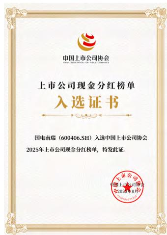

text_image

中国上市公司协会
上市公司现金分红榜单
入选证书
国电南瑞（600406.SH）入选中国上市公司协会
2025年上市公司现金分红榜单，特发此证。
中国上市公司协会
2025年8月

公司入选中国上市公司协会2025年上市公司现金分红榜单

natural_image

Black-and-white photo of a modern glass trophy with a floral base, displayed on a white surface (no visible text or symbols on the trophy itself)

公司荣获证券时报“第十九届主板上市公司价值百强”

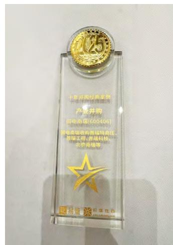

text_image

十大并购
产业并购
(中国商场600406)
中国邮政政府普瑞特高压、
邮储工程、普瑞科技、
北京南塔等
夏易富 中国在力
WILLEGHUAO

公司荣获易董价值在线颁发的“十年并购经典案例”

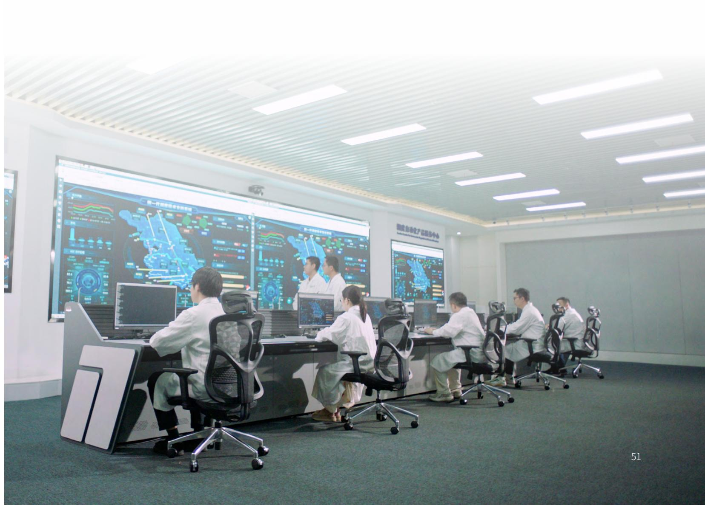

text_image

Control room scene with operators monitoring large screens displaying data and charts, labeled '智能可视化产品服务中心' in the background.

# 02

# 至诚·瑞智驱动 积蓄发展新动能

国电南瑞大力弘扬“努力超越、追求卓越”的企业精神，坚持以改革创新驱动发展、以安全生产筑牢根基、以品质服务回馈客户，持续锻造硬核技术实力与核心产品竞争力，致力于引领新型电力系统建设浪潮，赋能能源绿色低碳转型，在国家能源强国战略中勇担重任、走在前列。

矢志改革 活力迸发

科技引领 智创未来

防微杜渐 安全守护

品质至臻 精诚服务

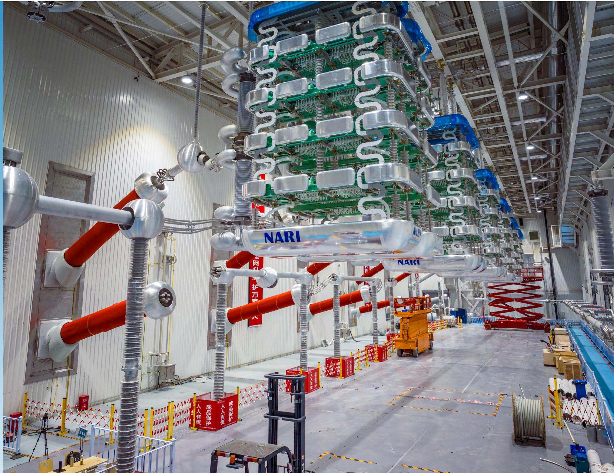

natural_image

Interior of a large industrial facility with suspended metallic structures and safety banners (no readable text or symbols on main structures)

# 矢志改革 活力迸发

国电南瑞围绕“传递压力、增强活力、加大吸引力、提高竞争力”系统绘制改革路线图与任务图，高质量、一体化推进“科改行动”与国企改革深化提升行动，全力推动创新能力、产业实力、管理效能取得新领先，不断增强核心竞争力，奋力打造科技创新和产业创新融合样板，着力打造世界一流企业品牌。

# 数读南瑞

营业收入利润率 14.81%、净资产收益率 16.26%，处于同行业上市公司领先水平  
“一业一策”定制培育，新兴业务收入同比增长超29%

# 见证荣耀

- 国电南瑞蝉联获评国务院国资委“科改企业”标杆  
“南瑞”企业品牌入选国务院国资委中央企业品牌引领行动第二批优秀企业品牌  
1人新当选中国工程院院士  
- 南瑞配电、南瑞中天、瑞中数据荣膺国家级专精特新 “小巨人” 企业  
- 南瑞水电、南瑞工控入选国家级制造业单项冠军企业  
参与研制的全球首台 ±800 千伏 /800 万千瓦可控换相换流阀入选国务院国资委  
深度参与的陇东—山东 ±800 千伏特高压直流工程入选国务院国资委

# “2025 年度央企十大国之重器”

# “2025 年度央企十大超级工程”

# 提升现代化治理管理能力

持续健全中国特色现代企业治理体系，动态优化落实董事会“6项重点职权”有效途径和方式。  
- 加强董事会专门委员会建设，充分发挥董事会专委会专业参谋作用。  
以“竞”举贤，推进领导班子竞聘上岗机制落地，激励优秀人才脱颖而出。  
- 通过超额利润分享激励、限制性股票激励、面向战略性新兴业务的科技型企业股权激励、面向科研任务的精准化激励等多元方式，实施“一企一策”“一业一策”的定制方案，更加突出工效挂钩分配导向。

# 健全产业发展体系

- 重构行业市场，组建行业战队和新兴业务特遣队，有效增强整体合力，对外增益拓展发展空间。  
- 巩固传统优势产业，扛牢守护电网安全首要职责，确保产品自主可控、性能先进、安全友好。  
- 培育壮大新兴产业，大力推动成熟技术成果产品化，“一业一策”加速自主可控产品推广，快速打开增量市场。  
- 持续拓展深耕境外市场，推动国际业务成为公司新的效益增长极。

# 构建全新科研体系

- 构建“一个委员会、两个层级、三级架构”的科研组织体系，实现创新引领能力和产品研发质效双提升。  
- 创新实施“任务制”“毛遂自荐制”“项目悬赏制”等科研管理新机制，形成应用基础研究储备、技术产品紧密跟进、仿真试验全景验证、应用场景迭代完善、标准引领固化优势的完整闭环创新链。

# 科技引领 智创未来

国电南瑞秉持“技术为本、产业为果、支撑为责”的价值逻辑，坚持基础研究与技术研发相融并进，加快数字化、智能化转型升级，持续探索电力科技创新与产业创新深度融合的发展路径，多措并举走好市场化、产业化、国际化的创新发展之路，全力建设世界级的能源互联网高科技领军企业。

# 促进技术创新

国电南瑞建立健全科技创新体制机制，聚力基础与前瞻研究和关键技术攻关，不断加大研发投入力度，加强创新型人才梯队建设，推进科技创新平台建设，组织科技成果鉴定，着力推进科研成果转化为实际生产力，实现创新引领能力和产品研发质效“双提升”，加快打造现代产业集群。

# 国电南瑞创新驱动管理体系

# 治理

- 董事会层面设置科技创新委员会，负责审议公司科技创新中长期发展规划、重点技术布局及重大专项研究等事项，为研发创新工作提供顶层战略指引。  
- 科技部（数字运营部）为科技创新委员会牵头部门，主要负责向委员会汇报相关工作，以及向委员会反馈相关工作及所提建议落实情况，配合开展委员会所需的调研、培训、专项检查等工作。  
- 完善研究院—研发中心—专业公司“三极”科研体系，组建7支“十年磨剑”研究团队，设置技术和产业双负责人，打造科研团队与依托产业单位互相约束、互相促进的“任务共同体”。  
- 建立由董事会、经理层和专职部门构成的三级知识产权治理架构，并围绕“知识产权价值实现”核心目标，构建贯穿战略、过程与需求的融合管理体系。  
- 制定《科技项目储备库管理实施细则》《技术咨询专家委员会管理办法》《科技成果鉴定管理办法》等制度，并于报告期内新增制定《技术开发类项目管理办法》，不断提升管理的规范化、科学化水平。

# 战略

- 定期识别创新驱动对公司运营及财务带来的影响、风险和机遇，并根据识别出的政策法规风险、市场风险及市场机遇，优化调整科研体系、健全产业发展体系，制定并及时调整产品研发策略及计划。  
- 坚定把握技术向电力电子带来的柔性化、可重构，以及AI、数字孪生带来的智能化、融合化“两个方向”演进趋势，提高技术引领力；加快推动业务在水平向从电网域逐级拓展至能源互联网域、工业互联网域，在垂直向逐层延伸至控制层、感知层、平台层和应用层，构建“三域四层”业务架构；统筹推进科技创新与产业创新深度融合，促进技术价值的多维释放，塑造发展新动能新优势。  
- 将清洁技术视为关键战略，把握绿色低碳经济发展带来的市场机遇，致力于开发更稳定、更安全、更精准、更环保的软硬件产品和整体解决方案。

# 影响、风险和机遇管理

- 在研发项目评估体系中重点考量技术可行性、市场适应性及政策适配性等关键维度，常态化开展研发创新风险识别与评估，针对重大机遇、重要风险制定针对性举措，有效化解潜在风险，提升市场核心竞争优势。  
- 围绕研发平台建设、创新生态扩展、人才队伍培育、知识产权保护、容错纠错机制完善等方面统筹推进相关工作，在提升科研效率、保障科研质量、推动科研成果产业化落地等方面重点发力。

# 指标与目标

- 研发投入 47.39 亿元，研发强度 7.16%  
- 研发人员 4588 人，研发人员占比 35.90%  
- 国家卓越工程师团队 1 支  
- 国家级专家人才 33 人，其中两院院士 3 名、百千万人才工程国家级人选 5 名  
- 省部级专家人才 209 人，其中获江苏省“333 工程”培养支持专项 23 人  
- 获各级各类科技奖励 168 项，其中省部级奖励 140 项  
- 获得授权专利 487 项、同比增长 41.57%  
- 授权发明专利 451 项、同比增长 40.94%

# #

# 科技创新战略目标

构建 “引领长远、组织高效、机制完善、支撑有力” 的三级架构，建立价值导向的差异化考核方式，高效协同内外部科研资源，面向长远发展和一线需求，统筹做好基础研究、关键技术攻关、核心装备系统研制，打造从前瞻突破到产业价值实现的完整链条，把企业建设成为世界级的能源互联网高科技领军企业。

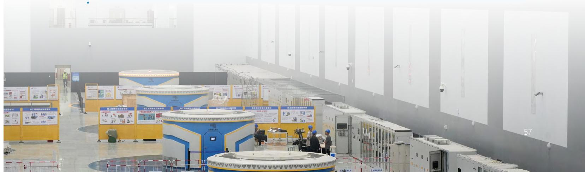

text_image

Interior of a large industrial facility with visible safety safety posters and equipment, numbered 57 in the corner.

创新驱动影响、风险与机遇分析与应对

<table><tr><td>风险/机遇类型</td><td>风险/机遇描述</td><td>潜在财务影响</td><td>影响程度</td><td>影响周期</td><td>影响环节</td><td>应对措施</td></tr><tr><td>政策法规风险</td><td>全球各国环保法规与碳排放管控要求持续趋严,若公司未能及时调整技术研发与生产策略,海外业务可能面临合规风险、市场准入受限、罚款或制裁等问题。国内政策支持不足、国内政策与国际标准衔接不畅,可能制约公司研发投入与创新能力提升,并限制公司技术的全球应用及国际市场拓展。</td><td>营业收入减少</td><td>中</td><td>中期、长期</td><td>自身运营</td><td>密切关注国内外的政策法规变化,加强法律法规的学习和培训,确保企业经营活动合法合规。聘请专业的法律顾问团队,为公司提供法律咨询和支持,降低法律风险。根据政策变化及时调整企业战略和业务模式,确保企业在政策环境中稳健发展。</td></tr><tr><td>技术风险</td><td>电力生产结构向清洁化转变,电力消费结构向多元化转变,电网结构向柔性化转变,对加快突破技术“无人区”,产出革命性、颠覆性电力技术提出了更高要求。作为技术导向型企业,公司需要在技术研发与创新上投入更多时间与资金。而创新研发周期及成果转化存在不确定性,可能面临高投入、慢回报、研发成果不及预期的风险,将对公司经营发展造成不利影响。</td><td>运营成本增加、营业收入减少</td><td>中</td><td>短期、中期、长期</td><td>自身运营</td><td>持续关注行业动态和行业技术趋势,并及时调整研发方向,同时与高校建立战略联盟,加速技术创新,提高行业竞争力。加强技术研发前的可行性研究和评估,全面分析技术难题和潜在风险。积极排查科研项目全流程管理中的研发堵点,推动项目研发顺利进行。</td></tr></table>

<table><tr><td>风险/机遇类型</td><td>风险/机遇描述</td><td>潜在财务影响</td><td>影响程度</td><td>影响周期</td><td>影响环节</td><td>应对措施</td></tr><tr><td>市场机遇</td><td>新型电力系统建设、新能源高质量发展及数字化转型加速推进,电网、能源互联网、工业互联网三大领域市场空间持续扩容,叠加战略性新兴产业蓬勃发展,为公司带来广阔市场机遇。通过持续的研发投入和技术创新,公司能够推出高性能、高附加值的产品,满足市场需求,充分彰显企业的技术实力和前瞻性,有利于巩固长期性的市场竞争力,保持“先进制造业集群—智能电网产业集群”龙头企业形象和行业地位。</td><td>营业收入增加</td><td>中</td><td>短期、中期、长期</td><td>自身运营、价值链下游</td><td>积极研判行业发展趋势、捕捉颠覆性创新机会,监测竞争对手创新布局,抢占市场先机,赢得市场竞争主动权。加强市场调研,精准定位客户需求,优化产品性价比,拓展海外市场,分散市场风险。加大电网外重点行业和战略性新兴业务布局、资源投入力度,组建新兴业务特遣队,凝聚跨领域、跨板块的整体合力。</td></tr></table>

见证荣耀  
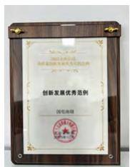  
国电南瑞荣获大众证券报“上市公司创新发展优秀范例”

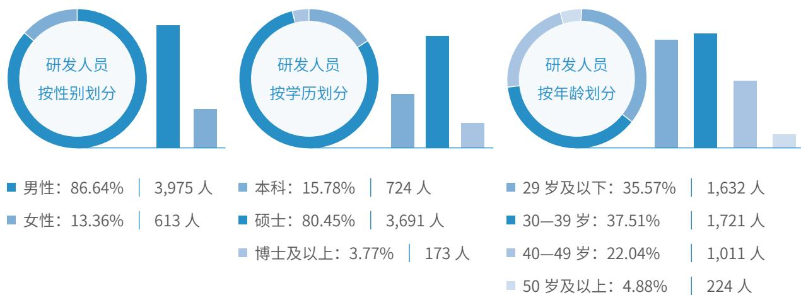

donut

| 分类 | 细分项 | 占比 (%) | 人数 (人) |
| :--- | :--- | :--- | :--- |
| 研发人员按性别划分 | 男性 | 86.64 | 3,975 |
| 研发人员按性别划分 | 女性 | 13.36 | 613 |
| 研发人员按学历划分 | 本科 | 15.78 | 724 |
| 研发人员按学历划分 | 硕士 | 80.45 | 3,691 |
| 研发人员按学历划分 | 博士及以上 | 3.77 | 173 |
| 研发人员按年龄划分 | 29岁及以下 | 35.57 | 1,632 |
| 研发人员按年龄划分 | 30-39岁 | 37.51 | 1,721 |
| 研发人员按年龄划分 | 40-49岁 | 22.04 | 1,011 |
| 研发人员按年龄划分 | 50岁及以上 | 4.88 | 224 |

# 促进科技创新举措

# 明确发展方向

公司坚持 “两融入一支撑”，以增强体系化能力建设为主线，以新型电力系统建设和业务发展重大需求为主攻方向。组建由 200 余名专家构成的专项工作组，开展 “十五五” 规划编制工作，统筹制定技术、产品布局与专业管理规划。

# 知识产权保护

构建 “研发—申请—运用—保护” 一体化知识产权管理体系，以高标准科技创新管理赋能新质生产力发展，为公司高质量发展筑牢科技根基。依托信息化管理平台与智能分析工具，实现知识产权全流程在线化、数字化运营与风险预警。

# 科研人才激励

聚焦科技发展战略，构建涵盖工资总额核定、专项工资保障、薪酬分配倾斜和中长期激励的“四个体系”，形成系统完整的科技创新激励总体框架。

# 研发人员培养

完善以实际技术水平为核心的评价维度，深入发掘潜心钻研技术的骨干人才，系统梳理各学科领域人才梯队清单。强化科技人才的梯次化培养，依据人才成长客观规律差异化设定培养目标，针对性配置培养资源。

# 加强协同创新

积极与清华大学、西安交通大学等国内顶尖院校深化合作，围绕碳中和与能源智联、储能协同与柔性配电系统等领域，共建产学研用深度融合的技术创新生态。

# 容错纠错管理

按照《容错纠错管理暂行办法》，健全完善容错纠错、诬告澄清等机制，充分调动和保护科技创新的积极性，鼓励探索创新和保护企业家精神。

# 重大科技创新成果

2025 年，32 项科技成果经中国电机工程学会、中国电工技术学会、中国电力企业联合会等权威机构鉴定为 “整体国际领先”。

<table><tr><td>成果名称</td><td>鉴定机构</td><td>鉴定结论</td></tr><tr><td>换流站交流滤波器智能运检关键技术及应用</td><td>中国电机工程学会</td><td>整体国际领先</td></tr><tr><td>面向新型电力系统的设备管理数字化转型关键技术及应用</td><td>中国电机工程学会</td><td>整体国际领先</td></tr><tr><td>PCS矿用新能源电力系统</td><td>中国电机工程学会</td><td>整体国际领先</td></tr><tr><td>PCS新能源电氢协同一体化控制系统</td><td>中国电机工程学会</td><td>整体国际领先</td></tr><tr><td>PCS-8610基于逆阻型IGCT的可控关断换流阀</td><td>中国电机工程学会</td><td>整体国际领先</td></tr><tr><td>PCS-9567FT全功率构网型储能测试系统</td><td>中国电机工程学会</td><td>整体国际领先</td></tr><tr><td>PCS输电线路分布式状态监测系统</td><td>中国电机工程学会</td><td>整体国际领先</td></tr><tr><td>PCS-9000变电站集中监控系统</td><td>中国电机工程学会</td><td>整体国际领先</td></tr><tr><td>PCS-9000电力辅助服务市场技术支持系统</td><td>中国电机工程学会</td><td>整体国际领先</td></tr><tr><td>PCS新能源一体化紧急控制系统</td><td>中国电机工程学会</td><td>整体国际领先</td></tr><tr><td>PCS变速抽水蓄能机组成套保护装置</td><td>中国电机工程学会</td><td>整体国际领先</td></tr><tr><td>PCS-8351环保型126千伏快速断路器</td><td>中国电机工程学会</td><td>整体国际领先</td></tr><tr><td>PCS-9250系列全光纤电流测量装置</td><td>中国电机工程学会</td><td>整体国际领先</td></tr><tr><td>双高电力系统场站级振荡抑制技术与装备</td><td>中国电机工程学会</td><td>整体国际领先</td></tr><tr><td>基于阻抗适配的高比例新能源电网宽频振荡紧急控制关键技术及应用</td><td>中国电机工程学会</td><td>整体国际领先</td></tr><tr><td>大型变压器防爆燃主动保护技术与装备</td><td>中国电机工程学会</td><td>整体国际领先</td></tr><tr><td>新型城市配电网保护自愈协同控制关键技术及自主可控终端应用</td><td>中国电机工程学会</td><td>整体国际领先</td></tr><tr><td>面向低压配电网承载力提升的高性能模块化柔性设备关键技术及应用</td><td>中国电机工程学会</td><td>整体国际领先</td></tr><tr><td>RJ1300配网带电作业机器人多源感知融合与力控柔性控制关键技术及应用</td><td>中国电机工程学会</td><td>整体国际领先</td></tr><tr><td>高性能电力异构智算集群柔性纳管和协同调度关键技术及应用</td><td>中国电机工程学会</td><td>整体国际领先</td></tr><tr><td>面向数字化电网智能提升的高质量样本治理关键技术及应用</td><td>中国电机工程学会</td><td>整体国际领先</td></tr><tr><td>绿电制氢一体化调控关键技术及装备应用</td><td>中国电机工程学会</td><td>整体国际领先</td></tr><tr><td>自主安全智能PLC及组态软件关键技术及应用</td><td>中国电机工程学会</td><td>整体国际领先</td></tr><tr><td>高比例新能源电网中长期未来态智能模拟推演关键技术及应用</td><td>中国电机工程学会</td><td>整体国际领先</td></tr><tr><td>AI赋能高渗透率新能源台区供需灵活互动技术、装备及规模应用</td><td>中国电机工程学会</td><td>整体国际领先</td></tr><tr><td>特高压阀厅多光谱在线监测及故障预警关键技术与应用</td><td>中国电机工程学会</td><td>整体国际领先</td></tr><tr><td>电力网络安全深度感知和智能协同防御关键技术及平台装备</td><td>中国电机工程学会</td><td>整体国际领先</td></tr><tr><td>基于数实融合的智慧城轨综合运管平台关键技术及应用</td><td>中国电机工程学会</td><td>整体国际领先</td></tr><tr><td>支撑新能源高效利用和电力保供的构网型控制关键技术及应用</td><td>中国电机工程学会</td><td>整体国际领先</td></tr><tr><td>分布式光伏高质量接纳的配电网灵活性资源集群互动调控技术及应用</td><td>中国电工技术学会</td><td>整体国际领先</td></tr><tr><td>基于未来态仿真的电网预调度与智能互动推演关键技术及应用</td><td>中国电力企业联合会</td><td>整体国际领先</td></tr><tr><td>含高比例不确定源荷的台区供需灵活互动技术及应用</td><td>中国电力企业联合会</td><td>整体国际领先</td></tr></table>

# 科技攻关成果转化

- 首创阻断变压器内部严重缺陷快速发展过程的“主动保护”方案，研制国内外首套特高压换流变主动保护系统，并在陇电入鲁±800千伏东平换流站挂网试运行。  
- 研发的采集 2.0 全栈自主可控替代系统，实现全国首套国产化环境下采集 2.0 基座组件生态体系的从无到有构建。  
- 研制的国内首套 Butow（比托夫变压器）接地式抽蓄机组保护装置，在国网新源北京十三陵电厂1号机组发变组保护改造工程中投运。  
- 自研智能体平台软件 AgentSphere 荣获中国信通院最高等级认证，为能源行业唯一。  
- 研发国内首套支持电能量、调频辅助多市场联合实时调电运行的新能源有功控制系统，在吉林闭环运行。  
- 自主研发的国内首台高海拔全国产化静止变频启动系统在西藏德吉投运，是自主可控技术在调相机领域的首次应用。  
- 自主研制的首台套国产1E级数字式核级柴油发电机励磁系统在秦山核电站正式投运。

# 国电南瑞设备支撑全国首座 500 千伏全自主可控变电站建设

2025 年 9 月 20 日，全国首座 500 千伏全自主可控新一代变电站——辽宁西泉变电站正式投运，央视新闻、《人民日报》等中央主流媒体进行了广泛报道。变电站投运后，预计年汇集新能源电量 4.54 亿千瓦时，将大幅提升电网输电能力和运行可靠性，增强铁岭及周边地区新能源接入和消纳能力。国电南瑞研发中心、变电公司研制和供货的自主可控系列保护装置，包括线路保护、主变保护、母线保护、断路器保护、分段保护及系列采集执行单元，全面应用于变电站建设。西泉变电站的顺利投运，不仅印证了国电南瑞推动国产设备从“实验室产品”走向“电网主力军”的能力，提升了铁岭、抚顺、沈阳等周边区域的电网韧性与供电保障能力，更通过全面自主可控的技术实践，为我国能源基础设施安全可靠运行提供了可复制、可推广的“西泉方案”，为筑牢国家能源与信息安全防线作出了实质性贡献。

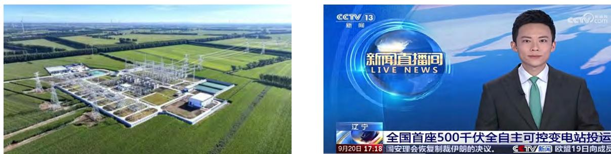

# 案例

# 国电南瑞助力金上—湖北分址级联特高压直流输电工程投运

2025 年 12 月 18 日，世界首个采用分址级联拓扑的 ±800 千伏特高压直流工程——金上至湖北直流输电工程，通过两阶段共 750 项现场系统调试项目和 168 小时试运行的考验，正式进入商业运行阶段。金永特高压直流输电工程直流线路全长 1784 千米 +117 千米，设计容量 8000 兆瓦，共建设西藏昌都、四川康甘、湖北永兴三座换流站，其中送端昌都换流站、康甘换流站采用高、低端换流站分址建设属世界首次。国电南瑞旗下南瑞继保作为该工程的主要设备供货商，为金永工程提供了换流阀与阀冷系统、直流控制保护系统、测量系统、一体化在线监测、保信、PMU、消防自动化等关键装备。项目团队创造性地研发了多项关键技术，且均通过了充分验证，有效、可靠保障了金永直流工程送电一次性成功和长期安全稳定运行。金永直流工程整体投运后，预计每年可将金沙江上游约 400 亿千瓦时的水、风、光清洁电能输送至华中地区，进一步加强西藏电网与全国大电网互联互通，满足华中地区经济社会快速发展用电需求。

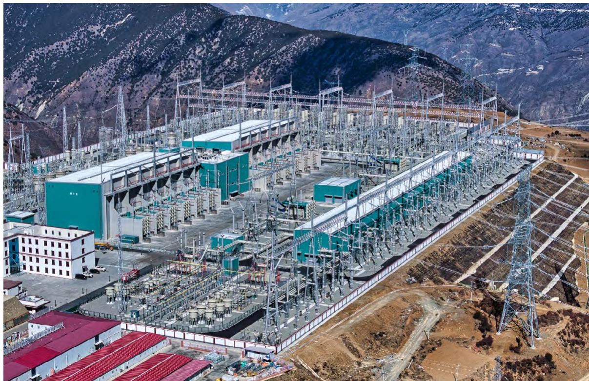

natural_image

Aerial view of a large industrial substation with transmission towers and power lines, set against mountainous terrain (no visible text or symbols)

西藏昌都换流站

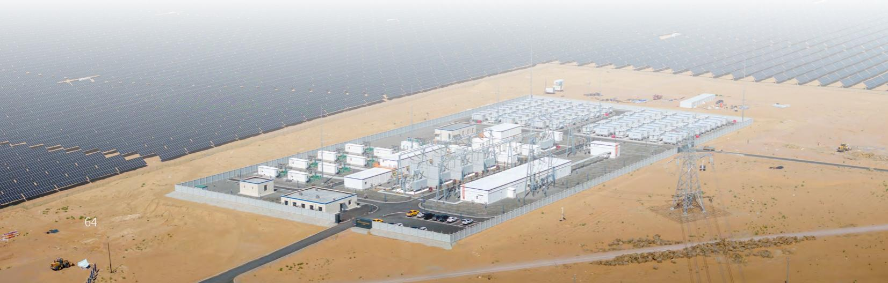

natural_image

Aerial view of a large solar farm with rows of photovoltaic panels and an adjacent substation in a desert environment (no visible text or symbols)

# 推动数字化转型

公司积极回应国家《数字中国建设整体布局规划》，将数字思维嵌入发展战略，持续优化完善公司数字化建设体系，以数据价值打通生产经营全环节，推动内部数据资源共享，提高内部管理运营效率，赋能公司可持续长效发展。

# 见证荣耀

- 南控公司、南瑞中天、博瑞电力获评“国家卓越级智能工厂”  
- 国电南瑞、南瑞三能、南瑞半导体、南瑞继保获评“江苏省先进级智能工厂”

# 健全数字化管理体系

# 完善数字化管理制度

编制公司《数字化架构管理办法》《信息系统上下线及运营管理办法》《数字化项目竣工验收管理办法》初稿，完成内部意见征求及修改完善，补齐架构管控短板。

# 高效管理数字化项目

聚焦企业级建设和整体设计，对运营类、使能类、支持类业务流程分类统筹，加强公共组件推广和应用成效导向。

# 筑牢数字基础能力建设

# 推广公共应用

推广协同消息（IM）、云文档和快捷表单，升级重构数字南瑞门户，完成“我的南瑞”鸿蒙版开发，推广上线“悦合”App。

# 完善中台管理

制定中台建设运营管理规范，整合数据中台业务数据，数据实时性提升至小时级。

# 推进数智创新

试点大模型知识库，问答准确率达90%；自研相似度算法助力智能物料审批，人工比对量减少60%。

# 深化专业域数字化应用建设

# 营销方面

构建需求到产品一体化管理的技术方案协同平台，实现合同数据更新频率提升至 T+1 小时，提升数据决策支持能力。

# 生产方面

迭代排产、结算、利用等功能，实现排产1小时内完成，结算效率提升60%。

# 财务方面

迭代预算管理平台，精益成本实现班组成本实时可视、结算报价响应缩至1天，凭证电子化账簿归档效率提升超70%。

# 科研方面

完成科研管理工作台构建，深化科研合规智能审查与决算应用，高效支撑科研项目申报。

# 案例

# 推广上线“悦合”App，探索数字化管理新模式

作为国电南瑞面向外协单位及供应商伙伴打造的专属数字化平台，“悦合”App于2025年整合了考勤打卡、工程服务、现场服务、餐卡充值、承诺书签署等高频办公场景，通过统一身份认证体系与权限控制，构建了“我的所见即我应见”的安全访问边界。截至2025年12月底，该平台已成功在配电公司、变电公司、稳定公司、用电公司/雄安公司/南瑞捷鸿、电网公司、南瑞水电、南瑞工控等10家产业单位上线，累计用户数7868人，日均5448人通过该App完成考勤打卡。“悦合”App的应用推广，

有效破除了人员身份边界带来的协同制约，助力合作伙伴实现业务数字化转型，进一步激发了国电南瑞从业人员的工作活力与干事动力。

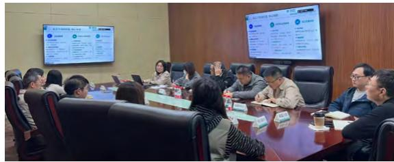

text_image

Meeting room scene with participants seated around a conference table, large screens displaying data on screens and charts in the background.

“悦合” App 推广宣贯

# 案例

# 研发屏柜结构设计自动化工具，提升生产设计质效

国电南瑞持续推进工程设计数字化平台建设，以“智能制造”赋能提质增效，通过图纸识别及智能解析等技术，研发自动化设计工具，实现生产设计图纸自动绘制及物料清单自动输出，提高生产设计效率与质量控制水平；通过研发CAD插件，对工程设计图纸进行智能识别，自动解析设备所需的结构件和物料需求，智能布置和绘制设备生产设计图纸，自动计算导线路径、长度、连接点及所使用的导线规格等信息；通过自动化设计提前获取生产成本，采

购相关物料，有效控制企业成本，提高生产效率与管理质量，最终实现生产设计综合效率提升50%。

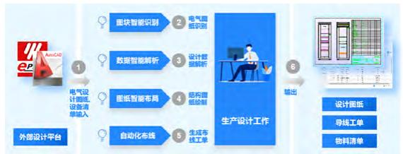

flowchart

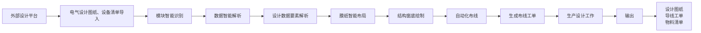
```mermaid
graph LR
  A["外部设计平台"] --> B["电气设计图纸、设备清单导入"]
  B --> C["模块智能识别"]
  C --> D["数据智能解析"]
  D --> E["设计数据要素解析"]
  E --> F["膜纸智能布局"]
  F --> G["结构窗底绘制"]
  G --> H["自动化布线"]
  H --> I["生成布线工单"]
  I --> J["生产设计工作"]
  J --> K["输出"]
  K --> L["设计图纸\n导线工单\n物料清单"]
```

自动化设计工具框架图

# 关注科技伦理

国电南瑞在人工智能、智能传感等支撑领域布局广泛，经营范围涵盖人工智能应用软件开发、算法设计及系统集成服务等，科技活动中涉及的科研诚信、学术规范等方面，属于广义的科技伦理范畴。

为此，公司在运营过程中严格遵守《关于加强科技伦理治理的意见》《科技伦理审查办法（试行）》《科学技术活动违规行为处理暂行规定》《科研失信行为调查处理规则》等相关法律法规，在原创性技术研究、创新技术落地、产品与解决方案开发方面均注重科技伦理遵从与合规；内部建立并完善科研诚信规章制度，通过科技项目管理相关细则对科研诚信作出明确规定；健全科研失信行为调查处理机制，明确对科研失信行为举报、登记、受理、调查、处理的管理流程，并按期编制并发布科研诚信与作风学风建设年度报告；重视科技伦理的培训与宣传，在科研项目申报、立项等活动中都设置对科研诚信工作进行宣贯的环节，持续强化科研诚信、学术规范建设。2025年，国电南瑞未发生科技伦理违规行为。

# 防微杜渐 安全守护

国电南瑞坚持把安全生产作为重要任务抓常抓长，全面贯彻“安全第一，预防为主、综合治理”的安全生产方针，牢固树立安全发展理念，持续完善安全生产管理体系，强化安全生产运营，宣贯培育安全文化，全力防范各类安全事故发生，守牢安全生产“红线”和“底线”。

# 数读南瑞

- 安全生产投入 5218 万元  
- 安全培训 8.6 万人次

- 安全培训 711 次  
- 安全生产事故 0 起

# 强化安全管理

国电南瑞建立以各级安委会统筹领导的安全生产组织体系，持续完善安全生产制度，健全安全生产责任体系，全面推进安全生产标准化达标建设工作，夯实安全生产管理基石，实现公司安全生产形势持续稳定。

# 安全生产机制完善

规范各级安全生产委员会运转，定期召开安委会、专业会、工作会议，研究部署安全生产重点任务，更新发布安全管理制度规范、应急预案75项，推动安全要求融入专业管理全流程各环节。

# 安全生产责任落实

动态修订各级领导班子成员安全生产“两个清单”和全员安全责任清单，组织各部门、各单位签订安全生产责任书，组织全员签订安全生产承诺书，强化安全评价考核，层层压实全员安全生产责任。

# 安全生产标准化建设

组织各单位对照标准完成年度自查评工作，对8家单位开展专家查评，保持安全管理体系高水平运行。

# 安全生产治本攻坚三年行动

结合实际业务制订发布“集中攻坚年”49项重点任务、130项里程碑计划，强化专业协同，建立“年初部署、月度调度、季度推进、年底考核”管控机制，确保各项重点任务落到实处、取得实效。

# 保障安全生产

国电南瑞持续优化安全风险隐患排查与整治机制，积极开展多种形式的安全生产隐患排查与整治行动，强化应急救援能力建设，切实把安全生产各项工作抓严抓实抓到位，做到防患于未然、闭环管理，以高水平安全服务高质量发展。

# 风险管控

- 开展公司安全风险辨识、分级管控与安全现状分析，督促落实重大危险源的安全管理措施。  
- 组织各单位全面辨识工作环境、工作设备、工作流程和人为操作中面临的潜在危险和有害因素，形成《危险源辨识及风险评价、风险管控清单》，采取有效措施，及时整改闭环。  
- 加强各类作业计划管理，落实“严入、强训、必考”工作机制，确保现场“四个管住”有效落地。

# 隐患治理

- 统筹开展典型作业风险定级库、安全隐患判定标准和典型违章清单迭代更新，全口径管控作业计划 1.8 万余项，动态排查治理年度重点隐患 325 项。  
- 对重大项目、关键工序、高风险作业现场开展安全督查653次，保持反违章严抓严管高压态势。

# 应急管理

- 完善各级应急管理组织领导机构，健全综合应急预案、专项应急预案、现场处置方案三级预案体系，充分协调内外部应急资源，做好应急物资储备和日常运行维护，提升应对各类突发事件的应急处置能力。  
- 加强应急队伍建设，组织开展大型活动群体疏散、心肺复苏、消防灭火、危化品处置等实战化应急演练，有力提升组织应急指挥水平和员工个体防护能力。

# 消防安全记于心，应急演练践于行

为积极践行“两个至上”安全发展理念，深刻吸取各类火灾事故教训，系统提升员工应急响应能力与火灾防控意识，国电南瑞紧扣“全民消防、生命至上——安全用火用电”主题，开展了2025年度消防综合应急演练。演练涵盖疏散逃生与油盆灭火两大环节，检测楼相关单位共计150余名员工参与疏散，30名义务消防员参与灭火实操。此次演练进一步强化了员工在紧急情况下的自救互救能力，检验了消防预案的有效性，为员工生命安全与运营稳定提供了坚实保障。

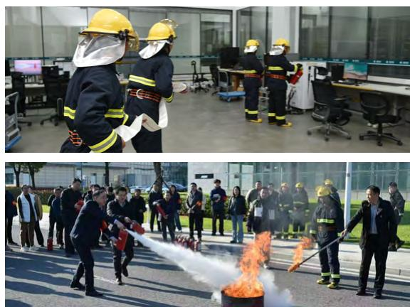

# 厚植安全文化

国电南瑞高度重视安全文化宣传教育，深入实施安全文化百千万星火工程，结合专业特点打造安全文化实训室，并通过开展“安全生产月”“消防宣传月”等形式多样、内容丰富的安全文化活动，组织安全生产知识培训与考试，向员工宣贯安全文化理念，在全系统培育浓厚安全文化氛围。

开展 “安全生产月” 活动，依托内外网平台和公共区域大屏，开展安全主题宣传和警示教育，提升全员安全意识。

举办安全管理、安全监察、岗位安全技能等各类安全教育培训711场，累计8.6万余人次参加培训。

高质量完成安全知识
春秋季普考，提高业务管理人员和基层一线人员安全管理的能力和水平。

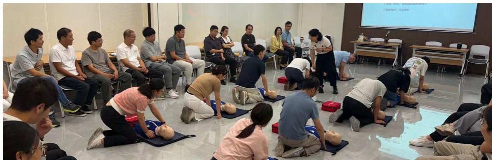

text_image

Classroom scene with participants practicing CPR on mannequins, including a presentation slide in the background showing Chinese text about AED training.

开展“关爱生命，救在身边”急救培训活动

natural_image

Group of people seated at desks in a conference room, focused on study or meeting (no visible text or signage)

开展膳食营养、食品安全与燃气安全专题培训

# 品质至臻 精诚服务

国电南瑞秉持以客户为中心的服务理念，始终将产品与服务质量视为企业的生命线，通过持续完善质量管理体系，强化全流程质量管控，以优质产品及贴心服务赢得市场认可和客户信赖。

# 国电南瑞产品和服务安全与质量管理体系

# 治理

- 安全质量部（生产物资部）统筹建立涵盖运行质量、环境、职业健康安全、信息安全、信息技术服务、测量管理、能源及工程建设施工的“八标”整合管理体系，通过持续完善管理文件与执行标准，加强运行环节控制，全方位提升产品和服务质量。  
- 营销服务中心负责客户服务管理体系建设及建立客户诉求受理渠道，各级部门、各级单位按照各自的职责分工实施质量运行控制，通过市场推广、交流走访等方式开展客户关系管理工作。  
- 营销服务中心建立“客户服务部、产业单位、项目执行部门”三级服务协同响应组织架构，重点强化跨阶段、跨部门客户诉求的协同协作，构建服务响应短流程，支撑客户服务全覆盖。  
- 将产品和服务安全与质量管理要求全面纳入管理体系，制定并持续完善《产品质保许可评审及合格证管理规范》《重大工程产品质量管理规范》《工程现场服务安全管理规范》《客户服务监督管理办法》等规章制度和管理要求，推动管理体系与业务运行深度融合。

# 战略

- 及时研究外部市场和监管要求，充分识别公司的内外部环境、相关方的期望和要求，并基于分析的结果识别和确定需要管控的风险和可利用的机遇，制定风险控制措施。  
- 以客户为中心，以 ISO 9001 质量管理体系标准为基本框架，建立、实施、保持和持续改进质量管理体系，落实产品全生命周期质量管控要求，持续提升产品和服务质量，为公司高质量发展提供坚强保障。

# 影响、风险和机遇管理

- 深入辨识和评估产品和服务存在的质量风险，全面梳理电网安全关键产品和责任人清单，落实各级员工、各个岗位的安全质量主体责任。  
- 高标准开展产品研发、生产制造和现场服务，强化过程评审、测试验证，刚性落实现场安全管控要求，确保产品的可靠性与稳定性。  
- 积极创新服务方式，满足客户多元化、个性化服务需求，拓宽客户诉求受理渠道，健全投诉处置机制，确保用户诉求有效解决，提升客户满意度。

# 指标与目标

- 加强生产过程质量控制，最终产品一次交检合格率达到 99.6%  
- 提升质量管理水平，荣获各级质量表彰 58 项  
- 成功开展客户满意度回访 29,077 次，总体满意率 99.61%  
- 积极响应重点项目、重点客户诉求，客户投诉解决率 100%  
- 产品和服务相关的安全与质量重大责任事故 0 起  
- 因产品质量问题导致的召回事件 0 起

natural_image

Exterior view of modern glass skyscrapers under a clear blue sky (no signage or text visible)

产品和服务安全与质量影响、风险与机遇分析与应对

<table><tr><td>风险/机遇类型</td><td>风险/机遇描述</td><td>潜在财务影响</td><td>影响程度</td><td>影响周期</td><td>影响环节</td><td>应对措施</td></tr><tr><td>技术风险</td><td>由于产品设计考虑不周、生产过程把关不严等因素所造成的质量不确定性风险,可能会导致产品合格率下降、交付质量难以保障,增加召回产品、赔偿用户损失等经营成本。</td><td>营业收入减少</td><td>低</td><td>短期、中期</td><td>自身运营</td><td>强化关键环节质量管控,严格重点产品质量监督,加强质量分析和问题清零管理,层层把关防范产品质量风险。</td></tr><tr><td>声誉风险</td><td>公司产品和服务广泛应用于电力系统各专业领域,加上当前新能源大规模接入、新型电力系统加速建设,“十五五”时期保障电网安全面临的更高要求。产品和服务质量问题可能会导致客户的安全事故、财产损失、信息安全事件,引发不利的社会影响,损害公司品牌声誉。</td><td>营业收入减少、运营成本增加</td><td>高</td><td>短期、中期、长期</td><td>自身运营</td><td>切实发挥产品、技术和服务优势,强化“营销、工程、安监”跨职能协同,做好队伍力量、物资装备“两个前置”,全力做好电力保供支撑工作。坚持安全第一、坚守底线思维,将本质安全理念贯穿产品实现全过程,切实保障产品及服务质量,支撑电网安全稳定运行。</td></tr><tr><td>市场机遇</td><td>在能源转型与数字革命交汇的背景下,公司承接国内电网升级红利,又把握全球能源转型机遇,并在AI、半导体领域持续突破,未来产品市场增长潜力巨大。高质量的安全可靠产品可以增加客户信任,更易进入高端市场及国际市场,提升市场份额。</td><td>营业收入增加</td><td>高</td><td>短期、中期、长期</td><td>自身运营、价值链下游</td><td>面对全球能源加速转型,新型电力系统建设催生的巨大市场需求,对储能、微网、新能源等产品技术发展作出科学评估,前瞻谋划业务未来。加大资源投入用于产品研发升级,通过持续改进和优化流程,将质量管理融入日常运营,确保产品和服务的高质量,提升市场份额。</td></tr></table>

# 强化质量管控

国电南瑞牢固树立质量是立业之本的意识，建立完善基于全员全过程持续改进的质量管控工作机制，加强生产过程质量控制，深化“内部第三方”质量监督，广泛开展 QC 小组、质量信得过班组、管理创新等基层质量改进活动，切实提升质量保障能力。

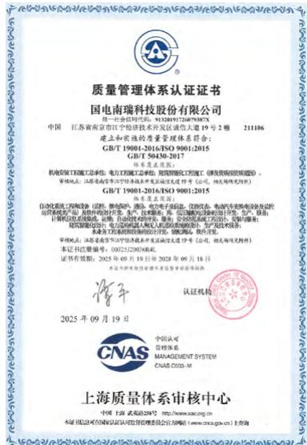

seal

国电南瑞科技股份有限公司
GB/T 19001-2016/ISO 9001:2015
GB/T 50430-2017
财务总监签字：
机电安装工程施工总承包：电力工程施工总承包、智能智能化工程施工（除安装现场及附属设施），等额地点：江苏省南京市江宁经济技术开发区东园大道1号1栋10号，相关地凭附件）GB/T 19001-2016/ISO 9001:2015
财务总监签字：
自动化测试工程师：（固测、系统维护、调试、电气电子测试设备）、在线监测、电池安全及电池系统集成的远程测试产品；检测软件的开发、制作、代理、发布、培训、数据处理和存储；计算机信息系统集成；运营、自动化技术的研究、服务；企业总部工程设计、监理与服务；建筑智能化设计；自动化测量仪器仪表制造与销售；生产和技术服务。
本证书自签署日起至取得授权公司住所、批准日期、对外发证。
审核地点：山东省济南市历下区经济技术开发区东园大道1号1栋10号（相关地凭附件）
证书有效期：2025年09月19日至2028年09月18日
承办单位：中国证券登记结算有限责任公司深圳分公司
认证机构
CNAS
中国认可
管理委员会
MANAGEMENT SYSTEM
CNAS CO.,LTD.
上海质量体系审核中心
中国·上海·武昌路238号 http://www.sao.com.cn
本报刊登于2025年9月19日

国电南瑞通过GB/T19001-2016/ISO9001:2015质量管理体系认证

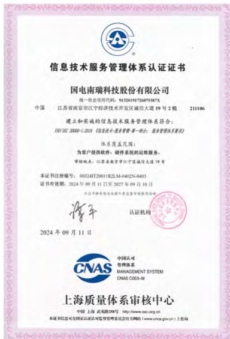

seal

国电南瑞科技股份有限公司
统一社会信用代码:91320191726079387X
江苏省南京市江宁经济技术开发区诚信大道19号2栋
211106
建立和实施的信息技术服务管理体系符合:
ISO IEC 2000D-1:2018《信息技术·服务管理·第一部分:基本管理体系要求》
体系覆盖范围:
为客户提供软件、硬件系统的运维服务。
审核地点:江苏省南京市江宁区诚信大道19号
本证书注册编号:000324JT20011R2LMA002NC-0403
证书有效期:2024年09月11日至2027年09月10日
认证机构
CNAS
认证机构
上海质量体系审核中心
中国 上海 武决路258号 http://www.sac.org.cn
本证书信息可经国家认证认可监督管理委员会作为编码(www.cncs.gov.cn)上查询

国电南瑞通过 ISO/IEC 20000-1:2018 信息技术服务管理体系认证

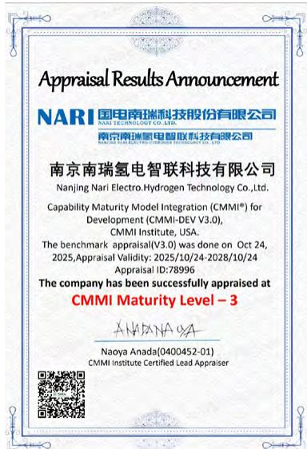

text_image

Appraisal Results Announcement
NARI国电南瑞科技股份有限公司
NANET TECHNOLOGY CO.,LTD.
南京南瑞氢电智联科技有限公司
南京南瑞氢电智联科技有限公司
Nanjing Nari Electro.Hydrogen Technology Co.,Ltd.
Capability Maturity Model Integration (CMMI®) for Development (CMMI-DEV V3.0), CMMI Institute, USA.
The benchmark appraisal(V3.0) was done on Oct 24, 2025, Appraisal Validity: 2025/10/24-2028/10/24
Appraisal ID:78996
The company has been successfully appraised at CMMI Maturity Level - 3
ANJANA YA
Naoya Anada(0400452-01)
CMMI Institute Certified Lead Appraiser

南瑞氢电成功通过 CMMI 3 级（软件能力成熟度模型集成）国际认证

# 严格重点产品质量监督

强化涉网涉控产品风险辨识与防控，抓牢产品研发、测试验证、现场调试等关键环节，规范设计评审和版本管控，深入开展重点工程产品监造，实施涉网涉控产品专项抽检，开展供应商质量体系监督审核，深化质量监督结果分析应用，推动质量管控各项要求扎实落地。

# 广泛开展“质量月”系列活动

以 “加强全面质量管理 促进质量强国建设” 为主题，围绕加强涉网涉控产品质量风险防控、加强产品版本全过程管理、加强过程质量保证能力建设、加强 “内部第三方” 产品质量监督、加强基层质量改进创新等为主要内容，组织开展系列质量月活动，进一步树牢各级领导干部和员工产品质量意识，推进产品和服务质量持续改进、稳步提升。

# 积极开展产品和服务安全与质量培训

公司本部及下属各单位针对各自产品及服务的特点，围绕生产制造工艺、岗位操作技能、检验试验规范、现场服务规程等，举办各类安全与质量培训75次，总培训时长266小时，参培人数共计6722人次。

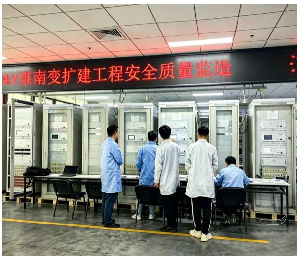

text_image

JiKV淮南变扩建工程安全质量监造

稳定公司开展 1000 千伏淮沪特高压重点项目监造

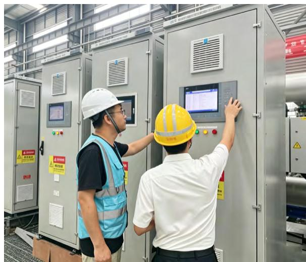

natural_image

Two engineers in hard hats inspecting industrial control panels in a factory setting (no visible text or symbols)

中电普瑞开展沙特中南柔直工程换流阀水冷控制系统生产过程质量监督

# 优化客户服务

国电南瑞秉持“客户至上”发展理念和“始于客户需求，立于持续改进，终于客户满意”服务理念，以客户需求为导向，加强客户服务体系建设、优化服务响应流程、加大客服热线宣传力度、拓宽客户诉求受理渠道，持续优化服务品质，提升客户满意度，全面筑牢企业良好声誉基石。

# 见证荣耀

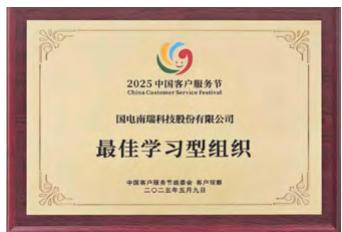

text_image

2025中国客户服务节
China Customer Service Festival
国电南瑞科技股份有限公司
最佳学习型组织
中国客户服务委员会 客户资格
二〇二三年五月九日

国电南瑞荣获 2025（第九届）中国客户服务节“最佳学习型组织”

# 案例 培训“充电”强技能，固本提质优服务

2025 年 2 月，为切实增强营销人员在研究业务新对象、把握技术新方向、挖掘客户新需求、拓展应用新场景等方面的综合能力，营销服务中心组织开展年度技术能力提升培训，提升营销服务质效。本次培训特邀技术方案中心、研究院及相关专业公司不同领域的专家骨干授课，采取必修课与选修课相结合的模式开展，共有 474 名营销一线人员参加培训。

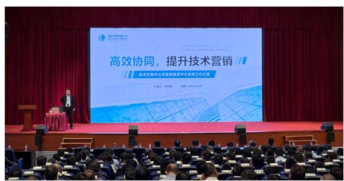

text_image

高效协同，提升技术营销
技术方案中心与营销服务中心协同工作汇报
主持人：李永刚  级：2013.07.06

# 完善客户服务管理

建设统一对外的 400-00-95598 电话、邮箱、客服小程序等客户诉求受理渠道，实现客户诉求受理一口对外、全渠道接入、7×24 小时服务。

结合专业公司业务特点，依托统一客服平台，进一步推广分布式呼叫中心建设，为专业公司提供客户服务信息化解决方案，有效支撑客户服务工作。

开展现场服务单线上应用推广，为客户、员工提供 App、微信小程序端的移动便捷应用。

依托积累的数据资产，开展服务资源分布、热点产品、项目履约状态识别等数据分析工作，为业务管理决策提供数据支撑。

# 健全诉求响应机制

建立完善分类分级诉求响应处理流程规范及工单流转原则，明确各环节响应时限并对处理过程进行监督和评价，构建端到端的服务闭环。

构建梯次联动的服务支撑体系，建立跨部门、跨单位的问题解决团队，构建“一线工程师、二线技术专家、三线研发团队”三级服务支撑体系，确保能为客户解决问题，体现整体客户服务能力。

开展监督检查、工单督办、客户回访等工作，对各部门、各单位客户诉求处理过程、客户服务体系、客户服务支撑体系实施监督，实现客户服务的整体性、完整性和内部协同的有效性。

# 客户满意度调查

完善客户回访策略，通过电话、短信、邮件等多渠道对具备条件的单位开展集中满意度回访，对热线渠道客户诉求工单开展100%回访。

完成 2025 年度第三方企业客户满意度调研，成功回收样本 1871 个，汇总分析客户服务数据，发布客户服务专项分析报告，持续提升产品和服务质量。

建立产品满意度、服务满意度评价和 NPS（客户净推荐值）等关键指标评价，不断提升客户体验。

# 负责任营销培训

坚持以客户为中心，聚焦国家能源战略与客户实际需求，健全覆盖专业技术、市场营销、综合管理、团队建设等多维度全方位教育培训体系，全年组织各类培训13场次，参培人员达1100余人次。

# 03

# 至美·瑞见绿意擘画生态新画卷

国电南瑞始终坚定树牢“绿水青山就是金山银山”的理念，将生态优先、绿色发展的原则融入企业生产运营，严守环境合规管理底线，协同推进降碳、减污、扩绿、增长的同时，持续扩大清洁技术领域的技术布局，助力能源转型与环境保护、经济发展协同，以发展“含绿量”提升增长“含金量”。

锚定双碳 气候应对

绿色研发 赋能产业

环保为本 减废防污

绿意传递 呵护自然

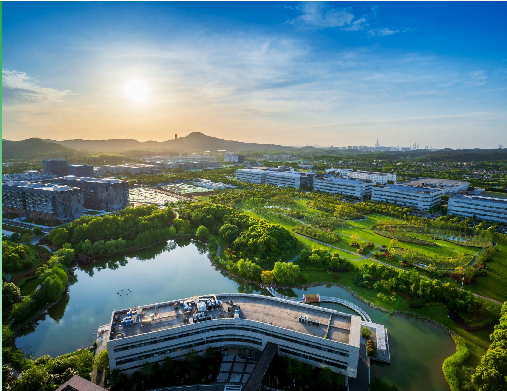

natural_image

Aerial view of a modern campus with green parks, water bodies, and surrounding buildings under a bright blue sky (no visible text or signage)

# 锚定双碳 气候应对

国电南瑞参照《国际财务报告可持续披露准则第2号——气候相关披露》《上海证券交易所上市公司自律监管指南 第4号——可持续发展报告编制 第二号 应对气候变化》披露框架及建议，从“治理”“战略”“影响、风险和机遇管理”“指标与目标”四个维度系统推进气候相关工作，增强气候变化背景下的适应力与韧性。

# 国电南瑞应对气候变化管理体系

# 治理

- ESG 委员会负责指导和监督包括 “应对气候变化” 议题在内的 ESG 相关事宜，对相关业务进行研究并提出建议。  
- ESG 委员会下设 ESG 工作组，组织开展公司气候变化风险和机遇识别，协调相关事宜，并定期向 ESG 委员会汇报相关工作。  
- 各部门、分子公司协同ESG工作组推动、执行公司“碳达峰、碳中和”行动方案等应对气候变化相关事宜。

# 战略

- 综合考量政策及监管规定，结合行业及业务实际，识别与分析气候变化在短中长期可能带来的影响、风险与机遇，制定应对及管理行动策略。  
- 落实公司“碳达峰、碳中和”行动方案，推动与节能降碳相关的技术进步、产品创新、管理创新、业务创新，打造清洁能源发电、智慧水务/水利、储能、氢能等领域专业化解决方案及产品，积极开拓新能源消纳、综合能源服务等新兴市场，增强市场竞争力。  
- 持续深化能源的信息物理社会系统（CPSSE）理论、技术及应用，提出能源低碳转型发展的研究方法，加大跨领域多学科交叉融合研究，加强源头创新，支撑能源低碳转型。

# 影响、风险和机遇管理

- 广泛调研国内外气候变化趋势、行业发展情况、利益相关方诉求，并结合自身业务特性，识别公司业务和运营活动中存在的潜在风险与机遇。  
- 根据气候风险和机遇的发生概率、影响程度和影响环节，结合专家意见，评估重大气候相关风险和机遇。  
- 根据风险和机遇的性质及其对公司运营影响情况，采取针对性的应对策略，保障业务的平稳与持续发展。

# 指标与目标

- 全年温室气体排放量 31211.55 吨二氧化碳当量，其中范围一排放 28967.05 吨二氧化碳当量，范围二排放 2244.5 吨二氧化碳当量。  
- 全年温室气体减排 94709.86 吨二氧化碳当量，其中范围一减排 4109.52 吨二氧化碳当量，范围二减排 90,600.34 吨二氧化碳当量。  
- 全年绿电消费量 12436.34 万千瓦时，实现办公生产全量绿色电力消费。

国电南瑞“碳达峰、碳中和”

行动方案

- 支撑电网向能源互联网升级，提高清洁能源优化配置能力  
- 支撑网源协调发展和调度交易机制优化，提高清洁能源并网消纳  
- 推动能源电力技术创新，提高电网运行安全和效率  
- 支撑终端能源消费再电气化，提高社会用能效能  
- 推动节能减排加快实施，降低企业碳排放水平  
- 深化国内外交流合作，弘扬绿色发展理念

公司通过科学评估气候相关风险和机遇对公司业务运营、财务状况及长期发展的影响，制定并实施适应并减缓气候变化的应对策略。

气候风险识别与应对

<table><tr><td colspan="2">风险类型</td><td>风险描述</td><td>潜在财务影响</td><td>影响程度</td><td>影响周期</td><td>影响环节</td><td>应对措施</td></tr><tr><td>物理风险</td><td>急性风险</td><td>台风、飓风、洪水、暴雪等极端天气,对电网、电厂、轨道交通等领域的安全稳定运行构成重大威胁,进而推动客户对公司产品及设备的质量标准要求持续提升;同时,此类极端气象灾害易造成生产设施损毁、供应链中断,还可能危及员工生命健康安全。</td><td>研发成本增加:需增加成本投入以增强产品和设备抵御力。营业收入缩减:生产或服务的突然中断导致收入损失。管理成本增加:保障员工安全作业环境投入增加、工厂设备运营和维修成本增加导致公司管理成本上升。</td><td>高</td><td>短期</td><td>价值链上游、自身运营、价值链下游</td><td>密切关注气候变化趋势,制订极端天气应急预案,常态化开展应急演练,强化应急物资储备保障,最大限度降低极端天气带来的不利影响;将极端天气等气候风险因素纳入产品设计规划全流程统筹考量;为一线作业人员配齐配足劳动防护用品,定期开展系统、设备专项巡检,切实筑牢员工安全生产作业环境。</td></tr><tr><td>物理风险</td><td>慢性风险</td><td>气候变化导致的持续性高温天气,可能影响温敏型生产设备的正常运行,推高制冷设备能耗、提升设备故障率,还可能对员工健康造成慢性损害;气候变化导致的海平面上升,易加剧沿海区域设施受损风险,推高设备运维成本。</td><td>运营成本增加:外部能源供应稳定性下降,员工健康受影响、工作状态不佳,而且需耗用更多水和电冷却温度敏感的设备以维持设备正常运转,造成额外运营开支。</td><td>中</td><td>长期</td><td>自身运营、价值链下游</td><td>搭建设备影响监测系统,助力工作人员提前预判、有效应对极端高温风险;强化能耗精细化管理,优先选用节能型设备,抓实设备设施日常维护保养;优化能源供应体系,提升可再生能源利用占比,提高能源综合使用效率;持续改善办公场所、生产车间作业环境,打造舒适安全的生产作业场景,增强高温风险综合抵御能力。</td></tr><tr><td>转型风险</td><td>政策法规风险</td><td>气候相关政策与监管要求日趋严苛细化,推高公司及利益相关方的碳核算、信息披露成本,加大合规风险,或将引发项目推进受阻、高额罚款、合规成本高等潜在风险。</td><td>合规成本增加:环境保护法律法规日趋严格,公司及利益相关方可能出现未符合气候相关政策或法律被依法追究责任、采取监管措施的情况。运营成本增加:监管机构及投资机构对企业碳排放量、减排措施、量化目标及表现的披露要求更严格,信息披露相关运营成本增加。</td><td>中</td><td>中期、长期</td><td>价值链上游、自身运营、价值链下游</td><td>密切关注国内外气候变化政策动态,及时调整公司战略和业务模式以满足法规要求,避免处罚和诉讼;积极主动推动企业气候变化规划工作,并按照产品生命周期,探索低碳管理新模式,强化自身内部碳排查管理,增强建设生产过程中的碳排放核算体系。</td></tr></table>

<table><tr><td colspan="2">风险类型</td><td>风险描述</td><td>潜在财务影响</td><td>影响程度</td><td>影响周期</td><td>影响环节</td><td>应对措施</td></tr><tr><td rowspan="2">转型风险</td><td>技术风险</td><td>绿色经济转型正迈入系统推进新阶段,公司面临生产技术难以匹配社会对排放、能效技术的要求与期待所引发的风险;公司在碳排放可视化产品、生态产品领域持续开展创新研发投入,或将面临研发投入持续加大的风险。</td><td>运营成本增加:需要及时推进新能源、低碳材料、低能耗设备和更先进的节能技术工艺的应用,此举将导致整体经营成本增加。研发成本增加:为扩大绿色低碳产品供给,需投入大量资金推动新技术研发;如果研发失败,将导致已经投入的成本无法回收。</td><td>中</td><td>中期、长期</td><td>自身运营</td><td>引入数字化技术优化生产工艺,引进高效节能设备,减少能源的消耗和浪费,提高能源利用率;与技术领先的企业、研发团队或研究机构进行合作,降低技术风险;前瞻把握能源电力科技前沿方向和发展趋势,持续加强战略性、前瞻性和基础性科研布局,加快推动关键技术、核心产品迭代升级和新技术智慧赋能。</td></tr><tr><td>声誉风险</td><td>监管机构、投资人、潜在客户等利益相关方可能对企业的气候问题参与度和信息披露有更高期待,若公司未能满足利益相关方合理要求,将引发声誉风险,造成企业形象受损。</td><td>管理成本增加:环保舆情引发的声誉风险,将推高企业公关舆情管理相关成本。融资成本增加:环境信息披露质量不高,引致资本市场ESG相关指数评级下调,进而削弱企业融资能力、抬升融资成本。</td><td>中</td><td>中期、长期</td><td>自身运营</td><td>夯实环保管理基础,聚焦加强气候变化监测预警和风险管理,以实现对自身气候风险进行有效管理;严格参照交易所气候相关信息披露指引,合规编发ESG报告;通过官方网站、官方公众号、权威媒体等渠道,及时、准确、全面地展现自身在气候变化相关风险方面的研判、举措及创新成果。</td></tr><tr><td>转型风险</td><td>市场风险</td><td>能源电力行业客户对减缓和适应气候变化的产品及服务需求持续增长,若公司未能及时提供匹配的产品及服务,或将削弱公司市场竞争力,面临业务订单缩减、客户流失的潜在风险;而气候变化影响、环保要求趋严、技术迭代升级,推高电气设备原材料成本与生产成本,进而推高产品定价,或将导致客户对电气设备的采购需求下降。</td><td>管理成本增加:为匹配客户对减缓和适应气候变化的产品及服务的需求增长,公司需加大产品研发及服务管理投入,储备相关产能、完善调度预案,由此导致公司管理成本增加。运营成本增加:能源、水、设备等资源价格受气候变化影响持续攀升,进而推高生产原材料采购成本与供应链运输成本。营业收入缩减:产业链上游成本上涨、低排放产品及服务领域竞争者带来的冲击,可能导致公司市场份额下滑,叠加客户对公司电力设备产品及相关服务的需求下滑等风险,导致营收缩减。</td><td>高</td><td>中期、长期</td><td>自身运营、价值链下游</td><td>密切跟踪并调研客户对于绿色产品及服务的需求变化,动态分析价格波动趋势,及时优化调整产业布局,精准对接市场需求;持续强化产业顶层设计,聚焦产业高端化升级,主动发力新兴产业培育发展,筑牢高质量发展产业根基;完善绿色采购方案,发展可持续绿色供应链,降低采购环节成本;持续推进公司及所属单位进行绿色工厂认证,完成江宁基地低碳智慧园区分阶段建设目标;持续优化资源整合和运营管控,精益生产管理,提升统筹协调能力,为满足发展需求提供坚实保障。</td></tr></table>

气候机遇识别与应对

<table><tr><td>机遇类型</td><td>机遇描述</td><td>潜在财务影响</td><td>影响程度</td><td>影响周期</td><td>影响环节</td><td>应对策略</td></tr><tr><td>资源效率</td><td>优化资源利用为企业带来成本节约的机会。</td><td>运营成本降低</td><td>中</td><td>短期</td><td>自身运营</td><td>清洁生产:立足自身业务与实际,积极优化生产工艺、加强设备维护与更新、建设绿色供应链、深化清洁生产宣传,促进生产全过程和产品周期全过程的可持续发展。水资源管理:加强节水管理,完善用水制度,开展节水诊断、技术改造,淘汰落后用水设备,减少生产用水、生活用水。能源管理:加强能源管理体系建设,构建智慧园区智慧运营管理平台,以数智化手段管控能耗,并通过新材料、新技术、新设备、新工艺的应用,提升能源利用效率。</td></tr><tr><td>能源来源</td><td>建设风电等可再生能源设施,可以改善公司对外能源依赖。</td><td>运营成本降低</td><td>中</td><td>短期</td><td>价值链上游、自身运营</td><td>清洁能源:实施智慧变电站改造、智能微网提升及智慧楼宇能源系统改造,初步构建基于“源—网—荷—储”全要素的园区能源架构,减少碳排放的同时,降低未来能源价格上涨和碳排放交易所带来的风险。</td></tr><tr><td>产品与服务</td><td>提供低碳产品与服务,有利于减少产业链碳足迹,提升公司竞争力。</td><td>营业收入增加</td><td>高</td><td>长期</td><td>自身运营、价值链下游</td><td>市场偏好机遇:低碳经济转型的背景下,公司在清洁能源消纳、节能环保产品等方面的能力将更加受到消费者偏好,公司将加强低碳技术研发,持续提高绿色低碳产品占比,保持“先进制造业集群-智能电网产业集群”龙头企业先发优势。</td></tr><tr><td>市场</td><td>市场需求的变化、创新或新兴市场的开拓,可能带来竞争新优势。</td><td>营业收入增加</td><td>高</td><td>长期</td><td>自身运营、价值链下游</td><td>“双碳”目标机遇:新型电力系统建设加快推进,城市、企业在新型电力系统“源网荷储”关键环节和典型应用场景的需求激增,公司可以通过延伸产业链条,提高市场竞争力。“新质生产力”机遇:围绕新型能源体系、新型电力系统和新型电网建设,充分发挥科研产业链条紧密融合、多专业协同的特色和优势,深化科技创新和产业创新融合发展,加快培育能源领域新质生产力,大力发展战新产业和未来产业,构筑竞争新优势。</td></tr><tr><td>适应力</td><td>深化多方务实合作,积极构建新型电力系统,促进新能源发展,助力气候适应型社会建设。</td><td>运营成本降低、营业收入增加</td><td>中</td><td>中期、长期</td><td>价值链上游、自身运营、价值链下游</td><td>外部:主动加入行业协会、参与行业论坛及展会等交流活动,赋能行业伙伴技术创新与业务升级;深化政企协同、强企合作、校企联动,聚焦新能源开发消纳、电力系统安全稳定运行及电力保供等领域,聚力研发绿色低碳产品与解决方案,助力客户提升气候变化适应力。内部:积极对标绿色工厂评价标准,以精准治污、节能降碳、循环利用为抓手,优化生产流程,全力推进绿色工厂建设,提升公司的气候变化适应力。</td></tr></table>

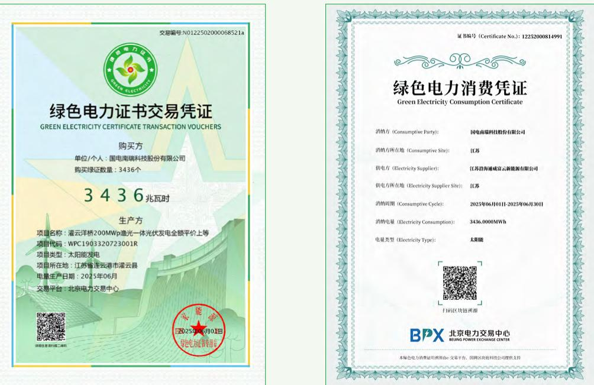  
国电南瑞以“先行先试、率先达峰、绿色引领”为重点，全年主动消费绿色电力12436.34万千瓦时，实现办公生产全量绿色电力消费

# 案例 打造智慧运营管理平台，助力园区节能降碳

2025 年 7 月，国电南瑞智慧运营管理平台正式建成，为园区绿色化智慧化升级按下“加速键”。平台构建起“园区概览、智慧能源、智慧运行、低碳管理”四大模块，并通过四大核心板块的深度开发与数据融合，实现园区全业务数字化、可视化管理，将园区能源管控、日常运行、低碳治理等多领域成果转化为直观可感的可视化呈现。依托数字化手段，平台实现园区能源消耗精准管控、运营成本有效降低、后勤服务效率显著提升，推动资源高效配置；同时借助实时碳排放监测体系，为园区绿色发展提供有力支撑，彰显可持续发展担当。

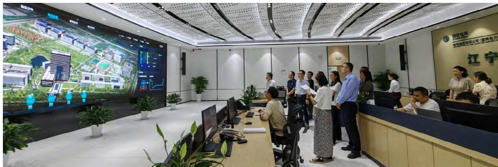

text_image

Control room scene with large digital display showing real estate and smart grid, people gathered around a service counter, and visible signage for '江宁' (Jian Ning)

智慧运营管理平台后勤运行监控中心

# 案例 南瑞联合国网江苏电力研发的电碳因子数据库通过国际第三方认证

2025 年 11 月 15 日，由国电南瑞支撑国网江苏电力建设的电碳因子数据库，成功通过国际权威第三方认证机构 SGS 通标标准技术服务有限公司认证，成为国内首个获得国际认证的省级电碳因子数据库。这一突破性成果，标志着江苏电力电碳因子数据库在算法符合性、数据准确性、管理规范性方面，满足国内外相关标准规范要求，为“双碳”目标实现提供了有力数据支撑。

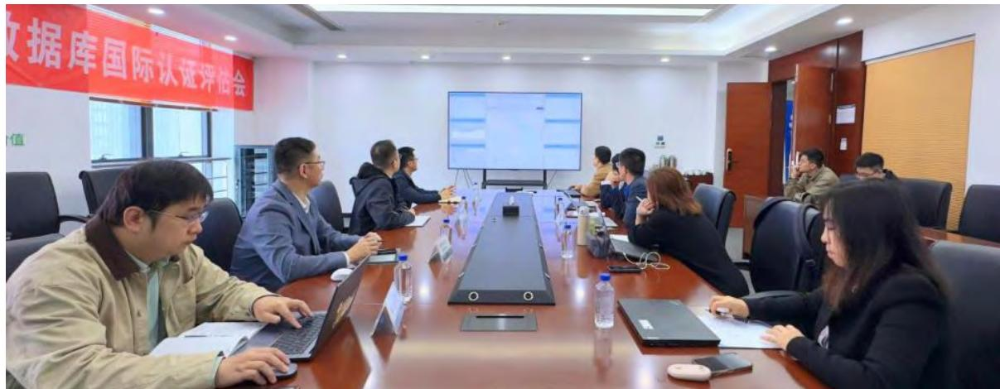

text_image

数据库国际认证评估会

电碳因子数据库现场认证

# 案例 创新“碳护照”应用，助力外向型企业应对国际碳壁垒

2025 年，国电南瑞所属北京科东紧盯欧盟 CBAM 等国际绿色贸易规则加速落地、出口企业涉碳合规成本快速上升的形势，创新打造面向工业外向型企业的“碳护照”应用，构建集碳核算、碳认证、碳评价、碳减排、碳应用于一体的一站式数字化服务体系。该应用依托大数据和人工智能技术，智能解析出口产品涉碳数据，适配欧盟 CBAM 等国际规则，自动生成产品碳足迹报告，并将产品全生命周期碳排放、绿电绿证、减碳措施等信息整合形成“碳护照”二维码，实现“一码展示、国际通行”。目前已支撑宁波 2 家制造企业完成 CBAM 报告线上核算，碳填报效率提升 85%，并帮助企业测算碳关税成本、识别高排放环节、制定降碳路径。该应用有效降低

企业绿色贸易合规门槛与成本，推动出口产品从“被动应对”向“主动降碳、价值增值”转型升级，为外向型经济突破国际碳壁垒、提升绿色竞争力提供了可复制、可推广的数字化解决方案。

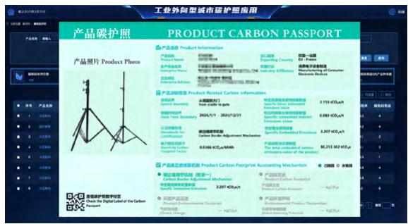

text_image

工业外向型城市碳护照应用
产品碳护照
PRODUCT CARBON PASSPORT
产品照片 Product Photo
产品信息 Product Information
产品名称 Product Name
产品种类 Product Type
产品生态 Product Type
产品用途 Product Type
产品包装 Product Type
产品标识 Product Type
产品说明信息 Product Related Carbon Information
环境监测 System
System Environment
大额超限门
from ultra-low to ultra
碳排放量
2024/1/1 - 2031/12/1
碳排放标准
Carbon Emission Standard
碳排放标准
Carbon Emission Standard
碳排放标准
Carbon Emission Standard
碳排放标准
Carbon Emission Standard
碳排放标准
Carbon Emission Standard
碳排放标准
Carbon Emission Standard
碳排放标准
Carbon Emission Standard
碳排放标准
Carbon Emission Standard
碳排放标准
Carbon Emission Standard
碳排放标准
Carbon Emission Standard
碳排放标准
Carbon Emission Standard
碳排放标准
Carbon Emission Standard

产品信息计算机盒 Product Carbon Footprint Accounting Mechanism
产品信息计算机盒: 现场数据与控制计算机盒
产品信息计算机盒: Carbon Footprint Accounting Mechanism
产品信息计算机盒: Carbon Footprint Accounting Mechanism
产品信息计算机盒: Carbon Footprint Accounting Mechanism
产品信息计算机盒: Carbon Footprint Accounting Mechanism

产品信息计算机盒 Product Carbon Footprint Accounting Mechanism

产品信息计算机盒: Carbon Footprint Accounting Mechanism

产品信息计算机盒: Carbon Footprint Accounting Mechanism

产品信息计算机盒: Carbon Footprint Accounting Mechanism

产品信息计算机盒: Carbon Footprint Accounting Mechanism

产品信息计算机盒: Carbon Footprint Accounting Mechanism

产品信息计算机盒: Carbon Footprint Accounting Mechanism

产品信息计算机盒: Carbon Footprint Accounting Mechanism

产品信息计算机盒: Carbon Footprint Accounting Mechanism

产品基本信息计算机盒 Product Carbon Footprint Accounting Mechanism

产品基本信息计算机盒: Carbon Footprint Accounting Mechanism

产品基本信息计算机盒: Carbon Footprint Accounting Mechanism

产品基本信息计算机盒: Carbon Footprint Accounting Mechanism

产品基本信息计算机盒: Carbon Footprint Accounting Mechanism

产品基本信息计算机盒: Carbon Footprint Accounting Mechanism

产品基本信息计算机盒: Carbon Footprint Accounting Mechanism

产品基本信息计算机盒: Carbon Footprint Accounting Mechanism

产品基本信息计算机盒: Carbon Footprint Accounting Mechanism

产品相关信息计算机盒 Product Carbon Footprint Accounting Mechanism

产品相关信息计算机盒: Carbon Footprint Accounting Mechanism

产品相关信息计算机盒: Carbon Footprint Accounting Mechanism

产品相关信息计算机盒: Carbon Footprint Accounting Mechanism

产品相关信息计算机盒: Carbon Footprint Accounting Mechanism

产品相关信息计算机盒: Carbon Footprint Accounting Mechanism

产品相关信息计算机盒: Carbon Footprint Accounting Mechanism

产品相关信息计算机盒: Carbon Footprint Accounting Mechanism

产品相关信息计算机盒: Carbon Footprint Accounting Mechanism

产品基本信息计算机盒 Product Carbon Footprint Accounting Mechanism

产品基本信息计算机盒: Carbon Footprint Accounting Mechanism

产品基本信息计算机盒: Carbon Footprint Accounting Mechanism

产品基本信息计算机盒: Carbon Footprint Accounting Mechanism

产品基本信息计算机盒: Carbon Footprint Accounting Mechanism

产品基本信息计算机盒: Carbon Footprint Accounting Mechanism

产品基本信息计算机盒: Carbon Footprint Accounting mechanisms

产品基本信息计算机盒: Carbon Footprint Accounting mechanisms

产品基本信息计算机盒: Carbon Footprint Accounting mechanisms

产品基本信息计算机盒: Carbon Footprint Accounting mechanisms

产品基本信息计算机盒: Carbon Footprint Accounting mechanisms

产品基本信息计算机盒: Carbon Footprint Accounting mechanisms

产品基本信息计算机盒: Carbon Footprint Accounting mechanisms

产品基本信息计算机盒: Carbon Footprint Accounting mechanisms

产品基本信息计算机盒: Carbon Footprint Accounting mechanisms

产品基本信息计量机构代码 (CLOP) - 1-0000000000000000000000000000000000000000000000000000000000000000000000000000000000000000000000000000

工业外向型城市碳护照应用

# 案例 国电南瑞支撑福建首个“零碳”离网型海岛微电网稳定运行

2025 年 4 月 14 日，由国电南瑞支撑建设的福建省首个离网型海岛微电网——赤山岛微电网投入运行。国电南瑞旗下配电公司负责赤山岛风光柴储离网微电网项目建设，提出零碳离网型风光柴储微电网解决方案，新建 20 千瓦光伏、2 台 20 千瓦垂直轴风机、200 千瓦时构网型储能，部署微电网协同控制系统，构建“新能源为主、柴油应急备用”的智慧微电网。该项目攻克了“高海边无”弱电网环境下风光随机性引发的稳定运行难题，并首次将构网型储能技术应用于离网系统，打造出福建首个具备零碳示范运行能力的海岛微电网典型。据测算，该微电网运行后年减碳超 100 吨。项目既为岛上居民提供可靠电力保障，更以绿色低碳供能模式守护海岛生态，为推进“双碳”目标在偏远地区落地注入了实践力量。

natural_image

Aerial view of a coastal island with red-roofed houses and adjacent pier, surrounded by turquoise sea (no visible text or symbols)

赤山岛整体风貌

# 绿色研发 赋能产业

作为能源转型浪潮中的电网科技领军企业，国电南瑞以构建新型电力系统为核心，聚焦智能化与数字化深度融合，在节能降碳、清洁能源利用和低碳技术研发等方面持续投入和创新，通过产品、技术和服务全面赋能能源全产业链低碳转型，助力经济社会发展全面绿色转型。

# 数读南瑞

\- 清洁技术研发投入约占研发投入 30%

\- 清洁技术专利数 62 项

# 见证荣耀

“能源的信息—物理—社会系统（CPSSE）：理论、技术与应用”“宽运行域新能源发电协同支撑电网暂态频率电压关键技术及应用”双双入选2024年度江苏省环境能源领域十大科技进展

# 清洁技术发展战略

国电南瑞积极践行国家“双碳”目标、响应能源转型战略，始终将清洁技术创新发展摆在公司战略的核心位置，将绿色发展理念贯穿研发、生产、供应链全流程，打造覆盖全链条的绿色产业生态，为行业低碳转型树立标杆。

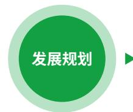

紧扣国家 “双碳” 目标与新型电力系统建设需求，以电网友好型新能源并网技术为核心，短期将持续完善绿色制造体系，加大智慧火电、智能水电 / 抽蓄、构网型储能、绿电制氢、零碳园区、电碳协同等领域资源投入，通过行业战队与新兴业务特遣队推进重点项目落地；中期将深化高压大功率半导体等核心器件自主化，依托 “十年磨剑” 团队构建全链条技术优势，推动零碳园区从试点示范向规模化推广，同时完善绿色供应链与全生命周期碳管理体系；长期将紧抓全球能源转型机遇，深耕 “一带一路” 沿线及新兴经济体市场，加强海外营销网络建设与本地化适配，推广直流输电、储能等优势产品，积极参与国际标准制定，打造全球领先的绿色能源解决方案提供商。

# 清洁技术产业布局

国电南瑞已构建起贯穿“源、网、荷、储”全链条的产业布局，系统性推动能源体系清洁化、智能化转型。同时，积极布局新兴赛道，打造一体化创新解决方案，全面支撑新型电力系统建设与全社会低碳转型。

# 电源侧

聚焦高比例新能源并网与调度控制，提升风电、光伏消纳能力。

# 储能侧

整合多元化储能系统与虚拟电厂平台，提升系统调节能力。

# 电网侧

深化智能输变电与数字孪生技术应用，增强电网灵活性与可靠性。

# 新兴赛道

积极布局碳管理、绿电交易及氢电耦合等新兴业务领域，培育新的增长点。

# 负荷侧

拓展综合能源服务与能效管理，推动工业、建筑、交通等领域电气化及节能改造。

# 数字化赋能

通过数字化平台打通各环节数据与业务，形成“技术+产品+服务+生态”的一体化解决方案，广泛应用于各行业领域。

# 电力清洁技术

# 能源供给侧

重点研发高精度新能源功率预测、柔性直流输电和构网型储能技术，以支撑大规模波动性可再生能源安全并网。

# 电网侧

依托 “云边端” 协同的电网数字孪生平台和人工智能调度决策系统，实现全网实时仿真与自主优化运行。

# 负荷侧

发展虚拟电厂（VPP）聚合调控技术、光储直柔建筑能源系统和电动汽车 V2G 双向互动技术，深度挖掘终端灵活性资源。

# 前瞻技术

布局氢电耦合与综合能源优化、电力碳计量与溯源区块链平台，并探索量子计算在电网优化中的潜在应用，以技术创新系统性驱动能源生产、传输、消费全链条的低碳化与智能化转型。

# 案例

# 国电南瑞助力全国规模最大“光氢储一体化”海上光伏项目全容量并网发电

2025 年 4 月，国电南瑞支撑的全国规模最大的集光伏发电、氢能生产和储能于一体的“综合能源利用 + 滨海生态治理”项目——国华投资江苏分公司如东“光氢储一体化”40 万千瓦光伏项目顺利实现全容量并网发电。该项目装机 40 万千瓦，投产后年上网电量约 4.68 亿千瓦时，可保障 70 万居民全年用电；项目配套 60 兆瓦 /120 兆瓦时储能站，及 1500 标方 / 小时制氢、500 公斤 / 天加氢能力的制氢加氢站，推动绿电消纳转化，赋能当地绿色发展。国电南瑞下属南瑞工控凭借深厚的技术实力和丰富的行业经验，承担了本次项目二次设备的设计、安装和调试等核心任务，业务全面覆盖综合自动化、并网控制、生产运维等关键领域。该项目的成功并网增强了区

域电网调峰能力和供电稳定性，为推动地方绿色低碳发展、优化区域能源结构注入强劲动力。

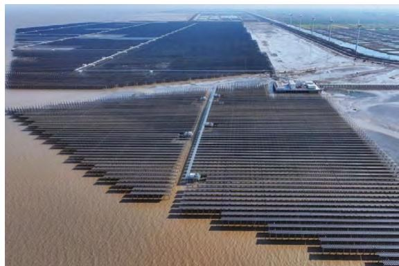

natural_image

Aerial view of a large-scale solar farm with rows of photovoltaic panels installed in muddy water, adjacent to wind turbines and distant infrastructure (no visible text or symbols).

国华如东光氢储一体化光伏场区全览图

# 案例

# 国电南瑞助力全国最大的“线性菲涅尔”光热示范项目成功并网

2025 年 9 月 18 日，全国最大 “线性菲涅尔” 光热示范项目——三峡能源新疆哈密综合能源示范项目 100 兆瓦光热项目成功并网，标志着 “光热 + 光伏” 协同运行新模式正式落地开启。该项目位于新疆哈密市，太阳能集热面积达 80 万平方米，配置 8 小时熔盐储热系统，可在夜间或阴天等光照不足时段释放热量持续发电，并与配套的光伏形成 24 小时稳定清洁电力支撑。国电南瑞旗下南瑞继保为该项目提供全套自主可控 DCS、DEH、ETS 主辅一体化控制系统，为机组长期安全可靠运行提供坚实保障。电站投运后，预计每年可为当地提供约 20.67 亿千瓦时清洁电能，减排二氧化碳超过 163 万吨。

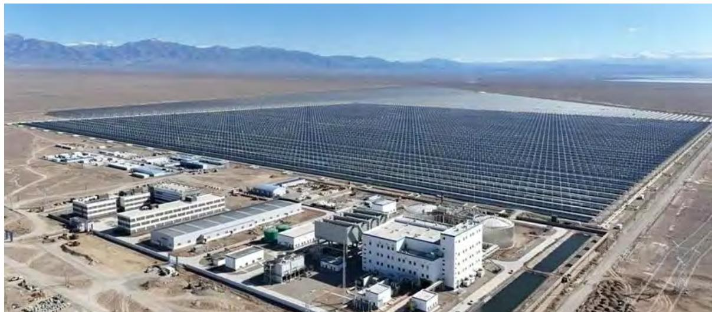

natural_image

Aerial view of a large solar farm complex in a desert landscape with mountains in the background (no visible text or symbols)

三峡能源新疆哈密综合能源示范项目现场

# 案例

# 国电南瑞科技赋能安徽电网“节电响应”

2025 年 8 月 20 日—21 日，国电南瑞研发的新型电力负荷管理系统，为国网安徽电力“节电响应 皖美同行”活动（第三轮）提供核心技术支持，助力活动圆满成功。面对安徽电网最大用电负荷连年攀升的挑战，国网安徽电力联合政府部门创新实施了居民“节电响应”活动，累计吸引 310 万户居民参加，节约电量 248 万千瓦时，高峰时段精准压降负荷达 50 万千瓦。国电南瑞下属用电公司 / 雄安公司 / 南瑞捷鸿研发的居民节电应用基于负荷管理系统发起了精准的响应事件，成功打通了市场、计量、营业、财务等多专业系统，贯通了小散居民用户的参与流程，支撑了从多渠道一键报名、智能电表数据采集、节电量自动计算到补贴快速发放的全流程，确保了用户体验与活动透明度。此次活动有效释放尖峰时

段电网资源，保障工商业正常生产与省域经济活力，推动全民节能降碳，晚高峰节电直接减少煤电消耗与碳排放，助力加快形成绿色低碳社会风尚。

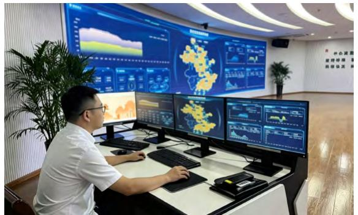

text_image

Control room scene with operator monitoring large screens displaying data and charts, including a map and area chart overlay

国电南瑞技术人员通过新型电力负荷管理系统监测活动期间实时负荷情况

# 案例

# 国电南瑞持续深耕电力现货市场建设创新实践

面对我国电力市场化改革的关键任务，国电南瑞下属电网公司协同研发中心精准把握《关于全面加快电力现货市场建设工作的通知》等政策导向，以“服务能源转型、助力市场建设”为己任，聚焦电力现货市场建设中的核心机制与技术难题开展系统性创新研究，成功构建多主体及多品种联合出清技术、实时市场安全运行技术、市场风险全景监测与防控技术、大规模市场出清算法高效求解技术四大创新技术体系，并凭借“技术创新+现场实践”双轮驱动，为各地电力现货市场建设提供全流程支撑。截至2025年底，国电南瑞下属电网公司承建的19套省级现货系统中，已支撑广东、甘肃、蒙西、湖北、浙江现货市场率先迈入正式运行，安徽、陕西、辽宁、江苏等省份的现货市场，正全力冲刺转入正式运行。

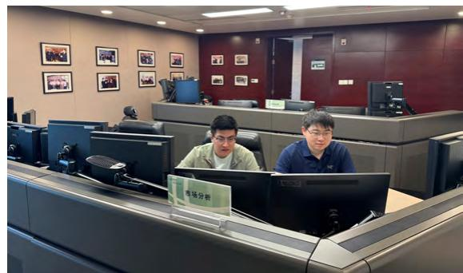

text_image

市场分析

电网公司技术人员在浙江电力现货市场建设现场提供技术支持

natural_image

Man working at a computer desk in an office setting, surrounded by green walls and office chair (no visible text or symbols)

电网公司技术人员在江苏电力现货市场建设现场提供技术支持

# 案例

# 国电南瑞以 AI 技术赋能虚拟电厂

国电南瑞紧跟《关于加快推进虚拟电厂发展的指导意见》等政策导向，积极拓展应用边界、扩大行业影响力，构建起虚拟电厂“运营服务—聚合监控”分层协同的整体架构，助力能源智能化转型、高质量发展，加快构建能源业态新发展格局。基于经验积累、人才储备与技术优势，国电南瑞深耕“AI+ 虚拟电厂调控”“AI+ 虚拟电厂运营”“AI+ 虚拟电厂服务”技术攻关，打造覆盖调控、运营、服务全环节的虚拟电厂数智化解决方案，适配全交易品种、全资源品类、全用户规模与全应用场景。

# 服务电网

先后承建国网山西、山东、宁夏、安徽、蒙东电力等9个省份的虚拟电厂运营服务平台建设。

# 服务运营商

为国能江苏、华润徐州、明德储能、龙源电力、宁夏综能等近20家虚拟电厂运营商系统提供建设服务。

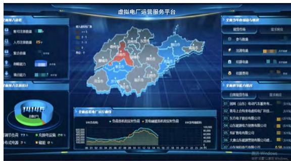

text_image

虚拟电厂运营服务平台
10145
数据源
调节负荷 73%
充换电设施 28%
形式电源 3%
储能 61%
宽带连接能力 (WIP) 需求
宽带连接能力 (WIP) 需求
宽带连接能力 (WIP) 需求
宽带连接能力 (WIP) 需求
宽带连接能力 (WIP) 需求
宽带连接能力 (WIP) 需求
宽带连接能力 (WIP) 需求
宽带连接能力 (WIP) 需求
宽带连接能力 (WIP) 需求
宽带连接能力(通信)
宽带连接能力(通信)
宽带连接能力(通信)
宽带连接能力(通信)
宽带连接能力(通信)
宽带连接能力(通信)
宽带连接能力(通信)
宽带连接能力(通信)
宽带连接能力(通信)
宽带连接能力(通信)
宽带连接能力(通信)
宽带连接能力(通信)
宽带连接能力(通信)
宽带连接能力(通信)
宽带连接能力(通信)
宽带连接能力(通信)
宽带连接能力(通信)
宽带连接能力 (WIP) 需求
宽带连接能力 (WIP) 需求
宽带连接能力 (WIP) 需求
宽带连接能力 (WIP) 需求
宽带连接能力 (WIP) 需求
宽带连接能力 (WIP) 需求
宽带连接能力 (WIP) 需求
宽带连接能力 (WIP) 需求
宽带连接能力（通信）
宽带连接能力 (WIP) 需求
宽带连接能力 (WIP) 需求
宽带连接能力 (WIP) 需求
宽带连接能力 (WIP) 需求
宽带连接能力 (WIP) 需求
宽带连接能力 (WIP) 需求
宽带连接能力 (WIP) 需求
宽带连接能力 (WIP) 需求
宽带连接能力
(01) 网络 (02) 电信汽车服务有限公司.
(03) 西南电力集团有限公司.
(05) 拉萨电力销售有限公司.
(06) 大唐铁路投资管理有限公司.
(07) 浙江水电公司.
(08) 其他电力公司.
(09) 其他电力公司。
(10) 其他电力公司。
(11) 其他电力公司。
(12) 其他电力公司。
(13) 其他电力公司。
(14) 其他电力公司。
(15) 其他电力公司。
(16) 其他电力公司。
(17) 其他电力公司。
(18) 其他电力公司。
(19) 其他电力公司。
(20) 其他电力公司。
(21) 其他电力公司。
(22) 其他电力公司。
(23) 其他电力公司。
(24) 其他电力公司。
(25) 其他电力公司。
(26) 其他电力公司。
(27) 其他电力公司。
(28) 其他电力公司。
(29) 其他电力公司。
(30) 其他电力公司。
(31) 其他电力公司。
(32) 其他电力公司。
(33) 其他电力公司。
(34) 其他电力公司。
(35) 其他电力公司。
(36) 其他电力公司。
(37) 其他电力公司。
(38) 其他电力公司。
(39) 其他电力公司。
(40) 其他电力公司。
(41) 其他电力公司。
(42) 其他电力公司。
(43) 其他电力公司。
(44) 其他电力公司。
(45) 其他电力公司。
(46) 其他电力公司。
(47) 其他电力公司。
(48) 其他电力公司。
(49) 其他电力公司。
(50) 其他电力公司。
(51) 其他电力公司。
(52) 其他电力公司。
(53) 其他电力公司。
(54) 其他电力公司。
(55) 其他电力公司。
(56) 其他电力公司。
(57) 其他电力公司。
(58) 其他电力公司。
(59) 其他电力公司。
(60) 其他电力公司。
(61) 其他电力公司。
(62) 其他电力公司。
(63) 其他电力公司。
(64) 其他电力公司。
(65) 其他电力公司。
(66) 其他电力公司。
(67) 其他电力公司。
(68) 其他电力公司。
(69) 其他电力公司。
(70) 其他电力公司。
(71) 其他电力公司。
(72) 其他电力公司。
(73) 其他电力公司。
(74) 其他电力公司。
(75) 其他电力公司。
(76) 其他电力公司。
(77) 其他电力公司。
(78) 其他电力公司。
(79) 其他电力公司。
(80) 其他电力公司。
(81) 其他电力公司。
(82) 其他电力公司。
(83) 其他电力公司。
(84) 其他电力公司。
(85) 其他电力公司。
(86) 其他电力公司。
(87) 其他电力公司。
(88) 其他电力公司。
(89) 其他电力公司。
(90) 其他电力公司。
(91) 其他电力公司。
(92) 其他电力公司。
(93) 其他电力公司。
(94) 其他电力公司。
(95) 其他电力公司。
(96) 其他电力公司。
(97) 其他电力公司。
(98) 其他电力公司。
(99) 其他电力公司。

承建的山东省虚拟电厂运营服务平台实现了全省“一站式、全流程”运营服务，其建设成效获央视报道

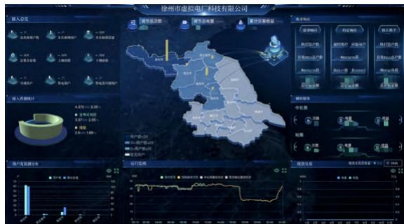

text_image

徐州市虚拟电厂科技有限公司
接入功能
系统用户：用户注册地址：用户注册地址
用户类型：虚拟电厂
用户规模：100%
用户类型：虚拟电厂
接入人数统计
4.8万～3.2亿
用户占比：100%
用户数量：100%
用户平均值：1.56亿
用户频率：100%

承建的华润徐州项目在提升运营效率、优化交易收益、增强负荷管理能力方面成效显著

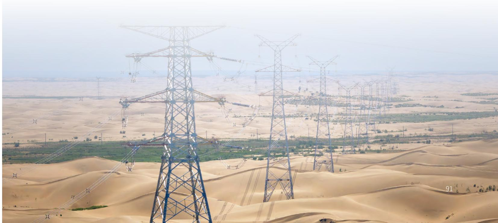

natural_image

Aerial view of a desert landscape with multiple high-voltage transmission towers and sand dunes, no visible text or symbols.

# 环保为本 减废防污

国电南瑞严格落实环保合规要求，不断完善污染防治机制，积极开展“三废一噪”综合治理，严格控制和减少环境污染，致力于打好蓝天、碧水、净土保卫战，推动绿色可持续发展。

# 环保合规管理

国电南瑞严格遵守《中华人民共和国环境保护法》等相关法律法规，制定《环境保护管理规范》《环境因素控制程序》等环境管理文件，系统性地完善环境管理标准与流程，明确环境保护管理目标与职责分工，开展环境隐患排查与环境风险识别评估，强化环境应急处置与监测预警能力，持续提升环境绩效表现与环境治理水平。

# 环境管理目标

○ 不发生被各级生态环境、水行政主管部门行政处罚或采取限批措施的事件  
○ 不发生污染物违规排放事件

# 数读南瑞

公司层面修编生态环保制度规范7项  
发布年度重要环境因素六大类共 10 项，制定并实施管控措施 23 项  
- 开展生态环境保护隐患排查整改专项工作，发现并整改问题 30 余项  
○ 环境违法违规及入刑事件 0 起  
○ 突发重大环境事件 0 起

# 见证荣耀

\- 国电南瑞获评江宁开发区环保优秀标杆示范企业

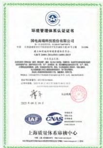

公司获得 GB/T 24001-2016/ISO 14001:2015 环境管理体系认证，认证体系覆盖公司自动化系统工程和设备及软件的设计开发、生产、技术服务；高、低压输配电设备的设计开发、生产、服务等各项业务中能够控制或施加影响的环境因素，并通过第三方机构每年的监督审核以保持认证证书的有效性。

# 环境风险识别

定期对活动、产品和服务中能够控制和能够施加影响的环境因素进行识别、分析和评价，形成《环境因素识别和评价表》及《重要环境因素清单》，确保重要环境因素得到有效控制并及时更新相关信息。

# 环保隐患排查

对生产、办公活动的节能减排情况、环境要求符合情况进行监测和测量，排查环保设施系统设备隐患，建立危废管理台账和环保设备设施台账，定时盘点更新，同时积极配合各级环保监督检查，做好环保提升排查整治等专项工作。

# 环保应急建设

定期开展环境突发事件应急预案修订及备案，强化相应的环境应急救援设备和物资的储备及日常管理，组织开展突发环境事件应急预案演练，提升环境突发事件应急响应和处置能力。

# 环保目标管理

实行环境保护目标责任制，制定环境保护管理目标，动态修编《环保责任清单》，开展环境保护检查、监督、考核工作，确保各项环保措施得到有效推进。

# 加强污染防治

国电南瑞严格遵循国家和地方法律法规，制定《废弃物和污水、噪声管理程序》《危险废弃物暂存间管理工作规范》《危险化学品管理规范》等制度，加强环保设施检查，委托专业机构检测，确保“三废”排放、厂界环境噪声符合环保标准，减少企业生产运营对当地环境、社会的影响。

报告期内，公司及下属子公司不属于环境保护部门公布的重点排污单位，“三废”及噪声均实现达标排放及合规处置。

# 废水管理

实施严格雨污分流管控，雨水通过雨水管道排入市政雨水管网，污水经过污水系统达标处理后排入市政污水管网。

在食堂等污水排放前端设置隔油池，执行“两天一小清、一周一大清”制度，及时清理油污沉积物，减少对后续处理工艺及污水管网的影响。

签订第三方运维托管协议，明确水质达标责任、设施运维标准及应急响应要求，委托第三方运维团队每日巡检设备，定期开展水质抽样检测。

配备应急处理设施，快速响应水质异常波动，并在污水站安装高效的废气收集与处理装置，确保废水处理系统产生的废气达标排放。

# 废气管理

通过改进生产工艺、使用低排放原材料等举措，从源头削减废气产生。

车间废气、食堂锅炉废气及油烟排放口均配备专业治理设施，定期开展设施检查与维护，确保处理效果达到法规要求。

委托第三方定期对废气排放进行检测和分析，出具有效的检测报告，确保废气污染物排放的合规性。

# 废弃物管理

健全废弃物全过程管理，规范废弃物分类与台账登记，建设符合标准的专用贮存设施并实行分类分区管理，实现全流程合法合规处置。

# 无害 废弃物

在生产办公场所分别摆放专用的回收桶，由保洁员收集、清理。可回收废弃物集中存放在仓库中，由专门部门定期处置；不可回收废弃物由保洁员每天清运到集中地点，做到日产日清，防止抛撒滴漏，由专业外包公司清运至指定的垃圾中转站，由环卫部门负责每日清运处置。

# 有害 废弃物

建立有害废弃物全过程污染防治责任制度，明确各部门及岗位管理职责；规范有害废弃物收储、入库与存放，建立出入库台账并在环保系统线上报备；委托有资质单位运输处置，严格执行转移联单制度；定期开展人员培训、应急演练，检查危险废弃物暂存间并制订应急预案，有效防范泄漏、火灾、爆炸等环境风险，确保处置全流程规范可控。

# 噪声治理

设置特定区域，企业机房的计算机服务器放入专门隔音室进行隔音。

配备专业装置，餐厅装配一体化油烟净化机组（含静压箱）减轻噪声。

定期噪声监测，确保符合环境噪声监测技术规范要求，降低环境纠纷风险。

# 江宁基地废水污染物治理

管控污染物：主要为 COD（化学需氧量）。

减排目标：致力于维持 COD 排放总量较 2024 年下降 5%。

核心减排举措：优化第三方运维考核机制，将减排指标纳入月度考核；每周开展水质深度分析，动态调整工艺参数，提升污染物去除效率；加强园区用水管控，推广节水器具，减少新鲜水用量，间接降低废水产生量；定期清理污水站沉淀池、滤池污泥，避免二次污染，保障处理系统稳定运行。

处理技术与方式：采用 “预处理（格栅 + 隔油池）+A²/O 生化处理” 工艺，针对生活污水及少量生产辅助污水特点，通过微生物降解有机物，去除悬浮物后达标排放。

监测设备运维与校准：水质在线监测设备（含 COD、pH、流量监测仪）由专业运管单位负责全流程运维，严格执行“每周校准、标定、检测”制度，采用国家标准物质进行比对试验，确保数据精准。

实施效果：全年监测数据有效传输率 100%，数据准确率达 100%，排放浓度及总量均满足标准要求，超额完成减排目标，污染防治效果显著。

对周边群体影响：通过环保局在线监管、第三方抽样检测、园区周边环境监测等多重验证，废水排放未对员工及当地社区居民健康造成影响，未引发水源污染、土壤污染等环境问题，获得周边社区及环保部门认可。

# 生产中心废气污染物治理

管控污染物：主要为非甲烷总烃、颗粒物、锡及其化合物。

减排目标：不发生污染物违规排放事件。

处理技术与方式：生产车间产生的工业废气在车间内被有效收集，然后由风管分别引至楼顶“焊烟净化器 + 活性炭吸附箱”处理，从而使废气得到净化，然后达标对外排放。

实施效果：工业废气污染物均达标排放，颗粒物、锡及其化合物排放浓度降低至0。

对周边群体影响：废气污染物监测结果均明显低于相应排放准限值，无异常产生，不会对周边居民的生活环境、身体健康或心理安宁造成实质性干扰。

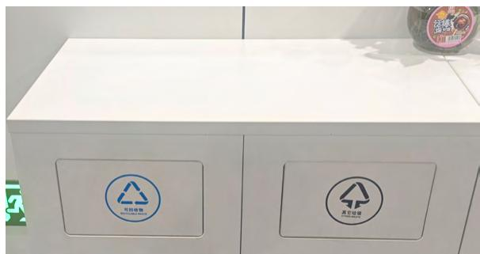

text_image

无铅铬
无铅铬
其它垃圾

江宁基地办公区垃圾分类设施

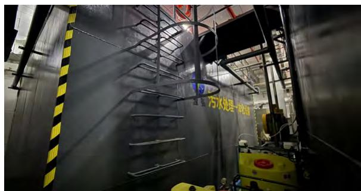

text_image

75K处是一般防爆

南瑞继保食堂污水综合治理升级项目

# 绿意传递 呵护自然

国电南瑞坚持走生态优先、绿色发展路线，积极倡导绿色运营理念，健全完善绿色生产体系，大力推行绿色办公、绿色出行，积极参与生态环境保护实践，为齐心推动绿色低碳循环发展、传播绿色理念贡献智慧与力量。

# 优化资源利用

国电南瑞将循环利用、资源节约等理念融入生产经营全过程，积极实施节能、节水、循环经济等具体举措，致力于在保障业务发展和运营效率的同时，最大化资源利用效率，创建资源节约型和环境友好型企业。

# 能源管理

公司严格遵守《中华人民共和国节约能源法》等法律法规，制定《能源运行控制程序》《能源评审控制程序》《新改扩建项目用能控制程序》等制度，持续加强节能管理，积极应用节能技术和清洁能源，力求降低能源消耗，提高能源利用效率，减少碳排放，满足市场和监管机构日益增加的低碳需求。

生产中心能源管理绩效

<table><tr><td>2025年目标指标</td><td colspan="2">2025年达成情况</td></tr><tr><td>单位产品生产能耗不增加</td><td>单位产品生产能耗为 1.9993 度,较去年降低 0.0582 度</td><td>目标达标</td></tr></table>

公司通过 GB/T 23331-2020/ISO 50001:2018 和 RB/T 101-2013 能源管理体系认证，认证体系覆盖公司自动化系统设备及其软件的设计开发和生产所涉及的能源管理活动，并通过第三方机构年度监督审核保持认证证书有效性。

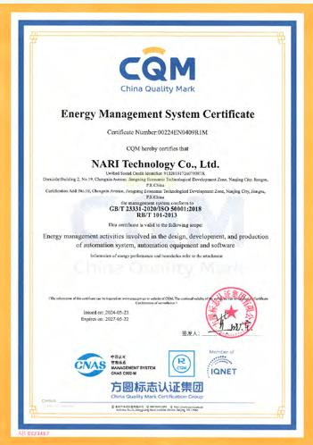

text_image

CQM
China Quality Mark
Energy Management System Certificate
Certificate Number:90224EIN049R1M
CQM hereby certifies that
NARI Technology Co., Ltd.
United Arab Emirates license No.1310000000078
Davoniki Building 2, No. 19, Chongqing Branch, Dongcheng Economic Technological Development Zone, Tianjin City, Beijing,
P.O. Box
Certification No. 53-11, Chongqing Branch, Dongcheng Economic Technological Development Zone, Tianjin City, Beijing,
P.O.Box
for application purposes in the United Arab Emirates
GB/T 23331-2202-35Q 560611:2018
RB/T 191-2013
This certificate is valid to be delivering upon:
Energy management activities involved in the design, development, and production
of automation system, automation equipment and software
Information of energy performance and technological info on the architecture
(The information of the certificate can be transferred to persons of the United Arab Emirates. The national database of energy management systems for the United Arab Emirates. The United Arab Emirates has a registered trademark at the Office of Energy Management System (ISO 1997)
Jared en: 2024-03-23
Erpina en: 2027-03-22
申请人：
CNAS
CNAS
CNAS MANAGEMENT SYSTEM
DATA SHEET
CNAS
CNAS
CNAS
CNAS
CNAS
CNAS
CNAS
CNAS
CNAS
CNAS
CNAS
CNAS
CNAS
CNAS
CNAS
CNAS
CNAS
CNAS
CNAS
CNAS
CNAS
CNAS
CNAS
CNAS
CNAS
CNAS
CNAS
CNAS
CNAS
CNAS
CNAS
CNAS
CNAS
CNAS

# 核心举措

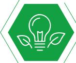

为用电、用气部门尽量加装独立控制开关，做到按需启用、随用随关，杜绝能源空耗。

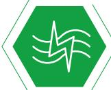

在楼宇安装能量计、各配电房台区安装计量表计，实现重点用能环节能耗实时监控。

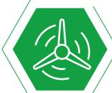

推广应用节约能源的新技术、新工艺、新设备和新材料，生产中心调试生产线电机均使用国家鼓励采用的先进节能型机电设备产品。

每月开展全厂能耗统计，依托能源监控平台开展能耗对比、跟踪与分析。

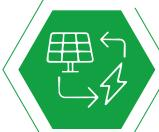

利用建筑屋顶、停车场等场所自建分布式光伏发电系统，供应清洁电能。

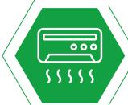

试点开展空调系统智能化改造，实现送风温度、新风量的同步智能调控，优化室内空气品质和温度舒适度，有效降低能源消耗。

# 案例

# 焕新不换 “旧”，绿色能源再添新翼

为加快“近零碳园区”建设步伐，2025年7月，南瑞继保对产业园一期屋顶光伏电站实施技术升级改造，将集中式逆变器更换为组串式逆变器，换装双面双玻发电组件，采用节能型升压变，精简发电输出环节，维持原装机容量。改造后年发电量较原设计提升15%，预计每年可节约标准煤838.6吨，减少烟尘排放约167.8吨、二氧化碳排放约2117吨、二氧化硫排放约6.8吨、氮氧化物排放约6吨。

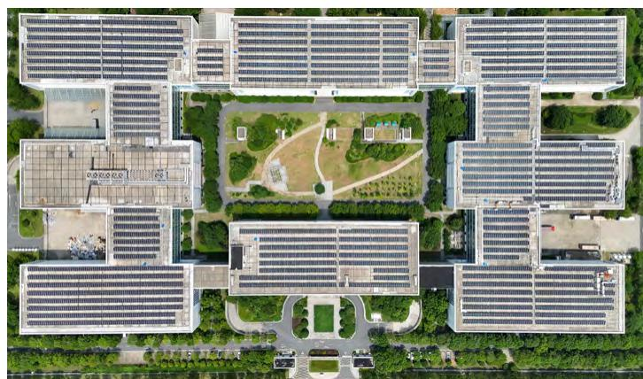

natural_image

Aerial view of a large industrial park with solar panel installations and surrounding greenery (no visible text or symbols)

产业园一期光伏电站技术改造后俯瞰图

# 水资源管理

公司建立三级节水管理体系，落实《用水定额管理制度》《用水计量管理制度》《定期检查维修制度》等制度，明确计划用水管理、计量检定、管网维护、巡检考核等全流程要求，形成“制度 + 执行 + 监督”的闭环管理机制，推进节约用水各项工作措施执行到位，着力提升水资源利用效率。

江宁基地水资源管理绩效

<table><tr><td>2025年目标指标</td><td colspan="2">2025年达成情况</td></tr><tr><td>持续保持办公用水、绿化用水等核心用水指标优于行业先进值,节水型器具普及率达100%</td><td>全园区2457台用水器具均采用节水型产品,覆盖水龙头、便器等全品类,漏水率保持0%;安装一级水表3只、二级水表49只、三级水表14只,计量器具配备率达100%,结合2025年9月3日-10日水平衡测试结果,办公用水、绿化用水等核心用水指标均优于行业先进值,用水效率符合GB/T12452-2022标准要求</td><td>目标达成</td></tr><tr><td>严格落实计划用水要求,月度用水量全量低于定额标准,无超计划用水情况</td><td>园区市政自来水通过三级计量体系实现用水全流程管控,经水平衡测试核算,全年各月度用水量均控制在计划定额范围内,办公、食堂、宿舍及冷却塔补水等各用水环节无超计划用水情况</td><td>目标达成</td></tr></table>

# 核心举措

# 计划管控

依据年度用水计划分解制定月度用水指标，建立“年度计划—月度分解—周监测—月复盘”管控机制，每周核对各级水表数据，确保用水量不突破定额上限。

# 管网管控

建立供水管网电子台账，每周开展管网巡检，每年进行1次管道阀门维护保养，从源头控制水资源浪费。

# 智能管控

推进远传水表系统升级，优化用水数据实时监测功能，实现异常用水快速预警，提升节水管理信息化水平，助力定额指标精准管控。

# 硬件维保

推广使用节水型器具（设备设施），并加强日常巡检维护，及时修复漏水、渗水点位，杜绝“跑冒滴漏”。

# 循环利用

构建 “雨水收集—人工湖储存—绿化浇灌” 的循环系统，江宁基地主楼、1 号食堂等绿化区域采用湖水喷灌，年节约自来水约 2 万立方米；中央空调冷却塔采用循环供水系统，年节约新鲜水约 22.5 万立方米。

# 节水宣传

通过在生活用水区域张贴节约用水标识、开展节水技能培训等方式强化内部宣传，提升员工的水资源管理意识。

# 循环经济

公司严格遵守《中华人民共和国循环经济促进法》相关要求，深入践行循环经济理念，着力畅通资源循环利用链条，致力于通过技术创新和管理优化实现资源高效利用与环境保护的双赢。

# 原材料管理

在充分满足产品使用需求的前提下，优化产品设计，引入先进工艺技术与装备，实现产品的轻量化、减量化与循环再造，提升原材料利用率。  
工厂收集机加工产生的板材、线缆、屏蔽层等余料及边角料，产品试制、小尺寸器件生产均优先复用，并做到余料、边角料尺寸过小或滞留时间过长时方可报废。

# 包装材料管理

- 加强绿色包装材料的研制和开发，优先采用可生物降解、可回收包装材料，减少对不可再生资源的依赖。  
☐ 机柜包装材料从木质材料转向纸质材料，既提升包装标准化和自动化水平，又实现包装材料的环保易用回收。

# 废旧物资管理

定期通报库存及库存周转情况，指导推动各单位库存物资盘活利用，通过项目代用、闲置物资再利用等方式，提升存量资源利用效率。  
制定《废旧物资管理办法》，规范废旧物资鉴定、拆旧、报废、移交、处置、结算等各环节工作，同时充分评估再利用价值或处置价值，确保废旧物资的高效处置和最大化利用。

# 案例

# 深挖材料“降本源”，降本增效显实效

生产中心制定《机械车间钢板使用管理规定》，明确钢板采购、领用、下料、余料回收全流程管理要求。为将制度落地见效，机械车间聚焦余料管控核心环节，建立起余料收集、分类、标识、存放的标准化机制，做好余料登记管理，按规格、材质对余料分类存放，在生产任务下达前优先检索匹配可用余料，为余料复用筑牢基础。在实际生产过程中，车间针对产品试制、工装制作、小批量生产及小件加工等场景，严格执行余料优先使用原则，通过精准核算零件尺寸、优化工艺路线等举措，充分盘活现有余料资源，有效减少新料领用。与此同时，车间持续优化机加工排版工艺，引入精细化排版理念，结合零件尺寸、生产数量等多维度综合测算，采用套裁、组合下料等方式，不断迭代优化排版方案，最大限度减少废料产生。通过制度管控、余料复用、工艺优化协同发力，2025年生产中心累计节约钢板原材料约6.4吨，有效提升材料利用率与库存周转效率，实现降本增效与绿色生产双赢。

# 打造绿色工厂

国电南瑞积极响应国家绿色制造体系建设号召，围绕“能源低碳化、资源高效化、生产洁净化、产品绿色化、用地集约化”维度，全面推进绿色工厂创建，推动绿色发展理念深度融入产品设计、生产、包装、运输、应用等各个环节，全方位保障产品全生命周期绿色环保，助力可持续生态建设。截至目前，公司共有国家级绿色工厂5家，省级绿色工厂8家。

绿色工厂入选情况

<table><tr><td>单位名称</td><td>级别</td></tr><tr><td>国电南瑞科技股份有限公司</td><td>国家级、省级</td></tr><tr><td>国电南瑞南京控制系统有限公司</td><td>国家级、省级</td></tr><tr><td>南京南瑞继保电气有限公司</td><td>国家级、省级</td></tr><tr><td>常州博瑞电力自动化设备有限公司</td><td>国家级、省级</td></tr><tr><td>安徽南瑞中天电力电子有限公司</td><td>国家级、省级</td></tr><tr><td>国电南瑞三能电力仪表(南京)有限公司</td><td>省级</td></tr><tr><td>南京南瑞水利水电科技有限公司</td><td>省级</td></tr><tr><td>南京南瑞信息通信科技有限公司</td><td>省级</td></tr></table>

# 产品全生命周期绿色管理

# 绿色设计

考虑按照《产品生态设计通则》对生产的产品进行生态设计，优选采用能效高、无污染、排放低的设备和工艺，并遵循标准化、模块化设计原则，构建多种模块类型产品，实现产品的敏捷推出。

# 绿色采购

制订绿色采购方案，优先采购和使用易回收、易拆解、易降解、无毒无害或者低毒低害的原辅材料，同时将有害物质使用、可回收材料使用等环保要求纳入采购信息，引导供应商提供绿色环保产品。

# 清洁生产

提高可回收材料使用比率，并对生产活动中涉及的化学物质制定禁止、管理、削减三级规定，减量使用或替代有害物质，在产品整个生命周期中最大限度减少化学物质使用。

# 绿色包装与物流

产品外包装选用绿色可回收的纸箱、木箱，并通过优化运输路线、提升运输工具能效，避免迂回运输和重复运输，有效减少碳排放。

# 产品碳足迹核查

采用适用的标准或规范对产品碳足迹进行核查，并利用核查结果对产品的碳足迹进行改善。

# 营造绿色文化

国电南瑞秉持“倡导绿色生活，构筑低碳未来”理念，在办公运营中践行“节约每一分钱、节约每一张纸、节约每一寸导线”，倡导全体员工简约适度、绿色低碳、文明健康的生活方式和消费模式。同时，利用自身人才和技术优势，积极参与生态保护项目、环保公益活动，保护生物多样性，共建绿水青山。

绿色办公

<table><tr><td>提倡打印机、复印机的墨盒尽量二次灌粉使用,非必要文件优先采用电子版传阅,确需打印时默认双面印刷,减少纸质打印量。</td><td>精简非必要会议,优先以线上形式召开会议,同时合理控制会议规模与时长,提高会议效率。</td><td>推广使用节能灯及光控开关等节电产品,严禁使用电炉、电暖气等高耗能电器,科学优化电梯、空调、照明及办公设备等用电场景。</td></tr><tr><td>选用高效用气设备,并在使用天然气过程中注意节约用气,提前做好准备工作,避免浪费。</td><td>倡导按需取水,严格管控园区车辆清洗、户外绿地养护用水,鼓励员工节约用水,避免“长流水”现象。</td><td>倡导按需取餐、均衡饮食,减少高热量、高脂肪食物的摄入,减少厨余垃圾产生,守护“舌尖上的环保”。</td></tr></table>

# 绿色出行

按照 “务实、高效、精简、节约” 的原则安排因公出国（境）任务，要求出国团组厉行节约，严禁利用公款旅游。

倡导少开私家车，多搭乘公共交通工具或驾乘新能源汽车，园区员工通勤班车全部使用新能源汽车，降低废气排放。

# 环保宣教

加强节能减排宣传教育，开展环保法律制度宣贯、环保知识培训，共计200余人次参加各类环保培训，提高全员生态文明意识和环保知识水平。

积极投身环保知识宣传、义务植树、保卫母亲河等环保公益实践，增强员工及公众的环境资源保护意识。

# 生态保护

新建、改建、扩建项目严格落实环境影响评价制度及“三同时”管理制度要求，在项目的开发、建设及运维全生命周期中，密切关注生态环境影响，坚决防范可能对生物多样性与生态系统造成负面干扰的各类风险。

自主研发全自动剖面水质监测装置在三峡库区水华预警系统成功应用，为三峡库区水华预报预警研究提供了科学依据和技术支撑。

助力国家级自然保护区——象山韭山列岛建设“净零碳智慧”观鸟屋与生态微电网，支撑极危物种中华凤头燕鸥繁殖，助力种群恢复再创纪录。

# 案例 开展“反食品浪费·南瑞再接力”主题系列活动

2025年9月30日至10月16日，国电南瑞开展“反食品浪费·南瑞再接力”主题系列活动。活动以线上线下结合、宣导与激励并行的方式，强化员工节约意识与法治观念，推动企业文明用餐文化落地，营造文明、节约、绿色的餐饮消费新风尚。

选取《中华人民共和国反食品浪费法》中与员工日常餐饮行为相关的重点条款，并依托“我的南瑞”App开展反食品浪费知识趣味答题。

举办“光盘打卡抽奖”线下互动，吸引员工积极参与文明餐桌共建。

组织观看反食品浪费宣传片，直观普及文明用餐、按需点餐、杜绝浪费理念。

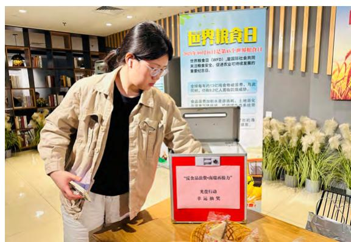

text_image

世界粮食日
2023年10月16日是第15个世界粮食日
世界粮食日（WFD），是国内社会共同关注粮食安全，促进农业可持续发展的重要信息。
全球每年约19亿间食物送饭，与此同时，仍有3.2亿人提供过夜。
食品是增加相关资源和、土地使用变化等因素，为经济社会发展带来更多的便利。
"泛食品消费-高端药能力"
米盘行动
幸福焕党

“光盘打卡抽奖”线下活动

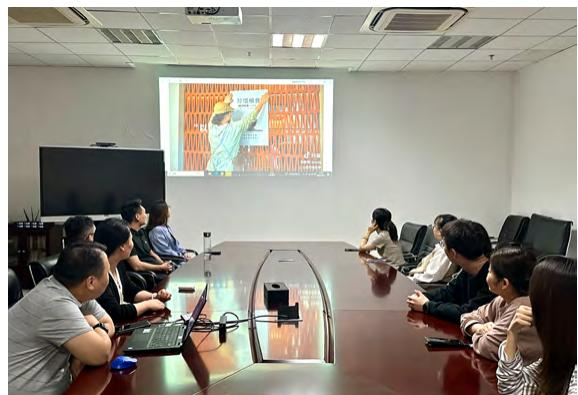

natural_image

Group of people seated around a conference table in a meeting room, facing a presentation screen (no visible text or symbols)

观看反食品浪费宣传片

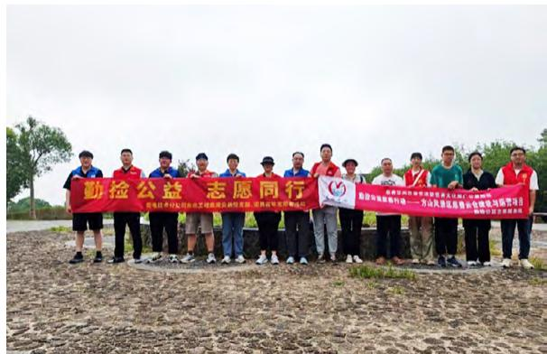

text_image

勤俭公益 志愿同行
勇健县平安区体育文化保障委员会组织部、市总工会、市总工会
勇健县发展和改革——劳动服务局宣传部宣传部宣传部宣传部宣传部宣传部宣传部宣传部宣传部宣传部宣传部宣传部宣传部宣传部宣传部宣传部宣传部宣传部宣传部宣传部宣传部宣传部宣传部宣传部宣传部宣传部宣传部宣传部宣传部宣传部宣传部宣传部宣传部宣传部宣传部宣传部宣传部宣传部宣传部宣传部宣传部宣传部宣传部宣传部宣传部宣传部宣传部宣传部宣传部宣传部宣传
勇健县发展和改革——劳动服务局宣传部宣传部宣传部宣传部宣传部宣传部宣传部宣传部宣传部宣传部宣传部宣传部宣传部宣传部宣传部宣传部宣传部宣传部宣传部宣传部宣传部宣传部宣传部宣传部宣传部宣传部宣传部宣传部宣传部宣传部宣传部宣传部宣传部宣传部宣传部宣传部宣传部宣传部宣传部宣传部宣传部宣传部宣传部宣传部宣

开展 “勤捡公益，志愿同行” 志愿者活动，沿途清理垃圾，净化方山风景区的生态环境

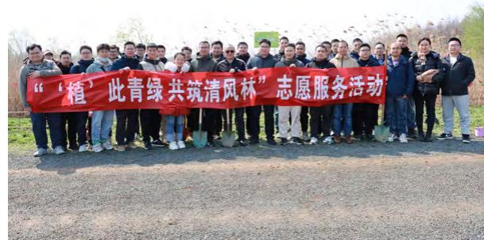

text_image

“‘植’此青绿共筑清风林”志愿服务活动

开展 “‘植’ 此青绿 共筑清风林” 志愿服务活动，引导员工通过种植 “廉洁树”、培育 “好家风”

# 案例 国电南瑞首套剖面水质自动监测装置在三峡库区投运

2025 年 8 月 17 日，国电南瑞自主研发的首套剖面水质自动监测装置在三峡库区香溪河野外实验平台正式投入运行。国电南瑞下属南瑞水电基于水华防控预警的实际需求，在现有的常规断面水质监测技术上拓展创新，形成了剖面水质自动监测技术，并自主研发出南瑞首套剖面水质自动监测装置。该装置采用了全自主知识产权的一体化多参数水质监测传感器和自动控制系统，能够自动监测库区从底部至水面的叶绿素、溶解氧、酸碱度、电导率、氧化还原电位等多项水质参量，监测精度高达 0.1 米级。该成果不仅满足香溪河野外实验平台的监测要求，更为深大湖库水生态空间异质性研究与水华预警研究提供了重要技术支撑。

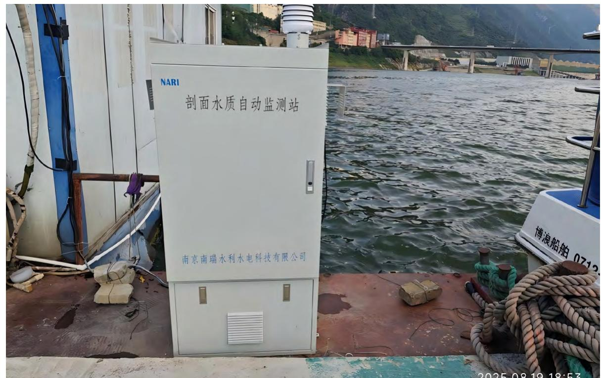

text_image

NARI
剖面水质自动监测站
南京南瑞水利水电科技有限公司
博浪船舶 0712
2025-08-19 18:53

剖面水质自动监测站

# 04

# 至善·瑞气祥和奉献幸福新力量

国电南瑞积极履行企业公民责任，将促进社会公平正义、增进人民福祉作为出发点和落脚点，坚持与利益相关方共享发展成果，全心全意打造“幸福南瑞”，携手共进助力行业发展，心怀感恩积极回馈社会，构筑企业与员工、企业与社会和谐共赢的“命运共同体”，为美好生活服务、护航。

聚才汇智 共话发展

强链扩圈 稳健前行

携手并进 和合共生

惠泽民生 传递温情

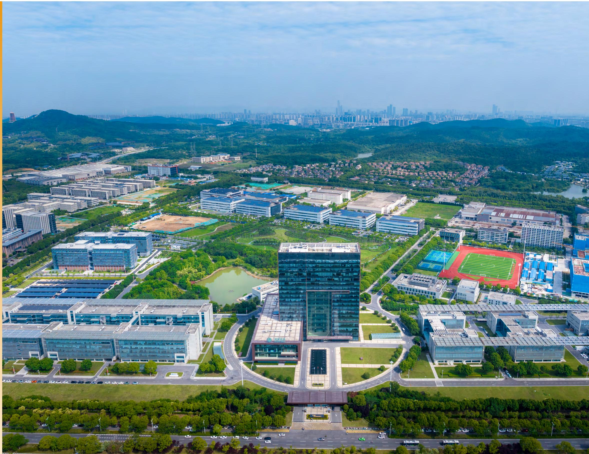

natural_image

Aerial view of a modern campus with glass skyscrapers, sports fields, and surrounding greenery, with a city skyline in the background (no visible text or signage).

# 聚才汇智 共话发展

国电南瑞视人才为企业的第一资源，秉承“以人为本、关爱健康，用心营造和谐氛围”的方针，坚持以奋斗者为本、共同成长的准则，关爱员工身心健康，提供安全和健康的工作条件，注重员工沟通与民主参与，建立企业和员工的良好共赢关系，努力营造和谐的工作氛围。

# 国电南瑞员工管理体系

# 治理

- ESG委员会负责指导和监督包括“员工”议题在内的ESG相关事宜，对相关业务进行研究并提出建议。  
- ESG 委员会下设 ESG 工作组，组织开展“员工”议题的影响、风险与机遇分析，协调相关事宜，并定期向 ESG 委员会汇报相关工作。  
- 党委组织部（人力资源部）是企业人力资源相关工作的归口部门，建立与保持《人力资源管理程序》等文件，主要人力资源规章制度和规划计划，人才发展规划和培养体系建设，招聘管理，员工绩效、人才评价和奖惩管理，职业发展通道和专家职员管理等工作。  
- 安全质量部（生产物资部）是负责职业卫生监督管理，修订《职业卫生管理规范》《职业卫生管理手册》等一系列旨在保障员工职业健康的体系文件，压实各级归口管理部门责任。  
- 党委党建部（党委宣传部、工会办公室、离退休工作部）负责工会组织建设和职工关心关爱、离退休工作的归口管理等工作。

# 战略

- 积极识别、评估和管理人力资本相关的风险和机遇，基于企业战略目标，科学推进人力资源“十五五”专项规划的系统编制工作。  
- 坚持“嵌入式保护、贴身式保障、自助式保健”的理念，以提升高科技含量、提升制度执行刚性、提升标准化水平“三个提升”为抓手，推进劳动防护向工作环境延伸、职业病防治向职业人群健康管理延伸。

# 影响、风险和机遇管理

- 健全员工雇佣体系，为员工提供各项福利，开展多样化人才培训，细分发展通道，建优建强人才队伍。  
- 拓宽拓深人才引育激励，实施差异化引育策略，有序实施多元激励计划，激发人才创新活力。  
- 加快构建“预防为主、防治一体、硬件过硬、软件不软”的现代职业卫生管理体系，预防、控制和消除职业病危害。  
- 精准实施凝心工程，坚持做深精准服务，组织开展心理咨询、健康讲座、职工运动会、球类友谊赛等活动，不断提升员工的归属感与满意度。

# 指标与目标

- 劳动合同签订率 100%  
- 社会保险覆盖率 100%  
- 员工培训覆盖率 95.1%  
- 员工流失率 0.5%  
- 职工健康体检覆盖率 100%  
- 新增职业病 0 例  
- 员工满意度 100%  
- 劳动纠纷案件数量 0 件

natural_image

Illustration of two business professionals shaking hands in an office setting with documents and potted plants (no text or symbols)

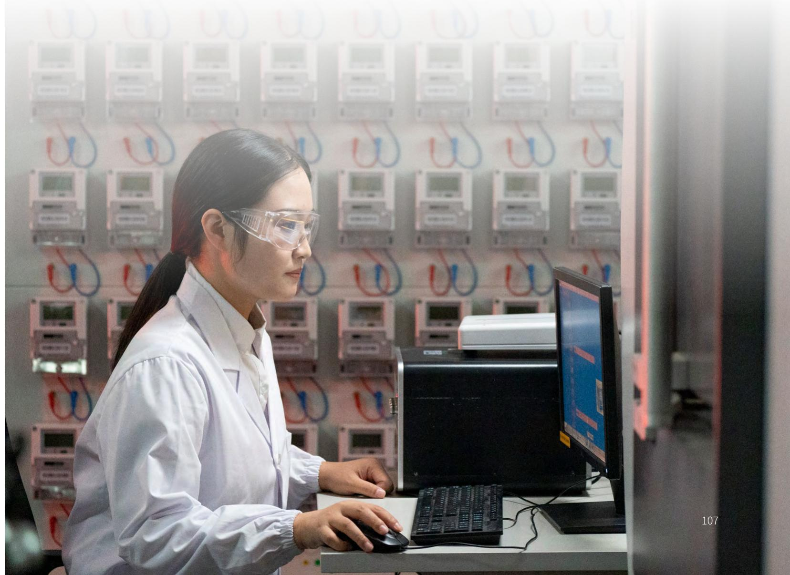

natural_image

Scientist in lab coat and safety goggles working at a computer in a control room with multiple meters on the wall (no visible text or symbols)

<table><tr><td>风险/机遇类型</td><td>风险/机遇描述</td><td>潜在财务影响</td><td>影响程度</td><td>影响周期</td><td>影响环节</td><td>应对措施</td></tr><tr><td>法律风险</td><td>在招聘及用工过程中,若违反用人相关法律法规,引发劳动纠纷或仲裁,可能导致面临诉讼或行政处罚。在生产过程中,因法规、标准变化识别不及时导致未能够准确识别危险源,发生危险事故。</td><td>管理成本增加</td><td>低</td><td>短期、中期</td><td>自身运营</td><td>建立健全的人力资源管理制度,确保员工权益得到充分保障。及时组织管理人员对新出台政策法规进行学习,对照检查公司生产过程的风险源,制定措施避免风险。</td></tr><tr><td>运营风险</td><td>若公司培训体系不完善、激励政策落实不到位、福待遇差,可能导致员工流失和士气低下,影响公司稳定。若公司未能为员工提供适当的个人防护装备或生产监督不到位,且未定期进行职业健康体检,可能增加员工患职业病的风险。</td><td>运营成本增加</td><td>高</td><td>短期、中期</td><td>自身运营</td><td>建立系统的培训与发展体系,提供有竞争力的薪酬和福利,及时解决员工关切的问题。不定期对员工上岗规范使用防护用品进行检查,定期组织重点岗位员工进行体检。</td></tr><tr><td>市场机遇</td><td>战略性新兴产业领域、卡脖子技术领域对复合型高端领军人才及配套科技攻关团队的需求逐步加大。有竞争力的薪酬福利和人才培养机制,有助于吸引高素质人才,从而提升研发团队的专业实力和整体竞争力,更好地应对市场变化和客户需求。</td><td>营业收入增加</td><td>高</td><td>中期、长期</td><td>自身运营</td><td>制定公平合理、富有竞争力的薪酬福利制度,搭建完善人才培养体系,通过与科研院所合作、校企人才战略合作等,落实激励举措,充分调动员工积极性,吸纳更多优秀人才。</td></tr></table>

# 员工权益保障

国电南瑞严格遵守《中华人民共和国劳动法》《中华人民共和国劳动合同法》等法律法规，尊重并保护员工在平等就业、薪酬福利、民主参与等方面的合法权益，打造包容、多元的员工队伍。

# 数读南瑞

\- 员工总人数 12781 人
- 少数民族员工占比 2.95%
- 新进招聘员工总数 1048 人

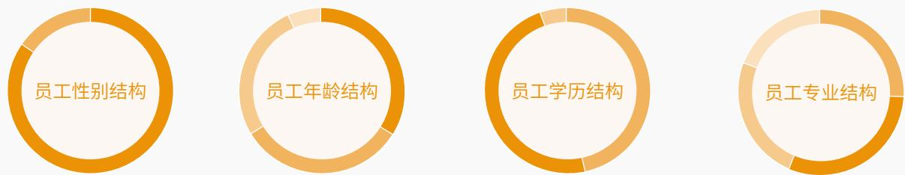

flowchart

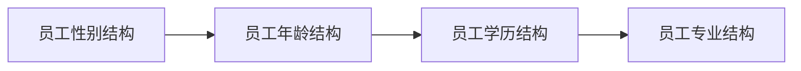
```mermaid
graph LR
  A["员工性别结构"] --> B["员工年龄结构"]
  B --> C["员工学历结构"]
  C --> D["员工专业结构"]
```

■ 男性：84.63% ■ 29岁及以下：33.72% ■ 硕士及以上：46.44% ■ 高级技术人员：25.66%  
■ 女性：15.37% ■ 30—39岁：32.57% ■ 本科：48.15% ■ 中级技术人员：30.62%  
■ 40—49 岁：26.93% ■ 大专及以下：5.41% ■ 初级技术人员：24.33%  
■ 50 岁及以上：6.78%
■ 其他：19.40%

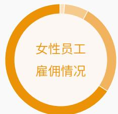

高层管理职位的女性员工：0.92%  
中层管理职位的女性员工：6.98%  
■ 初级管理职位的女性员工：26.37%  
■ 基层女性员工：65.73%

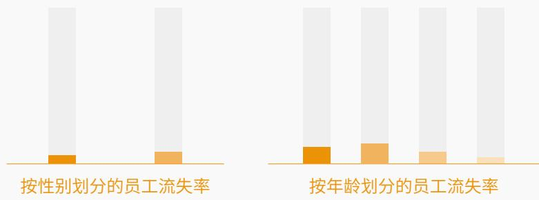

bar

| Category | Value |
| --- | --- |
| 按性别划分的员工流失率 | ~10 |
| 按年龄划分的员工流失率 | ~25 |

# 合规雇佣 $^{1}$

- 落实《劳动合同管理办法》《员工招聘管理办法》等管理制度，确保招聘流程的合规性与公正性。  
- 采用统一招聘标准，明确岗位需求与任职资格，招聘流程包括在线测评、简历筛选、笔/面试等环节，确保客观性与公平性。  
- 严禁任何形式的歧视行为，不因应聘者的性别、年龄、种族、宗教信仰等差异而区别对待，坚决抵制使用童工和强制劳动。  
- 打造“引才定位明晰、策略精准适配、选拔科学高效、管理合规有序”的毕业生招聘体系，更加突出引才优势、更加突出招聘精度、更加突出流程规范，集聚优质生源。  
- 如发现违规情况，将启动调查程序，查明原因并采取纠正措施，包括对相关责任人进行问责、优化招聘流程等，杜绝类似问题再次发生。  
如发生劳动争议，将依据《中华人民共和国劳动争议调解仲裁法》，按照公平公正原则依法处理劳动纠纷。

# 薪酬体系

- 落实《绩效管理实施细则》《岗位绩效工资管理办法》等管理制度，规范收入分配关系，持续优化工资分配策略，切实发挥薪酬激励作用。  
- 采用岗位绩效工资制度，以提升员工能力素质为导向，绩效工资分配与员工绩效贡献紧密挂钩，由基本工资、绩效工资、辅助工资三个部分构成。  
- 实行“一岗多级、绩效联动”的宽带岗级体系和“一级多薪、岗薪联动”的宽带薪酬体系，实现“绩优岗升、岗变薪变”。  
- 按月在固定日期发放员工工资，如遇节假日或休息日，提前至最近工作日发放。

# 民主管理

- 按照《职工代表管理办法》《职工代表大会实施办法》《厂务公开管理办法》，《合理化建议制度》等制度，落实职代会制度、推进厂务公开、畅通信访渠道等方式，搭建职工依法参与民主决策、行使民主监督权利的平台。  
- 指导各基层工会开展换届选举工作，一对一指导基层单位规范召开职代会，加强提案的贯彻落实。  
- 召开基层联络员座谈会，发动员工开展“我为班组减负献一策”合理化建议征集活动，汇集员工心声、凝聚员工智慧。  
- 完善职工诉求服务平台建设，开展为职工办实事工作，解决好职工关注的急难愁盼问题，构建联系广泛服务职工的工会工作体系。

# 福利体系

- 全面评估现行福利保障制度的有效性，修订职工困难补助管理、职工疗养管理两项制度，进一步夯实福利保障管理基础。  
- 优化福利保障业务办理平台功能，通过统一归集各类福利、上线智能识别、批量上传及实时校验等功能，显著提升了福利政策的触达效率、员工使用体验与业务办理效能。  
- 整合关联业务设立“退休一件事”窗口，优化退休办理流程，同时为拟退休职工提供政策指导，保障延迟退休顺利实施。  
- 拓展养老金融专区并加强宣传，提升员工对个人养老金政策的认知与参与意愿。  
- 接轨国家政策调整，保障生育津贴发放模式有序转换。

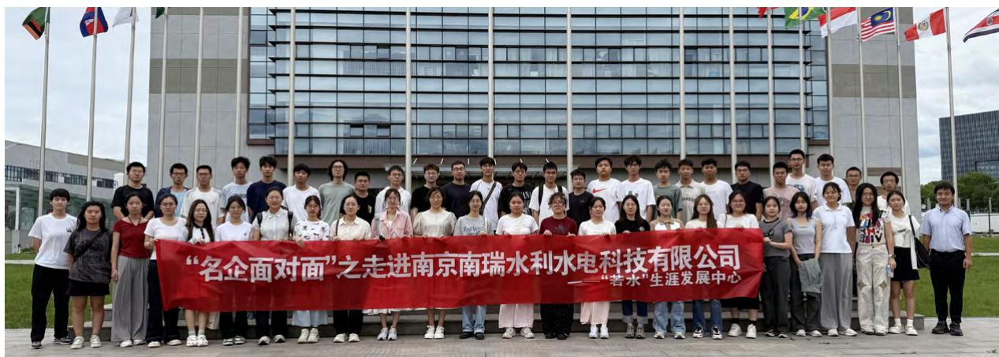

text_image

“名企面对面”之走进南京南瑞水利水电科技有限公司
——“若水”生涯发展中心

南瑞水电与河海大学水文水资源学院、地理与遥感学院和电气与动力工程学院分别开展了“名企面对面”就业交流活动

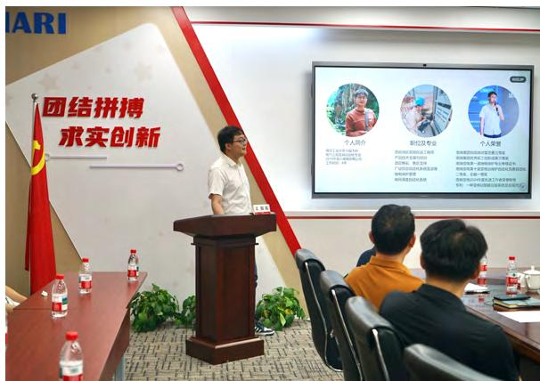

text_image

IARI
团结拼搏
求实创新
个人助力
积极把握中国科技
产业、社会和文化
“团结拼搏”是实现中华民族伟大复兴的唯一力量。
个人关怀
积极把握中国科技
产业、社会和文化
“团结拼搏”是实现中华民族伟大复兴的唯一力量。
个人关怀
积极把握中国科技
产业、社会和文化
“团结拼搏”是实现中华民族伟大复兴的唯一力量。
个人关怀
积极把握中国科技
产业、社会和文化
“团结拼搏”是实现中华民族伟大复兴的唯一力量。

变电公司与南京工业大学电气工程与控制科学学院开展 2025 年暑期社会实践活动

natural_image

Illustration of two people holding hands beside a large document (no text or symbols visible)

# 员工职业发展

国电南瑞围绕企业战略与人才发展需求，构建覆盖全员、分层分类的系统化培训体系，重点聚焦管理岗位与技术岗位两大核心群体，开展针对性强、实效突出的专项培训，全面提升员工履职能力与发展潜力。同时，依据《职位发展通道管理办法》，设置定位清晰、导向明确的职业发展通道，不断完善职业发展通道运行机制，有效拓展员工成长空间，确保每一位员工在公司能做到人尽其才、才尽其用、人事相宜。

# 加强员工培训培养

# 针对管理岗位培训

- 以“四维引航”课程体系为核心，深化领导力发展、提升履职能力，全年举办5期领导人员专题培训班，强化战略思维、改革管理与政策理解能力。  
- 面向基层及新任职管理人员，开展优秀年轻干部培训与新任职管理人员培训，创新“教室 + 现场”双课堂模式，实践课程占比突破 $40\%$ ，着力提升团队管理、项目实战与跨部门协同能力。  
- 通过引入华为等先进企业变革经验，举办本部骨干培训，系统提升管理人员推动改革、落实部署的执行能力。

# 针对技术岗位培训

- 紧密围绕新型电力系统建设与人工智能等前沿技术趋势开展培训，统筹举办人工智能专题培训5期，覆盖超4200人次，构建起从理论到场景化应用的完整学习路径。  
- 依托内部学习平台，开发上线90余门岗位专业课程，涵盖用电信息采集、营销2.0、嵌入式开发等多个技术领域。  
- 通过“导师带教”“善讲内训师训练营”等项目，持续强化技术传承与经验沉淀。  
- 组织技术骨干参与行业教材编写、继续教育培训及现场教学，不断拓展技术人员的行业视野、提升专业深度。

# 畅通职业发展通道

- 以岗位为基础优化多通道并行互通的发展体系，进一步打开职业发展“天花板”，引导专业人才各专其长、各得发展。  
- 深入推行能力认证机制，打破以年限、学历、职称等为主要评价依据的传统做法，以技术水平、业绩贡献等维度评价人才，牵引员工比学赶超、创新创效。

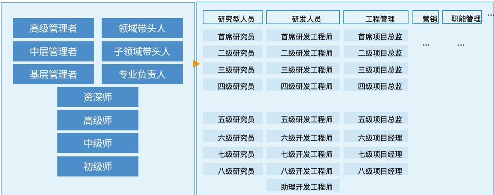

flowchart

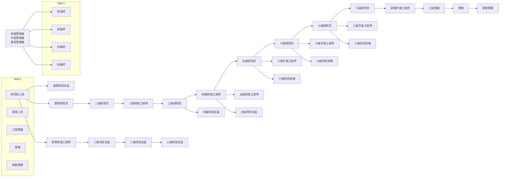
```mermaid
graph LR
  Root["高级管理者\n中层管理者\n基层管理者"] --> A["资深师"]
  Root --> B["高级师"]
  Root --> C["中级师"]
  Root --> D["初级师"]
  
  subgraph Sub_1 [Sub-1]
    direction TB
    A
    B
    C
    D
  end
  
  subgraph Sub_2 [Sub-2]
    direction TB
    E["研究型人员"]
    F["研发人员"]
    G["工程管理"]
    H["营销"]
    I["职能管理"]
  end
  
  E --> J["首席研究员"]
  E --> K["首席研发工程师"]
  E --> L["首席项目总监"]
  
  J --> M["二级研究员"]
  K --> N["二级项目总监"]
  M --> O["二级研发工程师"]
  N --> P["二级项目总监"]
  
  O --> Q["三级研究员"]
  P --> R["三级项目总监"]
  
  Q --> S["四级研发工程师"]
  Q --> T["四级项目总监"]
  
  S --> U["五级研究员"]
  S --> V["五级研发工程师"]
  S --> W["五级项目总监"]
  
  U --> X["六级研究员"]
  U --> Y["六级开发工程师"]
  U --> Z["六级项目经理"]
  
  X --> AA["七级研究员"]
  X --> AB["七级开发工程师"]
  X --> AC["七级项目经理"]
  
  AA --> AD["八级研究员"]
  AA --> AE["八级开发工程师"]
  AA --> AF["八级项目经理"]
  
  AD --> AG["助理开发工程师"]
  AG --> AH["工程管理"]
  AH --> AI["营销"]
  AI --> AJ["职能管理"]
```

“Y”型职业双通道

# 案例 聚四力·强筑基·启新程——新“瑞”青年扬帆启航

2025 年 9 月，国电南瑞以 “聚四力·强筑基·启新程” 为核心框架，组织开展系统化新员工入职培训。培训围绕 “传递压力、增强活力、加大吸引力、提高竞争力” 四力维度，通过政治引领、文化融入、团队协作、专业赋能四大模块，助力新员工完成从校园到职场的角色转变。培训内容涵盖红色教育、合规意识、创新沙盘、职业发展等多方面，并融合互动式、体验式学习方式，激发团队活力与创新思维。同时，依托企业文化宣贯、青年骨干分享、现场参观学习等形式，增强新员工对企业的认同感与归属感。此次培训是公司践行 “以人为本” 发展理念、推进人才强企战略的具体体现，为青年员工融入公司文化、投身新型电力系统建设奠定了坚实根基。

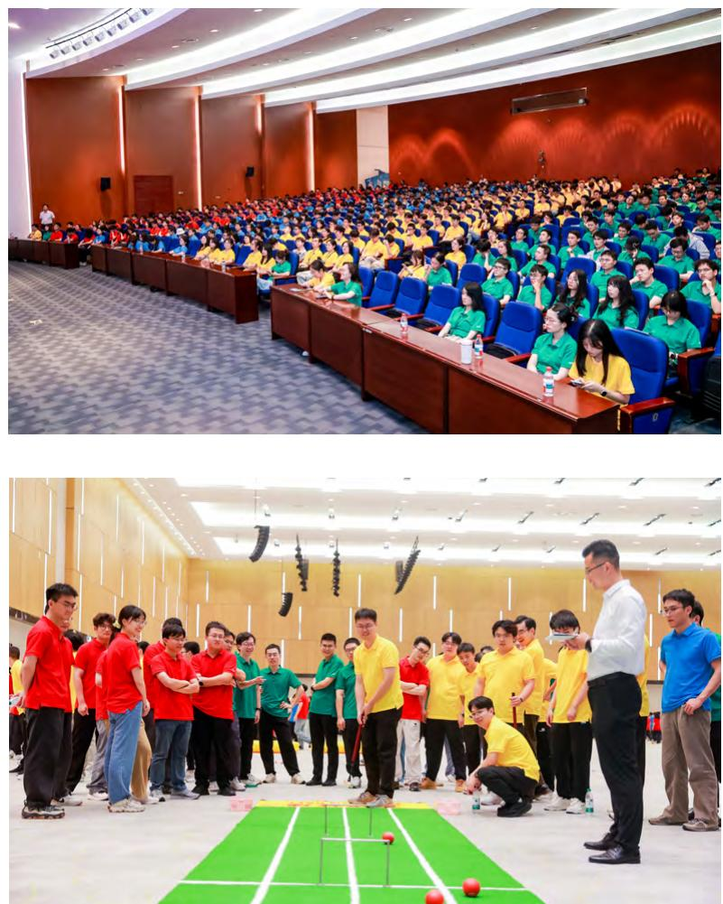

# 员工健康成长

国电南瑞始终将员工身心健康与生活质量摆在重要位置，积极为员工办实事、解难事、做好事，开展形式多样、内容新颖的员工关怀项目与文体娱乐活动，让员工关爱更有力度、员工管理更有温度，营造健康文明、团结和谐的良好氛围。

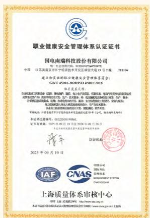

text_image

职业健康安全管理体系认证证书
国电南瑞科技股份有限公司
中国 国电南瑞科技有限公司 2025年9月19日
注册地址:北京市海淀区北三环西路8号院1号楼1层
办公地址:北京市海淀区北三环西路8号院1号楼1层
联系电话:010-63400000
电子邮箱:www.nanxiwan.com.cn
职业健康安全管理体系认证证书
GJ/T 45001-2025/TSX 4500112018
主办单位:中国证券监督管理委员会
国务院办公厅
国家税务总局北京市税务局
国家税务总局北京市税务局
国家税务总局北京市税务局
国家税务总局北京市税务局
国家税务总局北京市税务局
国家税务总局北京市税务局
国家税务总局北京市税务局
国家税务总局北京市税务局
国家税务总局北京市税务局
国家税务总局北京市税务局
国家税务总局北京市税务局
国家税务总局北京市税务局
国家税务总局北京市税务局
国家税务总局北京市税务局
国家税务总局北京市税务局
国家税务总局北京市税务局
国家税务总局北京市税务局
国家税务总局北京市税务局
国家税务总局北京市税务局
国家税务总局北京市税务局
国家税务总局北京市税局
国家税务总局北京市税务局
国家税务总局北京市税务局
国家税务总局北京市税务局
国家税务总局北京市税务局
国家税务总局北京市税务局
国家税务总局北京市税务局
国家税务总局北京市税务局
国家税务总局北京市税务局
国家税务总局北京市税务局
国家税务总局北京市税务局
国家税务总局北京市税务局
国家税务总局北京市税务局
国家税务总局北京市税务局
国家税务总局北京市税务局
国家税务总局北京市税务局
国家税务总局北京市税务局
国家税务总局北京市税务局
国家税务总局北京市税务局
国家税务总局北京市税务局
国家税务总局北京市税务局
国家税务总局北京市税务局
国家税务总局北京市税务局
国家税务总局北京市税务局
国家税务总局北京市税务局
国家税务总局北京市税务局
国家税务总局北京市税务局
国家税务总局北京市税务局
国家税务总局北京市税务局
国家税务总局北京市税务局
国家税务总局北京市税务局
国家税务总局北京市税务局
国家税务总局北京市税务局
国家税务总局北京市税务局
国家税务总局北京市税务局
国家税务总局北京市税务局
国家税务总局北京市税务局
国家税务总局北京市税务局
国家税务总局北京市税务局
国家税务总局北京市税务局
国家税务总局北京税务局
国家税务总局北京税务局
国家税务总局北京税务局
国家税务总局北京税务局
国家税务总局北京税务局
国家税务总局北京税务局
国家税务总局北京税务局
国家税务总局北京税务局
国家税务总局北京税务局
国家税务总局北京税务局
国家税务总局北京税务局

国电南瑞通过 GB/T45001-2020/ISO 45001:2018 职业健康安全管理体系认证

# 数读南瑞

员工工伤保险投入金额 1270.42 万元  
○ 帮扶困难员工 122 人  
○ 慰问金额 111.45 万元

- 员工工伤保险人员覆盖率 100%  
- 开展慰问活动 213 次

# 重视职业健康

# 风险防范

\- 定期组织各单位全面辨识生产作业现场工作环境、工作设备、工作流程和人为操作中面临的潜在危险和有害因素形成《危险源辨识及风险评价、风险管控清单》，采取有效措施，及时整改闭环。

# 健康保障

\- 加强职业病防护设施及劳动防护用品管理，强化职业卫生培训与宣传，完善现场操作规程，扎实开展健康体检、“一对一”心理咨询等服务，多维度守护员工身心健康。

# 关爱员工生活

# 改善工作环境

\- 完成江宁基地净水设施升级，提升园区健康饮水设施的覆盖广度与服务效能；新增江宁基地产业楼北侧人行道路，实现“人车分流”，提升园区道路通行安全性与员工出行便捷度；推动各食堂管理对标、设备增配，全面实现“明厨亮灶”与智能监控，有力促进各园区餐饮服务规范与同质化。

# 文体娱乐活动

\- 举办“我和我的专业”文化大讲堂暨奋斗的青春最美丽分享会、涵盖7大类37个项目的职工运动会、“灵蛇献瑞喜闹元宵”送元宵活动、跨年蛋糕分享会、春季环湖健步走、秋季登高等系列活动，助力员工加强交流、愉悦身心。

# 关心关爱员工

\- 常态化开展冬季送温暖、夏季送清凉、平时送关爱活动，组织好节日、生日普惠制慰问，持续通过举办“三八”节活动、瑜伽、形体礼仪课等文体活动践行女性员工关怀，开展职工子女暑期托管，加强对困难员工的慰问帮扶，将对员工的关怀、关爱落到实处。

# 关怀离退休人员

\- 深化社企共建，依托社区平台服务好离退休人员，并对离退休人员开展走访慰问，策划开展“七个一”银青携手、“敬老、爱老、助老”迎重阳等系列活动，切实保障离退休人员队伍和谐稳定。

# 案例 守护健康，四季不离——国电南瑞开展“健康四季”主题诊疗服务

2025年，国电南瑞始终关注员工身心健康，通过打造“健康四季”特色诊疗服务，体系化推进员工健康管理工作。公司全年按季度邀请医疗专家走进企业，结合季节特点定制主题健康项目：春季开展“美丽同行绽放自信”皮肤病诊疗与“舒缓颈肩压力”推拿体验活动；夏季聚焦体重管理，助力员工强健体魄；秋季围绕“‘胃’你守护健康‘肠’伴”主题，提供肠胃健康专业指导；冬季依托中医养生调理，增强员工身体抵抗力。该系列服务让员工在职场即可便捷享受高品质、个性化的健康支持，有效提升了全员健康意识与疾病预防能力。

natural_image

Group of people wearing masks and winter coats participating in a food preparation or baking activity at a table with colorful dessert items (no visible text or symbols)

“灵蛇献瑞 喜闹元宵” 送元宵活动

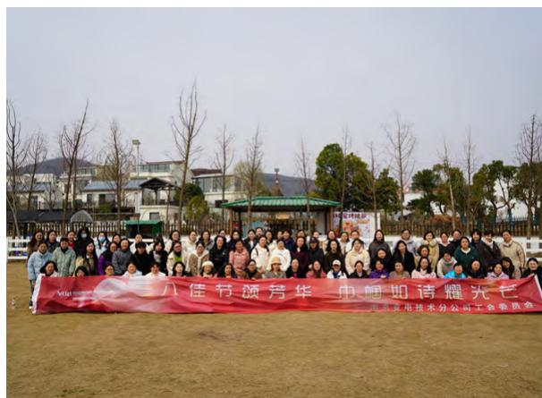

text_image

八佳节硕芳华 中国如诗耀光亡
北京立华技术分公司工会委员会

“春风十里巾帼如诗”三八妇女节主题活动

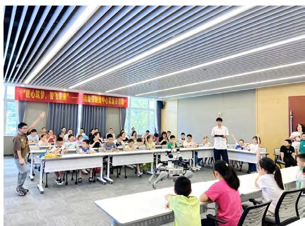

text_image

“匠心筑梦，智飞来来”——凯迪博制造中心交流日日聊

“匠心筑梦，智飞未来”亲子科技嘉年华活动

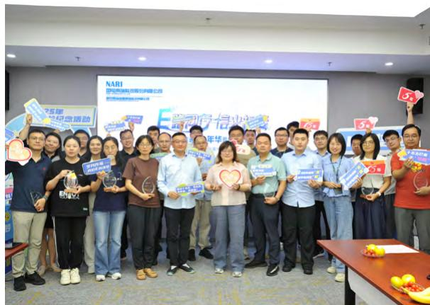

text_image

NABI
中国铁路物资集团有限公司
2023年年度股东大会
E路平台外卖
2023年年度股东大会

“家·年华”司龄纪念活动

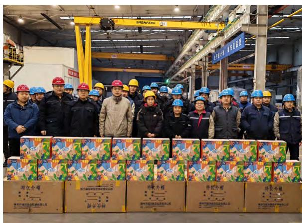

text_image

Group photo of workers in hard hats and uniforms holding stacked boxes labeled with Chinese text, standing in front of a factory with overhead crane and signage.

深入一线班组与项目现场开展“冬季送温暖”活动

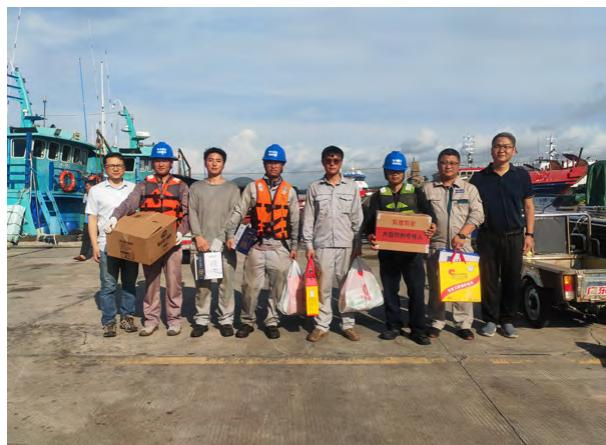

text_image

Group photo of workers in safety gear holding boxes and bags at a port, with visible text on materials and containers.

对广东省阳江市阳西县海上风电项目一线员工进行慰问

# 强链扩圈 稳健前行

国电南瑞严格遵守《中华人民共和国招标投标法》等相关法律法规，坚持责任采购、公平采购，建立健全采购管理体系，持续完善供应商全生命周期管理，平等对待中小企业合作伙伴，大力营造公开、公平、公正和诚实信用的供应链生态，防范环境与社会风险，保障供应链安全稳定，引领价值链可持续发展。

# 坚持责任采购

国电南瑞制定《采购计划管理办法》《采购活动管理办法》等制度文件，明确采购程序、禁止行为与责任追究，保障采购流程公平公正。同时，牢牢把握合规、数智化和绿色发展方向，以招标采购为切入点，持续提升创新创效能力，积极打造阳光透明采购体系，不断推进采购流程标准化，提高物资采购质量，确保采购工作合法、合规和高效。

# 责任采购举措

- 大力推进所有采购活动上平台，实现采购活动公开透明、规范有序。  
- 建立采购前置合规审查工作机制，深化平台智能评审工具推广应用，防范采购合规风险。  
- 统筹规划、充分发挥采购规模效益，加强需求批次整合，科学修编集中采购目录、采购策略及批次计划，提高采购需求的准确性、及时性。  
- 开展产业单位物资专项检查，组织相关人员参加物资廉洁等专项培训，不断提高产业单位合规意识及专业素养。  
- 严格采购策略统一管理，持续优化资质业绩条件设置，积极引入绿色低碳采购要素，鼓励并推动投标人选用能耗低、能效高的节能产品，尽可能降低对环境产生的影响。  
- 严格落实评标场所“四隔离”工作要求，完善评审场所设施，强化评标（评审）过程管理，提升招标采购业务规范化水平。

natural_image

Group of business professionals walking outdoors in front of glass doors, no visible text or signage

# 完善供应商管理

国电南瑞制定《供应商关系管理办法》，规范供应商在环境和社会方面的行为，明确供应商资质能力信息核实、绩效评价、不良行为处理等流程。同时，严格供应商筛选标准，强化供应商审查与评估流程，深化与优质供应商的长期稳定合作，持续提升公司供应链管理水平。

# 数读南瑞

○ 供应商审查率 100%

报告期内开展合作的供应商数量 11,710 家

因不合规被终止合作的供应商数量 3 家

\- 不良供应商实施系统冻结 3 家

按地区划分的供应商数目  
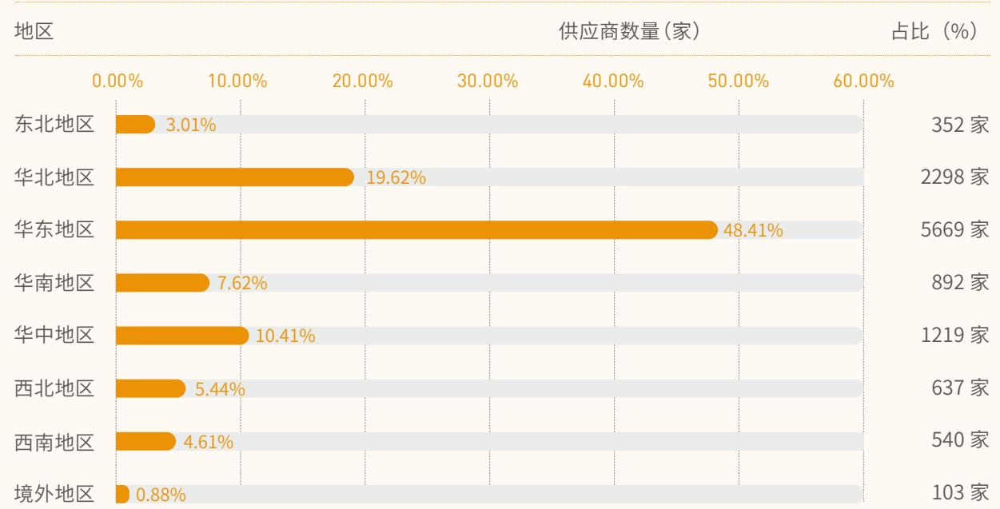

bar

| 地区 | 供应商数量 (家) | 占比 (%) |
| :--- | :--- | :--- |
| 东北地区 | 352 | 3.01% |
| 华北地区 | 2298 | 19.62% |
| 华东地区 | 5669 | 48.41% |
| 华南地区 | 892 | 7.62% |
| 华中地区 | 1219 | 10.41% |
| 西北地区 | 637 | 5.44% |
| 西南地区 | 540 | 4.61% |
| 境外地区 | 103 | 0.88% |

text_image

Cor
118

# 供应商管理举措

# 推进优质供应商资源聚敛

初步构建重点品类价格库、供应商优选库，推动“5+N”核实标准严格供应商准入，精细化实施供应商绩效评价。

# 提升外协供应商能力

制订生产能力提升方案，推进与战略合作企业设计优化、工艺改进和产能合作，推动外协供应商提升跨品类加工能力。

# 加强供应商沟通交流

建立常态化供应商沟通交流机制，引导供应商树立绿色、安全、可持续的发展理念，促进双方协同发展。

# 供应商不良行为处理

对供应商在公司供应链管理业务中出现的诚信、履约、质量、服务等方面问题，按既定规则给予暂停中标资格、列入黑名单等处理。

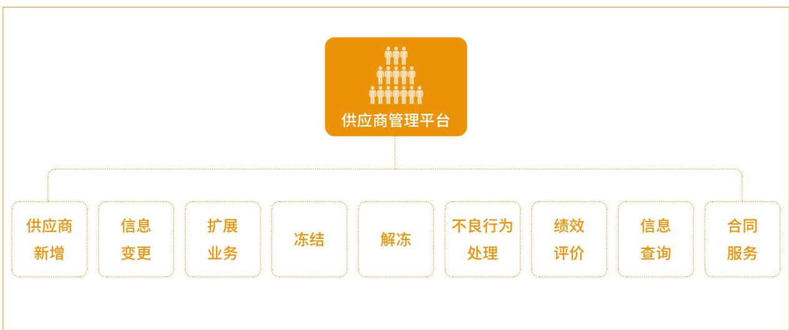

flowchart

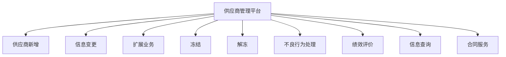
```mermaid
graph TD
  A["供应商管理平台"] --> B["供应商新增"]
  A --> C["信息变更"]
  A --> D["扩展业务"]
  A --> E["冻结"]
  A --> F["解冻"]
  A --> G["不良行为处理"]
  A --> H["绩效评价"]
  A --> I["信息查询"]
  A --> J["合同服务"]
```

# 平等对待 中小企业

国电南瑞严格遵守《中华人民共和国中小企业促进法》《保障中小企业款项支付条例》等相关法律法规要求，切实履行平等对待中小企业的社会责任，将中小企业视为供应链不可或缺的重要组成部分，把保障中小企业款项支付作为践行社会责任、服务实体经济的重要举措，坚决防范款项拖欠，缓解中小企业资金压力。此外，公司通过优化采购策略、加强市场调研与沟通交流，为中小微供应商提供公平参与机会，积极发挥龙头企业引领支撑作用，助力产业链中小企业提升技术水平与管理能力，稳固供应链生态。

# 携手并进 和合共生

国电南瑞关注行业发展态势，积极组织和参加行业交流活动，与海内外同业伙伴、专家学者及政府机构建立紧密联系，发挥主业优势主动参与行业相关政策标准制定、交流研讨，带动产业实现高质量可持续发展。

# 深化合作交流

国电南瑞及下属子公司秉持互惠互利、合作共赢的发展理念，聚焦行业发展前沿，与各相关方广泛开展交流合作，打造共商、共建、共享的合作机制，实现协同发展、互利共赢。

# 国内合作交流

- 保持与电网企业、地方政府、发电集团等重点客户密切合作关系，推动更多优质项目实施、精品工程建设。  
- 参与承办中国水利学会大坝安全监测专业委员会 2025 年年会等会议，参加海外 AMI 技术研讨会，与杭州宇树、云深处等科技企业开展技术交流，促进技术共享、经验互补。

# 国际合作交流

- 组织做好境外政府、境外电力企业来访交流，全面展示公司产品、技术、服务整体能力。  
- 深化与国际伙伴合作，落地沙特柔直换流阀及 ADMS、印尼 SVC 供货等重大项目，逐步提升在国际舞台的参与度与影响力。  
- 参加第31届亚洲国际电力能源展览会、2025英国储能峰会、2025年度MEE中东电力展等重要学会、大型展览会，展示最新的创新产品及解决方案。

text_image

Control room scene with three scientists in lab coats discussing data on energy and market, overlaid with a large map showing regional data visualization.

# 共话行业发展 共促技术革新

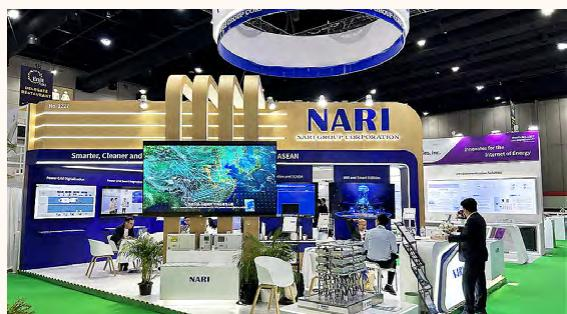

text_image

NARI
NARI GROUO CORPORATION
Smarter, Cleaner and
ASIAN
NARI
NARI

南瑞携一系列产品和解决方案亮相第31届亚洲国际电力能源展览会

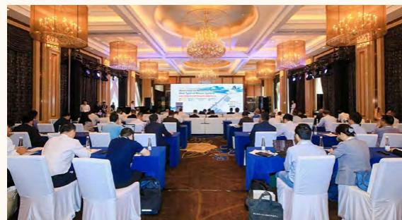

natural_image

Interior view of a large conference hall with attendees seated at tables facing a stage and presentation screen (no visible text or signage)

南瑞水电承办的国际大坝委员会第28届大会暨第93届年会在四川成都召开

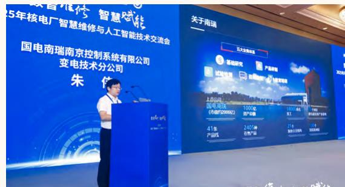

text_image

国电南瑞南京控制系统有限公司
变电技术分公司
朱 伟
关于南瑞
——五大装备研发
基础研究
产品研修
GSE
4.1倍
产品%
100%化
产能
10000吨
3.1吨
2.6万片
1.1吨
2.4G片
国产工厂
2015年核电厂智慧维修与人工智能技术交流会

南控公司、变电公司协办的“2025年核电厂智慧维修与人工智能技术交流会”在福州召开

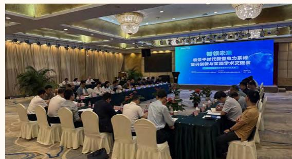

text_image

铜冠未来
碳冠时代新型电力系统
咨询创新与实践学术交流会

北京科东承办的“智领未来：后量子时代新型电力系统密码创新与实践”学术交流会在辽宁大连举行

# 案例 与杭州前沿科技企业技术交流，共探智能机器人赋能产业新路径

2025 年 4 月 1 日，国电南瑞所属用电公司 / 雄安公司 / 南瑞捷鸿赴杭州宇树科技、云深处科技开展技术交流与调研，深入考察四足机器人、人形机器人等智能装备与技术创新进展，探索智能机器人赋能用电业务深化应用场景。用电公司 / 雄安公司 / 南瑞捷鸿与两家科技企业分别座谈研讨了用电业务领域智能巡检、电动汽车自动充电、智能仓储效能提升等场景的多模态感知、辅助操作与数据分析等方面的深化应用前景，推动智能机器人运动控制、AI 算法与用电业务深度融合。

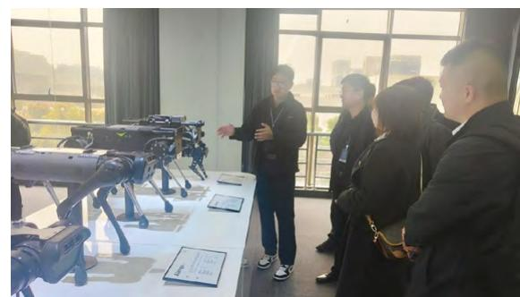

natural_image

Group of people observing a robotic arm on display in an indoor setting with large windows (no visible text or symbols)

参观宇树科技智能机器人

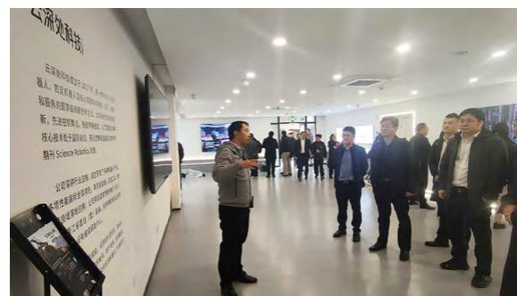

text_image

云深处所作
云南地防防成为2017年，本所将作为
成人，若在西藏人境内为自然的游客，从“云”到
和“服务”的区域是国家或地区最大的“云”和“服务”
新，先后推出“互联网+APP”、“云网+APP”等
核心技术并引领游戏，包括“Science+App”
期刊 Science+App。<nl>公司研究的自主创新，是科学与文化
产业、经济、社会、社会、社会
的两大核心领域，也是中国科技领域的重点发展。
这些领域不仅是在“云”和“服务”领域，也是中国科技领域的重点发展。
这些领域不仅是在“云”和“服务”领域，也是中国科技领域的重点发展。

参观云深处科技展厅

# 海外（境外）履责惠及四方

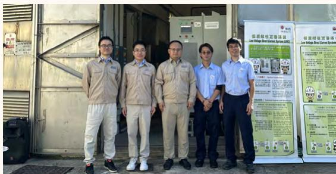

text_image

Group photo of five workers in uniform standing in front of a building with visible signage and posters on the wall.

公司承建的香港海洋公园低压柔直项目正式投运，标志着公司自主研发的构网型柔直变流器首次在境外应用

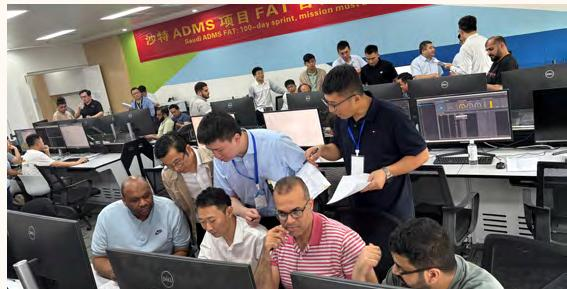

text_image

沙特 ADMS项目FAT
AdMS FAT: 100-day sprint, mission must

公司承建的沙特南区高级配电管理系统（ADMS）在南京顺利通过沙特电力公司(SEC)、挪威船级社(DNV)与中电装备（CET）联合组织的 FAT 验收

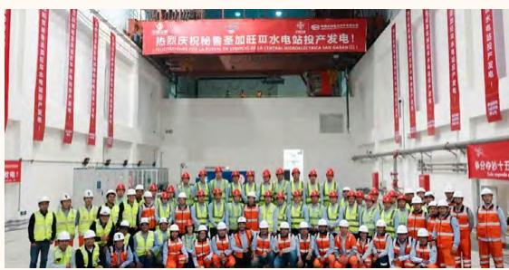

text_image

热烈庆祝秘鲁圣加旺皿水电站投产发电！
CHINESE EXPOUND OF THE POWER SHANGHAI ZHIJING ZHONGXIN ZHENGZUAN ZHENGZUAN ZHENGZUAN ZHENGZUAN ZHENGZUAN ZHENGZUAN ZHENGZUAN ZHENGZUAN ZHENGZUAN ZHENGZUAN ZHENGZUAN ZHENGZUAN ZHENGZUAN ZHENGZUAN ZHENGZUAN ZHENGZUAN ZHENGZUAN ZHENG ZHUAN ZHUAN ZHUAN ZHUAN ZHUAN ZHUAN ZHUAN ZHUAN ZHUAN ZHUAN ZHUAN ZHUAN ZHUAN ZHUAN ZHUAN ZHUAN ZHUAN ZHUAN ZHUAN ZHUAN ZHUAN ZHUAN ZHUAN ZHUAN ZHUAN ZHUAN ZHUAN ZHUAN ZHUAN ZHUAN ZHUAN ZHUAN ZHUAN ZHUAN
2019年十五月

公司负责关键设备集成与调试、提供计算机监控系统产品的秘鲁圣加旺Ⅲ水电站正式投入商业运行

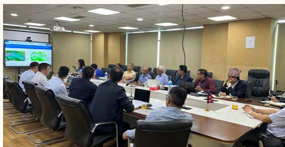

natural_image

Interior view of a conference room with attendees seated around a long table, facing a presentation screen (no visible text or symbols)

公司承建的尼泊尔水情预报项目中所有监测站点、测量设备及预报预警系统全面投入试运行

# 案例 南瑞技术助推尼加拉瓜电力基础设施发展

自 2024 年起，公司加大尼加拉瓜市场开拓力度，成功中标并深度参与尼加拉瓜 ARSA 钢铁厂变电站项目与圣西德罗光伏电站项目建设。此次合作中，国电南瑞自主研发的变电站保护及自动化系统、电力电子 SVG 设备及储能产品首次进入尼加拉瓜市场，凭借卓越的产品性能与专业的技术服务，赢得尼加拉瓜国家输电电力公司（ENATRAL）的高度认可与官方表彰。这一系列项目的顺利推进，不仅是国电南瑞践行“一带一路”倡议、深化中尼电力能源合作的重要实践，更彰显了中国电力技术在海外市场的核心竞争力，为助力尼加拉瓜电力基础设施升级与绿色低碳发展注入强劲动能。

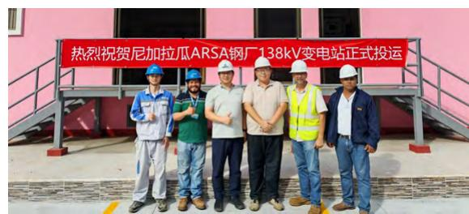

text_image

热烈祝贺尼加拉瓜ARSA钢厂138kV变电站正式投运

尼加拉瓜 ARSA 钢铁厂变电站项目

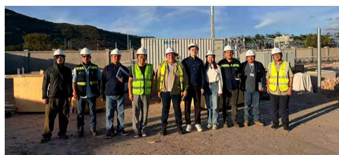

natural_image

Group photo of construction workers in hard hats and safety vests standing outdoors on a worksite (no visible text or signage)

尼加拉瓜圣西德罗光伏电站项目

# 助力产业升级

国电南瑞始终坚持以产业化为导向，锚定能源互联网产业及高端装备制造产业发展方向与趋势，深耕自动化技术、柔性技术和数字技术，为电网及网外能源、工业等领域提供软硬件产品、整体解决方案，并致力于通过内部和上下游的协同发展，共同探索转型升级的新路径，把握机遇、应对挑战，实现产业生态的可持续发展。

# 带动电网领域发展

充分发挥新型电力系统现代产业链支链长、智能电网产业集群龙头企业作用，聚焦传统电网业务稳固与新兴领域突破“双轮驱动”，加快推动科技创新和产业创新深度融合，持续深化产业链融通发展共链行动，带动上下游中小企业协同发展，形成技术共享、资源互补的产业生态，助力构建上中下游、大中小企业融通发展的产业格局。

# 带动网外领域发展

作为工业智能化综合解决方案提供商，紧密关注“两重”“两新”“两业”政策动向和资金投向，积极推动电气自动化、数字化、智能化等领先技术，向石油石化、钢铁冶金、煤炭矿山、城市轨道交通、电气化铁路等领域同源拓展。依托能源互联网整体解决方案能力，深化数能融合项目合作，助力打造国内领先的工业互联产业集群，培育新的业务增长极。

# 带动地方产业发展

充分发挥产业链“超级节点”作用，锚定南京市五千亿级产业集群目标，覆盖“发、输、变、配、用、调度、通信、综合能源服务、电力网络安全”9大关键产业链环节，共同构建世界级智能电网产业集群先行示范区，服务区域经济社会高质量发展。

# 案例 国电南瑞两大共性平台重磅发布，赋能平台生态体系建设

2025年4月2日，国电南瑞研发中心召开2025年共性平台发布会。本次发布会以“平台筑基，生态共赢”为主题，正式发布“ARP-RT通用实时控制平台”和“NUSP通用软件平台”两大共性平台。会上同步发布了《ARP-RT通用实时控制平台白皮书》《NUSP通用软件平台白皮书》。两份白皮书全面梳理了平台发展历程与突破性成果，详细介绍了平台关键核心技术、典型应用场景及行业赋能价值，规划了未来发展方向与战略目标，为公司业务创新与行业生态拓展筑牢技术底座，加速推动能源电力装备从“规模扩张”向“质量跃迁”升级。

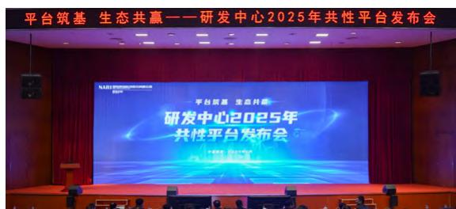

text_image

平台筑基 生态共赢——研发中心2025年共性平台发布会
NAB INTERNATIONAL DEVELOPMENT CENTER
研发中心2025年
共性平台发布会
“新辉煌”

研发中心 2025 年共性平台发布会

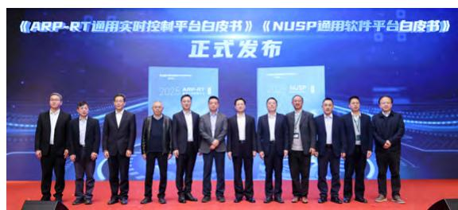

text_image

《ARP-RT通用实时控制平台白皮书》《NUSP通用软件平台白皮书》
正式发布
2023 ARP-RT
2023 ARP-RT

发布《ARP-RT 通用实时控制平台白皮书》《NUSP 通用软件平台白皮书》

# 案例

# 国电南瑞助力南京地铁5号线全线贯通运营

2025年8月6日，国电南瑞承建综合监控系统的南京地铁5号线北段正式开通，标志着这条纵贯城市核心的“地下新干线”实现全线贯通运营。地铁5号线贯通，不仅实现了南北区域间的快速通勤，更推动着沿线商圈、文教、政务等资源的深度融合，为南京“拥江发展”战略再添交通支撑。国电南瑞下属南瑞工控依托在轨道交通自动化领域的技术积淀，为其量身打造自主研发的国产化综合监控系统，实现对全线设备运行状态的实时监测、智能分析与精准调控，相当于为37.4公里的地下线路装上了“神经中枢”。此外，项目团队主动扛起联调联试总协调的重任，严谨完成监控范围内数十万点位的全量测试，实现测试覆盖率100%，助力全线自动化水平稳居国内领先行列。

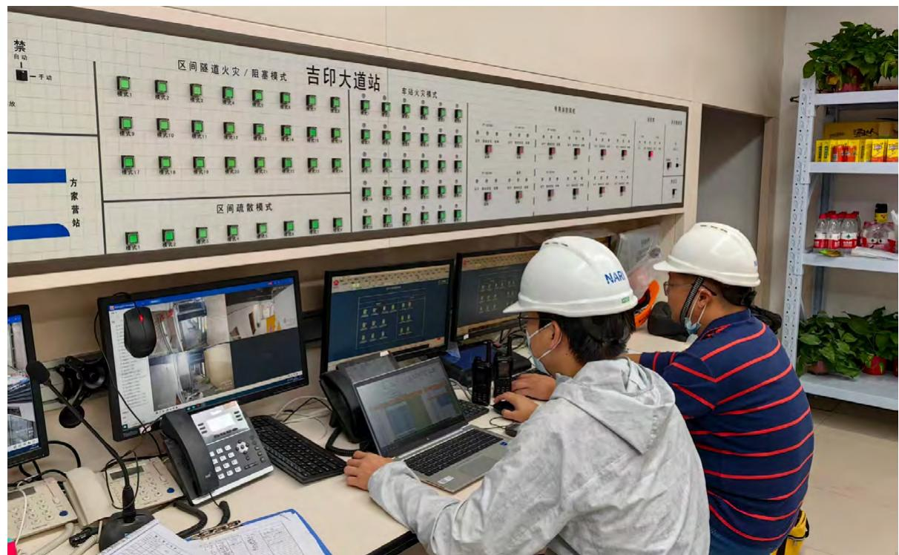

text_image

禁
自动
手动
放
方
家
营
站
区间隧道火灾 / 阻塞模式
吉印大道站
区间疏散模式
车站火灾模式
专用监控系统
NAR

南瑞工控技术人员在吉印大道项目现场进行系统调试

natural_image

Two men in a meeting at a computer desk, one pointing at a monitor (no visible text or symbols)

# 引领行业发展

国电南瑞紧跟行业技术发展前沿，加强行业关键技术标准研究，积极主导或参与国际、国家、行业标准的研讨与制定工作，将自身技术优势、创新成果等融入标准，为推动行业高端化、规范化发展注入强劲动力。

# 数读南瑞

○ 牵头或参与发布标准 58 项，其中国际标准 1 项、国家标准 48 项、行业标准 9 项

# 标准制定

- 牵头或参与继电保护、变电站二次系统、电力现货市场、电动汽车、港口岸电等领域标准编制，助力行业标准化生态建设。  
- 围绕电力电子、配微网、互联互通、低碳技术等方向开展国际标准培育，提升标准的技术先进性与市场竞争力。

<table><tr><td>标准名称</td><td>标准级别</td><td>标准号</td></tr><tr><td>Performance of power electronic reactive power shunt compensators in high-voltage alternating current (HVAC) systems (PWI 22F-11) 高压交流(HVAC)系统中电力电子无功并联补偿器的性能</td><td>国际标准</td><td>IEC TR 63575:2025</td></tr><tr><td>电力北斗时间同步系统安全防护技术要求</td><td>国家标准</td><td>GB/T 46810-2025</td></tr><tr><td>配电自动化终端技术规范</td><td>国家标准</td><td>GB/T 35732-2025</td></tr><tr><td>电动汽车智能充放电设备技术规范</td><td>国家标准</td><td>GB/T 46148-2025</td></tr><tr><td>电动汽车传导充电互操作性测试规范 第1部分:供电设备</td><td>国家标准</td><td>GB/T 34657.1-2025</td></tr><tr><td>电动汽车非车载传导式充电机与电池管理系统之间的通信协议一致性测试</td><td>国家标准</td><td>GB/T 34658-2025</td></tr><tr><td>电力现货市场运营 第2部分:省级技术支持系统</td><td>国家标准</td><td>GB/T 45905.2-2025</td></tr><tr><td>电力现货市场运营 第3部分:省间技术支持系统</td><td>国家标准</td><td>GB/T 45905.3-2025</td></tr><tr><td>电力现货市场运营 第4部分:负荷预测</td><td>国家标准</td><td>GB/T 45905.4-2025</td></tr><tr><td>量度继电器和保护装置 第1部分:通用要求</td><td>国家标准</td><td>GB/T 14598.2-2025</td></tr><tr><td>电力厂站低压用电系统信息架构及接口技术规范</td><td>国家标准</td><td>GB/T 45223-2025</td></tr><tr><td>互感器 第10部分:低功率无源电流互感器的补充技术要求</td><td>国家标准</td><td>GB/T 20840.10-2025</td></tr><tr><td>互感器 第99部分:术语</td><td>国家标准</td><td>GB/T 20840.99-2025</td></tr><tr><td>电动汽车快换电池箱通信协议</td><td>国家标准</td><td>GB/T 32895-2025</td></tr><tr><td>继电保护信息规范</td><td>国家标准</td><td>GB/T 45568-2025</td></tr><tr><td>高压直流输电用消能装置技术规范 第2部分:交流可控自恢复消能装置</td><td>国家标准</td><td>GB/T 45648.2-2025</td></tr><tr><td>通用窄尺寸模数化电气机柜</td><td>国家标准</td><td>GB/T 45655-2025</td></tr><tr><td>高压直流输电用消能装置技术规范 第1部分:直流可控自恢复消能装置</td><td>国家标准</td><td>GB/T 45648.1-2025</td></tr><tr><td>高压直流输电换流阀水冷却设备</td><td>国家标准</td><td>GB/T 30425-2025</td></tr><tr><td>量度继电器和保护装置 第26部分:电磁兼容要求</td><td>国家标准</td><td>GB/T 14598.26-2025</td></tr><tr><td>量度继电器和保护装置 第27部分:产品安全要求</td><td>国家标准</td><td>GB/T 14598.27-2025</td></tr><tr><td>电力系统同步相量测量装置检测规范</td><td>国家标准</td><td>GB/T 26862-2025</td></tr><tr><td>基础地理信息城市数据库建设规范</td><td>国家标准</td><td>GB/T 21740-2025</td></tr><tr><td>电动汽车更换用电池箱连接器</td><td>国家标准</td><td>GB/T 32879-2025</td></tr><tr><td>变电站二次系统 第1部分:通用要求</td><td>国家标准</td><td>GB/T 45906.1-2025</td></tr><tr><td>变电站二次系统 第2部分:数据与模型</td><td>国家标准</td><td>GB/T 45906.2-2025</td></tr><tr><td>变电站二次系统 第3部分:通信报文规范</td><td>国家标准</td><td>GB/T 45906.3-2025</td></tr><tr><td>变电站二次系统 第4部分:网络安全防护</td><td>国家标准</td><td>GB/T 45906.4-2025</td></tr><tr><td>变电站二次系统 第5部分:保护控制及相关设备</td><td>国家标准</td><td>GB/T 45906.5-2025</td></tr><tr><td>变电站二次系统 第6部分:站内监控系统</td><td>国家标准</td><td>GB/T 45906.6-2025</td></tr><tr><td>变电站二次系统 第7部分:集中监控系统</td><td>国家标准</td><td>GB/T 45906.7-2025</td></tr><tr><td>变电站二次系统 第8部分:电气操作防误</td><td>国家标准</td><td>GB/T 45906.8-2025</td></tr><tr><td>变电站二次系统 第10部分:试验与检测</td><td>国家标准</td><td>GB/T 45906.10-2025</td></tr><tr><td>电力现货市场运营 第8部分:多周期电力电量平衡计算方法</td><td>国家标准</td><td>GB/T 45905.8-2025</td></tr><tr><td>电磁兼容检测实验室统计过程控制指南</td><td>国家标准</td><td>GB/T 46130-2025</td></tr><tr><td>高电压试验技术 特快波前过电压测量</td><td>国家标准</td><td>GB/T 18134-2025</td></tr><tr><td>工业用插头、固定式或移动式插座和器具输入插座 第2部分:带插销和插套的电器附件的尺寸兼容性要求</td><td>国家标准</td><td>GB/T 11918.2-2025</td></tr><tr><td>工业用插头、固定式或移动式插座和器具输入插座 第1部分:通用要求</td><td>国家标准</td><td>GB/T 11918.1-2025</td></tr><tr><td>工业用插头、固定式或移动式插座和器具输入插座 第4部分:有或无联锁带开关的插座</td><td>国家标准</td><td>GB/T 11918.4-2025</td></tr><tr><td>柔性直流换流阀功率模块可靠性试验方法</td><td>国家标准</td><td>GB/T 46176-2025</td></tr></table>

<table><tr><td>标准名称</td><td>标准级别</td><td>标准号</td></tr><tr><td>人工智能 计算中心 计算能力评估</td><td>国家标准</td><td>GB/T 46346-2025</td></tr><tr><td>电力自动化通信网络和系统 第9-2部分:特定通信服务映射(SCSM) 基于ISO/IEC 8802-3的采样值</td><td>国家标准</td><td>GB/T 42151.92-2025</td></tr><tr><td>工业系统、装置与设备以及工业产品 系统内端子的标识</td><td>国家标准</td><td>GB/T 18656-2025</td></tr><tr><td>可编程序控制器 第8部分:编程语言的应用与实现导则</td><td>国家标准</td><td>GB/T 15969.8-2025</td></tr><tr><td>电力负荷柔性调控终端 通用要求</td><td>国家标准</td><td>GB/T 46695-2025</td></tr><tr><td>电力系统实时动态监测主站技术要求</td><td>国家标准</td><td>GB/T 28815-2025</td></tr><tr><td>光伏发电站继电保护技术要求</td><td>国家标准</td><td>GB/T 32900-2025</td></tr><tr><td>保护层分析(LOPA)应用导则</td><td>国家标准</td><td>GB/T 32857-2025</td></tr><tr><td>电气简图用图形符号 IEC 60617标准化设计指南</td><td>国家标准</td><td>GB/Z 160-2025</td></tr><tr><td>电动汽车非车载传导式充电机技术条件</td><td>行业标准</td><td>NB/T 33001-2025</td></tr><tr><td>电力物联网传感器网络 第2部分:配用电物联网信息模型</td><td>行业标准</td><td>DL/T 2474.2-2025</td></tr><tr><td>电动汽车非车载直流充放电装置测试要求</td><td>行业标准</td><td>NB/T 11867-2025</td></tr><tr><td>港口岸电系统建设规范总体要求</td><td>行业标准</td><td>DL/T 2907-2025</td></tr><tr><td>港口岸电T型接口箱技术要求</td><td>行业标准</td><td>DL/T 2906-2025</td></tr><tr><td>港口岸电站级系统与集中式岸电设施通信协议</td><td>行业标准</td><td>DL/T 2902-2025</td></tr><tr><td>港口岸电网联模块与分散式岸电设施通信协议</td><td>行业标准</td><td>DL/T 2903-2025</td></tr><tr><td>电力需求响应系统验收与实施效果评估导则</td><td>行业标准</td><td>DL/T 2930-2025</td></tr><tr><td>继电保护设备标准化设计规范</td><td>行业标准</td><td>DL/T 317-2025</td></tr></table>

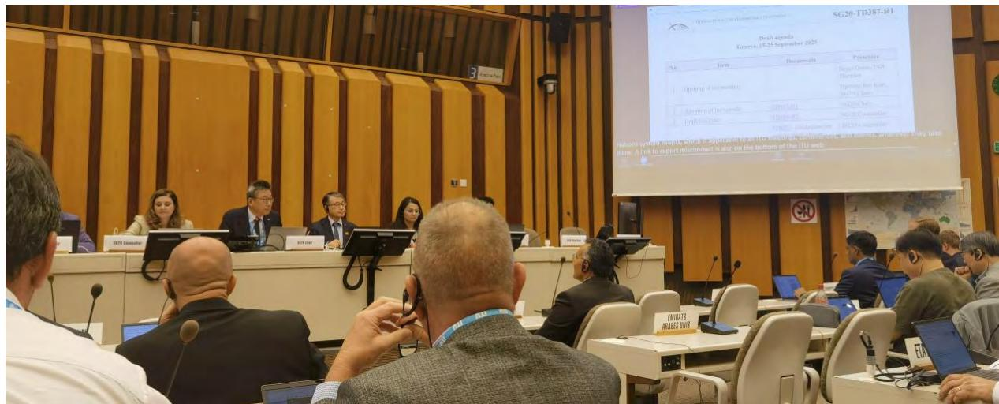

text_image

SG20-TD387-R1
Draft agenda
Generate, 16-25 September 2025
No. | Title | Documents | Presenter |
1 | Reporting of the meeting | | Reported Date: 25th
2 | Number of documents | | Number of papers
3 | Number of documents | | Number of articles
4 | Draft summary | | Number of contents |
Note/HY system reflects what is applicable from the WHO's World Economic Survey and dissemination of the study task place. A link to report misconduct is also on the bottom of the ITU set.

信通科技牵头编制的首个 ITU-T 国际标准《基于物联网的光伏储能协同管控框架》正式立项

# 惠泽民生 传递温情

国电南瑞积极弘扬人道主义精神，在公益慈善与社区建设事业上积极行动，扎实开展乡村振兴、公益慈善、社区关爱等活动，促进企业与社会的良性互动，汇聚向善力量，增进民生福祉，赋能美好社会建设。

# 支撑电力保供

国电南瑞积极承担电力保供支撑任务，制订专项保供支撑方案，强化内部组织协调，开辟保供绿色通道，确保人力、物力等资源快速调配、及时到位，充分发挥技术、产品和服务优势，高质量支撑夏季用电高峰、冬季供暖期、重要节假日及重大活动等特殊时段的电力保供工作。同时，公司全力参与抗震救灾、抗旱保粮、雨雪冰冻灾害等应急保电工作，确保极端情况下电网设备安全稳定运行与电力可靠供应。

# 案例 国电南瑞圆满完成成都世运会保电任务

2025 年 8 月 17 日晚，第十二届世界运动会在成都圆满闭幕。面对世运会保障与迎峰度夏双重考验，国电南瑞所属电网公司、北京科东、配电公司、南瑞水电坚决扛起保电责任，系统复盘总结成都大运会、杭州亚运会、北京冬奥会等重大活动保电经验，周密制定世运会专项保电工作方案，抽调技术精锐组成保电专项工作组，提前进驻成都地调、天府地调等核心调控节点，实行 24 小时全天候值班值守，大幅提升设备巡检频次与巡检强度，确保了赛事期间电力系统安全稳定运行，圆满完成第十二届世界运动会电力保供支撑任务。

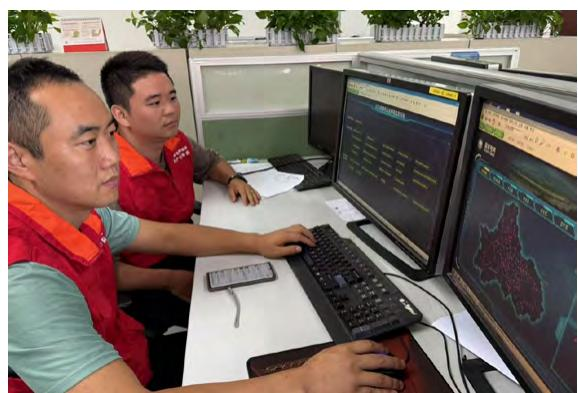

text_image

Office scene with three men in red vests working at a computer, surrounded by monitors displaying data and maps on desktop screens.

保电工作组紧盯核心设备运行状态，保障电网设施安全稳定运行

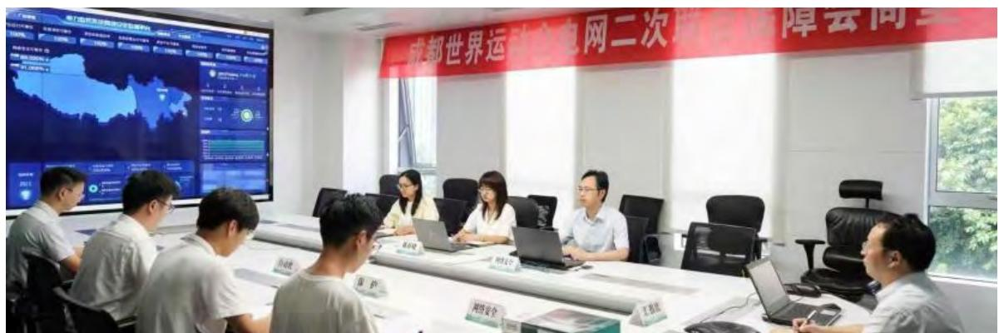

text_image

成都世界运杂电网二次
保障云商主

多专业协同作战，与保电工作组研讨电网二次联合保障应急措施

# 案例 支撑西藏地震灾区保供电，国电南瑞各单位纷纷行动

2025 年 1 月 7 日，西藏日喀则市定日县发生 6.8 级地震，造成重大人员伤亡，大量房屋倒塌。国电南瑞第一时间启动应急机制，迅速调集人力物力驰援震区。公司所属营销服务中心、电网公司、中电普瑞、配电公司、信通科技等单位迅速响应，充分发挥专业技术优势，强化重点用户驻点保障与优质服务，为灾区供电保障全力以赴，助力震区尽快恢复生活秩序、重建家园。

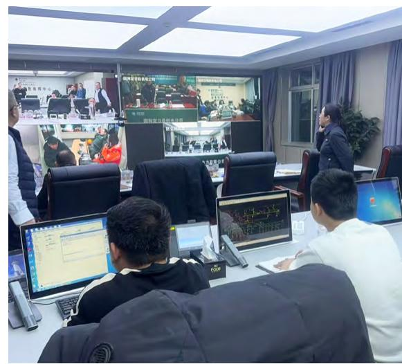

text_image

Control room scene with multiple screens displaying video conference feeds and participants at workstations

电网公司技术专家在应急中心开展现场值守

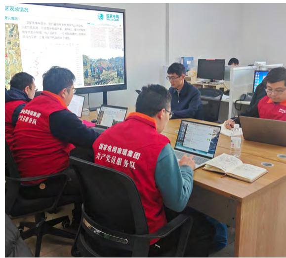

text_image

区现场情况
首页情况
国家电网南瑞集团
共产党员服务队
国家电网南瑞集团
共产党员服务队

配电公司抢险突击队员参与震后电力保供紧急部署会

natural_image

Man in blue work uniform working at a desk with multiple computer monitors and devices (no visible text or symbols)

信通科技应急值班人员开展地震应急响应支撑工作

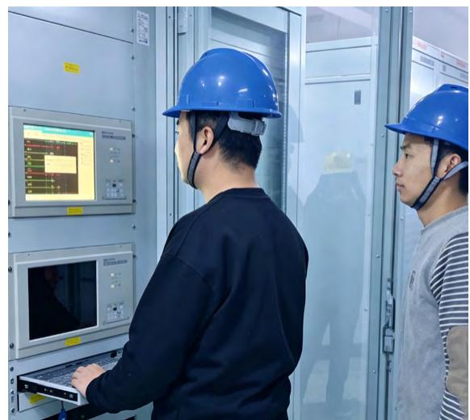

natural_image

Two workers in blue hard hats operating industrial control panels (no visible text or symbols)

中电普瑞技术人员在日喀则 220 千伏萨嘎站开展震后特训工作

# 助力乡村振兴

国电南瑞积极响应国家乡村振兴战略，充分发挥资源、技术、人才、管理等优势，通过参加消费帮扶活动、持续开展驻村帮扶、支撑农光互补发电项目建设、服务农业农村基础设施建设等举措，全力支持农业农村现代化建设，为扎实推进乡村全面振兴、加快建设农业强国贡献源源不断的南瑞力量。

# 数读南瑞

乡村振兴捐赠 100 万元

\- 惠及人数 3480 人

# 案例

# 数智赋能农村能源革命，助力乡村绿美新生活

2025 年 8 月 13 日，在 “绿水青山就是金山银山” 理念提出 20 周年之际，中央电视台《焦点访谈》播出 “绿水青山就是金山银山” 系列报道开篇节目《美丽乡村 生态蝶变》，介绍了国电南瑞 “碳达人” 应用助力安吉余村村民实现光伏碳汇交易的实践。自 2023 年起，国电南瑞精准把握当地作为 “国家级农村能源革命试点县” 的建设契机，承建新能源云安吉农村能源革命试点县专项示范工程。为保障项目高质量推进，北京科东与营销服务中心、研究院（全重实验室）、技术方案中心等单位共同协作，在安吉县落地建设了浙江省首个基于电网潮流拓扑的分时分区电碳因子测算应用，为 “碳达人” 应用精准开展光伏发电碳减排量核算提供了关键技术支撑。公司在安吉建设了光伏资源辅助开发、柔性负荷资

源评估、配微电网协同规划等5项数字化应用场景，构建了“源网荷储数碳”协同互动体系，支撑安吉县探索能源转型与乡村振兴深度融合的创新路径。该工程成果丰硕，多次参展农村能源发展大会，成为农村能源转型的鲜活范例，并为全国22个试点县提供可复制、可落地的建设方案与实践经验。

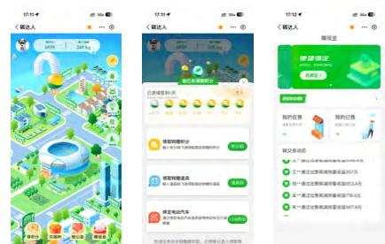

text_image

<超达人>
17:11
17:11
17:12
17:12
<超达人>
预览
新建通过
大红树
我的位置
我的位置
预览页面
“+”最近登录的超链接信息30天
“-”最近登录的超链接信息34天
“+”最近登录的超链接信息46天

“碳达人”碳汇交易应用

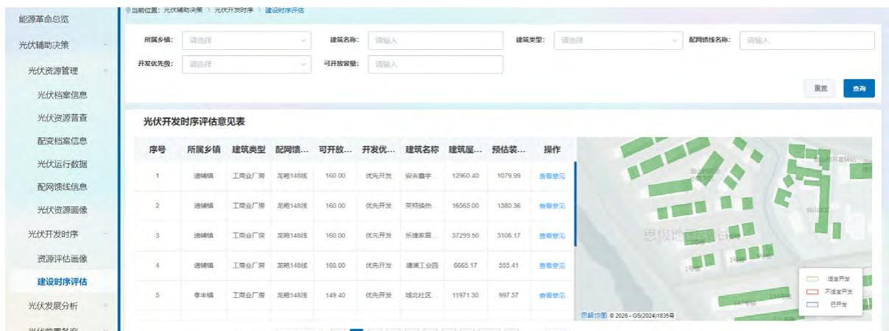

text_image

能源革命总览
光伏辅助决策
光伏资源管理
光伏档案信息
光伏资源普查
配变档案信息
光伏运行数据
配网馈线信息
光伏资源画像
光伏开发时序
资源评估画像
建设时序评估
光伏发展分析
光伏前置咨询
当前位置：光伏辅助决策 > 光伏开发时序 > 建设时序评估
所属乡镇：请选择
建筑名称：请输入
建筑类型：请选择
可开放优先级：请选择
可开放容量：请输入
重置  查看
光伏开发时序评估意见表
序号	所属乡镇	建筑类型	配网馈...	可开放...	开发优...	建筑名称	建筑屋...	预估装...	操作
1	递铺镇	工商业厂房	龙柏148线	160.00	优先开发	安济鑫字	12960.40	1079.99	查看意见
2	递铺镇	工商业厂房	龙柏148线	160.00	优先开发	英特换热...	16565.00	1380.36	查看意见
3	递铺镇	工商业厂房	龙柏148线	160.00	优先开发	乐捷家园...	37299.50	3108.17	查看意见
4	递铺镇	工商业厂房	龙柏148线	160.00	优先开发	建浦工业园	6663.17	555.41	查看意见
5	李丰镇	工商业厂房	龙柏148线	149.40	优先开发	城北社区...	11971.30	997.57	查看意见
思极地图 © 2026-OS/2024/1835号

光伏开发时序评估

# 案例

# 国电南瑞助力海南省琼海市阳江镇100兆瓦农光互补光伏发电项目

海南省琼海市阳江镇 100 兆瓦农光互补光伏发电项目坐落于琼海市阳江镇江南村。项目占地面积约 1750 亩，采用“板上发电、板下种植”的农光互补立体开发模式，盘活此前因槟榔黄化病撂荒、低产的大量“伤心地”，使其变身高效产出的“致富田”。国电南瑞为项目提供升压站自动化监控系统、继电保护、稳控系统、AGC/AVC 系统、视频及火灾系统、通信及二次安防系统、二级反恐系统、智能一体化管控系统等多项关键设备，有力保障琼海市电网安全稳定运行。项目投产后，可满足约 3.9 万户家庭年用电需求，为 426 户村民带来稳定收益；村民通过土地出租、光伏区务工，人均年增收有望超 10000 元，该项目也成为村民心中的“绿色银行”。

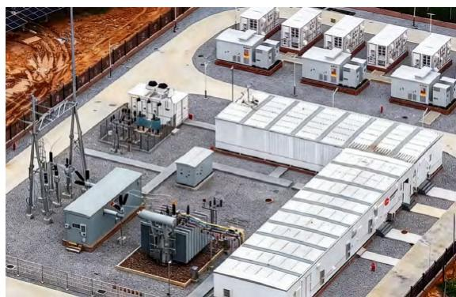

natural_image

Aerial view of an industrial facility with multiple substation units and equipment (no visible text or symbols)

农光互补光伏发电项目升压站全貌

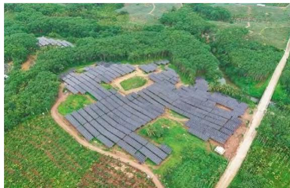

natural_image

Aerial view of a large solar farm installed on terraced green hills, with no visible text or symbols.

农光互补光伏发电项目光伏区

# 案例

# 科技赋能春耕春灌，南瑞助力乡村振兴

2025 年春耕春灌期间，国电南瑞以新质生产力为引擎，依托自主研发的智慧水利技术平台和自主可控的量测与控制设备，为全国多地灌区提供精准化、智能化的灌溉保障服务。从西北边陲的新疆阿图什到江南水乡的安徽茨淮新河，从雪域高原的青海引大济湟到南海之滨的海南儋州，国电南瑞的技术人员奔赴一线，对灌区闸泵自动化系统、量水信息化平台及田间智能设备进行全面升级，以科技之力守护“大国粮仓”。

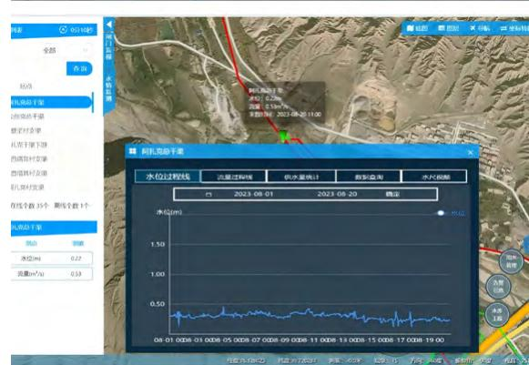

text_image

水位过程线
流量过程线
供水量线1
数据查询
水位视频
2023-08-01 2023-08-20 确定
冰稳/m
流量/m³/s
0.22
0.53

新疆阿图什灌区：“一张网”联通万亩良田

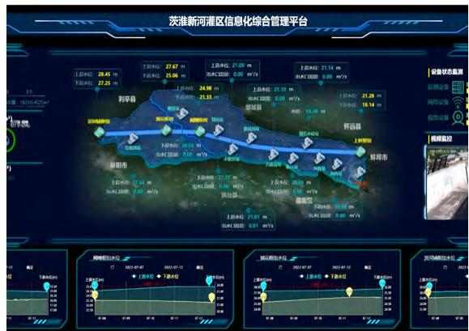

text_image

茨淮新河港区信息化综合管理平台
1.上站02: 28.45 m
下站02: 27.25 m
1.上站02: 27.67 m
下站02: 25.06 m
1.上站02: 21.09 m
上站02: 0.00 m³/s
1.上站02: 24.98 m
下站02: 21.33 m
1.上站02: 21.10 m
上站02: 0.00 m³/s
1.上站02: 16.48 m
1.上站02: 21.14 m
上站02: 0.00 m³/s
1.上站02: 21.28 m
下站02: 18.14 m
1.上站02: 12.24 m
上站02: 0.01 m³/s
1.上站02: 27.13 m
上站02: 0.00 m³/s
1.上站02: 36.03 m
上站02: 0.00 m³/s
1.上站02: 28.68 m
上站02: 0.00 m³/s
1.上站02: 21.01 m
上站02: 0.01 m³/s
郑平县
郑平市
郑平市
郑平市
郑平市
郑平市
郑平市
郑平市
郑平市
郑平市
郑平市
郑平市
郑平市
郑平市
郑平市
郑平市
郑平市
郑平市
郑平市
郑平市
郑平市
郑平市
郑平市
郑平市
郑平市
郑平市
郑平县
郑平市
郑平市
郑平市
郑平市
郑平市
郑平市
郑平市
郑平市
郑平市
郑平市
郑平市
郑平市
郑平市
郑平市
郑平市
郑平市
郑平市
郑平市
郑平市
郑平市
郑平市
郑平市
郑平市
郑平县

安徽茨淮新河灌区：数字孪生赋能全域管理

# 投身公益慈善

国电南瑞坚持以公益行动弘扬社会正能量，修订《对外捐赠管理办法》，进一步加强对外捐赠事项管理，并持续深耕公益慈善事业，参与地方公共服务、开展助学捐赠、“电力之光”科普下乡、网安反诈进社区等各类公益活动、倡导慈善志愿服务，为地方教育发展、环境改善、网络安全等提供支持，着力打造南瑞公益品牌，积极营造良好社会风尚。

# 数读南瑞

员工志愿者活动参与人数 1064 人次

志愿者活动时长8516小时

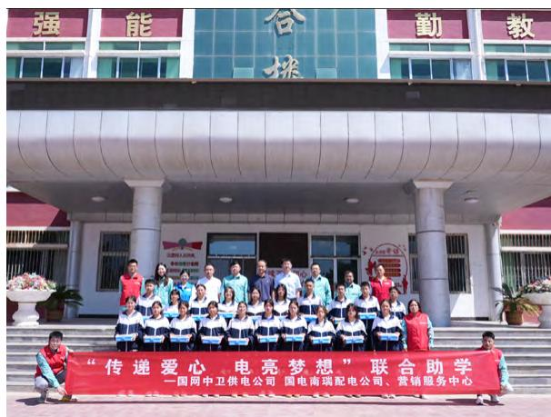

text_image

强能
合
勤
教
“传递爱心 电亮梦想”联合助学
——国网中卫供电公司 国电南瑞配电公司、营销服务中心

国电南瑞连续七年联合国网宁夏中卫供电公司开展“传递爱心‘电’亮梦想”公益助学活动

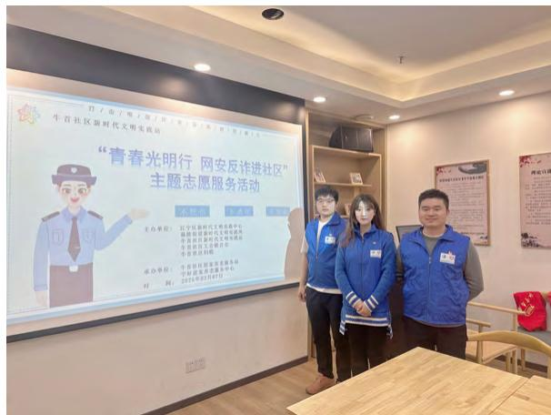

text_image

打 / 市 / 地 / 院 / 招 / 新 / 市 / 地 / 院 / 老 / 新 / 办
牛首社区新时代文明实践站
“青春光明行 网安反诈进社区”
主题志愿服务活动
主办单位：区民警新时代文明实践中心
协办单位：李军、李军、李军、李军、李军、李军、李军、李军、李军、李军、李军、李军、李军、李军、李军、李军、李军、李军、李军、李军、李军、李军、李军、李军、李军、李军、李军、李军、李军、李军、李军、李军、李军、李军、
承办单位：牛奶馆国家税务总局
协办单位：牛奶馆国家发展中心
时间：2023年8月31日

国电南瑞携手南京市江宁区宁好社会工作服务中心，共同开展“青春光明行网安反诈进社区”志愿服务活动

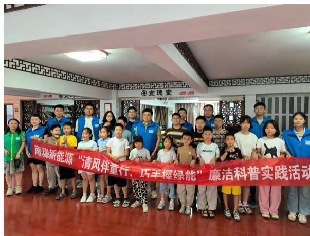

text_image

南瑞新能源“清风伴童行、巧手擦绿能”廉洁科普实践活动

南瑞新能源 / 电控公司 / 南瑞氢电到建邺区梅花里小区开展 “清风伴童行，巧手探绿能” 科普实践活动

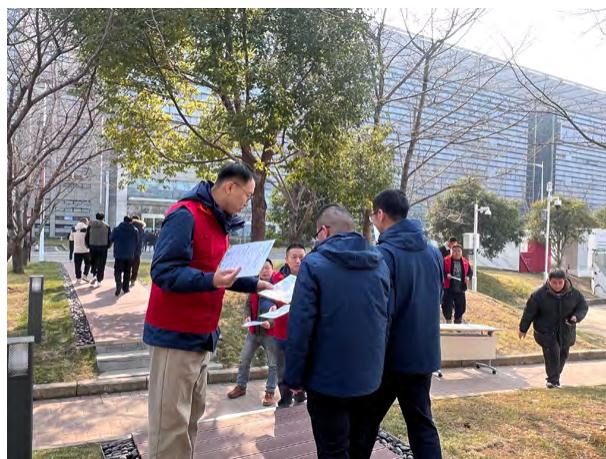

natural_image

Group of people walking outdoors on a paved path near a modern glass building, with trees and bare trees in the background (no visible text or signage)

用电公司 / 雄安公司 / 南瑞捷鸿在江宁基地开展 “电力 ‘充’ 满格，安全 ‘不打烊’ ” 电动汽车安全充电公益宣传服务活动

# 责任故事：情系东安那楠 廿载助学伴成长

2026 年 1 月 13 日，稳定公司携手广西大学电气工程学院、广西防城港供电局等单位，先后走进防城港市上思县公正乡东安村小学与崇左市宁明县那楠乡中心小学，开展“爱心助学”系列活动。在爱心助学二十周年的特殊节点，这场跨越桂西南山水的爱心行动，以物资捐赠、知识授课等形式，为乡村学子送去关怀与希望，用实际行动践行教育优先理念与企业社会责任。

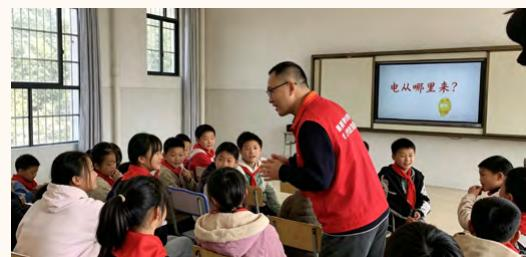

text_image

电从哪里来？

以趣味互动的方式向孩子们普及电网安全常识

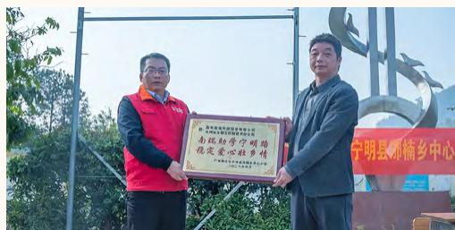

text_image

宁明县师楠乡中心
南段和学宁明路
稳定爱老旺乡情

校企单位联合捐赠教学生活物资并接受校方授牌

二十载春秋，“爱心助学”步履铿锵，殷殷关怀浇灌成长之花，拳拳真情铺就逐梦之途。二十年来，稳定公司始终坚守公益初心，从贵州普定到广西百色、东兰、那坡，再到如今的上思、宁明，爱心足迹遍布西南地区，用点滴善举汇聚成助学暖流。展望未来，稳定公司将继续坚守社会责任，与社会各界携手并肩，持续关注乡村教育与学子成长，用爱与责任浇灌希望之花，让爱心善举蔚然成风，为教育振兴、乡村振兴写下和谐共赢的温暖篇章。

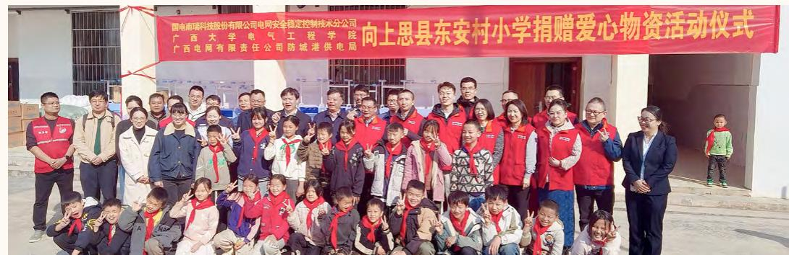

text_image

国电南瑞科技股份有限公司电网安全稳定控制技术分公司
广西大学电气工程学院 向上思县东安村小学捐赠爱心物资活动仪式
广西电网有限责任公司防城港供电局

东安村小学合影

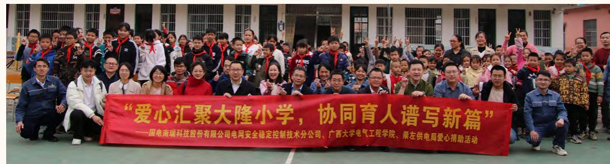

text_image

“爱心汇聚大隆小学，协同育人谱写新篇”
——国电南瑞科技股份有限公司电网安全稳定控制技术分公司、广西大学电气工程学院、崇左供电局爱心捐助活动

大隆小学合影

# 未来展望

2026 年，全球经济增长将延续过去几年平均的态势，中国经济将在政策协同与新质生产力的驱动下，进入一个“质效兼顾”的新阶段。站在“十五五”开局的战略节点，国电南瑞将坚定不移地践行可持续发展理念，以绿色低碳为底色，以科技创新为引擎，以责任担当为基石，切实以高质量负责任的 ESG 创新实践推动能源电力行业的低碳绿色转型与可持续发展。

强化治理效能，夯实基业长青基石。国电南瑞将持续完善现代企业治理体系，稳步推进 ESG 管理提升三年行动方案，将 ESG 理念深度融入“三域四层”产业布局与经营管理全流程，以规范治理护航可持续发展；持续优化合规管理体系，深化数字化转型，推动流程重塑，实现合规风险实时监控与闭环管理；恪守商业伦理，严守反腐败底线，保障各方合法权益，以高效、透明、规范的治理效能赢得市场信赖，为企业行稳致远筑牢制度根基。

聚焦绿色转型，绘就低碳发展画卷。国电南瑞将紧扣“双碳”目标，抢抓新一轮科技革命和产业变革历史机遇，以电网友好型新能源并网技术为核心，加大在智慧火电、智能水电/抽蓄、构网型储能、绿电制氢、零碳园区、电碳协同等方面的重点发展；建立健全环境管理体系，强化环境风险管控，协同推进降碳、减污、扩绿、增长，全面推行绿色生产，加强生态环保培训与宣贯，为不断改善区域环境质量做出绿色环保承诺，助力实现人与自然和谐共生。

践行人本理念，构筑和谐共生生态。国电南瑞将持续深耕大电网安全、电网调度、保护控制等关键技术，全力支撑重大工程建设，守护国家能源安全与电力系统稳定运行；坚持人才强企战略，完善人才梯队体系，建立“揭榜挂帅”“赛马”等机制，传递压力、激发活力，凝聚干事创业合力；筑牢安全生产防线，纵深推进治本攻坚三年行动，守护员工生命健康；深化乡村振兴与社区共建工作，积极投身公益慈善，以责任担当赋能共同发展，彰显央企温度。

征途漫漫，惟有奋斗；梦想在前，惟有实干。国电南瑞将以“重整行装再出发”的昂扬状态，向“十五五”高质量发展之路进发，全力推进ESG理念与标准融入企业管理与文化，全面提升经济、社会、环境综合价值创造能力，携手利益相关方共同构建可持续发展的新模式，努力向打造世界级的能源互联网高科技领军企业目标迈进。

# 附录

关键绩效

<table><tr><td>指标</td><td>单位</td><td>2023年</td><td>2024年</td><td>2025年</td></tr><tr><td colspan="5">经济绩效</td></tr><tr><td> $资产总额^2$ </td><td>亿元</td><td>866.34</td><td>930.72</td><td>985.86</td></tr><tr><td> $营业收入^2$ </td><td>亿元</td><td>519.61</td><td>578.29</td><td>662.29</td></tr><tr><td> $利润总额^2$ </td><td>亿元</td><td>85.77</td><td>91.37</td><td>98.19</td></tr><tr><td> $归属上市公司股东净利润^2$ </td><td>亿元</td><td>71.79</td><td>76.10</td><td>82.79</td></tr><tr><td>纳税总额</td><td>亿元</td><td>43.70</td><td>39.18</td><td>36.60</td></tr><tr><td> $研发投入^2$ </td><td>亿元</td><td> $34.92^2$ </td><td>40.66</td><td>47.39</td></tr><tr><td>研发人员数量</td><td>人</td><td>3687</td><td>3982</td><td>4588</td></tr><tr><td>研发人员占员工总人数比例</td><td>%</td><td>33.47</td><td>35.77</td><td>35.90</td></tr><tr><td>承担国家重点科研项目</td><td>项</td><td>4</td><td>5</td><td>4</td></tr><tr><td>发表核心论文</td><td>篇</td><td>176</td><td>177</td><td>226</td></tr><tr><td>拥有有效专利数</td><td>项</td><td>4937</td><td>5281</td><td>5606</td></tr><tr><td>拥有发明专利数</td><td>项</td><td>4025</td><td>4345</td><td>4709</td></tr><tr><td>每百万元营收有效专利数</td><td>项/百万元</td><td>0.096</td><td>0.092</td><td>0.085</td></tr><tr><td>应用于主营业务的发明专利数量</td><td>项</td><td>3542</td><td>3823</td><td>4143</td></tr><tr><td>发明专利申请数</td><td>项</td><td>942</td><td>870</td><td>1142</td></tr><tr><td>获得授权专利数</td><td>项</td><td>400</td><td>344</td><td>487</td></tr><tr><td>发明专利授权数</td><td>项</td><td>324</td><td>320</td><td>451</td></tr><tr><td>获得软件著作权</td><td>项</td><td>303</td><td>302</td><td>303</td></tr><tr><td>合同审查率</td><td>%</td><td>100</td><td>100</td><td>100</td></tr><tr><td colspan="5">环境绩效</td></tr><tr><td>环保投入</td><td>万元</td><td>717.17</td><td>543.56</td><td>519.84</td></tr><tr><td>环保培训</td><td>次</td><td>55</td><td>58</td><td>57</td></tr><tr><td>清洁技术专利数</td><td>项</td><td>37</td><td>50</td><td>62</td></tr></table>

<table><tr><td>指标</td><td>单位</td><td>2023年</td><td>2024年</td><td>2025年</td></tr><tr><td>综合能源消耗</td><td>吨标准煤</td><td>28324.26</td><td>31449.78</td><td>33793.83</td></tr><tr><td>每百万营收能源消耗量</td><td>吨标煤/百万元</td><td>0.55</td><td>0.54</td><td>0.51</td></tr><tr><td>直接能源消耗(化石能源)</td><td>吨标准煤</td><td>14885.58</td><td>15372.35</td><td>13507.89</td></tr><tr><td>汽油消耗量</td><td>吨</td><td>122.98</td><td>157.01</td><td>75.99</td></tr><tr><td>柴油消耗量</td><td>吨</td><td>9605.44</td><td>9848.97</td><td>8490.38</td></tr><tr><td>天然气消耗量</td><td>万立方米</td><td>58.35</td><td>65.09</td><td> $84.39^3$ </td></tr><tr><td>直接能源消耗(清洁能源)</td><td>万千瓦时</td><td>447.35</td><td>458.42</td><td>458.30</td></tr><tr><td>光伏发电用量</td><td>万千瓦时</td><td>447.35</td><td>458.42</td><td>458.30</td></tr><tr><td>光伏发电用量比例</td><td>%</td><td>5.88</td><td>4.71</td><td>3.55</td></tr><tr><td>其他清洁能源用量</td><td>万千瓦时</td><td>0</td><td>0</td><td>0</td></tr><tr><td>其他清洁能源比例</td><td>%</td><td>0</td><td>0</td><td>0</td></tr><tr><td>间接能源消耗(外购能源)</td><td>吨标准煤</td><td>12888.89</td><td>15514.03</td><td>19722.69</td></tr><tr><td>用电量(绿电)</td><td>万千瓦时</td><td>/</td><td>/</td><td> $12436.34^4$ </td></tr><tr><td>用电量(火电)</td><td>万千瓦时</td><td>7157.76</td><td>9266.91</td><td>339.65</td></tr><tr><td>蒸汽消耗量</td><td>吨标准煤</td><td>4092</td><td>4125</td><td>4021</td></tr><tr><td>产品包装使用材料总量(木箱)</td><td>吨</td><td>1695</td><td>1745.73</td><td>1126.81</td></tr><tr><td>总耗水量</td><td>万吨</td><td>93.97</td><td>105.68</td><td>108.84</td></tr><tr><td>新鲜水消耗量</td><td>万吨</td><td>72.95</td><td>81.82</td><td>84.04</td></tr><tr><td> $循环水消耗量^5$ </td><td>万吨</td><td>21.02</td><td>23.86</td><td>24.8</td></tr><tr><td>人均耗水量</td><td>吨/人</td><td>66.22</td><td>69.68</td><td>85.16</td></tr><tr><td>水资源重复利用率</td><td>%</td><td>22.37</td><td>22.58</td><td>22.93</td></tr><tr><td>办公用电消耗量</td><td>万千瓦时</td><td>5979.73</td><td>9304.82</td><td>10989.86</td></tr><tr><td>办公用水消耗量</td><td>万吨</td><td>41.63</td><td>68.17</td><td>73.30</td></tr><tr><td>办公用纸消耗量(保洁用纸)</td><td>吨</td><td>76.15</td><td>133.21</td><td>168.38</td></tr><tr><td>废水排放量</td><td>万吨</td><td>56.26</td><td>53.84</td><td>62.08</td></tr><tr><td>有害废弃物产生量</td><td>吨</td><td>29.26</td><td>40.25</td><td>45.24</td></tr><tr><td>无害废弃物产生量(废纸箱、厨余垃圾)</td><td>吨</td><td>1831.11</td><td>2192.063</td><td>1937.62</td></tr><tr><td>废弃物循环利用量</td><td>吨</td><td>/</td><td>/</td><td> $0^6$ </td></tr><tr><td>可再生资源消耗量(纸盒类、金属类、塑料类) $^7$ </td><td>吨</td><td>137</td><td>128.27</td><td>141.69</td></tr><tr><td>资源总消耗量(纸盒类、金属类、塑料类) $^7$ </td><td>吨</td><td>137</td><td>128.27</td><td>141.69</td></tr><tr><td>可再生资源消耗占相应资源总消耗量的比例 $^7$ (纸盒类、金属类、塑料类)</td><td>%</td><td>100</td><td>100</td><td>100</td></tr><tr><td>温室气体排放量 $^8$ </td><td>吨二氧化碳当量</td><td>103863.21</td><td>125921.41</td><td>31211.55</td></tr><tr><td>范围一温室气体排放量</td><td>吨二氧化碳当量</td><td>32050.26</td><td>33076.57</td><td>28967.05</td></tr><tr><td>范围二温室气体排放量</td><td>吨二氧化碳当量</td><td>71812.95</td><td>92844.84</td><td> $2244.50^9$ </td></tr><tr><td colspan="5">社会绩效</td></tr><tr><td>安全培训</td><td>次</td><td>717</td><td>1223</td><td>711</td></tr><tr><td>安全培训人次</td><td>人次</td><td>42638</td><td>91531</td><td>86000</td></tr><tr><td>人身伤亡事故</td><td>起</td><td>0</td><td>0</td><td>0</td></tr><tr><td>职业健康与安全培训</td><td>期</td><td>36</td><td>25</td><td>30</td></tr><tr><td>职业健康与安全培训人次</td><td>人次</td><td>1614</td><td>1035</td><td>1195</td></tr><tr><td>新增职业病例</td><td>人</td><td>0</td><td>0</td><td>0</td></tr><tr><td>员工健康体检覆盖率</td><td>%</td><td>100</td><td>100</td><td>100</td></tr><tr><td>员工总数</td><td>人</td><td>11016</td><td>11131</td><td>12781</td></tr><tr><td>新进招聘员工总数</td><td>人</td><td>726</td><td>1050</td><td>1048</td></tr><tr><td>少数民族员工人数</td><td>人</td><td>314</td><td>332</td><td>377</td></tr><tr><td>员工培训支出金额</td><td>万元</td><td>3524</td><td>3526</td><td> $8823^{10}$ </td></tr><tr><td>员工培训班次</td><td>次</td><td>470</td><td>511</td><td>490</td></tr><tr><td>员工培训参与人次</td><td>人次</td><td>12979</td><td>15343</td><td>14717</td></tr><tr><td>员工培训覆盖率</td><td>%</td><td>96.49</td><td>95.1</td><td>95.1</td></tr><tr><td>劳动合同签订率</td><td>%</td><td>100</td><td>100</td><td>100</td></tr><tr><td>社保覆盖率</td><td>%</td><td>100</td><td>100</td><td>100</td></tr><tr><td>员工满意度</td><td>%</td><td>100</td><td>100</td><td>100</td></tr><tr><td>员工流失率</td><td>%</td><td>1.75</td><td>1.23</td><td>0.5</td></tr></table>

<table><tr><td>指标</td><td>单位</td><td>2023年</td><td>2024年</td><td>2025年</td></tr><tr><td>报告期内审查的新进供应商数量</td><td>家</td><td>1659</td><td>2316</td><td>4192</td></tr><tr><td>因不合规被中止合作的供应商数量</td><td>家</td><td>5</td><td>73</td><td>3</td></tr><tr><td>投诉解决率</td><td>%</td><td>100</td><td>100</td><td>100</td></tr><tr><td>客户满意度</td><td>%</td><td>99.47</td><td>99.67</td><td>99.61</td></tr><tr><td>公益捐赠总额 $^{11}$ </td><td>万元</td><td>101</td><td>100</td><td>100</td></tr><tr><td>员工志愿者活动时长</td><td>小时</td><td>7986</td><td>8437</td><td>8516</td></tr><tr><td>员工志愿者活动参与人数</td><td>人次</td><td>927</td><td>1093</td><td>1064</td></tr></table>

2025 年 3 月，公司收购福建网能科技开发有限责任公司（以下简称“网能科技”）56% 股权并完成了相关工商变更备案登记。本次交易后网能科技纳入合并报表范围。根据《企业会计准则第 20 号——企业合并》的相关规定，公司与网能科技在合并前后均受同一方最终控制且控制非暂时性的，为同一控制下的企业合并。根据《企业会计准则第 2 号——长期股权投资》、《企业会计准则第 33 号——合并财务报表》等相关规定，公司对 2025 年期初、2024 年期初及 2024 年度、2023 年度相关财务报表数据进行追溯调整。  
$^{3}$ 新增统计北京地区取暖用气 16 万立方米。  
4 2025 年下半年，南瑞继保智能化电气装备产业园二期项目竣工并投入试用阶段，该项目新增建筑面积约 20 万平方米，由 5 栋建筑组成，包括高层厂房、低层厂房及倒班楼，因此用电量（绿电）较上年有所增加。  
5 仅统计江宁基地雨水回收、冷却用水循环用量和南瑞继保循环水消耗量。  
6 仅统计江宁基地、南瑞继保废弃物循环利用量。  
7 仅统计南瑞继保数据。  
8 不包含范围三其他温室气体排放量。公司聚焦电力二次及信息通信领域，服务国家电力系统安全稳定，客户体量庞大，难以统计范围三排放量，但公司积极主动把握发展机遇，全力支撑服务新型电力系统建设，推动能源低碳转型。核算准则来自国家发展和改革委员会发布的《工业其他行业企业温室气体排放核算方法与报告指南（试行）》（发改办气候〔2015〕1722号），电力二氧化碳排放因子取自生态环境部《关于发布2023年电力二氧化碳排放因子的公告》（公告2025年第47号）。  
$^{9}$ 2025 年用电大量来源于清洁能源发电，历史年度供电以火电为主，为本期温室气体排放量同比大幅下降的主要原因。  
$^{10}$ 国电南瑞 2025 年新员工培训时间增长至 6 个月，培训支出同步增加。  
$^{11}$ 公益捐赠总额为乡村振兴项目捐赠资金总额，公司连续多年捐赠帮扶资金用于江苏省徐州市丰县乡村振兴的产业、生态、民生类项目帮促。

指标索引

<table><tr><td colspan="2">报告章节</td><td>CASS-ESG 6.0</td><td>GRI Standards</td></tr><tr><td colspan="2">报告导读</td><td>P1.1/P1.2</td><td>GRI 2-2/2-3/2-4</td></tr><tr><td colspan="2">董事长致辞</td><td>P2.1</td><td>-</td></tr><tr><td colspan="2">企业简介</td><td>P3.1/P3.2/P3.3/S2.1.12</td><td>GRI 2-1/2-2/2-3/2-6/2-28</td></tr><tr><td colspan="2">ESG管理</td><td>G1.1.1/G1.1.2/G1.1.3/G1.1.4/G1.1.6/G1.1.9/G1.1.10/G1.2.1/G1.2.2/G1.3.1/G1.3.2</td><td>GRI 2-12/2-13/2-14/2-16/2-17/2-22/2-29/3-1/3-2/3-3</td></tr><tr><td colspan="2">专题:氢电智联创新力,电控蓄能领未来</td><td>S2.1.13</td><td>GRI 302-4</td></tr><tr><td rowspan="4">至正·瑞意进取迈出稳健新步伐</td><td>规范治理,夯基固本</td><td>-</td><td>GRI 2-9/2-10/2-12/2-27</td></tr><tr><td>律己正身,行止有矩</td><td>G2.1.1/G2.1.2/G2.1.3/G2.1.4/G2.1.5/G2.1.6/G2.1.7/G2.1.8/G2.2.1/G2.2.2/G2.2.3</td><td>GRI 2-27/205-1/205-2/205-3/207-1</td></tr><tr><td>信息安全,数盾铸防</td><td>S3.4.1/S3.4.2/S3.4.3/S3.4.4</td><td>GRI 418-1</td></tr><tr><td>透明履责,增进沟通</td><td>G1.3.1/G1.3.2</td><td>GRI 2-15/2-29/201-1</td></tr><tr><td rowspan="4">至诚·瑞智驱动积蓄发展新动能</td><td>矢志改革,活力迸发</td><td>S2.1.2/S2.1.12</td><td>GRI 2-19</td></tr><tr><td>科技引领,智创未来</td><td>S2.1.1/S2.1.2/S2.1.3/S2.1.4/S2.1.6/S2.1.7/S2.1.10/S2.1.12/S.2.1.13</td><td>-</td></tr><tr><td>防微杜渐,安全守护</td><td>S4.2.1/S4.2.4/S4.2.6</td><td>GRI 403-5/403-7</td></tr><tr><td>品质至臻,精诚服务</td><td>S3.3.1/S3.3.2/S3.3.3/S3.3.4/S3.3.5/S3.3.6</td><td>GRI 2-25/416-1/416-2/417-1</td></tr><tr><td rowspan="4">至美·瑞见绿意擘画生态新画卷</td><td>锚定双碳,气候应对</td><td>E1.1.1/E1.1.2/E1.1.3/E1.1.4/E1.1.5/E1.1.6/E1.1.7/E1.1.8/E1.1.16/E1.1.17/E1.1.18/E1.1.19</td><td>GRI 102-2/102-5/102-6/201-2/302-4/302-5</td></tr><tr><td>绿色研发,赋能产业</td><td>E1.1.16/E1.1.19</td><td>GRI 305-5</td></tr><tr><td>环保为本,减废防污</td><td>E2.1.1/E2.1.6/E2.1.7/E2.1.8/E2.2.5/E2.2.6/E2.4.1/E2.4.2/E2.4.3/E2.4.4</td><td>GRI 306-1/306-2/307-1</td></tr><tr><td>绿意传递,呵护自然</td><td>E2.3.5/E3.1.5/E3.2.3/E3.2.4/E3.3.2/E3.3.3/E3.3.4</td><td>GRI 302-4/302-5/G303-2/</td></tr><tr><td rowspan="4">至善·瑞气祥和奉献幸福新力量</td><td>聚才汇智,共话发展</td><td>S4.1.1/S4.1.2/S4.1.3/S4.1.4/S4.1.5/S4.1.6/S4.1.8/S4.1.9/S4.1.11/S4.1.12/S4.2.1/S4.2.2/S4.2.3/S4.2.4/S4.2.5/S4.3.1/4.3.2/4.3.3/4.3.6</td><td>GRI 2-7/2-19/201-3/401-1/401-2/403-1/403-2/403-3/403-5/403-6/403-7/403-9/403-10/404-1/401-2/404-2/405-1/G406-1</td></tr><tr><td>强链扩圈,稳健前行</td><td>S3.1.2/S3.1.3/S3.1.4</td><td>GRI 308-2</td></tr><tr><td>携手并进,和合共生</td><td>S2.1.3/S2.1.13</td><td>-</td></tr><tr><td>惠泽民生,传递温情</td><td>S1.1.2/S1.1.3/S1.1.4/S1.2.1/S1.2.3/S1.2.4</td><td>GRI 203-1/203-2/413-1/415-1</td></tr><tr><td colspan="2">未来展望</td><td>A1</td><td>-</td></tr><tr><td rowspan="4">关键绩效指标索引评级报告意见反馈</td><td>关键绩效</td><td>A2</td><td>GRI 201-1</td></tr><tr><td>指标索引</td><td>A3</td><td>-</td></tr><tr><td>评级报告</td><td>A5</td><td>-</td></tr><tr><td>意见反馈</td><td>A6</td><td>-</td></tr></table>

# 一图读懂

# 《国电南瑞科技股份有限公司2025环境、社会及公司治理（ESG）报告》评级报告

# 一、评级结果

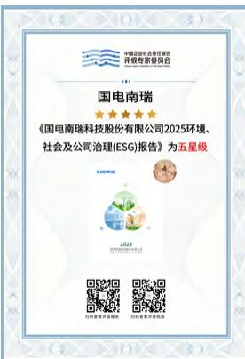

text_image

中国社会经济贸易促进
评估专家委员会
国电南瑞
★★★★★
《国电南瑞科技股份有限公司2025环境、
社会及公司治理(ESG)报告》为五星级
2025
国家能源协会
国家能源协会报告

《国电南瑞科技股份有限公司2025环境、社会及公司治理(ESG)报告》（以下简称《报告》）为五星级，是一份卓越的企业可持续发展报告。

<table><tr><td>评级结果</td><td>评级图示</td><td>发展水平</td></tr><tr><td>五星佳</td><td>★★★★★+</td><td>典范</td></tr><tr><td>五星级</td><td>★★★★★</td><td>卓越</td></tr><tr><td>四星半级</td><td>★★★★☆</td><td>领先</td></tr><tr><td>四星级</td><td>★★★★</td><td>优秀</td></tr><tr><td>三星级</td><td>★★★</td><td>良好</td></tr><tr><td>二星级</td><td>★★</td><td>发展</td></tr><tr><td>一星级</td><td>★</td><td>起步</td></tr></table>

# 二、亮点绩效

<table><tr><td>过程性</td><td>★★★★★</td></tr><tr><td>实质性</td><td>★★★★★</td></tr><tr><td>完整性</td><td>★★★★☆</td></tr><tr><td>平衡性</td><td>★★★★☆</td></tr><tr><td>可比性</td><td>★★★★★</td></tr><tr><td>可读性</td><td>★★★★★</td></tr><tr><td>创新性</td><td>★★★★☆</td></tr></table>

《报告》的过程性、实质性、可比性、可读性均达到五星级，完整性、平衡性、创新性达到四星半级。

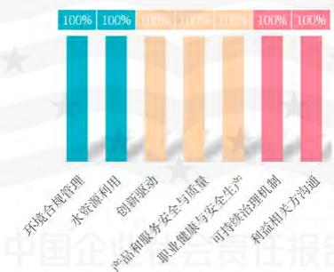

bar

| Category | Value (%) |
| --- | --- |
| 环境合规管理 | 100 |
| 水资源利用 | 100 |
| 创新驱动 | 100 |
| 产品和服务安全与质量 | 100 |
| 职业健康与安全生产 | 100 |
| 可持续治理机制 | 100 |
| 利益相关方沟通 | 100 |

《报告》系统披露了所在行业核心指标的84.47%，环境维度下环境合规管理、水资源利用，社会维度下创新驱动、产品和服务安全与质量、职业健康与安全生产，治理维度下可持续治理机制、利益相关方沟通等议题的核心指标覆盖率最高，均达100%。

13 组

能源利用

13组

员工权益保障

《报告》详细披露了79个关键指标连续3年的对比数据；其中环境维度下能源利用、社会维度下员工权益保障议题连续3年可比数据披露最为充分。

# 三、改进建议

1. 增加行业核心指标的披露，提高报告的完整性；  
2. 增强报告内容和设计的表现形式，进一步提升报告的创新性。

# 四、评级勋章

国电南瑞科技股份有限公司连续 4 年参与报告评级，连续 3 年获得五星级评价，获黄铜级勋章。

报告评级趋势  
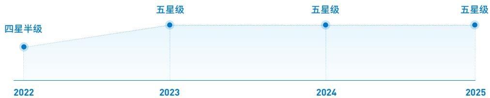

area

| Year | Tier |
| --- | --- |
| 2022 | 四星半级 |
| 2023 | 五星级 |
| 2024 | 五星级 |
| 2025 | 五星级 |

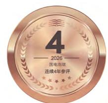

# 《国电南瑞科技股份有限公司 2025 环境、社会及公司治理（ESG）报告》评级报告

受国电南瑞科技股份有限公司连续第4年委托，“中国企业社会责任报告评级专家委员会”抽选专家组成评级小组，对《国电南瑞科技股份有限公司2025环境、社会及公司治理（ESG）报告》（以下简称《报告》）进行评级。

# 一、评级依据

1.《企业可持续披露准则——基本准则（试行）》；  
2.《上海证券交易所上市公司自律监管指引第14号——可持续发展报告（试行）》；  
3.《中国企业可持续发展报告指南（CASS-ESG 6.0）之一般框架》；  
4.《中国企业可持续发展报告评级标准（2026）》。

# 二、评级分析

# 过程性（★★★★★）

党委党建部牵头成立报告编制工作组，统筹具体编制工作，各职能部门及下属单位提供素材，ESG委员会把控整体方向及关键内容，董事会审定ESG报告；围绕报告编制开展前期研究，完善ESG指标体系，编制并发布ESG管理手册，推进ESG管理信息化系统建设，持续提升ESG管理水平；编制资料收集清单，下发专项通知，召开报告编制启动会，对关键职能部门、下属单位进行访谈，收集大量一手资料；建立“1+N”双层次ESG报告体系，强化可持续发展纵向管理力度；计划以电子版、印刷品的形式呈现报告，过程性表现卓越。

# 实质性（★★★★★）

《报告》系统披露了应对气候变化、环保合规管理、能源资源利用、生态系统保护、科技创新、员工权益保障、职业健康与安全生产、可持续治理机制、反商业贿赂及反贪污等所在行业关键性议题，叙述详细充分，其中应对气候变化、科技创新、员工权益保障三项议题相关内容篇幅最多，分别为9页、9页、8页，具有卓越的实质性表现。

# 完整性（★★★★☆）

《报告》主体内容从“至正·瑞意进取，迈出稳健新步伐”“至诚·瑞智驱动，积蓄发展新动能”“至美·瑞见绿意，擘画生态新画卷”“至善·瑞气祥和，奉献幸福新力量”等角度系统披露了所在行业核心指标的84.47%，其中环境维度下环境合规管理、水资源利用，社会维度下创新驱动、产品和服务安全与质量、职业健康与安全生产，治理维度下可持续治理机制、利益相关方沟通等议题的核心指标覆盖率最高，均达100%，完整性表现领先。

# 平衡性（★★★★☆）

《报告》披露了“员工流失率”“人身伤亡事故”“新增职业病例”等负面数据信息，简述了“未发生因不正当竞争行为导致的诉讼或重大行政处罚”“未发生重大腐败事件”“未发生数据安全事件”“未发生科技伦理违规行为”等情况，平衡性表现领先。

# 可比性（★★★★★）

《报告》详细披露了“资产总额”“营业收入”“客户满意度”“公益捐赠总额”“环保投入”“温室气体排放量”等79个关键指标连续3年的对比数据；其中环境维度下能源利用、社会维度下员工权益保障议题连续3年的可比数据披露最为充分，均为13组；通过“入选央视‘中国ESG上市公司先锋100（2025）’榜单，位列第28名”“入选央视‘供应链ESG先锋50（2025）’榜单”等进行横向比较，具有卓越的可比性表现。

# 可读性（★★★★★）

《报告》采用议题型框架结构，从“至正”“至诚”“至美”“至善”四大篇章系统阐述了企业在治理、创新、环境、社会维度的履责理念、实践与成效，全面回应相关方关切；封面设计采用插画风格，以拼接创意将电网、储能等元素有机融合，凸显行业特征，立体呈现企业履责实践，提升了报告的辨识度；篇章跨页采用特色履责场景的实景大图，增强报告感染力；多处设置“数读南瑞”“见证荣耀”版块，便于读者快速把握关键信息；嵌入二维码延伸解读报告内容，增强了报告的易读性和沟通力，可读性表现卓越。

# 创新性（★★★★☆）

《报告》设置“氢电智联创新力，电控蓄能领未来”责任专题，集中展示企业在绿电制氢、新型储能、抽水蓄能等领域新技术、新产品、新范式，彰显企业引领能源转型的实力担当；积极响应国际标准与监管要求，参照“治理—战略—影响、风险和机遇管理—指标与目标”四支柱框架披露应对气候变化等议题，增强了信息披露的规范性；编制《国电南瑞ESG体系化建设研究报告》，夯实公司可持续发展根基，创新性表现领先。

# 三、综合评级（★★★★★）

经评级小组评价，《国电南瑞科技股份有限公司2025环境、社会及公司治理（ESG）报告》为五星级，是一份卓越的企业可持续发展报告。

<table><tr><td>评级结果</td><td>评级图示</td><td>发展水平</td></tr><tr><td>五星佳</td><td>★★★★★+</td><td>典范</td></tr><tr><td>五星级</td><td>★★★★★</td><td>卓越</td></tr><tr><td>四星半级</td><td>★★★★☆</td><td>领先</td></tr><tr><td>四星级</td><td>★★★★</td><td>优秀</td></tr><tr><td>三星级</td><td>★★★</td><td>良好</td></tr><tr><td>二星级</td><td>★★</td><td>发展</td></tr><tr><td>一星级</td><td>★</td><td>起步</td></tr></table>

# 四、改进建议

1. 增加行业核心指标的披露，提高报告的完整性；  
2. 增强报告内容和设计的表现形式，进一步提升报告的创新性。

# 五、评级勋章

国电南瑞科技股份有限公司连续 4 年参与报告评级，连续 3 年获得五星级评价，获黄铜级勋章。

报告评级趋势  
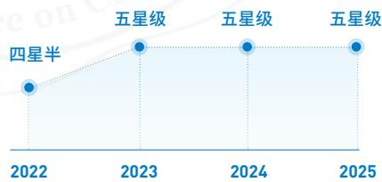

line

| Year | Performance Level |
| --- | --- |
| 2022 | 四星半 |
| 2023 | 五星级 |
| 2024 | 五星级 |
| 2025 | 五星级 |

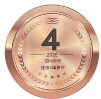

  
扫码查看评级档案

  
评级专家委员会副主席

  
评级小组组长

  
评级小组专家  
出具时间：  
2026年4月24日

# 意见反馈

# 尊敬的读者：

您好！

非常感谢您在百忙之中阅读本报告，为了改进报告编制工作，提升国电南瑞的 ESG 管理与实践能力，我们特别希望倾听您的意见和建议，请您不吝赐教！

# 1. 您属于以下哪类利益相关方？

□政府人员 □监管机构 □股东和投资者 □员工  
□客户 □供应商及合作伙伴 □社区居民 □其他

# 2. 您对本报告的总体评价是？

□好 □较好 □一般 □较差 □差

# 3. 您认为本报告所披露的 ESG 信息质量如何？

□高 □较高 □一般 □较低 □低

# 4. 您认为本报告的结构安排如何？

□很合理 □较合理 □一般 □较差 □差

# 5. 您认为本报告的版式设计如何？

□很合理 □较合理 □一般 □较差 □差

# 6. 您认为本报告的可读性如何？

□高 □较高 □一般 □较低 □低

# 7. 您对国电南瑞 ESG 工作和本报告的意见与建议，欢迎在此提出：

# NARI南瑞

报告出版的环境考虑

纸张:采用环保纸张印刷

油墨:采用环保油墨以减少空气污染