# 2025年度

环境、社会和治理（ESG）报告

# 关于本报告

# 报告简介

宝鸡钛业股份有限公司自2011年起连续14年发布了社会责任报告。本报告是公司发布的第一份环境、社会与公司治理(ESG)报告(以下简称“本报告”)，以向利益相关方等披露和展示公司在环境、社会、公司治理领域的绩效。我们期望通过发布ESG报告，加强与利益相关方的沟通，促进合作，凝聚可持续发展合力。本报告经董事会审阅，并对所载信息的真实性及有效性负责。

# 报告周期

本报告为年度报告,发布周期为一年一次。

# 报告范围

本报告覆盖宝鸡钛业股份有限公司及子、分公司，与财务报告合并报表范围一致。时间范围为2025年1月1日至2025年12月31日（以下简称“报告期”），部分内容及数据适当超出报告期。

# 编制依据

全球可持续发展标准委员会(GSSB)《GRI可持续发展报告标准》

国务院国有资产监督管理委员会《关于中央企业履行社会责任的指导意见》

《社会责任报告编写指南》(中国国家标准GB/T 36001—2015)

上海证券交易所《上海证券交易所上市公司自律监管指引第14号——可持续发展报告(试行)》

《陕西省国有企业环境、社会和治理(ESG)信息披露指引》(T/SXQL—2024)

《有色金属企业环境、社会及治理(ESG)信息披露指南》(T/CNIA0246—2024)

# 数据来源

本报告所引用的数据来源于企业正式文件及统计报告。财务数据来源于经审计的宝钛股份2025年度财务报告，除特别说明外，报告中所涉及货币金额均以人民币计量。环境数据按照国家规定或行业标准统计计算。

# 称谓说明

宝鸡钛业股份有限公司,简称“宝钛股份”“公司”或“我们”。

# 可靠性保证

公司保证本报告内容不存在任何虚假记载、误导性陈述或重大遗漏，并对其内容的真实性、准确性和完整性承担个别及连带责任。

# 报告发布

本报告以印刷版和电子版两种形式发布，您可登录上海证券交易所网站(www.sse.com.cn)下载本报告电子文档。

本报告尽可能考虑了不同利益相关方的关注议题。为持续提高公司ESG信息披露水平、推进公司ESG管理和实践，针对本报告，特向读者征求意见，公司将在今后努力完善。

0917-3382666 i 0917-3382132  
陕西省宝鸡市渭滨区高新大道88号  
dsb@baoti.com  
http://www.baotai.com/

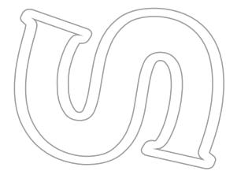

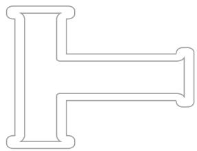

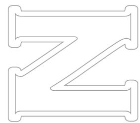

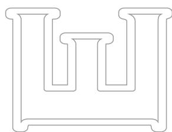

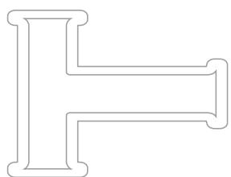

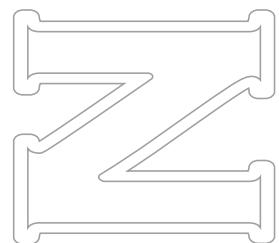

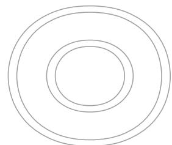

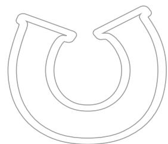

# 01

# ESG管理 11

ESG理念 13

ESG治理体系 13

实质性议题分析 14

利益相关方沟通 16

# 02

# 治理议题 17

规范治理 19

合规经营与风险管理 21

投资者关系与信息披露 25

# 03

# 环境议题 27

环境管理 29

气候应对 33

绿色运营 35

绿色文化 38

# 04

# 社会议题 39

产品与客户服务 41

创新驱动发展 46

供应链安全与管理 49

员工发展 51

社会公益 61

董事长致辞

企业基本信息

荣誉奖项

2025年度重点绩效

展望未来

绩效展示

附录

读者意见表

# 1 董事长致辞

natural_image

Exterior view of modern glass skyscrapers under a clear blue sky (no signage or text visible)

# 2025

2025年,是全国深入推进新型工业化、加快发展新质生产力的深化之年,也是宝钛股份锚定“建成世界一流钛业强企”战略目标、深耕钛产业全链条高质量发展的攻坚之年。我们始终以“赋能国之重器,打造钛业标杆”为初心,以“产品卓越、品牌卓著、创新领先、治理现代”为主线,在经营发展与责任履行的协同推进中实现质效双升。作为“中国钛工业第一股”,我们持续筑牢十大生产系统,巩固4万吨钛铸锭、3万吨钛加工材产能优势,主导钛产品产量稳居国内行业之首,推动我国成为全球第四个拥有完整钛工业产业链的国家,以稳健经营为ESG实践筑牢坚实根基。

# 这一年,我们以“科创攻坚”突破技术壁垒。

坚持创新驱动发展战略, 全年组织参与科研项目183项, 其中国家级科研项目29项, 获授权专利12项, 成功研制超长大单重高性能钛合金板材、大规格挤压管材等核心产品, 填补多项国内技术空白; 创新高精度水浸自动探伤技术入选工信部质量提升与品牌建设典型案例, 以自主可控的“中国钛”助力大国重器研发, 用硬核实力诠释科技自立自强的行业担当。

# 这一年,我们以“绿色转型”守护生态底色。

坚决响应国家“双碳”目标,实施碳达峰方案与三阶段温室气体减排规划,全年可再生能源使用占比提升至40%,残钛回收利用减少碳排放约3万吨,多项技改项目实现能耗与水耗双降,废水、废气污染物排放量持续优化。公司获评中国工业碳达峰“领跑者”企业、国家级绿色工厂、国家级绿色供应链管理企业,让绿色成为高质量发展的鲜明底色。

# 这一年,我们以“责任担当”回馈社会期待。

坚守以客户为中心,关注客户满意度,与全球知名企业深化战略合作,打造安全稳定的全球供应链;坚持以人为本,构建六大序列职业发展通道,实现生产安全责任事故零发生,持续完善员工健康管理与关怀体系;积极投身乡村振兴、社会公益事业,依法合规纳税,以实际行动践行国企社会责任。

# 这一年,我们以“规范治理”夯实发展根基。

坚持党建与经营深度融合,不断完善中国特色现代企业治理体系,“三会一层”规范高效运作,构建三级合规风控管理体系,信息披露真实准确,近三年累计现金分红5.69亿元,切实保护投资者权益。公司荣获2025“上证鹰·金质量”公司治理奖、上市公司金牛奖“金信披奖”等多项荣誉,让合规、透明、高效成为治理常态、这些成绩的取得,离不开各级政府的悉心指导,离不开股东、投资者、客户与合作伙伴的信任同行,更离不开全体员工的拼搏奉献。在此,我谨代表公司董事会,向所有关心支持宝钛股份发展的利益相关方,致以最诚挚的感谢!

展望未来,我们将始终锚定世界一流钛业强企的发展目标,持续深化ESG管理体系建设,在科技创新、绿色低碳、社会责任的道路上持续深耕,与各方携手共进,共创更具价值、更可持续的美好未来!

宝鸡钛业股份有限公司

董事长 王俭

# 企业基本信息

# 公司简介

宝鸡钛业股份有限公司成立于1999年7月21日，于2002年4月12日作为“中国钛工业第一股”在上海证券交易所上市，为专业从事钛及钛合金生产、科研的国家高新技术企业，所在地被誉为“中国钛城”“中国钛谷”。公司致力于成为世界一流钛业强企，推进产品卓越、品牌卓著、创新领先、治理现代的战略目标，以品牌建设为主线，树立“合作共赢，共同发展”的市场观，注重科技创新和产业升级，建立起“海绵钛、熔铸、锻造、板材、带材、无缝管、焊管、棒丝材、精密铸造、原料处理”十大生产系统，形成4万吨钛铸锭和3万吨钛加工材生产能力，产品广泛应用于航空、航天、舰船等高精尖领域和氯碱化工、电力、冶金、医药及海洋工程等国民经济重要领域，主导钛产品产量稳居国内行业之首。同时，公司积极拓展国际市场，产品远销美国、日本、德国、法国、英国、挪威、瑞典、新加坡、意大利、印度、韩国、中国香港、中国台湾等几十个国家及地区，与空客、波音等国际知名航空企业建立了长期战略合作关系，使我国成为继美、日、俄后成为第四个拥有完整钛工业产业链的国家。

作为中国钛、锆等稀有金属国标、行标等标准的重要制定者，公司建立起了完备的质保体系，取得了全国工业产品生产许可等国内外多项认证。通过了欧盟承压设备PED认证、NADCAP热处理特种工艺、无损检测、理化测试项目认证及德国压力容器TUV体系认可；完成了NORSOK产品认证；通过了波音、空客、古德里奇、庞巴迪、罗罗、奥布杜瓦、斯奈克玛等国际知名大公司的质量体系和产品认证，树立了宝钛品牌的国际地位。宝钛被评为“中国驰名商标”，主导钛加工材、钛带先后被评为“中国名牌产品”“陕西省名牌产品”。公司被海关列入“AA类进出口企业”、国家质监总局质量信用A级企业、陕西省“出口名牌企业”，被航空、航天等多家企业评为“A类/优秀供应商”“突出贡献供应商”。

natural_image

Modern blue glass building with abstract geometric design, no visible text or symbols

# 公司战略

“十五五”期间，宝钛股份将以公司发展战略为蓝图，深入贯彻“三线并进、四式鼎新”发展理念（“三线”指宝钛的基本盘曲线、战略延伸曲线、未来曲线；“四式”指建设科研式、生态式、智慧式、实干式宝钛），着力实现“四个转变”，建成全球最具竞争力的钛及钛合金材料综合服务商，形成9万吨钛产品及锆、镍等战略金属协同发展能力，开启从“国内领先”到“世界一流”的战略升维。

# 建成全球最具竞争力的钛及钛合金材料综合服务商

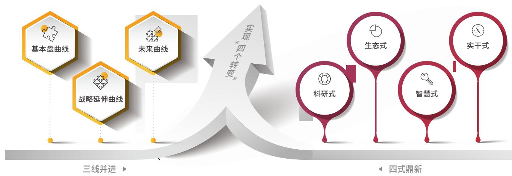

flowchart

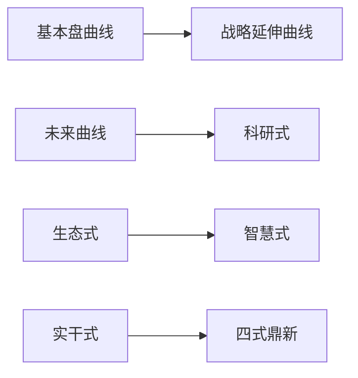
```mermaid
graph LR
  A["基本盘曲线"] --> B["战略延伸曲线"]
  C["未来曲线"] --> D["科研式"]
  E["生态式"] --> F["智慧式"]
  G["实干式"] --> H["四式鼎新"]
```

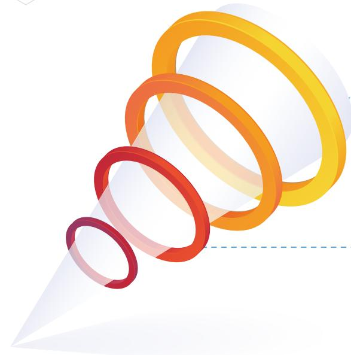

natural_image

Abstract illustration of three overlapping rings in orange, red, and yellow against a white background (no text or symbols)

# 做精产品

提升产品质量的稳定性,以质量赢得市场,以品牌走向世界,专注于钛及钛合金产品研发、制造,努力把产品做精,打造宝钛品牌,立足创新,保持高质量增长。

# 做活市场

以灵活而高效的市场管理体制机制，做强做优做大主业，实现产业与资本两翼齐飞，不断提升营销、装备、管理“三个能力”，着力开拓新品民品、外贸“三个市场”。

# 组织架构

Organizational Structure

组织机构图  
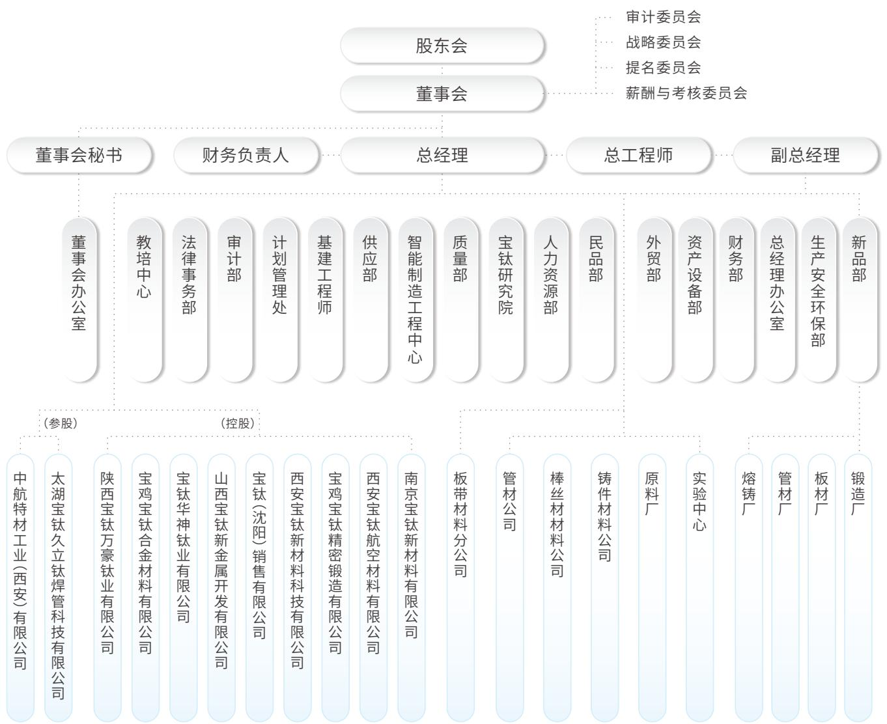

flowchart

```mermaid
graph TD
  A["股东会"] --> B["董事会"]
  C["审计委员会"] -.-> A
  D["战略委员会"] -.-> A
  E["提名委员会"] -.-> A
  F["薪酬与考核委员会"] -.-> A
  G["董事会秘书"] -.-> H["董事会办公室"]
  G -.-> I["财务负责人"]
  G -.-> J["总经理"]
  G -.-> K["总工程师"]
  G -.-> L["副总经理"]
  
  subgraph Executives
    M["董事会办公室"]
    N["教培中心"]
    O["法律事务部"]
    P["审计部"]
    Q["计划管理处"]
    R["基建工程师"]
    S["供应部"]
    T["智能制造工程中心"]
    U["质量部"]
    V["宝钛研究院"]
    W["人力资源部"]
    X["民品部"]
    Y["外贸部"]
    Z["资产设备部"]
    AA["财务部"]
    AB["总经理办公室"]
    AC["生产安全环保部"]
    AD["新品部"]
  end
  
  subgraph Executives
    AE["(参股)"]
    AF["(控股)"]
  end
  
  subgraph Executives
    AG["中航特材工业(西安)有限公司"]
    AH["太湖宝钛久立钛焊管科技有限公司"]
    AI["陕西宝钛万豪钛业有限公司"]
    AJ["宝鸡宝钛合金材料有限公司"]
    AK["宝钛华神钛业有限公司"]
    AL["山西宝钛新金属开发有限公司"]
    AM["宝钛(沈阳)销售有限公司"]
    AN["西安宝钛新材料科技有限公司"]
    AO["宝鸡宝钛精密锻造有限公司"]
    AP["西安宝钛航空材料有限公司"]
    AQ["南京宝钛新材料有限公司"]
  end
  
  subgraph Executives
    AR["板带材料分公司"]
    AS["管材公司"]
    AT["棒丝材料公司"]
    AU["铸件材料公司"]
    AV["原料厂"]
    AW["实验中心"]
    AX["熔铸厂"]
    AY["管材厂"]
    AZ["板材厂"]
    BA["锻造厂"]
  end
  
  subgraph Executives
    BB["中航特材工业(西安)有限公司"]
  end
  
  A --> M
  A --> N
  A --> O
  A --> P
  A --> Q
  A --> R
  A --> S
  A --> T
  A --> U
  A --> V
  A --> W
  A --> X
  A --> Y
  A --> Z
  A --> AA
  A --> AB
  A --> AC
  A --> AD
  A --> AE
  
  M -.-> M
  N -.-> N
  O -.-> O
  P -.-> P
  Q -.-> Q
  R -.-> R
  S -.-> S
  T -.-> T
  U -.-> U
  V -.-> V
  W -.-> W
  X -.-> X
  Y -.-> Y
  Z -.-> Z
  AA -.-> AA
  AB -.-> AB
  AC -.-> AC
```

# 权属单位

宝钛华神钛业有限公司

西安宝钛新材料科技有限公司

宝鸡宝钛精密锻造有限公司

宝钛(沈阳)销售有限公司

宝鸡宝钛合金材料有限公司

南京宝钛新材料有限公司

山西宝太新金属开发有限公司

西安宝钛航空材料有限公司

陕西宝钛万豪钛业有限公司

# 2025年度重点绩效

2025 Annual Key Performance

# 经营绩效

营业收入61.24亿元。

利润总额2.79亿元。

归属于母公司的净利润4.01亿元。

资产总额161.58亿元。

净资产收益率5.67%。

# 环境绩效

碳排放总量125890.22吨。

二氧化碳减排量12181.92吨(较基准年2022年)。

排放强度降低4.81%。

环保总投入988.17万元。

# 社会绩效

纳税总额1.17亿元。

用于扶贫及乡村振兴总投入277.05万元。

组织参与国家级科研项目29项

省部级科研项目30项

获专利授权12项

获省部级以上科技创新成果奖励1项

安全培训次数429次

# 治理绩效

召开股东大会5次,审议议案26项

召开董事会会议12次,审议议案52项

董事会专业委员会召开会议14次

召开独立董事专门会议6次

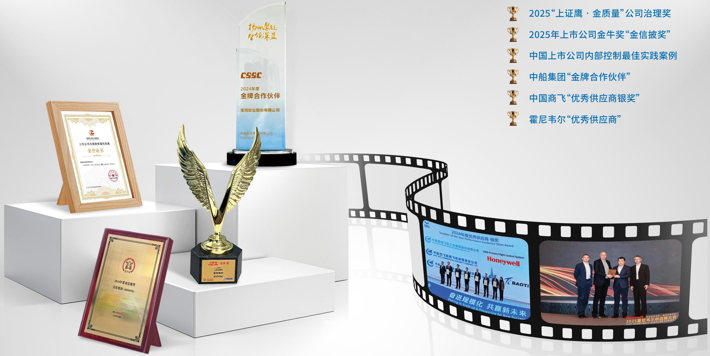

text_image

2025“上证鹰·金质量”公司治理奖
2025年上市公司金牛奖“金信披奖”
中国上市公司内部控制最佳实践案例
中船集团“金牌合作伙伴”
中国商飞“优秀供应商银奖”
霍尼韦尔“优秀供应商”
扬帆聚红
智领深蓝
CSSC
2024年度
金牌合作伙伴
宝鸡钛业股份有限公司
中国新东方集团有限公司
2025年6月1日
2024年度优秀供应商 银奖
Suppier of the Year Performance Excellence Silver Award
CSI9 Primary Flight Control System
Honeywell
中航沈飞民用飞机有限责任公司
BAOTI
奋进规模化 共赢新未来
Sailing to Scale Up & Prospecting for New Successes
2025霍尼韦尔供应商大会

2025“上证鹰·金质量”公司治理奖  
2025年上市公司金牛奖“金信披奖”  
中国上市公司内部控制最佳实践案例  
中船集团“金牌合作伙伴”  
中国商飞“优秀供应商银奖”  
霍尼韦尔“优秀供应商”

text_image

ESG管理

# ESG管理

# ESG理念

宝钛股份积极践行可持续发展理念，以“建成世界一流钛业强企”为愿景，围绕“产品卓越、品牌卓著、创新领先、治理现代”的发展取向，将绿色低碳、质量安全、合规运营、科技创新与人才发展系统融入经营管理，持续完善ESG治理体系建设，关注并回应政府监管、股东/投资者、员工、客户、供应商与社区等利益相关方的期望与诉求，推动公司与环境、社会的协调共生与持续提升。

# ESG治理体系

宝钛股份董事会、经理层和执行层(各业务部门、子公司)共同落实可持续高质量发展的责任,确保ESG治理相关工作高效推进。

  
董事会

宝钛股份ESG治理的最高决策机构,负责拟订公司在ESG治理中的战略规划,确保有关政策能够有效实施,并对相关政策、制度及信息披露承担全部责任。

  
经理层

在董事会领导下,负责ESG治理工作的统筹协调,落实董事会关于ESG工作的各项决议,监督ESG工作的具体落实。

  
执行层

由集团公司各部门和权属公司组成, 将ESG工作融入部门日常业务管理及运营当中, 进行ESG信息定期收集、上报与审核工作, 提升ESG相关信息的统计管控效率及ESG工作效能, 保障ESG工作的高效开展与落实。

# 实质性议题分析

宝钛股份认真听取国资监管部门、行业主管部门，外部董事、经理层、管理人员、职工、客户、供应商、行业协会等各方面意见建议，保持开放、畅通的沟通渠道，不断加强ESG管理工作。本报告期，我们主要参考《上海证券交易所上市公司自律监管指引第14号——可持续发展报告(试行)》《陕西省国有企业环境、社会和治理(ESG)信息披露指引》等标准要求，结合企业战略发展和经营管理，经过广泛调研，充分了解各方面对实质性议题的关注程度，为公司可持续、高质量发展奠定良好基础。

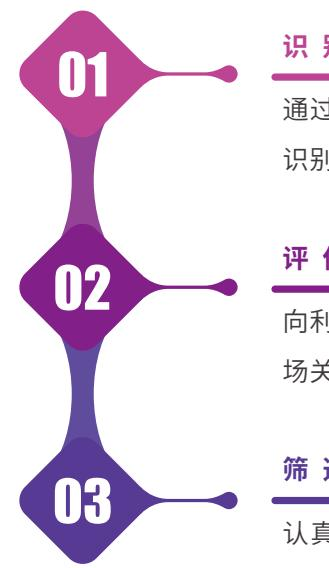

flowchart

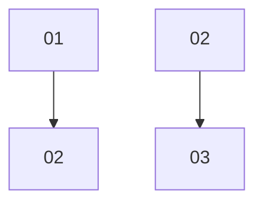
```mermaid
graph TD
  01["01"] --> 02["02"]
  n02["02"] --> 03["03"]
```

# 识别

通过分析国家宏观政策、产业发展趋势、自身发展战略、国内外可持续发展标准，识别25项对公司发展和利益相关方具有重要意义的实质性议题。

# 评估

向利益相关方开展调研,对调研结果进行合理性分析,同时结合国家政策、资本市场关注要点、同业表现等因素,生成利益相关方实质性议题的重要性排序。

# 筛选

认真分析研究各项政策, 按照“公司发展重要性”及“利益相关方重要性”两个维度, 构建出宝钛股份2025年度实质性议题矩阵, 对关键议题重点披露。

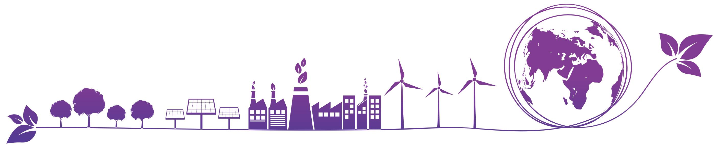

natural_image

Stylized illustration of a city skyline with solar panels, wind turbines, and industrial buildings, accompanied by a globe icon and leaf symbols (no text or labels)

# 实质性议题矩阵

# 高度重要议题

...

节能降碳、能源消耗、污染防治、气候应对、温室气体排放、绿色运营、创新驱动发展、产品与客户服务、供应链安全与管理、规范治理、廉洁建设、投资者关系、信息披露、合规经营与风险管理、员工权益、员工安全与健康、员工发展与培训

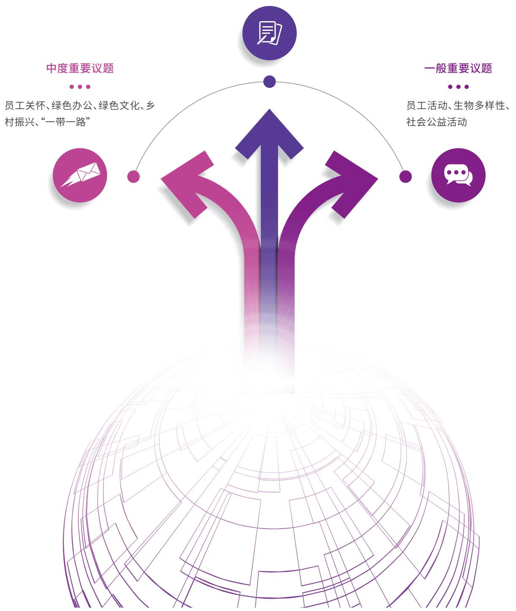

flowchart

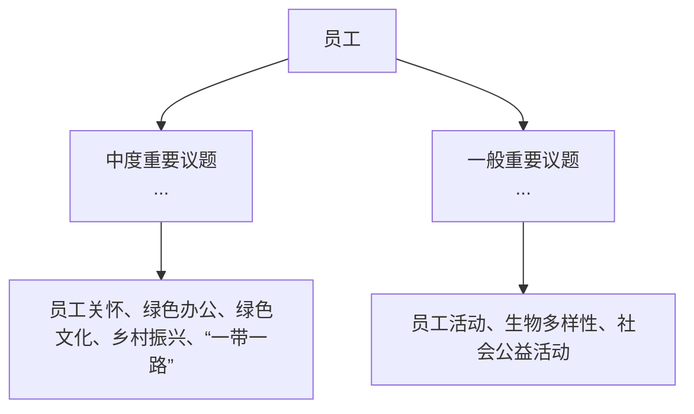
```mermaid
graph TD
  A["员工"] --> B["中度重要议题\n..."]
  A --> C["一般重要议题\n..."]
  B --> D["员工关怀、绿色办公、绿色文化、乡村振兴、“一带一路”"]
  C --> E["员工活动、生物多样性、社会公益活动"]
```

# 利益相关方沟通

宝钛股份“崇尚价值创造，与客户、员工、股东、社会共享发展成果”的价值导向，以合作共赢为原则，不断健全ESG沟通机制，为利益相关方搭建良好的内、外部沟通平台，建立完善、公开、透明的沟通机制，与利益相关方保持常态化沟通，了解和回应利益相关方对公司的期望与诉求，与利益相关方一起推动公司可持续发展，实现利益相关方价值最大化。

<table><tr><td>利益相关方</td><td>期望与诉求</td><td>回应措施</td><td>沟通方式与渠道</td></tr><tr><td>政府</td><td>·税收贡献·促进地方经济发展·带动就业·合规经营</td><td>·依法纳税·与地方开展合作·创造就业机会·严格落实监管要求</td><td>·日常工作会议·信息报送·专题会议及重大活动</td></tr><tr><td>股东/投资者</td><td>·规范公司治理·强化风险管理·创造股东价值·畅通沟通机制</td><td>·规范科学高效的治理模式·完善风险管理组织架构,构建规范、全面的风险合规内控管理体系·保护股东权益,保证股东回报·信息披露真实、准确、及时、完整</td><td>·股东大会/董事会·及时、全面地信息披露·路演·投资者沟通</td></tr><tr><td>员工</td><td>·基本权益保障·良好职业发展路径·健康舒适工作环境</td><td>·遵守法律法规·职业发展规划·职业健康与员工关爱</td><td>·员工培训及座谈会·职工代表大会·员工关爱活动</td></tr><tr><td>客户</td><td>·优质产品及服务·良好的客户信息保护</td><td>·提升产品质量及服务·加强信息安全建设</td><td>·客户拜访·服务热线及满意度调查·客户隐私保护</td></tr><tr><td>合作伙伴</td><td>·良好合作关系·共同发展</td><td>·建立公开、透明的合作机制·加强同合作伙伴的战略合作</td><td>·走访交流·信息沟通与经验分享·开展合作</td></tr><tr><td>社会团体</td><td>·顺畅的沟通渠道·良好合作氛围</td><td>·定期信息发布·公开透明合作</td><td>·走访交流·专题会议·合作</td></tr><tr><td>环境</td><td>·可持续开发·绿色低碳·环境保护</td><td>·加强环境管理·加强绿色运营·推广节能减排降耗的经营理念</td><td>·环保宣传·开展活动</td></tr><tr><td>社区</td><td>·参与社区发展·支持社区建设·参与社会公益</td><td>·乡村振兴·志愿服务</td><td>·宣传走访·开展活动</td></tr></table>

# 治理议题

宝钛股份积极构建完善中国特色国有企业现代公司治理,切实加强党的政治建设和思想引领,坚持党建与企业战略、经营管理深度融合,不断加强董事会建设,持续完善公司治理,提升决策效率与质量,强化企业合规管理水平,坚持恪守商业道德,确保运营管理廉洁透明,推动公司稳健发展。

# 核心议题

规范治理、党建引领、廉洁建设、信息披露、投资者关系、合规经营与风险管理

# 规范治理

# 三会组织架构、任命程序与职能

宝钛股份积极探索企业管理新模式,严格遵守国家相关法律及上市公司监管相关要求,依法合规运营,规范董事会和监事会建设,持续提升公司治理水平,打造运转高效、治理有序的上市公司。

公司积极构建具有中国特色的国有控股公司治理模式，以《公司章程》为中心，《股东大会议事规则》《董事会议事规则》《总经理工作细则》等制度，构建各治理主体边界清晰的管理决策权限。通过不断强化公司“三会一层”运行和决策规范，持续加强公司治理能力建设。

# 股东大会

股东大会是公司最高权力决策机构, 公司制订《公司章程》和《股东大会议事规则》, 平等对待所有股东, 特别是保证中小股东享有平等地位, 充分行使自己的权利, 在涉及关联交易事项表决时, 关联股东进行了回避。

# 绩效展示

2025年, 公司共召开股东大会5次, 审议议案26项。

# 董事会及专委会

董事会是公司经营管理的决策机构，充分发挥董事会“定战略、做决策、防风险”的决策作用，不断规范和加强董事会建设。董事会由9名具备专业背景、多元性及丰富经验的董事组成，包括管理、财务、管理、财务、法律等行业背景，其中独立董事4名。

董事会下设4个专门委员会，结构合理、分工明确、权责明晰，在重大决策中较好地发挥了专业化作用，已形成重大事项各专门委员会事前研究、事中跟进、事后评价的专业化工作机制。2025年，公司建立健全董事会各专门委员会工作制度，明确各专门委员会的工作职责、议事程序、工作细则等事项，为董事会做好决策提供多元视角、凝聚多方智慧和专业助力。

# 绩效展示·

公司共召开董事会会议12次,审议议案52项。

董事会专业委员会召开会议14次

审计委员会召开会议9次, 战略委员会召开会议3次, 提名委员会召开会议1次

薪酬与考核委员会召开会议1次

召开独立董事专门会议6次

# 党建引领

公司始终坚持以习近平新时代中国特色社会主义思想为指导,深入学习宣传贯彻党的二十届历次全会精神,持之以恒加强党的领导、党的建设,以高质量党建引领保障高质量发展。

# 廉洁建设

宝钛股份坚持以习近平新时代中国特色社会主义思想为指导，深刻领悟“两个确立”的决定性意义，增强“四个意识”、坚定“四个自信”、做到“两个维护”，坚持“不敢腐、不能腐、不想腐”一体推进，取得党风廉政建设和反腐败工作新成效，为公司转型发展、融合发展、高质量发展提供坚强的纪律和作风保障。

# 案例

# 陕西有色金属集团深入贯彻中央八项规定精神学习教育年轻干部代表座谈会在宝钛召开

2025年6月，陕西有色金属集团深入贯彻中央八项规定精神学习教育年轻干部代表座谈会在宝钛召开。会上，5名年轻干部结合本职工作和个人成长经历作了交流发言，从不同角度分享了工作体会，交流了工作经验，表达了为公司高质量发展作贡献的坚定决心。集团领导勉励大家要把握航标掌握前进方向，选定目标确定奋斗志向，找准坐标摆正自己位置，在挫折中克服挫折，在挑战中战胜挑战。年轻干部肩负着继往开来、承上启下的责任和使命，要以习近平新时代中国特色社会主义思想为根本遵循，深入贯彻中央八项规定精神学习教育，锚定“质、效、量”倍增目标，在公司高质量发展新征程上展现青年担当、贡献青春力量。

natural_image

Golden star-shaped graphic with a smaller star on a red flowing background (no text or symbols)

# 合规经营与风险管理

宝钛股份坚信忠实商业道德企业更具竞争力,严格进行商业道德规范管理,强化依法合规运营,通过巡查整治、以案促管、主题教育等行动,坚决预防和反对腐败,依法合规经营,稳健发展。

# 合规管理

宝钛股份深入贯彻落实习近平法治思想,紧抓内部控制体系建设,建立健全公司合规管理体系,持续完善基础管理制度,构筑合规经营防线,确保企业健康稳健发展。

合规管理组织架构  
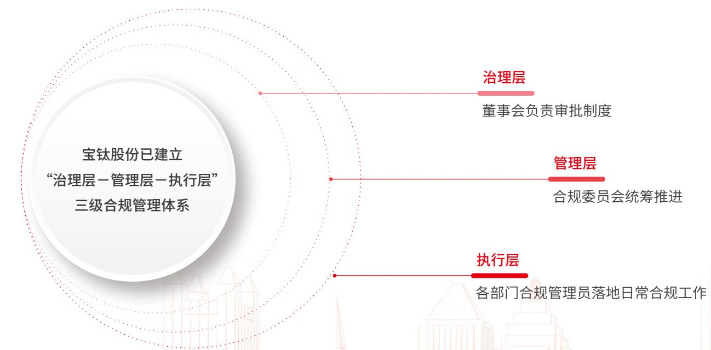

flowchart

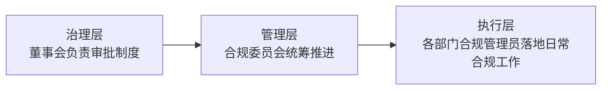
```mermaid
graph LR
  A["治理层\n董事会负责审批制度"] --> B["管理层\n合规委员会统筹推进"]
  B --> C["执行层\n各部门合规管理员落地日常合规工作"]
```

# 合规管理体系

宝钛股份制定了《合规管理办法》《合规管理工作实施方案》《合同管理办法》《合同管理风险防控检查考核实施办法》《合法合规性审查实施办法》等制度，实现全面合规、有效合规、持续合规、主动合规，确保公司各项经营管理合规高效，业务稳健增长。

近两年，公司以“全面诊断、精准识险”为目标，对经营管理全流程开展深度调研与专项交流，系统梳理出公司治理、信息披露、保密管理、投融资管理等11个重点领域的核心合规风险点，制定《重点领域合规管理指引》，明确各领域合规操作标准、责任主体与禁止性要求，并配套建立《重点领域合规管理清单》，细化风险防控节点、检查频率及整改要求，为公司构建“事前预防、事中管控、事后追溯”的合规风险防控体系提供了精准输入，有效提升了管理合规性与风险抵御能力。

合规管理流程  
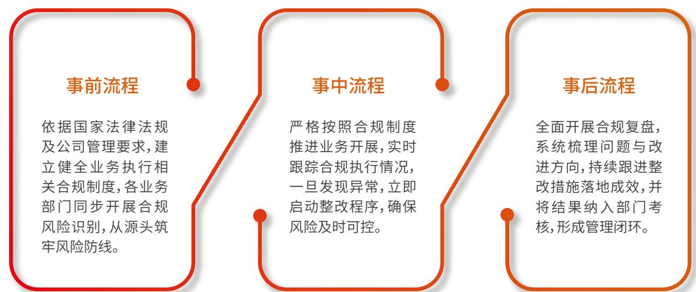

flowchart

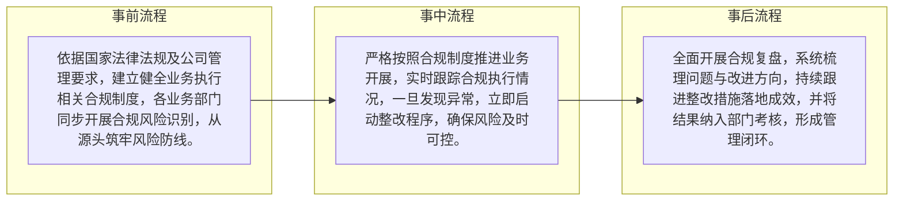
```mermaid
graph LR
  subgraph Before_Process["事前流程"]
    A1["依据国家法律法规及公司管理要求，建立健全业务执行相关合规制度，各业务部门同步开展合规风险识别，从源头筑牢风险防线。"]
  end

  subgraph During_Process["事中流程"]
    B1["严格按照合规制度推进业务开展，实时跟踪合规执行情况，一旦发现异常，立即启动整改程序，确保风险及时可控。"]
  end

  subgraph After_Process["事后流程"]
    A2["全面开展合规复盘，系统梳理问题与改进方向，持续跟进整改措施落地成效，并将结果纳入部门考核，形成管理闭环。"]
  end

  A1 --> B1
  B1 --> A2
```

# 风险管理

宝钛股份以风险管理为导向、内部控制为基础、合规管理为底线，构建规范、全面、高效、融合的全级次风控合规“三合一”管理体系，保障风控合规制度体系有效实施，为公司圆满完成“十四五”战略目标保驾护航。

风险管理组织架构  
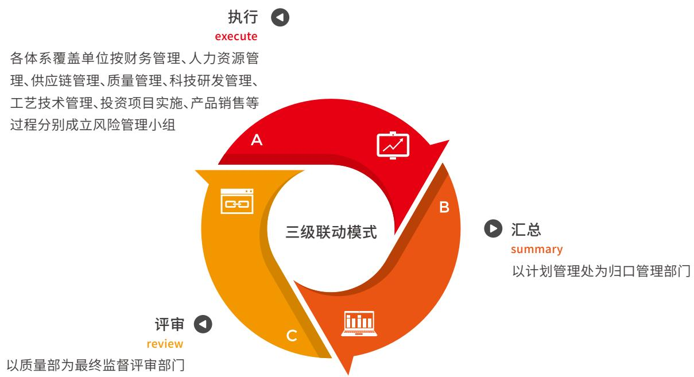

flowchart

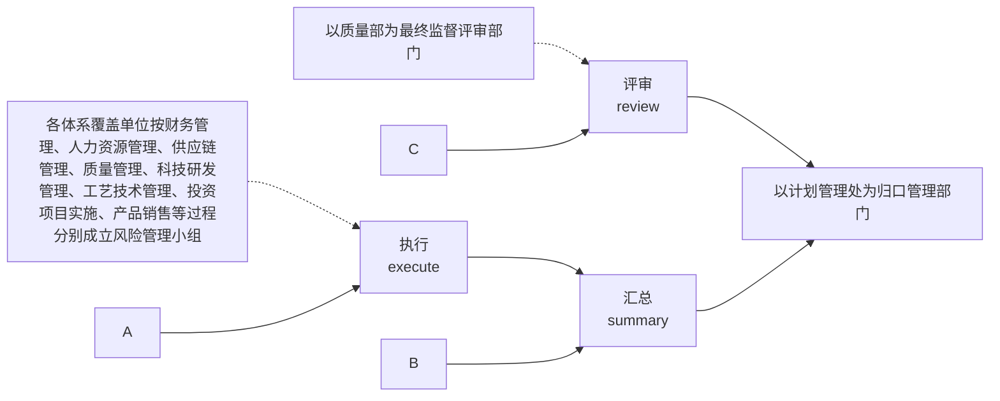
```mermaid
graph LR
  A["执行\nexecute"] --> B["汇总\nsummary"]
  C["评审\nreview"] --> D["以计划管理处为归口管理部门"]
  B --> D
  E["各体系覆盖单位按财务管理、人力资源管理、供应链管理、质量管理、科技研发管理、工艺技术管理、投资项目实施、产品销售等过程分别成立风险管理小组"] -.-> A
  F["以质量部为最终监督评审部门"] -.-> C
  G["A"] --> A
  H["B"] --> B
  I["C"] --> C
```

# 风险管理制度体系

宝钛股份制定了《全面风险管理办法》《风险分级管控和隐患排查治理制度》《合同管理风险防控检查考核实施办法》《关联交易决策制度》等制度，完善全面风险管理与内部控制体系建设，提升公司风险管理水平。此外，公司建立了外部风险预警机制，针对识别的外部风险，协调相关单位制定针对性应对措施，助力公司规避风险、持续改进。

# RISK MANAGEMENT

# 风险管理流程

宝钛股份积极推动风险管理系统覆盖各级子企业和所有项目,推动风险管理和合规管理向信息化、数字化升级。

# 案例

公司招投标风险管理流程

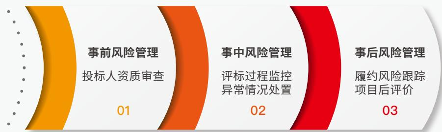

flowchart

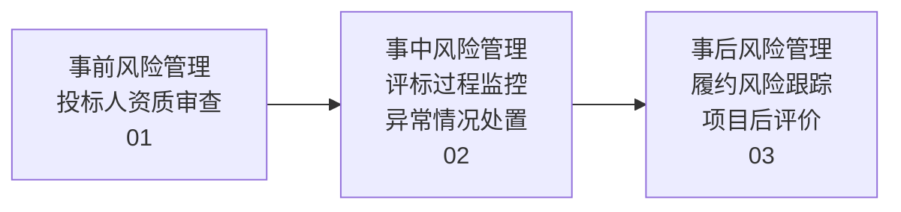
```mermaid
graph LR
  A["事前风险管理\n投标人资质审查\n01"] --> B["事中风险管理\n评标过程监控\n异常情况处置\n02"]
  B --> C["事后风险管理\n履约风险跟踪\n项目后评价\n03"]
```

# 风险管理文化建设

宝钛股份坚持以培育文化为抓手，面向公司高管、中层正职、各事业部和职能部门联络人，开展多项风险管理专项培训与业务宣贯。近两年，公司启动内部控制提升专项工作，组织开展合规管理体系建设与风险防控专项培训，累计覆盖40余人次，有效强化了员工的合规管理意识与风险防控能力。

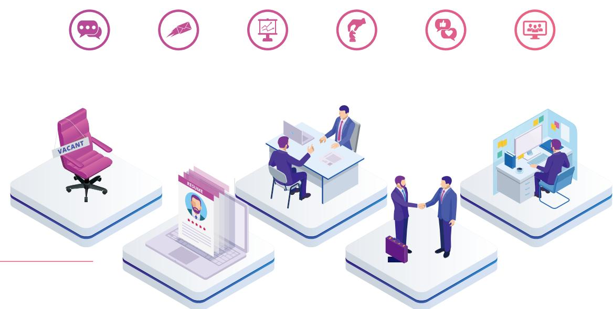

flowchart

```mermaid
graph LR
  A["Vacant"] --> B["Recruit"]
  B --> C["Job Application"]
  C --> D["Employment"]
  D --> E["Job Placement"]
  E --> F["Job Reception"]
  F --> G["Job Presentation"]
```

# 投资者关系与信息披露

截至2025年12月31日，宝钛股份总股本为477,777,539股，控股股东为宝钛集团有限公司，持股比例为49.4%。

# 信息披露透明度

宝钛股份秉持“尊重投资者、回报投资者、保护投资者”的理念，充分保障投资者的知情权、决策权和利润分配权，努力以持续增长的业绩回报投资者，强化投资者关系管理，推进信息披露制度建设和信息披露责任体系，主动传递公司价值，积极构建与投资者共同提升公司发展质量的良好生态，致力于打造一个对投资者负责，有价值、受尊敬的上市公司。

2025年，宝钛股份以精细度和专业性为基础，高质量、零差错地完成70份定期报告和临时公告的编制与披露，并荣获上市公司金牛奖“金信披奖”。

# 内幕信息管理

宝钛股份持续规范内幕信息管理行为，加强公司内幕信息保密工作，制定《内幕信息知情人登记管理制度》，由董事会负责内幕信息知情人登记工作，保证内幕信息知情人档案真实、准确和完整。2025年，公司未发生内幕交易。

# 关注股东回报

宝钛股份持续创造更高的价值回馈股东。2025年，公司制定并披露了《未来三年(2025—2027年)股东回报规划》并经董事会、股东大会审议通过。自公司上市以来，公司实施利润分配方案，优先采用现金分红方式进行利润分配。

绩效展示

截至2025年末,近三年累计现金分红金额达到5.69亿元。

natural_image

Silhouettes of business people walking and interacting, with a red bar chart overlay (no text or symbols)

Investor Relations and Information Disclosure

# 投资者关系管理

宝钛股份按照《投资者关系管理制度》的要求,加强与投资者之间的有效沟通,通过线上直播业绩说明会、上证e互动、投资者热线电话、投资者邮箱等方式畅通中小投资者信息获取渠道,主动为投资者答疑增信。

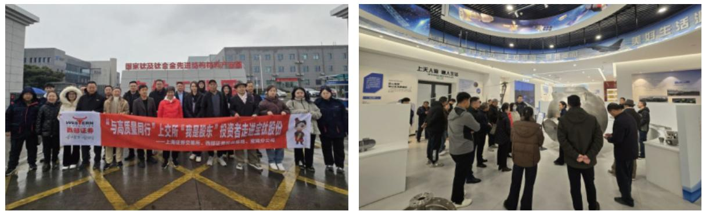

natural_image

Silhouettes of people walking on a red upward arrow over a globe, symbolizing global growth or progress (no text or symbols present)

# 环境议题

宝钛股份坚持将绿色发展理念与高质量发展深度融合,作为中国最大的钛及钛合金生产、科研基地,公司紧握气候变化带来的机遇与挑战,积极响应国家“双碳”目标,牢固树立并践行绿色发展理念,扎实推进节能减排,建立并持续完善覆盖“研发—采购—生产—回收”全生命周期的绿色管理模式。通过加强污染防治、推动资源循环利用、深化绿色技术创新,致力于在所有运营环节中降低对环境的影响,助力建设人与自然和谐共生的现代化。

# 核心议题

节能降碳、能源消耗、污染防治、气候应对、温室气体排放、绿色运营、绿色办公、绿色文化

# 环境管理

宝钛股份建立健全环境管理体系,加强环境风险管控能力,依法合规开展各项环境管理工作,不断提升自身环境管理水平,切实有效助力可持续的生态环境建设。

# 节能降碳

水资源管理

宝钛股份多措并举加强水资源管理,通过技术改造和设备升级,努力降低水资源消耗。

# 案例

# 淘汰落后设备, 减少用水损失

公司对真空自耗电弧炉冷却水系统进行升级改造。熔铸厂真空自耗电弧炉原水冷系统原本采用换热效率低、水量损失大的开式冷却塔，现升级改造为综合效率更优的闭式冷却塔，降低冷却水系统补水量70%以上，缓解区域水资源压力，同时减少了补水输送及药剂制备能耗，降低冷却水系统整体能耗10%—15%，减少因能耗产生的碳排放。

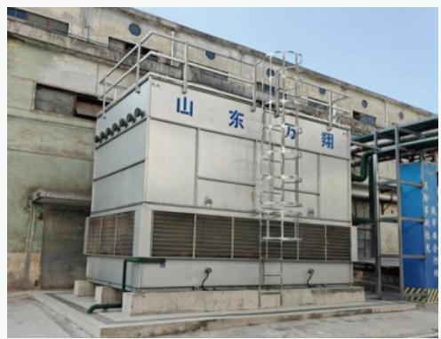

text_image

山东万翔

natural_image

Illustration of two hands holding a globe with green leaves and clouds, symbolizing global sustainability or environmental protection (no text present)

# 能源消耗管理

宝钛股份坚持实施节能降碳措施，通过淘汰高能耗设备、建设智能照明系统、对残钛实施精细分类再回收利用等措施，切实推动节能降耗。

# 案例

# 淘汰高能耗设备,降低能源资源消耗

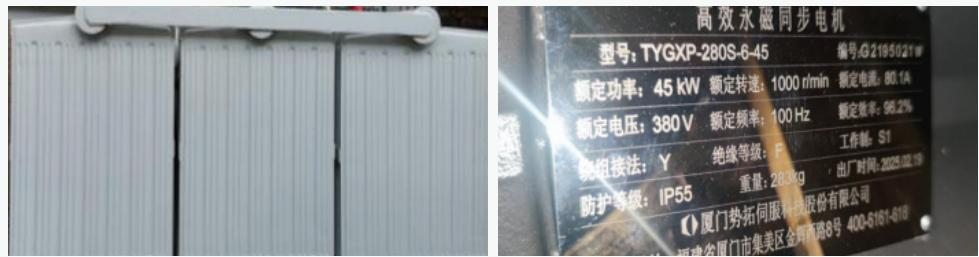

2025年,公司持续推进高耗能落后机电设备淘汰工作,提升设备能效水平3%\~10%,助力企业绿色低碳发展,截至10月,本年累计更换节能机电设备280台,年节约能耗4万kWh,间接减少碳排放量约20吨。

# 建设智能照明系统,降低厂房照明电耗

公司逐步淘汰高耗能金属卤化物灯，更换为节能高效、安全环保的LED灯，同时厂房部署远程可控智能照明系统，集成季节、环境光照强度自动调节控制，实现照明能耗“按需供给”，可降低年厂房照明电耗10%—20%。

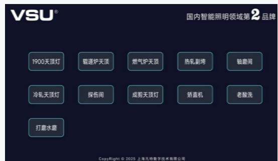

text_image

VSU®
国内智能照明领域第2品牌
1900天顶灯 辐道炉天顶 燃气炉天顶 热轧副烤 轴磨间
冷轧天顶灯 探伤间 成剪天顶灯 矫直机 老酸洗
打磨水磨
CapaRight © 2025 上海凡特数字技术有限公司

# 充分挖掘绿电交易潜力, 深化绿色制造转型

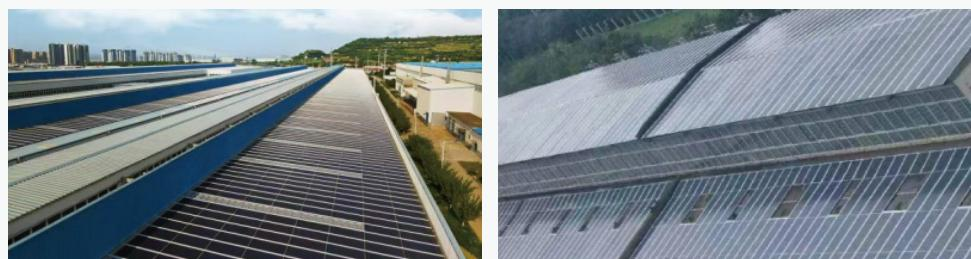

宝钛股份持续深化绿色制造转型,积极扩大可再生能源使用规模。2025年,公司使用光伏发电量超过1000万千瓦时,公司可再生能源占比达到40%,较上,年提升10个百分点,有效助力碳排放量下降。

# 污染防治

# 废水管理

宝钛股份遵循减量化、无害化、资源化的原则，持续完善废水处理系统，配备了含酸废水治理、生活污水处理等环保设施。公司对工业废水及生产运营中产生的废水严格执行《陕西省黄河流域污水综合排放标准》(DB61/224-2018)等排放标准，确保污染物稳定达标排放，防止污染水体。2025年，废水污染物排放量较上年有所降低。

- 废水污染物氨氮排放量同比下降 $15.69\%$  
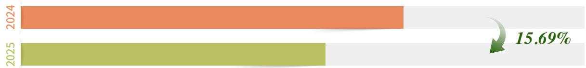

bar

| Year | Value (%) |
| --- | --- |
| 2024 | ~85 |
| 2025 | ~67 |

# 废气管理

宝钛股份采取有效措施加强废气管理，严格控制废气产生与排放。通过源头管控、工艺改造，配备粉尘处理等环保设施，对已产生废气加强监测与治理，确保废气排放符合《大气污染物综合排放标准》(GB16297-1996)等国家和地方标准，推进大气污染物减排工作。2025年，废气污染物排放量较上年有所降低。

- 废气污染物NOx排放量同比下降14.18%  
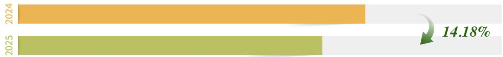

bar

| Year | Value (%) |
| --- | --- |
| 2024 | ~75 |
| 2025 | ~60 |

- 废气污染物 $\mathrm{SO}_2$ 排放量同比下降 $6.52\%$  
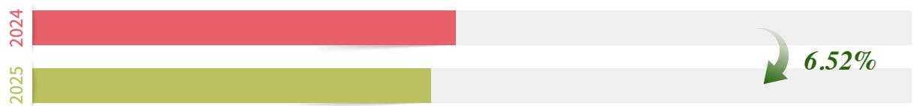

bar

| Year | Value (%) |
| --- | --- |
| 2024 | ~85 |
| 2025 | ~75 |

# 废弃物管理

宝钛股份加大固体废弃物整治力度，对一般工业固废和危险废物进行分类管理，确保合规处置。公司对危险废弃物存储与处置采取严格管理措施，制定了《危险废物管理办法》，并组织相关专题培训，提升员工专业能力。危险废物均交由有资质的第三方进行转运和处置，并健全运行记录台账，以保护生态环境。

绩效展示…

公司一般工业固废处置量为2688吨

危险废物处置量为825吨

# 案例

# 残钛精细分类再回用，降低产品全生命周期碳排放

公司原料厂将残废料、工艺余料回收后经分级分类处理后进行多渠道回收再利用(如改制、熔炼添加等)，降低产品全生命周期碳排放。2025年，回收残钛改制存货累计5997吨，同比提高19.8%；用于熔炼的回收残钛量2246吨，有效节约海绵钛，减少碳排放约3万吨。

# 噪声管理

公司采用噪声源头控制、传声途径噪声削减等措施，严格控制噪声对周边环境的影响，确保厂界噪声符合国家及各项目所在地排放标准。

# 源头控制

选用低噪音先进设备,避免噪声对周围环境的影响。合理安排生产时间。

# 噪声削减

在产生噪声的设备或区域周围设立隔音屏障,降低噪声影响。

# 噪声监测

定期对厂界、周边环境进行噪声监测，对超标情况积极响应并采取措施。

# 气候应对

宝钛股份在落足自身发展的同时,持续关注气候变化带来的挑战并采取积极有效的行动,加强碳排查与碳减排工作,助力“双碳”目标的实现。

# 制定“碳达峰”实施方案

宝钛股份根据《中共中央、国务院关于完整准确全面贯彻新发展理念做好碳达峰碳中和工作的意见》(中发〔2021〕36号)、《国务院关于印发2030年前碳达峰行动方案的通知》(国发〔2021〕23号)、《陕西省工业领域碳达峰实施方案》(陕工信发〔2023〕31号)，制定了公司《碳达峰实施方案》，旨在通过全面建立源头低碳、过程减碳、末端固碳的碳减排体系，形成低碳发展模式，到2035年，碳排放总量下降 $50\%$ 左右，单位产值综合能耗和二氧化碳排放持续下降，顺利实现碳达峰目标。

宝钛股份碳达峰实施方案中重点工作任务

<table><tr><td>重点工作</td><td>具体措施</td></tr><tr><td>大力发展非化石能源</td><td>推进能源消费方式绿色转型,减少外购电力,提高非化石能源消费比重。全面推动屋顶分布式光伏发电项目建设,增加光伏铺设面积,积极推动清洁能源的应用。建设余热回收装置,通过技改减少生产过程中原材料和能源的消耗量,提高能源资源利用率,降低对环境排放污染。</td></tr><tr><td>加强重点用能单位节能管理</td><td>开展节能低碳行动,进一步落实目标责任,建立健全能源管理体系和能源计量体系。严格执行能源统计、能源利用状况、能源管理岗位制度,开展能效水平对标活动。全面提升节能管理能力,新建项目按期开展固定资产投资项目节能审查,综合评价项目用能和碳排放情况。</td></tr><tr><td>推进重点用能设备能效水平提升</td><td>严格落实《重点用能产品设备能效先进水平、节能水平和准入水平(2022年版)》和现行能效强制性国家标准要求,加强节能源头管理,推广先进高效节能产品和设备,加快淘汰低能效设备。以电机、风机、水泵、变压器等用能设备为重点,对设备进行能效升级改造,确保更新改造后的设备能效等级达到节能水平(能效2级),力争达到能效先进水平(能效1级)。</td></tr><tr><td>优化运输车辆用能结构</td><td>各单位应以减污降碳协同增效为抓手,推进运输结构绿色低碳转型,全力做好公司高排放柴油货车、非道路移动机械淘汰更新工作,优化运输车队结构,扩大国六柴油货车、国四非道路移动机械、新能源车辆在运输车辆中的应用比例。加强外包车辆运输管控,不与使用高排放车辆运输单位签订合同,全面推进绿色低碳、集约高效的运输体系建设。</td></tr><tr><td>持续开展残钛回收工作</td><td>加强生产过程中残废料以及工艺余料的管理,增加残钛回收力度,逐步提高熔炼过程中的残钛添加比例,节约生产成本,实现残废料的循环再利用。</td></tr><tr><td>积极推行绿色制造</td><td>强化产品全生命周期绿色管理,推行绿色设计,建设绿色供应链。开展绿色企业文化建设,提升品牌绿色竞争力。建立集资源、能源、环境、安全、职业健康为一体的绿色管理体系,将绿色管理贯穿于企业研发、设计、采购、生产、营销、服务等全过程,实现生产经营管理全过程绿色化,发挥示范带动作用,在绿色发展上先行先试。</td></tr></table>

# 管理温室气体排放

宝钛股份发布了“三阶段”温室气体减排规划，并通过持续优化能源结构，通过扩大绿电和分布式光伏使用、回收利用残钛、淘汰高耗能设备等措施，显著降低温室气体排放。公司已开展产品全生命周期碳足迹核算工作，曾荣获“2023中国工业碳达峰‘领跑者’企业”称号，展现了在低碳发展方面的领导力。

宝钛股份温室气体减排工作目标

<table><tr><td>减排阶段</td><td>减排目标</td></tr><tr><td>短期发展方向(2023~2027)</td><td>范围1+范围2,实现温室气体排放强度和总量同步降低5%范围3,加强对供应链的管理,将低碳指标纳入供应商准入体系,推动30%核心供应商启动节能改造</td></tr><tr><td>中期攻坚方向(2028~2030)</td><td>范围1+范围2,实现温室气体排放强度和总量同时降低35%范围3,要求100%的核心供应商企业每年提交其温室气体排放报告,同时实现与基准年相比碳排放强度降低20%</td></tr><tr><td>长期愿景方向(2031~2060)</td><td>范围1+范围2,实现近零碳排放,温室气体排放强度和总量同时降低95%以上范围3,建成全链条零碳供应链,核心供应商均实现碳中和</td></tr></table>

绩效展示 · ·

根据2025年碳排放数据核算,宝钛股份单位产值二氧化碳排放量为0.2246 tCO $_{2}$ /万元

较基准年(2022年)碳排放总量降低8.82%，排放强度降低4.81%，两大指标均实现显著下降，且减排幅度优于阶段性预期。

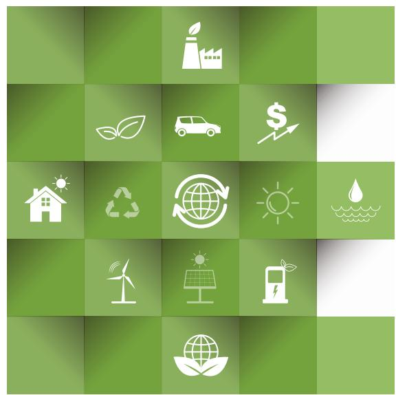

natural_image

Grid of green icons representing various sustainability and energy concepts (e.g., solar, wind, recycling), arranged in a 3x3 grid with no text or symbols.

# 入围陕西省

# 首批“工业碳达峰试点项目”中“零碳或近零碳”工厂试点

# 绿色运营

宝钛股份严守生态环保红线,践行绿色经营理念,提升资源利用效益,加大排放物管治力度,倡导绿色运营,降低日常生产经营和生产经营对环境产生的负面影响,推动生态环境持续向好发展。

# 资源与环境管理制度措施

为全力抓好生态环境保护工作,积极履行主体责任,公司建立了生态环境保护责任制等制度,成立了由总经理担任主任、各部门负责人为成员的生态环境保护委员会,每年召开4次专题会议,研判环保形势、部署重点任务、协调解决重大环保问题。通过与各二级单位签订环保目标责任书,明确考核指标与管理要求,确保各项环保政策落地见效。

# 优化环境管理

宝钛股份持续优化环境管理体系,修订并发布了多项环境管理制度,健全了从风险排查到常态化监督的工作机制,确保业务流程的合规性,为绿色发展提供坚实的体系保障。

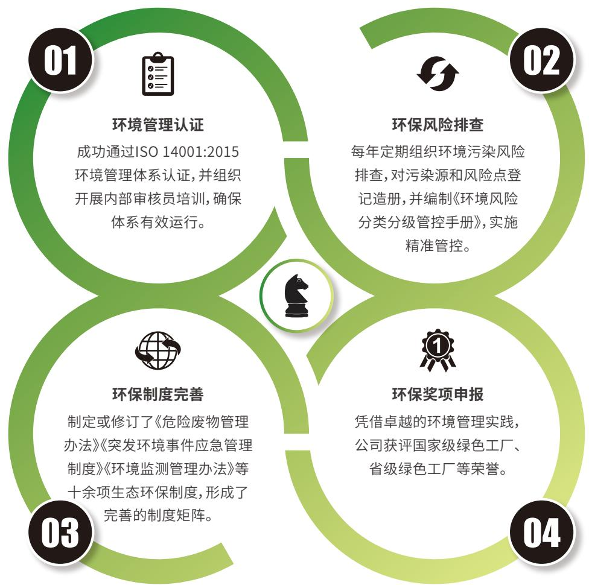

flowchart

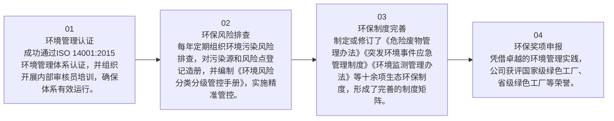
```mermaid
graph LR
  A["01\n环境管理认证\n成功通过ISO 14001:2015\n环境管理体系认证，并组织开展内部审核员培训，确保体系有效运行。"] --> B["02\n环保风险排查\n每年定期组织环境污染风险排查，对污染源和风险点登记造册，并编制《环境风险分类分级管控手册》，实施精准管控。"]
  B --> C["03\n环保制度完善\n制定或修订了《危险废物管理办法》《突发环境事件应急管理制度》《环境监测管理办法》等十余项生态环保制度，形成了完善的制度矩阵。"]
  C --> D["04\n环保奖项申报\n凭借卓越的环境管理实践，公司获评国家级绿色工厂、省级绿色工厂等荣誉。"]
```

# 加强环境监测监管

宝钛股份积极履行监督管理责任,制定《环境监测管理办法》,对环保设施指定专人进行运行维护和管理。公司确保废水、废气排放浓度均严格符合国家及地方标准,实现污染物的长期稳定达标排放,避免对周边环境造成破坏。

# 防控环境风险

健全应急处置机制。公司制定了《突发环境事件应急管理制度》，明确了应急组织体系、职责、预警和响应流程，以规范化手段减轻环境风险造成的负面影响。2025年，公司组织开展环保应急演练十余次，参演人员二百余人次，有效提升了全员应急处置能力。

# 案例

# 积极开展火灾逃生及山体滑坡应急演练

近年来宝鸡雨季较长，山体滑坡情况时有发生。为应对山体滑坡及人员密集火灾逃生避险能力。由生产部组织，在山体滑坡隐患点、机关楼等处，进行了多次应急演练工作，并通过总结分析，对演练成效进行评价改进，使员工对可能发生的险情有了充分准备，有效提升了员工应急能力。

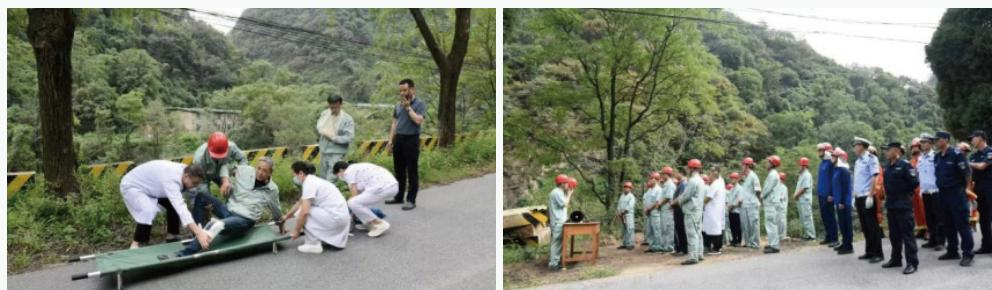

防范环境风险事故。公司系统化梳理生产运营中的环境影响因素，制定《生态环境保护隐患排查治理制度》，定期开展风险排查整治专项活动。通过建立完善的环境风险分级管控体系，实现了风险管理的制度化与常态化。报告期内，公司未发生重大环境污染事件。

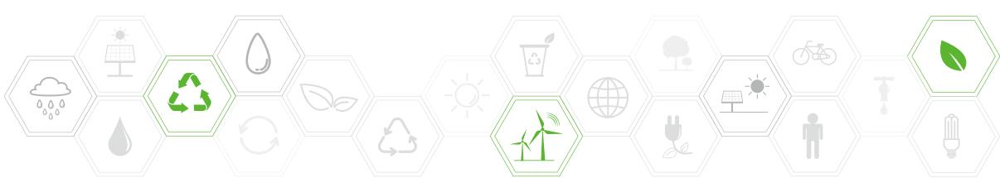

flowchart

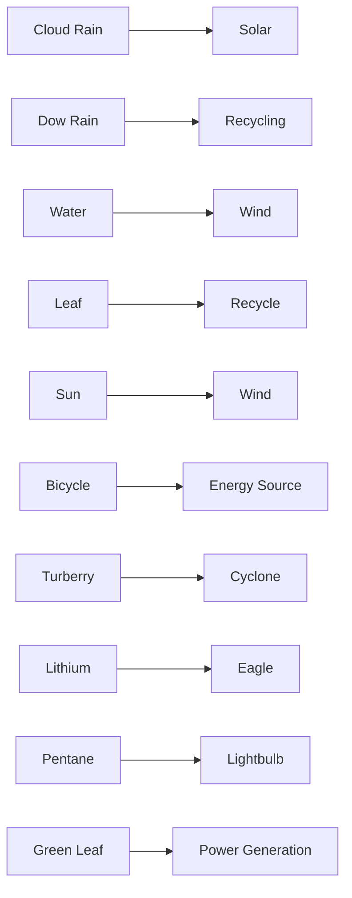
```mermaid
graph LR
  A["Cloud Rain"] --> B["Solar"]
  C["Dow Rain"] --> D["Recycling"]
  E["Water"] --> F["Wind"]
  G["Leaf"] --> H["Recycle"]
  I["Sun"] --> J["Wind"]
  K["Bicycle"] --> L["Energy Source"]
  M["Turberry"] --> N["Cyclone"]
  O["Lithium"] --> P["Eagle"]
  Q["Pentane"] --> R["Lightbulb"]
  S["Green Leaf"] --> T["Power Generation"]
```

# 践行绿色制造

宝钛股份将绿色发展理念深度融入生产运营全过程，通过技术创新、绿色生产和能源转型，推动企业高质量发展。

2025年，公司在绿色低碳转型方面取得里程碑式突破。凭借在能源管控、碳足迹追踪及产业链绿色协同方面的卓越表现，宝钛股份及子公司近年来先后斩获省级能效标杆企业、碳达峰领跑者称号，并建设绿色工厂及近零碳工厂示范项目，成功构建了从绿色设计到绿色交付的全链条绿色供应链管理体系，充分彰显了行业领军企业的绿色担当。

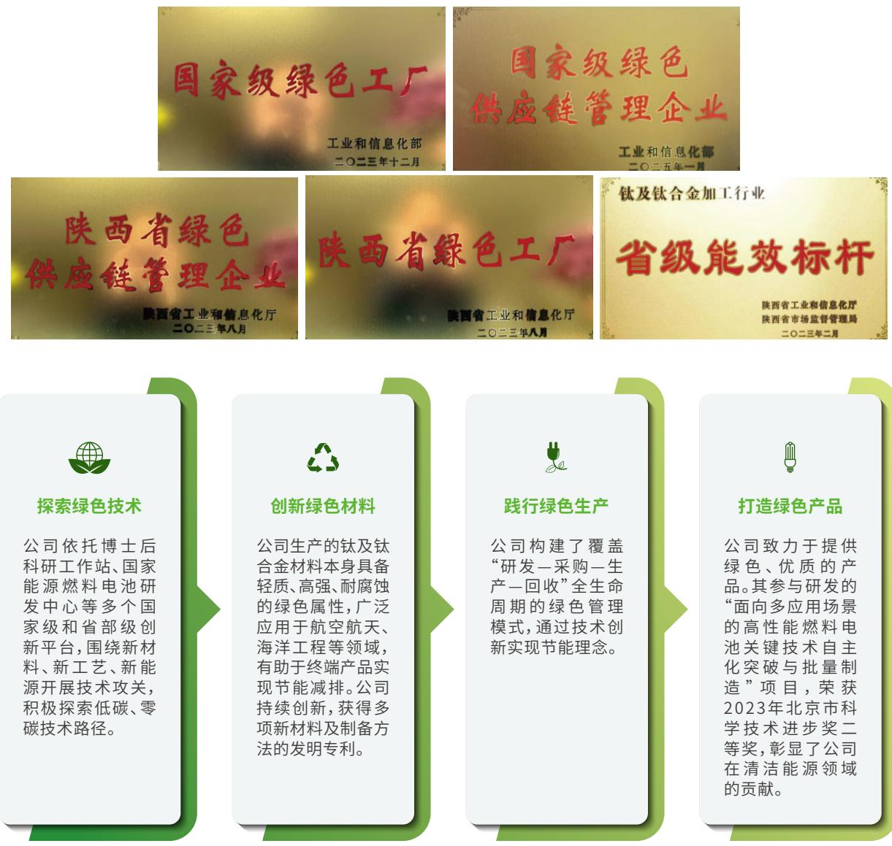

# 探索绿色技术

公司依托博士后科研工作站、国家能源燃料电池研发中心等多个国家级和省部级创新平台，围绕新材料、新工艺、新能源开展技术攻关，积极探索低碳、零碳技术路径。

# 创新绿色材料

公司生产的钛及钛合金材料本身具备轻质、高强、耐腐蚀的绿色属性，广泛应用于航空航天、海洋工程等领域，有助于终端产品实现节能减排。公司持续创新，获得多项新材料及制备方法的发明专利。

# 践行绿色生产

公司构建了覆盖“研发—采购—生产—回收”全生命周期的绿色管理模式，通过技术创新实现节能理念。

# 打造绿色产品

公司致力于提供绿色、优质的产品。其参与研发的“面向多应用场景的高性能燃料电池关键技术自主化突破与批量制造”项目，荣获2023年北京市科学技术进步奖二等奖，彰显了公司在清洁能源领域的贡献。

# 生物多样性

作为一家负责任的企业,宝钛股份积极维系运营所在地生态系统的稳定与健康。公司通过严格的污染防治措施,如升级废水处理系统、合规处置固体废弃物等,最大限度减少生产活动对周边土壤、水体等自然环境的影响,间接保护区域内的生物多样性。

# 绿色文化

宝钛股份牢固树立绿色发展理念,推行绿色办公方式,倡导并宣传绿色生活理念,并结合公司生产经营情况,举办多样化环保培训及低碳宣传活动。

# 推行绿色办公

宝钛股份积极推行绿色办公方式, 强化全体员工的节能环保意识, 明确办公用电、用水、废弃物、出行管理目标, 有效提高办公区域资源利用率, 强化全体员工节能减排、环境保护意识。

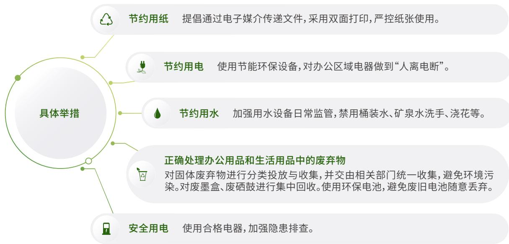

flowchart

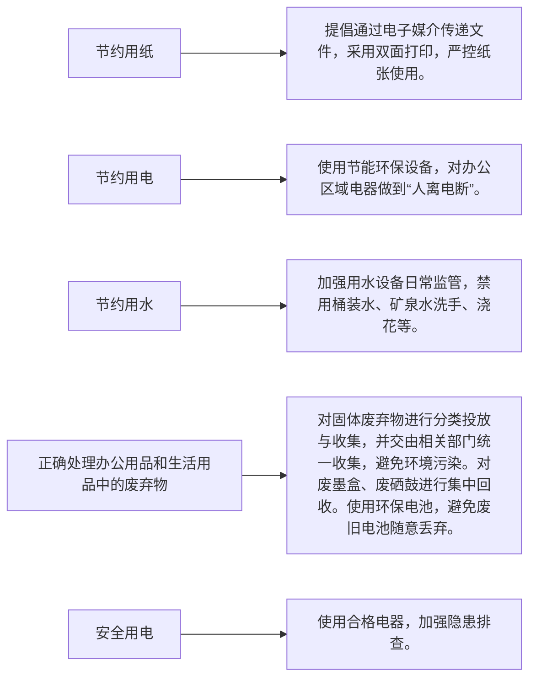
```mermaid
graph LR
  A["节约用纸"] --> B["提倡通过电子媒介传递文件，采用双面打印，严控纸张使用。"]
  C["节约用电"] --> D["使用节能环保设备，对办公区域电器做到“人离电断”。"]
  E["节约用水"] --> F["加强用水设备日常监管，禁用桶装水、矿泉水洗手、浇花等。"]
  G["正确处理办公用品和生活用品中的废弃物"] --> H["对固体废弃物进行分类投放与收集，并交由相关部门统一收集，避免环境污染。对废墨盒、废硒鼓进行集中回收。使用环保电池，避免废旧电池随意丢弃。"]
  I["安全用电"] --> J["使用合格电器，加强隐患排查。"]
```

# 传播绿色文明

宝钛股份在日常运营中积极贯彻绿色低碳理念,制定了《生态环境教育培训制度》,确保绿色理念的传播常态化、制度化,并通过多样的宣贯培训,提升全员生态环保意识,铸就绿色发展。

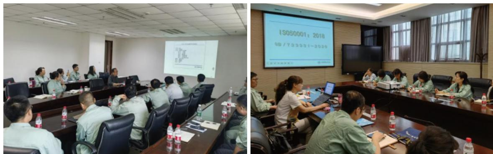  
绩效展示…  
宝钛股份累计开展环保相关培训64场次,参训人员3000余人次。

# 社会议题

# 核心议题

产品与客户服务、创新驱动发展、供应链安全与管理、国家战略响应、员工权益、员工安全与健康、员工发展与培训、员工关怀、员工活动、社会公益活动

# 产品与客户服务

宝钛股份秉持“励精图治，创新求强”的企业精神，坚持以精工细作的匠心态度，为客户提供高品质的钛及钛合金产品与优质服务，始终以安全为底线，以创新为引领，全面保障产品质量，推动行业技术进步，与各利益相关方共创可持续美好未来。

绩效展示

AAA主体信用等级1项

AAA债项信用等级1项

新增授权专利12项

国家级科研项目29个

获得省部级以上科技创新成果奖励1项

生产安全责任事故0起

安全教育培训429次

# 产品与服务管理

# 产品安全与质量

宝钛股份始终秉持“匠心出精品、细节定成败”的质量理念，将产品质量视为企业生存与发展的基石。公司致力于为航空、航天、舰船、兵器、化工、医疗及消费电子等领域的客户提供高品质的钛及钛合金产品，通过卓越的产品与服务，赢得利益相关方的信任与尊敬，为公司的可持续发展奠定坚实基础。

# 质量保障

公司深入贯彻质量为根基、创新为驱动的发展战略，建立了从原材料采购、生产过程到最终产品交付的全流程质量管控体系。公司质量管理理念先后历经了从建立并认证ISO9001质量管理体系以“满足标准”，到深入推行卓越绩效管理模式以“超越标准”，再到如今致力于质量技术创新应用以“定义标准”的三个发展阶段，持续推动质量管理水平的提升。

公司严格执行质量管理体系文件和相关控制程序,确保产品质量的稳定性和可靠性。

2025年, 公司未发生重大产品质量安全事故, 质量控制体系运行有效。

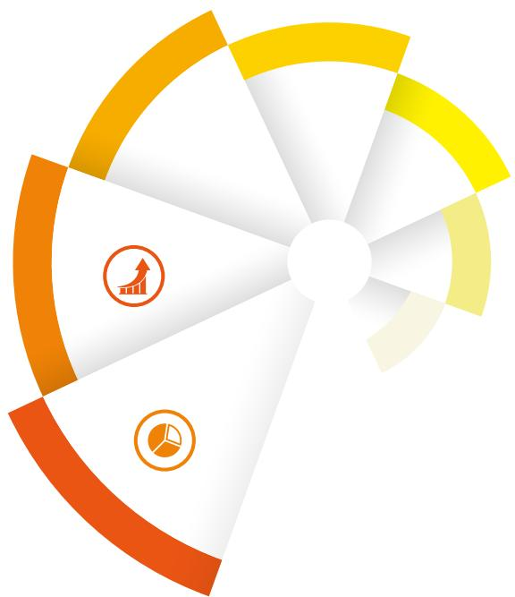

donut

| Category | Value |
| --- | --- |
| Segment 1 (Yellow) | N/A |
| Segment 2 (Yellow) | N/A |
| Segment 3 (Yellow) | N/A |
| Segment 4 (Orange) | N/A |
| Segment 5 (Orange) | N/A |
| Segment 6 (White) | N/A |
| Segment 7 (White) | N/A |
| Segment 8 (White) | N/A |
| Segment 9 (White) | N/A |
| Segment 10 (White) | N/A |
| Segment 11 (White) | N/A |
| Segment 12 (White) | N/A |
| Segment 13 (White) | N/A |
| Segment 14 (White) | N/A |
| Segment 15 (White) | N/A |
| Segment 16 (White) | N/A |
| Segment 17 (White) | N/A |
| Segment 18 (White) | N/A |
| Segment 19 (White) | N/A |
| Segment 20 (White) | N/A |
| Segment 21 (White) | N/A |
| Segment 22 (White) | N/A |
| Segment 23 (White) | N/A |
| Segment 24 (White) | N/A |
| Segment 25 (White) | N/A |
| Segment 26 (White) | N/A |
| Segment 27 (White) | N/A |
| Segment 28 (White) | N/A |
| Segment 29 (White) | N/A |
| Segment 30 (White) | N/A |
| Segment 31 (White) | N/A |
| Segment 32 (White) | N/A |
| Segment 33 (White) | N/A |
| Segment 34 (White) | N/A |
| Segment 35 (White) | N/A |
| Segment 36 (White) | N/A |
| Segment 37 (White) | N/A |
| Segment 38 (White) | N/A |
| Segment 39 (White) | N/A |
| Segment 40 (White) | N/A |
| Segment 41 (White) | N/A |
| Segment 42 (White) | N/A |
| Segment 43 (White) | N/A |
| Segment 44 (White) | N/A |
| Segment 45 (White) | N/A |
| Segment 46 (White) | N/A |
| Segment 47 (White) | N/A |
| Segment 48 (White) | N/A |
| Segment 49 (White) | N/A |
| Segment 50 (White) | N/A |
| Segment 51 (White) | N/A |
| Segment 52 (White) | N/A |
| Segment 53 (White) | N/A |
| Segment 54 (White) | N/A |
| Segment 55 (White) | N/A |
| Segment 56 (White) | N/A |
| Segment 57 (White) | N/A |
| Segment 58 (White) | N/A |
| Segment 59 (White) | N/A |
| Segment 60 (White) | N/A |
| Segment 61 (White) | N/A |
| Segment 62 (White) | N/A |
| Segment 63 (White) | N/A |
| Segment 64 (White) | N/A |
| Segment 65 (White) | N/A |
| Segment 66 (White) | N/A |
| Segment 67 (White) | N/A |
| Segment 68 (White) | N/A |
| Segment 69 (White) | N/A |
| Segment 70 (White) | N/A |
| Segment 71 (White) | N/A |
| Segment 72 (White) | N/A |
| Segment 73 (White) | N/A |
| Segment 74 (White) | N/A |
| Segment 75 (White) | N/A |
| Segment 76 (White) | N/A |
| Segment 77 (White) | N/A |
| Segment 78 (White) | N/A |
| Segment 79 (White) | N/A |
| Segment 80 (White) | N/A |
| Segment 81 (White) | N/A |
| Segment 82 (White) | N/A |
| Segment 83 (White) | N/A |
| Segment 84 (White) | N/A |
| Segment 85 (White) | N/A |
| Segment 86 (White) | N/A |
| Segment 87 (White) | N/A |
| Segment 88 (White) | N/A |
| Segment 89 (White) | N/A |
| Segment 90 (White) | N/A |
| Segment 91 (White) | N/A |
| Segment 92 (White) | N/A |
| Segment 93 (White) | N/A |
| Segment 94 (White) | N/A |
| Segment 95 (White) | N/A |
| Segment 96 (White) | N/A |
| Segment 97 (White) | N/A |
| Segment 98 (White) | N/A |
| Segment 99 (White) | N/A |
| Segment 100 (White) | N/A |

# 质量管理体系

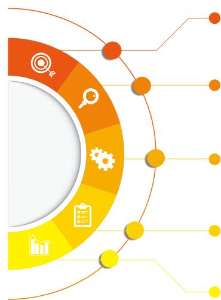

flowchart

```mermaid
graph LR
  A["Key Management Icon"] --> B["Search Icon"]
  B --> C["Gear Icon"]
  C --> D["Data Icon"]
  D --> E["Performance Metrics Icon"]
  E --> F["Final Result Icon"]
```

制度建设。公司建立了完善的ISO9001质量管理体系，并制定了相关的制度文件，用以规范生产管理流程及各部门、各岗位的质量职能，实现产品全生命周期的“来源可溯、责任可追”，从而提升管理效率和产品质量。

过程管理。公司针对原材料质量控制、熔炼与锻造等生产过程质量控制、产品检测质量控制及售后服务等环节，建立了覆盖全业务流程的科学化、规范化、系统化的质量管理体系，确保每一个环节都符合最高标准。

风险管控。公司建立产品质量风险管理的组织保障体系和过程管理方法体系，明确风险管理职责，对从原材料到成品交付的各个阶段进行风险识别、评估与管控，有效降低质量风险。

体系认证。公司质量管理体系通过了ISO9001:2015标准认证，认证范围涵盖了钛及钛合金等稀有金属材料的生产、加工和销售。

培训交流。公司定期组织质量管理相关的培训和交流活动，如召开主要原材料质量提升大会，邀请供应商共同探讨质量提升路径，从而提升全员的质量意识和能力。

<table><tr><td>项目阶段</td><td>风险管理内容</td></tr><tr><td>策划阶段</td><td>明确项目风险管理要求、风险管理小组及组织机构图、风险管理岗位职责、风险管理流程,风险管理识别清单、项目风险应对措施。</td></tr><tr><td>执行阶段</td><td>通过项目月报、月度例会的形式,将风险点按重要程度分为一级、二级和三级进行汇报,并汇报相应的应对措施。</td></tr></table>

# 案例

# 创新检测技术为产品质量保驾护航

为突破传统金属检测技术的瓶颈，宝钛股份成功研发并应用了“创新高精度水浸自动探伤技术”。该技术利用智能机器人和先进的超声波探伤原理，能够对钛及钛合金板材等高端产品进行大规模、高精度的自动化无损检测，精准识别材料内部的微小缺陷，极大地提升了检测效率和可靠性。该技术的成功应用不仅保障了公司航空航天、舰船等领域高端产品“零缺陷”的质量要求，也显著提升了公司的核心竞争力。该项技术应用案例成功入选2024年工业和信息化部评选的“年度质量提升与品牌建设典型案例”，成为全国100个上榜案例之一，也是质量技术创新应用方向的典范，彰显了公司在质量技术领域的领先地位。

# 宝钛股份入选全国质量提升与品牌建设典型案例

2025年1月,工业和信息化部公布了2024年度质量提升与品牌建设典型案例名单。宝钛股份“高精度水浸自动探伤技术创新应用”案例凭借先进的质量检测技术水平和有效推广应用成功入选。宝钛股份

以品牌建设为主线,加速钛产业技术装备升级,持续加强团队建设与人才培养,通过建立完备的水浸自动检测系统,逐步实现了钛材产品质量管控的高精度、高可靠、高效率和智能化,达到了行业顶尖水平,进一步提升了核心竞争力,推动了检测技术规范化、标准化高质量发展。

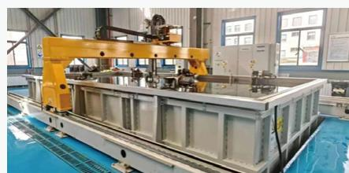

natural_image

Industrial factory floor with yellow robotic arm and metal frame (no visible text or symbols)

# 高端产品与应用

作为中国最大的钛及钛合金生产科研基地，宝钛股份依托强大的技术研发实力和完善的生产体系，持续为全球市场提供高品质的精品钛材。公司的产品广泛应用于航空、航天、海洋、化工、能源等尖端领域，并凭借卓越性能屡获殊荣。2022年至2025年，公司荣获多项省部级以上科学技术奖，彰显了其在行业内的技术领先地位。

# 案例

# ▶ 助力万米深潜的“中国钛”

随着国家“深海科技”战略的推进，深海潜水器的研发对关键材料提出了前所未有的挑战。作为国内唯一能够生产万米级载人舱钛合金的供应商，宝钛股份在该领域扮演了无可替代的角色。公司成功研制并交付了“奋斗者”号全海深载人潜水器所需的钛合金载人球舱，该球舱是潜水器的核心部件，直接关系到潜航员的生命安全。为确保产品在万米深海的极端高压和强腐蚀环境下绝对可靠，公司从材料设计、熔炼、锻造到加工、检测的每一个环节都采用了最严苛的标准和创新的工艺技术。研发团队攻克了超大规格、超厚壁钛合金材料均匀性控制等多项世界级技术难题，确保了载人球舱的完美品质。

公司参与的“深海潜水器服役性能监测与作业应急安全技术研究与应用”项目荣获上海市科学技术奖二等奖，宝钛股份用“中国钛”铸就了大国重器，展现了其在高端钛材领域的强大实力。

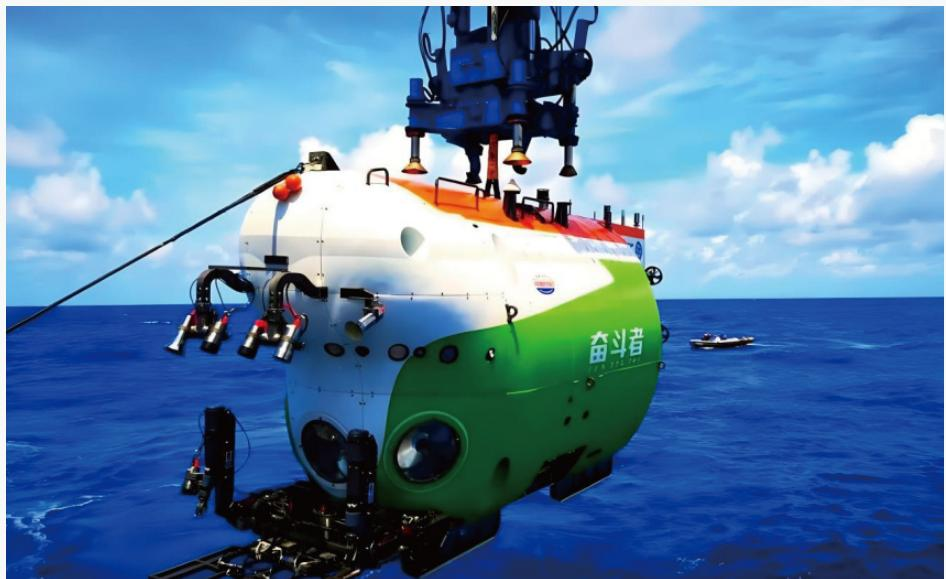

natural_image

Underwater submersible with green and white casing on blue ocean, no visible text or symbols

# 客户服务与权益

宝钛股份坚持以客户为中心，致力于与客户建立长期、稳定、共赢的合作关系。公司持续完善客户服务体系，通过主动沟通、快速响应和定制化服务，深入了解客户需求，以更优质的产品与服务，提升客户满意度与信任度。

# 客户权益

宝钛股份高度重视客户权益,严控项目质量,通过项目管理、运营维护、积极沟通,及时反馈,切实提升客户服务工作质量和服务水平。

项目阶段  
客户权益保障举措

<table><tr><td>售前与合同阶段</td><td>严格遵守合同约定,以科学、严谨的态度与客户共同确定产品技术标准和质量要求。</td></tr><tr><td>产品制造阶段</td><td>以科学设计和安全绿色环保为前提,以规范的生产流程为保障,以优异质量为目标,确保产品在全生命周期中符合客户要求。</td></tr><tr><td>产品交付与售后</td><td>为客户提供产品后续使用、维护等相关的技术支持与服务,及时响应客户反馈,协助客户解决实际应用中遇到的问题。</td></tr></table>

# 客户沟通

公司积极与客户保持畅通的沟通。对于战略客户及重大项目，公司通过定期高层互访、项目汇报会、技术交流会等方式，充分了解客户的深层次需求，并第一时间进行反馈，为客户量身定制解决方案，实现双方的良性互动。

# 案例

# 宝钛股份举办2025年产品推介会暨客户交流会

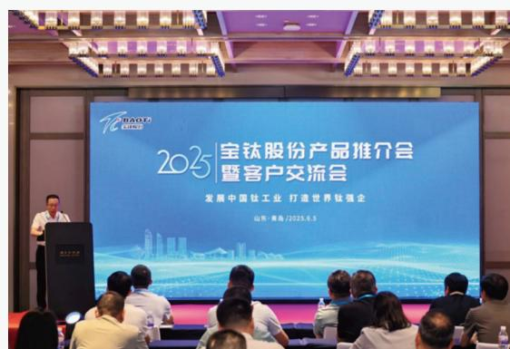

text_image

2025 宝钛股份产品推介会
暨客户交流会
发展中国钛工业 打造世界钛强企
山东·青岛 /2025.6.5

2025年6月，宝钛股份2025年产品推介会暨客户交流会在青岛举行。45家合作单位、77位行业伙伴齐聚一堂，共话钛业发展新机遇，共绘合作新蓝图。宝钛股份坚守“品质为基、客户为本”理念，深化研发与供应链优化，以轻量化、耐腐蚀等科研导向助力民品赛道升级；同时紧跟市场需求，聚焦“卡脖子”技术突破，构建全生命周期服务体系，践行绿色制造，与客户共拓钛材应用新场景。

# 客户投诉与反馈

公司制定了严格的质量管理程序文件《质量异议管理程序》(BTGF-QSP-32)，当顾客对公司售出的产品在质量方面提出质疑时，公司启动详细的处理流程，对顾客反馈信息进行及时、有效的处理。该机制旨在加强售后服务质量，确保持续提高顾客满意度。

# 客户隐私保护

公司积极识别和防范信息安全风险,严格管理客户的合同、技术规格等档案资料,落实保密责任,全力保护客户的商业机密和隐私信息。2025年,公司未发生客户隐私或商业机密泄露事件。

# 客户满意度

公司重视客户满意度的提升，并将其作为改进产品和服务的重要依据。公司制定了《顾客满意管理程序》(BTGF-QSP-34)，建立了满意度调查机制，每年通过电话、传真、邮箱、纸质形式至少向所有顾客发出一次“顾客意见/建议调查征集表”，重点从产品质量、交付周期、售后服务、产品标识、产品包装等五个核心维度向顾客征集意见。

2025年, 公司共收集有效“顾客意见/建议调查征集表”108份, 满意度达到98.15%。针对调查结果及顾客提出的具体意见, 公司均已制定了相应的整改措施并进行了验证, 确保客户声音得到实质性回应。

natural_image

Close-up of hands holding puzzle pieces against a bright sun background (no text or symbols)

# 创新驱动发展

宝钛股份始终将科技创新作为引领高质量发展的核心驱动力。公司通过深化科技创新体制机制改革、强化知识产权管理和技术标准引领、搭建高水平创新平台、推进产学研深度融合等方式，有效激发创新活力，强化科技赋能，为公司实现转型升级与可持续发展提供不竭动力。

# 科技创新规划

科技创新是打造高质量发展新动能和新机制的关键。为实现公司的长期发展战略，公司紧紧依靠科技进步和创新驱动发展格局的重塑。公司制定了《宝鸡钛业股份有限公司人才培养规划(2022-2025年)》等规划文件，明确了通过建强技术人才队伍、打造领军人才“塔尖”、夯实骨干人才“塔身”等方式，为科技创新提供坚实的人才保障和战略支撑。

# 科技创新管理

宝钛股份从顶层设计入手,建立了覆盖公司全系统的科技创新管理体系,构建了由宝钛研究院、院士工作站、博士后工作站等核心机构组成的科技创新管理架构,制定了《高层次人才引进管理办法》等制度,通过优化人才结构,加大研发投入,搭建科技创新管理平台,提高信息化管理水平,构建科技创新发展新格局。

绩效展示·

宝钛股份共有研发人员356人

研发人员占比8.59%

研发投入金额52,391.60万元，同比增长156.84%，占营业收入约8.56%。

# 构建创新平台

宝钛股份积极整合科研力量优化配置和资源共享,建立了企业技术中心、国际科技合作基地、陕西省钛锆镍新材料工程技术研究中心、院士专家工作站等国家级、省部级科技创新平台,开展全方位、多层次关键核心技术攻关。

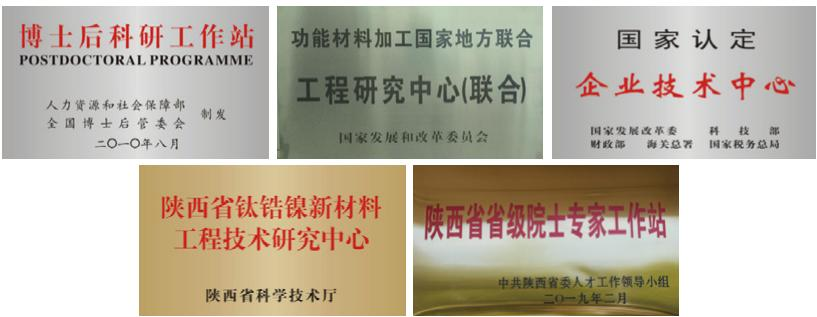

绩效展示·

国家级技术中心1个

省级技术中心1个

企业技术基地1个

院士专家工作站1个

博士后工作站1个

# 创新成果转化

宝钛股份加快创新成果转化, 联合全国行业专家形成238人的“科学家+工程师”课题研发团队, 持续发力课题研究, 持续推动科研成果向现实生产力转化。

# 绩效展示

公司组织参与科研项目数量183项

组织参与的国家级科研项目29项

组织参与的省部级科研项目30项

组织参与的公司级科研项目124项

技术创新成果

<table><tr><td>创新类别</td><td>创新成果</td></tr><tr><td>技术突破</td><td>·成功研制超长大单重高性能钛合金板材,实现国内单重和长度的突破·研制的大规格挤压管材,填补了国内空白·“一种大规格钛合金异型锻件的制备方法”等数十项发明专利技术</td></tr><tr><td>绿色低碳技术</td><td>·残钛精细分类再回用技术,2025年回收残钛减少碳排放约3万吨·真空自耗电弧炉冷却水系统升级改造,降低系统能耗10%—15%</td></tr><tr><td>数字化创新技术</td><td>·智能机器人钛板材超声检测系统,提升检测自动化与智能化水平·部署远程可控智能照明系统,降低年厂房照明电耗10%—20%</td></tr></table>

# 知识产权保护

公司高度重视知识产权保护,建立了完善的知识产权管理体系,制定了包括《知识产权风险管理控制程序》《知识产权申请控制程序》《立项和研发中知识产权控制程序》在内的一系列管理制度,并定期组织相关培训,提升公司知识产权创造、运用、保护和管理的能力。

# 绩效展示·

共获专利授权12项

发明专利5项

国防发明专利2项

实用新型专利7项

获得省部级以上科技创新成果奖励1项

# 产学研合作

宝钛股份积极主动同地方政府、重点高校和龙头企业加强对接，打通产学研协同创新链条。公司与西北有色金属研究院、西部新锆核材料科技有限公司共建“西安稀有金属材料创新中心”；与西安建筑科技大学、金钼集团共建“功能材料加工国家地方联合工程研究中心”；并联合国家电投集团氢能科技发展有限公司等11家单位共建“国家能源燃料电池研发中心”，围绕高性能钛材、新能源钛材料等领域开展前沿研究与技术攻关。

# 绩效展示·

宝钛股份主导、参与建立产学研创新平台4个

text_image

Innovation driven development

# 供应链安全与管理

宝钛股份致力于打造安全、稳定、高效、绿色的全球一流供应链体系，并凭借在绿色供应链管理领域的卓越实践，于2025年成功获评“国家级绿色供应链管理企业”。公司以“降成本、防风险、提效能”为核心目标，通过科技创新与标准制定双轮驱动，从全球钛材的“供应商”向产业规则的“定义者”蜕变。公司重视与供应商建立长期、良好、共赢的合作关系，通过数字化管理工具、严格的准入与考核机制以及持续的沟通培训，赋能供应链可持续发展，夯实公司在全球高端钛材市场的领先地位。

# 供应商管理

公司根据《供应商管理制度》与《合格供方评审办法》等内部规定，对供应商的开发、选择、评估和监督进行全流程规范化管理。公司建立了严格的供应商选择标准和黑名单制度，定期更新供应商库。在供应商管理中，公司不仅关注产品质量、交付与服务能力，也倡导并推动供应商履行社会责任、诚信经营，致力于培养合格供方并实现长期共同发展，从而促进供应链的整体可持续发展。

# 供应商管理举措

# 严格准入与评估

制定严格的供应商选择标准及合格供方评审办法,确保新晋供应商符合公司在质量、技术、合规等方面的要求。

# 系统培训与赋能

邀请专业机构为供应商开展“零缺陷”质量管理、材料合规性要求等专题培训，提升其专业能力和质量意识，促进产业链共同进步。

# 明确激励与淘汰

建立供应商“黑名单”制度，对存在违法违纪、商业贿赂、不遵守合同等行为的供应商，坚决予以淘汰，并进行公示。同时，每年开展优秀供应商评选活动，对表现优异的伙伴给予奖励和认可。

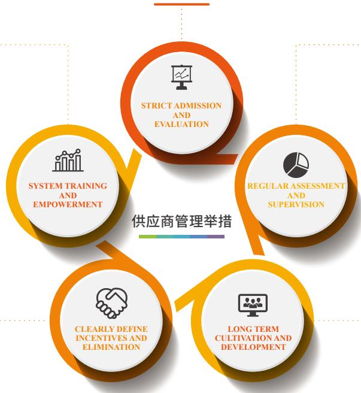

flowchart

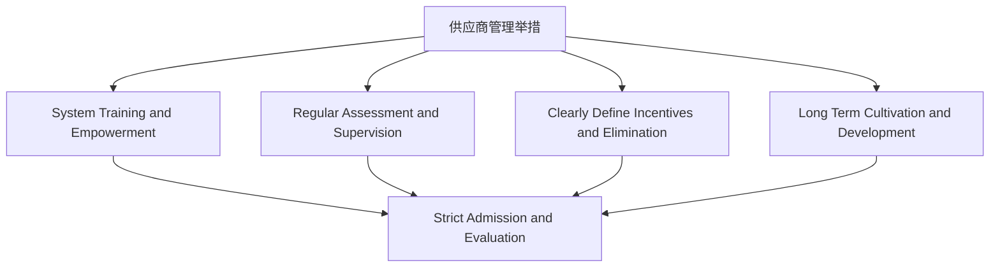
```mermaid
graph TD
  A["供应商管理举措"] --> B["System Training and Empowerment"]
  A --> C["Regular Assessment and Supervision"]
  A --> D["Clearly Define Incentives and Elimination"]
  A --> E["Long Term Cultivation and Development"]
  B --> F["Strict Admission and Evaluation"]
  C --> F
  D --> F
  E --> F
```

# 定期考核与监督

通过信息化平台对供应商进行实时动态管理，并定期从质量、交付、服务、合规性等方面对供应商进行综合评估，帮助供应商提升管理水平和服务能力。

# 长期培养与发展

致力于合格供方的培养和长期共同发展，与规模较大的优秀供应商建立长期良好、稳定的战略合作关系。

# 供应商交流

宝钛股份积极开展供应商培训，对其商务支持能力、付款情况、专业技术管理能力、沟通协调能力、计划管理能力、质量管理能力、HSE 管理能力进行打分调查，并采用线上和线下相结合的形式，通过日常维护、交流信箱等方式与供应商进行学习交流。

# 案例

# 宝钛股份精彩亮相第三届中国国际供应链促进博览会

2025年7月，第三届中国国际供应链促进博览会在北京盛大启幕，全球行业精英与知名企业齐聚一堂，共同探索供应链创新发展新机遇。作为空客唯一在中国认证通过的钛材供应商及战略合作伙伴，宝钛股份受邀在先进制造链展区中的空客供应链展区参展，成为了展会唯一参展的钛材供应商，尽显在行业内的领军地位。作为航空产业链的上游关键环节，宝钛股份肩负着为各类飞行器提供高品质材料的重任，是整个产业链不可或缺的“基石”。本次展会中，宝钛展位集中展示了各类优质钛材产品，从高性能的航空钛材，到广泛应用于其他领域的多样化钛合金材料，每一件展品都凝聚着宝钛在钛材研发、生产、加工方面的深耕成果，吸引了各行业客户驻足交流。宝钛股份始终致力于为航空领域提供最可靠的材料支持，其产品不仅在性能上满足了空客等国际知名航空企业对于材料的高标准要求，更在质量稳定性和供应保障方面表现出色，在国际航空市场上赢得了良好的口碑。

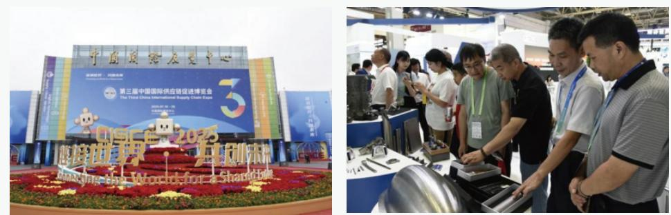

# 数字化转型

宝钛股份累计投入超过2000万元，系统化建成了锻造、板材、管材三大智能工厂，构建了由ERP、MES等12套核心数字平台组成的全流程数字化体系，工业互联网平台以大数据中心为基础，深度应用数字孪生技术，实现了从企业资源到生产运营、质量数据的“可视化穿透管理”，使生产过程更加透明，数据

价值得到深度挖掘。2025年，公司宇航级高品质钛及钛合金精益智能工厂被评定为陕西省首批先进级智能工厂。

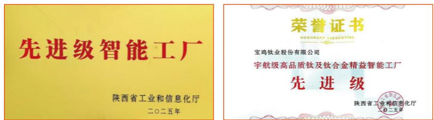

# 员工发展

宝钛股份将员工视为企业的宝贵财富,始终坚持“以人为本”理念,着眼于员工福祉,维护员工基本权益,关心员工身心健康,注重员工晋升培养,竭力营造多元、包容、平等、有归属感的工作氛围,与员工携手并进,共创未来。

# 劳动用工

宝钛股份严格遵守《中华人民共和国劳动法》等相关法律法规要求，坚持平等、公正的雇佣原则，杜绝任何形式的歧视。公司重视民主管理，通过职代会等形式保障员工的知情权、参与权和监督权，并建立通畅的员工投诉渠道，用心倾听员工声音。公司构建了以“能力”和“贡献”为导向的薪酬福利与绩效考核体系，让员工的付出与努力得到充分认可，同时高度关注员工职业健康，努力营造和谐稳定的劳动关系。

# 绩效展示

公司员工数量为5188人,同比增长5.15%

母公司在职员工数量为4144人, 同比增长2.96%。

主要子公司在职员工1044人, 同比增长14.85%。

# 宝钛股份员工专业构成情况

生产人员 3971人  
行政人员 488人  
- 技术人员 533人  
财务人员 66人  
销售人员 130人

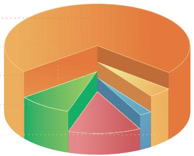

pie

| Category | Value |
| --- | --- |
| Orange | ~60% |
| Yellow | ~15% |
| Blue | ~15% |
| Green | ~20% |

# 宝钛股份员工教育程度构成情况

- 硕士及以上 165人  
• 大学本科 1519人  
大学专科 1506人  
高中学历 723人  
销售人员 1275人

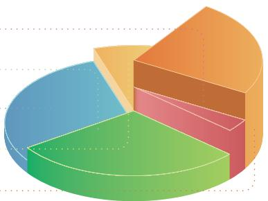

pie

| Category | Value |
| --- | --- |
| Blue | ~25% |
| Green | ~25% |
| Orange | ~25% |
| Red | ~10% |

# 薪酬福利

宝钛股份在追求高质量发展的同时,不断健全员工管理与薪酬激励制度,竭力保障全体员工的劳动所得和职业发展权益,致力打造高素质的产业工人队伍,让每一位员工的劳动都得到充分尊重。

# 案例

# 宝钛股份深入实施国企改革深化提升行动

2025年，公司深入实施国企改革深化提升行动，依据“公平透明、能力导向、激励差异、关注成长”基本原则，充分考虑各序列匹配要求并结合各单位岗位设置及职工个人情况，监督指导公司本部27家单位薪酬体系搭建及配套方案设计，建立了基于岗位价值、能力素质和业绩贡献的六大序列(管理、业务、技术、研发、营销、技能操作)、十三个职等的职业发展通道和薪酬体系，为员工个人成长和能力提升付薪，薪酬分配与岗位价值、个人能力和业绩贡献紧密挂钩，强化“多劳者多得、技高者多得、创新者多得”的激励效果，激发员工积极性与创造性。公司严格按照国家规定为全体员工足额缴纳养老、医疗、失业、工伤等社会保险及住房公积金，保障员工基本福利。

# 民主管理

公司保障员工民主权利,推动员工参与涉及员工利益的重大事项决策,鼓励员工为公司发展提出合理化建议,保障员工重大事项知情权、参与权、表达权和监督权。

# 绩效展示 ·

征集职代会合理化建议34条。

# 职业健康

公司高度重视员工的身心健康,建立了完善的职业健康安全管理体系。

# 案例

# 宝钛股份高度重视员工健康

2025年,公司工会创新性地举办了“安康杯”职工健康减重训练营活动,109名职工在专业健身教练与医疗团队的全程指导下,开展为期3个月的科学减重,有效提升了员工的健康水平和生活质量,彰显了公司对员工的人文关怀。

# 员工安全与健康

宝钛股份持续健全完善安全责任体系，强化安全专项检查整治，扎实组织开展各类安全检查、安全教育培训和应急演练活动，全面提升全员安全生产应急处置和应急救援能力，筑牢高质量发展的安全底线。

# 安全管理

宝钛股份持续完善安全管理体系，设立安全管理组织架构，以制度建设为抓手，夯实安全生产基础。公司发布并执行《职业健康安全管理制度》《辐射安全与防护管理办法(试行)》等一系列规章制度，层层压实生产安全责任，确保每个环节落实到位，为更好统筹经济发展和生产安全提供保障。

  
安全管理组织架构

<table><tr><td>组织架构</td><td>职能</td></tr><tr><td>安全生产委员会</td><td>作为公司安全生产工作的决策机构,由公司主要负责人担任主任,负责审议公司安全生产重大事项、部署重点任务、协调解决重大问题。</td></tr><tr><td>安全生产办公室</td><td>设在生产安全环保部,是安委会的日常办事机构,负责公司日常安全生产监督管理、组织检查、培训、演练等具体工作。</td></tr><tr><td>应急指挥中心</td><td>负责统一指挥、协调公司范围内的各类突发事件应急响应与处置工作。</td></tr></table>

# 绩效展示

# 发生生产安全责任事故0起

# 重大及以上安全事故的人员伤亡数0人

# 全年投入安全生产费用832.83万元

# 应急管理

宝钛股份成立应急指挥中心，负责统一指挥、协调公司范围内的各类突发事件应急响应与处置工作。依据《生产异常处置方案》《辐射安全与防护管理办法（试行）》等相关规定，制定了综合应急预案、专项应急预案及现场处置方案，编制了环境风险分类分级管控手册，规范安全风险监控、风险信息预警、事故及突发事件信息报告、应急队伍、应急物资和装备保障等内容管理，并定期组织开展应急演练，提升全员应急处置能力。

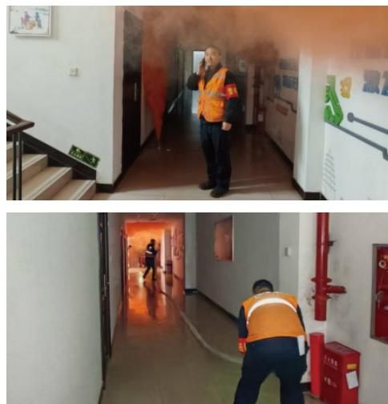

# 隐患排查

宝钛股份牢固树立“隐患就是事故”的理念，持续健全安全生产体系，强化隐患排查治理。公司以“查找身边安全隐患”为切入点，聚焦习惯性违章作业、有限空间作业、辐射安全等重点领域和关键环节，深入开展风险辨识与排查，切实提升重大安全风险管控能力。同时，公司积极开展综合及应急预案演练，定期开展隐患排查，有效防范安全风险。

# 消防安全

宝钛股份坚持“党政同责、一岗双责、齐抓共管、失职追责”原则，建立消防安全管理体系，持续完善安全风险分级管控和隐患排查治理双重预防机制。2025年，公司积极组织消防安全专项整治活动，并以“消防宣传月”为契机，举办消防安全管理人员专项培训，协同高新区消防救援部门开展行业交流，全面筑牢火灾防控根基。

# 案例

# 宝钛股份组织开展消防演练

在机关楼组织开展了火灾疏散逃生应急演练。演练严格遵循“预防为主、防消结合”方针，旨在检验应急预案实效，锻炼应急队伍的协同能力，筑牢消防安全防线。

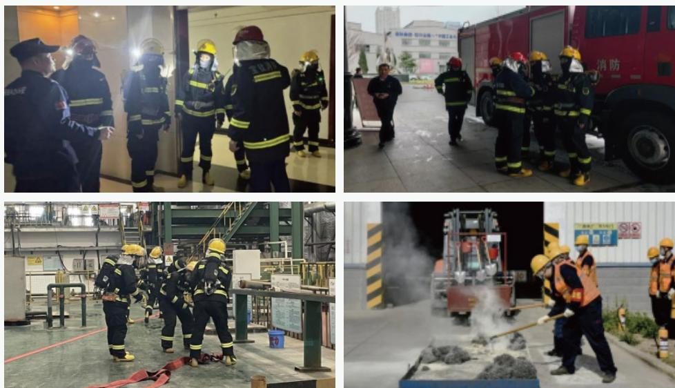

# 绩效展示

# 开展安全应急演练次数188次

# 安全应急演练参与人次2858人次

# 安全培训与安全教育

宝钛股份根据年度安全教育培训计划，不断加强安全生产部署，通过召开安全生产专题会议、安全制度宣贯、举办“安全生产月”系列专题活动等，持续调动公司安全管理主观能动性，提升全员安全生产意识。

绩效展示·

公司共组织安全培训429次

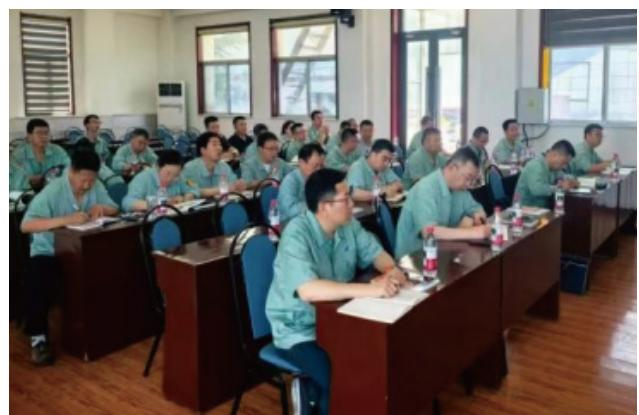

natural_image

Group of people in light green uniforms seated at desks in a classroom setting, engaged in an exam or study (no visible text or signage)

# 职业健康管理

宝钛股份出台《职业健康安全管理制度》等职业病防治相关制度，明确了从源头预防到过程控制的管理措施。公司每年定期组织从事职业危害因素岗位的员工进行职业健康体检，对现场环境进行持续改进，并为每一位员工建立健康档案，以增强员工职业健康意识和防控能力，降低职业病发病率。

目标分类  
职业健康目标及实施路径

<table><tr><td>共性目标</td><td>·每年进行一次员工健康检查·严格执行公司职业健康管理体系文件·重伤及以上责任事故发生率为零</td></tr><tr><td>专项目标</td><td>·降低员工职业健康风险:1.高温中暑:遇室外气温35°C及以上,采取相应避暑措施,错开高温时间作业2.传染性疾病:做好生活区环境卫生,做好个人防护,定期宣传教育增强安全意识·杜绝安全生产事故造成重伤和人员死亡·不发生交通责任事故</td></tr></table>

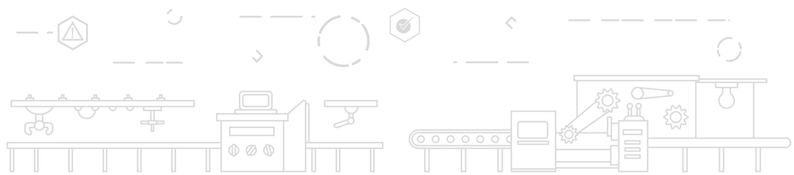

natural_image

Line drawing of two industrial production lines with conveyor belts and control panels, no text or symbols present

# 案例

# 开展2025年接触职业病危害因素人员体检工作

公司集中开展2025年接触职业病危害因素员工体检工作,本次体检人数在750人左右,遵照标准要求涵盖公司所有危害因素岗位,做到应检必检。

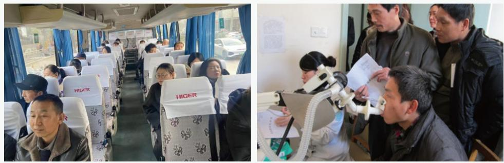

# 完成职业病危害因素检测

公司按照国家法律法规要求,完成职业病危害因素全面检测。

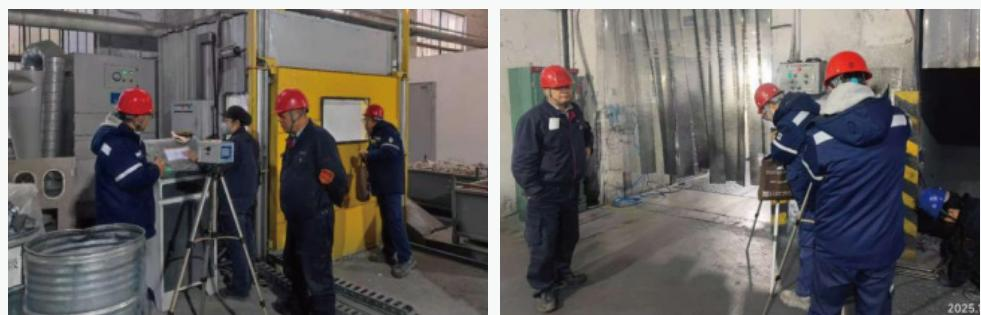

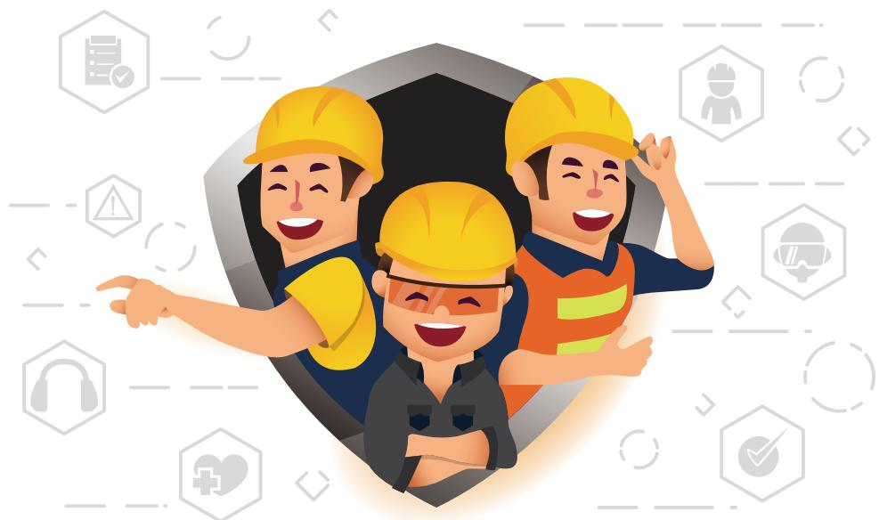

natural_image

Illustration of three construction workers in hard hats inside a shield-like frame, surrounded by icons (no text or symbols)

# 健康培训

宝钛股份密切关注员工身心健康，将健康管理从“个人事务”升级为“系统工程”，持续完善“预防—干预—康复”全链条健康管理体系，通过不定期开设职业病防治、科学健身等培训讲座等方式，帮助员工养成健康生活习惯。

# 案例

# 开展职业健康专题培训

公司组织职业健康专题培训，紧密围绕“科学防治职业病，守护钛业劳动者健康”主题，针对钛行业生产过程中的粉尘、噪声及化学物质接触风险和防护措施应急处理进行了详细讲述，通过现代职业健康治理模式，为企业高质量发展筑牢健康防线。

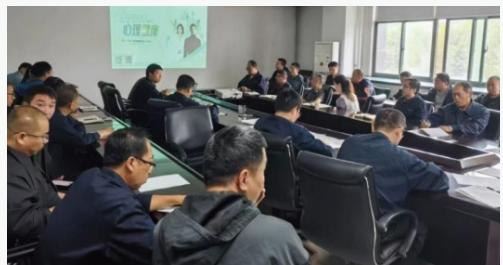

text_image

Meeting room photo with visible presentation screen showing Chinese text about mental health and health care

# 开展员工医疗急救知识培训

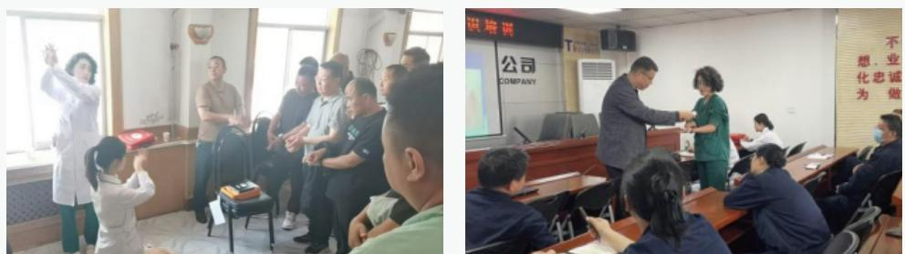

公司每月组织专业医疗人员对员工进行医疗知识、机械伤害、三高预防、健康饮食等培训，累计培训人次3000余人，有效提升了员工对自身疾病的早期发现以及紧急情况应急处理知识的普及率，为健康企业的持续发展坚定了基础。

natural_image

Blue heart icon with EKG line inside, set against a white abstract background (no text or symbols)

# 员工关怀

# 女工关怀

宝钛股份尊重和重视女性员工权益，依据《女职工特殊权益保护专项集体合同》，为女性员工提供平等的职业发展机会，在提职、评定职称等方面坚持男女平等。公司严格落实女性员工在经期、孕期、产期、哺乳期的特殊劳动保护规定和休假规定，并每年为全体女职工购买特殊疾病保险。公司不断提升女性员工幸福感，规定女工较多的单位应建立女职工卫生室、孕妇休息室、哺乳室等设施，提供人性化关怀。

# 案例

# 宝钛股份设母婴关爱室

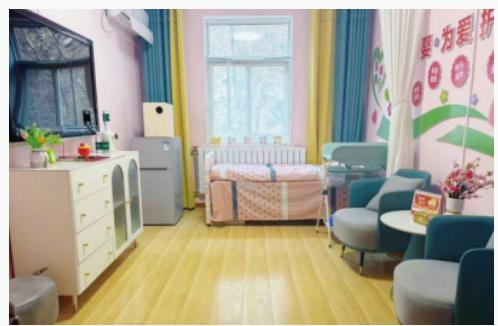

natural_image

Interior of a brightly lit pediatric room with white furniture, green wall decorations, and yellow curtains (no visible text or symbols)

# 困难员工关怀

宝钛股份在追求自身发展的同时，心系员工生活，用心用情为困难员工送去关怀。2025年，公司坚持开展困难员工送温暖、项目一线送清凉、金秋助学、重大节日探视慰问等活动，切实发挥各级帮困基金作用，加大帮扶救助力度，使困难员工得到及时有效救助，为困难员工倾心竭力，守望相助。

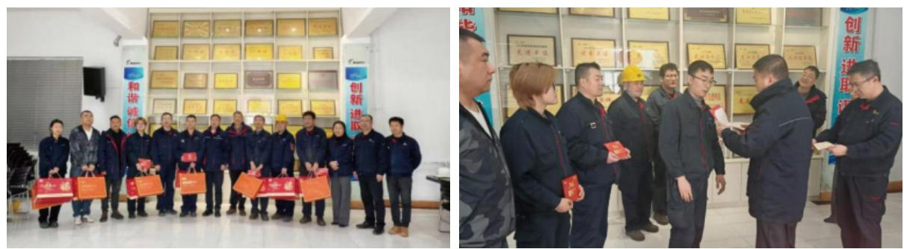

# 绩效展示·

# 公司工会筹集“送温暖”专项资金23000元

# 慰问困难家庭10户

# 开展员工互助互济保障工作15家

# 互助互济保障工作惠及人数3996人

# “金秋助学”帮助子女上学难问题家庭1户

# 员工活动

宝钛股份在保持企业稳定发展的同时，积极开展“闹元宵、猜灯谜”喜乐会、职工游泳赛、篮球赛、羽毛球友谊赛等各类丰富多彩、积极向上的文体活动。2025年，公司持续关注员工身心健康，举办了“安康杯”职工减重训练营等活动，旨在丰富和活跃员工业余文化生活，在增强团队凝聚力的同时，促进员工身心健康和企业和谐发展。

# 案例

# “板材杯”暨宝钛第三十届职工篮球邀请赛开幕

2025年7月开幕,22家单位组成20支代表队、280余名运动员参赛(历届规模最大),特邀2家外部单位,切磋技艺,展现宝钛职工昂扬向上的精神风貌。

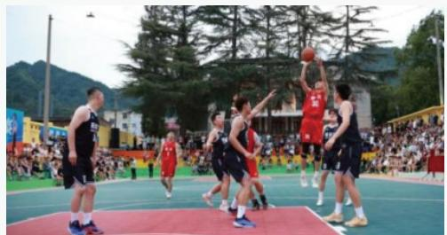

natural_image

Basketball game on an outdoor court with players in black and red uniforms, spectators watching (no visible text or signage)

# 宝钛健儿展风采 运动会上创佳绩

# —— 公司在宝鸡市第二届职工运动会斩获多项殊荣

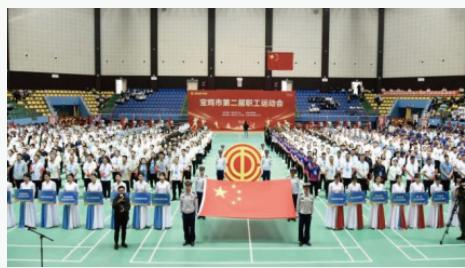

text_image

宝商市第二届职工运动会
14:30-15:30

全市88家单位2200余名运动员参赛, 公司选拔56人参赛5个项目, 获围棋团体第一、拔河团体第二等荣誉及优秀组织奖。

# 2025年“安康杯”职工健康减重训练营开营

2025年6月开营,290人报名经筛选109名职工入选,专业教练+医疗团队指导开展3个月科学减重,采用线上+线下模式,建立周期健康管理体系。

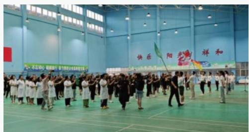

text_image

Group photo of children performing a dance in a gymnasium with visible Chinese banners and slogans on the walls

# 员工发展与培训

宝钛股份重视员工培养和发展,为员工提供丰富的培训项目,倡导员工参与各项竞赛活动,着力打造高素质员工队伍。通过实施系统的职级薪酬体系改革,为员工未来职业发展提供管理、业务、技术、研发、营销、技能操作六大序列、多通道并存的发展空间,帮助员工成就事业价值。

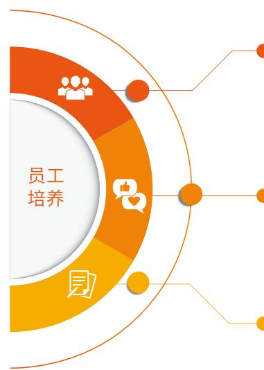

flowchart

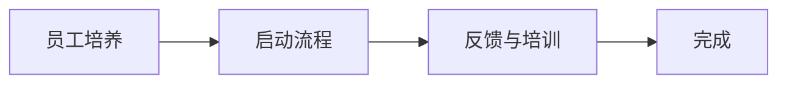
```mermaid
graph LR
  A["员工培养"] --> B["启动流程"]
  B --> C["反馈与培训"]
  C --> D["完成"]
```

人才引进。公司坚持“人岗匹配”原则，不断优化招聘管理，从源头保障新职工素质。全年组织招聘会未披露场，引进高校毕业生194人。根据公司《高层次人才引进管理办法》，积极引进高端人才，2025年公司博士研究生由6人增至16人，硕士研究生由117人增至146人。

人才评价。职称管理方面，2025年审核高级职称评审资料20份，中级职称评审资料47份，初级职称评审资料313份。

培训学习。公司根据《人才培养规划(2022—2025年)》，系统性开展员工培训。学历提升培训方面，与高校合作开设在职工商管理硕士班(MBA)，并持续培养专业型硕博及博士后研究生。能力提升培训方面，通过开设专家大讲堂、实行中层干部轮岗、组织业务交流等方式，提升管理人员综合能力。技能人才培训方面，广泛开展职业技能等级自主认定，全面推行企业新型学徒制和“以师带徒”活动，并搭建实战化训练平台，加快技能人才成长。

# 干部队伍建设

宝钛股份制定《主管级(科级)干部管理办法》，以“重实干、讲实绩”作为主要评价依据、将推荐、竞争上岗、市场化选聘等公开方式作为主要手段，开展干部选任工作，并对初次提任干部的年龄做出规定，促进干部队伍年轻化、提高干部活力。同时，持续强化干部队伍思想历练和实践锻炼，围绕公司发展目标，采取“集中学习”与“自主选学”相结合、“网络教学”与“阵地教学”相结合等方式，积极开展干部思想教育与能力教育，多渠道提升干部成员综合素质。

# 专家管理

为加强公司科技人才队伍建设,完善高层次人才职业发展通道,宝钛股份制定《高层次人才引进管理办法》,并通过人才培养规划明确了以“宝钛专家、核心技术人员、宝钛工匠”为核心的领军人才“塔尖”培养目标。公司对专家的聘任、管理与考核等内容进行规范化管理,通过优化宝钛专家、核心技术人员等评审考核办法,搭建起金字塔型的人才队伍,完善公司科技人才发展通道

# 見 社会公益

宝钛股份始终秉持“源于社会，回报社会”的理念，将履行社会责任深度融入企业发展战略。公司在追求经济效益、为股东创造价值的同时，坚持依法合规纳税，积极参与社区共建、社会公益和乡村振兴事业，响应国家战略，在高质量发展的新征程中，彰显国企的责任与担当。

# 缴纳税费情况

宝钛股份深刻理解税收是国家治理与经济发展的基石，始终坚持依法、按时、足额纳税，将税务合规全面嵌入公司治理与运营流程。凭借长期规范的税务管理实践，公司已连续多年荣获税务机关评定的“A级纳税人”荣誉。2025年，宝钛股份缴纳税款总额为1.17万元。

# 社会公益活动

宝钛股份秉承“奉献、友爱、互助、进步”的志愿服务精神，真诚主动投身于社会公益慈善事业，大力弘扬志愿精神，积极鼓励员工参与爱心捐赠、扶贫帮困等公益活动，为社会的每一个美好、每一份温暖、每一次闪光贡献宝钛股份的坚守与力量。

# 案例

# 春节慰问送温暖, 情系帮扶困难户

在新春佳节来临之际，公司领导班子成员带队深入定点帮扶的宝鸡市千阳县，开展春节走访慰问活动。慰问组详细了解困难群众的家庭生活和实际困难，并为69户困难家庭送去了大米、菜籽油、坚果礼盒等慰问品和新春祝福，将企业的关怀与温暖送到群众心坎上，以实际行动践行国企的社会责任与担当。

# “金秋助学”点亮希望, 助力学子圆梦

公司积极投身乡村振兴事业，将支持教育作为重要组成部分。公司持续开展“金秋助学”活动，为帮扶地区的困难家庭学子提供资助。这不仅是在物质上帮助他们减轻经济压力，更是在精神上给予他们鼓励，激励他们努力学习、成长成才，用知识改变命运，将来回报社会，形成“受助、成长、反哺”的良性循环。

# 绩效展示

志愿者注册人数784人

组织志愿者活动11次

提供志愿服务时长1835.4小时

公司累计对外捐赠10.65万元

惠及人数276人

# 国家战略响应

# 乡村振兴

公司积极响应国家乡村振兴战略,全面落实“四个不搞”的帮扶责任,巩固拓展脱贫攻坚成果同乡村振兴有效衔接工作的稳步推进,立足产业帮扶带动整体帮扶的思路,紧扣全省帮扶各地资源禀赋、乡村文化底蕴和产业发展重点,助力实现帮扶村“产业兴旺、乡风文明、治理有效、生活富裕”的目标,为建设美丽乡村、夯实振兴根基、促进共同富裕,贡献宝钛力量。

帮扶主题  
主要举措与成效

<table><tr><td>精准驻村联户</td><td>公司定期深入定点帮扶的千阳县开展调研和慰问活动,与当地干部群众深入交流,了解实际需求与困难,确保帮扶工作精准有效。</td></tr><tr><td>开展消费帮扶与主题活动</td><td>采购帮扶村农副产品;结合春节等传统节日,组织“送温暖”活动,为数十户困难群众发放米、面、油等生活物资,传递企业关怀,营造祥和的节日氛围。</td></tr><tr><td>加大产业帮扶</td><td>公司将一如既往践行国企担当,发挥企业优势,助推千阳县的产业振兴发展,探索长期有效的帮扶路径。</td></tr></table>

# 绩效展示·

公司用于扶贫及乡村振兴项目总投入共计277.05万元

产业扶贫项目投入7.5万元

集中采购帮扶投入269.55万元

惠及人数5545人

# 共建“一带一路”

宝钛股份积极响应国家重大战略,凭借其在高端钛合金材料领域的领先技术,深度服务于海洋强国等国家战略。同时,公司产品远销海外,是“中国制造”走向世界的重要参与者。

flowchart

```mermaid
graph TD
  Center["Central User"] --> Node1["User 1"]
  Center --> Node2["User 2"]
  Center --> Node3["User 3"]
  Center --> Node4["User 4"]
  Center --> Node5["User 5"]
  Center --> Node6["User 6"]
  Center --> Node7["User 7"]
  Center --> Node8["User 8"]
  Center --> Node9["User 9"]
  Center --> Node10["User 10"]
  Center --> Node11["User 11"]
  Center --> Node12["User 12"]
  Center --> Node13["User 13"]
  Center --> Node14["User 14"]
  Center --> Node15["User 15"]
  Center --> Node16["User 16"]
  Center --> Node17["User 17"]
  Center --> Node18["User 18"]
  Center --> Node19["User 19"]
  Center --> Node20["User 20"]
```

natural_image

Red heart-shaped graphic with a curled corner, no text or symbols present

natural_image

Aerial view of a winding mountain road through golden hour, with rolling hills and distant mountains under a sunset sky (no text or symbols visible).

# 未来展望

Future Vision

2025年, 是宝钛股份锚定“十五五”末建成世界一流钛业强企战略目标、深耕钛产业全链条高质量发展的关键一年, 也是我们将ESG理念深度融入生产经营全流程、推动可持续发展迈上新台阶的重要一年。未来, 我们将紧扣国家战略导向与高端新材料行业发展趋势, 以更前瞻的布局、更务实的举措, 在ESG领域持续深耕, 全力实现“创新、绿色、责任、治理”的协同跃升, 打造钛行业ESG发展标杆。

在科技创新维度,我们将持续深化“产研融合”理念,把技术突破与产业升级深度绑定。聚焦航空航天、深海装备等高端领域“卡脖子”技术难题,依托国家级创新平台与“科学家+工程师”研发团队,持续攻关钛合金材料核心制备技术,加快数字化智能工厂建设,推动创新成果高效转化为产业竞争力,以技术自立自强夯实ESG发展的核心价值底座。

在绿色低碳维度,我们将以更坚定的行动响应国家“双碳”目标,推动绿色转型向全产业链延伸。严格落实碳达峰实施方案与三阶段温室气体减排规划,持续优化能源结构,扩大绿电与分布式光伏应用规模,深化残钛回收循环利用技术推广,完善全生命周期绿色管理体系,推动绿色制造、绿色供应链建设向纵深发展,为钛行业绿色低碳转型提供可复制的实践范本。

在社会责任维度,我们将持续拓展责任实践的深度与广度。坚守以客户为中心,持续完善全流程质量管控与客户服务体系,深化全球供应链协同合作;坚持以人为本,完善六大序列职业发展通道,筑牢安全生产防线,深化员工健康管理与人文关怀;积极投身乡村振兴、社会公益事业,深度融入“一带一路”建设,以实际行动践行国企担当,构建与社会共生共荣的发展生态。

在治理优化维度,我们将持续提升现代企业治理体系的规范性与有效性。坚持党建引领与经营发展深度融合,不断完善“三会一层”治理架构,深化三级合规风控管理体系建设,筑牢廉洁从业防线;持续提升信息披露透明度,畅通投资者沟通渠道,健全与各利益相关方的常态化沟通机制,以规范、透明、高效的治理筑牢可持续发展根基。

新的征程上,ESG之于宝钛股份,既是坚守初心的责任承诺,更是驱动高质量发展的内生动力。我们将始终锚定世界一流钛业强企愿景,以更坚定的决心、更扎实的行动,全力实现企业价值、社会价值与环境价值的有机统一,为中国钛工业高质量发展贡献核心力量。

附录一:指标索引表

<table><tr><td></td><td>章节目录</td><td>《陕西省国有企业环境、社会和治理(ESG)信息披露指引》</td><td>上海证券交易所《上海证券交易所上市公司自律监管指引第14号—可持续发展报告(试行)》</td></tr><tr><td colspan="2">企业基本信息</td><td>S4.4、G1.1、G1.2、G4.1</td><td>可持续发展相关治理机制</td></tr><tr><td colspan="2">ESG管理</td><td>E5.1、G1.1、G1.2、G3.1</td><td>可持续发展相关治理机制、利益相关方沟通</td></tr><tr><td rowspan="3">治理议题</td><td>规范治理</td><td>G1.1、G1.2、G2.2、G3.2</td><td>可持续发展相关治理机制、反商业贿赂及反贪污</td></tr><tr><td>合规经营与风险管理</td><td>G2.1、G5.1、G5.2</td><td>可持续发展相关治理机制</td></tr><tr><td>投资者关系与信息披露</td><td>G4.1、G4.2、G3.1</td><td>利益相关方沟通</td></tr><tr><td rowspan="4">环境议题</td><td>环境管理</td><td>E1.1、E1.3、E2.1、E2.2E2.3、E3.3、E5.2</td><td>应对气候变化、污染物排放、废弃物处理、能源利用、水资源利用、循环经济</td></tr><tr><td>气候应对</td><td>E3.4、E3.2、E5.1</td><td>应对气候变化</td></tr><tr><td>绿色运营</td><td>E3.2、E5.4、E5.2、E5.5E5.6、E4.1</td><td>环境合规管理、生态系统和生物多样性保护</td></tr><tr><td>绿色文化</td><td>E5.4</td><td>环境合规管理</td></tr><tr><td rowspan="6">社会议题</td><td>产品与客户服务</td><td>G3.3、S2.1、S2.2</td><td>产品和服务安全与质量、数据安全与客户隐私保护</td></tr><tr><td>创新驱动发展</td><td>S2.3</td><td>创新驱动</td></tr><tr><td>供应链安全与管理</td><td>S3.1、S3.2</td><td>供应链安全、反不正当竞争</td></tr><tr><td>数字化转型</td><td>S4.4</td><td>创新驱动</td></tr><tr><td>员工发展</td><td>S1.1、S1.2、S1.3S1.4、S1.5</td><td>员工</td></tr><tr><td>社会公益</td><td>S4.1、S4.2、S4.3、S4.4</td><td>社会贡献、乡村振兴</td></tr></table>

# 附录二:读者意见表

尊敬的读者,您好:

非常感谢您在百忙之中阅读《宝鸡钛业股份有限公司2025年度环境、社会和治理(ESG)报告》。殷切盼望您对报告和我们的工作提出意见与建议。您可以通过邮寄或扫描后发送电子邮件将填好的问卷反馈给我们提出您的宝贵意见。

谢谢！

地址:陕西省宝鸡市渭滨区高新大道88号2层

邮箱:dsb@baoti.com

# 1.您的工作单位属于宝钛股份的哪一类利益相关方：

□内部管理层 □内部员工 □供应商/合作伙伴 □客户及潜在客户  
□政府及监管机构 □社区 □专家学者 □非政府组织  
□公众 □其他(请说明)

# 2. 您所关注的信息在报告中是否都有所体现？

□是 □一般 □否

# 3.您对2025年环境、社会和治理(ESG)报告的综合评价：

·可读性(表达方式通俗易懂,设计美观,引人入胜,容易找到所需信息)

□3分(较好) □2分(一般) □1分(较差)

·可信度(报告信息真实可信)

□3分(较好) □2分(一般) □1分(较差)

·信息完整性(正负两方面信息兼顾,并且满足您对信息的需求)

□3分(较好) □2分(一般) □1分(较差)

# 4.您在报告中能否方便地找到您所关注的信息？

□是 □一般 □否

# 5.除报告已披露的内容以外,您还更希望看到哪方面的信息?