# 2025 | 龙头股份环境、社会和公司治理报告

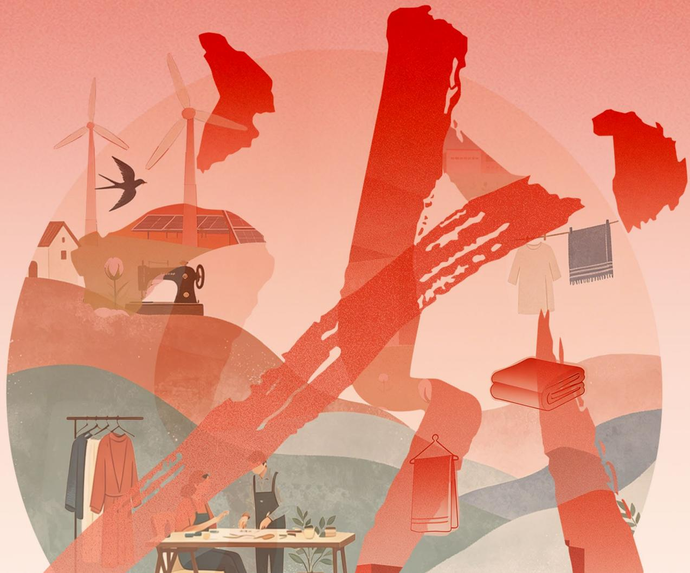

natural_image

Illustration of diverse scenes including wind turbines, houses, a sewing machine, fabric rolls, and clothing (no text or symbols)

# 目录

02 报告编制说明  
03 董事长致辞  
04 关于龙头股份

08 年度绩效概览  
09 年度荣誉  
10 ESG 治理

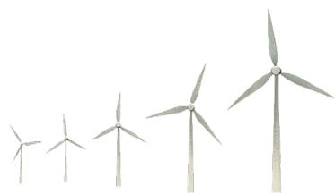

natural_image

Illustration of four wind turbines arranged in a row (no text or symbols)

# 01

# 合规筑基稳健发展

14 党建引领  
16 公司治理  
18 合规及风险管理  
21 商业道德  
22 信息安全

# 02

# 匠心传承 铸就品质

24 创新驱动  
27 产品质量  
29 供应商管理  
31 客户服务  
33 负责任营销

# 03

# 低碳践行 绿动未来

36 应对气候变化  
38 绿色生产  
39 环境合规管理  
41 污染物与废弃物管理  
43 水资源利用  
44 能源利用

# 04

# 温情护航 美好共创

46 社会贡献与乡村振兴  
47 员工权益与福利  
50 员工培训与发展  
51 职业健康与安全

52 ESG 关键绩效  
54 对标索引  
55 读者反馈表

natural_image

Illustration of three people on a wavy surface, one relaxing and two standing, with no visible text or symbols.

# 报告编制说明

# 报告简介

本报告是上海龙头（集团）股份有限公司（以下简称“公司”、“龙头股份”）发布的第三份环境、社会和公司治理报告，向利益相关方披露公司在经营中对于可持续发展议题所秉持的理念、建立的管理方法、推行的工作与取得的成果。

# 报告范围

本报告披露信息的范围涵盖龙头股份及其附属公司，与龙头股份（600630.SH）合并财务报表范围一致。

# 时间范围

本报告为年度报告，报告时间范围为2025年1月1日至2025年12月31日。部分文字信息超出此范畴的，将在所涉及处予以说明。

# 编制说明

报告中所披露的文字信息和量化数据均来自公司实际运行的原始记录或财务报告。相关财务数据与公司年度报告不符的，以年度报告为准。
报告中的财务数据均以人民币为单位。

# 报告发布

本报告以印刷品、电子文档形式发布，其中电子文档可在公司官方网站信息公开专栏（https://www.shanghaidragon.com.cn/）及上海证券交易所（www.sse.com.cn）下载阅读。为减少印刷对环境产生的影响，我们倡导读者尽可能下载阅读电子文件。

# 指代说明

为了便于表述和阅读，本报告中称谓指代如下：

<table><tr><td>简称</td><td>全称</td></tr><tr><td>公司,龙头股份</td><td>上海龙头(集团)股份有限公司</td></tr><tr><td>三枪针织</td><td>上海三枪(集团)有限公司</td></tr><tr><td>民光家纺,龙头家纺</td><td>上海龙头家纺有限公司</td></tr><tr><td>时尚定制</td><td>上海纺织时尚定制服饰有限公司</td></tr><tr><td>海螺服饰</td><td>上海海螺服饰有限公司</td></tr><tr><td>针织九厂</td><td>上海针织九厂有限公司</td></tr><tr><td>龙头进出口</td><td>上海龙头进出口有限公司</td></tr><tr><td>江苏大丰工厂</td><td>上海三枪(集团)江苏纺织有限公司</td></tr></table>

# 编制依据

本报告依据上海证券交易所刊发的《上海证券交易所上市公司自律监管指引第14号--可持续发展报告（试行）》（以下简称《指引》）、《上海证券交易所上市公司自律监管指南第4号--可持续发展报告编制（2026年1月修订）》、中国社科院《中国企业可持续发展报告指南》（CASS-ESG 6.0）和上海市国有资产监督管理委员会《市国资委关于推进实施本市国有控股上市公司环境、社会与治理（ESG）工作的通知》编制。本报告编制过程符合全球报告倡议组织（Global Reporting Initiative, GRI）《可持续发展报告标准》（2021年版）（简称“GRI标准”）。

# 确认及批准

本报告经管理层确认后，于 2026 年 04 月 27 日获董事会审批通过。

# 编制原则

# 可持续发展背景

公司基于外部政策调研、相关方需求识别等方式，识别投资者等利益相关方关注的、与公司可持续经营相关的实质性议题。本报告在汇报实质性议题时关注公司运营涉及的行业特征、所在地区特征。议题的分析过程及结果见本报告“重要性议题管理”章节。

# 完整性

除特别说明外，本报告披露信息的覆盖范围均为上海龙头（集团）股份有限公司及其附属公司。

# 平衡性

本报告的内容反映客观事实，对公司涉及的正面、负面信息均予以不偏不倚地披露。报告期内，公司未发现应当披露而未披露且产生重大影响的负面事件。

# 准确性

本报告尽可能确保信息准确。其中，定量信息的测算结果均说明数据口径、计算依据与假定条件，以保证计算误差不会对信息使用者造成误导性影响。董事会对报告的内容进行保证，确认不存在虚假记载、误导性陈述或重大遗漏。

# 时效性

本报告为年度报告，与公司2025年年度报告的报告期一致，为利益相关方决策提供及时的信息参考。

# 量化及可比性

本报告披露报告期内的 ESG 量化绩效指标，并尽可能披露相应的历史数据。本报告对同一指标在不同报告期内的统计及披露方式保持一致；若统计及披露方式有更改，将在报告附注中予以充分说明，以便相关方进行有意义的分析与评估。

# 可验证性

本报告中所披露量化数据的来源及计算过程均可追溯，可用于支持外部验证。

# 董事长致辞

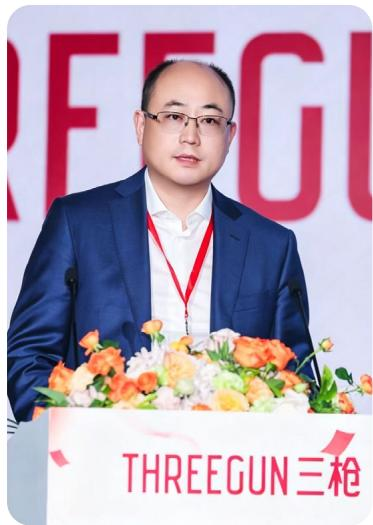

text_image

THREEGUN三枪

2025 年，公司深耕主业、锐意革新，经营业绩稳步提升，经营质效与品牌影响力同步增强。

年内顺利完成董事会换届，新一届董事会正式履职，为公司治理注入新动能。公司坚持以ESG理念为引领，践行社会责任与长期主义，将可持续发展融入经营管理全过程，持续夯实高质量发展根基，彰显老字号品牌的责任担当与时代活力。

# 守正治企 规范护航

作为国有控股上市公司，公司始终坚持党的领导，以党建引领经营发展，严守合规底线，以规范透明的治理回应各方期待。2025年顺利完成董事会换届，组建结构优化、专业互补的第十二届董事会，实现平稳过渡。顺应监管要求优化治理架构，取消监事会并由审计委员会承接监督职能，结合新《公司法》修订完善17项治理制度，以高效规范的治理体系为长远发展筑牢保障。

# 提质增效 精耕致远

公司坚守实业初心，以提质增效为核心，扎实推进“五力支撑体系”建设，在产品创新、渠道优化、品牌焕新及数字化转型等方面取得积极进展。通过技术创新、工艺改进与运营优化，公司经营质效稳步提升，核心品牌影响力持续增强。以匠心打磨品质，以变革驱动增长，将提质增效贯穿经营全流程，不断夯实老字号核心竞争力。以“三枪88周年庆”为契机，创新打造“时装周大秀+首发快闪店+互动式展览”三位一体的品牌盛典，以“强外穿·强打底”为支点。

# 匠心育人 同心共进

作为深耕纺织领域的国有老字号企业，公司始终将产业工人作为核心竞争力与文化传承主体，构建“工匠引领、技能成长、权益保障、文化传承”四位一体发展体系。依托“职工学堂”赋能职工成长，弘扬劳模工匠精神，完善关怀与民主管理，打造有温度、有凝聚力的职工家园。同时积极投身公益帮扶、乡村振兴与绿色发展，以实际行动践行国企责任担当。

# 科创赋能 绿织未来

以技术创新为引擎，公司全力推动产品向品质化、功能化、绿色化升级。深耕东方美学，持续开展文化元素与产品设计融合创新，不断提升产品竞争力。，不断提升产品竞争力。依托科技平台与面料实验室，攻坚多项功能性技术，打造天然舒适、低碳环保的绿色产品。深化产学研合作加速成果转化，以创新研发与绿色智造赋能品牌长远发展。

守正笃行担使命，创新实干向未来。2025年，公司以治理强基、以经营提效、以人才聚力、以绿色赋能，在传承中深耕实业，在发展中践行责任。展望前路，公司将始终坚守国有上市企业使命担当，秉持可持续发展理念，以更实举措、更优业绩回馈员工、社会与广大投资者，奋力谱写老字号品牌高质量发展新篇章。

董事长签字：

# 关于龙头股份

# 走进龙头股份

上海龙头（集团）股份有限公司是中国首批股份制上市公司（证券代码600630），以纺织品品牌经营和国际贸易为核心业务。

公司由综合管理中心、财务共享中心、品牌管理中心、设计研发中心四大职能部门以及国内贸易事业部、国际贸易事业部、大客户事业部、供应链事业部四大事业部组成，为实现品牌振兴，不断提升品牌核心竞争力，深耕国内市场，探索品牌出海实践，努力形成高质量可持续发展的新格局。

公司拥有完善的营销渠道、现代化纺织品制造基地，多元化的设计研发与生产加工能力为公司品牌发展提供了有力保障。公司通过了 ISO9001:2015、ISO14001:2015、ISO45001:2018、GRS、RWS 等多项认证。

公司拥有多个在国内市场享有盛誉的“三枪”、“海螺”、“民光”、“凤凰”、“钟牌414”、“皇后”和“鹅牌”等众多知名品牌。并紧密围绕以“三枪”为核心的品牌发展，根据各品牌定位、价值与个性，通过产品设计、形象陈列、店铺设计、各类营销活动不断提升新创品牌、合作品牌的形象。

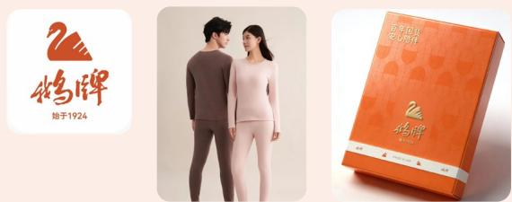

定位：中国针织行业百年老字号，百年品质舒适，百年传承延续。

焕新策略：兼具历史底蕴与市场生命力，细分中老年市场，全品类覆盖抗菌防螨，基础刚需 + 功能呵护，焕新百年国货。

可持续亮点：传递温和亲肤的产品基因，深耕中老年针织赛道，沉淀高品质棉产品，舒适透气耐用，持续守护安心陪伴几代人的记忆。

threegun 三枪  

natural_image

Person standing in a minimalist beige room with soft lighting (no text or symbols visible)

定位：国内针织内衣行业领军品牌，国民舒适生活专家。

焕新策略：聚焦“科技+时尚”，推出抗菌、发热、凉感等功能性面料系列；携手知名IP与设计师打造联名款，打破老化印象，拥抱Z世代。

可持续亮点：全面推广 GRS 认证再生纤维产品，建立绿色供应链示范线。

CONCH海 SHANGHAI螺  

natural_image

Product display of white and blue men's shirts and accessories (no text or symbols visible)

natural_image

Assorted clothing items including shirts, accessories, and accessories arranged on a plain background (no text or symbols visible)

定位：中高端商务衬衫与职业装领导者。

焕新策略：深耕定制化服务（C2M），引入3D量体与智能生产，满足个性化商务需求；拓展年轻职场系列。

可持续亮点：推行环保印染工艺，减少水资源消耗，倡导“一件好衬衫穿更久”的耐用消费理念。

# 老字号匠心，筑可持续未来

定位：中国家纺文化的传承者，高品质床品代表。

焕新策略：挖掘“国民床单”文化IP，推出国潮系列；结合现代睡眠科学，研发助眠、恒温等功能性家纺。

可持续亮点：联动绿色供应链，启用 OEKO-TEX made in green 可追溯吊牌，守护消费者健康。

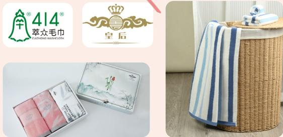

定位：国民毛巾的品质标杆。

焕新策略：强化“柔软、吸水、健康”的产品心智，开发婴幼儿专用及敏感肌适用系列。

可持续亮点：环保印染，确保产品生产环节无芳香胺等有毒有害化学物质。

# 企业文化

公司将秉承“爱国·第一，时尚·健康”的发展理念，“以人为本”加快推进以“三枪”为核心的品牌创新发展，为全球消费者提供时尚、健康、舒适的消费体验，立志成为国内一流、国际知名的时尚品牌企业。

# 主要业务

公司以品牌经营和国际贸易为主营业务。自主品牌围绕中国驰名商标“三枪”品牌构建多元化品牌矩阵，涵盖“海螺”、“民光”、“凤凰”等“中华老字号”品牌。

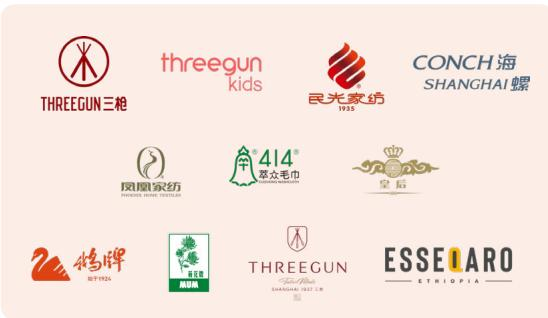

text_image

THREEGUN三枪
threegun kids
民光家纺
1935
CONCH 海
SHANGHAI 螺
凤凰家纺
PANCHEE SHAND TEXTILEA
414®
萃众毛巾
皇后
鸿牌
始于1924
THREEGUN
THREEGUN
ESSEIARO
ETHIOPIA

针织类产品主要包括 针织内衣、家居系列、休闲系列、内裤、文胸和袜品等；

家纺类产品主要包括 床单、被套、枕套、靠套、被芯、毛毯、毛巾等；

服饰类产品主要包括 衬衣、休闲裤、T恤、毛衫、夹克、羽绒棉褛、大衣等。

线下实体门店广泛分布

全国各主要城市

1000 余家

出口业务遍

布全球

80+ 国家和地区

线上各主流电商平台

均有品牌店铺

天猫、京东、唯品会

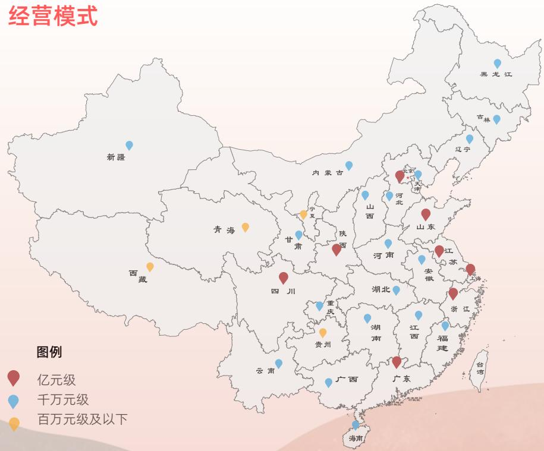

text_image

经营模式
图例
亿元级
千万元级
百万元级及以下

# 老字号品牌溯源

1922年

1928年

1933年

1935年

1937年

1951年

1973年

“凤凰”品牌创立于1922年，曾作为中美建交国礼，主打专业毛毯，延伸至多品类，风格时尚华贵。

  
凤凰家纺  
PHOENIX HOME TEXTILES

鹅牌创立于 1928 年北京，以“鹅”谐“和”，寓意安心陪伴。创始人采用缩碱工艺首创“麻纱汗衫”，手感滑爽挺括，结束了高档汗衫依赖进口的历史，赢得“冬暖夏凉，唯鹅独尊”美誉。

natural_image

Two women wearing light pink and gray athletic pants, standing side by side (no text or symbols visible)

natural_image

Portrait of a man and a woman standing side by side, wearing casual clothing (no visible text or symbols)

“皇后”品牌创立于

1933年，主打海派毛巾，融合精致工艺与现代设计，打造柔和使用体验。

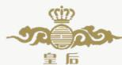

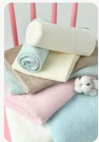

natural_image

Colorful baby bedding with pink, blue, and beige towels and a small white baby lying on the bed (no text or symbols visible)

natural_image

Close-up of a woven basket with striped fabric and a blue towel, no visible text or symbols

“民光”品牌创立于

1935年，因经典中式床单被誉为“国民床单”，现拓展至多类家纺产品，塑造全新品牌形象。

  
民光家纺
1935

1937 年创立的中华老字号 “三枪”，是中国内衣行业的佼佼者。其以 “盾与枪” 为标志，饱含民族抗争精神，成为抗战时期国货振兴的象征。

  
THREEGUN三枪

“钟牌 414”创立于1937年，凭借严选与精湛工艺，色泽耐品质卓越，获誉“国毛巾”。

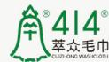

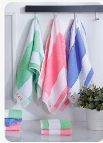

natural_image

Three colorful striped fabric rolls hanging on a shelf, with potted plants in the background (no text or symbols visible)

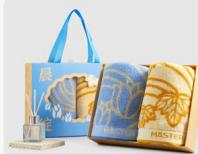

“海螺”品牌创立于

1973年，凭借严格标准、新颖款式与精细工艺赢得广泛认可，曾获国家金质奖、中华老字号等多项荣誉。

CONCH海  
SHANGHAI螺  
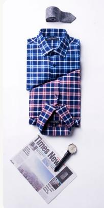

natural_image

Assorted fresh clothing items including a blue plaid shirt, hat, and magazine (no visible text or symbols)

# 企业发展历程

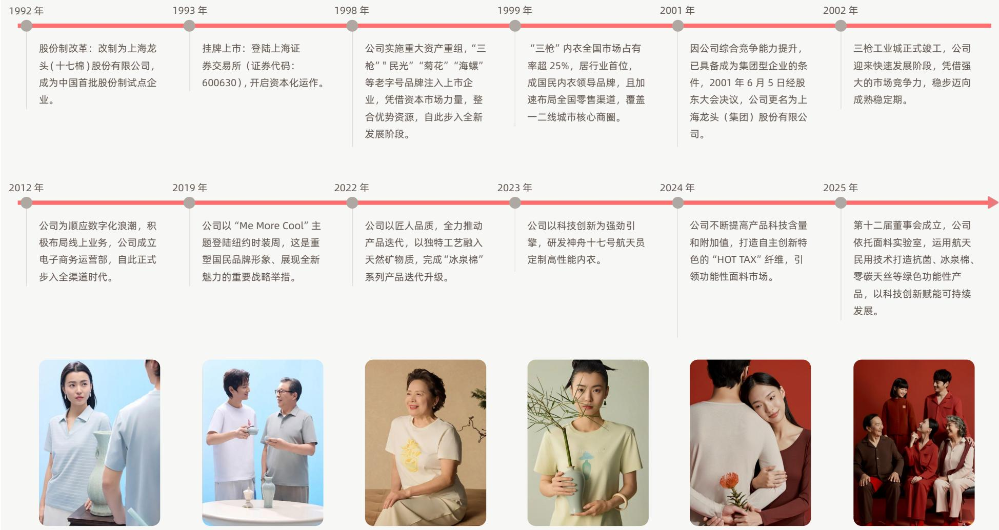

# 年度绩效概览

营业收入

18.29 亿元

净资产收益率

6.11 %

归母净利润

4705.31 万元

人均创利

3.45 万元 / 人

总资产

16.51 亿元

同比增长

12.11 %

同比增长

17.66 %

同比增长

25.45 %

环保投入

442.6 万元

万元营收二氧化碳排放强度

0.941 吨二氧化碳当量 / 万元

万元营收综合能耗

0.293 吨标煤 / 万元

水、气、噪声数据达标率

100 %

natural_image

Illustration of a person holding a pillow next to several colorful bedding items (no text or symbols)

员工总数

1362 人

集体合同签订率与履约率双

100 %

生产安全类培训时长

116 小时

员工对行政和工会满意度分别为

99.5 % 和 99.6 %

乡村振兴投入

7.21 万元

独立董事占比

33.3 %

研发投入

1548.52 万

新增授权专利

37 件

# 品牌价值与市场认可

“三枪”针织内衣裤荣列

2025 年度同类市场综合占有率第一位

中国商业联合会、中华全国商业信息中心

2025 年度上海时尚出品

上海市经济和信息化委员会

入选 “2025 年上海品牌 100+”
(时尚消费品)

“上海品牌 100+”评委会

上海企业文化与品牌研究所

时尚家居-民光

上海时尚之都促进中心

2025 上海品牌 100+（民光）

上海企业文化与品牌研究所

“钟牌 414” 上海友好商标

上海市相关主管部门

入选中国服装协会

“2024 行业百企发布”名单

中国服装协会

# ESG 治理实践与专业认可

ESG 治理金牛奖

中国证券报

上证鹰 金质量奖

上海证券报

入选《上海市国有控股上市公司

ESG 蓝皮书（2025）》优秀案例

上海市国资委

# 年度荣誉

# 产品品质、技术创新与标准化成果

抗菌多功能针织内衣

荣获“上海品牌”认证

中国商业联合会、中华全国商业信息中心

2025 年家纺行业 “科技创新” 优秀案例

--《大师系列纯棉抗菌毛巾的开发与推广》

中国家用纺织品行业协会

上海时尚出品创新产品

上海市经济和信息化委员会

2025 年度十大类纺织创新产品

中国纺织信息中心纺织产品开发中心

标准化工作先进单位

全国纺织品标准化技术委员会针织品分会  
全国体育用品标准化技术委员会运动服装分会

中国孕婴童产业品质实力榜
上榜案例（三枪）

《中国纺织》杂志社 / 中玩协等

匠心坚守奖

全国纺织品标准化技术委员会针织品分会

上海知识产权创新奖（保护）

上海市相关主管部门

# 行业地位、组织参与与社会责任表现

上海连锁经营协会理事单位

上海连锁经营协会

中国针织工业协会第八届理事会副会长单位（2026-2030）

中国针织工业协会

上海服装行业协会优秀企业

(2020-2024 年度)

上海服装行业协会

2024 年度中国针织行业 30 强

中国针织工业协会

2025 年度公众信任企业

公众在线

# ESG 治理

# 可持续发展治理

2025 年公司修订《董事会战略与可持续发展委员会议事规则》，完善 ESG 治理架构，搭建董事会统筹决策、专门委员会专业督导、专项工作组落地执行的三级管理体系，形成权责清晰、运行高效的一体化 ESG 治理机制。董事会把控全局、审定规划，战略与可持续发展委员会专业研判监督，专项工作组将 ESG 理念融入业务全流程，保障工作落地。依托该架构，公司建立起决策规范、执行闭环、全程可溯、成效可评的系统化管理模式，持续提升 ESG 治理专业化、规范化水平。

公司凭借在环境、社会及公司治理（ESG）领域的持续深耕与稳健实践，不仅成为中国供应商 ESG 评级平台发起单位的首家纺织服装企业，还荣获“ESG 治理金牛奖”“上证鹰·金质量奖”，更成功入选《上海市国有控股上市公司环境、社会及治理（ESG）蓝皮书（2025）》优秀案例。多项权威认可集中体现了公司在完善治理体系、强化责任担当与推进高质量发展方面的综合实力。

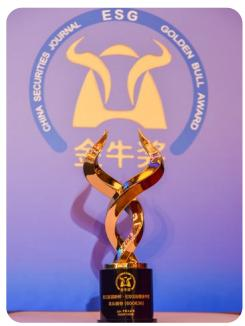

text_image

CHINA SECURITIES JOURNAL
ESG
GOLDEN BULL AWARDS
金牛奖
21

ESG 治理金牛奖

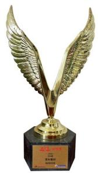

natural_image

Golden winged trophy on a black base, no visible text or symbols on the trophy itself.

上证鹰·金质量
ESG 奖

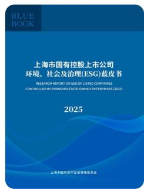

text_image

BLUE BOOK
上海市国有控股上市公司
环境、社会及治理(ESG)蓝皮书
RESEARCH REPORT ON ESG OF LISTED COMPANIES
CONTROLLED BY SHANGHAI STATE-DOWN ENTERPRISES (2025)
2025
上海中融资产监督管理委员会

入选上海市国有控股上市公司环境、社会及治理（ESG）蓝皮书（2025）

# 董事会

董事会负责审议和批准公司ESG战略目标及社会责任的重大事项，确保公司整体战略与可持续发展目标的对接。

# 战略与可持续发展委员会

作为董事会的下设专门机构，委员会主要负责对公司长期发展战略和重大投资决策进行研究，提出可持续发展相关建议，并领导 ESG 小组的工作，推动战略目标的实施。

# ESG 专项组

负责公司日常运营过程中与 ESG 相关的事务，具体包括收集、整理和编制 ESG 报告等，并处理其他相关事项，确保 ESG 目标的执行落地。通过多层次的治理架构，公司有效将 ESG 整合入战略决策过程，推动可持续发展的目标在全公司范围内得以全面落实。

# 企业可持续发展管理委员会组织架构图

绩效：2025年度战略与可持续发展委员会召开1次，审议事项1项。

natural_image

Illustration of two women in different poses, one kneeling and gesturing, the other standing with hands (no text or symbols)

# 实质性议题评估

# 实质性议题评估

在延续 2024 年议题识别结果总体框架的基础上，公司结合外部政策环境、行业发展趋势、资本市场关注重点、利益相关方诉求以及经营管理实际，对 2025 年双重重要性议题进行了复核和动态调整。调整过程中，公司重点关注各议题对公司商业模式、经营管理、品牌价值、供应链稳定、合规运营及利益相关方的实际和潜在影响，进一步提升议题识别结果与公司发展阶段及可持续发展实践的匹配性。

优化后的 2025 年实质性议题矩阵已通过战略与可持续发展委员会审议确认。

natural_image

Illustration of three people interacting with a stylized paper airplane model (no text or symbols)

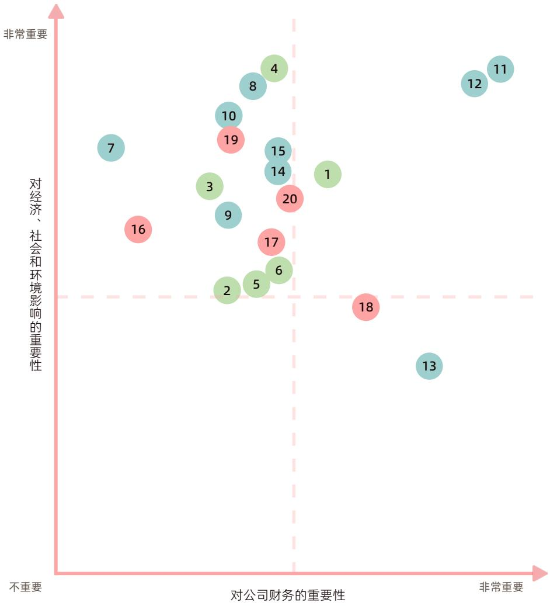

bubble

| Item | 对公司财务的重要性 (X-axis) | 对经济、社会和环境影响的重要性 (Y-axis) |
| --- | --- | --- |
| 1 | ~0.85 | ~0.65 |
| 2 | ~0.45 | ~0.35 |
| 3 | ~0.40 | ~0.55 |
| 4 | ~0.55 | ~0.90 |
| 5 | ~0.50 | ~0.35 |
| 6 | ~0.55 | ~0.40 |
| 7 | ~0.15 | ~0.65 |
| 8 | ~0.50 | ~0.85 |
| 9 | ~0.45 | ~0.50 |
| 10 | ~0.40 | ~0.80 |
| 11 | ~0.95 | ~0.90 |
| 12 | ~0.90 | ~0.85 |
| 13 | ~0.95 | ~0.25 |
| 14 | ~0.55 | ~0.65 |
| 15 | ~0.55 | ~0.65 |
| 16 | ~0.20 | ~0.45 |
| 17 | ~0.55 | ~0.45 |
| 18 | ~0.85 | ~0.35 |
| 19 | ~0.45 | ~0.75 |
| 20 | ~0.60 | ~0.55 |
| 21 | ~0.95 | ~0.35 |
| 22 | ~0.95 | ~0.35 |
| 23 | ~0.95 | ~0.35 |
| 24 | ~0.95 | ~0.35 |
| 25 | ~0.95 | ~0.35 |
| 26 | ~0.95 | ~0.35 |
| 27 | ~0.95 | ~0.35 |
| 28 | ~0.95 | ~0.35 |
| 29 | ~0.95 | ~0.35 |
| 30 | ~0.95 | ~0.35 |
| 31 | ~0.95 | ~0.35 |
| 32 | ~0.95 | ~0.35 |
| 33 | ~0.95 | ~0.35 |
| 34 | ~0.95 | ~0.35 |
| 35 | ~0.95 | ~0.35 |
| 36 | ~0.95 | ~0.35 |
| 37 | ~0.95 | ~0.35 |
| 38 | ~0.95 | ~0.35 |
| 39 | ~0.95 | ~0.35 |
| 40 | ~0.95 | ~0.35 |
| 41 | ~0.95 | ~0.35 |
| 42 | ~0.95 | ~0.35 |
| 43 | ~0.95 | ~0.35 |
| 44 | ~0.95 | ~0.35 |
| 45 | ~0.95 | ~0.35 |
| 46 | ~0.95 | ~0.35 |
| 47 | ~0.95 | ~0.35 |
| 48 | ~0.95 | ~0.35 |
| 49 | ~0.95 | ~0.35 |
| 50 | ~0.95 | ~0.35 |
| 51 | ~0.95 | ~0.35 |
| 52 | ~0.95 | ~0.35 |
| 53 | ~0.95 | ~0.35 |
| 54 | ~0.95 | ~0.35 |
| 55 | ~0.95 | ~0.35 |
| 56 | ~0.95 | ~0.35 |
| 57 | ~0.95 | ~0.35 |
| 58 | ~0.95 | ~0.35 |
| 59 | ~0.95 | ~0.35 |
| 60 | ~0.95 | ~0.35 |
| 61 | ~0.95 | ~0.35 |
| 62 | ~0.95 | ~0.35 |
| 63 | ~0.95 | ~0.35 |
| 64 | ~0.95 | ~0.35 |
| 65 | ~0.95 | ~0.35 |
| 66 | ~0.95 | ~0.35 |
| 67 | ~0.95 | ~0.35 |
| 68 | ~0.95 | ~0.35 |
| 69 | ~0.95 | ~0.35 |
| 70 | ~0.95 | ~0.35 |
| 71 | ~0.95 | ~0.35 |
| 72 | ~0.95 | ~0.35 |
| 73 | ~0.95 | ~0.35 |
| 74 | ~0.95 | ~0.35 |
| 75 | ~0.95 | ~0.35 |
| 76 | ~0.95 | ~0.35 |
| 77 | ~0.95 | ~0.35 |
| 78 | ~0.95 | ~0.35 |
| 79 | ~0.95 | ~0.35 |
| 80 | ~0.95 | ~0.35 |
| 81 | ~0.95 | ~0.35 |
| 82 | ~0.95 | ~0.35 |
| 83 | ~0.95 | ~0.35 |
| 84 | ~0.95 | ~0.35 |
| 85 | ~0.95 | ~0.35 |
| 86 | ~0.95 | ~0.35 |
| 87 | ~0.95 | ~0.35 |
| 88 | ~0.95 | ~0.35 |
| 89 | ~0.95 | ~0.35 |
| 90 | ~0.95 | ~0.35 |
| 91 | ~0.95 | ~0.35 |
| 92 | ~0.95 | ~0.35 |
| 93 | ~0.95 | ~0.35 |
| 94 | ~0.95 | ~0.35 |
| 95 | ~0.95 | ~0.35 |
| 96 | ~0.95 | ~0.35 |
| 97 | ~0.95 | ~0.35 |
| 98 | ~0.95 | ~0.35 |
| 99 | ~0.95 | ~0.35 |
| 100 | ~0.95 | ~0.35 |

# 环境

1 应对气候变化  
2 绿色生产  
3 环境合规管理  
4 污染物与废弃物管理  
5 水资源利用  
6 能源利用

# 社会

7 社会贡献与乡村振兴  
8 员工权益与福利  
9 员工培训与发展  
10 职业健康与安全  
11 创新驱动  
12 产品质量  
13 供应商管理  
14 客户服务  
15 负责任营销

# 治理

16 党建引领  
17 公司治理  
18 合规及风险管理  
19 商业道德  
20 信息安全

# ESG 治理

# 利益相关方沟通、尽职调查

公司深知，利益相关方的信任与支持是企业长青的基石。我们坚持“以人为本，责任共担”，将政府、股东、客户、员工、伙伴及社区的需求深度融入公司治理体系。通过全触点的沟通平台，我们不仅积极回应各方的实质性关切，更将其作为驱动公司绿色转型与科技创新的动力源泉，旨在为所有利益相关方交出一份兼具经济效益与社会温情的可持续发展答卷。

<table><tr><td>利益相关方</td><td>核心关注议题</td><td>沟通机制</td></tr><tr><td rowspan="8">政府及监管机构</td><td>环境合规管理</td><td></td></tr><tr><td>污染物与废弃物管理</td><td></td></tr><tr><td>水资源利用</td><td>日常工作会议</td></tr><tr><td>能源利用</td><td>信息披露与报送</td></tr><tr><td>应对气候变化</td><td>专题会议</td></tr><tr><td>合规及风险管理</td><td>政府相关机构调研</td></tr><tr><td>商业道德</td><td></td></tr><tr><td>党建引领</td><td></td></tr><tr><td rowspan="9">股东及投资者</td><td>公司治理</td><td></td></tr><tr><td>合规及风险管理</td><td></td></tr><tr><td>信息安全</td><td>信息披露</td></tr><tr><td>商业道德</td><td>投资者调研</td></tr><tr><td>创新驱动</td><td>股东会</td></tr><tr><td>产品质量</td><td>互动平台沟通答疑</td></tr><tr><td>供应商管理</td><td>业绩说明会</td></tr><tr><td>负责任营销</td><td></td></tr><tr><td>应对气候变化</td><td></td></tr><tr><td rowspan="5">周边社区与环境</td><td>污染物与废弃物管理</td><td></td></tr><tr><td>水资源利用</td><td>社区共建</td></tr><tr><td>应对气候变化</td><td>志愿服务活动</td></tr><tr><td>社会贡献与乡村振兴</td><td>环境信息披露</td></tr><tr><td>客户服务</td><td>公益慈善</td></tr></table>

<table><tr><td>利益相关方</td><td>核心关注议题</td><td>沟通机制</td></tr><tr><td>客户</td><td>产品质量客户服务创新驱动负责任营销绿色生产污染物与废弃物管理信息安全</td><td>客服热线与在线客服用户满意度调研社交媒体互动会员体系运营</td></tr><tr><td>员工</td><td>员工权益与福利员工培训与发展职业健康与安全创新驱动信息安全商业道德</td><td>全体员工会议员工培训投诉反馈信箱员工文化活动员工满意度调查</td></tr><tr><td>供应商及合作伙伴</td><td>供应商管理产品质量职业健康与安全绿色生产能源利用商业道德合规及风险管理</td><td>注入资质审查倡导绿色公益日常沟通与培训新品发布与订货会客户满意度调查定期拜访</td></tr></table>

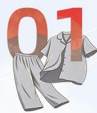

# 合规筑基 稳健发展

党建引领

公司治理

合规及风险管理

商业道德

信息安全

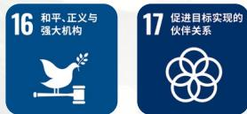

本章回应SDGs目标

# 党建引领

2025 年，龙头股份党委深入贯彻 “围绕中心抓党建，强基固垒促发展” 的工作方针，创新构建 “党建引领、文化落地、业务融合” 运行机制。通过深化 “五力五引领” 体系 \*，公司成功将政治优势转化为发展动能，将组织资源转化为竞争资源，为深化改革与品牌振兴提供了坚实的政治保证。

在此基础上，公司进一步强化“党政协同”机制，统筹加强对产业工人队伍建设改革的组织领导。充分发挥工会组织的桥梁纽带与牵头抓总作用，凝聚多方合力，确立“以党建促改革、以改革强发展”的良性循环，持续为企业的高质量发展注入强劲动力。

2025 年，龙头股份党委持续夯实组织根基，下设 11 个党支部，汇聚 239 名党员力量，全年召开党委会 25 次，规范审议 “三重一大” 重大事项 86 项；通过严格落实 “第一议题” 学习 25 次、组织中心组学习 30 次，不断强化政治引领；基层建设成效显著，荣获国资委 “示范党支部” 1 个、集团 “一级支部” 5 个；同时大力推动队伍年轻化与专业化，80 后党支部书记占比高达 90.9%，中层干部平均年龄降至 44.4 岁（其中 80/90 后占比达 56.8%），成功构建起结构优化、活力充沛的骨干梯队，为企业高质量发展注入强劲动能。

# “五力五引领”体系：

指龙头股份党委构建的党建工作机制，具体包括：

·强化政治引领，锻造“向心力”；  
·夯实组织引领，锻造“凝聚力”；  
·深化示范引领，锻造“带动力”；  
·促进赋能引领，锻造“创新力”；  
·构建作风引领，锻造“约束力”。

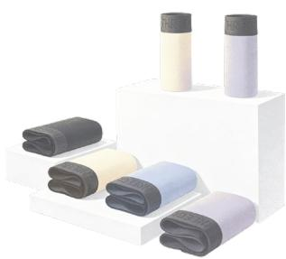

natural_image

Product display of folded towels and containers on white shelves (no text or symbols visible)

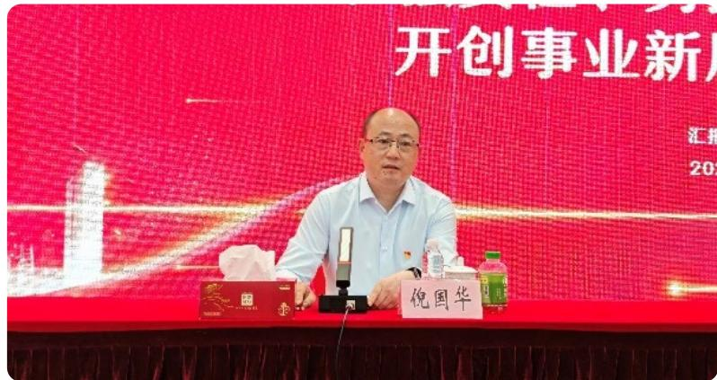

text_image

开创事业新
汇报
201

# 案例：举办警示教育大会及专题党课，筑牢廉洁防线。

公司党委深入贯彻中央八项规定精神学习教育，举办庆祝中国共产党成立104周年暨全面从严治党警示教育会议，筑牢廉洁防线；组织‘红旗渠’研学等红色教育实践活动，弘扬艰苦奋斗作风；扎实推进学习教育，通过动员部署、专题研讨、案例警示等多种形式，确保党员干部学纪、知纪、明纪、守纪。

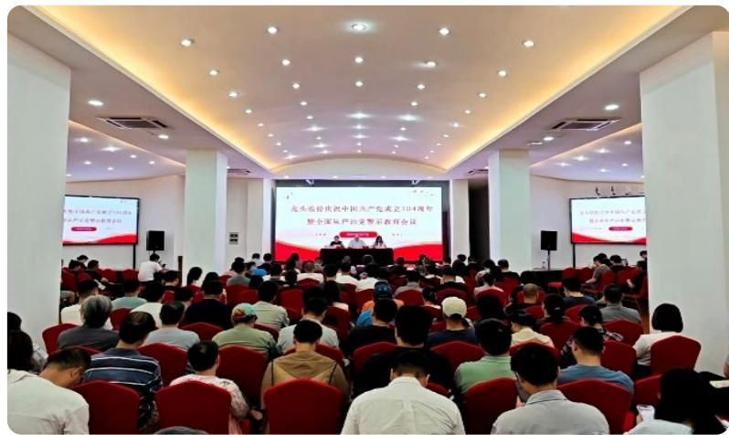

text_image

龙头庆祝庆祝中国共产党成立10周年
新中国共产党的党员教育会议

主题教育活动现场

# 案例：党建与业务深度融合

公司创新实施“一支部一特色”项目，推动党建工作与生产经营深度耦合，在品牌复兴、海外拓展、数字化转型及供应链优化等关键领域取得实质性突破。

<table><tr><td>重点议题</td><td>实践举措</td><td>具体成效</td></tr><tr><td>产品创新与品牌责任</td><td>第五党支部主导“民光”品牌90周年焕新,推出“百子图”国潮礼盒,将传统文化与现代设计融合。</td><td>·首发售罄时间:20分钟·单品销售额:&gt;100万元·入选行业品牌故事案例:1项</td></tr><tr><td>全球化与市场拓展</td><td>第七党支部党员先锋队在肯尼亚建立三枪销售展示中心,并依托埃塞俄比亚基地开拓咖啡豆直采业务,践行“双循环”战略。</td><td>·新建品牌海外销售中心:1个·建立跨境直采基地:1个</td></tr><tr><td>数字化转型与效率</td><td>第八党支部牵头构建“大监督”体系,上线财务共享、合同管理及库存中心系统,提升运营透明度与效率。</td><td>·新增核心数字化模块:3套</td></tr><tr><td>供应链管理与降本</td><td>第四党支部推进“成衣采购数据管理系统”,优化供应商评估体系,强化供应链韧性与合规性。</td><td>·供应链数据化管理覆盖率显著提升</td></tr><tr><td>绿色研发与标准制定</td><td>第九党支部推动航天技术民用化,研发“绒棉”、“抗菌厚棉”系列,并形成“三枪红”企业色值标准。</td><td>·形成独家色彩标准:1项·推出绿色功能新品系列:2个</td></tr><tr><td>人才发展与赋能</td><td>第三党支部搭建“职工学堂”,联合高校开展人工智能、知识产权等专项培训,构建终身学习体系。</td><td>·年度培训人次:2,880人次·获授人才联盟合作伙伴称号</td></tr><tr><td>市场攻坚与客户服务</td><td>第十党支部组建3支党员突击队,聚焦新零售转型,构建“专业内衣+生活方式”服务生态。</td><td>·组建专项攻坚团队:3支</td></tr><tr><td>重大项目与社会信任</td><td>第一党支部发挥党建背书作用,成功中标太保工服、申通地铁等标杆项目,提升品牌公信力。</td><td>·中标大型政企项目:2项</td></tr></table>

关键绩效

<table><tr><td>指标</td><td>单位</td><td>数值</td></tr><tr><td>下设党支部数量</td><td>个</td><td>11</td></tr><tr><td>在册党员人数</td><td>名</td><td>239</td></tr><tr><td>全年召开党委会次数</td><td>次</td><td>25</td></tr><tr><td>审议“三重一大”事项</td><td>项</td><td>86</td></tr><tr><td>落实“第一议题”学习</td><td>次</td><td>25</td></tr><tr><td>组织中心组学习</td><td>次</td><td>30</td></tr><tr><td>获评国资委“示范党支部”</td><td>个</td><td>1</td></tr><tr><td>获评集团“一级支部”</td><td>个</td><td>5</td></tr><tr><td>80后党支部书记占比</td><td>%</td><td>90.9</td></tr><tr><td>中层干部平均年龄</td><td>岁</td><td>44.4</td></tr><tr><td>80/90后中层干部占比</td><td>%</td><td>56.8</td></tr></table>

# 公司治理

# 完善治理体系

公司严格依据《公司法》《证券法》《上市公司治理准则》《上海证券交易所股票上市规则》等法律法规及《公司章程》相关规定，构建了股东会、董事会和经营层权责清晰、分工明确、有效制衡的法人治理结构，确保公司决策科学规范、治理高效有序、运营稳健可控。

公司董事会下设 4 个专门委员会，为董事会科学决策提供专业支撑与决策参考。2025 年，公司依据新《公司法》取消了监事会，将原监事会职能合并至董事会审计委员会，进一步优化治理架构，提升治理效能。

董事会专门委员会职责

<table><tr><td>审计委员会</td><td>主要负责公司内外部审计工作的沟通协调,对公司财务状况、重大关联交易及内部控制运行情况进行监督检查,并对高级管理人员履职及公司运营中的重大风险事项履行监督职能。报告期内,审计委员会共召开会议8次,审议事项24项。</td></tr><tr><td>战略与可持续发展委员会</td><td>主要负责对公司长期发展战略、重大投资决策以及可持续发展相关事项开展研究并提出建议,为董事会决策提供专业支持。报告期内,战略与可持续发展委员会共召开会议1次,审议事项1项。</td></tr><tr><td>提名委员会</td><td>主要负责对公司董事、高级管理人员的提名、更换、选任标准和程序等事项进行研究并提出建议,对董事会负责。报告期内,提名委员会共召开会议2次,审议事项5项。</td></tr><tr><td>薪酬与考核委员会</td><td>主要负责制定并审查公司董事及高级管理人员的薪酬政策与方案,建立科学的绩效考核机制,并对董事会负责。报告期内,薪酬与考核委员会共召开会议1次,审议事项2项。</td></tr></table>

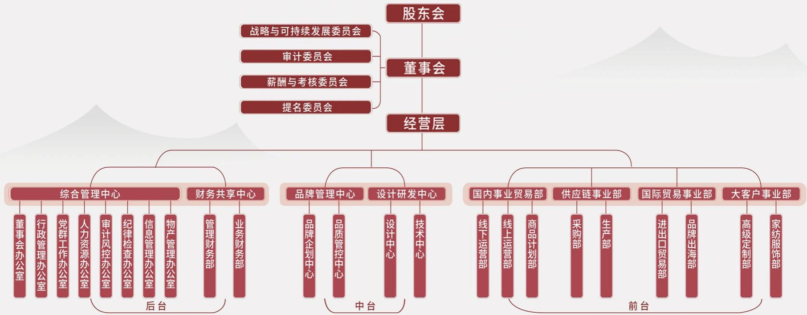

flowchart

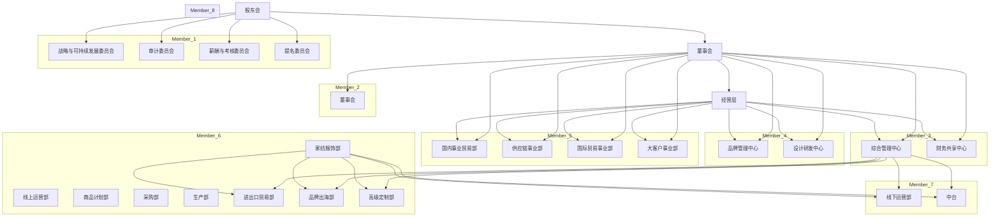

# 加强董事会建设

完成新一届董事换届选举，新一届董事会由9名成员组成，其中女性董事占比 $44.4\%$ ，独立董事占比 $33.3\%$ 。董事会成员平均年龄约48.6岁，年龄结构覆盖37-54岁，形成经验与活力并重的合理梯队；硕士及以上学历成员占比 $55.6\%$ ，具备较强的专业能力和决策支撑。公司通过持续优化董事会成员的性别、年龄及专业背景结构，保障董事会决策的独立性、科学性与多元性。

完成《公司章程》《股东会议事规则》《董事会议事规则》等17项配套制度的修订发布，进一步健全以股东会、董事会及专门委员会、高级管理人员为核心的多层次内部治理体系。

全年召开 5 次董事会，审议通过 46 项议案。

关键绩效  
指标    比例

<table><tr><td>董事会成员男女比例</td><td>5:4</td></tr></table>

<table><tr><td>非独立董事:独立董事</td><td>6:3</td></tr></table>

# 股东回报

公司高度重视股东回报，制定现金分红方案，保持公司利润分配政策的连续性和稳定性，增强投资者的信心。

<table><tr><td>年份</td><td>每10股现金分红（元）</td><td>派现总额（含税元）</td><td>占合并报表中归属于公司股东净利润的比例（%）</td></tr><tr><td>2023年</td><td>0.12</td><td>5,098,339.16</td><td>31.97%</td></tr><tr><td>2024年</td><td>0.38</td><td>16,150,384.65</td><td>40.38%</td></tr><tr><td>2025年（含拟派发）</td><td>0.388</td><td>16,484,629.96</td><td>35.03%</td></tr></table>

# 强化信息披露

为规范公司信息披露行为，提升治理效能，切实保护投资者合法权益，公司严格依据《公司法》《证券法》《上市公司信息披露管理办法》《上市公司治理准则》《上海证券交易所股票上市规则》及《公司章程》的相关规定，制定并持续实施《信息披露管理制度》，全面规范信息披露流程与责任分工。

上海证券交易所网站（www.sse.com.cn）和《上海证券报》《中国证券报》为公司指定信息披露媒体。

报告期内，公司坚持真实、准确、完整、及时、公平的信息披露原则，累计发布定期报告4份、临时公告32份。

2025 年度没有发生违反信息披露规定而受到处罚的事件。

# 投资者关系管理

2025 年，公司修订并完善了《投资者关系管理制度》，进一步规范投资者沟通与信息披露工作。公司通过业绩说明会、投资者热线电话、电子邮箱及官方微信公众号等多元化渠道，与投资者保持持续、畅通的沟通。

报告期内，公司共召开定期报告业绩说明会3次，投资者提问回复率100%，并通过上证E 互动平台累计回复投资者咨询26条。

natural_image

Illustration of two people working at a table with clothing items and racks in the background (no text or symbols)

# 合规及风险管理

构建科学完善的风险合规管理体系，是公司实现可持续发展的坚实基石。公司严格遵循《企业内部控制基本规范》及《企业内部控制应用指引》等监管要求，秉持“全面覆盖、动态监控、分级管理”的核心原则，创新构建了由“治理层监督、管理层执行、业务层落实”组成的三级风控架构，为驱动企业高质量发展提供了强有力的制度保障与安全屏障。

# 治理

01

董事会下设审计委员会。内部审计部门独立运作，直接向审计委员会汇报工作，每年实施财务收支审计、内控审计等专项监督。

# 战略

02

公司将风险管理深度融入总体战略规划，依托全面预算管理优化资源配置与业务结构，主动应对市场波动风险。在专项风险管控方面：

信用风险：建立全覆盖的客户信用档案体系，实施动态信用评级与监控机制，从源头把控交易风险。操作风险：严格执行《风险预警和突发事件应急处理管理制度》，通过常态化内控培训与全流程节点监控，筑牢运营安全防线。风险对冲与重点管控：灵活运用中国出口信用保险（中信保）等金融工具有效对冲风险敞口；对供应链安全、海外业务运营等高风险领域实施提级管理，强化事前评估与事中监控，确保公司在风险可控的前提下实现收益最大化，达成风险与收益的动态平衡。

# 风险管理

03

公司构建“风险识别 - 评估 - 应对 - 监控”全流程闭环机制，通过定性与定量结合精准锁定市场、信用、操作及法律风险优先级，并采取推广新版合同模板、发布《关于加强公司业务风险管控的通知》及实施“人防 + 机防”联合控制等策略强化抵御能力，实时监测资产负债率、应收账款周转率等关键指标以触发预警响应。

# 指标与目标

04

明确“防控重大风险，守住不发生新的重大经营风险底线”的目标。

风控体系覆盖率：100%

2025年深化内部审计监督，完成经济责任、离任及财务等审计项目共13项，覆盖主要事业部及分公司，并通过回访督导形成整改闭环；同步升级法律与合规管控，全年审核合同7100余份、处理纠纷27件，创新实现6类重点合同的智能化模板生成与流程闭环，开展合规培训覆盖100余人次，坚决守住“不发生新的重大经营风险”底线，确保持续稳健运营。

关键绩效

<table><tr><td>指标</td><td>单位</td><td>数值</td></tr><tr><td rowspan="6">内部审计监督</td><td>审计项目总数</td><td>13项</td></tr><tr><td>其中:经济责任审计</td><td>4项</td></tr><tr><td>其中:离任及财务审计</td><td>9项</td></tr><tr><td>新增审计建议</td><td>31条</td></tr><tr><td>整改完成总数</td><td>24条</td></tr><tr><td>尚余未整改项</td><td>7条</td></tr><tr><td rowspan="5">法务与合规</td><td>合同审核总量</td><td>7,100+份</td></tr><tr><td>纠纷案件处理</td><td>27件</td></tr><tr><td>非诉事务/咨询</td><td>31起</td></tr><tr><td>合规培训场次</td><td>3场</td></tr><tr><td>培训覆盖人数</td><td>100+人次</td></tr><tr><td rowspan="2">数智化风控</td><td>AI智能合同模板</td><td>6类</td></tr><tr><td>流程优化项</td><td>1项</td></tr><tr><td rowspan="2">风控管控成效</td><td>重大经营风险事件</td><td>0起</td></tr><tr><td>风控体系覆盖率</td><td>100%</td></tr></table>

# 风险管理机制

公司将风险管理要求嵌入公司经营管理各环节，形成“治理层监督、管理层执行、业务层落实”的三级风险管理架构，实现对风险的识别、评估、应对和监督的全过程管理。

治理层通过审计委员会监督管理层履职，审批重大风险应对策略；

管理层制定具体风控措施（如《资金使用审批的规定》），指导业务层执行；

业务层落实风险防控（如存货库龄预警），并通过定期报告反馈至管理层与治理层。

# 风险管理体系

公司已构建覆盖财务、业务及管理全流程的内部控制与风险管理制度体系，形成以制度为基础、以执行为抓手、以监督为保障的长效机制。

在具体执行层面：

《全面预算管理制度》：强化预算全过程管控，对预算执行情况实施持续跟踪与分析，并将风险管理要求纳入相关绩效考核；

《内部审计管理制度》: 实现内部审计覆盖率 100%, 审计整改完成情况纳入绩效考核, 形成闭环管理;

《重大风险预警和突发事件应急处理管理制度》：明确重大风险和突发事件的分级响应机制，要求1小时内上报、24小时内启动应急响应，有效提升风险处置的及时性与规范性。

natural_image

Illustration of two people in dynamic poses against a textured pink background (no text or symbols)

# 风险管理程序

针对市场、财务、运营、战略、合规等多重风险，公司建立“全员参与、分级负责”的风险防控机制，各职能部门按职责识别风险并制定差异化应对策略。同时搭建动态风险监控指标体系，实行定期研判与报告，形成“识别-评估-应对-监控”管理闭环，通过持续优化确保各类风险可控，为战略目标稳健落地筑牢安全屏障。

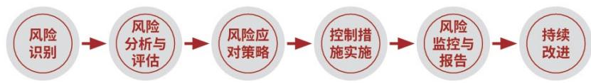

flowchart

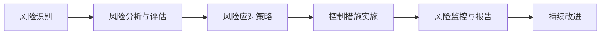

# 案例：数智化赋能--AI合同模板体系重塑管理流程

传统合同管理模式存在起草耗时、审批流程冗长（审批与用印分离）、标准不一等痛点，难以满足业务快速扩张的需求，且人工审核存在合规疏漏风险。

关键行动：

·体系初建：协同信息办搭建 AI 模板合同体系，选取定西路租赁、电商授权 / 分销、线下经销、龙头家纺采购等 6 类高频重点合同作为突破口。

·流程重构：打破部门壁垒，将原“合同审批”与“合同用印申请”两个独立流程合并为“一站式”闭环流程。

·功能升级：实现合同的模块化、素材化、智能化和动态化生成，支持从起草、审核、用印到归档的全生命周期管理。

·推广落地：于2025年10月8日正式上线，配套开展“线上+线下”培训及操作视频录制，建立实时答疑机制。

实施成效：

·效率飞跃：审批环节精简50%，实现合同流转“零断点”。

·合规加固：通过标准化模板从源头规避法律条款风险。

·用户认可：新流程运行平稳，获得业务部门一致好评，标志着公司从“人防”向“技防”的关键跨越。

# 案例：穿透式监督--审计整改闭环机制显实效

过往审计工作中常出现“重发现、轻整改”现象，部分历史遗留问题长期挂账，导致内控缺陷无法根除，审计价值未能充分释放。

# 关键行动：

·全面覆盖：2025年完成13项审计项目，覆盖国内贸易、供应链、国际贸易及大客户高定四大核心事业部，以及外地分公司和工会专项。

精准把脉: 针对财务收支、资产管理及内控执行开展“贴合性检查”, 全年新增审计建议 31 条, 发出风险提示 30 条。

·铁腕督导：建立“回访+指导+敦促”的整改追踪机制。对整改不到位单位“点对点”提出指导意见，明确责任人。

·分类攻坚：区分“当年新问题”与“历史遗留问题”，实行销号制管理。

# 实施成效：

·高整改率：全年监督整改完毕24条，整体整改率达77%。

·即时响应：当年发现的问题中，24条实现“当年发现、当年整改”，整改响应速度显著提升。

# 案例：全域合规护航--构建“事前预警 + 事中控制”防线

面对复杂多变的市场环境和新《公司法》的实施要求，公司需在不发生新的重大经营风险底线之上，平衡业务拓展速度与合规安全。

# 关键行动：

·高强度支撑：法务团队全年深度嵌入业务前端，累计审核合同7,100余份，处理纠纷案件27件，提供非诉咨询31起。

·全员赋能: 开展 3 场专项法律培训, 覆盖业务及关键岗位 100 余人次, 强化“第一责任人”意识。

·体系协同：以2024版《内控制度》为准绳，推动审计监督与内控建设双向协同，形成“设计有效、执行有力、监督独立”的治理格局。

·底线坚守：确立“防控重大风险”为核心目标，实施穿透式监管。

# 实施成效：

·零重大事故：全年未发生新的重大经营风险事件，牢牢守住安全底线。

·纠纷化解：妥善处置27起纠纷案件，最大程度挽回了公司经济损失。

·治理升级：初步建成覆盖全事业部及分子公司的风控体系，推动公司从“分散管控”向“协同治理”跃升。

natural_image

Close-up of white chess pieces on a board, one playing a key (no text or symbols visible)

# 商业道德

# 反不正当竞争

公司严格遵守刑法、反不正当竞争法等相关法律法规，恪守依法合规、诚信经营原则，维护公平有序的市场环境，对商业贿赂、洗钱、垄断等不正当竞争行为零容忍。

报告期内，公司未因反不正当竞争、利益冲突、洗钱或内幕交易等事项受到行政处罚或罚款，亦未发生相关调查、诉讼或和解情形，整体合规经营情况良好。

# 反商业贿赂及反贪污

公司严守廉洁合规底线，遵循相关法律法规推进反商业贿赂、反贪污管理，制定《反舞弊管理制度》，将廉洁合规要求融入公司治理与内控体系。

# 风险识别与防控机制

公司从集团、业务及关键岗位多维度排查舞弊风险，重点防范受贿回扣、侵占资产、财务造假、利益冲突、信息泄露等高风险行为，通过权限分离、审批管控、交叉核查等内控手段筑牢合规防线。

全员按年度填报并动态更新利益冲突申报表，全面排查关联关系、亲属任职等潜在风险，强化事前管控。

  
ok

  
哈哈哈

  
八卦

  
我想想

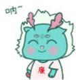  
给你花花

  
-

  
在吗

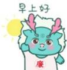  
早上好  
纪检廉洁文化形象“代言人”--枪枪龙的表情包

# 治理与职责分工

公司建立层级清晰的反舞弊责任体系，各部门及下属单位负责人为本单元廉洁管理第一责任人，负责内控完善、风险识别与整改落地。

纪检与审计风控部门统筹监督全公司反舞弊工作，开展年度风险评估并及时上报管理情况。

# 举报与调查机制

公司开通独立畅通的廉洁举报电话（20971069）与邮箱（ltjc@shanghaidragon.com.cn），规范受理、调查、处置全流程；实名举报实行分级限时办理，严格保护举报人，严禁打击报复。

# 处理与问责

一经查实贿赂、贪污及舞弊行为，公司依规给予经济处罚、行政处分直至解除劳动合同；涉嫌违法的移送司法机关。同时复盘内控漏洞并完成整改闭环。

报告期内，公司未发生重大贿赂、贪污及舞弊案件，亦无相关行政处罚、重大诉讼及合规纠纷。

绩效总结

<table><tr><td>指标</td><td>单位</td><td>数值</td></tr><tr><td>反腐败培训开展次数</td><td>次</td><td>2</td></tr><tr><td>反腐败培训参与人数</td><td>人</td><td>243</td></tr><tr><td>签署《反商业贿赂廉洁承诺书》</td><td>份</td><td>166</td></tr><tr><td>签署《国有企业管理人员经营管理活动中防止利益冲突有关情况登记表》</td><td>份</td><td>166</td></tr></table>

# 信息安全

龙头股份严守网络安全、数据安全及个人信息保护相关法规，将信息安全与隐私保护列为合规管理核心底线。

报告期内，公司组织开展网络安全专题培训 1 次、网络安全应急演练 1 次，共有 28 名员工接受数据安全与隐私保护相关培训，有效提升了员工的信息安全意识和应急处置能力。全年未发生信息泄露、数据安全违规或相关监管处罚事件，信息安全管理运行总体平稳。

# 治理与责任分工

公司高度重视信息安全与数据保护，将其纳入公司治理和风险管理体系。设立由董事长任组长、各部门负责人为成员的信息安全领导小组，统筹审批相关策略标准并督导工作；同步设立信息安全工作小组，负责具体实施、跨部门协调、监督检查及重大事件应急处置，构建起职责清晰的自上而下信息安全治理架构。

natural_image

Close-up of a wooden gavel resting on a computer keyboard (no visible text or symbols)

# 管理体系与制度建设

公司建立完善的信息安全管理体系，覆盖信息系统全生命周期。参照 ISO/IEC 27001 制定《信息安全管理制度》，以保障信息资产保密、完整、可用为核心，管理范围涵盖机房、系统、网络、访问控制、数据安全及事件管理等关键领域，为信息化运营筑牢制度保障。

# 技术措施与运行控制

在具体执行层面，公司通过多项技术和管理措施提升信息安全防护能力，包括：

·按照信息安全等级保护要求建设和运维信息系统，强化防火墙、防病毒、漏洞检测和补丁更新等技术防护；

·严格实施系统访问控制，遵循最小权限、职责分离和按需审批原则，确保账号、权限和操作行为可追溯；

·对重要数据和文档采取加密、分级存储和定期备份措施，保障数据安全与业务连续性；

通过堡垒机、日志审计等手段，对系统运维和关键操作实施全过程监控。

# 培训与持续改进

公司定期开展信息安全检查、风险评估及信息安全培训，覆盖安全意识教育、岗位技能培训和应急预案演练等内容，不断提升员工的信息安全意识和操作规范性。同时，公司持续跟踪信息安全相关法律法规和技术发展趋势，动态完善制度和管理措施，推动信息安全管理水平的持续提升。

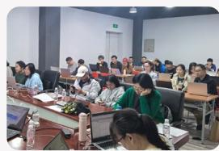

natural_image

Group of people seated in a conference room with laptops and microphones (no visible text or signage)

数据安全培训

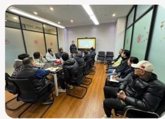

natural_image

Interior view of a meeting room with participants seated around a long table, facing a presentation screen (no visible text or signage)

网络安全培训

# 信息安全事件管理与应急机制

公司建立了信息安全事件报告和应急响应机制，明确事件发现、上报、调查、处置和复盘流程。

# 预防预警阶段

·信息监测与报告

·预警处理与发布

# 应急响应阶段

· 先期处置

· 应急指挥

· 应急支援

·信息处理

· 应急结束

# 后期处置阶段

·善后处理

·调查评估

# 保障措施

· 数据保障

· 应急队伍保障

·经费保障

# 监督管理

·宣传教育

·责任与奖惩

信息安全应急响应流程

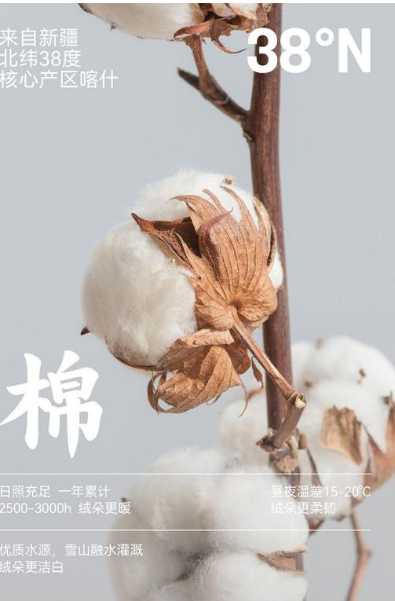

text_image

来自新疆
北纬38度
核心产区喀什
38°N
棉
日照充足 一年累计
2500-3000h 绒朵更暖
昼夜温差15-20°C
绒朵更柔韧
优质水源，雪山融水灌溉
绒朵更洁白

natural_image

Woman in maroon T-shirt with white line drawing, seated beside a green vase and wooden stand (no text or symbols visible)

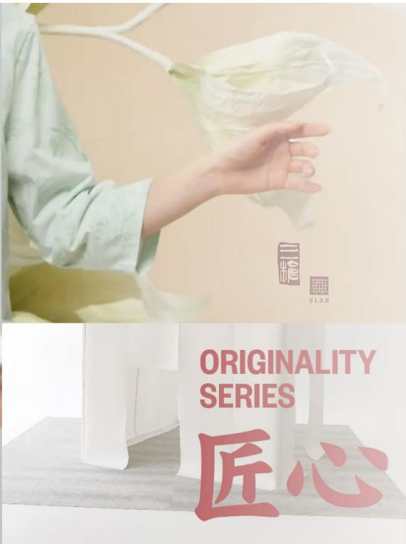

text_image

ORIGINALITY
SERIES
匠心

# 对匠心的定义

匠心不仅源自三枪88年+的品牌沉淀和前沿研究，同时也是对每一位消费者诉求的解答，严格选控，匠艺在我，口碑在你心。

严选甄稀面料
致敬经典

natural_image

Person cutting fabric with scissors on a textile workbench, no visible text or symbols

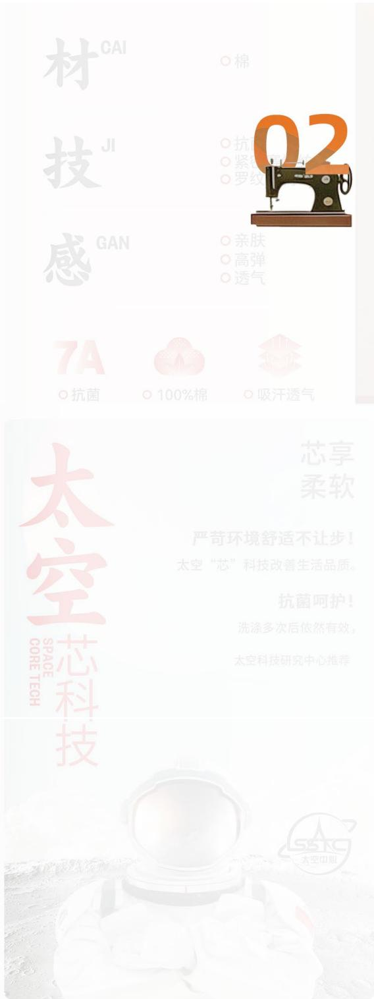

text_image

材
技
感
7A
抗菌
100%棉
抗
棉
02
○亲肤
○高弹
○透气
吸汗透气
太空
芯科技
SPACE
CORE TECH
芯享
柔软
严苛环境舒适不让步！
太空“芯”科技改善生活品质。
抗菌呵护！
洗涤多次后依然有效，
太空科技研究中心推荐
SSRC
太空中心

# 匠心传承 铸就品质

创新驱动
产品质量
供应商管理
客户服务
负责任营销

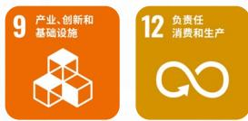

本章回应SDGs目标

# 创新驱动

公司持续推进创新驱动发展战略，通过加强研发投入、优化研发团队结构以及强化知识产权管理，不断提升技术创新能力与产业竞争力。

报告期内，公司持续加大研发资源投入，推动新技术、新工艺和新产品开发，并通过产学研合作与技术平台建设，促进科技成果转化与产业升级。

在研发投入方面，公司研发投入金额达1,548.52万元，研发投入占营业收入比例为 $0.85\%$ 。公司持续加强研发人才队伍建设，研发人员数量55人，占员工总数比例 $4.04\%$ 。在知识产权方面，公司全年共申请专利48项，其中实用新型专利3项、外观设计专利45项；获得专利授权37项，其中实用新型专利3项、外观设计专利34项。同时，公司积极参与行业技术标准制定，共参与制定技术标准5项。

在协同创新方面，公司持续加强产学研合作，与高校及科研机构开展技术交流与项目合作。报告期内，公司开展2个产学研合作项目，与3所高校建立合作关系，并建设2个创新平台，承担1个国家/省级科研项目，持续推动技术创新与成果转化。

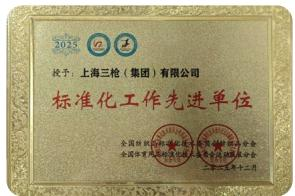

text_image

2015 四三
授予：上海三枪（集团）有限公司
标准化工作先进单位
全国组织部、国家统计局、中国证券监督管理委员会
全国工作委员会办公室

全国纺织品标准化技术委员会针织品分会 / 全国体育用品标准化技术委员会运动服装分会颁发：标准化工作先进单位（2025）

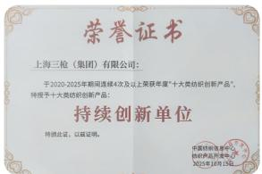

text_image

荣誉证书
上海三枪（集团）有限公司：
于2020-2025年期间连续4次及以上荣获年度“十大类纺织创新产品”，
特许授予十大类纺织创新产品。
持续创新单位
特许批文，以诚实明。
中国纺织出版社
纺织新品开发中心
2020年1月19日

中国纺织信息中心 / 纺织产品开发中心颁发: 持续创新单位（“十大类纺织创新产品” 20-25 年连续 4 次及以上）

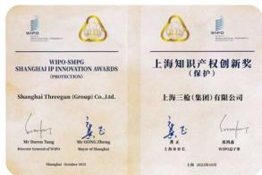

text_image

WIPO-SMIG
SHANGHAI INNOVATION AWARDS
(PRODUCTION)
Shanghai Threngen (Group) Co.,Ltd.
上海知识产权创新奖
(保护)
上海三联(集团)有限公司
L.H. 2023/10/15

上海市政府和世界知识产权组织联合颁授：上海市知识产权创新奖

# 治理

# 01

公司将创新作为企业发展的核心驱动力，建立系统化创新管理体系，对技术研发与知识产权保护进行监督与管理，为员工营造良好的创新环境与研发支持体系，推动企业持续提升创新能力和核心竞争力。

# 战略

# 02

公司通过持续推进技术研发和管理优化，将“舒适、绿色、科技、时尚”的理念融入产品与服务创新中，不断提升产品品质与市场竞争力。同时，公司在人才培养方面实施“走出去、请进来”的培养策略，通过外部学习交流与内部能力建设相结合的方式，持续提升员工专业能力，促进企业可持续发展并保障员工成长与权益。

# 风险管理

# 03

公司通过持续优化研发管理流程和强化专利保护机制，对技术研发及服务过程中的相关风险进行识别与管理。依托研发中心整合技术人才资源，重点聚焦新工艺和纤维技术开发，推动产品技术升级，确保产品质量与服务能力的持续提升。

# 指标与目标

# 04

报告期内，公司研发人员55人，占公司员工总数4.04%；全年专利申请48项，授权37项。研发投入1,548.52万元，研发投入占营业收入比例0.85%。

未来，公司将持续推进专利申请与成果转化工作，并进一步加大研发投入力度，持续提升科技创新能力。

设计研发中心组织架构  
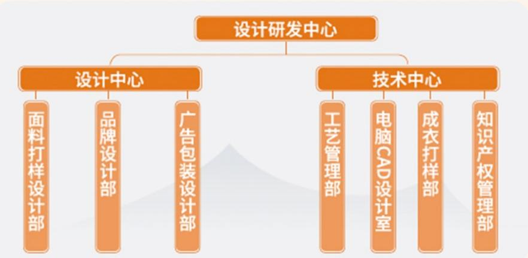

flowchart

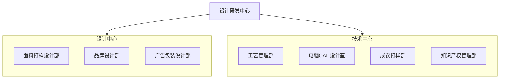

<table><tr><td>核心理念</td><td>以“融合科技时尚编织多彩生活”为使命,围绕“舒适、绿色、科技、时尚”四大主题,增强产品科技含量与时尚元素,提升品牌附加值。</td></tr><tr><td>战略目标</td><td>通过新技术、新纤维、新工艺的研发,将“三枪”打造为国际知名品牌,实现国内领先的功能性面料创新。</td></tr><tr><td>技术路线</td><td>遵循“以人为本、推出一代、研发一代、储备一代”的原则,确保研发的持续性和前瞻性。</td></tr><tr><td>开发策略</td><td>“人无我有、人有我优、人优我精”,形成差异化竞争优势。</td></tr><tr><td>人才培养</td><td>采取“走出去、请进来”策略,通过市场调研、国际考察和高管授课等方式提升设计和研发团队能力。</td></tr></table>

# 产学研合作

# 案例：三枪集团携手华理开启“新国潮”人才孵化新路径

在“第19届中国好创意--老字号·新国潮创新设计专项大赛”中，三枪品牌携手华东理工大学，发起了一场旨在挖掘新锐创意的“青春命题”。通过将老字号的匠心基因与新青年的潮流视野相结合，三枪不仅加速了品牌的年轻化进程，更在实战淬炼中推动了传统制造与前沿设计的交融，探索出品牌文化传承与商业创新的共赢模式。

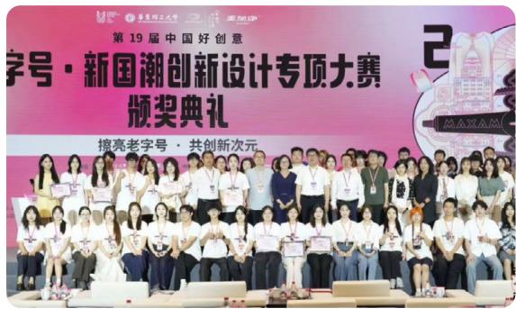

text_image

第19届中国好创意
字号·新国潮创新设计专项大赛
颁奖典礼
擦亮老字号·共创新次元

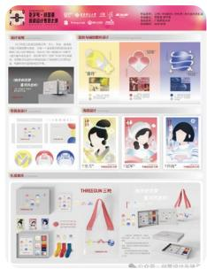

text_image

THIOZION 上地
产品介绍
产品名称：新奥佳（中国）有限公司
产品类型：服装、鞋帽、日用等
定价：10元/件
品牌：中国服装市场
产品描述：中国服装市场
产品特点：男装、女性装
价格：15元/件
规格：120克
有效期：1年
品牌：中国服装市场
产品介绍：中国服装市场
产品特点：男装、女性装
价格：15元/件
品牌：中国服装市场
产品描述：中国服装市场
产品价格：15元/件
品牌：中国服装市场

特等奖

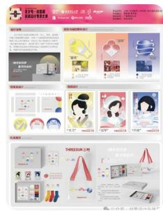

text_image

Scanned webpage screenshot featuring product listings, promotional graphics, and brand logos for a fashion or apparel company.

一等奖

# 案例：三枪×东华大学：技术预见引领“主动热管理”创新

三枪联合东华大学开展功能性针织战略研究，深度研判全球“凉感”与“保暖”技术趋势。项目明确了从“被动调节”向“主动热管理”跨越的技术路线，通过产学研深度协作，为产品研发提供前瞻性理论支撑，驱动品牌科技转型。

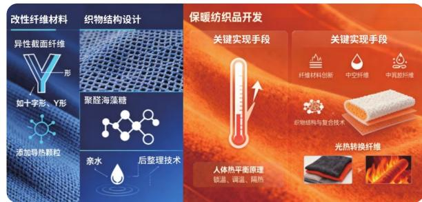

# 产品创新亮点与嘉奖概览

公司始终将创新视为高质量发展的内生引擎，致力于通过科技研发赋能产品升级。2025年，公司依托“航天级多功能面料”“抗菌科技”及“绿色低碳后整理技术”等前沿技术成果，荣获上海市重点产品质量攻关一等奖等多项省部级荣誉。从持续位居市场占有率首位的“三枪”系列产品，到入选“中国针织产品流行趋势”的高端面料，各项荣誉充分展现了公司以核心技术重塑老字号品牌活力、为全球客户创造卓越体验与可持续价值的不懈努力。

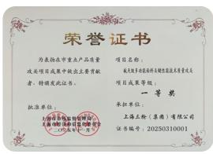

text_image

荣誉证书
为表彰在市重点产品质量
攻关项目成果中做出主要贡献
者，特别发此证书。
批准单位：
上海华联集团有限公司
（盖章）

《航天级多功能面料关键性能技术质量攻关》2025年重点产品质量攻关项目成果一等奖

上海市市场监督管理局  
上海市经济和信息化委员会  
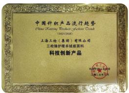

text_image

中国科技产品流行趋势
China Science and Technology Product Launch Conference
2015-2016
上海工检（集团）有限公司
三枪腾护理羊绒面面料
科技创新产品
中国科学技术协会
中国科学技术委员会

三枪臻护暖羊绒感面料 - 中国针织产品
流行趋势 2025/2026 科技 创新产品

中国针织工业联合会  
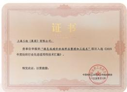

text_image

证书
上海三轮（集团）有限公司。
勇单位申报用“三轮北线医疗设备新制造及技术”项目入选《2015年度新行业先进应用性技术工程》。
特发此证，以要激励。
中国化工工业协会市场监督管理委员会
中国化工工业协会

绿色低碳针织面料后整理加工技术”项目入选《2025年度纺织行业先进适用性技术汇编》  
中国纺织工业联合会科技发展部

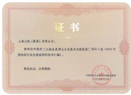

text_image

证书
上海五粮（集团）有限公司：
资格单位申请的“五粮由我单位办理最多限额服务”项目入选《2025年
年度组织行业先进适用性技术汇编》。
特发此证，以要撤单。
中国银行上海市分行营业部
（江苏分行）

“三枪冰泉棉 3.0 凉感 多功能服装”项目入选《2025 年度纺织行业先进适用性技术 汇编》

中国纺织工业联合会科技发展部  
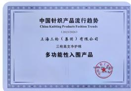

text_image

中国针织产品流行趋势
China Kaiting Products Fashion Trends
(2023/2026)
上海三枪（集团）有限公司
三枪高支萨特
多功能性入围产品

三枪高支净护棉 - 中国针织产品流行趋势  
2025/2026 多功能入围产品

中国针织工业联合会  
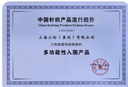

text_image

中国针织产品流行趋势
China Kaiting Products Fashion Trends
(2023/2025)
上海三轮(集团)有限公司
三轮链暖易能颜面料
多功能性入围产品

三枪轻暖热能棉面料 - 中国针织产品流行趋势  
2025/2026 多功能新入围产品  
中国针织工业联合会

关键绩效

<table><tr><td>指标</td><td>单位</td><td>数值</td></tr><tr><td>研发人员数量</td><td>人</td><td>55</td></tr><tr><td>研发人员占员工比例</td><td>%</td><td>4.04</td></tr><tr><td>研发投入金额</td><td>万元</td><td>1548.52</td></tr><tr><td>研发投入占营业收入比例</td><td>%</td><td>0.85</td></tr><tr><td>专利申请数量</td><td>项</td><td>48</td></tr><tr><td>实用新型专利申请数量</td><td>项</td><td>3</td></tr><tr><td>外观专利申请数量</td><td>项</td><td>45</td></tr><tr><td>专利授权数量</td><td>项</td><td>37</td></tr><tr><td>实用新型专利授权数量</td><td>项</td><td>3</td></tr><tr><td>外观专利授权数量</td><td>项</td><td>34</td></tr><tr><td>技术标准参与制定</td><td>项</td><td>5</td></tr><tr><td>产学研合作项目</td><td>个</td><td>2</td></tr><tr><td>与高校合作数量</td><td>个</td><td>3</td></tr><tr><td>创新平台数量</td><td>个</td><td>2</td></tr><tr><td>国家/省级科研项目</td><td>个</td><td>1</td></tr></table>

# 产品质量

公司始终以品质为发展根基，致力于为客户提供高质量的产品与优质服务。通过持续完善质量管理体系，严格把控产品质量，持续优化服务流程，公司切实保障客户隐私与合法权益，不断提升客户体验与满意度，推动与客户实现长期稳定合作与互利共赢的发展关系。

text_image

SAC/TC209/SC6
授予：上海三枪（集团）有限公司
匠心坚守奖
全国纺织品标准化委员会计织品分会
二零五年十二月

全国纺织品标准化技术委员会针织品分会颁发：匠心坚守奖

  
全国纺织品标准化技术委员会针织品分会颁发：匠心坚守奖

# 治理

# 01

公司建立了覆盖原材料采购、生产加工、质量检验及产品交付等环节的质量管理体系，通过制度化管理与过程监督，确保各生产环节符合质量标准要求，为消费者提供稳定可靠的产品与服务。

# 战略

# 02

公司持续强化产业链质量管理能力，通过优化质量管理流程、完善检测机制与全过程质量控制，确保产品从研发设计、生产制造到终端交付的全生命周期符合高标准质量要求，不断提升产品品质与客户满意度。

# 风险管理

# 03

公司通过质量检验制度、定期质量分析会议等机制，持续识别与管控生产及服务过程中的质量风险，推动问题闭环整改，并加强员工质量意识与服务能力建设，确保各环节符合质量管理规范。

# 指标与目标

# 04

公司持续推进质量提升目标。报告期内，公司产品合格率保持在 $99\%$ 以上。同时，公司及下属7家企业通过ISO9001质量管理体系认证，通过标准化管理体系持续提升产品质量与服务水平。

# 产品质量管理体系

公司持续完善产业链与供应链质量管理体系，加强对纺织原料、面料及辅料等上游环节的质量管控，严格落实全过程质量检验，确保产品在各生产环节均符合高标准要求。公司及旗下时尚定制、龙头家纺、龙头进出口、三枪针织、针织九厂及江苏大丰工厂等七家公司均通过ISO 9001质量管理体系认证，并获得IQNET国际互认组织证书，为持续提升产品质量与服务水平提供了有力保障。

# 技术创新赋能功能产品

在功能技术方面，公司持续推进产品技术升级。2025秋冬新品围绕“航天技术民用化”开展创新研发，推出火绒棉、新华绒等功能系列产品，通过远红外发热纤维、吸湿发热及抗菌技术，为消费者提供更加温暖舒适的穿着体验。同时，公司依托航天面料民用化的核心抗菌技术，自主研发原纱抗菌棉系列产品，持续强化产品健康防护属性，全面提升使用安全与品质附加值。

natural_image

Abstract graphic with three orange upward arrows on a gradient orange-yellow background (no text or symbols)

运用天然棉纤维远红外发热、抗菌防螨等航天技术，推出新品火绒棉内衣系列。

funnel

| Pathogen | Immunization Rate (%) |
| --- | --- |
| 葡萄球菌 | \(\ge 99\) |
| 大肠杆菌 | \(\ge 90\) |
| 白色念珠菌 | \(\ge 93\) |

依托航天面料民用化的抑菌技术，推出能达到行业最新抗菌标准的抗菌厚棉系列和抗菌罗纹棉系列。

natural_image

Abstract orange circular shapes on a light background, no text or symbols present

运用航天暖感技术，持续迭代超薄、超弹及吸湿发热等功能，推出新华绒系列。

# 设计理念与品牌文化融合

在品牌发展方面，公司以“三枪88周年大秀”为契机，通过“过去-现在-未来”的时间线展示品牌发展历程，并通过“一衣多穿”的设计理念诠释产品在不同生活场景中的多元搭配可能，进一步提升产品设计价值与消费者体验。

# 供应商管理

供应链管理是公司保障产品质量、稳定交付、控制采购风险和提升经营韧性的重要基础。公司结合家纺服饰和品牌采购业务特点，持续完善供应商管理机制，围绕供应商分类、准入审核、动态评估和分级应用等关键环节，推动供应链管理规范化、精细化和协同化，不断提升供应链稳定性和综合保障能力。

公司积极推动供应商获得环保相关国际认证，已完成：

Higg 认证：3 家工厂获得 Higg 认证，提升供应链环境绩效管理能力

GOTS 认证：完成全球有机纺织品标准认证

GRS 认证：完成全球回收标准认证

# 治理

01

公司高度重视供应链管理，建立完善的供应链管理体系，对供应商准入、评估与管理进行规范化监督，确保供应商在稳定、可靠的供应链环境中提供优质产品与服务，从而提升整体运营效率和供应链韧性。

# 战略

02

公司通过实施供应商分类管理与绩效评估机制，持续提升产品质量与交付效率，强化供应链协同能力。同时，公司坚持“公开、公平、公正”的采购原则，积极推动可持续采购实践，促进供应链伙伴共同发展，并持续提升市场竞争力和员工工作环境。

# 风险管理

03

公司通过供应商尽职调查和定期评估机制，对供应商在价格、技术、质量及合规等方面进行综合评估，及时识别和管理潜在风险。采购部门与相关业务部门协同开展供应商管理工作，确保供应商合规经营，保障供应链稳定运行与产品质量安全。

# 指标与目标

04

2025 年供应商总数 420 家，考核覆盖率 100%，合格率 93.4%，培训 60 家供应商，提升员工与供应链协同服务能力。

# 供应商管理体系

公司家纺服饰部建立了基于合作性质与战略价值的供应商分类体系，将供应商划分为以下类别：

<table><tr><td>战略供应商</td><td>与公司有着长期、广泛合作或频繁交易的正式供应商,为公司提供核心技术产品或可能是唯一的供应商。公司与其签订年度框架协议,向此类供应商采购时,可直接发出采购订单,无需另行签订采购合同。</td></tr><tr><td>优先供应商</td><td>针对某一类产品或服务与公司有着长期合作或频繁交易的正式供应商。公司与其签订价格备忘录以确定年度采购价格,采购时若产品价格已包含在备忘录中,则无需再进行询价、比价工作。</td></tr><tr><td>普通供应商</td><td>与公司有过合作或交易,但未签订任何框架协议或价格备忘录的正式供应商。需就每次采购申请进行询价、比价,并根据有关规定签订单独的采购合同。</td></tr><tr><td>临时供应商</td><td>在现有合格供应商数据库中不存在采购需求物料,但因采购紧急且无时间开发新供应商,经常规询价比价后采用的供应商。</td></tr><tr><td>淘汰供应商</td><td>根据供应商定期评估结果,确定不再与其进行交易的供应商,在采购系统中选择时不可用。</td></tr><tr><td>黑名单供应商</td><td>根据供应商定期评估结果,发现有欺诈、舞弊或诚信不佳的行为,确定需要提请采购职能部门注意、不再与其进行交易的供应商。</td></tr></table>

公司供应链事业部对有成衣业务往来的所有供应商实行年度评估分级管理，旨在进一步加强对供应商的管理，全面提高采购产品质量，优胜劣汰，提升供应链效率与供应稳定性。

# 分级评定原则：

·全面性原则：综合考虑产品质量、产能贡献、交货能力、服务水平、开发能力、风险合规等多个维度  
·客观性原则：坚持公平、公正，以客观数据和事实为依据，由采购部牵头，设计、品控、商品、财务等多部门共同参与评定  
·动态性原则：定期对供应商进行重新评定，根据市场变化和供应商实际表现及时调整等级

评估维度与权重

<table><tr><td>评估维度</td><td>权重</td><td>评估内容</td></tr><tr><td>质量</td><td>38%</td><td>成品检验、售后、封样(含工艺执行)、质量管理体系等</td></tr><tr><td>交付</td><td>31%</td><td>交货准期、订单完成(履约、均衡率)等</td></tr><tr><td>支持</td><td>10%</td><td>服务与支持、紧急订单响应速度、沟通协作顺畅程度、产能贡献等</td></tr><tr><td>能力</td><td>11%</td><td>生产设备匹配、生产规模、技术研发能力、打样配合能力</td></tr><tr><td>风险合规</td><td>10%</td><td>背调情况及经营合规、配合审计询征工作、无长期欠票及坏帐等</td></tr></table>

一票否决机制：对于集团总部客商主数据中“交易方状态”为“黑名单”的供应商，实行一票否决。

分级管理措施

<table><tr><td>等级</td><td>评估得分</td><td>管理措施</td></tr><tr><td>A级</td><td>≥90分</td><td>在订单、付款安排等方面享有优先权</td></tr><tr><td>B级</td><td>80-89分</td><td>维持正常采购,要求供应商持续改进</td></tr><tr><td>C级</td><td>79-70分</td><td>作为次级采购,可作为产能补充及非重要产品采购供应商,要求供应商持续改进</td></tr><tr><td>D级</td><td>&lt;70分</td><td>暂时不予合作。对于特色产品或生产有需求的供应商,可重点辅导,明确整改计划,要求在限定时间内解决主要问题,通过复评升至C级后方可继续合作。如辅导两次以上无改善,取消其合格供方资格</td></tr></table>

# 供应商评估机制

评估组织：公司建立供应商定期评估机制，评估小组成员至少包括商品部采购员及经理、需求部门经理、财务部经理、合同管理部经理或相应部门授权人，由采购部负责召集和领导评估工作。

评估周期：

常规评估：至少每年进行一次

动态评估：若供应商的交货期、品质、价格或服务产生重大变化时，及时进行评估

项目评估：可在项目完成后进行专项评估

# 供应商准入机制

公司实施严格的供应商准入管理，确保新引入供应商的质量与合规性。

供应商调查：采购实施前，由商品部、采购部等相关部门人员组成供应商调查小组，对潜在供应商进行调查评估，填写《供应商调查表》。

调查维度包括：

价格评估：原料价格、加工费用、估价方法和付款方式

技术评估：技术水准、技术资料管理、设备状况及工艺流程与作业标准

品质评估：品质管理组织与体系、品质规范与标准、检验方法与记录、纠正与预防措施

调查结果由各部门做出建议，经总经理核定后方可成为合格供应商。未经调查认可的厂商，除总经理特准外，不可成为本公司供应商。

关键绩效

<table><tr><td>指标</td><td>单位</td><td>数值</td></tr><tr><td>供应商数量</td><td>家</td><td>420</td></tr><tr><td>中国境内供应商数量</td><td>家</td><td>406</td></tr><tr><td>中国境外供应商数量</td><td>家</td><td>14</td></tr><tr><td>供应商考核覆盖率</td><td>%</td><td>100</td></tr><tr><td>供应商考核合格率</td><td>%</td><td>94.9</td></tr><tr><td>开展了社会影响评估考核的供应商数量</td><td>家</td><td>10</td></tr><tr><td>开展了环境影响评估考核的供应商数量</td><td>家</td><td>10</td></tr><tr><td>年度供应商培训次数</td><td>家</td><td>3</td></tr><tr><td>参与培训的供应商总数</td><td>家</td><td>60</td></tr></table>

# 客户服务

公司始终严格遵守《中华人民共和国消费者权益保护法》《个人信息保护法》等相关法律法规，秉持“客户至上”的服务理念，致力于通过高质量产品与专业化服务提升消费者体验。我们承诺：合法合规：确保所有宣传、销售及售后服务活动符合法规要求。

权益保障：全面保护客户隐私、商品质量、服务承诺等合法权益。

持续改进：基于客户反馈和数据分析，不断优化产品、服务与管理体系。

# 管理体系

公司建立了完善的客户服务管理制度体系，包括《顾客满意测量管理规程》《产品质量投诉和售后服务管理制度》等纲领性文件，明确各职能部门职责分工。针对电商业务特点，三枪电商部进一步制定了《客户服务管理制度》及《客户权益保护管理制度》，实现对天猫、京东、拼多多、抖音等全渠道在线客户服务的规范化管理。

在组织架构方面，公司建立了多层级服务保障体系：管理者代表主持客户满意度的测量与部署；贸易部负责客户联络、意见处理及满意度调查组织；综合部负责信息汇总分析及管理评审输入。三枪电商部设立项目经理、客服专员、售后专员、在线客服等专职岗位，确保客户问题得到专业、及时的响应与处理。

# 客户投诉处理机制

投诉受理：客户可通过电话、邮件、信函、实体门店及电商平台客服热线、在线投诉平台等多种渠道反映问题。三枪电商部设立投诉专员岗位，确保客户投诉直达专人处理。

# 处理流程：

·登记与核查：记录投诉人信息及问题描述，组织专业团队进行质量核查  
·方案制定：基于核查结果制定产品更换、维修、退款等解决方案，书面征求客户确认  
·落实与反馈：快速落实处理方案，将处理结果反馈客户并征求意见  
·归档分析：对投诉事件进行归档记录和统计分析，为改进提供依据

改进机制：公司定期对投诉处理情况进行检查评估，按照日、周、月进行客服数据回顾与总结，持续优化服务流程。

# 客户权益保护

公司从四个维度构建客户权益保障体系：

·隐私保护：严格遵守个人信息保护法规，未经客户同意不得泄露个人信息；建立数据备份与恢复机制，确保客户信息安全

·质量保障：确保销售商品符合相关质量标准，功能性商品具备符合国家标准的检测报告

·服务承诺履行：明确售后服务、物流配送等服务标准，并确保按承诺执行

·投诉与纠纷处理：确保客户投诉得到及时、公正处理，并跟踪至客户满意

# 止损与赔偿机制

接到投诉后立即评估潜在影响，必要时采取暂停销售问题商品、召回已售商品等止损措施。若因公司过错导致客户权益受损，依法依规进行赔偿，赔偿方式包括退货、换货、赔偿损失等，确保赔偿金额与方式与客户损失相匹配并征得客户同意。

# 售后服务管理

公司承诺为消费者提供快捷、高效的售后服务，涵盖产品维修、更换、退货和技术支持等。售后服务流程包括：服务申请、服务登记、服务处理、服务反馈四个环节。公司建立售后服务监督机制，通过绩效考核、满意度调查、投诉跟踪等方式进行服务质量评估，并定期组织销售技巧、沟通技巧、产品知识等培训，持续提升服务团队专业素质。

natural_image

Interior view of a modern office with people working at desks using laptops (no visible text or signage)

# 培训与考核

公司定期组织客服团队进行业务知识、沟通技巧、情绪管理等方面的培训。建立涵盖服务态度、响应速度、问题解决率、客户满意度等指标的绩效考核体系，并随电商平台规则动态调整，确保服务标准与行业最佳实践保持一致。

  
客服团队培训

# 案例 电商客户服务规范

天猫旗舰店保持五星店铺评级，客户满意度达95.06%；通过建立售后服务SOP（标准操作流程），平均退款时长从6小时压缩至3.13小时，服务效率与质量双重提升。客户投诉解决率达100%。

关键绩效

<table><tr><td>指标</td><td>单位</td><td>数值</td><td></td></tr><tr><td>客户投诉总量</td><td>件</td><td>473</td><td>统计范围为消费者热线及天猫平台</td></tr><tr><td>客户投诉解决率</td><td>%</td><td>100</td><td>-</td></tr><tr><td>客户满意度调查问卷发放量</td><td>份</td><td>184748</td><td>仅限天猫平台</td></tr><tr><td>客户满意度调查问卷回收量</td><td>份</td><td>50638</td><td>仅限天猫平台</td></tr><tr><td>客户满意度调查问卷回收率</td><td>%</td><td>27.4</td><td>仅限天猫平台</td></tr><tr><td>客户满意率</td><td>%</td><td>95.1</td><td>仅限天猫平台,指满意客户占回收问卷比例</td></tr></table>

报告期内，公司未因客户隐私泄露事件及客户服务相关违规受到行政处罚或罚款。

natural_image

Interior view of a modern office or training session with people seated at desks facing a computer screen, no visible text or symbols.

# 负责任营销

公司秉持诚信经营原则，在品牌传播与市场营销活动中坚持真实、准确、合规的信息披露，尊重消费者权益，致力于通过负责任的产品推广与客户沟通，持续提升品牌美誉度与消费者信任。

# 品牌传播与营销实践

2025年，公司以“三枪88周年庆”为契机，创新打造“时装周大秀+首发快闪店+互动式展览”三位一体的品牌盛典，吸引超500位行业嘉宾到场，国内外媒体曝光总量超8.5亿人次，社媒互动10万次。活动以“强外穿·强打底”为支点，突破传统品类认知，向消费者传递产品创新信息。

# 跨界合作与内容传播

公司集结旗下各品牌深度参与“2025FISE 上海城市运动嘉年华”，打造“坡有可能”品牌专区，四天吸引线下参与及互动超 10 万人次。通过“上海首发、全国辐射”传播策略，整合央广网、新华社等权威媒体及小红书、微博等社交平台，宣发报道 116 篇，曝光总量超 1.2 亿人次，社媒阅读量 818 万次。三枪、民光等品牌以“真实内容 + 挂链直销”模式在抖音、小红书平台实现品效合一，助力核心单品触达年轻消费群体。

# 自媒体内容运营

2025年，三枪官媒发布推文59篇，总阅读量21万次、总互动数1.4万次；发布短视频41条，总播放量超25万次、总互动数1.5万次。其中“3月29日三枪88周年大秀回顾”播放量最高，累计播放17354次。公司通过高质量内容创作，向消费者传递准确、有价值的产品信息。

natural_image

3D rendering of a futuristic building with a circular base and a glowing tower-like structure against a dark background (no text or symbols visible)

natural_image

Fashion runway with multiple models walking on a runway, audience in background (no visible text or symbols)

text_image

Street photo with visible store signboards and people in front of a wall display showing 'TETRICAL' logo and silhouette figures.

text_image

THEORECUN
2025 K/W SHOW
上海好买者 美国名布
2024年1月
THEORECUN 王枪
尖鲨
首页 宝贝 分类 会员

text_image

threegun 王勤
1.8万
16.5万
王均为，超名流长，可选多选大字
王爱建是最集中的关系
更多
关注
个人推荐，我们想想更精彩！
首页
作品 1009
商品

# 品牌出海业务拓展

公司积极布局海外市场，通过多元化渠道推进品牌出海战略，在跨境经营中坚持负责任的产品信息传递与客户服务标准。

# 跨境电商 平台运营

公司在 TEMU 平台实现逆境盈利。在国内外严峻形势下，通过深化市场洞察、加速新品开发、优化产品结构、创新供应链模式等举措，全年 TEMU 平台盈利水平与去年同期持平，体现经营韧性与应变能力。

# 海外仓展销 中心建设

2025 年 5 月，公司非洲肯尼亚展示、销售、仓储中心顺利建成，在建设期间即成功签约首批战略客户，实现工程建设与商业运营同步推进。目前，与两家当地客户建立稳定合作并形成复购，为东非市场深耕奠定坚实基础。

# 新兴市场 拓展

公司加快俄罗斯、埃塞俄比亚等新兴市场的业务布局，探索多元化出海路径。成功完成印尼酒店床品千套试单，并积极推进俄罗斯男士内裤市场试销，依托现有供应链资源加速布局新兴市场。

# 进口业务 协同发展

公司咖啡生豆进口额较去年全年实现翻番，销售同比增长75%。与瑞幸等品牌商建立战略合作，拓宽印尼曼特宁等产区资源，首次实现向品牌商直接供豆；火鸡面业务全年销售同比增长50%，进一步丰富了公司跨境经营的产品矩阵。

# 海外客户 服务承诺

公司在跨境电商、海外仓展销中心及新兴市场拓展中，坚持与国内一致的客户服务标准，确保产品信息真实准确传递，及时响应海外客户诉求，维护“三枪”等民族品牌在国际市场的声誉与形象。

# 全球市场拓展与负责任产品推广

# 案例：

2025 年 11 月，公司以全新品牌形象亮相第 138 届中国进出口商品交易会（广交会）第三期，重点展示涵盖羊毛、运动休闲、羽绒服等自有品牌服装产品，为客商提供多样化的产品选择。依托差异化产品优势、上市公司品牌信誉及全球化柔性供应链体系，持续提升品牌综合竞争力。展会期间累计接待来自美国、欧盟、俄罗斯、中南美洲、中东地区等 200 余家客商，其中南美地区客户占比显著提升，阿根廷、巴西等国客商展现出强劲合作意愿。

  
第 138 届广交会龙头股份展台

# 案例：

2025 年 8 月，公司下属上海龙头进出口有限公司首次亮相以 “科技赋能纺织，功能引领未来” 为主题的 2025 上海国际功能性纺织品（秋冬）展览会，重点展示三大系列产品。

展会期间，公司接待了来自澳大利亚、英国、日本等国家的专业采购商，以及众多国内面料采购商和线上线下品牌采购商。

<table><tr><td>产品系列</td><td>产品类型</td><td>功能特点</td></tr><tr><td>防护类</td><td>抗菌、防紫外线、阻燃面料及成衣</td><td>抗菌面料有效抑制细菌滋生;防紫外线面料适合户外运动场景;阻燃面料符合国家安全标准</td></tr><tr><td>环保类</td><td>再生纤维、可降解面料</td><td>再生纤维以废旧纺织品为原料实现循环利用;可降解面料在自然环境中可自行分解</td></tr><tr><td>舒适功能类</td><td>羊毛类、丙纶类面料及户外运动服装、功能性内衣</td><td>羊毛面料保暖透气、手感柔软;丙纶类面料重量轻、强度高、耐腐蚀</td></tr></table>

# 案例：

2025 年 4 月，公司赴越南参加西贡国际纺织和制衣工业展，该展会是越南唯一获得 UFI 认证的纺织类专业展会，展出面积 33,000 平方米，汇聚 21 个国家和地区的 1,350 家参展企业。

公司展位重点展示梭织印花面料、雪纺及时尚女装面料等核心产品，其中梭织印花面料凭借独特设计获得多家优质客户关注，雪纺类产品因质地优良受到市场认可，时尚女装面料成为年轻买手咨询热点。通过四天展期观察，公司系统收集了东南亚市场对印花工艺、面料功能性的最新需求，为后续产品开发提供重要参考。

# 负责任营销声明

公司在国内外所有营销渠道及参展活动中，始终坚持产品信息的真实、准确、完整披露，确保宣传内容与产品实际功能相符。报告期内，公司未因负责任营销相关违规受到行政处罚或罚款。

6 清洁饮水和卫生设施  

7 经济适用的清洁能源  

13 气候行动  

本章回应SDGs目标

应对气候变化

绿色生产

环境合规管理

污染物与废弃物管理

水资源利用

能源利用

# 低碳践行 绿动未来

# 应对气候变化

# 应对气候变化

公司积极响应国家“双碳”战略，致力于推动纺织全产业链绿色低碳高质量发展。围绕绿色制造和可持续运营，公司持续推进智能化升级、环保工艺研发和绿色产品设计，不断优化生产经营模式，减少资源消耗和碳排放。同时，公司积极倡导绿色办公理念，推动员工养成低碳生活习惯，全面提升绿色发展水平，加快向绿色、低碳、可持续发展方向转型。

# 治理

# 01

公司高度重视可持续发展治理，建立由管理层牵头的战略与可持续发展委员会，明确各部门及下属公司在环境保护、节能减排和绿色转型中的职责分工。通过持续完善治理架构和跨部门协同机制，公司推动低碳发展举措和环境管理要求有效落实，为绿色转型提供坚实的组织保障。

# 战略

# 02

公司将应对气候变化作为可持续发展的重要方向，围绕绿色低碳转型持续完善发展路径。通过优化业务布局、推进产品绿色化和制造低碳化、强化供应链绿色管理，并积极引入先进绿色技术和管理创新，公司不断提升绿色发展能力，夯实可持续发展基础。

# 风险管理

# 03

公司持续识别、评估和应对与气候变化相关的短期、中期和长期风险与机遇。针对政策法规变化、市场需求转型、技术迭代升级以及极端天气事件等潜在影响，公司不断完善风险预警、监测和应对机制，提升对气候转型风险和实体风险的管理能力，为公司稳健经营和长期发展提供保障。

# 指标与目标

# 04

公司致力于推进绿色低碳转型，持续通过优化运营模式、推动技术创新和强化环境管理，努力降低温室气体排放、提升资源利用效率和环境绩效水平。同时，公司积极履行环境与社会责任，推动经济效益与环境保护协同发展，持续迈向绿色可持续发展目标。

<table><tr><td>风险类别</td><td>风险名称</td><td>时间范围</td><td>风险描述</td><td>潜在财务影响</td><td>应对措施</td></tr><tr><td></td><td>政策与法规风险</td><td>短期至中期</td><td>欧盟碳边境调节机制(CBAM)、欧盟《可持续产品生态设计法规》(ESPR)等国际贸易政策生效,对纺织品出口提出更高碳足迹要求</td><td>出口成本上升;若无法满足合规要求可能丧失市场份额</td><td>·推动供应商获得Higg、GOTS、GRS等国际认证·拓展非美市场及新兴市场,分散单一市场风险·建立欧盟政策动态监测机制·提前布局产品可回收设计·参与行业培训,跟踪法规进展·在研发阶段融入生态设计理念</td></tr><tr><td>转型风险</td><td>市场与声誉风险</td><td>短期至中期</td><td>国际品牌客户对供应链碳足迹披露要求日益严格,低碳认证(如GRS、RWS)成为进入高端市场的“入场券”</td><td>客户流失风险;订单获取难度增加</td><td>·已推动3家工厂获得Higg证书,完成GOTS/GRS双认证·在供应商调查表中增加碳数据收集项(计划)</td></tr><tr><td></td><td>技术转型风险</td><td>中期</td><td>行业绿色技术迭代加速,传统生产工艺面临淘汰压力</td><td>技术改造投入增加;现有设备提前淘汰损失</td><td>·与东华大学、纺研院合作推进“零号人台”“出舱内衣”等项目;依托航天科技打造“9Lab面料实验室”,攻关九大功能技术·江苏大丰工厂通过工艺优化,外接订单占比提升至35.6%,毛利率提高5个百分点</td></tr><tr><td rowspan="2">物理风险</td><td>急性物理风险</td><td>短期至长期</td><td>极端天气事件(洪涝、台风等)频发,可能影响公司及供应链正常运营</td><td>生产中断损失;物流延迟成本</td><td>·推进供应链向中西部地区及东南亚梯度转移·建立应急响应机制·关键设施投保财产保险</td></tr><tr><td>慢性物理风险</td><td>长期</td><td>气温上升、水资源短缺可能影响原材料(如棉花)的产量与品质</td><td>原材料成本波动;供应链稳定性下降</td><td>多渠道采购、与供应商建立长期合作关系、投资可持续资源管理项目,以及开发替代材料以降低依赖度</td></tr></table>

<table><tr><td>机遇类别</td><td>机遇名称</td><td>时间范围</td><td>机遇描述</td><td>潜在财务影响</td><td>行动举措</td></tr><tr><td rowspan="2">资源效率</td><td>能源结构优化</td><td>短期至中期</td><td>通过绿电交易、分布式光伏等措施降低用能成本</td><td>运营成本下降;碳排强度降低</td><td>·江苏大丰工厂设定能源成本控制目标(4000元/吨以内)·探索光伏项目可行性</td></tr><tr><td>生产效率提升</td><td>短期</td><td>数字化改造与精益管理降低单位产品能耗</td><td>成本竞争优势增强</td><td>·推进RPA机器人应用,累计节省人力超3745天·江苏大丰工厂设定回修率目标(降至6%以内)</td></tr><tr><td rowspan="2">产品与服务</td><td>绿色产品创新</td><td>短期至中期</td><td>开发环保类产品(再生纤维、可降解面料等),契合消费升级趋势</td><td>高附加值产品占比提升;毛利率改善</td><td>·在功能性纺织品展重点展示环保类产品·将可持续发展理念融入产品开发</td></tr><tr><td>功能性产品升级</td><td>短期</td><td>围绕“凉感、暖感、抗菌、导湿”等九大功能技术攻关,满足消费者对健康舒适产品的需求</td><td>差异化竞争优势;品牌溢价能力增强</td><td>·航天技术民用化,打造“9Lab面料实验室”·强化与东华大学等机构产学研合作</td></tr><tr><td rowspan="2">市场</td><td>新兴市场拓展</td><td>短期至中期</td><td>布局东南亚、非洲、南美等市场,分散单一市场政策风险</td><td>收入来源多元化;市场风险分散</td><td>·越南办事处重建,拓展中间品业务·肯尼亚仓展销中心建成运营·开拓南美市场,新增智利、秘鲁等五国业务</td></tr><tr><td>绿色融资机会</td><td>短期</td><td>随着ESG绩效提升,可争取绿色信贷、转型债券等低成本融资</td><td>融资成本下降</td><td>·持续完善ESG信息披露·关注绿色金融政策动态</td></tr><tr><td>韧性</td><td>供应链优化</td><td>中期</td><td>推进供应商分级管理,淘汰低效高碳供应商,构建稳定、敏捷、高品质的供应链体系</td><td>供应链稳定性提升;运营韧性增强</td><td>·供应商分级管理设风险合规维度(10%权重)·实行末位淘汰制(淘汰率5-10%)·推进供应链向中西部及东南亚梯度转移</td></tr></table>

# 温室气体排放

# 核算范围说明

本报告披露的温室气体排放数据基于公司对江苏大丰工厂生产基地开展的碳盘查结果。该基地为公司主要生产设施，其能源消耗占公司生产运营能耗的主要部分。公司总部办公、各地分支机构及门店等排放源暂未纳入本次核算范围，公司计划在未来逐步扩展核算边界。

关键绩效

<table><tr><td>指标</td><td>单位</td><td>2025年</td><td>2024年</td><td>2023年</td></tr><tr><td>范围1和2排放</td><td>吨二氧化碳当量</td><td>11697.44</td><td>12503.38</td><td>13155.4</td></tr><tr><td>范围1和2排放强度</td><td>吨二氧化碳当量/万元营收[1]</td><td>0.941</td><td>0.823</td><td>0.870</td></tr><tr><td>范围1排放</td><td>吨二氧化碳当量</td><td>1275.69</td><td>1414.29</td><td>1401.1</td></tr><tr><td>范围2排放</td><td>吨二氧化碳当量</td><td>10421.75</td><td>10189.09</td><td>11754.3</td></tr></table>

核算说明：范围一和范围二温室气体排放数据的核算依据主要包括《温室气体核算体系》（GHG Protocol）、《GB/T 32150-2015 工业企业温室气体排放核算和报告通则》及《ISO 14064-1:2018 组织层次上对温室气体排放和消除的量化和报告的规范及指南》等相关标准。排放因子选取方面，电力及热力排放因子参考《2011-2012 年省级电网平均排放因子》中 2012 年各区域电网数据，化石燃料燃烧排放因子依据《其他行业企业温室气体排放核算方法与报告指南（试行）》计算。  
[1] 2023 年及 2024 年排放强度与当前表内数据存在差异，原因在于计算口径的调整：原采用 “碳排放量 ÷ 江苏大丰工厂含增值税营收”，现统一调整为 “碳排放量 ÷ 江苏大丰工厂税后营收”。

natural_image

Young green plant sprouting in cracked earth, no text or symbols visible

# 绿色生产

在全球可持续发展浪潮深入推进的背景下，公司积极践行绿色低碳发展理念，持续推动低碳技术创新与应用，着力实现生产环节的节能减排与资源循环利用。围绕纺织产业链各关键环节，公司从设计研发、生产工艺到产品包装进行系统优化，通过采用环保材料、智能化生产技术及节能降碳工艺，在加速绿色低碳转型的同时，持续提升行业竞争力。

# 案例：工厂可持续生产认证

公司旗下江苏大丰工厂已获得国际纺织交易所（Textile Exchange）认可的责任羊毛标准（RWS）和全球回收标准（GRS）双认证，证明该工厂具备符合国际可持续标准的生产能力。认证范围涵盖针织、前处理、染色、整理等全流程工艺，可生产责任羊毛面料及消费后再生聚酯面料。

# 案例：原材料负责任采购与可追溯性

公司通过交易证书（Transaction Certificate）体系，实现了从牧场到成品的全链条可追溯。责任羊毛原料来源于澳大利亚、南非、新西兰、乌拉圭等国家的经认证牧场；再生聚酯纤维全部来自消费后回收材料（如 PET 瓶），并符合 GRS 回收成分要求。

text_image

Scope Certificate
Scope Certificate Version 1975-00-0883-464-00084000
Scope Certificate Version Number: 1975-00-0883-464-00084000
SHANGHAI
SARANT 2164
Shanghai Textile Group/Group Textile_Ind
Model: Packaging of the 1975-00-1066
Manufacturer: Xianjie Technology
Product Name: Xianjie Technology
Product Type: Standard (PVC)
Product Description: Traditional packaging for the products applicable (ciform with the standards).
Product Design: Standard (PVC) Product Design
Process design: Material used under specific engineering conditions. The design material is designed to be performed in the certified products company.
These materials are prepared by the manufacturer.
These materials are prepared by the manufacturer.
The manufacture of a new product is not suitable for any applications. The product has no modification or degradation. The product has no modification or degradation. The product has no modification or degradation. The product has no modification or degradation. The product has no modification or degradation. The product has no modification or degradation. The product has no modification or degradation. The product has no modification or degradation. The product has no modification or degradation. The product has no modification or degradation. The product has no modification or degradation. The product has no modification or degradation. The product has no modification or degradation. The product have no modification or degradation. The product has no modification or degradation. The product has no modification or degradation. The product has no modification or degradation. The product has no modification or degradation. The product has no modification or degradation. The product has no modification or degradation. The product has no modification or degradation. The product has no modification or degradation. The product has no modification or degradation. The product has no modification or degradation. The product has no modification or degradation. The product has no modification or deterioration. The product has no modification or degradation. The product has no modification or degradation. The product has no modification or degradation. The product has no modification or degradation. The product has no modification or degradation. The product has no modification or degradation. The product has no modification or degradation. The product has no modification or degradation. The product has no modification or degradation. The product has no modification or degradation. The product has no modification or degradation. The product has no modification or degradation. The product does not change the scope of the scope.
Intertek
Riksh Khasa
Research Institute of Research
Assurance, Sustainability, Safety & Food
Intertek
Riksh Khasa
Research Institute of Research
Assurance, Sustainability, Safety & Food
Intertek
Riksh Khasa
Research Institute of Research
Assurance, Sustainability, Safety & Food
Intertek
Riksh Khasa
Research Institute of Research
Assurance, Sustainability, Safety & Food
Intertek

RWS 认证

text_image

Scope Certificate
Scope Certificate Version 175-01-2023001-045-00743000
Scope Certificate Version Number 175-01-2023001-045-00743000
INTERTEK
Shanghai TextileunGroupiTiangu Textileu Ltd.
Shanghai Shenzhen Group Co., Ltd.
Shanghai Textileun Group Co., Ltd.
Shanghai Textileun Group Co., Ltd.
Shanghai Textileun Group Co., Ltd.
Shanghai Textileun Group Co., Ltd.
Shanghai Textileun Group Co., Ltd.
Shanghai Textileun Group Co., Ltd.
Shanghai Textileun Group Co., Ltd.
Shanghai Textileun Group Co., Ltd.
Shanghai Textileun Group Co., Ltd.
Shanghai Textileun Group Co., Ltd.
Shanghai Textileen
Global RECYCLIC STANDARD 4.0 (GRS 4.0)
Product category mentioned below (including specified in the product approval form with the standard(s)): 
Product categories include: (1) "Standard" (ISO 1998/1999); (2) "Standard" (ISO 1998/1999); (3) "Standard" (ISO 1998/1999); (4) "Standard" (ISO 1998/1999); (5) "Standard" (ISO 1998/1999); (6) "Standard" (ISO 1998/1999); (7) "Standard" (ISO 1998/1999); (8) "Standard" (ISO 1998/1999); (9) "Standard" (ISO 1998/1999); (10) "Standard" (ISO 1998/1999); (11) "Standard" (ISO 1998/1999); (12) "Standard" (ISO 1998/1999); (13) "Standard" (ISO 1998/1999); (14) "Standard" (ISO 1998/1999); (15) "Standard" (ISO 1998/1999); (16) "Standard" (ISO 1998/1999); (17) "Standard" (ISO 1998/1999); (18) "Standard" (ISO 1998/1999); (19) "Standard" (ISO 1998/1999); (20) "Standard" (ISO 1998/1999); (21) "Standard" (ISO 1998/1999); (22) "Standard" (ISO 1998/1999); (23) "Standard" (ISO 1998/1999); (24) "Standard" (ISO 1998/1999); (25) "Standard" (ISO 1998/1999); (26) "Standard" (ISO 1998/1999); (27) "Standard" (ISO 1998/1999); (28) "Standard" (ISO 1998/1999); (29) "Standard" (ISO 1998/1999); (30) "Standard" (ISO 1998/1999); (31) "Standard" (ISO 1998/1999); (32) "Standard" (ISO 1998/1999); (33) "Standard" (ISO 1998/1999); (34) "Standard" (ISO 1998/1999); (35) "Standard" (ISO 1998/1999); (36) "Standard" (ISO 1998/199<nl>

GRS 认证

TC 交易证书  

natural_image

Factory worker in blue jacket and patterned skirt standing beside machinery with spools of thread (no visible text or symbols)

natural_image

Wind turbine in a green cornfield under a clear blue sky (no text or symbols visible)

# 环境合规管理

公司严格遵守《中华人民共和国环境保护法》等法律法规，将环境合规作为生产经营的基本底线。

报告期内，公司未因环境合规相关违规受到行政处罚或罚款，未发生重大环境事件，未收到环境保护方面的重大投诉。

# 环境管理体系认证

公司及旗下针织九厂、时尚定制、江苏大丰工厂、三枪针织等5家核心企业均已通过ISO 14001:2015环境管理体系认证，实现环境管理的规范化、标准化运行。

# 环境应急管理

公司将环境风险防控作为环境管理的重要内容，严格遵循《企业事业单位突发环境事件应急预案备案管理办法（试行）》（环发〔2015〕4号）及《企事业单位和工业区政府突发环境事件应急预案编制导则》（DB32/T 3795-2020）等相关要求，系统编制《突发环境事件应急预案》，构建规范化的环境应急管理体系。

组织架构：公司成立应急处置小组，明确各级部门应急职责，细化事件分级标准，建立分级响应机制与标准化处置流程，确保突发环境事件能够得到快速、高效、有序的处置。

flowchart

应急预案管理：报告期内，江苏大丰工厂完成《突发环境事件应急预案》编制与备案工作，确保应急预案的合规性与实操性。

应急演练与培训：为提升应急响应能力，公司定期组织开展环境应急演练与预案培训。报告期内，累计开展环境应急相关培训与演练195人次，覆盖关键岗位人员，有效强化员工的环境风险防范意识与应急处置能力。

  
环境应急演练与预案培训现场

应急物资保障：公司建立环境应急物资储备库，配备必要的应急设备和物资，并实施动态维护管理，确保突发环境事件发生时防控资源能够及时、高效调配。

  
环境应急物资储备库

# 环保投入

公司持续深化环境治理体系建设，2025年度环保专项投入为442.6万元。其中，环保设施运行费用仍占较大比重，包括废水站运行费用375万元、废气运行费用34万元，用于保障污染治理设施稳定运行和污染物达标排放；固废委托处置费用为27.6万元，持续加强固体废弃物规范化管理。此外，公司投入3万元用于编制备案环境应急预案，并投入3万元用于演练培训及环保文化学习，持续提升环境风险防范能力和员工环保意识，推动绿色发展理念落到实处。

# 污染物与废弃物管理

公司严格遵循国家环境治理体系要求，建立四级合规管控机制：

法律遵从层面：全面执行《中华人民共和国水污染防治法》《中华人民共和国大气污染防治法》《中华人民共和国固体废物污染环境防治法》等核心环境法律；

过程管理层面：构建"源头控制-过程治理-末端监控"全流程管控体系，确保废水、废气及噪声排放 $100\%$ 达标；

监测验证层面：实施涵盖水、气和噪声三大类的立体化环境监测方案，2025年度累计开展自行监测11次，数据达标率持续保持 $100\%$

信息披露层面：依法完成《2025年度环境信息依法披露报告》编制并通过生态环境部门合规性审查。

排放与废弃物管理要求及处理方式

<table><tr><td>废气</td><td>管理制度:《污水处理、噪声和废气监测管理制度》排放类型:烧毛尾气、定型尾气监测指标:二氧化硫、氮氧化物、颗粒物、总挥发性有机物污染防治设施:大气污染物防治设施处理方式:经废气治理设施处理后达标排放</td></tr><tr><td>废水</td><td>管理制度:《污水处理、噪声和废气监测管理制度》排放类型:工业废水-漂染环节监测指标:总氮、氨氮、总磷、COD污染防治设施:水污染防治设施处理方式:厂区预处理达标后,纳入市政污水处理站深度处理</td></tr><tr><td>有害废弃物</td><td>管理制度:《固体废物污染控制管理程序》排放类型:废油、废包装处理方式:委托处置利用</td></tr><tr><td>一般废弃物</td><td>管理制度:《固体废物污染控制管理程序》排放类型:污泥处理方式:委托处置利用</td></tr></table>

natural_image

Aerial view of dense green forest with yellow foliage, no visible text or symbols

污染物排放

<table><tr><td rowspan="2">主要污染物</td><td rowspan="2">特征污染物</td><td colspan="2">2025年</td><td colspan="2">2024年</td><td colspan="2">2023年</td><td rowspan="2">执行的污染物排放标准</td></tr><tr><td>排放浓度</td><td>排放量</td><td>排放浓度</td><td>排放量</td><td>排放浓度</td><td>排放量</td></tr><tr><td rowspan="4">定型废气主要污染物</td><td>VOC</td><td> $1.12 mg/m^3$ </td><td>0.1 t/a</td><td> $1.16 mg/m^3$ </td><td>0.1 t/a</td><td> $0.6 mg/m^3$ </td><td>0.05 t/a</td><td> $80 mg/m^3$ </td></tr><tr><td>颗粒物</td><td> $2.5 mg/m^3$ </td><td>0.2 t/a</td><td> $4.0 mg/m^3$ </td><td>0.35 t/a</td><td> $4.0 mg/m^3$ </td><td>0.35 t/a</td><td> $120 mg/m^3$ </td></tr><tr><td> $SO_2$ </td><td> $3.0 mg/m^3$ </td><td>0.25 t/a</td><td> $3.0 mg/m^3$ </td><td>0.25 t/a</td><td> $3.0 mg/m^3$ </td><td>0.25 t/a</td><td> $550 mg/m^3$ </td></tr><tr><td> $NO_x$ </td><td> $3.0 mg/m^3$ </td><td>0.25 t/a</td><td> $3.0 mg/m^3$ </td><td>0.25 t/a</td><td> $3.0 mg/m^3$ </td><td>0.25 t/a</td><td> $240 mg/m^3$ </td></tr><tr><td colspan="9">除油装置处理后通过15米高1#排气筒排放</td></tr><tr><td rowspan="3">烧毛废气主要污染物</td><td>颗粒物</td><td> $2.3 mg/m^3$ </td><td>0.001 t/a</td><td> $5.9 mg/m^3$ </td><td>0.002 t/a</td><td> $5.9 mg/m^3$ </td><td>0.004 t/a</td><td> $120 mg/m^3$ </td></tr><tr><td> $SO_2$ </td><td> $3.0 mg/m^3$ </td><td>0.001 t/a</td><td> $3.0 mg/m^3$ </td><td>0.001 t/a</td><td> $3.0 mg/m^3$ </td><td>0.002 t/a</td><td> $550 mg/m^3$ </td></tr><tr><td> $NO_x$ </td><td> $3.0 mg/m^3$ </td><td>0.001 t/a</td><td> $3.0 mg/m^3$ </td><td>0.001 t/a</td><td> $3.0 mg/m^3$ </td><td>0.002 t/a</td><td> $240 mg/m^3$ </td></tr><tr><td colspan="9">烧毛废气通过布袋除尘处理后通过15米高2#排气筒排放</td></tr><tr><td rowspan="4">生产废水(主要指标量及标准)</td><td>COD</td><td>30.9 mg/L</td><td>10.99 t/a</td><td>32.1 mg/L</td><td>12.58 t/a</td><td>45.1 mg/L</td><td>11.99 t/a</td><td>200 mg/L</td></tr><tr><td>氨氮</td><td>0.51 mg/L</td><td>0.18 t/a</td><td>0.82 mg/L</td><td>0.32 t/a</td><td>7.18 mg/L</td><td>1.91 t/a</td><td>20 mg/L</td></tr><tr><td>总氮</td><td>9.09 mg/L</td><td>3.23 t/a</td><td>10.01 mg/L</td><td>3.91 t/a</td><td>10.69 mg/L</td><td>2.85 t/a</td><td>30 mg/L</td></tr><tr><td>总磷</td><td>0.26mg/L</td><td>0.09 t/a</td><td>0.41 mg/L</td><td>0.16 t/a</td><td>0.15 mg/L</td><td>0.038 t/a</td><td>1.5 mg/L</td></tr></table>

计算范围：江苏大丰工厂  
部分气体指标（如 SO2、NOX）的浓度数据一致，源于检测结果未检出，其总量核算按照检测下限进行。

natural_image

Illustration of clothing items including t-shirts, jeans, and a man standing on a textured surface (no text or symbols)

废弃物管理

<table><tr><td>指标</td><td>单位</td><td>2025年</td><td>2024年</td><td>2023年</td></tr><tr><td>废弃物产生总量</td><td>吨</td><td>953.99</td><td>1011.3</td><td>896.4</td></tr><tr><td>废弃物产生强度</td><td>吨/万元营收[1]</td><td>0.077</td><td>0.058</td><td>0.059</td></tr><tr><td>有害废弃物总量</td><td>吨</td><td>5.99</td><td>7.29</td><td>8.41</td></tr><tr><td>无害废弃物总量</td><td>吨</td><td>920</td><td>960</td><td>848</td></tr><tr><td>循环/再利用固体废物总量</td><td>吨</td><td>28</td><td>44</td><td>40</td></tr></table>

计算范围：江苏大丰工厂  
[1] 2024年ESG报告所披露的2023年及2024年密度数据与当前表内数据不一致，系计算口径变更所致。原口径为“废弃物产品总量÷江苏大丰工厂含增值税营收”，现统一调整为“废弃物产品总量÷江苏大丰工厂税后营收”。

关键绩效

<table><tr><td>指标</td><td>单位</td><td>2025年</td><td>2024年</td><td>2023年</td></tr><tr><td>颗粒物</td><td>kg</td><td>200</td><td>350</td><td>350</td></tr><tr><td>二氧化硫</td><td>kg</td><td>250</td><td>250</td><td>250</td></tr><tr><td>氮氧化物</td><td>kg</td><td>250</td><td>250</td><td>250</td></tr><tr><td>挥发性有机物</td><td>kg</td><td>204</td><td>240</td><td>250</td></tr><tr><td>化学需氧量(COD)</td><td>kg</td><td>10992</td><td>12580</td><td>11990</td></tr><tr><td>氨氮</td><td>kg</td><td>180</td><td>320</td><td>1910</td></tr><tr><td>总氮</td><td>kg</td><td>3230</td><td>3910</td><td>2850</td></tr><tr><td>总磷</td><td>kg</td><td>93</td><td>160</td><td>38</td></tr></table>

计算范围：江苏大丰工厂

# 水资源利用

公司水源主要来自市政供水，覆盖生产基地的生产与生活用水需求。公司秉持合理利用、科学管理原则，制定《公司用水管理规定》，通过深挖节水潜力、实施节水技术改造，持续提升水资源利用效率，在降低运营成本的同时，最大限度减少对环境的负面影响。

# 节水实践：

为进一步降低用水量，江苏大丰厂在生产过程中采用冷却塔工艺进行热交换，有效减少降温用水。目前配置工艺冷却塔（250t/h）、空压冷却塔（50t/h）和冷冻冷却塔（300t/h）共三台，显著优化了水资源使用效率。

2025 年，江苏大丰厂总取水量为 389039 吨，排水量为 355977 吨，实际耗水量为 33062 吨。目前公司已开展对江苏大丰厂的系统化水资源管理，未来将逐步扩展统计范围，覆盖旗下其他核心生产基地，实现更全面的水资源绩效跟踪与管理。

报告期内，公司未发生因取水、耗水、排水或储水量变化导致的直接或间接水资源重大影响。

<table><tr><td>指标</td><td>单位</td><td>2025年</td><td>2024年</td><td>2023年</td></tr><tr><td>取水量</td><td>吨</td><td>389039</td><td>397431</td><td>379592</td></tr><tr><td>排水量</td><td>吨</td><td>355977</td><td>392068</td><td>364987</td></tr><tr><td>耗水量</td><td>吨</td><td>33062</td><td>5363</td><td>14605</td></tr><tr><td>用水密度</td><td>吨/万元营收[1]</td><td>31.29</td><td>22.61</td><td>25.09</td></tr><tr><td>排水密度</td><td>吨/万元营收[2]</td><td>28.63</td><td>22.30</td><td>24.17</td></tr><tr><td>循环用水量</td><td>吨</td><td>1923054</td><td>1741950</td><td>1711080</td></tr></table>

计算范围：江苏大丰工厂  
[1][2] 2023年及2024年密度数据与当前表内数据存在差异, 原因在于计算口径的调整: 原采用“用水量(或排水量)÷江苏大丰工厂含增值税营收”, 现统一调整为“用水量(或排水量)÷江苏大丰工厂税后营收”。

natural_image

Close-up of a narrow water channel with visible erosion and sedimentary layers (no text or symbols)

# 能源利用

公司将能源管理作为推动绿色制造与低碳转型的核心抓手，通过完善管理机制、推进精益改善、提升能源效率等多维举措，积极构建高效、清洁的绿色运营体系。公司严格遵循《中华人民共和国节约能源法》等相关法律法规，全面加强能源管理，确保能源的合理利用与高效配置。

为保障节能降耗措施落地，公司制定《能源管理制度》，明确能源效益目标，并将节能要求贯穿于各生产环节，通过技术创新与生产管理的持续优化，最大限度减少不必要的能源浪费，推动节能降耗目标的有效实现。

报告期内，公司能源消耗数据统计范围为江苏大丰工厂（主要生产基地），直接消耗的能源主要为天然气，间接能源包括外购电力和热力等。公司总部及各分支机构办公用能暂未纳入统计，未来将逐步扩展核算范围，实现更全面的能源绩效跟踪与管理。

<table><tr><td>指标</td><td>单位</td><td>2025年</td><td>2024年</td><td>2023年</td></tr><tr><td>综合能耗</td><td>吨标煤</td><td>3647.64</td><td>3829.28</td><td>3908.37</td></tr><tr><td>能耗密度</td><td>吨标煤/万元营收[1]</td><td>0.293</td><td>0.218</td><td>0.259</td></tr><tr><td>天然气</td><td>立方米</td><td>590000</td><td>653025</td><td>648000</td></tr><tr><td>热力</td><td>吉焦</td><td>65138</td><td>69151</td><td>66636</td></tr><tr><td>电力</td><td>兆瓦时</td><td>5797.7</td><td>6199.9</td><td>6289.2</td></tr></table>

计算范围：江苏大丰工厂  
[1] 2024 年 ESG 报告所披露的 2023 年及 2024 年密度数据与当前表内数据不一致，系计算口径变更所致。原口径为 “综合能耗 ÷ 江苏大丰工厂含增值税营收”，现统一调整为 “综合能耗 ÷ 江苏大丰工厂税后营收”。

natural_image

Wind turbines on a rocky hill under a clear blue sky, with distant mountains in the background (no text or symbols visible)

本章回应SDGs目标

社会贡献与乡村振兴

员工权益与福利

员工培训与发展

职业健康与安全

# 温情护航美好共创

# 社会贡献与乡村振兴

龙头股份积极践行国有控股上市公司社会责任，围绕乡村振兴、公益慈善、社区服务和应急救灾等领域持续开展社会贡献行动。2025年度，公司坚持将党建引领、品牌责任与社会公益有机结合，充分发挥资源优势，积极参与城乡结对共建、慈善捐赠、民生关爱、志愿服务和灾害救助，以实际行动回馈社会、服务民生，持续提升企业社会价值与品牌影响力。

报告期内，公司未发生与社会贡献及乡村振兴相关的重大负面事件。

# 案例：党建引领村企结对，携手赋能乡村振兴

龙头股份党委与中共上海湾区高新技术产业开发区保卫村总支部委员会签订城乡党组织结对帮扶(共建)协议，围绕“党建引领、村企结对、活动联办、资源共享”理念，充分挖掘双方资源优势，持续推进城乡党组织结对共建工作。通过党建联建，双方在资源共享、活动共办和融合发展等方面不断深化合作，推动企业力量与乡村发展需求有效衔接，助力乡村振兴取得实效。

2025 年，公司向保卫村捐赠 5 万元现金及 2.21 万元物资，以实际行动支持乡村建设与民生改善。该举措不仅体现了公司积极服务乡村振兴战略的责任担当，也进一步拓展了企业与基层社区之间的协同联动，提升了公司品牌社会影响力。

text_image

Group photo of people holding red gift bags with Chinese New Year decorations, in front of a building with banners and signs.

# 案例：聚焦民生关爱，持续开展公益慈善与便民服务

龙头股份始终关注社区民生需求和老年群体关爱，持续通过公益捐赠和便民服务传递品牌温度。公司参与浦东新区康桥镇“慈善公益联合捐”活动，向上海市慈善基金会浦东新区代表处捐赠5万元，以实际行动践行“人民城市人民建，人民城市为人民”理念，弘扬社会主义核心价值观，体现企业社会责任担当。

同时，公司聚焦老年群体需求，向上海市老年基金会捐赠保暖内衣450套，价值5万元，以实际行动表达三枪品牌对上海市老年群体的关心关爱。2025年5月20日，公司参加上海市老年基金会举办的“点亮光明·爱上海、爱我们、为爱启航--520特别主题活动”，为申城老人送上节日关怀，进一步传递品牌温度与社会善意。

除捐赠外，公司还积极开展社区便民志愿服务。2025年3月4日，公司在浦东新区康桥镇东康明苑居委开展免费缝补、调换袖口罗纹和领口罗纹等便民服务，以贴近居民生活需求的实际行动服务社区群众。全年参与相关志愿服务的员工人数达到10人，进一步展现了员工积极参与社会公益、践行志愿精神的良好风貌。

# 案例：闻灾而动，驰援西藏日喀则地震灾区

面对突发自然灾害，龙头股份快速响应、主动担当。2025年1月8日，三枪集团紧急筹措价值近78.97万元的防寒保暖衣物，并第一时间连夜装车发往西藏日喀则地震灾区，为受灾群众提供御寒保障和物资支持，以实际行动诠释企业在关键时刻守望相助、共克时艰的责任担当。

<table><tr><td>类别</td><td>项目</td><td>金额/数量</td><td>受益方/说明</td></tr><tr><td rowspan="3">乡村振兴与村企结对</td><td>保卫村现金捐赠</td><td>5万元</td><td>金山高新区保卫村</td></tr><tr><td>保卫村物资捐赠</td><td>2.21万元</td><td>金山高新区保卫村</td></tr><tr><td>惠及人数</td><td>154人</td><td></td></tr><tr><td rowspan="2">公益慈善</td><td>慈善公益联合捐</td><td>5万元</td><td>金山高新区保卫村</td></tr><tr><td>老年基金会捐赠</td><td>5万元</td><td>金山高新区保卫村</td></tr><tr><td>灾害援助</td><td>西藏地震灾区捐赠</td><td>78.97万元</td><td>西藏日喀则地震灾区(防寒保暖衣物)</td></tr><tr><td rowspan="2">志愿服务</td><td>便民服务活动</td><td>2场</td><td>康桥镇东康明苑居委、520特别主题活动</td></tr><tr><td>志愿者参与人数</td><td>10人</td><td>康桥镇东康明苑居委、520特别主题活动</td></tr></table>

# 员工权益与福利

公司始终坚持尊重和保障员工权益，积极营造公平就业、民主管理、和谐稳定的用工环境，持续推动员工与企业共同成长。公司通过完善薪酬福利体系、落实员工关怀举措、健全培训发展机制，努力提升员工的获得感、幸福感和归属感，构建平等、和谐、可持续的劳动关系。

# 治理

# 01

公司高度重视员工权益保障，建立了较为完善的工会管理体系，包括工会委员会、经费审查委员会和女职工委员会等组织机构，持续推动员工权益保障、民主管理和关爱服务相关工作落实，确保工会工作规范有序开展，切实维护员工合法权益。

# 战略

# 02

公司严格遵守劳动用工相关法律法规，通过完善内部制度持续保障员工合法权益，坚决杜绝童工和强制劳动。公司坚持公平雇佣理念，持续优化薪酬福利与激励机制，努力提升员工服务保障水平。

# 风险管理

# 03

公司通过职工代表大会审议薪酬福利及员工相关事项，并采用无记名投票等方式保障员工民主参与权。工会持续通过座谈交流、员工访谈、意见征集等方式了解员工诉求，及时协调解决员工关心的问题，持续识别和应对员工关系管理中的潜在风险，努力维护公平、公正、和谐的用工环境。

# 指标与目标

# 04

公司持续关注劳动关系稳定性和员工满意度提升，保持集体合同签订率与履约率均为100%。截至2025年末，公司女性员工886人，残障员工9人，少数民族员工27人。员工对行政工作满意度为99.5%，对工会工作满意度为99.6%。未来，公司将持续完善员工福利与服务体系，提升员工关怀水平和职业发展支持力度，促进员工与企业共同发展。

# 民主管理与员工参与

公司严格落实民主管理制度，认真执行《上海市职工代表大会条例》和厂务公开相关政策要求，加强集体协商，确保三项集体合同签订率、履约率100%。

  
集体合同签约仪式现场

# 意见沟通反馈

公司定期在广大职工中召开民主管理生活小组专题会议、座谈会（13次）和个访谈心（176人次），汇总职工意见建议34条，在与相关职能部门协调后及时作出回应，且大部分得到有效解决。如推动完成职工食堂“明厨亮灶”及饭菜台面保温改造、电动自行车棚及安全智能充电改造、引入第三方为职工提供优惠洗车服务等多个项目，有效提升职工群众满意度。

text_image

Meeting room photo with visible presentation screen showing Chinese text and attendees seated around a conference table

民主管理生活小组会议

natural_image

Exterior view of a modern office building (no signage)

为职工提供优惠洗车服务

# 职代会建设

2025 年，公司召开三届三次职代会，完成第十二届董事会职工董事选举，规范保障职工参与公司治理。全年职工董事参加董事会议 5 次，就公司重要战略决策、工作报告、财务情况、薪酬方案等代表职工行使权利，充分发挥职工参与公司治理的积极作用。

# 薪酬福利与保障

# 社会保障

公司依法为职工缴纳“五险一金”，工会为全体职工投保上海市职工综合互助保障计划，共计16.56万元。工会再次升级会员卡保障措施，投保金额13.2万元；另有330人次获得“综合保险计划”等各类保险理赔款25.69万元，精准落实权益保障。

# 员工关怀

工会聚焦重点群体，开展帮扶慰问工作。对困难职工群体进行排摸，建档17人。工会干部上门走访慰问困难职工，真实了解心愿和诉求。公司各级工会对职工生活困难补助35人次，共计3.41万元，精准帮扶脱困解困。

工会做好驻外员工“三必访”“六个一”，配合集团工会为52名驻外员工购买人身意外险；在春节、中秋等重大节日及时送上工会的慰问品和关怀祝福。“双十一”期间，工会看望慰问加班加点的一线员工，提升奋战士气。

  
各级工会深入基层走访慰问困难职工，
传递组织关怀温暖

# 女职工权益保障

2025 年，公司下属企业全部签订女职工专项集体合同，围绕女职工的劳动就业、工资分配、休息休假、保险福利待遇、教育发展等内容，将女职工“四期”保护、生育保险、妇科疾病普查等权益纳入女职工权益保护专项集体合同文本并有效落实。

主题活动：公司工会举办“巾帼匠心承百年工运巧手聚力启改革新篇”--纪念“三八”国际劳动妇女节115周年主题活动暨女职工手作技艺培训。

  
“三八”国际劳动妇女节纪念活动

# 爱心妈咪小屋

持续更新爱心妈咪小屋的软硬件，从孕期、产期、哺乳期女职工的实际需求出发提升服务能级，让爱心妈咪小屋成为广受女职工欢迎和认同的“温馨驿站”。

# 先进选手

三枪电商客服团队荣获“东方国际集团三八红旗集体”，赵丹娣等2名女职工荣获“东方国际集团三八红旗手”称号。

text_image

荣誉证书
HONORARY CREDENTIAL
上海三枪数字科技有限公司三枪电商业服：
荣获2023—2024年度东方国际集团“三八红旗集体”称号。
东方国际(集团)有限公司工会
二〇一四年二月

text_image

荣誉证书
MUSSELLING CREDENTIAL
上海三枪数字科技有限公司三枪电育客服：
荣获2023—2024年度东方国际集团“三八红旗集体”称号。
东方国际(集团)有限公司工会
二〇二四年三月

text_image

荣誉证书
HONGDAI OFFICE CREDENTIAL
上海三枪数字科技有限公司三枪电育营服：
荣获2023—2024年度东方国际集团“三八红旗集体”称号。
东方国际(集团)有限公司工会
二〇二五年三月

东方国际集团三八红旗手

# 多元平等雇佣

公司致力于构建多元化、包容性的员工队伍，尊重员工差异，为不同背景的员工提供平等发展机会。我们坚持公平、公正、非歧视的雇佣原则，在招聘、晋升、薪酬、培训等各环节，不以性别、年龄、民族、残疾状况等因素区别对待，确保每一位员工都能在平等尊重的环境中实现自身价值。

# 性别结构

公司女性员工占比超过六成，充分体现纺织行业女性从业者的重要贡献，也为女性职业发展提供了广阔平台。

# 年龄结构

公司注重代际传承，形成老中青相结合的人才梯队。30-50岁员工是公司发展的中坚力量，年轻员工和资深员工各展所长，共同推动企业发展。

# 学历结构

司持续引进高学历人才，优化人才队伍的知识结构。研究生及以上学历员工为公司技术创新和管理升级提供智力支持。

# 民族结构

公司尊重民族文化多样性，积极吸纳少数民族员工，营造包容、和谐的工作氛围。公司积极履行社会责任，为残障人士提供就业机会，支持其融入社会、实现自我价值。

natural_image

Two hands holding a paper-cut artwork of four people, symbolizing family or social relationship (no text or symbols present)

# 关键绩效

# 员工数量

# 1362 人

员工多元化：性别  

donut

| Category | Value |
| --- | --- |
| 女性 | 886人 (65.1%) |
| 男性 | 476人 (34.9%) |

员工多元化：年龄  

donut

| Category | Value |
| --- | --- |
| 30岁以下 | 5.8% |
| 30-50岁 | 82.3% |
| 50岁以上 | 11.8% |

员工多元化：学历  

donut

| Category | Value |
| --- | --- |
| 本科 | 25.3% |
| 研究生及以上 | 2.4% |
| 大专及以下 | 72.3% |

员工多元化：民族  

bar

| Category | Value (人) |
| --- | --- |
| 少数民族员工数量 | 27 |
| 残障员工数量 | 9 |

员工满意度  

donut

| Category | Value (%) |
| --- | --- |
| 员工对行政工作满意度 | 99.5 |
| 员工对工会工作满意度 | 99.6 |

女职工权益  

donut

| Category | Value (%) |
| --- | --- |
| 女职工专项集体合同签订率 | 100 |

# 员工培训与发展

为深入贯彻落实产业工人队伍建设改革要求，公司始终秉持“服务企业发展、助力员工成长”的理念，积极响应改革部署，将产业工人队伍建设作为推动高质量发展的重要举措。

# 弘扬工匠精神 培育技能标杆

公司始终将技能人才培育与工匠精神传承置于发展核心，厚植产业高质量发展的文化根基。旗下核心骨干雍飞深耕纺织服装技艺领域数十载，凭借精湛技艺、持续创新与一线坚守，荣膺“大国工匠”称号。作为行业技能标杆，他深耕版型研发、工艺优化与标准建设，推动传统服饰技艺现代化升级；同时积极开展技艺传承，通过“师带徒”培育青年技能人才。公司以榜样力量弘扬匠心文化，完善技能激励与人才发展体系，践行社会责任与人文担当，以高素质人才队伍赋能企业可持续稳健发展。

  
雍飞工作照

# 专业人才引进

全年为品牌企划、技术研发、线上线下运营、家纺服饰、进出口贸易以及海外拓展等关键领域招兵买马，至12月中旬，共纳新37人，其中社招31人，校招6人，人才结构持续优化。实习基地建设：在技术研发等岗位储备若干实习生，持续发挥企业作为东华大学、上海工程技术大学等高校校外实习基地的优势。

# 人才梯队建设

年轻干部梯队建设：全年共提拔中层干部5人，其中90后占比 $100\%$ ，完成“每提拔三名中层至少有一名90后”的目标。目前，公司中层干部共44人，平均年龄44.4岁，较去年同期下降0.75岁；中层干部中80、90后干部占比提升至 $56.8\%$ 。

“青苗计划”实训项目：聚焦公司重点工作，形成品牌出海、品牌下乡和业财一体化三个青苗实训项目，共6名青年参与，按月进行项目进度跟踪。同时，推动6家三级子公司实现班子配备90后成员，6名90后青年干部挂职子公司总经理助理，实战培养机制逐步系统化。

技能人才培育：自2023年起，每年为技术研发中心技术骨干申报上海市首席技师，目前已有两人成功申报（2023年蒋圣敏、2024年姚黎），共获得10万元政策补贴，并建立技术骨干培养梯队，计划逐步搭建技师工作室。

# 职工学堂与培训体系

公司推出“龙头股份职工学堂”，由“政治引领、技能赋能、健康护航”三大板块组成，整合资源和企业历史传承，构建“线下+线上+创新教学点”三位一体学习平台，为职工铺就提升政治素养、精进职业技能、促进身心健康的成长阶梯，打通“人才培育-效能提升-业务增长”的正向循环通道。

text_image

揭牌仪式

龙头股份职工学堂揭牌仪式

text_image

龙头股份知识产权培训
上海市锦天城律师事务所
汪旻铭 #

知识产权专题培训

  
龙头股份职工学堂  
D-LEARNING

seal

龙头股份职工体育
D LEARNING

职工学堂 LOGO

专项课程：推出《人工智能、大数据时代的创新思维与改革发展》《乘风破浪 2025 三枪销售实战训练营》《知识产权专题培训》《急救知识培训》《职业病与亚健康中医养生讲座》等覆盖前沿理念、实战技能与实用常识的专项课程，线上线下培训人次达 2880 人次。

natural_image

Group of people practicing CPR on a wooden table in a clinical setting (no visible text or symbols)

急救知识培训

text_image

中醫文化

中医养生讲座

关键绩效

<table><tr><td>指标</td><td>单位</td><td>2025年</td></tr><tr><td>员工培训总时长</td><td>小时</td><td>17280</td></tr><tr><td>人均参与培训时长</td><td>小时/人</td><td>12.37</td></tr><tr><td>高级管理层人均培训时长</td><td>小时/人</td><td>28</td></tr></table>

# 职业健康与安全

公司始终将员工生命安全和身体健康置于首位，牢固树立安全发展理念，严格执行“一岗双责、党政同责”的安全生产责任制。公司以保障全体员工生命财产安全为宗旨，以实现“五无企业”（无因工死亡事故、无因工重伤事故、无千元以上火灾事故、无有责交通死亡事故或重大物损事故、无较大社会影响事故）为目标，持续完善安全管理体系，为员工创造安全、健康的工作环境。

# 隐患排查与专项整治

治本攻坚三年行动：公司认真落实国务院安委会《安全生产治本攻坚三年行动方案（2024-2026年）》要求，制定具体工作方案，以落实企业安全生产主体责任为重心，推动深化治理攻坚、强基固本、效能提升三大重点工作，统筹推进四大攻坚专项任务、三大基础建设任务、二大能力提升任务。2025年底前有效遏制重大事故隐患增量。

# 出租厂房专项整治：

共组织开展出租厂房场所检查34次，检查点位131处，覆盖率 $100\%$ ，自查发现隐患27个，完成整改27个。重新签订安全协议95份。

# 重点领域专项检查：

公司对危险化学品、有限空间作业、建筑施工、交通运输、城镇燃气等重点领域开展专项检查治理，同时加强安全用电、消防隐患、重要设施设备防护、防汛防台等检查。

# 隐患排查总体情况：

2025年公司及下属企业共开展安全检查268次，查出各类安全隐患86条，完成隐患整改86条，整改率达100%。

# 管理体系

责任落实: 公司党政领导带头组织学习、宣贯《安全生产法》《上海市安全生产条例》，将法律法规作为管理抓手，以安全生产责任制为核心。年初完成与 23 个部门及各下属 8 个独立法人公司签订《安全生产工作责任书》，将安全生产重点工作纳入责任考核范围。

组织架构：公司根据年度工作计划及人员变化，调整安全生产委员会，进一步加强公司主要负责人“第一责任人”职责、党政主要负责人“党政同责”和各级负责人“一岗双责”，形成党政工团齐抓共管的局面。公司安办对安全生产日常具体工作全面监管负责。

资金保障：公司制订《2025年安全生产资金投入预算》，为安全管理工作提供必要资源保障。

为持续加强职业健康与安全管理，公司及旗下针织九厂、时尚定制、江苏大丰工厂和三枪针织均已获得 ISO 45001 职业健康安全管理体系认证证书。相关认证充分体现了公司在员工职业健康与安全管理方面的持续投入和规范化管理水平，有助于进一步提升安全生产管理效能，夯实公司在可持续发展和安全生产领域的合规基础。

text_image

环境管理体系认证合格证书
上海云头（集团）股份有限公司
SHANGHAI ZHONGHUA CO.,LTD.
成立环境管理体系委员会
2017.10.14-10.16
通过认证审核程序如下：
针对组织的评价、生产管理、资源性产品的评价、生产管理
环境管理体系认证合格证书
上海云头（集团）股份有限公司
SHANGHAI ZHONGHUA CO.,LTD.
成立环境管理体系委员会
2017.10.14-10.16
通过认证审核程序如下：
针对组织的评价、生产管理、资源性产品的评价、生产管理
环境管理体系认证合格证书
上海云头（集团）股份有限公司
SHANGHAI ZHONGHUA CO., LTD.
成立环境管理体系委员会
2017.10.14-10.16
通过认证审核程序如下：
针对组织的评价、生产管理、资源性产品的评价、生产管理
环境管理体系认证合格证书
上海云头（集团）股份有限公司
SHANGHAI ZHONGHUA CO., LTD.
成立环境管理体系委员会
2017.10.14-10.16
通过认证审核程序及补充资料

text_image

环境管理体系认证合格证书
上海纺织时尚服饰股份有限公司
上海三联（集团）江苏能源有限公司
2016年11月15日
成立环保管理体系协会
68/7 2016/11/14 - 2017/11/13
通过认证咨询电话：955-8
获得国家知识产权局专利权
环境管理体系认证合格证书
上海三联（集团）江苏能源有限公司
上海三联（集团）江苏能源有限公司
2016年11月15日
成立环保管理体系协会
68/7 2016/11/14 - 2017/11/13
通过认证咨询电话：955-8
获得国家知识产权局专利权
环境管理体系认证合格证书
上海三联（集团）江苏能源有限公司
上海三联（集团）江苏能源公司
2016年11月15日
成立环保管理体系协会
68/7 2016/11/14 - 2017/11/13
通过认证咨询电话：955-8
获得国家知识产权局专利权

# 职业健康保障

# 健康体检：

公司关注员工身体健康，定期组织员工健康体检，报告期内员工体检率达100%。

# 健康促进：

公司职工学堂将“健康护航”作为三大板块之一，推出《急救知识培训》《职业病与亚健康中医养生讲座》等健康专题课程，提升职工健康素养。开展八段锦健身活动，营造朝气蓬勃企业氛围。

健康保障投入：工会为全体职工投保上海市职工综合互助保障计划，为驻外员工购买人身意外险，构建多层次健康保障体系。

报告期内，公司未发生因工死亡及重大火灾事故，未发生重大职业健康安全事故，安全生产形势保持稳定受控。

<table><tr><td>指标</td><td>单位</td><td>2025年</td></tr><tr><td>员工体检率</td><td>%</td><td>100</td></tr><tr><td>生产安全类培训时长</td><td>小时</td><td>116</td></tr><tr><td>安全演习(包括消防、危化品泄漏应急等)</td><td>次</td><td>60</td></tr><tr><td>因公受伤人数</td><td>人</td><td>3</td></tr><tr><td>因工死亡人数</td><td>人</td><td>0</td></tr></table>

natural_image

Illustration of a couple walking together, no text or symbols present

# ESG 关键绩效

经济关键绩效

<table><tr><td>指标</td><td>单位</td><td>2025年</td><td>2024年</td><td>2023年</td></tr><tr><td>营业收入</td><td>万元</td><td>182925.20</td><td>177036.23</td><td>177766.42</td></tr><tr><td>期末总资产</td><td>万元</td><td>165062.25</td><td>166283.64</td><td>174768.66</td></tr><tr><td>利润总额</td><td>万元</td><td>6650.34</td><td>4778.44</td><td>2565.64</td></tr><tr><td>归母净利润</td><td>万元</td><td>4705.32</td><td>3999.18</td><td>1594.80</td></tr></table>

环境关键绩效

<table><tr><td>指标类别</td><td>指标</td><td>单位</td><td>2025年</td><td>2024年</td><td>2023年</td></tr><tr><td rowspan="3">环境管理</td><td>突发环境事故</td><td>次</td><td>0</td><td>0</td><td>0</td></tr><tr><td>环境污染事故</td><td>次</td><td>0</td><td>0</td><td>0</td></tr><tr><td>环保投入</td><td>万元</td><td>442.6</td><td>641.3</td><td>420.0</td></tr><tr><td rowspan="5">能源利用</td><td>综合能耗</td><td>吨标煤</td><td>3647.64</td><td>3829.28</td><td>3908.37</td></tr><tr><td>能耗密度</td><td>吨标煤/万元营收</td><td>0.293</td><td>0.218</td><td>0.259</td></tr><tr><td>天然气</td><td>立方米</td><td>590000</td><td>653025</td><td>648000</td></tr><tr><td>热力</td><td>吉焦</td><td>65138</td><td>69151</td><td>66636</td></tr><tr><td>电力</td><td>兆瓦时</td><td>5797.7</td><td>6199.9</td><td>6289.2</td></tr><tr><td rowspan="4">温室气体排放</td><td>范围1和2排放</td><td>吨二氧化碳当量</td><td>11697.44</td><td>12503.38</td><td>13155.4</td></tr><tr><td>范围1和2排放密度</td><td>吨二氧化碳当量/万元营收</td><td>0.941</td><td>0.711</td><td>0.871</td></tr><tr><td>范围1排放</td><td>吨二氧化碳当量</td><td>1275.69</td><td>1414.29</td><td>1401.1</td></tr><tr><td>范围2排放</td><td>吨二氧化碳当量</td><td>10421.75</td><td>10189.09</td><td>11754.3</td></tr><tr><td rowspan="6">水资源利用</td><td>用水量</td><td>吨</td><td>389039</td><td>397431</td><td>379592</td></tr><tr><td>排水量</td><td>吨</td><td>355977</td><td>392068</td><td>364987</td></tr><tr><td>耗水量</td><td>吨</td><td>33062</td><td>5363</td><td>14605</td></tr><tr><td>用水密度</td><td>吨/万元营收</td><td>31.29</td><td>26.16</td><td>25.09</td></tr><tr><td>排水密度</td><td>吨/万元营收</td><td>28.63</td><td>25.80</td><td>24.13</td></tr><tr><td>循环用水量</td><td>吨</td><td>1923054</td><td>1741950</td><td>1711080</td></tr></table>

text_image

Rait
picture of the persons. Highlight what is
sona
1. Associations
How your customer perceives your brand is extremely
important. Fill in 5 circles total in the associations
column: 1 for each of your top 4 brand values
●
that's 5 circles across all colours - not 5 circles per
colour:
2. Industries
Your brand colours should reflect your industry. Fill in
up to 3 circles total in the industries column, representing-
ing your industry or industries
●
that's 3 circles across all colours - not 3 circles per
colour:
The most filled-in circles
industries?
Website Inspiration Survey
esc
#
1
@
2
#
3
$
4
%
5
6
tab
Q
W
E
R
T
*
caps lock
A
S
D
F
G
shift
Z
X
C
V
B
fn
control
option
command

<table><tr><td>指标类别</td><td>指标</td><td>单位</td><td>2025年</td><td>2024年</td><td>2023年</td></tr><tr><td rowspan="5">固态废弃物</td><td>废弃物产生总量</td><td>吨</td><td>953.99</td><td>1011.3</td><td>896.4</td></tr><tr><td>废弃物产生强度</td><td>吨/万元营收</td><td>0.077</td><td>0.067</td><td>0.059</td></tr><tr><td>有害废弃物总量</td><td>吨</td><td>5.99</td><td>7.29</td><td>8.41</td></tr><tr><td>无害废弃物总量</td><td>吨</td><td>920</td><td>960</td><td>848</td></tr><tr><td>循环/再利用固体废物总量</td><td>吨</td><td>28</td><td>44</td><td>40</td></tr><tr><td rowspan="8">污染物排放</td><td>颗粒物</td><td>kg</td><td>200</td><td>350</td><td>350</td></tr><tr><td>二氧化硫</td><td>kg</td><td>250</td><td>250</td><td>250</td></tr><tr><td>氮氧化物</td><td>kg</td><td>250</td><td>250</td><td>250</td></tr><tr><td>挥发性有机物</td><td>kg</td><td>204</td><td>240</td><td>250</td></tr><tr><td>化学需氧量(COD)</td><td>kg</td><td>10992</td><td>12580</td><td>11990</td></tr><tr><td>氨氮</td><td>kg</td><td>180</td><td>320</td><td>1910</td></tr><tr><td>总氮</td><td>kg</td><td>3230</td><td>3910</td><td>2850</td></tr><tr><td>总磷</td><td>kg</td><td>93</td><td>160</td><td>38</td></tr></table>

环境议题计算范围：江苏大丰工厂

社会关键绩效

<table><tr><td>指标类别</td><td colspan="2">指标</td><td>单位</td><td>2025年</td><td>2024年</td><td>2023年</td></tr><tr><td rowspan="20">员工雇佣</td><td rowspan="3"></td><td>员工总数</td><td>人</td><td>1362</td><td>1455</td><td>1166</td></tr><tr><td>残障员工数量</td><td>人</td><td>9</td><td>11</td><td>9</td></tr><tr><td>少数民族员工数量</td><td>人</td><td>27</td><td>30</td><td>28</td></tr><tr><td rowspan="2">按性别划分</td><td>男</td><td>人</td><td>476</td><td>451</td><td>432</td></tr><tr><td>女</td><td>人</td><td>886</td><td>1004</td><td>734</td></tr><tr><td rowspan="3">按学历划分</td><td>大专及以下</td><td>人</td><td>984</td><td>1087</td><td>819</td></tr><tr><td>本科</td><td>人</td><td>345</td><td>338</td><td>319</td></tr><tr><td>研究生及以上</td><td>人</td><td>33</td><td>30</td><td>28</td></tr><tr><td rowspan="3">按年龄划分</td><td>30岁以下</td><td>人</td><td>79</td><td>81</td><td>87</td></tr><tr><td>30-50岁</td><td>人</td><td>1121</td><td>1215</td><td>977</td></tr><tr><td>50岁以上</td><td>人</td><td>162</td><td>159</td><td>102</td></tr><tr><td rowspan="9"></td><td>劳动合同签约率</td><td>%</td><td>100</td><td>100</td><td>100</td></tr><tr><td>集体合同签订率与履约率</td><td>%</td><td>100</td><td>100</td><td>100</td></tr><tr><td>社会保险覆盖率</td><td>%</td><td>100</td><td>100</td><td>100</td></tr><tr><td>员工对行政满意度</td><td>%</td><td>99.5</td><td>99.5</td><td>98.5</td></tr><tr><td>员工对工会满意度</td><td>%</td><td>99.6</td><td>99.6</td><td>97.6</td></tr><tr><td>生产安全类培训时长</td><td>小时</td><td>116</td><td>464</td><td>432</td></tr><tr><td>安全演习(包括消防、危化品泄漏应急等)</td><td>次</td><td>60</td><td>35</td><td>34</td></tr><tr><td>因公受伤人数</td><td>人</td><td>3</td><td>2</td><td>8</td></tr><tr><td>因工死亡人数</td><td>人</td><td>0</td><td>0</td><td>0</td></tr><tr><td rowspan="5">乡村振兴及社会贡献</td><td rowspan="5"></td><td>乡村振兴投入金额</td><td>万元</td><td>7.21</td><td>7.98</td><td>20.74</td></tr><tr><td>惠及人数</td><td>人</td><td>154</td><td>155</td><td>155</td></tr><tr><td>慈善捐赠资金金额</td><td>万元</td><td>78.97</td><td>21.70</td><td>50.15</td></tr><tr><td>志愿活动参与人次</td><td>人次</td><td>10</td><td>33</td><td>29</td></tr><tr><td>志愿活动时长</td><td>小时</td><td>80</td><td>132</td><td>116</td></tr></table>

<table><tr><td>指标类别</td><td>指标</td><td>单位</td><td>2025年</td><td>2024年</td><td>2023年</td></tr><tr><td rowspan="7">创新驱动</td><td>研发投入金额</td><td>万元</td><td>1,548.52</td><td>1885.61</td><td>2030.47</td></tr><tr><td>研发投入金额占主营业务收入比例</td><td>%</td><td>0.85</td><td>1.07</td><td>1.14</td></tr><tr><td>研发人员数量</td><td>人</td><td>55</td><td>56</td><td>54</td></tr><tr><td>研发人员比例</td><td>%</td><td>4.04</td><td>3.84</td><td>4.6</td></tr><tr><td>发明专利的申请数</td><td>件</td><td>0</td><td>1</td><td>1</td></tr><tr><td>发明专利的授权数</td><td>件</td><td>0</td><td>5</td><td>2</td></tr><tr><td>参编技术标准数</td><td>件</td><td>5</td><td>5</td><td>1</td></tr><tr><td rowspan="3">供应商管理</td><td>供应商数量</td><td>家</td><td>420</td><td>330</td><td>346</td></tr><tr><td>供应商考核覆盖率</td><td>%</td><td>100</td><td>100</td><td>100</td></tr><tr><td>供应商考核合格率</td><td>%</td><td>94.9</td><td>98.2</td><td>96.4</td></tr><tr><td>客户服务</td><td>客户满意度</td><td>%</td><td>95.1</td><td>95</td><td>90.2</td></tr></table>

治理关键绩效

<table><tr><td>指标</td><td>单位</td><td>2025年</td><td>2024年</td><td>2023年</td></tr><tr><td>董事会中女性占比</td><td>%</td><td>44.4</td><td>44.4</td><td>50</td></tr><tr><td>独立董事占比</td><td>%</td><td>33.3</td><td>33.3</td><td>37.5</td></tr><tr><td>董事会召开次数</td><td>次</td><td>5</td><td>7</td><td>8</td></tr><tr><td>定期报告</td><td>份</td><td>4</td><td>4</td><td>4</td></tr><tr><td>临时报告</td><td>份</td><td>32</td><td>41</td><td>42</td></tr><tr><td>反腐败培训人数</td><td>人</td><td>243</td><td>238</td><td>223</td></tr><tr><td>党委会次数</td><td>次</td><td>25</td><td>25</td><td>27</td></tr></table>

# 对标索引

龙头股份在 2025 年 1 月 1 日至 2025 年 12 月 31 日依据《上海证券交易所上市公司自律监管指引第 14 号--可持续发展报告（试行）》、参照 GRI 标准报告了在此份内容索引中引用的信息。

<table><tr><td colspan="2">报告内容</td><td>《指引》议题</td><td>GRI 1: 基础 2021</td></tr><tr><td colspan="2">报告编制说明</td><td></td><td>2-2、2-3</td></tr><tr><td colspan="2">董事长致辞</td><td></td><td>/</td></tr><tr><td colspan="2">关于龙头股份</td><td></td><td>2-1、2-6、2-23</td></tr><tr><td colspan="2">亮点绩效</td><td></td><td>201-1</td></tr><tr><td colspan="2">年度荣誉</td><td></td><td>201-1</td></tr><tr><td colspan="2">ESG 治理</td><td>利益相关方沟通、尽职调查</td><td>2-9、2-13、2-14、2-16、2-29、3-1、3-2、3-3</td></tr><tr><td rowspan="5">合规筑基稳健发展</td><td>党建引领</td><td>1</td><td>1</td></tr><tr><td>公司治理</td><td>尽职调查</td><td>2-10、2-12、2-15</td></tr><tr><td>合规及风险管理</td><td>尽职调查</td><td>419-1</td></tr><tr><td>商业道德</td><td>反商业贿赂及反贪污、反不正当竞争</td><td>205-2、205-3、206-1</td></tr><tr><td>信息安全</td><td>数据安全与客户隐私保护</td><td>418-1</td></tr><tr><td rowspan="5">匠心传承铸就品质</td><td>创新驱动</td><td>创新驱动</td><td>203-2</td></tr><tr><td>产品质量</td><td>产品和服务安全与质量</td><td>416-1、416-2</td></tr><tr><td>供应商管理</td><td>供应链安全</td><td>204-1、308-1、414-1</td></tr><tr><td>客户服务</td><td>产品和服务安全与质量、数据安全与客户隐私保护</td><td>418-1</td></tr><tr><td>负责任营销</td><td>产品和服务安全与质量</td><td>417-3</td></tr></table>

<table><tr><td colspan="2">报告内容</td><td>《指引》议题</td><td>GRI 1: 基础 2021</td></tr><tr><td rowspan="6">低碳践行绿动未来</td><td>应对气候变化</td><td>应对气候变化</td><td>305-1、305-2、305-4</td></tr><tr><td>绿色生产</td><td>循环经济</td><td>301-2、301-2</td></tr><tr><td>环境合规管理</td><td>环境合规管理</td><td>307-1</td></tr><tr><td>污染物与废弃物管理</td><td>污染物排放、废弃物处理</td><td>305-7、306-3、306-4、306-5</td></tr><tr><td>水资源利用</td><td>水资源利用</td><td>303-1、303-2、303-3、303-4</td></tr><tr><td>能源利用</td><td>能源利用</td><td>302-1、302-3</td></tr><tr><td rowspan="4">温情护航美好共创</td><td>社会贡献与乡村振兴</td><td>社会贡献、乡村振兴</td><td>203-1、203-2</td></tr><tr><td>员工权益与福利</td><td>员工</td><td>401-1、401-2、401-3</td></tr><tr><td>员工培训与发展</td><td>员工</td><td>401-1、401-2</td></tr><tr><td>职业健康与安全</td><td>员工</td><td>403-1、403-2、403-3、403-5、403-6、403-9、403-10</td></tr></table>

<table><tr><td>未披露《指引》议题</td><td>说明</td></tr><tr><td>生态系统和生物多样性保护</td><td>公司各运营点未位于重点生态保护区域,生产经营活动 对生态环境和生物多样性无显著不利影响,故未被纳入 龙头股份的 ESG 关注议题。</td></tr><tr><td>科技伦理</td><td>公司核心业务集中于品牌服装、针织内衣、家用纺织品的研发、生产与销售,未涉及基因编辑、人工智能伦理 等领域,在经营活动中未涉及科技伦理相关议题,未被 纳入龙头股份的 ESG 关注议题。</td></tr><tr><td>平等对待中小企业</td><td>公司报告期末应付账款(含应付票据)余额未超过 300 亿元且占总资产的比重不超过 50% 的,故未被纳入龙头 股份的 ESG 关注议题。</td></tr></table>

# 读者反馈表

尊敬的读者，您好！

非常感谢您在百忙之中阅读《上海龙头（集团）股份有限公司2025年度环境、社会和公司治理报告》。为了向您及其他利益相关方提供更有价值的信息，并有效促进公司提升履行企业社会责任的能力与水平，我们诚挚得期待您对本报告进行评价，提出宝贵意见。

# 选择题（请在相应位置打勾）

1. 您属于哪类利益相关方？

□ 股东与投资者

□ 客户

□ 员工

□ 政府和监管机构

□ 供应商与合作伙伴

□ 社区

□ 其他（请说明）

2. 您对本报告的总体评价是：

□ 好

□ 一般

□ 较差

3. 报告对利益相关方所关心问题的回应和披露？

□ 好

□ 一般

□ 较差

4. 报告披露的信息、指标、数据是否清晰、准确、完整？

□ 好

□ 一般

□ 较差

5. 您认为本报告的内容安排和版面设计是否条理清晰、通俗易懂、方便阅读？

□好

□ 一般

□ 较差

6. 您对龙头股份履行社会责任及本报告有任何意见与建议？

natural_image

Illustration of a person sitting at a table with furniture and decorative elements, set against a stylized circular background (no text or symbols)

