# LUCION 鲁信创投

鲁信创业投资集团股份有限公司

地址：山东省济南市奥体西路2788号A塔

电话：0531-86566770

传真：0531-86969598

邮箱： lxct600783@luxin.cn

# 2025年度

# 环境、社会和公司治理（ESG）报告

# ENVIRONMENTAL, SOCIAL AND GOVERNANCE (ESG) REPORT

鲁信创业投资集团股份有限公司

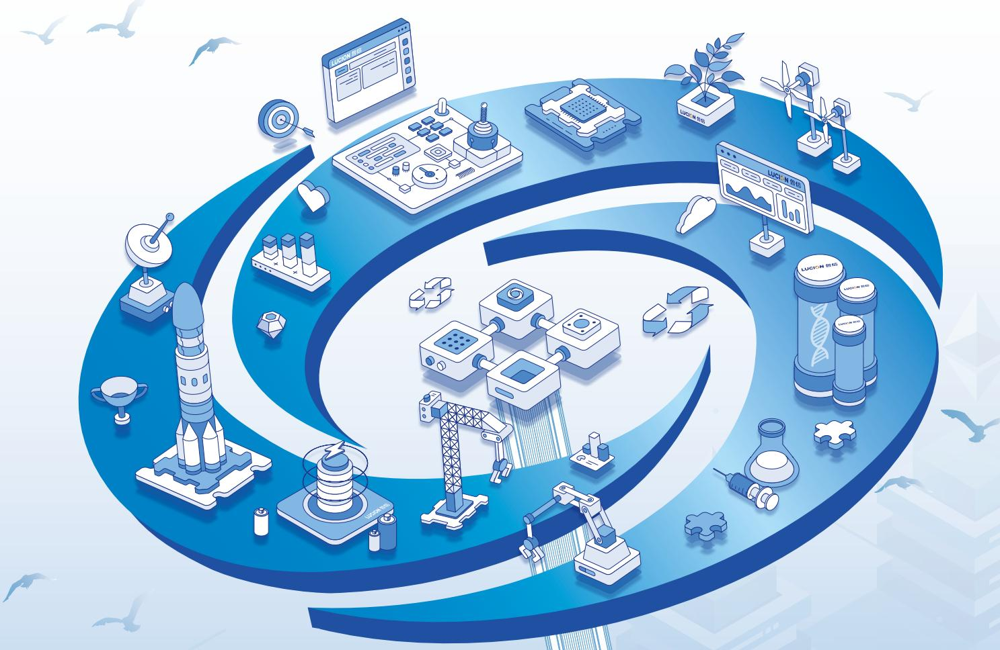

natural_image

Illustration of various 3D technologies and systems arranged in a circular path, including launch towers, robotic arms, and lab equipment (no text or symbols)

# CONTENTS 目录

# 关于本报告 01

# 2025年可持续发展亮点 03

# 走进鲁信创投 05

公司概况 05

组织架构 06

企业文化 06

经营战略 07

业务布局 08

发展历程 10

2025年大事记 11

# 可持续发展管理 13

可持续发展目标 13

可持续发展治理 15

利益相关方沟通 ---- 17

重要性议题管理 ---- 18

# 合规治理 夯实发展根基 21

坚持党建引领 23

规范公司治理 26

强化合规风控 29

保障投资者权益 35

恪守商业道德 37

natural_image

Panoramic view of the Great Wall of China winding through mountainous terrain with a watchtower, featuring large white number '01' overlay (no text or symbols on landscape)

# 低碳引领 赋能绿色发展 41

应对气候变化 43

环境合规管理 ---- 47

促进低碳运营 51

聚力绿色发展 53

natural_image

Green background with a white number '02' and a glowing globe, surrounded by green leaves (no text or symbols on the globe or plants)

# 责任深耕 赋能产业共兴 55

践行负责任投资 ---- 57

服务实体经济 ---- 62

坚守产品服务安全品质---- 68

创新驱动发展 ---- 73

强化供应链安全 ---- 76

守护数据安全与客户隐私---- 78

text_image

03

# 以人为本 共赴美好新程 83

员工权益与安全 85

积极践行社会责任----97

natural_image

Illustration of two hands clasped together, with large white number '04' overlaid (no text or symbols on hands)

# 未来展望 98

# 报告附录 99

指标索引 99

意见反馈表 101

# 关于本报告

# 报告简介

本报告是鲁信创业投资集团股份有限公司发布的第5份环境、社会和公司治理报告（以下简称“ESG报告”）。本报告依据客观、规范、透明和全面的原则，详细披露了鲁信创投2025年度在环境保护、社会责任及公司治理领域的实践和绩效。

# 报告范围

本报告以“鲁信创业投资集团股份有限公司”为主体，包括下属子公司，除特别说明外，本报告范围与公司年报范围保持一致。

# 时间范围

2025年1月1日至2025年12月31日（以下简称“报告期”）。为增强报告的对比性和前瞻性，部分内容适当追溯以往年份或具有前瞻性描述。本报告的发布周期为一年一次，与财务年度保持一致。

# 编制依据

- 上海证券交易所《上海证券交易所上市公司自律监管指引第14号——可持续发展报告（试行）》  
- 上海证券交易所《上海证券交易所上市公司自律监管指南第4号——可持续发展报告编制》  
- 国务院国有资产监督管理委员会《央企控股上市公司ESG专项报告编制研究》  
山东省人民政府国有资产监督管理委员会《山东省控股上市公司ESG指标体系工作指引》  
- 中国企业改革与发展研究会《中国企业可持续发展报告指南（CASS-ESG 6.0）》  
- 全球报告倡议组织《GRI可持续发展报告标准（GRI Standards）》  
- 联合国可持续发展目标（SDGs）

# 数据说明

报告信息数据来源包括鲁信创投正式文件、统计报告及财务报告，以及经由公司统计、汇总与审核的各职能部门、各经营单位的可持续发展实践信息。本报告的财务数据以人民币为单位，若与财务报告不一致之处，以财务报告为准。

释义说明

<table><tr><td>释义项</td><td>释义内容</td></tr><tr><td>鲁信创投、公司、我们</td><td>鲁信创业投资集团股份有限公司</td></tr><tr><td>鲁信集团</td><td>山东省鲁信投资控股集团有限公司</td></tr><tr><td>高新投</td><td>山东省高新技术创业投资有限公司</td></tr><tr><td>鲁信高新</td><td>山东鲁信高新技术产业有限公司</td></tr><tr><td>磨具公司</td><td>山东鲁信四砂泰山磨具有限公司</td></tr><tr><td>北京鲁信</td><td>北京鲁信信创投资有限公司</td></tr></table>

# 确认及批准

本报告于2026年4月28日获公司董事会批准，并与年报同期发布。董事会承诺对报告内容进行监督，并确保其不存在任何虚假记载或误导性陈述，并对内容真实性、准确性和完整性负责。

# 报告获取

本报告可以在上海证券交易所网站（http://www.sse.com.cn）查阅和下载。

# 2025年可持续发展亮点

投资绩效

投资项目数量

30↑

生物医药及医疗设备类投资总额

1.12 亿元

新能源新材料类投资总额

1.54 亿元

信息技术硬件与设备类投资总额

2.05 亿元

投资项目金额

12.89 亿元

软件及信息技术服务类投资总额

1.42 亿元

高端装备制造类投资总额

4.90 亿元

高端化工类投资总额

0.86 亿元

公司治理绩效

股东会召开次数

3 次

董事会召开次数

11 次

因信息披露方面违规而受到处罚次数

0 次

公司信用评级AA，未发生债务违约事件

环境绩效

环境领域违法违规事件

0 起

能源消耗强度

0.2958吨标准煤/万元营收

温室气体排放强度

0.5582吨二氧化碳当量/万元营收

污染物监测合格率

100 %

能源消耗总量

2,564.06 吨标准煤

用水总量

17,932 吨

用水强度

2.07吨/万元营收

温室气体排放总量

4,838.61 吨二氧化碳当量

社会绩效

纳税总额

12,244.28万元

商标累计数

16↑

员工满意度

100 %

研发投入

329.18万元

数据安全总投入

96 万元

员工培训覆盖率

100 %

授权专利累计数

16↑

数据安全及客户隐私泄漏事件

0 起

安全教育培训覆盖率

100 %

# 走进鲁信创投

# 公司概况

鲁信创业投资集团股份有限公司（股票代码：600783.SH）是鲁信集团控股的山东省内最大、在国内具有重要影响力的专业创投机构，是国内证券市场首家上市创投企业，为中国投资协会股权和创业投资专业委员会联席会长单位、山东省高层次人才发展促进会人才创投联盟理事长单位、山东省创业投资协会理事单位。

公司以“助力国家科技进步，推动山东产业结构转型升级”为使命，围绕“长周期”扶持创新型科技企业做强做大、“全流程”赋能实体产业高端高质高效发展等主营业务，持续聚焦新一代信息技术、高端装备制造、生命科学、新能源、新材料、航空航天、绿色低碳等国家战略性新兴产业，重点关注颠覆性创新、“卡脖子”技术攻关、国产化替代项目，始终坚持投早投小投长期投硬科技，做强做优耐心资本，着力打造科技金融生态圈，为我国加快推进新型工业化、发展新质生产力、构建新发展格局、建设现代化经济体系贡献力量。

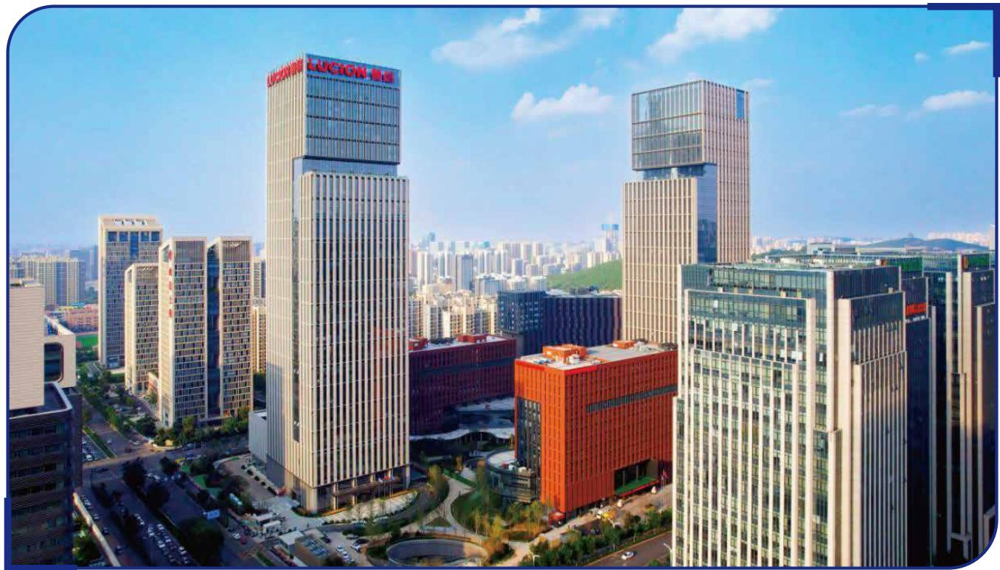

natural_image

Aerial view of a modern city skyline featuring prominent glass skyscrapers and red-orange buildings under a clear blue sky.

截至2025年末，公司已累计投资企业300余家，90%以上的资金投资在“硬科技”领域，过半项目为初创期和成长期企业，民营企业数量占比逾九成，“专精特新”企业百余家，先后助推40余家企业登陆境内外主要资本市场。

# 组织架构

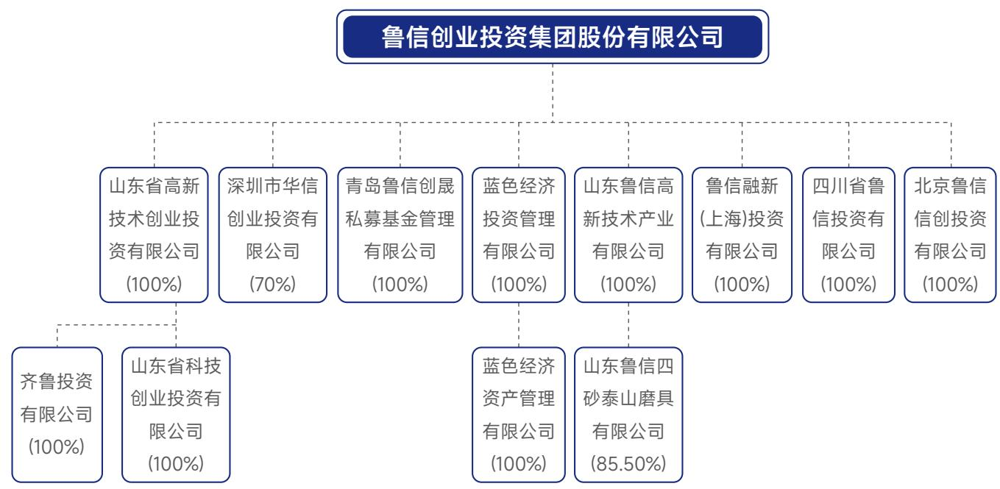

flowchart

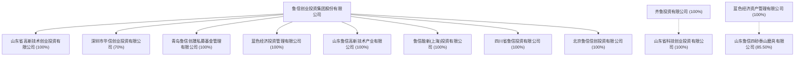
```mermaid
graph TD
  A["鲁信创业投资集团股份有限公司"] --> B["山东省高新技术创业投资有限公司 (100%)"]
  A --> C["深圳市华信创业投资有限公司 (70%)"]
  A --> D["青岛鲁信创晟私募基金管理有限公司 (100%)"]
  A --> E["蓝色经济投资管理有限公司 (100%)"]
  A --> F["山东鲁信高新技术产业有限公司 (100%)"]
  A --> G["鲁信融新(上海)投资有限公司 (100%)"]
  A --> H["四川省鲁信投资有限公司 (100%)"]
  A --> I["北京鲁信信创投资有限公司 (100%)"]
  J["齐鲁投资有限公司 (100%)"] -.-> K["山东省科技创业投资有限公司 (100%)"]
  L["蓝色经济资产管理有限公司 (100%)"] -.-> M["山东鲁信四砂泰山磨具有限公司 (85.50%)"]
```

# 企业文化

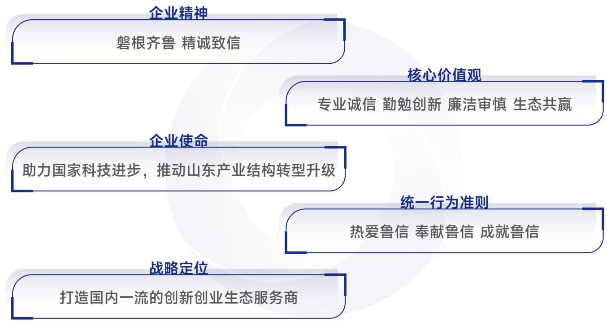

flowchart

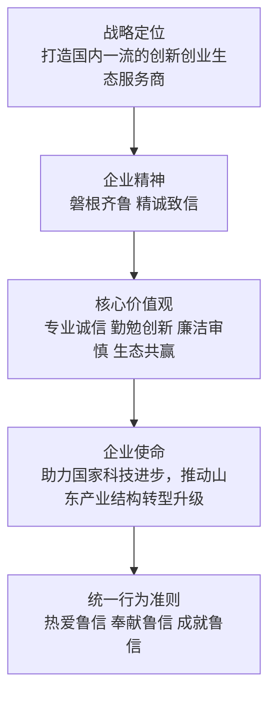
```mermaid
graph TD
  A["企业精神\n磐根齐鲁 精诚致信"] --> B["核心价值观\n专业诚信 勤勉创新 廉洁审慎 生态共赢"]
  B --> C["企业使命\n助力国家科技进步，推动山东产业结构转型升级"]
  C --> D["统一行为准则\n热爱鲁信 奉献鲁信 成就鲁信"]
  E["战略定位\n打造国内一流的创新创业生态服务商"] --> A
```

# 经营战略

# 以“专业化”提质效

聚焦战略性新兴产业及关键核心技术“卡脖子”环节，锻造专业化投资团队，构建生态化赋能体系，依托行业深耕与深度研究提升投资精准度，实现投资价值增值。

# 以“市场化”强管理

坚持国资监管要求和市场化机制有效结合，在基金运营、投资决策、选人用人、激励约束等环节强化市场化导向，着力打造国有创投机构市场化标杆。

# 以“规范化”筑根基

围绕“募、投、管、退”全流程，健全完备的制度与流程体系，统筹前、中、后台各环节管理，全面提升公司运营的规范化、精细化水平。

# 以“协同化”促发展

深化省内与省外区域协同、实体与投资产业协同、内生与外拓业务协同、资本与产业生态协同，推动核心管理规模持续做大。

# 以“数智化”赋新能

推动人工智能在股权投资全流程中的深度融合，依托数据驱动与智能分析优化决策、提升效率、管控风险，全面赋能业务价值链，塑造面向未来的核心竞争优势。

# 业务布局

# 创业投资业务：

创业投资是股权投资的一种形式，旨在通过投资初创或成长阶段的创业企业，待其发展成熟后通过股权转让实现资本增值。经过20多年的发展，公司创投业务建立了一套完善的投资管理体系和风险控制体系，打造了一支高素质专业化团队，培育了多家创业企业发展壮大登陆资本市场。公司聚焦的主要赛道包括新一代信息技术、高端装备制造、生命科学、新能源、新材料、航空航天、绿色低碳等国家战略性新兴产业，重点关注颠覆性创新、“卡脖子”技术攻关、国产化替代项目，投资阶段以成长期、扩张期项目为重点，同时对初创期项目、Pre-IPO项目、定增业务进行投资。

植根山东，走向全国，面向世界

为直击行业发展脉搏，打造资本运营桥头堡，公司已于上海、成都、深圳、北京、安徽等区域全面完成“东西南北中”异地业务布局。

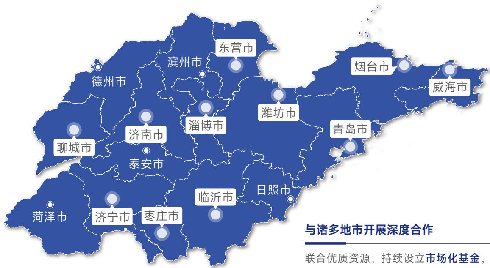

text_image

德州市
滨州市
东营市
烟台市
威海市
聊城市
济南市
淄博市
潍坊市
青岛市
泰安市
临沂市
日照市
菏泽市
济宁市
枣庄市
与诸多地市开展深度合作
联合优质资源，持续设立市场化基金，

# 与诸多地市开展深度合作

联合优质资源，持续设立市场化基金，

围绕山东各地市正着力打造的特色产业

集群，针对性地为地方经济发展培育新

动能、新优势。

# 磨具业务：

公司磨具业务所处行业为非金属矿物制品业，主要为固结磨具的生产、销售，下游客户以军工、汽车零部件加工、航天航空、精密加工类企业为主。

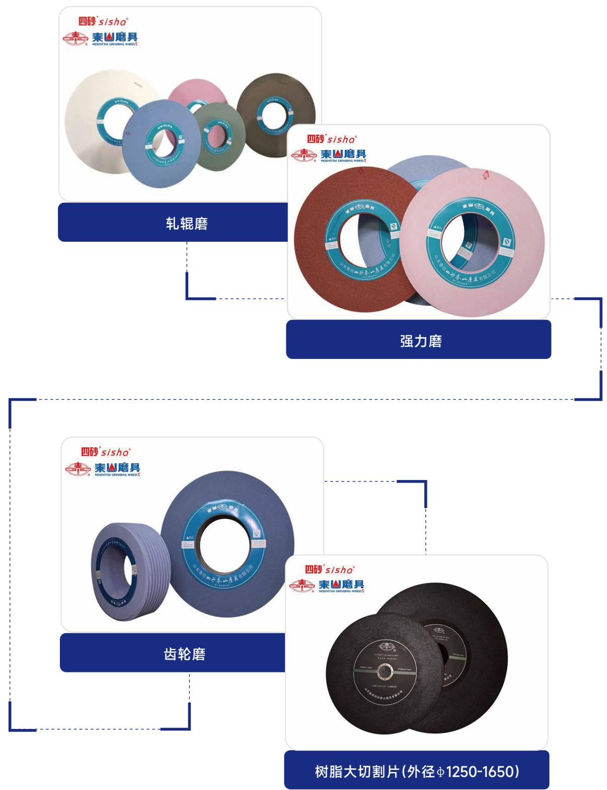

flowchart

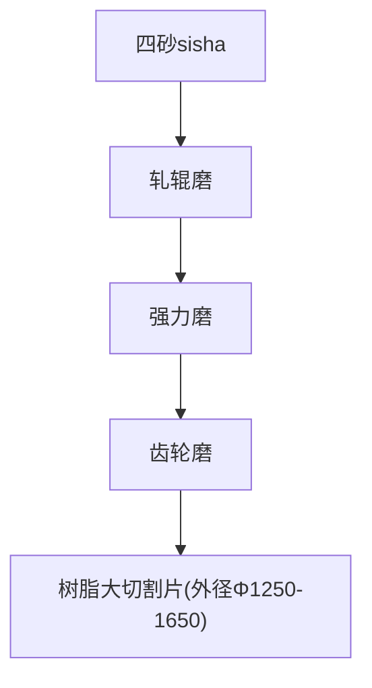
```mermaid
graph TD
  A["四砂sisha"] --> B["轧辊磨"]
  B --> C["强力磨"]
  C --> D["齿轮磨"]
  D --> E["树脂大切割片(外径Φ1250-1650)"]
```

# 发展历程

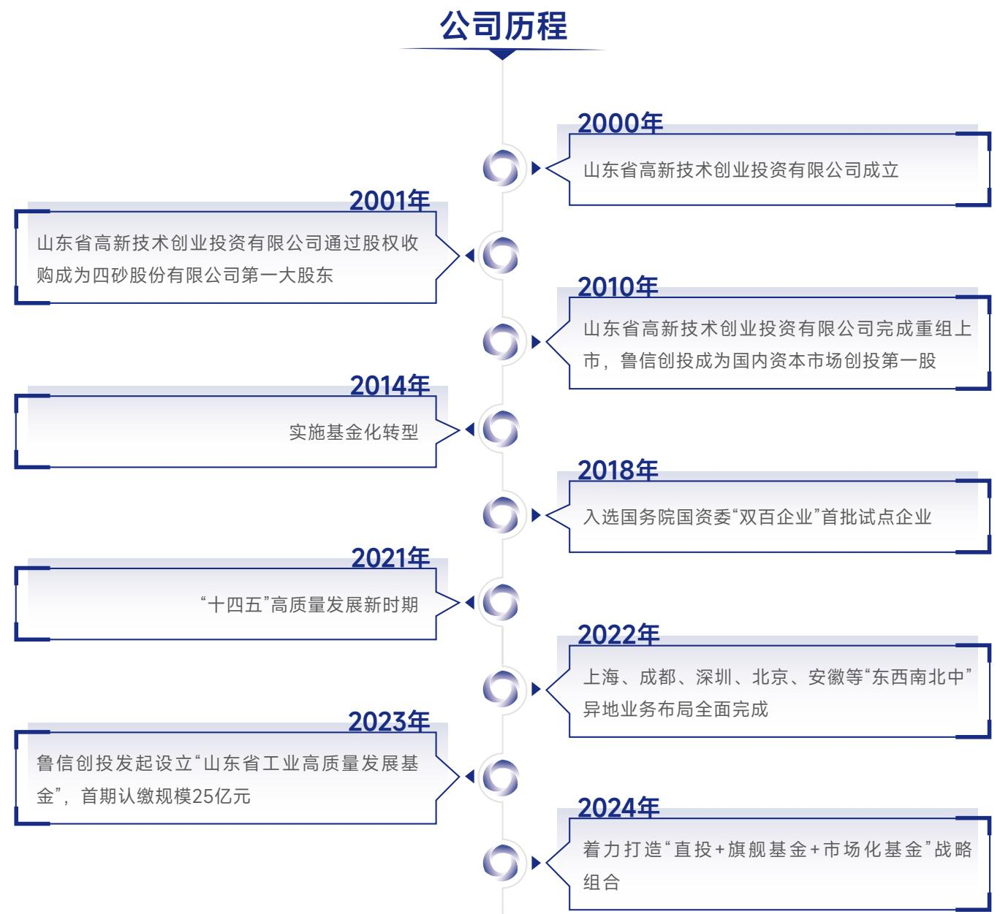

flowchart

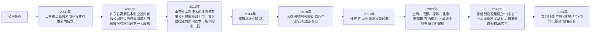
```mermaid
graph LR
  A["公司历程"] --> B["2000年\n山东省高新技术创业投资有限公司成立"]
  B --> C["2001年\n山东省高新技术创业投资有限公司通过股权收购成为四砂股份有限公司第一大股东"]
  C --> D["2010年\n山东省高新技术创业投资有限公司完成重组上市，鲁信创投成为国内资本市场创投第一股"]
  D --> E["2014年\n实施基金化转型"]
  E --> F["2018年\n入选国务院国资委“双百企业”首批试点企业"]
  F --> G["2021年\n“十四五”高质量发展新时期"]
  G --> H["2022年\n上海、成都、深圳、北京、安徽等“东西南北中”异地业务布局全面完成"]
  H --> I["2023年\n鲁信创投发起设立“山东省工业高质量发展基金”，首期认缴规模25亿元"]
  I --> J["2024年\n着力打造“直投+旗舰基金+市场化基金”战略组合"]
```

# 2025年大事记

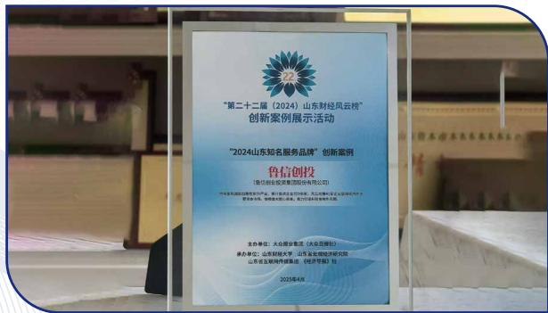

text_image

“第二十二届（2024）山东财经风云榜”
创新案例展示活动
“2024山东知名服务品牌”创新案例
鲁信创投
（身份证号码及营业执照复印件）：
山东省青岛市市南区东胜大道1号
商务中心、销售服务中心等，需自行承担相关费用。
主办单位：大众国际集团（大众百搭社）
承办单位：山东财经大学、山东省地理经济研究院
山东省金融经济集团（经济学院）社
2025年6月

4月29日  
6月10日

获评第二十二届（2024）山东财经风云榜“2024山东知名服务品牌”

鲁信创投旗下基金投资项目四川西南交大铁路发展股份有限公司正式登陆北交所，证券代码“920027”

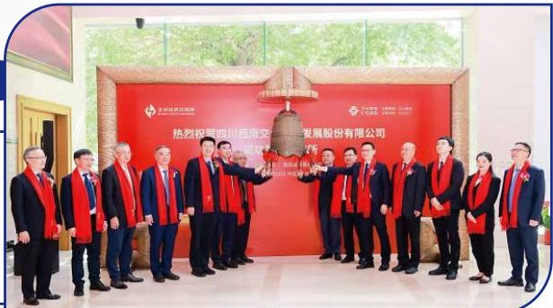

text_image

热烈祝贺四川西南交通发展股份有限公司
热烈庆祝四川西南交通发展股份有限公司

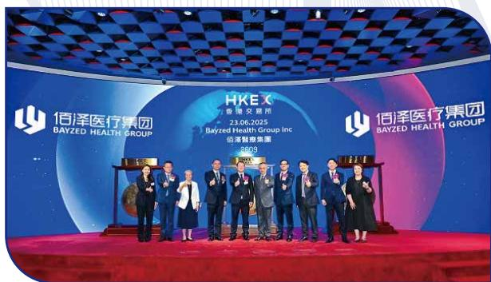

text_image

佰泽医疗集团
BAYZED HEALTH GROUP
HKEX
香港交易所
23.06.2025
BAYZED HEALTH Group Inc
佰泽智能集团
2009
佰泽医疗集团
BAYZED HEALTH GROUP

6月23日  
6月24日

鲁信创投旗下基金投资项目佰泽医疗集团有限公司正式登陆港交所，证券代码“02609”

成功上榜2025好品金融“五篇大文章”创新产品名单

“五篇大文章”创新产品名单好品金融——科技金融（10个）

<table><tr><td>序号</td><td>报送单位</td><td>产品名称</td></tr><tr><td>1</td><td>交通银行山东省分行</td><td>科创齐鲁贷</td></tr><tr><td>2</td><td>招商银行济南分行</td><td>科创贷</td></tr><tr><td>8</td><td>太平洋财产保险青岛分公司</td><td>知识产权质押贷款保证保险</td></tr><tr><td>9</td><td>山东省普惠融资担保有限公司</td><td>鲁科担一鲁担科技贷</td></tr><tr><td>10</td><td>鲁信创业投资集团股份有限公司</td><td>“全流程助力科创企业”耐心资本</td></tr></table>

7月18日

磨具公司被中国机床工具工业协会磨料磨具分会评为“2023-2024年度全国磨料磨具行业磨具生产十强企业”

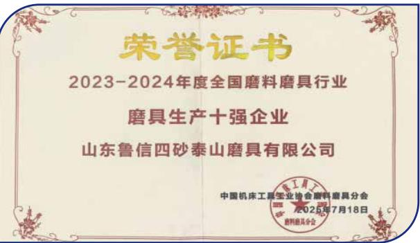

seal

中国机床工具行业协会磨料磨具分会
鲁信四砂泰山磨具有限公司

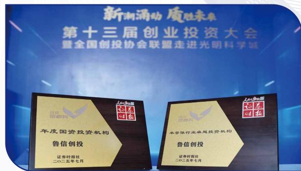

text_image

新潮涌动 质胜未来
第十三届创业投资大会
暨全国创投协会联盟走进光明科学城
年度国资投资机构
鲁信创投
证券时报社
二〇二五年七月
Laoxin Investment
证券时报社
二〇二五年七月
永泰体行业卓越投资机构
鲁信创投
证券时报社
二〇二五年七月

7月25日  
12月1日

获得证券时报社2025创投金鹰奖“年度国资投资机构”与“半导体行业卓越投资机构”两项荣誉

荣获中国AI赛道与ESG可持续发展大会“2025年度上市公司ESG价值传递奖”

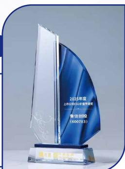

text_image

2025年底
上市后以公允价值计量
奇信创投
(600783)

  
12月26日  
12月29日

荣获2025同花顺上市公司年度榜单“机构青睐上市公司”奖

荣获清科2025中国股权投资年度排名“2025年中国创业投资机构50强”“2025年中国‘专精特新’投资机构50强”

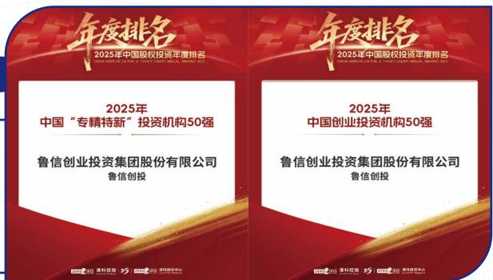

text_image

年度排名
2025年中国股权投资年度排名
CHINA VENTUE CATALY & PRIVATE GROWTH ANNUAL, MINHUA 2025
2025年
中国“专精特新”投资机构50强
鲁信创业投资集团股份有限公司
鲁信创投
年度排名
2025年中国股权投资年度排名
CHINA VENTUE CATALY & PRIVATE GROWTH ANNUAL, MINHUA 2025
2025年
中国创业投资机构50强
鲁信创业投资集团股份有限公司
鲁信创投

# 可持续发展管理

# 可持续发展目标

鲁信创投以“助力国家科技进步，推动山东产业结构转型升级”为核心使命，积极践行可持续发展理念，将可持续发展理念融入公司的战略与经营当中，致力于打造国内一流的创新创业生态服务商。

公司在稳步推动自身业务发展的同时，主动响应联合国可持续发展目标（Sustainable Development Goals，简称SDGs），结合自身的企业文化和发展战略，深入对标SDGs，明确了以下可持续发展目标。

<table><tr><td>章节</td><td>目标</td><td>2025年公司行动</td><td>对标联合国可持续发展目标(SDGs)</td></tr><tr><td>合规治理夯实发展根基</td><td>● 确保董事会独立性和多元化,完善公司治理结构。● 持续完善公司风险管理机制。● 全面建设清廉鲁信,持续提升员工商业道德意识。</td><td>我们持续完善公司治理架构,规范股东会与董事会运作,不断优化合规与风险管理体系建设,常态化推进反腐败工作,健全廉洁从业管理制度。</td><td>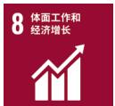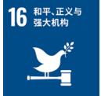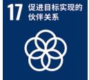</td></tr><tr><td>低碳引领赋能绿色发展</td><td>● 减少碳排放,加大对低碳环保企业的投资力度,助力国家实现“双碳”目标。● 持续优化环境管理体系,减少污染物排放。● 持续优化能源资源配置,提高利用效率。</td><td>我们积极响应国家“双碳”战略,持续增加对新能源、节能环保等“硬科技”领域的投资力度,助力低碳经济转型发展;公司对标新规完善环境管理体系,开展环保培训强化全员绿色理念;通过优化用能管理,稳步降低运营能耗,能源消耗强度0.2958吨标准煤/万元营收,同比下降7.03%。</td><td>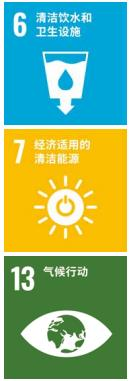</td></tr></table>

<table><tr><td>章节</td><td>目标</td><td>2025年公司行动</td><td>对标联合国可持续发展目标(SDGs)</td></tr><tr><td>责任深耕赋能产业共兴</td><td>持续完善负责任投资体系,助推企业登陆资本市场,助力山东产业结构转型升级。维持质量管理体系认证证书的有效性,完善客户服务体系,提升客户满意度。完善供应链管理体系,维持较高的本地化采购比例。持续优化信息安全管理体系,无客户隐私泄露事件。</td><td>我们始终践行负责任投资理念,坚守服务实体经济导向,聚焦创业投资与磨具实业两大主营业务,持续提升产品与服务质量。报告期内,各参股基金及投资平台完成一级投资项目30个,总投资额12.89亿元;磨具业务员产品合格率100%,顾客满意度93.37%。公司严格执行供应商准入、审核与全周期评估机制,加强供应链合规管控,持续增强供应链的稳定性和可持续性。报告期内,公司在山东省本地供应商数量占比为59.09%;公司定期开展信息安全风险评估,提高信息安全管理能力。报告期内,发生数据安全及客户隐私泄漏事件0起。</td><td>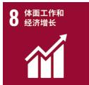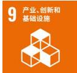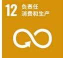</td></tr><tr><td>以人为本共赴美好新程</td><td>无歧视、雇佣童工、强迫劳动等侵犯人权事件。持续完善薪酬福利体系,实现绩效薪酬的公平分配。完善安全生产管理体系,实现“0”安全事故。关注员工健康,保持员工体检覆盖率100%,无新增职业病数量。持续开展公益慈善活动,支持社区发展。</td><td>我们坚持平等、多元、包容的人才理念,持续完善具有公平性与市场竞争力的薪酬激励体系。公司严守安全运营规范,常态化开展安全生产培训与员工定期健康体检,持续打造安全健康的工作环境,实现职业病零新增、员工体检覆盖率100%;常态化参与各类社区公益活动,深化与社区及当地居民的联结,携手推动区域社会和谐发展。</td><td>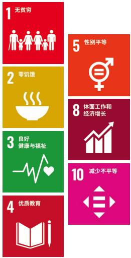</td></tr></table>

# 可持续发展治理

# - ESG治理架构

为进一步完善公司治理结构，提高董事会决策的科学性，提升公司环境、社会和公司治理（ESG）的管理水平，公司专门建立以董事会为领导核心的ESG管理架构，在董事会下设战略与可持续发展委员会，并制定了《董事会战略与可持续发展委员会工作细则》，负责推动公司中长期发展战略和重大投资决策以及ESG相关事宜。

公司构建“决策层 - 管理层 - 执行层”三级ESG治理架构，各层级职责明晰，打造出紧密联动、高效协同的治理链路，优化了自上而下的责任传导与监督体系，有效规范ESG工作的管理。

# 决策层

# 董事会

# 由董事成员组成

监督和审批ESG与可持续发展战略和政策，确保与公司的长期发展目标一致。

# 战略与可持续发展委员会

# 由董事成员组成

1.对公司长期发展战略和重大投资决策进行研究并提出建议；  
2. 负责公司ESG与可持续发展战略、治理体系的研究、规划与目标设定，审议可持续发展报告；  
3.监督公司可持续发展战略的执行进度与目标达成情况，评估相关风险，听取内外部反馈并提出改进建议；  
4.董事会授权的其他事项。

# ESG工作小组

# 由董事会秘书领导，证券部负责

1. 全面统筹、指导、落实董事会及战略与可持续发展委员会制定的ESG战略、目标和规划；  
2.与各职能部门密切配合，协调ESG相关事务，如统筹收集ESG相关信息，编制可持续发展报告。

# 各职能部门和各分子公司负责人

负责各项ESG工作的具体落实，定期向管理层进行汇报或提出相关建议，强化公司ESG工作管理力度。

# 管理层

# 执行层

# - ESG风险管理

公司持续探索将ESG理念贯穿于公司风险管理与决策流程，参照国际标准与行业优秀实践，主动识别并评估在应对气候变化、负责任投资、产品质量与服务、供应链安全、数据安全与隐私保护、员工权益与职业健康等可持续发展关键领域潜在的风险与机遇，制定针对性应对措施，确保ESG风险得到有效控制，为企业长期稳健运营提供坚实保障。具体详见“应对气候变化”“践行负责任投资”“坚守产品服务安全品质”“强化供应量安全”“守护数据安全与客户隐私”“员工权益与安全”章节。

# - 可持续发展行动

为扎实推进ESG体系建设，将可持续发展理念深度融入战略规划与运营管理全流程，鲁信创投以多层级、沉浸式培训交流为抓手，筑牢ESG工作落地根基。报告期内，公司共组织开展ESG主题培训1次，培训参与30余人次。

# 案例

# 召开2025年度ESG报告编制启动会

鲁信创投组织召开2025年度环境、社会和公司治理（ESG）报告编制启动会，系统部署本年度ESG各项工作。公司董事会秘书韩俊主持会议，各部门、各权属单位相关人员参会。

启动会围绕ESG政策动态、投资与案例、上年度报告回顾及提升建议等方面进行了全面讲解，并就公司2025年度ESG报告的编制计划与工作安排予以详细说明。

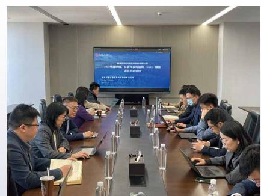

text_image

Meeting room photo with visible presentation screen showing Chinese text about a 2019 China National Information Technology Conference on the 10th anniversary of the founding of the Communist Party of China.

# 案例

# 召开ESG现场推进会

为深入落实公司ESG建设，推动可持续发展战略实施，2025年12月，公司党委副书记、董事潘利泉带队赴鲁信高新召开ESG现场推进会，公司董事会秘书韩俊及相关业务部门参加。

潘利泉一行深入生产一线，实地考察了鲁信高新在安全生产、节能减排、资源循环利用等方面的具体举措。同时，调研组与鲁信高新管理人员及一线员工进行了座谈交流，详细听取鲁信高新在ESG建设方面的实践经验，探讨未来ESG工作的优化举措。下一步，公司将继续把ESG理念融入发展战略和运营管理中，着力深化可持续发展工作实践，促进公司高质量发展。

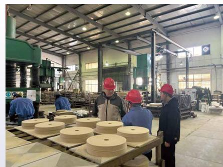

natural_image

Interior of a factory with workers in hard hats inspecting large wooden components on a production line (no visible text or symbols)

# - 利益相关方沟通

报告期内，鲁信创投积极与利益相关方开展沟通，持续完善沟通机制，通过多元化、常态化的沟通与交流，及时了解政府及监管机构、股东及投资者、客户、员工等利益相关方的期望与诉求，并积极予以回应，以切实有效的行动持续为利益相关方创造长期价值。

<table><tr><td>利益相关方</td><td>期望与诉求</td><td>回应与行动</td><td>沟通方式</td></tr><tr><td>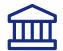政府及监管机构</td><td>合规经营依法纳税风险管理促进地方经济发展</td><td>遵纪守法主动纳税全面风险管理扶持创新型科技企业和实体产业</td><td>日常汇报沟通开展信息披露接受监管考核参与培训、会议</td></tr><tr><td>股东及投资者</td><td>持续稳健经营信息披露透明稳定分红</td><td>提升内控水平定期信息披露保障股东权益</td><td>股东会投资者交流活动投资者热线、电子邮件信息披露上证e互动沟通现场调研业绩说明会</td></tr><tr><td>客户</td><td>信息安全与隐私保护提供优质产品和服务责任投资投资者教育</td><td>保护客户隐私客户权益保障开展负责任投资项目开展投资者教育活动</td><td>客户满意度调查客户沟通及投诉渠道媒体沟通与传播投资者教育活动</td></tr><tr><td>员工</td><td>搭建职业发展通道丰富的薪酬福利保障职业健康民主沟通</td><td>职业培训与公开透明的晋升机制完善的薪酬福利体系加强职业健康建设员工沟通反馈机制</td><td>员工座谈会职工代表大会员工满意度调查及意见收集定期员工培训定期健康体检</td></tr><tr><td>供应商及合作伙伴</td><td>供应链管理廉洁采购互利共赢</td><td>打造责任供应链反商业贿赂合作与交流</td><td>项目合作供应商审核同业交流合作</td></tr><tr><td>[2D6D]社区及公众</td><td>积极融入社区开展志愿活动减少污染排放</td><td>开展公益项目绿色经营</td><td>网站、微信公众号、视频号、主流媒体等平台对外宣传资料公益活动</td></tr></table>

# - 重要性议题管理

# - 评估流程和方法

公司按照《上海证券交易所上市公司自律监管指引第14号——可持续发展报告（试行）》的要求，参考《上海证券交易所上市公司自律监管指南第4号——可持续发展报告编制》《GRI3：重大主题》等国内外披露标准的评估方法，以影响重要性和财务重要性的分析视角，结合行业市场动态、最新监管要求及外部专家专业评估，经审慎研判，重新评估后确认议题重要性评估结果，并在报告中做出回应。

# 01 了解公司背景

基于宏观环境、行业背景、公司的商业模式等，识别公司的利益相关方与公司面临的影响、风险与机遇。

# 02 议题库审阅与更新

参考全球报告倡议组织GRI、联合国可持续发展目标SDGs、SASB，审阅2024年重要性议题评估结果，结合2025年公司整体业务发展情况，以及国内外同行业相关议题，建立可持续发展相关议题库。

# 03 议题重要性评估

# 影响重要性评估：

梳理各议题对外部环境、社会和经济的潜在或实际的正面或负面影响，评估出具有影响重要性的议题。

# 财务重要性评估：

通过对影响性、依赖性和其他因素分析，结合专家判断，识别和评估相关议题下的风险和机遇，评估出具有财务重要性的议题。

# 04 议题确认

形成影响重要性和财务重要性议题清单，并确保相关议题透明、平衡且完整地披露于报告中。

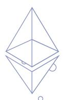

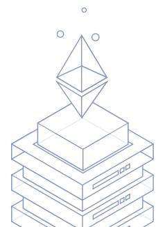

natural_image

Isometric line drawing of a pyramid stack with geometric shapes and floating circles (no text or symbols)

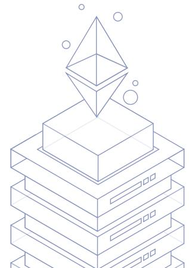

natural_image

Stacked books with a pyramid and floating spheres above (no text or symbols)

# - 重要性议题评估结果

结合专家调研评估，从“影响重要性”与“财务重要性”两个维度进行分析，形成2025年度鲁信创投重要性议题矩阵和议题清单。

<table><tr><td>维度</td><td>议题</td></tr><tr><td>E</td><td>1环境合规管理2能源利用3应对气候变化4循环经济5水资源利用6污染物排放7废弃物处理8绿色金融</td></tr><tr><td>S</td><td>9员工权益与安全10创新驱动11产品和服务安全与质量12数据安全与隐私保护13供应链安全14平等对待中小企业15负责任投资16服务实体经济17社会贡献18乡村振兴</td></tr><tr><td>G</td><td>19反商业贿赂及反贪污20反不正当竞争21尽职调查22利益相关方沟通</td></tr></table>

鲁信创投重要性议题矩阵  
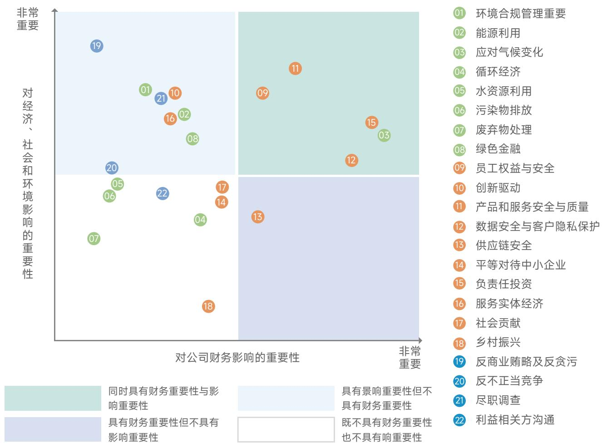

scatter

| ID | Topic | Importance to Company Financial Impact (X-axis) | Importance to Economic, Social, and Environment (Y-axis) |
| --- | --- | --- | --- |
| 19 | 反商业贿赂及反贪污 | Low | High |
| 20 | 反不正当竞争 | Low | Medium-High |
| 21 | 尽职调查 | Low-Medium | High |
| 22 | 利益相关方沟通 | Low-Medium | Medium |
| 01 | 环境合规管理重要 | Low-Medium | High |
| 02 | 能源利用 | Low-Medium | High |
| 03 | 应对气候变化 | Low-Medium | High |
| 04 | 循环经济 | Low-Medium | High |
| 05 | 水资源利用 | Low-Medium | High |
| 06 | 污染物排放 | Low-Medium | High |
| 07 | 废弃物处理 | Low-Medium | Medium-High |
| 08 | 绿色金融 | Low-Medium | Medium-High |
| 09 | 员工权益与安全 | Medium-High | High |
| 10 | 创新驱动 | Medium-High | High |
| 11 | 产品和服务安全与质量 | Medium-High | High |
| 12 | 数据安全与客户隐私保护 | Medium-High | Medium-High |
| 13 | 供应链安全 | Medium-High | Medium |
| 14 | 平等对待中小企业 | Medium-High | Medium |
| 15 | 负责任投资 | Medium-High | Medium-High |
| 16 | 服务实体经济 | Low-Medium | High |
| 17 | 社会贡献 | Low-Medium | Medium |
| 18 | 乡村振兴 | Low-Medium | Low |
| 19 | 反商业贿赂及反贪污 | Low-Medium | Very High |
| 20 | 尽职调查 | Low-Medium | Medium-High |
| 21 | 反不正当竞争 | Low-Medium | High |
| 22 | 利益相关方沟通 | Low-Medium | Medium-High |

鲁信创投重要性议题清单

<table><tr><td>重要性说明</td><td>议题</td></tr><tr><td>同时具有财务重要性与影响重要性</td><td>3应对气候变化9员工权益与安全11产品和服务安全与质量12数据安全与隐私保护15负责任投资</td></tr><tr><td>具有财务重要性但不具有影响重要性</td><td>13供应链安全</td></tr><tr><td>具有影响重要性但不具有财务重要性</td><td>1环境合规管理2能源利用8绿色金融10创新驱动16服务实体经济19反商业贿赂及反贪污20反不正当竞争21尽职调查</td></tr><tr><td>既不具有财务重要性也不具有影响重要性</td><td>4循环经济5水资源利用6污染物排放7废弃物处理14平等对待中小企业17社会贡献18乡村振兴22利益相关方沟通</td></tr></table>

注：交易所指引规定的“生态系统和生物多样性保护、科技伦理”未被纳入公司重要性议题。

1. 公司生产经营活动对生态系统和生物多样性不具有重大影响，故“生态系统和生物多样性保护”未纳入重要性议题；  
2. 公司核心业务不涉及生命科学、人工智能伦理等敏感领域的科学研究、技术开发等活动，故“科技伦理”未纳入重要性议题。

natural_image

Line drawing of four people collaborating at a table with laptops and a presentation screen (no text or symbols)

# 01

# 合规治理 夯实发展根基

鲁信创投坚持以党建为引领，把党的领导融入公司治理各环节，持续健全风险管理体系，保障投资者及债权人合法权益，深入推进清廉鲁信建设，为公司高质量发展提供坚实支撑。

# 我们的行动

\- 坚持党建引领
- 规范公司治理
- 强化合规风控
- 保障投资者权益
- 恪守商业道德

# 响应的SDGs

8体面工作和经济增长

16 和平、正义与强大机构

17 促进目标实现的伙伴关系

# 坚持党建引领

# 党建体系

公司坚持以习近平新时代中国特色社会主义思想为根本指引，深入学习贯彻党的二十大及历次全会精神，将党的领导全面融入公司治理各环节，充分发挥党委“把方向、管大局、保落实”的领导核心与政治核心作用。报告期内，公司以“聚·创”品牌为引领，搭建“五聚五创”党建工作体系，并通过制定“三重一大”事项决策管理办法，进一步完善党委统一领导、分级负责、上下联动的工作格局，推动党的领导与公司治理的有机统一。

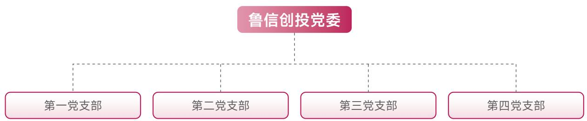

flowchart

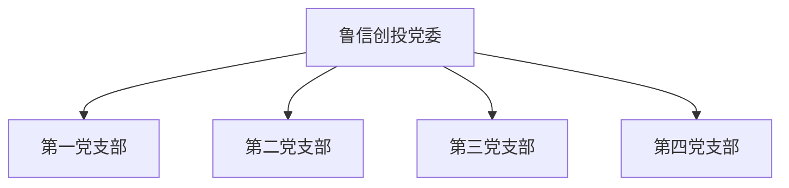
```mermaid
graph TD
  A["鲁信创投党委"] --> B["第一党支部"]
  A --> C["第二党支部"]
  A --> D["第三党支部"]
  A --> E["第四党支部"]
```

鲁信创投党委组织架构图

# 关键绩效

截至报告期末，公司设有1个党委，4个党支部，共有党员73人。2025年，公司共召开党委会会议41次。

# 党建品牌

公司以特色“聚·创”党建品牌建设为抓手，持续丰富品牌内涵，充分发挥特色品牌示范带动作用，将党的政治优势与组织优势转化为驱动企业高质量发展的创新动能。同时，公司立足创投主业特色，积极探索党建工作与投资业务的深度融合路径，通过打造“党建+项目尽调”“党建+投后管理”等特色载体，确保党组织战斗堡垒作用在业务一线充分发挥，实现党建与经营同频共振、互促共进。

报告期内，公司在党建品牌建设成效显著并获上级党组织认可，第一党支部党员教育管理案例被中共山东省委机关刊《支部生活》发布，入选“旗帜的力量”基层党建品牌案例展播，并收录至山东党建网“‘旗帜的力量’基层党建品牌展播”专区。

# 党建活动

# - 党纪学习

公司党委坚持以习近平新时代中国特色社会主义思想为指导，深入学习贯彻习近平总书记关于党纪学习教育的重要讲话和重要指示精神，紧扣党中央决策部署，持续开展党纪学习教育，切实把全体党员的思想和行动统一到党中央要求上来。

# 案例

# 召开全面从严治党专题会议

2025年2月17日，公司党委召开全面从严治党专题会议，听取公司党委班子及班子成员2024年度履行全面从严治党主体责任情况报告，部署2025年度全面从严治党工作。鲁信创投党委书记、董事长王旭冬主持会议并作点评。

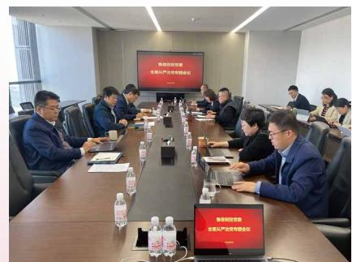

text_image

全体从业人员考核会议
全体从业人员考核会议

# 案例

# 举办“创领先锋”党支部书记和党务人员培训

2025年8月11日，公司举办“创领先锋”党支部书记和党务人员培训。公司党委副书记、董事潘利泉主持培训会议并讲话，鲁信创投各党支部书记及委员、党务工作人员参加培训。会议通过传达上半年党建工作会议精神，剖析基层党建短板等内容，要求基层党务工作者提高政治站位，深化党建标准化规范化建设，推动党建与业务深度融合，以实干实绩作为衡量标准，将党建成效转化为公司发展动能。

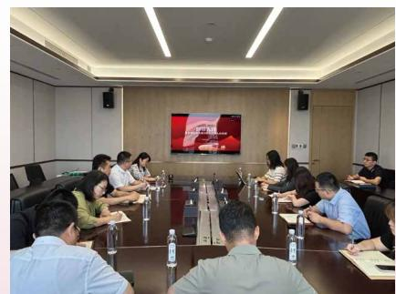

natural_image

Group of people seated around a conference table in a meeting room, facing a large screen displaying a red banner (no visible text or symbols on the image)

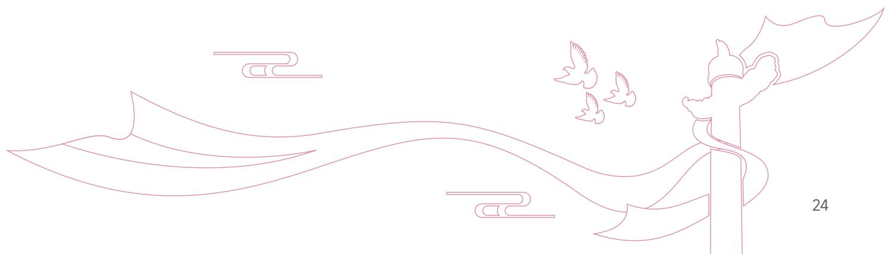

natural_image

Line drawing of a stylized bird perched on a branch with birds flying nearby (no text or symbols)

# - 党建活动

公司党委紧扣思想建设与主题教育要求，以党建品牌赋能为抓手，组织开展了红色观影、主题团建、“玫瑰书香”“光影书香传薪火、同心共筑家国梦”等形式多样、内涵丰富的系列党建活动，引导党员进一步统一思想、凝聚共识，持续增强“四个意识”、坚定“四个自信”、做到“两个维护”，为推进公司高质量发展注入强大精神动力，有效汇聚起推动发展的正能量。

# 案例

# 年轻干部深入贯彻中央八项规定精神学习教育专题研讨会

2025年6月30日，公司举办年轻干部深入贯彻中央八项规定精神学习教育专题研讨会，旨在深化作风建设、筑牢廉洁自律思想根基。公司主要领导参会指导，与会年轻干部结合思想与工作实际，深入交流学习体会，认真查摆问题并提出整改举措，并强调年轻干部须将作风建设内化于心、外化于行。会议为建立长效机制、营造风清气正政治生态筑牢思想根基。

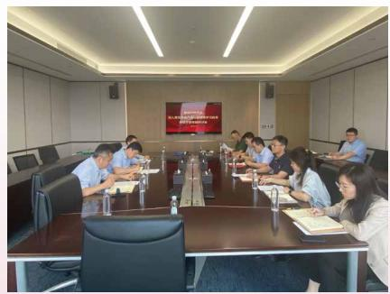

natural_image

Group of people seated around a conference table in a meeting room, with a large screen displaying Chinese text (no visible signage or symbols on the image itself)

# 案例

# “光影铸魂强党性 峥嵘历史唤初心”主题党日活动

2025年9月18日，公司党委开展“光影铸魂强党性·峥嵘历史映初心”主题党日活动，组织党员集中观看历史影片《731》。观影后，党员代表围绕“铭记历史、砥砺初心、强化担当”研讨交流，进一步凝聚党员共识，增强党性修养，激励全员将精神力量转化为推动公司高质量发展的实际行动。

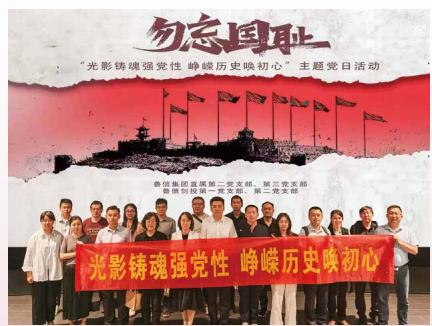

text_image

勿忘国耻
“光影铸魂强党性 峥嵘历史唤初心”主题党日活动
鲁信集团首席第二党支部、第三党支部
鲁信集团第一党支部、第一次党支部
光影铸魂强党性 峥嵘历史唤初心

# 规范公司治理

# 治理结构

公司严格遵循《中华人民共和国公司法》（以下简称“公司法”）《中华人民共和国证券法》（以下简称“证券法”）《上市公司治理准则》等相关法律法规，制定《鲁信创业投资集团股份有限公司章程》（以下简称《公司章程》）等制度，构建了由股东会、董事会和经理层组成的权责清晰、有效制衡、协调运作的治理架构，确保决策科学、执行高效、监督有效，为公司提供了坚实的治理基础。

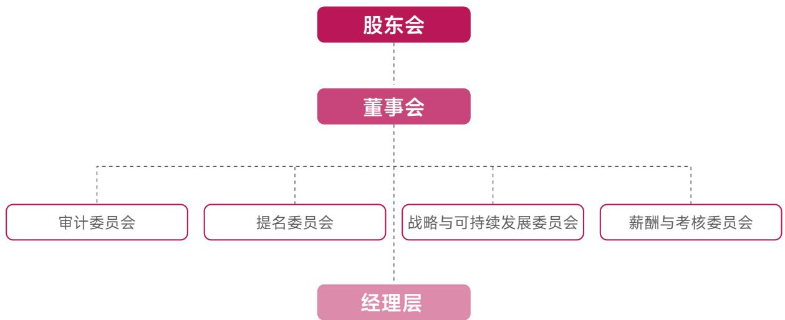

flowchart

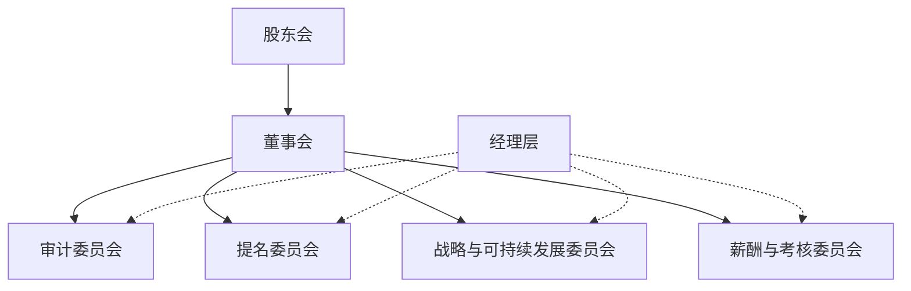
```mermaid
graph TD
  A["股东会"] --> B["董事会"]
  B --> C["审计委员会"]
  B --> D["提名委员会"]
  B --> E["战略与可持续发展委员会"]
  B --> F["薪酬与考核委员会"]
  G["经理层"] -.-> C
  G -.-> D
  G -.-> E
  G -.-> F
```

公司治理组织架构图

# ○ 股东会

股东会是公司最高权力机构。公司严格遵循《公司法》和《证券法》的规定，制定《股东会议事规则》，规范股东会的召集、提案、通知、召开等事项，提升股东会议事效能。公司平等对待所有股东，通过现场会议与网络投票相结合的方式召开股东会，审议影响中小投资者利益的重大事项，严格执行中小投资者表决单独计票机制，切实维护全体股东对公司重大事项的知情权、参与权和表决权。

# 关键绩效

报告期内，公司共召开股东会3次，共审议通过议案17项。

# ○ 董事会

董事会作为公司决策机构，对股东会负责。公司依据《董事会议事规则》，规范董事会议事程序与决策方式，依法行使经营管理决策权，忠实勤勉履行职责，确保董事会运作的规范性、有效性，切实保障公司及全体股东的利益。

# 关键绩效

报告期内，公司共召开董事会会议11次，董事会成员出席率100%，共审议通过议案44项。

# - 董事会专门委员会

公司董事会下设审计委员会、战略与可持续发展委员会、提名委员会及薪酬与考核委员会四个专门委员会，严格依据《董事会审计委员会工作细则》《董事会战略与可持续发展委员会工作细则》《董事会提名委员会工作细则》《董事会薪酬与考核委员会工作细则》作为运作依据，其中审计委员会行使《公司法》规定的监事会职权。审计委员会的召集人为独立董事中的会计专业人士，且成员为不在公司担任高级管理人员的董事。各专门委员会在董事会授权范围内，协助董事会开展专业决策与有效监督，提升董事会决策的科学性与效率。

# 审计委员会

独立董事2位 非独立董事1位 独董担任主任委员

# 战略与可持续发展委员会

独立董事2位 非独立董事3位 独董不担任主任委员

# 提名委员会

独立董事2位 非独立董事1位 独董担任主任委员

# 薪酬与考核委员会

独立董事3位 独董担任主任委员

# 关键绩效

报告期内，公司召开审计委员会会议6次，共审议通过议案23项；战略与可持续发展委员会会议3次，共审议通过议案4项；提名委员会会议5次，共审议通过议案5项；薪酬与考核委员会会议3次，共审议通过议案7项。

# - 董事会多元化

公司高度重视董事会多元化建设，在董事会成员遴选过程中综合考量候选人在性别、年龄、文化教育背景、专业经验及技能等多维度的差异性，通过多元化视角与专业知识互补，拓宽董事会决策思路，提升公司重大决策的科学性、前瞻性与专业性。报告期内，女性董事的占比为11.11%。

<table><tr><td>姓名</td><td>职务</td><td>性别</td><td>年龄</td><td>任职开始时间</td></tr><tr><td>王旭冬</td><td>董事长</td><td>男</td><td>44</td><td>2023/3/29</td></tr><tr><td>葛效宏</td><td>董事、总经理</td><td>男</td><td>53</td><td>2024/6/13、2024/5/27</td></tr><tr><td>潘利泉</td><td>董事</td><td>男</td><td>56</td><td>2024/8/28</td></tr><tr><td>马广晖</td><td>董事</td><td>男</td><td>57</td><td>2022/6/21</td></tr><tr><td>刘鑫</td><td>董事</td><td>女</td><td>47</td><td>2022/6/21</td></tr><tr><td>侯振凯</td><td>董事</td><td>男</td><td>43</td><td>2023/5/2</td></tr><tr><td>孙国茂</td><td>独立董事</td><td>男</td><td>65</td><td>2026/3/27</td></tr><tr><td>张志勇</td><td>独立董事</td><td>男</td><td>71</td><td>2020/9/23</td></tr><tr><td>刘洪渭</td><td>独立董事</td><td>男</td><td>63</td><td>2024/12/30</td></tr></table>

# - 董事会独立性

公司制定并实施《独立董事制度》，明确独立董事在董事会中履行参与决策、监督制衡与专业咨询的核心职责，公司为独立董事专门会议的召开提供便利和支持，持续保障独立董事有效履职，切实提升董事会决策的科学性与公正性，维护公司及全体股东的合法权益。报告期内，公司有3名独立董事，占比为33.33%。

# - 董事会有效性评估

公司董事会高度重视治理效能提升，建立常态化自我评估机制，定期对董事会运作、专业委员会履职及决策流程的科学性与有效性进行审视，确保战略决策与监督职能的高效履行。同时，深化评估结果在优化治理结构、提升履职能力方面的应用，推动董事会建设与公司战略发展需求动态匹配，维护公司及全体股东的长期利益。

# ○ 董高薪酬管理

公司依据《公司章程》及相关法律和法规要求，建立与经营业绩、长期发展深度绑定的薪酬管理体系，明确董事及高级管理人员薪酬与公司整体经营目标完成情况挂钩，并结合年度绩效考核实施方案进行综合评定。报告期内，公司审议并通过董事及高管2024年度薪酬、2025年度薪酬方案的议案。

# 强化合规风控

# 合规经营

公司依据《公司法》等法律法规及山东省国资委《省属企业合规管理指引》相关规定，制定《合规管理办法》《重大经营决策合规审查管理办法》等配套制度，明确合规管理职责范围、流程标准及合规审查程序，确保经营活动全过程依法合规，有效防范经营决策法律与合规风险，为公司稳健运营与可持续发展奠定坚实制度基础。

# 关键绩效

报告期内，公司积极开展合规文化建设，共开展合规培训4次，培训总时长8小时，培训参与人数360人次。

# 风险管理

# - 全面风险管理

公司严格遵循相关法律法规与监管要求，持续优化《全面风险管理制度》，紧扣全面风险管理原则和总体目标，构建覆盖投前、投中、投后全流程的专业化、体系化全面风险管理体系与组织架构。通过强化风险辨识、精准评估、动态监控与闭环报告机制，有效应对市场波动、行业转型及项目投资等各类风险，筑牢合规经营与可持续发展防线。

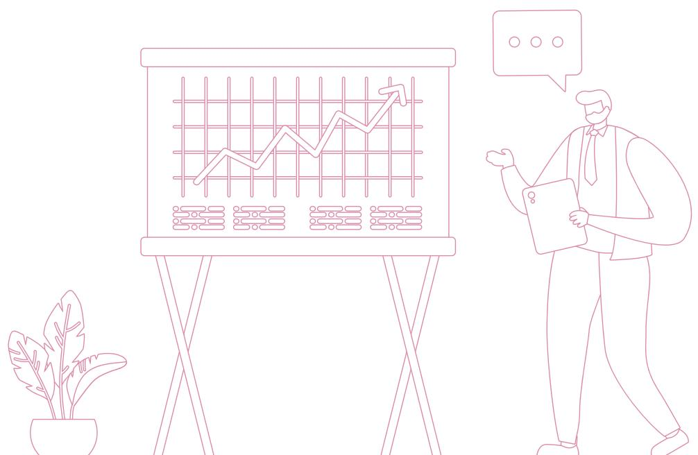

natural_image

Line drawing of a businessman standing next to a presentation board with charts and a speech bubble (no text or symbols)

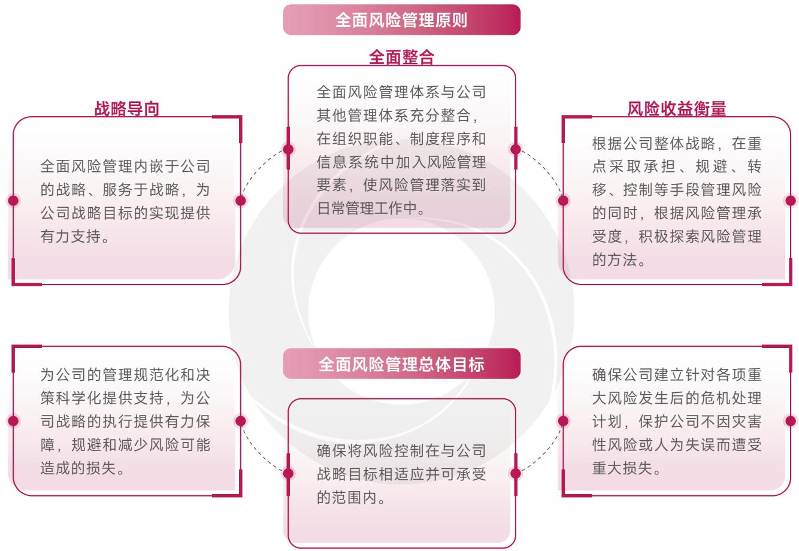

flowchart

```mermaid
graph TD
  Root["全面风险管理原则"]
  
  subgraph sg["\"战略导向\""]
    A1["全面风险管理内嵌于公司的战略、服务于战略，为公司战略目标的实现提供有力支持。"]
  end
  
  subgraph sg_2["\"全面整合\""]
    B1["全面风险管理体系与公司其他管理体系充分整合，在组织职能、制度程序和信息系统中加入风险管理要素，使风险管理落实到日常管理工作中。"]
  end
  
  subgraph sg_3["\"风险收益衡量\""]
    C1["根据公司整体战略，在重点采取承担、规避、转移、控制等手段管理风险的同时，根据风险管理承受度，积极探索风险管理的方法。"]
  end
  
  subgraph sg_4["\"全面风险管理总体目标\""]
    D1["确保将风险控制在与公司战略目标相适应并可承受的范围内。"]
  end
  
  Root --> A1
  A1 -.-> B1
  B1 -.-> C1
  
  subgraph sg_5["\"为公司的管理规范化和决策科学化提供支持，为公司战略的执行提供有力保障，规避和减少风险可能造成的损失。\"]"]
  D1 -.-> D1
  
  subgraph sg_6["\"确保公司建立针对各项重大风险发生后的危机处理计划，保护公司不因灾害性风险或人为失误而遭受重大损失。\"]"]
  D1 -.-> D1
  
  Root --> D1
  
  Root --> B1
```

# 董事会

全面风险管理工作的最高领导机构，对公司全面风险管理的有效性负责。

# 总办会

负责公司重大风险管理事项的集中审议，对董事会负责，并根据董事会授权，行使相应的决策职能。

# 总经理

对全面风险管理工作的有效性向董事会负责，负责组织全面风险管理的日常工作。

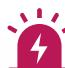

# 风险管理部

负责公司全面风险管理工作的组织协调和综合管理工作。

# 其他各部门

配合风险管理部的组织、协调、监督工作。

# 全面风险管理组织架构

# - 投资项目风险管理

公司持续规范和加强已投资项目管理，严格遵循合规性、谨慎性、持续性、全面性、及时性与真实性六大原则，制定并实施《项目投资管理工作指引》，对项目投资、投后管理及退出环节的决策流程与运营规范进行全方位标准化管控。

同时，公司进一步明确各环节风险管控责任人，针对潜在及已暴露风险及时采取有效应对措施，化解或最大限度地降低风险影响。

项目投资风险管理责任

<table><tr><td>项目负责人</td><td>投后管理第一责任人,负责项目全流程、全生命周期投后管理。</td></tr><tr><td>部门、中心负责人或基金经理</td><td>对投后管理负有管理责任。</td></tr><tr><td>项目组分管领导</td><td>对投后管理负直接领导责任。</td></tr><tr><td>中后台部门</td><td>按部门职责对投后管理提供业务协同与监督。</td></tr><tr><td>其他各部门</td><td>配合风险管理部的组织、协调、监督工作。</td></tr></table>

# 项目投资阶段风险管理流程

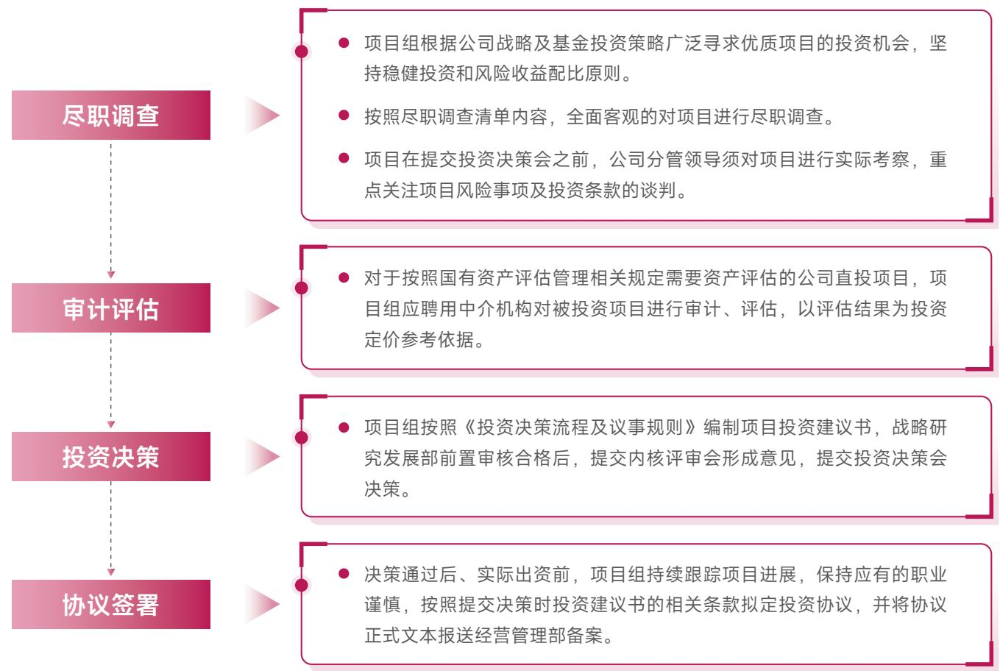

flowchart

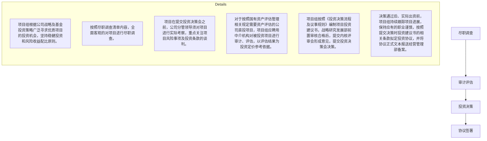
```mermaid
graph TD
  A["尽职调查"] --> B["审计评估"]
  B --> C["投资决策"]
  C --> D["协议签署"]
  
  subgraph Details
    direction TB
    A1["项目组根据公司战略及基金投资策略广泛寻求优质项目的投资机会，坚持稳健投资和风险收益配比原则。"]
    A2["按照尽职调查清单内容，全面客观的对项目进行尽职调查。"]
    A3["项目在提交投资决策会之前，公司分管领导须对项目进行实际考察，重点关注项目风险事项及投资条款的谈判。"]
  end
  
  subgraph Details
    direction TB
    B1["对于按照国有资产评估管理相关规定需要资产评估的公司直投项目，项目组应聘用中介机构对被投资项目进行审计、评估，以评估结果为投资定价参考依据。"]
  end
  
  subgraph Details
    direction TB
    C1["项目组按照《投资决策流程及议事规则》编制项目投资建议书，战略研究发展部前置审核合格后，提交内核评审会形成意见，提交投资决策会决策。"]
  end
  
  subgraph Details
    direction TB
    C2["决策通过后、实际出资前，项目组持续跟踪项目进展，保持应有的职业谨慎，按照提交决策时投资建议书的相关条款拟定投资协议，并将协议正式文本报送经营管理部备案。"]
  end
```

在投后管理阶段，公司项目组建立常态化跟踪管理机制，通过实地考察、高管访谈等方式，定期了解投资项目运营实况，收集财务报表、经营数据、三会决议等核心资料，实时掌握项目运行第一手信息，做到风险隐患早识别、早预警、早处置，做好管理工作的留痕存档。

# - 风险偏好管理

公司严格遵循一致性、传导性及定性定量相结合的核心原则，制定《风险偏好管理办法》，系统推动风险偏好的建设与执行，实现公司发展战略与风险管控的有效平衡。公司明确风险管理部作为风险偏好的牵头管理部门，负责公司风险偏好的整体传导，财务部负责流动性风险偏好管理，综合办公室负责声誉风险、战略风险与信息科技风险的偏好管理，各部门分工明确、协同联动，形成权责清晰、运转高效的风险管理责任体系。

风险管理部: 信用风险、操作风险（含法律合规风险）及其他风险

资本市场业务部: 市场风险

财务部: 流动性风险

综合办公室（党群工作部、安全监管部）：声誉风险、战略风险和信息科技风险

# - 风险预警与追踪

公司持续健全风险防控机制，制定《投资项目风险预警管理办法》，规范风险识别、评估、监控与应对全流程，明确风险管理部负责汇总整理项目风险预警信息、建立专项预警台账、跟踪督促项目组落实处置措施，形成风险管理闭环，为投资项目稳健运行筑牢安全防线。

# 风险识别预警追踪流程

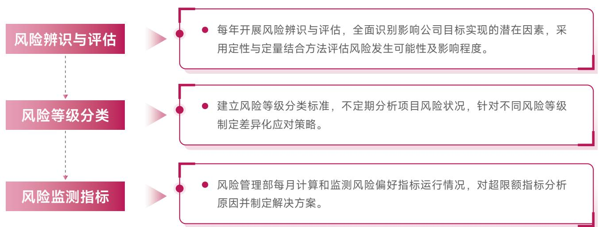

flowchart

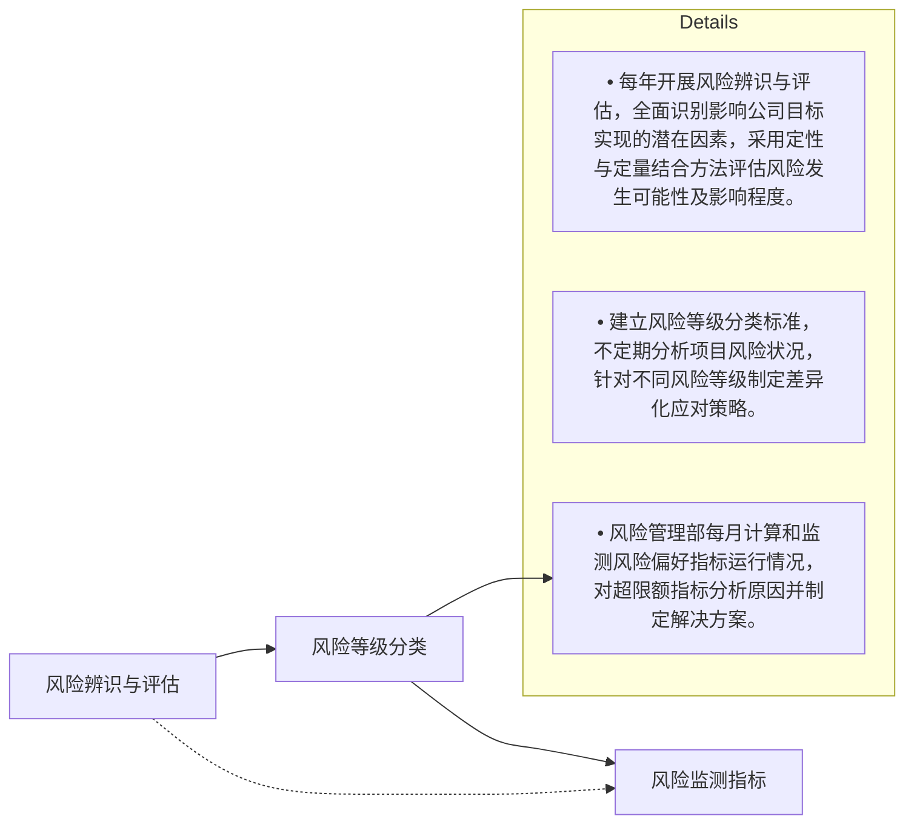
```mermaid
graph LR
  A["风险辨识与评估"] --> B["风险等级分类"]
  A -.-> C["风险监测指标"]
  
  subgraph Details
    D["• 每年开展风险辨识与评估，全面识别影响公司目标实现的潜在因素，采用定性与定量结合方法评估风险发生可能性及影响程度。"]
    E["• 建立风险等级分类标准，不定期分析项目风险状况，针对不同风险等级制定差异化应对策略。"]
    F["• 风险管理部每月计算和监测风险偏好指标运行情况，对超限额指标分析原因并制定解决方案。"]
  end
  
  B --> C
  B --> F
```

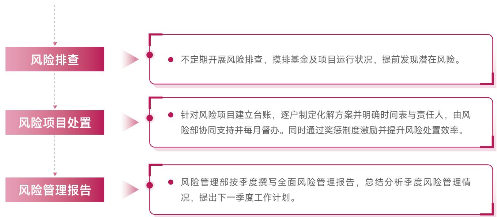

flowchart

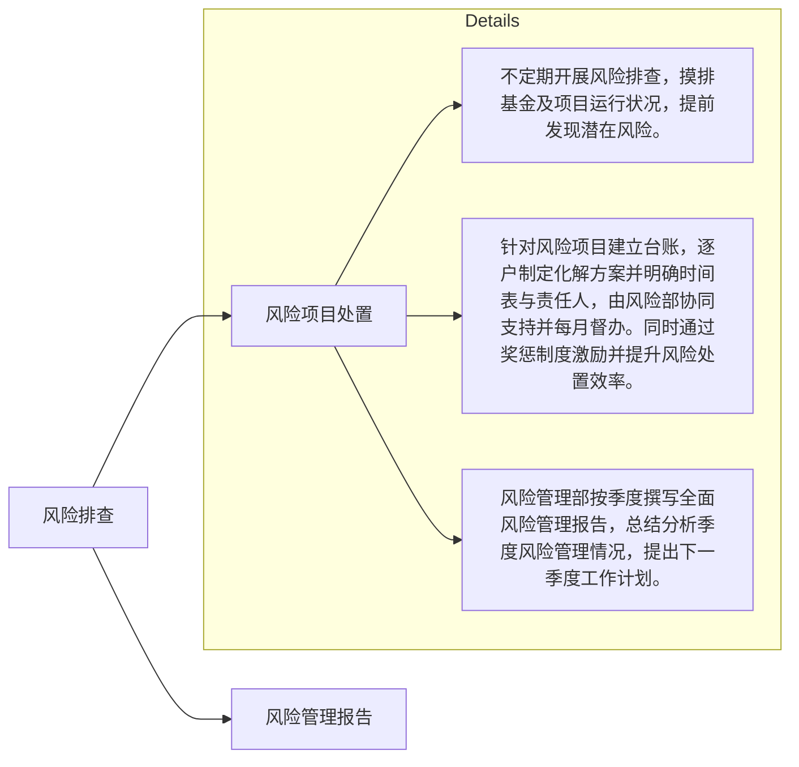
```mermaid
graph LR
  A["风险排查"] --> B["风险项目处置"]
  A --> C["风险管理报告"]
  
  subgraph Details
    direction TB
  B --> D["不定期开展风险排查，摸排基金及项目运行状况，提前发现潜在风险。"]
  B --> E["针对风险项目建立台账，逐户制定化解方案并明确时间表与责任人，由风险部协同支持并每月督办。同时通过奖惩制度激励并提升风险处置效率。"]
  B --> F["风险管理部按季度撰写全面风险管理报告，总结分析季度风险管理情况，提出下一季度工作计划。"]
  end
```

# - 风险管理培训

公司积极引导全员树立审慎主动的风险管理理念，采用定期与不定期相结合的方式组织开展风险管理专题培训，推动风险管理内化为员工日常工作的行为自觉与职业素养。

# 关键绩效

报告期内，公司开展风险培训1次，培训总时长2小时，参与培训90人次。

# 案例

# “大课来袭”业务培训暨警示教育活动

2025年7月3日，公司面向全体干部员工举办“大课来袭”业务培训暨警示教育活动，通过“业务培训+警示教育”两位一体模式，讲授股权投资尽调的方法论与实战要点，并深入剖析违反中央八项规定精神的典型案例，深度融合专业能力建设与纪律教育，有效提升全员风险防控意识与合规履职能力。

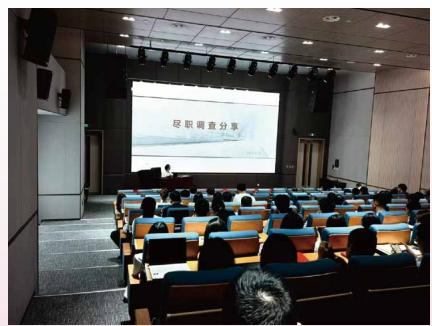

text_image

尽职调查分享

报告期内，公司风险管理部牵头完成2025年度风险辨识评估报告，评估范围涵盖项目尽职调查、投资决策、投后管理及项目退出等阶段，并纳入公司内外部经营环境、宏观经济政策及行业竞争态势等潜在风险因素。通过各部门识别汇总风险初始信息，分析风险发生可能性与影响程度，评定防控重要性级别，最终依据评估结果明确风险责任部门，并针对重要风险事项制定具体管理策略与应对措施。

# ○ 内部控制

公司严格遵循《企业内部控制基本规范》及配套指引等法律法规要求，结合发展战略与经营实际，持续健全各项管理制度，已构建起覆盖公司治理、战略管理、人力资源、财务管理、投资管理及风险管理的内部控制体系。

公司坚持每年开展内部控制评价工作并编制《内部控制评价报告》。报告期内，审计部联合纪委、综合办公室（党群工作部、安全监管部）组成专项审计组，采取“突出重点、分步实施”的策略开展年度内部审计工作，聚焦实业板块，通过现场审查公司及子公司财务收支、经营管理等关键环节，切实保障内部控制体系长效合规运行。

# - 关联交易

公司依据《上海证券交易所股票上市规则》《上海证券交易所上市公司自律监管指引第5号——交易与关联交易》及《公司章程》的规定，制定并严格执行《关联交易管理制度》，对关联交易的定价原则、信息披露要求及决策审批程序作出明确规定，严格规范公司关联交易行为，保障公司及全体股东合法权益。

# 税务管理

公司严格遵循国家税务法律法规，结合自身经营实际，制定并完善《财务管理制度》《发票管理暂行办法》等管理制度，规范发票管理及相关业务流程。公司密切关注税收政策动态，通过强化内部沟通与协作，确保各项税款按时、足额缴纳，有效管控纳税风险。同时，公司定期组织财务、税务及相关业务部门人员参加专项税收政策培训，深入学习最新法规与政策解读，持续提升税务处理的合规性、准确性与专业化水平。

# - 税务风险管理

公司已建立并持续完善税务风险管理体系，设立专职税务管理岗位，由专业人员负责税务政策解读、风险评估及合规监督，同时明确各部门的职责与操作流程，确保日常经营活动严格遵守税法规，从源头防范税务违法违规风险。

为强化风险管控，公司定期组织开展内部税务合规专项检查，并聘请独立第三方税务审计机构进行专业审计，借助外部专业力量识别潜在税务风险与合规问题，及时获取改进优化建议，持续提升公司税务管理的合规性、稳健性与透明度。

# 保障投资者权益

# 信息披露

公司严格遵循《上市公司信息披露管理办法》《上海证券交易所上市公司自律监管指引第2号——信息披露事务管理》等相关规定，制定《信息披露管理制度》《信息披露暂缓与豁免管理制度》，明确证券业务部（董事会秘书处）为信息披露常设机构，董事会秘书负责信息披露工作的组织与协调，确保披露信息真实、准确、完整、及时，保持信息披露的持续性和一致性，维护投资者知情权与合法权益。

# 关键绩效

报告期内，公司共对外披露4份定期报告，43份临时报告，未发生因信息披露违规受处罚的情形。

# 投资者交流

公司依据《公司法》《证券法》《上海证券交易所上市公司自律监管指引第1号——规范运作》等相关规定，制定《投资者关系管理制度》，明确董事长为投资者关系管理工作的第一责任人，董事会秘书处作为投资者关系管理职能部门，全面负责相关工作的具体执行与日常协调。公司搭建多元化沟通渠道，通过召开业绩说明会、接听投资者来电、及时回复上证e互动问题等渠道，积极开展与利益相关方的互动沟通，保障投资者知情权与参与权，持续深化交流的深度与广度，增进市场对公司的了解与认同。

# 案例

# 2024年度业绩说明会

2025年5月16日，公司采取“视频录播+文字互动”的方式召开2024年度业绩说明会，公司董事长王旭冬、总经理葛效宏、首席财务官段晓旭、董事会秘书韩俊、独立董事刘洪渭等参加说明会，就公司战略发展规划、投资业务开展、经营业绩状况等投资者关心的问题进行沟通交流。

# 关键绩效

报告期内，公司举办业绩说明会3次，接待机构投资者调研1次，通过上证e互动回复投资者提问200余次，接听投资者电话400余次。

# - 股东回报

公司高度重视对投资者的合理投资回报，实施积极利润分配政策，在分配中严格遵循同股同权、同股同利等原则，在兼顾长远发展、全体股东整体利益及可持续发展的前提下，优先采用现金分红的利润分配方式，同时根据实际情况采用现金、股票或二者相结合的合法形式，实现股东回报与公司健康发展的有机统一。

# 公司近三年分红实施情况

2025年

每股派发现金红利0.07元利润分配总额5,210.52万元

2024年

每股派发现金红利0.11元利润分配总额8,187.95万元

2023年

每股派发现金红利0.23元利润分配总额17,120.26万元

# ○ 债权人保护

公司始终将保障债权人合法权益作为公司治理的重要环节，采取稳健审慎的财务管理策略，致力于维持健康的资产负债结构。公司严格遵守与债权人约定的各项合同条款，履行偿债义务，建立重大信息通报机制，及时向债权人披露与其权益相关的公司重大情况，有效保障债权人知情权与合法权益。

# 关键绩效

报告期内，公司信用评级AA，未发生债务违约事件。

# 恪守商业道德

# - 反商业贿赂与反贪污

公司以习近平新时代中国特色社会主义思想为指导，深入学习贯彻党的二十届四中全会及二十届中央纪委四次全会精神，全面落实省纪委十二届四次会议及鲁信集团纪委工作部署，聚焦监督主责主业，深化正风肃纪反腐，以高质量纪检工作护航公司高质量发展，为“清廉鲁信”建设筑牢基层根基。

# - 廉洁监督机制

公司坚持制度先行，制定完善《加强干部员工“八小时以外”行为监督办法》《纪委开展党内谈话工作制度》等制度，构建党委统一领导、全面覆盖、协同联动、权威高效的企业内部监督体系，积极整合内部监督资源，加强与审计、财务、综合管理等职能部门的协同联动，建立健全信息共享机制，着力构建“大监督”工作格局，促进党内监督、职能监督与民主监督有机融合，全面提升监督体系效能。

此外，公司贯彻落实《关于加强对“一把手”和领导班子监督的若干措施》，组织签订《“一岗双责”责任书》，加强对“一把手”和领导班子监督，压实党组织管党治党主体责任、书记第一责任人责任及领导班子成员“一岗双责”。

# 关键绩效

报告期内，公司“一岗双责”责任书签订率为100%。

# - 廉洁风险管理

公司聚焦创投主业，紧盯重点基金与项目，依托《廉洁风险防控管理工作指引》，构建了“权责清晰、流程规范、风险明确、防控有力”的廉洁风险防控体系。围绕决策、财务、合同等关键管理环节，以及基金募资、尽职调查等重点业务开展风险识别与防控，并通过运用大数据、信息化等手段实施嵌入式监督，持续完善惩治震慑、制度约束、监督检查与教育预防相结合的廉洁风险防控管理机制。

# - 廉洁举报管理

公司建立纪检监察机制，开通监督举报专线电话、信访举报等渠道，受理内外部利益相关方反映的违纪违法问题，确保各类举报信息得到及时、准确、妥善地处理与解决。公司提倡实名举报，对实名检举控告人的个人信息及举报内容采取严格保密措施，坚决杜绝任何形式的打击报复，全面落实举报人保护机制。

# 举报渠道

# 来信地址

济南市历下区奥体西路2788号历下总部商务中心A塔28F

# 邮编

250101

# 监督举报电话

0531-51759201

natural_image

Line drawing of a person using a telephone to watch a magnifying glass over an envelope, with no text or symbols present.

# 案例

# 党风廉政建设和反腐败工作会议

报告期内，公司召开2025年度党风廉政建设和反腐败工作会议，汲取有关违纪违法案件经验教训，组织干部员工集中观看反腐警示教育片4部，用身边人身边事以案明纪、以案说法，汲取有关违纪违法案件经验教训。

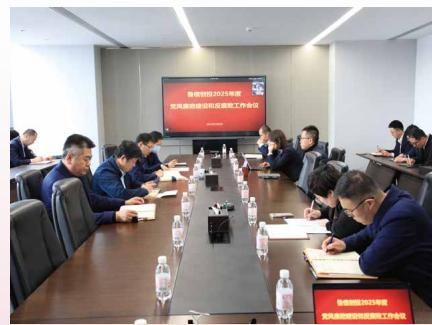

text_image

香港创投2025年度
 Hongkong's Intangible Cultural Heritage and Heritage Work Conference
香港创投2025年度
 Hongkong's Intangible Cultural Heritage and Heritage Work Conference

# 案例

# “我爱创投我的家”清廉家访活动

报告期内，公司组织开展“我爱创投我的家”清廉家访活动，对7名重点岗位干部员工开展了廉洁家访，重点围绕廉洁教育、工作生活情况、家庭家风建设等方面进行沟通，共筑家庭廉洁防线。

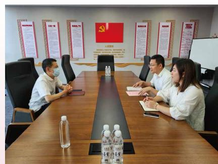

text_image

Meeting room scene with three people seated around a table, featuring posters and a Communist Party flag in the background.

反商业贿赂及反贪污培训情况

<table><tr><td>参加反商业贿赂及反贪污培训的董事人数</td><td>9人</td></tr><tr><td>参加反商业贿赂及反贪污培训的董事人数占比</td><td>100%</td></tr><tr><td>参加反商业贿赂及反贪污培训的管理层人数</td><td>37人</td></tr><tr><td>参加反商业贿赂及反贪污培训的管理层人数占比</td><td>100%</td></tr><tr><td>参加反商业贿赂及反贪污培训的基层员工人数</td><td>222人</td></tr><tr><td>参加反商业贿赂及反贪污培训的基层员工人数占比</td><td>100%</td></tr></table>

# - 反不正当竞争

公司严格遵守《中华人民共和国反不正当竞争法》《中华人民共和国反垄断法》等法律法规，坚持合规运营与公平竞争原则，坚决抵制商业贿赂、垄断及一切形式的不正当竞争行为，并要求全体员工恪守商业道德规范。同时，为规范对外信息传播，子公司磨具公司制定《自媒体工作管理办法》，对相关信息发布执行严格审批流程，坚决杜绝夸大与虚假宣传，确保对外信息真实、准确、透明，有效降低合规与声誉风险。报告期内，公司未发生与不当竞争及反垄断相关的重大法律诉讼事件。

# 案例

# 积极开展不正当竞争宣传

报告期内，公司积极响应国家市场监督管理总局等部门关于“2025年中国公平竞争政策宣传周”的号召，围绕“统一大市场 公平竞未来”主题，在全公司范围内组织开展了公平竞争政策宣传活动。

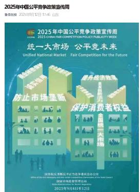

text_image

2025年中国公平竞争政策宣传图
2025年中央军民政治协商会议·中央军民委员会
鲁豫总局 2025年9月12日 11:46（后）
2025年中国公平竞争政策宣传图
統一大市场 公平党未来
Unified National Market Fair Competition for the Future
防止市场垄断
提升经济效率
保护消费者权益
全面扩大市场
国务院办公厅发布《关于加强中央军民政治协商会议工作的通知》
国家税务总局
2025年9月8日至12日

2025年中国公平竞争政策宣传周海报

# - 反洗钱管理

公司严格遵守《中华人民共和国反洗钱法》等法律法规及监管要求，在日常经营及资金往来中，始终坚持合法合规原则，高度重视反洗钱与反恐怖融资合规工作，持续完善客户尽职调查、交易监测、记录保存、员工培训等内控措施。报告期内，公司未发生洗钱、恐怖融资及其他相关违规事件。

natural_image

Line drawing of a business process with two people interacting around a large screen and document, no text or symbols present.

# 02

# 低碳引领 赋能绿色发展

鲁信创投积极响应国家“双碳”目标，紧扣《绿色金融支持项目目录（2025年版）》政策导向，将绿色低碳理念深度融入运营全流程，持续完善环境管理体系，健全环境风险应急管控机制，稳步提升资源利用效率，确保各类污染物稳定达标排放。同时，公司深化绿色金融战略落地，为低碳、环保项目提供资金支持，助力绿色经济发展，推动经济社会高质量可持续发展。

# 我们的行动

\- 应对气候变化
- 环境合规管理
- 促进低碳运营
- 聚力绿色发展

# 响应的SDGs

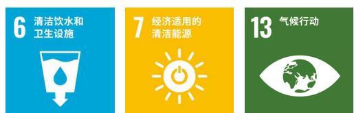

natural_image

Green globe with a human face surrounded by green leaves and a circuit board, symbolizing global sustainability or ecosystem growth (no text or symbols)

# 应对气候变化

随着全球气候治理迈入实质性落地阶段，鲁信创投深刻认识到气候变化对投资组合价值、业务布局及长期发展的深远影响。公司持续响应“碳达峰、碳中和”国家战略，严格遵循交易所最新监管要求，深化应用气候相关财务信息披露工作组（TCFD）框架核心要义，从治理、战略、风险管理、指标和目标四个维度出发，系统推进气候变化相关风险与机遇的识别、管理与披露工作。

# 治理

公司严格恪守相关法律法规与监管要求，持续完善气候治理工作体系，将气候风险与机遇管理深度融入ESG整体工作脉络。由董事会承担气候相关事宜的监督职责，统筹推进责任落地，各职能部门协同联动，在业务全流程中稳妥防范气候风险、主动捕捉转型机遇，合力应对气候变化带来的挑战，助力公司实现长期可持续发展。

# 战略

公司参照气候相关财务信息披露工作组（TCFD）分类标准，结合创投行业属性及投资业务实际，系统识别气候相关核心风险与转型机遇，针对识别结果制定并落地应对举措，以资本赋能绿色低碳产业发展，助力国家“双碳”目标实现。

<table><tr><td colspan="2">风险类型</td><td>风险描述</td><td>发生概率</td><td>影响大小</td><td>影响时间范围</td><td>影响价值链环节</td><td>优先级排序</td><td>潜在财务影响</td><td>应对措施</td></tr><tr><td rowspan="2">物理风险</td><td>急性风险</td><td>公司、客户及投资企业可能面临极端天气(如台风、洪水、暴风雨等)、极端气候灾害导致财产损失或运营中断。</td><td>低</td><td>高</td><td>短、中期</td><td>上游、运营</td><td>中</td><td rowspan="2">设施修复与设备维护成本增加,产能临时损失,投资回款延迟;资源及原材料采购成本攀升,工艺调整投入增加,被投项目估值波动,生产周期适配成本上升。</td><td rowspan="2">优化应急防控预案,升级运营设施防护能力,定期组织应急演练,提高自身应对突发事件的能力;关注易受极端天气影响的客户和投资项目,关注其运营情况,及时管控相关气候风险;在日常生产运营中践行节能减排和绿色办公,使用减碳技术,减少能源消耗和温室气体排放。</td></tr><tr><td>慢性风险</td><td>由于长期气候变迁(水资源短缺、海平面上升等风险)引发的渐进式影响,可能对公司的正常运营造成影响;另一方面,可能对部分投资企业的稳定生产运营造成阻碍,影响其市场估值。</td><td>高</td><td>中</td><td>中、长期</td><td>上游、运营</td><td>中</td></tr></table>

<table><tr><td colspan="2">风险类型</td><td>风险描述</td><td>发生概率</td><td>影响大小</td><td>影响时间范围</td><td>影响价值链环节</td><td>优先级排序</td><td>潜在财务影响</td><td>应对措施</td></tr><tr><td rowspan="4">转型风险</td><td>政策和法律风险</td><td>全球低碳转型背景下,国家不断推出严格的环保政策和法规,可能导致公司、客户及投资企业因无法满足政策和监管要求而面临违规、处罚和诉讼等事件,给公司带来财务损失。</td><td>高</td><td>高</td><td>短、中、长期</td><td>上游、运营</td><td>高</td><td>合规投入增加,被投企业估值承压,投资减值风险上升。</td><td>·将气候合规指标纳入投前尽调核心体系,建立动态合规跟踪机制;·对投资项目开展包括气候相关风险的ESG尽职调查,包括但不限于:碳排放管理、能源管理等。</td></tr><tr><td>技术风险</td><td>绿色低碳技术迭代速度加快,公司需不断提升磨具产品创新研发水平,优化创投项目管理,可能会增加技术研发、数字化创新的资本投入。</td><td>高</td><td>高</td><td>中、长期</td><td>运营、下游</td><td>高</td><td>技术迭代投入增加,投资项目退出价值下降,回报不及预期。</td><td>·聚焦低碳技术赛道精准投资,布局前瞻性绿色技术项目;·投后设立技术赋能专项,助力被投企业加速迭代升级,规避替代风险。</td></tr><tr><td>市场风险</td><td>“双碳”政策的实施将加速淘汰高碳产品及行业,推动经济转型,如公司不加大对低碳产业、节能环保企业的投资,将在市场竞争中处于劣势地位。</td><td>中</td><td>中</td><td>短、中、长期</td><td>上游、下游</td><td>中</td><td>投资收益减少,投资组合调整成本上升,采购溢价增加。</td><td>·持续加大对新材料、新能源、节能环保等领域绿色技术创新企业的投资力度。</td></tr><tr><td>声誉风险</td><td>被投企业环境负面事件易传导至公司,叠加ESG信息披露要求提高,可能损害品牌声誉及投资者信心。</td><td>中</td><td>中</td><td>短、中期</td><td>运营、下游</td><td>中</td><td>品牌价值受损,融资渠道受限,合作机会减少。</td><td>·建立被投企业ESG表现常态化跟踪机制,提前预警环境负面风险;·规范自身ESG信息披露流程,强化品牌声誉管理。</td></tr></table>

<table><tr><td>机遇类型</td><td>机遇描述</td><td>发生概率</td><td>影响大小</td><td>影响时间范围</td><td>影响价值链环节</td><td>优先级排序</td><td>潜在财务影响</td><td>应对措施</td></tr><tr><td>资源效率</td><td>通过提高能源、水资源和物料的利用效率,践行绿色生产和运营模式,有利于公司减少资源浪费,降低运营成本。</td><td>高</td><td>中</td><td>短、中期</td><td>上游、运营</td><td>高</td><td>运营成本下降,被投企业估值提升,获取资源节约补贴收益。</td><td>●使用高能效的设备和物料,提高资源利用率;●投后赋能被投企业开展能效提升改造,申报绿色补贴。</td></tr><tr><td>市场机遇</td><td>在低碳经济背景下,低碳产品需求扩容与绿色金融支持,有利于公司开拓新的市场和业务。</td><td>高</td><td>中</td><td>中、长期</td><td>上游、下游</td><td>高</td><td>投资规模扩大,退出收益提升,绿色融资成本优势凸显。</td><td>●设立绿色投资基金,聚焦低碳赛道优质项目,对接绿色金融工具。</td></tr><tr><td>产品和服务</td><td>气候变化、绿色金融相关政策的出台,对市场具有积极引导作用,被投企业低碳产品研发与绿色服务升级,增加公司收益。</td><td>中</td><td>中</td><td>短、中期</td><td>运营、下游</td><td>中</td><td>被投企业营收增长,获取绿色服务管理费,投资标的增值。</td><td>●积极开展绿色创新,关注新的产品和服务市场,抓住发展机遇。</td></tr></table>

# 说明：

发生概率：指风险\机遇发生的频次间隔、发生的可能性，主要根据历史发生的概率、外部情景、政策实施的进展和专家预测判断。发生概率从“低”到“高”。

影响大小：指通过冲击水平和风险\机遇发生可能性判定影响的大小，综合考虑对商业模式、价值链、财务影响等因素。影响大小从“低”到“高”。

影响的时间范围：不同风险和机遇对公司产生影响，公司将影响的时间范畴划分为短期（0-1年）、中期（1—5年）、长期（5年以上）。

影响的价值链环节：指上游（涉及原材料供应商、采购和物流等环节）、运营（涉及生产、制造和内部流程等环节）、下游（涉及分销、销售和客户服务等环节）。

优先级排序：综合考虑发生概率、影响大小、影响时间范围等因素，结合公司实际，优先级排序分为“低”“中”“高”。

注：报告其他章节关于发生概率、影响大小、影响的时间范围、影响的价值链环节、优先级排序定义与上文一致，将不再重复说明。

# 影响、风险和机遇管理

为有效推进气候相关风险和机遇管理工作，公司根据实际业务和战略，定期开展气候风险和机遇的识别、评估机制，并制定针对性的应对措施。

# 风险识别

参考TCFD建议披露框架，基于公司业务特征，从物理风险、转型风险和机遇三方面识别对公司生产运营及投资业务有影响的风险和机遇类型。

# 风险评估

针对识别出的风险和机遇，结合专家判断和同业对标，从发生概率、影响程度、影响的时间范围等维度进行实质性评估。

# 风险应对

分析识别出主要气候风险和机遇对公司的潜在财务影响，并通过投资绿色低碳产业、绿色生产运营等方式降低气候变化相关风险，把握机遇。

# ○ 指标和目标

为助力国家“双碳”目标实现，公司积极践行各阶段碳减排目标和路径，报告期内，公司温室气体排放总量较去年下降了5.64%，碳减排工作稳步推进、成效显著。

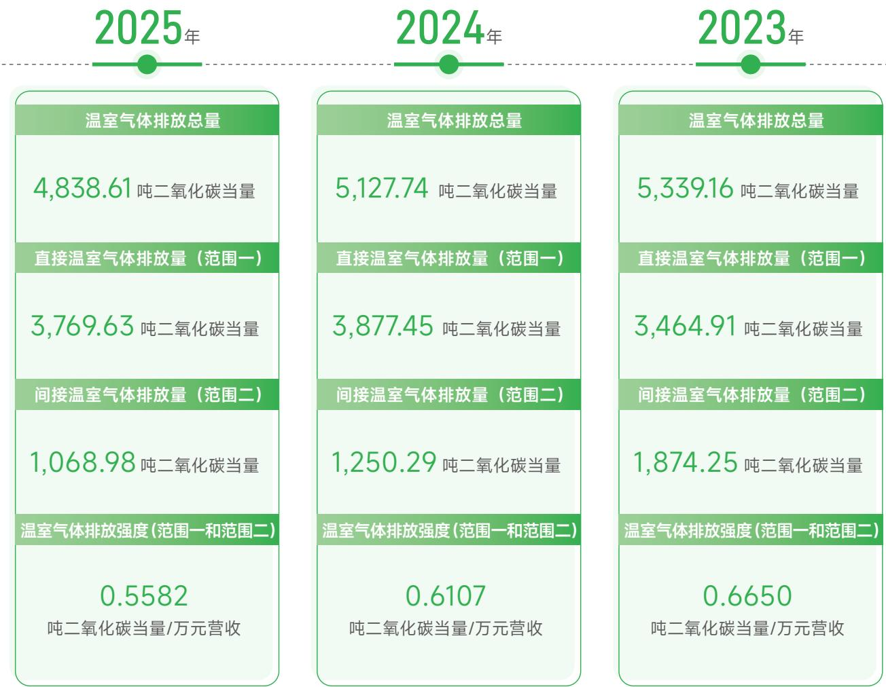

bar

| 年份 | 指标 | 数值 (吨二氧化碳当量/万元营收) |
| :--- | :--- | :--- |
| 2025年 | 温室气体排放总量 | 4,838.61 |
| 2025年 | 直接温室气体排放量（范围一） | 3,769.63 |
| 2025年 | 间接温室气体排放量（范围二） | 1,068.98 |
| 2025年 | 温室气体排放强度(范围一和范围二) | 0.5582 |
| 2024年 | 温室气体排放总量 | 5,127.74 |
| 2024年 | 直接温室气体排放量（范围一） | 3,877.45 |
| 2024年 | 间接温室气体排放量（范围二） | 1,250.29 |
| 2024年 | 温室气体排放强度(范围一和范围二) | 0.6107 |
| 2023年 | 温室气体排放总量 | 5,339.16 |
| 2023年 | 直接温室气体排放量（范围一） | 3,464.91 |
| 2023年 | 间接温室气体排放量（范围二） | 1,874.25 |
| 2023年 | 温室气体排放强度(范围一和范围二) | 0.6650 |

注：温室气体排放总量与直接温室气体排放量（范围一）计算系数采用国家温室气体排放因子库和《综合能耗计算通则2020》。间接温室气体排放量（范围二）计算使用全国电排因子。

# - 温室气体排放管理

公司温室气体排放核心来源于磨具业务生产环节的天然气、电力消耗，以及创业投资业务运营过程中的电力使用。为扎实推进温室气体排放管控与减排工作，公司在生产端积极应用低碳技术优化能耗结构，同时聚焦绿色投资方向布局，稳步推动自身及产业链低碳转型。

# 环境合规管理

# 环境管理

# - 环境管理体系

公司坚定不移践行绿色发展理念，严格遵守《中华人民共和国环境保护法》等环境相关法律法规，按照当地政府环保部门的要求，建立健全环境管理体系，制定《环境卫生洒扫保洁制度》，从制度上落实环境保护工作。报告期内，公司未发生因环境事件受到生态环境等有关部门重大行政处罚的情况。

鲁信高新持续完善环境管理组织架构，明确综合办公室（党群工作部、安全监管部）负责督导和协助磨具公司做好安全生产、环境保护、职业卫生、特种设备和消防安全等管理工作。同时，磨具公司专项设立安环部，专职承担安全生产管控、环保监督检查、员工常态化安全环保教育培训及各类应急预案实战化演练等工作。

# 关键绩效

报告期内，公司环保投入13.34万元，缴纳环境保护税4.51万元，污染物监测合格率100%，环保设施同步运转率100%。

# - 环境风险管理

公司持续完善环境事件风险防范体系，严格遵循《中华人民共和国突发事件应对法》《国家突发环境事件应急预案》等法律法规要求，制定并实施《应急管理制度》《突发环境事件应急预案》，不断提升对突发环境事件的快速响应与处置能力，力争最大限度控制事态发展、降低事件造成的环境影响。

公司定期开展环境突发事件应急演练，针对演练中发现的问题进行持续优化与改进，进一步增强员工的应急意识和处置能力，从而有效减少突发环境事件可能带来的危害风险。

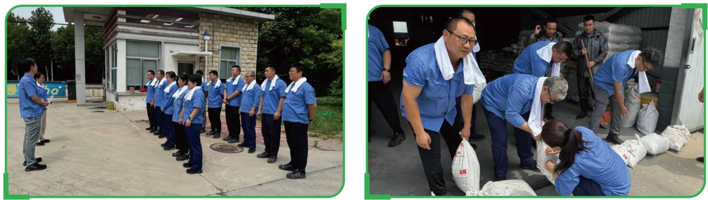  
抗洪演练

# - 环保培训

公司持续推进环保宣传与培训工作，通过组织观看宣传片、举办专题讲座等多种形式，向员工传达环保政策与知识，不断增强全员环保意识和责任担当。同时，我们致力于将绿色发展理念深度融入日常运营，引导员工在实际工作中积极践行，共同为公司的可持续未来贡献力量。报告期内，公司开展环保培训2次，共有140人次参加。

# 案例

# 组织危险废物环境安全警示教育

2025年1月16日，磨具公司组织全体人员学习危险废物环境安全警示教育片文字版（第四版），提升员工对危险废物管理工作的重视程度，强化其危险废物处理的安全防范意识与规范操作能力。

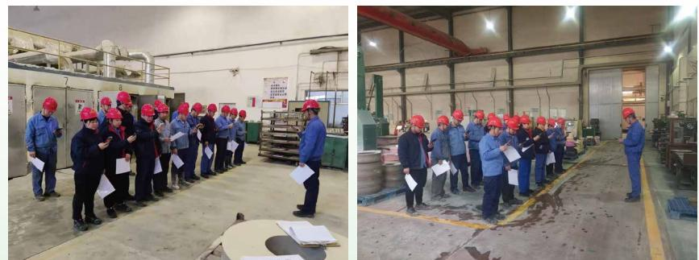

# 污染物排放

公司高度重视污染物排放与废弃物管理，严格遵守《中华人民共和国大气污染防治法》《中华人民共和国固体废物污染环境防治法》等相关法律法规，制定内部管理制度，推动废物减量化处理，确保各项污染物达标排放。

# - 废气管理

公司废气排放主要来源于磨具业务烧成工序使用清洁能源天然气产生的少量有组织废气，以及树脂磨具硬化工艺过程中产生的极少量脂类挥发酚。为实现废气达标排放，公司配套建设SNCR脱硝设施，定期开展维护以用来减少排气筒排放的氮氧化物含量浓度，生产废气经活性炭装置吸附后通过15m高排气筒外排。公司每年定期委托第三方环境检测公司进行大气污染排放检测，检测结果符合排放标准。

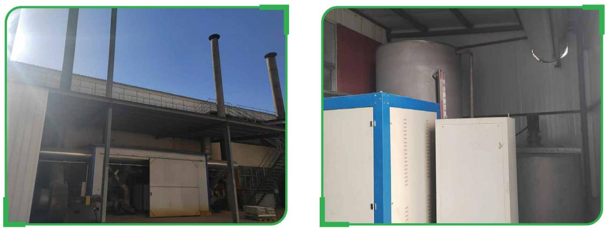  
SNCR脱硝设施

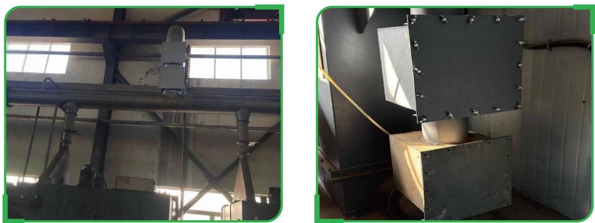  
活性炭净化吸附装置

为提高公司重点时段应急响应措施的科学性、可操作性、可核查性，实现公司应急响应实施方案与落实《高新区重点时段“一企一册”管控清单》的有效衔接，磨具公司编制了《重污染天气应急“一厂一策”实施方案》，在重点时段采取相应的管控措施，实行窑炉生产线轮停计划，共同做好重污染天气应急响应工作。

# - 扬尘管理

磨具公司根据环保局要求，按《工业企业扬尘污染提升行动评分细则》对厂区及厂外连接道路、储存、装卸输送、生产、运行管理环节进行扬尘管理，最大限度地减少生产过程中产生的粉尘排放，降低对环境的影响。

# ○ 废弃物处理

# - 废弃物管理

公司严格遵照国家法律法规要求，对固体废弃物实施全流程分类、收集、转移及合规处置。其中，危险废物主要来源于磨具业务树脂磨具混料、硬化产生的废活性炭和设备换下的废机油。磨具公司严格规范危险废物管理流程，制定《危险废物管理制度》《危险废物污染防治责任制度》，明确总经理是危险废物管理的主要责任人，环保部门对危险废物环境污染防治工作实施统一的监督管理。

# 危险废物管理措施

1. 遵循“统一收集、密封存放、专业处置、消除隐患”的原则，实现危险废物无害化的目标。

2. 组织建设符合环保要求的收集、贮存场所和专用设施。

3. 贮存场所按规范设置环境保护警示标志，有专人负责管理，不得混入生活垃圾等非危险废物中。

4. 与合规的第三方签订固废处置委托合同，按规定程序及时处置废活性炭、废机油等危险废弃物。

5. 建立危险废物出入库制度，做好危险废物情况的记录，留存危险废物转移联单。

# 关键绩效

报告期内，公司危险废物产生量0.21吨，危险废物处置量0.21吨。

natural_image

Simple line drawing of stylized clouds with no text or symbols

# 促进低碳运营

# 能源管理

公司严格遵循《中华人民共和国节约能源法》等法律法规要求，合理优化公司资源配置，不断提高资源利用效率。鲁信高新制定《节约用电管理规定》，明确各部门负责人为节能管理第一责任人，由运营管理部通过不定期检查落实考核，对相关责任人实施奖惩。

# - 目标与规划

<table><tr><td>目标</td><td>2025年完成情况</td></tr><tr><td>积极践行绿色运营,持续提升能源利用效率</td><td>公司通过优化用能管理,稳步降低运营能耗,能源消耗强度0.2958吨标准煤/万元营收,同比下降7.03%</td></tr></table>

# - 节能降耗措施

  
照明用电管理

下班要关闭办公室照明，杜绝白昼灯和长明灯，充分利用自然光。在光线阴暗需要补充照明时，要确保人走灯熄。

  
办公设施用电管理

下班要关闭电脑、打印机、复印机。

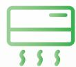  
空调用电管理

夏季制冷设定温度不低于26°C，冬季取暖设定温度不高于23°C（提倡不高于20°C）。禁止敞门和开窗使用空调，办公室超半小时无人时要提前关闭空调。

公司运营过程中使用的能源类型主要为天然气、电力。公司近三年，能源消耗情况如下：

<table><tr><td colspan="2">2025年</td><td colspan="2">2024年</td><td>2023年</td></tr><tr><td>天然气使用量</td><td>174.17万立方米</td><td>天然气使用量</td><td>179.33万立方米</td><td>天然气使用量</td></tr><tr><td>外购电力使用量</td><td>2,014,660.00千瓦时</td><td>外购电力使用量</td><td>2,330,020.80千瓦时</td><td>外购电力使用量</td></tr><tr><td>直接能源消耗量</td><td>2,316.46吨标准煤</td><td>直接能源消耗量</td><td>2,385.09吨标准煤</td><td>直接能源消耗量</td></tr><tr><td>间接能源消耗量</td><td>247.60吨标准煤</td><td>间接能源消耗量</td><td>286.36吨标准煤</td><td>间接能源消耗量</td></tr><tr><td>能源消耗总量</td><td>2,564.06吨标准煤</td><td>能源消耗总量</td><td>2,671.45吨标准煤</td><td>能源消耗总量</td></tr><tr><td>能源消耗强度</td><td>0.2958吨标准煤/万元营收</td><td>能源消耗强度</td><td>0.3182吨标准煤/万元营收</td><td>能源消耗强度</td></tr><tr><td>清洁能源使用量</td><td>2,316.46吨标准煤</td><td>清洁能源使用量</td><td>2,385.09吨标准煤</td><td>清洁能源使用量</td></tr></table>

# ○ 水资源管理

公司经营过程中使用的水资源主要来源于市政供水。公司始终秉持节约用水理念，遵守《中华人民共和国水法》等相关法律法规要求，全方位加强水资源管理，严格控制水资源使用量，提高用水效率，履行企业节水责任。

<table><tr><td colspan="3">近三年公司水资源使用情况</td></tr><tr><td>2025年用水总量17,932吨用水强度2.07吨/万元营收</td><td>2024年用水总量16,775吨用水强度2.00吨/万元营收</td><td>2023年用水总量23,167吨用水强度2.89吨/万元营收</td></tr></table>

# 物料管理

公司始终坚持物料使用的规范化管理，对物料的采购、验收、出入库、保管、盘点和处置等流程进行严格的管控，并持续优化管理水平，通过提升存货周转效率，夯实降本增效基础，助力可持续发展目标达成。鲁信高新制定《存货管理制度》，明确各部门和相关人员的职责和操作规范，规范公司存货管理，保证存货资产的安全，减少资产损失和浪费。

# 绿色办公

公司持续将绿色低碳办公理念融入日常运营管理，通过标语提示等多种形式向员工传递环保政策、绿色生活与资源节约的重要性，将环保观念融入每个员工的日常工作和生活中，提升员工的环保意识，全力打造绿色、低碳、可持续的办公环境。报告期内，公司全年召开视频会200余次，节省线下会议成本。

# 绿色办公举措

1. 倡导无纸化办公，使用OA系统、电子邮件、视频会议等线上办公模式。

2. 推行使用双面打印等方式，减少纸张使用。

3. 安装节能感应灯具，杜绝长明灯、无人灯。

4. 鼓励员工绿色出行，优先选择公共交通出行。

5. 在公司员工群发布节约能源通知、倡议书；张贴节约资源标识。

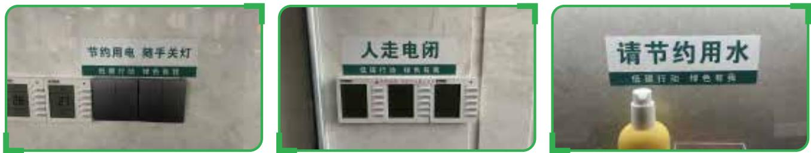

# 聚力绿色发展

公司积极践行新发展理念，持续深耕绿色金融领域。公司制定了《关于聚焦主责主业促进高质量发展的实施意见》，确定绿色低碳为公司聚焦的产业投资方向之一，禁止开展不符合环保、土地、能源消耗、污染排放等有关法律法规的项目。

董事会承担公司绿色发展、绿色金融与绿色投资工作的最终管理责任，负责相关战略规划、重大制度的审定与执行监督，统筹推进公司绿色投资体系建设与可持续发展能力提升。管理层负责组织落实董事会审定的绿色发展相关战略与决议，统筹推进绿色投资业务日常运营与落地执行，保障公司绿色发展各项工作有序推进。公司成立能源科技投资部，聚焦新能源、节能环保等“硬科技”领域投资项目。

# - 目标与规划

# 目标

# 2025年完成情况

持续增加对新能源、节能环保等“硬科技”领域的投资力度

累计投资新能源、节能环保领域项目2个

# - 环境社会风险审查

公司在绿色投资项目的投前、投后全流程中，将ESG风险评估纳入项目尽调与管理体系，多维度研判项目潜在的环境与社会责任相关风险。投前，对潜在投资对象进行专项社会责任和环境影响评估，确保其满足公司设定的ESG（环境、社会及公司治理）标准，并定期对现有投资组合中的企业进行审查，监督其社会责任与环保表现。

# - 绿色投资成果

发展绿色低碳产业是鲁信创投践行国家“双碳”目标的重要举措，公司致力于推进可持续金融实践，为绿色发展项目提供资金支持和市场接入机会，助力低碳经济和绿色产业的发展。近年来，公司深挖绿色投资潜能，把绿色环保作为投资决策的重要考量因素之一，精心筛选具有可持续发展前景的绿色项目，发挥自身优势，加大对新能源、新材料和节能环保领域的绿色项目投资力度。

# 案例

# 战略投资安森智能，赋能油气智能化“小巨人”

2025年12月，鲁信创投参股基金参与西安安森智能仪器股份有限公司(简称“安森智能”)战略融资。安森智能以“聚焦油气领域，提供智慧大脑”作为经营战略，是一家专注于在油气领域提供智能化产品、服务及解决方案的国家级高新技术企业和国家级专精特新“小巨人”企业。安森智能围绕油气领域智能化转型趋势与客户在安全生产、高效运营方面的核心需求，深度融合人工智能、大数据、物联网等新兴技术，构建了涵盖气井智能化生产解决方案、油井智能化生产解决方案、多品类智能仪器仪表、高精度超声波气体流量计、防爆型智能巡检机器人、人工智能防爆云台等在内的核心产品矩阵，切实帮助客户提升油气开采效率、降低综合运营成本，为油气领域智能化转型提供有力支撑。

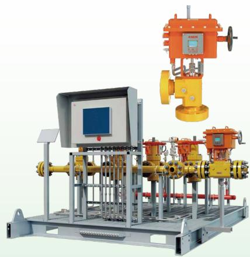

natural_image

Industrial piping and control system with yellow valves and a yellow pump (no visible text or labels)

# - 加强能力建设

鲁信创投致力于提升团队在绿色产业识别、环境风险评估及可持续投资等领域的专业素养，通过定期组织内部培训、邀请行业专家讲座等形式，持续向员工传导最新的绿色金融政策、市场趋势与评估方法。

# - 参与行业交流

鲁信创投积极构建绿色金融合作生态，持续与同业机构、政府部门及行业协会开展多层次交流。通过参与行业峰会、专题研讨及合作洽谈，公司不断拓宽绿色项目渠道，整合优质资源，致力于在绿色低碳领域搭建信息共享、资源协同的合作平台，共同探索绿色投融资创新模式，助力绿色产业健康发展。

# 03

# 责任深耕 赋能产业共兴

鲁信创投始终坚守负责任投资原则，坚持服务实体经济发展主线，聚焦产业升级与科技创新领域，以资本赋能助力实体经济提质增效。同时，公司不断强化研发创新能力培育，加快数字化平台建设，全面提升产品和服务质量管理水平，多措并举保障供应链的安全稳定，以此促进企业高质量发展，为社会经济的稳健运行贡献力量。

# 我们的行动

\- 践行负责任投资
- 服务实体经济
- 坚守产品服务安全品质
- 创新驱动发展
- 强化供应链安全
- 守护数据安全与客户隐私

# 响应的SDGs

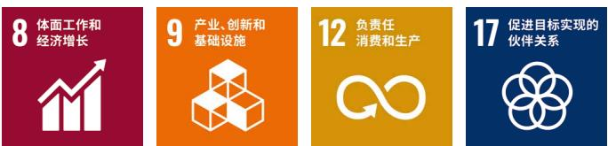

# 践行负责任投资

鲁信创投以“助力国家科技进步，推动山东产业结构转型升级”为使命，锚定“打造国内一流的创新创业生态服务商”发展愿景，以“募、投、管、退”全流程负责任投资策略为核心导向，将环境、社会和公司治理（ESG）因素深度融入投资分析与决策中，保障公司在经济效益稳步增长的同时，实现与环境效益、社会效益的协同提升。

# 治理

公司构建覆盖企业初创期、成长期、成熟期、Pre-IPO的全生命周期投资服务体系，通过旗下旗舰基金管理部、直投业务部等专业化投资团队的精心运作，在追求财务回报最大化的同时，更注重推动被投企业的长期健康发展和社会责任履行。

# 旗舰基金管理部

聚焦山东省“19条标志性产业链”中的新一代信息技术、高端装备等领域，秉持产业链投资理念，持续挖掘市场空间广阔、成长性显著并与已投项目形成协同效应的优质企业，立足服务高水平科技自立自强，着力推动产学研深度融合，强化助力关键核心技术攻坚，汇聚创新资源，赋能转型升级。

# 直投业务部

聚焦高端装备、半导体、新材料等领域，秉持“聚焦产业、发现价值”的投资理念及策略，投资支持了多家优质企业。

# 新兴产业投资部

聚焦商业航天、低空经济等国家战略性新兴产业，持续深耕高端装备、智能制造、先进材料等重点领域，其中极米科技、中农联合、中自科技等多家被投企业已成功登陆资本市场，布局了鸿侠科技、微焓科技、中奕和创等一批潜力项目。

# 先进制造投资部（国际部）

聚焦智能制造、高端装备、电力能源等领域，通过组建多元化一、二级市场投资基金等方式广泛开展境内、境外股权投资及跨境资产配置业务，积极整合国内外科技及产业资源。

# 生命科学投资部（深圳业务部）

聚焦医疗健康、生命科技等领域，主要投资案例包括3DMedicines、佰泽医疗等上市公司，以及硅基仿生、爱博泰克、中科新生命、英赛斯、极瞳生命、达普生物、奥素科技、心寰科技、唯迈医疗等生命科技公司。截至2025年末，基金管理规模超30亿元，累计投资项目50余个，11家被投企业先后登陆资本市场。

# 能源科技投资部（安徽业务部）

聚焦能源科技，装备制造等“硬科技”领域，截至2025年末，参管基金认缴规模50.5亿元，累计投资项目71个，其中专精特新“小巨人”企业21家。

# 战略

在当今复杂多变的投资环境中，公司坚定践行负责任投资原则，将可持续发展理念深度融入投资全流程，主动识别和应对投资项目中的潜在风险与机遇，在推动投资项目符合长期价值创造和社会责任标准的同时，助力社会进步和环境保护协调发展，实现经济效益与社会效益的双赢局面。

<table><tr><td>风险类型</td><td>风险描述</td><td>发生概率</td><td>影响大小</td><td>影响时间范围</td><td>影响价值链环节</td><td>优先级排序</td><td>潜在财务影响</td><td>应对措施</td></tr><tr><td>政策风险</td><td>随着国内金融市场监管体系持续完善,创业投资行业迎来更趋严格的规范化管理要求,公司需要确保投资行为符合最新的法律法规,任何不合规的行为都可能导致罚款、业务限制或声誉损害。</td><td>低</td><td>高</td><td>短、中、长期</td><td>运营</td><td>高</td><td>运营成本增加、投资收益减少</td><td>·跟踪最新法规动态,解读政策导向,确保公司投资活动遵循相关规定。·在投前投后,进行全面的项目尽调,评估潜在的风险。·定期组织针对管理层和关键岗位人员的法律法规培训。</td></tr><tr><td>声誉风险</td><td>若被投企业在社会责任与环境保护方面出现负面事件,不仅会触发法律制裁,还将直接影响公司品牌形象与市场信任度。</td><td>中</td><td>中</td><td>短、中、长期</td><td>运营</td><td>中</td><td>运营成本增加、投资收益减少</td><td>·投前,对潜在投资对象进行全面的社会责任和环境影响评估,确保其满足公司设定的ESG(环境、社会及公司治理)标准。·定期对现有投资组合中的企业进行审查,监督其社会责任与环保表现。</td></tr></table>

<table><tr><td>机遇类型</td><td>机遇描述</td><td>发生概率</td><td>影响大小</td><td>影响时间范围</td><td>影响价值链环节</td><td>优先级排序</td><td>潜在财务影响</td><td>应对措施</td></tr><tr><td>市场机遇</td><td>全球可持续发展浪潮推动环保科技、清洁能源等绿色产业进入高速增长期,为公司带来兼具社会责任与长期收益的投资机会。</td><td>高</td><td>中</td><td>中、长期</td><td>运营、下游</td><td>高</td><td>投资收益增加</td><td>·成立能源科技投资部,聚焦新能源、节能环保等“硬科技”领域投资项目。·加强对环保科技、新能源等领域的研究,掌握最新的技术创新和发展趋势,为精准投资提供决策支持。</td></tr></table>

# 影响、风险和机遇管理

在投资实践中，公司持续完善负责任投资风险和机遇辨识、评估、监控与应对全流程管理，通过动态跟踪政策变化，制定应对措施以减轻负面影响并把握增长机会，确保投资决策既符合监管法规要求，又契合公司的可持续发展目标。

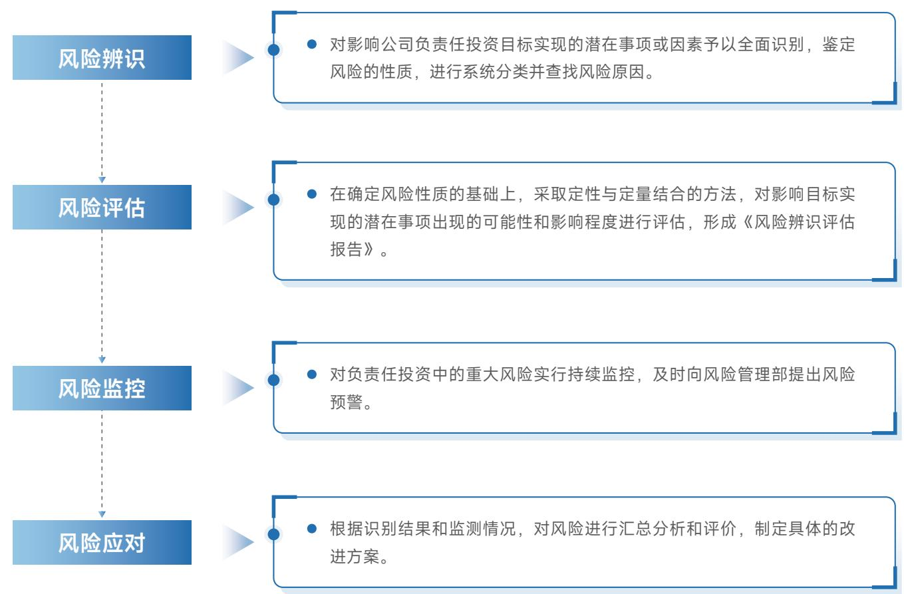

flowchart

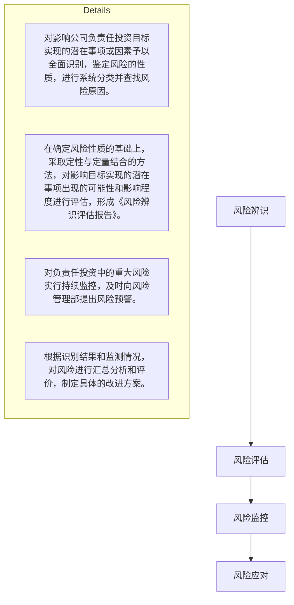
```mermaid
graph TD
  A["风险辨识"] --> B["风险评估"]
  B --> C["风险监控"]
  C --> D["风险应对"]
  
  subgraph Details
    E["对影响公司负责任投资目标实现的潜在事项或因素予以全面识别，鉴定风险的性质，进行系统分类并查找风险原因。"]
    F["在确定风险性质的基础上，采取定性与定量结合的方法，对影响目标实现的潜在事项出现的可能性和影响程度进行评估，形成《风险辨识评估报告》。"]
    G["对负责任投资中的重大风险实行持续监控，及时向风险管理部提出风险预警。"]
    H["根据识别结果和监测情况，对风险进行汇总分析和评价，制定具体的改进方案。"]
  end
```

# 指标和目标

公司在制定投资规划时，不仅注重防范投资风险，并通过主动融入环境、社会及治理因素，将风险防控与价值创造有机结合，从而在实现稳健投资的同时，促进社会经济向更具韧性与公平的方向发展。

<table><tr><td>目标</td><td>2025年完成情况</td></tr><tr><td>聚焦专精赛道,赋能产业发展。</td><td>2025年投资项目中专精特新企业18个。</td></tr></table>

# - 负责任投资成果

<table><tr><td colspan="2">重点关注领域</td></tr><tr><td>新一代信息技术</td><td>通信信息安全网络、工业软件及语言(逻辑)算法模型信息技术核心器件制造</td></tr><tr><td>高端装备制造</td><td>“专精特新”装备、轨道交通设备、航空航天核心装备制造重型机械装备制造</td></tr><tr><td>医疗大健康</td><td>生命科学工具、体外诊断产品、先进医疗器械、高端医疗服务制药(生物)产业</td></tr><tr><td>新能源、新材料</td><td>新型应用分子材料、特种金属材料绿色源网荷储产业、特种制造工艺及设备</td></tr><tr><td>半导体</td><td>新一代半导体材料、半导体核心设备半导体核心耗材、先进封装及检测高性能集成电路</td></tr><tr><td>节能环保</td><td>节能环保技术、装备及耗材、节能环保精密检测设备及仪器循环经济关键技术及装备</td></tr></table>

<table><tr><td>3DMedl</td><td></td><td></td><td></td><td>金麒麟CHEE RESEARCH</td><td>SIBIONICSS硅基仿生</td><td>RINKO</td><td>DFE东方电子</td></tr><tr><td></td><td></td><td></td><td></td><td>惠城科技HEPEET</td><td>XGIMI</td><td>Polariton</td><td>嘉华股份SNOGON HEALTHCORN</td></tr><tr><td>CHVER Transmission</td><td>科源製藥KEYUAN PHARMA</td><td></td><td></td><td>LANDSPACE蓝箭箭天</td><td>LINUO力诺特玻</td><td>MPHC美东汇成</td><td>OZXC南砂集团</td></tr><tr><td>Pansoft</td><td>启迪设计集团股份有限公司Tian Design Group Co., Ltd</td><td></td><td></td><td>三元生物</td><td>山东玻纤集团股份有限公司</td><td>跳跃智行</td><td>LUCION灵抱大鲁信集团环境</td></tr><tr><td></td><td></td><td></td><td></td><td>ouma鸥玛</td><td>圣阳电源SACRED SUN</td><td>VULCAN五方光电</td><td>五方光电</td></tr><tr><td></td><td></td><td></td><td></td><td>ENERFLOW</td><td>APPLIED PROTEIN TECHNOLOGY中科新生命</td><td>中自科技</td><td>心赛科技CARDIOACC</td></tr><tr><td>SNBC新北洋</td><td></td><td></td><td></td><td>Singa</td><td>IRAETA伊莱特股份</td><td>SUNNY ADVENTURE</td><td>Aien</td></tr><tr><td></td><td></td><td></td><td></td><td>COMPRESS康恩顿斯</td><td></td><td colspan="2"></td></tr></table>

重点被投企业或项目

# 关键绩效

报告期内，各参股基金及投资平台完成一级投资项目30个，总投资额12.98亿元，投资领域涉及生物医药及医疗设备、高端装备制造、新能源新材料、软件及信息技术服务、信息技术硬件与设备、高端化工等行业。

报告期内已出资项目如下：  
单位：亿元

<table><tr><td>行业</td><td>项目名称</td><td>地域</td><td>投资主体</td><td>投资额</td></tr><tr><td rowspan="11">高端装备制造</td><td>临工重机股份有限公司</td><td>山东省济南市</td><td>工业高质量发展基金</td><td rowspan="11">4.90</td></tr><tr><td>蓝箭航天空间科技股份有限公司</td><td>北京市</td><td>成都鲁信贰期基金</td></tr><tr><td>江苏中奕和创智能科技有限公司</td><td>江苏省泰兴市</td><td>鲁信济钢基金</td></tr><tr><td>珞石(山东)机器人集团股份有限公司</td><td>山东省济宁市</td><td>惠达鲁信基金</td></tr><tr><td>珠海天晴航空航天科技有限公司</td><td>广东省珠海市</td><td>鲁信皖能基金</td></tr><tr><td>上海韩科科技股份有限公司</td><td>上海市</td><td>工业高质量发展基金</td></tr><tr><td>山东微波电真空技术有限公司</td><td>山东省济南市</td><td>鲁信济钢基金</td></tr><tr><td>成都市鸿侠科技有限责任公司</td><td>四川省成都市</td><td>威海知欣基金</td></tr><tr><td>西安安森智能仪器股份有限公司</td><td>陕西省西安市</td><td>威海知欣基金</td></tr><tr><td>湖南天创精工科技有限公司</td><td>湖南省长沙市</td><td>鸣汐基金</td></tr><tr><td>北京微焓科技有限公司</td><td>北京市</td><td>鲁信济钢基金</td></tr><tr><td rowspan="8">生物医药及医疗设备</td><td>苏州英赛斯智能科技有限公司</td><td>江苏省苏州市</td><td>武汉博信基金</td><td rowspan="8">1.12</td></tr><tr><td>深圳硅基仿生科技股份有限公司</td><td>广东省深圳市</td><td>无锡鲁信叁期基金</td></tr><tr><td>北京唯迈医疗科技股份有限公司</td><td>北京市</td><td>济南万海子承创业基金</td></tr><tr><td>湖北新纵科病毒疾病工程技术有限公司</td><td>湖北省武汉市</td><td>武汉博信基金</td></tr><tr><td>武汉糖智药业有限公司</td><td>湖北省武汉市</td><td>武汉博信基金</td></tr><tr><td>上海浚真生命科学有限公司</td><td>上海市</td><td>武汉博信基金</td></tr><tr><td>深圳心寰科技有限公司</td><td>广东省深圳市</td><td>武汉博信基金</td></tr><tr><td>极瞳生命科技(苏州)有限公司</td><td>江苏省苏州市</td><td>武汉博信基金</td></tr><tr><td rowspan="2">高端化工</td><td>新元化学(山东)股份有限公司</td><td>山东省威海市</td><td>威海知欣基金、成都鲁信贰期基金</td><td rowspan="2">0.86</td></tr><tr><td>上海太洋科技有限公司</td><td>上海市宝山区</td><td>威海知欣基金</td></tr><tr><td rowspan="3">新能源新材料</td><td>威海市万川智慧能源科技有限公司</td><td>山东省威海市</td><td>威海知欣基金</td><td rowspan="3">1.54</td></tr><tr><td>上海菲利华石创科技有限公司</td><td>上海市</td><td>工业高质量发展基金</td></tr><tr><td>青岛海力威新材料科技股份有限公司</td><td>山东省青岛市</td><td>鲁信皖能基金</td></tr><tr><td rowspan="3">信息技术硬件与设备</td><td>成都宏科电子科技有限公司</td><td>四川省成都市</td><td>四川鲁信、深圳华信</td><td rowspan="3">2.05</td></tr><tr><td>山东中科际联光电集成技术研究院有限公司</td><td>山东省淄博市</td><td>高新投、济南天使基金</td></tr><tr><td>宁波元芯光电子科技有限公司</td><td>浙江省宁波市</td><td>威海知欣基金</td></tr><tr><td rowspan="2">软件及信息技术服务业</td><td>青岛信芯微电子科技股份有限公司</td><td>山东省青岛市</td><td>工业高质量发展基金、高新投</td><td rowspan="2">1.42</td></tr><tr><td>成都阿加犀智能科技有限公司</td><td>四川省成都市</td><td>鲁信皖能基金</td></tr><tr><td>其他</td><td>山东宝港国际港务股份有限公司</td><td>山东省东营市</td><td>高新投、鲁信格致基金</td><td>1.00</td></tr><tr><td colspan="4">合计</td><td>12.89</td></tr></table>

# 服务实体经济

鲁信创投以“助力国家科技进步，推动山东产业结构转型升级”为使命，不断创新升级“基金+项目”模式，嫁接整合产业资本，加大服务实体经济的力度与精准度。公司聚焦硬科技与战略性新兴产业，重点扶持了一大批具有自主创新能力的高成长性企业，在创业阶段助力其快速突破发展瓶颈，带动和引领了国内与其相关的新兴领域、新兴产业链蓬勃发展，创造了良好的经济效益和社会效益，为经济高质量发展注入了“源头活水”。

# 服务国家战略

公司持续聚焦新一代信息技术、高端装备制造、生命科学、新能源、新材料、航空航天、绿色低碳等国家战略性新兴产业。公司始终着眼国家重大战略需求，重点关注颠覆性创新、“卡脖子”技术攻关、国产化替代项目，加快构建科技、产业、金融良性循环体系，公司持续秉持高标准、高定位、广布局的原则，为我国加快新型工业化进程、培育和发展新质生产力、构建现代化产业体系贡献重要力量。

# 案例

# 投资蓝箭航天，助力商业航天发射与配套技术突破

2025年5月，由鲁信创投参股基金投资项目蓝箭航天空间科技股份有限公司（简称“蓝箭航天”）自主研发的朱雀二号改进型遥二运载火箭，在东风商业航天创新试验区发射升空，将搭载的6颗卫星顺利送入预定轨道，飞行试验任务获得圆满成功。

朱雀二号改进型为我国首款采用全过冷加注的双低温液体运载火箭，集成大推力液氧甲烷动力系统、铌钨合金大面积比喷管制造技术和单层共底贮箱及单层隧道输送管一体化结构等，可实现500公里太阳同步轨道4吨级运载能力，面向低轨和太阳同步轨道任务。本次发射进一步验证了该型火箭的可靠性和商业发射服务能力。

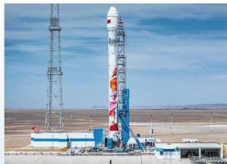

natural_image

Rocket launch pad in a desert environment with two launch towers and a clear blue sky (no visible text or symbols)

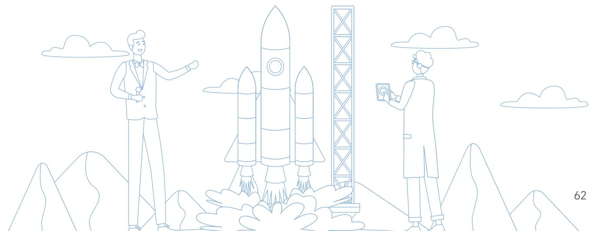

natural_image

Line drawing of two scientists in suits standing on a rocket launch pad with mountains in the background (no text or symbols)

# 案例

# 赋能无人平台领航，助力国防科技与低空经济自主可控

鲁信创投参股基金投资项目珠海天晴航空航天科技有限公司（简称“天晴空天科技”）于2025年9月完成超亿元A轮融资。天晴空天科技于2016年6月6日成立，是一家集“产、学、研”为一体的高新技术企业，主要从事先进无人飞行平台的研发与批量制造业务。产品覆盖技术验证机、察打一体无人机、攻击蜂群无人机、复合翼无人机、无人物流运输机等。天晴空天科技已

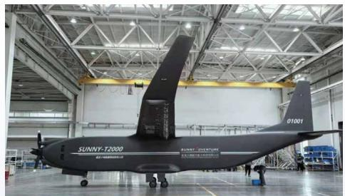

natural_image

Exterior view of a black SUNDY-T2000 military aircraft inside a hangar (no visible text or symbols on the aircraft body)

成功研制各类无人机型号140余个，拥有各型专利100余项。获批国家级“专精特新”小巨人、广东省“专精特新”企业、广东省“工程技术研究中心”、广东省制造业单项冠军示范企业、珠海市高企成长百强榜第九位、珠海市新锐品牌百强榜第40位。目前具备7吨重量以下全类型无人机完整的研发、批产和飞行服务的全产业链能力，相关科研生产能力处于国内领先水平。

# 案例

# 打破进口垄断，打造生物制药工艺装备国产标杆

2025年1月，鲁信创投参股基金追加投资苏州英赛斯智能科技有限公司(简称“英赛斯”)。英赛斯成立于2017年1月9日，公司位于苏州市吴江区，是生物制药上游、下游工艺至实验室分析的整体解决方案提供商，主要产品包括蛋白纯化系统、大规模核酸合成系统、超滤系统、纳米药物制备系统等。公司已荣获国家级专精特新中小企业、苏州市独角兽企业、苏州市瞪羚企业等殊荣。生物药上游设备的技术壁垒高，目前进口品牌供应商

在国内占主导地位，进口品牌市场占有率超过80%。公司掌握设备关键零部件泵和阀的核心技术，也是国内唯一具有泵和阀开发能力的公司，具有明显的技术优势和成本优势。公司所处行业为生物药上游，初步实现制药上游工艺整体布局，已形成良好市场口碑，核心产品蛋白纯化仪、核酸合成仪国产市占率第一，可提供整体解决方案。

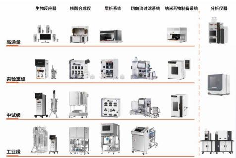

text_image

生物反应器
核酸合成仪
层析系统
切向流过滤系统
纳米药物制备系统
分析仪器
高通量
实验室级
中试级
工业级

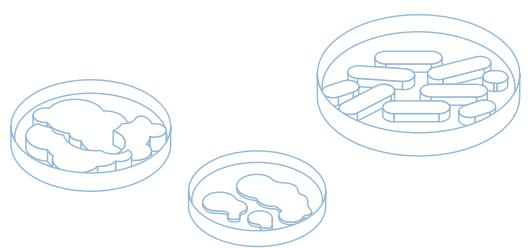

natural_image

Three separate petri dishes with different internal shapes and fill patterns, no text or symbols present.

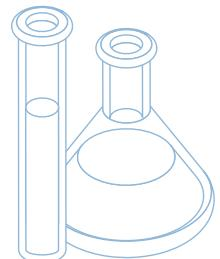

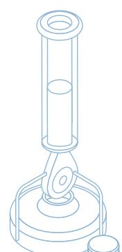

# 案例

# 突破空间行波管关键技术，保障航天与国防产业链安全

2025年7月，鲁信创投参股基金参与了山东微波电真空技术有限公司（简称“微波电真空”）首轮融资。微波电真空成立于2019年，主要从事空间行波管和空间行波管放大器的研发、生产和销售，产品主要应用于卫星通信、对地数传、微波遥感导航定位等领域，可以满足复杂的航天任务和通信需求，是航天工程和现代国防装备的关键核心部件。2025年2月，微波电真

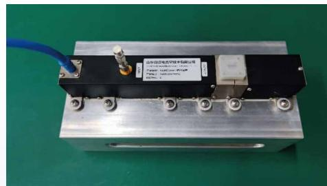

text_image

山东高速集团有限公司
PAC 10000000000000000000000000000000000000000000000000000000000000000000000000000000000000000000000000000
PAC 1254826379999999999999999999999999999999999999999999999999999999999999999999999999999999999999999999999999999
PAC 1254826378888888888888888888888888888888888888888888888888888888888888888888888888888888888888888888888888888
PAC 12547263777777777777777777777777777777777777777777777777777777777777777777777777777777777777777777777777
PAC 1254626376666666666666666666666666666666666666666666666666666666666666666666666666666666666
PAC 125452637555555555555555555555555555555555555555555555555555555555555555555555555555555555555555
PAC 125442637444444444444444444444444444444444444444444444444444444444444444444444444444444444444444
PAC 1254326373333333333333333333333333333333333333333333333333333333333333333333333333333333333333333333333
PAC 125422637222222222222222222222222222222222222222222222222222222222222222222222222222222222
PAC 125412637111111111111111111111111111111111111111111111111111111111111111
PAC 125402637088888888888888888888888888888888888
PAC 1253926370777777777777777777777777777777
PAC 125382637066666666666666
PAC 12537263705555555555555
PAC 1253626370444444
PAC 12535263703
PAC 12534263702
PAC 125332637
PAC 125322637
PAC 125312
PAC 12530
PAC 12529
PAC 12528
PAC 12527
PAC 12526
PAC 12525
PAC 12524
PAC 12523
PAC 12522
PAC 12521
PAC 12520
PAC 12519
PAC 12518
PAC 12517
PAC 12516
PAC 12515
PAC 12514
PAC 12513
PAC 12512
PAC 12511
PAC 12510
PAC 12509
PAC 12508
PAC 12507
PAC 12506
PAC 12505
PAC 12504
PAC 12503
PAC 12502
PAC 12501
PAC 12499
PAC 12498
PAC 12497
PAC 12496
PAC 12495
PAC 12494
PAC 12493
PAC 12492
PAC 12491
PAC 12490
PAC 12489
PAC 12488
PAC 12487
PAC 12486
PAC 12485
PAC 12484
PAC 12483
PAC 12482
PAC 12481
PAC 12480
PAC 12479
PAC 12478
PAC 12477
PAC 12476
PAC 12475
PAC 12474
PAC 12473
PAC 12472
PAC 12471
PAC 12470
PAC 12469
PAC 12468
PAC 12467
PAC 12466
PAC 12465
PAC 12464
PAC 12463
PAC 12462
PAC 12461
PAC 1246<nl>

空正式向航天九院704所交付两套Ka频段空间行波管放大器，并于9月在西昌卫星发射中心成功发射入轨，标志着公司产品首次实现“上天应用”，为我国航天事业发展注入了新的力量。2025年6月，公司正式通过航天科技集团五院西安分院的合格供方资质认证。2025年10月，微波电真空联合科学院所申报的山东省国内科技合作项目“通信卫星用Ka波段空间行波管研究与产业化”正式于山东省科学技术厅立项，标志着公司在跨区域、跨机构协同创新领域实现关键性突破。

# 案例

# 攻克光芯片关键技术，筑牢数字基建与信息安全底座

2025年8月，鲁信创投参股基金参与了宁波元芯光电子科技有限公司(简称“元芯光电”)B+轮融资。元芯光电采用 IDM 模式，集光通信芯片研发、生产、测试于一体，专注研发生产高性能低成本高端光芯片，致力打破国外垄断、实现进口替代。公司已建成国际一流的磷化铟和薄膜铌酸锂光芯片生产线，主要开展大范围窄线宽可调谐激光器、薄膜铌酸锂调制器、气体探测DFB 激光器等产品设计、研发及量产。核心产品均拥有自主知

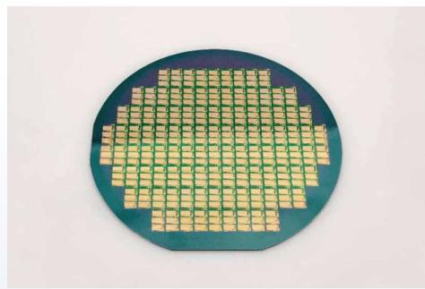

natural_image

Circular semiconductor wafer or chip with grid of yellow and green square blocks on a teal substrate (no text or symbols visible)

识产权，在中国和美国注册多项专利。目前多款高端光芯片已实现批量出货，服务于“东数西算”等国家战略基建网络以及AI超算中心等领域，同时应用于卫星通信、量子加密等国家关键领域，推动国内高端光通信芯片自主可控，解决相关领域卡脖子问题。

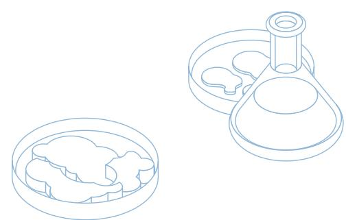

natural_image

Line drawing of two laboratory containers with internal compartments (no text or symbols)

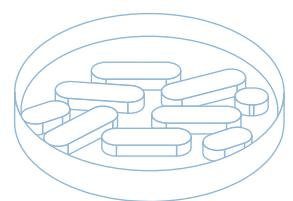

# ○ 支持区域协调发展

公司通过“基金+基地+产业”联动模式，聚焦省内重点产业园区与县域经济增长极，构建资本、资源、运营一体化综合赋能体系。秉持产业服务思维，团队深入产业一线，精准提供资本支持、嫁接产业链资源、衔接产业政策，实施属地化陪伴式运营。依托“直投+旗舰基金+市场化基金”战略组合，有效化解区域初创企业资源分散、动能不足难题，助力本地特色产业集群形成，牵引新兴产业项目落地山东。

# 案例

# 赋能“山东造”离子注入机，助力第三代半导体产业链强链补链

鲁信创投聚焦第三代半导体等硬核科技领域，通过高质招引与精准孵化，为济南市艾恩半导体科技有限公司（简称“艾恩半导体”）提供天使投资与全周期赋能，不仅为其提供了关键资金支持，更以“投早、投小、投硬科技”的专业优势，助力企业破解融资痛点、对接产业资源，推动其落地济南高新区。在公司的长期陪伴与赋能下，报告期内，艾恩半导体自主研发的首台碳化硅离子注入机已完成制造并送抵客户验证。这一成果标志着长期被海外垄断、国产化率不足8%的离子注入机实现了“山东造”，为山东第三代半导体产业链补上了关键一环。

# 案例

# 打造区域光电子创新平台，支撑山东光电产业能级提升

2025年8月、12月，鲁信创投全资子公司高新投及参股基金投资山东中科际联光电集成技术研究院有限公司（简称“中科际联”）。中科际联自成立以来，始终专注于自主可控高可靠光芯片、器件及模块的研发、生产与销售，广泛应用于星载通信、水下探测、空-地高速传输等领域。中科际联依托自主核心技术，成功突破了多项工艺与技术瓶颈，实现了核心产品的全面自主设计验证与规模化生产，多项产品已在我国高轨互联通信、低轨卫星星座组网、水下探测、机载雷达等任务中实现批量

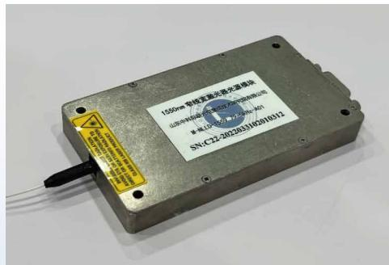

text_image

150mm Cable fluorescent transceiver
LCL-2022033100810312
SN-C22-2022R33100810312

# 案例

# 培育本土高端装备标杆，推动区域人工智能与制造业深度融合

2025年5月，鲁信创投参股基金投资珞石（山东）机器人集团股份有限公司（简称“珞石机器人”）。珞石机器人成立于2015年，总部位于山东省济宁市，公司作为全系列智能机器人的创新领导者，深耕“机器人+AI”融合创新，依托全栈自研核心技术平台，专注于工业机器人、柔性协作机器人及具身智能机器人等智能机器人产品研发以及应用生态体系建设，致力于为工业、商业服务和医疗等领域提供更智能、更高效、更安全的产品

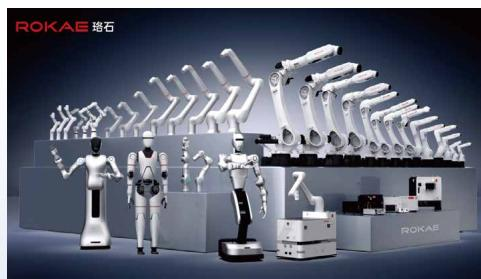

natural_image

Industrial robotic arms and two humanoid robots in a modern exhibition space, no visible text or symbols on the robots or equipment.

# ○ 促进产业转型升级

作为鲁信集团控股的山东省内最大、国内具有重要影响力的专业创投机构，公司充分发挥专业化的投资和管理能力，为优质企业匹配直接有效的资金资源，并积极提供管理咨询、技术嫁接、产业链延伸等服务，助推投资项目立足基础优势和发展趋势，实现优化布局、改造提升，服务现有产业转型升级，实现高质量发展。

# 案例

# 陪伴硅基仿生十年长跑，以耐心资本守护“指尖上的健康”

鲁信创投以“耐心资本”理念深耕硬核科技赛道，精准捕捉到动态血糖监测技术的临床价值与产业潜力，自2016年起向深圳硅基仿生科技股份有限公司（简称“硅基仿生”）提供首笔1,500万元天使投资，并通过多轮市场化资金接续与资源赋能，为企业注入超2亿元资金支持。我们不仅解决了企业“不敢投、不愿投”的融资痛点，更联动产业资源组建山东硅基算力科技有限公司，助力其技术迭代与产能落地。

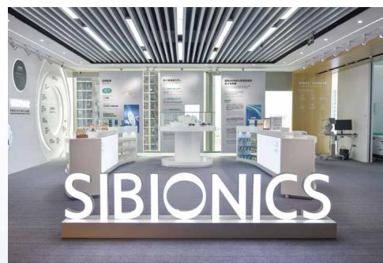

text_image

SIBIONICS

在我们的长期陪伴下，硅基仿生突破国外技术垄断，其自主研发的动态血糖监测仪实现了“无痛监测”，并成为国内首款获国家药监局批准的同类产品，目前已覆盖全球80多个国家、服务超200万名用户。这一成果不仅打破了外资在高端医疗器械领域的长期垄断，更以“十年磨一剑”的耐心资本实践，诠释了国有创投助力硬核科技企业从0到1突破、守护民生健康的责任与担当。

# 案例

# 锚定高端装备制造，推动山东工程机械产业迈向全球价值链中高端

鲁信创投参股基金于2025年1月投资临工重机股份有限公司（简称“临工重机”）。临工重机聚焦“3+3+2”八大产业（矿山机械、高空作业机械、特种机械、关键零部件支持、后市场服务支持、金融及租赁支持、数字化产业、新能源产业），为客户提供矿山开采和设备租赁两大解决方案的全系列产品，矿车连续10年全球销量第一，高空作业机械全球第六位。公司连续多年蝉联“全球工程机械制造商50强”“全球高空作业平台制造商

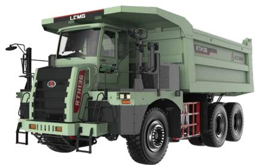

natural_image

Exterior view of a green LCMG dump truck with visible branding and design details (no text-heavy elements)

空作业设备制造商5强”等行业荣誉。围绕科技创新，获得胡润全球独角兽企业、国家制造业单项冠军、国家级工业设计中心、国家高新技术企业、山东省独角兽企业、山东省瞪羚企业、山东省数字化车间等荣誉称号。围绕卓越绩效管理、敏捷质量管理，公司于2023年荣获第九届山东省省长质量奖。

# 案例

# 布局生命科学高端仪器，助力生物制药工艺自主创新

2025年11月，鲁信创投参股基金参与了上海浚真生命科学有限公司（简称“浚真生命”）A轮融资。浚真生命是一家集生命科学仪器的研发、生产、销售及服务于一体的高新科技企业。公司拥有多领域交叉学科的技术团队，已提交国家发明专利30余项、PCT专利7项。产品线包括在线拉曼、在线UV、在线细胞传感器、细胞计数仪等多款生物工艺在线或离线分析设备，可广泛应用于疫苗、重组蛋白、单克隆抗体、细胞与基因治疗等生物制品的上游和下游工艺过程的CPPs和CQAs的持续监测和工艺开发优化。

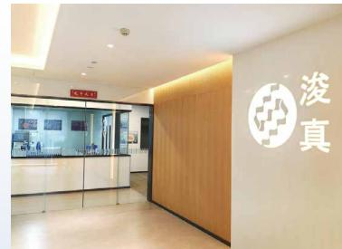

text_image

浚真

# 案例

# 打造自主生命科学检测平台，加速医药研发产业现代化升级

2025年12月，鲁信创投参股基金追加投资极瞳生命科技（苏州）有限公司(简称“极瞳生命”)。极瞳生命成立于2020年8月，公司位于苏州工业园，是一家以生命科学工具里高端生命科学仪器研发、生产及销售为主营业务的高新技术企业，公司依托掌握的核心技术，致力于构建以高灵敏度分析和高灵敏度检测为核心竞争力的技术驱动型生物技术公司。

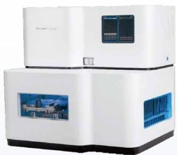

natural_image

Exterior view of a modern industrial machine (no visible text or symbols)

公司主要产品包括用于分析物和受体之间亲和力、动力学分析（药物开发）的表面等离子共振（SPR）分子互作仪及分子-细胞互作平台仪器及其试剂耗材。SPR分子互作仪非标记分子互作仪是可以直接检测生物分子之间相互作用的高精密科学仪器，用于生物分子间结合特异性的分析、浓度定量、结合动力学和亲和力分析。SPR技术凭借其灵敏度高、动力学测量可靠等优点成为分子互作的金标准，在2016年被列入美国、日本药典，2020年又被列入中国药典，其应用贯穿药物发现、研发、生产的整个生命周期。

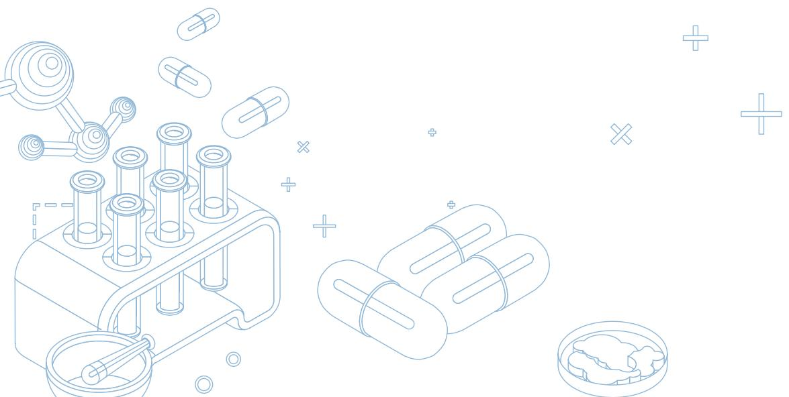

natural_image

Technical line drawing of a mechanical assembly with cylindrical components and cross symbols (no text or labels)

# 坚守产品服务安全品质

质量是企业生存发展的根本，鲁信创投秉持“客户至上”的经营理念，严格遵守《中华人民共和国产品质量法》等相关法律法规，围绕创业投资与磨具实业两大主营业务，持续强化磨具产品与投资项目投前、投中、投后全流程质量把控，不断完善客户服务体系，优化服务响应效率与专业水平。报告期内，公司未发生产品或服务相关的安全与质量重大责任事故。

# 治理

磨具公司严格遵循质量管理方针，依据GB/T19001-2016标准建立、实施并动态优化质量管理体系，制定完善《质量管理手册》，建立以董事长为总负责人的自上而下的质量管理组织架构，全面统筹磨具业务的质量管理工作。截至报告期末，磨具公司通过ISO 9001质量管理体系认证并获得IQNet证书，且于报告期内顺利完成ISO 9001质量管理体系年度监督审核。

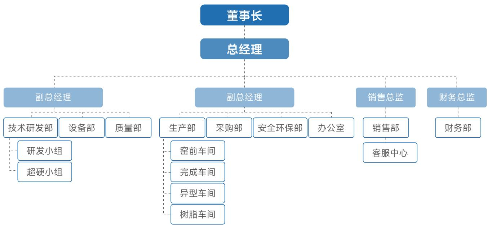

flowchart

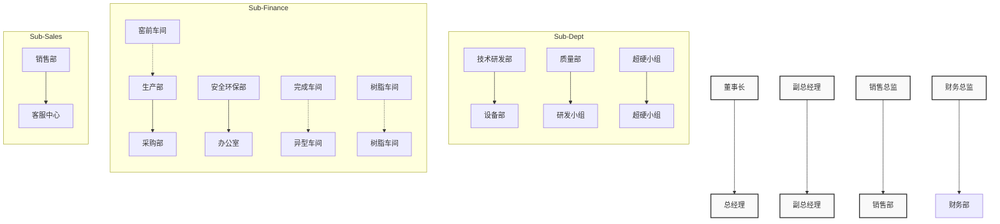
```mermaid
graph TD
  A["董事长"] --> B["总经理"]
  C["副总经理"] --> D["副总经理"]
  E["销售总监"] --> F["销售部"]
  G["财务总监"] --> H["财务部"]
  
  subgraph Sub_Dept [Sub-Dept]
    direction TB
  I["技术研发部"] --> J["设备部"]
  K["质量部"] --> L["研发小组"]
  M["超硬小组"] --> N["超硬小组"]
  end
  
  subgraph Sub_Finance [Sub-Finance]
    direction TB
  O["生产部"] --> P["采购部"]
  Q["安全环保部"] --> R["办公室"]
    S["窑前车间"] -.-> O
    T["完成车间"] -.-> U["异型车间"]
    V["树脂车间"] -.-> W["树脂车间"]
  end
  
  subgraph Sub_Sales [Sub-Sales]
    direction TB
  X["销售部"] --> Y["客服中心"]
  end
  
  style A fill:#f9f9f9,stroke:#333,stroke-width:2px
  style B fill:#f9f9f9,stroke:#333,stroke-width:2px
  style C fill:#f9f9f9,stroke:#333,stroke-width:2px
  style D fill:#f9f9f9,stroke:#333,stroke-width:2px
  style E fill:#f9f9f9,stroke:#333,stroke-width:2px
  style F fill:#f9f9f9,stroke:#333,stroke-width:2px
  style G fill:#f9f9f9,stroke:#333,stroke-width:2px
```

磨具公司质量管理组织架构

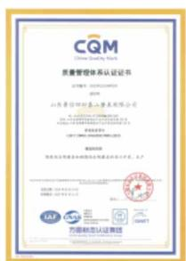  
磨具公司质量管理体系认证证书

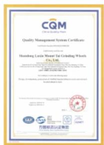

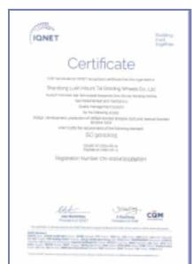  
IQNet证书

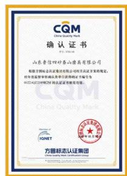  
质量管理体系认证监督审核

# 战略

公司主动识别产品质量管理与客户服务全流程的潜在风险与发展机遇，建立常态化风险排查机制，针对性制定应对预案与优化举措，持续提升产品质量稳定性与服务安全保障能力。

<table><tr><td>风险类型</td><td>风险描述</td><td>发生概率</td><td>影响大小</td><td>影响时间范围</td><td>影响价值链环节</td><td>优先级排序</td><td>潜在财务影响</td><td>应对措施</td></tr><tr><td>市场风险</td><td>金融市场波动可能导致投资项目的价值大幅变化,影响公司的财务状况。</td><td>中</td><td>中</td><td>短、中期</td><td>运营</td><td>高</td><td>投资收益减少</td><td>·将资金分配到不同行业类别,降低特定市场或行业波动对整体投资组合的影响。·建立全面风险管理流程,坚持开展风险监测预警。</td></tr><tr><td>质量风险</td><td>在磨具产品生产过程中,任一环节出现质量问题都可能导致产品缺陷,引发客户投诉、召回事件,损害品牌声誉。</td><td>低</td><td>中</td><td>短、中期</td><td>运营、下游</td><td>中</td><td>营业外支出增加、营业收入减少</td><td>·制定设备管理控制程序,完善工艺流程,加强生产过程质量控制,建立从原料采购、生产过程到产品出库的全流程质量管理体系。</td></tr></table>

<table><tr><td>机遇类型</td><td>机遇描述</td><td>发生概率</td><td>影响大小</td><td>影响时间范围</td><td>影响价值链环节</td><td>优先级排序</td><td>潜在财务影响</td><td>应对措施</td></tr><tr><td>市场机遇</td><td>根据被投资企业的不同需求提供定制化的投资方案,可以提高被投资企业满意度并建立长期合作关系。</td><td>高</td><td>高</td><td>中、长期</td><td>运营</td><td>中</td><td>投资收益增加</td><td>·设计符合被投资企业需求的投资方案,持续关注被投资企业满意度情况。</td></tr><tr><td>技术机遇</td><td>随着信息化工具的发展(大数据、AI),公司可以通过构建数字化平台,提升决策效率和风险管理能力,优化产品服务质量。</td><td>高</td><td>中</td><td>长期</td><td>运营</td><td>中</td><td>运营成本减少、投资收益增加</td><td>·构建投资管理平台、公允价值估值系统等多样的信息化平台,持续强化内部数字化管理水平。</td></tr></table>

# 影响、风险和机遇管理

公司建立了规范化的风险管理程序，将产品与服务安全质量风险的识别、评估、应对及复盘纳入标准化管理流程。定期开展风险排查、动态更新风险清单、制定分级应对预案，有效保障产品质量和客户服务水平。

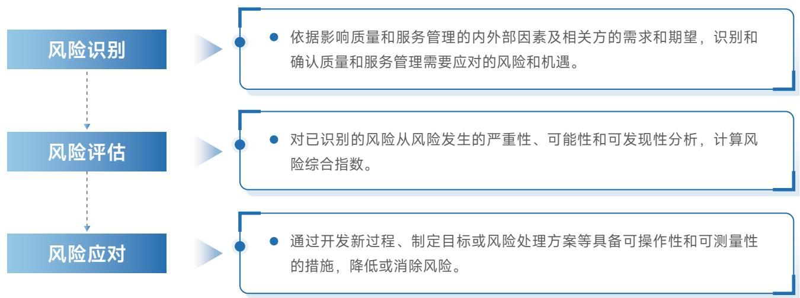

flowchart

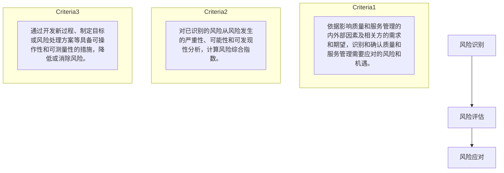
```mermaid
graph TD
  A["风险识别"] --> B["风险评估"]
  B --> C["风险应对"]
  
  subgraph Criteria1
    D["依据影响质量和服务管理的内外部因素及相关方的需求和期望，识别和确认质量和服务管理需要应对的风险和机遇。"]
  end
  
  subgraph Criteria2
    E["对已识别的风险从风险发生的严重性、可能性和可发现性分析，计算风险综合指数。"]
  end
  
  subgraph Criteria3
    F["通过开发新过程、制定目标或风险处理方案等具备可操作性和可测量性的措施，降低或消除风险。"]
  end
```

# 指标和目标

为确保公司及下属子公司持续提升质量管理水平和客户服务体验，我们设立了明确的质量与服务目标，并将其分解细化至各部门，对各项目标实施考核，采取纠正预防措施，以增强客户满意度。

<table><tr><td>业务</td><td>指标</td><td>目标</td><td>2025年完成情况</td></tr><tr><td>创投业务</td><td>投资效率与投资质量</td><td>提高投资管理的规范性,提升投资效率与投资质量</td><td>2025年各参股基金及投资平台完成一级投资项目30个,总投资额12.89亿元</td></tr><tr><td rowspan="4">磨具业务</td><td rowspan="2">产品合格率</td><td>出厂合格率100%</td><td>产品合格率100%</td></tr><tr><td>政府主管质量部门质量抽查合格率100%</td><td>年度质量内审1次,聘请第三方机构抽检2次,质量抽查合格率100%</td></tr><tr><td>产品或服务相关的安全与质量重大责任事故</td><td>重大质量事故、设备安全事故、人身伤亡事故发生率为0</td><td>未发生任何重大质量事故、设备安全事故、人身伤亡事故</td></tr><tr><td>顾客满意度</td><td>顾客满意度在85%以上</td><td>经对客户进行满意度问卷调查,顾客满意度93.37%</td></tr></table>

# - 保障产品质量

# - 投资质量管理

在创业投资业务领域，公司采用“三维拓展”战略，在强化行业专精、改善区域布局、拓宽募投广度方面持续发力，进一步优化内外资源配置，拓宽创投产业链条，立足于基金化创投优势，建立基金协作体系，逐步提升投资效率与投资质量。

# 项目协同平台

<table><tr><td>项目情况共享</td><td>·为提升公司内部项目搜寻的效率并避免重复拜访,建立项目资源库,共享各基金掌握的项目资源和项目情况;·制定共享激励机制,激发投资经理共享项目资源的意愿,推动达成项目共享。</td></tr><tr><td>协同尽调</td><td>·为了最大化内部人才价值,公司建立项目尽调协同机制,加强前台各基金投资经理间的业务支持,并由后台研发、财务、风控等部门相关人员为尽调提供专业支持。同时,制订协同报酬支付制度,推动项目尽调协同的落地实施。</td></tr><tr><td>协同投后管理机制</td><td>·为了提升投后管理的效率,优化公司内部的工作流程,公司建立协作投后管理机制,通过后台人员为前台的投后管理工作提供有偿的专业支持,加强基金的投后管理能力,助力公司提高整体收益。</td></tr></table>

# - 磨具质量管理

在磨具生产经营领域，磨具公司明确产品全生命周期各阶段的质量管理要求，将质量管理体系落实到源头、生产和出入库等产品生产全生命周期管理，确保产品质量稳定达标。报告期内，磨具公司核心产品接受了省级、市级市场监督管理部门组织的常规监督抽查，结果显示各项指标均符合质量标准。

# 源头质量管理

建立《采购过程控制程序》，由质量部负责对原材料进行全面的质量检验，确定合格供方清单，从源头保证产品质量。

# 出入库质量管理

经过检验合格的产品方可入库和交付，对检验不合格的产品，按《不合格品控制程序》进行处置。

# 生产质量管理

制定《生产过程控制程序》，对产品生产的工艺程序进行严格管控，由质量部按照检验流程对半成品、成品进行检验，并委托第三方检验机构对送检样品进行检验。

制定《设备管理控制程序》，由设备部负责建立健全设备台账、档案，设备事故处理，编制实施设备检修保养计划，确保生产设备正常运转。

# - 产品质量培训

为增强员工的质量意识和技能熟练度，报告期内，磨具公司积极开展产品质量培训活动，包括砂轮工艺知识培训、砂轮成品检查培训、质量管理体系基础知识培训等项目，并在培训结束后安排笔试考核，以验证学习成效，提升全员尤其是关键工序操作人员的质量管理能力与体系执行熟练度。

# 关键绩效

报告期内，磨具公司组织开展质量培训7次，培训总时长35小时，累计培训134人次。

# - 产品有害物质监测

鲁信创投围绕磨具产品建立有害物质监测管控体系，在原材料采购环节，严格筛选并采购符合国家环保要求的材料。生产过程中，公司建立动态监测机制，重点监控关键工序的有害物质释放情况，对生产过程中产生的有毒有害废弃物进行分类收集和处理，并同步完善危险废物闭环管理。

# 优化客户服务

公司围绕创业投资与磨具两大核心业务，构建差异化客户管理体系，从资金安全保障、销售全流程管控到客户服务体验升级，全方位优化客户权益与服务质量。报告期内，公司未收到客户投诉事件。

创业投资业务，公司及子公司以有限合伙企业形式发起设立创业投资基金时，严格按照中国证券投资基金业协会发布的《私募投资基金登记备案办法》等相关监管规定要求，与托管银行签署资金托管协议，明确协议各方在托管资金的保管、投资运作和监督、日常划拨与核算等事宜中的权利、义务和责任，确保客户资金安全。

磨具业务，鲁信高新及磨具公司分别制定《销售管理制度》《销售管理及考核办法》，强化对销售业务的内部控制，明确部门职责及考核办法，规范销售行为，做好售后服务并迅速响应客户提出的质量问题。同时，磨具公司根据《顾客满意监视和测量程序》，建立由销售部负责客户沟通、客户投诉、满意度调查的客户服务机制，听取客户对产品和售后服务的意见和建议充分保障客户权益，提升客户满意度。报告期内，磨具公司针对客户开展满意度调查，客户满意度达93.37%。

natural_image

Line drawing of a woman interacting with a smartphone displaying star ratings, surrounded by icons like thumbs-up, hearts, and potted plants (no text or symbols)

# 客户沟通

以面谈、信函、电话、传真、电子邮件等方式为客户提供技术咨询和服务，收集、记录并解答客户提出的建议和意见。

# 客户投诉

销售部负责有效处理客户投诉，执行《与顾客有关的过程控制程序》的有关规定。

# 满意度调查

每年定期向客户发送《客户满意程度调查表》，调查客户对产品、服务的满意程度，收集相关意见和建议。

# 创新驱动发展

# 创新管理体系

为积极响应国家关于加快数字化转型、推动智能化升级的号召，鲁信创投聚焦创业投资和磨具实业两大核心业务领域，以科技创新为核心驱动力，深度融合大数据、人工智能、工业互联网等前沿技术，搭建覆盖业务全流程、全生命周期的信息化管控系统，在创投领域，依托智能投研平台，实现对被投企业的动态追踪与风险预警，提升决策效率与服务质量，更好地服务于实体经济和社会发展。

<table><tr><td>流程管理</td><td>创投板块信息化建设</td></tr><tr><td>投资尽调</td><td>通过信息化工具对投资流程进行标准化梳理,提升尽调效率和风控能力。建立协同平台,优化尽调团队人员配置。搭建外部专家平台,引入外脑,提升尽调质量。</td></tr><tr><td>投资决策</td><td>借助远程会议平台,有效参与异地团队投资决策,提升投资决策效率。采用新媒体手段,提升项目展示质量。</td></tr><tr><td>投后管理</td><td>搭建投后管理系统,强化投资项目风险预警和处置能力。建立项目增值服务平台,强化对被投企业赋能,实现投资收益有效增长。</td></tr></table>

在磨具实业领域，磨具公司基于自身实际情况，制定《设计和开发控制程序》，设立技术研发部组织设计和开发各阶段工作，对产品设计和开发的各个环节进行严格规范，全方位把控，确保产品质量符合法律法规的规定及客户的各项要求。

# 关键绩效

报告期内，公司研发员工人数20人，占员工总数7.69%；研发总投入329.18万元，占主营业务收入3.80%。

# 创新管理实践

公司积极推进信息化平台建设，深入挖掘科技在业务场景中的应用潜力，通过构建投资管理平台、公允价值估值系统等多样的信息化平台，强化内部数字化管理水平，成功实现创投业务智能赋能新突破。

# 投资管理平台

2025年，鲁信创投聚焦系统功能深化与业务覆盖拓展，全面推进投资管理系统二期建设；全面提升投资系统数据的完整性、准确性和一致性；通过与山东征信的战略合作，明确了引入外部权威数据源提升风控能力的路径。

# 公允价值估值系统

为提高投资项目估值的及时性、准确性、预测性，鲁信创投开发公允价值估值系统，优化估值流程，推动数字化管理对公司业务发展的持续赋能。

natural_image

Line drawing of a classroom or workshop with people seated at desks, plants in foreground, and a presentation screen (no text or symbols)

# - 研发激励

为增强企业竞争力，加快新产品研发进程，鲁信高新制定《技术创新项目管理及奖励制度》，通过规范技术创新项目的管理流程、明确实施过程中的费用控制、建立科学的考评与鉴定机制、合理的奖励办法等内容，充分调动技术开发人员和全体员工的积极性和创造性，推动公司科技进步，提高生产效率和经济效益。

# - 赋能新质生产力

鲁信创投以“直投+旗舰基金+市场化基金”战略组合为依托，聚焦半导体、新材料、新能源、航空航天等硬科技领域，系统布局产业链关键环节。通过发起设立百亿级山东省鲁新工业高质量发展基金，重点围绕省内标志性产业链，积极推动工业向集群化、绿色化、智能化转型。截至报告期末，公司已设立各类基金平台58个，总认缴规模219.34亿元，在助力区域产业升级、引导创新企业落户、服务科技自立自强等方面发挥了重要作用，形成了以资本推动新质生产力发展与可持续增长的有效实践。

# ○ 无形资产保护

公司高度重视无形资产的保护，严格遵循《中华人民共和国专利法》《中华人民共和国著作权法》等法律法规，结合实际经营情况，构建覆盖专利、商标、著作权等无形资产管理体系。子公司鲁信高新制定《无形资产管理制度》，成立由总经理领导的无形资产管理领导小组，持续加强对无形资产的内部控制，提高无形资产使用效率。

# 无形资产保护措施

- 积极进行无形资产登记、备案、申请确权工作。  
- 日常跟踪商标、专利、商号及其他无形资产的登记注册、授权情况，严防被他人抢注。  
- 划定科技开发区域、商业秘密保护区域，未经许可，禁止人员擅入。  
- 产品开发和职务智力成果活动期间，要求严格保守公司商业秘密。  
- 劳动合同中明确保密与竞业禁止条款，禁止员工擅自使用、泄露或转让公司无形资产。

# 关键绩效

截至报告期末，鲁信高新累计获得授权专利16个，其中发明专利7个，实用新型专利9个；获得商标累计数共16个。

natural_image

Simple line drawing of a potted plant with curved leaves (no text or symbols)

# 强化供应链安全

# 治理

鲁信创投坚持“公开、公平、公正”的原则，在磨具业务领域不断优化供应链管理体系。子公司鲁信高新制定《供方管理制度》《采购管理制度》规范管理供方开发、调查评价、复查流程，由采购部负责对外采购工作。同时，通过《招标管理办法》和《非招标采购管理办法》确保采购部招标流程合规高效运作，持续增强供应链的稳定性和可持续性。

# 战略

公司深入分析采购过程中可能发生的风险与机遇，制定切实可行的应对策略，确保公司可以有效防范潜在风险，并敏锐捕捉市场带来的机遇。

<table><tr><td>风险类型</td><td>风险描述</td><td>发生概率</td><td>影响大小</td><td>影响时间范围</td><td>影响价值链环节</td><td>优先级排序</td><td>潜在财务影响</td><td>应对措施</td></tr><tr><td>供应集中风险</td><td>若主要供应商出现财务困境、生产中断、质量不合格等问题,可能会对公司的运营造成影响。</td><td>低</td><td>高</td><td>短、中期</td><td>运营</td><td>中</td><td>运营成本增加,营业收入减少</td><td>·积极开发新的供方,避免过度依赖单一供应商,拓展稳定的供应商资源,分散采购风险。·根据原材料的需求量和供应周期,合理规划库存,确保在供应中断情况下,企业能迅速应对。</td></tr><tr><td>市场风险</td><td>原材料价格波动对公司产品成本影响较大。</td><td>中</td><td>中</td><td>短、中期</td><td>运营</td><td>中</td><td>运营成本增加,营业收入减少</td><td>·与优质供应商签订长期合同,锁定关键原材料价格,降低价格波动带来的风险。</td></tr></table>

<table><tr><td>机遇类型</td><td>机遇描述</td><td>发生概率</td><td>影响大小</td><td>影响时间范围</td><td>影响价值链环节</td><td>优先级排序</td><td>潜在财务影响</td><td>应对措施</td></tr><tr><td>品牌价值</td><td>优质原材料、零件、部件的选择,可以直接影响最终产品的质量和客户满意度,进而提升品牌形象。</td><td>高</td><td>高</td><td>中、长期</td><td>运营、下游</td><td>高</td><td>营业收入增加</td><td>●持续优化供方开发、调查评价、复查全流程管理,定期对重要供方实地考察,掌握供方生产、管理情况。</td></tr></table>

# 影响、风险和机遇管理

为实现供应链的整体安全、稳定和高效运作，公司坚持预防为主、安全第一的原则，建立涵盖识别、评估、监控与应对的管理体系，优化对供应链风险的动态优化与主动防控。

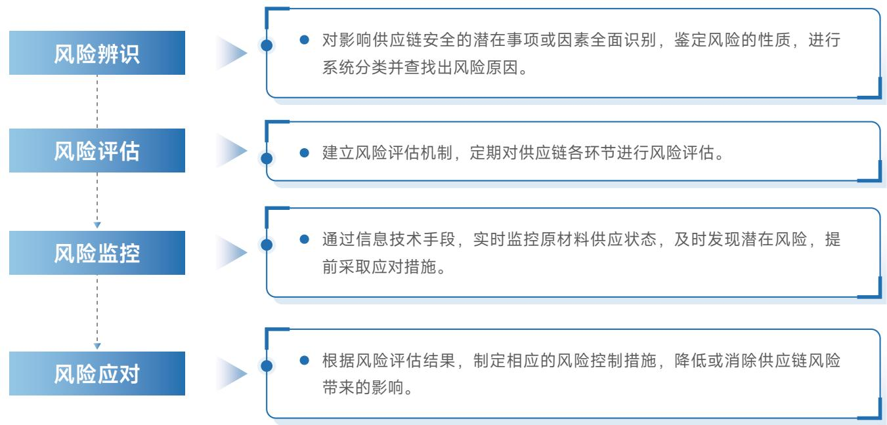

flowchart

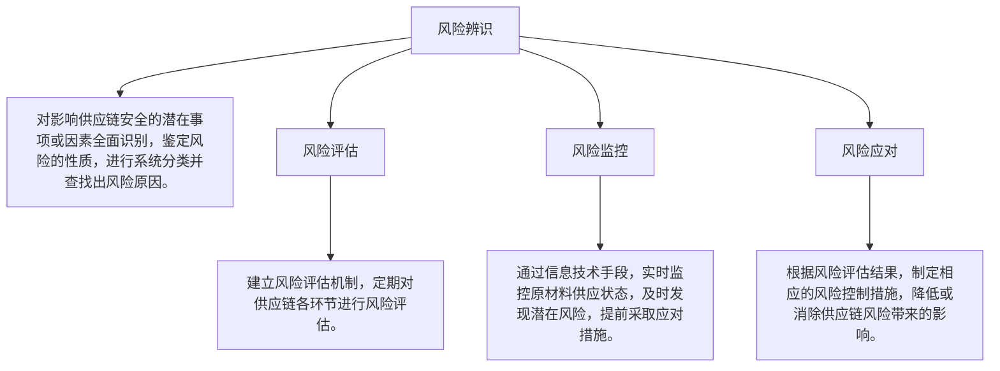
```mermaid
graph TD
  A["风险辨识"] --> B["对影响供应链安全的潜在事项或因素全面识别，鉴定风险的性质，进行系统分类并查找出风险原因。"]
  A --> C["风险评估"]
  A --> D["风险监控"]
  A --> E["风险应对"]
  
  C --> F["建立风险评估机制，定期对供应链各环节进行风险评估。"]
  D --> G["通过信息技术手段，实时监控原材料供应状态，及时发现潜在风险，提前采取应对措施。"]
  E --> H["根据风险评估结果，制定相应的风险控制措施，降低或消除供应链风险带来的影响。"]
```

# - 供应链合规管控

公司制定《供应链安全管理制度》，将管理执行情况纳入责任部门绩效考核体系，激励员工积极参与安全管理。此外，公司建立合规性审查机制，防止合规风险，确保供应链活动符合相关法律法规和企业规定，并针对可能出现的供应链风险制定应急预案，定期进行应急演练和培训，确保应急处置的有效性。报告期内，公司供应链环节中未发生具有重大风险与影响的事件。

# - 供应链管理措施

鲁信高新针对供应商开发、调查评价、复查环节，制定了一系列管理措施，以实现对供方的全生命周期管理。通过定期开展供应商现场核查，公司强化对供应商的动态监控与评估，增强供应链韧性。

# 供应商开发

明确供方开发权责；供方填写《供方质量保证表》，提交采购经办部门作为评价依据；填写供方基本资料表，与供方洽谈，必要时做样品鉴定，提出供方调查审核申请。

# 供应商调查评价

对供方所提供的物资价格、交货期、生产技术、产品质量等实施调查评价，填写《供方质量保证能力调查表》，未经调查评价认可的供方，不可成为合格供方。

# 供应商复查

合格供方原则上每年复查一次；复查流程同首次调查评价一致；复查不合格的供方，不可列入次年合格供方之列；若供方的质量、价格、交货期或服务产生重大变异时，可于一年中，随时对供方做必要的复查。

# 指标和目标

公司在供应链管理中制定清晰的绩效指标与管理目标，并定期评估目标达成情况。通过持续优化与供应商的协作流程，巩固长期稳定的伙伴关系，实现公司与供应商的互利共赢。

<table><tr><td>指标</td><td>目标</td><td>2025年情况</td></tr><tr><td>本地化采购</td><td>维持较高本地化采购比例</td><td>公司拥有供应商总数22家,其中山东省本地供应商13家,占比59.09%;公司向当地供应商采购支出的比率为64.97%。</td></tr><tr><td>供应商审查</td><td>每年坚持对重要供方进行实地考察,掌握供方生产、管理情况</td><td>拥有质量管理体系认证的供方11家,拥有环境管理体系认证的供方3家,拥有职业健康安全管理体系认证的供方4家,因不合规被否决的潜在供方0家,因不合规被中止合作的供方0家。</td></tr></table>

# 平等对待中小企业

报告期内，公司遵守款项结算约定，供应商各类应付款项均按时足额支付，不存在逾期尚未支付中小企业款项等情况。

# 守护数据安全与客户隐私

# 治理

鲁信创投秉持“全面管理、预防为主、分级保护、合规审慎”的网络与信息安全管理方针，严格遵守《中华人民共和国网络安全法》《中华人民共和国数据安全法》等法律法规，制定《网络与信息安全管理办法》，设立网络与信息安全领导小组，落实网络安全工作责任制，严格规范日常经营活动中的网络与信息安全管理，为公司信息安全与隐私保护提供制度保障。

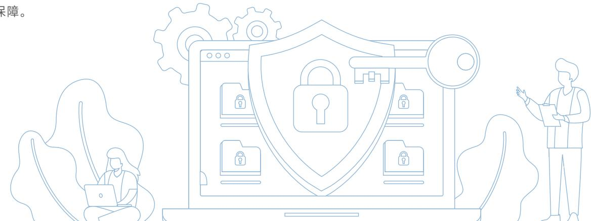

natural_image

Line drawing of a cybersecurity protection system with shield, lock icons, and user interaction (no text or symbols)

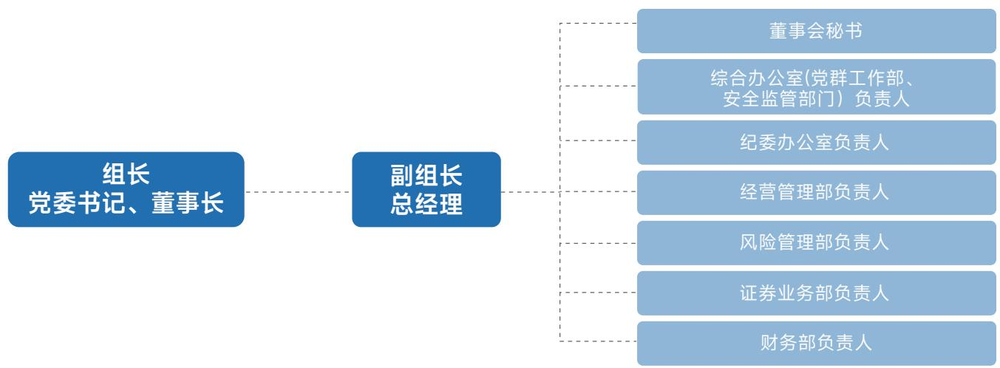

flowchart

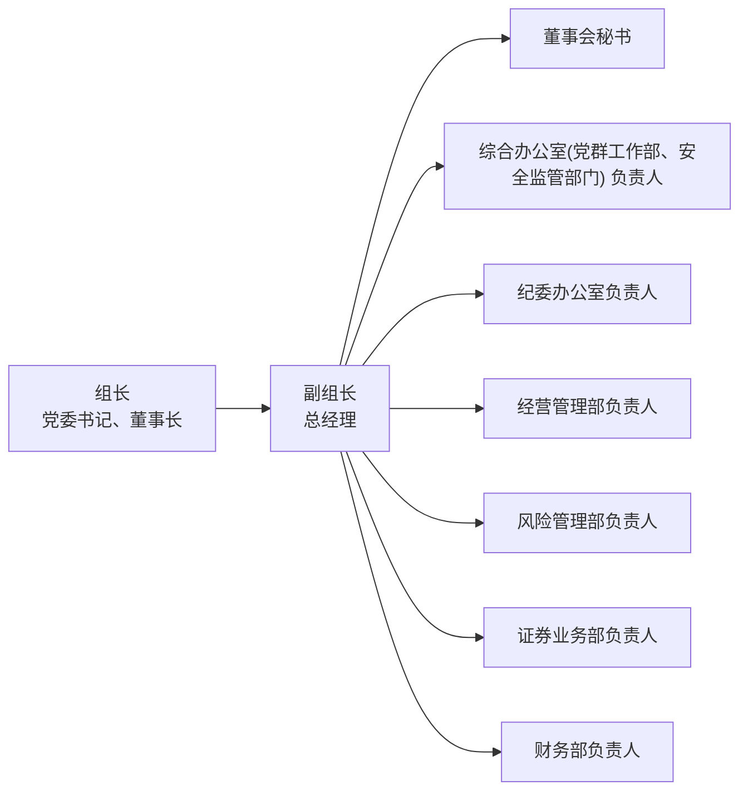
```mermaid
graph LR
  A["组长\n党委书记、董事长"] --> B["副组长\n总经理"]
  B --> C["董事会秘书"]
  B --> D["综合办公室(党群工作部、安全监管部门) 负责人"]
  B --> E["纪委办公室负责人"]
  B --> F["经营管理部负责人"]
  B --> G["风险管理部负责人"]
  B --> H["证券业务部负责人"]
  B --> I["财务部负责人"]
```

网络与信息安全领导小组组织架构

# 战略

公司重视信息安全与隐私保护的工作，建立常态化风险识别与评估机制，梳理业务全流程的信息安全潜在风险和机遇，针对性实施全链路防护、分级管控等应对措施，切实保障客户、员工及被投企业等利益相关方的信息权益。

<table><tr><td>风险类型</td><td>风险描述</td><td>发生概率</td><td>影响大小</td><td>影响时间范围</td><td>影响价值链环节</td><td>优先级排序</td><td>潜在财务影响</td><td>应对措施</td></tr><tr><td rowspan="2">技术风险</td><td>当遭遇技术故障或网络攻击等突发事件时,企业可能面临业务运营中断、系统恢复延迟等风险,影响正常经营和服务持续性。</td><td>低</td><td>中</td><td>短期</td><td>运营</td><td>高</td><td>营业收入减少</td><td>建立数据中心数据备份机制,对重要数据实施异地备份机制。加强存储介质管理,定期检查数据的完整性和可用性。建立信息系统备份与灾难恢复机制,保障数据安全和业务连续性。定期组织恢复演练,确保机制有效性。</td></tr><tr><td>若发生重要系统数据泄露事件,可能导致直接的经济损失,公司需要投入更多的资金加强信息安全系统的防护工作。</td><td>低</td><td>中</td><td>短、中、长期</td><td>运营</td><td>中</td><td>运营成本增加</td><td>建立运行监测系统,对有害程序、网络攻击等安全事件进行监测。定期组织开展重要系统数据泄露事件应急预案演练,提升应对风险的能力。</td></tr></table>

<table><tr><td>机遇类型</td><td>机遇描述</td><td>发生概率</td><td>影响大小</td><td>影响时间范围</td><td>影响价值链环节</td><td>优先级排序</td><td>潜在财务影响</td><td>应对措施</td></tr><tr><td>市场机遇</td><td>市场对数据安全和隐私保护的关注度日益提升,企业通过加强数据安全和隐私保护,可以吸引更多客户,促进业务发展。</td><td>高</td><td>高</td><td>长期</td><td>运营</td><td>高</td><td>营业收入增加</td><td>●对商业秘密、工作秘密或其他重要信息加密处理,确保其安全传输、处理、存储。●建立外部单位信息传输管控机制,保障公司及各权属公司与外部单位数据交换安全可控。</td></tr></table>

# 影响、风险和机遇管理

公司建立涵盖风险识别、评估、分级及应对的闭环管理流程，通过体系化的风险管控机制，精准识别并有效管理各类潜在风险，切实保障数据安全与用户隐私。

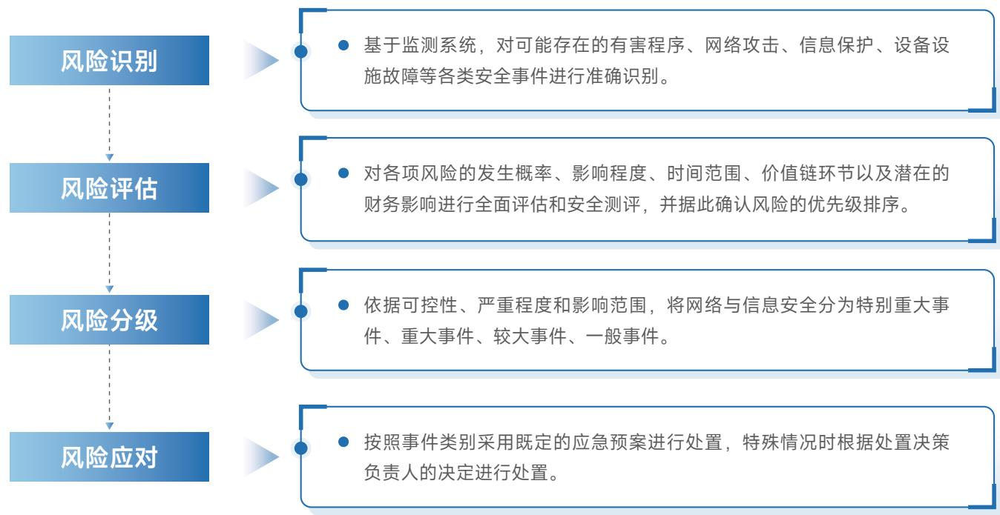

flowchart

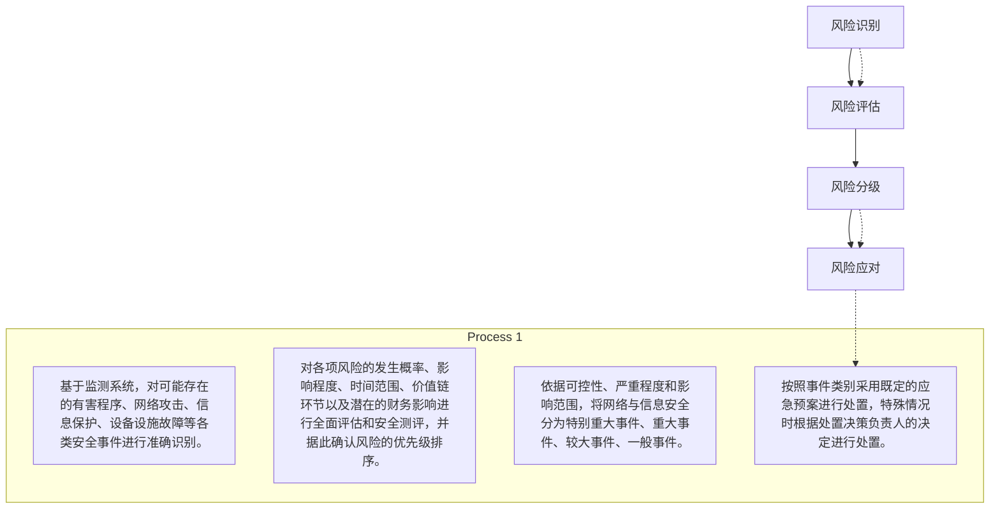
```mermaid
graph TD
  A["风险识别"] --> B["风险评估"]
  B --> C["风险分级"]
  C --> D["风险应对"]
  
  subgraph Process1 [Process 1]
    direction TB
    E["基于监测系统，对可能存在的有害程序、网络攻击、信息保护、设备设施故障等各类安全事件进行准确识别。"]
    F["对各项风险的发生概率、影响程度、时间范围、价值链环节以及潜在的财务影响进行全面评估和安全测评，并据此确认风险的优先级排序。"]
    G["依据可控性、严重程度和影响范围，将网络与信息安全分为特别重大事件、重大事件、较大事件、一般事件。"]
    H["按照事件类别采用既定的应急预案进行处置，特殊情况时根据处置决策负责人的决定进行处置。"]
  end
  
  A -.-> B
  C -.-> D
  D -.-> H
```

natural_image

Line drawing of a person examining a large screen with bar charts and icons, alongside two people seated at a desk (no text or symbols)

# - 应急预案及演练

为应对网络与信息安全突发事件，公司建立健全应急工作机制，制定《鲁信创业投资集团股份有限公司网络与信息安全应急预案》，设立网络与信息安全领导小组，明确安全事件分级标准，规范安全事件报告机制与应急处置程序，以最大限度地减少安全事件发生时的危害影响与损失。

公司针对可能发生的信息系统病毒入侵、重要系统服务器宕机事件、重要系统数据泄漏事件，按照系统恢复、业务保障、及时通报原则，分项制定切实可行的应急预案，并不定期开展预案演练活动。

# - 数据分级管理

为提升网络与信息安全事件的应急管理能力，公司结合事件的可控程度、严重性及影响范围等关键维度，制定了四级分类标准，包括一般事件、较大事件、重大事件与特别重大事件。同时，公司配套建立了相应的事件报告机制与处置决策责任体系，进一步强化了在面对网络安全威胁时的快速响应与有序处置效能。

# - 数据安全管理

公司实施运行安全管理与访问授权控制，持续提升信息安全和客户隐私保护水平。通过定期执行安全审计，全面记录操作日志并留存异常信息，主动识别与修复潜在安全风险，切实保障业务连续性与数据完整性。

<table><tr><td>信息系统备案与灾难恢复</td><td>参照信息系统灾难恢复相关技术标准和规范,建立完善信息系统备份与灾难恢复机制,保障数据安全和业务连续性。</td></tr><tr><td>技术合作</td><td>与鲁信科技股份有限公司开展深度沟通与合作,全面强化集团公共信息系统技术支持与问题处理、云平台资源及托管服务、局域网接入及技术支持服务等方面的能力。</td></tr><tr><td>终端准入管理</td><td>针对接入公司网络的终端设备,建立相应的终端安全防护系统,规范终端安全配置,监控终端安全状态,控制用户终端接入,规范用户操作行为,保障终端使用安全。</td></tr><tr><td>数据备份</td><td>加强数据高可用性管理,建立数据中心数据备份机制,对重要数据实施异地备份机制;加强数据存储介质管理,定期检查所存储信息的完整性和可用性。</td></tr></table>

# ○ 指标和目标

公司持续保障信息系统稳定运行与服务持续可靠供给，通过设定量化管控指标与目标，系统性防范系统故障、数据泄露等各类风险，持续强化信息内容的机密性、完整性与可用性管理，筑牢数字化运营安全防线。

<table><tr><td>指标</td><td>目标</td><td>2025年情况</td></tr><tr><td>数据安全/客户隐私泄漏事件</td><td>数据安全及客户隐私泄漏事件0起</td><td>公司未发生数据安全及客户隐私泄漏事件</td></tr><tr><td>数据安全投入金额</td><td>不断加强数据安全投入,提高信息安全管理能力</td><td>数据安全总投入96万元</td></tr></table>

natural_image

Line drawing of a person pointing at a bar chart with gears and a laptop, no text or symbols present

# 04

# 以人为本 共赴美好新程

鲁信创投将人才视为企业创新之本与核心资源，坚持“以人为本”，通过建立完善的员工权益保护机制、提供全面的员工培训发展机会以及强化健康安全保障措施，为员工创造公正、安全、多元的工作环境。同时，公司积极参与社区建设和公益活动，以平等的心态与员工和社会各界携手并进，共同繁荣。

# 我们的行动

\- 员工权益与安全
- 积极践行社会责任

# 响应的SDGs

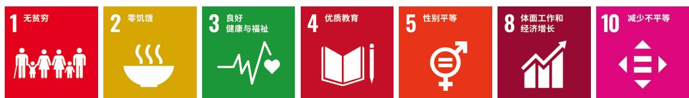

text_image

1 无贫穷
2 零饥饿
3 良好
健康与福祉
4 优质教育
5 性别平等
8 体面工作和
经济增长
10 减少不平等

# 员工权益与安全

鲁信创投始终将员工权益保护与健康安全放在首位，严格遵守《中华人民共和国劳动合同法》《禁止使用童工规定》等法律法规，构建公正透明的招聘流程、健全的薪酬福利保障体系与清晰的职业发展通道，坚决反对强迫劳动和雇佣童工等违规行为，持续打造平等尊重、包容多元的工作氛围。

公司严格遵守《中华人民共和国安全生产法》《中华人民共和国职业病防治法》等相关法律法规，建立完善的职业健康和安全管理体系，全力维护员工的健康与安全。报告期内，公司未发生任何重大安全生产事故。

# 治理

公司秉持平等雇佣原则，制定《员工招聘管理暂行办法》《员工劳动合同管理暂行办法》等人力资源管理制度，不断完善人力资源管理体系，依法保障员工权益。

在员工健康与安全生产管理方面，公司严格秉持“安全第一、预防为主、全员参与、综合治理”的安全工作方针，制定《安全生产主体责任督导制度》《安全生产教育培训管理办法》等一系列安全管理制度，持续强化全过程安全管理，筑牢安全发展根基。2025年，公司安全生产投入83.80万元。

公司设立安全生产委员会，明确党委书记、董事长为安全管理第一责任人，全面统筹公司安全生产各项工作；安全生产委员会下设安委会办公室，具体承担安全生产工作的指导协调、监督检查与考核评估职责，推动各部门、各单位严格落实安全生产主体责任，筑牢全链条安全管理防线，切实保障员工生命健康与公司运营安全。

安全生产委员会组织架构

<table><tr><td>层级</td><td>人员构成</td></tr><tr><td>主任</td><td>党委书记、董事长</td></tr><tr><td>副主任</td><td>总经理</td></tr><tr><td>委员</td><td>党委、经营班子成员</td></tr><tr><td>成员</td><td>综合办公室(党群工作部、安全监管部)、纪委办公室、经营管理部(投后管理部)、风险管理部(审计部)、财务部、证券业务部(董事会秘书处)、战略研究发展部、各业务部门和安全生产管理人员代表、工会代表以及从业人员代表</td></tr></table>

# - 安全监督考核机制

公司制定《安全生产考核奖惩暂行办法》，建立健全安全生产监督与考核机制，层层压实安全生产主体责任，并与相关负责人签订《安全生产目标责任书》，将安全生产考核结果与评优评先、职级晋升直接挂钩，确保安全生产各项指标落地见效、责任到人。

# 战略

公司高度重视员工给企业带来的影响，定期识别更新在员工权益保障、职业健康安全管理等领域的潜在风险与成长机遇，通过健全合规管理体系、优化安全防护措施、完善职业发展通道等针对性应对举措，全方位守护员工合法权益与身心健康。

<table><tr><td>风险类型</td><td>风险描述</td><td>发生概率</td><td>影响大小</td><td>影响时间范围</td><td>影响价值链环节</td><td>优先级排序</td><td>潜在财务影响</td><td>应对措施</td></tr><tr><td>法律风险</td><td>在用工过程中,若未遵守用工方面的法律法规而引发劳动纠纷,可能导致面临诉讼或行政处罚。</td><td>低</td><td>高</td><td>短、中、长期</td><td>运营</td><td>中</td><td>营业外支出增加</td><td>●建立完善的人力资源管理制度,确保员工管理工作的合法合规,保障员工权益。</td></tr><tr><td>人才流失风险</td><td>员工如果职业发展受阻,会寻求其他更具发展前景的岗位,可能导致企业人才流失,增加人力投入成本,影响企业稳定性。</td><td>中</td><td>中</td><td>短、中期</td><td>运营</td><td>中</td><td>运营成本增加</td><td>●提供健全的职业发展路径,给予员工公平地晋升条件和机会。</td></tr><tr><td>声誉风险</td><td>公司生产运营过程中,如果出现安全隐患,可能造成员工伤亡,影响企业品牌形象,市场份额下滑。</td><td>低</td><td>高</td><td>短、中期</td><td>运营</td><td>高</td><td>营业收入减少、营业外支出增加</td><td>●严格落实安全风险管控要求,建立风险分级管控和隐患排查治理机制,定期开展应急演练,保障员工健康安全。</td></tr></table>

<table><tr><td>机遇类型</td><td>机遇描述</td><td>发生概率</td><td>影响大小</td><td>影响时间范围</td><td>影响价值链环节</td><td>优先级排序</td><td>潜在财务影响</td><td>应对措施</td></tr><tr><td>市场机遇</td><td>健全的薪酬福利制度和人才培养机制,可以吸引更多投资领域的专业人才,有利于提升公司竞争力,促进公司业务多元化发展。</td><td>高</td><td>中</td><td>中、长期</td><td>运营</td><td>高</td><td>营业收入增加</td><td>●制定公平合理、富有竞争力的薪酬福利制度,建立完善的人才培养机制,实施有效的激励措施,提高员工积极性。</td></tr><tr><td>管理效率</td><td>优化职业健康安全管理流程,能提高公司整体管理效率,降低职业安全事故的发生率,避免经济损失。</td><td>高</td><td>中</td><td>中、长期</td><td>运营</td><td>中</td><td>运营成本减少</td><td>●制定完善的职业健康与安全管理体系,定期组织安全隐患排查,培养员工的安全意识,优化安全管理流程。</td></tr></table>

# 影响、风险和机遇管理

公司将安全生产贯穿生产经营全流程、各环节，通过全面识别研判各类风险点与危险源，实施精细化、全维度风险管控措施，从源头防范化解安全隐患，切实筑牢公司稳健运营的安全防线。

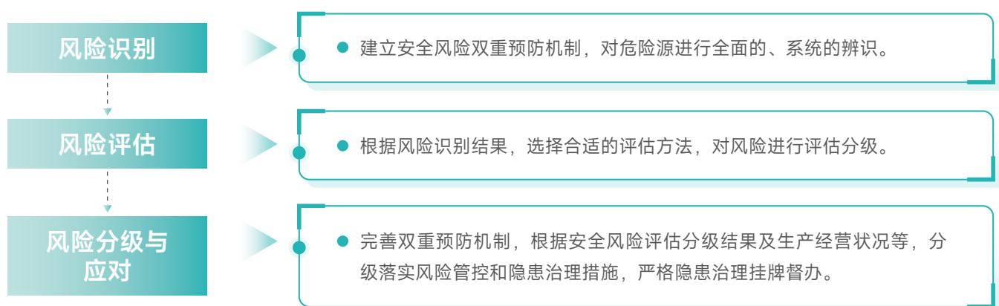

flowchart

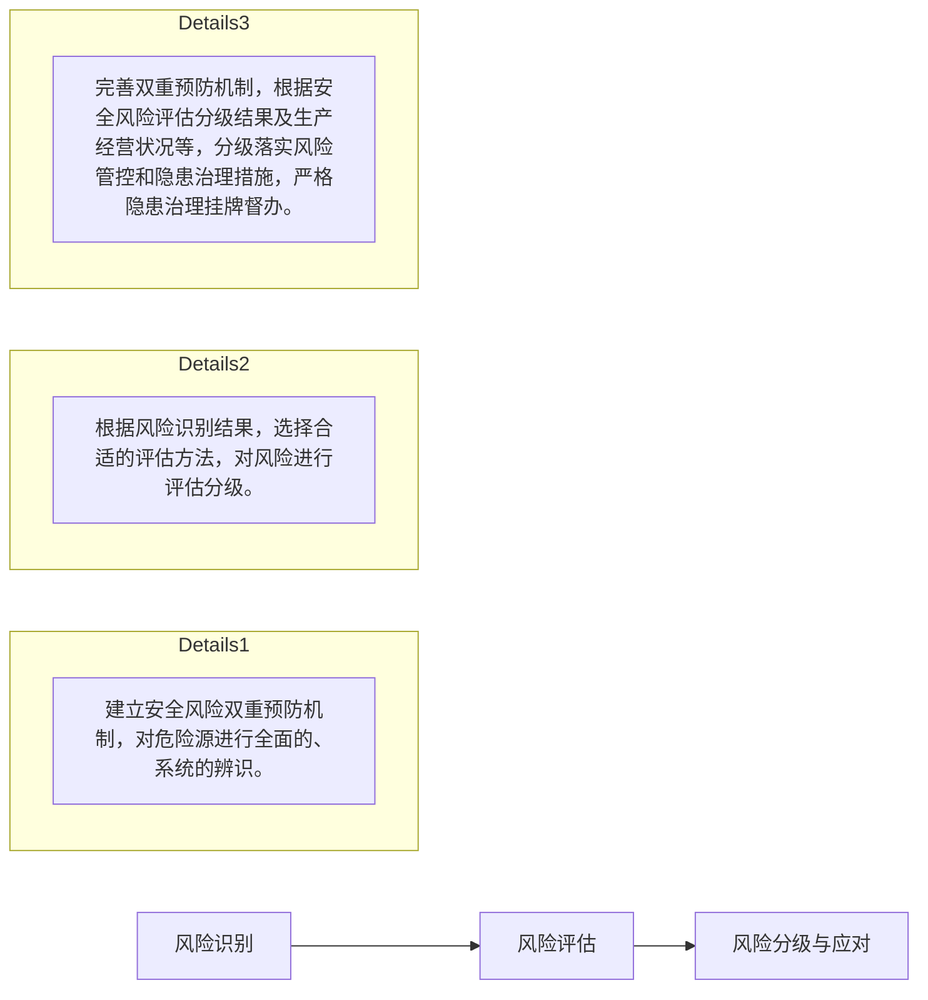
```mermaid
graph LR
  A["风险识别"] --> B["风险评估"]
  B --> C["风险分级与应对"]
  
  subgraph Details1
    D["建立安全风险双重预防机制，对危险源进行全面的、系统的辨识。"]
  end
  
  subgraph Details2
    E["根据风险识别结果，选择合适的评估方法，对风险进行评估分级。"]
  end
  
  subgraph Details3
    F["完善双重预防机制，根据安全风险评估分级结果及生产经营状况等，分级落实风险管控和隐患治理措施，严格隐患治理挂牌督办。"]
  end
```

# - 隐患排查

公司持续健全风险分级管控和隐患排查治理双重预防机制，常态化、全覆盖开展隐患排查治理工作，确保各类潜在安全隐患早发现、早处置、早消除。报告期内，公司隐患排查整改率100%。

# - 应急演练

公司严格遵守《中华人民共和国安全生产法》《生产安全事故报告和调查处理条例》，制定《生产安全事故综合应急预案》，明确应急组织架构及职责、应急响应流程，不断提高综合应急处置能力。报告期内，公司共开展18场安全应急演练，涵盖消防应急演练、起重伤害应急演练、有限空间应急演练等活动。

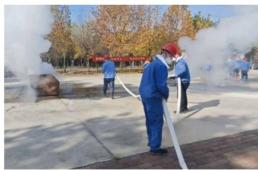

natural_image

Firefighters in blue uniforms and red helmets performing outdoor fire extinguisher training outdoors with smoke rising (no visible text or symbols)

消防应急演练

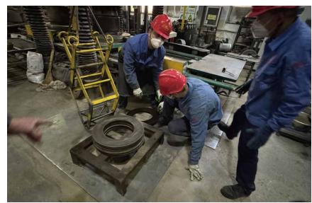

natural_image

Three workers in blue uniforms and red helmets inspecting industrial machinery in a factory setting (no visible text or symbols)

起重应急演练

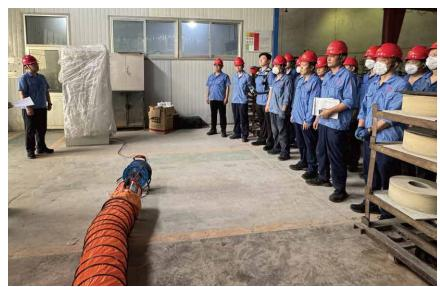

natural_image

Group of workers in blue uniforms and red helmets observing a fire hose inside a factory (no visible text or symbols)

有限空间演练

# 指标和目标

公司依据《安全生产治本攻坚三年行动实施方案（2024—2026）》，细化明确各阶段执行路径与关键任务，在此基础上制定了可量化、可落地的详尽安全管理目标，通过常态化推进治本攻坚行动，持续夯实安全管理基础，全方位守护员工生命安全与身体健康，为企业稳健运营筑牢安全屏障。

<table><tr><td>目标</td><td>完成情况</td></tr><tr><td>不发生轻伤及以上生产安全责任事故</td><td>已完成</td></tr><tr><td>企业全员安全培训率100%</td><td>已完成</td></tr><tr><td>特种作业人员持证上岗率为100%</td><td>已完成</td></tr><tr><td>重大事故隐患整改率为100%</td><td>已完成</td></tr><tr><td>相关从业人员职业健康体检率100%</td><td></td></tr><tr><td>职业危害合同告知率100%</td><td rowspan="3">已完成</td></tr><tr><td>职业危害警示标识设置率100%</td></tr><tr><td>从业人员劳动保护设施配置率100%</td></tr><tr><td>外租、外包安全管理协议签订率100%</td><td>已完成</td></tr><tr><td>新建、改建、扩建工程项目“三同时”执行率100%</td><td>已完成</td></tr></table>

# 员工权益保障

# - 员工招聘与就业

公司在招聘过程中严格遵循公平、公正、公开的基本原则，以“专业化、高素质”为核心定位，始终将工作能力与过往业绩视为人才评估的核心标准。公司实施多元化招聘策略，通过集团公司官网、省国资委网站、前程无忧平台及微信公众号等多个渠道广泛发布招聘信息。同时，积极组织开展校园招聘与社会招聘活动，面向海内外招贤纳士，持续推进高端人才引进工作。

同时，公司积极营造多元平等的职场环境，坚持同工同酬原则，不因员工的国籍、民族、种族、性别、年龄、宗教信仰和文化背景等因素产生任何形式的歧视；明确反对并严格禁止雇佣童工和强迫劳动行为。报告期内，公司未发生雇佣童工和强迫劳动事件，全方位保障招聘用工合规性与员工合法权益。

# 招聘流程

发布招聘信息→资格审查→笔试→面试→集体研究→考察（或背景调查）→体检→公示→发布OFFER

报告期内，公司新进员工21人，其结构组成如下：

<table><tr><td></td><td>新进员工构成</td><td>单位</td><td>2025年</td></tr><tr><td rowspan="2">按性别划分</td><td>男性员工</td><td>人</td><td>16</td></tr><tr><td>女性员工</td><td>人</td><td>5</td></tr><tr><td rowspan="4">按年龄划分</td><td>30岁以下(不含30岁)</td><td>人</td><td>13</td></tr><tr><td>30-40岁(含30岁,不含40岁)</td><td>人</td><td>7</td></tr><tr><td>40-50岁(含40岁,不含50岁)</td><td>人</td><td>0</td></tr><tr><td>50岁及以上</td><td>人</td><td>1</td></tr><tr><td>按地区划分</td><td>中国内陆</td><td>人</td><td>21</td></tr></table>

报告期内，公司离职员工28人，员工总流失率11%。

<table><tr><td></td><td>员工流失数据</td><td>单位</td><td>2025年</td></tr><tr><td rowspan="2">按性别划分</td><td>男性员工</td><td>人</td><td>10</td></tr><tr><td>女性员工</td><td>人</td><td>18</td></tr><tr><td rowspan="4">按年龄划分</td><td>30岁以下(不含30岁)</td><td>人</td><td>2</td></tr><tr><td>30-40岁(含30岁,不含40岁)</td><td>人</td><td>6</td></tr><tr><td>40-50岁(含40岁,不含50岁)</td><td>人</td><td>3</td></tr><tr><td>50岁及以上</td><td>人</td><td>17</td></tr></table>

# 关键绩效

截至报告期末，公司在职员工共计260人，其中雇佣当地员工数量256人，少数民族员工1人，退伍军人员工占比2.69%。

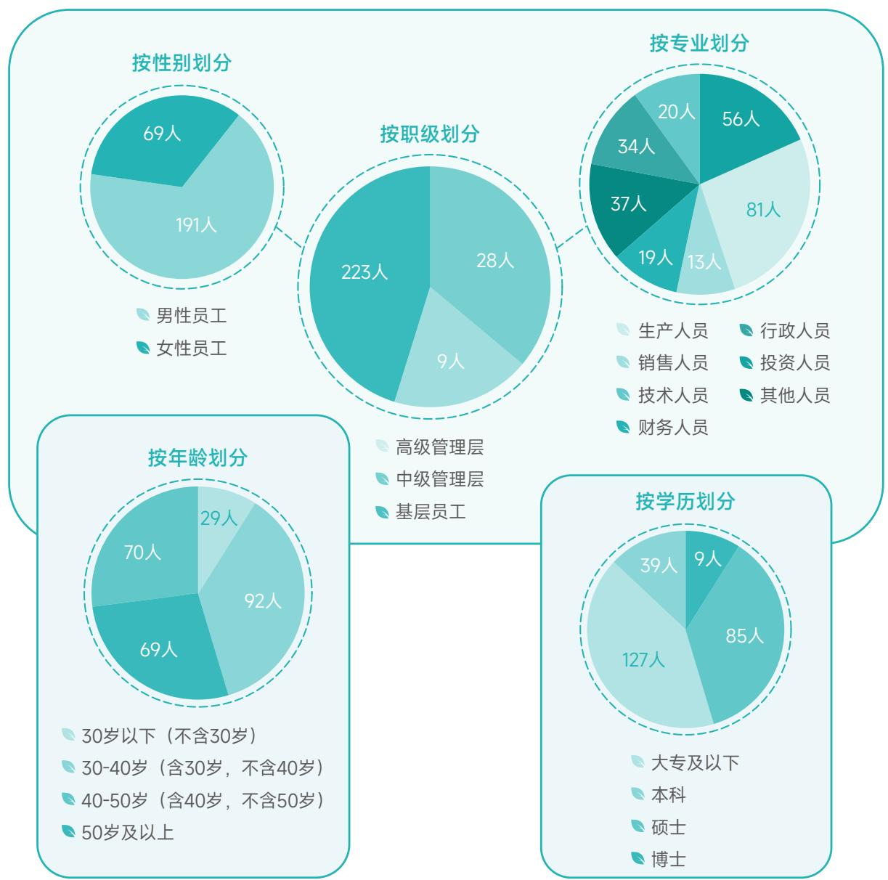

donut

| Category | Sub-category | Value |
| --- | --- | --- |
| 按性别划分 | 男性员工 | 191人 |
| 按性别划分 | 女性员工 | 69人 |
| 按职级划分 | 生产人员 | 28人 |
| 按职级划分 | 销售人员 | 9人 |
| 按职级划分 | 技术人员 | 223人 |
| 按专业划分 | 行政人员 | 56人 |
| 按专业划分 | 投资人员 | 81人 |
| 按专业划分 | 其他人员 | 34人 |
| 按专业划分 | 财务人员 | 37人 |
| 按专业划分 | 生产人员 (子项) | 13人 |
| 按专业划分 | 销售人员 (子项) | 19人 |
| 按专业划分 | 技术人员 (子项) | 20人 |
| 按年龄划分 | 高级管理层 | 29人 |
| 按年龄划分 | 中级管理层 | 92人 |
| 按年龄划分 | 基层员工 | 69人 |
| 按学历划分 | 大专及以下 | 127人 |
| 按学历划分 | 本科 | 39人 |
| 按学历划分 | 硕士 | 85人 |
| 按学历划分 | 博士 | 9人 |

# - 薪酬体系

公司始终坚持“效益优先、兼顾公平”理念，按照“效益增工资增、效益降工资降”的同向联动及工资总额制管理原则，制定《员工职级和薪酬管理暂行办法》等薪酬管理制度，建立以市场化为导向，与经营业绩和岗位责任相匹配的内部收入分配体系，打造与利润和净资产收益率挂钩的薪酬激励约束机制，将员工收入与公司效益挂钩、与岗位业绩挂钩，激发并调动员工积极性，有效实现公司与员工共同发展。

公司员工薪酬结构清晰，包括月度基本工资、月度绩效奖金和年度绩效奖金三部分。报告期内，定期接受绩效和职业发展考核的员工占比100%。

# 月度基本工资

与职级挂钩按月发放；综合考虑地域、物价等因素，外派人员给予适当上浮。

# 月度绩效奖金

经部门考核后按月发放，考核不合格不予发放。

# 年度绩效奖金

根据公司年度业绩和考核结果确定的激励性收入，包括部门年度绩效奖金和公司关键绩效奖金两部分。

# - 福利体系

公司员工拥有法律规定的元旦、春节等国家法定休假日，期间享有与正常工作期间同等的工资及福利待遇；并合法享有带薪年休假、婚假、产假、陪产假、育儿假、丧假等法定假期；经批准后可请病假、工伤假和事假。

# 关键绩效

报告期内，公司社会保险覆盖率100%，人均带薪休假天数12天，工伤保险投入19.98万元，工伤保险人员覆盖率100%，福利总支出（含五险一金）1,246.43万元。

# - 女性权益保护

公司严格遵守《中华人民共和国妇女权益保障法》《女职工劳动保护特别规定》等相关法律法规，加强女员工权益保护，为女性员工提供产假、育儿假等专属假期，全面保障女员工在孕期、产期及哺乳期的福利与权益。

# 关键绩效

截至报告期末，公司管理层人员中女性占比19%，享受育儿假的员工2人，育儿假返岗率100%。

natural_image

Line art illustration of people interacting with digital interfaces and checkmarks, no text or symbols present

# - 员工关怀

公司高度重视员工的身心健康与团队凝聚力建设，致力于营造温馨和谐的工作氛围，通过定期开展丰富的文体活动，充实员工的业余生活，以多种形式为员工送去温暖，增强员工幸福感。

公司始终心系困难员工身心健康和生活状态，为困难员工及其家庭提供经济支持和情感关怀，通过走访生活困难党员，慰问烈士遗属，为他们排忧解难，保障他们的生活质量。

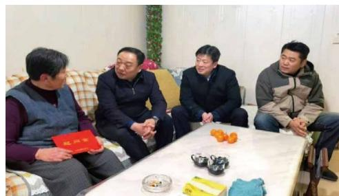

natural_image

Four men sitting on a sofa, engaged in conversation with red envelopes and tea sets (no visible text or symbols)

访问烈士遗属

# - 民主管理

公司积极落实民主管理，充分发挥工会的作用，畅通员工沟通渠道，深入了解员工对于公司的看法和建议，通过组织员工座谈会，搭建起一个开放交流的平台，鼓励员工畅所欲言，及时回应员工诉求。

# 关键绩效

报告期内，公司职代会审议通过项目数2项，工会审议通过项目数2项，工会会员占在职员工的比例为100%。

# - 绩效反馈与申诉

鲁信创投不断完善员工绩效反馈与申诉流程，定期对员工履职表现、工作成果等进行全面评估，并将考核结果反馈至每位员工，员工若对考核结果存在异议，可通过书面申请、邮件反馈至直属上级部门。相关部门在合规核查后，及时向员工反馈调查结果与处理意见，确保申诉渠道畅通、处置公正透明，切实维护绩效考核的公平性与权威性。

# - 员工满意度

公司定期组织开展员工满意度调查，深入了解员工的真实心声与需求。通过问卷、访谈等多种调查形式，及时收集员工对于薪酬福利、职业发展、工作环境以及团队协作等方面的意见建议，确保每一份意见都能被认真倾听并转化为具体改进措施。报告期内，公司员工满意度100%，员工满意度调查参与率100%，未收到员工投诉。

# - 劳动纠纷

公司建立了高效规范、公正透明的劳动纠纷处理机制。一旦有劳动纠纷发生，相关部门会迅速介入，严格依据国家法律法规及公司内部规章制度，秉持公平公正、依法合规的原则进行调解与处理。报告期内，公司受理1起员工劳动纠纷案件，该案件尚在审理过程中。

# 员工培训与发展

# - 员工培训

公司坚持“服务中心、按需施教，整体规划、分类实施，学用结合、注重实效”的原则，制定《员工培训管理办法》，建立制度化、规范化、科学化的员工培训机制。公司实行“本部—权属公司”分级培训管控体系，由公司综合办公室（党群工作部、安全监管部）作为培训工作日常归口部门，进行培训体系搭建及相关工作的监督考核，各部室（中心）、各权属公司提出培训需求并落实培训计划，明确员工培训过程中各个方面的工作要求，全面提升员工政治素质、专业能力与管理水平。

# - 师资队伍建设

在培训师资方面，公司采取内训讲师与外部讲师相结合的培训模式，在充分发挥公司内部业务骨干专业能力的同时，也合理利用外部师资经验资源，共同推动员工能力的提升。

# 内训师

聘请各部室（中心）业务骨干担任内训讲师，兼职负责课程开发、教材编写、课件制作、授课教学、试题编制、阅卷评分等工作。

# 外训师

相关领域专家、高等院校教授或知名企业中高层管理人员。

# - 分层分级培训

公司根据人员类别，分类组织业务及能力培训，针对不同层级的员工组织不同的培训，准确提升员工的工作能力，促进公司与员工共同发展。

<table><tr><td>培训形式</td><td>培训内容</td></tr><tr><td rowspan="2">新员工培训</td><td>通识知识:公司概况、发展战略、企业文化、规章制度等</td></tr><tr><td>岗位知识:岗位职责、专业知识、操作规范、工作流程等</td></tr><tr><td>党务人员培训</td><td>党的理论、党务知识、文字材料</td></tr><tr><td>专业序列人员</td><td>专业知识和管理技能</td></tr><tr><td>中层管理人员</td><td>政策法规、管理方法、团队建设</td></tr><tr><td>高级管理人员</td><td>政策理论、行业发展、经营管理、领导科学</td></tr><tr><td>出国(境)专题培训</td><td>由集团或者公司根据工作需要统一组织开展</td></tr></table>

报告期内，公司以“大课来袭”为平台，每月定期组织开展包括市场解读、法律合规、健康科普等各类培训，另外组织开展素质拓展、继续教育、廉政教育等专题培训，有效提高员工综合素质和履职能力。

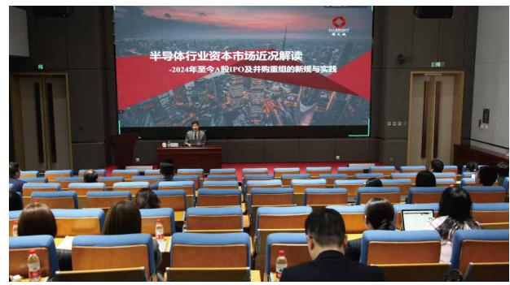

text_image

半导体行业资本市场近况解读
-2024年至今A股IPO及并购重组的新规与实践

市场解读

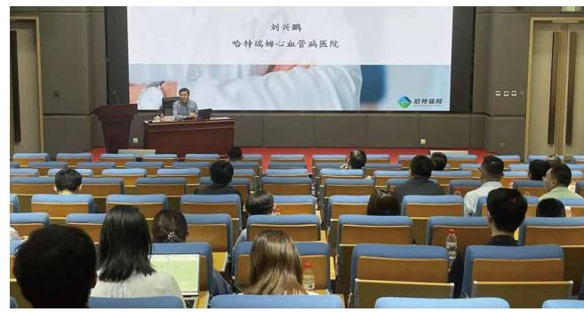

text_image

刘兴鹏
哈特瑞姆心血管病医院
答辩技巧

健康科普

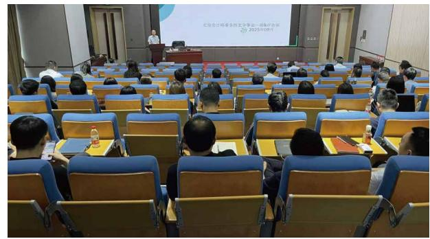

text_image

汇智会计师事务所北京分所第一期
2021年9月9日

法律合规专题培训

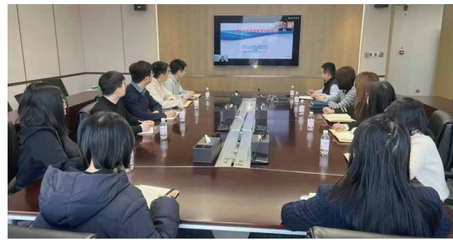

natural_image

Group of people seated around a conference table in a meeting room, facing a large screen displaying a presentation (no visible text or symbols on the image)

意识形态培训

# - 鼓励资质认证

公司积极构建员工职业能力提升激励体系，鼓励员工利用业余时间考取与工作相关的国家统一资格证书，包括金融分析师、投资分析师、会计师、内部审计师等，对成功获取证书的员工给予一定奖励；对于需要先参加专业培训再报考的职业资格，公司报销部分费用，全力支持员工提升工作能力和综合素养。

# 关键绩效

报告期内，公司培训投入5.88万元，培训场次17场，接受培训总人数260人，接受培训总人次1,240人次，员工培训覆盖率100%，每名员工接受培训的平均时长1.20小时。

# - 员工职业发展

公司为员工构建了清晰健全的职业发展体系，设置9类职级体系，明确每个职级所需要的工作经验及知识能力，通过公开竞聘、双向选择等模式，鼓励员工正当竞争，帮助员工实现个人职业发展目标。此外，公司不断优化晋级条件，不唯资历、学历，以能力和贡献为核心评价标准，提高职务和职级管理的科学性、针对性、可操作性。

# 关键绩效

报告期内，员工内部调动或内部应聘的人数3人，占员工总数的比例为1.16%。

# 职业健康与安全

公司高度重视保障员工的身心健康与职业安全，构建全方位、精细化的安全健康管理体系，从风险防控、设施保障、健康关怀等多维度采取措施，努力打造安全规范、健康和谐的工作环境，为员工安心履职筑牢坚实保障。

# - 安全培训与宣传

公司注重提升相关人员的专业技能和能力，定期举办“安全生产月”“消防宣传月”等多样化的安全活动，并通过安全生产知识考试、知识竞赛，全面提升公司的安全生产水平和员工的安全操作意识。

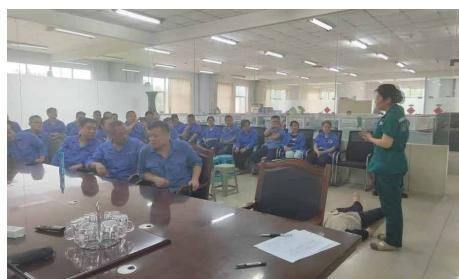

natural_image

Group of people in a meeting room with a teacher and seated attendees (no visible text or symbols)

安全生产月职业卫生讲座

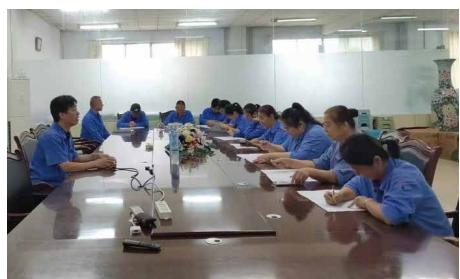

natural_image

Group of people in blue uniforms seated at a long conference table in a meeting room (no visible text or signage)

安全生产大考试

# 关键绩效

报告期内，公司安全教育培训总投入2.6万元，安全教育培训场次16场，总计参与1,148人次，安全教育培训总时长31小时，安全教育培训覆盖率100%，安全风险防护培训覆盖率100%。

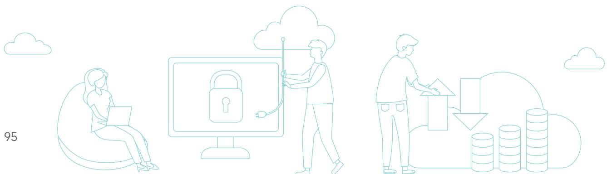

flowchart

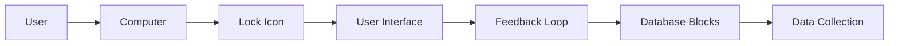
```mermaid
graph LR
  A["User"] --> B["Computer"]
  B --> C["Lock Icon"]
  C --> D["User Interface"]
  D --> E["Feedback Loop"]
  E --> F["Database Blocks"]
  F --> G["Data Collection"]
```

# - 相关方安全管理

公司与相关方签订安全管理协议，并通过事先的充分沟通和协商，确保双方在合作过程中的工作安全得到最大程度的保障。公司对外包工程的施工人员进行安全培训和技术交底，充分告知施工期间可能存在的风险；同时，施工单位在作业前对施工现场进行安全评估，并做好应急措施。

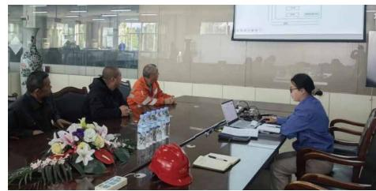

text_image

Meeting scene with four people seated around a table, one wearing a red helmet and holding flowers, in a conference room with presentation screen visible.

外来施工人员安全培训

# - 职业病危害因素检测

为有效预防职业病，保障员工身心健康，公司定期对工作场所中的各种职业危害因素进行检测。报告期内，磨具公司聘请第三方机构开展职业病危害因素检测，并出具《工作场所职业病危害因素定期检测报告》，职业病危害因素检测率为100%，职业病危害因素检测合格率为100%。

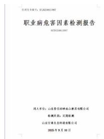  
职业病危害因素检测报告

# - 职业病防护

针对存在职业病风险的岗位，公司积极履行告知义务，向员工发放职业危害告知书，确保员工能够全面了解潜在的职业危害。同时，公司根据员工的岗位特性和所接触的职业病危害因素类型，精心配备了防尘口罩、防毒口罩、防噪声耳塞、工作服、防护手套等个人防护用品。

# 案例

磨具公司在工作场所张贴职业危害告知牌，提前告知员工相应岗位的风险，保障员工的知情权，以便针对职业病风险做出合理的防范。

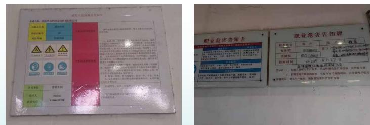

# - 职业病体检

公司每年安排全面的职业健康体检，针对各岗位存在的职业病危害因素，实施定制化体检项目，全面守护员工的身体健康。报告期内，公司组织全体员工参加年度健康体检，员工体检覆盖率100%。

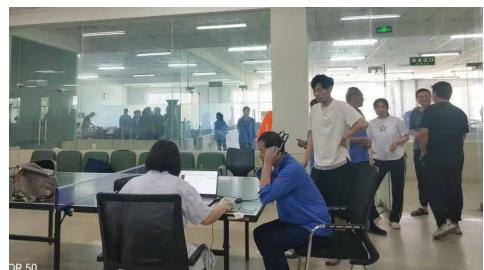

text_image

Street photo with visible store signboards and people interacting in a public indoor space

职业健康体检

# 积极践行社会责任

# 助力社区发展

公司积极践行企业社会责任，响应国家号召，依托自身资源与专业优势赋能社区发展建设，通过常态化参与各类社区公益活动，深化与社区及当地居民的联结，携手推动区域社会和谐发展。

# 案例

2025年“消防宣传月”期间，鲁信创投组织员工走进乡村基层，为居民科普消防常识，践行国企担当。

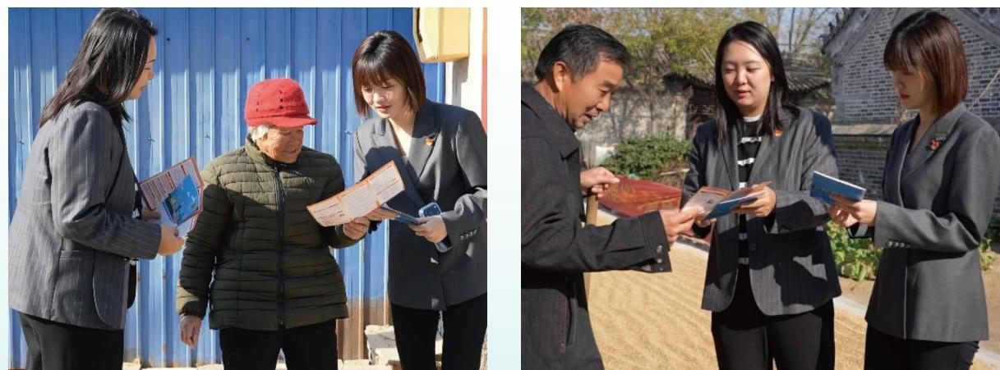

# 参与公益活动

公司积极投身社会公益事业，弘扬企业正能量，通过暖心慰问、物资捐赠等多种形式践行社会责任、反哺社会发展，切实以实际行动为社会和谐建设贡献企业力量。报告期内，志愿活动参与50人次，员工志愿服务时长40小时，人均志愿活动总时长0.15小时。

# - 年度社会贡献值

为了全面准确地衡量公司的社会责任贡献价值，公司采用每股社会贡献值的概念，并以此作为ESG绩效的核心量化指标，持续向社会各界清晰传递公司创造的综合价值。

公司2025年社会贡献值总额约为4.09亿元，每股社会贡献值为0.55元。

注：每股社会增值=（归属于上市公司股东的净利润+为国家创造的税收+向员工支付的工资+向银行等债权人给付的借款利息+公司对外捐赠额等为其他利益相关者创造的价值额-因环境污染、辞退员工等造成的其他社会成本）/公司发行股份总数

# 未来展望

未来，鲁信创投坚持以“助力国家科技进步，推动山东产业结构转型升级”为使命，以培育耐心资本为核心抓手，持续深化科技金融赋能实体经济建设，优化投资布局，助力产业转型升级。同时，我们将持续强化社会责任履行能力，完善可持续发展体系，将可持续发展理念深度融入公司战略规划与日常运营全流程，以党建引领提升治理效能，以产业投资赋能发展，以公益实践彰显国企担当，与股东、员工、客户、被投企业等利益相关方携手并进，聚力同行。

natural_image

Isometric illustration of a digital business ecosystem with server racks, computers, and workflow indicators (no text or symbols)

# 报告附录

指标索引

<table><tr><td colspan="2">报告章节</td><td>《全球可持续发展报告标准》(GRI Standards)</td><td>国资委《央企控股上市公司ESG专项报告编制研究》</td><td>《中国企业可持续发展报告指南(CASS-ESG 6.0)》</td><td>《上市公司自律监管指引第14号——可持续发展报告(试行)》</td></tr><tr><td colspan="2">关于本报告</td><td>2-1/2-2/2-3</td><td>/</td><td>P1.1/P1.2</td><td>第四条 第六条</td></tr><tr><td colspan="2">2025年可持续发展亮点</td><td>/</td><td>/</td><td>A2</td><td>第六条</td></tr><tr><td colspan="2">走进鲁信创投</td><td>2-1/2-6</td><td>/</td><td>P3.1/P3.2/P3.3</td><td>/</td></tr><tr><td rowspan="4">可持续发展管理</td><td>可持续发展目标</td><td>2-22</td><td>/</td><td>G1.1.11</td><td>第十一条 第十九条</td></tr><tr><td>可持续发展治理</td><td>2-14/2-17</td><td>/</td><td>G1.1.1/G1.1.3/G1.1.6</td><td>第十一条 第十二条</td></tr><tr><td>利益相关方沟通</td><td>2-16/2-29</td><td>G3.1.2</td><td>G1.3.2</td><td>第九条 第五十三条</td></tr><tr><td>重要性议题管理</td><td>3-1/3-2/3-3</td><td>/</td><td>G1.1.9</td><td>第五条</td></tr><tr><td rowspan="5">合规治理夯实发展根基</td><td>坚持党建引领</td><td>/</td><td>G1.1.4</td><td>/</td><td>/</td></tr><tr><td>规范公司治理</td><td>2-9/2-11/2-12/2-13/2-17/2-18/2-19/2-27/405-1</td><td>G1.1.1/G1.1.2/G1.2.1/G1.2.2/G1.2.3/G1.3.1/G1.3.3/G3.2.1/G3.2.2/G3.2.3</td><td>/</td><td>/</td></tr><tr><td>强化合规风控</td><td>2-27/207-1/207-2</td><td>G2.1/G5.1/G5.2/S4.1</td><td>/</td><td>/</td></tr><tr><td>保障投资者权益</td><td>2-16/2-27/2-29/201-1</td><td>G3.1.1/G3.1.2/G3.3.2/G4.1.1/G4.1.2</td><td>/</td><td>/</td></tr><tr><td>恪守商业道德</td><td>2-27/205-2/206-1</td><td>G2.2.1/G2.2.2/G2.3.2</td><td>G2.1.1/G2.1.2/G2.1.3/G2.1.4/G2.1.5/G2.1.6/G2.1.7/G2.2.2</td><td>第五十五条第五十六条</td></tr><tr><td rowspan="3">低碳引领赋能绿色发展</td><td>应对气候变化</td><td>201-2/305-1/305-2/305-4</td><td>E3.1.1/E3.1.2/E3.1.3/E3.1.4/E3.1.6/E3.2.1/E3.4/E5.1.1</td><td>E1.1.1/E1.1.2/E1.1.3/E1.1.4/E1.1.6/E1.1.7/E1.1.8/E1.1.16</td><td>第二十一条 第二十二条第二十三条 第二十四条第二十七条</td></tr><tr><td>环境合规管理</td><td>2-27/305-7/306-1/306-2/306-3/306-5</td><td>E2.2.1/E2.3.1/E2.3.4/E2.3.5/E5.4.4/E5.6</td><td>E2.1.1/E2.1.6/E2.2.1/E2.2.5/E2.4.1/E2.4.2/E2.4.4</td><td>第二十九条 第三十条第三十一条第三十三条</td></tr><tr><td>促进低碳运营</td><td>302-1/302-2/302-3/302-4/302-5/303-1/303-2/303-5</td><td>E1.1.1/E1.1.4/E1.3.1/E1.3.4/E1.3.5/E5.2</td><td>E3.1.1/E3.1.3/E3.1.5/E3.2.1/E3.2.2/E3.3.2</td><td>第三十五条第三十六条第三十七条</td></tr></table>

<table><tr><td colspan="2">报告章节</td><td>《全球可持续发展报告标准》(GRI Standards)</td><td>国资委《央企控股上市公司ESG专项报告编制研究》</td><td>《中国企业可持续发展报告指南(CASS-ESG 6.0)》</td><td>《上市公司自律监管指引第14号—可持续发展报告(试行)》</td></tr><tr><td></td><td>聚力绿色发展</td><td>203-1/203-2</td><td>S4.4.4</td><td>/</td><td>/</td></tr><tr><td rowspan="6">责任深耕赋能产业共兴</td><td>践行负责任投资</td><td>203-2</td><td>/</td><td>/</td><td>/</td></tr><tr><td>服务实体经济</td><td>203-2</td><td>S4.2.2/S4.4.1/S.4.4</td><td>/</td><td>/</td></tr><tr><td>坚守产品服务安全品质</td><td>416-1/416-2/417-1</td><td>S2.1.1/S2.1.2/S2.1.4/S2.2.1/S2.2.2</td><td>S3.3.1/S3.3.2/S3.3.3/S3.3.4/S3.3.6</td><td>第四十七条</td></tr><tr><td>创新驱动发展</td><td>203-2</td><td>S2.3.1/S2.3.2/S2.3.3/S2.3.4</td><td>S2.1</td><td>第四十二条</td></tr><tr><td>强化供应链安全</td><td>414-1/414-2</td><td>S3.1/S3.2</td><td>S3.1/S3.2.1</td><td>第四十五条第四十六条</td></tr><tr><td>守护数据安全与客户隐私</td><td>418-1</td><td>S2.2.3</td><td>S3.4</td><td>第四十八条</td></tr><tr><td rowspan="2">以人为本共赴美好新程</td><td>员工权益与安全</td><td>401-1/403-1/403-2/403-5/403-6/403-9/404-1/405-1/406-1</td><td>S1.1.1/S1.1.2/S1.2.1/S1.2.3/S1.3.1/S1.3.2/S1.3.3/S1.4.2</td><td>S4.1.1/S4.1.3/S4.1.4/S4.1.5/S4.1.6/S4.1.7/S4.1.8/S4.1.9/S4.1.11/S4.2.1/S4.2.2/S4.2.4/S4.2.6/S4.3.1/S4.3.2/S4.3.3/S4.3.4/S4.3.5/S4.3.6</td><td>第五十条</td></tr><tr><td>积极践行社会责任</td><td>413-1</td><td>S4.2.1/S4.2.2/S4.3.1/S4.3.2</td><td>S1.2.1</td><td>第四十条</td></tr><tr><td colspan="2">未来展望</td><td>/</td><td>/</td><td>A1</td><td>/</td></tr><tr><td rowspan="2">报告附录</td><td>指标索引</td><td>/</td><td>/</td><td>A3</td><td>第五十七条</td></tr><tr><td>意见反馈表</td><td>2-26</td><td>/</td><td>A6</td><td>第九条</td></tr></table>

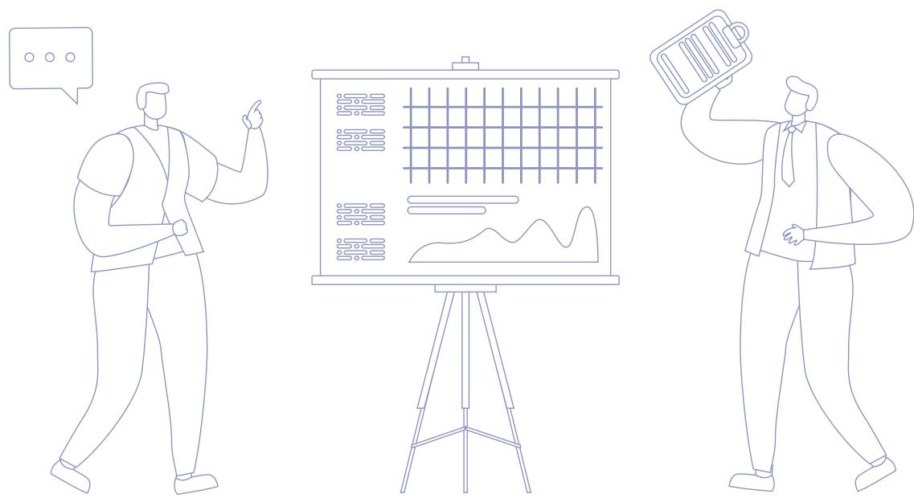

natural_image

Line drawing of three business professionals in different poses: one gesturing, one presenting a presentation board with charts, and another holding a smartphone (no text or symbols)

# ○ 意见反馈表

尊敬的读者：

非常感谢您阅读本报告。我们非常重视并期望聆听您对本报告的反馈意见。您的意见和建议，是我们持续提高企业ESG信息披露水平、推进企业ESG管理和实践的重要依据。我们欢迎并由衷感谢您提出宝贵意见！

1. 您对我们履行 ESG 的总体评价是：

□非常好 □好 □一般 □较差 □差

2. 您对本报告的总体评价是：

□ 非常好 □ 好 □ 一般 □ 较差 □ 差

3.您认为我们在利益相关方沟通方面做得如何？

□非常好 □好 □一般 □较差 □差

4.您认为我们在产品责任方面做得如何？

□非常好 □好 □一般 □较差 □差

5.您认为我们在环境、安全和职业健康方面做得如何？

□ 非常好 □ 好 □ 一般 □ 较差 □ 差

6.您认为我们在员工责任方面做得如何？

□非常好 □好 □一般 □较差 □差

7.您认为我们在 ESG 方面做得如何？

□ 非常好 □ 好 □ 一般 □ 较差 □ 差

8.您对我们履行 ESG 及本报告有何意见和建议？

# 您可通过以下方式联系我们：

电话：0531-86566770  
邮箱：lxct600783@luxin.cn  
地址：山东省济南市奥体西路2788号A塔

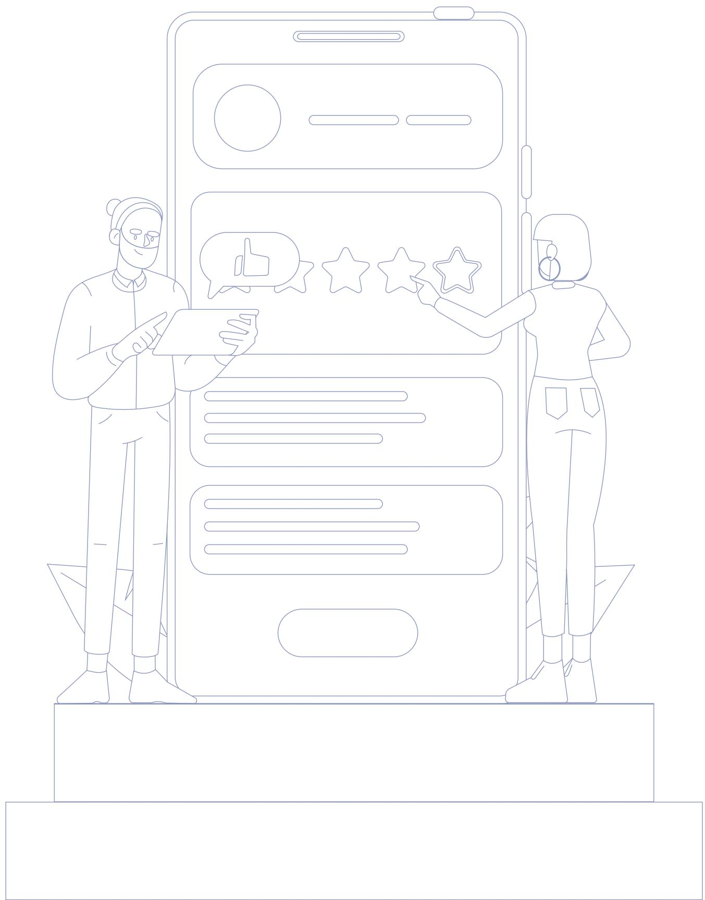

natural_image

Line drawing of two people interacting with a large smartphone displaying social media interface icons (no text or symbols)

