# 2025年

# 环境、社会及治理(ESG)报告

江苏悦达投资股份有限公司

公司地址:江苏省盐城市亭湖区世纪大道东路2号

邮政编码:224007

公司电话:0515-88202867

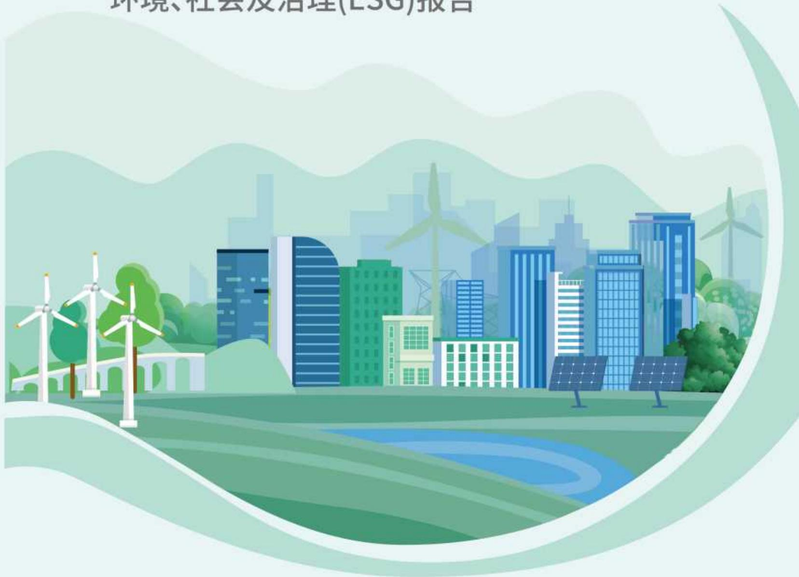

text_image

环境、社会及治理(ESG)报告

# 关于本报告

本报告为江苏悦达投资股份有限公司发布的环境、社会和治理(ESG)报告，旨在向各利益相关方展示公司在环境、社会和治理方面的理念、关键绩效，加强与各利益方的沟通和联系。

# 组织范围

如无特殊说明，本报告主要涵盖江苏悦达投资股份有限公司及全资、控股企业。

# 报告周期

本报告为年度报告,时间范围为2025年1月1日至2025年12月31日,为增强报告可比性和完整性,部分内容适当溯及以往年份。

# 编制依据

本报告依据《上海证券交易所上市公司自律监管指南第14号—可持续发展报告(试行)》《上海证券交易所上市公司自律监管指南第4号—可持续发展报告编制》。

# 数据说明

本报告关键数据来源于江苏悦达投资股份有限公司经审计的财务报告、正式文件及统计报告等。本报告中所涉及货币种类及金额，如无特殊说明，均以人民币为计量单位。

# 编制流程

本报告按照同业对标、问卷调查、信息收集、信息复核、报告写作、管理层审定、董事会审议、对外披露等步骤进行，以确保内容的完整性、真实性和平衡性。

# 获取方式

本报告以印刷品、电子文档形式发布，其中电子文档可在公司官方网站(http://www.yuedainvest.com/)下载阅读获取。为减少印刷对环境产生的影响，我们倡导读者尽可能下载阅读电子文件。

# 联系方式

公司地址:江苏省盐城市亭湖区世纪大道东路2号

邮政编码:224007

公司电话:0515-88202867

# 称谓说明

在本报告中,除非文义另有所指,下列词语具有如下含义:

<table><tr><td>简称</td><td>全称</td><td>简称</td><td>全称</td></tr><tr><td rowspan="2">悦达投资、公司、我们</td><td rowspan="2">江苏悦达投资股份有限公司</td><td>悦达新能</td><td>江苏悦达新能源科技有限公司</td></tr><tr><td>悦海新能</td><td>盐城悦海新能源发展有限公司</td></tr><tr><td>悦达纺织</td><td>江苏悦达纺织集团有限公司</td><td>悦达储能</td><td>江苏悦达储能科技有限公司</td></tr><tr><td>悦达智能农装</td><td>江苏悦达智能农业装备有限公司</td><td>悦达能服</td><td>江苏悦达综合能源服务有限公司</td></tr><tr><td>悦达专用车</td><td>江苏悦达专用车有限公司</td><td>悦达和碳</td><td>江苏悦达和碳环境技术有限公司</td></tr><tr><td>悦达长久物流</td><td>江苏悦达长久物流有限公司</td><td>悦达生物质</td><td>江苏悦达生物质科技有限公司</td></tr><tr><td>悦达低碳</td><td>江苏悦达低碳科技发展有限公司</td><td></td><td></td></tr></table>

注：本报告中涉及的未来计划、发展战略等前瞻性描述，不构成公司对投资者的实质性承诺，敬请投资者注意投资风险。

# 目录

# CONTENTS

# 关于本报告

# 聚焦2025

# 走进悦达投资

公司简介

产业布局

# 年度荣誉

# 可持续发展管理

# 重要性议题管理

# 重要性议题结果

# 展望未来

# 指标索引

# 意见反馈

# 环境保护篇

# 风光赋能 数智护绿

15 应对气候变化  
18 环境合规管理  
19 污染物排放  
20 废弃物处理  
21 能源利用  
21 水资源利用  
22 循环经济

23 生态系统和生物多样化保护

25 专题:聚力项目并网 激活绿色发展

# 01

# 社会责任篇

# 以人为本 共创未来

29 职业健康与安全  
30 培养企业安全文化  
31 职业健康管理  
32 与员工共成长  
34 社会贡献  
35 专题:悦达投资“巾帼”力量  
37 乡村振兴  
37 创新驱动  
39 专题:深耕创新驱动彰显国企担当  
40 科技伦理  
40 供应链安全  
41 平等对待中小企业  
42 产品与服务质量  
44 数据安全与客户隐私保护

# 02

# 公司治理篇

# 党建引领 合规致远

47 党建引领 赋能高质量发展  
47 强基固本筑堡垒 凝心聚力担使命  
49 公司治理  
50 保护投资者权益  
52 合规风险防控  
53 利益相关方沟通  
54 反商业贿赂及反贪污  
55 反不正当竞争与反垄断  
55 尽职调查

text_image

40 供应链安全
41 平等对待中小企业
42 产品与服务质量
44 数据安全与客户隐私保护
04

# 聚焦2025

# 2025年度可持续发展亮点

# 经营绩效

总资产

104.68亿元

营业收入

25.56亿元

归属于上市公司股东净利润

3687万元

合计拟实施分红(含税)

4254.47万元

# 治理绩效

股东会召开

2次

董事会召开

6次

合规披露公告

39份

# 安全环保

重大环境污染事故

0次

重大环境安全事故

0次

# 创新研发

研发投入

5566.24万元

研发团队总人数

224人

研发人员占比

8.35%

专利累计数

497项

# 员工关爱

员工总人数

2682人

员工福利支出

1389万元

# 走进悦达投资

# 公司简介

江苏悦达投资股份有限公司(简称:悦达投资,股票代码:600805.SH)成立于1991年4月,为江苏悦达集团有限公司核心成员企业之一,于1994年1月在上海证券交易所挂牌,是江苏第三家、苏北第一家上市公司。成立30多年来,公司坚持“产业发展、资本运作”战略引领,与国内外诸多知名企业成功合作,取得了良好的经济和社会效益。近年来,面对国家能源绿色低碳发展趋势和盐城主导产业政策,悦达投资坚定扛起绿色化、智能化、数字化发展的职责使命,大力实施新能源主责主业、新材料重要补充、智能制造作为转型升级基础的经营方针。聚力新能源项目突破,积极推动沿海风力发电、“渔光互补”、屋顶光伏、共享储能等落地见效,奋力竞逐绿色低碳发展新赛道。

# 产业布局

# 新能源

公司充分利用盐城区位优势，优先布局风电、光伏、储能、碳资产等领域，推动绿色能源协同发展，不断强化产业含“绿”量，促进发展含“金”量。

# 新材料

领投陶氏化学技术团队的珩创纳米磷酸锰铁锂项目，为产业延链补链，进一步提升核心竞争力。

# 智能制造

锚定传统产业数字化、绿色化、智能化发展，主动融入新一轮科技革命和产业变革，加强科技创新与产业创新深度融合，着力培育形成新质生产力，推动传统产业焕新、蝶变。

# 年度荣誉

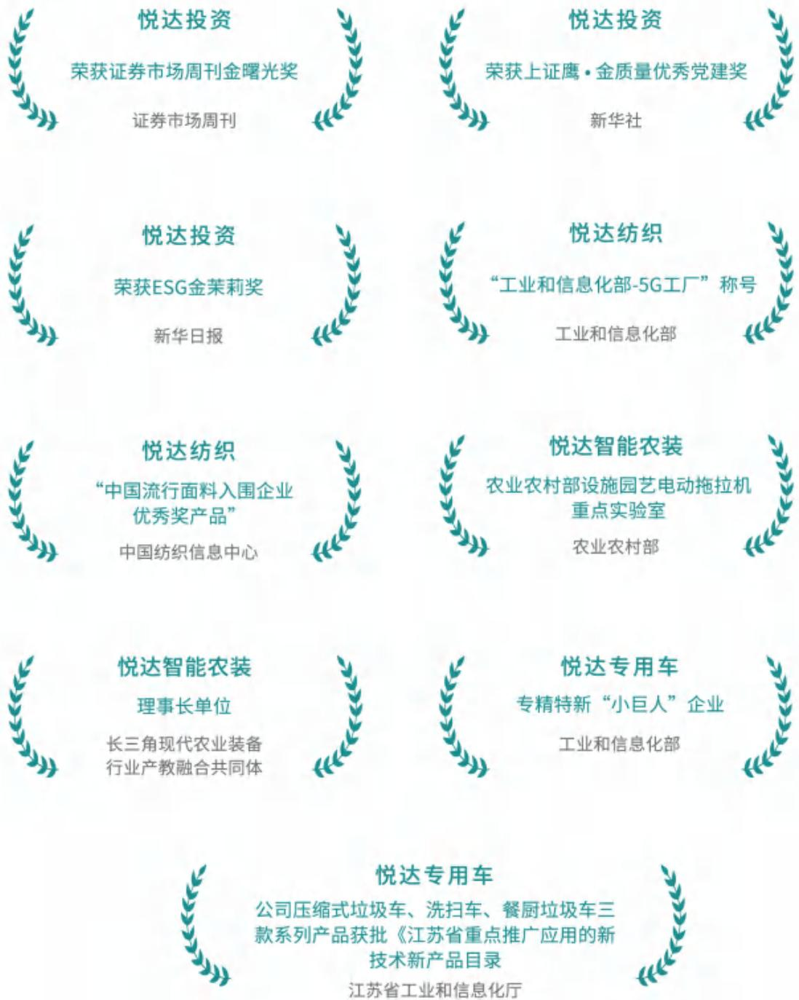

# 悦达专用车

公司压缩式垃圾车、洗扫车、餐厨垃圾车三款系列产品获批《江苏省重点推广应用的新技术新产品目录

江苏省工业和信息化厅

# 可持续发展管理

# 管理理念

公司秉持绿色发展、责任担当、共治共享的 ESG 管理理念，坚守环境友好、社会责任与公司治理协同共进，将可持续发展融入战略规划与经营全过程，以高标准环境管理、高质量社会责任、高效能公司治理，推动企业长期稳健发展，实现经济效益、社会效益与生态效益有机统一。

# 决策层

# 由公司董事会成员组成

从战略、主责、主业等方面，了解、分析、掌握、监督可持续发展相关工作。

# 管理层

# 高级管理人员、各相关职能部门及子公司相关负责人

管理重要性议题以提供分析、建议供决策层讨论，以确保董事会进行监督。并拟定可持续发展工作计划，以及可持续发展激励及考核制度等。

# 执行层

# ESG执行小组

制定利益相关方参与计划，组织利益相关方沟通活动；协调编制可持续发展报告；完善可持续发展相关管理制度，执行可持续发展工作计划；定期工作成果向管理层汇报。

# 重要性议题管理

公司依据《上海证券交易所上市公司自律监管指南第14号—可持续发展报告(试行)》《上海证券交易所上市公司自律监管指南第4号—可持续发展报告编制》，披露标准的评估方法，建立了全面的评估体系。引入影响重要和财务重要性的双重视角进行分析，确保信息披露的全面性，进一步提升公司可持续发展报告的透明度与可信度。

<table><tr><td>议题评估流程</td><td>分析方法</td></tr><tr><td>步骤一了解公司背景</td><td>◆ 中国产业发展趋势的宏观环境分析◆ 基于行业分析◆ 基于公司的商业模式分析◆ 识别公司的利益相关方与公司面临的影响、风险与机遇</td></tr><tr><td>步骤二议题初步筛选</td><td>◆ 参考《上海证券交易所上市公司自律监管指南第14号—可持续发展报告(试行)》《上海证券交易所上市公司自律监管指南第4号—可持续发展报告编制》,建立可持续发展相关议题库。</td></tr><tr><td>步骤三议题重要性评估</td><td>◆ 影响重要性评估梳理各议题对外部环境、社会和经济的潜在或实际的正面或负面影响,通过问卷和专家判断的形式对利益相关方展开调研分析。◆ 财务重要性评估通过影响、依赖性和其他因素分析,结合问卷与专家谈判,识别和评估相关议题下的风险和机遇,评估出具有财务重要性的议题。</td></tr><tr><td>步骤四议题确认</td><td>◆ 形成影响重要性和财务重要性议题清单,并确保相关议题透明平衡且完整地披露于报告中。</td></tr></table>

# 重要性议题结果

公司根据利益相关方调查问卷、专家评审等方式，开展重要性议题识别评估工作，从“影响重要性”与“财务重要性”两个维度进行分析，形成重要性议题矩阵。

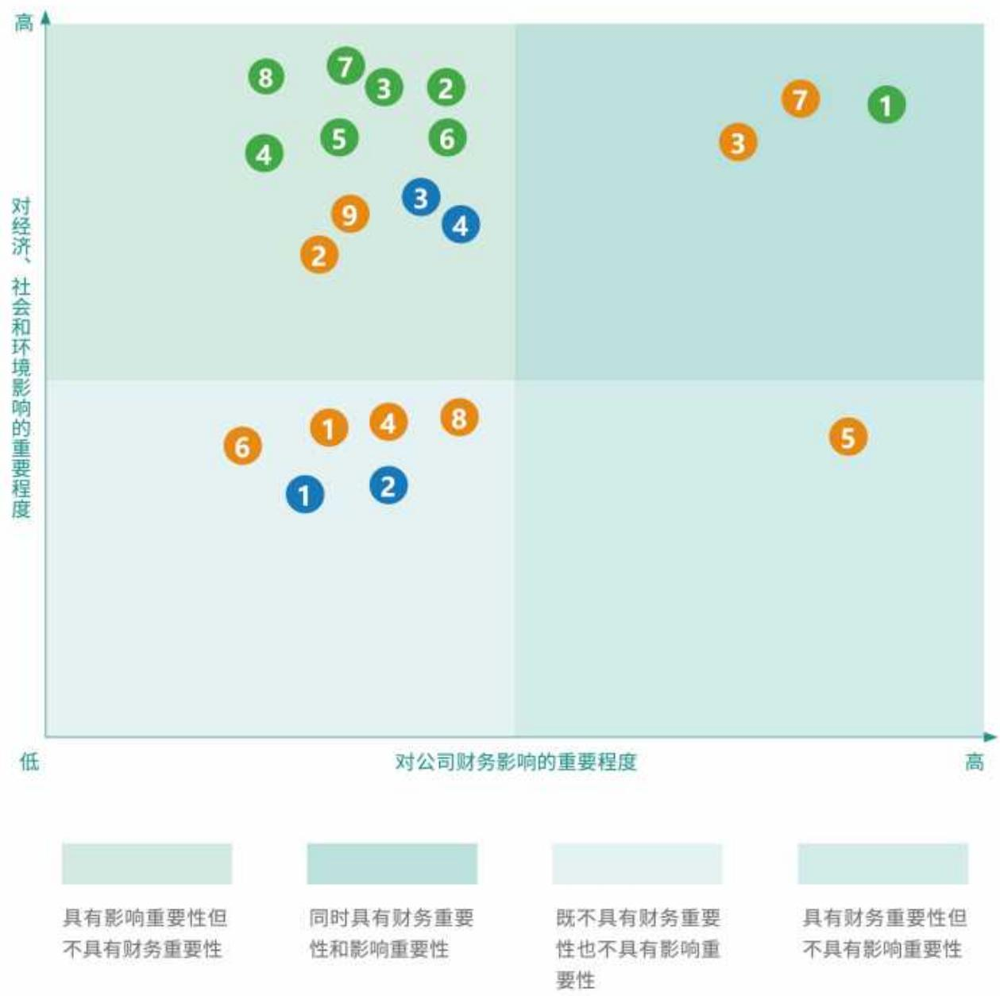

scatter

| Item | Importance to Company Financial Impact (X-axis) | Importance to Economy, Society and Environment (Y-axis) |
| --- | --- | --- |
| 1 | ~85 | ~75 |
| 2 | ~45 | ~65 |
| 3 | ~40 | ~60 |
| 4 | ~35 | ~55 |
| 5 | ~30 | ~50 |
| 6 | ~20 | ~30 |
| 7 | ~30 | ~85 |
| 8 | ~25 | ~80 |
| 9 | ~30 | ~50 |
| 10 | ~30 | ~35 |
| 11 | ~30 | ~30 |
| 12 | ~30 | ~25 |
| 13 | ~30 | ~20 |
| 14 | ~30 | ~15 |
| 15 | ~30 | ~10 |
| 16 | ~30 | ~5 |
| 17 | ~30 | ~2 |
| 18 | ~30 | ~1 |
| 19 | ~30 | ~0.5 |
| 20 | ~30 | ~0.2 |
| 21 | ~30 | ~0.1 |
| 22 | ~30 | ~0.05 |
| 23 | ~30 | ~0.02 |
| 24 | ~30 | ~0.01 |
| 25 | ~30 | ~0.005 |
| 26 | ~30 | ~0.002 |
| 27 | ~30 | ~0.001 |
| 28 | ~30 | ~0.0005 |
| 29 | ~30 | ~0.0002 |
| 30 | ~30 | ~0.0001 |
| 31 | ~30 | ~0.00005 |
| 32 | ~30 | ~0.00002 |
| 33 | ~30 | ~0.00001 |
| 34 | ~30 | ~0.000005 |
| 35 | ~30 | ~0.000002 |
| 36 | ~30 | ~0.000001 |
| 37 | ~30 | ~0.0000005 |
| 38 | ~30 | ~0.0000002 |
| 39 | ~30 | ~0.0000001 |
| 40 | ~30 | ~0.00000005 |
| 41 | ~30 | ~0.00000002 |
| 42 | ~30 | ~0.00000001 |
| 43 | ~30 | ~0.000000005 |
| 44 | ~30 | ~0.000000002 |
| 45 | ~30 | ~0.000000001 |
| 46 | ~30 | ~0.0000000005 |
| 47 | ~30 | ~0.0000000002 |
| 48 | ~30 | ~0.0000000001 |
| 49 | ~30 | ~0.00000000005 |
| 50 | ~35 | ~65 |
| 51 | ~85 | ~65 |
| 52 | ~85 | ~65 |
| 53 | ~85 | ~65 |
| 54 | ~85 | ~65 |
| 55 | ~85 | ~65 |
| 56 | ~85 | ~65 |
| 57 | ~85 | ~65 |
| 58 | ~85 | ~65 |
| 59 | ~85 | ~65 |
| 60 | ~85 | ~65 |
| 61 | ~85 | ~65 |
| 62 | ~85 | ~65 |
| 63 | ~85 | ~65 |
| 64 | ~85 | ~65 |
| 65 | ~85 | ~65 |
| 66 | ~85 | ~65 |
| 67 | ~85 | ~65 |
| 68 | ~85 | ~65 |
| 69 | ~85 | ~65 |
| 70 | ~85 | ~65 |
| 71 | ~85 | ~65 |
| 72 | ~85 | ~65 |
| 73 | ~85 | ~65 |
| 74 | ~85 | ~65 |
| 75 | ~85 | ~65 |
| 76 | ~85 | ~65 |
| 77 | ~85 | ~65 |
| 78 | ~85 | ~65 |
| 79 | ~85 | ~65 |
| 80 | ~85 | ~65 |
| 81 | ~85 | ~65 |
| 82 | ~85 | ~65 |
| 83 | ~85 | ~65 |
| 84 | ~85 | ~65 |
| 85 | ~85 | ~65 |
| 86 | ~85 | ~65 |
| 87 | ~85 | ~65 |
| 88 | ~85 | ~65 |
| 89 | ~85 | ~65 |
| 90 | ~85 | ~65 |
| 91 | ~85 | ~65 |
| 92 | ~85 | ~65 |
| 93 | ~85 | ~65 |
| 94 | ~85 | ~65 |
| 95 | ~85 | ~65 |
| 96 | ~85 | ~65 |
| 97 | ~85 | ~65 |
| 98 | ~85 | ~65 |
| 99 | ~85 | ~65 |
| 1.1.1.1.1.1.1.1.1.1.1.1.1.1.1.1.1.1.1.1.1.1.1.1.1.1.1.1.1.1.1.1.1.1.1.1.1.1.1.1.1.1.1.1.1.1.1.1.1.1.1 .2 .2 .2 .2 .2 .2 .2 .2 .2 .2 .2 .2 .2 .2 .2 .2 .2 .2 .2 .2 .2 .2 .2 .2 .2 .2 .2 .2 .2 .2 .2 .2 .2 .2 .2 .2 .2 .2 .2 .2 .2 .2 .2 .2 .2 .2 .2 .2 .<nl>

# 治理维度

1 尽职调查  
② 利益相关方沟通  
3 反商业贿赂及反贪污  
4 反不正当竞争

# 环境维度

1 应对气候变化  
② 污染物排放  
3 废弃物处理  
4 生态系统和生物多样性保护  
5 环境合规管理  
6 能源利用  
7 水资源利用  
8 循环经济

# 社会维度

1 乡村振兴  
② 社会贡献  
3 创新驱动  
4 科技伦理  
5 供应链安全  
6 平等对待中小企业  
7 产品和服务安全与质量  
8 数据安全与客户隐私保护  
9 员工

natural_image

Modern city skyline with green and blue abstract wave visualization, no text or symbols present

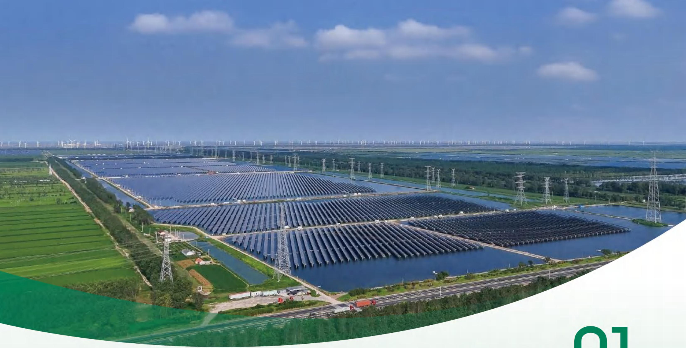

natural_image

Aerial view of a large floating solar farm with rows of photovoltaic panels, adjacent to green fields and power transmission towers under a blue sky.

# 环境保护篇 01 风光赋能 数智护绿

# 应对气候变化

# 治理

公司遵循《应对气候变化国家方案》的指导原则，聘请北京和碳环境技术有限公司编制了《悦达投资碳达峰行动方案》，涵盖了对公司本部、所属企业纺织、智能农装、专用车、物流、悦达新能源、悦达储能等温室气体排放数据的收集、整理和分析流程，强化了内部审核机制，确保盘查工作的质量和可信度。

# 战略

悦达投资积极响应国家气候变化应对策略，结合公司所处的行业及产品特性，主动且全面识别与气候变化相关的潜在风险和机遇，评估气候变化对公司运营、产品和服务安全与质量、市场开拓等方面可能产生的影响，制定适应性及缓解性的措施，保障企业高质量发展。

<table><tr><td colspan="2">风险类型</td><td>风险描述</td><td>发生概率</td><td>影响大小</td><td>影响时间范围</td><td>影响价值链环节</td><td>优先级排序</td><td>潜在财务影响</td><td>应对措施</td></tr><tr><td rowspan="2">物理风险</td><td>急性风险</td><td>公司传统产业如纺织、智能农装、专用车,新能源产业如“渔光互补”、大型共享储能电站、工商业储能等,在江苏、安徽、宁夏等地,面临高温、暴雨、暴风、暴雪等极端天气,可能会对公司的设备、员工安全产生影响,导致业务中断或设备受损。</td><td>低</td><td>高</td><td>短中期</td><td>运营</td><td>中</td><td>营业收入减少</td><td>·充分利用公司绿色能源数智管理中心平台,发挥数字化、智能化管控作用,同时定期检查设备运行状态,重点监控高温环境下的过热、过载设备并维护。·定期检查排水系统,在暴风雨、暴雪等极端天气下,减少户外作业时间,保障员工安全。·完善风险预警机制,获取极端天气预警信息,制定应急预案,明确责任分工。</td></tr><tr><td>慢性风险</td><td>气候变化带来的海平面上升、水资源短缺等问题,可能对某些生产经营活动产生不利影响。</td><td>中</td><td>中</td><td>中长期</td><td>运营</td><td>中</td><td>营业收入减少</td><td>·积极关注国家关于气候政策,掌握气候变化的最新动态,并制定应急预案,提高应对极端天气和自然灾害的能力,确保生产经营的稳定运行。</td></tr></table>

<table><tr><td colspan="2">风险类型</td><td>风险描述</td><td>发生概率</td><td>影响大小</td><td>影响时间范围</td><td>影响价值链环节</td><td>优先级排序</td><td>潜在财务影响</td><td>应对措施</td></tr><tr><td rowspan="3">转型风险</td><td>政策和法律风险</td><td>目前公司主责主业是新能源行业,受国家、地方的政策和法律法规影响较大。传统制造业也受国家政策影响较大。</td><td>中</td><td>高</td><td>短中长期</td><td>运营</td><td>高</td><td>运营成本增加;利润减少</td><td>·及时关注国家政策以及法律法规的更新和变化,确保项目投资、生产流程、产品设计和排放标准等方面符合最新要求。</td></tr><tr><td>技术风险</td><td>公司传统制造业如纺织、智能农装、专用车属于充分竞争行业,只有保持领先的技术创新优势,才能保证产品品质。</td><td>高</td><td>中</td><td>中长期</td><td>运营</td><td>中</td><td>营业收入减少</td><td>·明确纺织、智能农装、专用车等领域的研发方向和重点,确保研发活动与行业趋势保持一致,加大研发创新投入。</td></tr><tr><td>市场风险</td><td>公司传统制造业受国内、国际宏观形势影响较大,面临市场需求不稳定的风险,影响业务发展和盈利能力。新能源发电企业销售端市场化水平有待提升。</td><td>中</td><td>高</td><td>短中长期</td><td>下游</td><td>中</td><td>营业收入减少</td><td>·强化市场研判,深入市场一线,并且建立快速响应机制,确保在风险发生时能够迅速作出反应。</td></tr></table>

<table><tr><td>机遇类型</td><td>机遇描述</td><td>发生概率</td><td>影响大小</td><td>影响时间范围</td><td>影响价值链环节</td><td>优先级排序</td><td>潜在财务影响</td><td>应对措施</td></tr><tr><td>能源替代</td><td>气候变化促进公司加大清洁能源使用比例。</td><td>高</td><td>高</td><td>短中期</td><td>运营</td><td>高</td><td>运营成本减少</td><td>优化用能结构,增加使用清洁能源比重。</td></tr><tr><td>市场机遇</td><td>绿色产品更容易获得消费者的认可和信任,有助于增强市场竞争力。</td><td>中</td><td>高</td><td>中长期</td><td>运营</td><td>中</td><td>营业收入增加</td><td>积极关注国内外市场的变化趋势和客户需求,加强市场调研和分析,拓展新的业务领域和市场空间。</td></tr><tr><td>技术机遇</td><td>为了应对气候变化,公司需要采用更先进、环保的生产技术和设备,这将要求公司加大技术创新力度,提升生产效率和环保水平。</td><td>高</td><td>中</td><td>中长期</td><td>运营</td><td>高</td><td>营业收入增加;运营成本减少</td><td>通过技术升级,提高生产效率,降低能耗和排放。引进符合公司需求且技术成熟、环保效益显著的生产技术和设备。</td></tr></table>

# 说明

发生概率:指风险\机遇发生的频次间隔、发生的可能性,主要根据历史发生的概率、外部情景、政策实施的进展和专家预测判断。发生概率从“低”到“高”。

影响大小: 指通过冲击水平和风险\机遇发生可能性判定影响的大小, 综合考虑对商业模式、价值链、财务影响等因素。影响大小从“低”到“高”。

影响的时间范围: 不同风险和机遇对公司产生影响, 公司将影响的时间范畴划分为短期(0-1年)、中期(1-5年)、长期(5年以上)。

影响价值链环节: 指上游(涉及原材料供应商、采购和物流等环节)、运营(涉及生产、制造和内部流程等环节)、下游(涉及分销、销售和客户服务等环节)。

优先级排序: 综合考虑发生概率、影响大小、影响时间范围等因素, 结合公司实际, 优先级排序分为“低”“中”“高”。

注:报告其他章节关于发生概率、影响大小、影响的时间范围、影响的价值链环节、优先级排序定义与上文一致,将不再重复说明。

# 影响、风险与机遇管理

悦达投资建立气候相关的风险与机遇管理流程，以精确识别气候变化对公司运营带来的挑战与影响，并制定相应的对策。

# 风险识别

参考气候相关框架，从物理风险、转型风险及机遇三大方面，系统识别并编制气候变化风险与机遇清单，以指导策略制定与风险管理。

# 风险评估

针对识别出的风险和机遇,从发生概率、影响范围和大小的角度评估,并量化这些风险对公司业务的具体影响。

# 风险应对

根据风险的性质及其公司运营影响的严重程度,采取针对性的应对策略,保障业务的平稳与持续发展。

指标与目标

<table><tr><td>指标(单位:二氧化碳当量公吨)</td><td>本期</td><td>上期</td></tr><tr><td>披露的温室气体范围1排放量(二氧化碳当量公吨)</td><td>4163.99</td><td>3662.93</td></tr><tr><td>披露的温室气体范围2排放量(二氧化碳当量公吨)</td><td>78556.44</td><td>80618.60</td></tr><tr><td>是否披露温室气体范围3排放量</td><td>☐是 ☑否</td><td></td></tr><tr><td>如是,披露的温室气体范围3排放量(二氧化碳当量公吨)</td><td>/</td><td>/</td></tr><tr><td>是否披露核算温室气体排放量所依据的标准、方法等</td><td>☑是 ☐否</td><td></td></tr><tr><td>温室气体减排资金投入(万元)</td><td>723.57</td><td>914.71</td></tr><tr><td>是否披露温室气体减排措施</td><td colspan="2">使用光伏发电、利用电力储能、循环利用蒸汽、浴室安装水表、采用节能电机及改进能源管控、空调改造、循环利用废水等方式。</td></tr><tr><td>披露的温室气体减排量(二氧化碳当量公吨)</td><td>20032.47</td><td>19766.73</td></tr></table>

# 环境合规管理

悦达投资始终秉持“节能减排，无毒无害；技术驱动，绿色经营”的环境方针，积极履行环境保护的责任与使命，响应可持续发展的目标与号召。公司严格遵守《中华人民共和国环境保护法》《中华人民共和国水污染防治法》等法律法规，制定《环境安全管理制度》，建立完善的环境管理体系，并采取节能办公运营控制碳排放等一系列切实有效的措施，以实际行动遵循生态国策、践行环保承诺、落实低碳举措。

<table><tr><td>类别</td><td colspan="2">职责</td></tr><tr><td>经营层</td><td>◆进行战略部署,决定经营方针,管理公司所有业务。</td><td></td></tr><tr><td>管理者代表</td><td>◆建立、实施并保持环境管理体系;◆组织环境管理体系内部审核工作;◆协助管理层召开管理评审。</td><td></td></tr><tr><td>合规管理部门</td><td>◆负责内部宣贯和培训;◆识别本部门环境因素,评价出重要环境因素;◆执行管理方案。</td><td></td></tr></table>

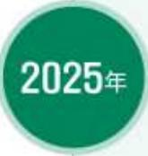

是否发生重大环境事件

□是 □否

是否因环境事件受到生态环境等有关部门重大行政处罚或被追究刑事责任

□是 □否

# 污染物排放

悦达投资的废水来源为生产废水和生活污水，公司严格遵循《中华人民共和国水污染防治法》的各项要求，积极采取措施对生产过程中的废水进行回收与综合利用，并实施净化处理，以确保废水得到妥善处理。公司厂区对雨污分流，厂区雨水排入市政管网。生产废水及生活污水经厂区污水总排口排入市政污水管网，最终进入污水处理厂。

指标与目标

<table><tr><td>指标</td><td>本期</td><td>上期</td></tr><tr><td>颗粒物(PM)(吨)</td><td>1.70</td><td>1.96</td></tr><tr><td>硫氧化物(SOx)(吨)</td><td>0</td><td>0.09</td></tr><tr><td>氮氧化物(NOX(吨))</td><td>0.24</td><td>0.30</td></tr><tr><td>挥发性有机物(VOCs)(吨)</td><td>3.08</td><td>3.98</td></tr><tr><td>化学需氧量(COD)(吨)</td><td>22.12</td><td>22.6</td></tr><tr><td>生化需氧量(BOD)(吨)</td><td>0.02</td><td>0.01</td></tr><tr><td>氨氮(NH3-N)(吨)</td><td>0.46</td><td>0.51</td></tr><tr><td>总氮(TN)(吨)</td><td>4.20</td><td>4.28</td></tr><tr><td>总磷(TP)(吨)</td><td>0.31</td><td>0.38</td></tr></table>

# 关键绩效

报告期内

是否存在因污染物排放受到重大行政处罚或被追究刑事责任的情况

□是 ☑否

# 重要控股子公司被列入环境信息依法披露企业名单

江苏悦达纺织集团有限公司  
悦达纺织废水：

<table><tr><td>名称</td><td>单位</td><td>2025年实际排放量</td></tr><tr><td>化学需氧气</td><td>吨</td><td>19.80</td></tr><tr><td>氨氮</td><td>吨</td><td>0.45</td></tr><tr><td>总氮</td><td>吨</td><td>4.24</td></tr><tr><td>总磷</td><td>吨</td><td>0.28</td></tr></table>

# 污染物的处理技术和处理方式：

悦达纺织污水排放前通过在线监测装置实时监测,每月通过第三方数据对比1次,每年由第三方检测1次。

主要污染物减排目标及为达到相关目标所采取的具体措施：

悦达纺织环保设施运行稳定可靠，未发生超标准排放的重大缺陷。2021年度投入污水在线监测系统已完成联网，2025年污水全部达标排放。且建立完善突发环境事件应急预案并备案，多次组织应急预案演练，能够应对各类突发环境事件发生。

# 废弃物处理

悦达投资严格遵守《中华人民共和国环境保护法》《固体废物污染环境防治法》等法律法规，对生产过程中产生的废气采取综合利用、净化处理以及达标排放的严格措施，积极保护大气质量。

指标与目标

<table><tr><td>指标</td><td>本期</td><td>上期</td></tr><tr><td>产生的有害废弃物总量(吨)</td><td>44.43</td><td>39.17</td></tr><tr><td>产生的无害废弃物总量(吨)</td><td>556.95</td><td>493.30</td></tr></table>

# 能源利用

悦达投资贯彻“源头控制、低碳运营，节能降耗、清洁生产，提升能效、绿色发展”的能源方针，遵循《中华人民共和国节约能源法》，制定了《碳达峰行动方案》，各部门负责贯彻和执行各自的职责。

<table><tr><td>指标</td><td>本期</td><td>上期</td></tr><tr><td>直接能源总消耗量(吨标准煤)</td><td>1972.31</td><td>1738.78</td></tr><tr><td>间接能源总消耗量(吨标准煤)</td><td>18891.72</td><td>17940.99</td></tr><tr><td>能源消费总量(吨标准煤)</td><td>20864.03</td><td>19679.78</td></tr><tr><td>其中:清洁能源使用量(吨标准煤)</td><td>1628.89</td><td>924.14</td></tr><tr><td>总能耗强度(吨标煤/万元)</td><td>0.08</td><td>0.08</td></tr></table>

说明:报告期内,公司棉纱、专用车生产量同比提升,导致能源消耗量增长。

# 水资源利用

悦达投资严格遵循《中华人民共和国水法》，按照《节约用水管理办法》，建立健全节约用水工作责任制，明确了各部门负责人为节约用水责任人，全面负责节水工作制度的制定、执行以及奖惩考核体系的建立与完善。同时，公司建立节水用水监督机制，对节水工作进行全面监督与指导，实现水资源的可持续利用，争创节水型企业。

<table><tr><td>指标</td><td>本期</td><td>上期</td></tr><tr><td>总耗水量(吨)</td><td>434722</td><td>450058</td></tr><tr><td>水资源使用强度(吨/万元)</td><td>1.82</td><td>1.83</td></tr></table>

# 节约目标

严格遵守国家及地方节水法规标准，持续降低单位产值水耗、单位产品水耗，稳步提升水资源利用效率。  
◆ 全面推进生产与办公用水精细化管理，提升工业水循环利用率，减少新鲜水取用。  
◆ 强化用水全过程监控，建立节水目标责任制，推动节水工作常态化、标准化、可量化。

# 具体措施

# ◆ 健全节水管理机制

建立分级用水管理责任体系，完善节水管理制度与台账，定期开展用水排查与审计，实施重点用水点位动态监测，确保节水责任落实到位。

# ◆ 推进生产工艺节水

优化生产流程与设备配置，推广低水耗、高效率工艺技术，加强冷却水、清洗水、工艺水的循环利用与梯级使用，从源头减少水资源消耗。

# 实施设备节能改造

对高耗水设备进行升级改造，安装节水型阀门、感应器具、循环水处理装置，推广节水型工艺装备，提升用水设施能效水平。

# ◆ 强化办公节水管理

办公区域全面使用节水器具，加强供水管网巡检维护，杜绝跑冒滴漏；倡导员工节约用水，营造全员参与的绿色节水氛围。

# ◆ 推进雨水与中水回用

结合厂区与项目实际，因地制宜推进雨水收集、中水回用等非常规水资源利用，拓展节水空间，提升水资源综合利用效益。

# 循环经济

根据工业和信息化部联合国家发展改革委等七部门印发的《关于加快推动制造业绿色化发展的指导意见》，悦达投资紧紧围绕“双碳”目标，主动顺应能源革命和产业变革趋势，积极布局氢能、储能、生物质等未来能源与绿色制造产业。搭建碳交易平台，以CCER开发、碳配额交易为核心，构建全流程碳资产管理体系，推动绿色价值高效转化与实现。

2024年，公司积极谋划布局氢能、储能、生物质等产业，着力拓展发展新赛道，于3月份正式成立生物质公司。2025年，生物质业务落地见效，全年处理生物质总量达9000吨。

<table><tr><td>指标</td><td>本期</td><td>上期</td></tr><tr><td>废弃物循环利用量(吨)</td><td>9582.57</td><td>285.80</td></tr></table>

# 生态系统和生物多样性保护

公司严格执行生态保护红线、环境质量底线、资源利用上线和环境准入负面清单要求，依照各类规范要求，开展新建项目环评工作，减少生产经营对周边生态环境的影响，合理开发利用自然资源，保护生物多样性，保障生态安全。

# 科学规划

严格识别、严守红线，合理安排工期，保护珍惜湿地珍稀动物，在项目建设之初对环境影响进行初步分析和评估。

# 主动恢复

遵循“边建设、边治理、边恢复”原则，产生一块，绿化一块，及时治理恢复周边环境。

# 办公环保举措

积极倡导绿色低碳办公理念，从节约资源、降低能耗、节约用水等方面落实环保举措。

# 无纸化办公

推行无纸化办公，严控纸质文件印制，提升线上办公效率。

# 节约能源

加强办公区域用水用电管理，倡导随手关灯、合理控温、节约用水，降低日常能源消耗。

# 绿色出行

鼓励绿色出行，引导员工优先选择公共交通、骑行等低碳方式通勤。

通过一系列务实举措，将绿色环保理念融入日常办公，营造低碳、高效、文明的办公环境。

natural_image

Solar panel farm with wind turbines in the background under a blue sky with clouds (no text or symbols visible)

# 专题 聚力项目投运 激活绿色发展

# 悦达投资风光项目

总装机容量达

666.05MW

年均上网电量约

10.63亿度

年减排二氧化碳

81.3万吨

# 悦达投资储能项目

总装机容量达

520MWh

# 共享储能

年均上网电量

2.2亿度

年减排二氧化碳

21.93万吨

总装机容量达

130MW

# 工商业储能

年均上网电量

5000万度

年减排二氧化碳

4.98万吨

# 案例

东台科森工商业微电网项目光伏装机容量15.49MWp、储能装机容量1.725MW/3.35MWh。该项目结合光伏发电与储能技术，高效实现绿电与储能耦合。投运后，储能电站年均存储电量可达230万kWh，光伏电站年均发电量约1600万kWh。不仅显著降低企业用电成本，提升能源利用效率，更助力企业在绿色低碳的轨道上稳健前行，实现经济效益与社会效益的双赢。

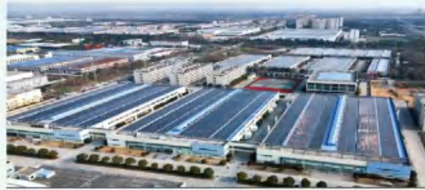

natural_image

Aerial view of a large industrial park with multiple factory buildings and solar-covered roofs, surrounded by urban development (no visible text or signage)

# 案例

东台共享储能项目装机容量10万千瓦/20万千瓦时。该储能电站采用磷酸铁锂电池，建设46个电池舱和23个PCS升压一体机，配套建设110kV升压站。项目历时81天于2025年6月24日顺利并网投运，年均可消纳新能源电量约1亿千瓦时，相当于减排二氧化碳10万吨、节约标煤消费约3.25万吨。

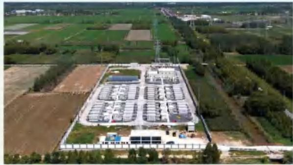

natural_image

Aerial view of an industrial facility with multiple storage tanks and surrounding farmland (no visible text or symbols)

# 案例

悦海灌东盐场150MW渔光互补光伏发电项目于2025年8月4日16点58分全容量并网。项目总投资约4.4亿元，占地面积约3000亩，总装机容量150MW，预计年均发电量2.169亿度。实现“上可发电、下可养鱼”。每年可节约标煤约6.83万吨，减排二氧化碳约18.73万吨，减排二氧化硫约30.24吨，减排氮氧化物18.87吨，减排烟尘3.87吨，同时还可节约大量淡水资源，对促进节能减排、改善生态环境。

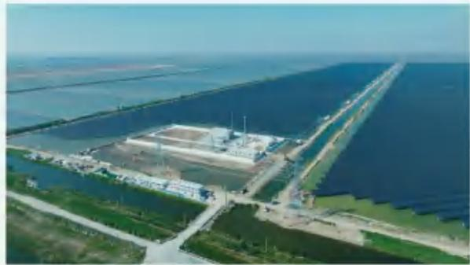

natural_image

Aerial view of a coastal industrial facility with a long bridge extending into the waterway, surrounded by green fields and small boats (no visible text or symbols).

# 案例

东欣水务2.56MW分布式光伏发电项目是悦达能服公司在江苏东欣水务有限公司投建的分布式光伏项目。项目总装机容量为2.56MW，采取“自发自用，余电上网”模式，运行周期25年，年平均发电量346万千瓦时，运行期内可减少二氧化碳排放总量超80000吨，二氧化硫排放总量超2000吨。

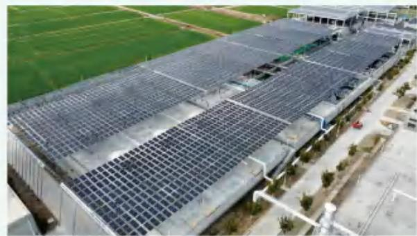

natural_image

Aerial view of a large industrial factory with extensive solar panel arrays installed on rooftops, surrounded by green fields (no visible text or symbols)

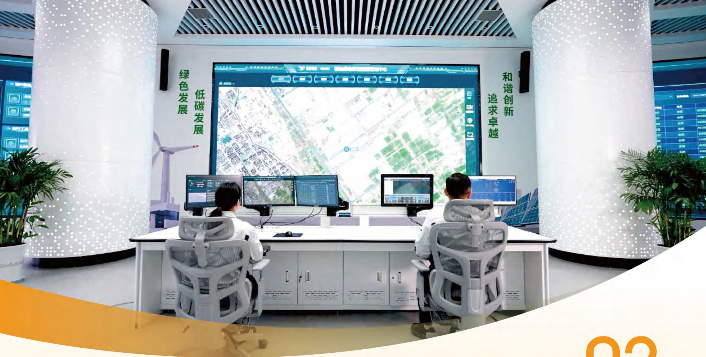

text_image

绿色发展
低碳发展
和谐创新
追求卓越

# 社会责任篇 02

# 以人为本 共创未来

# 职业健康与安全

# 筑牢安全生产防线

安全是企业生产与发展的基石。悦达投资坚持安全第一的理念，建立健全安全管理体系，切实落实安全责任，严控安全风险，为员工健康与安全保驾护航。

# 强化安全管理体系

# 压紧压实主体责任

2025年通过层层签订安全环保目标责任书，做到横向到边、纵向到底，层层落实安全责任，确保安全环保责任全覆盖，职责更明确。

# 精准明确工作部署

结合实际,制定年度安全教育培训和安全检查计划,明确以“聚力现场管理、聚焦隐患排查治理”为工作准则,以多种形式,实现对安全环保工作的全流程管控,确保隐患排查治理工作常态化、规范化,有效防范生产安全事故发生。

# 强化新兴领域管控

研究印发《关于光伏储能项目安全运营协同管理的建议》，明确投资、施工、维保、业主四方权责，构建联动巡查、风险排查、应急处置及极端气候应对协同体系，配套保险、培训、智能化平台及季度会商等保障措施，建立全场景长效机制，确保项目安全平稳运行。

# 深化安全专项整治

聚焦重点领域，统筹开展消防、电动自行车、危化品等安全专项整治。深化“反三违”行动，强化问题整改与警示教育。加强施工现场督查，规范关键环节安全管理。开展新兴领域专题调研，提升储能光伏等项目专业化运维水平。

# 2025年

注册类安全和
消防工程师

35人

专职安全管理人员

45人

特种作业人员持证率

100%

重大人身
伤亡事故

0 发生

重大设备事故

0 发生

职业健康
检查率

100%

# 培养企业安全文化

公司注重安全文化宣传,组织开展“安全生产月”“消防宣传月”“交通宣传月”等系列活动,采用多种形式深入学习安全知识,开展应急演练,促使员工形成正确的安全心态、规范的安全行为、特有的安全文化观念。

# 案例

# 丰富安全活动, 提升全员意识

2025年6月是全国第24个、江苏省第32个“安全生产月”，悦达投资紧紧围绕“人人讲安全、个个会应急—查找身边安全隐患”主题开展了系列活动，进一步提升安全意识和避险逃生能力。

natural_image

Group of people extinguishing fire with red fire extinguishers in front of a red wall (no visible text or symbols)

悦达纺织组织开展消防演练

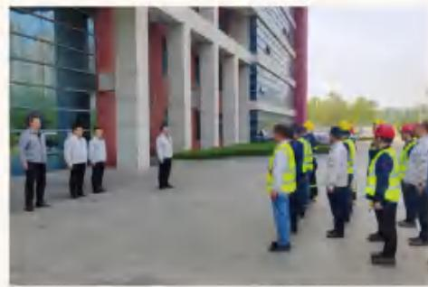

natural_image

Group of people in safety vests and helmets standing outside a modern building with glass facade (no visible text or signage)

悦达智能农装组织开展综合应急救援演练

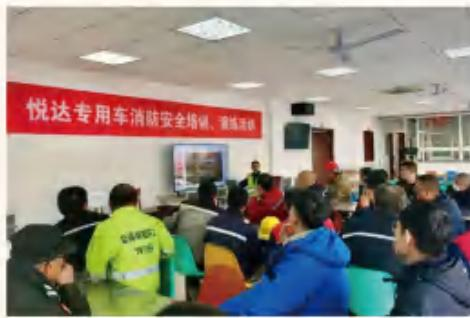

text_image

悦达专用车消防安全培训，演练活动

悦达专用车组织开展消防知识培训及应急疏散灭火综合演练

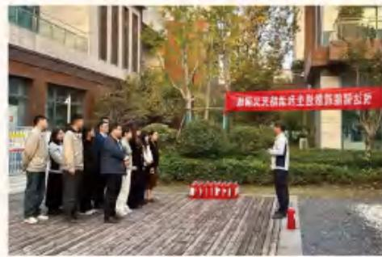

text_image

新疆天创汽车集团销售服务部

悦达储能组织开展办公场所疏散逃生及消防灭火演练

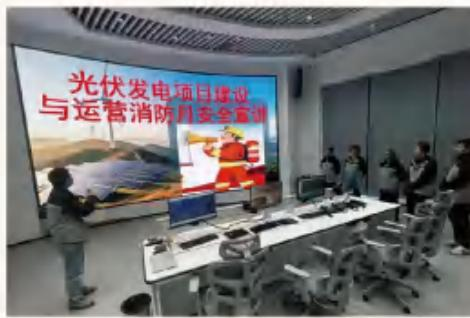

text_image

光伏发电项目建设
与运营消防月安全宣讲

悦达低碳以“多主体联动、全流程覆盖”组织开展安全生产月活动

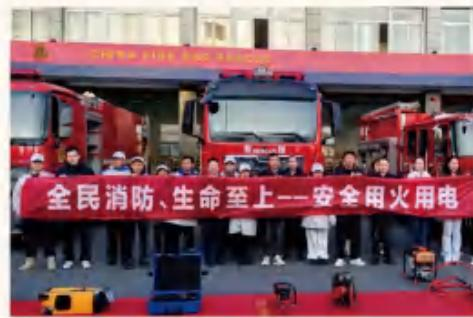

text_image

全民消防、生命至上--安全用火用电

悦达长久物流公司组织各部门员工代表赴经济开发区消防大队参观学习。

强化组织领导
确保取得实效

组建了由主要负责人任组长的活动领导小组，对安全生产月活动的全过程进行组织、监督、检查、协调，全面推进安全生产月活动。

营造浓厚氛围
提高员工参与度

悬挂宣传标语、拍摄“身边安全隐患”短视频382余件，最终评选出优秀成果案例8篇，有效推广了先进的安全管理方式和经验。

强化教育培训
提高实战应急能力

期间，组织各类隐患专项检查45次，查改隐患108条；开展有限空间、灭火疏散、特种设备等各类应急预案演练57场次，参演人员约2400人次。进一步提高员工应对突发事件和意外伤害的应急处置能力、自救互救能力。

# 职业健康管理

公司认真贯彻《中华人民共和国职业病防治法》等法律法规，定期安排员工体检，并组织开展职业健康安全知识、应急救助知识及心肺复苏急救知识，及时消除员工危害事故隐患，切实保障职业健康与安全。2025年公司体检覆盖率100%，顺利通过职业健康安全管理体系认证复审。

# 关爱职工健康行

组织“关爱职工健康行”活动，分六批次为在盐所属单位职工提供便捷高效的免费上门体检及健康咨询服务。同时，持续贯彻全员体检，通过“上门服务+集中体检”双模式落实职工健康保障，彰显“以人为本、关爱职工”的核心理念。聚焦高温作业一线，深入所属企业开展“夏日送清凉”慰问活动，为职工送上防暑降温物资，切实保障高温作业职工的身体健康，为企业稳定运行筑牢了坚实后盾。

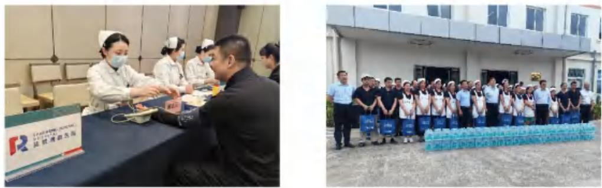

# 关键绩效

# 报告期内

是否获得职业健康与安全相应的资质认证

获得认证的名称:003407SR6

00124S30733R1W3200

03223S30127R0S

是 否

# 与员工共成长

悦达投资始终坚持以人为本的发展理念，高度重视员工权益保障与职业健康安全，将维护员工切身利益、促进员工全面发展融入企业经营管理全过程。严格遵守国家相关法律法规，不断完善劳动用工、薪酬福利、休息休假、职业发展等制度体系，切实保障员工合法权益；持续强化职业健康管理，优化工作环境，提升安全防护水平，全力守护员工身心健康。

# 员工权益与福利

公司充分重视每一位员工的合法权益与合理诉求，打造平等、多元、健康的工作环境，并为员工提供具有竞争力的薪酬福利与沟通渠道，助力员工在公司更快成长。

# 平等雇佣

公司严格遵守《中华人民共和国劳动法》《中华人民共和国劳动合同法》等法律法规，制定悦达投资《招聘管理办法》《劳动合同管理办法》等管理制度，坚持平等雇佣，避免用工歧视。

按性别划分  
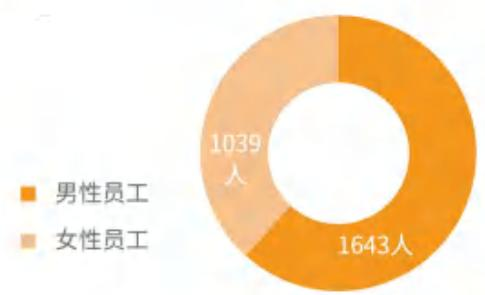

donut

| Category | Value |
| --- | --- |
| 男性员工 | 1643人 |
| 女性员工 | 1039人 |

按学历划分  
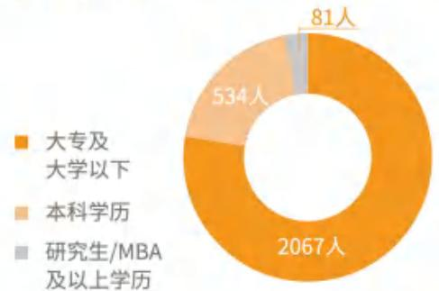

donut

| Category | Value |
| --- | --- |
| 大专及大学以下 | 2067人 |
| 本科学历 | 534人 |
| 研究生/MBA及以上学历 | 81人 |

# 按年龄划分

30岁以下占比(%)

40-50岁占比(%)

30-40岁占比(%)

50-60岁占比(%)

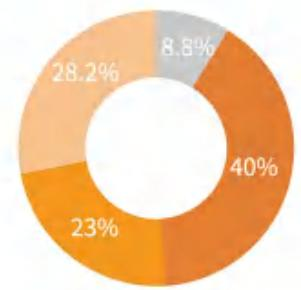

donut

| Category | Value (%) |
| --- | --- |
| Light Orange | 28.2 |
| Dark Orange | 40 |
| Medium Orange | 23 |
| Grey | 8.8 |

# 指标与目标

<table><tr><td>指标</td><td>本期</td><td>上期</td></tr><tr><td>员工流失率(%)(剔除适龄退休)</td><td>3.1</td><td>9</td></tr><tr><td>员工培训覆盖率(%)</td><td>100</td><td>100</td></tr><tr><td>年度培训支出金额(万元)</td><td>46.1</td><td>22.65</td></tr></table>

# 民主管理

严格遵守相关法律法规要求，公平对待、尊重及保障员工权益。依法规范劳动合同管理，100%签订劳动合同。全面严格落实国家相关规定，切实保障员工劳动报酬、社会保险、休息休假等权利。坚持完善职代会制度，保障、维护广大职工切身利益，不断提高民主管理水平。

# 薪酬福利

公司严格遵照相关政策文件要求，按照“三项制度”改革要求完善《员工薪酬管理办法》《员工绩效考核管理办法》。公司保障员工依法享有的权益，并根据国家政策规定及公司实际情况等，为员工补充医疗保险、重大疾病险等，规范员工相关福利待遇，优化落实各项福利政策，提高员工工作积极性，增强员工工作认同感和归属感。

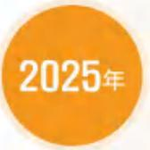

劳动合同签订率

100%

社保覆盖率

100%

职工福利费用

1389万元

争取帮扶资金

36.47万元

# 案例

# 聚焦人才培育,深入开展各类培训竞赛活动

为大力弘扬工匠精神、劳模精神，搭建产业工人技艺交流与风采展示的平台，更好地发挥以赛促训、以赛促技能提升的作用，工会联合所属专用车公司承办了盐城市”悦达杯“专用车技能大赛，同时，号召并组织职工积极参加盐城市新能源汽车技能大赛、盐城市巾帼科技创新创业大赛等各类竞赛活动。2025年，共11名职工、1个团体在市级技能比赛中获得优异名次与荣誉。

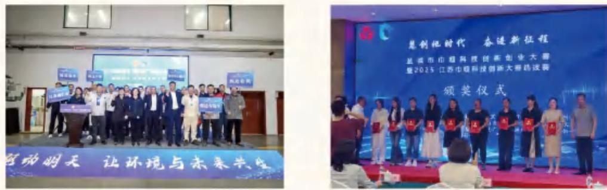

# 社会贡献

悦达投资坚持企业共同发展、共同进步，多举措保障能源供应，为促进经济社会稳定运行提供有力支撑，重视社会公益慈善，坚持志愿服务“暖人心”，在履行社会责任中显担当，为社会和谐发展贡献力量。

# 关爱困难职工

持续深化困难职工动态摸排与分级建档机制，确保底数清晰、情况明确、帮扶精准。全年累计为153人次困难职工争取到各层级帮扶、慰问资金共计36.47万元，帮扶力度与层级显著提升，切实纾解了职工家庭实际困难，传递了组织的深切关怀。

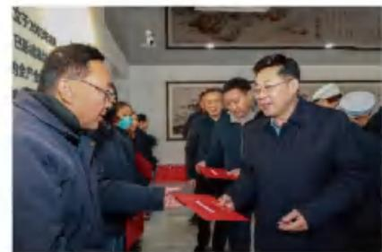

text_image

Group of people exchanging red envelopes in an indoor setting, with visible Chinese text on wall panels and framed artwork in background

指标与目标

<table><tr><td>指标</td><td>本期</td><td>上期</td></tr><tr><td>公益慈善、志愿活动等投入资金金额(万元)</td><td>69.22</td><td>71.9</td></tr></table>

# 专题 悦达投资“巾帼”力量

# “她”的声音

我叫刘静，2012年5月进入悦达纺织，现任纺纱一厂副厂长。参加工作以来，始终扎根生产一线工作，情系纺织、脚踏实地、苦练技能，用心做好每一项工作。同时，我也积极发挥技术特长，做好“传帮带”，助力团队共同成长。先后荣获“全国棉纺织行业技术能手”、“全国纺织行业技术能手”、“中国棉纺织行业传承大工匠”、“全国纺织工业劳动模范”、“全国技术能手”、“江苏省五一创新能手”、“江苏省技术能手”、“盐城市最美女工”、“盐城青年五四奖章”、“盐城市三八红旗手”等荣誉。未来我将继续坚守岗位、履职尽责，为企业发展贡献自己的力量。

我叫彭雅丽，来自专用车公司特种车辆研究院。我深耕知识产权管理工作二十余年，始终以提升企业知识产权综合运用能力为己任，牵头构建规范化知识产权管理体系，协助团队累计申报各类知识产权成果282件，助力公司获评国家知识产权优势企业、示范企业等称号，主导的多项专利荣获盐城市专利奖金奖、银奖。2019年曾获得“企业知识产权工作先进个人”荣誉。2023年，我荣获“盐城市十佳知识产权精英”称号。未来我将继续坚守岗位，用心做好知识产权管理与创新支撑工作，为企业高质量发展保驾护航。

我叫袁长兰，2014年入职江苏悦达纺织集团。十余年来，我凭借精湛的操作技能和扎实的业务能力立足岗位、履职尽责，多次获评悦达纺织集团、悦达集团“十佳技术能手”、“先进个人”，先后荣获江苏省“妙通杯”纺织职工职业技能大赛细纱第三名、“江苏省五一创新能手”、“全国棉纺织行业细纱操作能手”、“江苏省技术能手”、“江苏悦达集团劳动模范”、“盐城市劳动模范”等称号。2024年11月，在“经纬·西纺杯”全国纺织职业技能大赛中获全国第17名、江苏省第1名；2025年入选江苏省“寻找最美的她”百名巾帼劳模工匠图鉴。

我叫吴雨昕，2019年7月入职悦达智能农装公司，现任工会副主席兼市场部部长助理。工作中，我立足新媒体领域，将文化创意与农业装备营销深度融合，积极投身公司数字化转型。牵头搭建并运营35人营销矩阵，累计发布视频近1500个、开展直播近900场，总曝光量超150万；深入一线为经销商开展培训赋能，初步建立线上运营体系；策划“金马助丰收”摄影大赛，收获超450万浏览量，有效提升品牌影响力。曾荣获“2025年盐城市巾帼科技创新创业大赛三等奖”。作为悦达青年党员，我将继续以实干担当，在服务乡村振兴、推动品牌创新中展现巾帼作为。

# “她”的故事

沈卫琴现任江苏悦达专用车有限公司总经理助理。2008年入职以来，秉持“技术立身、创新致远”的信念，在技术研发、质量管理、供应链优化及数字化转型等方面扎实耕耘，从普通工程师成长为公司一名管理者，2025年5月荣获“盐城市劳动模范”称号。在技术研发上，她带领团队自主研发20余款洗扫系列车型，参与制定

5项企业标准，获20余项专利，主持项目荣获盐城市科学技术特等奖、江苏机械工业科技二等奖。在供应链管理上，她推行供应商动态分级与“成本倒逼”采购模式，通过工艺优化、批量集采等，两年累计降本677.16万元，零部件通用件占比提升至 $65\%$ ，库存周转率提高 $40\%$ 。在数字化转型上，她搭建“智慧环卫”数字生态系统，优

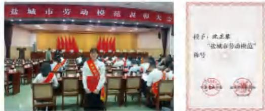

化38条作业路线；推动MES与ERP系统集成，生产计划达成率提升至98%，决策响应速度加快60%，有效提升运营效率与经营效益。十七年来，坚守一线、实干担当，为公司高质量发展和行业技术进步作出突出贡献，展现了新时代女性科技工作者的奋斗风采。

# “她们”的身影

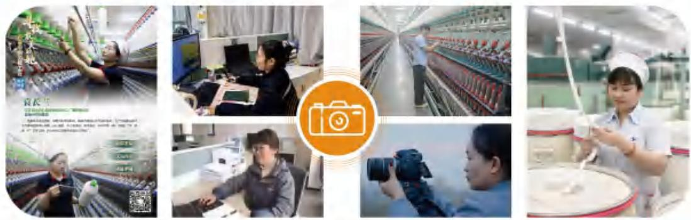

# “她们”的荣誉

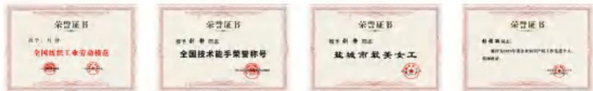

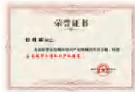

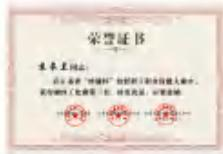

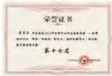

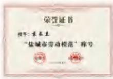

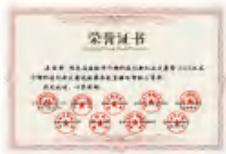

# 乡村振兴

公司通过采购扶贫产品作为员工福利的方式,助力帮扶地区产业发展与农户增收,累计投入资金达47.63万元,以实际行动支持农业发展、助力农民增收,切实履行社会责任,为全面推进乡村振兴贡献企业力量。

natural_image

Oranges hanging on a tree with green leaves (no text or symbols visible)

指标与目标

<table><tr><td>指标</td><td>本期</td><td>上期</td></tr><tr><td>乡村振兴总投入金额(万元)</td><td>47.63</td><td>55.66</td></tr><tr><td>乡村振兴惠民人数</td><td>4283</td><td>4476</td></tr></table>

# 创新驱动

# 治理

悦达投资坚持以创新驱动发展为核心，不断深化创新体系与机制的构建工作，致力于推动科技创新，实施科技强企策略，深化产学研协同创新，注重知识产权的保障，将创新作为企业持续发展的根本动力。

# 促进创新发展实践

公司聚焦技术前沿，推进创新持续发展，通过对投资行业发展导向与技术趋势的深入分析与预判，增强科技研发的资金支持，推动与研究机构、高等院校的合作，持续提高科技创新的能力。

# 保护知识产权

公司高度重视知识产权的保护和管理，2025年，公司发明专利的申请数量为53项、授权数量为9项、有效专利数量为497项。

# 战略

悦达投资贯彻创新驱动发展战略，结合公司发展实际，识别研发创新过程中的各类潜在风险与机遇，并全力探索推动公司持续、稳健且快速成长的关键路径。

<table><tr><td>风险类型</td><td>风险描述</td><td>发生概率</td><td>影响大小</td><td>影响时间范围</td><td>影响价值链环节</td><td>优先级排序</td><td>潜在财务影响</td><td>应对措施</td></tr><tr><td>政策风险</td><td>国家政策支持或国内政策与国际标准缺乏协调,可能会影响企业的研发投入和创新能力发展。</td><td>低</td><td>高</td><td>中长期</td><td>运营</td><td>中</td><td>营业收入减少</td><td>主动研究和积极争取国家、省市出台的政策性文件。</td></tr><tr><td>技术风险</td><td>公司在研发方向的判断上出现失误,可能导致研发成果未能达到预期目标,进而使得前期的研发投入难以获得回报。</td><td>低</td><td>中</td><td>短中期</td><td>运营</td><td>低</td><td>运营成本增加;营业收入减少</td><td>坚定面向市场强研发策略,通过与产业链上下游的紧密合作,及时掌握市场的技术趋势,提高研发方向的准确性。</td></tr><tr><td>机遇类型</td><td>风险描述</td><td>发生概率</td><td>影响大小</td><td>影响时间范围</td><td>影响价值链环节</td><td>优先级排序</td><td>潜在财务影响</td><td>应对措施</td></tr><tr><td>市场机遇</td><td>AI算力等新兴技术的发展,传统制造业带来新的机遇。</td><td>中</td><td>中</td><td>短中期</td><td>运营</td><td>中</td><td>营业收入增加</td><td>持续引入高端人才,加强产学研合作,推动技术创新。</td></tr></table>

# 影响、风险与机遇管理

在“双碳”目标引领下，盐城新能源产业正加速数字化蝶变。全省首家场站和集控一体化同步设计建设并具备远程运维控制操作的集控中心“悦达绿色数智能源管理中心”。该中心至投入应用以来，有力促进悦达投资在“两新一智”转型方面迈出了新的步伐，为悦达新能源电站提质增效打下了坚实的基础。在推进研发创新的过程中，建立了一套系统化的风险管理流程，涵盖风险识别、评估分析、风险应对等关键环节。

风险识别

企业从研发项目立项、研发过程到成果转化及验收全过程对创新研发风险进行识别和归纳。

风险评估

依据所识别的研发创新方面潜在风险的影响程度和发生概率，对各环节风险进行评估与分类。

风险应对

风险所涉及的企业对评估出的风险进行梳理，针对重要风险制定相应应对措施。

风险监控

相关企业、部门对风险评估控制过程进行每年至少1次的维护和改进，并参考上一年风险应对结果进行措施有效性评价。

<table><tr><td>指标</td><td>本期</td><td>上期</td></tr><tr><td>研发投入金额(万元)</td><td>5566.24</td><td>7941.57</td></tr><tr><td>研发投入占主营业务收入比例(%)</td><td>2.18</td><td>2.62</td></tr></table>

# 专题 深耕创新驱动 彰显国企担当

# 案例

# 5G绿色工厂——智改绿转 焕发智造新机

为推动传统产业转型升级，悦达纺织实施数字化改造，落地23个应用案例，构建5G全连接工厂、全流程质量追溯、全面移动式管理三大场景，核心指标显著优化：万锭用工从55人降至15人，全员劳动生产率提升超400%，加工成本降低26%。悦达纺织坚持绿色发展，厂区光伏与储能系统年减碳1.58万吨，绿色产品市场认可度高。近三年累计获授权专利超200件，获评“智能制造优秀场景”“5G工厂”“国家级绿色工厂”等称号。

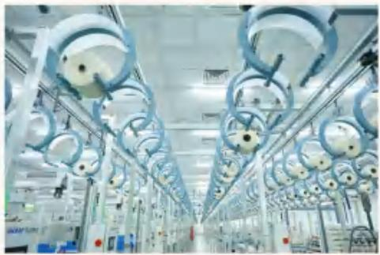

natural_image

Interior view of a modern textile factory with rows of spinning machines and overhead lighting (no visible text or symbols)

# 案例

# 人才引领 开创专精未来

2025年11月9日，以“人才引领·创新融合”为主题的2025沿海人才发展大会在盐隆重召开。活动上，悦达投资所属悦达专用车公司凭借深厚的技术积淀与突出的创新实力，获国家级专精特新“小巨人”企业现场授牌，标志着企业在专精特新发展道路上迈上新的里程碑。

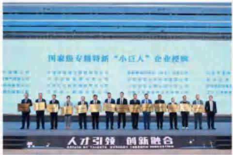

text_image

国家级专精特新“小巨人”企业授牌
人才引领 创新融合

# 案例

# 创新驱动 智领农机新程

悦达智能农装创新发展成果丰硕，顺利通过创新型中小企业复核。先后获批智能电动拖拉机江苏省产业技术工程化中心。12月26日，再获重要突破，成功获批农业农村部“设施电动拖拉机”国家重点实验室，企业科技创新平台建设与行业引领能力迈上新台阶。

# 农业农村部设施园艺电动拖拉机 重点实验室

中华人民共和国农业农村部

二〇二五年十二月

# 科技伦理

公司在进行创新研发过程中严格遵守科技伦理规范，尊重科学精神，重视人文关怀，避免技术滥用，对成果应用审慎评估，力求对社会、环境有益，以负责任态度推动科技创新。

# 关键绩效

报告期内

公司未发生因违反科技伦理相关规定被相关部门追责与处罚的情况。

# 供应链安全

# 治理

悦达投资致力搭建一个可靠、可持续且有竞争力的供应链体系。构建涵盖供应商准入、审核考评、淘汰退出等全生命周期的管理体系，由公司企业管理部牵头、所属各单位负主责的供应商引入和日常绩效管理的考核与评价，并根据考核结果完善《合格供应商名录》。报告期内，公司及已通过供应链安全管理体系认证。

# 战略

通过识别关键供应商(根据风险发生概率、影响大小等因素)来定位供应链风险区域,并制定相应的风险管理策略,提升供应链韧性。

<table><tr><td>风险类型</td><td>风险描述</td><td>发生概率</td><td>影响大小</td><td>影响时间范围</td><td>影响价值链环节</td><td>优先级排序</td><td>潜在财务影响</td><td>应对措施</td></tr><tr><td>政策与法律风险</td><td>如若公司与国内供应商产品适配工作发展不及预期,可能导致供应链中断风险。</td><td>低</td><td>中</td><td>短中期</td><td>运营</td><td>高</td><td>运营成本增加</td><td>·积极与国内供应商开展产品适配,切实做好本地化采购。</td></tr><tr><td>运营风险</td><td>供应商引入及管理不到位,影响物料质量、产品交割。</td><td>低</td><td>中</td><td>短期</td><td>运营</td><td>中</td><td>运营成本增加</td><td>·加强供应商准入制管理,对新供方引入前进行充分评审分析。</td></tr><tr><td>机遇类型</td><td>风险描述</td><td>发生概率</td><td>影响大小</td><td>影响时间范围</td><td>影响价值链环节</td><td>优先级排序</td><td>潜在财务影响</td><td>应对措施</td></tr><tr><td>技术机遇</td><td>随着科技发展,数字化供应链管理已成为提升效率与透明度的关键手段。借助数字化技术,企业能够优化供应链流程,显著提高运营效率,从而在竞争中占据先机。</td><td>高</td><td>中</td><td>长期</td><td>运营</td><td>中</td><td>运营成本减少</td><td>·构建供应商协同生态,通过数字化平台实现供应链的高效整合与实时响应,推动整体运营效能质的飞跃。</td></tr></table>

# 影响、风险与机遇管理

公司企业管理部、所属各单位对可能发生的供应链安全风险进行监视，提出预警和必要的预防措施。

风险识别

所属各单位明确供应链可能存在的风险类型，包括供方质量、交付能力、产品能耗等方面进行风险因素识别，并提前预警潜在问题。

风险评估

对识别出的供应链风险进行合理性评估。模拟不同场景，如供应链中断、物流延迟等评估供应链韧性。结合风险发生概率和影响程度对风险进行分级。

风险应对

根据风险评估结果,迅速制定详细的应急预案以及具体的供应链恢复计划。

风险监控

建立健全监测系统，形成供应链管理体系监测结果，为供应链管理体系改进提供决策依据。

<table><tr><td>指标</td><td>目标</td><td>2025年完成情况</td></tr><tr><td>合格供应商占比</td><td>100%</td><td>100%</td></tr></table>

# 平等对待中小企业

悦达投资为中小企业提供环保技术和资源，帮助其实现绿色转型。合规使用阳光采购平台，公平竞争，确保中小企业在市场中享有平等机会，避免大企业垄断。

2025年

应付账款(含应付票据)余额未超过300亿元

占总资产的比重未超过50%

# 产品与服务质量

# 治理

公司及所属企业严格遵循《质量发展纲要》，依照GB/T 19001-2016等标准，制定并持续升级《质量手册》等多项管理制度，建立覆盖产品全生命周期的高标准质量体系。

# 战略

公司在策划质量管理体系时,首先识别公司的内外部环境、相关方的期望和要求,在此基础上基于分析的结果识别和确定需要管控的风险和可利用的机遇,并制定风险控制措施。

<table><tr><td>风险类型</td><td>风险描述</td><td>发生概率</td><td>影响大小</td><td>影响时间范围</td><td>影响价值链环节</td><td>优先级排序</td><td>潜在财务影响</td><td>应对措施</td></tr><tr><td>政策风险</td><td>若公司产品设计开发与生产制造阶段出现人为错误,可能会导致影响产品合格率下降、影响交付质量等风险。</td><td>低</td><td>中</td><td>短中期</td><td>运营</td><td>中</td><td>营业收入减少</td><td>·规范研发生产流程,严格把控产品质检环节;全过程开展过程质量监控、风险评估、问题改善闭环,保障产品研发质量。</td></tr><tr><td>技术风险</td><td>产品质量低劣、客户要求得不到满足、售后人员响应不及时等导致客户满意度下降,损害公司品牌声誉。</td><td>低</td><td>高</td><td>短中期</td><td>运营</td><td>中</td><td>运营成本增加;营业收入减少</td><td>·制定《技术支持与售后服务控制程序》,规定顾客投诉及反馈的处理流程,及时响应顾客投诉及反馈信息。</td></tr><tr><td>机遇类型</td><td>风险描述</td><td>发生概率</td><td>影响大小</td><td>影响时间范围</td><td>影响价值链环节</td><td>优先级排序</td><td>潜在财务影响</td><td>应对措施</td></tr><tr><td>市场机遇</td><td>国家对科技创新和数字经济的高度重视,为企业带来显著的政策红利。</td><td>中</td><td>高</td><td>短期</td><td>运营</td><td>低</td><td>营业收入增加</td><td>·加大资源投入用于产品研发升级,通过持续改进和优化流程,将质量管理融入日常运营,确保产品和服务的高质量,提升市场份额。</td></tr></table>

# 影响、风险与机遇管理

风险管理机制，将质量风险管理贯彻于产品全生命周期的设计、开发、安装和服务各个阶段，对产品生产和服务过程进行有效控制。

风险识别

所属企业按照《生产过程控制程序》全面识别包括但不限于产品设计、生产开发、测试维护、存储运输以及客户服务的每一个环节潜在的内部和外部风险。

风险评估

对已识别的风险对完成质量管理体系目标的影响程度和发生的可能性进行分类,从而确定风险等级。

风险应对

责任部门针对识别出的风险采取对应的控制措施，从而达到降低或消除风险的目的。

风险监控

运用过程方法确保质量管理体系的有效运行，并在运行过程中不断对风险进行控制、重新识别和调整。

# 关键绩效

# 报告期内

是否获得质量管理相关认证

是

□否

获得认证的名称:003407QR6

08024Q30002R5M

00125Q31475R4M/3200

03224Q30164R1S

是否发生产品和服务相关的安全与质量重大责任事故

□是

√否

# 数据安全与客户隐私保护

悦达投资高度重视数据资产的管理与保护，积极践行信息安全职责，坚守信息安全红线，严密监管数据资产，持续完善数据管理架构与制度，加强信息安全防护举措，全面推动信息安全管理工作的深化。

# 关键绩效

# 报告期内

公司制定了《保密工作管理办法》，并成立了保密领导小组，保障数据安全和客户隐私。

是否发生数据安全事件或泄露客户隐私事件

□是 ☑否

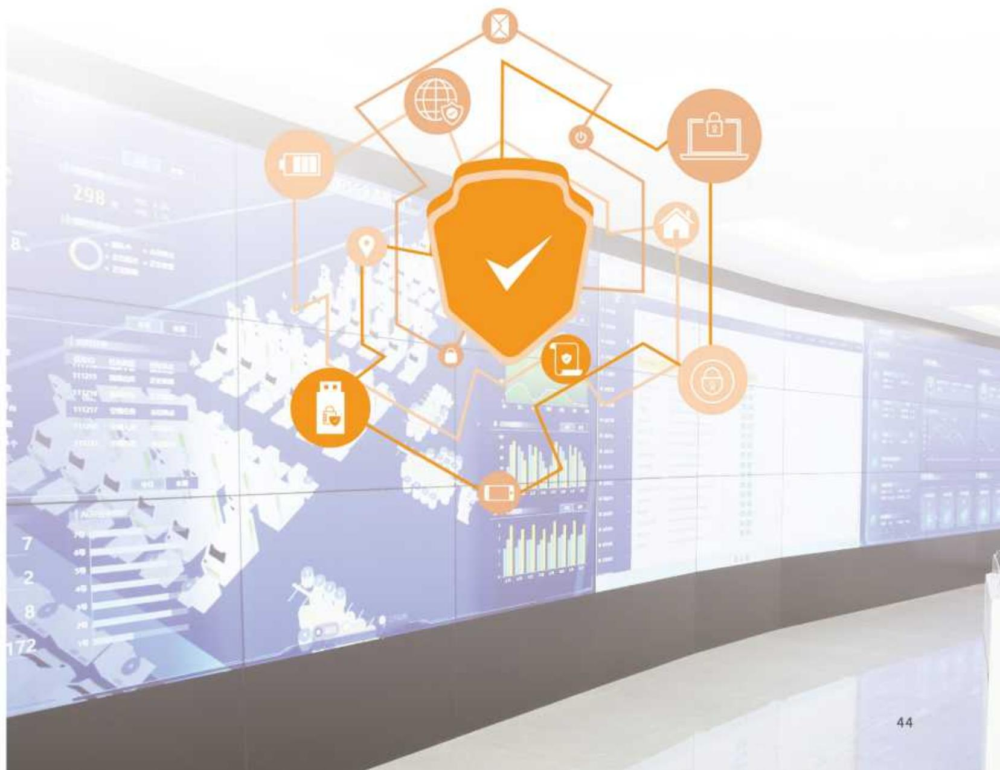

flowchart

This image displays a digital dashboard interface featuring an orange shield icon with checkmark, surrounded by various icons representing data security, security services, and security tools.

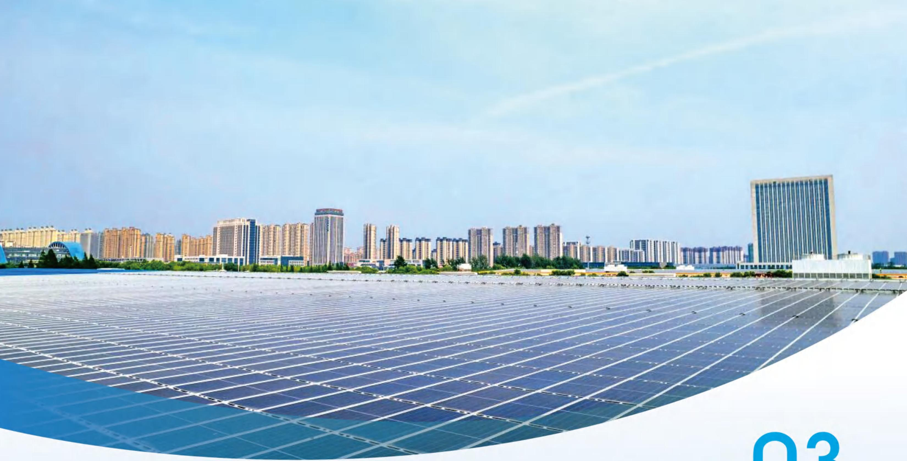

natural_image

Solar panel farm with modern city skyline in background under clear sky (no text or symbols visible)

# 公司治理篇 03

# 党建引领 合规致远

# 党建引领 赋能高质量发展

公司始终坚持党建引领，把党的领导融入公司治理各环节，充分发挥党组织的领导作用。深入推进党建与生产经营、社会责任、可持续发展深度融合，不断夯实基层党组织标准化规范化建设，强化党员教育管理与先锋模范作用发挥。严格落实全面从严治党要求，筑牢党风廉政建设防线，以高质量党建引领保障公司高质量发展，为企业稳健经营、履行国企使命与社会责任提供坚强政治保证。

# 强基固本筑堡垒 凝心聚力担使命

悦达投资全面加强党组织建设,抓牢基层工作,提升党员干部战斗力,夯实组织根基更好发挥基层战斗堡垒作用。

# 固本强基筑牢党建之基

坚持全面从严治党，不断强化企业党建工作，为公司产业转型升级、高质量发展提供坚强保障。目前，悦达投资下设2个党委、2个党总支、24个党支部、党员314名。构筑了“一企业一品牌、一支部一特色”的红色矩阵，基层党组织建设强有力。

# 人才兴企树立育才之道

公司着力构建“学理论、重实践、促发展”人才培养体系，持续深化“三项制度”改革，精准选拔优秀青年骨干，通过上挂下派、实践锻炼等方式，为年轻干部成长搭建实践平台与竞技舞台。

# 结对共建凝聚发展之力

聚焦资源共享、学习共建、发展共推，积极与政府机构、地方企业及民营企业开展党建共建，以党建赋能协同发展，着力构建互助共进、合作共赢的发展新格局。

# 党建共建聚合力 互学互进促发展

公司积极开展党建共建活动，通过与外部单位、基层党组织结对共建，搭建互学互鉴、互帮互进的交流平台。围绕理论学习、业务协同、志愿服务、文化建设等方面深化合作，推动党建工作与生产经营深度融合，不断提升基层党组织凝聚力、战斗力与创造力，以党建联建凝聚发展合力，实现优势互补、共同提升。

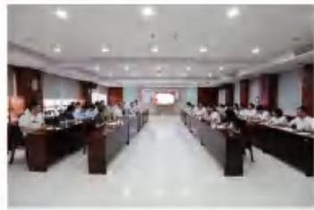

natural_image

Interior view of a large conference hall with attendees seated at desks (no visible text or signage)

机关支部与仁禾中衡机关党支部开展共建活动，交流学习工作经验，共同提升党建工作水平，让党建的“红色引擎”释放更强劲动力。

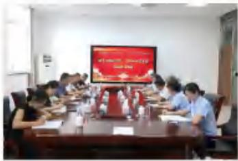

text_image

Meeting room photo with visible presentation screen displaying Chinese text and logo

悦达纺织机关支部与市委市级机关工委党建共建活动。

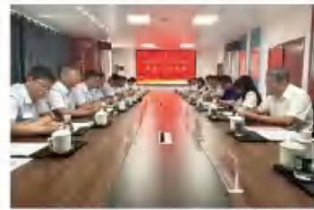

text_image

Meeting room photo with visible red banner and participants seated at a long table

悦达储能公司全体党员与琼港镇党委及新海村党总支党员干部开展党建共建活动，强化政企协同联动，推动党建工作与业务发展深度融合。

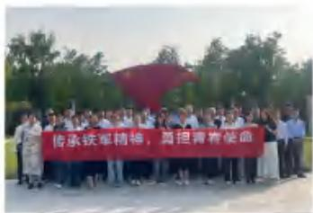

text_image

传承铁军精神，勇担青春使命

悦达投资机关支部组织党员赴新四军文化林开展沉浸式教育。

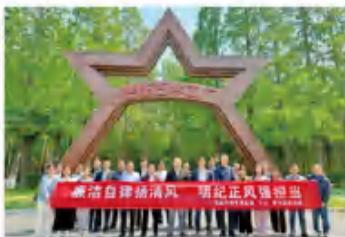

text_image

最信息律师清风  明纪正风强担当

悦达专用车公司组织全体党员干部及关键岗位负责人赴大丰梅花湾政德教育基地、东台黄海森林公园党风廉政教育基地开展“510”警示教育活动。

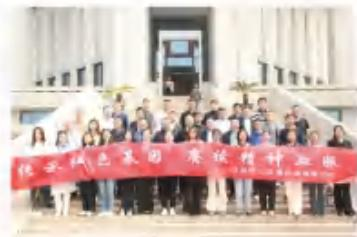

text_image

优化绿色集团赛试精神汇报

悦达投资组织开展“传承红色基因 腰续精神血脉”主题参观学习活动。

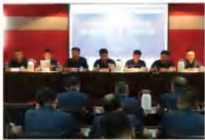

natural_image

Group of people seated at a long table in a conference room with red backdrop and presentation screen (no visible text or symbols)

智能农装公司党委举办第一届青干班开课仪式。

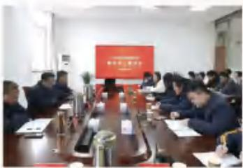

text_image

Meeting room photo with visible red banner displaying Chinese text and participants seated at a long table

悦达纺织公司召开了以“凝聚青春力量，共话企业未来”为主题的近三年入司大学生座谈会。

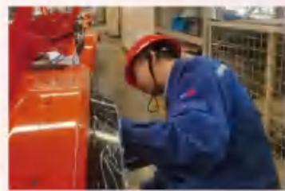

natural_image

Worker in blue uniform and red hard hat inspecting industrial machinery (no visible text or symbols)

悦达投资组织基层跟班锻炼。

# 公司治理

# 治理体系

公司严格遵守《中华人民共和国公司法》《中华人民共和国证券法》《上市公司治理准则》《上海证券交易所股票上市规则》等法律法规和规范性文件要求，建立由股东会、董事会及专门委员会、经营管理层构成的公司治理结构，并按照议事规则开展股东会、董事会等工作，确保“两会一层”运作高效规范、重大事项决策科学。

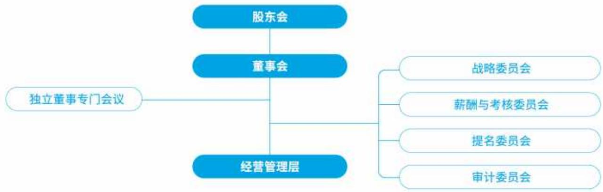

flowchart

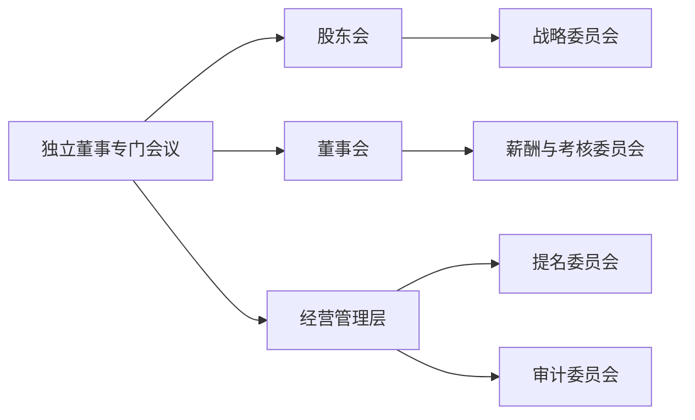
```mermaid
graph LR
  A["独立董事专门会议"] --> B["股东会"]
  A --> C["董事会"]
  A --> D["经营管理层"]
  B --> E["战略委员会"]
  C --> F["薪酬与考核委员会"]
  D --> G["提名委员会"]
  D --> H["审计委员会"]
```

# 股东会

股东会是公司最高权力机构，公司严格按照《中华人民共和国公司法》《公司章程》《股东会议事规则》等规定召集、召开股东会，保障所有股东对重大事项的平等知情权和决策权。

<table><tr><td rowspan="2">2025年</td><td>公司共召开股东会</td><td>审议议案</td></tr><tr><td>2次</td><td>12项</td></tr></table>

# 董事会

公司根据相关法律法规和规范性文件设立董事会作为公司的经营决策机构，制定《董事会议事规则》规范董事会及决策程序，促使董事和董事会有效地履行其职责，提高董事会规范运作和科学决策水平。

<table><tr><td rowspan="2">2025年</td><td>公司共召开董事会</td><td>审议议案</td><td>董事会成员出席率</td></tr><tr><td>6次</td><td>32项</td><td>100%</td></tr></table>

# 董事会专门委员会及独立董事专门会议

公司董事会下设战略、审计、提名、薪酬与考核四个委员会以及独立董事专门会议，严格按照《公司法》《证券法》以及《公司章程》等相关规定，制定了《董事会战略委员会工作细则》《董事会薪酬与考核委员会工作细则》《董事会提名委员会工作细则》《董事会审计委员会工作细则》和《独立董事工作制度》，并根据各专门委员会工作细则的规定履行其职责，为董事会提供合理化建议，辅助提高董事会运作效率。

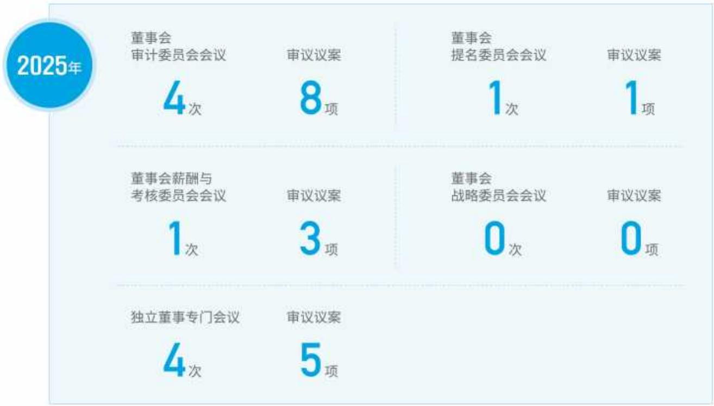

other

| Category | Review Count | Proposal Number |
| :--- | :--- | :--- |
| 董事会审计委员会会议 | 4次 | 8项 |
| 董事会提名委员会会议 | 1次 | 1项 |
| 董事会薪酬与考核委员会会议 | 1次 | 3项 |
| 董事会战略委员会会议 | 0次 | 0项 |
| 独立董事专门会议 | 4次 | 5项 |

# 保护投资者权益

公司2025年度利润分配预案：以2025年12月31日总股本850,894,494股为基数，每10股派现金0.2元（含税），分配现金17,017,889.88元，不使用资本公积转增股本。叠加已实施完成的2025年三季度利润分配方案，每10股派送现金0.3元(含税)，分配现金25,526,834.82元，2025年度每10股累计派送现金0.5元(含税)，累计分配42,544,724.70元。

# 信息披露

公司严格按照法律法规和监管要求，积极履行信息披露义务，建立重大信息内部传递机制，并不断完善信息披露工作体系。公司在对外投资等重要事项发生时及时披露，在定期报告等公告中，主动总结分析行业政策和形式，持续增强市场对公司的了解和认同。

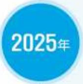

公司披露临时公告

39份

定期公告

4份

# 投资者沟通

公司高度重视投资者关系管理工作，坚持以透明、规范、高效为原则，持续健全投资者沟通机制。通过定期报告、临时公告、业绩说明会、投资者互动平台等多种渠道，及时、准确、完整地披露公司经营情况、财务状况、风险管理及可持续发展等重要信息，保障广大投资者的知情权、参与权和监督权。公司积极倾听投资者诉求，不断提升沟通实效，切实维护投资者合法权益，以稳健经营与高质量发展回报投资者信任与支持。

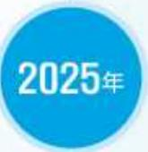

召开业绩说明会 3 次

# 合规风险防控

公司始终坚持合规经营理念，建立健全合规管理与风险防控体系，严格遵守国家法律法规、行业监管要求及企业内部制度。围绕重点业务、关键环节强化风险识别、评估与管控，不断完善内控机制，加强合规培训与监督检查，持续提升全员合规意识与风险防范能力，切实保障企业运营安全、规范、有序，为高质量可持续发展提供坚实保障。

公司明确风险管理原则、组织架构、工作流程、监督考核等，并针对不同风险类型制定可操作的风险识别、评估、检测、应对、报告的方法和流程，通过评估、检查和绩效考核等手段保证风险管理制度的贯彻落实。

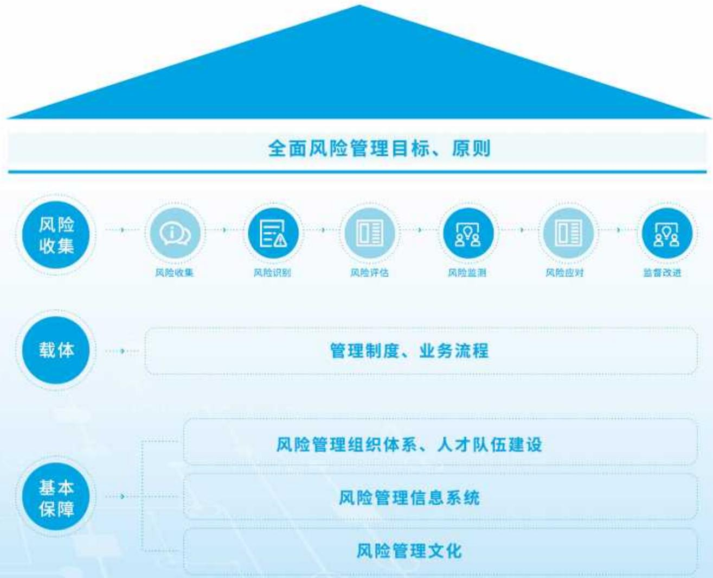

flowchart

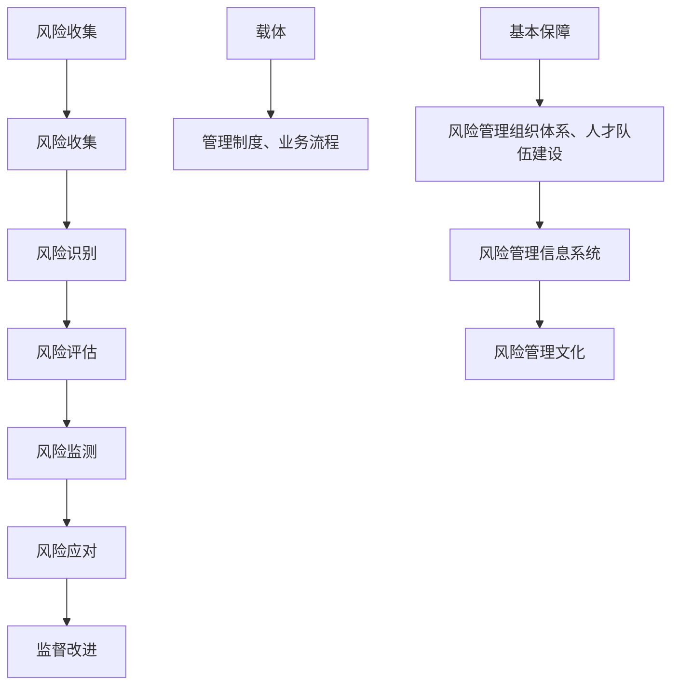
```mermaid
graph TD
  A["风险收集"] --> B["风险收集"]
  B --> C["风险识别"]
  C --> D["风险评估"]
  D --> E["风险监测"]
  E --> F["风险应对"]
  F --> G["监督改进"]
  
  H["载体"] --> I["管理制度、业务流程"]
  
  J["基本保障"] --> K["风险管理组织体系、人才队伍建设"]
  K --> L["风险管理信息系统"]
  L --> M["风险管理文化"]
```

# 利益相关方沟通

悦达投资高度重视利益相关方的意见和建议，通过官网、微信公众号、外部媒体等平台与利益相关方进行广泛沟通，深入了解利益相关方的期望与诉求，并借助多样化渠道，合规披露公司在生产经营和决策过程中的信息，增进利益相关方对公司的了解、认同和支持，将利益相关方的期望与关切作为公司提升可持续发展能力的重要内容。

<table><tr><td>主要利益相关方</td><td>期望与关切</td><td>回应渠道与举措</td></tr><tr><td>政府及监管机构</td><td>·守法合规·依法纳税·助力能源结构调整·促进电力安全</td><td>·依法合规经营·接受监督考核·定期汇报工作</td></tr><tr><td>股东与投资者</td><td>·强化盈利能力·维护股东权益·信息透明公开</td><td>·促进业务发展·完善公司治理·及时披露信息</td></tr><tr><td>客户</td><td>·能源稳定供应·提供优质服务·回应诉求</td><td>·加强质量管控·提升科技创新能力·主动响应诉求</td></tr><tr><td>供应及合作商伙伴</td><td>·契约精神·公开、公平、公正采购·行业合作与交流</td><td>·公开采购信息·参与行业交流</td></tr><tr><td>员工</td><td>·员工生活关爱·有竞争力的薪酬体系·公平晋升与发展·职业健康与安全</td><td>·打造健康安全的工作环境·建立公平的晋升通道·加强员工培训·关爱员工</td></tr><tr><td>社会及公众</td><td>·公益慈善·志愿服务·环境保护</td><td>·开展公益慈善活动·加强环境管理·助力“双碳”目标</td></tr></table>

# 反商业贿赂及反贪污

悦达投资依据《中华人民共和国公司法》《企业内部控制基本规范》等相关法律法规开展各项业务活动，致力构建“制度约束—培训教育—监督审查—违规惩戒”四位一体的廉洁管理体系。公司制定了《反商业贿赂及廉洁制度》，通过签署《反商业贿赂协议》及廉政承诺书、政策宣贯等方式，向供应商代理商明确传递反商业贿赂与反舞弊政策，并将相关要求纳入合作条款。

公司定期开展廉洁专题宣导与合规培训，向全体员工传达廉洁自律的重要性，详细解读相关法律法规和公司内部的廉洁制度，推动每一位员工都能深刻理解并严格遵守商业道德规范。在公司的运营准则中，任何贪污腐败、勒索、欺诈、洗钱、垄断等违背商业道德的行为，都被视为对市场秩序和企业价值观的严重侵犯，公司对此坚决采取“零容忍”的态度。

关键绩效

报告期内

□是 ☑否

是否发生商业贿赂及贪污事件

<table><tr><td>指标</td><td>本期</td><td>上期</td></tr><tr><td>接受反商业贿赂及反贪污培训董事百分比(%)</td><td>90.54</td><td>81.36</td></tr><tr><td>接受反商业贿赂及反贪污培训管理层百分比(%)</td><td>98.36</td><td>96.72</td></tr><tr><td>接受反商业贿赂及反贪污培训员工百分比(%)</td><td>32.53</td><td>31.30</td></tr></table>

# 举报机制

公司纪检工作部负责公司舞弊案件的管理并设定相关举报渠道，相关人员可通过举报电话热线、电子信箱、信函等途径举报公司及其人员实际或疑似舞弊案件的信息。针对举报信息，审计部负责记录并及时向管理层或董事会进行报告，确保相关情况得到及时、公正、透明地处理。

# 反不正当竞争与反垄断

公司严格遵循《中华人民共和国反不正当竞争法》《中华人民共和国反垄断法》，制定并实施了《反不正当竞争合规管理制度》，确保各项经营活动合法合规，维护市场公平竞争秩序。

# 关键绩效

报告期内

是否因不正当竞争行为导致诉讼或重大行政处罚

√否

# 监督措施

设置举报信箱，接受全体员工、经销商、客户及其他第三方对本公司及公司全面管理的各公司存在的不正当竞争行为的举报或提供的有关问题线索。  
确定反不正当竞争合规义务,建立内部监测机制,识别潜在风险,及时发现违规行为,防范不正当竞争行为。  
通过定期组织员工参与反不正当竞争合规培训、加强内部宣传力度等方式，提高员工对合规制度及本制度的认知和遵守意识。  
审计部负责对公司及公司员工履行本制度规定的不正当竞争行为进行监督检查，监测和评估制度的执行情况。

# 尽职调查

公司严格遵守法律法规及监管要求，在投资决策、业务合作、项目运营等关键环节全面开展尽职调查工作。通过对合作方资质、合规经营、风险状况、社会责任履行等方面进行审慎核查与评估，有效防范经营风险、合规风险与可持续发展风险，确保各项业务依法合规、稳健运行，切实保障公司与利益相关方的合法权益，为企业高质量可持续发展筑牢风险防线。

natural_image

Illustration of a city with green hills, solar panels, wind turbine, and water waves, symbolizing eco-friendly energy (no text or symbols)

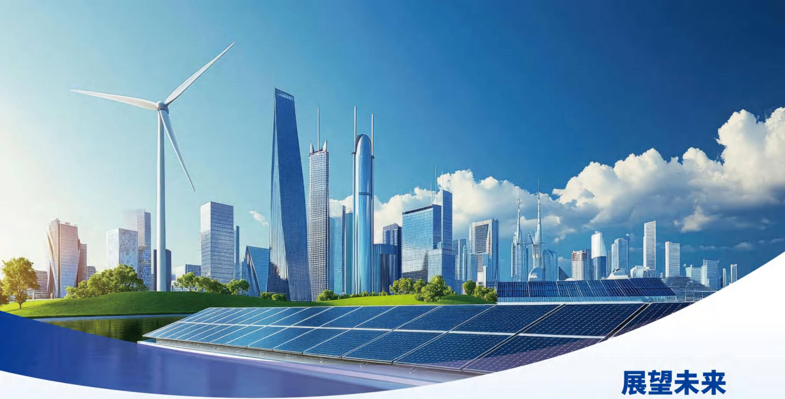

text_image

展望未来

# 展望未来

立足“十四五”圆满收官的坚实基础，面向“十五五”开局的全新征程，悦达投资将始终坚守“同喜悦、共发达”的企业文化，以ESG理念为核心引领，深度融入“产业发展绿色化、生产经营数智化、市场拓展国际化”发展路径，锚定“两新一智”战略方向，推动环境、社会与治理协同升级，奋力实现企业高质量发展与可持续价值共创。

# 指标索引

《上海证券交易所上市公司自律监管指引第14号--可持续发展报告(试行)》披露索引。

<table><tr><td>披露要求</td><td>对应的本报告章节</td></tr><tr><td>应对气候变化</td><td>风光赋能,数智护绿【应对气候变化】</td></tr><tr><td>环境合规管理</td><td>风光赋能,数智护绿【环境合规管理】</td></tr><tr><td>污染物排放</td><td>风光赋能,数智护绿【污染物排放】</td></tr><tr><td>废弃物处理</td><td>风光赋能,数智护绿【废弃物处理】</td></tr><tr><td>能源利用</td><td>风光赋能,数智护绿【能源利用】</td></tr><tr><td>水资源利用</td><td>风光赋能,数智护绿【水资源利用】</td></tr><tr><td>循环经济</td><td>风光赋能,数智护绿【循环经济】</td></tr><tr><td>生态系统和生物多样性保护</td><td>风光赋能,数智护绿【生态系统和生物多样性保护】</td></tr><tr><td>员工</td><td>以人为本,共创未来【与员工共成长】</td></tr><tr><td>社会贡献</td><td>以人为本,共创未来【社会贡献】</td></tr><tr><td>乡村振兴</td><td>以人为本,共创未来【乡村振兴】</td></tr></table>

<table><tr><td>披露要求</td><td>对应的本报告章节</td></tr><tr><td>创新驱动</td><td>以人为本,共创未来【创新驱动】</td></tr><tr><td>科技伦理</td><td>以人为本,共创未来【科技伦理】</td></tr><tr><td>供应链安全</td><td>以人为本,共创未来【供应链安全】</td></tr><tr><td>平等对待中小企业</td><td>以人为本,共创未来【平等对待中小企业】</td></tr><tr><td>产品与服务质量</td><td>以人为本,共创未来【产品与服务质量】</td></tr><tr><td>数据安全与客户隐私保护</td><td>以人为本,共创未来【数据安全与客户隐私保护】</td></tr><tr><td>利益相关方沟通</td><td>党建引领,合规致远【利益相关方沟通】</td></tr><tr><td>反商业贿赂及反贪污</td><td>党建引领,合规致远【反商业贿赂及反贪污】</td></tr><tr><td>反不正当竞争与反垄断</td><td>党建引领,合规致远【反不正当竞争与反垄断】</td></tr><tr><td>尽职调查</td><td>党建引领,合规致远【尽职调查】</td></tr></table>

# 意见反馈

# 尊敬的读者：

您好!感谢您阅读本报告,我们非常重视您对本报告的评价,为不断提升公司ESG信息披露水平,使报告能够真正发挥与利益相关方沟通交流的作用,同时更为有效地推进公司ESG管理与实践,我们真诚地期待您的宝贵意见与建议。

# 1、您属于以下哪类利益相关方：

○ 政府及监管机构 ○ 股东与投资者 ○ 客户 ○ 供应商及合作伙伴  
○员工 ○社区及公众 ○其他(请注明)

# 2、您对本报告的总体评价是：

○好 ○较好 ○一般 ○较差 ○差

# 3、您认为本报告所披露的环境、社会及治理信息质量如何：

○高 ○较高 ○一般 ○较低 ○低

# 4、您认为本报告的结构安排如何：

○很合理 ○较合理 ○一般 ○较差 ○差

# 5、您认为本报告的版式设计如何：

○很合理 ○较合理 ○一般 ○较差 ○差

# 6、您对本报告和悦达投资ESG工作有哪些意见和建议：