# 2025年

# 环境、社会和公司治理(ESG)报告

中电科数字技术股份有限公司

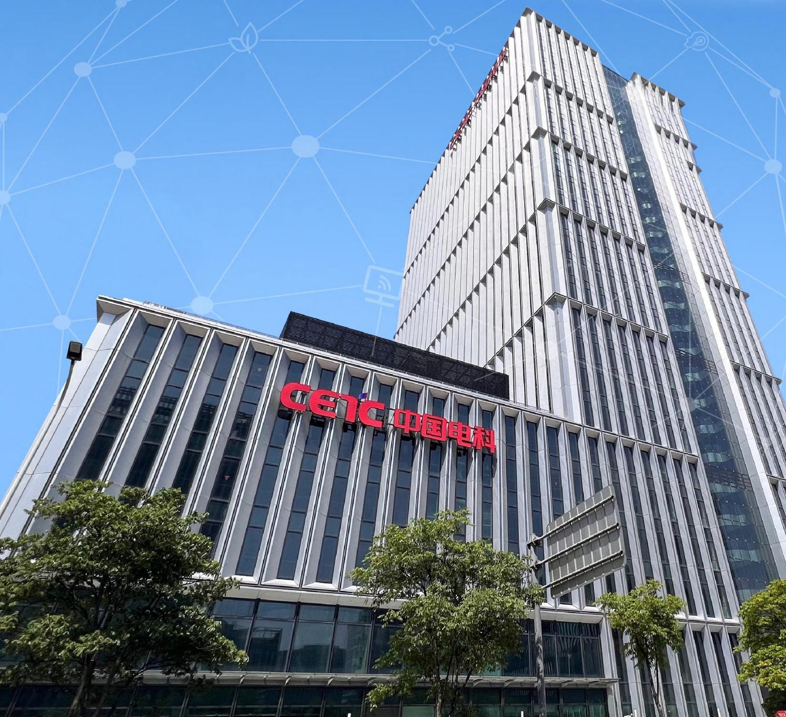

text_image

CETC 中国电科

# 目录

关于本报告 01

走进电科数字 02

关键绩效 03

肩负数字化转型使命，领略电科数字发展之路 04

聚焦ESG管理，牵引公司可持续发展 07

# 规范治理:

# 守合规之本，绘电科数字发展宏图

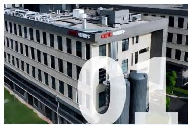

natural_image

Exterior view of a modern office building with large '0' letter overlay (no signage visible on main structure)

公司治理 13

投资者关系管理 15

风险内控 17

信息安全 20

党建引领 21

# 变革创新:

# 注创新之能，蓄电科数字变革力量

text_image

O2

数智引领 25

质量控制 27

成就客户 29

# 协作共赢：

# 击他山之石，攻电科数字价值之玉

text_image

03

采购管理 33

供应商评定 34

行业共建 35

# 以人为本:

# 聚同心之力，筑电科数字人才舞台

natural_image

Overhead view of two people shaking hands with large '0' letters and documents on a wooden desk (no readable text or symbols)

员工雇佣和权益 41

员工薪酬和绩效 43

员工培训和发展 44

员工健康和安全 46

员工福利和关怀 48

# 天高地迥:

# 践低碳之行，塑电科数字绿色之洲

natural_image

Large white number '05' overlaid on a scenic park with green trees and a wooden pavilion in the background (no text or symbols on main subjects)

应对气候变化 51

环境合规管理与污染物排放 54

强化环保培训 56

# 大爱无疆:

# 寄至仁之心，扬电科数字责任大旗

natural_image

Hand holding a young green plant with large white number '06' overlaid, symbolizing growth or planting (no text or symbols on plant)

持续志愿服务 59

践行慈善公益 59

# 结篇

指标索引 61

读者反馈意见 67

# 关于本报告

本报告详细披露了中电科数字技术股份有限公司2025年度在经济、环境、社会及公司治理等责任领域的实践和绩效，旨在与各利益相关方进行有效交流，系统地回应利益相关方的期望和要求。

# 时间范围

2025 年 1 月 1 日至 2025 年 12 月 31 日，为增强报告可比性及前瞻性，部分内容往前后年度适度延伸。

# 报告边界

报告披露中电科数字技术股份有限公司及其子公司履行经济、社会、环境方面的责任信息，相关典型案例来自公司及其附属公司。

# 报告称谓

为了便于表述和阅读，本报告中“中电科数字技术股份有限公司”也以“电科数字”或“公司”表示。

# 信息来源

报告使用数据来源包括公司实际运行的原始数据、政府部门公开数据、年度财务数据、内部相关统计报表、第三方问卷调查、第三方评价访谈等。本报告的财务数据以人民币为单位，若与财务报告不一致之处，以财务报告为准。

# 编制依据

国务院国资委《提高央企控股上市公司质量工作方案》

联合国可持续发展目标（SDGs）

全球可持续发展标准委员会《可持续发展报告标准》（GRI Standards）

中国社科院《中国企业社会责任报告指南》（CASS-ESG 5.0）

中国标准化研究院《社会责任报告编写指南》（GB/T36001-2015）

国际标准化组织《ISO 26000：社会责任指南（2010）》

上海证券交易所《上海证券交易所上市公司自律监管指引第14号—可持续发展报告（试行）》

# 报告获取

本报告以电子版形式供您阅读，您可登录上海证券交易所网站（www.sse.com.cn）阅读电子版报告。如果您想了解本报告以外的其他信息，可通过阅读公司年度报告进行查阅补充。

# 公司联络方式

地址：上海市浦东新区白莲泾路127号中电科信息科技大厦19层  
邮编：200126  
电话：021-3339 0000

# 走进电科数字

# 公司简介

电科数字是行业领先的数字化产品和解决方案提供商，聚焦金融、大型企业、党政与公共服务、运营商及互联网等重点行业，提供物联感知、智能计算、云网融合等覆盖数智底座至智慧场景的产品、解决方案与服务。公司深化新一代信息技术与业务融合创新，打造云-边-端一体的数智化解决方案，赋能客户转型升级。

# 我们的问候

以数字化、网络化、智能化为特征的信息技术革命极大改变了人们的生产和生活方式，新一代信息技术将成为新一轮科技革命和产业变革的关键力量。我国软件和信息技术服务业快速发展，不断催生新技术、新应用、新模式，各行各业的数字化渗透持续加深，数字技术推动实体产业结构升级和价值释放。

作为中国大陆信息技术行业首家上市公司，电科数字始终在技术迭代浪潮中拥抱变化，变革创新，在深耕数字化产品、行业数字化、数字新基建三大业务板块基础上，以人工智能、大数据等新一代信息技术发展为引领，大力发展新质生产力，加速推进信息技术创新、行业智能应用和数字智慧运营于一体的业务布局，赋能行业数字化转型，促进数字经济发展。公司始终秉承以人为本理念，以成就客户为目标，与生态伙伴协作共赢，共同迈向行业价值链更高端！

乘风破浪潮头立，扬帆起航正当时！面向未来，我们将牢牢把握数字时代智能化发展的重大机遇期，以打造行业数字化整体解决方案龙头企业为目标，不断推动新一代信息技术与行业场景相结合，开展业务融合创新，塑造产业核心优势，优化体制机制，激发企业活力，推动高质量发展，铸就辉煌成绩！

# 关键绩效

治理绩效  
社会绩效

<table><tr><td rowspan="5">治理绩效</td><td></td><td>单位</td><td>2023年</td><td>2024年</td><td>2025年</td></tr><tr><td>营业收入</td><td>万元</td><td>1,000,088.53</td><td>1,070,561.82</td><td>1,074,008.27</td></tr><tr><td>利润总额</td><td>万元</td><td>57,062.54</td><td>58,939.99</td><td>34,580.20</td></tr><tr><td>归母净利润</td><td>万元</td><td>49,703.74</td><td>55,056.10</td><td>32,880.95</td></tr><tr><td>期末总资产</td><td>万元</td><td>1,142,465.91</td><td>1,193,826.97</td><td>1,168,320.80</td></tr></table>

社会绩效

<table><tr><td rowspan="7">社会绩效</td><td>单位</td><td>2023年</td><td>2024年</td><td>2025年</td></tr><tr><td>员工总数</td><td>人</td><td>4,147</td><td>4,046</td></tr><tr><td>员工培训总时长</td><td>小时</td><td>190,095</td><td>158,378</td></tr><tr><td>研发投入</td><td>万元</td><td>53,118.79</td><td>54,152.08</td></tr><tr><td>研发投入总额占营业收入比例</td><td>%</td><td>5.31</td><td>5.06</td></tr><tr><td>研发人员数量</td><td>人</td><td>1,463</td><td>1,465</td></tr><tr><td>研发人员数量占公司总人数比例</td><td>%</td><td>35.28</td><td>36.22</td></tr></table>

# 肩负数字化转型使命，领略电科数字发展之路

# 公司概况

电科数字是行业领先的数字化产品和解决方案提供商，主要面向金融、大型企业、党政与公共服务、运营商和互联网等重点行业客户，提供安全可信的物联感知、智能计算、云网融合、网络安全、应用上云、业务数字化、业务智能化等产品、解决方案与服务，业务覆盖从数智底座到智慧场景的主要环节。公司通过深入推进大数据、人工智能、物联网络等新一代信息技术与业务融合创新，持续迭代行业数智化架构体系，打造行业数智化解决方案，提供云-边-端一体、算力-数据-AI协同的总体解决方案供给能力，赋能行业客户数智化转型升级。

# 发展历程

初创探索

1990-1999

1990 年，公司成立，以产业化和市场化为导向，整合了 32 所下属华东电子技术服务公司等三家公司。1994 年，公司向社会公开发行 2000 万股，募集资金 6000 万元，成为国内 IT 行业第一股。主营业务为 EC 电脑、软件开发和国外产品代理。

转型发展

2000-2009

2000 年起，公司开始业务转型，围绕网络、服务器、存储、数据中心等新兴领域发局系统集成和技术服务，探索体制机制创新，采用公司控股、管理团队持股的模式，先后成立了华讯网络、华存数据、华东系统、华誉维诚等公司。

整合升级

2010-2019

2010 年，公司开始实施业务整合升级，启动了第一次重大资产重组，收购了华讯网络 91% 股权，使公司的综合实力得到极大提升。2013 年公司又以现金收购华东系统 45% 和华宇电子 100% 股权。在新战略指引下整合升级，创新发展。

数字化发展

2020 至今

2021 年，公司明确新的战略定位，通过数字化、网络化、智能化新一代信息技术与名行业深度融合的行业数字化整体解决方案，打造行业数字化整体解决方案头部企业。公司启动实施重大资产重组，收购柏飞电子 100% 股权，并实施第二期股票期权激励计划。

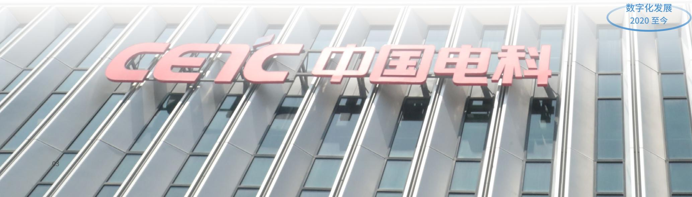

text_image

CEIC 中国电科
数字化发展
2020 至今

# 公司愿景

通过数字化、网络化、智能化新一代信息技术与各行业深度融合，打造行业数字化整体解决方案龙头企业

# 发展战略

国家 “十五五” 规划提出坚持把发展经济的着力点放在实体经济上，强化实体经济根基作用，加快构建实体经济、科技创新、现代金融协同发展的现代化产业体系，推动产业智能化、绿色化、融合化发展。全面实施 “人工智能+” 行动，强化算力、算法、数据高效供给，推动数智技术全方位赋能千行百业，助力经济社会高质量发展。加快建设金融强国，坚持防风险、强监管、促高质量发展方向，加快构建中国特色现代金融体系。加快建设制造强国，优化提升传统产业，坚持因势利导、分业施策、加快向中高端升级，以实体经济稳健发展支撑经济高质量增长，为新质生产力培育提供坚实基础。

公司围绕“打造行业数字化整体解决方案龙头企业”战略愿景，瞄准各行各业数智化核心需求，聚焦数字化产品、行业数字化、数字新基建三大业务，深化转型创新，加强业务协同，夯实行业数智化架构体系，巩固核心业务优势和业务总体能力，打造一体化数字基础设施底座，做强做大智能计算软硬件、数智应用软件等产品矩阵，提升态势感知、业务重塑能力，进一步发力数据要素、人工智能新域新质，面向数字金融、智能制造、数字交通、数字水利、智慧医疗等重点场景，拓展多样化智慧应用解决方案，数智赋能行业客户数字化转型，推动公司高质量发展。

同时，公司围绕做强做优做大的目标，统筹业务发展与资本运作，发挥好上市公司资本平台优势，并购内外部优质业务资源，精准风险管控，坚持合规经营，促进公司转型升级。

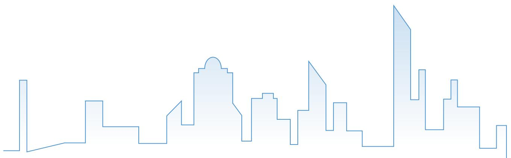

line

| X | Y |
| --- | --- |
| 1 | ~0.2 |
| 2 | ~0.8 |
| 3 | ~0.1 |
| 4 | ~0.15 |
| 5 | ~0.6 |
| 6 | ~0.3 |
| 7 | ~0.2 |
| 8 | ~0.1 |
| 9 | ~0.4 |
| 10 | ~0.7 |
| 11 | ~0.9 |
| 12 | ~0.8 |
| 13 | ~0.3 |
| 14 | ~0.5 |
| 15 | ~0.4 |
| 16 | ~0.2 |
| 17 | ~0.6 |
| 18 | ~0.3 |
| 19 | ~0.2 |
| 20 | ~0.9 |
| 21 | ~0.4 |
| 22 | ~0.7 |
| 23 | ~0.3 |
| 24 | ~0.5 |
| 25 | ~0.2 |
| 26 | ~0.1 |
| 27 | ~0.3 |
| 28 | ~0.1 |

企业文化  
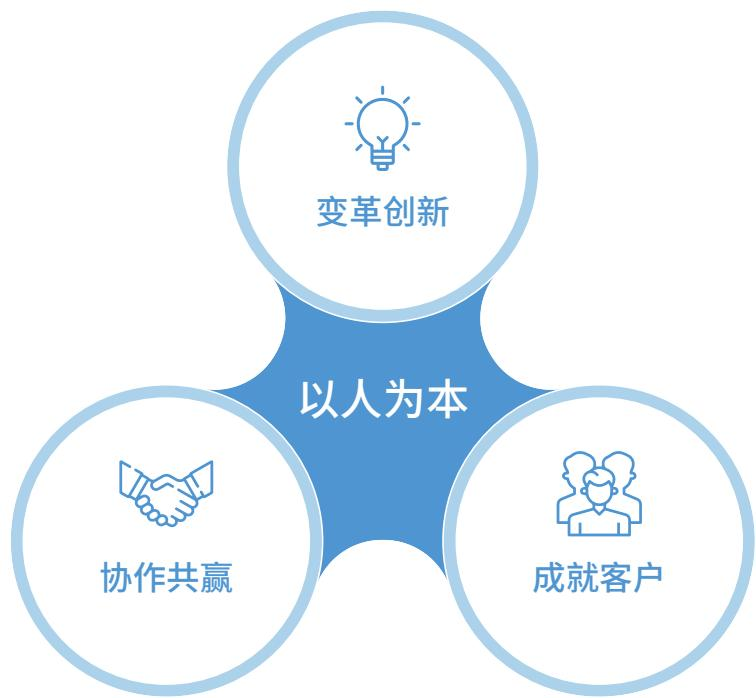

flowchart

```mermaid
graph TD
  Center["以人为本"]
  
  A["变革创新"]
  B["协作共赢"]
  C["成就客户"]
  D["Top Level Entity"]
```

# 业务布局

公司的主营业务包括数字化产品、行业数字化和数字新基建等三大业务板块,通过深入推进大数据、人工智能、物联网等新一代信息技术与业务融合创新，持续构建行业数智化架构体系,打造行业数字化整体解决方案龙头企业。在主营业务相关板块,公司享有受客户尊敬的品牌与口碑、突出的行业地位和较强的行业影响力。

Nx智慧场景  
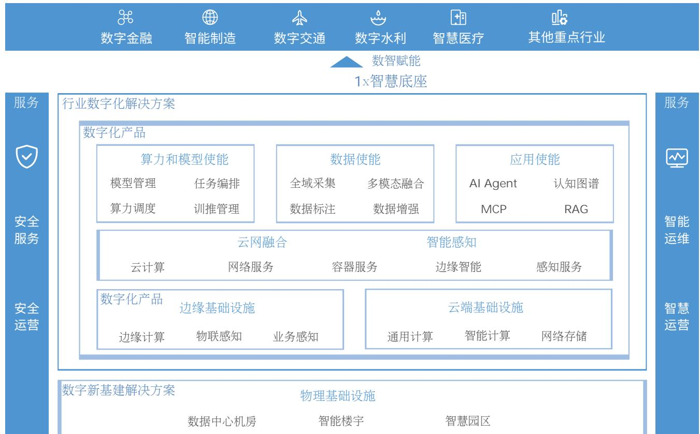

flowchart

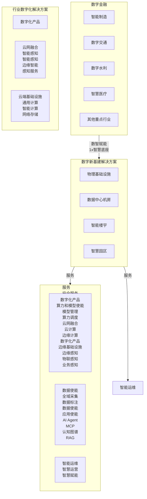
```mermaid
graph TD
  subgraph Top_Service["数字金融"]
    A["智能制造"]
    B["数字交通"]
    C["数字水利"]
    D["智慧医疗"]
    E["其他重点行业"]
  end

  subgraph Bottom_Service["数字新基建解决方案"]
    F["物理基础设施"]
    G["数据中心机房"]
    H["智能楼宇"]
    I["智慧园区"]
  end

  subgraph Services ["服务\n安全服务\n安全运营"]
    J["数字化产品\n算力和模型使能\n模型管理\n算力调度\n云网融合\n云计算\n边缘计算\n数字化产品\n边缘基础设施\n边缘感知\n物联感知\n业务感知"]
    K["数据使能\n全域采集\n数据标注\n数据使能\n应用使能\nAI Agent\nMCP\n认知图谱\nRAG"]
    L["智能运维\n智慧运营\n智慧赋能"]
  end

  subgraph Solutions ["行业数字化解决方案"]
    M["数字化产品"]
    N["云网融合\n智能感知\n智能感知\n边缘智能\n感知服务"]
    O["云端基础设施\n通用计算\n智能计算\n网络存储"]
  end

  Top_Service -->|"数智赋能\n1x智慧底座"| Bottom_Service
  Bottom_Service -->|"服务"| Services
  Bottom_Service -->|"服务"| Security["智能运维"]
```

行业数智化架构图

# 聚焦 ESG 管理，牵引公司可持续发展

# ESG 能力建设

ESG 组织结构  
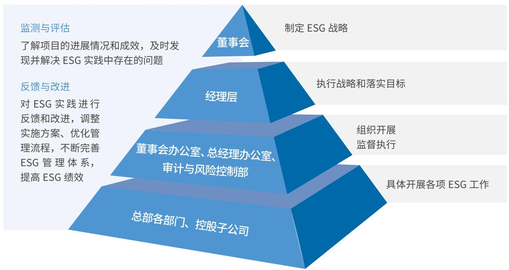

flowchart

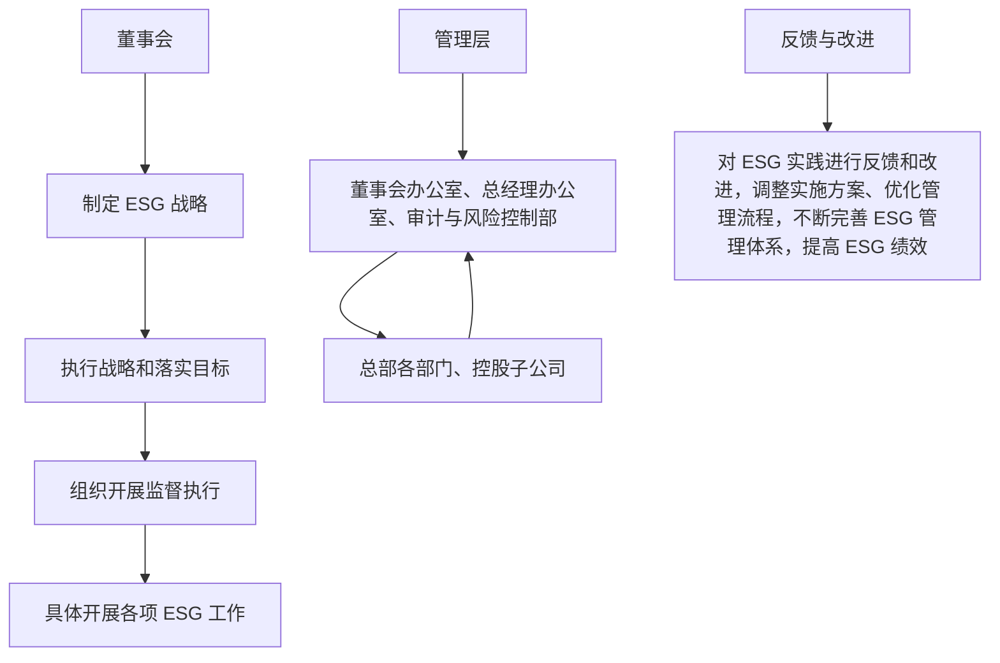
```mermaid
graph TD
  A["董事会"] --> B["制定 ESG 战略"]
  B --> C["执行战略和落实目标"]
  C --> D["组织开展监督执行"]
  D --> E["具体开展各项 ESG 工作"]
  F["董事会办公室、总经理办公室、审计与风险控制部"] --> G["总部各部门、控股子公司"]
  G --> F
  H["管理层"] --> F
  I["反馈与改进"] --> J["对 ESG 实践进行反馈和改进，调整实施方案、优化管理流程，不断完善 ESG 管理体系，提高 ESG 绩效"]
```

# 履行 ESG 的目标和原则

为实现 ESG 目标和原则，公司建立与 ESG 相关的管理制度和标准，加强对 ESG 信息的披露和传播，培养和提高 ESG 意识，鼓励员工和利益相关方积极参与 ESG 实践，形成全员共识和参与的良好氛围。同时，公司通过积极承担对政府、客户、合作伙伴、环境、股东、员工和社区等利益相关方的责任和义务，为社会创造更多价值，实现企业和社会的和谐发展。

ESG 行为准则  
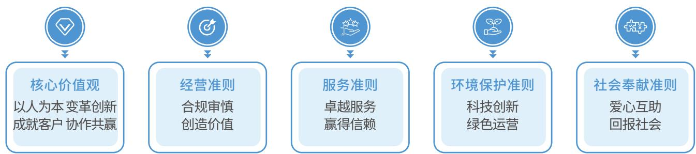

flowchart

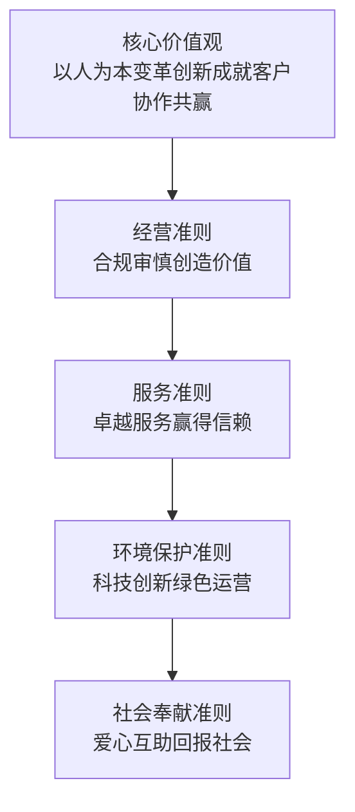
```mermaid
graph TD
  A["核心价值观\n以人为本变革创新成就客户协作共赢"] --> B["经营准则\n合规审慎创造价值"]
  B --> C["服务准则\n卓越服务赢得信赖"]
  C --> D["环境保护准则\n科技创新绿色运营"]
  D --> E["社会奉献准则\n爱心互助回报社会"]
```

ESG 理念  
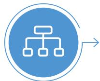

为深化并优化公司的 ESG 理念，公司已构建一套以董事会为主导的综合性 ESG 管理体系。该体系的核心在于确保公司战略、运营及决策过程全面融入 ESG 要素。

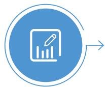

我们建立了跨部门的 ESG 履行机制，由各职能部门协同推进 ESG 实践，并由审计部门负责全程监督与评估。同时，为确保 ESG 理念在公司内部得到全面贯彻，我们将 ESG 履行情况纳入公司整体的绩效考核体系。

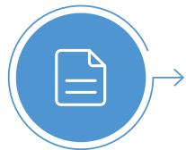

为规范员工行为，我们制定了详细的 ESG 行为准则，要求员工在日常工作中践行 ESG 理念、遵循 ESG 原则，进而推动公司在经济、环境和社会三个方面实现均衡发展，为社会的可持续发展做出积极贡献。

ESG 实践  
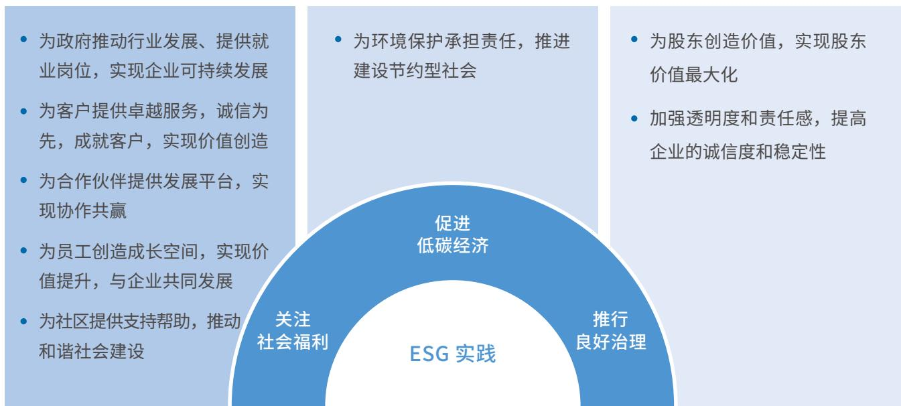

flowchart

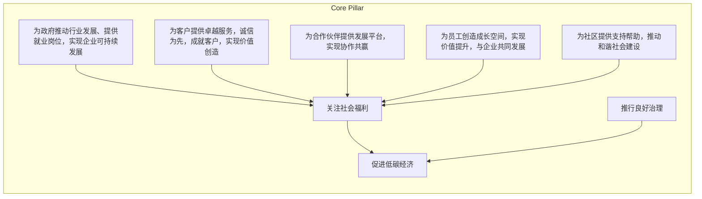
```mermaid
graph LR
  subgraph Core Pillar
    direction TB
  A["关注社会福利"] --> B["促进低碳经济"]
  C["推行良好治理"] --> B
  D["为政府推动行业发展、提供就业岗位，实现企业可持续发展"] --> A
  E["为客户提供卓越服务，诚信为先，成就客户，实现价值创造"] --> A
  F["为合作伙伴提供发展平台，实现协作共赢"] --> A
  G["为员工创造成长空间，实现价值提升，与企业共同发展"] --> A
  H["为社区提供支持帮助，推动和谐社会建设"] --> A
  end
```

# 积极参加 ESG 相关活动

电科数字自2013年起，已连续13年发布ESG类报告（前10份为社会责任报告）电科数字积极参加ESG相关活动，并参加了历届中国（上海）上市公司企业社会责任峰会系列活动，在历次活动中，分别荣获“合作共赢奖”“科技创新奖”。“数字化产业生态建设先行者”荣获上海市质量协会“ESG典型案例”。

2025年6月，上海市经济团体联合会、上海市工业经济联合会主办“2024上海市企业社会责任报告发布会评选活动”，公司在本次评选中脱颖而出，成功获得“创新驱动企业”案例奖。

2026年4月，公司已通过 GB/T 39604-2020《社会责任管理体系要求及使用指南

》认证，获得社会责任（SA）管理体系认证证书。

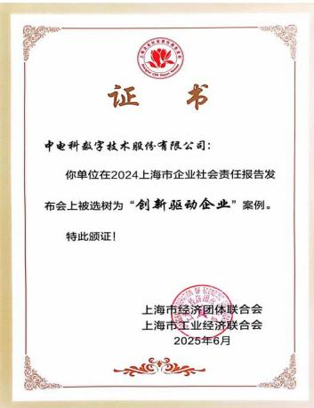

text_image

证书
中电科数字技术股份有限公司：
你单位在2024上海市企业社会责任报告发布会上被选树为“创新驱动企业”案例。
特此颁证！
上海市经济团体联合会
上海市工业经济联合会
2025年6月

# 利益相关方识别与沟通

电科数字为公司长远发展打下坚实的基础，重视倾听和了解利益相关者的诉求。公司积极开拓各种渠道与利益相关方保持沟通，争取各方的信任和支持，以推动 ESG 管理工作的持续改进。

<table><tr><td>利益相关方</td><td>期望与诉求</td><td>沟通与回应</td></tr><tr><td>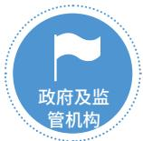</td><td>-合规经营-依法纳税-安全生产</td><td>-恪守商业道德、遵守法律法规-强化安全生产监管</td></tr><tr><td>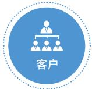</td><td>-提供优质产品和服务-保障客户权益和隐私</td><td>-完善产品质量管理体系-完善客服体系、防止隐私泄露</td></tr><tr><td></td><td>-互利共赢-供应链管理</td><td>-供应商评估-参与行业协会活动</td></tr><tr><td>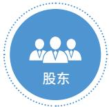</td><td>-可持续运营-信息披露</td><td>-努力提升业绩、创造利润-信息披露及时透明</td></tr><tr><td></td><td>-薪酬福利-培训与发展-职业健康安全</td><td>-保障员工权益-提供培训教育-健康安全管理</td></tr><tr><td></td><td>-社区公益参与-环境保护</td><td>-参加公益慈善活动-节能降耗、绿色生产</td></tr><tr><td></td><td>-保护环境-有效利用资源</td><td>-节能降耗-绿色生产</td></tr></table>

# ESG 实质性议题分析

为更深入了解各利益相关方的期望和要求，指导日常环境、社会和公司治理工作的开展，公司主动邀请利益相关方参与实质性议题评估，梳理对公司业务及利益相关方具有重要性的议题，并在报告中予以重点披露。

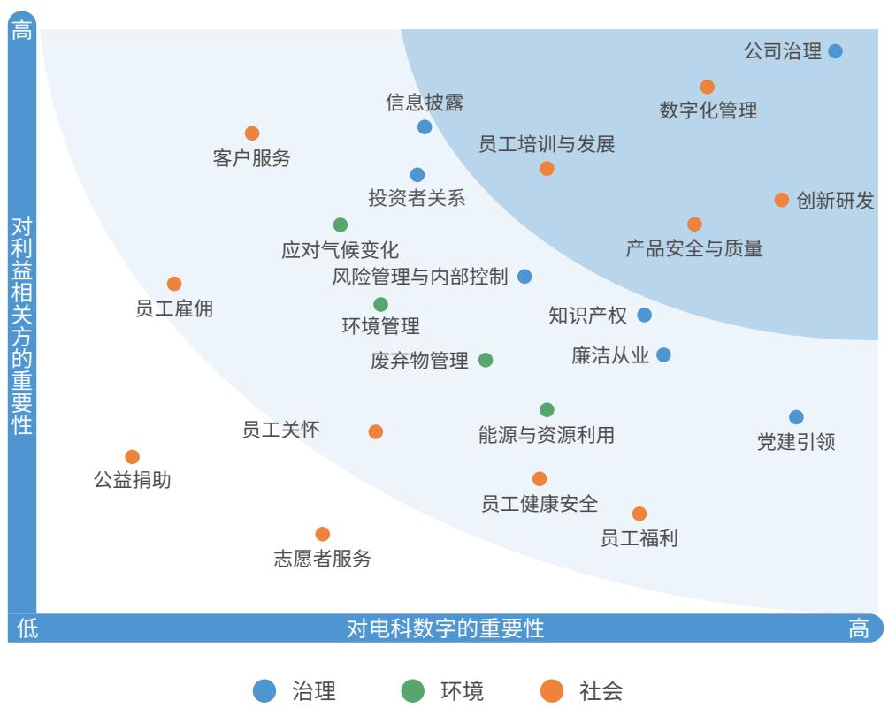

scatter

| Category | Topic | Importance to Stakeholders (X-axis) | Importance to Company Digital Services (Y-axis) |
| --- | --- | --- | --- |
| Governance | 公司治理 | High | High |
| Governance | 数字化管理 | High | High |
| Governance | 员工培训与发展 | Medium-High | Medium-High |
| Governance | 信息披露 | Medium-High | Medium-High |
| Governance | 投资者关系 | Medium-High | Medium-High |
| Governance | 员工雇佣 | Low-Medium | Medium |
| Governance | 应对气候变化 | Medium-Low | Medium |
| Governance | 风险管理与内部控制 | Medium-Low | Medium |
| Governance | 环境管理 | Medium-Low | Medium |
| Governance | 废弃物管理 | Medium-Low | Medium |
| Governance | 知识产权 | Medium-High | Medium |
| Governance | 廉洁从业 | High | Medium |
| Governance | 党建引领 | High | Low-Medium |
| Governance | 能源与资源利用 | Medium-High | Low-Medium |
| Governance | 员工关怀 | Low-Medium | Low-Medium |
| Governance | 公益捐助 | Low | Low |
| Governance | 志愿者服务 | Low | Low |
| Social | 创新研发 | High | Medium-High |
| Social | 产品安全与质量 | High | Medium-High |
| Social | 员工福利 | High | Low |
| Social | 员工健康安全 | High | Low |
| Social | 社会 | Low-Medium | Low-Medium |
| Social | 客户服务 | Low-Medium | High |
| Social | 员工关怀 | Low-Medium | Low-Medium |
| Social | 公益捐助 | Low | Low-Medium |
| Social | 员工雇佣 | Low-Medium | Medium |
| Social | 应对气候变化 | Low-Medium | Medium |
| Social | 风险管理与内部控制 | Low-Medium | Medium |
| Social | 环境管理 | Low-Medium | Medium |
| Social | 员工关怀 | Low-Medium | Low-Medium |
| Social | 社会 | Low-Medium | Low-Medium |
| Social | 员工福利 | High | Low-Medium |
| Social | 社会 | High | Low-Medium |
| Social | 社会 | High | Low-Medium |
| Social | 社会 | High | Low-Medium |
| Social | 社会 | High | Low-Medium |
| Social | 社会 | High | Low-Medium |
| Social | 社会 | High | Low-Medium |
| Social | 社会 | High | Low-Medium |
| Social | 社会 | High | Low-Medium |

# 高度重要性

公司治理  
- 产品安全与质量  
- 创新研发  
- 数字化管理  
- 员工培训与发展

# 中度重要性

- 信息披露  
- 投资者关系  
- 风险管理与内部控制  
- 知识产权  
- 廉洁从业  
党建引领  
- 废弃物管理  
- 能源与资源利用  
- 应对气候变化  
- 环境管理  
- 客户服务  
- 员工雇佣  
- 员工关怀  
- 员工健康与安全  
- 员工福利

# 低度重要性

- 公益捐助  
- 志愿者服务

# 01

# 规范治理：

# 守合规之本，绘电科数字发展宏图

我们的行动

<table><tr><td>公司治理</td><td>13</td></tr><tr><td>投资者关系管理</td><td>15</td></tr><tr><td>风险内控</td><td>17</td></tr><tr><td>信息安全</td><td>20</td></tr><tr><td>党建引领</td><td>21</td></tr></table>

# 理念

电科数字严格遵守法律法规以及相关要求，建立健全公司内部制度，规范公司运作，持续深入地开展公司治理活动，并且公司进一步加强信息披露工作，提升投资者关系管理水平，有效保障法人治理结构的合规性。同时，公司注重信息安全、知识产权保护、党建活动等工作的开展，不断为公司夯实发展基础，切实保障公司可持续发展。

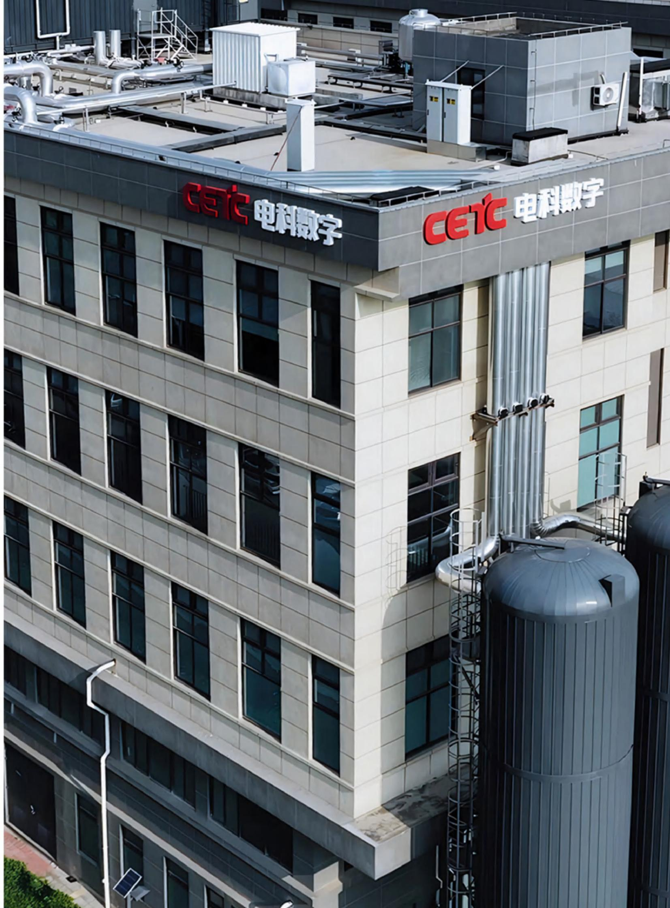

text_image

CETC 电科数字
CETC 电科数字

# 公司治理

公司严格按照《公司法》《证券法》《上市公司治理准则》《上海证券交易所股票上市规则》等法律法规的要求，结合公司实际情况，不断完善法人治理结构。公司股东会、董事会和经营层之间权责明确，公司董事忠于职守、勤勉尽责，公司管理层严格按照董事会授权忠实履行职务，积极维护公司利益和广大股东的合法权益。

报告期内，公司召开股东会

4 次

召开董事会

11 次

公司董事会共有

9 名成员

其中独立董事

3 名

女性董事

2 名

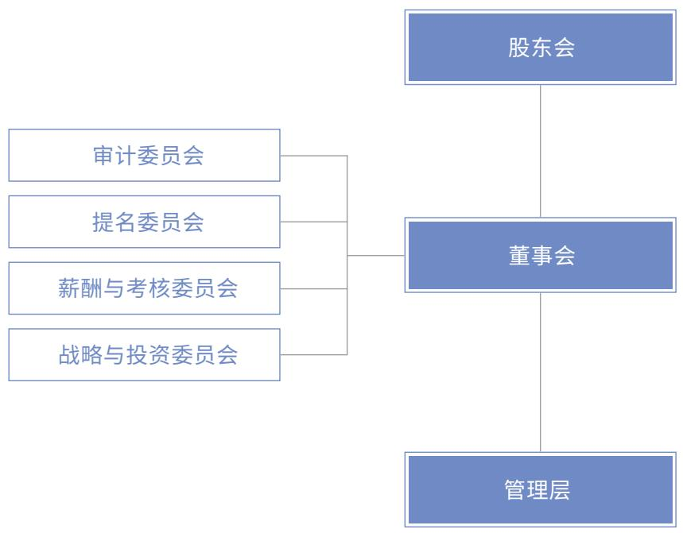

flowchart

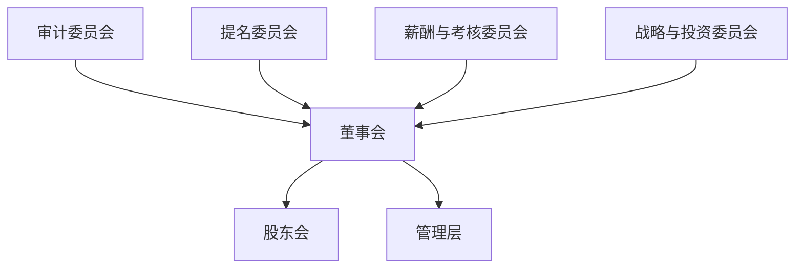
```mermaid
graph TD
  A["董事会"] --> B["股东会"]
  A --> C["管理层"]
  D["审计委员会"] --> A
  E["提名委员会"] --> A
  F["薪酬与考核委员会"] --> A
  G["战略与投资委员会"] --> A
```

公司治理架构

# 股东会

公司按照《上海证券交易所股票上市规则》《公司章程》的要求，规范实施股东会的召集、召开、表决等相关程序。公司平等对待所有股东，确保所有股东，尤其是中小股东充分享有和行使自己的权利。公司聘请了执业律师出具法律意见书，对股东会的召集、召开程序、审议事项及出席人身份进行确认和见证，确保股东会的合法有效性。

# 董事会构成多元

公司高度重视董事会的多元化，在董事选聘时综合考量候选人性别、年龄、专业背景、行业经验、学历、独立性等多方面因素。以提升决策质量与治理水平。

董事会成员具有多元化的专业背景，在企业管理、人工智能、产业投资、财务管理等领域拥有丰富的经验，能够凭借各自的专业优势为公司经营决策与可持续发展提供坚实保障。

# 董事会独立性

公司制定并严格执行《公司章程》《独立董事工作制度》，明确独立董事在公司治理中的角色和职责，确保其勤勉尽责、独立审慎地履行义务和行使权利。董事会成员共9人，其中独立董事3人，占比33.33%。董事会下设专门委员会，审计委员会、提名委员会、薪酬与考核委员会均由独立董事担任主任委员，且独立董事占比均达到2/3，有效保障了决策的独立性和客观性。

# 股东会和董事会运作

# 案例 > 公司召开股东会，股东充分行使自身权利

2025年5月，公司组织召开2024年年度股东大会。会议审议多项议案，并对各项议案进行投票表决。本次股东大会的召集、召开、表决等相关程序合法合规，全体股东充分行使自身的合法权利，进一步提升了公司治理水平。

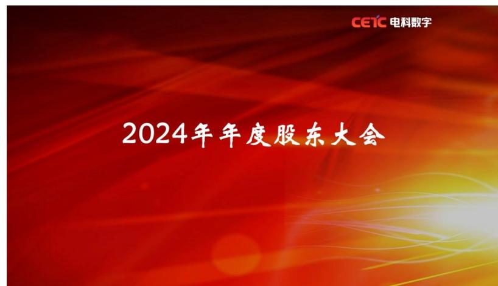

text_image

CEIC 电科数字
2024年年度股东大会

召开股东会

# 投资者关系管理

公司制定了《投资者关系管理制度》，明确投资者关系管理工作原则、管理对象、工作内容和方式、保障措施等内容，积极维护投资者关系，并且严格按照信息披露相关要求，真实、准确、完整、及时地披露有关信息，确保所有股东能够平等地获得信息。同时，公司重视对投资者的合理投资回报，执行持续、稳定的利润分配政策，不断为股东创造价值。

报告期内  

公司公开披露报告

135 份

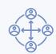

公司开展投资者关系活动

29 次

公司召开业绩说明会

3 次

公司在上证e互动平台回复

222 次

# 持续稳定分红，提升投资者回报

公司高度重视投资者回报，严格遵循相关文件要求，制定《股东分红回报规划（2024年-2026年）》，完善健全公司科学、持续、稳定的分红决策和监督机制。2025年，公司严格落实《股东分红回报规划（2024年-2026年）》，结合公司战略发展规划、发展阶段、盈利能力、资金状况及投资需求等因素，首次实施中期分红，提高分红的稳定性、持续性，积极回报投资者。

<table><tr><td>现金红利发放日</td><td>分红方案(每10股)</td><td>共计派发现金红利</td></tr><tr><td>2025/10/31</td><td>派息(税前)0.6元</td><td>40,811,924.46元</td></tr><tr><td>2025/6/26</td><td>派息(税前)3.5元</td><td>240,143,422.40元</td></tr><tr><td>2024/6/21</td><td>派息(税前)4.5元</td><td>310,349,056.95元</td></tr><tr><td>2023/6/29</td><td>派息(税前)3.0元</td><td>205,522,303.80元</td></tr></table>

公司 2022\~2024年现金红利发放情况

# 公司信息披露基本原则

公司和相关信息披露义务人应当根据法律、行政法规、部门规章、其他规范性文件、上市规则等，及时、公平地披露信息，并保证所披露信息的真实、准确完整，简明清晰，通俗易懂，不得有虚假记载、误导性陈述或者重大遗漏。

公司信息披露要体现公开、公平、公正对待所有股东的原则。公司和相关信息披露义务人披露的信息应当同时向所有投资者披露，不得提前向任何单位和个人泄露。但是，法律、行政法规另有规定的除外。

# 案例 公司召开业绩说明会，加强投资者与公司之间的交流

2025年5月，公司以视频结合网络互动方式召开2024年度暨2025年第一季度业绩说明会。会上，公司公布可视化财报，充分解读经营情况及发展战略。本次会议的召开进一步加强了投资者与公司之间的沟通与交通，帮助投资者更好地了解公司。

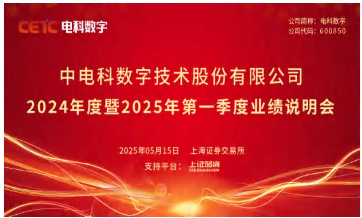

text_image

电科数字
公司简称：电科数字
公司代码：600850
中电科数字技术股份有限公司
2024年度暨2025年第一季度业绩说明会
2025年05月15日 上海证券交易所
支持平台：上证路演
SE:ROMASSHOW

业绩说明会

  
公司官网

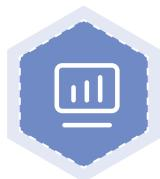  
e 互动平台

  
电话

  
传真

  
电子邮箱

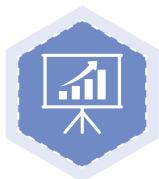  
业绩说明会

  
公司公众号  
公司投资者沟通渠道

# 风险内控

公司秉承“主动合规、人人合规、合规创造价值”的理念，以“强内控、防风险、促合规”为目标，有计划地开展建立合规制度、完善运行机制、培育合规文化等管理活动。公司着力健全法治体系，持续提升法治工作引领支撑能力、风险管控能力和主动维权能力，不断深化治理完善、经营合规、管理规范、守法诚信的依法治企要求，为公司运营打下坚实的法治基础。

报告期内，公司修订《独立董事工作制度》《董事会授权管理制度》《发票管理制度》《费用控制及管理制度》等数十项制度并有效执行。

# 董事会

发挥定战略、作决策、防风险作用

# 管理层

发挥谋经营、抓落实、强管理作用

# 合规管理部门

牵头负责公司合规管理工作

# 业务及职能部门

承担合规管理主体责任

公司合规管理体系

# 案例

公司开展宪法培训，积极参与宪法宣传周线上答题活动

为深入学习宣传贯彻习近平法治思想，推动宪法深入人心，同时精准对接职工需求与诉求、提升集体协商针对性与实效性，上地街道总工会定于12月5日开展职工需求与集体协商调查问卷及宪法宣传周系列活动。子公司华誉维诚员工积极参与线上答题，认真完成相关学习与调研任务。

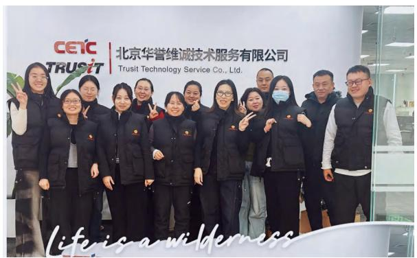

text_image

CEIC
TRUSIT | 北京华誉维诚技术服务有限公司
Trusit Technology Service Co., Ltd.
life is a wilderness

宪法培训

# 反对商业贿赂及反贪污

公司严格遵循相关法律规定，坚持“零容忍”反腐败理念，不断完善反商业贿赂与反贪污管理体系，围绕产业发展和公司经营，筑牢廉洁运营防线，保障公司合规健康发展。

natural_image

Illustration of a businessman holding a document with a magnifying glass, next to a calculator and document (no text or symbols present)

# 制度体系与组织架构

公司已建立反舞弊制度，明确了反舞弊工作组织结构及职责、舞弊行为的责任追究、对举报人员的保护等内容。通过建立诚信的企业文化氛围，包括员工的诚信程度和职业道德水平，构建畅通的信息传递，建立道德规范行为准则，明确员工行为准则与纪律要求。

公司董事会领导反舞弊工作，督促管理层建立公司范围内的反舞弊文化环境，建立健全包括预防舞弊在内的内部控制体系。审计部门按职能具体组织、协调开展反腐败相关工作。各部门依规依纪依法落实反腐败工作要求，形成全方位管控格局。

# 举报机制与举报人保护

公司设立了多渠道的举报机制，可通过电话、邮箱或信函等方式实名或匿名举报违规、舞弊及有损公司利益的行为。公司严格规范检举人保护机制，严禁泄露举报人的姓名、单位、住址等相关信息，对举报人举报内容严格保密。

# 全流程廉洁风险防控

公司持续建立和健全内部控制体系，加强风险评估机制和应对机制，发挥内部审计的再监督职能；尤其是采购环节，采购的选择权、定价权、数量决定权和资金支付权分离。供应商的选择公开透明，通过设立询比价制度，规范合同范本，建立供应商资质和诚信档案、合同会签管理、规范采购业务流程等措施，杜绝商业贿赂行为的发生。同时，向供应商宣传诚信廉洁要求，构建廉洁共赢的合作生态。

公司加强廉洁教育培训，开展廉洁从业教育，通过集中警示教育、约谈提醒、案例通报等方式实现全覆盖，在新员工入职培训中专门设置反腐败教育内容。公司要求管理人员及关键岗位人员签订廉洁从业承诺书，并向员工宣传诚信廉洁要求，压实廉洁责任。

报告期内，公司未发生涉及商业贿赂及贪污的法律诉讼事件。

# 反不正当竞争

公司积极履行维护公平竞争的责任，严格遵守《中华人民共和国反垄断法》《中华人民共和国反不正当竞争法》等法律法规要求，将反垄断、反不正当竞争工作纳入合规管理范畴，构建权责清晰的合规管理机制，筑牢合规经营防线。

公司聚焦业务流程合规管控，对市场活动等关键环节建立合规审查机制，持续强化业务拓展、合同洽谈、签订及履行等各环节合规管理，保障各项经营活动合法合规、有序开展。

2025年，公司未发生因不正当竞争行为导致的诉讼或重大行政处罚。

natural_image

Illustration of digital marketing concepts including a megaphone, target, video player, gears, and lightbulb (no text or symbols)

# 信息安全

公司高度重视网络与信息安全，为此建立一系列信息安全应急相关管理文件及预案，包括《公司网络与信息安全防范措施预案》《公司信息基础设施运行和管理规定》《信息资产风险评估及控制管理程序》《公司信息系统账号管理制》等，确保公司在面临网络与信息安全风险时，能够迅速、有效地作出响应，保障公司信息安全，减少潜在损失。

# 报告期内

公司信息安全投入

239.31 万元

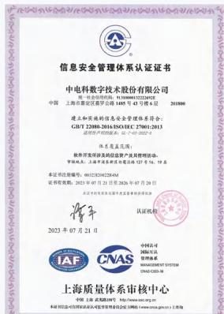

text_image

信息安全管理体系认证证书
中电科数字技术股份有限公司
统一社会信用代码：913300001222250E
中国 上海市嘉定区嘉丰公路1405号43号楼6层 201000
建立和实施的信息安全管理体系符合：
GB/T 22080-2016/ISOIEC-Z7001/2013
通讯用户代码：41-6-772227
体系覆盖范围：
软件开发和系统风险评估及风险管理模块：
审核机关：上海市浦东新区南站路127号16、19室
证书注册编号：4011232812282A4
证书有效期：2023年07月21日至2026年07月28日
认证机构
认证机构
2023年07月21日
中国证网
CNAS
ISSN
GUANGDONGFENGNT SYSTEMS
CNAS CO.,LTD.
上海质量体系审核中心
中国（上海）质量认证中心
本公司注册会计师：深圳市天健会计师事务所（特殊普通合伙）
地址：上海市徐汇区长乐路588号

ISO27001 信息安全管理体系认证证书

# 案例 > 信息安全管理体系系列培训，强化网络安全与保密工作

2025年度，公司携下属公司

开展多场信息安全管理体系相关培训。培训既包含《网络安全科普》内部课程，也涵盖市保密局、市国防科工局组织的《信息安全保密培训》《保密培训》等外部培训。系列培训有效提升了全员对网络安全与保密工作的认知水平，强化了整体信息安全防护意识。

与此同时，为适配最新信息安全管理要求，公司同步开展信息安全管理体系深化培训，保障体系的高效运行与持续优化

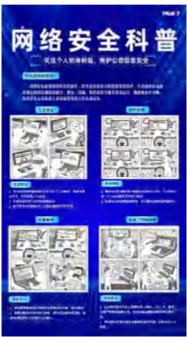

text_image

网络安全科普
关注个人轻身科局，维护公司信息安全
1. 信息共享
2. 信息共享
3. 信息共享
4. 信息共享

《网络安全科普》

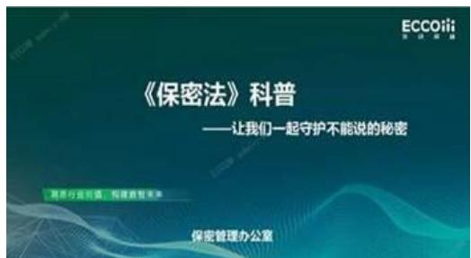

text_image

《保密法》科普
——让我们一起守护不能说的秘密
ECCOiiti
保密管理办公室

《保密法科普》

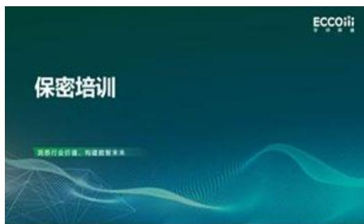

text_image

ECCO培训
熟悉行业资源，构建监管未来

《信息安全保密培训》

# 党建引领

为坚持和加强党的全面领导，深化国有企业改革，完善中国特色现代企业制度，公司全面落实“两个一以贯之”总要求，牢牢把握核心精神，通过强化制度建设，使党的领导与公司发展高度统一、有机融合。公司在《公司章程》中明确了党组织的设立，并制定了相关工作规则与决策体系，以组织化、制度化、具体化的方式推动和加强党的领导。

截至报告期，公司共有党员526人

中共中电
科数字技
术股份有
限公司委
员会

中共中电科数字技术股份有限公司综合支部委员会

中共中电科数字技术股份有限公司数字基建本部支部委员会

中共上海华讯网络系统有限公司委员会

中共上海柏飞电子科技有限公司支部委员会

中共华存数据信息技术有限公司支部委员会

中共北京华誉维诚技术服务有限公司支部委员会

# 公司党组织架构

# 案例 > 公司举办专题党课，以党建引领发展

2025年，公司组织党员领导干部开展“学习贯彻党的二十届四中全会精神轮训”，引导广大党员干部深刻领会全会的精神实质、核心要义和实践要求，自觉在思想上、政治上、行动上和党中央保持高度一致，为基本实现社会主义现代化而共同奋斗，不断开创以中国式现代化全面推进强国建设、民族复兴伟业新局面。

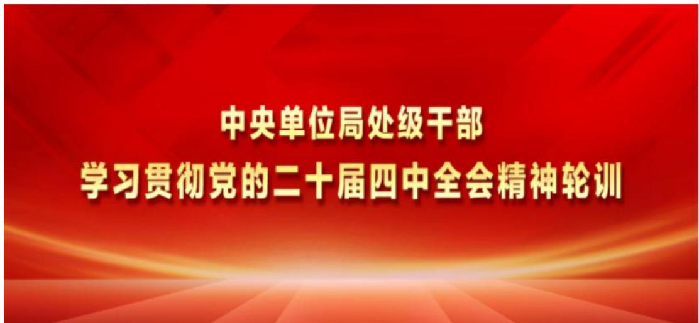

text_image

中央单位局处级干部
学习贯彻党的二十届四中全会精神轮训

公司举办专题党课

# 案例

# 公司组建党员攻关团队，发挥党员先锋模范作用

2025年，公司组织开展“学党史”主题党日活动，集中学习党的光辉历程、重大事件与宝贵经验，重温入党誓词，感悟初心使命。通过领学原文、交流研讨、观看党史资料等形式，大家深刻认识红色政权来之不易、新中国来之不易、中国特色社会主义来之不易。

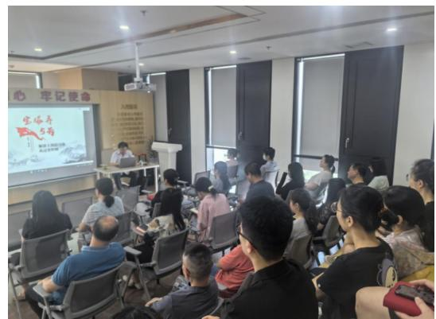

text_image

心牢记使命
宝洛丹
5号
中国共产党
1948年10月1日

公司组织开展“学党史”主题党日活动

# 案例

# 公司加强职工关心关爱，促进企业与员工协同共进

2025年，公司定期开展职工思想动态分析，定期发布学习园地。通过工会为员工组织疗休养、干花小夜灯制作、木质八音盒拼装、羽毛球、慈善义卖、女员工两病筛查等多项活动。员工以更好的状态投入工作，实现工作与生活的良性互动，为企业发展注入新的活力，有效促进企业与员工协同共进。

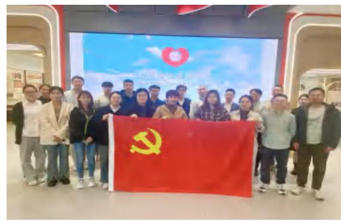

text_image

Group photo with a red flag featuring a yellow hammer and sickle symbol, in front of a large screen displaying Chinese text.

公司组织党员慈善义卖

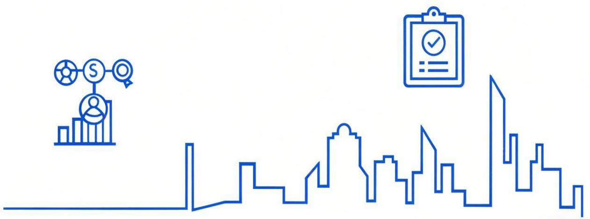

flowchart

```mermaid
graph LR
  A["City Sky Icon"] --> B["Line Chart Icon"]
  B --> C["Icon Icon (S, Q, S)"]
  C --> D["Icon Icon (S, Q, S)"]
```

# 02

# 变革创新：

# 注创新之能，蓄电科数字变革力量

# 我们的行动

数智引领
25

质量控制 27

成就客户 29

# 理念

电科数字始终将创新研发、质量控制和客户服务视为企业生存与发展的核心要素。公司积极投入研发力量，不断推动技术创新，力求以高质量的产品和优质的服务满足并超越客户的期望。同时，公司注重项目质量控制，确保每个项目从立项到交付都遵循高标准的质量要求。

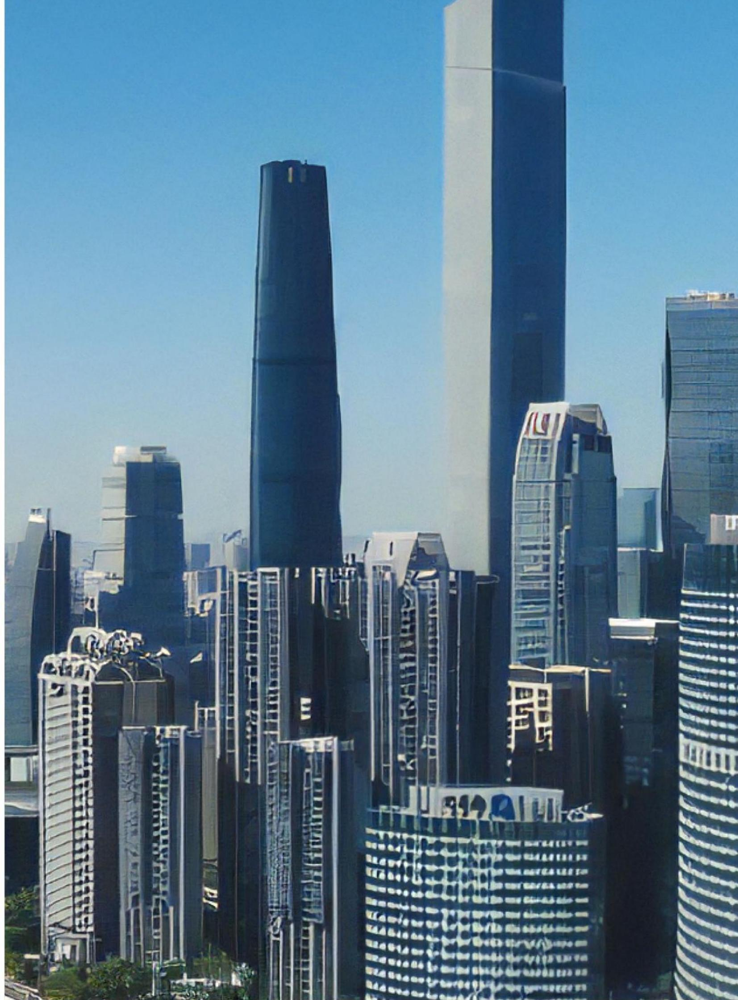

natural_image

Exterior view of a modern city skyline featuring prominent skyscrapers under a clear blue sky (no signage or text visible)

# 数智引领

# 创新研发

公司坚持科技创新，持续加大投入研发，围绕人工智能、大数据、智能计算等技术方向，研制信息信号处理平台、边端智能处理平台、无人装备计算机、开源治理服务平台、智算算力管理平台、AI应用开发平台、AI数据处理平台等数字化产品，打造数字金融、智能制造、数字交通、数字水利、智慧医疗、智慧园区等行业数字化解决方案。公司制定了《研发费用核算制度》和《软件开发控制管理程序》等研发相关的制度，子公司华讯网络和华存数据的研发管理体系已通过CMMI5级国际认证。同时，公司积极参与行业标准制定，涵盖信息技术服务、云计算、中间件、医疗健康等多个领域，推动行业技术进步。

# 知识产权管理

公司高度重视知识产权保护工作，严格遵守《中华人民共和国商标法》《中华人民共和国著作权法》《中华人民共和国专利法》相关法律法规要求。同时，制定并完善《知识产权管理制度》《知识产权管理程序》等规范性文件，为知识产权的规范化管理提供坚实制度保障。

公司设立专门部门对知识产权实施集中统一管理，配备专职人员负责知识产权全流程管理工作。通过高效推进知识产权申请、认证与维护等工作，切实保护自有知识产权不受侵害，同时恪守尊重他人知识产权的基本原则。

报告期内  
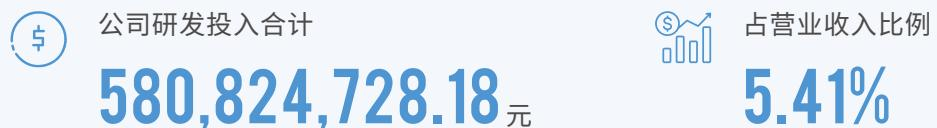

other

| 指标 | 数值 |
| --- | --- |
| 公司研发投入合计 (元) | 580,824,728.18 |
| 占营业收入比例 (%) | 5.41 |

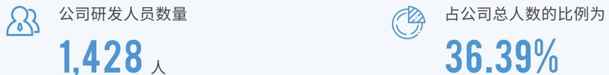

donut

| 指标 | 数值 |
| --- | --- |
| 公司研发人员数量 | 1,428 人 |
| 占公司总人数的比例 | 36.39% |

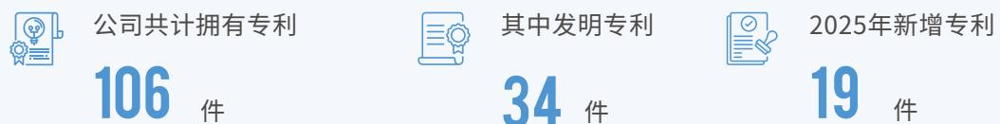

funnel

| Category | Value |
| --- | --- |
| 公司共计拥有专利 | 106 件 |
| 其中发明专利 | 34 件 |
| 2025年新增专利 | 19 件 |

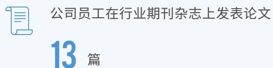

报告期内  
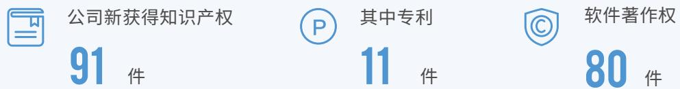

flowchart

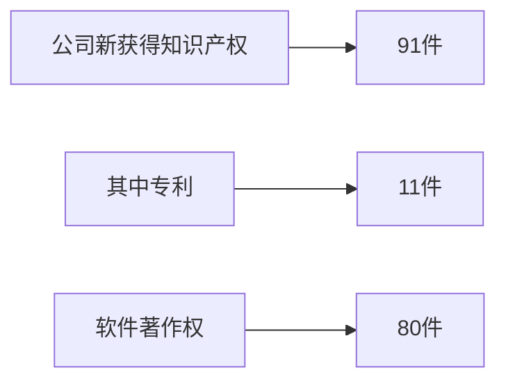
```mermaid
graph LR
  A["公司新获得知识产权"] --> B["91件"]
  C["其中专利"] --> D["11件"]
  E["软件著作权"] --> F["80件"]
```

# 案例构建开源安全防线，护航企业可持续发展

为应对开源技术广泛应用伴随的安全与合规风险，公司提出了“全链路开源治理”解决方案。该方案以“体系+平台+工具+服务”为框架，将开源治理无缝融入软件开发生命周期。其核心是自主研发的开源软件分析治理平台，该平台实现了对开源资产的盘点、风险（安全、合规、运维）的精细化识别与管控，并建立了覆盖组件引入、使用、升级、退出的全生命周期管理体系。通过构建清晰可溯的资产库、应用漏洞降噪与可达性分析等技术，该方案助力企业提升管理效率，聚焦关键威胁，增强风险抵御能力，从而保障业务稳定安全运行，支持可持续发展目标。

- 如何构建覆盖开源软件全生命周期的安全合规体系？  
- 具体分哪些阶段？  
- 如何进一步优化现有流程？

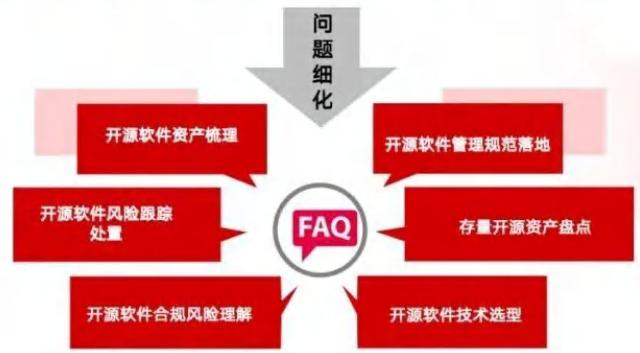

flowchart

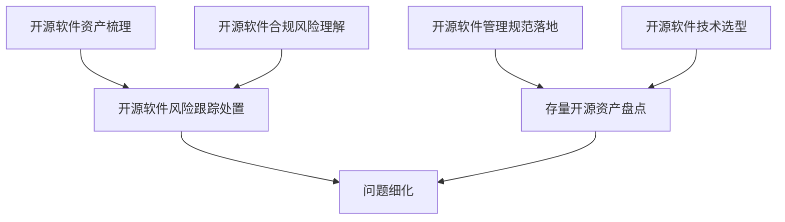
```mermaid
graph TD
  A["开源软件资产梳理"] --> B["开源软件风险跟踪处置"]
  C["开源软件管理规范落地"] --> D["存量开源资产盘点"]
  E["开源软件技术选型"] --> D
  F["开源软件合规风险理解"] --> B
  B --> G["问题细化"]
  D --> G
```

构建开源软件合规体系

# 企业宏观层面

# 缺乏开源治理实践经验

1. 软件供应链安全与软件开发交叉环节治理，治理逻辑复杂，缺乏可参考的实践案例，单方面的治理达不到预期效果；  
2. 技术更新迭代速度过快，新型技术下的新兴风险应对策略，例如开源AI大模型可能带来的风险挑战。

# 传统技术能力覆盖不足

1. 传统依靠源码级的组件风险识别和管控，难以覆盖企业复杂的开发及生产部署场景；  
2. 开源组件安全领域的知识库储备不足。

# 安全价值难以明确度量

开源治理是一个长期可持续的治理流程，短期投入，难以看到理想效果；

# 企业组织层级支撑资源不足

开源治理需企业自上而下的支持，如果治理层面支持不足，相关组织权责不明，可能就会导致开源治理工作推行受阻；

# 案例 > 发布MIH（Medical Insight Hub）联合解决方案，赋能医疗创新

2025年9月16日，子公司华讯网络携手亚马逊共同发布了MIH（Medical Insight Hub）联合解决方案。该方案不仅提供Landing Zone配置、大模型切换、身份提供商集成与访问控制、应用监控与日志告警、成本管理与限流等生产级能力，还在业务场景上提供翻译界面对照编辑器、PDF翻译格式微调、多协作翻译评审工作流、术语表智能提取、定制企业知识库等创新功能。这一方案凸显了华讯网络将AI技术深度结合行业需求，打造可规模化复制的解决方案的强大能力。

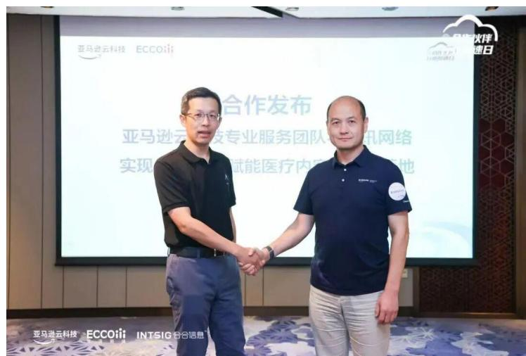

text_image

亚马逊云科技 ECCOii
合作发布
亚马逊云科技专业服务团队腾讯网络
实现智能医疗内容“新”落地
亚马逊云科技 ECCOii INTSIG 管台信息

发布MIH（Medical Insight Hub）联合解决方案

# 质量控制

电科数字严格遵循相关法律法规及行业标准要求，制定、修订《质量手册》《工程项目质量管理制度》《业务连续性实施策划和控制程序》等制度办法，设立质量方针与年度质量目标，建立并完善质量管理体系，持续提高质量管理水平。公司通过项目例会、周报、月报、日常巡检、管理检查等手段，提高对各项目风险的识别与把控，确保项目执行的有效性、安全性，从而提高项目质量，完成客户需求。

# 报告期内

公司整体业务一次交付验收合格率为

100%

共计开展质量培训

1,189 人次

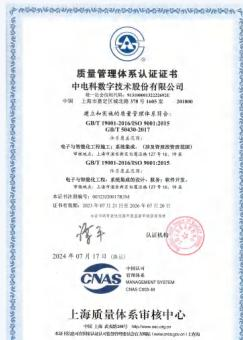

text_image

质量管理体系认证证书
中电科数字技术股份有限公司
中国·上海·世纪通科技有限公司 2018年
注册号：916-500000000000000
截止本报告披露日，中电科数字技术股份有限公司：
GJ/T 19981-2015/3/30 9081-2015
GJ/T 19981-2015/3/30 9081-2015
公告编号：2018-047
电子与智能工程工程师、工程师、工程师（涉及资质变更登记）
GJ/T 19981-2015/3/30 9081-2015
GJ/T 19981-2015/3/30 9081-2015
经办人签名：
电子与智能工程工程师、工程师或工程师、工程师、工程师等。
GJ/T 19981-2015/3/30 9081-2015
经办人签名：
电子与智能工程工程师、工程师或工程师、工程师、工程师等。
GJ/T 19981-2015/3/30 9081-2015
经办人签名：
电子与智能工程工程师、工程师或工程师、工程师等。
GJ/T 19981-2015/3/30 9081-2015
经办人签名：
电子与智能工程工程师、工程师或工程师、工程师等。
GJ/T 19981-2015/3/30 9081-2015
经办人签名：
电子与智能工程工程师、工程师或工程师、工程师、工程师等。
GJ/T 19981-2015/3/30 9081-2015
经办人签名：
电子与智能工程工程师、工程师或工程师
GJ/T 19981-2015/3/30 9081-2015
经办人签名：
电子与智能工程工程师、工程师或工程师
GJ/T 19981-2015/3/30 9081-2015
经办人签名：
电子与智能工程工程师、工程师或工程师
GJ/T 19981-
2024年 07月17日（送达）
认证机构：
GNAS
GNAS-CISIL
上海质量体系审核中心
中国·上海·世纪通科技有限公司
GJ/T 19981-2015/3/30 9081-2015
GJ/T 19981-2015/3/30 9081-2015
GJ/T 19981-2015/3/30 9081-2015
GJ/T 19981-2015/3/30 9081-2015
GJ/T 1998
GJ/T 1998
GJ/T 1998
GJ/T 1998
GJ/T 1998
GJ/T 1998
GJ/T 1998
GJ/T 1998
GJ/T 1998
GJ/T 1998
GJ/T 1998
GJ/T 1998

ISO9001 质量管理体系认证证书

# 体系制度

- 制定质量方针：方案全面、项目达标、自主创新、持续改进  
- 及时更新识别法律法规及行业标准，制定修订公司内部质量控制制度  
- 建立并持续完善公司质量管理体系

# 质量控制

- 通过业务连续性管理，识别影响业务质量的关键因素，评估风险并制定控制措施  
- 开展日常巡检、管理检查，及时识别、整改、验证关闭各项业务过程中的不合格因素

# 质量宣贯

- 综合质量宣贯: 通过质量月报、质量管理年报、员工培训、新闻报道等方式对员工进行质量宣贯  
- 专项质量宣贯：针对特定的项目业务，开展项目例会、团队内部技术交流分享等活动进行质量交流

公司质量管理方法

# 定性质量目标

- 满足顾客要求，提供全面的解决方案，不断持续改进  
- 遵守软件生命周期过程和开发规范，提高软件可重用性  
- 提供高可用性、高可靠性、可持续改进的数据中心基础设施的运维服务

# 定量质量目标

- 实现建筑智能化工程、电子工程、系统集成项目的合同按时履行率 $95\%$ , 顾客满意率 $90\%$  
- 软件工程项目一次交付验收合格率 $100\%$ , 合同按时履行率 $85\%$ , 顾客满意率 $85\%$

# 2025年年度质量目标

# 案例 首席质量官培训，落实质量责任

首席质量官培训对于企业的意义重大。通过培训，企业可以培养出一批具备高素质、高水平的质量管理人才队伍，提升企业的质量管理水平和市场竞争力。同时，首席质量官培训也有助于推动质量管理理念和方法在企业中的普及和应用，促进企业实现高质量发展。

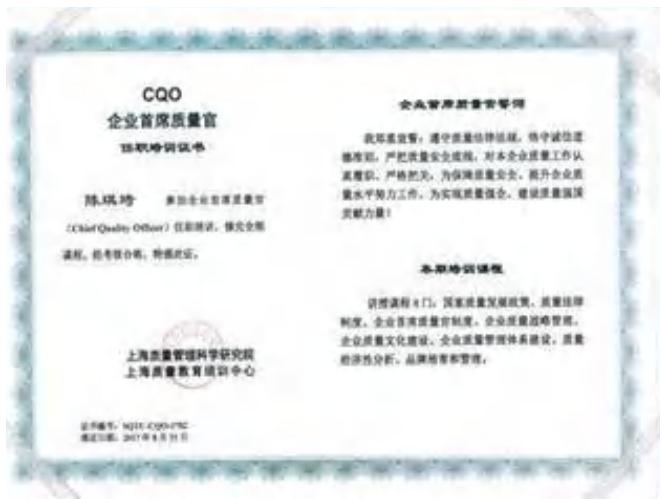

text_image

CQO
企业首席质量官
组织培训证书

陈琪琦
参加企业首席质量官
（Chief Quality Officer）任职培训，核安全部
课程。经考核合格，特强调证。

上海质量管理科学研究院
上海质量教育培训中心

会员管理质量督导
我培养监督：遵守质量纪律法规，恪守诚信道德准则，严把质量安全成规，对本企业质量工作认真履职、严格把关，为保障质量安全，提升企业质量水平努力工作，为实现质量强化，建设质量强国贡献力量！

本所培训课程
讲授课程4门：国家质量发展政策、质量控制制度、企业首席质量官制度、企业质量战略管理、企业质量文化建设、企业质量管理体系建设、质量经济性分析、品牌培育和管理；

首席质量官任职培训证书

# 成就客户

电科数字始终以客户为中心，制定《客户关系管理程序》《服务改进管理程序》《客户投诉控制程序》《售后服务管理规定》《顾客满意测量规定》等管理规章制度，对各类项目进行及交付后的服务要求、实施、验证等工作做出规定，并设定了完善的客户投诉与争议的处理程序。此外，公司致力于与客户建立并维护良好的合作关系，定期向客户开展顾客满意度调查，重视对客户诉求的回应和及时处理，并严格保护客户的信息与数据安全。

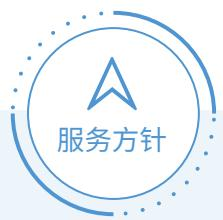

\- 快速响应、交付及时、安全服务、顾客满意

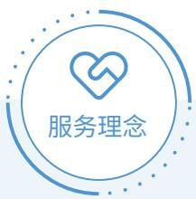

- 为客户提供专业、热忱、高效、完美的产品和服务  
- 想客户之所想  
- 以客户的需求为己任

# 公司服务方针及理念

报告期内

公司

未收到 客户投诉

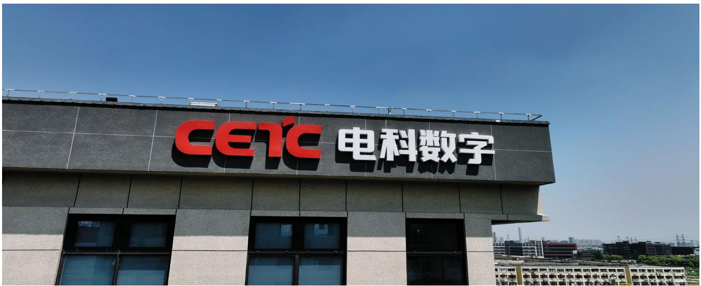

text_image

CETC 电科数字

# 案例 → 开展客户满意度调查，改善服务质量

为了解客户对公司提供产品和服务的满意程度，及时掌握市场动态和解决客户中存在的问题，公司每年分行业、分地区对客户进行满意度调查，并对调查回收的数据进行统计分析，作为产品质量改进的依据。对满意度有问题的客户，公司组织相关人员进行回访，及时了解问题情况并责成相关部门纠正和改进，再由质量部门对改进效果进行验证。

# 收集客户反馈建议（部分）

公司及各子公司共计发放满意度调查

200 余份

# 维护项目

- 拓宽不常见配件型号的采购渠道  
- 增加现场问题的响应能力  
- 建议增加人员交流频次

电科数字客户满意率为

96.48%

# 案例 坚持卓越服务，得到客户认可

中电科数字技术股份有限公司承建的中国联通上海临港数据中心 A2 楼客户工程项目，于 2025 年 9 月初顺利竣工交付。该项目不仅保障了上海市重点智算集群项目的高质量落地，更树立了上海人工智能算力基础设施建设的行业标杆，是公司与中国联通上海分公司携手服务国家战略、助力城市数字化转型升级的重要实践。

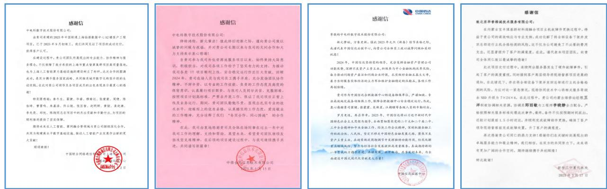

# 客户感谢信

# 03

# 协作共赢：

# 击他山之石，攻电科数字价值之玉

# 我们的行动

<table><tr><td>采购管理</td><td>33</td></tr><tr><td>供应商评定</td><td>34</td></tr><tr><td>行业共建</td><td>35</td></tr></table>

# 理念

电科数字通过不断加强采购管理，优化供应商选择与合作机制，以及深化与行业内外的合作与交流，显著提升公司市场竞争力，不仅确保物资供应的及时性与质量可靠性，更在资源共享、优势互补的基础上，推动了企业的持续创新与发展，为实现长远可持续发展奠定了坚实基础。

natural_image

Cityscape at dusk with modern skyscrapers illuminated against a twilight sky (no visible text or signage)

# 采购管理

为优化公司采购流程，强化采购管理，公司依据《中华人民共和国招标投标法》及其实施条例等相关法律法规，特制定采购控制规定，旨在完善采购运行机制，确保采购活动公开、公平、公正，提高采购效率，降低采购成本。

同时，规定中明确采购人员行为准则，规范采购操作，确保采购活动合法合规。此外，规定细化采购管理职责，使各部门在采购工作中能够各司其职，协同配合，共同推动公司采购工作的健康发展。

# 体系管理部门

\- 负责组织制定、修改采购管理规定，并监督、检查采购管理规定实施情况

# 专项采购

- 各专项项目组：负责实施专项项目的采购  
- 各业务部门：负责实施经营项目的采购  
- 信息系统管理部门：负责实施 IT 类固定资产、办公用品及相关服务的采购  
- 人事行政管理部门：负责实施非 IT 类固定资产、办公用品及相关服务的采购  
- 其他产品和服务的采购由需求部门实施采购

采购管理职责

为促进公司与供应商之间的健康合作，确保阳光采购、杜绝任何形式的贪腐行为，以保障采购的廉洁性和合法性，公司加强对采购人员行为规范的管理，加强培训，以最终实现提高采购效率、降低采购成本，实现与供应商的共赢发展。

采购人员应严格按照采购控制规定进行采购，采购完成后及时进行备案并确保备案材料真实、齐全

若采购人员违反采购控制规定进行采购或没有及时备案导致采购资料丢失或损毁的，第一次由部门负责人进行批评教育，若再发生类似事件，按严重程度给予采购人员降职、降薪、或予以辞退

采购人员不能接受供应方任何形式的馈赠、回扣或贿赂；若因严重失职或违反本规定作出不适当行为的，给予辞退。给公司造成损失的，应赔偿公司损失，情节严重涉及违法犯罪的，提交司法机关处理

采购人员行为规范

# 平等对待中小企业

对合作伙伴，我们坚持“诚信经营、利益共享、互惠互利”的原则，与合作伙伴实现协作共赢，共同打造行业领先方案。

对中小企业，我们用发展的眼光来看待，为其量身制定发展策略，协助中小企业提升履约能力与合规水平，帮助其成长为我们的长期战略合作伙伴。

我们将平等对待中小企业融入合作全流程，切实保障中小企业合法权益。选择供应商时，我们杜绝暗箱操作与歧视性条款，营造公平竞争环境。履行款项支付义务时，我们遵循合同约定，在中小企业按质按量完成交付成果时，足额兑付货款，避免拖延付款，保障中小企业资金周转权益。

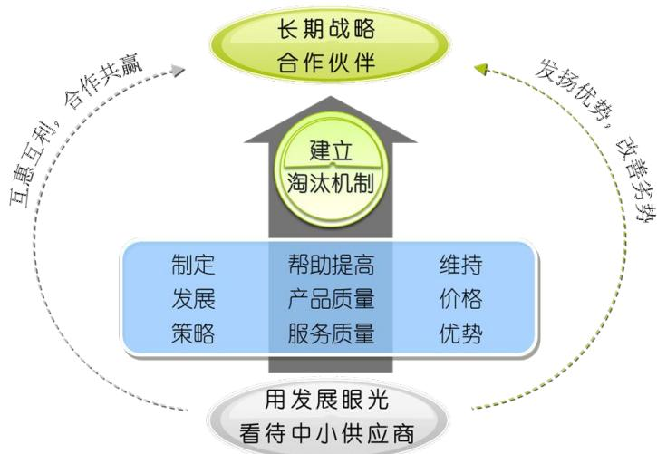

flowchart

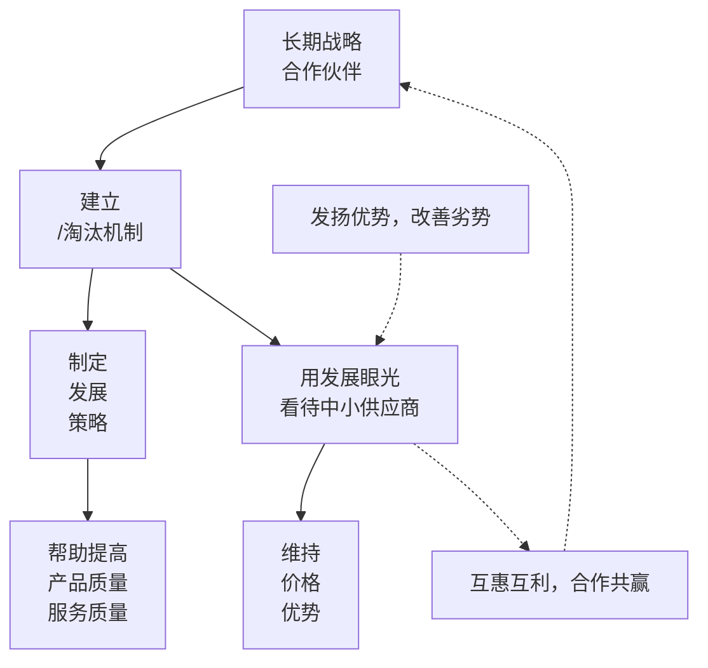
```mermaid
graph TD
  A["长期战略\n合作伙伴"] --> B["建立\n/淘汰机制"]
  B --> C["制定\n发展\n策略"]
  B --> D["用发展眼光\n看待中小供应商"]
  C --> E["帮助提高\n产品质量\n服务质量"]
  D --> F["维持\n价格\n优势"]
  D -.-> G["互惠互利，合作共赢"]
  G -.-> A
  H["发扬优势，改善劣势"] -.-> D
```

# 供应商评定

公司每年定期组织专业团队对合格供应方进行跟踪评定，并填写《供方业绩评定表》，按百分制评价，质量评分占50%、交货期占20%、价格占20%、售后服务占10%。总评分低于60分（或质量评分低于38分），将取消其合格供应方资格，以确保公司采购的优质与高效。

- 供应方提供的产品和服务须符合国家现行质量、环境和职业健康安全规范、标准的要求，产品质量和管理体系通过认证，并保持有效  
- 供应方的产品和服务特性、价格、信誉和交货情况以及及时处理质量问题的能力较高，有优良的售后服务体系  
- 产品和服务经试用或参照相关用户使用经验和评价，证明其产品和服务具有较好的使用业绩  
- 供应方为长期供货单位，产品质量稳定，能提供产品合格证、质保书、使用说明书以及检验和试验报告

合格供应方要求

# 行业共建

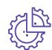

公司重视行业生态建设，加入多个行业协会，并在部分行业协会中承担重要职能，协助行业协会促进行业间的沟通与交流，共同打造良好的行业经营氛围。同时，公司参与行业标准的修订，并鼓励员工在行业期刊杂志发表论文，为行业的长远发展贡献自身力量。

# 报告期内

公司员工在行业期刊杂志上发表

13 篇论文

# 关键荣誉

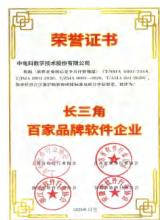  
公司获评 2025长三角百家品牌软件企业业

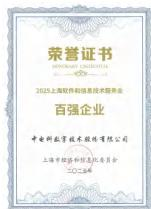  
公司荣登“2025上海软件和信息技术服务业百强”榜单第十三名

<table><tr><td>协会名称</td><td>参会级别</td></tr><tr><td>上海市软件行业协会</td><td>理事单位</td></tr><tr><td>上海信息技术应用创新联盟</td><td>理事单位</td></tr><tr><td>上海安全防范报警协会</td><td>理事单位</td></tr><tr><td>上海市商用密码行业协会</td><td>理事单位</td></tr><tr><td>上海市智能建筑建设协会</td><td>副会长</td></tr><tr><td>上海企业技术中心创新联盟</td><td>会员单位</td></tr><tr><td>全国数据标准化技术委员会</td><td>会员单位</td></tr><tr><td>信息技术创新工作委员会</td><td>会员单位</td></tr><tr><td>上海市勘察设计行业协会</td><td>会员单位</td></tr><tr><td>中国计算机用户协会数据中心分会</td><td>会员单位</td></tr><tr><td>上海市防雷协会</td><td>会员单位</td></tr><tr><td>上海市质量协会</td><td>会员单位</td></tr><tr><td>嘉定区合同信用促进会协会</td><td>会员单位</td></tr><tr><td>CDCC中数智慧协会</td><td>会员单位</td></tr></table>

公司参与行业协会情况

# 案例 携手编制行业指南，以信创方案赋能智慧医疗

为响应国家信息技术应用创新战略，子公司华讯网络深度参与了由国家信息中心指导的《医疗卫生信息技术应用创新与安全实践指南》编制工作，联合行业专家共同为医疗信创升级提供实践指引。以此为基础，我们打造了覆盖咨询规划、适配验证、底座建设及专业服务的“1+5+N”全栈解决方案，并通过智慧手术规划与管理平台等自研产品，助力医院实现核心系统的平滑迁移与智能化升级，以安全可靠的技术底座，扎实推动智慧医院建设与医疗行业高质量发展。

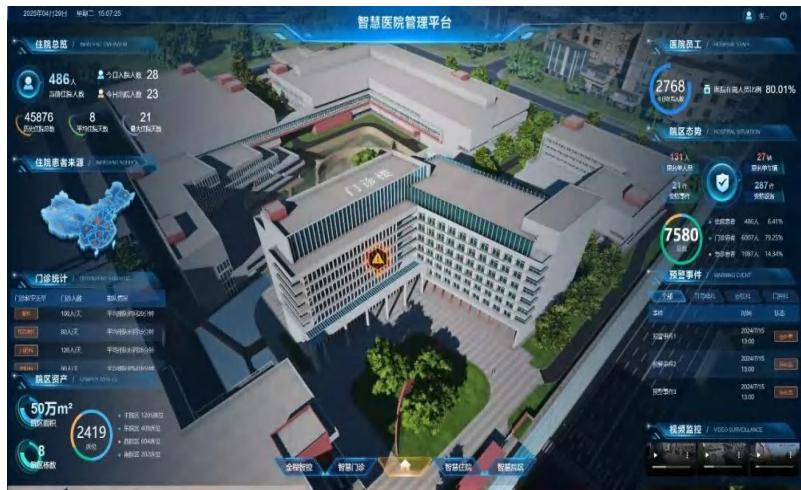

text_image

智慧医院管理平台
住院总览
486人
28
住院患者人数
23
45876
8
21
患者人数
最大值/天数
住院患者来源 / 门诊统计
门诊统计
100人
平均值: 120/19
2419
门诊资产
50万㎡
8
门诊总数
门诊人员
平均值: 120/19
2419
门诊资产
门诊人员
平均值: 120/19
2419
门诊资产
门诊人员
平均值: 120/19
2419
门诊资产
门诊人员
平均值: 120/19
2419
门诊资产
门诊人员
平均值: 120/19
2419
门诊资产
门诊人员
平均值: 120/
门诊资产
门诊人员
门诊人员
平均值: 120/
门诊资产
门诊人员
门诊人员
门诊人员
门诊人员
门诊人员
门诊人员
门诊人员
门诊人员
门诊人员
门诊人员
门诊人员
门诊人员
门诊人员
门诊人员
门诊人员
门诊人员
门诊人员
门诊人员
门诊人员
门诊人员
门诊人员
门诊人员
门诊人员
门诊人员
门诊人员
门诊人员
门诊人员
门诊人员
门诊人员
门诊人员
门诊人员
门诊人员
门诊人员
门诊人员

智慧医院管理平台

# 案例 > 携手顶尖伙伴，驱动量化投资技术革新

在2025年中国量化投资白皮书研讨会上，子公司华讯网络联合亚马逊云科技成功主办专题论坛。华讯网络与行业专家深入探讨了AI、云计算与大数据如何重塑量化投资，并重点分享了支持量化投资全球化布局的技术实践。华讯网络展示了在构建高性能、低延迟交易基础设施方面的核心能力，发布了极速交易环境的全链路性能优化方案与AI赋能的云安全防护体系，彰显了以创新技术赋能金融行业数字化转型、助力客户把握全球机遇的坚定承诺。

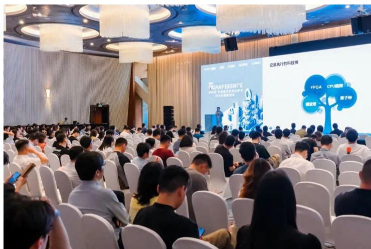

text_image

TRUMFERENCE
交易执行的科技网
FPGA CPU处理器
原子钟

中国量化投资白皮书研讨会现场

# 案例 ➤ 共筑AI算力新引擎，华讯网络与思科联合实验室赋能企业智能转型

子公司华讯网络与思科联合AI创新实验室成功举办首次客户活动，标志着双方合作迈入新阶段。实验室融合尖端技术，打造高效、安全的RDMA无损以太网算力底座，并通过自研平台实现异构算力动态调度与全流程AI管理。结合领先的安全可观测方案，为企业的AI开发与数字化转型提供了坚实支撑。未来，双方将持续创新，助力客户释放智能潜能，共创可持续未来。

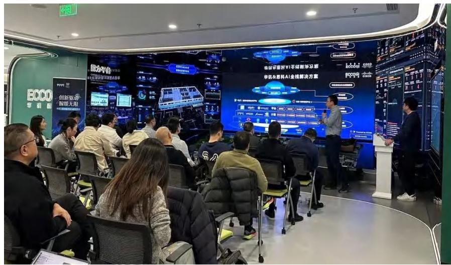

text_image

Interior of a modern control room with large screens displaying AI solutions and data dashboards, surrounded by attendees and visible signage.

AI创新实验室活动

# 案例 → 智慧高速新图景，空间智能赋能交通数字化转型

在GISTC 2025大会上，子公司华讯网络受邀展示“智慧高速‘一网统管’数字化转型实践”。通过“1+2+5+N”技术架构，深度融合自研AI算法与超图GIS空间智能技术，构建统一态势感知与决策中心，实现路网运行监测综合化、指挥调度信息化与管理决策智能化。在智慧高速与智慧服务区等场景落地应用中，平台显著提升了事件响应效率、降低了拥堵与事故风险，并推动服务区运营向数据驱动模式升级。此次展示体现了公司在交通信息化领域的技术创新与全周期服务能力，通过与行业伙伴的生态协同，积极为交通发展贡献数字力量。

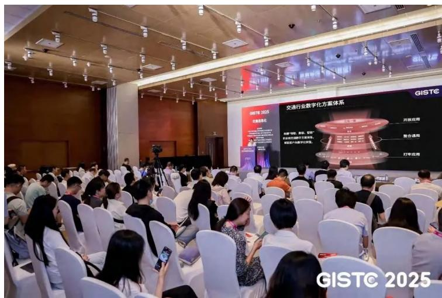

text_image

GISTC 2025
交通信息化
交通行业数字化方案体系
开放应用
暂态通用
打牢应用
GISTC 2025

2025空间智能软件技术大会（GISTC2025）现场

# 案例 华讯网络荣获华为合作伙伴大会多项大奖

在2025年华为中国合作伙伴大会上，华讯网络作为核心战略伙伴，荣获包括“功勋合作伙伴奖”在内的共计27项全国及行业大奖，充分体现了双方合作的深度与广度。华讯网络不仅在大会上分享了“行业场景+AI使能”的驱动模式，还展示了在金融服务、自主创新及高性能计算等领域的联合解决方案与实践成果。未来，我们将继续深化与华为的生态协同，以专业的解决方案与集成服务能力，切实助力各行业客户实现智能化升级与业务突破。

text_image

Collage of nine product packaging swatches with Chinese text labels, showing various colors and packaging designs.

荣获华为合作伙伴大会多项大奖

# 案例 ➤ 加入全球智慧物联网联盟，深化鸿蒙生态合作

2025年8月，子公司华讯网络正式加入全球智慧物联网联盟（GIIC），该联盟是由中国信通院、华为、中国移动等权威机构发起的国际性组织，致力于构建基于开源鸿蒙的全球物联网生态。加入GIIC是对华讯网络在“物联网+鸿蒙”领域深厚积累的认可。公司拥有兼容鸿蒙的底层技术、丰富的智能制造与物联网场景应用方案，以及覆盖“云-网-边-端”的一体化技术栈和安全合规体系。未来，华讯网络将与联盟成员一道，共同推进鸿蒙生态在工业物联网、城市治理等关键领域的创新与应用，助力万物智联新时代的建设。

GIIC鸿蒙生态推委会建筑专委会筹备会议顺利召开  
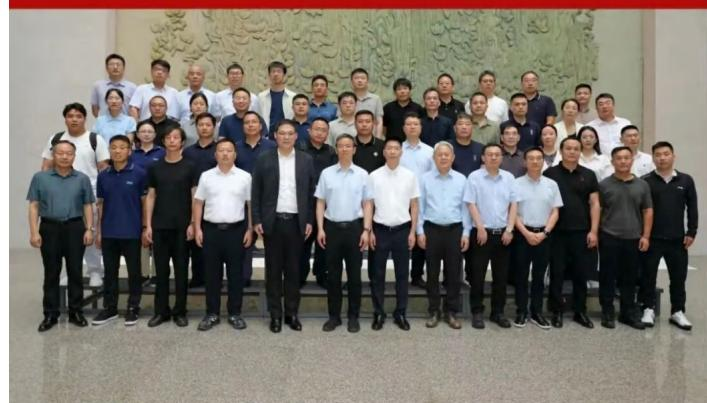

natural_image

Group photo of people in formal attire posing indoors (no visible text or symbols)

GIIC鸿蒙生态推委会建筑专委会筹备会议召开

# 04

# 以人为本：

# 聚同心之力，筑电科数字人才舞台

我们的行动

<table><tr><td>员工雇佣和权益</td><td>41</td></tr><tr><td>员工薪酬和绩效</td><td>43</td></tr><tr><td>员工培训和发展</td><td>44</td></tr><tr><td>员工健康和安全</td><td>46</td></tr><tr><td>员工福利和关怀</td><td>48</td></tr></table>

# 理念

电科数字始终坚守“以人为本”的核心理念，不断加强员工雇佣和权益、薪酬和绩效、培训和发展、健康和安全、福利和关怀等方面的制度建设。公司不仅将这些制度深入贯彻落实到每一个工作细节中，还努力为员工打造一个舒适的工作环境，实现员工与企业的共同发展。

text_image

BUS
at jobs for people w
avel
in the environment
and the
bed. you want to work in the
job or job for people w
will be able to work in the
job or job for people w
will be able to work in the
job or job for people w
will be able to work in the
job or job for people w
will be able to work in the
job or job for people w
will be able to work in the
job or job for people w
will be able to work in the
job or job for people w
will be able to work in the
job or job for employees w
will be able to work in the
job or job for employees w
will be able to work in the
job or job for employees w
will be able to work in the
job or job for employees w
will be able to work in the
job or job for employees w
will be able to work in the
job or job for employees w
will be able to work in the
job or job for employees w
will be able to work in the

# 员工雇佣和权益

# 平等雇佣

公司坚持以人才带动企业发展，积极拓展人才的获取渠道与途径，通过多种方式持续开展人才储备工作，努力打造优秀的业务团队以及专业的技术团队，以人为本全面加强公司综合实力。同时，公司尊重并保护员工的合法权益，致力于打造和谐稳定的劳工关系，进而凝聚员工力量，不断夯实公司发展基石，全力保障公司用工。

公司确保在工作中不侵犯国家法律所规定的员工基本权益，保障员工拥有平等机会，避免员工受到任何形式的歧视，保护员工个人信息和隐私。公司始终恪守公平公正用人原则，公司选用人才不以应聘人员的性别、年龄、国籍、民族、宗教信仰、肤色、语言、户籍所在地等与工作无关的个人特征作为标准做出对应聘人员是否招聘依据。

公司严格遵守《中华人民共和国劳动法》《禁止使用童工规定》《中华人民共和国未成年人保护法》等法律法规的规定，不雇佣、也不支持使用未满16周岁的人员。

公司已建立《员工招聘及录用管理规定》《员工劳动合同管理规定》《员工薪酬和绩效考核制度》《员工手册》

《员工考勤和假期管理规定》《女工劳动保护管理规定》等相关制度文件，明确规定了员工在劳动报酬、工作时间、各类假期、社保福利等方面的权益。

报告期内  

公司在职员工总数

3,924人

劳动合同签订比例

100%

截至报告期末  

公司拥有残疾员工

17 人

按性别划分员工情况  
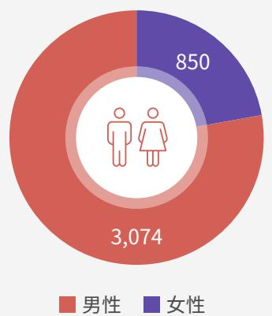

donut

| Category | Value |
| --- | --- |
| 男性 | 3,074 |
| 女性 | 850 |

按年龄划分员工情况  
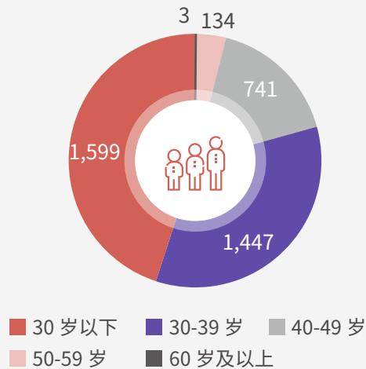

donut

| Category | Value |
| --- | --- |
| 30岁以下 | 1,599 |
| 30-39岁 | 1,447 |
| 40-49岁 | 741 |
| 50-59岁 | 134 |
| 60岁及以上 | 3 |

为有效提高公司整体的竞争力，保持员工队伍的稳定，电科数字通过优化薪酬福利制度、提供良好的工作环境、加强员工培训和职业发展、建立良好的沟通机制以及强化企业文化建设等措施提升员工的工作满意度和忠诚度，为企业的发展提供有力的人才保障。近年来，公司员工流失率保持在较低水平。

公司2023-2025年员工流失率  
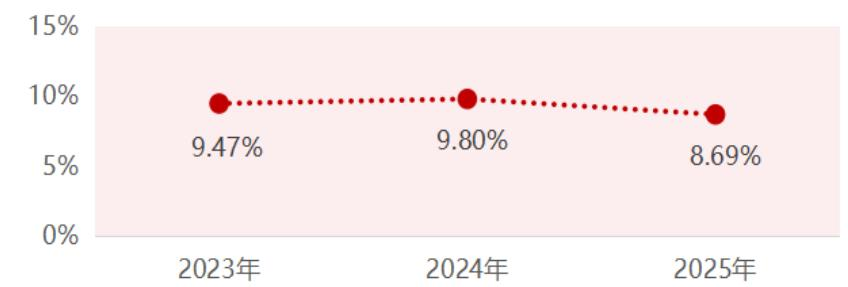

line

| Year | Value (%) |
| --- | --- |
| 2023年 | 9.47 |
| 2024年 | 9.80 |
| 2025年 | 8.69 |

# 民主管理

公司积极发动员工民主参与企业管理活动，充分实施群众监督，确保决策民主、管理公平公正，实现员工间的团结和谐。工会积极履职，围绕薪酬福利、职业发展、劳动保护等员工关切事项开展工作，切实保障员工合法权益，搭建企业与员工高效沟通桥梁。2025年共召开3次职工代表大会。

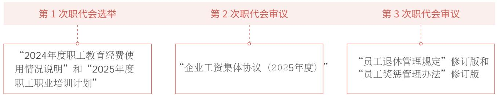

flowchart

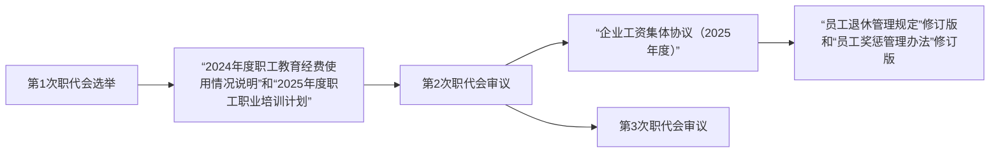
```mermaid
graph LR
  A["第1次职代会选举"] --> B["“2024年度职工教育经费使用情况说明”和“2025年度职工职业培训计划”"]
  B --> C["第2次职代会审议"]
  C --> D["“企业工资集体协议（2025年度）”"]
  C --> E["第3次职代会审议"]
  D --> F["“员工退休管理规定”修订版和“员工奖惩管理办法”修订版"]
```

# 员工沟通

通过合理化信箱、部门例会、团队建设、电子期刊采访等形式，倾听员工意见与建议。定期开展 FREETALK 活动，提供员工与管理层直接交流的机会，增进沟通与了解。

按学历划分员工情况  
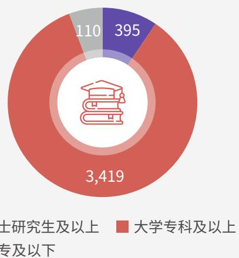

donut

| Category | Value |
| --- | --- |
| 硕士研究生及以上 | 395 |
| 大学专科及以上 | 3,419 |
| 专及以下 | 110 |

按专业构成划分员工情况  
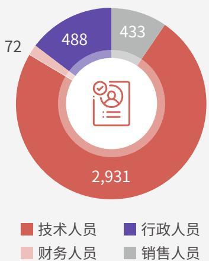

donut

| Category | Value |
| --- | --- |
| 技术人员 | 2,931 |
| 行政人员 | 488 |
| 财务人员 | 72 |
| 销售人员 | 433 |

# 员工薪酬和绩效

依据行业特征和公司现有组织结构，以及以“责任和结果”为标准的价值导向，公司实行岗位绩效工资制度。员工薪酬设定严谨，既与岗位职责和考核紧密相连，又与公司及部门的整体目标相契合，更直接反映其个人业绩和对公司的实际贡献。

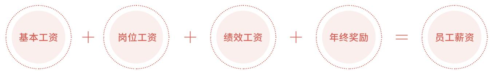

flowchart

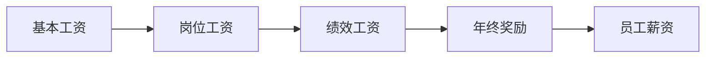
```mermaid
graph LR
  A["基本工资"] --> B["岗位工资"]
  B --> C["绩效工资"]
  C --> D["年终奖励"]
  D --> E["员工薪资"]
```

员工薪资结构

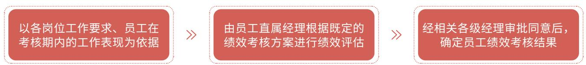

flowchart

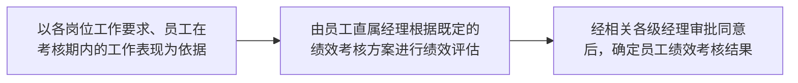
```mermaid
graph LR
  A["以各岗位工作要求、员工在考核期内的工作表现为依据"] --> B["由员工直属经理根据既定的绩效考核方案进行绩效评估"]
  B --> C["经相关各级经理审批同意后，确定员工绩效考核结果"]
```

员工绩效考核方式

在员工绩效考核与反馈环节，公司已建立畅通沟通渠道。员工如对考评结果有异议，可在结果反馈时向上级提出意见并沟通复核，确保考核过程公平公正。

# 案例 员工与公司共享发展成果

2025年，公司第二期股票期权激励计划预留授予第一个行权期届满，累计行权并完成股份过户登记数量为192.2827万股，占可行权股票期权总量的 $99.01\%$ 。本次股权激励计划的顺利实施，有助于进一步完善公司治理结构，健全激励与约束相结合的中长期激励机制，充分调动公司管理人员、技术和业务骨干的积极性。

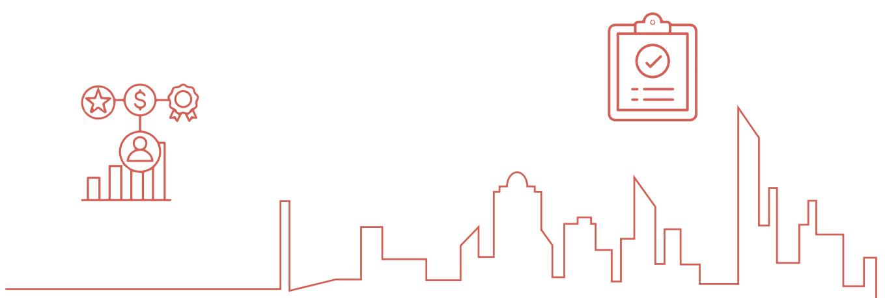

flowchart

```mermaid
graph LR
  A["User Engagement Icon"] --> B["Performance Metrics Icon"]
  B --> C["Verification Document Icon"]
```

双通道职业阶梯

# 员工培训和发展

根据公司总体发展战略和业务发展需要，结合员工自身发展需求，公司致力于不断完善培训体系，实施涵盖通用基础、专业提升、资格认证、管理发展等各类培训，并尽可能地为员工提供广泛的学习机会和途径，帮助员工不断丰富知识结构、提升专业能力。同时，公司为员工提供相互贯通的双通道职业阶梯，帮助员工实现个人价值与职业发展目标。

报告期内  

公司接受培训的员工人数达

3,449人

员工培训总时长达

130,449 小时

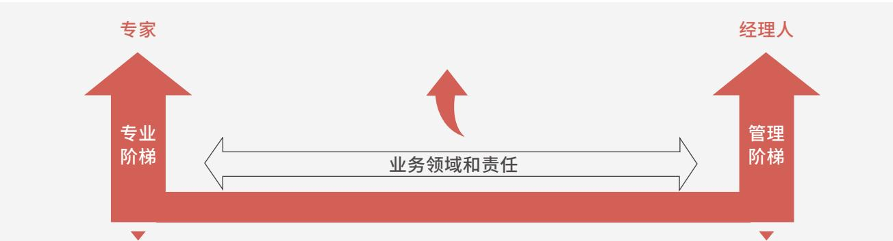

flowchart

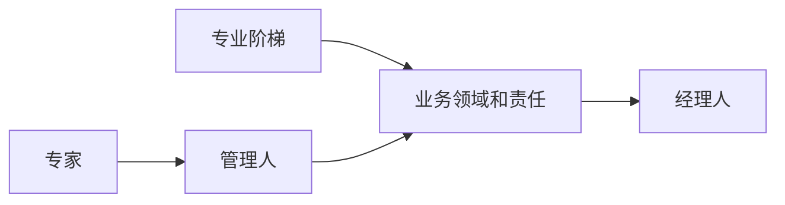
```mermaid
graph LR
  A["专家"] --> B["管理人"]
  C["专业阶梯"] --> D["业务领域和责任"]
  B --> D
  D --> E["经理人"]
```

员工可以通过专业知识的学习、专业技能的提高以及专业经验的积累，成为专业领域内的专家

员工亦可以被赋予更多的管理责任，成为职业的经理人

# 案例 “实战绩效管理” 培训，提升绩效管理思维

2025 年 9 月，公司组织开展《实战绩效管理》专题培训，围绕绩效目标设定、过程沟通、考核实施、反馈改进等核心内容进行系统讲解。培训帮助中基层管理人员进一步树立科学绩效管理理念，提升绩效诊断与辅导能力，熟练掌握绩效管理工具方法与实操技巧，有效强化团队管理与目标达成能力，为公司管理效能提升与高质量发展提供坚实人才支撑。

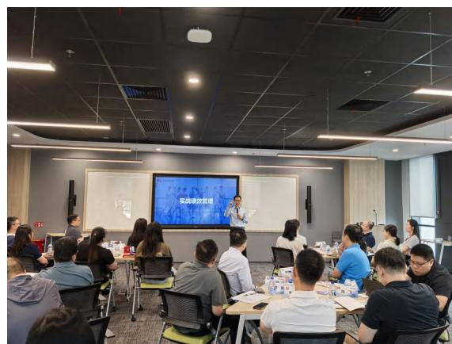

text_image

实战绩效管理

“实战绩效管理”培训

# 案例 > H3C服务网产品初级认证培训，提升专业能力

2025 年 3 月，公司组织开展H3C（大连基地）服务网产品初级认证培训，围绕网络产品技术原理、服务规范、实操应用等内容进行系统授课与认证辅导，帮助技术工程师全面提升专业技能与服务能力，顺利达到厂商认证标准，有效强化公司技术服务保障水平与核心竞争力。

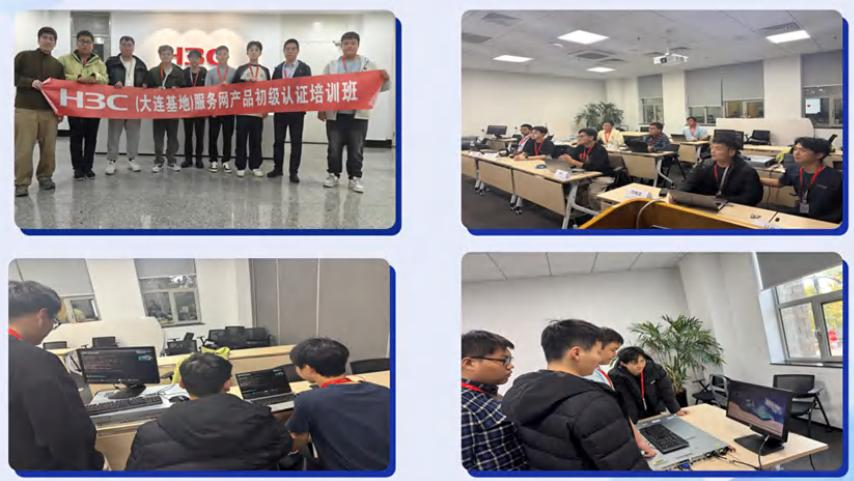  
H3C服务网产品初级认证培训

# 案例 “沟通与冲突管理” 培训

2025 年 5 月及 9 月，公司举办《沟通与冲突管理》专题培训，聚焦高效沟通方法、职场冲突化解、跨部门协作与客户沟通影响力提升等核心内容。通过理论学习与场景化实操相结合，帮助参训人员强化沟通表达能力、优化冲突处理方式，有效提升职场协作效率与客户对接水平，全面增强员工综合职业素养。

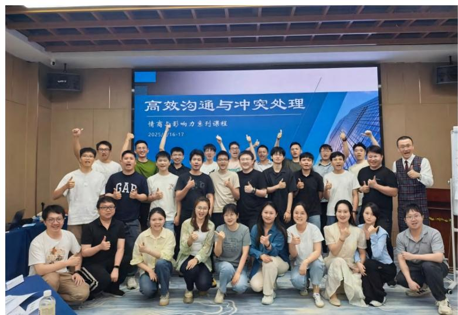

text_image

高效沟通与冲突处理
情商与影响力亲利课程
2025/8/16-17

“沟通与冲突管理”培训

# 员工健康和安全

公司依据ISO45001标准要求，建立了内部的职业健康安全管理体系并保障其有效运行，设立安全生产归口管理部门，实现对职业健康安全的系统化管控。为提升管理效能，公司制定了《职业健康安全管理制度》等一系列规章制度、操作规程及应急预案，以科学应对各类突发情况。

同时，通过设立清晰的年度安全管理目标、逐级签订全员安全生产责任书等措施，推动安全责任落到实处。公司亦高度重视日常宣传教育，持续提升员工安全意识，并定期开展危险源辨识、风险评价与管控，及时采取预防和纠正措施，确保工作环境的安全与稳定。

# 报告期内

公司在员工职业健康安全方面投入

259.17 万元

公司员工社会保险覆盖率

100%

# 安全教育培训

公司组织开展全员安全生产法、重大事故隐患判定标准等安全生产法律法规标准的安全培训，开展《查找身边安全隐患》、《办公室安全知识培训》、《安全威风八面来》、《电梯安全》等应急科普宣传，推动全体员工形成遵章守纪的良好思维意识、行为习惯，全面提升安全生产领导力、管理力、执行力。

# 安全宣传动员

公司积极组织各部门开展“安全生产月”活动，利用邮件、企业微信等形式广泛宣传，营造良好安全氛围，牢固树立零事故、零伤亡理念，达成全链条提标准、全过程提质量、深层次保安全的目标。

公司加强员工安全意识举措  
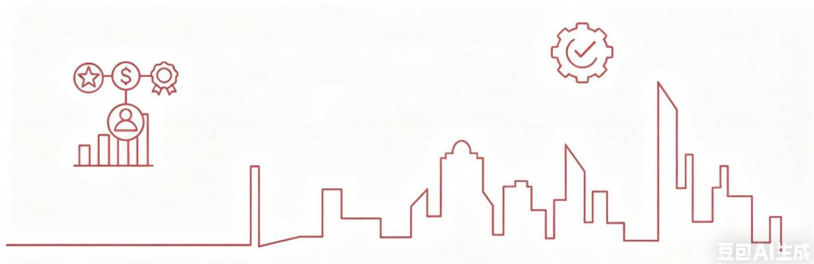

flowchart

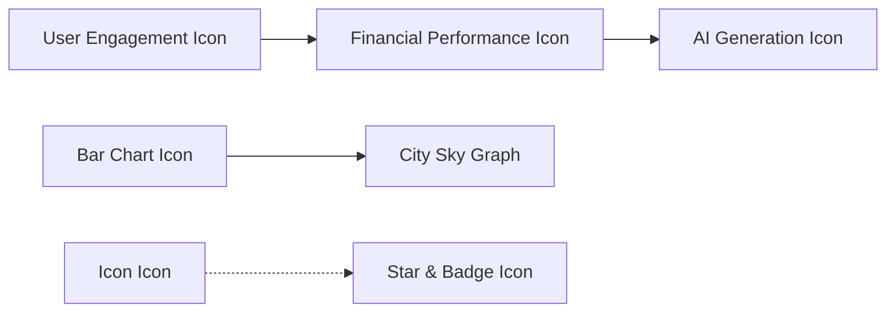
```mermaid
graph LR
  A["User Engagement Icon"] --> B["Financial Performance Icon"]
  B --> C["AI Generation Icon"]
  D["Bar Chart Icon"] --> E["City Sky Graph"]
  F["Icon Icon"] -.-> G["Star & Badge Icon"]
```

# 案例 > 组织员工疗休养，保障员工身心健康

2025年，公司组织员工疗休养2次，参与人数共94人。疗休养活动为员工提供一个舒缓压力、恢复活力的平台，有效保障了员工的身心健康，确保员工以更加饱满的精神状态投入到工作。

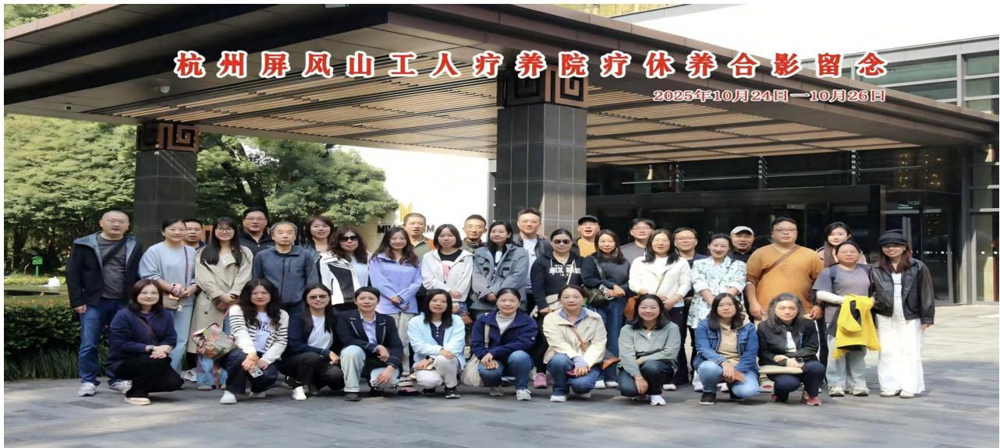

text_image

杭州屏风山工人疗养院疗休养合影留念
2025年10月24日—10月26日

疗休养活动

# 案例 > 消防演习和培训，提高全员消防安全意识

为切实保障每一位员工的生命安全，提高全员消防安全意识，公司组织员工参与物业组织的消防应急演练。同时，为进一步推动消防安全宣传教育工作，营造人人关注、重视、支持、参与消防宣传教育工作的良好氛围，提高员工的消防安全意识和素质，公司邀请培训机构前来开展消防安全讲座。在这些活动中员工安全意识与应急救援技能得到提升，为公司安全生产与稳定发展筑牢防线。

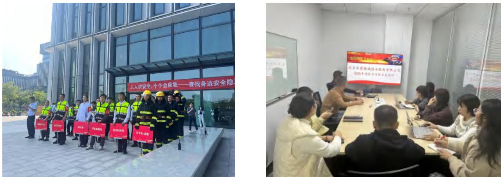  
消防演习和培训

# 员工福利和关怀

公司高度重视员工的幸福感与归属感，长期关注员工实际需求，提供包括法定福利和补充福利在内的综合福利待遇，增强员工的团队凝聚力与工作动力。此外，公司还积极组织文娱活动，让员工在工作之余享受生活、减轻压力，保障员工的可持续发展。

# 报告期内

公司对

3 位困难员工进行帮扶

  
节假日为员工发放节日福利

  
对员工生日、
生病住院、婚
丧嫁娶、退休
离岗进行慰问

  
对困难员工进行帮困帮扶

  
每年组织体检
疗休养

  
每周组织羽毛球、篮球等锻炼活动  
员工福利

# 案例 ➤ 员工参与干花小夜灯制作与八音盒拼装活动

公司组织员工开展干花小夜灯制作与木质八音盒拼装活动，员工们发挥创意，将干花与灯座结合，打造出充满自然意趣的温馨小夜灯；在八音盒拼装中，大家细致组装机械零件，让精巧摆件流淌出悦耳旋律。活动既丰富了员工业余生活，也提升了动手能力与审美情趣，有效舒缓工作压力，增强团队凝聚力。

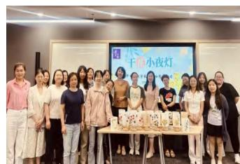

text_image

大手小夜灯

干花小夜灯制作

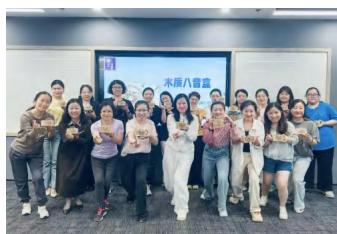

text_image

木展八香盒

木质八音盒拼装

# 其他员工福利与慰问

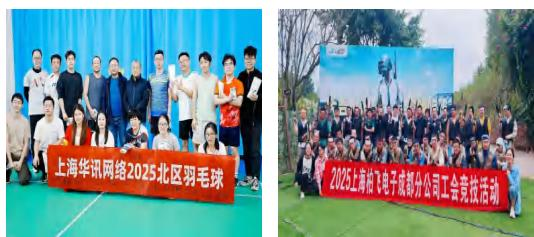  
参加羽毛球比赛  
参加竞技活动

  
参加工会组织的骑行活动

# 05

# 天高地迥：

# 践低碳之行，塑电科数字绿色之洲

# 我们的行动

应对气候变化
51

环境合规管理与污染物排放 54

强化环保培训 56

# 理念

电科数字积极响应国家与社会对于环境保护的重视与要求，在追求商业增长的同时，坚持采取可持续的经营策略，致力于减少业务活动对环境的影响。通过实施绿色办公、节能减排项目以及参与环保公益活动，展现公司对环境保护的承诺和行动。

natural_image

Scenic view of a wooden pavilion on a calm lake surrounded by lush green trees, reflecting in the water (no text or symbols visible)

# 应对气候变化

全球气候治理成为重要议题，电科数字高度重视气候变化带来的深远影响，严格恪守国家相关法律法规及制度规范，从风险与机遇识别的角度，系统推进气候风险管理各项工作，深入落实国家“双碳”战略部署，以实际行动助力可持续发展目标实现。

<table><tr><td>类别</td><td>风险/机遇类型</td><td>风险/机遇描述</td><td>影响周期</td><td>潜在财务影响</td><td>应对措施</td></tr><tr><td rowspan="2">物理风险</td><td>急性风险</td><td>台风、暴雨、极端高温与低温天气等极端气候活动增加,进而对公司的办公楼、服务器等建筑及运营稳定性造成损害,可能会导致业务中断,影响项目进度,造成产品和服务无法按期交付于客户。</td><td>短期中期长期</td><td>业务中断造成营收损失;设备抢修、应急运维成本增加;项目延期产生违约成本。</td><td>推进业务连续性管理体系建设,针对各类突发环境风险编制专项应急预案,全面提升应急响应与处置能力。</td></tr><tr><td>慢性风险</td><td>伴随全球气候变暖与气温的持续攀升,办公及运营场景下的温控能耗大幅增加,直接导致企业能源成本上升。</td><td>中期长期</td><td>公司营运成本持续增加。</td><td>持续健全能源管理体系建设,深入实施节能技术升级改造,有效降低能源消耗量。</td></tr><tr><td>转型风险</td><td>法律和政策风险</td><td>国内碳减排、数据中心能效标准持续收紧,此类政策变动可能推高数据中心等高耗能基础设施的运营成本;上市公司气候信息披露要求细化,合规管理难度提升。</td><td>短期中期长期</td><td>可能增加公司运营成本以及合规管理的成本。</td><td>持续跟踪碳减排政策与披露规则;通过ESG报告等渠道合规披露“应对气候变化”议题相关信息。</td></tr></table>

<table><tr><td>类别</td><td>风险/机遇类型</td><td>风险/机遇描述</td><td>影响周期</td><td>潜在财务影响</td><td>应对措施</td></tr><tr><td rowspan="3">转型风险</td><td>市场风险</td><td>客户加速低碳转型,对绿色数字化解决方案需求提升,产品缺乏低碳属性将削弱市场竞争力。</td><td>中期长期</td><td>市场份额被挤占,营收增长放缓,客户合作意向降低。</td><td>打造绿色数字化标杆产品,满足客户对可持续发展的更高要求。</td></tr><tr><td>技术风险</td><td>节能数据中心、低碳数字化技术快速迭代,若研发投入不足、技术跟进滞后,将导致产品与服务落后于行业水平。</td><td>中期长期</td><td>研发投入不足导致技术掉队,丧失竞争优势。</td><td>加大低碳数字技术研发投入;聚焦绿色数据中心技术创新。</td></tr><tr><td>声誉风险</td><td>企业环境责任与气候行动表现不达标,将影响品牌形象与行业口碑;负面环境表现可能引发市场与监管关注,损害企业公信力。</td><td>中期</td><td>品牌价值下降,影响客户与合作伙伴信任。</td><td>通过ESG报告全面展示公司在环境保护方面的成效,树立负责任的企业形象。</td></tr><tr><td rowspan="3">气候机遇</td><td>资源效率</td><td>通过数字化手段优化数据中心、办公场景能耗与资源利用,降低运营成本。</td><td>短期中期</td><td>能源成本下降,提升盈利水平。</td><td>推广绿色办公与节能运维;建立资源效率持续优化长效机制。</td></tr><tr><td>产品和服务</td><td>客户对绿色节能方案的需求不断增长,推动公司开发符合条件的新产品和服务,形成新的业务增长点。</td><td>中期长期</td><td>绿色数字化产品营收提升。</td><td>加大绿色数字化产品的研发投入,聚焦金融、政务、制造等行业打造低碳解决方案。</td></tr><tr><td>市场</td><td>国家大力支持绿色低碳项目,市场空间持续扩大。</td><td>短期中期</td><td>拓展新的业务增长点,提升行业地位与市场占有率。</td><td>积极对接绿色低碳政策机遇,打造高效节能标杆项目。</td></tr></table>

# 绿色办公

公司积极倡导绿色办公理念，通过多种创新举措推动节能降耗与降本增效。公司建立电子化、网络化办公模式，充分利用现代信息技术，减少办公纸张使用，实现无纸化办公，从而降低资源消耗和环境污染。同时，公司还加强办公区域的节电节水管理，倡导低碳生活方式，为发展低碳经济贡献力量。

- 空调温度设置夏季不低于 26 度，冬季不高于 20 度  
- 下班必须关闭空调、电脑、饮水机、打印机等设备电源  
- 微波炉、碎纸机等间歇性使用，设备用时开启，用完即关闭电源

- 设置单面打印废纸回收盒，提倡纸张再利用  
- 减少小型打印设备，共享大型一体机  
- 通过个人账号登陆共享设备，对个人账号实施纸张监控，预防纸张浪费  
- 办公用品实行控制发放  
- 针对项目外勤人员较多的业务特点，工位按员工总数 2/3 配置，提高了工位使用率，降低了能源消耗

\- 各地子公司、分公司均覆盖视频会议系统，高级管理层会议、各业务部门会议、项目会议等均采用视频及网络在线沟通的形式，大幅降低了飞机、高铁出行费用，减少碳排放

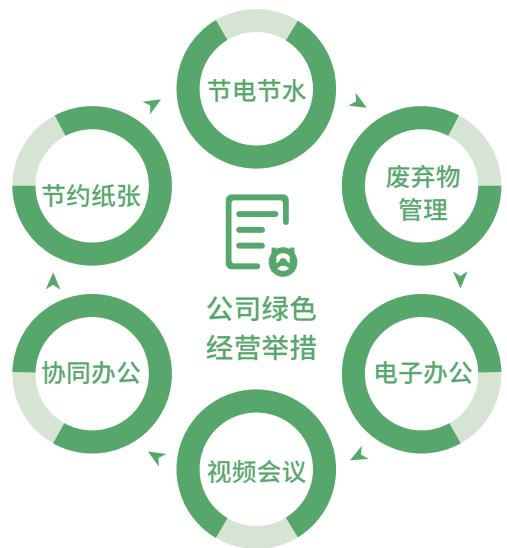

flowchart

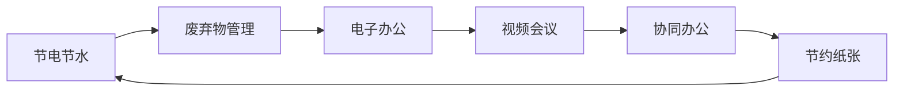
```mermaid
graph LR
  A["节电节水"] --> B["废弃物管理"]
  B --> C["电子办公"]
  C --> D["视频会议"]
  D --> E["协同办公"]
  E --> F["节约纸张"]
  F --> A
```

- 固体废弃物进行分类管理  
- 对如废旧电池、硒鼓墨盒、日光灯管、显示器、电子器件等，统一收集、存放，由有资质的回收公司回收处置  
- 推进办公自动化平台建设，已相继推出费用报销、固定资产、E-HR、技术支持、经营管理等模块  
- 完善电子邮件系统，协同审批、提高效率，实现无纸化办公

# 绿色办公实践

natural_image

Exterior view of a modern office building (no signage)

办公区域环保消毒机

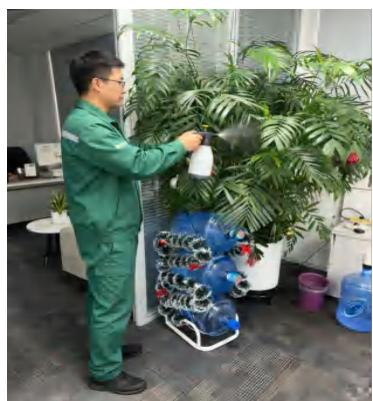

natural_image

Man in green uniform spraying potted plants in a laboratory setting (no visible text or symbols)

办公区域种植绿植

# 环境合规管理与污染物排放

# 环境合规管理

电科数字不断提高公司环境管理水平，严格遵守国家及地方法律法规，建立、运行并不断优化公司环境管理体系，以满足客户需求，改善环境绩效，预防和减少环境相关风险。

公司设立安全部门，配备专职人员统筹推进环境工作，持续保持ISO 14001环境管理体系有效运行，并通过定期审核与认证，确保运营活动始终符合国家及地方环保法规。

公司不断完善突发环境事件应对体系，在项目现场管理中制定《重大环境污染事故应急处理与救援预案》，明确重大环境污染发生以后，能迅速、高效、有序地开展重大环境污染源的治理及善后工作，采取切实有效的措施及时控制污染源，及时制止重大环境污染源的继续发生，最大限度降低对环境的污染。

# 报告期内

公司未发生环境领域违法违规事件。

# 2025年度环境管理目标

施工机械运转噪声排放满足所在地噪声排放标准，有明显场界时，早6时一晚10时施工场界噪声值达到所在地区类别标准。

危险废弃物单独存放，贮够一定数量后送有资质单位处理，确保回收率达到100%。

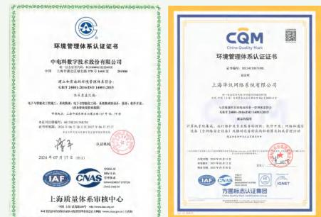

text_image

环境管理体系认证证书
中电科数字技术股份有限公司
CQM
China Quality Mark
环境管理体系认证证书
证券代码：953888
证书号：953888
证书类型：电子证书
证书名称：中国电科数字技术股份有限公司
证书编号：CQM 2023-004-140000000000000000000000000000000000000000000000000000000000000000000000000000000
2023年7月17日（修订）
上海质量体系审核中心
IAF
CVAS
SHANGHAI POWER
WANGZHOU POWER
SHANGHAI POWER
SHANGHAI POWER
SHANGHAI POWER
SHANGHAI POWER
SHANGHAI POWER
SHANGHAI POWER
SHANGHAI POWER
SHANGHAI POWER
SHANGHAI POWER
SHANGHAI POWER
SHANGHAI POWER
SHANGHAI POWER
SHANGHAI POWER
SHANGHAI POWER
SHANGHAI POWER
SHANGHAI POWER
SHANGHAI POWER
SHENGHAI POWER
SHANGHAI POWER
SHANGHAI POWER
SHANGHAI POWER
SHANGHAI POWER
SHANGHAI POWER
SHANGHAI POWER
SHANGHAI POWER
SHANGHAI POWER
SHANGHAI POWER
SHANGHAI POWER
SHANGHAI POWER
SHANGHAI POWER
SHANGHAI POWER
SHANGHAI POWER
SHANGHAI POWER
SHANGHAI POWER

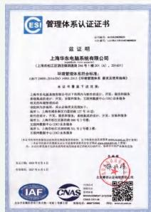  
公司及子公司华讯网络、华誉维诚已取得ISO14001环境管理体系证书

# 案例 → 识别环境因素，降低环境风险

公司遵循政策法规与环境管理体系标准的要求，制定《环境因素识别、评价控制程序》，精准识别并评价业务活动中可控或可影响的环境因素，明确其重要程度，并加强控制与管理。通过开展相关工作，降低公司对环境的负面影响，并为节能减排工作提供明确方向与重点，推动公司绿色可持续发展。

# 能源利用

电科数字高度重视能源管理工作，严格遵守《中华人民共和国节约能源法》等相关法律法规，秉持绿色发展理念，持续推进能源管理科学化发展，通过设备的更新换代、技术的创新升级、员工的意识提升等，切实履行能源节约与绿色发展责任，向股东、合作伙伴以及社会各界等利益相关方展示公司在节能降耗方面的积极努力。2026年4月，公司通过ISO50001能源管理体系认证。

公司能源利用主要集中在办公领域，使用能源主要为外购电力。为提升能源利用效率、降低能源消耗，多措并举节能减排。电力管控方面，对空调、电脑、饮水机、打印机、碎纸机等设备要求在不使用时务必关闭电源，做到“人走断电”；优先使用绿色照明设备，办公区域逐步采用高效LED灯具；优化空调运行策略，空调温度设置夏季不低于26度，冬季不高于20度；通过安全教育培训、安全小贴士等多种方式，推动全体员工筑牢绿色低碳运营理念，将节能理念转化为日常行动，构建清洁高效用能模式。

# 水资源利用

电科数字高度重视能源管理工作，严格遵守《中华人民共和国节约能源法》等相关法律法规，秉持绿色发展理念，持续推进能源管理科学化发展，通过设备的更新换代、技术的创新升级、员工的意识提升等，切实履行能源节约与绿色发展责任，向股东、合作伙伴以及社会各界等利益相关方展示公司在节能降耗方面的积极努力。2026年4月，公司通过ISO50001能源管理体系认证。

# 废弃物处理与污染物排放

电科数字作为软件与信息服务公司，在运营中产生的废弃物以生活污水、固体废弃物为主，不涉及废气排放与工业废水排放。公司通过租赁符合国家标准的办公场地，确保生活污水处理设施正常运转，严格预防水污染事故的发生。对固体废弃物，按照《固体废弃物管理制度》分别进行废料回收、循环利用和委托处置等。

natural_image

Illustration of a recycling bin with green recycling symbol, surrounded by printer, printer, and other documents (no text or symbols)

打印机固废回收宣传

# 固体废弃物管理

- 各部门产生的危险废物（废墨盒、废硒鼓、废电池、废灯管等）统一交由相应废物处置管理部门收集，严禁随意丢弃  
- 租用打印机，产生的危险废物（废墨盒、废硒鼓等）统一由打印机租赁公司回收处理，严禁随意丢弃  
- 办公照明设备由物业管理和维护，产生的危险废物（废电池、废灯管）统一由物业公司回收处理，严禁随意丢弃  
- 各部门产生的报废物品统一交由相应管理部门收集，严禁随意丢弃

# 公司废弃物管理制度

# 强化环保培训

环境治理与保护离不开全体员工的参与。为强化员工环保意识，鼓励员工践行环保的生活办公方式，贯彻落实公司环境管理举措，公司积极开展员工环保培训与宣传活动，与员工携手促进公司可持续发展，减少温室气体排放，助力环境保护。

# 案例

# 加强环境管理体系知识培训

为进一步提升公司环境管理水平和员工的环保意识，2025年，公司组织开展环境管理体系年度宣传活动，深入贯彻 ISO14001 环境管理体系的标准和理念，通过系统、全面的宣传和教育活动，加强员工对环境管理体系的认知与理解，从而提高公司整体的环境管理水平。

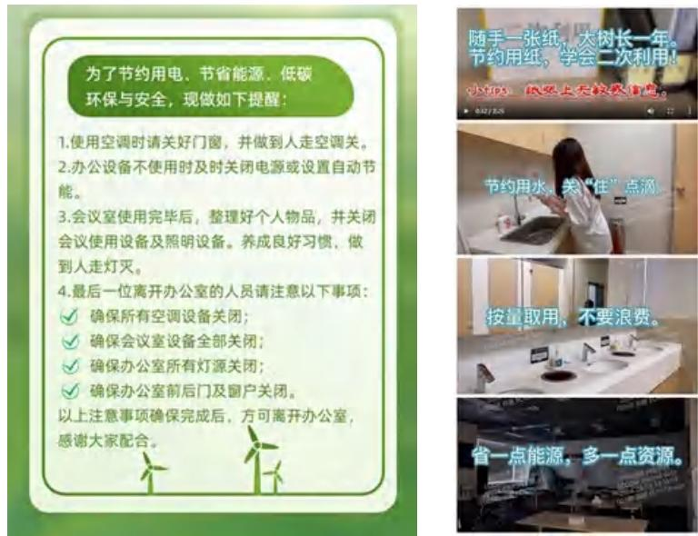  
绿色办公宣传标语

# 06

# 大爱无疆：

# 寄至仁之心，扬电科数字责任大旗

# 我们的行动

持续志愿服务 59

践行慈善公益 59

# 理念

企业不仅是经济发展的推动者，也是社会责任的承担者。电科数字积极履行企业社会责任，彰显国企担当，通过组织与参与各类志愿活动及慈善公益项目，展现公司对社会福祉的深切关怀，为社会带来积极影响，塑造良好的企业形象。

natural_image

Close-up of hands holding a small green plant sprout growing in soil (no text or symbols visible)

# 持续志愿服务

为宣扬雷锋精神，彰显公司责任意识，在工作之余，公司积极参与社区发展，组织员工开展包括无偿献血在内的一系列志愿服务活动。通过志愿服务活动，既增强了员工的社会责任感和团队凝聚力，也为公司的可持续发展奠定了良好的社会形象和品牌基础。

多年来，公司一直坚持组织开展无偿献血活动，奉献爱心，提升企业的公众形象，推动和谐社会建设。

natural_image

Two outdoor scenes: left shows children outdoors near grass; right shows a group of people seated at tables in a classroom or facility (no visible text or symbols)

  
志愿服务活动集锦

# 践行慈善公益

公司积极投身社会公益事业，助力乡村振兴、践行慈善理念。公司积极响应国家乡村振兴战略号召，通过消费扶贫方式向四川省叙永县采购猕猴桃，帮助叙永县村民拓宽农产品销售渠道。采购行为通过市场机制为乡村振兴注入源头活水，以实际行动助力革命老区特色农业发展。

近年来，公司还先后开展了“汶川地震抗震救灾捐款”“诚善助学，点亮未来”“用爱心为生命加油，慈善从我开始”“资助藏区孤儿学校沙盘”“天灾无情人间有爱，心系雅安爱心募捐”“崇明残疾儿童捐赠”“为偏远山区捐赠衣物”“关爱藏区孤儿内心成长沙盘资助活动”等爱心公益活动，为受灾地区的重建、贫困学生的教育以及社会弱势群体的生活改善做出积极贡献。此外，公司依托自身业务优势，为偏远山区学校建设远程助教平台，改善乡村教育，展现公司对社会责任的坚定承诺。

# 案例 为云南拉乌碧鸡完小学学生定制校服活动

在帮助云南拉乌碧鸡完校园搭建好远程助教平台之后，华讯网络观察到孩子们衣装简陋且无统一校服，随即着手为碧鸡完小学定制校服。经过校徽调整、与服饰供应商沟通打样等，470件新校服于定稿后进入生产线制作，并及时送到了孩子们的手中。

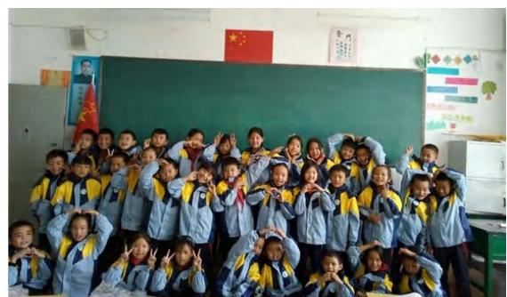

natural_image

Group photo of children in school uniforms posing with hand gestures in front of a blackboard with Chinese flag (no visible text or symbols)

孩子们身穿定制校服

# 案例 > 建设云南拉乌碧鸡完小学远程助教平台

拉乌碧鸡完小学位于云南省大理市拉乌乡宾川县东南部，当地交通闭塞，学校基础设施不完善，学生学习条件艰苦。为帮助学校改善教学条件，输送更多优质教学资源，华讯网络携手安吉星援助拉乌碧鸡完小学，建立远程助教平台。

经过现场考察，到后期华讯网络多部门内外部的协调支持、学校环境调研、资源确认，再到场景设计、沟通小组建立，经过多次方案调整，华讯网络工程师远赴碧鸡完小学，进行远程教学设备安装调试，最终正式实现线上远程授课。

华讯网络代表前往学校参与了现场开幕仪式。至此，华讯网络帮助碧鸡完小学实现了远程视频教学，通过借助互联网平台分享中心城市优质教育资源，提高山区教学水平。

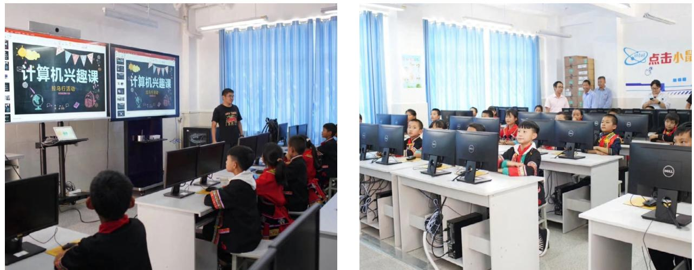  
助力云南拉乌碧鸡完小学建立远程助教平台

# 案例 开展爱心捐赠与公益义卖

2025年4月14日，柏飞电子党支部组织党员、工会及团员代表，赴上海市慈善基金会展厅开展“爱心捐赠·公益同行”主题党日活动。活动筹备期间共募集书籍、文具、日用品等义卖物资80余件，通过现场义卖筹集善款，全部款项及剩余物资均捐赠予困难群体。

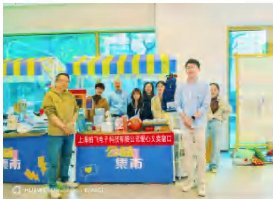

text_image

上海柏飞电子科技有限公司爱心义卖窗口
2023
集市
HUAWEI HAIYUAN YUANG

参与公益义卖

关键绩效表

<table><tr><td colspan="2">指标名称</td><td>单位</td><td>2024</td><td>2025</td></tr><tr><td colspan="5">员工招聘与就业</td></tr><tr><td colspan="2">在职员工总数</td><td>人</td><td>4,046</td><td>3,924</td></tr><tr><td colspan="2">新入职员工总数</td><td>人</td><td>539</td><td>454</td></tr><tr><td rowspan="2">按性别结构划分</td><td>男性</td><td>人</td><td>3,143</td><td>3,074</td></tr><tr><td>女性</td><td>人</td><td>903</td><td>850</td></tr><tr><td rowspan="3">按年龄结构划分</td><td>30岁(含)以下</td><td>人</td><td>1,652</td><td>1,599</td></tr><tr><td>30岁-50岁(含)</td><td>人</td><td>2,234</td><td>2,188</td></tr><tr><td>50岁以上</td><td>人</td><td>160</td><td>137</td></tr><tr><td rowspan="3">按教育程度划分</td><td>博士</td><td>人</td><td>4</td><td>4</td></tr><tr><td>硕士</td><td>人</td><td>335</td><td>391</td></tr><tr><td>本科及以下</td><td>人</td><td>3,707</td><td>3,529</td></tr><tr><td rowspan="4">按专业构成划分</td><td>销售人员</td><td>人</td><td>421</td><td>433</td></tr><tr><td>技术人员</td><td>人</td><td>3,013</td><td>2,931</td></tr><tr><td>财务人员</td><td>人</td><td>75</td><td>72</td></tr><tr><td>行政人员</td><td>人</td><td>537</td><td>488</td></tr><tr><td rowspan="2">按地区划分</td><td>中国员工(含港澳台地区)</td><td>人</td><td>4,021</td><td>3,900</td></tr><tr><td>海外员工</td><td>人</td><td>25</td><td>24</td></tr></table>

<table><tr><td>指标名称</td><td>单位</td><td>2024</td><td>2025</td></tr><tr><td>残疾员工人数</td><td>人</td><td>16</td><td>17</td></tr><tr><td>员工流失率</td><td>%</td><td>9.80%</td><td>8.69%</td></tr><tr><td colspan="4">员工培训与发展</td></tr><tr><td>员工培训总学时</td><td>小时</td><td>158,378.33</td><td>130,449.29</td></tr><tr><td>人均培训时长</td><td>小时</td><td>44.19</td><td>37.82</td></tr><tr><td>培训覆盖率</td><td>%</td><td>88.58%</td><td>87.90%</td></tr><tr><td>男性员工培训总学时</td><td>小时</td><td>128,916.60</td><td>108,555.75</td></tr><tr><td>女性员工培训总学时</td><td>小时</td><td>29,461.73</td><td>21,893.54</td></tr><tr><td colspan="4">员工关爱</td></tr><tr><td>帮扶困难员工</td><td>人</td><td>2</td><td>3</td></tr><tr><td colspan="4">产品和服务</td></tr><tr><td>年度客户满意率</td><td>%</td><td>95.13%</td><td>96.48%</td></tr><tr><td colspan="4">创新研发</td></tr><tr><td>研发投入</td><td>万元</td><td>54,152.08</td><td>58,082.47</td></tr><tr><td>研发人员</td><td>人</td><td>1,465</td><td>1,428</td></tr><tr><td>年度新增专利数量</td><td>件</td><td>19</td><td>11</td></tr><tr><td>新增软件著作权数量</td><td>项</td><td>99</td><td>80</td></tr></table>

# 指标索引

GRI 内容索引

<table><tr><td>GRI指标</td><td>相关解释</td><td>相关章节</td><td>页码</td></tr><tr><td colspan="4">组织及报告做法</td></tr><tr><td>G2-1</td><td>组织详细情况</td><td>关于本报告、肩负数字化转型使命,领略电科数字发展之路</td><td>01、04</td></tr><tr><td>G2-2</td><td>纳入组织可持续发展报告的实体</td><td>关于本报告、肩负数字化转型使命,领略电科数字发展之路</td><td>01、04</td></tr><tr><td>G2-3</td><td>报告期、报告频率和联络人</td><td>关于本报告</td><td>01</td></tr><tr><td colspan="4">活动和工作者</td></tr><tr><td>G2-6</td><td>活动、价值链和其他业务关系</td><td>肩负数字化转型使命,领略电科数字发展之路</td><td>04-05</td></tr><tr><td>G2-7</td><td>员工</td><td>员工雇佣和权益</td><td>39-40</td></tr><tr><td colspan="4">治理</td></tr><tr><td>G2-9</td><td>管制架构和组成</td><td>公司治理</td><td>13</td></tr><tr><td>G2-12</td><td>最高治理机构在管理影响方面的监督作用</td><td>聚焦ESG管理,牵引公司可持续发展</td><td>07-08</td></tr><tr><td>G2-13</td><td>为管理影响的责任授权</td><td>聚焦ESG管理,牵引公司可持续发展</td><td>07-08</td></tr><tr><td>G2-14</td><td>最高管治机构在可持续性报告中的作用</td><td>聚焦ESG管理,牵引公司可持续发展</td><td>07-08</td></tr><tr><td>G2-16</td><td>重要关切问题的沟通</td><td>聚焦ESG管理,牵引公司可持续发展</td><td>07-08</td></tr><tr><td>G2-17</td><td>最高管治机构的共同知识</td><td>聚焦ESG管理,牵引公司可持续发展、公司治理</td><td>09、13</td></tr><tr><td>G2-18</td><td>对最高管治机构的绩效评估</td><td>聚焦ESG管理,牵引公司可持续发展</td><td>07-08</td></tr><tr><td colspan="4">战略、政策和实践</td></tr><tr><td>G2-23</td><td>政策承诺</td><td>肩负数字化转型使命,领略电科数字发展之路、党建引领</td><td>05、19</td></tr><tr><td>G2-24</td><td>融合政策承诺</td><td>党建引领</td><td>19</td></tr><tr><td>G2-27</td><td>遵守法律法规</td><td>党建引领</td><td>19</td></tr><tr><td colspan="4">利益相关者的参与</td></tr><tr><td>G2-29</td><td>利益相关者参与的方法</td><td>聚焦ESG管理,牵引公司可持续发展</td><td>09</td></tr><tr><td>G2-30</td><td>集体谈判协议</td><td>员工雇佣和权益</td><td>40</td></tr><tr><td colspan="4">实质性议题</td></tr><tr><td>G3-3</td><td>实质性议题的管理</td><td>供应商评定、员工雇佣和权益、员工健康和安全、员工福利和关怀、深化环境管理、聚焦废弃物管理、持续志愿服务、践行慈善公益</td><td>32、39-46、49-51、55-56</td></tr></table>

<table><tr><td>GRI指标</td><td>相关解释</td><td>相关章节</td><td>页码</td></tr><tr><td colspan="4">经济效益</td></tr><tr><td>G201-2</td><td>气候变化带来的财务影响以及其他风险和机遇</td><td>聚焦废弃物管理</td><td>51</td></tr><tr><td colspan="4">间接经济影响</td></tr><tr><td>G203-1</td><td>基础设施投资和支持性服务</td><td>持续志愿服务</td><td>55</td></tr><tr><td>G203-2</td><td>重大间接经济影响</td><td>数智引领、质量控制、践行慈善公益</td><td>23-26、55-56</td></tr><tr><td colspan="4">反腐败</td></tr><tr><td>G205-2</td><td>反腐败政策和程序的传达及培训</td><td>党建引领</td><td>19</td></tr><tr><td colspan="4">税</td></tr><tr><td>G207-1</td><td>税务方针</td><td>见年报</td><td>见年报</td></tr><tr><td>G207-3</td><td>与税务关切相关的利益相关方参与及管理</td><td>见年报</td><td>见年报</td></tr><tr><td>G207-4</td><td>国别报告</td><td>见年报</td><td>见年报</td></tr><tr><td colspan="4">生物多样性</td></tr><tr><td>G304-2</td><td>活动、产品和服务对生物多样性的重大影响</td><td>深化环境管理</td><td>49-50</td></tr><tr><td colspan="4">废弃物</td></tr><tr><td>G306-1</td><td>废物产生和与废物有关的重大影响</td><td>聚焦废弃物管理</td><td>51</td></tr><tr><td>G306-2</td><td>管理与废物有关的重大影响</td><td>聚焦废弃物管理</td><td>51</td></tr><tr><td>G306-3</td><td>产生的废弃物</td><td>聚焦废弃物管理</td><td>51</td></tr><tr><td colspan="4">供应商环境评估</td></tr><tr><td>G308-1</td><td>使用环境标准筛选的新供应商</td><td>供应商评定</td><td>32</td></tr><tr><td colspan="4">雇佣</td></tr><tr><td>G401-1</td><td>新进员工雇佣率和员工流动率</td><td>员工雇佣和权益</td><td>39-40</td></tr><tr><td>G401-2</td><td>提供给全职员工(不包括临时工或兼职员工)的福利</td><td>员工健康和安全、员工福利和关怀</td><td>44-46</td></tr><tr><td>G401-3</td><td>育儿假</td><td>员工福利和关怀</td><td>46</td></tr><tr><td colspan="4">职业健康与安全</td></tr><tr><td>G403-1</td><td>职业健康安全管理体系</td><td>员工健康和安全</td><td>44</td></tr><tr><td>G403-3</td><td>职业健康服务</td><td>员工健康和安全</td><td>44</td></tr><tr><td>G403-4</td><td>职业健康安全事务:工作者的参与、意见征询和沟通</td><td>员工健康和安全</td><td>44</td></tr><tr><td>G403-5</td><td>工作者职业健康安全培训</td><td>员工健康和安全</td><td>44-45</td></tr><tr><td>G403-6</td><td>促进工作者健康</td><td>员工健康和安全、员工福利和关怀</td><td>44-45</td></tr><tr><td>G403-7</td><td>预防和减缓与业务关系直接相关的职业健康安全影响</td><td>员工健康和安全</td><td>44-45</td></tr><tr><td>G403-8</td><td>职业健康安全管理体系覆盖的工作者</td><td>员工健康和安全</td><td>44</td></tr><tr><td>G403-10</td><td>工作相关的健康问题</td><td>员工健康和安全</td><td>44-45</td></tr><tr><td colspan="4">培训与教育</td></tr><tr><td>G404-1</td><td>每名员工每年接受培训的平均小时数</td><td>员工培训和发展</td><td>42</td></tr><tr><td>G404-2</td><td>员工技能提升方案和过渡协助方案</td><td>员工培训和发展</td><td>42-43</td></tr><tr><td>G404-3</td><td>定期接受绩效和职业发展考核的员工百分比</td><td>员工培训和发展</td><td>42</td></tr><tr><td colspan="4">多元化与平等机会</td></tr><tr><td>G405-1</td><td>管治机构与员工的多元化</td><td>员工雇佣和权益</td><td>39-40</td></tr><tr><td colspan="4">供应商社会评估</td></tr><tr><td>G414-1</td><td>使用社会标准筛选的新供应商</td><td>供应商评定</td><td>32</td></tr><tr><td colspan="4">营销与标识</td></tr><tr><td>G417-1</td><td>对产品和服务信息与标识的要求</td><td>质量控制</td><td>25-26</td></tr><tr><td colspan="4">客户隐私</td></tr><tr><td>G418-1</td><td>与侵犯客户隐私和丢失客户资料有关的经证实的投诉</td><td>信息安全</td><td>18</td></tr></table>

ESG 指标

<table><tr><td>报告框架</td><td>《央企控股上市公司ESG专项报告参考指标体系》</td><td>《上海证券交易所上市公司自律监管指引第14号—可持续发展报告(试行)》</td></tr><tr><td>ESG管理</td><td></td><td>利益相关方沟通</td></tr><tr><td>公司治理</td><td>G1.1; G1.2</td><td></td></tr><tr><td>投资者关系管理</td><td>G3.1; G3.2; G4.1; G4.2</td><td></td></tr><tr><td>风险内控</td><td>G2.1; G2.2; G5.1; G5.2</td><td>反商业贿赂及反贪污、反不正当竞争</td></tr><tr><td>信息安全</td><td>S2.2</td><td>数据安全与客户隐私保护</td></tr><tr><td>党建引领</td><td>G2.2</td><td></td></tr><tr><td>数智引领</td><td>S2.3</td><td>创新驱动</td></tr><tr><td>质量控制</td><td>S2.1</td><td>产品和服务安全与质量</td></tr><tr><td>成就客户</td><td>S2.2</td><td>产品和服务安全与质量、数据安全与客户隐私保护</td></tr><tr><td>采购管理</td><td>S3.1</td><td>平等对待中小企业</td></tr><tr><td>供应商评定</td><td>S3.2</td><td>供应链安全</td></tr><tr><td>行业共建</td><td>S2.3</td><td>创新驱动</td></tr><tr><td>员工雇佣和权益</td><td>S1.1</td><td rowspan="5">员工</td></tr><tr><td>员工薪酬和绩效</td><td>S1.2</td></tr><tr><td>员工培训和发展</td><td>S1.4</td></tr><tr><td>员工健康和安全</td><td>S1.3</td></tr><tr><td>员工福利和关怀</td><td>S1.5</td></tr><tr><td>应对气候变化</td><td>E3.4</td><td>应对气候变化</td></tr><tr><td>环境合规管理与污染物排放</td><td>E1.1; E1.2; E1.3; E1.4; E2.3; E5.2; E5.6</td><td>环境合规管理、能源利用、水资源利用、污染物排放、废弃物处理</td></tr><tr><td>强化环保培训</td><td>E5.4</td><td>环境合规管理</td></tr><tr><td>持续志愿服务</td><td>S4.2; S4.3</td><td rowspan="2">社会贡献、乡村振兴</td></tr><tr><td>践行慈善公益</td><td>S4.2; S4.3</td></tr></table>

# 读者反馈意见表

尊敬的读者：

您好！

非常感谢您在百忙之中阅读《中电科数字技术股份有限公司 2025年度环境、社会和公司治理（ESG）报告》。为了向您及其他利益相关方提供更有价值的信息，并有效促进公司提升履行企业 ESG 相关管理的能力与水平，我们真诚期待您的意见和建议。

# 选择题（请在相应位置打✓）

1. 您对本报告的总体评价是：

□非常好 □好 □一般 □较差 □差

2. 报告对利益相关方所关心问题的回应和披露？

□非常好 □好 □一般 □较差 □差

3. 您认为电科数字在经济责任方面做得如何？

□非常好 □好 □一般 □较差 □差

4. 您认为电科数字在环境责任方面做得如何？

□非常好 □好 □一般 □较差 □差

5. 您认为电科数字在安全管理方面做得如何？

□非常好 □好 □一般 □较差 □差

6. 您认为电科数字在员工责任方面做得如何？

□非常好 □好 □一般 □较差 □差

7. 您认为电科数字在社区责任方面做得如何？

□非常好 □好 □一般 □较差 □差

8. 报告披露的信息、指标、数据是否清晰、准确、完整？

□非常好 □好 □一般 □较差 □差

9. 您认为本报告的内容安排和版式设计是否方便阅读？

□是 □否

开放性问题

您对电科数字履行 ESG 相关工作及本报告有任何意见与建议？

# 与世界一起构建未来