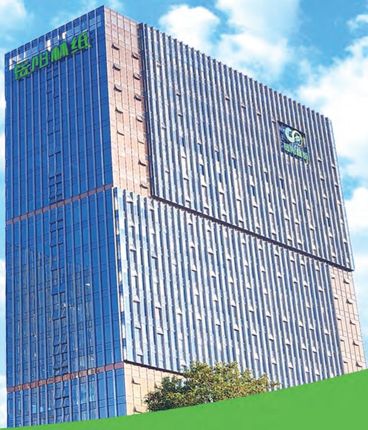

natural_image

Exterior view of a modern glass office building with blue facade and green signage (no readable text beyond logos)

# 2025

# 环境、社会和公司治理（ESG）报告

厚植生态 心向文明

岳阳林纸

YUEYANG FOREST & PAPER

联系地址:中国(湖南)自由贸易试验区岳阳片区长江大道西

新港多式联运物流园001号

邮政编码:414028

电话:0730-8590683

传真:0730-8562203

公司网址:http://www.yypaper.com

电子信箱:zqb-yylz@chinapaper.com.cn

岳阳林纸股份有限公司

# 关于本报告

# 报告时间范围

本报告时间范围从 2025 年 1 月 1 日至 12 月 31 日，为提高报告完整性，部分数据超出上述范围。

# 报告组织范围

本报告的组织范围涵盖了岳阳林纸股份有限公司及下属产业。包括但不限于：岳阳林纸股份有限公司（简称“岳阳林纸”“公司”或“我们”）、岳阳林纸股份有限公司岳阳基地（简称“岳阳基地”）、湖南骏泰生物基新材料科技有限责任公司（简称“骏泰科技”）、湖南茂源林业有限责任公司（简称“茂源林业”）、诚通凯胜生态建设有限公司（简称“诚通凯胜”）、中纸宏泰生态建设有限公司（简称“中纸宏泰”）、诚通碳汇经营管理（湖南）有限责任公司（简称“诚通碳汇”）、湖南诚通天岳环保科技有限公司（简称“诚通天岳”）、岳阳恒泰房地产开发有限责任公司（简称“恒泰公司”），为增强本报告的对比性，部分内容适当追溯调整。

# 报告发布周期

本报告为年度报告，发布周期为一年一次。

# 报告数据说明

报告所使用的数据和案例均来自公司的正式文件、统计报告及履责情况的汇总和统计。

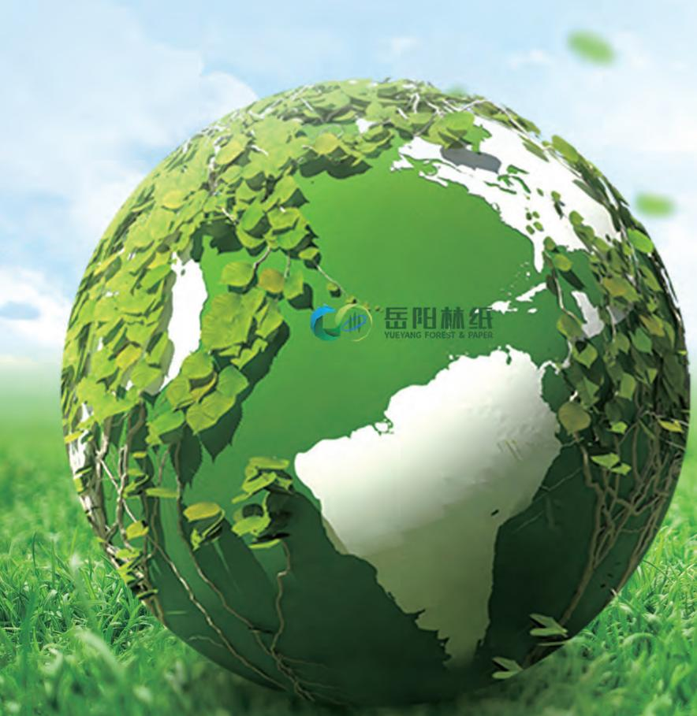

text_image

岳阳林纸
YUEYANG FOREST & PAPER

# 报告参考标准

全球报告倡议组织 (GRI)《可持续发展报告编写标准》  
联合国可持续发展目标 (SDGs)  
联合国全球契约（United Nations Global Compact）“十项原则”  
- 国际标准化组织 (ISO)《社会责任指南 (ISO26000)》  
《中国企业可持续发展报告指南 (CASS-ESG 6.0) 之一般框架》  
《关于新时代中央企业高标准履行社会责任的指导意见》  
《央企控股上市公司 ESG 专项报告编制研究》

《上海证券交易所上市公司自律监管指南第4号——可持续发展报告编制（2026年1月修订）》

# 报告可靠性保证

公司保证本报告内容不存在任何虚假记载和误导性陈述。

# 报告获取方式

您可登录公司官方网站 www.yypaper.com 或上海证券交易所网站 www.sse.com.cn 下载电子版报告，并获取企业社会责任的更多信息。

# 往期报告信息修订

1.2025年公司收购诚通天岳 $51\%$ 股份，诚通天岳成为岳阳林纸全资子公司，为保持口径一致，对2024年相关数据追溯调整。  
2. 将骏泰科技环境排放数据纳入统计范围。  
3. 供应商管理核心指标增加统计范围，包括浆板、煤炭、化工、备件、包材、木片、生物质燃料、物流供应商、设备（非标、外协）等。

# 目录 CONTENTS

# 关于本报告

年度专题 4

董事长致辞 10

关键绩效 110

指标索引 114

# 01 关于岳阳林纸

公司概况 14

岳阳林纸大事记 20

企业主要成就与荣誉 22

# 02 可持续发展管理

可持续发展战略 26

尽职调查和利益相关方沟通 27

实质性议题分析 29

评估方法 29

岳阳林纸实质性议题 30

重要性识别结果 30

# 03 更友好的环境

应对气候变化 35

减少温室气体排放 35

碳减排项目开发 37

能源利用 39

管理体系运行 40

节能举措 40

水资源利用 42

污染物排放 43

废水管理 45

废气管理 46

废弃物处理 49

生态系统和生物多样性保护 50

生态系统保护 50

生物多样性保护 53

环境合规管理 54

环境管理机制 54

环境风险和环境事件应急预案 55

循环经济 57

# 04 更美好的社会

员工 60

权益与福利 60

职业健康与安全 65

培训与发展 70

产品和服务安全与质量 75

产品安全与质量 76

客户安全与质量 78

数据安全与客户隐私保护 80

数据安全 80

客户隐私保护 80

创新驱动 81

研发体系与平台 81

研发投入和产品创新 85

科技伦理 88

供应链安全 88

供应商管理 88

供应链环节管理 89

平等对待中小企业 90

社会贡献 91

乡村振兴 93

# 05 更高效的治理

公司治理 96

治理策略及流程 96

组织架构和职能 96

董事会构成 98

投资者关系管理与股东权益 98

信息披露透明度 99

合规经营与风险管理 100

合规经营 100

内部控制 101

风险管理 101

党建与企业文化 102

优化组织架构 102

完善党建制度 103

学习教育走深走实 103

党业融合赋能 103

反不正当竞争 106

反商业贿赂及反贪污 107

# 01

# 深耕绿色低碳发展筑牢生态保护根基

# 推动节能降耗, 提升资源效能

报告期内，公司二氧化碳排放总量约153万吨，同比下降 $10\%$ ；温室气体排放密度同比下降 $11.42\%$ ；未发生生态环境违法违规行为、环保处罚及环境突发事件。

节能降碳方面，岳阳基地提质升级综合技改项目一期年产45万吨文化纸项目已投产，该项目节能减排技术达到世界一流水平，岳阳基地万元产值（2020年可比价）二氧化碳排放量为2.30吨/万元，同比下降 $18.15\%$ ，节能减排成效显著。此外，完成3#、5#、6#抽汽背压式汽轮机组改造，年节约标煤7万吨，减少碳排放约20万吨。骏泰科技持续发挥集中供热优势，高效稳定提供清洁能源供热，二氧化碳排放量实现-4700吨，率先迈入负碳运行新阶段，全年累计供热量达98927.78GJ，提供绿色能源5.44亿度。同步采用节能高效曝气风机+旋流曝气替换原有旧设备，改造后节电率达 $32\%$ 。

水资源利用方面，水资源消耗量约 5263 万吨，水循环利用率 90.7%，岳阳基地完成给排水管网改造项目，减少清水浪费与泄漏，日均节约清水用量 10000 吨。水域生态环境的持续向好，公司排污口附近多次被拍摄到国家一级保护动物长江江豚活动的珍贵身影。

# 深化碳汇开发, 拓展绿色价值

报告期内，积极布局林业、草原、农田、湿地等生态价值转换，签订林业碳汇合同面积约3920万亩，草原碳汇合同面积约9470万亩，农田碳汇合同面积约2124万亩，湿地碳汇合同面积154万亩。诚通碳汇累计签订林业碳汇合同22份，碳汇项目开发取得实质性突破，共有20个项目处于开发阶段，7个项目完成项目公示，2个CCER林业碳汇项目申请登记（全国同期仅7个），占全国登记总量的近 $30\%$ ，登记效率行业领先，在生态产品价值实现中绘就高质量发展新画卷。

# 公司二氧化碳排放总量

153 万吨

# 同比下降

10%

# 温室气体排放密度同比下降

11.42%

# 水资源消耗量

5263 万吨

# 水循环利用率

90.7%

# 提供绿色能源

5.44 亿度

# 签订林业碳汇合同面积

3920 万亩

# 草原碳汇合同面积

9470 万亩

# 农田碳汇合同面积

2124 万亩

# 湿地碳汇合同面积

154 万亩

# 强化创新驱动，培育增长动能

报告期内,研发费用投入3.1亿元,多项研究成果荣获省部级及行业级科技奖项,新增授权专利30项,其中发明专利17项。拥有省级及以上科创平台10个,其中国家级科创平台2个。积极孵化培育战略性新兴产业,打造生物基新材料基地。服务国家战略,立足相关多元,着力解决浆纸行业进口替代,探索特种纤维、木质素高值化应用及生物基新材料等领域,将骏泰科技打造成为国内最有特色的生物基新材料产业基地。生物质高值转化技术获教育部科学研究优秀成果一等奖。发布特色文化纸全新产品“岳阳楼牌舒瞳柔光纸”,具备防眩目、无荧光、低反射、护视力等功能,守护视力健康。

研发费用投入

3.1 亿元

新增授权专利

30项

累计拥有专利

322项

省级及以上科创平台

10↑

国家级科创平台

2↑

# 精进品质管理，筑牢质量标准

汇聚权威认证资质,公司产品顺利通过绿色森林认证(FSC、PEFC /CFCC)、欧盟零毁林法案(EUDR)合规验证、中国环境标志(I型)产品认证、中国环境标志(II型)产品认证、食品包装纸生产许可证(QS)及儿童青少年学习用品近视防控卫生要求认证等。这一系列认证成果,不仅确保了产品在全周期内符合高质量标准,也为公司拓展国内外市场提供了强有力的资质背书。

# 落实社会责任，彰显责任担当

岳阳林纸积极践行央企控股上市公司社会责任，主动参与社区公益事业，开展内容多元的志愿公益活动，如无偿献血，爱心助残等；推动落实乡村振兴，对口帮扶河南宜阳县、岳阳县公田镇港口村，平江县上塔市镇小坪村，用实际行动回馈社会，体现企业的社会责任和担当。骏泰科技被评为2025年助力乡村振兴（怀乡怀品）典范企业。诚通凯胜承建镇海区海岸带生态修复及海塘安澜（一期）工程项目，新建水系11.15公里，种植生态防护林2700亩，生态修复面积近800公顷，年碳汇量可达3240吨，将流域经济发展和生态系统修复并重，构筑生态线、民生线和共富线。

# 坚持党建引领，塑造价值品牌

报告期内，公司内部共计开展理论学习273次，合计5502人次党员参加，覆盖基层党组织55个、党员1260名；61名新提拔干部、年轻干部及关键岗位干部开展“靶向式”自查自纠；137名党员骨干参加专题警示教育；45个基层党支部书记完成党课讲授；各级党组织共计查摆问题157个，其中纳入整改整治的43个突出问题已全部完成整改销号。持续加强产业工人培养，开展“攻坚克难挑战极限”劳动竞赛、“匠人匠心”技能比武，持续推进群策工程，成功推荐1人入选央企工匠培育名单，充分发挥产业工人“主力军”作用。做好“春送祝福、夏送清凉、金秋助学、冬送温暖”暖心工程，努力团结内外有利因素和力量。

# 优化公司治理，保障股东权益

围绕体制机制改革任务，通过撤销子公司董事会和监事会、动态优化《权责清单》、加强董事会建设等措施，进一步完善公司治理。恪守合规运营，公司全员参加“企业管理人员尽职免责”专题学习。

# 百年宅纸

守护青山绿水

# 千載文章

践行双碳目标

公司内部共计开展理论学习

273次

5502 人次党员参加

# 董事长致辞

# 尊敬的各位投资者、合作伙伴、社会各界朋友：

当您展开这份 2025 年 ESG 报告时，不仅是在审视我们过去一年的经营足迹，更是在与我们共同翻阅一份关于责任、绿色与未来的共同叙事。在此，我谨代表公司董事会及全体员工，向长期以来关心、支持我们发展的各界同仁，致以最诚挚的感谢。

2025 年，是中国 “十四五” 收官、“十五五” 开局的承前启后之年，党的二十届四中全会胜利召开，为我们国家的长远发展奠定了重要基础。我们继续践行可持续发展理念，在环境、社会、治理的征程上积极探索，坚定不移地将 ESG 理念深度融入公司战略核心，以 “绿色制造、共生共赢” 为行动纲领，力求在经济效益、环境生态与社会福祉的协调发展。

党建引领，坚持和加强党的领导。我们始终将政治建设摆在首位，充分发挥党委“把方向、管大局、保落实”作用、基层党组织战斗堡垒作用和党员先锋模范作用，以党建带队伍、以队伍促业务。通过扎实开展学习教育、强化理论武装、动态完善重大事项决策清单、严格执纪监督问责等举措，将党的政治优势转化为企业治理效能，持续打造权责清晰、运转高效、流程合规、监督有力的现代企业治理体系。

改革求变，激发组织经营活力。纵深推进“双百行动”，以改革破题、以机制赋能。我们以新型经营责任制为抓手，全面落实“一体化”改革部署，打破职能壁垒，强化专业协同，在压减管理层级、优化职能配置中释放组织效率。薪酬分配更加注重价值贡献导向，刚性考核兑现，员工绩效与公司利润深度挂钩，“以业绩换薪酬”的市场化理念深入人心。人才建设坚持党管干部、党管人才，统筹选育管用，构建梯次衔接、专业精湛、活力涌动的人才雁阵，为基业长青注入不竭动力。

责任筑基，擘画零碳未来蓝图。我们积极响应国家“双碳”目标，将碳达峰碳中和目标全面融入生产经营全过程，将环境保护视为重要战略任务，率先发展可持续林业，布局碳汇开发，加强环境治理和技术创新，降低污染和资源消耗，以绿色低碳可持续发展模式打造公司的核心竞争力，实现经济效益和环境效益双赢。我们摒弃末端治理的被动思维，引入透平真空泵、高效循环水泵等系列先进技术装备，拆除或关停部分锅炉，提升生物质燃料利用量，节能降碳效果显著。

我们深知，一家企业的减碳改变不了气候，但千家万户的选择可以。在这条必由之路上，我们愿做先行者，也愿做铺路石。

创新驱动，推动产业转型升级。产品的持续创新，是公司高质量发展的底气所在。我们坚持以市场为原点、以科技为引擎，在每一次技术突破中重塑产品的边界。我们重点发力特色化文化纸、功能化牛皮纸、差异化商品浆三大产品矩阵，通过精准卡位细分赛道，推动产品结构从规模导向向价值导向跃升。

创新不止于“从无到有”，更在于“从有到优”。我们致力于构建响应敏捷、梯次清晰、具备持续进化能力的产品体系，让每一次迭代都更贴近终端需求，以产品力牵引品牌力，以创新链赋能价值链。

公司牵头创建了湖南省生物基特种纤维与新材料产业创新联合体，投资建成全新的研发中心。多项技术成果荣获省部级及行业级科技奖项。

以人为本，共筑事业命运共同体。过去一年，我们将“人”从管理的客体还原为价值的原点。重塑组织与员工的契约关系，不止于薪酬福利的保障，更在于让奋斗者有舞台、让担当者有尊重、让奉献者有归属。我们认同员工的人权与多样性，重视员工和利益

相关方的沟通，持续构建多元、平等、包容的职场生态，劳动合同签订率与社保覆盖率保持100%，以制度硬度守护每一位员工的基本尊严。

我们主动参与社区公益事业，宣传文明意识，关爱弱势群体，鼓励并引导青年员工投身志愿公益事业，开展无偿献血、爱心助残等活动；我们保障供应商正当合理权益，倡导伙伴积极履责，促进行业可持续向前，携手共赢；我们助力乡村振兴，落实定点帮扶，参与生态系统修复，用实际行动回馈社会，彰显企业的社会责任和担当。

征程万里风正劲，重整行装再出发。站在“十五五”门槛前，我们比任何时候都更清醒：可持续发展是一场没有终点的长跑，需要的不仅是爆发力，更是耐力与定力。我们将继续以敬畏之心对待

生态环境，以责任之心对待利益相关方，以进取之心对待治理变革。不驰于空想，不骛于虚声，用每一吨产品的低碳转型、每一位员工的体面成长、每一份合同的诚信履约，把 ESG 从报告里的承诺，变成大地上的足迹。

前路漫漫，唯有担当；征途赫赫，共此初心。

# 岳阳林纸党委书记、董事长 刘岩

natural_image

Stylized illustration of a modern city skyline with green skyscrapers and a wavy green wave pattern at the base (no text or symbols)

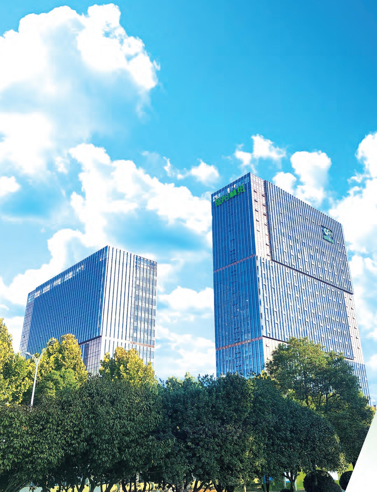

natural_image

Exterior view of two modern glass skyscrapers under a blue sky with clouds, surrounded by green trees (no signage visible)

# 01

# 关于岳阳林纸

# 关于岳阳林纸

# 公司概况

岳阳林纸股份有限公司前身为岳阳造纸厂，始建于1958年，有着悠久的历史底蕴，从建厂起就与红色经典结缘，公司生产的第一批凸版纸是《毛泽东选集》印刷用纸，至今也是许多红色经典书籍的首选用纸企业，经过60余年发展，公司已成为中国文化纸龙头企业。公司于2004年在上海证券交易所上市交易，2011年成为中央企业中国诚通控股集团有限公司所属控股上市公司。岳阳林纸坚守“红色基因，绿色纸品”的使命担当，以林浆纸产业为基础，聚焦生态产品价值实现，已成为国有造纸企业的中坚力量和行业先锋，并在细分领域培养一批隐形领军企业，实现公司可持续发展。

报告期内，公司造纸产能140万吨、商品浆产能40万吨，主要客户包括出版社、杂志社、大型印刷厂、纸制品加工企业、纸品经销商、造纸（含生活用纸）企业、纤维素纤维生产企业以及差异化特种纤维素用户等。公司成为胶版印刷纸期货首批交割厂库，“岳阳楼”品牌入选胶版印刷纸期货首批可交割商品品牌。

# 主要经济指标

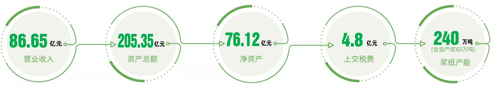

flowchart

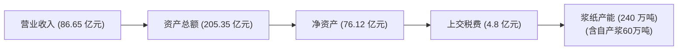
```mermaid
graph LR
  A["营业收入 (86.65 亿元)"] --> B["资产总额 (205.35 亿元)"]
  B --> C["净资产 (76.12 亿元)"]
  C --> D["上交税费 (4.8 亿元)"]
  D --> E["浆纸产能 (240 万吨)<br>(含自产浆60万吨)"]
```

# 组织架构

公司认真贯彻中央企业党委在公司治理结构中的法定地位，严格按照现代企业制度的要求，建立完善的法人治理结构，在公司重大问题的决策、执行、监督等方面，股东会、董事会各司其职，发挥着重要作用。

岳阳林纸股份有限公司治理结构图  
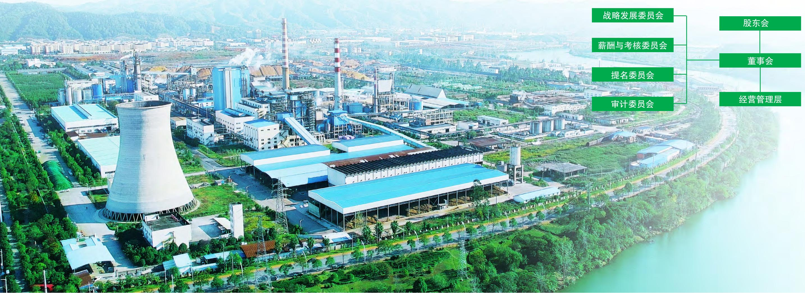

text_image

战略发展委员会
薪酬与考核委员会
提名委员会
审计委员会
股东会
董事会
经营管理层

# 品牌与产品

传承红色基因，奉献绿色纸品。岳阳林纸注重品牌建设，聚焦湖湘文化、红色血脉，先后打造了岳阳楼、泰格风、泰格雅、泰格颂、天岳、山岳、湖岳三大系列品牌，主要产品覆盖文化用纸、包装用纸和工业用纸，以及纸浆、溶解浆、木质素等生物基材料和生物质能，产品销售与服务覆盖全国，远销北美、欧洲、亚洲及中东地区。

公司把高品质作为品牌的基石，坚持客户至上，重视客户感知，不断提升产品质量、服务质量提升品牌美誉度。坚持聚焦主业，深耕细作为客户持续创造价值，与客户共享成长价值。

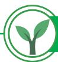

# 主要产品

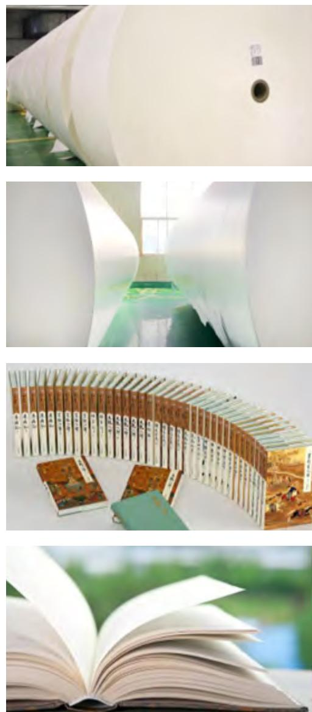

# 文化用纸：

公司文化纸产品主要为精制轻量涂布纸、胶版印刷纸、全木浆纯质纸、轻型胶版纸等。主要生产机台有 PM8、PM9、PM10、PM11 四条生产线，设备为福伊特和维美德进口纸机。精制轻量涂布纸定量 58-80g/ m²，适用于高速商业轮转印刷，是国内国际轻涂纸产品的佼佼者，广泛应用于印刷高档杂志、书刊、商品目录、美术宣传图册、报刊杂志插页、直邮广告及美术课本等。

胶版印刷纸采用 100% 木浆原料，匀度好、不透明度高、纸面平滑细腻、套印准确、印刷图文清晰及表面强度高，适用于高速轮转印刷，广泛应用于教材教辅、期刊杂志、精品图书及簿本等领域，产品满足《儿童青少年学习用品近视防控卫生要求》（GB40070-2021），为青少年视力健康保驾护航。

轻型胶版纸采用优质木材纤维，产品高松厚、色泽柔和、匀度好，印品图文清晰，立体感强，适用于高速轮转印刷，广泛应用于书籍杂志、人物传记、画册、宣传广告册、挂历及特种纸加工等用纸。

全木浆纯质纸采用 100% 木浆纤维，纸面平滑细腻、手感佳、挺度好、色彩还原度高，适用于商务高速轮转印刷，广泛用于党政书籍、名人传记、高档图书、精品图册、纪念册以及精装书籍等。

# 包装用纸:

公司包装纸产品主要为薄型包装纸，包括精品牛皮纸、伸性纸袋纸、高强纸袋纸、精品纸袋纸、手提袋纸、食品包装纸、优质牛皮纸、精品淋膜纸、高档复合原纸、精品复合原纸、精品湿帘纸等，主要由 PM3、PM6、PM7、PM9 号机生产，其中 PM9 使用福伊特进口设备，并使用 100% 全木浆制造，在设备和原材料方面领先于同行。

精品牛皮纸广泛用于档案袋、信封、书皮、干果袋、茶叶包装、盒包装，纸张手感佳、平整均匀，印刷效果好，有较强的拉力，色相均一，柔和自然。伸性纸袋纸主要用于水泥、化工产品、砂浆类包装纸袋等，纸张色相为未漂木浆本色，伸缩性好，能量吸收性高，耐破强度高，匀度、横向均一性好，透气性较高。高强纸袋纸适用于化工产品包装袋、手提袋等，抗张强度高，透气性较高。天岳食品包装纸是高端系列产品，适用于熟食、水果、蔬菜等各类食品包装，具有食品生产许可证，纸张表面洁净，具备良好的纵向伸长率和耐破强度，成纸质量稳定。

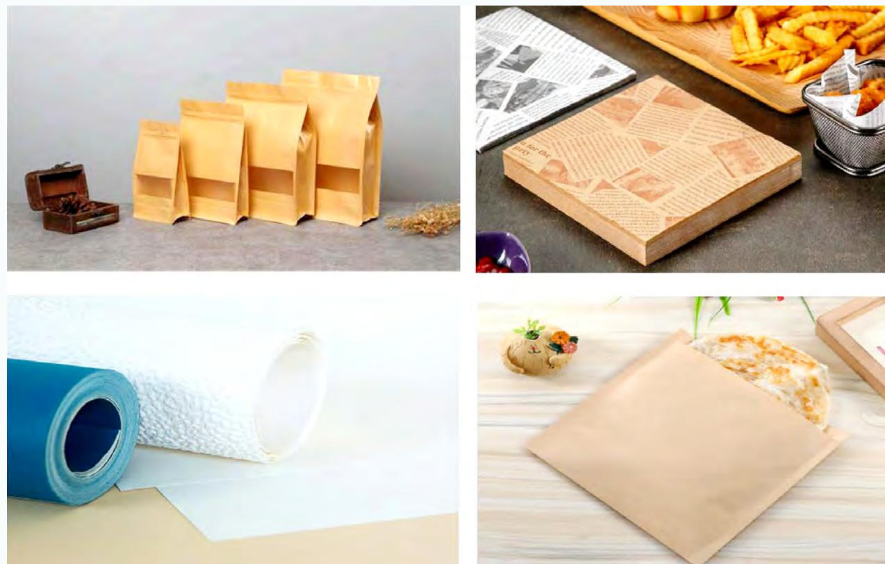

# 商品纤维素：

公司商品纤维素主要为泰格骏颂阔叶溶解浆、泰格骏颂针叶溶解浆、泰格骏颂无氯漂白针叶浆、泰格骏颂未漂硫酸盐针叶浆等。

溶解浆以桉木或松木为原材料，经预水解、硫酸盐法工艺制浆， $\alpha-$ 纤维含量高，纤维纯度高，反应性能好，适用于粘胶纤维素及特种纤维素行业。

漂白针叶浆以松木为原料,采用硫酸盐法工艺制浆,强度好、白度高、尘埃低，可直接作为食品级纸品的原料，适用于高档文化纸、生活用纸纤维原料及特殊纤维功能材料加工，“泰格骏颂”纸浆是国内唯一一家纸浆期货交割品牌，较同类产品碎浆工艺节能30%，是优异的节能型产品。未漂针叶浆以松木为原料，采用硫酸盐法工艺制浆，强度好、杂质含量低，适用于包装纸纤维原料、绝缘纤维材料及特种纤维材料加工。

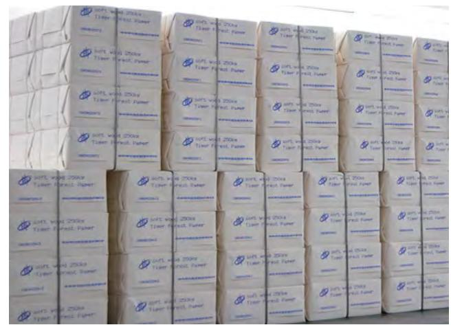

text_image

soft, wood 250ks
Taser Forest Power
soft, wood 250ks
Taser Forest Power
soft, wood 250ks
Taser Forest Power
soft, wood 250ks
Taser Forest Power
soft, wood 250ks
Taser Forest Power
soft, wood 250ks
Taser Forest Power
soft, wood 250ks
Taser Forest Power
soft, wood 250ks
Taser Forest Power
soft. wood 250ks
Taser Forest Power
soft. wood 250ks
Taser Forest Power
soft. wood 250ks
Taser Forest Power
soft. wood 250ks
Taser Forest Power
soft. wood 250ks
Taser Forest Power
soft. wood 250ks
Taser Forest Power
soft. wood 250ks
Taser Forest Power
soft. wood (250ks)
Taser Forest Power
soft. wood (250ks)
Taser Forest Power
soft. wood (250ks)
Taser Forest Power
soft. wood (250ks)
Taser Forest Power
soft. wood (250ks)
Taser Forest Power
soft. wood (250ks)
Taser Forest Power
soft. wood (250ks)
Taser Forest Power
soft. wood (250ks)
Tesar Forest Power
soft. wood (250ks)
Tesar Forest Power
soft. wood (250ks)
Tesar Forest Power
soft. wood (250ks)
Tesar Forest Power
soft. wood (250ks)
Tesar Forest Power
soft. wood (250ks)
Tesar Forest Power
soft. wood (250ks)
Tesar Forest Power
soft. wood (250ks)
Tesar ForestPower

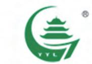

岳陽楊

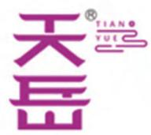

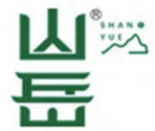

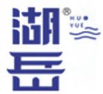

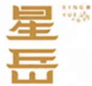

秦格頌

泰格雅®

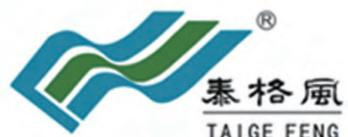

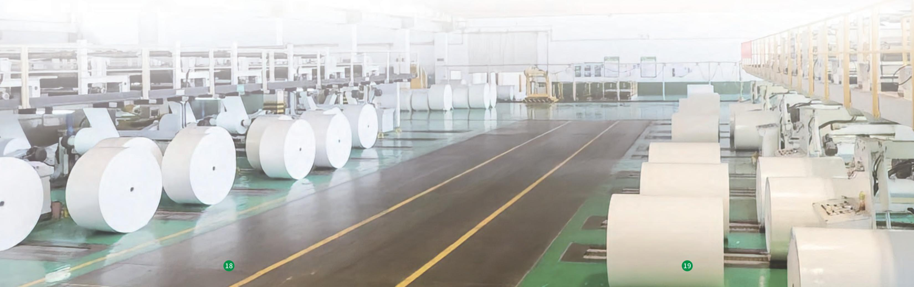

natural_image

Interior view of a paper factory with rows of white rolls and machinery (no visible text or symbols)

# 岳阳林纸大事记

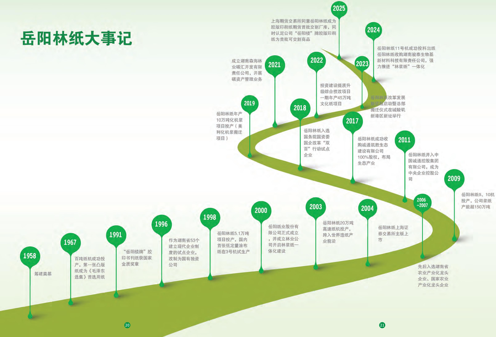

state_timeline

| Year | Milestone |
| --- | --- |
| 1958 | 筹建奠基 |
| 1967 | 百吨纸机成功投产，第一张凸版纸成为《毛泽东选集》首选用纸 |
| 1991 | “岳阳楼牌”胶印书刊纸获国家金质奖章 |
| 1996 | 作为湖南省53个建立现代企业制度的试点企业，改制为国有独资公司 |
| 1998 | 岳阳林纸5.1万吨项目投产，国内首张低定量涂布纸在3号机试生产 |
| 2000 | 岳阳纸业股份有限公司正式成立，并成立林业公司开启林浆纸一体化建设 |
| 2003 | 岳阳林纸20万吨高速纸机投产，跨入世界造纸产业前沿 |
| 2004 | 岳阳林纸上海证券交易所主板上市 |
| 2006-2007 | 先后入选湖南省农业产业化龙头企业、国家农业产业化龙头企业 |
| 2009 | 岳阳林纸9、10机投产，公司浆纸产能超150万吨 |
| 2011 | 岳阳林纸并入中国诚通控股集团有限公司，成为中央企业控股公司 |
| 2017 | 岳阳林纸成功收购诚通凯胜生态建设有限公司100%股权，布局生态产业 |
| 2018 | 岳阳林纸入选国务院国资委国企改革“双百”行动试点企业 |
| 2019 | 岳阳林纸年产10万吨化机浆项目投产（美利化机浆搬迁项目） |
| 2021 | 成立湖南森海林业碳汇开发有限责任公司，开展碳资产管理业务 |
| 2022 | 投资建设提质升级综合技改项目一期年产45万吨文化纸项目 |
| 2023 | 岳阳林纸11号机成功投料出纸 岳阳林纸收购湖南骏泰生物基新材料科技有限责任公司，强力推进“林浆纸”一体化 |
| 2024 | 岳阳林纸改革发展新征程启动暨总部搬迁仪式在城陵矶新港区新址举行 |
| 2025 | 上海期货交易所同意岳阳林纸成为胶版印刷纸期货首批交割厂库，同时认定公司“岳阳楼”牌胶版印刷纸为首批可交割商品 |

# 企业主要成就与荣誉

湖南省节能减排科技示范企业

国家绿色工厂

国家高新技术企业

2022年、2023年获湖南省环保诚信企业

中国林业产业联合会林业碳汇分会主办单位

湖南省绿色供应链管理示范企业

湖南省“节水型企业

国家级智能制造示范工厂

岳阳林纸获得荣誉

国家绿色工厂

湖南省认定企业技术中心

湖南省工程研究中心

国家高新技术企业

湖南省专精特新小巨人企业

湖南省环保诚信企业

湖南省节水型企业

湖南省制造业质量标杆

骏泰科技获得荣誉

茂源林业获得荣誉

第四届中国林业产业突出贡献奖

国家高新技术企业

# 企业主要成就与荣誉

诚通凯胜获得荣誉

国家高新技术企业

浙江省级林业重点龙头企业

宁波市企业工程（技术）中心

宁波市生态修复工程（技术）中心

诚通碳汇获得荣誉

湖南省小巨人“专精特新”企业

国内首个林业碳汇国家标准《林业碳汇项目审定和核证指南》编制单位

国内首个《城市绿地种植和管养活动碳计量指南》开发单位

诚通天岳获得荣誉

湖南省高新技术企业

湖南省专精特新中小企业

湖南省企业技术中心

natural_image

Simple illustration of a trophy with a star on top (no text or symbols)

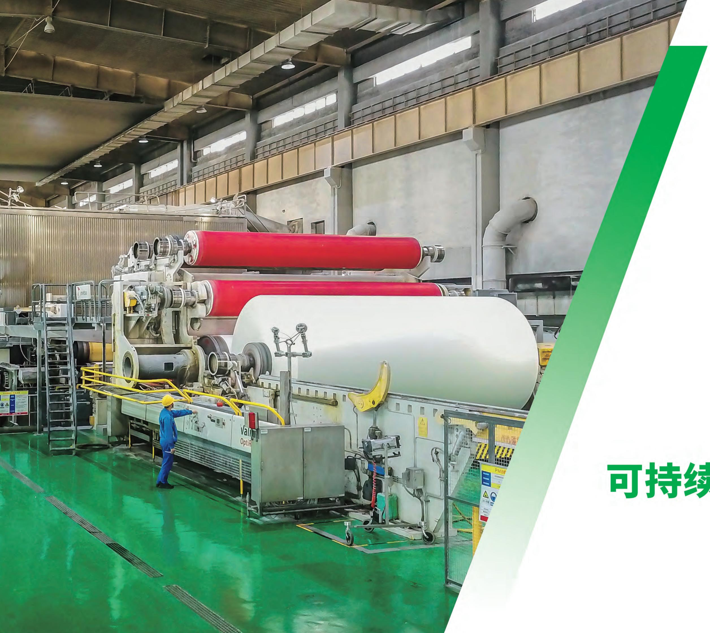

text_image

可持续

# 02

# 可持续发展管理

# 可持续发展管理

# 可持续发展战略

可持续发展不仅是企业必须肩负的社会责任，更是孕育未来增长极的关键赛道。岳阳林纸深刻洞察这一趋势，将ESG理念深度融入企业基因，构建起独具特色的可持续发展生态体系。

公司以 ESG 治理为抓手，全面升级精益管理水平，不仅推动自身及下属分子公司的绿色转型，更致力于将可持续发展理念转化为全新的业务模式与增长动能。通过深入对标国际国内政策、剖析行业现状、借鉴标杆企业经验，并结合内部深度调研与全球趋势研判，岳阳林纸制定了清晰的可持续发展战略蓝图。

为确保战略高效落地，公司建立了完善的 ESG 管理架构，由董事会战略发展委员会统一领导。这不仅提升了企业在可持续发展领域的专业化管理水平，更为助力中国“碳中和”目标的实现提供了坚实保障，护航企业行稳致远。

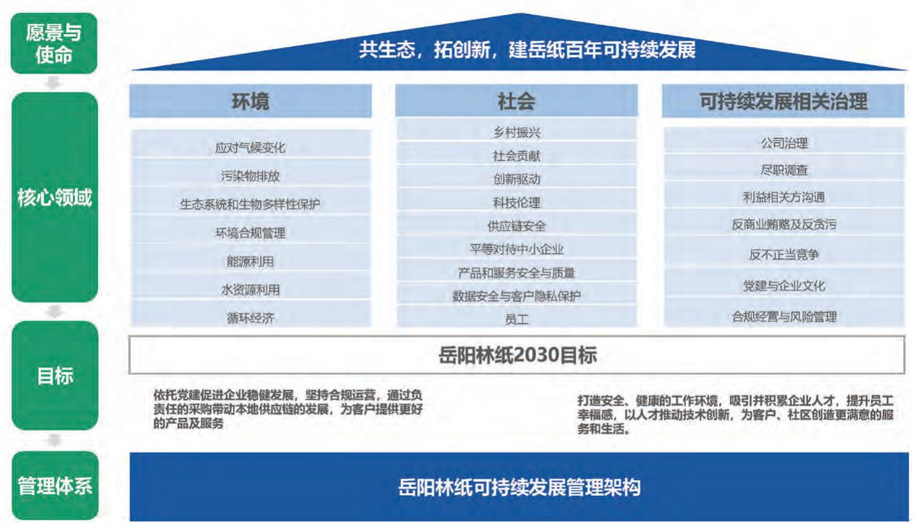

flowchart

```mermaid
graph TD
  Root["愿景与使命"] --> Env["环境"]
  Root --> Core["核心领域"]
  Root --> Goal["目标"]
  Root --> Mgmt["管理体系"]

  Env --> Env1["应对气候变化"]
  Env --> Env2["污染物排放"]
  Env --> Env3["生态系统和生物多样性保护"]
  Env --> Env4["环境合规管理"]
  Env --> Env5["能源利用"]
  Env --> Env6["水资源利用"]
  Env --> Env7["循环经济"]

  Env --> Soc1["乡村振兴"]
  Env --> Soc2["社会贡献"]
  Env --> Soc3["创新驱动"]
  Env --> Soc4["科技伦理"]
  Env --> Soc5["供应链安全"]
  Env --> Soc6["平等对待中小企业"]
  Env --> Soc7["产品和服务安全与质量"]
  Env --> Soc8["数据安全与客户隐私保护"]
  Env --> Soc9["员工"]

  Soc1 --> Gov1["公司治理"]
  Soc1 --> Gov2["尽职调查"]
  Soc2 --> Gov3["利益相关方沟通"]
  Soc3 --> Gov4["反商业贿赂及反贪污"]
  Soc4 --> Gov5["反不正当竞争"]
  Soc5 --> Gov6["党建与企业文化"]
  Soc6 --> Gov7["合规经营与风险管理"]

  Goal --> Goal2["岳阳林纸2030目标"]
  Goal2 --> Mgmt2["岳阳林纸可持续发展管理架构"]

  subgraph Core
    Env
    Env1
    Env2
    Env3
    Env4
    Env5
    Env6
    Env7
    Env9
    Env10
    Env11
    Env12
    Env13
    Env14
    Env15
    Env16
    Env17
    Env18
    Env19
    Env20
    Env21
    Env22
    Env23
    Env24
    Env25
    Env26
    Env27
    Env28
    Env29
    Env30
    Env31
    Env32
    Env33
    Env34
    Env35
    Env36
    Env37
    Env38
    Env39
    Env40
    Env41
    Env42
    Env43
    Env44
    Env45
    Env46
    Env47
    Env48
    Env49
    Env50
    Env51
    Env52
    Env53
    Env54
    Env55
    Env56
    Env57
    Env58
    Env59
    Env60
    Env61
    Env62
    Env63
    Env64
    Env65
    Env66
    Env67
    Env68
    Env69
    Env70
    Env71
    Env72
    Env73
    Env74
    Env75
    Env76
    Env77
    Env78
    Env79
    Env80
    Env81
    Env82
    Env83
    Env84
    Env85
    Env86
    Env87
    Env88
    Env89
    Env90
    Env91
    Env92
    Env93
    Env94
    Env95
    Env96
    Env97
    Env98
    Env99

  subgraph Governance ["可持续发展相关治理"]
    Gov1["公司治理"]
    Gov2["尽职调查"]
    Gov3["利益相关方沟通"]
    Gov4["反商业贿赂及反贪污"]
    Gov5["反不正当竞争"]
    Gov6["党建与企业文化"]
    Gov7["合规经营与风险管理"]
  end
```

# ESG治理安排

# 公司董事会对 ESG 治理参与和监管情况

董事会是 ESG 工作的领导和决策机构，负责审议公司 ESG 相关的战略目标、中长期规划、管理制度、年度 ESG 报告等事项。

# - ESG 治理架构

董事会战略发展委员会是 ESG 工作的研究和指导机构，负责统一领导和管理公司 ESG 工作；设 ESG 领导小组，由总经理任组长、经理层成员为组员，为 ESG 工作的组织和推进机构，负责制定公司 ESG 相关的战略目标、中长期规划、重大议题、管理制度、监督评估等内容，贯彻落实公司 ESG 发展战略与目标，组织和安排公司各部门、各子公司实施 ESG 工作；ESG 领导小组下设办公室（设在战略证券部），由董事会秘书任办公室主任，负责 ESG 报告的信息采集、编制和披露工作；公司各部门、各子公司承担职责范围内的 ESG 工作主体责任，负责按照公司 ESG 发展战略与目标，落实 ESG 工作任务，及时报送 ESG 信息。

# - ESG 工作制度及相关机制

公司发布《岳阳林纸股份有限公司环境、社会与治理(ESG)管理制度》，对 ESG 管理机构与职责进行了明确，股东、债权人、职工、供应商、客户和合作伙伴等利益相关方的权益保护做出了要求。公司在环境保护、劳工权益、健康安全、商业道德以及管理体系等方面建立健全了相应制度，搭建起了 ESG 管理机制。

# 尽职调查和利益相关方沟通

公司十分重视与利益相关方的真诚合作与友好沟通，组建由内外部专家共同构成的团队开展尽职调查，参考 GRI 准则、中国证监会《上市公司治理准则》等标准，识别出关键利益相关方包括政府与监管机构、股东及投资者、客户、员工、供应商及合作伙伴、社区与媒体等，并通过建立与利益相关方的常态化沟通机制，充分倾听并回应利益相关方的期望与诉求。

公司与利益相关方沟通的公开渠道主要包括公司作为上市公司在交易所指定信息披露平台发布的公告以及公司官网、官方微信公众号等；内部渠道包括工会、员工邮箱、职工代表大会、座谈会等。同时，公司采用线上、线下多种沟通形式，包括但不限于接待或拜访政府与监管机构、股东及投资者、客户等利益相关方，帮助公司及时了解利益相关方的期待和关注重点，为公司识别和分析重点议题提供依据。

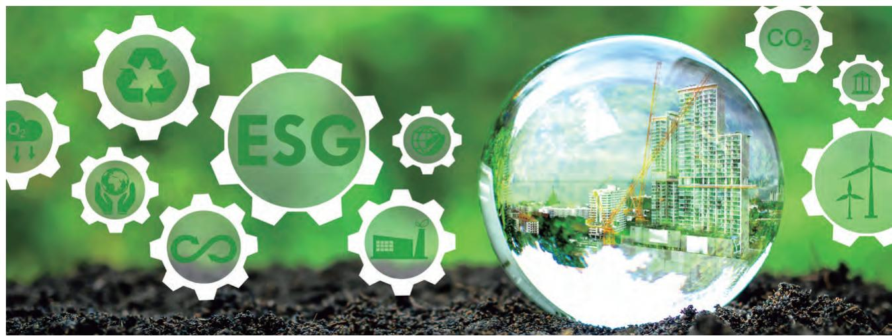

natural_image

Green background with white gear icons and a translucent glass sphere featuring a cityscape, symbolizing environmental and sustainability (no text or symbols on the globe or background)

<table><tr><td>利益相关方</td><td>期望与诉求</td><td>沟通方式</td><td>回应方式</td></tr><tr><td>政府与监管机构</td><td>● 诚信守法经营● 保护环境● 承担社会责任</td><td>● 政府沟通会议● 信息披露与报送● 定期汇报</td><td>● 合规经营,足额纳税● 落实环境管理● 创造就业机会,开展公益</td></tr><tr><td>股东及投资者</td><td>● 稳健经营● 信息披露● 股东回报</td><td>● 股东会● 上证e互动● 业绩说明会● 定期报告与信息公告</td><td>● 遵守法律法规● 准确披露信息● 保障股东权益● 提升投资价值</td></tr><tr><td>客户</td><td>● 优质产品与服务● 保障客户权益● 信息安全与隐私保护</td><td>● 公司官网● 服务热线● 客户满意度调查</td><td>● 开展产品创新● 加强售后服务● 维护数据安全</td></tr><tr><td>员工</td><td>● 员工权益保障● 员工薪酬与福利● 员工培训与发展● 职业健康与安全</td><td>● 工会、职工代表大会● 员工满意度调查● 培训活动● 职业健康体检</td><td>● 合法合规雇佣● 完善薪酬福利体系● 健全培训发展机制● 落实安全生产与职业健康保障</td></tr><tr><td>供应商及合作伙伴</td><td>● 保持良好合作● 责任采购● 互利共赢</td><td>● 合同履约● 日常沟通● 行业交流</td><td>● 规范供应商管理● 打造负责任供应链● 依法履行合同</td></tr><tr><td>社区与媒体</td><td>● 社区贡献● 公益慈善● 乡村振兴● 信息披露</td><td>● 社区宣传● 志愿服务活动● 不定期交流● 定期报告与信息公告</td><td>● 加大社区投入● 参与公益活动● 响应国家号召● 准确披露信息</td></tr></table>

# 实质性议题分析

岳阳林纸基于全球报告倡议 (GRI)、联合国可持续发展目标 (SDGs)、可持续发展会计准则委员会 (SASB)《SASB 标准》等国际标准及目标，按照《上海证券交易所上市公司自律监管指引第 14 号——可持续发展报告（试行）》的要求，参考《上海证券交易所上市公司自律监管指南第 4 号——可持续发展报告编制》等披露标准的评估方法，引入影响重要性和财务重要性的分析视角，结合与利益相关方的沟通结果，识别出与企业发展密切相关的 23 项议题，并确定了实质性议题的重要性排序。

# 评估方法

- 步骤一：公司ESG背景分析。基于全球可持续发展趋势、法律法规和宏观政策、造纸行业特点，以及公司的战略发展规划和生产经营实际，分析公司各环节的ESG影响、风险、机遇及利益相关方诉求。  
- 步骤二：议题筛选。参考《上海证券交易所上市公司自律监管指引第14号——可持续发展报告（试行）》的21项议题，结合GRI、SASB及外部评级机构关注，初步筛选并搭建公司2025年度ESG议题库，共识别23项关键议题。  
- 步骤三：议题重要性评估。

影响重要性评估。设计并发放利益相关方问卷，从实际影响和潜在影响等维度对议题开展分析，并根据问卷结果识别出具有影响重要性的议题。

财务重要性评估 组织专家团队，对风险与机遇的可能性、程度及时间跨度进行综合评估，探讨确定财务重要性议题。

\- 步骤四：议题确认。整合形成财务重要性和影响重要性议题清单，经公司管理层确认，确保相关议题透明、全面地在报告中披露。

natural_image

Illustration of people interacting with a computer screen displaying data and charts (no text or symbols)

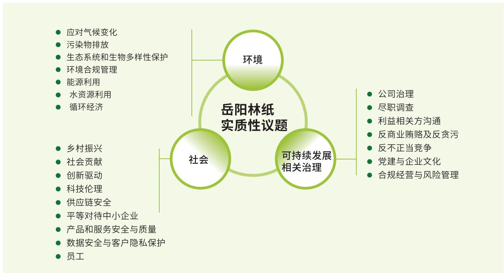

flowchart

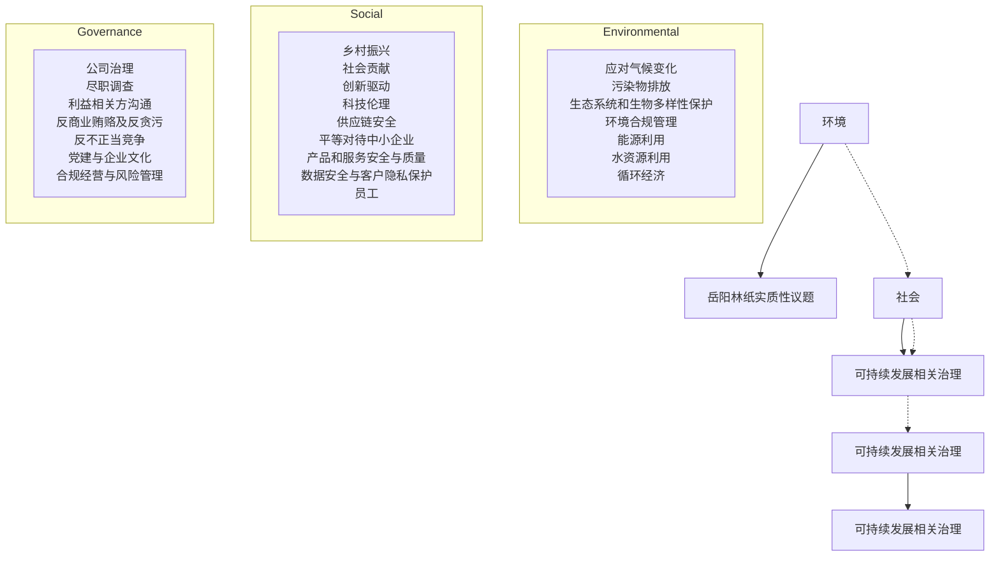
```mermaid
graph TD
  A["环境"] --> B["岳阳林纸实质性议题"]
  C["社会"] --> D["可持续发展相关治理"]
  E["可持续发展相关治理"] --> F["可持续发展相关治理"]
  
  subgraph Environmental
    G["应对气候变化\n污染物排放\n生态系统和生物多样性保护\n环境合规管理\n能源利用\n水资源利用\n循环经济"]
  end
  
  subgraph Social
    H["乡村振兴\n社会贡献\n创新驱动\n科技伦理\n供应链安全\n平等对待中小企业\n产品和服务安全与质量\n数据安全与客户隐私保护\n员工"]
  end
  
  subgraph Governance
    I["公司治理\n尽职调查\n利益相关方沟通\n反商业贿赂及反贪污\n反不正当竞争\n党建与企业文化\n合规经营与风险管理"]
  end
  
  A -.-> C
  C -.-> D
  D -.-> E
```

重要性识别结果

# 议题对经济、社会、环境的影响程度

非常重要

<table><tr><td>应对气候变化生态系统和生物多样性保护乡村振兴社会贡献平等对待中小企业产品和服务安全与质量员工反不正当竞争党建与企业文化</td><td>污染物排放环境合规管理能源利用水资源利用循环经济创新驱动供应链安全</td></tr><tr><td>科技伦理数据安全与客户隐私保护尽职调查利益相关方沟通</td><td>公司治理反商业贿赂及反贪污合规经营与风险管理</td></tr></table>

议题对公司财务的影响程度

非常重要

# 百年宅纸

守护青山绿水

# 千載文章

践行双碳目标

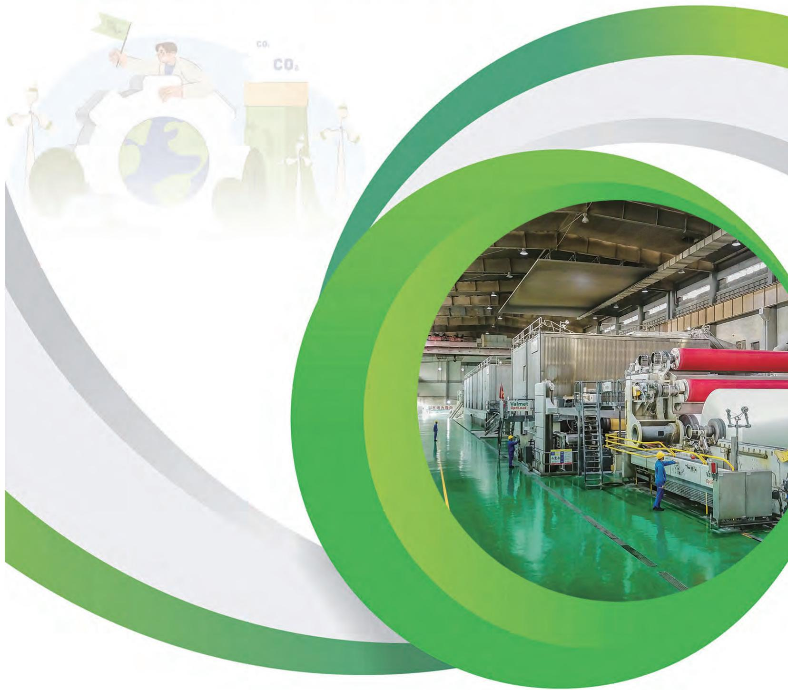

natural_image

Composite image showing industrial factory interior with workers and machinery, overlaid with abstract green circular graphics (no readable text or symbols)

text_image

更友

# 03

# 更友好的环境

# 更友好的环境

岳阳林纸积极响应国家“双碳”目标，将环境保护视为重要战略任务，率先发展可持续林业，布局林业碳汇开发，加强环境治理和技术创新，降低污染和资源消耗，以绿色低碳可持续发展模式打造公司的核心竞争力，实现经济效益和环境效益双赢。以生态为笔，以改革为墨，为守护绿色家园贡献力量，奋力书写百年岳纸的千载文章。

报告期内，公司环保投入3.37亿元，近三年累计投入超8亿元，实现环保“零”事故，环保行政“零”处罚。

环境监测情况：推进环保监管数智化升级，依托“生态环境部重点排污单位自动监控系统、通通联手机实时系统、电力环保智慧监管平台、固废管控系统”四大核心系统，打造“实时监测—内控超标预警—数据溯源”全链条闭环管理机制。对废水、废气、固废及21个电力关键设备运行点位实施24小时动态监管，实现环保数据“看得见、管得住、可追溯”

排污许可证申请时间和有效期

<table><tr><td>公司名称</td><td>申请年度</td><td>排污申报类型</td><td>有效期</td></tr><tr><td>岳阳林纸</td><td>2025年</td><td>污水、废气、固体废物</td><td>5年</td></tr><tr><td>骏泰科技</td><td>2025年</td><td>污水、废气、固体废物</td><td>5年</td></tr></table>

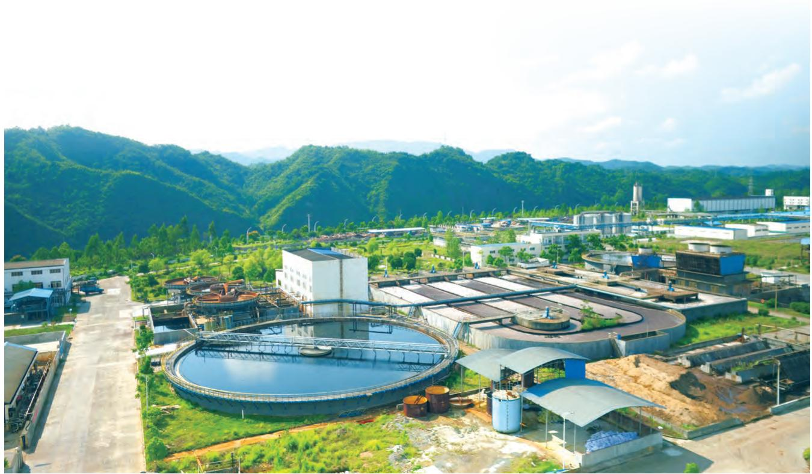

natural_image

Aerial view of an industrial wastewater treatment facility surrounded by green hills, featuring circular water tanks and processing units (no visible text or symbols)

# 应对气候变化

岳阳林纸为深入贯彻落实国家关于推动绿色发展、建设生态文明的重要部署，切实加强公司能源管理工作，深挖节能潜力，降低能源消耗和生产成本，持续推动公司能效提升和二氧化碳排放强度下降，提高企业核心竞争力与可持续发展能力。

# - 减少温室气体排放

公司每月根据《造纸和纸制品生产企业温室气体排放核算方法与报告指南（试行）》《中国发电企业温室气体排放核算方法与报告指南（试行）》等规定，对公司温室气体排放进行核算。报告期内，岳阳林纸二氧化碳排放总量约153.228万吨，万元产值(2020年可比价)二氧化碳排放量为1.88吨/万元，同比下降10%，温室气体排放密度为0.659（吨二氧化碳/吨产品），同比下降11.42%。

备注：最终的碳排放数据以湖南省生态环境厅委托的第三方机构核算数据为准。

在公司统筹下，温室气体减排工作取得新成效。持续开展先进节能技术的引进工作，透平机等系列节能降碳先进装备应用落地。提升清洁能源替代，厌氧沼气、制浆黑液、造纸污泥的掺烧利用量同比提升，进一步提高了公司生物质燃料的比例。设备提质升级，推动汽轮机组改造，拆除岳阳基地3#、4#热电锅炉，关停岳阳基地1#、2#锅炉，减少燃煤用量，进一步降低二氧化碳排放量。

骏泰科技采用生物质锅炉全面替代传统化石能源用于生产供热，将清洁可再生能源深度融入生产全流程，实现能源高效利用与绿色低碳协同增效，碳减排工作取得突破性进展。报告期内二氧化碳排放量实现-4700吨，迈入负碳运行新阶段，用实打实的数据交出了一份亮眼的绿色答卷。

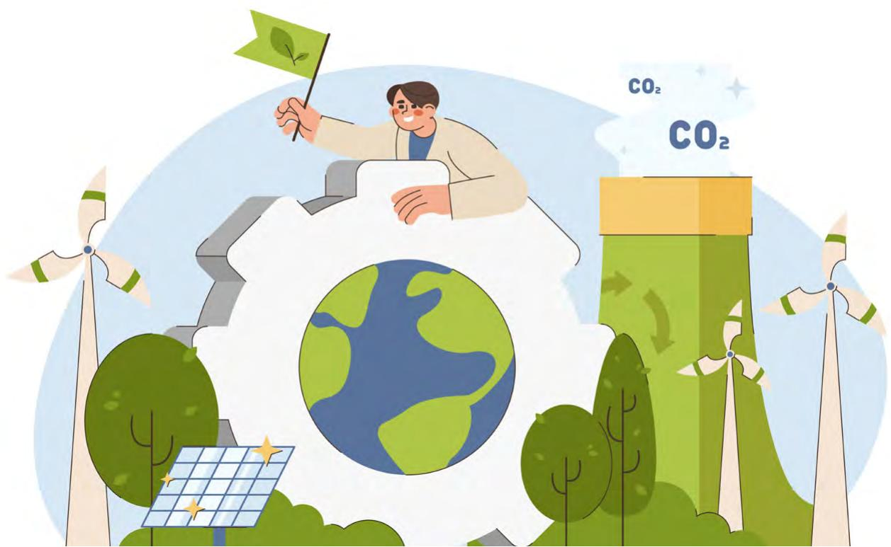

natural_image

Illustration of a person holding a flag standing on a globe surrounded by wind turbines and solar panels, with CO2 and CO2 labels above (no text or symbols on the diagram itself)

# 案例

# 骏泰科技园区集中供热项目

骏泰科技持续发挥集中供热优势，高效稳定为怀化市高新技术产业开发区提供清洁能源供热，全年累计供热量达98927.78GJ，提供绿色能源5.44亿度，有力替代园区分散式小锅炉，大幅降低分散供热带来的能源消耗与污染物排放，以实际行动助力绿色低碳发展，为区域生态环境保护与高质量发展贡献重要力量。

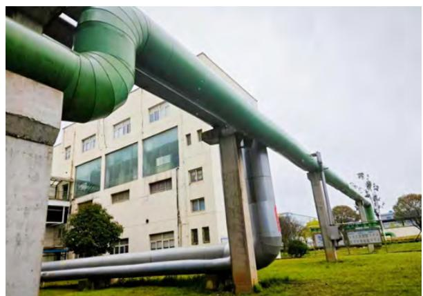

natural_image

Exterior view of an industrial building with large green piping and concrete pillars, set in a grassy field (no visible text or symbols)

# 案例

# 岳阳基地提质升级综合技改项目

岳阳基地提质升级综合技改项目（一期）于2025年通过项目环保验收和节能验收。项目引进维美德公司国际先进的45万吨纸机（公司PM11），淘汰PM1、PM2、PM4、PM5等老旧高能耗、高污染纸机，实现节能减排，报告期内岳阳基地万元产值（2020年可比价）二氧化碳排放量为2.30吨/万元，同比下降18.15%，节能减排成效显著。

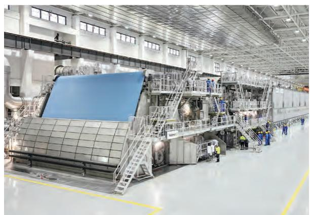

natural_image

Interior view of a large industrial factory with heavy machinery and workers (no visible text or symbols)

# 案例

# 岳阳基地进行锅炉拆除与改造

报告期内，岳阳基地顺利完成 3#、4# 锅炉拆除工作，并通过专家验收。项目积极响应国家大气污染防治政策要求，通过与华能岳阳电厂开展集中供热合作，以高效、清洁、稳定的外部热源替代原有自备锅炉供热。同时开展对 5#、6# 锅炉的提质改造，提升换热能力，提高锅炉效率，降低风机电耗，保障锅炉安全稳定运行。双管齐下，有效减少了废气排放与二氧化碳排放，进一步增强公司大气污染综合治理能力。

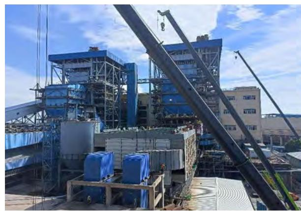

natural_image

Industrial construction site with steel framework and cranes, no visible text or symbols

# - 碳减排项目开发

岳阳林纸借助自身多年以来积累的自营林资源，积极开展碳汇产品的开发，促进全社会绿色低碳发展，助力国家“双碳”目标早日实现。

报告期内，诚通碳汇结合主业研究涉碳相关工作，以跑通项目、锻炼团队、释放利润为目标，市场拓展、项目开发取得实质性进展。截至报告期末，诚通碳汇累计签订林业碳汇合同22份，其中林业碳汇合同面积超1亿亩。

一是合同签订数量和种类创历年之最，2025年签订林业碳汇合同8份，林业碳汇合同面积3920万亩；积极布局其他项目类型，探索新的业务增长点，其中签订草原碳汇合同面积9470万亩，农田碳汇合同面积2124万亩，湿地碳汇合同面积154万亩；中标第一个林业技术服务合同，新增技术服务产品类型。

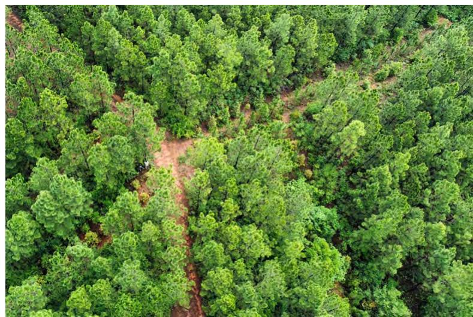

natural_image

Aerial view of a dense forest with a winding dirt path, showing no visible text or symbols.

二是碳汇项目开发取得实质性突破。2025年底共有20个项目处于开发阶段，7个项目完成项目公示，2个CCER林业碳汇项目申请登记（全国同期仅7个）。

报告期内已披露的碳汇开发项目，截至报告期末的进展情况

<table><tr><td>序号</td><td>合同签订时间</td><td>项目</td><td>进展情况</td></tr><tr><td>1</td><td>2021年11月</td><td>湖南骏泰生物基新材料科技有限责任公司生物质发电减排(CCER)项目</td><td>依据征求意见稿,完成骏泰生物质项目《骏泰怀化工业园区一期、二期90兆瓦生物质热电联产项目设计文件》的编制。</td></tr><tr><td>2</td><td>2022年2月</td><td>湖南省郴州市永兴县造林碳汇项目</td><td>完成林地调查工作、项目设计文件文本、收集项目支撑文件。项目已在CCER注册登记系统完成公示,待审定机构进行现场审定。</td></tr><tr><td>3</td><td>2022年3月</td><td>贵州省铜仁市江口县造林碳汇项目</td><td>完成项目设计文件整改。项目已提交公示,完成二次现场补充审定。</td></tr><tr><td>4</td><td>2022年6月</td><td>甘肃省白银市会宁县造林碳汇项目</td><td>完成项目设计文件文本。</td></tr><tr><td>5</td><td>2022年7月</td><td>西藏自治区日喀则市造林碳汇项目</td><td>因政策原因终止,已于2026年1月28日发布《岳阳林纸股份有限公司关于子公司解除&lt;温室气体自愿减排项目林业碳汇开发合作合同&gt;的公告》。</td></tr><tr><td>6</td><td>2022年7月</td><td>湖北省咸宁市通山县造林碳汇项目</td><td>完成收集项目支撑文件、林地调查工作、项目设计文件文本。</td></tr><tr><td>7</td><td>2023年3月</td><td>湖北省宜昌市五峰土家族自治县造林碳汇项目</td><td>完成项目设计文件整改。项目已提交公示,完成二次现场补充审定。</td></tr><tr><td>8</td><td>2023年7月</td><td>湖南省永州市零陵区造林碳汇项目</td><td>完成项目现场审定工作,待提交登记。</td></tr><tr><td>9</td><td>2023年10月</td><td>江西省赣州市南康区造林碳汇项目</td><td>完成项目现场审定工作,待提交登记。</td></tr><tr><td>10</td><td>2024年3月</td><td>江西省吉安市永新县造林碳汇项目</td><td>完成项目纳入林地范围的确定、各年度造林设计文件的收集、项目设计文本编制。项目已在CCER注册登记系统完成公示,待审定机构进行现场审定。</td></tr><tr><td>11</td><td>2024年9月</td><td>内蒙古自治区锡林郭勒盟多伦县造林碳汇项目</td><td>完成资料收集、项目范围确定、减排量计算工作、项目设计文件编写。</td></tr><tr><td>12</td><td>2024年9月</td><td>陕西省渭南市韩城市造林碳汇项目</td><td>完成资料收集、项目范围确定、减排量计算工作、项目设计文件编写。</td></tr><tr><td>13</td><td>2024年12月</td><td>湖南省怀化市造林碳汇项目</td><td>人员入场,完成项目基础资料收集。</td></tr><tr><td>14</td><td>2024年12月</td><td>江西省赣州市安远县造林碳汇项目</td><td>人员入场,完成项目基础资料收集。完成项目图纸矢量化。已确定项目边界,正在收集林权证。</td></tr><tr><td>15</td><td>2025年10月</td><td>湖南省岳阳市造林碳汇项目</td><td>完成项目设计文件文本。在CCER注册登记系统完成开户,项目待公示。</td></tr><tr><td>16</td><td>2025年3月</td><td>云南省曲靖市麒麟区造林碳汇项目</td><td>开发人员入场,收集项目基础资料。</td></tr><tr><td>17</td><td>2025年3月</td><td>江西省赣州市宁都县造林碳汇项目</td><td>开发人员入场,完成项目基础资料收集。</td></tr><tr><td>18</td><td>2025年5月</td><td>广西壮族自治区百色市乐业县造林碳汇项目</td><td>开发人员入场,收集项目基础资料。</td></tr><tr><td>19</td><td>2025年7月</td><td>云南省保山市昌宁县林业碳汇开发项目</td><td>签订合同,开发人员入场,收集项目基础资料。</td></tr><tr><td>20</td><td>2025年11月</td><td>新疆维吾尔自治区塔城地区造林碳汇项目</td><td>开发人员入场,完成项目基础资料收集。</td></tr><tr><td>21</td><td>2025年11月</td><td>云南省曲靖市富源县造林碳汇项目</td><td>开发人员入场,完成项目基础资料收集。已确定项目边界,正在收集林权证。</td></tr><tr><td>22</td><td>2025年10月</td><td>河北省木兰围场国有林场造林碳汇项目</td><td>开发人员入场,完成项目基础资料收集和项目设计文件编写,已向CCER注册登记系统提交开户申请。</td></tr></table>

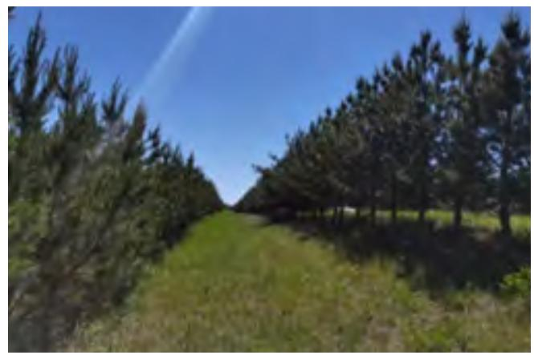

natural_image

Landscape view of a tree-lined pathway through a grassy field under a clear blue sky (no text or symbols visible)

内蒙古多伦县森林资源调查

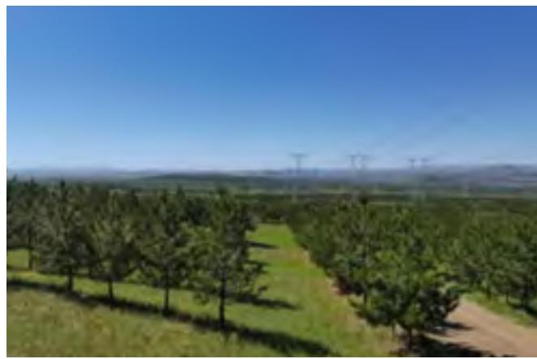

natural_image

Agricultural field with trees under a clear blue sky, distant hills and power lines visible in the background (no text or symbols)

岳阳市平江县森林资源调查

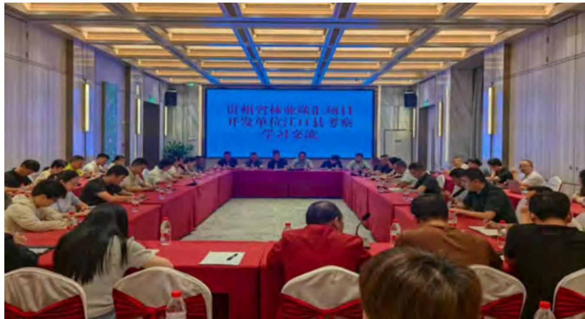

text_image

贵州杏林业碳汇项目
开发单位汇口县考察
学习交流

贵州省林业碳汇项目开发单位江口县考察学习交流现场

# 能源利用

能源是驱动企业生产运营的核心动力，也是实现绿色低碳转型的关键领域。报告期内，公司严格遵守国家能源管理法律法规，持续优化能源消费结构。一方面，通过技术改造提升传统能源的使用效率，严格落实节能降耗目标，降低单位产值碳排放强度；另一方面，积极布局清洁能源体系，加大对生物质等可再生能源的开发利用力度。在保障生产稳定的同时，减少对化石能源的依赖，推动能源体系向“清洁、低碳、安全、高效”的方向稳步迈进。

报告期内，公司可再生能源占比 69.4%。

<table><tr><td>能源使用情况</td><td>单位</td><td>2024年</td><td>2025年</td></tr><tr><td>能源消费总量</td><td>吨标准煤</td><td>1784377</td><td>1829101</td></tr><tr><td>总能耗强度</td><td>吨标煤/万元</td><td>1.951</td><td>1.935</td></tr><tr><td>直接能源总消耗量</td><td>吨标准煤</td><td>1782607</td><td>1828392</td></tr><tr><td>间接能源总消耗量</td><td>吨标准煤</td><td>1770</td><td>708</td></tr><tr><td>再生能源使用量</td><td>吨标准煤</td><td>1244752</td><td>1269343</td></tr><tr><td>非再生能源使用量</td><td>吨标准煤</td><td>539625</td><td>559759</td></tr><tr><td>可再生能源占比</td><td>%</td><td>69.76</td><td>69.40</td></tr><tr><td>清洁能源使用量</td><td>吨标准煤</td><td>1246582</td><td>1271725</td></tr><tr><td>清洁能源占比</td><td>%</td><td>69.86</td><td>69.53</td></tr></table>

# - 管理体系运行

为深入贯彻落实国家关于绿色发展和生态文明建设的重要部署，公司严格遵循国家相关法律法规，紧密参照 GB/T23331-2020/ISO50001:2018《能源管理体系要求及使用指南》标准，顺利通过能源管理体系认证，且体系运行正常，同步制定《节能降碳管理办法》《能源管理制度》《能源计量管理制度》等文件，坚持强化节能目标分解与考核，全方位规范公司能源管理流程。

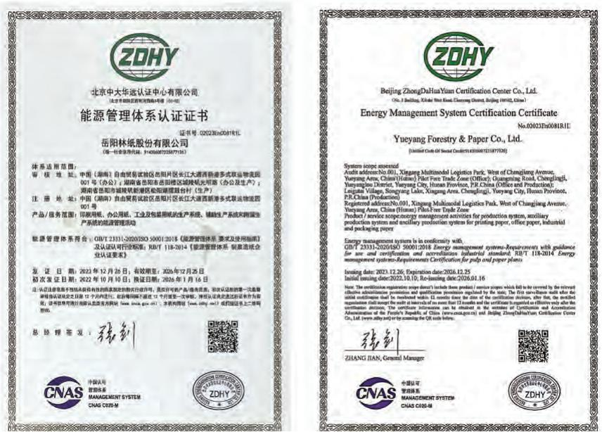

# - 节能举措

岳阳林纸积极响应习近平新时代中国特色社会主义思想，深入贯彻党的二十大精神，动态管控能源消耗总量和强度调控要求。报告期内，公司开展多项节能措施，节能投入超2.3亿元，万元工业产值综合能耗同比下降超15%。

岳阳基地印刷书写纸的吨纸综合能耗 $186\mathrm{kgce / t}$ ，优于制浆造纸单位产品能源消耗限额中制浆造纸主要生产系统单位产品能耗限额等级1级；包装用纸的吨纸综合能耗 $255\mathrm{kgce / t}$ ，优于制浆造纸单位产品能源消耗限额中制浆造纸主要生产系统单位产品能耗限额等级1级。

骏泰科技商品浆综合能耗278kgce/Adt，优于制浆造纸单位产品能源消耗限额中制浆造纸主要生产系统单位产品能耗限额等级1级。

# 案例

# 岳阳基地开展高效节能改造项目

汽轮机组节能降碳技改项目，引进新技术淘汰落后设备与产能，改造3#、5#、6#抽汽背压式汽轮机组，供电煤耗降低超30%，提高能源利用率，达到节约能源的目的。

实施 PM3 提质升级技改项目，通过对纸机本体一系列改造，减少故障停机，提高系统稳定运行，吨纸汽耗下降 0.25t/t，预计每年节约标煤 7 万吨，可减少碳排放量约 20 万吨。

PM9/10 中央空调提质节能改造项目,采用 2 台 350RT (1231kW/台) 多机头磁悬浮变频离心机组制冷。改造后采用机房群控,提高运行管理质量和效率,空调系统运行功率降低 179KW,经测算年化减碳量可达到 894t。

岳阳基地开展制浆好氧曝气系统实施技术改造，采用高效旋流曝气器替代原有老旧射流曝气管。改造后，系统运行功率由1090kW降至807.69kW，节电率达25.9%，年节电量约247万kWh。同时，好氧池平均溶解氧（DO）浓度由1.8mg/L提升至2.6mg/L以上，有效增强污水处理效果，实现节能降耗与工艺优化的协同效益。

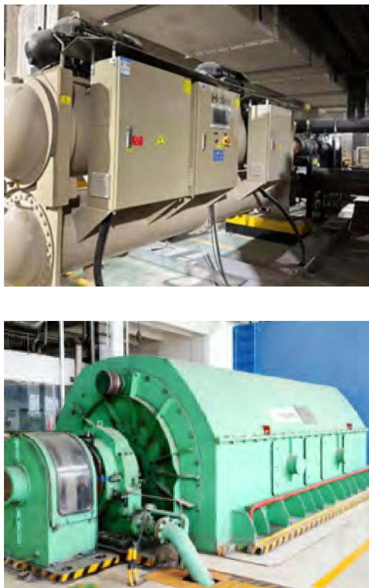

# 案例

# 骏泰科技开展曝气池节能改造项目

骏泰科技始终聚焦节能降碳与绿色生产，累计投入294万元实施污水处理曝气池旋流改造项目。该项目以节能高效曝气风机及旋流曝气工艺，替换原有生化系统AB段与氧化沟段的倒伞型表面曝气机。改造完成后，系统节电效率达32%，年可减少碳排放1378.49吨，以技术升级持续推进绿色低碳发展。

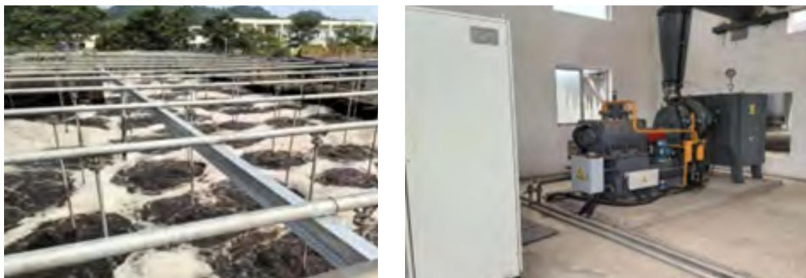

# 水资源利用

公司用水主要取自河流、湖泊等地表水体，经工艺处理后供生产使用。公司遵循“分级处理、循环利用”的原则，致力于降低生产中各个环节的清水用量，提高水资源的循环利用水平。强化节水指标分解与专项考核，在PM9/10纸机上推广应用湿部高压喷淋清洗装置，在PM6/7推进多盘白水回收系统利用，完成岳阳基地给排水管网项目建设，在生产链全环节中持续推进水系统的优化、改进和创新，降低清水用量。

报告期内, 水资源消耗量约 5263 万吨, 水循环利用率 90.7%。

natural_image

Illustration of a globe partially submerged in water with bubbles, symbolizing global sustainability or environmental impact (no text or symbols present)

# 案例

# 岳阳基地给排水管网项目

项目分为雨污分流改造工程、供水 & 污水管网改造土建工程、供水 & 污水管网改造安装工程三个部分，将公司管网由暗改明，地下转为地上，总投入 8898 万元。依托先进的流量监测系统，生产车间节水工作稳步推进，水资源利用效率大幅提升，日均节约清水用量 10000 吨。

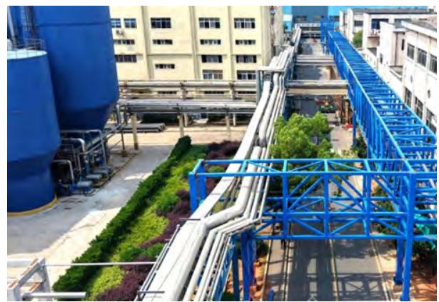

natural_image

Industrial facility with blue steel trusses and piping, surrounded by greenery and buildings (no visible text or symbols)

# 污染物排放

岳阳林纸以“全面高标准”的环保管理要求推进对污染物的管控。公司制定了环境管理方针与完善的环保管理制度，同时不断优化工艺，提升环保治理设施的运行质量，实现生产与环境的协调发展。

公司严格遵守各项环保法律法规，废水、废气、固体废弃物均按照要求达标排放和合规处置。

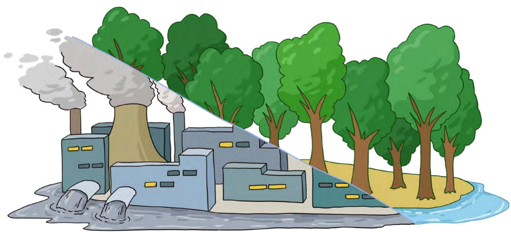

natural_image

Illustration of industrial buildings emitting smoke from trees, with a river flowing nearby (no text or symbols)

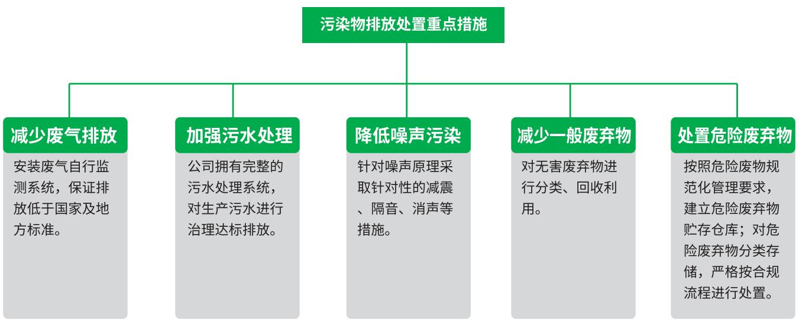

flowchart

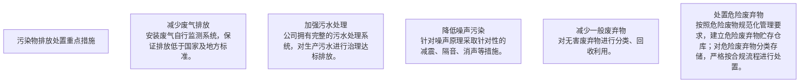
```mermaid
graph TD
  Root["污染物排放处置重点措施"]
  
  A["减少废气排放\n安装废气自行监测系统，保证排放低于国家及地方标准。"]
  B["加强污水处理\n公司拥有完整的污水处理系统，对生产污水进行治理达标排放。"]
  C["降低噪声污染\n针对噪声原理采取针对性的减震、隔音、消声等措施。"]
  D["减少一般废弃物\n对无害废弃物进行分类、回收利用。"]
  E["处置危险废弃物\n按照危险废物规范化管理要求，建立危险废弃物贮存仓库；对危险废弃物分类存储，严格按合规流程进行处置。"]
```

污染物排放数据

<table><tr><td colspan="3">岳阳基地</td></tr><tr><td>排放物类型</td><td>单位</td><td>数据</td></tr><tr><td>氮氧化物(NOx)排放量</td><td>吨</td><td>285.76</td></tr><tr><td>硫氧化物(SOx)排放量</td><td>吨</td><td>61.54</td></tr><tr><td>颗粒物(PM)排放量</td><td>吨</td><td>16.34</td></tr><tr><td>化学需氧量排放量</td><td>吨</td><td>1023.76</td></tr><tr><td>废水排放量</td><td>万吨</td><td>2951.24</td></tr><tr><td>一般废弃物产生量</td><td>吨</td><td>493544.05</td></tr><tr><td>危险废弃物产生量</td><td>吨</td><td>1711.48</td></tr><tr><td colspan="3">骏泰科技</td></tr><tr><td>排放物类型</td><td>单位</td><td>数据</td></tr><tr><td>氮氧化物(NOx)排放量</td><td>吨</td><td>395.14</td></tr><tr><td>硫氧化物(SOx)排放量</td><td>吨</td><td>60.9</td></tr><tr><td>颗粒物(PM)排放量</td><td>吨</td><td>58.55</td></tr><tr><td>化学需氧量排放量</td><td>吨</td><td>2696</td></tr><tr><td>废水排放量</td><td>万吨</td><td>1017.00</td></tr><tr><td>一般废弃物产生量</td><td>吨</td><td>310018.84</td></tr><tr><td>危险废弃物产生量</td><td>吨</td><td>95.04</td></tr></table>

# - 废水管理

公司在生产经营过程中会产生工艺废水、生活污水等。对此，我们重视废水源头减排管理，采用先进的制浆造纸工艺，配套完善的白水回用设施，从生产源头减少废水的产生量和排放量，同时在生产过程中借助水梯次循环利用技术，使废水排放量大幅降低。

重视保护水环境,积极响应环保要求,按照相关规定更新排污许可证,通过各基地内的废水处理站有效处理生活废水和生产废水,保证废水达标排放。

在废水排放口安装在线监测仪器，24小时对废水排放情况进行监测，确保水体污染物指标化学需氧量(COD)、悬浮物(SS)、氨氮、总氮、总磷等符合排放标准，监测数据每天同步上传至环保部门的监控平台，接受相关监管机构监督。同时定期委托第三方进行废水污染物监测，确保废水排放合法合规。

报告期内，公司制浆造纸废水全部达标排放，排放浓度均远低于国家排放标准限值。

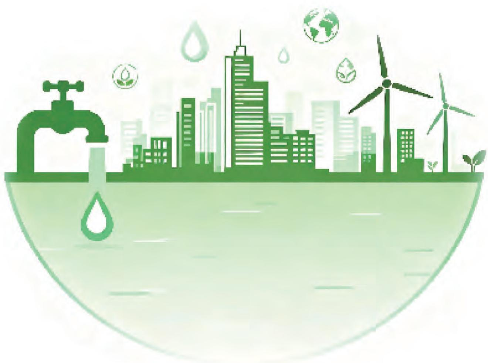

natural_image

Green illustration of a city with water drop, faucet, wind turbine, and globe (no text or symbols)

# 案例

# 污泥板框技改项目

骏泰科技针对原有板框设备老化、处理效能不足的痛点，投资1600万元，创新性地对闲置隔膜压滤机进行技术换代，将污水污泥进行深度处理。这一升级有效提升了固废资源化水平，构建了高效、安全的环保防护屏障。项目于2025年11月底投入试运行，已成功验证其技术可行性与经济环保性，为企业高质量发展注入强劲绿色动力。

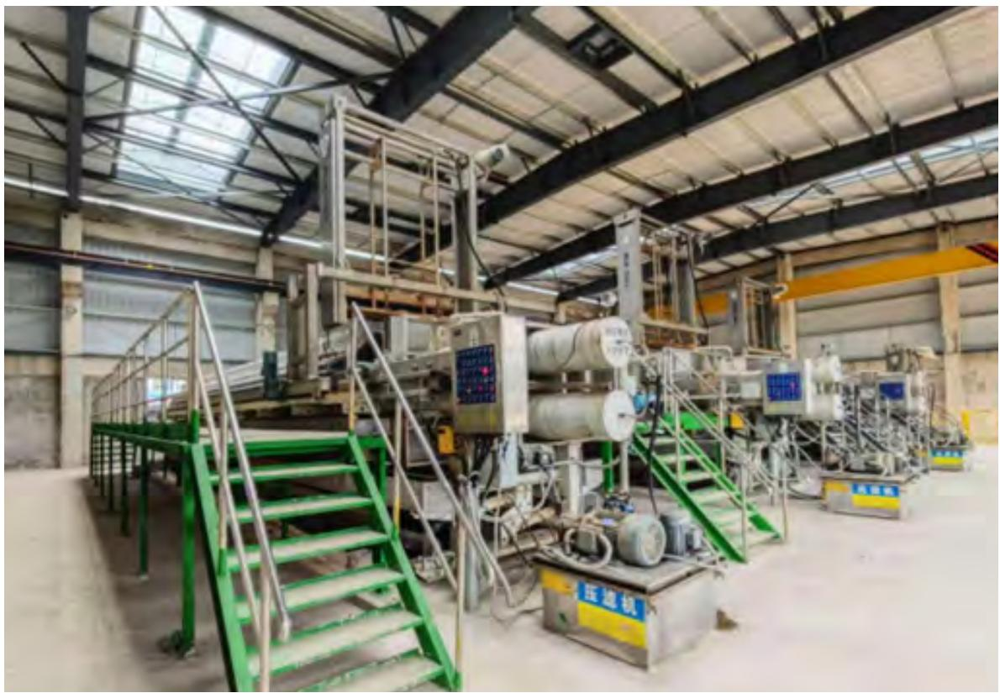

natural_image

Interior view of an industrial factory with large machinery and green staircases (no visible text or symbols)

# - 废气管理

坚持 “推动绿色发展，建设美丽中国” 的原则，以实际投入和行动减少大气污染物排放。积极响应国家超低排放政策要求，紧跟国家环境保护政策的变化，建立健全内部废气排放管理制度，及时推进废气处理系统升级改造，多年来相继投入了大量资金对公司脱硫、脱硝、除尘、臭气治理、无组织粉尘治理设施进行升级改造，大幅度提升了公司环保治理能力。

报告期内，公司废气全程稳定达标排放。

# 废气管理重点措施

积极采用环保型原材料，从源头上减少污染物的生成；

\- 严格执行排放标准，采用先进的治理设备，确保生产过程中产生的大气污染物排放符合法定要求；

● 建立了科学合理的大气污染物监测体系，对各类大气污染物进行实时监测和数据记录，以确保排放数据的真实准确。

<table><tr><td>项目</td><td>2025年</td><td>排污许可证许可排放总量</td></tr><tr><td colspan="3">岳阳基地废气污染物排放总量(单位:吨)</td></tr><tr><td>氮氧化物</td><td>285.76</td><td>905.76</td></tr><tr><td>二氧化硫</td><td>61.54</td><td>793.152</td></tr><tr><td>颗粒物</td><td>16.34</td><td>227.71</td></tr><tr><td colspan="3">骏泰科技废气污染物排放总量(单位:吨)</td></tr><tr><td>氮氧化物</td><td>395.14</td><td>800</td></tr><tr><td>二氧化硫</td><td>60.9</td><td>802.237</td></tr><tr><td>颗粒物</td><td>58.55</td><td>120.341</td></tr></table>

# 案例

# 骏泰科技污水低浓臭气治理项目（一期）

该项目已顺利完成招标工作，总投资1650万，聚焦厂区污水处理环节臭气治理与环境提升，通过对冷却塔系统进行专业化除臭改造，进一步完善环保治理设施，有效减少异味排放、改善厂区及周边环境质量，切实筑牢生态环境保护防线。

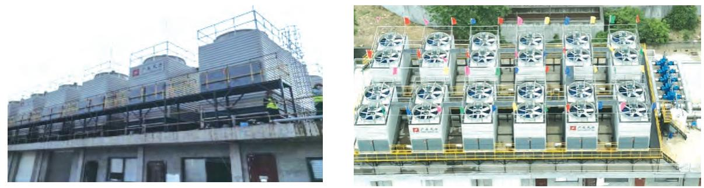

# 案例

# 岳阳基地锅炉超低排放改造

岳阳基地对厂内锅炉进行超低排放改造，现已实现全面超低、超洁净排放。排污量烟尘、氮氧化物、二氧化硫等同比实现大幅度降低。

报告期内废气治理系统稳定运行, 2025 年颗粒物平均浓度为 $3.69 \mathrm{mg} / \mathrm{m}^{3}$ , 二氧化硫平均浓度 $10.82 \mathrm{mg} / \mathrm{m}^{3}$ , 氮氧化物 $31.9 \mathrm{mg} / \mathrm{m}^{3}$ , 均远低于国家超低排放标准。

natural_image

Silhouette of a modern city skyline with prominent skyscrapers, no text or symbols present.

# 案例

# 碱回收车间低浓臭气项目

2025 年 12 月，岳阳基地投入资金 193 万元，针对碱回收车间碱液槽罐区等区域存在的低浓度臭气问题实施专项治理。项目通过对车间无组织排放的低浓度臭气进行系统性收集与集中处理，有效实现臭气污染物达标排放，显著降低了无组织排放对周边环境的影响，同时大幅改善了现场作业条件与职工工作环境，进一步提升了公司环保治理水平和本质安全管理能力。

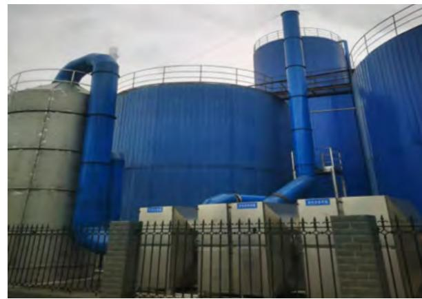

natural_image

Industrial storage tanks with blue piping and metal grilles, no visible text or symbols

# - 废弃物处理

岳阳林纸在生产经营活动中产生的废弃物包括煤灰、煤渣、木屑等。对此，公司秉承“循环经济、绿色制造”理念，固体废物严格按照《中华人民共和国固体废物污染环境防治法》《一般工业固体废物贮存和填埋污染控制标准》进行收集和处理，通过废弃物资源化、循环化利用，实现减量和无害化处理。

报告期内, 公司固体废弃物产生量 80.54 万吨 (其中一般固废 80.36 万吨, 危险废弃物 0.18 万吨), 合规处置率 100%。

其中，岳阳基地一般固体废弃物产生总量493544.05吨，全部回收利用、委外或自行综合利用，实现一般固废零填埋。危险废弃物产生总量1711.48吨，包括废矿物油、化工品桶、化工品废液等，全部委托合规资质单位妥善处理。

骏泰科技一般固体废弃物产生总量310018.84吨，污泥经干化后送锅炉掺烧，白泥利用石灰窑煅烧，绿泥（含剩余白泥）、炉灰送往水泥厂、肥料厂，实现综合利用，少量白绿泥和炉灰进骏泰固废堆场填埋。

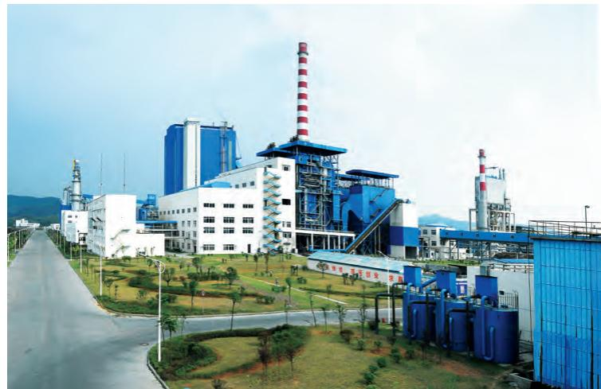

natural_image

Exterior view of a modern industrial complex with multiple buildings, chimneys, and landscaped grounds (no visible text or signage)

危险废弃物产生总量95.04吨，包括废保温棉、废矿物油、重油渣、废液等，全部委托合规资质单位妥善处理。厂内严格按照国家标准建设一般固废贮存场所、危废仓库、固废仓库，实现固危废规范管理。

# 案例

# 污泥送热电锅炉掺烧，降低固废产生、处置量、碳排放量

2025 年，岳阳基地针对污水处理环节产生的初沉污泥，创新采用热电锅炉协同掺烧处置模式，将污泥作为辅助燃料资源化利用，全年掺烧 7.28 万吨，较 2024 年同比增加 1.7 万吨；同期骏泰科技同步推进污泥资源化处置，全年掺烧 2.3 万吨，较 2024 年同比增加 0.1 万吨。

从源头实现固废减量化、资源化，大幅降低污泥长距离转运及委外处置带来的环境安全风险，筑牢生态环保防线；通过污泥替代部分煤炭燃料，有效降低煤炭消耗、节约化石能源，同步实现节能降碳与减污降碳协同增效，为基地绿色低碳转型、可持续高质量发展提供坚实支撑。

# 生态系统和生物多样性保护

岳阳林纸将“尊重自然、顺应自然、保护自然”贯穿于企业发展的全链条，构建了覆盖森林、湿地、海洋等多类生态系统的立体化保护格局，并将生物多样性保护内化为企业绿色治理的核心维度。

# - 生态系统保护

# 可持续林业

林业不仅是规模庞大的绿色经济体，更是践行“两山”理论、实现绿色发展的核心载体。岳阳林纸始终秉持“造纸先造林”的初心，将林业战略视为传统造纸向现代化升级的首要环节，率先在国内推行“林浆纸一体化”循环发展模式，构建起以林促纸、以纸兴林的良性生态闭环。

三十余载植绿不辍，公司足迹遍布湘、鄂、赣、桂四省，自营造林178.47万亩，辐射带动社会造林超千万亩，筑起了坚实的绿色长城。公司林地内栖息着170余种高保护价值动植物，生动诠释了人与自然和谐共生的经营理念。

# 生态修复

诚通凯胜开展镇海区海岸带生态修复及海塘安澜（一期）工程项目，全面贯彻海塘“安全 $+$ ”建设理念。海塘提标加固工程和围填海区生态修复工程合并实施，为宁波市的海岸线构建起一条滨海绿色发展带。通过一体化规划设计、堤防生态化改造、堤后护塘河建设等措施，新建水系11.15公里，种植生态防护林2700亩，生态修复面积近800公顷，年碳汇量可达3240吨，有效破解越浪收集与区内排水难题，构建绿色生态屏障。提升沿海产业区布局安全，促进近海生物多样性，打造休闲观光路线，激发海塘沿线生机活力，形成经济发展与生态保护动态平衡。该项目不仅筑起一道安全屏障，更构筑了生态线、民生线和共富线。

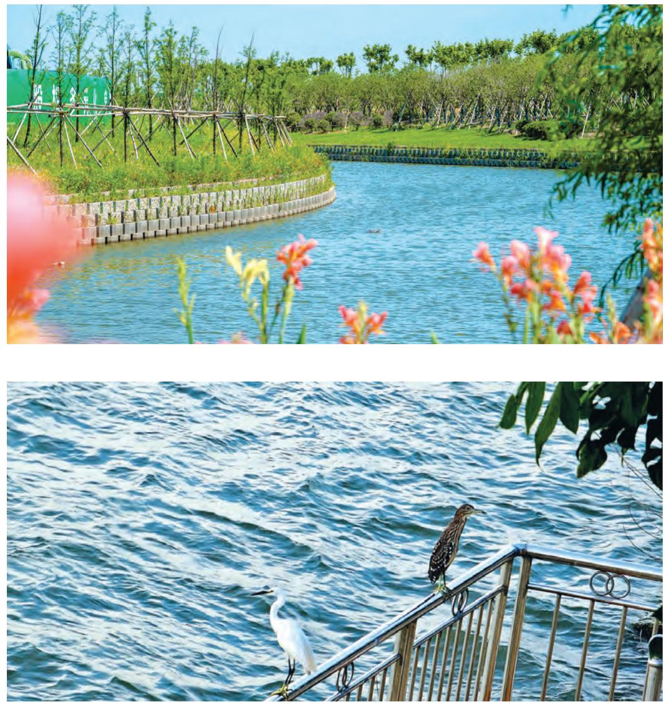

# 绿色文化宣传

公司以世界地球日、国际生物多样性日、六五环境日、全国低碳日、全国生态日等为契机，多次开展“公众开放日”“守护好一江碧水”“镜显生态美摄影比赛”等主题活动，积极传递“绿水青山就是金山银山”的发展理念，用实际行动书写央企生态担当。

2025 年 “六五” 环境日期间，公司组织开展了系列活动。联合岳阳市生态环境局开展 “美丽中国我先行” 主题宣传，展示企业发展与生态环境环保和谐共生案例，让生态文明理念深入人心；联合基地周边四所学校，搭建 “四校联盟生态环境教育基地”，开启校企联动的生态环境保护教育新模式，为企业生态环境教育和生态文明建设注入了新鲜动力。

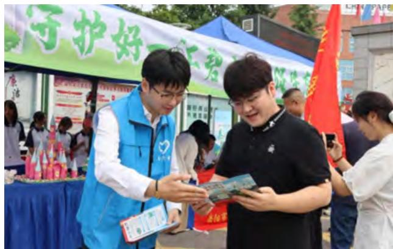

text_image

Street photo showing a volunteer distributing materials to a civilian at an outdoor event, with visible Chinese banners and signage in the background.

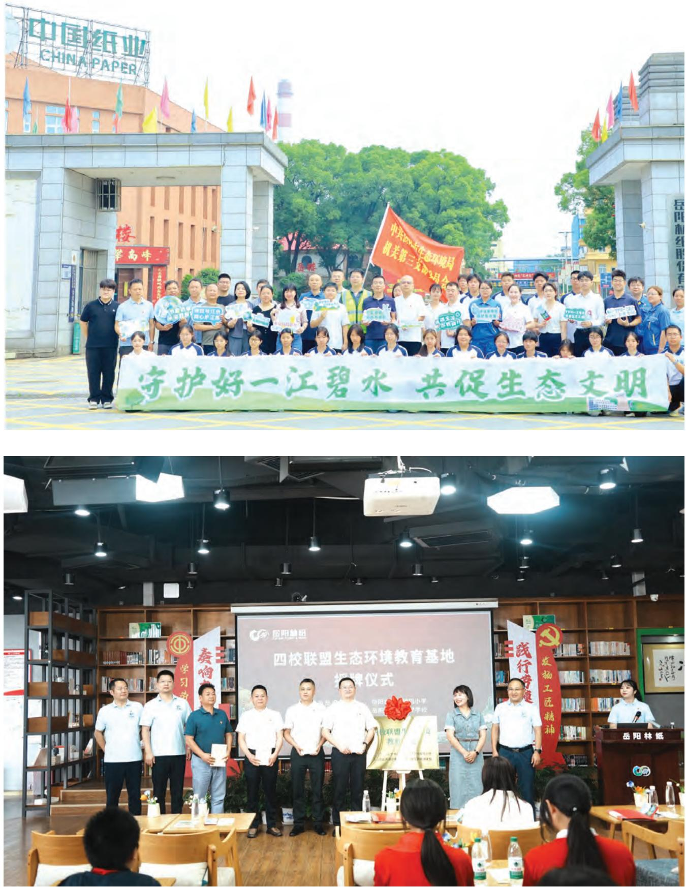

# - 生物多样性保护

2025 年，在湖南城陵矶三江口——这片长江与洞庭湖交汇的生态要地、江豚重要栖息水域，公司排污口附近多次被拍摄到国家一级保护动物长江江豚活动的珍贵身影。它们时而在水面露头换气，时而结伴嬉戏，铅灰色的脊背在波光中划出优美弧线，生动展现出“豚逐江波”的生态美景，这也成为公司生物保护工作成效最鲜活、最有力的见证。

江豚素有“水中大熊猫”“水质生态监测器”之称，对栖息水域的水质、水文环境要求极为严苛，其活动频次与种群状态直接反映区域生态系统的健康程度。城陵矶三江口作为长江与洞庭湖的交汇节点，是江豚重要的觅食、栖息和繁育区域，近年来随着生态保护力度加大，江豚种群呈现活动范围扩大、近岸出现频率增加、育幼行为明显的良好态势。而江豚多次在公司排污口附近稳定出现，不仅印证了城陵矶三江口水域生态环境的持续向好，更直接彰显了公司长期以来坚守环保底线、深耕水域治理的扎实成效。

从污水深度处理到排污口规范化整治，从固废资源化利用到节能降碳协同推进，公司以一系列务实行动，持续改善周边水域水质，为江豚等水生生物营造了安全、适宜的栖息环境，助力城陵矶三江口水域生态系统持续修复。

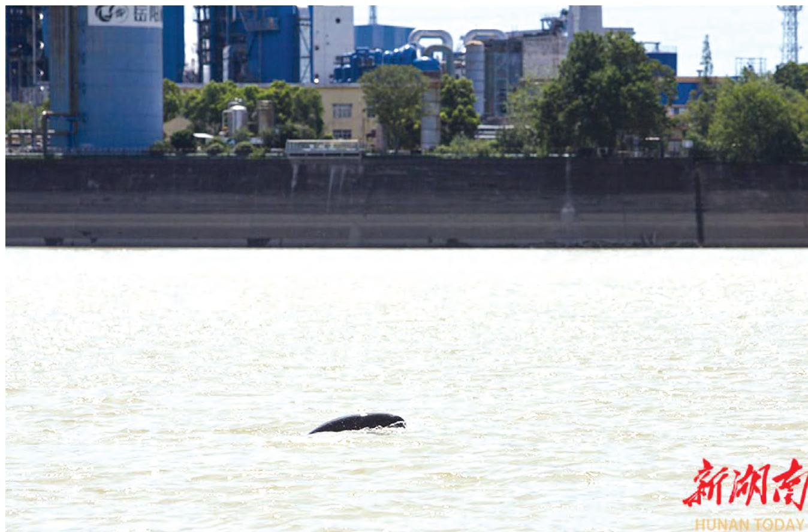  
江豚在岳阳林纸附近水域活动

# 环境合规管理

公司建立健全系列环保管理制度，定期对各分子公司环保工作进行指导和督查，广泛开展环保培训与宣传，加大环境突发事件的应急演练，不断提升员工的环保意识和能力水平。按照国家环保政策的要求，持续对环境治理设施进行升级改造，不断增强公司环境治理能力。公司顺利通过 ISO14001 环境管理体系认证，且体系健康稳定运行。

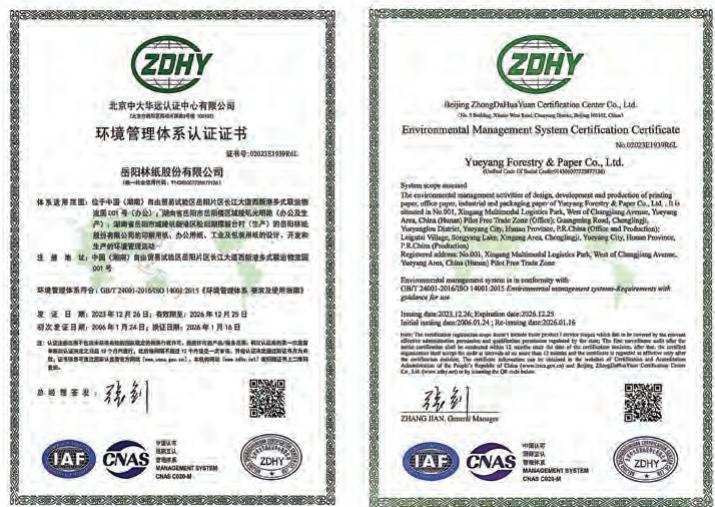

报告期内，岳阳林纸未发生任何生态环境违法违规行为、环保处罚及环境突发事件。

# - 环境管理机制

为夯实环境管理基础、强化环境风险防控，岳阳林纸及下属各分（子）公司构建了完善的环境管理组织体系与运行机制，确保环保工作规范化、常态化、精细化推进。

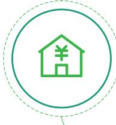

组织体系：公司及各子（分）公司均成立环保委员会，设置专门环保管理部门，配备专职环保管理人员，明确环保分管领导，各生产车间同步配备兼职环保管理人员，形成上下联动、全员参与的全方位环保管理网络，实现环保管理责任全覆盖。

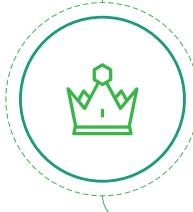

制度建设：发布《生态环境保护责任制》《环境风险隐患排查治理制度》《环保管理考核办法》等7项核心环保制度，进一步修订发布14项环境管理制度，持续完善环境管理规范化体系。

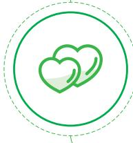

考核激励：创新构建“4321”考核体系，强化考核导向与约束作用，推动环保责任刚性传导、落地生根。

隐患防控：严格对标各级生态环境部门工作要求，巩固班组、事业部、公司三级环保排查治理网络，深化“日常排查+专项检查+突击抽查”三级联动隐患排查机制，围绕生产关键环节与重点节点制定专项环保管控方案，将环保责任精准落实至每个岗位、每个流程；建立动态隐患整改台账，严格执行“发现—上报—整改—验收”全流程闭环管理，实现隐患治理全过程可追溯、全环节强管控。健全上下游单位协同治理机制，落实“日排查、周例会、月总结”常态化沟通制度，通过跨单位协同联动，推动源头减排、过程控制、末端治理各项要求落地见效，构建起全方位、多层次、一体化的生态环境保护管理格局，切实筑牢环境风险防控防线。

# - 环境风险和环境事件应急预案

为进一步强化环境风险预判与应急处置能力，公司常态化开展环境因素识别与评价工作，并定期按规范要求进行评审优化，持续提升环境管理的针对性与前瞻性。2025年1月，公司委托第三方专业机构编制完成全面规范的《突发环境事件应急预案》，已按法定程序向本地生态环境局完成备案，为突发环境事件的科学、高效处置提供了坚实制度支撑与行动指引。

# 案例

# 突发辐射事故应急演练

2025 年 11 月，岳阳市突发辐射事故应急演练在公司圆满落幕，该演练由岳阳市人民政府主办，岳阳市生态环境局、岳阳市岳阳楼区人民政府承办。作为首次参与市级辐射事故应急综合演练的企业，公司党委高度重视、迅速响应，在市生态环境局的专业指导下，多次召开专项协调会议，组建 20 人专业工作专班，深度参与演练策划拍摄、辐射监测、应急处置、场地搭建及后勤保障全流程，全力保障演练各环节无缝衔接、高效有序推进。本次演练创新采用 “现场实战 + 桌面推演” 相结合的模式，不仅有效检验了《岳阳市突发环境事件应急预案》的科学性、可行性与可操作性，更锤炼了政企联动、多部门协同应对突发环境事件的应急处置能力，成为政企携手共筑长江经济带生态安全屏障的生动实践。

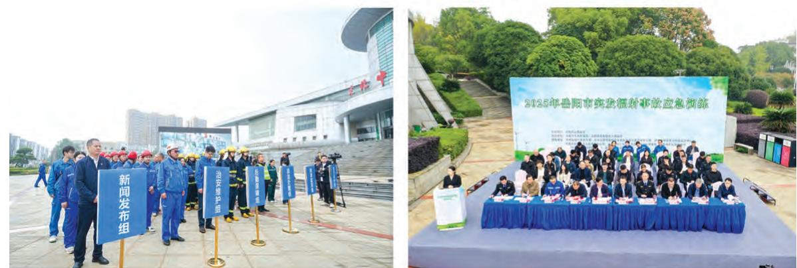

# 案例

# 环保教育培训

公司坚持将环保宣教与能力建设作为重要抓手，提前谋划、系统部署，年初制定年度环保教育培训计划，明确培训内容、形式与安排。2月底举办首届环保专项培训班，邀请岳阳市生态环境局专家、律协环资委律师及企业环保骨干授课，保障培训高标准、高质量开展。依托生态环境部等官方公众号平台，每月常态化开展环保政策、制度及环保管理技能培训，覆盖各生产单元，全年累计参训达3000人次。积极参加湖南省、市、区等单位组织的外部培训10次，持续拓宽环保管理视野，强化专业履职能力，为生态环保工作行稳致远筑牢人才与思想基础。

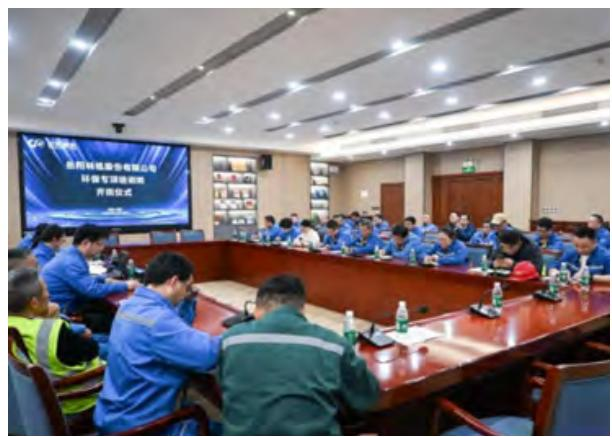

text_image

总网科技装备有限公司
环保专项检测
育能仪式

text_image

CONTRACT
%

# 循环经济

岳阳林纸坚持“循环经济，绿色制造”的理念，围绕资源的高效利用与循环利用，持续改善环境治理能力。公司通过引进新工艺、新设备和新材料，从工艺流程、设备管理、资源利用等方面进行技术革新，推动生产模式从“线性消耗”向“闭环循环”转型。

为持续提升固废综合利用水平，公司针对生产过程中产生的浆渣，因地制宜、分类施策，探索出高效可行的固废综合利用路径，不断强化资源的循环效率，实现了“固废不废、变废为宝”。

报告期内，废弃物循环利用量 786952 吨。

# 案例

# 浆渣综合利用

骏泰科技聚焦浆渣资源化利用，构建“生产-回收-再利用”闭环体系，将生产过程中产生的4745.9吨浆渣精准输送至林化事业部，依托专业加工工艺，对浆渣进行深度资源化处理，制成纤维素产品，实现浆渣的高附加值利用，既有效减少了浆渣固废堆积带来的环境压力，又延伸了产业链条，实现环保效益与经济效益的双向提升。

岳阳基地结合自身产业优势，优化浆渣处置模式，全年累计处理浆渣达7.6万吨，大幅提升了固废利用率。此外还将部分浆渣合理输送至其他专业造纸企业，做为瓦楞纸生产原料，实现浆渣资源的跨企业、跨领域循环利用，让原本的生产固废成为可再利用的工业原料，最大化发挥资源价值。

# 案例

# 白泥资源化利用

岳阳林纸锚定硫酸盐法制浆碱回收产生的白泥资源化利用方向，探索将其转化为造纸填料的可行路径。经过持续技术攻关，2025年产能已提升至200t/d。其核心工艺为：将绿液澄清后与石灰反应生成碳酸钙，经固液分离、洗涤得到原白泥，再通过过滤、筛分、解絮、碳化等工序制成轻质碳酸钙，回用于造纸车间。白泥变填料，固废成资源，跑通了一条减碳、降本、增效多赢的循环经济之路。

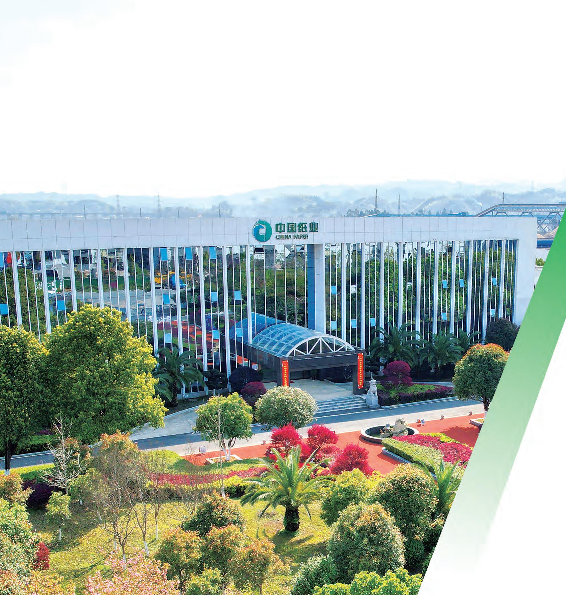

natural_image

Exterior view of a modern glass building with '中国纸业 CHINA PAPER' signage, surrounded by landscaped gardens and trees (no other text or symbols visible)

# 04

# 更美好的社会

# 更美好的社会

我们始终秉持“以人为本”的理念，持续构建并完善多元化、平等、包容的工作环境，全面保障员工合法权益，不断拓宽职业发展与成长通道；我们高度重视员工职业健康与安全，通过系统化培训与常态化管理，全面提升安全意识与防护能力，保障员工身心健康。此外，公司还通过形式丰富的员工关怀活动，积极营造温馨和谐的工作与生活氛围。

与此同时，公司坚守负责任的企业公民义务，将可持续发展理念贯穿于供应链管理，通过负责任采购推动产业链协同进步，平等对待中小企业；注重产品安全与质量，不断提升科技研发水平，创新驱动发展，为客户提供更好的服务；在公益慈善与乡村振兴领域持续投入，深入参与社区共建，以实际行动回馈社会，助力实现社区和谐与共同发展。

# 员工

员工是企业发展的根基与价值源泉，是最宝贵的战略资源，更是驱动发展的核心引擎。岳阳林纸秉持“以人为本，共同成长”的理念，尊重员工权益，保障福利待遇，构建多元职业发展通道，营造健康安全的工作环境，全力成就员工与企业共成长。

# 权益与福利

公司认同与尊重员工的人权与多样性，重视员工和利益相关方的沟通，致力于为员工营造多元包容的工作氛围，让来自不同背景的员工均拥有公平的权益与发展机会，促进员工与公司共同发展。

# 多样性

公司不断优化员工结构，致力于实现员工性别、年龄、学历等合理分布，打造多元化职场环境。截至报告期末，公司在岗员工总数3937人，其中女性员工占比28%，30岁以下员工占比25%。

报告期内，公司劳动合同签订率 100%，社保覆盖率 100%。

natural_image

Illustration of a person at a podium with gear icons and checkmark, surrounded by stylized human figures (no text or symbols)

# 员工关键数据

性别比例

男性 72%

女性 28%

年龄结构

30岁以下

25%

30-50岁

60%

50岁以上

15%

人员流动总数

428人

员工流动率

10.79%

育儿返岗率

100%

公开招聘

144 人

员工总数 3937 人

# 尊重人权

岳阳林纸严格遵循《劳动法》《禁止使用童工规定》等相关法律法规，不断加强用工制度建设，保障机会平等，充分尊重人权，坚决杜绝使用童工与强迫劳动。在招聘环节严格核查年龄，严禁招聘未到达法定雇佣年龄要求的应聘者，严禁限制员工人身自由和采取暴力、精神强迫等方式强迫员工劳动，保障员工人身自由。公司尊重员工多元化发展，不因种族、年龄等因素歧视员工。公司制定《岳阳林纸股份有限公司员工招聘管理规定》，明确招聘条件和招聘流程，秉持市场化选人用人机制，持续优化员工结构。报告期内，公司未发现任何雇佣童工、就业歧视、强迫劳动或拖欠农民工工资等违规行为。

# 民主管理

公司建立了员工沟通与民主管理制度，通过多种渠道与员工保持交流。持续优化民主管理与民主监督机制，在制定涉及员工切身利益的规章制度或决定重大事项时，严格履行民主程序，广泛听取员工意见。依托工会、座谈会、满意度调查及员工咨询机制等方式，不断提升沟通效率与民主管理水平。实行以职工代表大会为基本形式的企业民主管理制度，鼓励员工积极为公司发展建言献策。

natural_image

Illustration of three people at a desk with laptops and speech bubbles, no text or symbols present

# 成立工会和女工委员会

公司依法成立工会和女工委员会，认真落实各项企业民主管理制度，积极参与涉及员工切身利益的相关活动，切实维护员工合法权益。同时，公司鼓励女员工参与民主管理，积极宣传和落实与女员工相关的法规政策。

# 开展员工满意度调查

为及时了解员工的真实诉求，公司不定期开展员工满意度调查。调查内容涵盖工作强度、工作环境、业绩考核、薪酬福利等方面，并依据调查结果采取针对性改进措施，持续提升员工满意度。

# 薪酬理念

公司严格遵守《劳动法》《劳动合同法》《社会保险法》等国家法律法规，不断完善内部管理体系。每年通过职工代表大会，向全体员工通报公司经营业绩、员工薪酬福利等与员工切身利益相关的事项，并提交大会审议表决。

公司定期更新员工薪酬、招聘、解聘以及整体权益福利等方面的管理制度，以支持公司与员工的共同发展。同时，公司定期开展员工绩效考核，考核结果作为员工晋升、年度调薪与岗位调整的依据。

员工薪酬以岗位价值为基础，以绩效贡献为依据，与岗位等级、个人能力、工作业绩等因素挂钩。公司坚持按岗定薪、岗变薪变，加强全员绩效考核，合理确定各类岗位薪酬水平，逐步提升关键岗位的市场薪酬竞争力，合理拉开收入分配差距。

# 福利政策

月度工资和年终奖励  
六险一金，即养老、医疗、工伤、生育、失业保险、意外险和住房公积金  
● 享有国家法定节假日、带薪年假、事假、病假、婚假、产假、丧假和工伤假  
- 班中餐及倒班津贴  
- 免费上下班班车  
- 高温津贴、工作服  
年度体检  
- 文体活动  
- 节日物资  
● 科技创新奖励、安全及环保奖励等个性化奖励举措。

# 关爱与帮扶

在持续保障员工的合法权益之外，岳阳林纸致力于改善员工的生活状况，倾听员工的心声和需求；针对遇到特殊困难的员工群体，提供有温度的援助，努力打造和谐的员工关系，提升员工在公司内的工作满意度与幸福指数。为此，公司建立了全面的关怀机制和帮扶举措，以确保提供有温度的关怀服务。

报告期内，岳阳林纸为 274 名公司困难员工发放了帮扶款；为 15 名遭遇重大困难的员工发放了互助金，对热电汽轮机改造项目及化机浆 3# 线进行了专项慰问，为 3305 名员工购买医疗互助及特殊疾病保障项目，279 名员工申请医疗互助金。联合湖南省中医药协会和岳阳市口腔医院为职工带来为期两周的义诊，近 600 名员工享受了免费诊疗。公司为广大职工开设亲子关系学习课堂，吸引了近 80 人参与，为职工建设好家庭助力，主动对接周边学校，为 77 名职工子弟解决就近入学问题，以实际行动增强职工获得感。

下属子公司骏泰科技组织开展节日慰问、困难职工帮扶等活动，将暖心关怀送至心坎。发放慰问品和慰问金惠及600多人次；组织全公司职工进行健康体检，为职工的身体健康保驾护航；开展“冬送温暖、夏送清凉”活动，为坚守岗位的职工送去物资与贴心问候。公司职工书屋被评为“湖南省职工书屋”；湖南省总工会授予骏泰科技2024年度湖南省劳模工匠师徒“结对子”活动优秀组织单位。

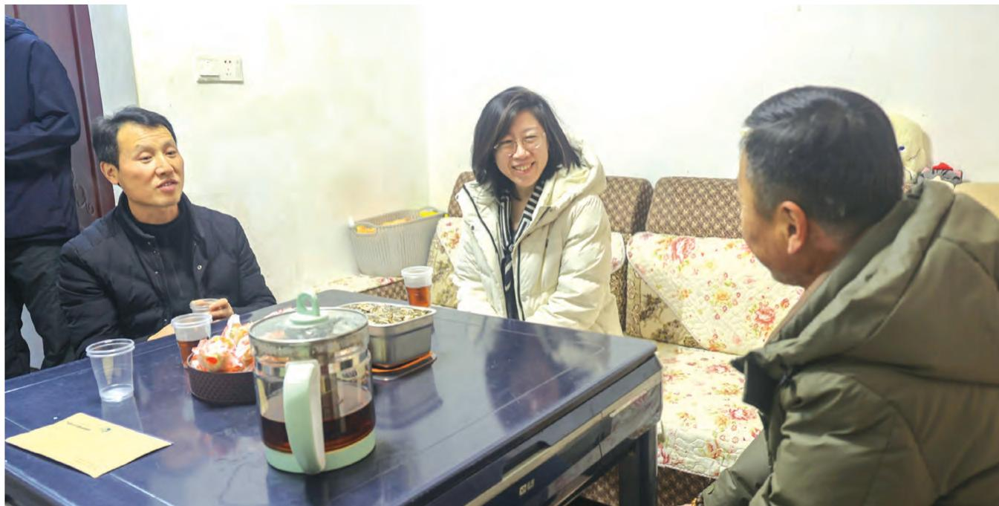

natural_image

Three people sitting around a table in a living room, engaged in conversation (no visible text or symbols)

公司党委慰问困难员工

# 丰富业余生活

为驱动文化多样性,倡导工作与生活平衡的理念,公司以员工兴趣为导向,为员工提供丰富多彩的生活体验,先后组织了包括篮球、羽毛球、乒乓球、足球、书法等多种形式的文娱活动、健康讲座和心理讲座,既丰富了员工的业余生活,也增强了公司的凝聚力。岳阳林纸持续打造群团品牌,形成了“天岳杯”职工篮球联赛、足球赛、羽毛球乒乓球联赛、“思享悦读”读书分享会、女神节特色活动、新春系列活动等职工全方位参与的文体活动。

下属子公司骏泰科技组织开展形式多样的文化活动，公司职工代表中国纸业参加中国诚通乒乓球赛，获得团体第一；公司参加岳纸篮球赛获得团体第一，乒乓球赛获得团体第三；参加岳纸、怀化市国资委羽毛球赛均获得团体第一。

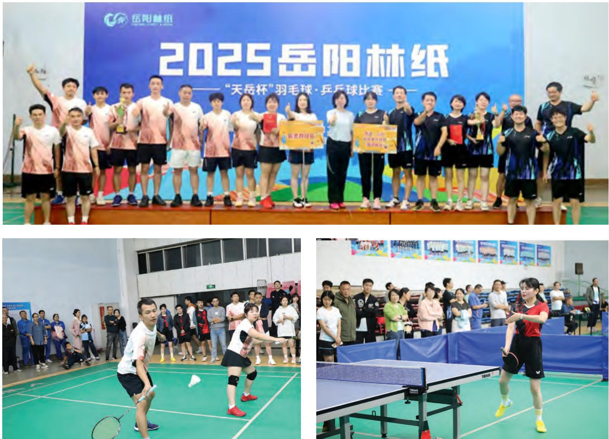  
岳阳林纸 2025 年 “天岳杯” 羽毛球赛

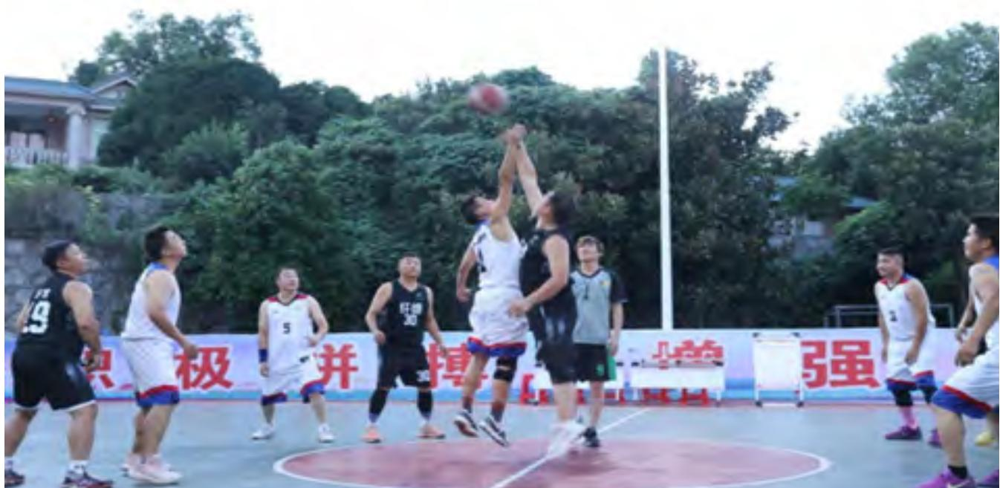

text_image

Street photo of a basketball game with visible Chinese banner text in the background

骏泰科技开展第十七届篮球联赛

# - 职业健康与安全

公司高度重视员工的健康与安全，始终践行“安全第一，以人为本”的理念，把安全放在各项工作的首位，为员工提供安全、舒适和美好的工作环境，竭力保障全体员工的健康与安全。

公司严格遵循《中华人民共和国安全生产法》《中华人民共和国职业病防治法》《中华人民共和国消防法》《危险化学品安全管理条例》等国家安全生产相关法律法规，取得了 ISO 45001 职业健康安全管理体系认证，建立了完善的安全生产管理体系。

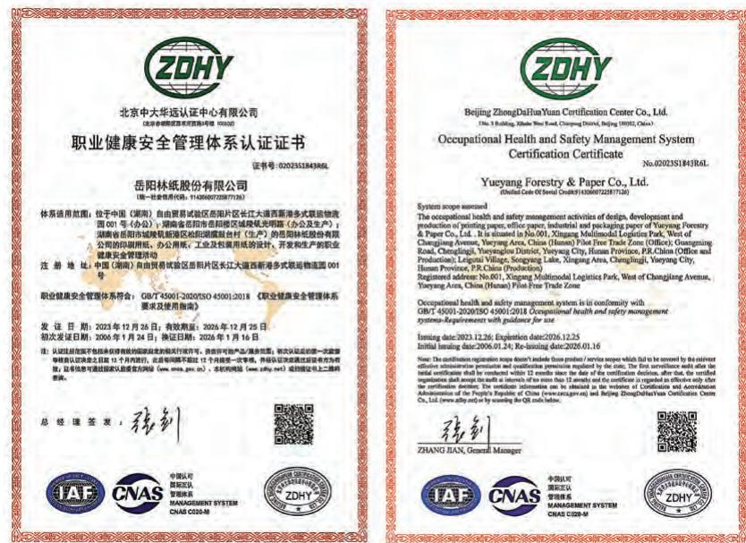

报告期内, 公司因工死亡人数 0 人, 新增职业病人数 0 人, 工伤率 0.25‰。

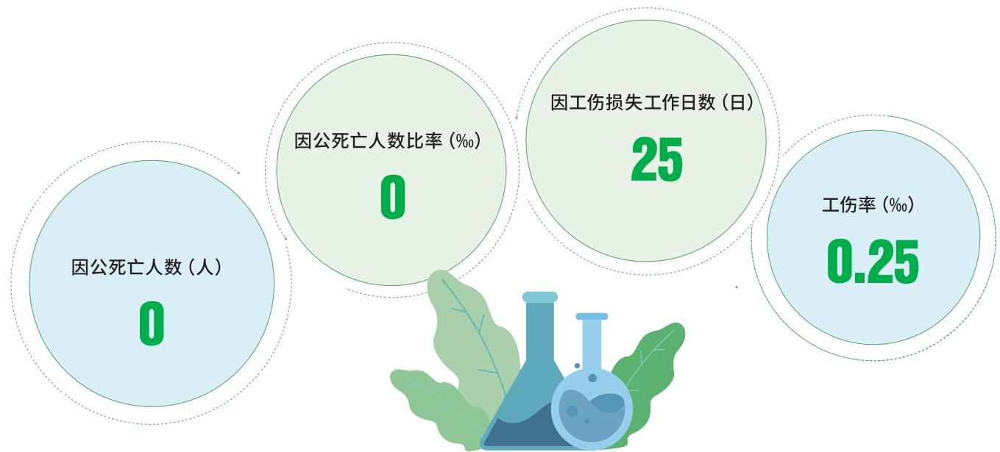

donut

| Metric | Value |
| --- | --- |
| 因公死亡人数 (人) | 0 |
| 因公死亡人数比率 (‰) | 0 |
| 因工伤损失工作日数 (日) | 25 |
| 工伤率 (‰) | 0.25 |

职业健康与安全

# 职业病防控

造纸行业所涉及的职业病主要影响因素包括噪音、粉尘、有毒有害气体等，岳阳林纸通过加大职业危害防治投入、职业危害检测、职业危害接触体检等一系列的职业病防范措施，切实做好职业危害接触人员的职业病危害防控工作，保障员工职业健康。

报告期间，公司未发生职业病危害事故。

# 岳阳林纸职业病防范措施

01

公司成立党委书记董事长任主任、党委副书记总经理任副主任的职业病防治委员会，建立相应的管理机构、人员。

02

制定全员职业健康安全责任制，定期对责任落实情况进行检查、考核。

03

定期对生产现场岗位进行职业危害、作业岗位环境检测并公示；在生产车间等高温作业区域安装水冷空调；化机浆木片卸载区域增加水雾系统，降低现场扬尘。

04

将职业健康用品检查纳入日常检查，每月下发检查通报。

05

根据作业岗位环境检测数据、危害因素配备相应个人防护用品、作业环境改善方案。现场配备血压计监测员工身体状况等，报告期内共计投入劳动保护费用264.95万元。

06

对接触职业危害岗位的员工、承包商作业人员，按国家规定进行职业健康体检，2025年对963名接触职业危害岗位员工进行岗中职业健康体检，建立员工职业健康监护一人一档，如实向员工告知职业病危害因素。

07

2025年通过热动煤棚无人行车、纸芯管自动化生产线等多个技改项目，降低了作业人员劳动强度、改善了员工作业环境。

# 案例

岳阳基地开展心肺复苏实战培训  
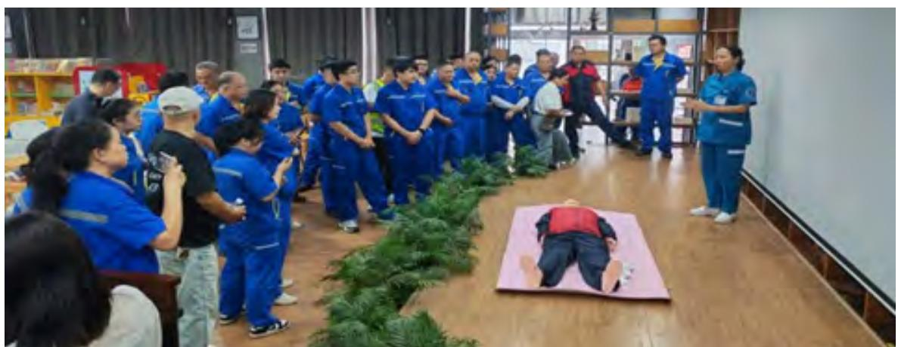

natural_image

Group of workers in blue uniforms practicing CPR on a mat in a classroom setting (no visible text or symbols)

# 案例

骏泰科技开展职业健康咨询与急救实操培训  
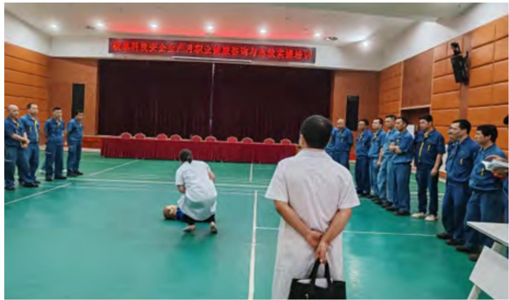

text_image

故事科技安企业月职业健康咨询与急救实施培训

# 安全管理

保障全体员工以及相关方的健康和安全是公司的责任，也是可持续发展的保障。岳阳林纸承诺为员工及供应商提供健康安全的工作环境，不断完善企业安全保障机制，对安全风险进行全面的管控，以满足员工及相关方的健康安全需求。

# 管理体系

公司成立以党委书记 / 董事长为主任、党委副书记 / 总经理为常务副主任的安全生产委员会，成立安全管理部负责公司职业健康与安全管理，各子公司建立完善职业健康与安全管理体系，保证公司在环境、职业健康、安全方面的责任与义务。

公司制定全级次、各层级岗位安全履职清单。公司领导的安全履职清单纳入了公司党委党建工作责任制中。从董事长到每个员工，层层签订安全生产责任书，全员签订安全生产承诺书，每个员工都是本岗位的“安全第一责任人”。

# 文化建设

公司积极培育员工安全意识，持续开展“三个一”活动：生产现场，以班组为单位，班组内每一位员工轮流担当安全员；员工“每月发现一起安全隐患”活动：员工每月将发现的至少一起安全隐患上报“安全管理信息平台”；中层“每月纠正一起违章”活动：各事业部中层管理人员每月至少纠正一起违章行为上报“安全管理信息平台”。

公司高度重视安全教育，新员工、劳务人员经“三级安全培训”考试合格、岗位安全能力测评合格后才能上岗，公司主要负责人、

安全管理人员、特种作业人员按国家规定要求培训取得资格证书。为安全提升基层骨干安全技能、安全履职能力，报告期内，请外部机构、专家对全公司101名基层工班长进行安全专项培训。针对承包商人员安全意识和安全技能较弱的问题，通过VR开展体验式“同培训”，通过沉浸式体验提升其对高风险作业场景的识别与应对能力。

报告期间, 公司内部的安全培训覆盖率达到 100%。  
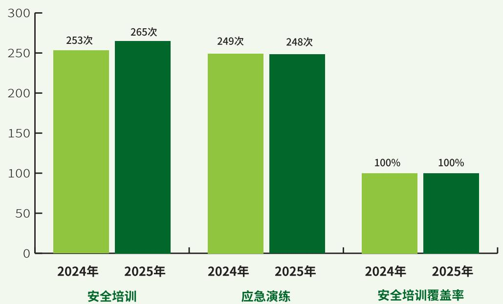

bar

| Category | 2024年 | 2025年 |
| --- | --- | --- |
| 安全培训 (次) | 253 | 265 |
| 应急演练 (次) | 249 | 248 |
| 安全培训覆盖率 (%) | 100 | 100 |

# 案例

# 开展工班长安全培训

邀请外培讲师，组织对工班长开展安全培训，内容主要为班组安全管理、班前会安全5分钟、人人说我要安全、HSE行为观察等。

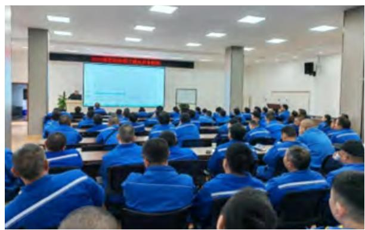

text_image

Conference room photo with attendees in blue uniforms facing a presentation screen displaying Chinese text and graphics

# 案例

# 开展危险化学品、木片堆场火灾应急演练

为提升应对危险化学品储存与木片堆场火灾事故的紧急反应能力，确保科学、及时、有效地应对事故，2025年3月21日、6月26日，岳阳林纸分别组织危险化学品、木片堆场火灾应急演练。演练按照应急演练程序进行，从火灾发生、报警、指挥和施救，到下达喷水和扑灭命令及联系地方消防应急组织，整个流程有条不紊，达到预期效果。演练不仅提高公司应急救援的应变和处置能力，也提高员工安全防患意识。

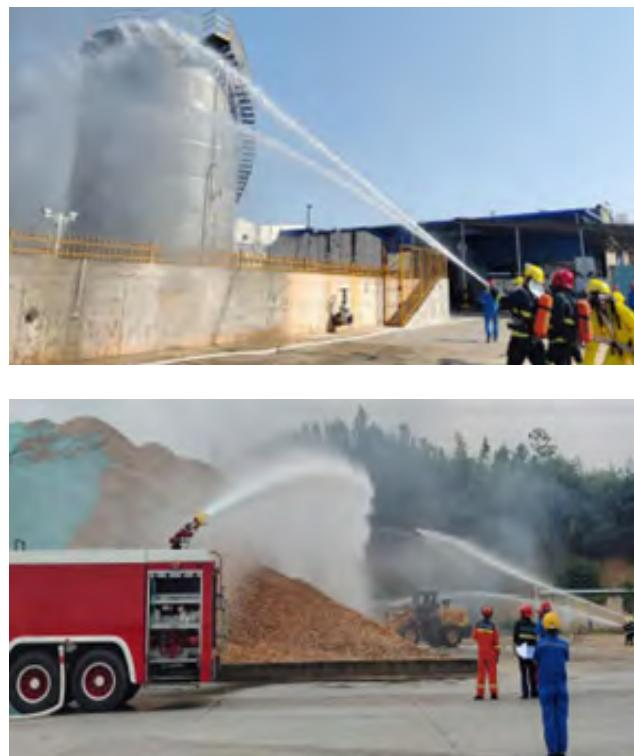

# 风险隐患排查

报告期内，公司从作业活动、设备设施两个方面进行安全风险排查，共辨识危险源数量9120个，其中（一级）重大风险23个，（二级）较大风险79个，（三级）一般风险1241个，（四级）低风险5415个，每个危险源制定相应的管控措施，将安全责任落实到个人。鼓励全员积极参与，公司员工共排查安全隐患43012项。

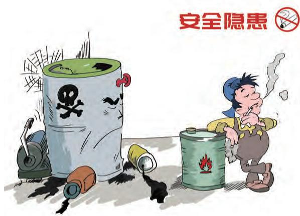

text_image

安全隐患

# 案例

# 事故隐患报告奖励活动

2025 年 4 月份开始，公司开始对员工报告的典型事故隐患予以奖励，全年共奖励 86000 元，形成“我要安全、我会安全、我能安全”的良好风气，助推岳阳林纸员工自主安全管理登上新台阶。

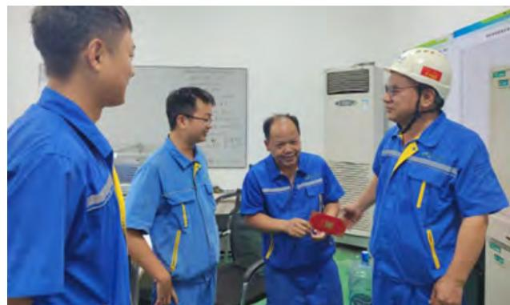

natural_image

Four workers in blue uniforms and a white hard hat interacting indoors, one holding a red object (no visible text or symbols)

# - 承包商安全管理

公司对承包商实施分类、源头、监督、过程四重强化管控。按常驻服务、工程施工、维保服务、后勤服务四类制定差异化措施；督促承包商完善安全体系、责任制度及管理台账，提升自身安全能力。成立专业安全组，对各单位承包商开展穿透式现场管理，覆盖日常培训、考核及班前会。梳理157个外包岗位并再识别风险，严把入司、培训、上岗三关，全年因违章、体检或考试不合格等淘汰47人。

# 培训与发展

2025 年，公司以精益管理理念为核心，围绕 “消除浪费、聚焦价值、持续改善” 三大原则，开展对标专项培训、后备人才盘点、职位晋升及产业工人培育等工作。通过精准选人、精益赋能、精细管理等举措，提升人才发展工作质量。

公司以价值创造为导向，聚焦战略，围绕人才发展和业务赋能，分别组织开展“技能类、技术类、管理类、业务类”培训，赋能全体员工挖掘岗位价值。

报告期间，公司培训项目总数达1961个，培训总时间约15.3万小时，员工培训覆盖率 $100\%$ 。

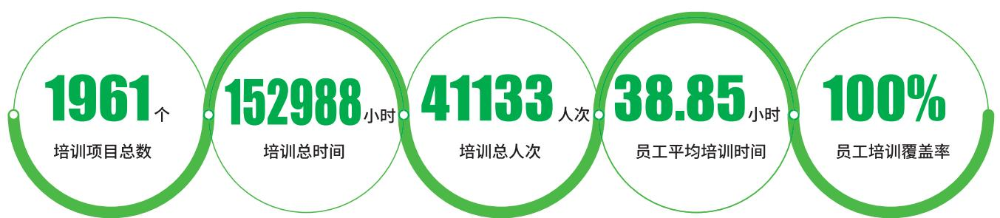

donut

| 指标 | 数值 |
| --- | --- |
| 培训项目总数 | 1961个 |
| 培训总时间 | 152988小时 |
| 培训总人次 | 41133人次 |
| 员工平均培训时间 | 38.85小时 |
| 员工培训覆盖率 | 100% |

# “三三四”人才培养体系

以业务需求为出发点、以人才培养为切入点，以价值创造为落脚点，公司持续推进“三三四”人才培养体系建设，即三种思维、三级机构、四条人才产品线，强化和优化内部人才供应链，赋能员工创价值，服务业务创价值，激活组织创价值。

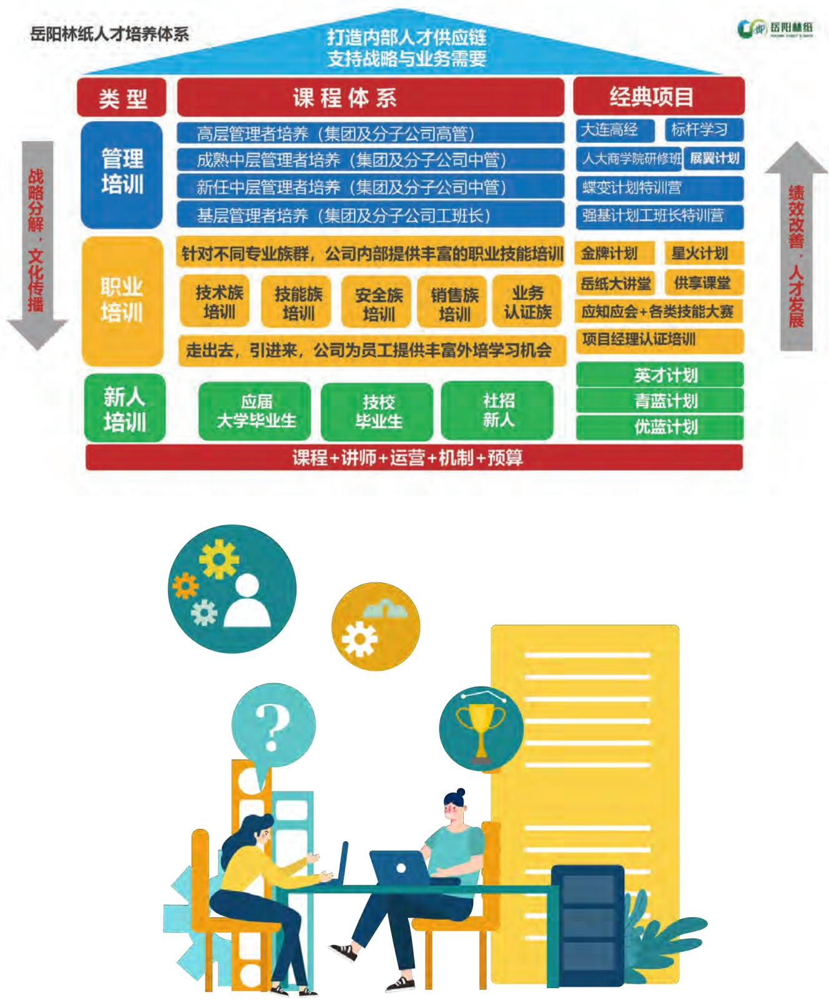

# 四大人才计划

01

“猎雁计划”主要引进各行业高端成熟人才，担任分子公司总经理、副总经理、技术总监等重要关键岗位。公司采取仿职业经理人制度，通过市场化选聘、契约化管理、差异化薪酬、市场化退出的原则进行选聘和管理。2017年—2025年，从制浆造纸、生态园林、高端智造企业共引进高端人才63人。

02

# 03

“优蓝计划”从社会招聘中专中技以上学历的一线操作技能人才，主要招录公司周边地区有经验的技工人才，通过短期培养，快速上岗。

04

“青蓝计划”为泰格林纸技工学校自主培育输送的技工人才。2025年培育交付技工人才105人，在岗实习生82人。

“英才计划”面向各高校招录应届大学本科及以上学历学生，旨在培养及储备优秀技术和管理人才。“英才计划”员工培养周期为两年（不含试用期），整体培养模式采取721成长法则，即70%基层一线岗位培养，20%集中培训学习，10%自我赋能。

目前，该计划已实施九年，在库员工有226人，其中，技术类132人、管理类76人、业务类18人，85%已在本单位发挥骨干作用。

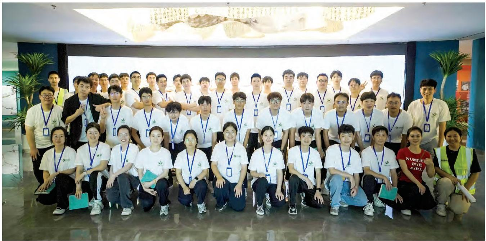

natural_image

Group photo of students in white shirts and lanyards posing indoors, no visible text or symbols

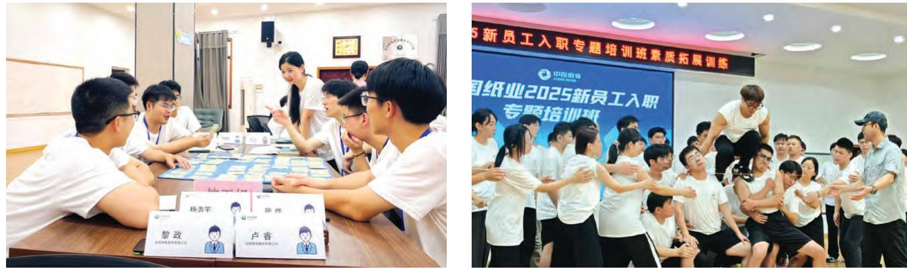

# 企业自主办学的产业工人培育模式

六大办学特色，锻造“岳纸工匠”。岳阳林纸委托泰格林纸技工学校作为产业工人招录和培育平台，紧紧围绕“产教融合、工学一体”的培养模式，深化践行六大办学特色，“学校办在工厂里，课堂延伸到车间，老师来自于一线，教材取材于师傅，辅导须对接家长、毕业可直通就业”。为岳阳林纸订单式培养高度认同企业文化、动手能力扎实的精益制造产业工人。报告期内，共招收新生120人，在校生规模达331人；组织专业实习与岗位实习共计82人；期间，105名实习生顺利完成学业，走向工作岗位。

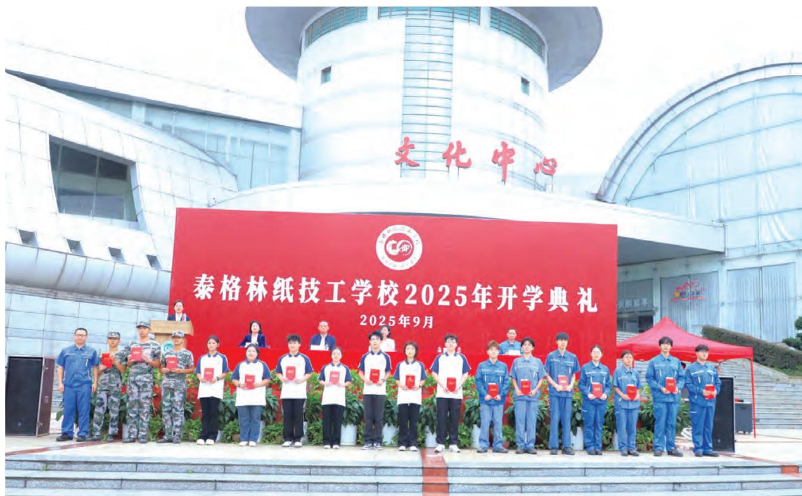

text_image

文化中心
泰格林纸技工学校2025年开学典礼
2025年9月

# 晋升与发展

公司严格执行《岳阳林纸股份有限公司晋升管理规定》，充分体现了业绩导向的原则。同时，畅通的破格晋升渠道进一步拓宽了员工多元化发展路径，已有3人通过“匠人匠心”技能比武获得直接晋升。专项培养计划与晋升机制紧密挂钩，其中“英才计划”培养为晋升高层次职位积累必要的基层经验。现行制度呈现出“纵向发展、横向互通”的特点，未来还可进一步强化跨序列流动机制，持续激发人才队伍活力。

# 案例

# 台塑标杆学习: 以课题实作改善, 推动生产效能持续优化

组织开展“台塑对标学习”专题培训班，以行动学习课题实作的形式，学习台塑集团异常管理、生产管理、设备管理、数字化转型、成本分析、鱼骨图追根究底等十大板块优秀管理经验、工具和方法；围绕成本控制、生产改善、质量提升及设备管理等方面提报精益改善实作课题共15个，直降成本不少于900万元。其中岳阳基地3号机降低纤维流失创效32.8万元；8号机月平均白皮数量较目标下降82吨，吨纸节降849元，创效48.7万元；化机浆3#线吨浆成本降至2727.4元/吨，完成预算目标，创效670.15万元；PM11号机2025年11月份成功将烂边断纸次数降为“零”，产量逐步提升；骏泰科技对标2024全厂异常停机故障102次，降低 $10\%$ ，将故障次数减少至90次以内，设备运行率较2024年实际运行率上升 $1.22\%$ ，高达 $99.44\%$ 。

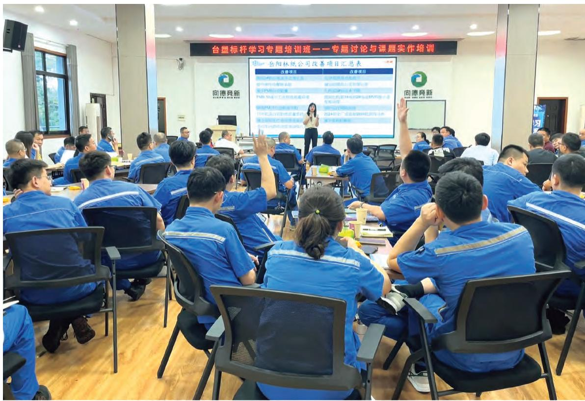

text_image

台塑标杆学习专题培训班——专题讨论与课题实作培训
岳阳林纸公司改善项目汇总表
修改项目	修改项目
向德竞新
向德竞新

# 案例

# 产业工人培养: 多元岗位练兵, 持续提升一线员工操作技能

结合生产实际需求，围绕安全生产、问题解决、技能提升、新进员工顶岗等，通过系统培训、岗位练兵和技能竞赛等多种形式共展开1427场培训，参培人次达34101。本年度“训-赛-励”一体化技能赋能提升一线员工技能水平，开展技能比武38个，参与人次达2630，含制浆、造纸、半成品和成品检验、钳工、电气、仪表、安全等多个专业。

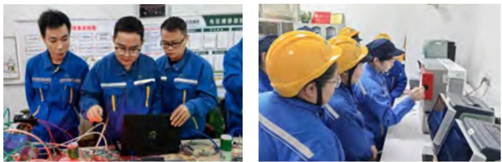

# 案例

# 精细管理, 提升内部人才培养质效

发布《岳阳林纸股份有限公司新员工培养“师徒结对”工作细则》，规范“师徒结对”工作标准及流程，扎实做好带教辅导工作，提升新员工试用期以及技工学校实习生考核通过率和人才培养质效。报告期共开展师徒结对共313对，已出师142对。

# 产品和服务安全与质量

我们始终将产品安全和服务质量置于企业发展的核心位置，通过精益管理与标准化作业，构建了覆盖全流程的管控体系。公司已连续多年通过“四合一”管理体系认证，产品曾荣获“国家质量金奖”“全国用户满意产品奖”等荣誉。岳阳林纸以科技赋能质量，以标准保障安全，致力于为客户提供绿色、安全、可靠的纸品与服务。

# - 产品安全与质量

公司严格遵守《中华人民共和国产品质量法》等法律法规，以“以对自我的永不满足，实现用户的持续满意，共创用户最可信赖的纸张品牌”为质量方针，建立全面的质量管理程序和制度，保障产品质量与安全。报告期内，纸产品合格率98.59%，商品浆合格率94.21%。

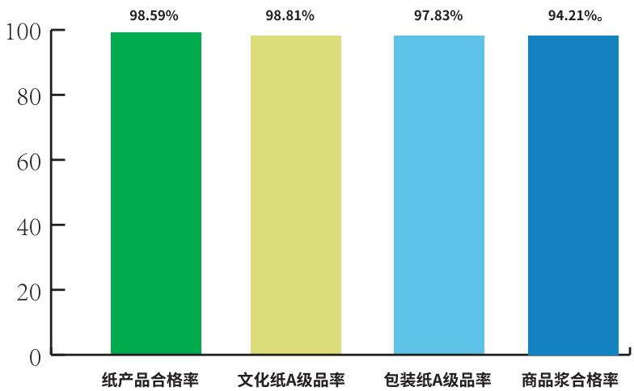

bar

| Category | Value (%) |
| --- | --- |
| 纸产品合格率 | 98.59 |
| 文化纸A级品率 | 98.81 |
| 包装纸A级品率 | 97.83 |
| 商品浆合格率 | 94.21 |

产品质量与安全指标

# 质量管理体系

# 构建一体化文件体系

公司严格按国际通行的管理体系标准，构建了以《管理手册》为纲领、38个《程序文件》为支撑的“四合一”管理体系（质量、环境、职业健康安全、能源），确保管理要求有效落地。

# 建立“三道防线”监督机制

为确保体系运行的实效性，公司建立了“三方审核”机制，即以自查自纠为核心的内部审核、以市场需求为导向的客户审核、以国际标准为尺度的第三方认证机构审核，三道防线层层递进，形成严密的闭环式监督机制，有效保障了产品质量与安全。

# 强化全链条质量控制

公司将质量控制贯穿产品生命周期，实现了从原材料源头、生产加工过程到最终成品的全链条质量管控，确保每一环节都处于受控状态。

# 汇聚权威认证资质

管理体系认证：ISO9001质量管理体系、ISO14001环境管理体系、ISO45001职业健康安全管理体系、ISO50001能源管理体系。  
产品与绿色认证：绿色森林认证（FSC、PEFC/CFCC）、欧盟零毁林法案（EUDR）合规验证，中国环境标志（I型）产品认证、中国环境标志（II型）产品认证、食品包装纸生产许可证（QS）、儿童青少年学习用品近视防控卫生要求认证等。

<table><tr><td>序号</td><td>认证类型</td><td>2025年总产量(吨)</td></tr><tr><td>1</td><td>儿童青少年学习用品近视防控卫生要求认证</td><td>807347</td></tr><tr><td>2</td><td>环境标志I型</td><td>776337</td></tr><tr><td>3</td><td>环境标志II型</td><td>1181494</td></tr><tr><td>4</td><td>FSC</td><td>38054</td></tr><tr><td>5</td><td>PEFC</td><td>2383</td></tr><tr><td>6</td><td>EUDR</td><td>15606</td></tr></table>

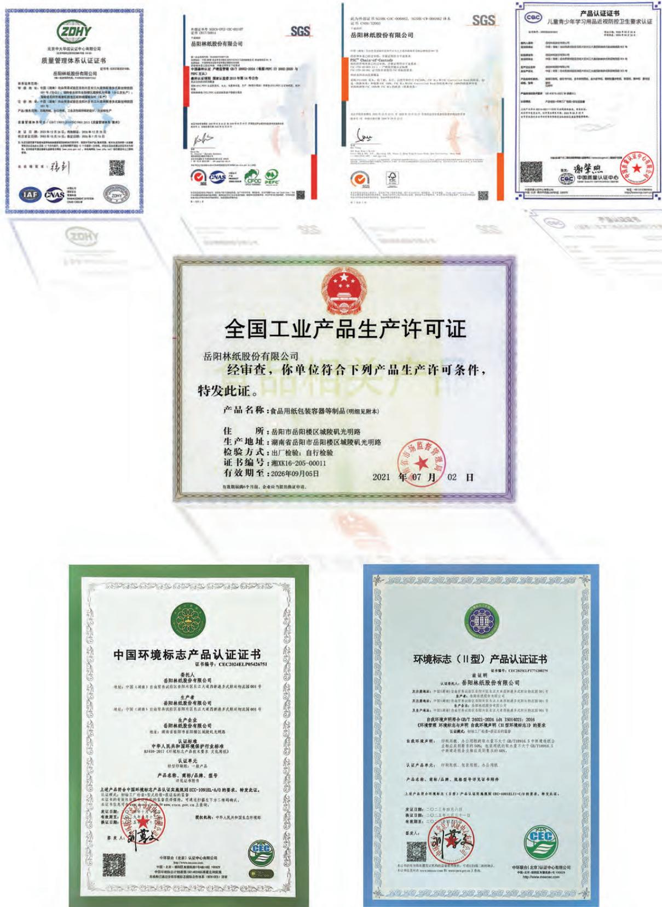

# 质量事故处理

公司制定《生产系统产品质量考核制度》，促进各层级各岗位履职尽责，强化产品质量问题的处理力度和员工质量意识，预防重大工作质量事故与产品品质事故的发生。在事故处理阶段，严格遵循按照质量事故严重程度（一般质量事故、较大质量事故、重大质量事故）开展质量事故调查、追责考核工作。

# 培育质量文化

公司高度重视员工的“应知应会”操作，定期梳理各岗位知识及技能要求，通过岗前培训、实操训练、资格鉴定、知识竞赛、考试等模式，提升员工质量意识。公司推行全面质量管理，从“主动识别，被动暴露”两方面为落脚点，建立了“小问题即时整改、大问题团队攻关”的运作机制，对及时发现事故风险、采取措施的员工进行奖励，激励员工积极参与质量事故预防工作。

# 案例

# 欧盟零毀林法案 (EUDR)

为积极应对国际市场变化，彰显央企责任担当，公司于2024年10月正式启动欧盟零毁林法案合规工作。我们特邀SGS通标标准技术服务有限公司开展专项培训与线下指导，并建立线上跟进机制，确保进度实时可控。同时，联动各上游供应商，共同响应法案要求，具备EUDR生产条件。自2025年7月22日起，公司正式量产EUDR纸产品。截至报告期末，产量已达1.56万吨，标志着公司产品已符合国际高端市场准入标准。

# - 客户安全与质量

公司坚持以客户需求为导向，致力于建立完善的客户服务体系，倾听客户需求，用绿色低碳产品、精细化服务提升客户的业务质量和效率，为客户创造价值。

公司遵循《中华人民共和国消费者权益保护法》等法律法规，制定《售后服务规程》等相关制度，不断改善公司产品和服务质量，尽最大可能满足客户的需求，报告期内客户满意度86.3%。

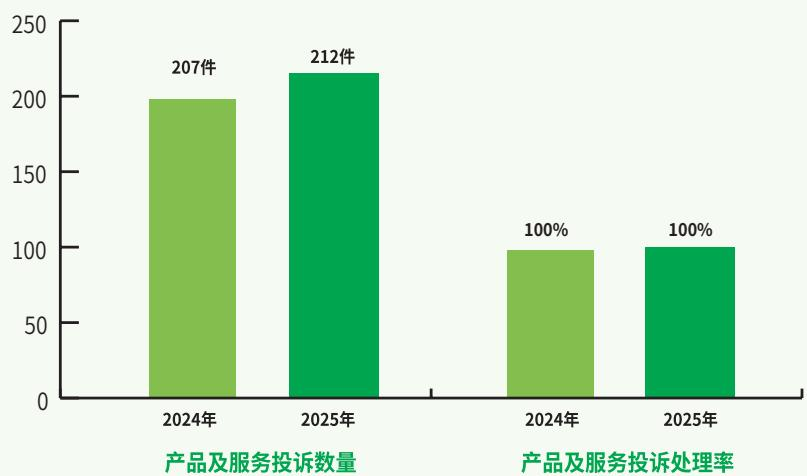

bar

| 指标 | 年份 | 数值 |
| --- | --- | --- |
| 产品及服务投诉数量 | 2024年 | 207件 |
| 产品及服务投诉数量 | 2025年 | 212件 |
| 产品及服务投诉处理率 | 2024年 | 100% |
| 产品及服务投诉处理率 | 2025年 | 100% |

客户服务指标

# 服务质量体系

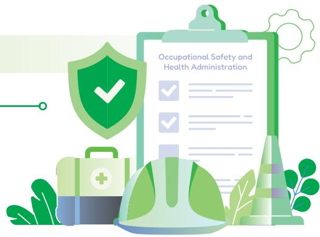

text_image

Occupational Safety and
Health Administration

# 搭建售前 - 售中 - 售后全流程服务体系，持续提升客户服务水平。

# 售前服务

组建专业售前服务团队，为客户提供产品咨询、质量指标讲解、需求匹配分析等服务。针对不同行业客户（如出版、包装、工业用纸等）的个性化需求，精准介绍公司产品系列特性，协助客户筛选适配产品；在新客户开发阶段，主动讲解产品质量标准与核心指标，为客户提供产品选型的专业建议。

# 售中服务

建立全流程跟进与实时沟通机制，从订单确认到产品交付全程对接，保障订单高效落地。针对秋季教材用纸、天岳书纸（速干）、3号纸转型包装纸等重点产品，安排专人进行现场跟机、交付跟进，确保产品交付与使用环节的衔接顺畅。

# 售后服务

构建快速响应与闭环整改的售后服务体系，明确驻地市区内8小时、服务区内24小时的现场服务时效，第一时间响应客户的产品使用问题、售后诉求。对客户反馈的产品质量问题，组织专业团队深入分析根源，预防问题重复发生。为客户提供产品使用指导、售后技术支持，持续跟进产品使用效果，及时收集客户后续需求。

# 客户沟通渠道

公司遍及全国各地的销售服务网络以及客服专员能够保障在 24 小时内积极回应消费者和客户呼声，为客户提供及时优质的服务；市场调研工业用纸、包装用纸等，及时了解客户需求，聆听市场，持续提升产品、服务的行业竞争力。此外，积极向客户推广新产品和高端产品，与客户相互交流、增进互信，以提升公司及产品品牌的影响力。

# 客户服务体验

公司不仅仅满足于为客户提供卓越的产品，更希望为客户带来全面的服务解决方案，成为长期陪伴客户发展的伙伴。公司全方位服务市场，拜访客户、现场跟机，为客户提供定制化服务，积极与客户研讨互动，了解收集客户需求与市场信息，提升服务质量。

# 客户投诉管理

投诉渠道多样简便，包括销售人员、驻外客服、热线电话等多种形式。公司《售后服务规程》对客诉响应时间、服务要求等各项处置措施、补偿时效都有明确的要求及考核措施，确保产品质量的“反馈—分析—改善—跟踪”形成闭环。

# 案例

# 客户服务专业化、信息化、多样化

通过客户服务多样化、专业化、信息化提升服务效率，推动内外信息传递无缝对接、产品品质与服务深度持续改进，效果凸显。通过协助业务员在开发新客户时对公司产品质量指标进行讲解，并对客户关键指标进行了解和介绍相匹配产品，为客户提供增值服务。先后对下游客户进行产品宣传、技术交流共计20次，获得客户一致好评。客服团队为工厂生产技术人员、品控人员进行培训交流，讲解客诉案例及质量管控关键点等专业知识，带动全系统客户服务的提升。形成内外交流，共同成长的方式提升业务技能，对外为客户提供最佳解决方案、对内为工厂提供质量与成本的最佳平衡建议。

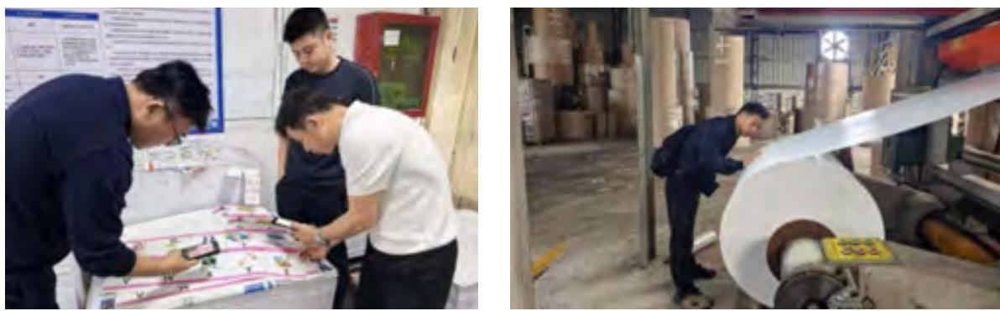

# 数据安全与客户隐私保护

随着数字化转型深入推进，数据安全已成为企业运营的生命线，也是维护客户信任的核心基石。岳阳林纸高度重视数据安全与客户隐私保护，将其全面纳入公司信息安全治理体系，致力于构建覆盖数据“采集—存储—使用—传输—销毁”全生命周期的立体化数据防护网络。

# 数据安全

公司持续加大数据安全领域投入，积极与专业网络安全机构开展合作，围绕数据加密、访问控制等关键技术环节进行攻关，取得了一系列实质性突破。其中，公司成功获得“一种多用户加密移动存储介质的数据管理方法和系统”发明专利授权(专利申请号：CN202511150719.8,专利申请日:2025年08月18日,授权公告日:2026年03月27日,专利权人:湖南匡安网络技术有限公司；岳阳林纸股份有限公司)，标志着岳阳林纸在数据安全管理技术能力方面迈上了新台阶。

# - 客户隐私保护

公司严格遵循《个人信息保护法》《网络安全法》《数据安全法》等法律法规要求，制定并执行客户信息采集与使用规范，明确告知客户信息使用目的与范围，未经合法授权，绝不向第三方提供任何客户信息。所有涉及客户数据的业务环节，均严格实行最小权限原则，确保客户隐私不被泄露或滥用。报告期内，公司未发生重大数据泄露事件，客户信息保护相关投诉为零。

# 创新驱动

产品的持续创新是公司高质量发展的重要保障。岳阳林纸坚持以市场为导向，以科技创新为引擎，推动公司产品质量持续改善。同时，通过积极开发特色文化纸、功能化牛皮纸、差异化商品浆系列全新产品，促进公司产品迭代更新，构建合理、高效、最能满足市场需求的产品结构，为公司可持续发展奠定坚实的基础。

# 研发体系与平台

为构建高效的创新研发体系，公司依据开发周期，搭建起涵盖了小试、中试、生产的三级研发体系，并以林、浆、纸三类产品线匹配研发方向，持续开展创新研究。

-- 组建战新研究小组 针对前沿技术和颠覆性技术进行探索，建立开放式创新平台，面向行业、高校“融智”。

-- 强化中试研发平台
该国家级企业技术中心为基础，依托博士后科研工作站、前沿技术研究课题以及市场客户需求，搭建中试研发平台，加快成果转化。

-- 聚焦新产品开发 整合公司工艺和研发人员，紧盯市场需求，敏捷响应，快速行业，实现高效产品研发。

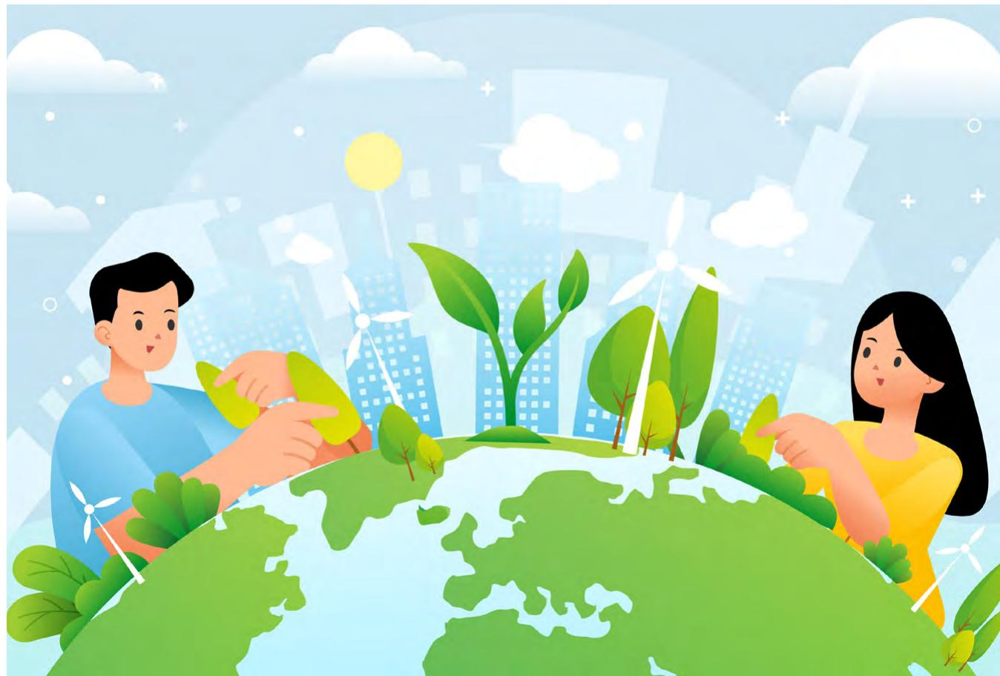

natural_image

Illustration of two people interacting with a green globe surrounded by wind turbines and urban buildings (no text or symbols)

# 案例

# 高质量做好科创平台建设, 夯实自主创新能力

公司将创新平台建设作为集聚科技创新要素，提升自主创新能力和推动科研成果转化的重要举措，2025年牵头创建了湖南省生物基特种纤维与新材料产业创新联合体，同时，岳阳林纸股份有限公司省级企业技术中心、湖南骏泰生物基新材料科技有限责任公司湖南省认定企业技术中心成功通过湖南省工业和信息化厅的复核。博士科研工作站荣获2024年度湖南省优秀博士后科研工作站。目前，公司共拥有省级及以上科创平台10个，其中国家级科创平台2个。

公司研发平台持续完善升级，岳阳林纸积极深化与高校、科研院所的产学研合作，切实贯彻落实科技创新“三个面向”要求，主动服务国家重大战略需求与重点科研任务。其中：

高质量完成国家重点研发计划项目1项。围绕国家“绿色生物制造”战略部署，公司主动联合广西大学、华南理工大学、天津科技大学等多家高校及科研院所，积极承接国家重点研发计划“绿色生物制造”重点专项，牵头或参与“造纸废水零排放关键技术及产业示范”“再生浆酶法提质及产业示范”“‘生物-原生浆’及功能化木质素制备关键技术产业示范”等三个子课题的科研攻关。通过产学研深度协同与关键技术突破，公司于2025年按期圆满完成各项研究任务，各项技术指标与考核目标均达到要求，顺利通过课题绩效评价，为行业绿色低碳转型与高质量发展提供了有力技术支撑。  
高质量完成“科技创新2030”重大项目1项。该项目由中国林业科学研究院亚热带林业研究所牵头，围绕优质高产松树新品种设计与培育开展系统攻关。岳阳林纸作为重要参与单位，深度参与“纸浆材及结构材用松树木材性质与质量评价”子课题研究，聚焦纸浆原料林定向培育、木材品质评价与高效利用等关键方向开展技术研究与验证。经过持续攻关，公司于2025年按期全面完成课题既定研究任务与考核指标，各项工作均达到项目要求，顺利通过项目绩效评价，为我国纸浆材良种选育与林业高质量发展提供了坚实支撑。  
- 怀化市“14+2”重点产业链和特色产业关键核心技术攻关项目1项——超级置换蒸煮模式制浆技术研发项目，在2025年完成了项目结题验收。项目的成功研发与应用，避免了在蒸煮过程控制中温度剧烈变化对浆料产生不良的影响，提高蒸煮出浆的均匀性，有效提升蒸煮出浆质量和成浆得率，降低了生产成本。

<table><tr><td>序号</td><td>名称</td><td>级别</td><td>时间</td></tr><tr><td>1</td><td>国家级企业技术中心(控股母公司)</td><td>国家级</td><td>2005年</td></tr><tr><td>2</td><td>博士后科研工作站(控股母公司)</td><td>国家级</td><td>2001年</td></tr><tr><td>3</td><td>植物纤维素材料绿色制造湖南省工程研究中心</td><td>省级</td><td>2018年</td></tr><tr><td>4</td><td>湖南骏泰生物基新材料科技有限责任公司湖南省认定企业技术中心</td><td>省级</td><td>2018年</td></tr><tr><td>5</td><td>岳阳林纸股份有限公司省级企业技术中心</td><td>省级</td><td>2022年</td></tr><tr><td>6</td><td>湖南骏泰生物基新材料科技有限责任公司省级企业技术中心</td><td>省级</td><td>2023年</td></tr><tr><td>7</td><td>湖南省纤维素及其新材料绿色制造工程技术研究中心</td><td>省级</td><td>2023年</td></tr><tr><td>8</td><td>湖南省植物纤维综合利用及纸基新材料工程技术研究中心</td><td>省级</td><td>2023年</td></tr><tr><td>9</td><td>湖南省博士创新站</td><td>省级</td><td>2024年</td></tr><tr><td>10</td><td>湖南省生物基特种纤维与新材料产业创新联合体</td><td>省级</td><td>2025年</td></tr></table>

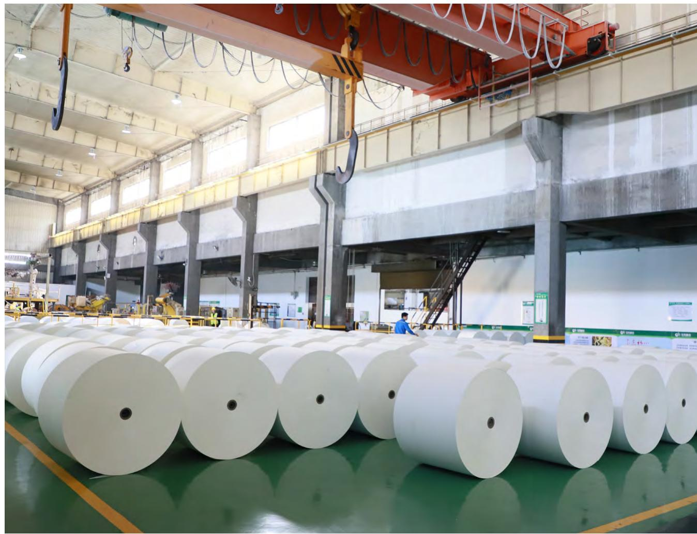

natural_image

Interior of a large industrial factory with overhead cranes and stacked white rolls (no visible text or symbols)

# 案例

# 筑牢科技创新根基 正式启用新研发中心

为积极践行国家创新驱动发展战略、落实中国诚通和中国纸业科技创新部署，进一步增强研发创新能力，2025年公司投资建设全新的研发中心。新研发中心设置制浆实验室、涂布实验室、光谱实验室、纳米材料实验室等十四个功能分区，并配套扫描电子显微镜、傅立叶红外光谱等先进仪器与设备，具备了完善的制浆、造纸、涂布、生物基材料等试验和研发能力。11月21日岳阳林纸新研发中心举行了启用揭牌仪式。公司董事长刘岩、总经理刘立新、广西大学校长助理覃程荣教授、天津科技大学李群研究员共同为新研发中心揭牌。

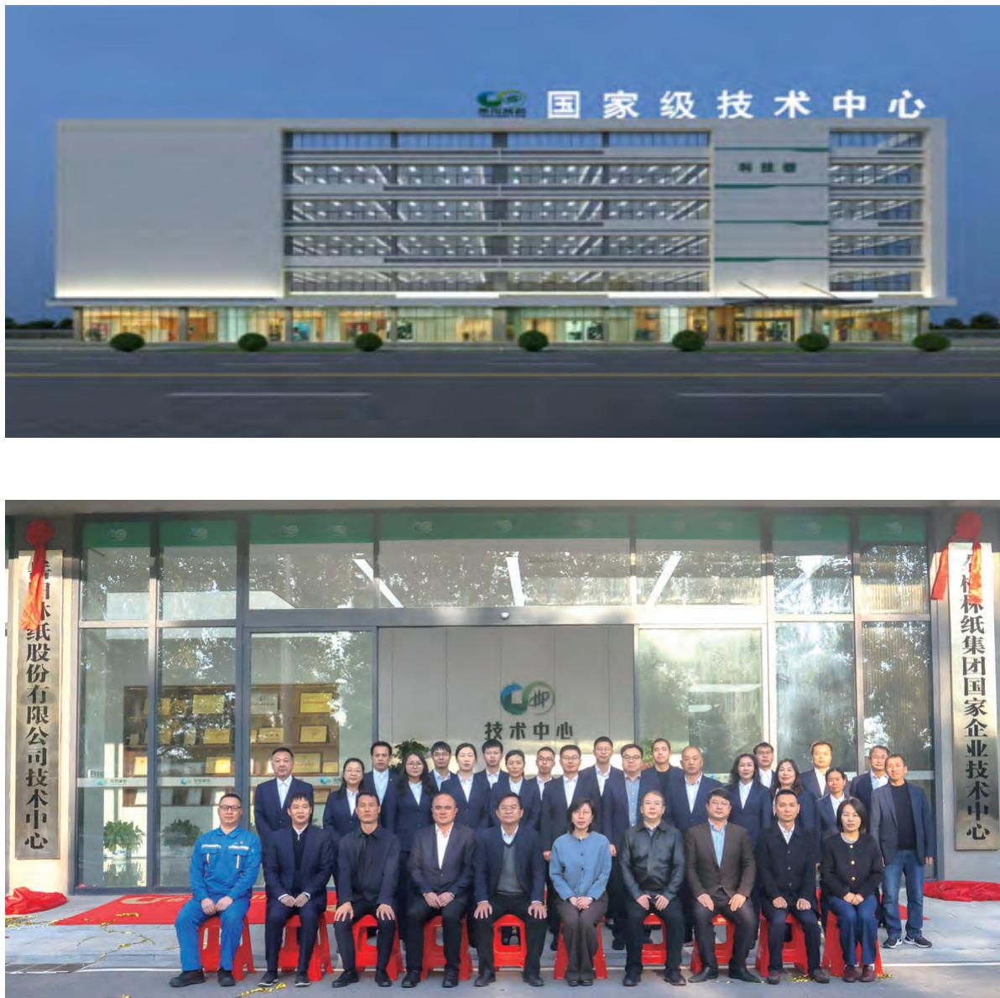

# - 研发投入和产品创新

岳阳林纸坚持科技创新引领发展，以切实的研发投入保障公司在特种纤维素、特种浆及纤维材料、特色文化纸、工业纸、牛皮纸，生物基新材料、生态治理等领域持续开展创新研究，取得一批具有自主知识产权的关键核心技术及新产品。

# 研发投入与知识产权管理

报告期内，公司投入研发费用31183万元，新增授权专利30项，其中发明专利17件，已累计拥有专利322项，其中有效发明专利152项。

# 案例

# 两项科技成果通过成果评价

公司长期从事生物基新材料的研发与生产。2025年由骏泰科技主持完成的两项成果成功通过省级成果评价，其中“农林三剩物制备高品质纤维素的关键技术研发与产业化应用”技术整体达到国际先进水平；“生物基多糖凝胶堵水剂的关键技术研发与应用”技术整体达到国内先进，部分技术达到国内领先。

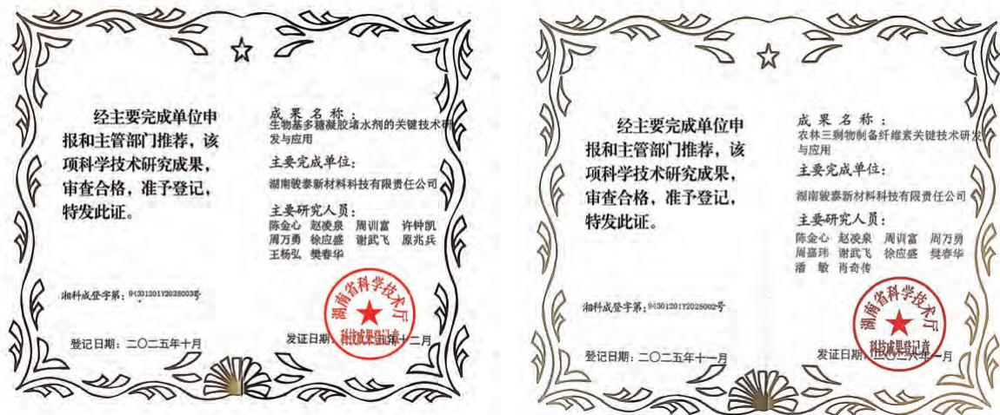

# 案例

# 多项技术成果荣获省部级及行业级科技奖项

公司长期致力于浆造纸新技术、纤维素精制技术以及木质素高值化利用技术等领域的研究。报告期内公司完成的多项研究成果荣获省部级及行业级科技奖项，其中：

(1) “高档簿本纸关键技术及产业化”项目获评中国产学研深度融合好案例。  
(2）“低质纤维原料材性快速评价与化学机械浆工艺智能优化技术研发及产业化”获湖南省博士后创新创业大赛铜奖。  
(3) “净浆先锋” QC 小组获第八届中央企业 QC 小组成果大赛三等奖。  
(4) “农林生物质高值转化关键技术及产业化”获2025年度教育部科学研究优秀成果奖一等奖。  
(5)“预水解 - 硫酸盐法溶解浆工艺联产增效关键技术开发奖与应用”荣获中国轻工业联合会科技进步奖二等奖。  
(6) “以纸代塑新材料关键技术研究及产业化应用”荣获2025年中国产学研合作促进会科技创新奖三等奖。

# 科研成果转化

# 案例

# 发布岳阳楼牌舒瞳柔光纸新产品

2025 年 5 月 20 日，岳阳林纸举办 “岳阳纸 爱护眼” 新技术、新产品发布会，会上发布了特色文化纸全新产品 “岳阳楼牌舒瞳柔光纸”。该产品创新采用了纳米材料技术，赋予产品优良的优异的选择性吸收有害光线的性能，具有防眩目、无荧光、低反射、护视力的功能，护眼效果得到了权威认证和客户的认可。

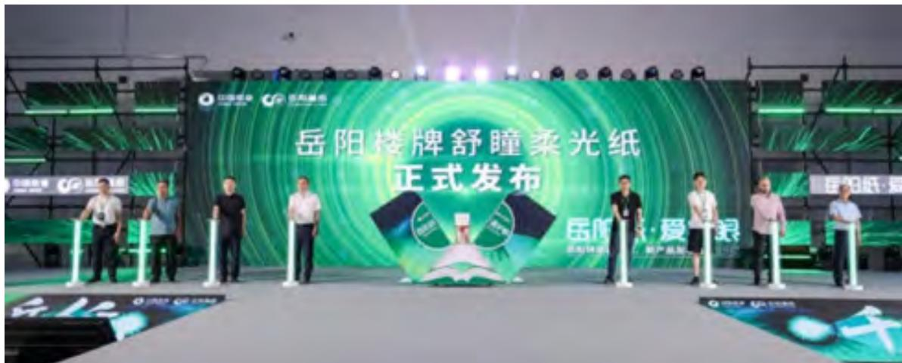

text_image

岳阳楼牌舒瞳柔光纸
正式发布
岳阳·爱银

# 案例

# 包装纸转型战略逐步落地, 牛皮纸产品矩阵日益丰富

报告期内，岳阳林纸围绕产品结构转型战略要求，结合市场需求采取定制化联合开发模式，先后完成20余款功能型牛皮纸新产品的研发，其中超过50%的新产品在当年实现批生产。新产品的相继开发落地，保障了公司包装纸转型战略的落地。

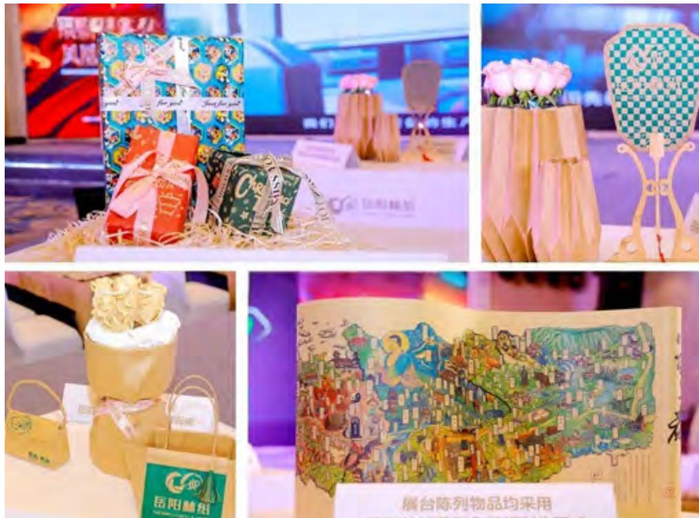

# 案例

# 提质扩能再提速，骏泰科技5万吨绒毛浆纤维材料技改项目顺利完成

在行业竞争愈发激烈的大背景下，公司聚焦生物基材料主业，在做好主力产品的基础上，积极在特种纤维材料和高端生物基产品上布局，以增强市场竞争力与抗风险能力。历经两年的规划与建设，年产5万吨绒毛浆纤维材料技改项目于2025年12月31日晚成功生产出第一个绒毛浆浆卷，标志着公司又一新产品规划顺利落地，为未来的发展打下坚实基础。

# 科技伦理

公司并无从事生命科学、人工智能、医疗健康等科技伦理敏感领域的科学研究、技术开发等活动，且该议题经识别、调研及评估并非影响重要性和财务重要性议题，故本报告中不披露该议题相关内容。

# 供应链安全

岳阳林纸始终坚持"合作共赢、共同发展"的价值观，积极携手供应商，通过责任管理、双向沟通、分享培训等行动，保障供应商正当合理权益，倡导供应商积极履责，促进行业可持续发展。

# 供应商管理

# 供应商机制

为维护公开、公平、公正的市场竞争环境，有效防范经营风险，确保供应商满足公司要求的基本能力，保证采购质量，公司制定了《供应商管理办法》，就供应商开发及准入、供应商动态评审、供应商年度评审等建立了完善的机制。

公司广泛搜寻供应资源，平等对待市场参与主体，破除行业垄断和保护主义，充分激活市场竞争，以性能价格比最佳、全生命周期综合成本最优为目标，优选供应商，建立健全稳定的供应体系。

公司每年对供应商报价响应及价格水平、交货准时性及合同履约、质量及使用效果、售后服务、可持续发展等进行年度评审和动态评审，根据供应商评审结果分级管理，深化与优质供应商长期稳定合作，淘汰不合格供应商。

报告期内，供应商可持续发展审查合格率为98.2%。  
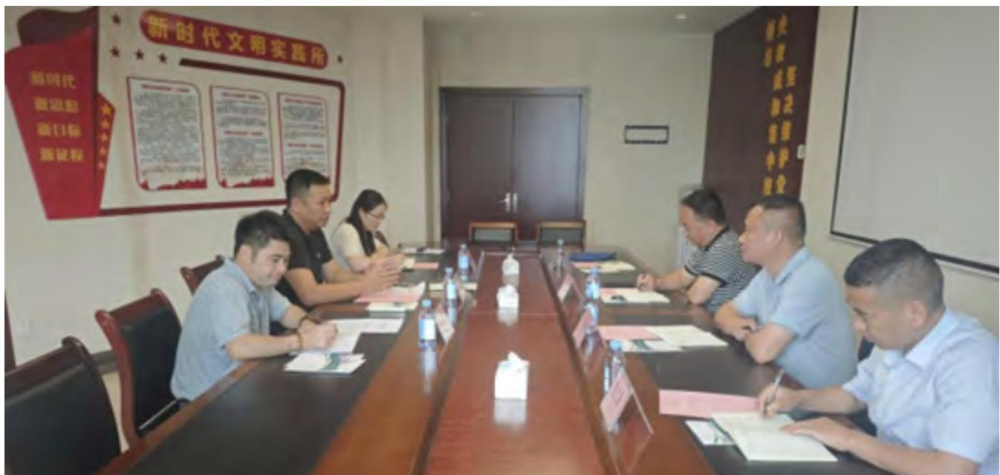

text_image

新时代文明实践所
新时代
新思想
新目标
新征程

与供应商交流

# 支持本地供应商

助力本地供应商发展，促进本地经济发展既是企业承担社会责任的重要体现，同时也可以降低企业在生产运营过程中的成本，减少企业在供应链上的风险。作为本地的主要企业，岳阳林纸不断发挥央企担当，积极推动本地供应商发展，支持本土化采购，为促进区域经济发展贡献力量。

# 报告期内,公司本地供应商数量450家,采购金额14.88亿元,同比增加0.18亿元,有力推进本地林业、包装、化工、农业、物流、仓储等相关行业的可持续发展。

此外，岳阳林纸在自身发展的同时，也注意加强本地供应商的能力提升，通过技术员入驻、供应商培训等多种途径将更领先的行业技术与知识分享给本地供应商。同时，岳阳林纸也不断加强与本地供应商的合作，使其更加适应当前行业的发展趋势，在本地建立了稳定的可持续供应链，为所在地经济发展做出积极贡献。

# - 供应链环节管理

岳阳林纸秉持“创新、协调、绿色、开放、共享”的可持续发展理念，严格遵守法律法规开展负责任的采购行动，在相互信任和相互尊重的基础上，与供应商签订《共同推进可持续发展承诺书》《廉洁合作协议》，积极影响供应商履行环境和社会责任。要求供应商提供绿色环保产品，有效利用资源，切实做好节能减排工作，推进产品开发、认证、生产、运输、使用、回收、处理等整个生命周期符合绿色供应链要求；坚持阳光采购、公平交易、透明招标，严格防范商业贿赂与利益冲突，加强诚信经营和职业道德建设，保障采购环节合规廉洁，共同推进供应链上下游可持续发展。

在可持续原料与合法溯源方面，公司坚定推进林浆纸一体化战略，优化国内与海外多元原料布局，严格执行合法木材与零毁林要求。木浆和三剩物木块是岳阳林纸在生产中最主要的原材料，也是负责任采购的关键。公司采购的木浆以进口为主，分别来源于巴西、智利、乌拉圭、加拿大、芬兰等国家，每批货交货时将会附上产地证明，从产地证明材料上可百分百追溯到原产国。公司坚持绿色发展道路，积极履行负责任采购，倡导供应商履行环境和社会责任，鼓励供应商获得产销监管链认证，报告期内年FSC木浆采购比例28.1%。

报告期内，公司推进“多源化”采购策略，拓宽采购渠道，积极引入浆板替代使用，采购金额3.3亿元。大力推进化工料及备品备件国产化，降低采购风险，提升供应链韧性，采购金额13.4亿元。

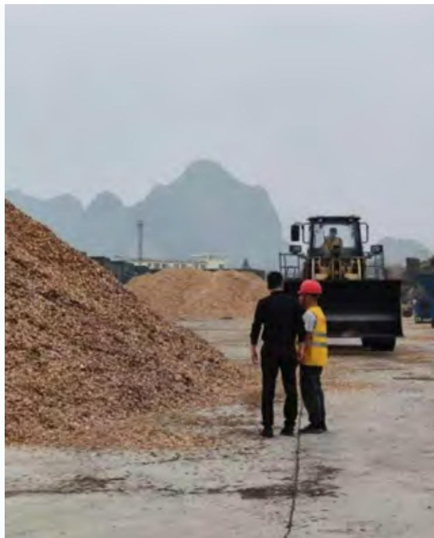

natural_image

Construction site with workers and a front loader in an open field, mountains in the background (no visible text or symbols)

# 平等对待中小企业

作为中央企业控股上市公司，我们深入贯彻党中央、国务院关于支持中小企业发展的决策部署，将“平等对待”理念贯穿于供应链管理与市场合作全过程。

一是坚决破除隐性准入壁垒，严格遵循“公开公正”原则，在采购活动中不违法限定供应商所在地、所有制形式、经营年限等条件，确保中小企业、民营企业与大型企业同规则、同待遇，平等参与市场竞争。

二是全面落实“无分歧欠款动态清零”机制，发挥央企上市公司信用优势，严格履行合同约定，缩短中小企业账款支付周期，切实纾解中小企业资金周转压力。

三是积极赋能产业链融通发展，依托龙头企业在技术、资本和市场方面的优势，通过优先安排价款支付、开放应用场景等方式，带动上下游中小企业协同创新，构建“大中小企业融通发展”的良性产业生态。

我们始终将中小企业视为产业链供应链不可或缺的合作伙伴，以合规、透明、共赢的合作机制，助力实体经济高质量发展。

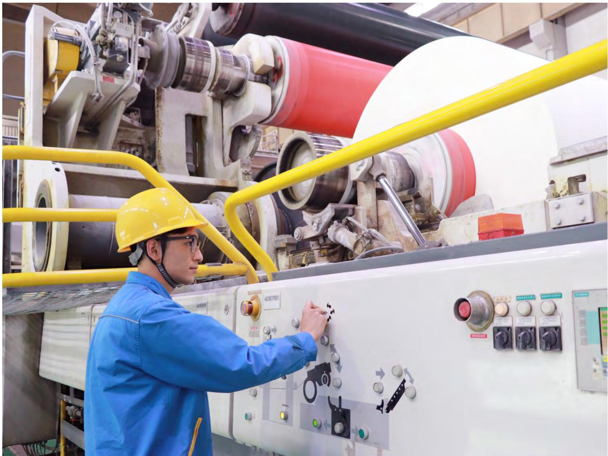

natural_image

Factory worker in blue uniform and yellow hard hat operating industrial machinery with large paper rolls (no visible text or symbols)

# 社会贡献

岳阳林纸积极践行央企控股上市公司社会责任，以 ESG 理念为引领，将公益担当深度融入企业发展基因，以“公益赋能成长、责任传递温度”为导向，鼓励并引导青年员工投身志愿公益事业，依托企业品牌影响力搭建公益服务平台，精准对接群众需求，组织青年志愿者下沉基层一线、扎根社区网格，深度参与基层治理、生态保护等工作，让企业责任可感可触、落地生根，助力形成“企业兴、青年强、公益暖”的良性循环。

报告期内，公司持续深化公益服务内涵，创新开展系列特色活动，推动青年志愿公益走深走实。一方面，聚焦民生需求精准发力，发起“爱心传递，热血托举”2025年冬春季节无偿献血倡议，以“线上倡议+线下联动”模式，吸引广大青年主动报名、积极参与，用热血传递生命希望，用行动诠释青年担当。开展爱心义卖公益活动，青年团员们化身“公益摊主”，搭建义卖展台、整合爱心物资，将义卖所得全部用于帮扶困难群体，实现“小义卖、大温暖”的公益价值。另一方面，组织青年员工一起开展“播撒生态希望，培育绿色动能”的植树活动，走进周边社区，普及环保知识、推广绿色低碳理念，结合企业特色组织青年积极参加植树护绿、废纸回收公益行动，助力生态保护。

# 案例

# 开展“绿色岳阳林纸行 共育环保少年心”主题队日活动

3月26日，42名枫树小学的学生走进岳阳林纸，开展“绿色岳阳林纸行共育环保少年心”主题队日活动，沉浸式体验现代“造纸术”背后的绿色工艺。

活动由岳阳林纸营销中心党总支、岳阳市工商联青商会党支部、岳阳楼区枫树小学党支部联合举办，携手探寻工业文化研学里的“育人密码”，架起青少年与大国工匠精神之间的桥梁，让孩子们在“行走的课堂”中真切感知中国制造的创新脉动。

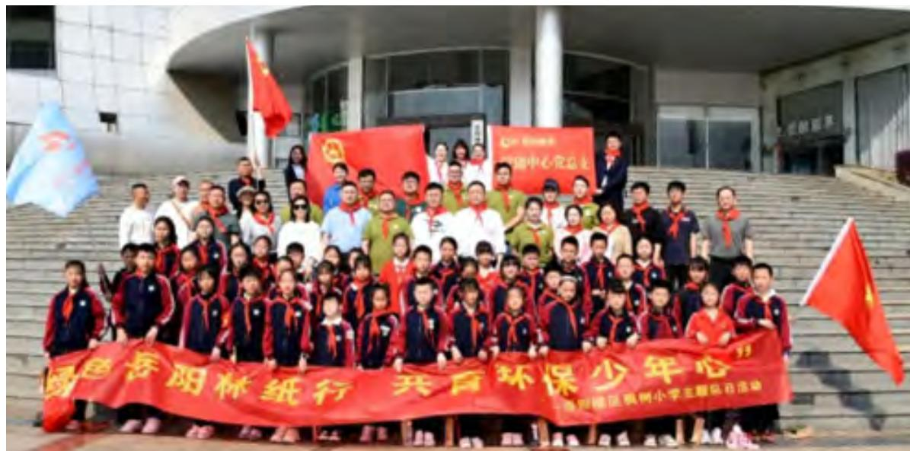

text_image

绿色岳阳林纸行 共育环保少年心
——贵州辖区黄树小学主题公益活动

# 案例

# 开展“纸短情长 爱心助残”为主题的公益活动

5月16日，在第35个“全国助残日”到来之际，岳阳林纸携手岳阳市博康康复中心开展“纸短情长爱心助残”主题公益活动，向残疾儿童及家庭传递温暖与力量。

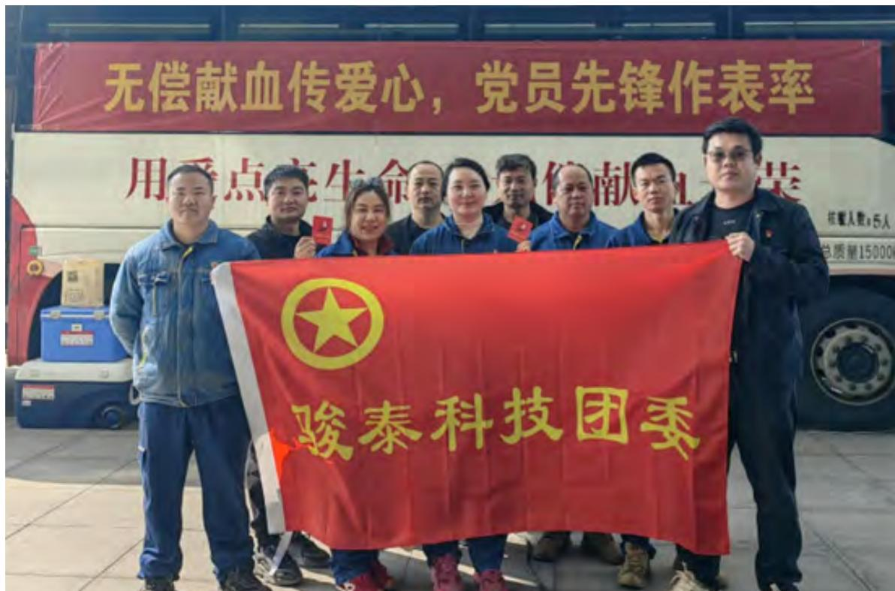

text_image

无偿献血传爱心，党员先锋作表率
用重点亮生命，用奉献血
酸泰科技团委

骏泰科技团委组织开展义务献血活动

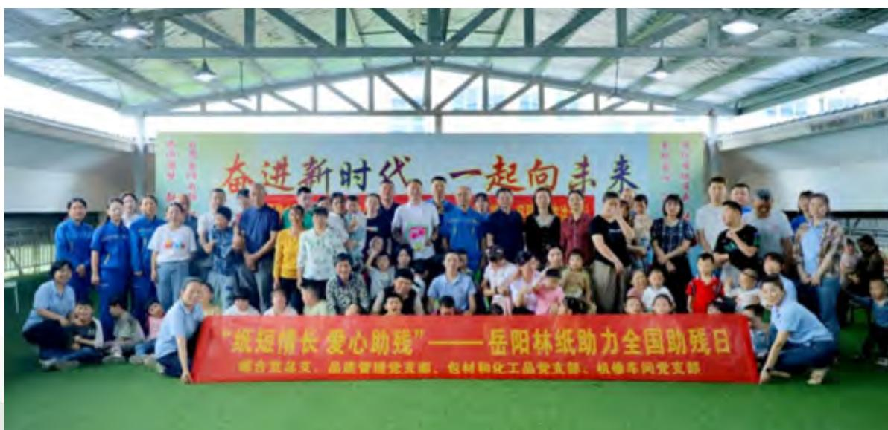

text_image

奋进新时代 一起向未来
“纸短增长 爱心助残”——岳阳林纸助力全国助残日
报告立名文、品质管理党支部、包材和化工品党支部、机修车间党支部

# 乡村振兴

公司认真贯彻落实党中央、国务院关于中央企业定点帮扶工作的决策部署，加强党的领导、强化责任担当，积极开展有温度的帮扶工作。报告期内，派员驻村积极参与岳阳县公田镇港口村乡村振兴工作（2025年6月驻村点改为：平江县上塔市镇小坪村），并对口帮扶河南宜阳县、岳阳县公田镇港口村、平江县上塔市镇小坪村，购买对口帮扶物资79.17万元，公益慈善、志愿活动等投入资金35万。

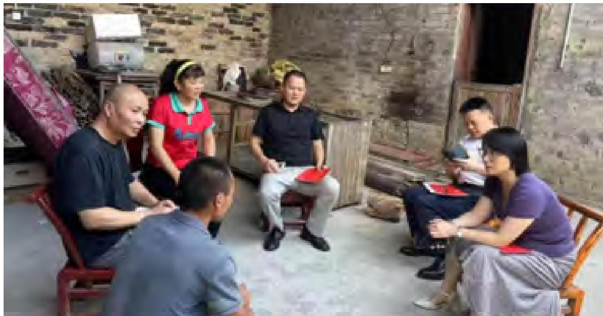

natural_image

Group of people sitting in a courtyard, engaged in conversation (no visible text or symbols)

慰问岳阳市平江县上塔市镇小坪村集中供养五保户

natural_image

Stylized line drawing of a city skyline with clouds and birds, featuring the number 93 in the bottom-left corner (no text or symbols on the skyline itself)

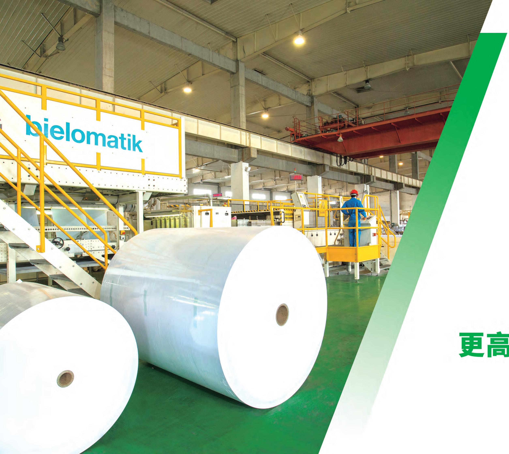

text_image

bielomatik
更高

# 05

# 更高效的治理

# 更高效的治理

作为一家央企控股上市公司，岳阳林纸坚持党的领导，党建与公司治理高度融合，发挥国企独特优势，贯彻落实新发展理念，规范公司运作，履行信披义务，严格诚信经营，防止商业腐败，提升公司治理效能，切实维护公司及全体股东利益。

# 公司治理

岳阳林纸严格遵守《公司法》《证券法》《上市公司治理准则》等相关法律法规的要求，健全中国特色现代企业制度体系，法人治理结构完善。坚持党的领导与公司治理深度融合，夯实“党委全面领导、董事会战略决策、管理层授权经营”的现代公司治理体系，厘清治理主体之间权责边界，形成权责法定、权责透明、协调运转、有效制衡的治理机制。公司持续强化党委与董事会协调运转机制，报告期内董事会审议的重大经营事项经党委会前置研究的比例为100%。

# - 治理策略及流程

公司制定了《岳阳林纸股份有限公司章程》《股东会议事规则》《董事会议事规则》等为主要架构的制度体系，以明晰治理策略、规范治理流程。报告期内公司根据中国证监会《上市公司章程指引》《上市公司股东会规则》，完成了《章程》《股东会议事规则》《董事会议事规则》、董事会4个专门委员会《议事规则》《独立董事制度》等多个基本制度的修订和完善，废除《监事会议事规则》，取消监事会，审计委员会作为内部监督机构行使监事会职权，完善类别股设置、调整股东会提案权规定、设立职工董事、股东大会改为股东会等，制订了《董事和高级管理人员离职管理制度》。组织下属所有子公司完成章程修订，取消其董事会、监事会、监事，保障了公司治理体系运行的科学化和规范化。另外，制订《经理层工作规则》，修订《“三重一大”决策制度实施办法》《重大决策事项权责清单》，动态调整优化前置事项清单。

公司股东会、董事会及经理层之间权责明确，各司其职、各尽其责、相互制衡、相互协调。公司在股东与股东会、控股股东与上市公司、董事与董事会、绩效评价与激励约束机制、利益相关方、信息披露与透明度等主要治理方面均符合监管部门有关文件的要求。

# - 组织架构和职能

公司建立了以股东会、董事会及管理层为基础的治理架构，并设立战略发展、审计、提名、薪酬与考核等专门委员会，规范公司运作，确保重大决策等行为依法合规，切实维护公司及全体股东利益。

# 公司治理相关情况

董事会及专门委员会情况

公司董事会和董事按照《公司法》等相关法律法规及《公司章程》的规定，认真履行公司股东会赋予的职责，积极发挥董事的作用，及时对公司发展和经营管理的重大事项进行了审议和决策，充分发挥了董事会的战略决策职能；在审议有关关联交易的议案时，关联董事回避表决，确保关联交易公平合理。

2025 年公司召开董事会会议 12 次（包括 4 次定期会议、8 次临时会议）。重大经营管理事项采取现场会议审议。全体董事按照相关法律法规以及《公司章程》和《董事会议事规则》的规定，依法行使权利并履行义务。

董事会执行决策闭环机制，进一步提升治理效能和战略落地能力。决策前环节注重充分准备与沟通，及时向董事提供信息，保障决策依据充分，确保议题质量。决策中强调科学规范的审议流程，严格执行党组织前置研究讨论程序，在董事会会议前组织专门委员会审议，并支持外部董事独立发表意见，对重大事项充分讨论和审慎表决。决策后环节进行执行跟踪闭环管理。

公司董事会设置审计、提名、薪酬与考核、战略发展等专门委员会，前3个委员会中，独立董事过半数并担任召集人。公司常态化地组织召开董事会专门委员会会议，委员积极发挥参与决策、专业咨询作用，助推更好实现董事会定战略、作决策、防风险的功能。

2025 年召开董事会专门委员会会议及独立董事专门会议 23 次，审议议题 39 项，重大经营管理事项议案做到应审尽审，其中：审计委员会 9 次，审议议题 18 项；薪酬与考核委员会 3 次，审议议题 5 项；提名委员会 5 次，审议议题 8 项；战略发展委员会 2 次，审议议题 2 项；独立董事专门会议 4 次，审议议题 6 项；重点对战略研讨、“十四五”规划执行情况评估、财务报告、董事、高级管理人员提名、经理层考核、业绩指标的设定、聘任年审会计师事务所、监督及评估内外部审计工作和公司内部控制、关联交易等事项，在董事会召开前进行提前审议和研究论证，促使董事会决策符合公司整体利益，保护了全体股东合法权益。

# 独立董事履行职责的情况

公司制定了《岳阳林纸股份有限公司独立董事专门会议工作制度》《岳阳林纸股份有限公司独立董事制度》。

公司独立董事3名，其中1名为会计专业人士，具备工作所需财务及专业知识。2025年独立董事勤勉、独立地履行职责，出席独立董事专门会议、董事会及其专门委员会、股东会会议，认真审议各项议案，进行调研，对公司的经营决策等方面提出专业性建议，充分发挥了独立董事的作用，为完善公司监督机制，维护公司和全体股东的合法权益发挥了应有的作用。独立董事具体履职情况详见公司《2025年度独立董事述职报告》。

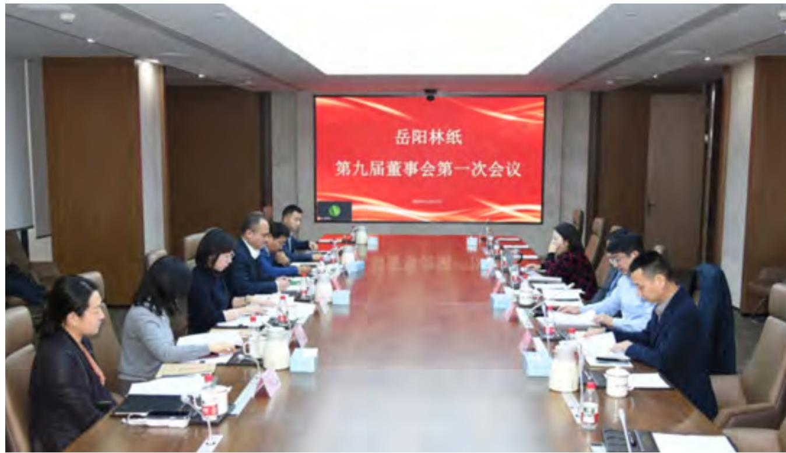

text_image

岳阳林纸
第九届董事会第一次会议

# - 董事会构成

董事会持续优化结构配置，依据《公司章程》，合理选聘董事及管理层。公司2025年实施完成董事会换届选举；截至报告期末，公司共有董事7人（含1名职工董事），其中女性董事4人，占比57%，独立董事3人，占比43%。

# 董事多元化

报告期末，公司董事会共有董事7人，其中女性董事4人，占比57%，体现了董事会成员的性别多元化；同时，董事会成员涵盖了不同年龄段和工作经验的成员，有助于在决策中获得多元化的经验和意见。

# 董事独立性

公司共有独立董事3人，占比43%，外部董事4人，占比57%，人数比例符合国务院国资委、中国证监会、上海证券交易所等相关规定。

# 董事专业性

公司董事会成员具有广泛的专业背景，熟悉领域涵盖了战略管理、项目管理、财务管理、金融与资本运作、生产管理等多个领域，确保了在决策中充分覆盖公司经营的多个方面。

# - 投资者关系管理与股东权益

公司注重投资者关系维护,始终把投资者关系管理工作放在重要位置,由董事会秘书负责公司投资者关系管理和投资者保护工作,证券事务办公室负责相关日常工作。公司设置投资者关系管理岗位、投资者热线 0730-8590683、邮箱,配备专职投资者关系管理人员。为切实保护投资者特别是中小投资者的合法权益,公司制定了《公司信息披露事务管理制度》《公司内幕信息知情人登记管理制度》《公司新闻宣传稿件审核把关制度》等制度,合规履行信息披露职责,帮助投资者做出客观正确的投资判断。

# 投资者沟通

报告期内，公司持续梳理公司投资逻辑，加强投资者推介及市值管理规划。公司多渠道、多平台、多方式针对性开展投资者关系管理工作，通过公司微信公众号、上证e互动平台、新媒体平台、电话、电子邮箱等渠道，利用证券交易所、证券公司等网络基础设施平台，采取股东会、投资者说明会、路演、分析师会议、座谈交流等方式，与投资者进行沟通交流，增进投资者对公司的了解，有效传递公司投资价值。

公司积极接待机构投资者调研、拜访、会议等，与公司董事会和管理层对话，听取机构投资者相关建议，研究论证建议的可行性和必要性，相机决策。

报告期内，共举办业绩说明会3次，参加集体接待日活动1次，举办了路演+反路演+电话会议共24场，参与线下策略会8次，在上证e互动与投资者互动回复率100%。

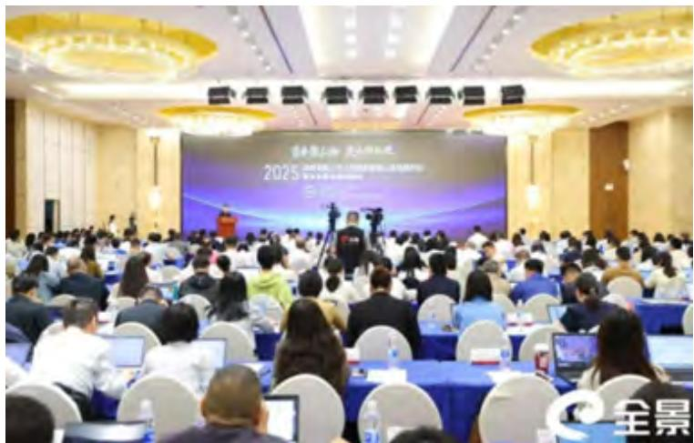

text_image

2025
全景

# 股东权益

岳阳林纸严格按照《公司章程》执行利润分配政策，积极回馈股东，保障股东权益。在保障中小投资者股东权益方面，公司已建立防止控股股东占用上市公司资产、侵害上市公司利益的长效机制，在《公司章程》中明确了“占用即冻结”的相关条款，公司与控股股东和实际控制人各自独立核算、独立承担责任和风险，没有占用上市公司资金或要求为其担保或替他人担保情形。

报告期内，公司召开2024年度股东会会议和4次临时股东会会议，全部采用了现场与网络投票相结合的方式，为不便亲临现场的中小股东行使表决权提供了便利；公司章程明确了中小投资者单独计票机制以及不得限制征集投票权持股比例。股东会审议影响中小投资者利益的重大事项时，将中小投资者表决结果在股东会决议公告中予以披露，保护了中小投资者的合法权益。公司历次股东会的召开和表决程序规范，决议合法有效。

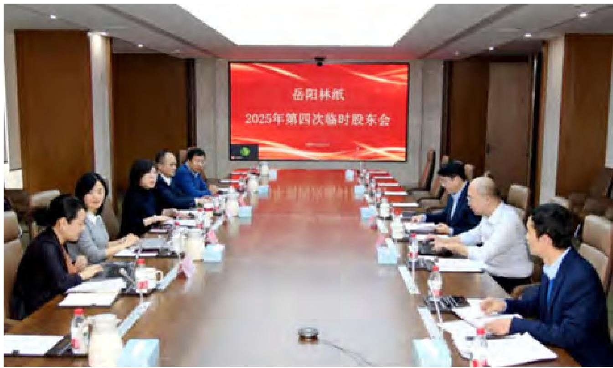

text_image

岳阳林纸
2025年第四次临时股东会

# - 信息披露透明度

公司长期以来严格按照监管要求，准确履行信息披露义务，合规高效完成信息披露工作。为保障投资者权益，加强信息披露工作管理，公司制定了《信息披露事务管理制度》《重大信息内部报告制度》《内幕信息知情人登记管理制度》等系列信息披露相关制度，并设立证券事务办公室作为信息披露和投资者关系管理的负责部门。

报告期内公司贯彻以信息披露为核心的上市监管要求，秉承真实、准确、完整、及时、公平的原则，深化信息披露工作，致力于信披连续性与全面性、灵活性与敏锐性，做好定期报告与各项临时报告的编制及披露，有效传递公司价值。特别是利用年报披露，充分全面展现公司在战略路径、经营业绩、企业治理、践行社会责任方面的理念及成果。全年在上海证券交易所、中国证券报、上海证券报、证券时报发布公告及相关文件107份，确保投资者及时了解公司重大经营和决策事项。

公司微信公众号（微信号：百年岳纸 千载文章）及时更新公司动态，向投资者和社会公众充分展示公司经营情况。

# 合规经营与风险管理

岳阳林纸始终坚守合规经营底线，高度重视风险防控工作，全力打造适配企业长远发展的合规风控管理体系。公司严格对标国务院国资委深化法治央企建设相关部署要求，胸怀大局、统筹全局，扎实推进“健全五个体系、提升五种能力”，以建设促提质、以争先促发展，精准破解深化改革过程中的难点问题，持续提升公司综合风险防范与管控水平。

# 合规经营

2025年，公司继续秉持“合规创造价值”理念，将合规要求深度融入治理决策全流程、全领域，实现从“被动合规”向“主动赋能”的突破转型。通过强化制度、合同、重大决策源头风险管控与精准化专项治理，公司不仅夯实了风险防范根基，更在响应新法实施与推进世界一流法治企业建设中取得了里程碑式成果。

深化治理决策，构筑合规“防火墙”。一是主动前移风险防控关口，首创重大决策合规刚性审查机制，制发《重大决策法律合规审核规范指引》，确立重大议题上会前“未经合规审查不决策”的刚性程序，明确合规意见的关键权重，充分发挥合规护航依法治企重要功能。2025年公司累计完成166项重大决策的合法合规审查，从制度源头有效防范重大经营风险。二是率先响应新《公司法》要求，统筹完成全系统公司章程的全面修订与工商备案，实现法人治理结构的优化升级，为企业长治久安奠定坚实基础。三是公司通过体系化对标与建设世界一流法治企业建设试点工作，圆满实现整体法治合规管理能力提质升级。

聚焦重点领域，开展精准“深治理”。常态化推进合同全生命周期管理，并全面推广电子印章应用，进一步优化核心子公司业务合同风险源管理，实现从起草到归档的全链条风险闭环，提升交易安全与运营效率。同时，专项治理补强重点领域风险防控，针对授权管理、境外业务合规等高风险领域开展深度诊断。通过规范授权动态管理、系统排查境外佣金中介业务并制定长效防控方案，精准构筑涉外业务廉洁与合规防线。

厚植合规文化，激活全员“内驱力”。2025年，公司全面更新发布《合规手册》，并组织全系统员工签署《合规承诺书》，将制度约束转化为全体员工的行为自觉。常态化构建企业合规文化体系，提升全员合规意识与能力，公司制定并实施年度合规培训计划，围绕新《公司法》、数据安全、AI合规等前沿议题，全年组织12场专题培训共38小时，覆盖838人次，显著提升关键条线风险应对能力。其中，《公司法》培训聚焦新法对公司治理架构、董监高及国有控股上市公司股东的影响，并提出相应的法律风险防范建议，进一步规范公司治理结构及运行规则，强化法律合规风险意识。此外，公司还结合重要普法节点开展系列活动，并每季度印发《合规期刊》，通过案例警示与合规提示，持续强化全员合规意识，营造“人人合规、事事合规”的文化自觉。

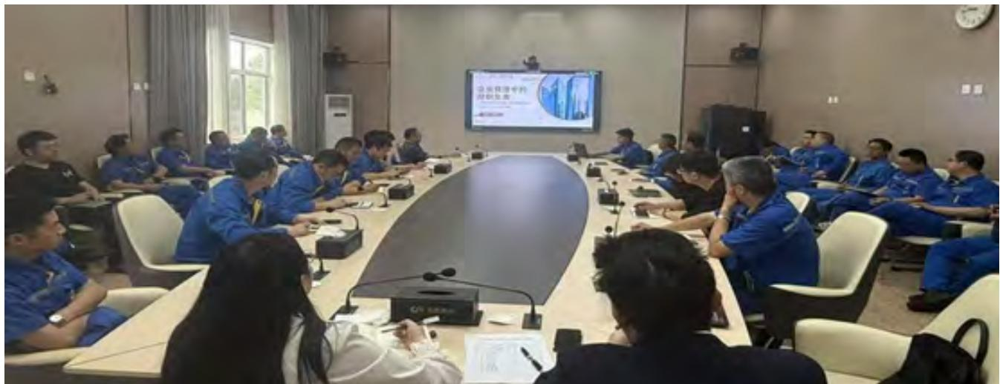

text_image

Meeting room photo with visible presentation screen showing Chinese text about health care services

公司全员专题学习“企业管理人员尽职免责”培训现场图

# - 内部控制

根据《关于加强中央企业内部控制体系建设与监督工作的实施意见》（国资发监督规〔2019〕101号）等有关要求，公司内控管理重点从制度、流程梳理入手，从运行机制上找问题，以健全公司内控管理体系，构筑企业风险防线为目标，有序实施内部控制管理各项工作。

公司内部控制体系结构合理，内部控制制度框架符合财政部、中国证监会等五部委对于内部控制体系完整性、合理性、有效性的要求，能够适应公司管理和发展的需要。公司通过不断健全内控体系，实现内控机制有效运行，达到了内部控制预期目标，保障了公司及全体股东的利益。

# （一）制度体系精益化构建

根据公司管理实际，对 2024 版《规章制度管理办法》进行了修订，重点优化制度评审程序、将集中宣贯和集中评审嵌入制度内，并对制度分级进行重新界定，明确了具体制度（三级制度）的审批流程，同时按照制度流程化和流程信息化原则，建立了具体制度线上审批流程，在保证规章制度质量的基础上，提升制定效率。

为进一步优化公司内控体系,强化合规管理,提高制度实操性和执行力,促进业务端依章依规平稳运行,开展了《规章制度管理办法》落实情况检查,形成《岳阳林纸股份有限公司2025年度制度“废改立”计划》。截至2025年12月31日制度共修订128项、新立52项、废止142项,保质完成年度计划。

# （二）压实内控执行责任

对 2024 年度内控评价过程中认定的内控缺陷进行实时督办，全部完成整改，实现闭环管理。开展 2025 年度内部控制设计及运行的有效性评价，持续推进公司内部控制体系评价工作。从评价结果看，报告期内，公司内部控制制度健全，不存在重大缺陷、重要缺陷，内部控制程序运行有效，合理保证了公司经营管理合法合规、资产安全、财务报告及信息披露的真实、准确、完整。

# （三）执行效能全方位强化

对标穿透式管理要求，建立“定期梳理诊断-督促指导优化-落实宣贯执行-强化检查考核”闭环机制，将制度“废改立”与执行情况调研深度结合，对重要功能子公司开展风控体系专项评估，聚焦茂源林业核心业务、中纸宏泰新兴业务、诚通凯胜工程项目等核心业务领域，通过全维度体检、现场核查等方式，排查关键环节风险点，组织业务单位召开专题会议，确定改进方向和举措，协同推进问题整改，同步完善子公司内控制度体系，指导茂源林业、中纸宏泰等子公司完成制度废改立145项，全方位筑牢内控防线。

# - 风险管理

# （一）全面风险管理体系

公司围绕总体战略和经营目标，通过在经营管理的各个环节和过程中执行风险管理的基本流程，培育良好的风险管理文化，建立健全风险管理体系。

公司优化全面风险管理的组织体系，细化风险管理要求，修订并印发了《岳阳林纸股份有限公司全面风险管理实施细则》和《岳阳林纸股份有限公司风险管理委员会议事规则》；《岳阳林纸股份有限公司全面风险管理实施细则》主要按照风险管理的基本工作流程，对风险识别、风险评估、风险应对、监督与检查、考核评价、风险事件管理、持续改进与优化、信息沟通与报告等8个方面做出了详细的规定，为公司风险管理工作提供了统一的工作标准和可供选择的技术方法；《岳阳林纸股份有限公司风险管理

《委员会议事规则》对风险管理委员会及其办公室的成员、主要工作职责、风险管理委员会议事清单、风险管理委员会的会议组织、议案审查及决策等做出了详细的规定，规范了公司风险管理委员会的工作秩序和决策方式，保证各位委员有效行使权利，履行职责，承担义务。

# （二）风险识别与评估

风险管理部门按公司战略目标和年度发展规划，组织对各职能部门和分子公司开展风险识别、评估与应对专项工作，更新完善风险清单。各职能部门及子公司结合评估结果、年度规划和风险承受能力，选择应对策略，提出解决方案，确保风险在可承受范围内，并定期跟踪风险解决方案的落实情况。报告期内，公司无新增重大风险事件。

# 党建与企业文化

岳阳林纸在上级党委的坚强领导下，以习近平新时代中国特色社会主义思想为根本遵循，深入学习贯彻党的二十大及二十届三中、四中全会精神，牢牢把握新时代党的建设总要求与组织路线，锚定“价值型党组织”建设目标，深化“刚融并济、有效管用”党建工作理念，全面落实“1134N”党建工作体系，持续推动党建与生产经营深度融合、同频共振，将党建优势转化为企业发展优势、创新优势、竞争优势，为企业高质量发展筑牢政治根基、提供组织保障。

报告期内，公司党建工作获得了广泛认可，多项成果、集体及个人获评全国总工会、省市级表彰，其中公司工会获评全国总工会“情系女职工法在你身边”活动“最佳组织单位”，9.10号机车间打浆化学品岗获岳阳市芙蓉标兵岗，《提升高比例化机浆印刷纸彩印效果技术》入围中华全国总工会“晒晒我的‘五小’成果”展示活动等。

# - 优化组织架构

报告期内，立足企业发展实际，精准优化党组织架构，全年新成立凯胜宏泰党总支等党组织8个，撤销岳阳林纸项目指挥部党总支等党组织10个，完成茂源林业党总支等2个党组织换届选举，推动7个党组织补充委员10名，完成12名党组织书记任命和11名党组织书记免职工作。通过组织优化与阵地升级，党的组织体系更加严密，基层党组织战斗堡垒作用显著增强，在服务发展、凝聚人心、推动改革中充分彰显组织功能。

报告期内，公司发展新党员 24 名，在册党员人数 1278 人，女性在册党员人数 272 人，占比 21.28%。

党建  
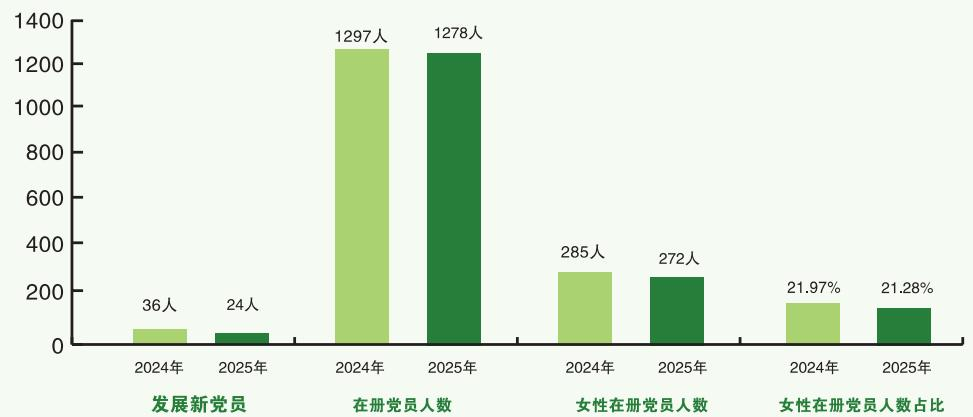

bar

| 类别 | 年份 | 人数 (人) |
| --- | --- | --- |
| 发展新党员 | 2024年 | 36 |
| 发展新党员 | 2025年 | 24 |
| 在册党员人数 | 2024年 | 1297 |
| 在册党员人数 | 2025年 | 1278 |
| 女性在册党员人数 | 2024年 | 285 |
| 女性在册党员人数 | 2025年 | 272 |
| 女性在册党员人数占比 | 2024年 | 21.97% |
| 女性在册党员人数占比 | 2025年 | 21.28% |

# 完善党建制度

报告期内，完成《党建工作责任制考核评价办法》《党费及党组织工作经费管理办法》《谈心谈话制度》等多项党建基本制度修订，构建系统完备、科学规范、运行有效的党建工作制度体系。推动党建考核与生产经营深度融合，实现党建责任量化、过程可视化、结果可运用，以制度刚性约束推动党建工作提质增效。

骏泰科技党委为进一步发挥基层党支部战斗堡垒作用，压实支部委员责任，推动党建工作提质增效，制定下发了《关于强化骏泰科技支部委员履职的规定》，并将之作为发挥党员先锋模范作用、服务广大党员群众的重要举措。经过多年实践，总结提炼出“一套体系，四项聚焦，两个抓手”特色党建经验，党委中心工作聚焦“新质生产力培育、生物基新材料产业布局、‘卡脖子’技术攻关、依法合规稳健经营”等四大方向，以“党委一年一主题+支部党建品牌建设”为抓手，推动党建工作与生产经营同频共振。

# - 学习教育走深走实

深入贯彻中央八项规定精神学习教育，做到了理论学习内容全面覆盖、问题查摆深查实纠、整改整治扎实见效，学习教育质效全面提升。报告期内，共计开展理论学习273次，共计5502人次党员参加，覆盖基层党组织55个、党员1260名；61名新提拔干部、年轻干部及关键岗位干部开展“靶向式”自查自纠；137名党员骨干参加专题警示教育；45个基层党支部书记完成党课讲授；各级党组织共计查摆问题157个，其中纳入整改整治的43个突出问题已全部完成整改销号。

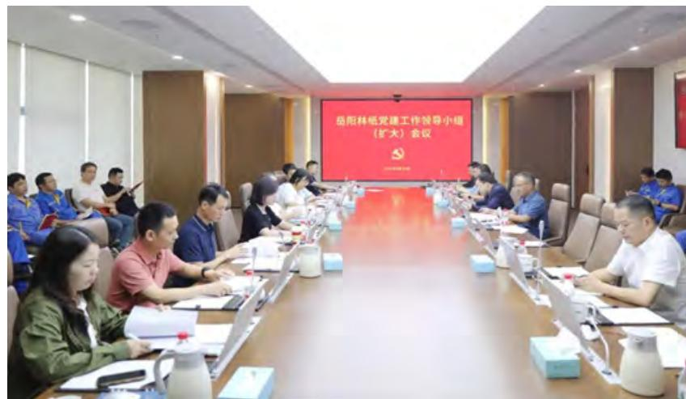

text_image

岳阳林纸党建工作领导小组
(扩大)会议

公司党委班子带头转变作风，聚焦生产经营突出问题带头开展调查研究，精准破解生产经营等难题38项；聚焦民生实事，落实33条员工合理化建议；聚焦对照“两个清单”问题，坚决整治形式主义，会议、检查数量同比分别下降30%、25%。

# - 党业融合赋能

岳阳林纸坚持以党建赋能生产经营，深化专项攻坚，严格落实《中国纸业党委关于持续深化“党建赋能‘纸’当先锋”专项攻坚行动的通知》要求，创建28个“书记项目”、组建23支“党员突击队”，聚焦生产经营重难点任务靶向攻坚，报告期内23个“书记项目”、16支“党员突击队”圆满完成目标任务，分别实现降本增效12229万元、11290万元；同时，聚焦中心任务筑牢基层攻坚阵地，持续夯实党建“四大工程”，推进251个“星班组”“命名工程”及58个“红星党小组”创建落地，以班组为前沿阵地聚焦技术攻关、质量提升、成本控制关键环节，带动全员创新创效，打通党建工作“最后一公里”，形成“党建带队伍、队伍促发展”的良性循环。此外，公司聚焦重点难点，发动全员开展“攻坚克难，挑战极限”劳动竞赛，围绕“化学浆提产”“白泥增效”“污泥掺烧”“纸芯管改切”“异常品改切”“热动安全运行”6个方面推进竞赛，营造比学赶超氛围，有效提高了整体运行效率、降低了成本。

# 案例

# “书记项目”进行时

岳阳林纸包材和化工品党支部: 争先实干 “第一” 多。重钙单月产量首次突破 2 万绝干吨，首批 AKD 施胶剂远销东南亚，系统内首个全自动纸芯管项目有序推进。岳阳林纸储运包材事业部党总支积极推进 “书记项目” —— 所属包材和化工品党支部突出 “书记带头全程抓”，发挥头雁作用，凝聚攻坚合力，一个个 “首次” “首批” “首个” 接连涌现，让人看到实实在在的新成效。

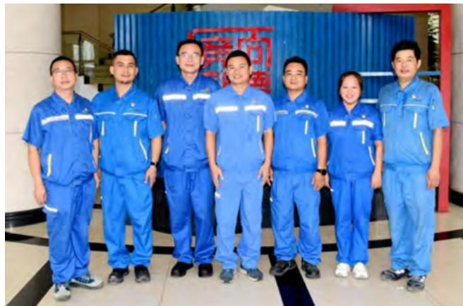

natural_image

Group photo of eight people in blue uniforms posing indoors with a blue backdrop featuring Chinese characters (no visible text on individuals or background)

岳阳林纸储运包材事业部党总支积极推进“书记项目

子公司骏泰科技坚持以党建引领赋能企业发展，通过“书记项目”撬动重点项目攻坚，深入践行“一线工作法”，推动项目提前投产，为产业升级注入强劲动力；同时，公司组建多支党员突击队，围绕生产经营、科技创新、提质增效等核心任务开展攻坚，其中“精检先锋党员突击队”创效约993万元，“隔膜压滤机项目党员突击队”推动项目于11月27日顺利投运，显著提升生产效率。在宣传与影响力方面，骏泰科技聚焦党建业务融合、重点项目建设和劳模事迹，全年在各级媒体发表稿件207篇（含省级媒体7篇、怀化市电视台专题报道2次），2篇新闻作品获造纸产业优秀新闻奖，有效提升了行业影响力与社会知名度。此外，公司积极与核心客户党组织开展党建交流活动，在互学互鉴中推动党建工作与生产经营“双融双促”；公司领导还受邀为怀化市国资系统80余名党务工作人员讲授《党建红引领企业兴骏泰科技的高质量发展密码》专题党课，进一步扩大了企业影响力。

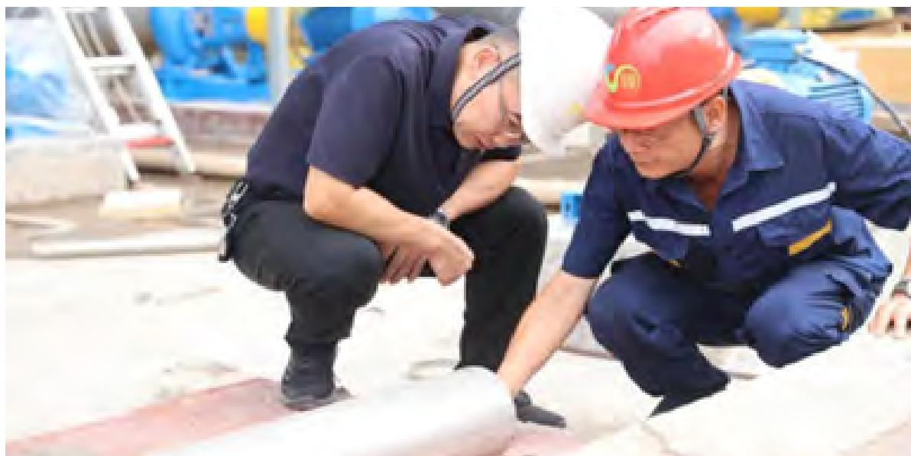

natural_image

Two workers in hard hats examining construction materials on-site (no visible text or symbols)

骏泰科技: 书记项目牵头人查看木质素项目建设情况

# 案例

# 党建带工建: 培育先进典型, 发挥先锋引领

成就“悦读思享会”精品思政课堂——分享“成长记”共上“励志课”，点赞这场劳模与青春的“匠心对话”。人人学劳模，个个争先进。报告期内，两名员工获评湖南省劳动模范、一名员工获评岳阳市劳动模范、一名员工获评怀化市劳动模范，一名员工被列为“央企工匠”培育对象。5月17日，岳阳林纸举办“践行劳模精神奏响奋进强音”劳模事迹宣讲交流会，掀起学习劳模、争当先进的热潮。

搭建技能提升平台，牵头组织“匠人匠心”钳工、自控、电气技能比武，48名技术能手踊跃参与，促进技能员工岗位成才。

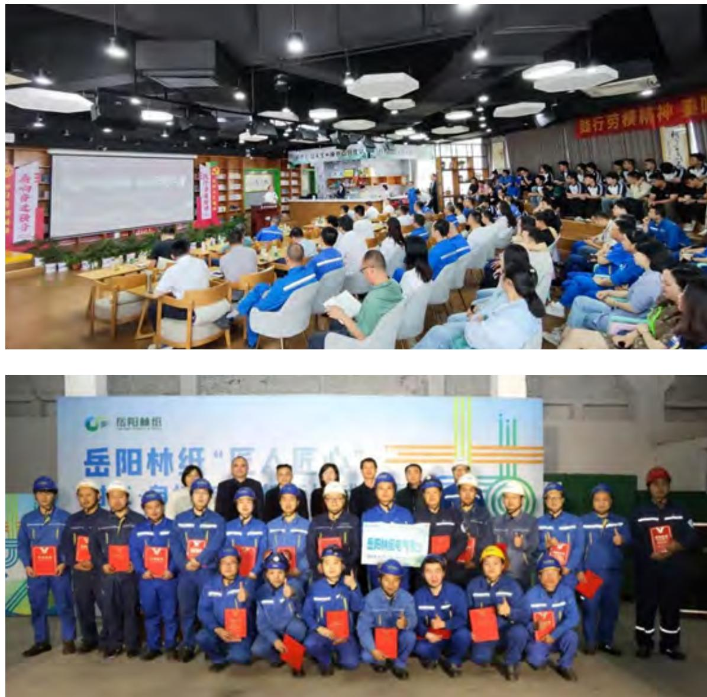  
“匠人匠心”钳工、自控、电气技能比武

# 反不正当竞争

公司严格遵守《中华人民共和国反不正当竞争法》，将公平竞争理念全面融入销售、采购及供应链管理全过程，维护市场公平竞争环境，将反不正当竞争从口号落实为制度，坚决抵制任何形式的不正当竞争行为。

# 销售行为规范: 明令禁止三类不正当竞争行为

# 诋毁竞争对手

01

严禁在宣传推广中散布虚假信息、恶意歪曲事实或夸大竞争对手的缺陷，损害其商业信誉或商品声誉。

# 恶意 抢单

02

不得通过干扰同事正常跟进客户、利用内部信息截留客户资源，或提供公司政策外的不公正优惠条件等方式抢夺客户。

# 行贿 受贿

03

禁止以任何形式向客户、合作伙伴或其相关人员输送不当利益（包括但不限于现金、礼品、款待、回扣等）以获取订单或商业机会。

处罚措施: 一经发现并查实, 公司将根据情节严重程度, 依法依规给予警告、通报批评、扣除绩效、降级降职、解除劳动合同等处理; 涉嫌违法犯罪的, 将移送司法机关追究法律责任。

# 采购与供应链管理: 制度落地与全链条传导

# 制度建设

01

制定并严格执行《诚信经营守则》《供应商行为准则》等内部规章，明确禁止价格固定、市场划分、串通投标、围标等垄断及不正当竞争行为。

# 契约 约束

02

对内与采购等相关岗位员工签署《廉洁承诺书》；对外要求所有合作供应商签署《反商业贿赂协议》或同等效力条款，将合规要求转化为法律义务。

# 培训与传导

03

常态化开展反不正当竞争与反腐败培训，覆盖采购、销售、供应链管理等关键岗位，推动合规压力与责任逐级传递至供应链每一个环节。

# 反商业贿赂及反贪污

公司始终纵深推进全面从严治党，着力打造特色廉洁文化，健全完善监督约束体系，持之以恒正风肃纪，系统构建不敢腐、不能腐、不想腐一体推进长效机制，推动形成遵规守纪、崇廉尚洁、担当作为的良好风尚，持续巩固风清气正、干事创业的政治生态。

管理体系：

公司严格遵守《中华人民共和国公司法》《中华人民共和国招标投标法》《中华人民共和国反不正当竞争法》及《关于禁止商业贿赂行为的暂行规定》等法律法规，制定并严格执行《员工廉洁从业规定》《违规经营投资责任追究工作实施细则》《工程项目审计管理制度》《员工与管理服务对象交往负面清单》《采购审计制度》《经济责任审计指引》等内部制度，构建起系统完备的合规管理与风险防控体系，有效防范和遏制腐败及各类不道德行为。

公司建立举报机制（举报电话 0730-8590210，来信来访地址：中国（湖南）自由贸易试验区岳阳片区长江大道西新港多式联运物流园 001 号 17 楼纪委办公室），为公司股东、客户、供应商、社会各方及员工等提供检举揭发的渠道；公司对举报信息严格保密，并设立机制保证举报人安全和激励员工举报。

# 反腐败工作实施

公司成立了党风廉政建设和反腐败工作领导小组，党委书记担任组长，党委副书记、纪委书记担任副组长，公司党政班子成员为工作领导小组成员。公司定期召开党风廉政建设和反腐败工作领导小组会议和党委、纪委沟通协商会议，研判整体形势并部署反腐败工作。

# 廉洁风险评估

报告期内，公司未发生重大腐败相关负面事件，同时依据相关规定持续强化监督检查，系统性评估潜在风险以确保合规运行及履行责任。

# 廉洁文化建设

公司着力打造以“敞开大门、紧闭小门”为核心理念的特色廉洁文化，通过建设廉洁教育实体阵地，在升学季、节假日前夕通过内部广播、定向推送发出精准廉洁提醒，依托“悦读思享会”平台开展“廉‘接’你我”主题宣讲，并持续举办“家庭助廉”、廉洁演讲比赛及知识竞赛等多元活动，系统推进廉洁意识深入人心，筑牢拒腐防变的思想堤坝。

公司将反腐倡廉宣传教育作为一项系统性工程，坚持纪律教育、廉洁文化建设与思想政治引领深度融合，一体推进理论学习、文化浸润、警示教育与源头预防。

一是强化政治理论武装，严格落实“第一议题”制度，依托纪委会、纪委理论学习中心组深入开展专题学习，不断提升政治站位与履职能力。二是厚植廉洁文化根基，持续举办“悦读思享廉‘接’你我”廉洁文化宣讲活动，以文化浸润增强全员廉洁自律意识。三是扎实开展警示教育，聚焦突出问题，组织覆盖近400名干部职工的交通安全暨酒驾醉驾专题宣教，并累计组织近1200人次参加上级单位警示教育大会，切实强化纪律规矩意识。四是抓实源头预防与入职教育，为新入职员工量身定制廉洁“第一课”，从党纪、国法、司规层面引导其扣好职业生涯“第一粒扣子”。五是创新教育载体形式，积极运用系统内典型案例资源，完成廉洁主题宣传视频的脚本创作与拍摄，以直观生动的方式提升教育实效，持续营造崇廉尚洁、风清气正的良好氛围。

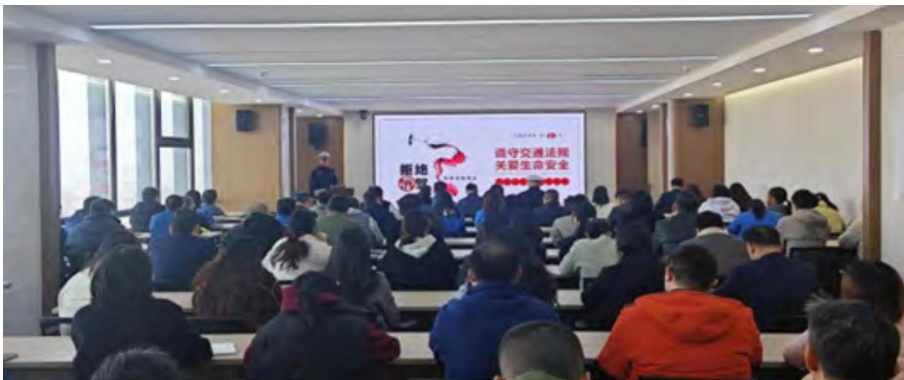

text_image

遵守交通法规
关联生命安全

# 举报人保护机制

为保护举报人权益，公司依据《中华人民共和国监察法》《纪检监察机关处理检举控告工作规则》及相关纪检制度建立信息保护机制，明确要求：严格保密举报人信息与举报内容；禁止向被举报方泄露调查情况；保护信访人隐私；实行利益冲突回避原则。公司持续优化该机制，确保举报渠道畅通公正。

反贪污信息披露

<table><tr><td>类别</td><td>指标</td><td>单位</td><td>2024年</td><td>2025年</td></tr><tr><td rowspan="6">商业道德与反腐败</td><td>监管部门对发行人或其雇员提出并已审结的贪污诉讼的案件数目</td><td>件</td><td>0</td><td>0</td></tr><tr><td>开展反腐败宣教活动</td><td>次</td><td>10</td><td>13</td></tr><tr><td>员工接受党风廉政宣教人数</td><td>人</td><td>3730</td><td>3772</td></tr><tr><td>开展反腐败专题警示教育</td><td>次</td><td>1</td><td>2</td></tr><tr><td>管理层接受反腐败警示教育人数</td><td>人</td><td>130</td><td>457</td></tr><tr><td>“悦读思享廉‘接’你我”廉洁文化宣讲</td><td>次</td><td>2</td><td>1</td></tr></table>

# 案例

# 2025年党建暨党风廉政建设工作会议顺利召开

2025 年 2 月 26 日，岳阳林纸召开 2025 年党建暨党风廉政建设工作会议，深入学习贯彻党的二十大及中央纪委四次全会精神，落实上级党委、纪委部署要求，会议传达习近平总书记在二十届中央纪委四次全会上的重要讲话精神及上级公司相关会议精神，开展了党风廉政集体谈话，通报了 2024 年度党建及党风廉政建设检查考核情况，总结 2024 年工作，部署 2025 年重点任务。

natural_image

Stylized illustration of a green hill with wind turbines and buildings, no text or symbols present.

关键绩效

<table><tr><td>主题</td><td>二级指标</td><td>指标单位</td><td>2024年</td><td>2025年</td></tr><tr><td rowspan="25">环境</td><td>环保投入</td><td>万元</td><td>31655</td><td>33702.63</td></tr><tr><td>披露的温室气体范围1排放量</td><td>万吨二氧化碳当量</td><td>113</td><td>109</td></tr><tr><td>披露的温室气体范围2排放量</td><td>万吨二氧化碳当量</td><td>23</td><td>44</td></tr><tr><td>温室气体减排资金投入</td><td>万元</td><td>8812.54</td><td>23586.62</td></tr><tr><td>温室气体排放量</td><td>万吨二氧化碳当量</td><td>135.83</td><td>153.228</td></tr><tr><td>温室气体排放密度</td><td>吨二氧化碳当量/每产量单位(吨)</td><td>0.744</td><td>0.659</td></tr><tr><td>氮氧化物年总排放量</td><td>吨</td><td>743.89</td><td>680.9</td></tr><tr><td>二氧化硫年总排放量</td><td>吨</td><td>97.03</td><td>122.44</td></tr><tr><td>颗粒物年排放量</td><td>吨</td><td>80.59</td><td>74.89</td></tr><tr><td>废水排放量</td><td>万吨</td><td>3660.95</td><td>3968.24</td></tr><tr><td rowspan="2">COD化学需氧量</td><td rowspan="2">毫克/升</td><td>岳阳基地:23.80</td><td>岳阳基地:35.01</td></tr><tr><td>骏泰科技:279</td><td>骏泰科技:263.29</td></tr><tr><td rowspan="2">氨氮</td><td rowspan="2">毫克/升</td><td>岳阳基地:0.55</td><td>岳阳基地:0.94</td></tr><tr><td>骏泰科技:0.21</td><td>骏泰科技:0.43</td></tr><tr><td rowspan="2">悬浮物</td><td rowspan="2">毫克/升</td><td>岳阳基地:8</td><td>岳阳基地:6.5</td></tr><tr><td>骏泰科技:43</td><td>骏泰科技:62.27</td></tr><tr><td>固废产生量</td><td>万吨</td><td>72</td><td>80.54</td></tr><tr><td>废弃物循环利用量</td><td>吨</td><td>698802</td><td>786952</td></tr><tr><td>其中:产生的有害废弃物总量</td><td>吨</td><td>1263.4</td><td>1806.52</td></tr><tr><td>产生的无害废弃物总量</td><td>吨</td><td>715601</td><td>803562.89</td></tr><tr><td>固体废弃物合规处置率</td><td>%</td><td>100</td><td>100</td></tr><tr><td rowspan="2">总氮</td><td rowspan="2">毫克/升</td><td>岳阳基地:2.32</td><td>岳阳基地:2.35</td></tr><tr><td>骏泰科技:2.44</td><td>骏泰科技:2.4</td></tr><tr><td rowspan="2">总磷</td><td rowspan="2">毫克/升</td><td>岳阳基地:0.14</td><td>岳阳基地:0.01</td></tr><tr><td>骏泰科技:0.5</td><td>骏泰科技:0.21</td></tr></table>

<table><tr><td>主题</td><td>二级指标</td><td>指标单位</td><td>2024年</td><td>2025年</td></tr><tr><td rowspan="14">环境</td><td>水资源消耗量</td><td>万立方米</td><td>4633</td><td>5263</td></tr><tr><td>水资源使用强度</td><td>吨/万元</td><td>5.065</td><td>5.566</td></tr><tr><td>重复水量</td><td>万立方米</td><td>43999</td><td>51350</td></tr><tr><td>水循环利用率</td><td>%</td><td>90.47</td><td>90.7</td></tr><tr><td>直接能源总消耗量</td><td>吨标准煤</td><td>1782607</td><td>1828392</td></tr><tr><td>间接能源总消耗量</td><td>吨标准煤</td><td>1770</td><td>708</td></tr><tr><td>能源消费总量</td><td>吨标准煤</td><td>1784377</td><td>1829101</td></tr><tr><td>其中:清洁能源使用量</td><td>吨标准煤</td><td>1246582</td><td>1271725</td></tr><tr><td>总能耗强度</td><td>吨标煤/万元</td><td>1.951</td><td>1.935</td></tr><tr><td>非再生能源使用量</td><td>吨标准煤</td><td>539625</td><td>559759</td></tr><tr><td>再生能源使用量</td><td>吨标准煤</td><td>1244752</td><td>1269343</td></tr><tr><td>外购电量</td><td>吨标准煤</td><td>75182</td><td>126317</td></tr><tr><td>外购蒸汽量</td><td>吨标准煤</td><td>11449</td><td>18953</td></tr><tr><td>可再生能源占比</td><td>%</td><td>69.76</td><td>69.4</td></tr><tr><td rowspan="14">社会</td><td>乡村振兴总投入金额</td><td>万元</td><td>48.92</td><td>79.17</td></tr><tr><td>公益慈善、志愿活动等投入资金金额</td><td>万元</td><td>30</td><td>35</td></tr><tr><td>工伤率</td><td>千分率</td><td>0.25</td><td>0.25</td></tr><tr><td>职业病发病率</td><td>%</td><td>0</td><td>0</td></tr><tr><td>因职业病死亡的总人数</td><td>人</td><td>0</td><td>0</td></tr><tr><td>安全培训覆盖率</td><td>%</td><td>100</td><td>100</td></tr><tr><td>育儿返岗率</td><td>%</td><td>100</td><td>100</td></tr><tr><td>人员流动总数/员工流失总数</td><td>人</td><td>594/306</td><td>428/284</td></tr><tr><td>人员流动率(%)</td><td>%</td><td>15</td><td>10.79</td></tr><tr><td>雇佣员工人数</td><td>人</td><td>3944</td><td>3937</td></tr><tr><td>男员工占比</td><td>%</td><td>71</td><td>72</td></tr><tr><td>女员工占比</td><td>%</td><td>29</td><td>28</td></tr><tr><td>30岁以下</td><td>%</td><td>28</td><td>25</td></tr><tr><td>30-50岁</td><td>%</td><td>59</td><td>60</td></tr><tr><td rowspan="20">社会</td><td>50岁以上</td><td>%</td><td>13</td><td>15</td></tr><tr><td>新进员工数</td><td>人</td><td>288</td><td>144</td></tr><tr><td>培训总时间</td><td>小时</td><td>229307</td><td>152988</td></tr><tr><td>年度培训支出金额</td><td>万元</td><td>196.04</td><td>174.6</td></tr><tr><td>培训覆盖率</td><td>%</td><td>100</td><td>100</td></tr><tr><td>全年研发投入</td><td>万元</td><td>32268</td><td>31183</td></tr><tr><td>研发投入占主营业务收入比例</td><td>%</td><td>3.84</td><td>3.7</td></tr><tr><td>共计获得专利</td><td>项</td><td>263</td><td>322</td></tr><tr><td>研发员工占比</td><td>%</td><td>10</td><td>11.3</td></tr><tr><td>纸产品产量</td><td>万吨</td><td>105.05</td><td>139.45</td></tr><tr><td rowspan="2">产品合格率</td><td>文化纸%</td><td>99.7</td><td>98.81</td></tr><tr><td>包装纸%</td><td>96.6</td><td>97.83</td></tr><tr><td>收到的投诉</td><td>件</td><td>207</td><td>212</td></tr><tr><td>客户满意度</td><td>%</td><td>86.7</td><td>86.3</td></tr><tr><td>供应商总数量</td><td>家</td><td>1255</td><td>1555</td></tr><tr><td>合格供应商数量</td><td>家</td><td>1238</td><td>1527</td></tr><tr><td>供应商可持续发展合格率</td><td>%</td><td>99</td><td>98.2</td></tr><tr><td>本地供应商数量</td><td>家</td><td>443</td><td>450</td></tr><tr><td>本地采购金额</td><td>亿元</td><td>14.7</td><td>14.88</td></tr><tr><td>本地采购占总采购金额比</td><td>%</td><td>25</td><td>23.51</td></tr><tr><td rowspan="8">治理</td><td>发展新党员</td><td>名</td><td>36</td><td>24</td></tr><tr><td>在册党员人数</td><td>人</td><td>1297</td><td>1278</td></tr><tr><td>女性在册党员人数</td><td>人</td><td>285</td><td>272</td></tr><tr><td>女性在册党员人数占比</td><td>%</td><td>21.97</td><td>21.28</td></tr><tr><td>资产总额</td><td>亿元</td><td>204</td><td>205.35</td></tr><tr><td>净资产</td><td>亿元</td><td>79</td><td>76.12</td></tr><tr><td>营业收入</td><td>亿元</td><td>82</td><td>86.65</td></tr><tr><td>上交税费</td><td>亿元</td><td>4.99</td><td>4.8</td></tr></table>

<table><tr><td>主题</td><td>二级指标</td><td>指标单位</td><td>2024年</td><td>2025年</td></tr><tr><td rowspan="9">治理</td><td>接受反商业贿赂及反贪污培训的董事百分比</td><td>%</td><td>100</td><td>100</td></tr><tr><td>接受反商业贿赂及反贪污培训的管理层人员百分比</td><td>%</td><td>100</td><td>100</td></tr><tr><td>接受反商业贿赂及反贪污培训的员工百分比</td><td>%</td><td>100</td><td>100</td></tr><tr><td>监管部门对发行人或其雇员提出并已审结的贪污诉讼的案件数目</td><td>件</td><td>0</td><td>0</td></tr><tr><td>开展反腐败宣教活动</td><td>次</td><td>10</td><td>13</td></tr><tr><td>员工接受党风廉政宣教人数</td><td>人</td><td>3730</td><td>3772</td></tr><tr><td>开展反腐败专题警示教育</td><td>次</td><td>1</td><td>2</td></tr><tr><td>管理层接受反腐败警示教育人数</td><td>人</td><td>130</td><td>457</td></tr><tr><td>“悦读思享廉‘接’你我”廉洁文化宣讲</td><td>次</td><td>2</td><td>1</td></tr></table>

# 指标索引

支持联合国可持续发展目标

<table><tr><td colspan="2">目录</td><td>全球报告倡议组织GRI标准</td></tr><tr><td colspan="2">关于本报告</td><td>GRI-101</td></tr><tr><td colspan="2">ESG实践亮点</td><td>GRI-101</td></tr><tr><td rowspan="3">关于岳阳林纸</td><td>公司概况</td><td>GRI-102, GRI-201, GRI-207</td></tr><tr><td>企业大事记</td><td>GRI-102</td></tr><tr><td>企业成就与荣誉</td><td>GRI-102</td></tr><tr><td rowspan="3">可持续发展管理</td><td>可持续发展战略</td><td>GRI-101, GRI-102</td></tr><tr><td>利益相关方沟通</td><td>GRI-102</td></tr><tr><td>实质性议题分析</td><td>GRI-102,GRI-103</td></tr><tr><td rowspan="6">更友好的环境</td><td>应对气候变化</td><td>GRI-305</td></tr><tr><td>污染物排放</td><td>GRI-303, GRI-305, GRI-306</td></tr><tr><td>生态系统和生物多样性保护</td><td>GRI-304</td></tr><tr><td>环境合规管理</td><td>GRI-307</td></tr><tr><td>能源利用</td><td>GRI-302</td></tr><tr><td>水资源利用</td><td>GRI-303</td></tr><tr><td></td><td>循环经济</td><td>GRI-306</td></tr><tr><td rowspan="9">更美好的社会</td><td>乡村振兴</td><td>GRI-203</td></tr><tr><td>社会贡献</td><td>GRI-203, GRI-411, GRI-413</td></tr><tr><td>创新驱动</td><td>GRI-202, GRI-203</td></tr><tr><td>科技伦理</td><td>GRI-202, GRI-203</td></tr><tr><td>供应链安全</td><td>GRI-204, GRI-308, GRI-414</td></tr><tr><td>平等对待中小企业</td><td>GRI-206, GRI-414</td></tr><tr><td>产品和服务安全与质量</td><td>GRI-102, GRI-416, GRI-417</td></tr><tr><td>数据安全与客户隐私保护</td><td>GRI-416, GRI-418</td></tr><tr><td>员工</td><td>GRI-401, GRI-402, GRI-403, GRI-404, GRI-405, GRI-406, GRI-407, GRI-408, GRI-409, GRI-410, GRI-412</td></tr></table>

<table><tr><td rowspan="7">更高效的治理</td><td>公司治理</td><td>GRI-102, GRI-202</td></tr><tr><td>尽职调查</td><td>GRI-102</td></tr><tr><td>利益相关方沟通</td><td>GRI-102</td></tr><tr><td>反商业贿赂及反贪污</td><td>GRI-102, GRI-205, GRI-206, GRI-419</td></tr><tr><td>反不正当竞争</td><td>GRI-206</td></tr><tr><td>党建与企业文化</td><td>GRI-102</td></tr><tr><td>合规经营与风险管理</td><td>GRI-101,GRI-102, GRI-419</td></tr><tr><td colspan="2">关键绩效</td><td>GRI-102,GRI-201, GRI-202, GRI-203, GRI-205, GRI-204, GRI-207, GIR-302,GRI-303,GRI-305,GRI-306,,GRI-401,GRI-403, GRI-404, GRI-406,GRI-414, GRI-416, GRI-418</td></tr><tr><td colspan="2">指标索引</td><td>GRI-102</td></tr></table>

# 意见反馈

# 亲爱的读者：

您好！非常感谢您阅读本报告！为不断改进我们报告披露质量，我们特别希望倾听您的意见和建议。请您协助完成反馈意见表中的相关问题，并通过以下方式反馈给我们：

邮寄: 中国（湖南）自由贸易试验区岳阳片区长江大道西新港多式联运物流园 001 号 岳阳林纸股份有限公司

# 您的信息

姓名：\_\_\_\_ 联络电话：\_\_\_\_

工作单位：\_\_\_\_ 传真号码：\_\_\_\_

职位：\_\_\_\_邮箱地址：\_\_\_\_

# 意见反馈表

选择性问题: (请在相应的位置打 “√”)

1. 本报告全面、准确地反映岳阳林纸对环境、社会、公司治理的重大影响：

□很好 □较好 □一般 □较差 □很差

2. 本报告对利益相关方所关心问题的回应和披露：

□很好 □较好 □一般 □较差 □很差

3. 本报告披露的信息、指标、数据清晰、准确、完整：

□很好 □较好 □一般 □较差 □很差

4. 本报告的可阅读性，即报告的逻辑主线、内容设计、图片文字和版式设计：

□很好 □较好 □一般 □较差 □很差

开放性问题：

5. 您认为本报告最令您满意的方面是什么？

6. 您对我们今后报告披露有何建议？

# 百年宅纸

守护青山绿水

# 千載文章

践行双碳目标

natural_image

Illustration of two people reading books on a large stack of books, surrounded by green leaves (no text or symbols)

