海胶集团

为国利民胶融天下

公司地址：海南省海口市滨海大道103号财富广场4楼

邮政编码: 570100

联系电话：0898-31669317

电子邮箱：info@hirub.cn

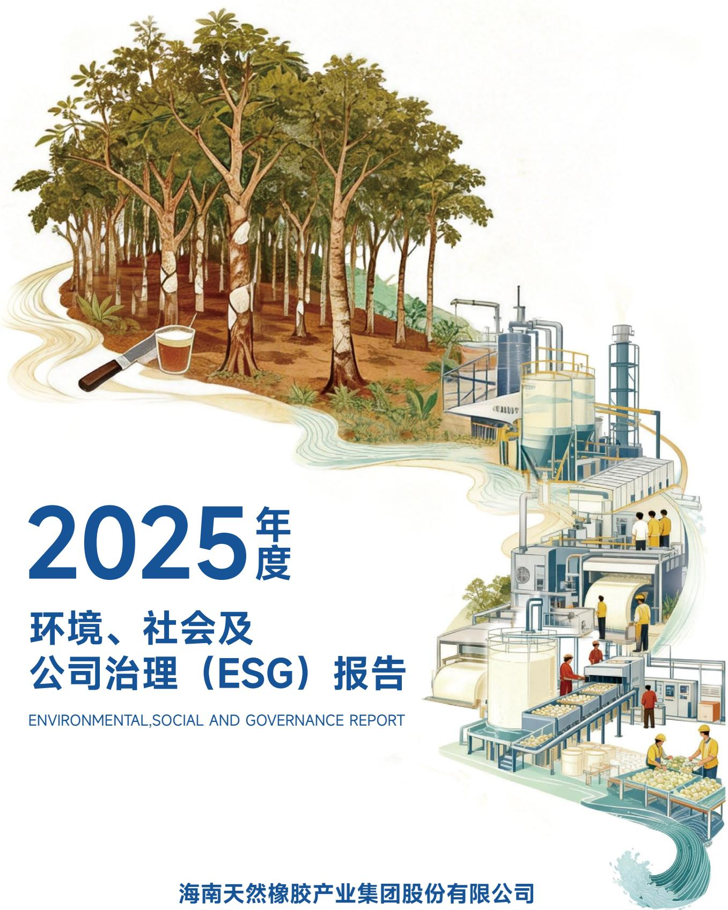

text_image

2025年度
环境、社会及
公司治理（ESG）报告
ENVIRONMENTAL,SOCIAL AND GOVERNANCE REPORT
海南天然橡胶产业集团股份有限公司

# 2025年度

# 环境、社会及

# 公司治理（ESG）报告

ENVIRONMENTAL,SOCIAL AND GOVERNANCE REPORT

# 目录

# CONTENTS

01 关于本报告  
03 董事长致辞  
05 走进海南橡胶  
11 筑牢永续发展之基

# 附录

91 关键绩效表  
108 索引  
110 意见反馈表  
110 免责声明

# 治理篇

# 强基固本 完善治理效能

党建引领 筑牢发展根脉 17  
治理规范 完善运营架构 20  
合规管控 坚守风险底线 23  
廉洁诚信 涵养清风正气 27

# 社会篇

# 同心聚力 共筑价值生态

创新驱动 赋能产业发展 33  
质量管理 坚守品质初心 42  
保护隐私 筑牢安全防线 44  
多方协同 织密共赢网络 46  
责任担当 传递温暖力量 48

# 员工篇

# 以人为本 护航员工成长

合规雇佣 保障平等权益 55  
人才培育 激活内生动力 57  
人文关怀 共筑幸福家园 60  
健康守护 筑牢生产防线 64

# 环境篇

# 绿色赋能助力永续发展

合规健全 夯实管理根基 75  
气候应对 践行低碳路径 80  
资源集约 提升利用效能 87  
污染防治 厚植自然本底 89

# 关于本报告

《海南橡胶 2025 年度环境、社会及公司治理（ESG）报告》（简称“ESG 报告”）主要介绍海南天然橡胶产业集团股份有限公司（以下简称“海南橡胶”“公司”或“我们”）2025 年在环境保护、社会贡献以及公司治理等方面的信息，旨在加强与各利益相关方的沟通和联系。

本公司自2010年起发布首份社会责任报告，已累计发布13次年度社会责任报告。为进一步提升上市公司ESG信息披露水平，海南橡胶于2022年首次发布环境、社会及公司治理报告（ESG报告），本报告为公司发布的第4份ESG报告。

# 报告范围

如无另外说明，本报告涵盖的组织范围为本公司及其附属公司。本报告为年度报告，报告期间为2025年1月1日至2025年12月31日，部分内容超过本期间。

# 编制依据

本报告参考上海证券交易所《上市公司自律监管指引第1号—规范运作》《上市公司自律监管指引第14号—可持续发展报告（试行）》《上市公司可持续发展报告编制指南》、全球可持续发展标准委员会（GSSB）《可持续发展报告标准（GRI Standards）》以及《联合国可持续发展目标》（SDGs）等相关要求进行编制。

# 数据说明

报告中的 ESG 数据及信息来自公司及其子公司实际运行的原始记录。本报告中涉及的货币种类及金额均以人民币为计量单位。财务数据若与财务报告不一致之处，以财务报告为准。

# 编制原则

重要性：以利益相关方沟通结果为参考，采用重要性评估方式，识别本公司报告期内的重要性议题，进而围绕重要性议题编制本报告。

一致性：除非另有注明，披露统计方法与往年报告保持一致，以确保数据可比性。

量化：适时以附注形式列明量化资料所用标准、方法及适用假设。

平衡性：客观公正呈报公司报告期内 ESG 表现，避免不恰当影响读者的决策、判断或选择。

# 货币单位

除另作说明外，本报告以人民币为货币单位。

# 报告获取

本报告以电子版和印刷版(中文印制)两种形式发布,电子版可在上海证券交易所官方网站及公司官方网站(www.hirub.cn)下载浏览。

公司将于未来不断完善及提升报告披露水平及公司的 ESG 管理，如对本报告有任何疑问或建议，欢迎随时联系本公司：

海南天然橡胶产业集团股份有限公司董事会办公室

地址：海南省海口市滨海大道103号财富广场4楼

邮政编码：570100

电话：0898-31669317

E-MAIL:info@hirub.cn

# 董事长致辞

2025 年，是“十四五”规划圆满收官的决胜之年，是海南自贸港封关运作的冲刺之年，更是海南橡胶成立二十周年的里程碑之年。在省委省政府、省国资委及海垦集团党委的坚强领导下，我们始终立足“国之大者”，将可持续发展理念融入企业战略规划与经营发展全过程，在时代浪潮中稳舵前行，以实干实绩回应股东、客户、员工及社会各界的殷切期望。

# 以锚定橡胶主业为基，全力保障国家战略资源安全。

完成 30 万亩天然橡胶标准化胶园、1000 亩 GT1 采种园及 800 亩种苗繁育基地建设任务；完成橡胶种植 7.36 万亩，创近 15 年来种植面积的历史新高；持续强化核心胶工队伍建设；昌江特种胶生产线项目成功试产出国产烟片胶；加强海外资源掌控，将印度尼西亚加工产能向非洲、湄公河流域等新兴区域转移；主业根基持续夯实，产业链韧性与资源保障能力全面提升。

# 以盘活土地资源为效，着力释放国有资产增值空间。

优化调整海南岛内天然橡胶种植布局，稳定核心生产区标准化胶园面积；积极构建热带高效农业产业体系，通过自营或招商模式集中调拨部分连片土地发展榴莲、荔枝等规模化大单品；推进垦地融合，协同地方市县发展林下经济，推进林下经济大单品项目与中试基地项目建设；力推土地规范整治与租金收缴，加强未规范管理土地整治统筹调度；存量资产提质增效，土地利用效率与综合效益显著提高。

# 以优化内部治理为要，全面提升企业运营管理效能。

Wind ESG 评级由 A 级提升至 AA 级；荣登 2025 年《财富》中国 500 强第 315 名；加大集采平台推广应用力度，全年实现降本增效超 2 亿元；成功发行海南自贸港首单科技创新债券，融资成本显著降低；持续推进“两非”“两资”清理；召开首次全球供应链和风控管理会议，实现“种、研、产、贸”全产业链同频共振；治理体系更加完善，企业综合实力持续增强。

# 以强化风险防控为盾，坚决筑牢稳健经营安全防线。

编制完成覆盖全集团、系统化、标准化的公司级《合规管理手册》；推进建立财务、审计、纪检、风控、法务等多部门协同联动机制，持续提升内部监督管理水平；设立境外审计中心，逐步实现审计监督全覆盖；深化加工端 HSE 管理体系建设，实现绿色生产与安全发展双向赋能；风险防控体系更加严密，合规经营与安全发展底线守牢守稳。

# 以坚持科技引领为翼，持续增强核心竞争发展动能。

揭榜挂帅湿法混炼技术突破工艺难关；完成8万台智能割胶机装机试割；“橡胶树化肥减施增效技术集成与推广应用”被中国热带作物学会评选为科技创新成果；橡胶智慧收购平台实现公司胶全链条数字化管控，荣获“2025年全国数字乡村创新大赛优胜奖”及“农业科技成果服务海南自贸港建设十大典型案例”；创新驱动成效凸显，数字化与智能化水平迈上新台阶。

# 以践行可持续发展为责，统筹推进绿色低碳与社会责任担当。

全年严格落实环保责任，实现“环境零污染”“环保零投诉”目标；牵头制定国内首个《温室气体产品碳足迹量化方法与要求天然橡胶产品》团体标准；着力提升核心胶工岗位价值与待遇保障，增强一线职工获得感、幸福感；选评“最美奋斗者”、组织首届“胶BA”篮球赛，营造积极向上、和谐包容的企业文化氛围；绿色发展底色更亮，社会责任与企业文化建设同步深化。

功崇惟志，业广惟勤；励精图治，笃行致远。站在“十五五”规划开局的全新起点，海南橡胶将始终坚守初心、勇担使命，紧扣“稳种植、稳产量、稳份额、稳胶农、深加工、高端化、国际化”总体思路，深入践行ESG发展理念，抢抓时代机遇、深化改革创新、强化科技赋能，积极推动企业高质量发展与社会价值提升深度融合，为筑牢国家战略资源安全屏障、服务海南自贸港建设，书写属于海南橡胶的崭新篇章！

董事长：王宏向

# 走进海南橡胶

# 公司简介

海南天然橡胶产业集团股份有限公司成立于 2005 年 3 月，2011 年 1 月在上海证券交易所挂牌上市（证券简称：海南橡胶；证券代码：601118），是中国资本市场唯一的天然橡胶全产业链上市公司，也是一家集天然橡胶种植、加工、贸易、科技研发、橡胶木加工与销售及热带特色高效农业等为一体的大型综合企业集团。

海南橡胶立足国内庞大的市场需求，充分利用国内国际两个市场、两种资源，积极构建全球化的种植、加工和贸易格局。截至 2025 年底，公司在境内外拥有全资及控股子公司 23 家，控制两家境外上市企业和一家境内新三板挂牌公司，拥有境内外天然橡胶种植基地 30 家以及国内最大的天然橡胶种苗繁育基地，在产橡胶初加工厂 61 家（含受托管理的 KM 公司），全球员工约 2.5 万人。公司在全球范围内经营管理土地 490 万亩，其中胶园土地 380 万亩；年加工产能约 235 万吨（含受托管理的 KM 公司），年加工量超 131 万吨（含受托管理的 KM 公司）；年销售贸易量 337 万吨（含受托管理的 KM 公司和 ART 公司）。

海南橡胶是天然橡胶行业标准制定的参与者和推动者，也是少数能大规模生产特种胶和专业胶等高品质产品的生产企业之一。公司构建了全球化的种植、加工、贸易格局，在胶林资源、业务规模、生产组织、管理经验、技术积累、生产产能、市场营销等方面，均具有明显的竞争优势，行业龙头地位和作用十分突出。海南橡胶拥有一流的天然橡胶种植园“种植-管理-养护-采割”技术，在高端天然橡胶研发、智能化割胶机器研发、加工环境保护、信息化技术应用等方面均处于国际与行业的领先水平。

# 公司优势

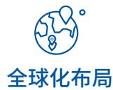

公司立足国内庞大的市场需求，充分利用国内国际两个市场、两种资源，积极构建全球化的种植、加工和贸易格局。

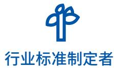

公司是天然橡胶行业标准制定的参与者和推动者，也是少数能大规模生产特种胶和专业胶等高品质产品的生产企业之一。

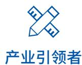

公司拥有一流的天然橡胶种植园“种植 - 管理 - 养护 - 采割”技术，在高端天然橡胶研发、智能化割胶机器研发、加工环境保护、信息化技术应用等方面均处于国际与行业的领先水平。

海南橡胶的公司客户遍布全球，覆盖世界前十大轮胎厂，以 HeveaPRO 标准生产的天然橡胶产品广受赞誉，代表了海南橡胶对最高质量、社会责任和管理标准的承诺。“美联”“宝岛”“五指山”等品牌深受客户青睐，其中“美联”品牌是目前被中国乳胶制品行业广泛认可的第一品牌，“好舒福”品牌乳胶寝具定位中高端市场，客户好评率始终领先。

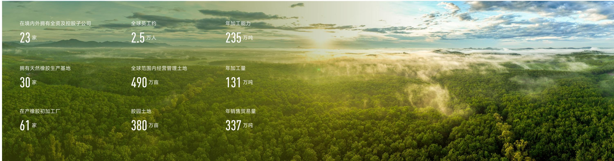

funnel

| Metric | Value |
| --- | --- |
| 在境内外拥有全资及控股子公司 (23家) | — |
| 全球员工约 (2.5万人) | — |
| 年加工能力 (235万吨) | — |
| 拥有天然橡胶生产基地 (30家) | — |
| 全球范围内经营管理土地 (490万亩) | — |
| 年加工量 (131万吨) | — |
| 在产橡胶初加工厂 (61家) | — |
| 胶园土地 (380万亩) | — |
| 年销售贸易量 (337万吨) | — |

# 品牌展示

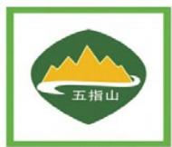  
五指山

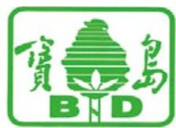  
宝岛

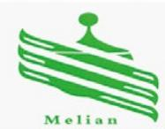  
美联

  
佳树橡胶

  
好舒福
HAOSHUFU  
好舒福

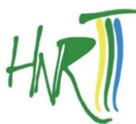  
HNRT

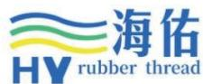  
海佑

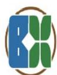

  
BAO XIANG

  
橡林牌

  
楠橡木
NAN XIANF MU  
宝橡  
橡林牌  
楠橡木

红光福瑞

红光福瑞

海柚

海柚山茶油

哲林芒果

明光图5·天瞳好集

哲林芒果

# 企业文化

# 使命

为国利民 胶融天下

# 愿景

成为具有全球影响力和核心竞争力的世界一流天然橡胶全产业链科技集团

# 战略定位

国家天然橡胶战略资源安全的承载者

全球天然橡胶供应链的优秀管理者

国家热带高效农业产业化示范者

全球天然橡胶科技创新的引领者

以 ESG 为驱动的行业先行者

中国特色自由贸易港的践行者

“一带一路”建设的领军者

乡村振兴和全球减贫事业的贡献者

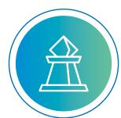

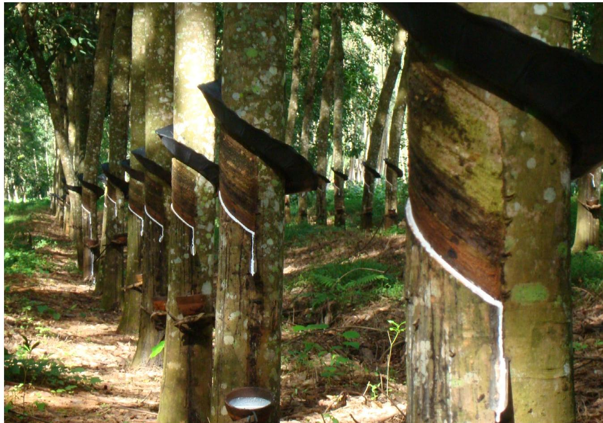

natural_image

Forest scene with multiple tree trunks and white-lagged white structures, no visible text or symbols

获得奖项

<table><tr><td>颁奖单位</td><td>奖项</td><td>获奖证书</td></tr><tr><td>Wind</td><td>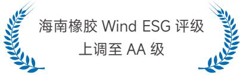</td><td>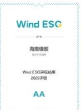</td></tr><tr><td>《财富》</td><td>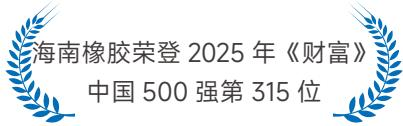</td><td>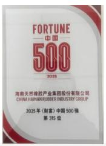</td></tr><tr><td>海南省企业联合会、海南省企业家协会</td><td>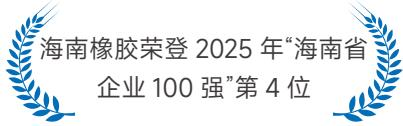</td><td>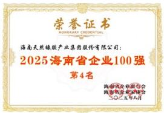</td></tr><tr><td>海南省企业联合会、海南省企业家协会</td><td>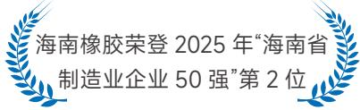</td><td>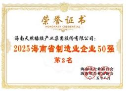</td></tr><tr><td>博涵财经、博涵可持续发展中心</td><td>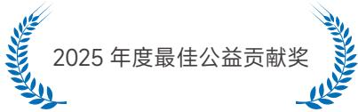</td><td>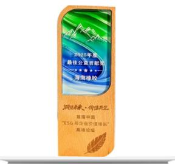</td></tr></table>

<table><tr><td>颁奖单位</td><td>奖项</td><td>获奖证书</td></tr><tr><td>玲珑轮胎</td><td>“精诚合作·金石勋绩奖”</td><td>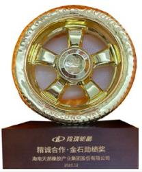</td></tr><tr><td>《每日经济新闻》、海南国际经济发展局</td><td>“2025上市公司口碑榜”最佳董事会奖</td><td>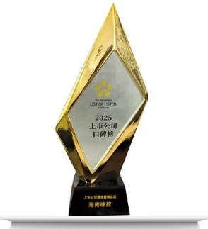</td></tr><tr><td>中国企业改革与发展研究会、网易财经、网易财经智库</td><td>获2025网易财经·企业优秀ESG实践案例“年度责任先锋”奖</td><td>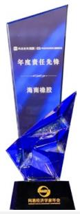</td></tr><tr><td>中国上市公司协会</td><td>入选“2025年上市公司可持续发展优秀实践案例”</td><td>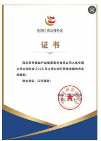</td></tr></table>

# 筑牢永续发展之基

# 强化 ESG 治理

海南橡胶坚持“以 ESG 为驱动的行业先行者”的战略定位，将 ESG 理念深度融入战略规划与日常运营，持续完善公司治理，为企业高质量可持续发展筑牢根基。公司始终聚焦利益相关方核心关切，积极创造长期价值，推动全面、均衡、可持续发展，全力向着“成为具有全球影响力和核心竞争力的世界一流天然橡胶全产业链科技集团”的愿景稳步迈进。

报告期内，公司 ESG 工作质量和持续发展能力不断提升，Wind ESG 评级由 A 级提升至 AA 级，公司入选中国上市公司协会 2025 年上市公司可持续发展优秀实践案例，荣获 2025 网易财经·企业优秀 ESG 实践案例“年度责任先锋”奖等多个奖项。

# ESG 治理架构

为提升公司 ESG 绩效，增强公司核心竞争力和可持续发展能力，公司持续完善 ESG 治理架构，建立起“董事会—战略与可持续发展委员会—ESG 工作小组的三级可持续发展管理架构。公司在 ESG 管理方面形成了明确的职责分工和协同工作机制，为推动公司可持续发展奠定了坚实的基础。

# 董事会

# 战略与可持续发展委员会

# ESG 工作小组

- 负责制定公司的 ESG 战略目标，并对公司 ESG 相关的重要事项进行审议和决策。  
- 对公司可持续发展和 ESG 政策等进行研究并提出建议。  
- 对公司重大可持续发展及 ESG 事项进行审议、评估及监督，包括规划目标、政策制定、执行管理、风险评估、绩效表现、信息披露等事宜，并向董事会汇报。  
- 对公司年度 ESG 报告的可靠性、真实性、可比性和完整性进行审核并报董事会批准后发布。  
- 公司各部门的代表组成，负责落实战略与可持续发展委员会制定的 ESG 战略和目标，制定具体的行动计划和措施，并组织实施。ESG 工作小组还负责与公司内部各部门进行沟通协调，确保 ESG 理念能够贯穿于公司日常运营的各个环节。

# 利益相关方沟通

公司与投资者、客户、供应商、政府机构等各利益相关方保持常态化沟通，记录不同利益相关方的关注议题及具体内容，公司通过股东会、接待来访、热线电话、公司网站专栏、新媒体平台等多种途径，拓展利益相关方沟通的广度和深度，增进其对公司的认同。

<table><tr><td>利益相关方</td><td>关注议题</td><td>沟通渠道</td></tr><tr><td>政府与监管机构</td><td>遵纪守法依法纳税支持地方发展合法运营</td><td>汇报沟通参加活动</td></tr><tr><td>股东</td><td>股东权益保护完善公司治理投资者关系管理</td><td>信息披露召开股东会发布定期或临时公告业绩说明会</td></tr><tr><td>客户</td><td>安全稳定供应诚信优质服务严格质量管理技术创新</td><td>满意度调查</td></tr><tr><td>供应商及合作伙伴</td><td>遵守法律法规恪守商业道德实现互利共赢</td><td>签署协议合同执行高层会晤日常业务交流</td></tr><tr><td>员工</td><td>保障基本权益薪酬福利保障职业健康安全</td><td>职工代表大会员工培训收集意见</td></tr><tr><td>环境</td><td>合理利用资源落实“双碳”目标推进污染防治完善HSE管理</td><td>与环保部门沟通技术升级能效提升</td></tr><tr><td>社会公众</td><td>促进社区发展参与社会公益服务民生</td><td>志愿服务公益捐赠特殊群体关爱</td></tr></table>

# 重要性议题分析

公司结合战略规划、行业发展趋势、利益相关方核心诉求,识别并确定重要性议题清单,并通过科学方法完成议题重要性评估。其中，应对气候变化、职业健康与安全、创新研发为双重重要性议题，环境合规管理为财务重要性议题。针对识别出的重要性议题，公司已制定相应的监测、预防、管理、控制及影响减缓措施。

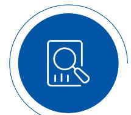

# 建立实质性议题库

- 结合公司 ESG 背景（地理区位、业务活动、业务关系）和标准政策、行业实践和专家意见，识别出与公司相关的 ESG 议题清单。  
- 将议题按照环境、社会与公司治理维度分类。

# 利益相关方调研

- 确定重点相关方群体及与其沟通的方式和渠道。  
- 采取双重重要性原则，设计调研问卷并邀请重点内、外部利益相关方填写线上或线下调研问卷，对议题清单的重要性进行评分。

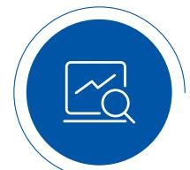

# 重要性评估与排序

- 梳理问卷反馈和评分结果，结合专家意见给出利益相关方权重。  
- 结合议题对企业可持续发展和对利益相关方的影响程度，绘制实质性议题矩阵。

# 重要议题确认与报告

- 结合专家意见确认实质性议题。  
- 董事会办公室审阅并确认高影响程度的实质性议题后向董事会进行汇报，并在年度ESG报告中重点披露。

# 高

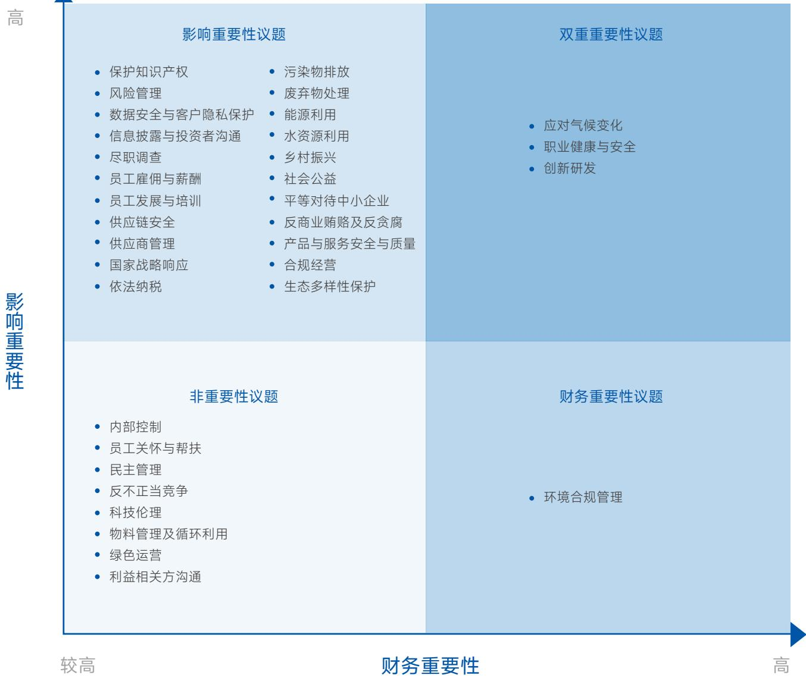

# 影响重要性议题

- 保护知识产权  
- 风险管理  
- 数据安全与客户隐私保护  
- 信息披露与投资者沟通  
- 尽职调查  
- 员工雇佣与薪酬  
- 员工发展与培训  
- 供应链安全  
供应商管理  
- 国家战略响应  
- 依法纳税  
- 污染物排放  
- 废弃物处理  
- 能源利用  
- 水资源利用  
- 乡村振兴  
- 社会公益  
- 平等对待中小企业  
- 反商业贿赂及反贪腐  
- 产品与服务安全与质量  
合规经营  
- 生态多样性保护

# 影响重要性

- 内部控制  
- 员工关怀与帮扶  
- 民主管理  
- 反不正当竞争  
- 科技伦理  
- 物料管理及循环利用  
- 绿色运营  
- 利益相关方沟通

# 非重要性议题

较高

# 财务重要性

高

natural_image

Line art illustration of a person using a laptop, with symbolic icons (bar, pie chart, gavel) and no readable text or symbols.

natural_image

Exterior view of a modern industrial building with blue steel trusses and two people seated at tables under a clear blue sky (no signage or text)

# 强基固本 完善治理效能

海南橡胶以党建引领公司治理现代化,完善权责清晰、运行规范的治理机制,强化合规经营与风险管控,保障信息披露真实准确,用心做好投资者关系管理,营造风清气正的发展环境,以规范治理赋能高质量可持续发展。

# 党建引领 筑牢发展根脉

公司坚持以政治建设为统领，健全党建与治理融合的制度体系。构建四级全覆盖党建组织架构，夯实基层基础、规范党员管理，深化“党建 + 业务”融合模式，打造特色党建品牌。以思想引领凝聚共识，用典型示范激发活力，为企业高质量发展筑牢坚强政治与组织保障。

# 把握发展方向

公司始终坚持以政治建设为统领，坚定不移贯彻落实党的路线方针政策，确保企业改革发展始终沿着正确政治方向前进。严格执行“第一议题”学习制度，持续深入学习贯彻党的二十大和二十届历次全会精神，引导党员干部深刻领会核心要义，不断增强“四个意识”、坚定“四个自信”、做到“两个维护”，深刻领悟“两个确立”的决定性意义。

公司先后制定出台《健全全面从严治党体系责任清单、党委书记及班子成员落实全面从严治党责任清单》《党委会议事规则》《总经理办公会议事规则》《专题会议事规则》等一系列制度文件，进一步健全完善议事决策机制与责任落实体系，推动党建工作与公司治理深度融合、规范运行。

# 发挥党建引领

公司始终坚持把党的领导融入公司治理各环节，以高质量党建引领企业高质量发展。

夯实基层党建基础

完成党建述职评议考核与年度党建考核，专项投入资金升级改造基层党支部活动阵地，为党组织活动开展筑牢硬件支撑；

优化组织架构布局

有序推进退休党员移交、远程教育站点撤并及党支部整改工作，提升组织运行效能；

规范党员队伍建设

下发发展党员指导性计划，严格把控培养、考察、发展全流程，确保党员发展质量；

强化党费规范管理

严格执行收缴标准，定期公示收支情况，全面提升党建工作透明度与规范化水平。

# 加强组织建设

公司持续健全“横向到边、纵向到底”的党建组织体系，截至2025年底公司共有党员6,892余名，构建形成25个党委—86个党总支部—470个党支部—171个党小组的四级组织架构，实现业务开展到哪里、党组织覆盖就到哪里。各党（总）支部严格落实“三会一课”、主题党日等制度，扎实推进标准化规范化建设，不断提升基层党组织的凝聚力、组织力和战斗力，为企业改革发展提供坚强组织保障。

# 截至2025年底

共有党员

$$
6,892 \text{名}
$$

党委

$$
25 \uparrow
$$

党总支部

$$
86 \uparrow
$$

党支部

$$
4 7 0 \uparrow
$$

党小组

$$
171 \uparrow
$$

# 推进品牌建设

公司深入推进政治建设常态化、长效化，持续开展中央八项规定精神专题学习教育，巩固拓展学习贯彻习近平新时代中国特色社会主义思想主题教育成果，推动党建工作与生产经营同部署、同推进、同考核。聚焦海南橡胶产业特色，深化“党建+业务”融合模式，打造差异化党建品牌矩阵。报告期内成功举办党建品牌评选活动，龙江分公司党委“潘金吉创新工作室”、阳江分公司党委“胶园标准先锋岗”、金橡公司金水橡胶加工分公司党支部“初心引航 水到渠成”等3个党建品牌获通报表彰，以品牌引领激发基层党组织战斗堡垒作用。

# 提高思想引领

公司以思想引领凝聚发展共识，精心组织“最美奋斗者”评选表彰宣讲活动，遴选李振友、施朋洋、陶金红、阿龙等10名行业标杆人物，先后在海南、上海、安徽、云南等重点区域举办7场次巡回宣讲，在集团内部掀起弘扬劳模精神、劳动精神、工匠精神的热潮。通过典型示范引领，进一步凝聚“为国利民，胶融天下”的企业核心价值理念，将精神力量转化为推动橡胶产业高质量发展的内生动力。

# 党建引领干部队伍作风改善工作情况

# 深入贯彻中央八项规定精神学习教育

公司各级党组织共举办读书班 92 期，开展理论学习中心组专题学习 216 次，组织培训 30 次，专题研讨 721 次；深入查摆问题，查摆班子存在问题 18 个，具体表现 31 条，党委班子个人查摆问题 162 个，具体表现 195 条；开展了领导干部“家教家风”“躺平式干部”“违规吃喝”专项整治。

举办读书班

92期

组织培训

30 次

开展理论学习中心组专题学习

216 次

专题研讨

721 次

# 加强干部能力提升

组织 50 名中层管理人员赴井冈山培训，提高政治站位及管理能力；对 59 名管培生开展入职培训，提高综合素养。

# 推进全面从严治党

高度重视并购企业党组织建设，在合盛上海成立党委、纪委；开展“精准滴灌”警示教育活动2次，汇编形成内部违纪违法典型案例读本。零容忍正风肃纪，受理信访举报20件，处置问题线索22件，处置率100%；新立案审查2人，给予诫勉谈话3人，党纪处分11人，提出组织调整建议2人。

natural_image

Silhouette of children running with a red flag featuring a hammer and sickle symbol (no text or symbols present)

# 治理规范 完善运营架构

公司通过健全治理架构、强化专业培训、提升信息披露质量以及积极开展投资者教育活动，进一步夯实了合规运营基础，增强了市场透明度和投资者信心。

# 公司结构与职能

公司建立健全由股东会、董事会和管理层组成的治理结构。以股东会为最高决策机构，董事会下设战略与可持续发展委员会、提名委员会、审计委员会、薪酬与考核委员会，管理层下设经营决策委员会与运营风控委员会，以增强决策专业性。党委在公司治理中发挥领导作用，确保公司在稳健发展的同时，实现长远的战略目标。

为进一步提升公司治理水平，按照《公司法》以及中国证监会《上市公司治理准则》《上市公司章程指引》《关于新<公司法>配套制度规则实施相关过渡期安排》等法律、法规、规范性文件的规定，并结合公司实际情况，经公司董事会和股东会审议通过，取消监事会、不设监事，由董事会审计委员会行使《公司法》和监管制度规定的监事会职权。

根据证监会、上交所等监管机构发布的法律法规、规范性文件等监管要求，对公司现有的相关制度进行修订，修订了《公司章程》《股东会议事规则》《董事会议事规则》《董事会审计委员会实施细则》《总经理办公会议事规则》和《股权投资管理制度》等有关制度。

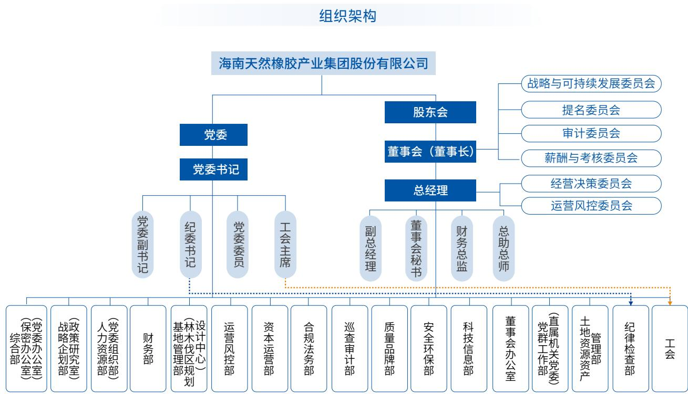

flowchart

This image displays the organizational structure of Hainan Natural Rubber Industry Group Co., Ltd., showing its hierarchy from the Party and Chairman down to various departments and committees.

# 合规组织会议

公司严格按照规则制度的要求，对各项议题进行收集、汇总和事前审核，并合理安排组织了各项会议审议相关议题，确保决策程序合法合规。2025年共组织召开股东会3次（审议22项议题）、董事会10次（审议52项议题）、监事会3次（审议13项议题）、独董专门会议2次（审议3项议题）、各董事会下设专门委员会13次（审议28项议题）。会议重点审议了年度报告、ESG报告、利润分配、董事聘任等议题，各项议题均获审议通过。召开会议的同时，加强与公司董事的交流，保证董事能够清晰准确的了解议案内容，提高董事会审议决策效率。2025年12月，凭借规范高效的治理体系和稳健的战略执行力，公司荣获《每日经济新闻》“上市公司最佳董事会奖”。

  
报告期内

<table><tr><td>组织召开股东会</td><td>审议议题</td><td>董事会</td><td>审议议题</td></tr><tr><td>3次</td><td>22项</td><td>10次</td><td>52项</td></tr><tr><td>监事会</td><td>审议议题</td><td>独董专门会议</td><td>审议议题</td></tr><tr><td>3次</td><td>13项</td><td>2次</td><td>3项</td></tr><tr><td>各董事会下设专门委员会</td><td>审议议题</td><td></td><td></td></tr><tr><td>13次</td><td>28项</td><td></td><td></td></tr></table>

natural_image

Isometric illustration of a business meeting with participants seated around a large oval table, laptops, and potted plants (no text or symbols visible)

# 投资者关系管理

公司通过上交所 e 互动平台和投资者热线电话等方式，及时解答投资者疑问。同时结合“引进来”和“走出去”策略，接待投资者、证券公司、上市公司协会等到公司进行实地参观与调研，向投资者推介天然橡胶行业、公司发展以及自贸港政策的最新动态以及未来发展趋势，提升公司资本市场形象，增强投资者对公司投资价值的认可。

# 信息披露与投资者沟通

报告期内，公司围绕提升信息披露质量、增强市场透明度、维护投资者权益等核心目标，扎实开展各项工作。

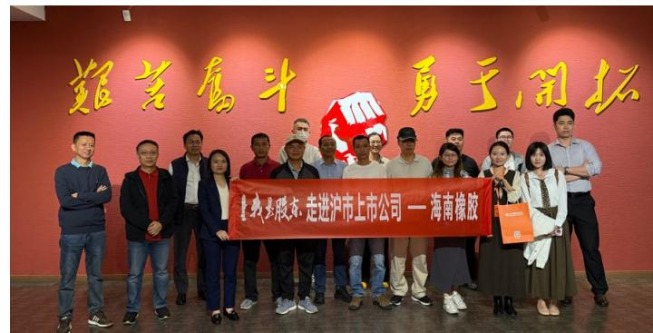

text_image

艱苦奋斗 勇于開拓
達我是股东.走进沪市上市公司——海南橡胶

“我是股东”走进沪市上市公司活动

报告期内

<table><tr><td>平台回复次数</td><td>投资者电话接听次数</td><td>披露的定期报告数量</td><td>发布的临时公告数量</td></tr><tr><td>54次</td><td>800次</td><td>4个</td><td>82项</td></tr></table>

<table><tr><td>重大事项管理与披露</td><td>在依法合规的前提下,开展信息披露工作,并配合新闻宣传,向市场传递积极信号。</td></tr><tr><td>自愿性信息披露与ESG拓展</td><td>结合公司重点事项性质、投资者关注点和市场动态,依法合规地开展自愿性信息披露,并积极拓展环境、社会与公司治理(ESG)信息披露维度。</td></tr><tr><td>临时公告披露与监管对接</td><td>根据监管机构的最新制度要求和操作指引,及时收集公司日常重大事项,按时保质完成各项临时公告的披露工作,确保信息披露的及时性与准确性。</td></tr><tr><td>跨部门信息披露协作</td><td>加强与合盛农业信息披露部门的沟通协作,不断完善对其信息披露的统筹管理,提升信息披露的整体协同性和规范性。</td></tr></table>

# 合规管控 坚守风险底线架构

公司通过完善风险管理体系、强化合规管理、优化财税管理，有效提升了风险防控能力、规范性，为稳健运营和可持续发展提供了有力保障。

# 合规经营

公司系统推进合规管理体系建设，编制了公司级《合规管理手册》，为合规管理体系的有效运行提供核心制度保障；制定并发布《合规管理办法》《合规风险管理规则》等制度文件，建成规范化合规制度体系。通过健全合规管理制度与组织架构，明晰各方责任,构建系统化合规管理体系,营造合规文化氛围,引导员工树立合规意识与正确价值观,保障公司依法合规经营，有效防范经营风险。

公司持续完善财务、审计、纪检、风控、法务等多部门协同联动机制，持续提升内部监督管理水平。公司搭建合规管理“三道防线”，明确各防线职责边界与协同机制，精准识别、防范与化解合规风险，确保各项业务在合法合规框架内有序开展。公司同步建立合规风险识别与预警机制，全面梳理经营管理中的合规风险，搭建合规风险库。在商务合作中，通过协议明确第三方侵权责任与处置方式，切实维护公司合法权益。公司设立境外审计中心，逐步实现审计监督全覆盖，消除境外业务监督体系断层及审计监管盲区。

# 合规管理三道防线

# 第一道防线

# 各业务及职能部分

承担合规管理主体责任
负责各领域日常合规管理工作

# 第二道防线

# 合规法务部

牵头负责合规管理工作
法务部至少配备一名合规专员

# 第三道防线

# 检查和审计督查等部门

对合规要求落实情况进行监督，对违规违纪行为进行调查，按照规定开展责任追究

公司严格落实全员合规承诺机制，全体员工及管理层均签订合规承诺书，将合规要求融入决策与执行全流程，确保经营行为符合法律法规及公司制度规定。同时，持续加强合规宣传教育，发布《合规手册》，开展多场次合规专题培训，不断强化全员守法诚信、合规经营意识，培育具有企业特色的合规文化。

○ 加强合同统筹管理，提高合同审查质量和效率。  
○ 推进案件统筹管理，动态监控案件进展。  
实现分公司法务统筹管理全覆盖，配置专职法务人员，  
○ 开展调研，解决法律难题。  
☐ 推进子公司法务统筹管理，提前介入指导诉讼案件。

natural_image

Illustration of two people interacting with a shield and smartphone, symbolizing cybersecurity or security (no text or symbols present)

针对海外业务合规管理，公司坚持独立性、适用性、全面覆盖原则，明确境外实体为合规管理第一责任主体，由合规法务部、资本运营部、运营风控部协同联动，形成高效协同的海外合规管理合力。

# 内部控制

公司依据《企业内部控制基本规范》及配套指引，构建了“内控体系运行-监督评价-持续改善优化”的动态良性循环全链条内控机制：

董事会及下设审计委员会作为内控最高决策与监督机构，审定内控总体规划与重大制度。

高级管理层牵头组织内控体系日常建设与运行，统筹推进分级授权审批、风险识别评估、资金资产管控、会计核算规范等核心程序落地；各业务板块及职能部门以公司的各项内控制度业务流程以及各自岗位职责为依据，对公司采购、生产、销售、资金管理、资产管理、财务核实等关键业务环节实施管控。公司通过期现货管理与风控信息系统、财务系统、OA系统等信息化管控平台，实现信息汇总收集、风险评估、风险指标设置、风险预警、业务流程审批与监控等业务功能。公司建立市场风险、信用风险等风险监控体系，建立重大风险事件报送机制，制定应对方案，防范重大风险蔓延和叠加。

独立的内部审计部门按照《企业内部控制基本规范》及配套指引，按照规定的程序，有序开展年度内部控制评价工作，内部控制评价程序一般包括：制定评价工作方案、组成评价工作组、实施现场测试、认定控制缺陷、汇总评价结果、编报评价报告等环节。

对内控检查发现的缺陷，公司建立问题整改台账并跟踪整改情况，确保相关缺陷整改促进内控体系持续改善，以此确保公司业务活动高效有序开展，资产安全完整，有效防范和纠正运营中的错误与舞弊行为，保障会计资料真实、合法、完整。

# 风险管理

公司严格恪守《中华人民共和国期货和衍生品法》《中央企业全面风险管理指引》《企业内部控制基本规范》等国家法律法规及《关于切实加强金融衍生业务管理有关事项的通知》《上海证券交易所上市公司自律监管指引》等监管要求，制定《大宗商品信用风险管理办法》《大宗商品市场风险管理办法》《大宗商品存货风险管理办法》《橡胶期权业务管理细则》等内部制度，构建“外部合规 + 内部规范”的双重制度保障体系。

为积极应对复杂多变的市场环境，保障生产经营稳健运行，全面提升整体抗风险能力，公司以系统性思维为核心导向，持续深化风险管理体系建设。通过组建由党委、董事会、管理层及贸易风控小组协同联动的风险管理架构，充分发挥各层级职能优势，形成上下贯通、分工明晰、协同高效的管理格局，为公司生产经营稳定与高质量发展筑牢坚实的风险防控屏障。

公司风险管理架构体系  
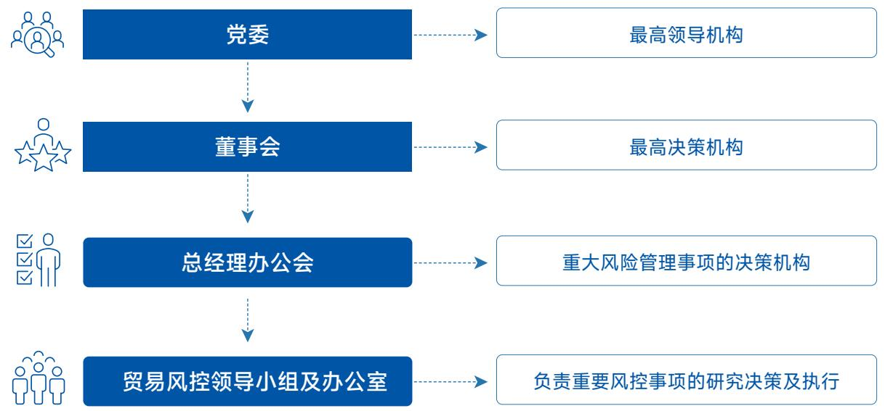

flowchart

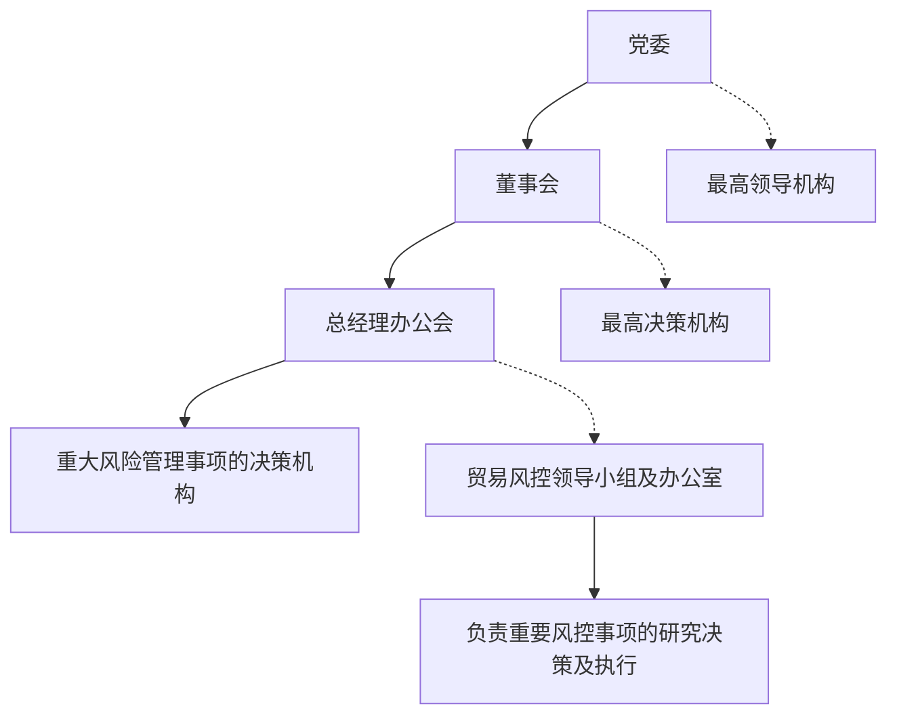
```mermaid
graph TD
  A["党委"] --> B["董事会"]
  A -.-> C["最高领导机构"]
  B --> D["总经理办公会"]
  B -.-> E["最高决策机构"]
  D --> F["重大风险管理事项的决策机构"]
  D -.-> G["贸易风控领导小组及办公室"]
  G --> H["负责重要风控事项的研究决策及执行"]
```

公司围绕大宗商品全业务链条制定专项风险管理办法，系统构建覆盖市场风险、信用风险、存货风险、经营风险四大领域的风险管控体系，通过一系列精准化、常态化风控举措，全面提升风险防控能力与运营效率，为企业稳健经营与长期战略目标落地提供坚实保障。

# 公司风险管理措施

# 市场风险

- 制定风控指标并逐日盯市，提前预警风险；  
- 根据经营计划和期货价格测算套期保值额度；  
- 定期分析市场行情，邀请专业团队分享外汇行情，提升外汇应对能力；  
- 动态评估市场风险，及时应对风险事件。

# 信用风险

- 通过招标采购方式投保信用保险，优化费率和保险方案；  
- 加强客商准入管理，通过多渠道查询客商资信；  
- 动态跟踪客商资信变化，调整业务政策；  
- 规范仓储和物流服务商准入，建立评估模型和标准。

# 存货风险

- 建立高龄存货监控机制，规范存货管理；  
- 严格把控仓库添加流程，清理不规范仓库；  
- 组织存货交叉盘点，确保账实相符。

# 经营风险

- 推进加工和贸易企业提质增效，提高资源掌控能力；  
- 对亏损企业进行专项治理，提供针对性经营指导；  
- 推进种植端基地分公司精细化管理，优化经营考核体系。

公司建立风险管理指标授权管理机制，依据公司战略规划、经营计划及财务预算，科学制定子公司年度市场风险、信用风险管理指标。2025年，为进一步强化汇率风险管控，新增汇率敞口风险管理指标，并对上述指标实施定期跟踪、动态监督，确保各类风险始终控制在集团可承受区间内，保障经营安全稳健。

报告期内，公司未发生重大市场风险、信用风险和存货风险事件。

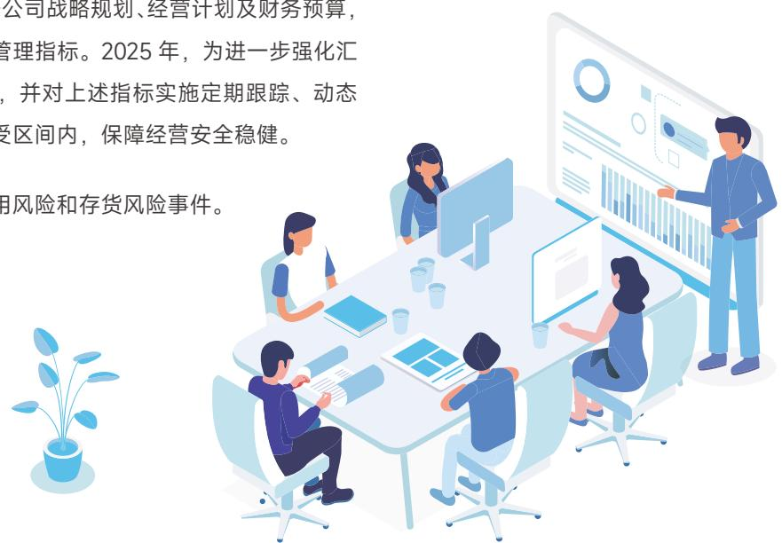

text_image

公司战略规划、经营计划及财务预算，
管理指标。2025年，为进一步强化汇
并对上述指标实施定期跟踪、动态
区间内，保障经营安全稳健。
用风险和存货风险事件。

# 廉洁诚信 涵养清风正气

公司坚守商业道德，严格落实廉洁管理，强化反商业贿赂，平等对待中小企业，为构建合规透明、可持续的运营环境奠定坚实基础。

# 廉洁建设

# 制度建设

公司遵守《中国共产党章程》《中华人民共和国刑法》《中国共产党纪律处分条例》《中国共产党廉洁自律准则》《中国共产党党内监督条例》《中国共产党问责条例》《中国共产党纪律检查机关监督执纪工作规则》《纪检监察机关处理检举控告工作规则》《国有企业领导人员廉洁从业若干规定》等法律法规，建立并持续健全反腐败政策制度体系，包括《问题线索处置和管理工作暂行办法》《“靠企吃企”问题专项治理工作方案》《基地分公司自产胶和土地规范化管理专项监督工作方案》《廉政风险防控工作实施方案》。相关政策制度全面覆盖公司及下属机构、业务和人员，为公司长期稳健发展提供坚实保障。

# 组织结构

公司党委负责全面从严治党主体责任，公司纪委协助党委开展党风廉政建设和反腐败工作；总部及各二级党委公司均设立、配备专职纪检部，依规依纪依法开展反腐败工作；同时，推动纪检监督与审计、财务、法律、风控等职能监督信息互通。

# 举报机制

公司纪委遵照《纪检监察机关处理检举控告工作规则》制度，建立完善的举报管理与处理机制，规范检举人保护机制，维护检举人的合法权益，确保全体员工及相关方可以在保密情况下，通过举报电话、举报邮箱、公开来信地址等渠道举报怀疑涉及本公司的违规行为。公司对举报者信息及权益保障做出严格要求，确保举报者的身份得到保密，承诺员工不会因举报而受到不公平解雇、伤害或不当的纪律处分。

公司纪检部门及合规部门不定期开展审查、抽查、调查工作。公司制定标准的案件调查程序，开通包括OA平台、电话、邮箱、供应链合规管理微信公众号等内外部多个举报渠道，同时，严格按照议事规则，重要案件必上纪委办公会、党委会等会议决议，最大限度减少人为干扰。

# 惩治举措

公司纪委严格按照中央纪委、省纪委监委、省纪委监委驻海垦集团纪检监察组以及其他国家法律法规、海垦集团和公司的规章制度，采取“零容忍”的态度惩治贪污腐败行为，并建立案件复盘机制，分析形成贪腐事件的原因，更加注重发挥案件查办治本功能，深挖案件背后的制度漏洞和管理盲区，在日后的运营过程中加强廉洁风险管控。

涉嫌党员领导干部违纪的，由纪检部门对其立案，根据查办情况给予不同档次的处分，情节严重的还需要调整岗位。若涉嫌违法犯罪，则移交上级处理。

# 教育培训

2025 年公司组织集团总部各部门、基地分公司班子成员等 79 人近距离旁听庭审警示教育活动 3 次；梳理近年来查办的 6 个典型案例，汇编内部违纪违法典型案例读本，围绕党员领导干部易触碰的违纪违法风险撰写纪法提醒 4 件；组织“一把手”和“三类干部”及家属 76 人召开家风廉政教育座谈会，通报集团内部 3 起家风不正典型案例。

# 公司纪委 2025 年重点工作内容

- 细化责任分解，压实管党治党责任  
- 紧紧围绕公司党委改革发展大局，开展干胶生产与土地规范化管理专项监督  
- 保持高压态势，以零容忍的态度正风肃纪  
- 做深做实纪律教育，筑牢拒腐防变的思想防线  
深入推进规范化法治化正规化建设，锻造执纪铁军  
- 开展廉政风险防控建设工作，切实防范企业经营管理廉政风险  
用好“监督一张网”平台，持续提升监督质效

# 平等对待中小企业

公司高度重视中小企业款项支付情况，严格遵守国家相关法律法规和政策要求，积极履行社会责任，确保与中小企业的合作公平、透明、诚信。

# 反不正当竞争

公司恪守公平竞争原则，维护行业商业生态良性循环与价值根基，将反不正当竞争作为规范经营行为、提升公司治理水平的重要准则与刚性约束，持续筑牢合规经营的内在逻辑，切实保障投资者、消费者等各方合法权益，积极维护公平有序的市场秩序，为行业健康发展贡献力量。

natural_image

Illustration of two business professionals reviewing a checklist with a clipboard and ribbon (no text or symbols present)

# 合盛农业反腐败与反贿赂的政策与相关措施

01

# 反腐败与反贿赂政策

对任何形式的贿赂与腐败行为（无论直接或间接）采取零容忍政策，承诺合法经营，以诚信、公平、透明的方式开展业务。

02

# 举报政策

允许员工、供应商、客户及其他利益相关方举报不道德或非法行为，并负责任地处理信息，保障保密与信息安全，保护举报人免受打击报复。

03

# 申诉解决程序

为供应商、社区成员及外部利益相关方设立保密申诉渠道，专门用于举报运营与供应链中的人权、环境问题，承诺保障投诉人不受到打击报复，承诺所有案件以公平、透明、尊重的方式处理。

04

# 政策整合与落地执行

将反腐败与反贿赂政策、人权政策、道德商业行为政策统一纳入《全球员工政策手册》，并通过强制性入职培训传达给所有员工，确保在全球运营中统一执行。

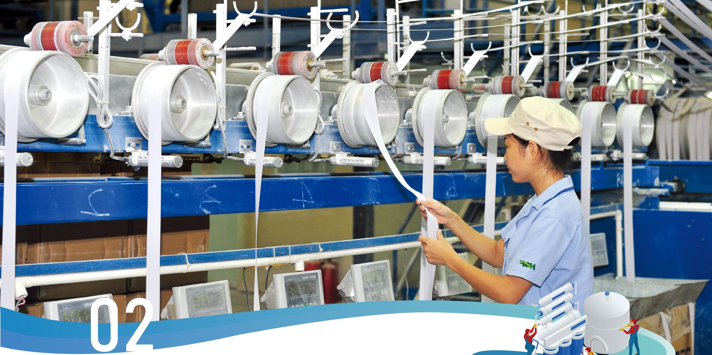

natural_image

Factory worker operating textile machinery with spools of thread (no visible text or symbols)

# 社会篇

# 同心聚力 共筑价值生态

海南橡胶坚守品质初心与社会责任,秉持诚信经营、责任担当的发展理念,以创新为核心引擎,深耕技术研发与产品革新,持续完善供应链管理与客户服务体系,以高质量产品与服务满足市场需求,积极履行社会责任,携手合作伙伴共同推动行业规范、可持续、高质量发展。

# 创新驱动 赋能产业发展

公司聚焦全产业链建设，坚持科技赋能强企，加强人才培养与引进，打造创新团队和创新平台，促进新产品研发与应用。同时，公司坚持以科技创新为引领，积极推动科研项目实施，大力发展新质生产力，加强关键核心技术攻关，推动天然橡胶产业转型升级。

# 治理

公司出台《科技项目和经费管理办法（修订）》《科技奖励管理制度（试行）》等制度，为科技创新工作筑牢制度根基。

公司持续深化科技体制改革，逐步构建起“1+5+X”研发体系——以1个产业创新联盟为纽带，5大平台（种苗及种植创新平台、初加工创新平台、深加工创新平台、智能制造平台、数字化创新平台）为核心支撑，X个中试及产业化基地为转化载体，形成“1个联盟产学研用协同、5大平台全产业链攻关、X个基地推动中试及产业化”的闭环发展格局。

<table><tr><td>层级</td><td>名称</td><td>具体内容</td></tr><tr><td>1个创新联盟</td><td>天然橡胶产业创新联盟</td><td>天然橡胶产业上下游单位产学研用融体系协同,推动全产业链科技创新</td></tr><tr><td></td><td>种苗及种植创新平台</td><td>包括天然橡胶国家产业体系试验站、种苗及种植研究基地</td></tr><tr><td></td><td>初加工创新平台</td><td>包括农业农村部天然橡胶加工重点实验室、中试基地和产业化基地</td></tr><tr><td>5个创新平台</td><td>深加工创新平台</td><td>包括橡胶制品拓展开发</td></tr><tr><td></td><td>智能制造平台</td><td>包括割胶装备研制、割胶智能化和加工自动化</td></tr><tr><td></td><td>数字化创新平台</td><td>包括智慧收胶、智慧胶园和HDC及加工数字化平台</td></tr><tr><td>“X”个科研基地</td><td>自有科研基地</td><td>拥有国家天然橡胶产业体系试验站、种苗科研示范基地、种植示范基地、特种胶中试基地、智能割胶中试基地、加工科研示范基地</td></tr></table>

公司为强化科技创新的智力支撑与专业保障，组建新材料院士团队创新中心，汇聚高端科研资源，为技术创新提供核心智力支持；同步设立专家委员会，下设种植、加工、经管、工程4个专业组，全面承担科技项目评审评估、专业咨询指导、规划落地监督、行业调研分析及人才培养等职责，为关键产品开发、核心技术难题破解及科研投资决策提供专业化支撑，助力自身科技攻关与科研管理工作的科学化、规范化推进。

# 战略

# 创新研发团队

公司研发及技术团队深耕橡胶种苗繁育、种植采割优化、病虫害绿色防控、生产自动化改造、特种橡胶研发、深加工制品升级等全产业链关键领域，以专业化人才储备为科技创新与成果转化筑牢坚实基础。同时，公司秉持“尊重人才、关心人才、爱护人才、成就人才”的理念，营造良好人才发展氛围，对聘任专家落实职称工资待遇，对表现优异的专家在晋升晋级、薪酬增长方面予以政策倾斜，充分激发人才创新活力。

# 创新平台建设

公司作为天然橡胶产业创新联盟理事长单位，主动履行行业责任，积极搭建产学研用融协同合作平台，推动国内天然橡胶行业上下游企业、科研院所、高校等主体的深度对接与资源整合，助力行业技术进步与高质量发展；同时持续加大科技研发投入力度，聚焦产业核心技术创新与关键技术瓶颈突破，以体系化布局与常态化创新，稳步提升核心竞争力，为天然橡胶产业转型升级贡献核心力量。

公司建有农业农村部天然橡胶加工重点实验室、海南省技术创新中心等科技创新平台，平台作为公司及热科院、海南大学等产学研单位联合建设机构，2025年度围绕天然橡胶全产业链关键技术开展联合攻克、应用转化；2025年12月，天然橡胶产业创新联盟召开年度会议，围绕产学研协同、关键核心技术攻关及科技创新培育新质生产力等主题开展研讨，共同推动产业升级和可持续发展。

# 影响、风险及机遇管理

公司以烟片胶国产化替代、环氧化天然橡胶等特种橡胶研发、智能割胶机等装备创新为核心抓手，培育天然橡胶产业新质生产力。装备创新方面，自主研发的智能割胶机以自动化、数字化技术替代传统人工，精准破解产业劳动力短缺、作业效率偏低、生产标准不一等行业痛点，实现胶园生产降本增效与精准管控，成功重塑种植端生产范式；产品创新领域，攻克国产烟片胶核心技术，打破进口依赖与技术壁垒，同时推进环氧胶等高附加值改性橡胶研发，拓展其在高端轮胎、减震件等高端应用场景的市场空间，推动产业从传统原料输出向精深加工、高端制品制造转型，显著提升产业链附加值与核心竞争力。

公司创新举措及业务成果

<table><tr><td>业务方向</td><td>具体举措</td><td>业务成果</td></tr><tr><td>机械化服务赋能产业升级</td><td>制定《机械化自动化割胶社会化服务项目实施方案》;组织分子公司业务骨干赴工厂跟班实操学习;举办百人规模智能割胶机专题培训。</td><td>全年完成80,000台固定式智能割胶机上树安装,加速推动产业向现代化、高效化转型。</td></tr><tr><td>攻克高端材料“卡脖子”难题</td><td>牵头实施海南省重点研发项目“天然烟片胶的研发”,聚焦高性能烟片胶国产化突破。</td><td>成功研制出拉伸强度超23兆帕、关键性能指标优于常规橡胶的优质烟片胶。</td></tr><tr><td>绿色技术创新引领低碳转型</td><td>参与国家“十四五”重点研发计划“生物基弹性体制备与规模化应用”,牵头“环氧化天然橡胶制备技术及应用研究”课题。</td><td>圆满完成工艺与配方核心研究;建成年产千吨级生产装置;后续将开展系统化中试生产,为规模化生产决策提供科学支撑。</td></tr><tr><td>产学研协同攻关高端专用胶</td><td>持续推进国家重点研发计划“主要作物丰产增效科技创新工程”2022年度部省联动项目,围绕三大核心层面开展全链条技术创新。</td><td>成功研制出高端制品专用胶;在海南布局建设3个高性能专用胶生产及加工示范基地;在邦溪、龙江分公司建成8,000亩协同技术示范基地,落地关键技术。</td></tr><tr><td>智慧平台重构产业生态</td><td>自主研发的橡胶智慧收购平台深化功能迭代与系统升级,构建数字化闭环管理体系,创新“橡胶产业+金融”融合发展新模式。</td><td>截至2025年底,平台实现全省16个市县全覆盖,累计注册收胶站点3,359个、服务胶农近28万人,累计理赔总额达6.91亿元。</td></tr></table>

# 指标与目标

报告期内，公司参与实施的“特种天然橡胶丰产优产与提质增效关键技术研发与集成示范”“热带经济作物病虫害演替规律与全程绿色防控技术体系集成示范”2个项目获农业农村部立项，“橡胶树化肥减施增效技术集成与推广应用”被中国热带作物学会评选为科技创新成果。

公司持续推进海南省重点研发项目“高性能天然橡胶复合材料湿法混炼关键技术研发”，以及国家“十四五”重点研发计划“生物基弹性体制备与规模化应用”项目的课题“环氧化天然橡胶制备技术及应用研究”任务。相关研发在材料科学领域取得突破性进展，有力推动橡胶行业向环保化、可持续化方向升级。

# 获得科技类荣誉奖项

2025 年，公司 “橡胶智慧收购平台” 荣获 2025 年全国数字乡村创新大赛优胜奖；“海南天然橡胶智慧收购平台创新实践——数据驱动全产业链价值共创的数字化革命” 荣获 2024 年度农业科技成果服务海南自贸港建设十大典型案例；海胶智造 “智能割胶机” 荣获 2024 年度海南省 30 项农业优秀科技成果。

# 获得高新技术企业、专精特新、企业创新能力、小巨人等认定和认证

2025 年，海南橡胶下属公司云南合盛通过再认定获得高新技术企业；海胶智造首次获得高新技术企业认定；工程中心被认定为海南省高新技术“精英行动”种子企业。

# 公司加入外部倡议组织

2025 年 12 月，公司参加农业农村部在海口举办的中国热带作物大会，在大会天然橡胶分论坛上与天然橡胶产业创新联盟代表单位一起，发起绿色倡议。

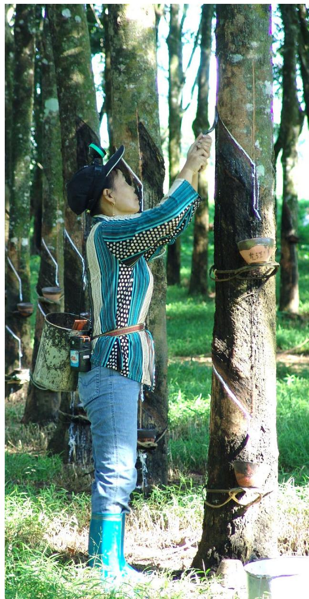

natural_image

Person harvesting tree roots in a forest, wearing protective gear and holding buckets (no visible text or symbols)

# 案例

# 第四代智能割胶机亮相链博会

2025 年 7 月 16 日，以“链接世界、共创未来”为主题的第三届中国国际供应链促进博览会在北京开幕。海南橡胶携下属企业亮相海垦集团展馆天然橡胶展区，集中展示最新一代智能割胶机等核心产品。公司自主研发的第四代智能割胶机搭载螺旋柔性轨道，可灵活行走并适配多数胶树树形，切割效率显著提升。设备支持 PC 端与手机 APP 远程批量控制，1-2 分钟可完成大规模胶树同步切割；配备太阳能充电系统，续航稳定；配套导流条有效避免胶乳外溢，实现应收尽收。割胶工艺达一级胶工标准，产量超人工 90%，兼顾效率、产量与品质。

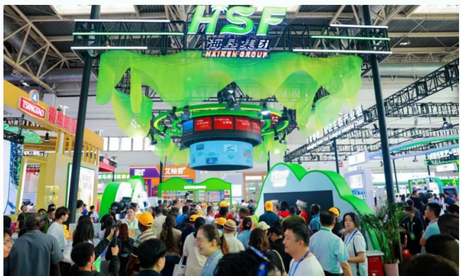

text_image

HSF
海基集团
HAIKEN GROUP
TSINGDAO 青岛啤酒
艾柚香

第三届中国国际供应链促进博览会海垦集团展馆

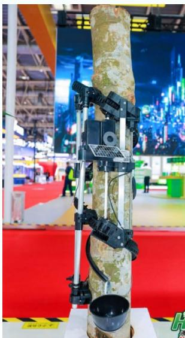

natural_image

Exterior view of a military-style optical device mounted on a cylindrical base, displayed at an exhibition hall with city lights and red carpet (no visible text or symbols)

第四代智能割胶机

# 案例

# 海南橡胶“橡胶智慧收购平台”入选2025年全国数字乡村创新大赛优胜奖名单

2025 年 10 月，2025 年全国数字乡村创新大赛优胜奖名单公布，海南橡胶“橡胶智慧收购平台”成功入选，成为海南省唯一入选该大赛的作品，标志着海南橡胶在智慧农业领域的积极探索再次获得国家级认可。目前，该平台已在全省 16 个市县推广应用，覆盖收胶站点 3,359 个、注册胶农近 28 万人，平台累计理赔金额达 6.91 亿元，惠及胶农人数超 19 万，显著提升了胶农割胶积极性，助力橡胶产业健康发展。

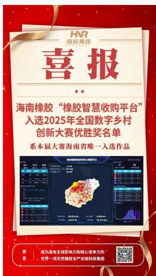

text_image

HNR
海胶集团
喜 报
** 
海南橡胶“橡胶智慧收购平台”
入选2025年全国数字乡村
创新大赛优胜奖名单
系本届大赛海南省唯一入选作品
思
景
成为具有全球影响力和核心竞争力的
世界一流天然橡胶全产业链科技集团

# 案例

# 浓乳加工技术升级，实现浓乳全过程自动加药

浓乳全过程自动加药系统建设于公司全资子公司海南天然橡胶产业集团金橡有限公司下属金联橡胶加工分公司。该系统主要由集中配药区、自动计算控制系统、管道输送网络及高精度计量组件（如流量计、液位计）等机构组成。旨在解决传统人工加药模式下劳动强度大、加药精度低、人为误差多以及药品搬运频繁等痛点。通过药品集中配置，并利用管道精准输送到全厂的澄清池、积聚罐等区域，实现了加药过程的自动化与精准化，可降低人工劳动强度，节约配药时间，并综合提升生产效率，同时大幅减少人为误差，提升浓乳产品质量的稳定性，推动橡胶初加工向智能化、精细化转型。公司已就浓乳全过程自动加药系统申报首台套应用技术成果鉴定。

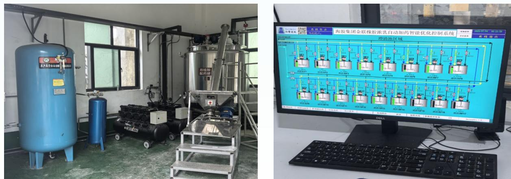  
金联橡胶浓乳自动加药智能优化控制系统

# 行业共建

公司充分发挥行业引领作用，积极投身行业共建与交流工作，持续加大与合作伙伴的合作力度，探索共赢新机遇。公司积极参与相关技术领域的标准制定，2025年度，公司获予发布国家标准1项，行业标准3项，地方标准1项，企业标准1项。此外，公司积极寻求与不同领域的合作伙伴建立合作关系，创新跨领域合作模式，打破传统单一合作模式，以实际行动推动行业高质量发展。

# 2025 年度

公司获予发布国家标准

1项

行业标准

3 项

地方标准

1 项

企业标准

1 项

# 国家标准 1 项

# 行业标准3项

# 地方标准 1 项

# 企业标准 1 项

《浓缩天然胶乳 挥发脂肪酸值的测定》（GB/T8292-2025）

《橡胶树白粉病飞防飞控技术规程》（NY/T 4515-2025，独立起草单位）

《热带作物病虫害监测技术规程 橡胶树根病》（NY/T 4518 2025，第二起草单位）

《天然生胶 子午线轮胎橡胶加工技术规程》（NY/T 735—2025，第三起草单位）

《天然橡胶初加工行业污染物排放标准》（DB 46/710—2025，第一起草单位）

《ENR25 和 ENR35 环氧化天然橡胶技术要求》（Q/HJTZ 001-2025）

# 保护知识产权

公司重视知识产权管理，从法律层面、技术和管理层面采取知识产权保护措施。

报告期内，昌江特种胶生产线项目成功试产出烟片胶，在推动特种胶国产化替代、保障战略安全方面迈出了关键且坚实的一步。

# 技术及管理层面

对公司科技项目内核心技术和成果归属，与合作单位签订项目合同，以明确知识产权保护、归属及各自权利和义务，保护我方权益；

对核心技术人员，签订保密协议，规定保护知识产权和保守商业秘密义务。

# 法律层面

对公司研发的新技术新产品和创作的软件，及时申请专利、登记著作权，以获得法律赋予的独占权，保障技术优势和市场竞争力。

# 强布局

组织开展知识产权业务培训，强化科技人员知识产权保护意识和能力；在立项与研发阶段同步开展专利挖掘与预警分析，建立以核心专利为主、外围专利为辅的保护网。

# 严维护

建立知识产权台账，实施年费监控与法律状态追踪，确保存量资产有效；

# 明权属

在科技合作协议、项目合同书中约定各方知识产权归属，确保科技成果权属清晰。

# 重防控

对内规范技术保密，对外严厉打击侵权行为，构筑防御壁垒。

# 案例

# 《天然橡胶化肥减施增效技术集成与应用》项目入选2025年度热带农业科技创新成果名单

2025 年 9 月，在全国热带作物学术年会上，2025 年度热带农业科技创新成果正式发布。由海垦科学院集团、海南橡胶、热科院橡胶所联合完成的《天然橡胶化肥减施增效技术集成与应用》项目成功入选。项目依托国家及海南省重点研发计划，形成以“优良品种 + 营养诊断指导施肥 + 有机肥替代 + 高浓度配方肥研制应用 + 绿肥覆盖”为核心内容的化肥减施增效技术模式。

该成果已获得国家发明专利1项、实用新型专利1项，获软件著作权2项，制定企业标准1项，发表专著1部、科研论文13篇，经济效益与社会效益显著，具有良好的推广前景。

# 2025年全国热带作物学术年会

China Tropical Crops Annual Meeting 2025

2025年度热带农业科技创新成果发布仪式  
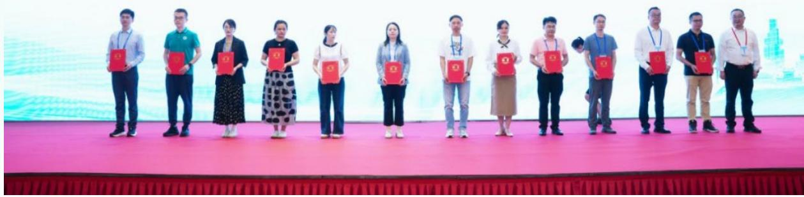

natural_image

Group of people standing on a red stage holding red certificates (no visible text or symbols)

2025 年全国热带作物学术年会现场

# 案例

# 公司总经理杨宇受邀出席 2025 中国橡胶年会

2025 年 3 月 25-28 日，2025 中国橡胶年会在山东青岛举行。海南橡胶总经理杨宇受邀出席，在橡胶材料专业委员会会议上对 2024 年天然橡胶市场进行总结并展望 2025 年，在圆桌访谈中就全球天然橡胶供需及价格趋势发表看法。大会吸引橡胶全产业链 1000 余名专业人士参会。

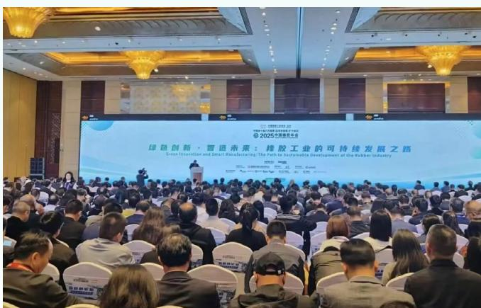

text_image

绿色创新·智造未来：控股工业的可持续发展之路
Green Innovation and Smart Manufacturing: The Path for Sustainable Development of the Russian Industry

# 质量管理 坚守品质初心

公司始终把质量当作企业发展的生命线，加强和规范生产线质量管理水平，不断提升产品质量水平和保证产品一致性。

# 提升质量水平

公司依据行业内先进经验做法、客户要求和相关体系标准制定《质量管理手册》，公司下属生产加工企业制定《成品管理办法》《不合格品管理办法》《产品检验管理办法》等管理制度。公司下属天然橡胶初加工企业均通过ISO 9001质量管理体系认证。

公司秉持为客户提供优质产品和服务的理念，采取一系列措施来推动质量管理水平的提升，从多个维度夯实质量管理基础，提升生产端质量管理人员的能力。

# 制定质量管理标准

制定浓乳线、全乳线和水线 3 个初加工生产线质量管理标准，合计 813 个标准条款，有效指导与规范初加工厂质量管理，提升产品质量合格率和一致性。

# 制定质量管理手册

金橡公司根据质量管理标准制定了金橡公司的质量手册，分别辅导金联工厂、金兴工厂和达维工厂推进 5S 标准现场和质量管理标准现场的建设。

# 制定初加工现场质量管理方案（结合工会劳动竞赛实施）

报告期内，公司组织下属子公司金橡、云南海胶、海南合盛和云南合盛按照质量管理标准对海南和云南19家初加工厂进行现场质量审核、评分，查找工厂5S管理和质量管理方面存在的问题和提出改进建议，以促进工厂提升5S管理和产品质量管理水平。

# 组织开展质量培训

公司组织开展《质量管理体系内审员培训》《VDA6.3》《FMEA》和《IATF16949》培训，提升加工厂质量管理和生产管理人员对质量管理知识和工具的理解，以及通过案例讲解和课堂练习强化对质量管理工具的运用。

# 质量文化建设

为进一步提高企业的质量管理能力，加强员工的质量意识和专业技能，公司组织开展以聚焦质量管理水平提升为主题的一系列活动，包括质量知识培训、加工端质量劳动竞赛、质量月活动和质量问题回头看等。这些活动旨在提升员工的专业素质，增强员工对质量工作的认同感和责任感。

# 案例

# 公司组织开展质量管理水平提升主题系列活动

公司组织开展了一系列培训活动，持续提升员工质量意识和专业技能。培训内容除了水线、干线、全乳线和浓乳线加工质量标准，还包含VDA6.3和PFMEA等质量管理理论知识及工具使用，提高员工专业技能和质量工具使用能力。而质量劳动竞赛则通过5S管理、生产工艺及加工现场管理等方面对19个加工厂展开审核评比，识别问题并举一反三，同时提炼各加工厂优秀做法与典型案例并推广应用，整改提升效果更为显著。

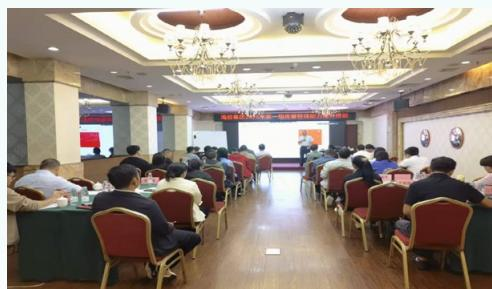

text_image

Conference hall photo with visible red banner text and audience seated at tables

开展 VDA6.3 质量知识培训

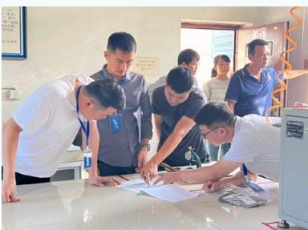

natural_image

Group of people gathered around a table reviewing documents in a meeting room (no visible text or symbols)

质量劳动竞赛现场审核

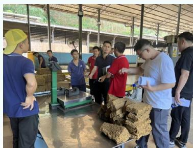

natural_image

Group of people gathered around a machine in an industrial facility, examining stacked materials (no visible text or symbols)

质量劳动竞赛现场审核

# 案例

# 红光分公司获评五星级 "放心消费单位"

海南橡胶红光分公司凭借优质福橙产品、完善权益保障及良好社会口碑，获评海南省五星级"放心消费单位"。该公司依托澄迈福山资源优势，规划种植3022亩福橙，成为当地种植面积最大的企业。所产福橙为天然富硒绿色农产品，皮薄肉厚、多汁甘甜，获得市场广泛好评。

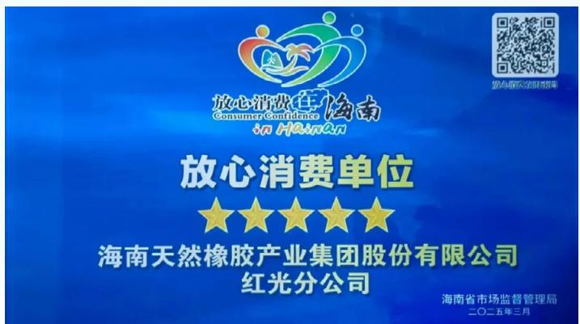

text_image

放心消费在海南
Consumer Confidence in Hainan
放心消费单位
★★★★★
海南天然橡胶产业集团股份有限公司
红光分公司
海南省市场监督管理局
二〇二五年三月

# 科技伦理

公司严格对标国家科技伦理法规及天然橡胶行业准则，规范开展技术研究及落地应用，健全伦理审查机制，筑牢科技伦理防线。

# 保护隐私 筑牢安全防线

公司坚持数字化转型与安全防护并重，健全网络安全组织架构与管理制度，构建私有云、安全防护、应急响应三位一体的安全防御体系。持续完善信息基础设施，推进全产业链数字化应用与数据资源整合，严格保护客户隐私。

# 数据安全与客户隐私保护

公司贯彻落实信息化决策部署，推动全产业链数字化转型，建设智慧海胶，相关基础设施和应用系统建设稳步推进，为数字化转型和智慧建设奠定了基础。

# 数据安全管理体系建设

公司成立由党委书记担任组长、总经理担任常务副组长的网络安全领导小组：

负责贯彻落实上级网络安全工作部署和要求，按照“谁建设谁负责，谁运维谁负责”的原则，加强网络安全工作的领导、落实工作责任；

负责公司网络与信息安全统筹规划和组织协调，严格落实网络安全工作责任制，审议并出台网络安全管理制度，确保网络与信息安全；

负责统筹协调公司网络安全应急工作，做好网络安全重大事项的研判与决策，配合上级主管部门和本地网络安全主管部门做好网络安全相关应急处置工作；

组织对公司中层以上领导干部网络与信息安全教育和培训。

公司以数字化转型升级为引擎，全面提升天然橡胶产业竞争力和可持续发展能力，通过信息化、数字化、智能化深度应用，显著增强企业经营管理效能，以数字化助力企业核心竞争力，培育发展新质生产力，为企业高质量发展注入新动能。

公司建立网络安全防御体系，对发生的网络安全事件划分等级，明确各单位职责与分工，有序采取预警响应、应急处置、调查评估、预防和保障工作，公司常态化委托专业团队运营网络安全应急响应中心（SSRC），主动发现隐患漏洞，实时分析网络攻击行为，快速处置网络异常行为威胁，预防并减少因网络安全事件导致的业务中断和造成的生产、经营、管理损失及社会影响风险。

# 完善信息基础设施建设

公司搭建基于超融合架构的企业私有云，通过多台实体机和分布式本地存储，提供不低于 1.3THzCPU 处理以及大于 200TB 存储容量的服务能力，实现服务器资源的科学分配。

公司铺设两条互联网专线，搭建可以主备切换、负载均衡的办公网络。同时，部署专业的网络安全设备保障整个办公网络的安全。此外，公司还基于VPN建立总部与各分子公司的内网互联，加强网络安全。

# 产业链数字化转型初见成效

公司开展日常巡检、网络安全防护、设备维护管理、数据异地备份管理及技术支持服务。

截至报告期末，公司建设应用系统 20 余个：ERP 实现企业的采购、生产、销售、库存、财务等业务资源的整合和优化，为企业运营管理提供支持；橡胶智慧平台实现橡胶割胶生产经营过程管理；期现货风控管理、财务共享、中小苗管理、木材竞价交易、OA 协同办公、人力资源以及国资在线监管等系统为公司全产业链数字化转型打下良好基础。

# 数据资源体系建设稳步推进

公司通过开展土地调查、影像采集等工作推动土地资源与生物资产的数字化管理，并借助系统线上管理实现树位、胶工、割胶生产等关键生产要素的数字化管控。

报告期内，公司未收到涉及侵犯客户隐私和丢失客户资料的投诉，公司未发生重大数据安全和泄露客户隐私事件。

# 多方协同 织密共赢网络

公司健全采购与供应商管理制度，建立准入、评审、信用评级及风险防控体系，强化供应链韧性与合规管理，积极推进可持续供应链建设，将 ESG 理念融入采购环节，联动上下游践行可持续标准，推动供应链绿色、合规、稳定发展。

# 供应商管理

公司高度重视供应链管理，围绕“集中采购”的总体思路，致力于提升供应保障能力。公司编制了《采购管理办法（试行）》，完善采购管理体系，规范采购行为，控制采购成本，提升采购与供应链管理水平。此外，公司及下属子公司通过实施供应商竞争比选、制定交易评审和准入机制等措施，加强供应商管理和评估，优化采购价格管理，充分发挥规模效应，有效落实降本增效制度，进一步增强供应链的韧性。

公司为防范与客户、供应商合作过程中因失信、违约引发的经济损失风险，制定《大宗商品信用风险管理办法》，统一规范客户与供应商信用等级评价标准，统筹开展信用评级管理。为强化存货风险管控，公司制定《大宗商品存货风险管理办法》，对仓储物流供应商实施准入管理，经筛选评审合格后方可开展合作。

# 上游供应商准入与评估管理机制

为加强供应商管理，橡胶贸易子公司龙橡公司建立《信用风险管理办法》，由信用评审小组负责供应商准入与评级工作，明确 A-5A 分级体系及评价标准，并按供应商等级实施差异化业务政策。子公司承担供应商准入初审职责，报运营风控部审核；客商评级有效期原则上为一年，到期后重新开展评级。

与上游供应商进行信誉交易，需按照制度进行客商信用评级、预付款授信审批，前述评审按照“先信用评级，后授信审批”流程进行，主要根据公司基本情况、资质背景、行业地位、财务状况、经营状态、信用履约情况、市场口碑、过往合作情况、合作前景等方面对客商进行综合考量。

进行客商信用评级，不同等级供应商对应不同的业务政策。需进行信誉交易的供应商，在经过供应商信用评审定级并审批通过后，符合要求信用评级的供应商，在评级有效期内提交预付款授信审批，经龙橡公司、公司总部审批通过后执行。

# 供应链能力建设

公司持续强化供应链能力建设，有力推动上下游企业提升可持续发展能力，确保供应链的高质量与稳定性。

# 供应链可持续发展实践

联合和带领当地上下游企业积极参与可持续发展计划

合盛农业在 GPSNR 方面与委员会中的生产商、加工商和贸易商共同拟定了可持续发展的 KPI，并积极倡议行业内企业加入。

KM 公司开发了基于互联网的应用程序 Rubber\*Notes，并借此评估和核实供应链中小农户、种植园和交易商是否遵守可持续发展政策及供应商行为守则，包括：最低工资、工人工作时间、是否用童工、工人福利、安全和健康管理、社群关系等。

龙橡公司将 ESG 纳入采购理念, 自 2023 年起进行了 FSC 认证, 推动绿色采购和可持续供应链管理。2026 年将继续进行认证, 响应可持续采购。同时, 公司自 2024 年获得 ISO 37301 合规管理体系认证, 进一步推动和构建负责任供应链。

# 案例

# 2025 年海南橡胶供应链及风控大会海口举行

2025 年 4 月 23 日，2025 年海南橡胶供应链及风控大会在海口举行。这是海南橡胶成为全球最大天然橡胶产业集团后首次召开此类会议。近百名高管及风控负责人围绕全球经贸形势、风险管控等议题展开研讨，提出建立三级风控责任机制、推行风险首问责任制、搭建全球风险预警平台等破局之策，凝聚"风控即竞争力"的共识。

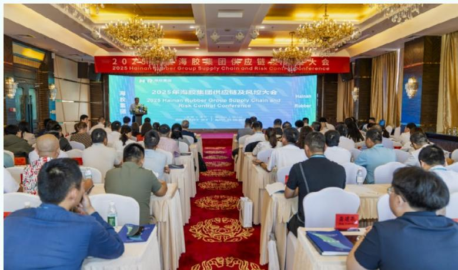

text_image

2025年海胶集团供应链及风控大会
2025 Hainan Rubber Group Supply Chain and Risk Control Conference
海胶集团
2025年海胶集团供应链及风控大会
2025 Hainan Rubber Group Supply Chain and Risk Control Conference

# 责任担当 传递温暖力量

公司积极响应共建“一带一路”倡议，布局全球天然橡胶产业，弘扬丝路精神，扎实推进海外属地化建设与技术帮扶，促进沿线国家产业发展。公司坚守“为国利民、胶融天下”使命，以实际行动回馈社会，彰显国企责任担当。

# 国家战略响应

海南橡胶积极倡导合作共赢，努力构建多方利益共同体。公司在亚洲、非洲等“一带一路”沿线国家投资兴业，致力于维护天然橡胶全球供应链稳定，成为共建“一带一路”倡议的积极响应者、忠实践行者、共同建设者、历程见证者。截至报告期末，集团产业版图已扩展到东南亚、欧洲、非洲等区域内17个主要国家，逐步形成了以印度尼西亚、老挝、马来西亚、新加坡等东南亚主产国为主，以科特迪瓦、喀麦隆等非洲国家为补充的产业布局。

在积极参与共建“一带一路”建设的过程中，公司始终弘扬“和平合作、开放包容、互学互鉴、互利共赢”的丝路精神。公司高度重视海外企业在当地的社会责任，通过一系列务实举措，努力实现“高质量、惠民生、可持续”的发展目标，为“一带一路”沿线国家社区的可持续发展和橡胶产业的繁荣作出积极贡献。

# 案例

# 向非洲种植园区传授推刀割胶技术

2025 年 1 月，由海南橡胶提供的 600 把崭新的胶刀（推刀）顺利抵达海南橡胶非洲 Hevecam 和 Sudacam 种植园，将帮助非洲胶工改变传统割胶方式，提高橡胶产量。

海南橡胶非洲 Hevecam 和 Sudacam 种植园共选定了 17 个班组，率先使用这批推刀进行割胶作业。推刀割胶技术以其省力、伤树少的特点，在这些班组中迅速得到了应用和推广，两个种植园已有 600 余名胶工成功掌握了推刀割胶技术，并反馈称该技术相比当地传统拉刀割胶方式更为轻松，大大减少了树皮消耗。

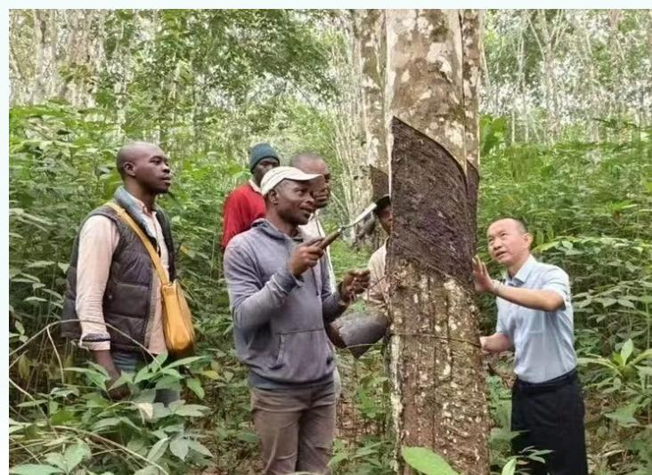

natural_image

Group of people examining a tree trunk in a dense forest (no visible text or symbols)

海南橡胶技术专家在非洲种植园区传授推刀割胶技术

# 案例

# 海南橡胶参加科特迪瓦第七届国际农业和动物资源展

2025 年 5 月 23 日，科特迪瓦第七届国际农业和动物资源展在阿比让开幕。海南橡胶董事长王宏向出席并担任推介员，向国内外嘉宾推介天然乳胶制品及咖啡、茶叶、胡椒等产品。海垦集团展厅的明星产品吸引众多客商驻足体验、咨询购买，公司将持续推动特色优质产品走向世界。

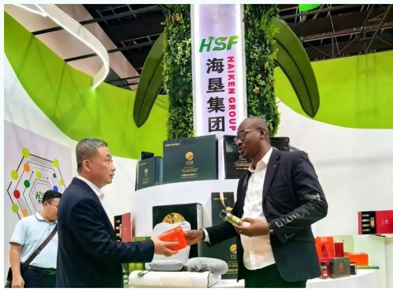

text_image

HSF
海垦集团
HAIKEN GROUP

# | 案例

# 公司董事长王宏向率队赴老挝南庄橡胶种植基地调研

2025 年 3 月 18 日，海南橡胶董事长王宏向率队赴云南海胶在老挝波乔省的南庄橡胶种植基地调研。王宏向与一线胶工交流，强调要推进种植园增收增利、提升胶工收入、改善居住环境，要求充分利用老挝热带沃土优势打造标准化胶园，提升海南橡胶在东南亚的资源控制能力。

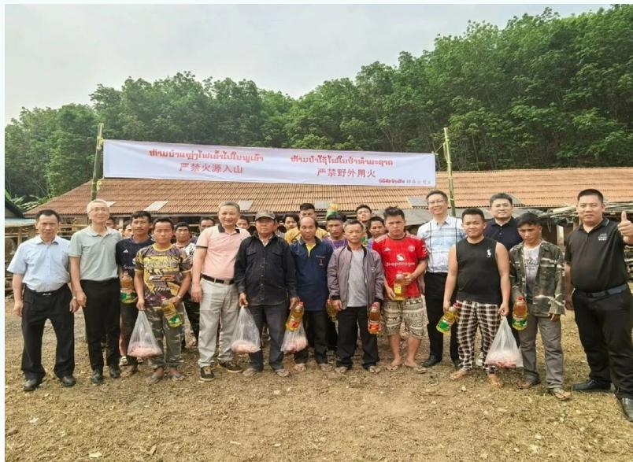

text_image

防爆暴爆火源入山
严禁火源入山
防爆暴爆火源入山
严禁野外用火
防爆暴爆火源入山

# 投身社会公益

公司始终秉持“为国利民 胶融天下”的企业使命，将社会责任融入企业文化，积极投身社会公益事业。在抗风救灾、困难帮扶、灾后重建等行动中，公司以实际行动诠释了责任与担当，为乡村振兴和社会公益事业注入温暖力量。通过持续践行公益，不仅提升了员工的凝聚力，也树立了良好的企业形象，彰显以行动回馈社会的初心与使命。

# 案例

# 服务乡村振兴、保障产业链安全—天然橡胶支农专项工作“稳产行动”项目

自2019年起，海南橡胶联合上海期货交易所（简称“上期所”）及多家期货公司，创新推出“场外期权+二次结算”风险管理模式，依托橡胶智慧收购平台，为海南胶农构建价格风险保障体系，助力天然橡胶稳产保供。项目由上期所提供权利金，期货公司负责期权设计与风险对冲，海南橡胶组织收购并将收益直补胶农。2019—2024年，项目累计惠及11.07万胶农，补贴金额5,218.72万元，覆盖产量16.48万吨；2025年补贴金额1,053.39万元，惠及胶农38,164人，补贴产量17,914.85吨。

该“稳产行动”形成可复制推广的产业帮扶模式，以金融工具赋能农业生产，稳定胶农收益与生产信心，增强供应链韧性，提升割胶积极性，实现胶农增收、企业稳供、产业提质的多方共赢。

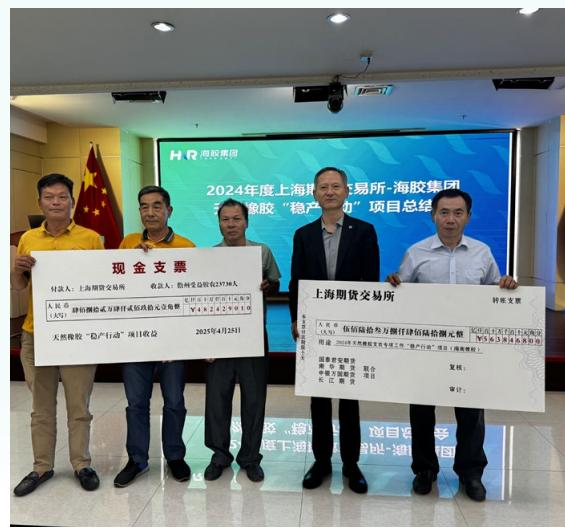

text_image

HR 期货展期
2024年度上海期货交易所-海胶集团
海胶橡胶“稳产行动”项目总结
现金支票
付款人：上海期货交易所 收款人：惠州受益农23738人
A. 李浩
（人/代）
津铝储仓或万泽行式危险品元交税费
¥4 本年1月1日
天然橡胶“稳产行动”项目收益
2025年4月25日
上海期货交易所
转账支票
A. 李浩
（人/代）
津铝储仓或万泽行式危险品元交税费
¥4 本年1月1日
天香橡胶“稳产行动”项目收益
2025年4月25日
国家发改委联合
中国金融学会项目
复核：
长江证券
审计：

上海期货交易所为海南橡胶、胶农代表颁发支票

# | 案例

# 公司总经理杨宇一行赴加钗分公司慰问全国劳模虞海浓家属

2025 年春节，海南橡胶总经理杨宇一行赴加钗分公司，走访慰问全国劳模、赴非专家虞海浓家属，送去组织关怀和节日问候。杨宇肯定了虞海浓的工作成绩，感谢家属默默奉献，叮嘱照顾好家庭、培养好下一代，并表示公司将继续做好劳模权益保障工作，持续关注其生活状况。

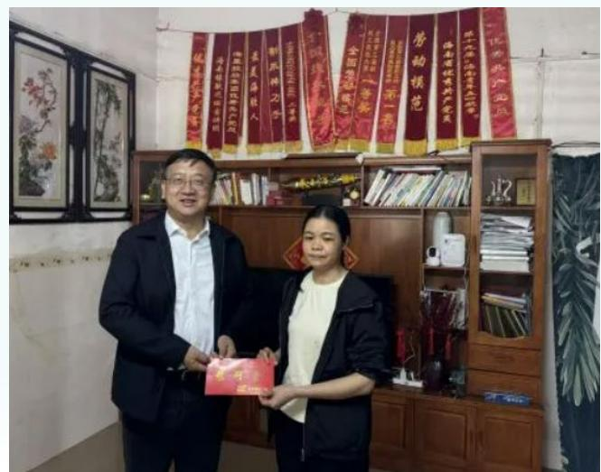

text_image

Two people holding a red envelope in an office with Chinese calligraphy banners overhead, including '劳动模范' and '全国劳动模范'.

# 案例

# 金橡公司开展 2025 年新春送温暖活动

2025 年 1 月 20 日，金橡公司开展春节送温暖活动。公司组成数个慰问小组赴各加工分公司走访困难党员和职工，深入了解生活现状与实际困难，送上慰问金和慰问品并致以节日问候。公司负责人对一线职工辛勤付出表示感谢，勉励他们乐观向上、坚定信心，以实际行动投身天然橡胶事业发展。

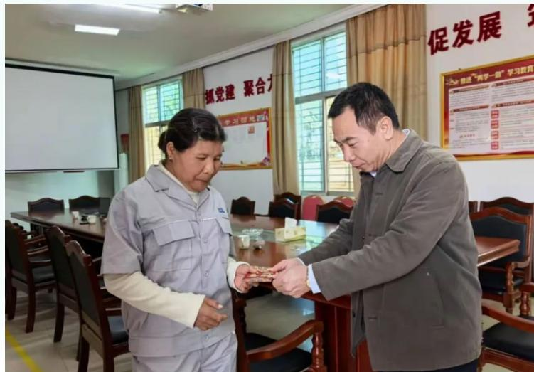

text_image

Photo of a community outreach event with visible Chinese wall slogans and posters on the walls

# 案例

# 新中分公司开展 2025 年春节送温暖活动

2025 年 1 月 20 日，新中分公司开展春节送温暖活动。分公司成立 4 个慰问组，走访 17 户困难党员和职工，详细了解工作生活情况，倾听意见建议，送上节日慰问品和新春祝福。慰问组还实地探望患病职工，鼓励其坚定信心、乐观面对困难，进一步增强了公司与职工之间的凝聚力。

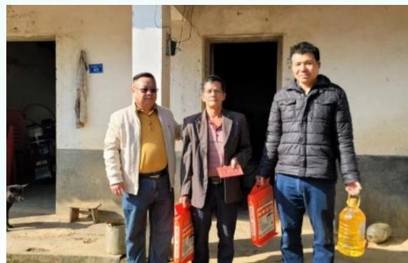

natural_image

Three men standing outdoors in front of a building, holding red and yellow supplies (no visible text or symbols)

# 案例

# 乌石分公司开展春节福利发放活动

2025 年 1 月 20 日，乌石分公司开展春节福利发放活动。精心准备的福利品、真挚的问候体现了公司对职工的深切关怀。工作人员有序发放福利品，幸福笑容在职工脸上绽放。此次活动传递了对一线职工的关怀与精神鼓励，形成职工贡献与公司谋福利的良好局面。

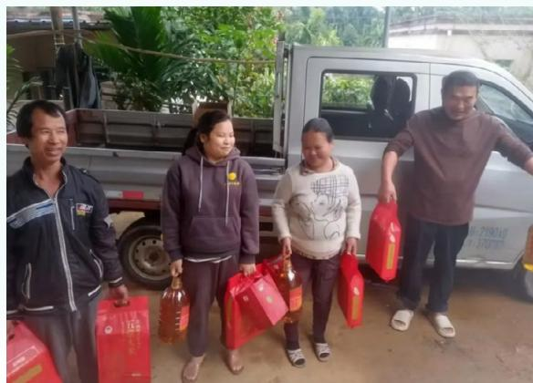

text_image

Street photo showing four people holding red gift bags near a white truck, with visible Chinese characters on the vehicle and background signage.

# 依法纳税

公司通过持续健全财务制度与流程管控、推进财务信息系统与数据库建设、重点强化服务质量与风险管理，同时加强专业团队能力，系统提升了公司财务规范与风险控制能力。

公司编制《橡胶保险业务核算手册》、《研发业务核算手册》等多项核心业务会计核算操作指引，明确同类业务核算规范，推进会计核算标准化；发布《可控管理费用管理办法》，建立了管理费用管控的长效机制，为未来持续推动降本增效提供了清晰的制度依据和操作指引；梳理《差旅费管理制度》等制度执行情况，排查并整改执行偏差，形成《制度执行缺陷专项报告》。

# 公司财务部提升财务规范和风险防控的措施

☑ 编制等多项核心业务会计核算操作指引，夯实核算基础，规范流程标准。  
☑ 发布《可控管理费用管理办法》，明确费用归口、标准、预算控制及审批流程。完善制度体系，夯实内控基础。  
☑ 完成国内财务共享系统升级的现状梳理，通过系统排查现有流程瓶颈与功能短板，初步明确各业务模块升级需求，细化初步建设框架、技术路径及实施思路。

公司致力于构建系统化、前瞻性的税务治理体系，通过深化政策研究与业务结合，主动加强政策沟通，依法合规落实各项税收优惠政策，合理控制税务成本，为提升运营效率与核心竞争力提供支持。与此同时，公司积极应对复杂国际税收环境，通过引入专业资源、构建知识共享平台与强化常态化沟通，系统提升全员税务合规意识与风险应对能力，实现了税务风险的有效管控与整体税务治理水平的持续提升。

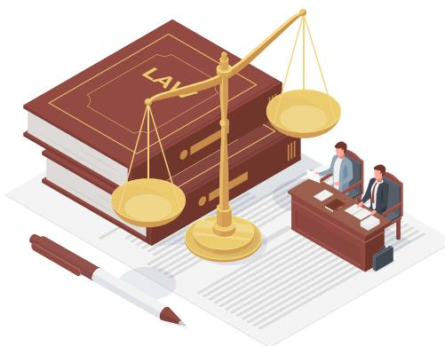

natural_image

Illustration of law enforcement with a balance scale, judge, and pen (no text or symbols)

# 03

# 以人为本 护航员工成长

海南橡胶坚守“人才兴企、安全护企”理念，以廉洁用人为导向，完善人才选拔培养机制，打造高素质人才队伍；以安全生产为底线，健全安全管理体系，筑牢安全发展根基。通过人才与安全双轮驱动，为公司高质量可持续发展保驾护航。

# 合规雇佣 保障平等权益

公司严格遵守劳动法律法规，构建规范人力资源管理体系，保障员工合法权益。持续完善薪酬制度，建立市场化差异化薪酬机制，着力构建和谐劳动关系，稳定人才队伍。

# 员工雇佣

公司严格恪守《中华人民共和国劳动法》《中华人民共和国劳动合同法》等相关法律法规，构建规范化人力资源管理体系。公司制定《员工招聘管理办法》，规范员工招聘录用程序，构建校园招聘、社会招聘、内部招聘多渠道并举的招聘机制，线上依托公司官方网站、专业招聘平台精准发布招聘信息，线下积极参与海南省政府部门组织的双选会、校园招聘会等招聘活动，持续扩充人才储备规模，不断优化人才队伍结构。

公司持续完善制度建设，报告期内完成修订《员工请休假管理办法》《薪酬管理办法》，稳步夯实人力资源管理基础，着力构建和谐稳定的劳动关系。

公司坚持平等就业原则，杜绝性别、种族、肤色、年龄或婚育状况等任何形式的歧视，实行唯才是举、公平公正的用人机制，营造多元包容的工作环境。

公司严格落实身份验证和学历核查机制，确保招聘过程合规。针对非生产岗位，公司委托第三方机构进行背景调查，核实员工的身份、学历和工作经历；针对基层胶工，要求填写个人简历表并完成体检，各招聘单位须审核其身份证、学历等信息，总部对胶工的劳动合同及简历进行复核，以确保用工合规，杜绝录用童工。

# 招聘阶段

严格核验应聘者年龄，确保符合法定用工要求。

# 入职阶段

确认员工为自愿签署劳动合同；在办理入职手续时核实验证身份年龄信息。

# 离职阶段

按公司制度完成离职相关手续，全流程保障用工合规，切实维护员工合法权益。

# 员工薪酬

公司为持续健全薪酬分配体系，修订完善《总部中层及以下人员绩效与薪酬管理办法》《二级企业领导人员薪酬管理办法》，构建与工作业绩、实际贡献、企业效益紧密挂钩，且与企业功能定位相适配的市场化、差异化薪酬机制。

公司为深化基地分公司改革，在优化割胶生产管理机制、凸显割胶岗位价值的基础上，推进核心胶工薪酬改革工作。通过科学设置薪酬结构、优化分配方式，切实保障核心胶工收入水平，不断增强胶工队伍的获得感、归属感与幸福感。

# 薪酬改革具体举措

# 调整薪酬结构，强化激励机制

公司充分考虑岗位差异与个人能力，合理设置工资级差，以确保内部公平性。

# 提高绩效薪酬占比，强化业绩联动

进一步加大绩效薪酬在整体薪酬中的占比，使员工收入与个人工作业绩紧密挂钩，增强薪酬与经营指标的联动性。通过绩效考核体系，使员工的努力与企业发展成果直接相关，提升员工的工作积极性。

# 优化基层工资总额分配，向一线员工倾斜

公司推行统一薪酬结构，在基地分公司实施统一的基本工资标准，确保即使在停割期无月度绩效工资，也能保障税前基本工资不低于当地最低工资标准，增强薪酬体系的稳定性和可持续性。

# 调整基地分公司薪酬结构，规范工资发放

公司始终坚持薪酬向一线基层员工倾斜的政策，优先保障一线胶工、生产管理人员的薪资待遇，提高其收入待遇水平，稳定团队结构，增强基层队伍稳定性和凝聚力。

# 人才培育 激活内生动力

公司始终坚持“人才是企业高质量发展的核心竞争力”的理念，将战略发展与员工个人职业生涯规划紧密结合，为每位员工提供广阔的发展平台，助力员工发掘潜能、实现自我价值。

# 员工发展

公司不断完善纵向晋升与横向发展双通道，每年根据本单位岗位编制、管理需要，结合员工个人工作业绩情况制定岗位调整方案，员工岗位职级调整后，同步调整薪级薪档。

# 横向发展

# 技术序列晋升路径

# 纵向晋升

员工可在管理与技术序列之间自由转换,并可结合个人意愿、专长及公司需求，在同一单位或同级别单位之间进行岗位交流，拓展职业发展方向。

分为管理序列通道、技术序列
通道两大路径

natural_image

Illustration of a person presenting data on a screen with bar and line charts (no text or symbols)

natural_image

Line drawing of three people working at a table with laptops (no text or symbols)

# 管理序列通道

结合年度绩效考核，员工可逐级晋升，层级从低到高依次为：专员、主管、高级主管、部门总经理助理、中层副职、中层正职、高层，同时可通过公开竞聘、调动等方式，在海南橡胶及下属分、子公司进行任职交流。

# 技术序列通道

专业技术人员可从一般管理层级转入技术通道，层级依次为：部门业务总监、专业副总师、业务总监、总农艺师等。

公司为加强人才梯队建设，进一步充实中层副职后备力量，面向各分、子公司及总部各部门开展公开推荐工作，择优纳入中层副职后备干部人才库。公司始终坚持公开、公平、公正的选拔原则，积极拓宽人才来源渠道，着力营造“人人可参与、人人有机会”的选人用人氛围，为后续干部选拔与培养奠定扎实基础。

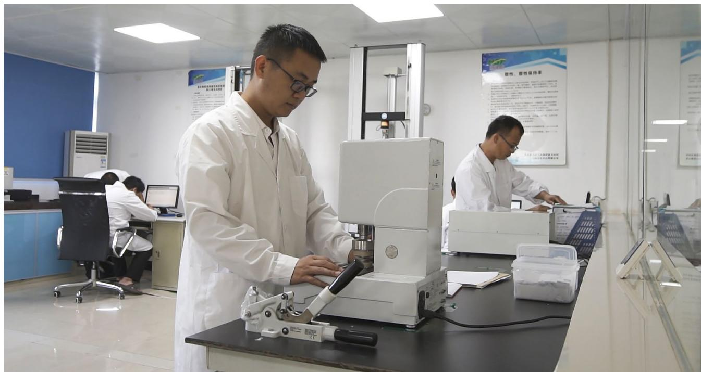

natural_image

Interior of a laboratory with scientists in white coats operating equipment (no visible text or symbols)

# 员工培训

公司始终坚持“人才是第一资源”的理念，以《总部员工培训管理办法》为指导，建立起线上与线下结合、请进来与走出去并重的员工培训体系，涵盖新员工培训、通用素质培训、专业技能培训、领导力培养及特色培训，助力员工成长，提高企业整体竞争力。

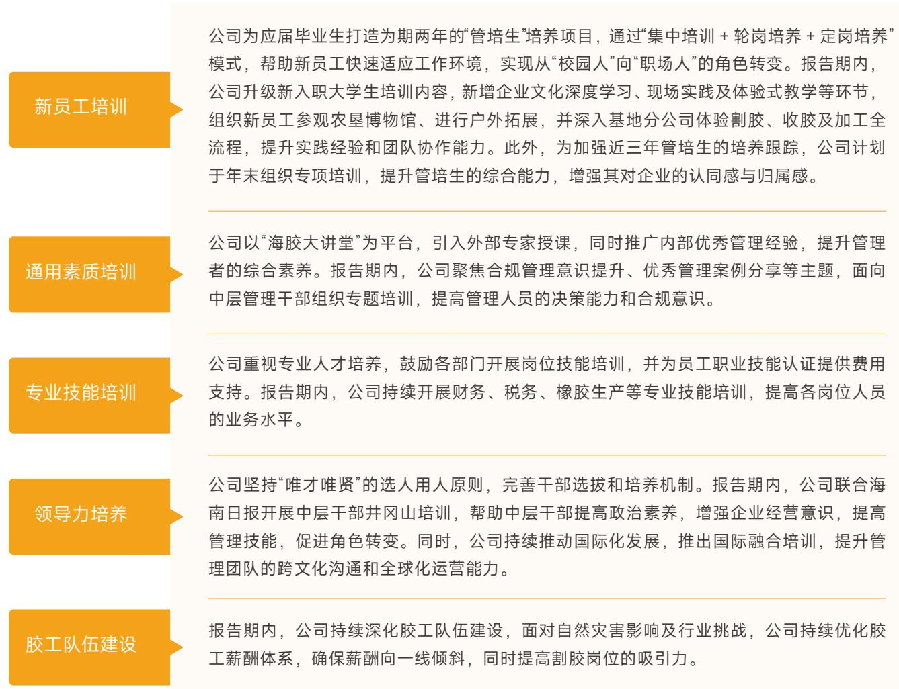

flowchart

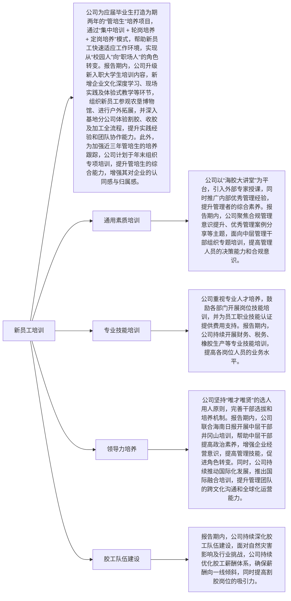
```mermaid
graph LR
  A["新员工培训"] --> B["公司为应届毕业生打造为期两年的“管培生”培养项目，通过“集中培训 + 轮岗培养 + 定岗培养”模式，帮助新员工快速适应工作环境，实现从“校园人”向“职场人”的角色转变。报告期内，公司升级新入职大学生培训内容，新增企业文化深度学习、现场实践及体验式教学等环节，组织新员工参观农垦博物馆、进行户外拓展，并深入基地分公司体验割胶、收胶及加工全流程，提升实践经验和团队协作能力。此外，为加强近三年管培生的培养跟踪，公司计划于年末组织专项培训，提升管培生的综合能力，增强其对企业的认同感与归属感。"]
  A --> C["通用素质培训"]
  C --> D["公司以“海胶大讲堂”为平台，引入外部专家授课，同时推广内部优秀管理经验，提升管理者的综合素养。报告期内，公司聚焦合规管理意识提升、优秀管理案例分享等主题，面向中层管理干部组织专题培训，提高管理人员的决策能力和合规意识。"]
  A --> E["专业技能培训"]
  E --> F["公司重视专业人才培养，鼓励各部门开展岗位技能培训，并为员工职业技能认证提供费用支持。报告期内，公司持续开展财务、税务、橡胶生产等专业技能培训，提高各岗位人员的业务水平。"]
  A --> G["领导力培养"]
  G --> H["公司坚持“唯才唯贤”的选人用人原则，完善干部选拔和培养机制。报告期内，公司联合海南日报开展中层干部井冈山培训，帮助中层干部提高政治素养，增强企业经营意识，提高管理技能，促进角色转变。同时，公司持续推动国际化发展，推出国际融合培训，提升管理团队的跨文化沟通和全球化运营能力。"]
  A --> I["胶工队伍建设"]
  I --> J["报告期内，公司持续深化胶工队伍建设，面对自然灾害影响及行业挑战，公司持续优化胶工薪酬体系，确保薪酬向一线倾斜，同时提高割胶岗位的吸引力。"]
```

# 民主管理

公司坚持“以员工为中心”的发展理念，积极推进民主管理，落实职工代表大会制度，选举职工代表董事，并通过农垦报、企业公众号等渠道公开企业事务，保障员工的知情权、参与权、表达权、监督权。依据《海南橡胶员工权益保障申诉制度》，员工可向工会提交申诉材料，就集体协议、工作规则、规章制度及个人考勤、绩效、晋升等相关问题提出诉求，相关责任部门须在15日内及时处理并反馈，切实维护员工权益。

报告期内，公司召开第四届第五次、第六次职工代表大会，审议并通过公司工作报告，公司首席代表和职工方首席代表签订工资专项集体合同、2025年生产责任书和经营绩效责任书，选举产生职工董事，答复职工代表提案件19件，征集职工代表提案34件。

# 人文关怀 共筑幸福家园

公司坚持以人为本，健全员工权益保障与福利体系，完善境内外外派人员管理与暖心保障机制。积极开展文体活动、冬送温暖、夏送清凉等帮扶行动，以细致入微的人文关怀，不断提升员工归属感、幸福感与凝聚力。

# 关怀与帮扶

公司始终坚持以人为本，不断健全员工权益保障与福利体系。面对公司业务的拓展和人才流动需求，公司制定并实施了《外派海南省外工作人员管理办法（试行）》和《外派国（境）外企业人员管理办法（试行）》，进一步完善外派员工的保障体系。

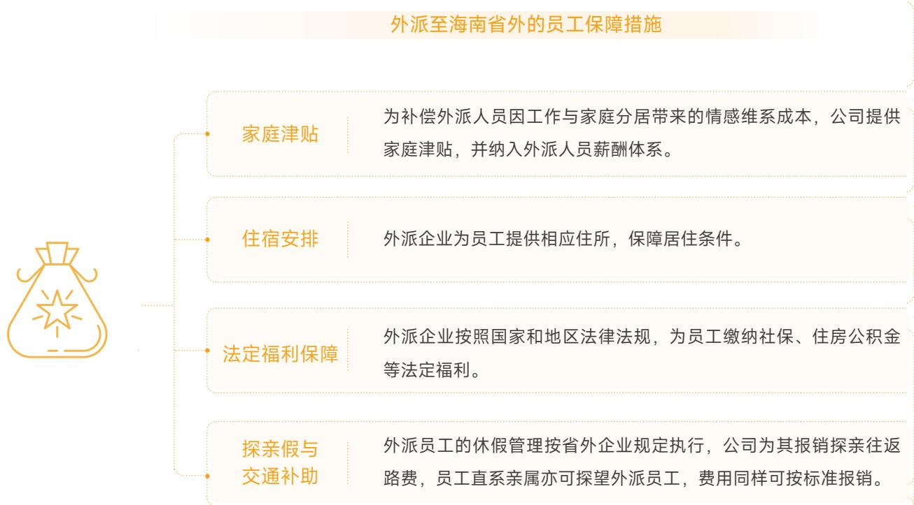

flowchart

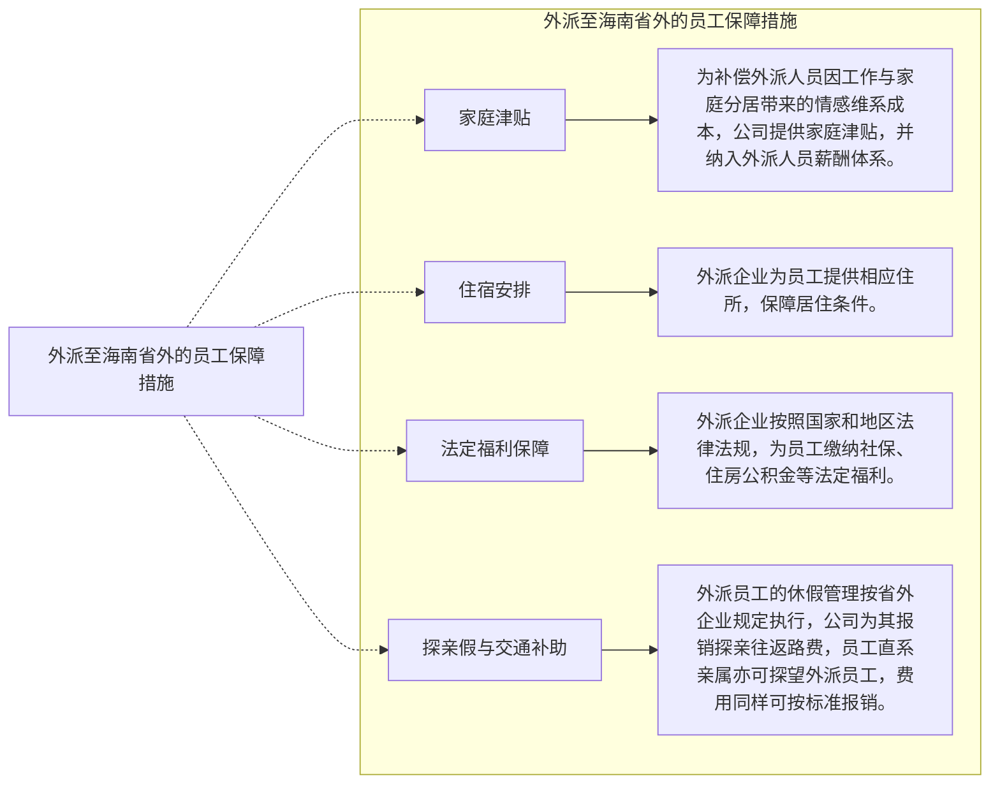
```mermaid
graph LR
  Root["外派至海南省外的员工保障措施"]
  
  subgraph ExternalDispatch ["外派至海南省外的员工保障措施"]
    direction TB
  A1["家庭津贴"] --> B1["为补偿外派人员因工作与家庭分居带来的情感维系成本，公司提供家庭津贴，并纳入外派人员薪酬体系。"]
  A2["住宿安排"] --> B2["外派企业为员工提供相应住所，保障居住条件。"]
  A3["法定福利保障"] --> B3["外派企业按照国家和地区法律法规，为员工缴纳社保、住房公积金等法定福利。"]
  A4["探亲假与交通补助"] --> B4["外派员工的休假管理按省外企业规定执行，公司为其报销探亲往返路费，员工直系亲属亦可探望外派员工，费用同样可按标准报销。"]
  end
  
  Root -.-> A1
  Root -.-> A2
  Root -.-> A3
  Root -.-> A4
```

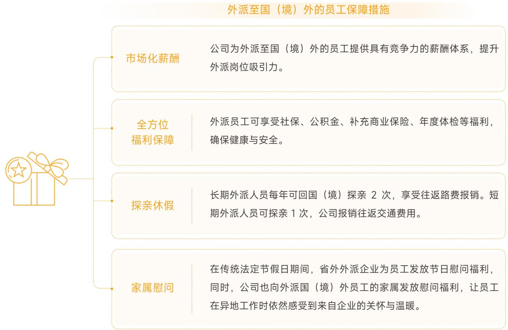

flowchart

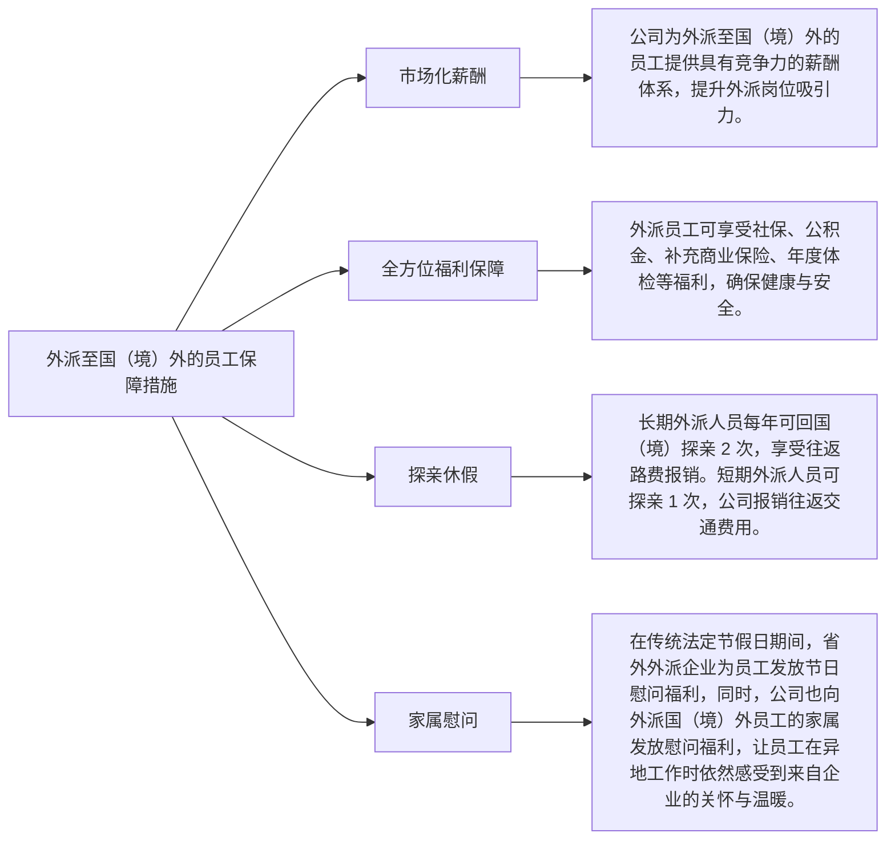
```mermaid
graph LR
  A["外派至国（境）外的员工保障措施"] --> B["市场化薪酬"]
  A --> C["全方位福利保障"]
  A --> D["探亲休假"]
  A --> E["家属慰问"]
  
  B --> F["公司为外派至国（境）外的员工提供具有竞争力的薪酬体系，提升外派岗位吸引力。"]
  
  C --> G["外派员工可享受社保、公积金、补充商业保险、年度体检等福利，确保健康与安全。"]
  
  D --> H["长期外派人员每年可回国（境）探亲 2 次，享受往返路费报销。短期外派人员可探亲 1 次，公司报销往返交通费用。"]
  
  E --> I["在传统法定节假日期间，省外外派企业为员工发放节日慰问福利，同时，公司也向外派国（境）外员工的家属发放慰问福利，让员工在异地工作时依然感受到来自企业的关怀与温暖。"]
```

公司持续深化人文关怀，制定《2025年元旦春节送温暖工作方案》，通过多维度暖心举措提升员工归属感与幸福感。报告期内，公司开展“春送岗位、夏送清凉、秋送助学、冬送温暖”活动280余场次，惠及3.2万人次，职工幸福感、团队凝聚力不断增强。

# 报告期内

开展“春送岗位、夏送清凉、秋送助学、冬送温暖”活动

280+场次

惠及

3.2万人次

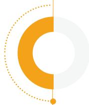

# 公司扎实开展关爱职工活动

☑ 公司积极开展困难帮扶和“送清凉”活动，筹措 56.64 万元慰问困难边缘户 278 户、困难职工 13 户及发放慰问金 5 万元给困难女职工 100 人。  
公司发动全体干部职工参与公益捐款活动，捐款 14,412.91 元，展现了团结互助的精神，为困难群体送去温暖与关怀。  
☑ 举办科学养生专题讲座，开展中医理疗服务，邀请中医健康管理师赴总部开展推拿调理 3 场，累计服务职工 200 余人次。  
工会主动协助 261 名职工报销医疗互助金 34.45 万元。

natural_image

Illustration of three people seated at a table with computers, one presenting a baton to the other (no text or symbols present)

# 公司工会聚焦员工需求，积极推进“我为群众办实事”实践活动

☑ 公司工会投入 67.11 万元专项经费开展“夏送清凉”活动，走访慰问职工 13,224 人次；“冬送温暖”筹措经费 60 余万元，慰问困难职工 390 余人次。  
☑ 公司向上级工会争取价值 25 万元的“暖边绿境”公益慰问物资，惠及一线职工 500 余人。  
☑ 举办首届“胶 BA”篮球决赛暨拔河友谊赛；  
☑ 举办“幸福海胶·迈步向前”第十一站（海口湾）健步走活动；  
☑ 筹措 384.8 万元支持龙江、东兴、乌石、爱德福等岛内外基层工会建设职工活动中心与学习园地。

# | 案例

# KM 公司组织团建活动提升团队凝聚力

2025 年 5 月 15-18 日，海南橡胶受托管理的 KM 公司组织全体员工赴印尼日惹开展团建活动。通过 " 破冰协作 "" 目标挑战 "" 情景模拟 " 等环节促进跨部门沟通。员工们参观默拉皮火山和普兰巴南寺，在自然与文化中深化对企业 " 包容协作 " 价值观的理解，增强团队凝聚力。

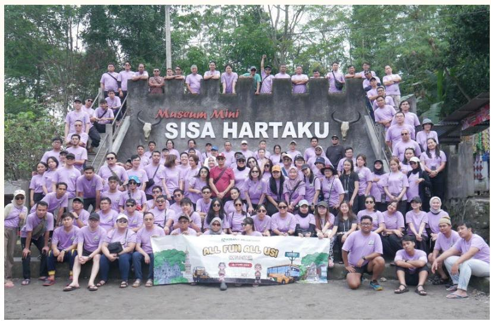

text_image

Museum Mini
SISA HARTAKU
ALL FUN ALL US

# 健康守护 筑牢生产防线

公司牢固树立安全发展理念，始终把 HSE 工作放在突出位置，扎实推进体系化建设，狠抓风险隐患双控机制。通过加强隐患排查治理、生产安全宣传培训等工作，公司持续提升安全管理水平，为可持续发展创造安全稳定的环境。

# 治理

公司依据 ISO 45001 职业健康安全管理体系要求，建立起包括《安全培训管理办法》《安全生产档案管理制度》《生产安全事故管理制度》《安全生产信息报告与事故应急处理管理办法》《安全生产目标建设考核奖罚管理办法》《承包租赁经营安全生产管理办法》《消防安全管理办法》《全员安全生产责任制度》《安全生产费用提取和使用管理规定》《工程项目安全生产督导制度》《企业安全生产监督管理暂行办法》等一系列制度规范公司安全管理。

公司及下属子公司建立了以安全生产委员会或 HSE 委员会为核心的安全、职业健康管理体系并有效实施，明确各分委会的责任主体与运行机制，且顺利通过相关认证审核，取得职业健康安全管理体系认证证书。

围绕国务院安委办、海南省政府相关安全生产要求，公司进一步建立健全全员安全生产责任制，对安全生产、消防、职业卫生、森防、三防和环保工作责任书进行修订完善，安排集团领导、总部各部门及下属企业进行签订。

# 报告期内

集团上下共签订责任书

18,499份

与相关方签订责任书

316 份

内部重要岗位

99份

# 战略

公司始终坚持“安全第一、预防为主、综合治理”的安全生产方针，修订并编制了《环境应急预案》和《安全应急预案》。公司有针对性地开展安全生产大检查和隐患排查整改工作，聚焦重点领域和薄弱环节，筑牢安全生产防线。

# 风险隐患排查整治工作

☑ 分别在四个季度集中开展安全生产隐患排查整改，制定下发《企业现场常见隐患排查指导手册》，重点抓好危化品、道路运输、消防安全、相关方作业等方面的检查和整改。共排查出各类问题隐患 3,897 项，其中重大事故隐患 4 项，一般事故隐患 3,893 项，已完成整改 3,856 项，整改完成率 98.95%。  
☑ 深刻吸取经验教训，部署在全集团范围内开展安全生产大排查大整治行动，制定下发行动方案，围绕安全履职情况、基础管理情况、现场管理情况三个方面开展排查整治。  
☑ 深刻吸取中国黄金内蒙古矿业“7·23”事故、香港大埔火灾等事故教训，部署开展同类安全隐患排查，强化外来人员安全管理，切实加强消防安全管理工作，坚决防范类似事故发生。  
☑ 安全环保部先后深入基地分公司、加工厂等单位检查抽查 38 次，现场发现各类问题隐患 483 项，下发“安全隐患整改通知书”38 份，并跟踪督办隐患的闭环整改。

# 下属子公司安全生产应急管理措施

# 金橡公司

健全并定期更新专项应急预案，组织企业开展应急预案评审，常态化开展应急演练，配备必要的应急物资与装备，实施预案改进；建立突发事件信息报告机制、突发事件舆情监测和信息披露机制。

组织 5 次应急预案演练：有限空间应急救援演练、火灾事故应急救援演练、液氨泄漏应急救援演练、消防应急救援演练、通过应急救援预案演练，检验公司应急响应实战能力，进一步提高公司应急响应的统一指挥能力、整体协调能力、现场救护能力、快速反应能力和综合管理能力。

# 林产集团

围绕应急管理开展了 3 场专项演练：消防演练、疏散演练、机械伤害事故应急处置演练。

# 云南海胶

2025 年重点开展火灾综合、有限空间事故救援、机械伤害事故救援及疏散逃生等应急演练，强化各类事故的应急处置能力，重新更新和备案安全生产事故应急预案。

# 经纬公司

定期开展应急演练，定时检查应急物资与装备，根据安全应急预案建立突发事件信息报告机制。

完成了“1月份安全考核检查”和“加工板块 HSE 联动检查”两项专项检查。

完成了 4.30 节前专项检查（五一节前安全检查）。

启动了9次防风防汛应急响应和防范检查。  
2025年开展三级标准化与双预防机制体制建设。

# 云南合盛

围绕应急管理开展了 4 场专项演练：化学药品灼伤应急演练、有限空间应急救援及化学品泄漏应急演练、公司级消防综合应急演练，覆盖了有限空间、消防、危化品等关键风险场景的应急处置，重新更新和备案安全生产事故应急预案。

# 海南合盛

组织 4 次应急预案演练：火灾事故现场处置应急演练、硫酸防泄漏处置应急演练、512 防震减灾应急演练、有限空间作业事件现场处置演练。通过应急预案演练，检验公司应急响应实战能力，进一步提高公司应急响应的统一指挥能力、整体协调能力、现场救护能力、快速反应能力和综合管理能力。

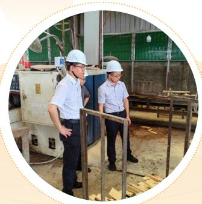

natural_image

Two engineers in hard hats inspecting industrial equipment in a factory setting (no visible text or symbols)

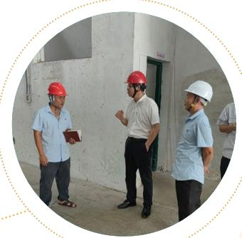

natural_image

Group of four men in hard hats and uniforms standing indoors near a concrete wall (no visible text or symbols)

金兴加工分公司开展 5S 及安全检查

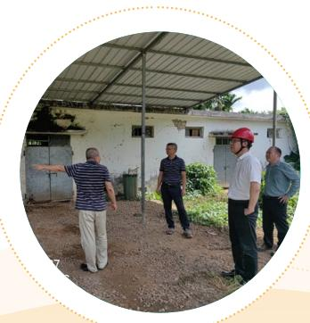

natural_image

Group of four men standing in an outdoor courtyard near a white building with a metal roof (no visible text or symbols)

金鸡岭分公司开展“海胶资产包”检查  
宝联木材加工厂开展安全检查

# 影响、风险及机遇管理

# 安全教育

公司注重员工安全意识与能力培养，广泛开展生产安全宣传教育工作。公司及下属子公司紧紧围绕“人人讲安全，个个会应急一查找身边隐患”的活动主题，精心策划并开展了一系列丰富多彩、形式多样的活动，有效普及了安全知识，强化了员工的安全意识，为公司的稳定发展奠定了坚实基础。

☑ 积极组织复工复产培训，要求基地分公司在进行割胶技术培训的过程中，将安全生产等知识培训融入其中。国庆节前专门下发安全生产工作提示，要求做好节前隐患排查、节中安全监管及节后复工复产培训。  
☑ 组织开展安全生产月活动，下发活动方案，安排部署十项系列活动。安全月期间，安全环保部组织加工企业主要负责人和安全管理人员在金联加工分公司开展 HSE 专题交流活动，组织部分加工企业开展跨厂联合检查活动。开展消防宣传月活动，在总部组织消防安全知识培训及应急演练。  
☑ 落实三级安全教育培训，对集团 2025 年新入职大学生进行公司级安全培训。全年各单位共组织安全培训 486 场次，参与培训员工达 31,247 人次；开展应急演练 72 场次，参与人数 2,113 人次。  
☑ 召开海南地区加工板块企业季度 HSE 联席会议，深入剖析典型事故案例，开展 HSE 工作自评与互评，促进管理经验交流，提升加工板块 HSE 管理水平。  
☑ 下发《安全生产管理应知应会手册》，提高下属企业主要负责人履职能力。集团安全分管领导亲自带队到 8 家基层单位开展《时时放心不下管安全》《消防安全管理》等专题安全培训，取得良好反响。

全年各单位共组织安全培训

486场次

开展应急演练

72场次

参与培训员工

31,247 人次

参与人数

2,113 人次

# | 案例

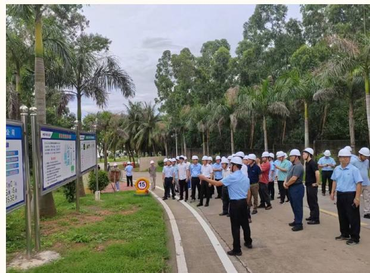

text_image

Group of people in hard hats gathered outdoors near a road with informational boards and palm trees, likely at a construction or site inspection site.

海南橡胶安委办在金联加工分公司开展“安全生产月”
加工行业 HSE 专题交流活动

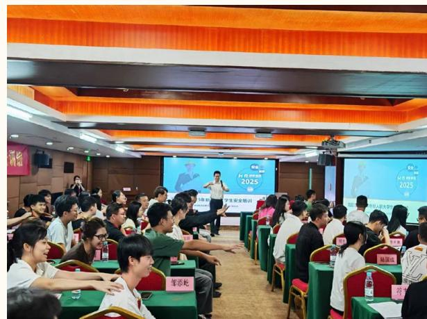

text_image

Conference hall photo with visible presentation screen displaying '2025' and audience seated in rows

海南橡胶 2025 年新入职大学生安全培训

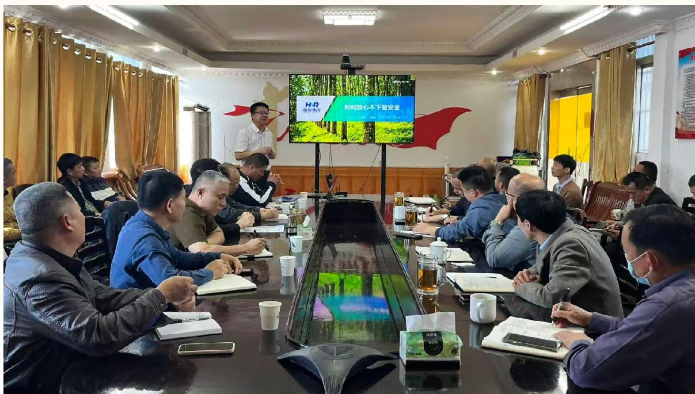

text_image

Meeting room photo with visible screen displaying 'HR' and Chinese text '即时放心不下管安全', showing participants seated around a conference table.

“时时放心不下管安全”专题培训

# 案例

# 云南合盛组织开展事故应急救援演练

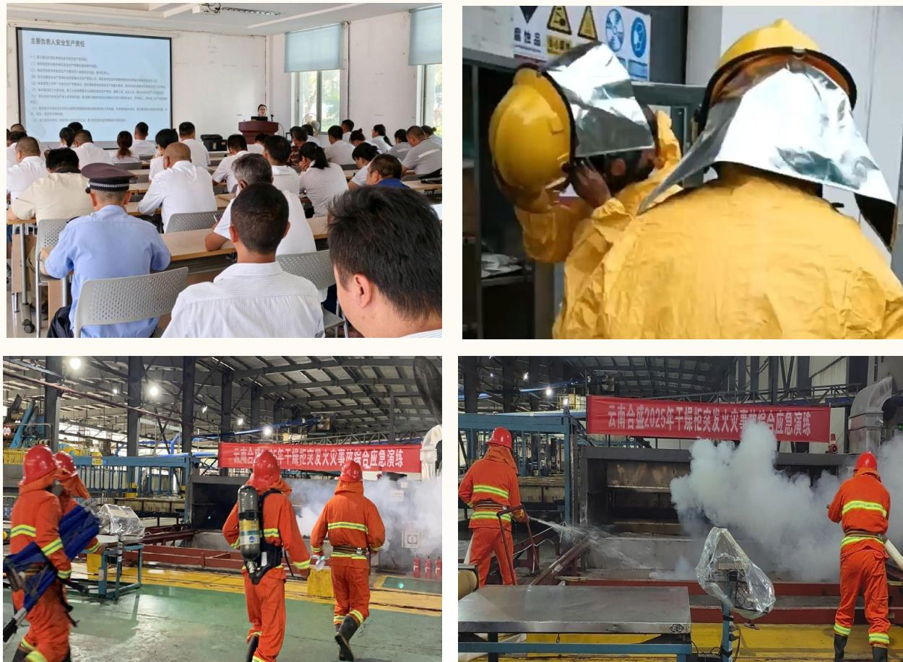

# 员工健康

公司及下属子公司每年开展职业危害因素识别与检测，全面排查生产运营过程中的潜在职业危害，并对检测不达标项及时整改，确保作业环境符合安全标准。为保障员工职业健康，公司定期组织职业病预防培训，提供劳动防护用品，开展健康体检并建立员工职业健康档案，确保员工在岗期间的健康防护措施落实到位。

公司不定期邀请外部专家开展健康讲座，涵盖颈椎保健、心肺复苏、慢性病防治及心理健康辅导等内容，帮助员工掌握健康知识，增强职业健康意识，筑牢身心健康防线。

# | 案例

# 云南合盛开展应急救护持证复审专题培训考核

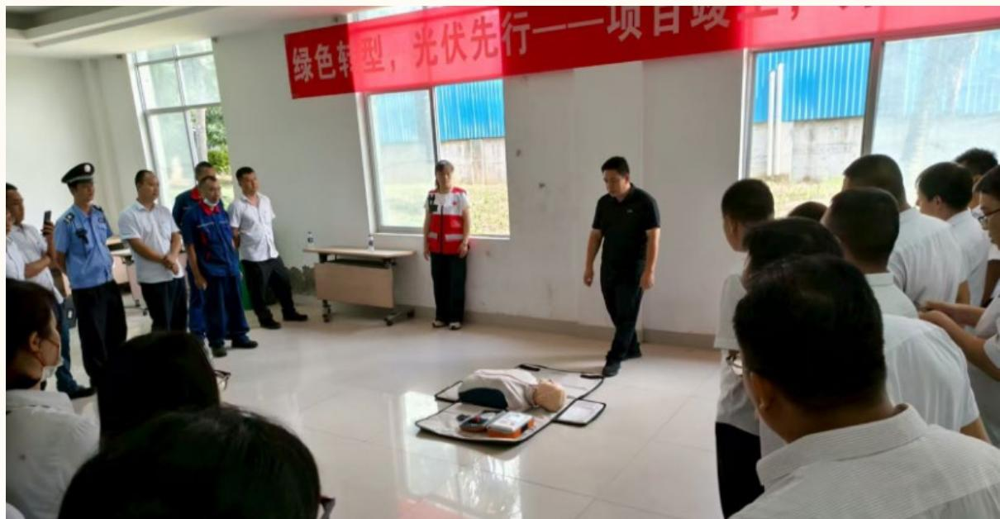

text_image

绿色转型，光伏先行——项目竣工，

# 责任追究

公司及下属子公司建立生产安全事故报告和调查处理制度，按照“四不放过”原则开展原因分析、责任追究等工作。同时根据安全生产责任书，对各部门、工厂实施考核；同步推行事故通报警示，要求事故部门或工厂召开现场警示教育会，复盘事故经过、剖析原因并落实整改。

# 工伤管理

公司依据国家《工伤保险条例》和相关法规的规定，结合实际情况制定内部工伤管理操作指引，并按时为公司员工缴纳工伤保险费用。发生工伤事故后，相关部门第一时间处置、送医，推进工伤认定、待遇申请及定期慰问，后续明确事故原因与责任并落实改进措施。

# 案例

# 云南合盛组织一线工人进行事故案例警示教育学习

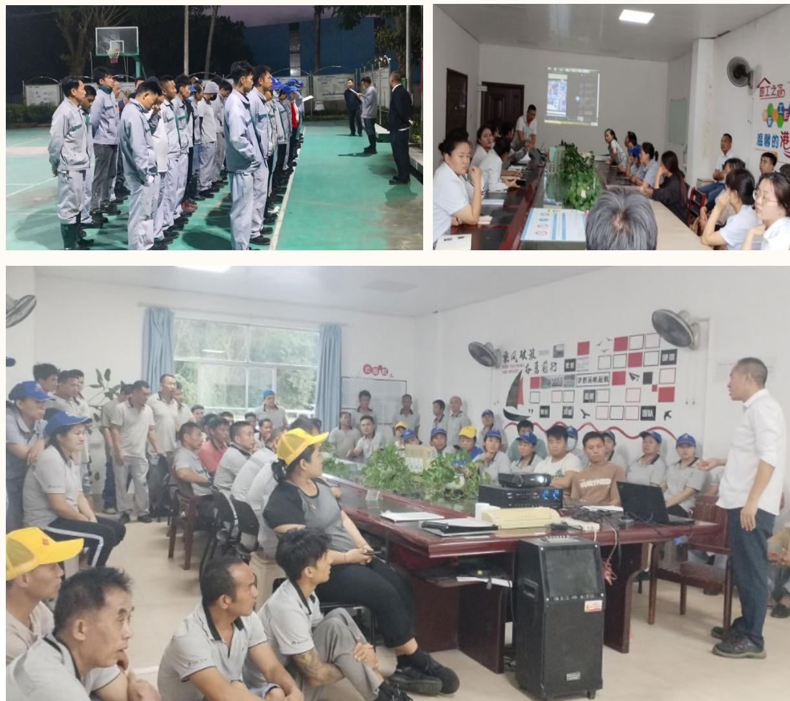

# 指标与目标

公司通过强化现场监督管理，深化隐患排查治理。报告期内，公司职业病风险岗位员工体检率100%，公司职业健康安全培训覆盖率100%。报告期内，公司及下属子公司未发生较大或重大事故、重大火灾、爆炸事故及职业病病例等事件。

# 报告期内

公司职业病风险岗位员工体检率

100%

公司职业健康安全培训覆盖率

100%

# 公司下属子公司安全生产目标

# 金橡公司

环境污染事故、被所在地政府安委办、环保等部门挂牌督办、死亡及重伤事故、重大火灾、爆炸等重大安全事故、重大责任事故和重大设备事故、健康安全、环保行政处罚、急性工业中毒和危重职业病、直接经济损失10万元以上事件为“零”。

# 林产集团

环境污染事故、被所在地政府安委办、环保等部门挂牌督办、死亡及重伤事故、重大火灾、爆炸等重大安全事故、重大责任事故和重大设备事故、健康安全、环保行政处罚、急性工业中毒和危重职业病、直接经济损失10万元以上事件为“零”。

☑ 死亡及重伤事故（生产安全、消防工作、职业卫生、环保工作、森林火灾与“三防”事故）为零。  
☑ 重大火灾（含森林火灾）、爆炸、重大泄漏等各类重大安全事故为零。  
☑ 重大责任事故和重大设备事故为零。  
☑ 环境污染事故为零。  
☑ 健康安全、环保方面被政府停产整改并行政处罚为零。  
☑ 急性工业中毒和危重职业病病例为零。  
☑ 直接经济损失 10 万元以上（未造成人员伤亡）的事故起数为零。  
员工三级安全生产教育培训率 100%。  
☑ 工作场所职业病危害因素达标率 100%。  
☑ 特种作业持证上岗为 100%。  
☑ 被云南省或所在地政府安委办、应急、生态环境等部门挂牌督办的重大安全生产事故、环保等风险为零。不发生一般及以上人身伤亡事故。

# 云南海胶

# 经纬公司

# 无重大安全事故发生。

# 云南合盛

质量目标：新员工 HSE 培训率每月保持 100%。

环境目标：危废、固废全年100%合法合规处理，废水、废气每季度100%达标排放。

职业健康目标: 一般及以上突发环境事件、重伤及以上事故、新增职业病均为零（按月统计）；重复性未遂事件每月不超过3起，损工轻伤事故每月不超过1起，隐患整改率每季度达到99%以上。

# 04

# 绿色赋能 助力永续发展

海南橡胶深入贯彻习近平总书记关于“绿水青山就是金山银山”的重要论述，积极响应国家“双碳”战略部署，将环境责任深度嵌入发展全局，全面推进节能降耗、减排治污、资源循环利用，以绿色低碳发展筑牢生态屏障，为建设美丽中国、实现可持续发展贡献产业力量。

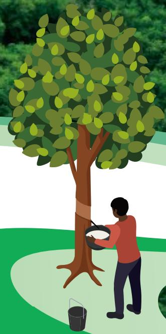

natural_image

Illustration of a person harvesting green leaves from a tree, with a bucket in the foreground (no text or symbols)

# 合规健全 夯实管理根基

公司健全环境管理制度体系，依法落实环评、排污许可与应急备案，常态化开展环保培训、应急演练及清洁生产审核，建立全流程风险防控与监测公开机制，确保污染物稳定达标、固废危废合规处置，实现全年环境合规零违规。

# 环境合规管理

# 治理

海南橡胶严格遵守《中华人民共和国环境保护法》《中华人民共和国大气污染防治法》《中华人民共和国固体废物污染环境防治法》《中华人民共和国环境影响评价法》等法律法规。公司制定《环境保护管理暂行办法》《环境信息公开制度》等制度文件，为环境管理规范化、制度化运行提供坚实保障。

公司持续完善环境管理体系，并通过了 ISO 14001 认证，构建了“董事会领导、分管环保牵头、HSE 部门统筹、工厂 HSE 主管及专职环保技术员执行”的管理架构，实现环境责任自上而下、层层落实。公司成立安全生产委员会，统筹推进环境治理工作，各层级职责清晰、分工明确。

# 战略

公司依法完成环境影响评价、排污许可申领，并将《突发环境事件应急预案》等关键文件向属地生态环境主管部门备案，构建完善环境应急机制。公司常态化开展环保培训与应急演练，持续提升员工环保意识与环境风险应对能力。公司按照生态环境局要求开展清洁生产审核工作，并通过政府相关部门验收。各厂区公司在全国节能宣传周、全国低碳日期间，均组织开展节能低碳主题宣传活动。

# 公司名称

# 环保培训内容

# 金橡公司

召开 2025 年环境风险隐患排查及培训会，共计 42 人参会，主要提升加工厂各级管理人员环保合规与隐患排查等方面能力。

# 云南合盛

报告期内开展了 1 场 HSE 基础知识手册培训，讲解了环保相关知识，参训人数 113 人；开展了 1 场环保泄漏应急演练培训，参训人数 38 人。

# 海南合盛

组织公司主管级以上管理人员开展《天然橡胶加工企业环保法规要点培训》的环保专题培训，强化员工的法律意识，进一步提升公司主管级以上管理人员的环保管理履职能力，夯实排污许可证后管理，在日常管理中注重环境保护，减少或避免环境污染。

# 影响、风险及机遇管理

公司始终将生态环境保护与利益相关方权益保障置于环境管理工作的核心位置，围绕污染物排放管控、环境风险防控、突发环境事件应对及环境监测监督四大关键维度，构建起全流程、系统化的环境管理体系。通过主动对接多方诉求、完善内部管理程序、精准识别并防控环境风险、编制备案专项应急预案、建立常态化监测与信息公开机制，全面落实环境管理责任，切实保障员工与社区居民权益，持续提升环境治理水平与风险应对能力。

# 污染物排放影响管理

- 定期与政府监管部门、行业协会、客户等利益相关方沟通，了解期望并纳入管理范畴；  
- 密切关注工厂周边社区居民反馈，避免对其生活造成不便；  
- 建立内部管理程序，及时处理社区或当地居民等利益相关方投诉，持续提升环境管理有效性。

# 环境风险管理举措

- 识别主要生态环境保护风险（不达标排放、发生较大及以上突发环境事件、建设项目环保违法违规）；  
- 指导各业务单位与生产线加强环境风险识别和防控，梳理环境风险清单；  
- 实施环境风险应急演练计划，按“三个验证、三个覆盖”原则定期完成突发环境事件应急演练，提升应对环境风险能力。

# 突发环境事件应急预案

- 编制《海南天然橡胶产业集团金橡有限公司金联橡胶加工分公司突发环境事件应急预案》，将环境事件分为四个级别；  
- 要求主动、及时采取车间应急处置方案，必要时与外部相关方联动；  
- 有环境风险评估报告、应急资源调查报告及突发环境事件应急预案，并报生态环境局备案，取得备案证。

# 系统化环境监测机制

- 公司有系统化的环境监测机制，安装在线监测系统；  
- 根据排污许可自行监测要求按频次开展监测工作，并每季度通过“全国污染源监测信息公开系统”对监测结果进行信息公开。

# 指标与目标

# 报告期内

公司未发生环境领域的违法违规情况。

# 公司名称

# 2025 年环境管理目标

# 完成情况

# 云南海胶

危废、固废 100% 合法合规处理（年度）；
废水、废气 100% 达标排放（季度）。

# 全部完成

# 经纬公司

污水处理站各项排放指标达标率 100%，不发生较大及以上环境保护责任事件，证后管理各项检测指标达标。

# 全部完成

# 海南合盛

2025 年废气主要污染物 $SO_{2}$ 、NOx 同口径对比 2024 年下降 2%。

# 全部完成

# 案例

# 海南橡胶再次获颁 FSC COC 证书

2025 年，海南橡胶再次获得由必维国际检验集团颁发的 FSC COC（产销监管链）证书，此次是针对橡胶木加工产品所颁发的 FSC COC 证书。FSC 森林认证包括森林经营认证（Forest Management，FM）和产销监管链认证（Chain of Custody，COC）。至此，海南橡胶已同时拥有 FSC FM 和 FSC COC 两个证书，其 FSC 认证产品主要包括橡胶原木、板方材、天然橡胶等木质林产品和非木质林产品。

目前，海南橡胶不仅可以对外销售FSC认证的橡胶原木和枝丫材，还可以销售FSC认证的加工类橡胶木产品。

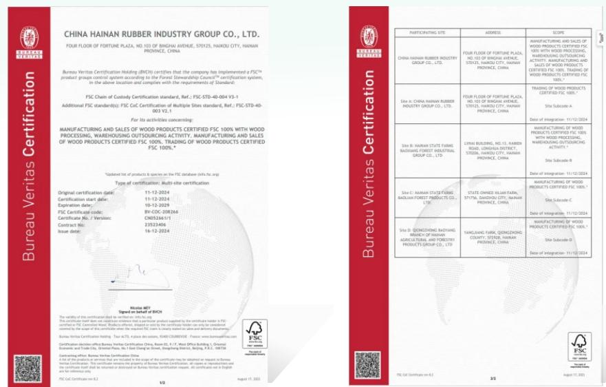

# 生物多样性保护

公司重视生物多样性保护，在提升森林生态系统多样性、水土保持、珍稀濒危动植物物种及其栖息地、自然生态系统及其他高保护价值的保护等方面发挥积极作用。

公司制定《2022年扩展FSC认证工作的实施方案》，成立FSC认证工作领导小组，负责统筹、指导和部署FSC认证工作，在公司官网公开发布《公司营林政策与认证声明》，承诺按照《中华人民共和国森林法》《中华人民共和国森林法实施条例》等相关法律法规和《FSC中国国家森林管理标准》的要求，把森林经营的管理水平提高到国际标准，充分发挥森林的生态、社会、经济三大效益，推动森林资源的可持续发展，实现森林资源的永续利用。

近年来，公司探索出以“五化”为标准的胶园建设管理模式，即“建设生态化、良种良苗化、技术革新化、管理信息化和典型示范化”，将生态保护作为胶园建设过程中的首要任务，持续提高生物多样性保护要求。

生物多样性保护具体措施

<table><tr><td>工作内容</td><td>具体措施</td><td>成果</td></tr><tr><td>建设生态胶园</td><td>结合标准化胶园和FSC认证胶园建设,抓好胶园“种、管、养、割”;建设保护区网络,在林地与重要河流、水库交接处建立缓冲区。</td><td>提升胶园生产综合水平,实现生态效益和经济效益共同发展。</td></tr><tr><td>公益林管护</td><td>对老龄公益林进行更新,优化树龄结构;加强管护和资金投入。</td><td>胶园内公益林面积比例为18.7%,提升公益林质量和生态效益,提高森林覆盖率和蓄积量。</td></tr><tr><td>可持续森林管理</td><td>通过多种生态保护措施实现森林可持续经营,推进FSC森林认证,认证产品包括橡胶木、马占、桉树等木质林产品和天然橡胶非木质林产品;签署营林政策与认证声明,遵守相关标准体系和核心价值观;开展环境影响评估并纳入森林经营规划;制定《森林监测管理程序》开展森林监测管理;开展利益方咨询与社会影响评估工作。</td><td>维持和改善生态环境,保护周边村民和社区权利,减少社会影响。</td></tr><tr><td>森林防火</td><td>集团总部及下属单位落实领导分片包干负责制,划定责任区域,包干领导实地督导检查;各基地分公司专题部署,成立指挥机构。</td><td>防火期内未发生重大森林火灾或因灾致人伤亡事故,维护职工群众生命财产和集团森林资源安全。</td></tr></table>

# 气候应对 践行低碳路径

公司积极响应“双碳”战略与地方绿色转型要求，建立全流程气候治理体系，严控温室气体排放，推进光伏、节能技改与清洁能源替代，持续深化绿色办公、绿色设计与绿色工厂建设，全面推动产业低碳转型与高质量发展。

# 应对气候变化

公司积极响应海南省政府办公厅《关于印发海南省支持天然橡胶初加工行业绿色转型发展实施方案的通知》要求，制定《天然橡胶初加工绿色转型发展实施方案》，加快推进天然橡胶初加工绿色转型。

# 治理

公司建立起以“董事会—战略与可持续发展委员会—ESG 工作小组”的三级可持续发展管理架构，负责包括应对气候变化等议题的战略决策、管理与落地执行。此外，公司成立天然橡胶初加工绿色转型发展工作领导小组，并下设初加工绿色转型发展工作办公室，全力推进公司《天然橡胶初加工绿色转型发展实施方案》，促进产业绿色、低碳化发展。

# 战略

为全面识别气候变化对公司生产经营、战略发展的潜在影响，精准挖掘低碳转型背景下的发展机遇，公司结合行业特性及气候环境趋势，对气候变化相关因素进行了系统性梳理与深度分析。

natural_image

Illustration of two people planting a potted plant in front of a large globe, with no text or symbols present.

<table><tr><td colspan="2">风险类型</td><td>风险描述及影响分析</td><td>应对策略</td></tr><tr><td rowspan="2">物理风险</td><td>急性风险</td><td>极端天气(例如暴雨、台风、洪涝、高温等)造成的生产中断、橡胶林木倾倒、固定资产贬值、劳动力损失、设施养护成本增加等,影响橡胶产品交付。</td><td>建立气象信息的定期追踪机制,设立应急小组,制定对极端天气及突发环境事件的应急预案。</td></tr><tr><td>慢性风险</td><td>全球气候变暖,海平面上升,季节变化、平均年降水量增多等,影响生产过程、物流运输、办公运营等环节,增加运营成本。</td><td>制定气候变化应急预案,长期关注气候变化趋势及预警;对沿海地区设施进行风险评估,若风险过高,提前制定搬迁计划。</td></tr><tr><td rowspan="4">转型风险</td><td>政策和法律风险</td><td>政府对气候相关的信息披露要求日趋严格,公司的合规性管理压力逐步增加;生产经营产生的碳排放需加强管控,响应绿色转型要求。</td><td>完善碳排放及产品碳足迹管理体系,设定气候变化相关管理目标,持续优化能源结构与节能降碳举措,加强绿色低碳技术研发;实时追踪国内外市场温室气体排放相关法律法规,细化公司内部环境管理体系,以及时应对新的法律法规及监管要求。</td></tr><tr><td>技术风险</td><td>为推进碳减排,引进节能降耗设备或清洁技术,推进低碳技术研发但存在失败的风险。</td><td>定期评估行业内新技术发展趋势,开展绿色低碳方向的研究。</td></tr><tr><td>市场风险</td><td>资本市场、客户及其他利益相关方对公司的降碳行为日趋关注,开始寻求绿色低碳产品并对绿色供应链有要求,可能导致现有产品的需求量下降。</td><td>积极宣传,展示应对气候风险的决心和能力;关注碳市场政策变化,提前布局绿色技术研发、绿色供应链等以满足客户及市场需求。</td></tr><tr><td>声誉风险</td><td>客户等利益相关方日益关注公司在应对气候变化方面的表现,若未积极开展气候变化应对行动,可能无法满足当地监管要求及利益相关方期待,从而导致自身形象和声誉受损。</td><td>持续优化公司环境管理体系,强化应对气候变化的能力,合规披露,加强负面舆情监测,主动跟进整改,降低对周边环境的负面影响。</td></tr></table>

<table><tr><td colspan="2">机遇类型</td><td>机遇描述及影响分析</td><td>应对策略</td></tr><tr><td rowspan="5">气候机遇</td><td>资源效率</td><td>优化资源管理体系,提高资源使用效率,节约资源消耗,节约运营成本。</td><td>制定能源管理目标和计划,推动生产运营过程中的设备节能技改与升级。</td></tr><tr><td>能源来源</td><td>使用可再生能源、清洁能源,积极开展光伏发电项目,满足生产及办公能源需求,降低对传统能源的依赖。</td><td>制定可再生能源发展规划,优化能源结构。</td></tr><tr><td>产品与服务</td><td>实施天然橡胶初加工行业绿色转型发展方案,推动橡胶初加工生产全流程自动化、智能化、绿色化、低碳化发展;探索研发低氨、无氨浓缩乳胶产品。</td><td>制定针对性的产品研发计划,加强品牌推广,提升产品市场知名度。</td></tr><tr><td>市场</td><td>提供符合客户偏好以及满足其碳中和需求的低碳产品,从而增加市场份额;政府政策鼓励带来的补贴及其他利好。</td><td>研究国内外气候相关产业政策和市场趋势,制定市场进入策略;积极响应政府绿色转型政策,加强机构合作,提升企业在产业绿色转型方面的影响力。</td></tr><tr><td>韧性/适应性</td><td>建立完善的气候风险管理体系,并将气候风险纳入全面风险管理体系中,不断提升公司应对气候风险的能力和韧性。</td><td>制定气候风险相关应急预案,组织员工应急演练;开展气候风险相关培训,提升员工应对气候风险的意识与能力;强化供应链合作,增强供应链韧性。</td></tr></table>

# 影响、风险及机遇管理

公司建立了常态化的气候相关影响、风险和机遇监测体系，通过建立相应能耗、温室气体排放统计台账及有关应急预案，定期开展数据汇总分析，跟踪风险与机遇的变化趋势。

# 步骤一

通过对标交易所指南、TCFD等框架气候风险与机遇类别，进行初步盘点，产出气候风险与机遇清单，并将相关风险项纳入合规风险库；

# 步骤二

开展气候风险与机遇影响评估，定性评估气候对公司业务策略的影响；

# 步骤三

针对实质性风险与机遇加强气候风险应对策略，定期监测风险管控的提升进展。

# 指标与目标

公司严格遵循《联合国气候变化框架公约》，积极响应“双碳”政策号召，紧扣自身业务发展战略与行业低碳转型趋势，建立“双碳”相关评估指标，提升合规性与战略引领性。

# 温室气体排放管理

公司建立《碳达峰碳中和行动方案》《能源管理手册》《能源管理办法》等内部管理制度。公司对于生产运营过程中使用的电、天然气、柴油等主要能源，通过多维方式进行能源节约。公司通过开展光伏发电、沼气回收利用、推广生物质燃料等清洁能源利用项目，有效减少生产运营过程中的环境及气候影响。

# 公司排放温室气体的主要来源

天然橡胶加工生产干燥环节煤炭和厂内专用行走机械使用柴油的消耗造成的直接二氧化碳排放量

# 范围1

# 范围 2

净购入电力转换的间接二氧化碳排放量

# 排放温室气体核算方法

原始排放系数来自 2006 年 IPCC 国家温室气体清单指南，第 2 卷，表 2.3;

燃料低位热值及氧化率来自《工业和其他行业企业温室气体排放核算方法与报告指南（试行）》；

电力二氧化碳排放因子采用2025年12月31日由生态环境部与国家统计局联合发布的《2023年电力二氧化碳排放因子》。

# 绿色办公

海南橡胶积极推进绿色办公理念，通过多维度举措将环保意识融入企业文化。在数字化转型方面，公司全面部署视频会议系统、在线 OA 办公平台及 ERP 管理系统，实现了办公流程的无纸化运作。与此同时，公司在办公区域醒目位置张贴环保宣传标语，通过潜移默化的方式培养员工的绿色行为习惯，共同构建一个环保、高效、和谐的现代化办公环境。

# 绿色设计

# 云南海胶

为减少全生命周期环境负面影响，公司采取橡胶原料油布覆盖、通过喷洒除臭剂及定期维护现有抽湿排气筒臭气治理设施，安排专人负责投加除臭药剂并如实填报运行记录，设施运行效果良好，报告期内无有效投诉及环境处罚。

# 云南合盛

为减少全生命周期环境负面影响，公司采取橡胶原料油布覆盖、通过雾炮机喷射除臭剂及降尘、新建 VOCs 处理系统等措施。实施后，VOCs 排放明显降低且稳定达标，除臭效果理想。

# 绿色工厂

# 金橡公司

采用噪声小，能耗低的磁悬浮、空气悬浮风机更换噪音大、高耗能的罗茨鼓风机，将能耗与噪声有效降低。

# 云南海胶

持续加强绿色工艺创新，落实两高生产设备、工艺改进工作。2025年将热源工厂废水处理的罗茨曝气风机更换为低能耗、低噪声的磁悬浮风机。

# 云南合盛

2025 年 3MW 光伏项目已竣工验收并正式投入使用，2025 年发电量 2,951,666 千瓦时。逐步替换燃油叉车，已采购 2 台新能源电动叉车投入使用。

报告期内，公司牵头制定了国内首个《温室气体产品碳足迹量化方法与要求天然橡胶产品》团体标准，标志着我国天然橡胶产业在碳足迹核算标准化方面取得了重要突破，填补了国内天然橡胶领域产品碳足迹的空白。

报告期内，海南合盛获得“省级绿色工厂”；云南合盛通过了能源体系认证，云南海胶达维工厂、华热亚工厂已取得2个产品碳足迹证书。

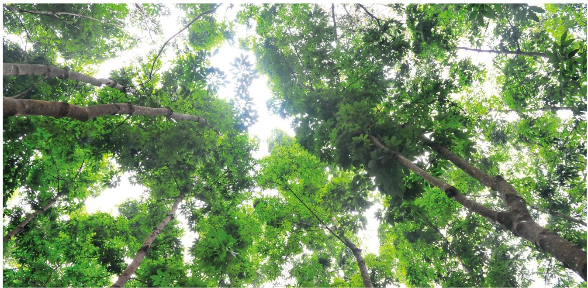

natural_image

Close-up of dense green tree branches with sunlight filtering through, no visible text or symbols

# 案例

# 云南海胶两款橡胶产品获碳足迹证书

2025 年 8 月, 云南海胶下属华热亚厂生产的 20 号复合胶 (TSR20) 与达维厂生产的技术分级橡胶 -10 号胶 (TSR10) 成功获得碳足迹证书, 标志这两款产品在全生命周期的低碳环保表现获得权威认可, 也标志着云南海胶践行国家“双碳”目标、推动绿色发展迈出了坚实一步。

碳足迹证书是衡量产品全生命周期碳排放的重要凭证，此次认证提升了云南海胶 TSR20 和 TSR10 产品的环保竞争力，使其更契合国际绿色贸易规则，有助于提升市场认可度和客户信赖度，为打破国际贸易绿色壁垒，提升品牌影响力奠定基础。

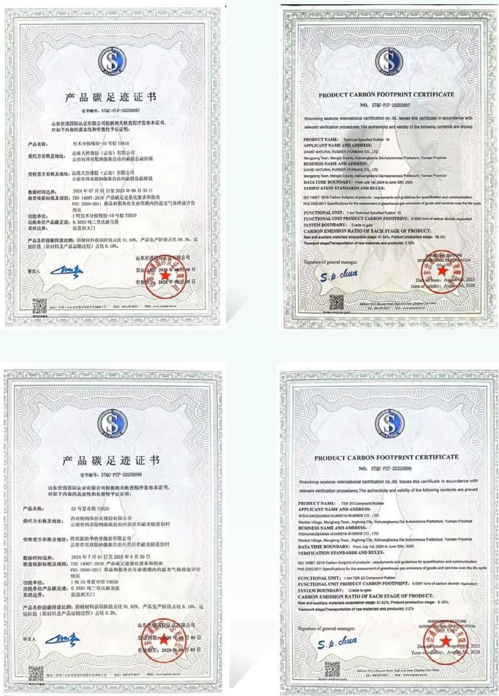  
产品碳足迹证书

# 资源集约 提升利用效能

公司坚持节水、节能、节材协同推进，健全水资源、能源、物料全流程管理体系。以“大循环 + 小循环”提升水资源利用效率，推行中水回用与废水循环；完善能源管理制度，推广光伏、高效风机等节能降碳技术，加快清洁能源替代；落实包装循环复用，推动资源高效利用与绿色低碳转型。

# 水资源管理

公司高度重视水资源管理，坚持“依法管水，科学用水，严格节水管理，促进节约用水”原则，制定创建节水型企业工作实施方案，创建节水型企业领导小组，加强对节水工作的组织领导，建立节水工作长效机制。公司通过优化生产流程，力求降低不必要的水资源消耗。公司坚持在橡胶初加工中推行乳清水循环使用，将生产过程中产生的中水回用到生产或厂区内淋灌，致力于实现污水“零排放”，不断提高水资源重复使用率，以减轻对自然水资源的压力。

公司生产用水主要用于冲洗、冷却等环节，用水结构以中水回用为主，新鲜水取自经水资源论证的合规地表水（通过厂区附近大河取水，取水口合规备案），全程合法合规。通过构建“大循环 + 小循环”两级水资源回收利用体系，最大化减少新鲜水取用量，提升水资源利用效率。

# 中水“大循环”

建设完整污水处理系统及配套中水回用池、循环池与回用设施，生产污水经处理后全域回用于生产环节。

# 车间“小循环”

- 按工艺段水质需求精准实现就近回用，包括在乳标胶生产线旁设置漂胶水收集池，将收集水回用至凝固槽；  
- 通过潜水泵实现胶槽间漂胶水导槽复用；  
- 针对前端工艺水质要求较低的特点，将后端污水收集回抽至前端使用；  
- 将设备冷却用水回收，作为干燥车间除尘设备的喷淋用水。

公司积极开展废水治理与节水管理宣传教育，系统普及国家及企业相关法律法规、制度标准和科学知识，持续提升全员节水治污责任意识与行动自觉。通过主题宣传、张贴海报等多种形式，广泛传播绿色节水理念，引导员工主动践行节约用水，共同营造绿色低碳、可持续的生产生活环境。

# 能源管理

公司建立健全能源管理体系，发布《能源管理手册》《能源管理办法》等制度文件。2025年，云南合盛通过能源管理体系认证。

公司能源利用主要集中于海洋油气装备陆地制造与海上施工作业环节、生产加工干燥环节的煤炭消耗以及生产加工全过程电力消耗，能源品类涵盖石油、电力等传统能源及天然气、风能、太阳能、水能等清洁能源，以外购电力、柴油、天然气为主要消费类型。

公司针对生产运营中的电力、天然气、柴油等主要用能，采取多元化节能措施；同时推进光伏发电、沼气回收、生物质燃料替代等清洁能源利用项目，有效降低生产运营的环境与气候影响。

# 公司名称

# 节能减排措施

<table><tr><td>金橡公司</td><td>光伏发电项目2025年,公司稳步推进金联二期、金星、金隆等加工厂光伏发电项目建设。其中,金联二期、金星分布式光伏项目已完成主体建设并实现并网发电;金隆光伏项目主体完工,金石、金水等工厂光伏项目计划于2026年停割期开工建设。2025年,金橡公司光伏总发电量785.2万度,折合节约标准煤946.81吨;其中厂内自用353.7万度,折合节约标准煤434.7吨。设备节能升级公司持续推进设备节能改造以降低生产碳排放。报告期内,将高噪声、高能耗、高运维成本的罗茨鼓风机,替换为低噪、高效、低碳的磁悬浮鼓风机;完成旗下7家加工分公司高能耗电机升级,全面改用磁悬浮与空气悬浮风机,显著降低能源消耗。</td></tr><tr><td>云南海胶</td><td>公司将热源工厂原有罗茨风机替换为磁悬浮离心式鼓风机,用新一代高效节能风机替代传统风机,节能显著,维护简单,噪声低,下步逐步推动达维等其他工厂罗茨鼓风机更换工作。</td></tr><tr><td>云南合盛</td><td>云南合盛3MW光伏项目已竣工验收,正式投入使用,2025年发电量2,951,666千瓦时;逐步采用清洁能源叉车替换燃油叉车,已采用2台电动叉车;厂区内路灯采用太阳能路灯;将勐润分公司原有罗茨风机替换为磁悬浮离心式鼓风机,用新一代高效节能风机替代传统风机,节能显著,维护简单,噪声低。</td></tr></table>

公司以全国低碳日、节能宣传周为契机，开展系列主题活动，强化全员节能减排意识。2025年6月节能宣传周期间，海南合盛组织全体员工观看节能宣传纪录片、学习节能宣传招贴画，引导员工树立绿色共享发展理念，自觉提升节能、低碳、环保意识，推动绿色低碳理念融入日常工作。

# 物料管理及循环利用

公司依据《天然生胶标准橡胶包装、标志、贮存和运输》等规范要求，制定《产品包装管理细则》等制度文件，优先采用可循环包装材料。铁托盘与包装箱随成品出库，产品交付后统一回收、循环复用，有效延长包装材料生命周期，降低资源消耗与环境负荷。

# 污染防治 厚植自然本底

公司通过强化环保运行过程管理效能，依照三废对照检查表完善三废管理标准，加强废水、废气运行检查和管理，提升环保管理技能水平，加强环保设备设施维修保养与更新工作，确保三废合规处理与排放。

# 公司设定主要污染物减排目标

实现污水、噪声等污染物排放达标率 100%，危险废物与一般固体废物合规处置率 100%，垃圾分类管理覆盖率 100%。报告期内，公司各项目标均已全面达成。

# 废水排放

公司制定《天然橡胶加工污水处理管理办法》《天然橡胶初加工污水处理操作规程》等制度文件，根据最新的环保法律法规修订《废水污染防治标准》，规范污水处理全流程管理。废水监测涵盖 SS、pH、COD、氨氮、BOD $_{5}$ 、TP、动植物油、色度等指标，水质稳定符合 GB 8978-1996《污水综合排放标准》限值要求。

公司遵循“清污分流、雨污分流”原则，建设污水处理站，结合污染因子特征采用多元化处理工艺，设施运行稳定可靠。工业废水与生活污水经处理后，95%以上回用于生产；以凝标胶生产为主的工厂实现废水封闭循环、不外排；其余废水严格按照排污许可证要求达标排放。

公司持续推进环保设施升级改造：维修老旧在线监控设备，新建污泥脱水系统提升有机污泥处置能力；改造厌氧工艺、脱硫系统、石灰调节池，升级AO系统并新增曝气器与鼓风系统，强化处理效果；行业首创应用膜除磷工艺处理橡胶初加工废水，进一步提升处理效率，确保废水100%稳定达标排放。

# 废气排放

公司修订《废气和恶臭污染防治标准》，配套建设废气污染防治设施，按排污许可证要求委托第三方开展证后定期监测，废气排放稳定达标。

公司对浓乳生产单元开展氨气监测，统一各加工分公司监测设备，强化作业环境安全管控并纳入月度考核。采用不锈钢骨架 + 亚克力板面层封闭生产车间与收集池隔墙，配套投用除氨系统，行业首创实现氨气无组织排放有效管控。废水处理系统各工艺段臭气经除臭设施处理后达标排放；喇叭口胶堆放场实施全封闭库房改造，标胶车间凝固区完成两侧密封治理，有效遏制 VOCs 无组织逸散，降低环境影响。

# 固体废弃物排放

公司遵循减量、再利用原则，制定《固体废弃物管理办法》《废弃物分类管理细则》《危险废物管理制度》《危险废物污染防治责任制度》《危险废物台账管理制度》等制度文件，推进固废综合利用与处理。公司的废弃物分为危险废物、工业垃圾、生活垃圾、建筑垃圾与废弃油脂等，并为各类固体废弃物设置标识并专设区域存放。其中工业垃圾委托第三方回收利用，生产废料进行再利用或出售，污泥进行脱水处理后综合利用，危险废弃物由资质单位规范化处置。

2025 年，公司危险废物合规处置率 100%。

<table><tr><td>废弃物类型</td><td>处理措施</td><td>管理与减量化措施及效果</td></tr><tr><td>无害废弃物</td><td>一般废弃物的储存场所进行改造,完善现场标识,对可回收固体废物以及生活垃圾、建筑垃圾等不可回收固体废物进行分类收集;对于生活垃圾,定点收集后委托环卫及时清运;对于一般工业固废,实施分类收集、妥善暂存,交由专业处理单位回收处理。</td><td>公司聚焦碎胶废料回收再利用,构建“废料—处理—再生原料”循环闭环,以可回收材料替代部分原生原料,有效削减固体废物排放。同时,公司与当地环保砖厂、社区、生产队等单位签订煤渣转运协议,煤渣由合作方自行承担运费、免费清运回收,用于道路铺垫、环保砖及水泥生产等场景,实现工业固废资源化协同利用。</td></tr><tr><td>有害废弃物</td><td>精准源头分类:全面辨识危险废弃物产生环节,委托有专业资质的单位进行废弃物属性鉴别,规范危险废弃物标志标识,建立危险废弃物清单及台账。严控收贮风险:依法依规开展危险废弃物暂存设施建设和运维,规范分类、分区贮存,严禁露天堆放。</td><td>工厂均设有危废暂存间,并已在全国危废管理系统注册、备案,建立有完善的管理制度及台账,运行过程中规范分类、分区贮存,并与具备专业危废处理资质单位签订危废处理协议,由第三方专业资质单位转移处置。针对有害废弃物,在生产一线相关部门完成使用后,将废包装袋、废液、废试剂瓶等放在指定区域并定时转存至危废间,同时由专人进行台账登记。</td></tr></table>

# 噪音管理

为防治噪声污染，保障公司员工健康，营造一个安静、舒适的办公环境，公司制定噪音管理相关制度，为处在噪音较大的岗位员工配备耳塞等劳动防护用品。

# 附录

# 关键绩效表

环境范畴

<table><tr><td>一级指标</td><td>二级指标</td><td>三级指标</td><td>单位</td><td>2025</td><td>2024</td></tr><tr><td rowspan="13">气候变化</td><td rowspan="12">温室气体排放管理</td><td>温室气体排放总量(范围1和范围2)*</td><td>吨二氧化碳当量</td><td>217,597.45</td><td>198,945.80</td></tr><tr><td>每百万营收温室气体排放总量(范围1和范围2)*</td><td>吨二氧化碳当量/百万营收</td><td>5.15</td><td>4.74</td></tr><tr><td>直接(范围1)温室气体排放*</td><td>吨二氧化碳当量</td><td>82,974.19</td><td>61,196.86</td></tr><tr><td>每百万营收直接(范围1)温室气体排放*</td><td>吨二氧化碳当量/百万营收</td><td>1.96</td><td>1.46</td></tr><tr><td>间接(范围2)温室气体排放*</td><td>吨二氧化碳当量</td><td>134,623.26</td><td>137,748.94</td></tr><tr><td>每百万营收间接(范围2)温室气体排放*</td><td>吨二氧化碳当量/百万营收</td><td>3.19</td><td>3.28</td></tr><tr><td>其他间接(范围3)温室气体排放*</td><td>吨二氧化碳当量</td><td>5,176,501</td><td>/</td></tr><tr><td>每百万营收其他间接(范围3)温室气体排放*</td><td>吨二氧化碳当量/百万营收</td><td>122.56</td><td>/</td></tr><tr><td>温室气体抵消量(范围1和范围2)</td><td>吨二氧化碳当量</td><td>3,333.54</td><td>/</td></tr><tr><td>直接温室气体抵消量(范围1)</td><td>吨二氧化碳当量</td><td>0</td><td>/</td></tr><tr><td>间接温室气体抵消量(范围2)</td><td>吨二氧化碳当量</td><td>3,333.54</td><td>/</td></tr><tr><td>二氧化碳排放量合计</td><td>万吨二氧化碳当量</td><td>19,296.07</td><td>/</td></tr><tr><td>碳资产管理</td><td>通过碳足迹认证的产品数量</td><td>个</td><td>2</td><td>/</td></tr></table>

注：带 \* 部分数据统计口径含合盛农业海外工厂，其他环境绩效指标数据来源为国内工厂

<table><tr><td>一级指标</td><td>二级指标</td><td>三级指标</td><td>单位</td><td>2025</td><td>2024</td></tr><tr><td rowspan="22">环境管理</td><td rowspan="10">环境保护治理</td><td>节能环保投入占产值(收入)比重</td><td>%</td><td>0.04</td><td>/</td></tr><tr><td>其中:节能投入</td><td>万元</td><td>80</td><td>/</td></tr><tr><td>环保投入</td><td>万元</td><td>1,665.69</td><td>4,913.29</td></tr><tr><td>环保投入占营收比例</td><td>%</td><td>0.04</td><td>0.10</td></tr><tr><td>生态环境污染源</td><td>个</td><td>18</td><td>/</td></tr><tr><td>生态环境风险点</td><td>个</td><td>16</td><td>/</td></tr><tr><td>废气治理设施数</td><td>套</td><td>33</td><td>/</td></tr><tr><td>废气治理设施处理能力</td><td>万立方米/年</td><td>223,194.50</td><td>/</td></tr><tr><td>废水治理设施数</td><td>套</td><td>11</td><td>/</td></tr><tr><td>废水治理设施处理能力</td><td>万吨/年</td><td>494.65</td><td>/</td></tr><tr><td>环境保护相关目标</td><td>报告期内因环境事件受到生态环境等有关部门重大行政处罚的处罚金额</td><td>万元</td><td>0</td><td>/</td></tr><tr><td rowspan="11">污染物排放</td><td>废水排放量</td><td>吨</td><td>217,704.95</td><td>274,604.67</td></tr><tr><td>每百万营收废水排放量</td><td>吨/百万营收</td><td>5.15</td><td>5.53</td></tr><tr><td>悬浮物</td><td>吨</td><td>3.63</td><td>1.72</td></tr><tr><td>五日生化需氧量(BOD5)</td><td>吨</td><td>3.21</td><td>1.38</td></tr><tr><td>化学需氧量COD</td><td>吨</td><td>16.78</td><td>15.71</td></tr><tr><td>氨氮</td><td>吨</td><td>1.42</td><td>0.61</td></tr><tr><td>总氮</td><td>吨</td><td>1.01</td><td>0.86</td></tr><tr><td>总磷</td><td>吨</td><td>0.17</td><td>0.38</td></tr><tr><td>废气排放总量</td><td>立方米</td><td>1,372,743,039.63</td><td>1,375,736,347.70</td></tr><tr><td>颗粒物</td><td>吨</td><td>10.95</td><td>16.39</td></tr><tr><td>氨气</td><td>吨</td><td>1.02</td><td>2.82</td></tr><tr><td rowspan="23">环境管理</td><td rowspan="9">污染物排放</td><td>硫化氢</td><td>吨</td><td>0.26</td><td>0.31</td></tr><tr><td>氮氧化物排放量</td><td>吨</td><td>35.23</td><td>30.60</td></tr><tr><td>二氧化硫排放量</td><td>吨</td><td>34.06</td><td>18.68</td></tr><tr><td>挥发性有机化合物 (VOCs) 排放量</td><td>吨</td><td>49.97</td><td>3.91</td></tr><tr><td>每百万营收氮氧化物排放量</td><td>吨/百万营收</td><td>0.0008</td><td>/</td></tr><tr><td>每百万营收硫氧化物排放量(吨/CNY)</td><td>吨/百万营收</td><td>0.0008</td><td>/</td></tr><tr><td>每百万营收悬浮粒子与颗粒物(PM)排放量(吨/CNY)</td><td>吨/百万营收</td><td>0.0003</td><td>/</td></tr><tr><td>每百万营收挥发性有机化合物(VOCs)排放量(吨/CNY)</td><td>吨/百万营收</td><td>0.0012</td><td>/</td></tr><tr><td>非甲烷总烃排放量</td><td>吨</td><td>1</td><td>/</td></tr><tr><td rowspan="14">废弃物处理</td><td>产生的无害废弃物总量</td><td>吨</td><td>2,009.70</td><td>2,140.57</td></tr><tr><td>每百万营收产生的无害废弃物总量</td><td>吨/百万营收</td><td>0.0476</td><td>/</td></tr><tr><td>产生的有害废弃物总量</td><td>吨</td><td>11.64</td><td>17.33</td></tr><tr><td>每百万营收产生的有害废弃物总量</td><td>吨/百万营收</td><td>0.0003</td><td>/</td></tr><tr><td>回收再利用废弃物总量</td><td>吨</td><td>1,498.66</td><td>927.01</td></tr><tr><td>每百万营收废弃物回收利用总量</td><td>吨/百万营收</td><td>0.0355</td><td>/</td></tr><tr><td>回收再利用的废弃物占比</td><td>%</td><td>73.94</td><td>/</td></tr><tr><td>有害废弃物循环(回收)利用总量</td><td>吨</td><td>0</td><td>0.18</td></tr><tr><td>无害废弃物循环(回收)利用总量</td><td>吨</td><td>865.85</td><td>926.83</td></tr><tr><td>固体废弃物处置总量</td><td>吨</td><td>864.94</td><td>/</td></tr><tr><td>无害废弃物处置量</td><td>吨</td><td>856.85</td><td>/</td></tr><tr><td>有害废弃物处置量</td><td>吨</td><td>8.09</td><td>/</td></tr><tr><td>无害废弃物处综合利用量</td><td>吨</td><td>897.99</td><td>/</td></tr><tr><td>无害废弃物处综合利用率</td><td>%</td><td>100</td><td>/</td></tr></table>

<table><tr><td>一级指标</td><td>二级指标</td><td>三级指标</td><td>单位</td><td>2025</td><td>2024</td></tr><tr><td rowspan="19">资源利用</td><td rowspan="5">水资源管理</td><td>总用水量*</td><td>吨</td><td>8,952,383.30</td><td>2,372,764.90</td></tr><tr><td>每百万营收总用水量*</td><td>吨/百万营收</td><td>211.96</td><td>/</td></tr><tr><td>新鲜水用水量*</td><td>吨</td><td>5,764,064</td><td>/</td></tr><tr><td>水循环与再利用总量</td><td>吨</td><td>3,668,245.58</td><td>2,122,175.80</td></tr><tr><td>水循环与再利用率</td><td>%</td><td>40.98</td><td>/</td></tr><tr><td rowspan="14">能源管理</td><td>原煤(标准量)</td><td>万吨标准煤</td><td>0.73</td><td>/</td></tr><tr><td>电力*</td><td>万千瓦时</td><td>20,970.80</td><td>/</td></tr><tr><td>汽油</td><td>吨标准煤</td><td>11.55</td><td>22.31</td></tr><tr><td>柴油</td><td>吨标准煤</td><td>477.43</td><td>2,214.91</td></tr><tr><td>天然气*</td><td>立方米</td><td>17,493,647.68</td><td>18,324,425.96</td></tr><tr><td>热力</td><td>万百万千焦</td><td>527.10</td><td>/</td></tr><tr><td>直接能源消耗量*</td><td>吨标准煤</td><td>32,261.18</td><td>39,298.80</td></tr><tr><td>间接能源消耗量*</td><td>吨标准煤</td><td>24,449.63</td><td>28,490.99</td></tr><tr><td>蒸汽消耗量</td><td>吨标准煤</td><td>1,890</td><td>/</td></tr><tr><td>外购电力*</td><td>千瓦时</td><td>202,712,533.43</td><td>231,822,521</td></tr><tr><td>煤炭使用量*</td><td>吨</td><td>18,303.92</td><td>12,654.70</td></tr><tr><td>燃油消耗量*</td><td>吨标准煤</td><td>8,379.77</td><td>/</td></tr><tr><td>天然气节约量</td><td>立方米</td><td>0</td><td>115,125</td></tr><tr><td>可再生能源消耗量*</td><td>吨标准煤</td><td>17,385.83</td><td>/</td></tr><tr><td rowspan="22">资源利用</td><td rowspan="11">能源管理</td><td>太阳能消耗量*</td><td>吨标准煤</td><td>535.01</td><td>/</td></tr><tr><td>生物质能消耗量*</td><td>吨标准煤</td><td>16,850.81</td><td>12,945.67</td></tr><tr><td>交易绿色电力证书</td><td>万张</td><td>0.91</td><td>/</td></tr><tr><td>绿电交易总量</td><td>万千瓦时</td><td>913.80</td><td>/</td></tr><tr><td>光伏装机容量</td><td>MW</td><td>13.14</td><td>/</td></tr><tr><td>光伏发电量</td><td>kwh</td><td>12,018,507</td><td>4,937,044</td></tr><tr><td>光伏发电上网电量</td><td>kwh</td><td>5,022,140</td><td>1,806,459</td></tr><tr><td>自用光伏发电量*</td><td>kwh</td><td>6,995,501</td><td>21,320,585</td></tr><tr><td>沼气生产量</td><td>立方米</td><td>302,000</td><td>483,012</td></tr><tr><td>沼气使用量</td><td>立方米</td><td>299,527</td><td>478,313</td></tr><tr><td>企业能耗强度*</td><td>吨标准煤/百万营收</td><td>1.26</td><td>1.36</td></tr><tr><td rowspan="11">物料管理及循环利用</td><td>不可再生物料消耗量</td><td>吨</td><td>8,568.49</td><td>/</td></tr><tr><td>有毒有害物料消耗量</td><td>吨</td><td>484</td><td>/</td></tr><tr><td>可循环使用包装材料使用量</td><td>吨</td><td>1,625.38</td><td>/</td></tr><tr><td>不可循环使用包装材料使用量</td><td>吨</td><td>1,579.93</td><td>/</td></tr><tr><td>金属包材使用量</td><td>吨</td><td>1,586.77</td><td>2,205.83</td></tr><tr><td>塑料包材使用量</td><td>吨</td><td>857.24</td><td>486.69</td></tr><tr><td>纸箱包材使用量</td><td>吨</td><td>761.30</td><td>322.40</td></tr><tr><td>木材包材使用量</td><td>吨</td><td>0</td><td>3.22</td></tr><tr><td>包装材料使用总量</td><td>吨</td><td>3,205.31</td><td>2,831.70</td></tr><tr><td>包装材料回收使用量</td><td>吨</td><td>1,625.38</td><td>2,408.97</td></tr><tr><td>包装材料循环使用比例</td><td>%</td><td>50.71</td><td>85.07</td></tr></table>

<table><tr><td>一级指标</td><td>二级指标</td><td>三级指标</td><td>单位</td><td>2025</td><td>2024</td></tr><tr><td rowspan="11">行业</td><td rowspan="11">橡胶种植</td><td>橡胶种植园面积</td><td>平方米</td><td>2,613,346,400</td><td>2,613,346,400</td></tr><tr><td>橡胶种植园产生的碳汇量</td><td>吨二氧化碳当量</td><td>1,718,578.20</td><td>1,897,420.40</td></tr><tr><td>报告期公益造林面积</td><td>平方米</td><td>3,682,629.84</td><td>2,498,845.83</td></tr><tr><td>管护生态公益林面积</td><td>平方米</td><td>482,956,290.39</td><td>512,501,895.83</td></tr><tr><td>FSC认证橡胶林面积</td><td>平方米</td><td>1,028,733,643.64</td><td>1,028,733,643.64</td></tr><tr><td>报告期新增标准化胶园面积</td><td>平方米</td><td>0</td><td>233,334,500</td></tr><tr><td>累计标准化胶园面积</td><td>平方米</td><td>1,200,006,000</td><td>1,200,006,000</td></tr><tr><td>残次胶园更新面积</td><td>平方米</td><td>49,074,649.25</td><td>41,179,539.23</td></tr><tr><td>天然橡胶原料使用量</td><td>吨</td><td>394,744.80</td><td>1,409,670</td></tr><tr><td>生产过程所用的原料总量</td><td>吨</td><td>668,595.80</td><td>1,422,816</td></tr><tr><td>天然橡胶原料占生产过程中物料使用量的比例</td><td>%</td><td>59.04</td><td>99.10</td></tr></table>

社会范畴

<table><tr><td>一级指标</td><td>二级指标</td><td>三级指标</td><td>单位</td><td>2025</td><td>2024</td></tr><tr><td rowspan="26">员工</td><td rowspan="26">招聘与就业</td><td>在职员工总数</td><td>人</td><td>24,953</td><td>27,489</td></tr><tr><td colspan="4">按年龄划分的员工数量及比例</td></tr><tr><td>30岁以下员工人数</td><td>人</td><td>3,429</td><td>3,932</td></tr><tr><td>31-40岁员工人数</td><td>人</td><td>7,361</td><td>7,363</td></tr><tr><td>41-50岁员工人数</td><td>人</td><td>7,565</td><td>9,136</td></tr><tr><td>51岁以上员工人数</td><td>人</td><td>6,598</td><td>7,058</td></tr><tr><td>30岁以下员工占比</td><td>%</td><td>13.74</td><td>14.30</td></tr><tr><td>31-40岁员工占比</td><td>%</td><td>29.50</td><td>26.79</td></tr><tr><td>41-50岁员工占比</td><td>%</td><td>30.32</td><td>33.24</td></tr><tr><td>50岁以上员工占比</td><td>%</td><td>26.44</td><td>25.68</td></tr><tr><td colspan="4">按性别划分的员工数量及比例</td></tr><tr><td>女性员工人数</td><td>人</td><td>7,212</td><td>7,890</td></tr><tr><td>男性员工人数</td><td>人</td><td>17,741</td><td>19,599</td></tr><tr><td>女性员工占比</td><td>%</td><td>28.90</td><td>28.70</td></tr><tr><td>男性员工占比</td><td>%</td><td>71.10</td><td>71.30</td></tr><tr><td colspan="4">按专业构成划分的员工数量及比例</td></tr><tr><td>生产人员数量</td><td>人</td><td>16,447</td><td>17,603</td></tr><tr><td>销售人员数量</td><td>人</td><td>296</td><td>861</td></tr><tr><td>技术人员数量</td><td>人</td><td>1,831</td><td>1,841</td></tr><tr><td>财务人员数量</td><td>人</td><td>478</td><td>514</td></tr><tr><td>行政人员数量</td><td>人</td><td>5,901</td><td>6,670</td></tr><tr><td>生产人员占比</td><td>%</td><td>65.91</td><td>64.04</td></tr><tr><td>销售人员占比</td><td>%</td><td>1.19</td><td>3.13</td></tr><tr><td>技术人员占比</td><td>%</td><td>7.34</td><td>6.70</td></tr><tr><td>财务人员占比</td><td>%</td><td>1.92</td><td>1.87</td></tr><tr><td>行政人员占比</td><td>%</td><td>23.65</td><td>24.26</td></tr></table>

<table><tr><td>一级指标</td><td>二级指标</td><td>三级指标</td><td>单位</td><td>2025</td><td>2024</td></tr><tr><td rowspan="27">员工</td><td rowspan="27">招聘与就业</td><td colspan="4">按教育程度划分的员工数量及比例</td></tr><tr><td>硕士、博士人数</td><td>人</td><td>326</td><td>350</td></tr><tr><td>本科人数</td><td>人</td><td>2,251</td><td>2,272</td></tr><tr><td>专科人数</td><td>人</td><td>2,613</td><td>4,861</td></tr><tr><td>专科以下人数</td><td>人</td><td>19,763</td><td>20,006</td></tr><tr><td>硕士、博士占比</td><td>%</td><td>1.31</td><td>1.27</td></tr><tr><td>本科占比</td><td>%</td><td>9.02</td><td>8.27</td></tr><tr><td>专科占比</td><td>%</td><td>10.47</td><td>17.68</td></tr><tr><td>专科以下占比</td><td>%</td><td>79.20</td><td>72.78</td></tr><tr><td colspan="4">按地域划分的员工数量及比例</td></tr><tr><td>在中国大陆员工人数</td><td>人</td><td>12,848</td><td>14,490</td></tr><tr><td>在港澳台员工人数</td><td>人</td><td>3</td><td>3</td></tr><tr><td>在东南亚工作的员工</td><td>人</td><td>4,750</td><td>5,177</td></tr><tr><td>在非洲工作的员工</td><td>人</td><td>7,277</td><td>7,742</td></tr><tr><td>在美洲工作的员工</td><td>人</td><td>18</td><td>18</td></tr><tr><td>在欧洲工作的员工</td><td>人</td><td>57</td><td>59</td></tr><tr><td>中国大陆员工占比</td><td>%</td><td>51.49</td><td>52.71</td></tr><tr><td>港澳台地区员工占比</td><td>%</td><td>0.01</td><td>0.01</td></tr><tr><td>海外员工占比</td><td>%</td><td>48.50</td><td>47.28</td></tr><tr><td colspan="4">按雇佣类别划分的员工数量及比例</td></tr><tr><td>劳动合同制员工数量</td><td>人</td><td>24,953</td><td>27,489</td></tr><tr><td>劳务派遣制员工数量</td><td>人</td><td>0</td><td>0</td></tr><tr><td>劳动合同制员工占比</td><td>%</td><td>100</td><td>100</td></tr><tr><td>劳务派遣制员工占比</td><td>%</td><td>0</td><td>0</td></tr><tr><td colspan="4">按民族划分的员工数量及比例</td></tr><tr><td>少数民族员工人数</td><td>人</td><td>2,502</td><td>2,654</td></tr><tr><td>少数民族员工比例</td><td>%</td><td>10.03</td><td>9.65</td></tr><tr><td rowspan="27">员工</td><td rowspan="23">招聘与就业</td><td colspan="4">残障人士雇佣人数及比例</td></tr><tr><td>残障人士雇佣人数</td><td>人</td><td>164</td><td>175</td></tr><tr><td>残障人士雇佣占比</td><td>%</td><td>0.66</td><td>0.64</td></tr><tr><td>退伍军人员工数</td><td>人</td><td>413</td><td>390</td></tr><tr><td colspan="4">按雇员类别</td></tr><tr><td>基层员工总数</td><td>人</td><td>24,767</td><td>27,290</td></tr><tr><td>中级管理层员工总数</td><td>人</td><td>178</td><td>190</td></tr><tr><td>中级管理层中女性员工人数</td><td>人</td><td>31</td><td>29</td></tr><tr><td>高级管理层员工总数</td><td>人</td><td>8</td><td>9</td></tr><tr><td>高级管理层中女性员工人数</td><td>人</td><td>1</td><td>1</td></tr><tr><td>新入职员工总数</td><td>人</td><td>1,984</td><td>4,491</td></tr><tr><td colspan="4">校园招聘的新员工数量及比例</td></tr><tr><td>校园招聘的新员工数量</td><td>人</td><td>56</td><td>/</td></tr><tr><td>校园招聘的新员工占比</td><td>%</td><td>2.82</td><td>/</td></tr><tr><td colspan="4">社会招聘的新员工数量及比例</td></tr><tr><td>社会招聘的新员工数量</td><td>人</td><td>1,928</td><td>/</td></tr><tr><td>社会招聘的新员工占比</td><td>%</td><td>97.18</td><td>/</td></tr><tr><td colspan="4">按性别划分的新员工总数和比例</td></tr><tr><td>女性员工人数</td><td>人</td><td>760</td><td>/</td></tr><tr><td>男性员工人数</td><td>人</td><td>1,224</td><td>/</td></tr><tr><td>女性员工占比</td><td>%</td><td>38.31</td><td>/</td></tr><tr><td>男性员工占比</td><td>%</td><td>61.69</td><td>/</td></tr><tr><td>劳动合同签订率</td><td>%</td><td>100</td><td>100</td></tr><tr><td rowspan="4">发展与培训</td><td>员工培训投入金额</td><td>万元</td><td>165.29</td><td>745.93</td></tr><tr><td>员工培训次数</td><td>次</td><td>1,071</td><td>3,931</td></tr><tr><td>员工培训参与人数</td><td>人</td><td>24,953</td><td>27,489</td></tr><tr><td>员工培训覆盖率</td><td>%</td><td>100</td><td>100</td></tr></table>

<table><tr><td>一级指标</td><td>二级指标</td><td>三级指标</td><td>单位</td><td>2025</td><td>2024</td></tr><tr><td rowspan="26">员工</td><td rowspan="13">发展与培训</td><td>员工培训总时长</td><td>小时</td><td>6,451</td><td>/</td></tr><tr><td>员工平均培训时长</td><td>小时</td><td>6</td><td>6</td></tr><tr><td>员工培训参与总人次</td><td>人次</td><td>36,017</td><td>/</td></tr><tr><td colspan="4">按性别结构划分员工培训覆盖率</td></tr><tr><td>女性员工人数</td><td>人</td><td>7,212</td><td>7,890</td></tr><tr><td>男性员工人数</td><td>人</td><td>17,741</td><td>19,599</td></tr><tr><td>女性员工占比</td><td>%</td><td>28.90</td><td>28.70</td></tr><tr><td>男性员工占比</td><td>%</td><td>71.10</td><td>71.30</td></tr><tr><td colspan="4">按管理层级划分员工培训覆盖率</td></tr><tr><td>高级管理层员工受训比例</td><td>%</td><td>100</td><td>100</td></tr><tr><td>中级管理层员工受训比例</td><td>%</td><td>100</td><td>100</td></tr><tr><td>基层员工受训比例</td><td>%</td><td>100</td><td>100</td></tr><tr><td>每百万营收员工培训投入</td><td>万元/百万营收</td><td>0.0039</td><td>0.0178</td></tr><tr><td rowspan="7">福利与关爱</td><td>员工帮扶投入</td><td>万元</td><td>79.67</td><td>29</td></tr><tr><td>帮扶困难员工人数</td><td>人</td><td>506</td><td>502</td></tr><tr><td>每百万营收困难员工帮扶人数</td><td>人/百万营收</td><td>0.01</td><td>0.01</td></tr><tr><td>慰问困难党员人员</td><td>人</td><td>139</td><td>197</td></tr><tr><td>救助大病职工</td><td>人</td><td>71</td><td>80</td></tr><tr><td>医疗互助报销金额</td><td>万元</td><td>34.45</td><td>128</td></tr><tr><td>医疗互助报销人数</td><td>人次</td><td>261</td><td>474</td></tr><tr><td rowspan="6">职业健康与安全生产</td><td>安全生产标准化达标企业数量</td><td>个</td><td>19</td><td>/</td></tr><tr><td>安全生产投入金额</td><td>万元</td><td>493</td><td>358</td></tr><tr><td>安全生产投入占营业收入比例</td><td>%</td><td>0.0117</td><td>0.0085</td></tr><tr><td>安全培训举办场次</td><td>场次</td><td>486</td><td>/</td></tr><tr><td>安全培训时长</td><td>小时</td><td>2,178</td><td>521</td></tr><tr><td>安全培训参与人次</td><td>人</td><td>31,247</td><td>/</td></tr><tr><td rowspan="12">员工</td><td rowspan="12">职业健康与安全生产</td><td>工伤保险、安全生产责任险的投入金额</td><td>万元</td><td>64</td><td>74.15</td></tr><tr><td>安全生产培训覆盖率</td><td>%</td><td>100</td><td>100</td></tr><tr><td>从业人员职业伤害保险投入金额</td><td>万元</td><td>32</td><td>/</td></tr><tr><td>获得职业健康安全管理体系(ISO45001)的工厂数量*</td><td>家</td><td>18</td><td>24</td></tr><tr><td>获得中国安全生产标准化评定的工厂数量</td><td>家</td><td>19</td><td>20</td></tr><tr><td>重大及以上事故数</td><td>例</td><td>0</td><td>0</td></tr><tr><td>百万工时伤害率</td><td>%</td><td>0</td><td>0</td></tr><tr><td>职业病发生数量</td><td>件</td><td>0</td><td>0</td></tr><tr><td>职业病发生率</td><td>%</td><td>0</td><td>0</td></tr><tr><td>工伤保险覆盖率</td><td>%</td><td>100</td><td>100</td></tr><tr><td>每百万营收因工伤损失工作日数</td><td>日/百万营收</td><td>0.0052</td><td>/</td></tr><tr><td>因工伤损失工作日数</td><td>日</td><td>218</td><td>/</td></tr><tr><td rowspan="12">客户</td><td rowspan="12">产品质量及服务保障</td><td>报告期内发生的产品和服务相关的安全与质量重大责任事故损害涉及的金额</td><td>万元</td><td>0</td><td>0</td></tr><tr><td>产品召回比例</td><td>%</td><td>0</td><td>0</td></tr><tr><td>绿色产品认证数量</td><td>个</td><td>0</td><td>0</td></tr><tr><td>因健康与安全原因须撤回和召回的产品数量</td><td>件</td><td>0</td><td>/</td></tr><tr><td>因健康与安全原因须撤回和召回的产品百分比</td><td>%</td><td>0</td><td>/</td></tr><tr><td>参与满意度调查的客户数量</td><td>家</td><td>39</td><td>/</td></tr><tr><td>客户满意度调查覆盖率</td><td>%</td><td>93</td><td>/</td></tr><tr><td>客户满意度得分</td><td>分</td><td>92.8</td><td>98.9</td></tr><tr><td>客户投诉数量</td><td>件</td><td>10</td><td>22</td></tr><tr><td>客户投诉解决数量</td><td>件</td><td>10</td><td>/</td></tr><tr><td>每百万营收客户投诉数量</td><td>次/百万营收</td><td>0.0002</td><td>0.0004</td></tr><tr><td>客户投诉解决完成率</td><td>%</td><td>100</td><td>/</td></tr></table>

<table><tr><td>一级指标</td><td>二级指标</td><td>三级指标</td><td>单位</td><td>2025</td><td>2024</td></tr><tr><td rowspan="3">客户</td><td rowspan="3">数据安全与客户隐私保护</td><td>数据安全事件涉及的金额</td><td>件</td><td>0</td><td>0</td></tr><tr><td>泄露客户隐私事件涉及的金额</td><td>万元</td><td>0</td><td>0</td></tr><tr><td>泄露客户隐私事件数量</td><td>件</td><td>0</td><td>0</td></tr><tr><td rowspan="20">供应商</td><td rowspan="17">供应商管理</td><td>供应商数量</td><td>家</td><td>1,130</td><td>/</td></tr><tr><td colspan="4">按地域分布划分供应商数量</td></tr><tr><td>中国大陆供应商数量</td><td>家</td><td>1,130</td><td>/</td></tr><tr><td>港澳台供应商数量</td><td>家</td><td>0</td><td>/</td></tr><tr><td>海外供应商数量</td><td>家</td><td>0</td><td>/</td></tr><tr><td>供应商本地化比例</td><td>%</td><td>69.91</td><td>/</td></tr><tr><td>本地化采购比例</td><td>%</td><td>12.54</td><td>/</td></tr><tr><td>本地化采购金额</td><td>万元</td><td>12,935.30</td><td>/</td></tr><tr><td>总采购金额</td><td>万元</td><td>103,189.01</td><td>/</td></tr><tr><td>接受审查的供应商数量</td><td>家</td><td>2,333</td><td>/</td></tr><tr><td>因不合规被中止合作的供应商数量</td><td>家</td><td>0</td><td>/</td></tr><tr><td>因不合规被清退的潜在供应商数量</td><td>家</td><td>4</td><td>/</td></tr><tr><td>获得认证的供应商数量</td><td>家</td><td>6</td><td>/</td></tr><tr><td>获得ISO 9000认证的供应商数量</td><td>家</td><td>6</td><td>/</td></tr><tr><td>获得ISO 14000认证的供应商数量</td><td>家</td><td>6</td><td>/</td></tr><tr><td>获得ISO 45001认证的供应商数量</td><td>家</td><td>6</td><td>/</td></tr><tr><td>签订《廉洁协议》的供应商数量</td><td>家</td><td>992</td><td>/</td></tr><tr><td>供应链管理</td><td>供应链重大风险与影响事件数量</td><td>件</td><td>0</td><td>/</td></tr><tr><td rowspan="2">平等对待中小企业</td><td>报告期末应付账款(含应付票据)余额</td><td>万元</td><td>96,724.37</td><td>143,641.19</td></tr><tr><td>报告期末应付账款(含应付票据)余额占总资产的比重</td><td>%</td><td>2.86</td><td>3.98</td></tr><tr><td rowspan="22">科技创新</td><td rowspan="14">创新研发</td><td>研发投入金额</td><td>万元</td><td>3,607.82</td><td>3,313.46</td></tr><tr><td>研发投入占营业收入比重</td><td>%</td><td>0.09</td><td>0.07</td></tr><tr><td>研发人员数量</td><td>人</td><td>347</td><td>364</td></tr><tr><td>研发人员占比</td><td>%</td><td>1.39</td><td>1.32</td></tr><tr><td colspan="4">按年龄划分</td></tr><tr><td>30岁(不含)以下研发员工人数</td><td>人</td><td>51</td><td>50</td></tr><tr><td>30岁-50岁(不含)研发员工人数</td><td>人</td><td>171</td><td>188</td></tr><tr><td>50岁及以上研发员工人数</td><td>人</td><td>125</td><td>126</td></tr><tr><td colspan="4">按教育程度划分</td></tr><tr><td>博士研究生研发员工人数</td><td>人</td><td>1</td><td>1</td></tr><tr><td>硕士研究生研发员工人数</td><td>人</td><td>39</td><td>39</td></tr><tr><td>本科研发员工人数</td><td>人</td><td>158</td><td>151</td></tr><tr><td>专科研发员工人数</td><td>人</td><td>101</td><td>123</td></tr><tr><td>专科以下研发员工人数</td><td>人</td><td>48</td><td>50</td></tr><tr><td rowspan="8">知识产权</td><td>申请专利数量</td><td>件</td><td>17</td><td>33</td></tr><tr><td>申请发明专利数量</td><td>件</td><td>8</td><td>21</td></tr><tr><td>实用新型专利申请数量</td><td>件</td><td>8</td><td>11</td></tr><tr><td>申请外观设计专利数量</td><td>件</td><td>1</td><td>1</td></tr><tr><td>授权专利数量</td><td>件</td><td>16</td><td>26</td></tr><tr><td>授权发明专利数量</td><td>件</td><td>5</td><td>3</td></tr><tr><td>授权实用型专利数量</td><td>件</td><td>11</td><td>22</td></tr><tr><td>授权外观设计专利数量</td><td>件</td><td>0</td><td>1</td></tr></table>

<table><tr><td>一级指标</td><td>二级指标</td><td>三级指标</td><td>单位</td><td>2025</td><td>2024</td></tr><tr><td rowspan="7">科技创新</td><td rowspan="7">知识产权</td><td>有效专利总量</td><td>件</td><td>230</td><td>216</td></tr><tr><td>每百万营收有效专利数</td><td>件/百万营收</td><td>0.0054</td><td>0.0051</td></tr><tr><td>著作权总量</td><td>件</td><td>7</td><td>/</td></tr><tr><td>软件著作权总量</td><td>件</td><td>7</td><td>/</td></tr><tr><td>每百万营收软件著作数量</td><td>件/百万营收</td><td>0.0002</td><td>/</td></tr><tr><td>商标权总量</td><td>件</td><td>130</td><td>/</td></tr><tr><td>每百万营收商标权数量</td><td>件/百万营收</td><td>0.0031</td><td>/</td></tr><tr><td rowspan="12">社会响应</td><td>社会公益</td><td>公益活动投入金额</td><td>万元</td><td>26.44</td><td>21.33</td></tr><tr><td rowspan="6">乡村振兴</td><td>乡村振兴投入金额</td><td>万元</td><td>170.91</td><td>/</td></tr><tr><td>乡村振兴惠及人数</td><td>人</td><td>13,627</td><td>/</td></tr><tr><td>报告期消费助农金额投入</td><td>万元</td><td>6.42</td><td>12.79</td></tr><tr><td>期权助农项目惠及人数</td><td>人</td><td>38,164</td><td>110,618</td></tr><tr><td>期权助农项目兑付橡胶量</td><td>吨</td><td>17,914.85</td><td>159,560.52</td></tr><tr><td>期权助农项目补贴金额</td><td>万元</td><td>1,053.39</td><td>5,525.26</td></tr><tr><td rowspan="5">一带一路及海外履责</td><td>报告期内支付的各项税费</td><td>万元</td><td>51,252.91</td><td>52,497.01</td></tr><tr><td>在一带一路国家拥有工厂数(含受托管理的KM公司)</td><td>家</td><td>42</td><td>40</td></tr><tr><td>在一带一路国家拥有种植园面积(含受托管理的KM公司)</td><td>万亩</td><td>56</td><td>60</td></tr><tr><td>报告期一带一路国家雇佣员工人数</td><td>人</td><td>12,027</td><td>12,919</td></tr><tr><td>一带一路建设惠及当地人数</td><td>万人</td><td>600</td><td>600</td></tr></table>

注：期权助农项目 2024 年列示数据为以前年度累计数，2025 年为当年数。

治理范畴

<table><tr><td>一级指标</td><td>二级指标</td><td>三级指标</td><td>单位</td><td>2025</td><td>2024</td></tr><tr><td rowspan="23">治理策略与架构</td><td rowspan="6">党建引领</td><td>党委会会议次数</td><td>次</td><td>33</td><td>26</td></tr><tr><td>党委数</td><td>个</td><td>25</td><td>31</td></tr><tr><td>党总支数</td><td>个</td><td>86</td><td>105</td></tr><tr><td>党支部数</td><td>个</td><td>470</td><td>491</td></tr><tr><td>党员数量</td><td>个</td><td>6,892</td><td>7,428</td></tr><tr><td>党委会审定议题</td><td>项</td><td>448</td><td>339</td></tr><tr><td rowspan="17">董事会与高管组织结构与职能</td><td colspan="4">会议召开情况</td></tr><tr><td>股东会</td><td>次</td><td>3</td><td>5</td></tr><tr><td>董事会</td><td>次</td><td>10</td><td>14</td></tr><tr><td>审计委员会</td><td>次</td><td>4</td><td>6</td></tr><tr><td>提名委员会</td><td>次</td><td>6</td><td>5</td></tr><tr><td>薪酬与考核委员会</td><td>次</td><td>2</td><td>2</td></tr><tr><td>战略与可持续发展委员会</td><td>次</td><td>1</td><td>2</td></tr><tr><td colspan="4">议案审核情况</td></tr><tr><td>董事会成员会议出席率</td><td>%</td><td>100</td><td>99.1</td></tr><tr><td>股东会</td><td>项</td><td>22</td><td>16</td></tr><tr><td>董事会</td><td>项</td><td>48</td><td>74</td></tr><tr><td>审计委员会</td><td>项</td><td>18</td><td>22</td></tr><tr><td>提名委员会</td><td>项</td><td>6</td><td>6</td></tr><tr><td>薪酬与考核委员会</td><td>项</td><td>2</td><td>2</td></tr><tr><td>战略委员会</td><td>项</td><td>2</td><td>2</td></tr><tr><td colspan="4">董事会构成</td></tr><tr><td>董事人数</td><td>人</td><td>9</td><td>7</td></tr></table>

<table><tr><td>一级指标</td><td>二级指标</td><td>三级指标</td><td>单位</td><td>2025</td><td>2024</td></tr><tr><td rowspan="21">治理策略与架构</td><td rowspan="21">董事会与高管组织结构与职能</td><td colspan="4">按性别结构</td></tr><tr><td>男性</td><td>人</td><td>9</td><td>7</td></tr><tr><td>女性</td><td>人</td><td>0</td><td>0</td></tr><tr><td>男性董事占比</td><td>%</td><td>100</td><td>100</td></tr><tr><td>女性董事占比</td><td>%</td><td>0</td><td>0</td></tr><tr><td colspan="4">按年龄结构</td></tr><tr><td>30岁(含)以下</td><td>人</td><td>0</td><td>0</td></tr><tr><td>30岁-50岁(含)</td><td>人</td><td>3</td><td>2</td></tr><tr><td>50岁以上</td><td>人</td><td>6</td><td>5</td></tr><tr><td colspan="4">按教育背景</td></tr><tr><td>博士</td><td>人</td><td>2</td><td>2</td></tr><tr><td>研究生</td><td>人</td><td>5</td><td>4</td></tr><tr><td>本科及以下</td><td>人</td><td>2</td><td>1</td></tr><tr><td>独立董事人数</td><td>人</td><td>3</td><td>3</td></tr><tr><td>独立董事占比</td><td>%</td><td>33.3</td><td>42.9</td></tr><tr><td>非独立董事人数</td><td>人</td><td>6</td><td>4</td></tr><tr><td colspan="4">高级管理层构成</td></tr><tr><td>高管人数(含挂职副总)</td><td>人</td><td>11</td><td>9</td></tr><tr><td colspan="4">按性别结构</td></tr><tr><td>男性</td><td>人</td><td>10</td><td>8</td></tr><tr><td>女性</td><td>人</td><td>1</td><td>1</td></tr><tr><td rowspan="8">治理策略与架构</td><td rowspan="8">董事会与高管组织结构与职能</td><td colspan="4">按年龄结构</td></tr><tr><td>30岁(含)以下</td><td>人</td><td>0</td><td>0</td></tr><tr><td>30岁-50岁(含)</td><td>人</td><td>6</td><td>5</td></tr><tr><td>50岁以上</td><td>人</td><td>5</td><td>4</td></tr><tr><td colspan="4">按教育背景</td></tr><tr><td>博士</td><td>人</td><td>1</td><td>0</td></tr><tr><td>研究生</td><td>人</td><td>5</td><td>4</td></tr><tr><td>本科及以下</td><td>人</td><td>5</td><td>5</td></tr><tr><td rowspan="9">规范治理</td><td rowspan="4">反商业贿赂及反贪污</td><td>反商业贿赂及反贪污培训次数</td><td>次</td><td>4</td><td>/</td></tr><tr><td>反商业贿赂及反贪污培训时长</td><td>小时</td><td>8</td><td>/</td></tr><tr><td>接受反商业贿赂及反贪污培训的管理层总人数</td><td>人</td><td>155</td><td>199</td></tr><tr><td>商业道德/反商业贿赂及反贪污培训的管理层人员比例</td><td>%</td><td>83.3</td><td>100</td></tr><tr><td rowspan="5">反不当竞争</td><td>报告期内因公司不正当竞争行为导致诉讼或重大行政处罚的涉案金额</td><td>万元</td><td>0</td><td>0</td></tr><tr><td>重大诉讼数量</td><td>个</td><td>0</td><td>0</td></tr><tr><td>仲裁事项数量</td><td>个</td><td>0</td><td>0</td></tr><tr><td>违规处罚次数</td><td>次</td><td>0</td><td>0</td></tr><tr><td>违规处罚总金额</td><td>万元</td><td>0</td><td>0</td></tr><tr><td rowspan="4">投资者关系与权益保护</td><td rowspan="4">投资者关系管理</td><td>平台回复次数</td><td>次</td><td>54</td><td>/</td></tr><tr><td>投资者电话接听次数</td><td>次</td><td>800</td><td>/</td></tr><tr><td>披露的定期报告数量</td><td>个</td><td>4</td><td>4</td></tr><tr><td>发布的临时公告数量</td><td>个</td><td>82</td><td>87</td></tr></table>

索引

<table><tr><td colspan="2">章节题目</td><td>交易所《指引》</td><td>央企控股上市公司ESG报告编制指引</td></tr><tr><td rowspan="4">治理篇强基固本完善治理效能</td><td>党建引领筑牢发展根脉</td><td>/</td><td>G1.1</td></tr><tr><td>治理规范完善运营架构</td><td>第五十三条</td><td>G1.2、G1.3、G3.1、G4.2</td></tr><tr><td>合规管控坚守风险底线</td><td>第五十五条、第五十六条</td><td>G2.1、G2.2、G5.1、G5.2</td></tr><tr><td>廉洁诚信涵养清风正气</td><td>第五十四条</td><td>G2.3</td></tr><tr><td rowspan="5">社会篇同心聚力共筑价值生态</td><td>创新驱动赋能产业发展</td><td>第四十二条</td><td>S2.3</td></tr><tr><td>质量管理坚守品质初心</td><td>第四十七条</td><td>S2.1</td></tr><tr><td>保护隐私筑牢安全防线</td><td>第四十八条</td><td>S2.2</td></tr><tr><td>多方协同织密共赢网络</td><td>第四十五条、第四十六条</td><td>S3.1、S3.2</td></tr><tr><td>责任担当传递温暖力量</td><td>第三十九条、第四十条</td><td>S4.2、S4.4</td></tr><tr><td rowspan="4">员工篇以人为本护航员工成长</td><td>合规雇佣保障平等权益</td><td>第五十条</td><td>S1.1、S1.2</td></tr><tr><td>人才培育激活内生动力</td><td>第五十条</td><td>S1.4</td></tr><tr><td>人文关怀共筑幸福家园</td><td>第五十条</td><td>S1.5</td></tr><tr><td>健康守护筑牢生产防线</td><td>第五十条</td><td>S1.3</td></tr><tr><td rowspan="4">环境篇绿色赋能助力永续发展</td><td>合规健全夯实管理根基</td><td>第三十二条、第三十三条</td><td>E4.1、E5.4、E5.5、E5.6</td></tr><tr><td>气候应对践行低碳路径</td><td>第二十一条至第二十八条</td><td>E3.1、E3.2、E3.4</td></tr><tr><td>资源集约提升利用效能</td><td>第三十五条、第三十六条、第三十七条</td><td>E1.1、E1.2、E1.3、E1.4、E5.2</td></tr><tr><td>污染防治厚植自然本底</td><td>第三十条、第三十一条</td><td>E2.1、E2.2、E2.3</td></tr></table>

# 意见反馈表

尊敬的读者，您好：

非常感谢您在百忙之中阅读海南橡胶《2025年度环境、社会及公司治理（ESG）报告》。殷切盼望您对本报告和我们的工作提出意见与建议。您可以通过邮寄或扫描后发送电子邮件将填好的问卷反馈给我们。谢谢！

1. 您的工作单位属于海南橡胶的哪一类利益相关方：

□内部管理层 □股东/投资人 □内部员工 □供应商/合作伙伴  
□客户 / 潜在客户 □政府 / 监管机构 □社区 □专家学者  
□非政府组织 □公众 □其他（请说明）\_\_\_\_

2. 您所关注的信息在本报告中是否都有所体现？

□是 □一般 □否

3. 您对本报告的综合评价：

·可读性（表达方式通俗易懂，设计美观，引人入胜，容易找到所需信息）

□3分（较好） □2分（一般） □1分（较差）

·可信度（报告信息真实可信）

□3分（较好） □2分（一般） □1分（较差）

·信息完整性（正负两方面信息兼顾，并且满足您对信息的需求）

□3分（较好） □2分（一般） □1分（较差）

4. 您在本报告中能否方便地找到所关注的信息？

□是 □一般 □否

5．除本报告已披露的内容以外，您还希望看到哪方面的信息？

# 免责声明

本报告所包含信息不构成任何投资建议，投资者不应以该等信息取代其独立判断或仅根据该等信息作出决策，本公司亦不对因使用本报告中的信息而引发或可能引发的损失承担任何责任。本公司所刊信息真实准确，若有与法定披露文件不一致之处，以法定披露文件为准。

本报告若构成前瞻性陈述的陈述，不构成对公司未来行动的约束，本公司无义务且不承诺会对本文件所刊载前瞻性陈述（如有）作出修订。

图片版权归原作者所有，如有侵权请告知删除。