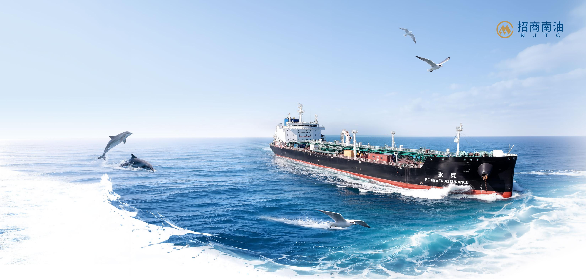

text_image

招商南油
NJTC
永安
FOREVER ASSURANCE

# 2025

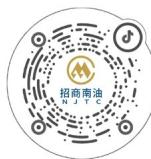

地址：中国南京市鼓楼区中山北路324号

电话：(025) 58586145、58586146

邮编：210003

网址：https://www.njtc.com.cn

Address: No.324 Zhongshang North Road, Nanjing, CHINA

Tel: +86-25-58586145、+86-25-58586146

Postcode: 210003

Website: http://www.njtc.com.cn

# 环境、社会和公司治理（ESG）报告

# ENVIRONMENTAL, SOCIAL AND GOVERNANCE REPORT

股票代码：601975

招商局南京油运股份有限公司

# 目录 CONTENT

关于本报告 01

董事长致辞 03

关于招商南油 05

附录 99

绩效表 99

指标索引表 108

意见反馈表 110

# 1

# 可持续发展治理 09

可持续发展战略 11

可持续发展治理架构 12

可持续发展实践 13

利益相关方沟通 13

重要性议题管理 15

# 2

# 依规治企 尽责致远 17

坚持党建引领 19

规范公司治理 21

合规风险管理 25

恪守商业道德 29

# .3

# 践行低碳 共筑深蓝 31

环境合规管理 33

应对气候变化 41

优化资源利用 51

生态系统与生物多样性保护 55

# .4

# 深耕航运 共创价值 57

保障能源供应 59

优质客户服务 63

创新驱动发展 66

信息安全与隐私保护 69

可持续供应链 72

# .5

# 守护美好 温暖相伴 75

航运安全保障 77

职业健康管理 84

员工权益保障 87

参与社区公益 97

# 关于本报告

本报告是招商局南京油运股份有限公司（以下简称“招商南油”或“公司”）发布的第3份《环境、社会和公司治理（ESG）报告》（以下简称“本报告”）。本报告依据客观、规范、透明和全面的原则，详细披露了公司2025年度环境、社会和公司治理的实践及绩效。

# 报告范围

本报告以“招商南油”为主体，包括下属子公司，除特别说明外，本报告范围与本公司年报范围保持一致。

# 时间范围

2025年1月1日至2025年12月31日(简称“报告期”)。为增强报告的可比性和完整性，部分内容适当追溯以往年份或具有前瞻性描述。本报告的发布周期为一年一次，与财务年度保持一致。

# 编制依据

- 上海证券交易所《上海证券交易所上市公司自律监管指引第14号--可持续发展报告（试行）》  
- 上海证券交易所《上海证券交易所上市公司自律监管指南第4号--可持续发展报告编制》（2026年1月修订）  
- 全球报告倡议组织《GRI 可持续发展报告标准（GRI Standards）》  
- 中国企业改革与发展研究会《中国企业可持续发展报告指南（CASS-ESG 6.0）》  
• 中国财政部《企业可持续披露准则--基本准则（试行）》  
• 国务院国资委《关于中央企业履行社会责任的指导意见》  
• 国务院国资委《央企控股上市公司 ESG 专项报告编制研究》

# 数据说明

报告使用数据来源包括公司实际运行的原始数据、政府部门公开数据、年度财务数据、内部相关统计报表、第三方问卷调查、第三方评价访谈等。本报告的财务数据以人民币为单位，若与财务报告不一致之处，以财务报告为准。

# 确认及批准

本报告于 2026 年 4 月 24 日获公司董事会批准。董事会承诺对报告内容进行监督，并确保其不存在任何虚假记载或误导性陈述，并对内容真实性、准确性和完整性负责。

# 获取及反馈

本报告可以在公司官网（http://www.njtc.com.cn）或上交所网站（https://www.sse.com.cn/）查阅和下载。如您对本公司的可持续发展有任何意见或建议，欢迎通过下述联系方式反馈意见，帮助公司对报告进行持续改进。

# 反馈渠道

联系地址 江苏省南京市鼓楼区中山北路 324 号

电话 (025) 58586145、58586146

邮箱 irm@cmhk.com

网址 https://www.njtc.com.cn

释义说明

<table><tr><td>释义项</td><td>释义内容</td></tr><tr><td>招商南油、公司</td><td>招商局南京油运股份有限公司</td></tr><tr><td>招商局集团</td><td>招商局集团有限公司,招商南油的实际控制人</td></tr><tr><td>长航集团</td><td>中国长江航运集团有限公司,招商南油的控股股东</td></tr><tr><td>南京扬洋</td><td>南京扬洋化工运贸有限公司,招商南油全资子公司</td></tr><tr><td>南京海顺</td><td>南京海顺海事服务有限公司,招商南油全资子公司</td></tr><tr><td>上海长石</td><td>上海长石海运有限公司,招商南油控股子公司</td></tr><tr><td>南油(新加坡)</td><td>南京油运(新加坡)有限公司,招商南油全资子公司</td></tr><tr><td>载重吨,DWT</td><td>Dead Weight Tonnage,一般缩写为“DWT”,即在一定水域和季节里,运输船舶所允许装载的最大重量,包括载货量、人员及食品、淡水、燃料、润滑油、炉水、备品和供应品等的重量,又称总载重吨。</td></tr><tr><td>MR</td><td>根据Clarksons的分类标准,为2.5~5.5万(不含5.5万)载重吨的成品油(或原油)轮</td></tr><tr><td>Handysize</td><td>又称灵便型油轮,根据Clarksons的分类标准,为1~5.5万(不含5.5万)载重吨的油轮</td></tr><tr><td>Panama</td><td>又称巴拿马型油轮,根据Clarksons的分类标准,为5.5~8.5万(不含8.5万)载重吨的油轮</td></tr><tr><td>期租</td><td>Time Charter,即出租人向承租人提供配备船员的船舶,由承租人在约定的期间内按照约定的用途使用,并按日计算租金的船舶租赁。期租情况下,承租人承担船舶的燃油费、港口使费等费用。</td></tr><tr><td>COA</td><td>Contract of Affreightment,包运合同,即承运人在约定期间内分批将约定数量货物从约定装货港运至约定目的港的海上货物运输合同。</td></tr><tr><td>压载水公约</td><td>指《2004年国际船舶压载水及沉积物管理与控制公约》根据国际海事组织要求,现有船舶在2017年9月8日后首次IOPP换证检验时需要满足压载水排放D-2标准;2017年9月8日或以后交付的新船,应在交船时至少满足D-2排放标准。MEPC71批准了压载水公约第B-3条修正案文本。新船在交船时应安装BWIMS以满足D-2排放标准。现有船应在2019年9月8日及以后的首次IOPP换证检验时安装压载水处理系统(BWMS)。</td></tr><tr><td>EEDI</td><td>Energy Efficiency Design Index,船舶能效设计指数,是船舶消耗的能量换算成 $CO_2$ 排量和船舶有效能量换算成 $CO_2$ 排量的比例指数,也称新船能效设计指数。EEDI指数越高,能源效率越低。</td></tr><tr><td>EEXI</td><td>Energy Efficiency Existing Ship-Index,现有船舶能效指数。</td></tr><tr><td>PSC</td><td>“港口国监督”一词是根据英文“Port State Control”(缩写为PSC)转译而来的,亦称港口国控制,是专指世界各地的港口国当局对抵港的外国籍船舶实施的以确保船舶和人员安全、防止海洋污染为目的,以船员及船舶技术状况为对象的专门检查。</td></tr><tr><td>IMO</td><td>International Maritime Organization 国际海事组织</td></tr><tr><td>MARPOL</td><td>《国际防止船舶造成污染公约》</td></tr></table>

# 董事长致辞

2025 年作为 “十四五” 规划收官之年，全球能源转型深化，航运业高质量发展进入攻坚期，挑战与机遇并存。招商南油坚守 “责任、绿色、安全、和谐” 的理念，将可持续发展理念深度融入战略规划、经营管理与业务运营的各环节，在环境、社会和公司治理（ESG）领域稳步深耕、持续优化，以务实行动践行央企责任，ESG 实践成效稳步提升。

# 深耕治理根基，筑牢履责底线

我们坚持以规范高效的治理为企业稳健发展的重要保障。2025年，招商南油持续优化公司治理体系，系统性梳理与完善治理制度，进一步优化治理架构，提升监督治理效能；同时持续深化董事会建设并常态化开展董事会评价；同步完善风险与内控体系，精准识别2025年度“前十大风险”；深化廉洁合规文化建设，实现全员廉洁教育培训全覆盖，完成6次廉洁风险点排查，实现运营点全覆盖；在ESG治理层面，我们优化ESG治理架构，持续开展ESG议题双重重要性评估，广泛倾听利益相关方的诉求，夯实ESG实践基础，推动ESG管理从“规范”向“卓越”转型。

# 践行绿色使命，赋能航运转型

公司坚持将绿色发展与环保责任融入日常运营。2025年，我们持续关注自身运营对环境的潜在影响，强化废弃物管控与海洋生态保护，重视极端天气对航运的影响，深化QHSE管理体系，推动环境管理规范化、精细化、常态化，全年节能环保投入达6,784.18万元。围绕“双碳”目标，参考IMO温室气体减排要求，对接“十五五”绿色低碳转型整体部署，有序开展碳排放管理，优化船队运力结构，扩大船舶节能技术改造范围，提升清洁能源应用比例，全年采购生物燃料约2,657.19吨。同时积极参与行业绿色发展交流，助力航运业绿色低碳转型。

# 坚守安全初心，提升服务效能

我们秉持“安全第一、预防为主、综合治理”的方针，推动航运服务提质增效、智能化升级。2025年，公司持续完善安全管理体系，压实安全责任，常态化开展安全检查、应急演练及安全培训，筑牢航运安全防线。同时，推进数智航运转型，开展“船舶碳排放评估管理系统”等数字化技术研究与项目开发，以科技赋能安全运营与服务提升，全年科学技术及数字化投入共1,994.18万元。优化主业布局，推进成品油运输“稳东拓西”、原油运输“稳江拓海”等重点工作，持续打造专业化船队，提升运营韧性效率，拓展全球保障网络。

# 秉持以人为本，共筑共享格局

招商南油坚持“以人为本”的发展理念，将员工视为企业的核心力量。我们持续打造平等、多元、包容的工作环境，保障员工合法权益，完善双通道晋升机制与薪酬绩效体系，深化ESG指标与高管绩效挂钩机制。重视航运人才培养与员工身心健康，开展技能培训、心理健康专题讲座及文体活动，增强员工归属感与凝聚力。同时，积极履行社会责任，持续通过消费帮扶助力乡村振兴。

2025年的攻坚奋进，为“十四五”收官画上了坚实句号。展望未来，招商南油将持续深化ESG战略与主营业务深度融合，发展新质生产力，集中优势资源打造全球化船队。我们将以更坚定的信念、更务实的举措，巩固ESG实践成果、提升ESG管理水平，携手各利益相关方，在挑战中寻机遇，在变革中塑未来，朝着建设世界一流航运企业的目标不断迈进，为全球航运业可持续发展贡献招商南油力量！

招商局南京油运股份有限公司董事长

丁磊

natural_image

Aerial view of a large oil tanker sailing on open blue sea, no visible text or symbols

# 关于招商南油

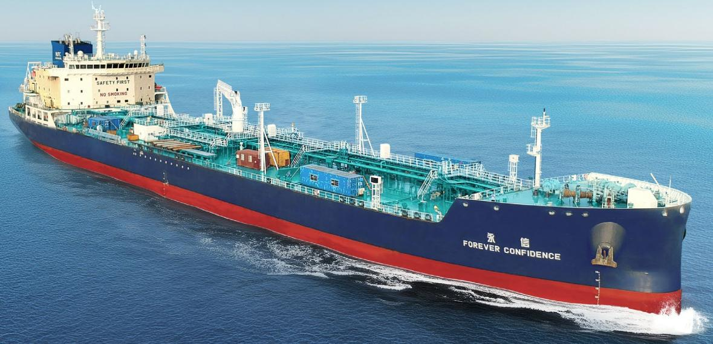

natural_image

Large blue and red cargo ship named '永信 FOREVER CONFIDENCE' sailing on open sea, no visible text or symbols on the vessel itself.

# 我们的2025

# 环境亮点绩效

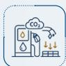

温室气体排放总量（范围一、范围二） $^{1,2}$

1,036,359.28 tCO₂e

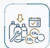

温室气体排放强度

178.08 tCO₂e/ 百万元营收

氮氧化物（ $\mathrm{NO}_{\mathrm{x}}$ ）排放强度

0.12 吨 / 百万元营收

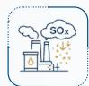

硫氧化物（ $\mathrm{SO}_x$ ）排放强度

0.45 吨 / 百万元营收

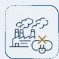

能源消耗强度

81.53 吨标准煤 / 百万元营收

节能环保资金投入

6,784.18 万元

注：1、上述范围一、范围二温室气体仅统计二氧化碳，不包含其他温室气体；  
2、温室气体排放总量和强度指标统计口径包括招商南油、南京扬洋、南京海顺、上海长石、南油（新加坡）。

# 治理亮点绩效

独立董事占比

1/3

已进行腐败风险评估的运营点比例

100%

接受反商业贿赂及反贪污培训的董事、管理层和员工占比

100%

报告期内发生的商业贿

赂及贪污事件数

0起

# 社会亮点绩效

员工培训覆盖率

100%

员工培训平均小时数

82.02 小时

《集体合同》员工覆盖率

100%

员工因工死亡人数

0人

员工体检覆盖率

100%

职业健康与安全管理体系覆盖比率

100%

客户满意度

100%

参与审核的供应商比率

100%

乡村振兴投入金额

30.04万元

# 公司概况

招商局南京油运股份有限公司（NJTC）是招商局集团旗下从事油轮运输的专业化公司，是长航集团所属从事江海联运的重要骨干企业，成立于1993年，1997年在上海证券交易所挂牌上市（股票代码：601975.SH），是集“油化气”运输于一体的专业航运公司。

公司实行 “专业化、差异化、领先化” 的发展战略，立足于液货运输主业，聚焦于原油、成品油、化学品、气体运输等具有相对优势的市场领域，积极拓展船员劳务等相关多元化业务，构建起 “油化气协同、内外贸兼营、江海洋直达” 的业务格局。

公司秉持立足中国、服务全球石化的理念，与国内外大型石油、石化企业保持着良好的合作关系，致力于打造具有较强竞争力、健康盈利、可持续发展的国际一流航运企业。

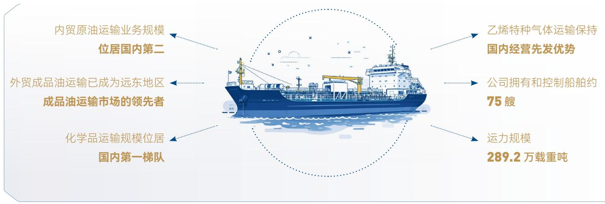

text_image

内贸原油运输业务规模
位居国内第二
外贸成品油运输已成为远东地区
成品油运输市场的领先者
化学品运输规模位居
国内第一梯队
乙烯特种气体运输保持
国内经营先发优势
公司拥有和控制船舶约
75艘
运力规模
289.2万载重吨

组织架构  
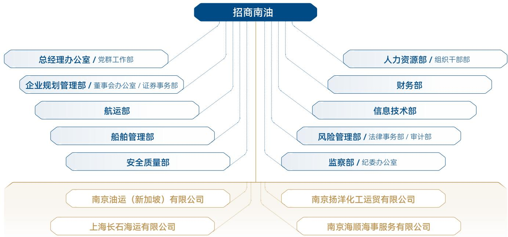

flowchart

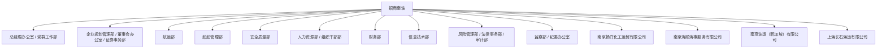

# 业务布局

招商南油主要经营海上原油、成品油、化工品和气体等运输。公司主要通过期租租船（包括租进、租出）、参与市场联营体（POOL）运作、与主要货主签署包运合同（COA）、航次租船以及光船租赁等方式开展经营活动。船员劳务业务是公司拓展的航运相关业务。

<table><tr><td>业务板块</td><td>主要服务内容及主要航线</td></tr><tr><td>原油运输</td><td>■国内沿海原油、外贸原油和内外贸燃料油运输;■国内沿海原油和燃料油运输主要区域:渤海湾地区、海进江以及长江口、宁波和舟山地区等;■外贸原油和燃料油运输主要区域:东南亚、东北亚和澳洲。</td></tr><tr><td>成品油运输</td><td>■国际和国内沿海成品油运输;■国际成品油主要运营区域:苏伊士以东,包括东北亚、东南亚、澳洲、印度中东和东非南非等,少量涉足美国、欧陆等;■国内沿海成品油主要营运区域:国内沿海港口和长江下游干线段。</td></tr><tr><td>化学品及气体运输</td><td>■经营区域:国内沿海、远东和东南亚航线等。</td></tr></table>

企业文化  
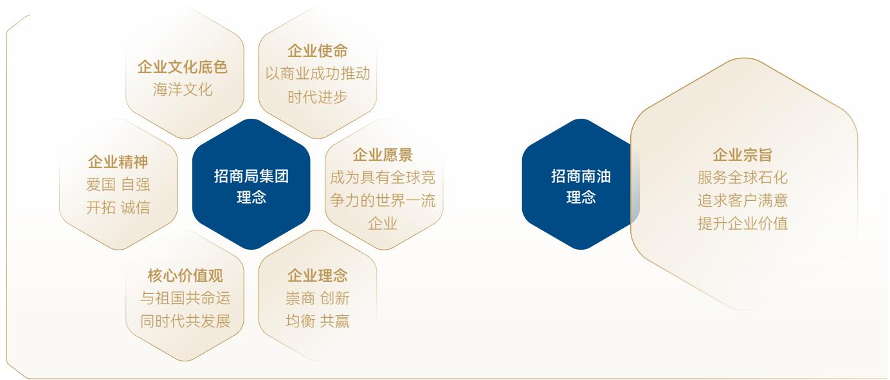

flowchart

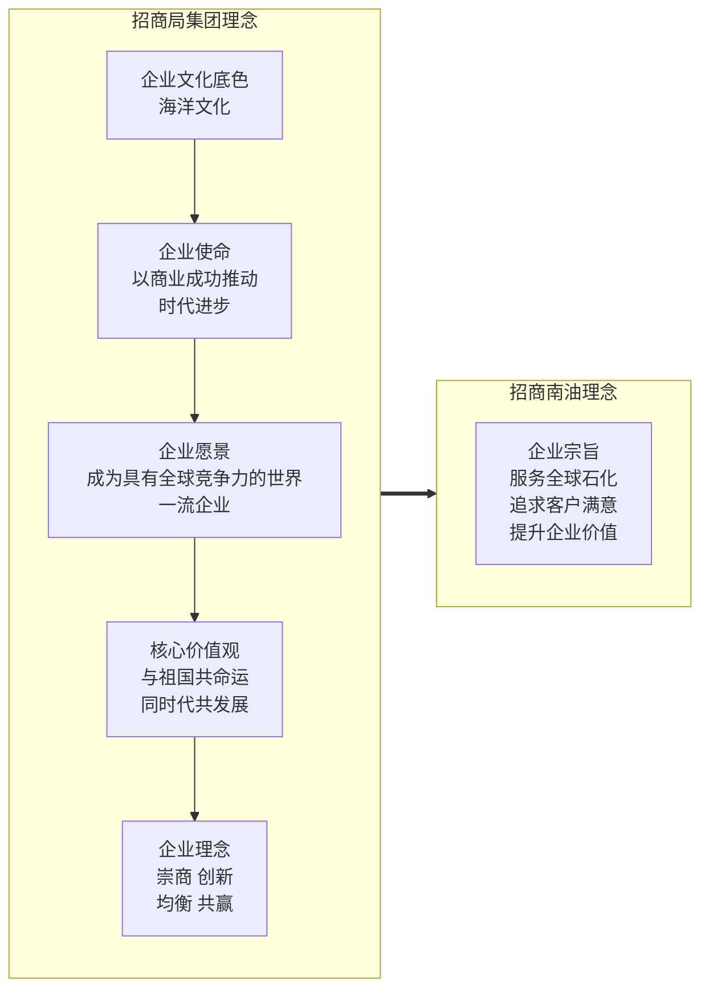

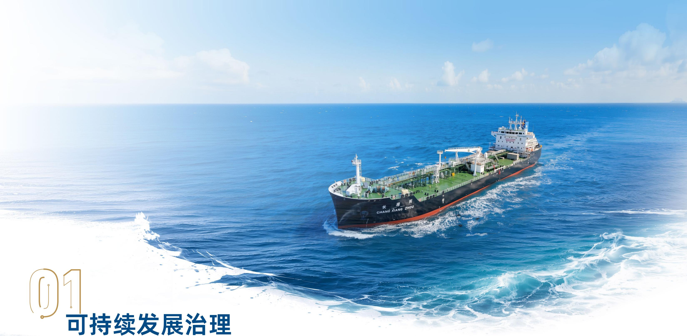

text_image

兴粮船
CHANG XIANG 2000
可持续发展治理

# 01

# 可持续发展治理

# 可持续发展战略

招商南油紧扣国家“双碳”目标与航运行业绿色转型趋势，将 ESG 理念深度融入战略规划、经营管理与业务运营全流程，在合规治理、绿色转型、主业升级与价值共享中实现经济效益、生态效益与社会价值的协同共赢，致力于成为可持续发展的国际一流航运企业。

<table><tr><td>对应章节</td><td colspan="3">响应的 SDGs</td><td>我们的行动</td></tr><tr><td>依规治企 尽责致远</td><td colspan="3">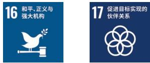</td><td>优化治理架构,明确权责边界,保障决策科学合规;完善风险管理机制,防控业务全链条风险;恪守商业道德,诚信经营、公平竞争,维护行业生态。</td></tr><tr><td rowspan="2">践行低碳 共筑深蓝</td><td>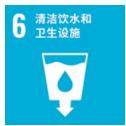</td><td></td><td>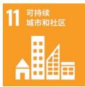</td><td rowspan="2">主动应对气候变化,评估气候风险与机遇,制定“双碳”目标;优化船舶能耗管理,提高资源利用效率,推动节能降耗;严格管控船舶尾气、污水、垃圾排放,规范废弃物处理;践行生态保护责任,助力海洋生态系统安全。</td></tr><tr><td>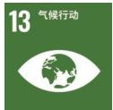</td><td>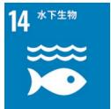</td><td>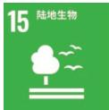</td></tr><tr><td rowspan="2">深耕航运 共创价值</td><td>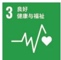</td><td>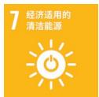</td><td>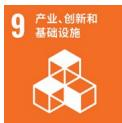</td><td rowspan="2">稳步保障原油、成品油等关键能源运输,保障能源供应安全;加速数智航运转型,运用数字化技术优化运营与服务效率;秉持“以客户为中心”,提供优质高效的服务;构建可持续供应链,联动伙伴推动行业绿色升级。</td></tr><tr><td>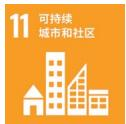</td><td>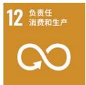</td><td>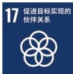</td></tr><tr><td rowspan="2">守护美好 温暖相伴</td><td>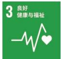</td><td>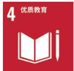</td><td>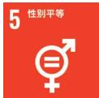</td><td rowspan="2">筑牢安全航运防线,完善安全管理体系,保障运输安全;强化职业健康安全防护,保障员工作业安全与身心健康;严格保障员工合法权益,完善薪酬福利与劳动保障机制;搭建培训与晋升通道,支持人才成长与职业发展;丰富员工关怀举措,提升团队凝聚力与归属感;积极开展乡村振兴帮扶与社区公益活动。</td></tr><tr><td>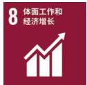</td><td>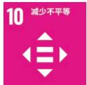</td><td>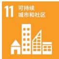</td></tr></table>

# 可持续发展治理架构

招商南油重视可持续发展管理体系的建立，通过董事会、战略与可持续发展委员会、管理层和各职能部门的有效分工协作，建立起“决策层-管理层-执行层”的三级ESG治理架构，确保将ESG理念纳入战略规划和日常运营的方方面面。

<table><tr><td>层级</td><td>主体</td><td>主要职责</td></tr><tr><td rowspan="2">决策层</td><td>董事会</td><td>对公司可持续发展相关的重大事项进行决策,同时审议公司年度可持续发展报告。</td></tr><tr><td>战略与可持续发展委员会</td><td>对公司可持续发展进行研究并提出建议;督导公司可持续发展工作;审阅公司可持续发展报告以及其他有关可持续发展的披露信息。</td></tr><tr><td>管理层</td><td>公司高管及各职能部门领导</td><td>评估和管理ESG相关风险与机遇;推动ESG战略落地,制定ESG阶段性管理目标及指导相关措施开展;审阅年度ESG报告;定期向决策层汇报ESG工作开展情况。</td></tr><tr><td>执行层</td><td>各职能部门</td><td>根据ESG战略和目标,落实相关项目和举措;与对应利益相关方进行沟通。</td></tr></table>

公司积极探索 ESG 绩效与薪酬绩效挂钩机制，将温室气体排放、安全航运、职业健康与安全等指标与高管绩效挂钩，保障公司的 ESG 战略和目标能有效落地。

# 可持续发展实践

为保障公司 ESG 治理架构高效运转，公司持续完善 ESG 治理相关机制，不断提升董事、高级管理人员及相关人员的 ESG 履职意识与专业素养，通过强化内部治理与专业能力建设，持续优化 ESG 治理体系，稳步提升 ESG 治理水平。

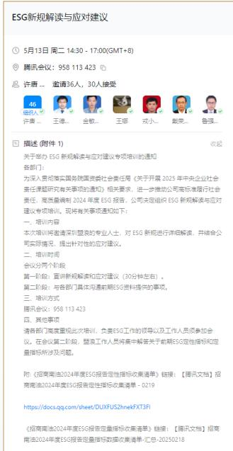

text_image

ESG新规解读与应对建议
5月13日 周二 14:30 - 17:00(GMT+8)
腾讯会议：958 113 423
许唐... 邀请36人，30人接受
46
设约人
许唐...
王德...
金敏...
王娜...
刘小...
戴荣...
鲁强...
描述 (附件 1)
收起
关于举办 ESG 新规解读与应对建议专项培训的通知
各部门：
为深入贯彻博实国务院国资委社会责任局《关于开展 2025 年中央企业社会责任课题研究有关事项的通知》相关要求，进一步推动公司高标准履行社会责任，高质量确保 2024 年度 ESG 报告，公司决定组织 ESG 新规解读与应对建议专项培训。现将有关事项通知如下：
一、培训内容
本次培训将邀请详细题源的专业人士，对 ESG 新规进行详细解读，并结合公司实际情况，提出针对性的应对建议。
二、培训时间
会议分两个阶段
第一阶段：置讲新规解读和应对建议（30分钟左右）。
第二阶段：与各部门具体沟通前期ESG资料提供的事项。
三、培训方式
腾讯会议：958 113 423
四、其他事项
请参阅部门高度重视此次培训，负责ESG工作的领导以及工作人员须参加会议。在会议第二阶段，继续工作人员将集中解答关于前期ESG理性指标和定量指标所涉及问题。
附：《招商南油2024年度ESG报告理性指标收集清单》链接：【腾讯文档】招商南油2024年度ESG报告理性指标收集清单 - 0219
https://docs.qq.com/sheet/DUXFUSZhnekFXT3FJ
《招商南油2024年度ESG报告理性指标收集清单》链接：【腾讯文档】招商南油2024年度ESG报告理性指标数据收集清单-汇总-20250218

“ESG新规解读与应对建议”线上培训

# 利益相关方沟通

招商南油高度重视与利益相关方的沟通交流，通过多种渠道和方式，积极回应各方期望与诉求，并将这些期望融入公司的管理决策和运营活动中，共同创造可持续价值。

<table><tr><td>利益相关方</td><td>诉求与期望</td><td>沟通渠道</td><td>沟通回应</td></tr><tr><td rowspan="2">政府或监管机构</td><td></td><td></td><td>政策回应</td></tr><tr><td>诚信守法经营促进经济发展承担社会责任</td><td>现场访谈工作汇报</td><td>足额纳税推动行业发展创造就业机会</td></tr><tr><td rowspan="2">股东及投资者</td><td></td><td rowspan="2">投资者热线股东会E互动投资者现场调研业绩说明会</td><td rowspan="2">多元化投资者沟通提升经营业绩分红派息信息披露及时透明投资者问题回应投资者关系维护</td></tr><tr><td>保障股东权益信息披露准确投资者关系管理</td></tr></table>

<table><tr><td>客户</td><td>信息安全与隐私保护提供优质产品服务保障客户合法权益</td><td>售后服务公司网站及邮箱客户座谈日常运营沟通</td><td>产品质量认证客户满意度调查技术创新开展责任营销</td></tr><tr><td>供应商</td><td>保持良好合作公开、公平采购互利共赢</td><td>日常沟通专题培训可持续采购采购政策及招标程序</td><td>依法履行合同积极开展项目合作公开、公正招标产业链协同发展</td></tr><tr><td>员工</td><td>保障员工权益健全职业发展通道员工关怀与福利</td><td>内部沟通会公司慰问走访工作评核</td><td>完善薪酬福利体系开展多元化员工培训建立职业晋升路径组织各类员工活动</td></tr><tr><td>行业协会</td><td>沟通渠道全面完整信息披露准确</td><td>日常沟通信息披露行业协会活动</td><td>积极参加协会会议协助开展协会活动参与行业标准制定</td></tr><tr><td>公益组织</td><td>社区建设</td><td>社区沟通布局海外</td><td>积极开展公益活动</td></tr><tr><td>专业机构</td><td>共同发展评级提升专业认证</td><td>行业论坛和研讨会日常专业咨询</td><td>参加行业论坛和研讨会加强与评级机构的沟通聘请第三方专业机构</td></tr><tr><td>媒体</td><td>信息披露准确保持良好合作专项采访</td><td>公众媒体平台</td><td>及时完整准确信息披露加强日常沟通组织联合活动</td></tr></table>

# 重要性议题管理

# 评估与流程方法

公司依据《上海证券交易所上市公司自律监管指引第 14 号--可持续发展报告（试行）》《上海证券交易所上市公司自律监管指南第 4 号--可持续发展报告编制》和《GRI3：重大主题》等国内外披露标准的评估方法，围绕各项 ESG 议题开展财务重要性和影响重要性分析，通过开展利益相关方调研和内部沟通等方式分析各项 ESG 议题对公司财务以及经济、社会和环境的影响，并在本报告中对 21 项重要性议题进行回应。

# 议题评估流程

步骤一
了解公司背景

1

# 分析方法

立足液货运输主业与油化气运输业务布局，结合全球经贸、航运绿色转型，分析公司各运营环节中存在的 ESG 影响、风险及机遇，挖掘利益相关方的诉求与期望。

步骤二
建立议题库

2

根据国家政策指导，参考全球报告倡议组织 GRI、交易所指引以及国内外同行业相关议题，筛选出共 21 项议题，形成 2025 年度 ESG 议题库。

步骤三议题重要性评估

3

# 影响重要性评估

梳理各议题对外部环境、社会和经济的潜在或实际的正面或负面影响，开展利益相关方调研，回收了220份问卷。

# 财务重要性评估

综合影响性、依赖性和其他因素，结合问卷结果、专家判断以及公司风险识别和评估清单，识别和评估相关议题下的风险和机遇，评估出具有财务重要性的议题。

步骤四
议题确认与审批

4

将影响重要性和财务重要性评估结果相结合，构建重要性议题矩阵，经董事会确认后进行披露。

# 议题评估结果

重要性议题矩阵  
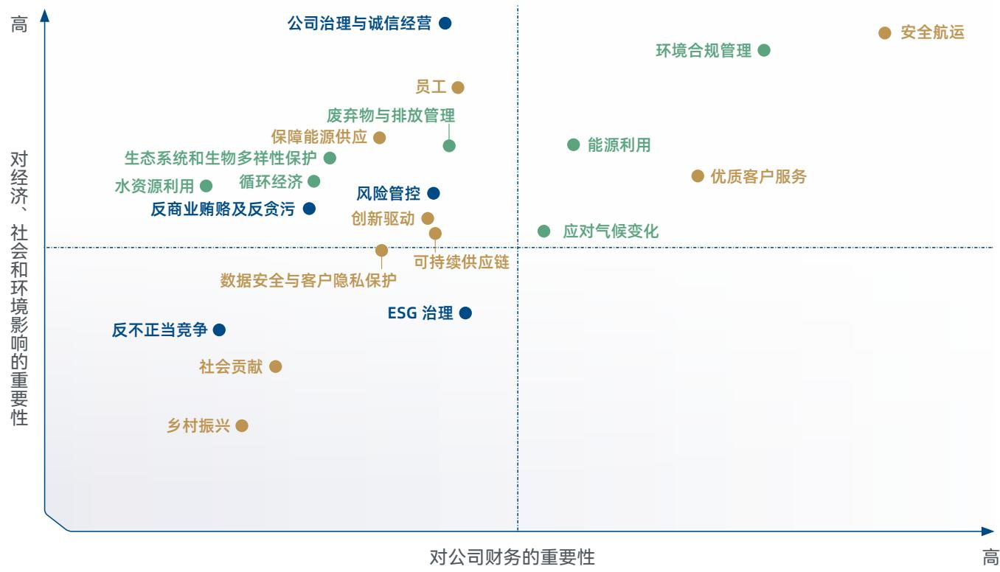

scatter

| Topic | X-axis Position (Approximate) | Y-axis Position (Approximate) |
| :--- | :--- | :--- |
| 公司治理与诚信经营 | High | High |
| 安全航运 | High | High |
| 环境合规管理 | High | High |
| 员工 | Medium-High | High |
| 废弃物与排放管理 | Medium-High | High |
| 保障能源供应 | Medium-High | Medium-High |
| 能源利用 | Medium-High | Medium-High |
| 优质客户服务 | Medium-High | Medium-High |
| 生态系统和生物多样性保护 | Medium-High | Medium-High |
| 水资源利用 | Medium-High | Medium-High |
| 循环经济 | Medium-High | Medium-High |
| 风险管控 | Medium-High | Medium-High |
| 反商业贿赂及反贪污 | Medium-High | Medium-High |
| 创新驱动 | Medium-High | Medium-High |
| 应对气候变化 | Medium-High | Medium-High |
| 可持续供应链 | Medium-High | Medium-High |
| 数据安全与客户隐私保护 | Medium-High | Low-Medium |
| ESG 治理 | Medium-High | Low-Medium |
| 反不正当竞争 | Low-Medium | Low-Medium |
| 社会贡献 | Low-Medium | Low-Medium |
| 乡村振兴 | Low-Medium | Low-Medium |

<table><tr><td>重要性说明</td><td>议题</td></tr><tr><td>具备双重重要性</td><td>环境合规管理、能源利用、应对气候变化、安全航运、优质客户服务</td></tr><tr><td>仅具备影响重要性</td><td>循环经济、水资源利用、废弃物与排放管理、生态系统和生物多样性保护、可持续供应链、员工、保障能源供应、创新驱动、公司治理与诚信经营、反商业贿赂及反贪污、风险管控</td></tr><tr><td>相关</td><td>数据安全与客户隐私保护、社会贡献、乡村振兴、反不正当竞争、ESG 治理</td></tr></table>

# 议题说明

1、“员工”议题涵盖“员工雇佣与招聘”“员工权益保障”“员工薪酬与福利”“员工培训与发展”和“职业健康与安全”等议题内容。  
2、“ESG 治理”议题涵盖“利益相关方沟通”等议题内容。  
3、“废弃物与排放管理”议题涵盖“废弃物处理”和“污染物排放”等议题内容。  
4、“可持续供应链”议题涵盖“供应链安全”“平等对待中小企业”和“尽职调查”等议题内容。  
5、“产品和服务安全与质量”议题内容在“安全航运”和“优质客户服务”议题中进行回应。  
6、公司未从事生命科学、人工智能等科技伦理敏感领域的科学研究、技术开发等活动，因此“科技伦理”议题不适用。

# 02

# 依规治企 尽责致远

# 本章所响应的 SDGs

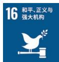

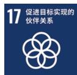

# 本章所涉及的 ESG 重要议题

公司治理与诚信经营

反不正当竞争

反商业贿赂及反贪污

风险管控

# 坚持党建引领

# 党建体系建设

招商南油坚持以习近平新时代中国特色社会主义思想为指导，全面落实中央和招商局集团党委、长航集团党委各项决策部署，坚持党的领导、加强党的建设，以高质量党建引领公司高质量发展。截至报告期末，招商南油党委下设基层党委3个、党支部97个（其中船舶党支部69个）、党员700人（其中船员党员399人）。

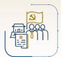  
招商南油党委下设基层党委

3↑

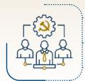

党支部97个

党员
700人

# 党建实践

招商南油锚定建设世界一流航运企业目标，统筹推进政治建设、组织建设、作风建设、纪律建设，推动党建工作与业务经营深度融合。

  
政治建设

严格落实 “第一议题” 和党委理论学习中心组学习制度，开展 “第一议题” 学习 22 次、中心组学习 6 次，深刻领悟 “两个确立” 的决定性意义，坚决做到 “两个维护”；

严格执行 “三重一大” 决策制度，全年召开党委会 22 次，前置研究、决策重大事项 35 项，确保公司改革发展始终沿着正确方向前进。

  
组织建设

围绕世界一流干部人才队伍需求，系统落实“三型”干部人才队伍建设方案。优化运用“优秀年轻船干人才库”“优秀年轻干部人才库”“海外后备人才库”等3个人才库；完善推进“双通道”机制，11名员工通过“双通道”得到晋升；

完成长航集团“双代会”代表选举，顺利完成公司工会换届；

深化船舶党支部标准化规范化建设，船舶党支部建制完整率 100%。加强海外党建工作，认真落实海外党建工作制度和任务清单，完善海外员工定期教育机制和监督报告制度。

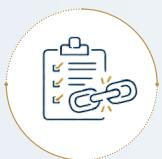  
作风建设

推进 “找差距、转作风、提能力、勇担当、求实效” 能力作风建设五项行动，从严从实抓好问题查摆与整改管理，推动各基层党组织查摆的 98 个问题逐项整改，全面提升；

大力弘扬担当作为、开拓创新、求真务实、严谨细致、清正廉洁的优良作风，同时从严整治形式主义为基层减负，巩固“弘改提”专项工作成效。

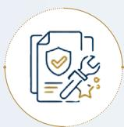  
纪律建设

聚焦重点领域加强监督，制定2025年政治监督清单；

强化对领导班子的监督，开展廉洁谈话 160 人次；

推进船舶污油水管理专项整治，完善制度机制；

开展公务用车、业务招待费专项检查，整改问题 16 项；

开展“廉洁风险防控建设年”活动，召开警示教育大会2期；

完成 2025 年度廉洁风险点排查，新增、修订 6 项廉洁风险点。

# 思想建设

深化党的创新理论武装，公司党委和所属基层党委认真开展理论学习中心组集中学习研讨、组织读书班，基层党支部开展“三会一课”1,300多次。在“博航学堂”“指尖课堂”等线上平台开设中央八项规定精神学习教育、招商局集团领导讲党课等专题课程，推动党的创新理论学习常态化、便捷化。此外，公司推进党员基本培训全覆盖试点工作，组织82个船岸党支部、533名党员认真参加两轮集中学习研讨。

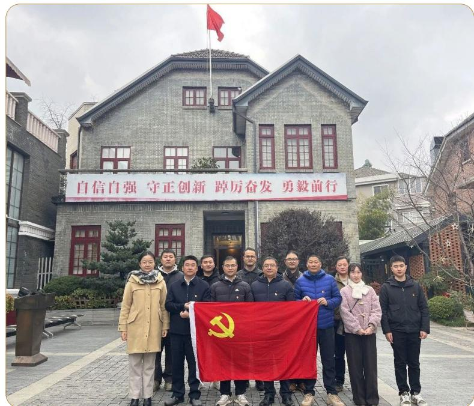

text_image

自信自强 守正创新 跖厉奋发 勇毅前行

主题党日活动

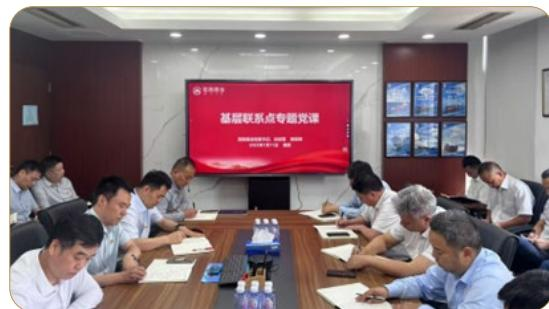

text_image

基层联系点专题党课

基层联系点专题党课

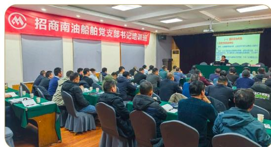

text_image

招商南油船舶党支部书记培训班

船舶党支部书记培训班

# 规范公司治理

# 公司治理体系

招商南油严格遵守《中华人民共和国公司法》《中华人民共和国证券法》《上市公司治理准则》等法律法规与监管要求，制定各项治理制度与规则，建立了决策、执行、监督职责分工明确、科学有效制衡的公司治理架构。

股东会是公司最高权力机构。公司严格按照相关法律法规、《公司章程》和《股东会议事规则》，召集和召开年度股东会与临时股东会，平等对待全体股东，确保股东能充分行使其权利。

董事会是公司的决策机构，对股东会负责。公司董事会下设审计与风险管理委员会、提名委员会、薪酬与考核委员会和战略与可持续发展委员会。公司制定《董事会议事规则》和各专业委员会工作规则，确保董事会规范运作，科学决策，有效履行职责。

报告期内，为全面适应监管新规与治理实践要求，公司对制度体系和治理架构开展系统性完善。通过修订《公司章程》《股东会议事规则》等文件，优化内部监督机制，取消监事会并将其职能整合至董事会审计与风险管理委员会，提升监督治理效能。同时，公司优化专门委员会职能，将可持续发展职责纳入战略委员会，同步更名为战略与可持续发展委员会，强化董事会在可持续发展领域的统筹引领作用。

股东会、董事会及专门委员会会议召开情况

<table><tr><td>治理机构</td><td>召开次数</td><td>审议议案</td></tr><tr><td>股东会</td><td>4次</td><td>16项</td></tr><tr><td>董事会</td><td>7次</td><td>43项</td></tr><tr><td>审计与风险管理委员会</td><td>5次</td><td>17项</td></tr><tr><td>提名委员会</td><td>1次</td><td>1项</td></tr><tr><td>薪酬与考核委员会</td><td>1次</td><td>1项</td></tr><tr><td>战略与可持续发展委员会</td><td>2次</td><td>4项</td></tr></table>

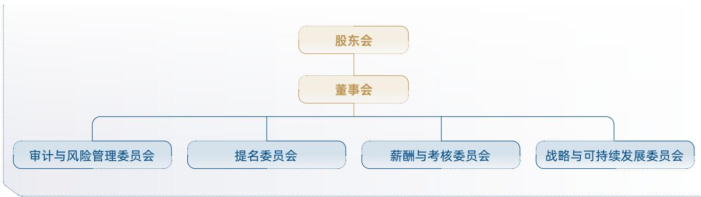

flowchart

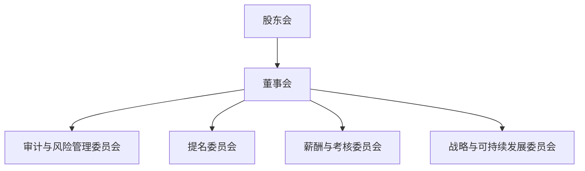

招商南油公司治理架构

# 董事会建设

招商南油严格遵循《招商局集团所属企业董事会建设指引》要求，根据自身发展实际，持续深化董事会建设，稳步提升公司治理专业化水平。

# 董事会多元化构成

公司严格遵守相关法律法规、《公司章程》及招商局集团董事会建设指引要求，规范开展董事提名与遴选。董事会成员覆盖航运、经济、财务、法律等关键领域，知识结构和专业领域互为补充，保障董事会科学决策。

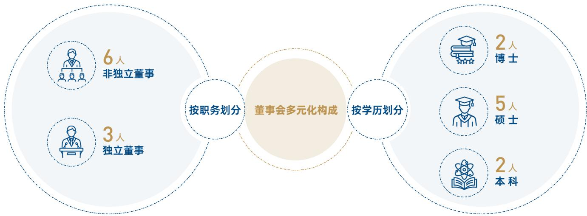

flowchart

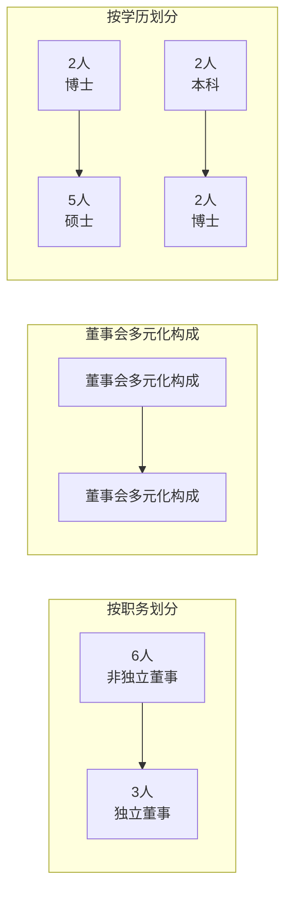

# 董事会独立性

公司依据《中华人民共和国公司法》及《公司章程》，制定《独立董事工作制度》，对独立董事的独立性和任职条件作出关系限制、持股限制、利益往来限制等，并规定其原则上最多在三家境内上市公司（含本公司）担任独立董事，保障其有充足时间精力履职。截至报告期末，公司独立董事人数为3名，占比1/3，专业背景覆盖会计、法律及行业领域，具备履责所需的专业能力和素养。

# 董事会有效性评估

招商南油已建立董事会评价体系并定期对董事会运行情况进行评估，确保董事会高效运作，持续提升董事会管治水平。

董事会评价维度与指标

<table><tr><td>评价维度</td><td colspan="4">评价指标</td></tr><tr><td>董事会运行规范性</td><td colspan="2">权责运行</td><td colspan="2">信息沟通</td></tr><tr><td>董事会运行有效性</td><td>定战略</td><td>作决策</td><td>防风险</td><td>企业发展改革成效</td></tr></table>

# 董高薪酬管理

公司依据相关规定，明确董事报酬由股东会审议决定，高级管理人员报酬由董事会制定。公司已制定《高级管理人员薪酬及业绩考核管理办法》，构建合理的薪酬激励体系，高管薪酬由基本薪酬与绩效薪酬构成，其薪酬水平综合考量企业规模、经营难度、行业薪酬水平及经营业绩等因素科学核定，绩效薪酬与公司年度经营目标完成情况、核心业绩指标达成度直接挂钩。此外，公司亦积极探索 ESG 绩效与薪酬绩效挂钩机制，将温室气体排放、安全航运、职业健康与安全等指标与高管绩效挂钩，保障公司的 ESG 战略和目标能有效落地。

# 关键绩效 / 报告期内

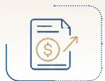

公司支付董事和高级管理人员报酬（含离任）474.12万元

# 投资者关系管理与股东权益

# 信息披露

招商南油严格按照《上市公司信息披露管理办法》等法律法规，制定《信息披露管理制度》《内幕信息知情人登记备案管理制度》等规章制度，明确信息披露责任主体，规范信息披露行为，做好内幕信息保密工作，确保信息披露内容的真实、准确、完整，不存在虚假记载、误导性陈述或者重大遗漏。报告期内，公司未发生信息披露违规行为。

# 关键绩效 / 报告期内

公司对外披露定期报告 4 份

对外披露临时报告 44 份

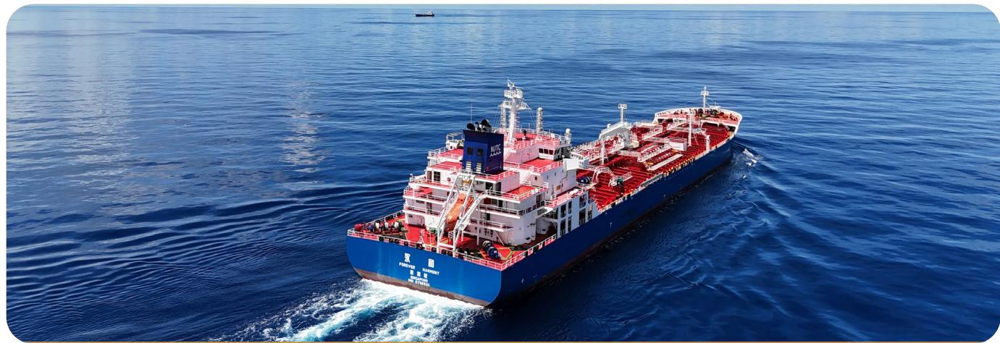

natural_image

Aerial view of a large blue oil tanker sailing on open blue sea, no visible text or symbols on the vessel itself.

# 投资者关系管理

公司严格依据《投资者关系管理工作制度》规范开展投资者关系管理工作，主动加强投资者沟通与参与。2025年，公司通过业绩说明会、上证e互动、现场调研、电话沟通等多种渠道与投资者保持高效互动。

# 关键绩效 / 报告期内

公司召开业绩说明会

3 次

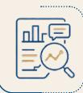

接待投资者现场调研

2 次

开展机构反路演

1 次

召开行业分析师会议

3 次

参加券商投资策略会

11次

回复上证e互动投资者问题

169次

# 案例 | 招商局集团举办上市公司集体业绩说明会

报告期内，招商局集团举办以“创新驱动，创建一流”为主题的集体业绩说明会，招商南油作为招商局集团旗下航运企业参会。公司管理层与境内外投资者、分析师深入交流，围绕经营业绩、战略规划、ESG建设、科技创新等问题全面回应，传递长期发展信心。

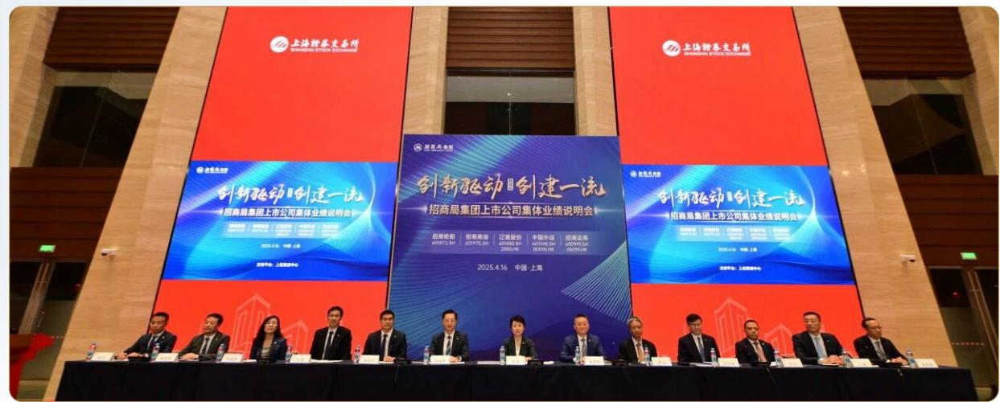

text_image

上海辉泰交易所
SHANGHAI STOCK EXCHANGE
创新驱动创建一流
招商局集团上市公司集体业绩说明会
2025.4.6 中国 上海
2025.4.16 中国 上海
上海辉泰交易所
SHANGHAI STOCK EXCHANGE
创新驱动创建一流
招商局集团上市公司集体业绩说明会
招商证券
600872.SH
招商基金
600978.SH
江海股份
600880.SH
中国外运
600999.SH
招商证券
600998.SH
2025.4.16 中国 上海

# 股东权益保障

公司严格遵循《公司章程》规定的利润分配政策，建立科学规范的利润分配决策程序与动态调整机制，确保利润分配公开透明、合规有序，充分保障全体股东尤其是中小股东的合法权益。未来，公司将深耕主业、提升经营效能，全力争创优良经营业绩，在符合利润分配条件时实施分红回报，以实际行动回馈股东的信任与支持。

# 合规风险管理

# 全面风险管理

# 合规风控管理体系

招商南油重视合规风控管理体系建设，不断强化组织保障、制度建设与风险防控能力，推动风险管控与合规管理融入经营管理主要环节，构建多层级、多维度协同管控机制。

组织层面，公司搭建多层级合规风控组织架构，明确各层级核心职责与协同联动机制，确保风险管理与合规经营要求贯穿业务全流程、覆盖管理全链条。制度层面，以《招商南油合规管理规定》《风险管理程序》《内部控制评价管理程序》为核心，构建全维度制度规则支撑体系；依托防制裁、反舞弊等专项制度防控重点领域合规风险，通过采购招标、合同管理、船舶运营、涉外佣金等业务流程制度实现风险管控与业务开展同步推进；以监督问责类制度强化刚性约束，并建立制度动态更新机制，保障制度的时效性与适用性。保障层面，公司构建考核激励约束、合规数字化建设、文化培训培育、报告监督机制四位一体的保障体系，全方位护航合规风控管理体系高效落地。

# 合规风控组织架构

  
决策与领导层面

- 董事会为公司合规管理工作决策机构；  
- 合规委员会组织领导和统筹协调公司的合规管理工作。

  
执行层面

- 经理层负责组织领导企业内部控制和全面风险管理的日常运行；  
- 风险管理部作为核心执行部门承担合规管理、风险防控、内控评价等核心职责；  
- 各职能部门、单位指定合规工作对接人员落实日常管控责任。

  
监督层面

- 审计与风险管理委员会监督内部控制和风险、合规管理及其有效性；  
- 纪检监察、审计及法律事务等相关部门形成协同监督合力，分别履行纪律监督、内部审计、法律合规审查职能，构建多维度全流程监督网络。

  
基层落实层面

子公司同步设立对应管理机构，子公司负责人为合规风控管理第一责任人，确保风险管理与合规经营覆盖全业务领域、全管理流程。

# 风险管理流程

招商南油已构建覆盖风险识别、评估、应对、监控与报告的全流程风险管理体系，整合内控评价、合规检查、专项审计等监督手段，发挥“大监督”协同机制优势，确保管控措施落地见效。同时，公司逐步将 ESG 风险融入风险管理流程中，制定 ESG 风险应对计划，持续提升风险管理水平。

# 风险管理流程

# 风险识别

风险管理部每年定期向各部门、单位下发“风险识别与评估工作的通知”，并通过各部门与下属单位日常风险识别和市场调研等方式和渠道，识别可能会对公司产生影响的风险。

# 风险评估

各部门与单位参照“风险分类标准及公司风险地图”进行风险预判，填写“风险清单”并报送风险管理部。风险管理部汇总相关材料并开展综合风险分析，动态更新并维护“风险清单”和“风险地图”，并确定“年度前十大风险”。

# 风险应对

各部门与单位对已识别风险，结合风险容忍度及风险影响程度，采取风险规避、转移、降低、接受等多种应对策略；针对重大风险和关键业务风险，相关部门与单位制定专项应对方案。

# 风险监控

对已识别风险持续监控，各部门与单位指定专人定期跟踪风险管理情况，风险管理部收集整理核心风险监测情况，动态跟踪和监控风险因素的变动趋势，向决策层发出风险预警信号，为提前采取预控对策提供依据。

招商南油 2025 年度“前十大风险”

<table><tr><td>船队结构和升级转型风险</td><td>市场需求下行风险</td></tr><tr><td>投资费用上涨风险</td><td>安全事故防范风险</td></tr><tr><td>经济增长乏力或衰退风险</td><td>运输价格波动风险</td></tr><tr><td>履约船舶 CII 评级风险</td><td>营运船舶碳排交易风险</td></tr><tr><td>行业前景持续低迷风险</td><td>海事处罚风险</td></tr></table>

# 合规与风险意识提升

公司以“高层带头合规、全员自觉合规、合规创造价值”为核心文化理念，持续完善合规风控培训体系，围绕合规知识、风险识别、专项防控等内容开展培训与考核，提升全员合规操作与风险防控能力。通过签订合规承诺书、发布典型案例、开展主题宣传等，将合规风险文化融入经营管理，强化全员合规意识，营造“人人讲合规、事事防风险”的良好氛围。

# 案例 | 新《中华人民共和国海商法》专题培训

2025年12月，公司开展新《中华人民共和国海商法》专题培训，系统解读核心修订内容，分析对液货航运经营的具体影响，强化法律与业务实操结合，提升全员法治素养与合规风控能力，保障公司合法合规运营。

text_image

Meeting scene with participants seated around a table, one person writing on paper; large screen displays Chinese text about data analysis and reporting.

# 案例 | EDP 作业风险防控专题研讨会

2025 年 3 月，公司航运部联合风险管理部召开 EDP 作业风险防控专题研讨会，围绕租约全流程风险管控，聚焦合同条款、保函效力、代理资信等核心难点研讨防控措施。后续，航运部通过完善租船合同条款库、统一相关文本格式、搭建全球代理网络等举措，构建全流程、多维度风险管控体系，护航公司高质量发展。

# 强化内部控制

公司依据《企业内部控制基本规范》及其配套指引，稳步推进内部控制体系建设工作。公司建立常态化内控评价机制，每年开展两次全覆盖内部控制评价工作，通报评价问题与风险隐患，明确整改责任、时限及改进措施，并跟踪进度、验证成效。同时，公司严格执行外部审计监督要求，每年委托外部独立会计师事务所开展年度内部控制审计。2025年，公司委托毕马威华振会计师事务所对公司内部控制的设计与执行有效性进行专项审计，并出具了标准无保留意见的内部控制审计报告。

# 涉外运输经营合规管理

公司制定《国际经济制裁合规风险防范指引》，建立健全国际经济制裁风险防控机制。公司持续跟踪主要国家及国际组织制裁政策动态，构建覆盖航线规划、客户准入、合作方遴选、合同履约等关键环节的合规筛查体系。通过系统化合规审查流程，对航线区域、客户及合作方开展常态化审查及动态监测，严格规避与制裁对象、受制裁区域发生业务关联，有效防范相关合规风险，保障跨境航运业务合规平稳开展。

# 案例 | 国际经济制裁合规专题培训

2025年12月，公司邀请中国船东互保协会专家开展国际经济制裁合规专题培训，系统解读全球主要国家或国际组织的制裁政策与最新动态，结合行业实际，明确合规管理要点与有关风险防控建议，提升公司进出口合规管理能力。

text_image

目录
01 国际促进纲要
02 为推动国家发展
03 为促进国家发展
04 为促进国家发展

# 税务合规管理

招商南油严格遵循国家税收法律法规，持续完善税务合规管控体系。公司制定《税务管理办法》，明确财务部为税务管理职能部门并设置专职岗位，规范涉税办理、税收筹划、风险防控、信息管理及税务培训等工作。同时建立多维度协同监督机制，由财务部、风险管理部定期开展税务合规专项检查，内控管理部门评价税务风险管理机制有效性，形成“日常管控-专项检查-机制评价”的闭环管理，确保税务合规要求全面落地。

# 关键绩效 / 报告期内

公司纳税总额为

28,220.28 万元

natural_image

Large oil tanker named 'TFOREVER ASSURANCE' sailing on calm blue sea under clear sky (no visible text or symbols on vessel body)

# 恪守商业道德

# 商业道德管理

招商南油持续强化商业道德建设与风险防控，制定《内控反舞弊管理程序》《领导人员廉洁从业管理须知》《公司反垄断合规管理须知》等制度，对反腐败与反贿赂、反垄断、反不正当竞争、反洗钱、员工廉洁从业、供应商诚信、商业伙伴合规等做出明确规定。同时，公司建立制度动态优化机制，实行年度专项审核，并根据法律法规、监管要求、业务调整及审计发现及时修订，确保制度适用有效，保障商业道德要求全面落实。

# 反商业贿赂及反贪污

# 廉洁管理体系

公司建立“党委领导、纪委监督、部门协同、全员参与”的廉洁管理体系。党委履行全面从严治党主体责任，将廉洁管理纳入党建工作责任制；纪委牵头构建廉洁风险防控机制，明确重点岗位廉洁职责清单；财务部、风险管理部、审计部等部门协同开展廉洁管控，通过制度约束、流程规范、过程监督形成管控合力，实现廉洁管理与生产经营深度融合。

# 反腐败审计监督

2025 年，公司持续开展廉洁风险防控评估工作，完成 6 次腐败监督检查，运营点腐败风险评估覆盖率 100%，并完成年度廉洁风险点排查报告，同步修订完善年度《廉洁风险点排查表》《廉洁风险点控制图》。公司逐项细化风险防控措施，明确责任主体，报告期内，公司未发生商业贿赂及贪污事件。若发生腐败事件，公司将严格依规依纪开展处置工作。

# 廉洁文化建设

公司开展了多种形式的商业道德培训与意识宣传，要求新入职员工必须接受廉洁从业培训，领导人员须参与警示教育大会、廉政党课等活动。同时，公司通过邮件、钉钉“博航学堂”学习平台等渠道日常推送相关规定和案例，实现对领导班子及员工的廉洁教育培训全覆盖。

# 关键绩效 / 报告期内

公司开展反商业贿赂及反贪污培训

9次

实现董事、高管及员工廉洁教育

100% 全覆盖

<table><tr><td>常态化廉洁教育</td><td>钉钉“博航学堂”上线5集警示教育课,实现自主学习常态化;基层党组织开展形式多样的廉洁警示教育活动,推动廉洁文化落地基层。</td></tr><tr><td>岗前培训与谈话</td><td>开展新员工入职廉洁从业培训,2025年,203名新入职船员共开展5期培训,3名新入职岸基员工接受培训1次;开展干部任前廉洁谈话9人次。</td></tr><tr><td>重点人群警示教育</td><td>5月,各部门(单位)部门经理级以上人员、重点岗位人员和团委干部等75人参加警示教育大会;7月,召开深入贯彻中央八项规定精神学习教育警示教育会。</td></tr><tr><td>廉洁提醒与监督</td><td>重要节日前夕,发布3期廉洁提醒邮件。</td></tr></table>

text_image

成都市高级管理人员暨中央八项应急演练
及教育警戒保障会
2023年7月19日

警示教育会

text_image

必修 2025年警示教育定制化课程
★★★★★☆ (2025-04-19)
发布时间: 2025-04-19 16:21:13 学时: 5分 58秒
已完成,再次学习
课程列表 课程详情 评论 (262) 交流群
已完成: 5/5
17警示教育片第十七集:我现在最后悔的是第一次收钱那次心理斗争没打胜
已完成 | 学时:12:00
18警示教育片第十八集:现金不败收,他千方百计进行伪装
已完成 | 学时:12:00
19警示教育片第十九集:心无惧行无戒,路就越走越偏
已完成 | 学时:5:00
20警示教育片第二十集:一把手当久了,短距细节都不注重了
已完成 | 学时:12:00
21警示教育片第二十一集:以为喝酒相伴、钱财相送就是"兄弟"
已完成 | 学时:12:00

警示在线课程

# 举报与举报人保护

公司面向员工、客户、供应商等利益相关方畅通举报渠道，健全举报、受理及处置全流程工作机制，并通过《内控反舞弊管理程序》《纪检监察信访工作程序》等制度予以规范。

# 举报渠道

公司开通举报电话、邮箱、信箱等渠道，支持实名或匿名方式举报任何组织及人员的违法违规违纪行为。

# 举报接收处理

风险管理部负责受理并留存书面记录；对需调查的舞弊投诉、举报牵头成立内控反舞弊调查组开展核查；涉及实名举报的，均向举报人反馈调查结果。

# 举报人保护

公司严禁任何打击报复行为，确保对举报人的个人信息及问题线索等资料内容严格保密，保护举报人的合法权益。

<table><tr><td colspan="3">举报监督渠道</td></tr><tr><td>举报受理部门</td><td>招商局南京油运股份有限公司风险管理部</td><td rowspan="3"></td></tr><tr><td>举报电话</td><td>025-58586188</td></tr><tr><td>举报邮箱</td><td>fxglb@cmhk.com</td></tr></table>

# 反不正当竞争

招商南油严格遵守《中华人民共和国反不正当竞争法》《中华人民共和国反垄断法》相关法律法规，坚定杜绝商业诋毁、虚假宣传、侵犯商业秘密等不正当竞争及违规行为。为强化内部合规管控，公司制定《反垄断合规管理须知》，细化反不正当竞争合规指引，并组织开展反垄断与反不正当竞争专题培训宣贯，完善全流程合规管理机制，营造健康公平的商业环境。报告期内，公司未发生任何垄断和不正当竞争事件。

# 03

# 践行低碳 共筑深蓝

本章所响应的 SDGs  

本章所涉及的 ESG 重要议题

<table><tr><td>环境合规管理</td><td>水资源利用</td></tr><tr><td>应对气候变化</td><td>循环经济</td></tr><tr><td>废弃物与排放管理</td><td>生态系统与生物多样性保护</td></tr><tr><td colspan="2">能源利用</td></tr></table>

# 环境合规管理

# 治理

招商南油严格恪守《联合国海洋法公约》《中华人民共和国环境保护法》《中华人民共和国海洋环境保护法》等国内外环保相关法律法规，持续深化船岸协同的 QHSE 管理体系建设与落地，将环境合规要求贯穿于公司运营与船舶管理的各个环节，以制度化、标准化举措筑牢环境管理合规防线。报告期内，公司未发生因环境事件受到生态环境等有关部门重大行政处罚或被追究刑事责任的情况。

# 关键绩效 / 报告期内

公司节能环保资金投入达

6,784.18 万元

占营业收入

1.17%

公司设立节能环保专业委员会，作为节能环保工作的最高指导和监管机构，由总经理担任主任；委员会下设安全质量部，具体负责公司节能环保工作的推进、监督与日常执行，并定期向委员会汇报工作进展。同时，公司制定《节能环保管理规定》，明确各职能单位在环保工作中的职责分工，强化协同配合机制，确保各项环保制度落到实处。

<table><tr><td>单位</td><td>环保职责</td></tr><tr><td>安全质量部</td><td>制定公司整体节能环保目标与指标体系,并对环保工作进行监督与评估。</td></tr><tr><td>总经理办公室</td><td>负责公司岸基办公场所及所属车辆的节能环保日常管理。</td></tr><tr><td>船舶管理部</td><td>分解船舶环保目标,统计分析环保数据,统筹优化船舶环保方案。</td></tr><tr><td>船舶</td><td>执行船舶环保实施方案,按规定上报能源消耗、危废、垃圾及污油水等环保数据。</td></tr></table>

公司依照 ISO 14001：2015 环境管理体系标准建立健全环境管理体系，根据内外部变化适时修订环境相关制度。公司及南京扬洋已通过 ISO 14001 环境管理体系认证，并定期对体系运行情况进行有效性评审，推动环境绩效的持续改进。

  
招商南油及南京扬洋 ISO 14001 环境管理体系认证证书

# 战略

公司常态化开展环境风险与机遇识别评估，将环境因素融入战略决策与运营管理，以合规为核心推进绿色航运转型，持续强化环境管理和合规管控能力，提升可持续运营韧性。

环境风险识别评估表

<table><tr><td>风险类型</td><td>风险描述</td><td>发生可能性</td><td>影响的时间范围</td><td>影响的价值链环节</td><td>潜在财务影响</td><td>应对措施</td></tr><tr><td>突发环境风险</td><td>火灾、爆炸等突发环境事故发生,引发油品泄漏、有害气体扩散,造成海洋、大气等环境污染,危及生态环境及人员安全,可能导致运营中断。</td><td>低</td><td>短期</td><td>运营</td><td>事故处置费用增加、停运损失</td><td>·建立环境应急管理体系,制定专项应急预案;·定期开展应急演练,配备应急物资与设备;·强化现场安全管控与环境隐患排查。</td></tr><tr><td>污染超标排放风险</td><td>船舶、车辆废气排放未达标,船舶废水未按规处理排放,造成大气、水体污染,违反环保法规,影响公司声誉。</td><td>低</td><td>短期中期</td><td>运营下游</td><td>产生环保处罚、营业收入减少</td><td>·严格执行各类污染物排放管控标准,制定一系列污染防治管理规定;·定期维护环保设备,确保正常运行;·强化作业人员操作规范;·推进设备节能减排升级改造。</td></tr><tr><td>废弃物处置不当风险</td><td>含油手套、墨盒等有害废弃物,以及生活垃圾、船舶垃圾等随意丢弃、混放,未按规分类处置,造成土壤、水体污染,产生后续修复成本。</td><td>中</td><td>短期中期</td><td>运营</td><td>环境修复成本增加</td><td>·建立废弃物分类管理制度;·与合规处置单位签订合作协议;·强化员工环保培训与现场监督检查。</td></tr></table>

环境机遇识别评估表

<table><tr><td>机遇类型</td><td>机遇描述</td><td>发生可能性</td><td>影响的时间范围</td><td>影响的价值链环节</td><td>潜在财务影响</td><td>应对措施</td></tr><tr><td>技术机遇</td><td>响应环保合规要求,推动船舶环保技术与设备迭代升级,既能满足法规排放及处置标准,又可依托合规技改获得政策扶持,同时降低能耗及污染物处理的长期运维成本。</td><td>高</td><td>长期</td><td>运营</td><td>运营成本减少</td><td>·推进船舶环保设备升级,优选符合最新环保标准的作业设备与耗材;·建立设备合规运行监测体系。</td></tr><tr><td>市场机遇</td><td>行业ESG发展及绿色供应链需求凸显,强化环境合规管理、打造合规标杆形象,可契合上下游客户高合规要求,增强合作粘性,实现品牌价值溢价。</td><td>中</td><td>长期</td><td>下游</td><td>营业收入增加</td><td>·完善环境合规管理制度体系,对标最新环保法规更新内控标准;·将环境合规要求嵌入船舶管理、作业操作全流程,主动披露合规管理成果。</td></tr></table>

注：本报告将风险与机遇的影响时间范围划分为短期（1年内）、中期（1～5年）和长期（5年以上）三个时间段，以支持更具前瞻性与阶段性的战略决策，下同。

# 影响、风险和机遇管理

# 环境因素管控

公司依据《环境因素识别、评价和控制程序》，明确船岸运营各环节的环境因素管理规范。在新增业务、活动变更或法律法规更新时，系统开展环境因素的识别、评价与动态管控，持续完善环境风险管理机制，并制定针对性应对措施，有效预防或减缓环境风险及其潜在影响。

# 环境因素识别

岸基部门以办公及职能活动为主线，船舶以运输全过程为主线识别环境因素，系统分析各环节活动对环境的影响。

# 环境因素评价

按既定评价准则，结合发生概率、影响范围、严重程度等维度，形成《重要环境因素清单》，经部门总经理审核、管理者代表批准后下发执行。

# 环境因素控制

各单位制定完善环境管理方案与操作规程，贯彻“污染预防”理念，将环保要求融入日常运行。

# 环境因素更新

定期或在发生内外部变化时重新开展环境因素识别与评价，及时更新重要环境因素清单，确保其持续适用性与有效性。

# 环境风险排查

公司通过开展常态化监测预警与系统性隐患排查，强化风险防控，并将环境安全管理要求全面融入日常运营与作业流程，致力构建人、船、环境和谐发展的长效安全机制。

  
环境安全风险排查

# 环境应急管理

公司依据《船岸应急反应计划》建立应急响应机制，成立专业化应急反应队伍，确保突发环境事故发生时岸基与船舶人员职责清晰、协作有序，最大限度控制事态、减少损失。公司制定应急预案，定期组织应急演习并开展常态化技能培训，持续提升全员的应急实战能力与协同处置水平。

flowchart

应急反应队伍

# 指标与目标

公司锚定“零事故、零污染”的最终环境目标，紧密结合自身运营状况与发展规划，定期对阶段性环境管理目标进行更新与优化，聚焦重点污染物排放控制、废弃物减量，设定可量化管控指标。同时，公司将相关节能环保指标全面纳入各部门及船舶单位年度绩效考核体系，按照《安全环保考核办法》开展常态化跟踪评估与考核结果应用，确保环境管理责任有效落实。

<table><tr><td rowspan="2">2025年环境管理目标</td><td rowspan="2">单位</td><td colspan="2">招商南油本部船舶</td><td colspan="2">南京扬洋船舶</td></tr><tr><td>目标值</td><td>实际值</td><td>目标值</td><td>实际值</td></tr><tr><td>洗舱水</td><td>吨/航次</td><td>&lt;247.20</td><td>176.36</td><td>&lt;59.94</td><td>51.80</td></tr><tr><td>机舱污油水</td><td>立方/船</td><td>&lt;42.24</td><td>36.18</td><td>&lt;31.36</td><td>31.30</td></tr><tr><td>固体垃圾产生量</td><td>立方/船</td><td>&lt;14.05</td><td>11</td><td>&lt;6.04</td><td>6.02</td></tr><tr><td>油渣产生量</td><td>吨/船</td><td>&lt;46.11</td><td>35.71</td><td>&lt;15.20</td><td>15</td></tr></table>

# 污染物与废弃物管理

招商南油坚持源头防控、过程管控、末端治理相结合的污染防治原则，严格遵守《中华人民共和国水污染防治法》《中华人民共和国大气污染防治法》《中华人民共和国固体废物污染环境防治法》等国内防污染法律法规，以及《MARPOL公约》和港口国当地有关规定要求，制定《船舶防止油类污染管理规定》《船舶防止化学品污染管理规定》《船舶防止垃圾污染管理规定》《船舶防止生活污水污染管理规定》《船舶防止大气污染管理规定》等一系列管理办法，对船舶运营全流程污染防控实施标准化、规范化管控。

# 污染物排放

公司船舶运营产生生活污水、洗舱水、污油水、燃油燃烧废气等主要污染物。公司通过优化作业流程、规范操作标准从源头减少污染物产生并为船舶配备合规的污染物处置设备，确保废水、废气经处理后达标排放，同时在排放口设置实时监控装置，保障排放符合国家、行业及 MARPOL 公约限值。

公司定期维护、校验与更新船舶各类环保设备，加强设备运行全过程管理。同时，公司每年对合作的第三方污水处理单位、机舱清洁服务单位等进行符合性检验，确保其作业合规。

<table><tr><td colspan="2">主要污染物类型</td><td>处置及减排措施</td></tr><tr><td rowspan="4">废水</td><td>生活污水</td><td>·公司船舶全部安装符合《MARPOL公约》附则IV要求的生活污水处理装置;·针对国内渤海湾等特殊水域的管控要求,与多家具备资质的第三方污水接收处理单位建立长期合作关系。</td></tr><tr><td>洗舱水</td><td>·制定并优化洗舱计划,从源头控制洗舱水产生量;·收集的洗舱水通过ODME系统进行实时监测,确保达标后排放。</td></tr><tr><td>污油水</td><td>·公司船舶全部安装符合《MARPOL公约》附则I要求的油污水处理装置,污油水经处理达标后按规定排放或移交岸基接收设施。</td></tr><tr><td>压载水</td><td>·国际航行船舶均加装符合《压载水公约》要求的压载水处理装置,实施压载水置换与处理,防止外来生物入侵和病原体传播。</td></tr><tr><td>废气</td><td>燃油燃烧产生的废气</td><td>·部分船舶配备排放收集系统(如VAPOUR管线),对于货油装卸作业中产生的蒸汽进行回收处理;·通过优化主机运行参数、使用高效燃油添加剂等手段,提升燃油利用效率,减少废气生成;·全面合规使用低硫油,逐步试点清洁生物燃料替代,降低硫氧化物( $SO_x$ )、二氧化碳( $CO_2$ )等排放;·编制实施VOCs管理计划,系统管控船上VOCs排放,减轻对大气环境的影响。</td></tr></table>

污染物排放情况

<table><tr><td colspan="2">指标</td><td>2024年</td><td>2025年</td></tr><tr><td></td><td>废水排放总量</td><td>165,839.20吨</td><td>168,667.04吨</td></tr><tr><td></td><td>船舶废水</td><td>157,712.00吨</td><td>160,602.24吨</td></tr><tr><td></td><td>岸基生活污水</td><td>8,127.20吨</td><td>8,064.80吨</td></tr><tr><td></td><td>氮氧化物( $NO_x$ )排放量</td><td>640.13吨</td><td>713.34吨</td></tr><tr><td></td><td>氮氧化物( $NO_x$ )排放强度</td><td>0.10吨/百万元营收</td><td>0.12吨/百万元营收</td></tr><tr><td></td><td>硫氧化物( $SO_x$ )排放量</td><td>2,373.35吨</td><td>2,631.70吨</td></tr><tr><td></td><td>硫氧化物( $SO_x$ )排放强度</td><td>0.37吨/百万元营收</td><td>0.45吨/百万元营收</td></tr></table>

注：本报告期内，公司进一步规范污染物排放数据统计口径，2024年污染物排放数据同步调整。

# 废弃物管理

公司依据《船舶防止垃圾污染管理规定》及《船舶垃圾管理计划》，严格规范一般废弃物与危险废弃物的分类收集、贮存与管理。除符合《MARPOL公约》及海事规定的特殊情形外，所有船舶垃圾严禁海上随意丢弃，船舶靠岸后统一移交具备环保处置资质的第三方接收单位规范处理，并使用不同颜色的标识容器对各类垃圾进行清晰区分。公司严格依照规定如实填写《垃圾记录簿》，并完整保存相关交接单据，确保废弃物处置全程可追溯、可核查。

此外，公司致力于从源头减少废弃物产生，通过推广使用非一次性器具、优先采购散装物料减少包装废弃物、加强船舶维护保养降低备件消耗、船舶配件改造回收等方式，严控船舶垃圾产生量，推动废弃物减量化和资源化。

<table><tr><td colspan="2">主要废弃物类型</td><td>处理措施</td></tr><tr><td>一般废弃物</td><td>生活垃圾(食品废弃物、废塑料等)、货物残余垃圾</td><td>除根据《MARPOL公约》允许在特定海域按规定处理的部分食品废弃物和货物残余外,所有垃圾均须送岸处理。</td></tr><tr><td rowspan="3">危险废弃物</td><td>废油桶、空油漆桶等</td><td>严格密闭分区存储,张贴危险废物标识,船舶靠岸后移交港口指定危险废物接收单位处置,或交由供应商回收处理。</td></tr><tr><td>油污垃圾</td><td>专用容器集中收集,部分可焚烧的油污垃圾通过焚烧炉合规处理,其余均送岸移交港口具备资质的危险废物接收单位专业处置。</td></tr><tr><td>废旧电池、电子垃圾等</td><td>单独分类密封存放,张贴清晰标识,建立转运台账,船舶靠岸后送岸移交具备危险废物处置资质的第三方单位规范处理。</td></tr></table>

废弃物产生及处理情况

<table><tr><td>指标</td><td>单位</td><td>2024年</td><td>2025年</td></tr><tr><td>废弃物产生量</td><td>吨</td><td>1,768.60</td><td>1,524.23</td></tr><tr><td>无害废弃物</td><td>吨</td><td>728.82</td><td>928.17</td></tr><tr><td>有害废弃物</td><td>吨</td><td>1,039.78</td><td>596.06</td></tr><tr><td>危险废物处置量</td><td>吨</td><td>1,039.78</td><td>596.06</td></tr><tr><td>危险废物合规处置率</td><td>%</td><td>100</td><td>100</td></tr><tr><td>一般固体废物综合利用量</td><td>吨</td><td>56.48</td><td>13.90</td></tr><tr><td>一般固体废物综合利用率</td><td>%</td><td>7.75</td><td>1.50</td></tr></table>

natural_image

Large black oil tanker named '宁化 432' sailing on calm sea, with visible hull number and safety warning signage (no text-heavy elements)

# 绿色运营

# 绿色办公

公司积极倡导绿色办公理念，将可持续发展原则融入日常运营与管理文化，制定《节能减排管理规定》和《办公用品采购与管理规定》，通过制度引导与全员参与，降低办公活动对环境的影响，持续提升资源利用效率，构建低碳、节能、环保的现代化办公模式。

# 环保培训

公司通过多元化的渠道和形式，常态化开展环境保护意识培训与环保合规宣传教育，引导船岸全体员工及船员树立环保理念，筑牢全员环保思想防线与实操能力基础。

# 案例 | 鲲顺轮开展《MARPOL 公约》专题学习

2025 年 “世界地球日” 来临之际，公司旗下船舶 “鲲顺轮” 特邀董家口海事局专家登轮开展《MARPOL 公约》专题培训，将理论知识学习与船舶防污染实践相结合，培训围绕公约核心条款、技术规范及最新环保要求展开，深入探讨船舶防污染工作的关键点，切实强化船员对公约的理解与落地执行能力。

# 关键绩效 / 报告期内

公司共计开展节能环保培训

5场

参与培训总人次

28,279人次

# 应对气候变化

招商南油积极响应国家“双碳”目标号召，全面对接集团“十五五”绿色低碳转型整体部署，以绿色航运发展为导向，锚定IMO 温室气体减排要求，系统推进节能降碳、绿色技术应用、低碳燃料替代等工作，切实推动公司绿色低碳转型，稳步实现运营减排目标。

# 治理

公司密切关注《国际海事组织（IMO）的脱碳框架》《减少船舶温室气体排放初步战略》《欧盟碳排放交易体系（EUETS）》《可持续海运燃料条例》《英国碳排放交易体系》《欧盟航运倡议》等国际碳排放政策动向，同时严格落实国内《关于推动能耗双控逐步转向碳排放双控的意见》《能源生产和消费革命战略（2016-2030）》《2024–2025年节能降碳行动方案》等相关政策要求，持续推进绿色低碳转型。

公司建立自上而下、权责清晰的气候治理体系，将气候变化管理职能融入公司 ESG 治理与环境治理架构中。在此基础上，公司组建绿色低碳领导小组，负责组织研究国内外绿色低碳政策法规与技术趋势，制定公司低碳发展行动方案，统筹监督重点任务落实；同时成立低碳专项工作小组，负责具体措施的落地执行与过程监控，确保气候行动有效推进。

<table><tr><td>层级</td><td>主体</td><td>主要职责</td></tr><tr><td>决策层</td><td rowspan="2">董事会及战略与可持续发展委员会</td><td rowspan="2">审议并监督气候战略的制定与实施,将气候因素纳入公司战略决策考量;定期审阅气候相关风险与机遇识别与管理情况;定期审阅气候相关目标实施进展。</td></tr><tr><td></td></tr><tr><td>管理层</td><td rowspan="2">公司高管、节能环保专业委员会、绿色低碳领导小组</td><td rowspan="2">推动气候战略落地,制定碳减排规划与行动方案;评估和管理气候相关风险与机遇;定期向决策层汇报气候战略及目标进展、气候相关风险与机遇管理情况。</td></tr><tr><td></td></tr><tr><td>执行层</td><td rowspan="2">安全质量部、低碳专项工作小组、其他职能部门专业人员</td><td rowspan="2">根据碳减排规划与行动方案,落实相关项目和举措;定期向管理层汇报相关工作进展。</td></tr><tr><td></td></tr></table>

公司气候治理机构成员具备航运运营、低碳技术、合规管理等多元专业背景与丰富的实践经验，能够为气候相关决策提供坚实支撑。公司通过定期组织专项培训、邀请外部专家交流最新趋势等方式，持续提升相关人员对气候变化议题的认知深度和应对能力。

# 案例 | 招商南油邀请劳氏船级社开展 IMO MEPC 83 “中期净零框架” 政策培训

2025 年 5 月 27 日，招商南油党委书记、总经理在油运大厦接待劳氏船级社大中华区总裁一行，双方围绕 IMO MEPC 83 “中期净零框架” 进行深入交流。会谈后，劳氏船级社专家开展专题培训，系统解读了框架的战略目标、适用范围及中期减排措施要求，并以公司部分船舶为案例，从合规路径、新造船配置、燃油优化、成本控制及绿色燃料应用等方面提出针对性履约建议，公司经营管船单位及相关部门人员参训。

在气候信息管理方面，公司依据 QHSE 管理体系《信息交流程序》建立健全气候相关信息报告机制，确保气候变化治理机构及相关责任人能够及时、准确地获取外部政策动态，同时接收内部定期评价与汇报信息，支撑科学决策与闭环管理。

natural_image

Illustration of a blue cargo ship with internal compartments and water spray (no text or symbols)

# 战略

公司紧密围绕“十五五”绿色低碳转型工作部署，立足公司发展实际，深入分析宏观及行业中长期趋势性变化，前瞻预判“十五五”时期外部环境变化对公司相关业务带来的机遇和挑战。

公司参考《联合国气候变化框架公约》及上交所《指南（第二号--应对气候变化）》，常态化开展气候相关风险与机遇的识别工作，并引入气候情景分析方法，系统评估各类气候风险对日常运营、战略决策的潜在影响，选取联合国政府间气候变化专门委员会（IPCC）第六次评估报告（AR6）中共享社会经济情景（SSP）的低排放情景（SSP1-2.6）和高排放情景（SSP5-5.8）评估物理气候风险带来的影响；选取国际能源署（IEA）发布的2050年净零排放情景（NZE）和既定政策情景（STEPS）评估转型气候风险带来的影响，为公司气候战略与决策提供支持。

<table><tr><td>风险类型</td><td>选用情景</td><td>情景描述</td></tr><tr><td rowspan="2">物理风险</td><td>SSP1-2.6低排放情景</td><td>假设全球快速转向绿色经济,各国共同采取强有力的气候政策和缓解措施,目标将全球气温升幅控制在工业化前水平的 2°C以内,与《巴黎协定》目标一致。</td></tr><tr><td>SSP5-8.5高排放情景</td><td>假设全球经济主要依靠化石燃料和高能源密集型产业快速发展,2100 年碳排放量达到 2015 年的三倍。</td></tr><tr><td rowspan="2">转型风险</td><td>NZE2050 年净零排放情景</td><td>假设全球能源部门在 2050 年实现净零排放,目标将全球气温升幅控制在工业化前水平的 1.5°C以内。</td></tr><tr><td>STEPS既定政策情景</td><td>假设全球维持现有的政策框架,不采取额外的政策或措施来加速减排的情景。</td></tr></table>

报告期内，公司在既有识别与评估工作的基础上，从合规履约、船舶运营、燃料使用、资产管理等关键环节入手，进一步对气候相关风险与机遇进行了动态更新与深化评估，并优化了应对策略与管理措施。

气候及能源风险识别评估表

<table><tr><td colspan="2">风险类型</td><td>风险描述</td><td>发生可能性</td><td>影响的时间范围</td><td>影响的价值链环节</td><td>潜在财务影响</td><td>应对措施</td></tr><tr><td rowspan="2">物理风险</td><td rowspan="2">急性风险</td><td>台风、海啸等极端天气频发:·船舶、货物损坏,港口设施受损,造成资产损失·航线中断、船舶停航,导致货物未能按时交付或在运输过程中变质,造成合同违约·引发安全风险,导致船员受伤</td><td>中</td><td>短期中期长期</td><td>运营下游</td><td>修复成本增加保险成本增加违约成本增加资产损失</td><td rowspan="2">·制定并完善《航行计划制定、执行、监控》《防范恶劣天气管理规定》《防台管理规定》等制度,岸基海务主管每航次督促分管船舶严格执行落实;·建立气候风险预警机制,参照指南与气象信息设计航线,驾驶员每日动态接收气象信息;·岸基海务主管严格监控作业船舶的动态情况,评定船舶安全风险情况;·动态完善制定极端天气应急预案,定期开展应急演练和安全培训;·加大对船舶各类设备的检查力度,确保面临极端天气时设备正常运作。</td></tr><tr><td>温度变化异常(极端高温/极端低温):·船舶和设备故障风险上升,使用寿命缩短·船员操作风险增加,对船员健康造成影响·极端高温可能导致机械设备过热故障,货舱温度升高,安全风险上升·极端低温可能导致港口或航线部分航段结冰,导致装卸作业中断,航行延误</td><td>低</td><td>短期中期长期</td><td>运营下游</td><td>维修成本增加运营成本上升保险成本增加</td></tr></table>

<table><tr><td rowspan="2">物理风险</td><td rowspan="2">慢性风险</td><td>海平面上升:·沿海地区航道淤积加剧,航行条件恶化,航道水深下降,航道通行受限,内河航运受限·加剧水资源压力,影响船舶淡水补给,靠港等待时间增加,影响航运效率·港口码头、仓库等基础设施受到损坏,影响航运效率</td><td>低</td><td>中期长期</td><td>运营</td><td>运营成本上升营业收入减少</td><td>·与港口方协同推进船舶设施适应性升级,优化全球靠泊布局;·开展水资源压力与干旱风险分析,针对风险等级较高的地区制定业务连续性计划;·积极探索并应用海水淡化、水资源循环等节水技术,减少外部淡水依赖。</td></tr><tr><td>环境质量下降:·由于气候变化导致的空气质量下降、粮食与水资源质量下降、传播疾病增加,会对船员人身安全,心理健康造成不利影响</td><td>低</td><td>中期长期</td><td>运营</td><td>运营成本上升保险成本增加</td><td>·严格按照公司《员工医疗和职业健康管理规定》《船员健康保护管理规定》和《船员医疗管理》要求,为员工提供定期体检、心理咨询,充分保障员工身心健康。</td></tr><tr><td rowspan="2">转型风险</td><td rowspan="2">政策风险</td><td>政策趋严,碳定价与碳排放机制出台:·中国已确立“3060”双碳目标,1+N政策体系陆续出台;推出全国碳排放权交易市场,碳定价机制逐步建立·国际海事组织(IMO)持续更新船舶减排战略决议和相关政策,对船舶绿色、节能、减排要求愈加严苛·欧盟碳排放交易系统(EU-ETS)要求航运企业在涉及欧盟的航线上引入ETS附加费·欧盟《海运燃料条例》(FuelEU Maritime)对抵达、停留、驶离欧盟成员国港口的船舶实施碳排放强度限制</td><td>高</td><td>短期中期长期</td><td>上游中游下游</td><td>运营成本上升研发成本上升</td><td>·持续跟踪国内及国际气候和碳管理相关法律法规和政策要求变化;·建立碳排放数据管理系统及常态化监控机制;·成立西部市场开发专项工作小组,研究欧盟碳排放交易体系、欧盟海运燃料条例及相关法规政策,编制《公司西部市场开发质量安全计划书(试行)》,明确责任部门和岗位,有序推进相关履约工作。</td></tr><tr><td>气候相关信息披露要求不断提高:·国际和国内陆续出台气候相关信息披露标准/指引,气候相关信息披露要求不断提升</td><td>高</td><td>短期中期</td><td>下游</td><td>运营成本上升</td><td>·在年度ESG报告中披露应对气候变化进展及减碳目标达成情况;·通过公众号、媒体渠道向相关方展示公司绿色转型实践成果。</td></tr><tr><td rowspan="4">转型风险</td><td>技术风险</td><td>能效与低碳技术升级:·IMO船舶能效设计指数(EEDI)和CII相关要求,推进新型节能船舶建造、运行,以实现能效提升·为实现减排目标,需加大船舶节能技术研发,应用前沿节能减排技术并更新设备</td><td>高</td><td>短期中期</td><td>运营</td><td>研发成本上升资本开支上升固定资产减值</td><td>·深入推进公司新型轻型节能型船舶建造;·将绿色低碳船舶建造、变频技术、船舶碳捕集技术加入公司“十五五”绿色低碳规划,进行立项推行;·加大现有船舶节能减阻涂料改造和生物燃料的使用,以实现船舶运营减排。</td></tr><tr><td rowspan="2">市场风险</td><td>业务需求下降,原材料成本上升:·全球减碳和新能源的加速发展,全球化石燃料远期需求下降·低排放情景下,“减油增化”将成为趋势,清洁能源需求持续上升,原油和成品油运输需求量增速放缓·低碳/零碳燃料需求上涨,导致其价格上升</td><td>中</td><td>中期长期</td><td>上游运营下游</td><td>营业收入减少运营成本上升</td><td rowspan="2">·扩大清洁能源的使用,现有船舶深入探寻生物质燃料的应用;·加强对于双燃料动力船及其他替代燃料的研究及探索应用,考虑新造船引入甲醇双燃料动力;·以客户需求变化为中心,布局化学品运输,拓宽业务范围;·建立常态化客户沟通机制,定期核查碳排放数据,主动响应客户碳排放统计需求。</td></tr><tr><td>客户偏好转变:·客户偏好使用产生较少碳排放的能源运输服务·客户注重价值链减排,要求上游企业统计碳排放情况</td><td>高</td><td>中期长期</td><td>运营下游</td><td>营业收入减少固定资产减值</td></tr><tr><td>声誉风险</td><td>负面舆情事件:·因管理不力产生环境违规方面的负面舆情,品牌形象受损,导致客户流失</td><td>低</td><td>中期长期</td><td>上游运营下游</td><td>营业收入减少融资成本上升</td><td>·定期组织内外部专家对公司环保管理、能效管理体系运行进行审核,查漏补缺;·对气候变化及绿色航运相关话题进行舆情监测;·建立应急响应机制,及时回应舆论关注的事项,最大限度化解声誉风险。</td></tr></table>

气候及能源机遇识别评估表

<table><tr><td>机遇类型</td><td>机遇描述</td><td>发生可能性</td><td>影响的时间范围</td><td>影响的价值链环节</td><td>潜在财务影响</td><td>应对措施</td></tr><tr><td>资源效率</td><td>船舶能效提升:·通过船舶节能技术改造、开发运用碳排放评估管理系统,提升船舶能效,减少资源消耗,有效控制碳排放</td><td>高</td><td>中期长期</td><td>运营</td><td>运营成本减少</td><td>·积极推动数字化、智能化航运系统在船舶中的应用;·每年制定年度《船舶能效管理计划》,开展船舶节能改造,实施船舶智能管控,提升船舶能效,有效减少燃油消耗。</td></tr><tr><td>能源转型</td><td>清洁能源运用:·探索使用生物燃油、甲醇等清洁燃料作为船舶替代燃料,提供低碳排放的运输服务,增强服务竞争力与市场差异化</td><td>高</td><td>中期长期</td><td>运营</td><td>营业收入增加运营成本减少</td><td>·深入推进甲醇、生物燃料等绿色低碳能源试点应用,择机推广,加快推动能源绿色低碳转型。</td></tr><tr><td>产品与服务</td><td>绿色船舶研发:·持续研发绿色船舶技术,打造绿色船舶,增强竞争优势,提高客户保有率</td><td>高</td><td>中期长期</td><td>运营下游</td><td>市场份额增大营业收入增加</td><td>·积极探索绿色甲醇供应解决方案,将绿色甲醇燃料作为现阶段船舶清洁燃料的主要方向;·推动绿色低碳技术的示范应用,推广使用生物燃料油等清洁燃料。</td></tr><tr><td>市场</td><td>绿色低碳服务需求增长:·航运业碳排放管制要求趋严,低碳/零碳运输需求增加·响应全球减排趋势,通过碳减排行动,获取绿色金融支持及税收优惠等政策激励</td><td>中</td><td>中期长期</td><td>运营下游</td><td>营业收入增加融资成本降低</td><td>·处置高能耗老旧船舶,推进船舶节能技改与智能管控;·建造新型节能型和替代能源船舶;·积极申请绿色融资及符合规定的税费减免。</td></tr><tr><td>适应性</td><td>·优化航线组合,提升关键货源揽取能力·考虑引入甲醇双燃料动力,深入探寻生物质燃料的供应问题·积极顺应能源转型趋势,科学布局油轮、化学品及新能源运输业务,加大对绿色低碳创新项目、技术研发等的支持力度</td><td>中</td><td>中期长期</td><td>上游运营下游</td><td>营业收入增加运营成本减少</td><td>·从船舶经营、船队结构更新、能源替代、财务及法务保障、人才队伍建设等方面,加大对绿色航运所需资源的保障;·持续提升公司高效营运能力,强化船舶能效管理;·建造新型油化两用船舶,加强船管能力建设,大力推进节能技改与船舶智能管控优势。</td></tr></table>

# 影响、风险和机遇管理

公司已将气候相关风险管理全面纳入企业整体风险管理体系，建立了覆盖识别、评估、应对与监控的闭环管理流程。董事会及专业委员会定期审议气候相关风险与机遇识别、分析与管理情况；管理层定期评估和管理气候相关风险与机遇，并定期向董事会及战略与可持续委员会进行汇报，确保气候治理与业务运营深度融合、有效落地。

公司气候风险管理与风险管理流程一致，涵盖识别、分析与评估、应对、监控四个步骤，详见“风险管理与合规经营 - 全面风险管理 - 全流程风险管理”小节内容。

# 指标与目标

公司积极响应全球航运业绿色转型趋势，紧密追踪国内外碳减排政策动态，并结合自身船队结构与业务发展实际，制定了以2020年为基准年的“十四五”双碳战略规划。该规划明确了分阶段实施路径与重点任务，系统推进船队能效提升与能源结构优化，并锚定2060年实现碳中和的长期目标。

flowchart

2025 年，公司碳排放强度为 16.96 千克 / 千吨海里，较 2020 年下降 25.74%，达成第一阶段的双碳规划目标，并顺利完成集团下达的碳排放控制指标。同时，公司进一步围绕集团战略导向与行业减排趋势，研究制定了“十五五”绿色低碳转型的总体目标、关键路径与阶段性任务，为下一阶段的深度脱碳与可持续发展明确了行动纲领。

<table><tr><td colspan="2">碳排放指标</td><td>2025年集团下达目标</td><td>2025年公司实际碳排放情况</td><td>完成情况</td></tr><tr><td></td><td>碳排放强度</td><td>小于19.41千克/千吨海里</td><td>16.96千克/千吨海里</td><td>完成</td></tr><tr><td></td><td>碳排放总量</td><td>小于111.60万吨</td><td>103.58万吨</td><td>完成</td></tr></table>

温室气体排放情况

<table><tr><td colspan="2">指标</td><td>2024年</td><td>2025年</td></tr><tr><td></td><td>直接温室气体排放量(范围一)</td><td>934,008.03吨二氧化碳当量</td><td>1,035,772.73吨二氧化碳当量</td></tr><tr><td></td><td>船舶</td><td>933,989.31吨二氧化碳当量</td><td>1,035,755.19吨二氧化碳当量</td></tr><tr><td></td><td>办公用车</td><td>18.72吨二氧化碳当量</td><td>17.54吨二氧化碳当量</td></tr><tr><td></td><td>间接温室气体排放量(范围二)</td><td>1,188.70吨二氧化碳当量</td><td>586.55吨二氧化碳当量</td></tr><tr><td></td><td>温室气体排放总量</td><td>935,196.74吨二氧化碳当量</td><td>1,036,359.28吨二氧化碳当量</td></tr><tr><td></td><td>温室气体排放强度</td><td>144.43吨二氧化碳当量/百万元营收</td><td>178.08吨二氧化碳当量/百万元营收</td></tr><tr><td></td><td>温室气体减排量</td><td>48,162.65吨二氧化碳当量</td><td>41,080.90吨二氧化碳当量</td></tr></table>

# 碳排放管理

公司高度重视船舶营运碳排放对气候的影响，编制《IMO“净零框架”政策分析与应对策略》，精准对接国际海事减排要求，系统推进相关研究与项目建设；同时，公司持续深化绿色转型战略，制定温室气体减排计划，加强船舶能效精细化管控，积极探索绿色燃料应用与船舶碳足迹管理，全方位降低船舶营运过程中的碳排放和碳强度。

减碳措施

<table><tr><td>优化船队运力结构</td><td>淘汰老旧船舶:加快淘汰低能效船舶,确保船队整体满足现有船舶能效指数(EEXI)要求,维持碳强度指标CII评级在较高水平;2025年,公司处置老旧船舶1艘,新签建造节能型船舶5艘。船舶大型化、专业化:优化船队吨位与结构布局,发展节能环保、经济高效船舶,灵活配置内外贸兼营船舶。</td></tr><tr><td>提升船舶能效水平</td><td>技术优化:推广应用线型优化、轻量化设计、高效推进装置等技术,降低船舶阻力,提升推进效率。船舶减阻改造:现有船舶推广应用有机硅等减阻涂料,结合船壳定期清污,持续提升运营能效。</td></tr><tr><td>加强船舶低碳技术应用</td><td>研发试点清洁能源:聚焦LNG、甲醇等清洁燃料船舶技术,开展技术储备与实船试点,推进生物燃料等替代能源应用;2025年,公司共计采购生物燃料油约2,657.19吨,降低碳排放量约1,160.90吨。推广高效减排技术:持续跟踪并推广节能低碳技术,根据实际减排效果制定船队节能管理规定,积累技术应用经验。</td></tr><tr><td>促进船队智能化发展</td><td>智能技术应用:加快航速、纵倾及航线优化等智能系统应用,提升货物与设备管理智能化水平,降低运营能耗。智能平台建设:通过智能化平台实时采集和管理船舶能耗与排放数据,实现全方位监测与动态分析,并持续推进碳评估系统研发。</td></tr></table>

# 案例 | 上海长石推动船舶能效提升与 CII 评级跃升

报告期内，上海长石联合管理公司及租家，聚焦装卸货流程优化、冷货管理、备舱策略及油耗监控四大关键环节，推行精细化运营管理。通过科学规划货舱冷舱、优化航速与动力配置、加强设备维护等举措，有效降低船舶运行能耗；同时积极推动绿色燃料替代，在重点船舶使用生物燃油。多措并举下，公司船舶能效与环保表现显著提升，

旗下船舶碳强度指标（CII）评级从D级跃升至C级，彰显绿色航运实践成效。

2025 年 2 月，上海长石所属 “鹏顺” 轮首次成功使用生物燃油，这一举措标志着上海长石在降低船舶能耗方面迈出了新的步伐，为乙烯船使用生物燃料积累了宝贵经验。

natural_image

Red cargo ship named 'FENG SHUN' sailing on water, no visible text or symbols on the vessel itself

# 案例 | 招商南油签署《CCS 首家新造船舶碳足迹检验示范应用协议》

2025年12月3日，公司与广船国际、中国船级社共同签署《CCS首家新造船舶碳足迹检验示范应用协议》，三方以公司订购的5万吨MR型化学品/成品油船为依托，通过系统核算与验证船舶建造过程中的碳排放，开展CCS国内首例针对新造船舶的碳足迹检验示范应用，探索可复制、可推广的碳足迹评估与标识体系，为行业提供技术依据与实践范例。

# 极端天气应对

为加强极端天气下船舶航行的监控和指导，公司建立了恶劣天气防控管理体系，制定《大风浪天气航行操作规定》《防范恶劣天气管理规定》《防台管理规定》等制度，从风险预警、预案执行到现场管控实现全过程管理。报告期内，公司未发生因为防台不力导致的事故、设备损坏和人员受伤事件。

<table><tr><td>全球气象信息收集</td><td>·与中央气象局合作,实时获取全球台风/飓风等气象预警,通过船载终端与问海网平台跟踪气象动态;·使用hifleet网站跟踪船舶轨迹,开展船舶避台模拟计算,为有效避台提供决策依据;·与国家海洋预报台签订协议,及时获取中国沿海气象及冰情信息。</td></tr><tr><td>提供跨洋气象导航服务</td><td>·明确规定跨洋长距离航行或航行于海上气候相对恶劣海区时为船舶提供气象导航服务,根据气象的变化及时调整船舶航线和航速,兼顾航行安全与节能减排。</td></tr><tr><td>制定防台防风预案</td><td>·制定防台防风管理规定,坚持“以防为主,防抗结合,留有余地,适时早避”的防台原则,划定风圈红线;·公司防台提级统一管理,拟订切实可行的防台措施并根据台风/飓风的变化情况及时修订调整。</td></tr><tr><td>设立24小时值班室</td><td>·设立24小时值班室,由资深船长及专业人员值守,在极端天气下对船舶进行全程跟踪指导,实时掌握船舶状态并开展点验。</td></tr></table>

# 案例 | 招商南油成功防范 8 号台风 “竹节草”

2025年7月，面对西北太平洋第8号台风“竹节草”带来的恶劣天气影响，公司迅速启动防台应急响应，防台办第一时间部署工作，强化应急值守、动态跟踪台风动向并精准调整规避措施。各部门按“一船一议”“一区一策”制定预案，船岸同步响应、协同联动，针对不同区域、类型船舶采取锚泊避台、加固系固、调配拖轮等差异化防台举措，科学平衡安全与经营。

此次防台工作落地见效，公司所辖江船、海轮均未发生人员伤亡、设备损坏及财产损失，台风过后船舶也及时有序恢复生产。

text_image

Photo of two men in suits reviewing a large map on a ship, with visible text labels and maps in the foreground.

# 优化资源利用

# 能源利用

# 治理

招商南油秉持“降低消耗、提高效率、减少排放、持续改进”的能源管理方针，严格遵循《中华人民共和国节约能源法》《“十四五”节能减排综合工作方案》及运营所在地相关法规政策，建立健全覆盖所有船舶和岸基的能源管理体系，制定并实施《能效管理手册》《节能环保管理规定》等制度，持续完善管理机制，系统提升能源使用效率。报告期内，公司已顺利通过能效管理体系年度审核。

flowchart

船岸能效管理架构

seal

中国船舶工业集团有限公司
CHINA CLASSIFICATION SOCIETY
公司能改管理证书
No. 101000001
COMPANY ENERGY EFFICIENCY MANAGEMENT CERTIFICATE
Issued under China Classification Standard, (经国家机关批准后方可经营) of Ship Energy Efficiency Management Co., Ltd.
委托注册单位：
Name and address of the Company:
Zhang Ding Nan North Road, Beijing, China
公司简称：
Company Identification Number: 1878948
包括所在文库名称：
Type of ship:
一般船舶：该公司根据货物或技术需要数量，以单件相应约定。该证书本刊《危险废物管理认证规定》、WCP-246 (70)、《国际船舶管理认证标准（ISO）检验证书》、WCP-CJ/C16-684《船舶使用登记表》（2022）第23号文件编号：第ZA-00000000
TRUST ID TO ORDER BY: 由系统安全监管机构和系统安全规范部门的公司所有
经营范围为船舶、船舶及船舶的生产与销售，并对其编制的 Ship Energy Efficiency Management 的证书、
Guidelines for Validation Unit of the Ship Energy Efficiency Operational Indicators (EBID)(M3A)(MC) Code 688
Scope of Accreditation is to below:
1. 船舶名称:
Type of ship:
一般船舶:
Type of vessel:
主要船名:
Main shipping name:
本公司的资质证明、证书复印件、
Completion date of the renewal verification on which this certificate is based
本公司的联系方式：
This certificate is valid and
December 24, 2023
subject to periodical verification.
发证地点：
Place of issue
Ningbo
(Shang Li)
发证日期：
Date of issue: January 24, 2023
CHINA CLASSIFICATION SOCIETY
公司股票代码：002599
公司股票简称：中航重机
上市公司股票代码：002599
上市日期：2023年1月1日

公司能效管理证书

# 战略

公司在战略层面将能源转型与碳管理视为一个紧密关联的整体进行考量。在具体实践中，公司将在能源领域与应对气候变化领域的风险、机遇识别评估工作统筹融合、协同开展，一体化推进相关领域风险研判与机遇挖掘。

有关能源风险与机遇识别评估内容详见“应对气候变化 - 战略”章节。

# 影响、风险和机遇管理

公司围绕能源影响、风险与机遇实施系统化管理，依据《能效管理手册》建立能效因素识别、评价及全流程控制程序。通过融合系统理论与过程方法，将船舶能效管理与国际公约、法律法规及相关标准深度衔接，构建协同联动、循环迭代的PDCA能效管理机制，全面识别并科学评价船舶运输与作业各环节的能效影响因素；同时，通过推广先进节能技术与方法、借鉴落地最佳节能实践，持续挖掘能源利用潜力，精准管控能源消耗风险，把握绿色低碳发展机遇，不断提升船舶能源利用效率，实现能耗降低与碳排放减少的双重目标。

# 指标与目标

公司设定并定期优化、拆解年度能源管理目标，将其落实到具体业务单元与船舶。同时，依据能效提升与碳排放管理的实际绩效，建立相应的考核与激励机制，对执行有效的相关团队、人员及船舶给予正向激励，以系统推动能源管理目标的达成。

公司

2025年节能减排目标

2025 年完成情况

招商南油

每海里耗油 <0.141t/nm

0.1066t/nm，已达成

南京扬洋

每海里耗油 <0.0553nm

0.0517t/nm，已达成

能源消耗情况

<table><tr><td>指标</td><td>2024年</td><td>2025年</td></tr><tr><td>能源消耗总量</td><td>427,014.36 吨标准煤</td><td>474,490.42 吨标准煤</td></tr><tr><td>能源消耗强度</td><td>65.95 吨标准煤/百万元营收</td><td>81.53 吨标准煤/百万元营收</td></tr><tr><td>直接能源消耗总量</td><td>426,742.10 吨标准煤</td><td>474,366.71 吨标准煤</td></tr><tr><td>汽油</td><td>5.84 吨</td><td>5.47 吨</td></tr><tr><td>柴油</td><td>33,462.63 吨</td><td>36,018.51 吨</td></tr><tr><td>轻质燃料油</td><td>73,925.01 吨</td><td>78,072.04 吨</td></tr><tr><td>重质燃料油</td><td>190,652.28 吨</td><td>214,525.12 吨</td></tr><tr><td>生物燃料</td><td>/</td><td>2,657.19 吨</td></tr><tr><td>可再生能源使用量</td><td>/</td><td>3,871.79 吨标准煤</td></tr><tr><td>可再生能源使用占比</td><td>/</td><td>0.82%</td></tr><tr><td>间接能源消耗总量</td><td>272.25 吨标准煤</td><td>123.71 吨标准煤</td></tr><tr><td>外购电力</td><td>2,215.25 兆瓦时</td><td>1,006.61 兆瓦时</td></tr></table>

# 强化能源管理

公司立足可持续发展与绿色航运转型，制定年度能效管理计划，从设备升级、技术革新、运营提效多维度挖掘能源节约潜力，构建全链条节能管控体系，持续提升能源利用效率。

  
节能产品应用

- 推进生物燃料应用：2025年共计采购约2,657.19吨生物燃料油。  
- 使用更新有机硅油漆：2025年，完成3艘船舶船壳有机硅油漆涂装及6艘船舶有机硅油漆修改工程，年度节油2,626.56吨。  
- 船舶 LED 环保节能灯更新：2025 年完成约 500 盏 40W 灯、约 80 盏 400W 灯的改造，年节约电能约 754,000kWh，折合节约燃油约 192.17 吨。

  
节能技术改造

\- 船舶透平货油泵变频改：2025年，对长航碧玉轮货泵蒸汽透平机改造变频马达驱动货油泵，每年节约燃油约329.47吨。

  
优化船舶运营管理

- 精细化运营管理：科学提高船舶装载量，对船舶运营进行合理的功率限制，通过采用降速航行、航线优化等措施，降低船舶运营能耗。  
- 作业流程优化：成品油运输船舶先利用舱内压力卸货，推迟30-50分钟启动惰气发生器，卸货、收仓时采用电动机驱动的液压动力泵。  
- 加强船舶能耗数据管理：依托 SMIS 系统与能效系统数据直接对接，将单航次能效评级纳入日常管理，定期开展能效数据分析与比对。

# 案例 | “永欣” 轮启用氮气装置提能效

报告期内，招商南油旗下4.9万级新型油化船“永欣”轮在某航次中，通过将原为备用的独立制氮装置投入实际应用，成功替代传统惰气发生器进行货舱惰化。航次中装置运行80小时，相较传统惰化方式节约柴油10吨以上，减少IGG洗涤水产生，有效降低货物污染风险。

natural_image

Large green oil tanker ship docked at a river with a tugboat nearby, surrounded by greenery under a blue sky (no visible text or symbols)

# 水资源利用

公司制定并实施《船舶防止生活污水管理规定》《污油水排放管理规定》等制度，结合公司运营区域的地域特点、水资源条件、气候与水文特征，系统识别业务开展中可能面临的水资源风险，并将其纳入环境管理体系。

公司依据《节能环保管理规定》，持续加强船岸水资源节约管理，定期统计分析用水情况，并通过优化作业设备、改进操作流程等措施，提升水资源利用效率。

# 海水淡化

通过安装造水机的方式将海水淡化，除内河、沿海航线不能造水外，远洋船舶航行时使用造水机造水；同时制定造水机详细维护计划，逐步更新国产高效散热片提升造水量。报告期内，公司船舶共计造水46,341.27吨，与2024年基本持平；为3艘4.6万远洋船舶更换造水机散热片。

# 压载水管理

对不同水域抵港船舶，结合港口实际合理调载，减少压载水使用次数。

水资源消耗情况

<table><tr><td>指标</td><td>单位</td><td>2024年</td><td>2025年</td></tr><tr><td>总用水量</td><td>吨</td><td>203,595.30</td><td>177,681.20</td></tr><tr><td>船舶用水</td><td>吨</td><td>193,436.30</td><td>167,600.20</td></tr><tr><td>办公用水</td><td>吨</td><td>10,159.00</td><td>10,081.00</td></tr><tr><td>用水强度</td><td>吨/百万元营收</td><td>31.44</td><td>30.53</td></tr></table>

注：本报告期内，公司进一步规范水资源利用数据统计口径，2024年用水总量数据同步调整。

# 循环经济

公司积极践行循环经济理念，通过系统性的废弃物管理、资源循环利用及船舶绿色回收等方式，推动航运业务向资源节约与环境友好转型。

# 废弃物资源化利用

要求船舶对空油桶、木板等可回收废弃物进行分类收集与暂存，方便后续回收利用，同时推进船舶修废利用，如将废旧缆绳改造后应用于导览孔防护。

# 设备旧件改造回收

对日常设备维护中产生的旧件进行拆卸，挑选部分能继续使用的部件进行尺寸复核后留作应急替代件，如针对更换后的造水机散热片进行维护，并挑选符合使用条件的散热片作为紧急备件。

# 船舶绿色回收

公司高度重视船舶处置与回收，鼓励按照 IMO《国际安全与无害环境拆船公约》《欧盟船舶回收再利用法》等相关要求，对淘汰船舶进行绿色拆解与资源化回收。

# 生态系统与生物多样性保护

# 生物多样性保护承诺

作为航运领域的重要参与者，招商南油深刻认识到生物多样性对全球生态系统平衡和人类可持续发展的重要意义。公司制定《生物多样性保护声明》，坚定承诺以合规为基础、以预防为核心，全面落实生物多样性保护相关要求，切实履行企业生态保护责任，守护蔚蓝海洋的生机与多样。

# 招商南油生物多样性声明

严格遵守《中国生物多样性保护战略与行动计划》《濒危野生动植物种国际贸易公约（CITES）》《中华人民共和国海洋环境保护法》等国际、国内和行业有关生态系统与生物多样性保护政策。

在船舶运输、港口作业等业务环节中，优先采取预防性措施，避免对敏感生态系统（如湿地、海洋保护区等）造成破坏，并制定应急预案以减少突发事故对生物多样性的影响。

推广低碳环保技术，减少船舶各类污染（如压载水管理、油污防治），降低噪音和排放对海洋生物的影响。

# 生物多样性影响识别与评估

为尽可能降低业务活动对海洋生态系统的影响，公司系统开展生物多样性影响识别与评估工作。结合船舶运输主业特性，公司重点识别船舶航行产生的噪音、尾气排放，以及压载水管理、油污泄漏风险、航线扰动等可能对海洋生物栖息繁殖、季节性迁徙造成的潜在影响，如船舶压载水携带的外来水生生物、病原体等，在排放至新水域后可能破坏当地生态平衡，威胁物种多样性。

在设计船舶运营航线的过程中，全面考虑船舶航行安全、航行里程、载货数量、港口位置、航运技术等因素，了解海洋生物季节性迁徙等特点，避免在海洋生物栖息、繁殖海域航行，以及对海洋生物造成噪音等污染影响。若船舶航行航线在特别敏感区域（PSSA），公司按照沿岸国规定与这些区域保持航行距离，以避免造成负面影响。例如，在澳大利亚大堡礁海域航行时，公司严格执行澳方规定的专用航路和环境标准，切实履行对该世界自然遗产的生态保护责任。

# 生态保护行动

公司全面执行《国际船舶压载水及沉积物管理与控制国际公约》《国际控制船舶有害防污底系统公约》《防止船舶污染海洋环境管理条例》等要求，建立并落实相应的管理制度与防控措施，系统推进海洋生态保护实践。

# 生态系统与生物多样性保护措施

# 压载水管理

- 制定《压载水管理计划》《油轮压载水操作》等制度，规范船队压载水管理；  
- 国际航运船舶加装压载水处理装置，严格执行《压载水管理与操作规定》，避免海洋生物非正常迁移；截至报告期末，公司国际航运船舶安装压载水装置的比例为 $100\%$ 。  
- 燃油加装作业严格控制在体系规定的 $90\%$ 舱容内，并通过报警系统实时监测；  
- 定期对货油管线进行压力测试，高位报警装置在装货前完成校验，避免燃油加装不当而导致的意外溢油事件。  
- 建立完善应急体系，制定《船舶防止油类污染管理规定》及溢油事件应急反应预案，并定期开展溢油演练。

# 溢油防控

# 防污底管理

- 实施防污底计划，严格按照澳洲、新西兰等地防污底要求，定期开展船壳清洁；报告期内，公司共计对19艘次船舶开展了船壳清洁工作。  
- 推广使用船壳有机硅环保涂料，有效减少海洋生物的附着，降低外来物种入侵风险；截至报告期末，公司共计20艘船舶船壳涂布有机硅油漆。  
- 定期组织开展生物多样性保护培训与宣传活动，提升全员生态保护意识，确保各项操作符合环保规范要求。

# 培训与宣贯

# DZ

# 深耕航运 共创价值

text_image

永盛
FOREVER PROSPERITY
14+
13+
12+
11+
10+
9

本章所响应的 SDGs

<table><tr><td>3 良好健康与福祉</td><td>7 经济适用的清洁能源</td><td>9 产业、创新和基础设施</td><td>11 可持续城市和社区</td></tr><tr><td>12 负责任消费和生产</td><td></td><td></td><td></td></tr><tr><td>17 促进目标实现的伙伴关系</td><td></td><td></td><td></td></tr></table>

本章所涉及的 ESG 重要议题

<table><tr><td>保障能源供应</td><td>数据安全与客户隐私保护</td></tr><tr><td>创新驱动</td><td>可持续供应链</td></tr><tr><td>优质客户服务</td><td></td></tr></table>

# 保障能源供应

招商南油市场定位为全球中小船型液货运输服务商，拥有全品类油品及化工品、气体等运输服务资质，致力于形成“油化气协同、内外贸兼营、江海洋直达、差异化发展”的业务格局，全力保障客户能源运输需求。

公司以保障国家能源供应链稳定高效运行为核心使命，通过打造安全可靠船队、实施精益运营管理、布局绿色新兴航线，持续提升服务国家战略与全球市场能力，助力国家能源安全和全球能源贸易畅通。

# 打造专业化船队

公司坚持 “以快制快、以变应变”，动态优化经营策略与区域布局，强化船位高效衔接。2025 年，各业务板块亮点突出，成品油船队西部市场拓展成效显著，MR POOL 平台实现提质扩容，原油船队海进江货运量再创历史新高，化工气体船队实现运营目标；公司首次订造 2 艘 11.5 万吨级 LR2 型油轮，标志着公司在船队大型化、绿色化建设方面迈出重要一步。

# 2025年重点工作

  
成品油船队  
“稳东拓西”

  
原油船队  
“稳江拓海”

  
化学品船队  
“稳内拓外”

  
气体船队  
“稳烯拓新”

招商南油船队规模及运力情况

<table><tr><td colspan="4">现有船舶</td><td colspan="2">在建船舶</td></tr><tr><td colspan="2">分类</td><td>船舶数量(艘)</td><td>总载重吨(万吨)</td><td>船舶数量(艘)</td><td>总载重吨(万吨)</td></tr><tr><td rowspan="4">原油</td><td>小计</td><td>24</td><td>105.84</td><td>6</td><td>39</td></tr><tr><td>Panamax</td><td>2</td><td>13.00</td><td>6</td><td>39</td></tr><tr><td>MR</td><td>16</td><td>77.06</td><td>/</td><td>/</td></tr><tr><td>Handysize</td><td>6</td><td>15.78</td><td>/</td><td>/</td></tr><tr><td rowspan="4">成品油</td><td>小计</td><td>36</td><td>171.45</td><td>6</td><td>43</td></tr><tr><td>MR(自有)</td><td>24</td><td>114.84</td><td>4</td><td>20</td></tr><tr><td>LR2</td><td>0</td><td>0</td><td>2</td><td>23</td></tr><tr><td>MR(POOL)</td><td>12</td><td>56.61</td><td>/</td><td>/</td></tr><tr><td>化工</td><td>/</td><td>12</td><td>9.70</td><td>2</td><td>2.85</td></tr><tr><td>气体</td><td>/</td><td>3</td><td>2.21</td><td>1</td><td>0.86</td></tr><tr><td colspan="2">总计</td><td>75</td><td>289.20</td><td>15</td><td>85.71</td></tr></table>

# 油品运输

公司开展海上原油与成品油运输，内贸原油运输业务规模位居国内第二，且拥有目前远东地区最大的 MR 成品油船队。公司依托内外贸兼营的全物流链运输服务能力，为客户能源供应链的稳定畅通提供坚实保障。

# 案例 | 招商南油成品油船队回程货业务量质齐升

2025 年 10 月，招商南油永辉轮在澳大利亚布里斯班港顺利装载 3 万吨成品油，开往新加坡地区卸货，为公司成品油船队回程货业务再添亮眼成绩。

公司成品油船队回程货业务成效显著，前三季度承揽量同比大增61.50%，成功拓展印度尼西亚、新西兰、澳大利亚等装货港，形成“多点布局、多极支撑”格局。永辉轮作为澳新航线标杆，年内已完成4个澳洲回程重载航次。依托专业运营能力与MRPOOL系统优势，回程货业务实现从“补空”到“创效”的转变。

natural_image

Exterior view of a red and white oil tanker ship sailing on the open sea under a partly cloudy sky (no visible text or symbols)

# 化工气体运输

公司化学品及气体运输经营区域为国内沿海、远东和东南亚航线。化学品运输方面，公司主要承担 PX、冰醋酸等高端化工品运输，运输规模位居国内第一梯队，管船能力位列国内前列；气体运输方面，公司在乙烯特种气体运输方面保持先发优势。

# 案例 | 鲲顺轮顺利完成湛江巴斯夫首航任务

2025年10月，上海长石“鲲顺”轮圆满完成3,450吨乙烯原料运输任务，专业表现获码头方好评。为保障首航顺利，南京扬洋提前筹备，安全团队与船方敲定卸货流程、制定应急预案，运营团队对接泊位及气象信息保障靠泊安全。此次任务彰显了公司化学品运输的专业优势与服务能力，为深化与国际化工客户的合作筑牢基础。

natural_image

Exterior view of a large industrial port facility with a ship docked at the pier, surrounded by water and cranes (no visible text or signage)

# NJTC MR POOL

NJTC MR POOL 是招商南油组建的中国首家 MR 成品油轮联营体船队，与传统的航运经营模式不同，油轮联营体（POOL）通过聚集行业内相似船型的船舶，依托专业化的经营管理团队，采用船队规模化经营，实现船队经营的规模效应和商业价值最大化。

MR POOL 自成立以来，通过持续整合行业优质运力资源，着力打造专业的 MR 成品油轮经营平台。经过三年多运营，MR POOL 运力总规模超 31 艘，实现了平台化、规模化、品牌化运作，合作方包括国资央企、金融机构、外资民营等 5 家，外部运力增加至 12 艘，实现船队规模与经营质量“双提升”，逐步成为备受市场信赖的航运协作新标杆。

# 提升运营韧性效率

公司立足航运主业发展实际，以多元举措持续提升运营韧性，既通过精细化运营管理和数字化赋能，实现船队经营质效、资源配置效率与成本管控能力的全方位提升；同时精准响应市场需求变化与能源保供战略要求，通过高效的资源统筹、多方协同与供需衔接，保障核心运输通道畅通与关键需求高效满足，在市场波动与需求调整中展现强劲的运营适配能力与稳定的服务保障能力。

# 案例 | 招商南油成品油船队精细化管理显成效

招商南油成品油船队围绕“稳东拓西”战略，从制度、数字化、成本管控三方面推进运营精细化，持续优化航次执行流程。通过完善提质增效方案、量化考核体系等制度，强化全员精细化意识，推动回程货增效、降低船队闲置率、严控船舶油耗；依托MRPOOL系统打造“一船一表”等管理工具，实现运营数据规范化、可视化，赋能航线规划与运力配置精准决策；以成本管理为核心，严控航次全流程成本，重点优化燃油管理，科学规划加装方案、提升全球主要加油港补给比重，在降本同时积累全球化运营经验，全面提升船队经营质效。

# 拓展全球保障网络

公司深耕全球化战略，在巩固传统远洋航线基础上开拓新兴市场，经营团队精准研判市场锁定长航线货源。通过持续深化航线网络布局，提升资源配置效率，进一步提升国际化运营水平和品牌影响力，向着建设世界一流航运企业的目标稳步前进。

# 案例 | 招商南油“永盛”轮顺利完成首航墨西哥任务

2025 年 8 月，公司 “永盛” 轮成功完成墨西哥航线首航，标志着公司成品油船队全球化运营能力再获提升。面对当地港口特殊要求与沟通难题，船岸高效协同，岸基部门科学制定航线，深入研究港口规则，提前完成安全评估和文件准备，确保合规操作。船舶克服西班牙语沟通障碍，凭借过硬的专业技能，安全、高效地完成了与无动力输油臂的稳定对接和接管作业。此次首航彰显公司市场响应与专业运营能力，为拓展新兴市场筑牢基础，助力公司深化全球航线布局、提升国际化水平。

natural_image

Exterior view of a red cargo ship docked at a harbor with a hillside town and colorful buildings in the background under a partly cloudy sky.

natural_image

Large oil tanker named 'PONSVER PRESPERITY' docked at sea with another vessel visible in the background under clear sky (no signage or text on main vessels)

# 优质客户服务

# 治理

招商南油秉持“服务全球石化 追求客户满意 提升公司价值”的宗旨和“以客户为中心”的理念，致力于提供高效、优质的客户服务。

公司建立健全客户服务质量管理体系，制定《不合格运输服务管理规定》《顾客满意度调查程序》等制度，围绕客户需求满足、问题解决、满意度提升开展全环节管理。公司以船员为服务关键，持续开展专业技能与应急处置培训，提升船员岗位能力与服务水平，不断优化航运服务体验，夯实客户服务核心竞争力。

# 案例 | 聚焦服务提质--航运部抓实货运质量与商务风控能力建设

报告期内，航运部开展“油轮货运质量管理与商务服务风险管控”专题活动，通过专业授课、经验分享，强化全员服务意识与服务风控能力，提升岗位技能与业务水平，推动服务质量提质增效。

text_image

Meeting scene with participants seated around a conference table, large screen displaying data and charts in Chinese

# 客户投诉管理

公司依据《不合格运输处理程序》中建立规范的客户投诉处理流程，客户可通过航运部或经营人员投诉反馈。公司及时响应、妥善处理，持续优化服务，稳固客户关系。

# 客户投诉处理流程

<table><tr><td>投诉接收与初步反馈</td><td>航运经营部门(单位)在接到投诉第一时间将相关投诉信息传递给航运部商务部。航运部商务部在接到投诉后一个工作日内反馈给投诉人,告知公司已接受投诉并正在调查处理。</td></tr><tr><td>投诉报告与调查</td><td>航运部商务部及时将投诉信息报告给航运部领导,并根据投诉内容,组织相关人员对相关部门/船舶/人员展开调查,以确认投诉是否属实。</td></tr><tr><td>投诉处理与反馈</td><td>对于调查属实、可认定的客户投诉,责任部门对责任人员进行处理,并通知航运部。航运部商务部将处理结果及时反馈给投诉方,并调查其满意度情况。对于不可认定投诉,航运部商务部在查明原因后一个工作日内向客户解释说明。</td></tr><tr><td>记录存档</td><td>航运部商务部把客户投诉的情况和相应处理结果记录存档。</td></tr></table>

flowchart

客户投诉处理流程

# 客户满意度管理

公司依据《顾客满意度调查程序》，每年面向重要客户和本年船舶挂靠港口码头开展两次满意度调查，全面收集各方需求和建议，根据反馈结果制定优化措施，持续完善客户服务质量管理体系，提升服务水平。

报告期内，航运部组织完成 2025 年客户满意度调查，调查涵盖经营服务和船舶服务，收集 4 个船队共计 40 家客户以及国内外 115 个码头的反馈。调查结果整体较好，经营服务质量满意度为 98.12 分，船舶服务质量满意度为 95.72 分，反映出船岸在响应效率、专业服务、服务态度及安全管控等方面获得客户广泛认可。

# 客户隐私保护

公司建立健全客户信息管理体系，完善客户基础信息档案，通过定期开展客户评审保障信息的准确性与完整性，同时严格落实客户信息保密管理要求，明确信息密级划分及人员操作权限，严禁未经许可查阅、使用和分享客户相关信息，降低客户隐私信息泄露风险。

# 战略

公司围绕客户服务全流程，系统识别核心风险与潜在机遇，同步制定针对性防控策略与机遇落地路径。

客户服务风险识别评估表

<table><tr><td>风险类型</td><td>风险描述</td><td>发生可能性</td><td>影响的时间范围</td><td>影响的价值链环节</td><td>潜在财务影响</td><td>应对措施</td></tr><tr><td>客户服务响应延迟风险</td><td>船舶动态沟通不畅、咨询投诉反馈流程繁琐、跨部门协作低效,导致客户需求响应超时,引发不满甚至合作流失</td><td>中</td><td>短期</td><td>下游</td><td>营业收入减少,品牌声誉受损</td><td>·建立健全船舶靠泊期间各方的信息沟通机制,确保船舶、代理、码头调度等相关方能够及时获得信息,减少误会和冲突。</td></tr><tr><td>船舶服务质量风险</td><td>船舶老旧、设备维护不及时,船员专业技能不足或复杂航行环境影响,导致货运准点率下降、货物运输安全隐患增加,降低客户的满意度</td><td>中</td><td>短期中期</td><td>运营</td><td>设备维修成本增加,客户满意度下降导致合作减少,营业收入降低</td><td>·逐步替换老旧船舶,引入性能更优的新型船舶,提升运输效率与运营可靠性;·定期对船舶进行维护检修,增加关键设备巡检频次,建立设备故障应急处理预案,确保船舶设备及管理状况良好;·加强对运输过程的全流程监控,严控货物安全与运输质量,减少事故损失;·针对重点岗位船员开展专业技能培训,提升应急应对能力,匹配客户对船员专业能力的期望。</td></tr><tr><td>客户需求匹配偏差风险</td><td>客户需求调查覆盖不全,个性化需求挖掘不足,导致运力及服务方案与客户需求不匹配,引发客户投诉或合作终止</td><td>低</td><td>短期中期</td><td>下游</td><td>客户流失导致营业收入减少</td><td>·依托CRM客户关系管理平台生成调查问卷,确保调查数据及时真实,同时全面覆盖调查对象;·建立客户需求数据库,结合调查反馈分类梳理需求,优化服务方案适配性。</td></tr></table>

客户服务机遇识别评估表

<table><tr><td>机遇类型</td><td>机遇描述</td><td>发生可能性</td><td>影响的时间范围</td><td>影响的价值链环节</td><td>潜在财务影响</td><td>应对措施</td></tr><tr><td>数字化客户服务升级机遇</td><td>航运行业数字化趋势显著,客户对船舶动态查询、货运跟踪、电子单据处理等数字化服务需求上升,升级数字化服务可提升效率与客户体验</td><td>高</td><td>中期</td><td>下游</td><td>数字化开发增加成本</td><td>·收集客户对数字化平台的使用反馈,持续迭代优化功能,提升服务效率。</td></tr></table>

# 影响、风险和机遇管理

招商南油重视客户服务相关风险及机遇的管理，重点管控响应效率、服务质量、需求匹配及合规运营等潜在风险，防范经营损失；同时依托服务优势与数字化趋势抢抓市场机遇，为公司稳健发展筑牢客户服务保障。

# 指标与目标

公司坚守“以客户为中心”的理念，结合行业监管要求、市场客户需求及公司发展战略，科学制定客户服务目标，致力于为客户提供高效、优质的专业服务。

<table><tr><td>指标</td><td>单位</td><td>2025年</td></tr><tr><td>客户投诉数量</td><td>件</td><td>0</td></tr><tr><td>客户满意度</td><td>%</td><td>100</td></tr><tr><td>船舶服务质量满意度</td><td>%</td><td>100</td></tr><tr><td>已获得ISO 9001质量管理体系认证的运营点覆盖率</td><td>%</td><td>100</td></tr></table>

# 创新驱动发展

# 创新驱动管理

招商南油以“持续提升船队绿色、智能化水平，努力将公司打造成世界一流企业”为科技创新的战略目标，参照上级集团科技创新相关管理规定，全面落实创新项目管控、成果评价、激励奖励、成果转化及研发经费管控等流程管理规范，持续推动业务模式创新，运用新技术与数字化手段提升运输服务效能，以创新驱动满足客户需求、增强核心竞争力。

# 创新驱动措施

# 创新激励机制

公司将科技创新项目纳入各部门年度 KPI 考核，对成效显著、具备推广价值的项目予以奖励，激发内部创新活力、推动科技创新落地。报告期内，公司 “4.9 万吨原油船货泵透平驱动电动化改造项目” 获长航集团科技二等奖，公司已按规定对该项目研发人员予以现金奖励。

# 数字化建设

公司积极把握数字化转型机遇，制定《数字化项目开发管理程序》，规范数字化项目全流程开发管理，保障项目高效落地推进。同时深化船舶全生命周期管理系统的研发应用，提升船舶运营管理效能。报告期内，公司开展“船舶碳排放评估管理系统”“船舶建造管理系统”“雁顺轮货物压缩机减振技术应用研究”等多项数字化技术研究与项目开发，持续丰富数字化应用场景，以技术创新推动业务提质增效。

# 关键绩效 / 报告期内

公司科学技术及数字化投入共

1,994.18万元

技术改造及更新投入

1,307.28万元

数字化建设投入

409.32万元

研发投入

81.08 万元

# 案例 | 招商南油启动“船舶碳排放评估管理系统”研究项目

2025年11月14日，公司联合长航集团启动“船舶碳排放评估管理系统”研究项目，紧扣国家“双碳”战略与航运绿色转型需求，依托“船奇碳智”平台构建数据驱动的“双碳”综合模型，开发覆盖多船型、航线、具备多场景排放预测能力的碳排放评估管理系统，建成后将动态测算碳排放指标，为企业双碳目标实现提供数字化决策支撑。

text_image

Meeting scene with participants seated around a conference table, large screen displaying Chinese text about research and development of the 2018 China National Research Foundation.

# 行业技术交流

公司积极参与绿色与数智航运领域技术交流，报告期内，公司先后参加恒力绿色船舶发展大会、大连航商大会、武汉东湖实验室绿色智能船舶交流会等行业论坛，及时掌握碳排放相关法规动态，深入了解LNG、甲醇、氨等双燃料动力装置研发应用现状、电力推进系统技术发展与应用情况以及智能航行、智能机舱、电子瞭望、辅助靠离泊、智能能效、智能维护等船舶数智化系统的研发及应用进展，为公司后续新建运力的技术选型与实际应用筑牢知识基础、提供决策支撑。

# 案例 | 恒力绿色船舶发展大会

恒力绿色船舶发展大会聚焦绿色船舶建造升级，研讨LNG、甲醇等双燃料动力装置应用等议题。公司与业内专家深入交流甲醇双燃料预留设计在中小液货船的适配性，掌握相关建造工艺与质控标准，为新船选型及船队绿色升级提供参考。

text_image

“海洋·向未来”借力·绿色能力建设大会

# 案例 | 武汉东湖实验室绿色智能船舶交流会

武汉东湖实验室在新能源、智能船舶领域优势显著，其主办的交流会是科研成果与产业应用融合的核心平台，交流会聚焦绿色智能船舶技术攻关与测试验证，公司了解相关技术可靠性，探讨数智化系统适配性，为新建运力“绿色+数智”双升级提供技术支撑。

text_image

2023年首次募集资金使用承诺暨存交流会
暨新增募投项目测试研讨会

# 创新成果展示

# 数字化转型工作成果

2025 年，招商南油锚定数字化、绿色化、智能化发展方向，落实公司战略规划与招商局集团部署，聚焦航运主业核心场景深化智能技术应用，联合行业伙伴落地多项数字化项目，在船舶安全运维、经营管理协同等方面取得显著阶段性成果。

# 数字化转型工作成果

# 船舶智能视频监控系统

公司打造的船舶安全管理智能化系统，依托前沿科技实现船舶关键区域、操作环节的实时监控、智能分析及风险预警，有效提升船舶航行安全与运营管理效能。

# 质量安全体系智审模型（SIRE2.0）

该模型与 SMIS/QHSE 系统深度融合，具备智能问答、审查点生成、检察官画像等功能，于 12 月底上线试运行，变被动迎检为主动自查。

# 船舶健康管家

面向航运运维全周期的智能体系统，为每一艘船配备一位7×24小时在线的“船舶健康管家”，实现从“故障维修”向“预测维修”的跃迁。

# 数字强基

严格落实集团数字强基专项要求，完成 SMIS、QHSE、SEEMP 及公司官网等核心系统的国产化适配改造、安可数据库转换及全流程测试，10 月 23 日正式切换上线，为后续系统国产化积累了宝贵经验。

# 船舶预测性检修大模型

实现 “长航碧玉” 轮船舶主机 59 个点位的实时数据采集、智能分析与故障预警，船岸数据同步时差小于 30 秒。模型已完成岸端与船端部署，并于 11 月启动多部门联合测试，标志着维修模式从 “事后” 向 “事前预测” 转变。

# 船管系统“双提升”

围绕 “全面对标招商轮船 IMP 平台，迈向行业领先” 目标，系统梳理并完成 130 项优化需求（公司层面 68 项、集团层面 62 项），全部获得业务部门签字确认。完成 SMIS 系统 UI 界面改造并部署至正式环境，同步优化修船管理、船员作息记录等功能模块，系统体验与行业标杆全面接轨。

# 参与标准制定

公司积极参与行业标准化建设。报告期内，公司参与了多项航运低碳相关团体标准编制，《基于有机胺类吸收剂的船舶尾气二氧化碳捕集技术规范》《船用燃料生命周期温室气体强度计算方法》《船舶年度达到的燃料温室气体强度核验方法》等标准已正式发布实施，以标准化实践助力行业绿色低碳规范发展。

# 知识产权保护

公司严格按照《中华人民共和国商标法》《中华人民共和国著作权法》等相关法律法规，参照上级集团知识产权相关管理规定，建立健全知识产权管理体系。公司定期开展知识产权有效性审核和侵权风险审查，强化知识产权管理水平，有效保护自身及他人知识产权成果。

text_image

招商南油合同合规管理
交流培训会
风险管理部（法律事务部） 2025年2月25日

2025 年合同合规管理交流培训会

# 信息安全与隐私保护

# 信息安全管理体系

招商南油严格遵循《中华人民共和国网络安全法》等法律法规，修订《招商南油信息安全管理规定》与《招商南油网络安全管理规定》等一系列内部制度，优化信息安全管理流程。公司遵循“统一管控、分级负责和上下联动”原则，设立信息系统安全领导小组和网络与信息系统安全应急协调领导小组，作为信息安全工作的领导决策机构，并分别下设工作小组作为协调办事机构，全方位保障公司信息资产安全、可靠、高效的运行。

flowchart

信息安全管理组织架构

# 关键绩效 / 报告期内

# 公司未发生信息安全与隐私保护违规事件

报告期内，公司核心业务系统包括 ITBP 航运经营管理系统、SMIS 系统、金蝶 EAS 管理系统、门户网站系统、BI 系统、CMIS 船员管理系统、MRPOOL 系统、SETT 船员在船安全培训考试系统、能效系统均获得网络安全等级保护测评证明，进一步验证了公司信息安全管理的实效性与合规性。

公司高度重视数据治理，将其视为数字化时代提升核心竞争力的关键基础，为此，公司制定《招商南油数据治理管理办法》，推动全系统数据的标准化、规范化与集中化管理，促进数据在各级单位间的安全共享与高效应用，并建立覆盖数据全生命周期的安全管控机制。

# 信息安全管理举措

公司所有业务系统均集中部署于招商局集团 D 中心（北京机房），其安全防护工作由集团统一负责。中心每年定期对业务系统开展漏洞扫描与入侵检测，公司根据提供的风险报告及时完成问题修复。在此基础上，公司持续落实信息安全管理举措，全面提升信息安全治理水平。

# 信息安全管理举措

# 网络安全监测

\- 实时监测网络安全状态，定期通过漏洞扫描、渗透测试等手段开展信息安全专项检测，收集、分析和通报信息安全事件，监测预警信息安全风险和威胁。

# 信息安全风险评估

- 适时开展信息安全风险评估，制定风险应对方案；  
- 定期委托具备相应资质的安全服务商对业务系统进行入侵检测。

# 数据分级分类管理

\- 按数据遭到破坏、损坏、泄露对公司的影响程度，对数据进行分级，共分三类五级：

一般数据：一级一般数据、二级一般数据

重要数据：三级重要数据

核心数据：四级核心数据、五级核心数据

# 数据存储备份管理

- 数据访问权限控制实行授权最小化原则；  
- 公司自有系统的财务和业务运营类、职能管理类、统计类数据除在本系统中存储外，应异地保存至少一份全量备份，且至少每年进行一次全量备份。

# 信息安全应急管理

\- 制定《计算机网络与信息系统应急预案》《船舶管理信息系统应急预案》和《经营管理系统应急预案》等应急预案，按信息安全事件危害程度、影响范围等综合因素进行分级分类处理。

# 信息安全系统审计

\- 定期开展信息安全系统的内部与外部审计。

# 案例 | 招商南油金蝶系统应急恢复演练

2025 年 7 月，公司信息技术部组织了招商南油金蝶系统应急恢复演练，通过模拟数据库服务器异常无法启动场景，验证还原数据库服务器的有效性，为保障核心业务系统持续稳定运行积累了重要实践经验。

# 案例 | 勒索病毒攻击应急响应演练

2025 年 3 月，公司信息技术部组织开展了勒索病毒攻击应急响应演练，模拟航运部办公电脑感染勒索病毒的场景，对事件上报、现场排查、病毒处置及系统恢复等全流程环节进行演练，确保相关人员在面对实际网络威胁时熟悉应急响应流程，切实提升应急处置能力。

# 信息安全意识提升

公司通过定期培训活动持续深化员工的信息安全防护认知与实际应对能力，组织岸基员工参与信息安全培训，同时结合船舶维修期间的靠岸机会，对船员开展信息安全培训与安全检查，确保信息安全培训覆盖岸基与船舶作业全场景。

# 案例 | 2025 年钓鱼邮件专项演练及培训

报告期内，公司对所有船舶开展邮件钓鱼演习工作，对被钓员工和船员开展信息安全防范意识教育，同时通过举办讲座、制作宣传材料、开展钓鱼邮件安全防范培训等方式，提高全体员工对网络钓鱼攻击的识别能力和防范意识。

text_image

招商局集团
CHINA MERCHANTS GROUP
社会工程学攻击之钓鱼邮件
钓鱼邮件是最古老和最常用的钓鱼攻击类型之一，大多数攻击者尝试通过伪装成值得信赖的发件人来锁定目标。更专业的攻击者甚至会复制与公司邮箱完全相同的电子邮件格式或利用受控制的内部人员邮箱发送包含恶意链接、文档或图像文件的邮件，以欺骗用户“确认”其个人信息或自动下级恶意代码。
常见钓鱼邮件攻击方式
紧急通知：
钓鱼邮件常常利用紧急事件来引起接收者的注意。标题可能会使用类似于“重要通知”、“账户号等”、“信息安全更新”等词汇，使产生被迫痛，促使接收者立即点击邮件内容。
欺诈电子邮件地址：
攻击者通常使用第三方提供商或合法电子邮件域名的变体。（例如@CSECC.COM而不是@CSECC.COM）
邮件附件：
攻击者通常会对添加word、pdl、excel、ppt、rar等文件插入木马或词课程序，尤其是附件中直接带有后缀为.exe、bat的可执行文件，切勿随意点击下载。
钓鱼邮件防范措施：
不要放帐对“热人”邮件的警惕。
不要轻装下敲陌生人邮件中的附件。
对于陌生人邮件，接收对象要提高警惕。

# 案例 | 2025 年网信安全培训

报告期内，公司围绕当前新形势新态势、办公安全防范意识和日常上网防范意识三大维度开展网信安全培训，帮助员工及时了解网络安全环境变化，增强在工作与日常生活中的主动防护能力。

text_image

Conference room scene with presenter and attendees, screen displaying presentation slide with Chinese text and diagrams

# 可持续供应链

# 供应链管理体系

招商南油致力于构建安全稳定的可持续供应链体系，严格遵循《中华人民共和国招标投标法》等法律法规，制定《供方评价和控制程序》《采购及招标管理办法》《采购控制程序》《船舶物资采购供应规定》《承包方管理规定》等一系列内部管理制度，明确采购与供应商管理规范。公司成立采购委员会并下设办公室，系统开展年度供应商评审工作，维护公司合格供应商名录，持续强化对供应商的监督管理。报告期内，公司未发生逾期未支付中小企业款项的情况。

此外，公司积极推行本地化采购策略，促进本地产业协同与资源优化配置，助力区域经济发展。

合作供应商情况

<table><tr><td>指标</td><td>2024年</td><td>2025年</td></tr><tr><td>合作供应商总数</td><td>860家</td><td>1,092家</td></tr><tr><td>中国大陆供应商数</td><td>594家</td><td>781家</td></tr><tr><td>海外及港澳台地区供应商数</td><td>266家</td><td>311家</td></tr><tr><td>新供应商总数</td><td>49家</td><td>77家</td></tr><tr><td>本地(江苏省)供应商数</td><td>201家</td><td>207家</td></tr><tr><td>本地(江苏省)供应商占比</td><td>23.37%</td><td>18.96%</td></tr></table>

# 供应商全生命周期管理

公司严格遵循 “公开、公平、公正” 原则，对供应商实施覆盖准入、评估、改善与追踪、退出环节的全生命周期管理，通过建立标准化、系统化的管理流程，持续推动供应商绩效提升与合规经营。

供应商全生命周期管理  

flowchart

# 供应商 ESG 管理

公司将 ESG 管理深度融入供应链体系，在采购、供应商准入和评估等关键环节嵌入 ESG 管理要求。在采购阶段，识别对质量、安全、环境及职业健康安全有影响的采购项目并进行分级管理，编制“受控采购清单”，经部门负责人审核后报备至安全质量部；在供应商准入阶段，要求供应商签署《供应商廉洁协议》，承诺保守商业秘密，禁止商业贿赂，并提供其质量、环境、职业健康安全管理体系认证情况；在供应商的定期评估中重点关注其环境管理与社会责任履行情况。

# 关键绩效 / 报告期内

参与公司审核的供应商共

占比为

100%

《供应商廉洁协议》签署率

99.91%

开展环境影响评估的供应商比例

94.78%

开展社会影响评估的供应商比例

99.82%

# 推动行业发展

公司积极参与航运领域的重大行业交流活动，与中国船级社等多方合作伙伴保持密切协作，共同构建责任共担、价值共享的供应链可持续发展生态，切实推动航运产业链整体进步。

# 案例 | 中国船东协会液化气体运输专业委员会常委会议成功召开

2025年11月20日，由公司主办、天津西南海运有限公司承办的2025年中国船东协会液化气体运输专业委员会常委会议在广州成功召开，公司党委书记、总经理在会上致辞发言。此次会议成功举办，是公司深度参与行业治理、构建良性产业生态的具体实践，有利于推动产业链上下游规范协同，提升航运供应链可持续发展水平。

# ⑩5

# 守护美好 温暖相伴

本章所响应的 SDGs  

本章所涉及的 ESG 重要议题

<table><tr><td>安全航运</td><td>社会公益</td></tr><tr><td>员工</td><td>乡村振兴</td></tr></table>

# 航运安全保障

# 治理

招商南油严格贯彻落实《中华人民共和国安全生产法》《中华人民共和国职业病防治法》《国际船舶安全运营和防止污染管理规则（ISM CODE）》《中华人民共和国船舶安全运营和防止污染管理规则（NSM CODE）》等相关法律法规以及招商局集团安全生产管理规定，制定《QHSE 管理手册》《安全生产管理规定》《安全红黄线管理规定》《隐患排查治理管理须知》等制度，建立健全职业健康与安全生产管理体系，并通过了质量管理体系认证和职业健康安全管理体系认证，截至报告期末，公司经内外部审核的职业健康安全管理体系覆盖率达 100%。

# 职业健康安全管理体系覆盖率达

100%

  
ISO 45001 职业健康安全管理体系认证证书  
ISO 9001 质量管理体系认证证书

公司设立安全生产委员会，负责制定安全方针、战略和目标，统筹协调安全生产和职业健康事务，安全生产委员会下设办公室，负责日常安全生产的实施和监督。公司将安全指标与高管绩效相挂钩，以提高管理层主动改善安全管理的积极性。

flowchart

安全生产管理架构

# 案例 | 招商南油顺利通过水路危险品运输安全生产标准化一级达标评价

2025年11月，公司岸基与船舶相关部门紧密协作，精准提报资料，如实反馈公司管理实际情况，顺利通过中国船级社质量认证公司水路危险品运输安全生产标准化一级达标评价，标志着公司安全管理体系建设达到较高水平。

text_image

生产标准化一级达标评慎委员会
中国证监会
四川标准评审会

# 战略

公司结合航运业及自身运营实际，将质量与安全风险识别评估纳入常态化管理，针对不同等级与类型的风险系统制定并落实应对措施，持续完善航运安全管理体系。

航运质量与安全风险识别评估表

<table><tr><td>风险类型</td><td>风险描述</td><td>发生可能性</td><td>影响的时间范围</td><td>影响的价值链环节</td><td>潜在财务影响</td><td>应对措施</td></tr><tr><td>设备故障或老化风险</td><td>船舶关键设备因长期运行、腐蚀或维护不足发生故障,导致航行中断、货物操作失效或安全事故。</td><td>中</td><td>短期</td><td>运营下游</td><td>维修费用增加赔偿成本增加</td><td>·制定详细的船舶设备维修保养计划,定期维护保养;·对设备操作人员进行专业培训,使其掌握正确的使用方法和操作技巧;·建立设备故障应急预案;·及时对设备进行更新改造;·升级SMIS船舶管理软件,加强对船舶保养和维护工作的监督和管理。</td></tr><tr><td>船员操作失误或违规风险</td><td>船员因经验技能不足、疲劳、沟通失误或违反安全规程而导致船舶设备损坏,引起航行事故。</td><td>低</td><td>短期</td><td>运营</td><td>运营成本增加</td><td>·制定详细的培训和演习计划,提高船员操作技能和应对突发情况的能力;·建立严格的奖惩制度,对日常违规、违章作业或因操作失误造成安全事故的船员进行严肃处理。</td></tr><tr><td>恶劣天气和海况风险</td><td>船舶遭遇台风、强气旋等极端恶劣海况,可能导致船体结构损伤、货物移位、设备故障和人员伤亡,引发安全事故和法律纠纷赔偿。</td><td>中</td><td>短期中期</td><td>运营</td><td>运营成本增加营业收入下降</td><td>·与中国气象局签订合作协议,为大洋航行船舶提供气象导航;·船舶安装气象软件系统,确保船舶在任何航区可以及时获取最新的气象信息;·岸基海务部门每天实时跟踪船舶航区气象海况,确保船舶合理进行航线设计,尽量避免在恶劣天气下航行。</td></tr><tr><td>政策合规风险</td><td>因未能满足持续更新和日渐严格的国际、区域及港口国安全法规要求,导致船舶滞留、被罚款或禁止营运。</td><td>低</td><td>长期</td><td>上游运营下游</td><td>合规成本上升营业收入下降</td><td>·建立法规动态跟踪机制,密切关注法规变化;·定期进行合规性内审;·定期对管理部门和船员进行法律法规培训。</td></tr></table>

航运质量与安全机遇识别评估表

<table><tr><td>机遇类型</td><td>机遇描述</td><td>发生可能性</td><td>影响的时间范围</td><td>影响的价值链环节</td><td>潜在财务影响</td><td>应对措施</td></tr><tr><td>技术升级机遇</td><td>应用更先进的智能监控与数据分析技术,实现对船舶安全状况和设备运行的实时感知、智能分析与超前预警。</td><td>高</td><td>长期</td><td>运营</td><td>营业收入增加</td><td>· 开展技术部署与系统提升,选取典型船舶开展试点安装。</td></tr></table>

# 影响、风险和机遇管理

# 安全风险管理

公司系统开展安全风险识别与防控，通过定期评估职业健康与安全风险，更新《岸基危险源总清单》与《重要环境因素总清单》，并制定针对性应对措施。公司采用“PDCA”循环模式，持续优化风险管理流程，保障船舶运营安全。

QHSE 体系 PDCA 循环模式

flowchart

实现 QHSE 管理体系的预期结果

<table><tr><td colspan="2"></td><td>安全风险管理流程</td></tr><tr><td></td><td>风险识别</td><td>·通过问卷调查、现场检查等方法进行风险识别,确定对安全、财产、设备及人体健康产生影响的风险因素。</td></tr><tr><td></td><td>风险评估</td><td>·安全质量部根据识别结果,组织相关人员进行风险评估,确定风险等级,评估等级≥2级的危险源,列入岸基地和船舶的“危险源清单”。</td></tr><tr><td></td><td>风险应对</td><td>·定期进行安全检查和船舶检验;·船舶每半年申请石油公司检查,岸基每年接受多次TMSA审核;·常态化组织船舶对航行设备及其他安全管理隐患排查;·对船舶的航行数据进行实时监控,及时发现异常情况。</td></tr></table>

# 案例 | 岁末年初船舶安全生产风险隐患排查整治

2025 年 11 月，公司党委书记、总经理率队对 “长航珊瑚” 轮深入开展安全生产风险隐患排查整治，对船舶设备、作业流程及人员履职情况等进行全面检查，深化航运安全保障。

natural_image

Three engineers in hard hats inspecting an industrial control panel with equipment (no visible text or symbols)

# 案例 | 船舶安全生产大检查暨安全生产“雷霆行动”

2025 年 10 月，公司党委书记、总经理率队对 “长兴洲” 轮开展船舶安全生产大检查暨安全生产 “雷霆行动”，检查组深入甲板、机舱等关键区域，通过现场核查、随机提问等方式，重点查验设备状况、航行安全及专项活动落实成效，并要求对发现问题立行立改或限期整改。

公司积极落实港口国监督（PSC）和船旗国监督（FSC）工作要求，配合主管机关开展船舶各类监督检查与检验工作，严格执行各项检查标准，提升船舶质量与航运安全水平。

港口国监督检查情况

<table><tr><td>指标</td><td>单位</td><td>2024年</td><td>2025年</td></tr><tr><td>PSC检查零缺陷率</td><td>%</td><td>60.00</td><td>63.00</td></tr><tr><td>PSC检查平均缺陷率</td><td>项/艘</td><td>0.84</td><td>0.75</td></tr><tr><td>PSC检查船舶滞留率</td><td>%</td><td>0</td><td>0</td></tr><tr><td>东京备忘录组织检查平均缺陷率</td><td>项/艘</td><td>0.95</td><td>0.99</td></tr><tr><td>年度海上伤亡人数</td><td>人</td><td>0</td><td>0</td></tr></table>

注：上述安全航运数据为招商南油本部船舶数据，不包含子公司数据。

# 案例 | “长航光荣” 轮顺利通过新加坡 FSC 突击检查

2025年7月，公司“长航光荣”轮在新加坡锚地成功通过了一次无预警的船旗国监督检查（FSC），面对检查官对船舶证书、关键设备、船员实操及应急能力的全面细致查验，全体船员凭借扎实的日常功底和高效协作，赢得了检查官的高度赞誉。该轮成功的核心在于将“365天处于迎检状态”内化为行动自觉，将严苛的安全管理体系要求分解落实到每一次巡查、每一份记录和每一次演练中。

natural_image

Large cargo ship named 'CHANG SHENGHAI' docked at a port under a blue sky with clouds, no visible text or symbols on the vessel itself.

# 安全应急管理

公司建立并持续完善应急管理体系，制定《综合应急预案》《船岸应急反应计划》《岸基紧急情况处理规定》等安全应急预案，规范各类突发事件的应对流程，明确应急反应队伍构成与职责、信息报告程序，并为火灾 / 爆炸、碰撞、油类 / 化学品泄漏、恶劣海况及海上救助等一系列紧急情况提供标准化处置指引，旨在最大限度减少损失。

公司定期组织船岸安全应急演练，确保相关人员在突发情况下能够迅速响应并做好安全防护。

# 案例 | “永兴洲” 轮开展船岸 “消防 + 人员受伤” 联合应急演习

2025 年 9 月，招商南油联合南油（新加坡）公司在“永兴洲”轮开展船岸“消防 + 人员受伤”联合应急演习，检验并提升船岸协同应急处置与安全保障能力。

演习模拟船舶在南中国海航行途中突发火灾及船员受伤场景，船舶立即启动应急响应，同步开展灭火、伤员处置及多方联动通报。公司应急团队协调各方资源与技术支持，最终险情有效控制，演习圆满完成，进一步提升了船岸协同应急处置能力。

natural_image

Medical personnel in orange uniforms attending to a person on a stretcher at a ship deck, with another vessel visible in the background (no text or symbols present)

# 安全文化建设

公司不断加强航运质量与安全文化建设，通过线下专题培训、线上“博航学堂”安全课程、安全宣传月及交流研讨会等活动，营造“人人讲安全、全员抓质量”的良好氛围。

公司积极开展涵盖风险评估与事故调查、安全文化、安全管理新法规、船上安全程序等方面的安全培训，并将线上安全培训转移至安全生产管理系统，实现安全培训数据的统一管理，提升船岸人员的安全防范意识和自我保护能力。

# 案例 | 南京扬洋“宁化 426”轮荣膺“危化品船监管实训基地现场实训船舶”称号

报告期内，上海海事局授予南京扬洋“宁化426”轮“危化品船监管实训基地现场实训船舶”称号，此次授牌是对南京扬洋船舶管理和安全运营绩效的充分肯定，有助于推动政企协同，提升危化品船舶管理人员的专业素养与应急处置能力，共同筑牢水上危化品运输安全防线。

text_image

上海海事局危化品船监管实训基地
现场实训船舶
二零二五年九月

# 案例 | “安全生产月”活动

2025年“安全生产月”期间，公司一线船舶紧扣“人人讲安全、个个会应急”主题，扎实开展了形式多样的安全活动。各轮船员积极行动，通过组织消防、救生等应急演练“以练促防”，并开展了覆盖甲板、机舱等重点区域的拉网式隐患排查，对发现的设备缺陷立行立改。同时，船舶结合自身航线特点，通过优化长江洪水期航行预控措施、对照国际公约开展船岸通道专项检查等，将安全管理要求落实到具体操作中，有效提升船员的实战技能与风险防范意识。

# 指标与目标

公司以“零事故、零伤害、零死亡、零污染”为长期目标，每年依据《招商南油安全生产管理规定》《安全环保考核办法》等制度设定具体安全目标并动态跟踪进展。

<table><tr><td>2025 安全管理目标</td><td>2025 年完成情况</td></tr><tr><td>不发生一般二级及以上生产安全责任事故</td><td>完成</td></tr><tr><td>因工死亡人数 0 人</td><td>完成</td></tr><tr><td>因工重伤人数 0 人</td><td>完成</td></tr><tr><td> $LTIF \leq 0.2$ </td><td>完成</td></tr><tr><td> $TRCF \leq 0.4$ </td><td>完成</td></tr></table>

注：1、损失时间伤害事件频率（LTIF）= 损失时间伤害事件数 \*1,000,000/ 总暴露时间。  
2、总可记录伤害事件频率（TRCF）= 可记录伤害事件数 \*1,000,000/ 总暴露时间。

航运质量与安全管理指标

<table><tr><td colspan="2">指标</td><td>2024年</td><td>2025年</td></tr><tr><td>一般三级及以上责任事故数</td><td></td><td>0件</td><td>0件</td></tr><tr><td>工伤人数</td><td></td><td>4人</td><td>2人</td></tr><tr><td>因工伤损失工作日数</td><td></td><td>240日</td><td>120日</td></tr><tr><td>安全生产投入</td><td></td><td>5,847.24万元</td><td>6,501.82万元</td></tr><tr><td>员工工伤保险投入金额</td><td></td><td>324.62万元</td><td>320.48万元</td></tr><tr><td>员工工伤保险覆盖率</td><td></td><td>100%</td><td>100%</td></tr><tr><td>员工安全生产责任险覆盖率</td><td></td><td>100%</td><td>100%</td></tr><tr><td>安全培训开展次数</td><td></td><td>278次</td><td>267次</td></tr><tr><td>安全培训总时长</td><td></td><td>12,712.30小时</td><td>16,464.80小时</td></tr><tr><td>人均安全培训时长</td><td></td><td>5.08小时</td><td>6.51小时</td></tr></table>

# 职业健康管理

# 职业健康风险管理

招商南油深知船岸员工工作环境和面临风险的特殊性，严格遵守《中华人民共和国职业病防治法》等法律法规，制定《员工医疗和职业健康管理规定》《船员医疗管理》《船员健康保护管理规定》《船员身心健康管理实施计划》《员工工伤管理程序》等制度，建立覆盖船岸全员的职业健康管理体系。

公司制定《危险源识别、评价与控制程序》，每年发布《职业病危害现状评价报告》，并依据职业病危害辨识结果，定期开展风险评估，落实针对性管控措施，针对非常规作业，严格执行作业许可与审批程序，从源头控制职业健康风险。

# 关键绩效 / 报告期内

员工职业健康体检覆盖率

100%

职业病发生率为

0

# 职业健康防护

公司围绕职业健康防护，系统落实日常监测、健康服务等预防保护措施。针对船员群体，公司建立并持续更新船员健康档案，实施健康状况跟踪，组织定期体检，并从饮食、起居、防疲劳、毒品烟酒管控、医疗支持及体育锻炼等方面完善船舶生活与工作条件；面向岸基员工，公司推行年度定期体检制度，并在办公场所配备常用急救药品及自动体外除颤仪（AED），逐步构建覆盖日常管理与持续保障的职业健康防护体系。

text_image

AED
自动体外脱血器
ZOLL
阻断操作规程
1. 100%
2. 50%
3. 25%
4. 10%
ZOLL
自动体
停复器
急
仅限紧固

  
办公场所内配备自动体外除颤仪（AED）

# 职业健康防护措施

# 防护用具配置

\- 配备工作服、工作鞋、安全帽、防护服、耳塞、耳罩、护目镜、冬季防寒背心等日常劳动防护用具。

# 医疗咨询服务

与相关专业人员签订船员医疗咨询服务协议，为船员提供医疗咨询服务。

natural_image

Illustration of two naval personnel in protective gear reviewing documents at a ship deck (no text or symbols present)

# 有害物质管控

\- 制定有害物质清单并加强防护管理；

\- 针对货舱及封闭场所可能出现的有毒有害气体，采取洗舱通风等措施，确保含氧量及有毒有害气体值达标，并配备呼吸器、测氧测爆仪等设备，防范有毒有害气体对人的健康损害。

# 特殊船员健康检查

\- 要求在船期间承运过化学品的船员，休假时需携带载运化学品清单，到指定医疗机构进行医疗检查。

# 案例 | 携手江苏卫健中心签署“健康船员”共建协议

2025年4月28日，公司船员管理中心与江苏国际旅行卫生保健中心再度携手，签署“健康船员”共建新协议。该协议是公司积极回应船员诉求、践行《船员身心健康管理实施计划》的关键举措。

自2025年5月1日起，公司在原有体检项目基础上，为海船船员新增了包括“男性肿瘤标志物12项指标”“低剂量胸部CT检查”等项目在内的5项深度体检项目，通过完善体检体系有效提升船员的安全健康保障，打造稳定的船员队伍。

text_image

江苏国际旅行卫生保健中心
(南京海关口岸门诊部)
新疆局南京新运股份有限公司
委托管理中心
南京海关
江苏国际旅行卫生保健中心
合同协议签约仪式
签约本
签约席

# 职业健康培训

为系统提升员工职业病防护意识,公司持续开展各类职业健康宣传和培训,发布“职业病防控知识”等职业健康宣教材料,并围绕《职业病防治法》宣传周等节点组织专项培训与学习。除此以外，公司还结合季节变化和岗位特点，编制并发布《船员夏季健康防护》《防中暑与中暑急救》《保护肝脏与肠胃》等专题材料，围绕防暑降温、饮食调节、疾病预防等内容展开培训，引导船员加强个人健康管理。

# 关键绩效 / 报告期内

公司共组织职业健康培训

126场次

覆盖超过

5,300人次

公司高度重视员工心理健康，建立员工心理关怀机制，通过内部讲座、培训与咨询服务增强员工心理调适能力。公司设立心理咨询热线，聘请专业心理学老师担任“船员心理健康咨询服务顾问”，为员工提供电话、邮件及面谈等多元倾诉渠道，同时每年对船员心理情况进行摸底调研，针对性采取帮扶措施。

# 案例 | 船员心理健康和职业健康知识讲座

2025 年 5 月，公司为员工举办心理健康与职业健康知识讲座，邀请江苏海事职业技术学院副教授和海员公司指导船长到场授课，针对船员海上作业面临的孤独、压力等特殊心理状态，深入讲解心理问题的识别与自我调适方法。同时结合航海实践，系统介绍工作中常见的健康风险及预防措施，帮助船员提升应对心理压力和职业风险的能力。

text_image

江苏甬商船舶股份有限公司船员管理中心
南京海康海事服务有限公司

# 案例 | “体检数据驱动的健康管理” 专题讲座

为切实守护员工身心健康，将体检结果转化为有效的健康行动，公司于2025年4月24日特邀江苏省人民医院专家，举办“体检数据驱动的健康管理”专题讲座。专家聚焦岸基员工年度体检数据，深入解读常见异常指标与疾病并提供专业的自我管理指导，同时在讲座结束后组织“一对一”报告解读咨询，通过专业解读赋能员工，构建预防性健康文化。

text_image

招商局南京油运股份有限公司
健康管理讲座
江苏省人民医院（南京医科大学第一附属医院、江苏省妇幼保健院）
健康管理中心
2025-04

# 员工权益保障

# 人才吸引与招聘

# 员工雇佣与招聘

招商南油严格遵守《中华人民共和国劳动法》《中华人民共和国劳动合同法》等法律法规，制定《员工管理办法》《员工招聘管理程序》《员工劳动合同管理程序》等制度，建立完善的员工招聘机制与流程。公司秉持多元化招聘原则，通过校园招聘、社会招聘及联合培养等多元化招聘渠道公开选拔人才，并依据岗位要求与应聘者能力进行公正评估；同时严格执行员工身份审查与背景调查，定期开展内部审计，确保用工全程合规。

公司依法保障员工正常的休息休假，对岸基员工实行标准工时制，对船员实行综合工时制，原则上年度在船工作时间不超过240天。全体员工均依法享有带薪年休假、婚假、丧假、产假、育儿假、独生子女护理假等法定假期。

# 关键绩效 / 截至报告期末

  
公司员工总数

2,531人

  
其中中国大陆员工

2,529人

  
海外及港澳台员工

2人

  
劳动合同签署率

100%

员工构成情况

<table><tr><td>指标</td><td>2024年</td><td>2025年</td></tr><tr><td>岸基员工总人数</td><td>250人</td><td>243人</td></tr><tr><td>船员总人数</td><td>2,254人</td><td>2,288人</td></tr></table>

新员工构成情况  
报告期内，公司共招聘新员工 201 人，其中：

<table><tr><td>按性别划分</td><td>按年龄划分</td></tr><tr><td>男性 199,99.00%男性 2,1.00%女性</td><td>30岁以下 200,99.50%30岁以下 1,0.50%30岁-50岁</td></tr></table>

注：公司员工构成具体情况详见附录绩效表。

# 员工平等与多元化

公司致力于打造健康、安全、包容的工作环境，在《员工管理办法》《员工招聘管理程序》《员工劳动合同管理程序》等制度中明确禁止雇佣童工及任何形式的强迫劳动，并对职场歧视行为采取“零容忍”态度，严禁任何针对年龄、性别、种族等因素的歧视行为，尊重并平等对待每一位员工。报告期内，公司未发生劳工歧视、雇佣童工和强迫劳动事件。

# 关键绩效 / 报告期内

  
公司少数民族员工

53人

  
占总员工人数比例为

2.09%

# 劳工风险事件处理流程

开展调查

裁定处罚

公开结果

后续援助

持续优化

# 支持人才发展

# 员工培训

公司始终将人才培养视为可持续发展的重要途径，不断完善员工培训体系，推动员工素质稳步提升。

<table><tr><td>指标</td><td>单位</td><td>2024年</td><td>2025年</td></tr><tr><td>员工培训总支出</td><td>万元</td><td>599.92</td><td>630.53</td></tr><tr><td>员工培训平均支出</td><td>元</td><td>2,396</td><td>2,491</td></tr><tr><td>员工培训覆盖率</td><td>%</td><td>100</td><td>100</td></tr><tr><td>员工平均培训时长</td><td>小时</td><td>75.18</td><td>82.02</td></tr><tr><td>员工培训总人次</td><td>人次</td><td>8,304</td><td>9,255</td></tr><tr><td>员工培训总人数</td><td>人</td><td>2,504</td><td>2,531</td></tr><tr><td>员工培训总时长</td><td>小时</td><td>188,260.10</td><td>207,604.80</td></tr></table>

# ■ 岸基员工培训

公司持续完善岸基员工培训体系，依据《岸基员工培训管理办法》和配套《在线培训学习须知》《内部培训师管理须知》《培训课程开发须知》三项支持制度构成的“1+3”制度框架，全面规范培训计划、实施、课程开发与讲师管理等流程。

公司搭建“博航学堂”在线学习平台，整合学习任务、考试管理、课程选修、讲师管理、学习排行、线下课程、问卷反馈及课程超市八大功能模块，形成线上线下融合的培训模式。

# 关键绩效 / 报告期内

岸基员工培训总时长

14,960 小时

岸基员工培训覆盖率

100%

# 案例 | 领导力培训

报告期内，公司组织6场岸基员工领导力培训，培训人员涵盖高管、专业技术人员、新入职员工及外派管理骨干等。

text_image

Presentation slide showing technical diagrams and presentation screens about deep learning, with a speaker at the front.

DeepSeek 智启职场培训

text_image

我国石化行业发展趋势与大宗化学品市场展望
2020年1月17日

化工市场前瞻性研究培训

# ■ 船员培训

公司高度重视船员专业技能与持续适任能力建设，依据《中华人民共和国船员培训管理规则》《中华人民共和国船员条例》等法律法规，制定《船员培训管理办法》《船员培训程序》及《船员提升程序》，设立培训委员会统筹船员培训与提升工作，每年制定船员培养目标和计划，系统规范船员培训管理。

# 船员培训体系

# 技能培训

- 海事调查、冰区航行、接船培训、货物操作培训、电气焊、水手长机工长业务培训等；  
- 船舶管理单位和船员管理中心根据船员提升程序确定的其他培训内容。

# 考证培训

\- 船长及高级船员适任考证培训、值班证书适任考证培训、GMDSS考证培训、内河水域航线签注考证培训等。

text_image

过后或
在船的

# 新进船员岗前培训

公司安全文化、基本安全知识、规章制度、公司体系和岗位要求等培训。

# 在船见习培训

\- 海事法规规定的适任考试通过后或在船资历满足法规规定后，在船的强制性见习培训，包括管理级在船见习培训、操作级在船见习培训、支持级在船见习培训。

# 知识更新培训

\- 海船船员适任证书知识更新培训、海船船员适任证书模拟器抽考培训、基本安全合格证更新培训、精通艇筏合格更新培训、高级消防合格证更新培训等。

text_image

团队管理与有效沟通
姜宇文

船长、轮机长管理提升培训

text_image

Conference room scene with attendees facing a presenter and projected presentation screen displaying project images

油船艏装载系统专业技术培训

text_image

Meeting scene with participants seated around a conference table, large screen displaying Chinese text about 2023 project management.

外派管船主管内部分享培训

text_image

青春飞扬扬帆起，凝心聚力创一流！

大学生船员岗前培训

# 案例 | 2025 年度新进大学生岗前培训圆满收官

为系统化培养新生力量，2025年2月-9月，公司船员管理中心组织2025年度新进大学生岗前培训，创新实施“集中精准”的新进大学生岗前培训新模式。全年将培训整合为4期，覆盖200名航海类毕业生，显著提升培训效率和资源集中度。课程体系围绕“安全+业务+文化+职业”四个维度构建，推动新船员从“单一胜任”向“多元适配”升级。

# 案例 | 南京扬洋、上海长石联合开展气体船船员专题培训

2025年8月，南京扬洋与上海长石联合举办了气体船海运安全与技术专题培训。本次培训特邀行业专家，围绕特种化学品船运安全管理和预防性安全体系构建进行指导，公司内部主管深入剖析货舱干燥、惰化及易燃易爆气体操作等核心工艺的关键风险与应对措施。本次培训不仅针对性强化了气体船船员的专业技能与风险意识，更有助于统一操作标准、加强船岸协同，提升气体船舶在复杂作业中的安全保障能力。

text_image

万华化学船运安全管理分享
马石磊 | 马中中心
2023年10月18日 中国·深圳

# 职业发展

公司致力于构建系统化、规范化的员工职业发展机制，制定《公司员工管理办法》《员工职业发展双通道管理办法（试行）》等制度，明确晋升标准以及选拔流程，建立“双通道”职业晋升路径，遵循民主推荐、竞争上岗、组织考察与综合评估相结合的公开程序开展员工晋升评估。

报告期内，公司根据人员培养选任以及员工职业发展等实际需要，制定并组织实施《2025年度员工双通道晋升推荐与评选实施方案》，11人获得晋升。

# 关键绩效 / 报告期内

接受定期职业发展考核的员工比例为 $100\%$

# ■ 岸基员工职业发展

公司岸基员工晋升遵循管理、专业双通道晋升机制，晋升路径划分为职务晋升与职级晋升，对于在改革攻坚或关键任务中贡献突出、获得重要表彰的优秀员工，公司设有破格晋升机制，经研究决定可突破年限要求晋升职务层级。

flowchart

# ■ 船员职业发展

公司制定《船员培养程序》《船舶电气人员职务晋升管理规定》，为船员开辟船上职务晋升与双向挂职晋升通道。船上职务晋升岗位包括船员与电气人员，船员从实习生至船长共10个晋升岗位，主要考察船员经验、资历、能力和其他实绩考核指标；电气人员分为电匠、电机员、高级电机员三个等级，主要考察电气人员专业知识与技术能力、经验、资历和其他实绩考核指标；双向挂职晋升通道主要针对优秀船员，通过岸基挂职锻炼、考核等途径，到岸基从事船员、船舶、经营、党群等管理工作，优秀的船长、轮机长更有机会到岸基从事管理岗位。

# 员工薪酬与福利关怀

# 薪酬绩效管理

公司致力于构建公平、有效且具有竞争力的薪酬体系，制定《员工薪酬管理办法》《船员薪酬管理办法》等薪酬管理制度，明确薪酬结构、发放标准及针对加班、外派等情形的专项规定。在薪酬设计理念上，公司依据员工的职位、技能、经验与绩效表现综合核定薪酬水平，并坚持同工同酬原则，定期开展市场调研以确保薪酬竞争力。

# 员工薪酬体系

  
岸基员工

# - 岗位基本工资

\- 辅助工资：通信补贴、交通补贴及其他特定津贴补贴

\- 年度绩效考核奖金：采取月度考核预分配、年度考核清算的模式进行

  
船员

# - 岗位基本工资

\- 超时津贴：船员在船期间超时工作的报酬

\- 激励奖励：对船员爱岗敬业、提高技能的奖励，并统筹考虑高温、严寒等艰苦和特殊情况的工作津贴

\- 考核奖金：体现船员履职和服务情况差异的奖项

\- 近洋津贴：船员参与执行近洋航线运输的津贴

公司制定《员工绩效考核管理办法》，持续完善绩效考核机制，实行月度和年度绩效考核，并将绩效考核结果作为薪酬分配与职级调整的重要依据。除此以外，公司持续建立健全绩效反馈与申诉机制，明确员工绩效反馈渠道与申诉处理流程。员工如对绩效考核结果有异议，可在考核结果公布后一周内向人力资源部提出申诉，人力资源部组织调查，提出处理意见，经公司分管领导审批后，向申诉人反馈相关处理结果。

# 关键绩效 / 报告期内

接受定期绩效考核的员工比例为 100%

# 员工福利与关怀

公司始终将员工福祉置于重要位置，构建全方位、多层次的员工福利体系，为员工工作与生活提供坚实保障，切实提升员工的幸福感、归属感与组织认同感。

# 关键绩效 / 报告期内

公司社会保险覆盖率 100%

# 员工福利体系

# 基本福利保障

\- 配置五险二金，按时、足额缴纳各项社会保险费、住房公积金、企业年金

# 困难员工关怀

- 对特困员工每月提供定期补助  
- 对大病员工开展救济救助  
- 职工生病和职工直系亲属去世慰问

# 离职退休关怀

- 对符合条件解除劳动合同的离职员工给予经济补偿  
- 为退休员工设置专门岗位办理退休事宜，做好服务工作

# 日常关怀

- 每年推出为职工办事新项目  
- 开展金秋助学（贺学）、新婚致贺、一线船舶“夏送清凉”慰问  
- 每年组织职工疗休养  
- 成立船员家庭互助服务站  
- 三大传统节日、职工生日等慰问  
- 育儿假和独生子女护理假

# 健康关怀

- 定期体检  
- 职业健康管理

\- 健康知识讲座

\- 心理健康培训与咨询服务

公司常态化开展员工关怀，制定《职工伤亡及大病救助互助互济会管理程序》，同时，公司高度重视船员身心健康，常态化组织“安全家书传温情”“家属子女才艺展风采”等特色活动，以文字传递平安嘱托，以才艺凝聚家庭向心力，让船员在海上安心履职，让家属在后方感受组织温暖。

# 案例 | “温暖港湾” 品牌

公司将组织关怀深度融入工会实践，着力打造“温暖港湾”职工之家文化品牌，品牌围绕“病有所助、困有所帮、喜有所贺、节有所祝、情有所系”五大维度，通过发放大病及伤亡互助互济金、为特困职工办理定期生活补助、开展“金秋助学”“金秋贺学”活动、开展船员心理健康辅导等具体举措，切实为员工纾困解难，与员工共享喜悦。

natural_image

Two men seated in a living room, one holding a computer and the other with hands clasped (no visible text or symbols)

春节走访慰问活动

报告期内，该品牌惠及大批职工及家庭，为32名生病、伤亡职工办理发放大病及伤亡互助互济金58万元；组织58名船岸职工疗休养；为12名特困职工办理定期生活补助；开展“金秋助学”，惠及困难职工子女11人；开展“金秋贺学”，惠及职工子女39人；走访慰问劳模先进31人、生病住院和直系亲属去世职工141人，让工会组织真正成为全体职工信赖、依靠的“温暖港湾”。

text_image

“坚守初心，勇担使命”
——招商曲油2025年春季职工疗休养团队

职工疗休养活动

# 保障女性权益

公司严格遵守《中华人民共和国妇女权益保障法》《女职工劳动保护特别规定》等法律法规，将保障女性员工权益、促进职场性别平等纳入公司治理体系，严格保障女性员工的产假、产检假及哺乳假等法定权益，更通过建立常态化的沟通机制，积极关注并回应女性员工在职业发展、工作环境与生活平衡等方面的特定诉求，提供必要的支持与帮助，致力于为其创造公平、安全、受尊重的工作环境。

# 案例 | “三八”妇女节活动

为庆祝“三八”国际劳动妇女节，践行“以人为本”理念，公司于2025年3月组织30余名岸基女职工开展“漫步明城墙，踏青迎春光”主题活动，让大家在春光中放松身心、增进情谊，丰富女性员工的文体生活。

text_image

柔肩担重任 市帼 综芳华

# 员工活动

公司高度重视员工的精神文化生活与团队凝聚力建设，通过开展各类文体活动与主题交流，丰富员工业余生活，增强员工的归属感与团队向心力，共同营造和谐、健康和充满活力的工作环境。

# 案例 | 庆祝 2025 年招商局集团 “公司日” 活动

2025年10月13日是招商局集团第22个“公司日”，公司举办以“潮涌三创逐梦前行”为主题的职工趣味运动会，岸基员工、休假船员代表共计300余人参加活动，共组建8支参赛队伍，活动设置“巧夺天工”“同心同行”“奋勇向前”等八个趣味团体项目，充分展现公司员工积极进取、敢闯敢拼的精神风貌，有效促进团队融合与员工交流。

text_image

“致敬油运50周年”系列
潮涌三创 逐梦前行
——2025年招商局集团公司日——

# 案例 | 举办世界海员日主题活动

2025年6月25日，公司南京海顺团委组织“探寻航海文化共庆海员佳节”主题活动，邀请60名新入职大学生、岸基人员及休假船员共同参与。参与人员实地探访郑和公园与纪念馆，感受古代航海家的勇气与辉煌，随后在公司展陈室沉浸式感悟企业的发展历程与文化基因。本次活动成功地将厚重的航海历史、鲜明的企业文化和当代海员的使命担当有机融合，有效增强员工的团队认同感与文化自豪感。

text_image

探寻航海文化 共庆海员佳节

text_image

海南新油
WJTC
“坚守初心 勇担使命”
——建设一百周年暨三年宵节相关赛
三等奖
二等奖
一等奖
三等奖
三等奖

natural_image

Group of people in yellow vests and white vests gathered outdoors near a green structure, surrounded by trees (no visible text or symbols)

职工素质拓展冲关赛

# 员工激励

为全面激发员工积极性与创造力，公司制定《招商南油荣誉表彰奖励管理办法（试行）》，规范以公司名义开展的荣誉表彰活动以及上级组织各类评优评先活动的表彰奖励，设立荣誉表彰奖励领导小组，公司相关部门负责具体表彰奖励项目的组织实施，通过建立健全荣誉表彰体系，强化员工激励与榜样引领，营造创先争优的积极组织氛围。

# 案例 | “四个一流”标杆船劳动竞赛活动

为对标一流企业与行业先进管理要求，提升船舶管理水平，公司开展第六届“四个一流”标杆船劳动竞赛。活动期间，船舶及船员积极参与，以安全、管理、效益、党建为重点，奋勇争先。经评选，2025年共评出优胜船舶12艘次、年度先进个人50名，投入奖励54万元，营造了广大船员对标看齐、争先创优、持续提升的良好氛围。

# 员工沟通渠道

# 民主管理

公司坚持民主管理，构建高效顺畅的员工沟通机制，持续拓展意见反馈和诉求表达渠道，同时建立监督举报途径，员工可通过监察部（纪委办）进行实名或匿名举报，公司按规定受理并严格保密。

公司依法建立工会组织，每年与工会签订《集体合同》，依据《职代会（工代会）召开程序》定期召开职工代表大会和工会会员代表大会，凡涉及职工切身利益的重大事项均提交审议，同时依托《职工代表提案工作管理办法》常态化征集并落实提案，确保员工有效参与民主决策与管理。

同时，公司定期开展员工满意度调查，畅通员工沟通渠道，持续改进内部管理与服务水平，切实保障员工合法权益，营造积极健康的职场氛围。

# 关键绩效 / 报告期内

公司职工代表大会审议通过议案

6项

收到职工代表提案

26 份

# 全部提案均得到有序办理

工会会员占在职员工的比例

100%

《集体合同》覆盖的员工比例

100%

text_image

招商南油
招商南油四届一次职代会暨
四届一次工代会
2025年8月15日 南京

四届一次职代会暨四届一次工代会

# 劳动争议处理

公司注重预防劳动争议，制定《辞退福利管理办法》，在人力管理制度中规范离职办理程序，员工离职均严格按照相关法律法规和公司制度办理，确保离职过程合法合规。公司鼓励员工在遇到纠纷争议时，优先通过内部沟通的方式化解争议，若内部解决无效，员工可通过向劳动争议仲裁委员会申请仲裁等外部途径处理。

关键绩效 / 报告期内  
  
公司发生劳动纠纷案件
1 起

员工流失情况  

bar

| 指标 | 类别 | 数值 |
| --- | --- | --- |
| 员工流失人数 | 蓝色系列 | 213人 |
| 员工流失人数 | 橙色系列 | 174人 |
| 员工总流失率 | 蓝色系列 | 8.51% |
| 员工总流失率 | 橙色系列 | 6.87% |
| 按性别划分员工流失率 | 男性员工流失人数 | 209人 |
| 按性别划分员工流失率 | 橙色系列 | 170人 |
| 按性别划分员工流失率 | 男性员工流失率 | 8.48% |
| 按性别划分员工流失率 | 橙色系列 | 6.83% |
| 按性别划分员工流失率 | 女性员工流失人数 | 4人 |
| 按性别划分员工流失率 | 橙色系列 | 4人 |
| 按性别划分员工流失率 | 女性员工流失率 | 10.00% |
| 按性别划分员工流失率 | 橙色系列 | 9.76% |

注：蓝色柱状图 □ 是 2024 年，黄色柱状图 □ 是 2025 年

bar

| 年龄段 | 流失人数 (人) | 流失率 (%) |
| :--- | :--- | :--- |
| 30岁以下 (不含30岁) | 76 | 48 |
| 30岁以下 (不含30岁) | 7.83 | 4.43 |
| 30岁-50岁 (含30岁,不含50岁) | 46 | 37 |
| 30岁-50岁 (含30岁,不含50岁) | 4.26 | 3.61 |
| 50岁及以上 | 91 | 89 |
| 50岁及以上 | 20.13 | 20.99 |

# 参与社区公益

# 乡村振兴

招商南油积极履行央企社会责任，响应国家乡村振兴战略。公司依据《中共中央国务院关于巩固拓展脱贫攻坚成果同乡村振兴有效衔接的意见》及消费帮扶相关指导意见，严格执行招商局集团和长航集团的相关工作部署，将政策要求转化为具体行动，持续通过促进社会就业、实施消费帮扶等重点任务，务实推进脱贫攻坚成果巩固与乡村振兴的有效衔接。

关键绩效 / 报告期内  
  
公司乡村振兴投入共计  
30.04万元

# 消费帮扶

- 公司按照《关于长航集团落实招商局消费帮扶任务的通知》要求，科学制定采购计划，按期完成全年帮扶采购任务；  
- 报告期内，公司消费助农采购共计 30.04 万元。

# 就业帮扶

- 公司将中西部脱贫地区作为招聘重点区域，积极吸纳符合条件的高校毕业生。  
报告期内，公司共招聘来自中西部贫困地区家庭的船员48名，占全年船员招聘总数的 $24.24\%$ 。

# 社会贡献

公司在发展过程中不断探索社会价值实现的多元路径，积极投身社会公益，组织员工志愿服务活动，推动公益志愿服务的常态化，为生态保护、社区和谐与社会文明进步贡献积极力量，践行发展成果与社会共享的发展理念。

# 关键绩效 / 报告期内

  
公司志愿活动参与人次 22 人

  
志愿活动时长 68 小时

# 案例 | “为长江增‘绿’为青春添‘彩’”青年志愿服务活动

2025年3月7日，招商南油团委开展“为长江增‘绿’、为青春深彩”青年志愿服务活动，活动围绕“青听”“青看”“青说”“青做”四条主线展开。通过本次志愿服务活动，有效推动志愿服务常态化，更好凝聚起建设世界一流航运企业的青春力量。

# 案例 | “清风润家 廉守初心” 亲子廉洁家风公益活动

公司团委将廉洁家风建设与长江生态保护公益实践相结合，举办了“清风润家廉守初心”亲子廉洁家风公益活动，组织10余个青年员工家庭，在完成廉洁动画观影、读书品廉座谈及廉洁手作等环节后，开展“守护一江碧水保护生态长江”公益放流活动，在专业指导下，孩子们亲手将鱼苗放入长江，亲身体验生态保护，深化对人与自然和谐共生理念的理解。

text_image

“清风润家廉守初心”亲子廉洁家风公益活动

# 附录

# 绩效表 $^{1}$

  
环境绩效表

<table><tr><td>指标</td><td>单位</td><td>2023年</td><td>2024年</td><td>2025年</td></tr><tr><td colspan="5"> $应对气候变化^{2,3}$ </td></tr><tr><td>温室气体排放总量(范围一和范围二)</td><td> $tCO_2e$ </td><td>946,329.85</td><td>935,196.74</td><td>1,036,359.28</td></tr><tr><td>直接温室气体排放量(范围一) $^4$ </td><td> $tCO_2e$ </td><td>945,939.36</td><td>934,008.03</td><td>1,035,772.73</td></tr><tr><td>范围一(船舶)温室气体排放量</td><td> $tCO_2e$ </td><td>945,921.81</td><td>933,989.31</td><td>1,035,755.19</td></tr><tr><td>范围一(办公用车)温室气体排放量</td><td> $tCO_2e$ </td><td>17.55</td><td>18.72</td><td>17.54</td></tr><tr><td>间接温室气体排放量(范围二) $^5$ </td><td> $tCO_2e$ </td><td>390.48</td><td>1,188.70</td><td>586.55</td></tr><tr><td>温室气体排放强度</td><td> $tCO_2e/百万元营收$ </td><td>152.72</td><td>144.43</td><td>178.08</td></tr><tr><td> $温室气体减排量^6$ </td><td> $tCO_2e$ </td><td>/</td><td>48,162.65</td><td>41,080.90</td></tr><tr><td>二氧化碳单位周转排放量(船舶范围一)</td><td>千克二氧化碳当量/千吨海里</td><td>20.04</td><td>19.78</td><td>16.96</td></tr><tr><td colspan="5">能源消耗</td></tr><tr><td> $能源消耗总量^7$ </td><td>吨标准煤</td><td>432,608.08</td><td>427,014.36</td><td>474,490.42</td></tr><tr><td>能源消耗强度</td><td>吨标准煤/百万元营收</td><td>69.81</td><td>65.95</td><td>81.53</td></tr><tr><td>直接能源消耗量</td><td>吨标准煤</td><td>432,518.64</td><td>426,742.10</td><td>474,366.71</td></tr><tr><td>汽油</td><td>吨</td><td>5.48</td><td>5.84</td><td>5.47</td></tr><tr><td>柴油</td><td>吨</td><td>31,459.62</td><td>33,462.63</td><td>36,018.51</td></tr><tr><td>轻质燃料油</td><td>吨</td><td>57,475.46</td><td>73,925.01</td><td>78,072.04</td></tr><tr><td>重质燃料油</td><td>吨</td><td>213,188.67</td><td>190,652.28</td><td>214,525.12</td></tr><tr><td>生物燃料</td><td>吨</td><td>/</td><td>/</td><td>2,657.19</td></tr><tr><td>间接能源消耗量</td><td>吨标准煤</td><td>89.43</td><td>272.25</td><td>123.71</td></tr><tr><td>外购电力用电量</td><td>兆瓦时</td><td>727.70</td><td>2,215.24</td><td>1,006.61</td></tr><tr><td colspan="5">水资源利用</td></tr><tr><td>用水总量</td><td>吨</td><td>149,047.98</td><td>203,595.30</td><td>177,681.20</td></tr></table>

<table><tr><td>指标</td><td>单位</td><td>2023年</td><td>2024年</td><td>2025年</td></tr><tr><td colspan="5">水资源利用</td></tr><tr><td>船舶用水</td><td>吨</td><td>137,501.38</td><td>193,436.30</td><td>167,600.20</td></tr><tr><td>办公用水</td><td>吨</td><td>11,546.60</td><td>10,159.00</td><td>10,081.00</td></tr><tr><td>用水强度</td><td>吨/百万元营收</td><td>24.05</td><td>31.44</td><td>30.53</td></tr><tr><td colspan="5">废弃物与排放管理</td></tr><tr><td>氮氧化物( $NO_x$ )排放量</td><td>吨</td><td>662.85</td><td>640.13</td><td>713.34</td></tr><tr><td>氮氧化物( $NO_x$ )排放强度</td><td>吨/百万元营收</td><td>0.11</td><td>0.10</td><td>0.12</td></tr><tr><td>硫氧化物( $SO_x$ )排放量</td><td>吨</td><td>2,462.40</td><td>2,373.35</td><td>2,631.70</td></tr><tr><td>硫氧化物( $SO_x$ )排放强度</td><td>吨/百万元营收</td><td>0.40</td><td>0.37</td><td>0.45</td></tr><tr><td>废水排放总量</td><td>吨</td><td>/</td><td>165,839.20</td><td>168,667.04</td></tr><tr><td>船舶废水</td><td>吨</td><td>/</td><td>157,712.00</td><td>160,602.24</td></tr><tr><td>岸基生活污水</td><td>吨</td><td>/</td><td>8,127.20</td><td>8,064.80</td></tr><tr><td>废弃物产生量</td><td>吨</td><td>/</td><td>1,768.60</td><td>1,524.23</td></tr><tr><td>有害废弃物产生量</td><td>吨</td><td>/</td><td>1,039.78</td><td>596.06</td></tr><tr><td>有害废弃物产生强度</td><td>吨/百万元营收</td><td>/</td><td>0.16</td><td>0.10</td></tr><tr><td>无害废弃物产生量</td><td>吨</td><td>/</td><td>728.82</td><td>928.17</td></tr><tr><td>无害废弃物产生强度</td><td>吨/百万元营收</td><td>/</td><td>0.11</td><td>0.16</td></tr><tr><td>一般固体废物综合利用量</td><td>吨</td><td>/</td><td>56.48</td><td>13.90</td></tr><tr><td>一般固体废物综合利用率</td><td>%</td><td>/</td><td>7.75</td><td>1.50</td></tr></table>

1、“/”表示因指标口径发生变化或新增指标而出现无法溯源往年数据的情形；  
2、温室气体排放量仅统计二氧化碳，不包括其他温室气体；  
3、温室气体排放量数据统计口径包括招商南油、南京扬洋、南京海顺、上海长石、南油（新加坡）；  
4、范围一排放主要来源于船舶及办公车辆燃油燃烧产生的二氧化碳（主要包括汽油、柴油、轻质燃料油、重质燃料油、生物燃料）排放因子来源于运营所在地政府或权威机构发布的二氧化碳排放因子；  
5、范围二排放来源于外购电力消耗，2023年、2024年排放因子来源为《2022年电力二氧化碳排放因子》，2025年排放因子来源为《2023年电力二氧化碳排放因子》；  
6、温室气体减排来源：使用生物燃料 2,657.19 吨，减少碳排放 1,160.90 吨，通过 15 项船舶管理节能措施和 8 项技术措施，减少碳排放 39,920.00 吨；  
7、能源消耗总量包括汽油、柴油、轻质燃料油、重质燃料油、生物燃料和外购电力用电量，能源消耗参考《综合能耗计算通则》（GB/T 2589-2020）中的系数进行计算。

  
社会绩效表

<table><tr><td colspan="2">指标</td><td>单位</td><td>2023年</td><td>2024年</td><td>2025年</td></tr><tr><td colspan="6">创新驱动</td></tr><tr><td colspan="2">科学技术及数字化投入金额1</td><td>万元</td><td>1,985.34</td><td>2,395.01</td><td>1,994.18</td></tr><tr><td colspan="2">数字化投入金额</td><td>万元</td><td>726.53</td><td>321.84</td><td>409.32</td></tr><tr><td colspan="6">安全航运</td></tr><tr><td colspan="2">PSC检查零缺陷率(本部船舶)</td><td>%</td><td>63.00</td><td>60.00</td><td>63.00</td></tr><tr><td colspan="2">PSC检查平均缺陷率(本部船舶)</td><td>项/艘</td><td>0.75</td><td>0.84</td><td>0.75</td></tr><tr><td colspan="2">PSC检查船舶滞留率(本部船舶)</td><td>%</td><td>0.00</td><td>0.00</td><td>0.00</td></tr><tr><td colspan="2">东京备忘录组织检查平均缺陷率(本部船舶)</td><td>项/艘</td><td>0.66</td><td>0.95</td><td>0.99</td></tr><tr><td colspan="2">PSC检查零缺陷率(南京扬洋船舶)</td><td>%</td><td>83.30</td><td>37.50</td><td>50.00</td></tr><tr><td colspan="2">PSC检查平均缺陷率(南京扬洋船舶)</td><td>项/艘</td><td>0.17</td><td>1.50</td><td>2.00</td></tr><tr><td colspan="2">PSC检查船舶滞留率(南京扬洋船舶)</td><td>%</td><td>0.00</td><td>0.00</td><td>0.00</td></tr><tr><td colspan="2">东京备忘录组织检查平均缺陷率(南京扬洋船舶)</td><td>项/艘</td><td>1.60</td><td>1.64</td><td>1.17</td></tr><tr><td colspan="2">年度海上伤亡人数</td><td>人</td><td>0</td><td>0</td><td>0</td></tr><tr><td colspan="6">员工</td></tr><tr><td colspan="2"> $职工总数^2$ </td><td>人</td><td>2,492</td><td>2,504</td><td>2,531</td></tr><tr><td colspan="2">岸基员工总数</td><td>人</td><td>249</td><td>250</td><td>243</td></tr><tr><td colspan="2">船员总数</td><td>人</td><td>2,243</td><td>2,254</td><td>2,288</td></tr><tr><td colspan="2">少数民族员工数量</td><td>人</td><td>24</td><td>38</td><td>53</td></tr><tr><td colspan="2">少数民族员工比例</td><td>%</td><td>0.96</td><td>1.52</td><td>2.09</td></tr><tr><td rowspan="2">按性别划分的员工人数</td><td>男性</td><td>人</td><td>2,452</td><td>2,464</td><td>2,490</td></tr><tr><td>女性</td><td>人</td><td>40</td><td>40</td><td>41</td></tr></table>

1、科学技术及数字化投入包含研发投入、技术改造及更新投入和数字化投入。  
2、以上统计的公司职工情况，不包含劳务派遣及外包人员，截至报告期末，公司员工的数量合计3,151人。

<table><tr><td colspan="2">指标</td><td>单位</td><td>2023年</td><td>2024年</td><td>2025年</td></tr><tr><td colspan="6">员工</td></tr><tr><td rowspan="3">按教育程度划分的员工比例(岸基员工)</td><td>研究生及以上</td><td>%</td><td>15.26</td><td>17.60</td><td>18.93</td></tr><tr><td>本科</td><td>%</td><td>61.45</td><td>60.00</td><td>60.08</td></tr><tr><td>大专及以下</td><td>%</td><td>23.29</td><td>22.40</td><td>20.99</td></tr><tr><td rowspan="2">按教育程度划分的员工比例(船员)</td><td>本科及以上</td><td>%</td><td>17.48</td><td>18.60</td><td>19.62</td></tr><tr><td>大专及以下</td><td>%</td><td>82.52</td><td>81.40</td><td>80.38</td></tr><tr><td rowspan="2">按员工类别划分的员工比例</td><td>管理层员工</td><td>%</td><td>1.65</td><td>1.84</td><td>1.82</td></tr><tr><td>非管理层员工</td><td>%</td><td>98.35</td><td>98.16</td><td>98.18</td></tr><tr><td rowspan="3">按年龄划分的员工比例</td><td>30岁以下员工</td><td>%</td><td>34.15</td><td>38.78</td><td>42.79</td></tr><tr><td>30-50岁员工</td><td>%</td><td>47.67</td><td>43.17</td><td>40.46</td></tr><tr><td>50岁以上员工</td><td>%</td><td>18.18</td><td>18.05</td><td>16.75</td></tr><tr><td rowspan="2">按地区划分的员工比例</td><td>中国大陆员工</td><td>%</td><td>99.92</td><td>99.92</td><td>99.92</td></tr><tr><td>海外及港澳台员工</td><td>%</td><td>0.08</td><td>0.08</td><td>0.08</td></tr><tr><td rowspan="2">按性别划分的新进员工比例 $^3$ </td><td>男性</td><td>%</td><td>99.20</td><td>98.65</td><td>99.00</td></tr><tr><td>女性</td><td>%</td><td>0.80</td><td>1.35</td><td>1.00</td></tr><tr><td rowspan="3">按年龄划分的新进员工比例 $^4$ </td><td>30岁以下员工</td><td>%</td><td>92.00</td><td>86.80</td><td>80.00</td></tr><tr><td>30-50岁员工</td><td>%</td><td>7.20</td><td>2.40</td><td>0.40</td></tr><tr><td>50岁以上员工</td><td>%</td><td>0.80</td><td>0.00</td><td>0.00</td></tr><tr><td rowspan="2">在重要运营点从当地社区雇用的高管比例</td><td>从江苏省内雇佣的高管</td><td>%</td><td>33.30</td><td>60.00</td><td>57.10</td></tr><tr><td>从江苏省外雇佣的高管</td><td>%</td><td>66.70</td><td>40.00</td><td>42.90</td></tr><tr><td colspan="2">员工流失总人数</td><td>人</td><td>236</td><td>213</td><td>174</td></tr></table>

3、按性别划分的新进员工比例 = 该性别新进员工数 ÷ 新进员工总数 × 100%。  
4、按年龄划分的新进员工比例 = 该年龄段新进员工数 ÷ 新进员工总数 × 100%。

<table><tr><td colspan="2">指标</td><td>单位</td><td>2023年</td><td>2024年</td><td>2025年</td></tr><tr><td colspan="6">员工</td></tr><tr><td colspan="2">员工流失率</td><td>%</td><td>9.47</td><td>8.51</td><td>6.87</td></tr><tr><td rowspan="2">按性别划分的 $员工流失率^5$ </td><td>男性</td><td>%</td><td>9.42</td><td>8.48</td><td>6.83</td></tr><tr><td>女性</td><td>%</td><td>12.50</td><td>10.00</td><td>9.76</td></tr><tr><td rowspan="3">按年龄划分的 $员工流失率^6$ </td><td>30岁以下员工</td><td>%</td><td>9.40</td><td>7.83</td><td>4.43</td></tr><tr><td>30-50岁员工</td><td>%</td><td>5.13</td><td>4.26</td><td>3.61</td></tr><tr><td>50岁以上员工</td><td>%</td><td>20.97</td><td>20.13</td><td>20.99</td></tr><tr><td colspan="2">报告期内,发生的歧视事件的总数</td><td>件</td><td>0</td><td>0</td><td>0</td></tr><tr><td rowspan="2">按性别划分休育儿假的员工总数</td><td>实际休育儿假的女性员工总数</td><td>人</td><td>3</td><td>1</td><td>0</td></tr><tr><td>实际休育儿假的男性员工总数</td><td>人</td><td>4</td><td>5</td><td>8</td></tr><tr><td colspan="2">劳动合同签署率</td><td>%</td><td>100</td><td>100</td><td>100</td></tr><tr><td colspan="2">社保覆盖率</td><td>%</td><td>100</td><td>100</td><td>100</td></tr><tr><td colspan="2">《集体合同》员工覆盖率</td><td>%</td><td>100</td><td>100</td><td>100</td></tr><tr><td colspan="2">困难员工帮扶人数</td><td>人</td><td>/</td><td>39</td><td>42</td></tr><tr><td colspan="2">百万营收困难员工帮扶人数</td><td>人/百万营收</td><td>/</td><td>0.006</td><td>0.007</td></tr><tr><td colspan="2">员工培训覆盖率</td><td>%</td><td>100</td><td>100</td><td>100</td></tr><tr><td colspan="2"> $员工培训平均小时数^7$ </td><td>小时</td><td>/</td><td>75.18</td><td>82.02</td></tr><tr><td colspan="2"> $员工培训平均支出^8$ </td><td>元</td><td>/</td><td>2,396</td><td>2,491</td></tr></table>

5、按性别划分的员工流失率 = 该性别流失员工数 ÷ 该性别员工总数 × 100%。  
6、按年龄划分的员工流失率 = 该年龄段流失员工数 ÷ 该年龄段员工总数 ×100%。  
7、员工培训平均小时数 = 员工培训总时数 / 参训员工总数。  
8、员工培训平均支出 = 员工培训总支出 / 参训员工总数。

<table><tr><td colspan="2">指标</td><td>单位</td><td>2023年</td><td>2024年</td><td>2025年</td></tr><tr><td colspan="6">员工</td></tr><tr><td rowspan="2">按性别划分的员工受训平均时数9</td><td>每名男性的平均培训小时数</td><td>小时</td><td>24.00</td><td>75.81</td><td>82.56</td></tr><tr><td>每名女性的平均培训小时数</td><td>小时</td><td>18.00</td><td>36.56</td><td>49.49</td></tr><tr><td rowspan="3">按员工类别划分的员工受训平均时数10</td><td>高级管理层平均培训小时数</td><td>小时</td><td>/</td><td>74.97</td><td>95.71</td></tr><tr><td>中级管理层平均培训小时数</td><td>小时</td><td>/</td><td>67.89</td><td>99.26</td></tr><tr><td>普通员工平均培训小时数</td><td>小时</td><td>/</td><td>74.39</td><td>81.72</td></tr><tr><td colspan="2">人均创收11</td><td>万元</td><td>/</td><td>258.60</td><td>229.93</td></tr><tr><td rowspan="2">按性别划分的员工接受定期绩效和职业发展考核比率</td><td>公司接受定期绩效和职业发展考核的男性员工比率</td><td>%</td><td>100</td><td>100</td><td>100</td></tr><tr><td>公司接受定期绩效和职业发展考核的女性员工比率</td><td>%</td><td>100</td><td>100</td><td>100</td></tr><tr><td rowspan="3">ESG主题相关的员工培训频次</td><td>绿色环保、低碳节能</td><td>次</td><td>3</td><td>5</td><td>5</td></tr><tr><td>职业健康、安全航运</td><td>次</td><td>44</td><td>50</td><td>40</td></tr><tr><td>商业道德</td><td>次</td><td>4</td><td>4</td><td>5</td></tr><tr><td colspan="2">职业健康与安全管理体系覆盖比率</td><td>%</td><td>100</td><td>100</td><td>100</td></tr><tr><td colspan="2">公司经内部审核的职业健康安全管理体系覆盖的员工比例</td><td>%</td><td>100</td><td>100</td><td>100</td></tr><tr><td colspan="2">公司经外部审核的职业健康安全管理体系覆盖的员工比例</td><td>%</td><td>100</td><td>100</td><td>100</td></tr></table>

9、按性别划分的员工培训平均时长 = 该性别员工培训总时长 / 该性别员工参训人数。  
10、按员工类别划分的员工培训平均时长 = 该类别员工培训总时长 / 该类别员工参训人数。  
11、人均创收 = 营业收入 / 员工总数。

<table><tr><td>指标</td><td>单位</td><td>2023年</td><td>2024年</td><td>2025年</td></tr><tr><td colspan="5">员工</td></tr><tr><td>年度工伤人数</td><td>人</td><td>0</td><td>4</td><td>2</td></tr><tr><td> $工伤率^{12}$ </td><td>%</td><td>0</td><td>0.16</td><td>0.08</td></tr><tr><td>年度因工亡故人数</td><td>人</td><td>0</td><td>0</td><td>0</td></tr><tr><td>因工伤损失工作日数</td><td>日</td><td>0</td><td>240</td><td>120</td></tr><tr><td>百万营收因工伤损失工作日数</td><td>日/百万营收</td><td>0</td><td>0.04</td><td>0.02</td></tr><tr><td> $百万工时伤害率^{13}$ </td><td>次/百万工时</td><td>0</td><td>0.28</td><td>0.27</td></tr><tr><td>有记录的因工作导致疾病案例数量</td><td>起</td><td>0</td><td>0</td><td>0</td></tr><tr><td>有记录的因工作导致疾病造成的员工死亡案例数量</td><td>起</td><td>0</td><td>0</td><td>0</td></tr><tr><td>体检覆盖率</td><td>%</td><td>100</td><td>100</td><td>100</td></tr><tr><td>安全相关培训开展次数</td><td>次</td><td>234</td><td>278</td><td>267</td></tr><tr><td>安全培训时长</td><td>小时</td><td>/</td><td>12,712.30</td><td>16,464.80</td></tr><tr><td> $人均安全培训时长^{14}$ </td><td>小时</td><td>/</td><td>5.08</td><td>6.51</td></tr><tr><td> $安全生产投入^{15}$ </td><td>万元</td><td>4,620.05</td><td>5,847.24</td><td>6,501.82</td></tr><tr><td>安全生产投入占营业收入比例</td><td>%</td><td>0.75</td><td>0.90</td><td>1.12</td></tr><tr><td colspan="5">优质客户服务</td></tr><tr><td>客户满意度</td><td>%</td><td>100</td><td>100</td><td>100</td></tr><tr><td>船舶服务质量满意度</td><td>%</td><td>100</td><td>100</td><td>100</td></tr><tr><td colspan="5">可持续供应链</td></tr><tr><td>合作供应商总数</td><td>家</td><td>439</td><td>860</td><td>1,092</td></tr><tr><td>中国大陆供应商数量</td><td>家</td><td>358</td><td>594</td><td>781</td></tr></table>

12、工伤率 = (年度工伤人数 / 员工总人数) × 100%。  
13、百万工时伤害率 = 员工损失工时事故事件数 / 总工时 \*1,000,000。  
14、人均安全培训时长 = 安全培训总时长 / 参训员工总数。  
15、本报告对2023年、2024年的安全生产投入进行调整，安全生产投入的口径以年报中安全生产费为主。

<table><tr><td>指标</td><td>单位</td><td>2023年</td><td>2024年</td><td>2025年</td></tr><tr><td colspan="5">可持续供应链</td></tr><tr><td>海外及港澳台地区供应商数量</td><td>家</td><td>81</td><td>266</td><td>311</td></tr><tr><td>江苏省供应商占比</td><td>%</td><td>38.50</td><td>23.37</td><td>18.96</td></tr><tr><td>参与审核的供应商比例</td><td>%</td><td>92.48</td><td>100</td><td>100</td></tr><tr><td>使用环境评价维度筛选的新供应商比例</td><td>%</td><td>92.48</td><td>95.47</td><td>100</td></tr><tr><td>使用社会评价维度筛选的新供应商比例</td><td>%</td><td>/</td><td>100</td><td>100</td></tr><tr><td>开展环境影响评估的供应商比例</td><td>%</td><td>92.48</td><td>95.47</td><td>94.78</td></tr><tr><td>开展社会影响评估的供应商比例</td><td>%</td><td>/</td><td>100</td><td>99.82</td></tr><tr><td>签署廉洁协议的供应商比例</td><td>%</td><td>84.05</td><td>100</td><td>99.91</td></tr></table>

  
治理绩效表

<table><tr><td>指标</td><td>单位</td><td>2023年</td><td>2024年</td><td>2025年</td></tr><tr><td colspan="5">公司治理与诚信经营</td></tr><tr><td>董事会成员人数</td><td>人</td><td>9</td><td>9</td><td>9</td></tr><tr><td>独立董事人数</td><td>人</td><td>3</td><td>3</td><td>3</td></tr><tr><td>独立董事占比</td><td>/</td><td>1/3</td><td>1/3</td><td>1/3</td></tr><tr><td>董事会召开次数</td><td>次</td><td>/</td><td>8</td><td>7</td></tr><tr><td>董事会成员出席率</td><td>%</td><td>/</td><td>100</td><td>100</td></tr><tr><td>参加少于75%会议的董事人数</td><td>人</td><td>/</td><td>0</td><td>0</td></tr><tr><td>审计与风险管理委员会会议次数</td><td>次</td><td>/</td><td>7</td><td>5</td></tr><tr><td>薪酬委员会会议次数</td><td>次</td><td>/</td><td>1</td><td>1</td></tr><tr><td>提名委员会会议次数</td><td>次</td><td>/</td><td>4</td><td>1</td></tr><tr><td>审计与风险管理委员会独立董事占比</td><td>%</td><td>/</td><td>100</td><td>2/3</td></tr><tr><td>薪酬委员会独立董事占比</td><td>%</td><td>/</td><td>2/3</td><td>2/3</td></tr><tr><td>提名委员会独立董事占比</td><td>%</td><td>/</td><td>2/3</td><td>2/3</td></tr><tr><td>独立董事任期超过6年的人数占比</td><td>%</td><td>/</td><td>0</td><td>0</td></tr><tr><td>在超过3家上市公司担任独立董事的独立董事数量占比</td><td>%</td><td>/</td><td>0</td><td>0</td></tr><tr><td colspan="5">反商业贿赂及反贪污</td></tr><tr><td>接受反商业贿赂及反贪污培训的董事人员总数</td><td>人</td><td>/</td><td>9</td><td>9</td></tr><tr><td>接受反商业贿赂及反贪污培训的董事人员占比</td><td>%</td><td>100</td><td>100</td><td>100</td></tr><tr><td>接受反商业贿赂及反贪污培训的管理层人员总数</td><td>人</td><td>/</td><td>5</td><td>5</td></tr><tr><td>接受反商业贿赂及反贪污培训的管理层人员占比</td><td>%</td><td>100</td><td>100</td><td>100</td></tr><tr><td>接受反商业贿赂及反贪污培训的员工总数</td><td>人</td><td>/</td><td>2,504</td><td>2,531</td></tr><tr><td>接受反商业贿赂及反贪污培训的员工占比</td><td>%</td><td>100</td><td>100</td><td>100</td></tr><tr><td>商业道德标准/政策制度审核频率</td><td>次/年</td><td>1</td><td>1</td><td>1</td></tr><tr><td>内部开展反腐或相关内审调查活动次数</td><td>次</td><td>3</td><td>10</td><td>6</td></tr><tr><td>已进行腐败风险评估的运营点比例</td><td>%</td><td>100</td><td>100</td><td>100</td></tr><tr><td>报告期内发生的商业贿赂及贪污事件次数</td><td>件</td><td>0</td><td>0</td><td>0</td></tr><tr><td>对公司及员工提出的贪污诉讼案件数目</td><td>件</td><td>0</td><td>0</td><td>0</td></tr><tr><td>因贿赂或腐败相关的法律诉讼所造成的经济损失总额</td><td>万元</td><td>/</td><td>0</td><td>0</td></tr><tr><td colspan="5">反不正当竞争</td></tr><tr><td>报告期内因公司不正当竞争行为导致诉讼或重大行政处罚的事件次数</td><td>件</td><td>/</td><td>0</td><td>0</td></tr><tr><td>报告期内因公司不正当竞争行为导致诉讼或重大行政处罚的涉案金额</td><td>万元</td><td>/</td><td>0</td><td>0</td></tr></table>

指标索引表

<table><tr><td colspan="2">报告章节</td><td>《全球可持续发展报告标准》(GRI Standards)</td><td>《中国企业可持续发展报告指南(CASS-ESG6.0)》</td><td>《上海证券交易所上市公司自律监管指引第14号--可持续发展报告(试行)》</td><td>国务院国资委《央企控股上市公司ESG专项报告编制研究》</td></tr><tr><td colspan="2">关于本报告</td><td>2-1/2-2/2-3</td><td>P1.1/P1.2</td><td>第四条 第六条</td><td>/</td></tr><tr><td colspan="2">董事长致辞</td><td>2-22</td><td>P2.1</td><td>/</td><td>/</td></tr><tr><td colspan="2">关于招商南油</td><td>2-1/2-6/2-17/302-3/305-1/305-2/305-4/305-7/403-8/404-1</td><td>P3.1/P3.2/P3.3</td><td>/</td><td>/</td></tr><tr><td rowspan="5">可持续发展治理</td><td>可持续发展战略</td><td>2-22</td><td>G1.1.7/G1.1.11</td><td>第十一条第五十一条</td><td>/</td></tr><tr><td>可持续发展治理架构</td><td>2-9/2-12/2-13/2-14/2-17</td><td>G1.1.1/G1.1.2/G1.1.4/G1.1.5/G1.1.6</td><td>第十一条 第十二条第十八条</td><td>G1.1.1/G1.1.2/G1.1.3</td></tr><tr><td>可持续发展实践</td><td>2-17</td><td>G1.1.3</td><td>第十二条</td><td>/</td></tr><tr><td>利益相关方沟通</td><td>2-29</td><td>G1.3.1/G1.3.2</td><td>第九条 第五十三条</td><td>G3.1.2/G3.2.2</td></tr><tr><td>重要性议题管理</td><td>3-1/3-2/3-3</td><td>G1.1.9/G1.1.10</td><td>第五条 第七条</td><td>/</td></tr><tr><td rowspan="4">依规治企尽责致远</td><td>坚持党建引领</td><td>/</td><td>/</td><td>/</td><td>G1.1.4</td></tr><tr><td>规范公司治理</td><td>2-9/2-10/2-12/2-17/2-18/2-19/2-20/2-29/405-1</td><td>/</td><td>/</td><td>G1.2.2/G1.2.3/G1.3.1/G1.3.2/G1.3.3/G3.1.1/G3.1.2/G3.1.3/G3.2.1/G3.2.2/G3.2.3/G4.1.1/G4.2.1</td></tr><tr><td>合规风险管理</td><td>2-9/207-2</td><td>G1.2.4</td><td>/</td><td>S4.1.1/G2.1.1/G2.1.2/G5.1.1/G5.1.2/G5.1.3/G5.2.1/G5.2.2/G5.2.3</td></tr><tr><td>恪守商业道德</td><td>2-26/2-27/205-2</td><td>G2.1.1/G2.1.2/G2.1.3/G2.1.4/G2.1.5/G2.1.6/G2.1.7/G2.1.8/G2.2.1/G2.2.2/G2.2.3</td><td>第五十五条第五十六条</td><td>G2.2.1/G2.2.2/G2.3.1/G2.3.2</td></tr><tr><td rowspan="2">践行低碳共筑深蓝</td><td>环境合规管理</td><td>2-9/2-27/305-7/306-1/306-2/306-3</td><td>E2.1.1/E2.1.2/E2.1.5/E2.1.6/E2.2.1/E2.2.2/E2.2.3/E2.2.4/E2.2.5/E2.2.6/E2.4.1/E2.4.2/E2.4.3/E2.4.4/E3.3.3/E3.3.4/E3.3.5</td><td>第二十九条第三十条第三十一条第三十三条第三十七条</td><td>E.2.1.1/E.2.1.2/E.2.1.3/E.2.2.1/E.2.2.2/E.2.2.3/E.2.3.1/E.2.3.2/E.2.3.4/E.2.3.5/E.5.4.4/E.5.4.6/E.5.5.1/E.5.6.1/E.5.6.2</td></tr><tr><td>应对气候变化</td><td>201-2/305-1/305-2/305-4/305-5</td><td>E1.1.1/E1.1.2/E1.1.3/E1.1.4/E1.1.5/E1.1.6/E1.1.7/E1.1.8/E1.1.13/E1.1.14/E1.1.15/E1.1.16</td><td>第二十一条第二十二条第二十三条第二十四条第二十五条第二十六条第二十七条</td><td>E.3.1.1/E.3.1.2/E.3.1.3/E.3.1.4/E.3.1.6/E.3.2.2/E.3.4.1/E.5.1.1</td></tr><tr><td rowspan="2">践行低碳共筑深蓝</td><td>优化资源利用</td><td>302-1/302-3/302-4/303-5</td><td>E3.1.1/E3.1.2/E3.1.3/E3.1.4/E3.1.5/E3.2.1/E3.2.2/E3.3.2/E3.3.6</td><td>第三十五条第三十六条第三十七条</td><td>E.1.1.1/E.1.1.4/E.1.3.1/E.1.3.2/E.1.3.3/E.1.3.4/E.1.3.5/E.5.2.1/E.5.2.3/E.5.4.2</td></tr><tr><td>生态系统与生物多样性保护</td><td>101-1/101-2/304-2</td><td>E2.3.2/E2.3.3</td><td>第三十二条</td><td>E.4.1.1</td></tr><tr><td rowspan="5">深耕航运共创价值</td><td>保障能源供应</td><td>2-6</td><td>/</td><td>/</td><td>/</td></tr><tr><td>优质客户服务</td><td>2-25/2-26</td><td>S3.3.4/S3.3.6/S3.4.3/S3.4.4</td><td>第四十八条</td><td>S2.2.1/S2.2.2/S2.2.3</td></tr><tr><td>创新驱动发展</td><td>2-6/203-1</td><td>S2.1.1/S2.1.2/S2.1.3/S2.1.4/S2.1.13</td><td>第四十二条</td><td>S2.3.1/S2.3.2/S2.3.3/S2.3.4</td></tr><tr><td>信息安全与隐私保护</td><td>2-27/418-1</td><td>S3.4.1/S3.4.2</td><td>第四十八条</td><td>/</td></tr><tr><td>可持续供应链</td><td>2-6/308-1/414-1</td><td>S3.1.3/S3.1.4/S3.2.1</td><td>第四十五条第四十六条</td><td>S3.1.1/S3.1.2/S3.2.1</td></tr><tr><td rowspan="4">守护美好温暖相伴</td><td>航运安全保障</td><td>403-1/403-2/403-5/403-7/403-9</td><td>S3.3.1/S3.3.2/S3.3.3/S4.2.2/S4.2.3/S4.2.4/S4.2.5/S4.2.6</td><td>第四十七条第五十条</td><td>S1.3.3/S2.1.2</td></tr><tr><td>职业健康管理</td><td>403-3/403-5/403-6/403-7/403-8/403-9</td><td>S4.2.1/S4.2.4</td><td>第五十条</td><td>S1.3.1/S1.3.2</td></tr><tr><td>员工权益保障</td><td>2-7/2-26/401-1/401-2/404-1/404-2/404-3/405-1/408-1/409-1</td><td>S4.1.1/S4.1.3/S4.1.4/S4.1.6/S4.1.8/S4.1.9/S4.1.11/S4.1.12/S4.3.1/S4.3.2/S4.3.3/S4.3.4/S4.3.5/S4.3.6</td><td>第四十九条第五十条</td><td>S1.1.1/S1.1.2/S1.1.3/S1.2.1/S1.2.2/S1.2.3/S1.2.4/S1.3.4/S1.4.1/S1.4.2/S1.4.3/S1.5.1/S1.5.2/S1.5.3</td></tr><tr><td>参与社区公益</td><td>413-1</td><td>S1.1.1/S1.1.2/S1.1.3/S1.1.4/S1.2.1/S1.2.3/S1.2.4</td><td>第三十九条第四十条</td><td>S4.2.2/S4.3.2/S4.4.2</td></tr><tr><td rowspan="3">附录</td><td>绩效表</td><td>205-2/302-1/302-3/303-5/305-1/305-2/305-4/305-5/305-7/306-3/308-1/401-1/403-8/403-9/404-1/404-3/405-1/414-1</td><td>A2</td><td>第六条</td><td>/</td></tr><tr><td>指标索引表</td><td>/</td><td>A3</td><td>第五十七条</td><td>/</td></tr><tr><td>意见反馈表</td><td>2-26</td><td>A6</td><td>第九条</td><td>/</td></tr></table>

# 意见反馈表

# 尊敬的读者：

感谢您阅读本报告。我们高度重视并期待聆听您对本报告的宝贵反馈。您的意见和建议是我们不断提升 ESG 信息披露质量、深化 ESG 管理与实践的重要推动力量。我们诚挚欢迎并衷心感谢您的参与和支持！

# 1. 您对我们ESG管理和实践的总体评价是：

□非常好

□好

□一般

□较差

□差

# 2.您对本报告的总体评价是：

□非常好

□好

□一般

□较差

□差

# 3.您认为我们在利益相关方沟通方面做得如何？

□非常好

□好

□一般

□较差

□差

# 4.您认为我们在公司治理方面做得如何？

□非常好

□好

□一般

□较差

□差

# 5.您认为我们在环境保护、资源管理和应对气候变化方面做得如何？

□非常好

□好

□一般

□较差

□差

# 6.您认为我们在产品质量管理方面做得如何？

□非常好

□好

□一般

□较差

□差

# 7.您认为我们在供应链安全管理方面做得如何？

□非常好

□好

□一般

□较差

□差

# 8.您认为我们在员工权益保障及职业健康管理方面做得如何？

□非常好

□好

□一般

□较差

□差

# 9.您对我们履行 ESG 及本报告有何意见和建议？

# 您可通过以下方式联系我们

网址

https://www.njtc.com.cn

邮箱

irm@cmhk.com

电话

(025) 58586145、58586146

地址

中国江苏省南京市鼓楼区中山北路324号