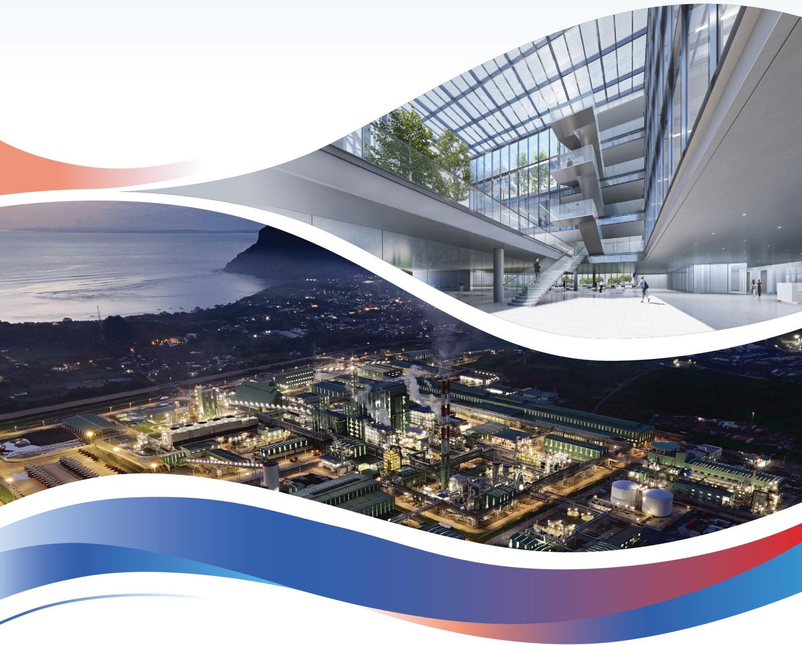

natural_image

Composite image showing a modern glass building with a coastal cityscape at dusk, and an illuminated industrial complex at night (no visible text or symbols)

# 2025

# 环境、社会与公司治理（ESG）报告

# ENVIRONMENTAL SOCIAL AND GOVERNANCE (ESG) REPORT

中国瑞林工程技术股份有限公司

# 目录

报告前言与编制说明 1

董事长致辞 3

关于中国瑞林 5

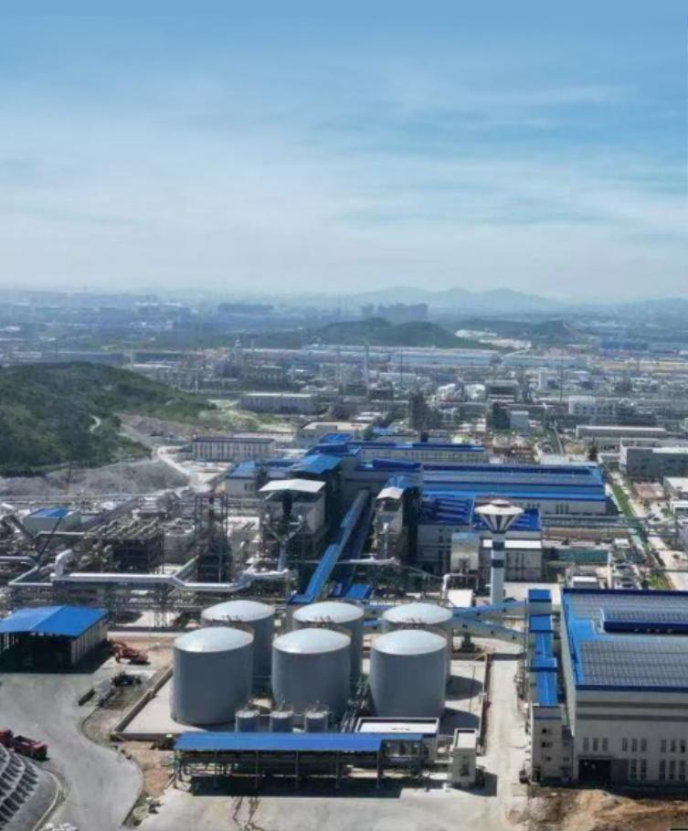

natural_image

Aerial view of an industrial complex with storage tanks and blue-roofed buildings, surrounded by green hills and urban infrastructure (no visible text or signage)

# 01

# 可持续发展治理

利益相关方沟通 18

重要性议题评估 19

尽职调查 21

可持续发展治理 22

# 02

# 规范稳健运营 笃行责任担当

强化公司治理 25

恪守商业道德 29

# 03

# 赋能社会发展 心系民生福祉

创新驱动 41

产品和服务安全与质量 46

供应链安全 50

信息安全与客户隐私保护 56

员工 59

乡村振兴 68

社会公益 72

境外履责 75

# 04

# 践行绿色使命 守护生态未来

应对气候变化 79

排放管理 83

资源管理 86

环境合规管理 88

生态系统和生物多样性保护 89

ESG数据表 91

对标索引表 96

# 报告前言与编制说明

本报告为中国瑞林工程技术股份有限公司首份《可持续发展/环境、社会和公司治理(ESG)报告》，旨在向投资者及各利益相关方，全面披露公司经营发展过程中，在ESG议题上秉持的核心理念、建立的管理体系、推行的实践工作及取得的阶段性成效。

# 报告范围

本报告披露范围涵盖中国瑞林工程技术股份有限公司及其附属公司(以下简称“中国瑞林”“公司”)。除非另有特别说明，本报告披露范围与中国瑞林(股票代码:603257.SH)同期合并财务报表范围保持一致。

# 报告期间

本报告披露期间为2025年1月1日至2025年12月31日。本报告所载数据，除特别标注外，均为该期间内的统计数据。

# 编制依据

本报告严格依据《上海证券交易所上市公司自律监管指引第14号——可持续发展报告(试行)》《上海证券交易所上市公司自律监管指南第4号——可持续发展报告编制》编制，在编制过程中同时参考全球报告倡议组织(GRI)《可持续发展报告标准》(GRI Standards 2021)相关要求。

# 数据说明

本报告所载数据、案例均来源于公司经营运行过程中的正式记录，确保信息来源真实可追溯；

报告中财务相关数据均以人民币为计价单位, 若财务数据与公司2025年度财务报告存在差异, 一律以公司年度财务报告为准。

# 报告获取方式

本报告以电子版形式发布,利益相关方可通过公司官方网站(https://www.nerin.com/)查阅获取。

# 联系我们

如对本报告内容有意见或建议, 可通过以下方式与公司联系:

联系邮箱:zqsw@nerin.com

# 报告编制原则

# 重要性

公司通过系统识别,确定投资者等利益相关方高度关注的、与公司经营发展密切相关的实质性ESG议题,并将其作为本报告核心披露重点。重要性议题分析过程中,充分结合公司所处行业特征与地域发展特点,分析过程及结果详见本报告相关章节。同时,针对环境、社会及治理维度中,可能对投资者及其他利益相关方产生重大影响的事项,本报告均予以重点披露。

# 准确性

本报告尽最大努力确保所载信息真实、准确、可靠。对于定量信息，均明确说明数据统计口径、计算依据及假定条件，确保计算误差处于合理范围，不会对信息使用者造成误导；定量信息及相关附注详见本报告《ESG 数据表》及其附注章节。公司董事会对本报告内容承担保证责任，确保报告不存在虚假记载、误导性陈述或重大遗漏。

# 平衡性

本报告秉持客观中立原则,如实反映公司ESG实践事实,对公司ESG工作中的正面成果与相关问题均予以公允披露。报告期间内,公司未发现本报告披露范围内存在应当披露而未披露的负面事件。

# 清晰性

本报告以简体中文发布,便于不同利益相关方查阅。报告中配套使用表格、模型图、专业名词表等形式,对文字内容进行补充说明,助力利益相关方准确理解报告核心信息;同时设置目录及ESG标准对标索引表,方便利益相关方快速检索、获取所需信息。

# 量化及一致性

本报告对公司ESG关键绩效指标均以定量形式披露，并尽可能补充披露历史数据，形成趋势对比。对同一指标，在不同报告期间的统计口径、披露方式保持统一；若因客观情况需调整统计及披露方式，将在报告附注中予以充分、明确说明，便于利益相关方开展有效分析，客观评估公司ESG绩效的发展趋势，具体详见本报告《ESG 数据表》。

# 完整性

本报告披露对象及范围与公司2025年度合并财务报表范围保持一致,确保ESG信息披露的范围完整、无重大遗漏。

# 时效性

本报告为年度可持续发展 / ESG 报告, 披露周期与公司会计年度保持一致。公司将在报告年度结束后, 尽最大努力加快报告编制与发布进度, 为利益相关方的决策活动提供及时、有效的信息参考。

# 可验证性

本报告所载案例、数据均来源于公司经营运行的原始记录或正式财务报告,所有披露数据的来源、计算过程均清晰可追溯,可支持外部鉴证机构开展相关核查工作。

# 董事长致辞

ESG是企业高质量发展的核心内涵，也是中国瑞林践行社会责任、实现可持续发展的重要指引。2025年，在外部环境异常严峻复杂、行业格局深度调整的背景下，公司锚定“逆势有为、稳中有进”的目标，在守住发展基本盘的同时，开辟新赛道、锻造新能力，将ESG理念深度融入市场开拓、技术创新、组织运营、全球布局的全流程，在环境(E)、社会(S)、公司治理(G)各维度实现了关键性、结构性的积极突破，以实际行动诠释了工程技术企业的责任与担当。

在环境价值创造上, 我们以技术创新赋能绿色发展, 将低碳、环保理念贯穿项目全生命周期。面对行业难题, 我们攻坚“除汞项目”实现技术突破, 为行业环保治理提供了瑞林方案; 探索“光储一体化”矿山能源解决方案, 以绿色清洁能源技术破解矿产开发的能源瓶颈, 为行业低碳转型开辟新路径; 抢抓数字化智能化发展机遇, 以“工艺+IT”融合的独特优势打造数字技术护城河, 通过智能平台搭建、全流程数据贯通, 推动工程设计与项目运营的节能提效, 实现技术创新与生态保护的同频共振。同时, 我们紧扣国家固体废物综合治理等战略要求, 将环境业务发展与国家生态环保政策深度结合, 以专业能力助力生态环境治理。

在社会价值践行上, 我们坚守产业初心, 勇担时代使命, 在服务国家战略、促进全球产业协同、保障员工发展等方面持续发力。作为工程技术企业, 我们主动融入国家“走出去”战略, 实现海外业务高质量发展, 2025年度新签合同额中海外合同占比突破76%, 在全球矿业领域擦亮中国技术、中国方案的名片, 同时带动中国装备、标准的国际输出, 促进全球矿业产业的协同发展; 我们始终将员工视为企业发展的核心财富, 在承压奋进的发展环境中淬炼队伍, 通过技术攻坚、项目实战培养了一支能打硬仗、熟悉国际规则的专业团队, 为员工搭建成长与发展的平台; 我们秉持“成为客户可信赖的整体解决方案合作伙伴”的理念, 以超出预期的服务满足客户需求, 以优质的项目成果为合作伙伴创造价值, 构建共生共赢的产业生态。

在公司治理提升上, 我们以自我革命的勇气持续推进组织与管理优化, 严格筑牢合规经营底线, 不断激活企业发展内生动力。面对发展中的结构性问题, 我们深刻反思、主动求变, 聚焦治理效能提升核心目标, 优化现有组织架构与业务流程, 打破专业壁垒、促进跨专业融合, 完善内部协同机制, 着力提升企业运营的敏捷性与高效性, 为公司高质量发展夯实坚实的组织基础; 坚持“以价值创造者为本”, 完善人才引育留用机制, 推动内部分配改革, 打破平均主义, 建立“能者上、优者奖、庸者下、劣者汰”的常态化机制, 充分激发组织与员工的创新活力;

将合规与安全作为企业发展的生命线, 全面对标国际一流的质量与安全标准, 强化技术安全、海外员工安全、网络数据安全等全方位管理, 加强全员合规培训, 树立“合规创造价值”的理念, 以规范的治理体系保障企业行稳致远。

成绩背后, 我们也清醒地认识到, 公司在ESG建设与发展融合上仍有提升空间: 国内市场开拓的多元性有待加强, 业务结构的均衡性需进一步优化; 部分领域的ESG理念落地仍需深化, 跨部门协同的效率仍需提升; 国际化发展背景下, ESG管理的全球化适配能力仍需锤炼。

2026年，是公司迈向高质量发展新阶段的关键之年，我们将以ESG理念为重要指引，锚定新目标、奋力开新局、实现新突破。我们将持续以技术创新驱动绿色发展，把数字智能打造为发展第一引擎，推动更多低碳、环保、智能的技术与方案落地；持续深化组织与业务变革，完善公司治理体系，筑牢安全、合规、品牌三大生命线，以规范治理保障可持续发展；持续践行社会责任，胸怀“国之大者”，将企业发展与国家战略同频共振，深耕国内大循环，勇当国际大循环的排头兵，在服务国家重大战略、促进全球产业协同中实现更大价值；持续保障员工发展权益，完善激励机制，搭建更广阔的成长平台，让员工与企业共同成长、共享发展成果。

ESG建设是一场长期的实践,唯有久久为功,方能行稳致远。中国瑞林将始终坚守初心、笃行实干,以更高标准、更实举措推动ESG理念与企业发展深度融合,以技术创新赋能绿色发展,以责任担当践行社会使命,以规范治理筑牢发展根基,与全体利益相关方携手同行,共创可持续发展的美好未来,为行业高质量发展与社会进步贡献更多瑞林力量!

吴润华

中国瑞林工程技术股份有限公司董事长

2026年4月

# 关于中国瑞林

# 公司概况

中国瑞林是一家专业的有色金属行业技术服务商，多年来聚焦有色金属全产业链，为境内外有色金属采矿、选矿、冶炼及加工领域客户提供涵盖设计咨询、总承包、装备集成、数智转型等全链条技术解决方案及全过程服务；同时积极拓展生态环境治理、市政、建筑等基础设施等领域的创新解决方案。2025年4月8日，公司成功在上交所主板挂牌上市，股票代码为603257。

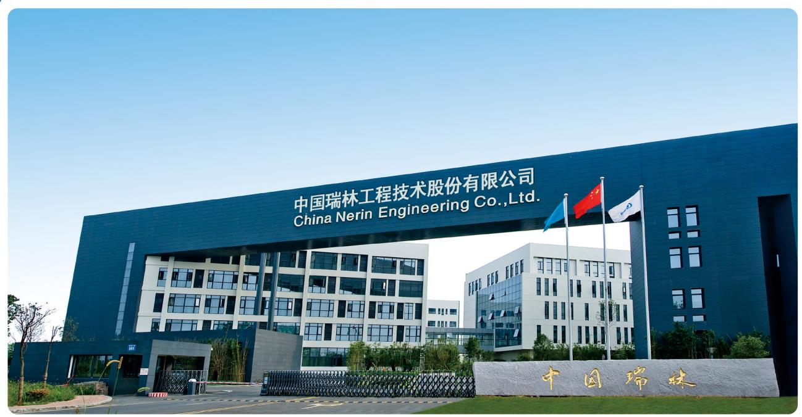

text_image

中国瑞林工程技术股份有限公司
China Nerin Engineering Co.,Ltd.
中国瑞林

中国瑞林拥有一支经验丰富的工程技术专家团队, 截至2025年12月31日, 专业技术人员超过1,800人, 其中, 中国工程院院士1名, 全国工程勘察设计大师3名, 全国有色行业设计大师11名, 享受政府特殊津贴专家15名, 正高级职称员工超过200名, 副高级职称员工超过550名, 各类注册工程师超过650名。

中国瑞林拥有包括有色金属矿山露天与深井开采、选矿与浸出，闪速冶金、熔池冶金、铜电解、湿法炼铜、再生金属回收、有色冶金装备、有色冶金过程自动化智能化、烟气制酸和固体废物环保处置、场地污染防治等多项核心技术，以及有色产业链全流程数智化整体解决方案NDI产品。截至2025年12月31日，公司累计获得国家、省部级、市级等荣誉1,275项，其中科技类奖项219项，专利奖7项，工程类设计、咨询奖等其他荣誉1,049项，国家科学技术进步一等奖1项、二等奖8项、三等奖2项。拥有专利技术647项，其中发明专利260项，主编国家和行业标准规范47项、参编124项，拥有软件著作权161项。

中国瑞林通过培育企业“创新”文化氛围不断自主研发创新，已成为我国有色金属领域技术输出的重要平台之一，国外业务遍及美国、澳大利亚、德国、智利、印度尼西亚、刚果(金)等70多个国家或地区，全球收入排名前十的矿业公司及中国企业500强排名前十的有色金属冶金、矿山企业大多与中国瑞林建立了合作关系。公司先后获得全国“五一劳动奖状”、全国专业技术人才先进集体、全国有色金属行业先进集体、全国工程勘察设计行业实施信息化建设先进单位等荣誉，并连续荣登年度美国《工程新闻纪录》“国际工程设计企业225强”榜单。

中国瑞林始终秉承“专业、信誉、创新、合作”的价值观和“成就客户、成就员工”的经营理念，坚持技术驱动的定位，致力于成为全球有色行业具有自主知识产权和核心竞争力的技术解决方案服务商及专有技术产品化智能装备集成供应商。

公司在全球70余个国家提供“设计+项目管理+专利装备+数字化技术”一揽子服务，带动200多家供应商“走出去”，海外业务营销合同额最高年份占比约70%。  
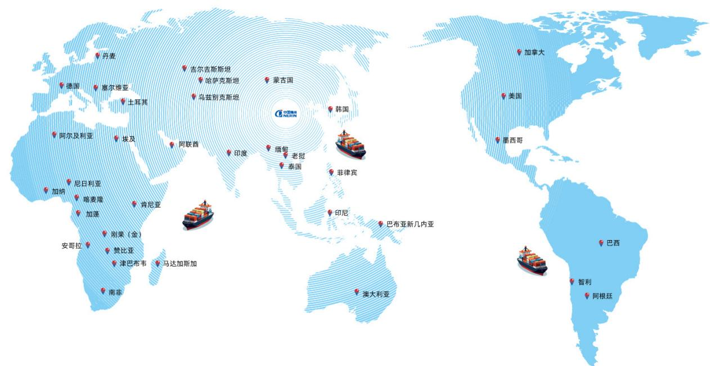

text_image

丹麦
德国
塞尔维亚
土耳其
阿尔及利亚
埃及
尼日利亚
加纳
哈麦隆
加蓬
肯尼亚
刚果（金）
赞比亚
津巴布韦
南非
马达加斯加
蒙古国
乌兹别克斯坦
吉尔吉斯斯坦
哈萨克斯坦
缅甸
老挝
泰国
印度
缅甸
韩国
菲律宾
印尼
巴布亚新几内亚
澳大利亚
澳大利亚
美国
墨西哥
加拿大
巴西
智利
阿根廷

# 业务领域

矿山

金属及非金属矿；采选工程、绿色矿山、智能矿山

# 冶金

冶炼：铜、铅、镍、稀有金属、贵金属；铁合金；固废资源化及无害化

加工：铜板带、管棒型线材；铝板带箔、管型线材；钨、稀土合金材料；其它有色金属加工

化工: 冶炼烟气、硫铁矿、硫磺制酸、精制硫酸; $H_{2}S$ 废酸处理; 脱硫、脱硝; 液体 $SO_{2}$ 、 $SO_{3}$ 制备

# 化工

# 环境

环境: 环境修复治理、工业渣库及堆场; 危废处理、生活垃圾处置; 市政给排水及水处理

电池级镍、钴锰盐制备；三元前驱体制备；锂电池回收、盐湖提锂、锂云母、锂辉石提锂

# 新能源

# 数字化与智能化

智能矿山、智能工厂、智慧园区、数字化交付、VR/AR、数字孪生、优化控制系统、控制系统集成、工业互联网平台、生产运营管控平台、供应链管理、合同能源管理、工业节能改造、新能源技术推广服务

规划、交通、路桥，隧道，管廊，智慧城市及市政公用管网；

公共建筑、居住建筑、工业建筑、BIM 设计、绿色建筑、建筑智能化、装配式建筑；

园林景观；

勘察：岩土工程勘察、水文地质勘察、岩土工程设计、工程物探、岩土检测监测；测绘测量；地质灾害评估及治理设计；

造价: 全过程造价咨询; 招标代理; 项目后评价; 收并购决策咨询; 技术经济;

监理：工程监理、项目管理；

# 城市建设

# 智能装备

铜、镍、铅等电解及净液车间全套设备；熔炼炉、PS转炉、TBRC炉、阳极炉、NGL炉、圆盘浇铸机、智能物流输送系统；废酸硫化系统。预组装模块化设计；专有技术产品化

  
组织架构

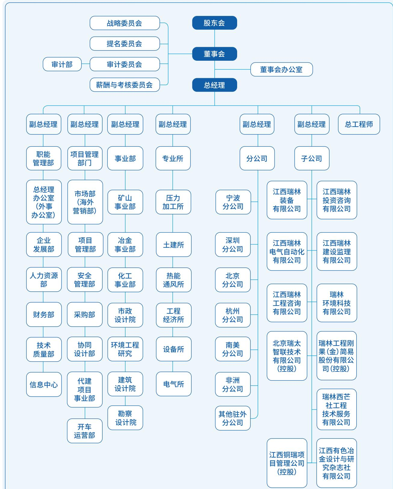

flowchart

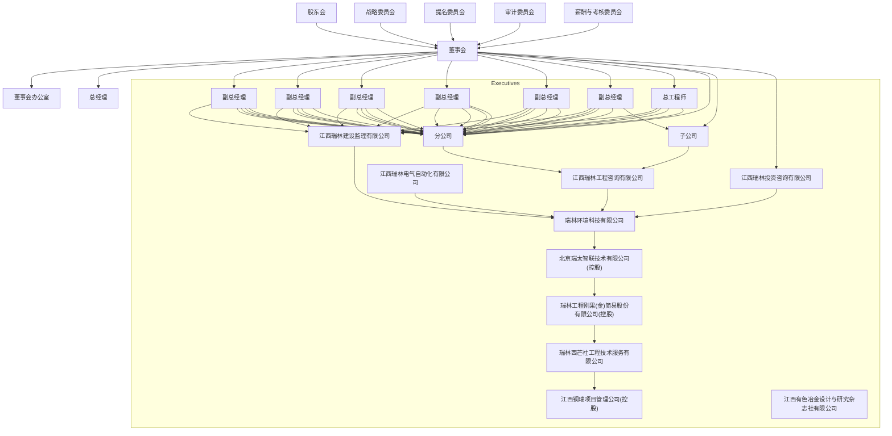
```mermaid
graph TD
  A["股东会"] --> B["董事会"]
  C["战略委员会"] --> B
  D["提名委员会"] --> B
  E["审计委员会"] --> B
  F["薪酬与考核委员会"] --> B
  B --> G["董事会办公室"]
  B --> H["总经理"]
  
  subgraph Executives
    I["副总经理"]
    J["副总经理"]
    K["副总经理"]
    L["副总经理"]
    M["副总经理"]
    N["副总经理"]
    O["总工程师"]
    P["分公司"]
    Q["子公司"]
    R["江西瑞林投资咨询有限公司"]
    S["江西瑞林建设监理有限公司"]
    T["江西瑞林电气自动化有限公司"]
    U["江西瑞林工程咨询有限公司"]
    V["瑞林环境科技有限公司"]
    W["北京瑞太智联技术有限公司(控股)"]
    X["瑞林工程刚果(金)简易股份有限公司(控股)"]
    Y["瑞林西芒社工程技术服务有限公司"]
    Z["江西铜瑞项目管理公司(控股)"]
    AA["江西有色冶金设计与研究杂志社有限公司"]
  end
  
  B --> I
  B --> J
  B --> K
  B --> L
  B --> M
  B --> N
  B --> O
  B --> P
  B --> Q
  B --> R
  
  I --> S
  J --> S
  K --> S
  L --> S
  M --> S
  N --> S
  O --> S
  
  P --> U
  Q --> U
  R --> V
  S --> V
  T --> V
  U --> V
  V --> W
  W --> X
  X --> Y
  Y --> Z
  
  I --> P
  J --> P
  K --> P
  L --> P
  M --> P
  N --> P
  O --> P
  
  I --> P
  J --> P
  K --> P
  L --> P
  M --> P
  N --> P
  O --> P
  
  I --> P
  J --> P
  K --> P
  L --> P
  M --> P
  N --> P
  O --> P
  
  I --> P
  J --> P
  K --> P
  L --> P
  M --> P
  N --> Q
```

# 2025年所获荣誉及绩效

报告期内,科技成果荣获一等奖3项,工程勘察咨询设计项目获奖62项,其中一等奖20项。中国瑞林持续加强重点专业领域和海外知识产权布局,全年获专利授权94项,其中国内发明专利40项、实用新型专利45项,国外专利9项,申请登记软件著作权21项。多项技术首次以签订技术许可合同的形式成套输出海外市场,开创了公司科技成果转化新模式。全年新立项科研项目35个,完成项目验收20项。牵头或参与制定国家标准、行业标准、团体标准17项。这些荣誉及绩效,彰显了中国瑞林在工程设计领域的综合实力。

  
刚果(金)SICOMINES铜钴矿项目二期工程(一等奖)

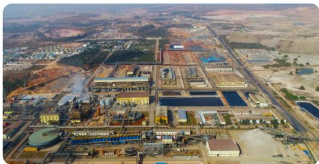

natural_image

Aerial view of an industrial complex with multiple buildings, storage tanks, and surrounding roads (no visible text or signage)

本项目是“中非铜钴成矿带”上的世界级铜钴矿山，拥有铜金属量855万吨、钴金属量51万吨的丰富资源，年矿石处理量达910万吨，年产高品质阴极铜25.35万吨、氢氧化钴（含钴金属）5180吨。项目技术团队创新研发复杂硫氧混合铜钴矿高效利用技术及装备体系，自主研制的智能机器人型电积铜成套机组在二期工程中成功应用，整体性能指标优于国外先进水平。

  
刚果(金) KFM铜钴矿项目一期工程
(二等奖)

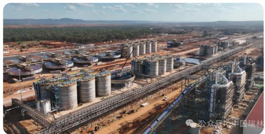

natural_image

Aerial view of a large industrial facility with multiple storage tanks and rail tracks, set against a backdrop of forested land and distant mountains (no visible text or symbols)

刚果(金)KFM铜钴矿是集采、选、冶及制酸工艺于一体的世界级超大型铜钴矿山。项目技术团队凭借中国瑞林多年来在刚果(金)已建成项目中积淀的宝贵经验，实现“少投入、多产出、高效益”的项目目标，创下从初步设计启动到项目投产不足1.5年的进度奇迹，刷新了非洲矿山建设的“中国速度”。

  
中铜东南铜业有限公司铜冶炼基地项目
(二等奖)

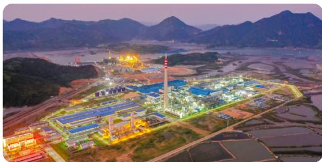

natural_image

Aerial view of a large industrial complex at dusk with illuminated buildings, surrounded by mountains and water bodies (no visible text or signage)

项目采用原始创新与集成创新相结合的方式,通过计算机仿真、工业化应用研究等环节,研发多项重大技术创新成果并应用于项目设计实践,创建旋浮冶金专用工艺模型,开发旋浮熔炼及旋浮吹炼炉体新结构,优化高浓度制酸技术,攻克铜冶炼烟气污染物超低排放技术等多项创新技术,成功实现大型创新型铜冶炼厂的自主设计与建设。

  
杭州市第三固废处置中心一期项目
(三等奖)

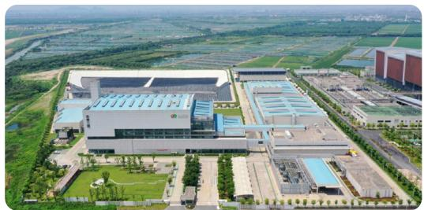

natural_image

Aerial view of a large industrial complex with multiple factory buildings and surrounding green fields (no visible text or signage)

本项目是当前国内危险废物处置工艺类别最齐全、医疗废物处置投运智能化程度最高、单系统处置规模最大，且工艺技术达到国际先进水平的行业标杆项目。建筑设计突出“去工业化”特色，着力实现建筑风格与周边环境的完美融合，打造“花园式危废处置工厂”的全新形象。项目处置技术整体达到国际先进水平。

  
刚果(金)龙溪铜矿采选冶工程项目(三等奖)

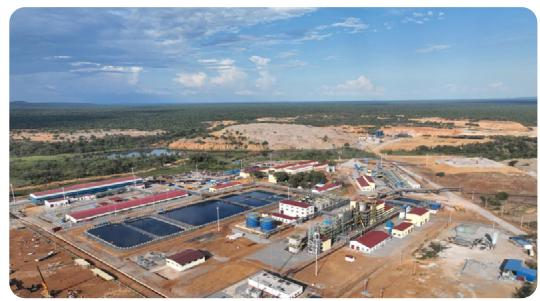

natural_image

Aerial view of an industrial facility with multiple buildings, storage tanks, and surrounding land (no visible text or symbols)

项目采选原矿年处理规模150万吨，采用破碎、磨矿、浮选、焙烧-制酸和湿法冶金工艺，年产阴极铜4万吨。焙烧炉一次点火成功并稳定连续运行，是中国瑞林持续为业主提供优质技术咨询服务的又一成功典范。焙烧——制酸和湿法冶金工艺也为中非铜(钴)矿带硫化铜精矿处理提供了更合理的工艺方案与实践经验。

中国瑞林BIM技术深度赋能项目斩获国家级信息技术应用技能大赛一等奖  
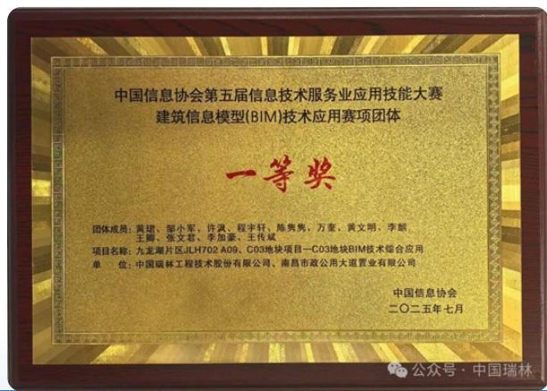

text_image

中国信息协会第五届信息技术服务业应用技能大赛
建筑信息模型(BIM)技术应用赛项团体
一等奖
团体成员: 黄珺、邹小军、许谟、程宇轩、陈隽隽, 万奎、黄文明、李麟,
王卿、张文君、李加豪、王传斌
项目名称: 九龙湖片区JLH702 A09、C03地块项目-C03地块BIM技术综合应用
单位: 中国瑞林工程技术股份有限公司、南昌市政公用大道置业有限公司
中国信息协会
二〇二五年七月

# 2025年：

国内发明

国外专利

40项

9项

国内实用新型

登记软件著作权

45项

21项

公司参与完成的“绿色低碳短流程连续炼铜关键技术开发及应用”项目获广西自治区科技进步一等奖, 公司牵头完成的“非爆智能连续采掘协同新技术与装备”获中国有色金属工业科技进步一等奖。

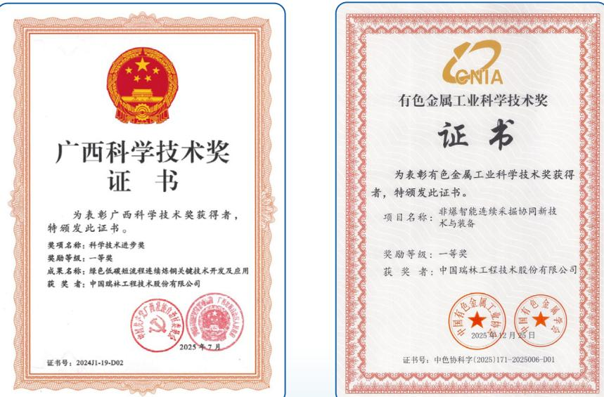

# 专题 新质生产力赋能传统工业转型：

# 中国瑞林数智化实践的ESG价值与可持续发展之路

在全球产业变革与“双碳”目标引领下，传统工业面临着绿色转型、安全升级与效率提升的多重命题。中国瑞林作为有色金属工业领域的领军企业，深刻把握数字化、智能化发展大势，以自主创新的NDI数智化解决方案为核心载体，将新质生产力深度融入传统工业全价值链，不仅推动客户在环境(E)、社会(S)维度实现系统性提升，更以技术创新筑牢自身可持续发展的核心竞争力，书写了科技赋能产业高质量转型的实践篇章。

# 一、技术创新筑基:构建新质生产力核心引擎

新质生产力的核心在于以科技创新驱动产业变革。中国瑞林立足有色工业深耕经验，整合工程数字化(ED)、工艺数字化(PD)、运营数字化(OD)全链条数据资源，创新研发出覆盖矿山(NDI\_M)、冶炼(NDI\_S)、化工(NDI\_C)、环境(NDI\_E)等多领域的NDI数智化解决方案体系，形成“对需求的精准匹配、对工艺的精深理解、对数据的精细掌控、对资源的精益整合”四大核心优势。

依托“瑞智”工业互联网平台，中国瑞林构建了从设备感知、边缘智能到云端决策的全层级技术架构，打通DCS/PLC/SCADA等系统数据流，集成熔炼、选矿、电解等多领域专家系统，实现从车间到企业顶层的一体化集成应用。通过融合5G、AI、大数据、数字孪生等前沿技术，形成“平台+应用”的智能制造新模式，为传统工业注入数字化、智能化新动能。2025年，公司将NDI数智化系统作为数字化转型核心抓手，强化全链条整合与市场化推广，形成软著和专利群，持续提升技术产品的市场影响力。

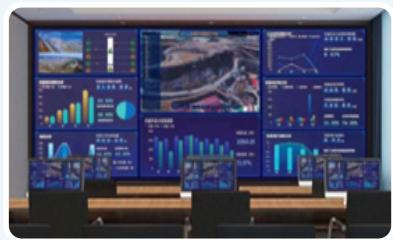

text_image

Control room displaying multiple large screens showing data dashboards and charts with Chinese text labels

数字化技术应用

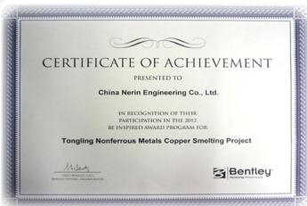

text_image

CERTIFICATE OF ACHIEVEMENT
PRESENTED TO
China Norin Engineering Co., Ltd.
IN RECOGNITION OF THEIR
PARTICIPATION IN THE 2013
BE INSPIRED AWARF PROGRAM FOR
Tongling Nonferrous Metals Copper Smelting Project

美国奔特力软件公司颁发给中国瑞林的“全球杰出成就奖”

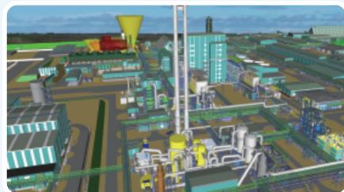

natural_image

Aerial view of an industrial complex with multiple buildings, piping, and storage tanks (no visible text or symbols)

三维协同设计

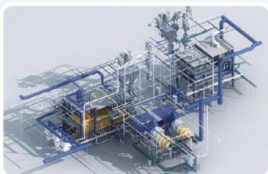

natural_image

3D rendering of an industrial facility with piping and machinery (no visible text or symbols)

三维设计模型

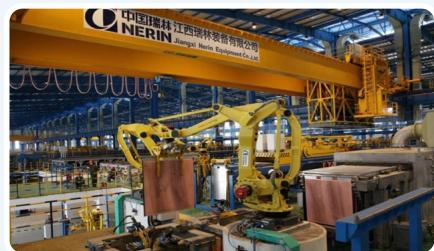

natural_image

Interior view of a large industrial factory with yellow robotic arms and overhead crane (no visible text or symbols)

公司自主研发的成套智能化装备

为全球智慧矿山

智慧工厂
智慧城市建设
提供更多
瑞林技术
瑞林方案

# 二、环境价值跃升:数智赋能绿色低碳转型

在环境责任维度,中国瑞林通过数智化技术破解传统工业高能耗、高排放难题,推动资源开发与生态保护协同发展。其核心路径在于实现从“能耗模糊”到“精准减碳”的转型突破,通过数字化工具让碳足迹可感、可控、可优化。

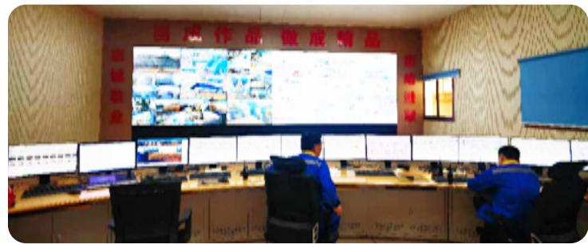

text_image

自成作品做成精品
自成职业
自成地域

在非洲智慧矿山项目群中，NDI\_M解决方案构建起精准的能源管控体系，通过能源智能观察屏实时监控采矿厂、选矿厂、冶炼厂等各环节电、水、蒸汽等能耗数据，动态优化能源负荷分配，大幅降低单位产品能耗。洛钼刚果(金)项目通过系统优化，实现介质能耗与综合能耗显著下降，粉尘、噪声污染得到有效控制，在保障资源开采效率的同时，守护了非洲当地生态本底。

依托自主研发的 NDI\_S数智化解决方案,构建了印尼阿曼铜冶炼厂全维度ESG管理体系,融合“双旋浮”绿色工艺与智能管控,通过瑞智工业互联网平台实现数据采集、数据处理、数据分析,配套PIMS和APC先进优化控制系统,降低能耗与碳排放,赋能项目达成环保合规、低碳高效与社会责任协同的ESG目标,打造海外有色行业可持续发展标杆。

刚果(金)Sicomines铜钴矿的三维可视化调度系统,通过数字孪生技术构建物理世界高保真镜像,实时映射电、气、热等能耗数据,为碳排放精准核算与减排决策提供科学依据,推动项目实现低碳运营。

这些实践充分证明，数智化技术已成为传统工业降低环境足迹、实现绿色转型的关键支撑。

natural_image

Scenic mountain landscape with snow-capped peaks, a winding river, and green grassland (no text or symbols visible)

# 三、社会价值升级:科技筑牢安全底线与发展根基

新质生产力在提升工业社会价值方面的作用，集中体现在本质安全提升、就业赋能与产业协同发展三个维度。中国瑞林通过数智化技术重构传统工业安全生产模式，从“被动防控”转向“主动预警、智能防控”，同时助力当地就业与产业升级，彰显企业社会责任担当。

在安全生产领域, 江铜华东铜箔项目部署全方位智能监测设备与AI智能预警算法, 对熔铜、生箔、分切等关键环节及高危区域实现实时感知与动态预警, 构建“感知——预警——处置——复盘”的全流程智能安全防护体系。刚果(金)Sicomines项目的三维可视化调度系统, 实时采集5大生产区域约2000个关键设备传感器数据, 让调度指挥从“看表格”升级为“看现场”, 实现隐患萌芽阶段精准识别, 真正做到“让数据多跑路, 让员工少涉险”。全流程自动化与无人车间技术的应用, 更从根本上降低了高危岗位作业风险, 保障员工生命安全。

在产业赋能与就业支持方面,中国瑞林秉持“授人以鱼不如授人以渔”理念,将NDI数智化技术引入非洲,推动当地有色金属矿山行业从传统开采向智能化转型,为当地矿业发展注入持久动力。项目实施过程中,优先聘用和培养当地员工,促进就业增收,Kamoa铜冶炼厂项目为当地创造了大量就业岗位,同时通过技术培训提升本地员工专业能力,实现技能赋能。这种“技术输出+人才培养”的模式,既保障了项目本地化运营,更厚植了中非合作情谊,实现企业发展与当地社会进步同频共振。

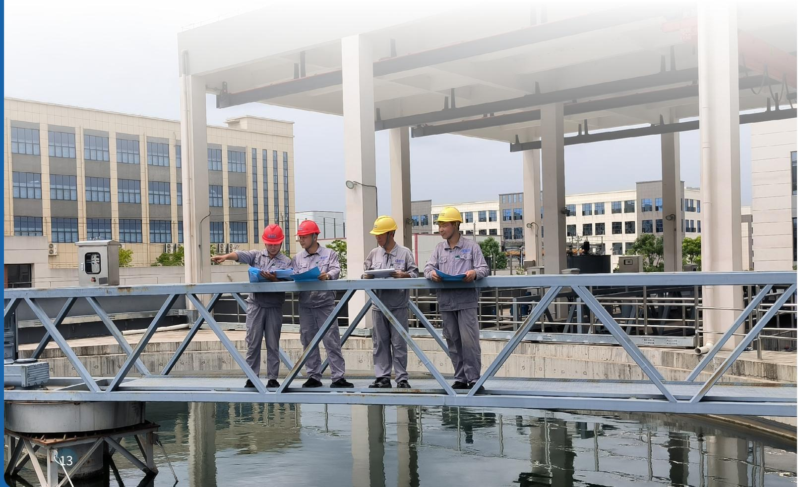

natural_image

Three workers in hard hats and uniforms reviewing documents on a metal bridge over water, with industrial buildings in the background (no visible text or symbols)

# 四、创新驱动发展:技术成果筑牢可持续增长基石

中国瑞林的数智化创新不仅赋能客户价值提升，更成为自身可持续发展的核心动力。通过将ESG理念融入技术研发与项目全生命周期，公司构建了“技术创新——价值创造——市场拓展——持续创新”的良性循环，实现商业价值与社会价值的统一。

在技术落地过程中, 公司积累了丰富的行业数据与实践经验, 进一步优化了NDI解决方案的适配性与先进性。上述一系列标杆项目的成功实施, 不仅验证了技术的可行性与有效性, 更提升了公司在全球有色工业数智化领域的品牌影响力。依托“AI + 数据 + 建设 + 场景应用”的核心能力, 公司不断拓展业务边界, 从工程设计延伸至智能工厂、智慧矿山全流程服务, 形成新的业务增长点。

同时，公司将数智化技术与治理体系深度融合，通过NDI架构搭建风险预警机制，加强合规管理与各方沟通协作，为“走出去”战略提供坚实保障。这种以技术创新为核心、以ESG价值为导向的发展模式，让公司在市场竞争中保持领先优势，为长期可持续增长奠定了坚实基础。

中国瑞林的实践证明,新质生产力是传统工业实现ESG价值跃升与可持续发展的关键路径。通过NDI数智化解决方案这一核心载体,公司不仅帮助客户破解了绿色转型、安全升级的行业痛点,实现环境效益与社会效益的双重提升,更以持续的技术创新构建了自身的核心竞争力。未来,随着NDI生态系统的不断丰富完善,中国瑞林将继续深耕有色工业数智化领域,推动技术创新与可持续发展深度融合,在赋能全球传统工业转型升级的同时,实现企业自身的高质量、可持续成长,为构建人与自然和谐共生的产业生态贡献瑞林智慧与力量。

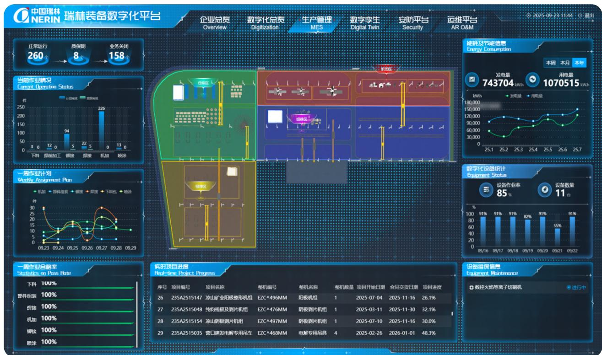

bar

| Category | Value |
| --- | --- |
| 26 | 91% |
| 27 | 91% |
| 28 | 91% |
| 29 | 82% |
| 30 | 91% |
| 31 | 55% |
| 32 | 91% |

natural_image

Aerial view of a winding road through a dense forest, no visible text or symbols.

# 01

# 可持续发展治理

- 利益相关方沟通  
- 重要性议题评估  
- 尽职调查  
- 可持续发展治理

# 01

# 可持续发展治理

# 利益相关方沟通

公司高度重视与利益相关方的沟通,根据公司实际情况与业务发展情况,构建多元化沟通渠道,确保公司与各利益相关方建立常态化的沟通机制,及时有效传达信息、积极回应利益相关方的诉求。

# 主要利益相关方

# 政府及监管机构

# 股东及投资者

# 客户

# 重点沟通议题

- 应对气候变化  
- 环境合规管理  
- 排放管理  
- 资源管理  
- 生态系统及生物多样性  
- 社会公益  
乡村振兴  
- 境外履职  
- 产品和服务安全与质量  
- 信息安全与隐私保护

- 创新研发  
- 产品和服务安全与质量  
- 公司治理  
- 尽职调查  
- 风险管理  
- 合规运营

- 产品和服务安全与质量  
- 信息安全与隐私保护  
- 供应链管理  
- 创新研发  
- 科技伦理  
- 知识产权保护  
- 负责任营销

# 沟通途径与回应

- 政策执行  
- 公文往来  
- 备案或审批  
- 现场稽查  
- 参与有关部门、协会组织的培训  
- 机构考察  
- 定期走访沟通

- 股东会及业绩说明会  
- 投资者关系活动  
- 上市公司信息披露  
- 定期公告及公司公告  
- 机构调研  
- 投资者热线、互动平台

- 产品品质管理  
- 客户沟通及投诉机制  
- 客户满意度调查  
- 负责任供应链尽责调查  
- 签订保密协议

# 主要利益相关方

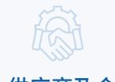

# 供应商及合作伙伴

# 员工

# 社区及公众

# 重点沟通议题

- 供应链安全  
- 反商业贿赂及反贪污  
- 反不正当竞争  
- 信息安全与隐私保护  
- 创新研发  
- 知识产权保护  
- 负责任营销  
- 平等对待中小企业

- 员工培训与发展  
- 职业健康与安全  
- 员工权益与福利  
- 信息安全与隐私保护  
- 反商业贿赂及反贪污  
- 反不正当竞争

- 创新研发  
- 产品和服务安全与质量  
- 社区公益  
- 乡村振兴  
- 应对气候变化  
- 环境合规管理  
- 生态系统及生物多样性  
- 能源管理  
- 资源管理

# 沟通途径与回应

- 供应商管理程序  
- 策略性合作项目  
- 行业会议交流  
- 专业数据平台  
- 现场考察  
- 签订保密协议

\- 供应商/承办商评估制度

- 员工手册  
- 员工活动和团队建设  
- 工作表现评核及晤谈  
- 业务简报  
- 管理会议及员工大会  
- 员工内外部培训

\- 员工表达意见的渠道（意见箱、沟通会议等）

- 社交媒体及媒体沟通  
- 高级管理人员访问  
- 行业会议  
- 志愿服务  
- 社区活动  
- 信息披露

# 重要性议题评估

中国瑞林结合自身业务及发展战略，以及行业发展趋势、国内外ESG报告标准，开展重要性议题的识别、评估、排序与报告工作。

2025年, 公司依据《上海证券交易所上市公司自律监管指引第14号——可持续发展报告(试行)》(简称《指引》), 并参考中国上市公司协会《可持续发展报告工作指南》, 在报告编制过程中开展识别和应对可持续发展相关负面影响或风险的尽职调查程序, 基于“双重重要性”原则开展重要性议题分析, 并对具有较高重要性的议题进行重点披露。

# 中国瑞林2025年议题重要性分析流程

# 背景调研

全面梳理公司经营活动及商业关系,系统解读国家及行业相关法律法规、监管政策,深入分析ESG相关评级标准及同行业企业实践经验;明确公司经营活动主要影响的利益相关方群体,梳理与各利益相关方的沟通渠道、沟通方式及沟通重点。

# 议题清单建立

以《上海证券交易所上市公司自律监管指引第14号——可持续发展报告(试行)》(以下简称《指引》)明确的21个议题为基础，结合公司核心业务板块特点、ESG标准对标要求、政策导向分析及同行业实践经验，构建初步议题清单；通过部门访谈、利益相关方调研等多种方式，广泛收集各部门及受影响利益相关方关注的ESG议题，汇总整理后形成初步的议题重要性分析清单。

# 评估与确认

邀请内外部ESG领域专家,共同参与议题的识别与分析工作,重点研判各议题对公司经营发展产生的影响、潜在风险及发展机遇,制定科学合理的评估方法,设定明确的议题重要性评估扩值;从影响重要性、财务重要性两个核心维度,对清单内议题进行全面评估,确定各议题的重要性排序,形成议题重要性矩阵。

# 议题披露

议题重要性矩阵经公司董事会审核确认后，公司将在2025年度可持续发展报告中，针对重要性较高的议题进行重点披露，确保披露内容贴合利益相关方关注重点，符合监管披露要求。

natural_image

Panoramic view of rugged mountain ranges under a clear blue sky with scattered clouds (no text or symbols visible)

# 中国瑞林重要性议题矩阵图

# 非常重要

\- 生物多样性保护

\- 循环经济

能源利用

环境合规管理

\- 污染物处理

数据安全与客户隐私保护

\- 废弃物处理

水资源管理

乡村振兴

● 职业健康与安全

\- 应对气候变化

● 社会贡献

● 平等对待中小企业

\- 反不正当竞争

\- 员工雇佣与权益

● 员工培训与发展

● 科技伦理

产品和服务安全与质量

创新驱动

供应链安全

公司治理

# 不 重要

# 对公司财务的重要性

既不具有财务重要性,也不具有影响重要性

具有影响重要性但不具有财务重要性

具有财务重要性但不具有影响重要性

# 非常重要

同时具有影响重要性和财务重要性

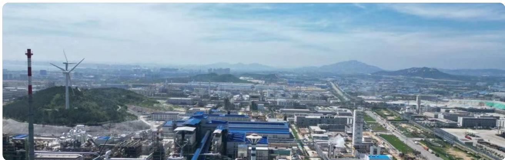

natural_image

Aerial view of a large industrial complex with wind turbines, factory buildings, and surrounding hills under a partly cloudy sky (no visible text or signage).

# 尽职调查

中国瑞林2025年严格遵循上市公司治理规范及行业ESG治理要求，结合自身业务特点与发展需求，持续优化公司治理体系，夯实治理根基，确保治理流程规范、权责清晰、监督有效，切实将治理理念融入企业经营发展全过程，有效保障股东、员工、客户等利益相关方权益，未发现重大治理缺陷、违规经营及外部处分等风险事项。

公司2025年深化治理机制建设，制定《“提质增效重回报”行动方案(2025年)》，完成《公司章程》修订及监事会改革，进一步完善以《公司章程》为核心的治理制度体系，明确董事会在公司治理及ESG管理中的核心决策与监督职责，董事会定期审议治理相关议案、监督治理举措落地，2025年顺利完成董事更换及董事长选举工作，优化董事会成员结构，新任董事均符合相关法律法规要求的任职条件，确保董事会运作的专业性与高效性。

公司强化“关键少数”责任意识，积极组织董监高参加各类专题培训，有效提升管理能力；健全内部控制评价体系，形成规范的评价工作组织领导体制，确保内部控制措施运行正常，未发现财务报告及非财务报告内部控制重大缺陷。

在信息披露与股东权益保护方面，公司严格履行信息披露义务，确保信息披露真实、准确、完整，建立多层次投资者良性互动机制，2024年度向全体股东每10股派发现金红利5.00元，切实保障股东回报，2025年股东会表决赞成率达99.95%，股东参与度66.79%，充分体现投资者对公司治理的认可；同时规范关联交易管理，恪守商业道德，强化合规经营与风险防控，构建高效的风险防控体系，有效识别并防范各类经营治理风险，推动公司治理体系向规范化、精细化、专业化方向发展，为企业可持续发展提供坚实的治理保障。

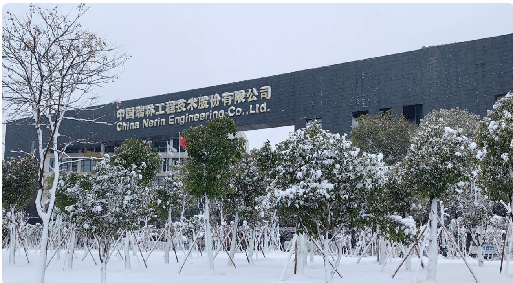

text_image

中国瑞林工程技术股份有限公司
China Nerin Engineering Co.,Ltd.

# 可持续发展治理

中国瑞林在实现自身发展,保持高标准的企业治理水平的同时,将ESG管理融入公司发展战略和经营管理之中,建立并持续完善ESG管理架构,为ESG工作的全面推进提供治理保障,助力公司可持续发展。

公司董事会全面监督公司ESG事宜并对其有效性负责，充分履行ESG相关事项的决策和监督职责，公司高级管理层负责ESG重大事项的审议与决策。此外，公司设立ESG工作小组，明确各部门及子公司对ESG重点议题的归口管理及职能划分。

中国瑞林可持续发展治理架构

<table><tr><td>层级</td><td>机构</td><td>职责</td></tr><tr><td>决策层</td><td>董事会</td><td>全面监督可持续发展及ESG管理工作并对其最终负责;审阅公司年度ESG重要性议题清单及可持续发展报告。</td></tr><tr><td>管理层</td><td>高级管理层</td><td>负责ESG重大事项的审议与决策。</td></tr><tr><td rowspan="2">执行层</td><td>ESG工作小组</td><td>负责统筹协调ESG事务的执行与落实。</td></tr><tr><td>相关部门及子公司</td><td>按照公司ESG管理方针、策略和年度工作来组织及执行各项ESG相关工作;收集及上报ESG内部政策、制度及ESG相关的绩效指标;遵守各项ESG相关政策及制度。</td></tr></table>

natural_image

Person in business suit writing on notebook while holding smartphone, surrounded by office desk with notebooks and glasses (no visible text or symbols)

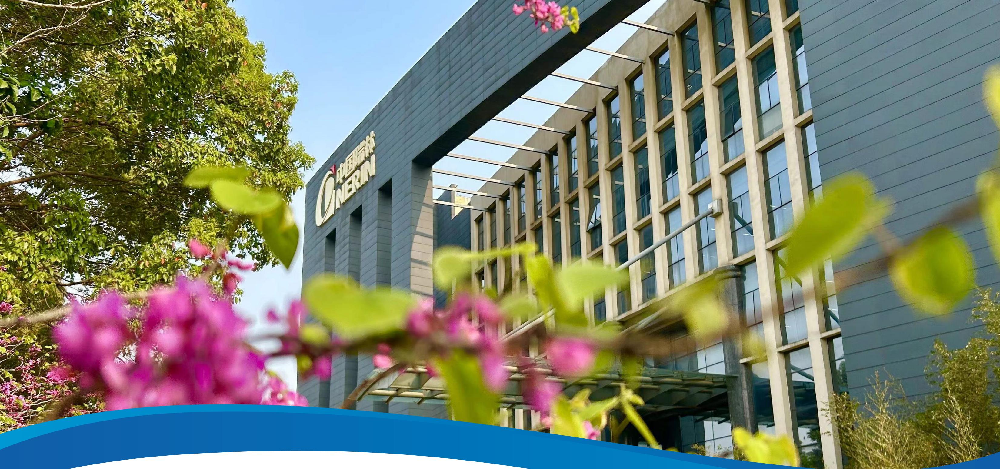

natural_image

Exterior view of a modern glass building with '中国证券' signage, surrounded by greenery and pink flowers in the foreground (no readable text beyond signage)

# 02

# 规范稳健运营 笃行责任担当

- 强化公司治理  
- 恪守商业道德

# 02 规范稳健运营 笃行责任担当

# 强化公司治理

在公司治理合规管理方面，中国瑞林严格恪守《中华人民共和国公司法》《中华人民共和国证券法》《上市公司治理准则》《上海证券交易所股票上市规则》《上市公司信息披露管理办法》《企业内部控制基本规范》等相关法律法规及监管规定，将合规理念贯穿公司治理全过程，确保公司治理各项工作合法合规、规范有序，切实防范治理合规风险。

为进一步夯实治理基础、提升治理水平，公司以合规经营为核心，制定并持续完善《中国瑞林工程技术股份有限公司章程》《战略委员会工作细则》《薪酬与考核委员会工作细则》《关联交易管理办法》《信息披露管理制度》等一系列内部治理制度，形成“法律法规为遵循、内部制度为支撑”的治理制度体系，推动公司治理工作标准化、规范化开展。

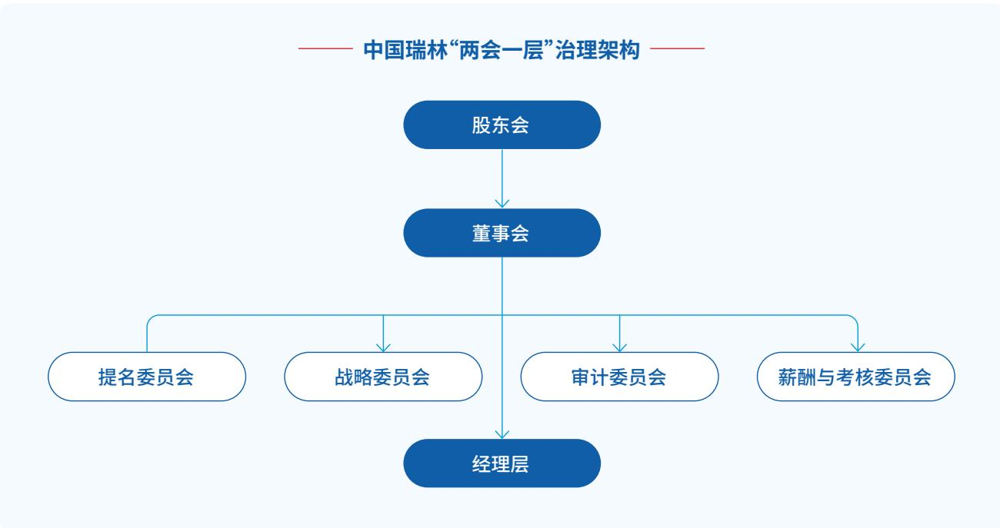

flowchart

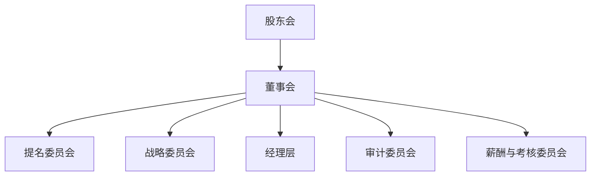
```mermaid
graph TD
  A["股东会"] --> B["董事会"]
  B --> C["提名委员会"]
  B --> D["战略委员会"]
  B --> E["经理层"]
  B --> F["审计委员会"]
  B --> G["薪酬与考核委员会"]
```

在治理架构建设上, 公司建立了由股东会、董事会和经理层构成的“两会一层”规范治理架构, 明确界定各层级的职责分工, 确保各项治理工作有序高效推进。同时, 董事会下设战略委员会、提名委员会、审计委员会、薪酬与考核委员会四个专门委员会, 各专门委员会各司其职、协同发力, 进一步完善决策支撑与监督制衡机制, 助力提升公司治理的专业性与科学性。

# 中国瑞林公司治理架构与职责分工

# 股东会

\- 作为公司的最高权力机构，股东会根据《公司章程》及相关法律法规规定，依法行使下列职权：审议批准公司经营方针和投资计划；选举和更换非由职工代表担任的董事；审议批准董事会报告；审议批准公司利润分配方案和弥补亏损方案；审议批准公司增加或者减少注册资本、发行债券及其他证券和上市方案；审议批准公司合并、分立、解散、清算或者变更公司形式的方案；修订《公司章程》及《股东会议事规则》等重要制度；以及法律、行政法规、规章及《公司章程》规定应由股东会行使的其他职权。公司严格遵循上海证券交易所的相关监管要求，按照《公司章程》《股东会议事规则》的规定定期召集、召开股东会，会议采用现场结合网上虚拟方式召开，并委任核数师担任点票监察员，确保股东的知情权、参与权、表决权与监督权得到充分保障。

# 董事会

- 作为公司经营管理的决策机构，董事会对股东会负责，行使制定公司经营计划和投资方案、制定公司年度财务预算方案和决算方案、制定公司利润分配方案和弥补亏损方案、聘任或者解聘公司总经理等高级管理人员等职权。  
- 董事会下设审计委员会、薪酬与考核委员会、提名委员会、战略委员会等专门委员会，各专门委员会各司其职、协同配合，为董事会决策提供专业支持与咨询建议，确保董事会议事和决策的专业化与高效化。

# 总经理

\- 负责公司的日常经营管理工作，执行董事会制定的战略和计划，组织实施公司的经营方案，确保公司各项业务按序运营。

报告期内，

召开股东会

2次

累计审计议案

17项

召开董事会

5次

董事出席率达

100%

累计审计议案

36项

召开专门委员会会议

8次

累计审计议案

21项

# 董事会独立性与多元化

中国瑞林重视董事会独立性与成员多元化，在《公司章程》中规定独立董事在董事会中占比不低于三分之一，确保独立董事具备上市公司运作的基本知识，熟悉相关法律法规及上海证券交易所的规定，在董事会中充分发挥参与决策、监督制衡与专业咨询的作用。

公司现任董事会成员专业覆盖冶金工程、土木工程、金融、法律、经济学、会计等领域，成员多元化有利于促进董事会在决策过程中拓宽视野，提升决策的科学性与针对性。截至报告期末，公司独立董事占比约36%。

报告期内，

董事会总人数

14人

召开董事会四个专门委员会会议

8次

独立董事

5人

召开独立董事专门会议

1次

# 信息披露与投资者关系管理

中国瑞林始终把完善公司治理结构、健全内部控制制度、严格履行信息披露义务、加强投资者关系维护等作为股东等其他利益相关者权益保护的重要措施，坚持可持续发展与稳健扩张的原则，努力提升经营绩效，规范运作，不断完善公司治理，严格防范风险，确保公司合规、稳健、快速发展的同时积极回报股东。公司上市后严格遵照信息披露相关规定开展公告工作，各项披露任务有序完成。

公司重视信息披露事务管理，积极维护公司、投资者及其他利益相关者的合法权益。依据公司《对外信息发布和媒体应对暂行规定》要求，通过与上市申报公开数据进行比对、审查的方式，对外发布信息实施严格审批。加强公司与投资者及潜在投资者之间的信息沟通，促进投资者对公司的了解，保护投资者特别是中小投资者的合法权益。本年度内，共审批对外信息发布审批流程超40条，有效保障了公司对外发布信息与上市公司信息披露公布数据的一致性。

公司通过投资者热线/邮箱、投资者关系互动平台、股东会及业绩说明会、投资者调研、路演、投资者集体接待日等多元化方式，积极与投资者交流与互动，向外部利益相关方传达公司的战略方向和业务发展计划，及时了解、回应投资者对公司的关注和期望。

# 中国瑞林信息披露与投资者关系情况汇总

报告期内, 公司已发布定期报告3次、临时公告超60次、投资者关系活动记录表6次; 完成13项章程及制度的修订工作, 新编《舆情管理工作指引》, 累计发布公告达88份。

公司通过互动平台回复投资者提问64条，均保证在2个交易日内回复，回复率100%。积极参与各类投资者交流活动，包括江西辖区上市公司2025年投资者网上集体接待日暨公司2024年度业绩说明会(回复提问10条)、2025年半年度业绩说明会(回复提问10条)、召开2025年第三季度业绩说明会(回复提问12条)；接待民生证券、国金证券、财通证券及基金公司现场调研，与投资机构开展广泛深入交流，累计回复投资机构提问13条。

# 2025年,参与组织多项投资者教育主题活动:

- 5月,参与江西证监局开展的5·15投资者保护主题教育活动,董事会秘书方填三先生参与投教主题论坛,投教宣传语同步投放于公司大屏;  
- 11月17日,协助接待长城证券投资者教育基地举办的“我是股东”——走进上市公司中国瑞林主题投教活动,接待20余名投资者参观公司募投项目建设现场;  
- 11月20日，协助接待长江证券投资者公开日活动，接待投资者10余人。

# 为强化“关键少数”合规意识,提升信息披露工作水平,公司多次组织开展专项培训活动:

- 2025年4月25日,举办信息披露规范与实务培训暨瑞林大讲堂系列讲座,特邀信公股份董事总经理徐文娟女士主讲;  
- 2025年6月20日，成功举办信息披露规范与实务培训暨瑞林大讲堂系列讲座，特邀长江证券承销保荐有限公司业务总监苗健担任主讲嘉宾。

# 公司严格遵守监管要求,积极参与江西证监局组织的各类宣传活动:

- 2025年6月18日,开展防范非法证券活动宣传;  
- 2025年9月21日,开展公平政策周宣传;  
- 2025年12月8日，参与宪法宣传周相关活动，并报送以上相关活动资料至江西证监局。

natural_image

Scenic mountain landscape with misty valleys and sun rays, no visible text or symbols

中国瑞林积极践行以投资者为本的发展理念，坚持长期稳定的利润分配政策。根据中国证监会《上市公司章程指引》《上市公司监管指引第3号—上市公司现金分红》等规定，在《公司章程》中约定了利润分配原则。2024年度，公司以实施利润分配时股权登记日的总股本120,000,000.00股为基数，向全体股东每10股派发现金红利5.00元(含税)，总分红额度6,000万元(含税)，占当年归母净利润的39.47%。2025年上半年，公司完成了2024年度权益分派的实施工作，让全体股东切实获得收益。

# 投资者权益

每股派发现金红利

0.5元

披露定期报告

3份

披露临时报告

85份

召开投资者交流活动次数

5次

投资者交流活动参与人次

50 人次

接待投资者调研

3 次

接听投资者电话

1 - 2 次/周

各渠道与投资者沟通互动总次数

64次

e互动

3次

业绩说明会

3次

机构交流

2次

走进上市公司活动

# 恪守商业道德

# 反商业贿赂及反贪污

中国瑞林高度重视舞弊防范与廉洁治理, 将其作为完善公司治理、强化内部控制的核心举措, 严格遵循《中华人民共和国公司法》等法律法规及相关规定, 构建“制度保障 + 流程管控 + 责任落实”的全链条反舞弊与廉洁从业管理体系。

公司制定并修订《反舞弊规定》及《领导人员业务回避暂行规定》，明确员工、董事、高管等全体人员的行为准则，细化举报热线与投诉管理流程，为反商业贿赂、反贪污工作提供坚实制度依据；建立健全廉洁从业相关制度，每年组织各部门签订廉洁协议，系统梳理包含关联企业、管理层亲属等在内的禁止交易名单，通过制度化规范防范利益输送风险，督促全体人员恪守法律法规、行业规范、职业道德与公司规章制度，树立廉洁从业、勤勉敬业的良好风气，切实防范损害公司及股东利益的行为，保障公司持续、稳定、健康发展。

# 中国瑞林反商业贿赂及反贪污管理架构

# 审计部、人力资源部

负责廉洁建设方向的指引，监督廉洁建设规范的有效执行，对廉洁建设管理规范具有最终裁决权和解释权。

# 反腐败工作协调小组

负责廉洁建设管理规范的执行和廉洁反腐文化的教育和宣传；在全公司范围内开展检查工作，对在职、离职重点岗位人员进行审查；接受全体员工的举报和监督，对举报和违规情况进行调查核实。

# 各部门

负责对本部门员工职务行为的日常监督管理，并进行廉洁建设制度的传达和教育，履行廉洁自律管理规定的监督权和举报权。

公司致力于打造诚信透明的经营环境，强化对员工及管理层的廉洁监督，向合作伙伴传递廉洁建设坚定立场。精准识别并评估各环节腐败风险，及时采取纠偏与预防措施，从源头防范腐败行为发生。

# 中国瑞林反商业贿赂及反贪污管理措施

# 开展专项培训与教育

每年由审计部、人力资源部牵头组织专家讲座、案例学习等活动，聚焦职业道德教育、廉洁从业教育，提升全员反商业贿赂及反贪污意识；结合上市推进高管履职尽责培训，强化关键岗位人员的合规意识。

# 建立举报与监督机制

通过《反舞弊规定》明确举报热线及投诉流程，确保相关违规行为及时被发现；审计部通过专项审计、内控评价等方式，对项目招投标、采购、财务收支等关键环节进行监督，排查潜在风险。

# 强化制度执行与协同

通过签订廉洁协议等方式，明确各部门及岗位的廉洁责任；审计部与人力资源部协同，推动反商业贿赂及反贪污制度落地，对违规行为严肃处理。

报告期内，公司未发生任何与贿赂、欺诈、勒索、洗钱相关的重大违法违规行为，亦无任何董事、监事、高级管理人员或员工牵涉贪污相关案件，未因上述事项受到监管部门处罚或产生重大负面影响，公司合规经营与廉洁治理体系运行有效。

# 反不正当竞争

中国瑞林始终严格遵循《中华人民共和国反不正当竞争法》等相关法律法规，坚守公平竞争原则，构建全方位、多层次的反不正当竞争管理体系，规范市场经营行为，防范不正当竞争风险，维护行业市场秩序与公司合法权益。

公司立足自身经营特点，制定完善反不正当竞争相关管理制度，明确市场竞争行为准则，严禁任何虚假宣传、商业诋毁、不正当竞争关联交易、滥用市场支配地位等违规行为，引导全体员工树立合规竞争意识。在对外合作中，通过合同条款明确双方竞争行为边界，约束合作方遵守反不正当竞争相关规定，杜绝联合违规竞争、恶意串标等行为，共同维护公平有序的市场环境。

为从源头防范不正当竞争风险, 公司建立健全供应商全生命周期管理机制, 重点完善供应商负面清单管理制度。对存在商业纠纷、司法诉讼、不正当竞争记录、违规经营等不良信用记录的供应商, 严格执行准入限制、动态管控及退出机制, 从合作源头切断不正当竞争关联风险, 保障供应链竞争的合规性。

同时, 公司加强反不正当竞争合规培训与宣贯, 面向全员开展《中华人民共和国反不正当竞争法》及公司相关制度的专题培训, 明确不正当竞争行为的法律责任与后果, 提升全员合规竞争意识, 推动合规竞争理念融入日常经营管理的每一个环节。

报告期内, 公司严格执行反不正当竞争相关管理制度, 未发生因不正当竞争行为导致的司法诉讼、重大行政处罚, 也未出现违规竞争相关的投诉与纠纷, 反不正当竞争管理体系运行高效, 为公司持续健康发展提供了坚实的合规保障。

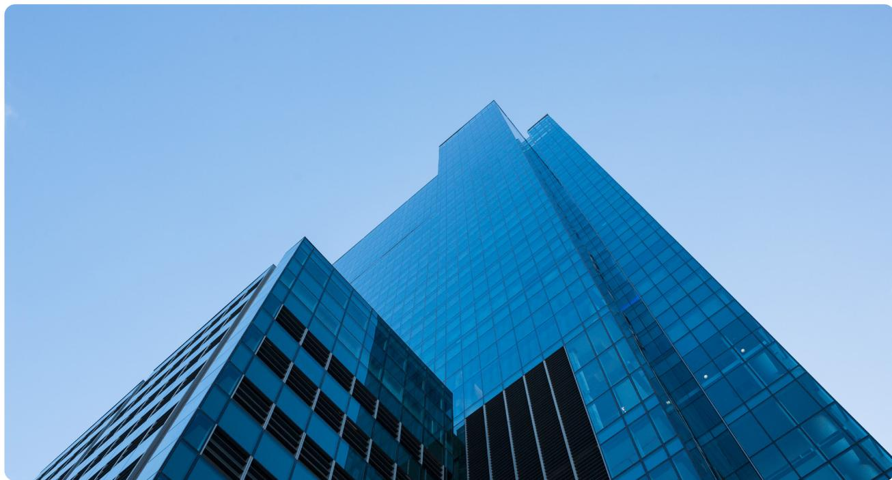

natural_image

Exterior view of a modern glass skyscraper under a clear blue sky (no signage or text visible)

# 专题 技术赋能生态共治

# 中国瑞林以专业担当书写ESG价值引领新篇章

在全球可持续发展浪潮下，生态保护、民生改善与固废治理已成为衡量企业社会责任与行业影响力的核心标尺。中国瑞林深耕环保与基建领域多年，跳出单纯技术服务的传统框架，以“问题导向 + 技术创新 + 系统解决方案”为核心路径，在矿山生态修复、跨境民生工程、固废资源化利用三大领域持续突破，既为行业破解共性难题提供可复制的实践样本，更以跨界协同、全球普惠的责任担当，彰显领军企业的行业引领价值，书写了生态效益、社会效益与经济效益共赢的ESG答卷。

# 一、矿山生态修复:破解行业痛点,树立全国示范标杆

有色金属矿山长期开采引发的土壤退化、重金属污染、水土流失等问题，是传统工业绿色转型的“硬骨头”。中国瑞林凭借对行业痛点的深刻洞察与技术攻坚能力，以永平铜矿生态修复项目为突破口，构建起“精准诊断——技术创新——系统治理——长效运维”的全链条解决方案，为全国同类矿山生态修复提供了可推广的“瑞林方案”。

永平铜矿作为江铜集团主干矿山，长期露坑联采导致大量弃石露天堆放，高浓度重金属酸性废水无序存储，周边水体锌、镉浓度超标，大片耕地丧失耕种功能，被2020年长江经济带生态环境警示片披露。面对这一复杂生态难题，中国瑞林项目团队并未采取简单的“头痛医头”模式，而是进行系统性诊断，针对性采用自主研发的“原位基质改良 + 直接植被”核心技术，搭配土方平整、截排水系统铺设、石灰中和降酸等辅助措施，精准破解排土场坡面松散、土壤贫瘠、pH值低、重金属超标、干旱板结等多重困境。该技术具有成本低、见效快、免维护、不退化的显著优势，经过三年多四季循环检验，治理成效稳定可靠。

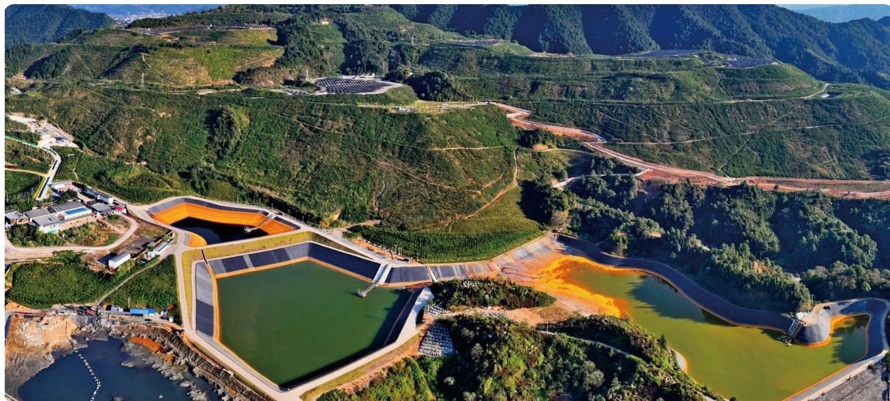

natural_image

Aerial view of a large hydroelectric dam complex nestled in lush green mountainous terrain, with no visible text or symbols.

在水环境治理方面,项目团队同步构建完善清污分流系统,建设酸性水调节库,实施水平与垂直防渗改造,升级改造酸性水输送与处理设施,使其具备应对百年一遇极端天气的能力,确保酸性废水应收尽收、外排水质稳定达标。如今的永平铜矿已实现生态蝶变,矿区东西部排土场植被覆盖度长期稳定保持在90%以上,红叶石楠、大叶女贞等植物长势良好,植物多样性显著提升,即便在2022年极端干旱天气影响下,仍能维持较高覆盖度,生态系统稳定性得到浙江大学系统性评估认可。该项目成功入选全国首批生产矿山生态修复典型案例,成为江西省唯一入选案例,其治理模式被自然资源部作为典型向全国推广,充分彰显了中国瑞林在矿山生态修复领域的技术引领力与行业话语权。

# 二、铜冶炼及烟气制酸:深耕绿色冶炼技术,引领全球低碳发展

在全球碳中和浪潮的推动下，有色金属冶炼行业正面临着绿色转型与可持续发展的迫切使命，低碳减碳、资源循环、绿色清洁已成为行业发展的核心方向。作为铜冶炼及烟气制酸领域的全球技术领军者，中国瑞林凭借持续的技术创新与系统集成能力，以全球领先的核心技术为支撑，构建起绿色冶炼、低碳运营、循环再利用全链条可持续解决方案，将技术优势转化为全球可持续发展动能，赋能非洲、亚洲、南美等多个区域的产业升级，以技术引领推动全球铜冶炼行业向低碳、高效、清洁的可持续方向迈进，践行ESG全球责任与行业担当。

中国瑞林深耕行业多年,构建了覆盖铜冶炼全流程的核心技术体系,核心技术均达到全球领先水平,且专利覆盖中国、智利、印度等多个国家,相关技术市场份额位居全球前列,其中烟气制酸装置总产能占全球30%、中国70%,废酸处理装置国内市场份额占70%以上,为推动全球可持续发展提供了坚实的技术支撑。

依托全面的技术储备,中国瑞林按“源头减碳、过程节能、末端资源化”的逻辑,形成了系统化的可持续技术矩阵:

1. 在绿色冶炼领域，突破国际传统技术瓶颈，采用一步炼铜短流程、旋浮熔炼+旋浮吹炼、侧吹熔炼+顶吹吹炼连续炼铜等全球领先技术，富氧浓度从常规的40%-50%跃升至80%-90%，冰铜品位从50%提升至70%以上，加上多项先进的节能降耗技术，从源头降低单位产品能耗与碳排放，破解全球铜冶炼“高耗能、高排放”的行业痛点，提升铜产品“含绿量”，其技术水平远超国际同类炼铜技术，为全球铜行业绿色转型提供可复制、可推广的技术标准；  
2. 在低碳运营领域，稀氧燃烧、高温+低温余热回收、蒸汽拖动风机等技术的应用，实现冶炼过程能源高效循环利用。阳极炉采用稀氧燃烧技术大幅度减少天然气用量，较传统阳极炉碳排放可减少40%以上。可调式二氧化硫转化制酸技术更破解了全球冶炼烟气工况复杂、波动大的行业难题，余热回收效率与制酸系统稳定性均优于国际同类技术，助力全球冶炼企业降低运营阶段碳排放，兼顾环境效益与经济效益；  
3. 在循环再利用领域，非衡态超高浓度两次转化制酸、高浓度双氧水脱硫、硫化钠分步脱铜脱砷等全球先进技术，实现了冶炼烟气、废酸等污染物的资源化利用，从烟气中硫资源回收率达到98%以上，废酸处理脱砷率达到99.9%以上，远超行业常规水平，推动废渣减量化、无害化处理，完善了行业可持续发展闭环，破解了全球有色金属冶炼“污染治理与资源浪费”的双重难题，其废酸处理技术相较于国际同类技术，更具效率优势和环保价值。

依托这些全球领先的可持续技术, 中国瑞林将全链条解决方案落地至全球多个区域, 打造了多个标杆项目, 以技术输出赋能全球可持续发展。

在非洲刚果金Kamoa铜冶炼厂项目,中国瑞林按照国际金融公司(IFC)制订的排放标准,应用一步炼铜短流程、余热回收、烟气资源化利用等全球领先技术,打造了生态友好型工厂,实现单位铜碳排放仅0.36吨二氧化碳当量,远低于全球铜冶炼行业平均1.1-1.2吨 $CO_{2}e$ ,处于全球铜冶炼厂领先水平,较传统工艺下降46%,成为全球“最低碳铜”生产标杆;同时将冶炼过程中产生的二氧化硫高效转化为浓硫酸副产品,供应周边矿业公司替代传统高耗能硫磺炉制酸工艺,推行水资源循环利用实现生产废水零外排,不仅助力刚果金生态保护与产业协同发展,更为全球资源型地区提供了“低碳+生态+循环”的可持续冶炼方案,引领非洲铜冶炼行业绿色转型。

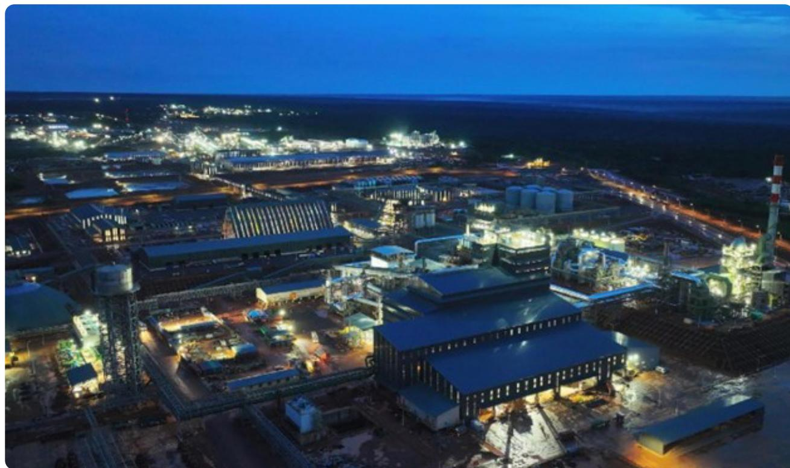

natural_image

Aerial night view of a large industrial complex with illuminated buildings, storage tanks, and surrounding landscape (no visible text or signage)

在亚洲印尼AMIN项目,中国瑞林采用旋浮熔炼+旋浮吹炼连续炼铜、稀氧燃烧、多段余热回收以及高浓度烟气制酸和双氧水脱硫等全球领先技术,打造环保高效的现代化绿色工厂,其中阳极炉稀氧燃烧技术年节约天然气450万Nm³,年减碳9742吨,相较于传统阳极炉减碳效果提升40%以上。多段余热回收技术年回收蒸汽69万吨、年发电1.1亿度,实现能源自给自足;硫酸尾气和环集烟气中的二氧化硫减排98%以上,达到尾气近零排放,可与全球顶尖冶炼烟气脱硫水平持平,副产25\~50%浓度稀硫酸用于生产工业硫酸,排放指标远低于印尼及国际标准。该项目为东南亚高温多雨地区提供了可复制的低碳循环冶炼方案,也将中国领先的烟气脱硫技术输出至海外,破解当地冶炼烟气污染难题,为全球高污染冶炼项目提供循环治污标杆。该项目充分彰显了中国技术在全球不同气候、资源条件下的适配性,推动全球有色金属行业可持续发展。

natural_image

Misty forest landscape with mist-covered peaks and dense evergreen forests under a clear sky (no text or symbols visible)

在云南铜业股份有限公司西南铜业分公司搬迁项目，中国瑞林采用技术先进的三联炉工艺，即富氧侧吹熔炼+多喷枪顶吹连续吹炼+回转式阳极炉精炼工艺，充分利用原料化学反应热实现余热回收，同时富氧技术的应用强化了熔炼强度，降低了烟气量，减少了热损失。硫酸工序采用有色行业最大单线制酸系统，首创错位排布式转化器，创新采用三级余热回收系统，年发电量约2.3亿度，综合能耗较传统工艺下降40%。采用智能化装酸系统，较传统工艺精度提升5倍，效率提升近3倍。严格执行国家最严格的环保排放标准，在 $SO_{2}$ 、 $NO_{x}$ 、颗粒物等关键指标上对标国际先进指标，确保废气“超净排放”。项目阳极铜综合能耗、铜冶炼综合能耗、硫酸综合能耗较国家标准的先进值分别下降11kgce/t, 5kgce/t, 2kgce/t，有效实现了低碳冶炼铜冶炼综合能耗较一级能耗指标下降4.1%，烟气制酸实现负碳工序，年减排二氧化碳17.7万吨。布局37.5兆瓦余热发电+19兆瓦光伏发电项目，余热发电年发电量2.2亿千瓦时，光伏发电2200万千瓦时，清洁能源利用率提升至70%；  
此外，在金川铜冶炼工艺技术提升项目，中国瑞林采用环保先进的富氧侧吹熔炼+顶吹连续吹炼系统工艺， $\mathrm{SO}_2$ 排放总量仅为473.58t，全厂硫回收率超过 $99\%$ 。同时能耗指标领先，在蒸汽的回收利用技术上进一步提升，将产出的多余高压和中压蒸汽分阶梯利用，分别直接拖动制氧站的空增一体机和硫酸转化的 $\mathrm{SO}_2$ 风机，与传统的余热发电方案相比蒸汽利用率更高；且制氧空增一体机采用“汽轮机——同步电动机/发电机”同轴双驱工艺配置，在满足空压机能耗同时汽轮机少量富余能力同轴驱动“同步电动机/发电机”使其处于发电运行模式，年发电量约 $3682.8 \times 104\mathrm{kWh/a}$ 。并在全厂建筑物屋面和侧墙设计中大量采用光伏发电，最终阳极铜能耗可低至 $131.40\mathrm{kgce/t}\cdot$ 阳极铜，远低于最新发布《工业重点领域能效标杆水平和基准水平》中的 $180\mathrm{kgce/t}\cdot$ 阳极铜的先进值水平，创新了在铜有色冶炼行业的低碳排放技术。

这些成效的取得,离不开中国瑞林完善的ESG治理体系,公司将绿色技术创新、技术全球化布局纳入企业发展战略,持续加大研发投入,严格遵循各国环保标准,确保技术应用与项目运营的合规性,同时通过技术输出与全球合作,将中国可持续技术方案传递至世界各地,推动全球铜冶炼行业共同实现低碳转型与资源循环利用。

# 三、跨境民生工程:技术普惠非洲,构建中非合作典范

ESG的核心价值不仅在于守护本土生态, 更在于以技术力量增进全球民生福祉。中国瑞林以塞内加尔乡村供水工程为纽带, 将专业技术与社会责任深度融合, 跨越国界破解民生难题, 成为中非合作中践行ESG理念的标杆工程, 展现了中国企业“走出去”的责任与担当。

塞内加尔农村地区长期面临供水设施匮乏的困境，民众取水艰难，水媒疾病频发，妇女儿童需耗费大量时间往返取水，严重影响当地生活质量与发展潜力。作为该项目的设计方，中国瑞林并未照搬国内成熟模式，而是组建专业技术团队深入塞内加尔13个大区实地调研，充分考量当地地质条件、气候特征、文化习俗与用水需求，因地制宜构建科学供水体系。项目覆盖塞内加尔除达喀尔外的全部大区，通过新建和修复85口水井及89座水塔，铺设1450公里供水管线，新建5座地表水处理系统、300个集中供水点，帮助18,200个家庭实现供水入户，配套建设85个牲畜饮水槽，形成了“取水——处理——输送——使用”的全链条供水保障网络。

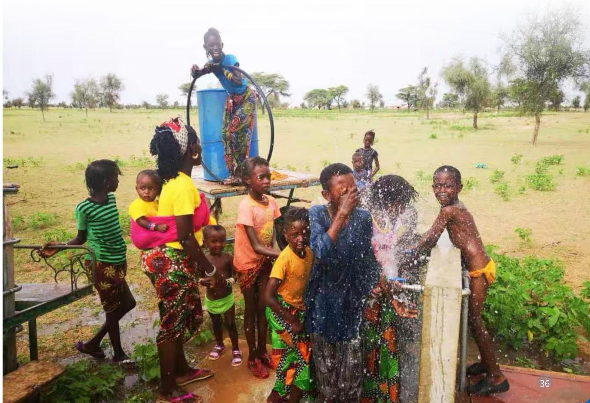

natural_image

Group of children playing in a field with water splashing, one adult pouring water from a bucket (no visible text or symbols)

该项目的实施不仅从根本上解决了当地农村地区饮用水接入问题,惠及数百万民众,更带来了多重社会效益:清洁水源的普及显著降低了水媒疾病风险,改善了当地卫生条件;妇女儿童无需再为取水奔波,有更多时间投入教育与生产;稳定的水源供应为农业、畜牧业发展注入持久动能,助力当地产业升级;项目建设期创造了大量本地就业岗位,通过技术指导与技能培训,提升了当地民众的专业能力,实现了“建设一座工程,带动一方就业,造福一方百姓”的目标。中国瑞林以专业技术为桥,将民生福祉放在首位,用实际行动厚植中非友谊,为跨境基建项目践行ESG理念提供了生动范例。

# 四、固废资源化利用:布局全链条治理,助力“无废城市”建设

随着“双碳”目标与“无废城市”建设的深入推进，危险废物、VOCs污染、飞灰等固体废弃物的无害化处置与资源化利用，成为环保行业的核心命题。中国瑞林作为国内危、固废治理领域的先行者，深耕行业二十余年，设计了我国首座危废资源化利用处置中心，累计为全国60余个项目提供专业服务，通过打造三大标杆项目，构建起覆盖危废处置、VOCs治理、飞灰资源化的全链条技术服务体系，以技术创新推动行业进步与区域绿色可持续发展。

杭州第三固废处置中心作为华东地区规模最大、资质最全的综合性危废处置项目，年处理危废11万吨，其中危废焚烧3万吨、医废焚烧4万吨，年发电量约1000万度。该项目工艺技术达到国际先进水平，医废处置智能化程度位居行业前列，单系统处置规模国内领先，为区域危险废物与医疗废物的安全处置提供了核心支撑，有效降低了固废污染风险，实现了“变废为宝”的资源循环利用。

natural_image

Aerial view of rolling green hills with misty valleys and a winding road, no visible text or symbols.

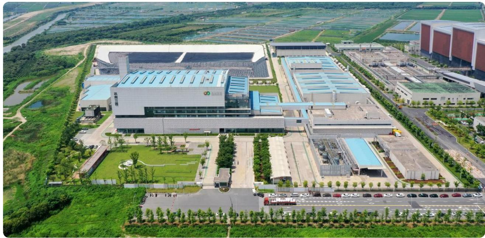

natural_image

Aerial view of a large industrial complex with multiple buildings, green landscaping, and surrounding farmland (no visible text or signage)

中山炭基绿岛项目聚焦废活性炭资源化这一环保痛点，作为华南地区规模最大的废活性炭资源化项目，年处理废活性炭9万吨，年削减VOCs排放2万吨。项目通过先进的再生活化技术，实现危废“减量化、资源化、无害化”的三重目标，既解决了废活性炭处置难题，又减少了VOCs污染物排放，成为VOCs治理与循环经济协同发展的示范样板，为华南地区大气污染防治提供了有力支撑。

嘉兴飞灰资源化项目作为浙江省“领雁”计划示范工程，采用“低温热分解+水洗+蒸发结晶”的行业领先工艺，年资源化利用飞灰25000吨，二噁英去除率超过80%，重金属浸出毒性降低超过95%。该项目的成功实施，有效破解了飞灰处置难题，助力浙江省“趋零填埋”目标实现，为全国飞灰资源化利用提供了技术参考与实践经验。

三大标杆项目形成多点示范、技术互补的格局，覆盖固废治理多个关键领域，彰显了中国瑞林在环保技术研发与工程实践方面的综合实力。公司以国际先进工艺为核心，不断推动技术迭代升级，不仅为客户提供定制化解决方案，更通过技术推广与行业交流，带动整个环保行业的技术进步，为我国“无废城市”建设与绿色低碳发展注入强劲动力。

从国内矿山生态修复的“全国样板”，到跨境民生工程的“中非典范”，再到固废资源化利用的“行业标杆”，中国瑞林的ESG实践始终以技术创新为核心，以解决实际问题为导向，以创造综合价值为目标。在这一过程中，公司不仅展现了深厚的技术积累与工程实力，更彰显了作为行业领军企业的责任担当与价值引领：通过破解行业共性难题，推动行业可持续发展；通过技术普惠全球，增进人类共同福祉；通过生态与民生并重，实现多重价值共赢。

未来, 中国瑞林将继续深耕环保与基建领域, 持续强化技术创新能力, 拓展ESG实践边界, 在更多场景、更广范围践行可持续发展理念, 以专业技术赋能生态共治, 以责任担当书写行业新篇, 为构建人与自然和谐共生的美好未来贡献更多瑞林智慧与力量。

natural_image

Two hands cupping a small, young plant sprout emerging from soil, with green foliage in the background (no text or symbols visible)

# 03

# 赋能社会发展 心系民生福祉

- 创新驱动  
- 产品和服务安全与质量  
- 供应链安全  
- 信息安全与客户隐私保护  
- 员工

- 乡村振兴  
- 社会公益  
- 境外履责

# 03 赋能社会发展 心系民生福祉

# 创新驱动

中国瑞林始终将技术创新作为推动企业高质量可持续发展的核心引擎。公司聚焦工程技术服务主业，以完善的创新治理体系为保障、清晰的创新战略为引领、全流程风险机遇管理为支撑、量化考核指标与发展目标为牵引，全面推进技术研发、成果转化、知识产权保护与落地应用，加快构建涵盖工程设计、智能工厂、智慧矿山的数智化闭环体系，持续夯实核心竞争实力与行业引领力，为工程领域绿色化、智能化转型升级筑牢技术根基。同时，公司高度重视新技术研发与全场景应用过程中的安全生产、合规经营、伦理规范及社会影响，严守可持续发展底线。

# 治理

公司严格遵守国家及行业关于科技创新、科研项目管理、知识产权保护、科技成果转化、科研诚信建设等相关法律法规、监管规定与行业标准，全面遵循《中华人民共和国科学技术进步法》《中华人民共和国专利法》《中华人民共和国著作权法》《中华人民共和国促进科技成果转化法》《中华人民共和国民法典》(技术合同编)《高新技术企业认定管理办法》《高新技术企业认定管理工作指引》，以及国家科技计划管理、科研经费管理、知识产权管理等部门规章与规范性文件，同时严格执行工程建设行业技术标准、技术规范及中国瑞林内部管理制度，确保所有研发活动、创新行为、成果管理与知识产权运营均合法合规、规范有序、权责清晰。

公司制定《科技项目管理规定》及配套流程文件，建立覆盖科技项目分类、申报立项、实施管控、结题验收、成果管理的全生命周期管理规范，明确纵向(政府下达)、横向(企事业单位委托)、自选(公司自主立项)三类科技项目的管理标准。其中，自选科技项目紧密围绕公司发展战略、工程项目技术难题及市场前景产品开展，明确要求在二至三年内完成并形成自主知识产权；纵向、横向科技项目分别按照政府主管部门要求及合同约定实施专项管理，确保研发活动合规、有序、可控。同时，公司严格按照《高新技术企业工作管理规定》，建立高新技术企业常态化管理机制，由技术质量部牵头统筹高新资质维护、科技年报编制、研发费用归集、高新技术产品(服务)收入核算、科技人员管理等工作，市场部、项目管理部、财务部、人力资源部协同联动，确保公司持续符合高新技术企业认定条件，充分享受科技创新政策支持。

依托公司现有职能与业务架构，明确技术质量部为科技项目与创新管理的核心统筹部门，负责研发计划组织实施、科技成果管理、技术交流合作、高新技术企业资质维护等工作；建立公司分管领导 + 技术质量部 + 项目负责人三级管理机制，由公司分管领导、总经理负责科技项目审核与批准，项目负责人经申请部门推荐、技术质量部审核、公司正式任命，全面实行项目经理负责制，保障研发项目高效推进。同时，公司允许通过部分外包或“产学研”联合开发模式，整合外部优质创新资源，弥补内部研发条件短板，提升创新灵活性与覆盖范围；协同设计部、

信息中心、电气公司、瑞太公司及各业务单元联合协同数智化技术研发与平台建设，支撑公司数字化转型战略落地；同时组建跨部门、跨专业的NDI项目小组，负责NDI项目落地执行。

公司建立标准化研发管理流程，覆盖项目立项申请、开题报告编制、年度进度汇报、结题验收等关键环节。针对跨年度项目，要求项目负责人在每年12月15日前提交年度执行情况报告；严格管控项目核心人员变动，项目负责人及核心成员不得随意调整，确需变更须履行正式审批程序；结题验收阶段，项目组须提交任务指标完成情况、技术经济指标、知识产权等完整材料，由技术质量部组织评审验收，确保研发成果质量达标。

# 战略

中国瑞林立足工程技术服务核心主业,紧密把握行业技术发展趋势与市场需求,确立以自主创新 + 集成创新 + 应用创新为核心的创新战略,聚焦四大方向精准发力,以技术创新破解工程难题、提升服务品质、拓展市场空间、创造长期价值。

# 中国瑞林创新驱动发展战略

# 技术难题攻坚

聚焦工程项目中的复杂技术瓶颈，针对性开展工艺技术研究与开发，持续积累解决复杂工程问题的核心技术与专业诀窍，全面提升项目交付能力与服务质量

# 产品与服务创新

围绕具备市场前景的产品及服务方向，开发新产品、新装备，推动技术成果商品化、产业化，形成自主知识产权壁垒，增强市场核心竞争力

# 集成创新应用

深入分析行业现有成熟技术，推动技术跨界移植与融合应用，拓展技术应用场景，降低创新成本，提升创新效率

# 绿色智能升级

积极探索自动化、智能化控制技术在工程领域的规模化应用，助力客户实现高效、低碳、安全运营，契合国家绿色发展战略，持续提升服务附加值与品牌影响力

natural_image

Panoramic view of a lush green rice field under a clear blue sky, with no visible text or symbols.

公司深入贯彻落实国家数字化、网络化、智能化发展战略，紧扣公司“技术驱动 + 服务引领 + 模式创新”三轮驱动要求，将数智化转型作为创新战略核心抓手，全力打造面向有色行业的NDI全流程数智化整体解决方案，构建从工程设计到智能工厂、智慧矿山的完整闭环。NDI系统覆盖矿山（NDI\_M）、冶炼（NDI\_S）、化工（NDI\_C）、加工（NDI\_P）、环境（NDI\_E）、市政、建筑等全场景，依托“瑞智”工业互联网平台、工业数据平台、私有云原生技术平台，形成“需求精准匹配、工艺精深理解、数据精细掌握、资源精益整合”的核心优势，通过工业AI、数字孪生、AR远程运维、智能感知装备等技术深度应用，为客户提供集智能经营管理、智能决策、智能运营、能源管理、成本管控、设备智能管控于一体的全链条数智化服务，助力客户实现安全、质量、低碳、绿色、高效发展。

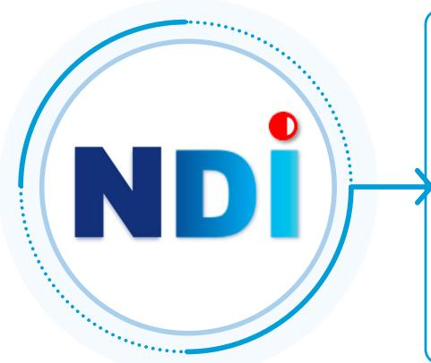

flowchart

```mermaid
graph LR
  A["NDi"] --> B["Arrow"]
```

- 中国瑞林创新研发的面向有色行业的全流程数智化整体解决方案产品  
- 形成从工艺流程、智能装备、生产数据、智慧管控、运维服务的完整闭环生态链  
- 建设面向未来的智慧矿山和智能工厂, 为全球客户数字化转型发展赋能

通过上述战略方向的明确与落地,公司将创新资源精准投向核心业务与高潜力领域,确保研发工作与公司整体发展战略高度协同,推动创新成果快速转化为实际生产力,为公司持续领跑行业提供核心战略支撑。

# 影响、风险和机遇管理

中国瑞林以项目责任制为基础，严格遵循《科技项目管理规定》，对研发项目实施全生命周期风险管控与机遇挖掘，从立项、实施到结题验收各环节均建立明确流程要求与考核机制，有效防控研发风险、把握创新机遇，保障项目按计划推进、成果高质量落地。

在立项管控环节，研发项目须提交《科技项目立项申请书》，全面明确研究内容、技术难点、创新点、预期知识产权、预算安排、进度计划等核心信息，经技术质量部专业评审、公司主管领导审批后正式立项，从源头把控项目可行性与创新性，降低研发前期风险。在过程管控环节，项目组须定期上报研发进展，重大事项及时报备，技术质量部实施全程跟踪、监督与指导，及时识别并化解实施过程中的技术、进度、资源配置等风险，同步捕捉技术迭代、市场需求变化带来的创新机遇。在结题验收环节，项目组按要求提交验收申请表及全套附件材料，纵向项目由政府科技主管部门组织验收，横向项目按合同约定由委托方确认，自选项目由技术质量部组织验收，确保成果指标达标、知识产权清晰、应用价值明确。

公司高度重视数智化创新带来的行业变革机遇，依托NDI数智化系统持续强化工艺、电气自动化、装备、瑞太等全链条整合，加快数字主线贯通、三维可视化、数字化交付、AR远程协作、AI辅助决策等技术落地，形成软著和专利群，不断提升NDI产品市场化推广能力与行业认知度。同时，严格对照《国家重点支持的高新技术领域》要求，聚焦资源与环境、先进制造与自动化、新能源与节能、高技术服务等领域开展技术攻关，确保核心技术与高新技术产品(服务)持续符合认定标准，抢抓智能制造、绿色矿山、智慧工厂等政策机遇，巩固技术领先优势。

2025年, 公司聚焦自动化控制系统等核心技术领域开展多项重点研发项目, 成功形成一批具备高实用价值的创新成果, 部分核心技术已应用于实际工程项目, 显著提升项目自动化运行水平与整体运营效率, 在把握行业智能化升级机遇、降低客户运营风险方面取得良好成效。

中国瑞林高度重视知识产权保护与转化，将专利、软件著作权、专有技术等自主知识产权作为研发项目的核心考核指标之一，在《科技项目管理规定》中明确要求研发项目需形成相应知识产权成果。同时，建立规范的知识产权归属机制，执行公司任务或主要利用公司资源完成的科技成果均为职务成果，权益归公司所有，成果评审鉴定后需及时归档登记。

# 中国瑞林知识产权管理措施

# 知识产权审核与激励

专利、论文发布前需经部门内部审核，确保知识产权保护合规；组织小微创新竞赛（32项获奖），对员工创新成果进行激励，同时强化知识产权保护意识。

# 侵权应对与维权

成功应对赛恩斯侵权案，维护公司知识产权权益；通过制度宣讲、培训等方式，提升全员知识产权保护意识，明确侵权行为的责任与后果。

# 研究成果转化

将专利技术固化于冶金装备，延伸价值链，提升知识产权应用价值；对 NGL 等技术推广给予奖励，促进知识产权转化落地。

公司持续加大研发投入力度，为创新工作提供充足的资金与人力保障。研发资金主要用于设备采购、材料消耗、测试化验、知识产权事务、数智化平台建设等研发相关支出，人力资源配置重点向技术质量部、NDI项目部、信息中心及各事业部核心技术岗位倾斜，确保研发工作高效开展。

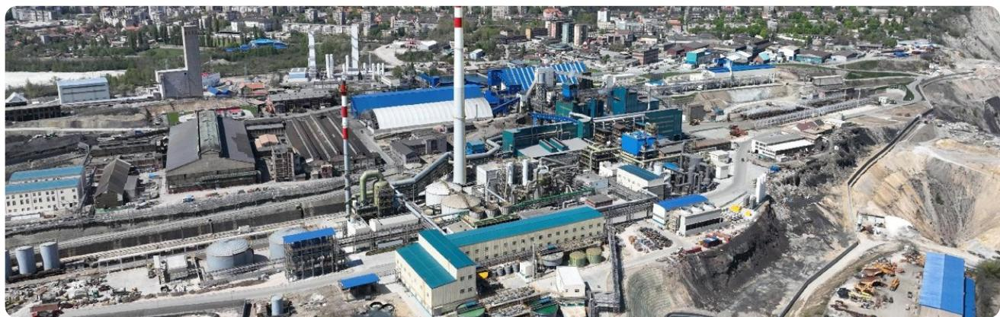

natural_image

Aerial view of a large industrial complex with multiple buildings, storage tanks, and surrounding urban areas (no visible text or signage)

# 指标与目标

公司围绕研发投入、知识产权产出、研发团队建设、数智化创新、高新技术企业合规等核心维度，设定明确、可量化、可考核的创新驱动指标体系，通过年度计划制定、过程跟踪监控、年度复盘优化，保障创新工作稳步推进、目标落地见效。

2025年创新驱动核心指标完成情况

<table><tr><td>指标</td><td>单位</td><td>2025年完成情况</td></tr><tr><td>全年研发投入</td><td>万元</td><td>10,317.54</td></tr><tr><td>研发投入占营收比例</td><td>%</td><td>5.24</td></tr><tr><td>研发人员人数</td><td>人</td><td>587(其中全职人员51人,兼职人员536人)</td></tr><tr><td>研发人员占职工总人数比率</td><td>%</td><td>25.7</td></tr><tr><td>新增专利及软件著作权申请数量</td><td>件</td><td>105</td></tr><tr><td>新增专利及软件著作权授权数量</td><td>件</td><td>115</td></tr><tr><td>累计授权专利总数</td><td>件</td><td>647</td></tr><tr><td>累计软件著作权总数</td><td>件</td><td>161</td></tr></table>

2025年核心研发成果及知识产权情况

<table><tr><td>成果类型</td><td>具体内容</td><td>数量</td></tr><tr><td rowspan="3">新增授权</td><td>发明专利</td><td>49件</td></tr><tr><td>实用新型专利</td><td>45件</td></tr><tr><td>软件著作权</td><td>21件</td></tr></table>

面向未来,公司将持续深化创新驱动发展战略,进一步加大研发资源投入,聚焦自动化控制、绿色低碳、NDI数智化系统迭代、工业AI融合应用等核心技术领域开展关键技术攻关;持续完善知识产权管理与科技成果转化机制,提升创新价值转化效率;不断强化研发人才队伍建设,优化创新治理与风险管控体系,持续丰富NDI系统生态圈,加大市场化推广力度,力争在核心技术领域取得更多突破性成果,以高水平创新驱动公司可持续高质量发展。

# 产品和服务安全与质量

中国瑞林始终将产品和服务的安全与质量作为企业可持续发展的生命线，坚持合规经营、质量优先、安全至上的基本原则，将质量管控与安全生产全面融入工程设计、系统集成、装备配套、安装调试、项目交付及运维服务等全流程。公司严格遵循国家法律法规、行业标准及客户技术规范要求，构建治理完善、战略清晰、管控闭环、指标明确的一体化管理模式，持续为客户提供安全可靠、质量稳定、技术先进、运行高效的工程技术服务与自动化控制系统，切实保障客户生产运营安全、员工职业健康与企业高质量发展，维护各利益相关方合法权益。

# 治理

公司构建以法治合规为前提、三标体系为基础、制度流程为支撑、组织责任为保障的产品和服务安全质量治理体系，实现全业务、全流程、全场景、全员覆盖的标准化、规范化、闭环化管理，确保质量与安全工作有法可依、有章可循、责任到人、执行到位。

公司严格恪守《中华人民共和国产品质量法》《中华人民共和国安全生产法》《建设工程安全生产管理条例》《建设工程质量管理条例》等法律法规，以及工程建设、自动化控制系统、电气设备、智能制造相关行业技术标准，将合规要求深度嵌入设计、生产、实施、交付、服务各环节，确保所有经营活动、设计成果、产品交付与技术服务均符合法定要求与监管规定。

公司建立并有效运行质量、职业健康安全、环境三标一体化管理体系，并全部通过权威第三方认证，包括：GB/T19001-2016/ISO 9001:2015质量管理体系、GB/T 45001-2020/ISO 45001:2018职业健康安全管理体系、GB/T 24001-2016/ISO 14001:2015环境管理体系。认证范围覆盖资质证书范围内的工程设计、建设工程总承包、冶金建设工程总承包之工业自动控制系统等。公司通过年度监督审核、内部审核、管理评审三位一体机制，持续识别体系运行短板并实施改进，确保三大管理体系始终适宜、充分、有效。

公司建立高层统筹决策、职能部门专业监管、业务部门落地执行、项目现场第一责任的四级联动治理架构，职责清晰、协同高效。

公司构建全方位、多层次质量安全管控体系，明确各部门及执行单元职责，压实管控责任，确保各项工作合规有序推进：技术质量部作为质量管控核心部门，统筹质量管理体系运行、设计质量检查、内部审核、问题整改及标准体系建设，筑牢质量管控底线；安全管理部专项负责全公司安全管理工作，统筹安全制度落实、隐患排查、风险管控及应急处置；总经理办公室(大楼管理中心)负责办公区域安全、消防及治安管理，保障办公环境安全有序；项目管理部牵头统筹项目全流程管控，各项目组(业务执行实体单元)作为现场执行核心，落实项目现场质量管控、安全制度执行、教育培训、隐患排查及应急处置等职责；各业务部门及专业所严格执行设计校审等质量管控要求，保障各项业务成果质量，形成“分工明确、权责清晰、协同联动”的质量安全管控格局。新增装备板块文字部分描摹：

# 战略

公司将产品与服务安全、质量提升纳入可持续发展核心战略，确立诚信执业 管理科学 追求卓越 和谐发展的管理方针，把质量与安全作为业务发展底线、市场竞争根基与客户信任前提，全面融入战略规划、业务流程、项目执行与企业文化建设全过程。

公司以合规为前提、标准为支撑、客户需求为导向、全过程管控为路径，构建覆盖项目立项、工程设计、采购验收、生产集成、安装调试、验收交付、运维的全生命周期安全质量管控体系，推动管理模式由事后整改向事前预防、事中控制、事后优化转型，持续提升设计质量、产品质量、工程质量与服务质量，切实保障人员安全、设备安全、生产安全与数据安全，不断提升客户满意度、品牌美誉度与市场竞争力。

# 围绕安全质量战略落地,公司重点推进四大实施方向:

1. 持续完善三标管理体系与制度流程, 强化安全质量治理能力;  
2. 深化设计质量标准化与三级校审机制, 从源头防控质量风险;  
3. 推进全域安全生产标准化建设, 保障人员与运营全过程安全;  
4. 健全客户反馈与持续改进机制, 提升服务质量与客户长期价值。

通过长期稳定的战略执行, 公司不断巩固安全与质量核心优势, 为市场拓展、客户合作与高质量可持续发展提供坚实保障。

# 影响、风险和机遇管理

公司建立覆盖产品质量、安全生产、合规运营、技术保密的全维度风险识别、评估、控制与改进机制，对运营全流程风险实施常态化、闭环化管控；同时主动把握质量提升、安全保障带来的品牌提升、市场拓展、客户信赖、合规增效等发展机遇，实现风险可控、机遇尽握、稳健可持续发展。

natural_image

Person wearing yellow safety vest and red gloves, standing on a metal railing (no visible text or symbols)

# 1 质量风险管控

公司构建以三级校审为核心、常态化检查为抓手、标准化建设为基础、闭环整改为目标的全流程质量风险防控体系，系统性降低设计缺陷、质量偏差、成果交付不符等核心质量风险。  
建立全年常态化抽查 + 定期专项检查相结合的质量监督机制, 对咨询、初步设计、施工图设计、控制系统方案等技术成果实施全覆盖检查。  
2025年完成126个项目质量检查,形成季度质量评价报告及专项检查报告,对问题明确责任人、整改措施及完成时限并跟踪复查,设计质量问题整改闭环率100%。  
建立高效客户反馈与响应机制, 及时收集项目执行、系统运行、服务保障等意见, 快速开展跨部门分析并优化方案、流程与服务标准, 持续提升客户满意度与品牌口碑。  
2025年项目设计回访涉及矿山、冶金、环境、民用市政等不同板块和业务类别，客户对公司设计回访工作十分重视和认可，对公司设计和现场服务工作给予高度评价。  
2025年发出顾客满意度调查函22份:已收回22份,其中满意为97%,基本满意为3%,总体满意率100%。全年未收到外部顾客投诉。  
2025年收到广东省深圳市前海合作区八单元市政道路工程(一期)咨询及勘察设计、广东省深圳地铁19号线一期工程电力管线迁改项目、德安县磨溪乡易家湾遗留金矿选矿场地污染治理项目EPC总承包项目的业主感谢信；云南铜业股份有限公司西南铜业分公司搬迁项目——硫酸转化系统项目业主颁发的卓越合作伙伴奖；刚果(金)卡莫阿铜业、阿曼IT部门等境外客户感谢信；公司DCS系统设计、仪表供货、调试服务等获得国际客户高度认可，品牌影响力与市场拓展能力持续增强。  
公司坚持预防为主、综合治理，构建分区分类、全员覆盖、全程管控、应急完备的安全风险防控体系，有效防范人身伤害、设备损坏、现场安全事故等风险。  
> 建立分层分类安全教育培训体系，按岗位风险实施差异化培训，新员工实行“公司级 + 部门级”双培训考核上岗，员工安全培训覆盖率100%；足额保障安全投入，规范配置劳动防护用品，从硬件层面保障员工作业安全。  
完善突发事件、生产安全事故、火灾等专项应急预案，建立高管不定期抽查、中层定期检查、安全员日常巡查三级安全检查机制，及时排查消除安全隐患。  
2025年公司未发生重大安全事故，安全生产形势持续稳定，为项目交付、现场服务、客户合作提供坚实保障，有效提升合规水平与市场信任度。

# 2 安全风险管控

# 目标与指标

公司围绕产品和服务安全与质量建立可量化、可考核、可披露的目标与指标体系，覆盖管理体系运行、质量管控、安全生产、客户服务、合规保密等核心维度，通过年度目标制定、过程跟踪、结果考核与持续改进，保障各项工作落地见效。

2025年, 公司产品和服务安全与质量各项指标均完成预期目标, 整体管控成效显著, 核心指标完成情况如下:

# 产品和服务安全与质量体系认证证书

职业健康安全管理体系认证证书  
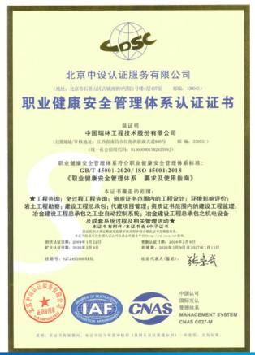

text_image

COSC
北京中证认证服务有限公司
地址：北京市石景山区古城西路9号1号楼1层47层47室  邮编：100002
职业健康安全管理体系认证证书
兹证明
中国瑞林工程技术股份有限公司
（注册地址/甲级地、江西省南昌市红谷经济区南湖大道88号）  邮编：330031
（统一社会信用代码：9136000001/58263096）
职业健康安全管理体系符合职业健康安全管理体系标准：
GB/T 4500-2020/ISO 450012018
《职业健康安全管理体系 联系使用指南》
本节开展活动范围
★工程咨询：全过程工程咨询；资质证书范围内的工程设计；环境影响评价；
岩土工程勘察：建设工程承包；代建投资管理；资质证书范围内的建设工程监理；
冶金建设工程总承包及工业自动控制系统；冶金施工工程总承包包之机电设备
及各系统通过现场及相关管理工作
认证有效期为/许可证编号/个/子项
本项目经国务院国资委备案，经国务院国资委证监许可[2016]113号文批准。
特此公告。
2016年1月22日
2016年2月5日
2016年3月5日
2016年3月11日
批准号：S27415396985L      投资代表人（签名）：
中国认可
国家机关
管理处
MANAGEMENT SYSTEM
CNAS 0327-AF
名称：北京市东城区，本公司发布年度审核的《企业登记注册制改革办法》一书受理，王为民印

环境管理体系认证证书  
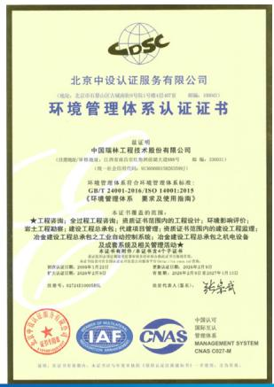

text_image

北京中证认证服务有限公司
（地址：北京市石景山区古城西路9号1号楼14层407室） 编辑：380003）
环境管理体系认证证书
兹证明
中国瑞林工程技术股份有限公司
（注册地址：吉林省长春市江汉路688号） 编辑：380003）
（统一社会信用代码：91360000MA5D2X96J）
环境管理体系符合环境管理体系标准：
GB/T 24001-2016/TSX 14001:2015
《环境管理体系 要求及使用指南》
本证书所载的范围：
★ 工程咨询、仓储工程咨询；清洁技术咨询服务；工程设计、环境影响评价；
硕士工程助理；建设工程总承包；代理项目管理；单击证书范围内的建设工程监理；
冶金建设工程总承包之机电设备及成套系统及相关管理工作★
本证书的签署日期为2020年1月2日
财务会计证明：2020年1月2日至2020年1月31日
矿业权证明：2020年1月31日至2021年1月31日
注册号：027243300985，经办人：张永武
IAF CNAS
中国认可
国家认证
管理委员会
MANAGEMENT SYSTEM
CNAS CBZ-IM
登记：北京市东城区，北京市西城区南苑路1号院内北楼A座一层、二、三楼、四、五楼。

质量管理体系认证证书  
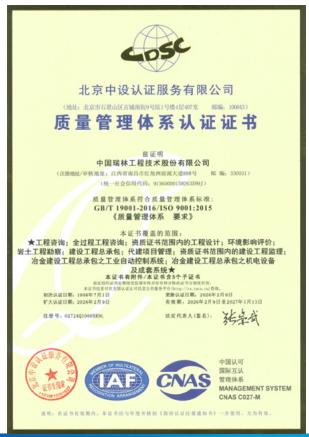

text_image

北京中设认证服务有限公司
（地址：北京市石景山区古城街9号1号楼1层07室） 编辑：380002
质量管理体系认证证书

兹证明
中国福林工程技术股份有限公司
（注册地址/年资格证：山西省晋东红桥镇西溪大道888号） 编辑：380011
（统一社会信用代码：91360000MA5G5X94）
质量管理系统综合质量管理体系标准：
GB/T 19981-2016 ISO 9001:2015
《质量管理体系》 联合
本证书所载的范围：
★工程咨询：全过程工程咨询；资质证书范围内的工程设计；环境影响评价；
岩土勘测、建设工程总承包；交通设施管理；资质证书范围内建设的工程监理；
冶金建设工程总承包工艺监督与控制；在企业建设工程总承包机电设备
证书类型及证书编号：
本证书附有以下各项第1个文件名称：
一、本次申请经国务院国资委证监许可字[2016]1000000000000000000000000000000000000000000000000000000000000000000000000000
批准日期：2016年7月5日
批准有效期：2016年2月9日
发证机关：国家工商行政管理局
登记机关：国家工商行政管理局
法定代表人（盖章）：张来成

北京中设认证服务有限公司
（地址：北京市石景山区古城街9号1号楼1层07室） 确编：380011
COSC
IAAF CNAS MANAGEMENT SYSTEM CNAS 327-M
备注：身份证号码填妥，本证书均为有效期内的登记信息以登记截止时间为准。效力为有效。

# 2025年，

公司未发生重大质量责任事故;全年完成126个项目的质量抽查,实现重点项目与关键专业全覆盖;发现的设计质量问题均完成整改并通过复核,整改闭环率达到100%;

公司未发生重大生产安全事故,实现安全生产稳定受控;公司组织开展全覆盖安全培训教育,员工安全培训覆盖率达到100%;

公司收到境内(外)客户正式感谢信6封,客户对公司设计、供货、调试与服务质量给予高度评价;

公司未发生重大合规风险事件与运营纠纷，技术保密与成果审核机制运行有效，产品交付与服务履约全程合法合规，未出现因合规、保密、权属问题影响项目实施与客户信任的情况。

# 供应链安全

供应链作为中国瑞林业务持续运营与项目顺利实施的核心支撑链条，供应商的合规水平、专业能力、履约质量与经营稳定性，直接关系公司项目交付品质、实施效率、运营安全与品牌声誉。公司始终将供应链安全与可持续发展置于经营管理的重要位置，秉持合规为本、质量优先、互利共赢、长期稳定的核心原则，全面构建覆盖供应商准入、合作执行、过程管控、绩效评价、动态优化与风险防控的全生命周期管理体系，通过制度化建设、专业化分工、数字化支撑与常态化监督，打造稳定可靠、高效透明、绿色合规、可持续的供应链生态体系，为公司境内外项目高质量落地及实施提供坚实保障。

# 治理

公司建立权责清晰、分工明确、协同高效的供应链治理架构，将合规要求、质量管控、风险防范与ESG理念全面融入供应链管理决策与执行全过程。在制度体系层面，公司制定并持续完善《设备材料采购及分包管理规定》《供应商管理办法》《供应商NIMS线上评价工作说明》等专项管理制度，明确供应商准入标准、分级分类规则、日常考核要求、退出机制与负面清单管理要求，对采购方式选择、合同签订与履约、付款审批、监造催交、质量验收、信息管理等关键环节实施标准化规范，确保供应链管理全流程有章可循、有据可依、全程可追溯。同时，公司建立供应商负面清单管理机制，将存在法律纠纷、重大诉讼、环保违规、安全生产事故、商业失信、质量缺陷等不良记录的供应商纳入限制合作范围，从源头降低合作风险。

公司采购部承担供应链统筹管理职能，专门设立供应商管理岗，负责供应商库建设、准入评审、绩效评价、动态更新与制度落地执行。采购部下设采买室、综合管理室、监造催交室等专业执行单元，分别承担采购流程组织、商务谈判与合同管理、设备监造、质量检验、到货跟踪与履约保障等职责，形成“统筹管理 + 专业分工 + 闭环执行”的高效治理模式。为保障供应商评价科学客观，公司建立跨部门联合评审机制，由采购部牵头，联合项目管理部、技术质量部各专业设计部等二十余个专业部门共同参与供应商评价工作，从技术能力、生产保障、品质管控、财务状况、履约信誉等多维度开展综合评估，确保评价结果全面、专业、公正。

公司坚持公开、公平、公正的采购与合作原则，严格执行采购审批与决策程序，优先选择行业口碑优良、资质合规齐全、质量保障可靠、履约能力稳定的优质供应商。针对境外项目，公司主动向合作供应商传递环境、社会及公司治理(ESG)相关合规要求，推动供应链上下游共同履行社会责任与环境责任，强化商业道德与合规经营，致力于与核心供应商建立长期稳定、互利共赢、可持续发展的战略合作伙伴关系。

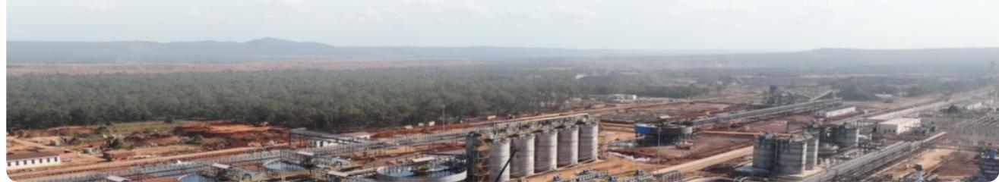

natural_image

Aerial view of an industrial complex with storage tanks, processing units, and surrounding forested land (no visible text or symbols)

# 战略

公司以构建合规可控、质量可靠、响应高效、绿色可持续的供应链体系为核心战略目标，将标准化、规范化、数字化与可持续发展理念贯穿供应商管理全过程。围绕战略落地，公司持续完善供应商准入标准体系，强化分级分类管理规则，建立科学综合的考核评价机制与全场景风险应对机制，通过持续优化供应商结构、强化全流程质量管控、系统性防范供应链风险、稳步提升供应链韧性与协同效率，不断增强供应链整体竞争力。

同时，公司主动将ESG理念融入供应链战略实施，在合作选择、过程管理、绩效评价等环节逐步强化环境合规、劳工权益保护、安全生产、商业诚信与廉洁从业要求，推动供应链由传统履约保障向高质量、可持续、负责任方向升级，实现供应链商业价值、安全价值与社会价值协同发展，为公司长期稳健经营与国际化业务拓展提供坚实支撑。

# 影响风险与机遇管理

# 1. 供应商全生命周期管理

公司实施全流程、闭环式供应商全生命周期管理，通过严格准入、规范执行、动态评价与持续优化，不断提升供应链整体质量与稳定性。

在准入审核环节, 公司建立“资质审核 + 专业评价 + 分级认定”的多层级筛选机制, 确保进入供应商库的合作方满足公司项目要求与合规底线。

# 中国瑞林供应商准入审核机制

# 筛选层级

# 资质审核

# 专业评价

# 分级认定

# 筛选内容

- 实行严格核查,全面核验供应商营业执照、注册资本、生产许可、质量管理体系认证等核心资质文件,代理商须额外提供生产商正式授权代理证书;  
- 零星采购供应商重点核查基础资质合规性，合格供应商须通过全维度综合评价后方可准入。  
- 由采购部联合二十余个相关部门组成联合评审组，从供应商资格、技术力量、生产能力、制造经验、品质管理、财务能力、资质资料完整性七大维度进行百分制综合打分。  
- 按照评分结果对合格供应商实施四级分类管理：  
95分以上为1级  
85-95分为2级  
75-85分为3级  
65-75分为4级  
- 评分低于65分的供应商不予准入，形成层次清晰、结构合理、可动态优化的供应商梯队。

2025年, 公司结合业务发展与管理需求, 对供应商准入准出标准、分级管理规则、考核评价机制等制度进行全面优化更新, 同步完善监造催交管理体系, 确保管理标准与公司发展、项目需求及外部监管要求保持一致。

在合作执行环节, 公司实施全流程规范化管控, 保障采购行为合规、履约过程可控、质量安全可靠。

# 中国瑞林供应商全流程规范化管控

# 采购方式规范

实行分类管理与严格审批，根据项目金额、物资特性与实际需求，分别采用邀请招标、竞争性谈判、单一货源采购等方式，其中单一货源采购须履行专项审批程序，竞争性谈判适用于供应商不足两家或预算低于30万元的项目，预算30万元及以上项目原则上采用邀请招标，确保采购过程合规、高效、透明。

# 质量管控强化

公司设立监造催交室专职负责产品质量监控、出厂检验与到货验收管理，对关键核心设备实施驻厂监造与全过程检验，对常规产品实施过程抽检与到货验收，重点核查原材料使用、生产工艺执行、技术参数符合性与出厂检验资料，确保产品质量符合国家标准、行业规范与公司项目技术要求。

# 沟通机制保障

公司建立高效协同机制，要求供应商明确副总经理及以上级别负责人作为专项对接人员，确保供货进度、质量问题、现场服务等事项能够快速响应、及时解决；针对境外项目，公司主动协调时差、国际物流、清关报关、属地合规等复杂问题，建立专项保障机制，保障跨境供应链稳定顺畅。

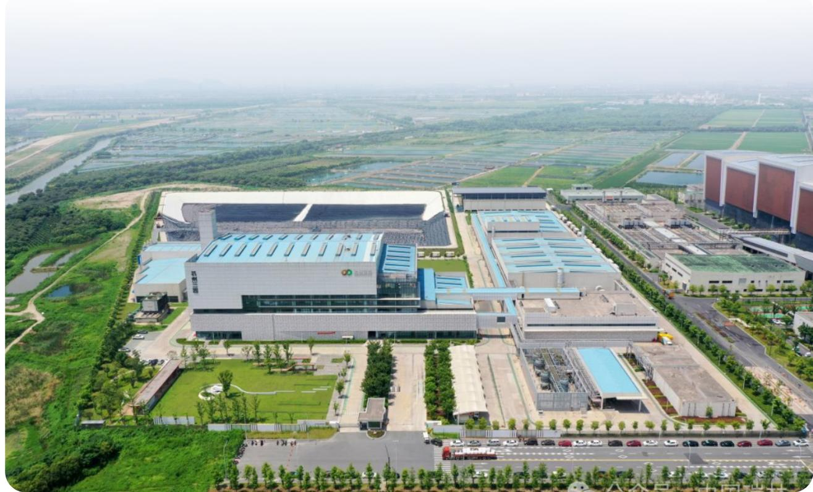

natural_image

Aerial view of a large industrial complex with multiple buildings, surrounded by green fields and roads (no visible text or signage)

在动态评估与结构优化环节, 公司实施常态化评价与优胜劣汰机制, 持续提升供应商库质量。

# 中国瑞林供应商动态评估与常态化结构

# 年度再评估

采购部每年统一组织对合格供应商与零星供应商开展年度再评价工作，全面收集采购工程师、项目经理、使用部门在产品质量、交付及时性、售后服务、配合度、合规履约等方面的实际反馈，由各专业部门联合审核并提出优化调整建议，对评价不合格、履约能力不足、存在重大风险隐患的供应商实施清理退出，持续优化供应商结构。

# 日常管理

公司对供应商交付延误、质量缺陷、服务不到位等问题进行实时记录与跟踪处理，针对交付延误问题启动内部协调与供应商联动督办，针对质量问题启动整改、返工、换货等处置流程，相关考核结果直接作为后续合作份额、招标资格与分级调整的重要依据。

# ESG 管理融入

公司暂未开展集中式供应商 ESG 专项培训，但在日常合作、合同约定与沟通管理中主动向供应商传递劳工权益保护、绿色环保、安全生产、廉洁从业等要求，推动供应商提升可持续发展意识，并计划在后续管理中将 ESG 指标正式纳入供应商综合评价体系，推动供应链可持续发展水平持续提升。

# 2. 供应链风险应对

公司建立覆盖事前预防、事中控制、事后处置与复盘改进的闭环供应链风险管理机制，针对供应链运行过程中可能出现的各类风险实施精准识别、有效防控与快速处置。

# 中国瑞林供应商风险应对措施

# 风险类型

# 技术风险

# 交付风险

# 合规与信用风险

# 沟通协同风险

# 应对措施

- 公司充分依托自身工程设计与技术研发资源优势，对供应商产品技术方案、技术参数、制造工艺、适配性等进行专业分析与验证，对无法满足技术要求的产品及时采取整改、优化方案、更换供应商或重新制作等措施，确保最终交付成果满足项目技术标准与使用要求。  
- 公司建立“内部协调联动 + 供应商专项督办”双重应对机制，对可能出现的交付延误提前预警，通过驻厂督促、高层对接、进度倒逼、资源协调等方式推动供应商加快生产与履约，最大限度保障项目进度需求，报告期内因交付问题导致更换供应商的情况极少发生。  
- 公司通过供应商负面清单管理、资质动态核查、履约信用跟踪、法律风险排查等方式，主动规避存在重大诉讼、经营异常、失信被执行、环保或安全处罚等不良记录的合作方；  
- 针对供应商经营倒闭、破产等极端情形，公司优先选择合作历史长、信誉良好、经营稳健的供应商，并通过合同约定、履约保障与风险预留等措施降低坏账与履约中断风险。  
- 公司建立高层直通对接机制,要求供应商指定高管作为固定联系人,对合作过程中出现的进度、质量、服务、技术对接等问题,通过现场沟通、专人驻场、专项会议等方式快速处置,确保问题及时闭环,保障供应链运行高效顺畅。

# 3. 供应链能力提升

公司为持续提升供应链管理专业化、规范化与数字化水平，公司从团队能力、系统工具与运营效率三方面持续推进供应链能力升级。

# 团队能力建设方面

2025 年公司共组织 11 场采购管理与供应商管理经验交流会，邀请内外部专业专家开展授课辅导，围绕制度流程、风险防控、商务谈判、监造验收、境外项目管理等内容开展实战化培训，强化团队规范操作意识与专业处置能力，推动管理经验标准化、流程动作规范化。

# 数字化管理升级方面

公司持续优化 NIMS 系统供应商线上评价流程，实现供应商初次准入评价、年度再评价、日常绩效记录等工作全流程线上化运行，提升评价效率与数据准确性；同步推动监造催交资料、检验记录、履约文件系统化归档，实现采购与供应商管理全过程可查询、可追溯、可复盘。

# 运营效率提升方面

公司推行高效工作机制，要求核心业务在规定时间内响应与办结，原则上不安排非必要加班，特殊情况须履行说明程序，通过流程优化、权责清晰、分工合理与系统赋能，持续提升供应链管理运行效率与工作质量。

# 案例 供应链技术共建与能力提升

公司每年定期组织专项培训与技术交流活动，邀请优秀供应商代表来公司开展技术研讨，年均举办供应链交流会不少于3次；安排公司内部专家就关键设备构造与工艺流程进行专题讲解，强化技术共享与能力传导。此外，每年开展内部采购经验分享会，涵盖重大工程项目采购风险处置、重要设备检测关键环节等，提升采购团队实战能力与风险防范意识。

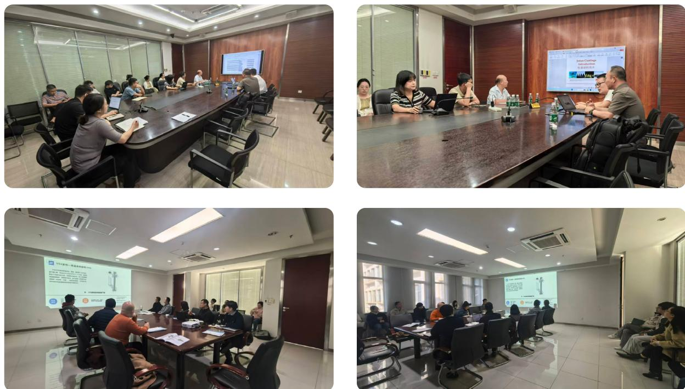

# 目标与指标

截至2025年12月31日，公司供应商库规模约1400家，覆盖矿山、冶金、化工、环境、市政、民用建筑等多个业务领域，其中稳定活跃合作供应商300-500家，形成领域齐全、层次清晰、多元供给、风险可控的供应商布局结构。

# 2025年,公司供应链管理各项关键指标均按计划完成:

全面完成供应商管理制度优化工作，更新完善供应商准入准出、分级分类、考核评价与监造催交管理体系；

组织开展采购专业经验交流会11场, 实现核心管理团队全覆盖培训, 团队专业能力与风险防控意识显著提升;

合格供应商年度再评价实现 $100\%$ 覆盖，按评价结果完成不合格供应商清理退出，供应链结构持续优化；

全年未发生因供应商产品质量问题引发的重大项目安全事故,重大客户投诉处于极低水平;

针对境外项目合作, 公司主动向境外供应商传递ESG合规要求并协助提供相关资质材料, 有效满足境外项目合规审查与履约需求。

未来, 公司将继续深化供应链精细化、可持续化管理, 进一步完善供应商ESG考核评价指标体系, 强化绿色环保、安全生产、劳工权益与合规诚信要求, 持续优化供应商结构, 提升优质战略供应商占比, 强化供应链韧性建设与风险预警能力, 加快数字化管理工具深度应用, 推动供应链管理向更高效、更合规、更绿色、更稳健的方向升级, 与所有合作伙伴共建合规守约、质量可靠、互利共赢、长期稳定的可持续供应链生态。

# 平等对待中小企业

中国瑞林高度重视与供应商建立良好的合作伙伴关系，始终秉持尊重和平等的原则对待所有供应商。对于中小企业供应商，公司秉持一视同仁的原则，在准入、合作等环节赋予其同等机会，不会因企业规模较小而予以区别对待，旨在促进公平竞争的市场环境。与此同时，公司还积极与中小企业供应商协同发展，为其提供必要的支持与帮助，携手提升供应链的整体质量和效率。报告期内，根据“信用中国”网站公示结果，公司无逾期尚未支付中小企业款项相关严重失信行为。截至报告期末，公司未出现应付账款(含应付票据)余额超过300亿元或占总资产比重超过50%的情形。

# 信息安全与客户隐私保护

中国瑞林高度重视信息安全与隐私保护工作，严格遵守《中华人民共和国网络安全法》《中华人民共和国数据安全法》《中华人民共和国个人信息保护法》等法律法规，立足境内外一体化业务布局，将信息安全、数据安全与隐私保护贯穿于业务运营、项目执行、技术研发、对外合作全流程，构建制度健全、技术先进、管控闭环、责任到人的全维度信息安全管理体系，全方位保障核心业务系统、涉密技术资料、客户信息、合作方信息及海外项目数据安全，切实维护公司、客户、合作伙伴及利益相关方的合法权益。

# 1 信息系统稳定运行与常态化保障

公司建立信息系统日常维护标准化管理机制，成立专职运维团队，对中国瑞林一体化智能管理信息系统等核心业务系统实施7×24小时不间断监控与常态化运维，确保系统安全、稳定、高效运行。2025年度，公司完成全量核心系统日常巡检4次，巡检覆盖服务器、网络设备、数据库、应用平台等全维度软硬件设施，及时排查并处置系统漏洞、设备故障、网络拥堵等潜在风险问题22项，处置率100%。

按年度维护计划，公司完成服务器集群、网络交换机、防火墙等硬件设备性能检测与保养，及时更换过期老化配件，保障硬件运行效率；同步完成各业务系统版本迭代与补丁更新739次，持续优化系统响应速度、功能体验与安全性能，确保系统能力与业务发展同步适配。公司建立完善的系统故障应急处置机制，明确分级响应与处置流程。2025年，公司未发生因日常维护不当导致的系统宕机、数据丢失、业务中断等重大安全事件，核心系统全年平均可用率达到 $99.9\%$ 以上，为境内业务高效开展及海外项目远程协同作业提供坚实可靠的技术支撑。

# 2 制度体系建设与安全审计管控

公司持续完善信息安全与数据管理制度体系，形成覆盖全域、权责清晰、流程规范的制度保障。公司制定并严格执行《信息系统与计算机网络管理规定》《计算机信息安全管理制度》《科技档案管理规定》《文书档案管理规定》《网络安全责任制实施办法》《信息管理程序和作业文件》等一系列管理制度，明确数据分类、存储、传输、使用、权限、脱敏、销毁等全生命周期管理要求，细化信息安全操作标准、责任界定与问责机制，配套完善信息安全事件应急预案，全面提升突发网络安全、数据泄露等事件的快速响应与应急处置能力。

在监督审计层面，公司构建了“内部审计+外部专业测评”双重信息安全审计模式，确保安全管控合规、有效、可追溯。内部审计由审计部联合信息中心牵头，围绕制度执行、系统安全、数据访问、权限管控、涉密保护、隐私保护等关键领域开展全面自评核查，通过系统核查、现场查验、人员访谈等方式形成问题清单与整改台账，实施闭环管理。外部测评方面，公司聘请具备专业资质的第三方信息安全机构，对公司信息安全管理工作有效性、核心系统安全防护能力开展独立检测评估，并按期完成信息安全等级保护二级复测。报告期内，公司信息安全管理合规有效，未发生内部违规、外部投诉、监管处罚等情形。

# 3 技术防护体系建设与安全能力升级

公司持续加大信息安全技术投入，不断强化技术防御能力，构建事前预防、事中阻断、事后可追溯的纵深防御技术体系。在敏感信息保护方面，公司对项目设计图纸、工艺文件、合作方涉密数据、客户隐私信息等重要资料实施全生命周期加密管理，升级文件加密策略，确保数据在产生、传输、存储、使用、共享、销毁各环节均处于安全保护状态。

在边界防护方面，公司对核心高性能防火墙进行订阅更新与策略优化，保持病毒库、特征库实时最新，实现对境内外网络访问的精准管控、实时监测与异常告警，有效抵御网络攻击、恶意入侵、病毒传播、勒索软件等外部威胁。在终端管控方面，公司升级终端安全管理系统，实现境内及海外项目办公终端统一纳管，强化终端病毒查杀、漏洞修复、外设管控、非法软件拦截、登录准入等功能，从源头防范数据泄露、非法拷贝、设备失密等风险。

# 4 数据分类分级与核心涉密信息保护

公司严格执行数据分类分级管理，按照保密要求、敏感程度、影响范围将信息系统数据划分为涉密数据、加密数据、一般数据三级，实施差异化、精细化管控。针对涉密数据（包括国家基础测绘成果、自然资源数据、外部接收涉密文件、合作方保密信息等），严格执行《项目涉密数据安全责任制》，实行专项管理、专人负责、专岗专责、全程留痕。针对主体工艺专业图纸、核心技术方案等加密数据，统一采用公司加密系统强制加密，严格执行解密审批流程，严禁擅自传播未加密图纸、严禁使用破解软件违规解密文件。一般办公数据按照网络安全责任制相关要求规范管理。

公司对文件服务器、核心数据库、涉密存储设备设置严格的账户策略、权限管控与操作审计，严格限制非授权访问、复制、下载、外传与删除操作，对高风险操作实行双人复核、审批管控，有效杜绝数据泄露、篡改、丢失、非法外传等安全事件。

# 5 海外项目数据安全与跨境合规管控

针对海外项目分布广、跨境场景多、属地监管差异大的特点，公司严格遵循中国数据跨境流动法律法规及项目所在国数据保护、隐私监管相关要求，建立“分类分级 + 跨境合规 + 全流程闭环”的海外项目数据安全管控体系，实现业务发展与数据安全同步推进。

在跨境合规层面, 公司严格按照《促进和规范数据跨境流动规定》要求, 对海外项目数据开展出境安全评估, 对不涉及个人信息和重要数据的跨境业务数据依法履行免予备案程序; 对确需出境的个人信息或重要数据, 严格按照规定完成安全评估、标准合同备案、保护认证等法定程序, 确保跨境数据流动全程合法合规。

在全流程管控层面，公司强化海外项目人员安全宣贯与培训；建立海外项目数据权限动态管理机制，随岗位调整、项目进展、人员离职/调离及时开通、变更或收回权限；项目结束后，对现场数据统一备份回收，存储介质按规定专业销毁，实现海外数据全生命周期闭环管理。报告期内，公司海外项目未发生数据泄露、丢失、违规跨境及合规风险事件。

# 6 人员意识培育与对外合作保密管理

公司坚持管理与文化并重、技术与意识同步，常态化开展信息安全、数据保密、隐私保护、合规操作宣贯培训，覆盖全体境内员工及海外项目团队成员，重点强化数据分类分级、跨境合规、口令管理、终端安全、邮件安全、防钓鱼诈骗、涉密文件管理等实操要求，持续提升全员安全意识与防护技能，筑牢信息安全“人防”防线。

在信息流转与对外合作环节,公司建立严格的内部信息传播管控机制,严控敏感信息、涉密信息、客户隐私信息的知悉范围与传播路径。在与第三方合作、外协、外包、咨询服务等活动中,公司依法签订保密协议或在合同中设立专门保密条款,明确保密范围、保密义务、责任追究与损害赔偿,从法律层面防范信息泄露、滥用、篡改等风险,切实保护客户隐私、商业秘密与核心技术安全。

报告期内，公司信息安全与隐私保护管理体系运行稳定、管控有效，制度、技术、人员、流程协同到位，未发生重大信息泄露、数据失窃、网络攻击、系统安全事故及海外项目数据跨境合规违规事件，信息安全、数据安全与客户隐私保护工作取得显著成效，为公司高质量可持续发展提供坚实可靠的安全保障。

natural_image

Panoramic view of lush green mountain ridges with winding roads, no visible text or symbols

# 员工

# 员工权益与福利

# 招聘与雇佣

员工是公司持续发展的核心资产，中国瑞林始终秉持“合规、公平、公开、择优”的用工理念，严格恪守《中华人民共和国劳动法》《中华人民共和国劳动合同法》等相关法律法规，构建标准化、规范化的招聘与雇佣管理体系，全方位保障员工合法权益，为企业高质量发展筑牢人才根基。

在招聘管理方面, 公司制定专项招聘管理制度, 明确“总量控制、统一管理、公开公平、回避”四大招聘原则。招聘过程中, 以应聘者的思想素质、道德品质、业务能力、发展潜力为核心选拔依据, 坚决杜绝因性别、年龄、种族、宗教、国籍、身体残疾等因素产生的招聘歧视, 确保所有应聘者享有平等竞聘机会。针对不同岗位需求制定差异化招聘标准, 通过校园招聘、社会招聘、内部推荐等多元化渠道吸纳人才, 其中校园招聘聚焦专业对口的优质院校, 社会招聘重点引进高端稀缺人才, 同时鼓励内部员工推荐优秀候选人, 充分盘活人力资源。

在雇佣规范方面，公司与员工在自愿平等的基础上依法签订劳动合同，清晰约定薪资待遇、岗位职责、合同期限、终止条件等核心条款，规范劳动合同管理全流程。严格核查应聘者身份证件原件，确保其符合法定最低工作年龄标准，坚决杜绝雇佣童工、强迫劳动等违规行为。对于驻外分公司、子公司及项目部的招聘工作，严格执行备案或审批程序，确保全公司用工管理统一规范。

- 公司始终坚持依法合规用工,切实保障全体员工合法权益,严格按照国家法律法规与员工签订劳动合同,足额缴纳五险一金,构建覆盖招聘录用、培训发展、绩效管理、薪酬激励、职业健康与劳动保护的全流程人力资源管理体系。  
- 公司坚守机会平等、择优录用、公平公正的核心原则，全面推行反歧视、反骚扰管理要求，在招聘、任用、培训、晋升、薪酬分配等各环节，不因性别、民族、宗教信仰、地域、国籍等差异实施区别对待，全力营造平等尊重、包容多元、积极健康的职场环境。  
- 公司高度重视女性专业技术人才培养与发展，在科研设计、工程技术、项目管理、职能管理等关键岗位持续优化女性员工结构，为女性技术人才提供畅通、公平的职业发展通道与成长平台。  
- 在海外业务布局中, 公司严格遵循属地化用工理念, 积极履行本地社会责任, 优先聘用、培养与发展当地员工, 促进所在地区就业与人才成长; 公司严格遵守项目所在国法律法规, 尊重当地文化习俗与劳动习惯, 为海外本地员工提供符合当地标准的薪酬福利、安全保障与职业发展机会, 推动中外员工融合共进、协同发展。

在内部流动管理方面, 建立灵活有序的员工流动机制, 支持自愿调岗、员工借用、安排调岗及关键岗位轮岗等多种流动形式。

报告期内, 公司未发生与员工招聘解雇、平等机会、反歧视等劳工准则相关的违规事项, 亦无相关诉讼案件, 用工管理全程合规有序。

# 权益与福利

中国瑞林秉持“以人为本”的管理理念，在严格保障员工法定权益的基础上，构建多层次、全方位的福利保障体系，通过规范化的薪酬福利管理、多样化的员工关怀举措，持续提升员工幸福感与归属感。

在法定权益保障方面，公司严格按照国家规定为全体员工足额缴纳养老保险、医疗保险、失业保险、工伤保险、生育保险及住房公积金等“五险一金”，确保员工社会保障权益落实到位。明确规范工作时数与假期制度，员工可依法享受法定节假日、带薪年假、病假、产假、陪产假、婚假、丧假等各类假期，其中病假薪酬按休假时长实行差异化保障，充分兼顾员工工作与个人生活需求。

在薪酬体系建设方面,实行“以岗定薪、按劳分配”的薪酬制度,员工薪酬由岗位工资、津补贴、奖酬金等部分构成。岗位工资根据岗位等级及任职年限确定,实际绩效工资与公司效益及个人考勤挂钩,充分体现“多劳多得”的分配原则。设立多元化津补贴体系,涵盖工龄津贴、司龄津贴、注册师津贴、学位津贴、住房补贴、通讯补贴、交通补贴、午餐补贴、生日礼品费等,其中全日制博士研究生可享受学位津贴,公司对特殊员工家给予住房补贴,全方位保障员工生活需求。

# 中国瑞林员工权益与福利措施

# 法定权益

- 足额缴纳“五险一金”；  
- 享受法定节假日、带薪年假、病假、产假等各类假期

# 薪酬结构

\- 岗位工资+津补贴+奖酬金+骨干员工专项奖励

# 专项津补贴

\- 工龄津贴、司龄津贴、注册师津贴、学位津贴、住房补贴、通讯补贴、交通补贴等

# 员工福利

- 意外伤害保险、补充医疗保险、年度健康体检、生日礼品费、年节福利；  
- 骨干员工专项奖励(五年滚动发放)

在专项关怀与保障方面, 公司为全体员工统一办理意外伤害保险, 建立补充医疗保险制度, 减轻员工医疗负担; 每年组织全体员工开展健康体检, 帮助员工及时了解自身健康状况, 做好健康管理; 公司高度重视驻外项目员工的工作与生活保障, 坚持以人为本, 持续完善海外员工关怀体系, 从薪酬激励、专项补助、节日慰问、健康保障、家庭支持等多方面构建全方位、多层次的驻外员工权益保障机制, 切实解决驻外员工后顾之忧, 不断提升海外团队归属感、安全感与幸福感。

# 案例 海外员工关怀

针对长期驻守境外项目现场的员工，公司建立常态化专项关怀与激励保障机制，对坚守海外一线、保障项目稳定运行的员工给予重点倾斜与特殊支持。2025年春节期间，为坚守在境外项目现场的62名驻外员工发放专项坚守补助，同时配套发放节日慰问金与慰问物资，向坚守海外岗位的员工致以诚挚慰问与感谢，切实保障驻外员工合法权益与生活品质，传递公司对海外一线员工的关心与关怀，激励海外团队安心履职、稳定担当，为公司境外项目高质量推进提供坚实的人员保障。

<table><tr><td>序号</td><td>项目名称</td><td>合同归属</td></tr><tr><td>1</td><td>刚果(金) 卡莫阿钢冶炼项目 EPCM</td><td>中国瑞林</td></tr><tr><td>2</td><td>刚果(金) 卡莫阿钢冶炼项目 EPCM</td><td>中国瑞林</td></tr><tr><td>3</td><td>刚果(金) 卡莫阿钢冶炼项目 EPCM</td><td>中国瑞林</td></tr><tr><td>4</td><td>刚果(金) 卡莫阿钢冶炼项目 EPCM</td><td>中国瑞林</td></tr><tr><td>5</td><td>刚果(金) 卡莫阿钢冶炼项目 EPCM</td><td>中国瑞林</td></tr><tr><td>6</td><td>刚果(金) 卡莫阿钢冶炼项目 EPCM</td><td>中国瑞林</td></tr><tr><td>7</td><td>刚果(金) 卡莫阿钢冶炼项目 EPCM</td><td>中国瑞林</td></tr><tr><td>8</td><td>刚果(金) 卡莫阿钢冶炼项目 EPCM</td><td>中国瑞林</td></tr><tr><td>9</td><td>刚果(金) 卡莫阿钢冶炼项目 EPCM</td><td>中国瑞林</td></tr><tr><td>10</td><td>刚果(金) 卡莫阿钢冶炼项目 EPCM</td><td>中国瑞林</td></tr><tr><td>11</td><td>刚果(金) 卡莫阿钢冶炼项目 EPCM</td><td>中国瑞林</td></tr><tr><td>12</td><td>刚果(金) 卡莫阿钢冶炼项目 EPCM</td><td>中国瑞林</td></tr></table>

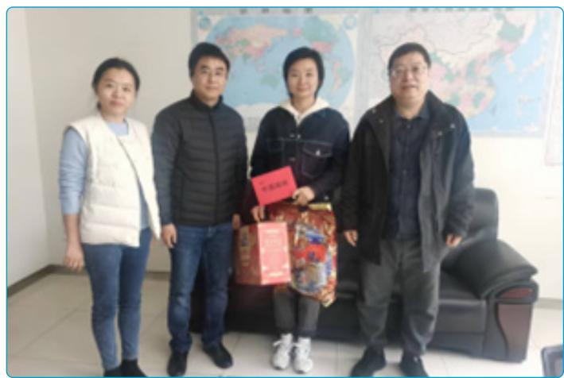

text_image

Group photo of four people posing indoors with visible Chinese text on a red envelope and background wall map

慰问春节期间驻国外现场人员家属

# 员工培训与发展

# 员工培训

公司高度重视人才培育，将员工培训视为企业核心竞争力提升的关键支撑，构建分层分类、内外结合、线上线下联动的系统化培训体系，围绕新员工入职培训、专业技术培训、管理能力培训、继续教育等多个维度，为员工提供覆盖全职业周期的培训支持，助力员工与企业共同成长。

# 1 新员工入职培训

公司构建了集中授课 + 素质拓展 + 专业实训三位一体的新员工入职培训模式, 帮助新员工快速融入组织、熟悉业务、认同文化。

# 案例 新入职员工培训

2025 年 7 月 22 日—8 月 6 日，公司组织 39 名新入职员工开展为期两周的集中入职赋能培训，系统讲授公司概况、企业文化、核心价值观、规章制度、战略规划、信息化系统操作及职业礼仪等内容，并针对设计岗位新增 3D 应用专题培训，考核合格后方可上岗。培训期间组织 35 名新员工赴九江 “云居之巅” 溯溪谷开展团队拓展，通过互动协作项目强化团队意识与凝聚力。培训以出勤率、课堂表现、测试成绩、团建参与度为依据，评选表彰 10 名优秀学员。

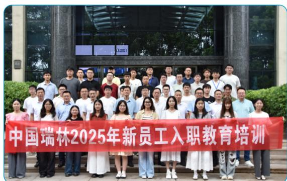

text_image

中国瑞林2025年新员工入职教育培训

新员工入职教育培训

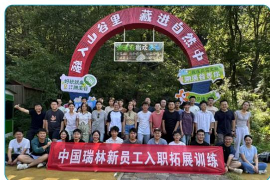

text_image

入山谷里藏进自然中
好玩就喜
让好请着你
珊瑚硅谷
中国瑞林新员工入职拓展训练

新员工入职拓展训练

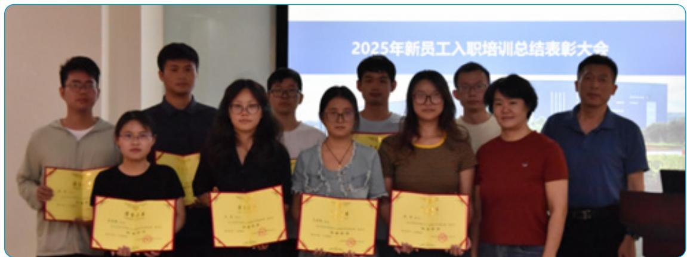

text_image

2025年新员工入职培训总结表彰大会

新员工入职培训总结表彰大会

# 2 专业技术与管理培训

公司聚焦专业能力提升与管理素养升级，常态化开展多维度、高质量专项培训，持续强化人才队伍核心能力。

外部送训精准赋能:2025年选派30批100余人次参加各类外部专业培训,覆盖测绘地理信息、矿山智能化、冶金计算、危险与可操作性分析(HAZOP)、有色冶金智能制造等多个领域,有效提升员工专业技术水平与行业视野。

管理能力专项培养:推荐建筑设计院院长等5名中层正职管理人员参加江铜集团2025年中高级管理人员研修班,通过宏观视野、科技赋能、领导能力等模块的系统学习,提升中高层管理团队综合素养。

党建与党务培训:5月22日—24日,在吉安市万安县罗塘村举办党支部书记及党务工作者综合能力提升专题培训班,50名学员通过专题教学、现场研学、交流研讨等形式,强化理论武装与党性修养,提升党建工作专业能力。

# 案例 党务培训

党建引领方面，5月22—24日在吉安市万安县罗塘村举办党支部书记及党务工作者综合能力提升培训班，50名学员通过专题教学、现场研学、交流研讨提升党务工作能力，以高质量党建引领业务高质量发展。

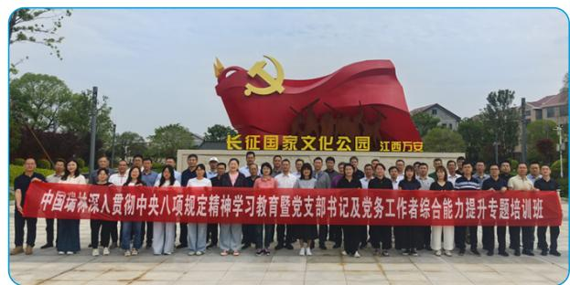

text_image

长征国家文化公园 江西万安
中国瑞林深入贯彻中央八项规定精神学习教育暨党支部书记及党务工作者综合能力提升专题培训班

党务工作者综合能力提升专题培训班

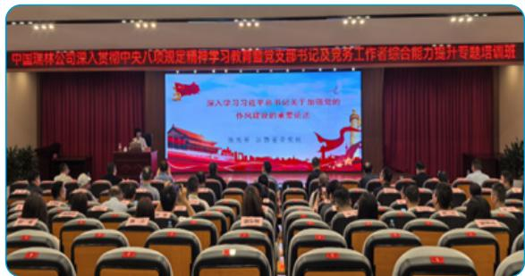

text_image

中国瑞林公司深入贯彻中央八项规定精神学习教育暨党支部书记及党务工作者综合能力提升专题培训班
深入学习习近平总书记关于加强党的作风建设的重要讲话
主办单位：安徽省发展厅

培训班现场照片

# 3 继续教育规范化推进

公司严格落实专业技术人员继续教育管理要求，持续推进继续教育标准化、常态化、规范化，保障人才职业发展与执业资格有效。公司明确专业技术人员年度继续教育不少于90学时（公需科目不少于30学时、专业科目不少于60学时），开通2024年度补学通道，确保职称申报人员学时达标。针对咨询工程师(投资)、注册建筑师、注册结构工程师等注册执业人员，公司统一开通网络培训账号、明确学习时限与完成要求：咨询工程师须完成60学时远程教育，注册建筑师等须完成年度必修课与选修课并取得合格证书，切实保障员工执业资格持续有效，为业务开展与职业发展提供坚实支撑。

# 4 校企合作联合育人

公司坚持产教融合、协同育人，深度参与高校人才培养全过程，为行业与公司储备高素质后备人才。作为理事单位加入华东交通大学装备制造卓越工程师学院理事会，深度参与人才培养方案修订、课程体系设计、实践教学指导等工作，推动校企双导师制落地实施。公司向学生开放真实工程课题与实习岗位，将产业需求、工程标准、项目经验嵌入培养环节，实现校园培养与企业需求无缝对接。依托华东交通大学实践教学基地、江西省研究生工作站等平台，公司持续深化产学研协同育人机制，既为高校提供实践场景与资源支持，也为自身引进、培养、储备优秀青年人才奠定坚实基础。

# 案例 校企合作

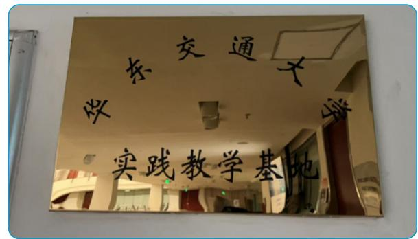

text_image

交通
实践教学基地

华东交通大学实践教学基地

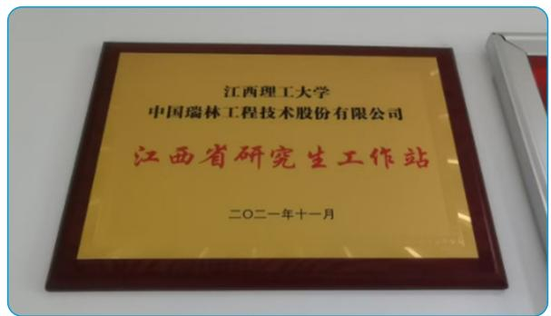

text_image

江西理工大学
中国瑞林工程技术股份有限公司
江西省研究生工作站
二〇二一年十一月

江西省研究生工作站

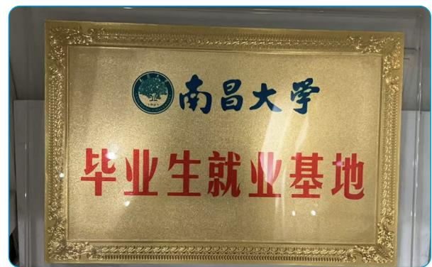

text_image

南昌大学
毕业生就业基地

南昌大学毕业生就业基地

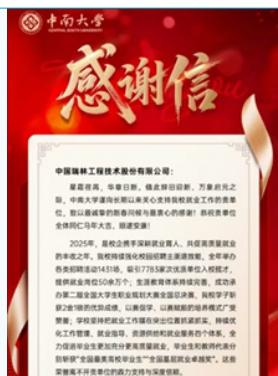

text_image

中南大学
感谢信
中国瑞科工程技术股份有限公司：
星星高亮、华泰自研，修在排印记录，万象的元之际，中南大学通向长顺以及相关支护我校就业工作的单位，故以诚挚的春间与服务与最善心的感谢！获我单位全体同行已年大吉，谢谢安康。
2025年，是首届春季手部研发事业人、共创高质量就业的半年之光，高校持续深化全国招聘大赛竞赛，全年举办各类招聘活动1451场，尝试7785次优质单位入校能才，提供就业岗位50万个，生活教育系统持续完善，成功办成第二座全国大学生职业规划和重大基层讲座，高校学历新课3年的工作流程，以教育、以实践的培养模式广发智慧，学校组织机构在工作期间与企业互动交流开展，持续文化工作管理。就业指导、营销培训和职业服务的各个环节，全力促进毕业生更加 Dominican高质量就业、毕业生和教师的代表分享到“全国最美高校毕业生”“全国基层就业卓越奖”。这些荣誉都不符合责任的路东支持与深度挂钩。

中南大学的感谢信

# 员工晋升与发展

公司构建清晰多元的职业发展体系与科学公正的晋升机制,为员工提供广阔的成长空间与发展路径,激发员工进取动力,实现个人价值与企业发展的同频共进。

在职业发展通道方面, 建立多序列并行的职业发展路径, 涵盖管理、专业技术等多个序列, 员工可根据自身特长与职业规划, 选择管理岗位晋升或专业技术岗位深耕, 为不同类型人才提供差异化发展渠道。

在晋升评定机制方面,实行“定期评定+动态调整”的晋升管理模式,结合员工工作年限、专业资质、工作业绩、能力提升等多维度指标进行综合评估。对于专业技术人员,将继续教育完成情况、职业资格获取、项目实践表现等作为晋升重要依据;对于管理人员,重点考核团队管理、项目管控、业绩达成等综合能力,确保晋升过程公平公正、有据可依。

<table><tr><td>管理通道</td><td>助理</td><td>——</td><td>主办</td><td>主管、高级主管</td><td>部门副职</td><td>部门正职</td><td rowspan="5">总监</td><td rowspan="5">公司领导副职院士、国家级设计大师</td><td rowspan="5">公司领导正职</td></tr><tr><td>营销通道</td><td>营销助理</td><td>营销经理</td><td>副主任营销经理</td><td>副主任营销经理</td><td>主任营销经理</td><td>高级营销经理</td></tr><tr><td>设计通道</td><td>设计助理</td><td>设计师</td><td>副主任设计师</td><td>副主任设计师</td><td>主任设计师</td><td>高级设计师</td></tr><tr><td>研发通道</td><td>——</td><td>研究员</td><td>副主任研究员</td><td>副主任研究员</td><td>主任研究员</td><td>高级研究员</td></tr><tr><td>项目通道</td><td>项目助理</td><td>项目经理</td><td>副主任项目经理</td><td>副主任项目经理</td><td>主任项目经理</td><td>高级项目经理</td></tr></table>

在激励机制方面, 将晋升结果与薪酬待遇直接挂钩, 充分发挥薪酬杠杆的激励作用。同时, 通过“优秀学员”“十佳青年”等荣誉表彰, 树立先进典型, 激发全员干事创业的积极性与主动性, 形成“比学赶超”的良好氛围。

# 职业健康与安全

中国瑞林高度重视员工职业健康与安全管理，严格遵守《中华人民共和国职业病防治法》《中华人民共和国安全生产法》等法律法规，将安全管理融入日常运营全流程，通过制度建设、防护保障、安全培训等多维度举措，为员工打造安全、健康的工作环境。

公司建立完善的安全管理体系，明确各部门安全管理职责，规范事故处理流程。制定安全教育专项培训制度，针对不同岗位风险特点，明确安全培训内容与考核标准，要求新员工必须参加岗前安全培训，在职员工定期接受安全知识更新与技能培训，确保具备岗位必备的安全操作与自救互救能力。

公司为接触职业危害因素的员工提供高品质劳保用品和防护装备，按规定组织职前、在职、调职和离职职业健康体检，及时排查健康风险。定期开展工作场所安全巡查，重点排查办公区域、生产车间、项目现场等关键区域的安全隐患，及时纠正不安全行为与环境隐患，确保办公及作业环境符合安全标准。

公司构建“公司——部门——班组”三级安全教育培训机制，通过专题讲座、现场实操、案例分析等多种形式，开展消防安全、危险化学品管理、岗位安全操作规程等内容的培训。强化驻外项目员工安全保障，对出国人员开展专项安全培训，覆盖属地法律法规、文化习俗、应急处置等内容，确保境外项目人员安全合规开展工作。同时制定完善的应急处理机制，定期组织应急演练，提升员工应对突发安全事故的实操能力。

报告期内,公司未发生火灾爆炸、职业伤害等安全事故,职业健康与安全管理工作成效显著,为员工身心健康和公司稳定运营提供了坚实保障。

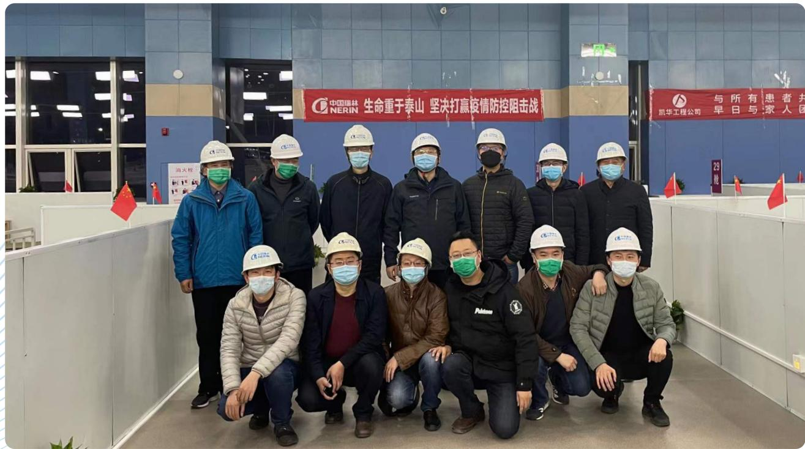

text_image

中国瑞林
NERIN 生命重于泰山 坚决打赢疫情防控阻击战
与所有患者共
凯华工程公司 早日与家人团
消火栓
29
舱

# 案例 工程现场安全防护、职业病预防、员工体检、安全培训（含海外项目现场安全培训）

2025 年 3 月 26 日下午, 公司邀请南昌市消防支队大院队专业家来公司开展 2025 年第一批 “准消防员” 实操考核培训, 28 名员工参与了本次培训。

7月24日，根据公司安排，安全管理部对2025年新入职员工进行了入职前安全教育培训，学习内容包括安全基础知识、相关法律法规、公司有关安全规章制度、典型案例分析、观看警示片以及消防器材实操技能培训。

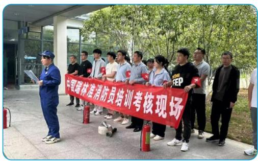

text_image

中银森林准消防员培训考核现场

培训现场照片

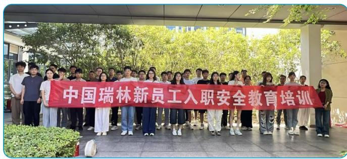

text_image

中国瑞林新员工入职安全教育培训

培训现场照片

加强出国人员安全教育培训，截至12月底，2025年度对186名初次出国员工进行了出国前安全教育培训。

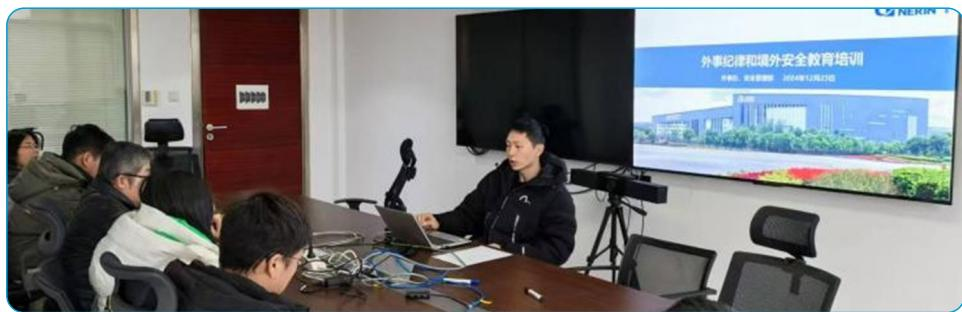

text_image

外事纪律和境外安全教育培训
2024年12月27日

培训现场照片

公司线上平台发布有关安全月活动 PPT、“安全生产月”主题宣传片、事故警示教育片、典型案例解析片和“全民安全公开课”等各类视频，组织员工学习和收看。

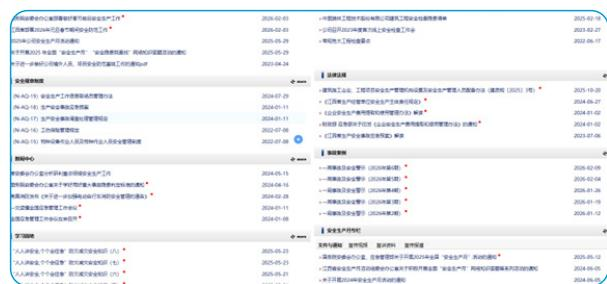

flowchart

This flowchart illustrates the timeline and key milestones of a corporate governance or management process, covering steps from initial reporting to final approval.

线上信息平台截图

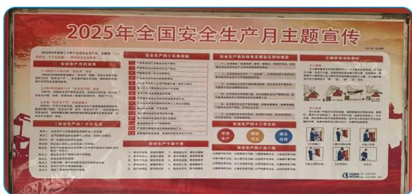

text_image

2025年全国安全生产月主题宣传
安全生产月的措施
（安全生产法）产业政策
安全生产部门要求
安全生产部门主要措施
安全生产部门具体实施方案及实施措施规定
安全生产部门进一步落实
安全生产部门进一步落实
安全生产部门进一步落实
安全生产部门进一步落实
安全生产部门进一步落实
安全生产部门进一步落实
安全生产部门进一步落实
安全生产部门进一步落实
安全生产部门进一步落实
安全生产部门进一步落实
安全生产部门进一步落实
安全生产部门进一步落实
安全生产部门进一步落实
安全生产部门进一步落实
安全生产部门进一步落实
安全生产部门进一步落实
安全生产部门进一步落实
安全生产部门进一步落实
安全生产部门进一步落实
安全生产部门进一步落实
安全生产部门进一步实施
安全生产部门进一步实施
安全生产部门进一步实施
安全生产部门进一步实施
安全生产部门进一步实施
安全生产部门进一步实施
安全生产部门进一步实施
安全生产部门进一步实施
安全生产部门进一步实施
安全生产部门进一步实施
安全生产部门进一步实施
安全生产部门进一步实施
安全生产部门进一步实施
安全生产部门进一步实施
安全生产部门进一步实施
安全生产部门进一步实施
安全生产部门进一步实施
安全生产部门进一步实施
安全生产部门进一步实施
安全生产部门进一步实施
安全生产部门进一步实施数量
安全生产部门进一步实施数量
安全生产部门进一步实施数量

《2025年全国安全生产月主题宣传》宣传板报

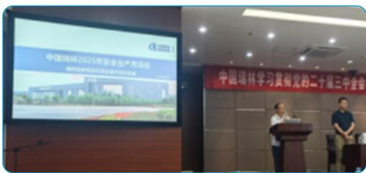

text_image

中国瑞林2025年安全生产用活动
中国瑞林学习贯彻党的二十届三中全会

开展安全公开课

text_image

人民日报2017年5月，国家重大作家
人人讲安全 午午会应急

《2025年全国安全生产月》宣传图

# 乡村振兴

2025年是“十四五”规划收官之年，也是巩固拓展脱贫攻坚成果同乡村振兴有效衔接5年过渡期的最后一年。中国瑞林深入践行ESG发展理念，以习近平新时代中国特色社会主义思想为指导，聚焦“走在前、勇争先、善作为”目标要求，充分发挥人才、技术、资源优势，以定点帮扶吉安市万安县罗塘村为核心，秉持“立足罗塘、辐射万安”的帮扶理念，全年累计投入帮扶资金近200万元（含消费帮扶、技术帮扶），通过党建引领、精准防返贫、产业赋能、全域智力支撑等举措，推动帮扶村集体经济提质、乡村发展提效，切实履行国有企业乡村振兴帮扶责任，相关工作获万安县委、县政府及当地干部群众高度认可并致信感谢。

# 党建引领强根基, 凝聚帮扶工作合力

公司党委将乡村振兴定点帮扶作为重大政治任务，构建“党委统一领导、分管领导牵头抓总、责任部门协同推进、驻村工作队具体落实”的工作格局，以党建红引领乡村振兴绿，激活乡村发展内生动力。

# 高位统筹部署

全年 4 次召开党委会议研究部署帮扶工作，制定年度计划、细化任务清单；公司主要领导多次赴罗塘村实地调研，走访慰问脱贫户、监测户，现场解决帮扶实际困难。

# 建强基层堡垒

指导罗塘村完成“两委”换届选举，培养入党积极分子1名、发展预备党员1名；依托村内红色资源设立党员干部学习教育培训基地，推动村党组织成为乡村振兴“主心骨”。

# 开展系列党建实践

2025 年 3-11 月组织各党支部开展 8 批次 “党建 + 乡村振兴” 团建活动，300 余名党员干部职工赴村开展党建共建、政策宣传、志愿关爱等活动，将党建工作与乡村振兴深度融合。

# 案例 党建引领乡村振兴实践现场

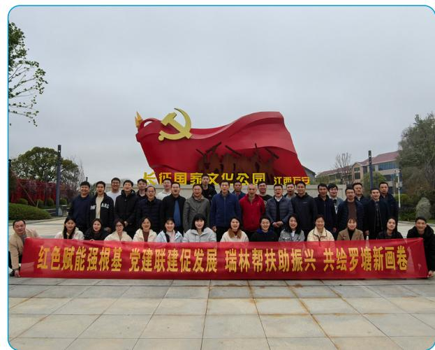

text_image

长征国家文化公园 江西区
红色赋能强根基 党建联建促发展 瑞林帮扶助振兴 共绘罗塘新画卷

3月开展党建共建活动,筑牢乡村振兴组织根基

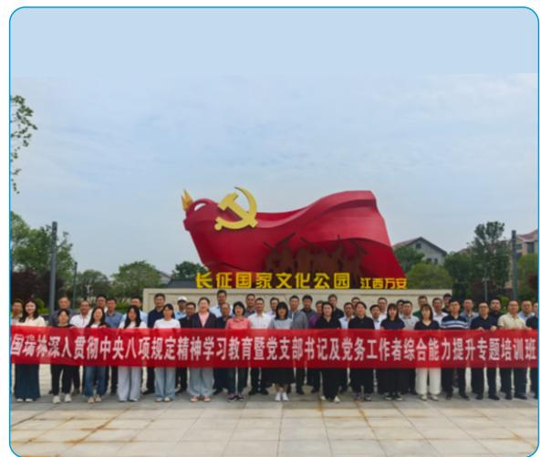

text_image

长征国家文化公园 江西万安
国端券深入贯彻中央八项规定精神学习教育暨党支部书记及党务工作者综合能力提升专题培训班

5月开展党员干部培训班,助力红色旅游产业发展

# 精准施策守底线,巩固拓展脱贫攻坚成果

公司始终把防止返贫作为乡村振兴工作的前提和基础，构建全方位、常态化防返贫保障体系，确保脱贫攻坚成果持续巩固。

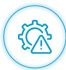

健全监测预警机制:通过村广播、微信群、入户走访等形式宣传防返贫政策,依托“三线预警”机制对50户存在致贫风险的农户开展集中研判,实现早发现、早干预、早帮扶。2025年,新增监测对象1户,针对现有监测户开展精准帮扶,其中2户监测户已成功消除风险、退出监测范围。

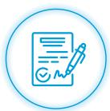

推动政策精准落地:严格落实产业、就业、教育、社会保障等帮扶政策,坚持“一户一策、精准滴灌”;定期开展脱贫户、监测户遍访工作,及时更新全国防返贫监测信息系统数据,做到底数清、情况明、数据准。

# 产业赋能促增收, 激活乡村发展动能

公司立足罗塘村富硒、红色文旅资源禀赋，以产业兴旺为核心，打造特色产业体系，构建“种植养殖+电商+文旅”全产业链模式，提升乡村经济“造血”能力，2025年罗塘村村集体经济年收入达50.11万元。

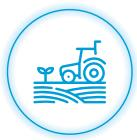

培育特色生态产业: 投入专项资金盘活230亩富硒水果产业基地, 支持富硒生态鸡养殖, 创新“水果鸡”生态种养模式, 实现“以鸡养果、以果育鸡”的生态循环; 指导村集体做强黑木耳基地、渔家小院等特色业态, 构建生态循环立体农业格局。

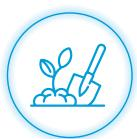

拓宽农产品销售渠道:构建“公司定向采购+市场化销售”双轮驱动消费帮扶模式,一方面发动公司工会、各部门、食堂及员工定向采购万安富硒农产品;另一方面对接江浙沪市场,引入上海专业直播团队落户罗塘并成立电商公司,打通农产品进城“最后一公里”,2025年累计带动当地农产品销售额达140余万元,帮助200余户村民实现增收。

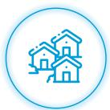

发展红色文旅产业:依托红色罗塘长征文化公园阵地,推进乡村文化与红色旅游深度融合,指导村文化旅游公司开展专业化运营,全年接待游客近1万人,以红色文旅激活乡村发展新动能。

# 案例

# 特色产业帮扶现场

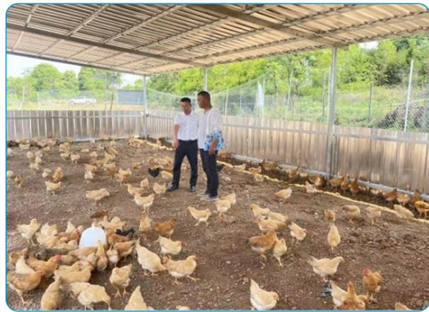

natural_image

Two men standing under a metal shelter filled with numerous chickens in a rural farm (no visible text or symbols)

公司支持罗塘村发展富硒生态鸡养殖产业打造生态种养模式

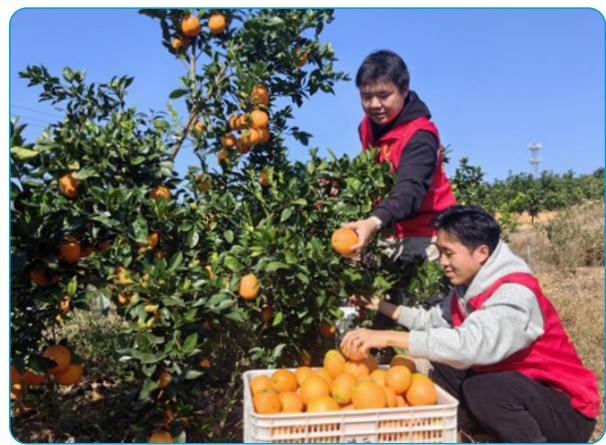

natural_image

Two people harvesting oranges from a tree in an orchard under clear blue sky (no text or symbols visible)

公司组织员工帮助罗塘村采摘、销售脐橙西柚助力农产品出村

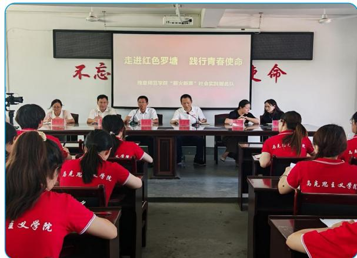

text_image

走进红色罗塘 践行青春使命
热爱师范学院“薪火新声”社会实践部会队
不忘
革命
马克思主义学院
马克思主义学院

公司引进高校大学生到村开展红色研学助力红色旅游产业发展

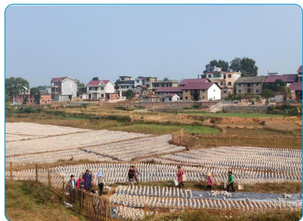

natural_image

Rural landscape with terraced fields, workers, and residential houses in the background (no visible text or symbols)

公司协助罗塘村做强黑木耳基地，打造“种植养殖+电商+文旅”全产业链模式

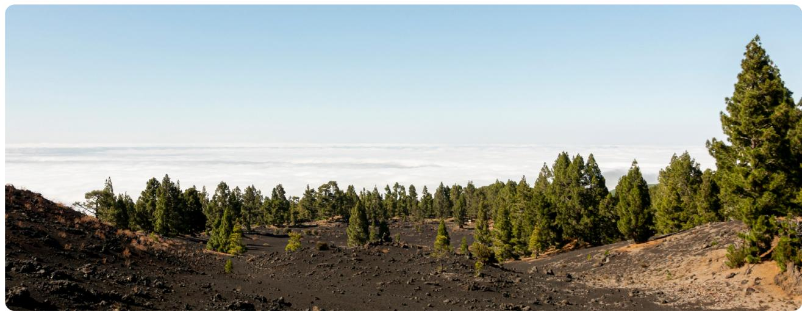

natural_image

Panoramic view of a forested hillside with tall evergreen trees under a clear sky, no visible text or symbols.

# 智力赋能·技术支撑,彰显技术型企业帮扶特色

作为以工程设计、规划咨询、环境治理、项目管理为核心优势的技术型企业，中国瑞林坚持把专业技术优势与乡村振兴需求深度融合，以智力帮扶、技术赋能为抓手，为万安县及罗塘乡提供全链条专业支撑，走出“技术赋能、规划引领、产业落地”的特色帮扶路径。

公司充分发挥环境工程与运维管理优势，依托瑞林环境(万安)有限公司专业平台，持续做好万安工业园区尾水提升达标处理厂专业化运营管理，保障园区污水稳定达标排放，以技术守护区域生态安全。同时，为万安工业园区尾水提升达标处理厂(二期)、赣江两岸城区污水主管网修复提升工程等3个重点环保项目提供方案设计、技术优化、施工指导等全流程专业服务，以环境治理核心能力助力万安补齐生态短板、推动绿色低碳发展。

立足城乡建设与公共服务提升需求, 公司免费为罗塘乡圩镇改造、数智物流园周边地块规划、高速出口司机服务点建设等3个民生项目提供整体规划、方案设计与技术咨询服务, 累计免除技术服务费30万元, 以高水平规划设计赋能乡村面貌更新、完善公共服务配套, 让专业技术真正惠及基层、惠及群众。

此外，公司充分发挥资源整合与项目策划优势，积极为万安县及罗塘乡搭建争资争项、招商引资桥梁，协助对接省农业农村厅、省人社厅等部门争取政策与资金支持；主动邀请江西新和源投资控股集团赴万安考察洽谈富硒农产品加工项目，以技术策划+资源链接+产业导入的综合能力，推动当地特色资源转化为产业优势与经济优势，以全链条智力支撑助力万安高质量发展。

natural_image

Lush green mountain valley with rolling hills and scattered flowers, no visible text or symbols

# 社会公益

中国瑞林坚持以“技术赋能公益、责任回馈社会”为核心，聚焦国内民生改善、生态保护、公共服务提升等关键领域，通过民生项目建设、公益帮扶、技术支持等多元方式，将企业技术优势与社会需求深度结合，实现商业价值与社会价值的协同共生，助力区域可持续发展。

# 教育助学, 点亮学子求学梦想

教育是民生之本, 公司始终将教育公益作为社会公益工作的重要内容, 聚焦乡村教育发展, 开展困难学生结对资助行动, 实现从小学到大学各学段的全覆盖帮扶, 为乡村学子成长成才保驾护航。2025年, 公司组织21个部门与吉安市万安县罗塘村21名困难学生结成一对一长期帮扶对子, 精准对接学子求学需求, 全年累计捐赠资助资金2.4万元, 为不同学段的困难学生提供学费、学习用品等资金支持, 帮助学子缓解求学压力, 圆梦校园。同时, 公司党员干部职工赴村开展校园宣讲、学习辅导等志愿活动, 为乡村孩子普及知识、开阔视野, 激发学习热情。

资助人数

21名

覆盖学段

小学 / 初中 / 高中 / 大学

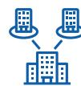

结对部门数

21↑

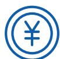

年度资助金额

2.4 万元

资助形式

一对一长期结对、现金资助

# 案例

# 教育助学公益现场

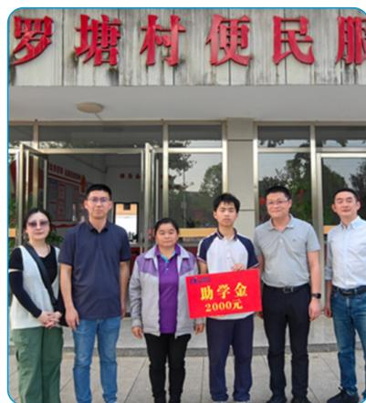

text_image

罗塘村便民服
助学金
2000元

公司为罗塘村困难学生发放助学金, 助力学子求学圆梦

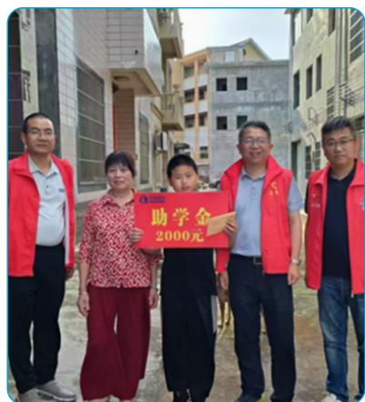

text_image

助学金
2000元

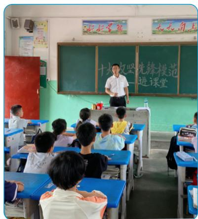

text_image

十六次攻坚先锋模范
进课堂

6月赴罗塘村开展校园宣讲活动, 为乡村孩子普及知识、开拓视野

# 民生关爱,守护特殊群体幸福生活

公司聚焦“一老一小”社会重点关爱群体，针对乡村留守儿童、留守老人等群体的实际需求，开展多元化、常态化的民生关爱公益活动，切实解决特殊群体生活中的实际困难，让公益温暖直达人心。

# 关爱乡村留守儿童

投入2万元支持万安县罗塘村“童心港湾”项目运营，为留守儿童打造集学习、娱乐、陪伴于一体的快乐成长家园，改善乡村留守儿童成长环境；全年多次组织党员干部职工赴村开展关爱留守儿童活动，捐赠书籍、文具、生活用品等物资价值1万余元，开展趣味课堂、心理疏导等志愿陪伴活动，弥补留守儿童情感缺失。

# 关爱乡村留守老人

结合传统节日开展孝老爱亲公益活动，在重阳节期间赴罗塘村开展“重阳暖村传文明”关爱老人活动，在春节期间走访润溪村开展困难群众慰问，为留守老人送去生活物资，开展健康、法律等咨询及志愿者服务；同时协助村集体完善养老服务设施，推动乡村养老服务提质升级，让留守老人老有所养、老有所乐。

# 案例

# 民生关爱公益现场

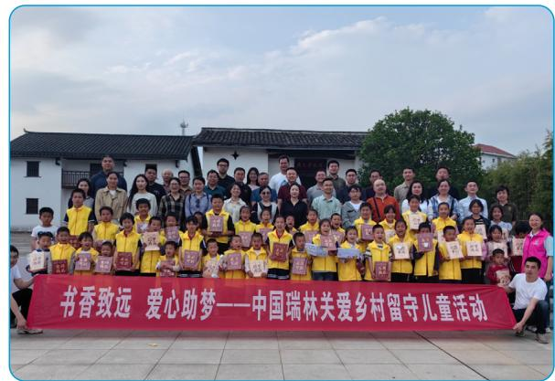

text_image

书香致远 爱心助梦——中国瑞林关爱乡村留守儿童活动

4月开展关爱留守儿童活动,为孩子送去书籍与温暖

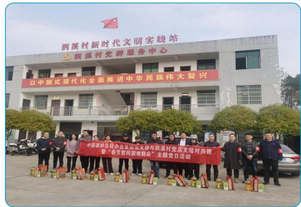

text_image

润溪村新时代文明实践站
润溪村党群服务中心
以中国式现代化全面推进中华民族伟大复兴
中国园林总经办企及党支部与润溪村党总支对共建
暨“春节期间困难群众”主题党日活动

1月开展走访慰问润溪村困难群众

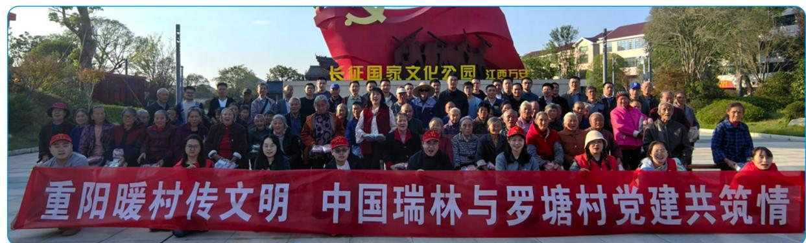

text_image

长征国家文化公园 江西万史
重阳暖村传文明 中国瑞林与罗塘村党建共筑情

10月重阳节开展关爱老人活动,弘扬孝老爱亲传统美德

# 党建共建, 凝聚村企发展合力

公司积极推进属地村企党建联动，与润溪村委会开展深度党建共建，通过组织联建、资源共享、活动共办、难题共解，联合开展主题党日、志愿服务、走访慰问等活动，以党建引领基层治理、促进民生改善，切实把组织优势转化为发展实效，推动村企协同发展、共建共荣。

# 基础建设与平安建设,夯实乡村发展保障

公司立足乡村实际需求，聚焦基础设施短板与基层平安建设，持续投入资金改善生产生活条件、守护群众安全。2025年，投入7万元专项公益资金用于万安县罗塘村水渠维修改造，解决农田灌溉“最后一公里”难题，保障农业生产用水需求，助力乡村产业提质增效。同时，积极履行属地平安建设责任，挂点帮扶龙南经开区平安建设，投入5万元资金完善防控体系、强化安全保障，以实际行动助力基层平安建设、守护一方稳定。

# 案例

# 民生关爱改善基础建设

# 江西·农商银行 JIANGXI RURAL COMMERCIAL BANK

# 跨行收款回单

打印日期 2025-09-22

交易日期 2025-09-19

清算渠道 超级网银

业务种类 汇兑

付款人账号 194702309070

付款人名称 中国瑞林工程技术股份有限公司

付款人开户行 104100000004 中国银行总行

收款人账号 179157650000009482

收款人名称 江西省吉安市万安县罗塘乡罗塘村村民委员会

收款人开户行 402421099990 江西农村商业联合银行股份有限公司

新收款人账号 分账号

新收款人名称

币种 人民币 交易金额 \*70,000.00 柒万元整

用途

附言 支持公司定点帮扶的万安县罗塘村修建水渠

备注

网点名称：江西万安农村商业银行罗塘支行

# 电子回单

  
扫码关注微银行

回单流水号 202509220020542031

交易类别 汇兑

业务类型 汇兑

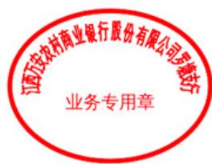

# 乡村振兴捐款

# 属地帮扶, 践行就近社会责任

在做好定点帮扶的同时,公司积极开展属地扶贫与困难群众帮扶,常态化走访慰问润溪村等属地困难家庭、困难党员与特殊群体,通过物资帮扶、节日慰问、精准纾困等举措,切实解决群众急难愁盼问题,不断提升属地群众获得感、幸福感与安全感,以就近公益彰显国企责任担当。

# 境外履责

中国瑞林在境外项目运营中，始终秉持“合规经营、属地融合、互利共赢”的核心理念，严格遵循项目所在国法律法规与劳务用工规范，将社会责任深度融入境外项目全生命周期，通过规范外聘用工管理、优化人力资源配置、推动跨文化协同等举措，在保障项目高效推进的同时，切实履行国际社会责任，实现企业发展与属地利益的协同共赢。

# 合规用工管理,筑牢境外运营根基

公司高度重视境外项目用工合规性,针对境外业务特点建立标准化用工管理体系,确保劳务合作全流程合法合规、规范有序。

> 境外项目外聘人员采用差异化用工方式:中国籍外聘人员通过劳务派遣、临时劳务协议、实习协议及委托翻译等多种形式聘用;外国籍人员全部通过具备资质的中介公司劳务聘用,明确合同权责与管理流程,保障用工合规性。  
公司严格按照项目所在国薪酬标准及劳务合同约定，按时足额发放外聘人员工资，薪酬构成包含岗位工资、劳务公司服务费及当地法定税费（如刚果金增值税），确保员工合法权益得到充分保障。同时，针对不同岗位特点制定差异化薪酬体系，兼顾薪酬竞争力与成本合理性，实现用工双方互利共赢。  
公司规范各类用工协议的签订与履行，明确服务期限、工作内容、薪酬标准、违约责任等核心条款，针对外国籍人员通过中介公司聘用的模式，强化对劳务公司的资质审核与过程管控，及时协调解决合同执行中的各类问题，降低合同管理风险。

# 属地融合赋能,推动共同发展

公司坚持“本地化运营、协同化发展”思路，在境外项目实施中注重属地资源整合与人才培养，助力项目所在国提升自主发展能力。

公司积极吸纳项目所在国及周边地区专业人才加入项目团队，外国籍外聘人员涵盖安全官、电气工程师、材料管理员等多个关键岗位，通过发挥本地人才熟悉语言、文化、政策的优势，提升项目沟通效率与本地化适配度。在卡莫阿项目中，外国籍外聘人员占外聘总人数的53.4%，为项目与当地政府、社区及合作方的顺畅对接提供了重要支撑。  
公司充分尊重项目所在国文化习俗与工作习惯，搭建中外团队高效沟通平台，通过外聘翻译人员、组织跨文化交流活动等方式，消除沟通壁垒，凝聚工作合力。中国籍外聘翻译人员在技术对接、日常协作等环节发挥关键作用，保障了项目信息传递的准确性与及时性。  
公司积极推动外籍专家与中方团队开展技术交流与“传帮带”，借助外籍人员的国际工程管理经验和专业技能，助力中方员工提升国际化业务能力，同时将公司成熟的项目管理模式与技术标准逐步输出，实现双向赋能与共同成长。

2025年, 公司通过灵活化、属地化外聘人员管理保障境外业务高效推进, 全年累计聘用外部人员超70人次, 精准补充项目管理、专业技术、翻译沟通等关键岗位缺口, 其中TANGA区域外聘人员工资发放规范有序, 确保薪酬及时足额兑现, 有效稳定外聘团队; 中外籍外聘人员协同发挥作用, 中国籍人员保障技术落地与项目进度, 外籍人员依托本地经验助力跨文化协作与国际化运营, 同时提升用工灵活性、降低固定人力成本, 推动内部员工与外聘团队经验共享、能力互补, 保障项目按期推进。

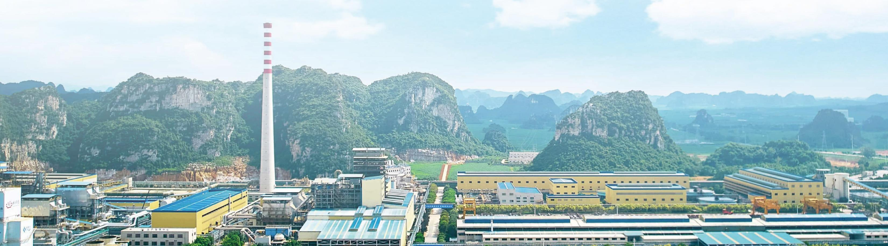

natural_image

Panoramic view of a modern industrial park with factory buildings, a tall chimney, and lush green karst mountains in the background (no visible text or signage)

natural_image

Wind farm landscape with multiple turbines on rolling green hills and distant mountains under a clear sky (no text or symbols visible)

# 04

# 践行绿色使命 守护生态未来

- 应对气候变化  
- 排放管理  
- 资源管理  
- 环境合规管理  
- 生态系统和生物多样性保护

# 04 践行绿色使命 守护生态未来

# 应对气候变化

应对气候变化关乎地球的生态平衡、人类的生存发展以及未来世代的福祉，已成为一个备受全球瞩目的话题。中国瑞林深刻认识到工程技术行业与生态环境的共生关系，始终将绿色发展理念贯穿于项目规划、设计、建设及运营全流程，以“工艺革新、能效提升、循环利用”为核心，积极应对气候变化。公司严格落实环境合规要求，加强生物多样性保护，优化能源与水资源利用，规范废弃物管理，推动循环经济发展，致力于打造“技术引领、低碳高效、可持续发展”的绿色工程标杆，助力行业及客户实现低碳转型与高质量发展。

中国瑞林气候相关治理架构

<table><tr><td>层级</td><td>责任机构</td><td>人员构成</td><td>职权范围及工作任务</td></tr><tr><td>决策层</td><td>董事会</td><td>由公司董事会成员组成</td><td>了解和分析国内外气候变化管理现状,掌握公司经营管理情况,全面领导气候相关治理工作。指导并审批公司气候相关方针、战略、风险管理政策与目标的制定,定期听取管理层报告公司应对气候变化工作的落实情况,并适时提出指导意见。监督管理层气候治理执行,确保气候目标与经营目标协同。</td></tr><tr><td>管理层</td><td>高级管理层</td><td>具备应对气候变化相关知识的高级管理人员、相关职能部门及子公司的负责人</td><td>确定及管理公司为识别、减缓、管理气候变化相关影响、风险和机遇所需分配的成本及资源(如员工、技术)等。组织制定年度气候行动方案、应对气候变化的减碳目标与工作计划及预算。分解目标至各业务单元/事业部,审批部门级气候管理细则、低碳项目立项与实施计划,协调解决执行中的重大问题。定期召开气候治理专题会议,监控目标完成率、风险管控效果,并向决策层汇报公司应对气候变化管理现状。建立“气候风险识别——评估——应对——监控”全流程机制,统筹推进气候相关风险和机遇等识别、评估和分析工作,以及相关工作人员能力建设工作。推动低碳技术研发与应用,将气候韧性融入工程设计与项目全流程。</td></tr><tr><td>执行层</td><td>应对气候变化执行小组</td><td>执行具体管理措施的工作人员、对气候变化及公司业务有充分认知的员工</td><td>执行公司应对气候变化工作计划,将气候变化风险和机遇管理融入日常工作中,并定期向管理层汇报最新工作成果及未来趋势分析。</td></tr></table>

公司深刻认识到，气候变化带来的风险和机遇可能会对公司的商业模式、发展战略、经营成果及财务状况产生影响，公司识别、评估气候变化给公司业务发展带来的风险和机遇，并制定相应应对战略，提高公司的战略适应性和应对气候变化和不确定性的业务适应性。

# 气候相关风险

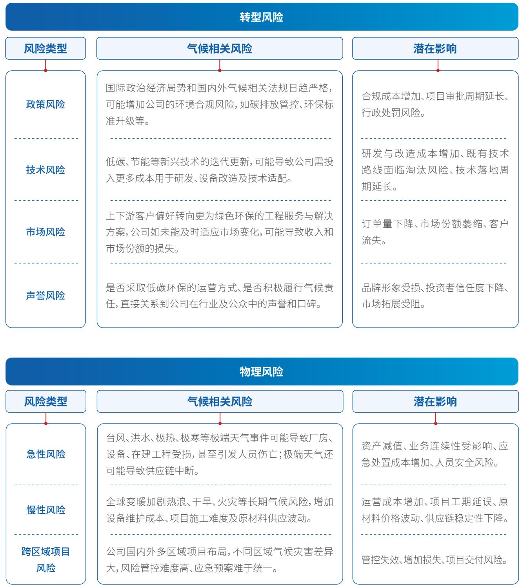

# 气候相关机遇

# 风险类型

# 能源节约

# 水资源节约

# 产品和服务创新

# 市场拓展与客户韧性

# 资源效益与循环经济

# 品牌与人才

# 气候相关机遇描述

在生产及办公过程中减少电力、蒸汽等能源的消耗，通过节能改造、智能管理等方式降低运营成本。

在生产及办公过程中减少水资源的消耗,通过循环利用、节水工艺等措施降低运营成本。

通过研发符合低碳、环保及可持续理念的工程解决方案, 将获得市场与客户的青睐, 拓展绿色业务版图。

数智化解决方案(NDI)赋能:公司持续推进NDI全流程数智化解决方案迭代升级,通过智能化改造帮助客户优化能耗、提升运营效率、降低碳排放。智能化业务将成为公司重要增长点,相关收入贡献将持续提升。

随着“无废城市”建设和资源循环利用政策加码，相关业务需求将持续增长。

高端人才引进与创新平台:公司成立瑞林创新研究院，在全球范围内引进绿色冶炼、智能矿山等领域高端人才。强大的技术团队和创新平台为持续创新提供支撑。

# 潜在影响

成本降低、能源利用效率提升、合规压力缓解。

成本降低、水资源利用效率提升、环境绩效改善。

收入增加、市场竞争力提升、品牌价值提升。

高附加值业务收入增长、客户粘性增强、差异化竞争优势提升。

新业务增长点提升业务量、绿色技术溢价、巩固行业领先地位。

技术壁垒持续加固、研发效率提升、行业标准制定话语权增强。

公司结合自身业务特性、内外部环境因素，听取专家意见，参照上交所《指引》的建议框架，开展气候变化相关风险和机遇的管理与披露工作。公司通过深入分析与研讨，精准识别具有重大影响的气候影响、风险和机遇，并通过定性评估的方法，依据发生概率和影响程度对风险和机遇进行科学排序，并制定针对性的应对战略和转型计划。

基于分析结果, 公司设立了公司层面的减碳路径, 制定了应对气候变化的工作计划, 旨在积极应对气候变化带来的挑战。公司还综合考虑各部门的业务特性和实际情况, 将工作计划拆分为各相关部门的绩效目标, 该目标与相关管理人员的绩效紧密挂钩, 以此推动应对气候变化工作计划融入各部门的日常管理。

# 气候变化应对措施

# 维度 能源结构优化

# 管理措施

\- 公司积极推进光伏系统建设与可再生能源应用，优先实现清洁能源自发自用，多渠道优化能源结构，替代传统电力消耗，以绿色低碳技术提升应对气候变化水平。

# 维度 战略引领与治理

# 管理措施

\- 建立三级气候治理架构，明确董事会气候战略监督职责，将气候目标纳入绩效考核。

# 维度 节能减排实施

# 管理措施

- 采购节能型生产设备，更换LED照明设施，降低电力消耗；  
- 建立用电浪费监督机制，由总经理办公室牵头管控能源使用效率。

# 维度 项目全生命周期风险管控

# 管理措施

- 项目可研阶段前置气候风险评估，结合区域气候特征（如极端天气、地质条件）优化选址、设计方案；  
- 施工阶段制定极端天气应急预案，配备应急物资（如防汛、防风、防晒设备），定期开展应急演练；  
- 运维阶段建立项目气候变化巡检机制，重点排查基础设施、核心设备等抗灾能力。

# 维度 绿色技术与工艺创新

# 管理措施

- 研发推广低碳冶金技术，降低客户单位产品能耗与碳排放；  
- 攻关固废资源化利用技术，实现废弃物减量化与资源化；  
- 推进余热回收与节能技术应用；  
- 推进工艺用水回收再利用，减少资源消耗间接降碳。

# 维度 产业链降碳赋能

# 管理措施

- 为客户提供低碳技术解决方案，助力企业实现碳排放降低、废水零排放；  
- 承接化工园区集中供热项目，整合小锅炉为集中供热管线，减排二氧化碳；  
- 输出绿色冶炼、矿山环保等技术，推动上下游产业链降碳。

# 维度 数字化赋能

# 管理措施

\- 开发应用NDI（面向有色行业的全流程数智化整体解决方案）平台，助力客户实现“效率——成本——质量”平衡，赋能企业智能化转型，达到降本增效减碳目标。

# 维度 价值链协调

# 管理措施

- 与国际矿业巨头开展绿色技术合作，在绿色矿山、低碳冶金、智能工厂等领域深度协同，共同推动全球矿业可持续发展，提升中国绿色技术国际影响力；  
- 拓展海外绿色工程市场，提供绿色低碳工程技术方案。

# 维度 业务布局优化

# 管理措施

\- 持续拓展生态环境治理业务，加强固体废物治理、危险废物处置、水污染防治、废气治理及土壤污染修复等业务开发，推动三废（水、固、气）资源化循环利用，减少三废对环境的影响，降低全流程碳排放。

# 排放管理

中国瑞林严格遵守《中华人民共和国环境保护法》《中华人民共和国大气污染防治法》《中华人民共和国水污染防治法》《中华人民共和国噪声污染防治法》《中华人民共和国土壤污染防治法》等国家法律法规和地方性法律法规。公司立足运营及研发生产全流程，建立了完善的环境管理体系，制定《QHSE管理体系》《安全生产管理规定》《“三重一大”管理制度》等专项内部制度，从源头明确各类排放物的排放标准、处置流程及责任边界，以刚性制度规范环保行为。在日常运营中，公司主动践行减排责任，针对办公与实验研发过程中产生的固体废弃物、废水、废气等污染物，严格遵循国家及地方相关法律法规，实施规范化分类、收集、处置，确保全链条合规可控。

装备公司作为中国瑞林装备集成板块的核心全资子公司，精准把控污染排放状况，本年度对厂区内废水、噪声、烟尘等关键排放指标开展专项检测，所有指标均符合相关标准要求；对废气的管理实行定期更换活性炭，并且活性炭的使用情况已纳入南昌市生态环保局管理系统，对其进行了实时管理，从而实现了稳定达标排放。面向未来，装备公司将持续深化绿色发展理念，进一步探索资源循环利用机制，积极引进行业前沿的排放净化技术与设备，从源头减少污染物产生，不断优化减排措施，持续提升绿色环保运营水平，在实现自身高质量发展的同时，为中国瑞林在守护生态环境、推动产业绿色升级方面贡献力量。

# 污染物排放

# 污染防治工作领导小组组织架构及职责

# 管理层级

# 高层决策层

# 专职管理部门

# 执行与协作部门

# 责任个人或部门

总经理、各部门领导

项目管理部/安全管理部

各事业部

# 职责

对公司各项环境保护工作进行决策、监督和协调，制定年度环保目标。

负责日常环境管理,包括政策执行、监测数据审核、环保培训与宣导、合规性检查及外部沟通等。

执行清洁生产标准, 优化工艺参数以减少原料的消耗, 定期维护环保设施(如废水处理设备、除尘设备等)。

在金属冶炼及相关工业领域,污染物排放管控是企业可持续发展的核心命题与严峻挑战。作为深耕矿山、冶金、化工等业务领域的技术服务与工程实施主体,瑞林工程深知,污染物排放管控的重要性,污染物排放若未能得到科学有效处置,不仅将面临严苛的政策监管与法律制裁风险,还可能引发市场信任危机与品牌声誉受损,对公司长远发展构成重大制约。

公司严格遵守法律法规和内部管理制度，按照相关部门要求开展自行监测工作，公司主要污染防治设施有环保处理系统、隔音厂房等，报告期内，公司所有污染防治设施均正常运行，公司及各子公司未因污染物排放受到重大行政处罚。

# 废气

主要污染物: 挥发性有机物 (VOCs)、少量颗粒物。

主要排放来源: 装备公司生产环节的喷涂工序产生少量废气, 无其他工业废气排放源。

排放口情况: 喷涂工序专用排放口, 经环保处理系统净化后高空排放, 排放口设置符合环保规范, 无无组织排放现象。

处理措施：喷涂工序在密闭空间内作业，配备环保系统，对废气进行深度净化。

过程管控：记录喷涂作业时间、耗材消耗、设备运行参数等信息，实现废气处理全流程可追溯。

# 废水

主要污染物: 氨氮、悬浮物等生活类污染物。

主要排放来源: 主要为生活污水及少量项目施工废水、少量生产活动废水。

排放口情况: 已完成雨污分离改造, 生活污水通过专用收集管网集中排放, 最终接入市政污水处理系统, 排放路径规范可控, 未出现混流、渗漏情况。

处理措施：搭建独立生活污水收集管网，明确污水收集、输送、排放全流程责任分工，总经理办公室（大楼管理中心）定期巡查管网运行状态，及时排查堵塞、渗漏等隐患。

# 噪声

主要污染物: 设备运行噪声、施工阶段性噪声。

主要排放来源: 生产车间机械加工设备、组装设备运行噪声, 以及项目施工阶段 (如基建、设备安装) 的阶段性噪声, 无持续性强噪声源。

处理措施：对高噪声设备安装隔音罩、隔音厂房等降噪设施；优化厂区布局，将高噪声车间与办公区、生活区保持合理安全距离；合理规划施工及生产时间，避开夜间22:00至次日6:00等周边休息时段。

人员防护: 为作业人员配备噪声耳塞、耳罩等个人防护用品, 定期开展职业健康培训, 保障员工听力健康。

natural_image

Scenic lake view with snow-capped mountains and lush green forests under a blue sky (no text or symbols visible)

# 废弃物处理

公司在生产经营活动中会产生废机油、废油漆桶、废乳化液等危险废弃物，以及金属零件、废纸箱、生活垃圾等一般废弃物。公司严格遵守《中华人民共和国环境保护法》《中华人民共和国固体废物污染环境防治法》等法律法规，制定了《固体废弃物控制制度》等废弃物管理制度，按照“分类回收、集中保管、统一处理”的原则，对废弃物开展风险评级和分类管理。

中国瑞林废弃物分类及管理措施

<table><tr><td>分类</td><td>主要废弃物</td><td>管理措施</td></tr><tr><td>可回收利用废弃物</td><td>废钢材、废纸箱、废塑料、旧包装箱、废旧金属零部件等</td><td>1.生产车间、办公区、仓库等区域配置专用回收容器,粘贴“可回收物”标识;2.各部门指定专人负责日常分类收集与暂存,按周转运至公司集中回收点;3.与合规回收单位签订长期合作协议,建立回收台账,详细记录回收种类、数量及去向;4.优先推动内部循环利用(如旧包装箱重复使用),提升资源回收效率。</td></tr><tr><td>危险废弃物</td><td>废机油、废油漆桶、废化学品容器、含油抹布等</td><td>1.按危废类别配置防渗漏、带警示标识的专用收集容器,单独存放于指定密闭暂存区;2.建立危险废弃物管理台账,详细记录产生时间、种类、数量、产生部门及处置情况;3.委托具备相应资质的第三方专业机构处置,严格执行危险废物转移联单制度,确保全流程合规;4.开展危废管理专项培训,明确相关岗位人员收集、暂存、交接责任,避免混放与泄漏。</td></tr><tr><td>一般工业固体废物</td><td>铜尾渣、施工废料(碎石、废建材)、生产过程中产生的无危害废渣等</td><td>1.分类设置暂存区域,配备防雨、防尘设施,避免二次污染;2.优先通过选矿提纯、制绿色建材等技术实现资源化利用(如铜尾渣选矿提纯);3.无法回收利用的,交由具备合规资质的单位处置,签订处置协议并留存凭证;4.优化生产工艺,提高资源利用率,从源头减少一般工业固体废物产生量。</td></tr><tr><td>生活垃圾</td><td>员工日常生活垃圾(厨余垃圾、废纸、塑料瓶、果皮等)、办公垃圾</td><td>1.办公区、生活区配置分类垃圾桶(可回收物、厨余垃圾、其他垃圾),张贴分类指引;2.采购部、设备制造子公司回收利用旧包装箱,减少包装废弃物产生;3.推行绿色办公,减少一次性办公用品使用;4.开展生活垃圾分类宣传培训,提升全员分类投放准确率;5.厨余垃圾、生活垃圾与有资质单位签订长期合作协议,每日定时清运,集中处理。</td></tr></table>

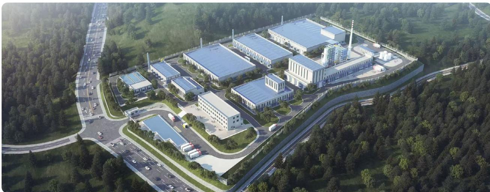

natural_image

Aerial rendering of a large industrial complex surrounded by greenery and roads, with no visible text or signage.

natural_image

Panoramic view of a mountain range with lush green forest and rocky peaks under a partly cloudy sky (no text or symbols visible)

# 资源管理

中国瑞林及各子公司、事业部在生产运营与项目服务全流程中，聚焦资源高效利用与可持续管理，涉及的能源类型以电力为主，通过引入光伏绿电、推广节能设备等方式优化能源结构；取水主要为市政供水，生产环节按需管控用水需求，生活污水经雨污分离改造后纳入市政管网规范处理。公司产生的废弃物涵盖废油、废油漆桶、切削液等危险废弃物，以及生活垃圾等一般固体废物，其中危废通过专业危废间规范储存并委托第三方资质单位处置，一般固体废物通过回收复用、分类处理等方式实现资源化利用。

公司严格遵守《中华人民共和国节约能源法》《中华人民共和国环境保护法》《中华人民共和国固体废物污染环境防治法》等相关法律法规，结合业务特点制定QHSE体系文件、能源节约管理制度、供应商环保管理规范等内部制度，将资源管理要求贯穿于设计咨询、项目实施、生产运营等各环节。同时，通过技术创新推动资源循环利用，如铜渣资源化、余热回收等工艺应用，在项目服务中助力客户提升资源利用效率，践行绿色发展理念。2025年，公司未发生资源利用及环境保护相关的重大违规或负面事件。

# 能源管理

公司生产运营以电力为核心能源，从源头减少碳排放。积极引入第三方光伏系统，通过厂房屋顶租赁合作模式，采购低于市价的绿电，既降低能源成本，又提升清洁能源使用占比，推动能源结构向低碳化转型。

# 中国瑞林节能降耗行动措施

# 设备节能

采购节能型生产设备，更换全场景 LED 照明设施，从硬件层面降低能耗损耗；针对高耗能环节优化工艺设计，通过智能调控系统提升能源利用效率。

# 管理节能

由大楼管理中心牵头监督用电浪费行为，建立办公区域节能巡查机制，规范空调设置温度及员工离开时关闭空调、电脑、照明等设备的行为；在员工宿舍推行用电检查制度，杜绝无效能耗。

# 技术节能

联合华为开发有色金属行业大模型，对生产过程进行动态优化；在热力工程中推广余热回收技术，提取烟囱排气、工艺尾气中的热能循环利用，实现能源梯级利用，赋能客户能源结构优化，低碳化国家战略落实。

# 水资源管理

公司严格遵守《中华人民共和国水污染防治法》《中华人民共和国水法》等相关法律法规，高度重视水资源全生命周期管理，构建了覆盖用水管控、污水处理与排放、节水技术推广的系统化管理体系，并融入生产运营全流程，在保证业务经营的前提下推进水资源精益化管理。

# 中国瑞林水资源管理措施

# 用水管理体系

公司取水来源为市政供水。建立水资源消耗台账，总部及各驻外公司对用水情况进行日常动态监控，及时排查管道漏水隐患，避免水资源浪费。

# 污水处理与排放

实施雨污分离改造工程，将生活污水与雨水彻底分流，生活污水经规范处理后接入市政污水管网，确保达标排放。在项目服务中，为客户提供污水处理解决方案，如紫金汀江污染治理项目采用垂直防渗+水平防渗组合工艺，助力客户实现水资源净化与循环利用。

# 节水技术推广

在设计咨询业务中，融入节水理念，为矿山、冶炼等项目设计节水型工艺系统；在城市集中供热、化工园区等项目中，优化水循环系统设计，提升水资源重复利用率。

# 循环经济

公司始终将循环经济理念深度融入生产运营、项目设计与供应链管理全流程，以“减量化、再利用、资源化”为核心原则，构建覆盖固体废物资源化、产业链循环协同、绿色采购与供应链循环的全链条循环经济管理体系，持续提升资源利用效率、降低环境负荷，助力实现绿色低碳与高质量发展目标。

# 固体废物资源化

在危险废物管理方面，公司建立专门危废储存间，对生产过程中产生的废油、废油漆桶、切削液、润滑油脂等危险废物实施分类存放，并委托具备资质的第三方机构定期处置，确保危废收集、贮存、转移、处置全流程合规可控。在一般固体废物回收利用方面，推行旧包装箱回收复用制度，将设备外包装、备件包装箱等完好无损的包装材料集中存放，用于后续备件发货、物资运输等场景，有效减少新包装材料采购与资源消耗；针对客户的铜渣等工业固废，通过为客户提供渣选技术回收剩余有价金属，剩余尾料用于制作绿色建材、筑坝填充料等，实现工业固废资源化再利用。

# 2 产业链循环协同

在工艺循环优化层面, 公司依托技术优势, 在冶炼项目中推广铜尾渣选矿提纯技术, 将冶炼废渣转化为可再利用的二次资源; 在化工项目中应用煅烧石膏烟气制酸技术, 副产工业硫酸, 作为原料用于生产磷酸、氢氟酸、钛白粉等基础化工产品, 实现石膏的综合利用及硫资源的循环。在产品与服务延伸层面, 基于工程设计优势向产业链下游延伸, 为客户提供“设计 + 供货 + 调试”全流程一体化服务, 减少中间环节资源消耗; 在装备制造领域采用模块化设计, 便于设备后续维修、拆解与关键部件回收, 提升产品全生命周期资源利用效率。

# 3 绿色采购与供应链循环

公司将循环经济理念深度融入供应链管理体系，在采购环节优先选择具备循环经济实践经验与能力的供应商，并将环保资质、废弃物资源化处理能力、材料综合回收利用率等关键指标纳入供应商评价体系，引导供应链上下游共同践行绿色发展；同时，鼓励供应商采用可循环、可降解的包装材料，减少过度包装与一次性耗材使用，降低供应链各环节的资源消耗与废弃物产生，构建协同共赢的绿色供应链生态。

# 环境合规管理

中国瑞林坚持环境优先, 发展清洁生产, 突出源头治理, 走科技含量高、资源消耗低、碳排放少、环境污染物少、经济效益好的发展道路。公司牢固树立正确的企业发展观和环境观, 形成人人自觉参与环保节能的良好氛围, 实现资源高效利用、能源高效转化、废弃物高效再生, 推动企业与社会的和谐发展。

公司通过制定《QHSE体系管理规定》《生态环保与节能减排管理规定》《安全质量环保监督检查管理规定》《安全质量环保评价考核管理规定》《生产安全质量环保事故管理规定》《安全质量环保教育培训管理规定》《安全环保风险分级管控和隐患排查治理双重预防机制建设管理规定》等制度，建立健全环境管理组织架构，明确各管理层级职责，规范环境相关事项管理流程，推动公司环境管理工作有序开展。

2025年, 公司夯实环境管理体系建设, 牢记环保合规要求, 推进各项环保制度的落地和目标的达成, 组织开展环境因素识别与评价、建设项目环境影响评价环保检查和环境污染隐患排查治理, 并建立突发环境事件应急预案, 确保环境风险得到有效识别与管控。报告期内, 中国瑞林环保投入约181.94万元, 缴纳环境保护税0.76万元, 未因环境问题受到生态环境等有关部门处罚。

# 生态系统和生物多样性保护

中国瑞林始终将生态系统保护与生物多样性保护作为可持续发展的核心责任,积极践行生态文明思想,大力弘扬绿色生态文化,依托环保工程领域专业技术优势,将生态保护理念融入日常运营与社会责任实践,通过开展植树护绿、流域清洁等志愿行动,以实际行动守护绿水青山,助力美丽中国建设与区域生态环境改善。

# 案例 永平铜矿排土场生态修复项目

永平铜矿的环境问题被 2020 年长江经济带生态环境警示片披露，面对困境，中国瑞林项目团队采用自主研发的“原位基质改良 + 直接植被”的先进技术，对永平铜矿东、西部排土场约 80 万平方米进行生态修复，经过三年多四季循环检验，成效稳定可靠，最终实现矿区生态蝶变，并且该项目已成功入选全国首批生产矿山生态修复典型案例，成为江西省唯一入选案例，用实际行动践行了“绿水青山就是金山银山”的发展理念。

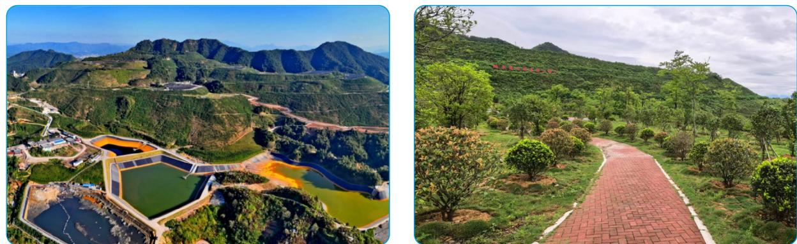

# 案例 德兴铜矿杨桃钨生态修复项目

德兴铜矿作为亚洲最大的露天铜矿，其排土场的生态问题一直是矿山环境治理的重点和难点，高陡边坡伴随着土壤污染及强酸化，导致常年水土流失严重且含重金属的酸性水长期污染土壤和地下水。中国瑞林项目团队采用自主研发的“原位基质改良+直接植被”先进技术，先后对其杨桃坞复垦基地地块进行了生态修复，经过三年左右的养护，目前形成了稳定的生态群，排土场永久披上了绿衣。

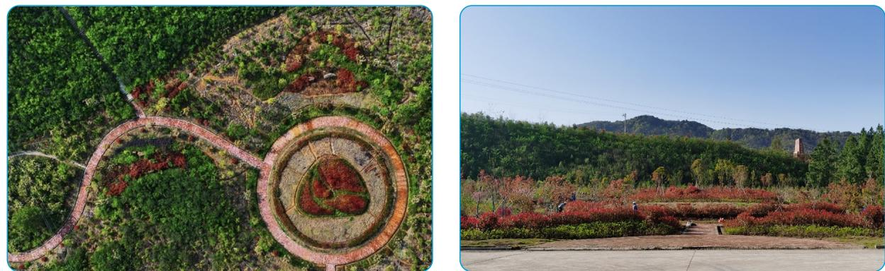

# 案例 践行绿色使命 共建生态屏障

在全国第四十七个植树节，公司团委组织20余名青年志愿者赴铜源峡开展"青春护绿"植树活动。在林业技术人员指导下，团队完成挖坑定制、培土浇灌等标准化作业，完成8株树苗的栽种工作并悬挂瑞林文化元素定制认养牌。

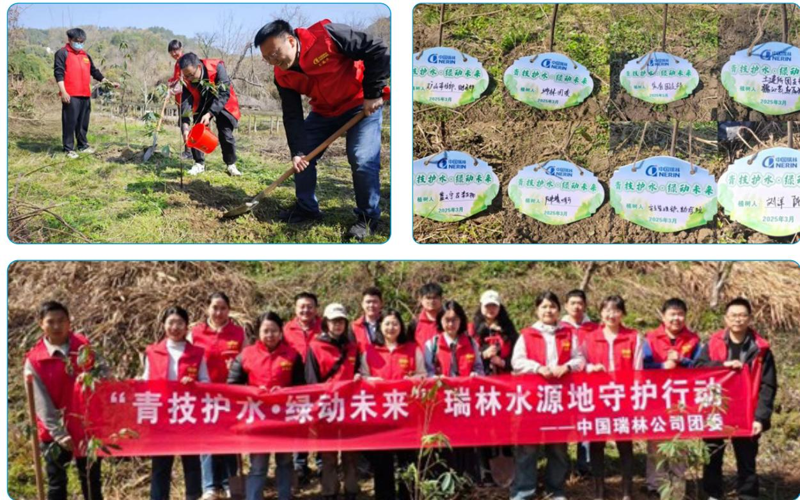

# 案例 守护碧水清波生灵安居无忧

2025 年 3 月，公司青年志愿者手持垃圾钳、分类袋等工具，奔赴铜源峡溪流沿线开展系统性清理行动。面对陡坡、灌木丛等易积存垃圾的难点区域，志愿者们采用网格化作业模式分片攻坚，细致捡拾塑料瓶、包装袋、烟蒂等各类废弃物并规范分类清运。此次行动有效削减垃圾污染对溪流生态的破坏，为流域内水生生物、鸟类及周边动植物构筑洁净安全的栖息家园，以青春担当为生物多样性保护注入鲜活力量，让溪岸重焕生机、生灵安居无忧。

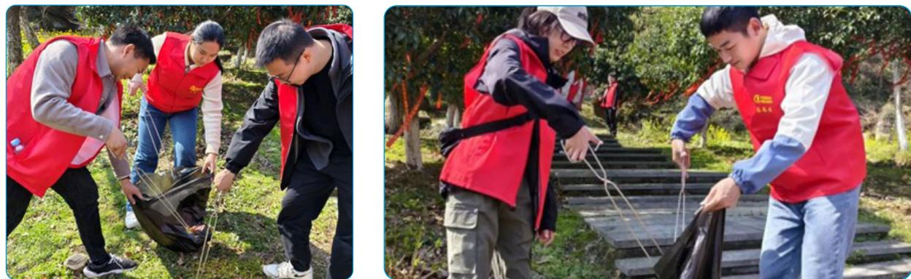

# ESG数据表

  
经济绩效

<table><tr><td>指标名称</td><td>单位</td><td>2025年</td></tr><tr><td>营业总收入</td><td>万元</td><td>196,739.63</td></tr><tr><td>归属于上市公司股东的净利润</td><td>万元</td><td>16,133.08</td></tr><tr><td>总资产</td><td>万元</td><td>534,657.82</td></tr><tr><td>基本每股收益</td><td>元</td><td>1.47</td></tr></table>

  
环境绩效

<table><tr><td>指标类别</td><td>指标名称</td><td>单位</td><td>2025年</td></tr><tr><td rowspan="5">温室气体排放</td><td>范围1直接碳排放量 $^{1}$ </td><td>吨二氧化碳当量</td><td>143.54</td></tr><tr><td>范围2间接碳排放量 $^{1}$ </td><td>吨二氧化碳当量</td><td>502.10</td></tr><tr><td>温室气体排放总量(范围1+范围2)</td><td>吨二氧化碳当量</td><td>645.64</td></tr><tr><td>温室气体排放强度</td><td>吨二氧化碳当量/百万元</td><td>0.33</td></tr><tr><td>温室气体排放密度</td><td>吨二氧化碳当量/人</td><td>0.28</td></tr><tr><td rowspan="3">环保投入</td><td>环保总投入</td><td>万元</td><td>181.94</td></tr><tr><td>环保总投入占营业收入比例</td><td>%</td><td>0.09</td></tr><tr><td>缴纳环境保护税</td><td>万元</td><td>0.76</td></tr><tr><td rowspan="3">废水排放</td><td>废水排放总量</td><td>吨</td><td>14,019.00</td></tr><tr><td>化学需氧量(COD)排放量</td><td>吨</td><td>0.27</td></tr><tr><td>氨氮(NH3-N)排放量</td><td>吨</td><td>0.01</td></tr><tr><td rowspan="2">废气排放</td><td>废气排放总量</td><td>吨</td><td>0.75</td></tr><tr><td>颗粒物(PM)排放量</td><td>吨</td><td>0.04</td></tr><tr><td rowspan="3">固体废弃物</td><td>无害废弃物产生量</td><td>吨</td><td>360.00</td></tr><tr><td>无害废弃物回收量</td><td>吨</td><td>60.00</td></tr><tr><td>无害废弃物处置量</td><td>吨</td><td>300.00</td></tr><tr><td rowspan="2">能源使用</td><td>汽油消耗量</td><td>吨</td><td>41.60</td></tr><tr><td>柴油消耗量</td><td>吨</td><td>0.50</td></tr></table>

<table><tr><td>指标类别</td><td>指标名称</td><td>单位</td><td>2025年</td></tr><tr><td rowspan="5">能源使用</td><td>天然气消耗量</td><td>万立方米</td><td>0.99</td></tr><tr><td>太阳能/光伏发电量</td><td>万千瓦时</td><td>95.70</td></tr><tr><td>第三方光伏采购电量</td><td>万千瓦时</td><td>59.90</td></tr><tr><td>第三方光伏采购费用</td><td>万元</td><td>32.40</td></tr><tr><td>外购电力消耗量</td><td>万千瓦时</td><td>94.63</td></tr><tr><td rowspan="4">水资源使用</td><td>总取水量</td><td>吨</td><td>46,728.00</td></tr><tr><td>总耗水量</td><td>吨</td><td>32,709.00</td></tr><tr><td>总排水量</td><td>吨</td><td>14,019.00</td></tr><tr><td>水耗强度</td><td>吨/百万营收</td><td>16.63</td></tr></table>

$^{1}$ 范围一温室气体排放核算依据ISO 14064-1:2018及GB/T32150-2025《工业企业温室气体排放核算和报告通则》。因子来源包括IPCC 2006、DB35/T2288-2025、国家温室气体排放因子数据库，准确合规且无需调整。范围二（外购电力）采用生态环境部、国家统计局发布的2023年全国电力平均排放因子核算；外购蒸汽采用国内工业通用平均排放因子核算，核算口径符合国家温室气体核算标准与交易所披露要求，数据具备一致性、可比性与可验证性。

  
社会绩效

<table><tr><td>社会绩效</td><td colspan="2">指标名称</td><td>单位</td><td>2025年</td></tr><tr><td rowspan="7">创新研发</td><td colspan="2">研发投入总额</td><td>万元</td><td>10,317.54</td></tr><tr><td colspan="2">研发投入占营业收入比例</td><td>%</td><td>5.24</td></tr><tr><td colspan="2">研发人员人数</td><td>人</td><td>587(其中全职人员51人,兼职人员536人)</td></tr><tr><td colspan="2">研发人员占员工总人数比率</td><td>%</td><td>25.70</td></tr><tr><td colspan="2">新增专利申请数量</td><td>件</td><td>105</td></tr><tr><td colspan="2">新增专利授权数量</td><td>件</td><td>115</td></tr><tr><td colspan="2">有效专利总数</td><td>件</td><td>647</td></tr><tr><td rowspan="4">员工雇佣</td><td colspan="2">员工总数</td><td>人</td><td>2,283</td></tr><tr><td colspan="2">残障人员员工人数</td><td>人</td><td>2</td></tr><tr><td rowspan="2">新招募员工</td><td>报告期内吸纳的就业人数</td><td>人</td><td>90</td></tr><tr><td>其中:新招应届毕业生人数</td><td>人</td><td>29</td></tr><tr><td rowspan="23"></td><td rowspan="3">按性别划分的员工人数</td><td>男性员工人数</td><td>人</td><td>1,771</td></tr><tr><td>女性员工人数</td><td>人</td><td>512</td></tr><tr><td>女性员工占比</td><td>%</td><td>22.43</td></tr><tr><td rowspan="3">按年龄划分的员工人数</td><td>30岁及以下员工</td><td>人</td><td>461</td></tr><tr><td>31-50岁员工</td><td>人</td><td>1,408</td></tr><tr><td>51岁及以上员工</td><td>人</td><td>414</td></tr><tr><td rowspan="3">按层级划分的员工人数</td><td>高层管理者</td><td>人</td><td>8</td></tr><tr><td>中层管理者</td><td>人</td><td>152</td></tr><tr><td>基层员工</td><td>人</td><td>2,123</td></tr><tr><td rowspan="3">按雇佣类型划分的员工人数</td><td>全职员工</td><td>人</td><td>2,073</td></tr><tr><td>劳务派遣员工</td><td>人</td><td>63</td></tr><tr><td>临时聘用</td><td>人</td><td>147</td></tr><tr><td rowspan="2">按民族比例划分的员工人数</td><td>少数民族员工人数</td><td>人</td><td>36</td></tr><tr><td>少数民族员工占比</td><td>%</td><td>1.66</td></tr><tr><td rowspan="3">按学历划分的员工人数</td><td>大专及以下学历员工</td><td>人</td><td>552</td></tr><tr><td>本科学历员工</td><td>人</td><td>1,206</td></tr><tr><td>硕士及以上学历员工</td><td>人</td><td>525</td></tr><tr><td rowspan="6">按专业人才划分员工人数</td><td>中国工程院院士</td><td>名</td><td>1</td></tr><tr><td>中国工程勘察设计大师</td><td>名</td><td>3</td></tr><tr><td>省级及行业设计大师</td><td>名</td><td>11</td></tr><tr><td>享受国务院政府特殊津贴专家</td><td>名</td><td>15</td></tr><tr><td>正高级工程师</td><td>名</td><td>200余</td></tr><tr><td>各类注册工程师</td><td>名</td><td>650余</td></tr><tr><td rowspan="5">员工培训</td><td colspan="2">员工培训总投入</td><td>万元</td><td>120</td></tr><tr><td colspan="2">员工培训总人次</td><td>人次</td><td>1,500</td></tr><tr><td colspan="2">员工培训总学时</td><td>小时</td><td>45,000</td></tr><tr><td colspan="2">员工人均培训时长</td><td>小时</td><td>20</td></tr><tr><td colspan="2">培训覆盖率</td><td>%</td><td>65</td></tr><tr><td rowspan="3">员工流失</td><td colspan="2">员工总流失率</td><td>%</td><td>5.19</td></tr><tr><td rowspan="2">按性别划分的员工流失比率</td><td>男性员工流失率</td><td>%</td><td>5.5</td></tr><tr><td>女性员工流失率</td><td>%</td><td>4</td></tr></table>

<table><tr><td>社会绩效</td><td colspan="2">指标名称</td><td>单位</td><td>2025年</td></tr><tr><td rowspan="3">员工流失</td><td rowspan="3">按年龄划分的员工流失比率</td><td>30岁及以下员工流失率</td><td>%</td><td>8</td></tr><tr><td>31-50岁员工</td><td>%</td><td>4.7</td></tr><tr><td>51岁及以上员工</td><td>%</td><td>3.7</td></tr><tr><td rowspan="3">劳工准则</td><td colspan="2">劳动合同签订率</td><td>%</td><td>100</td></tr><tr><td colspan="2">社会保险覆盖率</td><td>%</td><td>100</td></tr><tr><td colspan="2">人均年带薪休假天数</td><td>天</td><td>10</td></tr><tr><td rowspan="5">职业健康与安全</td><td colspan="2">安全培训总人次</td><td>人次</td><td>222</td></tr><tr><td colspan="2">安全培训总时长</td><td>小时</td><td>1,280</td></tr><tr><td colspan="2">人均安全培训时长</td><td>小时</td><td>5.8</td></tr><tr><td colspan="2">职业健康体检覆盖率</td><td>%</td><td>100</td></tr><tr><td colspan="2">工伤率</td><td>%</td><td>0</td></tr><tr><td rowspan="6">社会贡献</td><td colspan="2">慈善捐赠总投入</td><td>万元</td><td>148.4</td></tr><tr><td rowspan="5">慈善公益活动捐赠数量</td><td>采购万安县农特产品金额</td><td>万元</td><td>140</td></tr><tr><td>向万安县罗塘村捐赠金额</td><td>万元</td><td>1</td></tr><tr><td>平安建设帮扶捐赠金额</td><td>万元</td><td>5</td></tr><tr><td>设立助学金金额</td><td>万元</td><td>2.4</td></tr><tr><td>助学金资助人数</td><td>名</td><td>21</td></tr></table>

  
治理绩效

<table><tr><td>社会绩效</td><td>指标名称</td><td>单位</td><td colspan="2">2025年</td></tr><tr><td rowspan="9">公司治理</td><td>股东会</td><td>次</td><td colspan="2">2</td></tr><tr><td>股东会审议议案总数</td><td>项</td><td colspan="2">17</td></tr><tr><td>董事会会议</td><td>次</td><td colspan="2">5</td></tr><tr><td>董事会成员出席率</td><td>%</td><td colspan="2">100</td></tr><tr><td>董事会审议议案总数</td><td>项</td><td colspan="2">36</td></tr><tr><td>战略委员会会议</td><td>次</td><td colspan="2">1</td></tr><tr><td>审计委员会会议</td><td>次</td><td colspan="2">4</td></tr><tr><td>提名委员会会议</td><td>次</td><td colspan="2">2</td></tr><tr><td>薪酬与考核委员会会议</td><td>次</td><td colspan="2">1</td></tr><tr><td rowspan="8">董事会构成</td><td colspan="2">董事会总成员数</td><td>人</td><td>14</td></tr><tr><td colspan="2">独立董事</td><td>名</td><td>5</td></tr><tr><td rowspan="2">董事学历</td><td>本科及以上</td><td>名</td><td>14</td></tr><tr><td>其他</td><td>名</td><td>0</td></tr><tr><td rowspan="2">董事性别</td><td>男性董事</td><td>名</td><td>12</td></tr><tr><td>女性董事</td><td>名</td><td>2</td></tr><tr><td rowspan="2">董事年龄</td><td>50岁以上</td><td>名</td><td>10</td></tr><tr><td>50岁以下</td><td>名</td><td>4</td></tr><tr><td rowspan="6">合规经营</td><td colspan="2">信息披露公告数量</td><td>份</td><td>88</td></tr><tr><td colspan="2">其中:披露定期报告数量</td><td>份</td><td>3</td></tr><tr><td colspan="2">通过E互动回答投资者问题</td><td>次</td><td>64</td></tr><tr><td colspan="2">现场接待机构调研</td><td>场</td><td>3</td></tr><tr><td colspan="2">举办线上业绩说明会</td><td>场</td><td>3</td></tr><tr><td colspan="2">不正当竞争诉讼或处罚次数</td><td>次</td><td>0</td></tr><tr><td rowspan="6">反腐败</td><td colspan="2">腐败事件发生数量</td><td>起</td><td>0</td></tr><tr><td rowspan="2">反腐败培训受训总人次</td><td>董事</td><td>人次</td><td>16</td></tr><tr><td>员工</td><td>人次</td><td>709</td></tr><tr><td rowspan="2">反腐败培训受训总时长</td><td>董事</td><td>小时</td><td>18</td></tr><tr><td>员工</td><td>小时</td><td>36</td></tr><tr><td colspan="2">反腐败培训受训总人次</td><td>人次</td><td>725</td></tr></table>

# 对标索引表

《上海证券交易所上市公司自律监管指引第14号 —— 可持续发展报告(试行)》对标索引表

<table><tr><td rowspan="8">环境</td><td>1</td><td>应对气候变化</td><td>第四章 践行绿色使命 守护生态未来第一节 应对气候变化</td></tr><tr><td>2</td><td>污染物排放</td><td>第四章 践行绿色使命 守护生态未来第二节 排放管理</td></tr><tr><td>3</td><td>废弃物处理</td><td>第四章 践行绿色使命 守护生态未来第二节 排放管理</td></tr><tr><td>4</td><td>生态系统和生物多样性保护</td><td>第四章 践行绿色使命 守护生态未来第五节 生态系统和生物多样性保护</td></tr><tr><td>5</td><td>环境合规管理</td><td>第四章 践行绿色使命 守护生态未来第四节 环境合规管理</td></tr><tr><td>6</td><td>能源利用</td><td>第四章 践行绿色使命 守护生态未来第三节 资源管理</td></tr><tr><td>7</td><td>水资源利用</td><td>第四章 践行绿色使命 守护生态未来第三节 资源管理</td></tr><tr><td>8</td><td>循环经济</td><td>第四章 践行绿色使命 守护生态未来第三节 资源管理</td></tr><tr><td rowspan="8">社会</td><td>9</td><td>乡村振兴</td><td>第三章 赋能社会发展 心系民生福祉第六节 乡村振兴</td></tr><tr><td>10</td><td>社会贡献</td><td>第三章 赋能社会发展 心系民生福祉第七节 社会公益</td></tr><tr><td>11</td><td>创新驱动</td><td>第三章 赋能社会发展 心系民生福祉第一节 创新驱动</td></tr><tr><td>12</td><td>科技伦理</td><td>第三章 赋能社会发展 心系民生福祉第一节 创新驱动</td></tr><tr><td>13</td><td>供应链安全</td><td>第三章 赋能社会发展 心系民生福祉第三节 供应链安全</td></tr><tr><td>14</td><td>平等对待中小企业</td><td>第三章 赋能社会发展 心系民生福祉第三节 供应链安全</td></tr><tr><td>15</td><td>产品和服务安全与质量</td><td>第三章 赋能社会发展 心系民生福祉第二节 产品和服务安全与质量</td></tr><tr><td>16</td><td>数据安全与客户隐私保护</td><td>第三章 赋能社会发展 心系民生福祉第四节 信息安全与客户隐私保护</td></tr><tr><td></td><td>17</td><td>员工</td><td>第三章 赋能社会发展 心系民生福祉第五节 员工</td></tr><tr><td rowspan="4">可持续发展相关治理</td><td>18</td><td>尽职调查</td><td>第一章 可持续发展治理第三节 尽职调查</td></tr><tr><td>19</td><td>利益相关方沟通</td><td>第一章 可持续发展治理第一节 利益相关方沟通</td></tr><tr><td>20</td><td>反商业贿赂及反贪污</td><td>第二章 规范稳健运营 笃行责任担当第二节 恪守商业道德</td></tr><tr><td>21</td><td>反不正当竞争</td><td>第二章 规范稳健运营 笃行责任担当第二节 恪守商业道德</td></tr></table>

# GRI内容索引——参照全球报告倡议组织(GRI)《可持续发展报告标准》(GRI Standards 2021)

<table><tr><td>使用说明</td><td>中国瑞林参照全球报告倡议组织(GRI)标准编制本报告,汇报期为2025年1月1日至2025年12月31日</td></tr><tr><td>使用的GRI 1</td><td>GRI 1:基础2021</td></tr></table>

<table><tr><td rowspan="12">GRI 2:一般披露(2021)</td><td>2-1 组织详细情况</td><td>关于中国瑞林</td></tr><tr><td>2-2 纳入组织可持续发展报告的实体</td><td>报告编制说明</td></tr><tr><td>2-3 报告期、报告频率和联系人</td><td>报告编制说明</td></tr><tr><td>2-4 信息重述</td><td>ESG数据表及对标索引表</td></tr><tr><td>2-6 活动、价值链和其他业务关系</td><td>关于中国瑞林公司概况 业务领域 组织架构</td></tr><tr><td>2-7 员工</td><td>员工权益与福利员工培训与发展职业健康与安全</td></tr><tr><td>2-9 管治架构和构成</td><td rowspan="4">可持续发展治理</td></tr><tr><td>2-12 在管理影响方面,最高管治机构的监督作用</td></tr><tr><td>2-14 最高治理机构在可持续发展报告中的作用</td></tr><tr><td>2-17 最高治理机构的共同知识</td></tr><tr><td>2-27 遵守法律法规</td><td>详见报告各章节</td></tr><tr><td>2-29 利益相关方参与的方法</td><td>利益相关方沟通</td></tr></table>

<table><tr><td rowspan="3">GRI 3:实质性议题(2021)</td><td>3-1 确定实质性议题的过程</td><td>重要性议题评估</td></tr><tr><td>3-2 实质性议题列表</td><td>重要性议题评估</td></tr><tr><td>3-3 实质性议题的管理</td><td>重要性议题评估</td></tr><tr><td rowspan="2">GRI 201:经济绩效(2016)</td><td>201-1 直接产生和分配的经济价值</td><td>公司概况业务领域</td></tr><tr><td>201-3 固定福利计划义务和其他退休计划</td><td>员工权益与福利</td></tr><tr><td rowspan="2">GRI 203:间接经济影响(2016)</td><td>203-1 基础设施投资和支持性服务</td><td>乡村振兴</td></tr><tr><td>203-2 重大间接经济影响</td><td>社会贡献</td></tr><tr><td rowspan="2">GRI 205:反腐败(2016)</td><td>205-2 反腐败政策和程序的传达及培训</td><td>恪守商业道德反商业贿赂与反贪污</td></tr><tr><td>205-3 经确认的腐败事件和采取的行动</td><td>恪守商业道德反商业贿赂与反贪污</td></tr><tr><td rowspan="4">GRI 302:能源(2016)</td><td>302-1 组织内部的能源消耗量</td><td>资源管理</td></tr><tr><td>302-2 组织外部的能源消耗量</td><td>资源管理</td></tr><tr><td>302-3 能源强度</td><td>资源管理</td></tr><tr><td>302-4 减少能源消耗</td><td>资源管理</td></tr><tr><td>GRI 303:水资源和污水(2018)</td><td>303-5 耗水</td><td>排放管理</td></tr><tr><td rowspan="5">GRI 305:排放(2016)</td><td>305-1 直接(范围1)温室气体排放</td><td>应对气候变化</td></tr><tr><td>305-2 能源间接(范围2)温室气体排放</td><td>应对气候变化</td></tr><tr><td>305-3 其他间接(范围3)温室气体排放</td><td>应对气候变化</td></tr><tr><td>305-4 温室气体排放强度</td><td>应对气候变化</td></tr><tr><td>305-5 温室气体减排量</td><td>应对气候变化</td></tr><tr><td rowspan="3">GRI 306:废弃物(2020)</td><td>306-1 废弃物的产生及废弃物相关重大影响</td><td>排放管理废弃物处理</td></tr><tr><td>306-2 废弃物相关重大影响的管理</td><td>排放管理废弃物处理</td></tr><tr><td>306-3 产生的废弃物</td><td>排放管理废弃物处理</td></tr><tr><td rowspan="2">GRI 401:雇佣(2016)</td><td>401-1 新进员工雇佣率和员工流动率</td><td>员工权益与福利招聘与雇佣</td></tr><tr><td>401-2 提供给全职员工(不包括临时或兼职员工)的福利</td><td>员工权益与福利招聘与雇佣</td></tr><tr><td>GRI 403:职业健康与安全(2018)</td><td>403-9 工伤</td><td>职业健康与安全</td></tr><tr><td rowspan="3">GRI 404:培训与教育(2016)</td><td>404-1 每名员工每年接受培训的平均小时数</td><td>员工培训与发展员工培训</td></tr><tr><td>404-2 员工技能提升方案和过渡援助方案</td><td>员工培训与发展员工培训</td></tr><tr><td>404-3 定期接受绩效和职业发展考核的员工百分比</td><td>员工培训与发展员工晋升与发展</td></tr><tr><td>GRI 405:多元性与平等机会(2016)</td><td>405-1 管治机构与员工的多元化</td><td>员工权益与福利</td></tr><tr><td rowspan="3">GRI 417:营销与标识(2016)</td><td>417-1 对产品和服务信息与标识的要求</td><td>产品和服务安全与质量</td></tr><tr><td>417-2 涉及产品和服务信息与标识的违规事件</td><td>产品和服务安全与质量</td></tr><tr><td>417-3 涉及营销传播的违规事件</td><td>产品和服务安全与质量</td></tr><tr><td>GRI 418:客户隐私(2016)</td><td>418-1 涉及侵犯客户隐私和丢失客户资料的经证实的投诉</td><td>信息安全与客户隐私保护</td></tr></table>

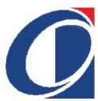

# 中国瑞林

# NERIN