# 匠心 致生活

# 浙江联翔智能家居股份有限公司

地址：浙江省嘉兴市海盐县武原街道工业新区东海大道2887号四楼

邮编：314300

电话：0573-86026183

传真：0573-86115251

网址：http://www.lead-show.cn

邮箱：LEADSHOW@lead-show.cn

natural_image

Illustration of a city skyline with silhouettes of people and trees, no text or symbols present

# 2025

环境、社会及治理(ESG)

暨社会责任报告

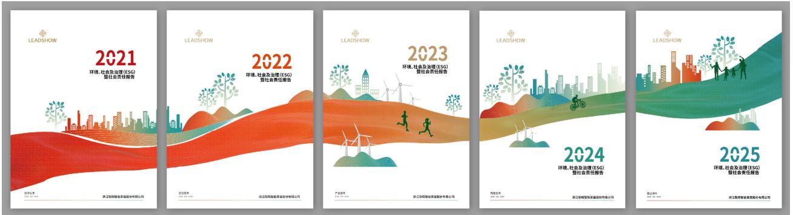

text_image

2021
环境、社会及治理(ESG)
暨社会责任报告
2022
环境、社会及治理(ESG)
暨社会责任报告
2023
环境、社会及治理(ESG)
暨社会责任报告
2024
环境、社会及治理(ESG)
暨社会责任报告
2025
环境、社会及治理(ESG)
暨社会责任报告

本设计以2021年环境、社会及治理（ESG）暨社会责任报告为开端，以一幅连贯的绸缎长图横穿5年封面，将2021—2025年5年报告进行风格统一，体现联翔股份“十四五”期间的履责承诺。封面设计以渐变色的绸缎为主，城市及运动的人形轮廓，结合绿水青山及清洁能源，致力于“创造健康美好家居生活”。

# LEADSHOW

# 报告编制说明

本报告是浙江联翔智能家居股份有限公司第8次披露《环境、社会及治理（ESG）暨社会责任报告》，向利益相关方披露公司在ESG暨社会责任方面所秉持的理念、建立的管理方法、推行的工作以及取得的成效。

# 组织范围

本报告涵盖浙江联翔智能家居股份有限公司及其附属子公司（以下简称“公司”），与合并财务报表中所涵盖的实体一致。部分统计范围与此不同，在所涉及处予以说明。

公司合并报表实体范围如下：

<table><tr><td>公司名称</td><td>公司简称</td><td>是否纳入本报告</td></tr><tr><td>浙江联翔智能家居股份有限公司</td><td>联翔股份</td><td>是</td></tr><tr><td>浙江领绣家居装饰有限公司</td><td>领绣家居</td><td>是</td></tr><tr><td>浙江领绣文化传媒有限公司</td><td>领绣传媒</td><td>是</td></tr><tr><td>嘉兴裱糊匠生物科技有限公司</td><td>裱糊匠生物科技</td><td>是</td></tr><tr><td>嘉兴领绣健康管理有限公司</td><td>领绣健康管理</td><td>是</td></tr><tr><td>浙江领视文化传媒有限公司</td><td>领视文化传媒</td><td>是</td></tr><tr><td>非常氧旺(上海)健康科技有限公司</td><td>非常氧旺</td><td>是</td></tr><tr><td>上海联翔嘉盛人工智能科技有限公司</td><td>联翔嘉盛</td><td>是</td></tr><tr><td>深圳市联翔庚昀智能家居有限公司</td><td>联翔庚昀</td><td>是</td></tr><tr><td>浙江联玺数字科技有限公司</td><td>浙江联玺</td><td>是</td></tr><tr><td>浙江联翔绿色建筑材料有限公司</td><td>联翔绿色</td><td>是</td></tr><tr><td>广东联翔新能源有限公司</td><td>联翔新能源</td><td>是</td></tr><tr><td>浙江坤泰新材料有限公司</td><td>坤泰新材料</td><td>是</td></tr></table>

# 时间范围

本报告为年度报告，报告涵盖范围为2025年1月1日至2025年12月31日。部分信息超出此范畴，在所涉及处予以说明。

# 编制依据

本报告依据上海证券交易所《上海证券交易所上市公司自律监管指引第14号——可持续发展报告（试行）（2024年4月发布）》《上海证券交易所上市公司自律监管指南第4号——可持续发展报告编制（2026年1月修订）》《上海证券交易所上市公司自律监管指引第1号——规范运作（2025年5月修订）》编制，同时将联合国可持续发展目标（SDGs）作为报告的指导性参考。

# 数据说明

ESG数据说明：报告中的ESG数据及信息来自公司及其子公司实际运行的原始记录。

财务数据说明：本报告的财务数据以人民币为单位。财务数据若与财务报告不一致之处，以财务报告为准。

# 可靠性保证

公司承诺本报告内容不存在任何虚假记载、误导性陈述或重大遗漏，公司董事会对其内容的真实性、准确性和完整性负责。

# 报告原则

# - 可持续发展背景

本报告已结合自身所处行业和经营业务的特点等情况，识别出各利益相关方关注的与经营相关的重要性议题，作为本报告汇报重点。

重要性议题的分析过程及结果详见本报告“议题重要性评估”章节。

# - 完整性

本报告披露对象范围与公司合并财务报表范围保持一致。

# - 时效性

本报告为年度报告，与公司2025年年度报告同时发布，为利益相关方决策提供及时的信息参考。

# - 准确性

本报告尽可能确保信息准确。其中，定量信息的测算已说明数据口径、计算依据与假定条件，以保证计算误差范围不会对信息使用者造成误导性影响。定量信息及附注信息详见本报告“ESG数据表和附注”章节。

# - 平衡性

本报告内容反映客观、真实的事实，对涉及公司正面、负面的信息均予以不偏不倚地披露。

# - 可比性

本报告对同一定量披露项在不同报告期内的统计及披露方式尽可能保持一致；若数据的采集、测量与计算方法有更改，对相关数据进行追溯调整，并在报告附注中说明调整的情况和原因，以便利益相关方进行有意义的分析，评估公司ESG数据水平发展趋势。

# - 可验证性

本报告中案例和数据来自公司实际运行的原始记录或财务报告，所披露数据来源及计算过程均可追溯，可用于支持外部鉴证工作检查。

# - 清晰性

本报告中包含表格、模型图等信息，作为文字内容的辅助，便于利益相关方更好地理解报告文字内容。为便于利益相关方更快获取信息，本报告提供目录及ESG标准的对标索引表。

# - 量化性

本报告披露关键定量披露项，并尽可能披露历史数据。

# 报告获取

本报告通过电子版形式发布，发布平台包括证券交易所指定的信息披露平台，亦可在联翔股份微信公众号在线浏览或下载。

# 联系方式

地址：浙江省嘉兴市海盐县武原街道工业新区东海大道2887号四楼  
电话：0573-86026183

网址：http://www.lead-show.cn

邮箱：LEADSHOW@lead-show.cn

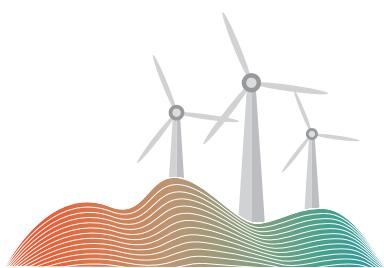

natural_image

Illustration of three wind turbines on stylized hills with layered wavy lines (no text or symbols)

# 目录

公司基本情况 06

议题重要性评估 08

公司ESG治理安排 15

# 01 环境维度

应对气候变化 24

污染物排放 26

废弃物处理 29

环境合规管理 30

能源利用 32

水资源利用 35

循环经济 36

# 02 社会维度

乡村振兴与社会贡献 38

创新驱动 40

供应链安全 43

产品和服务安全与质量 45

数据安全与客户隐私保护 50

员工 51

# 03 治理维度

反商业贿赂及反贪污 56

反不正当竞争 59

ESG数据表和附注 61

对标索引表 69

# 公司基本情况

浙江联翔智能家居股份有限公司（股票代码：603272.SH）成立于2004年，2022年5月20日在上海证券交易所挂牌上市，简称“联翔股份”。公司作为一家集无缝墙布研发、生产、销售于一体的高新技术企业，已布局窗帘、装饰画等多品类软装产品，致力于构建一站式家装、工装整体解决方案。

公司深耕行业技术创新与行业治理，担任中国室内装饰协会墙纸墙布专业委员会执行会长单位、中国建筑装饰装修材料协会副会长单位、中国建筑装饰装修材料协会墙纸墙布及软装饰分会轮值会长单位等职务，积极引领行业发展方向。技术层面，公司自主研发多项核心专利产品及工艺，成功推出无缝刺绣墙布（授权发明专利号：ZL201210102522.3）、宽幅无缝墙布（授权发明专利号：ZL201910715235.1），并将全浸入式防水抑菌技术、热压复合工艺（授权发明专利号：201210122720.6）及宽幅冷胶、热胶工艺（授权发明专利号：ZL202110218584.X、

# 总部位置浙江省海盐县

ZL202110218583.5）应用于产品生产，有力推动了无缝墙布行业的技术迭代与产业升级。

凭借在技术、管理、绿色发展等多领域的扎实积淀，公司获得权威资质与体系认证双重认可。资质方面，公司先后获评高新技术企业、国家知识产权优势企业、浙江省高新技术企业研究开发中心、浙江省工业设计中心等科技创新类资质；入选浙江省级制造业与互联网融合发展示范企业、浙江省管理创新试点企业等管理模式创新类认定；被认定为浙江省隐形冠军培育企业、浙江省级工业互联网平台创建单位、浙江省制造业“云上企业”，同时荣获浙江省知名商号，在绿色发展领域亦获评浙江省清洁生产企业、浙江省级绿色低碳工厂。体系建设方面，公司构建了完善的标准化管理体系，顺利通过ISO9001质量管理体系、ISO14001环境管理体系、ISO45001职业健康安全管理体系及ISO50001能源管理体系认证，实现质量、环境、职业健康安全与能源管理的规范化、系统化运营。

<table><tr><td>公司名称</td><td colspan="3">英文名称</td></tr><tr><td>浙江联翔智能家居股份有限公司</td><td colspan="3">Zhejiang Lianxiang Smart Home Co., LTD</td></tr><tr><td rowspan="2">股票简况</td><td>上海证券交易所</td><td>联翔股份</td><td>603272</td></tr><tr><td>股票上市交易所</td><td>股票简称</td><td>股票代码</td></tr><tr><td>注册地址</td><td colspan="3">浙江省嘉兴市海盐县武原街道工业新区东海大道2887号四楼</td></tr><tr><td>办公地址</td><td colspan="3">浙江省嘉兴市海盐县武原街道工业新区东海大道2887号四楼</td></tr><tr><td>主营业务</td><td colspan="3">无缝墙布和窗帘产品的研发、生产和销售及装饰装修业务</td></tr><tr><td>主要运营地</td><td colspan="3">以经销商模式向全国拓展,在全国设立1,000余家专卖店</td></tr></table>

# 企业愿景

\- 成为全球最具消费者价值的家居用品服务商

# 企业价值观

\- 热情、严谨、务实、创新

# 企业文化

# 企业使命

\- 创造健康美好家居生活

# 企业品质观

\- 品质是企业的生命

<table><tr><td>ESG荣誉/评级项目</td><td>发布单位/评级表现</td></tr><tr><td>2025浙江上市公司ESG绩效最佳100名</td><td>浙江省企业社会责任促进会、中诚信绿金科技有限公司</td></tr><tr><td>Win.dWind ESG评级</td><td>A更新日期:2025年6月</td></tr><tr><td>商道融绿SynTao Green Finance商道融绿ESG评级</td><td>A-更新日期:2025Q4</td></tr><tr><td>华证指数华证指数ESG评级</td><td>BBB更新日期:2025Q4</td></tr><tr><td>青绿青绿ESG评级</td><td>AA+更新日期:2025年5月</td></tr><tr><td>中诚信绿金CCXGF中诚信绿金ESG评级</td><td>A更新日期:2025年7月</td></tr></table>

# 议题重要性评估

2024年4月，上海证券交易所发布《上海证券交易所上市公司自律监管指引第14号——可持续发展报告（试行）》（以下简称“上交所《指引》”），要求上市公司披露具有财务重要性和/或影响重要性的可持续信息。公司识别重要性议题，对具有财务重要性的议题，加强“治理，

战略，影响、风险和机遇管理，指标与目标”四方面核心内容的披露。鉴于可持续发展管理的整体性，公司对重要性议题的战略、指标与目标等关联性较强的内容进行整合披露，议题四方面核心内容的披露位置详见下表：

# 治理

- 可持续发展的整体治理架构详见“可持续发展治理架构”。  
■ 财务重要性议题的治理架构详见正文对应章节。

# 战略

- 财务重要性议题的影响、风险与机遇分析，以及对应的财务影响，详见“议题重要性分析结论”。  
- 应对ESG相关影响、风险和机遇的规划、策略和方法详见正文对应章节。

# 影响、风险和机遇管理

\- 影响、风险和机遇的管理流程和管理措施详见正文对应章节。

# 指标与目标

各重要性议题的管理指标及2023—2025年的绩效情况,详见“ESG数据表和附注”。  
财务重要性议题的指标与目标及2025年达成情况,详见“ESG相关信息报告”。

# 双重重要性分析

公司根据实际情况，结合国家及监管政策、标准和同业对标，了解受影响的利益相关方的需求与期望，形成重要性议题清单，并依据上交所《指

引》中对议题重要性分析的要求，从影响重要性、财务重要性的双重维度，对与公司相关的ESG议题开展重要性评估。

# 联翔股份重要性议题分析流程

  
背景分析

- 了解公司战略规划相关信息。  
- 了解公司所处的外部市场环境。  
- 了解各议题产生影响的价值链环节及主要受影响的利益相关方。

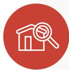  
建立议题清单

- 参考上交所《指引》设置的议题，结合公司主要业务板块特点、标准对标、政策分析及同业对标，识别其他潜在的重要性议题。  
- 识别议题相关影响、风险和机遇，汇总形成公司重要性议题清单。

  
重要性评估

- 设定恰当的评估方法与重要性阈值，评估议题的影响重要性（影响的规模、范围及不可补救性）和财务重要性影响（影响发生的可能性及财务影响的程度）。  
- 整合影响重要性与财务重要性结果，汇总后确定议题重要性排序，形成重要性议题矩阵。

  
议题报告

\- 经公司董事会审核确认，在 2025 年度 ESG 暨社会责任报告中就重要性较高的议题进行重点披露。

# - 尽职调查、利益相关方沟通

公司基于沟通形成的重要性议题清单开展尽职调查，识别、分析并梳理各ESG议题在短期（0—1年，含）、中期（1—5年，含）及长期（5年以上）对外部经济、环境、社会的影响，以及对公司业务运营与商业模式带来的风险与机遇，并据此实施针对性管理。在ESG议题影响重要性判定上，公司结合行业特性、战略规划及资源配置导向开展综合研判，聚焦公司对外部经济、社会及环境产生的实际或潜在影响（含正面与负面），从影响规模、影响范围及影响不可补救性等维度

评估重大程度；在财务重要性判定上，重点分析各ESG议题对财务表现的潜在影响，明确其可能带来的主要风险与机遇类型，为后续制定管理策略、落实管控措施、设定指标目标提供核心依据。

公司识别出可持续发展重要性议题相关风险和机遇，并针对具有财务重要性的议题，进一步分析相关风险和机遇在议题管理中的具体表现。

# ● 利益相关方沟通

公司建立利益相关方ESG信息沟通机制，关注并回应利益相关方的诉求与期望，确保与股东（投资者）、经销商及客户、供应商及合作伙伴、员工、政府及监管机构、社区组织等利益相关方的沟通渠道畅通。公司ESG工作小组统筹协调相关

部门，通过访谈、座谈等方式，听取利益相关方的反馈意见和建议，持续改进管理并调整优化实践工作。2025年，公司稳步推进利益相关方沟通工作，实现沟通流程规范有序、互动对接高效顺畅。

联翔股份利益相关方关注议题及回应措施

<table><tr><td>利益相关方</td><td>关注议题</td><td>回应措施</td></tr><tr><td>股东(投资者)</td><td>创新驱动反商业贿赂及反贪污反不正当竞争</td><td>完善治理结构提高经营效益加强商业行为风险管控</td></tr><tr><td>经销商及客户</td><td>创新驱动产品和服务安全与质量数据安全与客户隐私保护反不正当竞争</td><td>建立研发平台强化质量管理完善售后机制严格执行质量管理规范落实客户隐私保护措施开展定期回访</td></tr><tr><td>供应商及合作伙伴</td><td>供应链安全反商业贿赂及反贪污反不正当竞争</td><td>推行公开采购履行合同开展共同开发深化互利合作</td></tr><tr><td>员工</td><td>员工雇佣与福利职业健康与安全员工培训与发展</td><td>维护员工合法权益优化员工福利体系营造健康与安全的工作环境加强员工培训</td></tr><tr><td>政府及监管机构</td><td>应对气候变化污染物排放废弃物处理环境合规管理能源利用水资源利用循环经济</td><td>识别气候变化风险完善环境管理体系执行排放物管理举措落实节能降耗依法披露环境信息</td></tr><tr><td>社区组织</td><td>乡村振兴与社会贡献</td><td>设立冠名基金开展社区招聘组织志愿者/工会活动</td></tr></table>

# 议题重要性分析结论

2025年，公司开展议题识别与筛选工作，在识别并筛选出的18项议题中，共有4项议题同时具有财务重要性与影响重要性，2项议题具有财务重要性但不具有影响重要性，9项议题具有影响重要性但不具有财务重要性，3项既不具有财务重要性也不具有影响重要性，具体包括：

同时具有财务重要性与影响重要性：应对气候变化、污染物排放、创新驱动、产品和服务安全与质量；

具有财务重要性但不具有影响重要性的议题：能源利用、反商业贿赂及反贪污；

具有影响重要性但不具有财务重要性的议题：废弃物处理、环境合规管理、水资源利用、循环经济、乡村振兴与社会贡献、供应链安全、数据安全与客户隐私保护、员工、反不正当竞争；

既不具有财务重要性也不具有影响重要性的议题：生态系统和生物多样性保护、科技伦理、平等对待中小企业。

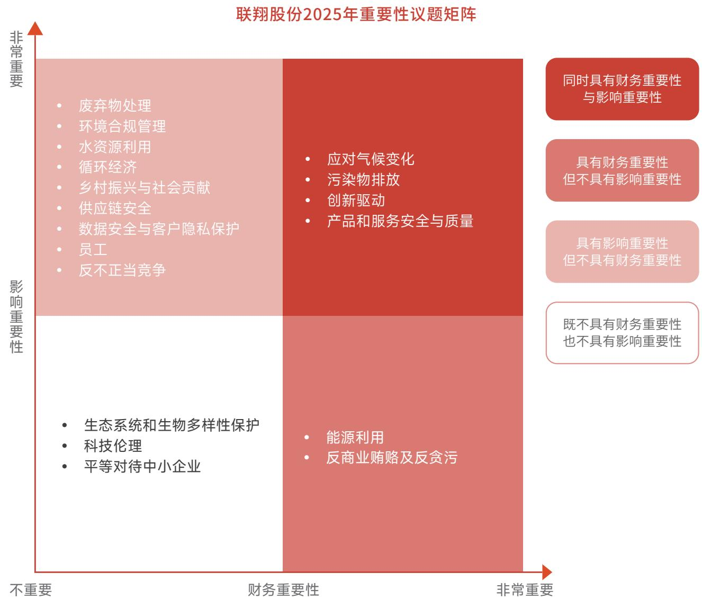

other

| 阶段 | 议题内容 |
| --- | --- |
| 非常重要 (Top-Left) | 废弃物处理 • 环境合规管理 • 水资源利用 • 循环经济 • 乡村振兴与社会贡献 • 供应链安全 • 数据安全与客户隐私保护 • 员工 • 反不正当竞争 |
| 非常重要 (Top-Right) | 应对气候变化 • 污染物排放 • 创新驱动 • 产品和服务安全与质量 |
| 财务重要性 (Bottom-Left) | 生态系统和生物多样性保护 • 科技伦理 • 平等对待中小企业 |
| 财务重要性 (Bottom-Right) | 能源利用 • 反商业贿赂及反贪污 |

公司将ESG风险管理全面纳入整体风险管理体系，系统识别与评估公司在可持续发展方面潜在的风险与机遇，并采取针对性应对措施，确保

ESG风险得到及时识别、有效控制和持续改善，提升公司整体风险抵御能力与可持续发展韧性。

联翔股份2025年财务重要性议题影响、风险和机遇分析表

<table><tr><td>议题</td><td>影响范围</td><td>风险与机遇类别</td><td>时间范围</td><td>财务影响</td></tr><tr><td rowspan="2">应对气候变化</td><td rowspan="2">价值链上游自身运营价值链下游</td><td>政策风险市场风险</td><td>短中长期</td><td>运营成本增加</td></tr><tr><td>产品/服务机遇</td><td>中长期</td><td>营业收入增加</td></tr><tr><td>污染物排放</td><td>自身运营价值链下游</td><td>政策风险市场风险</td><td>短中长期</td><td>运营成本增加</td></tr><tr><td>能源利用</td><td>价值链上游自身运营价值链下游</td><td>产品/服务机遇</td><td>中长期</td><td>营业收入增加</td></tr><tr><td>创新驱动</td><td>自身运营价值链下游</td><td>市场机遇产品/服务机遇</td><td>短中长期</td><td>营业收入增加</td></tr><tr><td>产品和服务安全与质量</td><td>自身运营价值链下游</td><td>市场机遇产品/服务机遇</td><td>中长期</td><td>营业收入增加</td></tr><tr><td>反商业贿赂及反贪污</td><td>价值链上游自身运营价值链下游</td><td>市场机遇</td><td>短中长期</td><td>营业收入增加</td></tr></table>

注：影响时间范围参考中国财政部《企业可持续披露准则——基本准则(试行)》，短期指报告期间结束后1年以内(含1年)，中期指报告期间结束后1年至5年(含5年)，长期指报告期间结束后5年以上。

联翔股份财务重要性指标与目标及年度进展

<table><tr><td>财务重要性议题</td><td>2025年指标与目标</td><td>2025年进展</td></tr><tr><td>应对气候变化</td><td>温室气体排放强度≤0.10吨二氧化碳当量/万元</td><td>0.09吨二氧化碳当量/万元</td></tr><tr><td>污染物排放</td><td>环境污染事故0起</td><td>0起</td></tr><tr><td>能源利用</td><td>能源消耗量≤400吨标准煤</td><td>336.37吨标准煤</td></tr><tr><td>创新驱动</td><td>研发人员占员工总数的比例≥10%</td><td>10.27%</td></tr><tr><td>产品和服务安全与质量</td><td>产品合格率≥97%顾客满意度≥85%</td><td>99.71%86.55%</td></tr><tr><td>反商业贿赂及反贪污</td><td>商业贿赂或贪污相关事件0起</td><td>0起</td></tr></table>

# 公司ESG治理安排

# 公司可持续发展治理架构

# 公司治理架构

公司严格按照《中华人民共和国公司法》《上市公司治理准则》等法律法规的要求，搭建由股东会、董事会及其下属各专门委员会（包括战略委员会、提名委员会、薪酬与考核委员会、审计委

员会）和经营管理层构成的健全且高效的公司治理架构，建立权责明确、运作规范的公司治理机制，有效保证公司治理决策的公正性与科学性。

联翔股份公司治理架构  
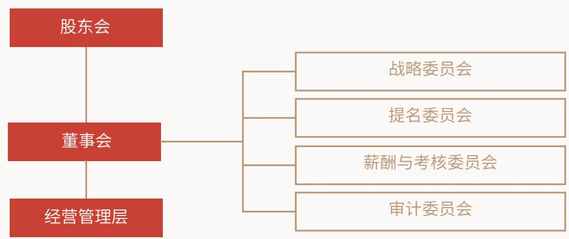

flowchart

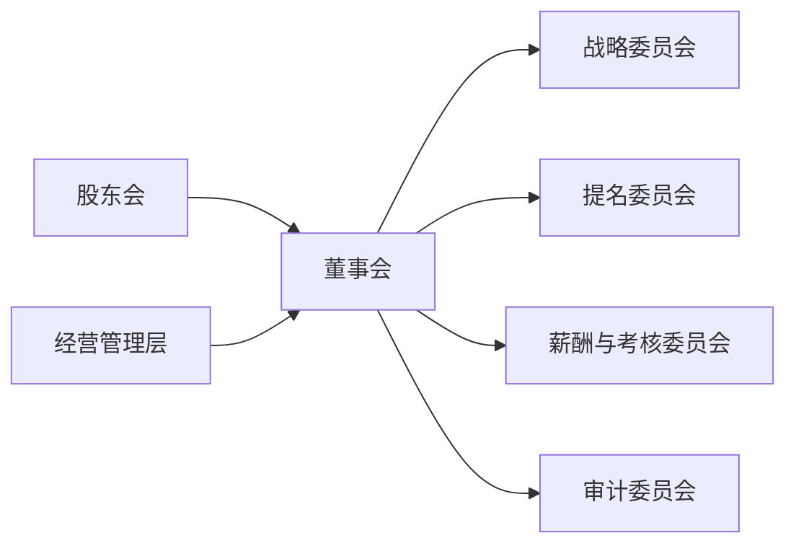
```mermaid
graph LR
  A["股东会"] --> B["董事会"]
  C["经营管理层"] --> B
  B --> D["战略委员会"]
  B --> E["提名委员会"]
  B --> F["薪酬与考核委员会"]
  B --> G["审计委员会"]
```

# 联翔股份“三会一层”成员组成及其会议召开情况

  
股东会

- 公司股东会由全体股东组成。  
- 公司历次股东会的通知、召集、提案、出席、表决等均符合《中华人民共和国公司法》《公司章程》和《股东会议事规则》的规定。  
• 2025年，召开股东会会议6次。

  
董事会

- 公司按照《浙江联翔智能家居股份有限公司章程》的规定选聘和任免公司董事，并确保董事会充分发挥在重大决策、经营管理等方面的作用。公司执行董事会成员多元化政策，董事会成员构成充分考虑了公司业务模式和工作需要，兼顾了成员性别、年龄、文化及教育背景或专业经验。公司董事会由9名董事组成，其中包括独立董事3名、女性董事3名。  
- 公司历次董事会的通知、召集、提案、出席、表决等均符合《中华人民共和国公司法》《公司章程》和《董事会议事规则》的规定。  
• 2025年，召开董事会会议10次。

  
监事会

- 公司监事会由3名监事组成，包括2名非职工代表监事和1名职工代表监事。  
- 公司历次监事会的通知、召集、提案、出席、表决等均符合《中华人民共和国公司法》《公司章程》和《监事会议事规则》的规定。2025年，召开监事会会议2次。  
- 根据中国证监会、上海证券交易所相关制度改革要求，公司经第三届董事会第十八次会议审议通过，于2025年8月27日取消公司监事会设置，并由审计委员会承接监事会相关法定职权。

  
经营管理层

- 公司总经理、副总经理、财务负责人、董事会秘书为公司高级管理人员，截至2025年末共有高级管理人员4名（女性3名）。  
- 公司经营管理层依照法律法规与公司内部规定履行职责，严格执行股东会和董事会各项决议，推动公司持续、稳定运行。

注：公司治理详细信息请参阅《浙江联翔智能家居股份有限公司2025年年度报告》。

公司建立健全董事及高级管理人员考核和薪酬管理制度，由公司薪酬与考核委员会制订董事与高级管理人员的薪酬计划或方案，并监督计划或方案的落实。公司董事报酬事项由股东会决定，高级管理人员的薪酬分配方案经董事会批准，并向

股东会说明情况，并充分开展信息披露。2025年，公司董事和高级管理人员持股变动及报酬情况详见《浙江联翔智能家居股份有限公司2025年年度报告》。

# 联翔股份投资者权益保护措施

# 信息披露

- 公司依据《中华人民共和国证券法》《股票上市规则》《上市公司信息披露管理办法》等法律法规以及《公司章程》等规章制度的有关要求，制定《信息披露事务管理制度》《信息披露暂缓与豁免管理制度》等制度以规范公司信息披露行为，严格履行信息披露义务。2025年，公司共披露了139份公告文件，合计约94.45万字。  
公司在信息披露工作上持续精进，严格遵循监管要求，更在披露的及时性、准确性与完整性上不断优化，通过完善内控制度、加强跨部门协作等举措，全面提升了信息披露工作的质量，2024—2025年度信息披露评级为B。

# 投资者关系

- 公司董事会秘书为公司投资者关系工作负责人，公司证券部为公司投资者关系工作职能部门，具体负责公司投资者关系工作事务。  
- 公司制定《投资者关系管理制度》，开展投资者关系管理，保护投资者对公司重大事项的知情权与参与权，维护中小投资者利益，为投资者持续创造合理的投资收益。公司与投资者沟通的方式包括但不限于公告（包括定期报告和临时公告），股东会，投资者说明会，一对一沟通，电话咨询，邮寄资料，广告、媒体、报刊或其他宣传资料，路演，现场参观，公司网站等。  
- 2025年，公司认真贯彻保护投资者利益的要求，通过业绩说明会、机构调研会议、投资者热线电话及E互动平台等多种渠道和方式，积极开展投资者互动交流，与资本市场保持良性互动。报告期内，公司共召开业绩说明会3次、接待机构调研3次，并同步披露《投资者关系活动记录表》3份。

# 关联交易

- 为规范关联交易行为和减少不必要的关联交易，禁止公司控股股东、实际控制人、董监高等利用关联交易损害公司及中小股东的利益，公司制定《关联交易管理制度》，对关联交易的定价原则和方法、决策权限、审议程序、披露以及回避表决等作出详细规定，保证公司关联交易决策行为的公允性。  
公司于2025年3月31日召开第三届董事会第十四次会议以及第三届董事会第二次独立董事专门会议审议通过了《关于转让参股公司股权暨关联交易的议案》，决定将持有的浙江颐核医疗科技有限公司（以下简称“浙江颐核”）16.6667%股权，以1,700万元人民币的价格转让给公司控股股东、实际控制人、董事长、总经理卜晓华先生。此次股权转让完成后，公司不再持有浙江颐核的股权，卜晓华先生将持有浙江颐核16.6667%的股权。相关情况详见公司于2025年4月1日披露的《浙江联翔智能家居股份有限公司关于转让参股公司股权暨关联交易的公告》（公告编号：2025-008）。

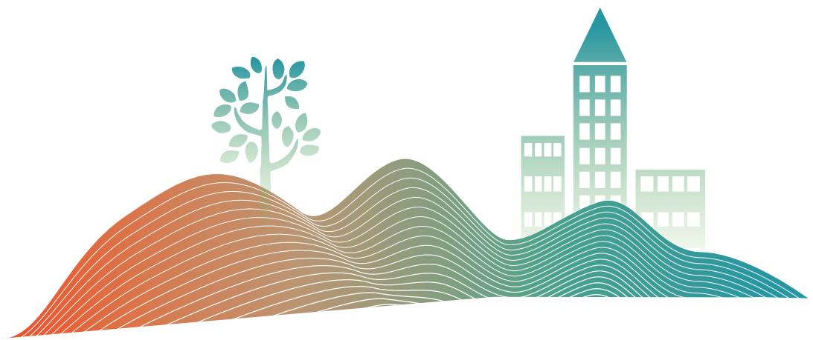

natural_image

Stylized illustration of a mountain range with trees and buildings in the background (no text or symbols)

# ESG治理架构

公司持续完善ESG治理体系，积极识别并管控业务运营相关的环境、社会及治理影响，保障ESG工作高效落地、长效推进。公司董事会作为ESG工作的决策与监督机构，统筹ESG战略规划与监督执行；经营管理层下设ESG委员会，行政部统筹协调ESG各项工作的具体实施，并与各职能部

门、子公司建立高效畅通的内部沟通机制；各职能部门及子公司共同组建ESG工作小组，具体执行各项ESG工作任务，负责ESG工作的落地执行，形成“决策—统筹—执行”的全链条治理体系。

联翔股份ESG治理架构  
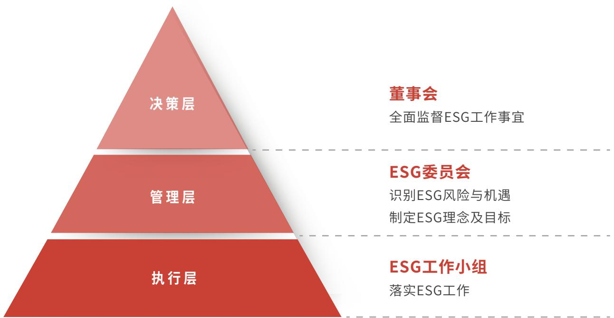

flowchart

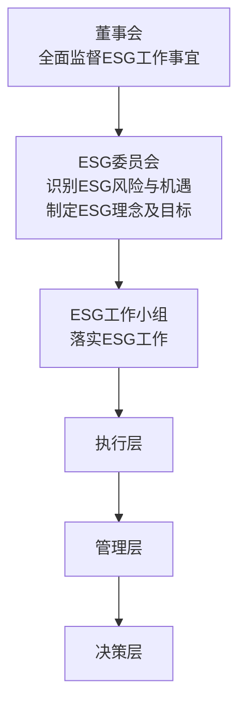
```mermaid
graph TD
  A["董事会\n全面监督ESG工作事宜"] --> B["ESG委员会\n识别ESG风险与机遇\n制定ESG理念及目标"]
  B --> C["ESG工作小组\n落实ESG工作"]
  C --> D["执行层"]
  D --> E["管理层"]
  E --> F["决策层"]
```

# 联翔股份ESG治理架构人员构成及职权范围

# 决策层

由公司董事会成员组成。

审议批准公司《ESG暨社会责任报告》。  
- 审议批准涉及公司ESG治理重大信息的信息披露。  
审议对公司重大影响的ESG相关风险、重大ESG负面事件应对方案。

# 管理层

成立ESG委员会，由行政部牵头，成员包括具备ESG相关知识的高级管理人员。

- 落实国家、监管机构ESG相关政策、法规和规定，研究公司ESG战略与目标、工作计划及相关管理制度。  
- 管理重要性议题以提供分析、建议供决策层讨论，以确保董事会进行监督。  
- 确定及管理为识别、减缓、管理及监察ESG相关影响、风险和机遇所需分配的成本及资源、拟定ESG工作计划，以及其他ESG相关的事项。  
• 协调编制《ESG暨社会责任报告》。

# 执行层

设立ESG工作小组，成员包括各职能部门及各子公司的核心成员，以及对ESG有充分认识的员工。

- 组织利益相关方沟通活动。  
- 负责公司ESG相关管理、数据统计与分析、投资者及研究机构沟通等方面的能力构建。  
- 定期工作成果向管理层汇报。  
- 其他ESG相关的事项。

# ESG相关信息报告、监督机制

公司建立ESG信息内部报告机制，明确报告方式和报告频率，保障治理架构各层级人员及时获取相关信息。同时，公司建立ESG监督机制，ESG

委员会及相关负责人监督管理ESG目标设定、战略执行、目标实现进展的情况。

联翔股份ESG相关信息报告、监督机制

<table><tr><td>机制内容</td><td>具体行动</td></tr><tr><td>信息报告机制</td><td>·ESG委员会每年向董事会报告ESG相关目标的完成进度与工作成效,确保决策层全面掌握ESG工作动态。</td></tr><tr><td>监督程序及措施</td><td>·ESG委员会召开会议,探讨ESG相关影响、风险和机遇的优先级,审定公司ESG指标与目标,强化全过程监督管控。</td></tr><tr><td>考核情况</td><td>·秉持“薪酬与业绩和股东回报相结合,与个人职责、贡献和绩效相适应,与ESG指标相联系”的原则,将ESG关键指标纳入高层及相关负责人的考核指标,以考核驱动ESG工作落地。</td></tr></table>

# ESG规划及贡献SDGs

为进一步提升可持续发展能力，公司结合实际情况，通过分析研究公司在环境、社会、治理三方面的现有基础、未来目标及相应优化举措，编制

了包括绿色低碳、社会责任、公司治理三方面的“十四五”可持续发展规划。

# 联翔股份“十四五”可持续发展规划

# 初心使命

为客户提供最具价值的家居生活解决方案和服务，持续为客户创造最大价值

# 全面发展

# 规划引领

# 发展规划

2021年

>>

2022年

>>

2023年

>>

024年

>>

2025年

# 数字化年

# 高质量年

# 产业链年

# 辉煌廿年

# 碳达峰年

# 核心领域

# 关键行动

# 领域行动

# 环境

■ 碳排放管理  
■ 再生资源循环利用能力进一步提升  
- 产品全生命周期环境影响下降

# 社会

- 知识产权保护更加严格  
- 打造数字经济新优势  
■ 注重员工安全与发展  
■ 给予员工健康向上的职业发展平台  
- 助力社区发展与共同富裕

# 治理

■ 提升董事会成员、高级管理人员及董事会专门委员会的独立性  
■ 进一步完善公司内部控制制度  
■ 加强公司内部廉政教育  
■ 充分重视投资者关系管理

公司积极响应联合国可持续发展目标（SDGs），全面审视SDGs与公司责任实践的关联性，在提供创新产品和服务的同时，将可持续

发展理念融入业务运营的方方面面。2025年，公司基于自身业务属性与相关方关注重点，就其中7项重点可持续发展目标贡献度予以总结。

# 联翔股份贡献SDGs的具体行动

<table><tr><td colspan="2">SDGs</td><td>具体行动</td></tr><tr><td colspan="2">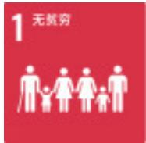</td><td>·帮扶弱势群体,持续助力乡村振兴,以产业赋能、就业支持等多元举措推动共同富裕</td></tr><tr><td colspan="2">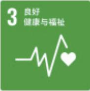</td><td>·构建完善的职业健康安全管理体系,通过ISO 45001认证,全方位保障员工身心健康与作业安全</td></tr><tr><td colspan="2">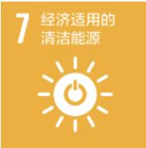</td><td>·布局光伏发电等清洁能源应用,建立健全能源管理体系并通过ISO 50001认证,提升能源利用效率</td></tr><tr><td colspan="2">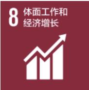</td><td>·健全员工薪酬福利体系,保障员工合法权益,搭建公平公正的职业发展平台,推动企业与员工共同成长</td></tr><tr><td colspan="2">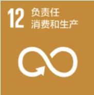</td><td>·建立全流程质量管理体系,通过ISO 9001认证,以高品质产品与服务践行负责任生产理念</td></tr><tr><td colspan="2">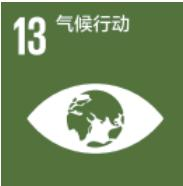</td><td>·开展节能减排行动,推动行业绿色低碳转型,构建完善的环境管理体系并通过ISO 14001认证,助力“双碳”目标实现</td></tr><tr><td colspan="2">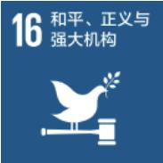</td><td>·坚持信息透明公开,健全廉洁合规管理体系,坚决杜绝一切形式的腐败行为,筑牢合规经营底线</td></tr></table>

# 环境维度

- 应对气候变化  
- 污染物排放  
- 废弃物处理  
- 环境合规管理  
能源利用  
- 水资源利用  
- 循环经济

本章贡献SDGs

7 经济适用的清洁能源

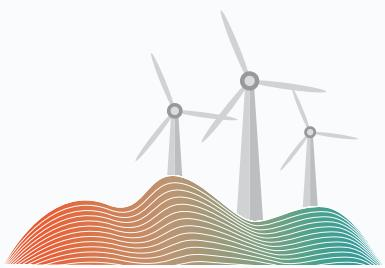

natural_image

Illustration of three wind turbines on stylized hills with wavy lines (no text or symbols)

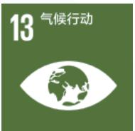

# 应对气候变化

公司涉及温室气体排放的运营环节主要来源为自有车辆用柴油燃烧和定型设备用天然气燃烧供热产生的直接温室气体排放，生产设备、照明系统、办公设备的运行用电产生的间接温室气体排放。

公司积极关注全球气候变化的态势，响应国务院《2030年前碳达峰行动方案》《中国应对气候变化的政策与行动》等气候相关政策，构建气候变化管理体系，将气候变化减缓与适应纳入日常管理中。

# 联翔股份“应对气候变化”四要素管理架构

# 治理

\- 公司规范应对气候变化管理体系，安环部牵头负责气候变化相关影响、风险与机遇的识别、管控及工作落地，并定期向管理层汇报执行进展，保障气候管理工作规范有序推进。

# 战略

- 定期开展气候变化对公司运营及财务表现的影响、风险与机遇的评估。  
- 结合评估结果，通过定性分析研判公司战略对气候风险的抵御能力，制定针对性管理策略与实施方法。

# 影响、风险和影响管理

- 对应对气候变化相关影响、风险和机遇进行识别、评估、监测和管理。  
- 2025年在“应对气候变化”议题下的管理措施及成果详见本章节。

# 指标与目标

\- 设定温室气体排放强度作为“应对气候变化”议题下的管理指标，并不断完善指标表现。

公司严格遵循国家及地方气候相关政策要求，识别出气候变化相关影响、风险与机遇，并评估其对公司财务表现的潜在影响。公司立足业务发展，从实体风险（如高温、暴雨等极端天气）与

转型风险（如技术革新等）两大维度开展定性分析，评估其对公司当期及未来财务状况、经营成果、现金流的潜在影响，并同步挖掘低碳转型带来的发展机遇。

联翔股份“应对气候变化”影响、风险与机遇分析

<table><tr><td colspan="3">影响分析</td><td colspan="3">风险与机遇分析</td></tr><tr><td>影响类型</td><td>主要影响</td><td>影响范围</td><td>主要风险</td><td>主要机遇</td><td>影响周期</td></tr><tr><td>潜在正面影响潜在负面影响</td><td>通过减少碳排放、优化能源使用,能够缓解气候变化的影响,推动行业绿色转型。</td><td>价值链上游自身运营价值链下游</td><td>气候变化导致自然灾害频发、能源供应不稳定、政策法规更新和市场需求转变,可能面临合规罚款、客户流失、供应链中断、品牌声誉受损等风险。</td><td>通过应用清洁能源和绿色技术,降低能源成本,满足客户低碳需求,提升市场竞争力,获得长期财务收益。</td><td>短期中期长期</td></tr></table>

联翔股份“应对气候变化”管理措施及成果

<table><tr><td>强化能源管理</td><td>制定应对气候相关风险与机遇的转型计划,明确以优化能源结构、节约使用能源、提高设备能效为转型举措,减少温室气体排放,推动绿色低碳发展,相关实践详见本报告“能源利用”章节。</td></tr><tr><td>建立温室气体排放管理体系</td><td>设定减排目标:结合公司实际情况,制定温室气体减排目标和实施计划,并将目标分解到各生产环节,确保责任落实到人。监测与报告:建立温室气体排放监测体系,定期开展温室气体排放量核算、监测与报告,确保数据真实可追溯。</td></tr><tr><td>员工培训与意识提升</td><td>开展培训活动:定期组织员工参加低碳环保培训,提高员工对温室气体减排的认知水平,掌握节能减排专业知识与实操技能。营造环保氛围:通过内部宣传等方式,营造全员参与的环保文化氛围,鼓励员工积极参与节能减排行动,构建全员低碳运营格局。</td></tr></table>

公司严格依据国家温室气体核算相关标准，采用基于位置的方法开展自身运营范围内范围一、范围二的温室气体核算，明确核算边界、排放源分类及计算方法，确保核算数据的科学性、准确性与可比性。

经核算，2025年公司在运营环节范围一直接温室气体排放150.06吨二氧化碳当量，占总温室气体排放的11.79%；范围二间接温室气体排放1,122.40吨二氧化碳当量，占总温室气体排放的88.21%。

# 污染物排放

公司严格遵守《中华人民共和国水污染防治法》《中华人民共和国大气污染防治法》《中华人民共和国噪声污染防治法》等法律法规及管理条例，严格执行相关管理规范，努力减少对环境的负面影响。2025年，公司定期开展污染物排放监测，各项排放指标均低于国家及地方规定标准限值，报告期内未发生因污染物排放受到重大行政处罚或被追究刑事责任的情况。

联翔股份污染物类别、产生环节及污染因子

<table><tr><td>类别</td><td>产生环节</td><td>污染因子</td></tr><tr><td rowspan="2">废水</td><td>生活废水</td><td>COD、 $NH_3$ -N、TN、SS</td></tr><tr><td>生产废水(主要为清洗废水)</td><td>SS、COD、LAS、 $NH_3$ -N、TN等</td></tr><tr><td rowspan="3">废气</td><td>淋膜、复合等</td><td>有机废气(非甲烷总烃)</td></tr><tr><td>高温定型</td><td>颗粒物、油烟(非甲烷总烃)</td></tr><tr><td>天然气燃烧</td><td>燃料废气( $SO_2$ 、 $NO_X$ 、颗粒物)</td></tr><tr><td>噪声</td><td>生产设备运行噪声</td><td>等效连续A声级(LAeq)</td></tr></table>

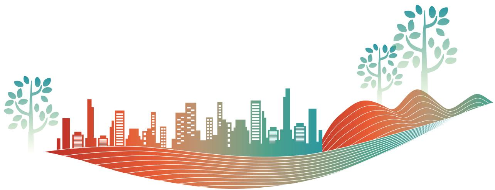

natural_image

Stylized abstract illustration of a city skyline with stylized trees and wave patterns (no text or symbols)

2025年，公司被浙江省生态环境厅列入浙江省环境监管重点单位（大气环境）。公司严格依据中国证监会、上海证券交易所及生态环境部相关监

管规定，披露作为环境监管重点单位的大气排放信息及生态环境行政许可情况，确保环境信息披露真实、合规。

# 联翔股份“污染物排放”四要素管理架构

# 治理

- 公司规范污染物排放管理体系，安环部负责污染物排放相关影响、风险与机遇的识别、管控及工作落地，并定期向管理层汇报执行进展。  
- 公司制定《三废及噪声管理办法》《污染物排放管理制度》等内部管理制度，定期监测厂区出水、生产排放废气，确保污染物排放符合标准。

- 定期开展污染物排放对公司运营及财务表现的影响、风险与机遇评估。  
- 结合评估结果制定针对性管理策略与实施方法。

# 战略

# 影响、风险和影响管理

- 对污染物排放相关影响、风险和机遇进行识别、评估、监测和管理。  
• 2025年在“污染物排放”议题下的管理措施及成果详见本章节。

\- 设定环境污染事故数量作为“污染物排放”议题下的管理指标，持续优化污染物管控举措，并不断完善指标表现。

# 指标与目标

公司严格遵循国家及地方环保政策要求，识别出污染物排放相关影响、风险与机遇，并评估其对公司财务表现的潜在影响。公司立足业务发展，

在日常运营中持续评估污染物排放管控不当带来的各类风险，同时挖掘管理优化带来的发展机遇。

联翔股份“污染物排放”影响、风险与机遇分析

<table><tr><td colspan="3">影响分析</td><td colspan="3">风险与机遇分析</td></tr><tr><td>影响类型</td><td>主要影响</td><td>影响范围</td><td>主要风险</td><td>主要机遇</td><td>影响周期</td></tr><tr><td>潜在负面影响</td><td>若未能有效管控污染物,可能导致严重的环境污染,对周边社区健康造成负面影响。</td><td>自身运营价值链下游</td><td>污染物处理不当可能导致环境污染事件,增加运营成本和潜在赔偿费用,同时面临法律诉讼、罚款及品牌声誉损失。</td><td>通过建立完善的污染物管理体系,优化污染物分类和处理流程,可降低处理成本,提升环境合规水平。</td><td>中期长期</td></tr></table>

# 联翔股份“污染物排放”管理措施及成果

# 废水管理

- 生活废水经隔油池、化粪池处理达标后，排入市政污水管网。  
- 生产清洗废水经絮凝沉淀、防霉剂失活处理、生化处理达标后，排入市政污水管网。

# 废气管理

- 复合工序少量废气通过加强车间通风实现有效扩散。  
- 定型废气经收集后，采用降湿器+高压静电处理，通过15m排气筒达标排放。  
- 燃料废气通过不低于8m高排气筒高空达标排放。  
- 食堂油烟废气经油烟净化器处理后，通过屋顶排气筒达标排放。

# 噪声管理

- 加强生产设备日常检修和维护，保障设备正常运转，从源头降低噪声。  
- 优化生产管理，开展员工文明生产教育，减少人为噪声，合理安排生产作业时间，实现厂界噪声达标排放。

# - 废弃物处理

公司严格遵守《中华人民共和国固体废物污染环境防治法》《危险化学品安全管理条例》等法律法规和规范性文件，对废弃物的产生、分类、收集环节进行严格监督，降低废弃物对环境的影

响。2025年，公司生产经营活动产生的废弃物均严格执行分类管控与合规处置流程，未发生废弃物违规处理事件，也未发生因废弃物处理不当引发的任何诉讼案件。

联翔股份废弃物种类、来源及处理措施

<table><tr><td colspan="2">种类</td><td>来源</td><td>处理措施</td></tr><tr><td rowspan="2">无害废弃物</td><td>边角料</td><td>生产、检验过程</td><td>收集后外卖综合利用</td></tr><tr><td>生活垃圾</td><td>员工生活</td><td>委托环卫所定期清运</td></tr><tr><td rowspan="3">有害废弃物</td><td>废活性炭</td><td>生产过程</td><td>委托有资质单位处置</td></tr><tr><td>含油废抹布</td><td>设备维修保养、擦拭</td><td>委托有资质单位处置</td></tr><tr><td>废墨水包装物</td><td>生产过程</td><td>委托有资质单位处置</td></tr></table>

# 联翔股份废弃物减排管理措施及成果

# 有害废弃物闭环管控

- 建立有害废弃物专项管理台账，实行专人管理、分类存放。  
- 委托具备相应资质的专业单位进行无害化处置，确保有害废弃物全过程合规流转，杜绝违规倾倒或处置行为。

# 规范化清运与无害化处置

- 针对废水处理环节产生的污泥、废膜件及员工生活垃圾，严格委托环卫所定期清运，实现规范化处置，避免二次污染。  
- 加强生产现场及生活区环境卫生管理，减少无害废弃物的产生量，降低混堆混放风险。

# 源头分类与资源化利用

- 对生产过程中产生的无害废弃物进行统一收集、分类存放。  
- 通过外卖综合利用实现再生资源回收，推动废弃物资源化再利用，从源头减少废弃物处置量。

# 环境合规管理

公司严格遵守《中华人民共和国环境保护法》《中华人民共和国环境影响评价法》《中华人民共和国水污染防治法》《中华人民共和国大气污染防治法》《中华人民共和国固体废物污染环境防治法》等法律法规和规范性文件，开展环境管理体系建设并确保其有效运行。2025年，公司未发生突发环境事件，也未发生因环境相关问题受到重大行政处罚或被追究刑事责任的情况。

公司以管理架构搭建、制度体系建设、目标责任落实为核心，全面推进污染全过程预防与控制、能源资源可持续利用。公司已通过环境管理体系认证（处于有效期内），安环部负责各项环境管理措施的有效落实与执行，环境管理体系每年开展内部审核，并根据ISO14001相关要求开展外部审核，根据审核结果持续优化环境管理现状。

# 联翔股份环境管理方针与目标

# 环境方针：

保护环境，预防污染，
节约能源，持续改善。

# 环境目标：

a）控制固、危废弃物的污染，每月按规定处理的固、危废弃物符合率达100%；  
b）环境污染事故为零。

seal

深圳市华联置业有限公司
深圳市华联置业有限公司

# 萬泰認證

# 环境管理体系认证证书

浙江联翔智能家居股份有限公司

注册地址：浙江省嘉兴市海盐县武原街道工业新区一星路5号  
办公地址：浙江省嘉兴市海盐县武原街道东海大道2887号  
生产地址：浙江省嘉兴市海盐县武原街道南叶路1号；  
浙江省嘉兴市海盐县武原街道秦联路3700号

统一社会信用代码：91330424763936798K  
建立的管理体系，按照以下标准评审合格，特发此证。GB/T24001-2016/ISO14001:2015

认证范围

无缝刺绣墙布、提花墙布及机织成品窗帘的设计开发和生产所涉及的环境管理

证书号：15/25E6391R21 发证日期：2025年04月22日 有效期至：2028年04月23日本证书信息可在国家认证认可监督管理委员会网站（www.cnca.gov.cn）查询。

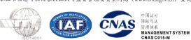

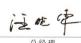

初次认证后的第一次监督审核应在认证证书签发日起12个月内进行。此后，监督审核应至少每个日历年（应进行再认证的年份除外）进行一次，且两次监督审核的时间间隔不得超过15个月。获证组织必须定期接受监督审核并经审核合格此证书方继续有效，每次监督审核合格后，WIT将在本证书上加贴合格标签。凡认证范围涉及行政许可或国家强制认证要求的，本证书随相关行政许可或国家强制认证证书失效而失效。

联翔股份主要环境影响因素分析

<table><tr><td>环节</td><td>环境因素输入</td><td>环境因素输出</td></tr><tr><td>采购</td><td>·供应商生产经营过程中需消耗原材料、能源、水资源</td><td>·供应商生产经营过程中产生废水、废气、废弃物</td></tr><tr><td>研发与生产</td><td>·能源:外购电力、天然气·水资源:市政供水·包装材料</td><td>·废水:生活废水以及生产过程中排放的生产废水,污染因子包含COD、 $NH_3-N$ 、TN、SS等·废气:定型废气、EVA胶膜热压废气、天然气燃烧废气、食堂油烟等,污染因子包含 $SO_2$ 、 $NO_X$ 、颗粒物、非甲烷总烃等·噪声:生产设备运行噪声(等效连续A声级LAeq)·无害废弃物:布匹裁剪边角料及生活垃圾等·有害废弃物:废活性炭、废墨水包装物、含油废抹布等</td></tr><tr><td>物流与仓储</td><td>·能源:货运车辆消耗的柴油、电动车消耗的电力、仓储消耗的能源·包装材料</td><td>·无害废弃物:包装废料</td></tr><tr><td>办公运营</td><td>·能源:外购电力、自有车辆消耗的电力和汽油·水资源:市政供水</td><td>·废水:生活废水·无害废弃物:生活垃圾</td></tr><tr><td>产品使用与废弃</td><td>·消费者在使用产品过程中消耗的能源和水资源·废弃物处置过程消耗的能源和水资源</td><td>·消费者使用产品后产生废弃物·废弃物处置过程中产生的废水、废气</td></tr></table>

2025年，公司严格落实环境合规管理要求，联合专业检测机构开展年度废水、废气、固废（三废）检测，确保各项排放指标符合国家及地方环保标准；完成年产36万套定制成品窗帘建设项目环评验收，严格执行项目建设环保“三同时”制度，确保生产项目环保合规落地。同时，公司推进绿色制造体系建设，完成绿色工厂建设相关工作，推动绿色生产体系落地；成功申报“无废工厂”，以“减量化、资源化、无害化”为核心，推动生产过程固废源头减量、资源循环与合规处置。

在有效管理环境风险方面，公司编制环境自行监测方案，每年委托专业第三方机构开展废水、大气污染物、噪声等环境影响因素的监测。此外，为应对突发环境事件的需要，公司按照国家生态环境部发布的《关于印发突发环境事件应急预案暂行管理办法的通知》《国家突发环境事件应急预案》的相关要求，编制《环境污染事故应急预案》，并按照规定报属地环保主管部门备案。

# 能源利用

公司严格遵守《中华人民共和国节约能源法》等法律法规，依据ISO 50001:2018《能源管理体系要求及使用指南》、GB/T 29456—2012《能源管理体系实施指南》，结合公司实际情况编制《能源管理体系手册》，并通过ISO 50001:2018能源管理体系认证（处于有效期内）。同时，公司以“低碳环保、清洁循环、节约增效、绿色领绣”能源管理方针，配齐配足能源管理专兼职人员，健全常态化工作机制，持续夯实体系保障。

公司在生产运营过程中主要消耗的能源类型包括电力、柴油、天然气等。

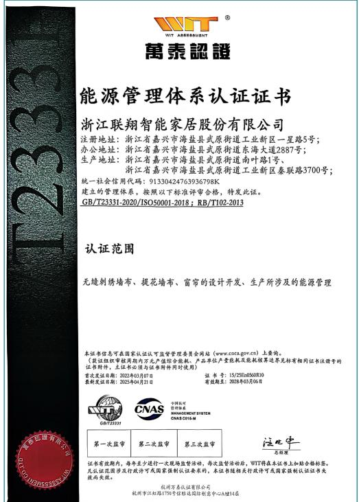

text_image

WNT
WIT A Group认证
萬泰認證
能源管理体系认证证书
浙江联翔智能家居股份有限公司
注册地址：浙江省嘉兴市海盐县武原街道工业新区一星路5号；
办公地址：浙江省嘉兴市海盐县武原街道东海大道2887号；
生产地址：浙江省嘉兴市海盐县武原街道南叶路1号、
浙江省嘉兴市海盐县武原街道工业新区秦联路3700号；
统一社会信用代码：91330424763936798K
建立的管理体系，按照以下标准评审合格，特发此证。
GB/T23331-2020/ISO50001-2018；RB/T102-2013
认证范围
无缝刺绣墙布、提花墙布、窗帘的设计开发、生产所涉及的能源管理
本证书信息可在国家认证认可监督管理委员会网站（www.cncs.gov.cn）上垂询。
（获证组织申报期内万元产值综合能耗，产品单位严重能耗及能耗核算边界见标有相同证书注册号的
证书附件，主体必须与证书附件同时使用）
首次发证日期：2022年03月07日
最新发证日期：2025年04月21日
证书号：15/25Eh060810
有效期至：2028年03月06日
CNAS
G8733233
中国许可
行政许可
MANAGEMENT SYSTEM
CNAS CO18-M
第一次监审	第二次监审	第三次监审
注释中
名称项
证书有效期内，每年至少进行一次现场监管活动，每次监管活动后，WIT将在本证书上加盖合格标签。
凡认证范围涉及行政许可或国家强制认证要求的，本证书随相关行政许可或国家强制认证证书失
致而失效。
浙江万泰认证有限公司
杭州市江虹路1799号恒运国际商务中心A幢14层

联翔股份能源类型及使用环节  
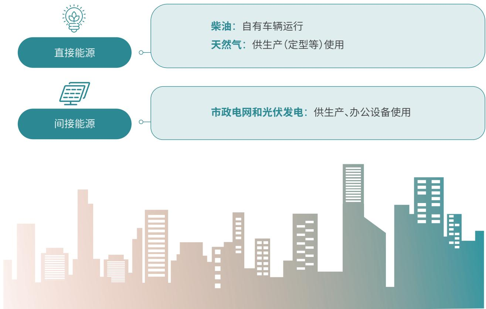

flowchart

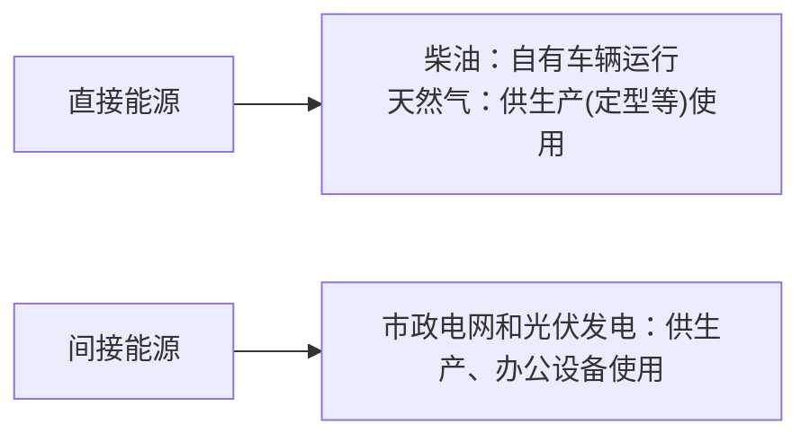
```mermaid
graph LR
  A["直接能源"] --> B["柴油：自有车辆运行\n天然气：供生产(定型等)使用"]
  C["间接能源"] --> D["市政电网和光伏发电：供生产、办公设备使用"]
```

# 联翔股份“能源利用”四要素管理架构

# 治理

\- 公司规规范能源利用管理体系，行政部负责能源利用相关影响、风险与机遇的识别、管控及工作落地，并定期向管理层汇报执行进展。

# 影响、风险和影响管理

- 对能源利用相关影响、风险和机遇进行识别、评估、监测和管理。  
- 2025年在“能源利用”议题下的管理措施及成果详见本章节。

# 战略

- 定期开展能源利用对公司运营及财务表现的影响、风险与机遇的评估。  
- 结合评估结果制定针对性管理策略与实施方法。

# 指标与目标

\- 设定综合能源消耗量作为“能源利用”议题下的管理指标，持续优化能源管理措施，不断完善指标表现。

公司严格遵循国家及地方能源相关政策要求，识别出能源利用相关影响、风险与机遇，并评估其对公司财务表现的潜在影响。公司立足业务发

展，在日常运营中持续评估能源利用带来的各类风险，同时挖掘节能降碳、清洁能源应用带来的发展机遇。

# 联翔股份“能源利用”影响、风险与机遇分析

<table><tr><td colspan="3">影响分析</td><td colspan="3">风险与机遇分析</td></tr><tr><td>影响类型</td><td>主要影响</td><td>影响范围</td><td>主要风险</td><td>主要机遇</td><td>影响周期</td></tr><tr><td>潜在正面影响</td><td>通过采用高效能源利用系统等措施,降低能源资源消耗,提升能源利用效率,对推动企业绿色、低碳运营具有积极意义。</td><td>自身运营价值链下游</td><td>可能面临新型能源利用模式适配过程中,因技术与管理能力不足带来的成本增加、效率低下和合规风险等。</td><td>在能源高效利用的趋势下,通过创新技术与管理模式,开拓节能降本市场,提升企业竞争力并获得新的市场增长点。</td><td>短期中期长期</td></tr></table>

# 联翔股份“能源利用”管理措施及成果

# 清洁能源应用

\- 屋顶加装光伏发电设备：2025年，屋顶光伏发电设备在科学运维和智能调控下保持高效运转，全年累计发电量为5,771.19兆瓦时，有效替代传统化石能源的消耗。

natural_image

Stylized illustration of a city skyline with trees and buildings, no text or symbols present

# 节能设计优化

- 优化车间布局：合理规划车间布局，畅通生产流程，减少物料和人员的运输距离，降低能源消耗。同时，优化车间照明和通风系统，充分利用自然采光和通风，降低照明和空调能耗。  
- 采用节能光源：各厂区、房间、场所的照明光源采用T5直管（或环状）三基色高显色性荧光灯、紧凑型节能荧光灯、LED灯等节能光源，节能灯使用比例为 $100\%$ 。

# 设备能源管理

- 节能设备更新：逐步淘汰高能耗的老旧设备，更换为节能型的生产设备；采购设备时考虑节能、容量合适的设备，如绣花机、复合机、验布机等选用能效较高的节能式变频设备，90%以上处于二级能效。  
- 设备维护保养：制定完善的设备维护计划，定期开展设备保养与维修，确保设备处于良好的运行状态，避免因设备故障或磨损导致能源浪费。  
- 设备运行优化：根据生产任务合理安排设备的运行时间和负荷，避免设备长时间空载或低负荷运行，提升能源利用效率。

# 水资源利用

公司用水来源均为市政供水，主要为生产用水和生活用水。在生产环节，水资源主要用于生产工艺和辅助设施；在生活环境，用于员工日常办公与生活需求。公司取水水源对环境无重大影响。

公司严格遵守《中华人民共和国水法》等法律法规，行政部负责水资源利用管理，通过源头减量、效率提升、循环利用等方式，积极推进水资源管理，践行节水降耗、绿色发展理念。

# 联翔股份“水资源利用”管理措施及成果

源头节水与需求管控

\- 安装节水型设备：在新设备采购或旧设备更新时，优先选择节水型设备；应用感应式小便器等节水设施，从源头减少用水需求。

用水效率提升与意识培育

\- 定期检查设备：建立定期的设备检查制度，安排专业人员对生产线上的各类用水设备进行检查和维护，及时发现并修复漏水点，避免水资源流失。

\- 开展节水培训：通过组织专题培训、发放宣传资料等方式，向员工普及节水知识和重要性，增强员工的节水意识。

水资源循环利用

\- 安装循环水冷却塔：设备冷却水采用循环水模式，实现水资源闭环利用，提升水资源重复利用率。

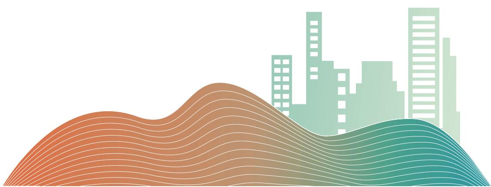

natural_image

Abstract wavy line art with city skyline silhouette in background (no text or symbols)

# - 循环经济

公司涉及循环利用的资源包括墙布和窗帘的裁剪过程中产生的边角料，采购设备、物资等过程中产生的包装材料，以及产品包装过程中使用的楞纸箱、气泡膜、编织袋等材料。

通过查阅《国家鼓励的有毒有害原料（产品）替代品目录》，公司未使用该目录中的有毒有害原料，生产工艺流程中均不涉及有害物质使用。公司主要产品为高端刺绣墙布和窗帘，其原材料为底布，受产品工艺特性限制，暂无法使用回收料进行加工生产。

公司严格遵守《中华人民共和国循环经济促进法》，建立资源循环利用管理体系，明确各部门和岗位在资源循环利用工作中的职责和工作流程，营造良好的资源循环利用氛围，践行“减量化、资源化、无害化”的绿色发展理念。

# 联翔股份“循环经济”管理措施及成果

# 原材料边角料资源化利用

\- 在满足产品强度和安全性的前提下，充分考虑减量化设计，将裁剪过程中产生的余料和边角料收集，通过再加工制成包、靠枕、服装等，实现资源的再利用，提升资源利用效率。

# 包装材料循环复用与回收

- 与供应商协商协同优化包装方案, 尽量采用可重复使用的包装材料, 从源头减少包装废弃物产生。  
- 包装材料进行分类回收，将瓦楞纸箱进行压缩、整理后，返回造纸厂重新加工成纸箱；气泡膜和编织袋等送到塑料回收厂，处理后制成再生塑料颗粒，用于生产新的塑料制品，实现包装废弃物循环。

# 社会维度

乡村振兴与社会贡献  
创新驱动  
- 供应链安全  
- 产品和服务安全与质量  
- 数据安全与客户隐私保护  
- 员工

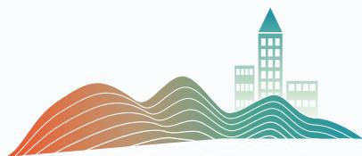

# 本章贡献SDGs

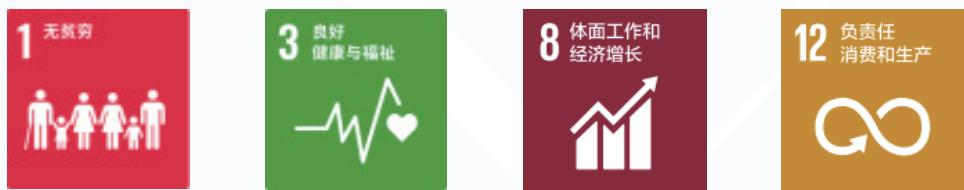

# 乡村振兴与社会贡献

公司始终秉持企业发展与社会和谐共融的理念，作为负责任的企业公民，长期开展公益慈善与志愿服务工作。同时，公司重视与运营所在地社区的共生关系，建立顺畅的沟通机制，切实关注当地政府、公众和社区等利益相关方的需求，通过常态化沟通答疑解惑，筑牢坚实的社区信任基础。

为精准对接社区需求，公司在传统公益慈善捐赠的基础上，积极拓展多元路径。公司依托自身产业影响力开展社区服务，携手当地文化活动深化在地融合，并联合非营利组织共同推动社会问题治理；以多维度举措打造公司与本地社区的积极和谐关系，助力社区实现可持续发展。

# 案例：公益开放会议场地 共筑政企社联动

2025年度，公司秉持开放共享、服务社区、政企协同的发展理念，持续向街道社区、行业协会、学校等单位免费开放会议场地资源，全年累计提供各类会议、参观、研学、培训等场地支持18次，服务外来访客合计741人次。

公司主动开放报告厅、会议室、党建室、展厅等多元场地资源，全力保障武原商会会员大会、安全生产“开工第一课”、退役军人就业推介会、党员研学、学生实践等各类政企活动、社区服务与公益项目顺利开展，以实际行动践行企业社会责任，深化与属地政府、社区及社会各界的联动融合，助力区域公共服务与社区发展。

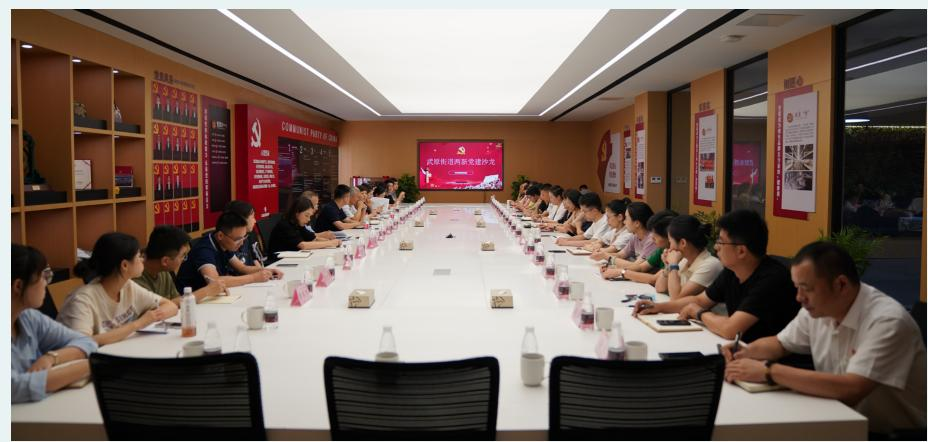

text_image

Group meeting in a conference room with visible banners and display screens showing Chinese text about the 20th National Congress of the Communist Party of China.

# 案例：“领绣匠心”共富工坊就业创业帮扶实践

“领绣匠心”共富工坊成立于2022年，由浙江联翔智能家居股份有限公司运营。工坊以刺绣工艺家居产品为主导，融合传统技艺与现代智能制造，打造“技艺+制造”的示范样板。

# 吸纳就业，促进身份转变

工坊通过 “一路星光·党建联建” 平台，精准对接金星村、华星村、光明社区等村（社区），有效吸纳农村剩余劳动力。截至目前，工坊已成功帮助132名村民实现从 “田间” 到 “车间” 的身份转变，转化为产业工人，人均年增收5.6万元，显著提升当地村民经济收入与生活品质。

# 技能培育, 构建成长闭环

工坊内设技能学院，创新采用“工学交替+导师驻场”的双轨培养模式，累计培育各类技能人才213名。通过定期举办技能大比武，建立“技能提升—等级晋升—收入增长”的良性激励机制，将技能竞赛成绩与薪酬直接挂钩，形成全员奋进的技能成长闭环。

# 创业赋能，完善共富链条

依托公司完善的销售网络与渠道资源，工坊创新推出“夫妻店”等特色创业模式。目前已助力80余名低收入群体成功创业，构建起从“就业赋能”到“创业孵化”的完整共富生态链条，切实推动区域经济高质量发展，促进社会共同富裕。

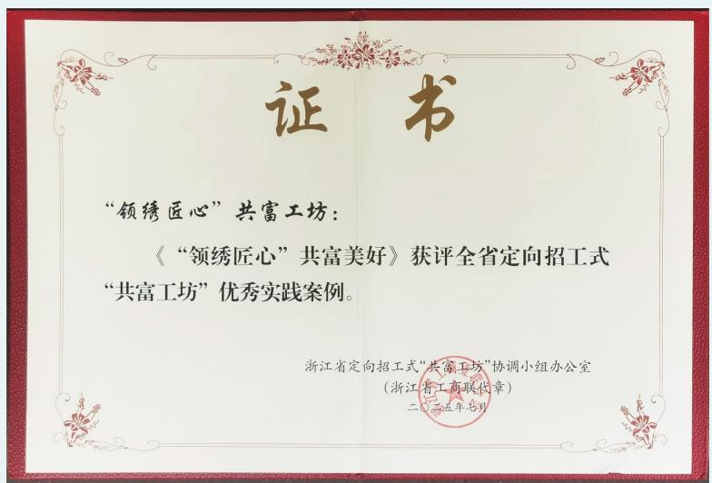

text_image

证书
“领绣匠心”共富工坊：
《“领绣匠心”共富美好》获评全省定向招工式
“共富工坊”优秀实践案例。
浙江省定向招工式“共富工坊”协调小组办公室
（浙江省工商联代章）
二〇二五年七月

# 创新驱动

公司坚持以产品研发为发展驱动力，建立完整的研发创新管理体系，严格遵守《中华人民共和国《科学技术进步法》等法律法规和规范性文件，推动公司持续创新发展。

联翔股份“创新驱动”四要素管理架构

<table><tr><td>治理·公司规范创新驱动管理体系,研发中心负责创新驱动相关影响、风险与机遇的识别、管控及工作落地,明确各部门职责分工,定期向管理层汇报执行进展。</td><td>战略·定期开展创新驱动对公司运营及财务表现的影响、风险与机遇评估。·结合评估结果制定针对性管理策略与实施方法。</td></tr><tr><td>影响、风险和影响管理·对创新驱动相关影响、风险和机遇进行识别、评估、监测和管理。·2025年在“创新驱动”议题下的管理措施及成果详见本章节。</td><td>指标与目标·设定研发人员占员工总数的比例作为“创新驱动”议题下的管理指标,持续优化研发团队建设,不断提升指标表现。</td></tr></table>

公司严格遵循国家及地方科技创新相关政策要求，识别创新驱动相关影响、风险与机遇，并系统评估其对公司财务表现的潜在影响。公司立足业务发展，在运营中评估创新驱动带来的各类风险，同时挖掘技术创新带来的发展机遇。

联翔股份“创新驱动”影响、风险与机遇分析

<table><tr><td colspan="3">影响分析</td><td colspan="3">风险与机遇分析</td></tr><tr><td>影响类型</td><td>主要影响</td><td>影响范围</td><td>主要风险</td><td>主要机遇</td><td>影响周期</td></tr><tr><td>实际正面影响</td><td>通过持续推动科研技术创新,加速新产品研发进程,提升行业整体水平。</td><td>自身运营价值链下游</td><td>若科研技术创新投入不足或未能取得预期成果,可能导致技术落后、客户流失及市场份额下降,影响公司收入和长期发展潜力。</td><td>通过加大研发投入并推动技术创新,可以打造领先的研发服务平台,吸引更多客户,拓展新的经济增长点,提升市场地位和盈利能力。</td><td>中期长期</td></tr></table>

公司将质量、环境及能源管理体系全面融入研发各环节，推进标准化建设、深化科研协作、稳固

技术支撑；聚焦创新平台牵引与数据治理变革两大核心维度，以高水平创新驱动企业未来发展。

# 联翔股份“创新驱动”管理措施及成果

# 创新平台牵引

市场调研：开展系统性市场调研，为创新研发提供精准决策依据；明确消费者对健康环保、安装便捷性的核心需求，以及宠物家庭、多代同堂家庭等细分市场需求和中高端产品市场扩容趋势；同时识别功能性材料应用、快装系统、表面处理技术升级三大行业技术趋势，为研发创新奠定基础。  
- 平台搭建：建立完整的研发创新管理体系，研发中心下设研发部、视觉传达部和设计服务部三大部门，确保全链路自主研发；在体系支撑下，精进产品工艺设计，丰富市场传播渠道，满足经销商与终端用户的个性化定制需求。2025年，落地智能选品中心建设项目，打造AI精准匹配墙面、窗帘、地面及智能电动产品的全链路服务闭环，实现从产品研发向“产品+服务”创新延伸。  
资源投入：组织产品知识培训，夯实专业基础，提升研发与设计能力；积极参与行业技术交流活动，掌握行业前沿技术趋势与市场动态；依托实际研发项目实施，在攻克技术难题、执行项目落地过程中锤炼团队，实现专业能力与实操能力双提升。2025年，研发中心已组建拥有30人的研发团队，占员工总人数10.27%；研发投入498.47万元，研发投入强度3.52%。

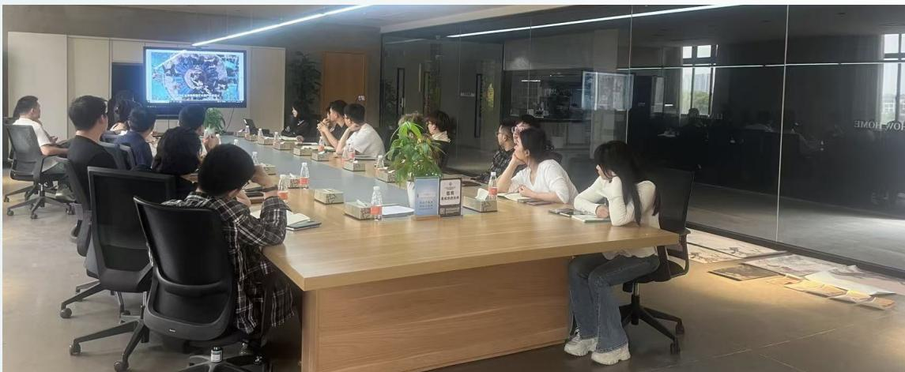

natural_image

Interior of a modern office meeting room with attendees seated around a long table, no visible text or signage on the main subjects.

\- 产品研发：完成“宋韵新生”系列墙布全流程研发与发布，包含刺绣墙布、电雕刺绣墙布、麻质墙布三大系列；重点攻克原麻材料作为墙面材料的稳定性技术难题，显著提升工艺稳定性，实现天然基材在墙布产品中的技术应用突破；完成现有产品线常规优化升级，实现领绣品牌系列包装统一化设计与升级，通过产品细节创新提升品牌辨识度与产品体验。

# 数据治理赋能

# 生产制造智能化系统

- 墙布MES生产制造系统：创新构建“一个流”生产模式，实现单件流作业，大幅缩短产品生产周期。搭配自动分拣系统，通过条码等信息采集技术，实现成品的自动分拣与归类，提升生产流转效率。  
- 窗帘MES生产制造系统：立体仓库与叉车RGV智能仓库并存，空间利用率高，机械式自动拣选，拣选作业简单，且效率高，同时拣选人员大幅降低，拣选时不易出错，可与上游自动化生产系统和下游配送系统对接。

# 仓储与物流自动化系统

\- WMS系统：依托立体仓库与叉车RGV智能仓储，实现空间利用率最大化。配合机械式自动拣选，简化作业流程、大幅降低拣选人员劳动强度的同时，与上游自动化生产系统和下游配送系统对接。

# 业务流程数字化集成系统

- U9ERP系统：以U9cloudERP为核心，进行集团化管理，实现进、销、存、财、生产等业务集成，打破部门数据壁垒，提升业务处理效率与数据准确性。  
- 门店管理系统：集成产品管理、订单管理、客户管理、销售管理等功能，提供产品分类、产品列表、库存品等多维度查询视图，实现对公司各项经营指标的实时监控与精准管控。

# 供应链与研发协同智能化

- 供应链系统：部署可视化监控与智能分析，通过产线宽屏LED显示屏，实现现场操作和管理人员电子化看板查看，第一时间精准掌握产前进度、作业状况及产能负荷等信息。  
- 研发管理系统：从研发项目立项开始，通过软件化系统开展研发项目管理与追踪，实现研发过程及研发数据的自动化存储与检索，提升研发管理效率与数据复用价值。

# 销售管理数字化赋能

\- OA协同平台：系统化管理公司销售计划、客户销售计划、日销售计划、销售计划汇总等事项。通过日销售计划精准体现合作客户进度，并对应每位销售经理的当日销售目标与完成情况，实现销售全流程数字化追踪与考核。

# 供应链安全

公司高度重视供应链管理，通过建立完善的供应商管理体系提升供应链的韧性和抗风险能力，持续推进供应链透明化、流程化、精益化管理，保障原材料供应质量与安全。公司制定了《原辅料采购管理制度》《合格供应商管理制度》等供应商管理及考核制度文件，构建供应商全生命周期管理机制，对供应商资质审核、入库、档案、考核、退库和奖罚管理等环节进行系统性规范，确

保供应商符合公司要求，筑牢供应链合规底线。

作为家装建材企业，公司深知采购行为与环境、社会及生物多样性、气候变化等方面的影响。公司坚持绿色采购理念，将可持续发展原则融入供应商管理，持续完善可持续采购流程，努力降低因采购带来的环境和社会影响。

# 联翔股份可持续采购政策

# - 合法、诚信地开展业务

供应商应遵守其经营所在地的所有法律法规，诚信合规经营。

# - 恪守商业道德

供应商应诚信自律，在业务过程中杜绝任何形式的商业行贿及任何不正当商业竞争行为。

# - 产品质量和责任性创新

供应商应按照相关合同文件规定的规格、质量和安全标准，交付产品和服务，安全地用于预期用途。研发应以负责任的态度开展，以普遍接受的科学、技术和社会道德准则为本。

# - 平等对待所有员工，尊重保障员工权益

供应商所有员工都应该得到尊重和尊严。员工不因其国籍、地域、肤色、民族、宗教、年龄、婚姻状况或残疾等非工作因素受到歧视或差别待遇，禁止雇佣童工或强制劳工。

# - 所有员工的健康和安全在工作中都受到保护

供应商应提供健康安全的工作场所，避免发生因工引起的事故或伤害。

# - 业务开展包含可持续性，不断降低环境影响

供应商应促进可持续性发展实践，制定环境管理制度和程序，并不断降低其环境影响：减少废弃物的产生，降低温室气体排放，减少耗水和能源使用。

# - 坚持绿色采购原则

公司坚持绿色采购的理念，持续采购和使用节能、节水、节材等有利于环境保护的原材料、产品和服务。

公司每年对供应商开展年度考核并综合评定相应等级，针对评估中识别的问题，要求供应商进行问题分析并提交整改计划；同时实施供应商分级分类管理，针对不同等级供应商采取差异化管控与合作策略，精准匹配供应链资源，保障供应链高效协同。

# 联翔股份供应商分类管理

# A

- 加大采购量或给予一定的奖励  
- 质量、逾期率为满分，经管理小组进一步考察，认定为特别优秀的供应商的物料，享受免检待遇

# B

\- 合格供应商，可正常采购

# C

\- 辅导供应商，减量采购或暂停采购

# D

\- 不合格供应商，予以淘汰

# 联翔股份“供应链安全”管理措施及成果

# 供应商日常管理

- 供应商考核: 定期对供应商开展资质审查与评估, 确保在服务期间供应商的产品和服务满足公司要求。  
- 供应商培训: 为供应商提供信息化系统使用、质量等方面的培训, 提升供应链整体协同能力与管理水平。

# 供应链安全管理

\- 建立供应商名单: 在甄选供应商的同时确定备选供应商名单, 定期对其资质和能力进行评估, 确保在产品和服务供应出现问题的时候能迅速反应, 切换至备选供应商, 保障供应链连续稳定。

# 供应链可持续管理

- 准入要求: 公司在供应商准入环节融入环境影响、劳工管理等ESG相关因素考量, 优先选择在ESG方面表现优秀的供应商。  
- 绿色采购：在日常管理中加强对供应商的监督与引导，要求供应商提供符合国家、行业标准的产品和服务，并优先选择节能环保产品。  
- 反腐败管理: 在与供应商签订的合同中加入反腐败条款, 严厉禁止商业贿赂、贪污腐败等情况发生, 构建廉洁合规的供应链生态。

# 产品和服务安全与质量

公司严格遵守《中华人民共和国产品质量法》《中华人民共和国标准化法》等法律法规和规范性文件，建立了完备的质量管理体系，践行全面的质量保证和质量预防。公司已通过ISO 9001质量管理体系认证（处于有效期内），并持续保持质量体系的有效运行。2025年，公司未发生产品和服务相关的安全与质量重大责任事故。

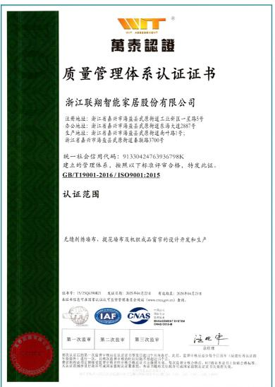

text_image

萬泰認證
质量管理体系认证证书
浙江联翔智能家居股份有限公司
注册地址：浙江省嘉兴市海盐县武夷街道工业部第一花路5号
办公地址：浙江省嘉兴市海盐县武夷街道东港大道2887号
生产地址：浙江省嘉兴市海盐县武夷街道南中路1号；
浙江省嘉兴市海盐县武夷街道春航路3700号
统一社会信用代码：913304246763936799K
建立的管理体系，按照以下标准评审合格，特发此证。
GB/T19001-2016/ISO9001:2015
认证范围
无须特种布布、提花墙布及机胶成品窗帘的设计开发和生产
业务号：175792409801  委托日期：2023年6月2日  确定机关：国务院办公厅
证书编号：CNAS
IAF CNAS
CNSA CNTSM
GND-001000
第一次评审 第二次评审 第三次评审 注册中
请以公告的形式在各项目中进行审核，并经审查后方可提交。本次申请经公司董事会同意后方可生效。若需补充流动资金，可随时将有关账户卡添加到各项目中进行审核，视为该账户卡自动失效。本次申请的有效期限为自申请之日起至全部完成的时间内，不得变更。

# 联翔股份“产品和服务安全与质量”四要素管理架构

# 治理

\- 公司规范产品和服务安全与质量管理体系，生产交付中心负责相关影响、风险与机遇的识别、管控及工作落地，明确各部门职责分工，定期向管理层汇报执行进展。

# 影响、风险和影响管理

- 对产品和服务安全与质量相关影响、风险和机遇进行识别、评估、监测和管理。  
- 2025年在“产品和服务安全与质量”议题下的管理措施及成果详见本章节。

公司严格遵循国家及地方相关政策要求，识别产品和服务安全与质量相关影响、风险与机遇，并评估影响、风险与机遇对自身财务的影响。公司

# 战略

- 定期开展产品和服务安全与质量对公司运营及财务表现的影响、风险与机遇评估。  
- 结合评估结果制定针对性管理策略与实施方法。

# 指标与目标

\- 设定产品合格率、顾客满意度作为“产品和服务安全与质量”议题下的管理指标，持续完善指标表现。

将立足业务发展，在运营中评估其对公司财务表现的潜在影响，同时挖掘发展机遇。

联翔股份“产品和服务安全与质量”影响、风险与机遇分析

<table><tr><td colspan="3">影响分析</td><td colspan="3">风险与机遇分析</td></tr><tr><td>影响类型</td><td>主要影响</td><td>影响范围</td><td>主要风险</td><td>主要机遇</td><td>影响周期</td></tr><tr><td>实际正面影响</td><td>通过严格的质量管理体系,确保研发数据的准确性和可靠性,提升客户信任度,并为新产品研发提供高质量支持。</td><td>自身运营价值链下游</td><td>若质量管理不善导致服务不达标,可能引发客户项目延误、法律诉讼及声誉受损,增加赔偿费用并影响公司财务表现。</td><td>通过持续优化质量管理体系、获得国际认证,可提高客户满意度、拓展市场份额,吸引注重质量与安全的投资者,提升市场竞争力。</td><td>短期中期长期</td></tr></table>

# 产品安全与质量

产品安全管理是保证产品质量的重要组成部分。公司建立严格的闭环式安全评估体系，保障产品安全与功效卓越。公司布艺窗帘产品通过儿童安全级产品认证CTS 04005—2023《建材产品儿童安

全级评价技术规范 窗帘》和CTC—TVp—OP55/1.0《建材产品儿童安全级认证实施规则—窗帘》，同时获得中国绿色产品认证，以权威认证彰显产品安全与品质。

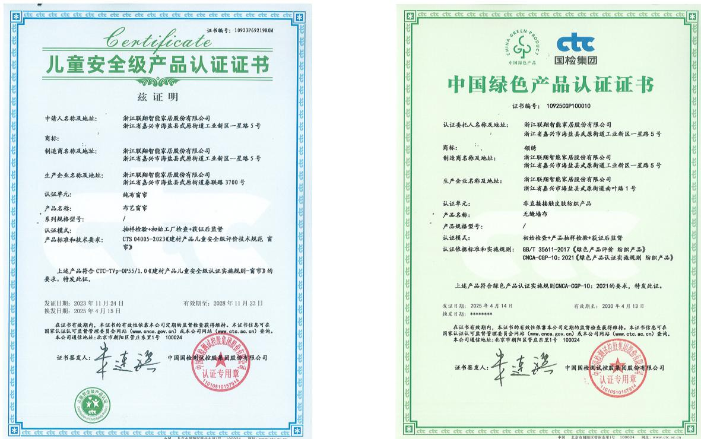

# 中国绿色产品认证证书

认证委托人名称及地址： 浙江联翔智能家居股份有限公司
浙江省嘉兴市海盐县武原街道工业新区一星路5号  
商标： 领绣制造商名称及地址： 浙江联翔智能家居股份有限公司  
浙江省嘉兴市海盐县武原街道工业新区一星路5号
生产企业名称及地址： 浙江联翔智能家居股份有限公司  
浙江省嘉兴市海盐县武原街道南叶路1号

认证单元： 非直接接触皮肤纺织产品  
产品名称： 无缝墙布

产品规格型号：  
认证模式：初始检查+产品抽样检验+获证后监督  
认证依据标准和实施规则：GB/T35611-2017《绿色产品评价纺织产品》CNCA-CGP-10:2021《绿色产品认证实施规则纺织产

上述产品符合绿色产品认证实施规则CNCA-CGP-10：2021的要求，特发此证。

发证日期：2025年4月14日 有效期至：2030年4月13日  
换发日期：\*\*\*\*\*\*\*\*\*\*

在证书有效期内，本证书的有效性依靠本公司定期的监督检查获得维持。本证书信息可在国家认证认可监督管理委员会网站（www.cnca.gov.cn）或本公司网站（www.ctc.ac.cn）查询。本公司通信地址：北京市朝阳区管庄东里1号 100024

证书签发人：牛连鸿

中国 北京市朝阳区资产东里1号 100024 网址：www.ctc.ac.cn

# 联翔股份质量管理方针与目标

质量方针：绣出美锦，满足顾客需求，不断创新，超越顾客期望。

# 质量目标：

a）产品合格率≥97%;  
b）顾客满意度≥85%。

公司从项目质量管理、供应商质量管理、生产质量管理、客户质量管理等维度全面实现产品的全生命周期质量管理。

  
联翔股份全生命周期质量管理

<table><tr><td>类别</td><td>产生环节</td></tr><tr><td>项目质量管理</td><td>· 充分识别客户需求,依据产品开发流程,完成产品及工艺从需求到方案再到验证的应用,保障项目质量。</td></tr><tr><td>供应商质量管理</td><td>· 通过对供应商质量绩效考核、能力培训提升、激励优秀供应商等方式,实现与供应商的质量共赢,从源头把控原材料品质。</td></tr><tr><td>生产质量管理</td><td>· 从人、机、料、法、环、测,全面识别生产管理关键过程及要素,保障产品质量一致性。</td></tr><tr><td>客户质量管理</td><td>· 建立高效的客户响应机制及专业团队,持续提升客户满意度。</td></tr><tr><td>质量体系管理</td><td>· 紧握质量考核工具,对各部门分配质量考核指标,提升全员质量意识。· 通过每年内部审核、外部审核和管理评审等方式对质量管理体系持续改进,保障体系运行的充分性和有效性。· 建立质量培训体系,2025年员工质量培训覆盖率为100%。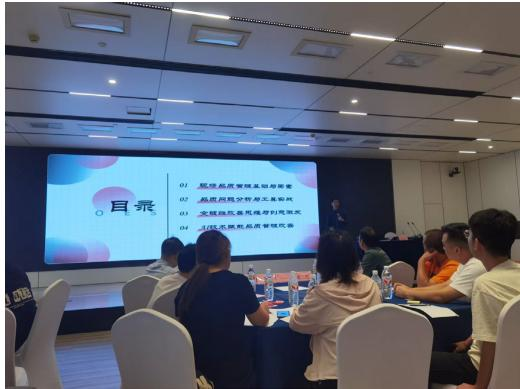</td></tr></table>

公司构建 “物料来料检验→合格物料巡检与抽检 →下仓及出货检验” 的全流程检验体系，具备成

熟的产品检验能力，针对各环节可能出现的产品质量问题进行预防性检测。

# 联翔股份产品检验管理

# 物料来料检验

\- 对物料进行品质检验，保障生产用料符合要求

# 合格物料巡检与抽检

\- 对工序进行监测，同时开展巡检，确保生产过程合规

# 下仓及出货检验

\- 由品质检验师进行最终检验，确保成品满足出货要求

公司制定《不合格品控制程序》，通过业务流程和现场流程两个维度规范不合格品管理程序，形成发现、识别、标识、隔离、评审、处置和改进

的闭环操作，并明确每个流程的责任部门，严格质量把控。

联翔股份不合格品闭环管理  
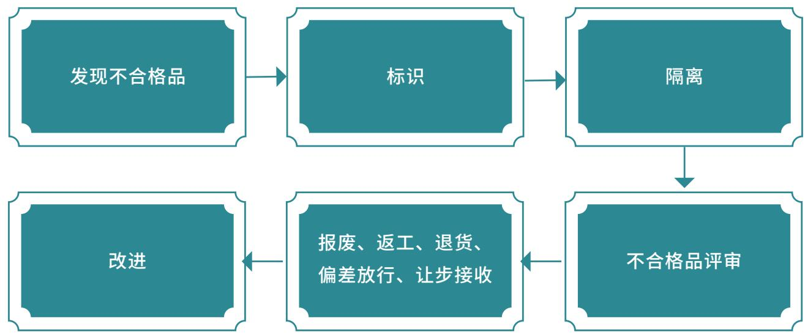

flowchart

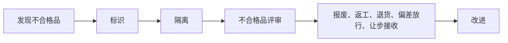
```mermaid
graph LR
  A["发现不合格品"] --> B["标识"]
  B --> C["隔离"]
  C --> D["不合格品评审"]
  D --> E["报废、返工、退货、偏差放行、让步接收"]
  E --> F["改进"]
```

当识别出可疑品或不合格品后，公司先进行标识并隔离存放，经评审判定后，按情节采取报废、返工、退货等处置措施，同步分析数据开展改善

与监控；若缺陷产品已交付，立即启动召回、告知客户等应急措施。2025年，公司未发生产品召回事件。

# 客户沟通与服务

公司建立完善的售后体系，并制定《客户投诉处理控制程序》《售后服务管理制度》等内部文件，明确由专人负责客户投诉事件，规范客户诉求响应效率等要求。客户可通过免费服务热线4008268633进行投诉或问题反馈，公司客服及时处理反馈并推动内部整改。投诉或问题处理完毕后，公司与客户进行汇报与沟通，闭环管理投诉事件。2025年，公司的投诉关闭率保持在100%。

natural_image

Stylized illustration of three stylized trees in green, brown, and teal against a white background (no text or symbols)

公司根据《顾客满意度调查控制程序》每年对客户开展满意度调研，2025年客户满意度为86.55%，通过外部调研、内部信息收集、调研分析、结果改进的全流程，持续优化客户体验。

# 联翔股份客户满意度管理流程

# 外部调研

\- 通过访谈、问卷、电话等形式，对重点客户开展满意度调查。

# 内部信息收集

\- 收集各职能模块的满意度内部考核项，包括客户投诉次数、退货率、额外运费、未准时交货率等指标。

# 调研结果分析

\- 综合内外部调研结果，编制客户满意度报告，落实到各责任部门。

# 结果改进

\- 各责任部门反馈问题及整改方案，跟进改善行动的效果，形成持续优化闭环。

# 数据安全与客户隐私保护

公司高度重视数据安全与客户隐私安全保护，严格遵守《中华人民共和国数据安全法》《中华人民共和国网络安全法》《中华人民共和国个人信息保护法》《中华人民共和国计算机信息系统安全保护条例》《电信和互联网用户个人信息保护规定》等法律法规和文件要求，将相关制度政策全面覆盖全部业务条线及数据管理全流程，以体系化管理筑牢数据安全防线。2025年，公司未发生数据安全事件和泄露客户隐私事件，也未发生因上述事项引发的诉讼案件。

公司信息部负责公司信息安全的统筹管理，确保数据安全及客户隐私安全。公司依据《中华人民共和国计算机信息系统安全保护条例》《互联网信息服务管理办法》《信息安全等级保护管理办

法》等法律法规，制定了《互联网使用规定》《计算机使用管理规定》《数据备份管理制度》《电子设备采购管理制度》《软件账号管理制度》《上网行为管理制度》等规章制度，构建覆盖网络安全、数据安全、合规管理三大维度的信息安全管理体系，全方位保护公司及个人的信息安全与合法权益。

公司搭建“三位一体”信息安全管理体系，以信息安全为核心，通过网络安全（NGF防火墙、上网行为管理）、数据安全（NBU数据备份、终端防火墙、超融合）、合规管理（内部安全审计、信息管理制度、应急预案演练）三大模块协同发力，实现信息安全全流程、全场景闭环管控。

联翔股份信息安全管理体系  
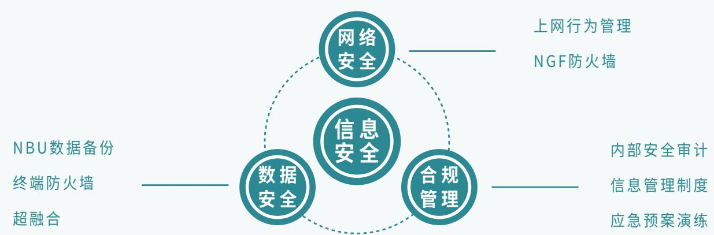

flowchart

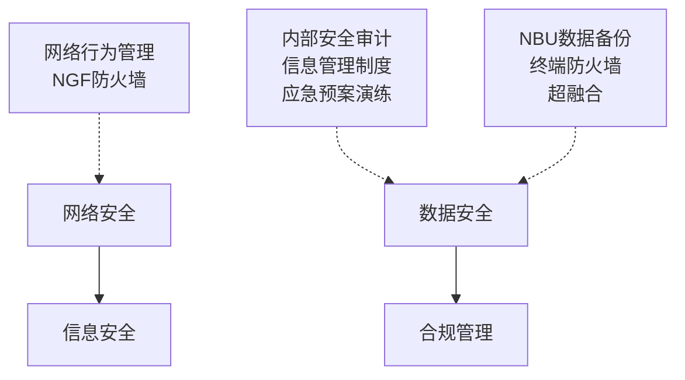
```mermaid
graph TD
  A["网络安全"] --> B["信息安全"]
  C["数据安全"] --> D["合规管理"]
  E["网络行为管理\nNGF防火墙"] -.-> A
  F["内部安全审计\n信息管理制度\n应急预案演练"] -.-> C
  G["NBU数据备份\n终端防火墙\n超融合"] -.-> C
```

# 员工

# 员工雇佣与权益

公司严格遵守《中华人民共和国劳动法》《中华人民共和国民法典》等法律法规和规范性文件，尊重并保障员工各项合法权益，打造平等多元的职场环境。公司倡导平等用工原则，承诺在就业、薪酬、培训、晋升机会等方面，不因种族、宗教信仰、性别、国籍、年龄、婚姻状况、残疾和性取向而歧视或不公正对待员工，并明确禁止雇佣童工或强制劳工，禁止强迫劳动。2025年，公司未发生重大员工变动情况。

natural_image

Stylized illustration of a city skyline with buildings and wave patterns (no text or symbols)

公司建立完善的人力资源管理体系与制度，规范管理招聘与解聘、薪酬与晋升、工时与假期等工作，为员工打造优质的职业发展平台。2025年，公司劳动合同签订率为100%，劳动合同制员工社会保险缴纳率为100%。

联翔股份员工权益概览

<table><tr><td>类别</td><td>具体内容</td></tr><tr><td>招聘与解聘</td><td>招聘:坚持“公开、公正”的原则,对应聘者一视同仁,择优引进人才。解聘:根据不同劳动合同的解除情形及处理流程,保障员工合法权益。</td></tr><tr><td>薪酬与晋升</td><td>薪酬:坚持同工同酬、绩效导向原则,提供具有竞争力的薪酬福利水平,兼顾价值公平原则。薪酬与岗位价值相挂钩,结合岗位贡献合理回报员工。晋升:实行公开、公平、公正原则,通过持续优化,建立科学的晋升管理流程,助力优秀人才职业成长。</td></tr><tr><td>工时与假期</td><td>工时:制定相关管理制度,保障工作时间符合当地法律法规要求。实行标准工时制、综合工时制和不定时工作制,依法报批综合工时。加班:因工作需要延长工作时间需提前申请。人力资源部门定期管控工时,保障员工身心健康,按劳动法规定支付加班工资。假期:根据运营地的法律法规及地方政策,向员工提供婚假、丧假、病假、陪产假等带薪假期。</td></tr></table>

公司坚持 “以人为本” 的理念，为全体员工提供表达权，构建和谐稳定的劳动关系。
畅通的沟通机制，保障员工享有充分的参与权与

# 联翔股份员工沟通渠道

# 组织专项沟通会议

\- 组织员工访谈及座谈会，倾听员工心声。

# 召开职工代表大会

\- 定期召开职工代表大会等听取员工意见及建议。

# 开展员工满意度调研

\- 定期开展员工满意度调研，全面了解对于员工关心的工作环境、福利待遇、职业发展和领导关系等各方面的意见和建议，持续优化管理。

公司重视员工的工作与生活平衡，营造快乐、健康、和谐的工作生活环境，通过多元化福利举措增强员工归属感与幸福感。

# 联翔股份员工福利管理措施及成果

# 节假日慰问活动

- 在春节、元宵、端午、中秋等传统节日慰问员工，发放春节大礼包、粽子、月饼等物品。  
- 在上市周年庆和高温季节发放纪念礼品。

# 关爱女员工

- 在三八妇女节慰问女性员工，发放妇女节礼物。  
- 举办妇女权益保障法讲座，解读《中华人民共和国妇女权益保障法》，保障女性员工权益。

# 开展文体活动

- 参加海盐县职工留盐过年趣味建设活动、海盐县武原街道基层工会职工运动会。  
- 组织点心制作、插花等文化活动。  
- 开展“工心季，益智行”——员工心理健康知识（遇见幸福的自己）培训，守护员工身心健康。

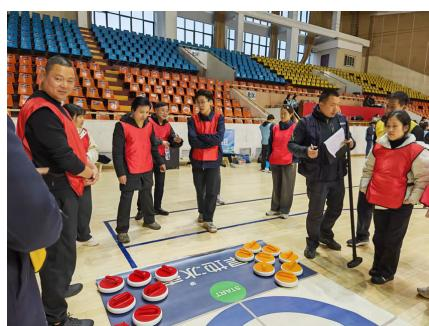

natural_image

Group of people in red vests and black vests gathered around a table with colorful balls on a basketball court inside an indoor arena (no visible text or symbols)

# 职业健康与安全

公司生产车间主要职业病危害因素包括其他粉尘（涤纶）、高温、噪声等，涉及绣花和定型岗位。公司涉及职业病风险的岗位主要包括绣花和定型岗位，公司识别员工工作环境中存在的职业健康危害因素，更新职业健康危害因素岗位清单，并采取针对性措施防范职业健康风险。

公司严格遵守《中华人民共和国职业病防治法》《职业病危害项目申报管理办法》等职业健康安全法律法规，制定《劳动防护用品管理规定》等相关职业健康管理制度，建立权责分明、分工明确的职业健康安全管理体系。2025年，公司未发生工伤死亡事故和火灾事故，职业病发生数为0。

公司已通过GB/T 45001—2020 idt ISO 45001:2018 职业健康安全管理体系认证（处于有效期内），每年对所有管理部门和生产车间开展内审，并邀请第三方认证机构进行监督审核，提升职业健康安全管理水平。

# 联翔股份职业健康安全管理方针与目标

# 职业健康安全方针：以人为本，健康至上；安全第一，预防为主。   职业健康安全目标：

a）做好火灾预防，杜绝火灾发生，发生率为零；  
b）劳动保护用品及时发放，发放率为100%;  
c）重大安全事故发生率为零；  
d）全员安全教育率100%；  
e）事故隐患整改率100%。

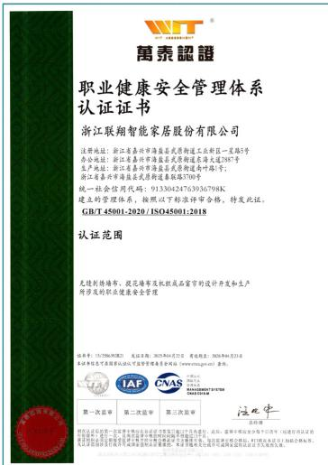

text_image

萬泰認證
职业健康安全管理体系
认证证书
浙江联翔智能家居股份有限公司
注册地址:浙江省嘉兴市海藻区武昌街道工业新区一星路1号
办公地址:浙江省嘉兴市海藻区武昌街道东港大道788号
生产地址:浙江省嘉兴市海藻区武昌街道东叶路1号;
浙江省嘉兴市海藻区武昌街道东康路3780号
统一社会信用代码:91330424763936796K
建立的管理体系,按照以下标准评审合格,特发此证:
GB/T 45001-2020/ISO45001:2018
认证范围
无缝判断墙布、规范墙布及机柜成品窗帘的设计开发和生产
所涉及的职业健康安全管理
证书号:137586(2020) 编号:2015年6月27日 注册截止:2020年6月23日
证书编号:CAVAC
IAF
CWAS
ISSN
第1次评审 第二次评审 第三次评审 注册中
公司名称:浙江联翔智能家居股份有限公司
注册地址:浙江省嘉兴市海藻区武昌街道东港大道788号
生产地址:浙江省嘉兴市海藻区武昌街道东叶路1号;
浙江省嘉兴市海藻区武昌街道东康路3780号
统一社会信用代码:91330424763936796K
建立的管理体系,按照以下标准评审合格,特发此证:
GB/T 45O01-2020/ISO45O01:2018
无须判断墙布、规范墙布及机柜成品窗帘的设计开发和生产
所涉及的职业健康安全管理

# 联翔股份“职业健康与安全”管理措施及成果

# 守护 职业 健康

- 职业危害检测：定期委托具有职业卫生技术服务资质的机构开展年度职业病危害因素检测，全面排查职业健康风险。  
- 职业健康告知：对于存在职业健康危害的岗位，告知岗位风险及防护措施。  
- 劳动防护实践：将职业健康管理融入安全生产日常工作，通过现场安全巡检、生产规范指导，减少员工职业健康暴露风险，为接触职业危害因素的员工配备适宜有效的劳动防护用品并监督使用，维护防护设施。  
- 职业健康体检：对接触职业危害因素岗位的职工进行职业健康体检，建立职业卫生档案并跟踪管理，2025年职业病体检覆盖率达到100%。

# 安全培训演练

- 落实新员工三级安全教育，确保员工在掌握岗位安全知识与操作规范后上岗。  
- 在安全生产月开展专项安全教育培训，强化一线员工对安全操作、风险防范等内容的学习，实现生产员工安全教育全覆盖。

# 安全培训演练

- 组织消防安全培训和消防应急逃生演练，提升员工的消防安全知识水平与应急处置能力。  
- 对所有安全教育培训工作进行详细记录并归档，建立完整的安全教育培训台账，以实现培训工作可追溯。  
- 严格执行动火作业审批制度，规范特殊作业安全管理；组织员工通过安全学院、消防安全学习云平台进行学习，实现员工安全学习全覆盖。  
- 全面对接政府、街道的安全相关工作，按时提交反诈APP信息汇总表、安全消防自查承诺书、一厂多租自查表等各类资料，完成企业安全生产标准化报告编制。  
- 积极参加政府、街道组织的安全会议和安全环保检查，严格落实监管部门提出的整改要求，确保公司安全工作全面合规。

# 员工培训与发展

公司关注员工发展，为员工提供清晰而畅通的职业发展路径。公司以员工能力及价值创造为导向，设计管理（管理通道）与专业（专业通道）双轨发展的职业生涯晋升通道，形成研发类、营销类、行政管理类、生产制造类四个职位族，支持员工跨序列成长，鼓励员工向复合技能型人才转型。

公司建立统一的绩效管理机制，制定《绩效考核管理规定》，为员工制定年度绩效考核计划，年末复盘考核。公司定期对中、高层员工和基层员工开展绩效考核，其中行政岗、生产制造中心的基层员工实行月度考核，其考核结果与月度奖金评级挂钩；中、高层管理人员实行年度综合考核，以保障绩效的公平公正。

公司致力于建设学习型组织，建立完善的员工培训体系，每年制定涵盖管理能力、专业技术、行业知识、职业素养等维度的培训计划，全方位提升员工能力，以实现团队整体效能的提升。2025年，公司员工培训覆盖率100%。

# 联翔股份培训体系

内部培训：依据公司学习体系，结合各部门业务和员工能力的发展需求，由公司内部统筹开展各类线上线下培训，全面提升员工的通用管理技能与专业技术能力，夯实岗位胜任力基础。

外部培训：基于业务发展和能力提升的需求，支持员工参与外部专业机构组织的短期专项培训，以便员工及时掌握行业前沿技术、管理理念与市场动态，拓宽团队技术视野与行业认知。

上岗证培训：组织员工参加由政府机构或具备相应资质的专业培训机构开展的上岗证考证培训，确保关键岗位员工持证上岗，保障岗位操作合规性与专业性。

职业资格考试：鼓励员工为提升岗位相关职业技能，在外部机构参加对应技能的考证培训，获取正规机构授予的职业资格证书，以专业认证推动技能提升与职业成长。

# 治理维度

- 反商业贿赂及反贪污  
- 反不正当竞争

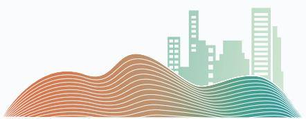

natural_image

Stylized abstract illustration of a city skyline with buildings and wave patterns (no text or symbols)

# 本章贡献SDGs

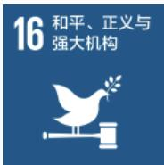

# - 反商业贿赂及反贪污

公司严格遵循《中华人民共和国刑法》《关于禁止商业贿赂行为的暂行规定》等法律法规和规范性文件，在反商业贿赂及反贪污方面以零容忍态度杜绝任何不当利益输送，构建风清气正的合作环境。2025年，公司未发生商业贿赂或贪污相关事件，也未发生上述事项引起的诉讼案件。

# 联翔股份“反商业贿赂及反贪污”四要素管理架构

# 治理

- 公司规范反商业贿赂及反贪污管理体系，企管中心负责相关影响、风险与机遇的识别、管控及工作落地，明确各部门职责分工，定期向管理层汇报执行进展。

# 战略

- 定期识别反商业贿赂及反贪污对公司运营及财务带来的影响、风险和机遇。  
- 结合评估结果制定针对性管理策略与实施方法。

# 影响、风险和影响管理

- 对反商业贿赂及反贪污相关影响、风险和机遇进行识别、评估、监测和管理。  
- 2025年在“反商业贿赂及反贪污”议题下的管理措施及成果详见本章节。

# 指标与目标

\- 设定商业贿赂或贪污相关事件数量作为“反商业贿赂及反贪污”议题下的管理指标，持续完善指标表现，筑牢廉洁合规经营底线。

公司严格遵循国家及地方相关政策要求，识别反商业贿赂及反贪污等商业行为相关影响、风险与机遇，并评估其对自身财务的影响。公司将立足

业务发展，在运营中评估其对公司财务表现的潜在影响，同时挖掘发展机遇。

联翔股份“反商业贿赂及反贪污”影响、风险与机遇分析

<table><tr><td colspan="3">影响分析</td><td colspan="3">风险与机遇分析</td></tr><tr><td>影响类型</td><td>主要影响</td><td>影响范围</td><td>主要风险</td><td>主要机遇</td><td>影响周期</td></tr><tr><td>实际正面影响</td><td>通过遵守商业道德和反贪污规范,能够促进公平竞争、维护市场秩序,并对社会诚信和经济可持续发展产生积极影响。</td><td>价值链上游自身运营价值链下游</td><td>若出现腐败行为或道德违规,可能导致法律诉讼、罚款、客户流失及声誉受损,进而影响财务表现和市场地位。</td><td>通过建立严格的商业道德标准和反腐败机制,能够提升企业声誉、增强客户信任,从而提升市场竞争力。</td><td>中期长期</td></tr></table>

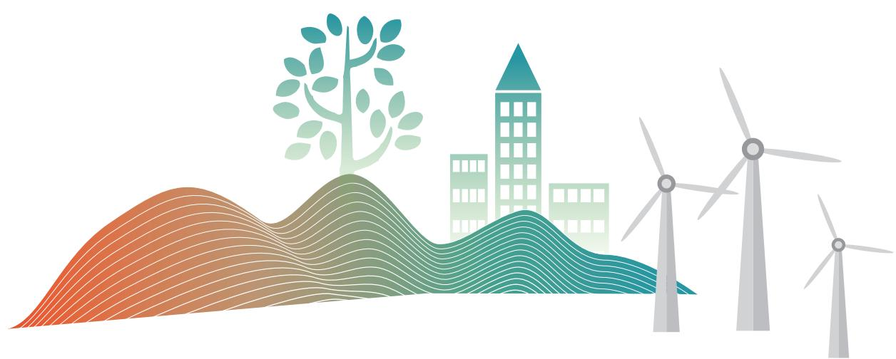

natural_image

Stylized illustration of a city skyline with wind turbines and trees, no text or symbols present

# 联翔股份“反商业贿赂及反贪污”管理措施及成果

# 建立健全 管理制度

- 明确禁止商业贿赂和贪污行为，制定舞弊行为、礼品和招待、利益冲突等商业道德准则，涵盖采购、销售、市场推广等环节。  
- 定期组织员工参加反商业贿赂及反贪污等培训，包括法律法规、公司政策、道德准则等内容，提升员工合规意识与风险识别能力。

- 设立公开透明的申诉举报渠道，鼓励员工、合作伙伴及社会各界对商业贿赂和贪污行为进行举报，对举报信息进行及时、公正地调查处理，强化内部监督闭环。  
- 建立健全举报人保护机制，承诺对检举受理、调查等全环节严格保密，严禁泄露举报信息；对打击报复检举人或相关证人的，将根据情节严重性予以处置，包括但不限于撤职、解除劳动合同、移交司法机关处理等，全面保障举报人合法权益。

# 保障申诉 举报权益

# 联翔股份申诉举报渠道

# 受理部门 企管中心

# 受理地址 公司行政办公楼企管中心办公室

  
0573-86853733、86150615

  
LEADSHOW@lead-show.cn

# 加强外部合作沟通

- 与政府监管部门保持沟通，及时掌握相关法律法规的变化和监管要求，积极配合监管部门的检查和调查工作。  
- 遵守行业规范和自律准则，积极参与行业内的反商业贿赂行动，推动诚信建设，营造公平竞争的市场环境。

# - 反不正当竞争

公司严格遵循《中华人民共和国刑法》《中华人民共和国反不正当竞争法》《中华人民共和国反垄断法》《中华人民共和国专利法》《中华人民共和国商标法》《中华人民共和国著作权法》《关于禁止滥用知识产权排除、限制竞争行为的

规定》等法律法规和规范性文件，将合规经营贯穿全业务流程，营造公平竞争的良好生态。2025年，公司未发生因不正当竞争行为导致的诉讼或重大行政处罚。

# 联翔股份“反不正当竞争”管理举措及成果

# 公平竞争与反垄断

- 规范对外接触: 要求员工严格遵守竞争与反垄断相关规则, 避免因不当接触和言论导致违法风险。  
- 管控社媒言论: 规范员工社交媒体及对外言论管理, 所有涉及公司的采访、公开评论由公司统一处理, 严禁未经授权对外发声, 防范合规风险。

natural_image

Illustration of three wind turbines on stylized hills with wavy lines (no text or symbols)

# 知识产权保护

- 完善管理体系: 将《中华人民共和国专利法实施细则》《专利审查指南》《中华人民共和国商标法实施条例》《商标审查审理指南》等文件为指导, 制定《知识产权管理手册》《知识产权管理制度》, 构建全流程知识产权管理体系。  
- 集中统一管理: 证券部作为知识产权管理部门, 统筹负责公司专利、商标和著作权的管理工作。  
- 咨询与风险管控: 建立知识产权前置咨询机制, 员工披露知识产权前需完成合规审核, 严禁在未充分评估第三方风险时开展新产品研发与商业化。  
- 成果归属与保护: 在合作中明确知识产权权属, 构建研发成果共享机制; 持续开展市场侵权监测, 对恶意侵权行为开展预警、取证、诉讼等全链条维权, 同步推进内部专利申请与商标注册保护。

# 商业秘密保护

- 构建管理体系: 成立商业秘密保护领导小组, 签订商业秘密及竞业限制协议, 持续开展泄密风险测评, 完善企业商业秘密保护工作体系, 入选嘉兴市商业秘密保护基地示范点。  
- 严守多方保密信息: 要求员工严格保密公司、客户、供应商的商业秘密、技术及经营信息，劳动关系终止时全额归还保密信息与资产。  
- 尊重其他方保密信息: 严格禁止员工以不正当的方式获取或者使用他人（包括前雇主）的保密信息和商业秘密，筑牢商业秘密安全防线。

# ESG数据表和附注

公司秉持“可比性”原则，披露反映公司ESG管理成效的数据绩效，并尽可能追溯历史年份相应数据。2024年起，公司进一步完善数据收集过

程，调整部分数据统计范围优化数据披露。报告期内数据统计口径说明如下：

<table><tr><td rowspan="2" colspan="2">数据范畴</td><td colspan="3">数据口径说明</td></tr><tr><td>2023年</td><td>2024年</td><td>2025年</td></tr><tr><td rowspan="2">环境</td><td>应对气候变化、废弃物处理、环境合规管理、能源利用、水资源利用</td><td colspan="3">与合并财务报表范围一致</td></tr><tr><td>污染物排放、循环经济</td><td>—</td><td>与合并财务报表范围一致</td><td>与合并财务报表范围一致</td></tr><tr><td rowspan="2">社会</td><td>乡村振兴与社会贡献、创新驱动、平等对待中小企业、供应链安全、产品和服务安全与质量、员工</td><td colspan="3">与合并财务报表范围一致</td></tr><tr><td>数据安全与客户隐私保护</td><td>—</td><td>与合并财务报表范围一致</td><td>与合并财务报表范围一致</td></tr><tr><td rowspan="2">治理</td><td>公司治理</td><td colspan="3">与合并财务报表范围一致</td></tr><tr><td>反商业贿赂及反贪污、反不正当竞争</td><td>—</td><td>与合并财务报表范围一致</td><td>与合并财务报表范围一致</td></tr></table>

环境维度数据表

应对气候变化数据表

<table><tr><td>数据指标</td><td>单位</td><td>2023年</td><td>2024年</td><td>2025年</td></tr><tr><td>温室气体排放总量(范围一+范围二)</td><td>吨二氧化碳当量</td><td>1,687.97</td><td>1,390.08</td><td>1,272.46</td></tr><tr><td>范围一温室气体排放总量1</td><td>吨二氧化碳当量</td><td>394.27</td><td>279.88</td><td>150.06</td></tr><tr><td>范围二温室气体排放总量2</td><td>吨二氧化碳当量</td><td>1,293.70</td><td>1,110.20</td><td>1,122.40</td></tr><tr><td>温室气体排放强度</td><td>吨二氧化碳当量/万元</td><td>0.11</td><td>0.06</td><td>0.09</td></tr></table>

废气排放管理数据表

<table><tr><td>数据指标</td><td>单位</td><td>2023年</td><td>2024年</td><td>2025年</td></tr><tr><td>废气总量</td><td>万立方米</td><td>—</td><td>3,533.76</td><td>1,178.06</td></tr><tr><td>颗粒物(PM)</td><td>千克</td><td>—</td><td>168.00</td><td>28.48</td></tr><tr><td>二氧化硫( $SO_2$ )</td><td>千克</td><td>—</td><td>154.40</td><td>47.12</td></tr><tr><td>氮氧化物( $NO_x$ )</td><td>千克</td><td>—</td><td>153.60</td><td>270.95</td></tr><tr><td>非甲烷总烃</td><td>千克</td><td>—</td><td>10.32</td><td>7.00</td></tr></table>

废水排放管理数据表

<table><tr><td>数据指标</td><td>单位</td><td>2023年</td><td>2024年</td><td>2025年</td></tr><tr><td>废水总量</td><td>立方米</td><td>—</td><td>20,908</td><td>24,040</td></tr><tr><td>工业废水总量</td><td>立方米</td><td>—</td><td>12</td><td>20</td></tr><tr><td>生活废水总量</td><td>立方米</td><td>—</td><td>20,896</td><td>24,020</td></tr><tr><td>化学需氧量(COD)</td><td>吨</td><td>—</td><td>1.00</td><td>2.88</td></tr><tr><td>氨氮( $NH_3$ -N)</td><td>吨</td><td>—</td><td>0.10</td><td>0.36</td></tr><tr><td>总磷(TP)</td><td>吨</td><td>—</td><td>—</td><td>0.03</td></tr><tr><td>总氮(TN)</td><td>吨</td><td>—</td><td>—</td><td>0.63</td></tr></table>

废弃物处理数据表

<table><tr><td>数据指标</td><td>单位</td><td>2023年</td><td>2024年</td><td>2025年</td></tr><tr><td>废弃物处理总量</td><td>吨</td><td>48.08</td><td>32.00</td><td>29.41</td></tr><tr><td>有害废弃物处理量</td><td>吨</td><td>7.92</td><td>1.38</td><td>5.45</td></tr><tr><td>无害废弃物处理量</td><td>吨</td><td>40.16</td><td>30.62</td><td>23.96</td></tr><tr><td>有害废弃物处理强度</td><td>千克/万元</td><td>0.05</td><td>0.06</td><td>0.38</td></tr><tr><td>无害废弃物处理强度</td><td>千克/万元</td><td>2.57</td><td>1.42</td><td>1.69</td></tr></table>

环境合规管理数据表

<table><tr><td>数据指标</td><td>单位</td><td>2023年</td><td>2024年</td><td>2025年</td></tr><tr><td>环保投入金额3</td><td>万元</td><td>8.96</td><td>36.76</td><td>8.17</td></tr><tr><td>报告期内因环境事件受到生态环境等有关部门重大行政处罚的处罚金额</td><td>万元</td><td>0</td><td>0</td><td>0</td></tr></table>

水资源利用数据表

<table><tr><td>数据指标</td><td>单位</td><td>2023年</td><td>2024年</td><td>2025年</td></tr><tr><td>取水量</td><td>吨</td><td>53,736</td><td>29,868</td><td>26,628</td></tr><tr><td>取水强度</td><td>吨/万元</td><td>3.44</td><td>1.39</td><td>1.88</td></tr><tr><td>耗水量</td><td>吨</td><td>—</td><td>—</td><td>2,588</td></tr><tr><td>耗水强度</td><td>吨/万元</td><td>—</td><td>—</td><td>0.18</td></tr></table>

能源利用数据表

<table><tr><td>数据指标</td><td>单位</td><td>2023年</td><td>2024年</td><td>2025年</td></tr><tr><td>能源消耗量</td><td>吨标准煤</td><td>478.98</td><td>396.31</td><td>336.37</td></tr><tr><td>直接能源消耗量 $^{4}$ </td><td>吨标准煤</td><td>200.19</td><td>142.03</td><td>76.39</td></tr><tr><td>间接能源消耗量 $^{5}$ </td><td>吨标准煤</td><td>278.79</td><td>254.27</td><td>259.98</td></tr><tr><td>能源消耗强度</td><td>吨标准煤/万元</td><td>0.031</td><td>0.018</td><td>0.024</td></tr><tr><td>柴油用量</td><td>吨</td><td>0.86</td><td>1.04</td><td>1.16</td></tr><tr><td>天然气用量</td><td>立方米</td><td>180,845</td><td>127,742.60</td><td>67,603.57</td></tr><tr><td>耗电总量</td><td>兆瓦时</td><td>2,268.45</td><td>2,068.96</td><td>2,115.34</td></tr><tr><td>外购电量</td><td>兆瓦时</td><td>1,539.93</td><td>1,371.03</td><td>1,200.91</td></tr><tr><td>光伏电量</td><td>兆瓦时</td><td>728.52</td><td>697.93</td><td>914.43</td></tr><tr><td>光伏发电总量</td><td>兆瓦时</td><td>2,535.19</td><td>5,525.10</td><td>5,771.19</td></tr><tr><td>清洁能源使用量</td><td>吨标准煤</td><td>288.46</td><td>226.29</td><td>186.75</td></tr><tr><td>清洁能源使用占比 $^{6}$ </td><td>%</td><td>60.22</td><td>57.10</td><td>55.52</td></tr><tr><td>天然气</td><td>吨标准煤</td><td>198.93</td><td>140.52</td><td>74.36</td></tr><tr><td>天然气占比</td><td>%</td><td>68.96</td><td>62.10</td><td>39.82</td></tr><tr><td>太阳能</td><td>吨标准煤</td><td>89.54</td><td>85.77</td><td>112.38</td></tr><tr><td>太阳能占比</td><td>%</td><td>31.04</td><td>37.90</td><td>60.18</td></tr></table>

循环经济数据表

<table><tr><td>数据指标</td><td>单位</td><td>2023年</td><td>2024年</td><td>2025年</td></tr><tr><td>废弃物循环利用量</td><td>吨</td><td>—</td><td>—</td><td>42.90</td></tr><tr><td>可再生资源消耗量7</td><td>吨</td><td>—</td><td>847.00</td><td>747.74</td></tr></table>

注1：范围一温室气体来源为柴油、天然气消耗产生的温室气体排放。柴油、天然气温室气体排放因子的选取参考《中国能源统计年鉴》（2021）。  
注2：范围二温室气体来源为电力消耗产生的温室气体排放，公司采用基于位置的方法进行计算。2023年外购电力的温室气体排放因子来自中国生态环境部《关于做好2023—2025年发电行业企业温室气体排放报告管理有关工作的通知》的全国电网平均排放因子，2024年外购电力的温室气体排放因子来自中国生态环境部、国家统计局《关于发布2022年电力二氧化碳排放因子的公告》的全国电网平均排放因子，2025年外购电力的温室气体排放因子来自中国生态环境部、国家统计局《关于发布2023年电力二氧化碳排放因子的公告》的全国电网平均排放因子。  
注3：2024年公司新增污水处理设备，故环保投入金额较上一年度增加。  
注4：直接能源包括柴油和天然气。折合标准煤系数依据《GB/T 2589—2020综合能耗计算通则》。  
注5：间接能源包括电力。折合标准煤系数依据《GB/T 2589—2020综合能耗计算通则》。  
注6：清洁能源包括天然气和光伏电力。清洁能源占比=清洁能源使用量/能源消耗总量×100%。  
注7：可再生资源统计可再生的原材料和辅料。

# 社会维度数据表

乡村振兴与社会贡献数据表

<table><tr><td>数据指标</td><td>单位</td><td>2023年</td><td>2024年</td><td>2025年</td></tr><tr><td>对外捐赠、公益项目投入金额</td><td>万元</td><td>15.00</td><td>1.00</td><td>10.00</td></tr><tr><td>对外捐赠、公益项目惠及人数</td><td>人</td><td>—</td><td>1,500</td><td>1,600</td></tr><tr><td>志愿活动参与人次</td><td>人次</td><td>—</td><td>31</td><td>25</td></tr><tr><td>志愿活动时长</td><td>小时</td><td>—</td><td>92</td><td>75</td></tr></table>

创新驱动数据表

<table><tr><td>数据指标</td><td>单位</td><td>2023年</td><td>2024年</td><td>2025年</td></tr><tr><td>研发投入金额</td><td>万元</td><td>822.60</td><td>644.21</td><td>498.47</td></tr><tr><td>研发投入金额占营业收入比例</td><td>%</td><td>5.26</td><td>2.99</td><td>3.52</td></tr><tr><td>研发人员数量</td><td>人</td><td>36</td><td>32</td><td>30</td></tr><tr><td>研发人员比例</td><td>%</td><td>10.68</td><td>10.46</td><td>10.27</td></tr><tr><td>应用于主营业务的发明专利数量</td><td>件</td><td>—</td><td>8</td><td>9</td></tr><tr><td>报告期内专利申请数量</td><td>件</td><td>—</td><td>—</td><td>27</td></tr><tr><td>报告期内专利授权数量</td><td>件</td><td>—</td><td>—</td><td>0</td></tr><tr><td>报告期内有效专利数</td><td>件</td><td>—</td><td>275</td><td>206</td></tr></table>

平等对待中小企业数据表

<table><tr><td>数据指标</td><td>单位</td><td>2023年</td><td>2024年</td><td>2025年</td></tr><tr><td>报告期末应付账款(含应付票据)余额</td><td>万元</td><td>6,381.89</td><td>7,722.14</td><td>6,911.42</td></tr><tr><td>报告期末应付账款(含应付票据)余额占总资产的比重</td><td>%</td><td>8.60</td><td>10.68</td><td>10.53</td></tr><tr><td>报告期末逾期未支付款项金额</td><td>万元</td><td>0</td><td>0</td><td>0</td></tr><tr><td>报告期末逾期未支付中小企业款项金额</td><td>万元</td><td>0</td><td>0</td><td>0</td></tr></table>

供应链安全数据表

<table><tr><td>数据指标</td><td>单位</td><td>2023年</td><td>2024年</td><td>2025年</td></tr><tr><td>供应商总数</td><td>家</td><td>720</td><td>710</td><td>883</td></tr><tr><td>中国大陆地区供应商数</td><td>家</td><td>720</td><td>710</td><td>883</td></tr><tr><td>港澳台及海外供应商数</td><td>家</td><td>0</td><td>0</td><td>0</td></tr><tr><td>按公司的供应商评估制度执行环境、劳工、道德等方面表现评估的原材料供应商数</td><td>家</td><td>48</td><td>115</td><td>138</td></tr><tr><td>通过环境、劳工、道德等方面评估的供应商比例</td><td>%</td><td>95</td><td>96</td><td>95</td></tr><tr><td>签订反贪污协议的供应商数量</td><td>家</td><td>32</td><td>82</td><td>96</td></tr><tr><td>合同履约率</td><td>%</td><td>100</td><td>100</td><td>100</td></tr></table>

产品和服务安全与质量数据表

<table><tr><td>数据指标</td><td>单位</td><td>2023年</td><td>2024年</td><td>2025年</td></tr><tr><td>接获关于产品及服务的投诉数量</td><td>件</td><td>554</td><td>682</td><td>633</td></tr><tr><td>投诉处理率</td><td>%</td><td>100</td><td>100</td><td>100</td></tr><tr><td>客户满意度</td><td>%</td><td>86.75</td><td>85.97</td><td>86.55</td></tr><tr><td>产品出厂合格率</td><td>%</td><td>99.61</td><td>99.65</td><td>99.71</td></tr><tr><td>已售产品中因安全与健康理由而须撤回或召回的产品数量</td><td>米</td><td>0</td><td>0</td><td>0</td></tr><tr><td>已售产品中因安全与健康问题而须撤回或召回的产品销售金额占比</td><td>%</td><td>0</td><td>0</td><td>0</td></tr><tr><td>产品和服务的健康与安全方面发生的违法违规的事件数</td><td>件</td><td>0</td><td>0</td><td>0</td></tr><tr><td>报告期内发生的产品和服务相关的安全与质量重大责任事故损害涉及的金额</td><td>万元</td><td>—</td><td>0</td><td>0</td></tr></table>

数据安全与客户隐私保护数据表

<table><tr><td>数据指标</td><td>单位</td><td>2023年</td><td>2024年</td><td>2025年</td></tr><tr><td>数据安全事件涉及的具体金额</td><td>万元</td><td>—</td><td>0</td><td>0</td></tr><tr><td>客户隐私泄露事件涉及的具体金额</td><td>万元</td><td>—</td><td>0</td><td>0</td></tr></table>

员工雇佣与权益数据表

<table><tr><td colspan="2">数据指标</td><td>单位</td><td>2023年</td><td>2024年</td><td>2025年</td></tr><tr><td colspan="2">员工总数(期末数)</td><td>人</td><td>337</td><td>306</td><td>292</td></tr><tr><td rowspan="2">按性别划分</td><td>男性</td><td>人</td><td>152</td><td>148</td><td>129</td></tr><tr><td>女性</td><td>人</td><td>185</td><td>158</td><td>163</td></tr><tr><td rowspan="4">按雇佣类型分类</td><td>全职劳动合同制</td><td>人</td><td>279</td><td>250</td><td>238</td></tr><tr><td>全职劳务派遣制</td><td>人</td><td>0</td><td>0</td><td>0</td></tr><tr><td>兼职</td><td>人</td><td>0</td><td>0</td><td>0</td></tr><tr><td>其他雇佣形式 $^{1}$ </td><td>人</td><td>58</td><td>56</td><td>54</td></tr><tr><td rowspan="3">按年龄分类</td><td>30岁以下</td><td>人</td><td>96</td><td>74</td><td>52</td></tr><tr><td>30岁至50岁</td><td>人</td><td>171</td><td>161</td><td>160</td></tr><tr><td>50岁以上</td><td>人</td><td>70</td><td>71</td><td>80</td></tr><tr><td colspan="2">残疾员工人数</td><td>人</td><td>1</td><td>2</td><td>6</td></tr><tr><td colspan="2">本地(所在县、市、区)员工人数</td><td>人</td><td>243</td><td>213</td><td>187</td></tr><tr><td colspan="2">本地(所在县、市、区)员工占比</td><td>%</td><td>72.11</td><td>67.55</td><td>64.04</td></tr><tr><td colspan="2">少数民族员工人数</td><td>人</td><td>3</td><td>4</td><td>4</td></tr><tr><td colspan="2">少数民族员工比例</td><td>%</td><td>0.89</td><td>1.31</td><td>1.36</td></tr><tr><td colspan="2">员工流失率</td><td>%</td><td>47.93</td><td>29.95</td><td>31.06</td></tr><tr><td colspan="2">劳动合同签订率</td><td>%</td><td>100</td><td>100</td><td>100</td></tr><tr><td colspan="2">社会保险覆盖率</td><td>%</td><td>100</td><td>100</td><td>100</td></tr><tr><td colspan="2">员工体检覆盖率</td><td>%</td><td>100</td><td>100</td><td>100</td></tr><tr><td colspan="2">住房公积金覆盖率</td><td>%</td><td>100</td><td>100</td><td>100</td></tr><tr><td colspan="2">参加工会员工人数</td><td>人</td><td>279</td><td>250</td><td>238</td></tr><tr><td colspan="2">集体协商协议覆盖的员工人数</td><td>人</td><td>279</td><td>250</td><td>238</td></tr><tr><td colspan="2">员工申诉次数</td><td>次</td><td>0</td><td>0</td><td>0</td></tr><tr><td colspan="2">工会费用支出</td><td>元</td><td>665,266.40</td><td>661,151.52</td><td>515,426.72</td></tr><tr><td colspan="2">残疾工保障基金缴纳数</td><td>元</td><td>89,424.00</td><td>95,683.68</td><td>232,210.80</td></tr><tr><td colspan="2">人均薪酬</td><td>元</td><td>91,088.56</td><td>89,664.35</td><td>84,612.28</td></tr><tr><td colspan="2">人均创收 $^{2}$ </td><td>元</td><td>464,095.49</td><td>704,448.03</td><td>484,967.40</td></tr><tr><td colspan="2">最低工资标准执行比例</td><td>%</td><td>100</td><td>100</td><td>100</td></tr><tr><td colspan="2">管理者中女性占比</td><td>%</td><td>57.60</td><td>46.40</td><td>44.00</td></tr><tr><td colspan="2">接受定期绩效及职业发展考评的员工占全员百分比</td><td>%</td><td>100</td><td>100</td><td>100</td></tr><tr><td colspan="2">员工满意度</td><td>%</td><td>81.70</td><td>82.36</td><td>83.15</td></tr></table>

职业健康与安全数据表

<table><tr><td>数据指标</td><td>单位</td><td>2023年</td><td>2024年</td><td>2025年</td></tr><tr><td>员工工伤保险投入金额</td><td>万元</td><td>12.62</td><td>17.96</td><td>12.62</td></tr><tr><td> $员工工伤保险覆盖率^3$ </td><td>%</td><td>—</td><td>100</td><td>100</td></tr><tr><td>员工安全生产责任险投入金额</td><td>万元</td><td>1.27</td><td>1.34</td><td>1.52</td></tr><tr><td> $员工安全生产责任险覆盖率^4$ </td><td>%</td><td>—</td><td>100</td><td>100</td></tr><tr><td>职业病风险岗位员工人数</td><td>人</td><td>29</td><td>22</td><td>22</td></tr><tr><td>职业病发病员工人数</td><td>人</td><td>0</td><td>0</td><td>0</td></tr><tr><td>职业病体检员工人数</td><td>人</td><td>29</td><td>22</td><td>22</td></tr><tr><td>因工伤关系而死亡的员工人数</td><td>人</td><td>0</td><td>0</td><td>0</td></tr><tr><td>因工伤损失的工作日数</td><td>天</td><td>0</td><td>0</td><td>0</td></tr><tr><td>安全生产投入</td><td>元</td><td>192,797.45</td><td>206,903.12</td><td>227,030.55</td></tr><tr><td>安全生产演练次数</td><td>次</td><td>2</td><td>3</td><td>3</td></tr><tr><td>安全事故次数</td><td>次</td><td>0</td><td>0</td><td>0</td></tr></table>

员工培训与发展数据表

<table><tr><td>数据指标</td><td>单位</td><td>2023年</td><td>2024年</td><td>2025年</td></tr><tr><td>员工培训次数</td><td>次</td><td>—</td><td>16</td><td>8</td></tr><tr><td>员工培训支出金额</td><td>万元</td><td>20.83</td><td>11.20</td><td>10.32</td></tr><tr><td>接受培训的员工总数</td><td>人</td><td>337</td><td>306</td><td>292</td></tr><tr><td>员工培训覆盖率</td><td>%</td><td>100</td><td>100</td><td>100</td></tr></table>

注1：其他雇佣形式为退休返聘人员。  
注2：人均创收 = 营业收入 / 员工总数（期末数）。  
注3：工伤保险覆盖率 = 参加工伤保险的员工人数 / 应参加工伤保险的总人数 × 100%。  
注4：安全生产责任险覆盖率 = 员工安全生产责任保险覆盖人数 / 地方应急管理局要求购买安全生产责任险的员工总数 × 100%。

治理维度数据表  
公司治理数据表

<table><tr><td>数据指标</td><td>单位</td><td>2023年</td><td>2024年</td><td>2025年</td></tr><tr><td>董事会人数</td><td>人</td><td>9</td><td>9</td><td>9</td></tr><tr><td>董事会中男性成员人数</td><td>人</td><td>7</td><td>6</td><td>6</td></tr><tr><td>董事会中女性成员人数</td><td>人</td><td>2</td><td>3</td><td>3</td></tr><tr><td>董事会中独立董事人数</td><td>人</td><td>3</td><td>3</td><td>3</td></tr><tr><td>股东会召开次数</td><td>次</td><td>2</td><td>4</td><td>6</td></tr><tr><td>董事会召开次数</td><td>次</td><td>4</td><td>8</td><td>10</td></tr><tr><td>董事会各类专门委员会会议次数</td><td>次</td><td>7</td><td>10</td><td>10</td></tr><tr><td>基本每股收益</td><td>元/股</td><td>-0.13</td><td>0.11</td><td>-0.12</td></tr><tr><td> $每股社会贡献值^1$ </td><td>元</td><td>0.18</td><td>0.48</td><td>0.38</td></tr></table>

反商业贿赂及反贪污数据表

<table><tr><td>数据指标</td><td>单位</td><td>2023年</td><td>2024年</td><td>2025年</td></tr><tr><td>反商业贿赂及反贪污培训覆盖的董事总数</td><td>人</td><td>—</td><td>9</td><td>9</td></tr><tr><td>反商业贿赂及反贪污培训覆盖的董事百分比</td><td>%</td><td>—</td><td>100</td><td>100</td></tr><tr><td>反商业贿赂及反贪污培训覆盖的管理层人员总数</td><td>人</td><td>—</td><td>28</td><td>15</td></tr><tr><td>反商业贿赂及反贪污培训覆盖的管理层人员百分比</td><td>%</td><td>—</td><td>100</td><td>100</td></tr><tr><td>反商业贿赂及反贪污培训覆盖的基层员工总数</td><td>人</td><td>—</td><td>—</td><td>277</td></tr><tr><td>反商业贿赂及反贪污培训覆盖的基层员工百分比</td><td>%</td><td>—</td><td>—</td><td>100</td></tr><tr><td>报告期内因公司商业贿赂或贪污行为导致相关事件以及诉讼案件数量</td><td>件</td><td>—</td><td>0</td><td>0</td></tr></table>

反不正当竞争数据表

<table><tr><td>数据指标</td><td>单位</td><td>2023年</td><td>2024年</td><td>2025年</td></tr><tr><td>报告期内因公司不正当竞争行为导致诉讼或重大行政处罚的涉案金额</td><td>万元</td><td>—</td><td>0</td><td>0</td></tr></table>

注1：经济绩效详见《浙江联翔智能家居股份有限公司2025年年度报告》。每股社会贡献值=（公司净利润+年内为国家创造的税收+向员工支付的工资+向银行等债权人给付的借款利息+对外捐赠额等为其他利益相关者创造的价值额-因环境污染等造成的其他社会成本）/公司股份总数。

# 对标索引表

《上海证券交易所上市公司自律监管指引第14号——可持续发展报告（试行）》对标索引  
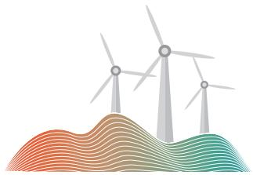

<table><tr><td>维度</td><td>序号</td><td>议题</td><td>对应条款</td><td>对应章节</td></tr><tr><td rowspan="8">环境</td><td>1</td><td>应对气候变化</td><td>第二十一条至第二十八条</td><td>4.1 应对气候变化</td></tr><tr><td>2</td><td>污染物排放</td><td>第三十条</td><td>4.2 污染物排放</td></tr><tr><td>3</td><td>废弃物处理</td><td>第三十一条</td><td>4.3 废弃物处理</td></tr><tr><td>4</td><td>生态系统和生物多样性保护</td><td>第三十二条</td><td>公司建设项目均已开展环境影响评价,且获得监管部门批复,运营所在地均不在生态保护红线范围内,周边无自然保护地。</td></tr><tr><td>5</td><td>环境合规管理</td><td>第三十三条</td><td>4.4 环境合规管理</td></tr><tr><td>6</td><td>能源利用</td><td>第三十五条</td><td>4.5 能源利用</td></tr><tr><td>7</td><td>水资源利用</td><td>第三十六条</td><td>4.6 水资源利用</td></tr><tr><td>8</td><td>循环经济</td><td>第三十七条</td><td>4.7 循环经济</td></tr><tr><td rowspan="9">社会</td><td>9</td><td>乡村振兴</td><td>第三十九条</td><td>5.1 乡村振兴与社会贡献</td></tr><tr><td>10</td><td>社会贡献</td><td>第四十条</td><td>5.1 乡村振兴与社会贡献</td></tr><tr><td>11</td><td>创新驱动</td><td>第四十二条</td><td>5.2 创新驱动</td></tr><tr><td>12</td><td>科技伦理</td><td>第四十三条</td><td>公司不属于从事生命科学、人工智能等科技伦理敏感领域的科学研究、技术开发等活动的企业。</td></tr><tr><td>13</td><td>供应链安全</td><td>第四十五条</td><td>5.3 供应链安全</td></tr><tr><td>14</td><td>平等对待中小企业</td><td>第四十六条</td><td>公司应付账款(含应付票据)余额不超过300亿元,占总资产的比重不超过50%,不存在因逾期未支付中小企业款项需通过国家企业信用信息公示系统向社会公示的情况。</td></tr><tr><td>15</td><td>产品和服务安全与质量</td><td>第四十七条</td><td>5.4 产品和服务安全与质量</td></tr><tr><td>16</td><td>数据安全与客户隐私保护</td><td>第四十八条</td><td>5.5 数据安全与客户隐私保护</td></tr><tr><td>17</td><td>员工</td><td>第五十条</td><td>5.6 员工</td></tr><tr><td rowspan="4">可持续发展相关治理</td><td>18</td><td>尽职调查</td><td>第五十二条</td><td>2.2 尽职调查、利益相关方沟通</td></tr><tr><td>19</td><td>利益相关方沟通</td><td>第五十三条</td><td>2.2 尽职调查、利益相关方沟通</td></tr><tr><td>20</td><td>反商业贿赂及反贪污</td><td>第五十五条</td><td>6.1 反商业贿赂及反贪污</td></tr><tr><td>21</td><td>反不正当竞争</td><td>第五十六条</td><td>6.2 反不正当竞争</td></tr></table>