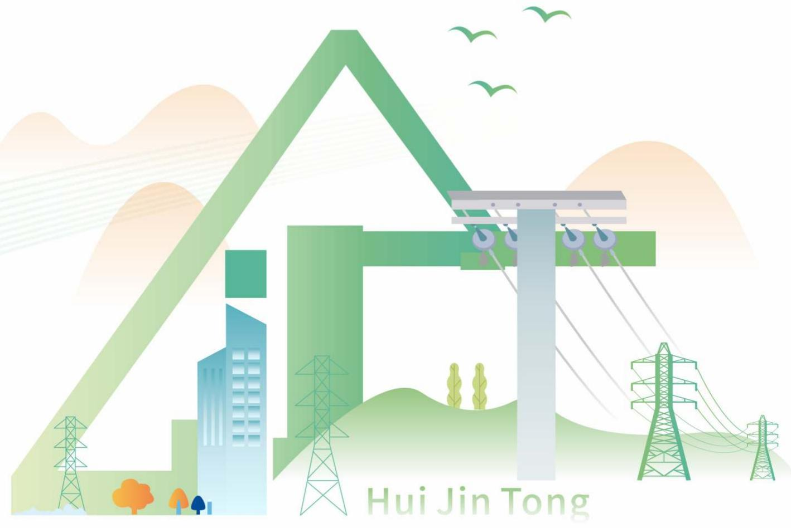

natural_image

Illustration of a power plant with transmission towers and buildings, labeled 'Hui Jin Tong' at the bottom (no other text or symbols)

# 目录 Contents

编制说明 01

董事长致辞 03

关键绩效 89

指标索引 95

意见反馈 96

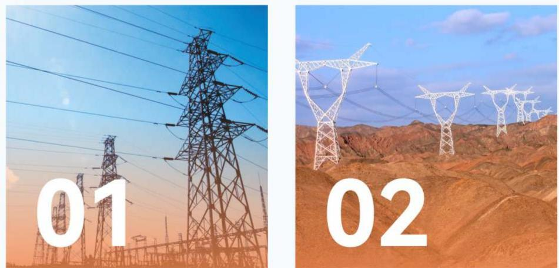

# 走进 汇金通

公司概况 07

企业文化 08

发展战略 08

核心竞争力 09

主要荣誉 16

可持续发展管理 17

# 合规治理笃定前行

规范公司治理 25

推行精益管理 30

强化党建引领 32

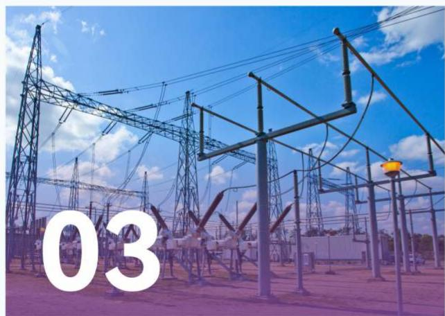

natural_image

Exterior view of a high-voltage electrical substation with transmission towers and insulators under a blue sky (no signage or text visible)

# 和合共生 共融发展

创新驱动发展 39

匠心铸就品质 46

恪守责任采购 50

保障员工权益 55

赋能员工发展 64

以投资者为本 68

践行责任使命 73

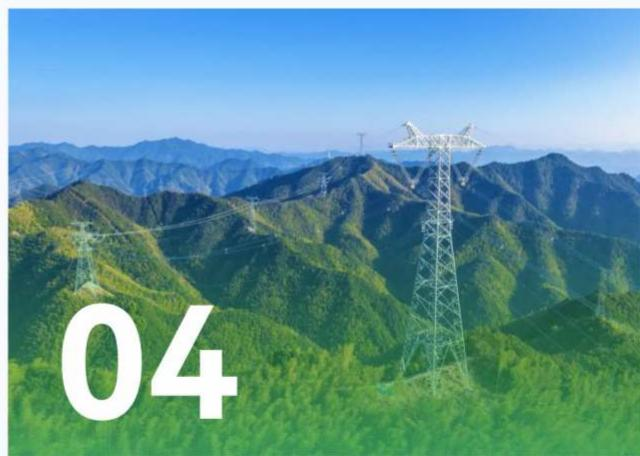

natural_image

Mountainous landscape with power transmission towers and a clear blue sky, featuring large white number '04' in foreground (no other text or symbols)

# 节能降碳向绿而行

推进低碳节能 79

强化环境管理 84

# 编制说明

# 关于本报告

本报告是青岛汇金通电力设备股份有限公司2025年度在环境、社会及公司治理领域方面的真实反映，旨在加强与各利益方的沟通和联系。

本公司董事会及全体董事保证本报告内容不存在任何虚假记载、误导性陈述或者重大遗漏，并对其内容的真实性、准确性和完整性承担法律责任。

# 报告主体范围

青岛汇金通电力设备股份有限公司及其附属公司。

# 指代说明

“青岛汇金通电力设备股份有限公司”在本报告中以“汇金通”“公司”“我们”指代。

# 时间范围

本报告期间范围为2025年1月1日至2025年12月31日，部分内容往前后年度适当延伸。

# 报告周期

本报告为年度报告。

# 数据说明

本报告使用数据来源包括政府部门公开数据、汇金通内部统计数据、行政文件报告和第三方评价访谈等。本报告的财务数据以人民币为单位，若有与财务报告不一致之处，以财务报告为准。

# 编写依据

本报告依据《上海证券交易所股票上市规则》《上海证券交易所上市公司自律监管指引第14号——可持续发展报告（试行）》《上海证券交易所上市公司自律监管指南第4号——可持续发展报告编制》等相关要求，参照全球报告倡议组织（Global Reporting Initiative，GRI）《可持续发展报告标准（GRI Standards）》等相关标准进行编写，同时突出青岛汇金通电力设备股份有限公司企业特点和行业特色。

# 报告发布形式

报告电子版可在上海证券交易所网站(www.sse.com.cn)及汇金通官网(http://www.hjttower.com)查询。

# 董事长致辞

2025年，我们以积极的姿态响应国家双碳战略导向，持续深耕主业，直面问题与挑战、统筹发展与合规、兼顾效率与质量，全力推进各项工作的开展。

坚守恒心，以砥砺深耕筑牢发展根基。公司深耕主业，着力提升订单质量，推动国内业务提质增效，同时稳步拓展国际市场，积极推进总包业务布局；围绕采购体系持续优化，落地多元化采购策略，积极应对售价下行带来的成本压力；加快推进数智化转型，推动信息资源共享，为实现高效组织运行提供支撑。

恪守初心，以生态协同绘就发展画卷。公司持续发挥与控股股东的产业链上下游一体化优势、各子公司地域互补及规模优势，凝聚发展合力、释放经营活力，巩固公司的行业优势地位，实现同频共振、同向发力，推动产业链协同纵深发展。

秉承匠心，以精益之道雕琢发展品质。“细化于微、量化于效”，公司持续推进集团化管控，深化精益管理，构建全流程管控联动机制，加强应收账款及库存管理，改进工艺流程，稳步提升运营效率，助推公司稳健发展。

践行臻心，以和合共生奏响发展乐章。汇金通秉持互利共赢发展思路，构建可持续发展生态，完善供应商管理，深化战略合作；坚持以人为本，保障员工权益，赋能员工发展；履行责任担当，投身公益事业，践行责任使命。

船到中流当奋稷，行至半山更扬鞭。2026年，我们要牢牢把握稳的格局、持续巩固进的势头、不断厚植韧的特性，攻坚克难、善作善成，奋力开创高质量发展新局面。

董事长:

李明贞

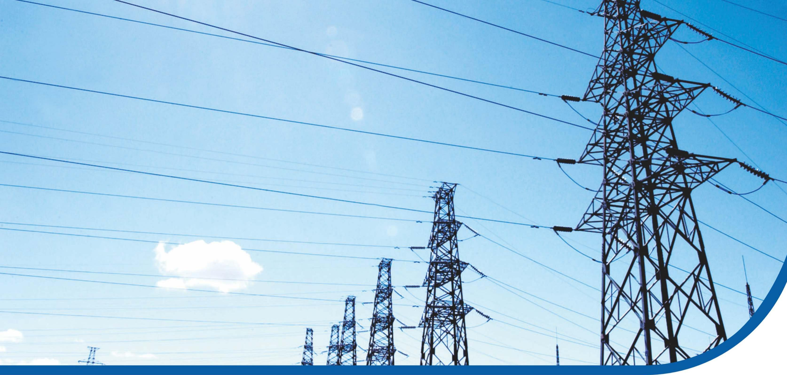

natural_image

Silhouette of high-voltage power transmission towers against a clear blue sky (no text or symbols visible)

# 01 走进汇金通

◎ 公司概况 ◎ 核心竞争力  
◎ 企业文化
◎ 主要荣誉  
◎ 发展战略 ◎ 可持续发展管理

# 公司概况

青岛汇金通电力设备股份有限公司创立于2004年，主要业务包括输电线路铁塔、紧固件、通讯塔等设备的研发、生产和销售，以及电力项目总承包、检验检测服务等业务，服务于电力、通讯、新能源、轨道交通等产业领域。公司是国内能够生产最高电压等级输电线路铁塔的企业之一，并参与多项行业标准及国家标准的制定。

公司始终深耕输电线路铁塔制造细分领域，经过多年的发展和战略实施，通过内生式增长与外延式发展相结合的战略举措，完成全国化战略布局，综合实力位居同行业前列。2016年12月22日，公司于上海证券交易所主板上市，正式登陆资本市场，股票代码为603577。

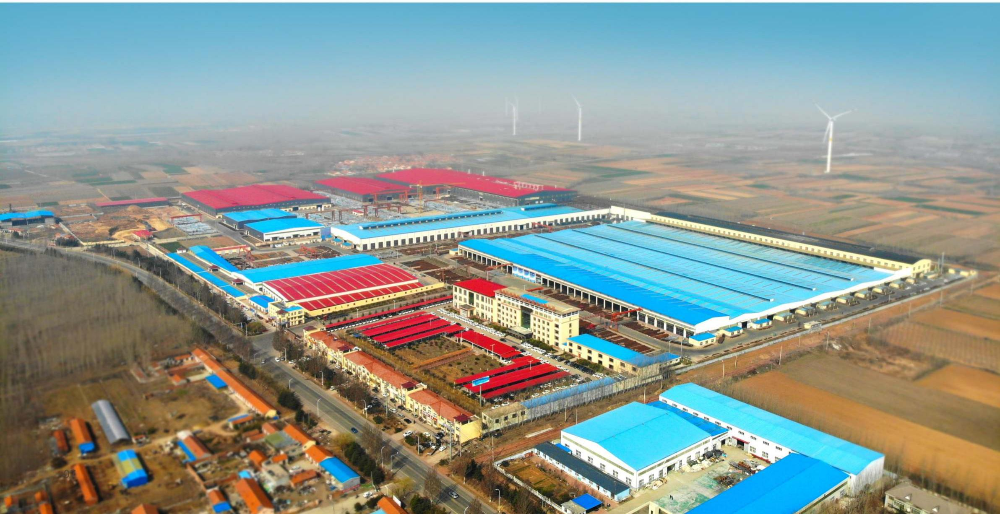

natural_image

Aerial view of a large industrial complex with multiple factory buildings, blue-roofed roofs, and wind turbines in the background (no visible text or signage)

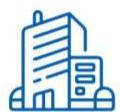

公司创立于2004年

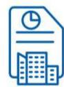

2016年12月22日于上海证券交易所主板上市

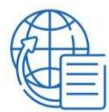

股票代码
603577

# 企业文化

# 企业愿景：

做百年企业、创传世品牌

# 企业使命：

做输变电工程钢结构领域的智造服务专家

# 企业核心价值观：

履行社会责任、发扬团队精神、尊重个人价值

# 企业方针：

以人为本、诚信守法、优质高效、追求卓越

# 企业精神：

激情、创新、和谐、凝聚

# 企业管理理念：

求实求新、至真至诚，为生存而搏

# 发展战略

公司主动适应国家经济发展新常态、把握市场战略机遇，秉承“聚焦高质量、践行可持续”的发展理念，持续深耕主业，通过纵向延伸产业链，横向拓展产业面，稳步推进产业布局。以专业引领、资本赋能、产业协同为战略保障，打造差异化竞争优势，致力成为细分行业的引领者，为投资者创造更大价值。

# 核心竞争力

# 01 区域布局与规模优势

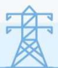

经过多年的发展和战略实施，公司全国化战略布局逐步落地，形成青岛、重庆、泰州、南宁“四大基地”。依托公司“四大基地”布局，形成了产能布局合理、产品交付能力强等区域竞争优势，有利于公司快速响应客户需求，更好地为客户服务、增强客户粘性，有利于更好的辐射全国市场；在发挥区域竞争优势的同时，规模优势亦将有利于提升公司在产业链的议价能力，降低物流及管控成本，保证公司持续盈利能力。合理的区域布局和规模优势是提升公司核心竞争力的重要保证。

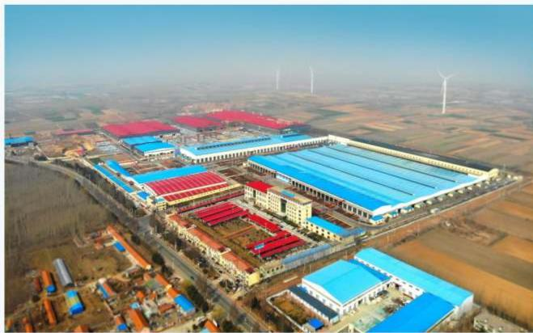

natural_image

Aerial view of a large industrial park with multiple factory buildings, blue-roofed roofs, and wind turbines in the background (no visible text or signage)

青岛厂区

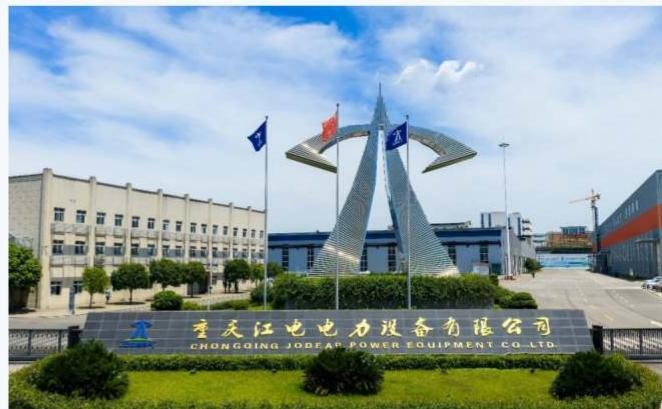

text_image

重庆江电电力设备有限公司
CHONGQING JODAE POWER EQUIPMENT CO.,LTD.

重庆厂区

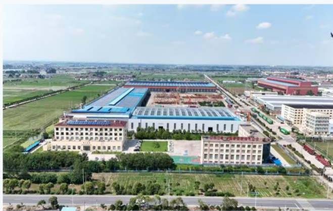

natural_image

Aerial view of a large industrial complex with multiple buildings and surrounding green fields, no visible text or signage.

江苏厂区

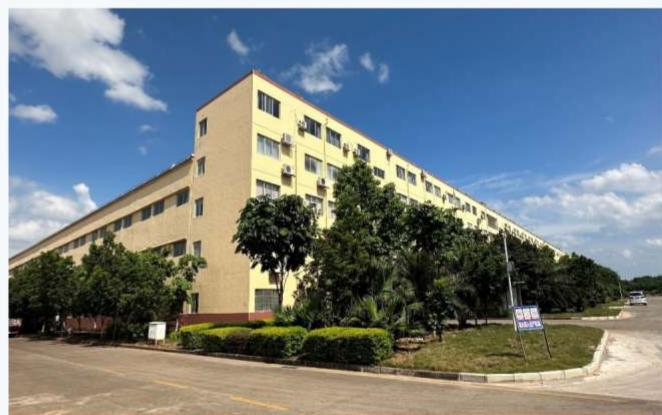

natural_image

Exterior view of a modern multi-story office building with surrounding greenery under a blue sky (no signage or text visible)

广西厂区

# 02 控股股东资源优势

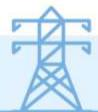

公司控股股东河北津西钢铁集团股份有限公司始建于1986年，是集钢铁、非钢、金融三大板块为一体的大型企业集团，为全球最大型钢生产应用基地，具备生产超大型钢及钢板桩、世界顶尖钢板桩孔型研发技术、装配式钢结构建筑全产业链、国际绿色桩基全产业链的钢铁企业，连续23年跻身中国企业500强。控股股东与公司形成上下游产业联动格局，产业契合度高、资源互补优势显著，构建起高效稳定的战略协同体系，充分保障公司长期可持续经营与高质量发展。

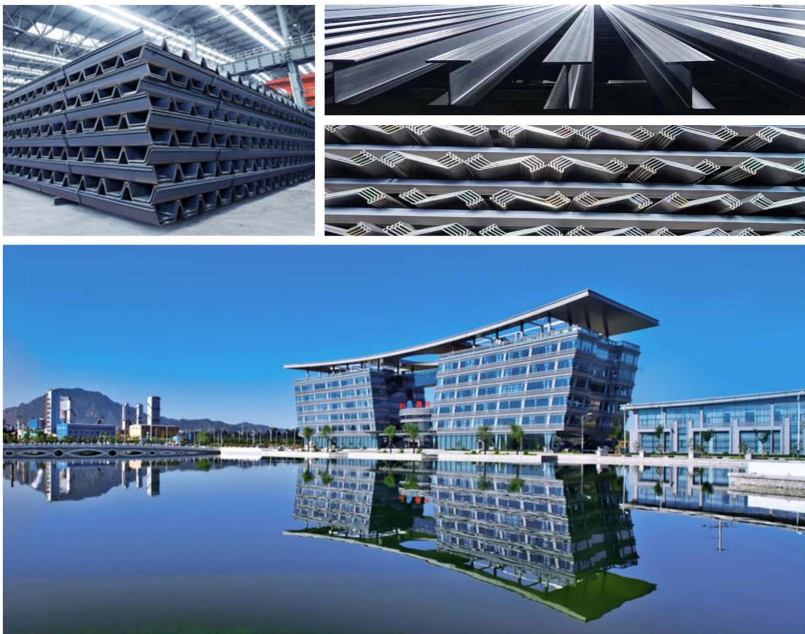

# 03 产品质量和品牌优势

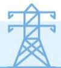

公司秉承精益求精的“工匠精神”，将产品质量控制视为企业发展的生命线，建立了完善的质量管理体系，深入贯彻ISO9001质量管理体系，全面推行6S管理，实施从原材料检验、过程控制，到售后服务全过程的质量控制。公司为保证加工、装配的精度和质量，根据铁塔制造的相关国家标准制订了更为严格的企业标准，保证产品的质量。

公司业内领先的质量控制体系和售后服务能力为公司产品赢得了良好口碑和市场形象，打造了产品力。公司先后获得中国电力电气行业铁塔十大品牌、山东优质品牌产品、山东知名品牌、山东省制造业高端品牌培育企业、新一代青岛金花培育企业、青岛制造品牌建设重点企业库入库企业、青岛市民营领军标杆企业、上合新区技术改造领军企业、上合新区制造业十强企业、自主品牌十大领军企业、特高压铁塔优质供应商、铁塔十大质量标杆企业等称号。

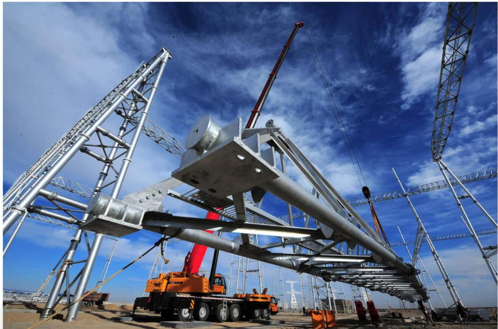

natural_image

Exterior view of a large industrial steel structure under construction with cranes and power lines, set against a blue sky (no signage or text visible)

# 04 数字化管理优势

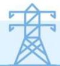

公司致力于生产和经营管理体系的信息化、自动化和平台化，通过智能制造管理平台实现技术管理、数控设备控制的数据共享，实现经营管理与生产控制等流程的无缝衔接和综合集成，实现了工业化与信息化的融合，全面提升生产效率、控制生产成本，实现信息资源共享，为实现高效组织提供了保障，为公司数字化转型提供了支撑。

<table><tr><td colspan="4">项目统计</td></tr><tr><td>CRM中心</td><td>营销中心</td><td>计划中心(旧)</td><td>计划中心(新)</td></tr><tr><td>研发中心</td><td>供应中心</td><td>质检中心</td><td>生产中心</td></tr><tr><td>物流中心</td><td>售后中心</td><td>人资中心</td><td>财务中心</td></tr><tr><td>数据中心</td><td>薪资中心</td><td>工单中心</td><td>通用中心</td></tr></table>

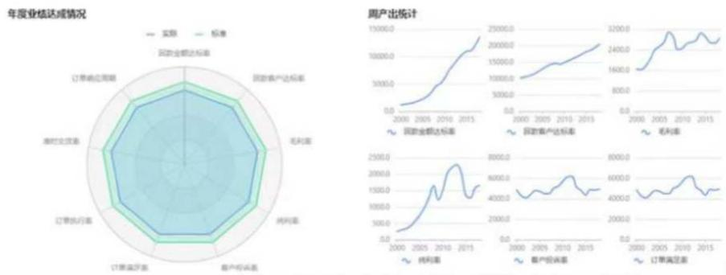

# 05 生产装备优势

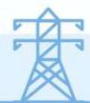

公司以市场为导向，推进智能化制造，引入先进生产设备和环保设备，提高生产效率和产品品质的同时，确保安全生产。公司先后被评定为青岛市数字化智能生产专家工作站、青岛市互联网工业认定项目数字化车间；子公司重庆江电电力设备有限公司已通过国家级绿色工厂认定、2家子公司通过省级绿色工厂认定、2家子公司通过数字化车间项目认定。

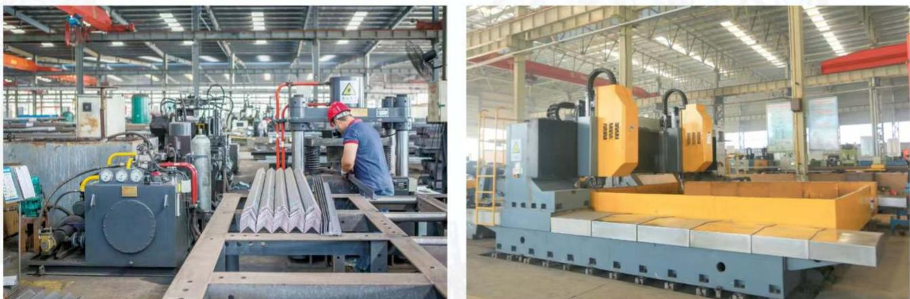

# 06 营销网络优势

公司建立了完善高效、响应迅速的市场信息管理机制，制定了科学、灵活的营销计划，依靠优质的产品质量和服务，产品已覆盖全国30多个省市、自治区，与国家电网、南方电网及蒙西电网等优质客户建立了长期稳定的合作关系，国内市场竞争优势明显；公司积极整合国际市场资源，深化国际市场布局，先后设立澳洲子公司、新加坡子公司、科伦坡分公司等，建立了覆盖国内外重点市场的营

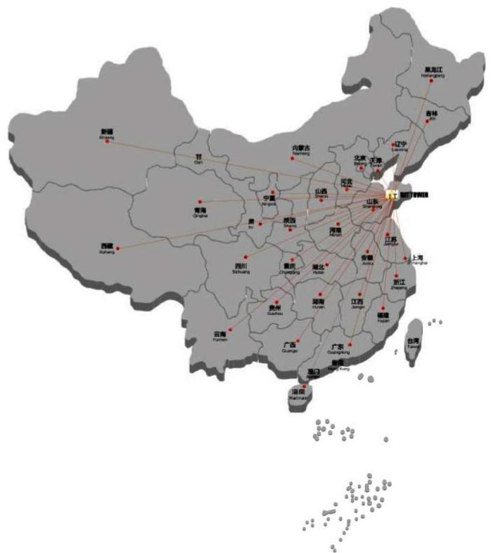

销网络，国际市场业务布局可以有效把握全球市场机遇，熨平局部市场波动风险。截至目前，公司产品已累计销往全球70个国家和地区。

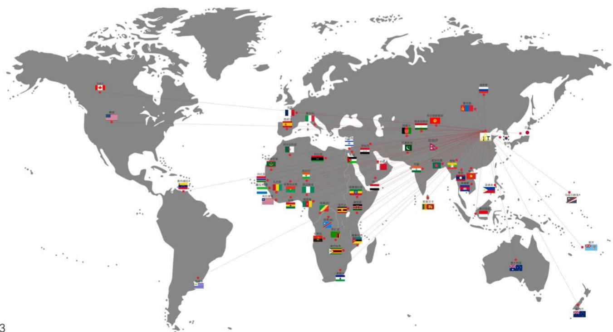

flowchart

This map illustrates the global distribution of various countries, with arrows indicating relationships or flows between specific regions.

# 07 技术研发优势

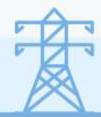

公司作为高新技术企业高度重视技术研发工作，重视各项新技术、新工艺的研发与应用。目前公司及子公司拥有有效专利262项，其中发明专利67项，参与了《输电线路铁塔制造技术条件》《输电杆塔用地脚螺栓与螺母》等多项国家、行业、团体标准的修订起草工作。

公司被认定为国家级企业技术中心、山东省一企一技术研发中心、青岛市特高压输变电铁塔工程研究中心，荣获国家知识产权优势企业、山东省制造业单项冠军企业、青岛市技术创新示范企业等荣誉称号。子公司青岛强固标准件有限公司荣获青岛市专精特新企业、创新型中小企业荣誉称号；青岛华电海洋装备有限公司荣获青岛市专精特新企业荣誉称号；青岛华电检测技术服务有限公司凭借专业的检测技术和设备，取得《检验检测机构资质认定证书》，塑造了公司“研发+制造+检验检测服务”一体化优势；广西华电智能装备有限公司被认定为广西壮族自治区企业技术中心，荣获广西壮族自治区专精特新中小企业荣誉称号；重庆江电电力设备有限公司被认定为国家级专精特新小巨人企业、重庆市企业技术中心、重庆市瞪羚企业、重庆市工业设计中心，入选重庆市技术创新指导性项目推荐目录，荣获重庆市科技型企业、重庆市知识产权优势企业、重庆民营企业科技创新指数100强等荣誉称号；江苏江电电力设备有限公司被认定为江苏省企业技术中心，荣获江苏省专精特新中小企业荣誉称号。

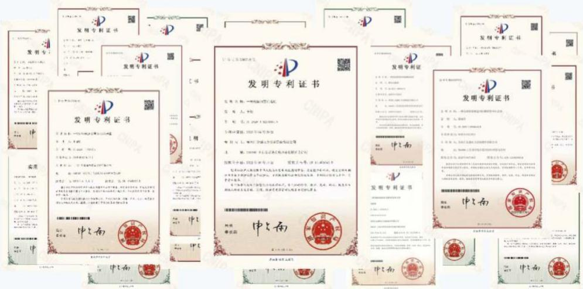

text_image

Collection of Chinese official certificates and personal documents, featuring '发明专利证书' (发明专利证书) with red seals and official seals.

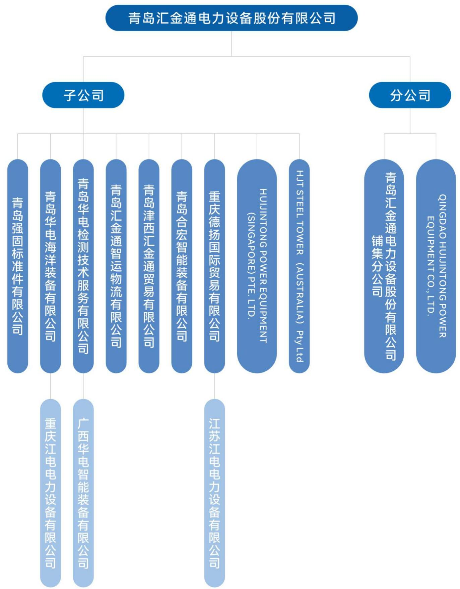

flowchart

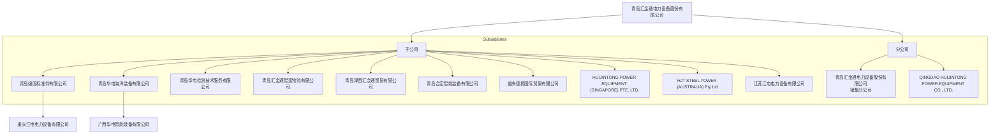
```mermaid
graph TD
  A["青岛汇金通电力设备股份有限公司"] --> B["子公司"]
  A --> C["分公司"]
  
  subgraph Subsidiaries
  B --> D["青岛强固标准件有限公司"]
  B --> E["青岛华电海洋装备有限公司"]
  B --> F["青岛华电检测技术服务有限公司"]
  B --> G["青岛汇金通智运物流有限公司"]
  B --> H["青岛津西汇金通贸易有限公司"]
  B --> I["青岛合宏智能装备有限公司"]
  B --> J["重庆德扬国际贸易有限公司"]
  B --> K["HUIJINTONG POWER EQUIPMENT (SINGAPORE) PTE. LTD."]
  B --> L["HJT STEEL TOWER (AUSTRALIA) Pty Ltd"]
  B --> M["江苏江电电力设备有限公司"]
  end
  
  subgraph Subsidiaries
  C --> N["青岛汇金通电力设备股份有限公司\n铺集分公司"]
  C --> O["QINGDAO HUIJINTONG POWER EQUIPMENT CO., LTD."]
  end
  
  D --> P["重庆江电电力设备有限公司"]
  E --> Q["广西华电智能装备有限公司"]
```

# 主要荣誉

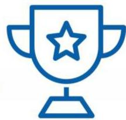

- 国家级绿色工厂  
- 国家级企业技术中心  
- 国家高新技术企业  
- 国家级专精特新小巨人企业  
- 山东省制造业单项冠军企业  
- 山东省一企一技术研发中心  
- 山东企业500强  
- 重庆市企业技术中心  
- 重庆市瞪羚企业  
- 重庆市知识产权优势企业  
- 重庆市专精特新中小企业  
- 重庆市科技型企业  
- 重庆市设计驱动型企业  
- 重庆市数字化车间  
- 重庆市双百企业  
- 重庆市工业设计中心  
- 江苏省企业技术中心  
- 江苏省绿色工厂  
- 重庆市技术创新指导性项目推荐目录  
- 重庆民营企业科技创新指数100强  
- 广西壮族自治区绿色工厂  
- 广西壮族自治区企业技术中心  
- 广西壮族自治区专精特新中小企业  
- 青岛市绿色工厂  
- 青岛市民营企业100强  
- 青岛市技术创新示范企业  
- 青岛市民营领军标杆企业  
- 青岛市创新型中小企业  
- 新一代青岛金花培育企业  
- 特高压线路材料供货质量优秀制造企业  
- 自主品牌十大领军企业  
- 角钢塔十大品牌  
- 铁塔十大领军企业  
- 铁塔十大质量标杆企业  
- 第二十五届上市公司金信披奖  
- 上市公司董事会优秀实践  
- 上市公司可持续发展优秀实践  
- 上市公司年报业绩说明会最佳实践  
- 投资者保护工作先进单位  
- 上市公司董办优秀实践  
- 上市公司董秘履职评价5A评级  
- 上证鹰·金质量精锐董秘奖  
- 投资者关系管理天马奖  
- 上市公司文化建设优秀实践  
- 上市公司数字化转型典型案例  
- 上市公司乡村振兴优秀实践案例  
- 青岛市两新组织党建工作示范点  
- 汇金通所得税培训基地  
- 产值跃升突出贡献企业  
- 制造业高质量发展突出贡献企业  
- 高质量发展突出贡献企业  
- 高质量发展典型先进基层党组织  
- 五星级基层党组织  
- 先进基层党组织  
- 诚信文化建设示范企业

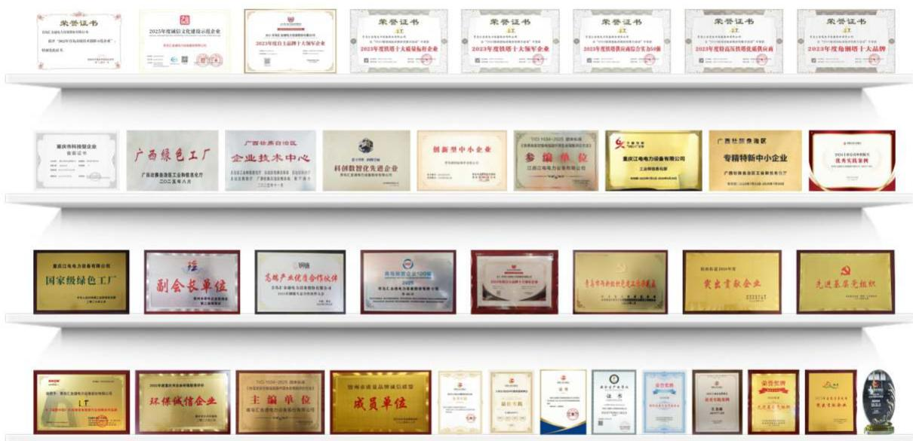

# 可持续发展管理

# 治理

汇金通持续完善ESG管理体系，建立了涵盖公司治理层、管理层、执行层的多层级ESG治理架构，将可持续发展融入日常生产经营管理，积极推进多元文化沟通融合、加强与利益相关方的沟通交流，携手共创可持续发展未来。

公司在董事会战略与发展委员会下设ESG管理委员会，建立覆盖各经营单位、各职能部门的ESG管理组织网络，明确责任人、职能、职责和权限，以此来督导ESG实践，并向高层报告和提出改进意见，确保ESG战略能顺利落地，持续改进。

公司及下属主要子公司均已通过社会责任管理体系认证  
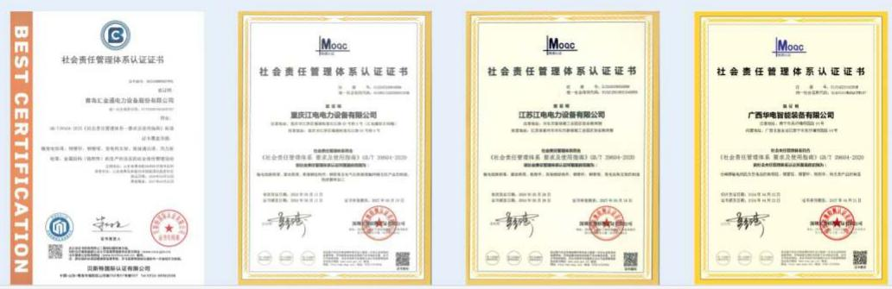

text_image

BEST CERTIFICATION
社会责任管理体系认证证书
青岛汇金通电力设备股份有限公司
MOC
社会责任管理体系认证证书
重庆江电电力设备有限公司
《社会责任管理体系认证证书》(2017)39604-2020
江苏江电电力设备有限公司
《社会责任管理体系认证证书》(2017)39604-2020
广西华电智能装备有限公司
Moac
社会责任管理体系认证证书
广州华电智能装备有限公司

# 战略

# 明确管理指标

研究利益相关方的期待及企业可持续发展战略要求，对比相关的国际标准和相关行业最佳实践，明确符合汇金通实际的管理指标、数据采集流程。

# 完善企业ESG管理

把ESG管理融入企业运营全过程和日常管理，健全ESG信息披露的渠道，完善各利益相关方参与机制。

# 健全社会责任保障体系

制定健全的人力资源、财务、内部沟通机制等，将企业的ESG价值观和战略传达到每个部门、岗位和员工，不断提升全员履行社会责任的知识、技能和意愿。

# 影响、风险和机遇管理

汇金通始终坚持以规范运作为主线，致力于建立符合公司经营发展需要的合规管理体系和全面的风险管理体系，不断完善公司内部管理制度、规定及要求，细化各项管理措施，推进公司制度化、规范化建设，并积极组织各部门开展相应合规培训，提升合规意识，强化合规操作，以应对公司运营和业务发展过程中面临的各项风险和挑战，为公司发展提供坚实保障。

# 指标与目标

# 2025年公司设定可持续发展相关目标

# 产品质量

质量通报事件 0 发生

# 环境合规管理

危险废弃物、废气达标处置/排放
危险废弃物违规处置事件 0 发生
环保部门处罚事件 0 发生

# 2025年公司可持续发展相关关键指标

# 环境范畴

温室气体排放总量（范围一 + 范围二）5.84万吨二氧化碳当量

能源消耗总量2.21万吨标准煤 总取水量32.67万吨

有害废弃物产生量 1.31 万吨 无害废弃物产生量 6.64 万吨

工业废水循环使用率 100% 环保总投入 756.39万元

环保总投入占营业收入比例 0.18%

报告期内因环境事件受到生态环境等有关部门重大行政处罚的处罚金额 0 元

# 社会范畴

员工人数3340人 研发费用1.71亿元

员工培训次数527次 研发人员数量491人

培训支出69万元 有效专利数量（截至披露日）262项

员工培训覆盖率100% 有效发明专利数量（截至披露日）67项

全年发放工资3.6亿元 累计参编标准数量（截至披露日）11项

# 治理范畴

董事会成员9人 党员活动106次

股东会3次 反商业贿赂及反贪污培训15次

董事会7次

党员数量137人 重大行政处罚 U 次

# 议题重要性评估

公司基于国家宏观政策导向、行业市场发展形势、监管制度要求及利益相关方的关注重点，在深入分析公司活动和业务关系背景的基础上，对标 ESG 主流标准和行业先进企业，按照"影响重要性"和"财务重要性"两大维度综合开展ESG重要性议题识别和评估工作。同时，通过问卷调研的形式广泛征求各利益相关方意见，对议题进行重要性排序，依据议题风险程度，最终形成重要性议题矩阵。

# 重要性 议题识别

- 了解国家宏观政策导向、行业市场发展形势、监管制度等外部环境因素  
- 了解公司活动和业务关系、利益相关方关注重点  
- 参考同行业企业、评级标准等识别其他潜在的重要性议题  
- 识别议题相关影响、风险和机遇，汇总形成重要性议题库

# 重要性议题评估和排序

- 通过问卷调研内外部利益相关方，开展重要性议题评估和排序  
- 整合评估结果，形成重要性议题矩阵，明确优先级

# 重要性 议题确认

- 结合ESG管理委员会意见，确认或调整重要性议题结果  
- 后续以重要性议题结果为导向，开展针对性披露与ESG工作提升

# 利益相关方沟通

公司一贯重视与利益相关方的充分有效沟通，不断建立健全内部沟通机制和外部沟通机制，获取和了解利益相关方的期望与诉求，通过公司热线电话、邮箱、网站、调研问卷、召开股东会、参加行业协会组织的各类活动等多种方式，积极与利益相关方开展交流。2025年，公司通过问卷调研的形式广泛征求各利益相关方意见，了解其关注程度，共回收1022份有效问卷。

<table><tr><td>利益相关方</td><td colspan="2">关注议题</td><td colspan="2">沟通渠道</td></tr><tr><td>投资者</td><td>合规治理投资者权益保护产品质量与安全供应链安全</td><td></td><td>信息披露电话交流业绩说明会投资者交流活动</td><td>股东会路演活动调研问卷</td></tr><tr><td>政府及监管机构</td><td>合规治理科技创新供应链安全员工雇佣与权益员工职业发展</td><td>应对气候变化环境合规管理污染与废弃物管理资源利用及循环经济</td><td>会议交流日常监管沟通信息披露调研问卷</td><td></td></tr><tr><td>客户</td><td>产品质量与安全科技创新供应链安全环境合规管理</td><td>污染与废弃物管理反商业贿赂及反贪污反不正当竞争</td><td>社交媒体客户满意度调查调研问卷</td><td></td></tr><tr><td>供应商</td><td>供应链安全产品质量与安全</td><td>反商业贿赂及反贪污反不正当竞争</td><td>供应商评价供应质量沟通</td><td>供应商会议调研问卷</td></tr><tr><td>员工</td><td>员工雇佣与权益员工职业发展产品质量与安全</td><td></td><td>定期培训职工代表大会</td><td>员工座谈会调研问卷</td></tr><tr><td>其他(社区、非政府组织、媒体等)</td><td>乡村振兴社会贡献应对气候变化环境合规管理</td><td>污染与废弃物管理资源利用及循环经济</td><td>公益慈善活动社区沟通调研问卷</td><td></td></tr></table>

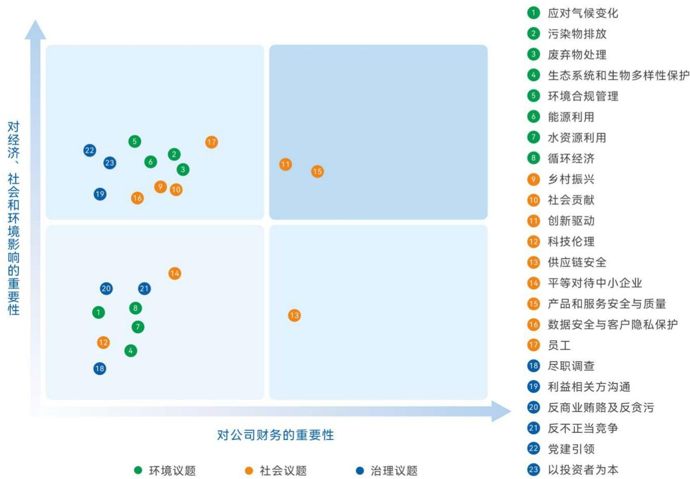

scatter

| ID | Category | Topic | Importance to Company Finance (X) | Importance to Economic, Social, Environmental Impact (Y) |
| --- | --- | --- | --- | --- |
| 17 | 社会议题 | 社会贡献 | ~0.65 | ~0.85 |
| 15 | 社会议题 | 产品和服务安全与质量 | ~0.75 | ~0.75 |
| 11 | 社会议题 | 创新驱动 | ~0.65 | ~0.75 |
| 14 | 社会议题 | 平等对待中小企业 | ~0.35 | ~0.45 |
| 13 | 社会议题 | 供应链安全 | ~0.75 | ~0.25 |
| 9 | 社会议题 | 乡村振兴 | ~0.45 | ~0.65 |
| 10 | 社会议题 | 社会贡献 | ~0.50 | ~0.60 |
| 16 | 社会议题 | 数据安全与客户隐私保护 | ~0.40 | ~0.55 |
| 22 | 治理议题 | 党建引领 | ~0.20 | ~0.75 |
| 23 | 治理议题 | 以投资者为本 | ~0.20 | ~0.65 |
| 21 | 治理议题 | 反不正当竞争 | ~0.30 | ~0.45 |
| 20 | 治理议题 | 利益相关方沟通 | ~0.25 | ~0.45 |
| 18 | 治理议题 | 尽职调查 | ~0.20 | ~0.35 |
| 19 | 治理议题 | 利益相关方沟通 | ~0.25 | ~0.45 |
| 12 | 社会议题 | 员工 | ~0.25 | ~0.35 |
| 14 | 社会议题 | 产品和服务安全与质量 | ~0.45 | ~0.45 |
| 8 | 环境议题 | 循环经济 | ~0.35 | ~0.75 |
| 6 | 环境议题 | 能源利用 | ~0.40 | ~0.70 |
| 5 | 环境议题 | 环境合规管理 | ~0.35 | ~0.75 |
| 3 | 环境议题 | 生态系统和生物多样性保护 | ~0.40 | ~0.65 |
| 7 | 环境议题 | 水资源利用 | ~0.45 | ~0.65 |
| 16 | 社会议题 | 数据安全与客户隐私保护 | ~0.35 | ~0.45 |
| 4 | 环境议题 | 废弃物处理 | ~0.35 | ~0.45 |
| 19 | 环境议题 | 反商业贿赂及反贪污 | ~0.25 | ~0.35 |
| 23 | 环境议题 | 党建引领 | ~0.25 | ~0.35 |
| 18 | 环境议题 | 反不正当竞争 | ~0.25 | ~0.25 |
| 21 | 环境议题 | 反不正当竞争 | ~0.35 | ~0.35 |
| 12 | 社会议题 | 科技伦理 | ~0.25 | ~0.35 |
| 19 | 环境议题 | 利益相关方沟通 | ~0.25 | ~0.35 |
| 18 | 环境议题 | 尽职调查 | ~0.25 | ~0.35 |
| 14 | 社会议题 | 平等对待中小企业 | ~0.45 | ~0.45 |
| 13 | 社会议题 | 供应链安全 | ~0.65 | ~0.25 |
| 17 | 社会议题 | 员工 | ~0.65 | ~0.45 |
| 19 | 环境议题 | 反商业贿赂及反贪污 | ~0.25 | ~0.35 |
| 18 | 环境议题 | 尽职调查 | ~0.25 | ~0.35 |
| 19 | 环境议题 | 利益相关方沟通 | ~0.25 | ~0.35 |
| 19 | 环境议题 | 反商业贿赂及反贪污 | ~0.25 | ~0.35 |
| 19 | 环境议题 | 利益相关方沟通 | ~0.25 | ~0.35 |
| 19 | 环境议题 | 反商业贿赂及反贪污 | ~0.25 | ~0.35 |
| 19 | 环境议题 | 利益相关方沟通 | ~0.25 | <0.35 |
| 19 | 环境议题 | 反商业贿赂及反贪污 | ~0.25 | <0.35 |
| 19 | 环境议题 | 利益相关方沟通 | ~0.25 | <0.35 |
| 19 | 环境议题 | 反商业贿赂及反贪污 | ~0.25 | <0.35 |
| 19 | 环境议题 | 利益相关方沟通 | ~0.25 | <0.35 |

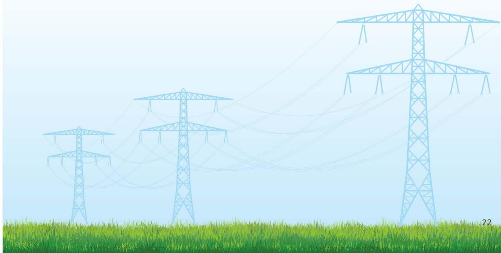

natural_image

Illustration of electricity transmission towers over a green field, no text or symbols present

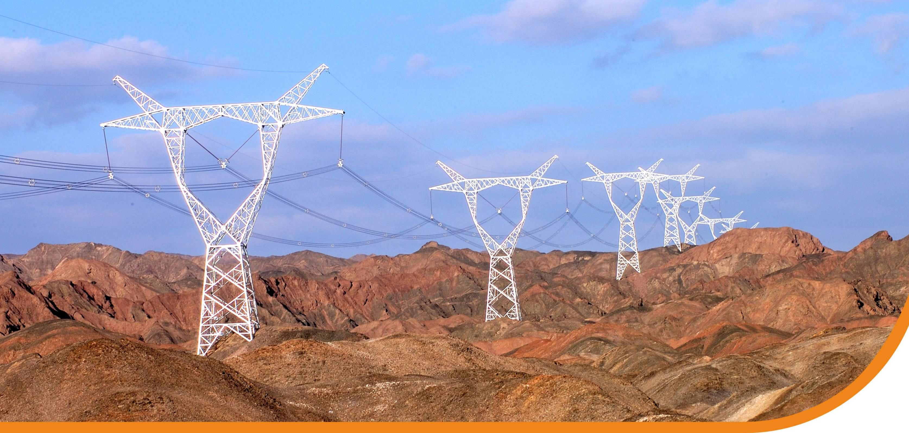

natural_image

Exterior view of multiple high-voltage transmission towers in a mountainous desert landscape under a blue sky (no signage or text visible)

# 02

# 合规治理 笃定前行

◎ 规范公司治理  
◎ 推行精益管理  
◎ 强化党建引领

16和平、正义与强大机构

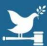

# 规范公司治理

汇金通根据《中华人民共和国公司法》等相关法律法规，结合公司实际情况，建立起以公司章程为核心的现代企业制度，确保股东会、董事会及管理层等治理主体之间权责清晰、相互约束。

公司保证全体股东及时获取信息，平等享有法律法规、规章制度所规定的各项合法权益。

# 治理结构

公司严格按照股东会、董事会、管理层的治理架构进行规范运作，按其职责行使决策权、执行权和监督权，建立健全科学规范、有效制衡、运作高效的现代公司治理体系。

# 股东和股东会

公司严格按照《中华人民共和国公司法》《中华人民共和国证券法》《上市公司股东会规则》《青岛汇金通电力设备股份有限公司章程》《股东会议事规则》等法律法规、规章制度的要求，规范股东会召集、召开及表决等程序，平等对待所有投资者，使其充分行使自己的权利，切实保证中小股东权益。

# 董事和董事会

根据公司经营发展需要，为提高董事会决策的科学性和有效性，公司董事会由9名董事组成，其中包含3名独立董事，2名女性董事，董事会成员涵盖管理、财务、金融等专业背景，确保了董事会结构的多元化和专业性，为公司科学决策奠定了坚实基础。

# #

# 2025年

公司共召开 3 次股东会  
审议通过 26 项议案

# #

# 2025年

公司共召开7次董事会  
审议通过 40 项议案

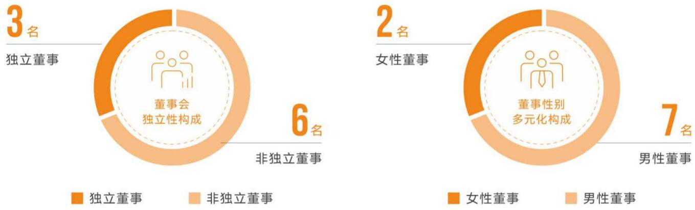

董事会对股东会负责，严格按照相关规定召集、召开董事会。公司董事会下设战略与发展委员会、提名委员会、审计委员会、薪酬与考核委员会四个专门委员会。各专门委员会严格按照有关法律法规、公司章程和各专门委员会实施细则的规定履行职责。公司董事会会议的召集、召开等程序均符合相关规定的要求；历次董事会会议记录内容真实、准确、完整，保存安全；会议决议做到充分准确且及时披露。

为促进公司规范运作，公司严格按照相关法律、法规、规范性文件和公司制度的规定和要求，积极配合独立董事履职，通过事前沟通、专项讨论会、独立董事专门会议等方式，听取独立董事对公司重大事项的独立意见，保障独立董事有效行使职权，进一步发挥独立董事的独立性和专业性作用，持续提升公司决策的合理性、规范性及科学性。

为进一步完善公司治理，根据《中华人民共和国公司法》《上市公司章程指引》《上海证券交易所股票上市规则》等相关法律、法规及规范性文件的要求，公司2025年对公司章程及内部治理制度进行了修订，修订后公司不再设置监事会和监事，由董事会审计委员会行使《中华人民共和国公司法》规定的监事会的职权，同时在董事会中设立职工董事席位。

# 2025年

公司共召开1次战略与发展委员会，审议通过1项议案；

2次提名委员会，审议通过2项议案；8次审计委员会，审议通过16项议案；  
2次薪酬与考核委员会，审议通过2项议案；2次独立董事专门会议，审议通过2项议案。

# 管理层

截至2025年末，公司设有6名高级管理人员。管理团队在钢铁、机械、工程行业，投资、财务、营销等领域拥有丰富的行业背景和项目管理经验，帮助公司把握市场机遇并有效付诸实施。

# 内部控制

汇金通严格遵守相关法律法规和规范性文件，不断完善和健全相关内部控制制度和风险管理体系，切实加强经营风险防范，提升管理水平，公司根据战略目标及发展规划，结合行业特点，建立起系统、有效的风险评估体系。根据设定的控制目标，全面系统收集相关信息，准确识别内部风险和外部风险，及时进行风险评估，做到风险可控。

公司制定和完善应急预案，明确各类重大突发事件的监测、报告、处理程序；建立了审计和相关责任追究制度。公司对安全生产、环保、质量管理等现行制度、流程等进行系统梳理，确保现行管理制度及流程符合相关法律法规要求，同时做好供应商资质审查、招投标管理等工作，有效预防法律风险；公司对于生产经营中可能出现的风险均做了相应防范性措施。

根据《企业内部控制基本规范》及其配套指引的规定和其他内部控制监管要求，结合汇金通内部控制制度和评价办法，在内部控制日常监督和专项监督的基础上，公司对2025年12月31日的内部控制有效性进行了评价。根据公司财务报告与非财务报告内部控制重大缺陷的认定情况，于内部控制评价报告基准日，公司不存在财务报告与非财务报告内部控制重大缺陷、重要缺陷。德勤华永会计师事务所（特殊普通合伙）出具了《青岛汇金通电力设备股份有限公司内部控制审计报告》（德师报[审]字[26]第P03404号）。

# 廉政建设

汇金通持续加大反腐倡廉宣传和查处力度，不断完善审计监察工作体系，创新工作方式方法，全力维护、保障公司股东、员工、客户及供应商的合法权益，增强每位员工对企业的忠诚度，强化遵纪守法守规及红线意识。公司建立了高效畅通、公开透明的举报投诉渠道，专门设有监督电话、邮箱、微信公众号等交流平台，亦可到公司审计监察部当面进行沟通。公司保障举报人和被举报人的合法权益，对提供有效线索和证据的举报人信息严格保密；同时严肃处理各类诬告陷害或恶意举报的行为，并向被举报人澄清说明，确保其正常工作不受到负面影响。

为进一步提高全员廉洁自律意识，规范员工行为，公司持续开展“打造风清气正企业环境”主题活动，通过参观警示教育基地、党风廉政文化墙，观看廉政主题微电影、警示教育片等方式，增强全员廉洁从业意识；公司针对管理人员、采购、技术、销售、质量管理等人员开展专题教育培训，结合参训人员职务、岗位特点，从奖惩规定、安全保密、廉洁自律等方面开展培训，强化员工责任担当，主动营造风清气正、干事创业良好氛围。

# 2025年

汇金通及子公司开展反腐倡廉宣传教育活动15次，

董事、高管、中基层干部及涉外重点岗位人员培训参与率100%;

开展中层干部廉洁测评2次，针对公司管理人员、采购、技术、销售、质量管理等重点岗位人员签署廉洁从业承诺协议356份，发生商业贿赂及贪污事件 0 起。

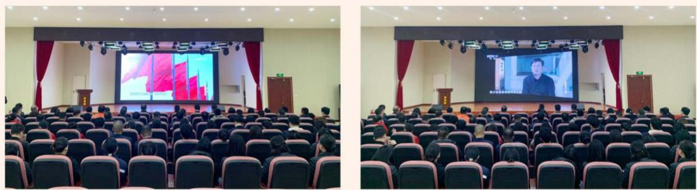  
观看反腐倡廉宣传教育专题片

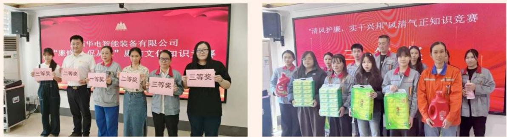  
开展知识竞赛

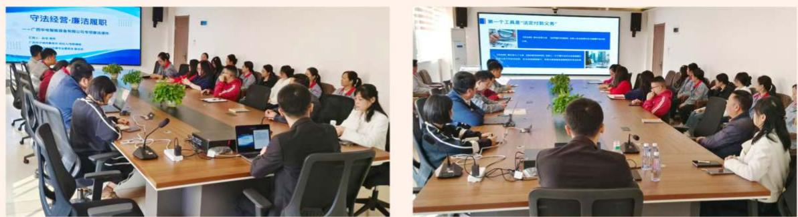  
专题教育培训

# 反不正当竞争

汇金通严格遵守《中华人民共和国反垄断法》《中华人民共和国反不正当竞争法》等法律法规，积极开展公平竞争反垄断培训，加强合规法治宣传教育，帮助员工了解反垄断法律法规、违法行为类型、法律责任及应对措施，提高员工的公平竞争合规意识，促进企业合规文化建设，助力公司健康发展。

# 推行精益管理

为进一步提升企业核心竞争力，汇金通立足自身发展实际，聚焦精益管理理念，以“精准、精益、降本、增效”为工作主线，成立由总经理担任组长的精益生产领导小组，并引入咨询公司提供专业辅导和培训支持。以专项课题攻关为抓手，通过优化生产布局、推行精益排产、强化现场管理、开展系统培训等一系列举措，持续苦练内功、夯实管理基础，有力促进了各项工作的有序开展，为企业稳健运营提供了坚实保障。

# 聚焦“四个周期缩短”，提升运营效率

围绕“合同签订与计划下达周期”“原材料采购周期”“设计放样周期”以及“生产流转周期”四个关键环节开展专项攻关，系统性优化从营销接单、物料采购、技术放样到生产制造的全流程协作效率。通过压缩各环节周期、提高齐套率，整体缩短产品交付周期，进一步增强市场响应速度与客户满意度，提升企业综合竞争力。

# 着力“三个提升”，释放产能潜力

以“镀锌产能提升”“包装入库效率提升”“黑件加工效率提升”三大课题为重点，通过优化工艺流程、提升设备综合效率、规范岗位操作，实现各生产环节的高效衔接。同时，依托技术改造与工艺创新，充分挖掘现有资源潜能，提高生产节拍与资源利用率，为订单及时交付提供有力支撑，不断增强企业运营的韧性与弹性。

# 推进“两个降低”，夯实效益基础

针对“制造费用降低”与“质量报废率降低”两项课题，深入开展成本结构分析与质量损失溯源，从费用管控与过程质量控制两方面系统梳理成本成因。通过识别管理环节与生产流程中的改善点，在有效降低制造成本的同时，提升产品一次合格率与质量稳定性，实现质量与成本的双重优化，为企业可持续发展筑牢效益根基。

# 以干代练，通过实战培养精益管理人才

通过积极组织各级管理人员参与课题改善和对标优秀精益化企业，在实战中培养精益生产管理观念，学习精益分析工具，锻炼问题分析能力和解决能力，提升团队的综合素质，为公司精益化转型奠定坚实的人才基础。

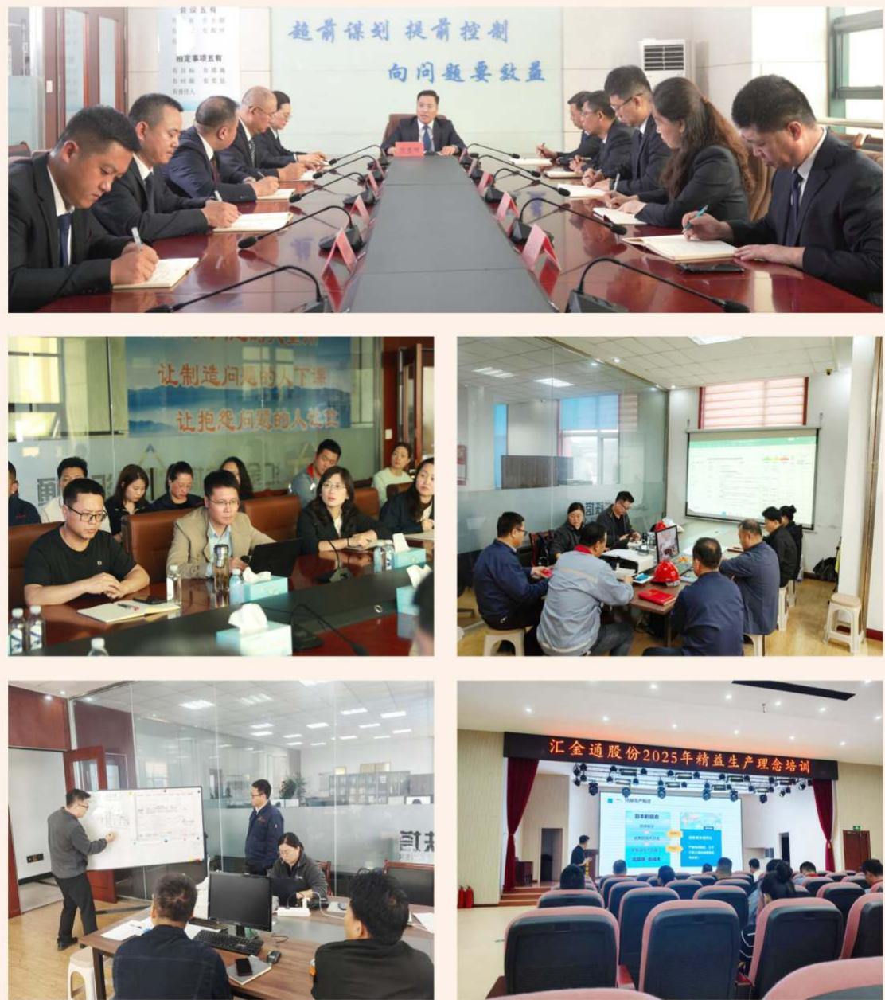

# 强化党建引领

汇金通牢记“守初心、担使命、找差距、抓落实”的总要求，坚持以习近平新时代中国特色社会主义思想和党的二十大精神为指导，强化公司党委“把方向、管大局、保落实”的领导作用，坚持和完善“三重一大”决策机制，严格落实上级党委决策部署，结合实际，抓重点、强基础、解难题、求实效，切实推动党建工作提质增效。

汇金通坚持推动党建工作与公司治理深度融合，落实“党建入章”，强化党组织在企业发展中的政治引领作用，以党建助经营、促发展。公司董事会、高级管理人员中党员占比85%，有效发挥党组织委员在公司决策和经营管理中的作用。

汇金通始终将夯实基层基础工作作为推动党建工作标准化、规范化运行的重中之重，严格落实“三会一课”，持续巩固深化“不忘初心、牢记使命”主题教育成果，坚持学习教育常态化、制度化，以高质量党建推动企业高质量发展。

汇金通坚持招聘新员工与吸纳党员同步进行，生产车间与党组织同步建立，生产经营管理人员与党务干部同步配备，做到“车间发展到哪里、支部就建到哪里、党组织作用就发挥到哪里”。

2006年，汇金通成立党支部，2021年7月暨庆祝建党百年之际，汇金通党委成立，成为胶州市第一家上市公司党委。汇金通党委成立后，公司加快布局“组织全覆盖”，子公司现有“重庆江电”“江苏江电”“广西华电”三个党支部。同时公司进一步提高车间一线工人的入党占比，实行一线优秀工人优先入党政策，推动组织设置向车间一线延伸，党员队伍在车间一线壮大，党员作用在车间一线发挥，从而实现党建工作从有形向有效，从有时向长久覆盖的转变。

为进一步凝聚组织活力，为党员发展、教育提供硬件支撑、场地支持，汇金通党委建设了集党建宣传、党员教育功能、企业品牌形象展示等功能为一体的党建展厅，建设面积达340平方米。下一步，汇金通党委还将继续完善配套设施，力争将展厅建设为区域性党群服务中心。此外，汇金通坚持将党员教育活动融入员工的日常生活中，融入公司的企业文化里，不搞形式、不走过场，将理论学习和实践活动相结合，有力地保证了党员教育的有效性。

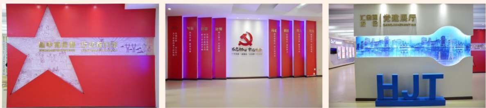

# 2025年

汇金通党委及子公司党支部组织主题党日+活动48次

召开党员大会18次，学习教育专题组织生活会40次。

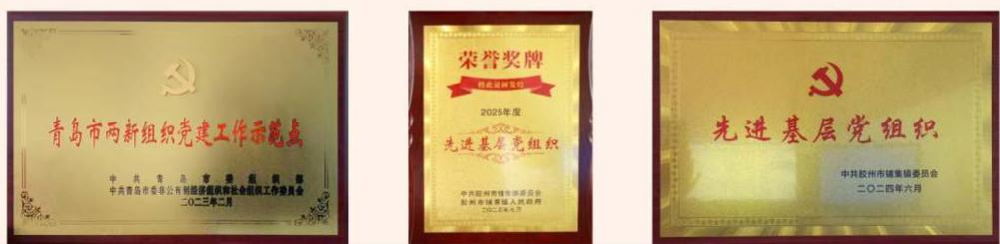

# 截至2025年末

共有党员137人

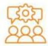

董事、高级管理人员团队

□□11人，占比85%

汇金通党委以“汇力同行”党建品牌为统领，以加强学习型、创新型、服务型、融合型党组织建设为目标，实现党建工作、业务创新工作和服务群众相融互促，贯彻携手共进、团结奋进、保障民生的服务理念，营建创群众满意组织、做群众满意党员、办群众满意实事的党建组织，党建与公司运营融合发展的全新格局由此打开，并入选中国上市公司协会《民营上市公司党建优秀案例》。

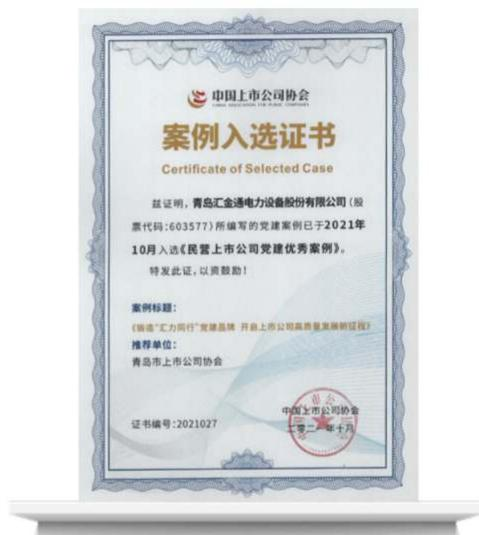

text_image

中国上市公司协会
案例入选证书
Certificate of Selected Case
兹证明，青岛汇金通电力设备股份有限公司（股票代码：603577）所编写的党建案例已于2021年10月入选《民营上市公司党建优秀案例》。
特发此证，以资鼓励！
案例标题：
《锻造“汇力同行”党建品牌 开启上市公司高质量发展新征程》
推荐单位：
青岛市上市公司协会
证书编号：2021027
中国上市公司协会
二零二一年十月

# 案例

# 关键时刻冲得上去，危难关头豁得出来，在汇金通，党员一直是冲在最前面的人

“雅中至江西±800千伏特高压直流输电工程”是“十四五”期间国家电网有限公司建成投运的第一条特高压直流输电工程，属于国家电网服务“西电东送”能源战略、满足中东部地区绿色发展需求的重大输电项目。工程途经5省，沿线以高山峻岭为主，最高海拔3500米，山区地形占比近70%，地质结构复杂，气候瞬息万变。汇金通作为该项目工程铁塔的制造商，党员先锋小分队成员主动请缨前往工程现场进行上塔安装，不惧运输及安装难度极大、作业条件艰苦等多个挑战。在平均海拔2800米山顶上背着重达40斤的工具包上塔作业，让鲜艳的党旗在崇山峻

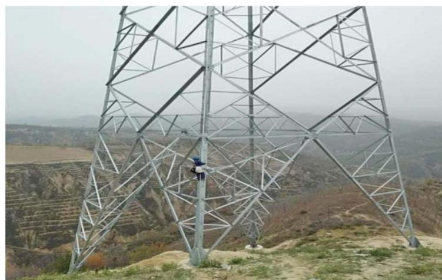

natural_image

Exterior view of a large steel transmission tower with workers on top, set against a hilly landscape (no signage or text visible)

岭之间飘扬。“铁塔售后服务是整个工程中非常重要的一环，关系着整个特高压项目的顺利投运，作为一名党员，我们责无旁贷。”该项目销售负责人魏克昌说，“我们只是做了自己该做的。”（人民网报道）

# [Icon: Book with star]

# 案例

# 凝心聚力暖人心，文化助航添动力

汇金通始终坚持以文化浸润人心，以文化凝聚精神，以良好的企业文化、党建文化营造凝聚、创新、和谐的公司氛围。公司一直以来高度重视员工的身心健康和家庭生活情况，通过对内精准帮扶，积极为困难员工及家人撑起保护伞。汇金通通过冠名慈善基金，设立“贫

# 截至2025年末

汇金通慈善基金累计

帮扶困难群体 410 余人

困党员爱心专项基金”等，不断加大对困难党员群众的帮扶力度，逐步建立健全帮扶工作长效机制。

# 安

# 铭记抗战历史，汲取奋进力量

2025年9月3日，是中国人民抗日战争暨世界反法西斯战争胜利80周年纪念日。为铭记抗战历史，汲取奋进力量，公司组织党员、干部员工集中观看纪念中国人民抗日战争暨世界反法西斯战争胜利80周年大会，共同见证这一庄严时刻。

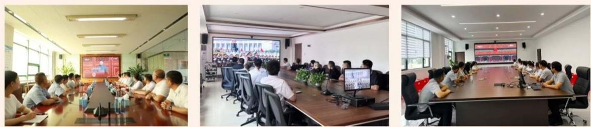

# 薪火相传守初心，学思践悟启新程

为推动党员学习教育走深走实，在中国共产党成立104周年之际，子公司广西华电智能装备有限公司党支部开展七一座谈会，激励全体党员在新时代新征程上砥砺奋进。

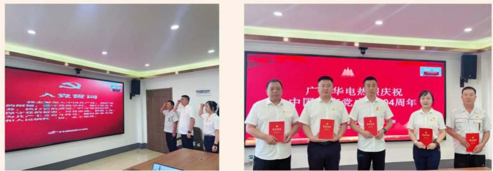

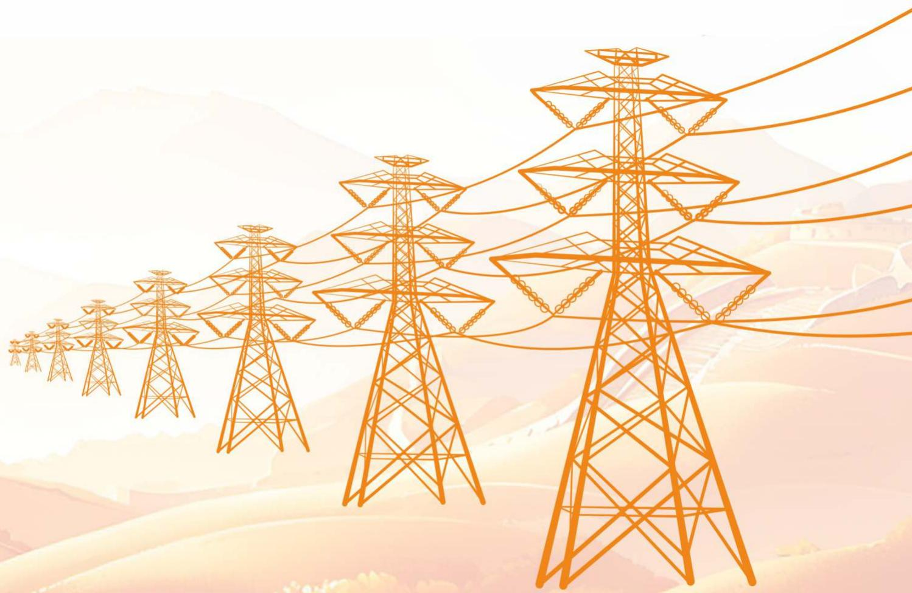

natural_image

Illustration of multiple orange high-voltage transmission towers with connecting lines, set against a stylized mountain background (no text or symbols)

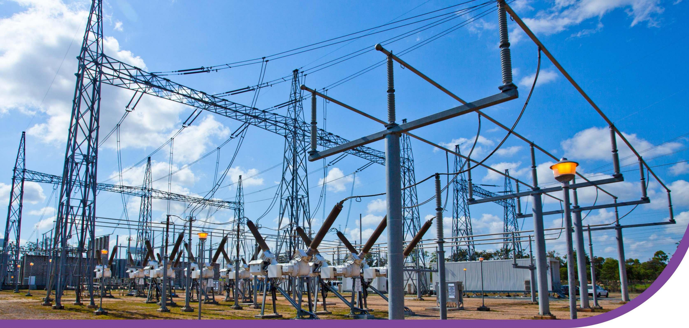

natural_image

Exterior view of a high-voltage electrical substation with transmission towers and insulators under a blue sky (no signage or text visible)

# 03

# 和合共生 共融发展

◎ 创新驱动发展  
◎ 匠心铸就品质  
◎ 恪守责任采购  
◎ 保障员工权益

◎ 赋能员工发展  
◎ 以投资者为本  
◎ 践行责任使命

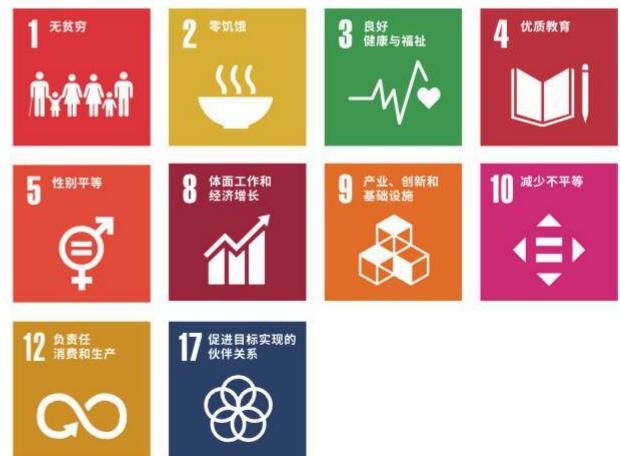

# 创新驱动发展

# 治理

汇金通始终将坚持技术引领、创新驱动作为企业发展的第一动力，并致力于构建创新驱动高质量产业生态系统发展。公司不断建立健全以技术中心为核心、市场为导向、产学研相结合的技术创新机制，持续加大研发投入，通过不断迭代升级保持产品的技术优势，强化创新驱动，激发内生动力。

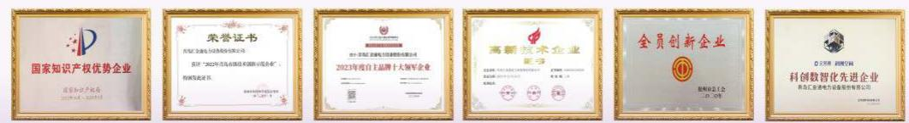

text_image

国家知识产权优势企业
国家知识产权奖
荣誉证书
国家知识产权局
2023年度自主创新技术创新示范企业奖
特聘优秀证书
2023年度自主品牌十大领军企业
高新技术企业
会员
全员创新企业
科创数智化先进企业
科创数智化(北京)科技有限公司

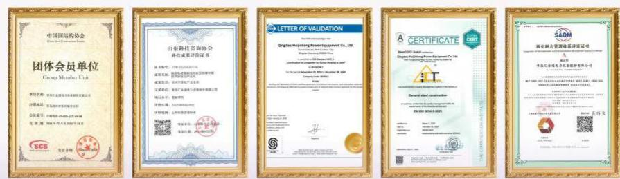

text_image

中国网络协会
团体会员单位
Group Member Unit
单位名称：中国电子科技集团有限公司
注册地址：北京市海淀区西三环西路10号
办公地址：北京市海淀区西三环西路10号
电话：010-66588888
证书编号：SOS
证书类型：实用新型
山东科技咨询协会
科技成果评审证书
证书编号：SOS20190100
证书类型：实用新型
山东科技咨询协会
科技成果评审证书
证书编号：SOS20190100
证书类型：实用新型
山东科技咨询协会
科技成果评审证书
证书编号：SOS20190100
证书类型：实用新型
山东科技咨询协会
科技成果评审证书
证书编号：SOS20190100
证书类型：实用新型
山东科技咨询协会
成果质量监督检验
证书编号：SOS20190100
证书类型：实用新型
山东科技咨询协会
成果质量监督检验
证书编号：SOS20190100
证书类型：实用新型
山东科技咨询协会
成果质量监督检验
证书编号：SOS20190100
证书类型：实用新型
山东科技咨询协会
成果质量监督检验
证书编号：SOS20180100
证书类型：实用新型
山东科技咨询协会
成果质量监督检验
证书编号：SOS20180100
证书类型：实用新型
山东科技咨询协会
成果质量监督检验
证书编号：SOS20170100
证书类型：实用新型
山东科技咨询协会
成果质量监督检验
证书编号：SOS20170100
证书类型：实用新型
山东科技咨询协会
成果质量监督检验
证书编号：SOS20160100
证书类型：实用新型
山东科技咨询协会
成果质量监督检验
证书编号：SOS20160100
证书类型：实用新型
山东科技咨询协会
成果质量监督检验
证书编号：SOS20150100
证书类型：实用新型
山东科技咨询协会
成果质量监督检验
证书编号：SOS20140100
证书类型：实用新型
山东科技咨询协会
成果质量监督检验
证书编号：SOS20130100
证书类型：实用新型
山东科技咨询协会
成果质量监督检验
证书编号：SOS20120100
证书类型：实用新型
山东科技咨询协会
成果质量监督检验
证书编号：SOS20110100
证书类型：实用新型
山东科技咨询协会
成果质量监督检验
证书编号：SOS20100100
证书类型：实用新型
山东科技咨询协会
成果质量监督检验
证书编号：SOS20090100
证书类型：实用新型
山东科技咨询协会
成果质量监督检验
证书编号：SOS20080100
证书类型：实用新型
山东科技咨询协会
成果质量监督检验
证书编号：SOS20070100
证书类型：实用新型
山东科技咨询协会
成果质量监督检验
证书编号：SOS20060100
证书类型：实用新型
山东科技咨询协会
成果质量监督检验
证书编号：SOS20050100
证书类型：实用新型
山东科技咨询协会
成果质量监督检验
证书编号：SOS20040100
证书类型：实用新型
山东科技咨询协会
成果质量监督检验
证书编号：SOS20030100
证书类型：实用新型
山东科技咨询协会
成果质量监督检验
证书编号：SOS20020100
证书类型：实用新型
山东科技咨询协会
成果质量监督检验
证书编号：SOS20010100
证书类型：实用新型

# 战略

汇金通持续强化研发人才梯队建设，加大研发费用投入，通过多重人才培训体系、制定创新绩效管理模式等方式，使得汇金通具有较强的创新能力和自主研发能力，重视各项新技术、新工艺的研发与应用，保证了公司具有业内领先的新产品、新工艺和设备工装的研发能力。

汇金通高度重视人才培养，建立了针对不同岗位的完整、成熟的专业培训体系，帮助新员工迅速掌握专业知识，胜任岗位。截至2025年末，汇金通及子公司拥有研发人员491名，占公司员工总数的 $14.70\%$ 。此外，公司还与青岛港湾职业技术学院、胶州市职业教育中心学校、广西职业技术学院、广西大学机械工程学院、重庆交通大学交通运输学院、重庆工程职业技术学院等院校共同建立校企合作机制，建立产学研实训和人才培养基地，为公司持续保持高水平研发能力打下坚实基础。

产学研多领域合作是汇金通技术创新的重要组织形式之一，也是推动技术进步、传承人才培育、打造行业健康可持续生态的关键环节。

# 案例

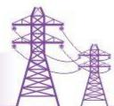

子公司广西华电智能装备有限公司与中国表面工程协会热浸镀分会共同主办中国热镀锌行业年会。

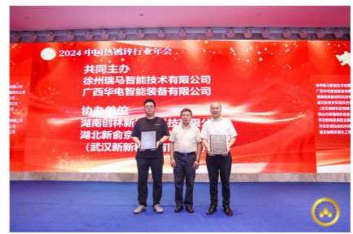

text_image

2024中国风 Turbine行业年会
共同主办
徐州瑞马智能技术有限公司
广西华电智能装备有限公司
协办单位——
湖南创林新能源科技有限公司
湖北新俞京
（武汉新新）

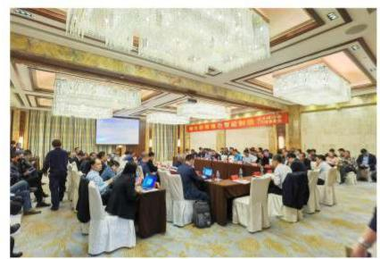

text_image

Conference hall photo with visible banner text indicating a formal meeting or conference setting

汇金通成功协办由中国电力企业联合会科技开发服务中心主办输电铁塔塔脚焊接机器人技术评估会议。

子公司广西华电智能装备有限公司与广西大学机械工程学院签订产学研合作协议，并设立“钢结构自动化焊接装备研发与成果转化基地”。

子公司重庆江电电力设备有限公司与重庆交通大学交通运输学院、重庆工程职业技术学院合作建立人才培养基地。

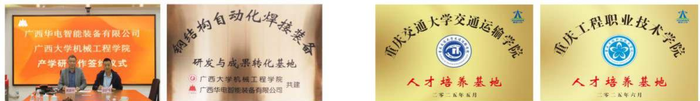

在我国大力发展循环经济的战略背景下，再制造产业前景广阔，既能降低成本，又可减少能耗，在原材料用量、固体废物产出等方面优势突出，是实现工业循环式发展的必然选择。汇金通充分认识到中国在双碳目标的大背景下，越来越多的企业以“数字能源”赋能企业节能减碳。

公司以市场为导向，推进智能化制造，引入先进生产设备和环保设备，提高生产效率和产品品质的同时，确保安全生产。公司先后被评定为青岛市数字化智能生产专家工作站、青岛市互联网工业认定项目数字化车间、青岛市技术创新示范企业、科创数智化先进企业；子公司重庆江电电力设备有限公司已通过国家级绿色工厂认定、2家子公司通过省级绿色工厂认定、2家子公司通过数字化车间项目认定。

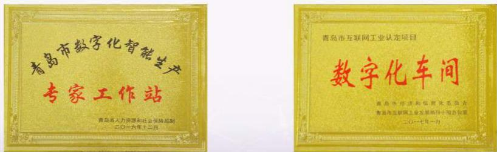

汇金通通过定制化部署数据采集、网络连接、云计算等核心技术，实现信息的实时互通，再通过可视化管理平台等技术，帮助企业挖掘潜藏节能空间，达成提质增效，节能减碳的目标。汇金通依托智能化管理系统，利用系统覆盖倒逼业务整合，对各公司统筹管控和信息高度集成共享，实现穿透式管理，推动各公司之间的协同运作，积极践行战略目标，为企业持续健康发展提供强大的动力。

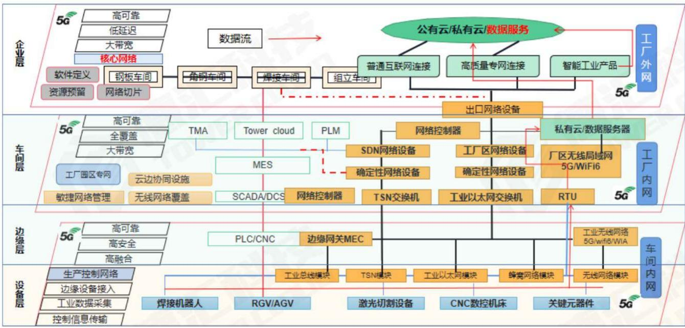

flowchart

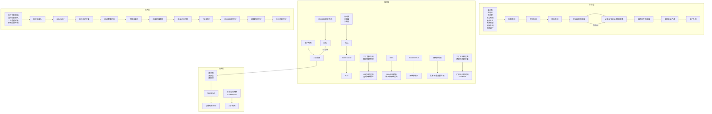
```mermaid
graph TD
  subgraph Enterprise["企业层"]
  A["高可靠\n低延迟\n大带宽\n核心网络\n软件定义\n资源预留\n钢板车间\n网络切片"] --> B["角钢车间"]
  B --> C["焊接车间"]
  C --> D["组立车间"]
  D --> E["普通互联网连接"]
  E --> F["公有云/私有云/数据服务"]
  F --> G["高质量专网连接"]
  G --> H["智能工业产品"]
  H --> I["工厂外网"]
  end

  subgraph Vehicle["车间层"]
  J["高可靠\n全覆盖\n大带宽"] --> K["TMA"]
  K --> L["Tower cloud"]
  L --> M["PLM"]
  N["工厂园区专网\n敏捷网络管理"] --> O["云边协同设施\n无线网络覆盖"]
    P["MES"] -.-> Q["SDN网络设备\n确定性网络设备"]
    R["SCADA/DCS"] -.-> S["网络控制器"]
  T["网络控制器"] --> U["私有云/数据服务器"]
  V["工厂区网络设备\n确定性网络设备"] --> W["厂区无线局域网\n5G/WiFi6"]
  X["工业以太网交换机"] --> Y["RTU"]
  Z["工厂内网"] --> AA["工厂内网"]
  end

  subgraph Edge["边缘层"]
  AB["高可靠\n高安全\n高融合"] --> AC["PLC/CNC"]
  AC --> AD["边缘网关MEC"]
  AE["工业无线网络\n5G/wfi6/WIA"] --> AF["工厂内网"]
  end

  subgraph Device["设备层"]
  AG["生产控制网络\n边缘设备接入\n工业数据采集\n控制信息传输"] --> AH["焊接机器人"]
  AH --> AI["RGV/AGV"]
  AI --> AJ["激光切割设备"]
  AJ --> AK["CNC数控机床"]
  AK --> AL["关键元器件"]
  AL --> AM["无线网络模块"]
  AM --> AN["工业总线模块"]
  AN --> AO["TSN模块"]
  AO --> AP["工业以太网模块"]
  AP --> AQ["蜂窝网络模块"]
  AQ --> AR["无线网络模块"]
  end

  E -->|Output| F
  Y -->|Output| AA
  AA --> AB
```

# 案例

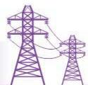

汇金通致力于生产和经营管理体系的信息化、自动化和平台化，通过智能化管理系统实现技术管理、数控设备控制的数据共享，实现经营管理与生产控制等流程的无缝衔接和综合集成，实现了工业化与信息化的融合，全面提升生产效率、控制生产成本，实现信息资源共享，为实现高效组织提供了保障，为公司数字化转型提供了支撑。

# - 自动化程度高

自动化生产线覆盖产品各个工艺，公司已将全部设备进行了数字化改造，使设备具备了自感应、数字采集、能耗与状态实时监控。

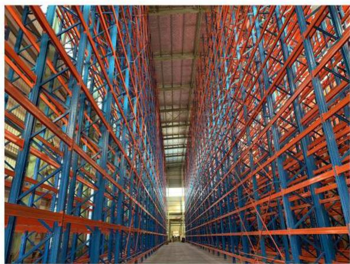

natural_image

Interior view of a tall automated warehouse with blue and orange metal shelving units (no visible text or symbols)

# 案例

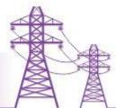

# - 信息化管理

信息化系统与智能终端进行数据采集，向上连接智能化管理系统进行计划协同，向下通过大屏、电脑、手机APP等方式，对执行层所进行的生产活动进行实时监控与状态呈现。

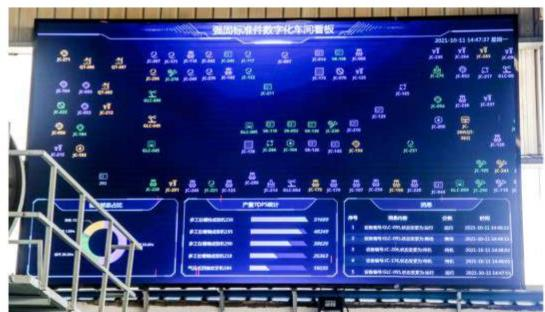

text_image

地图标准件数字化车间警报
2021-10-31 14:47:27 星期一
产品管理
产量/计划
数量
价格
时间
日期
发布
发布
发布
发布
发布
发布
发布
发布
发布
发布
发布
发布
发布
发布
发布
发布
发布
发布
发布
发布
发布
发布
发布
发布
发布
发布
发布
发布
发布
发布
发布
发布
发布
发布
发布
发布
发布
发布
发布
发布
发布
发布
发布
发布
发布
发布
发布
发布
发布
发布
发证号：2021-05-06 14:47:27 星期一
产品名称：数字化车间警报
产品编码：2021-05-06 14:47:27 星期一
产品类型：数字化车间警报
产品编码：2021-05-06 14:47:27 星期一
产品名称：数字化车间警报
产品编码：2021-05-06 14:47:27 星期一
产品类型：数字化车间警报
产品编码：2021-05-06 14:47:27 星期一
产品名称：数字化房间警报
产品编码：2021-05-06 14:47:27 星期一
产品类型：数字化房间警报
产品编码：2021-05-06 14:47:27 星期一
产品名称：数字化房间警报
产品编码：2021-05-06 14:47:27 星期一
产品类型：数字化房间警报
产品编码：2021-05-06 14:47:27 星期一

公司对焊接、放样新工艺的研究很大程度提高公司现有产品的质量与生产效率，从而提高产品竞争力，高效化生产也将进一步加强企业规模生产效益。同时，公司采用了大量其他有效控制成本的研发工艺，通过提高材料利用率、降低人力电力等方面的消耗来不断降低生产成本，产生直接经济效益。

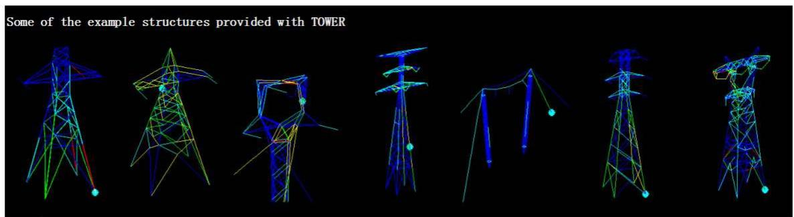

text_image

Some of the example structures provided with TOWER

# 影响、风险和机遇管理

为保护公司自主知识产权，汇金通建立了完善的知识产权管理体系并获得相应认证，对于技术创新一般通过知识产权如专利申报等方式进行保护，为提高产品的技术含量，增强产品的市场竞争能力，增加产品的市场占有率，为公司的发展壮大提供有力的技术体系保障。

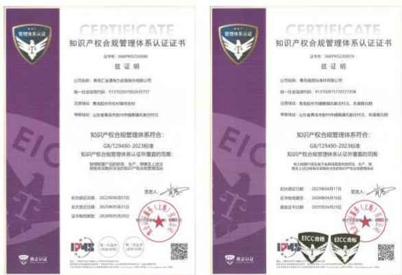

text_image

知识产权合规管理体系认证证书
证书号：3649MA250006
兹证明

知识产权合规管理体系认证证书
证书号：3649MA2500XN
兹证明

知识产权合规管理体系认证证书
证书号：3649MA2500XN
知识产权名称：青岛汇通光电科技股份有限公司
统一社会信用代码：91170200782653717
注册地址：青岛市崂山区海尔路68号澳柯玛大厦1层
专利权址：山东省青岛市崂山区澳柯玛大厦1层
知识产权合规管理体系符合：
GB/TZ9490-2023标准
知识产权合规管理体系认证覆盖的范围：
授权客户识别、生产、销售及上述知识产权归属的知识产权管理规定。
版权登记日期：2023年06月07日
此次登记日期：2023年06月27日
证书有效期至：2023年06月28日

知识产权合规管理体系符合：
GB/TZ9490-2023标准
知识产权合规管理体系认证覆盖的范围：
授权客户识别、生产、销售及上述知识产权归属的知识产权管理规定。
版权登记日期：2023年04月17日
证书有效期至：2023年04月18日
最新登记日期：2023年04月23日

EICC合格
EICC合格

目前公司及子公司拥有有效专利262项，其中发明专利67项，参与了《输电线路铁塔制造技术条件》《输电杆塔用地脚螺栓与螺母》等多项国家、行业、团体标准的修订起草工作。公司被认定为国家级企业技术中心、山东省一企一技术研发中心、青岛市特高压输变电铁塔工程研究中心、青岛市数字化智能生产专家工作站、青岛市互联网工业认定项目数字化车间，荣获国家知识产权优势企业、山东省制造业单项冠军企业、青岛市技术创新示范企业、全员创新企业、科创数智化先进企业等荣誉称号，技术研发实力已得到业内普遍认可。

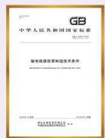  
GB/T2694-2010、2018《输电线路铁塔制造技术条件》

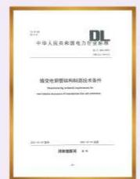  
DL/T646-2012、2021《输变电钢管结构制造技术条件》

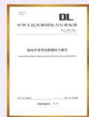  
DL/T1236-2021
《输电杆塔用地脚螺栓与螺母》

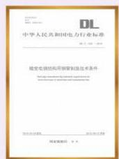  
DL/T1401-2015
《输变电钢结构用钢管制造技术条件》

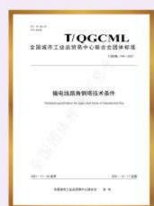  
T-QGCML 194-2021
《输电线路角钢塔技术条件》

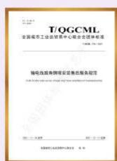  
T-QGCML195-2021《输电线路角钢塔安装售后服务规范》

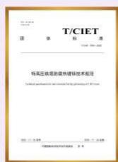  
T/CIET 1924-2025
《特高压铁塔防腐热镀锌技术规范》

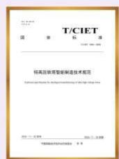  
T/CIET 1936-2025
《特高压铁塔智能制造技术规范》

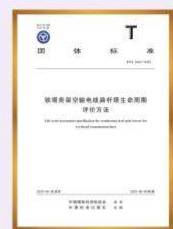  
T/CI1034-2025
《铁塔类架空输电线路杆塔生命周期评价方法》

子公司青岛强固标准件有限公司荣获青岛市专精特新企业、创新型中小企业荣誉称号；青岛华电海洋装备有限公司荣获青岛市专精特新企业荣誉称号；青岛华电检测技术服务有限公司凭借专业的检测技术和设备，取得《检验检测机构资质认定证书》，塑造了公司“研发+制造+检验检测服务”一体化优势；广西华电智能装备有限公司被认定为广西壮族自治区企业技术中心，荣获广西壮族自治区专精特新中小企业荣誉称号；重庆江

电电力设备有限公司被认定为国家级专精特新小巨人企业、重庆市企业技术中心、重庆市瞪羚企业、重庆市工业设计中心，入选重庆市技术创新指导性项目推荐目录，荣获重庆市科技型企业、重庆市知识产权优势企业、重庆民营企业科技创新指数100强等荣誉称号；江苏江电电力设备有限公司被认定为江苏省企业技术中心，荣获江苏省专精特新中小企业荣誉称号。

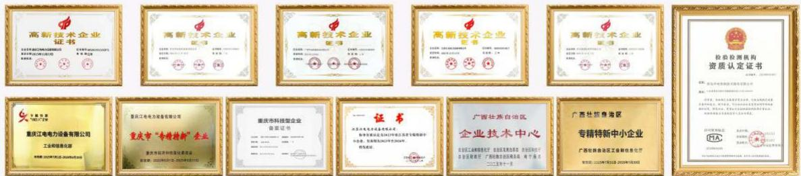

text_image

高新技术企业
证书
高新技术企业
证书
高新技术企业
证书
高新技术企业
证书
检验检测机构
资质认定证书
重庆江电电力设备有限公司
重庆市“专精特新”企业
重庆市科技型企业
证书
广西壮族自治区
企业技术中心
广西壮族自治区
广西壮族自治区
广西壮族自治区
广西壮族自治区
广西壮族自治区
广西壮族自治区
广西壮族自治区
广西壮族自治区
广西壮族自治区
广西壮族自治区
广西壮族自治区
广西壮族自治区
广西壮族自治区
广西壮族自治区
广西壮族自治区
广西壮族自治区
广西壮族自治区
广西壮族自治区
广西壮族自治区
广西壮族自治区
广西壮族自治區
广西壮族自治區
广西壮族自治區
广西壮族自治區
广西壮族自治區
广西壮族自治區
广西壮族自治區
广西壮族自治區
广西壮族自治區
广西壮族自治區
广西壮族自治區
广西壮族自治區
广西壮族自治區
广西壮族自治區
广西壮族自治區
广西壮族自治區
广西壮族自治區
广西壮族自治區
广西壮族自治區
广西壮族自治區
广西壮族自治區域
广西壮族自治區
广西壮族自治區
广西壮族自治區
广西壮族自治區
广西壮族自治區
广西壮族自治區
广西壮族自治區
广西壮族自治區
广西壮族自治區
广西壮族自治區
广西壮族自治區
广西壮族自治區
广西壮族自治區
广西壮族自治區

指标与目标

<table><tr><td>指标</td><td>单位</td><td>2025年</td></tr><tr><td>研发费用</td><td>亿元</td><td>1.71</td></tr><tr><td>占营业收入比例</td><td>%</td><td>4.09</td></tr><tr><td>研发人员数量</td><td>人</td><td>491</td></tr><tr><td>占比</td><td>%</td><td>14.70</td></tr><tr><td>专利申请数量</td><td>项</td><td>23</td></tr><tr><td>授权数量</td><td>项</td><td>22</td></tr><tr><td>截至公告披露日有效专利数量</td><td>项</td><td>262</td></tr><tr><td>其中:发明专利数量</td><td>项</td><td>67</td></tr><tr><td>实用新型专利数量</td><td>项</td><td>179</td></tr><tr><td>外观设计专利数量</td><td>项</td><td>16</td></tr></table>

# 科技伦理

汇金通严格遵循《关于加强科技伦理治理的意见》《科技伦理审查办法（试行）》等国家法律法规和行业规范的有关要求，持续规范科技研究活动，坚守科技伦理底线，保证科研活动的合法合规，促进科技成果的健康发展与应用。

# 匠心铸就品质

# 治理

产品质量是企业的生存之本。汇金通秉承精益求精的“工匠精神”，以质量求生存，以管理创效益，以服务占市场，以科技促发展的思路，将产品质量控制视为企业发展的生命线，并建立了完善的质量管理体系。汇金通深入贯彻ISO9001 质量管理体系，全面推行6S管理，实施从原材料检验、过程控制，到售后服务全过程的质量控制。

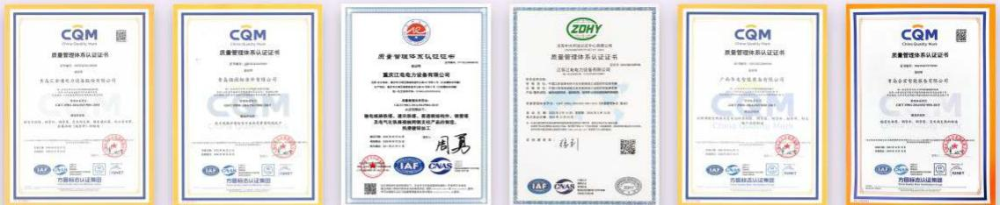

text_image

CQM
质量管理体系认证证书
重庆江电电力设备有限公司
质量管理体系认证证书
重庆江电电力设备有限公司
重庆江电电力设备有限公司
重庆江电电力设备有限公司
重庆江电电力设备有限公司
重庆江电电力设备有限公司
重庆江电电力设备有限公司
重庆江电电力设备有限公司
重庆江电电力设备有限公司
重庆江电电力设备有限公司
重庆江电电力设备有限公司
重庆江电电力设备有限公司
重庆江电电力设备有限公司
重庆江电电力设备有限公司
重庆江电电力设备有限公司
重庆江电电力设备有限公司
重庆市能源局、省国资委、省能源局联合、省发改委及电气企业能源局等其它产业主管部门
国家能源总局
国家能源局
国家能源局
国家能源局
国家能源局
国家能源局
国家能源局
国家能源局
国家能源局
国家能源局
国家能源局
国家能源局
国家能源局
国家能源局
国家能源局
国家能源局
国家能源局
国家能源局
国家能源局
国家能源局
国家能源局
国家能源局
国家能源局
国家能源局
国家能源局
国家能源局
国家能源厅
国家能源局
国家能源局
国家能源局
国家能源局
国家能源局
国家能源局
国家能源局
国家能源局
国家能源局
国家能源局
国家能源局
国家能源局
国家能源局
国家能源局
国家能源局
国家能源局
国家能源局
国家能源局
国家能源局
国家能源局
国家能源局
国家能源局
国家能源局
国家能源局

# 战略

公司为保证加工、装配的精度和质量，根据铁塔制造的相关国家标准制订了更为严格的企业标准，保证产品的质量。通过多渠道、多层次、全方位管控，严把质量关口，公司进一步优化生产工艺流程，全面推进精益生产，全力保障并提高产品品质。

汇金通始终坚持以“客户为中心，满足客户需求”为导向，多措并举，不断提升客户满意度，切实维护客户权益。根据客户市场需求，公司全面升级售后服务体系，指定项目跟踪专员，保障实时响应客户需求，提高售后服务效率和服务质量，树立优质品牌形象

象。在过往年度，公司售后服务的响应时间为省内48小时，省外72小时，2021年起，公司充分借助地域优势和人员统一管理优势，售后服务的响应提升为省内24小时，省外48小时，加快了响应时间，提高了处理效率，更好的服务客户。公司不断加强售后服务人员的培训工作，组建了专业的售后服务管理团队，荣获五星级售后服务认证。报告期内，公司未发生质量通报和产品重大召回事件。

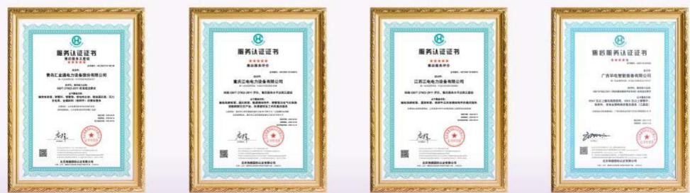

# 影响、风险和机遇管理

汇金通以全流程风险防控为核心，建立了覆盖产品全生命周期的质量风险管理体系。从原材料入库到成品交付，我们将风险识别与管控嵌入每个环节，通过风险等级评定与动态防控机制，系统性降低质量波动，保障产品安全与可靠。

在原材料端，我们建立了严格的准入与检验机制，对钢材等核心物料的外观和理化性能进行多维度核验，不合格物料执行闭环退货流程，从源头筑牢质量根基。

生产过程中，我们推行标准化作业与工序自检、互检机制，结合质量培训与持续改进活动，引导全员识别并控制岗位质量风险，确保产品符合既定质量标准。

在成品交付环节，我们对包装防护、物流运输实施全程管控，建立了“防护-运输-核验”三位一体的风险防控机制，我们在发货前执行严格的信息核验流程，确保产品编号、规格与发货清单完全匹配；交付后还建立了质量追溯反馈通道，一旦发现异常可快速定位问题环节并启动闭环整改，保障客户收到的每一件产品都符合质量要求。

这套全链条风险防控体系，不仅保障了产品质量的稳定性，也通过持续的风险回顾与改进，推动公司质量能力的迭代升级，为客户与社会创造长期价值。

# 指标与目标

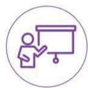

报告期内质量通报事件

0 发生

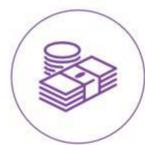

重大产品召回事件

0 发生

公司业内领先的质量控制体系和售后服务能力为公司产品赢得了良好口碑和市场形象，打造了产品力。公司先后获得中国电力电气行业铁塔十大品牌、山东优质品牌产品、山东知名品牌、山东省制造业高端品牌培育企业、新一代青岛金花培育企业、青岛制造品牌建设重点企业库入库企业、青岛市民营领军标杆企业、上合新区技术改造领军企业、上合新区制造业十强企业、自主品牌十大领军企业、特高压铁塔优质供应商、铁塔十大质量标杆企业等称号。

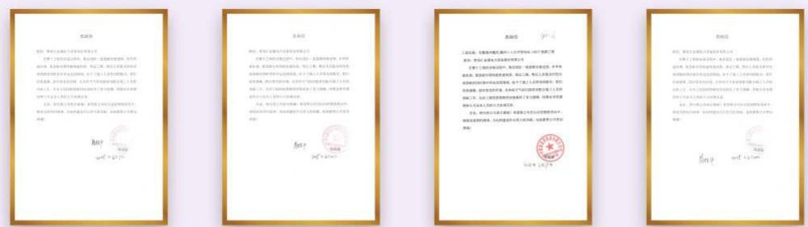  
客户表扬信

# 案例

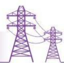

子公司重庆江电电力设备有限公司荣获国家电网电力工程研究院“2025年度特高压线路材料供货质量优秀制造企业”荣誉称号。

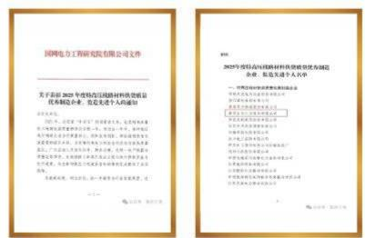

# 案例

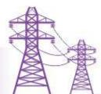

# 抢险保电 | 72小时极速驰援 筑牢西南电力“生命线”

2025年7月，受持续暴雨影响，800kV昆柳龙特高压直流输电工程1177+1铁塔所在山体发生滑坡，塔材严重变形，电力输送通道面临中断风险。接到抢险任务指令后，子公司重庆江电电力设备有限公司立即启动I级应急响应预案，联合技术、生产、供应、售后、物流等部门成立“抢险攻坚专班”。“不计成本，只争时间”，面对特种钢材价格翻倍、空运费用激增等压力，公司毅然开辟绿色通道，确保原材料尽快到场；车间两班制生产模式全面启动，突击队员24小时轮班作业，在40℃高温车间内与时间赛跑；物流团队创新采用“双司机轮换+北斗定位+实时路况监测”模式，压缩物流运输时间，争取黄金抢修时间；售后技术团队提前抵达塔位，利用无人机对滑坡区域进行三维建模，结合物联网传感器实时回传数据，为现场施工提供精准技术支撑。

从接到指令到物资启运，跨越渝桂两省区、涉及200余人的协同作战，重庆江电电力设备有限公司在72小时内完成方案制定、原料采购、生产加工、跨省运输全链条闭环，为西南电网筑起一道坚不可摧的“钢铁长城”。

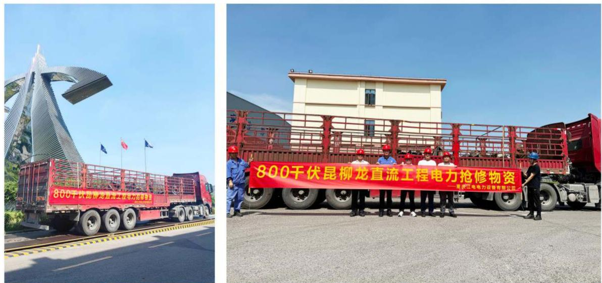

# 恪守责任采购

# 治理

汇金通致力于打造负责任的供应链。公司结合业务特点，不断深化供应商的合规管理，携手供应商共同发展，建立可持续的合作关系。公司建立了涵盖供应商招投标、认证、选择、审核、淘汰机制等环节的供应商管理体系和公开透明的竞争机制，为供应商提供公平参与竞争的平台。通过采取招标、比价、签订年度合同等方式选择产品质量可靠、价格合理、信守合同的企业作为供应商，打造负责任的透明供应链。

# 战略

# 责任采购

汇金通结合生产实际情况，制订相应的原材料采购质量标准，通过《采购管理制度》《招标投标管理办法》等相关规定严格执行供应商准入机制，严格按照质量标准合理安排采购。部分采购业务实现了信息化管理和操作，供应商系统、仓储管理系统及智能化管理系统的集成运用，推动公司采购工作高效、规范、透明运转。

公司还将绿色生产、可持续发展理念贯穿于整个管理、生产和营销过程，从采购、生产、销售、包装运输、财务、人力、综合管理等各个环节入手。通过严格执行供应商审核标准，在保障资源稳定、高效供给的同时，进一步防范潜在环境影响风险，推动供应链的绿色发展。

# 绿色采购措施

鼓励采购通过环境标志产品认证、节能产品认证或国家认可的其他认证的节能环保产品。

淘汰落后生产装备和产品及国家限制或不鼓励的高耗能、高污染类产品。

# 供应商管理

供应商管理是负责任供应链的重要一环。公司遵循《采购管理制度》《招标投标管理办法》等管理办法，在招投标、供应商准入、供应商评价、供应商改进及资格调整各个环节，均本着公平公正的原则，对所有供应商一视同仁进行管理，杜绝违反商业道德和市场规则、影响公平竞争的不正当交易行为，促进公司持续、稳定、健康发展。

# 供应商准入

公司不断优化招投标环节，通过严格的供应商资质审查及调研，对拟合作供应商进行合作资质预审及评价，确定其具有合法的生产经营资质，并具有向公司提供产品、服务的资格和能力，再从供应商产能、产品开发能力、经营能力、交货期、价格优势、售后服务、绿色制造等方面对供应商进行评价，出具《供方基本情况调查表》，共同决策明确准入供应商，对不符合汇金通供应商合作要求的供应商不予通过。供应部会同质检部根据评价结果进行比较，选择合格供应商，对同类的重要物资，选择一家或多家合格的供应商。同时，优先引进能够生产节能降耗产品的供应商，推动绿色供应商发展。

# 建立合格供方名录

公司成立供应商管理小组，编制《合格供方名录》，并保存相关合格供方的记录，选择、评价供方时，实施动态管理，确保有效识别并控制风险。根据供应商供应物料类型不同，公司依据采购产品重要程度确定供应商类别，及时更新其评价指标和相应资质，逐步进行分级管理，并通过书面调查或现场评价的方式对其进行评价。

# 影响、风险和机遇管理

# 开展供应商评价

每年年底，公司供应部会同质检部等部门对供应商的供货产品质量、交货时间、价格、配合度四个方面进行年度考核，将评价合格的供应商纳入下一年度的《合格供方名录》，淘汰不合格供应商，同时对违约失信、侵害公司利益的供应商，实行供应商黑名单制度，有效推进健康供应商团队的建立，保障公司物资供应。

# 供应商资格动态调整

公司定期召开质量会议，持续加强供应商质量监控与日常管理，有效保障生产建设物资供应。

公司对供应商进行梳理和分级，逐步调整供应商结构，提升生产型供应商占比，减少中间商采购。

开展互访和现场评审，监督和评价供应商规范性，结合企业风险内控要求，对供应商潜在风险提出改进措施。

对不能满足安全、环境、质量等要求的供应商，暂缓或终止其合格供应商资格。对违约失信、侵害公司利益的供应商，实行供应商黑名单制度。

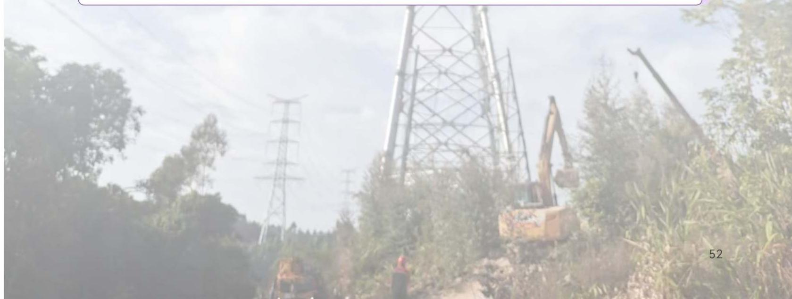

natural_image

Exterior view of a power transmission tower and excavator in a forested area, with no visible text or symbols.

# 指标与目标

汇金通始终坚持打造诚信、安全、健康、可持续的供应链，从未因拖欠供应商款项产生诉讼纠纷。公司秉持互利双赢原则，与优质供应商建立长期战略合作伙伴关系，并持续组织相关部门对各供应商生产工艺和质量进行评审并提供改进意见，建立质量信息沟通和数据分享渠道，与供应商共同制定正确合理的原材料、零部件等产品品质标准，协助供应商构建高效的质量管理体系，推动产品品质的全面提升，共建共治共享健康供应链。

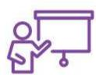

因拖欠供应商款项产生诉讼纠纷

0发生

供应商构成  
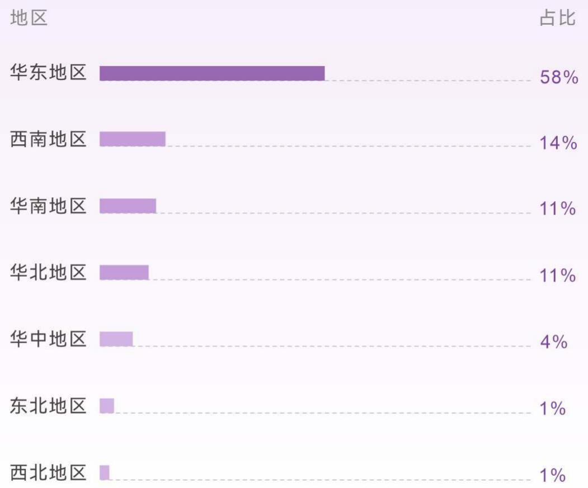

bar

| 地区 | 占比 (%) |
| :--- | :--- |
| 华东地区 | 58 |
| 西南地区 | 14 |
| 华南地区 | 11 |
| 华北地区 | 11 |
| 华中地区 | 4 |
| 东北地区 | 1 |
| 西北地区 | 1 |

# 平等对待中小企业

公司始终坚持公平、公正原则选择供应商，不以企业规模为前置条件，综合评估质量、价格和服务等核心要素，充分发挥中小企业供应商在灵活性、专业性和快速响应等方面的优势，为中小企业提供平等的合作机会，切实保障中小企业权益，推动产业链良好发展。

# 信息安全

汇金通高度重视信息安全管理和客户隐私保护，严格遵守《中华人民共和国民法典》《中华人民共和国数据安全法》《中华人民共和国反不正当竞争法》等相关法律法规，规范信息的输出、传播、使用、处理等各类行为；同时，公司通过使用互普威盾信息加密系统、员工权限设置、签订保密协议、持续开展员工信息安全培训等方式，不断完善信息安全管理，防范信息安全风险，确保公司与客户、供应商等利益相关方的信息安全。

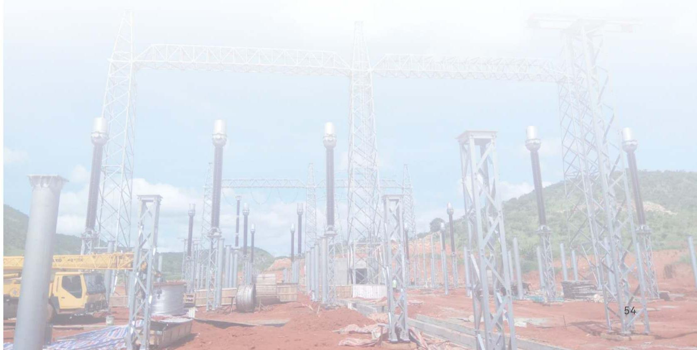

natural_image

Exterior view of a large electrical substation with multiple transmission towers and overhead cranes, set against a hilly landscape (no signage or text visible)

# 保障员工权益

# 平等、合规雇佣

汇金通始终把人才作为企业发展的第一资源。公司严格遵守《中华人民共和国公司法》《中华人民共和国劳动法》等法律法规，规范公司的人事劳务管理，使公司的聘用、职务、任免、调迁、退休等事项有规可循，在劳动安全卫生制度、社会保障等方面严格执行国家规定和标准，明确避免招聘和雇佣童工的程序和措施，禁止雇佣童工或强迫劳动。同时，公司为员工提供具有竞争力的薪酬福利保障，帮助公司实现在人才市场的竞争优势。

公司秉承“尊重人才、培养人才、成就人才”的人才战略，努力创造人才脱颖而出的环境和氛围，每年引进大量各类复合型人才，实现人才的多元化。在招聘和用工期间，提倡平等雇佣、同工同酬，不因员工的性别、年龄、国别、民族、宗教信仰、健康状况等差异而区别对待或受到其他适用法律禁止的歧视和骚扰，为每个员工提供平等的就业和发展机会，搭建汇金通高精尖人才梯队。

汇金通中层以上管理人员共67人，其中女性管理者有14人，占比21%，充分发挥汇金通女性领导力。

2025年末员工结构表  
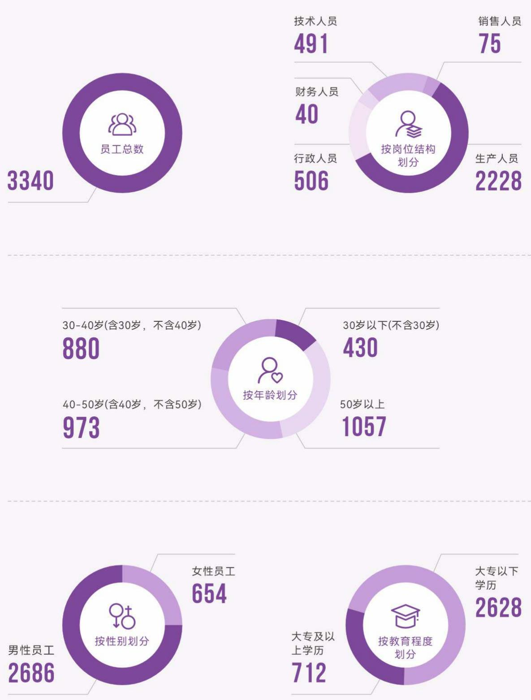

# 薪酬体系

保障员工基本权益是企业稳定发展的基础。汇金通重视构建和谐劳动关系，保障员工合法权益，完善社会保障制度，建立具有竞争力、完善的薪酬福利体系。

公司实行薪酬与绩效激励相结合的薪酬结构。员工薪酬根据公司效益和部门及个人的绩效考核而定，最大程度上发挥了薪酬与绩效的激励作用。根据不同产业、不同岗位类型如技术、研发、生产、销售等制定科学有效的薪酬与考核激励政策并开展考核（月度/季度/年度），根据考核结果给予相应的绩效奖励。

公司现有薪酬水平具有外部竞争性和内部公平性。每年度根据公司的经营情况以及行业和地区的实际情况，决定当年度调薪的范围及幅度。此外，公司还建立了奖惩制度体系，鼓励员工为公司业绩发展、技术创新、管理优化等方面积极建言献策。

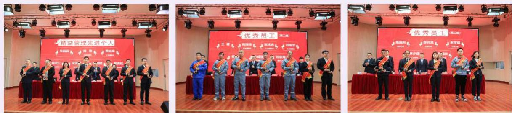

# 福利保障体系

汇金通严格按照国家政策规定为员工按时缴纳各类社会保险，并结合企业自身实际，努力构建让员工无后顾之忧的福利保障体系，切实改善和提高了员工生活质量和归属感，为公司的长远发展提供了人才基础。

# #

# 2025年

公司全年发放工资3.6亿元

同比增长 3%

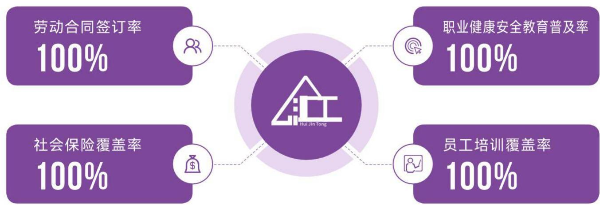

flowchart

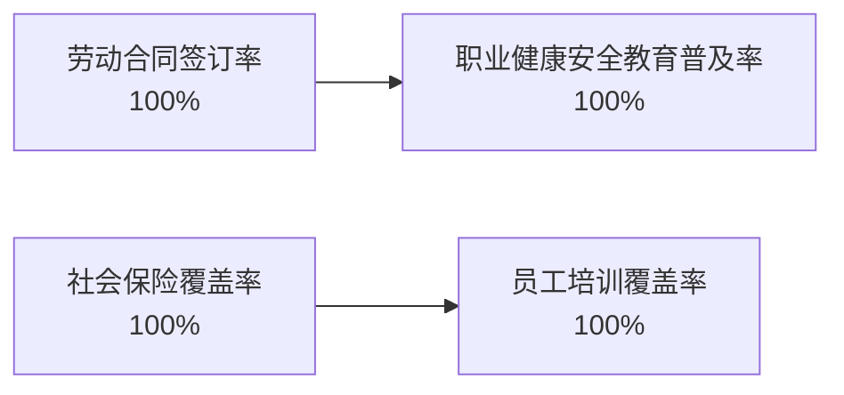
```mermaid
graph LR
  A["劳动合同签订率\n100%"] --> B["职业健康安全教育普及率\n100%"]
  C["社会保险覆盖率\n100%"] --> D["员工培训覆盖率\n100%"]
```

# 员工职业健康与安全

公司高度重视员工职业健康管理工作，为加强对职业危害防治工作的管理，提高职业危害防治水平，切实保障劳动者在劳动过程中的健康与安全，汇金通严格执行各项职业健康规定，努力改善职工的生产作业环境，为员工配备必要的劳动防护用品，每年为接触职业危害人员进行职业健康查体，为从业人员建立了职业健康监护档案，定期开展职业健康教育与培训，普及职业卫生防护知识。

凭借完善的管理机制及落地实践措施，公司及子公司连续多年通过职业健康安全管理体系认证。

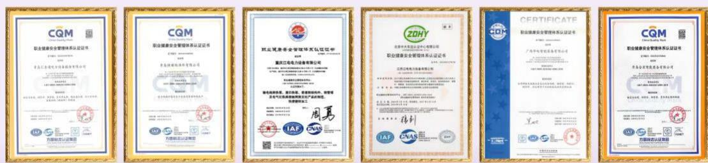

text_image

CQM
职业健康安全管理体系认证证书
重庆江电电力设备有限公司
CA
重庆江电电力设备有限公司
ZOHY
职业健康安全管理体系认证证书
GPT
CERTIFICATE
CQM
职业健康安全管理体系认证证书

# 安全生产管理

安全生产是企业长远发展的生命线。汇金通坚持“以人为本”的安全管理理念，严格遵循《中华人民共和国安全生产法》《中华人民共和国职业病防治法》《生产安全事故应急预案管理办法》等法律法规，以安全生产标准化建设和职业健康安全管理体系为依托，依照“生命至上，安全发展，预防为主，安全第一，全员履责”的方针，制定了安全生产标准化和双重预防体系，建立了完善的安全管理组织架构，并配备了专职安全管理人员，不断加强安全生产管控工作，加大隐患排查力度，完善应急制度体系建设，积极开展员工安全生产培训，持续强化安全生产理念，最大化的预防及减少安全事故的发生，保障员工职业健康和企业安全发展。

2025年，汇金通及子公司未发生一般安全生产事故、重大安全事故和重大职业病事件和消防事件（中国政府法定事故分类），达成职业健康与安全年度预期目标，整体健康安全态势良好。

# 标准化体系建设

汇金通全面推进安全生产标准化体系建设，不断提升安全生产的管理水平。公司组织制定了三级安全生产标准化安全管理制度，并取得了三级安全生产标准化证书，编制并签订了《年度安全生产与目标责任书》，确保安全保证体系的持续改进以及目标实现，并与第三方供应商和承包商签订《安全生产管理协议》，对供应商和承包商相关安全资质和安全管理制度进行审核。

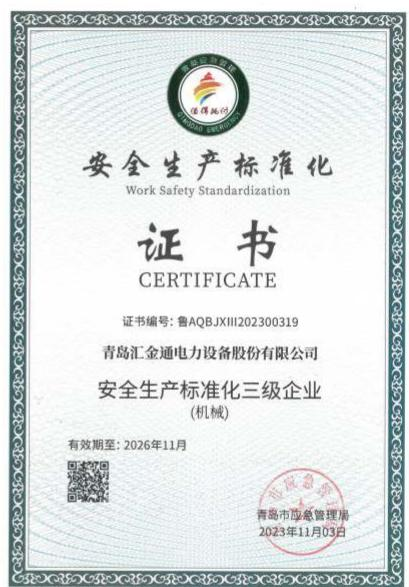

seal

青岛市海急管理局
青岛市海急管理局
2023年11月03日

2025年，公司认真执行安全生产工作方案，对照标准检查问题，各子公司结合公司实际情况认真整改，全员全过程参与，全面管控生产经营活动各环节的安全生产与职业卫生工作，改善安全生产条件，规范员工的安全生产行为，实现安全健康管理系统化、岗位操作行为规范化、设备设施本质安全化、作业环境器具定置化，切实提升公司整体安全管理水平。

# 识别与管理风险

准确识别、科学管控风险并及时排查治理隐患是提高企业安全管理水平、遏制事故发生的基础性工作和有效措施。汇金通着力构建风险分级管控与隐患排查治理双重预防机制，构筑防范事故发生的两道防火墙，先后组织制定了安全文化建设准则、安全生产纲领性文件及各类安全手册，开展新入职员工安全三级培训、定期在各生产车间召开安全早会，日常对各部门安全生产责任制落实情况、持证上岗情况、员工三违行为、作业现场员工不安全行为、物的不安全状态、安全生产状况及劳动条件等情况进行重点检查，严格贯彻落实岗位责任制，加强隐患排查治理，严格事故管理，并强调要抓牢基础管理，加强直接作业环节管理，严抓重点领域、关键环节管控。

<table><tr><td>指标</td><td>单位</td><td>2025年</td></tr><tr><td>安全生产培训</td><td>场</td><td>67</td></tr><tr><td>新员工三级安全教育参与人数</td><td>人</td><td>971</td></tr><tr><td>生产车间全员安全会议</td><td>场</td><td>52</td></tr></table>

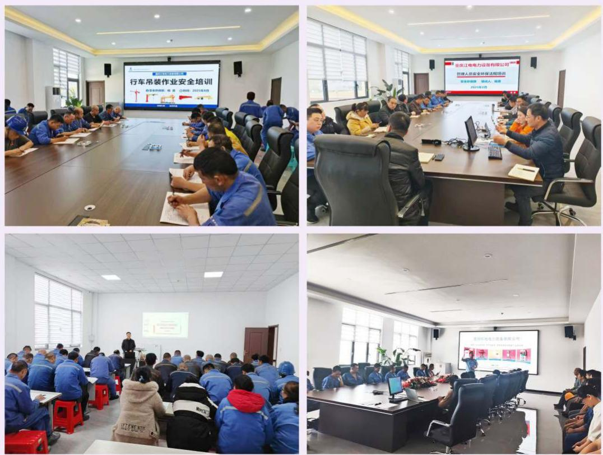

# 安全生产应急演练

公司制定了《生产安全事故应急预案》，并根据应急预案组织相关演练，制定年度健康安全培训计划，加强员工安全培训工作，强化应对各类灾害事故的自救和抢险技能，提高快速反应能力、应急救援能力以及协同作战能力，全面提升抵御重大灾害事故的能力，确保一旦发生突发事故，能够有效组织、快速反应、高效运转、临事不乱，最大限度地减少事故危害。

每年6月是全国安全生产月，为牢固树立安全发展理念，防范化解安全风险，及时消除安全隐患，有效遏制生产安全事故，公司举办安全生产月主题活动。同时，公司贯彻《中华人民共和国消防法》要求，定期举办消防应急演练，提高员工防范意识和加强应急处变能力，熟练掌握消防的基本技能，增强发生火灾时的自救互救能力。通过开展宣贯培训、安全检查、预案演练等系列活动，进一步提升全员安全技能，不断丰富企业安全文化建设。

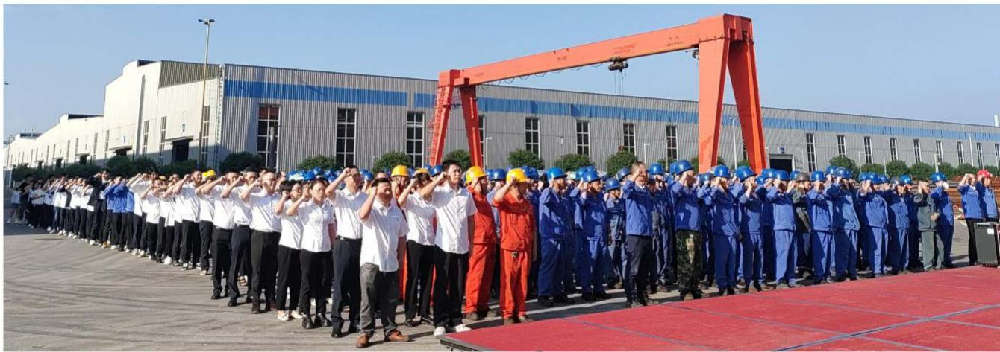

natural_image

Group of workers in blue uniforms and hard hats saluting outdoors in front of industrial buildings with large orange gantry cranes (no visible text or symbols)

<table><tr><td>指标</td><td>单位</td><td>2025年</td></tr><tr><td>综合应急演练</td><td>次</td><td>4</td></tr><tr><td>现场处置应急演练</td><td>次</td><td>17</td></tr><tr><td>安全应急演练</td><td>次</td><td>21</td></tr><tr><td>消防演练</td><td>次</td><td>15</td></tr></table>

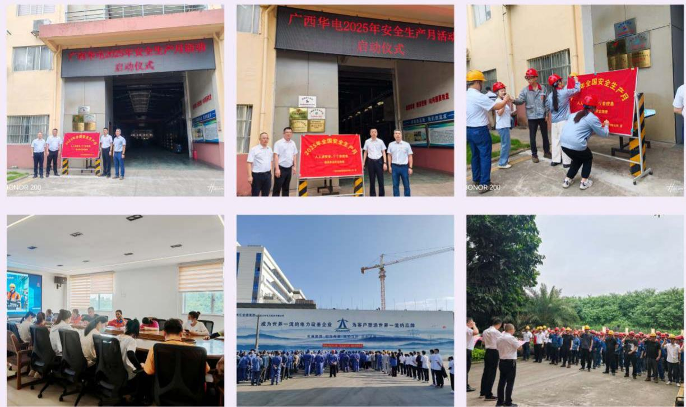

# 员工沟通

为倾听基层员工的建议与想法，了解员工的意见与需求，从而使公司的管理能够贴近实际并行之有效，汇金通建立了有效的员工沟通机制，全方位、多层次、多途径听取和采纳员工合理化建议和其他相关方的意见，群策群力促进各项工作持续改进和提高。

为推进民主管理，公司广泛征求员工意见，确保各种人力资源管理政策能得到顺利落实，对内部员工采用匿名问卷调查、公司电子邮箱、微信平台、内部OA交流平台、随机抽取员工座谈调研以及员工自主申报合理化建议等方式，征询员工意见和建议，对员工反映较为突出问题或创新改革提议进行收集整理，报公司经理办公会集中讨论，酌情采纳，然后责令相关部门进行落实。

为确保公司内部各项工作得到有效沟通与协作，不同地区子公司、不同部门、不同职位之间通过微信交流平台、传真、电话、电视电话会、定期和不定期集中会议等方式进行沟通交流；根据工作或项目需要，由牵头部门组织协调，相互配合，相互支持，团结协作。

公司定期组织召开职工代表大会，面对面沟通听取员工意见心声，鼓励职工参与企业管理和监督，全方位保障职工知情权、参与权、表达权、监督权。2025年9月，公司职工代表大会选举张新芳先生为公司第五届董事会职工代表董事，充分落实员工参与民主管理和民主监督的权利。

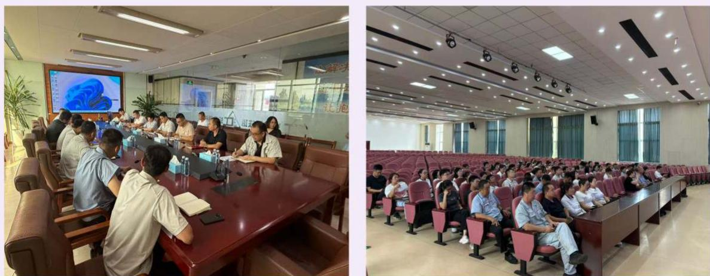

# 赋能员工发展

# 职业发展

汇金通始终坚持以人为本，建立健全人才培养体系，明晰人才选拔、晋升途径，完善人才储备和激励机制，着力打造管理、专业、技能三支人才队伍。同时，公司立足自身发展需求，引进、培育创新团队和高层次人才，多措并举强化人才梯队建设。

为规范公司职务职级管理体系，拓宽管理、专业、操作各序列员工职业发展通道，充分挖掘人力资源价值，提升组织效能，汇金通针对不同序列员工专业特点，从技能职称提升和职位提升两方面为员工设定职业发展通道，培养员工能力，满足员工自我提高的需求和职业晋升的需求，实现科学任用，助力员工实现人生价值与梦想。快速、高效的人才管理措施不仅带动了内部良性的人才发展氛围，更为公司的发展提供了人才保障。

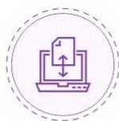

# 日常绩效管理

各部门按月度对员工进行绩效评定，绩效得分对应绩效在当月工资里体现

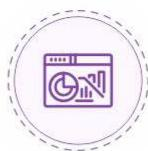

# 月度考核

考核与每个人挂钩，针对目标、质量、安全、环保等进行考核，在当月薪酬中体现

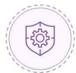

按照“分层制定、层层落实、结果公示、动态可查”的原则，制定《经济责任制方案》。

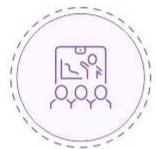

建立各层级以关键业绩为导向的绩效考评体系，形成能够及时跟踪、有据可查的业绩评价档案，使各层级干部员工及时了解和掌握自身的工作业绩考核结果及排名情况，以此激发干部员工活力，促进基础管理水平的进一步提升。

以业绩评价“百分制”考评细则为基础，从公司中层干部到基层一线员工，按管理层级和岗位设置层层建立全员“百分制”业绩评价档案。

# 员工培训

汇金通始终坚持“尊重人才、培养人才、成就人才”的理念，重视各类人才培养，为员工持续提供各种培训及学习资源，持续提升员工技能及社会竞争力，促进员工可持续发展。

汇金通根据《员工培训管理制度》及质量管理体系对培训管理工作的要求，制定培训计划，涵盖员工思想素质教育、员工职业技能鉴定、专业技术培训、学历教育提升等培训，逐步构建完善可持续、高质量的培训管理体系及人才培养机制。公司持续致力于建立和推行人才培养体系，力图打造专业实干、素质优良、知识结构持续优化的人才队伍，实现公司和员工的可持续发展。

<table><tr><td>指标</td><td>单位</td><td>2025年</td></tr><tr><td>培训场次</td><td>次</td><td>527</td></tr><tr><td>培训投入</td><td>万元</td><td>69</td></tr><tr><td>培训人次</td><td>人次</td><td>7642</td></tr><tr><td>新员工培训覆盖率</td><td>%</td><td>100</td></tr><tr><td>总培训时长</td><td>小时</td><td>17219</td></tr></table>

公司还搭建竞技平台，采用“以师带徒”“以培带赛，以赛促培”的人才培养新形式，通过组织焊工比武、知识竞赛等活动，进一步提升人才培养密度。

<table><tr><td>指标</td><td>单位</td><td>截至2025年末</td></tr><tr><td>高级技工</td><td>人</td><td>200</td></tr><tr><td>中级技工</td><td>人</td><td>85</td></tr><tr><td>高级职称</td><td>人</td><td>11</td></tr><tr><td>中级职称</td><td>人</td><td>112</td></tr></table>

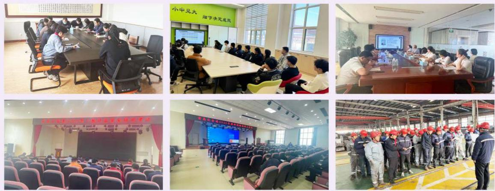

# 员工关怀

# - 关爱女性员工

汇金通严格保障女性员工的权益，在定薪、调薪和各项福利待遇方面实现男女同工同酬，充分发挥女性员工在公司经营中的积极作用。

同时，汇金通不断创新形式，加大对女性员工关怀服务力度。公司通过组织女性主题文化活动，开展心理健康讲座，积极引导女性员工提升文化修养；给予女性员工节日假期，为女性员工提供节日礼物；主动联合妇幼保健院为女性职工开展“两癌筛查”体检，落实女性员工孕产期、哺乳期休假规定，设立专为哺乳期妈妈和年幼孩子建设的“妈妈小屋”等多种举措，充分彰显公司人文关怀，把对女性员工的关爱落实到细节之处。

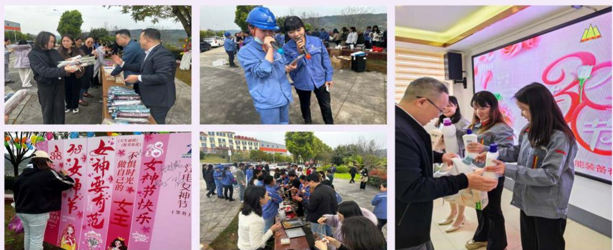

# - 企业文化活动

汇金通积极开展企业文化体系建设，定期组织各类文体娱乐活动，进一步发展员工兴趣爱好、丰富员工日常生活，增强团队凝聚力和向心力，营造积极向上、和谐活泼的环境氛围。

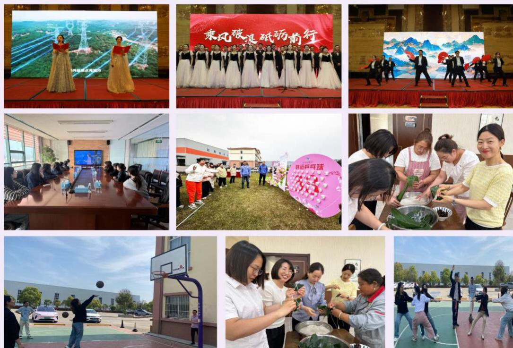

# 以投资者为本

# 强化信息披露质量

汇金通积极践行“以投资者为本”的理念，严格遵守相关法律法规，以依法合规、简明清晰，通俗易懂为原则，不断提高信披透明度，优化信披内容，提升持续信息披露的有效性，使投资者及时掌握公司动态信息，切实保证投资者的知情权。

公司以投资者需求为导向，在定期报告中采用图文结合的方式，对公司经营情况进行重点分析，主动披露行业发展趋势、行业前景等信息，理顺定期报告的逻辑架构，减少冗余信息，强化关键信息；采用可视化定期报告、短视频等形式，提高公告可读性，实现公司价值的全面化、可视化传递；利用官网、公众号、东方财富官方账号等多种渠道在资本市场发声，与四大信披报纸媒体密切合作，提升资本市场关注度。

<table><tr><td>指标</td><td>单位</td><td>2025年</td></tr><tr><td>定期报告</td><td>份</td><td>4</td></tr><tr><td>临时公告及其他文件</td><td>份</td><td>111</td></tr></table>

# 保障股东参会权益

汇金通严格按照《上市公司股东会规则》《青岛汇金通电力设备股份有限公司章程》《股东会议事规则》等规定和要求召集、召开股东会，并由律师出席见证，在会后另行设立股东与公司董事、高级管理人员面对面交流环节，提升投资者参会获得感；采用现场投票和网络投票相结合的表决方式，为股东特别是中小股东参加股东会提供便利，针对影响中小投资者利益的重大事项实行中小投资者单独计票，董事选举实施累积投票制，确保所有股东享有平等地位，充分行使股东权利。

<table><tr><td>指标</td><td>单位</td><td>2025年</td></tr><tr><td>召开股东会</td><td>次</td><td>3</td></tr><tr><td>开设网络投票</td><td>次</td><td>3</td></tr><tr><td>实行中小投资者单独计票</td><td>次</td><td>3</td></tr></table>

# 充分发挥独董机制

汇金通充分发挥独立董事作用，积极配合独立董事履职，公司独立董事对提交董事会的各项议案均进行认真审议，通过事前沟通、专项讨论会、独立董事专门会议等方式，积极参与讨论并以专业能力和经验做出独立的合理的表决意见，充分保障全体股东尤其是中小股东的利益。

公司持续健全独立董事与投资者的沟通机制，设置独立董事专用邮箱并在公司官网投资者关系栏中公开，投资者可通过该邮箱与独立董事建立沟通渠道，独立董事就投资者提出的问题及时向公司核实。

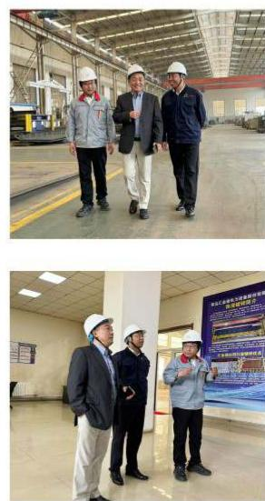

# 创新投关工作方式

公司高度重视投资者关系管理工作，持续完善投关制度建设，细化投关工作要求，及时了解投资者的关切和需求，全方位提升投资者获得感。

# 投资者沟通渠道

☑ 投资者热线、邮箱

√ 网站、微信、公众号、微博

☑ 业绩说明会

√ 投资者关系互动平台

√ 分析师会议、媒体采访

√ 投教保护活动

公司以业绩说明会为抓手，常态化召开年报、中报及季报业绩说明会。业绩说明会均由公司董事长、总经理、独立董事、财务总监、董事会秘书亲自出席，增加高层直面投资者频率，提高沟通频次，增强市场透明度，充分尊重和维护广大投资者利益。公司获评中国上市公司协会年报业绩说明会最佳实践奖项。

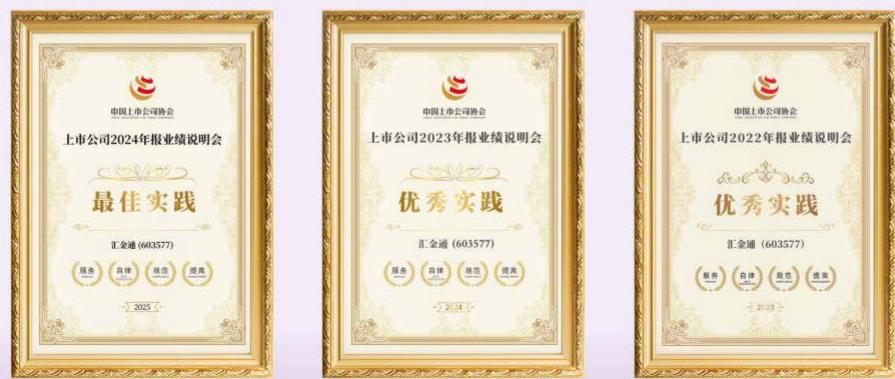

公司通过“走出去、请进来”，充分运用新媒体建立多元化沟通渠道，保持与投资者高频且高效的沟通。公司主动邀请证券分析师、投资者走进公司，让分析师、投资者实地考察、了解公司经营发展情况；积极参加券商策略会，有效加深了投资者对公司经营、业务、发展战略与投资价值的了解，充分保障投资者合法权益。

公司自行编写印发《汇金通投资者教育专刊》系列投教读本，以案例形式开展投资者教育与培训，并通过公司网站、内部OA等方式开展投教宣传；积极开展“3.15投资者保护教育活动”“5·15全国投资者保护宣传日活动”“国家安全教育日普

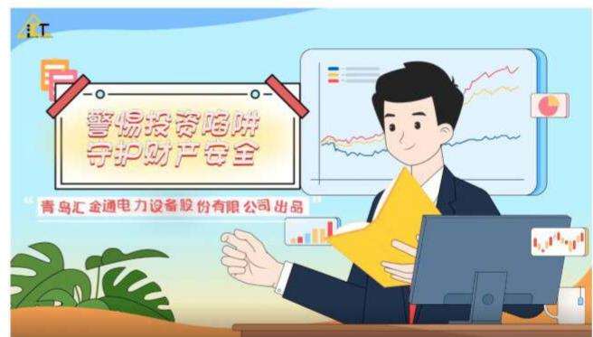

text_image

警惕投资陷阱
守护财产安全
青岛汇金通电力设备股份有限公司出品

法宣传活动”等投教保护活动；主动制作投教宣传微视频，通过公司视频号、优酷视频、网站、微博等新媒体渠道进行广泛宣传；不定期向投资者群发风险提示短信，有效提高投资者自我保护意识和风险防范意识，倡导理性投资。

公司多次邀请律师、会计师等中介机构开展投资者专题讲座，向投资者讲授证券市场专项知识，倡导理性投资理念；定期组织董事、高级管理人员进行专项培训，便于其及时了解资本市场监管动态、提升履职能力，提高公司规范治理水平；及时开展投资者关系管理活动复盘总结，回顾活动全流程、分析活动成效并提炼有效经验，针对待改进方面提出专项提升措施；不定期对公司投关工作人员进行培训，提高投关工作人员服务沟通水平，保证与投资者沟通的有效性。

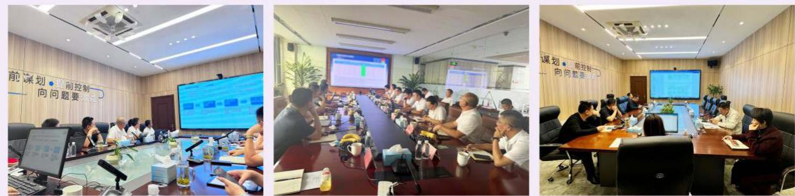

公司通过搭建与投资者等各方信息双向传递的桥梁，积极践行上市公司社会责任，促进资本市场的稳定运行和健康发展。公司连续四年获评投资者保护工作先进单位，连续两年入选中国上市公司协会上市公司董事会优秀实践案例，公司董秘荣获中国上市公司协会上市公司董秘履职评价5A评级、上证鹰金质量精锐董秘奖。

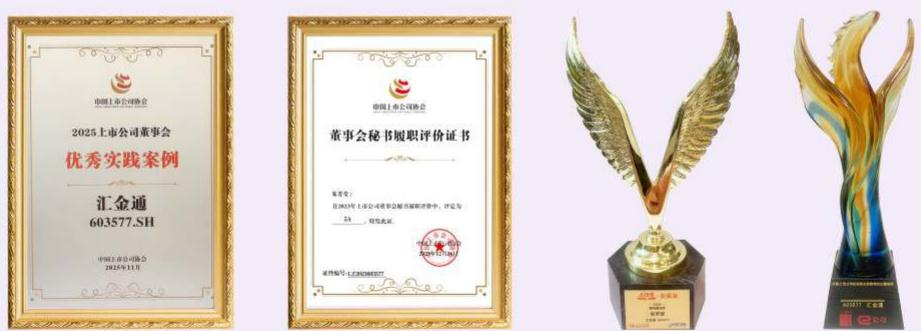

公司已连续5年发布ESG报告，希望有助于投资者和社会各界进一步深入、全面的了解汇金通，同时亦推动公司进一步提升企业社会责任意识，不断完善企业社会责任管理体系，把积极履行社会责任的理念融入企业日常生产经营管理，切实践行社会责任，推进公司可持续发展。公司现已入选中国上市公司协会上市公司可持续发展优秀实践案例、民营上市公司党建优秀案例、上市公司乡村振兴优秀实践案例、上市公司数字化转型典型案例、上市公司董办优秀实践案例、上市公司文化建设优秀实践案例。

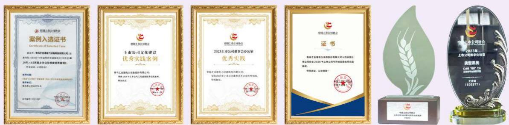

# 共享公司发展成果

公司始终坚信持续、稳定的现金分红是回报投资者的最好途径，自上市以来，积极响应现金分红关于保护中小投资者合法权益的号召，与投资者共享发展成果，使公司价值最大化。

公司现金分红政策符合公司章程的规定，分红标准和比例明确、清晰，相关的决策程序和机制完备，公司通过为中小股东提供网络投票保证了其充分表达意见和诉求的机会，中小股东的合法权益能够得到充分保护。

# 2025年度

现金分红金额：

2,061.97万元（含税）

每10股分红

0.608元（含税）

<table><tr><td>年度</td><td>现金分红总额（万元）</td><td>每10股现金分红（元）</td></tr><tr><td>2024</td><td>4,639.42</td><td>1.37</td></tr><tr><td>2022</td><td>1,220.90</td><td>0.36</td></tr><tr><td>2021</td><td>2,034.83</td><td>0.60</td></tr><tr><td>2020</td><td>3,199.78</td><td>1.11</td></tr><tr><td>2019</td><td>1,811.97</td><td>0.88</td></tr></table>

# 践行责任使命

# 设立公益基金

公司自成立以来，一直秉承“履行社会责任，发扬团队精神，尊重个人价值”的核心价值观，勇于承担社会责任，义利兼顾、德行并重，荣获胶州市慈善总会“爱心奉献奖”并被聘为第三届理事会副会长单位。

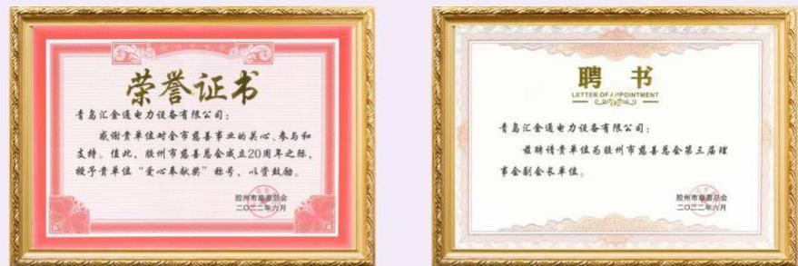

汇金通现已设立“汇金通慈善基金”“汇金通员工特病大病特困基金”，累计捐助金额达165万元，用于救助特困群体，推动慈善事业的发展。一直以来汇金通都高度重视员工的身心健康和家庭生活情况，通过对内精准帮扶，积极为困难员工及家人撑起保护伞。汇金通通过冠名慈善基金，设立“贫困党员爱心专项基金”，定期组织慰问走访、送温暖活动等，持续关注贫困家庭、孤寡老人、贫困老党员生活情况，不断加大对困难党

员群众的帮扶力度，逐步建立健全帮扶工作长效机制。截至2025年末，汇金通慈善基金累计帮扶困难群体410余人。

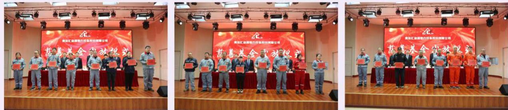

公司控股股东河北津西钢铁集团股份有限公司现已形成具有津西特色的“5+2”社会保障体系，即养老保险、医疗保险、生育保险、工伤保险、失业保险和住房公积金、特病大病特困救助基金，累计救助员工及家属2036人次、发放救助金558余万元，推动实现老有所养、病有所医、困有所济。

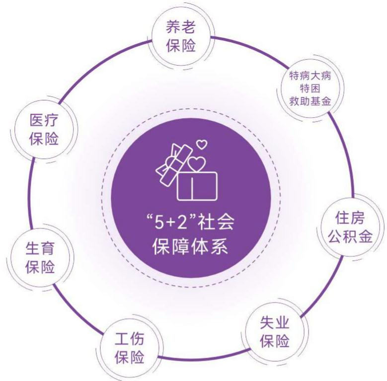

flowchart

```mermaid
graph LR
  Center((""5+2"社会保障体系"))
  
  subgraph Core Components
    direction TB
    A["养老保险"]
    B["特病大病\n特困\n救助基金"]
    C["住房公积金"]
    D["失业保险"]
    E["工伤保险"]
    F["生育保险"]
    G["医疗保险"]
  end
  
  Center --> A
  Center --> B
  Center --> C
  Center --> D
  Center --> E
  Center --> F
  Center --> G
  
  A --- Center
  B --- Center
  C --- Center
  D --- Center
  E --- Center
  F --- Center
  G --- Center
```

公司秉持着人道主义精神，持续关注社会公共医疗卫生事业，通过捐资救助、号召员工参与义务献血、向学校捐赠防撞拒马等活动，为社会公共医疗卫生慈善事业提供支持和援助。

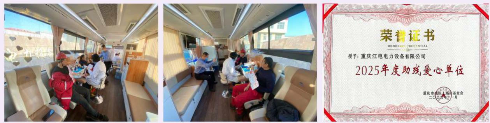

# 开展帮扶结对

公司积极参与万企兴万村和东西协作对口支援工作，对徽县、通渭县等地区进行对口帮扶。公司与帮扶乡村签订长期结对帮扶协议，帮扶乡村集体产业发展并通过向帮扶村庄采购助农物资的方式，着力构建常态化“以购代捐”消费帮扶机制，变"输血"为“造血”，以消费方式扶贫，实现与帮扶乡村的可持续良性互动，切实提升帮扶质效，在全面推进乡村振兴道路上贡献企业力量。

公司以生产厂区为中心，与周边镇政府、村委共同建立长效帮扶机制，帮助周边村镇建设、完善生活基础设施，改善村庄人居环境，让群众感受到村庄生产生活条件的变化。

2021年，胶州市慈善总会汇金通慈善基金及其他企业慈善基金共同出资30多万元，对企业困难职工、辖区困难群众进行救助，帮助经济薄弱村改善用水质量；2022年，公司出资30万元帮助园区新建污水处理站，完善升级污水处理设施；2018-2025年，公司分别帮扶胶西镇雷家孝源村、里岔镇东青杨杭村、胶西镇寺前村、洋河镇袁家小庄、里岔镇河流董村、新垛镇丰乐村、贾嗣镇龙山村、徽县、通渭县等村庄近200万元，积极推进周边环境基础设施建设与环境整治，切实践行“绿水青山就是金山银山”理念。

# 援助教育事业

教育兴则国家兴，教育强则国家强。公司控股股东河北津西钢铁集团股份有限公司致力于推动慈善教育事业发展，董事局主席韩敬远先生于2005年捐资设立“静远教育基金”。为积极响应党中央和国家加快建设教育强国的号召，2023年起，“静远教育基金”进行第二次大幅度增资扩面，在原有每年捐资100万元的基础上增加至每年300万元，用于激励、帮扶河北迁西幼儿园至高中师生，实现了学前教育、义务教育到高中教育所有学段全覆盖。截至目前，河北津西钢铁集团股份有限公司累计向教育、抗灾、交通和优抚等公益捐款超3.4亿元，支持迁西教育事业发展累计捐资助教超5000万元。

汇金通始终不忘初心，全力支持教育事业发展，努力做好教育扶贫，加大人才培养的扶持力度，为我国教育事业的发展做出贡献。汇金通与高校联合构建产学研体系，为高校学生搭建实习平台，解决毕业生因缺乏动手实践能力和实际解决问题的能力而造成就业难的问题；通过帮助乡村幼儿园增添硬件教育设施，向胶州市妇联基金爱心捐款等方式，开展社会救助，助学“春蕾”女童，并给予优秀学子以奖学金。

为发挥农村基层党组织政治优势、组织优势和密切联系群众优势，树立平台思维、创新思维，根据铺集镇党委安排部署在汇金通设立铺集镇“乡村夜校实践基地”，不断完善丰富“乡村夜校”功能，厚植乡村文化自信，深挖乡土文化富矿，引领乡村文化振兴。

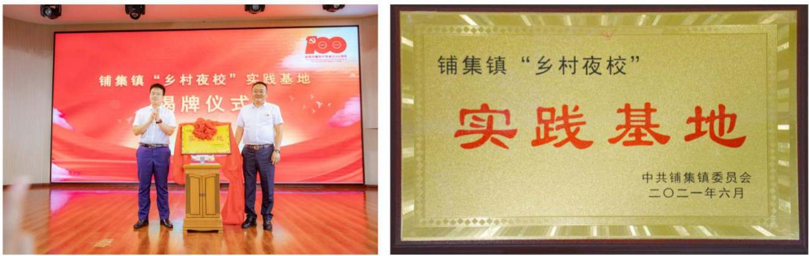

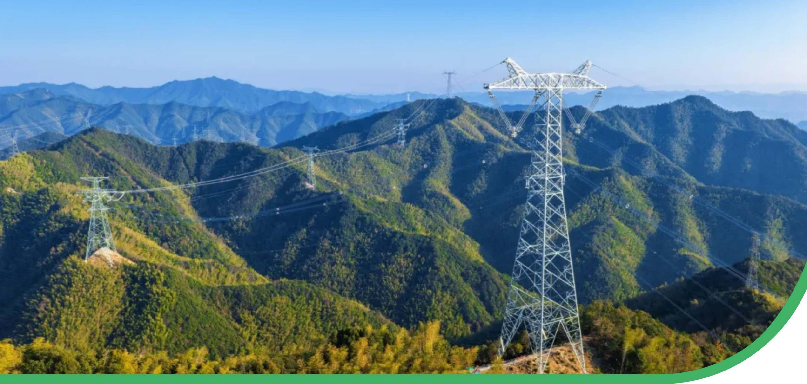

natural_image

Aerial view of a high-voltage transmission tower spanning lush green mountain ridges under a clear blue sky.

# 04

# 节能降碳 向绿而行

◎ 推进低碳节能  
◎ 强化环境管理

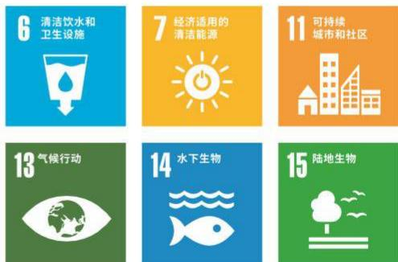

text_image

6 清洁饮水和卫生设施
7 经济适用的清洁能源
11 可持续城市和社区
13 气候行动
14 水下生物
15 陆地生物

# 推进低碳节能

# 应对气候变化

汇金通秉持可持续发展理念，通过深刻和全面的流程设计将绿色生态理念融入管理过程、生产过程和营销过程，积极承担建设资源节约型、生态友好型企业的社会责任。公司一方面加强科技创新和产品研发，不断开发出科技含量高、资源消耗低、环境污染少的绿色产品，引领企业走上高质量、高效益、低消耗、零污染的道路。另一方面，公司以精细化管理促进节能减排，加强对水、电、气等设施物资的供应及管理，严格落实环保责任制度，紧抓环保管理，创造良好环境管理氛围。

为响应绿色、低碳发展理念，公司积极开展产品碳足迹核查，对原材料获取、生产制造等环节进行产品碳足迹数据量化，辨识产品制造各重点产碳环节，为碳足迹认证提供数据指导，完成产品碳足迹认证工作并取得《产品碳足迹证书》。

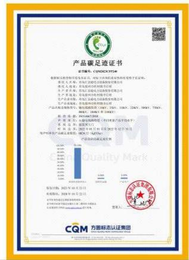

bar

| 指标 | 数值 |
| --- | --- |
| 产品碳足迹证书 | 100% |
| 产品碳足迹标准 | 2.50 |
| 产品碳足迹标准 | 1.00 |
| 产品碳足迹标准 | 0.50 |
| 产品碳足迹标准 | 0.25 |
| 产品碳足迹标准 | 0.15 |
| 产品碳足迹标准 | 0.10 |
| 产品碳足迹标准 | 0.05 |
| 产品碳足迹标准 | 0.02 |
| 产品碳足迹标准 | 0.01 |
| 产品碳足迹标准 | 0.005 |
| 产品碳足迹标准 | 0.002 |
| 产品碳足迹标准 | 0.001 |
| 产品碳足迹标准 | 0.0005 |
| 产品碳足迹标准 | 0.0002 |
| 产品碳足迹标准 | 0.0001 |
| 产品碳足迹标准 | 0.00005 |
| 产品碳足迹标准 | 0.00002 |
| 产品碳足迹标准 | 0.00001 |
| 产品碳足迹标准 | 0.000005 |
| 产品碳足迹标准 | 0.000002 |
| 产品碳足迹标准 | 0.000001 |
| 产品碳足迹标准 | 0.0000005 |
| 产品碳足迹标准 | 0.0000002 |
| 产品碳足迹标准 | 0.0000001 |
| 产品碳足迹标准 | 0.00000005 |
| 产品碳足迹标准 | 0.00000002 |
| 产品碳足迹标准 | 0.00000001 |
| 产品碳足迹标准 | 0.000000005 |
| 产品碳足迹标准 | 0.000000002 |
| 产品碳足迹标准 | 0.000000001 |
| 产品碳足迹标准 | 0.0000000005 |
| 产品碳足迹标准 | 0.0000000002 |
| 产品碳足迹标准 | 0.0000000001 |
| 产品碳足迹标准 | 0.00000000005 |
| 产品碳足迹标准 | 0.00000000002 |
| 产品碳足迹标准 | 0.00000000001 |
| 产品碳足迹标准 | 0.0000000003 |
| 产品碳足迹标准 | 1.289476787 (单位:吨) |
| 产品碳足迹标准 | 1.289476787 (单位:吨) |
| 产品碳足迹标准 | 1.289476787 (单位:吨) |
| 产品碳足迹标准 | 1.289476787 (单位:吨) |
| 产品碳足迹标准 | 1.289476787 (单位:吨/吨) |
| 产品碳足迹标准 | 1.289476787 (单位:吨/吨) |
| 产品碳足迹标准 | 1.289476787 (单位:吨/吨) |
| 产品碳足迹标准 | 1.289476787 (单位:吨/吨) |
| 产品碳足迹标准 | 1.289473887 (单位:吨) |
| 产品碳足迹标准 | 1.289473887 (单位:吨) |
| 产品碳足迹标准 | 1.289473887 (单位:吨) |
| 产品碳足迹标准 | 1.289473887 (单位:吨/吨) |
| 产品碳足迹标准 | 1.289473887 (单位:吨/吨) |
| 产品碳足迹标准 | 1.289473887 (单位:吨/吨) |
| 产品碳足迹标准 | 1.289473887 (单位:吨/吨) |
| 产品碳足迹标准 | 1.289472887 (单位:吨) |
| 产品碳足迹标准 | 1.289472887 (单位:吨) |
| 产品碳足迹标准 | 1.289472887 (单位:吨/吨) |
| 产品碳足迹标准 | 1.289472887 (单位:吨/吨) |
| 产品碳足迹标准 | 1.289472887 (单位:吨/吨) |
| 产品碳足迹标准 | 1.289472887 (单位:吨/吨) |
| 产品碳足迹标准 | 1.289471887 (单位:吨) |
| 产品碳足迹标准 | 1.289471887 (单位:吨) |
| 产品碳足迹标准 | 1.289471887 (单位:吨/吨) |
| 产品碳足迹标准 | 1.289471887 (单位:吨/吨) |
| 产品碳足迹标准 | 1.289471887 (单位:吨/吨) |
| 产品碳足迹标准 | 1.289471887 (单位:吨/吨) |
| 产品碳足迹标准 | 1.28947-1-3(单位:吨) |
| 其他认证标准 | CQM 方面标志认证集团 |

公司及子公司获得绿色供应链企业、绿色制造企业、中国绿色环保企业、中国绿色工厂示范单位等多项称号。

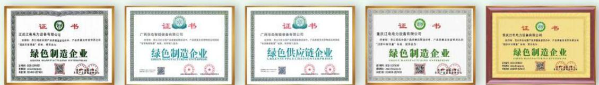

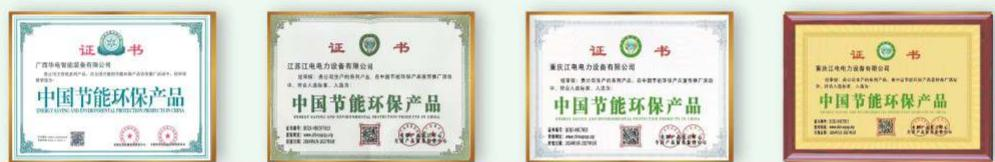

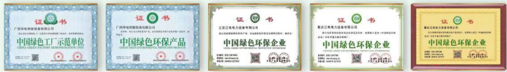

子公司江苏江电电力设备有限公司委托第三方开展了温室气体排放核查工作，为制定科学有效的减排策略提供基础。

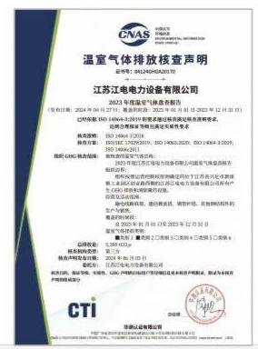

text_image

CNAS
温度监测仪
温室气体排放核查声明
证书号：S4244050420170
江苏江电电力设备有限公司
2023年年度废气排气筒
（发布日期：2024年04月27日，经查询后：2023年05月05日、2023年12月31日）
已开盖章：ISO 14946-3-2019年管道通过检测和处理及测量系统。
送检单位：江苏江电电力设备股份有限公司
检测单位：国信证券股份有限公司
报告日期：2023年05月28日
报告编号：2023-0502019、2023-0466-2020、ISO 14946-3-2019、ISO 14946-3-2018、ISO 14946-3-2017
国家发改委:中国能源建设集团有限公司
国家发改委:中国能源建设集团有限公司
国家发改委:中国能源建设集团有限公司
国家发改委:中国能源建设集团有限公司
国家发改委:中国能源建设集团有限公司
国家发改委:中国能源建设集团有限公司
国家发改委:中国能源建设集团有限公司
国家发改委:中国能源建设集团有限公司
国家发改委:中国能源建设集团有限公司
国家发改委:中国能源建设集团有限公司
国家发改委:中国能源建设集团有限公司
国家发改委:中国能源建设集团有限公司

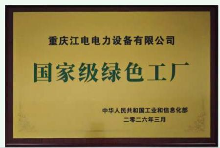

text_image

重庆江电电力设备有限公司
国家级绿色工厂
中华人民共和国工业和信息化部
二零二六年三月

2026年3月，子公司重庆江电电力设备有限公司通过国家级绿色工厂认定，成为西南地区制造业绿色转型的标杆典范，为其未来持续深化绿色转型注入强劲动力。

汇金通已通过青岛市绿色工厂认定，子公司江苏江电电力设备有限公司、广西华电智能装备有限公司分别通过省级绿色工厂认定。

# 案例

公司使用厂区屋顶建设分布式光伏，生产经营优先使用光伏绿电，致力打造低碳工厂。

# 2025年绿电使用情况

屋顶光伏总装机约27MW

累计采购绿电约 13939 MWh 约占总用电量 21%

2025年

<table><tr><td>温室气体排放总量</td></tr><tr><td>范围一温室气体排放量</td></tr><tr><td>范围二温室气体排放量</td></tr></table>

注：温室气体排放总量包括范围一和范围二的温室气体排放并基于财务控制权法合并计算。范围一温室气体排放量包括天然气、柴油、汽油等能源燃烧产生的直接温室气体排放量；范围二温室气体排放量为基于位置法计算外购电力产生的温室气体排放量；核算方法参考《温室气体核算体系：企业核算与报告标准》。

5.84万吨二氧化碳当量

2.31万吨二氧化碳当量

3.53万吨二氧化碳当量

# 合理利用资源

公司严格遵守《中华人民共和国能源法》《中华人民共和国可再生能源法》《中华人民共和国水法》等相关法律法规要求，成立节能管理小组，开展能源管理制度体系建设及执行，确保资源合理利用。

公司及下属主要子公司均已通过能源管理体系认证。

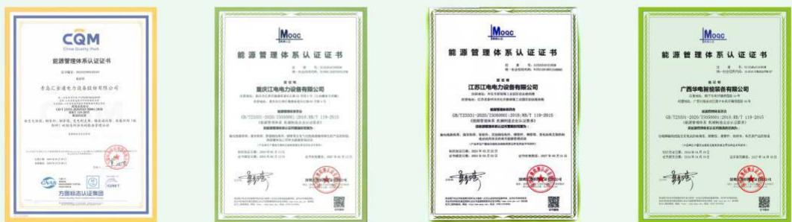

公司积极响应国家双碳战略号召，严格贯彻环保观念，营造健康舒适的办公环境。通过提供厂房屋顶建设分布式光伏电站，换购优惠绿色电力能源推行清洁生产；厂区建设储能电站，实现用电削峰填谷，高温天气适时调整作业时间，减少高温时段氮氧化物排放，错开用电高峰；厂区安装新能源汽车充电桩，鼓励员工低碳出行；积极使用信息化技术开展线上会议、无纸化办公，降低会议成本；开展节能环保活动，践行低碳绿色办公理念，力争从细节上尽到企业的社会责任。

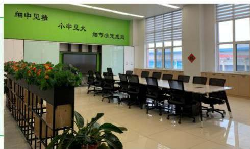

text_image

细中见精 小中见大 细节泳见底肌

办公区采用节能灯具照明，做到人走灯灭，
杜绝“长明灯”、“长流水”等浪费现象。

natural_image

Hand holding a tablet displaying a document with paper and documents, surrounded by floating documents and bubbles (no visible text or symbols)

积极使用信息化技术，通过远程视频培训、网络培训等推广无纸化办公。

natural_image

Illustration of a person interacting with multiple computer monitors connected by dashed lines, symbolizing data or communication (no text or symbols present)

开展线上会议，降低会议成本。

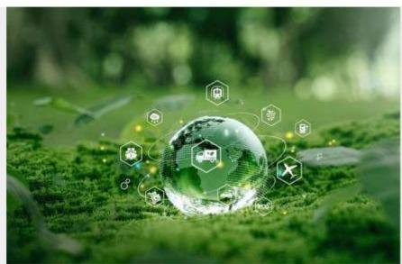

natural_image

Green-tinted globe with digital icons on moss, symbolizing global sustainability or environmental innovation (no text or symbols)

开展节能环保宣传活动，增强节能减排意识。

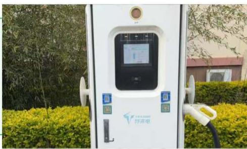

natural_image

Exterior view of a white electric vehicle charging station with digital display and green hedge (no signage)

厂区安装新能源汽车充电桩，鼓励员工低碳出行。

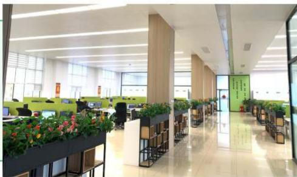

natural_image

Interior view of a modern open-plan office with cubicles, desks, and large windows (no visible text or signage)

定期养护办公区域绿色植物，鼓励员工种植绿色植物，营造健康舒适的办公环境。

<table><tr><td>指标</td><td>单位</td><td>2025年</td></tr><tr><td>能源消耗总量</td><td>万吨标准煤</td><td>2.21</td></tr><tr><td>总取水量</td><td>万吨</td><td>32.67</td></tr></table>

# 发展循环经济

汇金通严格执行国家及地方环境保护标准体系，持续推进循环经济发展，强化废弃物回收、加工与利用协同，提升资源利用效率。公司针对工业废水、包装物等多种废弃物，系统性地开展回收利用与二次处置工作，积极探索废弃物资源回收利用路径，力求在降低废弃物处理成本的同时，最大限度地减少对环境的负面影响，实现经济效益与环境效益的双赢。

# 强化环境管理

# 环境合规管理

为加强对公司环境污染防治设施的监督管理，保障环保设施正常、有效运行，确保污染物达标排放，实现环境保护目的，汇金通根据国家法律及环保部门的有关规定，结合公司实际，制定了《环境保护工作制度》，公司节能环保部对公司环保工作统筹管理，构建更为全面的环境管理体系。

公司及子公司依据《中华人民共和国环境保护法》《国家突发环境事件应急预案》等相关法律法规，均制定了具体的突发环境事件应急预案，适用于公司厂区内各种因素造成的突发环境事件的应急准备和响应，并在生态环境局完成备案。

<table><tr><td>指标</td><td>单位</td><td>2025年</td></tr><tr><td>环保总投入</td><td>万元</td><td>756.39</td></tr></table>

# #

# 2025年

全年

达标排放

工业废水

0 排放

环境事件处罚

0 发生

公司及下属主要子公司均已通过环境管理体系认证。

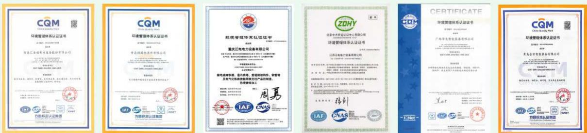

# 污染物排放

公司及子公司严格遵守《中华人民共和国环境影响评价法》等相关法律法规要求开展建设项目环境影响评价、排污许可证申请工作，并按照排污许可证等相关规定的要求，制定、实施自行监测方案，明确各污染物的监测项目、监测地点、监测频次等，并委托有资质的第三方监测机构定期进行监测，监测结果显示各项指标均达标，并及时将监测报告在环境信息公开平台上发布。

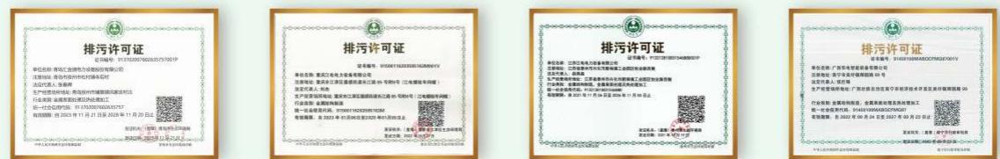

<table><tr><td>主要污染物名称</td><td>公司名称</td><td>排放方式</td><td>2025年排放总量(吨)</td><td>核定的排放总量(吨)</td><td>超标排放情况</td></tr><tr><td></td><td>汇金通</td><td>有组织排放</td><td>11.56</td><td>13.34</td><td>无</td></tr><tr><td rowspan="3">颗粒物、氮氧化物、二氧化硫、氨气、氯化氢</td><td>重庆江电</td><td>有组织排放</td><td>2.72</td><td>/</td><td>无</td></tr><tr><td>江苏江电</td><td>有组织排放</td><td>2.31</td><td>4.41</td><td>无</td></tr><tr><td>广西华电</td><td>有组织排放</td><td>6.89</td><td>/</td><td>无</td></tr></table>

公司及子公司工艺废气均按照要求配备污染物处理设施，经处理后达标排放，废气处理设施运行正常。2025年，汇金通及子公司主要废气污染物均达标排放。

# 废弃物处理

<table><tr><td>指标</td><td>单位</td><td>2025年</td></tr><tr><td>危险废弃物产生量</td><td>吨</td><td>13,147.85</td></tr><tr><td>一般工业固体废弃物产生量</td><td>吨</td><td>66,448.06</td></tr></table>

# 11 废水处理

公司建有污水处理系统，包括调节池、混凝反应池、沉淀池、双介质过滤器、活性炭过滤器、压滤机、污泥浓缩池等，生产废水通过处理系统处理后循环使用，不外排。

11

# 11 废弃物处理

公司各厂区设有固体废弃物存放区及危废仓库，其中生活垃圾由市政生活垃圾桶收集并交由环卫部门每日进行处理；一般工业固体废弃物暂存在暂存区内，暂存区符合一般工业固体废弃物贮存标准，定期由物资公司进行回收利用；危险废弃物暂存在厂区危险废弃物暂存仓库内，仓库符合危险废弃物贮存标准，定期委托有资质第三方处置。

11

# 11 环境自行监测

公司严格监控治理废水和废气的环保设备设施运行情况，保证所有环保设备设施能够正常运行。公司严格遵守国家及地方政府环保法律、法规和相关规定，明确废水、废气、固废等污染物的种类、取样位置等，并委托有资质的单位进行监测，编制环保监测方案。根据废水和废气排放的自测、委托监测、执法监测的数据显示，均达到相应标准。

11

# 绿色生产

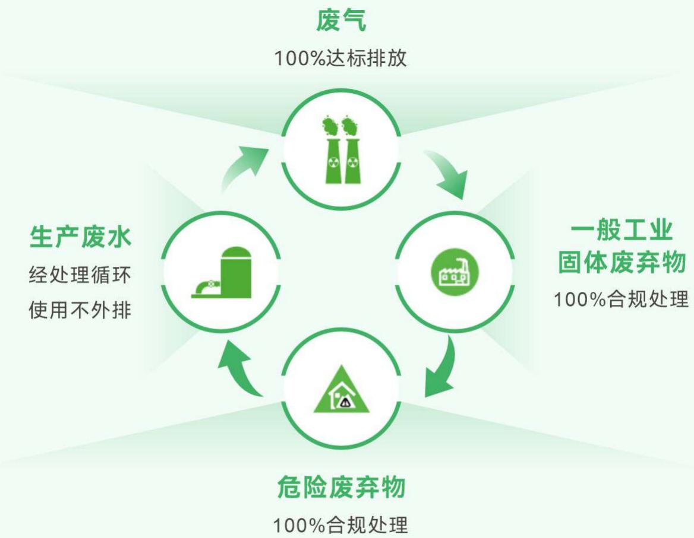

flowchart

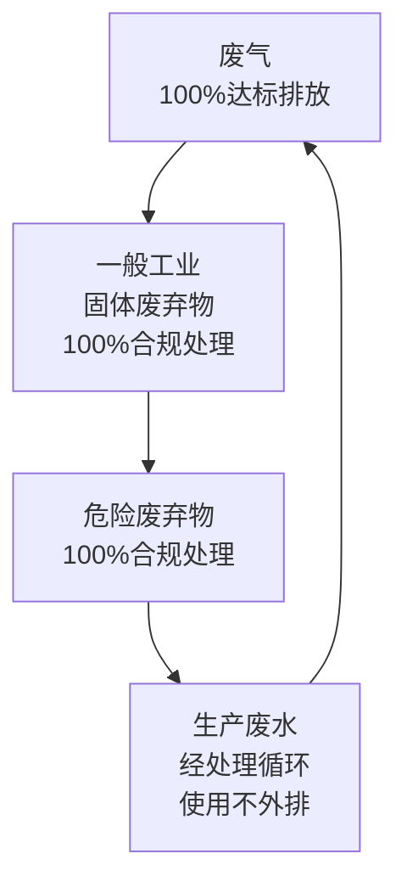
```mermaid
graph TD
  A["废气\n100%达标排放"] --> B["一般工业\n固体废弃物\n100%合规处理"]
  B --> C["危险废弃物\n100%合规处理"]
  C --> D["生产废水\n经处理循环\n使用不外排"]
  D --> A
```

# 案例

# 全封闭智能控制绿色热镀锌生产线

公司对镀锌生产线进行专项技改升级，采用混凝土全封闭的方式进、出料，微负压封闭间、4座喷淋洗涤塔保证酸雾不外泄，且运行成本低，可实现全流程的自动化、数字化、可视化。

全封闭智能控制绿色热镀锌生产线，为我国传统热镀锌企业节能环保改造探索出了新模式、新方法。

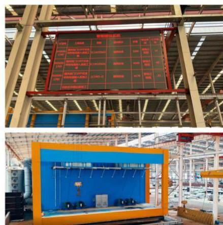

# 案例

# 环保培训

公司在日常生产管理中积极开展环保宣传教育培训，强化内部考核，严格执行相关排放标准，杜绝“跑、冒、滴、漏”，杜绝环境污染事故的发生，全面履行环境责任。

2025年，公司及子公司开展环保宣传教育培训19次，环境应急演练5次。

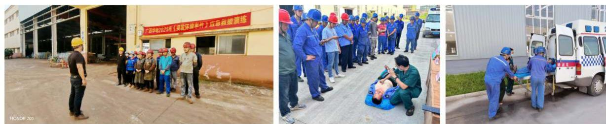

# 保护生态系统和生物多样性

汇金通严格遵守国家法律法规，日常生产经营严格遵循“生态保护红线”，保护山体、植被等自然要素，规范环保设施管理，定期开展环保隐患排查，及时发现并解决潜在问题，持续为保护生物多样性、维护生态平衡贡献力量。

关键绩效表

<table><tr><td colspan="4">环境范畴</td></tr><tr><td>议题</td><td>指标</td><td>单位</td><td>2025年</td></tr><tr><td rowspan="3">应对气候变化</td><td>温室气体排放总量</td><td>吨二氧化碳当量</td><td>58,425.60</td></tr><tr><td>范围一排放量</td><td>吨二氧化碳当量</td><td>23,086.37</td></tr><tr><td>范围二排放量</td><td>吨二氧化碳当量</td><td>35,339.23</td></tr><tr><td rowspan="3">环境合规管理</td><td>环保总投入</td><td>万元</td><td>756.39</td></tr><tr><td>环保总投入占营业收入比例</td><td>%</td><td>0.18</td></tr><tr><td>报告期内因环境事件受到生态环境等有关部门重大行政处罚的处罚金额</td><td>万元</td><td>0</td></tr><tr><td>污染物排放</td><td>大气污染物排放量</td><td>吨</td><td>23.49</td></tr><tr><td rowspan="5">废弃物处理</td><td>有害废弃物产生量</td><td>吨</td><td>13,147.85</td></tr><tr><td>有害废弃物产生密度</td><td>吨/万元营收</td><td>0.03</td></tr><tr><td>无害废弃物产生量</td><td>吨</td><td>66,448.06</td></tr><tr><td>无害废弃物产生密度</td><td>吨/万元营收</td><td>0.16</td></tr><tr><td>工业废水循环使用率</td><td>%</td><td>100</td></tr><tr><td rowspan="7">能源利用</td><td>能源消耗总量</td><td>吨标准煤</td><td>22,057.63</td></tr><tr><td>柴油消耗量</td><td>吨标准煤</td><td>412.30</td></tr><tr><td>汽油消耗量</td><td>吨标准煤</td><td>122.97</td></tr><tr><td>天然气消耗量</td><td>吨标准煤</td><td>13,336.93</td></tr><tr><td>外购电力消耗量</td><td>吨标准煤</td><td>8,185.43</td></tr><tr><td>清洁能源使用量</td><td>吨标准煤</td><td>15,050.00</td></tr><tr><td>总能耗强度</td><td>吨标准煤/万元营收</td><td>0.05</td></tr><tr><td>水资源利用</td><td>总取水量</td><td>万吨</td><td>32.67</td></tr></table>

社会范畴

<table><tr><td>议题</td><td>指标</td><td>单位</td><td>2025年</td></tr><tr><td rowspan="23">员工</td><td>2025年末在职员工总数</td><td>人</td><td>3340</td></tr><tr><td colspan="3">按性别划分:</td></tr><tr><td>男性员工</td><td>人</td><td>2686</td></tr><tr><td>女性员工</td><td>人</td><td>654</td></tr><tr><td colspan="3">按岗位结构划分:</td></tr><tr><td>生产人员</td><td>人</td><td>2228</td></tr><tr><td>销售人员</td><td>人</td><td>75</td></tr><tr><td>技术人员</td><td>人</td><td>491</td></tr><tr><td>财务人员</td><td>人</td><td>40</td></tr><tr><td>行政人员</td><td>人</td><td>506</td></tr><tr><td colspan="3">按年龄划分:</td></tr><tr><td>30岁以下(不含30岁)</td><td>人</td><td>430</td></tr><tr><td>30-40岁(含30岁,不含40岁)</td><td>人</td><td>880</td></tr><tr><td>40-50岁(含40岁,不含50岁)</td><td>人</td><td>973</td></tr><tr><td>50岁以上</td><td>人</td><td>1057</td></tr><tr><td colspan="3">按教育程度划分:</td></tr><tr><td>大专及以上学历</td><td>人</td><td>712</td></tr><tr><td>大专以下学历</td><td>人</td><td>2628</td></tr><tr><td>全年发放工资金额</td><td>亿元</td><td>3.6</td></tr><tr><td>劳动合同签订率</td><td>%</td><td>100</td></tr><tr><td>社会保险覆盖率</td><td>%</td><td>100</td></tr><tr><td>职业健康安全教育普及率</td><td>%</td><td>100</td></tr><tr><td>员工培训覆盖率</td><td>%</td><td>100</td></tr><tr><td colspan="4">社会范畴</td></tr><tr><td>议题</td><td>指标</td><td>单位</td><td>2025年</td></tr><tr><td rowspan="11">员工</td><td>员工培训场次</td><td>次</td><td>527</td></tr><tr><td>员工培训人次</td><td>人次</td><td>7642</td></tr><tr><td>员工培训时长</td><td>小时</td><td>17219</td></tr><tr><td>重大火灾爆炸事故</td><td>次</td><td>0</td></tr><tr><td>重大环境污染事故</td><td>次</td><td>0</td></tr><tr><td>重大职业病危害事故</td><td>次</td><td>0</td></tr><tr><td>重大化学品泄漏事故</td><td>次</td><td>0</td></tr><tr><td>重大工伤事故发生率</td><td>%</td><td>0</td></tr><tr><td>工伤事故死亡率</td><td>%</td><td>0</td></tr><tr><td>安全培训覆盖率</td><td>%</td><td>100</td></tr><tr><td>安全培训次数</td><td>次</td><td>67</td></tr><tr><td rowspan="2">产品和服务安全与质量</td><td>质量通报事件</td><td>次</td><td>0</td></tr><tr><td>重大产品召回事件</td><td>次</td><td>0</td></tr><tr><td rowspan="10">创新驱动</td><td>研发投入金额</td><td>万元</td><td>17,091.78</td></tr><tr><td>研发投入占营业收入比例</td><td>%</td><td>4.09</td></tr><tr><td>2025年末研发人员数量</td><td>人</td><td>491</td></tr><tr><td>研发人员比例</td><td>%</td><td>14.70</td></tr><tr><td colspan="3">按教育程度划分:</td></tr><tr><td>大专及以上学历</td><td>人</td><td>233</td></tr><tr><td>大专以下学历</td><td>人</td><td>258</td></tr><tr><td colspan="3">按年龄结构划分:</td></tr><tr><td>30岁以下(不含30岁)</td><td>人</td><td>108</td></tr><tr><td>30-40岁(含30岁,不含40岁)</td><td>人</td><td>202</td></tr></table>

<table><tr><td colspan="4">社会范畴</td></tr><tr><td>议题</td><td>指标</td><td>单位</td><td>2025年</td></tr><tr><td rowspan="5"></td><td>40-50岁(含40岁,不含50岁)</td><td>人</td><td>103</td></tr><tr><td>50-60岁(含50岁,不含60岁)</td><td>人</td><td>77</td></tr><tr><td>60岁及以上</td><td>人</td><td>1</td></tr><tr><td>申请专利数量</td><td>项</td><td>23</td></tr><tr><td>发明专利申请数量</td><td>项</td><td>11</td></tr><tr><td rowspan="10">创新驱动</td><td>实用新型专利申请数量</td><td>项</td><td>12</td></tr><tr><td>授权专利数量</td><td>项</td><td>22</td></tr><tr><td>发明专利授权数量</td><td>项</td><td>13</td></tr><tr><td>实用新型专利授权数量</td><td>项</td><td>9</td></tr><tr><td>截至披露日有效专利数量</td><td>项</td><td>262</td></tr><tr><td>其中:发明专利</td><td>项</td><td>67</td></tr><tr><td>外观设计</td><td>项</td><td>16</td></tr><tr><td>实用新型</td><td>项</td><td>179</td></tr><tr><td>截至披露日累计注册商标数量</td><td>项</td><td>29</td></tr><tr><td>截至披露日累计参与并起草国家(行业)标准、地方标准或团体标准的制定和修订的数量</td><td>项</td><td>11</td></tr><tr><td rowspan="2"></td><td colspan="3">供应商构成:</td></tr><tr><td>华东地区</td><td>%</td><td>58</td></tr><tr><td rowspan="5">供应链安全</td><td>西南地区</td><td>%</td><td>14</td></tr><tr><td>华南地区</td><td>%</td><td>11</td></tr><tr><td>华北地区</td><td>%</td><td>11</td></tr><tr><td>华中地区</td><td>%</td><td>4</td></tr><tr><td>东北地区</td><td>%</td><td>1</td></tr><tr><td>供应链安全</td><td>西北地区</td><td>%</td><td>1</td></tr><tr><td>乡村振兴及社会贡献</td><td>公益捐赠及乡村振兴投入</td><td>万元</td><td>13</td></tr></table>

<table><tr><td colspan="4">治理范畴</td></tr><tr><td>议题</td><td>指标</td><td>单位</td><td>2025年</td></tr><tr><td rowspan="14">公司治理</td><td>股东会会议次数</td><td>次</td><td>3</td></tr><tr><td>股东会董事出席率</td><td>%</td><td>100</td></tr><tr><td>董事会会议次数</td><td>次</td><td>7</td></tr><tr><td>董事会董事出席率</td><td>%</td><td>100</td></tr><tr><td>审计委员会会议次数</td><td>次</td><td>8</td></tr><tr><td>薪酬与考核委员会会议次数</td><td>次</td><td>2</td></tr><tr><td>提名委员会会议次数</td><td>次</td><td>2</td></tr><tr><td>战略与发展委员会会议次数</td><td>次</td><td>1</td></tr><tr><td>独立董事专门会议次数</td><td>次</td><td>2</td></tr><tr><td>董事会成员人数</td><td>人</td><td>9</td></tr><tr><td>独立董事人数</td><td>人</td><td>3</td></tr><tr><td>非独立董事人数</td><td>人</td><td>6</td></tr><tr><td>女性董事人数</td><td>人</td><td>2</td></tr><tr><td>男性董事人数</td><td>人</td><td>7</td></tr><tr><td rowspan="3">投资者关系</td><td>发布公告和上网文件数量</td><td>份</td><td>115</td></tr><tr><td>业绩说明会召开次数</td><td>次</td><td>3</td></tr><tr><td>回复E互动平台投资者提问数量</td><td>次</td><td>83</td></tr></table>

<table><tr><td colspan="4">治理范畴</td></tr><tr><td>议题</td><td>指标</td><td>单位</td><td>2025年</td></tr><tr><td rowspan="3">党建引领</td><td>党委/党支部数量</td><td>个</td><td>6</td></tr><tr><td>党员数量</td><td>人</td><td>137</td></tr><tr><td>党员活动数量</td><td>次</td><td>106</td></tr><tr><td rowspan="3">反商业贿赂及反贪污</td><td>反商业贿赂及反贪污培训次数</td><td>次</td><td>15</td></tr><tr><td>董事、高管、中基层干部及涉外重点岗位人员培训参与率</td><td>%</td><td>100</td></tr><tr><td>贪污诉讼案件数量</td><td>件</td><td>0</td></tr><tr><td>反不正当竞争</td><td>反不正当竞争导致诉讼或者重大行政处罚次数</td><td>次</td><td>0</td></tr></table>

# 指标索引

<table><tr><td>披露要求</td><td>对应的本报告章节</td></tr><tr><td>应对气候变化</td><td>节能降碳 向绿而行-推进低碳节能</td></tr><tr><td>污染物排放</td><td>节能降碳 向绿而行-强化环境管理</td></tr><tr><td>废弃物处理</td><td>节能降碳 向绿而行-强化环境管理</td></tr><tr><td>生态系统和生物多样性保护</td><td>节能降碳 向绿而行-强化环境管理</td></tr><tr><td>环境合规管理</td><td>节能降碳 向绿而行-强化环境管理</td></tr><tr><td>能源利用</td><td>节能降碳 向绿而行-推进低碳节能</td></tr><tr><td>水资源利用</td><td>节能降碳 向绿而行-推进低碳节能</td></tr><tr><td>循环经济</td><td>节能降碳 向绿而行-推进低碳节能</td></tr><tr><td>乡村振兴</td><td>和合共生 共融发展-践行责任使命</td></tr><tr><td>社会贡献</td><td>和合共生 共融发展-践行责任使命</td></tr><tr><td>创新驱动</td><td>和合共生 共融发展-创新驱动发展</td></tr><tr><td>科技伦理</td><td>和合共生 共融发展-创新驱动发展</td></tr><tr><td>供应链安全</td><td>和合共生 共融发展-恪守责任采购</td></tr><tr><td>平等对待中小企业</td><td>和合共生 共融发展-恪守责任采购</td></tr><tr><td>产品和服务安全与质量</td><td>和合共生 共融发展-匠心铸就品质</td></tr><tr><td>数据安全与客户隐私保护</td><td>和合共生 共融发展-恪守责任采购</td></tr><tr><td>员工</td><td>和合共生 共融发展-保障员工权益、赋能员工发展</td></tr><tr><td>尽职调查</td><td>经公司ESG重要性议题评估,该议题不具有财务重要性或影响重要性,未在报告中披露相关内容。</td></tr><tr><td>利益相关方沟通</td><td>走进汇金通-可持续发展管理</td></tr><tr><td>反商业贿赂及反贪污</td><td>合规治理 笃定前行-规范公司治理</td></tr><tr><td>反不正当竞争</td><td>合规治理 笃定前行-规范公司治理</td></tr><tr><td>自主披露的议题:党建引领</td><td>合规治理 笃定前行-强化党建引领</td></tr><tr><td>自主披露的议题:以投资者为本</td><td>和合共生 共融发展-以投资者为本</td></tr></table>

# 意见反馈表

尊敬的读者：

感谢您阅读《汇金通2025年度环境、社会和公司治理（ESG）报告》，为向您及其他利益相关方提供更专业、更有价值的企业可持续发展信息，请您协助我们完成反馈意见表中的相关问题，以帮助我们在今后进一步提升可持续发展管理。

下列问题,请您按1分至5分进行评分(1为最低分,5为最高分)

1. 您对本报告的总体评价

□1 □2 □3 □4 □5

2.您认为本报告能否反映汇金通对经济的重大影响？

□1 □2 □3 □4 □5

3.您认为本报告能否反映汇金通对环境的重大影响？

□1 □2 □3 □4 □5

4.您认为本报告能否反映汇金通对社会的重大影响？

□1 □2 □3 □4 □5

5.您认为本报告能否反映汇金通的公司治理情况？

□ 1 □ 2 □ 3 □ 4 □ 5

6.您对本报告中信息披露程度的整体评价:

□ 1 □ 2 □ 3 □ 4 □ 5

7.您对本报告中文字表述质量的整体评价:

□ 1 □ 2 □ 3 □ 4 □ 5

8.您对本报告设计风格的整体评价:

□ 1 □ 2 □ 3 □ 4 □ 5

9.本报告哪些议题最引起您的关注？

10.您对本报告是否有其它意见和建议？

您的联系方式: \_\_\_\_ 您的姓名: \_\_\_\_