# 2025年度

# 环境、社会和公司治理（ESG）报告

苏州麦迪斯顿医疗科技股份有限公司

麦迪科技
MDTG

苏州麦迪斯顿医疗科技股份有限公司

公司官网链接：https://www.medicalsystem.com.cn/

地址：苏州工业园区归家巷222号

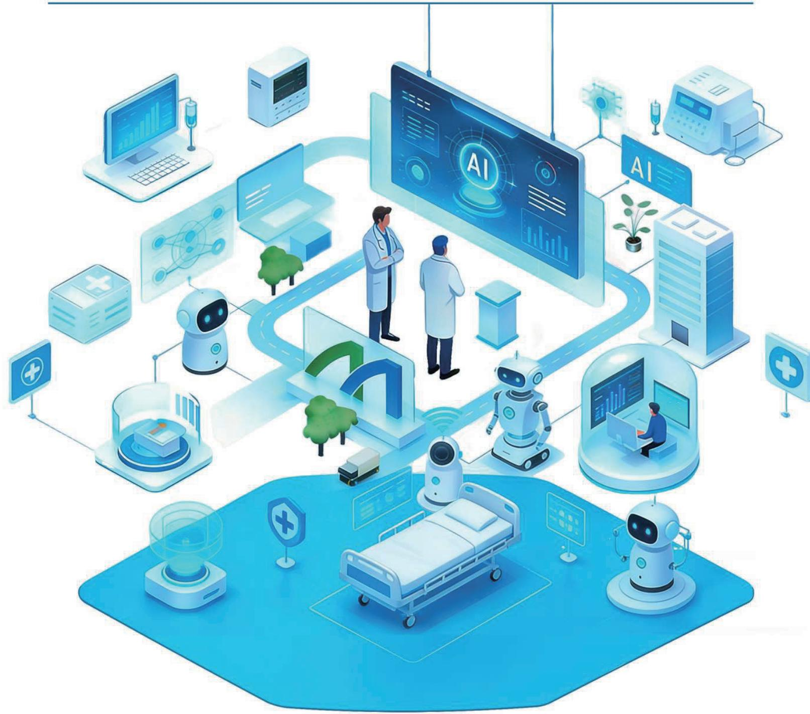

natural_image

Isometric illustration of a healthcare automation ecosystem with robotic devices, AI dashboards, and medical devices (no text or symbols)

# 目录

# CONTENTS

# 报告前言

关于本报告 01

董事长致辞 03

关于我们 05

# 可持续发展管理

可持续发展治理 14

联合国SDGs目标回应 15

利益相关方沟通 17

重要性议题管理 18

# 附录

未来展望 87

指标索引 88

关键绩效表 90

意见反馈表 94

# 01 规范治企 合规经营固根基

党建引领 23

公司治理 24

投资者权益保障 27

合规与风险管理 28

商业道德 31

# 02 医心向绿低碳运营护生态

应对气候变化 35

资源利用 38

环境合规管理 40

# 03 数智创新 质优链稳护医疗

研发创新 45

产品安全与质量 58

客户服务 62

负责任供应链 66

数据安全与隐私保护 68

# 04 医路同行 赋能成长筑关怀

员工权益保障 73

员工培训与发展 76

员工民主与关怀 80

职业健康与安全 82

社会奉献 83

# 报告前言

# 关于本报告

本报告是苏州麦迪斯顿医疗科技股份有限公司（以下简称“麦迪科技”“公司”或“我们”）发布的第三份环境、社会和公司治理（ESG）报告（以下简称“ESG报告”）。本报告依据客观、规范、透明和全面的原则，详细披露了公司2025年度在环境、社会和公司治理的实践及绩效。

# 报告范围

本报告以“麦迪科技”为主体，包括下属子公司，除特别说明外，本报告范围与本公司年报范围保持一致。

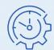

# 时间范围

本报告的时间范围为2025年1月1日至2025年12月31日（简称“报告期”）。为增强报告的可比性和完整性，部分内容适当追溯以往年份或具有前瞻性描述。

# 编制依据

◎ 上海证券交易所《上海证券交易所上市公司自律监管指引第14号—可持续发展报告（试行）》  
- 国际标准化组织《ISO 26000：社会责任指南（2010）》  
- 全球报告倡议组织《GRI可持续发展报告标准（GRI Standards）》  
中国企业改革与发展研究会《中国企业可持续发展报告指南（CASS—ESG 6.0）》  
气候相关财务信息披露（TCFD）框架  
联合国可持续发展目标（SDGs）  
- 可持续发展会计准则委员会SASB准则

# 数据说明

本报告引用的全部信息数据均来自麦迪科技正式文件、统计报告及财务报告，以及经由公司统计、汇总与审核的各职能部门、各经营单位的可持续发展实践信息。

公司承诺本报告内容不存在任何虚假记载、误导性陈述或重大遗漏。同时，本报告涉及的货币种类及金额，如无特殊说明，均以人民币为计量单位。

# 释义说明

<table><tr><td colspan="3">常用词语释义</td></tr><tr><td>麦迪科技、公司、我们</td><td>指</td><td>苏州麦迪斯顿医疗科技股份有限公司</td></tr><tr><td>玛丽医院</td><td>指</td><td>海口玛丽医院有限公司,系公司全资子公司</td></tr><tr><td>中科麦迪</td><td>指</td><td>中科麦迪人工智能研究院(苏州)有限公司,系公司全资子公司</td></tr></table>

# 确认及批准

本报告于2026年4月28日经公司董事会审议通过。公司承诺，报告内容不存在任何虚假记载、误导性陈述或者重大遗漏，董事会对报告内容的真实性、准确性和完整性负责。

# 报告获取

本报告以电子版形式发布，您可以在公司网站（medicalsystem.com.cn）、上海证券交易所网站（www.sse.com.cn）查阅和下载。

# 董事长致辞

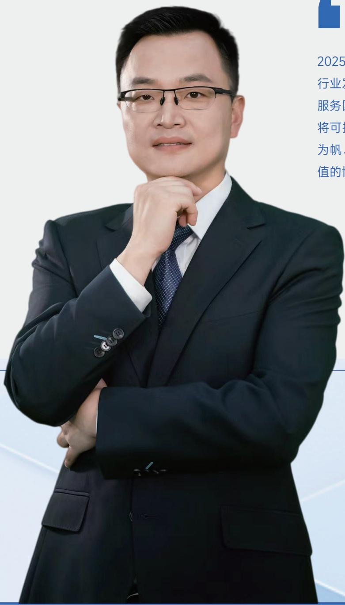

text_image

2025
行业发
服务国
将可持
为帆、
值的协

# “

2025年，是麦迪科技战略聚焦、深耕提质的关键之年。面对行业发展的新机遇与新挑战，公司始终坚守“创造客户价值，服务国家战略”的初心使命，全面锚定医疗信息化核心主业，将可持续发展理念深度嵌入战略布局与运营全流程，以责任为帆、以创新为桨，统筹推进经济价值、环境价值与社会价值的协同共生，在高质量发展的道路上稳步前行。

”

党建领航，笃行善治。公司始终坚持党建引领发展，将党的领导与公司治理深度融合，以党建赋能经营管理，筑牢稳健发展的政治根基。持续完善现代化公司治理体系，健全内控管理与风险防控机制，压实各层级治理责任，全面防范经营与合规风险。始终坚守透明规范的运营准则，优化投资者沟通机制，保障投资者合法权益，以清廉务实、规范高效的治理格局，为企业长远可持续发展保驾护航。

智研深耕，赋能医疗。2025年，公司坚定战略聚焦，全力深耕医疗信息化核心主业，以研发创新为核心引擎，持续推进技术迭代与产品升级。依托深厚的行业积淀，不断优化智慧医疗解决方案，助力医疗机构提升服务效能，推动医疗行业数字化、智能化转型。同时坚守医疗服务初心，深耕辅助生殖领域，以专业、规范的诊疗服务守护民生健康，以科技之力践行医疗企业的使命与担当，为健康中国建设注入坚实力量。

绿色践行，守护生态。公司始终坚持绿色低碳发展理念，将生态环保责任融入日常运营。持续健全环境管理体系，严格落实污染物管控要求，规范废弃物全流程管理，坚守生态环保底线。积极推进节能降耗实践，优化资源利用效率，以精细化的环境管理打造绿色运营模式，用实际行动守护生态环境，践行企业对自然与社会的生态承诺，助力社会绿色低碳转型。

以人为本，情系民生。公司坚守以人为本的核心理念，始终将员工成长与发展放在重要位置，完善薪酬福利与人才培养体系，搭建多元成长平台，助力员工实现职业价值。同时积极履行社会责任，心怀民生福祉，聚焦基层医疗需求，开展公益医疗服务，帮扶困难群体，用医疗温度传递企业善意。以责任守护员工、以爱心回馈社会，凝聚起企业与员工、与社会同心同行的温暖力量。

展望未来，麦迪科技将始终坚守可持续发展初心，深耕医疗主业，秉持创新精神与责任担当，持续深化ESG管理实践，兼顾客户、员工、股东、社会等各方利益。以科技赋能医疗康养，以责任守护发展，在推动企业高质量发展的同时，为医疗行业进步、社会和谐发展贡献更多力量，书写可持续发展的崭新篇章。

# 关于我们

# 公司简介

苏州麦迪斯顿医疗科技股份有限公司于2005年创立，2016年登陆上交所主板（股票代码603990），系位于江苏省苏州市的国有控股高新技术企业，公司专注于急危重症救治领域的信息化建设，以协同救治、提高医疗质量、提升救治效率和促进科研创新为重点，旨在提升整体医疗水平和患者满意度，促进医疗服务的整体进步和创新。

经过二十余载的深耕，公司聚焦智慧医疗信息化与辅助生殖医疗服务两大主业，打造的DoCare系列临床信息系统广泛覆盖手术室、重症病区、院前急救和院内急诊等关键领域，依托先进的移动互联网、物联网技术和大数据模型，深化打造产品的竞争优势和专业性，以满足医院在新时代的高质量发展需求。

核心布局医疗信息化与辅助生殖医疗服务，DoCare等系列产品覆盖全国32个省份2,400余家医疗机构，三甲医院市占率领先，旗下海口玛丽医院辅助生殖业务运营稳健，同时探索AI医疗应用、低空医疗救援、医康养机器人等前沿领域。未来公司将持续聚焦智慧医疗主业，深化AI与医疗场景融合，推进产品国产化适配，布局医康养、低空经济、医疗可信数据空间等赛道，以科技赋能医疗行业数字化转型，构建可持续发展的智慧医疗生态。

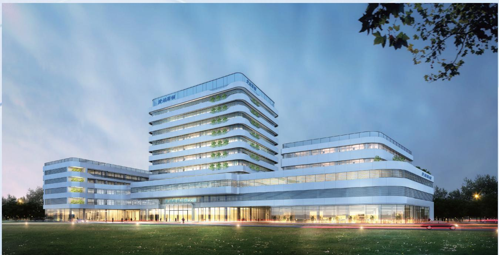

natural_image

Exterior view of a modern multi-story building with illuminated windows and greenery, situated at dusk (no signage visible)

企业文化  
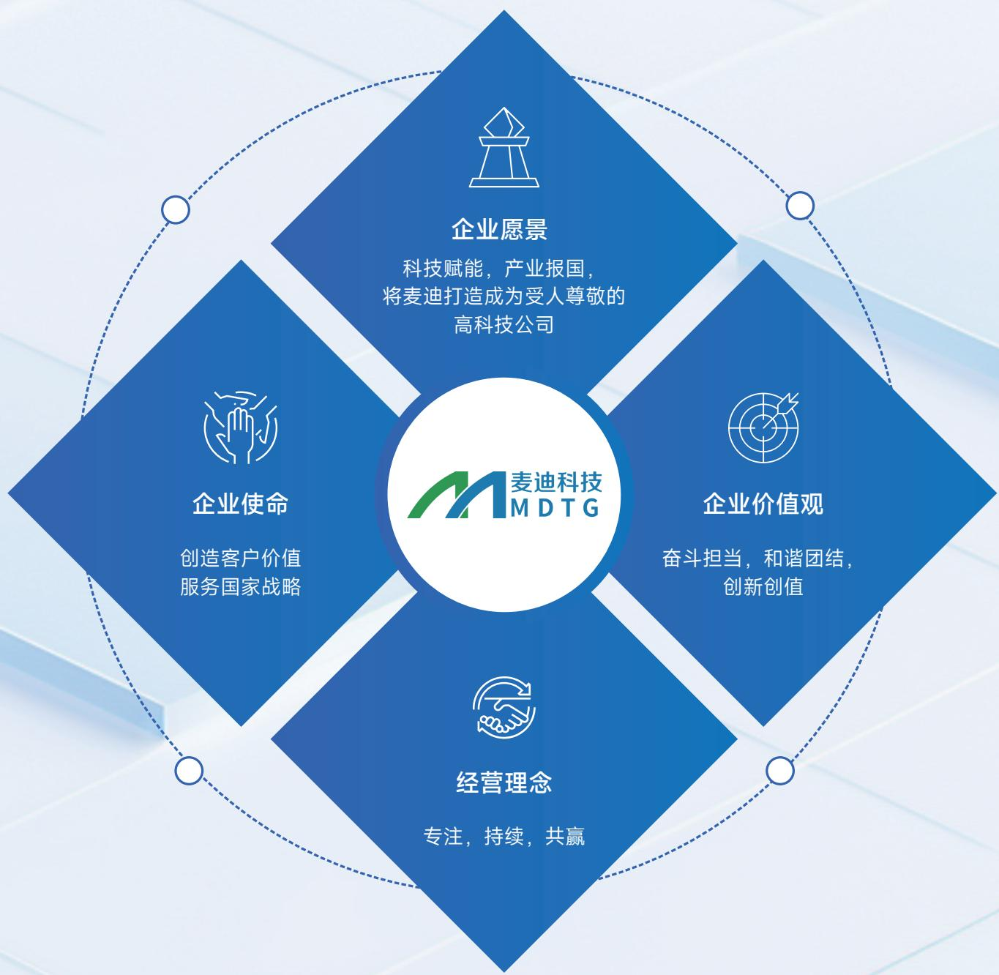

flowchart

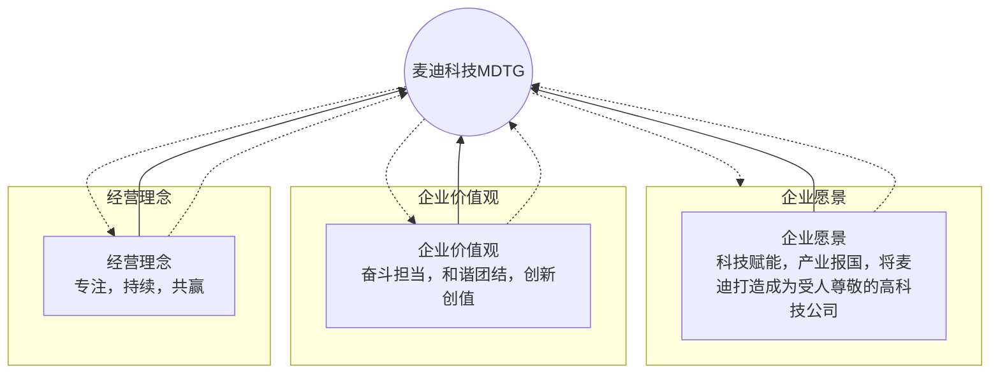
```mermaid
graph TD
  Center(("麦迪科技MDTG"))
  
  subgraph Pillar1["企业愿景"]
    A1["企业愿景\n科技赋能，产业报国，将麦迪打造成为受人尊敬的高科技公司"]
  end
  
  subgraph Pillar2["企业价值观"]
    B1["企业价值观\n奋斗担当，和谐团结，创新创值"]
  end
  
  subgraph Pillar3["经营理念"]
    C1["经营理念\n专注，持续，共赢"]
  end
  
  Center -.-> Pillar1
  Center -.-> B1
  Center -.-> C1
  
  %% Left Side (Left)
  A1 --> Center
  B1 --> Center
  C1 --> Center
  %% Right Side (Right)
  A1 -.-> Center
  B1 -.-> Center
  C1 -.-> Center
```

# 发展历程

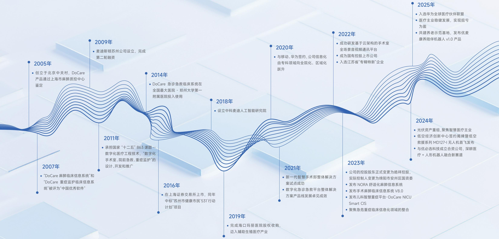

flowchart

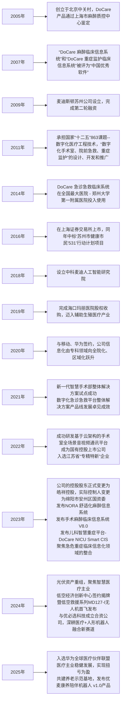
```mermaid
graph LR
  A["2005年"] --> B["创立于北京中关村，DoCare产品通过上海市麻醉质控中心鉴定"]
  C["2007年"] --> D["“DoCare 麻醉临床信息系统”和“DoCare 重症监护临床信息系统”被评为“中国优秀软件”"]
  E["2009年"] --> F["麦迪斯顿苏州公司设立，完成第二轮融资"]
  G["2011年"] --> H["承担国家“十二五”863课题--数字化医疗工程技术，“数字化手术室、院前急救、重症监护”的设计、开发和推广"]
  I["2014年"] --> J["DoCare 急诊急救临床系统在全国最大医院 - 郑州大学第一附属医院投入使用"]
  K["2016年"] --> L["在上海证券交易所上市，同年中标‘苏州市健康市民’531’行动计划项目"]
  M["2018年"] --> N["设立中科麦迪人工智能研究院"]
  O["2019年"] --> P["完成海口玛丽医院股权收购，迈入辅助生殖医疗产业"]
  Q["2020年"] --> R["与移动、华为签约，公司信息化由专科领域向全院化、区域化跃升"]
  S["2021年"] --> T["新一代智慧手术部整体解决方案试点成功\n数字化急诊急救平台整体解决方案产品线发展卓见成效"]
  U["2022年"] --> V["成功研发基于云架构的手术室全场景音视频通讯平台\n成为国有控股上市公司\n入选江苏省“专精特新”企业"]
  W["2023年"] --> X["公司的控股股东正式变更为皓祥控股，实际控制人变更为绵阳市安州区国资委\n发布NORA 舒适化麻醉信息系统\n发布手术麻醉临床信息系统 V8.0\n发布儿科智慧重症平台-DoCare NICU Smart CIS\n聚焦急危重症临床信息化领域的整合"]
  Y["2024年"] --> Z["光伏资产重组，聚焦智慧医疗主业\n低空经济创新中心签约揭牌暨低空救援系列MD127-I无人机首飞发布\n与优必选科技成立合资公司，深耕医疗+人形机器人融合新赛道"]
  AA["2025年"] --> AB["入选华为全球医疗伙伴联盟\n医疗主业稳健发展，实现扭亏为盈\n共建养老示范基地，发布优麦康养陪伴机器人 v1.0产品"]
```

# 业务概况

公司的核心业务布局围绕智慧医疗展开，形成以医疗信息化为根基、生殖医学医疗服务为补充、前沿科技融合创新业务为延伸的产品及服务体系，各板块协同发展，深度契合医疗行业数字化、智能化发展趋势。

# 医疗信息化

医疗信息化板块是公司的核心主业，深耕急危重症救治领域信息化建设多年，产品体系包含DoCare系列临床医疗管理信息系统应用软件与Dorico系列临床信息化整体解决方案两大核心类别，覆盖麻醉、重症监护、院前急救、院内急诊等关键临床环节，以及数字化手术室、急诊急救平台等整体建设场景。公司完成核心产品的国产化适配与信创改造，实现与国产主流软硬件平台的深度兼容，并推动产品与大模型深度融合，推出麻醉AI助手、智能重症医生助手等升级产品，支持云端与私有化双部署。目前，公司终端用户已覆盖全国32个省份，超过2,400家医疗机构，其中三甲医院约1,200家，在临床信息化细分领域形成领先的市场地位。

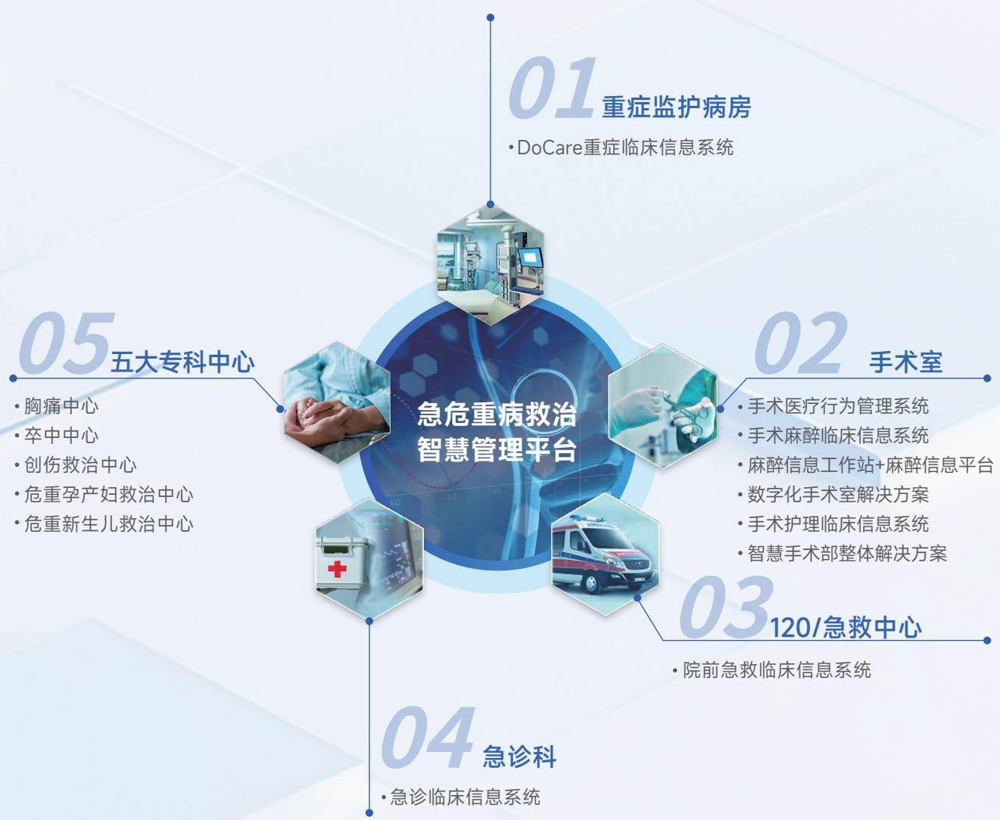

flowchart

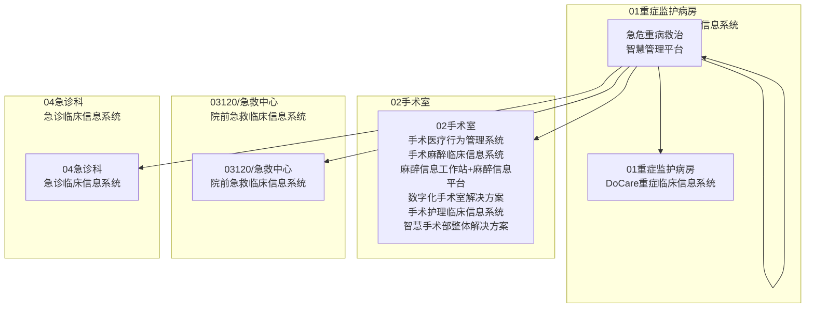
```mermaid
graph TD
  Center["急危重病救治\n智慧管理平台"]
  
  subgraph Core_1["01重症监护病房\nDoCare重症临床信息系统"]
    direction TB
  Center --> Center1["01重症监护病房\nDoCare重症临床信息系统"]
  end
  
  subgraph Core_2["02手术室\n手术医疗行为管理系统\n手术麻醉临床信息系统\n麻醉信息工作站+麻醉信息平台\n数字化手术室解决方案\n手术护理临床信息系统\n智慧手术部整体解决方案"]
    direction TB
    Center2["02手术室\n手术医疗行为管理系统\n手术麻醉临床信息系统\n麻醉信息工作站+麻醉信息平台\n数字化手术室解决方案\n手术护理临床信息系统\n智慧手术部整体解决方案"]
  end
  
  subgraph Core_3["03120/急救中心\n院前急救临床信息系统"]
    direction TB
    Center3["03120/急救中心\n院前急救临床信息系统"]
  end
  
  subgraph Core_4["04急诊科\n急诊临床信息系统"]
    direction TB
    Center4["04急诊科\n急诊临床信息系统"]
  end
  
  Center --> Center
  Center --> Center2
  Center --> Center3
  Center --> Center4
```

# 麦迪科技医疗信息化解决方案

# 智慧手术室

方案充分运用物联网技术、大数据及人工智能技术、数字孪生技术等应用技术，打破传统数字化手术室系统直播与转播定位，打造国内顶级的新一代智慧手术部，实现智慧手术部全流程智能场景规划。

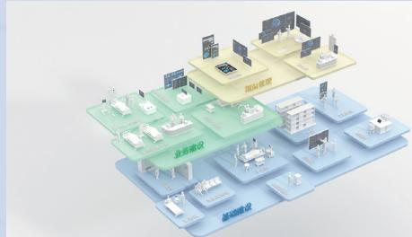

flowchart

This is a 3D diagram illustrating the hierarchical structure of a healthcare system, showing the flow from basic management to business and enterprise settings.

# 智慧急诊急救

助力提升医院急危重症救治领域的学科能力，实现院前急救、院内急诊、专科中心一体化流程，提高医护人员的工作效率，提升医疗水平，促进多学科协同救治。

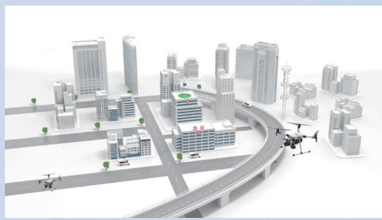

natural_image

3D architectural rendering of a city with skyscrapers, a curved highway, and a drone flying over (no text or symbols visible)

# 智慧重症病区

方案立足重症病区整体化设计理念，一体化整合诊疗、护理、抢救、质控、管理等全业务流程，提供多元化、个性化的专科应用解决方案。同时构建独立统一的重症临床专科数据库，为临床诊疗与科研创新提供高质量的数据服务与技术支撑。

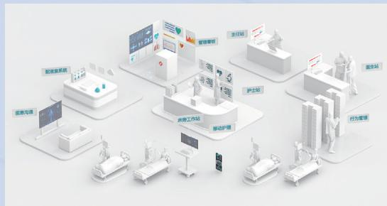

flowchart

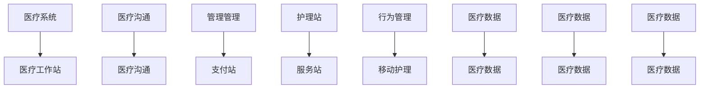
```mermaid
graph TD
  A["医疗系统"] --> B["医疗工作站"]
  C["医疗沟通"] --> D["医疗沟通"]
  E["管理管理"] --> F["支付站"]
  G["护理站"] --> H["服务站"]
  I["行为管理"] --> J["移动护理"]
  K["医疗数据"] --> L["医疗数据"]
  M["医疗数据"] --> N["医疗数据"]
  O["医疗数据"] --> P["医疗数据"]
```

# 医疗AI产品

麻醉、重症、急诊急救三大系统与AI深度融合。麻醉AI助手已覆盖手术全流程，实现评估自动化、风险管理与知识智能服务；重症产品AI升级，支持云端部署，兼顾智能化与数据安全；急诊临床信息系统已实现智能分级、辅助诊断、风险预警及电子病历生成等功能突破。三大系统整体构建了全场景、智能化、高安全的医疗AI体系。

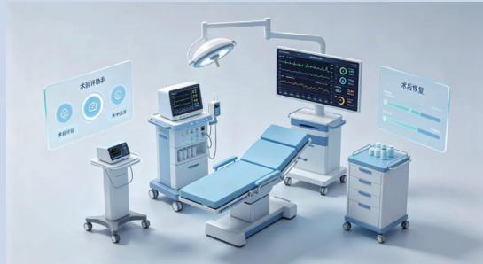

text_image

术前评估
手术评估
术中注
术后恢复

# 生殖医学医疗服务

生殖医学医疗服务是公司重要的业务补充，2019年通过收购海口玛丽医院正式切入该领域，作为海南省第二家拥有辅助生殖牌照的民营医疗机构，可开展夫精人工受精（AIH）、体外受精-胚胎移植（IVF-ET）和卵胞内单精子显微注射技术（ICSI）等辅助生殖业务，多年来运营稳健，形成了成熟的服务体系，与公司医疗信息化业务形成场景与数据的协同，进一步丰富了公司的医疗服务布局。

# 创新业务

公司积极探索前沿科技与医疗场景的深度融合，布局医疗数据平台、康养机器人、低空医疗救援等创新业务，成为产品及服务体系的重要延伸。公司联合行业伙伴开发无人机救援系统，依托5G、物联网技术打造智慧急救新模式；与头部机构合作研发康养机器人解决方案，推出具备健康监测、康复训练、情感陪伴等功能的产品，已在上海、浙江等地的康养机构开展试点。公司持续投入研发资金推动创新业务落地，让前沿技术赋能医疗服务升级，助力构建更完善的智慧医疗生态。

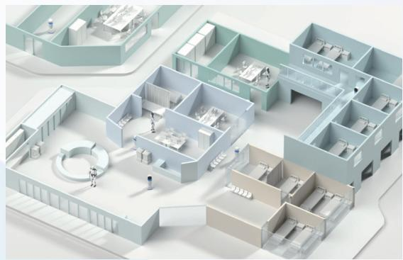

natural_image

Isometric architectural rendering of a hospital or medical facility layout with multiple rooms and staircases (no visible text or labels)

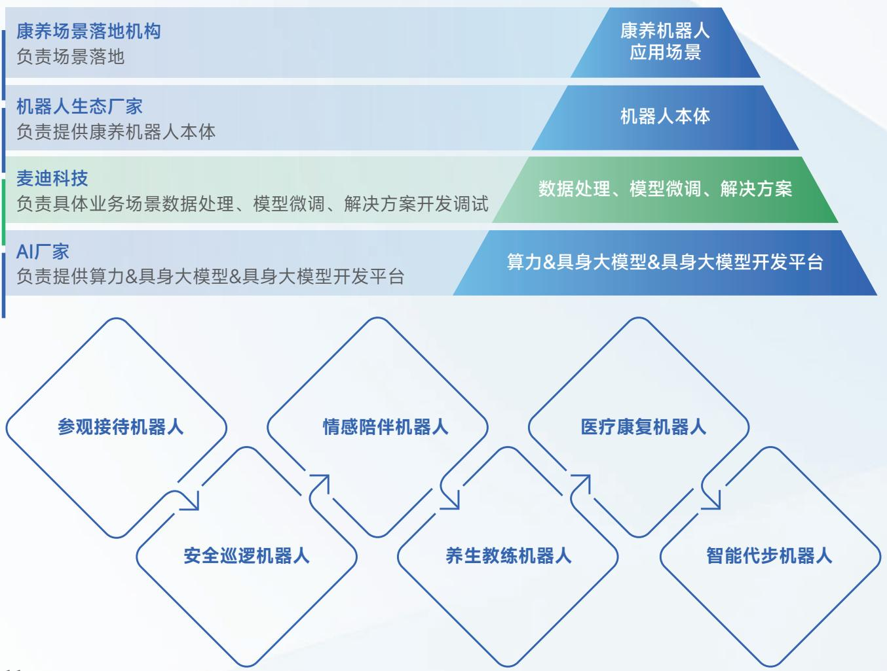

flowchart

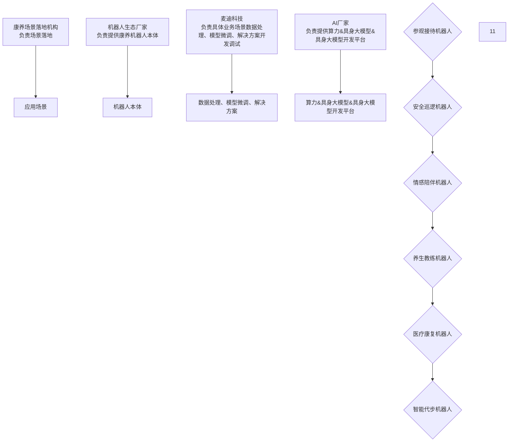
```mermaid
graph TD
  A["康养场景落地机构\n负责场景落地"] --> B["应用场景"]
  C["机器人生态厂家\n负责提供康养机器人本体"] --> D["机器人本体"]
  E["麦迪科技\n负责具体业务场景数据处理、模型微调、解决方案开发调试"] --> F["数据处理、模型微调、解决方案"]
  G["AI厂家\n负责提供算力&具身大模型&具身大模型开发平台"] --> H["算力&具身大模型&具身大模型开发平台"]
  I{"参观接待机器人"} --> J{"安全巡逻机器人"}
  J --> K{"情感陪伴机器人"}
  K --> L{"养生教练机器人"}
  L --> M{"医疗康复机器人"}
  M --> N{"智能代步机器人"}
  O["11"]
```

企业荣誉  
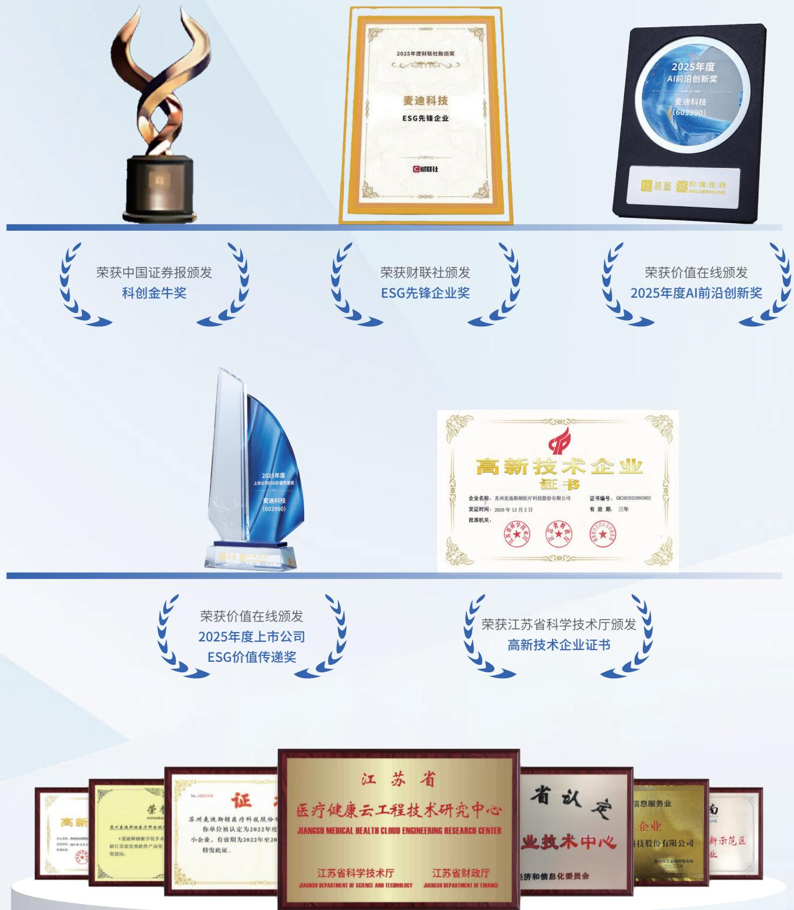

# 2025年亮点绩效

# 经济绩效

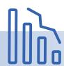

营业总收入

30,147.92万元

利润总额

4,539.89万元

归属于上市公司股东的净利润

3,915.83万元

缴纳税款

2,852.28万元

# 环境绩效

温室气体排放总量

1,043.04吨二氧化碳当量

直接温室气体排放量（范围一）

37.56吨二氧化碳当量

间接温室气体排放量（范围二）

1,005.45吨二氧化碳当量

减少二氧化碳排放量

103.79吨二氧化碳当量

# 社会绩效

社会保险覆盖率

100%

员工人均培训时长

14.28小时

研发投入

5,023.20万元

新增专利数量

6项

# 治理绩效

股东会会议召开次数

4次

董事会会议召开次数

11次

接待投资者现场调研次数

26次

# 可持续发展管理

公司将ESG（环境、社会及治理）理念视为可持续发展的核心，不断优化公司可持续发展管理体系，提升内部可持续发展管理水平，加强外部可持续发展信息披露，致力于利益相关方创造长期共享价值。

# 可持续发展治理

公司搭建了“决策-管理-执行”的三级ESG治理架构，由董事会牵头，作为ESG事项最高决策机构，承担ESG策略制定、工作监督与指导职责，ESG工作小组负责协调董事会ESG工作指导的执行，各部门及子公司配合管理层，将年度ESG管理目标落实，各层级岗位清晰划分ESG工作权责，为覆盖全运营环节的可持续治理筑牢根基。

麦迪科技可持续治理架构  
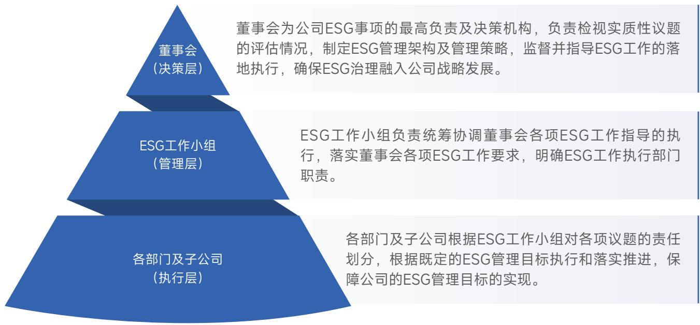

flowchart

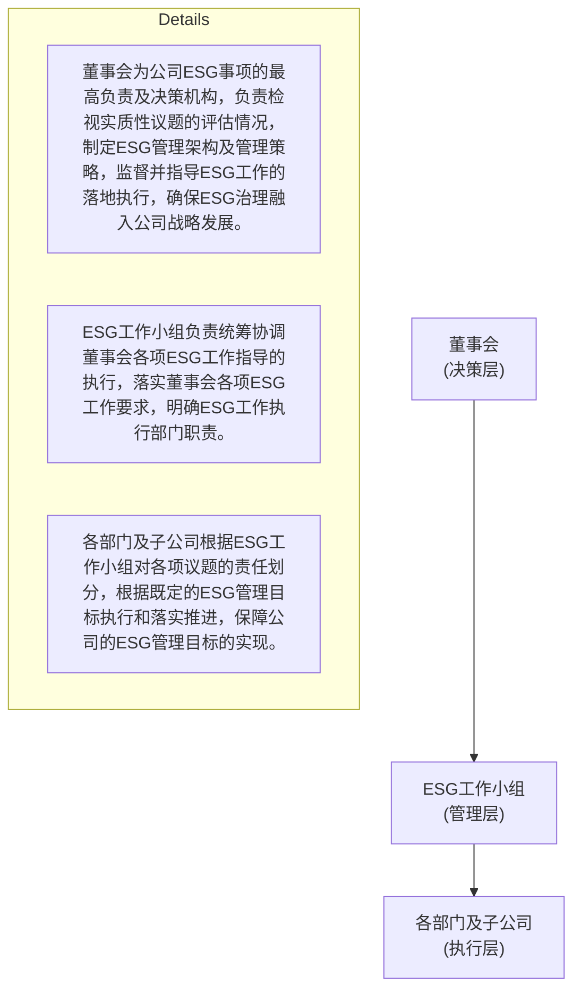
```mermaid
graph TD
  A["董事会\n(决策层)"] --> B["ESG工作小组\n(管理层)"]
  B --> C["各部门及子公司\n(执行层)"]
  
  subgraph Details
    D["董事会为公司ESG事项的最高负责及决策机构，负责检视实质性议题的评估情况，制定ESG管理架构及管理策略，监督并指导ESG工作的落地执行，确保ESG治理融入公司战略发展。"]
  end
  
  subgraph Details
    E["ESG工作小组负责统筹协调董事会各项ESG工作指导的执行，落实董事会各项ESG工作要求，明确ESG工作执行部门职责。"]
  end
  
  subgraph Details
    F["各部门及子公司根据ESG工作小组对各项议题的责任划分，根据既定的ESG管理目标执行和落实推进，保障公司的ESG管理目标的实现。"]
  end
```

公司建立规范化、全流程的信息报告机制，打通医疗信息化、辅助生殖服务等各业务板块的信息传递渠道，定期对ESG相关信息开展收集、整理与分析。严格遵循监管要求与ESG报告编制规范完成信息整合与披露，保障信息的真实性、准确性与完整性。

董事会通过定期听取管理层关于经营运行、内控管理和可持续发展相关工作的汇报，对相关措施的实施情况进行持续监督，并根据内外部环境变化，推动管理机制和决策流程的不断完善，促进公司在稳健经营基础上实现长期可持续发展。

# 联合国SDGs目标回应

<table><tr><td>回应的SDGs</td><td>我们的行动</td></tr><tr><td>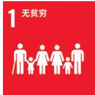</td><td>■以医疗服务普惠与社会公益帮扶为核心路径,聚焦医疗资源可及性与经济负担减轻,助力减少因病致贫、因病返贫现象,推动无贫穷目标实现。</td></tr><tr><td>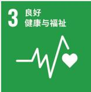</td><td>■医疗信息化产品覆盖全国32个省份2,400余家医疗机构,含约1,200家三甲医院,赋能急危重症救治效率提升。■辅助生殖服务年度接诊超3.8万人次。■开展12场义诊活动,帮助806个备孕困难家庭。</td></tr><tr><td>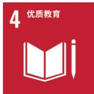</td><td>■构建职业发展双通道的人才发展体系,从“管理”与“专业”双路线给予员工更适合的职业发展路径,定期开展覆盖管理层及核心业务人员的职业能力培训。</td></tr><tr><td>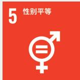</td><td>■在招聘、晋升、薪酬等流程坚持性别平等原则,明确禁止任何形式的性别歧视,为所有员工提供公平的职业发展机会。</td></tr><tr><td>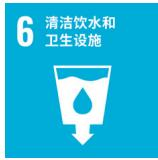</td><td>■医源性污水经含氯消毒剂等处理后,通过第三方检测化验合格后方可排放,废水排放达标率100%。■玛丽医院建立完善的医疗卫生管理体系,在诊疗全流程中严格执行卫生消毒标准,保障诊疗用水安全。</td></tr><tr><td>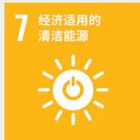</td><td>■在总部建设光伏发电项目,提高清洁能源使用比例。</td></tr><tr><td>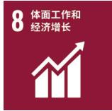</td><td>■建立完善的薪酬绩效体系,确保同岗同酬;畅通人才培训和晋升发展通道。■医疗信息化业务覆盖全国多个省市的医疗机构。</td></tr></table>

<table><tr><td>回应的SDGs</td><td>我们的行动</td></tr><tr><td>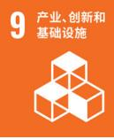</td><td>■ 2025年研发投入5,023.20万元,拥有600+知识产权;联合头部医疗机构搭建以急危重症救治为核心的全生命周期管理智慧医疗平台,推动AI与医疗的深度融合,使医疗信息化产品向智能化方向发展。</td></tr><tr><td>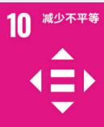</td><td>■ 消除就业歧视,实施多元化和包容性政策,2025年少数民族员工占比3.5%,女性员工占比23%,管理岗位女性占比13.5%。</td></tr><tr><td>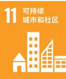</td><td>■ 发布全自主智能化无人机救援整体解决方案,通过精准导航与路径优化,显著提高了急救响应速度和调度效率。</td></tr><tr><td>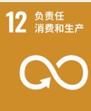</td><td>■ 建立环境管理体系,推进绿色运营。■ 智慧医疗产品助力医院数字化转型,提升医疗资源利用效率。</td></tr><tr><td>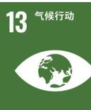</td><td>■ 部署光伏屋顶系统,2025年发电126,419.60千瓦时,减少二氧化碳排放103.79吨。</td></tr><tr><td>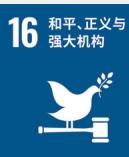</td><td>■ 持续完善治理结构,建立健全的内部控制与风险管理体系,严格管控商业行为,推进稳健经营。■ 健全投资者关系管理制度,建立多元化交流渠道,保障股东权益。</td></tr><tr><td>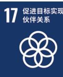</td><td>■ 与产业链上下游伙伴合作推进智慧医疗平台建设。■ 联合高校、行业伙伴等开展低空救援、康养机器人等技术研发与落地。</td></tr></table>

# 利益相关方沟通

公司高度重视利益相关方沟通工作，我们根据所处行业特点和经营情况，识别出6类利益相关方，包括：政府与监督机构、股东与投资者、客户、员工、合作伙伴与供应商、社区与环境。围绕各利益相关方，搭建信息披露、业绩交流、内部座谈、客户回访、公益服务等多元化沟通渠道，旨在及时倾听各方诉求、积极回应社会关切，推动利益相关方有效参与企业可持续治理，实现多方协同共进。

<table><tr><td>利益相关方类别</td><td>期望与诉求</td><td>沟通方式</td><td>回应行动</td></tr><tr><td>政府及监管机构</td><td>合规经营依法纳税科技创新科技伦理规范商业道德</td><td>政府视察合规检查定期会议交流参与政府合作、交流与研讨活动</td><td>遵守法律法规要求依法诚信经营响应国家战略恪守商业道德</td></tr><tr><td>股东及投资者</td><td>合规经营财务表现科技创新公司治理可持续发展管理</td><td>定期、临时信息披露业绩说明会投资者热线公司调研</td><td>召开股东会信息披露开展投资者交流活动</td></tr><tr><td>客户</td><td>产品服务和质量信息安全与隐私保护科技创新商业道德</td><td>客户交流合作客户满意度调查客户日常沟通</td><td>完善服务体系客户满意度调查恪守商业道德推动产品研发创新</td></tr><tr><td>员工</td><td>员工权益保证职业健康及安全员工发展与培训</td><td>员工培训定期工作会议员工座谈会员工敬业度调研</td><td>召开职工代表大会完善薪酬体系建立多元化培训体系组织文娱体育活动</td></tr><tr><td>合作伙伴与供应商</td><td>供应链管理科技创新商业道德</td><td>供应商交流沟通供应商大会</td><td>行业交流活动践行责任采购推动产品研发创新</td></tr><tr><td>社区及环境</td><td>应对气候变化污染防治与生态保护能源与资源使用乡村振兴与社会公益</td><td>行业会议公益活动乡村振兴</td><td>节约资源与能源耗用参与公益活动</td></tr></table>

# 重要性议题管理

公司参考《上海证券交易所上市公司自律监管指引第14号——可持续发展报告（试行）》《GRI3：重大主题》等国内外披露标准的评估方法，引入影响重要性和财务重要性的分析视角，识别和评估重要性议题，具体实施步骤如下：

# 议题评估流程

# 分析方法

# 步骤一：议题识别

- 基于全球大趋势分析，中国产业发展趋势的宏观环境分析。  
- 基于公司所处行业进行分析。  
- 基于公司的主营业务、商业模式分析。  
- 识别公司的利益相关方与公司面临的影响、风险与机遇。

- 收集利益相关方的反馈，通过问卷调查、访谈、渠道沟通等方式，收集投资者、客户的意见。  
- 参考全球报告倡议组织GRI、联合国可持续发展目标SDGs，以及国内外同行业相关议题，建立可持续发展相关议题库。

# 步骤二：议题调研

# 步骤三：议题重要性评估

- 影响重要性评估
梳理各议题对外部环境、社会和经济的潜在或实际的正面或负面影响，通过专家判断的形式对利益相关方开展调研分析。  
- 财务重要性评估
分析议题对公司财务表现、运营风险、品牌声誉、合规性的影响程度，根据专家判断，以及公司各部门风险识别和评估清单，识别和评估相关议题下的风险和机遇，评估出具有财务重要性的议题。

\- 形成影响重要性和财务重要性议题清单，结合评估结果，经公司管理层确认后确保相关议题透明、平衡且完整地披露于报告中。

# 步骤四：议题确认

重要性议题评估结果  
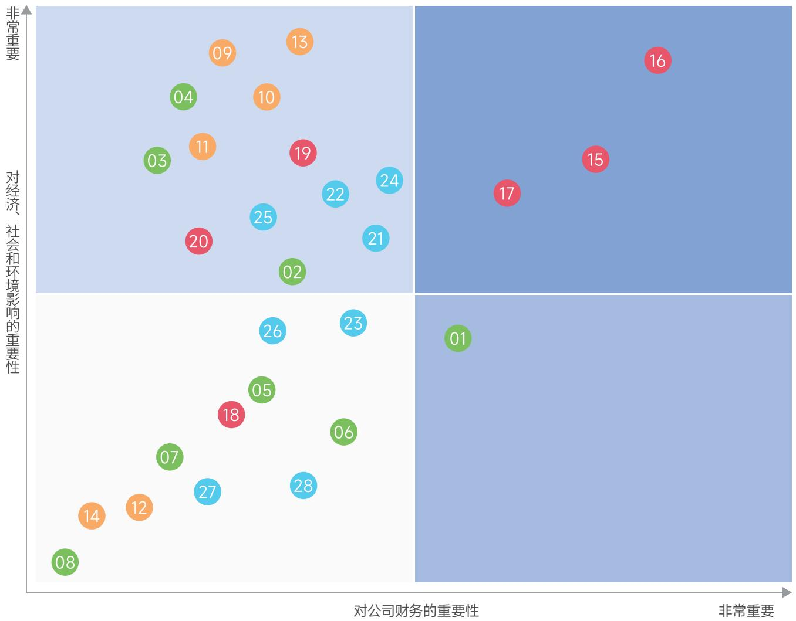

scatter

| Item | 对公司财务的重要性 (X-axis) | 对经济、社会和环境影响的重要性 (Y-axis) |
| --- | --- | --- |
| 01 | ~85 | ~45 |
| 02 | ~60 | ~50 |
| 03 | ~35 | ~70 |
| 04 | ~40 | ~85 |
| 05 | ~55 | ~40 |
| 06 | ~65 | ~35 |
| 07 | ~40 | ~25 |
| 08 | ~15 | ~10 |
| 09 | ~50 | ~95 |
| 10 | ~60 | ~85 |
| 11 | ~50 | ~75 |
| 12 | ~30 | ~20 |
| 13 | ~60 | ~95 |
| 14 | ~20 | ~20 |
| 15 | ~90 | ~75 |
| 16 | ~95 | ~95 |
| 17 | ~80 | ~65 |
| 18 | ~55 | ~35 |
| 19 | ~65 | ~70 |
| 20 | ~50 | ~55 |
| 21 | ~70 | ~60 |
| 22 | ~65 | ~65 |
| 23 | ~70 | ~45 |
| 24 | ~75 | ~65 |
| 25 | ~60 | ~60 |
| 26 | ~60 | ~45 |
| 27 | ~45 | ~30 |
| 28 | ~65 | ~25 |

01 应对气候变化  
02 环境合规管理  
03 能源利用  
04 废弃物处理  
05 污染物排放  
06 水资源利用  
07 循环经济  
08 生态系统和生物多样性保护

09 员工权益保障  
10 培训及职业发展  
11 职业健康及安全

15 产品质量与安全  
16 研发与创新  
17 数据安全与客户隐私保护

21 公司治理  
22 合规与风险管控  
23 利益相关方沟通

natural_image

Blue sky with scattered white clouds, no text or symbols visible

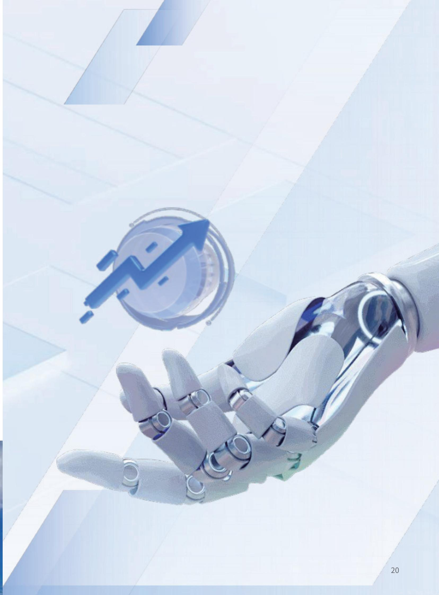

natural_image

Robotic hand reaching toward a digital clock with upward arrow, symbolizing growth or success (no text or symbols present)

# 01

# 规范治企

# 合规经营固根基

公司始终坚持党的领导，持续完善现代企业治理体系，系统构建内部控制与风险防控机制，全面提升投资者关系管理质效。坚守商业道德底线，坚决防范和打击商业贿赂等违法违规行为，多维度提升治理效能，为公司稳健运营与可持续高质量发展提供坚实保障。

# 本章节目录

党建引领

公司治理

投资者权益保障

合规与风险管理

商业道德

# 回应的SDGs

16 和平、正义与强大机构

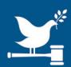

17 促进目标实现的伙伴关系

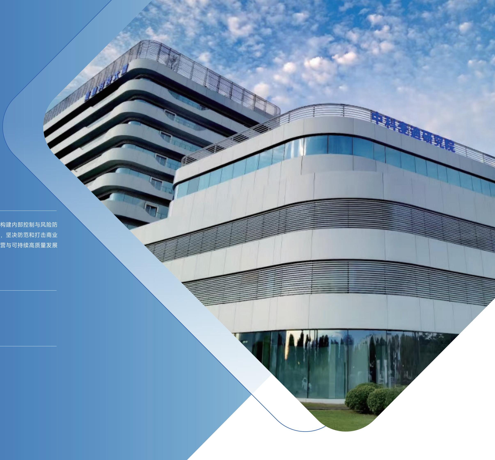

text_image

构建内部控制与风险防
，坚决防范和打击商业
营与可持续高质量发展

# 党建引领

公司坚持以党建引领企业高质量发展，把党的领导融入公司治理各环节。公司以党建把方向、管大局、保落实，推动党建工作与经营管理、合规运营、社会责任深度融合，以党建凝聚发展合力，为企业可持续发展提供坚强政治保障。

# 组织建设

公司规范党组织架构与运行机制，落实党支部委员会各项职责，健全党建工作责任制。严格执行“三会一课”、民主生活会等组织生活制度，强化基层党组织战斗堡垒作用。支部委员会成员全身心地投入到党的事业中，以克己奉公、兢兢业业的态度，践行党的宗旨，这也与工匠精神中的专注、执着和极致追求不谋而合。我们注重在业务骨干与核心岗位中发展党员，发挥党员先锋模范作用，夯实党建与业务融合的组织基础。

党组织架构  
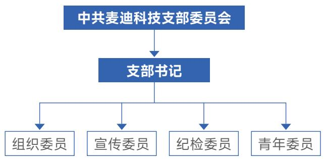

flowchart

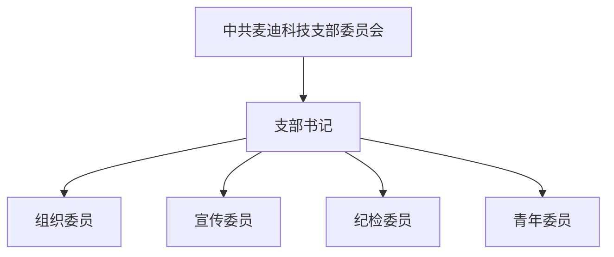
```mermaid
graph TD
  A["中共麦迪科技支部委员会"] --> B["支部书记"]
  B --> C["组织委员"]
  B --> D["宣传委员"]
  B --> E["纪检委员"]
  B --> F["青年委员"]
```

# 纪律建设

公司落实全面从严治党要求，履行党风廉政建设主体责任，强化纪律约束与廉洁风险防控。常态化开展党纪学习与警示教育，引导党员及管理人员知敬畏、存戒惧、守底线。健全廉洁从业管理机制，营造风清气正、合规自律的治理氛围。

# 作风建设

公司坚守务实担当、服务民生的优良作风，立足主业践行初心使命。推动党员带头履职尽责、攻坚克难，以实干作风提升医疗服务质效，彰显医疗科技企业的社会责任与担当。

# 理论学习

公司常态化开展党的理论学习与政策宣贯，组织党员深入学习党的创新理论、方针政策及行业监管要求。通过集中学习、专题研讨等多样化形式，提升党员政治素养与理论水平，以理论指导实践，确保企业发展与国家战略、行业导向同频共振。

# 公司治理

公司严格遵循相关法律法规要求，持续完善内部治理体系，构建权责清晰、有效制衡、规范运作的治理机制。报告期内，公司结合最新监管要求与经营发展需要，修订《公司章程》及多项内部管理制度，优化治理流程，不断提升公司治理规范化、透明化水平，保障公司合规运营与各利益相关方合法权益。

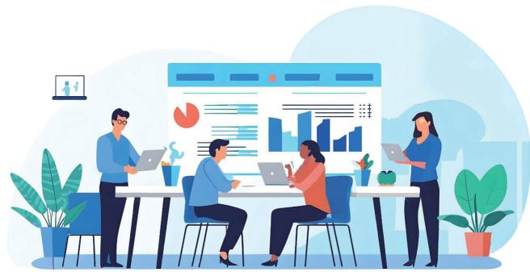

natural_image

Illustration of three people collaborating at a desk with laptops and charts, no text or symbols present

# 治理体系

公司按照《中华人民共和国公司法》《中华人民共和国证券法》《上市公司治理准则》《上海证券交易所股票上市规则》等法律法规要求及《公司章程》的要求规范运作，建立了由公司股东会、董事会和管理层的法人治理架构，并制定《股东会议事规则》《董事会议事规则》《独立董事制度》等涵盖公司治理的管理制度，进一步规范公司运作，全面提升公司的治理水准和运作效能。

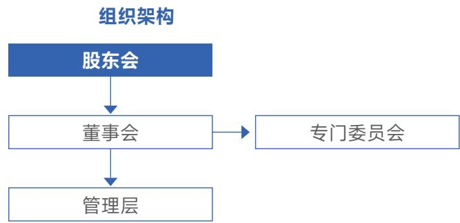

flowchart

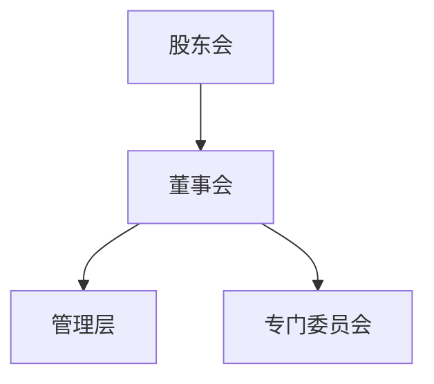
```mermaid
graph TD
  A["股东会"] --> B["董事会"]
  B --> C["管理层"]
  B --> D["专门委员会"]
```

# 股东会

股东会作为公司最高权力机构，其召集程序严格遵循《上市公司股东会规则》《公司章程》和《股东会议事规则》，议案表决采用现场投票和网络投票相结合的方式。为保障中小股东的投资利益与合法权益，对影响中小投资者利益的重大事项实行中小投资者单独计票，并聘请律师事务所对股东会出具法律意见书。确保股东会召开程序合法、合规，保障中小股东对公司重大事项的知情权和参与权。

# ★ 报告期内

股东会召开4次，共审议通过议案22项

# 董事会

公司严格按照《公司章程》《董事会议事规则》及相关法律法规的要求召集、召开董事会，各董事依法行使职权，按时出席董事会和股东会，忠实、勤勉尽责地履行职责和义务。

# ▶ 董事会多元化

公司重视董事会多元化建设，董事团队覆盖医疗科技、财务、法律等多元专业背景，与公司医疗科技主业发展高度契合，形成专业互补、经验多元的决策格局。截至报告期末，公司董事会由5名成员组成，其中女性董事

1名，占比20%；独立董事2名，占比40%。

<table><tr><td>董事姓名</td><td>职务</td><td>性别</td><td>年龄</td><td>学历</td><td>专业背景</td></tr><tr><td>陈宁</td><td>董事长</td><td>男</td><td>48</td><td>硕士学历</td><td>材料工程、高级化工工程师</td></tr><tr><td>翁康</td><td>副董事长</td><td>男</td><td>57</td><td>硕士学历</td><td>高级经济师</td></tr><tr><td>任小军</td><td>独立董事</td><td>男</td><td>57</td><td>博士学历</td><td>民商法博士</td></tr><tr><td>白福意</td><td>独立董事</td><td>男</td><td>52</td><td>本科学历</td><td>注册会计师</td></tr><tr><td>皇春萌</td><td>职工董事</td><td>女</td><td>44</td><td>硕士学历</td><td>金融专业</td></tr></table>

# ▶ 董事会遴选

董事遴选由提名委员会全程主导，严格按照工作细则拟定选任标准与程序，搜寻候选人并开展全面资格审查，充分征求被提名人意见后向董事会提出提名建议，董事会未采纳建议时需说明具体理由并对外披露，确保遴选流程规范、公正、透明。

# ▶ 董事会独立性

公司严格遵守《中华人民共和国公司法》《上市公司独立董事管理办法》等法律法规，制定独立董事制度，独立董事占比不低于三分之一，且配备会计专业人士担任独立董事，独立董事与公司、主要股东及实际控制人无直接或间接利害关系，每年开展独立性自查，董事会同步对独立董事独立性开展评估并对外披露，确保独立董事独立履行监督、咨询与决策职责，不受不当主体干预，保障董事会决策的独立性与客观性。

natural_image

Illustration of a business meeting with a presenter and attendees at a table, no visible text or symbols

# ▶ 董事会专门委员会

董事会下设战略委员会、审计委员会、提名委员会及薪酬与考核委员会等专门委员会，各委员会均制定完备工作细则并结合发展实际进行修订，各机构权责清晰，为董事会决策提供支撑。

<table><tr><td rowspan="2">董事会</td><td>★召开次数</td><td>★审议议案</td><td>★出席率</td></tr><tr><td>11次</td><td>48项</td><td>100%</td></tr><tr><td>薪酬与考核委员会</td><td>6次</td><td rowspan="4">28项</td><td>100%</td></tr><tr><td>提名委员会</td><td>3次</td><td>100%</td></tr><tr><td>审计委员会</td><td>8次</td><td>100%</td></tr><tr><td>战略委员会</td><td>1次</td><td>100%</td></tr></table>

# 董事、高管薪酬管理

公司依据国家法律法规规定和《公司章程》，制定了《董事、高级管理人员薪酬管理制度》，依规履行分级审议决策程序，构建科学规范的薪酬管理机制。由公司董事会薪酬与考核委员会对公司董事和高级管理人员进行考核以及初步确定薪酬方案。通过合理的薪酬安排充分激发董事、高级管理人员履职积极性，持续提升公司经营管理水平与治理效能，为公司长期稳健经营与高质量可持续发展提供坚实支撑。

natural_image

Illustration of a person sitting on stacks of coins with dollar signs, surrounded by decorative stars and currency symbols (no text or labels)

# ★ 报告期内

公司董事、监事及高级管理人员报酬（包含现任和离任）：701.99万元。

# 投资者权益保障

公司高度重视投资者管理工作，严格依照法律法规构建完善的信息披露、投资者关系管理及股东权益保护体系，以规范、透明的治理实践保障投资者合法权益，推动企业与投资者的长期共赢。

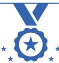

# 荣誉认可

荣获同花顺“年度最受欢迎董秘奖”  
荣获每日经济“最佳主板上市公司董秘”

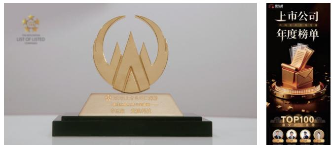

# 信息披露

公司严格遵守《上市公司信息披露管理办法》等法律法规要求，于报告期内修订了《信息披露管理办法》，并制定《信息披露暂缓与豁免业务管理制度》，进一步强化信息披露管理机制，确保信息披露真实、准确、完整、及时，杜绝选择性信息披露行为。及时披露定期报告、临时报告等法定信息，所有披露文件均报送证券交易所登记并在指定媒体发布，同时建立内幕信息知情人登记管理制度，规范内幕信息管理流程，从制度与执行层面保障信息披露的合规性，切实维护投资者的知情权。

# 投资者关系管理

公司致力于与投资者建立良好的沟通渠道，我们持续完善《投资者关系管理制度》，秉持合规、平等、主动、诚实守信的原则，搭建多元化投资者沟通平台。通过上证e互动、业绩说明会、机构调研、投资者专属热线及邮箱等渠道开展常态化沟通，董秘办统一负责调研接待、问题答复等工作，做好沟通记录留存与备查；在各类沟通活动中平等对待所有投资者，提供沟通便利，及时回应市场关切，充分传递公司经营发展与战略规划信息。

# ★ 报告期内

接待投资者现场调研次数26次  
接待投资者现场调研人次175人次  
召开业绩说明会3次  
在上证e互动回答投资者问题数45个  
接听投资者来电150个

# 合规与风险管理

公司在经营活动中严格遵守国家法律法规、行业标准规定，坚守合规经营底线。不断健全内部监督及风险管理体系，明确各层级风险管理职责，确保防范和控制公司经营及ESG相关风险，为企业在资本市场的长远发展筑牢坚实根基。

# 合规管理

公司坚持以合规为导向，以法律法规及商业道德为发展根基，深入推进依法合规经营，持续提升合规管理水平。报告期内，公司未发生合规风险事件。

公司构建与经营范围、组织结构和业务规模相适应的合规管理组织架构，强化业务部门、合规部门、内审部门的“三道防线”协同作用，形成全方位、多层次的合规管理协同防控机制，有效识别和管理合规风险，确保公司合法经营。

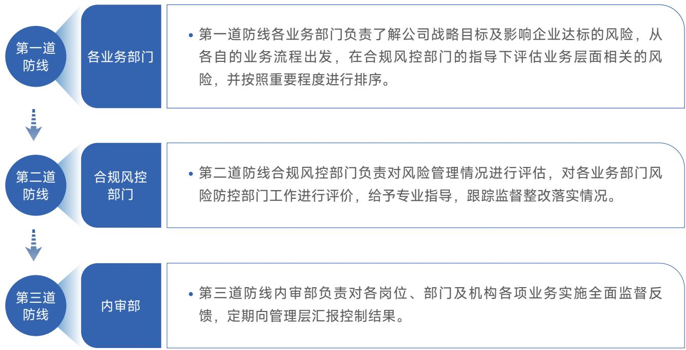

flowchart

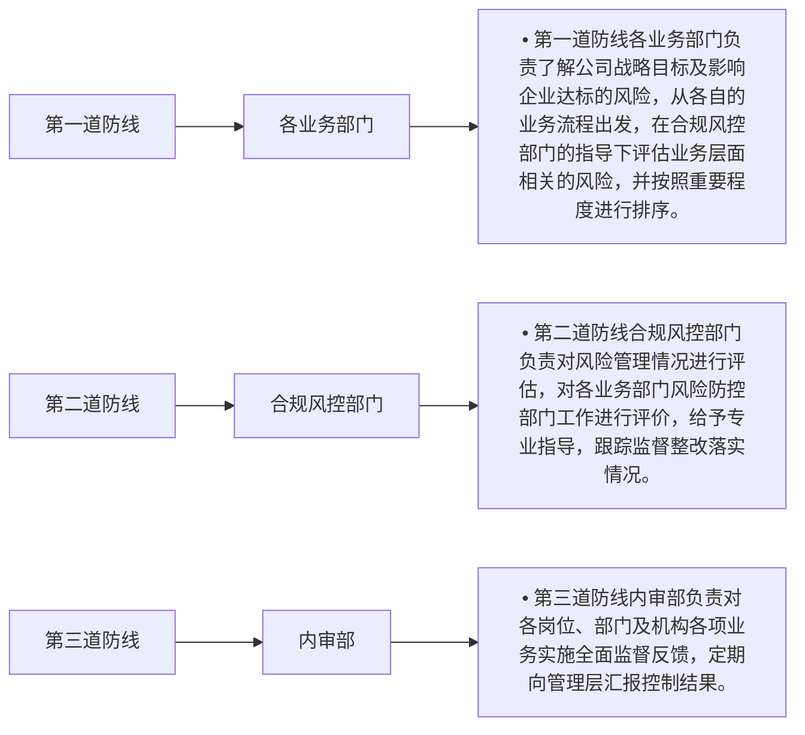
```mermaid
graph LR
  A["第一道防线"] --> B["各业务部门"]
  B --> C["• 第一道防线各业务部门负责了解公司战略目标及影响企业达标的风险，从各自的业务流程出发，在合规风控部门的指导下评估业务层面相关的风险，并按照重要程度进行排序。"]
  D["第二道防线"] --> E["合规风控部门"]
  E --> F["• 第二道防线合规风控部门负责对风险管理情况进行评估，对各业务部门风险防控部门工作进行评价，给予专业指导，跟踪监督整改落实情况。"]
  G["第三道防线"] --> H["内审部"]
  H --> I["• 第三道防线内审部负责对各岗位、部门及机构各项业务实施全面监督反馈，定期向管理层汇报控制结果。"]
```

# 合规文化建设

公司重视合规文化建设，通过多渠道开展合规宣贯与培训，推动形成领导带头、全员参与的合规文化体系，全力营造崇尚合规、践行合规的文化氛围。

# ★ 报告期内

法律培训次数3次

# 案例：合规培训

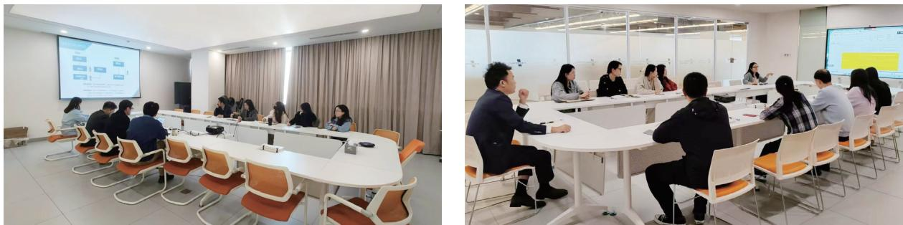

# 风险管理

公司严格落实上市公司内控指引要求，制定《风险管理制度》《会计师事务所选聘制度》《舆情管理制度》，建立了统一领导、分工负责、专业监督与全员参与相结合的风险管理组织体系，指导公司风险管控工作的开展。

# 董事会

风险管理工作的最高领导机构。

# 总经理办公会

负责全面主持风险管理日常工作，持续改善公司风险管理和内部控制体系；审议公司风险管理和内控制度；对重大风险问题提出解决方案并组织实施，对危机事件设立临时性处理机构；指导和监督下属企业的风险管理工作。

# 风险管理工作组

由董事会秘书牵头，财务总监、法务部总经理协同，相关职能中心及子公司负责人参与，负责公司日常风险管控体系建设、推进、管理工作。

# 内控审计部

风险管理监督部门，负责企业风险管理的监督和评价。

公司持续强化风险识别与应对能力，规范业务管理流程，实现对核心业务板块的风险识别、风险评估、风险应对及风险监控，保障企业在复杂多变的市场环境中稳健发展。

# 风险管理流程

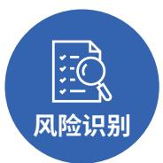

全面识别内外部风险，涵盖公司运营的各个方面。

从风险发生可能性、风险影响程度两个维度进行等级评价或量化排序。

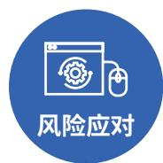

根据风险评估结果，制定针对性的风险应对策略。

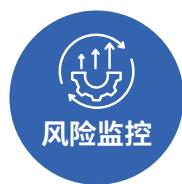

持续跟踪风险状况，确保风险可控。

# 内部控制

公司持续推进内部控制体系建设，参照《企业内部控制基本规范》《上海证券交易所上市公司内部控制指引》等相关规范要求，结合公司业务特点及内部控制建设情况，制定《内部控制管理制度》，不断提升规范化管理水平及风险防控能力。

公司坚持风险导向原则，对内部控制体系进行持续优化完善，以适应外部环境变化与内部管理要求。公司董事会作为内部控制管理的最高决策机构，负责内部控制的建立健全与有效实施，其下设审计委员会负责审查、监督内部控制体系运行与评价工作，并协调内部审计相关工作。此外，公司设立内审部门，定期对内部控制制度的健全性、适应性、有效性及其执行情况开展测评与专项审计，对排查发现的内控问题督促相关单位及时整改，并对整改落实情况进行跟踪闭环，切实保障内控体系有效运行。

# 麦迪科技内部控制措施

报告期内，公司开展多项审计工作，涵盖募集资金使用与管理、大额资金往来、关联资金往来及对外担保、对外投资等领域，确保业务的规范性，防范经营风险。

公司依据内部控制基本规范及配套指引，设计并发放了内部控制自检表，相关材料已全部回收并完成审核；此外，公司还搭建了麦迪内部审计知识库，涵盖外部政策法规、内部管理制度、审计监督及反舞弊等模块，以持续提升内部审计工作的科学化、规范化管理水平。

# 税务管理

公司严格遵守《中华人民共和国企业所得税法》《中华人民共和国税收征收管理法》等税务法规，建立健全税务管理制度，规范税务管理流程，有效防范税务风险并定期披露相关税务信息。报告期内，公司未发生任何重大税务违规行为，未涉及任何税务相关的重大诉讼、仲裁事项。

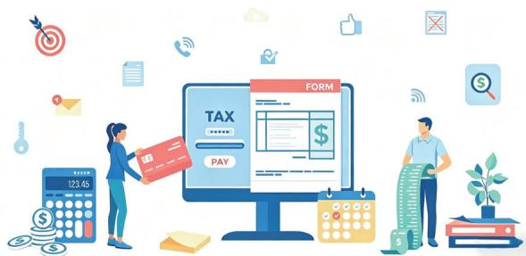

text_image

Illustration depicting tax payment and business workflow with icons for digital payment, calculator, documents, and office supplies

# ★ 报告期内

公司纳税总额为2,852.28万元。

# 商业道德

# 反商业贿赂与反贪污

公司严格遵守《中华人民共和国公司法》《中华人民共和国反垄断法》等法律法规以及行业规范，制定《廉洁从业管理制度》《公司员工违纪管理办法》等内部管理制度，规范全体员工从业行为，确保在日常运营中坚守廉洁敬业的原则。

公司要求参与业务重点环节、重点部门的员工签订《廉洁从业承诺书》，明确廉洁自律责任与义务，强化关键岗位人员的纪律意识和职业操守。定期向合作伙伴发送《廉洁合作告知函》，必要时要求供应商、经销商及其他商业伙伴在合作前签署《反商业贿赂协议书》，明确禁止任何形式的商业贿赂行为，并将其纳入合作伙伴准入与评价体系。

公司定期对重点合作方开展廉洁合规审查，通过现场走访等方式评估其履约合规情况，对存在风险的合作伙伴及时采取警示、整改或终止合作等措施，切实防范外部关联风险，推动全产业链共建清廉生态。

# 反腐败教育

公司坚持营造崇廉尚洁的从业环境，通过组织开展反商业贿赂与反腐败相关主题培训与宣传教育等活动，有效提升全体员工廉洁意识与风险防范能力，积极营造风清气正的工作氛围。报告期内，公司未发生贪污腐败诉讼与不正当竞争事件。

# 举报与举报人保护

公司建立健全信访举报机制，设置来信、电话和邮箱等举报渠道，鼓励内部员工及外部合作伙伴揭露违规行为。同时，公司对举报的受理、调查等各个环节进行严格保密，对举报人信息进行保密，严厉打击任何报复行为，一经查实将严肃处理。

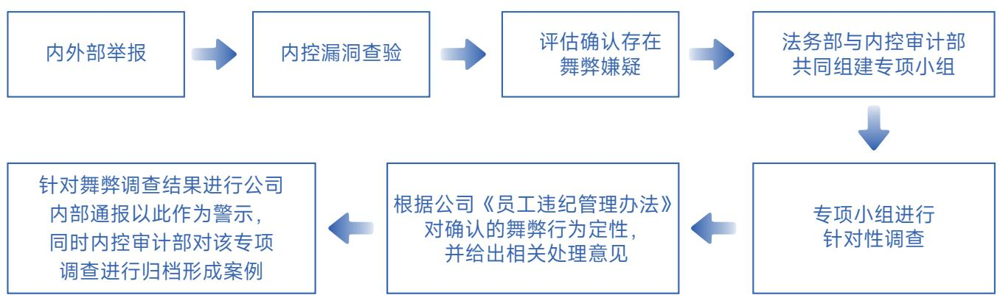

flowchart

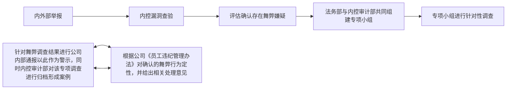
```mermaid
graph LR
  A["内外部举报"] --> B["内控漏洞查验"]
  B --> C["评估确认存在舞弊嫌疑"]
  C --> D["法务部与内控审计部共同组建专项小组"]
  D --> E["专项小组进行针对性调查"]
  F["针对舞弊调查结果进行公司内部通报以此作为警示，同时内控审计部对该专项调查进行归档形成案例"] <--> G["根据公司《员工违纪管理办法》对确认的舞弊行为定性，并给出相关处理意见"]
  G <--> F
```

反腐倡廉举报与监督流程

# 信访举报渠道

  
举报渠道

举报电话：18112588343

电子邮箱：mdsd-ia@medicalsystem.cn

通信地址：苏州市工业园区归家巷222号麦迪科技

收 件 人: 麦迪科技内审部

# 反不正当竞争

公司坚决反对、严厉打击垄断行为和不正当竞争行为，严格遵守《中华人民共和国反不正当竞争法》《中华人民共和国反垄断法》等相关法律法规，系统化规范市场竞争行为，致力于维护诚信、公平、自由的市场秩序和商业环境。报告期内，公司未发生反不正当竞争及反垄断相关的法律诉讼。

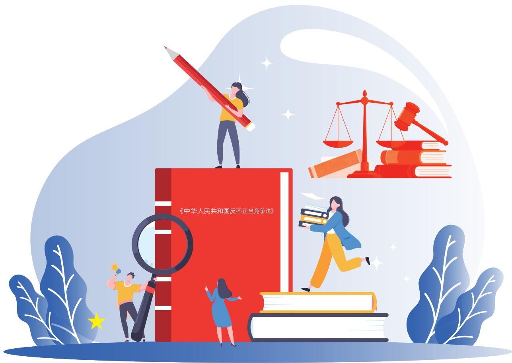

text_image

《中华人民共和国反不正当竞争法》

# 02

# 医心向绿

# 低碳运营护生态

公司致力于构建低碳运营发展路径，推动资源节约与循环利用，严格遵守生态环保法律法规，完善环境管理体系，严守环境安全底线。公司坚持以绿色低碳为导向，持续深化绿色治理实践，实现企业运营与生态保护协同共进，助力行业高质量可持续发展。

# 本章节目录

应对气候变化

资源利用

环境合规管理

# 回应的SDGs

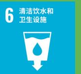

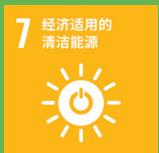

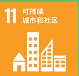

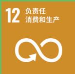

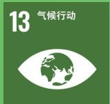

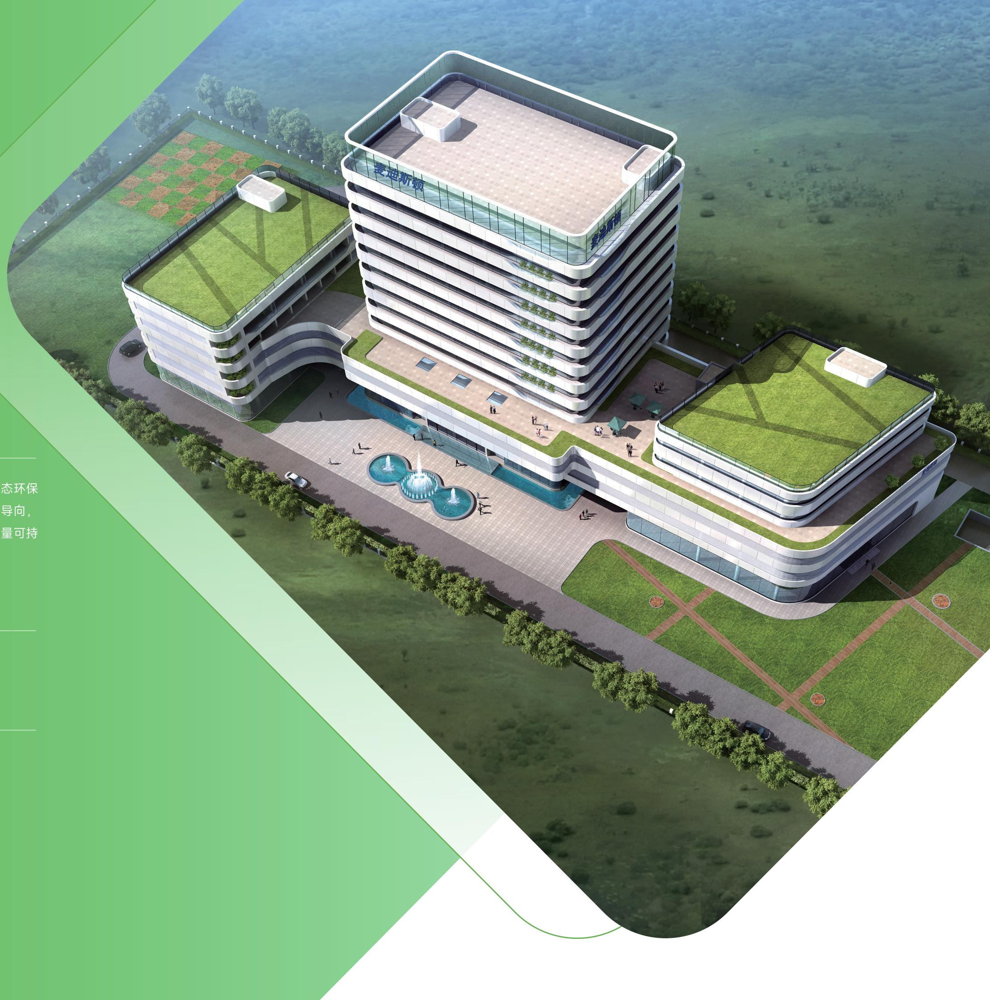

natural_image

Architectural rendering of a modern multi-story building with green roofs and landscaped grounds, no visible text or symbols on the structure itself.

# 应对气候变化

气候变化是当今全球面临的主要风险之一，在影响人类健康的同时也对企业长期持续发展构成重大影响。麦迪科技积极响应国家“双碳”战略，逐步构建气候变化治理体系，参考交易所指引及气候相关财务信息披露工作组（TCFD）的建议，从治理、战略、风险和机遇管理、指标和目标四个维度开展气候事项的管理与披露。

natural_image

Illustration of a stylized green landscape with wind turbines and a small building under a cloudy sky (no text or symbols)

# 治理

公司将应对气候变化纳入公司可持续发展的核心议题，依托可持续发展治理体系，建立气候治理组织架构，系统地推进气候变化的应对工作。董事会作为最高决策机构，负责审定气候战略、目标设定及重大风险事项；ESG工作小组在管理层统筹协调气候相关工作推进；各职能部门及子公司负责管理目标执行和落实推进。

# 战略

公司结合实际业务特性，系统性识别与评估企业面临的气候相关风险及机遇，积极采取应对策略，将气候应对纳入经营管理全流程，逐步建立长远的气候应对能力，保障业务连续性。

<table><tr><td colspan="6">风险</td></tr><tr><td colspan="2">类别</td><td>风险描述</td><td> $^1$ 影响时间范围</td><td>潜在财务影响</td><td>应对措施</td></tr><tr><td rowspan="2">物理风险</td><td>急性风险</td><td>突发极端天气如暴雨、台风等自然灾害,可能对公司办公场所、医院基础设备等造成破坏,甚至引发停电等影响企业正常运营。</td><td>短期</td><td>运营成本增加</td><td>·完善自然灾害及环境风险应急响应预案,组织开展应急演练和宣贯培训,并配备发电机等应急设备,提高应急处置能力;·加强对基础设施检修维护,增强其抵御极端天气的能力。</td></tr><tr><td>慢性风险</td><td>公司海口玛丽医院位于沿海城市,海平面上升可能会影响医院正常运营;气候变暖、温度异常、水资源短缺等,可能导致机房制冷等能源消耗上升、运营成本增加。</td><td>中长期</td><td>运营成本增加</td><td>·持续关注气候信息,根据海平面上升趋势提前采取应对措施。</td></tr></table>

<table><tr><td colspan="6">风险</td></tr><tr><td colspan="2">类别</td><td>风险描述</td><td> $^1$ 影响时间范围</td><td>潜在财务影响</td><td>应对措施</td></tr><tr><td rowspan="2">转型风险</td><td>法律与政策</td><td>“双碳”背景下,温室气体排放、环保信息披露要求趋严,公司面临合规处罚、整改成本上升风险。</td><td>短中长期</td><td>运营成本增加</td><td>·定期跟踪和分析国家及地方的气候变化相关法规和披露要求,确保公司遵守相关政策、法规。</td></tr><tr><td>市场风险</td><td>低碳经济转型背景下,市场对气候变化的关注度提高,医疗机构倾向选择低碳数字化产品和服务,如公司无法及时满足相关需求,可能影响市场竞争力。</td><td>中长期</td><td>营业成本增加营业收入减少</td><td>·打造绿色运营模式,通过节能降耗、绿色技改等减少碳排放;·研发过程中,注重医疗信息化产品对医院推动能耗管理、无纸化办公的影响。</td></tr></table>

<table><tr><td colspan="5">机遇</td></tr><tr><td>类别</td><td>机遇描述</td><td>影响时间范围</td><td>潜在财务影响</td><td>应对措施</td></tr><tr><td>资源效率</td><td>通过精细化管理提升能源、水资源及办公物料使用效率,降低整体运营消耗。</td><td>中长期</td><td>运营成本下降盈利水平提升</td><td>·推行办公与机房节能节水管理,推进数字化无纸化运营,优化资源全周期利用效率。</td></tr><tr><td>产品与服务</td><td>低碳型医疗信息化产品更契合下游气候治理需求,形成差异化竞争优势。</td><td>中长期</td><td>产品竞争力增强营业收入增加</td><td>·在医疗信息化产品研发中纳入低碳运营相关因素考量,打造气候友好型医疗数字化解决方案。</td></tr><tr><td>品牌价值</td><td>积极应对气候变化、践行低碳发展可提升企业ESG表现,增强资本市场认可度与品牌公信力。</td><td>中长期</td><td>品牌价值提升</td><td>·持续完善气候信息披露,强化低碳发展实践,提升企业ESG评级与市场形象。</td></tr></table>

$^{1}$ 影响时间范围：  
短期（1年以内）：对公司的影响通常是快速且临时的，持续时间较短通常不会超出1年。  
中期（1—5年）：对公司的影响较为持续，通常在1至5年内具有较大影响力。  
长期（5年以上）：对公司的影响是深远且持久的，持续时间通常超过5年。

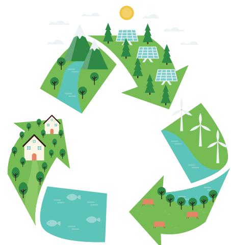

natural_image

Recycling symbol with green landscape and renewable energy icons (no text or symbols)

# 影响、风险和机遇管理

公司将气候相关风险与机遇的识别、评估、应对全流程纳入常态化管理，强化统筹部署与落地执行，以规范化气候治理保障低碳目标落地，夯实绿色发展根基，助力公司长期可持续高质量发展。

# 管理流程

识别：通过开展政策调研、同业对标，并结合专家意见，充分识别公司面临的风险和机遇类型。

评估：针对识别出的风险和机遇，逐项识别其可能造成的潜在主要财务影响、影响的时间范围。

应对：结合识别和评估情况，制定相应应对措施，确保公司有足够的能力和资源应对气候变化风险、把握气候变化机遇。

# 指标与目标

公司积极应对气候变化挑战，将温室气体排放量等关键指标纳入管控，通过动态跟踪、优化管控措施，持续推动碳排放强度合理下降，稳步提升绿色低碳运营水平。

<table><tr><td>指标</td><td>单位</td><td>2025年</td></tr><tr><td>温室气体排放量(范围一)</td><td>吨二氧化碳当量</td><td>37.56</td></tr><tr><td>温室气体排放量(范围二)</td><td>吨二氧化碳当量</td><td>1,005.45</td></tr><tr><td>温室气体排放总量</td><td>吨二氧化碳当量</td><td>1,043.04</td></tr><tr><td>温室气体排放强度</td><td>吨二氧化碳当量/百万元营收</td><td>3.46</td></tr></table>

统计口径说明：

注1：本报告所披露的温室气体排放总量涵盖范围一直接温室气体排放量和范围二间接温室气体排放量，计算方法参考《工业其他行业企业温室气体排放核算方法与报告指南》。  
注2：范围一包括汽油、天然气的排放量，范围二包括外购电力的排放量。

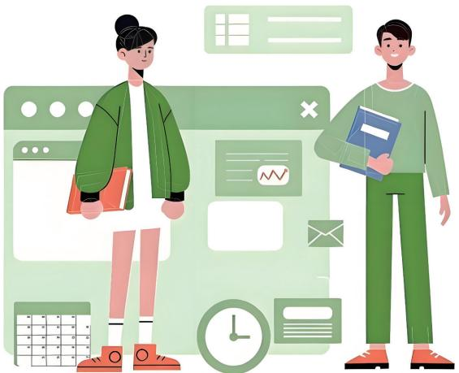

natural_image

Illustration of two people standing in front of a large web browser with icons and data elements (no text or symbols)

# 资源利用

公司严格遵守《中华人民共和国节约能源法》《中华人民共和国水法》等相关法律法规，确保资源利用符合要求，提升能源使用效率，减少能源、水资源及物料的浪费。

# 能源利用

公司日常生产经营过程中的能源消耗主要以外购电力、天然气、汽油为主。公司严格遵守相关法律法规，持续完善能源管理体系，制定《办公室管理规定》《车辆管理制度》等制度，规范办公、外出等环节的用能管理，将节能减排理念融入企业办公与运营各个环节中。通过落地实施一系列科学规范的节能管控措施，包括使用节能设备、加强用能管理、倡导低碳出行、建设光伏发电项目等方式，减少能源消耗，持续提升能源利用效率。

同时，公司注重培养员工节能意识，通过专题培训、案例分享等多种方式，不断提升相关人员在能源利用方面的专业能力和水平，助力能源管理工作落地见效。

<table><tr><td>指标</td><td>单位</td><td>2025年</td></tr><tr><td>能源消耗总量</td><td>吨标准煤</td><td>267.90</td></tr><tr><td>外购电力使用量</td><td>千瓦时</td><td>1,894,932</td></tr><tr><td>汽油使用量</td><td>升</td><td>12,519.69</td></tr><tr><td>天然气使用量</td><td>立方米</td><td>4,600</td></tr><tr><td>光伏发电量</td><td>千瓦时</td><td>126,419.60</td></tr><tr><td>可再生能源消耗量</td><td>吨标准煤</td><td>15.54</td></tr><tr><td>能源消耗强度</td><td>吨标准煤/百万元营收</td><td>0.89</td></tr></table>

# 案例：总部大楼光伏发电

公司苏州总部大楼成功部署的103.5千瓦屋顶分布式光伏发电项目已实现全面并网运营。该光伏系统采用“自发自用、余电上网”的运营模式，在优先满足总部研发办公日常电力需求、有效降低建筑能耗的同时，将冗余清洁电力接入电网，以实际行动支持区域能源结构优化。报告期内，该光伏系统运行高效稳定，总计发电约12.64万千瓦时，相当于减少二氧化碳排放约103.77吨，取得了显著的环境效益。

为应对突然停电风险，玛丽医院配备有发电机及汽油，停电时可通过自行发电保障业务连续。为系统推进能源资源管理工作，玛丽医院结合医院运营实际制定了2025年“节能降耗”实施方案，并依照计划有序开展工作。报告期内，组织员工开展节能降耗主题培训，进一步强化员工节能意识；积极开展针对用能设备等日常监督维护检查。

# 水资源利用

公司办公运营环节使用的水资源主要来源于市政供水，在取水源方面对环境无重大影响。公司严格遵循《中华人民共和国水法》等国家法律法规及相关标准，将水资源合理利用与节约保护融入日常运营中，积极实施包括安装感应节水器具、加强用水设备运维管理、倡导节水理念等多项节水措施，持续优化用水流程，减少水资源浪费，切实履行水资源保护社会责任。

natural_image

Illustration of two cartoon water droplets and a globe with smiling faces, surrounded by bubbles and hearts (no text or symbols)

<table><tr><td>指标</td><td>单位</td><td>2025年</td></tr><tr><td>总耗水量</td><td>吨</td><td>15,589</td></tr><tr><td>新鲜水取水总量</td><td>吨</td><td>5,351</td></tr><tr><td>耗水强度</td><td>吨/百万元营收</td><td>51.71</td></tr></table>

# 践行绿色办公

公司坚持绿色低碳发展理念，将绿色办公举措全面融入日常运营，积极打造低碳办公模式。

# 绿色办公措施

# 无纸化办公

不断完善OA系统办公流程，减少纸质文件使用

# 绿色出行

加强员工外出车辆管理；鼓励员工采用绿色出行方式通勤

# 节能管理

办公区域采用节能灯具，严格落实人走灯灭、办公设备随用随开的节能要求，降低设备待机能耗

# 办公物料管理

规范办公垃圾分类管理，合理设置分类收集容器，提升纸张、塑料等可回收物的资源化利用率

# 节约文化宣传

倡导员工使用可循环餐具，减少一次性餐盒的使用；张贴节约用水用电标识

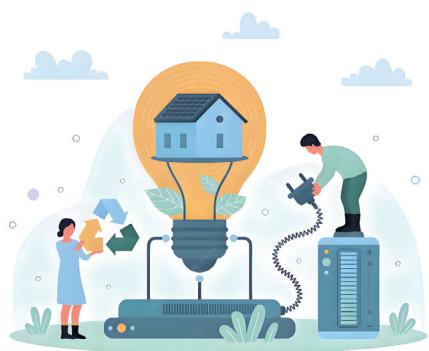

natural_image

Illustration of two people using a lightbulb to build a house with wind turbines, symbolizing smart energy or cloud computing (no text or symbols present)

# 环境合规管理

公司将环保理念融入公司运营、产品及服务中，持续完善环境管理体系，对标行业先进标准提升环境管理专业化水平，推动企业自身绿色低碳发展与医疗行业生态环保建设的协同共进，切实履行企业环境责任。

# ★ 2025年

违反环境法律法规事件数0起

# 环境管理体系

公司严格遵守《中华人民共和国环境保护法》等法律法规，各业务板块结合自身实际，依据ISO 14001标准建立健全的环境管理体系，制定环境管理相关制度，并设立专门环保组织架构，负责推进、落实日常运营各项环境管理工作，保障环境合规管理。

# 环保培训与宣贯

公司重视环保培训与宣贯工作，将环境保护理念融入日常运营，针对不同岗位制定差异化环保培训内容。对海口玛丽医院等医疗服务岗位人员，重点开展医废分类、医源性废水处理等专业培训；对研发、办公等岗位，普及环保法律法规、节能降耗等基础知识，培训采用理论讲解与案例分析相结合的形式，提升培训实效性，强化全体员工的环境合规意识与绿色运营理念，推动形成全员参与、全员践行的企业环保氛围。

  
案例：玛丽医院开展医疗垃圾分类及处理培训

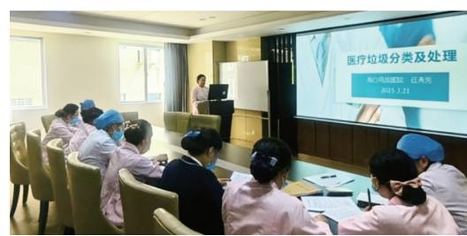

text_image

医疗垃圾分类及处理
南京月盈医院 任秀芳
2015.3.21

# 污废管控

2025年1月，公司完成光伏业务剥离后聚焦医疗信息化及医疗服务主业，业务环节已无重污染生产工序，污染物主要产生于公司日常办公及玛丽医院运营环节，产生污染物包括一般固体废弃物、医疗废弃物及少量废水。公司严格遵守《中华人民共和国水污染防治法》及《中华人民共和国固体废物污染环境防治法》等相关法律法规，针对废水、废弃物实施分类治理、精准管控，确保污染物均合规处理，致力于降低自身生产经营对环境产生的影响。

# 废水管理

玛丽医院根据《医院污水处理技术指南》及属地环保要求，制定《污水处理管理制度》《医源性污水处理管理制度》，明确规定污水经处理并由第三方检测合格后方可排放。同时，医院对废水管理各环节实行责任到人，设立污水处理员负责全医院污水的无害化处理及排放。

为有效预防、及时控制并妥善处置医疗废水流失、泄漏、扩散等意外事故，玛丽医院制定了《污水处理应急预案》，明确医院各层级应急管理职责，确保在突发环境事件时能够快速响应、高效处置。

玛丽医院医源性废水严格遵循《医疗机构水污染物排放标准》（GB 18466-2005）要求，污水进入处理池后，通过含氯消毒剂等措施完成深度处理后达标排放。

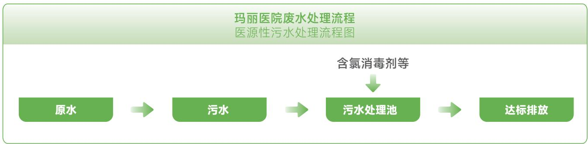

flowchart

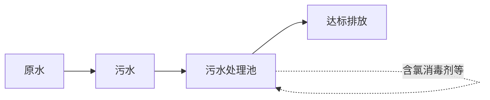
```mermaid
graph LR
  A["原水"] --> B["污水"]
  B --> C["污水处理池"]
  C --> D["达标排放"]
  C -.->|"含氯消毒剂等"| C
```

报告期内，公司严格落实废水排放管控要求，委托专业第三方检测机构，对玛丽医院的废水排放开展合规检测，所有检测结果均符合国家及地方规定的排放标准。

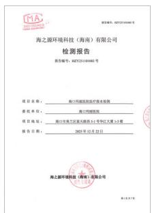  
玛丽医院医疗废水检测报告

# ★ 2025年

废水排放量1,176吨

注：统计口径为玛丽医院。

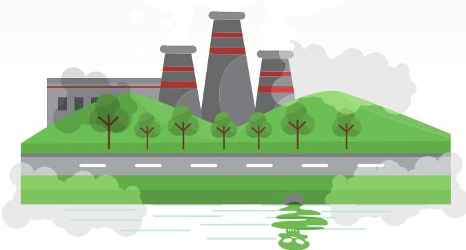

natural_image

Illustration of a green hillside with industrial smokestacks and trees, no text or symbols present

# 废弃物处理

公司秉持“减量化、资源化、无害化”的废弃物管理核心原则，针对医疗废物与一般废弃物的不同特性构建全流程管控体系，实现分类收集、规范暂存、合规转运、专业处置的全链条管理，确保废弃物合规处置。

# ★ 2025年

废弃物产生量7.73吨

其中，有害废弃物产生量7.73吨

注：统计口径为玛丽医院。

# 一般固体废弃物

针对各办公区域的一般废弃物，公司实施垃圾分类管理，在办公区域合理设置分类垃圾桶并张贴清晰的分类指引，安排专人每日巡检督导分类投放。

# 医疗废弃物管理

玛丽医院严格遵循《污染病防治法》《医疗卫生机构医疗废物管理办法》等国家及地方法律法规，制定《医疗废物管理责任制》《医疗废物交接登记、转移联单工作制度》《医疗废物管理资料》等制度，明确医疗废物分类、收集、暂存、转运、处置各环节的操作标准与责任划分，确保医疗废物及时、合规、无害化处理。并通过减少一次性医疗用品，倡导使用可复用的医疗器材等举措从源头减少废弃物产生。

# 医疗废弃物处理措施

# 分类收集

严格按照《医疗废物分类目录》要求，将医疗废弃物分为感染性、病理性、损伤性、药物性和化学性5类，进行分类收集和处理，杜绝混装混放。

# 危废特殊处理

病原体的培养基、标本和菌种、毒种保存液等高危险废物应当首先在产生地点进行压力蒸汽灭菌或者化学消毒处理，然后按感染性废物收集处理。

# 回收及利用

处理后的废物残渣、部分医用玻璃废物、可回收塑料废物、医疗锐器等交具有资质的第三方机构统一处理。

# 生态系统与生物多样性保护

公司秉持人与自然和谐共生的发展理念，主动履行生态保护责任，严格遵守《中华人民共和国野生动物保护法》《中华人民共和国野生植物保护条例》等法律法规，通过减少运营对环境的干扰、倡导生物多样性保护、合理利用自然资源等方式，最大限度降低经营活动对周边生态环境的影响，为促进人与自然和谐共生贡献力量。报告期内，公司运营所在地均不属于生态环境敏感区域。

# 03

# 数智创新

# 质优链稳护医疗

以科技创新驱动产业升级，麦迪科技深度融合新一代信息技术与医疗场景，持续优化产品矩阵。我们致力于以安全、可靠的数字化解决方案，守护生命健康；坚持以客户为中心，通过智慧服务提升医疗质量与效率，携手生态伙伴共创协同、高效、可持续的产业新价值。

# 本章节目录

研发创新

产品安全与质量

客户服务

负责任供应链

数据安全与隐私保护

# 回应的SDGs

9 产业、创新和基础设施

10 减少不平等

12 负责任消费和生产

17 促进目标实现的伙伴关系

-

-

-

$\therefore m = \frac{3}{11}$

-

$\therefore m = \frac{3}{11}$

-

$\therefore m = \frac{3}{11}$

$\therefore m = \frac{3}{11}$

-

$\therefore m = \frac{3}{11}$

-

$\therefore m = \frac{3}{11}$

-

-

-

$\therefore m = \frac{3}{11}$

-

-

$\therefore m = \frac{3}{11}$

-

-

-

-

-

-

-

-

-

-

-

$\therefore m = \frac{3}{11}$

-

-

-

-

-

-

-

-

-

-

-

-

-

5

/

7

1

1

1

1

$\therefore m = \frac{3}{11}$

1

The image is too blurry to recognize any text content.

$\therefore m = \frac{3}{11}$

The image is too blurry to recognize any text content.

The image is too blurry to recognize any text content.

$\therefore m = \frac{3}{11}$

$\therefore m = \frac{3}{11}$

The image is too blurry to recognize any text content.

-

H

-

-

# 研发创新

公司始终将研发创新作为企业发展的核心驱动力，致力于实现“科技赋能，产业报国，将麦迪打造成为受人尊敬的高科技公司”的企业愿景。作为国家高新技术企业，公司建有省级技术中心，先后承担多项国家级、省级重大科研课题，涵盖国家“十二五”863计划数字化医疗工程技术课题（聚焦数字化手术室、院前急救、重症监护）、国家工信部人工智能创新任务揭榜挂帅项目、江苏省科技成果转化专项、江苏省工业和信息产业转型升级专项等。凭借持续的技术创新与研发成果，公司获评江苏省“专精特新”企业、江苏省智慧健康优秀产品、江苏省优秀软件产品奖（金慧奖）等多项荣誉。

  
创新平台荣誉

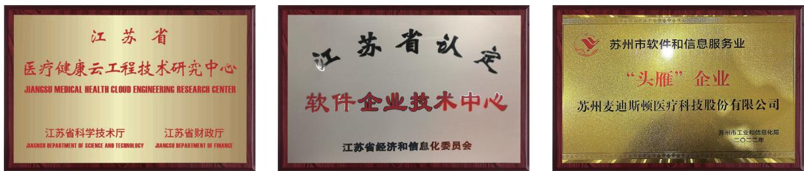

# 治理

公司高度重视技术创新工作，建立并持续完善研发管理体系，设立研发部及各产品部下属研发处，并制定《研发经费管理制度》《技术中心研究成果管理制度》《技术中心项目文件管理制度》等管理制度。在医疗信息化板块已具备成熟的研发体系，构建了完整的研发管理机制，从项目立项、需求分析、设计开发到产品测试的各个环节均建立了标准化流程，确保研发流程的高效运作与项目管理的严谨性。

为进一步推动公司在智慧医疗领域的技术创新与AI升级，强化自主科技创新能力，提升核心竞争力，公司设立创新业务部门，聚焦创新业务发展，加快构建前沿技术孵化体系。

# 研发团队建设

公司持续强化人才战略，着力构建一支专业化、高素质的研发团队，为企业技术创新注入源源不断的活力。截至报告期末，公司共有研发人员161人，占员工总人数比例为23.4%。

为充分调动员工创新积极性，公司制定《知识产权奖励制度》，建立“创新有激励、成果有保护”的长效机制，从制度层面保障自主创新活力持续释放。

# 研发人员结构

总人数：161人  
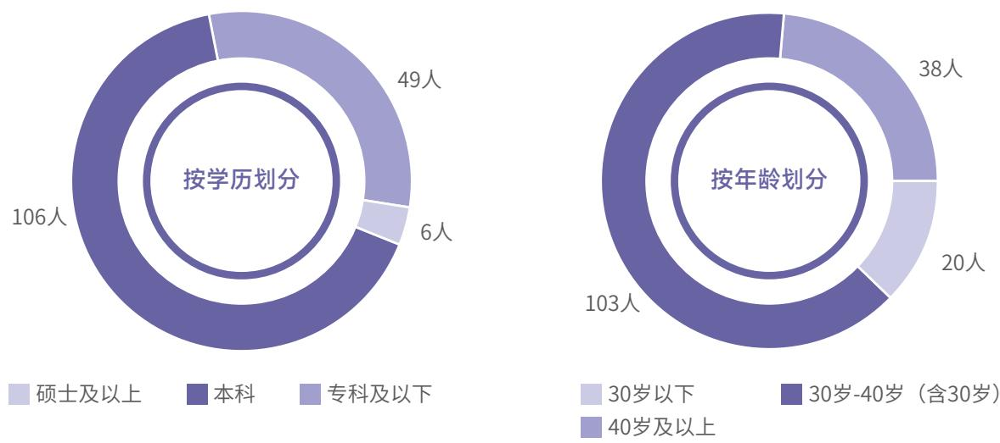

# 战略

公司识别出创新驱动发展中面临的关键风险与机遇，并制定了相应的应对策略，以管控风险并把握发展机遇。

<table><tr><td colspan="2">风险/机遇类别</td><td>风险/机遇描述</td><td> $^1$ 影响时间范围</td><td>潜在财务影响</td><td>应对措施</td></tr><tr><td rowspan="2">风险</td><td>技术风险</td><td>软件产品具有技术更新快、产品生命周期短的特点,如公司不能准确把握发展趋势、或因研发周期长等因素未及时研发出符合市场需求的升级产品或新产品,可能面临丧失技术和市场优势等风险。</td><td>中长期</td><td>研发投入成本上升;技术落后等导致营业收入下降。</td><td>·持续加强技术创新和新技术应用;·积极开展产学研合作与行业机构合作,推动技术联合攻关与产业资源整合;·增加创新业务团队,强化人才队伍建设;建立研发激励机制,稳定核心技术团队。</td></tr><tr><td>技术失密或侵权风险</td><td>公司在持续创新研发过程中积累丰富的技术成果,如核心技术一旦失密或被侵权,可能导致公司失去技术优势,将会对公司利益产生重大影响。</td><td>中长期</td><td>营业收入下降</td><td>·严格执行保密制度;强化数据安全防护;加强核心技术团队保密意识;·与接触核心技术的人员签署保密协议或竞业协议;·健全知识产权管理体系,确保专利及时申请,强化核心技术保障。</td></tr><tr><td rowspan="2">机遇</td><td>数据智能化升级</td><td>依托海量三甲医院临床数据,结合AI大模型实现现有医疗信息化产品全面智能化升级,构筑技术壁垒。</td><td>中长期</td><td>产品溢价提升,增加营业收入</td><td>·深化AI与急诊、麻醉、重症等场景融合;·加速AI辅助诊断产品落地,扩大三甲覆盖。</td></tr><tr><td>新赛道布局先发优势</td><td>契合低空经济、老龄化政策,率先布局低空医疗救援与康养机器人,抢占新增长曲线。</td><td>中长期</td><td>优化营收结构,提升估值与竞争力</td><td>·加快产品研发与试点落地;·联合产业伙伴打造示范案例。</td></tr></table>

$^{1}$ 影响时间范围：  
短期（1年以内）：对公司的影响通常是快速且临时的，持续时间较短通常不会超出1年。  
中期（1—5年）：对公司的影响较为持续，通常在1至5年内具有较大影响力。  
长期（5年以上）：对公司的影响是深远且持久的，持续时间通常超过5年。

# 影响、风险和机遇管理

为系统化地管理创新过程中的不确定性，公司将创新驱动风险和机遇管理纳入风险管理架构，建立了覆盖识别、评估、应对的全流程管理机制。结合公司主营业务特性与行业发展态势，精准识别各维度的风险与机遇，此外，公司充分评估各风险、机遇的影响时间范围与潜在财务影响，科学划定管控优先级；并针对性制定风险防控与机遇抢抓举措，以规范化、体系化管理为创新稳健推进保驾护航。

# 指标和目标

公司将持续强化自主创新能力与内外部资源整合力度，以提升核心技术竞争力为核心发展战略，聚焦关键技术攻关与产品迭代优化，不断夯实技术底座，推动技术能级与市场布局双向提升，实现技术创新与市场拓展的协同进阶、持续升级。

<table><tr><td>指标</td><td>2025年</td></tr><tr><td>研发投入</td><td>5,023.20万元</td></tr><tr><td>研发投入占营业收入比例</td><td>16.66%</td></tr><tr><td>累计授权专利数量</td><td>101项</td></tr><tr><td>累计发明专利数量</td><td>29项</td></tr><tr><td>累计软件著作权数量</td><td>612项</td></tr><tr><td>新增专利数量</td><td>6项</td></tr><tr><td>新增软件著作权</td><td>88项</td></tr></table>

# 创新成果

公司聚焦医疗信息化主业，以AI赋能升级产品，依托自身优势，进一步强化了产品的市场竞争力与行业影响力，为公司可持续高质量发展筑牢坚实技术根基。公司科技创新成果丰硕，凭借智能康养机器人产品荣获“兴业银行杯”首届深圳康养机器人大赛“铜奖”，获得“江苏省科技奖”“金牛上市公司科创奖（人工智能）”等奖项，入选华为全球医疗伙伴联盟，充分彰显公司的技术创新实力与行业权威认可。

# 数智赋能科创康养

公司锚定银发健康发展大局，深耕康养机器人自主创新研发，积淀多项核心技术成果。深度融合临床诊疗经验，将专业健康监测与智能预警机制内嵌至产品功能，实现全场景精准守护长者身心安康。

# 发展目标

> 产品：从非人形到人形、从非接触到接触、从功能到智能  
> 市场：市场壁垒  
> 战略：打造具身商用智能平台

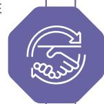

# 麦迪的产品

>涵盖不同业务功能的人形机器人、四足机器人、轮式机器人，打造“人形+轮式+多形态”康养机器人产品体系。  
>智能康养机器人解决方案提供八大核心功能模块：情感陪伴专家、智能就医管家、健康报告助手、个性化康养教练、全程生活记录仪、生命体征哨兵、安全守护者、行业标准引领者。  
>趋势：定制化走向标准化，“单点功能”走向“体系平台”。

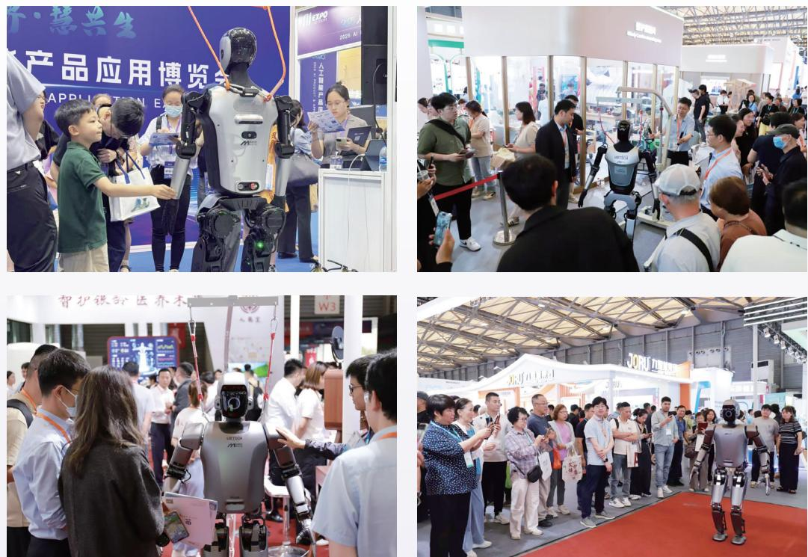  
麦迪科技康养机器人在展会

麦迪依托AI云端大脑核心算力支撑，赋能康养机器人实现全场景智能运转。依托大模型能力搭建云端智能调度与数据分析体系，打通医疗健康数据互联互通，实现多终端信息协同、智能交互精准响应。

AI云端大脑核心架构  
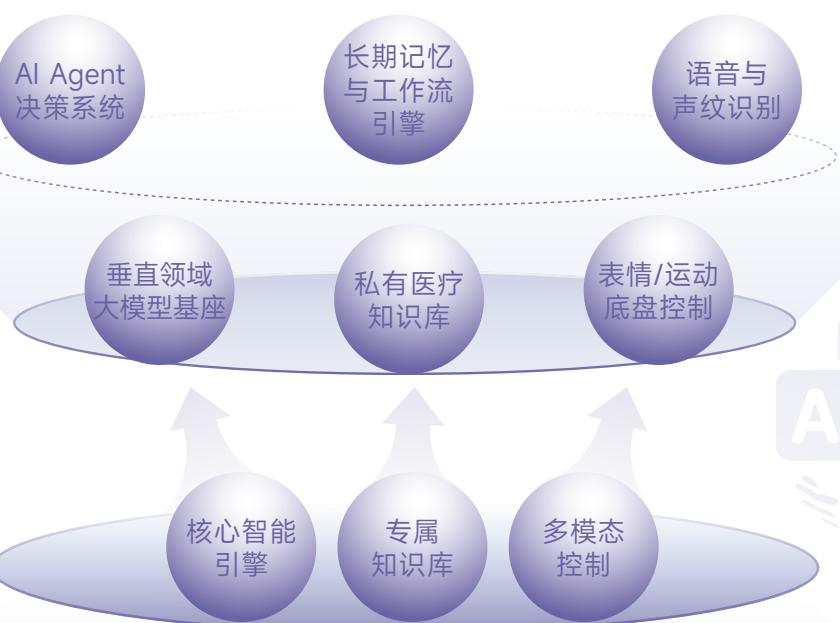

flowchart

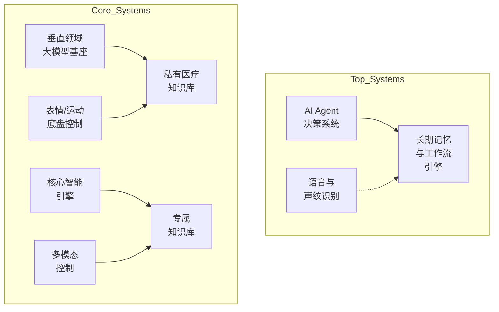
```mermaid
graph TD
  subgraph Top_Systems
  A["AI Agent\n决策系统"] --> B["长期记忆\n与工作流\n引擎"]
    C["语音与\n声纹识别"] -.-> B
  end

  subgraph Core_Systems
  D["垂直领域\n大模型基座"] --> E["私有医疗\n知识库"]
  F["表情/运动\n底盘控制"] --> E
  G["核心智能\n引擎"] --> H["专属\n知识库"]
  I["多模态\n控制"] --> H
  end
```

# 人工智能助力产品发展

针对手术室排班调度痛点，构建手术排班调度系统，形成手术闭环流程。引入手术申请、手术审核排班、手术室统筹、消息通知、知识库、信息管控概念，建立手术排班调度系统。系统与麻醉系统、HIS系统关联，形成完整链条手术闭环流程。

手术室AI智能排班调度系统  
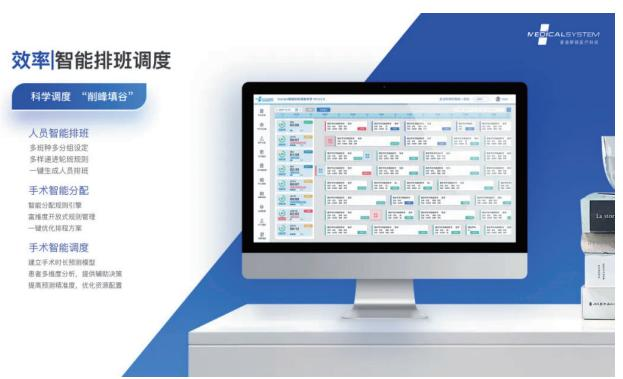

text_image

效率\智能排班调度
科学调度“削峰填谷”
人员智能排班
多排种多分组设定
多样速递轮班规划到
一键生成人员排班
手术智能分配
智能分配规则引擎
富维度开放式规则管理
一键优化程序方案
手术智能调度
建立手术时长预测模型
患者多维度分析，提供辅助决策
提高预测精准度，优化资源配置

# DoCare重症监护临床信息系统

针对重症学科信息化建设的痛点，麦迪科技推出以“专科知识库”为核心的智能平台。通过兼容多源设备数据采集、自动化业务流程，实现患者临床数据的高效整合与共享，推动科室运营从“经验驱动”迈向“数据驱动”。

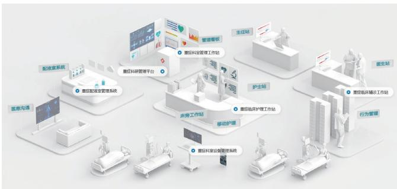

flowchart

```mermaid
graph LR
  A["医院沟通"] --> B["配液室系统"]
  B --> C["重症配液室管理系统"]
  C --> D["重症科研管理平台"]
  D --> E["重症科技管理工作站"]
  E --> F["主任站"]
  F --> G["护士站"]
  G --> H["重症临床护理工作站"]
  H --> I["移动护理"]
  I --> J["体旁工作站"]
  J --> K["重症科室设备管理系统"]
  K --> L["重症临床辅助工作站"]
  L --> M["医生站"]
  M --> N["行为管理"]
```

具身智能：优麦康养陪伴机器人V1.0

公司正式发布优麦康养陪伴机器人V1.0。优麦机器人是首款开启CR认证的康养陪伴机器人产品，采用全栈式自主可控研发路径，涵盖本体结构、运动控制、感知交互、AI对话与系统平台等核心环节，面向真实康养场景进行设计与迭代。

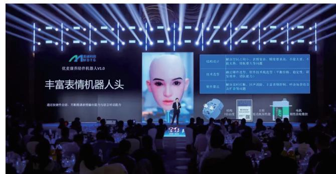

text_image

优麦培养机器人V1.0
丰富表情机器人头
通过软硬件创新，不断预测的输出能力为语言对话能力

结构设计
解决空间与云、连接复杂、精度要素多、不重大重、不超大热、系统要素等问题

技术选型
确定硬件选型，软件技术选型：平衡分频、裕度性、研发效率（团队能力）

软件算论
解决实时打数、回声清除、子蓝表情控制、秒余场景优化及扩量等问题

应用
支持网络
计算
系统算法和算法
编辑
编辑器高级参数

# 产品迭代升级

新一代智慧手术部整体解决方案  
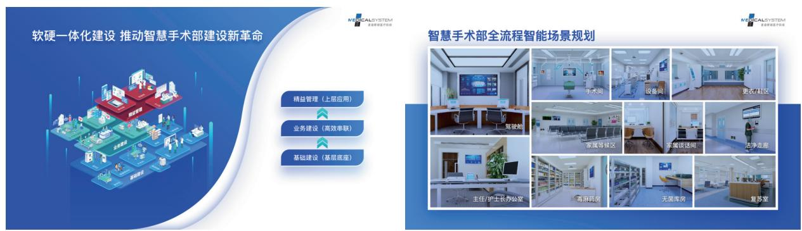

text_image

软硬一体化建设 推动智慧手术部建设新革命
精益管理（上层应用）
业务建设（高效串联）
基础建设（基层底座）
智慧手术部全流程智能场景规划
手术间
设备间
更衣/社区
驾驶舱
家属等候区
家属谈区间
洁净走廊
主任/护士长办公室
荨麻药房
无菌库房
复苏室

# AI急诊急救医疗协同平台

公司的AI急诊急救医疗协同平台并非概念性产品，而是历经多轮临床验证、技术迭代与区域部署后形成的标准化、模块化解决方案。平台以“以患者为中心、以流程为主线、以数据为驱动”为核心理念，已在多个省市构建起高效运转的智能急救网络。

# 麻醉临床信息系统V8.0

报告期内，公司自主研发的新一代麻醉临床信息系统V8.0成功完成市场导入并获得临床广泛认可，正式承接起公司麻醉信息化业务的核心增长引擎。V8.0系统凭借其更优的用户体验与面向围术期全周期管理的智能化功能，有效满足了三级医院对高质量、高安全、高效率麻醉临床系统的迫切需求。

公司产品重症医生站完成升级改造，全面覆盖重症营养管理，实现对重症患者营养支持的全流程闭环管理。从入科初期的营养风险筛查与评估开始，结合患者病情、代谢状态及器官功能，制定个体化营养支持方案，确保了营养支持的科学性、连续性与有效性，显著提升了重症患者的综合救治水平。

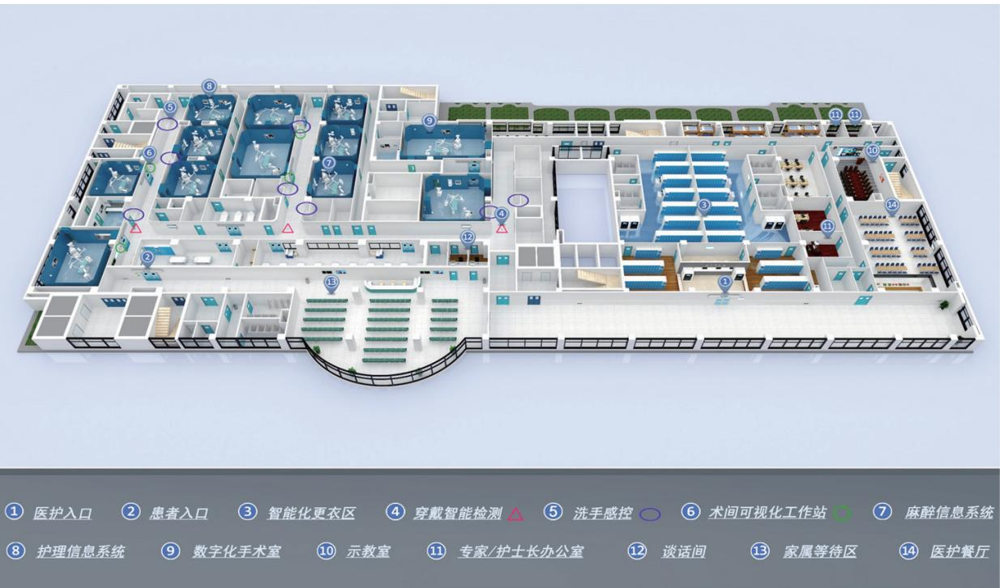

text_image

① 医护入口
② 患者入口
③ 智能化更衣区
④ 穿戴智能检测
⑤ 洗手感控
⑥ 术间可视化工作站
⑦ 麻醉信息系统
⑧ 护理信息系统
⑨ 数字化手术室
⑩ 示教室
⑪ 专家/护士长办公室
⑫ 谈话间
⑬ 家属等待区
⑭ 医护餐厅

# 共促行业发展

公司始终秉持开放共赢、协同发展的核心理念，高度重视行业生态共建与同业协同创新，以多层次合作体系推动技术共进、资源互通与价值共创。同时，麦迪科技作为行业领先者，积极参与行业标准的起草与制定，以专业的技术实力和丰富的实践经验，为行业技术水平的提升作出积极贡献，推动行业高质量发展。

# 参与协会单位情况

截至报告期末，玛丽医院为中国非公立医疗机构协会会员单位，医院专家受聘为中国非公立医疗机构协会生殖医学专业委员会委员、海南省生殖医学专业医疗质量控制中心委员。

# 急诊医学学术展会

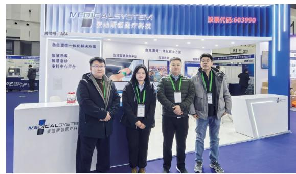

text_image

MEDICALSYSTEM
麦迪斯智医疗系统
股票代码:603990
A04
急急置心一体化解决方案
智能急救
智能急诊
专科中心平台
急急置心一体化解决方案
区域智能急救平台
智能急救
B1 51#
MEDICALSYSTEM
麦迪斯智医疗系统

麻醉医学展会  
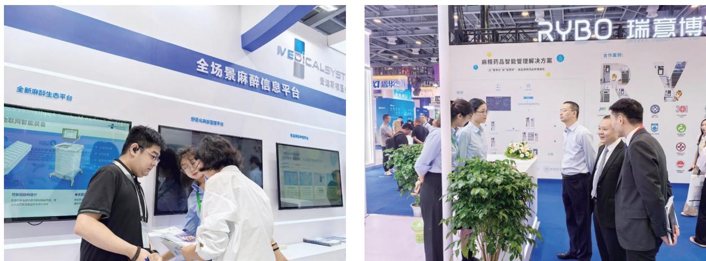

# 深化行业合作

公司立足医疗信息化核心赛道，聚焦临床信息化、智慧医疗、康养具身智能等关键领域，先后与华为、中国科学院自动化研究所、优必选科技、上海机器人产业技术研究院等业内顶尖机构达成深度战略合作。通过技术联合攻关与产业资源整合等，持续强化核心技术壁垒，全面提升产品智能化水平与市场竞争力，以开放合作赋能医疗健康产业数智化高质量发展。

# 案例：打造具身智能康养机器人平台，启动产业协同发展

"以智能科技·重塑康养未来"具身智能康养机器人协同发展启动会于2025年5月在上海召开。麦迪科技联合行业伙伴达成战略合作，并与华为、优必选科技等头部机构共同启动产业协同发展机制，未来计划打造康养场景下任务驱动的群体智能平台。通过"政产学研用"协同模式，积极探索新技术、新模式、新业态，共同打造以算力、大模型、机器人本体、数据采集及应用场景为一体的康养机器人解决方案平台，助力"健康中国"战略落地，推动中国智慧康养产业进入规模化发展新阶段。

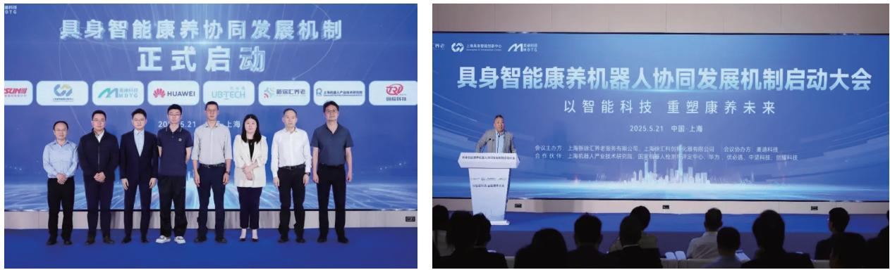

# 案例：上海机器人产业技术研究院与麦迪科技达成战略合作

双方将围绕医康养领域具身智能数据集的联合打造、标准化建设及场景化应用展开深度合作，共同推进智能机器人在医疗、康复、养老等场景的技术落地与产业生态构建。

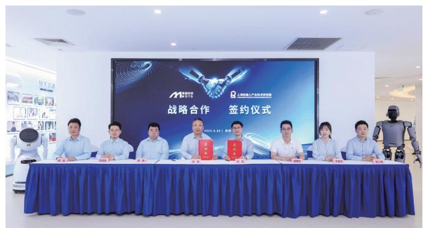

text_image

战略合作 签约仪式
2025.6.20 | 战略合作

# 案例：麦迪科技入选华为全球医疗伙伴联盟

7月10日，华为全球医疗伙伴联盟发布仪式在东莞举行，华为医疗卫生军团总裁张伟力等华为公司领导携麦迪科技总裁翁康及行业伙伴代表隆重发布“华为全球医疗伙伴联盟”。该联盟旨在为全球范围内的教育医疗行业伙伴提供一个全新的沟通交流平台，联盟的成立将与业界同仁共商机遇、共建生态、共享价值。联盟伙伴将携手共进，凝聚智慧，共话医疗行业数智化转型的新思路、新模式、新场景、新应用，加速医疗行业智能化，为全球教育和医疗事业的数智化注入新动能。

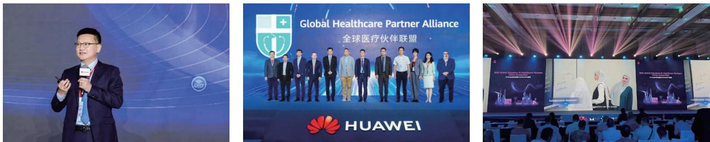

# 行业交流

公司积极参与并持续拓展深化行业交流，聚焦行业专业会议、论坛、峰会、年会、博览会等市场活动，对新产品、新技术进行全方位展示，与客户、行业专家学者、媒体等保持紧密交流，掌握行业相关政策及动态，联合协会、行业机构等进行资源整合，探索行业未来发展新路径。

# 案例：麦迪科技2025上海老博会闪耀收官，引领智慧康养新时代

6月13日，麦迪科技携智慧康养成果参加上海国际养老、辅具及康复医疗博览会。公司以“AI平台为核心、机器人为载体”为理念，展出智能康养机器人、智能代步车等产品，旗下专为康养场景打造的“小麦”智能服务机器人凭借优秀的交互与陪伴属性成为现场焦点。公司以扎实的技术实力与生动的场景呈现收获大量曝光，品牌影响力进一步放大。

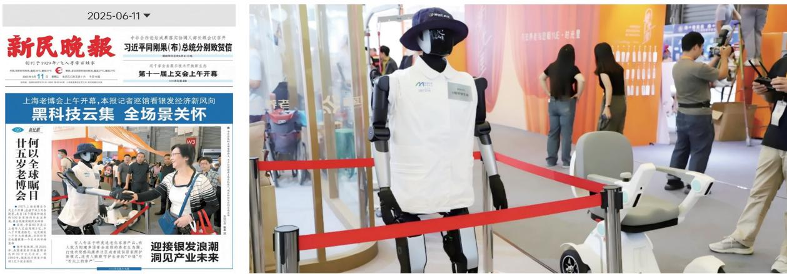

# 案例：麦迪科技亮相CHIMA2025数智方案赋能智慧医疗新生态

CHIMA2025在厦门圆满落幕，麦迪科技携智慧手术部、重症学科信息化等核心方案参展，以数智技术破解医疗痛点，升级诊疗与救治效率。未来将持续创新，携手行业共筑数智化医疗生态。

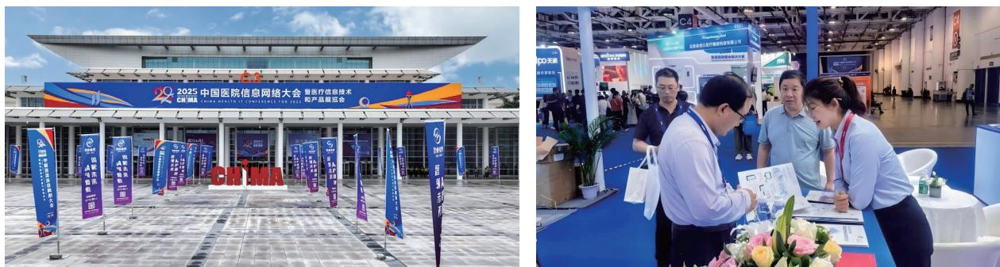

# 案例：共襄学术盛举AI智慧重症系统赋能学科创新

中华医学会第十九次重症医学大会在长沙开幕，以“机遇、拓新”为主题，汇聚了国内外近万名重症医学专家、临床医护工作者及科研学者，共同探讨学科前沿发展。大会通过专题报告、学术研讨、技术展示等形式，深入交流重症医学的创新技术、临床实践与质量管理，为推动行业高质量发展提供了新思路。

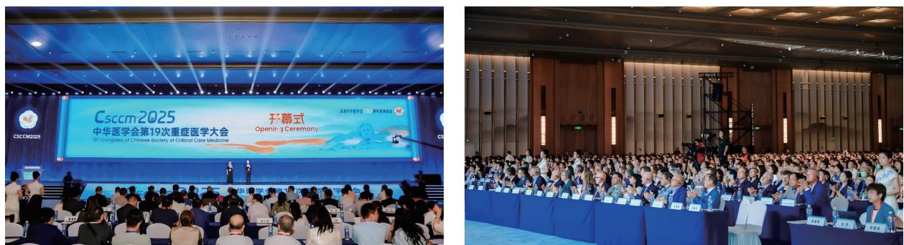

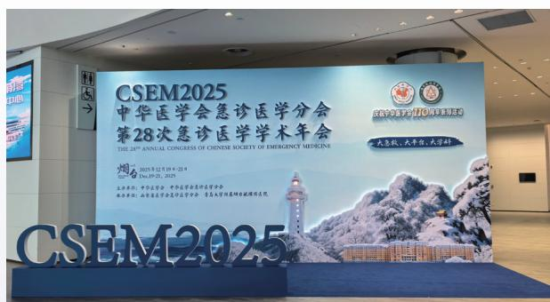

text_image

CSEM2025
中华医学会急诊医学分会
第28次急诊医学学术年会
THE 24TH ANNUAL CONGRESS OF CHINESE SOCIETY OF EMERGENCY MEDICINE
CSEM2025
主办单位：中国科学院、中国医学委员会、中国医学学会
承办单位：山东省医学学会中医学中心 青岛大学附属肿瘤医院有限公司
CSEM2025

中华医学会急诊医学分会第28次急诊医学学术年会

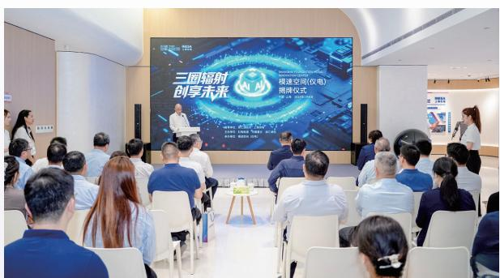

text_image

三回辐射
创享未来
提速空间(仪电)
開幕仪式

模速空间（仪电）揭牌仪式

# 知识产权保护

公司始终将知识产权保护置于企业发展的核心位置，通过制度建设与合规管理，构建起兼顾自身权益维护与尊重他人权益的双重保护体系。截至报告期末，公司已通过知识产权管理体系认证。

在自身知识产权保护方面，公司依据国家法律法规，制定了《技术研究成果管理制度》，涵盖专利、商标、著作权、商业秘密、知识产权奖励、技术合同管理等专项制度，并设立知识产权管理部门，由资质办负责日常知识产权管理工作，将知识产权管理深度嵌入从项目立项到成果转化的全过程。同时，建立知识产权激励机制，有效激发员工发明创造积极性，促进企业技术创新和形成自主知识产权。

# 麦迪科技知识产权管理架构

研发职能部门 研究项目的具体执行、成果提交。  
资质处、法务部 负责研究成果的知识产权布局、申请及维护，法务部负责风险预警和侵权纠纷处理。  
人力资源中心 负责根据公司的相关制度及规则落实奖励与激励措施。

在尊重他人知识产权方面，公司严格恪守法律法规，在研发、生产、运营等全业务环节建立合规审查机制，坚决杜绝侵犯他人专利、商标、著作权等合法权益的行为，主动防范侵权风险，以合规经营维护公平竞争的市场秩序，彰显企业责任担当。

# 知识产权保护策略

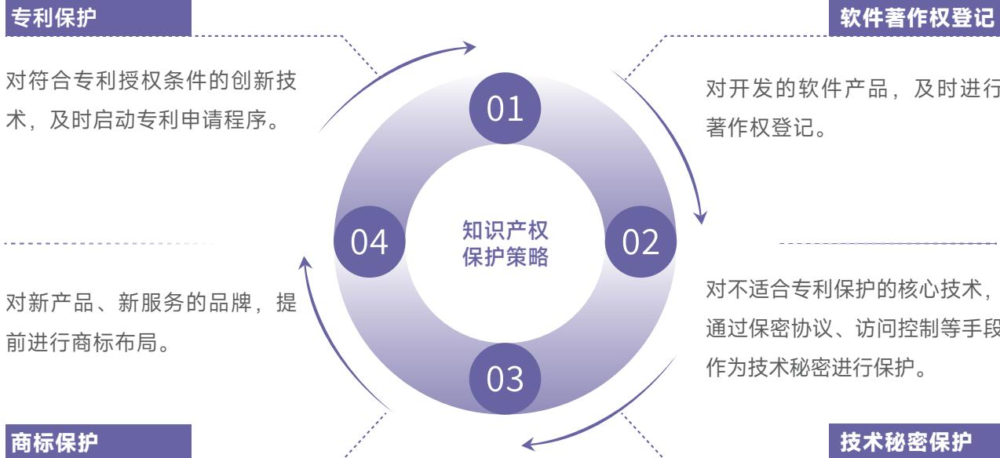

flowchart

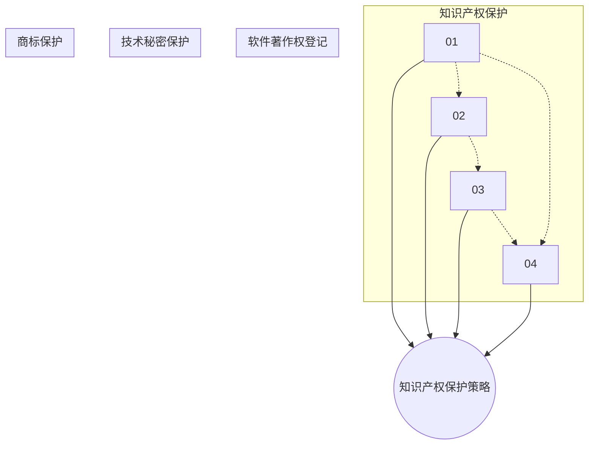
```mermaid
graph TD
  Center(("知识产权保护策略"))
  
  subgraph Core_1["知识产权保护"]
    direction TB
    Node1["01"]
    Node2["02"]
    Node3["03"]
    Node4["04"]
  end
  
  subgraph Core_2["软件著作权登记"]
    direction TB
    Node1
    Node2
    Node3
    Node4
  end
  
  subgraph Core_3["技术秘密保护"]
    direction TB
    Node3
    Node4
  end
  
  subgraph Core_4["商标保护"]
    direction TB
    Node3
    Node4
  end

  %% Left Branch (Core_1)
  Node1 --> Center
  Node2 --> Center
  Node3 --> Center
  Node4 --> Center

  %% Right Branch (Core_2)
  Node1 -.-> Node2
  Node2 -.-> Node3
  Node3 -.-> Node4

  %% Bottom Left Branch (Core_3)
  Node1 -.-> Node4
```

# 科技伦理

公司高度注重科学伦理，将科技伦理贯穿医疗信息化、AI医疗、康养智能设备与辅助生殖技术研发及推广使用全流程，以伦理合规筑牢技术创新底线。报告期内，公司未发生任何与科技伦理相关的重大违法违规事件。

在医疗信息化板块，公司严格遵守《新一代人工智能伦理规范》等规范及标准文件，在进行创新研发过程中严格遵守科技伦理规范，避免技术滥用，对成果应用审慎评估，以负责任态度推动科技创新。

在生殖医学医疗服务板块，玛丽医院下设伦理委员会，委员会成员由医学伦理学、心理学、社会学、法学、生殖医学、护理专家和群众代表等组成。伦理委员会遵循法律、人权、文化、宗教和社会道德规范准则，以知情、自愿、有利于患者和社会的原则审视医疗活动，以知情、自愿和无伤害原则审视科研活动。生殖医学伦理委员会每年召开两次会议，督查医院的生殖医学伦理工作并针对辅助生殖技术使用过程中碰到的伦理问题进行集中讨论并形成决议，规避潜在的伦理风险。

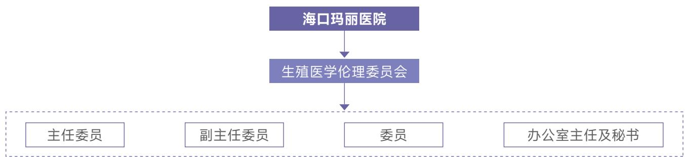

flowchart

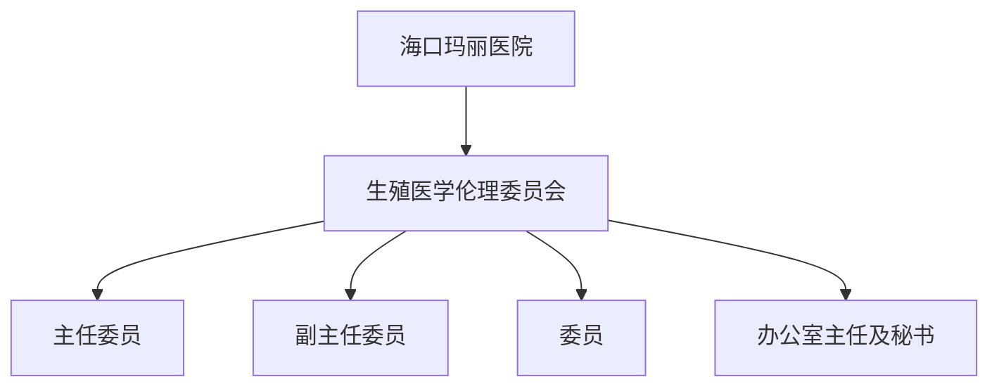
```mermaid
graph TD
  A["海口玛丽医院"] --> B["生殖医学伦理委员会"]
  B --> C["主任委员"]
  B --> D["副主任委员"]
  B --> E["委员"]
  B --> F["办公室主任及秘书"]
```

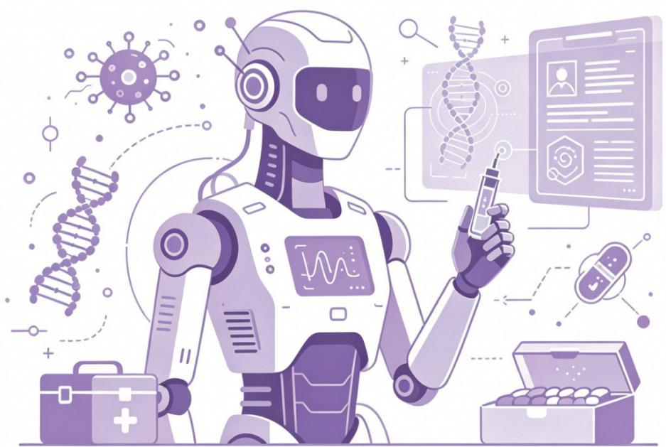

natural_image

Illustration of a humanoid robot with medical equipment and DNA-related icons, no text or symbols present

# 产品安全与质量

产品质量是麦迪科技立足发展的核心基石，更是企业始终坚守的责任底线。公司始终将产品质量与服务安全放在首位，秉持严苛的品质理念，构建全流程、高标准的质量管控体系，严格遵循行业规范与质量准则，从研发、生产到交付、运维全环节落实严密质量把控。

# 治理

公司严格遵守《中华人民共和国产品质量法》等国家相关法律法规，持续强化质量管理体系建设，各业务板块均结合业务实际建立了质量管理体系，实现质量管控规范化、制度化运行。目前，公司已通过ISO 9001质量管理体系、ISO 20000信息技术服务管理体系等认证，获得ITSS二级证书、信息系统建设和服务能力（CS3）证书、医疗器械生产许可证、医疗器械经营备案及CMMI5软件能力成熟度模型集成5级等证书。为确保质量管理体系运行的有效性，公司每年开展内审、管审及外审活动，保障产品稳定运行。

# 医疗信息化板块

公司制定了产品监视和测量控制程序、产品标识和可追溯性控制程序、不良事件监测控制程序等内部管理程序，为产品质量管理提供制度遵循与操作规范。

# 辅助生殖板块

玛丽医院严格遵守《人类辅助生殖技术管理办法》《医疗质量管理办法》《医疗器械管理调理》的相关规定，并在此基础上建立了医院的质量安全管理架构，成立质量与安全管理小组加强医疗安全质量管理，有效地监督医疗、护理质量。

# 战略

为了确保产品质量，公司深入了解产品质量的潜在风险与机遇。针对识别出的各类风险与机遇，公司依据风险特性，制定应对措施，降低质量相关风险。同时，公司积极把握潜在机遇，提升产品质量，增强市场竞争力。

<table><tr><td>风险类别</td><td>风险描述</td><td> $^1$ 影响时间范围</td><td>潜在财务影响</td><td>应对措施</td></tr><tr><td>产品质量风险</td><td>由于设计错误、测试不充分等因素导致产品存在功能缺陷、安全漏洞等问题;或由于需求理解偏差等原因,导致产品或解决方案与客户需求存在较大差距。</td><td>中期</td><td>客户流失,营业收入减少</td><td>· 加强质量全生命周期控制与监督;· 与客户保持沟通,强化需求管理,确保需求准确落实。</td></tr></table>

<table><tr><td>机遇类别</td><td>机遇描述</td><td> $^1$ 影响时间范围</td><td>潜在财务影响</td></tr><tr><td>质量标杆溢价</td><td>以零缺陷质量打造医疗信息化质量标杆,形成品牌差异化,实现产品与服务溢价,摆脱低价竞争。</td><td>中长期</td><td>品牌价值增长,营业收入增加</td></tr><tr><td>高端市场拓展</td><td>以高质量定制化方案满足大型医院、高端医疗机构需求,突破低端红海,进入高附加值细分市场。</td><td>中长期</td><td>业务边界拓宽,营业收入增加</td></tr></table>

$^{1}$ 影响时间范围：  
短期（1年以内）：对公司的影响通常是快速且临时的，持续时间较短通常不会超出1年。  
中期（1—5年）：对公司的影响较为持续，通常在1至5年内具有较大影响力。  
长期（5年以上）：对公司的影响是深远且持久的，持续时间通常超过5年。

# 影响、风险和机遇管理

公司聚焦医疗信息化、辅助生殖核心业务，高度重视质量风险管控，全流程开展风险识别、评估、应对，确保医疗软件与服务质量风险全面受控，筑牢医疗质量安全防线。

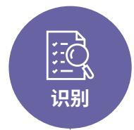

公司依据相关法律法规及行业质量安全标准，定期开展全环节质量风险与机遇识别工作。

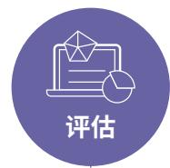

从影响时间范围、财务影响等维度对风险机遇进行评估，明确风险管控程度；对质量提升相关机遇的潜在价值、实现路径及可行性进行分析。

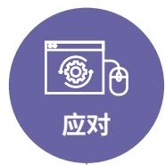

针对风险制定专项应对方案，明确责任、措施与时限；完善质量闭环管理并复盘验证；积极把握机遇，将其转化为市场竞争力。

natural_image

Illustration of people interacting with a service counter, including a robot and a customer, with boxes and documents in the background (no text or symbols)

# 指标与目标

公司结合行业监管要求、市场客户需求及公司发展战略，建立了质量管控体系，持续优化质量标准，强化数据安全与隐私保护，提升医疗信息化产品稳定性与安全性，为医疗机构提供可靠的产品与服务保障。报告期内，公司未受到质量监督主管部门的行政处罚。

# 2026年目标

# 持续优化质量管理体系

# ★ 关键绩效

产品合格率100%  
产品培训人次104人次  
客户质量投诉次数0次  
产品培训总时长104小时  
重大质量事故发生率0%  
产品培训次数53次

# 产品质量控制

公司始终将产品质量管控贯穿于产品研发、测试、交付与运维全生命周期，从源头把控产品设计合规性，强化全过程监督与风险管控，通过构建闭环的质量管理机制，保障产品和服务的质量与安全。

# 医疗信息化板块

# 产品质量管控措施

产品全流程质量控制

在产品全流程中实施精细化管控，覆盖从设计研发到质量检测的关键环节；引入CMMI5软件能力成熟度模型认证，依据该模型标准对产品全生命周期开展系统性管理与监督。

质量风险排查与监督

将防范系统性、行业性产品质量安全风险作为核心底线，以组织开展重点产品、重点区域质量安全隐患排查与专项整治为抓手，通过日常巡查、专项检查、监督抽查等多元方式，将各类质量安全隐患消解于萌芽状态，全面深化质量安全监管工作。

质量标准化管控

组建SEPG（软件工程过程组）专项团队，针对软件研发过程开展深度研究，总结并发布适用于全公司的标准化软件过程文件，作为各项目组开展研发管理与质量控制的核心依据。

履约与售后服务管理

依托严格的项目全周期管理、质量控制与质量保证体系，对软件开发、市场销售及项目履约全流程实施闭环管控；同时通过客户满意度调研、售后响应优化等举措，保障产品与服务质量的持续提升。

# 辅助生殖板块

# 医疗、护理质量管控措施

# 压实主体责任

科主任、护士长作为科室质量管理第一责任人，将质量管理工作纳入日常核心议程，持续推进各项规章制度落地执行，每月定期组织召开质量管理控制会议，通过制度化管理约束和规范医疗服务行为，确保医疗活动全程合规。

# 完善考评体系

健全科室医疗质量考评机制，明确考评标准与细则，推动各项医疗核心制度全面落地。每月由质控小组开展专项检查，形成检查总结并及时反馈，对存在的问题建立整改台账，深入分析问题根源，制定针对性整改措施并跟踪落实，实现质量问题的闭环管理。

# 建立长效机制

定期组织质管小组开展工作会议，每季度召开质量管理委员会会议，及时通报质量情况、研讨典型案例、总结工作成效，针对薄弱环节精准施策，推动医疗质量持续迭代提升，形成“检查—反馈—整改—提升”的良性循环。

# 质量文化建设

公司将质量意识培训作为质量文化建设的核心抓手，面向全体员工开展常态化质量培训。公司紧扣医疗行业特性，通过系统化培训持续强化全员质量意识与责任担当，引导员工将“质量第一、安全至上”理念融入日常工作。公司以常态化培训筑牢质量根基，营造人人重视质量、人人坚守质量的良好氛围，以坚实的质量文化保障产品与服务安全可靠。

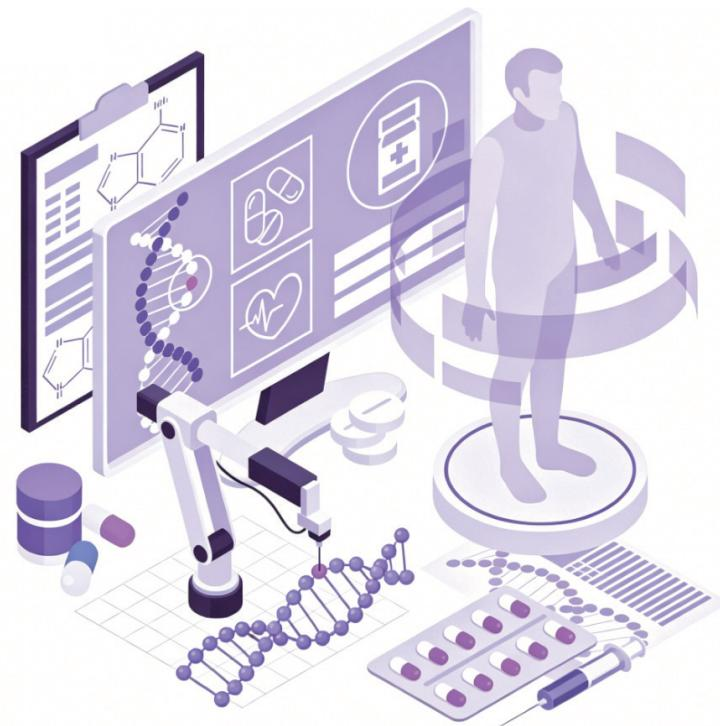

natural_image

Illustration of medical technology with robotic arm, DNA helix, pills, and patient silhouette (no text or symbols)

# 客户服务

公司高度重视客户服务工作，持续提升客户服务水平，致力于为客户提供更高品质的产品与服务，努力践行“为客户创造价值，为生命保驾护航”的服务理念，满足医院新时代高质量发展要求，为医院发展提质增效提供有力支撑。

# 客户服务体系

公司严格遵守《中华人民共和国消费者权益保护法》等相关法律法规，各业务板块均建立了完善的客户服务体系，建立了明确的客户服务管理机制，明确规范服务流程、响应机制及考核标准，确保服务工作的规范化和高效化。并通过培训等方式持续提升销售及服务团队的能力水平，为客户提供更优质、更专业的服务体验，进一步提升客户信任与品牌价值。

# 医疗信息化板块

公司设立由呼叫中心、远程支持部、客户关系部、区域客服中心、大客户部及质量监督部组成的客户服务中心服务团队，覆盖售前咨询、售中实施到售后维护的全生命周期服务链条，实现客户需求快速响应与问题闭环管理。同时，制定了《交付服务部管理制度》《销售管理制度》等一系列制度文件，全面规范客户服务工作的流程与标准，确保客户服务质量的稳定、可靠。

客户服务管理架构  
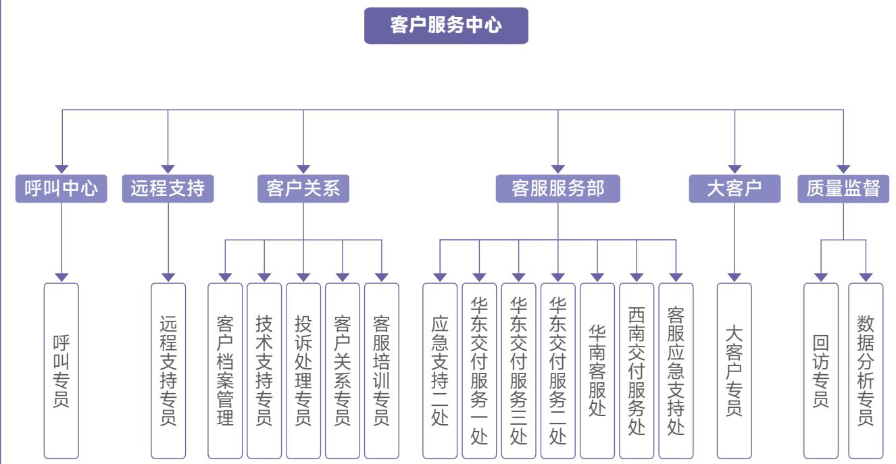

flowchart

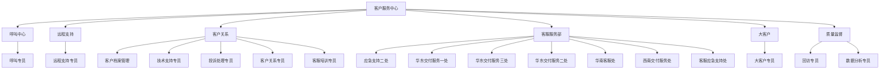
```mermaid
graph TD
  A["客户服务中心"] --> B["呼叫中心"]
  A --> C["远程支持"]
  A --> D["客户关系"]
  A --> E["客服服务部"]
  A --> F["大客户"]
  A --> G["质量监督"]
  
  B --> H["呼叫专员"]
  C --> I["远程支持专员"]
  
  D --> J["客户档案管理"]
  D --> K["技术支持专员"]
  D --> L["投诉处理专员"]
  D --> M["客户关系专员"]
  D --> N["客服培训专员"]
  
  E --> O["应急支持二处"]
  E --> P["华东交付服务一处"]
  E --> Q["华东交付服务三处"]
  E --> R["华东交付服务二处"]
  E --> S["华南客服处"]
  E --> T["西南交付服务处"]
  E --> U["客服应急支持处"]
  
  F --> V["大客户专员"]
  G --> W["回访专员"]
  G --> X["数据分析专员"]
```

# 辅助生殖板块

玛丽医院始终坚持“以患者为中心，提供温馨、有温度的就医体验”的服务宗旨，制定《一站式管家服务体系建设》《客户回访制度》等管理制度，规范各环节服务要求，确保服务过程符合医院标准与患者期望，及时发现并解决问题，减少医患矛盾。

# 客户满意度

公司将客户满意度视为衡量服务质量的关键指标。在医疗信息化板块，通过现场拜访、服务热线、满意度调查等多元渠道与客户保持常态化沟通，及时了解客户需求与意见反馈。公司建立了客户反馈与满意度调查机制，运用系统化方法收集、梳理和分析客户建议，并快速落实针对性改进措施，持续优化产品与服务，不断提升客户满意度。

医院运营服务环节，玛丽医院通过提高服务质量、服务技能、优化诊疗环境等方式，优化患者就医体验，有效提高患者满意度。

# ★ 报告期内

医疗信息化板块客户服务满意度为99.7%

累计收获各地医院客户感谢信○封

# 客户服务培训

公司注重提升服务团队的专业技能与业务素养，不定期开展提升客户服务能力的相关培训，包括产品培训、行业知识培训和售后服务培训等多个关键环节的内容，打造一支高素质、高效率的客户服务团队。

报告期内，公司共开展客户服务相关培训13次。

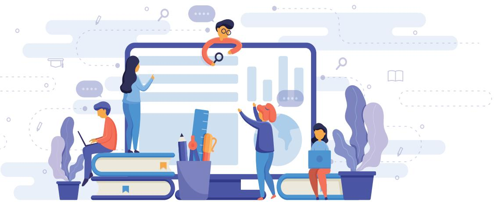

natural_image

Illustration of people interacting with digital devices and charts, no text or symbols present

# 客户投诉管理

公司高度重视客户诉求，各业务条线均建立了规范的客户投诉处理流程，确保及时响应与处理客户的问题，切实保障客户权益。

# ★ 报告期内

客户投诉数量0

客户投诉处理率100%

# 医疗信息化板块

为保证客户系统的长期、稳定运行，公司在质保及维护期内为客户量身定制了八大服务项目。

八大服务项目  
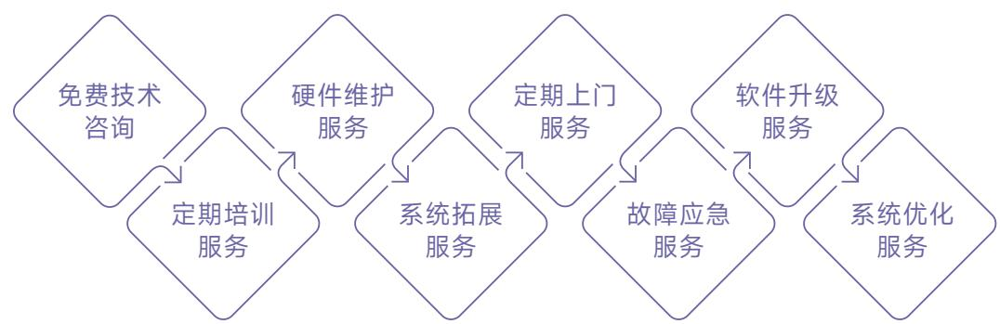

flowchart

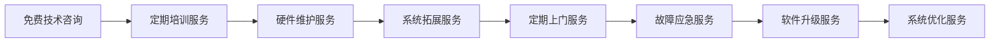
```mermaid
graph LR
  A["免费技术咨询"] --> B["定期培训服务"]
  B --> C["硬件维护服务"]
  C --> D["系统拓展服务"]
  D --> E["定期上门服务"]
  E --> F["故障应急服务"]
  F --> G["软件升级服务"]
  G --> H["系统优化服务"]
```

针对医疗信息化服务过程中的客户投诉，公司制定《客户投诉及处理制度》，根据投诉类型严格时效性要求：一般投诉在5天内处理完毕，重大投诉应在3日内处置完毕，超时需经公司总经理批准，重大投诉应在当天给投诉的客户明确答复，投诉事件整体解决时间不应超过10工作日。

客户投诉处理流程  
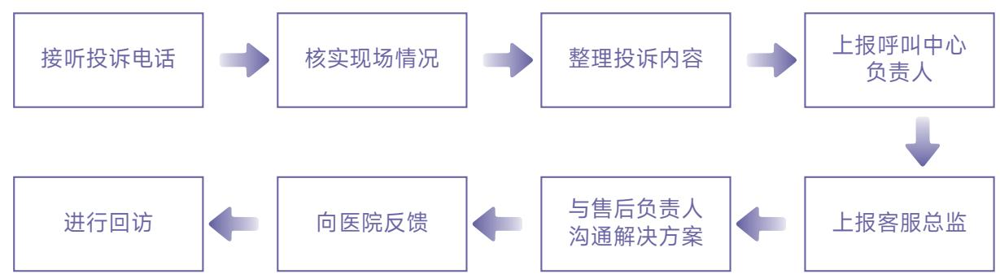

flowchart

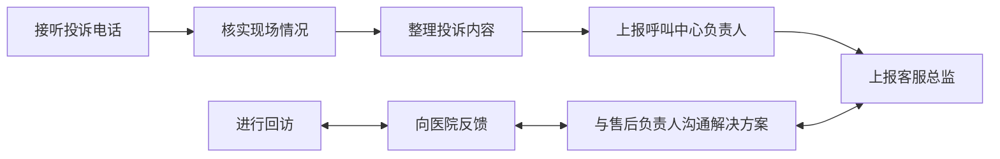
```mermaid
graph LR
  A["接听投诉电话"] --> B["核实现场情况"]
  B --> C["整理投诉内容"]
  C --> D["上报呼叫中心负责人"]
  D --> E["上报客服总监"]
  F["进行回访"] <--> G["向医院反馈"]
  G <--> H["与售后负责人沟通解决方案"]
  H <--> E
```

# 辅助生殖板块

为加强医院投诉管理，玛丽医院建立规范的投诉处理机制，设立医院投诉管理领导小组负责接收处理客户投诉问题，规范投诉处理程序，确保及时响应与处理患者投诉需求，保护医患双方合法权益。

客户投诉处理流程  
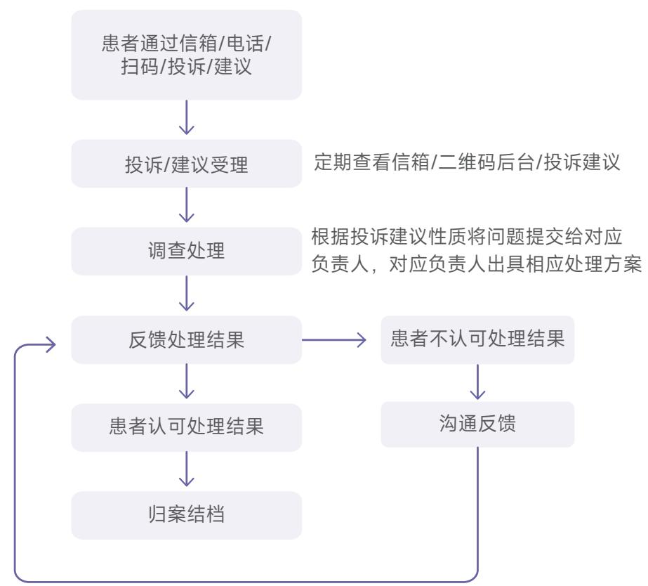

flowchart

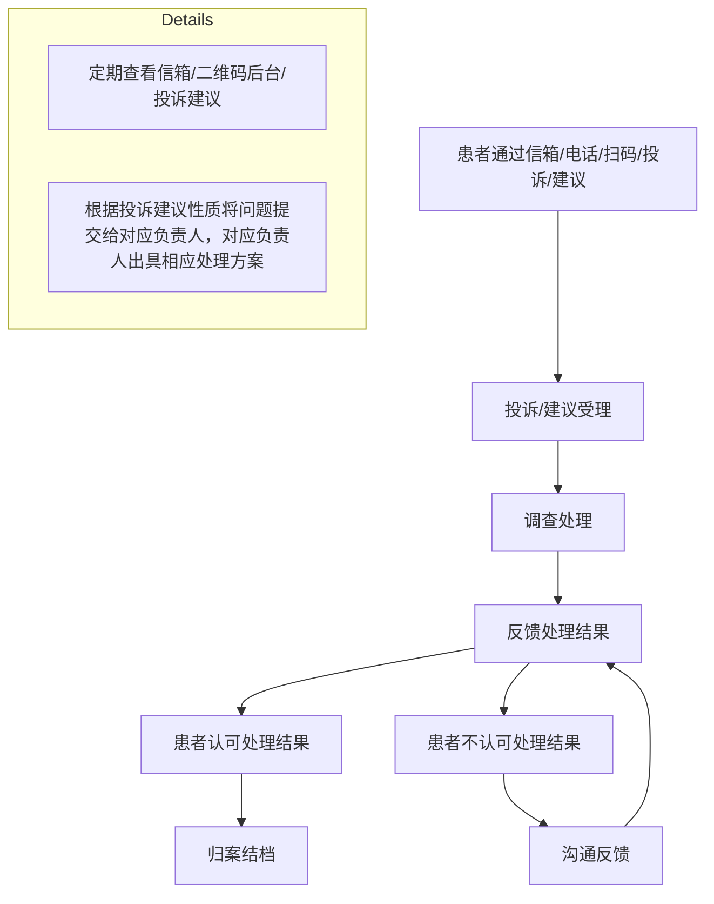
```mermaid
graph TD
  A["患者通过信箱/电话/扫码/投诉/建议"] --> B["投诉/建议受理"]
  B --> C["调查处理"]
  C --> D["反馈处理结果"]
  D --> E["患者认可处理结果"]
  E --> F["归案结档"]
  D --> G["患者不认可处理结果"]
  G --> H["沟通反馈"]
  H --> D
  subgraph Details
    I["定期查看信箱/二维码后台/投诉建议"]
    J["根据投诉建议性质将问题提交给对应负责人，对应负责人出具相应处理方案"]
  end
```

# 负责任营销

公司积极践行负责任营销理念，严格遵守《中华人民共和国广告法》《中华人民共和国反不正当竞争法》《中华人民共和国消费者权益保护法》等法律法规，在营销过程中秉持客观、公正的原则披露信息，确保所传递内容真实、完整、透明。针对公司各类服务及产品建立了对外参展宣传规范，官网信息发布、宣传物料、公众号信息发文等制定相应的审核流程，确保软件信息、医疗服务推广资料符合合规营销要求。同时，通过定期更新销售包及线上线下相结合培训等方式，提升营销系统员工的责任营销意识，确保在服务过程中传递的内容真实、准确。公司将继续遵循负责任营销政策，为客户提供具有医疗行业标准的产品，以更专业、规范化的管理流程，践行社会责任战略。报告期内，公司未发生与营销相关的重大违规事件。

# 负责任供应链

公司在供应链管理方面秉持高效、协同、可持续发展的理念，日常管理和采购工作由采购部负责实施，制定《供应商开发管理制度》《采购控制程序》等供应链管理制度，明确供应链管理要求和各部门工作职责，推动供应链可持续发展，打造公平开放的供应链管理体系。

# 供应商全生命周期管理

公司针对不同板块构建覆盖准入、审核、分级、评估、退出及变更管理的供应商全生命周期管理体系，以高标准筛选优质合作伙伴，持续优化供应商队伍，促进公司与供应商的共同成长，实现互利共赢。

# 麦迪科技医疗信息化板块供应商管理流程

# 准入

对供应商的资质进行审核，要求供应商根据实际情况提供相关证明资料。

# 录用

对供应商所供产品进行测试试用，根据该产品的质量、性能、资质证明、价格、售后服务等方面进行考评，最终选择合格的供应商。

# 考核

续用供应商时，对供应商产品的质量、性能、价格、售后服务等进行考核，优质供应商给予续用。

# 淘汰

对于考核不通过的供应商，剔除供应商名册。

# 麦迪科技辅助生殖板块供应商管理流程

# 供应商管理

■ 资质审核：建立供应商准入标准，包括营业执照、医疗器械/药品经营许可证等。  
■ 分类管理：按供应商类型（药品、耗材、设备、服务等）建立分类目录。

# 供应商绩效考评

■动态考核机制：供货及时率、质量合格率、售后服务响应速度、价格合理性等。  
■结果应用：优秀供应商优先合作，扩大采购份额或签订长期协议，将不合格供应商列入黑名单或暂停合作；建立供应商退出机制，对连续评估不达标供应商终止合作。

# 合同与采购

■ 合同规范化：明确合同条款，质量要求、售后服务、违约责任等，规避法律风险；对高值耗材、设备等推行两票制或一票制，减少流通环节。  
■价格谈判与成本控制：通过集中带量采购等方式降低采购成本，注意市场价格波动，确保采购价格合理透明。

# 供应商ESG管理

公司将可持续发展理念融入供应商管理，通过采购合同、招标要求等文件引导供应商伙伴持续提升可持续发展水平，规范供应商ESG管理。

# 廉洁供应链

公司坚决反对任何形式的贿赂与不正当竞争行为，始终与供应商保持诚信、廉洁的合作关系。为营造公平公正的采购环境，公司成立采购委员会，加强采购工作的合规管控，完善采购流程中的廉洁风险防控点有效防范廉洁风险，共同维护良好的市场秩序。

# ★ 2025年

供应商廉洁协议书覆盖率100%

因不合规被中止合作的供应商数目0个

# 绿色供应链

公司倡导绿色采购理念，充分考虑环境效益，优先采购环境友好、节能低耗且易于资源综合利用的原材料、产品和服务，兼顾经济效益与环境效益。公司积极开发并整合优质采购资源，持续推进绿色采购，避免采购过度包装、不符合回收要求或被列入“高污染、高环境风险”产品名录的商品。

# 平等对待中小企业

公司支持中小企业发展，平等对待中小企业，尊重每一家中小企业的需求。对于符合供货要求但存在资金风险的中小型供应商，公司在平稳管控供应商业务承接份额的同时提供适配的帮助和指导，凭借自身优势为中小企业赋能，促进产业健康有序发展。报告期内，公司不存在逾期尚未支付中小企业款项的情况。

natural_image

Illustration of people discussing a presentation with speech bubbles and charts (no text or symbols)

# 数据安全与隐私保护

公司高度重视医疗相关信息数据和客户隐私安全。公司通过技术手段对基础信息安全进行加固、隐藏客户重要信息，维持系统稳定安全；加强对客户计算机信息网络系统的保密管理，杜绝违规与信息安全事件的发生。报告期内，公司未发生信息安全与隐私保护违规事件。

# 治理

公司严格遵守《中华人民共和国网络安全法》《中华人民共和国数据安全法》《中华人民共和国个人信息保护法》等法律法规，参照ISO 27001等体系标准要求，深度结合业务特点，建立健全的信息安全管理体系。

在医疗信息化板块，公司设立了专门的信息安全管理架构，负责开展、监督公司数据安全和信息保护相关工作。同时，制定了《信息安全管理规章制度》《计算机信息保密管理制度》等管理办法，对信息进行分类分级管理，确保数据全生命周期的合法合规使用，保障企业及相关方的数据安全与隐私权益。

# 体系认证

截至报告期末，医疗信息化板块业务已取得多项信息安全认证，包括ISO 20000信息技术服务管理体系认证、ISO 27001信息安全管理体系认证、ISO 27018公有云中个人可识别信息保护认证、ISO 27701隐私信息管理体系认证。

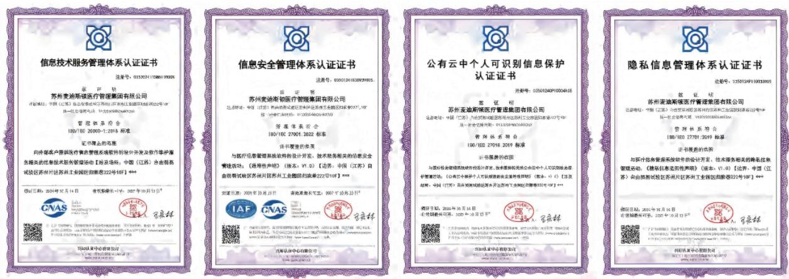

在辅助生殖医疗服务板块，公司深入贯彻执行国家有关医疗数据安全与患者隐私保护的相关法律法规，制定了《海口玛丽医院计算机网络安全管理制度》等制度文件，严格规范患者信息采集、存储、使用和销毁的全流程管理要求。同时，明确信息科、客服部门及病案室等信息接触重点部门的职责权限和工作流程，防止患者数据被滥用或泄露。

# 战略

公司积极识别并分析信息安全与隐私保护带来的风险和机遇，评估其可能产生的潜在影响，制定应对策略，以不断提升信息安全治理能力，全方位保障数据与隐私安全。

<table><tr><td colspan="5">风险</td></tr><tr><td>类型</td><td>描述</td><td>应对策略</td><td> $^1$ 影响时间范围</td><td>潜在财务影响</td></tr><tr><td>数据泄露风险</td><td>客户隐私数据以及公司自身的核心技术数据、业务数据因外部网络攻击或操作不当等原因导致涉密或敏感信息泄露,可能影响公司正常运营及客户信任度,损害公司声誉与品牌形象。</td><td>· 定期更新防火墙与入侵检测系统,及时修复系统漏洞;· 对数据进行加密存储与传输,防止网络攻击导致的数据泄露;· 加强员工培训,提升网络安全意识与管理技能;· 建立应急响应机制,及时处理数据泄露事件。</td><td>短中期</td><td>运营成本增加</td></tr><tr><td>技术迭代风险</td><td>随着人工智能等技术的快速发展,网络攻击手段不断升级,公司现有系统安全防护性能可能无法有效抵御新兴安全风险。</td><td>· 加大信息安全技术投入,强化信息系统安全防护等级。</td><td>短中期</td><td>运营成本增加</td></tr></table>

<table><tr><td colspan="4">机遇</td></tr><tr><td>类型</td><td>描述</td><td>潜在财务影响</td><td> $^1$ 影响时间范围</td></tr><tr><td>技术机遇</td><td>随着计算能力的提升和算法的不断优化,公司可通过技术创新进行更高级别的加密保护,确保数据的安全性,推动业务发展。</td><td>增加营业收入</td><td>中长期</td></tr></table>

$^{1}$ 影响时间范围：  
短期（1年以内）：对公司的影响通常是快速且临时的，持续时间较短通常不会超出1年。  
中期（1—5年）：对公司的影响较为持续，通常在1至5年内具有较大影响力。  
长期（5年以上）：对公司的影响是深远且持久的，持续时间通常超过5年。

# 影响、风险和机遇管理

公司通过常态化的排查，及时发现并修复存在的风险隐患及各类漏洞，持续强化数据安全防护能力，保障核心数据的安全，维护公司业务的连续性与稳定性。

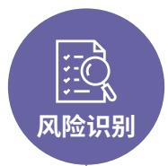

对可能对数据资产造成威胁的因素按照来源、频率并进行风险识别。

评估风险导致安全失误的可能性、对资产的影响以及当前所实施的控制措施。

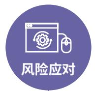

针对不可接受风险制定风险控制计划，由各责任部门负责实施。

# 指标与目标

公司明确数据安全管理目标，确保各环节数据的保密性、完整性与可用性，持续为客户提供安全可靠的产品与服务。

<table><tr><td>指标</td><td>2025年</td></tr><tr><td>重大信息安全事件</td><td>0起</td></tr></table>

# 信息安全管理措施

公司通过构建多层次、立体化的数据安全防护体系，实现对敏感信息的端到端保护。根据业务部门网络架构、业务系统应用情况等配备必要的防火墙、上网行为管理等边界安全设备及服务器数据备份设备等，同时对重要的办公用计算机采取防病毒、数据防泄露等防护措施。对临床数据实施脱敏处理，严格遵循“数据不出院”原则，采用私有云部署保障患者隐私与信息安全。

玛丽医院针对信息科、门诊客服及档案室等客户信息接触重点部门制定严格的工作流程，规范了患者信息采集、存储、使用和销毁的全流程管理要求，避免患者数据滥用或泄露。

<table><tr><td>信息科</td><td>&gt;通过专项管理制度及保密协议规范员工计算机使用管理、隐私安全管理;&gt;通过防火墙制度规范服务器“隔离化”管理、保障His系统后台安全;&gt;专人负责系统登录与权限分配,权限申请需总经理审批。</td></tr><tr><td>流程管控</td><td>&gt;完善挂号规范流程,优先身份证直接挂号减少纸质信息填写;&gt;对特殊情况产生的纸质客户信息,每日下班前碎纸销毁,严防客户信息泄露。</td></tr><tr><td>技术保障</td><td>&gt;数据加密+专人负责系统登录,授权人员按需访问客户信息;&gt;与第三方合作签订保密协议并审查其安全能力,守护数据与隐私安全。</td></tr></table>

公司积极组织开展数据安全与隐私保护相关主题的培训活动，持续提升公司全员信息安全意识水平。

# 04

# 医路同行

# 赋能成长筑关怀

麦迪科技始终视员工为核心竞争力与发展共同体。公司以完善的管理体系与暖心举措，护航员工权益、赋能职业发展、守护身心健康，推动员工价值实现与企业发展深度融合，最终实现员工与企业的共同成长、和谐共赢。

# 本章节目录

员工权益保障

员工培训与发展

员工民主与关怀

职业健康与安全

社会奉献

# 回应的SDGs

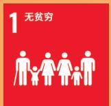

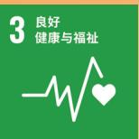

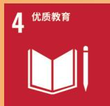

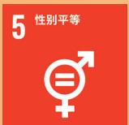

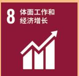

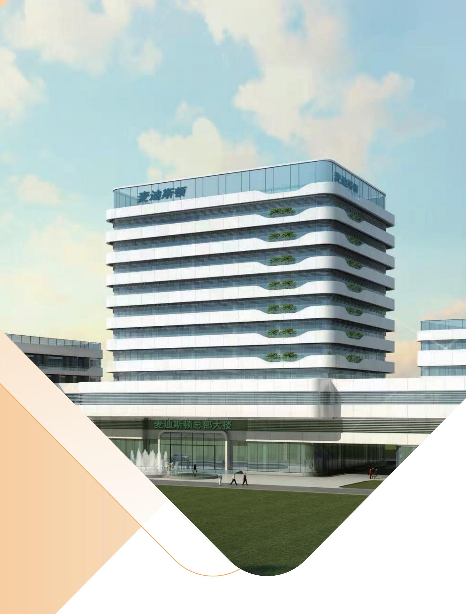

natural_image

Exterior view of a modern multi-story office building with '麦迪斯顿' signage on the facade, set against a sky and greenery (no other text or symbols visible)

# 员工权益保障

公司高度重视每一位员工的权益保护，严格遵守《中华人民共和国劳动法》《中华人民共和国劳动合同法》等法律法规，建立以《人力资源管理制度》为核心的制度体系，全面保障员工在招聘、晋升、薪酬福利、员工发展等方面的合法权益。始终坚持合规用工的原则，依法与全体员工签订劳动合同，明确禁止任何职场歧视与雇佣童工、强迫劳动行为。

# ★ 报告期内

员工劳动合同签订率100%，不存在违规用工的情况。

# 人才吸引与招聘

公司秉持多元平等的人才理念，依托规范完善的招聘管理体系，借助多渠道广揽贤才，广泛吸纳不同背景、不同专长的优秀人才，打造结构多元、优势互补的人才梯队，以开放包容的人才生态汇聚发展动能。

# 员工结构

截至2025年末，公司及主要子公司在岗员工总数632人。

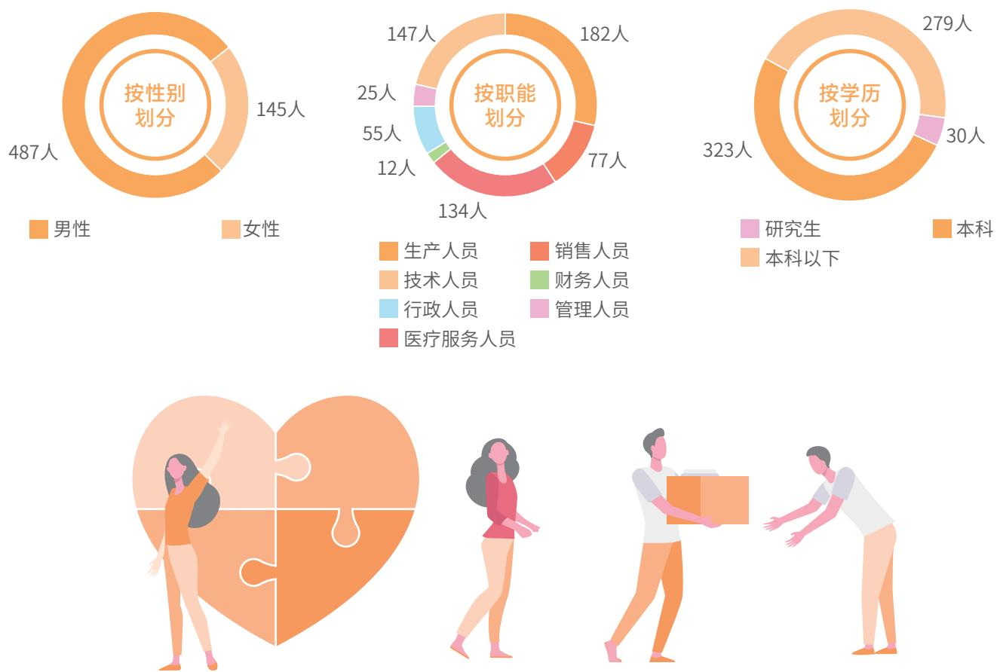

# 招聘管理

公司制定《招聘管理办法》《员工试用期管理办法》等专项制度，建立规范的招聘与录用流程，确保对应聘者一视同仁。公司始终遵循公开、公平、公正的原则开展招聘工作，公开岗位任职资格，择优选拔、引进与培养人才，保证招聘流程及任用标准的一致性和客观性。同时在招聘过程中严禁就业歧视，如对外岗位发布时（招聘渠道会同步审核）不能出现性别、年龄、婚育等具体要求；禁止面试官在面试过程中过分了解候选人家庭情况、宗教信仰等隐私问题。

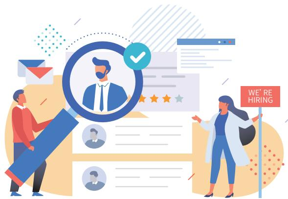

text_image

WE'RE HIRING

# 投递简历

# 筛选简历

# 面试

# 录用

# 发送通知

# 入职体检

公司持续优化招聘流程与渠道矩阵，已构建覆盖校园、社会、猎头及内部推荐等多元招聘渠道，持续为业务发展精准储备优质人才。社会招聘以线上招聘为主，报告期内与BOSS、前程无忧、智联及猎聘等平台达成合作；校园招聘依托线上渠道与高校就业导师推荐，报告期内，公司入职应届生共计4人，为团队注入新鲜血液；全年总计启用内推渠道招聘16人，多为一线核心实施岗位，既有效缩减了人均招聘成本，又进一步强化了企业雇主品牌影响力，实现了招聘效率与质量的双重提升。

# ★ 报告期内

新增员工20人

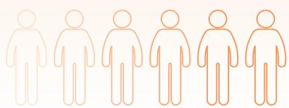

natural_image

Six stylized human figures in a row, each with a different size and outline style (no text or symbols)

# 多元、平等与包容

公司坚持平等雇佣原则，在招聘录用、薪酬激励、培养晋升方面坚持公平公正的原则，明确禁止任何原因、任何形式的歧视行为。公司充分尊重个体差异，在不同年龄、种族、性别、国籍上均平等对待，建立多元化团队，让员工发挥所长，努力促进多元平等、包容开放的职场环境。我们相信，员工多元化的视角和风格，让我们的团队更富有创造力、同理心，有助于提升公司的产品和服务。

# ★ 截至2025年底

公司员工来自14个不同民族
女性员工占比23%

其中少数民族员工占比3.5%  
女性管理者占比13.5%

# 女职工权益保障

公司严格遵守《中华人民共和国妇女权益保障法》等法律法规，坚决维护女性员工的合法权益，实行男女同工同酬，让女性员工平等享有职业发展机遇。公司尊重和关怀每一位女性员工，除依法提供产检假、产假、哺乳假等假期外，还为女性职工提供生育礼金、女工福利卡券等关怀福利，配套设立母婴室、女职工康乃馨服务站等专属设施，通过多元化关怀措施，持续提升女性员工的职业幸福感和工作满意度。

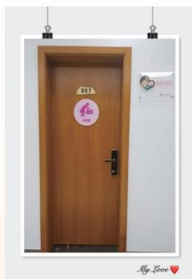

text_image

307
My Love

母婴室

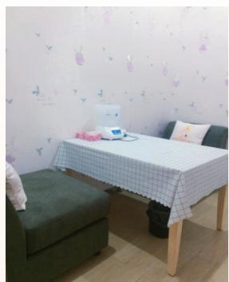

natural_image

Interior scene with a small table, green sofa, and decorative wall art (no visible text or symbols)

natural_image

Interior of a modern children's playroom with bookshelves, orange chairs, and a red sofa (no visible text or symbols)

女职工康乃馨服务站

# 薪酬与福利

# 薪酬管理

报告期内，公司修订了《薪酬管理办法》，进一步规范薪酬架构及薪资发放流程等内容，构建了公平透明、科学合理的薪酬管理体系。严格遵循同工同酬原则，以岗位分类、岗位价值评估为核心方法论，建立起以岗位价值、技能水平为基础，充分参考市场化薪酬水平的薪酬架构，确保员工的付出得到相应的回报。员工薪酬架构包括基本工资、绩效工资、激励奖金、专项津贴及综合福利，通过奖金激励相关机制，激发员工内生动力，推动员工与公司发展深度绑定、共赢成长。

# 福利待遇

公司高度重视并持续完善员工各项福利待遇，构建了以合规保障为基础、以多元关怀为延伸的员工福利体系。公司不仅依法为全体员工足额缴纳五险一金、保障法定节假日权益，还提供生日节日福利、餐饮交通补贴等多元福利与关怀措施，全方位提升员工福祉与归属感。同时，严格遵循国家及地方相关法规，明确考勤与工时管理标准，切实保障员工工作与休息的平衡。

# ★ 报告期内

员工社会保险缴纳覆盖率100%

# 五险一金

公司为全体员工购买“五险一金”（包括养老保险、医疗保险、工伤保险、失业保险和生育保险及住房公积金）。

# 生日节日福利

公司为员工提供生日福利（以员工身份证上的出生日期为准），发放购物卡及生日祝福。

每逢节假日为员工发放节日礼品，如端午节中秋节发放礼盒，其他节日发放购物卡等。

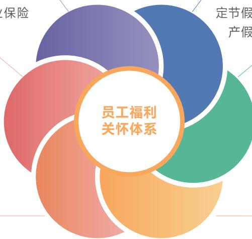

flowchart

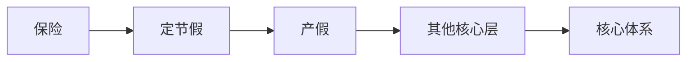
```mermaid
graph LR
  A["保险"] --> B["定节假"]
  B --> C["产假"]
  C --> D["其他核心层"]
  D --> E["核心体系"]
```

# 假期关怀

公司为员工提供了多项假期福利，员工享有法定节假日、年假、带薪病假、婚假、产假、陪产假、育儿假、父母护理假、丧假等假期。

# 女职工权益

公司尊重和保护女员工的合法权益，关怀女性员工工作，除为女员工提供了产检假、产假、哺乳假、结婚礼、生育礼金、女工福利卡券外，公司还成立了母婴室、女职工康乃馨服务站，为女员工提供了良好的工作条件。

# 餐饮交通补贴

公司为员工提供食堂用餐服务，包含早餐、午餐、晚餐；出差员工提供餐补。

同时为员工提供免费的地铁接驳班车，出差员工提供出差补助。

# 健康福利

公司关注员工健康，为员工提供年度体检、补充医疗保险、意外险，另外设有员工活动室，包含室内健身器械、乒乓球、台球、室外篮球场等。

# 员工培训与发展

员工成长是企业发展的核心动力。公司高度重视人才培养工作，以系统化培养方案、清晰化晋升通道及全覆盖培训体系为支撑，全方位赋能员工提升专业素养与综合管理能力，为人才搭建施展才华的广阔舞台，推动员工个人成长与企业高质量发展的协同共进。

# 员工培训

公司持续完善培训机制，搭建覆盖全员、层次分明、赋能业务与人才发展的矩阵式培训体系。体系涵盖新员工培训、职场通用能力培养、专业能力进阶、领导力提升四大核心模块，通过内部培训、外部培训、学历教育认证等多样化形式，全方位赋能员工成长。

# ★ 报告期内

员工培训次数113次

线下在岗培训113次

线下新人集训7次

员工培训人数254人

员工培训总时长3,627小时

员工培训人次3,036人次

麦迪人才培养体系  
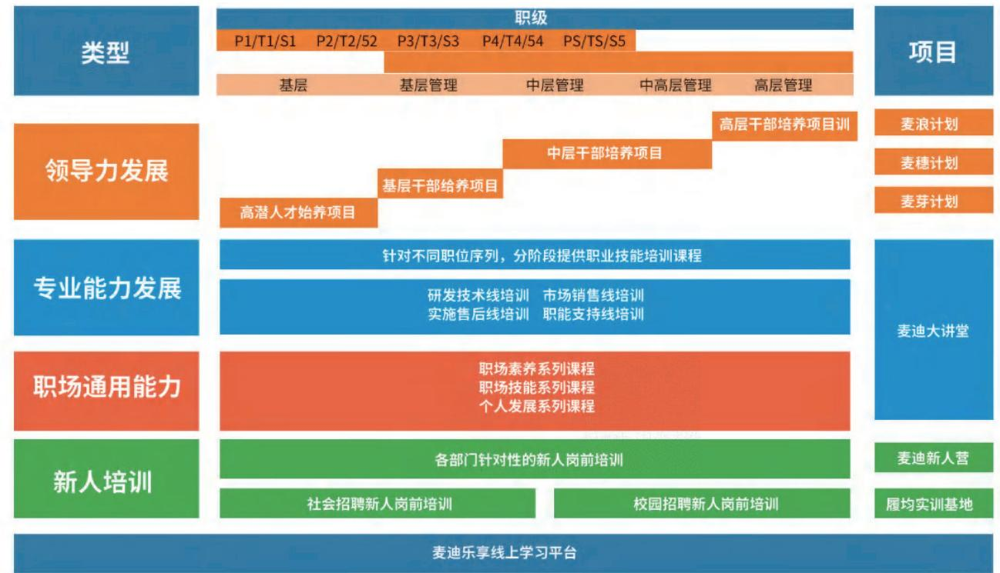

flowchart

```mermaid
graph TD
  subgraph Type["类型"]
    A["职级"]
    B["P1/T1/S1"]
  B --> C["P2/T2/52"]
  B --> D["P3/T3/S3"]
  B --> E["P4/T4/54"]
  B --> F["PS/TS/S5"]
  G["基层管理"] --> H["中层管理"]
  H --> I["中高层管理"]
  I --> J["高层管理"]
  end

  subgraph Leadership["领导力发展"]
  K["高潜人才始养项目"] --> L["基层干部给养项目"]
  L --> M["中层干部培养项目"]
  M --> N["高层干部培养项目训"]
  O["麦芽计划"] --> P["麦穗计划"]
  Q["麦浪计划"] --> R["麦迪大讲堂"]
  end

  subgraph Professional["专业能力发展"]
  S["针对不同职位序列，分阶段提供职业技能培训课程"] --> T["研发技术线培训\n市场销售线培训\n实施售后线培训\n职能支持线培训"]
  T --> U["麦迪乐享线上学习平台"]
  V["职场素养系列课程\n职场技能系列课程\n个人发展系列课程"] --> W["麦迪新人营"]
  X["新人培训"] --> Y["各部门针对性的新人岗前培训"]
  Z["社会招聘新人岗前培训"] --> AA["校园招聘新人岗前培训"]
  AB["履均实训基地"] --> AC["麦迪乐享线上学习平台"]
  end

  style A fill:#f9f9f9,stroke:#333,stroke-width:2px
  style K fill:#f9f9f9,stroke:#333,stroke-width:2px
  style L fill:#f9f9f9,stroke:#333,stroke-width:2px
  style M fill:#f9f9f9,stroke:#333,stroke-width:2px
  style U fill:#f9f9f9,stroke:#333,stroke-width:2px
  style V fill:#f9f9f9,stroke:#333,stroke-width:2px
  style X fill:#f9f9f9,stroke:#333,stroke-width:2px
  style Y fill:#f9f9f9,stroke:#333,stroke-width:2px
  style Z fill:#f9f9f9,stroke:#333,stroke-width:2px
```

# 麦迪乐享员工学习平台

公司创新打造线上线下融合、内外部资源联动的培训模式，搭建“麦迪乐享”线上学习平台，整合知识库、线上视频课程、直播授课等多元功能，助力员工持续提升专业能力与综合素质。

# 案例：管理层领导力专题培训

6月5日，公司在苏州举行6月经营工作例会及管理层领导力专题培训。培训围绕头脑逻辑、心智情绪、有效沟通、有效的个人生产力、个人特质与团队组织等维度展开，通过此次培训为管理层在面对挑战时如何高效领导团队提供了新思路和方法，为进一步凝聚团队共识，突破发展瓶颈，实现可持续增长提供了有力的领导力支撑。

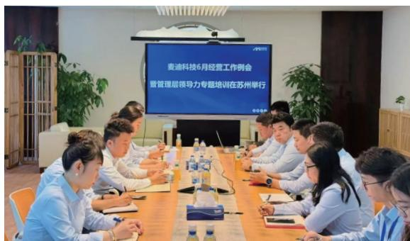

text_image

麦迪科技6月经营工作例会
暨管理层领导力专题培训在苏州举行

案例：行政后勤培训  
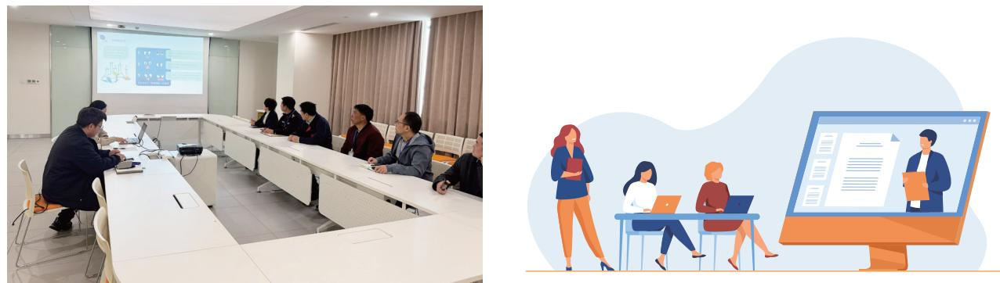

案例：领导力发展培训结业礼  
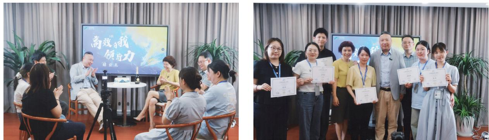

# 职业发展

公司建立规范化、透明化的职位晋升机制，搭建管理序列与专业序列并行的双通道晋升体系，为不同发展诉求的员工提供清晰路径。管理序列面向具备统筹协调能力的员工，以绩效表现、管理能力、团队贡献为核心考评依据，助力其向更高层级管理岗位迈进；专业序列聚焦技术型、专家型人才，以专业技能水平、技术攻关成果、行业经验积淀为评价标准；同时支持员工跨部门、跨岗位的轮/转岗历练，助力员工拓宽能力边界、积累多元经验。

natural_image

Illustration of three people jumping joyfully on a podium, holding a trophy and a megaphone (no text or symbols present)

# 多元化职业发展路径

# 管理路线

高层干部（高管）：
具备丰富专业知识的管理层级，领导相关专业领域的多个团队工作，制定公司战略

# 专业路线

行业专家：具备业界先进专业知识的行业专家层级，设计公司专业发展战略或给公司提供专业咨询

中基层干部（经理/高级经理/总监）：具备丰富专业知识的管理层级，领导一个团队负责一个专业领域工作

公司专家：具备精深专业知识的公司专家层级，独立设计推进公司级的专业方案或给部门提供专业咨询

高级：具备丰富专业知识的精通层级，独立负责专业流程并进行创新改进或负责一般专业项目/解决一般专业问题，能在专业上指导较低层级人员

中级：具备专业知识的半熟练/熟练层级，能独立处理专业流程工作或在少量指导下解决简单的专业问题

初级：具备专业操作经验或具备专业知识的专业入门层级，处理重复性工作或在大量指导下完成工作

# 绩效考核管理

公司建立规范化的层级绩效考评机制，实行以年度考核为核心、季度与月度考核为补充的弹性考核模式。在考核标准上，公司不采用统一要求，由各部门遵循总体考核原则，结合目标任务完成情况、岗位履职特点及日常行为规范，制定科学简洁、贴合实际的考核标准与价值目标。考核过程严格执行标准化流程，确保考评工作规范有序、结果客观公正。通过将薪酬与工作成果直接挂钩，强化绩效导向的激励效能，激发了全员干事创业的积极性与主动性，为公司战略目标的稳步达成注入了强劲的内生动力。

在绩效考核实施过程中，公司充分尊重员工合理诉求。绩效考核结束后，用人部门及时与员工开展绩效面谈，客观肯定员工工作优点，明确需改进的方向，并认真倾听员工对年度工作的自我认知及诉求、建议。若员工对考核结果存在疑问或异议，可向直接上级或部门负责人提出申诉，如核查申诉情况属实，公司将按程序对考核结果进行调整，确保绩效考核公平公正。

# 员工民主与关怀

# 民主管理

公司致力于构建民主化管理体系，建立职工代表大会制度和工会组织，并定期召开职工代表大会，依法履行审议、表决企业经营管理及职工切身利益相关重要事项的职权，切实保障员工的知情权、参与权、表达权与监督权。搭配高效顺畅的员工沟通机制，持续拓展意见反馈和诉求表达渠道，营造民主、和谐、共融的企业氛围，鼓励员工围绕企业经济运营、政治建设、社会事务、文化活动等核心事务建言献策，推动员工深度参与企业管理决策，让民主管理真正落到实处。

报告期内，公司职工代表大会讨论并通过了《薪酬管理办法》《员工考勤假期管理办法》等与员工权益相关的制度文件，表决选举公司第四届董事会职工董事。

# 员工活动

公司倡导健康生活、劳逸结合的理念，以多元活动丰富员工的业余生活，舒缓工作压力，营造积极向上、和谐融洽的企业文化氛围，增强团队凝聚力与员工归属感。

# 案例：秋季运动会

11-12月期间，公司精心谋划并组织开展了秋季运动会，运动会涵盖跑步、徒步、骑行等多项运动项目。此次运动会以挑战赛的形式，充分激发了员工的激情与活力，有效增强了团队的凝聚力，展现出良好的精神风貌。

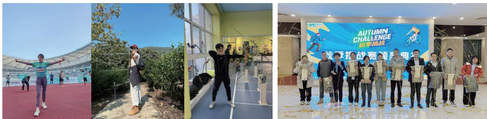

# 案例：环苏州古城徒步

11月22日，公司组织员工及员工家属开展围绕环苏州古城的徒步活动，在这过程中不仅了解了古城历史，收获古城秋色与身心的舒展，更收获了并肩同行的温暖。

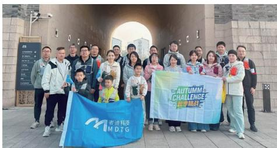

text_image

AUTUMML CHALLENGE
麦迪福达
MDTG

# 困难员工帮扶

公司建立困难员工帮扶机制，将人文关怀落到实处。针对重大疾病、意外变故、家庭特殊困难等情形，建立困难员工帮扶基金，开展常态化摸排、规范化申请与透明化救助，及时提供资金补助与生活关怀，切实缓解员工压力，增强归属感与安全感，营造有温度、有担当的职场氛围。报告期内，公司通过捐款、慰问等方式为6名存在困难的员工提供经济帮扶。

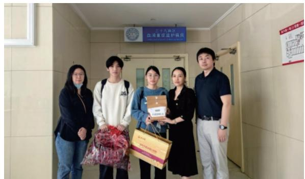

text_image

三十九次门诊
血液重症监护病房

natural_image

Illustration of people placing red hearts on a large orange box with green leaves and clouds (no text or symbols)

# 职业健康与安全

公司重视员工的生命安全与健康，认真落实《中华人民共和国劳动法》《中华人民共和国职业病防治法》《工伤保险条例》等法律法规要求，竭力保障工作场所安全，并通过年度体检、补充医疗保险及配套健身设施等方式，保护员工健康及相关权益。

在生殖医学医疗服务板块，玛丽医院建立健全的安全生产管理体系，成立职责明晰的医院安全生产管理领导小组，全面负责医院安全管理工作。在制度层面建立了医院安全生产规章制度作为指导文件，管理方式实施统一领导、网格化管理，重点加强对医院消防设施、电气设施、疏散通道的隐患排查，切实预防火灾和减少火灾危害，确保医院运营始终安全。

同时，公司通过不定期开展消防安全演练的方式，提高应急处理能力；通过开展安全生产宣传讲座、安全培训等方式，增强员工安全意识。

# ★ 关键绩效

公司未发生任何安全生产事故。

消防演练培训  
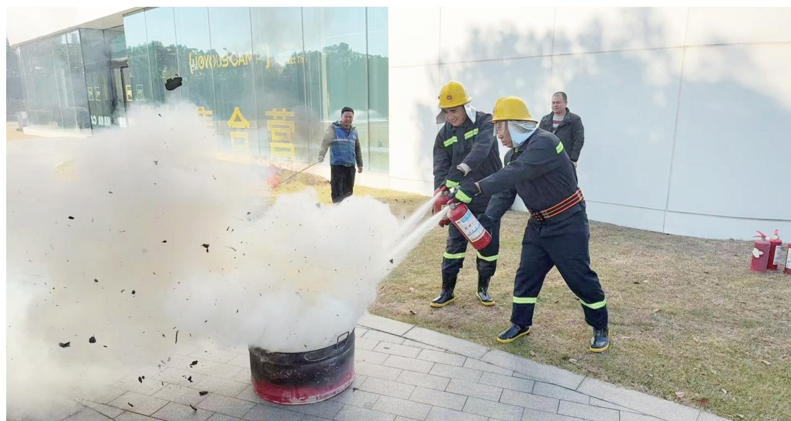

text_image

Firefighters extinguishing a fire with visible Chinese signage in the background, one using a fire extinguisher to smoke from a barrel.

# 社会奉献

公司坚守“创造客户价值，服务国家战略”的企业使命，立足智慧医疗主业深耕临床医疗信息化、辅助生殖医疗服务领域，将技术优势与社会价值创造深度融合，以普惠医疗建设、公益义诊开展为核心抓手，持续推动医疗资源均衡配置，切实解决群众就医需求，在助力医疗行业发展、保障民生健康的过程中积极履行企业社会责任，彰显医疗科技企业的社会担当。

# 惠普医疗

公司大力推进普惠医疗建设，让优质医疗资源触达更多群体。医疗信息化产品覆盖全国32个省份2,400多家医疗机构，三甲医院市场占有率超80%，同时为基层医疗机构提供信息化建设专项补贴，助力基层医疗服务能力提升；海口玛丽医院针对低收入群体推出辅助生殖诊疗费用减免政策，切实降低就医经济门槛。此外，公司研发的优麦康养陪伴机器人落地福利院、康复医院等康养场景，依托AI技术打通院内诊疗与居家康养链路，让专业康养服务惠及更多老年群体。

我们秉持“以患者为中心”的服务理念，以严谨医术与暖心服务赢得广大客户的认可与信赖，为大连大学附属中山医院、海南省人民医院等多家医院的医疗信息化建设提供了贡献，在多个项目中取得显著成果，2025年，累计收获致谢表扬信多份，既是利益相关方对诊疗成效、服务态度与人文关怀的高度肯定，亦是医院坚守医疗初心、践行民生责任的生动印证。

# 致谢表扬信

1/1  
感谢信
尊敬的首席党委和群瑞医疗有限公司：
在此，北大交通大学医药中心医院从事互联网医院治疗中心全体员工特向负责公司的工程师和销售人员最喜的事前。
在我院医师看事会的总结层评价工作中，工程师开展提出了很高的专业素养和敬业精神，面对数据质量及数据整合、解释及重要技术成果等，不讲今年，就就业业、日常发言、凭借错误的技术。一次性精准定位问题，优化学习，大力推动医院资源需求达到评审标准。为玉溪病评评价的两师现场上下评分马骨。
工程师所推荐的能力不仅为其他技术因素提供了更安全保障，而且网络提高了医疗服务质量。工程师所具是否认可的患者，也是我们此次评价工作中的重要环境。
再次推荐普莱克生物制药医疗科技有限公司将举办如此优秀的人才，派遣工程师职务的辛勤作业！  
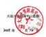

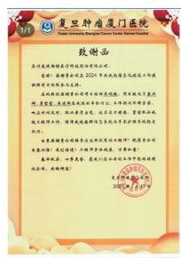

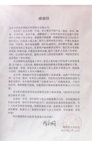

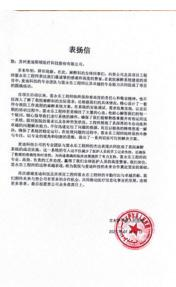

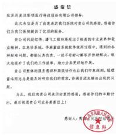

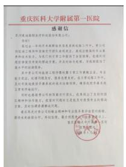

# ★ 关键绩效

收获表扬信6份

# 智能康养

近年来，国内老龄化趋势严重，据统计，2024年60岁以上人口已突破3亿，预计到2050年，老年人将达到4.87亿，老龄人口对应的银发经济的规模，已经到了7万亿的水平，面向社会老龄化带来的养老照护缺口，我们依托康养机器人落地民生服务场景，以智能科技补足行业护理人力短板，缓解机构养老、居家养老专业照护资源不足的现实难题。

为精准贴合老年群体真实诉求，优化康养机器人产品适配性，截至报告期末，公司及合作伙伴面向老年人及其亲属群体对外发放调查问卷，调研围绕健康监测、安全防护、日常陪伴、用药提醒、情感关怀及智能操作适配等核心维度开展，深度收集高龄、独居、慢性病老人在日常照护中的痛点与刚需。根据调研反馈，公司将客户需求融入产品迭代与功能优化，简化适老交互设计，强化健康预警与暖心陪伴能力。让智能康养产品贴合生活、贴合民心，推动科技成果精准惠及银发群体，夯实普惠型智慧康养服务根基。

# 老年群体对康养机器人的四大需求

# 情感陪护

互动交流、情绪价值和精神抚慰等

# 医疗陪护

专科护理方案、体征监测、医患互动、报告解读、昏迷促醒等

# 康养陪护

失能失智照护、日常照护、健康日志等

# 安全监护

防跌、防丢、防暴力等

natural_image

Illustration of two hands holding a large orange heart against a light blue sky with clouds and flowers (no text or symbols)

目前，优麦机器人已于养老院、康养中心、康复医院等机构场景开展试点。在机构内，机器人辅助开展日常巡护、用药提醒、起居关怀，有效缓解专业护理人员缺口；通过毫米波雷达无感采集人存在、体征、睡眠等20余项数据，实时预警健康风险，强化机构安全照护能力。同时以拟人交互与情感陪伴纾解老人孤寂感，提升养老生活品质。

优麦机器人V1.0  
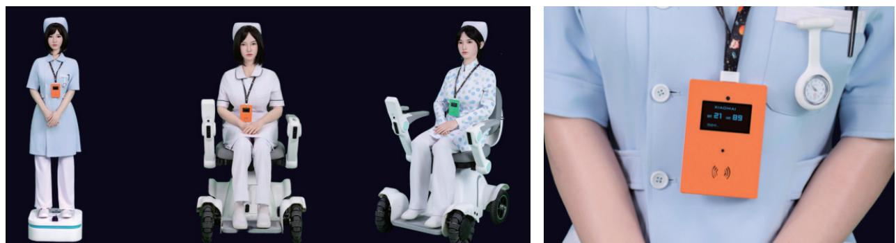

优麦机器人以科技补位养老服务短板，构建“安全监护+健康管理+情感陪伴”一体化闭环。通过打通医康养链路，将医疗级健康标准下沉至基层养老场景，助力解决老龄化社会照护资源不足、慢病管理薄弱、独居安全隐患等民生难题。以普惠智能服务守护长者身心健康，助力完善社会化养老体系，为应对人口老龄化、增进民生福祉可持续发展提供坚实科技支撑。

natural_image

An elderly patient in a hospital bed smiling while interacting with a humanoid robot in a living room (no visible text or symbols)

公司始终以科技践行社会责任，以匠心深耕普惠康养，不断完善全周期智慧康养服务体系。未来，麦迪科技将持续迭代优化产品与解决方案，深化医养协同生态共建，以数智力量助力完善社会养老服务布局，为积极应对人口老龄化、增进老年民生福祉注入持久动能。

# 公益义诊

公司积极践行社会责任，围绕辅助生殖领域群众核心需求积极开展公益义诊活动，2025年累计开展12场辅助生殖公益义诊，帮助800多个备孕困难家庭。义诊活动中为群众提供免费的生殖健康检查、专业诊疗咨询及备孕指导等服务，精准帮扶备孕弱势群体，同时通过现场科普、答疑解惑提升群众生殖健康认知，切实解决部分家庭的备孕难题，用实际行动助力民生健康保障。

# ★ 关键绩效

玛丽医院开展义诊活动12场 帮助备孕困难家庭806个  
玛丽医院门诊接诊人次38,034人次

# 志愿服务

公司积极通过志愿服务活动等方式为社会传递温暖。玛丽医院志愿服务队的核心项目“心桥计划”通过艺术疗愈、情景模拟、户外拓展等多元形式，为困难家庭青少年提供系统化心理援助。目前，团队汇聚了包括主任医师、心理治疗师、心理咨询师等在内的专业力量，并拥有40余名志愿者，形成“专业+志愿”的双重支持网络。2025年以来，玛丽医院志愿服务队已开展心理团辅及主题夏令营13场。

# 案例：“心桥计划”青少年心理团辅夏令营

7月31日，一场聚焦青少年心理健康的“琼山区‘心桥计划’青少年心理团辅夏令营志愿服务活动”在海口市琼山区凤翔街道和府城街道社区温情展开。

此次活动由中共琼山区委社工部、团琼山区委、琼山区妇联、琼山区志联、海南省社会心理学会和海口玛丽医院志愿服务队共同发起，以实际行动回应社会对青少年心理健康的关切，展现了多方协作的公益力量。通过游戏引导孩子们识别、认知自身情绪，学习向亲友表达感受、倾听他人心声，并掌握情绪调节的实用方法，让孩子们在欢乐互动中搭建起理解自我与连接他人的心理桥梁。

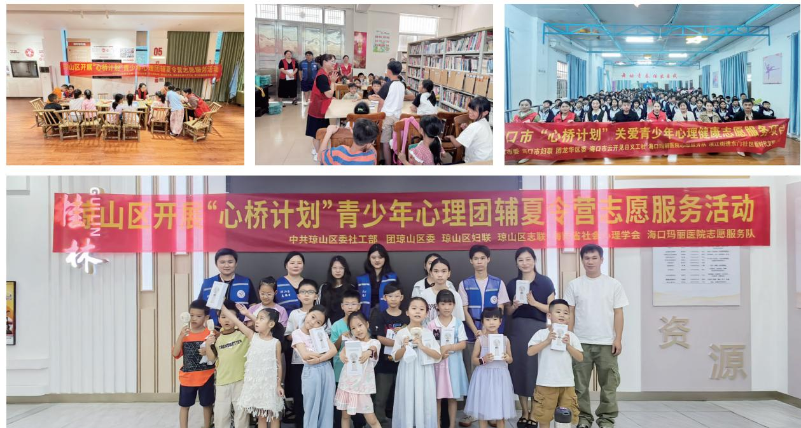

# 附录

# 未来展望

2026年，麦迪科技将持续深耕医疗主业，全面夯实环境、社会、治理三大维度可持续发展根基，以科创赋能产业升级，以责任践行企业担当，以合规筑牢发展底盘，推动企业实现经济效益、社会效益与生态效益协同共生、长远共进。

在环境保护层面，公司继续坚持绿色低碳运营理念，将生态环保要求深度融入日常经营与项目全流程。持续推行数字化办公模式，逐步降低纸质耗材与能源消耗，践行节能降耗、低碳减排的发展原则。在软件研发与项目落地过程中，优选节能型技术与环保配套方案，严控运营环节环境影响。同时依托智慧医疗数字化能力，助力医疗机构优化能耗管理、精简资源配置，以数字化手段赋能医疗领域绿色转型，助力行业构建低碳、高效、环保的运营生态。

在社会层面，公司坚守医疗初心，深耕民生福祉，多维度践行公益担当与产业普惠使命。深耕医疗信息化主业，持续迭代麻醉、重症、急诊急救等核心产品，通过AI大模型、大数据技术深化临床融合，完善区域协同救治体系，助力基层医疗机构提升诊疗能力、筑牢医疗质量防线，推动优质医疗资源均衡下沉。

在公司治理层面，公司不断完善现代化治理架构与内控风控体系，深化党建与业务深度融合，健全投融资管理、资金管控与合规运营机制。持续提升运营效率、降低经营风险。

展望未来，麦迪科技将始终锚定可持续发展方向，深度融入国家“十五五”发展大局，以医疗信息化、智慧康养、应急救援等创新布局，持续精进ESG全维度实践。以技术创新赋能行业升级，以暖心服务践行社会责任，以规范治理护航长远发展，奋力打造兼具专业实力与责任担当的医疗科技企业，为健康中国建设、民生福祉提升与产业高质量发展持续贡献核心力量。

指标索引

<table><tr><td colspan="2">目录</td><td>《全球可持续发展报告标准》(GRI Standards)</td><td>《中国企业可持续发展报告指南(CASS-ESG 6.0)》</td><td>《上市公司自律监管指引第14号 - 可持续发展报告(试行)》</td></tr><tr><td colspan="2">关于本报告</td><td>2-1/2-2/2-3/2-4</td><td>P1.1/P1.2</td><td>第四条、第六条</td></tr><tr><td colspan="2">董事长致辞</td><td>2-22</td><td>P2.1</td><td>/</td></tr><tr><td rowspan="6">关于我们</td><td>公司简介</td><td rowspan="6">2-1/2-6</td><td rowspan="6">P3.1-P3.3</td><td rowspan="6">/</td></tr><tr><td>企业文化</td></tr><tr><td>发展历程</td></tr><tr><td>业务概况</td></tr><tr><td>企业荣誉</td></tr><tr><td>2025年亮点绩效</td></tr><tr><td rowspan="4">可持续发展管理</td><td>可持续发展治理</td><td rowspan="4">2-9/2-12/2-13/2-14/2-22/2-27/2-29/3-1/3-2</td><td rowspan="4">G1.1/G1.3</td><td>第十二条、第五十一条</td></tr><tr><td>联合国SDGs目标回应</td><td>/</td></tr><tr><td>利益相关方沟通</td><td>第九条、第五十三条</td></tr><tr><td>重要性议题管理</td><td>第五条</td></tr><tr><td rowspan="5">规范治企:合规经营固根基</td><td>党建引领</td><td>/</td><td>/</td><td>/</td></tr><tr><td>公司治理</td><td rowspan="4">2-9/2-10/2-11/2-12/2-19/2-27/205-2/205-3/405-1</td><td rowspan="4">G2.1/G2.2</td><td>第十二条</td></tr><tr><td>投资者权益保障</td><td rowspan="3">第五十四条、第五十五条、第五十六条</td></tr><tr><td>合规与风险管理</td></tr><tr><td>商业道德</td></tr><tr><td rowspan="3">医心向绿:低碳运营护生态</td><td>应对气候变化</td><td>201-2/305-1/305-2/305-4/305-5</td><td>E1.1.1-E1.1.4/E1.1.6-E1.1.9</td><td>第十四条、第十五条、第十六条、第十八条、第十九条、第二十一条、第二十二条、第二十三条、第二十四条、第二十六条</td></tr><tr><td>资源利用</td><td>301-1/302-1/302-3/302-4/303-1/303-3/303-5</td><td>E3.1/E3.2/E3.3</td><td>第三十四条、第三十五条、第三十六条、第三十七条</td></tr><tr><td>环境合规管理</td><td>101-2/303-2/303-4/304-2/306-1/306-2/306-3/306-5</td><td>E2.1.1-E2.1.9/E2.2.1-E2.2.7/E2.3.2/E2.3.3</td><td>第二十九条、第三十条、第三十一条、第三十二条、第三十三条</td></tr><tr><td rowspan="5">数智创新:质优链稳护医疗</td><td>研发创新</td><td>2-28/203-2</td><td>S2.1</td><td>第十四条、第十五条、第十六条、第十八条、第十九条、第四十一条、第四十二条、第四十三条</td></tr><tr><td>产品安全与质量</td><td>416-1/416-2</td><td>S3.3</td><td>第十四条、第十五条、第十六条、第十八条、第十九条、第四十七条</td></tr><tr><td>客户服务</td><td>416-1</td><td>S3.3/S3.4</td><td>第四十四条、第四十七条</td></tr><tr><td>负责任供应链</td><td>204-1/308-1/308-2/414-1/414-2</td><td>S3.1</td><td>第四十四条、第四十五条</td></tr><tr><td>数据安全与隐私保护</td><td>418-1</td><td>S3.4.1/S3.4.3/G1.2.4</td><td>第十四条、第十五条、第十六条、第十八条、第十九条、第四十八条</td></tr><tr><td rowspan="5">医路同行:赋能成长筑关怀</td><td>员工权益保障</td><td>2-7/2-19/2-20/401-1/401-2/401-3/405-1/405-2/406-1/408-1/409-1</td><td>S4.1.1-S4.1.7/S4.1.8/S4.1.11</td><td rowspan="4">第四十九条、第五十条</td></tr><tr><td>员工培训与发展</td><td>404-1/404-3</td><td>S4.3.1-S4.3.6</td></tr><tr><td>员工民主与关怀</td><td>407-1</td><td>S4.1.12</td></tr><tr><td>职业健康与安全</td><td>403-1/403-3/403-5</td><td>S4.2</td></tr><tr><td>社会奉献</td><td>203-1/203-2</td><td>S1.1/S1.2</td><td>第四十条</td></tr><tr><td rowspan="4">附录</td><td>未来展望</td><td>/</td><td>A1</td><td>/</td></tr><tr><td>指标索引</td><td>/</td><td>A3</td><td>第五十七条</td></tr><tr><td>关键绩效表</td><td>/</td><td>/</td><td>/</td></tr><tr><td>反馈意见表</td><td>/</td><td>A6</td><td>/</td></tr></table>

注：乡村振兴说明：公司经营对乡村振兴及巩固脱贫攻坚影响较小，且报告期内未开展相关活动，故未进行披露。

关键绩效表

<table><tr><td>维度</td><td>议题</td><td colspan="2">指标</td><td>单位</td><td>2024</td><td>2025</td></tr><tr><td rowspan="30">公司治理(G)</td><td rowspan="3">经营绩效</td><td colspan="2">营业收入</td><td>万元</td><td>46,406.89</td><td>30,147.92</td></tr><tr><td colspan="2">净利润</td><td>万元</td><td>-25,373.42</td><td>4,539.89</td></tr><tr><td colspan="2">纳税总额</td><td>万元</td><td>3,708.20</td><td>2,852.28</td></tr><tr><td rowspan="18">公司治理</td><td rowspan="2">股东会</td><td>股东会召开总次数</td><td>次</td><td>6</td><td>4</td></tr><tr><td>审议通过事项</td><td>项</td><td>56</td><td>22</td></tr><tr><td rowspan="2">董事会</td><td>董事会召开次数</td><td>次</td><td>15</td><td>11</td></tr><tr><td>审议通过事项</td><td>项</td><td>78</td><td>48</td></tr><tr><td rowspan="5">董事会成员人数</td><td>总人数</td><td>人</td><td>5</td><td>5</td></tr><tr><td>男性</td><td>人</td><td>5</td><td>4</td></tr><tr><td>女性</td><td>人</td><td>0</td><td>1</td></tr><tr><td>独立董事</td><td>人</td><td>3</td><td>2</td></tr><tr><td>非独立董事</td><td>人</td><td>2</td><td>3</td></tr><tr><td rowspan="8">董事会专门委员会</td><td>战略发展委员会召开次数</td><td>次</td><td>1</td><td>1</td></tr><tr><td>审计委员会召开次数</td><td>次</td><td>7</td><td>8</td></tr><tr><td>审计委员会独立董事人数</td><td>人</td><td>2</td><td>2</td></tr><tr><td>薪酬与考核委员会召开次数</td><td>次</td><td>4</td><td>6</td></tr><tr><td>薪酬与考核委员会独立董事人数</td><td>人</td><td>2</td><td>2</td></tr><tr><td>提名委员会召开次数</td><td>次</td><td>3</td><td>3</td></tr><tr><td>提名委员会独立董事人数</td><td>人</td><td>2</td><td>2</td></tr><tr><td>专门委员会审议通过事项</td><td>项</td><td>28</td><td>29</td></tr><tr><td colspan="2">董事、监事及高级管理人员报酬(包含现任和离任)</td><td>万元</td><td>1,135.91</td><td>701.99</td></tr><tr><td rowspan="2">合规经营</td><td colspan="2">法律合规培训</td><td>场</td><td>3</td><td>3</td></tr><tr><td colspan="2">合规承诺书签署率</td><td>/</td><td>100%</td><td>100%</td></tr><tr><td rowspan="7">信息披露</td><td colspan="2">定期报告</td><td>份</td><td>4</td><td>4</td></tr><tr><td colspan="2">临时公告</td><td>份</td><td>131</td><td>172</td></tr><tr><td colspan="2">接待投资者现场调研次数</td><td>次</td><td>80</td><td>26</td></tr><tr><td colspan="2">接待投资者现场调研人次</td><td>人次</td><td>500</td><td>175</td></tr><tr><td colspan="2">在e互动投资者提问总数</td><td>次</td><td>80</td><td>45</td></tr><tr><td colspan="2">接听投资者来电</td><td>个</td><td>300</td><td>150</td></tr><tr><td colspan="2">因信息披露方面违规而受到处罚次数</td><td>次</td><td>0</td><td>0</td></tr><tr><td rowspan="28">环境保护(E)</td><td rowspan="2">环境合规治理</td><td>因环境事件受到生态环境等有关部门重大行政处罚的处罚事件</td><td>件</td><td>0</td><td colspan="2">0</td></tr><tr><td>因环境事件受到生态环境等有关部门重大行政处罚的处罚金额</td><td>万元</td><td>0.00</td><td colspan="2">0.00</td></tr><tr><td rowspan="5">应对气候变化</td><td>温室气体排放总量</td><td>吨二氧化碳当量</td><td>46,163.53</td><td colspan="2">1,043.04</td></tr><tr><td>直接温室气体排放量(范围一)</td><td>吨二氧化碳当量</td><td>22.34</td><td colspan="2">37.56</td></tr><tr><td>间接温室气体排放量(范围二)</td><td>吨二氧化碳当量</td><td>46,141.19</td><td colspan="2">1,005.45</td></tr><tr><td>减少二氧化碳排放量</td><td>吨二氧化碳当量</td><td>/</td><td colspan="2">103.79</td></tr><tr><td>温室气体排放强度</td><td>吨二氧化碳当量/百万元营收</td><td>/</td><td colspan="2">3.46</td></tr><tr><td rowspan="12">资源利用</td><td>总能耗</td><td>吨标准煤</td><td>/</td><td colspan="2">267.90</td></tr><tr><td>综合能耗强度</td><td>吨/百万元营收</td><td>/</td><td colspan="2">0.89</td></tr><tr><td>外购电力</td><td>千瓦时</td><td>86,471,500</td><td colspan="2">1,894,932</td></tr><tr><td>光伏发电</td><td>千瓦时</td><td>/</td><td colspan="2">126,419.60</td></tr><tr><td>天然气</td><td>立方米</td><td>8,600</td><td colspan="2">4,600</td></tr><tr><td>可再生能源消耗量</td><td>吨标准煤</td><td>/</td><td colspan="2">15.54</td></tr><tr><td>直接能源消耗总量</td><td>吨标准煤</td><td>/</td><td colspan="2">35.01</td></tr><tr><td>间接能源消耗总量</td><td>吨标准煤</td><td>/</td><td colspan="2">232.89</td></tr><tr><td>汽油</td><td>升</td><td>1,660.00</td><td colspan="2">12,519.69</td></tr><tr><td>新鲜水用水量</td><td>吨</td><td>656,464.00</td><td colspan="2">5,351.00</td></tr><tr><td>总用水量</td><td>吨</td><td>656,464.00</td><td colspan="2">15,589.00</td></tr><tr><td>耗水强度</td><td>吨/百万元营收</td><td>21.77</td><td colspan="2">51.71</td></tr><tr><td rowspan="8">污染物治理</td><td>废水排放量</td><td>吨</td><td>333,896.00</td><td colspan="2">1,176.00</td></tr><tr><td>废水排放强度</td><td>吨/百万元</td><td>11.08</td><td colspan="2">3.90</td></tr><tr><td>化学需氧量(COD)</td><td>mg/L</td><td>/</td><td colspan="2">184.00</td></tr><tr><td>五日生化需氧量(BOD5)</td><td>mg/L</td><td>/</td><td colspan="2">83.80</td></tr><tr><td>悬浮物</td><td>mg/L</td><td>/</td><td colspan="2">6.00</td></tr><tr><td>氨氮(NH3-N)</td><td>mg/L</td><td>/</td><td colspan="2">0.44</td></tr><tr><td>动植物油</td><td>mg/L</td><td>/</td><td colspan="2">0.36</td></tr><tr><td>PH</td><td>/</td><td>/</td><td colspan="2">7.90</td></tr><tr><td>废弃物管理</td><td>危险固体废弃物产生量</td><td>吨</td><td>6.31</td><td colspan="2">7.73</td></tr></table>

注：2025年因剥离光伏业务，故环境部分指标数据与2024年差异较大。

<table><tr><td>维度</td><td>议题</td><td colspan="2">指标</td><td>单位</td><td>2024</td><td>2025</td></tr><tr><td rowspan="32">人权与社会(S)</td><td rowspan="3">员工雇佣</td><td colspan="2">员工总人数</td><td>人</td><td>983</td><td>632</td></tr><tr><td colspan="2">少数民族员工数</td><td>人</td><td>/</td><td>22</td></tr><tr><td colspan="2">少数民族员工占比</td><td>/</td><td>/</td><td>3.50%</td></tr><tr><td rowspan="10">员工雇佣</td><td rowspan="2">性别</td><td>男性</td><td>人</td><td>667</td><td>487</td></tr><tr><td>女性</td><td>人</td><td>316</td><td>145</td></tr><tr><td rowspan="3">年龄</td><td>30岁及以下</td><td>人</td><td>391</td><td>172</td></tr><tr><td>30-40岁</td><td>人</td><td>419</td><td>291</td></tr><tr><td>40岁及以上</td><td>人</td><td>139</td><td>169</td></tr><tr><td rowspan="3">学历</td><td>硕士及以上</td><td>人</td><td>31</td><td>30</td></tr><tr><td>本科</td><td>人</td><td>438</td><td>323</td></tr><tr><td>大专及以下</td><td>人</td><td>514</td><td>279</td></tr><tr><td colspan="2">新进员工数</td><td>人</td><td>115</td><td>20</td></tr><tr><td colspan="2">劳动合同签订率</td><td>/</td><td>100.00%</td><td>100.00%</td></tr><tr><td rowspan="9">员工发展</td><td colspan="2">员工培训次数</td><td>次</td><td>154</td><td>113</td></tr><tr><td colspan="2">员工培训覆盖率</td><td>/</td><td>/</td><td>40.19%</td></tr><tr><td colspan="2">员工培训投入</td><td>万元</td><td>/</td><td>35.34</td></tr><tr><td colspan="2">线下在岗培训</td><td>次</td><td>149</td><td>113</td></tr><tr><td colspan="2">线下新人集训</td><td>次</td><td>2</td><td>7</td></tr><tr><td colspan="2">员工培训人数</td><td>人</td><td>/</td><td>254</td></tr><tr><td colspan="2">员工培训人次</td><td>人次</td><td>/</td><td>3,036</td></tr><tr><td colspan="2">员工培训总时长</td><td>小时</td><td>/</td><td>3,627</td></tr><tr><td colspan="2">员工培训平均时长</td><td>小时/人</td><td>7.97</td><td>14.28</td></tr><tr><td rowspan="4">安全生产</td><td colspan="2">安全应急演练次数</td><td>场次</td><td>/</td><td>1</td></tr><tr><td colspan="2">安全培训场次</td><td>场</td><td>/</td><td>1</td></tr><tr><td colspan="2">参与安全培训人次</td><td>人次</td><td>/</td><td>10</td></tr><tr><td colspan="2">安全培训总时长</td><td>小时</td><td>/</td><td>10</td></tr><tr><td>职工健康</td><td colspan="2">社会保险覆盖率</td><td>/</td><td>100.00%</td><td>100.00%</td></tr><tr><td rowspan="5">社会奉献</td><td colspan="2">志愿服务参与人数</td><td>人</td><td>/</td><td>40</td></tr><tr><td colspan="2">收获表扬信</td><td>份</td><td>13</td><td>6</td></tr><tr><td colspan="2">玛丽医院门诊接诊人次</td><td>人次</td><td>45,554</td><td>38,034</td></tr><tr><td colspan="2">玛丽医院开展义诊活动</td><td>场</td><td>16</td><td>12</td></tr><tr><td colspan="2">备孕困难家庭案例</td><td>个</td><td>800</td><td>806</td></tr></table>

注1：员工培训数据统计口径包括公司总部及医疗事业群。

<table><tr><td>维度</td><td>议题</td><td>指标</td><td>单位</td><td>2024</td><td>2025</td></tr><tr><td rowspan="27">产业价值(D)</td><td rowspan="3">创新驱动</td><td>研发投入</td><td>万元</td><td>7,709.01</td><td>5,023.20</td></tr><tr><td>研发费用占营收比例</td><td>/</td><td>16.61%</td><td>16.66%</td></tr><tr><td>产品覆盖省数量</td><td>个</td><td>32</td><td>32</td></tr><tr><td rowspan="5">研发团队</td><td>研发团队总人数</td><td>人</td><td>216</td><td>161</td></tr><tr><td>研发人员占员工总人数比例</td><td>/</td><td>21.97%</td><td>23.40%</td></tr><tr><td>硕士及以上</td><td>人</td><td>10</td><td>6</td></tr><tr><td>本科</td><td>人</td><td>134</td><td>106</td></tr><tr><td>专科及以下</td><td>人</td><td>72</td><td>49</td></tr><tr><td rowspan="5">创新成果</td><td>累计授权专利数量</td><td>项</td><td>/</td><td>101</td></tr><tr><td>累计发明专利数量</td><td>项</td><td>/</td><td>29</td></tr><tr><td>累计软件著作权数量</td><td>项</td><td>/</td><td>612</td></tr><tr><td>新增专利数量</td><td>项</td><td>/</td><td>6</td></tr><tr><td>新增软件著作权</td><td>项</td><td>/</td><td>88</td></tr><tr><td rowspan="8">产品和服务安全与质量</td><td>产品合格率</td><td>/</td><td>100.00%</td><td>100.00%</td></tr><tr><td>重大质量事故发生率</td><td>/</td><td>0.00%</td><td>0.00%</td></tr><tr><td>产品培训人次</td><td>人次</td><td>/</td><td>104</td></tr><tr><td>产品培训总时长</td><td>小时</td><td>/</td><td>104</td></tr><tr><td>产品培训次数</td><td>次</td><td>/</td><td>53</td></tr><tr><td>售后培训次数</td><td>次</td><td>/</td><td>13</td></tr><tr><td>客户投诉次数</td><td>次</td><td>0</td><td>0</td></tr><tr><td>客户满意度</td><td>/</td><td>/</td><td>99.7%</td></tr><tr><td>供应链安全</td><td>供应商廉洁协议签署率</td><td>/</td><td>/</td><td>100%</td></tr><tr><td rowspan="5">数据安全与客户隐私保护</td><td>数据安全事件涉及的具体金额</td><td>万元</td><td>0</td><td>0</td></tr><tr><td>客户隐私泄露事件涉及的具体金额</td><td>万元</td><td>0</td><td>0</td></tr><tr><td>发生泄露客户信息事件数量</td><td>件</td><td>0</td><td>0</td></tr><tr><td>涉及侵犯客户隐私和丢失客户资料的经证实的投诉</td><td>件</td><td>0</td><td>0</td></tr><tr><td>经确认的泄露、失窃或丢失客户资料的总数</td><td>件</td><td>0</td><td>0</td></tr></table>

# 反馈意见表

尊敬的读者：

感谢您阅读本报告。我们高度重视并期待聆听您对本报告的宝贵反馈。您的意见和建议是我们不断提升ESG信息披露质量、深化ESG管理与实践的重要推动力量。我们诚挚欢迎并衷心感谢您的参与与支持！

1. 您对我们ESG管理和实践的总体评价是：

□非常好□好□一般□较差□差

2.您对本报告的总体评价是：

□非常好□好□一般□较差□差

3.您认为我们在利益相关方沟通方面做得如何？

□非常好□好□一般□较差□差

4.您认为我们在公司治理方面做得如何？

□非常好□好□一般□较差□差

5.您认为我们在环境保护、资源管理和应对气候变化方面做得如何？

□非常好□好□一般□较差□差

6.您认为我们在产品质量管理方面做得如何？

□非常好□好□一般□较差□差

7.您认为我们在供应链安全管理方面做得如何？

□非常好□好□一般□较差□差

8.您认为我们在员工权益保障及职业健康管理方面做得如何？

□非常好□好□一般□较差□差

9.您对我们履行ESG及本报告有何意见和建议？