# 2025年度

# 环境、社会和公司治理

# (ESG)报告

ENVIRONMENTAL, SOCIAL AND

GOVERNANCE REPORT

中国电研

China Electric Institute

共创 共享 共担

# 中国电器科学研究院股份有限公司

电话：020-89050888

传真：020-84461729

邮箱：cei@cei1958.com

邮编：510300

地址：广州市海珠区新港西路204号第1栋

股票名称：中国电研

股票代码：688128

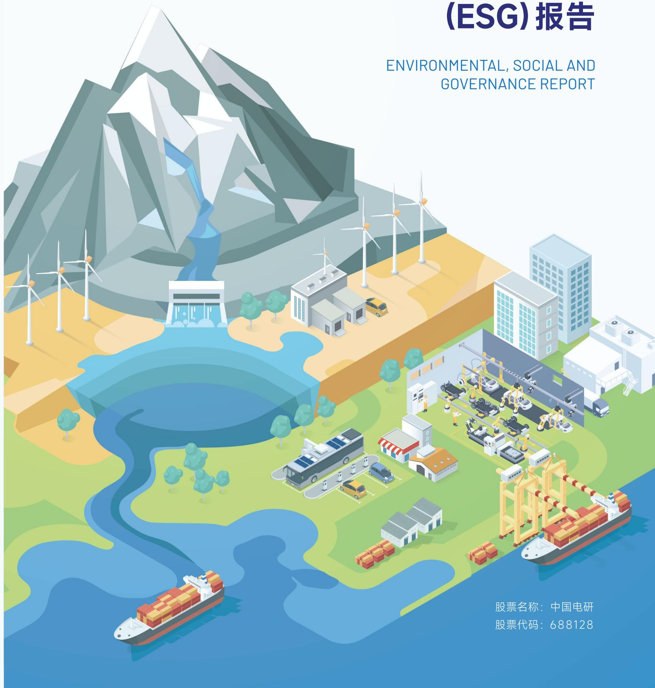

text_image

(ESG)报告
ENVIRONMENTAL, SOCIAL AND
GOVERNANCE REPORT
股票名称：中国电研
股票代码：688128

# 目录

报告编制说明 01

关于公司 03

ESG治理 09

可持续发展治理 09

议题重要性评估 11

利益相关方沟通 15

尽职调查 16

# 17

# 环境篇

应对气候变化 19

环境合规管理 25

污染防治攻坚 30

资源合理利用 35

注重生态保护 38

# 83

# 治理篇

党建引领发展 85

公司治理筑基 88

合规运营护航 92

恪守商业道德 97

# 39

# 社会篇

聚焦人才赋能 41

品质护航发展 55

创新引领未来 65

携手共谋进步 71

温暖回馈社会 76

附录 99

关键绩效表 99

指标索引表 107

鉴证报告 108

# 报告 编制说明

# 报告说明

本报告是中国电器科学研究院股份有限公司发布的第四份环境、社会及公司治理（ESG）报告。报告详细阐述了公司的ESG相关理念和政策以及2025年在业务经营、环境保护、社会责任、公司治理等方面做出的努力，旨在与各利益相关方进行有效交流，系统性地回应利益相关方的期望和要求。

# 编制依据

- 上海证券交易所《科创板股票上市规则》  
- 上海证券交易所《科创板上市公司自律监管指引第1号—规范运作》  
- 上海证券交易所《上市公司自律监管指引第14号—可持续发展报告（试行）》  
- 上海证券交易所《科创板上市公司自律监管指南第13号—可持续发展报告编制》  
- 国务院国资委《央企控股上市公司ESG专项报告参考指标体系》  
- 联合国《可持续发展目标 (SDGs)》

# 报告范围

本报告为年度报告，报告期为2025年1月1日至2025年12月31日。为增强报告可比性，部分内容向前后适度延伸。除另作说明外，本报告范围与公司年报范围保持一致。

# 数据来源与可靠性保障

本报告使用的定性、定量信息均来自中国电研的公开信息、内部文件和相关统计数据。

# 货币单位

报告出现的货币金额，如无特殊说明，均以人民币为计量单位。

# 报告获取途径

本报告通过电子版形式发布，发布于上海证券交易所官网（www.sse.com.cn）。

# 称谓说明

为了便于表述和阅读，本报告中使用代称，具体情况见下表：

<table><tr><td>简称</td><td>全称</td></tr><tr><td>国机集团</td><td>中国机械工业集团有限公司</td></tr><tr><td>中国电研、公司</td><td>中国电器科学研究院股份有限公司</td></tr><tr><td>威凯检测</td><td>威凯检测技术有限公司</td></tr><tr><td>威凯认证</td><td>威凯认证检测有限公司</td></tr><tr><td>擎天材料</td><td>擎天材料科技有限公司</td></tr><tr><td>擎天实业</td><td>广州擎天实业有限公司</td></tr><tr><td>全国重点实验室</td><td>工业产品环境适应性全国重点实验室</td></tr></table>

# 关于公司

# 公司简介

<table><tr><td>中文名称</td><td>中国电器科学研究院股份有限公司</td></tr><tr><td>中文简称</td><td>中国电研</td></tr><tr><td>外文名称</td><td>China National Electric Apparatus Research Institute Co., Ltd.</td></tr><tr><td>外文名称缩写</td><td>CEI</td></tr><tr><td>公司办公地址</td><td>广州市海珠区新港西路204号第1栋</td></tr></table>

# 企业文化

# 使命与愿景

# 使命

锻造国机所长，服务国家所需

# 愿景

建设“共创、共享、共担”事业平台，
打造中国电研百年老店

# 核心价值观

# 和

# 合力

和谐共生，
合力共赢

# 包容

相互包容，
容错纠错

# 正气

公正严明，
爱憎分明

# 感恩

懂得感恩，
不负众望

# 专

# 专注

聚焦主业，专心客户

# 专业

专精特新，创新引领

# 专家

专业精神，专家精英

# 实

# 务实

一切从实际出发，实事求是

# 诚信

诚实守信，一诺千金

# 踏实

老老实实做人，踏踏实实做事

# 发展历程

公司发展历程  
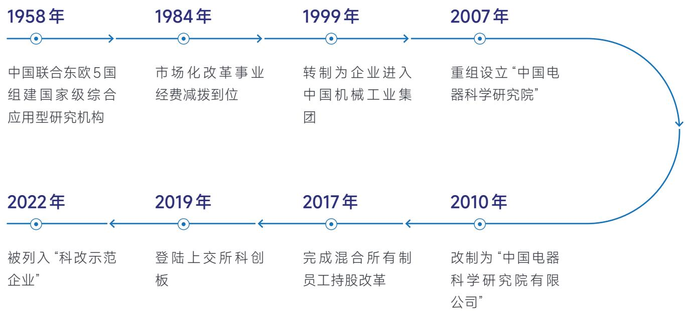

flowchart

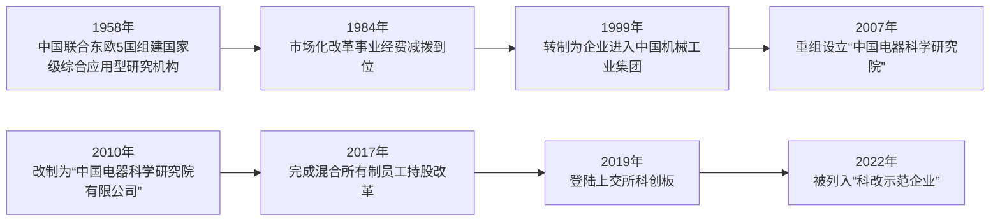
```mermaid
graph LR
  A["1958年\n中国联合东欧5国组建国家级综合应用型研究机构"] --> B["1984年\n市场化改革事业经费减拨到位"]
  B --> C["1999年\n转制为企业进入中国机械工业集团"]
  C --> D["2007年\n重组设立“中国电器科学研究院”"]
  E["2010年\n改制为“中国电器科学研究院有限公司”"] --> F["2017年\n完成混合所有制员工持股改革"]
  F --> G["2019年\n登陆上交所科创板"]
  G --> H["2022年\n被列入“科改示范企业”"]
```

# 管理理念

坚守央企定位

以奋斗者为本

坚持长期主义

结硬寨、打呆仗

坚持底线思维

# 价值牵引

对价值创造者给予合理回报

对侵害企业利益者做坚决斗争

对干部严格要求

对青年关心关爱

# 业务概况

中国电研是一家以产业基础共性技术研究为支撑、核心关键技术研发为驱动、技术标准创新为引领的国家级科技创新型企业，致力于为电器及其相关衍生领域的产品质量提升提供整体解决方案。公司建有工业产品环境适应性全国重点实验室、国家日用电器质量检验检测中心、国家智能汽车零部件质量检验检测中心、国家高原电器产品质量检验检测中心等20个国家级科技研发和技术服务平台，16个IEC国际标准对接平台和11个国家标准平台，依托全国10余个产业基地和服务机构，通过“自主研发为主，产学研合作为辅”的研发模式进行科技创新，取得了一系列核心技术成果，并通过高质量科研成果转化，形成了质量技术服务、电气装备、成套装备、环保涂料及树脂等四大业务领域。

# 质量技术服务

质量技术服务业务覆盖智能家居、智能汽车、能源装备、医疗健康等多个应用领域，能够为客户提供集产业基础共性技术研究、标准化、检测、认证、检验、计量、能力验证、审定核查以及包含实验室技术服务、培训等质量提升延伸服务为一体的一站式质量技术服务，贯穿企业研发设计、采购、生产、市场流通及运维等企业全价值链，覆盖家用、工商业用、高原、低空等多个场景。

# 电气装备业务

电气装备业务深耕“电能转换”领域，致力于为能源电力、工业电源、新能源电池等行业提供专业化设备和系统的解决方案，是国内领先、国际知名的励磁系统、大功率电源设备、新能源电池生产检测装备的科技研发制造企业。

# 成套装备业务

成套装备业务基于工业机器人系统集成、先进控制等技术，自主研制了智能数控钣金设备、智能装配线、自动检测线、智能焊装线、智能涂装线、表面处理设备和试验设备等产品，并提供定制化的生产信息管理系统，实现工厂管理的信息化和智能化，为家电、二轮车等行业提供从单个生产工艺到完整工厂流程的系统解决方案。

# 环保涂料及树脂业务

环保涂料及树脂业务是专业从事环保涂料（粉末涂料、水性工业涂料）及其关键树脂材料的研究开发、生产、销售的国家级专精特新重点“小巨人”企业，产品销售遍布全国和全球40多个国家及地区。

公司以环境适应性及电气安全为根技术，以数智化、绿色低碳为发展主线，聚焦智能家居、能源装备、智能汽车三大产业链，深耕质量技术服务、电气装备、成套装备和绿色环保涂料和树脂四大主业，在环境适应性技术、NQI技术、能量转换技术、智能控制技术、系统集成技术、环保涂料技术等关键核心技术上不断加大投入以持续取得突破。

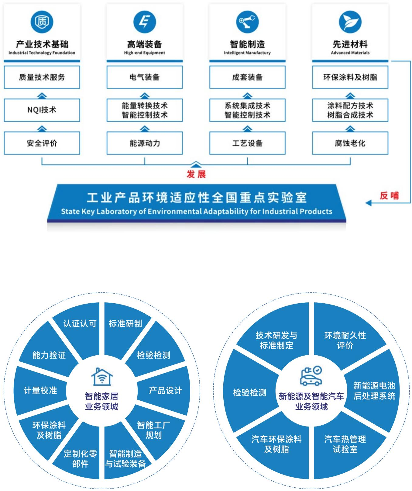

# 2025年荣誉认可

# 中国电研相关荣誉认可

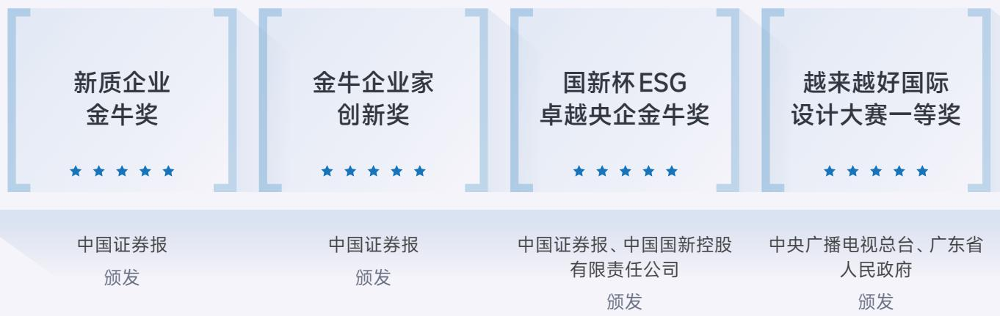

flowchart

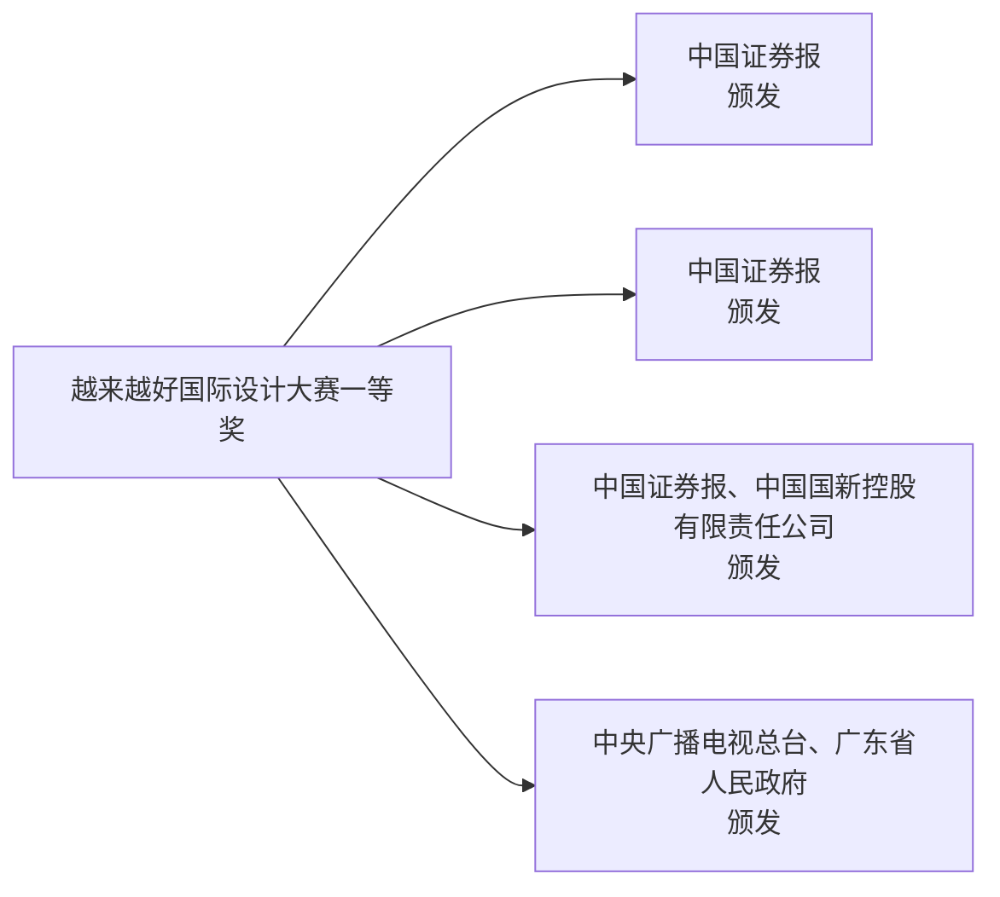
```mermaid
graph LR
  A["新质企业\n金牛奖"] --> B["中国证券报\n颁发"]
  A["金牛企业家创新奖"] --> C["中国证券报\n颁发"]
  A["国新杯ESG\n卓越央企金牛奖"] --> D["中国证券报、中国国新控股有限责任公司\n颁发"]
  A["越来越好国际设计大赛一等奖"] --> E["中央广播电视总台、广东省人民政府\n颁发"]
```

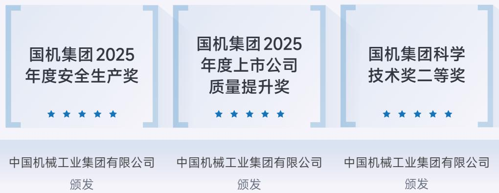

flowchart

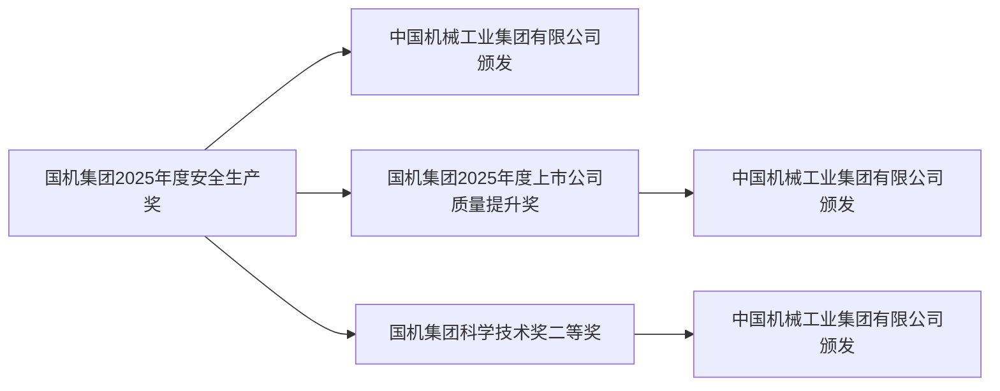
```mermaid
graph LR
  A["国机集团2025年度安全生产奖"] --> B["中国机械工业集团有限公司颁发"]
  A --> C["国机集团2025年度上市公司质量提升奖"]
  A --> D["国机集团科学技术奖二等奖"]
  C --> E["中国机械工业集团有限公司颁发"]
  D --> F["中国机械工业集团有限公司颁发"]
```

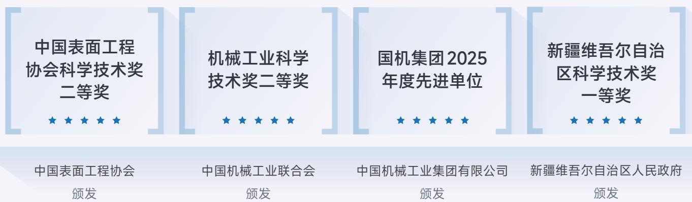

flowchart

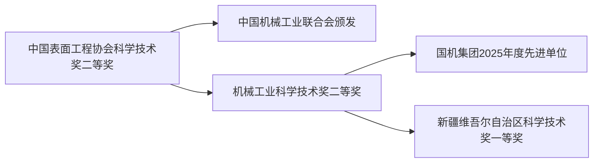
```mermaid
graph LR
  A["中国表面工程协会科学技术奖二等奖"] --> B["中国机械工业联合会颁发"]
  A --> C["机械工业科学技术奖二等奖"]
  C --> D["国机集团2025年度先进单位"]
  C --> E["新疆维吾尔自治区科学技术奖一等奖"]
```

# 各子公司相关荣誉认可

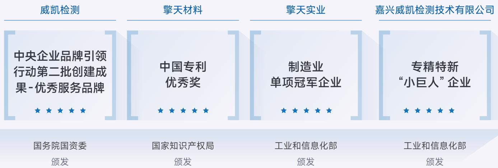

flowchart

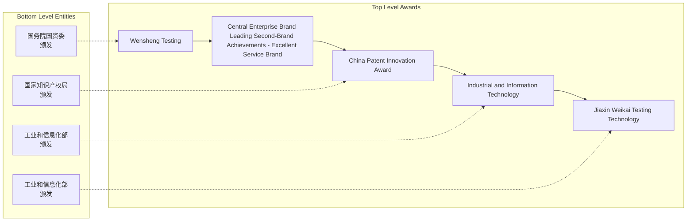
```mermaid
graph LR
  subgraph Top_1["Top Level Awards"]
  A["Wensheng Testing"] --> B["Central Enterprise Brand Leading Second-Brand Achievements - Excellent Service Brand"]
  B --> C["China Patent Innovation Award"]
  C --> D["Industrial and Information Technology"]
  D --> E["Jiaxin Weikai Testing Technology"]
  end

  subgraph Bottom_1["Bottom Level Entities"]
    F["国务院国资委\n颁发"] -.-> A
    G["国家知识产权局\n颁发"] -.-> C
    H["工业和信息化部\n颁发"] -.-> D
    I["工业和信息化部\n颁发"] -.-> E
  end
```

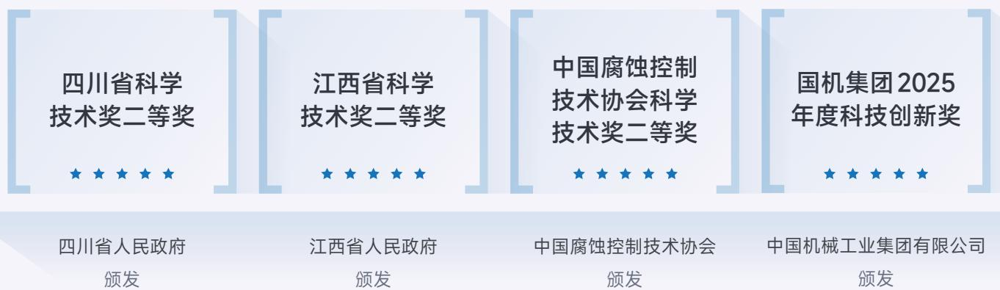

flowchart

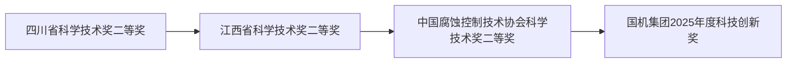
```mermaid
graph LR
  A["四川省科学技术奖二等奖"] --> B["江西省科学技术奖二等奖"]
  B --> C["中国腐蚀控制技术协会科学技术奖二等奖"]
  C --> D["国机集团2025年度科技创新奖"]
```

# 嘉兴威凯检测技术有限公司

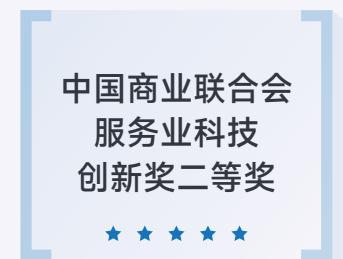

text_image

中国商业联合会
服务业科技
创新奖二等奖

中国商业联合会
颁发

# ESG 治理

# 可持续发展治理

# 治理

公司始终高度重视ESG领域的实践与创新，构建分层联动的可持续发展管理体系，将ESG深度融入经营管理全链条。公司结合自身战略规划与业务布局，成立由党委书记、董事长担任总负责人的ESG领导小组，下设领导小组办公室及专项工作组，全面统筹ESG管理工作的组织、部署与实施，公司董事会、经理层着眼可持续发展全局，各职能部门分别负责ESG议题的管理。

# 可持续发展治理架构

# 决策层

# 董事会

- 调研国际国内行业现状及政策, 全面掌握公司经营管理情况。  
- 监督可持续发展影响、风险与机遇的评估。  
- 指导审阅可持续发展方针、战略及目标，定期跟踪目标进展。  
- 审批ESG报告, 对工作执行情况进行监督检查并适时指导。

# 管理层

# ESG 领导小组

- 评估、管理重要性议题，为决策层提供分析与建议，辅助董事会监督。  
- 确定并管理识别、减缓、管控及监察可持续发展相关影响、风险和机遇所需的成本投入与资源分配。

# 执行层

# ESG 领导小组办公室、工作组

- 制定利益相关方参与计划并组织沟通活动。  
- 协调编制ESG报告。  
- 提升公司在可持续相关管理、数据统计分析、与投资者及研究机构沟通等方面的能力。  
- 定期向管理层汇报工作成果。

公司持续完善可持续发展信息报告机制，保障ESG相关议题的有效落实。通过界定信息收集、分析、整合和上报的全流程，公司明确各部门在可持续发展数据管理中的具体职责与分工，形成协同高效的工作体系，从而保障ESG相关信息的系统性、规范性和透明度。

# 报告机制构建

- 建立标准化的数据收集模板和指标体系。  
- 搭建跨部门的信息共享平台。  
- 制定严格的数据审核流程。

# 报告频率

- 采用“定期报告 + 重大信息快速上报”的双轨机制。  
- 定期披露公司季度报、半年报和年报。  
- 重大信息快速上报机制则针对突发事件或重大ESG议题。

# 报告准备工作

- 组织、参加专项培训。  
- 开展模拟演练，并根据演练结果优化流程。  
- 建立考核激励机制，将ESG工作纳入部门及个人的绩效考核体系。

# 战略

公司 “十五五” 规划充分考虑长期可持续发展，积极将 ESG 相关理念纳入智能家居、能源装备、智能汽车等重点领域业务发展，注重品控与回收管理，在业务规划中聚焦 “绿色低碳” “战略新兴领域” “环境适应性” 等重要概念，持续完善关于科技创新平台体系、关键核心技术攻关、基础技术供给能力、人才建设、精益管理等方面的战略举措，全方位体现 ESG 管理理念。

# 影响、风险和机遇管理

公司紧扣 ESG 重点维度，不断深化对可持续发展工作的认知理解，强化其主动践行的责任意识。公司旨在以此为重要激励纽带，充分调动各级员工的主观能动性与创新潜能，凝聚各方面力量形成协同发展合力，推动企业在可持续发展赛道上稳步迈进，最终实现长期稳健繁荣的战略愿景。

# ESG管理措施

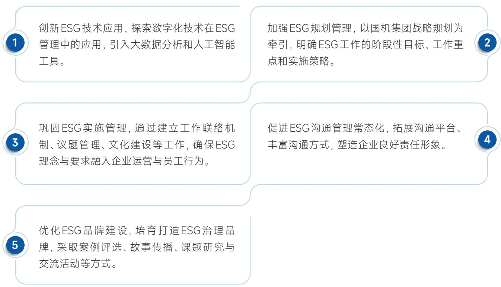

flowchart

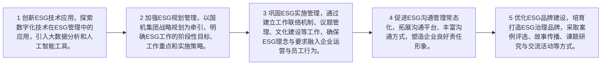
```mermaid
graph LR
  A["1 创新ESG技术应用，探索数字化技术在ESG管理中的应用，引入大数据分析和人工智能工具。"] --> B["2 加强ESG规划管理，以国机集团战略规划为牵引，明确ESG工作的阶段性目标、工作重点和实施策略。"]
  B --> C["3 巩固ESG实施管理，通过建立工作联络机制、议题管理、文化建设等工作，确保ESG理念与要求融入企业运营与员工行为。"]
  C --> D["4 促进ESG沟通管理常态化，拓展沟通平台、丰富沟通方式，塑造企业良好责任形象。"]
  D --> E["5 优化ESG品牌建设，培育打造ESG治理品牌，采取案例评选、故事传播、课题研究与交流活动等方式。"]
```

# 指标与目标

2025年，公司持续推进ESG治理，加强培训赋能，组织ESG专项培训，为公司高层及员工解读相关监管政策与发展趋势。

# 议题重要性评估

# 评估流程

在 ESG 议题重要性评估工作中, 公司始终秉持科学严谨的原则, 采用双重重要性评估框架, 为精准识别核心议题、高效推进 ESG 管理工作筑牢基础。公司系统评估各议题对经济运行、社会发展及生态环境可能产生的潜在影响范围与强度, 实现 ESG 管理与经营发展的深度绑定, 持续提升议题识别的严谨性与科学性。

# 双重重要性评估框架

评估各议题对经济、社会和环境的潜在影响程度（即影响重要性）

评估各议题对企业价值创造可能带来的风险与机遇（即财务重要性）

2025年议题共30项，包括环境范畴10项、社会范畴13项及公司治理范畴7项，具体情况请见下表。

<table><tr><td>范畴</td><td>2024年议题</td><td>2025年议题</td><td>变动情况</td><td>变动原因</td></tr><tr><td rowspan="11">环境</td><td>“双碳”战略与应对气候变化</td><td>应对气候变化</td><td>调整议题</td><td>参照《指引》调整表述</td></tr><tr><td>污染物排放</td><td>污染物排放</td><td>/</td><td>/</td></tr><tr><td>废弃物处理</td><td>废弃物处理</td><td>/</td><td>/</td></tr><tr><td>生态系统和生物多样性</td><td>生态系统和生物多样性</td><td>/</td><td>/</td></tr><tr><td>环境合规管理</td><td>环境合规管理</td><td>/</td><td>/</td></tr><tr><td>能源管理</td><td>能源管理</td><td>/</td><td>/</td></tr><tr><td>水资源管理</td><td>水资源管理</td><td>/</td><td>/</td></tr><tr><td>循环经济</td><td>循环经济</td><td>/</td><td>/</td></tr><tr><td>绿色低碳运营</td><td>绿色低碳运营</td><td>/</td><td>/</td></tr><tr><td>清洁技术机遇</td><td>清洁技术机遇</td><td>/</td><td>/</td></tr><tr><td>三废管理</td><td>/</td><td>删除议题</td><td>与议题【污染物排放】【废弃物处理】重复</td></tr><tr><td rowspan="4">社会</td><td>产品安全与质量</td><td>产品安全与质量</td><td>/</td><td>/</td></tr><tr><td>客户服务</td><td>客户服务</td><td>/</td><td>/</td></tr><tr><td>供应链管理及可持续采购</td><td>供应链管理及可持续采购</td><td>/</td><td>/</td></tr><tr><td>员工权益与福利</td><td>员工权益与福利</td><td>/</td><td>/</td></tr><tr><td rowspan="8">社会</td><td>职业健康与安全</td><td>职业健康与安全</td><td>/</td><td>/</td></tr><tr><td>员工培训与发展</td><td>员工培训与发展</td><td>/</td><td>/</td></tr><tr><td>人才吸引与留任</td><td>人才吸引与留任</td><td>/</td><td>/</td></tr><tr><td>信息安全与隐私保护</td><td>信息安全与隐私保护</td><td>/</td><td>/</td></tr><tr><td>促进行业数智化发展</td><td>数智化发展</td><td>调整议题</td><td>调整议题</td></tr><tr><td>社会贡献</td><td>社会贡献</td><td>/</td><td>/</td></tr><tr><td>社区共建</td><td>社区共建</td><td>/</td><td>/</td></tr><tr><td>/</td><td>乡村振兴</td><td>新增议题</td><td>交易所关注议题</td></tr><tr><td rowspan="8">公司治理</td><td rowspan="3">公司治理</td><td>合规运营</td><td>调整议题</td><td>细化议题</td></tr><tr><td>风险防控</td><td>调整议题</td><td>细化议题</td></tr><tr><td>ESG治理</td><td>调整议题</td><td>细化议题</td></tr><tr><td>商业道德与反贪腐</td><td>商业道德与反贪腐</td><td>/</td><td>/</td></tr><tr><td>合规经营与风险管理</td><td>/</td><td>删除议题</td><td>与【合规运营】【风险防控】议题重复</td></tr><tr><td>股东权益保护</td><td>股东权益保护</td><td>/</td><td>/</td></tr><tr><td>投资者关系</td><td>投资者关系</td><td>/</td><td>/</td></tr><tr><td>反不正当竞争</td><td>反不正当竞争</td><td>/</td><td>/</td></tr></table>

公司按照 “利益相关方沟通 - 议题识别 - 议题评价 - 重要性确认 - 议题审核” 的规范步骤，有序开展利益相关方调研工作。从 “财务重要性” 与 “影响重要性” 双维度，系统识别 ESG 领域关键议题及未来发展方向，结合各方反馈意见对实质性议题进行重要性排序评估，最终形成重要性议题矩阵，明确公司 ESG 管理及报告披露的核心重点。

# 评估结果

公司对 30 项议题进行重要性评估, 具备重要性的议题情况如下:

# 具备双重重要性议题 (4 项)

创新驱动、环境合规管理、产品安全与质量、应对气候变化。

# 仅具备财务重要性议题 (4 项)

风险防控、ESG治理、能源管理、职业健康与安全。

# 仅具备影响重要性议题 (12 项)

数智化发展、供应链管理及可持续采购、合规运营、污染物排放、废弃物处理、水资源管理、客户服务、员工培训与发展、信息安全与隐私保护、商业道德与反贪腐、股东权益保护、投资者关系。

# 重要性矩阵

<table><tr><td>高</td><td>影响重要性</td><td>较高</td></tr><tr><td>数智化发展</td><td>客户服务</td><td></td></tr><tr><td>供应链管理及可持续采购</td><td>员工培训与发展</td><td>创新驱动</td></tr><tr><td>合规运营</td><td>信息安全与隐私保护</td><td>环境合规管理</td></tr><tr><td>污染物排放</td><td>商业道德与反贪腐</td><td>产品安全与质量</td></tr><tr><td>废弃物处理</td><td>股东权益保护</td><td>应对气候变化</td></tr><tr><td>水资源管理</td><td>投资者关系</td><td></td></tr><tr><td>人才吸引与留任</td><td>社会贡献</td><td>风险防控</td></tr><tr><td>员工权益与福利</td><td>社区共建</td><td>ESG治理</td></tr><tr><td>循环经济</td><td>乡村振兴</td><td>能源管理</td></tr><tr><td>绿色低碳运营</td><td>反不正当竞争</td><td>职业健康与安全</td></tr><tr><td>清洁技术机遇</td><td>生态系统和生物多样性</td><td></td></tr></table>

# 利益相关方沟通

公司始终致力于与各利益相关方保持双向、透明和常态化的沟通，确保沟通渠道多样化。在识别利益相关方时，考虑到其对企业的影响程度以及企业对其影响，公司明确主要的利益相关方类别，并通过多种方式了解他们对公司可持续发展的期望与需求，定期评估并调整工作计划，通过实际行动积极回应相关方的关切。

<table><tr><td colspan="2">利益相关方</td><td>关注议题</td><td>沟通方式及渠道</td></tr><tr><td></td><td>股东及投资者</td><td>公司治理股东权益保护投资者关系</td><td>股东会信息披露投关活动</td></tr><tr><td></td><td>客户</td><td>产品质量客户服务研发创新信息安全与隐私保护</td><td>开展客户满意度调研提升客户服务能力信息披露</td></tr><tr><td></td><td>员工</td><td>员工权益职业健康与安全员工培训及发展人才吸引与留任</td><td>职代会、座谈会</td></tr><tr><td></td><td>政府及监管机构</td><td>合规经营廉洁从业反不正当竞争环境管理</td><td>上报信息信息披露</td></tr><tr><td></td><td>供应商及合作伙伴</td><td>可持续供应链供应链安全</td><td>产业链协同</td></tr><tr><td></td><td>行业组织</td><td>互利共赢推动行业健康发展</td><td>行业交流会</td></tr><tr><td></td><td>社区代表与公益组织</td><td>乡村振兴社会贡献</td><td>信息披露帮扶活动社会公益活动</td></tr></table>

# 尽职调查

公司通过系统化的尽职调查与背景研究开展ESG议题识别工作。首先，围绕公司经营与管理实际，组织与各部门负责人及业务骨干开展深度访谈与专题座谈，全面梳理各业务环节中与环境、社会及治理相关的实践情况、潜在风险与改进诉求，确保议题来源于经营一线与管理实际。在此基础上，公司从宏观与微观两个层面开展背景研究：宏观层面重点分析公司运营区域的发展特征、监管要求及行业整体趋势；微观层面聚焦产品全生命周期，从研发设计、生产制造、销售服务到回收处置等环节，系统研判可持续发展相关影响与风险机遇。

natural_image

Isometric illustration of people working on a large digital dashboard with charts and laptops, no text or symbols present

# 环境篇

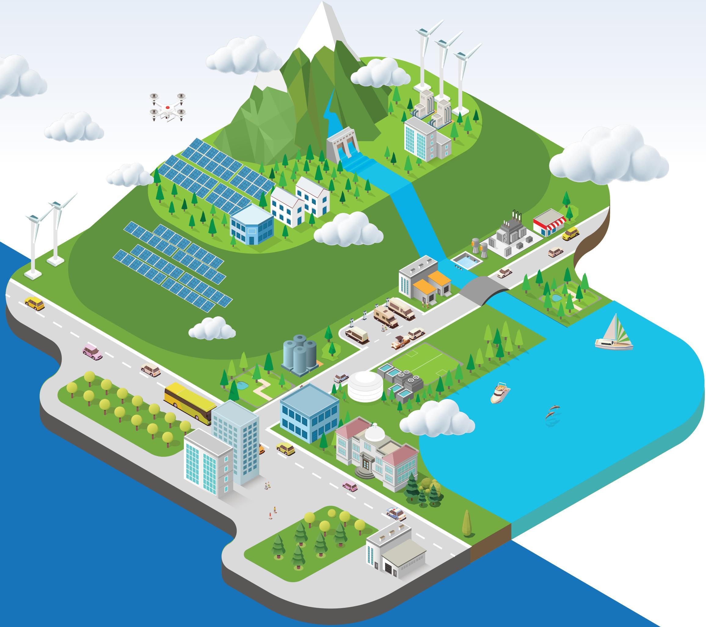

natural_image

Isometric illustration of a coastal urban area with solar panel installations, wind turbines, and a river, no text or symbols present.

# 应对气候变化

# 治理

公司积极应对气候变化相关问题,为推动“双碳”目标稳步实现,确保各项工作有序开展,构建起董事会统筹监督、碳达峰碳中和与节能环保领导小组系统推进、碳达峰碳中和与节能环保办公室具体执行、各部门及分子公司落地落实的气候变化治理体系，统筹管理碳达峰碳中和、能源节约与生态环境保护相关工作。

# 气候变化治理架构

# 董事会

监督指导公司“双碳”发展战略落地。  
- 开展气候相关影响、风险与机遇的识别、评估及应对策略制定。  
- 负责“双碳”目标达成情况的评估。

# 碳达峰碳中和与节能环保领导小组

- 统筹“双碳”相关发展规划的制定和监督工作，审核相关目标及落实情况，并向董事会提交汇报。  
- 根据公司规划目标，将任务科学分解至各子公司，并签订年度节能环保目标责任书。  
- 建立健全考核评价体系，定期组织评估并对考核结果在公司内部予以公示。

# 碳达峰碳中和与节能环保办公室

- 负责制定“双碳”及节能环保管理制度，明确“双碳”目标、具体指标。  
- 开展监督检查和绩效考核，形成年度及季度报告，并向领导小组提交汇报。  
- 积极推广应用节能低碳环保新技术、新工艺、新设备、新材料。

# 各部门及分子公司

- 落实公司整体规划部署和目标分解。  
- 跟踪监控环境、能源、碳排放等目标达成情况。

# 战略

公司持续加大对气候变化领域的关注与研究力度，结合国际可持续准则理事会（ISSB）《国际财务报告可持续披露准则第2号——气候相关披露》的核心要求，积极开展气候变化风险识别，并基于联合国政府间气候变化专门委员会（IPCC）的SSP5-8.5高排放情景与SSP1-2.6低排放情景，开展气候变化情景分析，为气候转型与韧性建设筑牢基础。

① 高排放情景 (SSP5-8.5)

<table><tr><td colspan="2">风险类别</td><td>影响时段</td><td>影响强度</td><td>风险描述</td><td>应对措施</td></tr><tr><td rowspan="2">物理风险</td><td>急性气候风险</td><td>短期</td><td>中</td><td>极端天气及气候灾害可能造成厂房与设施损坏、威胁员工安全,并影响生产经营稳定。相关风险还可能推高设备维修成本、因人员误工导致运营损失,进而降低资产价值或缩短资产使用年限。</td><td>制定防台防汛应急预案。实施灵活办公,极端天气下员工可居家办公。购买商业保险,降低极端气候带来的损失。加大办公和生产设备维护检查力度,确保相关制动设备正常稳定运行。制定物资储存和备份方案,采取堆场防水浸措施,雨季将货物及原材料堆放在仓库、筒仓等场所。完善工程防护措施,优化排水管网,重要设施抬高、防水和密封改造。</td></tr><tr><td>慢性气候风险</td><td>中长期</td><td>低</td><td>长期气候变化引发的全球变暖、海平面上升等问题,可能对沿海区域厂区及设备安全造成影响;同时夏季高温将增加制冷需求,进而推高电力消耗与运营成本。</td><td>高温条件下,适当增加休息次数并发放清凉解暑物资。长期规划选址,重要生产装置及设施避开低洼、近岸地区。</td></tr></table>

② 低排放情景 (SSP1-2.6)

<table><tr><td colspan="2">风险类别</td><td>影响时段</td><td>影响强度</td><td>风险描述</td><td>应对措施</td></tr><tr><td>转型风险</td><td>政策风险与机遇</td><td>短期</td><td>中</td><td>·国家持续出台日趋严格的气候及碳排放相关政策法规,推动减污降碳与绿色转型,使企业面临更大的节能减排与资源高效利用压力,整体能源转型成本相应上升。·出口海外的产品可能面临碳关税、碳足迹等相关政策要求和限制,增加企业出海业务运营成本。</td><td>·密切关注国际、国内气候环境和碳相关法律法规、政策变化。·积极制定碳达峰、碳中和目标及行动方案,按时核算碳排放量,评估履约成本。·扩大产品碳足迹认证范围,关注碳关税相关政策要求,及时评估出口成本、调整业务规划。·优化能源利用结构,提升清洁能源使用占比,减少化石能源依赖。</td></tr><tr><td rowspan="3">转型风险</td><td>技术风险与机遇</td><td>中期</td><td>高</td><td>· 产品清洁及环保技术升级导致研发难度加大,可能会面临成本增加及资产减值。· 未及时识别并应用低碳技术,可能导致低碳转型落后于同业。</td><td>· 评估能耗成本的财务影响,逐步淘汰高能耗、高排放的设备设施。· 加强低碳技术研发与应用的可行性研究。· 积极开展行业合作,与产业链伙伴共同推动低碳技术研发与应用。</td></tr><tr><td>市场风险与机遇</td><td>中长期</td><td>高</td><td>· 新能源补贴减少。· 气候影响造成原材料价格、运输费用等上涨。· 由于市场政策性价格调整等因素造成产品的市场价格发生变化,利润降低。· 市场对节能产品和绿色产品认可度持续提升,带动对绿色服务与低碳技术认证的需求,未及时推出绿色节能产品与服务可能导致竞争优势减弱。</td><td>· 不断提升产品和服务供给能力,布局环保材料、氢能电源产业、智能设备、绿色认证服务等业务。· 不断开拓新产品、新技术应用场景,为客户提供有效的低碳产品与服务,提升国内外市场占有率。· 加强供应链管理,优化采购策略,拓展多区域、多供应商渠道,确保供应链安全可靠。</td></tr><tr><td>声誉风险与机遇</td><td>中长期</td><td>低</td><td>· 监管机构、投资者、ESG评级机构、社会公众等相关方的广泛关注,若企业未能做到,可能造成投融资成本上升、品牌价值下降等声誉风险。</td><td>· 不断优化营商环境,促进贸易便利化,拓宽上下游服务业务链。· 响应国家“双碳”目标,提升自身可持续表现,致力于按时实现中国电研“双碳”目标。· 持续做好信息披露工作,维护良好的投资者关系。</td></tr></table>

# 影响、风险和机遇管理

公司高度重视气候变化带来的影响、风险与机遇，构建了系统化、科学化的气候相关风险管理流程，并将其全面融入公司整体风险管理体系，确保战略制定与经营决策能够有效识别、评估并应对气候变化带来的转型风险与物理风险，同时把握绿色低碳发展机遇。公司通过完善制度设计与流程衔接，将气候相关风险识别、目标分解、执行跟踪及绩效评价纳入常态化管理，形成闭环管控机制，持续提升气候韧性与低碳发展能力。

# 物理风险应对与低碳实践

面对台风、暴雨等极端天气带来的急性物理风险，公司制定了防台防汛应急预案，并定期组织相关演练，以提升应急响应能力和保障公司运营连续性及员工安全。

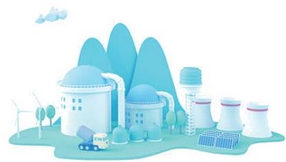

natural_image

Illustration of a renewable energy facility with cooling towers, solar panels, and wind turbines on a hillside (no text or symbols)

面对慢性物理风险，公司坚持目标导向，落实责任制，由碳达峰、碳中和与节能环保办公室统筹推进相关工作，依据公司中长期发展规划与“双碳”目标，将任务科学分解至各子公司，并通过签订年度节能环保目标责任书，明确环境管理、能源消耗及碳排放控制等关键指标。同时，公司建立健全考核评价与监督机制，定期组织对各单位目标完成情况进行评估，推动责任落实与持续改进。公司还积极推进制度制修订、组织保障、排放监测、绿色低碳项目跟踪推进等各项工作，保障温室气体排放管理工作有序进行。此外，公司积极推进节能减排和清洁能源利用，努力降低生产运营过程中的温室气体排放，具体管理与实践请见能源利用相关章节。

# 温室气体排放管理

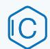

# 碳监测

\- 按季度统计、监测碳排放情况，并定期汇总数据上报。

# 园区碳盘查

- 运用绿色低碳验证技术, 开展公司内部园区碳盘查工作, 摸清生产运营各环节的碳排放情况。  
- 积极协助国机集团开展二级企业的碳盘查工作。

# 绿色转型实践与技术赋能

面对转型风险与机遇，公司持续深耕绿色产业赛道，大力拓展绿色技术服务业务、开发绿色产品，赋能上下游产业绿色低碳转型。

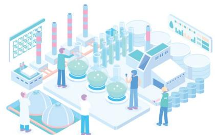

natural_image

Isometric illustration of an industrial facility with workers, storage tanks, and factory buildings (no text or symbols)

# 提升全链条绿色技术服务能力

在绿色技术服务方面，公司已构建全面的绿色低碳综合服务体系，提供全链条、一站式绿色技术解决方案与专业服务，覆盖智能家居、智能汽车、能源装备、医疗健康等多个领域。2025年，公司在绿色技术服务资质能力建设、国际合作、平台建设与行业赋能等方面持续发力。

# 资质能力建设

>>>

- 正式获得中国工业节能与清洁生产协会“零碳工厂、零碳园区评价认证服务机构”授权。  
- 成功通过CNAS评审，获环境信息审定与核查专项认可资格，温室气体审定与核查能力实现国际互认。  
- 成功入选第二批粤港澳大湾区碳足迹标识认证机构，获准在粤港澳大湾区开展碳足迹标识认证活动。  
- 成为广东省《质量认证服务发展新质生产力项目》服务机构并开展空调领域碳足迹标识认证试点。  
- 入驻江苏省产品碳足迹标识认证公共服务平台、湖北省产品碳足迹公共服务平台。

# 平台建设

>>>

\- 承担的中央引导地方科技发展资金项目“绿色低碳电器与能源检测公共服务平台创新建设”顺利通过验收。

# 行业赋能

>> >

- 持续强化在ESG与绿色低碳领域的标准研究与制定能力，积极推动国内外规则衔接与体系建设，不断提升专业技术支撑与标准引领水平，助力行业规范发展与可持续转型，具体标准发布情况可见科技创新章节。  
- 于电器电子产品有害物质及食品接触材料研讨会，解读RoHS新规及食品接触材料国标要求，助力产业链绿色合规与低碳转型。

# 案例

# 深化国际合作，创新认证服务模式赋能低碳转型

与Kiwa代表团签署绿色低碳领域战略合作协议，创新推出“一次核查、两张证书”服务模式，共同为上海海立电器颁发国内压缩机行业首张“中外双标”碳足迹核查证书。

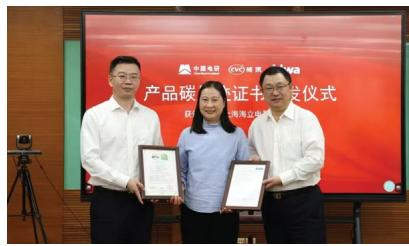

text_image

产品碳证书颁发仪式
2023年10月1日

# 深耕产品绿色化发展

在绿色产品方面，公司围绕环保材料与新能源应用协同发力，持续推进环保涂料与树脂材料、电气装备等领域的绿色化发展。

# 电气装备领域

聚焦新能源电池生产制造及循环利用领域，是行业内领先的锂电装备研发与制造企业，近年来在行业内率先自主研发高效节能、高一致性、低能耗的高串串联化成分容技术及相关装备，并积极布局固态电池生产检测设备及锂电池回收利用充放电设备，推动新能源电池产业链可持续发展。

瞄准国家战略需求，积极布局、全力参与清洁能源产业，依托可控硅整流在同源烧碱行业积累的业绩影响力，积极发展氢能行业中制氢电源及电解槽技术，依托聚变大功率磁体电源技术，研发形成聚变磁体电源等清洁能源相关产品，助力核电领域科研进展。

# 环保涂料与树脂材料领域

开发低温固化聚酯树脂与粉末涂料，针对耐候性、消光性等行业痛点实现技术突破，并延伸至绝缘阻燃、耐高温防火等功能型涂料，应用于新能源汽车三电系统及储能设备，提升产品绿色与安全性能。

# 指标与目标

公司积极应对全球气候变化, 科学制定碳达峰碳中和行动方案, 以2020年为基准年, 明确提出以2030年为碳达峰目标年, 力争在2060年前实现碳中和, 为推动行业绿色转型与国家“双碳”目标实现贡献力量。

温室气体排放总量

37,829.03吨二氧化碳当量

温室气体排放强度

0.08吨二氧化碳当量/万元

完成

年度目标

范围一排放量

8,700.40吨二氧化碳当量

范围二排放量

29,128.63吨二氧化碳当量

温室气体减排量

1,536.51吨二氧化碳当量

注:核算范畴、依据等具体说明请见关键绩效表

# 环境合规管理

# 治理

公司深入贯彻落实国家关于生态环境保护的相关法律法规及政策要求，持续完善环境管理体系，以碳达峰碳中和与节能环保工作领导小组为决策机构，严格按照《能源节约与生态环境保护工作考核管理规定》《能源节约与生态环境保护监督管理办法》《碳达峰碳中和、能源节约与生态环境保护节能降耗管理与教育培训制度》等专项管理制度，规范有序开展环境合规管理相关工作。

# 公司环境治理架构

# 碳达峰碳中和与节能环保工作领导小组

- 全面统筹公司节能环保及生态环境保护工作。  
- 制定并监督落实专项发展规划。  
- 统筹全系统节能环保管控。

# 碳达峰碳中和与节能环保工作办公室

\- 作为日常执行机构，统筹推进能源节约及生态环境保护常态化管理。

# 各部门及分子公司

- 落实公司整体规划部署和目标分解。  
- 常态化分析环境管理、能耗管控现状，制定并落实整改提升措施，动态跟踪各项管控目标达成情况。

# 通过环境管理体系认证的分子公司情况

截至2025年末，公司电气装备、成套装备、环保涂料及树脂业务均顺利通过ISO14001环境管理体系监督审核。

# 擎天实业

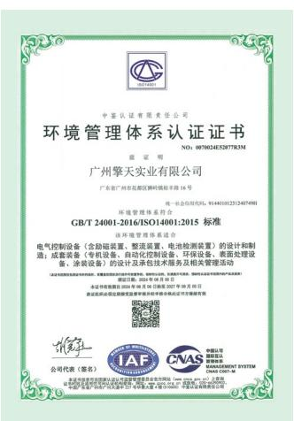

text_image

中签认证有限责任公司
环境管理体系认证证书
NO: 070024E5287783M
证 证明
广州擎天实业有限公司
广东广州市花都区湖岭镇松丰路16号
统一社会信用代码：91440101212407498
环境管理体系符合
GB/T 24001-2016/ISO14001:2015 标准
该环境管理体系适合
电气控制设备（含励磁装置、整流装置、电池检测装置）的设计和制造；
成套设备（专机设备、自动化控制设备、环保设备、表面处理设
备、涂装设备）的设计总承包技术服务及相关管理活动
申请日期：2024年08月16日
本证书有效期至2024年08月16日至2027年08月16日
请证明申请完成前需经国家发改委同意并报中国证监会书面审核发
号。
公司代 签名：
IAF CNAS
CHINA CITIC BANK
MANAGEMENT SYSTEM
www.chinaicbank.com.cn

环境管理体系认证证书

# 成套装备业务

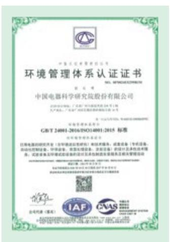

text_image

中国化学工程股份有限公司
环境管理体系认证证书
中国电器科学研究院股份有限公司
GB/T 24001-2016/ISO14001:2015 标准
环境管理体系认证
日常电器的研制开发（含制造设备研发、制造服务、成套设备、专用设备、自动化控制设备、环境设备、医用物理设备、医用设备）的设计及系统技术服务，实现器件与环境试验设备的设计及系统控制系统及相关管理活动
公司名称：（盖章）
IAF
CNAS

环境管理体系认证证书

# 擎天材料

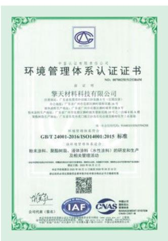

text_image

中签认证有限责任公司
环境管理体系认证证书
NO.: 08780258312538439
证照号
擎天材料科技有限公司
注册地址：广东省深圳市罗湖区深南东路1号（入驻独资）
办公地址：广东省广州市天河区珠江西路5号保利国际广场18楼
邮政编码：914401000000000000000000000000000000000000000000000000000000000000000000000000000000000000
地址：广东省深圳市罗湖区深南东路5号保利国际广场18楼
邮政编码：91440100000000000000
联系电话：(0755)83628888888888888888888888888888888888888888888888888888888888888888888888888888888888888888888
环境管理体系认证证书
GB/T 24001-2016/ISO14001:2015 标准
检验检测专用章
粉末涂料、聚酯树脂、液体涂料（米性涂料）的研发和生产
及相关管理活动
公司代码（盖章） IAF CNAS
法定代表人：中国证券监督管理委员会
证券登记结算机构：中国证券登记结算有限责任公司深圳分公司
收款日期：2021年1月1日
收款单位：中国证券登记结算有限责任公司深圳分公司
收款行：中国证券登记结算有限责任公司深圳分公司
收款中心：中国证券登记结算有限责任公司深圳分公司
收款账户：中国证券登记结算有限责任公司深圳分公司
收款结果：无
收款凭证号码：
收款方式：
收款时间：
收款金额：
收款地点：
收款单位：
收款行号：
收款账号：
收款日期：
收款日期：
收款单位：
收款行号：
收款行号：
收款日期：
收款单位：
收款行号：
收款行号：
收款日期：
收款单位：
收款行号：
收款行号：
收款日期：
收款单位：
收款行号：
收款行号：
收款日期：
收款单位：
收款行号：
收款行号：
收款日期：
收款单位：
收款行号：
收款行号：
收款日期：
收款单位：
收款行号：
收款行号：
收款日期：
收款单位：
收款行号：
收款行号：
收据人：中国证券登记结算有限责任公司深圳分公司
收款人：中国证券登记结算有限责任公司深圳分公司
收款行：中国证券登记结算有限责任公司深圳分公司
收款行：中国证券登记结算有限责任公司深圳分公司
收款行：中国证券登记结算有限责任公司深圳分公司
收款行：中国证券登记结算有限责任公司深圳分公司
收款行：中国证券登记结算有限责任公司深圳分公司
收款行：中国证券登记结算有限责任公司深圳分公司
收款行：中国证券登记结算有限责任公司深圳分公司
收款行：中国证券登记结算有限责任公司深圳分公司
收款行：中国证券记账系统
收款行：中国证券登记结算有限责任公司深圳分公司
收款行：中国证券登记结算有限责任公司深圳分公司
收款行：中国证券登记结算有限责任公司深圳分公司
收款行：中国证券登记结算有限责任公司深圳分公司
收款行：中国证券登记结算有限责任公司深圳分公司
收款行：中国证券登记结算有限责任公司深圳分公司
收款行：中国证券登记结算有限责任公司深圳分公司
收款行：中国证券登记结算有限责任公司深圳分公司
收款行:中国证券登记结算有限责任公司深圳分公司
收款行:中国证券登记结算有限责任公司深圳分公司
收款行:中国证券登记结算有限责任公司深圳分公司
收款行:中国证券登记结算有限责任公司深圳分公司
收款行:中国证券登记结算有限责任公司深圳分公司
收款行:中国证券登记结算有限责任公司深圳分公司
收款行:中国证券登记结算有限责任公司深圳分公司
收款行:中国证券登记结算有限责任公司深圳分公司
收款行:中国证券登记核算系统
收款行:中国证券登记结算有限责任公司深圳分公司
收款行:中国证券登记结算有限责任公司深圳分公司
收款行:中国证券登记结算有限责任公司深圳分公司
收款行:中国证券登记结算有限责任公司深圳分公司
收款行:中国证券登记结算有限责任公司深圳分公司
收款行:中国证券登记结算有限责任公司深圳分公司
收款行:中国证券登记结算有限责任公司深圳分公司
收款行:中国证券登记结算有限责任公司深圳分公司
收款行：中国证券登记结算有限责任公司深圳分公司
收款行：中国证券登记结算有限责任公司深圳分公司
收款行：中国证券登记结算有限责任公司深圳分公司
收款行：中国证券登记结算有限责任公司深圳分公司
收款行：中国证券登记结算有限责任公司深圳分公司
收款行：中国证券登记结算有限责任公司深圳分公司
收款行：中国证券登记结算有限责任公司深圳分公司
收款行：中国证券登记核算系统
收款行：中国证券登记结算有限责任公司深圳分公司
收款行：中国证券登记结算有限责任公司深圳分公司
收款行：中国证券登记结算有限责任公司深圳分公司
收款行：中国证券登记结算有限责任公司深圳分公司
收款行：中国证券登记结算有限责任公司深圳分公司
收款行：中国证券登记结算有限责任公司深圳分公司
收款行：中国证券登记结算有限责任公司深圳分公司
收款行：中国证券登记结算有限责任公司深圳分公司
收款方：中国证券登记结算有限责任公司深圳分公司
收款方：中国证券登记结算有限责任公司深圳分公司
收款方：中国证券登记结算有限责任公司深圳分公司
收款方：中国证券登记结算有限责任公司深圳分公司
收款方：中国证券登记结算有限责任公司深圳分公司
收款方：中国证券登记结算有限责任公司深圳分公司
收款方：中国证券登记结算有限责任公司深圳分公司
收款方：中国证券登记结算有限责任公司深圳分公司
收款方：中国证券记账系统

环境管理体系认证证书

# 战略

公司将环境风险防控纳入《“十四五”发展规划（2021-2025）》《碳达峰行动方案》，明确完善生态环境风险防控机制、增强全员环保意识、打好污染防治攻坚战等目标。公司识别出不达标排放、发生较大及以上突发环境事件、建设项目环保违法违规三个主要生态环境保护风险点。为应对已识别风险，公司按照生态环境主管部门要求，积极开展数据上报、专项检查、设施维护以及应急演练等工作，保障风险可控。

# 应对措施

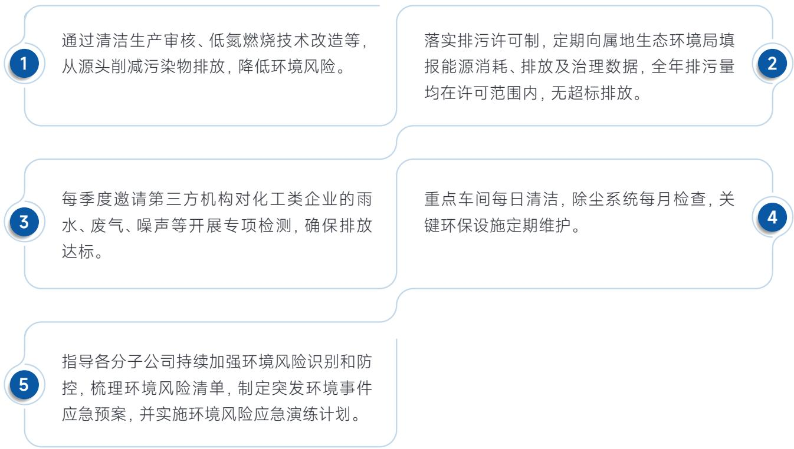

flowchart

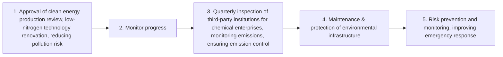
```mermaid
graph LR
  A["1. Approval of clean energy production review, low-nitrogen technology renovation, reducing pollution risk"] --> B["2. Monitor progress"]
  B --> C["3. Quarterly inspection of third-party institutions for chemical enterprises, monitoring emissions, ensuring emission control"]
  C --> D["4. Maintenance & protection of environmental infrastructure"]
  D --> E["5. Risk prevention and monitoring, improving emergency response"]
```

# 影响、风险和机遇管理

各分子公司按照公司要求，积极主动推动环境风险应急管理。擎天材料编制《突发环境事件应急预案》，基于严重性和紧急程度进行环境事件分级管理，并要求主动、及时对相关环境事件采取车间应急处置方案，在必要时与外部相关方联动，包括请求外部救援、与周边企业协同协商以及报送上级部门。

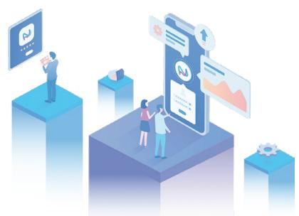

natural_image

Illustration of people interacting with digital platforms and charts on a podium (no text or symbols)

# 案例

# 突发环境事件应急演练

公司常态化开展环境应急演练，包括粉尘泄漏、固体废物贮存场所火灾、危险废物泄漏等实战及救护演练，通过以练促防、以演促改，不断强化应急队伍实战能力与协同联动水平，切实提升环境风险防控与快速处置能力，为保障生态环境安全和企业稳健运营奠定坚实基础。

# 筑牢绿色管理能力

公司高度重视“双碳”与节能环保专业人才队伍建设，通过开展专题培训、参与行业交流及组织内部学习等方式，不断提升相关管理人员的专业能力与实践水平。公司组织管理人员参加国机集团开展的安全生产与“双碳”节能环保管理能力提升培训，并通过线上线下相结合的方式扩大培训覆盖范围，持续强化管理团队对碳排放管理、节能降耗及绿色发展政策的理解与应用能力。同时，公司相关专家围绕碳排放“双控”背景下企业绿色转型路径开展专题分享，结合行业政策、典型案例与前沿技术，为参训人员提供专业指导，进一步提升绿色管理能力。

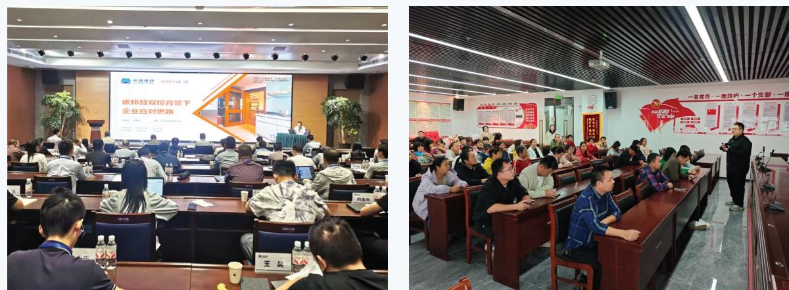  
节能环保专业人才培训

此外，公司积极依托全国“节能宣传周”“全国低碳日”等活动开展节能低碳宣传教育，组织各层级员工学习节能环保知识，倡导绿色办公与低碳生活方式，持续营造绿色低碳文化氛围，推动绿色理念融入企业日常运营与员工行为，助力公司实现绿色低碳可持续发展。

# 绿色办公

公司大力倡导绿色办公风尚，引导全体员工树立节约意识，将绿色理念转化为自觉行动，从源头降低办公环节的资源消耗与环境影响，构建集约高效、低碳环保的办公体系。

倡导无纸化办公、双面打印、“人走电断”等行为，有效降低办公能耗水平。

宣扬公务出行优先选择公共交通或新能源车辆。

全面加强垃圾分类基础设施建设，配备标准垃圾桶，建立完善收运体系；通过专业运输车辆和规范处理流程，实现各类垃圾的收集、运输和处理。

在食堂用餐区醒目处张贴分类标识，设厨余垃圾回收桶，要求员工遵守分类要求，营造绿色就餐环境。

食堂为员工提供不锈钢分格食盘、非一次性筷子、汤勺、双层不锈钢汤碗等餐具，并安排清洁消毒，可二次使用，减少一次性饭盒和筷子的使用。

  
创造绿色办公环境

# 指标与目标

2025年，公司未发生环境领域的违法违规情况。

# 污染防治攻坚

# 废水管理

为有效降低废水排放，公司及各分子公司积极采取措施，委托具备相应资质的第三方检测机构，依据《城镇污水处理厂污染物排放标准》(GB18918-2002)和《污水综合排放标准》(GB8978-1996)等规范要求，通过自有污水站，采用水解酸化、厌氧消化、生物接触氧化、絮凝沉淀和臭氧氧化等处理工艺降低污染物排放水平，并对生产运营期间的废水排放情况开展监测。

# 生活废水

悬浮物、化学需氧量、氨氮等

经简单预处理后，排入市政管网。

# 工业废水

悬浮物、化学需氧量、氨氮等

经自建污水处理站（MBR+臭氧氧化污水处理工艺）收集处理后，部分回用；另一部分排入工业园区污水处理厂深度处理后达标排放。

# 废水减排措施

# 源头减量与绿色工艺

- 优先选用耗水量低、对水环境影响小的工艺与制造技术，从源头减少废水产生。  
- 推广无VOCs粉末涂料及水性材料应用：  
。无VOCs粉末涂装工艺替代传统溶剂型涂料，减少对水环境的间接影响。  
水性材料以水为分散介质, VOCs采用RTO蓄热式燃烧的方式处理, 处理效率高达99%以上, 减少含溶剂废水产生。  
。生产过程中有机溶剂使用量少,废水量低、可生化性更好,处理难度与成本降低。

# 过程管控与循环利用

- 优化废水处理与过程管控，处理后中水回用于抽真空、出料冷却及环保喷淋等环节，2025年中水回用率约 $65\%$ ，其余废水经园区污水处理站深度处理后达标排放。  
- 通过建设冷却水循环系统，实现冷却水闭路循环利用，不外排。

# 资源协同与治理效果

\- 采用空压机余热回用系统，将压缩空气产生的余热用于加热循环水箱废水，提升污水处理系统中厌氧菌处理效率，增强整体治理效果。

# 年度目标

# 1

废水排放不得超过国家或地方规定的水污染物排放标准。

# 2

企业必须依法申领排污许可证，按许可的排放口、浓度、总量、方式排放，无证不得排污。

# 3

环境风险可控，
杜绝偷排、漏排、
超标排放、私设
暗管等违法行为，
防范水污染事故。

# 4

废水处理设施与主体工程同时设计、同时施工、同时投产使用，完好率100%、正常运行率100%。

# 5

依法公开废水排放信息，接受社会监督。编制应急预案，配备应急物资、设施，定期演练。

# 全部达成目标

2025年，公司及各分子公司严格按照国家法律法规及相关标准规范开展废水管理工作，实现废水稳定达标排放，未发生超标排放及各类水污染事故，顺利完成当年目标。

# 废气管理

公司严格遵循《中华人民共和国大气污染防治法》等法律法规要求，以《碳达峰行动方案》《推动美丽中国建设实施方案》为行动纲领，各分子公司全面落实废气管理及减排主体责任，系统推进废气污染防治能力提升。公司运营环节产生的废气污染物主要包括颗粒物（PM $_{10}$ 、PM $_{2.5}$ ）、氮氧化物（NOx）、二氧化硫（SO $_{2}$ ）、挥发性有机物（VOCs）等类别，针对运营各环节产生的多元化废气污染物，选取适配性强、运行稳定的处理技术与处理方式，实现污染物减排达标与环境风险管控的核心目标。

<table><tr><td>废气来源</td><td>主要污染因子</td><td>处理/处置方法</td></tr><tr><td rowspan="2">工艺废气</td><td>挥发性有机物、二氧化硫、氮氧化物、硫化氢</td><td>·经RTO蓄热燃烧装置处理后高空排放。·采用集气罩和风管系统,收集油漆生产过程中释放的挥发性有机气体,并通过管道输送至废气处理装置;再经过水洗、过滤棉过滤以及活性炭吸附等处理工序,确保废气达到排放标准。</td></tr><tr><td>颗粒物</td><td>·经布袋除尘器水喷淋装置处理后高空排放。·利用密封性回收装置,对粉末涂料生产过程中产生的粉尘,进行活性炭吸附处理。</td></tr><tr><td>导热锅炉废气</td><td>颗粒物、二氧化硫、氮氧化物、烟气黑度</td><td>·经收集后,由烟囱高空达标排放(锅炉燃料为天然气)。</td></tr><tr><td>污水处理站废气</td><td>氨气、硫化氢</td><td>·经RTO蓄热燃烧装置处理后高空排放。</td></tr></table>

同时，公司委托具有法定检测资质的第三方机构，严格依据《大气污染物综合排放标准》(GB 16297-1996)及地方现行排放标准要求，对废气各排放指标实施定期监测，确保污染物达标排放。

2025年, 废气主要污染物排放浓度及速率均100%符合标准限值要求。

# 治理效果

单位产值排放强度低，如VOCs<0.1吨/亿元，氮氧化物<0.3吨/亿元，远低于同行业平均水平（一般机械/电器制造行业单位产值VOCs约0.3-0.8吨/亿元，氮氧化物排放强度约0.5-1.0吨/亿元），末端治理设施运行高效。

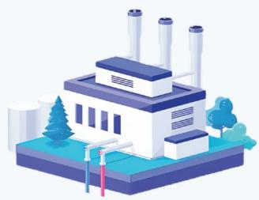

natural_image

Isometric illustration of a factory with smokestacks and surrounding greenery (no text or symbols)

# 相关荣誉

擎天材料获评东莞市涉挥发性有机物（VOC）企业分级评价定级（第六批）A级企业。

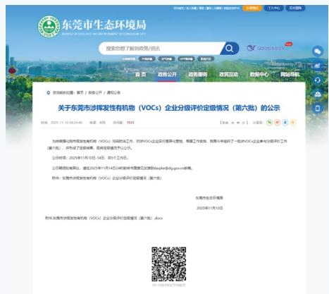

text_image

东莞市生态环境局
EVENUAN ECOLOGICAL ENVIRONMENT AND DEVELOPMENT OF ECONOMIC ESTATE
搜索您想了解到疫情/资讯
首页 政府公开 政务服务 政其互动 数据中心 网站导航
全国的调查 首页 / 媒体开 / 调记词
关于东莞市涉挥发性有机物 (VOCs) 企业分级评价定级情况 (第六批) 的公示
时间: 2021-11-10 14:30
公告: 1533
【http://www.voc.cn】
为保障涉挥发性有机物（VOCs）风险的工作，对VOCs企业实行重要申办、审慎工作协助。我将今年前的一批VOCs企业参与培训工作（推广工作），并形成了专项考核、其他专业学习公司。
公司发布：2021年11月10日-14日，2021年11月。
公司需参加培训。截至2021年11月14日对境外重要实验室提供Beijing@voc.gov等数据。
附件：东莞市科瑞发有机物 (VOCs) 企业分级评价定级意见（第7批）
东莞市生态环境局
2021年11月10日
附件：东莞市科瑞发有机物 (VOCs) 企业分级评价定级意见（第7批） .dbx

<table><tr><td>298</td><td>沙田</td><td></td><td>B</td></tr><tr><td>299</td><td>沙田</td><td></td><td>B</td></tr><tr><td>300</td><td>沙田</td><td></td><td>B</td></tr><tr><td>301</td><td>沙田</td><td>擎天材料科技有限公司</td><td>A</td></tr><tr><td>302</td><td>沙田</td><td></td><td>B</td></tr><tr><td>303</td><td>沙田</td><td></td><td>B</td></tr><tr><td>304</td><td>沙田</td><td></td><td>B</td></tr><tr><td>305</td><td>沙田</td><td></td><td>B</td></tr><tr><td>306</td><td>沙田</td><td></td><td>B</td></tr><tr><td>307</td><td>长安</td><td></td><td>B</td></tr><tr><td>308</td><td>长安</td><td></td><td>B</td></tr><tr><td>309</td><td>长安</td><td></td><td>A</td></tr><tr><td>310</td><td>长安</td><td></td><td>B</td></tr><tr><td>311</td><td>长安</td><td></td><td>B</td></tr></table>

# 废弃物管理

公司始终坚持依法经营，严格遵守《中华人民共和国固体废物污染环境防治法》等国家相关法律法规要求，实施《中央企业能源节约与生态环境保护监督管理办法》，系统明确废弃物分类管理要求、全过程管控措施及管理目标，建立健全废弃物治理体系，确保各项废弃物管理工作依法依规、有序高效推进。

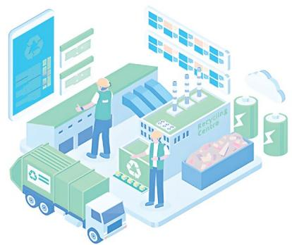

natural_image

Isometric illustration of a recycling facility with workers, trucks, and battery storage (no text or symbols)

# 生活垃圾

废纸张、餐盒

分类收集后由市政环卫清运处置。

# 一般工业固废

废包材、废塑料制品、废纸箱等

回收处置。

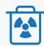

# 危险废弃物

废无机溶剂、废有机溶剂、废机油润滑油、废旧包装桶等

规范贮存、危险废弃物标志标识，建立危险废弃物清单及台账，并委托有资质的单位统一回收处理。

# 有害废弃物减量化措施

优化聚酯树脂生产工艺，采用环保催化剂替代传统含重金属锡的催化剂，从源头消除“含锡废催化剂”。

开发 “低温固化聚酯树脂”（固化温度从200°C降至160°C以下），减少生产过程中因高温副反应产生的废溶剂、废树脂等危险废弃物。

在部分行业推动“漆改粉”“油改水”等技术落地，从源头减少VOCs废溶剂产生。

# 年度目标

分类贮存，严禁混存混排。

依法公开废弃物处置信息，接受社会监督，编制应急预案，配备应急物资，定期演练。

优先综合利用, 提高固废综合利用率, 无法利用的必须委托

有资质的第三方公司安全、合规、达标处置，杜绝污染风险，建立台账及转移联单，严禁擅自倾倒、堆放、丢弃、遗撒、私设暗管、非法转移。

# 全部达成目标

2025年，中国电研及各分子公司严格按照国家法律法规及相关标准规范开展废弃物管理工作，危险废物合规处理率达到100%，未发生危险废物污染事故，圆满完成年度目标。

# 资源合理利用

# 能源利用

# 治理

公司严格遵守《中华人民共和国节约能源法》等法律法规，持续完善能源管理体系建设，实施《中央企业能源节约与生态环境保护监督管理办法》等规定，设立碳达峰碳中和与节能环保工作领导小组和办公室，建立健全能源节约和生态环保责任体系，制定能源管理目标。碳达峰碳中和与节能环保工作办公室实施季度报告制度，对经营过程中的能源消耗进行实时监测与科学管理。

2025年，擎天材料顺利通过ISO 50001能源管理体系认证。

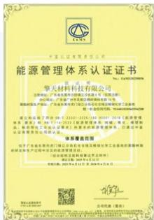  
擎天材料  
能源管理体系认证证书

# 战略

公司将能源战略与经营发展、生态保护、社会责任深度融合，科学设立中长期发展目标，着力推动绿色技术创新，推进清洁生产、能源清洁低碳安全高效利用，持续提升资源利用效率，强化资源总量管理、科学配置、全面节约、循环利用。

# 影响、风险和机遇管理

公司能源消耗主要以外购电力、天然气、汽油、柴油等常规能源为主，同时积极拓展太阳能等可再生能源应用场景，构建多元化能源供给与消耗体系。公司始终坚持绿色低碳的发展理念，以提升能源利用效率为目标，持续完善能源管理体系建设，深入推进节能技术改造与工艺优化，整体用能效率与管理水平持续提升。

# 能源利用措施

# 清洁能源应用

大力推进清洁能源替代与可再生能源开发利用，积极布局分布式光伏等绿色能源项目。

# 设备节能降耗

针对大功率电器和能耗高的环节，强化对压力、温度和流量等实时监控，降低吨产品的耗电量、耗气量。

# 节能宣传教育

高度重视节能减排宣传教育与全员意识提升，将绿色低碳理念融入企业文化建设。

# 指标与目标

公司围绕能源高效利用目标，全面梳理生产运营各环节能源消耗底数，聚焦提升能源利用效率提升，积极探索多元化优化路径，通过技术革新、流程优化等系列举措，重构能源管理流程、精简冗余环节，实现能源管控全链条高效协同。

2025年，公司能源消耗总量12,360.75吨标准煤，光伏发电量为295.68万千瓦时（其中自用265.80万千瓦时）。

# 水资源利用

公司严格遵守《中华人民共和国水法》等法律法规及《地下水管理条例》等专项管理规定，持续强化水资源管理，扎实推进节水工作落地见效。为统筹推进水资源节约、高效利用与保护工作。同时，公司全面排查各业务板块用水区域分布，重点排查因区域水资源短缺、政策管控严格等带来的各类用水风险，从水资源风险管控来看，公司及各分子公司没有位于水资源取用的高风险地区。

公司将处理后的中水用于聚酯树脂合成的抽真空、出料冷却以及环保设备中对粉尘的喷淋，减少市政供水的使用，持续提高水资源利用率。

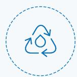

擎天材料将去离子水制备过程中产生的废水和污水处理站处理后的水回收用于设备冷却、树脂合成冷却、设备清洗等环节，提高水资源利用效率。

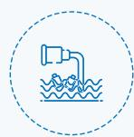

处理后的中水用于聚酯树脂合成的抽真空、出料冷却以及环保设备中对粉尘的喷淋，减少市政供水的使用，提高了水资源利用率。

2025年

重复用水消耗量占比

27.80%

# 循环经济

公司严格遵循《中华人民共和国循环经济促进法》，通过优化生产流程、管控资源调配、赋能行业发展，将循环经济理念融入企业运营，推动可持续发展。2025年，为规范纸箱、木箱、木托、塑料托等包装物料的回收利用管理，擎天实业制定《纸箱、木箱、木托的回收利用管理规定》，保障循环利用工作有序开展。

# 循环经济举措

# 包装材料

- 产品运输环节，采用槽车运输方式，减少材料类产品的包装使用。  
- 粉末涂料生产环节，引入自动称料装置，精准控制包装用料。  
- 产品包装环节，选用品质保持良好的旧纸箱进行二次利用。

# 生产材料

\- 粉柜排放的超细粉用作二次材料的混合成分用于再生产。

# 国际标准

\- 主导牵头制定IEC TS 63457-1:2025国际标准《家用和类似用途电器——维修、翻新、再造及后续安全检测——第1部分：通用要求》，推动行业回收体系优化升级，显著提升废旧家电拆解再生利用率。

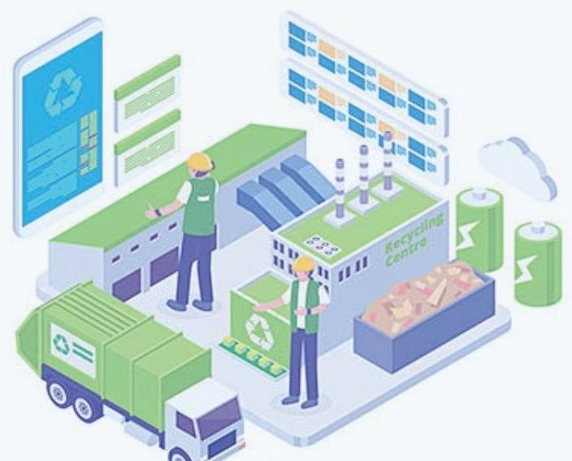

natural_image

Illustration of a recycling facility with workers, trucks, and waste bins (no text or symbols)

# 注重生态保护

公司严格遵循《生物多样性司法保护》等文件要求，明确各分子公司生产经营活动应严格执行生态保护措施，减少对生态环境扰动，严格遵守国家和地方政府相关生态敏感区专项管理规定。公司不断提升生态保护工作水平，持续深化绿色发展举措，以更坚定的决心、更务实的行动，守护生态家园，为维护全球生物多样性、实现可持续发展贡献企业力量。

# 生物多样性保护措施

# 项目选址

- 新建项目应优先避让生态敏感区，确因客观条件无法避让的，应当开展专项论证，并依法取得主管部门颁发的穿越或跨越行政许可。  
- 未按要求取得允许穿（跨）越许可时，项目不得开工建设。

# 工程建设

- 积极开展厂区绿化工作，科学规划绿植布局。  
- 定期维护绿化区域，提升植被覆盖率，为生物提供栖息空间，促进生态平衡。  
- 明确各分子公司不得在森林覆盖区、自然保护区、生态栖息地开展运营活动。  
- 严格监测和管理污染物和废弃物排放情况，避免排放对周围自然生态造成负面影响。

# 生产运营

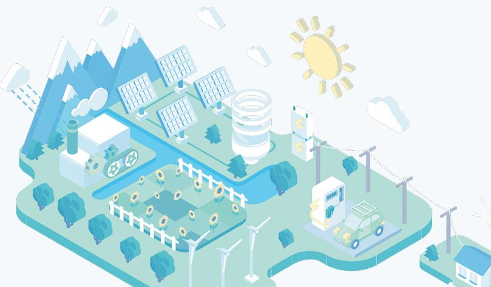

natural_image

Isometric illustration of a renewable energy system with solar panels, wind turbines, and power generation infrastructure (no text or symbols)

# 社会篇

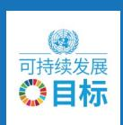

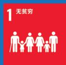

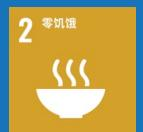

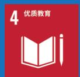

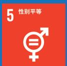

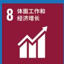

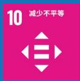

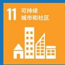

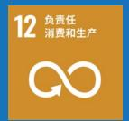

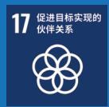

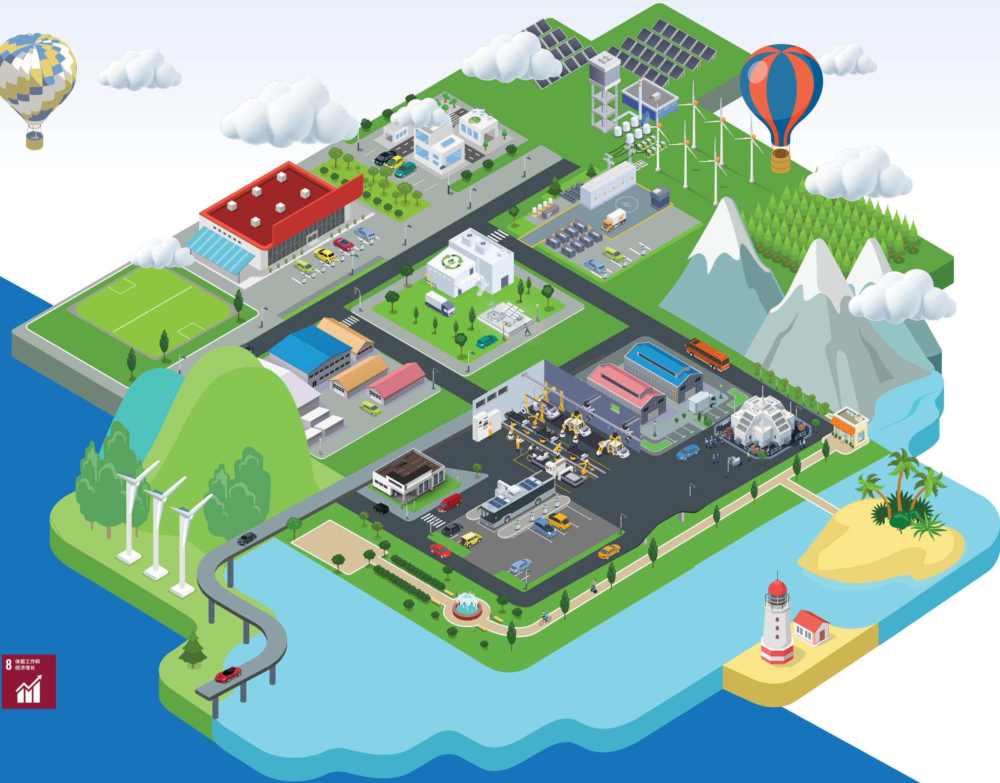

flowchart

This image displays an isometric map of an urban development zone, illustrating the ecosystem and infrastructure layout of a smart city with various transportation and energy infrastructure.

# 聚焦人才赋能

# 员工雇佣

公司严格遵守《中华人民共和国劳动法》《中华人民共和国劳动合同法》等相关法律法规，制定《劳动用工管理办法》《人才引进管理办法》《招聘管理办法》《员工试用期、见习期管理办法》等内部人力资源相关管理制度，全方位尊重和保障员工合法权益，确保劳动用工管理的规范化、标准化。

公司坚决杜绝基于性别、民族、年龄、学历、宗教信仰、残疾状况等各类因素的歧视行为，以平等、公正、合规为原则有序开展各项招聘工作。同时，公司主动吸纳高校毕业生、少数民族群体、脱贫人口、残障人士、退役军人等重点就业群体，为其提供就业岗位及专业培训支持，切实履行中央企业在促进就业、稳定就业大局中的责任与担当。

# 人才吸纳机制

# 高端人才引进

加大高端人才引进力度, 持续完善校企联合培养工程硕博士模式, 积极推进博士后科研工作站建设, 筑牢高端人才储备基础。

# 招聘渠道建设

形成“线上+线下”“社会+校园”的多维引才网络。线上方面，与主流招聘平台建立战略合作，同时开发专属招聘系统，实现人才精准匹配；线下方面，积极参与重点高校招聘会、行业高端人才交流会，建立校企合作基地。

公司通过高校硕博精英夏令营等方式展示企业形象、前置招聘环节、吸引优秀人才、扩大公司校招影响力，推动高校人才供给与公司战略需求有效匹配，强化战略人才储备。

2025年，公司新增员工245人，其中新增“高潜”应届生120名，同比增长40%，其中“双一流”占比78.3%，科技高潜人才占比85.83%，研究生学历占比32.5%，招聘应届生层次持续提升。

# 高校硕博精英夏令营

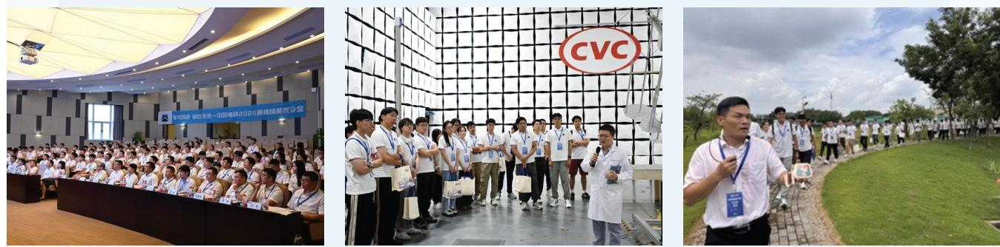

公司明确禁止就业歧视、强制劳动及使用童工，依托人力资源信息系统实现全级次数据穿透式管理与用工全流程留痕，结合定期合规审计与内部自纠自查强化监督，确保薪酬、社保、合同、劳动用工等全环节合法合规。

# 2025年

未发生重大劳动争议与仲裁的情况。

未发生使用童工或从使用童工中受益的情况。

未发生强迫劳动、强制劳动等情况。

# 员工权益

# 薪酬与福利

公司制定《职工福利费用管理办法》等内部规章制度，持续完善公司的薪酬福利体系。实行工资总额年度管理，按年度进行预算和清算。在薪酬分配上，严格执行上级关于加强薪酬管理的有关要求，坚持“规范、激励、倾斜”导向，既有激励又有约束，既突出绩效又兼顾公平。公司以战略目标完成情况为重要依据，结合员工岗位特点、个人能力等关键因素，为员工匹配对应薪酬水平，构建以岗位价值、个人绩效、综合能力为标尺的薪酬体系，确保员工薪酬既与个人价值高度契合，又紧密贴合公司战略导向与业务发展需求。公司建立规范透明的绩效管理沟通机制，严格实施全员绩效考核，强化结果应用，考核结果与薪酬分配、岗位调整刚性挂钩，员工薪酬与经济效益同向联动、与绩效考核结果直接挂钩，发挥薪酬的正向激励作用。针对绩效评价结果，公司设立申诉与复核渠道，员工如对考核结果存在异议，可按规定提出复议申请。

同时，公司致力于完善员工福利体系，保障员工工作与休假时间，切实保护员工权益。

# 福利保障

# 基本保障

- 按时足额为员工缴纳社会保险、住房公积金。  
- 为在职员工购买企业年金、人身意外与交通意外补充保险。

# 休假保障

\- 依法享受国家及省市规定的各类法定带薪假期，如年休假、婚假、丧假、产假等。

# 住宿保障

\- 积极向政府申请公租房资源，满足职工住宿需求。

# 生活保障

\- 升级食堂软硬件设施、设备，不定期推出创新菜式，建立美食分享群，通过多样化措施提升食堂整体服务能力。

# 其他保障

\- 发放各类福利,如高温津贴、清凉饮品、生日及电影兑换券、传统节日慰问品等。

# 民主沟通

公司坚持完善职工代表大会制度，按时规范召开职代会，定期开展厂务公开，切实保障员工的知情权、参与权、表达权、监督权。同时，公司鼓励员工和公司双方进行开放、坦诚的沟通与交流，持续完善民主沟通方式，通过设立员工意见箱、热线电话，开展民主调研、座谈会、职工代表大会，组织考察谈话、员工满意度调研、干部提任和申报奖励公示等多种反馈渠道，及时反映员工沟通诉求与反馈意见，做到及时响应、迅速处理。2025年按照监事会改革事项要求，完成了撤销职工监事职务及选举职工代表董事事项，进一步推动完善公司法人治理结构，维护职工合法权益。

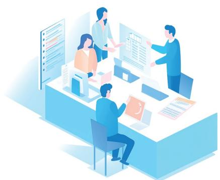

natural_image

Illustration of three people collaborating at a desk with documents and charts (no text or symbols visible)

# 员工满意度

公司严格对标国机集团相关要求，将思想动态摸排与员工满意度调查有机结合，确保全面了解员工在工作体验、职业发展、管理服务等方面的真实想法。2025年，公司开展员工满意度调查，满意度达96%，其中员工在团队氛围、工作积极性、归属感方面满意度较高。同时，公司基于调研结果与满意度分析，坚持问题导向与结果导向，制定有针对性的改善提升举措，并全程跟踪整改落实情况，不断增强员工的归属感与幸福感。

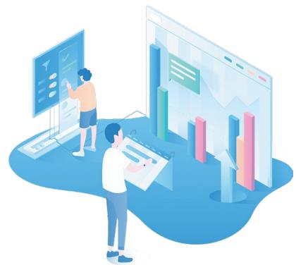

natural_image

Illustration of two people interacting with large digital displays and charts (no text or symbols)

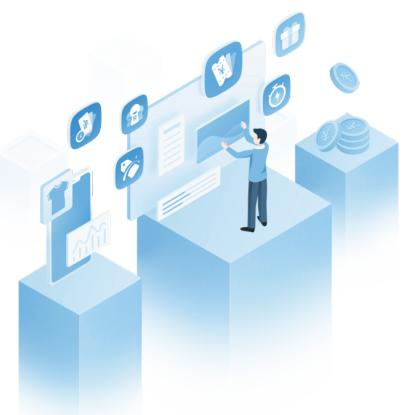

natural_image

Illustration of a person interacting with digital interface elements on a podium (no text or symbols present)

# 员工关怀

公司旨在通过全方位的关爱与支持，满足员工在工作与生活中的多元需求，激发员工的内在动力与创造力，使员工感受到企业的尊重与重视，从而增强对企业的归属感和认同感，实现员工个人价值与企业目标的有机统一，为企业的可持续发展奠定坚实的人才基础。

# 员工帮扶方面

公司积极协助职工及时申报国机集团爱心基金帮扶、省直机关工会的重疾帮扶、困难帮扶，共帮扶职工17人，获帮扶慰问金共计22.8万元，有效地帮助困难职工解决燃眉之急。2025年，公司开展“夏送清凉”慰问、“两热”疫情防控及消杀工作等，积极主动表达公司关怀。

# 员工活动方面

公司秉承“健康、快乐、团结、进步”理念，常态化开展春节游园、趣味运动会、球类比赛、亲子活动、健康讲座及单身联谊等文体活动。充分发挥各级文体协会作用，创新开展“小微活动”，有效提升企业凝聚力和员工归属感。

# 传统节日活动

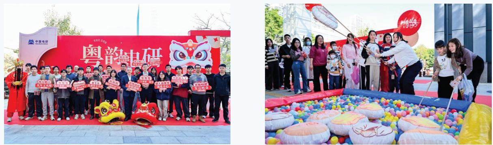  
新春游园会

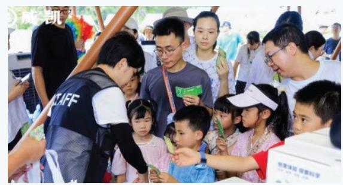

text_image

Group photo of adults and children gathered around a table, with visible Chinese text on signs and a 'Staff' vest in the background.

亲子家庭日活动

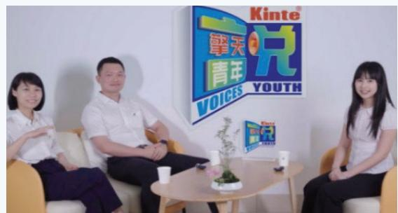

text_image

擎天
青年
Kinte
VOICES YOUTH

“擎天青年说”系列专栏

# 体育活动

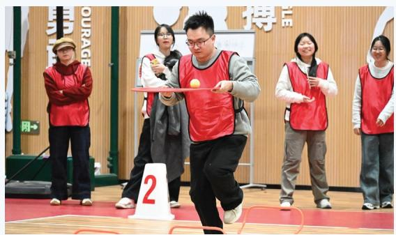

natural_image

Group of people in red vests participating in a table tennis game, one player hitting the ball while others observe (no visible text or symbols)

趣味运动会

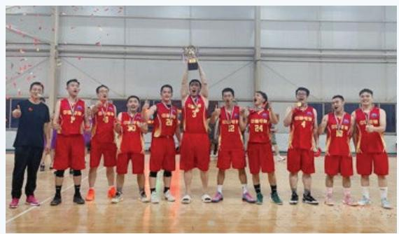

natural_image

Group photo of basketball players in red uniforms celebrating on a court, with confetti falling (no visible text or symbols)

篮球比赛

# 其他特色活动

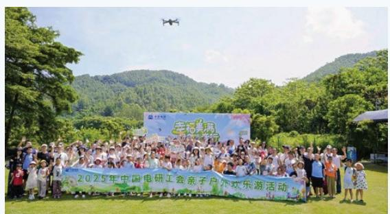

text_image

2025年中国电研工会亲子户外欢乐游活动

亲子欢乐游活动

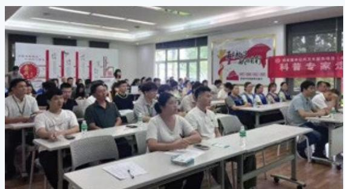

text_image

Group of people seated at desks in a conference room with visible banners and posters in the background

健康知识讲座

# 员工培训及发展

# 员工发展与晋升

公司以工作业绩与岗位技术水平为鲜明导向，构建科学完善的人才评价考核机制，持续深化制度体系建设，为人才培养、选拔与发展提供坚实保障。为进一步优化人才管理模式，公司制定《高层次技术专家、技术职务人员管理办法》，修订《领导人员管理办法》，落实好《青年人才管理办法》，逐步完善分序列、分层级的差异化人才晋升与管理体系，实现人才管理的规范化、精准化。同时，为持续深化公司三项制度改革，推进市场化用工，提高全员劳动生产率，2025年公司组织开展员工内部流动工作，统筹调配公司内部人力资源，促进员工内部流动和职业发展，进一步提升公司整体运营效率与竞争力。

公司建立管理序列与专业序列并行的双通道晋升机制，员工根据个人职业评估结果、结合组织人才需求，在管理型人才通道或专业技术人才通道中进行自主选择，保障员工有清晰的职业发展路径。

# 技术序列

青年高潜科技专家

↓

高级专家

↓

中国电研首席专家

↓

集团首席专家

# 管理序列

青年高潜管理专家

↓

内设机构负责人

↓

中层管理人员

↓

中国电研高管

# 员工培训

公司依据《员工教育培训管理办法》等内部制度，依托科研与业务平台，积极与知名高校及行业龙头企业开展合作，持续健全多层次、系统化的职业培训体系。同时，公司结合战略发展与业务需求制定年度教育培训计划，分层分类实施面向管理人才、科技人才和技能人才的立体化培训体系，不断提升员工专业能力与综合素质。

2025全年全面完成年度教育培训计划各项主要培训项目，重点开展了党员干部教育培训、新提任干部培训班、AI应用系列培训、青马工程、新员工及见习生导师培养，以及内外部各类专题专项培训。

# 立体化培训体系

# 管理人才

坚持政治引领, 提升履职能力,
坚持场景化教学, 加强闭环管理。

# 科技人才

开展科技管理办法宣贯、数字化转型、人工智能、“双碳”研究、智能家电技术讲座，并通过完善内部工程师职称评审体系、积极申报科技人才项目等，为科研人员发展提供有力支撑。

# 技能人才

结合岗位技能要求, 开展实操技术、理论知识、从业资格专项学习、生产流程及工艺、质量管理等培训, 定期开展技能大赛, 采用师父带徒弟、专项技术培训等多种模式, 切实提升人员技能水平。

2025年，公司通过开展多场次人工智能主题讲座、AI应用创新大赛，组织国际化人才训练营等方式，开阔员工视野，培养新兴领域、国际化、复合型人才。

# 案例

# 公司组织开展AI专项提升培训及首届AI创新应用大赛

公司举办AI专项提升培训，开展首届AI创新应用大赛，44份项目提案书进入大赛初评，30支队伍通过初评参加项目现场汇报答辩，最终产生一系列具备应用价值和开发潜能的AI项目，有效深化人工智能技术与科研、检测、装备全链条融合。

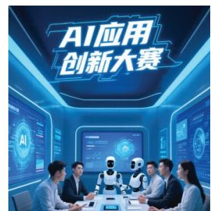

text_image

AI应用
创新大赛

# 以赛促训

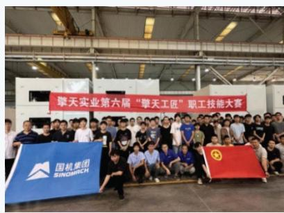

text_image

擎天实业第六届“擎天工匠”职工技能大赛
国航集团
SINGHAI
CHINA

“擎天工匠”杯职工技能大赛

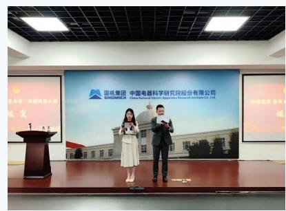

text_image

国机集团 中国电器科学研究院股份有限公司
CHINA POWER INNOVATION AND TECHNOLOGY CO., LTD.

英语风采大赛

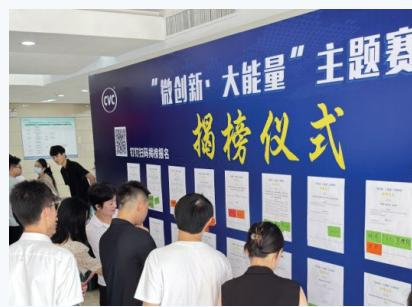

text_image

“微创新·大能量”主题赛
揭榜仪式

“微创新·大能量”主题赛事

# 人才培养项目

# 新提任干部培养项目

通过系统的理论学习，学员思考撰写管理实践案例精选51篇，涵盖团队文化塑造等二十余类典型管理场景，由此编制案例手册。

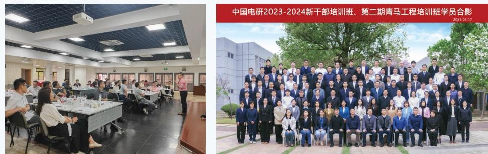

# 青马工程

举办两期青马工程培训班暨高潜人才培训班，累计107名青年骨干员工参加学习，提升学员政治素养、综合素质以及解决问题的能力。

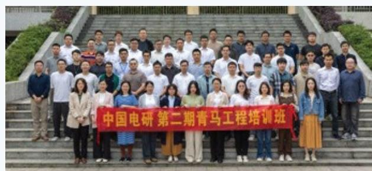

text_image

中国电研 第二期青马工程培训班

# 新员工培养

持续对应届毕业生滚动开展见习期培养及跟踪。

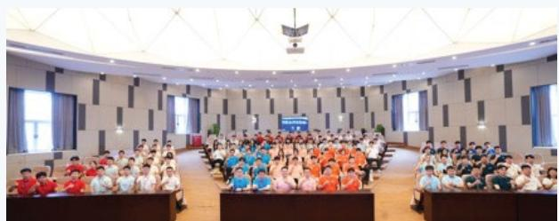

natural_image

Interior view of a large conference hall with seated attendees in orange and blue uniforms (no visible text or signage)

# 导师培养

组织两期导师培训工作坊,提高带教沟通技能,强化导师综合素养。

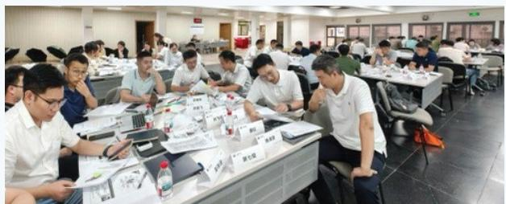

text_image

Group of people seated at desks in a meeting room, reviewing documents and laptops, with visible signage on the table.

# 职业健康与安全

# 职业健康

公司高度重视员工职业健康，严格执行《中华人民共和国职业病防治法》等法律法规要求，截至2025年末，中国电研、擎天实业及擎天材料均获得ISO 45001职业健康安全管理体系认证。

职业健康安全管理体系认证证书  
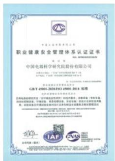

text_image

中国证券登记结算有限责任公司
职业健康安全管理体系认证证书
CNRC 01000234789
中国电子科学研究院股份有限公司
CZT 430012637801 430012637801 标准
国务院国有资产监督管理委员会
国务院国有资产监督管理委员会
国家税务总局北京市海淀区税务局
国家税务总局北京市海淀区税务局
国家税务总局北京市海淀区税务局
国家税务总局北京市海淀区税务局
国家税务总局北京市海淀区税务局
国家税务总局北京市海淀区税务局
国家税务总局北京市海淀区税务局
国家税务总局北京市海淀区税务局
国家税务总局北京市海淀区税务局
国家税务总局北京市海淀区税务局
国家税务总局北京市海淀区税务局
国家税务总局北京市海淀区税务局
国家税务总局北京市海淀区税务局
国家税务总局北京市海淀区税务局
国家税务总局北京市海淀区税务局
国家税务总局北京市海淀区税务局
国家税务总局北京市海淀区税务局
国家税务总局北京海淀区税务局
国家税务总局北京市海淀区税务局
国家税务总局北京市海淀区税务局
国家税务总局北京市海淀区税务局
国家税务总局北京市海淀区税务局
国家税务总局北京市海淀区税务局
国家税务总局北京市海淀区税务局
国家税务总局北京市海淀区税务局
国家税务总局北京市海淀区税务局
国家税务总局北京市海淀区税务局
国家税务总局北京市海淀区税务局
国家税务总局北京市海淀区税务局
国家税务总局北京市海淀区税务局
国家税务总局北京市海淀区税务局
国家税务总局北京市海淀区税务局
国家税务总局北京市海淀区税务局
国家税务总局北京市海淀区税务局
中国证券登记结算有限责任公司
TIAF
CNAS

中国电研

职业健康安全管理体系认证证书  
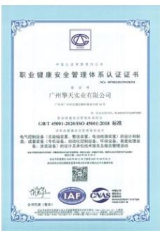

text_image

中证证券有限责任公司
职业健康安全管理体系认证证书
NO. 00080100193N
广州擎天实业有限公司
广州广汇汽车股份有限公司
CABT 45001-2020/2030 45001-2018 标准
电气控制设备（含制动泵、制动泵、电动机等）、通信和制造、成套设备（专用设备）、传动控制设备、环保设备、真空原理仪表、仪器仪表、配电开关、配电开关及控制设备的生产与销售
中国铁路物资集团有限公司
AIF
PAS

擎天实业

职业健康安全管理体系认证证书  
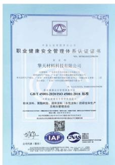

seal

聚天材料科技有限公司
职业健康安全管理体系认证证书
GB/T 45001-2020ISO 45001-2018 标准
中华人民共和国安全生产监督管理委员会
IAAF CXAS

擎天材料

公司按照相关法律法规要求，组织接触职业危害因素的员工开展职业健康体检，每年对在岗相关员工进行定期体检，员工上岗前、离岗前均开展专项体检。同时，公司开展对员工的职业健康相关培训，全面提升员工对职业健康认知、自我保护意识及应急处置能力。

# 职业健康培训情况

# 职业健康科普

特邀职业病防治专家开展大讲堂，讲解职业病概要、噪声与电焊烟尘危害预防等核心知识。

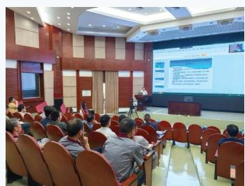

text_image

Conference hall scene with audience facing a presentation screen displaying slide text and diagrams

# 职业健康防护

公司采购并配置AED急救设备，同步开展心肺复苏与AED使用培训；同时，围绕职业病定义类型、防护措施、应急处理及防护用品佩戴等内容组织专项培训，涉及职业健康防护安全相关岗位工作人员培训实现全覆盖。

# 职业健康相关竞赛

通过内部知识竞赛以赛促学。

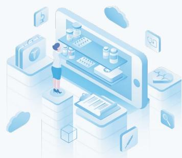

natural_image

Illustration of a person interacting with a large smartphone displaying data, surrounded by cloud and service icons (no text or symbols)

# 擎天材料职业健康防护措施

擎天材料建立健全职业健康管理体系，从制度建设、风险防控到工作环境，全方位保障员工身心健康，不断改进和完善职业健康管理工作，为员工的健康和幸福保驾护航。

每年定期委托具备相应资质的第三方机构，对各生产作业场所开展职业健康危害因素检测。

在工作场所醒目位置设置职业病危害警示标识及说明，并设立职业卫生公告栏。

严格按照相关规定为员工配备劳动保护用品，明确其配置标准、发放流程及报废要求。

2025年，公司持续开展职业病防治工作，向员工职业病防治达到中等发达国家水平的目标迈进，全年未有新增病例。

# 安全生产

# 治理

公司严格遵循《中华人民共和国安全生产法》等法律法规要求，持续完善安全生产管理体系，新增或修订《安全生产责任制度（第五版）》等5项安全生产管理制度，以安全生产委员会为抓手，织密安全制度保障网，护航公司安全生产高质量发展。同时，公司要求各分子公司按照从业人员人数和危险程度，设置安全办、安全工作组和工作小组，构建科学、高效、全面的安全生产组织架构，确保各项安全措施得到有效执行。

# 安全生产组织架构

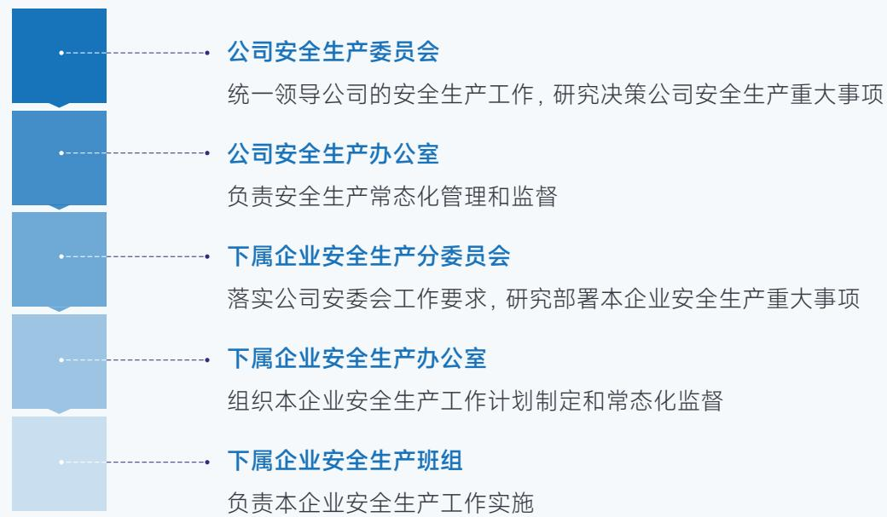

flowchart

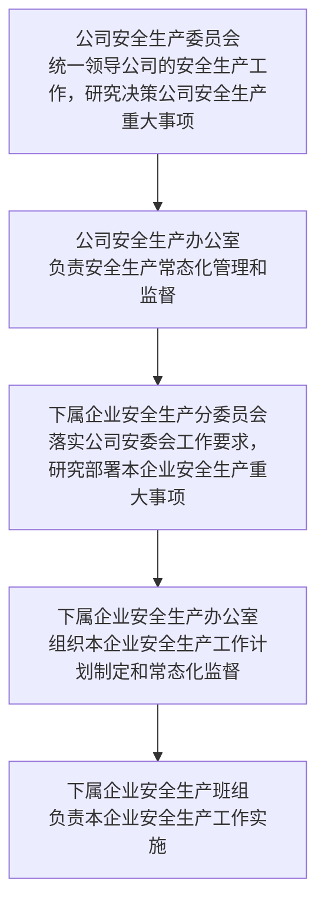
```mermaid
graph TD
  A["公司安全生产委员会\n统一领导公司的安全生产工作，研究决策公司安全生产重大事项"] --> B["公司安全生产办公室\n负责安全生产常态化管理和监督"]
  B --> C["下属企业安全生产分委员会\n落实公司安委会工作要求，研究部署本企业安全生产重大事项"]
  C --> D["下属企业安全生产办公室\n组织本企业安全生产工作计划制定和常态化监督"]
  D --> E["下属企业安全生产班组\n负责本企业安全生产工作实施"]
```

# 战略

公司按照“管行业必须管安全、管业务必须管安全、管生产经营必须管安全”的原则，规定公司主要负责人是安全生产检查和隐患排查的第一责任人，由职能部门组织公司级安全生产大检查，各分子公司组织各层级的安全生产检查工作及隐患排查治理工作。

# 影响、风险和机遇管理

公司切实落实安全责任, 要求全体员工每年签订《安全生产责任书》, 层层落实安全生产目标与责任, 并持续完善风险分级管控和隐患排查治理双重预防工作机制。

# 安全风险分级管控与隐患排查治理

# 机制建设

- 持续完善风险分级管控与隐患排查治理“双重预防”工作机制。  
- 聚焦重点区域、重点企业、重点环节和重点岗位，明确专人专责，推动危险区域与危险源管控措施落实。  
- 推动安全管理关口前移与源头治理，构建纵深防御体系，降低安全生产风险，防范事故发生。

# 专项排查

\- 组织各分子公司开展建筑保温材料、高危作业场所安全警示标识排查、重点劳动防护用品安全隐患、出租场所安全评价等多项专项排查治理工作。

# 执行保障

- 年初制定年度安全生产检查与隐患排查计划及实施方案，明确职责分工。  
- 构建隐患排查三级管控体系，明确各层级安全检查责任分工、频次标准与考核要求。  
- 强化责任链条与闭环整改，及时化解风险隐患，从源头防范安全事故发生。

公司秉持“以人为本、依法依规、贴合实际、注重实效”的核心原则，建立应急预案动态修订与评审机制、强化应急队伍专业化建设、开展常态化培训，配齐配强应急救援物资装备，并建立突发事件信息报告机制、突发事件舆情监测和信息披露机制，切实防范安全生产风险。

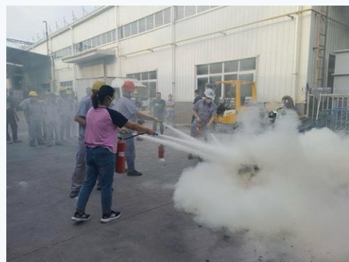

natural_image

Firefighters extinguishing a large smoke in an industrial facility, with workers and equipment visible (no text or symbols)

开展消防应急演练

境外安全是公司安全生产的重要方面，公司秉持“危地不往、乱地不去”的原则，系统推进境外项目安全管控、组织开展境外安全培训。针对境外高风险地区项目制定专项应急预案，并对所有境外项目建立每两周一次的视频监督检查机制。

公司持续开展常态化安全技能培训与事故警示教育，健全公司、部门（车间）、岗位（班组）三级安全教育培训体系，创新采用技能竞赛、知识竞赛等多样化形式，提升员工安全意识与操作能力，全面培育安全文化。

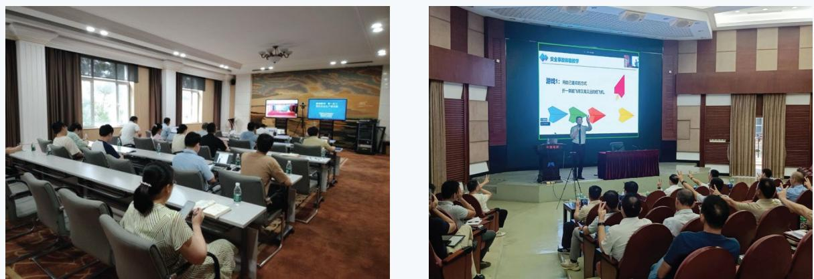  
开展安全培训

在事故管理方面，公司建立生产安全事故报告与调查处理制度，严格落实“四不放过”原则，系统开展事故原因分析、责任追究与整改提升，对事故责任单位和相关责任人进行处罚，并建立事故通报、挂牌督办与警示教育机制，确保调查处理与整改落实形成闭环。

同时，公司持续完善员工安全保障体系，为员工统一购买团体意外伤害保险，覆盖全球24小时意外伤害、事故及危险作业等风险；为出境外协人员配备境外安全保险，并为相关业务板块员工投保安全生产责任保险，多维度提升员工工作与生活的安全保障水平。

# 指标与目标

公司围绕生产经营过程中可能面临的各类突发事件，通过常态化应急演练和安全培训，提升全体员工安全素养与应急处置能力，以实际行动践行安全生产责任，以扎实的安全管理工作为企业稳健运营、行业良性发展提供坚实保障。

# 目标

# 进展

完善安全生产责任体系, 持续优化安全管理体制机制。

\- 全面落实安全生产责任制, 全员逐级签订《安全生产责任书》, 健全层层负责的责任管理体系。

进一步提升安全生产绩效，提升重大安全生产风险防范能力。

\- 强化安全生产能力建设, 全年安全生产投入合计792.32万元。

\- 从严防范重大安全风险, 持续提升整体安全生产管控绩效。全年开展安全隐患排查512次, 发现问题全部完成整改闭环。

加强安全文化建设, 不断提升全员安全素质。

\- 常态化开展全员安全教育培训，全面夯实全员安全素养，培育浓厚安全文化氛围。累计培训12,878人次，培训覆盖率达 $100\%$ 。

\- 持有安全主要负责人资格证66人、安全管理人员证书183人，新增注册安全工程师6名，同比增长40%。

完善应急预案体系, 进一步增强应急能力。

\- 持续完善应急预案体系，全面提升突发事件应急处置能力。

\- 组织开展综合应急演练、专项应急演练和现场处置方案合计74次，演练频次同比提升 $7.25\%$

不发生较大级以上生产安全主体责任事故, 不发生造成恶劣影响的群体性突发事件。

\- 未发生重伤及以上生产安全事故，境外安全事故“零发生”。

\- 未发生群体性突发事件。

# 品质护航发展

# 产品质量

# 治理

公司构建系统化质量管理体系，搭建由质量管理相关部门牵头统筹、覆盖全业务领域的质量管理架构，形成“公司-子公司-业务单元”多层级质量管控体系，并要求各分子公司建立权责清晰的质量安全责任体系。截至2025年末，公司四大业务板块（质量技术服务、电气装备、成套装备、环保涂料及树脂）均已取得与业务发展相适配的ISO、IATF、ISO/IEC等多项质量管理体系认证。

质量管理体系认证情况

<table><tr><td>业务领域</td><td>ISO9001</td><td>IATF16949</td><td>ISO/IEC17025</td><td>ISO/IEC17020</td><td>ISO/IEC17065</td><td>ISO/IEC17021</td><td>ISO/IEC17043</td><td>ISO14065:2013</td></tr><tr><td>电气装备领域</td><td></td><td></td><td></td><td></td><td></td><td></td><td></td><td></td></tr><tr><td>成套装备领域</td><td></td><td></td><td></td><td></td><td></td><td></td><td></td><td></td></tr><tr><td>环保涂料及树脂领域</td><td></td><td></td><td></td><td></td><td></td><td></td><td></td><td></td></tr><tr><td>质量技术服务领域</td><td></td><td></td><td></td><td></td><td></td><td></td><td></td><td></td></tr></table>

# 战略

公司主动识别质量管理潜在风险，不断健全完善全业务链条质量风险管理流程，构建预防为主、持续改进的质量管理工作机制，推动质量管理重心由事后处置向事前预防转变。通过对生产经营全过程的动态监控与数据分析，精准预判、及时处置潜在质量风险，从源头防范质量问题发生。坚持问题导向、系统提升，持续总结经验、优化流程方法，推动质量管理水平稳步提升。

公司扎实开展内部审核与外部审核，纵深推进各类专项检查，聚焦合格供应商管理、质量成本管控、关键质量控制点、质量风险防控、质量问题闭环管理及质量管理制度建设等关键领域，全面排查短板弱项、狠抓问题整改落实，以全流程、全要素管控确保质量管理体系高效运行，坚决守住质量安全底线，严防质量事故发生。

# 影响、风险和机遇管理

为进一步规范质量管理体系，公司紧密结合制造业、质量技术服务两大业务领域的专业特性与运营特点，制定并实施差异化、针对性的质量提升模型，持续优化产品质量与服务能力，全面提升品牌信赖度。

# 制造业领域

建立覆盖产品全生命周期的质量管理体系，通过数字化手段实现从原材料采购到生产制造、物流配送的全流程质量追溯和管控。

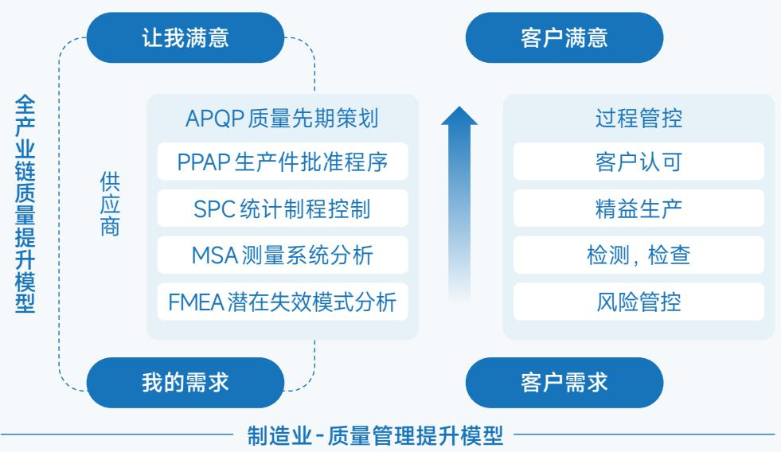

flowchart

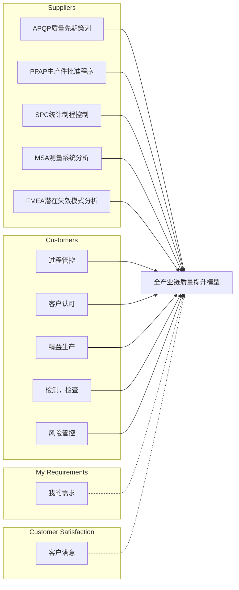
```mermaid
graph LR
  subgraph Suppliers
    A["APQP质量先期策划"]
    B["PPAP生产件批准程序"]
    C["SPC统计制程控制"]
    D["MSA测量系统分析"]
    E["FMEA潜在失效模式分析"]
  end

  subgraph Customers
    F["过程管控"]
    G["客户认可"]
    H["精益生产"]
    I["检测，检查"]
    J["风险管控"]
  end

  subgraph My Requirements
    K["我的需求"]
  end

  subgraph Customer Satisfaction
    L["客户满意"]
  end

  M["全产业链质量提升模型"]

  A --> M
  B --> M
  C --> M
  D --> M
  E --> M
  F --> M
  G --> M
  H --> M
  I --> M
  J --> M
  K -.-> M
  L -.-> M
```

# 质量技术服务领域

创新构建在双轮驱动下，由精益理念推动的“四全、五融合精益质量管理模式”(3.0版)：即以“四全”“五融合”为双轮驱动，实施全方位、全过程、全体系、全员参与的质量管理，推动技术创新、标准升级、质量提升、品牌建设和数字化转型的深度融合。

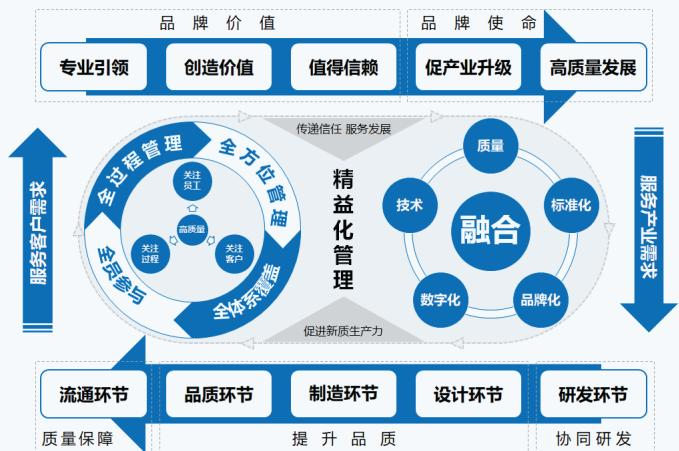

flowchart

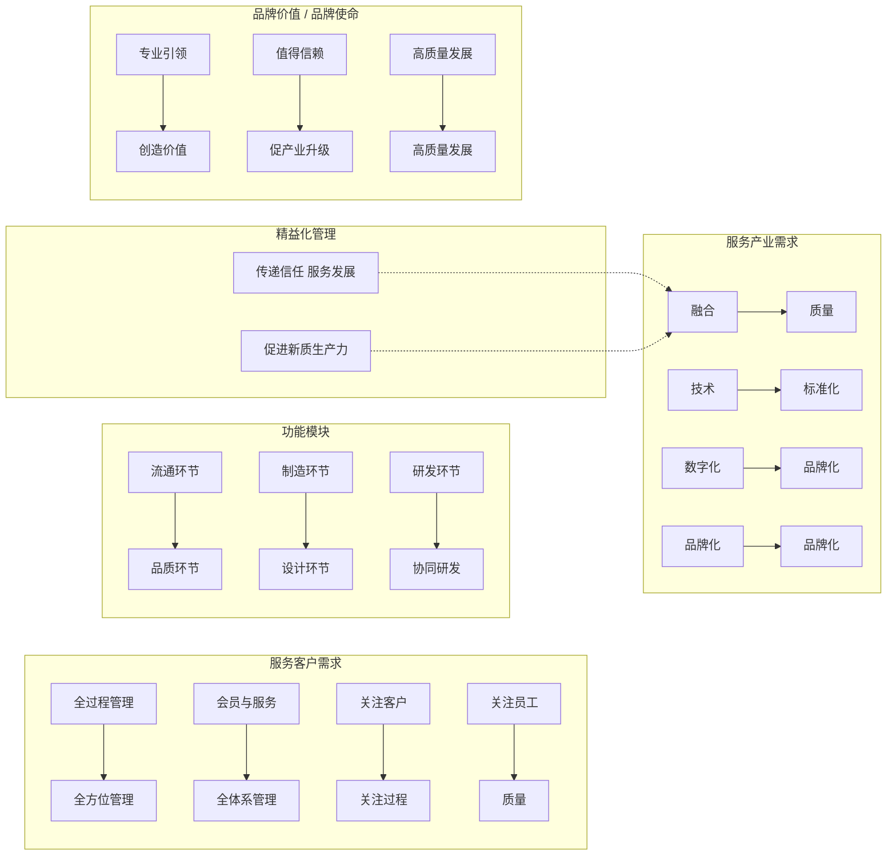
```mermaid
graph LR
  subgraph Service_Customer["服务客户需求"]
  A["全过程管理"] --> B["全方位管理"]
  C["会员与服务"] --> D["全体系管理"]
  E["关注客户"] --> F["关注过程"]
  G["关注员工"] --> H["质量"]
  end

  subgraph Service_Patient["服务产业需求"]
  I["融合"] --> J["质量"]
  K["技术"] --> L["标准化"]
  M["数字化"] --> N["品牌化"]
  O["品牌化"] --> P["品牌化"]
  end

  subgraph Functional_Loop["功能模块"]
  Q["流通环节"] --> R["品质环节"]
  S["制造环节"] --> T["设计环节"]
  U["研发环节"] --> V["协同研发"]
  end

  subgraph Core_Mgmt["精益化管理"]
    W["传递信任 服务发展"] -.-> I
    X["促进新质生产力"] -.-> I
  end

  subgraph Top_Flow["品牌价值 / 品牌使命"]
  Y["专业引领"] --> Z["创造价值"]
  AA["值得信赖"] --> AB["促产业升级"]
  AC["高质量发展"] --> AD["高质量发展"]
  end

  %% Flow from Core_Mgmt to Core_Loop
  %% Core_Loop Pathway
  %% Core_Loop Pathway
  %% Core_Loop Pathway
  %% Core_Loop Pathway
  %% Core_Loop Pathway
  %% Core_Loop Pathway
  %% Core_Loop Pathway
  %% Core_Loop Pathway
  %% Core_Loop Pathway
  %% Core_Loop Pathway
  %% Core_Loop Pathway
  %% Core_Loop Pathway
  %% Core_Loop Pathway
  %% Center Loop
  %% Core_Loop Pathway
  %% Core_Loop Pathway
  %% Core_Loop Pathway
  %% Core_Loop Pathway
  %% Core_Loop Pathway
  %% Core_Loop Pathway
  %% Core_Loop Pathway
  %% Core_Loop Pathway
  %% Core_Loop Pathway
  %% Core_Loop Pathway
  %% Core_Loop Pathway
  %% Core_Loop Pathway
  %% Central Loop
```

“双循环、四全、五融合”精益质量管理模式

在持续夯实质量管理基础、完善质量管控体系的基础上，公司进一步以文化引领与数字赋能为抓手，推动质量理念深度融入经营管理与员工日常行为，通过主题活动、信息化建设与全员参与机制协同发力，持续提升质量治理能力与质量文化氛围。

# 质量保障措施

# 信息化建设

- 质量技术服务板块完善实验室信息管理系统（LIMS），实现样品流转到报告签发全流程管控。  
- 完成设备管理系统建设并上线运行，推动资产管理向数字化转型。  
- 搭建公司能力库，为后续质量管理流程完善、检测流程搭建提供基础数据库。

# 质量培训

\- 面向新员工、技术人员与管理者开展质量培训。

# 文化建设

- 持续深化“质量月”活动内涵，制定并发布“质量月”专项实施方案。  
- 创新开展“九个一”主题实践活动及“我为质量献一策”合理化建议征集活动。

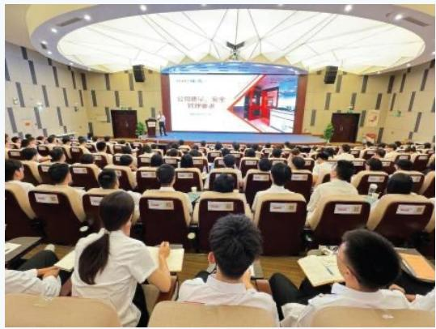

text_image

Conference hall photo with visible presentation screen displaying Chinese text and logo, audience seated in rows

新员工质量安全培训

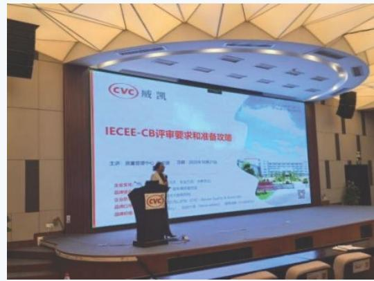

text_image

CVC 威 凯
IECEE-CB评审要求和准备攻破
主办：统筹管理中心、战略部、预算部；组织协调计划
企业安全与治理，支持企业、金融等
ESG 2017-2023年年度股东大会审议通过。
ESG 2017-2023年年度股东大会审议通过。
ESG 2017-2023年年度股东大会审议通过。

CB评审系列培训

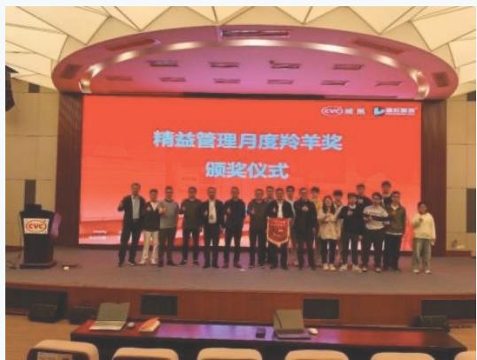

text_image

CWO 精度 精度
精益管理月度羚羊奖
颁奖仪式

精益管理培训及颁奖

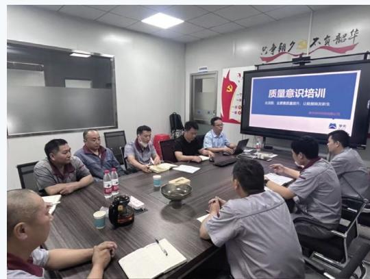

text_image

斗争纲领 不有和平
质量意识培训
主办、部署质量意识提升、让党领导及民生

质量意识培训 ▲

一旦发现产品存在潜在风险,公司将立即启动应急响应机制,通过透明、及时的沟通,确保消费者能够及时了解,并积极配合整改工作。

# 指标与目标

公司结合业务特色，形成全链条、分层级的质量目标管控体系，有效保障产品质量稳步提升。

2025年，公司未发生产品和服务相关的重大安全与质量责任事故。

# 服务质量

公司始终坚守“以客户为中心”的核心服务理念，持续健全并优化客户反馈全流程管理模式，实现从反馈收集、深度分析、高效处置到持续改进的全链条贯通。为精准捕捉客户需求，公司通过开展客户满意度监测，采用多维度的客户意见收集措施，打破单一渠道局限，确保客户声音能够全面、及时、准确地传递至公司核心管理层面，推动服务品质迭代升级，持续增强客户获得感与满意度。

制造业领域的客户服务流程  
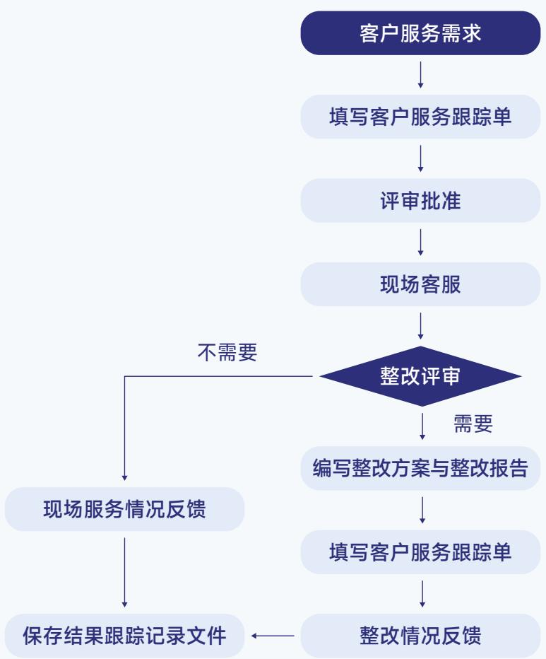

flowchart

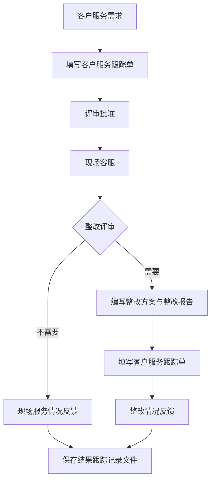
```mermaid
graph TD
  A["客户服务需求"] --> B["填写客户服务跟踪单"]
  B --> C["评审批准"]
  C --> D["现场客服"]
  D --> E{"整改评审"}
  E -->|不需要| F["现场服务情况反馈"]
  F --> G["保存结果跟踪记录文件"]
  E -->|需要| H["编写整改方案与整改报告"]
  H --> I["填写客户服务跟踪单"]
  I --> J["整改情况反馈"]
  J --> G
```

质量技术服务领域（检测业务）客户服务流程  
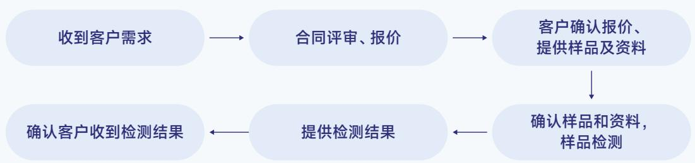

flowchart

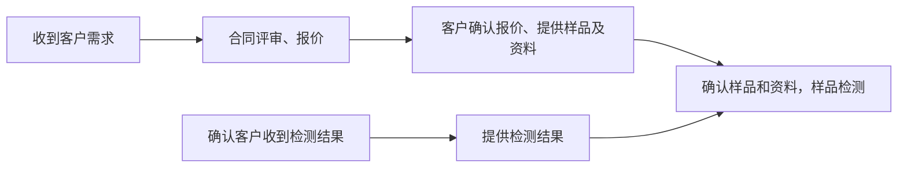
```mermaid
graph LR
  A["收到客户需求"] --> B["合同评审、报价"]
  B --> C["客户确认报价、提供样品及资料"]
  C --> D["确认样品和资料，样品检测"]
  E["确认客户收到检测结果"] --> F["提供检测结果"]
  F --> D
```

质量技术服务领域（认证业务）客户服务流程  
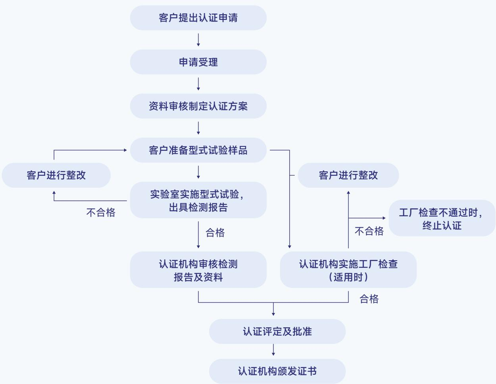

flowchart

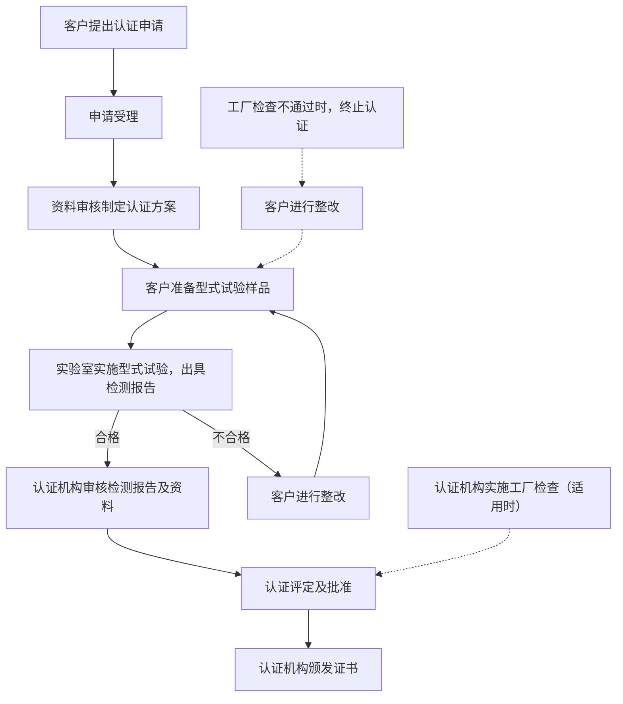
```mermaid
graph TD
  A["客户提出认证申请"] --> B["申请受理"]
  B --> C["资料审核制定认证方案"]
  C --> D["客户准备型式试验样品"]
  D --> E["实验室实施型式试验，出具检测报告"]
  E -->|合格| F["认证机构审核检测报告及资料"]
  E -->|不合格| G["客户进行整改"]
  G --> D
  F --> H["认证评定及批准"]
  H --> I["认证机构颁发证书"]
  J["客户进行整改"] -.-> D
  K["认证机构实施工厂检查（适用时）"] -.-> H
  L["工厂检查不通过时，终止认证"] -.-> J
```

<table><tr><td>业务领域</td><td>调查方式</td></tr><tr><td>制造业领域</td><td>· 发放顾客满意度调查表
· 收集客户门户网站计分卡
· 内部业绩绩效分析</td></tr><tr><td>质量技术服务领域</td><td>· 在线调查
· 电话调查</td></tr></table>

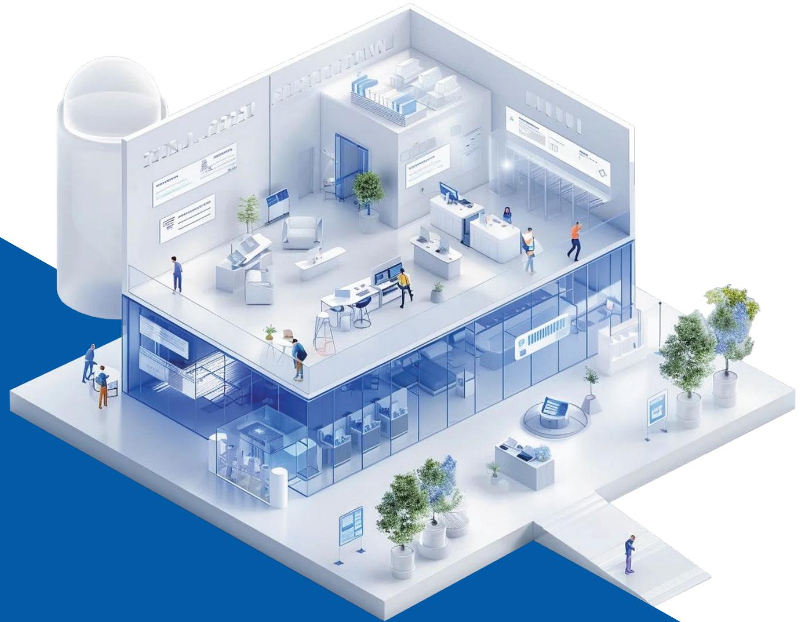

natural_image

Isometric architectural rendering of a modern office building with glass facade, service counters, and surrounding greenery (no visible text or symbols)

# 数据安全与隐私保护

公司高度重视信息安全管理工作，始终严格遵守《中华人民共和国网络安全法》等相关法律法规要求，制定并完善《信息化管理制度》《计算机及网络使用行为规范》《网络安全管理暂行办法》等制度及规范，全面落实核心信息系统安全等级保护测评和备案工作，持续优化网络安全架构，构建涵盖网络终端准入及纵深安全的立体防护体系。同时，公司严格遵循ISO 27001标准体系要求，建立健全信息化管理体系，成立网络和信息安全领导小组及安全工作专班，明确职责分工、强化统筹协调，确保信息安全与数据保护各项工作落地见效、有序推进。

# 信息安全管理架构

# 网络和信息安全领导小组

# 组织成员

由信息化分管领导担任组长，成员包括业务公司分管信息化领导和相关职能部门领导。

# 主要职责

- 贯彻国家有关法律法规，落实相关的工作要求。  
- 负责公司网络和信息安全的战略规划、部署、协调工作。  
审定公司在网络和信息安全方面的年度计划和资源投入。  
- 发生重大网络和信息安全事故时的决策和协调指挥工作。

# 网络和信息安全工作专班

# 组织成员

工作专班由公司战略发展部负责人担任组长，成员由职能及各业务板块相关部门负责人、网络工程师和安全员组成。

# 主要职责

- 落实领导小组的工作安排。  
- 负责安全防护能力的提升和优化。  
- 负责落实和监督信息安全相关制度的执行情况。  
- 负责风险识别、隐患排查、应急处置工作。

为筑牢公司业务发展的数据安全屏障，公司着力构建全方位防护体系，持续强化网络威胁防护能力与网络安全体系建设。在信息安全运行层面，公司从技术防范、权限管理、安全检测、风险预警、应急响应、能力培养等多维度发力，不断完善并提升数据安全风险的识别、预警与拦截能力，构建起从“入口”到“终端”的立体化网络安全防护体系，为公司信息系统稳定运行提供坚实保障。

# 技术防范

- 部署网络防火墙等网络安全设备加强网络边界防护。  
- 设置虚拟专用网络（VPN）技术增强用户接入系统的安全性。  
- 使用服务器安全防护系统，加强员工电脑等终端设备的安全防护能力。  
- 持续开展主机和信息系统漏洞修复和安全加固。  
- 逐步建立网络安全态势感知能力，对核心业务系统数据进行异地备份。

# 权限管理

- 信息系统按照用户类型和角色区分不同的使用权限。  
- 实行网络准入机制，在电脑设备加装企业级防护插件。  
- 当用户发生入、转、调、离时，管理员及时进行权限变更。  
- 定期检查用户权限变更的完成情况。

# 安全检测

\- 落实业务系统的安全等保测评工作。

# 风险预警

\- 加强内网态势感知，部署网络态势感知系统，通过智能分析识别潜在风险。

# 应急响应

- 针对遭受网络攻击、数据泄露、数据篡改、数据丢失等场景制定应急响应预案。  
- 明确风险发生各部门的职责、处置方式和信息通报机制。

# 能力培养

\- 开展网络安全、专业技术、AI应用、数据治理等培训交流20余场，覆盖员工2,000余人次。

公司不断细化隐私保护管理规范，持续优化相关管理举措，不断强化安全防护能力，依托技术防护、权限管控等举措强化隐私保护，建立系统性管理机制，全方位守护客户隐私权益。

# 客户隐私保护举措

强化用户数据全生命周期管理。

严格遵循 GDPR 等国际数据保护准则，在信息收集环节贯彻“数据最小化”原则。

坚持管用分离，强化数据使用监管，依托内部信息系统的权限管理措施严格控制客户信息的查看和导出权限。

对敏感数据访问行为实时日志记录与审计，全方位保障客户数据隐私及数据的合规管控。

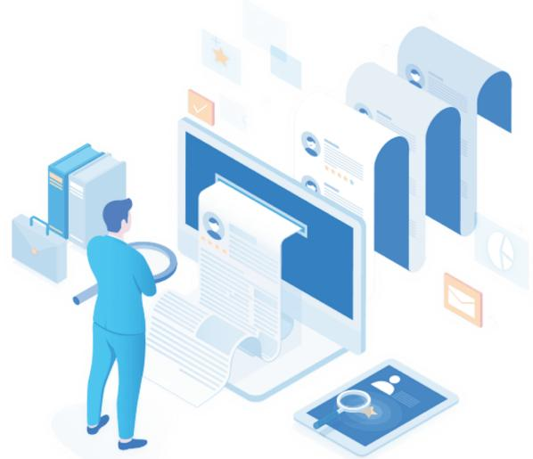

natural_image

Illustration of a person interacting with digital devices and documents, surrounded by floating charts and envelopes (no text or symbols)

# 创新引领未来

# 科技创新

# 治理

公司持续优化完善科技创新管理制度体系，制修订《科技单项激励管理办法》《重大科技专项（V类项目）管理办法》《科技成果评审和鉴定管理办法》等核心制度文件并正式实施，全面提升体系化创新能力与核心竞争力。

# 截至2025年末

共有10家分子公司被认定为高新技术企业。

3家分子公司获评国家级专精特新“小巨人”企业、7家分子公司获评省级专精特新中小企业。

1家分子公司获评国家级制造业单项冠军企业、2家分子公司获评省级制造业单项冠军企业。

# 战略

公司聚焦“产业技术基础、高端装备、智能制造和先进材料”四大产业基础领域，推动产业基础高级化，以服务国家所需、产业急需为导向，以提升创新实效为主线，以“能力建设+机制创新”为抓手，深入推进原创技术“策源地”建设，高质量推进工业产品环境适应性全国重点实验室等重大创新平台建设运行，加快培育一流的科研、工程和管理人才队伍，构建贯穿“基础与应用基础研究-产业技术研究-产业转化”全链条的科技创新模式，持续优化科技攻关布局，突破一批关键核心技术，培育发展战略新兴和未来产业技术，转化形成具有核心竞争力的新产品、新服务，以核心科技能力引领企业高质量发展，为公司建设一流创新型企业提供关键支撑。

  
产业技术基础

  
高端装备

  
智能制造

  
先进材料

# 影响、风险和机遇管理

公司秉持“以自主研发为主，产学研合作为辅”的创新研发模式，持续推动科技创新与可持续发展深度融合。依托覆盖全国的产业基地与技术服务网络，公司不断强化行业引领与协同赋能作用，积极参与相关标准的研究、制定与推广，推动行业向规范化、绿色化与高质量方向发展。

# “三位一体”自主研发体系

# 应用基础与共性技术研究

- 聚焦前沿技术的探索和基础理论的突破，致力于挖掘具有广泛适用性的技术解决方案，为后续的应用技术研发和产品开发奠定坚实的理论基础。  
- 通过与高校、科研机构的深度合作，不断拓宽技术视野，加速基础研究成果的转化与应用。

# 应用技术和关键技术研发

\- 集中资源攻克行业关键难题，针对核心业务中的技术瓶颈展开专项研究。

# 产品技术开发

\- 紧密结合市场需求, 将前沿技术与成熟工艺有机结合, 快速响应市场变化, 开发出一系列高性能、高附加值的产品。

公司持续深度参与国际、国家及行业标准体系建设，在标准化工作中发挥牵头与协同双重作用，围绕电器产品安全、环境适应性、碳管理与智能化等重点领域开展标准研制与提案工作，推动关键技术规范完善与产业发展规则对接，积极推动标准国际化应用与行业推广，推动技术标准“走出去”。

# 2025年

主持和主要参与制修订并发布的国际、国家、行业、团体标准

国际标准

国家标准

行业标准

地方标准

团体标准

114项

3项

43项

15项

1项

52项

公司坚持“产学研用”协同创新理念，与高校、科研院所及行业企业等多元主体保持紧密合作，围绕关键技术攻关与成果转化，构建协同创新网络。通过共建联合实验室、联合开展科研项目及人才培养等方式，形成贯通基础研究、技术研发与应用推广的协作体系。同时，公司积极参与产业联盟建设，推动技术资源共享与行业标准共建，促进产业协同发展，培育新质生产力。截至2025年末，公司共拥有20个国家级科研与服务创新平台。

# 部分国家级科研与服务平台

工业产品环境适应性全国重点实验室

广州大气环境材料腐蚀国家野外科学观测研究站

琼海大气环境材料腐蚀国家野外科学观测研究站

国家国际科技合作示范基地（电器质量技术创新）

国家日用电器质量检验检测中心

国家智能汽车零部件质量检验检测中心

国家高原电器产品质量检验检测中心

国家标准验证点（智能家电）

国家高端智能化家用电器创新中心（共建）

国家通用机械基础件创新中心（共建）

电气传动国家工程研究中心（共建）

国家中小企业公共服务平台（家电及汽车零部件）

国家级工业设计中心

产业技术基础公共服务平台（重点装备制造业行业碳达峰、碳中和公共服务平台）

产业技术基础公共服务平台（面向家电及信息通信行业的国内国际测试评价互认公共服务平台）

产业技术基础公共服务平台（智能汽车零部件产品试验技术）

产业技术基础公共服务平台（特殊环境电器产品试验技术）

工业（电动汽车及零部件）产品质量控制和技术评价实验室

工业（电机电器）产品质量控制和技术评价实验室

# 科技平台建设和资质维护运行绩效显著

推动工业产品环境适应性全国重点实验室、国家通用机械基础件制造业创新中心等国家级平台高水平建设和运行。

推进高原地区机电装备环境适应性实验室建设，按计划推进科研能力建设和科技任务实施。

“电器质量技术创新国际科技合作基地”顺利通过科技部重新认定。

积极创建省部级中试验证平台，“广东新能源与新型储能中试平台”成功入选工业和信息化部首批重点培育中试平台名单及国资委《中央企业中试验证平台对外开放服务目录（2025年版）》。

智能汽车零部件产品试验技术公共服务平台、工业产品质量控制和技术评价实验室等重要平台顺利通过工信部评估。

中国电研归口的全国家用电器标委会美容及其他器具分委会（SAC/TC46/SC6），荣获“2023-2024年度全国轻工行业标准化工作先进集体”称号。

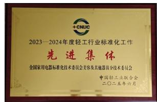

# 案例

# 中国电研与南网超高压共建超/特高压工程实验室

2025年12月，公司与南网超高压公司签署协议，共建工业产品环境适应性全国重点实验室超/特高压工程实验室，将攻关极端环境失效机理、试验验证等关键技术，构建全链条技术闭环，提升核心装备自主可控水平与本质安全能力，为超/特高压工程高质量建设及新型电力系统构建提供科技支撑。

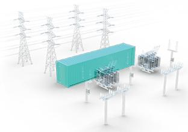

公司设立青年科技基金，聚焦重大科技专项，制定并实施科研人员激励措施，持续提升科技人才薪酬福利待遇，配套工作资源支持，优化绩效考核，进一步激发科研人员的创新热情，营造良好的创新文化氛围。

在科技创新过程中，公司严格遵循“伦理先行、依法依规、敏捷治理、立足国情、开放合作”五项关键要求，将科技伦理规范深度融入研发创新全链条，以科技伦理为引领，推动研发活动与科技伦理实现良性互动、协同共进，筑牢创新发展的伦理根基。

# 科技伦理治理举措

在人工智能领域，强调项目立项、技术开发与运用环节中道德原则的重要性，倡导公平透明并始终保持高度的隐私保护意识，确保人工智能项目符合科技伦理规范。

积极参与行业相关交流与合作，与其他企业、机构共同推动行业科技伦理的进步与提升，为人工智能行业健康、可持续发展营造良好环境。

# 指标与目标

公司始终锚定“工业产品特殊环境国家质量基础技术的策源地”这一发展目标，秉承“发挥公司优势、满足国家需求”的核心理念，将技术研究与业务拓展深度融合，以清晰的发展导向引领企业高质量发展，持续强化在行业内的核心竞争力与技术引领作用。

# 重大科技成果

“低温度波动热泵空调抑霜控霜关键技术及应用”“高质电饭锅绿色制造关键技术及产业化”两项成果经鉴定整体技术达到国际领先水平。

“消费类电器绿色低碳检测关键技术及应用”“湿热海洋环境多因素耦合高效模拟试验关键技术及装备”“金属卷材高速静电粉末彩涂关键技术及产业化”“退役手机多层次高质循环利用关键技术及产业化”“智能网联汽车多模感知与通信关键检测评价技术研究及应用”五项成果经鉴定整体技术达国际先进水平。

# 2025年

公司斩获重量级科技奖励共计13项。

以下为部分奖项

<table><tr><td>成果名称</td><td>获奖情况</td></tr><tr><td>面向沙戈荒区域的大型风电机组环境适应性关键技术开发与应用</td><td>新疆维吾尔自治区科学技术奖一等奖</td></tr><tr><td>中高压电缆系统绝缘老化与缺陷无损检测及状态评估关键技术及应用</td><td>云南省科学技术奖二等奖</td></tr><tr><td>废旧印刷线路板多层次高质循环利用关键技术及应用</td><td>四川省科学技术奖二等奖</td></tr><tr><td>退役动力锂电池短程增值回收关键技术及工程应用</td><td>江西省科学技术奖二等奖</td></tr><tr><td>湿热海洋环境多因素耦合高效模拟试验关键技术及装备</td><td>国机集团科学技术奖二等奖</td></tr><tr><td>电工装备在沿海湿热环境下的失效机理及其防治关键技术与应用</td><td>机械工业科学技术奖二等奖</td></tr><tr><td>低导热低密度家电用高效保温聚氨酯硬泡体系研究及产业化应用</td><td>中国表面工程协会科学技术奖二等奖</td></tr><tr><td>高压隔离开关耐候性提升关键技术研究与应用</td><td>中国腐蚀控制技术协会科学技术奖二等奖</td></tr></table>

# 知识产权保护

公司严格恪守《中华人民共和国专利法》《中华人民共和国商标法》《中华人民共和国著作权法》等相关法律法规要求，量身制定《专利工作管理规范》《商业秘密管理制度》等一系列内部制度文件，并聚焦知识产权管理效能提升，着力推进工作的流程化与规范化建设。

# 知识产权重点管理举措

<table><tr><td>健全知识产权奖惩机制</td><td>·开展单项激励、设立年度考核指标等措施。</td></tr><tr><td>推动知识产权工作信息化</td><td>·持续完善科技管理信息化系统,实现知识产权申请、受理、授权到终止全流程管理。·不断完善公司知识产权数据库。</td></tr><tr><td>开展知识产权培训</td><td>·举办“知识产权申请流程与成功率提升策略”“聚焦知识产权保护,筑牢创新基石”等主题培训。</td></tr></table>

# 推动知识产权工作信息化

# 开展知识产权培训

# 数智化转型

公司持续推进数智化转型升级，以“数智化体系建设”“产业数智化”“数智产业化”为核心驱动，推动研发、制造、治理等核心环节效率提升，培育新业务、新模式。

数智化体系建设方面，公司从组织机制、重点领域、基础设施及安全保障入手，以重点专项为抓手，构建数智化经营管理体系，推进业财一体化建设，实现数据汇聚与流程贯通，赋能业务发展，为公司治理与经营提供数据支撑。

产业数智化方面，以质量技术服务板块为试点，推进客户服务敏捷化、经营线上化、生产智能化实践。通过资质能力标准库、设备库等基础数据库的构建，为后续人工智能应用奠定基础。开展智能云实验室建设，实现简单产品线检测的自动化，提升检测过程和报告生产效率。

数智产业化方面，依托质量技术服务领域多年的技术沉淀和丰富的数据积累，积极探索人工智能技术、知识与数据的融合创新，聚焦高价值应用场景，推出“世界认证地图”和“重点装备双碳平台”，培育质量数据服务的新模式。

# 携手共谋进步

# 采购管理

公司持续完善采购与供应链管理体系，建立以制度为基础、流程为主线的全链条管控机制。公司设立采购领导小组与采购工作小组，围绕供应商引入评价、合格供应商审核、采购合同签订及物资验收等关键环节实施闭环管理，并根据业务实际划分电气、成套、材料、检测及固定资产五大采购专业，明确职责分工，保障采购工作的规范实施与风险可控。

在流程与制度建设方面，公司依托信息化系统与供应商管理体系，构建覆盖采购计划、招标执行与合同履约全过程的管理机制。2025年进一步出台《供应商管理细则》《关键物资采购验收管理规范》等文件，强化关键物资与供应商管理要求，夯实制度基础。

公司高度重视采购公平与透明，鼓励通过公开招标等方式开展采购活动，并通过官网发布招标信息，保障潜在供应商平等参与。同时，将“公开采购率”纳入年度考核指标，推动采购过程规范化、透明化，持续提升供应链管理水平与公司治理效能。

公司构建科学系统的供应商分级分类管理体系。统筹制定各专业领域供应商管理方法，明确供应商准入全流程标准，建立全面量化的绩效评价机制，完善风险预警体系，细化不良行为处置规范，形成标准化、规范化的供应商管理框架。公司搭建常态化供应商评估与考核机制，定期组织采购、质控、技术等多部门开展联合评审，严格落实合格供方准入制度，确保供应商准入与管理的严谨性、公正性。

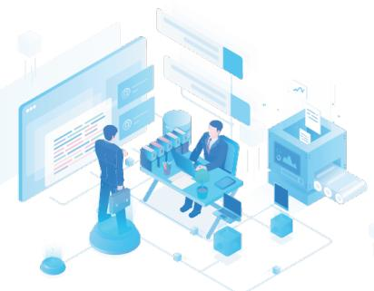

natural_image

Isometric illustration of two business professionals working at a desk with digital interfaces and charts (no text or symbols)

# 供应商管理

# 供应商寻源

- 根据业务运营需求开展供应商寻源工作。  
- 通过寻源评估的供应商将成为候选供应商。

# 供应商准入

- 设定严格的供应商准入标准，对入选供应商进行准入评审。  
- 通过定期向供应商发布《致相关方的一封信》。

\- 要求供应商签署《相关方环境、职业健康安全承诺书》。

\- 通过资质审查的方式充分了解入选供应商的资质水平。

\- 关键原材料供应商准入前，组织采购、技术、质量等部门共同考察、评审。

# 供应商评估

- 从供应商绩效表现评估与风险管理评估等维度开展供应商评估工作。  
- 每年通过案头评估、现场评估等方式，全方面综合评估供应商表现。

# 供应商分级管理

- 依据供应商评估结果,将供应商分为 A（优秀）、B（良好）、C（合格）、D（不合格）四级。

\- 对于在供应商评估中发现的问题, 要求供应商实施整改方案并开展核验。

\- 若供应商出现重大质量问题或反复出现同类质量问题时，要求供应商配合进行现场调查。

\- 通报黑名单供应商信息，并在ERP系统中建立黑名单供应商预警。

# 供应商审查

- 对违反商业道德，价格欺诈、采取不正当竞争手段等供应商列入供应商黑名单。  
- 现场审核供应商，对未通过现场审核的供应商要求整改。

2025年，公司累计针对486家供应商开展现场的环境、社会影响评价，均未发现在社会和环境方面存在潜在重大负面影响；现场审核供应商，未发现童工、强迫劳动等零容忍问题，通过供应商现场审核以及整改赋能；967家供应商签署《廉洁从业责任书》。

公司致力于提升采购工作规范化、透明化水平，稳步推进采购管理体系优化各项工作，全面梳理采购全流程各环节，深入排查潜在风险与薄弱点，结合实际业务场景拟定针对性改进方案，强化正向引导与约束，持续提升采购治理效能。让采购工作在合规框架内实现高效运转，持续完善采购管理流程。

# 采购管理措施

# 风险防控

- 开展招标项目自查自纠专项工作，主动排查潜在问题。  
- 建立业务管理、审计与巡视协同监督机制，强化重点项目监督抽查。  
- 积极推广电子采购平台应用，借助信息化手段强化风险管控。  
- 健全内控机制, 严格落实分岗设权要求, 切实防范采购环节各类风险。

# 公正管理

- 鼓励通过公开采购的方式开展日常采购活动，确保采购流程的公正性和竞争性。  
- 通过官方网站公开发布招标和采购公告，扩大信息传播范围。  
- 将“公开采购率”纳入年度考核指标体系，进一步推动采购活动的规范化与透明化。  
- 建立“评定分离、报价保密、充分竞争、严控风险”四位一体的采购机制。

# 平等对待中小企业

公司在供应链管理与商业合作中坚持公平、公正、公开原则，平等对待各类合作伙伴，积极为中小企业提供规范透明的参与环境。通过完善准入与评价机制、优化采购流程、加强信息共享与沟通协作，保障中小企业在合作中的知情权与参与机会，促进资源要素合理配置与合作共赢。

natural_image

Illustration of three people collaborating at a desk with laptops and documents (no text or symbols visible)

# 供应链安全

供应链安全是关乎企业生存与发展的关键，直接影响企业的运营稳定性、市场竞争力以及可持续发展能力。公司树立全面的供应链安全理念，明确供应链安全的目标与方向，建立健全供应链安全管理体系，加强对供应链风险的全流程管控，推动供应链安全水平的整体提升。

# 维护供应链安全

# 物料准备

- 价格易波动、存在断供风险的关键物料：实行每季度重大风险评估制度，同步提前制定针对性风险应对预案。  
- 进口芯片、仪器等交期较长的物料：实施关键物料前置采购策略，有效锁定价格与交付周期，从源头维护供应链安全。  
- 受国际局势影响可能面临供应风险的进口物料：有序推进提前备货工作，积极布局国产替代方案。

# 本地化布局

着力推进供应链本地化布局，鼓励各基地开展本地化寻源，或邀请外地供应商在基地所在地及周边建厂。

# 数智化赋能

充分运用数字化技术搭建供应链合规溯源体系，对产品生产及供应链管理各环节进行全面追溯与记录。

# 产业链协同

公司坚持开放协同、创新共赢的发展理念，积极参与各类行业交流与合作平台。公司通过深度参与国内外行业会议与专业展会，持续展示在绿色制造与智能技术等领域的创新成果，并推动经验共享与技术协同，促进产业链上下游的交流合作与共同进步，携手合作伙伴为行业高质量发展提供有力支撑。

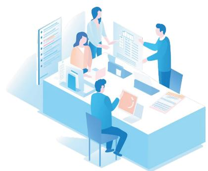

natural_image

Illustration of three people collaborating at a desk with documents and charts (no text or symbols visible)

# 案例

# 威凯检测和威凯认证成功举办马来西亚市场准入研讨会暨中马联合高端品质认证推广会

2025年8月，威凯检测和威凯认证联合马来西亚标准与工业研究院举办市场准入研讨会暨联合高端品质认证推广会，解读准入政策并推广双边互认认证机制，线上线下赋能近150家相关企业拓展东南亚市场。

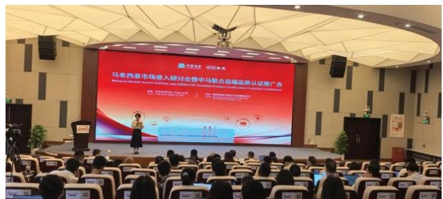

text_image

马来西亚市场准入研讨会暨中马联合高端品质认证推广会
Benedale Market Access, Science and Human Care, 2016-2017, Benedale Market Access, Science and Human Care, 2016-2017, Benedale Market Access, Science and Human Care, 2016-2017

# 案例

# 威凯检测和威凯认证成功举办合格评定服务贸易便利化国际合作政策 宣贯活动——家电及消费电子产业RCEP专题

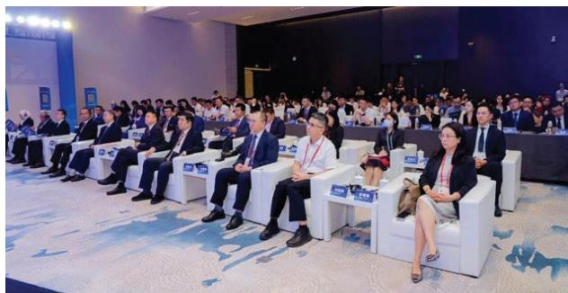

natural_image

Large conference hall with attendees seated in rows, facing a stage with name tags (no visible text or signage)

2025年10月，威凯检测和威凯认证于第138届中国进出口商品交易会期间成功举办“合格评定服务贸易便利化国际合作政策宣贯活动——家电及消费电子产业RCEP专题”。活动汇聚了来自泰国、马来西亚、韩国等RCEP地区成员国政府、国际认证机构及知名企业代表近200人，共同探讨区域标准互认、认证衔接与贸易便利化合作路径。

# 案例

# 擎天材料受邀参加2025电器产业链大会

2025年12月，擎天材料受邀代表广东省粉末产业技术创新联盟参与第六届电器产业链生态合作大会，并做《环保粉末涂料在家用电器领域的应用》主题报告，围绕粉末涂料行业概况、家电领域应用实践、未来发展趋势三大核心板块，系统解读粉末涂料在家电领域的应用现状及优势，为下游家电行业的绿色涂装及高质量发展提供环保解决方案。

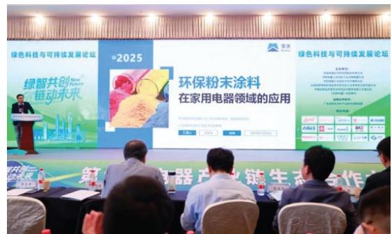

text_image

绿色科技与可持续发展论坛
=2025
绿智共创
驱动未来
环保粉末涂料
在家用电器领域的应用
绿色科技与可持续发展论坛

# 温暖回馈社会

# “一带一路”履责

公司积极响应共建“一带一路”重大倡议，全力构建国际互认体系，成功取得多项国内外权威认证认可资质。依托专业技术实力出具的严谨、权威报告与证书，已获得全球70多个国家和地区超100家权威机构的广泛认可，为公司国际化市场拓展提供了坚实的资质与信誉支撑。在共建“一带一路”倡议框架下，公司积极谋划并构建沿线科学观测网络，为工业产品高质量“走出去”筑牢技术根基。

公司已在国内外建成11个科学观测站，其中海外站点7个，涵盖湿热、亚湿热、干热、地中海、干热沙漠、暖温、海洋等多种具有代表性的气候环境区域。

# 案例

# 威凯检测签署标准合作协议，携手印尼打造国际合作新典范

在商务领域绿色机电出口产品行业标准《出口房间空调器能效碳效等级》宣贯及推广会上，威凯检测与印尼国家标准局正式签署标准合作协议。本次合作不仅推动了国际标准化合作进一步深化，也为促进中国与东盟双边经贸发展贡献了力量。

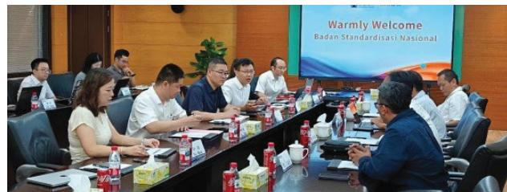

text_image

Warmly Welcome
Badan Standardisasi Nasional

# 案例

# 威凯认证创新中马联合品质认证，赋能RCEP区域贸易便利化

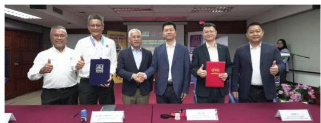

text_image

Group photo of six men in formal attire holding certificates and thumbs-up, with nameplates visible on the table

威凯认证与马来西亚标准与工业研究院质量与认证国际有限公司共同推出的“威凯思璘联合高端品质认证”接连取得实质性进展，标志着中马高端品质认证互认正式迈入区域影响力升级新阶段，为RCEP区域贸易便利化注入新动力。

# 案例

# 擎天实业助力吉尔吉斯斯坦能源项目升级，筑牢电站安全稳定运行基石

擎天实业作为关键合作伙伴深度参与了吉尔吉斯斯坦TOK水电站改造扩容工作，为TOK水电站升级注入了核心动力。在调试服务中，工程师团队不仅完成了常规调试，更接连攻坚，成功实施四台机组的电力系统稳定器试验，进一步提升了大电网的动态稳定性，为TOK电站在复杂电网环境下保持安全、优质供电提供了技术支持。

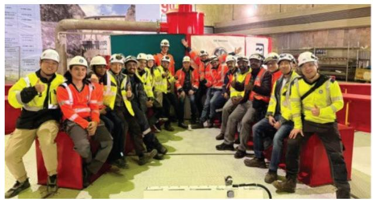

natural_image

Group photo of construction workers in safety vests and helmets posing on red equipment inside a facility (no visible text or symbols)

# 案例

# 成套装备土耳其项目助力互利共赢，为当地发展作出积极贡献

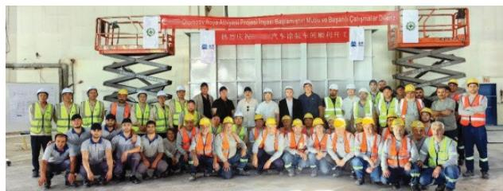

text_image

Gazitladi Gaozhi Prinj Kepa Amanas Projeto Impaji Bajtamgar Muluva Bapatini Caiyeshalar Dizhuz
热烈从2018年汽车涂装车间顺利开

在成套装备土耳其大型装备项目中，公司高度重视履行社会责任，助力实现互利共赢。项目推进初期面临安装空间有限、用工专业水准要求高等困难，公司主动与当地企业合作，开展专业培训并带动当地就业，项目聘用人员中本地员工占比达60%。

# 案例

# 擎天实业赋能喀麦隆电站投产，为海外电站运维人员开展励磁系统培训并提供远程技术支持

在喀麦隆纳齐提加水电站项目正式投入运行后，擎天实业为多名水电站运行维护人员提供了励磁系统培训，培养出一批当地的“励磁专家”，并通过持续的远程支持，有效保障了现场问题的高效解决，推动该水电站顺利实现全容量投产发电，为当地电力供应能力提升做出了贡献。

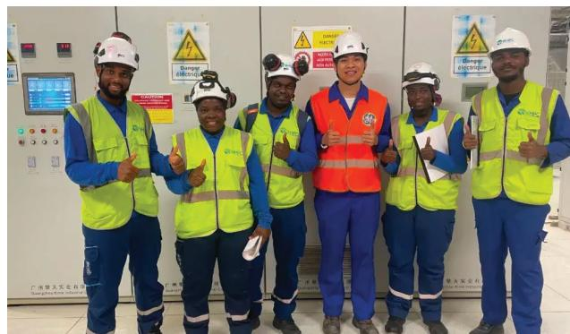

text_image

Group photo of six workers in safety vests and helmets giving thumbs-up at an electrical control station, with visible signage and warning signs.

# 社区共建与社会公益

公司积极践行社会责任，充分发挥自身优势，深化社区共建工作，将科普教育相关工作融入社区与校园场景，通过多样化举措搭建起沟通桥梁，传递科技与质量安全领域的重要价值，展现了企业的使命担当。

# 案例

# 深耕基层科普

公司深入学校、社区及科普基地开展接待工作，开展26场线下科普教育活动，全年接待人数4,600余人，通过质尚生活圈、V教授讲科普等自主创设的线上科普平台，发布智能家居、新能源智能汽车、碳知识及家用电子电器产品质量安全等内容的科普视频与文章，惠及社会公众。此外，公司成功申报并获批“2025年广州开发区广州市黄埔区科普志愿下基层服务”项目，2025年3月荣获黄埔区“2024年度科普社会协同力推荐单位”称号，同月加入广州科普联盟成为成员单位，5月荣获黄埔区“2025年最佳科普基地”称号，8月荣获黄埔区“新时代科普实践基地”资质。

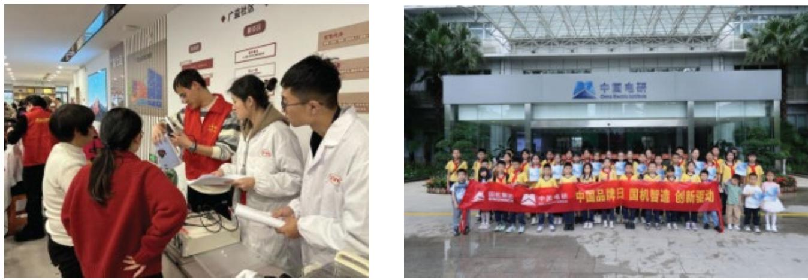

公司深耕公益慈善领域，始终以敬畏之心对待每一份责任，以坚定之行践行每一份承诺，持续探索公益与企业发展的融合路径，不断提升公益践行的深度与广度，用实际行动书写企业与社会共生共荣的新篇章，为推动社会和谐发展注入持久动力。

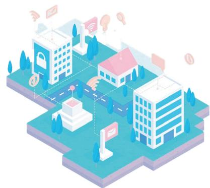

natural_image

Isometric illustration of a city square with buildings, roads, and social media icons (no text or symbols)

# 案例

# 积极参与公益事业

# 无偿献血助力全运

广州全运会期间，公司员工积极参与“热血广东活力全运”无偿献血活动，以实际行动为广州全运会血液保障工作提供坚实支持。

# 公益市集义卖传爱

组织参加由满天星公益机构举办的“星光公益市集”活动，为乡村儿童送去温暖关怀。

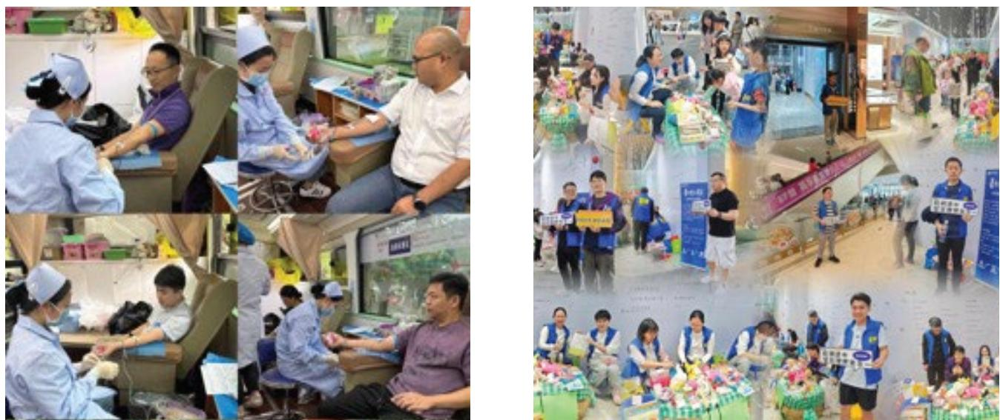

# 环保公益

组织分子公司联动开展植树、清理河道垃圾等活动，全年累计植树近百棵，开展环保知识宣讲，为建设“绿美广东”贡献企业力量。

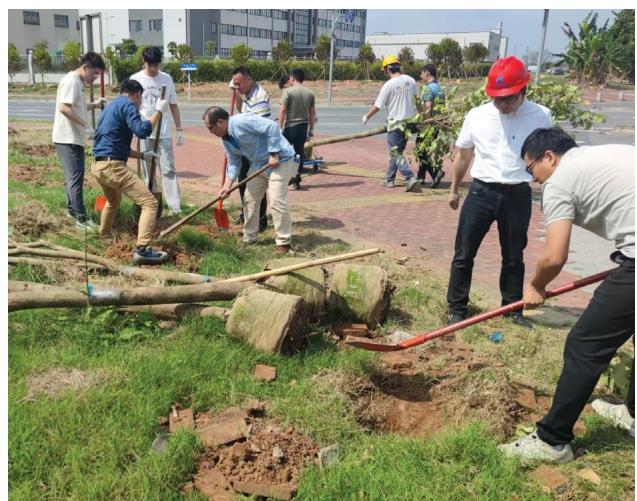

natural_image

Group of people working outdoors on a grassy slope using shovels and tools, with trees and buildings in the background (no visible text or symbols)

# 乡村振兴

公司立足自身优势,整合资源力量,创新工作举措,在产业帮扶、技术帮扶、文化帮扶和消费帮扶等方面持续发力,为乡村全面振兴注入强劲动力。2025年,公司驻广东省阳江市阳西县塘口镇帮镇扶村工作队(以下简称“工作队”)因表现突出,被授予“广东省驻镇帮镇扶村工作先进集体”荣誉称号。

2025年，公司聚焦帮扶地区特色农产品产销难题，累计开展消费帮扶专项行动3次，累计投入资金385万余元。

# 乡村振兴举措

# 产业帮扶

- 打造智能产业示范基地，应用物联网等前沿技术。  
- 培育壮大特色产业，成功推广经验。  
- 盘活闲置的乡村资产，延伸产业链。

# 技术帮扶

- 充分发挥在标准、检测领域的专业特长，为项目建设质量与规范保驾护航。  
- 联合科研机构，围绕种植、养殖、电商等主题，组织技能培训。  
- 积极搭建多元合作模式，链接高校科研资源开展技术攻关。

# 文化帮扶

\- 以党建工作为抓手，推进全域人居环境整治，联动乡贤力量化解基层纠纷、参与乡村建设。

# 消费帮扶

- 通过精准对接、多元采购，切实打通帮扶地区农产品产销链路。  
- 积极联动内部资源，为帮扶地区农产品开辟了稳定的销售渠道。

# 案例

# 聚力产业振兴，激活乡村发展核心引擎

工作队主导建成并运营阳江首个全自动化智能水培设施农业示范基地，成功阶梯式种植玉菇甜瓜、水果小青瓜、樱桃番茄，成为农业新质生产力的示范项目。项目以“租金 + 务工 + 分红”模式带动就业、开展技术培训，现已启动二期项目，规划建设预冷库、分拣包装中心等，同时盘活周边河道资源，发展果蔬采摘、露营休闲等业态，打造农旅融合、产储销一体的现代农业综合示范基地。

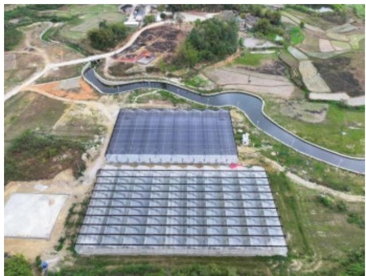

natural_image

Aerial view of a large solar panel farm installed on a rural landscape with winding waterways and farmland (no visible text or symbols)

# 案例

# 聚焦民生福祉，构筑多维长效增收体系

工作队联合科研院所开展富硒水稻、特色种养、电商等技能培训，提升群众靠双手致富的技能。依托产业项目与乡村公益岗，优先吸纳困难劳动力就业。开展多轮消费帮扶，直采帮扶村农副产品、对接公司员工食堂，畅通“出村进城”渠道，以市场化帮扶实现长效增收。

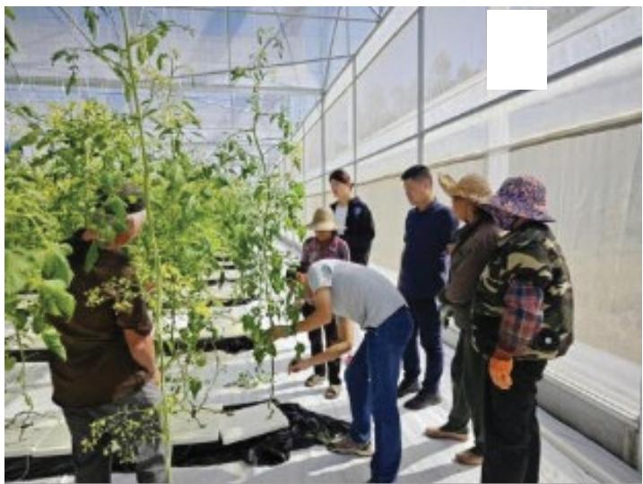

natural_image

Group of people inspecting a greenhouse with tomato plants, no visible text or symbols

# 产业振兴

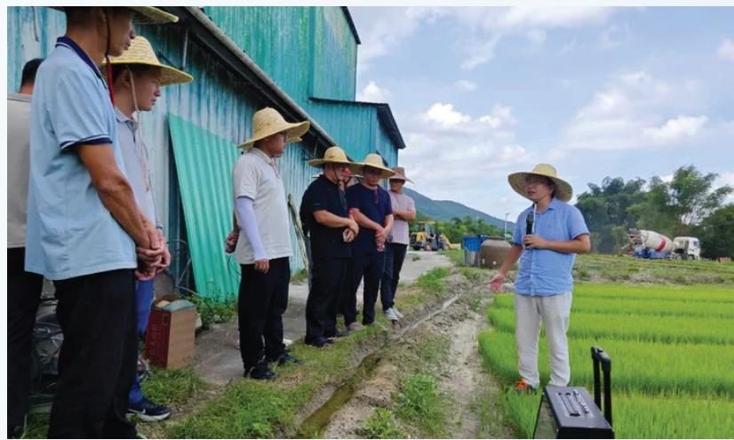

natural_image

Group of farmers in straw hats gathered outside a green rice paddy farm under a partly cloudy sky (no visible text or symbols)

专家现场开展种植技能培训

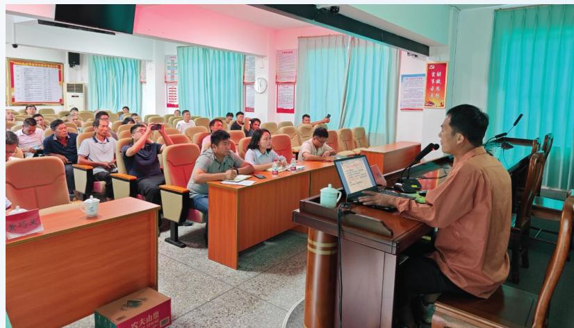

text_image

Classroom scene with audience seated at desks and a speaker at podium, featuring visible Chinese text on nameplates and posters in the background.

塘口镇面向村民
开展农业技术专题讲堂

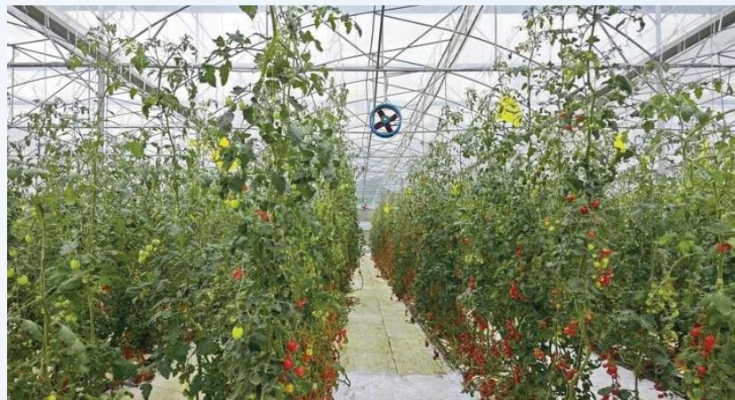

natural_image

Interior view of a greenhouse with rows of tomato plants and fruit storage under a glass roof (no visible text or symbols)

全自动化水培设施农业项目基地

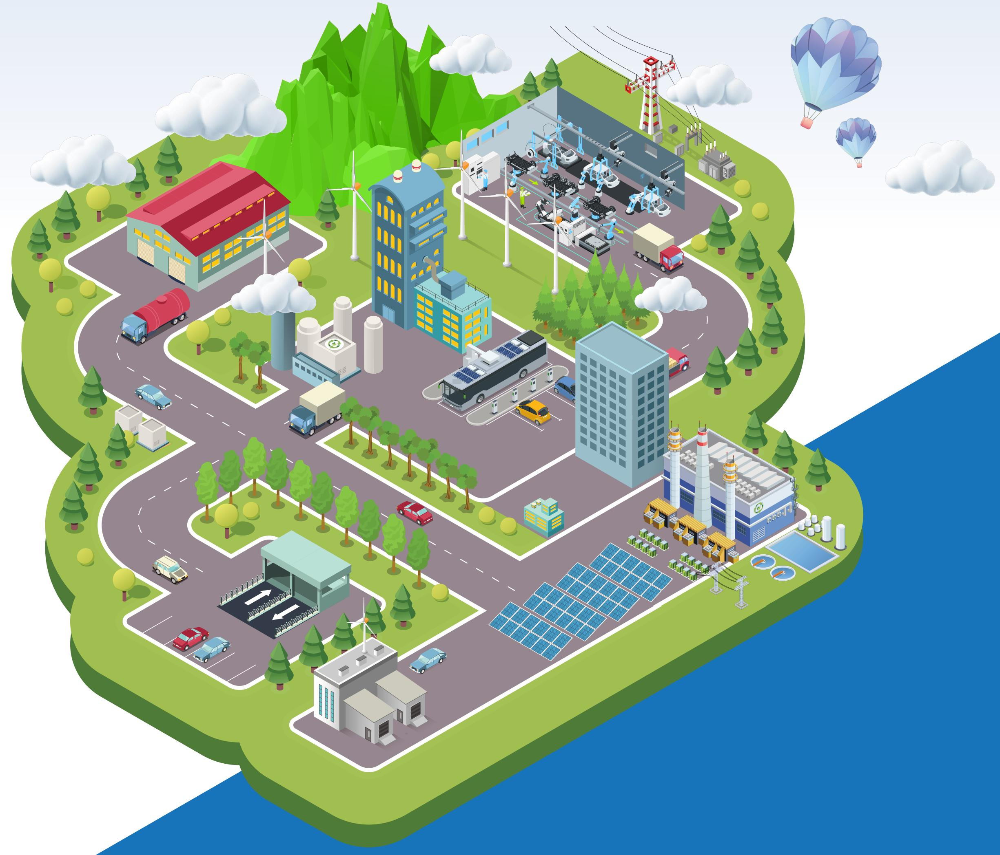

natural_image

Isometric illustration of an urban smart city with electric vehicle charging stations, green spaces, and surrounding buildings (no text or symbols)

# 治理篇

# 党建引领发展

公司始终坚持以习近平新时代中国特色社会主义思想为指导，深入学习贯彻党的二十大及二十届四中全会精神，牢牢把握新时代党的建设总要求，以高质量党建引领保障公司高质量发展。严格落实“两个一以贯之”，把党的领导全面融入公司治理各环节，推动党的领导与公司治理有机统一、深度融合。全年扎实开展深入贯彻中央八项规定精神学习教育，一体推进党纪学习教育常态化长效化，锲而不舍纠治“四风”，纵深推进全面从严治党，涵养风清气正的政治生态。

# 加强党的理论武装，推进“第一议题”学习与落实

公司将学习贯彻习近平总书记重要讲话和重要指示批示精神作为首要政治任务，常态化、制度化开展学习研讨。领导班子围绕各自分管领域广泛开展调查研究，形成有针对性的调研报告，并定期召开调研成果交流会。

# 2025年

组织开展“第一议题”学习

37次

理论学习中心组

组织学习

8次

涵盖学习内容

14项

# 党的领导深度融入公司治理

发挥党委“把方向、管大局、保落实”作用，严格落实《“三重一大”决策制度实施办法（暂行）》，本年度动态修订《决策事项及权限表》，深化落实“两个一以贯之”，为科学、精准、合规决策筑牢制度根基，有效提升公司治理效能。2025年，党委会研究“三重一大”事项共73项。同时，公司指导所属二级企业制修订《企业决策事项及权限表》，进一步发挥各级党组织对重大经营管理事项的把关作用。公司严格落实执行中央及国机集团各项党内制度，并结合自身特点不断完善党内制度建设。

# 健全全面从严治党责任体系，压实管党治党责任

公司坚持以严的基调执纪问责，压实管党治党责任。2025年，统筹开展“违规吃喝”业务接待费、差旅费重点抽查和招标采购、基建工程等专项检查，推进问题整改闭环，确保查改到位、不留隐患。

开展深入贯彻中央八项规定精神学习教育，牵头成立学习教育工作专班，高标准高质量一体推进“学、查、改”，进一步巩固公司风清气正的良好政治生态。

# 深入实施党建工作“六个再提升”

围绕 “强化党建引领、融合赋能发展，为新型工业化挺膺担当” 的大党建思路，持续探索党建工作与生产经营深度融合的实践路径，在思想引领、深度融合、基层基础、支撑保障、责任贯通、赋能发展六个方面，推动党建工作质量再提升。

在党建引领下，公司经营业绩再创历史新高，连续6年获评国机集团年度党建考核优秀，连续8年荣获国机集团“先进单位”荣誉称号。

# - 1 -

以思想引领为根本遵循，强化理论武装，聚焦主责主业，重点加强对实现高水平科技自立自强、推进新型工业化等方面的学用贯通，将企业发展融入国家发展大局。

# -4 -

以支撑保障为重要抓手，坚持党管干部人才，优化“选育管用”“引育留用”，锻造高素质、专业化干部人才队伍。

# -2-

以深度融合为关键手段，打造“党建 + 科技创新”品牌，推进一支部一重点项目，将党建融入重点科研攻关、重大项目落地全过程。

# - 5 -

以责任贯通为关键立场，健全全面从严治党工作体系，构建“大监督”工作格局，进一步优化政治生态。

# - 3 -

以基层基础为重要基石，靶向整改巡视反馈问题，完善党内制度、建强党务干部队伍，规范党员教育、宣扬企业文化，弘扬劳模精神、劳动精神、工匠精神。

# - 6 -

以赋能发展为核心目标，充分发挥国资央企“三个作用”，奋力争当“三个排头兵”，“十四五”期间主要经营指标稳中向好，为以新型工业化推进中国式现代化夯实基础。

# 案例

# 持续打造“党建+科技创新”品牌，激活发展新动能

公司党委持续打造“党建+科技创新”品牌，牢牢把握科技是第一生产力、人才是第一资源、创新是第一动力，全面贯彻新发展理念，全面落实国机集团战略发展要求，进一步发挥“党建工作做实了就是科研生产力，做强了就是科技竞争力”的党建品牌特色，真正把党建优势转化为创新优势与发展优势，着力增强自主创新能力，为公司高质量发展注入源源不断的动力。公司案例《“党建+科技创新”打造国有科技型企业改革样板和自主创新尖兵》入选2025年机械行业基层思想政治工作创新案例名单，充分彰显了“党建+科技创新”品牌建设的实效。

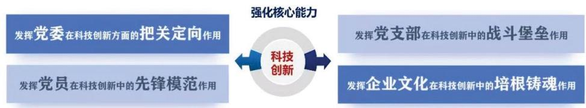

flowchart

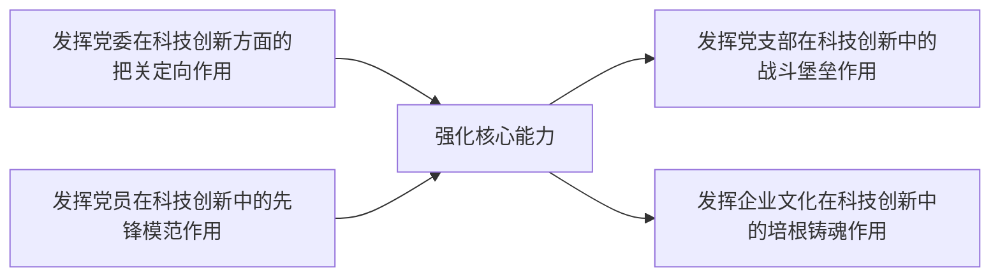
```mermaid
graph LR
  A["发挥党委在科技创新方面的把关定向作用"] --> C["强化核心能力"]
  B["发挥党员在科技创新中的先锋模范作用"] --> C
  C --> D["发挥党支部在科技创新中的战斗堡垒作用"]
  C --> E["发挥企业文化在科技创新中的培根铸魂作用"]
```

# 坚持党建引领，赋能企业文化与品牌建设

公司充分发挥党建引领保障作用，以“和、专、实”企业文化凝聚力量，以优质品牌彰显形象，推动党建工作与企业文化、品牌建设同频共振、深度融合。

# 案例

# 传承弘扬“和、专、实”企业文化

公司不断丰富“和、专、实”企业文化内涵，深入挖掘、大力传播创新事迹和改革精神，组织基层党支部开展企业文化故事汇演，讲好身边人、身边事，进一步发挥企业文化在凝心聚力、培根铸魂、保障高质量发展中的重要作用。打磨提炼“中国电研与公牛集团：三十年安全长跑的双向奔赴”“匠心同行三十载——中国电研与本田摩托的精诚合作之路”等合作故事，充分彰显公司坚守长期主义、“结硬寨，打呆仗”的发展理念，营造团结奋进、同心同向、和谐共进的发展氛围，凸显党建引领企业文化建设的扎实成效。

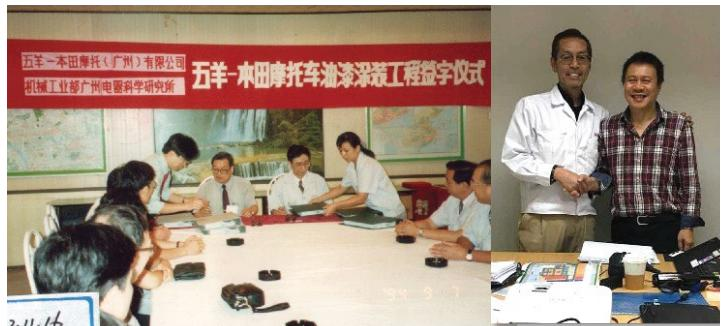

text_image

五羊-本田摩托（广州）有限公司
机械工业部广州电器科学研究所
五羊-本田摩托车油漆采港工程签字仪式

1992年与本田摩托车开启合作征程

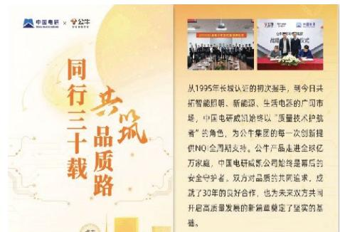

text_image

中国电研
× 公牛
同行三十载
共筑品质路
从1995年长城认证的初次握手，到今日共
拓智能照明、新能源、生活电器的广阔市
场，中国电研威凯始终以“质量技术护航
者”的角色，为公牛集团的每一次创新提
供NOI全周期支持。公牛产品走进全球亿
万收藏，中国电研威凯公司始终是幕后的
安全守护者。双方对品质的共同追求，成
就了30年的良好合作，也为未来双方共同
开启高质量发展的新篇章奠定了坚实的基础。

与公牛集团共筑三十载品质路

# 案例

# 坚持品牌引领行动，“威凯”入选中央企业优秀服务品牌

2025年，公司服务品牌“威凯”作为权威第三方质量技术服务品牌，荣获央企优秀服务品牌称号，并入选国机集团2025年度“十件大事”。在党建引领下，公司紧跟国家发展战略，紧密围绕产业智能化、绿色化、融合化发展方向，开展测试评价技术研究，推动形成了一系列标志性创新成果，构建起“全链条、全要素、全场景”质量服务体系，为“威凯”品牌建设筑牢坚实根基，推动品牌价值持续提升。

# 中央企业品牌引领行动 第二批创建成果

【服务品牌】

威凯

构建“全链条、全要素、全场景”质量技术服务体系，助力中国制造接轨国际，提升全球市场竞争力。

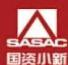

# 公司治理筑基

# 治理结构

公司秉持严谨合规的态度，严格遵循《中华人民共和国公司法》《中华人民共和国证券法》《上市公司治理准则》《上海证券交易所科创板股票上市规则》等法律法规及相关文件要求，建立了以《公司章程》为核心，《股东会议事规则》《董事会议事规则》《“三重一大”决策制度实施办法（试行）》等为支撑的规章体系。公司建立了由股东会、董事会及经理层组成的公司治理结构，确保治理结构权责明确、协调运转、科学决断公司重大事务。

# 股东会

股东会是公司的权力机构。公司严格按照相关规定，规范股东会的召集、召开和议事程序，聘请律师对股东会的合法性出具法律意见，确保所有股东特别是中小股东的平等地位，充分行使股东的合法权益，保证股东对公司重大事项的知情权、参与权和表决权。

# 2025年

召开股东会

审议通过议案

4次

19项

# 董事会

董事会是公司的核心决策机构，下设战略委员会、审计与风险管理委员会、提名委员会和薪酬与考核委员会，各专门委员会勤勉尽责、各司其职，为董事会决策提供了专业支撑。非职工代表董事由股东会选举产生，职工代表董事由职工代表大会选举产生，每届董事会任期三年，董事任期届满可以连选连任，独立董事连续任职时间不得超过6年。

# 战略委员会

\- 对中长期发展战略、中长期科技创新发展战略规划和重大投资决策进行研究，并向公司董事会提出建议。

# 审计与风险管理委员会

- 监督及评估外部审计机构工作，提议聘请或者更换外部审计机构。  
- 监督及评估内部审计工作, 负责内部审计与外部审计的协调。  
- 审阅公司的财务信息及其披露。  
- 监督及评估公司的内部控制。  
- 行使《中华人民共和国公司法》规定的监事会的职权。

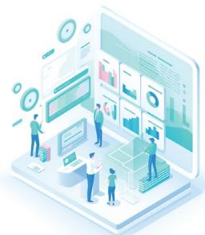

# 提名委员会

- 拟定公司董事和高级管理人员的选择标准和程序。  
- 对公司董事、高级管理人员的人选及其任职资格进行遴选、审查，并向董事会提出建议。

# 薪酬与考核委员会

- 负责制定董事、高级管理人员的考核标准并进行考核。  
- 制定、审查董事、高级管理人员的薪酬政策与方案，并提出意见和建议。

公司持续提升董事会独立性、多元化与专业性，保障董事会科学决策和公司的长远发展。

# 独立性方面

公司共有独立董事

4名

占比

33.33%

# 多元性及专业性方面

公司共有女性董事

占比

2名

16.67%

含1名女性独立董事和1名女性职工代表董事

董事会成员涵盖战略管理、投资、财务、法律、科技等多领域专家，有效强化董事会专业决策能力与独立判断功能，为科学决策筑牢组织基础。

公司董事会以年度《董事会工作报告》为核心载体，系统梳理自身年度履职情况及工作推进成效，持续完善董事会运行机制，不断提升治理水平与履职效能。

# 经理层

经理层是公司的执行机构，执行股东会、董事会的各项决议与决策部署，组织实施公司年度经营计划，统筹推进生产经营、市场营销、财务管理、技术研发、人力资源管理等日常运营管理工作，为公司持续健康发展提供坚实的执行保障。公司设总经理1名，由董事长提名，根据需要设副总经理、财务总监、董事会秘书等高级管理人员，均由董事会聘任或解聘。

# 董事、经理层薪酬体系

公司持续完善高级管理人员薪酬管理，建立有效的激励约束机制，充分调动高管积极性和创造性，促进公司高质量发展。经理层成员实行任期制与契约化管理，科学制定年度经营业绩指标，由董事会组织考核，考核结果与高管薪酬直接挂钩。2025年，公司高级管理人员薪酬均按照相关管理办法及规定执行，并在年度报告中对薪酬相关信息予以充分披露，提升薪酬管理的规范性与透明度。

# 投资者关系与股东权益管理

# 投资者关系管理

公司将投资者关系管理纳入公司治理体系，持续完善制度与组织架构。2025年，公司修订《投资者关系管理办法》，并制定《市值管理制度》，确保投资者关系与市值管理工作规范、有序开展。

# 投资者关系管理架构

# 董事长

为投资者关系管理第一责任人。

# 董事会秘书

负责组织与协调。

# 董事会办公室

为归口管理部门，配备专门工作人员。

# 控股股东、实际控制人及董事、高管

为董事会秘书履行投资者关系管理工作职责提供便利条件。

# 各部门、分子公司及重要参股公司

协同配合，相关负责人为支持工作责任人。

公司坚持以投资者为导向，构建多层次沟通机制，保障投资者知情权、参与权与监督权，通过股东会、说明会、上证e互动、投资者关系热线、邮箱、官网专栏及公众号等多渠道沟通，推动与资本市场的良性互动。

# 2025年

召开业绩说明会

3场

组织机构投资者及分析师现场调研

2次

主动展示经营与发展情况

开展电话会议沟通

线上投资者集体接待

2次

1次

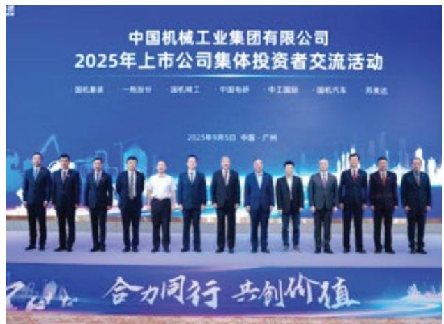

text_image

中国机械工业集团有限公司
2025年上市公司集体投资者交流活动
国机嘉美 一胜股份 国机精工 中国电研 中工国际 国机汽车 丹美达
2025年3月5日 中国·广州
合力同行 共创价值

2025年9月，国机集团在广州市举办“合力同行共创价值”2025年上市公司集体投资者交流活动，中国电研积极参与该交流活动。

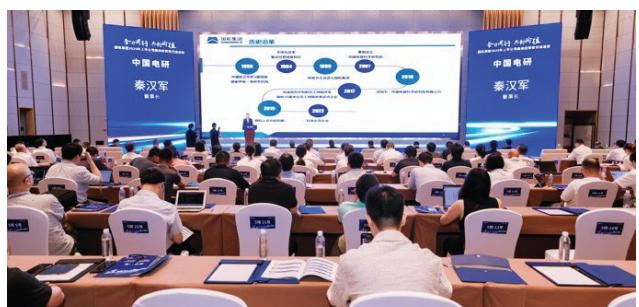

text_image

中国电研
秦汉军
中国电研
秦汉军

# ▲ 国机集团集体投资者交流活动 ▲

公司同时持续完善信息披露制度体系，修订《信息披露事务管理制度》《内幕信息知情人登记备案管理制度》《年报信息披露重大差错责任追究制度》等文件，确保公司信息披露工作的规范化，持续提升公司信息披露制度化水平。2025年，公司以合规为前提，严格按照监管要求，在公司指定媒体和上海证券交易所的网站上真实、准确、完整、及时地披露公告及相关文件合计120份；同时在强化信息披露规范性的基础上，注重提高信息披露的有效性，以投资者需求为导向，持续披露《提质增效重回报专项行动方案》及其进展评估报告，回应投资者关切，积极拓展信息披露的广度和深度。

# 股东权益

公司持续完善股东权益保护机制，通过现场与网络投票相结合的方式提升股东参与决策的便利性，并在董事选举中实行累积投票制，为中小股东充分表达意愿提供制度保障。在审议影响中小投资者利益的重大事项时，对中小股东表决情况实行单独计票并及时披露结果；在审议关联交易议案时，依规落实关联股东回避表决要求，切实维护中小股东合法权益。公司不断优化治理结构与提升信息披露质量，依托投资者关系管理加强与股东沟通，保障全体股东依法享有知情权、参与权和决策权。

# 合规运营护航

# 合规经营

公司将内控风控合规管理一体化建设纳入党委年度工作要点，将依法治企纳入党委“第一议题”，以《合规管理办法》为制度指引，坚守“合规是底线”的管理理念，以有效防控合规风险为目的，以提升依法合规经营管理水平为导向，有组织、有计划开展合规经营管理活动，监督公司及分子公司经营管理行为和员工履职行为，确保业务与合规紧密结合。

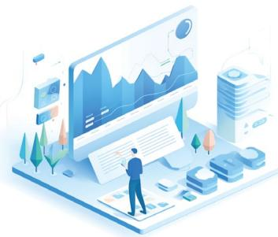

natural_image

Isometric illustration of a digital business ecosystem with charts, data visualizations, and a person interacting with documents (no text or symbols)

# 合规经营管理架构

# 党委

发挥把把方向、管大局、保落实的领导作用。

# 董事会

发挥把定战略、作决策、防风险作用。

# 经理层

发挥把谋经营、抓落实、强管理作用。

# 首席合规官

领导合规管理部门组织开展相关工作, 指导分子公司加强合规管理。

# 合规委员会

统筹协调合规管理工作，定期召开会议，研究解决重点难点问题，协调、指导、推进重大合规风险事件。

下设合规审查委员会，负责对重大投资、重大业务、重大改革、重大重组等重大决策事项进行审查并出具审查意见。

# 法务合规部

牵头负责合规管理工作，各部门、分子公司承担合规管理主体责任。

# 巡察、审计、法务、纪检等监督追责部门

对合规要求落实情况进行监督，对违规违纪行为进行调查，依规依纪追责问责。

公司高度重视合规管理与风险防控，将合规要求全面融入公司治理与经营管理全过程，持续完善制度体系与工作机制，推动形成职责清晰、流程规范、执行有力的合规管理格局。通过强化合规审查、深化重点领域风险管控并培育合规文化，公司不断提升依法合规经营水平，为企业稳健运行和高质量发展提供坚实保障。

合规审查方面，公司通过持续优化制度与流程，构建规范高效的合规审查体系。2025年，公司合规审查委员会共完成15项议案审查，涉及章程与制度修订、重大资产处置、股权转让等重要事项。

# 完善合规审查机制

修订《合规审查委员会审查事项清单》《合规审查委员会工作规则》，进一步明确审查范围与程序要求，提升审查规范性与效能。

# 前置合规审查

将合规审查作为必经程序嵌入经营管理流程，明确规定相关事项未经审查不得进入决策程序，发挥决策“防火墙”作用。

# 强化闭环管理

坚持从严审查与务求实效，对重大事项提出合规意见的同时，配套提出风险防控与后续推进建议，强化审查结果运用。

在业务重点领域合规管控方面，公司通过专题研讨、案例分析、操作指引编制及合同文本完善等方式，加强关键环节的风险与合规管理，提升业务全过程合规水平。

在完善制度与流程管控的基础上，公司进一步将合规理念融入日常经营与员工行为规范，持续强化合规文化培育与能力建设。通过搭建学习平台、开展分层分类培训及知识共享机制，推动员工提升合规意识与风险防控能力，形成全员参与、协同推进的合规管理氛围，为公司合规体系有效运行提供长期支撑。

# 亮点措施

建设线上“法律合规门户”，整合法规、案例、模板及风险提示资源，并依托学习平台常态化发布制度与普法内容。

围绕不同群体开展分层分类培训，将合规教育纳入新员工入职课程，面向不同业务板块及国际化业务人员针对性地开展专题培训与研讨。

完善涉外合规制度与知识库建设，系统梳理境外安全、合规经营与风险防控要点，为公司国际化业务提供支持。

# 税务管理

公司坚持依法合规经营与诚信纳税，将税务合规作为履行社会责任和规范治理的重要内容，严格遵循国家税收法律法规及相关政策要求，确保税费申报与缴纳及时、准确、规范。公司持续推进常态化财务检查机制，在重点业务领域配备兼职合规管理人员，定期报送税务合规情况，强化过程管控与风险防范。同时，公司积极与地方税务部门建立常态化沟通机制，深化税企协同，提升税务管理与服务效率。

# 2025年

公司全年累计缴纳各类税费24,072万元（仅含境内公司承担税费），同比增长54%，为地方财政收入和公共服务发展作出积极贡献，展现了企业与区域经济协同发展的责任担当。

# 风险防控

# 治理

公司持续构建与高质量发展相适配的全面风险管理体系。通过完善制度机制与流程管控，推动风险识别、评估与应对贯穿经营管理全过程，形成横向协同、纵向贯通的责任网络，强化全员参与、分级落实的风险防控格局，不断提升风险治理的前瞻性与有效性。

# 风险管理架构

# 董事会

全面风险管理的最高决策机构。

# 审计与风险管理委员会

统筹推动、监督、检查及评估公司全面风险管理工作。

# 法务合规部

内部控制与风险管理的归口部门, 牵头工作体系建设。

# 各职能部门、分子公司

对其业务领域的风险管理负主体责任，其负责人为本单位内控管理第一责任人。

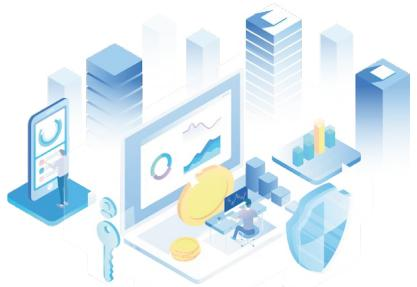

natural_image

Isometric illustration of digital business analytics with charts, coins, and city skyline (no text or symbols)

# 战略

公司秉持“管业务必须管风险”的核心理念，围绕法治建设、内部控制、风险防控、合规管理、监督追责持续深化“大风控”体系建设，将风险防控意识深植于全员与全业务流程。

# 影响、风险和机遇管理

公司积极构建“风险评估+风险监测+风险提示”的重大风险监测机制，围绕重点领域开展分级识别与持续跟踪，强化风险信息在业务一线的传导与响应，持续提升风险治理的前瞻性与精细化水平，为公司稳健经营提供有力保障。

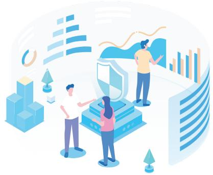

natural_image

Illustration of people interacting with a computer and business charts (no text or symbols)

# 风险防控预警监测

# 风险评估

- 根据公司及所属企业可能涉及的风险，按照发生的可能性及影响程度两个维度进行评估。  
- 在上一年度末，识别、评估、预判2025年公司面临的重大风险。

# 风险监测 常态化

\- 每季度开展风险监测，围绕“战略风险、财务风险、市场风险、运营风险、法律合规风险”等5大类、18个二级子类、54项具体指标，动态监测风险变化。

# 风险提示 精准化

- 围绕风险高发领域和敏感环节，充分利用风险监测成果，识别风险点、开展风险分析、提出解决措施。  
- 2025年发布了操作指引或风险提示共31份，内容涵盖合同管理、国际商务、涉外保函等，致力于将风险防范要求精准传导至业务一线。

# 指标与目标

2025年，公司持续完善治理架构、强化制度根基、优化监测机制，实现了对重大经营风险的有效识别、评估、监控与化解，为公司的稳健运营与可持续发展构筑了坚实的安全防线。

# 目标

# 进展

以公司总体风险可控、不发生系统性风险为底线，将风险控制在与公司发展战略及经营现状相适应的范围。

公司未发生重大风险事件。

# 内部控制

公司坚持 “制度治企” 理念，持续健全内控管理体系组织架构，严格落实制度约束要求，制定《内部控制与风险管理办法》，构建起以 “内部控制体系建设与监督制度” 为主线、各项具体操作规范为支撑的 “1+N” 内控制度体系。2025年，公司通过持续改进并完善内部控制制度，规范内部控制制度执行，不断强化内部控制监督检查，提升了内控管理水平。

公司设置独立于各业务条线与职能部门的内审监督体系，公司根据企业内部控制基本规范、上市公司自律监管指引等相关法规，制订《内部审计制度》作为内部审计监督工作的总纲，并配套审计工作细则，确保监督机制有效运行。公司审计部在审计与风险管理委员会领导下独立行使职权，对公司内部控制的建立和实施、财务信息的真实性和完整性等情况进行各类检查，并督促内部控制缺陷的整改及监督落实。

# 内部控制管理举措

# 内控自评

- 开展内控自评价和监督评价，强化评价结果的应用、推动后期整改工作。  
- 对自评价发现的问题，建立整改台账，明确责任部门、整改时限与整改措施。  
- 组织21家子公司（含境外单位、托管单位）开展合规管理和内部控制一体化自评价工作，除威凯(苏州)检测技术有限公司(2025年新成立)外，自评实现全覆盖。

# 审计监督协同

- 依据规定推动审计整改事项，推进内控、合规管理及职能联动。  
- 审计过程中若发现涉及内控风控、合规要素的问题,均征求法务合规部意见,整改措施与结果必须经由该项问题的内控风控合规相应归口职能部门进行审批。  
- 针对公司及7家子公司(含托管单位)开展内部控制审计评价并出具审计报告。

# 内控联动

\- 以合同管理为主要抓手，构建全方位联动机制，串联各项内部控制流程。

# 内控数字化转型

- 升级采购供应链信息化系统，整合信息技术资源，实现一体化集成管理。  
- 通过系统控制规则,实现业务合规合理性查验,提升了供应链效率与响应速度。

# 恪守商业道德

# 反商业贿赂及反贪污

公司以刚性制度为抓手，构建起全方位、闭环式的反腐廉洁治理支撑体系，为正风肃纪提供坚实保障。公司制定《纪委办公室问题线索管理办法》《向公司纪委报告重要事项的工作指引》两项关键制度，明确问题线索处置流程、

重要事项报告要求，让反腐工作有章可循、有规可依，从制度层面堵住监管漏洞。不断健全工作机制、优化工作举措，推动廉洁建设常态化、规范化发展，推动廉洁建设各项要求落地见效，持续巩固拓展正风肃纪成果，着力营造崇廉尚洁的工作氛围。

2025年，公司坚持严的基调不动摇，以强有力政治监督服务保障公司改革发展中心任务，持续筑牢反商业贿赂、反贪污腐败防线，为公司高质量完成“十四五”目标任务、实现“十五五”良好开局提供坚强纪律保障。

natural_image

Illustration of a person standing on a smartphone with stacks of coins and a globe, symbolizing financial or business growth (no text or symbols present)

# 加强廉洁建设相关举措

# 压实廉洁责任

- 持续完善干部廉政档案，一人一档、动态更新、建用有据，严把廉政意见关。  
- 中层干部、关键岗位人员廉洁责任书签订全覆盖。  
- 对新提任干部开展廉洁谈话。  
- 全程监督干部选拔任用、考核评价等关键环节。

# 巡察监督管理

- 聚焦基建项目等关键领域，紧盯基建招标采购、合同变更、施工管理等易发腐败环节，强化全过程监督检查，坚决防范重大工程项目廉洁风险。  
- 成立3个检查组，对公务接待、商务接待、差旅费报销开展全面检查。

# 畅通举报通道

\- 公开举报渠道，全方位防范廉洁风险。

# 廉洁文化宣传

- 梳理形成公司《党的十八大以来违规违纪违法典型案例汇编》，召开管理岗位人员警示教育大会。  
- 依托“清风电研”云社区推送廉洁教育内容、开展廉洁主题征文。  
- 开展教育基地学习等多种形式的廉洁宣传教育活动，大力弘扬“务实、创新、勤俭、清廉”廉洁文化。

# 反不正当竞争

公司严格遵守《中华人民共和国反不正当竞争法》《中华人民共和国反垄断法》等相关法律法规，尊重市场规则，坚决反对任何形式的不正当竞争行为，与市场参与者共同维护公平竞争的商业环境。2025年，公司未发生任何与不正当竞争相关的违规事件。

# 反不正当竞争与商业秘密保护培训

# 领导层

参加“加强反垄断合规、服务高质量发展”内部培训，提升了战略认知与专业判断力。

# 基层员工

剖析典型案例，在新员工入职必修课中强化合规与保密要求，完善员工保密协议文本，全体人员均签署《保密协议》。

# 关键绩效表

自2024年起，强度/密度指标使用的营收按工业产值与非工业营收之和计算。

  
环境范畴

<table><tr><td>指标</td><td>单位</td><td>2024</td><td>2025</td></tr><tr><td colspan="4">水资源利用</td></tr><tr><td>取水量</td><td>立方米</td><td>354,718</td><td>291,875</td></tr><tr><td>总耗水量 $^1$ </td><td>立方米</td><td>50,674</td><td>54,943</td></tr><tr><td>重复用水总量 $^2$ </td><td>立方米</td><td>77,062</td><td>81,138</td></tr><tr><td>重复用水消耗量占比</td><td>%</td><td>21.72</td><td>27.80</td></tr><tr><td>水资源消耗强度(按营收计)</td><td>立方米/万元</td><td>0.78</td><td>0.61</td></tr><tr><td colspan="4">能源利用</td></tr><tr><td>能源消耗总量</td><td>吨标准煤</td><td>10,729.63</td><td>12,360.42</td></tr><tr><td>直接能源消耗量</td><td>吨标准煤</td><td>/</td><td>5,613.51</td></tr><tr><td>汽油消耗量</td><td>吨</td><td>102.97</td><td>98.23</td></tr><tr><td>柴油消耗量</td><td>吨</td><td>63.19</td><td>61.99</td></tr><tr><td>天然气消耗量</td><td>万立方米</td><td>360.04</td><td>379.85</td></tr><tr><td>光伏发电(自用)</td><td>万千瓦时</td><td>/</td><td>265.80</td></tr><tr><td>间接能源消耗量</td><td>吨标准煤</td><td>/</td><td>6,746.91</td></tr><tr><td>电力</td><td>万千瓦时</td><td>4,635.88</td><td>5,489.75</td></tr><tr><td>能源消耗强度(按营收计)</td><td>吨标准煤/万元</td><td>0.02</td><td>0.03</td></tr><tr><td>可再生能源消耗总量 $^3$ </td><td>万千瓦时</td><td>57.56</td><td>522.45</td></tr><tr><td colspan="4">循环经济</td></tr><tr><td>物料消耗总量 $^1$ </td><td>吨</td><td>/</td><td>84,038.21</td></tr><tr><td>不可再生物料消耗量 $^1$ </td><td>吨</td><td>/</td><td>0</td></tr></table>

<table><tr><td>指标</td><td>单位</td><td>2024</td><td>2025</td></tr><tr><td>包装材料使用量1</td><td>吨</td><td>/</td><td>2,038.33</td></tr><tr><td>可循环使用包装材料使用量1</td><td>吨</td><td>/</td><td>72.80</td></tr><tr><td>不可循环使用包装材料使用量1</td><td>吨</td><td>/</td><td>942.20</td></tr><tr><td>原材料认证比例1</td><td>%</td><td>/</td><td>61</td></tr><tr><td colspan="4">环境合规管理</td></tr><tr><td>环保总投入</td><td>万元</td><td>1,497.40</td><td>1,522.14</td></tr><tr><td>环保总投入占营业收入比例</td><td>%</td><td>0.33</td><td>0.32</td></tr><tr><td>报告期内因环境事件受到生态环境等有关部门重大行政处罚的处罚金额</td><td>万元</td><td>/</td><td>0</td></tr><tr><td colspan="4">污染物排放</td></tr><tr><td>废水排放量4</td><td>立方米</td><td>231,826.33</td><td>249,188.26</td></tr><tr><td>工业废水排放量5</td><td>立方米</td><td>34,984</td><td>49,062</td></tr><tr><td>生活污水排放量5</td><td>立方米</td><td>196,842.33</td><td>200,126.26</td></tr><tr><td>废水排放强度(按营收计)</td><td>立方米/万元</td><td>0.36</td><td>0.52</td></tr><tr><td>化学需氧量(COD)</td><td>吨</td><td>2.21</td><td>2.32</td></tr><tr><td>化学需氧量排放强度(按营收计)</td><td>千克/万元</td><td>0.0049</td><td>0.0049</td></tr><tr><td>颗粒物(PM)</td><td>吨</td><td>1.16</td><td>1.70</td></tr><tr><td>氮氧化物( $NO_x$ )6</td><td>吨</td><td>2.86</td><td>5.90</td></tr><tr><td>颗粒物(PM)排放强度(按营收计)</td><td>千克/万元</td><td>0.0026</td><td>0.0036</td></tr><tr><td>每万元营收氮氧化物( $NO_x$ )排放强度(按营收计)</td><td>千克/万元</td><td>0.01</td><td>0.01</td></tr><tr><td colspan="4">废弃物处理</td></tr><tr><td>固体废弃物产生总量</td><td>吨</td><td>266.34</td><td>802.33</td></tr><tr><td>有害废弃物产生量</td><td>千克</td><td>47,903</td><td>50,758</td></tr><tr><td>无害废弃物产生量7</td><td>千克</td><td>218,437</td><td>751,577</td></tr><tr><td>有害废弃物处置率</td><td>%</td><td>100</td><td>100</td></tr><tr><td>无害废弃物处置率</td><td>%</td><td>100</td><td>100</td></tr><tr><td>回收再利用废弃物总量</td><td>吨</td><td>/</td><td>33.71</td></tr><tr><td>有害废弃物强度(按营收计)</td><td>千克/万元</td><td>0.11</td><td>0.11</td></tr><tr><td>无害废弃物强度(按营收计)</td><td>千克/万元</td><td>0.48</td><td>1.58</td></tr><tr><td colspan="4">温室气体排放管理</td></tr><tr><td>温室气体排放总量 $^{8}$ </td><td>吨二氧化碳当量</td><td>33,167.13</td><td>37,829.03</td></tr><tr><td>范围一排放量 $^{9}$ </td><td>吨二氧化碳当量</td><td>8,291.00</td><td>8,700.40</td></tr><tr><td>范围二排放量 $^{10}$ </td><td>吨二氧化碳当量</td><td>24,876.13</td><td>29,128.63</td></tr><tr><td>温室气体减排量</td><td>吨二氧化碳当量</td><td>/</td><td>1,536.51</td></tr><tr><td>温室气体排放强度(按营收计)</td><td>吨二氧化碳当量/万元</td><td>0.08</td><td>0.08</td></tr></table>

1 数据仅涵盖擎天材料。  
2 数据仅涵盖擎天材料、威凯认证、威凯检测。  
3 包括企业购买的绿电、绿证、自发自用的可再生能源电量总量。  
4 因口径变化，追溯调整 2024 年数据。  
$^{5}$ 因口径变化, 追溯调整2024年数据; 由于产量增大, 工业废水产生量增加。  
6 2025年初更换第三方检测机构，新旧单位设备、采样方式及人员存在差异；相关污染物指标基数偏低，叠加采样时段、设备差异，导致大气监测数据同比波动偏大。  
7 因口径变化, 2024年数据不包含威凯检测、威凯认证、擎天实业、成套装备、花都工业园管理办公室, 数据量变动幅度较大。  
8 核算范围：中国电研本部、威凯检测和威凯认证及旗下分/子公司（公共建筑运营）；擎天材料及旗下分/子公司（化工生产业）；擎天实业及旗下分/子公司、成套装备业务（机械设备制造业）；核算依据：本报告分别依据《公共建筑运营单位(企业)温室气体排放核算方法和报告指南(试行)》《中国化工生产企业温室气体排放核算方法与报告指南(试行)》《机械设备制造企业温室气体排放核算方法与报告指南(试行)》对相应行业、企业进行二氧化碳排放量核算。  
9 涵盖自有设备的天然气、柴油燃烧和公司自有车辆消耗汽油。  
$^{10}$ 涵盖外购电量数据；范围二温室气体排放计算依据的电网排放系数来源于中国生态环境部、国家统计局2025年12月31日印发的《关于发布2023年电力二氧化碳排放因子的公告》(2025年第47号)，其中明确电网排放系数取0.5306tCO $_{2}$ /MWh。

  
社会范畴

<table><tr><td colspan="2">指标</td><td>单位</td><td>2024</td><td>2025</td></tr><tr><td colspan="5">员工招聘与就业</td></tr><tr><td colspan="2">在职员工总数</td><td>人</td><td>3,153</td><td>3,218</td></tr><tr><td rowspan="2">其中:</td><td>少数民族员工</td><td>人</td><td>97</td><td>114</td></tr><tr><td>残疾员工</td><td>人</td><td>17</td><td>18</td></tr><tr><td rowspan="2">按性别结构划分</td><td>男性</td><td>人</td><td>2,238</td><td>2,309</td></tr><tr><td>女性</td><td>人</td><td>915</td><td>909</td></tr><tr><td rowspan="3">按年龄结构划分</td><td>30岁(含)以下</td><td>人</td><td>1,237</td><td>1,184</td></tr><tr><td>30岁-50岁(含)</td><td>人</td><td>1,762</td><td>1,874</td></tr><tr><td>50岁以上</td><td>人</td><td>154</td><td>160</td></tr><tr><td rowspan="4">按教育程度划分</td><td>博士研究生</td><td>人</td><td>22</td><td>27</td></tr><tr><td>硕士研究生</td><td>人</td><td>334</td><td>372</td></tr><tr><td>本科</td><td>人</td><td>1,916</td><td>1,996</td></tr><tr><td>本科以下</td><td>人</td><td>881</td><td>823</td></tr><tr><td rowspan="2">按地域分布划分</td><td>中国大陆</td><td>人</td><td>/</td><td>3,217</td></tr><tr><td>海外</td><td>人</td><td>/</td><td>1</td></tr><tr><td colspan="2">新入职员工总数</td><td>人</td><td>/</td><td>245</td></tr><tr><td rowspan="2">按性别结构划分</td><td>男性</td><td>人</td><td>/</td><td>207</td></tr><tr><td>女性</td><td>人</td><td>/</td><td>38</td></tr><tr><td rowspan="2">按招聘渠道划分</td><td>应届毕业生</td><td>人</td><td>/</td><td>131</td></tr><tr><td>社会招聘</td><td>人</td><td>/</td><td>114</td></tr><tr><td colspan="2">劳动合同签订率</td><td>%</td><td>100</td><td>100</td></tr><tr><td colspan="2">未解决的劳动纠纷案件数量</td><td>件</td><td>0</td><td>0</td></tr><tr><td colspan="2">员工流失率</td><td>%</td><td>4.5</td><td>4.6</td></tr></table>

<table><tr><td>指标</td><td>单位</td><td>2024</td><td>2025</td></tr><tr><td colspan="4">员工薪酬与福利</td></tr><tr><td>社会保险覆盖率</td><td>%</td><td>100.</td><td>100</td></tr><tr><td>员工的体检覆盖率</td><td>%</td><td>100</td><td>100</td></tr><tr><td colspan="4">员工发展与培训</td></tr><tr><td>员工培训投入金额</td><td>万元</td><td>330</td><td>409</td></tr><tr><td>员工培训举办场次</td><td>场次</td><td>2,775</td><td>2,832</td></tr><tr><td>员工培训覆盖率</td><td>%</td><td>100</td><td>100</td></tr><tr><td>员工平均培训时长</td><td>小时</td><td>50.04</td><td>51.50</td></tr><tr><td colspan="4">员工健康与安全</td></tr><tr><td>安全培训时长</td><td>小时</td><td>/</td><td>30,277</td></tr><tr><td>安全培训举办场次</td><td>场次</td><td>/</td><td>463</td></tr><tr><td>人均安全培训时长</td><td>小时</td><td>/</td><td>6.30</td></tr><tr><td>安全生产培训覆盖率</td><td>%</td><td>/</td><td>100</td></tr><tr><td>安全生产责任险投入金额</td><td>万元</td><td>/</td><td>3.85</td></tr><tr><td>因工伤损失工日数</td><td>日</td><td>0</td><td>0</td></tr><tr><td>因工死亡人数</td><td>人</td><td>0</td><td>0</td></tr><tr><td>职业病发病率</td><td>%</td><td>0</td><td>0</td></tr><tr><td colspan="4">员工关爱与帮扶</td></tr><tr><td>帮扶困难员工人数</td><td>人</td><td>/</td><td>17</td></tr><tr><td colspan="4">员工满意度</td></tr><tr><td>员工满意比例</td><td>%</td><td>96</td><td>96</td></tr><tr><td colspan="4">产品服务质量及保障</td></tr><tr><td>报告期内发生的产品和服务相关的安全与质量重大责任事故损害涉及的金额</td><td>万元</td><td>0</td><td>0</td></tr><tr><td>客户满意度</td><td>%</td><td>/</td><td>/</td></tr><tr><td>客户投诉解决完成率</td><td>%</td><td>100</td><td>100</td></tr></table>

<table><tr><td>指标</td><td>单位</td><td>2024</td><td>2025</td></tr><tr><td colspan="4">数据安全与客户隐私保护</td></tr><tr><td>泄露客户隐私事件数量</td><td>件</td><td>0</td><td>0</td></tr><tr><td colspan="4">创新研发</td></tr><tr><td>研发投入金额</td><td>万元</td><td>35,845</td><td>40,573</td></tr><tr><td>研发投入占营业收入比例</td><td>%</td><td>7.93</td><td>8.51</td></tr><tr><td>研发人员数量</td><td>人</td><td>595</td><td>671</td></tr><tr><td>研发人员占比</td><td>%</td><td>19</td><td>21</td></tr><tr><td colspan="4">知识产权</td></tr><tr><td>新增申请专利数量</td><td>件</td><td>257</td><td>221</td></tr><tr><td>新增授权专利数量</td><td>件</td><td>177</td><td>161</td></tr><tr><td>累计有效专利总量</td><td>件</td><td>1,184</td><td>1,345</td></tr><tr><td>累计软件著作权总量</td><td>件</td><td>358</td><td>388</td></tr><tr><td colspan="4">科技伦理</td></tr><tr><td>违反科技伦理事件数量</td><td>件</td><td>0</td><td>0</td></tr><tr><td colspan="4">供应商管理</td></tr><tr><td> $供应商数量^1$ </td><td>家</td><td>2,911</td><td>4,108</td></tr><tr><td>按地域分布划分 中国大陆</td><td>家</td><td>2,894</td><td>4,084</td></tr><tr><td>海外</td><td>家</td><td>/</td><td>24</td></tr><tr><td>供应商本地化比例</td><td>%</td><td>/</td><td>99.42</td></tr><tr><td>本地化采购比例</td><td>%</td><td>/</td><td>98.47</td></tr><tr><td>接受审查的供应商数量</td><td>家</td><td>201</td><td>293</td></tr><tr><td>因不合规被中止合作的供应商数量</td><td>家</td><td>/</td><td>0</td></tr><tr><td>因不合规被清退的潜在供应商数量</td><td>家</td><td>/</td><td>0</td></tr><tr><td colspan="4">供应链管理</td></tr><tr><td>供应链重大风险与影响事件数量</td><td>件</td><td>0</td><td>0</td></tr><tr><td colspan="4">社会贡献</td></tr><tr><td>参与志愿服务活动人次</td><td>人次</td><td>580</td><td>623</td></tr><tr><td>志愿者参与时长</td><td>小时</td><td>2,180</td><td>2,315</td></tr><tr><td>人均志愿服务时长</td><td>小时</td><td>3.76</td><td>3.72</td></tr><tr><td colspan="4">乡村振兴</td></tr><tr><td>乡村振兴投入金额</td><td>万元</td><td>371.00</td><td>488.63</td></tr><tr><td>乡村振兴惠及人数</td><td>人</td><td>/</td><td>312</td></tr></table>

1 因本年度采购金额增加，为满足采购需求，公司增加了供应商。

  
治理范畴

<table><tr><td>指标</td><td>单位</td><td>2024</td><td>2025</td></tr><tr><td colspan="4">组织构成及职能</td></tr><tr><td>董事会人数</td><td>人</td><td>9</td><td>12</td></tr><tr><td>董事会男性占比</td><td>%</td><td>100</td><td>83.33</td></tr><tr><td>董事会女性占比</td><td>%</td><td>0</td><td>16.67</td></tr><tr><td>独立董事占比</td><td>%</td><td>33.33</td><td>33.33</td></tr><tr><td>高管人数1</td><td>人</td><td>9</td><td>6</td></tr><tr><td>高管男性占比</td><td>%</td><td>/</td><td>83.33</td></tr><tr><td>高管女性占比</td><td>%</td><td>/</td><td>16.67</td></tr><tr><td colspan="4">反不正当竞争</td></tr><tr><td>因公司不正当竞争行为导致诉讼或重大行政处罚的事件</td><td>件</td><td>0</td><td>0</td></tr><tr><td colspan="4">反商业贿赂与反贪污</td></tr><tr><td>反贪腐/廉洁培训覆盖人数</td><td>人</td><td>3,153</td><td>3,188</td></tr></table>

<table><tr><td>指标</td><td>单位</td><td>2024</td><td>2025</td></tr><tr><td colspan="4">投资者关系管理</td></tr><tr><td>回复交易所平台问题次数</td><td>次</td><td>/</td><td>29</td></tr><tr><td>业绩说明会召开次数</td><td>次</td><td>3</td><td>3</td></tr><tr><td colspan="4">股东权益</td></tr><tr><td>召开股东会次数</td><td>次</td><td>2</td><td>4</td></tr><tr><td>股东会董事出席率</td><td>%</td><td>/</td><td>94.10</td></tr><tr><td colspan="4">信息披露</td></tr><tr><td>编制与披露报告</td><td>个</td><td>/</td><td>120</td></tr></table>

1 根据公司2025年11月修订的《公司章程》，高级管理人员为总经理、副总经理、财务总监、董事会秘书等。不包含专职党委副书记、纪委书记。

指标索引表  

<table><tr><td colspan="2">章节标题</td><td>央企控股上市公司ESG指标</td><td>上海证券交易所《上市公司自律监管指引第14号——可持续发展报告(试行)》</td></tr><tr><td colspan="2">ESG治理</td><td>G.1.1</td><td>利益相关方沟通、尽职调查</td></tr><tr><td rowspan="5">环境篇</td><td>应对气候变化</td><td>E.3.1、E.3.2、E.3.3、E.5.1、E.5.5</td><td>应对气候变化</td></tr><tr><td>环境合规管理</td><td>E.5.4、E.5.5、E.5.6</td><td>环境合规管理</td></tr><tr><td>污染防治攻坚</td><td>E.2.1、E.2.2、E.2.3</td><td>污染物排放、废弃物处理</td></tr><tr><td>资源合理利用</td><td>E.1.1、E.1.2、E.1.3、E.1.4、E.5.2、E.5.4</td><td>能源利用、水资源利用、循环经济</td></tr><tr><td>注重生态保护</td><td>E.4.1</td><td>生态系统和生物多样性保护</td></tr><tr><td rowspan="5">社会篇</td><td>聚焦人才赋能</td><td>S.1.1、S.1.2、S1.3、S.1.4、S.1.5</td><td>员工</td></tr><tr><td>品质护航发展</td><td>S.2.1、S.2.2</td><td>产品和服务安全与质量、数据安全与客户隐私保护</td></tr><tr><td>创新引领未来</td><td>S.2.3</td><td>创新驱动、科技伦理</td></tr><tr><td>携手共谋进步</td><td>S.3.1、S.3.2、S.4.4</td><td>供应链安全、平等对待中小企业</td></tr><tr><td>温暖回馈社会</td><td>S.4.2、S.4.3、S.4.4</td><td>社会贡献、乡村振兴</td></tr><tr><td rowspan="4">治理篇</td><td>党建引领发展</td><td>G.1.1</td><td>/</td></tr><tr><td>公司治理筑基</td><td>G.1.1、G.1.2、G.1.3、G.3.1、G.3.2、G.4.1</td><td>利益相关方沟通</td></tr><tr><td>合规运营护航</td><td>G.2.1、G.5.1、G.5.2</td><td>/</td></tr><tr><td>恪守商业道德</td><td>G.2.2、G.2.3</td><td>反商业贿赂及反贪污、反不正当竞争</td></tr></table>

# 鉴证报告

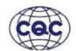

中国质量认证中心
CHINA QUALITY CERTIFICATION CENTRE

# ESG报告鉴证声明

# 致：中国电器科学研究院股份有限公司各利益相关方

中国质量认证中心有限公司（以下简称“CQC”）受中国电器科学研究院股份有限公司（以下简称“中国电研”）委托，对《中国电器科学研究院股份有限公司2025年度环境、社会及公司治理（ESG）报告》（以下简称“ESG报告”）进行了独立的第三方鉴证工作。

中国电研负责收集、汇总、分析和披露报告中提到的信息和数据。CQC 在与中国电研的协议中规定的范围内实施报告鉴证。中国电研为本声明的指定用户。

本声明基于对中国电研依据上海证券交易所《科创板股票上市规则》、上海证券交易所《科创板上市公司自律监管指引第1号——规范运作》、上海证券交易所《上市公司自律监管指引第14号——可持续发展报告（试行）》、上海证券交易所《科创板上市公司自律监管指南第13号——可持续发展报告编制》、国务院国资委《央企控股上市公司ESG专项报告参考指标体系》及联合国《可持续发展目标（SDGs）》等相关要求编制的ESG报告所开展的鉴证活动作出，中国电研对报告内信息、数据的真实性、完整性和准确性负责。

# 鉴证范围

《中国电器科学研究院股份有限公司2025年度环境、社会及公司治理（ESG）报告》中披露的ESG关键绩效数据与信息。

# 鉴证依据

《AA1000鉴证标准v3》，鉴证类型和深度为“类型二，中度鉴证”。

# 鉴证方法

本次鉴证所用方法包括但不仅限于：

a）报告审阅；  
b) 访谈;  
c）文件、记录、证书、票据等资料查阅/佐证；  
d) 可信信息源验证;  
e）对照披露依据验证；  
f）重新计算/测算；  
g）统计、计算/测算过程确认。

# 局限性声明

■本次鉴证在考虑定量和定性风险分析的基础上采用抽样方法开展，抽样范围仅限于报告中选用的数据和信息，未对中国电研的所有原始数据进行全面溯源或独立重新测算。

■本次鉴证仅对中国电研进行访谈和查阅相关文件，并未涉及到外部利益相关方。  
■报告中经第三方审计/验证的数据和信息，本次鉴证过程中不做重复验证。  
■报告中部分数据和信息不存在可以进行对比验证的数据/信息源。

本鉴证声明中不包括：

■信息披露之外的活动。  
■关于中国电研的立场、观点、目标、未来发展方向和承诺的陈述。

# 独立性和能力的声明

中国质量认证中心有限公司（CQC）为具备独立法律地位的第三方认证机构，具有开展可持续发展相关鉴证服务的专业资质与经验。CQC在本次鉴证过程中保持独立性、公正性，并具备开展ESG报告鉴证所需的技术能力和行业理解，符合AA1000鉴证标准v3对鉴证机构的要求。本次鉴证团队由具备丰富经验的AA1000认证可持续报告鉴证人员（PCSAP级别），CCAA（中国认证认可协会）注册质量、环境、职业健康安全、能源、合规、反贿赂等管理体系审核员及APSCA（专业社会责任审核员协会）注册社会责任审核员及ISO14064温室气体核查员组成。

CQC确保与中国电研在实施本报告的鉴证过程中与中国电研及其利益相关方没有任何利益冲突。本报告所有信息由中国电研提供。CQC及本次报告鉴证人员未参与到报告的编制过程。

# 鉴证结论

ESG报告反映了中国电研2025年在ESG方面的开展情况和所取得的绩效，整体符合AA1000鉴证标准v3及AA1000AP四项原则的要求：

1. 包容性：中国电研识别了公司的内部和外部利益相关方，包括股东及投资者、客户、员工、政府及监管机构、供应商及合作伙伴、行业组织、社区代表与公益组织等，在报告编制过程中考虑了利益相关方的期望和需求。  
2. 实质性：中国电研基于双重重要性评估框架，从财务重要性与影响重要性两个维度，对ESG领域关键议题进行系统识别，并结合各方反馈意见对实质性议题进行重要性排序评估，形成重要性议题矩阵，对重要性议题的识别、评估和确认过程具备一定的系统性和规范性，能够为报告披露提供支撑。  
3. 回应性：中国电研建立了治理架构、制度、管理体系和流程、利益相关方沟通机制，能够采取及时有效的行动回应对中国电研和利益相关方具有高度财务重要性和影响重要性的重要性议题。  
4. 影响性：中国电研通过定量、定性以及二者结合的方式，披露了在ESG方面对自身以及利益相关方产生的主要影响，展现了公司对自身及利益相关方的高度责任感。

特定绩效信息：基于本次鉴证的过程和结果，我们未发现报告中的关键数据和信息在可靠性和质量方面存在不足之处。

# 建议

针对本次报告鉴证的具体意见已向中国电研管理层沟通并以文字形式提供，本部分不再表述。

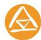

# AA1000

Licensed Report

000-366/V3-J3YPY

CQC 授权人签名:

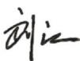

中国质量认证中心有限公司

2026年4月16日

中国·北京