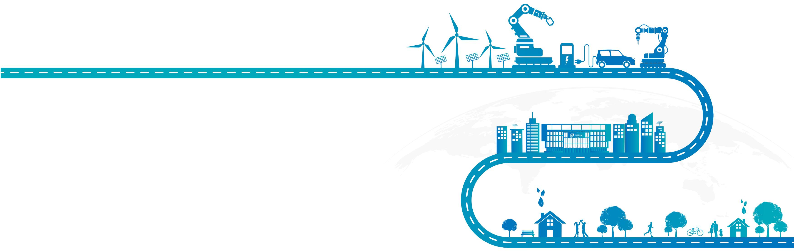

natural_image

Illustration of a smart city with wind turbines, robotic arms, and urban buildings (no text or symbols)

# BR-Tech

联系电话：0512-62886165

电子邮箱：ir@beiren-tech.com

联系地址：江苏省苏州市苏州工业园区淞北路18号

# 2025

# 年度环境/社会及公司治理

# (ESG)报告

江苏北人智能制造科技股份有限公司

# 目录

报告编制说明 3

管理层寄语 5

# 公司概况与2025年度大事记

公司简介与业务结构 7

北人发展大事记 9

荣誉与认证 11

# 指标与对标索引

重点议题KPI汇总 43

对标索引 45

读者意见反馈 47

# 公司治理

完善治理体系,打造稳健、规范、负责的企业基石——公司治理

- 治理架构与职责 15  
- 风险管理与尽职调查 17  
- 反商业贿赂与反腐败 18  
- 相关方沟通与议题管理 19  
- 数据安全与隐私治理 20

# 企业经营

以技术突破赋能产业升级,以创新引领未来增长——创新驱动

- 创新战略与研发治理 23  
- 从“设计即质量”（QbD）到“交付零缺陷” 24

以质量为先,提供安全可靠的智能制造解决方案——产品与服务安全质量

- 质量管理体系（ISO/客户标准）与全生命周期管理 25  
- 安全合规与产品可靠性（含海外法规/客户标准） 26  
- 客户满意度与售后响应 26

提升供应链韧性,打造透明、负责、稳固的合作生态——可持续供应链与安全韧性

- 供应链治理与分层分级管理 27  
- 绿色与责任采购 28

# 环境责任

构建低碳智造体系,共创绿色价值链

——应对气候变化与能源管理

- 气候治理与目标 31  
- 运营端减排与能效提升 32

# 以人为本

以人为本,营造平等、安全、关怀的职场环境——员工权益与福利

- 雇佣合规与平等机会 35  
- 薪酬福利与多元关怀 35  
- 员工参与与申诉渠道 36

培养面向未来的智能制造人才梯队——人才培养与发展

- 人才战略与梯队建设 36  
- 技能提升与资格认证 38  
- 领导力发展与关键岗位接班计划 40

智能化守护安全,构建健康、可靠的工作场所——职业健康与安全(HSE)

- HSE 管理体系与职责 41  
- 重大风险作业自动化替代(焊接、打磨等)与本质安全提升 41  
- 事故与事件管理、应急演练与复盘 41

社区与社会公益

\- 定向公益与员工志愿服务 42

# 报告编制说明

管理层寄语

公司概况

公司治理

企业经营

环境责任

以人为本

指标与对标索引

读者意见反馈

# 报告编制说明

# 报告范围与边界

本报告是江苏北人智能制造科技股份有限公司(简称“江苏北人”或“公司”)发布的2025年度环境、社会及公司治理(ESG)报告。本报告本着客观、规范、透明和全面的原则，向所有利益相关方披露公司在经济、产品、环境和社会责任领域的实践和绩效。

# 编制依据与标准

除非特别说明,本报告披露范围为江苏北人及纳入合并财务报表的子公司。

报告披露时间范围为2025年1月1日至2025年12月31日，为便于阅读者理解报告内容，报告中可能会增加时间范围外的信息。

本报告参考《上海证券交易所上市公司自律监管指引第14号——可持续发展报告(试行)》、《可持续发展报告指引(试行)》、《企业可持续披露准则——基本准则(征求意见稿)》、《上市公司可持续发展报告工作指南》和《上市公司可持续发展报告编制指南(征求意见稿)》进行编制，并参考全球报告倡议组织《可持续发展报告标准》(GRI 标准 2021)。

# 数据口径与计算方法

报告中的数据、案例来自江苏北人及其子公司实际运行的原始记录或财务报告。本报告的财务数据以人民币为单位。若与财务报告不一致之处，以财务报告为准。

# 第三方鉴证说明

本公司董事会及全体董事保证本报告内容不存在任何虚假记载、误导性陈述或重大遗漏，并对其内容的真实性、准确性和完整性承担个别及连带责任。非财务信息未经第三方鉴证。

# 报告版本与获取方式

本报告以中文版在上海证券交易所网站向社会发布，发布形式为电子版。如有不一致。对本报告的内容如有疑问或建议，可通过以下联系方式反馈。

# 前瞻性声明与限制

本报告的部分内容具有一定前瞻性,易受到不确定因素的影响而导致实际结果产生重大差异。本公司不承担更新本报告中任何前瞻性声明的义务。

# 联系方式与意见反馈

联系电话：0512-62886165

电子邮箱:ir@beiren-tech.com

flowchart

```mermaid
graph LR
  subgraph Code Editor
  A["&quot;static int["] countWordsOurBinarySearchTree(String filename) throws Exception"] --> B["Scaner fileScanner = new Scanner(new File filename); Stopwatch st = new Stopwatch(); Stopwatch <String> c <= new BinarySearchTree<String>>"]
  B --> C["&quot;public static int["] countWordsOurBinarySearchTree(String filename) throws Exception"]
  end

  style A fill:#f9f9f9,stroke:#333,stroke-width:2px
  style B fill:#f9f9f9,stroke:#333,stroke-width:2px
  style C fill:#f9f9f9,stroke:#333,stroke-width:2px
```

# 管理层寄语

尊敬的合作伙伴、各界同仁、全体员工：

大家好！

2025年，面对复杂多变的宏观经济环境、行业竞争格局的深度调整以及自身战略转型的关键挑战，公司主动应对经营发展中面临的问题和困难，坚守基于“AI+机器人”的智能制造解决方案核心赛道。在战略层面，及时调整布局，审慎处置非核心亏损业务，集中资源强化主业优势；在市场拓展上，全力开拓海外市场，打造业务增长引擎，同时深化重点客户合作，提升抗风险能力；在技术研发方面，聚焦核心工艺与智能化升级，加码具身智能焊接机器人系统的前瞻布局，推动机器人感知、决策与执行能力深度融合。尽管多重因素导致经营业绩出现阶段性下滑，但持续加强核心业务研发创新投入，产品业务竞争力持续夯实，国内外战略客户不断向纵深拓展。面对不利局面，公司主动作为、优化资源配置，持续提升运营效率与组织韧性，为长期可持续发展筑牢根基。

治理层面,我们持续完善董事会与ESG治理架构,强化透明度与问责机制。2025年,公司按照新《公司法》要求完成监事会取消及审计委员会职能承接,董事会多元化水平进一步提升。在外部ESG评价中,公司获得中证ESG评价体系A评级、获得同花顺AA评级,充分体现了我们在信息披露、合规运营与股东权益保护方面的进步与承诺。我们将把“合规与诚信”作为底线,通过风险管理、尽职调查与反商业贿赂体系的全链路运行,为业务增长保驾护航。

财务方面,面对复杂多变的内外部环境,公司实现营业收入约【51,004.11】万元,归属于母公司所有者的净利润约为【-8,083.18】万元。2025年的经营结果受到行业周期性调整、国内汽车行业激烈竞争、海外业务交付周期偏长、以及储能业务的战略收缩与减值计提等因素共同影响,公司净利润出现波动。但更重要的是,我们通过聚焦核心业务、调整订单结构、优化成本效率以及提升资产质量,为未来的恢复性增长与价值重塑打下了更坚实的基础。

面向未来,我们把气候行动与数据安全纳入企业级要务。报告期内,我们系统识别了运营与价值链中的气候风险,并完成首次气候情景分析。一方面,我们将以低碳智造、节能工艺与客户侧降碳方案,稳步推进减排目标;另一方面,我们以分级分类的数据治理与隐私保护机制,通过ISO27001认证,持续提升数字化环境下的安全与信任。

我们也将一如既往坚持“以人为本”，持续优化员工权益与福利体系，完善人才培养与职业健康安全。2025年，公司员工培训覆盖率近47.7%，累计培训超5,505小时，并通过“菁英工程师”、“北人星”等专项计划为每一位北人同仁提供成长与守护。我们在苏州工业园区人才政策支持下，近三年连续为员工申请生活补贴，切实减轻青年人才压力，增强团队凝聚力。

在所有利益相关方的信任与合作中, 江苏北人将以更清晰的战略, 更坚实的治理, 更坚定的创新步伐, 向“高质量、可持续、可预期”的长期价值迈进。我们坚信, 唯有持续稳健的增长, 才能为股东、伙伴和社会创造持久共赢的未来。

# 董事长 朱振友

江苏北人智能制造科技股份有限公司

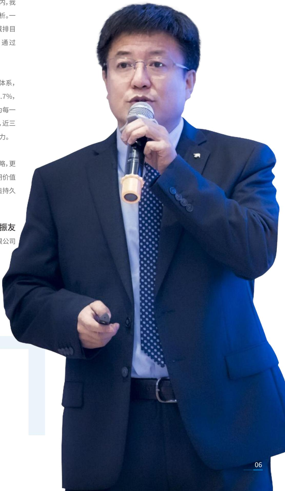

text_image

演讲者在麦克风旁发言，背景含部分中文文本片段

# 公司概况与2025年度大事记

# 公司简介与业务结构

江苏北人智能制造科技股份有限公司(科创板:SH.688218)深耕智能制造整体解决方案,长期专注于机器人系统集成与智能工厂,为汽车及汽车零部件等行业提供从车身(Body-in-White)、底盘到电池托盘/铝合金结构件等场景的柔性焊接、装配与质量控制的一体化产线与工程服务,形成覆盖“咨询规划—工艺与夹具—数字化软件—系统集成—交付与维保”的全链条能力。公司解决方案矩阵包含车身产线、底盘/副车架产线、电池托盘(钢/铝/CCB)产线等,并在弧焊、点焊、激光切割/焊接、打磨与装配等关键工艺上配套数字孪生与AI质量检测,以柔性与一致性满足客户多品种、小批量的升级需求。

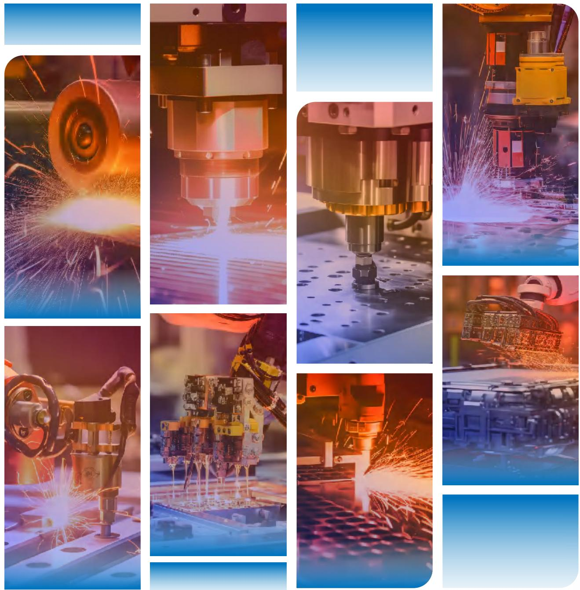

# 企业使命

聚焦行业挑战、注重人才培养、关注客户需求，提供有竞争力的智能制造解决方案与服务，为客户创造高效生产力。

# 企业经营理念

专业所以自信；创新引领发展；敬业开拓市场；责任铸就品牌。

# 企业愿景

成为智能制造领域的领跑者。

# 企业价值观

正直诚信,追求卓越;互信合作,人才唯先;持续创新,成就客户。

江苏北人将继续以智能制造为核心，强化具身智能焊接机器人系统、柔性工艺平台与数据驱动的质量控制等技术投入，持续提升研发占比与测试验证平台能力，推动从“设计即质量(QbD)”到“零缺陷交付”的产品与服务体系升级；同时，以对安全与合规的长期承诺，打造开放、可信赖的合作生态，与客户共同构建高效、绿色、可持续的智能制造价值链。

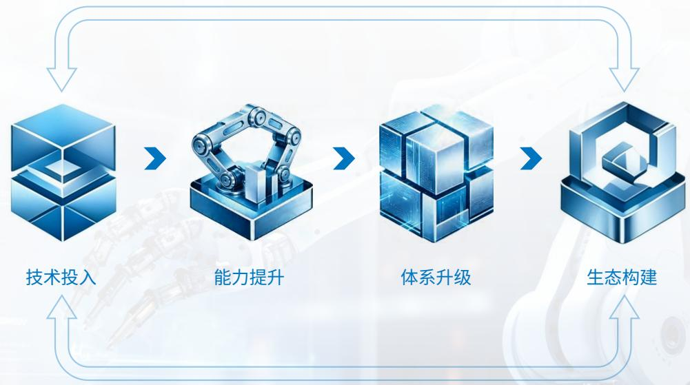

flowchart

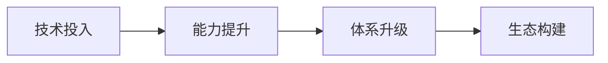
```mermaid
graph LR
  A["技术投入"] --> B["能力提升"]
  B --> C["体系升级"]
  C --> D["生态构建"]
```

报告编制说明

管理层寄语

# 公司概况

公司治理

企业经营

环境责任

以人为本

指标与对标索引

读者意见反馈

# 北人发展大事记

# 2011

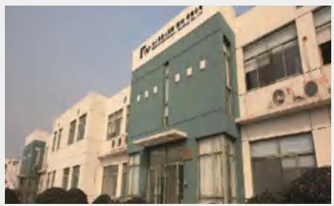

natural_image

Exterior view of a modern multi-story building with a large signboard on the roof (no visible text or symbols on the main structure)

# 公司成立

2011年北人机器人系统(苏州)有限公司成立。

# 2013

natural_image

Exterior view of a modern multi-story office building at dusk, featuring illuminated windows and parked cars (no visible signage or text)

# 砥砺前行

聚焦汽车领域,铝合金CCB焊接产线突破行业壁垒;获批“苏州市焊接机器人系统工程技术研究中心”。

# 2019

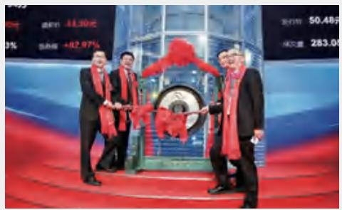

text_image

发行价 50.48元
涨跌幅 +42.97%
成交量 283.05

# 成功上市

公司于2019年12月11日在上交所科创板成功上市；

股票代码:688218;

获得“江苏省院士工作站”认定。

# 2024

natural_image

Exterior view of modern multi-story office buildings with glass facades and parked cars, surrounded by greenery under a partly cloudy sky (no signage visible)

# 扬帆海外,智能创新

墨西哥项目顺利启动；

海外项目团队出征意大利；

德国北人顺利设立。

# 2025

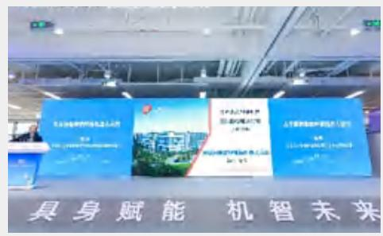

text_image

具有身赋能 机智未来

# 守主业、稳增长、强研发

具身智能焊接机器人实现突破；

海外市场拓展取得突破性进展,海外订单增长明显;

研发投入持续提升,技术创新成果显著。

state_timeline

| Year | Data Points |
| --- | --- |
| 2011 | 1, 1, 1, 1, 1, 1, 1, 1, 1, 1, 1, 1, 1, 1, 1, 1, 1, 1, 1, 1, 1, 1, 1, 1, 1, 1, 1, 1, 1, 1, 1, 1, 1, 1, ... |
| 2013 | 1, 1, 1, 1, 1, 1, 1, 1, 1, 1, 1, 1, 1, 1, 1, 1, 1, 1, 1, 1, 1, 1, 1, 1, 1, 1, 1, 1, 1, 1, ... |
| 2019 | 1, 1, 1, 1, 1, 1, 1, 1, 1, 1, 1, 1, 1, 1, 1, 1, 1, 1, 1, 1, 1, 1, 1, 1, 1, 1, 1, 1, ... |
| 2024 | 1, 1, 1, 1, 1, 1, 1, 1, 1, 1, 1, 1, 1, 1, 1, 1, 1, 1, 1, 1, 1, 1, 1, 1, ... |
| 2025 | N/A |

# 荣誉与认证

在2025年度,江苏北人在可持续发展的道路上取得了坚实的进展,其技术创新能力、产业贡献价值与客户服务品质获得了来自政府、行业及合作伙伴的多维度认可,充分印证了公司在经济、社会及治理(ESG)方面的综合表现。

在治理与创新(G)层面,公司成功入选“国家级博士后科研工作站”,标志着公司在构建高层次科研平台、驱动自主创新与培育核心人才方面获得了国家层面的权威认定。同时,公司凭借在“AI+制造”领域的深耕,被苏州市政府授予“人工智能终端重点企业”称号,体现了地方政府对公司技术研发实力及产业引领作用的肯定。

在社会与行业价值(S)方面,公司以技术赋能产业升级,其自主研发的具身智能焊接机器人荣获“2025中国智能焊接产业链先锋-优秀应用奖”。这一行业权威奖项,彰显了公司以前沿技术解决实际生产难题、推动焊接行业智能化转型的卓越贡献。2025年7月,在以“工业具身时代,智能产仓智变”为主题的2025工业具身应用峰会暨(第八届)高工机器人集成商大会上,公司荣获“2025年度高工机器人工业具身智能开拓奖”。

在客户关系与经济责任(E)领域,公司连续两年获得重要客户的嘉奖,并于本年度获颁“卓越服务支持奖”。这超越了传统的供应商关系,是客户对公司长期、可靠、高响应的服务支持体系与共赢合作模式的高度评价,反映了可持续客户关系所带来的稳定商业价值。

这些成就表明, 江苏北人正通过夯实创新根基、贡献行业价值与深化伙伴关系, 系统性地构建其长期可持续发展的核心竞争力。

# 经济与公司治理

- 苏州工业园区ESG实践典型企业（苏州工业园区管委会）  
● 产教融合联合创新基地
(哈尔滨工业大学苏州研究院)

- 苏州职业技术大学校外实习、实训基地  
郑州大学高校毕业生就业实习基地

# 产品

● 苏州市人工智能终端重点企业（苏州发改委等）  
● 苏州市具身智能机器人优质领航企业（苏州工信局等）

● 2025年度高工机器人工业具身智能开拓奖（高工机器人）  
● 2025中国智能焊接产业链先锋-优秀应用（高工机器人）

# 人才发展

\- 江苏省人力资源和社会保障厅颁发“国家级博士后工作站”

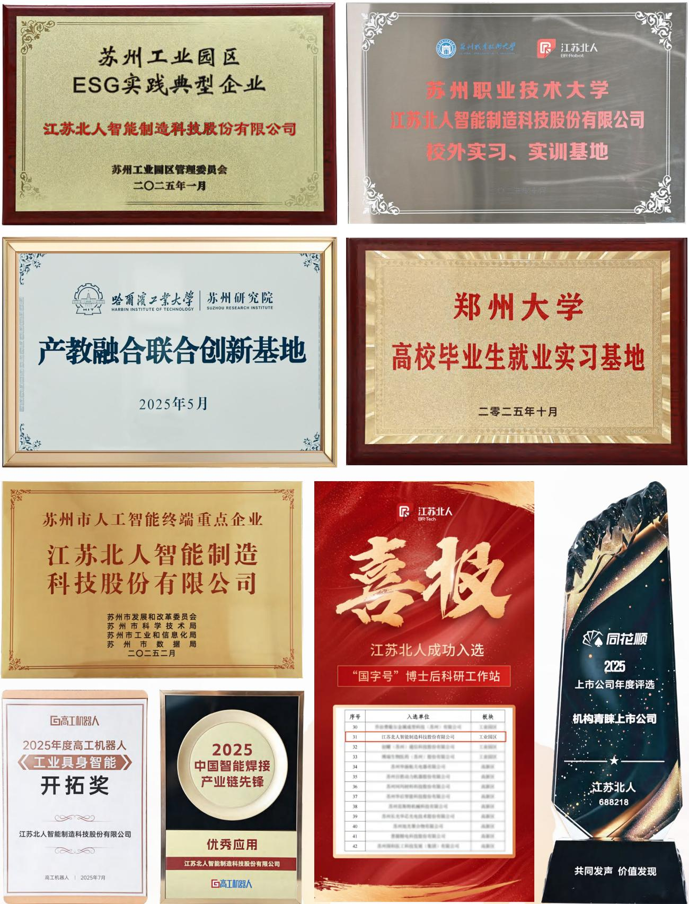

# 01

# 公司治理

完善治理体系,打造稳健、规范、负责的企业基石——公司治理

● 治理架构与职责  
● 风险管理与尽职调查  
- 反商业贿赂与反腐败  
- 相关方沟通与议题管理  
● 数据安全与隐私治理

# 完善治理体系,打造稳健、规范、负责的企业基石—公司治理

# 治理架构与职责

公司严格按照《公司法》《证券法》《上市公司治理准则》《上海证券交易所科创板股票上市规则》《上海证券交易所科创板上市公司自律监管指引第1号——规范运作》等法律法规及中国证监会、上海证券交易所关于公司治理的有关要求及《公司章程》的有关规定，通过建立、健全内控制度，不断推进公司规范化、程序化管理，提升公司治理水平，依法履行信息披露义务，加强投资者关系管理工作，充分保障了投资者的合法权益，推动了公司的持续发展。公司目前已按照上市公司规范要求建立了权责明确、相互制衡的公司治理结构和监督有效的内控制度，并严格依法规范运作。公司治理符合《公司法》及中国证监会相关规定的要求，不存在差异。

报告期内,公司严格遵循新《公司法》及配套制度要求,取消监事会,由董事会下设的审计委员会承接原监事会职能,并对《公司章程》及相关制度进行系统性修订。公司于2025年6月25日召开2025年第二次临时股东大会审议通过了修订后的《公司章程》、《股东会议事规则》、《董事会议事规则》等配套制度,切实发挥《公司章程》合规引领作用,持续优化治理结构,进一步明确各治理主体的职责边界。

结合最新修订的法律法规和监管精神,提高规范运作水平,加强公司治理能力建设,强化大股东、董事、高管等“关键少数”合规意识,切实推动公司高质量发展。

公司重视董事会多元化建设,充分考量行业经验、专业背景与性别结构等因素,持续优化董事会构成与独立性。目前董事会由6名董事组成,其中独立董事2名、女性董事1名,以更为多元的视角与能力结构,促进重大事项审议的科学性、客观性与全面性。

报告期内，公司严格依规召开并记录法定会议：召开1次年度股东会，2次临时股东会、董事会6次，会议材料准备充分、程序合规、决议有效；全年实现信息披露合规与内控治理合规。公司组织董、高积极参与上交所、证监局等监管机构举办的相关培训，持续学习最新法律、法规，学习掌握证券市场相关法律法规、熟悉证券市场知识、理解监管动态，不断强化自律和合规意识，推动公司持续规范运作。报告期内，参加的主要培训包括：“2025年上市公司董事、监事和高管合规履职培训”“2025年第1期科创板上市公司董事会秘书任职培训”“2025年第1期上市公司独立董事后续培训”“2025年度上市公司高质量发展系列培训”等。

为实现“成为智能制造领域的领跑者”的企业愿景，公司制定了ESG管理策略，从聚焦经济、产品、环境及社会四大层面，将可持续发展元素融入营运各个环节以及业务决策中。在2023年规划实施的基础上，我们在2024年进一步执行规划措施，优化实施方案，调整战略布局，践行可持续发展理念，以治理、环境、社会三个维度为抓手，辅以创新为驱动力，形成了数字化、人工智能为亮点可持续发展之路。进入2025年，公司进一步强化“AI+智能制造，AI+具身焊接”双轮驱动战略，具身智能焊接机器人系统加速迭代、海外业务拓展成效显著，并持续推进气候、环境、治理等可持续管理体系建设，以更高标准全面提升企业的创新能力、运营韧性与可持续发展水平。

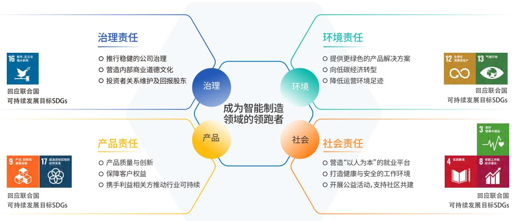

flowchart

```mermaid
graph TD
  subgraph Governance["治理责任"]
    direction TB
  A["治理"] --> B["推行稳健的公司治理\n营造内部商业道德文化\n投资者关系维护及回报股东"]
  end

  subgraph Environment["环境责任"]
    direction TB
  C["环境"] --> D["提供更绿色的产品解决方案\n向低碳经济转型\n降低运营环境足迹"]
  end

  subgraph Product["产品责任"]
    direction TB
    E["产品质量与创新\n保障客户权益\n携手利益相关方推动行业可持续"]
  end

  subgraph Social["社会责任"]
    direction TB
    F["营造以人为本”的就业平台\n打造健康与安全的工作环境\n开展公益活动，支持社区共建"]
  end

  subgraph Goals["回应联合国可持续发展目标SDGs"]

  G1["16 程序、正义与强大机构\n回应联合国\n可持续发展目标SDGs"]
  G2["9 产业、创新和基础设施\n回应联合国\n可持续发展目标SDGs"]
  G3["17 促进目标实现的伙伴关系\n回应联合国\n可持续发展目标SDGs"]
  G4["12 负责任消费和生产\n回应联合国\n可持续发展目标SDGs"]
  G5["13 气候行动\n回应联合国\n可持续发展目标SDGs"]
  G6["3 良好健康与福祉\n4 优质教育\n8 体面工作和经济增长\n回应联合国\n可持续发展目标SDGs"]

  A --> C
  C --> G4
  E --> F
  F --> G5
  G5 --> G6
```

江苏北人坚守绿色发展理念,持续优化ESG管治架构,通过ESG工作小组的紧密协同,全力支持董事会履行ESG监督职责,大力开展ESG意识宣导与培训,由内而外构建ESG文化,精心塑造良好ESG品牌形象。

# 董事会参与 ESG 管理

\- 公司董事会关注并参与 ESG 相关事务管理, 参与年度ESG报告的审阅, 确保 ESG信息披露的合法合规。

# 成立ESG工作小组

- 内部成立ESG工作小组，由各部门领导担任小组成员，共同推动ESG工作落地，包括但不限于参与年度ESG报告的编制、访谈及信息采集工作等。  
定期邀请外部专家向ESG工作小组成员开展培训。

# 构建ESG文化意识

● 鼓励全体员工参与到ESG实践当中, 包括但不限于参与ESG培训, ESG日常管理等。

# 提升ESG透明度

\- 搭建ESG信息披露体系以及发布年度ESG报告，向内外部利益相关方沟通公司ESG工作进展，提升公司在ESG实践方面的透明度。

# 风险管理与尽职调查

公司已建立覆盖“识别—评估—应对—监测”的全面风险治理体系，并将ESG管理要求融入经营管理全过程。公司通过各业务单元定期开展风险识别，结合行业趋势及外部环境变化动态更新风险清单，确保风险管理的前瞻性与及时性。在风险评估环节，公司依据完善的内部控制体系，从影响程度和发生可能性对风险进行分级管理，并重点关注经营、财务、供应链和合规等核心风险。针对重大风险，公司制定相应应对策略，包括完善治理结构、强化透明治理、推进项目精益化管理、提升供应链保障能力等举措，以增强整体运营韧性。在持续监测方面，公司通过内部审计、绩效管理、供应商审核等机制，跟踪风险应对措施执行情况，并根据运营结果持续改进。

在2025年，公司在战略推进、全球化布局和技术迭代背景下，持续关注业务结构调整、资产减值及海外交付相关风险。公司坚持以智能制造为核心赛道，加速推进“AI+智能制造，AI+具身焊接”双轮驱动战略，并持续拓展汽车、新能源、船舶、重钢、航空航天领域市场，包括欧洲、北美在内的全球业务布局。业务结构优化可能带来资源配置压力。公司通过强化海外子公司协同、提升核心业务盈利质量和深化智能制造解决方案能力来降低相关风险。面对行业周期波动与技术快速演进，公司持续加强库存管理与订单预测，并加大研发投入(2025年研发投入4211.87万元)以保持产品竞争力，同时严格执行资产减值测试及风险准备制度，确保财务稳健性。在欧洲及北美区域项目交付中，公司受到物流运输、政策要求及劳动力供给变化影响。公司通过海外子公司本地化运营、扩大区域合作伙伴网络和完善跨国项目管理系统，有效提升国际项目的交付效率与响应速度。

公司致力于构建安全、透明、低碳的供应链体系，将ESG要求纳入供应商全生命周期管理流程，包括供应商准入审核、年度ESG评估、现场与文件审核以及供应商分级管理机制等。2025年，公司继续强化供应链治理，以风险前置和透明运营为核心目标，全面提升《供应商行为准则》的执行力度。依托前一年开展的50家供应商环境与社会审核基础，本年度进一步扩大评审覆盖面，将审查范围延伸至商业道德、劳工标准和EHS管控等关键合规领域。年度供应商评审共覆盖89家重点合作伙伴(同比提升 $78\%$ )，审查方式包括问卷调查、文件交叉核验及抽样现场审计三类，合规问卷回收率保持在 $100\%$ 。

通过系统化、指标化的供应链合规管理，公司实现了更高的风险可视化与可控性，协助供应商逐步建立规范化管理体系。同时，结合江苏北人既有的智能制造能力与数字化工具，公司持续推动供应链的绿色化与透明化建设，为构建高韧性、低风险、符合ESG要求的供应链体系奠定了坚实基础。

# 反商业贿赂与反腐败

公司持续完善反腐败治理体系，严格落实政策制度、培训机制和举报调查流程，构建覆盖全员、全业务场景的廉洁运营体系。公司依据既有反腐败与反贿赂制度，明确从风险识别、制度执行到案件处置的全流程管理要求，强化对重点岗位及与业务往来的供应商、承包商等第三方的监督管理。

公司依据《反腐败反贿赂控制程序》建立系统化制度框架，覆盖采购、销售、委外加工、财务管理与质量监督等腐败高风险环节，并要求重要岗位人员签署《廉洁自律承诺书》、供应商和承包商签署《反商业贿赂协议》，确保制度要求延伸至合作伙伴体系。

公司持续推进反腐败教育与廉洁文化建设，将廉洁自律承诺履行情况纳入重要岗位人员的考核与任免依据。各部门需加强对员工的培训，确保反贿赂要求得到有效理解和执行。同时，公司要求所有重要岗位员工及业务往来单位签署反商业贿赂承诺文件，强化全员与合作伙伴的诚信经营意识。

公司设立举报渠道，包括举报箱及公开举报电话，鼓励员工和合作伙伴检举不当行为。公司严格执行举报受理和调查保密制度，任何情况下不得泄露举报人身份。审计委员会及其任命的调查小组负责对贿赂及腐败舞弊行为进行调查并提出处理意见，必要时移交司法机关，确保举报事项得到公正处理。

2025年研发投入4211.87万元

覆盖89家重点合作伙伴

同比提升78%

合规问卷回收率保持在100%

# 相关方沟通与议题管理

江苏北人致力于和各利益相关方建立沟通机制。我们认为，利益相关方是指那些影响或受我们运营活动影响的个人或团体，涵盖政府、投资者、客户等。为回应他们的期望与诉求，我们通过网站、媒体、会议、报告、活动等渠道，持续与利益相关方沟通。

<table><tr><td>利益相关方</td><td>沟通方式</td></tr><tr><td>股东及管理层</td><td>股东(大)会、业绩说明会、机构调研会、路演交流、上证e互动、投资者热线、投资者邮箱等</td></tr><tr><td>下游客户</td><td>客户调研、客服热线、客户满意度调查等</td></tr><tr><td>员工</td><td>员工活动、企业内网、员工培训、员工手册、企业内部刊物等</td></tr><tr><td>政府</td><td>机构考察、公文往来、政策执行、信息披露等</td></tr><tr><td>供应商</td><td>公开招投标会议、战略合作谈判、交流互访等</td></tr><tr><td>行业协会</td><td>日常沟通、信息披露、行业协会活动等</td></tr><tr><td>社区代表</td><td>社区公益捐赠项目等</td></tr></table>

根据过去两年的议题界定和筛选、利益相关方调研及议题优先级分析，充分考虑国际与国内法规政策、行业发展趋势、企业愿景与战略规划，并通过线上利益相关方问卷调研，最终权衡各方因素后得出2025年实质性议题矩阵。

2025年实质性议题确定  
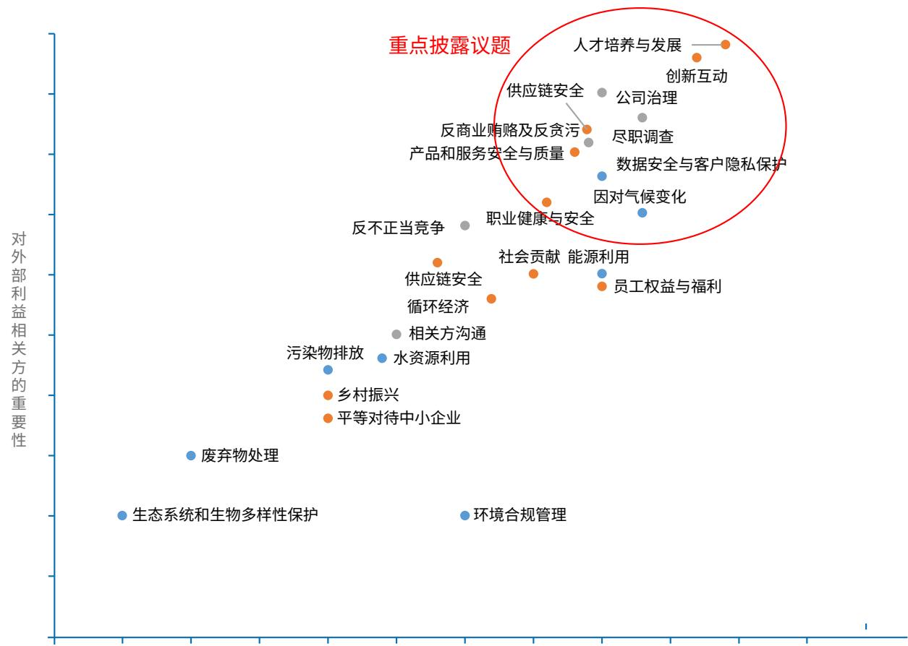

scatter

| 议题 | 对外部利益相关方的重要性 |
| --- | --- |
| 人才培养与发展 | ~9.5 |
| 创新互动 | ~8.5 |
| 公司治理 | ~7.5 |
| 尽职调查 | ~7.0 |
| 数据安全与客户隐私保护 | ~6.5 |
| 因对气候变化 | ~6.0 |
| 职业健康与安全 | ~5.5 |
| 社会贡献 | ~4.5 |
| 能源利用 | ~4.0 |
| 员工权益与福利 | ~3.5 |
| 产品和服务安全与质量 | ~3.0 |
| 反商业贿赂及反贪污 | ~2.5 |
| 供应链安全 | ~2.0 |
| 反不正当竞争 | ~1.5 |
| 循环经济 | ~1.0 |
| 相关方沟通 | ~0.5 |
| 水资源利用 | ~0.5 |
| 乡村振兴 | ~0.2 |
| 平等对待中小企业 | ~0.2 |
| 废弃物处理 | ~0.1 |
| 生态系统和生物多样性保护 | ~0.1 |
| 环境合规管理 | ~0.1 |

对江苏北人可持续发展的重要性

<table><tr><td>实质性议题分类</td><td>议题</td></tr><tr><td>环境</td><td>01.应对气候变化02.污染物排放03.废弃物处理04.生态系统和生物多样性保护05.环境合规管理06.能源利用07.水资源利用08.循环经济</td></tr><tr><td>社会</td><td>09.乡村振兴10.社会贡献11.创新驱动12.科技伦理13.供应链安全14.平等对待中小企业15.产品和服务安全与质量16.数据安全与客户隐私保护17.员工权益与福利18.人才培养与发展19.职业健康与安全</td></tr><tr><td>公司治理</td><td>20.尽职调查(风险管理)21.相关方沟通22.反商业贿赂及反贪污23.反不正当竞争24.公司治理</td></tr></table>

# 数据安全与隐私治理

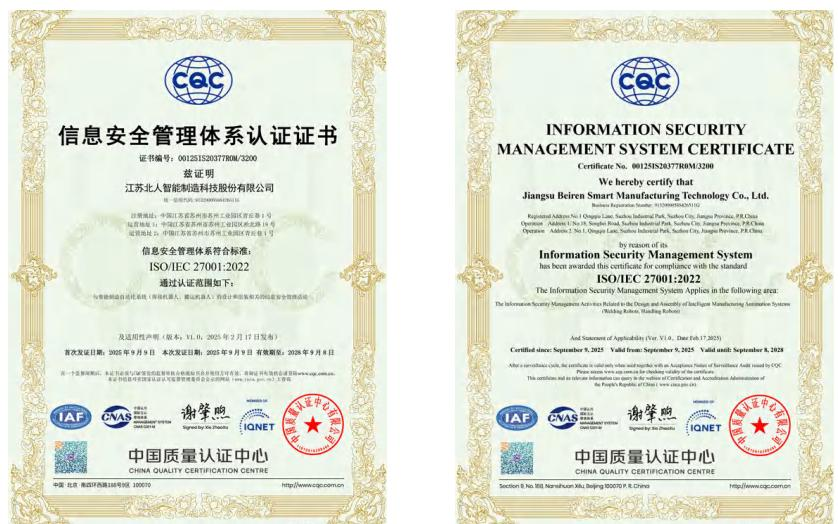

公司始终将利益相关方的隐私保护与信息安全视为可持续发展的重要基石，全面构建并持续完善覆盖多类数据类型的隐私与信息安全管理体系。公司严格遵循《中华人民共和国网络安全法》等相关法律法规，建立健全信息安全管理制度，确保数据在全生命周期内的合规与安全。2025年，公司顺利通过ISO27001认证，并严格落实其管理要求，对审核发现的问题及时整改，进一步夯实管理基础。

在运营管理中,公司通过专业IT机房、先进防火墙系统、终端安全防护软件、分权管理机制及严格的文件访问与加密审批流程,有效保障关键信息基础设施与业务数据的安全稳定。公司同时实施完备的数据备份与物理隔离策略,确保业务连续性。为提升整体防护能力,公司为全体员工提供常态化的信息安全培训,并加强IT人员的专业能力建设。此外,公司构建了内部网络与访客网络隔离、基于身份认证的网络使用机制,并通过精细化VPN访问控制进一步强化数据传输安全。通过上述举措,公司不断提升信息安全韧性,为企业的可持续稳健发展提供坚实保障。

# 02

# 企业经营

以技术突破赋能产业升级, 以创新引领未来增长——创新驱动

- 创新战略与研发治理  
- 从“设计即质量”（QbD）到“交付零缺陷”

以质量为先,提供安全可靠的智能制造解决方案——产品与服务安全质量

- 质量管理体系（ISO/客户标准）与全生命周期管理  
● 安全合规与产品可靠性（含海外法规/客户标准）  
- 客户满意度与售后响应

提升供应链韧性,打造透明、负责、稳固的合作生态——可持续供应链与安全韧性

- 供应链治理与分层分级管理  
- 绿色与责任采购

natural_image

Two hands shaking in front of a city skyline at night, symbolizing partnership or partnership (no text or symbols visible)

# 以技术突破赋能产业升级, 以创新引领未来增长—创新驱动

# 创新战略与研发治理

公司始终坚持“技术创新驱动高质量增长”的战略，将智能制造技术作为核心技术方向，持续加大研发投入与体系建设。2025年，公司研发投入达到4211.87万元，新增知识产权25项，累计知识产权总量达到135项，体现出公司在关键技术领域的持续突破和研发体系的稳健发展。

公司围绕智能制造发展路线，加速推进具身智能焊接机器人系统、AI质检、数字孪生等方向布局，并持续提升软件算法、智能控制、焊接工艺数据库等核心技术能力。此外，公司依托多地研发中心及技术团队，通过“未来星计划”“高潜人才孵化”等机制推动研发人才梯队建设，强化研发治理体系与创新资源投入。

报告期内,公司持续完善研发管理体系,建立从技术预研、立项、开发、验证到成果转化的全流程治理机制,并通过跨部门协同机制保障研发项目与市场需求、客户需求的高效衔接。截至2025年年底,北人累计拥有发明专利38件,其中应用于主营业务32件,实用新型专利41件,软件著作权43件,报告期内有效专利数量135件。

<table><tr><td></td><td>本年新增</td><td>累计数量</td></tr><tr><td>发明专利</td><td>7</td><td>38</td></tr><tr><td>实用新型专利</td><td>10</td><td>41</td></tr><tr><td>外观设计专利</td><td>0</td><td>0</td></tr><tr><td>软件著作权</td><td>8</td><td>43</td></tr><tr><td>其他</td><td>0</td><td>13</td></tr><tr><td>合计</td><td>25</td><td>135</td></tr></table>

# 报告期内

新增知识产权25项

2025年拥有发明专利38件

主营业务32件

实用新型专利41件

有效专利135件

# 案例

具身智能焊接机器人助力装配式制造提质增效(江苏北人,2025)

在装备制造、工程机械、钢结构等细分领域，长期存在多品种、小批量、装配偏差大的典型工况，传统焊接机器人依赖人工示教/离线编程，调试周期长、对焊工经验依赖强，导致“自动化设备用不起来、性价比不高”。围绕上述痛点，江苏北人在2025年推进“具身智能焊接机器人”系统化研发与应用，通过技术与工艺协同，完成从经验驱动到数据与智能驱动的转变。

# 技术路线

一是构建焊接工艺知识库 + AI 推理模型, 将资深焊工的隐性经验结构化、模型化, 沉淀参数与操作逻辑; 二是融合三维视觉/线激光等多模态传感, 实现焊缝自动识别、定位与实时跟踪, 适应装配误差与复杂工件形貌; 三是研发自主路径与层道规划算法, 依据实际工件状态自动生成轨迹与工艺参数, 实现免示教作业; 四是打通“感知—决策—执行”闭环, 使机器人具备类人决策与自适应能力。

# 应用成效

在某工程结构件产线,系统无需人工示教即可完成多型号工件焊接,换型时间由数小时缩短至分钟级,焊接一致性与一次合格率显著提升,设备利用率与产线节拍同步优化。

# 社会与可持续价值

项目有效降低对高技能焊工的刚性依赖,缓解“技工短缺”带来的招工与培训压力;帮助中小制造企业实现焊接自动化升级,以更高的能源与材料利用效率支撑质量稳定与降本增效,促进产业链整体竞争力与绿色转型的持续提升。

# 从“设计即质量”(QbD)到“交付零缺陷”

公司坚持以质量为核心的技术管理理念，将“设计即质量”(QbD)贯穿于产品开发全过程，通过系统化的设计管理、过程验证与交付监控实现“交付零缺陷”的质量目标。设计阶段，公司严格执行设计评审(DR)流程，对项目关键节点实施跨部门联合评审；应用 FMEA(潜在失效模式分析)方法识别设计与工艺风险，并在研发阶段建立软件与算法版本管控体系，从源头确保设计质量的稳定性与可验证性。

在样机与试产阶段, 公司通过系统化的可靠性验证体系, 包括多项环境可靠性测试、机械疲劳测试、电气安全性验证等, 确保设备在多场景、多工况下的稳定运行。面向客户交付环节, 公司推动“零缺陷交付”管理机制, 通过客户试产验证 (包括焊接一致性验证、节拍匹配、工装工艺稳定性验证等) 确保产品真正满足客户现场条件。量产阶段, 公司采用一致性验证与过程质量监控机制, 包括生产工艺窗口固化、关键参数SPC管控、软件版本锁定、焊接工艺数据库一致性维护等措施, 以确保量产性能与试产性能保持一致, 实现从研发到交付的全过程质量闭环。

# 以质量为先,提供安全可靠的智能制造解决方案 — 产品与服务安全质量

# 质量管理体系(ISO/客户标准)与全生命周期管理

公司始终坚持以质量为核心的管理理念，建立覆盖研发、设计、制造、交付及运维阶段的全生命周期质量管理体系。依据ISO系列质量标准及重点客户质量要求，公司持续推进标准化、精益化的质量治理模式，并将质量要求嵌入产品设计、工艺规划、系统集成、软件开发等关键环节，实现从源头确保产品可靠性的管理机制。在生产管理中，公司积极构建以数据驱动的质量控制体系，通过“项目精益化管理”“过程质量监控”“数字化工厂管理”提升一致性与交付能力。同时，公司持续完善内部审核机制，聚焦关键材料、核心工艺、软件版本、智能控制算法等质量风险点，确保产品在出厂前经历完整的功能测试、可靠性验证及负载工况测试。

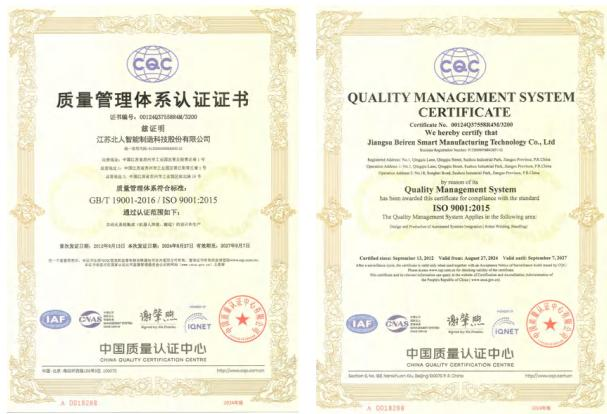

为强化供应链治理并落实负责任采购，公司构建了覆盖产品全生命周期的质量管理体系，通过数字化与协同机制提升整体运营透明度与客户满意度。项目通过建立端到端追溯系统，实现质量问题从批次、原料到供应商的快速定位；同时设立跨部门快速响应小组，对涉及安全或合规风险的客户反馈启动最高优先级流程，确保在24小时内采取整改行动。公司还推动知识共享，将典型客诉案例转化为培训材料，并协助供应商建立人员技能矩阵、导入物料管理系统及优化车间布局，从源头预防质量风险。

项目实施后，客诉处理周期缩短20%，客户满意度显著提升，进一步巩固了消费者信任。在治理层面，公司形成了系统化的风险预防与问责机制，强化了供应链透明度。供应商运营能力亦同步提升，物流转运效率与物料管理水平得到明显改善，实现多方共赢。

2025年11月,客户反馈项目交付的变位机运行异响,公司第一时间启动快速响应机制,当日便派出工程师携带专业检测设备赶赴现场处置。工程师现场逐项复核设备水平度、同心度,针对性排查运行异响诱因,快速定位症结并制定处置方案;随即协助客户规范调试重装相关工装部件,设备重启后异响彻底消除,问题得到及时高效解决。

为筑牢风险防线、杜绝同类问题复发，团队现场为客户开展夹具规范化安装培训，同步完善售后管控流程，后续所有变位机出货均新增相关注意事项说明，实现问题处置闭环。此次处置充分彰显了公司极速响应、高效解决、闭环防控的服务与质量管控能力，进一步夯实了客户信任。

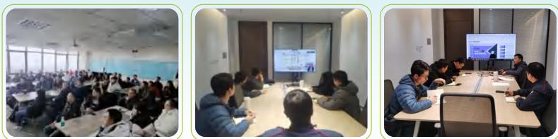

为了进一步保证交付质量,江苏北人于2025年2月-2025年12月开展内部质量培训,培训质量五大工具,项目质量策划和落地,供应商质量管理,TQM等,质量日常管理和工作标准化,所有质量人员参加学习。

# 安全合规与产品可靠性(含海外法规/客户标准)

随着公司加速全球化布局,公司在产品安全与合规方面同步强化对海外法规、行业技术标准及客户要求的适配能力,确保产品在不同国家、行业场景中均满足本地化法规及安全要求。

公司持续开展环境与可靠性测试，包括高低温、振动、电气安全、软件稳定性等关键验证项目，以确保焊接生产线、机器人系统及智能制造装备在客户现场保持稳定运行。针对不同国家(区域性经济组织)的认证(如 CE、UL、CCC)以及汽车行业的客户标准，公司通过合规性评估、差距分析与整改措施确保顺利交付。

同时，公司在智能制造设备中坚持“安全优先”原则，围绕系统安全、设备运动安全、激光加工设备安全、操作安全等重点领域执行更严格的风险识别与控制要求，形成产品安全管理的闭环体系。

# 客户满意度与售后响应

公司始终将客户满意度作为核心经营指标,客户满意度连续三年位居行业前列。2025年,公司在多个重点项目中展现出卓越的专业能力与交付韧性,持续获得国内外客户高度认可。

在汽车领域重点项目中，项目团队以高效协同、全链路闭环管理模式，在约定周期内高质量完成产线搭建与首台舱门装机任务，实现零等待、高效率交付，获客户书面感谢信，充分肯定团队专业能力与执行效率。在高端装备相关重点项目中，面对产能爬坡与技术攻坚挑战，团队以专业、严谨、尽责的工作作风，科学统筹资源、优化作业流程，稳步攻克关键技术与进度节点，保障项目按计划推进，赢得客户正式致谢。在海外重点项目执行过程中，针对跨国协同、周期紧张等复杂挑战，公司建立跨部门快速响应机制，设计、供应链、制造等环节高效联动，高质量完成阶段交付目标，获得海外客户高度评价。

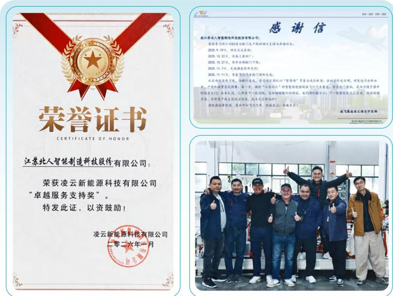

在售后服务方面,公司构建覆盖本地化服务、远程技术支持、应急响应的服务体系,通过专业工程师团队为客户提供设备安装调试、生产优化、工艺改进、备件供应和系统升级等服务。依托软件可视化平台与智能诊断技术,公司能够更快速识别系统异常并提供预测性维护,从而提升客户产线效率与设备可用性。

公司每年开展客户满意度调研与项目复盘,本年度在原有满意度调查表的基础上增加了客诉和售后反馈的维度,多渠道调研客户满意度。2025年顾客满意度得分95.25分(满分100分),客户对公司整体评价较为满意。

# 提升供应链韧性,打造透明、负责、稳固的合作生态—可持续供应链与安全韧性

# 供应链治理与分层分级管理

公司通过制度制定了一套对供应商评价的内部标准体系，对在采购过程中的腐败和不公正的行为零容忍，与供应商在交易过程中遵守公平、公正及公开的原则。

公司对新增供应商通过考核其产品质量、交期以及产能等指标，通过指标的考核评价供应商的生产能力，决定是否与其建立长期高效的供应商合作关系。同时公司在选择外部供应商时十分注重环保方面的要求，特别是对于公司的外协供应商，在外协生产过程中涉及到污染废弃物的排放工序的，公司会着重考察其是否取得环保资质，对于没有取得环保资质的，公司将不与其进行合作，将其放入潜在供应商名录中。对于通过指标评审的供应商，公司将其纳入到公司的合格供应商名录中。

公司对纳入到合格供应商名录中的供应商公司通过制定供应商绩效监控机制和绩效评核系统持续地对供应商品质、价格和技术支持等方面进行全方位监控，实行定期绩效评价。

公司围绕“稳定、安全、透明”的供应链战略，构建覆盖全流程的供应链治理体系，并基于业务关键程度、质量风险及交付能力对供应商实施分层管理机制。对于关键物料与核心器件，公司建立核心器件清单并持续推进国产替代及多元化采购策略，以降低供应风险与外部环境不确定性对交付的影响。

在供应链保障方面,公司通过安全库存策略、交期监控机制和多区域供应链布局提升韧性能力。针对高风险物料,公司设置安全库存,并建立应急预案,包括多渠道采购、替代物料验证、区域供应商切换机制及跨国物流应急响应体系,以确保在市场波动或地缘政治等因素变化时仍能保障连续供应。供应链保障能力已在公司业务全球化进程中得到进一步强化。

# 绿色与责任采购

公司积极推动绿色与负责任采购策略，逐步在供应链中导入绿色材料、低能耗设备和可持续设计原则。公司已在能源管理、绿色制造及“低碳供应链”建设中形成可量化的管理方向，并在设备选型原则中优先考虑节能型、环保型与可循环设计能力较强的供应商。

在供应链共建方面,公司通过技术分享、培训赋能与工艺改善合作,推动供应商能力提升,促进产业链整体效率与低碳水平的提高。公司持续开展供应链培训,包括质量规范、交付能力、绿色生产与安全管理等主题,并通过共同开发、工艺辅导、数字化协同等方式提升供应链整体成熟度,支持上下游企业共同向绿色、可靠、具韧性的供应网络转型。

为推动供应链伙伴在质量与可持续维度的共同提升，公司于2025年组织开展了“零缺陷管理与可持续供应链实践”专题培训。培训内容聚焦质量成本与环境成本的双重管控，系统解析了劣质成本(COPQ)中因返工、报废与不良流程导致的能源及物料浪费，强调将质量改进行动与碳减排绩效直接关联的重要性。同时，课程介绍了易回收、耐久性强的负责任产品设计理念，展示设计端在延长产品生命周期、降低环境足迹方面发挥的关键作用。培训采用互动式研讨形式，供应商代表围绕年度质量目标制定开展小组讨论，明确了以数据驱动、过程预防为核心的合作方向。现场同步展示了使用环保材料且具备高性能表现的零部件案例，直观呈现了“高质量”与“可持续”并行不悖的价值。通过此次培训，公司进一步强化了供应链伙伴的质量管理意识与绿色协同能力，为构建零缺陷、低碳、高韧性的供应链体系奠定了坚实基础。

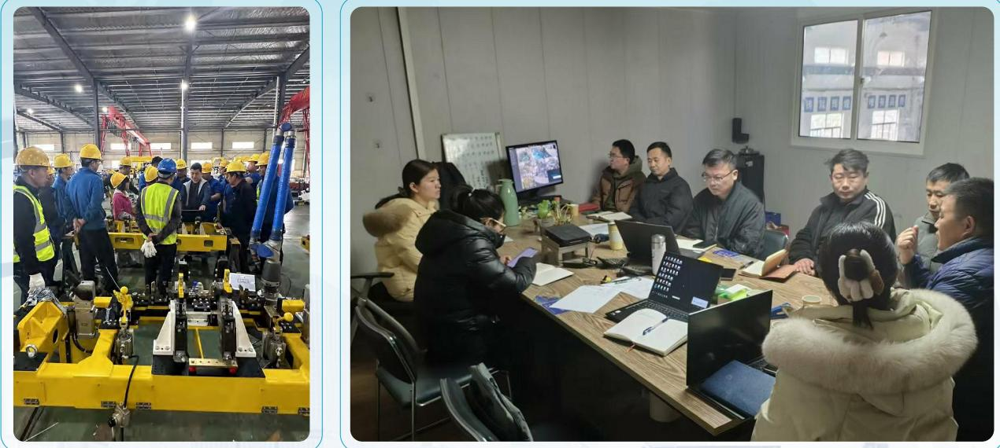

# 03 环境责任

构建低碳智造体系,共创绿色价值链——应对气候变化与能源管理

- 气候治理与目标  
- 运营端减排与能效提升

natural_image

Aerial view of a lush green forest with a winding river and scattered trees (no text or symbols visible)

# 构建低碳智造体系,共创绿色价值链—应对气候变化与能源管理

# 气候治理与目标

公司将气候变化治理纳入企业可持续发展战略，由董事会战略委员会监督ESG工作的战略方向与目标设定，并由管理层负责部署气候行动措施、推进节能减排项目及执行风险管理要求。公司通过治理责任体系强化气候议题在企业管理中的权重，推动绿色制造与低碳供应链建设。

公司正在建立覆盖S1(自有运营排放)/S2(购入能源排放)/S3(价值链排放)的温室气体排放管理框架,逐步完善排放核算方法、基线数据及减排目标。公司已在智能制造业务中推进低碳工艺、电气节能、绿色园区建设等路径,逐步形成可量化、可跟踪的气候行动路线图。

为提升气候风险管理能力,公司参考TCFD/ISSB体系,识别与分析物理风险(如极端气温、能源中断等)与转型风险(政策变化、客户低碳要求、能源结构调整等),并在规划阶段开展1次情景定性分析,以制定有针对性的适应与减缓措施。

<table><tr><td>类别</td><td>情景/触发因素(简述)</td><td>影响路径</td><td>影响程度</td><td>时间</td><td>现有/建议应对</td></tr><tr><td>转型风险</td><td>储能政策标准升级、资产出表难度</td><td>项目盈利与回款不确定、减值风险</td><td>中-高</td><td>短-中</td><td>储能战略收缩、并对存量储能资产及相关业务进行有序清理,聚焦智能制造核心优势,增加产品投入,优化资源配置</td></tr><tr><td>转型风险</td><td>客户低碳供应链要求(碳足迹/能效)</td><td>若方案落后导致份额受损;先进方案带动新增投资</td><td>中</td><td>中-长</td><td>强化绿色设计、工艺创新与全生命周期碳管理,提供“零碳工厂”一体化解决方案</td></tr><tr><td>转型风险</td><td>海外项目周期长与本地化合规</td><td>资金占用、交付与合规成本上升</td><td>中</td><td>中</td><td>本地化子公司、前置合规清单、严格里程碑与付款条件管理</td></tr><tr><td>声誉/披露</td><td>ESG/TCFD披露标准化期望提升</td><td>影响ESG投资者覆盖与估值弹性</td><td>低-中</td><td>短-中</td><td>发布TCFD专章、范围1/2/3与减排进展、情景分析与碳价敏感度;强化IR沟通</td></tr><tr><td>物理风险</td><td>极端天气致供应链/安装延误</td><td>影响验收与回款节奏</td><td>中</td><td>短-中</td><td>双供应与安全库存、项目甘特预置气象缓冲、海外备件与现场服务能力(结合项目周期管理)</td></tr><tr><td>物理风险</td><td>热浪推高工厂能耗与成本</td><td>运营成本与碳强度上升</td><td>低-中</td><td>短-中</td><td>提升可再生电力占比、能效与能源管理系统、产线节能改造</td></tr><tr><td>机遇</td><td>“零碳工厂”智能制造投资</td><td>柔性、激光、智能焊接等产线增长</td><td>高</td><td>中-长</td><td>在售前嵌入“碳/能效/成本节省”量化方案,提升中高端项目占比</td></tr><tr><td>机遇</td><td>具身智能焊接与AI赋能</td><td>替代人工、降缺陷、提良率</td><td>中-高</td><td>中-长</td><td>构建软件平台化与订阅服务,提高毛利与粘性</td></tr><tr><td>机遇</td><td>海外绿色产业链外溢</td><td>海外订单与品牌背书提升</td><td>中</td><td>中-长</td><td>以本地化合规与绿色标准为卖点,优化现金流条款与风险共担机制</td></tr></table>

# 运营端减排与能效提升

作为智能制造整体解决方案供应商,公司在生产运营中持续推进节能降碳,通过绿色制造、产线节能改造及设备能效优化等措施提升能源效率。根据 ESG 报告,公司在绿色制造方向上已形成明确管理路径,持续推动能效提升与环境影响降低。

公司在园区管理中实施多项节能改造工程，包括照明系统升级、空调与动力系统能效优化、焊装自动化能源利用效率提升等。焊接机器人与自动化产线通过工艺优化、动作节拍压缩、冗余能量回收等方式实现单位焊点能耗下降。

在能源结构方面, 公司逐步增加清洁能源使用比例(如绿色电力采购、屋顶光伏规划), 清洁能源使用量750 MWh。公司建立单位产值能耗监测体系, 并制定年度能效提升率与单位产值能耗下降目标。

在报告期内, 温室气体排放主要来自现场天然气和燃油的使用, 均为范围一的排放, 范围一排放为57.3吨二氧化碳当量。通过自建光伏, 已经实现约25%的电力来自可再生能源, 经初步估算, 2025年组织温室气体排放(范围1和范围2)共计1332.5吨二氧化碳当量。较2024年, 范围1有所下降, 范围2略有波动, 总体排放略有上升, 主要由于用电量上升所致。

# 2025年排放量

范围1 57.3 (t CO2e)

范围1 1275 (t CO2e)

范围1+2 1332.5 (t CO2e)

# 04 以人为本

以人为本, 营造平等、安全、关怀的职场环境——员工权益与福利

- 雇佣合规与平等机会  
- 薪酬福利与多元关怀  
- 员工参与与申诉渠道

培养面向未来的智能制造人才梯队——人才培养与发展

- 人才战略与梯队建设  
- 技能提升与资格认证  
- 领导力发展与关键岗位接班计划

智能化守护安全,构建健康、可靠的工作场所——职业健康与安全(HSE)

- HSE 管理体系与职责  
●重大风险作业自动化替代（焊接、打磨等）与本质安全提升  
- 事故与事件管理、应急演练与复盘

社区与社会公益

\- 定向公益与员工志愿服务

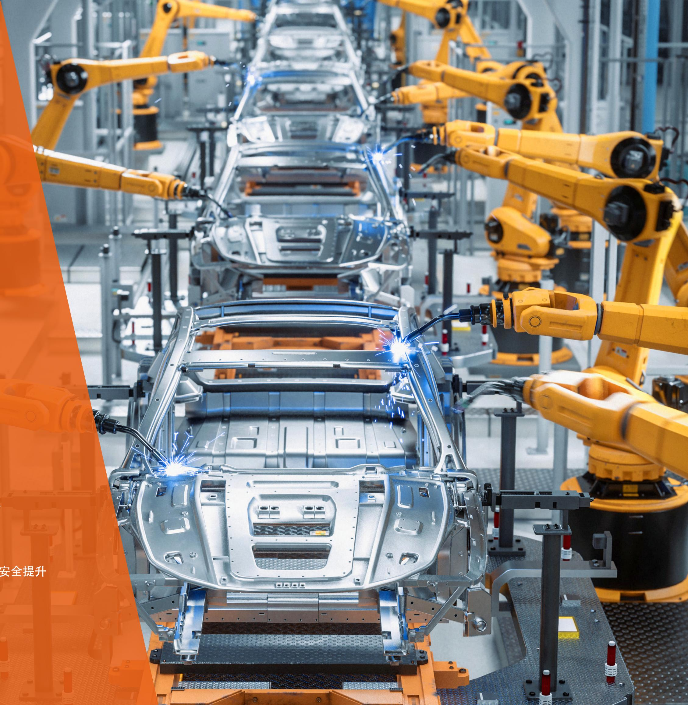

text_image

安全提升

# 以人为本,营造平等、安全、关怀的职场环境—员工权益与福利

# 雇佣合规与平等机会

公司严格遵守国家劳动法律法规，建立规范透明的雇佣管理体系，确保招聘、录用、晋升及日常管理过程中的平等与非歧视原则。公司持续优化组织结构与人才布局，近年人才队伍学历结构持续提升，985/211及海外背景人才数量显著增加，其中85%人员集中于设计、研发与工程岗位，反映出公司坚持“技术驱动”与“能力导向”的人才战略。

在平等就业方面,公司对不同年龄、性别、文化背景的员工提供公平的就业与发展机会,并在内部推行多岗位轮岗、能力导向评估及多通道职业发展体系,确保员工依据表现与能力获得公平的晋升机会。与此同时,公司坚持依法缴纳各类社会保险与住房公积金,规范劳动合同管理,构建合规、透明、稳定的雇佣环境。

<table><tr><td>指标</td><td>单位</td><td>2025年绩效</td></tr><tr><td>员工总人数</td><td>人</td><td>675</td></tr><tr><td>男性员工人数</td><td>人</td><td>570</td></tr><tr><td>女性员工人数</td><td>人</td><td>105</td></tr><tr><td>50岁以上员工人数</td><td>人</td><td>14</td></tr><tr><td>30岁至50岁员工人数</td><td>人</td><td>338</td></tr><tr><td>30岁以下员工人数</td><td>人</td><td>323</td></tr><tr><td>管理层员工总人数</td><td>人</td><td>101</td></tr><tr><td>博士</td><td>人</td><td>4</td></tr><tr><td>硕士</td><td>人</td><td>42</td></tr><tr><td>本科</td><td>人</td><td>369</td></tr><tr><td>本科及以下</td><td>人</td><td>260</td></tr></table>

# 薪酬福利与多元关怀

公司持续优化薪酬福利体系，确保薪酬水平与行业发展趋势及岗位价值相匹配。

福利方面,公司为员工提供五险一金、年终奖金、补贴(餐饮、交通、通讯)、带薪年假、加班工资、多维绩效激励、节假日福利等完善保障,并通过青年人才补贴政策、入职培训津贴及外部人才政策联动等方式增强人才吸引力。公司在苏州工业园区人才政策的支持下,近三年连续为员工申请生活补贴,有效减轻青年人才生活压力、提升留任意愿。

为提升公司管理团队和核心员工的凝聚力、创造力，吸引、留住优秀人才，公司完善薪酬体系、创新激励机制，并实施了第二类限制性股票激励计划，健全公司长效激励机制，促进公司与员工共同健康发展。

在员工关怀方面,公司持续建设“以人为本”的工作文化,通过团队活动、健康关怀、心理支持、职业发展辅导等方式增强员工的获得感、幸福感与归属感;通过“大苏州最佳雇主”“最具发展潜力雇主”等连续荣誉进一步体现公司在员工体验方面的突出表现。

# 员工参与与申诉渠道

公司重视构建开放、透明、可沟通的员工参与与反馈机制，通过多种形式提升员工在管理与文化建设中的参与度。公司建立了包括“董事长面对面”、部门沟通例会、员工满意度调查、意见收集渠道等在内的沟通体系，让员工能够直接表达建议、关注点和职业发展诉求，并推动管理决策与员工需求的有效对齐。

在申诉与合规保障方面,公司建立畅通的申诉与举报机制,为员工提供匿名申诉、投诉与权益保护渠道,覆盖职场歧视、劳动纠纷、管理不当等领域。相关申诉由专业部门受理并按照规定流程进行调查处理,确保员工权益得到保护、申诉事项得到及时响应。同时,公司严格禁止任何形式的打击报复,确保员工申诉权利不受损害,进一步营造公开、公正、安全的工作环境。

# 培养面向未来的智能制造人才梯队—人才培养与发展

公司始终秉持人才是企业发展的根本,把人才作为企业的核心竞争力,不断加大对人才的投入,优化人力资源的配置,不断完善人才培养计划,畅通人才晋升通道,通过实施人才优选计划,营造出公司尊重人才、尊重知识的良好文化氛围。

# 江苏北人人才管理理念

# 人才唯先

北人最大的财富是人才,公司需要实现人才的快速成长和快速复制。

# 内部选拔

建立一套评价人才的有效机制,为内部选拔提供客观依据。

# 奖优惩劣

打破大锅饭,薪酬、资源,向“想干事”“能干事”“干成事”的人倾斜。

# 持续成长

北人期望提供给员工一份能拥有“专业铁饭碗”的持续成长的职业生涯。

# 人才战略与梯队建设

公司倡导“每个人都是自己职业发展的主人”。为此，公司为每位员工规划了清晰的成长通道和成长阶梯，包括横向选择发展路径以及纵向持续向专精发展。在横向选择发展路径方面，公司采用三通道的人才发展模式：专业技术通道、项目管理通道和经营管理通道。员工在打下基本专业功底后，依循自己的特长优势及发展意愿，在组织中横向选择争取对应的发展通道。

在纵向持续向专精发展方面,依循人才发展的规律划分,在分层分级的技能标准指引下,牵引员工从新手、有经验者、胜任者、精通者等向上晋级。

# BR-Tech

报告编制说明

管理层寄语

公司概况

公司治理

企业经营

环境责任

# 以人为本

指标与对标索引

读者意见反馈

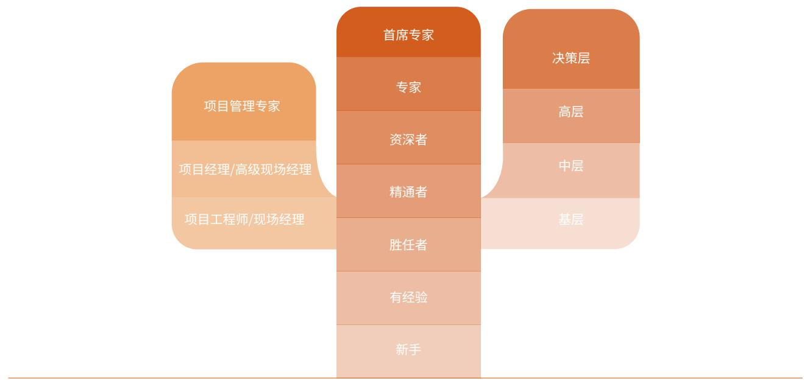

flowchart

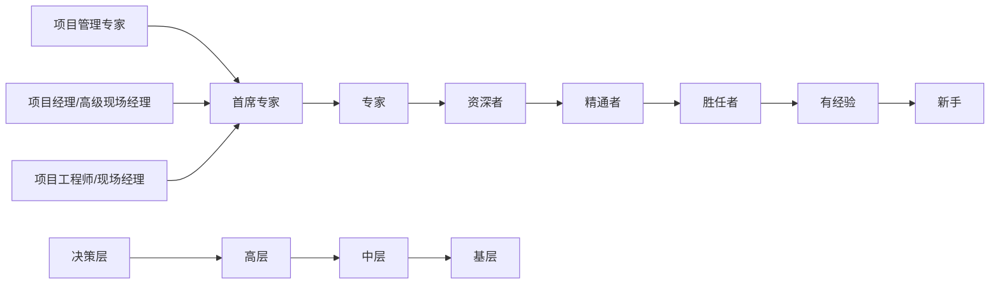
```mermaid
graph LR
  A["项目管理专家"] --> B["首席专家"]
  C["项目经理/高级现场经理"] --> B
  D["项目工程师/现场经理"] --> B
  B --> E["专家"]
  E --> F["资深者"]
  F --> G["精通者"]
  G --> H["胜任者"]
  H --> I["有经验"]
  I --> J["新手"]
  K["决策层"] --> L["高层"]
  L --> M["中层"]
  M --> N["基层"]
```

北人员工发展:从新手到高手  
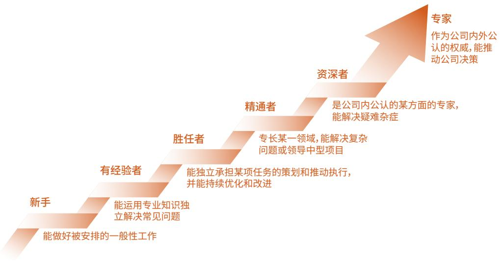

flowchart

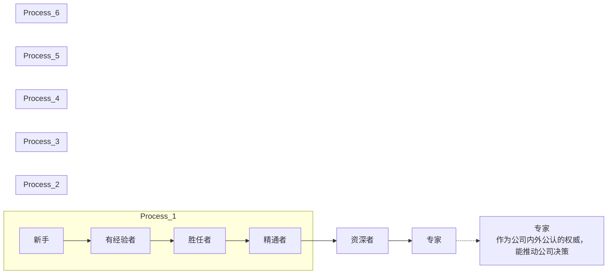
```mermaid
graph LR
  A["新手"] --> B["有经验者"]
  B --> C["胜任者"]
  C --> D["精通者"]
  D --> E["资深者"]
  E --> F["专家"]
  
  subgraph Process_1
    direction TB
    A
    B
    C
    D
  end
  
  subgraph Process_2
    direction TB
    A
    B
    C
    D
  end
  
  subgraph Process_3
    direction TB
    A
    B
    C
    D
  end
  
  subgraph Process_4
    direction TB
    A
    B
    C
    D
  end
  
  subgraph Process_5
    direction TB
    A
    B
    C
    D
  end
  
  subgraph Process_6
    direction TB
    A
    B
    C
    D
  end
  
  F -.-> G["专家\n作为公司内外公认的权威，能推动公司决策"]
```

在当今竞争激烈的市场环境中，企业要想实现持续发展，需要不断提升组织效能、员工的工作效率和创新能力。江苏北人持续打造及完善四大体系，通过定标、对标、达标打通人才供应链。在定标阶段，基于北人的价值观及北人精神，打造三通道，并确定对应通道的人才标准，及对应的人才评鉴工具；在培养体系中，针对员工职业发展的不同阶段、不同区域、不同条线，公司分别定制了场景化、个性化的培训方案，结合线上线下的多种模式，提供专业/技术、管理岗位条线等各类专项学习项目及培训方案。资源建设体系中，公司持续培养内部导师，完善课程库及案例库。在运营系统中，在《培训管理制度》《江苏北人带教制度管理办法》等相关制度及培训系统的协同下，为员工向上发展赋能。

基于人才发展体系, 江苏北人在2025年度, 总计举办了186场公司级及部门级培训活动, 并针对应届新员工及技术高潜人员进行了共计1902.5小时的导师带教辅导, 员工覆盖度47.7%, 累计培训时长达到5,505小时, 人均培训时长8.3H。这些数字不仅体现了公司对人才培养的高度重视, 也标志着我们在构建学习型组织道路上迈出了坚实的一步, 确保了“专业所以自信, 创新引领发展”的企业文化得以生根发芽、繁荣发展。

北人人才发展体系  
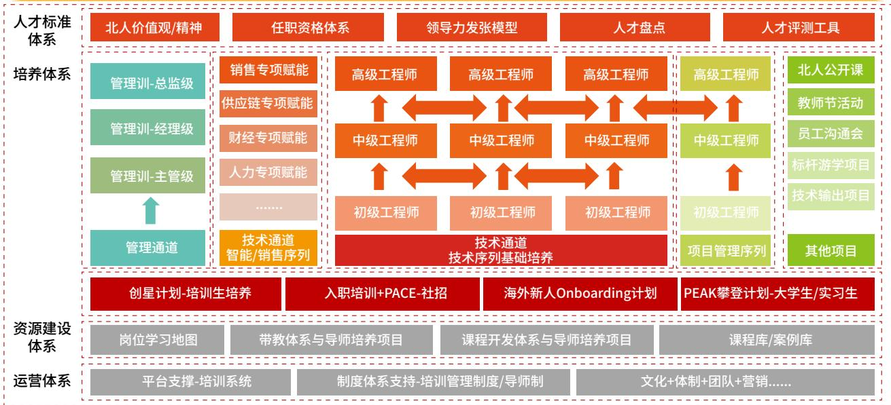

flowchart

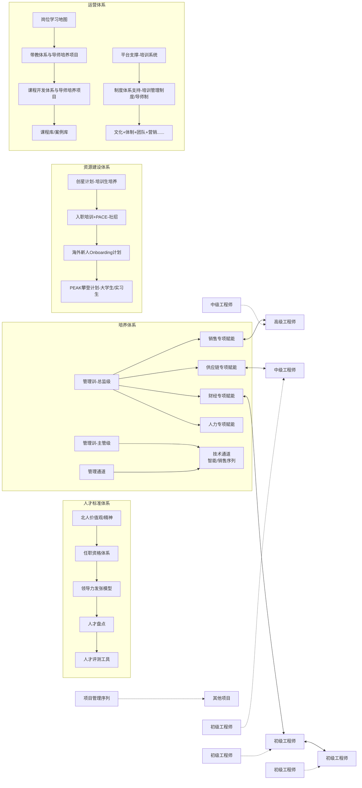
```mermaid
graph LR
  subgraph Top_Systems ["人才标准体系"]
  A["北人价值观/精神"] --> B["任职资格体系"]
  B --> C["领导力发张模型"]
  C --> D["人才盘点"]
  D --> E["人才评测工具"]
  end

  subgraph Training_Systems ["培养体系"]
  F["管理训-总监级"] --> G["销售专项赋能"]
  F --> H["供应链专项赋能"]
  F --> I["财经专项赋能"]
  F --> J["人力专项赋能"]
  K["管理训-主管级"] --> L["技术通道\n智能/销售序列"]
  M["管理通道"] --> L
  end

  subgraph Resource_Designs ["资源建设体系"]
  N["创星计划-培训生培养"] --> O["入职培训+PACE-社招"]
  O --> P["海外新人Onboarding计划"]
  P --> Q["PEAK攀登计划-大学生/实习生"]
  end

  subgraph Operations_Systems ["运营体系"]
  R["岗位学习地图"] --> S["带教体系与导师培养项目"]
  S --> T["课程开发体系与导师培养项目"]
  T --> U["课程库/案例库"]
  V["平台支撑-培训系统"] --> W["制度体系支持-培训管理制度/导师制"]
  W --> X["文化+体制+团队+营销......"]
  end

  G <--> Y["高级工程师"]
  H <--> Z["中级工程师"]
  I <--> AA["初级工程师"]
  AA <--> AB["初级工程师"]
  AC["中级工程师"] -.-> Y
  AD["初级工程师"] -.-> Z
  AE["初级工程师"] -.-> AA
  AF["初级工程师"] -.-> AB
  AG["项目管理序列"] -.-> AH["其他项目"]
```

# 技能提升与资格认证

为支撑智能制造技术能力提升，公司系统化建设技能培训与资格认证体系，覆盖机器人系统集成、焊接工艺、数字化仿真、视觉算法、电气安全等关键能力。公司依托内部专家、外部认证机构及供应商生态伙伴开展技能提升培训，并为员工提供行业资格认证。2025年通过开展以PEAK攀登计划-应届生培养为核心的新人培养体系；以现场导师带教项目、技能体系建设项目为主导的专业通道提升体系；以应对出海需求为准备的英语冲锋训练营，极大的丰富了现有人才的技能储备。

案例:应届生培养项——PEAK攀登计划  
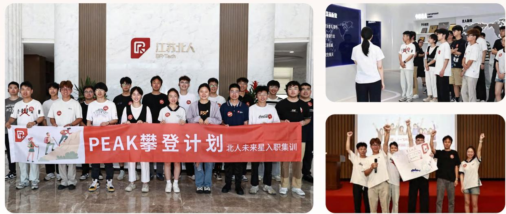

19位应届生，5大课程模块，16节课程，15位北人导师，结合北人“五德”画像通过案例教学、训战一体的方式力求实现为北人持续输入“靠谱”的优秀人才。从行业前沿资讯到专业术语及元器件讲解，从职场工作礼仪到专业通识能力，从岗位基础知识到实战案例分析，从运营管理机制到职业发展路径持续激发“未来星”们的职业梦想与无限可能，助力其快速成长为职场精英。

# 案例: 技术条线人才培养-现场导师带教项目

# 2024-2025参与倒是制项目的学院职级变化

从职级数据变化看, 导师制项目后, 晋级率为94%, 其中职级升1级占比72%, 升2级占22%, 职级晋级不仅在低级别上体现明显, 在初中向中级晋级中也有不错效果。

机械设计一部 职级变化  
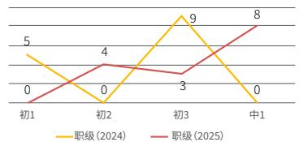  
仿真部 职级变化

机械设计二部 职级变化  
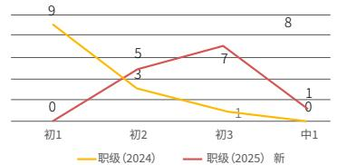  
机器人部 职级变化

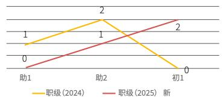

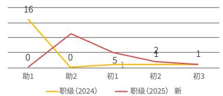

跨职级变化情况  
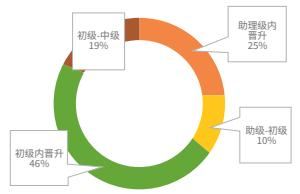

导师制学员职级变化情况  
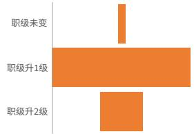

【现场导师带教】是基于“成人的学习特点”精心打造的一项以聚焦工作问题为核心，旨在选拔那些渴望学习、追求成长的高潜人才，并通过有效赋能与提升，助力已进入项目的伙伴从助理/初级向更高等级跃进，从而成功构建“钻石型”的北人人才职级画像。2024年10月至2025年5月，50位学员，50位导师，6个月现场带教，220份月总结报告，93份实践案例，历经3个阶段——挑兵选将、练兵冲锋、旗开得胜，采用导师、管理者、HR三向角色过程管理，北人注重有效实践经验的萃取、提炼与沉淀，确保学员可以从导师的丰富经验中汲取智慧精华，弯道超车，快速成长，在项目期末，100%的学员达成期初目标，并有94%的学员实现职级晋升。

# 全球化发展——英语冲锋训练营

为夯实全球化人才梯队建设，公司针对出海工程师群体定制英语赋能专项学习项目，已成功开展两期，每期为期2个月，通过“基础夯实-场景应用-实战深化”的逐层递进式设计，构建线上线下融合的立体化学习体系。线上模块以高频积累为核心，依托在线软件开展每日单词打卡、句型专项练习，帮助工程师建立基础语言库。线下模块聚焦实战场景落地，通过“学习方法工作坊”分享高效记忆策略，组织“英语自我介绍+公司业务推介”模拟演练，并邀请外籍技术专家及高管参与月度英语沙龙，围绕海外项目沟通、跨文化协作等主题进行沉浸式互动，为公司海外项目交付提供了关键语言能力支撑。

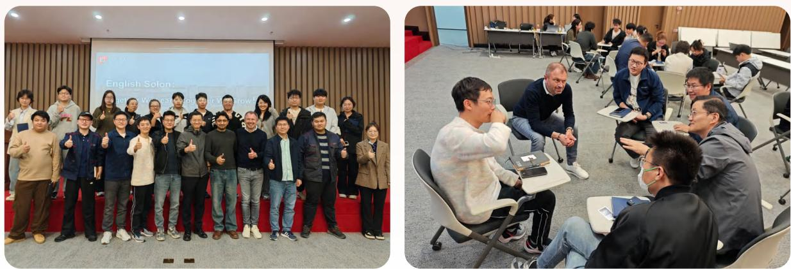

# 领导力发展与关键岗位接班计划

公司重视管理层能力建设，持续推动领导力体系建设与关键岗位接班规划。管理团队通过战略研讨会、管理者训练营、外部研修等形式强化战略理解力、团队领导力与跨部门协同能力。为保障组织可持续发展，公司针对研发负责人、项目经理、交付负责人、海外经理等关键岗位建立“人才池+任职资格”制度，用于识别、培养并储备接班人才。

人才是江苏北人最宝贵的资产,也是驱动公司可持续发展的核心引擎。我们始终致力于构建“科学识别、系统培养、动态发展”的全周期人才管理体系,为每一位高潜人才铺设清晰的成长路径,系统储备未来发展的核心力量,最终实现个人与组织的长远共赢。

为营造公平、透明的人才发展环境，我们建立了以“绩效-潜力”九宫格模型为核心的科学人才盘点机制。2025年9月完成605名公司人才盘点，其中九宫格落位7/8/9的高潜高绩效员工共189人。本次盘点工作基于公司“干部四力”与“员工五德”制定评分标准，通过两级评分、多维度评估与集体会议校准，客观识别高潜力、高绩效的核心人才，确保人才评价过程的公正性与系统性，为全体员工提供清晰、可预期的发展坐标。

在2025年第四季度,我们依据人才盘点结果,全面启动个人发展计划(IDP)制定工作,通过深入沟通帮助员工明确职业方向、激发成长内驱,并与上级共同对齐发展期望与具体行动路径。同步开展的“2025年度菁英工程师专项访谈”,为青年高潜人才提供了与高管面对面汇报、交流与反馈的平台,在检视成果的同时也拓宽了视野,为其后续发展注入动能。

基于人才盘点、个人发展计划(IDP)、菁英工程师专项访谈的评估与沟通,我们正式启动系统人才培养项目——“北人星·菁英”进阶训练营 学员选拔。该项目严格遵循“721”人才发展法则,以承接并解决真实业务挑战的“专项课题”为核心载体,通过系统性课程学习、高管导师辅导及跨业务实战历练,加速高潜人才的能力进阶,持续增强公司应对变革的“组织韧性”,并最终实现“让每一位奋斗者、同行者”在江苏北人都能得到可持续发展。

natural_image

Six people standing on a rocky peak at sunset, raising arms to achieve high scores (no text or symbols visible)

# 智能化守护安全,构建健康、可靠的工作场所——职业健康与安全(HSE)

# HSE 管理体系与职责

公司严格遵守国家安全生产法律法规，已通过二级安全生产标准化审查，并构建覆盖厂区、设备、工艺和人员的整体HSE管理体系。根据《安全现状评价报告》，公司设立主要负责人、专职安全管理人员及兼职安全管理人员队伍，形成从管理层到车间的多层级安全管理责任结构，配专职安全管理人员与兼职安全管理人员，确保安全责任到岗到人。

HSE管理体系涵盖风险辨识、隐患排查、设备设施安全管理、危险化学品管理、特种作业管理、外来承包商管理等模块，确保厂区安全条件符合国家标准。同时，公司持续将职业健康与安全纳入ESG治理体系，结合员工培训、安全文化建设和操作规程优化，提升现场安全管理能力。

# 重大风险作业自动化替代(焊接、打磨等)与本质安全提升

作为智能制造企业, 公司通过技术创新推动本质安全提升, 将原有高风险作业环节逐步替换为自动化、智能化装备。例如, 在焊接、激光加工、抛光打磨等存在高温、烟尘、电弧与机械伤害风险的工序中, 公司大规模应用自动化焊接生产线、智能打磨设备及具身智能焊接机器人, 减少人员直接暴露于危险环境的机会。

具身智能焊接机器人(2025年进入第二代迭代)通过轨迹自动化、传感融合与工艺推理,实现复杂焊接任务的智能化替代,使员工从高风险、重复性强的焊接作业中转移到工艺规划、设备监控等更安全的岗位,全面提升本质安全水平。相关系统已在船舶、重钢等行业进行应用测试并得到验证。

# 事故与事件管理、应急演练与复盘

根据安全现状评价,公司生产装置与工艺未出现重大调整,近年来未发生重大事故,且不构成重大危险源,符合国家安全生产条件要求。

公司持续开展事故隐患排查治理, 完善事件 (Incident) 分级管理流程, 包括:

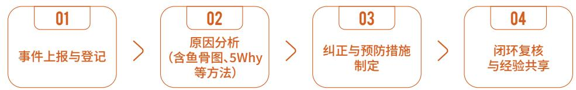

flowchart

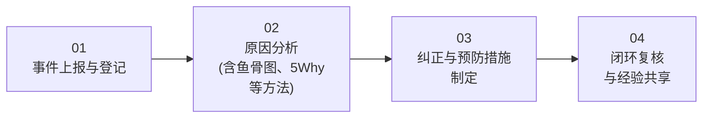
```mermaid
graph LR
  A["01\n事件上报与登记"] --> B["02\n原因分析\n(含鱼骨图、5Why\n等方法)"]
  B --> C["03\n纠正与预防措施\n制定"]
  C --> D["04\n闭环复核\n与经验共享"]
```

同时,公司定期组织应急演练,涵盖火灾、危险化学品泄漏、设备失效、电气故障等场景,并在演练后开展复盘分析,总结应急响应中的改进点,优化应急预案、人员响应流程及应急物资配置,提高全员应急处置能力。相关演练与安全教育纳入年度员工培训体系。

# 社区与社会公益

# 定向公益与员工志愿服务

公司积极开展定向公益项目，通过捐赠、志愿服务及社区活动等形式持续为社会贡献力量。在报告期内，公司开展了包括“公益净山”在内的环保类与公益类项目，为社区环境治理、垃圾分类教育与资源回收公益活动提供组织与支持，体现企业在环境与社会价值上的责任担当。

在2025年“世界环境日”到来之际，公司积极践行生态文明理念，组织开展“守护青山绿水 共筑绿色未来”公益净山活动，号召员工以实际行动参与生态环境保护。本次活动中，北人志愿者队30余人伍齐聚苏州穹窿山，历时4小时完成9.5公里“爱心线”沿途环境清洁，细致清理散落的塑料瓶、包装袋等废弃物，恢复山林自然面貌。通过这一行动，公司不仅推动环保理念深入人心，也将绿色公益融入企业文化与ESG实践之中，彰显企业在生态保护、员工参与与社会责任方面的积极担当。本次净山活动累计清理山区垃圾约150公斤，其中可回收物占比40%，显著改善徒步路线环境卫生，降低垃圾对土壤水源的潜在污染。

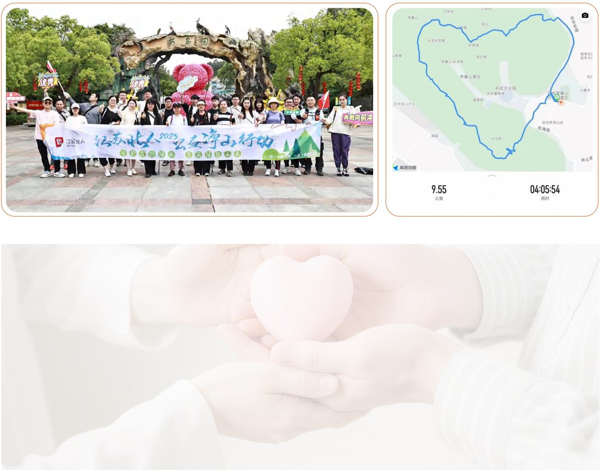

# 指标与对标索引 (KPIs & Indexes)

# 重点议题KPI汇总

员工雇佣

<table><tr><td>类型</td><td>指标</td><td>单位</td><td>2023年</td><td>2024年</td><td>2025年</td></tr><tr><td rowspan="9">员工雇佣</td><td>母公司在职员工的数量</td><td>人</td><td>563</td><td>637</td><td>587</td></tr><tr><td>主要子公司在职员工的数量</td><td>人</td><td>184</td><td>133</td><td>88</td></tr><tr><td>在职员工数量合计</td><td>人</td><td>747</td><td>770</td><td>675</td></tr><tr><td>博士</td><td>人</td><td>3</td><td>3</td><td>4</td></tr><tr><td>硕士</td><td>人</td><td>33</td><td>40</td><td>42</td></tr><tr><td>本科</td><td>人</td><td>353</td><td>423</td><td>369</td></tr><tr><td>大专</td><td>人</td><td>212</td><td>218</td><td>185</td></tr><tr><td>大专以下</td><td>人</td><td>146</td><td>86</td><td>75</td></tr><tr><td>女性高管比例</td><td>%</td><td>25%</td><td>26%</td><td>26%</td></tr></table>

员工培训

<table><tr><td>类型</td><td>指标</td><td>单位</td><td>2025年</td></tr><tr><td rowspan="5">员工培训次数</td><td>员工培训次数</td><td>次</td><td>322</td></tr><tr><td>员工培训覆盖率</td><td>%</td><td>47.7</td></tr><tr><td>接受培训的员工总人数</td><td>人</td><td>322</td></tr><tr><td>接受培训的女性员工人数</td><td>人</td><td>70</td></tr><tr><td>接受培训的男性员工人数</td><td>人</td><td>252</td></tr></table>

健康与安全

<table><tr><td>类型</td><td>指标</td><td>单位</td><td>2023年</td><td>2024年</td><td>2025年</td></tr><tr><td rowspan="2">职业健康与安全</td><td>安全培训覆盖率</td><td>%</td><td>100%</td><td>100%</td><td>100%</td></tr><tr><td>职业病发病员工人数</td><td>人</td><td>0</td><td>0</td><td>0</td></tr></table>

环境管理

<table><tr><td>类型</td><td>指标</td><td>单位</td><td>2024年</td><td>2025年</td></tr><tr><td rowspan="3">温室气体排放</td><td>总温室气体排放 $^1$ </td><td>吨二氧化碳当量</td><td>775</td><td>1332.5</td></tr><tr><td>其中,范畴 $^1$ </td><td>吨二氧化碳当量</td><td>67</td><td>57.3</td></tr><tr><td>范畴 $^2$ </td><td>吨二氧化碳当量</td><td>708</td><td>1275</td></tr></table>

<table><tr><td>类型</td><td>指标</td><td>单位</td><td>2024年</td><td>2025年</td></tr><tr><td rowspan="6">资源使用</td><td>总用电量</td><td>千瓦时</td><td>1,849,208</td><td>2,928,690</td></tr><tr><td>天然气</td><td>立方米</td><td>13,214</td><td>9,741</td></tr><tr><td>自有车辆油耗</td><td>升</td><td>14,082</td><td>13,242</td></tr><tr><td>总用水量</td><td>吨</td><td>14,267</td><td>13,458</td></tr><tr><td>可再生电力</td><td>千瓦时</td><td>639,697</td><td>750,000</td></tr><tr><td>可再生电力份额 $^3$ </td><td>%</td><td>34.6</td><td>25.6</td></tr><tr><td rowspan="2">废弃物排放</td><td>有害废弃物排放总量 $^3$ </td><td>吨</td><td>0.62</td><td>0.41</td></tr><tr><td>无害废弃物排放总量 $^4$ </td><td>吨</td><td>220</td><td>135</td></tr></table>

注：  
1、总温室气体排放为范畴 $^{1}$ 与范畴 $^{2}$ 温室气体排放量之和。其中，范畴 $^{1}$ 排放包括天然气、自有车辆燃油消耗所生产的温室气体排放；范畴 $^{2}$ 排放包括外购电力所生产的温室气体排放。  
范畴 $^{2}$ 外购电力碳排放因子取自生态环境部、国家统计局发布的2022年全国电力二氧化碳排放因子：0.5856千克二氧化碳当量/千瓦时；范畴 $^{3}$ 中天然气排放因子取自中国生态环境部环境规划院《中国产品全生命周期温室气体排放系数集》：2.16千克二氧化碳当量/立方米；范畴 $^{3}$ 中自有车辆油耗排放因子取自中国生态环境部环境规划院《中国产品全生命周期温室气体排放系数集》：车用汽油，3.04吨二氧化碳当量/吨。  
2、可再生电力份额=实际消耗的可再生电力/总用电量\*100%。  
3、有害废弃物包括废包装容器等，均交由有资质的第三方进行合规处置。  
4、无害废弃物主要为厨余与生活垃圾，交由市政环保部门处理。

供应链管理

<table><tr><td>类型</td><td>指标</td><td>单位</td><td>2023年</td><td>2024年</td><td>2025年</td></tr><tr><td rowspan="2">供应商管理</td><td>供应商总数</td><td>家</td><td>260</td><td>280</td><td>290</td></tr><tr><td>接受环境、社会(包括劳工、道德等)方面评估的供应商数量</td><td>家</td><td>40</td><td>50</td><td>55</td></tr></table>

产品与服务

<table><tr><td>类型</td><td>指标</td><td>单位</td><td>2023年</td><td>2024年</td><td>2025年</td></tr><tr><td rowspan="2">产品管理</td><td>所提供的产品和服务在健康与安全方面发生违法违规事件的总数</td><td>件</td><td>0</td><td>0</td><td>0</td></tr><tr><td>已售产品中因安全与健康问题而须收回的产品占比</td><td>%</td><td>0</td><td>0</td><td>0</td></tr></table>

社会公益

<table><tr><td>类型</td><td>指标</td><td>单位</td><td>2025年</td></tr><tr><td rowspan="2">社会公益</td><td>员工志愿服务人次</td><td>人次</td><td>30</td></tr><tr><td>开展志愿者活动时长</td><td>小时</td><td>120</td></tr></table>

报告编制说明

管理层寄语

公司概况

公司治理

企业经营

环境责任

以人为本

指标与对标索引

读者意见反馈

# 对标索引GRI

<table><tr><td>使用说明</td><td colspan="2">江苏北人在2025年1月1日至2025年12月31日期间,参照GRI标准编制2025年ESG报告。</td></tr><tr><td>使用的GRI 1</td><td colspan="2">GRI 1:基础2021</td></tr><tr><td>GRI标准</td><td>披露项</td><td>报告章节</td></tr><tr><td rowspan="16">GRI 2:一般披露2021</td><td>2-1组织详细情况</td><td>报告编制说明</td></tr><tr><td>2-2纳入组织可持续发展报告的实体</td><td>报告范围</td></tr><tr><td>2-3报告期、报告频率和联系人</td><td>报告范围</td></tr><tr><td>2-6活动、价值链和其他业务关系</td><td>北人制造</td></tr><tr><td>2-7员工</td><td>提高人才发展内驱力</td></tr><tr><td>2-9管治架构和组成</td><td>公司治理</td></tr><tr><td>2-10最高管治机构的提名和遴选</td><td>公司治理</td></tr><tr><td>2-11最高管治机构的主席</td><td>公司治理</td></tr><tr><td>2-12在管理影响方面,最高管治机构的监督作用</td><td>公司治理</td></tr><tr><td>2-13为管理影响的责任授权</td><td>公司治理</td></tr><tr><td>2-14最高管治机构在可持续发展报告中的作用</td><td>ESG管理</td></tr><tr><td>2-16重要关切问题的沟通</td><td>实质性议题管理</td></tr><tr><td>2-26寻求建议和提出关切的机制</td><td>ESG管理</td></tr><tr><td>2-27遵守法律法规</td><td>详见报告各章节</td></tr><tr><td>2-28协会的成员资格</td><td>参与协会清单</td></tr><tr><td>2-29利益相关方参与的方法</td><td>实质性议题管理</td></tr><tr><td rowspan="3">GRI 3:实质性议题2021</td><td>3-1确定实质性议题的过程</td><td>实质性议题管理</td></tr><tr><td>3-2实质性议题列表</td><td>实质性议题管理</td></tr><tr><td>3-3实质性议题的管理</td><td>实质性议题管理</td></tr><tr><td rowspan="2">GRI 201:经济绩效2016</td><td>201-1直接产生和分配的经济价值</td><td>闪耀北人</td></tr><tr><td>201-3固定福利计划义务和其他退休计划</td><td>ESG管理</td></tr><tr><td>GRI 203:间接经济影响2016</td><td>203-2重大间接经济影响</td><td>闪耀北人</td></tr><tr><td rowspan="2">GRI 205:反腐败2016</td><td>205-2反腐败政策和程序的传达及培训</td><td>公司治理</td></tr><tr><td>205-3经确认的腐败事件和采取的行动</td><td>未发生该类事件</td></tr><tr><td rowspan="3">GRI 302:能源2016</td><td>302-1组织内部的能源消耗量</td><td>关键绩效表</td></tr><tr><td>302-4减少能源消耗</td><td>智能与绿色的共生</td></tr><tr><td>302-5产品和服务的能源需求下降</td><td>智能与绿色的共生</td></tr><tr><td rowspan="3">GRI 305:排放2016</td><td>305-1直接(范畴1)温室气体排放</td><td>关键绩效表</td></tr><tr><td>305-2能源间接(范畴2)温室气体排放</td><td>关键绩效表</td></tr><tr><td>305-5温室气体减排量</td><td>关键绩效表</td></tr><tr><td rowspan="3">GRI 306:废弃物2020</td><td>306-1废弃物的产生及废弃物相关重大影响</td><td>零废弃工厂</td></tr><tr><td>306-2废弃物相关重大影响的管理</td><td>零废弃工厂</td></tr><tr><td>306-3产生的废弃物</td><td>关键绩效表</td></tr></table>

<table><tr><td>使用说明</td><td colspan="2">江苏北人在2025年1月1日至2025年12月31日期间,参照GRI标准编制2025年ESG报告。</td></tr><tr><td>使用的GRI 1</td><td colspan="2">GRI 1:基础2021</td></tr><tr><td>GRI标准</td><td>披露项</td><td>报告章节</td></tr><tr><td rowspan="2">GRI 401:雇佣2016</td><td>401-2提供给全职员工(不包括临时或兼职员工)的福利</td><td>员工权益与福利</td></tr><tr><td>401-3育儿假</td><td>员工权益与福利</td></tr><tr><td rowspan="8">GRI 403:职业健康与安全2016</td><td>403-1职业健康安全管理体系</td><td>职业健康与安全</td></tr><tr><td>403-2危害识别、风险评估和事故调查</td><td>职业健康与安全</td></tr><tr><td>403-4职业健康安全事务:工作者的参与、意见征询和沟通</td><td>职业健康与安全</td></tr><tr><td>403-5工作者职业健康安全培训</td><td>职业健康与安全</td></tr><tr><td>403-6促进工作者健康</td><td>职业健康与安全</td></tr><tr><td>403-7预防和减缓与业务关系直接相关的职业健康安全影响</td><td>职业健康与安全</td></tr><tr><td>403-8职业健康安全管理体系覆盖的工作者</td><td>职业健康与安全</td></tr><tr><td>403-10工作相关的健康问题</td><td>职业健康与安全</td></tr><tr><td rowspan="2">GRI 404:培训与教育2016</td><td>404-1每名员工每年接受培训的平均小时数</td><td>人才培养与发展</td></tr><tr><td>404-2员工技能提升方案和过渡协助方案</td><td>人才培养与发展</td></tr><tr><td rowspan="2">GRI 414:供应商评估2016</td><td>414-1使用社会标准筛选的新供应商的比例</td><td>反腐败与可持续</td></tr><tr><td>414-2供应链中的负面社会影响和采取的行动</td><td>未发生该类事件</td></tr><tr><td rowspan="2">GRI 416:客户健康与安2016</td><td>416-1对产品和服务类别的健康与安全影响的评估</td><td>产品质量管理</td></tr><tr><td>416-2涉及产品和服务的健康与安全影响的违规事件</td><td>未发生该类事件</td></tr><tr><td rowspan="2">GRI 417:产品及服务标识2016</td><td>417-2涉及产品和服务信息与标识的违规事件</td><td>未发生该类事件</td></tr><tr><td>417-3涉及市场营销的违规事件</td><td>未发生该类事件</td></tr><tr><td>GRI 418:客户隐私2016</td><td>418-1与侵犯客户隐私和丢失客户资料有关的经证实的投诉</td><td>客户关系维护</td></tr></table>

# BR-Tech

报告编制说明

管理层寄语

公司概况

公司治理

企业经营

环境责任

以人为本

指标与对标索引

# 读者意见反馈

# 读者意见反馈

为了不断提升江苏北人可持续发展管理工作,我们希望得到您的意见反馈,这将成为我们提高工作水平的重要依据。衷心感谢您在百忙中对本报告提出宝贵建议。

# 您的信息

姓名：\_\_\_\_ 单位：\_\_\_\_ 电话：\_\_\_\_ 邮箱：\_\_\_\_

# 您的意见

1. 您认为2025年江苏北人ESG报告总体上：

□很好

□ 较好

□ 一般

□较差

□ 很差

2. 您认为2025年江苏北人ESG报告披露的信息：

□很丰富

□较丰富

□ 一般

□较少

□ 很少

3.您认为2025年江苏北人ESG报告披露信息质量：

□很好

□ 较好

□一般

□较差

□ 很差

4.您认为2026年江苏北人ESG报告应该新增加的议题：

- 治理支柱,具体是:  
- 环境支柱,具体是:  
- 社会支柱,具体是: \_\_\_\_  
- 其他,具体是:

# 联系我们

电子邮箱:ir@beiren-tech.com

联系电话:0512-62886165