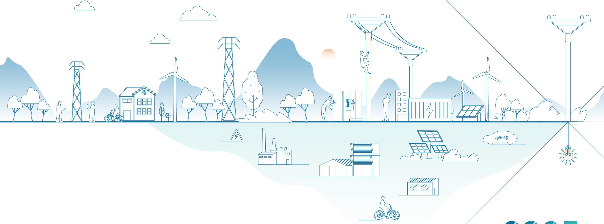

natural_image

Line art illustration of a renewable energy and infrastructure ecosystem with buildings, power lines, and solar panels (no text or symbols)

# 2025

# 环境、社会及公司治理

# (ESG)报告

ENVIRONMENTAL SOCIAL AND

GOVERNANCE(ESG)REPORT

服务热线:400-800-1888  
服务邮箱:service@wetown.cc  
联系地址:江苏省扬中市新坝科技园南自路1号

# 目录 CONTENTS

# 开篇

报告编制说明 01

走进威腾电气 02

# 绿色引擎

# 驱动低碳转型

应对气候变化 19

资源利用与循环经济 26

污染物与废弃物治理 32

环保合规与生态保护 37

# 共享共赢

# 携手共创未来

赋能员工成长 77

职业健康安全 87

爱心回馈社会 92

助力行业发展 96

# 结篇

关键绩效表 115

指标索引 118

读者反馈表 123

# ESG 治理

ESG发展战略 09

ESG 管理体系 12

利益相关方沟通 14

双重重要性议题评估 15

# 精工智造

# 创新驱动发展

保障产品质量 45

诚心服务客户 52

聚力研发创新 55

数智信息安全 64

保障供应安全 68

# 规范运作

# 诚信守正经营

公司治理 103

投关管理 105

风险内控 107

商业道德 109

党建引领 114

# 报告编制说明

本报告是威腾电气集团股份有限公司（以下简称“威腾电气”“本公司”“公司”）发布的第3份环境、社会及公司治理类（ESG）报告，旨在回应社会各界对企业履行环境、社会及公司治理责任的期待，系统、全面地向各利益相关方呈现公司在可持续发展领域的战略实践与绩效成果。

# 时间范围

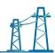

本报告为年度报告，时间跨度为 2025 年 1 月 1 日至 2025 年 12 月 31 日，为增强报告可比性及前瞻性，部分内容向前后年度适度延伸。

# 报告边界

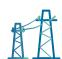

报告披露了威腾电气集团股份有限公司及其子公司履行环境、社会及公司治理方面的责任信息，相关典型案例来自公司及其下属分子公司。除特殊说明外，本报告披露范围与公司2025年度财务报告合并报表范围保持一致。

# 数据说明

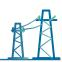

本报告所引用的数据均来自本公司和附属公司的正式文件和统计报告，部分实践案例基于公司日常工作进行梳理、总结。如无特别说明，本报告所示金额均以人民币列示。财务数据若与财务报告不一致之处，以财务报告为准。

# 编制依据

联合国 2030 年可持续发展目标（SDGs）

全球可持续发展标准委员会《可持续发展报告标准》（GRI Standards）

上海证券交易所《上海证券交易所上市公司自律监管指引第14号——可持续发展报告（试行）》

上海证券交易所《上海证券交易所科创板上市公司自律监管指南第13号——可持续发展报告编制》

中国上市公司协会《上市公司可持续发展报告工作指南》

中国社会科学院《中国企业可持续发展报告指南》（CASS-ESG 6.0）

中国国家标准《社会责任报告编写指南》（GB/T36001-2015）

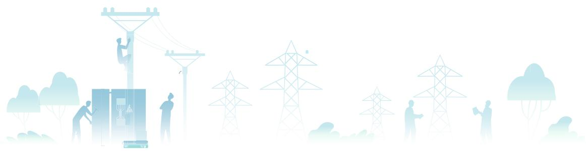

natural_image

Silhouette illustration of workers installing power lines on a utility tower, surrounded by clouds and smoke (no text or symbols)

称谓说明

<table><tr><td>本公司、公司、威腾电气</td><td>指</td><td>威腾电气集团股份有限公司</td></tr><tr><td>交易所《指引》</td><td>指</td><td>上海证券交易所《上海证券交易所上市公司自律监管指引第14号——可持续发展报告(试行)》</td></tr><tr><td>交易所《指南》</td><td>指</td><td>上海证券交易所《上海证券交易所科创板上市公司自律监管指南第13号——可持续发展报告编制》</td></tr><tr><td>元、万元、亿元</td><td>指</td><td>人民币元、人民币万元、人民币亿元</td></tr><tr><td>报告期</td><td>指</td><td>2025年度</td></tr></table>

# 审议程序

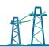

本报告经公司董事会第四届十七次董事会会议审议通过并发布。

# 报告获取

本报告以电子版形式供您阅读，您可登录公司官网（http://www.wetown.com.cn）或上海证券交易所网站（http://www.sse.com.cn）阅读电子版报告。如对本报告有任何疑问或建议，敬请发送电子邮件至DMB@wetown.cc，或致电0511-88227266。您的意见与建议，是威腾电气持续推进ESG管理和实践的重要依据。

# 走进威腾电气

# 公司概况

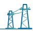

威腾电气作为储能及配电系统解决方案服务商，涵盖配电设备、储能系统、光伏新材三大业务，致力于为数据中心、新能源、工业制造、电力电网、数据通讯、轨道交通、商业地产等行业客户提供优质的产品、解决方案、能源管理与运维服务。

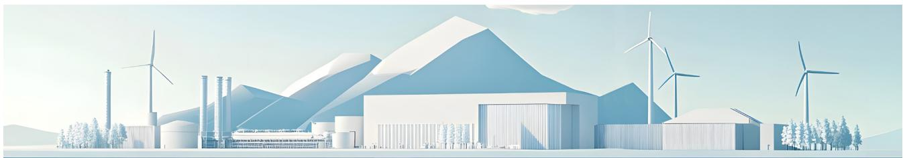

natural_image

Illustration of a modern industrial park with wind turbines and mountains in the background (no text or symbols)

# 企业文化

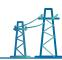

# 企业使命

让世界信赖中国电气

# 企业愿景

创全球领先的电气品牌
做世界尊重的杰出企业

# 核心价值观

客户至上 创新致远
为善担当

# 质量理念

追求零缺陷完美无止境

# 产品理念

极致安全
绿色节能

# 服务理念

真诚 专业 卓越

# 管理理念

简捷 协同 高效

# 经营理念

共创 共享 共赢促进企业可持续发展

# 发展历程

2004年1月7日公司成立；开发LM铝合金母线，打破行业垄断

2004 年

与 GE 合作，成为 WavePro 系列母线授权制造商

2007 年

自主研发的LV低压密集型母线槽成功下线

2009 年

战略重组MM Powerplus

2012 年

WETOWN 商标
被认定为中国驰
名商标

2015 年

取得美国西屋电气相关中低压配电设备授权合作

2017年

公司产品检测中心被认定为CNAS实验室

2020 年

依托产业链优势，
发力储能业务

2022 年

与 ABB 成立合资公司，推动母线行业发展

# 初露锋芒

# 乘势而上

# 扬楫奋进

2006 年

成立行业内首家母线产品研究所和母线性能试验中心

2008 年

成立铜铝材公司，向产业链上游原材料延伸

2010 年

光伏焊带产品成功下线

2014 年

战略重组威腾配电

# 再启新程

2016年

与 ABB 合作，成为战略伙伴合作关系

2019 年

荣获江苏省示范智能车间称号

2021 年

威腾电气集团股份有限公司登陆A股科创板，股票代码：688226

2023年

配电 & 新能源
产业基地开工
建设

2025 年

成立威璞光电，
研发制造硅光
模块等光电互
联产品

# 年度荣誉

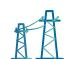

国家级荣誉  
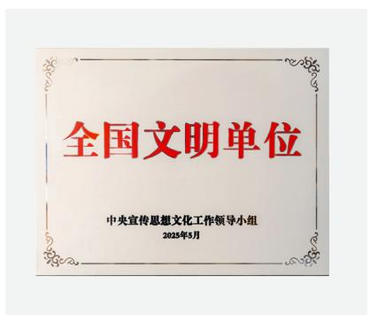

text_image

全国文明单位
中央宣传思想文化工作领导小组
2025年5月

《全国文明单位》

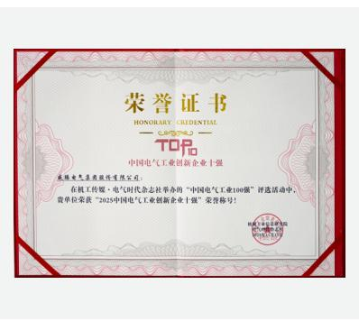

text_image

荣誉证书
HONORARY CREDENTIAL
TOP
中国电气工业创新企业十强
成都电气集团软件有限公司：
在核工传报·电气时代杂志社举办的“中国电气工业100强”评选活动中，
需单位荣获“2023中国电气工业创新企业十强”荣誉称号！
成都电气集团软件有限公司
特此公告。
2023年1月17日

《中国电气工业创新企业十强》

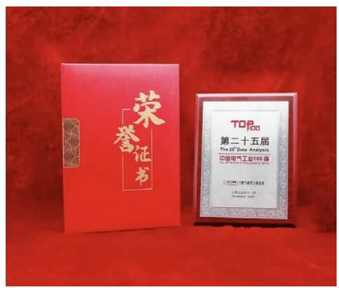

text_image

荣誉证书
TOP100
第二十五届
The 25th Grade Analysis
中国电气工业100级

荣登第25届  
“中国电气工业 100 强”  
榜单 55 名

省市级荣誉  
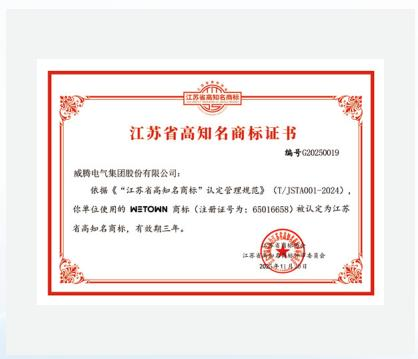

seal

江苏省高知商标局
江苏省高知商标证书
编号:G20250019
威腾电气集团股份有限公司:
依据《“江苏省高知名商标”认定管理规范》(T/JSTA001-2024),你单位使用的WETOWN商标(注册证号为:65016658)被认定为江苏省高知名商标,有效期三年。
江苏省高知商标协会
2024年11月20日

《江苏省高知名商标》

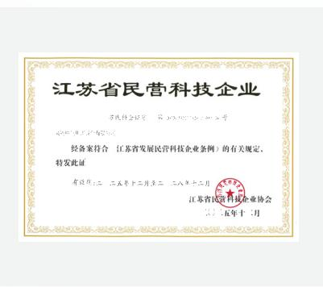

text_image

江苏省民营科技企业
经备案符合《江苏省发展民营科技企业条例》的有关规定，
特发此证
年检合格 二〇五年十二月 第三 二〇八年十二月
江苏省民营科技企业协会
2015年十二月

《科技民营企业》

  
荣膺江苏省制造业领航企业

  
《江苏省先进级智能工厂》

行业级荣誉  
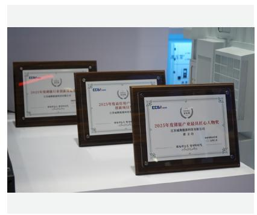

text_image

2023年度银联银行创赢基金
江苏新能集团有限公司
2023年度益佰用户
招商银行
江苏新能集团有限公司
2023年度银联银行创赢基金匠心人物奖
江苏新能集团有限公司
兹 州
授权委托书
授权委托书号：100000000000000000000000000000000000000000000000000000000000000000000000000000000000000

公司荣获储能展三奖

  
喜获“2025高工金球奖”

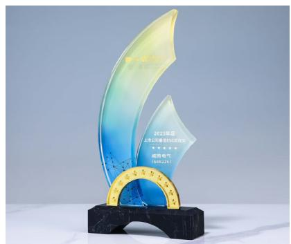

text_image

2020年度
2020年最佳55次冠军
威视电气
(688.2%)

上市公司最佳 ESG 实践奖

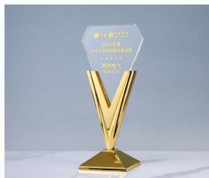

text_image

2023年度
上市公司卓越研发基地颁奖
★★★★★
旭辉电气
B18522G

上市公司卓越投关建设奖

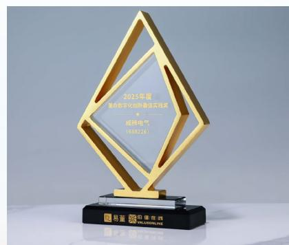

text_image

2025年展
暨市数字1688号福建省技术局
成网电气
16882501
易蓝 环银证券
VALUOYUAN
中信证券

董办数字化创新最佳实践奖

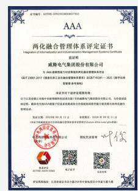  
《两化融合 3A 级管理体系》

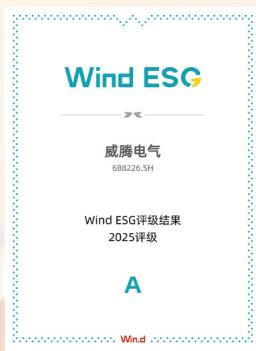

text_image

Wind ESG
威腾电气
688226.SH
Wind ESG评级结果
2025评级
A
Wind

Wind ESG 评级首次获得 “A” 级

# 年度大事记

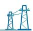

# 时光为证，奋斗为名

感谢每一位与威腾并肩同行的人，让 2025 的画卷熠熠生辉。

新的一年，我们继续携手同心，以微光聚炬，共赴新征程。

# 创新为匙，智启未来

- 威腾电气获取首批密集型母线槽产品碳足迹认证、Pro VH 密集型母线槽取得相关产品认证并已顺利推向市场  
- 威腾电气荣获两化融合管理体系 AAA 级认证、获取江苏省高知名商标认定 2 件  
- 威腾电力科技荣获 IATF16949 质量体系认证  
- 威腾新材获省级企业技术中心称号，并顺利通过光伏焊带碳足迹产品认证

# 项目为基，实干聚力

- 高压母线系列产品乘势而上，挺进抽水蓄能电站和沙特市场，并一举斩获多个电站订单  
- 威腾成套 2.5MW 智算中心一体化电力模组成功下线  
- 低压柜 MDmax 获 ASTA 试验认证  
- 引入 ABB 授权技术，完成 UniSafe-12 交流金属封闭开关设备研制  
- 威腾变压器新设备落地，并完成大容量储能变压器取证  
- 威腾电气持有的宁夏独立储能电站项目顺利并网运行  
- 威腾国际携手泰国 EM Energy 共建泰国能源储存系统生态  
- 威腾电气与孛璞半导体达成战略合作，合资成立威璞光电，开展光模块等光电产品业务

# 交流为媒，开拓新篇

- 3月，威腾电气亮相“迪拜国际电力照明新能源展览会”  
- 4月，威腾电气亮相第137届春季广交会  
- 5月,西屋能源科技参加“2025年波兰国际电池储能展”  
- 6月，威腾新材参加第十八届国际太阳能光伏与智慧能源（上海）大会暨展览会  
- 8月，威腾能源科技参加第四届 EESA 储能展  
- 10月，威腾电气参与2025风光火储大会，聚焦前沿技术与解决方案

# 荣誉为证，实力为基

- 5月, 荣膺全国文明单位称号、江苏省先进级智能工厂  
- 7月，威腾电气 Wind ESG 评级由 BBB 跃升至 A 级  
- 11月，蝉联“中国电气工业100强”榜单55名  
- 11月，成功获取“零碳工厂”认证，绿色低碳发展迈出关键一步  
- 12月，参加高工储能年会并获得“2025高工金球奖”  
- 12月，登榜“江苏省制造业领航企业”  
- 12月，威腾电气荣获价值在线“上市公司最佳ESG实践奖”等三项荣誉

# 以善为舟，逐梦前行

- 5月，“威腾电气”杯男子篮球联赛开幕  
- 7月，“忆长征路”红色教育主题活动  
- 8月，以实际行动助力全民健身，“威腾体育馆”正式启用  
- 9月，威腾集团首届职工美食文化节成功举行  
- 10月，“一双球鞋的暴走”与威腾共筑公益梦  
- 10月，“威爱夕阳红”威腾首届敬老孝亲节暨全市孤寡老人重阳慰问  
- 11月，“威腾健康惠·护肺万人行”持续关注本地无医保居民身心健康  
- 12月，“发展、责任、共赢”与供应商共绘新蓝图

# ESG 治理

# ESG 发展战略

威腾电气将 ESG 理念融入公司发展战略及经营管理活动中，持续加强生态环境保护、履行社会责任、健全公司治理。在战略层面，公司对标联合国可持续发展目标，围绕“清洁能源、资源节约、以人为本、共创价值、稳固治理、诚信经营”六大 ESG 战略行动方针，逐一分解设定短期、中期、长期阶段性目标。公司董事会战略与 ESG 委员会定期对 ESG 战略目标的达成情况进行评估，并依据内外部环境变化适时更新 ESG 战略目标，确保责任落实到岗、任务分解到人，促进公司与经济、社会的可持续发展。

威腾电气 ESG 战略框架

<table><tr><td>ESG战略愿景</td><td colspan="6">共创 共享 共赢 促进企业可持续发展</td></tr><tr><td>ESG战略方向</td><td>清洁能源绿色未来</td><td>资源节约高效利用</td><td>以人为本益路同行</td><td>价值共创伙伴共荣</td><td>永续发展稳固治理</td><td>合规运营诚信兴商</td></tr><tr><td>ESG战略举措</td><td>应对气候变化零碳工厂绿色产品清洁能源</td><td>废弃物减排循环利用绿色包材绿色营运</td><td>关注员工福祉职业健康管理安全生产公益志愿</td><td>可持续供应链行业共进卓越服务</td><td>ESG治理ESG评级加强治理效能</td><td>建设合规体系反商业贿赂及贪污反不正当竞争</td></tr><tr><td>响应的联合国SDGs目标</td><td></td><td></td><td></td><td></td><td></td><td>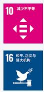</td></tr></table>

ESG 各维度战略目标及达成情况

<table><tr><td>维度</td><td>子议题</td><td>中长期目标</td><td>目标达成进展</td></tr><tr><td rowspan="4">清洁能源,绿色未来</td><td>温室气体</td><td>完成三大园区范围一、范围二温室气体核查,设定温室气体减排目标,开展温室气体专项减排项目,到2030年实现三大园区碳达峰</td><td>已初步完成南自路1号厂区范围一、范围二温室气体核查</td></tr><tr><td>零碳工厂</td><td>到2030年,完成三大园区零碳工厂认证</td><td>已完成南自路1号厂区零碳工厂认证</td></tr><tr><td>绿色产品</td><td>到2030年,完成公司主要产品的碳足迹认证10-12个;研发、开发低碳环保相关产品或技术5个</td><td>已完成密集型母线槽、涂锡铜带产品碳足迹认证</td></tr><tr><td>清洁能源</td><td>以2024年为基准,到2030年实现公司运营层面清洁能源占比70%,每万元营收能耗下降10%</td><td>2025年度,公司清洁能源占比为18.12%</td></tr><tr><td rowspan="4">资源节约,高效利用</td><td>废弃物减排</td><td>以2024年为基准年,到2030年减少每万元营收产生有害/无害废弃物10%</td><td>2025年度,公司每万元营收产生有害/无害废弃物同比2024年下降20.27%</td></tr><tr><td>循环利用</td><td>到2030年,一般工业固体废物综合利用率不低于90%</td><td>2025年度,公司一般工业固体废物综合利用率为87%</td></tr><tr><td>绿色包材</td><td>到2030年,产品包材、辅材使用绿色环保材料比例达到20%</td><td>2025年度,公司新材料焊带产品已去除银的添加剂,使产品更绿色环保</td></tr><tr><td>绿色营运</td><td>践行绿色办公,以2024年为基准年,到2030年,实现每万元营收办公打印用纸量同比下降50%</td><td>2025年度,公司办公打印用纸量已同比2024年下降15%</td></tr><tr><td rowspan="4">以人为本,益路同行</td><td>员工福祉</td><td>到2030年,建立完善的员工满意度调查与反馈改进机制,形成良好的员工沟通渠道,关注员工福祉,持续提升员工满意度</td><td>2025年度,公司围绕食堂满意度开展员工满意度调查</td></tr><tr><td>职业健康</td><td>到2030年,保障在职员工每年接受职业健康体检,实现所有员工与外包人员健康安全培训覆盖率100%</td><td>2025年度,员工接受职业健康体检701人次,已覆盖所有涉及职业危害的员工;开展职业健康安全培训累计11,594人次</td></tr><tr><td>安全生产</td><td>保障生产安全,重大安全生产事故0起,员工损工休假率&lt;0.8ppm(百万工时)</td><td>2025年度,发生重大安全事故0起,员工损工休假率为0.53ppm(百万工时)</td></tr><tr><td>公益志愿</td><td>积极打造威腾公益品牌,持续开展公益志愿项目。以2024年为基准年,到2030年扩大员工志愿者规模20%,提升乡村振兴与公益投入20%</td><td>2025年度,公司员工志愿者规模同比2024年上升53.7%,乡村振兴与公益投入同比2024年提升49.55%</td></tr><tr><td rowspan="3">价值共创,伙伴共荣</td><td>可持续供应链</td><td>到2030年,实现100%主要材料A类供应商接受定期ESG评估审核,75%的主要材料B类供应商开展ESG评估审核</td><td>2025年度,公司完成对28%的A类核心供应商的ESG评估审核</td></tr><tr><td>行业共进</td><td>到2030年,累计参与(包括正在参与)制定国际、国家、行业、团体标准50项</td><td>截至2025年度,公司已参与实施标准29项,正在进行中标准5项</td></tr><tr><td>卓越服务</td><td>持续开展客户服务优化项目,客户满意度不低于98%,客诉响应及时率、解决率保持100%</td><td>2025年度,公司全年客户满意度达98.26%,客诉响应及时率和解决率为100%</td></tr><tr><td rowspan="4">永续发展,稳固治理</td><td>ESG风险管理</td><td>持续开展双重重要性议题评估,对ESG影响、风险和机遇进行识别与控制,形成完善的ESG风险管理与培训机制</td><td>2025年度,公司新开展双重重要性议题评估,从财务重要性和影响重要性两个维度识别对公司可能存在风险的ESG议题</td></tr><tr><td>ESG绩效挂钩</td><td>到2030年,实现ESG绩效与公司副经理及以上员工的ESG绩效挂钩</td><td>2025年度,公司已将EHS部门薪酬绩效与环保情况挂钩</td></tr><tr><td>提升外部评级表现</td><td>持续提升公司在主流ESG评级体系中的表现,到2030年,主流ESG评级排名位列行业前列</td><td>2025年度,公司Wind ESG评级、华证ESG评级为“A”,整体表现位于行业前25%以内</td></tr><tr><td>加强治理效能</td><td>建设完善董事会有效性评估体系,促进董事会背景多元化,提升董事会成员专业知识水平</td><td>2025年度,公司遵循新《公司法》,取消监事会,修订公司部分治理制度,进一步优化治理结构</td></tr><tr><td rowspan="3">合规运营,诚信兴商</td><td>建设合规体系</td><td>到2030年,完成合规体系建设,通过ISO37301合规管理认证,每两年对所有经营主体及子公司开展内部审计</td><td>2025年度,公司建立合规管理机制、开展合规法体化建设</td></tr><tr><td>反商业贿赂及贪污</td><td>逐步建立覆盖全体员工(包括合同工)的廉洁与反贪污管理机制,定期开展廉洁内部审计及全员培训,廉洁承诺书覆盖率100%</td><td>2025年度,公司开展廉洁自律培训1场,员工(包括合同工)覆盖率61%,廉洁承诺书覆盖率100%</td></tr><tr><td>反不正当竞争</td><td>逐步建立完善公平竞争管理体系,定期开展反不正当竞争内部审计及培训,加强反不正当竞争宣传与管理</td><td>2025年度,公司开展反垄断与公平竞争培训4次,参与人数366人,总时长5,856小时</td></tr></table>

# ESG 管理体系

为提升环境、社会及公司治理（ESG）管理水平，公司已建立由董事会、战略与 ESG 委员会、ESG 工作小组构成的“决策—管理—执行”三级可持续发展管理架构，制定《环境、社会及公司治理（ESG）管理手册》，全面落实 ESG 管理机制。其中董事会作为公司 ESG 工作的最高责任机构，领导与监督公司 ESG 工作，包括气候变化、废弃物、能源、原材料与包装材料等环境议题，创新驱动、产品和服务质量与安全、员工权益、职业健康安全、供应链等社会议题，以及商业道德、风险管理等公司治理议题；战略与 ESG 委员会作为专项议事机构，定期审议 ESG 战略路径、监控执行情况、优化治理安排；ESG 工作小组作为落实主体，统筹协调各中心、各子公司具体执行工作。各职能部门根据职责分工，分别对环境责任、社会责任及治理责任相关议题开展专项推进。

在 ESG 绩效考核方面，公司将 ESG 工作纳入各部门 KPI 考核体系，涵盖 ESG 数据收集的准确性与完整性、关键 ESG 指标的达成进度等内容，并将是否发生重大安全事件、环保事件、质量事件等 ESG 相关绩效与公司高级管理层绩效考评挂钩，建立以目标和结果为导向的激励与约束机制。

公司 ESG 管理架构及工作职责  
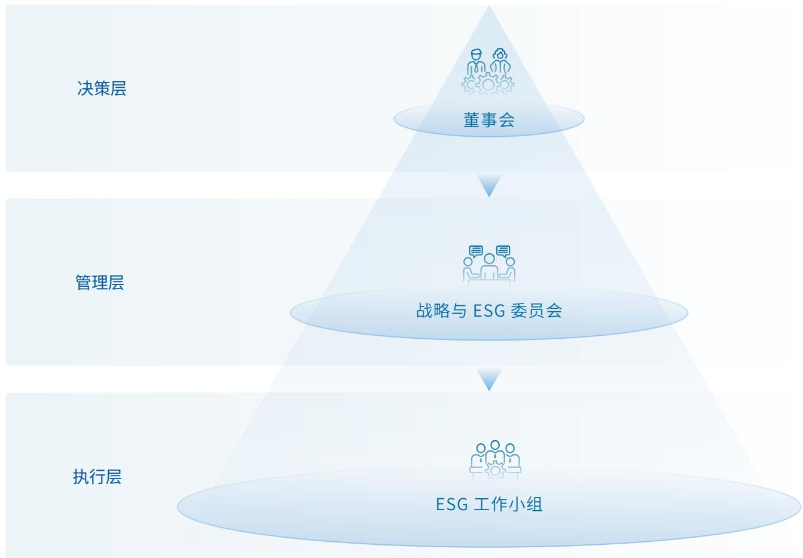

flowchart

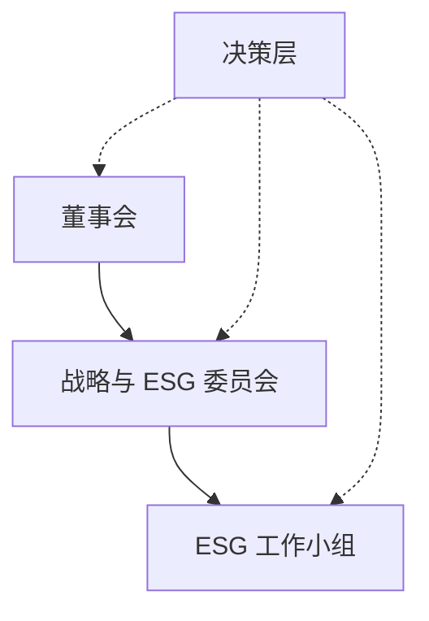

# ESG 培训赋能

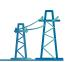

# 案例 召开 ESG 专项工作会议，深化 ESG 顶层设计与战略对标

2025 年 7 月，公司董事会战略与 ESG 委员会联合 ESG 工作组组织召开 ESG 专项复盘会，各职能部门负责人参与。会议系统总结了上一年度 ESG 实践成效，并对公司中长期 ESG 战略规划与管理体系构建进行了深入研讨。通过对各部门 ESG 重点项目的宣贯与任务分解，公司进一步明确了各业务板块在 ESG 工作中的提升方向，有效强化了相关人员对可持续发展愿景的共识，实现了 ESG 指标与业务流程的深度融合。该举措为完善公司 ESG 治理架构、提升非财务绩效管理水平奠定了坚实基础，全面驱动企业向高质量发展目标迈进。

# 案例 深化治理层可持续发展意识，聚焦交易所ESG新规提升合规披露水平

2025 年 11 月，公司邀请第三方专业机构为董事、高级管理人员及核心技术人员开展专项 ESG 合规培训，此次培训深入解读了《上海证券交易所上市公司自律监管指引第 14 号——可持续发展报告（试行）》的核心政策，重点阐述了“双重重要性”原则、治理及战略等“四要素”披露框架以及具体的议题披露要求。通过系统化的政策宣贯，管理层充分理解了监管端对企业可持续发展能力的评价标准及透明度要求。该举措有效强化了治理层在 ESG 风险管理与决策中的专业深度，确保公司披露工作与最新监管标准精准接轨，为构建高质量的 ESG 治理架构与报告体系夯实了制度与认知基础。

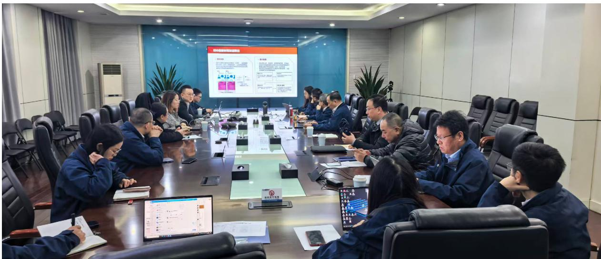

text_image

Meeting room photo with visible presentation screen and participants in formal attire

ESG 培训现场

# 利益相关方沟通

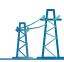

公司高度重视与各利益相关方的互动，持续健全常态化、多元化的利益相关方沟通机制，倾听并回应政府及监管机构、客户、投资者、员工、供应商、社区与公众等主要利益相关方的期望与诉求，并将其作为优化公司 ESG 战略与实践的重要依据。

<table><tr><td colspan="2">利益相关方</td><td>期望与诉求</td><td>沟通与回应</td></tr><tr><td></td><td>股东</td><td>稳定业绩增长股东权益保护信息披露充分投资者关系遵守商业道德可持续发展</td><td>ESG 治理三会运作内部控制与风险管理投资者关系管理反商业贿赂及反贪污反不正当竞争知识产权保护</td></tr><tr><td></td><td>政府及监管机构</td><td>依法合规经营服从监管要求响应国家发展政策</td><td>遵守法律法规配合监管检查定期与临时信息披露推动乡村振兴推动产学研用</td></tr><tr><td></td><td>客户</td><td>质量保障产品升级售后服务绿色产品</td><td>产品质量保证科技创新与技术研发信息安全与隐私保护客户服务与权益保护清洁能源使用</td></tr><tr><td></td><td>员工</td><td>雇佣与权益保护员工薪酬与福利职业发展与培训员工安全与健康</td><td>员工权益保护丰富的员工培训畅通的晋升通道员工福利与关怀举措健康与安全保障</td></tr><tr><td></td><td>合作伙伴</td><td>供应链管理遵守商业道德</td><td>阳光采购供应商评估供应商培训</td></tr><tr><td></td><td>行业</td><td>创新发展行业共赢</td><td>参与行业交流推进校企合作制定行业标准</td></tr><tr><td></td><td>社区和公众</td><td>社会公益乡村振兴</td><td>公益活动社区关怀物资捐赠</td></tr></table>

# 双重重要性议题评估

为更好地回应各方期待、提升 ESG 管理的实质性、透明性和有效性，公司于 2025 年度基于交易所《指引》、财政部《准则》对于 ESG 影响、风险和机遇重要性评估的要求，开展双重重要性议题识别与分析工作。问卷分为“财务重要性问卷”和“影响重要性问卷”，通过对内部、外部利益相关方进行问卷调研，回收有效问卷 139 份，从“财务重要性”与“影响重要性”两个维度综合形成了本年度双重重要性议题矩阵，为 ESG 报告披露提供依据。

# 双重重要性调研流程

# 确定 ESG 议题清单

\- 基于交易所《指引》21项议题、行业重要议题、ESG评级关注议题及其他ESG重要议题，形成ESG重要性议题清单

# 开展问卷调研

# 财务重要性问卷

· 对象：面向公司董事及高级管理人员、职能部门负责人、财务与风险管理人员、ESG 工作组  
- 目的：评估议题预期在短期、中期和长期对公司的财务表现（包括收入、成本、利润、现金流）造成影响的程度

# 影响重要性问卷

- 对象：面向员工、供应商、消费者、投资者、政府机构等利益相关方  
· 目的：评估议题是否会对经济、社会和环境产生重大影响

# 量化分析评估

# 财务重要性分析评估

- 依据内部问卷调研结果筛选出具有财务重要性的议题，评估该议题对于公司的风险和机遇，以及对财务表现的影响程度  
·依据影响重要性问卷结果筛选出具有影响重要性的议题，评估该议题对于利益相关方影响的重要程度

# 整合结果

\- 整合财务重要性、影响重要性评估结果，形成双重重要性矩阵，对具有财务重要性的议题，按照“治理-战略-影响、风险和机遇管理-指标与目标”进行分析披露

2025 年度双重重要性矩阵  
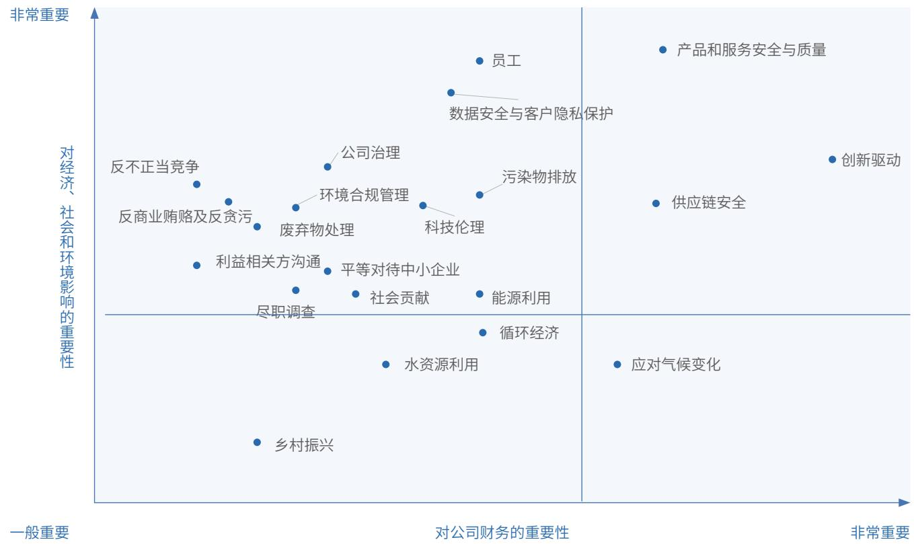

scatter

| Category | 对公司财务的重要性 (X-axis) | 对经济、社会和环境影响的重要性 (Y-axis) |
| --- | --- | --- |
| 乡村振兴 | ~15% | ~10% |
| 水资源利用 | ~35% | ~20% |
| 应对气候变化 | ~65% | ~20% |
| 循环经济 | ~45% | ~25% |
| 能源利用 | ~45% | ~30% |
| 社会贡献 | ~35% | ~30% |
| 平等对待中小企业 | ~30% | ~30% |
| 利益相关方沟通 | ~20% | ~30% |
| 尽职调查 | ~25% | ~30% |
| 科技伦理 | ~40% | ~35% |
| 废弃物处理 | ~25% | ~40% |
| 环境合规管理 | ~30% | ~40% |
| 反商业贿赂及反贪污 | ~20% | ~40% |
| 反不正当竞争 | ~15% | ~45% |
| 公司治理 | ~30% | ~50% |
| 污染物排放 | ~45% | ~45% |
| 数据安全与客户隐私保护 | ~45% | ~70% |
| 供应链安全 | ~65% | ~45% |
| 产品和服务安全与质量 | ~75% | ~90% |
| 创新驱动 | ~90% | ~60% |
| 员工 | ~45% | ~85% |

# 双重重要性议题

创新驱动  
产品和服务安全与质量供应链安全

# 仅具有财务重要性议题

应对气候变化

# 仅具有影响重要性议题

员工
数据安全与客户隐私保护
公司治理
反不正当竞争
污染物排放
环境合规管理
科技伦理
反商业贿赂及反贪污
废弃物处理
利益相关方沟通
平等对待中小企业
社会贡献
尽职调查
能源利用

# 不具有重要性议题

循环经济
水资源利用
乡村振兴

# 01

# 绿色引擎

# 驱动低碳转型

围绕 “强富美高” 新江苏建设目标中对绿色发展和环境治理的总体要求，威腾电气立足制造业转型升级方向，顺应生态文明建设和绿色低碳发展趋势，把资源节约、污染防治和生态友好理念融入企业发展全过程，推动生产经营活动与区域环境承载能力相协调，积极助力 “环境美” 目标在企业层面的实践落地，为新江苏建设和可持续发展贡献力量。

应对气候变化 19  
资源利用与循环经济 26  
污染物与废弃物治理 32  
环保合规与生态保护 37

SDGs 对标

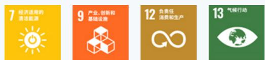

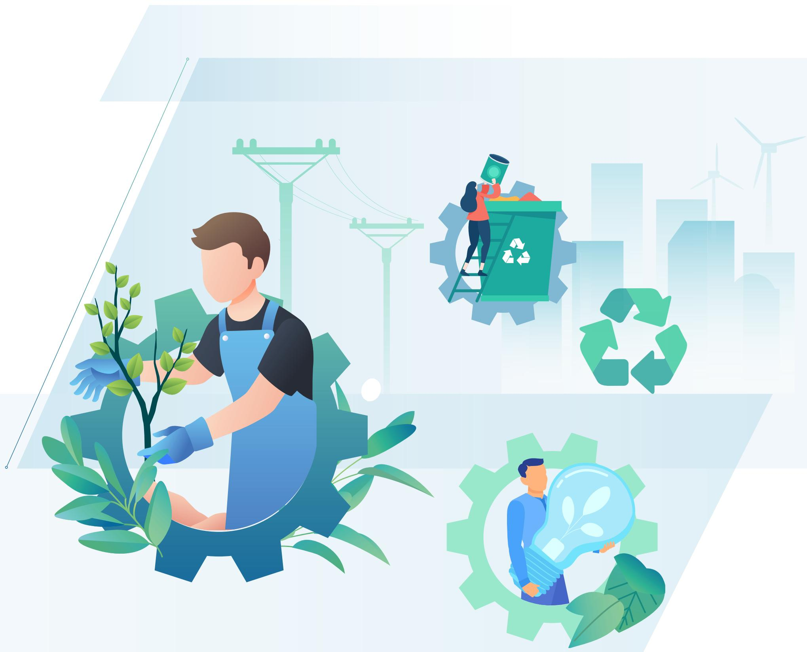

natural_image

Illustration of sustainable energy and recycling themes with workers, plants, and recycling symbols (no text or labels)

# 应对气候变化

近年来，干旱、极寒等极端气候不断出现，在全球范围内造成了广泛的影响，应对气候变化已经成为人类面临的共同挑战之一。为加强对气候变化的适应性，威腾电气制定“绿色创新，零碳未来”的气候变化战略方针，通过绿色制造、低碳产品、循环经济和合作共赢四大路径推动全价值链碳中和。

# 应对气候变化战略方针

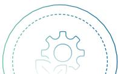

# 绿色制造

优化生产工艺，提高能源效率，全面采用可再生能源，减少生产环节的碳排放。

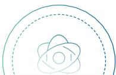

# 循环经济

贯彻全生命周期管理理念，提升材料回收利用率，减少资源浪费。

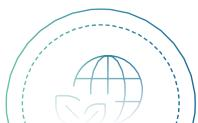

# 低碳产品

加大研发投入，推动高效节能、低碳电气产品的设计与应用，助力客户实现减排目标。

# 合作共赢

携手供应链伙伴，共建绿色低碳生态，
推动行业整体碳中和进程。

# 治理

公司依据《环境、社会及公司治理（ESG）管理手册》，在既有 ESG 治理框架下推进气候变化相关管理工作，形成由董事会、战略与 ESG 委员会和 ESG 工作小组协同运行的治理机制，将气候变化作为环境议题的重要组成部分纳入统筹管理。

# 应对气候变化治理架构

作为公司 ESG 事务的最高责任机构，在审议公司中长期发展战略、ESG 管理方针及相关信息披露事项时，综合考虑包括气候变化在内的环境因素，对公司 ESG 相关工作实施监督

# 董事会

在董事会授权下，负责识别和评估重大 ESG 相关风险和机遇，并在年度管理过程中对相关指标目标及执行情况进行审议，涵盖气候变化相关事项

# 战略与 ESG 委员会

根据战略与 ESG 委员会的决策部署，负责推进 ESG 相关工作的具体落实，协调各部门开展数据收集、执行跟踪和效果评估，并定期向战略与 ESG 委员会反馈工作进展

# ESG 工作小组

总经理办公室负责协调气候变化相关事项的日常管理与信息汇总，制造中心配合开展相关执行工作，共同支持公司气候变化管理目标的实现

# 总经理办公室

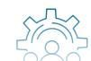

# 制造中心

# 战略

在全球低碳转型背景下，气候变化对公司所处行业的政策环境、市场需求及生产经营活动产生持续影响。作为电气部件与设备制造企业，公司在经营过程中既面临极端天气、能源成本上升、碳排放与能效监管趋严等气候相关风险，也迎来新能源发展和低碳产品需求增长带来的市场机遇。公司结合自身业务特点，从不同时间维度评估气候变化对公司财务状况和经营成果的潜在影响，在加强风险识别与应对的同时，将低碳转型融入产品研发和经营管理，积极把握相关机遇，提升公司长期可持续发展能力。

气候变化风险及影响评估结果

<table><tr><td>风险类型</td><td>风险说明</td><td>风险发生的时间周期</td><td>风险发生的可能性</td><td>对公司财务的影响说明</td><td>应对措施</td></tr><tr><td>急性风险</td><td>极端天气事件如台风、洪涝、暴雨等可能导致生产线停工、供应链中断或物流延误,影响生产交付节奏。</td><td>短期</td><td>中等</td><td>停产与设备修复增加成本,收入确认延后,影响短期现金流。</td><td>强化工厂物料防护、优化相关应急预案;与供应商建立备用供货方案;提高供应链弹性。</td></tr><tr><td>慢性风险</td><td>气候变化导致长期温度/水资源异常,可能提高能耗成本、设备老化速度,影响生产效率与产品可靠性。</td><td>中长期</td><td>中等</td><td>能耗上升增加经营成本;设备维护费用上升;可能影响部分产品质量稳定性。</td><td>实施多生产基地策略,优化新建厂区设施选址,降低设施的环境依赖性;实施节能管理与项目改造,系统性降低能耗水平。</td></tr><tr><td>政策和法律风险</td><td>国内外“双碳”相关政策趋严,可能提高出口合规与碳成本要求。</td><td>中长期</td><td>高</td><td>增加合规成本与碳管理投入;若应对不足,可能影响出口订单与市场准入。</td><td>依据运营地监管要求,建立及完善信息披露制度;建立碳排放管理体系与盘查机制,提前制定碳中和路径。</td></tr><tr><td>技术风险</td><td>低碳与高能效电气设备技术更新较快,若产品能效水平不足可能被市场替代。</td><td>中长期</td><td>高</td><td>产品竞争力下降,价格承压,研发滞后将影响长期盈利能力。</td><td>持续推进产品技术升级,提升产品能效等级与低碳属性,满足高标准市场需求。</td></tr><tr><td>市场风险</td><td>下游客户对低碳产品与解决方案需求快速提升,若产品结构调整不足可能错失市场机遇。</td><td>中长期</td><td>高</td><td>低碳产品收入占比提升缓慢,影响公司中长期收入增长。</td><td>通过研发活动强化产品绿色低碳属性,多个产品获碳足迹认证。</td></tr></table>

注：此处短期指 1 年以内，中期指 1—5 年以内，长期指 5 年及以上。

气候变化机遇及影响评估结果

<table><tr><td>机遇类型</td><td>机遇说明</td><td>机遇发生的时间周期</td><td>机遇发生的可能性</td><td>对公司财务的影响说明</td><td>应对措施</td></tr><tr><td>产品与技术机遇</td><td>全球能效与低碳标准提升,市场对高能效电气设备需求持续增长。</td><td>中长期</td><td>高</td><td>提升高附加值产品销售占比,改善产品结构与毛利率。</td><td>新开发一级能效SCB18系列环氧干式变压器;将低碳与能效指标作为新产品研发的重要考量因素。</td></tr><tr><td>降本增效机遇</td><td>节能改造与能效提升有助于降低单位产品能耗与运营成本。</td><td>短中期</td><td>高</td><td>降低电力与能源支出,提升经营效率,增强成本竞争力。</td><td>实施LED节能灯更换项目;推进办公区与生产车间照明运行时间控制管理;实施生产车间空调运行温度控制管理项目。</td></tr><tr><td>市场准入机遇</td><td>欧盟等国际市场对产品碳足迹与供应链低碳表现要求日益严格。</td><td>中长期</td><td>高</td><td>提升出口竞争力,降低贸易合规障碍,稳定并扩大海外订单。</td><td>多个产品获得碳足迹认证,通过“零碳工厂”认证,为出口欧盟等国际市场提供“绿色通行证”。</td></tr><tr><td>碳资产与碳管理机遇</td><td>碳交易与碳信用市场逐步完善,企业可通过提前布局降低未来碳成本。</td><td>中长期</td><td>中等</td><td>减少未来潜在碳排放合规成本,提升碳管理灵活性。</td><td>购买碳信用(VCS)用于抵消部分排放;探索碳资产管理与长期减排路径规划。</td></tr></table>

注：此处短期指 1 年以内，中期指 1—5 年以内，长期指 5 年及以上。

# 影响、风险和机遇管理

公司将气候变化相关影响、风险和机遇的识别与管理纳入整体风险管理与经营决策流程，结合行业特性和业务实际，建立了由识别、评估、应对和持续跟踪组成的管理机制。

# 风险与机遇识别流程

# 识别

围绕生产制造、能源使用、供应链管理、产品研发及市场销售等关键环节，识别气候变化带来的物理风险和转型风险，以及低碳转型过程中形成的业务机遇，重点关注极端天气、能效与碳排放要求变化，以及新能源和高能效电气设备需求增长对经营的影响。

# 评估

综合考虑相关事项发生的可能性、影响程度和时间周期，分析其对公司收入、成本、资产和现金流的潜在影响，区分短期、中期和长期影响，重点识别对经营业绩和战略发展具有实质影响的风险和机遇。

# 应对

将重要气候相关事项落实到具体经营和管理措施中，通过推进节能管理和技术改造、提升绿色能源使用比例、加强低碳产品研发以及实施碳管理措施，在降低运营排放风险的同时，提升产品和业务的低碳竞争力。

# 监控

通过能源与排放数据监测、项目实施进展跟踪等方式，持续评估相关措施的执行效果，并根据政策环境和经营实际变化，动态调整风险管控和机遇把握策略，不断完善气候变化管理水平。

# 温室气体减排实践

公司将相关要求落实到具体经营与管理活动中，持续推进多项减排行动。通过开展零碳工厂认证、推进屋顶光伏建设、加强产品碳足迹核算与认证，并引入第三方核查和数字化管理工具，公司逐步完善温室气体管理体系，提升减排成效的可量化与可追溯性，持续增强低碳运营能力和绿色竞争力。

# 案例 开展温室气体减排核查，持续推进碳中和

2025 年 8 月，公司组织相关管理人员，委托第三方机构对 2024 年温室气体减排量进行核查。通过节能管理、项目改造及使用中国绿色电力证（GEC）和碳信用等措施，全年实现减排 2,763.36 tCO₂e，达成碳中和目标。2025 年公司持续跟踪减排计划执行情况，重新编制碳中和管理计划，推动碳中和成果长期保持。

# 2024年

# 温室气体减排量

<table><tr><td>LED节能灯更换项目</td><td>减排温室气体 $15.55 \, tCO_{2}$ e</td></tr><tr><td>办公区、生产车间照明运行时间控制管理项目</td><td>减排温室气体 $0.18 \, tCO_{2}$ e</td></tr><tr><td>屋顶实施光伏发电项目</td><td>减排温室气体 $676.70 \, tCO_{2}$ e</td></tr><tr><td>生产车间空调运行温度控制管理项目</td><td>减排温室气体 $6.38 \, tCO_{2}$ e</td></tr><tr><td>购买中国绿色电力证书(GEC)</td><td>减排温室气体 $1,736.89 \, tCO_{2}$ e</td></tr><tr><td>购买碳信用(VCS)</td><td>减排温室气体 $327.66 \, tCO_{2}$ e</td></tr></table>

# 案例 布局屋顶光伏系统，优化能源结构

公司在车间屋顶布局光伏发电系统，通过充分利用闲置屋顶资源，持续扩大光伏发电规模，推动清洁能源替代传统电力。2025年，公司清洁能源装机总容量16.16万千瓦、清洁能源机组发电量3,000万千瓦时，全年清洁能源使用量达665.33吨标准煤，清洁能源使用比例达18.12%，有效降低能源消耗带来的碳排放强度。

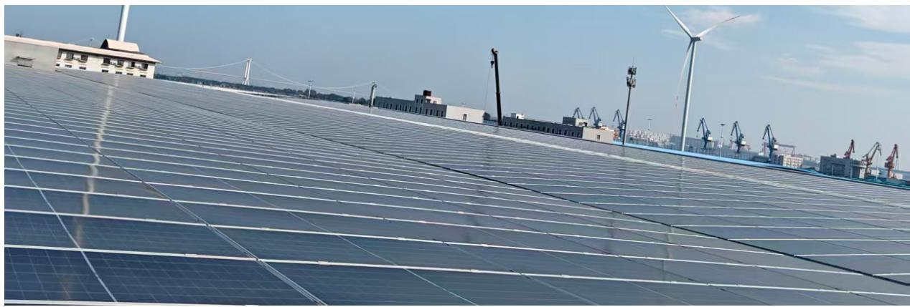

natural_image

Rows of solar panels installed on a rooftop with wind turbines and industrial buildings in the background (no visible text or symbols)

屋顶光伏

# 案例 推进零碳工厂认证，提升绿色竞争力

2025 年 3 月，公司在南自路 1 号生产基地，由总经理办公室牵头，联合第三方权威机构启动零碳工厂认证项目。历时六个月，相关管理及技术人员完成全厂碳盘查、节能改造和可再生能源布局，覆盖生产、仓储及办公等运营环节，并最终获得“零碳工厂”认证，有效提升公司 ESG 表现，增强绿色竞争力，获得客户与合作伙伴认可。

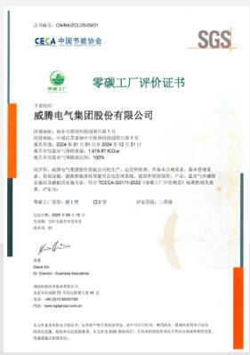

text_image

电子邮箱: CNHUAOJU,059691
CECA 中国节能协会
SGS
零碳工厂评价证书
于国信
威腾电气集团股份有限公司
注册地址: 内蒙古自治区乌海市乌海区乌海大道1号
邮政编码: 100000
经营范围: 中国注册会计师(中国注册会计师协会登记备案)
成立日期: 2004年12月31日
办公地点: 北京市北京西路88号金地中心B座
法定代表人: 李云
经营范围: 零碳化工产品及技术的进出口业务。
经营范围：无
认证有效期：2018年10月15日
有效期限：2018年10月15日至2024年12月31日
住所: 北京市北京西路88号金地中心B座
联系人: 陈小华
联系电话: 0755-83333333
传真: 0755-83333333
电子邮箱: 空格电子科技有限公司
地址: 北京市北京西路88号金地中心B座
电话: 0755-83333333
网址: www.sseguan.com.cn

零碳工厂证书

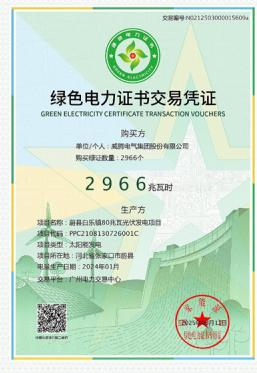

text_image

交银章号:9B212153000015696
绿色电力证书交易凭证
GREEN ELECTRICITY CERTIFICATE TRANSACTION VOUCHERS
购买方
单位/个人:成都华电汽配股份有限公司
购买单位数量:2966个
2 9 6 6 兆瓦时
生产方
项目名称:新县白乐镇48号光伏发电项目
地址:PPC21081207260015C
注册地址:广东省广州市
项目所在地:广州市黄埔区广南路
批准生产日期:2014年01月
交易中转:广州电力交易中心
深圳XXHUA
电子邮箱:xxxxxj@zzg.com.cn

2025 年绿色电力证书交易凭证

# 案例 完善产品碳足迹管理机制，支撑绿色产品体系建设

2025 年 5 月至 10 月，公司在生产基地系统推进产品碳足迹认证工作，由研发、生产、质量及管理人员协同第三方机构实施。通过建立碳足迹核算方法、开展全流程数据盘查并部署碳足迹数字化管理系统，公司有序推进低碳产品认证，降低合规与转型成本，并获得 2025 年度江苏省产品碳足迹核算认证首批奖励，为产品应对欧盟 CBAM 及进入国内绿色市场提供有力支撑。

2025年碳足迹认证项目  
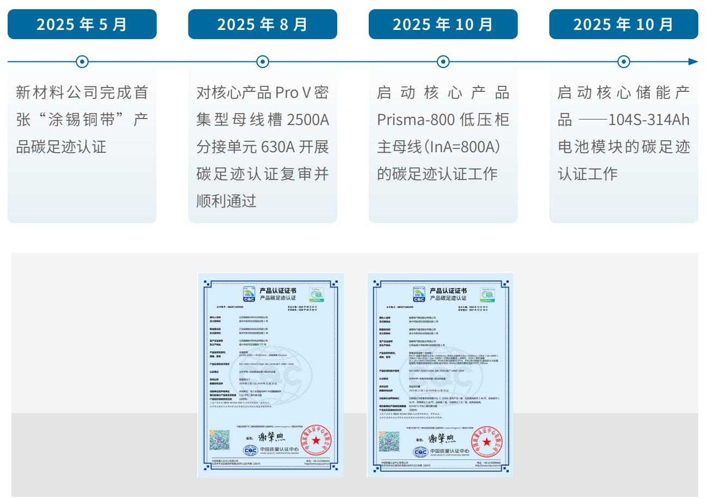

flowchart

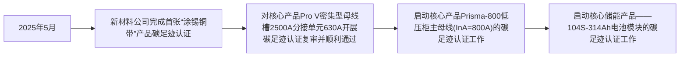

产品碳足迹认证证书

# 指标和目标

为配合国家碳达峰、碳中和战略，公司结合自身运营特点，对营运场所开展系统审核，明确温室气体排放基准年与目标年，并制定分阶段减排目标。在此基础上，公司逐步调整能源结构、优化生产流程并提升能源利用效率，稳步推进碳中和目标实现。通过持续监测减排项目实施情况并获取碳中和核查证明，公司动态更新管理计划，保障减排目标的有效落实。

# 温室气体减排目标

# 到2030年

范围 1 和范围 2 的绝对温室气体排放比基准年 2023 年减排 50%

# 到2050年

范围 1 和范围 2 的绝对温室气体排放比基准年 2023 年减排 80%

报告期内，公司基于《温室气体盘查控制程序》，按 ISO14064-1:2018 标准要求识别完成南自路 1 号厂区范围 1、范围 2 的温室气体排放核查。盘查排放的温室气体包括二氧化碳（ $CO_{2}$ ）、甲烷（ $CH_{4}$ ）、氧化亚氮（ $N_{2}O$ ）、氢氟碳化物（ $HFC_{S}$ ）、全氟碳化物（ $PFC_{S}$ ）、六氟化硫（ $SF_{6}$ ）和三氟化氮（ $NF_{3}$ ）。未来，公司将逐步拓展温室气体盘查范围，覆盖其他生产运营点。

温室气体排放量

<table><tr><td></td><td>2023年</td><td>2024年</td><td>2025年</td></tr><tr><td>温室气体排放范围一( $tCO_{2}e$ )</td><td>302.25</td><td>327.66</td><td>685.96</td></tr><tr><td>温室气体排放范围二( $tCO_{2}e$ )</td><td>1,654.62</td><td>1,591.22</td><td>1,455.03</td></tr><tr><td>温室气体排放总量(范围一+范围二)( $tCO_{2}e$ )</td><td>1,956.87</td><td>1,918.88</td><td>2,130.99</td></tr><tr><td>温室气体排放强度( $tCO_{2}e/万元产值$ )</td><td>0.0174</td><td>0.0147</td><td>0.0199</td></tr></table>

注：本次温室气体核算范围包括公司南自路1号厂区。

# 资源利用与循环经济

威腾电气高度重视资源节约与循环经济建设，持续推进能源、水资源和原材料的高效利用与循环使用。通过全面落实节能、节水、节材及材料再利用等实践，公司不断优化资源结构，减少浪费和环境影响，推动生产运营向绿色低碳、可持续方向发展。

# 能源管理

公司严格遵守《中华人民共和国节约能源法》《中华人民共和国可再生能源法》《中华人民共和国清洁生产促进法》等相关法律法规和标准要求，制定并实施《能源管理手册》《能源资源管理制度》等内部制度文件，持续完善能源管理体系。在制度实施过程中，公司围绕既定能源方针，依法合规开展能源管理工作，积极推进清洁生产和节能降耗，通过优化管理机制、应用节能技术和工艺，提高能源利用效率，推动能源管理工作的规范化和持续改进。同时，公司持续推进智能化工厂建设，对产品全生命周期的能源数据进行监测与管理，提升能源使用过程的精细化和智能化水平。

# 公司能源管理方针

遵守法规
清洁生产

健全系统资源达标

提高能效持续改进

绿色低碳客户满意

# 资质认证

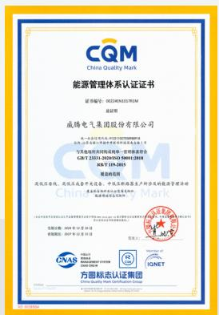

text_image

CQM
China Quality Mark
能源管理体系认证证书
证书编号：032146000035783M
证书号：
威腾电气集团股份有限公司
名称：威腾电气集团有限公司
注册地址：北京市海淀区西三环西路9号院1号楼A座16层
办公地址：北京市海淀区西三环西路9号院1号楼A座16层
电子邮箱：WUXING ELECTRIC CO.,LTD.
ISBN 978-7331-2024-15001-2018
日期：TJ-19-2018
经营范围：高压开关柜、高压变压器及交流机、中高压继电器生产研修及的数据管理活动
产品名称：新能源汽车动力电池系统集成系统（含储能电池）及其驱动系统
产品型号：CQM 2024年1月1日
有效期至：2024年12月15日
负责人：
深圳市深南大道2028号深南大厦
EASTAR
SANDAR
ICNET
方图标志认证集团

报告期内，公司已通过 ISO 50001 能源管理体系认证

# 能源管理架构

公司设立能源管理委员会，由总经理统筹推进能源管理相关工作；下设能源管理工作小组，由各常设工作部门负责人组成，负责落实节能管理措施，推动能源管理在各部门、各环节的有序开展。能源管理工作小组围绕全面、全员、全过程的管理要求，组织开展节能宣传与培训，并定期召开节能分析会议，对能源目标完成情况进行跟踪分析，提出改进措施，促进能源管理工作的持续推进。

# 公司能源管理架构

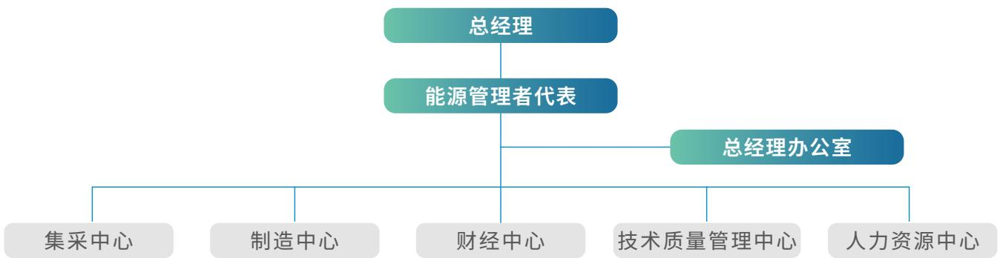

flowchart

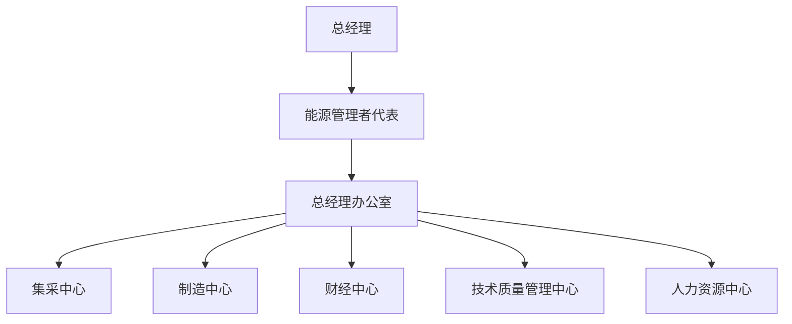

# 能源风险控制

在能源风险管理方面，公司制定并实施《内部审核控制程序》，每年定期（间隔时间不超过12个月）对能源管理体系开展内部审核。针对内审中发现的不符合项，公司开展原因分析，制定并落实纠正措施，推动能源管理体系的持续改进。

同时，公司结合内外部环境变化，对能源管理相关的重大风险与机遇进行系统识别和评估，综合考虑外部因素（国内外法律法规、技术发展、市场环境以及社会和经济因素等）以及内部因素（组织管理、生产运营和能源使用等），形成《相关方需求和期望识别表》《组织环境内外部因素分析表》，并制定和实施相应的风险控制程序，充分挖掘潜在发展机遇，保障能源管理体系的有效运行。

相关方需求和期望识别表

<table><tr><td>相关方类别</td><td>要求与期望</td><td>监测频率</td></tr><tr><td>生态环境局</td><td>企业新、改、扩建前能合理安排工艺过程、选择低耗能的设备;在生产过程中能不断识别和应用节能新技术。</td><td>每年</td></tr><tr><td>工信局</td><td>鼓励技术改造与进步,淘汰落后生产工艺、设备,鼓励对现有技术工艺、设备进行改造;提倡节能与综合利用,优先使用清洁能源,采用资源利用率高、污染物排放量少的工艺、设备;产品能耗应符合国家相关法律法规和标准的要求。</td><td>每年</td></tr><tr><td>客户</td><td>生产过程中节约能源、遵守法规,提供优质、低碳、低价产品。</td><td>每年</td></tr><tr><td>内部</td><td>公司的经营活动符合能源法律法规的要求;在能源体系实施、节能技术使用、节能产品等方面满足客户需求,超越客户期望;持续改进,不断减少能源成本的投入。</td><td>每年</td></tr><tr><td>员工</td><td>工作环境温度、湿度适宜。</td><td>每年</td></tr><tr><td>审核机构</td><td>公司体系运作的有效性、充分性和符合性。</td><td>每年</td></tr><tr><td>设备供应商</td><td>设备尽量节能,满足生产需要。</td><td>每年</td></tr></table>

# 节约能源实践

公司持续推进节能实践，通过技术改进、智能化控制和精细化调度等措施，提高能源使用效率，减少不必要的消耗和碳排放。节能实践覆盖研发、生产和设施管理等各环节，持续提升公司绿色低碳运营水平，推动可持续发展目标的实现。

# 案例 优化智能照明系统，提升能效

在全球信息化趋势和“智慧城市”理念的推动下，公司引入以“无线通讯模式”为主的智能照明系统。该系统可对各区域照明面板进行分区或统一控制，并设置节能模式，减少不必要的能源消耗。同时，系统能够实时监测并统计照明能耗数据，为后续能效分析和优化提供依据。实施后，公司办公区照明能源使用效率提升，为节能减排和智能化管理奠定基础。

# 案例 优化空调调度，降低能耗与碳排放

2025 年夏季，公司在 A、D 两车间针对高温期间工业空调长时间连续运行的情况，组织设施管理部和生产部门对空调启停进行精细化调度。在保障生产环境温控要求的前提下，通过设定启动温度阈值（30°C以下禁止开启）和规范启停时间窗口（9:00 后开启，下午提前 1.5 小时关闭），减少过度制冷和无效运行。实施后，两车间合计每日节电 1,140 度，减少碳排放约 46.2 吨二氧化碳当量，节约电费约 9.23 万元，提高能源使用效率，支持公司绿色低碳运营目标。

# 能源指标与目标

为推动绿色低碳发展，公司重视能源管理和使用绩效，制定年度能源目标，并通过《能源目标指标分解表》将目标分解落实到各相关部门。公司每季度对目标完成情况进行检查和记录，确保能源使用绩效得到有效监控，并为持续改进提供依据。

# 节能目标

公司以积极开展节能减排与绿色低碳项目，清洁能源使用比例不少于 15% 为能源管理目标。报告期内，公司能源消耗总量为 3,671.39 吨标准煤，其中清洁能源使用量为 665.33 吨标准煤，清洁能源使用占比达到 18.12%，目标已达成。

# 水资源管理

公司用水主要来自市政自来水管网，用于生产、办公、生活及消防等方面。其中，生产用水主要用于金属材料及构件的表面处理和清洗；办公用水主要满足日常办公需求；生活用水则包括食堂、厂区绿化等。

基于对水资源重要性的认识，公司重视节水，在《环保管理规定》中，对水资源的日常使用及设备清洗作业提出了详细要求，以提高用水效率，避免浪费。同时，公司通过开展教育和科普活动，提升员工及公众的节水意识，积极推动水资源的合理利用和保护。

# 关键绩效

报告期内，公司水资源使用总量为 27,392 吨。

# 包材管理与循环经济

公司由总经理作为包装材料与原材料管理的最高负责人，由集采中心统筹包装材料与原材料的节约和环保管理，建立《新物料开发认证管理办法》，完善对包装材料与原材料采购、领用、使用及控制管理，明确各环节节材和环保要求。生产过程中，公司严格控制原材料使用量，减少浪费，并开展节材宣传和培训，增强员工节材及环保意识。

在新产品设计和生产中，公司遵循生态设计原则，从全生命周期角度优化材料选择，尽量减少有毒有害物质使用，优先采用可回收、可再生材料。同时，公司推广可重复使用材料，替代传统一次性耗材，建立标准化的回收、清洁、检测与再利用流程，确保材料安全、环保并推动持续改进。

natural_image

Recycling symbol with three chasing arrows on a light blue background, surrounded by plastic containers (no text or symbols)

# 公司原材料与包材环保设计理念

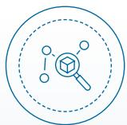

# 原材料的选用环节

优化原材料配比，尽量减少所使用材料的种类，尤其是有毒有害物质的使用，提高回收材料或可再生材料等绿色、可循环物料所占比例

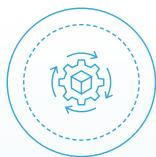

# 生产环节

在不影响产品性能的基础上，应力求简化流程、简化工艺、考虑能源和资源的梯级利用、循环利用，以减少生产过程能源和资源的消耗

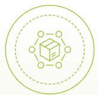

# 产品包装和运输

应充分考虑产品包装、运输过程的可操作性，尽可能简化包装，减少运输环节能源和资源的消耗

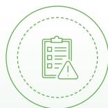

# 不合格品产品处理环节

考虑循环设计，尽可能实现不合格产品的资源化利用

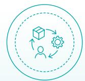

# 产品使用环节

力求优化产品性能，产品使用应有利于相关方实现绿色改进

# 原材料与包装材料及循环经济规划与目标

持续探索和研讨绿色包材、循环回收路径方法，到2030年，公司产品包材、辅材使用绿色环保材料比例达到 $20\%$ 。

# 关键绩效

报告期内，公司所使用的各类包装材料为可再生物料，占比 $100\%$ ，原材料认证比例为 $100\%$

使用情况如下表所示：

<table><tr><td>类别</td><td>2024 年</td><td>2025 年</td></tr><tr><td>木材</td><td>86,007.56 立方米</td><td>77,890.496 立方米</td></tr><tr><td>纸套</td><td>168,000 只</td><td>261,954 只</td></tr><tr><td>纸箱</td><td>36,300 立方米</td><td>94,405.585 立方米</td></tr><tr><td>塑料膜</td><td>12,379.4 千克</td><td>13,029.38 千克</td></tr></table>

# 案例 推广可重复使用周转轴，降低资源消耗

2025 年，威腾新材在生产车间推广焊带周转轴使用高强度、耐磨损的可重复使用材料，替代传统一次性耗材。公司建立标准化的回收、清洁、检测及再利用流程，实现周转轴高效循环使用，回收率超过 80%。实施后，有效降低了原材料采购和废弃物处理成本，减少生产过程中的资源消耗与碳排放，提升生产运营的绿色低碳水平，并为可持续材料管理提供实践经验。

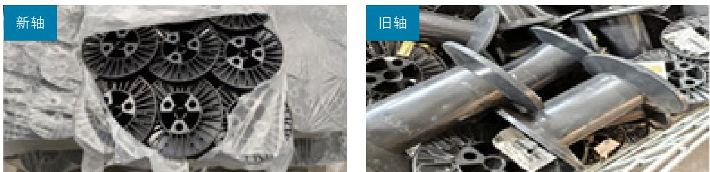  
焊带新旧周转轴

# 污染物与废弃物治理

对污染物和废弃物的科学管理与安全控制是降低环境风险、推动生态保护的关键。威腾电气严格遵循国家及地方法律法规，明确环境管理目标，保障三废排放及项目建设符合环保标准，努力减少生产运营对环境和社会的影响，推动企业绿色低碳发展与生态可持续性。

<table><tr><td>2025 年环境目标</td><td>2025 年目标达成情况</td></tr><tr><td>废水废气监测达标排放率 100%</td><td>达标</td></tr><tr><td>工业废弃物合规处置 100%</td><td>达标</td></tr></table>

# 废气管理

公司始终严格贯彻执行《大气污染防治法》《大气污染综合排放标准》等国家及行业相关法规，完善制定了《废气排放管理规定》，构建了覆盖全流程的废气管理体系。各生产部门按照规定对废气治理设施实施定期巡检、维护与保养，并通过每季度委托具有资质的第三方检测机构进行排放监测，确保废气排放持续符合标准要求，有效支撑企业绿色低碳发展战略。

# 公司废气治理举措

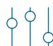

# 源头控制

\- 通过改进生产工艺、使用低排放原材料和能源，从源头上减少废气的产生

# 设施优化

- 引入高效的废气治理设施，提升废气处理效率  
- 定期维护废气治理设施，确保其处理效果达到法规要求

# 监测培训

- 建立完善废气排放监测系统，定期对废气排放进行检测和分析  
- 对相关员工开展知识和技能培训，及时响应政策更新

# 案例 防水胶泥替代硅酮密封胶，优化废气管理

2025 年，公司创新采用无机防水胶泥替代直通母排内部传统硅酮密封胶，在确保母排核心性能和使用寿命稳定达标的前提下，该举措实现生产环节减碳和成本优化双重效果，有效降低 VOC 排放，减少有机高分子材料使用及潜在环境风险，提升设备全生命周期环境友好性。

  
防水胶泥替代硅酮密封胶

# 废水管理

公司严格遵守《水污染防治法》等相关法律法规，制定并完善《污水排放管理规定》，建立覆盖生活污水与生产污水的全流程治理和监测体系。在废水排放口安装在线监测设备并接入政府监管平台，实现COD、 $BOD_{5}$ 、氨氮、pH、SS等关键指标的实时监控和数据共享，动态监管排放达标情况。同时，公司每月委托第三方检测机构进行取样检测，确保废水排放持续100%符合标准要求，有效保障环境安全和企业可持续发展。

# 废弃物管理

公司坚持“减量化、资源化、无害化”的环境管理理念，构建了覆盖废弃物全生命周期的管理体系。公司制定《废弃物控制程序》《环境运行控制程序》等制度，由总经理作为废弃物管理的最高负责人，明确各类废弃物及排放物的管理标准与责任，将管理职责逐级分解至各生产部门，并将相关要求纳入EHS岗位绩效考核，确保制度落到实处。日常管理中，公司通过巡检、设备运行监控以及内部自查与审核等方式，确保各类废弃物和排放设施运行正常，符合法规及行业规范，推动废弃物分类、回收和资源化，提升整体处置效率。

<table><tr><td>废弃物减排目标</td><td>达成情况</td></tr><tr><td>以2024年为基准年,到2030年减少每万元营收产生有害/无害废弃物10%</td><td>目标已达成,同比基准年下降20.27%</td></tr><tr><td>一般工业固体废物综合利用率不低于90%</td><td>持续推进中,一般工业固体废物综合利用率为87%</td></tr></table>

# 无害废弃物处置

在一般固废管理方面，公司主要涉及生活垃圾及生产过程中产生的铝材、铜材边角料等。生活垃圾由具备资质的环卫单位负责清运；具有回收价值的边角料通过出售交由专业机构进行再利用。同时，公司通过优化工艺流程和产品设计，从源头控制废弃物产生量，并结合生产环节特点实施针对性管理措施，以提升资源利用率。

# 废弃物减量化措施

# 优化生产设计

\- 改进生产工艺、使用可再生或易回收材料，从源头上减少废弃物的产生

# 回收与资源化利用

\- 建立废弃物回收系统，对废纸、塑料、金属、玻璃等可回收物进行收集和再利用

# 循环经济和绿色采购

- 推动产品生命周期延长、可修复、可再制造  
- 在采购中优先选择可回收、可再生的产品

# 关键绩效

报告期内，公司无害废弃物总量为 4,315.40 吨，从处置中转移的废弃物总量（包含可回收 + 不可回收 + 危废 + 生活垃圾）为 3,753.1853 吨。

# 有害废弃物处置

公司危险废物主要包括废树脂、废机油、废粉末、污泥等。公司严格遵循国家法律法规及江苏省“一企一档”管理要求，制定了《危险废物污染环境防治责任制》《废弃物控制程序》，对各类危险废物进行监测，并委托具有资质的第三方机构进行收集和处置，确保危险废物处置符合法规要求。

# 公司有害废弃物处置流程

首先由生产部门对生产中产生的危险废物进行收集、分类并妥善转移至EHS部门。

# >

EHS 部门对危险废物进行规范的贮存和处置，并及时在省危险废物全生命周期监控系统进行申报。

# >

公司每年初与具有相应资质的危废回收单位、运输单位签订协议，由专业处置单位对危险废物进行回收处置。

# 关键绩效

报告期内，公司有害废弃物总量为80.05吨，合规处置率为 $100\%$

# 化学品安全

# \* 注：

为强化化学品管理，公司制定了《危险化学品安全管理规定》《危险化学品仓库管理制度》等制度文件，明确覆盖化学品采购、储存、使用及处置的全生命周期管理要求。公司定期组织内部和外部审计检查，并开展系统化的化学品安全培训与宣贯，有效防控操作风险及化学品泄漏可能造成的环境影响，提升整体安全管理水平。

# 化学品管理举措

# 制度管理

- 建立标准化的化学品安全管理流程，包括采购、入库、储存、使用等全生命周期  
- 定期识别和更新化学品管理法律法规和优秀实践，加强各部门沟通与协调

# 风险控制

- 定期进行危险化学品风险评估,建立《危险化学品目录》,识别风险并采取控制措施  
- 定期开展内部审计和外部检查，监控危险化学品管理的执行情况

# 培训演练

- 为员工提供关于化学品安全知识和安全操作规程的培训  
- 定期开展化学品泄漏应急演练，提升应急处置能力

natural_image

Two workers in yellow protective suits handling a metal tray outdoors near a vehicle (no visible text or symbols)

化学品泄漏应急演练

# 噪声管理

公司严格依照《噪声污染防治法》要求，建立完善的噪声管理体系，通过《噪声排放管理规定》对可能对环境产生重大影响的关键设备实施重点管控。公司在设备布局和安装环节采取隔离安装、加装防振垫等工程措施，有效降低运行噪声对周边环境的干扰。同时，公司定期委托具备资质的第三方机构开展噪声监测，以科学掌握噪声排放状况，确保环境治理措施到位并保障公众健康。

# 关键绩效

报告期间，公司噪声排放达标率达100%。

# 环保合规与生态保护

威腾电气立足长远发展要求，将环境合规与生态保护纳入整体发展考量，持续关注生产运营活动与自然环境之间的协调关系，坚持以规范管理和稳健治理为基础，推动环境责任在各业务环节中的落实，不断夯实环境管理基础。

# 环境合规管理

公司以国家生态文明建设和可持续发展要求为指引，严格遵循《环境保护法》《环境信息依法披露管理办法》《环境影响评价法》等国家及地方相关法律法规和行业标准，构建覆盖环境、质量与职业健康安全的管理体系，制定并实施《三体系管理体系手册》《环境运行控制程序》《环保管理规定》等规范性文件，为环境合规管理和绿色运营提供制度保障。

公司建立以总经理为委员会主席、各部门负责人共同参与的环境健康安全管理组织架构（EHS 管理委员会），将环境责任和合规要求嵌入公司各业务单元和运营环节，夯实环境风险识别与防控的治理基础。EHS 管理委员会坚持“全员参与、系统推进、持续提升”的管理理念，年度制定环境管理目标，并对各事业部和子公司开展环境指标考核与绩效评估，对存在差距的单位督促落实整改措施。

# 环境管理架构

<table><tr><td>主席、副主席</td><td>1.全面负责公司环境管理工作;2.组织制定环境规章制度;3.督促、检查环境工作。</td></tr><tr><td>委员会主任</td><td>1.负责对员工进行公司级环保宣贯;2.实施环境管理监督和检查。</td></tr><tr><td>各部门成员</td><td>1.贯彻执行环保各项法规制度及委员会部署任务;2.及时反馈员工对公司提出的环境相关意见并跟踪落实情况。</td></tr></table>

同时，公司将 EHS 管理要求纳入日常绩效管理体系，每月对责任部门及相关人员开展考核，对触及《EHS 管理红黄线》的违规情形，依法依规纳入绩效考核与责任追究范围，切实强化环境管理的执行力与约束力。

公司 2025 年环境管理目标均已达成

<table><tr><td>2025 年环境目标</td><td>2025 年目标达成情况</td></tr><tr><td>发生环境事件 0 起</td><td>达成</td></tr><tr><td>环保设备达标运行 100%</td><td>达成</td></tr></table>

# 资质认证

text_image

NGV
环境管理体系认证证书
注册号：310228/3902831M
国证
威腾电气集团股份有限公司
注册地址：内蒙古呼和浩特市新城区锡林南路1号
环评编号：10000000000000000000000000000000000000000000000000000000000000000000000000000000
高压母线、中压开关、中压变压器开关盒（含微波和防潮装置）、电源分配柜、厨房及暖通器、变压器的开式和加热器；通用型商用的直流电源、低压式真空开关盒、低压式电动调节控制装置、绝缘开关、热继电器的开关柜、电容、低压式热继电器开关柜及成套装置（智能控制机和装置）、移动式交流器和通讯设备、有源滤波器和换热器等设备）、熔断器、储氢器、多用途泵、电机切削装置、储能系统、自动换热开关电器、电力电子元器件及其专用设备的检测与维护
证书编号：2021年4月11日
证书有效期：2021年4月11日至2024年4月11日
证书类型：其他有效文件
ISSN 25678-519999999
IAF GVS
北京京基瑞达电气股份有限公司
电话：北京市朝阳区亮马桥路48号院1号楼A座18层
传真：(010)667566666
网址：www.qzg.com.cn

公司已通过 ISO14001 环境管理体系认证

# 关键绩效

报告期内，公司环保总投入达386.64万元，环境及能源管理体系认证覆盖范围达 $100\%$ ；不存在违反环境保护法律法规的行为和污染事故纠纷，未因违反环境保护相关法规而受到行政处罚。

# 环境风险管理

  
公司高度重视生产运营中的环境风险管理，围绕生产运营全过程的环境风险防控，建立系统化的环境因素识别与评价机制，并在《环境因素识别与评价控制程序》中明确环境风险管理的覆盖范围与实施路径，从环境因素的发生频次、影响范围、危害程度、关注度及持续时间等维度开展识别、评价与确认，形成重要环境因素清单，为环境管理决策提供依据。  
在此基础上，公司持续强化过程监督与合规检查，每月开展环保监督检查，并不定期组织环境内审与评估，对各生产部门和运营点的环境管理体系、废弃物处置及合规情况进行系统排查，形成《EHS隐患整改实施计划跟踪表》，并对发现的环境风险隐患落实整改措施，推动环境风险管理的闭环运行与持续改进。

# 环境因素覆盖范围

<table><tr><td>大气污染</td><td>水体污染</td><td>土壤污染</td><td>固体废物</td></tr><tr><td>原材料和自然资源消耗使用</td><td>有害化学品使用</td><td colspan="2">其他地区性环境问题及社会影响</td></tr></table>

# 环境应急管理

公司将环境风险防控作为环境治理的重要组成部分，系统构建环境应急管理机制，制定并实施《突发环境事件应急预案》《危险废物专项应急预案》，形成覆盖各类突发环境事件的制度体系，并配备相应应急设施，开展定期检查、维护与管理，确保应急资源处于可靠可用状态。同时，公司建立以应急指挥部为核心的环境应急管理架构，统筹协调各部门资源，常态化组织应急演练和培训，不断提升员工环境风险识别、响应与处置能力，有效保障员工安全和企业资产安全，维护生产运营稳定，推动企业环境风险管控能力和环境治理水平的持续提升。

公司环境应急管理架构  

flowchart

# 关键绩效

报告期内，公司发生留有记录的重大泄漏事件及重大逸散事件 0 起。

natural_image

Abstract digital graphic with a blue geometric sphere and white grid lines, no text or symbols present.

# 环保培训贯宣

公司将员工环境意识培育视为推进绿色发展的重要支撑，持续构建覆盖不同层级和岗位的环保宣传与教育体系。2025年，公司围绕新员工入职及在岗员工能力提升，组织开展多场环保主题培训和宣贯活动，内容涵盖环保政策要求、固体废物管理及生态保护等重点领域，并结合实际案例进行系统讲解，促进员工将环境管理理念融入日常工作。相关培训覆盖生产、办公及职能部门，累计1,939人次参与，有效提升员工对环境议题的认知水平和履责能力。

# 关键绩效

报告期内，公司开展环保培训 100 次，环保宣贯 / 培训覆盖人数 1,939 人。

# 案例 开展环保培训，强化员工绿色意识

2025 年 6 月，公司面向生产和职能部门共 500 余名员工进行全员环保意识培训。培训围绕 “减污降碳、绿色生产” 主题，结合企业实际运营场景，系统讲解废弃物分类、节能设备使用等关键知识，进一步夯实了公司绿色文化基础，增强员工环保意识，为持续推进可持续发展奠定人才与文化支撑，同时为建立常设环保知识学习机制和纳入新员工入职培训提供了实践经验。

natural_image

Group of factory workers in uniform and orange hard hats gathered inside a large industrial facility, with machinery and overhead structures visible (no signage or text)

环保意识培训现场

# 环保运营

公司将环保理念系统融入日常办公管理与运行实践，引导员工践行绿色低碳的工作与生活方式，推动节能环保理念在组织内部的持续传播与落地。同时，公司关注办公环境与办公建筑的环境友好性，在建设和使用过程中选用符合环保要求的建筑材料，持续营造绿色、健康、可持续的办公环境，为企业绿色发展提供有力支撑。

# 公司绿色办公举措

# 绿色出行

- 在园区口设立威腾电气公交站台、公共自行车栏，推广公共交通  
- 公车由燃油车替换为新能源，目前已保有 5 辆新能源电动汽车  
- 推广线上会议，减少差旅频率，鼓励绿色出行

# 节水节电

- 控制照明、空调使用时间，避免无意义的能源浪费  
- 要求员工随手关闭用电设备，减少待机耗能  
- 张贴节水节电宣传标语，提升员工环保意识

# 无纸化办公

- 加强数字化信息化建设，减少办公用纸场景  
- 鼓励员工双面打印，节约用纸  
- 办公打印用纸量同比上年下降 $15\%$ ，费用同比减少 $18\%$

# 案例 办公区域使用环保建筑材料

公司重视办公环境及办公建筑的环保，使用环保建筑材料，对十余项装修材料进行有毒物质检测，结果均通过检测。

natural_image

Simple line drawing of a seedling growing from soil, with no text or symbols present.

# 清洁生产

公司以国家清洁生产政策导向为指引，严格遵循《中华人民共和国清洁生产促进法》及相关法规要求，系统推进清洁生产管理，将清洁生产理念贯穿于原材料使用、资源消耗、资源综合利用以及污染物产生与处置等生产运营环节。公司在技术路线和设备选型中，优先采用资源利用效率高、污染物产生量低的清洁生产技术、工艺和装备，并持续提升清洁生产相关的技术与管理能力。凭借在绿色制造方面的持续投入与成效，公司于2023年获评江苏省省级绿色工厂。报告期内，公司未发生违反清洁生产相关法律法规的情形。

# 关键荣誉

text_image

江苏省绿色工厂
企业名称：威腾电气集团股份有限公司
编号：1S2022261
江苏省工业和信息化厅
2023年1月

公司已于 2023 年获评江苏省绿色工厂

# 生物多样性保护

公司以相关法律法规为根本遵循，将生态保护与生物多样性考量纳入生产运营和项目管理全过程，积极践行负责任的发展理念。在项目规划与建设阶段，公司依法开展环境影响评估，系统分析项目实施对自然资源和区域生态环境的潜在影响，并据此制定相应的环境管控措施。报告期内，公司新建及在运营基地选址均避开自然保护区、水资源保护区及濒危物种栖息地，确保生产经营活动不对当地生态系统和生物多样性造成直接干扰，推动企业发展与生态环境保护的协同并进。

text_image

威爱环保聚暖意 守护长江护水源

公司组织开展长江水源地保护活动

# 02

# 精工智造 创新驱动发展

威腾电气以“让世界信赖中国电气”为企业使命，始终秉持“质量第一、客户至上”的原则，用全球化的视野与不断创新的精神，提升产品的品质与性能，为全球客户提供更加安全、可靠、高效的产品。

保障产品质量 45  
诚心服务客户 52  
聚力研发创新 55  
数智信息安全 64  
保障供应安全 68

SDGs 对标

natural_image

Illustration of two people using laptops and a gear, with industrial infrastructure elements in the background (no text or symbols)

# 保障产品质量

产品质量是企业的生命线，威腾电气将产品品质视作赢得市场信任的关键要素，以“追求零缺陷，完美无止境”为质量理念，持续精进质量管理水平，严格把控产品质量，为客户提供优质、安全且负责任的产品与服务。

# 治理

为加强对产品质量的管理落实到位，公司制定《质量官管理制度》《质量提升绩效考核奖励机制》《品质提升全链条管控工作指南》《质量改善实施指南》等七百余份管理规章制度，覆盖公司及各控股子公司，对员工在设计、采购、生产及售后等环节的质量操作进行了详尽的规定与指导。公司由首席质量官全面统筹质量管理、质量检验以及质量安全工作，针对原料进厂、生产流程、出厂检验等关键节点严格把关，积极推进质量相关体系认证，开展质量宣贯活动，提升全员质量意识，降低异常质量成本，强化质量管理。

公司由董事会作为产品质量的最高管理架构，总经理直接领导首席质量官开展质量管理工作，技术质量管理中心以月度为周期出具质量报表，并抄送至公司总经理、董事长进行审阅，形成了规范有效的质量分级管理机制。公司配备了行业领先的检测设备和专业技术人员，为产品的安全性评估和质量提升提供技术支持。

公司建有产品检测中心，该产品检测中心已获得 CNAS 认证认可实验室资质。其中，部分实验项目相继获得了 DEKRA、ASTA 及 TÜV 认可目击实验室资质。公司严格按照国际标准、国家标准以及企业标准组织生产，其中产品取得了 CQC、CE 等多项国际、国内认证。

text_image

质量管理体系认证证书
证书编号：05325296005838M
前证明
威腾电气集团股份有限公司
注册地址：宁波市鄞州区宁南南路7号
办公地址：江苏省宁波市鄞州区宁南南路7号
生产经营地址：江苏省扬州市宁南西路133号（江苏张家港市新港中大道东侧路777号）
质量管理体系认证标准：
GB/T 19001-2016/150 9001:2015
通过认证的资质为：
高压线缆、变压器、开关柜、交流柜及安全柜、小型照明和保护装置、电力电缆的安装、输送及安装、配电系统的设计和维护，包括光纤、光纤接收、光纤控制、光纤控制设备、光纤控制设备的维护和维修，通信设备的维护和维修，通信设备的维护和维修，通信设备的维护和维修，通信设备的维护和维修，通信设备的维护和维修，通信设备的维护和维修，通信设备的维护和维修，通信设备的维护和维修，通信设备的维护和维修，通信设备的维护和维修，通信设备的维护和维修，通信设备的维护和维修，通信设备的维护和维修，通信设备的维护和维修，通信设备
证书有效期：2023年09月22日
证书有效期：2023年09月22日至2028年03月11日
证书注册日期：2018年03月30日
获证机构统一社会信用代码：93211007359898918
北京市西城区金融街2号A座4层
北京市西城区金融街2号A座4层
北京市西城区金融街2号A座4层
北京市西城区金融街2号A座4层
北京市西城区金融街2号A座4层
北京市西城区金融街2号A座4层
北京市西城区金融街2号A座4层
北京市西城区金融街2号A座4层
北京市西城区金融街2号A座4层
北京市西区金融街2号A座4层
北京市西区金融街2号A座4层
北京市西区金融街2号A座4层
北京市西区金融街2号A座4层
北京市西区金融街2号A座4层
北京市西区金融街2号A座4层
北京市西区金融街2号A座4层
北京市西区金融街2号A座4层
北京市西区金融街2 号A座4层
北京市西区金融街2 号A座4层
北京市西区金融街2 号A座4层
北京市西区金融街2 号A座4层
北京市西区金融街2 号A座4层
北京市西区金融街2 号A座4层
北京市西区金融街2 号A座4层
北京市西区金融街2 号A座4层
北京市西区交通中心B座10楼
北京京通路威达认证中心有限公司
地址：北京市朝阳区亮马桥路甲1号院1号楼1单元101室 电话：(010)670755788 传真：(010)670755788 电子邮箱：www.nqzq.com

公司已通过 ISO9001 质量管理体系认证

# 战略

公司依据电气设备行业发展及自身行业地位，对产品质量相关风险与机遇的具体内容、时间周期、可能性进行系统识别，评估相关风险和机遇对公司的潜在影响，并规划制定有效的应对措施，主动响应管理，提升对产品质量相关风险与机遇的适应性。

产品安全与质量风险及影响评估结果

<table><tr><td>风险类型</td><td>风险说明</td><td>风险发生的时间周期</td><td>风险发生的可能性</td><td>对公司财务的影响说明</td><td>应对措施</td></tr><tr><td>质量一致性风险</td><td>在生产规模扩大或产品结构调整过程中,若质量控制不到位,可能影响产品一致性和稳定性。</td><td>中短期</td><td>中等</td><td>返工、报废或售后处理可能增加生产与服务成本,对经营效率产生影响。</td><td>完善质量管理体系;强化生产过程质量控制与检验要求;提升质量管理标准化水平。</td></tr><tr><td>产品安全风险</td><td>产品在设计、制造或应用环节中,若安全性能未充分覆盖使用场景,可能影响客户使用体验。</td><td>中短期</td><td>低</td><td>潜在的售后成本和品牌信任度下降,间接影响客户合作和市场表现。</td><td>在产品设计阶段强化安全性与可靠性评估;严格执行相关安全标准和测试要求。</td></tr><tr><td>声誉风险</td><td>客户和市场对产品安全与质量关注度持续提升,若管理与披露不足,可能影响品牌形象。</td><td>中长期</td><td>中等</td><td>品牌认可度下降可能对客户合作和订单稳定性产生不利影响。</td><td>加强质量管理信息披露;通过质量认证和标准化管理提升市场信任度。</td></tr></table>

注：此处短期指 1 年以内，中期指 1—5 年以内，长期指 5 年及以上。

产品安全与质量机遇及影响评估结果

<table><tr><td>机遇类型</td><td>机遇说明</td><td>机遇发生的时间周期</td><td>机遇发生的可能性</td><td>对公司财务的影响说明</td><td>应对措施</td></tr><tr><td>产品竞争力提升机遇</td><td>高质量和高可靠性产品更容易获得客户认可,有助于形成差异化优势。</td><td>中长期</td><td>高</td><td>提升产品溢价能力和客户黏性,增强收入稳定性和盈利能力。</td><td>持续强化产品质量控制;提升关键性能和可靠性指标。</td></tr><tr><td>市场准入与客户拓展机遇</td><td>符合高标准安全与质量要求,有助于进入对产品要求较高的国际细分市场。</td><td>中长期</td><td>中等偏高</td><td>扩大市场空间,提升订单规模和长期合作机会。</td><td>严格执行相关产品标准;积极获取必要的产品质量与安全相关国际认证。</td></tr><tr><td>客户信任与品牌价值机遇</td><td>稳定的产品安全与质量表现有助于增强客户信任和品牌形象。</td><td>中长期</td><td>中等</td><td>有助于稳定客户关系,提升长期品牌价值。</td><td>加强质量管理沟通与披露;提升客户售后服务与反馈机制。</td></tr></table>

注：此处短期指 1 年以内，中期指 1—5 年以内，长期指 5 年及以上。

# 影响、风险和机遇管理

为有效管理产品质量风险、机遇及潜在的影响，公司对产品生产各环节均制定了完善的作业规范，通过供应商审核、原材料抽样送检、产品质量内部和外部检测防范产品质量风险，并将产品和服务质量纳入公司合规风险管理的重点领域中。此外，公司通过质量官制度落实产品质量责任，明确各类产品质量事件的上报管理，实现对潜在风险的快速响应，并积极开展提质增效实践、质量意识宣贯，持续精进产品质量。

# 产品全生命周期质量管理

公司构建了覆盖产品全生命周期的质量管理机制，从研发设计、原材料采购到生产制造、售前售后均有严格的质量管理要求，切实保障产品质量。

# 产品全生命周期质量管理举措

  
研发设计阶段

- 严格按照《设计和开发控制程序》的相关要求和步骤实施产品开发工作，对关键节点组织评审和验证，并形成完整的设计开发资料输出；  
- 确保设计满足所有质量相关的标准和规定，原材料及产品结构符合产品的实际使用工况，同时也要考虑到生产过程中的可行性和效率。

  
原材料采购阶段

- 通过对原材料的深层次研发，大幅提升了产品品质和市场竞争力；  
- 完善供应商管理体系，从供应商调研、准入、送检、小批量供货、大批量供货、现场审核、评价考核等维度，确保原材料的合格率。

  
生产阶段

- 通过全面的质量管理措施提升产品质量，包括来料检验、过程检验、出货检验等多环节的严格把控，确保每道工序的质量符合标准；  
- 实行首件检验制度、自检互检加专检的检验制度，对于检验过程中发现问题的给予奖励，激发员工参与质量管理的热情；  
- 通过纠正预防、QC小组活动、六西格玛改善活动等质量活动，实施质量改善，持续提升产品质量。

  
售后服务阶段

\- 快速响应客户的服务需求，为客户的安装、使用、维护提供全过程指导，并对关键质量控制点实施监督管理，确保产品的安全运行。

# 提升质量举措

公司每年开展质量提升专项活动，构建全员参与的改进机制，通过系统化管理手段压降产品缺陷率。此外，公司引入精益生产与5S管理模式，协同优化现场管理与作业流程效率，同时应用PDCA循环、FMEA（失效模式与影响分析）等专业质量工具，强化对质量潜在风险的前瞻性识别与预防，构建起预防为主、持续迭代的质量保障体系。报告期内，公司共识别9项极致安全优化空间，已有8项改善措施完成，剩余项目持续验证中。

# 案例 威腾能源科技与威腾电力提升质量举措获 QC 成果奖

在 2025 年 11 月市市场监督管理局举办的 “QC 小组成果交流会” 上，公司通过案例复盘、数据论证及经验分享等形式，如实汇报了公司在破解质量管控难题、提升产品与服务品质方面的一些探索与实践。

此次展示作为公司在持续改进道路上的一次阶段性总结，得到了与会专家与同仁的鼓励与认可，威腾能源科技和威腾电力分别荣获交流会二等奖和三等奖。公司将以此为契机，继续学习，深耕细作，推动公司质量管理水平稳步提升。

# 案例 开展提质创效评比活动，强化预防性质量管理

2025 年 10 月，公司举办 “提质创效” 主题团队成果评比活动。来自 7 家子公司的品质管理经理针对质量提升成效进行专题汇报，重点展示了供应商质量管理、质量管控、质量改善的实践成果。其中，能源科技通过优化管理流程，成功推动质量管理从 “事后检验” 向 “事前预防” 的策略转型。此次活动通过成果展示与经验共享，有效促进了各子公司间的技术交流，显著提升了质量管理人员的专业素养与风险防控能力。该举措不仅完善了企业质量管理体系，也为实现运营降本增效与产品卓越品质提供了制度保障与人才支撑。

text_image

2025
威腾集团“提质创效”
团队汇报及评比
周晓燕·钟旭成摄
数字·碳中质·碳中质·碳中质

提质创效评比汇报现场

# 加强质量宣贯

为加强员工质量意识，提升质量管理水平，公司以“100-1=0”质量季为主线，开展了以“数智驱动筑基强链创新质量生态”为主题的质量月系列活动。通过举办“品质智汇”知识挑战赛及年度质量标兵评选等多元化项目，全方位驱动质量管理体系落地生根。活动采取“集团统筹、分级实施、上下联动、整体提效”的组织模式，通过系统性谋划与精准化执行，进一步夯实质量管理基石，营造全员参与、持续改进的质量管理氛围，实现了质量文化与管理效益的双提升。

# 案例 构建全员质量文化，以赛促学筑牢品质根基

2025 年 9 月，公司举办 “品质智汇” 知识挑战赛，来自 7 家子公司的代表队同台竞技。赛事围绕通用质量管理知识与公司年度重点工作要求，通过开放式命题、必答及抢答环节，引导员工由机械记忆向深度思考转变。此次活动秉持 “以赛促学、以赛促用” 原则，旨在凝聚全员质量共识，强化跨部门协同能力。该举措成功营造了追求卓越的职场氛围，为公司推进高质量运营管理提供了软实力支撑。

text_image

威腾集团
质量月活动
品质智汇知识挑战赛

“品质智汇”知识挑战赛

# 案例 深化质量文化建设，打造“零缺陷”全周期品质保障体系

2025 年 10 月，公司召开年度质量月活动总结表彰大会。会议对年度质量标兵、“品质智汇”知识挑战赛及“提质创效”优秀团队进行了集中表彰，分享了先进的品质管理经验。公司总经理在会上强调，各子公司需紧扣“品质提升与极致安全”核心目标，推动质量管理常态化与精细化。通过深化六西格玛知识应用，公司进一步贯彻“零缺陷交付、全周期可靠”的产品理念，强化关键环节的过程管控与定期复盘。此次大会有效凝聚了质量共识，通过动态优化改进措施，提升了客户信誉度，为实现企业高质量发展目标夯实了管理基础。

text_image

2025年度质量标兵
左城宇 郁虎 黄懿 施建成 孙涛
公司 新材料公司 新材料公司 新材料公司 新材料公司 新材料公司 新材料公司 新材料公司 新材料公司 新材料公司 新材料公司 新材料公司 新材料公司 新材料公司 新材料公司 新材料公司 新材料公司 新材料公司 新材料公司 新材料公司 新材料公司 新材料公司 新材料公司 新材料公司 新材料公司 新材料公司 新材料公司 新材料公司 新材料公司 新材料公司 新材料公司 新材料公司 新材料公司 新材料公司 新材料
高质量证书 回击者 回击者 回击者 回击者 回击者 回击者 回击者 回击者 回击者 回击者 回击者 回击者 回击者 回击者 回击者 回击者 回击者 回击者 回击者 回击者 回击者 回击者 回击者 回击者 回击者 回击
高质量证书 回击者 回击者 回击者 回击者 回击者 回击者 回击者 回击者 回击者 回击者 回击者 回击者 回击者 回击者 回击者 回击者 回击者 回击者 回击者 回击者 回击者 回击者 回击者 回击者
高质量证书 回击者 回击者 回击者 回击者 回击者 回击者 回击者 回击者 回击者 回击者 回击者 回击者 回击者 回击者 回击者 回击者 回击者 回击者 回击者 回击者 回击者 回击者 回击者 回击者

质量月表彰大会

# 不合格品管控及产品召回

公司制定《不合格品控制程序》《纠正预防措施控制程序》及《产品退货规定》等制度规范，实现对原辅材料、外协件、半成品、成品及交付后不合格品的全面识别与受控管理。针对不同层级的不合格品，公司采取返工、返修、报废、退货及召回等差异化处置手段，严防不合格品的非预期使用或交付。针对已出现或潜在的质量异常，公司执行严格的调查分析机制。对于已交付的产品，由售后服务、品管、生产等部门联动评审，果断实施退货或召回程序，并同步制定纠正预防措施，有效防范质量问题的重复发生，全方位夯实产品品质，切实维护客户合法权益。

# 产品召回流程及处理机制

信息收集与评估

召回通知

召回措施制定

产品召回

产品处理

事件报告

# 指标和目标

在指标与目标管理方面，公司围绕提升产品稳定性与客户满意度，建立了以结果导向和持续改进为核心的管理机制。公司每年年初明确本年度产品质量管理目标，包括客户投诉、产品质量认证等重点指标，并定期监测评估目标达成情况，将相关数据作为评估质量管理成效和优化生产与质量控制流程的重要依据，持续提升产品质量管控水平。

质量管理目标

<table><tr><td>指标</td><td>2025年度目标</td><td>2025达成情况</td></tr><tr><td>顾客满意度</td><td> $\geqslant 95\%$ </td><td>已达成,实际为98.26%</td></tr><tr><td>产品一次交验合格率</td><td> $\geqslant 98\%$ </td><td>已达成,实际为99.03%</td></tr></table>

报告期内，公司产品质量绩效如下表所示：

# 关键绩效

报告期内，公司产品发生产品召回事件 0 起，年度产品服务相关的安全质量重大责任事故损害涉及的金额 0 元。

# 诚心服务客户

卓越的客户服务水平是企业赢得市场认可、塑造品牌美誉度的基石。威腾电气始终秉持“客户至上”的核心价值观，通过构建覆盖全生命周期的服务体系，深度优化售前方案咨询、售中项目实施及售后保障响应等关键环节。公司致力于将专业化技术支撑、个性化需求定制与精细化服务管理贯穿始终，为客户创造卓越、高效的高品质服务体验。

# 客户服务管理

公司建立并不断完善售前、售中、售后管理体系，由营销管理中心与子公司售前售后服务部门形成有效联动，依据《售后服务管理规定》《卓越服务管理体系》，实现服务响应标准化、协同高效化及管理精细化，从而显著提升服务时效与保障精准度。公司打造智能化客服平台，通过7x24小时全天候实时响应机制，确保客户需求能够即时触达，为客户提供涵盖全生命周期的高品质服务体验，有效提升客户满意度并深化品牌忠诚度。

# 资质认证

text_image

服务认证证书
证书编号：HYOZ237811205RMB
兹证明
威腾电气集团股份有限公司
统一社会信用代码：9132110755989918
注册地址：北京市东城区东直门南大街1号
办公地址：北京市东城区东直门南大街1号
联系电话：010-660400000
经办、服务电话及传真：
GB/T27922-2011《商品售后服务评价体系》标准规定的要求
主办单位
盖章
证书编号
高压站场、监控站场、高压监控室电气设备、通讯交换站、输电变送器、配电开关、空调、线路通射器
隔离空气通道、通风系统、燃气表、电缆、电缆附件、电缆产品、变压器、开关、电器的维修服务（含以上产品销售的有关技术及售后服务）。
经营范围：许可项目：医疗器械销售；医疗器械批发；医疗器械零售；医疗器械租赁；医疗器械销售（不含许可类医疗器械经营许可证）；医疗器械进出口业务（国家限定企业经营或禁止进出口的商品和技术除外）。详见刊登于2016年12月4日
公告日期：2016年12月4日
公告网站：www.hyoozq.com.cn
签发：张洪燕
北京富宁九州认证有限公司
地址：北京市海淀区西三环西路中关村软件园C座1层 1001-000000000

公司已获得《商品售后服务评价体系》五星级评价认证

# 关键绩效

报告期内，公司收到客户申诉 / 投诉

26起，响应及时率达 $100\%$ ，客诉解决率达 $100\%$

# 客户满意度调查

公司制定有《顾客满意度测量程序》，调查维度包括服务质量、产品质量、销售人员专业性等多个方面，每年通过多种渠道面向直接用户的客户满意度调查，调查维度包括服务质量、产品质量、销售人员专业性等多个方面。同时针对满意度调查结果进行监督改进，以满足当前和未来客户的需求和期望。

# 关键绩效

报告期内，公司客户满意度为 $98.26\%$

# 多元化的客户满意度调查渠道

# 日常反馈渠道

客户可通过小程序匿名反馈、400 客服热线、威腾官网在线客服等渠道反馈意见，实行 “实时收集 + 月度汇总”，确保及时捕捉客户诉求

# 项目端评估

搭建 CRM 线上评估，从原先的纸质版评估转化为线上，预计按项目周期节点开展，从客户拜访、项目交付、售后服务等多个环节进行客户满意度调研

# 常规调研

按季度开展客户满意度常规调研，由客服按照项目信息对客户进行满意度抽样调研

# 案例 卓越客户服务获客户高度认可

2025 年，威腾电气成套供货的淮安洪泽 5 万千瓦 /10 万千瓦时储能电站项目得到客户的高度认可。项目组针对储能电站复杂的现场环境，通过精准的供货调度与周到的技术支持，实现了现场问题的快速响应与故障的高效处理。凭借及时的交付能力与专业化的售后服务，公司有效保障了该大型储能项目如期完工投运。为此，客户特向公司赠送锦旗以示感谢。

text_image

供货及时质量好
服务周到信誉高
请江苏威腾电气设备有限公司
12:00-15:00

赠送锦旗

# 负责任营销

公司在市场宣传及营销过程中严格遵循国家相关法律法规及行业规范，全面落实《营销合规手册》《营销管理“红黄线”实施细则》，系统规范营销活动的全流程合规管理。公司通过常态化开展负责任营销的宣贯、执行与监督，明确营销行为边界，强化关键环节的过程管控，坚决杜绝虚假宣传、夸大功效、误导客户等不当行为，切实保障客户知情权与选择权。

在产品信息披露方面，公司建立了覆盖研发、生产、上市到售后的全流程产品信息与标识合规管理体系，并为所有产品标配安装使用手册，内容涵盖产品的安装、操作、拆卸、储存与运输等全生命周期使用指引，并依据法规要求及产品特性，向客户清晰说明产品淘汰或处置阶段的注意事项，包括合规回收渠道、禁止随意丢弃等环保要求，以及产品可能带来的潜在环境影响（如污染、难降解）和社会风险（如安全事故、公共环境破坏），引导客户安全、合规、负责任地使用和处置产品。

# 产品信息和标识合规管理机制

由技术质量管理中心等相关部门联合审核产品信息的准确性、完整性和标识的规范性

  
产品上市前

定期开展内部合规自查，确保持续符合监管要求

  
运营过程中

每年至少委托专业第三方机构开展一次独立合规审计，并动态对接监管部门最新政策与标准，及时更新内部合规要求

  
外部机构审计

# 关键绩效

报告期内，公司严格执行负责任营销相关管理举措，未发生对外宣传、产品信息或标识相关的违法违规事件，未收到相关行政处罚或投诉举报。

# 提升产品可及

威腾电气致力于提升产品和服务的可获得性，持续优化渠道布局与服务覆盖，在国内多个大中城市设立销售及服务机构。公司已建立专业的销售团队和完善的行业渠道体系，业务网络覆盖众多大中城市。同时，公司积极拓展海外市场，在马来西亚增设销售与服务网点机构，进一步扩大国际业务覆盖范围，提升当地客户获取产品与服务的便利性。公司将持续完善多层次、广覆盖的渠道网络建设，增强了产品在不同区域的可及性，助力更多客户便捷、高效地享受高质量的产品与服务。

# 客户隐私保护

公司严格遵守与客户签署的各项保密协议，将客户信息保护作为合规与经营管理的重要内容。在制度层面，公司在《员工手册》中明确强化员工保密意识，系统阐述信息保密的责任要求；在人员管理层面，要求涉及相关业务的员工参与信息保密专项培训，确保保密要求落实到具体岗位和行为规范。同时，公司通过分别与客户及员工签署保密协议，进一步明确权责边界，形成多层次的约束机制。在此基础上，公司在信息数据与网络安全管理中对客户隐私信息实施重点保护措施，持续降低信息泄露风险，切实维护客户合法权益。

# 聚力研发创新

威腾电气始终坚持自主研发与创新，围绕“配电设备、储能系统、光伏新材”三大业务，聚焦加快培育和发展新质生产力，始终坚持技术创新和产品研发，并通过积极的知识产权管理，确保创新成果得到法律保障，以提升公司的核心竞争力。

natural_image

Modern industrial facility with wind turbines and solar panels under a partly cloudy sky (no visible text or symbols)

# 治理

在研发创新治理方面，公司已制定《研究与开发管理制度》《研发项目管理规定》等制度文件，由技术质量管理中心作为创新研发工作的主责部门，统筹各业务单元的技术开发与支持，并定期向公司董事长、总经理汇报研发工作进展，公司董事会战略与 ESG 委员会依据自身职责定期对创新研发方向进行研究并向董事会提出建议。

公司已建成一支高素质、经验背景丰富、稳定性强的技术研发团队，并制定《创新激励管理办法》《知识产权奖惩制度》，通过技术研发激励举措，设立“杰出发明奖”“优秀创新奖”“技术鉴定成果奖”“科技腾奖”等奖项激发员工的创新潜能，并通过股权激励、提供员工福利等举措吸引与留存优秀科研人才，营造活力创新的文化氛围，推动创新生态的良性循环。

截至报告期末，公司已建成包括江苏省电能传输母线设备工程技术研究中心、省级共享实验室、江苏省博士后创新实践基地、江苏省认定企业技术中心在内的科研平台，建立了完备的研发体系。

# 关键荣誉

报告期内，公司荣获《中国电气工业创新企业十强》《江苏省先进级智能工厂》等创新相关荣誉。

# 案例 “智慧职工、科创兴企” 职工科技创新训练营

2025年10月，公司在江苏镇江举办为期三天的“智慧职工、科创兴企”职工科技创新训练营，多位研发骨干人员参加了此次培训。课程聚焦“思维培养、方法实战、项目落地”核心逻辑，邀请高校专家、创新导师及专利代理人，采用“理论、案例、实操”相结合的模式授课。通过对创新方法论与专利申报的系统学习，参训人员的科研创新能力与项目孵化水平显著提升。该举措有效激发了基层员工的创新活力，为公司实施科技兴企战略、强化知识产权储备夯实了人才基础。

text_image

Conference room photo with visible presentation screen displaying Chinese text about 'China's 2019 World Financial Conference'

职工科技创新训练营现场

# 战略

公司立足电气设备、新能源及储能行业的发展趋势，结合自身技术积累与业务布局，对研发创新相关的风险与机遇进行系统识别与评估，重点分析不同类型风险与机遇的发生情景、时间周期及可能性，并研判其对公司经营成果和长期竞争力的潜在影响并采取应对措施。

研发创新风险及影响评估结果

<table><tr><td>风险类型</td><td>风险说明</td><td>风险发生的时间周期</td><td>风险发生的可能性</td><td>对公司财务的影响说明</td><td>应对措施</td></tr><tr><td>技术迭代风险</td><td>电气设备、新能源及储能相关技术更新较快,若产品技术路线或性能无法适应行业趋势,可能影响市场竞争力。</td><td>中期</td><td>中等偏高</td><td>产品竞争力下降可能导致价格承压,影响收入增长和毛利水平。</td><td>持续开展技术研发和产品升级;关注行业技术发展趋势,提升研发投入的前瞻性和针对性。</td></tr><tr><td>研发投入风险</td><td>创新活动通常需要持续投入,研发项目周期较长,存在成果转化不及预期的可能。</td><td>中期</td><td>中等</td><td>研发费用阶段性上升,若转化效率不足,可能对短期盈利能力产生压力。</td><td>加强研发项目立项与过程管理;优化研发资源配置,提高研发投入产出效率。</td></tr><tr><td>市场匹配风险</td><td>市场需求变化较快,若创新方向与客户需求匹配度不足,可能影响新产品推广效果。</td><td>中短期</td><td>中等</td><td>新产品销售不及预期,影响研发成果的商业化回报。</td><td>加强与客户的技术交流和需求对接;在研发阶段引入市场和应用场景考量。</td></tr><tr><td>知识产权风险</td><td>如果因工作疏忽、管理不善、外界恶意窃取等导致公司核心技术泄露、知识产权遭到第三方侵害等情形可能影响创新成果的长期价值。</td><td>中长期</td><td>中等</td><td>可能增加维权成本,或削弱技术成果带来的竞争优势。</td><td>加强知识产权与敏感信息保密管理与布局,完善专利申请和技术成果保护机制,与关键岗位的研发技术人员签订《保密协议》《竞业限制协议》。</td></tr></table>

注：此处短期指 1 年以内，中期指 1—5 年以内，长期指 5 年及以上。

研发创新机遇及影响评估结果

<table><tr><td>机遇类型</td><td>机遇说明</td><td>机遇发生的时间周期</td><td>机遇发生的可能性</td><td>对公司财务的影响说明</td><td>应对措施</td></tr><tr><td>产品与技术升级机遇</td><td>新能源、电气化和储能领域持续发展,对高性能、可靠性强的产品需求不断增长。</td><td>中长期</td><td>高</td><td>提升高技术产品占比,优化产品结构,增强收入增长和盈利能力。</td><td>围绕电气设备、光伏和储能三大业务持续推进技术升级与产品迭代。</td></tr><tr><td>市场拓展机遇</td><td>技术创新有助于拓展新应用场景和新客户群体,增强市场竞争力。</td><td>中长期</td><td>高</td><td>扩大市场空间,提升订单规模和收入稳定性。</td><td>结合行业发展趋势推进新产品应用;加强与重点客户的技术协同与合作。</td></tr></table>

<table><tr><td>机遇类型</td><td>机遇说明</td><td>机遇发生的时间周期</td><td>机遇发生的可能性</td><td>对公司财务的影响说明</td><td>应对措施</td></tr><tr><td>低碳创新机遇</td><td>绿色制造和低碳技术创新逐步成为客户和市场关注重点。</td><td>中长期</td><td>中等</td><td>有助于把握绿色低碳发展趋势,提升ESG表现和品牌形象,增强市场认可度和合作机会。</td><td>在产品研发中融入节能、低碳和环境友好设计理念,降低产品碳足迹,提升产品可持续属性。</td></tr></table>

注：此处短期指 1 年以内，中期指 1—5 年以内，长期指 5 年及以上。

# 影响、风险和机遇管理

为有效识别并管控研发过程中可能出现的知识产权、技术迭代及市场匹配等风险，同时更好地把握研发创新机遇，公司建立覆盖研发立项、项目可行性论证、产品开发及产品验收等关键环节的全流程动态监控机制，并引入IPD（集成产品开发）流程，结合PLM（产品生命周期管理）系统，实现对产品研发全过程的数字化、信息化质量管理，有效降低研发不确定性风险。在此基础上，公司每年对创新研发相关的影响、风险和机遇开展系统评估和应对，持续深化三大业务板块的技术创新成果转化，把握清洁技术发展机遇，并通过加强知识产权保护进一步巩固技术优势。

# IPD 管理特点

# 流程标准化

引入 IPD 管理，构建科学规范的产品开发流程，明确各环节关键节点与交付标准，有效缩短产品开发周期。

# 部门协同化

打破部门壁垒，促进市场、研发、生产等多部门深度协作，实现信息共享、高效决策，打造产品研发合力。

# 资源精益化

依据项目优先级优化资源配置，实现人力、物力、财力的高效利用，同时完善决策评审机制，有效防控风险，保障公司稳健发展。

# 开发市场化

以市场需求为导向开展产品开发工作，精准把握客户需求与市场趋势，增强产品市场竞争力，提高产品市场成功率。

# 创新成果及影响

公司在长期生产与研发实践中，围绕配电设备、储能系统及光伏新材三大业务板块，持续积累并形成多项自主研发的核心工艺与关键技术，即密集型母线外壳结构及其加工工艺技术、树脂浇注母线的配方及其浇注工艺技术、母线导体全自动粉末流化涂覆工艺技术、母线插接箱结构设计与安全连锁技术、管型母线接头结构设计与连接技术、高导电率铜导体原材料配方与加工工艺技术和高导电率铝导体、高导热系数铝型材原材料配方与加工工艺技术、快捷式分接母线装置技术、光伏焊带精密加工技术与超声波表面处理控制技术、SMBB焊带（超细焊带）加工技术、圆丝拉扁焊带加工技术、分布式储能锂电池管理系统技术。公司在相关领域的技术沉淀不仅夯实了公司核心制造与研发能力，也为公司在行业技术迭代和产品创新过程中把握研发机遇、应对技术路线不确定性及研发投入风险提供了坚实支撑。

# 三大板块研发目标及重要成果

# 配电设备板块

# 产品技术特点

在配电设备方面，公司持续加大产品研发、完善国内、国际权威认证，巩固行业技术领先地位。公司生产的母线产品主要用于电力的传输，具有传输电流大、散热性能好、防护等级高、安装便捷等优点，此外，母线产品还可以拓展智能监测功能，实时采集母线主回路和分支回路的运行参数，并可通过后台系统将监测数据上传至云端或移动端，实现智能配电。

# 重大创新成果

2025 年，围绕多场景应用推出系列新产品并实现多项技术突破。公司推出快捷式节能特种母线、流化绝缘密集型母线，可适配复杂应用环境；面向数据中心高密度供电需求，开发直流母线及铝导体数据中心母线，完善产品体系。GM-D 树脂大电流 6300A 母线槽通过 KEMA 认证，WLG 风电母线完成技术升级并获客户认可，威腾 ABB 母线系列及 WavePro 系列产品通过多项国内外认证。

技术创新方面，公司研发热插拔 1250A 大电流分接单元，实现带电插拔，显著提升运维效率与安全性；推出 WMP 一体化电源模块及网络机柜，并推进移动式算力一体化解决方案研发。低压产品 MDmax 获 ASTA 认证，MDrail-800 进入试制验证阶段；中压领域引入 ABB 技术，完成 UniSafe-12 开关设备研制。与此同时，公司推出适配储能系统的大容量变压器，相关产品已在国内外项目中应用。

# 储能系统板块

# 产品技术特点

公司储能系统产品具有定制化的特点，需要根据客户需求选择合适的储能技术和产品，将电池PACK、储能变流器、电池管理、能量管理、电气及消防等多个系统或产品集成在一起，为客户打造一站式储能解决方案，使储能系统的整体性能达到最优。分布式储能锂电池管理系统技术基于锂电池的分布式储能场景，对锂电池系统进行实时监测，具备数据处理、状态识别、充放电管理、故障诊断、安全保护、均衡控制等功能，配合电池系统的热管理设计，能将PACK内电芯温差控制在3°C以内，储能系统的整体安全可靠性得到大幅提升。

# 重大创新成果

2025 年，公司持续推进储能产品研发与迭代，推出浸没式储能产品，提升系统全生命周期安全性与可靠性；发布 104S PACK 产品，集成 5MWh、6MWh 直流舱，显著提升能量密度并降低占地与综合成本；261kWh 工商业储能系统已在多个项目落地并获得客户认可。418kWh 工商业储能柜集成自研 BMS 与 EMS 系统，突破电芯监测与 AI 预测性维护技术，可适配多元应用场景；213kWh 及 1.75MWh 钠离子储能产品实现交付；215kWh 移动电源车及 1MWh 光储充微网系统实现应用，进一步拓展产品边界。同时，公司优化生产制造流程，完成由单模组向双模组方案升级，显著提升焊接装配产能与整体生产效率。

# 光伏新材板块

# 产品技术特点

光伏焊带产品主要应用于光伏组件电池片的连接，其质量的优劣直接影响到光伏组件电流的收集效率，对光伏组件的功率影响较大。公司光伏焊带产品具有表面光亮、平整、涂层厚度均匀、可焊性能好，焊接剥离强度高、导电性能高等特点。公司在掌握光伏焊带精密加工技术与超声波表面处理控制技术、SMBB 焊带（超细焊带）加工技术的基础上，极大地提升了生产速度与产能，节约生产成本，提高经济效益。

# 重大创新成果

2025 年，公司积极推进超薄超宽汇流带试产，开展双金属层状基材焊带的研发，持续夯实技术储备，为后续产品升级与市场拓展奠定基础。此外，在制造工艺、装备自动化升级及专利布局方面取得多项突破，完成汇流带设备提速改造试点，设备运行速度得到明显提升。

# 清洁技术机遇

随着能源体系向清洁、低碳、安全、高效进一步转型，社会对构建以新能源为主体的新型电力系统的需求增加，为公司所在的行业带来了新的发展机遇。公司紧抓清洁技术机遇，把握市场未来将面临的绿色化、智能化、集成化趋势，加强创新研发，推动产品绿色设计，进一步开拓新能源行业的市场，提升公司可持续发展能力。

# 积极开展产品绿色设计，把握清洁技术机遇

# 配电设备板块

为把握产业绿色化、智能化、集成化的发展方向，公司积极开展产品低碳认证、碳足迹盘查，以降低能耗为研发方向，加强产品绿色设计，致力于为客户提供安全、节能、可靠、智能的电气产品及一体化解决方案，助力行业绿色低碳转型。

# 储能系统板块

由于新能源发电存在间歇性和波动性，调峰压力较大，储能系统成为新能源发电效率最大化的重要保障。随着“碳达峰”和“碳中和”目标和储能相关政策的推动，以电化学储能为代表的新型储能有望迎来装机规模的快速增长。公司积极把握行业机遇，推进储能业务板块创新技术研发。

# 光伏新材板块

持续丰富产品矩阵，对现有焊带产品进行迭代升级，为下游光伏新能源产业链提供高质量、高性能的产品，助力新能源产业发展。

# 案例 驱动绿色产品技术革新，打造低碳安全的一级能效变压器产品

2025 年，公司成功研发 SCB18 系列一级能效环氧干式变压器，通过结构优化与材料创新实现全生命周期绿色化。该产品较现有节能型号年均可节电 2,190kWh，减少碳排放约 1.8 吨，并通过改良树脂体系并增加硅微粉含量，产品大幅提升了防火安全性能，且材料用量降低 10% 以上，有效减轻废弃处理的环境压力。其高安全性与能效表现高度契合数据中心、轨道交通等多元场景需求，不仅提升了公司在绿色配电设备市场的竞争力，更以实际行动响应了国家“双碳”战略目标。

natural_image

Industrial machinery with red cylindrical tanks and blue control panel in a factory setting (no visible text or symbols)

一级能效 SCB18 系列变压器

# 案例 参与宁夏储能电站建设运营，助力新能源消纳与低碳转型

2025 年 9 月，公司投建的宁夏 200MW/400MWh 储能电站项目实现一次并网成功。项目配套建设 110 千伏升压站、60 套升压变流一体机及储能电池系统，通过成熟技术体系与专业化运维管理保障电站安全稳定运行。项目投运后，年均调峰超过 300 次，可调节电量约 2.4 亿千瓦时，每年减少新能源弃电约 1.2 亿度，节省标准煤约 1.5 万吨，减排二氧化碳约 6.4 万吨，有效提升宁夏东部电网灵活性与新能源消纳能力。该项目为区域新型电力系统建设及能源结构转型提供重要支撑，助力实现“双碳”目标与电力系统可持续发展。

# 知识产权保护

公司高度重视知识产权与核心信息的管控，严格执行国家知识产权相关法律法规，建立了包含《知识产权评估程序》《专利管理规定》《知识产权应急方案》在内的十余项制度规范。公司配备专业团队负责专利、商标及软件著作权的申报与维护，构建起完备的知识产权管理体系，为公司创新成果筑牢法律屏障。此外，公司秉持“尊重原创、合规创新”的原则，严禁任何侵犯他人知识产权的行为。在研发立项、产品销售及品牌推广等关键节点，公司常态化开展知识产权风险排查，并前瞻性制定保护或避让方案，同时通过持续开展专项培训与宣传，全方位增强全员的知识产权防范与保护意识。

报告期内，公司在高效保护自主知识产权的同时，充分尊重他方权利。公司未发生任何涉及知识产权的法律诉讼、违规处罚或侵权事件。

natural_image

Blue shield icon with lightning bolt symbol on a white background, set against a grid of geometric blocks (no text or symbols)

# 关键绩效

报告期内，公司知识产权管理投入168.41万元，组织开展、参与知识产权培训共计7次，参培57人次，线上及线下培训总时长达5,301小时。

# 案例 组织专项培训，强化知识产权全生命周期风险管控能力

2025 年 4 月至 5 月，公司组织开展了为期 22 天的知识产权管理人员专项培训。来自公司、子公司的多位人员参加了累计 40 小时的在线课程。培训涵盖知识产权合规管理体系认证流程、内部审核与管理评审，以及企业环境标准解读等 22 门专业课程。通过对管理标准与修订背景的系统学习，参训人员精准掌握了合规审查的核心要点。该举措有效提升了公司在知识产权保护、标准制定及风险防控领域的专业治理水平，为公司构建严密的知识产权保护网提供了人才保障，有力支撑了企业的科技创新与品牌安全战略。

text_image

知识产权业务能力提升培训班
镇江市知识产权保护中心
2025年4月

参与镇江市知识产权业务能力提升培训班

text_image

科创镇江
"专柜导航助力五个“岛城”建设深
登知识产权保护专题培训

扬中市知识产权保护及运用案例培训

# 科技伦理

报告期内，公司科研项目不涉及生命科学、人工智能等科技伦理敏感领域。在科技研发过程中，公司通过构建监督体系、完善制度，以及开展培训宣贯等方式，全方位保障科研诚信，并对科研成果实施溯源管理，一旦发现不诚信行为，会依情节追究责任。报告期内，公司未发生任何学术不端行为。

# 指标和目标

公司紧密围绕创新驱动发展战略，以 2025 年研发目标为引领，设定量化管理指标，并建立定期评估与动态分析机制。通过系统审视目标达成进展，公司将评估结果有效应用于优化研发资源配置、完善创新流程，持续提升技术竞争力，为长期可持续发展注入核心动能。

研发目标

<table><tr><td>目标</td><td>2025 年达成情况</td></tr><tr><td>项目计划完成率不低于 80%</td><td>已达成,为 88%</td></tr><tr><td>专利受理指标达成率不低于 95%</td><td>已达成,为 112%</td></tr></table>

公司近两年创新研发指标绩效如下表所示：

<table><tr><td>指标</td><td>单位</td><td>2024年</td><td>2025年</td></tr><tr><td>研发投入</td><td>万元</td><td>10,378.76</td><td>9,768.19</td></tr><tr><td>研发投入占比</td><td>%</td><td>2.98</td><td>2.54</td></tr><tr><td>研发人员数量</td><td>人</td><td>159</td><td>173</td></tr><tr><td>研发人员占比</td><td>%</td><td>10.64</td><td>10.52</td></tr><tr><td>持有有效专利授权数</td><td>项</td><td>423</td><td>500</td></tr><tr><td>其中:发明专利授权(含国际发明专利)</td><td>项</td><td>93</td><td>132</td></tr><tr><td>其中:实用新型专利授权</td><td>项</td><td>310</td><td>352</td></tr><tr><td>其中:外观专利授权</td><td>项</td><td>20</td><td>24</td></tr><tr><td>年度新增发明专利申请</td><td>项</td><td>56</td><td>69</td></tr><tr><td>年度新增发明专利授权(含国际发明专利)</td><td>项</td><td>31</td><td>33</td></tr><tr><td>持有著作权数量</td><td>项</td><td>49</td><td>80</td></tr><tr><td>年度新增著作权数量</td><td>项</td><td>13</td><td>28</td></tr></table>

# 数智信息安全

威腾电气深入贯彻落实“数字中国”战略，持续推进“数字威腾”建设，以数字化转型驱动管理模式创新与运营效率提升，为高质量发展提供坚实支撑。公司以精益生产为基础，按照“标准化、流程化、信息化、数字化、智能化”的总体路径分阶段推进转型工作，在持续巩固标准化、流程化与信息化建设成果的基础上，加快数字化与智能化升级落地，推动制造模式向智能制造与智慧工厂深度融合。

同时，公司积极探索 AI 技术在企业运营中的应用，启动企业知识库建设及智能体开发，推动研发、制造、销售及管理等多场景的智能化应用，持续强化数智赋能能力。

资质认证  

text_image

证书编号: AUSTRE-0092SIEM80607503
AAA
两化融合管理体系评定证书
Integration of Informationation and Industrialization Management Systems Certificate
兹证明
威腾电气集团股份有限公司
与 AAA 融能动力项目管理间关联交易管理的系列会
GB/T 23001-2017《信息化和工业化金融监督管理要求》及GB/T 45341—2025《数字化转型管理专项审核》
本证书项下须经评估范围有效:
位于江苏省镇江市中市新锦城科技园区白马口1号威腾电气集团股份有限公司,与你创造
的对比。截至有关的AA级关于信息集成集成的全生命周期协同管理能力就取得相关的内控融合管理经验。
发证日期: 2025年09月12日
有效期至: 2029年09月11日
《本次非融资融券业务的境内机构投资者信用评级报告(www.sdbz.com.cn)(数据版)
中国银河证券股份有限公司
授权代表签章: 平安
AUSTRE-ANION-EDM8
电子证书
注册地址:
评定机构地址: 江苏省南京市中区路258号中国电讯中心大厦大厦大楼

2025 年，公司两化融合管理体系升级为 “AAA” 级

# 关键绩效

报告期内，公司信息化与数据安全投入达1,137.87万元。

# 数智赋能运营

公司围绕数智转型规划，持续推行管理流程化、流程标准化、标准信息化，提升公司综合运营效率。公司建立数字化转型领导小组，负责统筹整体数字化转型工作决策、组织协调和资源支持，并建立《信息交流控制程序》《数据开发利用控制程序》《两化融合技术实现控制程序》等制度文件，明确数据、技术、流程、组织等四要素协同管理和动态优化方法，赋能公司数智转型。

报告期内，公司各模块数字化建设持续推进，SAP 总账及供应链系统完成验收，PLM、BPM-QMS、SRM 一期上线运行，CRM 稳步推进实施，HR 等多项管理模块投入使用，MOM 一期完成验收，ERP 升级进入蓝图设计阶段，逐步完善了财务、供应链、生产与人力资源等核心管理体系，为企业管理的标准化和业务协同提供了更加稳固的信息化支撑。

公司信息化业务平台架构  

flowchart

# 案例 建设智慧园区，数字化运行水平

为降低公司企业管理成本、提升园区整体的管理效率，公司围绕“安全生产、管理增效、绿色低碳、节能环保、面向5G、智慧互联”六大目标着力建设打造智慧工业园区。2025年，公司持续推进智慧园区一期建设，实现储能能源管理平台与移动端APP、本地监控系统互联互通，支持能耗运行状态的实时感知、预警和智能调控，并同步完成全公司（含新厂区一期）网络、安防、门禁及广播系统的升级。相关建设增强了园区运行透明度和响应效率，改善了能源管理与现场管理的协同性，为数字化、低碳运营提供基础能力支撑。

# 守护信息安全

公司高度重视对信息安全和客户隐私的保护，建设“一个中心三重防护”信息安全运营体系，利用软硬件技术预防数据泄漏与信息安全事故可能为公司及利益相关方带来的风险。公司由信息中心作为信息安全事宜的专职部门，制定《信息安全管理规定》《信息安全风险应急预案》《信息安全风险识别管控表》等内部管理制度，针对数据资产、实物资产、软件资产、人员权限、服务资产出现各种威胁和灾难制定相应的应对措施和预案，并定期开展信息安全审查，检查措施的有效性，对发现的问题及时进行整改，以确保信息安全管理过程得到持续改善。

# “一个中心三重防护”信息安全运营体系

组建和培养网络安全人才队伍和外部服务体系，形成常态化的网络安全培训和网络攻防演练机制，提升全员网络安全意识。

以信息中心为主管部门，构建信息安全管理体系，并基于等保安全管理要求、ISO27001标准要求，建立信息安全管理体系。

# 构建基于身份、行为、数据的数据运营体系：

形成接入认证、上网管控、业务访问安全的全网行为管控体系，并对数据智能分析提供可视化报表和详细报告，为内部威胁管理提供决策依据。

通过容灾、备份、CDP 技术、数据加密、EDR 病毒防护等措施确保数据安全可靠。

# 案例 上线WEB防火墙提升信息系统安全防护能力

为提高信息系统的安全防护能力，2025年11月，公司推进WEB应用安全防护防火墙正式上线。该系统通过对异常访问行为和潜在攻击进行识别与拦截，增强了WEB应用在高并发和复杂网络环境下的防护能力。相关措施在保障业务系统稳定运行的同时，提高了数据安全和用户隐私保护水平，为公司信息系统安全管理提供了更稳固的技术支撑。

# 案例 开展信息安全培训，强化安全意识

2025 年 12 月，公司面向全公司员工开展了信息安全意识专题培训。本次培训采用线上课程 + 线下专业讲师演讲的模式，通过案例剖析深化员工对网络安全法律法规的理解。旨在有效提升了全员的信息安全防范意识与应急处置能力，从源头上降低了企业数据泄露风险，为公司数字化转型与合规运营提供保障。

# 关键绩效

报告期内，公司组织开展信息安全相关培训2次，培训总时长4小时；  
公司开展信息安全内部审查1次，未发生数据泄漏或重大信息安全事故事件，未发生客户隐私泄漏事件。

# 保障供应安全

安全可靠的供应链是公司稳定运营和可持续发展的重要基础。威腾电气将 ESG 理念融入供应链管理，关注供应商的合规经营、协同效率与责任实践，不断完善供应商管理与合作机制，提升供应链运行的稳定性与透明度，为生产经营和长期价值创造提供有力支撑。

# 治理

公司由集采中心作为供应链安全管理的专职负责部门，其中集采总监由公司董事会成员担任，下设经验丰富且具备专业供应链管理知识的供应链管理经理。公司董事会作为供应链安全的最高监督负责机构，定期听取工作汇报，制定供应链管理战略方针。公司制定《采购控制程序》《供应商管理细则》《供应商行为准则》等制度规范，具备完善的供应链管理体系。2025年，公司对《采购控制程序》《供应商管理细则》进行升版修订，在日常的供应商管理考核中增加ESG打分权重，进一步加强对供应链风险的管理。

# 战略

随着全球产业链格局调整和外部环境复杂性上升，供应链的稳定性与安全性已成为影响企业生产经营和履约能力的重要因素之一。基于业务结构和采购特点，公司持续关注原材料价格波动、供应来源集中、突发事件对物流与交付的扰动等潜在风险，同时也通过拓展供应渠道、强化核心供应商合作及推进供应链协同管理，持续提升整体运行效率和抗风险能力。公司在动态评估供应链风险对经营成果可能造成影响的基础上，不断完善相关管理措施，增强供应链韧性，为公司稳健运营和长期可持续发展提供支撑。

供应链风险及影响评估结果

<table><tr><td>风险类型</td><td>风险说明</td><td>风险发生的时间周期</td><td>风险发生的可能性</td><td>对公司财务的影响说明</td><td>应对措施</td></tr><tr><td>突发事件风险</td><td>突发事件(如自然灾害、公共事件、交通管制等)可能对关键原材料供应、物流运输或外协加工环节造成短期冲击,导致生产计划调整或交付延迟。</td><td>短期</td><td>中等</td><td>临时停产或交付延后可能推高应急采购和物流成本,影响收入确认节奏及短期现金流稳定性。</td><td>建立应急响应与业务连续性管理机制;对关键物料设置安全库存;与主要供应商约定应急协同和替代供货安排,提升整体供应链弹性。</td></tr><tr><td>政策和合规风险</td><td>供应链相关法规及监管要求变化(如供应商合规、贸易政策、进出口限制等)可能提高采购与运营合规复杂度。</td><td>中长期</td><td>中等偏高</td><td>合规管理投入增加,若应对不足,可能影响部分业务连续性或市场准入。</td><td>建立供应商准入与合规审查机制;将合规要求纳入采购与合同管理流程;加强对重点地区政策变化的跟踪与评估。</td></tr><tr><td>运营风险</td><td>供应商履约能力不足或质量管理水平不稳定,可能对生产节奏和产品一致性产生影响。</td><td>中短期</td><td>中等</td><td>返工、替换或延期交付可能增加生产成本,并对客户满意度和经营效率产生间接影响。</td><td>强化供应商绩效评价与质量管理要求;通过现场审核、过程管控和持续改进机制,降低运营不确定性。</td></tr><tr><td>原材料价格波动风险</td><td>公司主要原材料属于大宗商品,其价格受宏观经济形势及市场投资等因素的影响较大,而公司产品销售价格主要受市场供求关系影响,销售价格与原材料价格的变动无法完全同步,因而若公司所需原材料价格出现大幅波动,公司可能无法完全转移风险。</td><td>中长期</td><td>中等</td><td>原材料价格大幅波动可能对公司产品的毛利和整体利润水平产生负面影响。</td><td>通过招标或比价方式进行采购,降低原材料采购成本。同时,公司对铜、铝等大宗商品进行期货交易套期保值,以应对原材料价格波动风险。</td></tr></table>

注：此处短期指 1 年以内，中期指 1—5 年以内，长期指 5 年及以上。

供应链机遇及影响评估结果

<table><tr><td>机遇类型</td><td>机遇说明</td><td>机遇发生的时间周期</td><td>机遇发生的可能性</td><td>对公司财务的影响说明</td><td>应对措施</td></tr><tr><td>供应结构优化机遇</td><td>通过推进供应商多元化和关键物料替代方案建设,提升供应稳定性与议价能力。</td><td>中长期</td><td>中等</td><td>有助于缓解采购价格波动,降低突发采购成本,提升毛利率和成本可控性。</td><td>推动关键原材料多渠道采购;建立备选供应商清单;与核心供应商深化长期合作关系。</td></tr><tr><td>降本增效机遇</td><td>通过优化采购管理、库存管理和物流组织方式,释放运营效率提升空间。</td><td>短中期</td><td>高</td><td>降低物流、仓储及管理成本,提升单位产品运营效率和整体盈利能力。</td><td>优化库存结构与周转策略;推进精细化采购管理;持续提升供应链运营效率。</td></tr><tr><td>供应链ESG管理机遇</td><td>随着客户和投资者关注度提升,完善供应链管理与信息披露有助于提升外部认可度。</td><td>中长期</td><td>中等</td><td>有助于改善ESG评价和品牌形象,降低供应链风险,增加潜在的合作机会。</td><td>完善供应链管理制度与披露内容,开展供应商ESG培训,推动关键供应商加强ESG管理。</td></tr></table>

注：此处短期指 1 年以内，中期指 1—5 年以内，长期指 5 年及以上。

# 影响、风险和机遇管理

为有效管理供应链中可能存在的影响和风险，公司已制定《供应商风险管理规定》，对合格供应商依据《供应商风险等级评定表》定期开展风险识别与评估。根据结果，公司将供应商分为高风险供应商、一般风险供应商，由集采中心将评定结果向公司最高管理者报告。此外，公司合规管理部门定期对采购合规风险进行识别评估，形成《采购风险矩阵》及《采购合规清单》，公司审计部门参与年度供应商评审，对采购事项进行审查抽查，有效控制供应链风险。

# 供应商风险分级管理

# 高风险供应商管理办法

- 每个评价周期组织对供应商进行现场审核或辅导，督促供应商采取可行有效的改善方案  
- 对于高风险供应商，如不能消除风险，应重新组织开发和调研新供应商

# 一般风险供应商管理办法

- 按照《采购控制程序》对其进行管理  
- 由采购部门专员保持与其的有效沟通并记录，预防一般风险供应商降级为高风险供应商

# 供应商准入与考核

公司遵循公平、公正、公开的原则对供应商实行准入、评估、考核、分级、奖罚、淘汰等管理。公司在《采购控制程序》《新物料开发认证管理办法》《供应商评价细则》等制度文件中规定了对于新供应商的准入和尽职调查标准，以及对于合格供应商的定期评估考核机制与流程，对供应商实行涵盖寻源到退出的全生命周期管理，确保产品符合规定的质量、环保、绿色节能及职业健康安全要求。

# 供应商准入与管理机制

  
供应商寻源

由集采中心牵头，通过网络、推荐、自荐、展会、协会等多种渠道进行寻源。

  
供应商调查

收集新供应商资料，涵盖营业执照、材质证明、生产工艺流程图、产品规格书、EHS相关资质等。

  
准入与评估

主要原材料、包材和主要辅料供应商需进行准入评估，对其进行三级评估打分，评为A级的供应商可进行安排新材料试用，B级供应商需限期整改直到重新评估至A级。

  
合格供应商管理

新供应商经准入评估、试样合格后，列入《合格供应商名录》。公司定期对合格供应商安排绩效考核（主辅耗材每季度一次，其他类一年一次），进行动态的控制和管理，实施竞争淘汰机制。

  
供应商淘汰

连续3次定期考核不合格的供应商将退出公司供应系统。供应商如在供货过程中发生重大质量问题、无法正常履行合同义务、出现违规行为等情况时，进行直接淘汰。

# 案例 夯实协同合作基础，召开年度供应商大会

2025 年 12 月，公司召开年度优秀供应商大会，管理层与来自各地的核心供应商代表共同参会。会议系统介绍了公司年度经营进展与未来发展规划，明确协同发展的重点方向，并对在交付保障、服务支持及战略合作等方面表现突出的供应商进行表彰。大会加强了双方在发展目标和合作机制上的共识，进一步巩固了战略互信，为后续深化协同、实现稳定高质量合作奠定基础。

# 供应链 ESG 管理

在保障供应链安全的同时，公司高度重视供应商的环境、社会和治理表现，致力于与供应商共建透明、共赢的负责任采购关系，与符合最高适用法律和道德标准的负责任供应商开展业务，包括《SA8000 社会责任标准》《商业联盟行为准则》以及相关法律法规等要求。公司在《供应商行为准则》中明确了对劳工人权、职业健康安全、环境、冲突矿物、商业道德的管理要求，并要求供应商签署。针对 ESG 表现优秀的供应商，公司设置对应的激励机制，包括加深业务合作、提升合作优先度、给予荣誉激励等。2025 年，公司合格供应商 100% 签署《供应商行为准则》。

  
环境

- 原材料与废弃物管理：要求供应商对物料的储存与标识严格管理，分类处理废弃物。  
- 污染物排放：要求供应商在生产经营过程中严格遵守环保标准，降低环境污染风险，制定并实施避免环境污染的有效措施，从生产工艺、废物处理等多个方面入手，减少对环境的负面影响。  
- 绿色环保：考察供应商在减少污染排放、资源利用效率、应对气候变化等方面的实际举措和成效，引导供应商在生产和供应过程中注重环保因素。

  
社会

- 职业健康安全：要求供应商为员工提供安全健康的工作环境，包括建立健全安全管理制度、提供必要的安全防护设备、开展安全培训等，保障员工在工作过程中的身体安全和健康权益。  
- 人权与劳工: 规定供应商必须遵守人权、公平劳动条件等原则, 严禁使用童工、强迫劳动等侵犯人权的行为, 从综合管理、工作时间、薪资、雇佣及社会福利等多个维度, 确保员工享有平等的劳动权益。  
- 材料合规性和 RoHS、冲突矿产：要求供应商遵守材料合规性和冲突矿产、RoHS 相关规定，确保所提供的材料符合相关法律法规和行业标准。  
- 负责任采购：要求供应商秉持负责任采购的原则，在采购过程中充分考虑环保、社会责任等因素，确保采购活动的可持续性和合法性。

  
治理

- 业务运营安全性：要求供应商保障业务运营的安全性，确保生产、销售等各个环节的稳定和可靠，避免因业务运营风险对公司和社会造成不良影响。  
- ISO 认证体系：涵盖质量管理、环境管理、职业健康安全管理等多个方面，通过认证的供应商在管理体系的规范性和有效性方面具有一定优势。  
- 商业道德：要求供应商遵守商业道德，诚实守信，公平竞争，杜绝贿赂、欺诈等不正当商业行为。

# 案例 开展供应商 ESG 培训，强化责任共识

2025 年 12 月，公司面向核心供应商代表开展供应链 ESG 专题培训，公司管理层及相关职能部门人员共同参与。培训围绕公司 ESG 战略目标、劳工权益及廉洁合作原则进行系统宣贯，明确供应商在环境管理、商业道德和社会责任履行方面的协同要求。通过集中培训与沟通交流，供应商对公司责任理念和供应链管理标准的理解进一步加深，有助于推动 ESG 要求在供应链环节落地实施，提升整体供应链的合规性与可持续发展水平。

text_image

威腾电气 股票代码
WETOWIN ELECTRIC 688226 智电未来
Smart Energy for the Future

供应商 ESG 培训

# 冲突矿产管理

在对冲突矿产和有毒有害物质的管控上，公司要求上游供应商对自身是否涉及冲突矿产进行自查并签署声明，确保不适合冲突地区矿产及有毒有害物质，并将其作为是否成为合格供应商的先决条件。2025年，公司合格供应商100%签署冲突地区矿产及有毒有害物质声明。

# 指标和目标

公司以建设“稳定、透明、开放”的供应链为核心目标，完善供应链管理体系，设定阶段性目标并每年评估上一年度目标达成情况，持续提升供应链管理水平。公司已将供应链 ESG 管理目标融入公司 ESG 战略体系，作为相关部门及管理人员的绩效考核指标之一。

可持续供应链管理目标

<table><tr><td>目标维度</td><td>短期目标</td><td>中期目标</td><td>长期目标</td><td>2025年达成情况</td></tr><tr><td>可持续供应链</td><td>对至少25%的主要材料A类供应商开展ESG评估审核</td><td>对至少50%的主要材料A类供应商、10%的主要材料B类供应商开展ESG评估审核</td><td>实现100%主要材料A类供应商接受定期ESG评估审核,75%的主要材料B类供应商开展ESG评估审核</td><td>完成对28%的A类核心供应商的ESG评估审核</td></tr></table>

报告期内，公司供应链管理重要指标如下表所示：

<table><tr><td>指标</td><td>2025年度数据</td></tr><tr><td>合格供应商总数</td><td>208家</td></tr><tr><td>向当地供应商采购比例</td><td>83%</td></tr><tr><td>新增合格供应商数量</td><td>6家</td></tr><tr><td>再生铜采购比例 $^{注}$ </td><td>5%</td></tr><tr><td>开展供应商ESG培训次数</td><td>1次</td></tr><tr><td>供应商参与ESG培训百分比</td><td>其中A类供应商占比80%,B类供应商占比25%</td></tr><tr><td>公司内部通过可持续采购培训的采购员比例</td><td>100%</td></tr><tr><td>签署供应商行为准则的供应商占比</td><td>100%</td></tr><tr><td>签订包含环境和劳工要求条款的供应商百分比</td><td>100%</td></tr><tr><td>开展了社会、环境影响评估的供应商数量</td><td>165家</td></tr><tr><td>经确定为具有实际和潜在重大负面社会、环境影响的供应商数量</td><td>0家</td></tr><tr><td>供应商ESG相关认证 $^{注}$ 通过数量</td><td>40家</td></tr></table>

注1：计算方式为再生铜采购重量/铜总量 $*100\%$ ，再生铜是以废杂铜（如废旧电线电缆、电器元件、工业边角料等）为原料，经过拆解、破碎、分选、熔炼等工序制成的铜或铜合金产品。与原生铜（从铜矿提炼）相比，再生铜具有资源循环利用、能耗低、碳排放少的特点。  
注2：供应商ESG相关认证包括但不限于环境ISO14001、职业健康安全ISO45001等可持续发展相关体系认证。

# 03

# 共享共赢携手共创未来

威腾电气始终坚守“以人为本”的核心发展理念，通过构建完善的招聘与薪酬体系、严谨公平的劳工保障制度以及多元化的职业发展平台，致力于营造积极向上的职场生态。公司持续增强员工的归属感与幸福感，在助力员工实现个人价值与全面成长的同时，携手全体同仁共建和谐、共赢的企业文化。

赋能员工成长 77  
职业健康安全 87  
爱心回馈社会 92  
助力行业发展 96

SDGs 对标

natural_image

Illustration of a family with a child and adult, interacting with a gear, delivery box, and heart-shaped cityscape (no text or symbols)

# 赋能员工成长

威腾电气始终将员工视为驱动公司可持续发展的核心竞争力，积极完善员工管理制度，保障员工权益，营造积极向上的工作氛围。公司致力于增强员工的获得感与幸福感，在助力员工实现全面成长的同时，携手全体同仁共建和谐、共赢的企业文化，实现企业与员工的共同发展。

# 员工招聘与薪酬

公司严格遵守《中华人民共和国劳动法》《中华人民共和国劳动合同法》《中华人民共和国就业促进法》等法律法规重视并尊重全体员工基本权益，对相关侵权事件“零容忍”。公司制定了包括《员工手册》等在内的管理制度、程序文件、操作流程，对员工职业安全与发展、工作条件、劳动关系等事项进行详尽且明确的说明，并围绕禁用童工、合理工时与加班补偿、反骚扰虐待等维度，制定覆盖公司所有运营点的劳工保障专项制度。

# 资质认证

text_image

Bureau Veritas Certification
SAB000 MANAGEMENT SYSTEM CERTIFICATION CERTIFICATE
Certificate Number: CDB3526
rev 1
This is a certificate issued by the Bureau of Veritas Corporation.
Wetown Electric Group Co., Ltd.
N.H.1 North Road, Technology Park, Wolton Town, Yongzhou City, Singapore-Province, China.
Has been found to certify with an appropriate and effective management system that meets the requirements of social accountability management systems standards.
SA 8000-2014
Scope of certification:
The scope of certification described in this report is the empowerment and protection of all
personal who provides or services for their organization of the owner address, including personnel
employment by the organization's official authority for the following activities:
R&D, Processing, Manufacturing, Sales, Technical Consulting and Service of
High-Low Voltage Barway, High-Low Voltage Whole Set Electrical Equipment and Intelligent Electrical Equipment
(with primary process of sheet metal processing, welding, powder spraying,
assembly, inspection and testing, packaging).
Date of Initial certification:
23-07-2019
Date Certificate is August 17,
17-04-2028
The Certification certificate has been filed with the County Clerk of
2012/12
© 2012/12
Place and Date:
China, 16-04-2023
Date and Date of Issue:
Shanghai Stock Exchange Certification Registration 545
Declaration - Approval in your
registration of a CC-BY BIDUSTRY GENESE CO., LTD.
Merrill Lynch President
© 2012/12
Note: Date of full assessment of the specified applicable Certification Agreement will provide this
Certificate No. 34471888; File No. 34471888
Social Accessibility Information and other foundations in the SAB000 certification system are registered as SAB000 certificates based on
the certification and registration form of the certification system. The certification and registration form of the certification system has been
fully registered as the certificate of the certification system. The certification and registration form of the certification system has been
fully registered as the certificate of the certification system. The certification and registration form of the certification system has been
fully registered as the certificate of the certification system. The certification and registration form of the certification system has been
fully registered as the certificate of the certification system. The certification and registration form of the certification system has been
fully registered as the certificate of the certification system. The certification and registration form of
the certification system has been registered as the certification system. The certification and registration form of the certification system has been
fully registered as the certification system. The certification and registration form of the certification system has been
fully registered as the certification system has been
fully registered as the certification system has been
fully registered as the certification system has been
fully registered as the certification system has been
fully registered as the certification system has been
fully registered as the certification system has been
fully registered as the certification system has been
fully registered as the certification system has been
fully registered as the certification system has been
fully registered as the certification system has been
fully registered as the certification system has been
fully registered as they are not certified by any other person.
The certification and registration form of the certification system has been registered as the certification system has been certified by any other person (or its affiliates) or any other person (or its affiliates) who have any certified or any other person (or its affiliates) who have any certified or any other person (or its affiliates) who have any certified or any other person (or its affiliates) who have any certified or any other person (or its affiliates) who have any certified or any other person (or its affiliates) who have any certified or any other person (or its affiliates) who have any certified or any other person (or its affiliates) who have any certified or any other person (or its affiliates)
This certificate is issued by Scott Ackredovich Units (Barbara) Certification Holding SAS Ltd. at 75% public service
www.bertarveritas.org, Inc. July 2023

公司已通过 SA8000 社会责任管理体系认证

# 劳工保障专项制度

# 禁用童工

\- 制定《未成年工特殊保护制度》《童工控制程序》，以“零童工误用”为目标开展工作，严禁聘用法律定义上的童工。通过严格审核身份证明、日常走访抽查、开展社会责任宣贯等措施，避免发生童工雇用事件。

# 反对强迫劳动

- 制定《强迫劳动控制程序》《工作时间控制程序》，明确规定所有被聘用员工必须以自愿为原则开展工作，并定期开展自查。  
- 制定《考勤与假期管理规定》，采取标准工时和综合工时制，并在线监测排班和考勤数据，确保工时合理。禁止强迫加班，如因工作关系需临时加班，应提交加班申请流程，由上级领导审批通过后方可执行。

# 反歧视

\- 制定《歧视控制程序》，确保员工就业过程中不因性别、种族、年龄、婚姻状况、生理、姓氏、区域、宗教信仰等差异而受到歧视，保障员工平等就业权。

# 关键绩效

截至报告期末，公司共有员工1,645人，其中少数民族员工16名、残障员工3名；报告期内，公司新聘员工323人，其中校园招聘43人，社会招聘280人；公司社会保险覆盖率为 $100\%$ ，劳动合同签订比例为 $100\%$ ，员工流失率为 $9.92\%$ 。

natural_image

Silhouettes of people walking through a modern building corridor with green foliage in the foreground (no visible text or symbols)

donut

| Category | Value |
| --- | --- |
| 女性员工总数 | 605人 |
| 男性员工总数 | 1,040人 |
| 30岁以下员工总数 | 349人 |
| 30-50岁员工总数 | 1,121人 |
| 50岁以上员工总数 | 175人 |
| 生产人员 | 725人 |
| 管理人员 | 268人 |
| 销售人员 | 307人 |
| 技术人员 | 345人 |

# 案例 将劳务人员纳入人权合规培训，构建全员包容性职场文化

2025 年 5 月，公司人力资源中心联合 EHS 团队及供应商管理团队，面向全体保洁人员开展了专项人权与反歧视宣导培训。针对后勤服务外包化的新模式，公司首次将 8 名保洁人员纳入合规培训体系，内容涵盖禁止任何形式的身份歧视、骚扰防范及匿名投诉机制。通过此次活动，公司成功将反歧视政策的应用范围从正式员工延伸至所有职场相关人员，切实履行企业社会责任。

natural_image

Interior of a large conference hall with attendees seated at desks, blue chairs in background, and a staff member standing beside them (no visible text or signage)

保洁人员培训

# 薪酬管理

为适应战略发展需求，公司构建了公平、公正、富有竞争力的薪酬管理体系，并制定《薪酬管理制度》《任职资格管理办法》等相关制度，确保薪酬合理且具有激励作用。公司严格遵守当地法律法规，薪酬标准不因性别、宗教、政治、婚姻状况等因素而有所差异，为员工提供公平且有吸引力的薪资待遇。针对高管薪酬，公司根据职位影响力实施差异化管理，并为不同职级设置合理的薪酬比例结构。

此外，公司建立动态薪酬优化机制，定期开展薪酬诊断与市场对标，精准分析各职级、各岗位的薪酬竞争力，并据此科学实施年度及专项调薪计划。在权益保障方面，公司构建了完善的绩效反馈与申诉闭环机制，员工可依托线上平台就绩效评估结果发起申诉。公司承诺并确保所有申诉事项均获得及时、透明的处理。报告期内，公司绩效申诉反馈处理率达100%。

# 案例 股权激励

公司通过年度奖金、中长期激励及专项激励等措施激励和保留关键人才，定期召开激励机制研讨会，深入探讨激励方案和贡献量化标准，不断优化与市场接轨的激励体系，激发员工潜能，提升组织活力。

# 2022 年限制性股票激励计划

2025 年 11 月，公司审议同意 2022 年限制性股票激励计划首次授予部分第三个归属期的归属条件已成就，同意公司按照激励计划的相关规定为符合条件的 129 名激励对象办理归属相关事宜；审议同意 2022 年限制性股票激励计划预留授予部分第二个归属期的归属条件已成就，同意公司按照激励计划的相关规定为符合条件的 70 名激励对象办理归属相关事宜。

# “奋发者一号” 2023 年限制性股票激励计划

2025 年 11 月，公司 “奋发者一号” 2023 年限制性股票激励计划首次授予部分第二个归属期的归属条件已成就，同意公司按照激励计划的相关规定为符合条件的 42 名激励对象办理归属相关事宜；公司 “奋发者一号” 2023 年限制性股票激励计划预留授予部分第一个归属期的归属条件已成就，同意公司按照激励计划的相关规定为符合条件的 30 名激励对象办理归属相关事宜。

# 员工发展与培训

公司在内部建立了鲜明的人才价值导向，通过持续的人才挖掘与系统化培养，充分激发组织活力。公司构建“管理+专业”双通道职业发展体系，为员工提供多元化的成长平台与路径选择。这种机制有效打破了职业发展的瓶颈，鼓励员工根据自身优势实现多维度发展，从而构建起企业人才梯队与个人价值实现的良性互动。

员工职业发展通道  

flowchart

# 员工培训

公司高度重视员工个性化发展与能力提升，构建完善培训管理体系，制定《培训管理制度》《内部讲师管理规定》《营销人员培训管理规定》等，确保培训规范、有效开展。公司已构建覆盖全员、分层分类、战略导向的人才培养体系，形成“三维度赋能、多元通道、闭环管理”的基本框架。

# 高层人员

通过管理层赋能项目，聚焦战略决策与组织引领力。

# 中基层骨干

开展 “行政精锐” “销售铁军” “制造铁军” 等专项训练营，强化专业能力与执行力。

# 新员工与一线人员

依托入职培训、技能等级认定及“百人计划”定制化培养，夯实基础能力。

# 员工发展目标

公司坚持将员工成长融入企业发展，围绕人力资源五年规划，明确以下目标：

未来五年内，持续构建管理、专业、操作三大职业发展通道；持续优化人效与薪酬匹配机制，稳步提升“万元工资创利”水平。

# 重点举措

实施双 “百人计划” 引进优质高校毕业生，开展为期三年的管理与技能提升培训，推进 “行政精锐、销售铁军、制造铁军” 专项培养项目，深化校企合作共建产业学院，并持续完善一线员工与营销人员的技能等级培训与认定体系。

# 关键绩效

报告期内，公司开展员工培训351次，员工培训覆盖率达 $100\%$ ；年度培训支出67.24万元。

# 案例 深化女性人才专业赋能，开展女性员工领导力培训

2025 年，公司重点聚焦女性职业赋能开展领导力培训，女性管理及技术人员参训达 125 人次，占比 24%，有效提升了女性员工在复杂风险防控与人才选拔中的专业领导力。此项工程不仅强化了企业精益管理水平，更通过制度化的人才培养机制，显著推动了职场性别平等与多元包容文化的落地，为公司高质量转型提供了多元化的人才支撑与治理保障。

natural_image

Group of students in blue uniforms seated around a teacher holding a microphone, in a classroom setting with a whiteboard and glass walls (no visible text or symbols)

女性员工领导力培训

# 案例 普及 AI 数字工具应用，驱动行政效能升级与组织数字化转型

2025 年 3 月，公司开展了首期 AI 办公应用专题培训，共有来自行政、财务、人力资源等部门的 231 名骨干员工参加。培训紧扣“行政精锐”建设目标，系统讲授了智能文档撰写、会议纪要自动生成及数据可视化等 AI 实操技能。通过将前沿 AI 工具引入实际办公场景，该举措不仅显著提升了员工的数字胜任力与工作效率，也标志着公司数字化转型迈入赋能个体的新阶段。此次培训为 AI 办公应用全员普及奠定了基础，通过构建智能化办公模式，有力支撑了组织运营的提质增效与可持续竞争力。

text_image

AI技术部署传统工作方式
火柴全网的Manus
AI有了手，能替你干活了

AI 办公培训

# 员工权益与福利

威腾电气高度重视员工权益与福利，通过完善制度体系、深化民主沟通、丰富福利形式及优化办公环境，全方位提升员工的归属感与幸福感。

# 民主沟通

为夯实权益保障，公司积极推进集体合同签署，从法律层面筑牢保障防线。依托定期召开的职工代表大会，公司为员工搭建了参与民主决策的核心平台；同时，常态化开展员工满意度调查，广泛征集一线反馈。通过构建多元化的诉求表达与沟通机制，公司全方位倾听员工心声，致力于打造和谐稳定的劳动关系。

# 民主沟通渠道

# 400 内部协同服务热线

面向全体员工提供政策咨询、问题反馈与建议提交通道，确保诉求“有处可说、有人响应”。

# “员工心声直通车”线上沟通平台

董事长直接听取一线声音；由董事长办公室牵头建立“员工心声直通车”线上沟通平台（内部协作群），董事长直接听取一线声音。

# 关键绩效

报告期内，公司集体谈判协议覆盖率为 $100\%$ ；公司召开职工代表大会1次，参与员工代表114名；员工满意度为81.87分，沟通及建议事件解决率达 $100\%$ 。

# 案例 开展生日福利专项满意度调研

2025 年度，公司面向全体员工启动了生日福利满意度专项调研。调研工作覆盖全司各层级，累计回收有效样本 639 份。调研维度深度聚焦于福利方案的感知度、品牌偏好及实际使用体验等关键指标。此次调研所获取的数据，将作为公司优化员工关怀体系的依据，助力构建更具温度与竞争力的福利生态。

# 员工福利

公司制定《员工福利管理规定》，将企业人文关怀融入员工职业发展与日常生活，切实传递企业对员工的健康关怀。通过构建完善的福利体系和实施有效的关怀举措，提高员工的幸福感和归属感。

报告期内，公司新增多项员工福利配置，全新启用威腾体育馆，为员工提供高品质的运动健身空间；餐厅创新推出健康餐与减脂餐，实现营养膳食的保障。同时，公司设立健康管理室，常态化提供AI脉诊、血糖血压监测及常用OTC药品支持，并联合扬中市人民医院制定“全周期健康守护”计划。通过多元化的暖心举措，公司将关怀落到实处，打造出充满活力与归属感的工作环境。

# 公司福利项目

法定福利

健康福利

职级福利

工龄福利

敬老福利

# 员工关怀活动

公司制定并落实《年度活动计划管理规定》及《职工俱乐部管理规定》，通过优化办公环境、开展多元关怀活动，不断丰富员工业余生活，切实提升员工归属感与幸福感。

# 关键绩效

报告期内，公司福利与关怀支出共计483万元，帮扶困难员工4名。

# 退休员工关怀

举办 “感恩岁月 致敬芳华” 退休员工座谈会，为退休员工一一颁发了 “光荣退休证”，并送上精心准备的纪念品。

text_image

感恩岁月 致敬芳华

退休员工座谈会

# 青年职工团竞

2025 年 5 月，公司团委组织青年职工系列活动，包括优秀表彰、健康讲座、趣味运动会、团队交流等，增强青年团队的凝聚力与向心力。

text_image

Group photo of people wearing sashes and holding red envelopes, with a red banner in the background displaying Chinese text.

优秀表彰者拓展活动

# 员工子女关怀

2025 年 7 月，“小威”育苗班第四期正式开班，为学员们赠送书籍，为员工子女提供了一个优质的暑期学习平台。

text_image

「小威」暑期托管班第四期开幕式

小威班开班仪式

# 职工子女升学座谈会

2025 年 8 月，公司邀请 30 名即将踏入新校园的学子开展座谈会，并发放升学奖励金及纪念礼品。

text_image

Conference room photo with visible presentation screen showing Chinese text and date

职工子女升学座谈会

# 女性员工关怀

为切实保障女职工合法权益与身心健康，公司特制定《女职工保护管理制度》，明确女职工在孕期、产期、哺乳期等特殊阶段的劳动保护标准和权益保障措施，并为女性员工购买“女职工康乐互助保险”。在“三八”国际妇女节期间，为女性员工提供专属福利与假期，同步组织女性专项体检活动，体检项目将聚焦女性生理特点与健康需求，涵盖妇科检查等核心项目，为女性员工提供全面的健康筛查与风险预警服务，以制度保障与实际关怀并重，彰显对女职工的重视与关爱。

# 案例 举办女性健康养生讲座

2025 年，公司特邀镇江市总工会 “康乃馨” 服务团队及中医专家，在公司内部举办女性健康养生讲座，公司女性员工积极参与。活动聚焦职场女性身心健康，通过中医知识普及与健康管理指导，应女性员工的健康诉求，彰显公司在促进职场性别平等与身心健康平衡方面的企业社会责任担当。

text_image

3
咸·公益
镇江市总工会
康乃德专家进基层志愿服务
荣誉墙
HONOR WALL
初心

健康养生讲座

# 残障人士关怀

为保障残障员工的劳动安全与合法权益，公司建立残障员工岗位适配机制，坚持“能力适配、安全优先”原则，根据员工的身体状况与劳动能力，明确不予安排超出其体力承受范围的重体力劳动、存在触电风险的带电作业，以及需要长期异地奔波的出差岗位，优先调配环境安全、劳动强度适中、适配其身体条件的工作岗位。

# 职业健康安全

威腾电气始终坚持“恪守安全第一、预防为主，营造健康和谐的工作氛围”的职业健康安全方针，利用计划、执行、检查、处理（PDCA）模型建立动态循环的职业健康安全管理流程，防范职业健康安全风险，助力实现职业健康安全目标。

<table><tr><td>指标</td><td>2025 年目标</td><td>达成情况</td></tr><tr><td>安全管理</td><td>1. 安全行政处罚 0 起2. 重大安全事故 0 起</td><td>已达成,均为 0 起</td></tr><tr><td>职业健康管理</td><td>1. 职业病处罚 0 起2. 岗位职业病危害投诉 0 起</td><td>已达成,均为 0 起</td></tr></table>

# 资质认证

text_image

职业健康安全管理体系认证证书
证书编号：053253080248394
前文说明
威腾电气集团股份有限公司
注册号：1000000000000000000000000000000000000000000000000000000000000000000000000000000000000
职业健康安全管理体系符合标准：
GB/T 45001-2026/150.45001-2018
通过认证的网关：
高压绝缘、中压开关、中压式或开关设备（含微机保护阀控制）、电源分配引线、
插式变电站、变压器的设计开发和制造；普通范围内的低压绝缘、低压成套开关设备、
低压开关的设计开发和制造。继电器开关、拖动测试设计开关、销售；低压无功补偿元件
及成套装置（智能电控保护装置、停止充电变压器模块及成套装置、有源滤波器模
块及成套装置）、接线器、继电器、多功能电力元器件的销售；相关职业健康安全管理活动
证书有效期：2021年10月12日
证书有效期至：2021年10月12日至2028年10月11日
证书截止日期：2018年10月30日
证书有效期至：2018年11月3日
北京京基诚认证中心有限公司
中国电子
GNS
MANAGEMENT SYSTEM
CNK 1388-66
北京京基诚认证中心有限公司
地址：北京市朝阳区东四环中路17号A座1层1单元1118 电话：(81)45356366 传真：(81)6626 电话：(81)6626 电子邮箱：www.qjzq.com

公司已通过 ISO 45001 职业健康安全管理体系认证

# 职业健康安全管理架构

公司严格遵循《中华人民共和国安全生产法》《中华人民共和国职业病防治法》等法律法规，制定《作业场所职业卫生管理规定》《劳动者职业健康监护及其档案管理规定》《安全生产责任制管理规定》《EHS事故管理规定》等制度，并通过环境健康安全管理委员会统筹全公司的职业健康与安全工作。环境健康安全管理委员会配备专职安全管理人员和职业卫生管理人员，协同负责职业健康安全管理体系的建立和维护，确保对职业健康安全风险进行及时有效把控。截至报告期末，公司共有环境健康安全专职人员8人，具备多年EHS专业工作经验并取得相关培训资质证书，如安全员、职业健康管理员证书，有效提升了公司的职业健康安全管理能力。

环境健康安全管理委员会组织架构  

funnel

| Level | Role |
| --- | --- |
| Top | 主席 由总经理担任 |
| Middle | 副主席 由行政管理中心总监担任 |
| Lower Middle | 委员会主任 由公司安环相关部门领导担任 |
| Bottom | 各职能部门成员 |

# 委员会主席、副主席的职责：

·全面负责公司环境健康安全生产管理工作  
·组织制定公司环境健康安全管理规章制度  
·保证公司环境健康安全生产投入的有效实施  
·督促、检查公司环境健康安全生产工作，及时消除事故隐患  
·及时、如实报告生产安全事故

# 委员会主任的职责：

· 负责对公司员工进行公司级环保 & 健康 & 安全教育，实施环保健康安全生产管理监督和检查  
· 贯彻执行公司负责人的各项环保健康安全指令，确保生产安全

# 成员的职责：

· 贯彻执行环保健康安全生产各项法规和各项制度及委员会部署的任务  
· 及时向委员会反馈员工对公司在运行过程中提出的与环境健康安全相关的意见并跟踪落实情况

# 职业健康安全风险评估

公司建立《职业健康安全危险源辨识与风险评价控制程序》《职业病危害监测及评价管理规定》等管理文件，根据职业病危害控制效果评价识别危害因素，建立职业病危害风险岗位清单，并委托有资质的专业第三方每年开展1次职业病危害因素检测，组织各部门采用可能性、暴露和后果风险评价方法（LEC方法），对全公司范围内的危险源进行了深入细致地辨识与评估，识别潜在的安全隐患，全面梳理和分类现有风险，完善公司风险管控清单。

根据评估结果，公司各部门严格按照风险分级管控标准要求，认真贯彻执行各项风险管控措施，并根据不同岗位危害因素，配发符合当地职业健康安全防护要求的劳动防护用品（PPE），包括安全帽、降噪耳塞、专用口罩、安全鞋、耐酸碱手套、护目镜与防割手套等，确保风险管控工作持续有效。

# 关键绩效

报告期内，公司开展内部、外部职业病危害因素检测、安全隐患排查15次，识别并整改隐患308项。

在安全应急事件管理方面，公司制定了《应急准备和响应控制程序》《应急预案》等文件，各部门依据事故应急预案的要求，配备资源实施控制，增强员工的应急意识和应对能力，确保在关键时刻能够正确、有效地采取必要的措施，保护公司的财产和员工的安全。

# 案例 开展消防疏散应急演练，提升办公场所安全管理水平

2025 年 11 月，公司组织开展消防疏散应急演练，模拟办公区突发火情场景。上午警报响起后，全体员工在疏散引导员指挥下，沿安全通道迅速有序撤离至指定集合点，全程用时不到 3 分钟。演练覆盖火警报警、初期灭火、人员疏散、伤员救护及人数清点等关键环节，过程组织有序、响应高效。通过本次实战化演练，公司有效检验了应急预案的可行性和员工应急处置能力，进一步夯实办公场所消防安全管理基础。

natural_image

Group of students in blue uniforms standing in formation outdoors, with modern buildings and flags in background (no visible text or symbols)

消防疏散演练

# 呵护职业健康

公司高度关注员工的身心健康，设立医务室并建立员工健康档案，提供就医“绿色通道”以实现动态健康管理，通过持续优化体检方案、开展健康咨询及引入专业心理辅导，全方位守护员工身心健康。2025年，公司在各车间设置了AED急救设施，并邀请红十字会进行急救处理培训，进一步加强员工职业健康保障。

# 关键绩效

报告期内，公司对所涉及的职业病危害岗位作业人员进行了岗前、岗中、离岗体检，体检人数约701人次，已覆盖 $100\%$ 涉及职业危害的员工，识别的职业病或疑似职业病0起。

# 案例 升级精准化全员健康体检计划，强化高危疾病早筛与健康保障

2025 年，公司面向全体员工推行 “脑部核磁 + 肠胃镜” 体检筛查。公司将 50 周岁以上及三高、颈动脉斑块等指标异常群体列为脑部 MRA 必检对象，同时实现肠胃镜检查全员免费化。针对中高层管理人员及 40 周岁以上重点人群，公司建议开展周期性消化道筛查，并对有家族病史的员工取消检测年限约束。公司通过前瞻性、普惠性的健康管理模式，切实保障了员工的生命健康安全。

# 安全生产管理

公司坚持 “安全第一、预防为主、综合治理” 方针，以 “杜绝重特大事故、遏制较大事故” 为核心目标。通过子公司指标化管理、常态化风险辨识及 “安全生产月” 等专项活动，公司全面压实安全主体责任，筑牢生产安全防线。

natural_image

Digital security concept graphic with shield icon and checkmark on circuit board background (no text or symbols)

# 关键绩效

报告期内，公司职业健康安全投入134.07万元；全年未发生员工因工亡故事件，员工工伤人数2人，均为个人不安全行为导致的生产事故，因工伤损失工作日数95日，百万工时损工事故率（LTIR）为 $0.53\%$ 。

此外，公司开展职业健康安全培训累计 11,594 人次，人均接受职业健康安全培训 8 次，人均接受职业健康安全培训时长 8 小时。

# 案例 举办安全知识竞赛，强化风险意识筑牢本质安全防线

2025 年 7 月，公司组织开展了 2025 年安全知识竞赛，来自各子公司的 8 支代表队、共计百余名员工参与。竞赛内容深度涵盖安全生产法律法规、消防知识及突发事故应急处理，通过必答、抢答与现场 PK 等形式，系统检验并提升了基层员工的理论储备与实操意识，从源头上预防了安全生产事故的发生，为公司构建严密的安全治理体系及保障企业长效稳健运行提供了坚实的认知支撑。

text_image

安全知识竞赛
2021

安全知识竞赛活动现场

# 案例 推行同标准劳务安全管理，强化生产辅助人员职业健康保障

2025 年，公司依据 “同场所、同标准、同保障” 原则，将劳务人员全面纳入安全生产管理体系，针对保洁、生产辅助及仓储物流等岗位共计 40 名入职劳务人员，在各厂区开展了标准化安全专项培训。培训内容深度涵盖安全规章、岗位风险识别及职业健康规范，确保了非合同制员工与正式员工享有同等程度的安全防护与技能提升，有效履行了企业在职业健康管理方面的社会责任，为构建本质安全型工作环境夯实了基础。

natural_image

Group of people in a meeting room observing a large screen displaying a green landscape image (no visible text or symbols)

培训现场

# 爱心回馈社会

威腾电气自创立伊始，就将“实业报国”作为企业发展的核心责任，持续营造关心社会弱势群体、鼓励奉献爱心的企业文化，积极推动员工参与社会公益与乡村振兴。公司于2004年设立“博爱基金”，并于2015年正式注册“扬中市博爱义工服务社”，通过制度化的公益平台践行回馈社会的承诺，获得了地方政府与社区的广泛认可。

# 社会公益

公司长期致力于公益事业，通过支持地区公共服务、组织公益活动及倡导慈善志愿行动，持续为医疗健康、教育发展、环境保护、文化传承与体育事业等领域提供资源与支持，始终坚持将发展成果回馈社会，携手各方共建美好生活。展望未来，公司将继续弘扬博爱精神，传承公益理念，以实际行动践行无边大爱，为推动社会持续进步贡献积极力量。

# 关键绩效

报告期内，公司对外捐赠投入21.05万元；公益项目投入191.90万元，救助人数2万余人；参与社会公益的员工数达204人，人均公益志愿活动时长约4.7小时。

# 案例 为爱行走，助力“一双球鞋的暴走”

自 2012 年以来，公司携手扬中麦田慈善基金会，已连续开展了十四届 “一双球鞋的暴走” 活动。2025 年 10 月，通过资源投入与员工参与，助力活动开展多元互动体验。活动涵盖仪式性开闭幕式、趣味游

戏及主题摊位等内容，形成“文化 + 公益 + 服务”的融合场景，并通过分层激励与立体宣传增强参与度与影响力。该项目不仅为乡村儿童募集物资，也构建了跨区域联动的公益协作模式，体现了公司在社区共建中的积极角色与责任担当。

text_image

热烈祝贺您及后
优秀支持伙伴
威腾电气集团股份有限公司
甘肃新能实业，属于四川定春心、德豪装饰等公司作为
股东。四川定春心、德豪装饰、德豪装饰、德豪装饰、德豪
股权受让方受让权，基本条款授予，其他“德豪”与“德
威腾电气”有关事项！
重庆燃气集团
二〇一四年六月八日

威腾电气获
“麦田基金会”颁发证书

text_image

威腾电气
WETOWN ELECTRIC

活动现场

# 案例 政医企协同推进肺癌防治，“威腾健康惠·护肺万人行”公益项目

为响应地方健康建设倡议，公司联合当地医院和慈善基金会，于2024年启动“威腾健康惠·护肺万人行”肺癌早筛公益项目。该项目面向特定年龄段的无职工医保常住居民免费提供肺部筛查，并通过设立手术困难补助基金，为经济困难患者提供医疗资助，切实减轻其医疗负担。截至报告期末，共计完成12,273人合规居民的肺部筛查工作，疑似肺癌191例，检出率1.56%。2024-2025年共完成22,418人肺部筛查工作，疑似肺癌314例，检出率1.40%。

text_image

科学防疫 健康生活
同心“双”双超尊享
场中客2025年度“高邮健康·守护新万人”科普报告及导体专题交流项目
主办单位：人民政协、中国证监会、国务院办公厅

筛查现场

# 案例 暖心助老践初心，多维服务筑晚晴

公司通过多层次、广覆盖的助老服务体系建设，以“膳食保障 + 精神关怀”为基础，彰显对老年群体的切实关爱，助力构建老年友好型社会。

# - 爱心食堂：社区长者营养支持项目

通过设立社区爱心食堂，为周边老年人提供营养均衡的日常餐食，并针对行动不便长者提供送餐上门服务，有效解决高龄、独居老人的日常用餐需求。在爱心食堂模式基础上，逐步扩大助餐服务覆盖范围至全市多个社区，形成标准化供餐流程与配送网络，惠及更广泛有助餐需求的老年群体。

text_image

重营养
提质量
营养台类
优质菜
优质蛋白
优质卤菜
营养台类
优质菜
优质卤菜

爱心食堂

natural_image

Delivery riders in red uniforms riding scooters on a street (no visible text or signage)

爱心送餐

# - 威爱夕阳红：关爱孤寡老人，提供精准关怀照料

“威爱夕阳红”项目已陪伴孤寡、失能等特殊困境老人走过十年，公司通过定期开展上门探访、生活照料、精神陪伴等多元化志愿服务，构建社区互助支持体系，提升老年生活质量。2025年重阳节前夕，公司联合扬中彩虹义工社推出“威爱夕阳红·十载敬老孝亲”专场，陪孤寡老人听大戏，回顾10年公益历程，重温“老吾老以及人之老”的初心。

text_image

威爱夕阳十年情 彩虹相伴万里心
——威爱夕阳红十月庆典暨皇阳书活动

重阳节活动现场

text_image

威腾体育馆
“威腾电气”杯 2025年场中市
第十届第十一届 NBA联赛
王成佳 体育产业总汇 振扬体育 体育活动中心训练馆 国际羽毛球俱乐部

捐助威腾体育馆改善环境设施

text_image

荣誉证书
威腾电气集团股份有限公司：
热心体育 情系篮球
感谢单位对扬中市篮球协会首届三人利篮球比赛的大力
赞助与支持，为推动我市篮球事业发展作出积极贡献。
特发此证，以谢谢悦。
扬中市篮球分会
二〇一五年八月

“威腾电气”杯篮球联赛捐赠证书

# 乡村振兴

公司制定《乡村振兴管理制度》，设立乡村振兴工作小组，完善乡村振兴理念，发挥公司在扬中地区的影响力，广泛开展各类帮扶行动，积极响应乡村振兴国家战略，落实全面建设社会主义现代化国家的重大历史任务，为乡村经济的发展和社会进步贡献力量。

# 公司乡村振兴管理理念与机制

# 乡村振兴理念

- 积极响应国家乡村振兴战略，履行企业社会责任  
- 以人为本，关注乡村民生，助力乡村经济发展  
- 发挥企业自身优势，创新帮扶举措，提高帮扶效果  
- 倡导绿色发展，促进乡村生态环境保护

natural_image

Two overlapping circular icons representing ideas or concepts: a human head silhouette with a lightbulb, and a gear with a wrench (no text or symbols)

# 乡村振兴管理体系

- 设立工作小组，统筹协调内部资源和力量  
- 建立定点帮扶机制，明确帮扶对象、帮扶目标和帮扶措施  
- 定期评估和总结对乡村振兴工作，适时调整帮扶策略  
- 加强与地方政府、服务部门的沟通协作，形成合力，推动乡村振兴

# 案例 公信社区奖学纾困，帮助困难学子求学发展

报告期内，公司持续参与“奖学纾困”助学关怀活动，对公信社区中表现优异的优秀学子及家庭存在实际困难的学子给予资助支持，共惠及优秀学子12人、困难学子7人，累计发放助学金14,600元。通过差异化关怀与精准帮扶，助力贫困家庭学子继续教育，传递企业关爱。

text_image

荣誉证书
HONORARY REDENTIAL
武威电气集团股份有限公司：
奖学金纾困 大爱无疆
感谢贵单位在2025年交信社区“奖学金纾困”活动中的爱心捐赠，为孩子们的前行道路点亮一盏明灯。
特发此证，以致谢忱。
永信社区党委
永信社区居民委员会
二〇二五年八月

text_image

咸腾电气
咸腾欢迎您
Valence to W
大爱无疆
奖学金纾困

授予锦旗和荣誉证书

# 案例 老年教育支持行动，丰富晚年生活

2025 年，公司向油坊镇如意村老年大学等机构提供 3 万元的资金与资源支持，帮助改善教学设施、更新课桌椅及多媒体设备，助力开展健康饮食、法律知识、智能手机应用等实用课程，助力油坊镇如意村老年大学的老人们“老有所学”，帮助老年人适应数字时代，丰富精神文化生活。

text_image

荣誉证书
HONGKONG PRESENTIAL
蒋文功 同志:
给予油坊镇油坊村老年大学如意分校老年教育工作热情关心和支持.
特发此证
深表感谢!
油坊镇油坊村老年大学如意分校
2017年 8月29日

助力老年大学的荣誉证书

text_image

党员驿站
入会管理

老年教育课程

# 关键绩效

报告期内，公司乡村振兴总投入达44.96万元，惠及人数6,519人。

# 助力行业发展

威腾电气通过多元协同持续驱动行业创新，积极拓展国际合作网络、参与高端行业交流、深化产学研融合，在新能源、数字化等关键领域构建开放生态。公司基于智能配电与能源管理核心能力，携手全球领军企业及学术机构，以技术共研、资源互补推动产业智能化与绿色低碳转型，为行业可持续发展注入创新动能。

# 开展行业合作

公司协同全球行业领军者，通过合资、战略联盟等模式，驱动科技创新与产业升级，共同迈向绿色、高效、可持续的未来。

# 案例 进军东南亚储能市场，携手泰国 EM Energy 共建泰国能源储存系统生态

2025 年 9 月，公司与泰国领先能源解决方案提供商 EM Energy 集团在曼谷正式达成全球战略合作。双方将聚焦泰国能源储存系统（ESS）市场，通过整合公司在配电技术与新能源领域的研发优势及 EM Energy 的本地市场经验，共同推进可再生能源的规模化应用。双方将共同推进泰国可再生能源应用，提升能源安全水平，助力泰国能源转型。此举不仅标志着公司在东南亚储能市场的拓展，更通过输出高品质的中国电气解决方案，为东盟地区的能源转型与绿色低碳发展树立了行业标杆。

natural_image

Group photo of formally dressed individuals posing with raised fists in an indoor setting (no visible text or symbols)

泰国 EM Energy 战略合作

# 案例 与亨璞半导体达成战略合作，合资推进光通信技术发展

2025 年，公司与上海孛璞半导体技术有限公司达成战略合作，聚焦硅光技术及高速光通信领域，围绕光通信模块 / 模组的研发、生产与交付开展深度协同。双方秉持资源共享、优势互补原则，整合公司在电气系统集成与市场渠道方面的优势，以及合作方在硅光芯片设计领域的技术能力，共同成立合资公司“威璞光电”，推动光互联技术创新与产业化应用。该合作以提升国产高端光通信技术竞争力为目标，重点响应算力基础设施建设带来的市场需求，致力打造国内领先的纯硅光工艺光模块企业。通过本次合作，公司进一步拓展业务边界，强化技术协同与产业链整合能力，为培育高质量发展新增长极奠定基础。

# 案例 多方战略合作共建智算中心，赋能数字经济发展

2025 年 3 月，公司与晟阳算网、广州东汇达成战略合作，并与中国铁建昆仑投资集团、南网数研院形成合作共识，共同参与广州市人工智能产业园算力中心项目建设。项目围绕高性能智算基础设施，涵盖算力调度、网络管理及运维监控等关键平台，致力于提供稳定高效的算力服务。公司依托电气设备与系统集成优势，参与项目供配电及运维体系建设，并协同完善信息安全与智能运维能力。该合作有助于优化区域算力资源配置，推动数字基础设施升级，提升公司在数据中心及算力领域的市场竞争力。

text_image

威腾电气
WETOWN ELECTRIC
广州市人工智能产业园算力中心项目
投资合同签约仪式
广州东工
威腾电气
煜阳官网

投资合作签约仪式

# 参与行业交流

行业交流是企业拓展市场、增进合作的重要途径。公司积极参与各类行业盛会，展示最新技术成果，深化与业界、客户的联系。

# 案例 威腾电气亮相 2025 年中东电力展，开拓国际能源合作新机遇

2025 年 4 月，公司参与中东国际电力、照明及新能源展览会，展示智能配电、储能系统等前沿产品与技术，与全球行业伙伴及客户开展深度交流。通过展会平台，企业进一步拓展国际合作网络，强化技术协同与市场对接能力。此次参与有助于推动清洁能源技术的全球化应用，体现公司以开放创新助力全球能源转型的实践。

text_image

KETOWN
www.wetown.com
WETOWN
www.wetown.com

展会现场

# 案例 亮相第137届广交会，拓展国际市场合作机遇

2025 年 4 月，公司参加第 137 届中国进出口商品交易会（广交会），在全球超 20 万名境外采购商参与的国际平台上集中展示配电设备、储能系统及光伏新材等产品与解决方案。展会期间，公司围绕新能源、数据中心、电力电网等应用场景，与来自“一带一路”沿线及新兴市场的客户开展深入交流，拓展海外合作渠道。通过本次参展，公司进一步提升品牌国际影响力，强化全球市场布局能力，为推动业务多元化发展及提升国际竞争力奠定基础。

text_image

Exhibition booth photo showing a group of people examining equipment with visible signage for 'WETOWN' and related products.

广交会展台

# 案例 参与 SNEC 第十八届光伏大会，促进与行业交流合作

2025 年 6 月，公司参与 SNEC 第十八届国际太阳能光伏与智慧能源大会暨展览会，展示光伏焊带、花篮及边框等核心产品。通过展会平台，公司与全球行业伙伴及客户开展技术交流，探讨合作方向，进一步扩大在光伏材料领域的影响力，体现了公司通过开放合作促进可持续发展的长期承诺。

text_image

威腾电气
WETOWN ELECTRIC
股票代码 688226
公司简介
www.wetownaincal.com
威腾新材
WETOWN NEW MATERIAL

SNEC 展会现场

# 案例 参加风光火储协同科技创新大会，深化新能源产业协同布局

2025 年 10 月，公司参加在北京召开的 2025 风光火储协同科技创新大会，围绕新型电力系统建设与新能源协同发展趋势，与行业主管部门、科研机构及产业链企业开展交流研讨。在 “双碳” 目标背景下，公司结合电气系统解决方案及新能源储能配套技术优势，重点展示面向风光火储协同场景的创新技术与系统化解决方案。通过参与大会专题交流与技术对接，公司进一步明确场景化产品升级方向，加强与行业组织及上下游企业的协同合作，推动从 “设备供应” 向 “综合解决方案协同推动者” 转型，为新能源产业链高质量发展贡献技术支撑。

text_image

证书
CREDENTIAL
威腾电气集团股份有限公司：
根据本会章程规定，核准贵单位为本会高级单位会员，
登记证号：KDHZ202509010，有效期一年。
中国建设银行离退休合
二零二五年六月

高级单位会员证书

# 加强产学研合作

在推动科技创新与产业升级的道路上，公司始终秉持开放合作的理念，积极与各大高校开展产学研合作项目，共同探索前沿技术，培养创新人才。

# 案例 深化校企合作，共筑产学研协同创新平台

2025 年 6 月，公司与南京工程学院能源与动力工程学院签订校企合作协议，双方围绕科研攻关、人才培养及重大项目申报等领域确立合作方向，并共同为校外实训基地揭牌。通过整合高校科研资源与企业实践平台，双方将推动技术研发与产业应用的深度融合，为行业培养适配型专业人才，体现了威腾电气以产学研协同赋能技术创新与人才发展的长期承诺。

text_image

热烈欢迎
南京工程学院能源与动力工程学院
领导莅临技能
对外工程学
校外实习教学基地

产学研合作签约仪式

natural_image

Office desk with stacked sticky notes and a laptop, no visible text or symbols

# 04

# 规范运作 诚信守正经营

公司治理是企业稳健运营的基石，威腾电气持续优化公司治理体系，完善信息披露制度，加强风险排查，强化内部控制，倡导廉洁从业，坚持党建引领，不断巩固和提升公司治理效能，为公司的长期健康、可持续发展筑牢根基。

公司治理 103  
- 投关管理 105  
风险内控 107  
商业道德 109  
党建引领 114

SDGs 对标

natural_image

Illustration of business intelligence and security elements including a shield, power lines, gears, and people (no text or symbols)

# 公司治理

威腾电气严格遵守《中华人民共和国公司法》《中华人民共和国证券法》《公司章程》及交易所监管规则，建立了以股东会、董事会及管理层为核心的多层治理架构，并制定了相应的议事规则与管理制度，确保各机构权责清晰、有效制衡。公司持续优化治理机制，规范最高治理机构的提名与选举程序，保障决策科学性与运营透明度，为公司的稳健经营与可持续发展奠定基础。

2025 年，为全面贯彻落实《中华人民共和国公司法》和《上市公司章程指引》要求，确保公司治理与监管规定保持同步，公司取消监事会，原监事会的职权由审计委员会承接，同时修订《公司章程》及法人治理与内控制度等相应条款。

公司治理架构  

flowchart

# 关键绩效

报告期内，

公司股东会召开 5 次；共审议、听取议案 37 项。

公司董事会召开10次；共审议、听取议案98项；董事会成员出席率 $100\%$ 。

公司董事会专门委员会召开 12 次；共审议、听取议案 32 项。

# 董事会多元化

为确保董事会决策的独立性、公正性和科学性，公司按照《公司法》《公司章程》和《董事会议事规则》的有关要求规范运作，全体董事认真履行职责，充分发挥独立董事在公司规范运作中的作用。公司综合考虑董事会候选人的文化及教育背景、性别、年龄、行业经验、专业能力等多种因素，构建独立、多元的公司董事会，为公司提供了广泛的思考角度和专业的决策支持。

威腾电气董事会组成

<table><tr><td rowspan="2">姓名</td><td rowspan="2">职位</td><td colspan="2">专业知识与技能</td><td colspan="2">主要经历</td><td rowspan="2">性别</td></tr><tr><td>行业</td><td>财务金融</td><td>行业</td><td>财务金融</td></tr><tr><td>蒋文功</td><td>董事长、核心技术人员</td><td>√</td><td></td><td>√</td><td></td><td>男</td></tr><tr><td>柴继涛</td><td>总经理、董事、核心技术人员</td><td>√</td><td></td><td>√</td><td></td><td>男</td></tr><tr><td>吴波</td><td>职工董事、董事会秘书</td><td></td><td>√</td><td></td><td>√</td><td>男</td></tr><tr><td>张明荣</td><td>董事</td><td>√</td><td></td><td>√</td><td></td><td>男</td></tr><tr><td>蒋政达</td><td>董事</td><td>√</td><td></td><td>√</td><td></td><td>男</td></tr><tr><td>陈婧</td><td>董事</td><td></td><td>√</td><td></td><td>√</td><td>女</td></tr><tr><td>林明耀</td><td>独立董事</td><td>√</td><td></td><td>√</td><td></td><td>男</td></tr><tr><td>窦晓波</td><td>独立董事</td><td>√</td><td></td><td>√</td><td></td><td>男</td></tr><tr><td>谢竹云</td><td>独立董事</td><td></td><td>√</td><td></td><td>√</td><td>男</td></tr></table>

# 董事会独立性

公司董事会成立了战略与 ESG 委员会、审计委员会、提名委员会、薪酬与考核委员会，不断强化对内部董事及经理层的约束和监督机制，保护投资者的合法利益，促进公司规范运作。报告期内，公司审计委员会、提名委员会、薪酬与考核委员会中独立董事均占半数以上，并由独立董事担任主任委员，且审计委员会主任委员为会计专业人士。

# 关键绩效

报告期内，公司董事会包含3名独立董事。

# 董事会有效性

公司持续提升董事会运行有效性，保障决策的科学制定与高效执行。公司在《公司章程》中对董事会及各专门委员会的职权、会议召开、表决方式等事项进行了明确的规定，董事会会议应当由二分之一以上的董事出席方可举行，确保董事会运作的有效性。为确保董事会科学决策与有效监督，公司董事积极参与涵盖公司治理、法律法规及ESG议题的系统性培训，持续提升履职能力，为企业的稳健发展奠定坚实基础。

# 关键绩效

报告期内，公司组织董事、高管、核心技术人员参与培训2次，参与人数16人，培训总时长达4小时。

# 薪酬透明

透明的董高薪酬政策对于公司治理和股东权益保护至关重要。公司严格依据国家法律法规，根据《公司章程》和《董事会薪酬与考核委员会议事规则》的相关规定，经公司董事会薪酬与考核委员会分析讨论，结合公司发展实际，制定董事、高级管理人员的薪酬方案，公开披露董事和高级管理人员的薪酬水平和股权激励情况，主动接受市场和股东对薪酬政策的监督。

# 投关管理

威腾电气根据《上市公司信息披露管理办法》等规定，修订了《信息披露制度》，明确董事长为信息披露第一责任人，由董事、高级管理人员对信息披露的真实性、准确性、完整性、及时性和公平性承担责任，确保定期报告按规定期限披露，并由审计委员会对编制过程进行监督，形成完善的信息披露管理体系，持续完善为投资者决策提供了更可靠的依据。

# 关键绩效

报告期内，公司共披露公告文件74份，其中定期公告4份，临时公告70份。

公司通过多元化渠道积极开展投资者沟通，包括定期召开业绩说明会、接待投资者调研、及时处理来电来函及线上平台咨询，不断加强与投资者的双向交流，及时回应关切并吸纳合理建议，持续提升信息披露质量与互动效率，切实保障投资者的知情权与参与权，旨在构建长期稳定的投资者信任关系。

# 关键绩效

报告期内，公司召开业绩说明会3次，组织参加了多场投资者调研活动、线下策略会，发布投资者关系活动记录表4次，接听/接收投资者来电/邮件百余次，回复投资者在上证E互动提出的问题36次，问询答复率100%。

# 关键荣誉

text_image

2025年度
上市公司卓越投大建设奖
★★★★★
城投电气
A88.22G

上市公司卓越投关建设奖

text_image

2025年度
威腾电气
(08824)
号量 确印电路板
YUANXIJING

董办数字化创新最佳实践奖

为进一步将公司长期发展战略与股东回报需求相契合，公司依据《公司法》及公司章程等有关规定，旨在建立科学、持续、稳定的分配机制，在保障公司可持续发展的同时，维护投资者依法分享公司发展成果的权利，为构建长期稳定的投资者信任关系奠定基础。

# 风险内控

威腾电气将健全的风险管理与内部控制体系视为公司可持续经营的核心保障。2025年，公司重点推进“法体化”建设，系统性地完善内部治理制度与业务流程，强化以风险为导向的内部控制机制，加快制度梳理与合规整合，确保了合规理念有效嵌入日常运营，显著提升了治理效能与风险抵御能力，为公司的长治久安奠定了坚实的治理基础。

# 风险内控

公司将全面风险管理体系深度融入企业运营，通过常态化机制主动识别、评估经营过程中的市场、运营、财务、合规及战略等重大风险，并制定针对性应对策略，定期组织内部分层培训，以提升全员风险识别与防控能力，筑牢企业稳健发展的防线。

# 内部控制管理活动

# 内控审核

按计划开展内控审核，检查内部控制的执行情况、存在的问题

# 内控自我评价

结合管理制度年度回顾更新，各部门和业务单元进行自我评估，检查内部控制的设计和执行是否有效

# 内控审计

审计部定期或不定期进行内部控制审计，对公司的内部控制进行全面、独立的评价和建议

# 内控改进计划

根据内控审核、自我评估、内控审计的结果，制定并实施内控改进计划

natural_image

Chessboard with white chess pieces and a financial chart overlay (no readable text or symbols)

# 合规管理

公司致力于建立健全系统化的合规管理体系，以新增的《合规管理手册》为纲领性文件，确立了“合规是底线、全员合规、合规创造价值”三大核心理念，构建了“合规委员会—首席合规官—合规管理部门—业务部门”四级管理架构，实现合规风险的全流程管控。

# 合规管理架构

flowchart

公司遵循全面覆盖、强化责任、协同联动等管理原则，合规管理涵盖公司治理、合同管理、市场交易（反垄断、反不正当竞争）、质量安全与环境保护、劳动用工、知识产权等20个重点领域，贯穿制度制定、经营决策、生产经营等关键环节，并建立了合规风险识别、评估、应对、报告、持续改进的全流程合规风险管理。此外，公司通过合规审查咨询、合规举报调查、合规意识提升培训等运行机制，确保经营管理活动符合法律法规及商业准则。

# 合规风险管理流程

<table><tr><td>识别评估机制</td><td>建立合规风险识别评估预警机制,通过专项研究、跟踪监管动态、梳理内部报告等方式,系统识别合规义务与风险,评估风险等级并制定管控措施。</td></tr><tr><td>风险应对与报告</td><td>建立健全合规危机应对机制。发生重大合规风险事件时,需及时启动应对流程,并向合规管理部门及公司领导报告事件详情、认定依据、影响评估及应对措施。</td></tr><tr><td>持续改进</td><td>定期对合规管理体系有效性进行分析,针对重大或反复出现的风险,深入查找根源,完善制度,持续改进。</td></tr></table>

# 案例 规范保函业务管理流程，强化资金风险管控

2025 年 7 月，公司组织专题会议系统梳理保函业务管理流程，围绕银行选择、授信管理、条款审核等关键环节建立标准化操作规范。公司针对分离式保函、境外保函等复杂业务场景制定专项风控措施，明确业务部门与财务、法务部门的协同审核机制，并通过案例复盘持续优化跨境业务沟通与风险应对流程。此项工作有效提升了公司资金使用效率与合规管控水平，为业务拓展构建了安全高效的金融保障体系。

text_image

Meeting room scene with participants in uniform and a presentation screen displaying data visualization

资金篇之保函会议现场

# 税务管理

公司恪守“合法合规、按时申报”的税务管理基本原则，将税务合规融入企业治理体系。通过制定并实施《税务管理规定》，系统化地明确了税务职责分工与管理流程。公司建立了常态化的税务风险防控机制，包括每年至少开展一次全面的税务自查，确保依法履行纳税义务，持续优化税务管理效能。这套系统的合规管理体系为公司的稳健经营和可持续发展提供了坚实保障。

# 关键绩效

报告期内，公司纳税总额达8,272.23万元。

# 商业道德

威腾电气以诚实守信、公平公正为基本准则，制定了《员工行为准则》《红黄线管理规定》《廉洁自律管理规定》等作为全体员工诚信运营的指南，明确禁止任何形式的贪污贿赂、滥用职权及徇私舞弊等不当行为，严格保守商业秘密，保证负责任的市场宣传管理。公司在内部学习平台推送合规培训并纳入新员工培训模块，将《反商业贿赂规定》《反骚扰政策》等核心制度简化为图文手册入职发放

# 反贪腐与廉洁从业

公司积极开展廉洁合规管理体系建设，视廉洁自律作为企业发展的一项长期工程，搭建由决策、管理、执行、监督四个层级构成的廉洁合规管理架构，构建前期预防、中期监控、后期处置、审计评价的廉洁腐败风险防控机制，保障公司廉洁自律工作持续、平稳运行。

# 威腾电气廉洁自律管理重点部门职能

  
相关职能部门

- 管理公司的商业道德和腐败问题  
- 组织拟定、落实廉洁合规规章制度等细则  
- 为公司廉洁合规目标与方针的实现提供资源支持  
- 与各业务部门合作共同推进廉洁合规的治理

  
审计部

- 按照公司商业道德和红黄线相关政策要求，根据公司年度经营方针制定年度内部审计计划，对公司各业务模块展开内部审计工作  
- 独立、公正地查处违规行为，每月向董事长、总经理汇报违规事项  
- 对重大舞弊、贪污、违纪行为开展专项调查，向董事会及管理层汇报进展

公司通过红黄线管理办法完善风险清单，有针对性输出改进方案，对重点岗位的廉洁合规设计有效性进行评价，为确保遵守法律法规和商业道德准则提供有力支撑。此外，公司梳理关键岗位、关键人员中存在的廉洁风险及管控措施，并与公司管理层及重点岗位员工，以及供应商、工程项目、运输商等内外部利益相关方签订廉洁承认书，增强廉洁文化的渗透力和影响力，弘扬廉洁之风。

# 反贪腐目标

2025 年，公司需实现腐败事件发生率为 0、腐败事件有效处置率 100%

# 关键绩效

报告期内，

公司供应商签订 60 份，工程项目签订 12 份，运输商签订 3 份。

公司未有违规违纪事件发生。

公司重视廉洁自律意识宣贯，通过培训、手册及相关制度的宣贯等多样的形式，宣传廉洁自律相关要求，引导员工时刻自重自省、自警自励，培养全体员工的廉洁自律意识，杜绝不当得利的行为发生。

# 关键绩效

报告期内，公司廉洁自律培训覆盖875人，占员工总人数的 $61\%$ ，培训总时长205.14小时，人均时长0.23小时。

威腾电气

WLTOWN ELECTRIC

# 廉洁自律培训

廉洁自律培训材料

# 案例 强化廉洁防控，组织供应商廉洁自律协议签订与宣贯

2025 年 12 月，公司审计部联合集采中心，面向供应商组织开展廉洁自律专题宣讲与协议签署工作，由相关负责人面向参会供应商系统解读公司合规经营要求与商业道德准则，重点明确禁止商业贿赂、利益输送、围标串标等行为，并对违规情形下的合作终止及经济追偿机制进行详细说明。会上同步组织供应商现场签署廉洁自律承诺协议，并配套建立举报渠道及飞行检查等监督机制，进一步强化供应商及相关人员的廉洁合规意识，推动采购流程透明化与标准化，防范廉洁风险，巩固企业合规管理基础并维护品牌声誉。

  
供应商廉洁培训现场

# 反不正当竞争

公司承诺在经营活动中严格遵守《反垄断法》等法律法规，杜绝一切垄断协议、滥用市场支配地位等行为，积极维护公平竞争的市场环境。公司建立了系统的反垄断合规管理制度，将合规要求融入业务流程，为依法经营、履行社会责任奠定重要基石。

# 关键绩效

报告期内，公司反垄断与公平竞争培训场次4次，参与培训366人次，反垄断与公平竞争培训总时长为5,856小时。

# 案例 深化全员合规经营底线，开展反不正当竞争专项培训

2025 年 2 月，公司举办 2025 年新春营销盛典，各业务部负责人及销售精英代表全员参与。会议在规划业务增长蓝图的同时，重点开展了《营销合规手册》专项宣贯培训，深度解读了《反不正当竞争法》核心条款，并明确要求全体员工严格遵守反垄断法律法规。通过对违规风险案例的系统剖析，公司进一步强化了营销人员的法律红线意识与合规操作能力。此次培训旨在确保公司经营活动全面契合监管要求，通过构建透明、公平的竞争机制，防范商业贿赂与垄断风险。

text_image

腾飞 逐威来
“腾飞电气集团2023新奥普顿峰会”

营销合规培训

# 投诉与举报人保护

公司制定并公布《举报受理及调查管理规定》《红黄线管理规定》及《举报人保护管理规定》，提供包括邮箱、电话 / 微信、举报平台在内的多种举报途径，并要求处理人员 48 小时内响应举报，鼓励全体员工、供应商及相关合作伙伴匿名或实名揭发可能存在的贪腐、贿赂以及重大舞弊行为。

# 公司举报渠道

  
举报投诉专线：  
0511-88333576

  
举报投诉邮箱：  
wetown-sj@wetown.cc

对于检举的受理、调查等各个环节，公司将进行严格保密，保证不泄露检举人的姓名、部门、公司名称等情况，也严禁将举报情况透露给被举报人或者部门。在调查核实情况时，公司规定不得出示检举材料原件或者复印件，不得暴露检举人，对匿名的检举书信及材料，不得鉴定笔迹，检举材料不得随意对外借阅，确保举报人权益不受侵害，为企业的合规经营与诚信文化建设提供保障。

# 党建引领

威腾电气以“服务企业、服务员工、服务社会”为宗旨，将党建工作深度融入企业文化，通过系统开展党课教育与主题党建活动，持续提升党员思想政治素养与企业内部凝聚力。公司打造“威锋”党建品牌，系统实施以“威强基”“威三带”“威公益”为核心的“333”党建工作法，推动党建与企业文化互促共融，有效激发党员先锋模范作用，将党建工作作为高质量发展的重要引领力量。

# “333” 党建工程

“333党建”的主要内容

威强基 —— 先锋培元工程、先锋亮化工程、先锋聚力工程

威三带 —— 党建带工建、党建带团建、党建带妇建

威公益 —— 一双球鞋的暴走、威爱夕阳红、腾飞助学梦

# 案例 开展红色教育与健康管理融合活动

2025 年 7 月，公司组织党员及入党积极分子开展红色教育与健康管理主题活动，通过徒步活动感悟长征精神，并结合八段锦练习、AI 脉诊等健康管理项目，促进党员身心健康发展。此次活动将红色基因传承与员工关怀有机融合，既强化了思想政治教育，又体现了对员工健康的重视，有效增强了团队凝聚力。

text_image

重温长征历史 传承长征精神
——威腾电气集团党委红色教育活动

红色教育暨健康主题活动

关键绩效表

<table><tr><td>指标</td><td>单位</td><td>2024年</td><td>2025年</td></tr><tr><td colspan="4">经济指标</td></tr><tr><td>营业总收入</td><td>万元</td><td>348,075.13</td><td>385,145.77</td></tr><tr><td>归母净利润</td><td>万元</td><td>9,487.02</td><td>3,042.23</td></tr><tr><td>总资产</td><td>万元</td><td>490,672.35</td><td>534,830.67</td></tr><tr><td colspan="4">环境指标</td></tr><tr><td>环境管理投入</td><td>万元</td><td>257.19</td><td>386.64</td></tr><tr><td>综合能源消耗量 $^{1}$ </td><td>吨标准煤</td><td>2,350.29</td><td>3,671.39</td></tr><tr><td>有害废弃物总量 $^{2}$ </td><td>吨</td><td>32.19</td><td>80.05</td></tr><tr><td>无害废弃物总量 $^{2}$ </td><td>吨</td><td>2,218.53</td><td>4,315.40</td></tr><tr><td>总耗水量</td><td>吨</td><td>30,299</td><td>27,392</td></tr><tr><td colspan="4">社会指标</td></tr><tr><td>员工总人数</td><td>人</td><td>1,494</td><td>1,645</td></tr><tr><td>女性员工人数</td><td>人</td><td>536</td><td>605</td></tr><tr><td>男性员工人数</td><td>人</td><td>958</td><td>1,040</td></tr><tr><td>30岁以下员工人数</td><td>人</td><td>342</td><td>349</td></tr><tr><td>31-50岁员工人数</td><td>人</td><td>979</td><td>1,121</td></tr><tr><td>51岁以上员工人数</td><td>人</td><td>161</td><td>175</td></tr><tr><td>高中及以下</td><td>人</td><td>566</td><td>612</td></tr><tr><td>大专</td><td>人</td><td>457</td><td>484</td></tr><tr><td>本科</td><td>人</td><td>447</td><td>515</td></tr><tr><td>硕士、博士</td><td>人</td><td>24</td><td>34</td></tr><tr><td>管理人员人数</td><td>人</td><td>249</td><td>268</td></tr></table>

<table><tr><td>指标</td><td>单位</td><td>2024年</td><td>2025年</td></tr><tr><td>生产人员人数</td><td>人</td><td>619</td><td>725</td></tr><tr><td>销售人员人数</td><td>人</td><td>330</td><td>307</td></tr><tr><td>技术人员人数</td><td>人</td><td>296</td><td>345</td></tr><tr><td>员工流失率(不含自然退休及淘汰人员)</td><td>%</td><td>14.73</td><td>9.92</td></tr><tr><td>社会保险覆盖率</td><td>%</td><td>100</td><td>100</td></tr><tr><td>劳动合同签订比例</td><td>%</td><td>100</td><td>100</td></tr><tr><td>集体谈判协议覆盖率</td><td>%</td><td>100</td><td>100</td></tr><tr><td>人均培训时长 $^3$ </td><td>小时/人</td><td>41.98</td><td>20.08</td></tr><tr><td>培训投入金额</td><td>万元</td><td>70.44</td><td>67.24</td></tr><tr><td>职业健康安全投入</td><td>万元</td><td>450.4</td><td>134.07</td></tr><tr><td>人均接受职业健康安全培训时长</td><td>小时</td><td>6</td><td>8</td></tr><tr><td>因工受伤数</td><td>人</td><td>3</td><td>2</td></tr><tr><td>因工伤损失工作日数</td><td>日</td><td>153</td><td>95</td></tr><tr><td>因工死亡数</td><td>人</td><td>0</td><td>0</td></tr><tr><td>职业病发病率</td><td>%</td><td>0</td><td>0</td></tr><tr><td>产品监测合格率</td><td>%</td><td>99.94</td><td>99.03</td></tr><tr><td>产品召回率</td><td>%</td><td>0.0053</td><td>0</td></tr><tr><td>客户满意度</td><td>%</td><td>98.3</td><td>98.26</td></tr><tr><td>客诉解决率</td><td>%</td><td>100</td><td>100</td></tr><tr><td>数据安全事故和客户隐私泄漏事件</td><td>起</td><td>0</td><td>0</td></tr><tr><td>研发投入</td><td>万元</td><td>10,378.76</td><td>9,768.19</td></tr><tr><td>研发人员占员工总数比例</td><td>%</td><td>10.64</td><td>10.52</td></tr><tr><td>持有有效专利数量</td><td>件</td><td>423</td><td>500</td></tr><tr><td>年度新增发明专利申请数量</td><td>件</td><td>56</td><td>69</td></tr><tr><td>年度新增发明专利授权数量(含国际发明专利)</td><td>件</td><td>31</td><td>33</td></tr><tr><td>持有著作权数量</td><td>件</td><td>49</td><td>80</td></tr><tr><td>年度新增著作权数量</td><td>件</td><td>13</td><td>28</td></tr><tr><td>知识产权管理投入</td><td>万元</td><td>123.99</td><td>168.41</td></tr><tr><td>供应商签署行为准则覆盖率</td><td>%</td><td>100</td><td>100</td></tr><tr><td>签订包含ESG要求协议供应商比例</td><td>%</td><td>80</td><td>100</td></tr><tr><td>社会公益投入</td><td>万元</td><td>151.05</td><td>191.90</td></tr><tr><td>乡村振兴总投入</td><td>万元</td><td>104.4</td><td>44.96</td></tr><tr><td>惠及群体</td><td>人</td><td>3,125</td><td>6,519</td></tr></table>

注1：报告期内，公司综合能源消耗总量同比上升，主要由于部分产线恢复生产及新建项目投产，带动能源使用需求增加。  
注2：报告期内，公司有害及无害废弃物排放总量同比增幅较大，主要受2024年部分产线停产导致基数较低、2025年产能恢复及产量增长，以及新增业务纳入统计范围等因素综合影响，相关数据可比性存在一定差异。  
注3：报告期内，公司员工人均培训时长较2024年有所下降，主要由于2024年公司统一采购并开展了覆盖范围较广的通用类线上培训课程，培训参与人数多、累计时长较高，形成阶段性高基数；2025年培训安排回归常态化开展，人均培训时长相应下降。

# 指标索引

交易所《指引》指标索引  

<table><tr><td>披露议题</td><td>报告章节</td></tr><tr><td>应对气候变化</td><td>应对气候变化</td></tr><tr><td>污染物排放</td><td>污染物与废弃物治理</td></tr><tr><td>废弃物处理</td><td>污染物与废弃物治理</td></tr><tr><td>生态系统和生物多样性保护</td><td>环保合规与生态保护</td></tr><tr><td>环境合规管理</td><td>环保合规与生态保护</td></tr><tr><td>能源利用</td><td>资源利用与循环经济</td></tr><tr><td>水资源利用</td><td>资源利用与循环经济</td></tr><tr><td>循环经济</td><td>资源利用与循环经济</td></tr><tr><td>乡村振兴</td><td>爱心回馈社会</td></tr><tr><td>社会贡献</td><td>爱心回馈社会</td></tr><tr><td>创新驱动</td><td>聚力研发创新</td></tr><tr><td>科技伦理</td><td>聚力研发创新</td></tr><tr><td>供应链安全</td><td>保障供应安全</td></tr><tr><td>平等对待中小企业</td><td>保障供应安全</td></tr><tr><td>产品和服务安全与质量</td><td>保障产品质量</td></tr><tr><td>数据安全与客户隐私保护</td><td>数智信息安全</td></tr><tr><td rowspan="2">员工</td><td>赋能员工成长</td></tr><tr><td>职业健康安全</td></tr><tr><td>尽职调查</td><td>风险内控</td></tr><tr><td>利益相关方沟通</td><td>ESG 治理</td></tr><tr><td>反商业贿赂及反贪污</td><td>商业道德</td></tr><tr><td>反不正当竞争</td><td>商业道德</td></tr></table>

# 全球报告倡议组织 GRI 标准索引

<table><tr><td colspan="2">GRI 内容索引—“参照 GRI 标准报告”</td></tr><tr><td>使用说明</td><td>威腾电气在 2025 年度参照 GRI 标准报告了在此份 GRI 内容索引中引用的信息。</td></tr><tr><td>使用的 GRI 1</td><td>GRI 1: 基础 2021</td></tr></table>

<table><tr><td>GRI 标准</td><td>披露项</td><td>位置</td></tr><tr><td rowspan="12"></td><td>2-1 组织详细情况</td><td>走进威腾电气</td></tr><tr><td>2-2 纳入组织可持续发展报告的实体</td><td>报告编制说明</td></tr><tr><td>2-3 报告期、报告频率和联系人</td><td>报告编制说明</td></tr><tr><td>2-6 活动、价值链和其他业务关系</td><td>走进威腾电气</td></tr><tr><td>2-7 员工</td><td>赋能员工成长</td></tr><tr><td>2-8 员工之外的工作者</td><td>赋能员工成长</td></tr><tr><td>2-9 管治架构和组成</td><td>公司治理</td></tr><tr><td>2-10 最高管治机构的提名和遴选</td><td>公司治理</td></tr><tr><td>2-11 最高管治机构的主席</td><td>公司治理</td></tr><tr><td>2-12 在管理影响方面最高管治机构的监督作用</td><td>ESG 管理体系</td></tr><tr><td>2-13 为管理影响的责任授权</td><td>ESG 管理体系</td></tr><tr><td>2-14 最高管治机构在可持续发展报告中的作用</td><td>ESG 管理体系</td></tr><tr><td rowspan="13">GRI 2: 一般披露 2021</td><td>2-15 利益冲突</td><td>参见年报</td></tr><tr><td>2-16 重要关切问题的沟通</td><td>利益相关方沟通</td></tr><tr><td>2-17 最高管治机构的共同知识</td><td>ESG 管理体系</td></tr><tr><td>2-18 对最高管治机构的绩效评估</td><td>公司治理</td></tr><tr><td>2-19 薪酬政策</td><td>公司治理</td></tr><tr><td>2-20 确定薪酬的程序</td><td>公司治理</td></tr><tr><td>2-22 关于可持续发展战略的声明</td><td>高管致辞</td></tr><tr><td>2-23 政策承诺</td><td>赋能员工成长</td></tr><tr><td>2-24 融合政策承诺</td><td>赋能员工成长</td></tr><tr><td>2-25 补救负面影响的程序</td><td>赋能员工成长</td></tr><tr><td>2-26 寻求建议和提出关切的机制</td><td>商业道德</td></tr><tr><td>2-27 遵守法律法规</td><td>公司无违法违规事件发生</td></tr><tr><td>2-28 协会的成员资格</td><td>助力行业发展</td></tr></table>

<table><tr><td>GRI 标准</td><td>披露项</td><td>位置</td></tr><tr><td rowspan="2">GRI 2: 一般披露 2021</td><td>2-29 利益相关方参与的方法</td><td>利益相关方沟通</td></tr><tr><td>2-30 集体谈判协议</td><td>赋能员工成长</td></tr><tr><td rowspan="3">GRI 3: 实质性议题 2021</td><td>3-1 确定实质性议题的过程</td><td>双重重要性议题评估</td></tr><tr><td>3-2 实质性议题清单</td><td>双重重要性议题评估</td></tr><tr><td>3-3 实质性议题的管理</td><td>双重重要性议题评估</td></tr><tr><td rowspan="2">GRI 101: 生物多样性 2024</td><td>101-1 阻止和扭转生物多样性丧失的政策</td><td>环保合规与生态保护</td></tr><tr><td>101-2 生物多样性影响的管理</td><td>环保合规与生态保护</td></tr><tr><td rowspan="3">GRI 201: 经济绩效 2016</td><td>201-1 直接产生和分配的经济价值</td><td>关键绩效表</td></tr><tr><td>201-2 气候变化带来的财务影响以及其他风险和机遇</td><td>应对气候变化</td></tr><tr><td>201-3 固定福利计划义务和其他退休计划</td><td>赋能员工成长</td></tr><tr><td rowspan="2">GRI 203: 间接经济影响 2016</td><td>203-1 基础设施投资和支持性服务</td><td>爱心回馈社会</td></tr><tr><td>203-2 重大间接经济影响</td><td>爱心回馈社会</td></tr><tr><td>GRI 204: 采购实践 2016</td><td>204-1 向当地供应商采购的支出比例</td><td>保障供应安全</td></tr><tr><td rowspan="3">GRI 205: 反腐败 2016</td><td>205-1 已进行腐败风险评估的运营点</td><td>商业道德</td></tr><tr><td>205-2 反腐败政策和程序的传达及培训</td><td>商业道德</td></tr><tr><td>205-3 经确认的腐败事件和采取的行动</td><td>商业道德</td></tr><tr><td>GRI 206: 反竞争行为 2016</td><td>206-1 针对反竞争行为、反托拉斯和反垄断实践的法律诉讼</td><td>商业道德</td></tr><tr><td rowspan="3">GRI 207: 税务 2019</td><td>207-1 税务方针</td><td>风险内控</td></tr><tr><td>207-2 税务治理、控制及风险管理</td><td>风险内控</td></tr><tr><td>207-3 与税务关切相关的利益相关方参与及管理</td><td>风险内控</td></tr><tr><td rowspan="3">GRI 301: 物料 2016</td><td>301-1 所用物料的重量或体积</td><td>资源利用与循环经济</td></tr><tr><td>301-2 所用循环利用的进料</td><td>资源利用与循环经济</td></tr><tr><td>301-3 再生产品及其包装材料</td><td>资源利用与循环经济</td></tr><tr><td rowspan="3">GRI 302: 能源 2016</td><td>302-1 组织内部的能源消耗量</td><td>资源利用与循环经济</td></tr><tr><td>302-4 降低能源消耗量</td><td>资源利用与循环经济</td></tr><tr><td>302-5 降低产品和服务的能源需求量</td><td>资源利用与循环经济</td></tr><tr><td rowspan="5">GRI 303: 水资源和污水 2018</td><td>303-1 组织与水作为共有资源的相互影响</td><td>资源利用与循环经济</td></tr><tr><td>303-2 管理与排水相关的影响</td><td>污染物与废弃物治理</td></tr><tr><td>303-3 取水</td><td>资源利用与循环经济</td></tr><tr><td>303-4 排水</td><td>污染物与废弃物治理</td></tr><tr><td>303-5 耗水</td><td>资源利用与循环经济</td></tr><tr><td rowspan="5">GRI 305: 排放 2016</td><td>305-1 直接(范围 1)温室气体排放</td><td>应对气候变化</td></tr><tr><td>305-2 能源间接(范围 2)温室气体排放</td><td>应对气候变化</td></tr><tr><td>305-4 温室气体排放强度</td><td>应对气候变化</td></tr><tr><td>305-5 温室气体减排量</td><td>应对气候变化</td></tr><tr><td>305-7 氮氧化物(NOX)、硫氧化物(SOX)和其他重大气体排放</td><td>污染物与废弃物治理</td></tr><tr><td rowspan="5">GRI 306: 废弃物 2020</td><td>306-1 废弃物的产生及废弃物相关重大影响</td><td>污染物与废弃物治理</td></tr><tr><td>306-2 废弃物相关重大影响的管理</td><td>污染物与废弃物治理</td></tr><tr><td>306-3 产生的废弃物</td><td>污染物与废弃物治理</td></tr><tr><td>306-4 从处置中转移的废弃物</td><td>污染物与废弃物治理</td></tr><tr><td>306-5 进入处置的废弃物</td><td>污染物与废弃物治理</td></tr><tr><td rowspan="2">GRI 308: 供应商环境评估 2016</td><td>308-1 使用环境评价维度筛选的新供应商</td><td>保障供应安全</td></tr><tr><td>308-2 供应链的负面环境影响以及采取的行动</td><td>保障供应安全</td></tr><tr><td rowspan="2">GRI 401: 雇佣 2016</td><td>401-1 新进员工雇佣率和员工流动率</td><td>赋能员工成长</td></tr><tr><td>401-2 提供给全职员工(不包括临时或兼职员工)的福利</td><td>赋能员工成长</td></tr><tr><td rowspan="10">GRI 403: 职业健康与安全 2018</td><td>403-1 职业健康安全管理体系</td><td>职业健康安全</td></tr><tr><td>403-2 危害识别、风险评估和事故调查</td><td>职业健康安全</td></tr><tr><td>403-3 职业健康服务</td><td>职业健康安全</td></tr><tr><td>403-4 职业健康安全事务:工作者的参与、意见征询和沟通</td><td>职业健康安全</td></tr><tr><td>403-5 工作者职业健康安全培训</td><td>职业健康安全</td></tr><tr><td>403-6 促进工作者健康</td><td>职业健康安全</td></tr><tr><td>403-7 预防和减缓与业务关系直接相关的职业健康安全影响</td><td>职业健康安全</td></tr><tr><td>403-8 职业健康安全管理体系覆盖的工作者</td><td>职业健康安全</td></tr><tr><td>403-9 工伤</td><td>职业健康安全</td></tr><tr><td>403-10 工伤相关的健康问题</td><td>职业健康安全</td></tr><tr><td rowspan="3">GRI 404: 培训与教育 2016</td><td>404-1 每名员工每年接受培训的平均小时数</td><td>赋能员工成长</td></tr><tr><td>404-2 员工技能提升方案和过渡援助方案</td><td>赋能员工成长</td></tr><tr><td>404-3 接受定期绩效和职业发展考核的员工百分比</td><td>赋能员工成长</td></tr><tr><td>GRI 405: 多元化与平等机会 2016</td><td>405-1 管治机构与员工的多元化</td><td>公司治理赋能员工成长</td></tr><tr><td>GRI 406: 反歧视 2016</td><td>406-1 歧视事件及采取的纠正行动</td><td>携手员工成长</td></tr></table>

<table><tr><td>GRI 标准</td><td>披露项</td><td>位置</td></tr><tr><td>GRI 407: 结社自由与集体谈判 2016</td><td>407-1 结社自由与集体谈判权利可能面临风险的运营点和供应商</td><td>携手员工成长保障供应安全</td></tr><tr><td>GRI 408: 童工 2016</td><td>408-1 具有重大童工事件风险的运营点和供应商</td><td>赋能员工成长</td></tr><tr><td>GRI 409: 强迫或强制劳动 2016</td><td>409-1 具有强迫或强制劳动事件重大风险的运营点和供应商</td><td>赋能员工成长</td></tr><tr><td>GRI 410: 安保实践 2016</td><td>410-1 接受过在人权政策或程序方面培训的安保人员</td><td>赋能员工成长</td></tr><tr><td>GRI 411: 原住民权利 2016</td><td>411-1 涉及侵犯原住民权利的事件</td><td>公司无涉及侵犯原住民权利的事件发生</td></tr><tr><td rowspan="2">GRI 413: 当地社会 2016</td><td>413-1 有当地社区参与、影响评估和发展计划的运营点</td><td>爱心回馈社会</td></tr><tr><td>413-2 对当地社区有实际或潜在重大负面影响的运营点</td><td>公司无涉及重点负面影响的运营点</td></tr><tr><td rowspan="2">GRI 414: 供应商社会评估 2016</td><td>414-1 使用社会评价维度筛选的新供应商</td><td>保障供应安全</td></tr><tr><td>414-2 供应链的负面社会影响以及采取的行动</td><td>保障供应安全</td></tr><tr><td rowspan="2">GRI 416: 客户健康与安全 2016</td><td>416-1 评估产品和服务类别的健康与安全影响</td><td>保障产品质量</td></tr><tr><td>416-2 涉及产品和服务的健康与安全影响的违规事件</td><td>保障产品质量</td></tr><tr><td rowspan="3">GRI 417: 营销与标识 2016</td><td>417-1 对产品和服务信息与标识的要求</td><td>诚心服务客户</td></tr><tr><td>417-2 涉及产品和服务信息与标识的违规事件</td><td>诚心服务客户</td></tr><tr><td>417-3 涉及营销传播的违规事件</td><td>诚心服务客户</td></tr><tr><td>GRI 418: 客户隐私 2016</td><td>418-1 涉及侵犯客户隐私和丢失客户资料的经证实的投诉</td><td>数智信息安全</td></tr></table>

# 读者反馈表

# 尊敬的读者：

您好！

非常感谢您在百忙之中阅读《威腾电气集团股份有限公司2025年环境、社会及公司治理（ESG）报告》。为了向您及其他利益相关方提供更有价值的信息，并有效促进公司提升履行企业社会责任的能力与水平，我们真诚期待您的意见和建议。

# 选择题（请在相应位置打√）

1. 您对本报告的总体评价是：

□ 非常好 □ 好 □ 一般 □ 较差 □ 差

2. 报告对利益相关方所关心问题的回应和披露？

□ 非常好 □ 好 □ 一般 □ 较差 □ 差

3. 您认为威腾电气在环境议题上的综合表现：

□ 非常好 □ 好 □ 一般 □ 较差 □ 差

4. 您认为威腾电气在社会议题上的综合表现：

□ 非常好 □ 好 □ 一般 □ 较差 □ 差

5. 您认为威腾电气在治理议题上的综合表现：

□ 非常好 □ 好 □ 一般 □ 较差 □ 差

6. 报告披露的信息、指标、数据是否清晰、准确、完整？

□ 非常好 □ 好 □ 一般 □ 较差 □ 差

7. 您认为本报告的内容安排和版式设计是否方便阅读？

□是□否

# 开放性问题

您对威腾电气加强 ESG 管理及本报告有任何意见与建议？

# 您的联系方式：

姓名： 电话：

电子邮件：

工作单位： 职务：

联系地址：