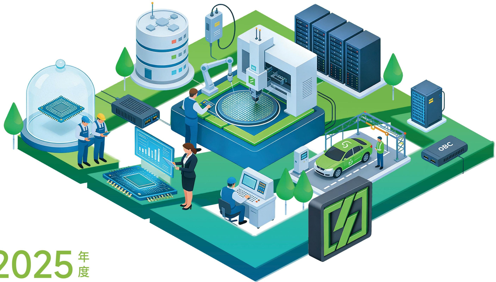

natural_image

Isometric illustration of a smart factory system with workers, robotic arms, and server racks (no text or symbols)

# 2025年度

# 环境、社会和公司治理（ESG）报告

苏州东微半导体股份有限公司

# 目录 Contents

关于本报告 01

董事长致辞 03

2025年可持续发展亮点 05

走进东微半导 06

# 可持续发展治理

可持续发展目标与愿景 15

ESG治理架构 16

可持续发展实践 16

利益相关方沟通 17

重要议题管理 18

# 第一篇

# 筑牢合规治理 护航行稳致远

坚持党建引领 23

规范公司治理 24

董高薪酬管理 26

风险合规经营 27

优化投关管理 27

遵守商业道德 29

# 第二篇

# 践行绿色运营 守护生态家园

应对气候变化 33

加强环境管理 36

资源高效利用 38

保护生物多样 38

# 第三篇

# 创新功率器件 驱动产业发展

创新驱动发展 41

产品安全质量 48

负责任供应链 54

数据安全保护 60

数字化建设 62

# 第四篇

# 守护员工成长 贡献公益力量

员工权益保护 67

助力员工发展 72

职业健康安全 74

社会责任愿景 76

# 附录

指标索引 77

意见反馈 79

# 关于本报告

本报告是苏州东微半导体股份有限公司发布的第二份环境、社会和公司治理（ESG）报告。报告依据客观、规范、透明和全面的原则，详细披露了2025年东微半导在环境、社会和公司治理方面的理念和实践绩效。

# 报告范围

本报告以“苏州东微半导体股份有限公司”为主体，包括下属子公司，除特别说明外，本报告范围与本公司年报范围保持一致。

# 时间范围

2025年1月1日至2025年12月31日（简称“报告期”）。为增强本报告的对比性和前瞻性，部分内容适当追溯以往年份或具有前瞻性描述。本报告的发布周期为一年一次，与财务年度保持一致。

# 报告影响时间范围

报告中影响时间范围的短期、中期、长期分别定义为1年以内、1～5年、5年以上。

# 编制依据

《上海证券交易所上市公司自律监管指引第14号——可持续发展报告（试行）》  
《上海证券交易所科创板上市公司自律监管指南第13号——可持续发展报告编制》  
全球报告倡议组织《GRI可持续发展报告标准（GRI Standards）》  
中国企业改革与发展研究会《中国企业可持续发展报告指南（CASS—ESG 6.0）》

# 数据说明

本报告引用的全部信息数据均来自公司的正式文件、统计报告和财务报告，以及经过公司统计、汇总与审核的各职能部门、各经营单位的内部数据及公开信息，如财务数据与年报有出入，请以年报为准。同时，本报告涉及的货币种类及金额，如无特殊说明，均以人民币作为计量单位。

# 释义说明

为了便于表述和阅读，本报告中“苏州东微半导体股份有限公司”也以“东微半导”“公司”或“我们”表述。此外，报告中的“国家”“政府”为中华人民共和国及其行政机构。

# 公司简称

东微半导、公司、总部、我们

# 公司全称

苏州东微半导体股份有限公司

# 确认及批准

本报告于2026年4月24日获公司董事会批准，并与年报同期发布。董事会承诺对报告内容进行监督，并确保其不存在任何虚假记载或误导性陈述，并对内容真实性、准确性和完整性负责。

# 报告获取

您可以在上交所网站（https://www.sse.com.cn/）或苏州东微半导体股份有限公司（https://www.orientalse-mi.com/）浏览或下载本报告。

# 意见反馈

若您对本报告有任何意见或建议，欢迎通过以下方式与我们联系。

邮箱：enquiry@orientalsemi.com  
电话：0512-62668198

地址：江苏省苏州市工业园区金鸡湖大道99号纳米城东南区65栋

# 董事长致辞

苏州东微半导体股份有限公司  

natural_image

Portrait of a man in a black suit with arms crossed, against a plain white background (no text or symbols visible)

2025年是公司在高质量发展道路上稳步前行的一年。作为半导体行业的深耕者，我们深知企业的价值不仅在于技术的突破与市场的拓展，更在于对环境的责任、对员工的关怀以及对治理的坚守。这一年，我们将ESG理念深度融入公司运营的每一个环节，致力于在科技创新与可持续发展之间寻找最佳平衡点。

# 守护绿水青山，践行环境责任

在环境维度，我们积极响应“双碳”目标，将绿色理念贯穿于经营全流程。2025年，公司楼顶光伏板顺利运行，所发电量全部自发自用，有效降低了用电成本与碳排放。我们在自身持续减排的同时，更致力于通过研发更高能效的功率器件，助力下游客户实现绿色升级，让每一颗芯片都能成为推动社会低碳进步的“绿色芯动能”。

# 凝聚向善力量，担当社会责任

企业的发展离不开人的支撑与社会的支持。2025年，我们始终坚持“以人为本”，将员工的安全与成长放在首位。我们不断完善职业健康安全管理体系，通过安全培训与应急演练，全力筑牢安全发展的坚实防线。同时，我们为员工搭建了多元化的职业发展通道，并通过优化薪酬福利体系，落实补充医疗保险等保障，让每一位奋斗者都能共享公司发展的成果。

# 筑牢治理基石，保障稳健经营

规范治理是企业行稳致远的根本保障。2025年，公司持续优化治理结构，强化董事会的决策职能，确保公司决策的科学性与合规性。我们高度重视风险管控与内部控制，始终秉持高标准的商业道德，以诚信合规筑牢经营根基。通过制定反商业贿赂制度，营造风清气正的经营环境，让规则意识深入人心，使合规成为行动自觉，为公司长远发展奠定坚实基础。

展望未来，我们将继续以ESG理念为指引，将可持续发展融入企业发展的每一步。我们将致力于绿色产品的研发与应用，让科技创新与低碳发展同频共振；我们将用心守护员工成长，与伙伴共创共享发展成果；我们将以更规范的治理、更透明的运营，赢得社会各界的信任与尊重。

大道不孤，众行致远。我们期待与社会各界携手，用科技的力量守护绿水青山，用责任与担当书写高质量发展的新篇章。

郑

# 2025年可持续发展亮点

经济绩效

总资产（万元）311,924.89 营业收入（万元）125,268.76

归母净利润（万元）4,621.04

环境绩效

环保投入（万元）3.6 光伏发电用量（千瓦时）3,000

外购电力总量（千瓦时）4,073,919

治理绩效

股东会召开次数（次）3 董事会召开次数（次）12

在e互动投资者问题回复率（%）100

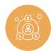

社会绩效

研发投入（万元）9,231.76 授权专利累计数（项）179

质量培训人次（人次）248
质量培训总时长（小时）562

年度质量内审次数（次）2 客户投诉解决率（%）100

劳动合同签订率（%）100 社会保险覆盖率（%）100

# 走进东微半导

苏州东微半导体股份有限公司成立于2008年，注册资本12,257.4975万元，2022年2月10日于上海证券交易所科创板上市，股票代码:688261.SH。公司是一家以高性能功率器件研发与销售为主的技术驱动型半导体企业，凭借优秀的半导体器件与工艺创新能力，集中优势资源聚焦新型功率器件的开发，是国内少数具备从专利到量产完整经验的高性能功率器件设计公司之一，基于多年的技术积累、产业链深度结合能力以及优秀的客户服务能力，公司已成为国内领先的高性能功率器件设计厂商。公司产品的终端应用聚焦在工业及汽车相关等中大功率应用领域，同时也广泛应用在消费级领域。公司已在前述领域积累了全球知名的品牌客户群，产品获得工业和车载重要客户认可。

# > 业务布局

公司是一家以高性能功率器件研发与销售为主的技术驱动型半导体企业，产品专注于工业及汽车相关等中大功率应用领域。

超级结MOSFET领域，公司积累了包括优化电荷平衡技术、优化栅极设计及缓变电容核心原胞结构等行业领先的专利技术，产品的关键技术指标达到了与国际领先厂商可比的水平。

中低压屏蔽栅MOSFET领域，公司积累了包括优化电荷平衡、自对准加工、单胞尺寸等比例缩小、降低寄生电容等多项在设计以及工艺制造中的核心技术，产品的关键技术指标达到了国内外领先水平。

IGBT领域，公司的TGBT产品是基于新型的Trident Gate Bipolar Transistor(简称Tri-gate IGBT)器件结构的重大原始创新，该自主专利技术为基础的TGBT产品系列已经进入稳定的量产交付阶段，性能达到了国际先进的七代IGBT芯片性能。

第三代半导体领域，公司的SiC MOSFET、Si²C MOSFET、SiC SBD已经实现规模化量产，性能指标和同类型竞品对比优势明显。公司持续在第三代半导体领域投入研发，同步推进高性能SiC JFET、GaNHEMT等器件的开发工作。

功率模块领域，公司布局了拥有模块领域丰富开发经验的团队，报告期内，公司模块产品线实现了关键性的技术跨越，形成了覆盖全电压等级的完整解决方案，并在算力服务器电源、车载OBC、主驱电控以及车载热管理系统等应用领域逐步量产。

# 主要产品

公司的主要产品包括GreenMOS系列超级结MOSFET、SFGMOS系列及FSMOS系列中低压屏蔽栅MOSFET、TGBT系列IGBT产品、SiC器件（含Si²C MOSFET）以及高密度功率模块，产品可广泛应用于以5G基站电源及通信电源、数据中心和算力服务器电源、车载充电机、车身加热和平衡系统、UPS电源和工业照明电源、新能源汽车直流充电桩、光伏逆变及储能为代表的工业级应用领域，以及以PC电源、适配器、TV电源板、手机快速充电器为代表的消费电子应用领域。

<table><tr><td>产品品类</td><td>产品介绍</td><td>技术特点</td><td>应用领域</td><td>产品图片</td></tr><tr><td>超级结MOSFET</td><td>超级结MOSFET产品主要为GreenMOS产品系列,全部采用超级结的技术原理,具有开关速度快、动态损耗低、可靠性高的特点及优势。</td><td>低导通电阻、低栅极电荷、静态与动态损耗低。</td><td>车规级和工业级:5G基站电源及通信电源、数据中心和算力服务器电源、新能源汽车车载充电机、UPS电源以及工业照明电源、新能源汽车直流充电桩、光伏逆变器和储能等。消费级:PC电源、适配器、TV电源板、手机快速充电器等。</td><td>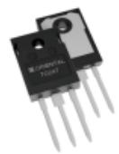</td></tr><tr><td>中低压屏蔽栅MOSFET</td><td>中低压MOSFET产品依托自主创新的屏蔽栅晶体管技术平台,主要包括SFGMOS产品系列以及FSMOS产品系列。其中,1)SFGMOS产品系列采用自对准屏蔽栅结构,兼备了传统平面结构和屏蔽栅结构的优点,具有更高的工艺稳定性、可靠性及更快的开关速度、更小的栅电荷和更高的应用效率等优点;2)FSMOS产品系列采用基于硅基工艺与电荷平衡原理的新型屏蔽栅结构,有效降低了器件的导通电阻和米勒电容,全面提升了产品的导通电阻温度特性,显著增强器件在高温下的耐流能力和稳定性。全系列产品采用Copper Clip技术封装,有效降低封装电阻,适用于超低导通电阻的产品,器件优值和散热性能得以提高,具备更高的应用效率与系统兼容性。</td><td>特征导通电阻低,开关速度快,动态损耗低。</td><td>车规级和工业级:电动工具、智能机器人、无人机、新能源汽车电机控制、逆变器、UPS电源、动力电池保护板、高密度电源等。消费级:移动电源、适配器、数码类锂电池保护板、多口USB充电器、手机快速充电器、电子雾化器、PC电源、TV电源板等。</td><td>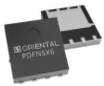</td></tr></table>

<table><tr><td>产品品类</td><td>产品介绍</td><td>技术特点</td><td>应用领域</td><td>产品图片</td></tr><tr><td>超级硅MOSFET</td><td>公司自主研发、性能对标氮化镓功率器件产品的高性能硅基MOSFET产品。通过调整器件结构、优化制造工艺,突破了传统硅基功率器件的速度瓶颈,在电源应用中达到了接近氮化镓功率器件开关速度的水平。</td><td>极快的开关速度与极低的动态损耗。</td><td>工业级:新能源汽车直流充电桩、通信电源、工业照明电源等。消费级:各种高密度电源、快速充电器、模块转换器、快充超薄类PC适配器、TV电源板等。</td><td>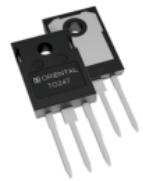</td></tr><tr><td>Tri-gate IGBT</td><td>公司IGBT产品采用具有独立知识产权的TGBT器件结构,区别于国际主流IGBT技术,通过对器件结构的创新实现了关键技术参数的大幅优化。产品的工作电压范围覆盖600V-1350V,工作电流覆盖15A-200A。在不提高制造难度的前提下提升了电流密度,优化了内部载流子分布,调整了电场与电荷的分布,同时优化了导通损耗与开关损耗。</td><td>大电流密度,开关损耗低,可靠性高,具有自保护特点。</td><td>车规级和工业级:新能源汽车直流充电桩、变频器、逆变器、电机驱动、电焊机、压缩机控制、太阳能、UPS电源等。消费级:感应加热等。</td><td>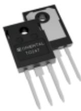</td></tr><tr><td>SiCMOSFET/SBD</td><td>公司的SiC器件包括SiC二极管、SiC MOSFET等产品。其中,SiC二极管、SiC MOSFET全部使用了SiC衬底,充分利用SiC宽禁带材料的耐高压和耐高温特性。</td><td>高速开关、超低的反向恢复时间与反向恢复电荷。</td><td>车规级和工业级:新能源汽车直流充电桩、新能源汽车车载充电机、储能逆变器、高效率通信电源、高效率服务器电源等。</td><td>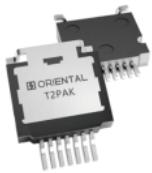</td></tr><tr><td> $Si^{2}C$  MOSFET</td><td> $Si^{2}C$  MOSFET克服了传统SiC MOSFET成本高和可靠性挑战大的缺点,实现了低成本和高栅氧可靠性,同时还实现了接近SiC MOSFET优秀的反向恢复能力,能够在特定应用场景中给客户提供多种选择。</td><td>高栅氧可靠性,易用性高。</td><td>工业级:新能源汽车车载充电机、储能逆变器、高效率通信电源、高效率服务器电源等。</td><td>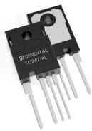</td></tr><tr><td>功率模块</td><td>功率模块作为电力电子装置的核心组件,通过将功率半导体器件(如IGBT、MOSFET或SiC)的保护电路高度集成,实现了电能的高效转换与智能控制。</td><td>采用DBC/AMB等高导热基板与先进封装工艺,具备优异的热管理性能与低寄生参数,显著降低损耗并提升系统效率;同时,模块内置过流、过热等多重智能保护机制,在实现设备小型化、高功率密度的同时,大幅增强了系统的可靠性与稳定性。</td><td>车规级和工业级:新能源汽车车载充电机、主驱电控、空调压缩机、高效率算力服务器电源等。</td><td>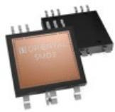</td></tr></table>

# 企业文化

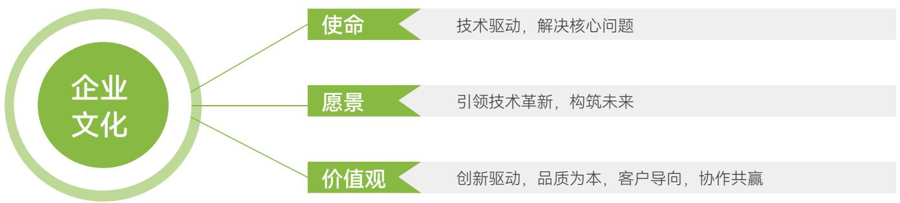

flowchart

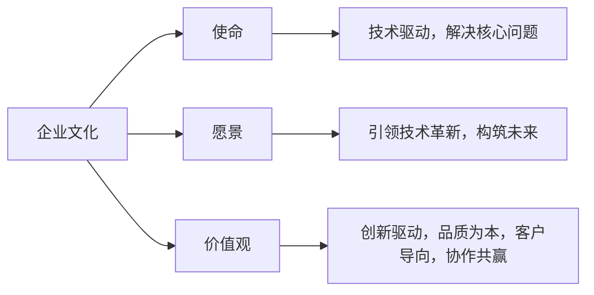

# >发展历程

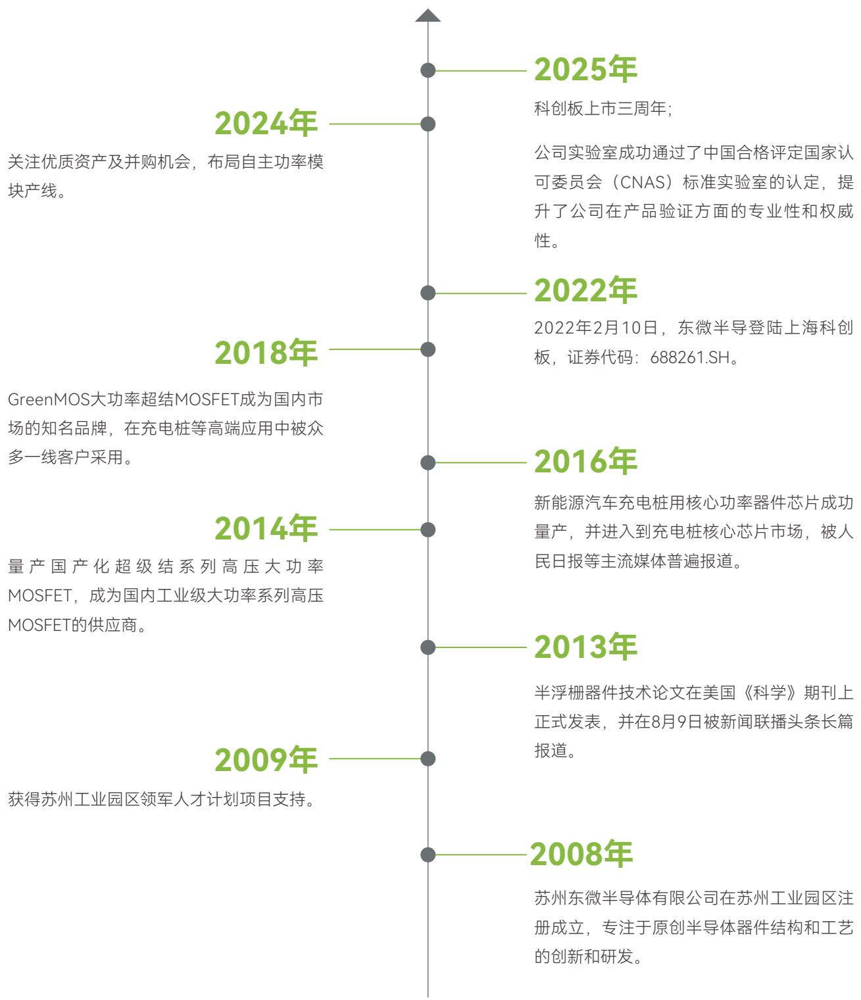

state_timeline

| Year | Milestone |
| --- | --- |
| 2008年 | 苏州东微半导体有限公司在苏州工业园区注册成立，专注于原创半导体器件结构和工艺的创新和研发。 |
| 2009年 | 获得苏州工业园区领军人才计划项目支持。 |
| 2013年 | 半浮栅器件技术论文在美国《科学》期刊上正式发表，并在8月9日被新闻联播头条长篇报道。 |
| 2014年 | 量产国产化超级结系列高压大功率MOSFET，成为国内工业级大功率系列高压MOSFET的供应商。 |
| 2016年 | 新能源汽车充电桩用核心功率器件芯片成功量产，并进入到充电桩核心芯片市场，被人民日报等主流媒体普遍报道。 |
| 2018年 | GreenMOS大功率超结MOSFET成为国内市场的知名品牌，在充电桩等高端应用中被众多一线客户采用。 |
| 2022年 | 2022年2月10日，东微半导登陆上海科创板，证券代码：688261.SH。 |
| 2024年 | 关注优质资产及并购机会，布局自主功率模块产线。 |
| 2025年 | 科创板上市三周年；公司实验室成功通过了中国合格评定国家认可委员会（CNAS）标准实验室的认定，提升了公司在产品验证方面的专业性和权威性。 |

# > 组织架构

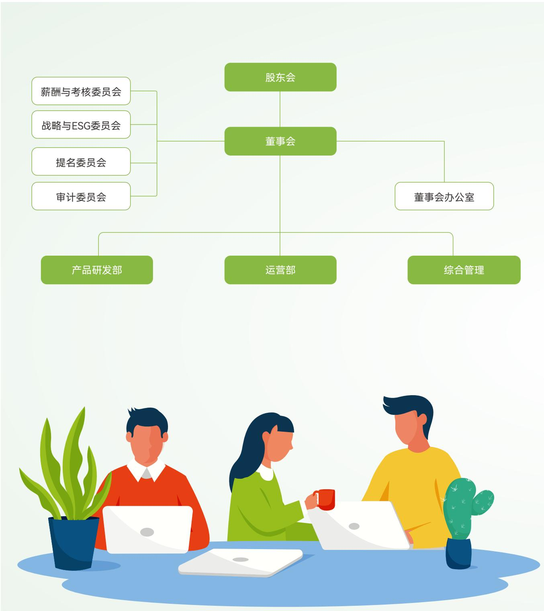

# > 企业荣誉

natural_image

Golden trophy on a podium with a wooden base (no text or symbols visible)

国家专精特新“小巨人”

工业和信息化部  
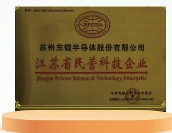

text_image

苏州东微半导体股份有限公司
江苏省民营科技企业
Jiangsu Private Science & Technology Enterprise
江苏东微半导体股份有限公司
台港澳台2023年4月1日至2024年12月

江苏省民营科技企业

江苏省民营科技企业协会  

natural_image

Golden trophy on a podium with a wooden base, no text or symbols visible

苏州市企业技术中心

苏州市人民政府  
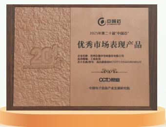

text_image

中国芯
2025年第二十届“中国芯”
优秀市场表现产品
企业名称：苏州捷奇半导体股份有限公司
注册地址：苏州工业园区
成立机构：苏州工业园区
CCID®
中国电子信息产业发展研究院

优秀市场表现产品  
中国电子信息产业发展研究院

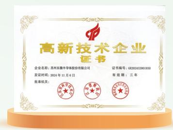

text_image

高新技术企业
证书
企业名称：苏州东微半导体股份有限公司
发证时间：2024年11月6日
证书编号：GR202432001930
有效期：三年
批准机关：

国家高新技术企业

科技部、财政部、国家税务总局  
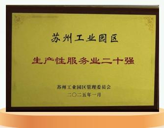

text_image

苏州工业园区
生产性服务业二十强
苏州工业园区管理委员会
二〇二五年一月

生产性服务业二十强

苏州工业园区管理委员会  
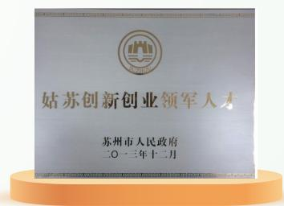

text_image

姑苏创新创业领军人才
苏州市人民政府
二〇一三年十二月

姑苏创新创业领军人才企业

苏州市人民政府  

natural_image

Illustration of a golden trophy, laptop, and calendar with leaves (no text or symbols)

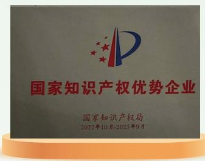

text_image

国家知识产权优势企业
国家知识产权局
2022年10月-2025年9月

国家知识产权优势企业

国家知识产权局  
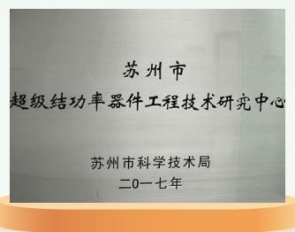

text_image

苏州市
超级结功率器件工程技术研究中心
苏州市科学技术局
二0一七年

江苏省超级结功率器件工程技术研究中心

苏州市科学技术局  
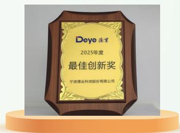

text_image

Deye 逸莱
2025年度
最佳创新奖
宁波德业科技股份有限公司

2025年度最佳创新奖  
宁波德业科技股份有限公司

# 可持续发展治理

本章所涉及的ESG重要议题

利益相关方沟通

响应的SDGs

16 和平、正义与强大机构

17 促进目标实现的伙伴关系

text_image

2025年度环境、社会和公司治理（ESG）报告

# 可持续发展目标与愿景

东微半导将ESG理念深度融入公司战略及日常运营之中，以绿色创新引领未来发展。公司着力构建负责任的价值链体系，与合作伙伴携手并进，致力于凭借科技力量，共同开创一个更加绿色、更具包容性的可持续未来。

<table><tr><td>管理维度</td><td>回应议题</td><td>响应的SDGs</td></tr><tr><td>可持续发展治理</td><td>利益相关方沟通</td><td>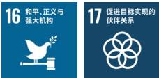</td></tr><tr><td>筑牢合规治理 护航行稳致远</td><td>反商业贿赂及反贪污、反不正当竞争、尽职调查</td><td>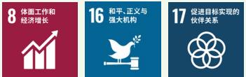</td></tr><tr><td>践行绿色运营 守护生态家园</td><td>应对气候变化、环境合规管理、能源利用、水资源利用、污染物排放、废弃物处理、循环经济、生态系统和生物多样性保护</td><td>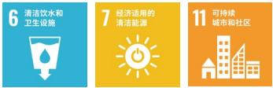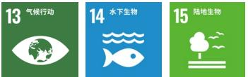</td></tr><tr><td>创新功率器件 驱动产业发展</td><td>创新驱动、产品和服务安全与质量、供应链安全、数据安全与客户隐私保护、平等对待中小企业、科技伦理</td><td>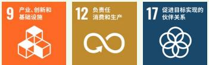</td></tr><tr><td>守护员工成长 贡献公益力量</td><td>员工权益与发展、职业健康与安全、社会贡献、乡村振兴</td><td>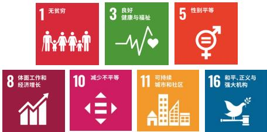</td></tr></table>

# ESG治理架构

公司已搭建起由董事会及战略与ESG委员会（决策层）、ESG工作小组（规划层）、各相关部门（执行层）共同组成的“决策—规划—执行”三级ESG管理架构，形成了纵向权责清晰、贯通有序，横向协同高效、联动顺畅的组织保障体系。同时，配套制定《董事会战略与ESG委员会工作细则》，从职责定位、议事程序、工作机制等方面作出明确规定，为ESG战略的有效落地与长效运行提供了坚实的制度支撑。

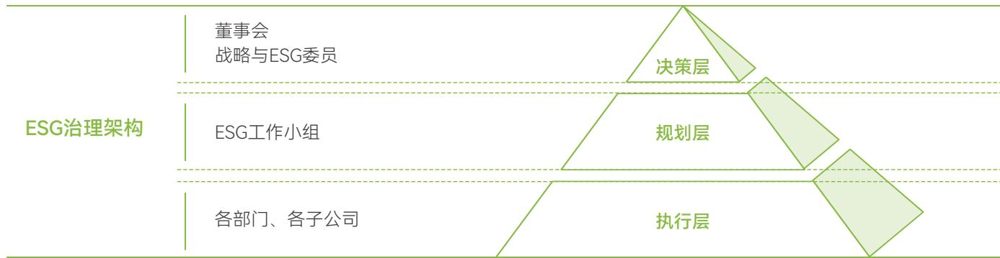

flowchart

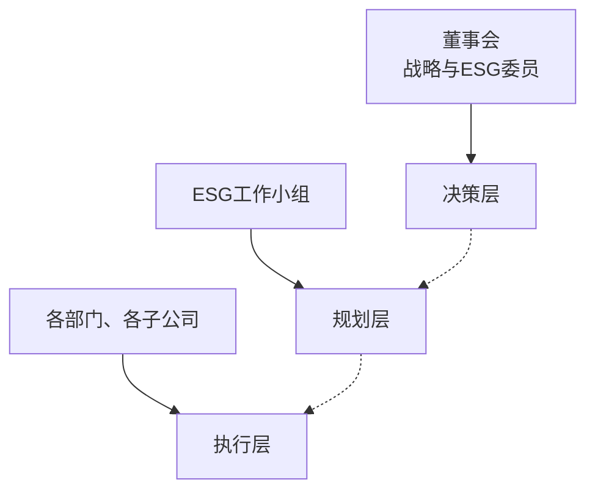

# 战略与ESG委员会主要职责

- 对公司长期发展战略、重大投融资及资产经营等事项进行研究并提出建议；  
- 识别评估重大ESG风险与机遇，参与制定公司ESG战略、目标、政策及执行管理等相关事宜；  
监督ESG工作推进情况，审阅ESG报告并提出建议，落实董事会授权的相关事项；  
对上述事项的实施情况进行检查，并向董事会提出调整与改进建议。

同时，公司高度重视ESG风险管理，并将其深度融入全面风险管理体系，形成了上下衔接紧密、协同运作高效的管理机制。委员会就ESG相关事项进行汇报，董事会据此切实履行督导职责；各工作小组则专注于专业评估与具体措施的落实，通过持续监测与动态优化，确保风险管理的精准性和有效性，助力公司在可持续发展的道路上稳步前行。

# 可持续发展实践

为将ESG管理体系有效落实，公司面向员工开展系统性培训，内容涵盖ESG理念、政策及实践案例。通过持续的知识传导与研讨，确保ESG意识深度融入各层级工作与决策，从而巩固治理成效，赋能公司可持续战略前行。

# ESG专题培训及工作交流会

为深化各级员工对ESG理念的理解，公司组织开展了ESG专题培训及工作交流会。活动围绕国内外ESG发展趋势、关键议题识别及信息披露要求等内容展开详细解读。通过培训，公司明确了各部门在ESG工作中的角色与职责，为后续构建高效协同的工作机制奠定良好基础。

案例  
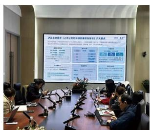

text_image

Meeting room scene with large presentation screen displaying Chinese text and data tables, showing participants seated around a conference table.

# 利益相关方沟通

公司致力于与各利益相关方搭建常态化、多元化沟通桥梁，借助定期披露、调研问卷等渠道紧密互动，积极倾听并回应各方关切，将诉求纳入ESG管理与战略决策，以此推动各方实现协同发展。

<table><tr><td>利益相关方</td><td>沟通渠道</td><td>频率</td><td>关注议题</td></tr><tr><td rowspan="7">股东/投资者</td><td>股东会</td><td>非定期</td><td rowspan="7">利益相关方沟通尽职调查</td></tr><tr><td>e互动</td><td>非定期</td></tr><tr><td>报告披露</td><td>季度</td></tr><tr><td>投资者热线</td><td>非定期</td></tr><tr><td>媒体报道</td><td>非定期</td></tr><tr><td>业绩说明会</td><td>季度</td></tr><tr><td>信息披露</td><td>实时</td></tr><tr><td rowspan="4">员工</td><td>内部信息沟通平台</td><td>非定期</td><td rowspan="4">员工权益与发展职业健康与安全</td></tr><tr><td>电话与邮件</td><td>非定期</td></tr><tr><td>面对面沟通</td><td>非定期</td></tr><tr><td>员工满意度调查</td><td>年度</td></tr><tr><td rowspan="4">供应商</td><td>走访稽核</td><td>非定期</td><td rowspan="4">反商业贿赂及反贪污供应链安全平等对待中小企业</td></tr><tr><td>调研问卷</td><td>非定期</td></tr><tr><td>商务拜访</td><td>非定期</td></tr><tr><td>电话与邮件</td><td>非定期</td></tr><tr><td rowspan="2">客户/经销商</td><td>专岗对接</td><td>非定期</td><td rowspan="2">产品和服务安全与质量数据安全与客户隐私保护反不正当竞争</td></tr><tr><td>客户满意度调查</td><td>年度</td></tr><tr><td rowspan="2">媒体</td><td>媒体采访</td><td>非定期</td><td rowspan="2">创新驱动科技伦理社会贡献乡村振兴</td></tr><tr><td>公司网站</td><td>非定期</td></tr><tr><td rowspan="2">政府/监察机构</td><td>信息披露</td><td>月度</td><td rowspan="2">应对气候变化环境合规管理能源利用水资源利用污染物排放废弃物处理循环经济生态系统和生物多样性保护</td></tr><tr><td>电话与邮件</td><td>非定期</td></tr></table>

# 重要议题管理

2025年，公司参考《上海证券交易所上市公司自律监管指引第14号——可持续发展报告（试行）》《GRI3：重大主题》等国内外披露标准的评估方法，以及同行议题变化和议题发展趋势对公司重要性议题清单进行重新识别与评估，最终确定了22个议题。以下为议题变动情况：

<table><tr><td>2024年实质性议题</td><td>2025年实质性议题</td><td>变动情况</td><td>变动原因</td></tr><tr><td>环境管理体系</td><td>环境合规管理</td><td rowspan="8">更改表述</td><td rowspan="8">调整了议题名称,使议题内容密贴合《上海证券交易所上市公司自律监管指引第14号一一可持续发展报告(试行)》等监管准则。</td></tr><tr><td>生物多样性保护</td><td>生态系统和生物多样性保护</td></tr><tr><td>数据安全与隐私保护</td><td>数据安全与客户隐私保护</td></tr><tr><td>研发与创新</td><td>创新驱动</td></tr><tr><td>产品服务质量</td><td>产品和服务安全与质量</td></tr><tr><td>社区参与</td><td>社会贡献</td></tr><tr><td>供应链管理</td><td>供应链安全</td></tr><tr><td>环境污染防治与控制</td><td>污染物排放</td></tr><tr><td rowspan="2">废弃物管理与循环利用</td><td>废弃物处理</td><td rowspan="4">拆分</td><td rowspan="4">通过拆分提升信息的颗粒度,使信息披露更加规范详实,满足《上海证券交易所上市公司自律监管指引第14号一一可持续发展报告(试行)》要求。</td></tr><tr><td>循环经济</td></tr><tr><td rowspan="2">商业道德与合规</td><td>反商业贿赂及反贪污</td></tr><tr><td>反不正当竞争</td></tr><tr><td>尊重与保障人权</td><td rowspan="3">员工权益与发展</td><td rowspan="3">合并</td><td rowspan="3">将“尊重与保障人权”“员工权益与福利”“人才培养与发展”合并为“员工权益与发展”进行披露。</td></tr><tr><td>员工权益与福利</td></tr><tr><td>人才培养与发展</td></tr><tr><td rowspan="5">/</td><td>乡村振兴</td><td rowspan="5">新增</td><td rowspan="5">新增议题有助于信息披露更全面地满足《上海证券交易所上市公司自律监管指引第14号一一可持续发展报告(试行)》的要求。</td></tr><tr><td>科技伦理</td></tr><tr><td>平等对待中小企业</td></tr><tr><td>利益相关方沟通</td></tr><tr><td>尽职调查</td></tr><tr><td>资源管理能源管理</td><td>能源利用水资源利用</td><td>调整</td><td>根据《上海证券交易所上市公司自律监管指引第14号——可持续发展报告(试行)》要求,将“资源管理”“能源管理”调整为“能源利用”“水资源利用”。</td></tr><tr><td>风险管理</td><td rowspan="4">/</td><td rowspan="4">删减</td><td rowspan="4">上述议题作为基础性管控要素,已深度融入公司日常治理、风控及合规体系,故不纳入重要议题管理中。</td></tr><tr><td>税收管理</td></tr><tr><td>公司治理</td></tr><tr><td>ESG治理</td></tr></table>

# > 重要性议题评估流程

<table><tr><td>背景分析</td><td>初步筛选</td><td>重要性评估</td><td>议题确认</td></tr><tr><td>结合宏观趋势、行业特性与自身商业模式,系统性识别关键利益相关方及公司面临的核心风险与机遇。</td><td>参照GRI等国际主流标准及同行业披露实践,构建初步的可持续发展议题库。</td><td>采用“双重重要性”原则(影响重要性+财务重要性)进行量化与定性评估,并整合内部风险评估结果与专家意见。</td><td>形成影响和财务重要性议题清单,确保相关议题透明、平衡且完整地披露在报告中。</td></tr></table>

# > 议题分析结果

公司面向利益相关方开展问卷调查，同时结合专家判断，综合考量议题的影响重要性与财务重要性评估结果，以矩阵形式呈现分析结论及各议题的重要性排序。

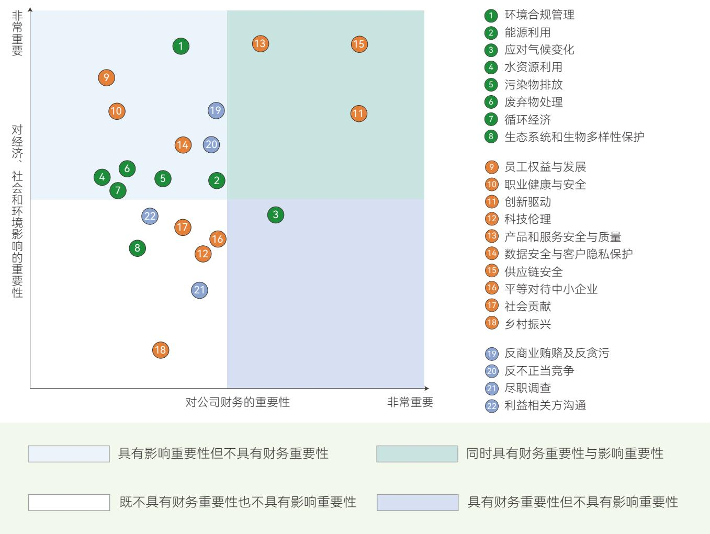

scatter

| ID | Topic | X-axis (对公司财务的重要性) | Y-axis (对经济、社会和环境影响的重要性) |
| --- | --- | --- | --- |
| 1 | 环境合规管理 | ~0.25 | ~0.95 |
| 2 | 能源利用 | ~0.35 | ~0.85 |
| 3 | 应对气候变化 | ~0.45 | ~0.85 |
| 4 | 水资源利用 | ~0.55 | ~0.75 |
| 5 | 污染物排放 | ~0.65 | ~0.75 |
| 6 | 废弃物处理 | ~0.75 | ~0.75 |
| 7 | 循环经济 | ~0.85 | ~0.75 |
| 8 | 生态系统和生物多样性保护 | ~0.95 | ~0.75 |
| 9 | 员工权益与发展 | ~0.25 | ~0.85 |
| 10 | 职业健康与安全 | ~0.35 | ~0.80 |
| 11 | 创新驱动 | ~0.95 | ~0.80 |
| 12 | 科技伦理 | ~0.65 | ~0.75 |
| 13 | 产品和服务安全与质量 | ~0.75 | ~0.75 |
| 14 | 数据安全与客户隐私保护 | ~0.75 | ~0.75 |
| 15 | 供应链安全 | ~0.95 | ~0.85 |
| 16 | 平等对待中小企业 | ~0.85 | ~0.65 |
| 17 | 社会贡献 | ~0.75 | ~0.65 |
| 18 | 乡村振兴 | ~0.45 | ~0.25 |
| 19 | 反商业贿赂及反贪污 | ~0.65 | ~0.65 |
| 20 | 反不正当竞争 | ~0.75 | ~0.65 |
| 21 | 尽职调查 | ~0.75 | ~0.45 |
| 22 | 利益相关方沟通 | ~0.45 | ~0.65 |

东微半导重要议题矩阵

<table><tr><td>重要性</td><td>议题</td></tr><tr><td>双重重要性</td><td>创新驱动、产品和服务安全与质量、供应链安全</td></tr><tr><td>仅财务重要性</td><td>应对气候变化</td></tr><tr><td>仅影响重要性</td><td>环境合规管理、能源利用、水资源利用、污染物排放、废弃物处理、循环经济、员工权益与发展、职业健康与安全、数据安全与客户隐私保护、反商业贿赂及反贪污、反不正当竞争</td></tr><tr><td>相关</td><td>生态系统和生物多样性保护、科技伦理、平等对待中小企业、社会贡献、乡村振兴、尽职调查、利益相关方沟通</td></tr></table>

# 01

# 筑牢合规治理 护航行稳致远

本章所涉及的ESG重要议题

反商业贿赂及反贪污

反不正当竞争

尽职调查

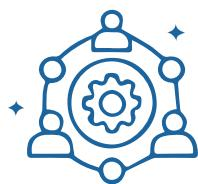

响应的SDGs

8体面工作和经济增长

16 和平、正义与强大机构

17 促进目标实现的伙伴关系

text_image

2025年度环境 社会和公司治理（ESG）报告

# 坚持党建引领

公司始终坚持以党建为引领，深入学习贯彻党的创新理论，牢牢把握党建工作与企业经营发展深度融合的核心要求，切实发挥党组织把方向、管大局、保落实的领导作用。

公司扎实开展主题党日活动，严格按照要求及时将活动开展情况在智慧党建平台进行录入，确保组织生活规范有序，持续提升基层党组织建设标准化、规范化水平。报告期内，公司积极参与上级党委组织的各项活动与学习培训，其中参加上级党委活动2次、党组织培训1次；每月开展主题党日活动，并结合企业实际自主组织各类党建学习与实践活动7次，进一步提升了党组织凝聚力、战斗力与党员政治素养。

# “深入学习《习近平总书记关于党的建设的重要思想概论》”主题党日活动

2025年2月，公司组织“深入学习《习近平总书记关于党的建设的重要思想概论》”主题党日活动，组织党员认真学原文、悟原理，深入学习领会习近平总书记关于党的建设的重要思想的核心要义、精神实质、丰富内涵、实践要求，切实强化理论武装，夯实党建工作思想基础，推动党建学习走深走实、见行见效，为企业高质量发展提供坚强思想保障。

# 案例

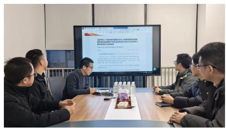

text_image

Meeting scene with participants seated around a table, one person presenting a presentation screen in the background.

# “持续推进深入贯彻中央八项规定精神学习教育”主题党日活动

2025年7月，公司开展“持续推进深入贯彻中央八项规定精神学习教育”主题党日活动，组织党员集中学习、静心研读，深入领会习近平总书记关于加强党的作风建设的重要论述，认真学习中央八项规定及其实施细则精神，引导全体党员干部从思想上正本清源、固本培元，进一步严明纪律规矩、强化作风养成，筑牢拒腐防变的思想根基，以优良作风推动企业各项工作落地见效。

# 案例

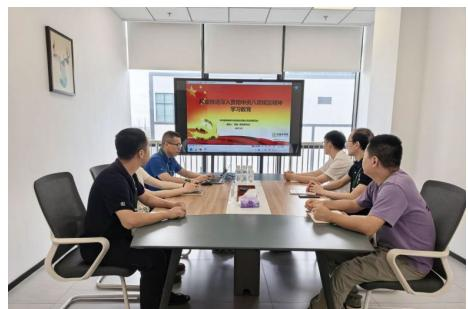

text_image

Meeting room scene with participants seated around a conference table, large screen displaying Chinese text about a 2019 university student education system.

# 规范公司治理

东微半导严格遵循《中华人民共和国公司法》（以下简称《公司法》）《中华人民共和国证券法》（以下简称《证券法》）《上市公司治理准则》等法律法规及监管要求，构建权责清晰、运转协调、高效运作的治理结构。公司制定《公司章程》《股东会议事规则》《董事会议事规则》及内部控制、风险管理、信息披露、关联交易管理等一系列制度文件，健全治理机制、强化规范运行、提升治理效能，为高质量可持续发展提供坚实治理保障。

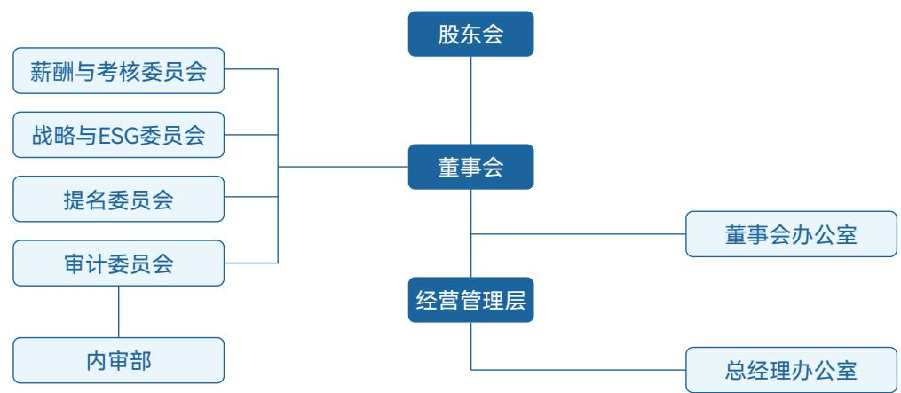

flowchart

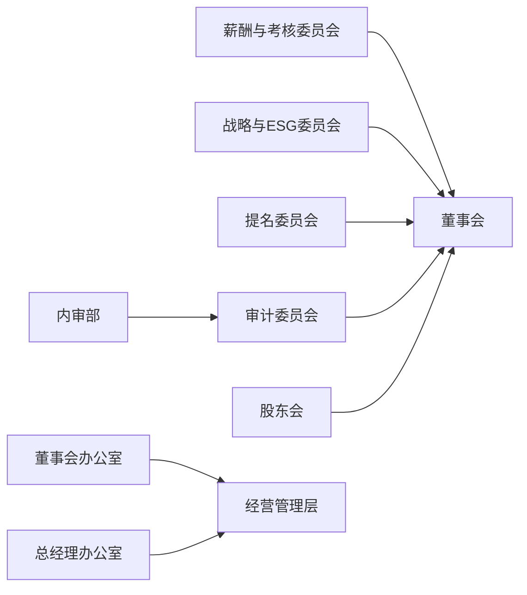

东微半导治理结构

# > 股东会

公司严格按照《公司法》《公司章程》《股东会议事规则》等规定，规范股东会运作，保障股东依法行使知情权、参与权、质询权和表决权等各项权利。股东会作为公司最高权力机构，严格履行审议批准公司发展战略、利润分配、重大投融资、章程修订等法定职权。

公司股东会采用现场投票与网络投票相结合的方式，切实保障股东行使表决权的便利性与广泛性。同时，公司聘请律师事务所全程现场见证并出具法律意见书，确保会议召集、召开、表决程序及表决结果合法合规、真实有效。对于关联交易相关议案，公司严格执行关联股东回避表决制度；对于涉及中小投资者利益的重大事项，实行中小投资者单独计票机制，充分保护中小股东合法权益，维护全体股东平等地位，提升公司治理透明度与规范性。

# 关键绩效

股东会召开3次

审议通过事项19项

# >董事会

董事会是公司经营决策机构，严格按照《公司法》《公司章程》及《董事会议事规则》规范运作，对股东会负责。公司严格履行法定程序，依法依规选举董事，确保董事选聘合法合规、公开公正。公司持续健全董事会运作机制，优化决策流程，强化科学决策与风险管控，充分发挥董事专业履职能力与治理效能，切实维护公司及全体股东合法权益。

# 关键绩效

董事会召开12次

审议通过事项49项

公司董事会根据治理需求设立薪酬与考核委员会、战略与ESG委员会、提名委员会、审计委员会，严格按照相关法律法规及各委员会议事规则独立规范运作。各专门委员会分工明确、专业高效，充分发挥专业优势，强化风险防控、内部监督与战略支撑，为董事会重大决策提供专业审议与科学建议，有效提升决策质量与治理效能。

<table><tr><td>委员会名称</td><td>独立董事</td><td>非独立董事</td><td>独董占比</td><td>独立董事是否担任召集人</td></tr><tr><td>战略与ESG委员会</td><td>0人</td><td>3人</td><td>0/3</td><td>否</td></tr><tr><td>审计委员会</td><td>2人</td><td>1人</td><td>2/3</td><td>是</td></tr><tr><td>提名委员会</td><td>2人</td><td>1人</td><td>2/3</td><td>是</td></tr><tr><td>薪酬与考核委员会</td><td>2人</td><td>1人</td><td>2/3</td><td>是</td></tr></table>

# 关键绩效

薪酬与考核委员会召开4次会议

审计委员会召开8次会议

战略与ESG委员会召开1次会议

# 董事会独立性

为进一步完善治理结构，促进规范运作，公司根据《上市公司独立董事管理办法》等有关法律法规，制定《独立董事工作制度》《独立董事专门会议工作制度》。公司共有独立董事3名，人员配置符合法律法规及监管要求。报告期内，独立董事独立履行职责、独立发表意见，在关联交易、财务监督、内控建设等方面发挥专业监督作用，切实维护公司及全体股东特别是中小股东合法权益，保障董事会决策客观、公正、独立。

# 董事会多元化

公司高度重视董事会多元化建设，在董事选聘中综合考量专业背景、从业经验、行业资源及履职能力，形成结构合理、优势互补的决策团队，能够为公司战略决策、风险管控、经营发展提供多元视角与专业支撑。

# 董事会多元化构成

按性别划分  
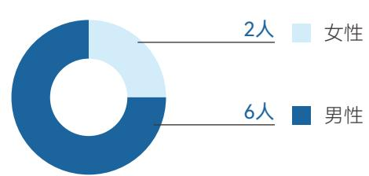

donut

| Category | Value |
| --- | --- |
| 女性 | 2人 |
| 男性 | 6人 |

按年龄划分  
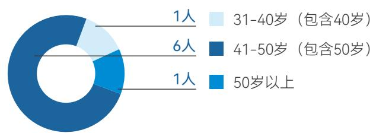

donut

| Category | Value |
| --- | --- |
| 31-40岁 (包含40岁) | 1人 |
| 41-50岁 (包含50岁) | 6人 |
| 50岁以上 | 1人 |

按职务划分  
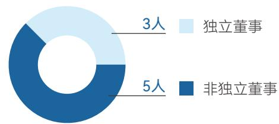

donut

| Category | Value |
| --- | --- |
| 独立董事 | 3人 |
| 非独立董事 | 5人 |

按学历划分  
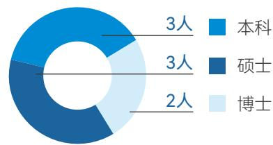

donut

| Category | Value |
| --- | --- |
| 本科 | 3人 |
| 硕士 | 3人 |
| 博士 | 2人 |

按专业背景划分  
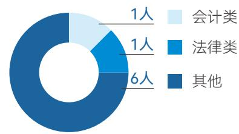

donut

| Category | Value |
| --- | --- |
| 会计类 | 1人 |
| 法律类 | 1人 |
| 其他 | 6人 |

# 董高薪酬管理

东微半导持续完善董事及高级管理人员薪酬与考核管理，由薪酬与考核委员会拟定薪酬方案，经董事会审议后提交股东会批准，程序规范透明。公司董事及高级管理人员薪酬水平与公司经营业绩、个人履职情况及行业水平挂钩，兼顾激励有效性与约束机制，确保薪酬分配公平、合理、合规。

独立董事薪酬为人民币8万元/年/人（含税）。

在公司担任管理职务的非独立董事，按照所担任的管理职务领取薪酬，不再单独领取非独立董事薪酬；未担任管理职务的非独立董事，不领取薪酬。

高级管理人员按其在公司担任的具体管理职务领取相应薪酬。

报告期内，公司向董事和高级管理人员实际支付薪酬632.52万元。

# 风险合规经营

东微半导始终坚持合规经营，建立健全风险管理与内部控制体系，严格遵循国家法律法规、监管要求及内部制度，强化重点领域风险防控，不断提升内控体系有效性，保障公司资产安全、运营规范。

# 风险管理与内部控制

公司严格遵循国家法律法规、监管要求及公司内部制度，将风险防控与内控管理贯穿决策、执行、监督全过程。公司通过开展内部控制自我评价与监督检查，及时发现问题、落实整改、持续优化，确保内控制度有效运行。通过健全风险管理与内部控制长效机制，公司有效防范经营风险、财务风险及合规风险，保障资产安全、财务信息真实完整、经营活动规范高效，为公司持续健康、高质量发展提供坚实保障。

同时，公司根据《内部审计制度》开展年度审计，针对公司日常关联交易、对外投资、限制性股票激励计划、闲置募集资金现金管理等事项开展内部审计，并将审计中发现的相关问题进行及时反馈，上述问题均已整改完毕。

# 合规经营

公司始终坚持依法合规经营，将合规管理深度融入生产运营、内部管控及重大决策全流程，持续健全制度体系与运行机制，确保各项经营活动合法合规、规范有序。公司聚焦重点领域与关键环节，强化合规管理，主动防范化解法律风险、运营风险及道德风险，切实筑牢合规经营底线，保障公司持续稳健发展。

# 税务管理

公司高度重视税务管理工作，严格遵守国家税收法律法规及相关政策，坚持依法纳税、诚信经营，建立规范、有序、高效的税务管理体系。公司持续健全税务管理流程，严格按照规定完成税务申报、税款缴纳及发票管理等工作，确保税务事项合法合规。同时，公司不断加强税务政策学习与内部宣贯，提升财务及相关岗位人员的专业能力与风险意识，实现税务工作规范化、标准化运行，有效防范税务风险，切实履行企业社会责任。

# 优化投关管理

东微半导严格遵循相关法律法规及监管要求，不断完善投资者关系管理机制，通过规范信息披露、强化沟通交流，主动传递公司经营与发展情况，切实保障投资者合法权益，提升公司信息透明度与治理水平，增进市场认同与投资者信任。

# 规范信息披露

为强化信息披露事务管理，保障信息披露工作规范有序开展，公司严格按照法律法规及监管要求，制定《信息披露管理制度》，始终坚持真实、准确、完整、及时、公平的披露原则，严格履行信息披露义务，规范披露公司经营管理、重大事项等重要信息。通过持续、透明的信息披露，切实保障投资者知情权与监督权，方便投资者及时掌握公司发展动态、作出合理投资决策、依法行使股东权利。

# 关键绩效

因信息披露方面违规而受到处罚0次

公司共发布公告文件139份，其中定期报告4份，临时公告135份

# > 舆情管理

公司高度重视舆情管理与品牌声誉维护，制定《舆情管理制度》，实行“统一领导、统一组织、快速反应、协同应对”的管理方针。公司舆情管理工作由董事会统一领导，董事长作为第一责任人，负责领导各类舆情处理工作，有效防范化解舆情风险，切实维护公司声誉与资本市场形象。

# > 投资者关系管理

公司严格遵守《上市公司投资者关系管理工作指引》等有关法律法规，建立健全专业化、规范化的投资者关系管理体系。公司始终坚持公平对待所有投资者，积极构建高效畅通的沟通机制，通过多元渠道与各类投资者开展良性互动，客观传递公司经营情况与发展理念，切实维护投资者合法权益。

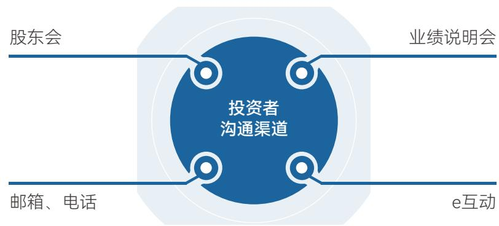

flowchart

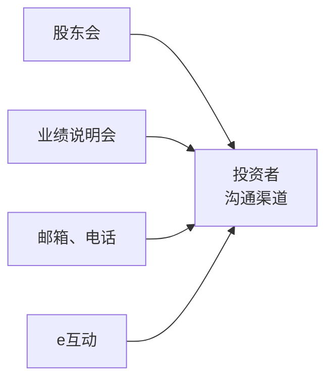

关键绩效

<table><tr><td>接待投资者活动次数6次</td><td>接待机构投资者208家次</td><td>在e互动投资者提问总数15次</td></tr><tr><td>在e互动回答投资者问题数15次</td><td colspan="2">在e互动投资者问题回复率100%</td></tr></table>

# > 股东权益保护

公司高度重视股东回报与权益分派工作，严格按照法律法规、公司章程及监管要求，制定科学合理的利润分配政策，建立健全股东回报机制。公司坚持兼顾股东合理回报与公司长远发展，制定《公司未来三年（2024年-2026年）股东回报规划》，规范实施权益分派等相关事项，切实保障股东依法享有收益权，充分维护全体股东特别是中小股东的合法权益，实现公司与股东的共同可持续发展。

<table><tr><td>指标</td><td>2025年</td></tr><tr><td>每10股现金分红</td><td>0.7540元</td></tr><tr><td>分红总额(含税)</td><td>9,242,153.12元</td></tr><tr><td>分红比例</td><td>20.00%</td></tr></table>

# 遵守商业道德

东微半导严格遵守商业道德规范，将商业道德融入全流程治理，致力于构建完善的反商业贿赂管理体系，坚守公平竞争原则，常态化推进反商业贿赂、反贪污及反不正当竞争工作，以内部管理严控违规风险，凭借诚信合规筑牢商业道德防线。

# 反商业贿赂及反贪污

公司严格遵守《中华人民共和国反不正当竞争法》《关于禁止商业贿赂行为的暂行规定》等法律法规及规范性文件要求，制定《反商业贿赂制度》，规范商业活动、强化内控治理，从源头防范商业贿赂等不正当行为，保障公司与股东的合法利益。

公司构建“董事会统筹-工作小组推进-内部审计部执行”的三级反商业贿赂工作体系。由董事会牵头领导并全面督导反商业贿赂工作开展；设立以董事长为组长的反商业贿赂工作小组，统筹协调工作规划、指导监督全流程实施；内部审计部作为常设执行机构，全权承接公司及各级下属子、分公司反商业贿赂工作的具体落地、执行与监督保障。

报告期内，公司未发生商业贿赂及贪污事件相关的重大处罚事件。

# 廉洁教育

公司深耕诚信正直的企业文化内核，着力营造反商业贿赂的廉洁氛围。通过内部公告、培训宣贯、制度手册等多渠道公示反商业贿赂政策与制度，引导员工树立诚信道德、杜绝商业贿赂的价值观，从根源杜绝商业贿赂行为；同时不定期开展法律法规及公司制度培训，助力员工精准识别商业贿赂行为，妥善化解利益冲突、筑牢抵御不正当利益诱惑的思想防线。

# 举报与举报人保护

公司依据《反商业贿赂制度》，搭建多元化商业贿赂举报渠道，鼓励员工及社会各界通过电话、电子邮箱、信函等方式，向内部审计部实名或匿名举报商业贿赂相关行为。内部审计部作为举报受理与调查的常设执行机构，接到举报线索后将遵循既定流程开展核查取证，形成调查报告及针对性处理建议，按权限上报反商业贿赂工作小组审议审批，经确认后正式落地执行处理意见。

同时，为切实保障举报人合法权益，公司对举报人信息及举报内容予以保密，坚决杜绝打击报复行为。

# 投诉渠道

举报邮箱：enquiry@orientalsemi.com

# 反不正当竞争

公司依据《中华人民共和国反垄断法》《中华人民共和国反不正当竞争法》等法律法规要求，坚守合规经营底线，致力于构建系统化反不正当竞争管理体系，坚决杜绝各类不正当竞争行为。通过加强日常监督等举措，切实维护市场公平竞争秩序，保障企业合法权益，持续推动经营活动合规稳健推进。

报告期内，公司未发生因不正当竞争行为导致诉讼或重大行政处罚事件。

# 02

# 践行绿色运营 守护生态家园

本章所涉及的ESG重要议题

应对气候变化

环境合规管理

能源利用

水资源利用

污染物排放

废弃物处理

循环经济

生态系统和生物多样性保护

响应的SDGs

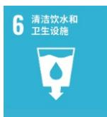

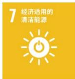

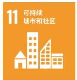

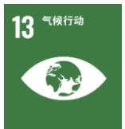

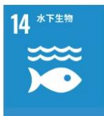

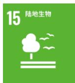

text_image

2025年度环境、社会和公司治理（ESG）报告

# 应对气候变化

应对气候变化是关乎全球可持续发展的重大议题。公司将应对气候变化纳入整体战略规划，积极响应国家“碳达峰、碳中和”部署，以“双碳”目标为引领，系统识别与评估气候相关风险与机遇，持续优化气候治理体系，通过管理和技术创新推动绿色低碳生产，致力于为气候行动与可持续发展贡献力量。

# > 治理

公司董事会为气候相关事务的最高决策机构，从战略高度把控重大事项并监督执行成效；战略委员会负责对气候治理策略进行专业督导；ESG工作小组由研发、供应链、运营等核心部门组成，统筹跨部门资源整合与协同推进；各职能部门将气候理念融入日常运营，从产品设计、供应链管理、办公节能等环节落实减排举措。同时，公司组织气候变化专项培训，持续提升全员治理能力。

> 战略

<table><tr><td colspan="2">风险类型</td><td>风险描述</td><td>影响的时间范围</td><td>影响的价值链环节</td><td>潜在财务影响</td><td>应对措施</td></tr><tr><td rowspan="2">物理风险</td><td>急性</td><td>运输等关键环节可能受暴雨等极端天气影响导致中断,削减企业营收并提升运营成本;员工正常出行与健康也会受到极端天气威胁,进一步增加成本负担;旱灾、高温等天气可能加剧火灾风险,造成财产损失并阻碍正常运营。</td><td>短期</td><td>运营、下游</td><td>营业收入减少、运营成本增加</td><td rowspan="2">定期跟踪收集气候信息,完善应急管制机制,同时合理购买商业保险,构建多维气候风险防控体系;推进绿色运营,安装节能空调系统、使用清洁能源,并积极寻找可替代供应商,实现节能降耗与供应链韧性双提升。</td></tr><tr><td>慢性</td><td>气温持续攀升将推高制冷设备运行时长,导致用电需求与设备维护成本逐年增加;海平面上升可能导致海水倒灌频次增多,侵蚀沿海工厂设施、淹没仓储物资,使工厂生产与产品交付长期承压。</td><td>长期</td><td>运营、下游</td><td>营业收入减少、运营成本增加</td></tr></table>

<table><tr><td colspan="2">风险类型</td><td>风险描述</td><td>影响的时间范围</td><td>影响的价值链环节</td><td>潜在财务影响</td><td>应对措施</td></tr><tr><td rowspan="4">转型风险</td><td>政策与法律</td><td>政策趋严背景下,为满足监管要求及碳中和目标,公司需采购绿电绿证、建立持续监控机制,并投入资金购置排放监测设备、聘请专业顾问,多重因素叠加导致运营成本增加。</td><td>中、长期</td><td>运营</td><td>运营成本增加</td><td>积极制定并落实ESG战略;建立ESG管理体系、采购绿电。</td></tr><tr><td>市场风险</td><td>客户低碳需求增加,公司若无法在节能降耗等方面达标,可能面临客户流失、收入下降风险;同时推进自身与供应链“双碳”及能源成本上涨,进一步增加运营成本,形成双重压力。</td><td>短、中期</td><td>下游</td><td>营业收入减少</td><td>把握绿色转型机遇,积极推动“双碳”目标落地;推广使用清洁能源,并积极寻找可替代的原材料。</td></tr><tr><td>技术风险</td><td>“双碳”转型加速产品技术与材料迭代,公司需升级设备以满足低碳生产要求,短期内增加运营成本,同时绿色技术研发投入增加,进一步加剧经营压力。</td><td>短、中期</td><td>运营</td><td>运营成本增加</td><td>优化研发流程,提升技术水平。</td></tr><tr><td>声誉风险</td><td>“双碳”理念持续普及,外部监管要求日益趋严。若公司未能及时合规,可能引发声誉风险和形象受损,导致营业收入减少,同时面临合规成本上升的双重压力。</td><td>短、中期</td><td>下游</td><td>营业收入减少、运营成本增加</td><td>全方位开展声誉风险监测与预警工作;构建完善的舆情回应机制,精准聚焦可能出现的负面事件。</td></tr></table>

natural_image

Illustration of a green landscape with trees, a river, and solar panels on the water (no text or symbols)

<table><tr><td colspan="2">机遇类型</td><td>机遇描述</td><td>影响的时间范围</td><td>影响的价值链环节</td><td>潜在财务影响</td><td>应对措施</td></tr><tr><td rowspan="4">机遇</td><td rowspan="2">资源效率机遇</td><td>通过优化供应链上下游运输流程及配送路线,提升运输效率,减少能源消耗与碳排放。</td><td>短、中期</td><td>运营</td><td>运营成本减少</td><td>引入智能物流调度系统,优化配送路线;推广新能源运输车辆,逐步替代燃油车;与供应商协同实施共配模式,减少空驶率。</td></tr><tr><td>新办公楼采用节能技术和绿色建筑设计,提升能源利用效率。</td><td>短、中期</td><td>运营</td><td>营业收入减少</td><td>安装智能管理系统,实时监控能耗;采用高效暖通空调与LED智能照明。</td></tr><tr><td>产品与服务机遇</td><td>加大研发投入,设计低碳产品及服务,满足客户对绿色低碳的需求,增强订单获取能力。</td><td>中、长期</td><td>下游</td><td>营业收入增加</td><td>与高校或科研机构合作开发新材料;建立绿色产品矩阵,优先推广低碳系列。</td></tr><tr><td>市场机遇</td><td>申请绿色制造/专精特新等政府奖励及税收减免。</td><td>短期</td><td>运营</td><td>营业外收入增加</td><td>组建专项小组、主动对接经信部门。</td></tr></table>

# > 影响、风险和机遇管理

为有效应对气候变化带来的挑战并把握发展机遇，公司构建了规范的风险管理流程，系统识别、评估和应对气候相关风险与机遇，持续提升风险防范能力。

<table><tr><td colspan="2">风险和机遇管理流程</td></tr><tr><td>风险识别</td><td>结合行业低碳转型趋势、器件技术特点及生产、运营基地气候特征,系统识别风险。</td></tr><tr><td>风险评估</td><td>根据发生概率与影响程度对气候议题进行分级,综合考量风险发生可能性、潜在财务影响及利益相关方关注度,明确优先级。</td></tr><tr><td>风险应对</td><td>针对评估确定的重要风险与机遇,统筹制定应对策略并纳入公司战略与运营管理。通过持续优化管理机制、推动绿色技术布局,实现对气候议题的系统应对与动态完善。</td></tr></table>

# > 指标与目标

公司通过持续优化资源统筹配置、深化内部协同机制，推动气候目标与业务战略深度融合，实现环境保护与经营发展双向赋能、协同共进。

natural_image

Illustration of solar panels installed on green trees in a forested area (no text or symbols)

# 温室气体排放管理

公司温室气体排放的主要源头集中于公司运营期间的能源消耗，排放的温室气体为二氧化碳。为减少温室气体排放，公司布局楼顶光伏，利用太阳能替代部分传统电力，持续优化能源结构，有效减少运营中的碳足迹，从而稳步迈向绿色低碳转型目标。

# 光伏发电

# 案例

2025年11月，公司楼顶的25.3kW光伏板顺利运行，实现所发电量完全自发自用，以清洁能源赋能绿色运营，切实降低运营环节的碳排放，为公司践行低碳发展、优化能源结构夯实基础。

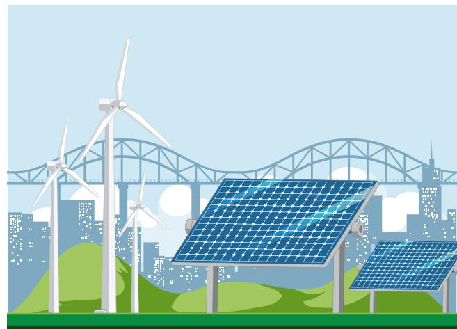

natural_image

Illustration of renewable energy with solar panels, wind turbines, and a bridge in the background (no text or symbols)

# 加强环境管理

东微半导严格遵守《中华人民共和国环境保护法》等法律法规，将环境管理作为企业可持续发展的重要基础。通过健全管理机制、压实主体责任，持续推动污染防治与资源节约等各项措施有效落地，不断提升绿色运营水平，以实际行动履行生态环境保护职责。

报告期内，公司未发生因违反环境保护法律法规而受到行政处罚的事件。

# > 环境管理体系

公司始终秉持“稳健发展，保护环境”的管理方针，将绿色发展理念贯穿于经营发展全过程。为保障环境管理工作高效有序开展，公司不断完善环境管理体系，明确各部门及相关人员的环保职责，确保日常环保管理有章可循、有据可依。同时，公司组织开展相关培训，通过法规解读、案例剖析、现场示范等多种形式，系统提升员工的环保意识，营造全员参与、共建绿色的良好氛围。

# 关键绩效

环保投入3.6万元

# > 环境管理措施

公司严格遵守国家及地方环保法规，认真落实环境管理责任。运营过程中产生的生活废水排入市政污水管网，日常办公产生的各类废弃物交由物业公司统一清运处置，切实履行企业环保责任，保障周边环境安全。

# > 绿色办公

公司积极倡导绿色低碳办公理念，持续推进无纸化办公与纸张减量化行动。通过推广电子文件流转、双面打印、废纸回收利用等措施，有效降低办公资源消耗。同时，在办公区域、会议室及公共通道等位置张贴环保宣传标语，将环保意识融入日常办公行为。

# 节约用能

- 为降低能耗、践行绿色办公，在无人使用设备时，及时关闭设备电源，杜绝设备电耗及待机能耗；  
- 办公区域全面采用节能LED灯，严格执行“人走灯灭”制度，以实现照明节能；  
- 夏季将空调温度设定为 $26^{\circ} \mathrm{C}$ ，开启空调期间务必关闭门窗，以此降低能耗。

# 节约用水

- 在办公区域的水龙头张贴节约用水的宣传标识;  
- 培养员工节约用水意识，养成随手关水龙头的好习惯。

# 节约用纸

- 倡导无纸化办公，通过信息系统进行各项审批及文件归档；  
- 为每位员工配备专属的员工卡，并将其与办公用纸使用系统进行关联；  
- 鼓励双面打印，减少纸张使用及墨盒废弃。

# 绿色出行

- 积极鼓励员工践行低碳出行理念，提倡员工使用公共交通工具、自行车、新能源汽车上下班通勤，节能减排；  
- 合理规划业务安排，积极采用线上沟通等方式，有效减少员工的差旅。

# 关键绩效

办公废弃物（纸张）0.3192吨

# > 助力低碳

东微半导以高度的社会责任感，积极投身生态文明建设浪潮，公司始终将产品环保性能视为核心指标，在全力保障产品质量过硬、使用安全可靠的前提下，持之以恒地探索产品可持续发展的创新模式，力求在经济效益与生态效益之间寻得完美平衡。东微半导自主研发的GreenMOS和TGBT等产品，凭借其先进的技术和卓越的性能，在光伏行业、新能源汽车等绿色经济的关键领域得以广泛应用。这些产品宛如强劲的“绿色助推器”，为各领域的高效运转注入源源不断的动力，有力推动着国家“双碳”目标稳步迈进，在助力绿色产业蓬勃发展的进程中留下了浓墨重彩的一笔。

# 资源高效利用

东微半导严格遵守《中华人民共和国节约能源法》及相关法规标准，持续推进能源与水资源的高效利用。在日常运营中，公司通过优化办公及研发场所的用能管理、推广节能设备应用、强化节水措施等方式，不断提升资源利用效率，以实际行动践行绿色发展理念。

<table><tr><td>指标</td><td>单位</td><td>2025年</td></tr><tr><td>外购电力总量</td><td>千瓦时</td><td>4,073,919</td></tr><tr><td>光伏发电用量</td><td>千瓦时</td><td>3,000</td></tr><tr><td>总用水量(市政购水)</td><td>吨</td><td>3,734</td></tr></table>

公司积极践行循环经济理念，通过托盘回收利用与恒温恒湿管控，实现资源高效利用与产品质量保障。供应商或封装厂返还的托盘统一回收管理，经检验合格后用于仓库内部货品存储及客户订单发货周转，形成物料循环利用，有效提升运营效率；同时，仓库配置空调、除湿机等设备，将环境严格控制在恒温恒湿状态，确保产品存储环境稳定，以精细化管控降低损耗，进一步巩固资源利用成效。

# 保护生物多样

东微半导严格遵循《关于进一步加强生物多样性保护的意见》《中华人民共和国土壤污染防治法》《苏州市金鸡湖保护管理办法》等一系列国家及地方的相关法律法规与政策要求，积极投身于自然生态与生物多样性的保护工作，全力构建人与自然和谐共生的生态文明。报告期内，经全面排查，公司所有运营点均不涉及自然保护区及生物多样性敏感区域，各项运营活动、产品及服务未对生物多样性产生重大负面影响。

# 03

# 创新功率器件驱动产业发展

本章所涉及的ESG重要议题

创新驱动

产品和服务安全与质量

供应链安全

数据安全与客户隐私保护

平等对待中小企业

科技伦理

响应的SDGs

text_image

2025年度环境、社会和公司治理（ESG）报告

# 创新驱动发展

东微半导坚持自主研发，并与上下游产业协同发展、合作共研。公司根据各产品类型的市场需求与技术方向制定技术路线图，结合晶圆代工和封装厂商的实际制造能力、现有工艺和封测加工能力进行产品开发设计。在研发过程中，公司关注并协助开发适配于晶圆厂与封装厂的工艺流程。深化与行业上游的晶圆制造厂商、封装测试厂商等供应商的业务和技术合作关系，保障产能的有效供给，持续进行前沿技术的合作。

flowchart

# 治理

公司制定《产品开发管理程序》《新品开发管理规范》，规范公司的产品开发设计流程，明确产品开发设计过程中各部门/人员的职责，以保障开发任务高质量、高效率完成。产品研发部作为核心推动部门，负责牵头新技术与新平台的研究规划并提出项目立项，全程组织、协调与实施开发工作，同时对产品与技术相关的输入、输出、验证、评审、变更及确认等关键环节进行管控，确保产品开发全程受控、协同有序。

# 研发平台

公司作为国家高新技术企业、国家级专精特新“小巨人”企业及苏州市企业技术中心等，实验室配备近80台国内外先进设备及20人专业团队，可开展功率循环、高温反偏、高温高湿反偏、温度循环、加速老化寿命、SAT扫描、双脉冲测试、热阻测试浪涌测试、曲线扫描仪等全项目测试，为芯片设计与工艺优化提供关键数据支撑，从源头保障产品可靠性。

报告期内，公司实验室已通过CNAS认可认证，注册号：CNAS L22715，致力于成为国内行业一流的权威测试与试验平台。

# 关键绩效

专精特新企业1个

国家高新技术企业1个

# 研发团队

公司高度重视研发团队建设，积极汇聚不同专业背景与经验层次的优秀人才，致力于打造一支多元化、高素质的创新人才队伍。为持续激发团队活力，公司建立了完善的激励机制，涵盖股权激励等。报告期内，公司通过发放专利奖励的形式充分激发研发人员的积极性与创造性。

同时，公司通过定期开展研发培训与交流，持续赋能员工，促进研发能力的整体提升。

# 《器件的应用拓扑电路》专题培训

2025年5月28日，公司面向产品研发部门及相关岗位伙伴开展《器件的应用拓扑电路》专题培训。课程系统讲解了基础拓扑电路、非隔离拓扑电路、隔离拓扑电路以及基于应用领域的典型拓扑电路等核心内容，通过理论授课与案例剖析，帮助学员构建完整的知识体系。结课时收集学员反馈显示，大家普遍表示“更加熟悉了解了各种应用拓扑和使用场景”，“理解了拓扑”，电路知识得到实质性提升。此次培训有效增强了研发团队在功率器件应用层面的技术深度，为新产品开发、方案优化及技术创新等工作提供了有力支撑。

# 案例

natural_image

Group of people seated in a conference room, some holding microphones, with framed artworks on the wall behind them (no visible text or symbols)

<table><tr><td>指标</td><td>单位</td><td>2025年</td></tr><tr><td>研发团队总人数</td><td>人</td><td>78</td></tr><tr><td>研发人员占员工人数比例</td><td>%</td><td>37.68</td></tr></table>

  
■ 本科以下 18人  
■ 本科 33人  
硕士 23人  
■ 博士 4人

  
30岁以下(不含30岁) 30人  
30-40岁(含30岁，不含40岁) 36人  
40-50岁(含40岁，不含50岁) 12人

研发团队构成  
> 战略

<table><tr><td>风险类型</td><td>风险描述</td><td>影响的时间范围</td><td>影响的价值链环节</td><td>潜在财务影响</td><td>应对措施</td></tr><tr><td rowspan="2">技术风险</td><td>功率器件(IGBT/MOSFET)在研发过程中,因器件结构设计存在缺陷或工艺窗口过窄,可能导致流片失败、良率不达标。</td><td>中期</td><td>运营、下游</td><td>运营成本增加</td><td>强化TCAD器件/工艺仿真能力;实施多轮Design Review与流片前Checklist;联合Foundry开展DOE工艺窗口验证;建立FA(失效分析)闭环机制。</td></tr><tr><td>随着宽禁带半导体(SiC/GaN)技术加速对硅基器件的替代,现有产品线面临技术迭代带来的市场竞争压力,若未及时布局,可能导致竞争力下降。</td><td>中、长期</td><td>运营、下游</td><td>营业收入减少</td><td>成立宽禁带半导体研发部;持续优化超级结MOSFET、IGBT等硅基器件性能。</td></tr><tr><td>市场风险</td><td>研发的车规级MOSFET/IGBT若与新能源汽车、光伏逆变器等下游应用需求错配,认证周期较长,可能导致产品导入缓慢、市场拓展受阻。</td><td>中、长期</td><td>运营</td><td>营业收入减少</td><td>深入应用场景联合定义规格;开展测试并获取实测数据;强化FAE团队支持,确保通过AEC-Q101、HTRB等可靠性认证;建立客户反馈快速迭代机制。</td></tr></table>

<table><tr><td>机遇类型</td><td>机遇描述</td><td>影响的时间范围</td><td>影响的价值链环节</td><td>潜在财务影响</td><td>应对措施</td></tr><tr><td>市场机遇</td><td>随着新能源汽车OBC/DC-DC、光伏储能、数据中心电源等领域需求持续攀升,高可靠性功率器件迎来供不应求的窗口期,为具备技术储备的企业带来结构性增长机遇。</td><td>中、长期</td><td>运营、下游</td><td>营业收入增加</td><td>聚焦车规级(AEC-Q101)、工业级产品线;联合头部客户开发参考设计。</td></tr><tr><td>合作机遇</td><td>公司积极协同产业链上下游,与晶圆厂、封装厂及下游龙头企业共建生态,推动设计、制造与应用端的深度耦合,提升产品定义精准度与市场导入效率。</td><td>中、长期</td><td>上游、运营、下游</td><td>营业收入增加</td><td>与Foundry共建高压特色工艺平台;联合封装厂开发新型封装降热阻;与客户签订协议定制开发,绑定需求。</td></tr></table>

# > 影响、风险和机遇管理

为保障研发工作的前瞻性与稳定性，公司建立健全覆盖研发全周期的风险与机遇管理体系，将DFMEA（设计失效模式与影响分析）作为创新与研发风险管理的核心工具，通过对潜在风险与创新机遇的识别、评估与管控，有效规避研发不确定性，同时主动把握技术演进与市场变化中的机遇。

<table><tr><td colspan="2">研发风险流程</td></tr><tr><td>风险识别</td><td>系统识别产品或技术方案中潜在的失效模式、原因及其影响。</td></tr><tr><td>风险评估</td><td>从严重度(S)、发生频度(O)、探测度(D)三个维度进行评估,对风险进行量化排序,优先聚焦高严重度或高风险项。</td></tr><tr><td>风险应对</td><td>针对高优先级风险制定预防与探测措施,在设计验证中加以落实,降低失效发生概率或提升早期发现能力。</td></tr><tr><td>动态更新</td><td>根据设计变更、测试反馈或市场信息持续迭代DFMEA,实现风险闭环管理与持续优化。</td></tr></table>

# > 指标与目标

公司高度重视科技创新在战略发展中的核心驱动作用，已建立系统化、可量化的科技创新目标体系。未来，公司将进一步优化创新激励机制，加强高价值专利培育，推动科技成果转化效率与效益双提升，支撑企业高质量可持续发展。

<table><tr><td>指标</td><td>单位</td><td>2025年</td></tr><tr><td>研发投入</td><td>万元</td><td>9,231.76</td></tr><tr><td>研发投入占营业务收入比例</td><td>%</td><td>7.37</td></tr></table>

# > 创新成果展示

公司持续进行新技术开发工作，遵循技术路线图推进各项技术迭代和产品升级。超级结MOSFET、中低压屏蔽栅MOSFET、TGBT产品完成了从8英寸代工厂到12英寸代工厂扩展，主要产品在12英寸晶圆制造基地从技术和产能上均得到了显著的扩容；在功率模块和GaNHEMT领域实现突破，其中，功率模块已经在算力电源和车载电源领域实现持续稳定交付，GaN产品系列得到扩充，积极推进客户验证。

报告期内，公司与晶湛半导体达成战略合作，共同推进12英寸氮化镓技术与产品的研发与应用。

未来，公司将继续以创新驱动发展，不断提升技术研发能力，深耕功率半导体领域，为功率器件国产化贡献力量。

# “最佳创新奖”共筑绿色能源新生态

公司在德业股份全球供应商大会上荣获2025年度“最佳创新奖”，标志着双方在新能源功率器件领域的战略合作迈入新阶段。

作为国内功率半导体领军企业，公司产品凭借低导通电阻、高开关效率、高可靠性的技术优势，成为德业逆变器与储能系统的核心功率器件供应商，助力德业提升能源转换效率、降低系统成本，双方通过联合研发进一步优化储能系统功率密度与散热性能，共同推动工商储解决方案高效落地。

未来，东微半导将持续深化与德业股份的战略合作，以核心功率器件推动新能源产业的技术升级与全球化布局。

# 案例

text_image

Deye 德業
2025年度
最佳创新奖
宁波德业科技股份有限公司

# 高压MOSFET摘“中国芯”大奖

# 案例

2025年，公司凭借其高压超级结MOSFET/OSG65R038HZF，在2025年“中国芯”集成电路产业促进大会上，荣膺“优秀市场表现产品”大奖。公司已三次获得“中国芯”系列荣誉，彰显持续领跑地位。

该获奖产品采用先进工艺，实现650V高击穿电压与0.038Ω超低导通电阻，持续导通电流可达80A，填补国产高性能超级结器件在高压大电流领域的空白，已成功打破国外垄断，广泛应用于服务器电源、充电桩等关键领域，实现核心部件的自主替代与规模化应用。未来，公司将继续突破技术壁垒，为全球客户提供高效可靠的功率解决方案。

text_image

中国芯
CHINACHIP
第二十届“中国芯”颁奖仪式
优秀市场表现产品
苏州卓胜半导体
全球领先企业
优秀市场表现产品

# 行业交流

公司积极投身于各类产业交流活动，通过参与行业论坛、技术研讨会，与学界、业界同仁保持开放对话，分享前沿洞察与实践经验，共同研判技术趋势，促进产业链上下游的协同创新与知识共享。

# 2025上海PCIM展会

# 案例

2025年9月24-26日，亚洲电力电子盛会PCIM Asia Shanghai在上海新国际博览中心召开。公司携SJ MOS、SGT MOS、TGBT、SiC MOS四大核心器件系列及全系列功率模块亮相。

展会期间，团队围绕宽禁带器件、先进封装、车规级解决方案等行业热点，与全球客户及专家深入交流，通过现场演示呈现产品在高效能、高可靠性、低损耗方面的核心优势，精准匹配新能源汽车、工业驱动、光伏储能等应用需求，为后续市场拓展积累宝贵资源。

text_image

东微半导体
ORIENTAL SERI
MOSFET和SIC分等领域的研发 电弧转换
ELECTRO
VOYARD 电弧转换
东微半导体

# > 知识产权保护

公司严格遵守《中华人民共和国专利法》《中华人民共和国专利法实施细则》等相关法律法规，制定《知识产权管理办法》，规范知识产权申请流程，由知识产权经理负责专利、商标、软件著作权等各类知识产权的登记、管理工作。同时，通过建立知识产权奖惩机制，有效激发员工发明创造积极性，推动技术创新成果向知识产权高效转化。

此外，公司制定多项针对性措施，在充分保护自有知识产权的同时，严格规避侵犯他人权益。通过不定期开展知识产权专题培训，持续提升员工的知识产权保护意识。

# 知识产权保护措施

严禁任何人利用职务之便或不正当手段，擅自披露、使用或转让公司知识产权，亦不得为同行竞争者提供任何便利。  
积极完成各类知识产权的登记、备案与申请，防范被他人抢注。  
员工入职须签订保密协议，并严格履行；离职前须交还所有技术资料、成果等载体，并持续承担保密义务。  
所有涉及知识产权的对外合作、技术交易或实施许可，均须签订权责清晰的书面合同，明确知识产权归属与保护条款。

<table><tr><td>指标</td><td>单位</td><td>2025年</td></tr><tr><td>授权专利累计数</td><td>项</td><td>179</td></tr><tr><td>其中:授权发明专利累计数</td><td>项</td><td>70</td></tr><tr><td>授权实用新型专利累计数</td><td>项</td><td>3</td></tr><tr><td>其它</td><td>项</td><td>106</td></tr></table>

# > 科技伦理

公司高度重视科技伦理，严格遵守科研伦理准则，坚守科研诚信底线，确保实验数据真实，抵制学术不端。针对功率半导体应用，充分评估数据安全风险，从源头防范技术滥用。同时，公司通过持续贯宣，不断强化员工伦理意识，将科技伦理要求落实到研发全流程。

# 产品安全质量

东微半导严格遵循《中华人民共和国产品质量法》《化学品注册、评估、授权和限制法规》（REACH）《电子电器设备中限制使用某些有害成分指令》（EURoHS）等法律法规及行业标准，通过贯穿研发、生产至交付的全周期质量管控体系，持续优化的服务保障机制，确保产品的稳定与安全，为客户提供可靠的产品体验与服务支持。

报告期内，公司未发生任何重大的质量责任事故。

# > 治理

公司秉承“全员参与、不断创新、持续改进、共赢共存”的质量方针，制定《质量手册》，建立以“过程方法”“顾客导向”和“关注相关方利益”为基础的质量管理体系，领导层充分发挥引领作用，积极履行承诺，推动质量管理体系有效运行与持续改进。同时，质量部全面负责体系管理、供应商与客户质量对接及持续改进，并横向赋能各业务部门，协助制定操作规范、督导工作流程、整合过程文档，贯穿产品开发、生产、运营到销售的全过程，持续提升产品与服务整体质量。

此外，公司定期开展内外部审核，持续监督和改进管理体系。目前，公司已成功获得ISO 9001质量管理体系认证，并在报告期内顺利完成体系审核，切实验证质量管理的有效性与一致性，确保管理体系持续符合国际标准并在实际运营中扎实落地。

  
质量管理体系认证证书

为持续提升全员质量意识和专业能力，公司定期开展质量培训，课程内容全面覆盖质量体系与流程、产品与工艺知识、实操工具与系统应用等内容，将质量理念与实践技能深度结合，确保每位员工理解质量方针，并将其转化为日常工作的行动。

# MSA培训

# 案例

2025年11月12日，公司组织开展MSA（测量系统分析）专题培训，通过面授形式讲解测量系统的核心原理与分析方法。本次培训帮助员工掌握评估与改进测量工具稳定性和一致性的关键技能，提升数据收集与判断的可靠性，进一步强化公司质量管理的精细化水平。

text_image

Meeting scene with participants seated around a table, one person writing on paper, and a presentation screen displaying abstract graphics.

# 关键绩效

质量培训人次248人次

质量培训总时长562小时

质量培训次数21次

# > 战略

<table><tr><td>风险类型</td><td>风险描述</td><td>影响的时间范围</td><td>影响的价值链环节</td><td>潜在财务影响</td><td>应对措施</td></tr><tr><td>产品可靠性风险</td><td>工业及汽车领域客户对产品可靠性要求极高,验证周期长。若新产品无法通过客户认证或出现质量问题,将影响品牌声誉。</td><td>短、中期</td><td>下游</td><td>营业收入减少</td><td>不断完善产品质量管理体系,建立质量全生命周期管理,加强风险防控;制定产品召回体系,规范产品召回流程。</td></tr><tr><td>市场风险</td><td>随着出货量提升和客户群体扩大,若客诉响应不及时或问题解决能力不足,可能影响客户关系和市场口碑。</td><td>短、中期</td><td>下游</td><td>营业收入减少</td><td>建立客户分级响应机制,完善客诉响应流程;定期开展客户服务培训,加强应用技术支持团队建设。</td></tr></table>

<table><tr><td>机遇类型</td><td>机遇描述</td><td>影响的时间范围</td><td>影响的价值链环节</td><td>潜在财务影响</td><td>应对措施</td></tr><tr><td>技术机遇</td><td>公司产品具备极高的可靠性广泛应用于新能源汽车等领域。同时,公司实验室通过CNAS认证,测试能力达到国际互认水平,增强客户对产品质量的信任度,提升市场竞争力。</td><td>短、中期</td><td>运营、下游</td><td>营业收入增加</td><td>持续完善质量管理体系,确保产品符合行业标准和客户要求;加强供应商质量管控,保障原材料稳定性。</td></tr></table>

# > 影响、风险和机遇管理

为管控运营中的质量风险，公司制定并实施《组织环境及风险管理程序》，识别各业务环节中潜在的风险与机遇。报告期内，公司组织开展质量事故预防排查工作，相关过程与结果均已完成记录归档，持续、有效提升公司的整体风险管控能力。

<table><tr><td colspan="2">风险和机遇管理流程</td></tr><tr><td>风险识别</td><td>全面识别各项活动中可能影响质量目标达成的潜在风险与改进机遇。</td></tr><tr><td>风险分析</td><td>对已识别的项目,从严重程度、发生概率、RPN、处置难度等维度进行分析,并确定高、中、低风险级别。</td></tr><tr><td>风险管控</td><td>依据风险评估结果,制定针对性措施(如制定预案、更新文件),明确责任部门,并对措施的有效性进行跟踪评审。</td></tr></table>

# 指标与目标

公司依据行业特性、自身运营实际及相关法规要求，制定了全面涵盖产品与服务核心要求的质量目标，并将其分解至各相关部门，形成层次化的部门绩效目标。各部门依据《质量目标分解和考核规定》，定期统计并上报目标达成数据。最高管理层对未达标项的改进措施进行跟踪验证，确保目标在组织内层层落实，持续推动质量绩效的提升。

<table><tr><td>目标</td><td>指标</td><td>完成情况</td><td>达成情况</td></tr><tr><td>售后不良率</td><td>&lt;40PPM</td><td>3PPM</td><td>已达成</td></tr><tr><td>客户满意度</td><td>≥92分</td><td>98.63分</td><td>已达成</td></tr><tr><td>客户抱怨重大质量问题次数</td><td>≤1次/半年</td><td>0</td><td>已达成</td></tr></table>

<table><tr><td>指标</td><td>单位</td><td>2025年</td></tr><tr><td>年度质量内审次数</td><td>次</td><td>2</td></tr><tr><td>聘请第三方机构抽检次数</td><td>次</td><td>3</td></tr></table>

# 质量与安全管控措施

公司构建贯穿策划、设计、生产至交付的质量管控机制，强化各环节协同效能与风险防控，保障产品品质持续稳定、服务交付高效可靠，持续提升客户满意度与企业核心竞争力。

<table><tr><td colspan="2">产品质量过程管控</td></tr><tr><td>产品质量策划</td><td>按汽车行业标准分阶段(P1-P5)管理,输出DFMEA/PFMEA、控制计划、SPC/MSA分析等,确保设计可靠性与过程稳定性。</td></tr><tr><td>产品开发管理</td><td>规范产品开发流程,涵盖需求申请、开发、变更控制、节点评审等环节,并明确市场、研发、质量等各部门职责;针对客户定制产品,通过《定制产品SYL&amp;SBL标准》、ORT计划、MRB流程等实现特殊管控,确保定制需求的交付质量。</td></tr><tr><td>产品存储管理</td><td>按照《成品放置作业指导书》执行,产品入库后按区域分类放置并明确标识,包装箱须置于货架或栈板上;仓库环境保持清洁,并实施温湿度监控,每日点检记录,异常时及时调控。</td></tr><tr><td>产品打包管理</td><td>打包前确认产品已完成检验并签字,包装需确保运输安全,尾箱/尾盒应使用空盒、瓦楞纸或气泡棉填充;外包装方式(按箱或按盒)须参照相应标准执行,并优先遵循客户对打托、缠绕膜等特殊包装要求。</td></tr><tr><td>物流管理</td><td>常规发货依据交货单备货打包,粘贴物流面单与出货清单,并根据发货紧急程度、重量、目的地评估选择物流公司,通过合作协议保障运输过程中产品质量。</td></tr></table>

# 产品环保与安全合规管理

公司已构建并持续完善产品环保与安全合规管理体系，制定《禁限用物质管理程序》，持续跟踪法规更新、出具第三方检测报告等机制，确保从研发至交付各环节的合规可控。公司产品严格遵循欧盟REACH、RoHS指令及无卤等要求，并全面符合美国TSCA与欧盟POPs等国际法规的管控标准。

截至报告期末，公司已对外发布了《禁限用物质保证书》《美国TSCA有害物质符合声明》《POPs法规符合声明》，进一步保障产品在全球市场的合规性与可靠性。

# 产品召回

公司制定《退货管理程序》，响应客户反馈与市场风险，并建立健全产品召回机制，确保对售后环节的问题实施标准化、可追溯的闭环管理，全方位保障客户权益，巩固公司质量信誉与市场竞争力。

报告期内，公司因健康或安全原因须召回的产品数量为零。

# 客户服务管理

公司始终秉持以客户为中心的服务理念，以满足客户需求为宗旨，制定《VIP客户管理程序》《客户满意度管理规范》等制度，持续完善客户服务体系。报告期内，公司围绕质量、技术、交货、成本与服务维度深入开展客户满意度调查，并针对发现的问题推动专项改进，致力于将客户声音转化为服务提升的实际行动，不断提高客户满意度。

此外，公司高度重视服务团队建设，通过举办专项培训，不断优化服务标准与流程，确保为客户提供更专业、高效、贴心的服务体验。

# 客户投诉管理

为提升客户服务质量，公司制定《客户反馈与投诉处理程序》，建立客诉处理流程与分级响应机制，并明确责任分工，确保问题得以及时受理与有效跟进，实现对客户诉求的全流程闭环管理。

flowchart

flowchart

客诉处理流程

# 关键绩效

客户投诉解决率100%

客户满意度/满意度总分98.63分

# 负责任供应链

东微半导致力于建设可持续的供应链体系，构建覆盖供应商全生命周期管理机制，在确保产品质量与交付稳定的基础上，将环境责任与廉洁运营深度融入管理全流程，旨在与供应商建立透明、稳健、可持续的合作伙伴关系，共同促进产业链的长期价值提升。

报告期内，公司未发生供应链重大风险与影响事件。

# > 治理

为建立标准化的供应链管理体系，公司制定《供应商管理规范》，明确供应商准入、考核与退出等全流程规范。运营部作为执行主体，负责对供应商进行资质鉴定、信用等级评价和制定《合格供应商名单》，持续优化供应资源，保障物料质量与采购活动的规范可控。

此外，为持续提升采购团队的专业素养，公司面向采购人员开展专项培训，强化其业务执行能力，为供应链的稳定性与采购质量提供坚实保障。

natural_image

Illustration of two people interacting with laptops and tablets, surrounded by icons (no text or symbols)

# > 战略

<table><tr><td>风险类型</td><td>风险描述</td><td>影响的时间范围</td><td>影响的价值链环节</td><td>潜在财务影响</td><td>应对措施</td></tr><tr><td>上游依赖与成本风险</td><td>公司的晶圆供应商集中度高,若行业产能紧张,供应商产能无法满足公司需求,将影响产品出货量与未来收入增长。同时,晶圆成本占营业成本比重高,若晶圆价格持续提高,将对主营业务成本及毛利率造成不利影响。</td><td>短、中期</td><td>上游、运营</td><td>营业收入减少、营业成本增加</td><td>与行业上游的晶圆制造厂商、封装测试厂商等供应商建立了长期稳定的业务合作关系与高效的联动机制;布局多家供应商,分散单一依赖风险;加强供应商全生命周期管理,规范供应中断应急响应流程。</td></tr><tr><td>供应链管理风险</td><td>公司采用Fabless模式,晶圆制造和封装委外完成。若对供应链及生产环节管理不善,导致产品质量、交付及时性等出现问题,将影响公司产品销售和品牌声誉,尤其在工业及汽车等对供应商认证要求高的领域。</td><td>短、中期</td><td>运营、下游</td><td>营业收入减少、运营成本增加</td><td>优先选择行业内的头部供应商进行合作,建立常态化现场审核与质量监控制度;定期围绕质量、交付等维度开展供应商考核,推动供应商提升综合能力;引入供应商质量管理系统,保障全流程可追溯。</td></tr><tr><td>经销商管理风险</td><td>公司采用“经销+直销”模式,若对经销商管理不善,可能造成经销商不能很好地理解公司品牌和发展目标,影响公司声誉,并导致客户关系疏离,从而对公司业绩带来不利影响。</td><td>中、长期</td><td>下游</td><td>营业收入减少</td><td>建立健全经销商管理规范,提升渠道管理效率;定期举办经销商技术培训会和策略沟通会,确保经销商准确传递公司品牌定位和产品价值。</td></tr></table>

<table><tr><td>机遇类型</td><td>机遇描述</td><td>影响的时间范围</td><td>影响的价值链环节</td><td>潜在财务影响</td><td>应对措施</td></tr><tr><td>绿色采购机遇</td><td>通过实施环保供应商准入和绿色采购政策,提升企业环境责任形象,吸引更多注重可持续发展的客户,并增强现有客户的合作黏性。</td><td>中、长期</td><td>上游、下游</td><td>营业收入增加</td><td>将ISO 14001环境管理体系认证纳入新供应商准入条件;定期开展供应商交流培训,持续深化合作关系,共同促进行业健康发展。</td></tr></table>

# > 影响、风险和机遇管理

公司定期开展供应商风险识别与评估，并不断完善相关管理流程，着力构建更具韧性的供应链保障体系。

<table><tr><td colspan="2">风险管理流程</td></tr><tr><td>风险识别</td><td>每年初组织业务影响分析,识别关键产品与服务对供应商及外包方的依赖关系,确定可能影响业务连续性的潜在供应风险场景。</td></tr><tr><td>风险评估</td><td>对识别出的风险进行多维评估,包括财务损失、业务连续性等维度,通过影响度与可能性分析,确定各风险等级(高/中/低)。</td></tr><tr><td>风险管控</td><td>策略选择充分考虑风险优先级、风险容忍度、是否引发新的风险等,制定并实施差异化的日常保障措施、应急预案等措施。</td></tr><tr><td>持续改进</td><td>通过定期的内部审核、管理评审及事件分析等活动持续改进业务连续性管理体系的适用性、充分性与有效性。</td></tr></table>

# 保障供应链稳定运行

公司制定《业务连续性管理规范》《供应中断及业务连续性计划管理规范》，明确各类中断场景下的应急响应流程。在供应中断发生时，运营部将协同供应商高层制定恢复计划，同步评估并启动第二供应商产能，动态调整采购结构，以最大程度减少对客户交付的影响。

# > 指标与目标

基于公司整体供应链发展战略，公司制定供应商管理目标，为各项管理活动提供明确的指引与评估标准，致力于构建长期稳定、风险可控的供应链，为公司产品质量与运营韧性提供持续支撑。

# 2025年供应链安全管理目标

规范供应商管理，确保公司能及时采购到所需要的材料、设备、服务等，并确保其质量；对供应商进行资质鉴定、信用等级评价和制定《合格供应商名单》。

<table><tr><td>指标</td><td>单位</td><td>2025年</td></tr><tr><td>供应商总数</td><td>个</td><td>51</td></tr><tr><td>采购总金额</td><td>亿元</td><td>12.68</td></tr><tr><td>向当地供应商采购的金额</td><td>万元</td><td>315</td></tr><tr><td>向当地供应商采购支出的比率</td><td>%</td><td>0.2</td></tr></table>

注：向当地供应商采购金额不包括非主营业务采购（办公用品等）。

# 全生命周期管理

公司通过准入评审、持续评估、绩效考核与退出机制，实现对供应商的闭环管理，推动供应商综合能力与公司运营需求的持续协同，确保供应链的稳定运行与长期可靠。

<table><tr><td colspan="2">供应商全生命周期管理</td></tr><tr><td>准入与认证</td><td>依据明确的合格供应商选择原则执行准入,优先考虑具备相关体系认证、质量稳定且符合环保要求的供应商,并建立《合格供应商名单》作为采购活动的基础依据。</td></tr><tr><td>评估与改进</td><td>通过定期审核与考核对供应商进行动态管理。对审核不通过的供应商,要求其限期整改并提交书面改善报告,由相关部门进行验证。</td></tr><tr><td>分级管理</td><td>建立基于QBR的供应商分级管理体系,从质量、交付管理、价格服务及工程技术四个维度对供应商进行综合评分,依据评分结果将供应商划分为S(90-100分)、A(80-89.9分)、B(70-79.9分)、C(69.9分以下)四个等级。</td></tr><tr><td>考核与退出</td><td>运营部每年对合格供应商进行考核,更新《合格供应商名单》,移除不合格供应商。</td></tr></table>

# 关键绩效

因不合规被中止合作的供应商数目0个

因不合规被否决的潜在供应数目0个

# 数字化管理

公司积极推进供应链数字化管理体系的建设与整合，通过将采购全流程接入系统，实现晶圆订单从需求提出、研发审核到财务付款的全链路线上闭环，并以标准化合同编号保障全流程可追溯。同时，公司部署QMS供应商质量管理系统，集成供应商档案、禁限用物质管控、来料检验、质量月报、异常管理、QBR、供应商Audit等功能，全面增强供应链的透明度、响应效率与风险防控能力。

# 供应商ESG管理

为推进绿色供应链建设，公司已向各级供应商提出明确的体系认证要求，确保产品与材料全面符合环保标准。针对高风险物料供应商，公司特别强调其须具备自主检测能力，以保障物料环境合规性。此外，公司与核心供应商签订《技术保密协议》《禁限用物质保证协议》，强化双方在环境保护与可持续发展方面的协同承诺。

# 关键绩效

拥有质量管理体系认证的供应商数目34个

拥有环境管理体系认证的供应商数目19个

拥有职业健康安全管理体系认证的供应商数目11个

# 阳光供应链

为规范采购行为，维护公平、诚信的商业环境，公司与供应商签订《廉洁合作协议》，明确要求双方严格履行合同约定，遵循公平、公正原则，并严格禁止任何不廉洁商业行为，包括但不限于收受回扣、礼金礼品等，共同构建健康、透明的合作关系。

# 冲突矿产

为履行企业社会责任并构建可持续供应链，公司制定《冲突矿产管理规范》，明确要求所有外包商承诺其供应的材料不来自冲突地区，并须提交涵盖上游冶炼厂信息的CMRT/EMRT报告。在日常管理中，公司每年收集并更新外包商数据，比对RMI数据库以识别风险，杜绝冲突矿产在供应链中的使用。

此外，公司已签署《无冲突金属宣告书》，明确声明产品及包装所使用的金（Au）、钽（Ta）、锡（Sn）、钨（W）等金属均不来源于刚果（金）及其周边冲突地区，且相关采矿、冶炼与加工工序均不在上述区域进行。

# > 供应链韧性建设

为持续提升供应链管理水平，公司积极参与相关行业交流活动，通过参与会议研讨，了解行业在供应商管理、合规要求等方面发展动向，汲取行业先进实践与管理思路，推动公司在供应商协同与风险防控方面的能力建设，巩固供应链的稳定与韧性。

text_image

Advanced Technology (Suzhou)
A Member of the Group
销售总监-3
厂长
业务拓展总监-
质量总监
销售经理
NPI

2025年7月2日与供应商进行访问交流

# >经销商管理

公司坚持“诚信为本，长期合作”的理念，对经销商实施严格的资质审查，符合条件后及时签订协议，确立合作关系。在日常管理中，通过线下拜访、产品项目跟踪等方式对经销商进行动态评估与调整，并引导其根据客户需求及时优化预测，提升市场响应效率。同时，公司结合定期与不定期考评，综合多维指标对经销商进行评价，对表现优秀的经销商给予更多资源支持，持续巩固合作共赢的伙伴关系。

# 平等对待中小企业

公司始终重视并平等对待各类中小企业，通过设立明确的合作标准与评估机制，确保其在合规与能力达标的前提下，享有公平的竞争环境与协作机会，并致力于为其提供持续的发展支持，共建稳健、共赢的合作关系。报告期内，公司不存在应付账款（含应付票据）余额超过300亿元或占总资产的比重超过50%的情况。

# 数据安全保护

东微半导严格遵守《中华人民共和国网络安全法》《中华人民共和国数据安全法》等法律法规，通过明确权责、技术落实防护、培训强化意识，持续推动安全管理机制的有效运行，保护公司信息安全与客户隐私。

报告期内，公司未发生数据安全及客户隐私泄露事件。

# 数据安全管理

公司高度重视信息安全工作，建立健全信息安全管理体系，并设立信息安全领导小组、信息安全工作小组及信息技术部等部门，负责日常安全管理的组织与实施。同时，要求各业务部门对所属信息安全目标开展定期自查与评估，若未达标须及时分析原因并落实改进。

# 数据安全风险管理

公司已构建起常态化防控与动态应急相结合的风险管理机制。面对突发信息安全事件，信息技术部门迅速开展专业排查与隔离处置，有效控制风险影响，并向全员发出安全警示，要求谨慎处理不明邮件与附件、安装非授权软件前必须确认，遇到系统异常须及时上报，强化日常操作中的风险防范意识。

为持续强化信息安全管理，报告期内，公司开展系统权限审核工作，要求各业务部门负责人对本部门员工的系统访问权限进行复核确认，识别并清理冗余权限，有效预防内部数据泄露风险。

natural_image

Isometric illustration of a computer with multiple monitors and data dashboards, no text or symbols present

# 数据安全实践

为保障公司数据安全，公司建立了多项信息安全保护措施，持续巩固核心信息资源的保密性、完整性与可用性。此外，公司定期开展全员信息安全培训，强化员工在日常工作中的安全防护意识与操作规范性。

同时，公司注重客户隐私保护，对访客登记过程中所填写的全部个人信息严格保密，绝不向任何第三方泄露。

# 数据安全保护措施

员工电脑默认只安装与办公有关的常用软件以及杀毒软件等系统软件，非经授权禁止擅自安装其他软件；  
所有人员须妥善保管个人账户密码，不得向他人泄露。离开座位时应立即锁定屏幕，长时间不使用需关闭计算机电源；  
严禁使用个人光盘、U盘、移动硬盘等存储设备或通过网络途径将公司内部文件资料带离公司环境；  
员工需定期清理电脑中的无用文件，并进行病毒扫描，确保设备运行环境安全；  
公司所有重要的电子文件资料应归类存储于公司的公共盘中，公共盘和计算机本地的数据按照相关策略定期进行备份，以防数据丢失；  
所有服务器须定期更新系统补丁，并开展漏洞扫描，及时消除潜在安全隐患。

# 信息安全培训

# 案例

2025年6月30日，公司组织开展信息安全管理培训，重点围绕信息安全管理规范展开讲解，提升员工的信息安全防护意识，并强化其在日常工作中落实锁屏、异常上报等基本操作，强化公司信息安全防护能力。

# 关键绩效

数据安全/客户隐私保护相关培训场次 1 次

数据安全/客户隐私保护相关培训总时长60小时

参与数据安全/客户隐私保护相关培训的人数40人

# 数字化建设

东微半导作为先进的功率器件企业，积极推进信息化建设，从数字化发展战略出发，持续完善信息化系统应用渗透到公司日常经营的各个方面。公司坚持“局部突破、全面覆盖”的推进路径，围绕客户关系、业务流程、研发体系及信息基础设施四大方向，深化数字化应用，推动信息技术与经营管理全方位融合，为企业高质量可持续发展构筑坚实的数字底座。

# >数字化战略布局

公司从发展战略高度统筹信息化建设，聚焦四大关键方向持续发力，推动数字化能力从点状应用向系统协同演进。

<table><tr><td colspan="2">数字化发展目标</td></tr><tr><td>客户关系</td><td>完善售后服务体系,强化客户隐私保护机制,构建精准客户画像,提升服务响应与体验。</td></tr><tr><td>业务流程</td><td>优化经销商管理,推动生产质量与采购流程透明化,实现全周期客户服务与业财高效协同。</td></tr><tr><td>研发流程</td><td>基于IPD实现产品研发流程管理,数字化实验室管理以及智能数据采集与分析,提升研发效率与产品迭代速度。</td></tr><tr><td>效率与信息基础设施</td><td>全面升级运营类管理平台,完善文档管理与数据备份体系,持续提升业务协作与数据安全管理水平。</td></tr></table>

# 信息化建设成果

公司围绕数字化战略布局稳步推进，在基础设施、系统开发与协同应用三个层面实现多点突破。全年信息化建设以提效、贯通、赋能为导向，推动技术工具向业务价值加速转化，为公司运营效率提升与管理精细化提供有力支撑。

  
基础设施与信息安全

推进智能化建设二期项目，持续升级智能监控、智能分析和智能预警能力，为业务决策提供更精准的数据支撑；

部署新型服务器杀毒软件和基于堡垒机的运维审计系统，构建多层次安全防护体系，提升整体安全水平；

升级持续集成与部署系统，实现更快速、更可靠的应用交付，通过自动化流水线，大幅提升开发和部署效率；

升级企业级云盘系统和EDS分布式存储，提供更安全、更高效的企业文件管理和协作能力。

  
核心系统管理生态

上线自主研发的新一代产品管理系统（APM），相比传统PLM系统，APM在功能性、扩展性、易用性方面实现了显著提升，广受用户好评；

上线LIMS系统，标志着实验室核心业务全面实现系统化、数字化管理，通过与ERP、云盘等系统的深度集成，构建了从样品检测到报告输出的完整数字化链路；

ERP完成300多项功能优化迭代，应对复杂交付需求，通过多维自动化提醒，提高响应效率。

  
综合运营协同效能

完成多个B2B对接，实现数据实时同步和准自动入库，验货流程导入高精度OCR技术，实现流转效率的提升；

升级文控系统，实现文档管理全流程数字化，压缩审批周期，提升文件检索效率；积极探索AI赋能，通过AI自动编程和智能体实现多个业务场景的效能提升。

flowchart

LIMS（实验室信息管理系统）

  
交付效率提升

natural_image

Isometric illustration of a laptop with Wi-Fi signal icons and surrounding tools including cloud, gear, phone, clock, and location pin (no text or symbols)

# 04

# 守护员工成长 贡献公益力量

本章所涉及的ESG重要议题

员工权益与发展

职业健康与安全

社会贡献

乡村振兴

响应的SDGs

text_image

2. 20年度环境、社会和公司治理（ESG）报告

# 员工权益保护

东微半导严格遵守《中华人民共和国劳动法》《中华人民共和国劳动合同法》等法律法规，制定并完善《员工手册》等管理办法，构建覆盖薪酬福利、休息休假、劳动安全保护等维度的员工权益保障体系。通过搭建员工沟通反馈渠道，关注职业发展与身心健康，持续优化用工管理机制，切实维护员工合法权益，营造和谐稳定的职场环境。

# 多元化、平等与包容

公司倡导多元化、平等与包容的理念，对不同种族、民族、国籍、肤色、性别、宗教信仰等群体一视同仁。并在员工招聘、薪酬、福利、晋升等环节提供均等机会，严格禁止雇佣童工，杜绝就业歧视与强迫劳动行为，依法保障员工结社自由及集体谈判权。

公司积极构建多元化人才队伍，包容多元文化背景与个性能力，为全员搭建均等成长平台，营造和谐包容职场氛围，激发员工创造力与归属感，实现企业与员工协同共赢。

报告期内，公司未发生任何形式的强迫劳动事件。

# 员工构成情况

  
女性 71人
男性 136人  
30岁以下（不含30岁）47人  
30-40岁（含30岁，不含40岁）105人  
40-50岁（含40岁，不含50岁）50人  
50岁及以上5人

  
■ 中国大陆 204人
□ 港澳台地区 1人
■ 国外 2人

  
■ 本科以下62人
■ 本科97人
■ 硕士42人
■ 博士6人

  
- 销售 42人
- 研发 78人
- 管理 87人

# 关键绩效

员工总数207人

少数民族员工数3人

退伍军人员工数4人

劳动合同签订率100%

# 女性权益保护

公司严格依据《女职工劳动保护特别规定》等法律法规，全面落实产假、育儿假、独生子女父母护理假等法定休假权益，并结合员工实际需求人性化制定专项假期管理规范，全方位保障女职工在生育、育儿、照护家庭成员等特殊情形下的工作与生活权益。同时，公司定期组织女性职工开展文娱交流活动，持续丰富职工业余文化生活，营造尊重、关怀、赋能女性员工的职场氛围。

# 三八妇女节活动

# 案例

2025年3月8日，公司向全体女员工致以诚挚的节日祝福与美好祝愿，感谢女员工在各岗位上的辛勤付出与卓越贡献，以暖心的节日问候传递企业人文关怀，彰显对女性员工的尊重与关爱。

# 关键绩效

享受产假员工数1人

产假返岗率100%

享受陪产假员工数4人

陪产假返岗率100%

# > 招聘管理

公司依据《员工手册》《新员工管理规范》等内部制度文件，秉持公平、公开、公正的用人核心原则，明确规范招聘管理全流程与录用标准，坚决杜绝基于国籍、性别、年龄、孕产状态及身体残障的就业歧视；严格禁止雇用未成年人，坚守用工合规底线；同时严格依法与员工签订劳动合同，全面、切实保障员工各项合法劳动权益。

flowchart

新进员工情况

donut

| 类别 | 细分项 | 人数 |
| --- | --- | --- |
| 按性别划分 | 男性 | 48人 |
| 按性别划分 | 女性 | 39人 |
| 按学历划分 | 大专及以下 | 39人 |
| 按学历划分 | 本科 | 34人 |
| 按学历划分 | 硕士及以上 | 14人 |
| 按年龄划分 | 30岁及以下 | 25人 |
| 按年龄划分 | 31岁-40岁 | 47人 |
| 按年龄划分 | 41岁-50岁 | 15人 |

# 关键绩效

新进员工数87人

注：以上数据指报告期内办理入职的所有人员，含期内已离职员工数。

# 招聘渠道

公司紧扣长期发展战略，系统构建人才梯队建设体系，采用校园招聘与社会招聘双渠道，整合网络招聘、猎头寻访、内部推荐等多元引才途径，持续储备适配企业各发展阶段的优质人才资源，为公司长远稳健发展筑牢坚实人才根基。

# >薪酬福利管理

公司严格遵循相关法律法规，结合所在地区薪酬水平、员工工作能力等多维度因素，科学制定薪酬福利制度。明确员工薪酬由基本薪资与浮动薪资两部分构成，其中浮动薪资包含绩效工资、中长期股票激励等激励性报酬。

# 绩效与考核

公司依据上年度企业经营业绩，以及员工年度的综合绩效考评给予薪酬调薪和职务晋级。

公司搭建畅通的内部沟通渠道，明确员工职业发展异议、工作环境诉求等问题的反馈与解决机制。员工可先与直属领导沟通反馈，问题未协调解决的，可直接向上级领导或人力资源部反映，由人力资源部联合决策领导层介入调解。

# 福利体系

公司始终重视员工权益与福祉保障，持续健全并完善全方位、多元化的员工福利保障体系，精准贴合员工工作与生活的实际需求，切实为员工排忧解难，让员工充分感受企业关怀。

在法定福利基础上，公司额外配置雇主责任险与补充医疗保险，进一步强化员工风险保障与健康支持，构建更加完善的福利保障网络。

<table><tr><td colspan="2">员工福利体系</td></tr><tr><td>法定福利</td><td>五险一金、法定节假日、带薪年假等</td></tr><tr><td>风险保障</td><td>雇主责任险</td></tr><tr><td>健康福利</td><td>补充医疗保险、定期职业健康体检等</td></tr><tr><td>生活福利</td><td>生日礼金、节假日礼金等</td></tr><tr><td>其他福利</td><td>团建活动、年度聚会、体育竞赛活动等</td></tr></table>

# 关键绩效

雇主险投入金额49,209.05元

参保人数 207 人

补充医疗保险投入金额97,429.98元

社会保险覆盖率100%

# 工时与休假

公司制定《员工假期管理规范》《员工加班管理规范》等专项管理办法，严格执行标准工时制度。对经合规审批的加班行为，均按规定足额支付加班费，或统筹安排调休，以制度化管理保障员工休息休假的合法权益，规范企业用工管理。

# 股权激励与员工持股

公司于2025年实施首期限制性股票激励计划，通过股权激励机制构建核心骨干与公司利益共享、风险共担的长效机制，有效激发员工积极性与归属感，为可持续发展夯实人才基础。

# > 员工关怀与沟通

公司持续完善员工权益保障体系，在春节、妇女节、劳动节等重要节日策划开展各类特色活动，丰富员工业余生活；同时为员工开展生日会等多元化人文关爱，不断强化员工的企业融入感与归属感，推动企业与员工共生共荣、共同成长。

# 员工生日会

# 案例

2025年，公司持续践行人文关怀理念，常态化为公司寿星定期举办生日会，以温馨的集体活动传递企业关怀，丰富员工日常工作生活，进一步营造融洽的团队氛围，提升员工的幸福感与企业归属感。

# 员工满意度

公司定期开展员工满意度专项调查，调研维度全面覆盖工作环境、安全管理、员工福利、培训资源、工作生活平衡、内部沟通机制、管理层领导力、工作认可度及公司文化价值观等核心方面，精准捕捉员工诉求与发展建议，为公司优化管理举措、提升员工体验提供科学依据。

# 关键绩效

员工满意度91%

参与满意度调查的员工数量158人

满意度调查问卷回收率91.86%

# >离职管理

公司坚守合规经营底线，严格遵循国家劳动用工相关法律法规及政策要求，以公司《员工手册》为依据，对员工离职全环节实施规范化管理，覆盖离职申请审批、工作交接、薪酬社保清算等关键流程，确保离职管理工作合法合规、有序高效，保障员工合法权益，助力构建和谐稳定的劳动关系。

报告期内，公司未发生劳动纠纷案件。

# 助力员工发展

东微半导始终坚持以人为本，高度重视员工成长与发展，健全人才培养机制，通过开展多元化培训活动，助力员工提升专业素养与综合能力，同时为员工提供清晰的晋升路径与发展空间，充分激发员工工作积极性与主动性，实现员工与公司协同发展、共同进步。

# >员工培训

为规范培训活动的组织、实施、监督和评估，公司制定《培训管理规范》，构建完善的分层次培训体系，确保培训活动的系统性、针对性和实效性，提升员工的技能和综合素质，为公司的持续发展提供有力的人才保障。

# 东微培训体系构建图

# 管理与领导力

# 管理者成长三大引擎

# 岗前培训

# 在职培训

# 日常培养

# 转/轮岗 学习辅导

# 晋升 学习辅导

# 专业技能培训

# 公司级

# 部门级

# 通用技能培训

# 新人培养

# 入职指引

# 新人培训

# 导师带教

# 180天培养计划

# 在线学习资源：知识库

公司搭建在线学习知识库，整合各类专业技能、职业素养、企业文化等学习资源，实现学习资源线上化、常态化供给，方便员工利用碎片化时间自主学习、查漏补缺，持续提升专业能力与综合素养。

同时，公司积极构建内部讲师队伍，选拔业务专家、绩优员工等担任内部讲师，充分发挥内部人才优势，通过经验分享、实操教学、专题授课等形式，夯实人才培养基础。报告期内，公司共有内部讲师41人。

报告期内，公司围绕员工成长需求，系统开展各类培训活动，涵盖新员工入职培训、专业技能提升培训、通用能力赋能培训、合规管理与安全生产培训等，精准匹配不同岗位、不同层级员工的学习需求，切实提升员工岗位适配度与综合履职能力。

# 《演讲汇报》培训

2025年1月3日，公司聚焦业务端员工岗位履职需求，针对性开展《演讲汇报》专项培训活动。培训围绕业务汇报逻辑搭建、表达技巧提升、临场应变能力等核心内容，结合业务场景实例进行实操教学与案例解析，助力员工更好地传递业务成果、展现工作价值，高效对接内外部沟通需求，进一步强化业务团队专业素养，为公司业务高质量推进提供有力支撑。

# 案例

natural_image

Interior of a classroom or training room with attendees seated facing a presentation screen (no visible text or symbols)

# 关键绩效

员工培训投入 1.31 万元

员工培训场次77次

培训总时长2,582小时

接受培训总人次 1,329 人次

每名员工每年接受培训的平均时长12.47小时

# 员工晋升

公司持续完善员工晋升管理体系，制定《员工晋升管理规范》，遵循“激励联动、通道多元、成果可衡量、依据可追溯”的晋升原则，为全体员工搭建清晰、通畅、多元的职业发展通道，明确设立管理、研发、技术、职能、营销五大职业发展序列，覆盖各岗位员工成长需求，保障优秀人才能够获得合理晋升与发展空间，实现员工职业成长与公司战略发展同频共振。

# 职业健康安全

东微半导严格遵循《中华人民共和国安全生产法》《中华人民共和国职业病防治法》等法律法规，贯彻落实“安全第一、预防为主、综合治理”的安全方针。定期开展安全培训与职业健康检查，配备防护设备，及时排查隐患，为员工打造安全无忧、健康舒适的工作环境。

报告期内，公司未发生任何重大安全生产事故。

# 安全生产管理体系

公司以“责任重于泰山”为核心理念，制定《安全管理程序》《实验室管理程序》等一系列制度文件，构建完善的组织架构，并常态化开展安全教育培训等活动，持续强化全员安全意识与实操能力，为安全生产与职业健康管理提供系统化、规范化的制度保障与能力支撑。

# 报告期内

因工死亡人数0人

总工伤人数1人

因工伤损失工作天数46日

安全投入 19.06 万元

# 安全生产风险管理

为提升风险防控与应急处置能力，公司制定《安全检查及隐患治理管理规范》《安全事故应急管理规范》等一系列规章制度，覆盖从日常隐患排查、整改落实到突发事件响应、事后改进的全流程管理。此外，公司下设安全管理部门，并配备专职安全管理人员具体执行，确保各项安全措施有效落地，筑牢安全生产防线。

# 应急管理

公司制定《火灾、爆炸事故专项应急预案》，细化响应流程与处置措施，并配套建立专项应急组织，明确指挥体系与职责分工。通过常态化演练及持续改进，确保突发情况下快速响应、有效处置，全面夯实应急管理基础。

报告期内，公司开展安全应急演练2次。

flowchart

应急组织机构

# 应急演练&安全与职业健康培训

# 案例

2025年11月19日，公司模拟仓库因线路短路引发火情。巡逻人员发现后立即上报，消控室迅速启动火灾应急预案，发布应急广播，组织全员疏散。疏散警戒组全程引导，3分钟内所有人员安全撤离至65栋东微大厅门口，并完成人数清点。

集合后，物业安全主管开展心肺复苏实操教学、消防器材讲解及灭火器使用演示，将应急响应与技能培训深度融合，切实增强员工自救互救能力，筑牢安全与职业健康防线。

# 隐患排查

公司常态化开展安全隐患与5S排查整治工作，通过日常巡查、专项检查与立行立改相结合，持续消除现场风险，规范作业环境，为安全生产提供有力保障。

报告期内，公司安全隐患和5S排查数量250项，安全隐患整改率100%。

# 隐患排查

# 案例

2025年12月23日，公司在例行隐患排查中发现多处楼层存在消防通道堵塞、末端试水装置被杂物遮挡等问题。发现后及时整改，有效消除火灾风险，持续筑牢隐患源头治理防线。

# 关键绩效

安全生产培训场次15场

安全生产培训参与人次88人次

安全生产培训总时长62小时

# 安全生产管理措施

公司持续强化安全生产管理措施，围绕相关方安全管理与事故安全管理两大方面，持续完善制度体系，压实各方责任，全面提升安全管理规范化水平。

# 事故管理

公司严格规范事故管理，针对各类事故进行识别并采取应对程序予以规范，明确事故发生后的处理原则，总结经验教训，采取防范措施。

# 相关方安全管理

公司持续强化相关方安全管控，严格实施承包商、供应商及临时作业人员准入管理。作业前签订《安全协议书》，明确双方安全责任与义务；进场前开展《对承包商进场安全交底记录》交底，全面告知作业风险、操作规范及应急要求；所有入场人员均须签署《入场安全承诺书》，落实安全自律承诺。通过制度化、标准化的相关方安全管理体系，有效防范外部作业风险。

# > 职业健康保障

公司严格执行相关法律法规，设立EHS工程师负责制度修订、监督执行及职业危害因素检测外联与结果通报，全面承担职业健康监护、宣传教育、隐患排查治理及劳动防护检查考核等职责。同时，为员工规范配备劳保鞋、护目镜、防静电手环、防静电服/手套等防护用品，不定期开展佩戴情况督查，确保防护措施落实到位。通过制度约束、专人专管与用品保障的有机结合，切实筑牢职业健康防护屏障。

# 关键绩效

员工体检人数159人

# 社会责任愿景

东微半导始终高度重视社会责任建设，坚持将公益理念融入企业发展全过程，积极响应国家乡村振兴战略号召，关注城乡协调发展，积极倡导向上向善的价值导向，大力弘扬社会正能量。始终以高度的责任感与使命感，坚守初心、践行担当，着力营造关爱互助、共建共享的良好氛围。未来将持续强化责任意识，厚植公益情怀，积极探索企业与乡村共建的有效路径，以实际行动传递企业温度，努力为社会和谐发展贡献积极力量。

# 附录

# > 指标索引

<table><tr><td>报告章节</td><td>《全球可持续发展报告标准》(GRI Standards)</td><td>《中国企业可持续发展报告指南(CASS ESG6.0)》</td><td>上海证券交易所《上海证券交易所上市公司自律监管指引第14号——可持续发展报告(试行)》</td></tr><tr><td>关于本报告</td><td>2-1/2-2/2-3</td><td>P1.1/P1.2</td><td>第四条/第十四条</td></tr><tr><td>董事长致辞</td><td>/</td><td>P2.1</td><td>/</td></tr><tr><td>2025年可持续发展亮点</td><td>201-1</td><td>A2</td><td>/</td></tr><tr><td>走进东微半导</td><td>2-1</td><td>P3.1/P3.3</td><td>/</td></tr><tr><td>可持续发展治理</td><td>2-12/2-14/2-16/2-17/2-29/3-1/3-2/3-3</td><td>G1.1.1/G1.1.9/G1.3.2</td><td>第五条/第九条/第十二条/第五十三条</td></tr><tr><td colspan="4">筑牢合规治理 护航行稳致远</td></tr><tr><td>党建引领发展</td><td>/</td><td>/</td><td>/</td></tr><tr><td>规范公司治理</td><td>2-9/2-10</td><td>/</td><td>/</td></tr><tr><td>董高薪酬管理</td><td>2-19/2-20</td><td>/</td><td>/</td></tr><tr><td>风险合规经营</td><td>2-27</td><td>/</td><td>/</td></tr><tr><td>优化投关管理</td><td>2-27</td><td>/</td><td>/</td></tr><tr><td>遵守商业道德</td><td>2-26</td><td>G2.1.1-G2.1.3/G2.1.8/G2.2.3</td><td>第五十五条/第五十六条</td></tr><tr><td colspan="4">践行绿色运营 守护生态家园</td></tr><tr><td>应对气候变化</td><td>201-2</td><td>E1.1.1-E1.1.5/E1.1.14/E1.1.16/E3.3.3</td><td>第十一条/第十四条/第十八条/第十九条/第二十条/第二十一条/第二十二条/第二十七条/第三十七条</td></tr><tr><td>加强环境管理</td><td>2-27</td><td>E2.2.3/E2.4.3</td><td>第三十三条</td></tr><tr><td>资源高效利用</td><td>302-4</td><td>/</td><td>第三十五条</td></tr><tr><td>保护生物多样</td><td>2-27</td><td>/</td><td>/</td></tr></table>

<table><tr><td>报告章节</td><td>《全球可持续发展报告标准》(GRI Standards)</td><td>《中国企业可持续发展报告指南(CASS ESG6.0)》</td><td>上海证券交易所《上海证券交易所上市公司自律监管指引第14号——可持续发展报告(试行)》</td></tr></table>

<table><tr><td colspan="4">创新功率器件 驱动产业发展</td></tr><tr><td>创新驱动发展</td><td>2-27</td><td>S2.1.1/S2.1.2/S2.1.4-S2.1.7</td><td>第十一条/第十四条/第十八条/第十九条/第四十一条/第四十二条</td></tr><tr><td>产品安全质量</td><td>416-1</td><td>S3.3.1-S3.3.4/S3.3.6</td><td>第十一条/第十四条/第十八条/第十九条/第四十七条</td></tr><tr><td>负责任供应链</td><td>204-1/414-1</td><td>S3.1.1-S3.1.4</td><td>第十一条/第十四条/第十八条/第十九条/第四十五条</td></tr><tr><td>数据安全保护</td><td>2-27</td><td>S3.4.1-S3.4.4</td><td>第四十八条</td></tr><tr><td>数字化建设</td><td>/</td><td>/</td><td>/</td></tr><tr><td colspan="4">守护员工成长 贡献公益力量</td></tr><tr><td>员工权益保护</td><td>2-7/401-2/405-1</td><td>S4.1.1/S4.1.3/S4.1.4/S4.1.6/S4.1.8</td><td>第四十九条/第五十条</td></tr><tr><td>助力员工发展</td><td>404-1/404-2</td><td>S4.3.1-S4.3.6</td><td>第五十条</td></tr><tr><td>职业健康安全</td><td>403-3/403-5/403-6/403-7/403-9/403-10</td><td>S4.2.1/S4.2.2/S4.2.4/S4.2.6</td><td>第五十条</td></tr><tr><td>社会责任愿景</td><td>/</td><td>/</td><td>/</td></tr><tr><td colspan="4">附录</td></tr><tr><td>指标索引</td><td>/</td><td>A3</td><td>第五十七条</td></tr><tr><td>意见反馈</td><td>/</td><td>A6</td><td>/</td></tr></table>

# >意见反馈

# 尊敬的读者：

非常感谢您阅读本报告。我们非常重视并期望聆听您对本报告的反馈意见。您的意见和建议，是我们持续提高企业ESG信息披露水平、推进企业ESG管理和实践的重要依据。我们欢迎并由衷感谢您提出宝贵意见！

1. 您对我们履行 ESG 的总体评价是:  
□ 非常好 □ 好 □ 一般 □ 较差 □ 差  
2.您对本报告的总体评价是:  
□ 非常好 □ 好 □ 一般 □ 较差 □ 差  
3.您认为我们在利益相关方沟通方面做得如何？  
□ 非常好 □ 好 □ 一般 □ 较差 □ 差  
4.您认为我们在产品责任方面做得如何？  
□ 非常好 □ 好 □ 一般 □ 较差 □ 差  
5.您认为我们在环境、安全和职业健康方面做得如何？  
□ 非常好 □ 好 □ 一般 □ 较差 □ 差  
6.您认为我们在员工责任方面做得如何？  
□ 非常好 □ 好 □ 一般 □ 较差 □ 差  
7.您认为我们在 ESG 方面做得如何？  
□ 非常好 □ 好 □ 一般 □ 较差 □ 差  
8.您对我们履行 ESG 及本报告有何意见和建议？

natural_image

Illustration of three stylized human figures with raised hands, one waving and the other making a peace sign (no text or symbols present)

您可通过以下方式联系我们：

邮箱：enquiry@orientalsemi.com  
电话：0512-62668198  
地址：江苏省苏州市工业园区金鸡湖大道99号纳米城东南区65栋

# 东微半导体®

# ORIENTAL SEMI

公司官网:https://www.orientalsemi.com/

公司电话：0512-62668198

电子邮箱：enquiry@orientalsemi.com

地址：江苏省苏州市工业园区金鸡湖大道99号纳米城东南区65栋