# 2025

# 环境、社会及治理(ESG)报告

昱能科技股份有限公司

APsystems

昱能科技

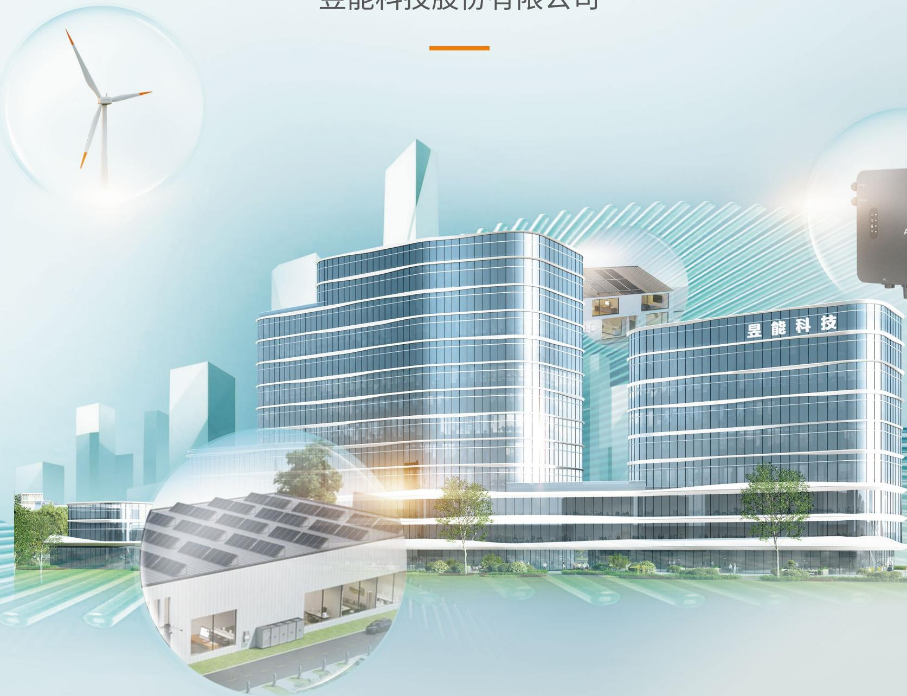

text_image

昱能科技股份有限公司
昱能科技

# 目录 CONTENTS

01 关于本报告  
03 董事长致辞  
05 ESG 亮点绩效

# 走进昱能科技

公司概况 09  
发展历程 11  
昱能全球布局 13  
2025 年荣誉 15

# 01

# 治理为基护航行稳致远

公司治理 33  
商业行为 37  
风控管理 41  
党建固本 44

# 03

# 创新赋能驱动责任运营

研发创新 55  
产品质量管理 63  
客户关系管理 69  
数据安全与客户隐私保护 73  
数字化转型 76  
供应商管理 77

97 ESG 数据表和附注  
103 对标索引表

# ESG 管理

ESG 治理 19  
议题重要性分析 21  
响应联合国可持续发展目标（SDGs） 26

专题：

硬核创新，精进全球绿色能源解决方案 27

# 02

# 绿色引领 共筑零碳未来

应对气候变化 47  
绿色运营 50

# 04

# 以人为本走向美好明天

员工雇佣与权益 83  
员工培训与发展 88  
职业健康与安全 93  
社会贡献 96

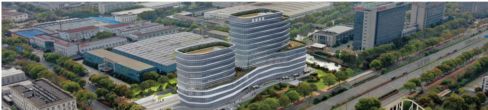

natural_image

Aerial view of a modern industrial complex with curved glass buildings and surrounding greenery (no visible signage or text)

# 关于本报告

# 报告范围

本报告范围涵盖昱能科技股份有限公司及其附属公司（简称“昱能科技”“公司”“我们”）。除非特别说明，与昱能科技（股票代码：688348）同期合并财务报表范围一致。

# 报告期间

本报告期间为 2025 年 1 月 1 日至 2025 年 12 月 31 日。本报告中的数据如无特别说明，均为此期间内数据。

# 编制依据

本报告依据《上海证券交易所上市公司自律监管指引第14号——可持续发展报告（试行）》（2024年4月）、《上海证券交易所上市公司自律监管指引第1号——规范运作》（2025年5月修订）、《上海证券交易所科创板股票上市规则》（2025年4月）、《上海证券交易所科创板上市公司自律监管指引第2号——自愿信息披露》（2025年3月修订）进行编制。

# 数据说明

报告中数据和案例来自公司实际运行的正式记录。

报告中的财务数据均以人民币为单位。财务数据与公司年度财务报告不符的，以年度财务报告为准。

# 报告获取方式

本报告通过电子版形式发布，发布平台包括证券交易所指定的信息披露平台，可以在公司网站（www.apsystems.cn）、上交所网站（http://www.sse.com.cn）查阅和下载。

# 联系我们

如对报告有建议，可通过以下方式与我们联系：

联系地址：浙江省嘉兴市南湖区凌公塘路3535号

联系电话：0573-8398-6968

# 报告编制原则

# - 重要性 -

公司识别出各利益相关方关注的与经营相关的重要性议题，作为本报告汇报重点。本报告中对重要性议题汇报的同时关注公司所处行业和经营业务的特点。议题重要性分析过程及结果详见本报告“议题重要性分析”章节。

# - 准确性 -

本报告尽可能确保信息准确。其中，定量信息的测算已说明数据口径、计算依据与假定条件，以保证计算误差范围不会对信息使用者造成误导性影响。定量信息及附注信息详见本报告“ESG 数据表和附注”章节。董事会对报告的内容进行保证，不存在虚假记载、误导性陈述或重大遗漏。

# 平衡性

本报告内容反映客观、真实的事实，对涉及公司正面、负面的信息均予以不偏不倚的披露。在报告期内未发现应当披露而未披露的负面事件。

# - 清晰性 -

本报告以简体中文发布。本报告中包含表格、模型图以及专业名词表等信息，作为本报告中文字内容的辅助，便于利益相关方更好地理解报告中文字内容。为便于利益相关方更快获取信息，本报告提供目录及ESG标准的对标索引表。

# - 量化性 -

本报告披露关键定量披露项，并尽可能披露历史数据，具体详见“ESG数据表和附注”章节。

# - 可比性 -

本报告对同一定量披露项在不同报告期内的统计及披露方式保持一致；若数据的采集、测量与计算方法有更改，对相关数据进行追溯调整，并在报告附注中说明调整的情况和原因，以便利益相关方进行有意义的分析，评估公司 ESG 数据水平发展趋势。

# - 完整性 -

本报告披露对象范围与公司合并财务报表范围保持一致。

# · 时效性 ·

本报告为年度报告，覆盖时间范围为2025年1月1日至2025年12月31日。公司尽力在报告年度结束后尽快发布报告，为利益相关方决策提供及时的信息参考。

# · 可验证性 ·

本报告中案例和数据来自公司实际运行的原始记录或财务报告。公司采用 HiESG 绩效管理信息系统管理 ESG 数据，所披露数据来源及计算过程均可追溯，可用于支持外部鉴证工作检查。

# 董事长致辞

2025 年，全球能源转型浪潮奔涌向前，可再生能源正以前所未有的速度重塑世界能源格局。在这场深刻的能源变革中，昱能科技始终站在时代前沿，以 “驱动零碳未来，共创智慧生活” 为使命，将公司发展深度融入全球绿色低碳进程。作为光储技术的深耕者，公司坚持技术创新与全球布局双轮驱动，已实现以微型逆变器为核心的微光储、户用光储及工商业光储的三大业态联动，用创新方案引领行业变革，交出了一份高质量发展的答卷。

# 硬核创新，精进全球绿色能源解决方案

创新是我们的立身之本，也是我们行稳致远的底气所在。过去一年，我们坚持以自主研发为核心，深耕组件级电力电子技术领域，围绕安全性、高效能及智能化不断提升核心技术的先进性。我们紧跟行业发展趋势，持续加大研发投入，不断丰富光储一体化产品矩阵，我们新研发的离网混合逆变器 AHS 系列产品，填补了离网场景下的产品空白，为电网不稳定地区提供了可靠的备用发电解决方案，这是我们对市场需求的敏锐响应。与此同时，我们积极探索人工智能与电力电子技术的深度融合，开发了“APbot”客服机器人，聚焦光伏垂直领域，融合行业、专业、产品三大知识体系，能够 24 小时响应客户的产品咨询与日常交互。从 AI 辅助设计到智能能源管理，再到智能客服的应用，我们正以开放的姿态拥抱智能化浪潮，让产品和服务更具智慧、更懂用户。

在推动行业发展道路上，我们积极发挥技术引领优势，携手行业伙伴深度参与国内外标准制定，共同推动组件级电力电子技术的规范化与普及化，以协同之力为光伏产业的有序发展贡献智慧。我们始终坚持以客户为中心，通过本土化服务团队与全球化销售网络的高效联动，为世界各地的用户提供及时、专业的技术支持，让每一次服务都成为与客户共成长的契机。同时，我们高度重视供应链的协同共建，与全球供应商建立战略合作伙伴关系，将环境、社会与道德标准融入全生命周期管理，共同打造负责任、有韧性的供应链体系，在开放协作中凝聚行业力量，共创绿色未来。

# 治理为基，践行 ESG 理念

健全的公司治理是我们可持续发展的基石。2025年，我们对董事会下设专门委员会进行了重要调整，将原“董事会战略委员会”正式更名为“董事会战略与可持续发展（ESG）委员会”，在原有战略规划职责基础上增加ESG管理职责。这一调整标志着可持续发展理念从执行层面上升为公司最高决策层的核心议程。以此为基础，我们构建了以董事会为最高决策层、董事会战略与可持续发展（ESG）委员会为研究与指导层、ESG工作小组为统筹执行层的四级管理体系，确保ESG管理贯穿决策、执行与监督的全流程。

natural_image

Exterior view of modern glass skyscrapers with '昱能科技' signage, set against a twilight sky and city skyline (no other text or symbols visible)

公司严格遵守法律法规与监管要求，不断完善治理制度，依法履行信息披露义务，确保公司运作的有效性与规范透明。我们高度重视投资者关系管理，通过多种渠道与投资者保持密切沟通，倾听市场声音，回应各方关切。在商业道德与风控管理方面，我们建立了全方位的反贪污贿赂监管体系，持续开展全员廉洁从业培训，确保合规理念深入人心。独立、规范、透明的公司治理，是我们行稳致远的根本保障，也是我们践行可持续发展承诺的坚实根基。

# 以人为本，共创美好明天

员工的成长与幸福，是我们企业价值的最终体现。我们坚信，只有拥有充满激情与创造力的团队，才能持续为客户创造价值。为此，公司始终重视人才培养与梯队建设，通过系统化培训与有效激励机制，持续激发员工潜能，致力于打造高素质、专业化的人才团队。我们建立了管理序列与专业序列并行的双通道职级体系，为员工提供清晰的纵向晋升路径与横向发展空间，让每一位昱能人都能在企业发展中实现个人价值。同时，我们高度关注员工的身心健康与工作体验，严格遵守职业健康与安全相关法律法规，建立完善的职业健康安全管理体系，为全体员工创造安全、健康、合规的工作环境。丰富多彩的文化活动、完善的福利保障、畅通的沟通渠道，共同营造出我们温暖而有活力的大家庭氛围。

在履行社会责任方面，我们将公司专业能力与公益实践相结合，持续向公益机构捐赠太阳能灯、移动电源等物资，以实际行动传递企业温度，践行社会责任。我们相信，企业的价值不仅体现在经营成果上，更体现在对社会的回馈与贡献中。

展望未来，全球能源转型的大势不可逆转，可再生能源的发展前景依然广阔。我们将继续坚定不移地走创新发展之路。我们将以更开放的姿态拥抱技术变革，以更坚定的决心完善全球布局，以更负责任的态度践行 ESG 理念，致力于成为“最安全且高效的清洁能源转换者”。

# ESG 亮点绩效

# 环境

MLPE组件级电力电子系列产品全球累计销量超7.5GW  
温室气体排放总量（范围一 + 范围二）
1,448.17 吨二氧化碳当量

累计发电量9.46 TWh  
累计二氧化碳减排量1,199.62万吨

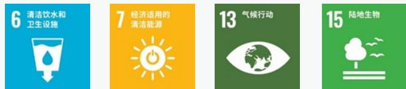

# 公司治理

独立董事占比 42.86%  
反商业贿赂及反贪污培训覆盖的董事比例 100%  
100%

▶ 贪污诉讼案件 0 件

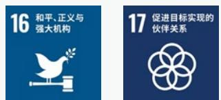

# 社会

研发投入 11,880.80 万元  
研发人员数量 275 人  
知识产权总数 231 个  
接受环境、劳工、道德等方面评估的合格供应商比例 100%  
员工人均培训时长212.14小时  
员工满意度90%以上  
研发投入占营业收入的比例 10.00%  
研发人员占比 51.02%  
发明专利总数 102 项  
全年培训总时长95,040小时  
员工培训总支出9.74万元  
公益慈善捐赠物资折款239.40万元

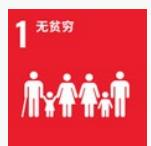

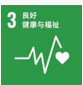

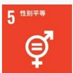

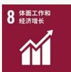

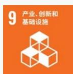

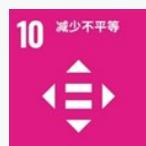

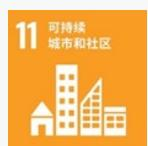

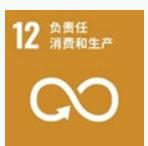

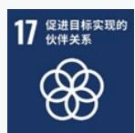

# 01 走进昱能科技

公司概况

发展历程

昱能全球布局

2025年荣誉

natural_image

Exterior view of modern glass skyscrapers with visible Chinese signage (磊能科技), no other text or symbols present.

natural_image

Exterior night view of a modern multi-level building with landscaped grounds and pedestrian pathways (no signage or text visible)

# 公司概况

昱能科技股份有限公司成立于 2010 年，注册于嘉兴市南湖高新区，是一家科创板上市企业（股票代码：688348）。公司专注于光伏发电及储能领域，主要从事分布式光伏发电系统中组件级电力电子技术及储能技术的研发及产业化，提供以微型逆变器为核心的分布式光伏 + 储能全场景应用解决方案，全面覆盖微光储、户用光储与工商业光储等领域，全方位满足各位用户的多元化需求。公司产品及业务包括：微型逆变器及能量通信产品、储能产品、智控关断器产品、AI 智慧能源业务、分布式光伏电站业务等。

昱能科技是国家级高新技术企业，国家工信部第五批符合《光伏制造行业规范条件》的企业，国家级“专精特新”小巨人企业。公司建有浙江省昱能微逆变器研究院、浙江省企业技术中心、浙江省高新技术企业研究开发中心。公司参与制定了29项国家、行业或团体标准，其中作为第一起草单位起草了《光伏发电并网微型逆变器》团体标准。公司始终非常重视新技术和新产品的持续研发，经过多年的投入与积累，形成了较强的研发创新优势。此外，公司还拥有一支以国际先进的研发理念为依托、专注于组件级电力电子设备及用储能系统的国际化科研人才队伍，具有扎实的专业知识背景和丰富的行业实践经验。

公司积极开展全球化的业务布局，兼顾发达国家和新兴市场的业务机会。通过在美国、荷兰、法国、澳大利亚、墨西哥、巴西、新加坡、英国、日本等地成立分子公司，不断完善全球营销网络建设。

在全球大力发展可再生清洁能源的背景下，昱能科技将继续秉承“驱动零碳未来，共创智慧生活”的使命，致力于成为“最高效的安全清洁能源转换者”，通过“境内外市场双轮驱动，光储一体协同推进”的经营战略，不断为全球客户提供最新最安全的光储智慧解决方案。

# 截至目前

- 国内外有效认证证书
150 多项  
- 产品成功销往全球168个国家及地区  
• 2025 年，公司实现营业收入
11.88 亿元

# 产品家族

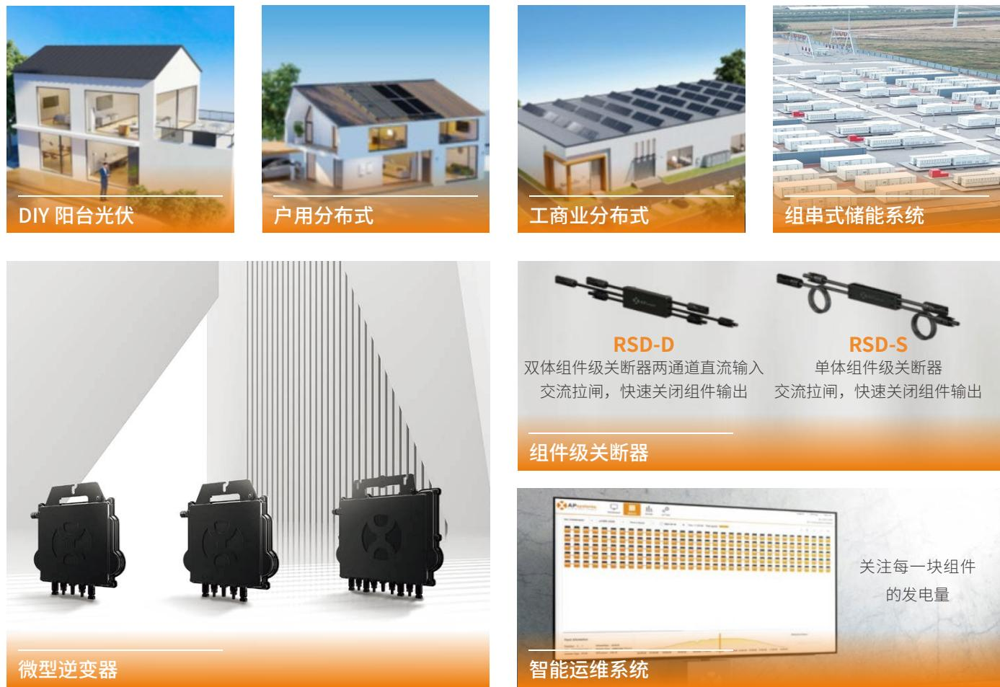

# 企业文化

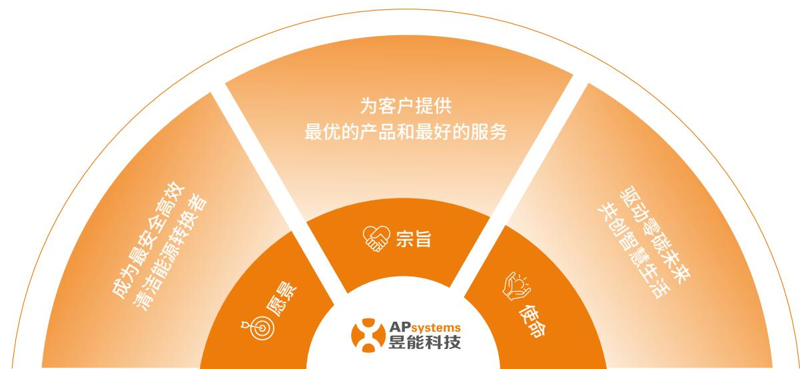

flowchart

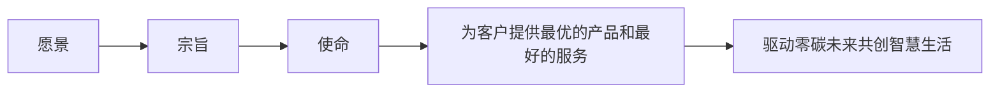

# 发展历程

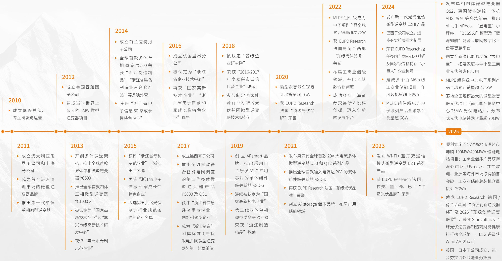

flowchart

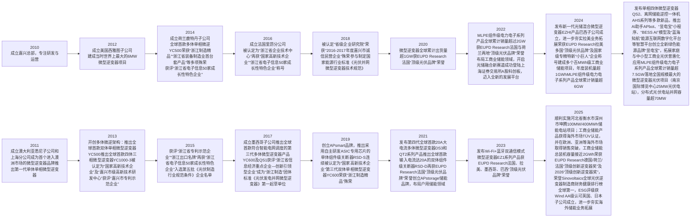

# 昱能全球布局

# 全球营销布局

- 全球共建立 11 个分、子公司  
- 本土化团队提供24小时全年无时差服务

# 全球仓储布局

- 全球共设立 5 个本地仓储  
- 国内外双生产基地布局，保障全球市场供货需求

# 全球售后服务

- UID 溯源快速响应退换货服务流程  
- 提供全球多语种线上线下培训服务

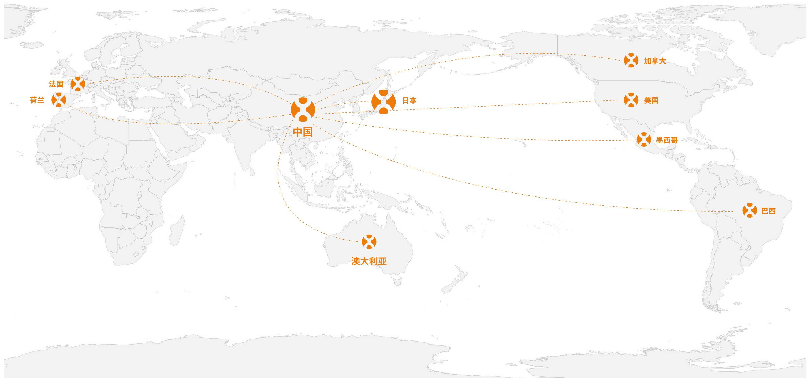

flowchart

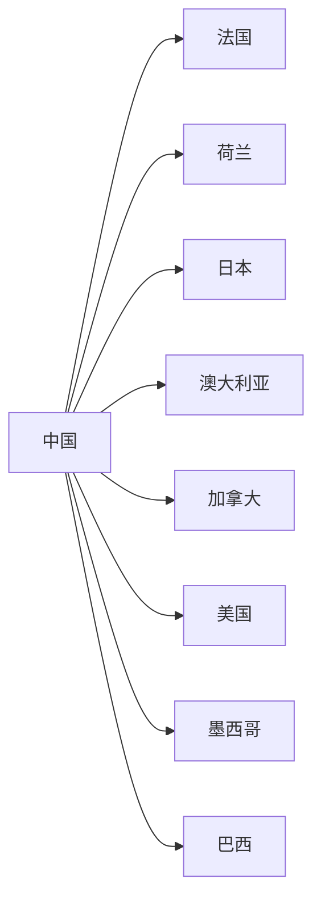

# 2025 年荣誉

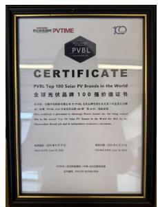  
全球光伏品牌 100 强

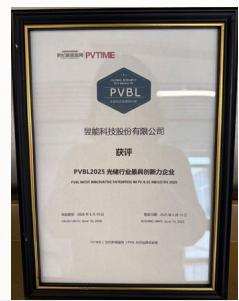  
PVBL2025 光储行业最具创新力企业

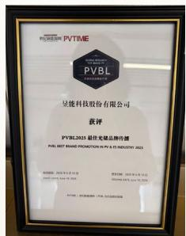  
PVBL2025 最佳光储品牌传播

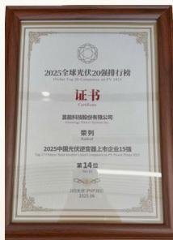  
2025 中国光伏逆变器
上市企业 15 强

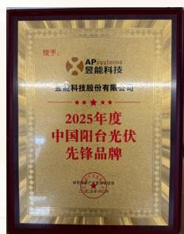  
2025 年度中国阳台光伏先锋品牌

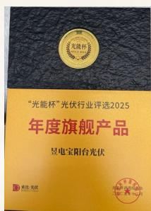  
“光能杯”光伏行业评选2025年度旗舰产品-昱电宝阳台光伏

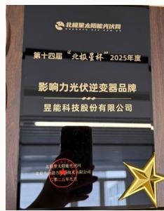  
影响力光伏逆变器品牌

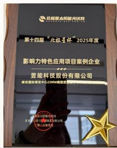  
2025 影响力特色应用项目案例企业

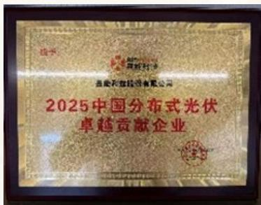

text_image

2025中国分布式光伏
卓越贡献企业

2025 中国分布式光伏卓越贡献企业

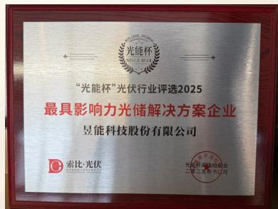

text_image

光能杯
“光能杯”光伏行业评选2025
最具影响力光储解决方案企业
昱能科技股份有限公司
索比·光伏
光能杯·储能峰会
二〇一三年一月

“光能杯”光伏行业评选2025最具影响力光储解决方案企业

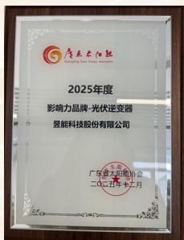  
2025 年度影响力品牌
光伏逆变器

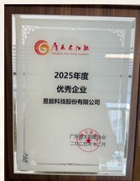  
2025 年度优秀企业

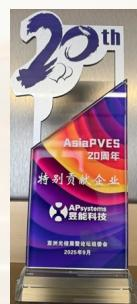  
AsiaPVES 特别贡献企业

# 02

# ESG 管理

ESG 治理

议题重要性分析

响应联合国可持续发展目标（SDGs）

# ESG 治理

昱能科技严格遵循《中华人民共和国公司法》《上市公司治理准则》《上海证券交易所科创板上市公司自律监管指引第1号——规范运作》及《上海证券交易所上市公司自律监管指引第14号——可持续发展报告（试行）》等法律法规及监管指引要求，将可持续发展理念深度融入公司治理。

公司构建以董事会为最高决策层、董事会战略与可持续发展（ESG）委员会为研究与指导层、战略与 ESG 工作小组为统筹执行层、各职能部门与子公司为具体落实层的四级管理体系，明确划分各层级权责，系统负责 ESG 战略的制定、目标落实、风险识别、绩效评估与信息披露，确保 ESG 管理贯穿决策、执行与监督全流程，为实现可持续高质量发展提供了坚实的治理保障。

# 昱能科技 ESG 治理架构及职责

# 决策机构

# 董事会

- 审议和批准公司 ESG 发展战略与目标、重大议题、治理架构、管理制度等；  
- 审议和批准公司 ESG 报告。

# 研究和指导机构

# 董事会战略与可持续发展（ESG）委员会

- 研究和制订公司的 ESG 发展战略与目标、重大议题等；  
- 识别、控制与 ESG 日常管理相关的风险；  
- 指导 ESG 工作的日常开展；  
- 审阅并向董事会提交公司的 ESG 报告。

# 管理机构

# 战略与 ESG 工作小组

- 贯彻落实公司 ESG 发展战略与目标，组织和安排各执行单位实施 ESG 工作；  
- 负责拟定 ESG 制度文件、相关议题、阶段性工作计划及实施方案等；  
- 负责对公司 ESG 信息收集、汇编，编制 ESG 报告及相关文件；  
- 负责与咨询、评级机构沟通，组织开展 ESG 业务培训，跟踪 ESG 政策要求及趋势；  
- 总结 ESG 工作中的问题和成果，及时向董事会战略与可持续发展（ESG）委员会反馈 ESG 工作情况，提出合理化建议。

# 执行机构

# 各执行单位

\- 承担职责范围内的主体责任，负责按照公司 ESG 发展战略与目标，落实 ESG 相关工作的日常管理，并定期汇报执行情况，及时报送 ESG 信息。

2025 年，公司邀请 ESG 领域专家开展培训，面向公司领导层讲解可持续信息披露及公司的可持续管理行动路径，强化管理层对可持续理念的战略认知，进一步推动可持续理念从战略层面向执行层面穿透落地，为提升 ESG 治理水平奠定基础。

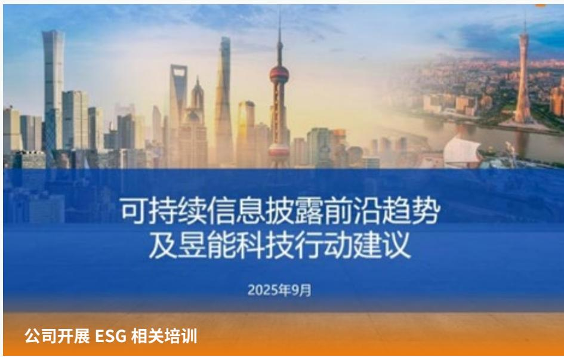

text_image

可持续信息披露前沿趋势
及昱能科技行动建议
2025年9月
公司开展 ESG 相关培训

# 2025年可持续发展相关奖项

在第十五届公益节暨2025 ESG影响力年会中获得“年度可持续发展典范企业”和“ESG上市公司典范奖”。

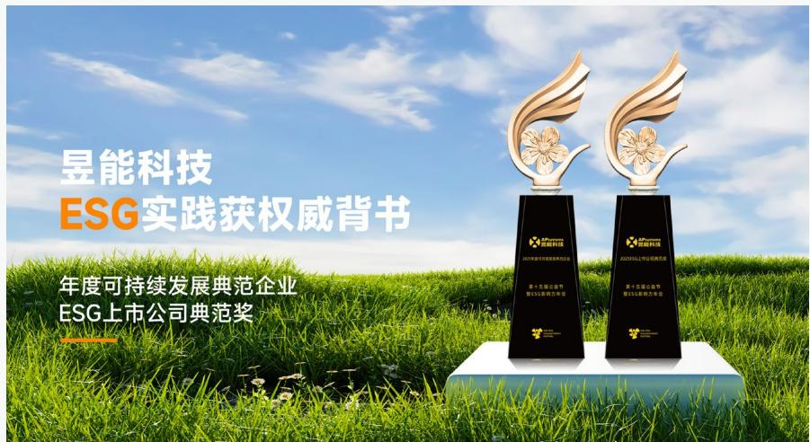

text_image

昱能科技
ESG实践获权威背书
年度可持续发展典范企业
ESG上市公司典范奖

# 议题重要性分析

# 议题重要性分析流程

2025 年，昱能科技基于自身业务活动，结合标准对标和同业分析，依据《上海证券交易所上市公司自律监管指引第 14 号——可持续发展报告（试行）》要求，从影响重要性和财务重要性两个维度对 ESG 议题进行识别、筛选和分析。

# 昱能科技 2025 年议题双重重要性分析流程

# 步骤一

了解公司活动和业务关系背景

- 了解公司活动和业务关系。  
- 了解外部客观环境。  
- 了解主要受影响利益相关方。

# 步骤二

建立议题清单

- 结合标准对标和同业对标，对与公司相关的 ESG 议题进行初步的识别和筛选，增补行业特色议题，形成议题清单。  
- 分析公司各 ESG 议题的实际和潜在影响、风险和机遇。

# 步骤三

议题重要性评估

- 邀请外部专家与公司各部门，围绕 ESG 议题重要性开展定性评估，其中影响重要性从影响的规模、范围和不可补救性判断，财务重要性从影响发生的可能性和财务影响的程度判断。  
- 根据议题重要性定性评估结果，确定议题双重重要性排序。

# 步骤四

议题确认与报告

·经公司董事会办公室审核确认，就2025年度重要性较高的议题在报告中进行重点披露。

# 利益相关方沟通

公司重视与利益相关方之间的沟通，通过系统化的识别、沟通与回应机制，精准理解各方诉求，并将此作为 ESG 管理与决策的重要依据，确保利益相关方的关切得到妥善处理和满足，从而增进互信，实现共赢。2025 年，公司确定主要利益相关方为政府及监管机构、股东 / 投资者、客户、员工、供应商、社区公众。

昱能科技主要利益相关方及沟通方式

<table><tr><td>主要利益相关方</td><td>关注议题</td><td>沟通方式及频率</td></tr><tr><td>政府及监管机构</td><td>商业行为、风控管理、应对气候变化、环境合规管理、能源利用、水资源利用、废弃物管理、绿色业务</td><td>· 机构考察(不定期)· 政策执行(持续)· 信息披露(定期,年度/半年度/季度报告)</td></tr><tr><td>股东/投资者</td><td>公司治理、商业行为、风控管理、研发创新、数字化转型</td><td>· 股东会(至少每年一次,必要时临时召开)· 业绩说明大会(定期,每季度)· 定期报告和临时报告(定期及不定期)· 投资者热线(持续开放)</td></tr><tr><td>客户</td><td>客户关系管理、产品质量管理、数据安全与客户隐私保护</td><td>· 客户满意度调查(定期,通常每年至少一次)· 客户沟通渠道(持续,如客服热线、在线平台等)· 信息安全风险评估(定期,或发生重大变化时)</td></tr><tr><td>员工</td><td>员工雇佣与权益、员工培训与发展、职业健康与安全</td><td>· 员工满意度(定期,通常每年一次)· 员工活动(不定期)· 职业健康监护(定期,如年度体检)· 安全生产管理(持续,日常管理及定期检查)</td></tr><tr><td>供应商</td><td>研发创新、供应商管理、商业行为、产品质量管理</td><td>· 签订《供应商企业社会责任承诺书》(定期,通常在合作初期签署并定期更新)</td></tr><tr><td>社区公众</td><td>社会公益</td><td>· 安全培训(不定期)· 社会公益活动(不定期)</td></tr></table>

# 尽职调查

公司持续完善 ESG 议题影响、风险和机遇的管理流程，通过全面的 ESG 尽职调查流程全面识别、评估与管理 ESG 议题所产生的影响、风险与机遇。调查贯穿公司运营与价值链核心环节，主要通过日常沟通、信息采集等多种方式对各利益相关方展开。调查重点关注各 ESG 议题在短期（0-1 年）、中期（1-5 年）及长期（5 年以上）内，可能对公司商业模式、业务运营、发展战略、财务状况、经营成果、现金流、融资方式及成本等方面产生的实质性影响，同时评估公司在这些议题上的表现对环境、社会及经济所产生的广泛影响，并披露公司采取的针对性管理举措与实践。

昱能科技 2025 年度 ESG 议题的影响、风险和机遇管理

<table><tr><td>议题</td><td>受影响的利益相关方</td><td>风险/机遇类型</td><td>时间范围</td><td>财务影响</td></tr><tr><td>应对气候变化</td><td rowspan="6">政府及监管机构</td><td>物理风险政策与法规风险市场风险产品和服务机遇</td><td>短中长期</td><td>营业收入增加</td></tr><tr><td>能源利用</td><td>能源来源机遇</td><td>短中长期</td><td>运营成本下降</td></tr><tr><td>水资源利用</td><td>资源效率机遇政策与法规风险</td><td>短中长期</td><td>运营成本下降</td></tr><tr><td>废弃物管理</td><td>资源效率机遇政策与法规风险</td><td>中长期</td><td>运营成本下降</td></tr><tr><td>环境合规管理</td><td>政策与法规风险</td><td>中长期</td><td>运营成本增加</td></tr><tr><td>绿色业务</td><td>市场机遇</td><td>短中长期</td><td>营业收入增加</td></tr><tr><td>员工雇佣与权益</td><td rowspan="4">员工</td><td rowspan="2">政策与法规风险</td><td>中长期</td><td>运营成本增加</td></tr><tr><td>职业健康与安全</td><td>中长期</td><td>运营成本增加</td></tr><tr><td rowspan="2">员工培训与发展</td><td>运营风险</td><td rowspan="2">中长期</td><td>运营成本增加</td></tr><tr><td>市场机遇</td><td>营业收入增加</td></tr><tr><td>产品质量管理</td><td rowspan="3">客户</td><td>产品质量纠纷风险产品和服务机遇</td><td>中长期</td><td>运营成本增加营业收入增加</td></tr><tr><td>客户关系管理</td><td>市场风险产品和服务机遇</td><td>短中长期</td><td>营业收入增加</td></tr><tr><td>数据安全与客户隐私保护</td><td>数据泄漏风险</td><td>长期</td><td>运营成本增加</td></tr><tr><td>供应商管理</td><td>供应商</td><td>供应链稳定性风险市场机遇</td><td>中长期</td><td>运营成本增加营业收入下降</td></tr></table>

<table><tr><td>议题</td><td>受影响的利益相关方</td><td>风险/机遇类型</td><td>时间范围</td><td>财务影响</td></tr><tr><td>研发创新</td><td rowspan="2">股东/投资者、客户</td><td>技术升级风险核心技术人员流失风险竞争加剧风险产品和服务机遇</td><td>中长期</td><td>运营成本增加营业收入增加</td></tr><tr><td>数字化转型</td><td>数据安全风险运营效率机遇</td><td>短中长期</td><td>运营成本增加营业收入增加</td></tr><tr><td>社会公益</td><td>社区公众</td><td>声誉机遇</td><td>中长期</td><td>营业收入增加</td></tr><tr><td>商业行为</td><td>股东/投资者、供应商</td><td>法律风险经营风险</td><td>中长期</td><td>运营成本增加</td></tr><tr><td>公司治理</td><td rowspan="2">股东/投资者</td><td>境外经营风险股东权益保障机遇</td><td>中长期</td><td>运营成本增加营业收入下降</td></tr><tr><td>风控管理</td><td>运营风险</td><td>中长期</td><td>运营成本增加营业收入增加</td></tr></table>

# 议题重要性分析结论

公司结合利益相关方沟通、尽职调查结果、同业对标和公司运营情况，初步识别并筛选出 19 项 ESG 议题，其中环境维度共 6 项，社会维度共 10 项，公司治理维度共 3 项。公司 2025 年 ESG 议题较上一年度主要变动情况详见下表。

昱能科技 2025 年 ESG 议题主要变动

<table><tr><td>2025年ESG议题</td><td>2024年ESG议题</td><td>变动情况</td><td>变动原因</td></tr><tr><td>数字化转型</td><td>——</td><td>新增议题</td><td>根据行业趋势新增议题</td></tr></table>

综合影响重要性和财务重要性分析，识别的议题中 6 项具有双重重要性，4 项仅具有财务重要性，9 项仅具有影响重要性。公司将根据各议题的重要性，有重点地推进 ESG 工作。

# 昱能科技 2025 年 ESG 议题分布矩阵

高

对经济、社会和环境影响的重要性

低

能源利用

水资源利用

废弃物管理

员工雇佣与权益

员工培训与发展

绿色业务

社会公益

数字化转型

环境合规管理

应对气候变化

客户关系管理

供应商管理

产品质量管理

公司治理

研发创新

数据安全与客户隐私保护

商业行为

职业健康与安全

风控管理

对昱能科技财务的重要性

高

# 响应联合国可持续发展目标（SDGs）

# 双重重要性议题

应对气候变化、客户关系管理、供应商管理、研发创新、公司治理、产品质量管理

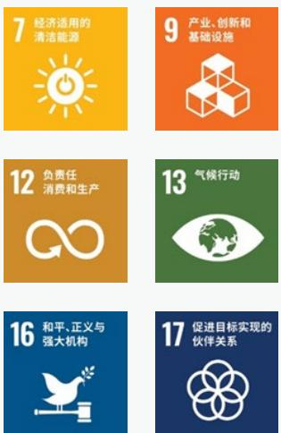

# 财务重要性议题

数据安全与客户隐私保护、商业行为、职业健康与安全、风控管理

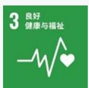

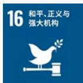

# 影响重要性议题

能源利用、水资源利用、
废弃物管理、员工雇佣与
权益、员工培训与发展、
环境合规管理、绿色业务、
社会公益、数字化转型

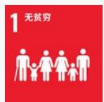

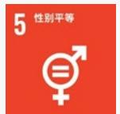

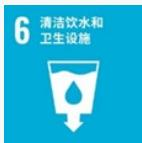

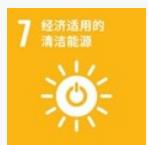

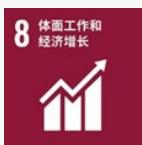

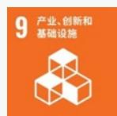

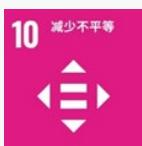

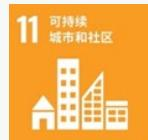

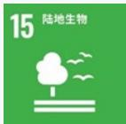

# 专题

# 硬核创新，精进全球绿色能源解决方案

公司秉承“驱动零碳未来，共创智慧生活”的使命，致力于成为“最安全高效清洁能源转换者”。公司专注于光伏发电及储能领域，主要从事分布式光伏发电系统中组件级电力电子技术及户用、工商业储能技术的研发及产业化，提供以微型逆变器为核心的分布式光伏+储能全场景应用解决方案，通过“境内外市场双轮驱动，光储一体协同推进”的经营战略，不断为全球客户提供最新最安全的光储智慧解决方案。

# 昱能科技核心系列产品

# 微型逆变器

- 阳台光伏场景下，公司的 EZ1、EZ1D 系列产品主打便捷安装，通过交流线缆插头与插座相连，即可并网发电；户用光伏场景下，公司的 DS3、DS3D、QS2、S3 系列产品面向家庭住宅场景，简约设计、灵活安装、安全可靠，适配紧凑型、多朝向等复杂屋顶场景；工商业光伏场景下，公司的三相八体 QT2D 产品可连接 8 块组件，最大输出功率可达 3600W，最大可支持 20A 电流组件，进一步降低产品单瓦成本，让微逆产品可以赋能更多分布式光伏电站安全、高效运行。  
- 为使分布式光伏发电系统实现组件级的智能光伏监控功能，公司开发了能量通信产品及监控分析系统配合微型逆变器使用，帮助用户实现组件级监控及高效运维。

# 离网混合逆变器

\- 2025年，公司新研发离网混合逆变器AHS系列产品。该系列离网混合逆变器不依赖公共电网系统，在直流电转换交流电的基础上配备了低压电池并增加储能电站的功能，在电网不稳定时可确保关键性负载不断电，满足离网及备用发电的使用需求。

# 储能产品

- 阳台微光储：光储混合微型逆变器 EZHI 产品，在微型逆变器的基础上增配低压电池，使得产品同时具备微型光伏 + 微型储能功效，以其易安装性、经济性以及灵活性的优势，满足阳台及 DIY 应用场景。  
- 户用储能：ELS、ELT系列户用储能产品具有低压组件接入和低压电池接入的安全优点，同时具备自发自用、备用电源等工作模式，还可以交流耦合方式与光伏并网逆变器系统一起组成微网系统。  
- 台区、工商业及源网侧储能系统产品：台区场景通过 Ocean 30/30L、Ocean100L 系列产品，针对性解决末端低电压、重过载及三相不平衡等问题，以并联接入、无需改造线路的便捷方式，结合磷酸铁锂电池与自动灭火系统，实现低成本、高可靠的电网支撑；工商业场景依托 Ocean 200L、Ocean 400L 系列产品，采用“单簇即单柜”设计实现精细化安全管理和即插即用，支持 30kW 起模块化拼接，灵活覆盖中小型至 GWh 级应用；源网侧场景依托 Ocean 5000L，结合 3S 自研技术栈与柔性智能热管理，实现高转化效率与低系统能耗，并可选配蓝海知航智能运维系统助力电站收益增值。全系列产品深度融合 EMS 智慧监测与远程运维能力，致力于在保障安全性与经济性的同时，提升全生命周期综合效益。

# 智控关断器

\- RSD-S、RSD-D 系列智控关断器产品采用自主开发的智控关断器 ASIC 专用芯片，具备较高的集成度及可靠性。

公司以自研的光储产品为核心，拓展分布式光伏电站业务，通过外购光伏组件、支架、线缆等零部件，提供从硬件到软件、从设计到运营的全流程“安全、高效、智能化”解决方案，走遍世界百余个国家及地区，助力实现节能减排与可持续发展。

在国内项目建设方面，公司持续拓宽微型逆变器应用边界，覆盖公共建筑、工业园区、高耗能企业、贸易商城、环保产业区等领域，以优质方案赋能工商业多元场景，点亮各行业绿色发展新图景。

# 案例 南京国际博览中心 25MW 光伏项目

项目位于江苏省南京市，总装机容量约为 25MW，是目前全国单体容量最大微逆光伏项目。

该项目充分利用南京国际博览中心展馆屋面，安装覆盖面积超过15万平方米，配置了6,442台昱能科技微型逆变器QT2D和4万余块高效光伏组件；该项目预估年发电量约为2,480万度，极大满足展馆的用电需求，为展览、会议、住宿、餐饮、赛事、娱乐等多功能的运营开展注入强大的动力，树立公共建筑低碳示范标杆。

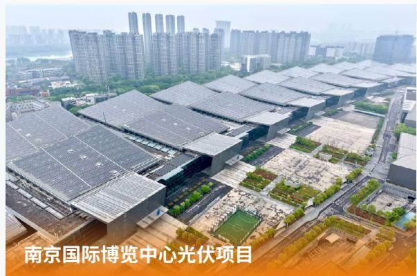

text_image

南京国际博览中心光伏项目

# 案例 山东肥城精制盐厂 5.04MW 光伏项目

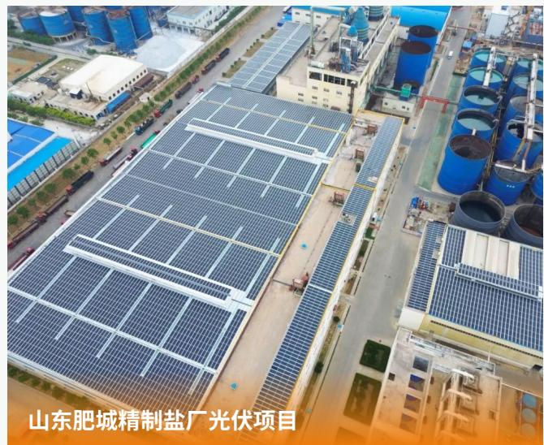

text_image

山东肥城精制盐厂光伏项目

项目位于山东省肥城市，总装机容量约为5.04MW。项目配置1,177台昱能科技微型逆变器QT2D和9,619块BIPV光伏组件，预估年发电量可达500万度，每年可减少二氧化碳排放约5,400吨，相当于植树造林20万棵。

该项目实现了彩钢瓦屋顶、水泥屋顶、车棚和立面墙等区域的光伏建筑一体化安装，且在微逆的加持下，可安装面积得到了最大化利用，实现立体墙面等特殊区域的应装尽装，为盐品生产、加工、储存等全流程提供更多能源，对于促进盐厂低碳转型发展、加强区域环境保护具有重要意义。

# 案例 深州坤腾 100MW/400MWh 储能电站项目

项目位于河北省深州市，总装机容量为100MW/400MWh。项目由昱能科技控股子公司领储宇能助力建设，采用了自主研发的80套Ocean 5000L储能预制舱、1套EMS系统及1个储能单元PCS+BMS系统。其中单台Ocean 5000L储能预制舱可存储电量5,000度，采用标准化组串式单元设计，以“一簇一管理”为设计理念，安全管理更加精细化；热管理系统精准控制Pack间温差，温度一致性更好，且每个单体柜均配备独立消防，全面提升系统寿命，满足大型储能项目的通用性需求。

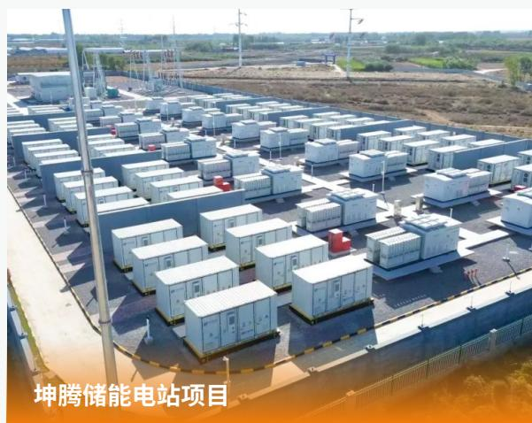

text_image

坤腾储能电站项目

电站运行期间，实现在风电、光伏发电高峰时段储存电能，在用电紧张时段释放清洁电力，每年预计减少煤炭消耗约3.1万吨，相当于减少二氧化碳排放8.2万吨，对于促进地区低碳转型发展、加强区域环境保护具有重要意义。

在海外项目建设方面,公司以领先技术与本土化服务持续深耕欧洲、北美、拉美等市场,赋能娱乐餐饮、医疗、畜牧业、教育、食品加工、自然保护等多元场景,适配不同地区的严苛标准与个性需求,助力全球工商业绿色低碳发展。

# 案例 墨西哥沙滩度假区 75.24kW 光伏项目

text_image

墨西哥沙滩度假区光伏项目

项目位于墨西哥南部的阿卡普尔科海滩度假区，电站共采用29台昱能科技微型逆变器DS3D以及114块660W光伏组件，总装机容量为75.24kW。

DS3D 针对树木等阴影遮挡具有卓越的适应性，MPPT 跟踪效率高达 99.9%，年发电量约 13 万度。同时，DS3D 采用组件级输入设计，系统运行时直流电压小于 120V，可以解决直流高压拉弧火灾风险、施救风险，为电站的安全运行提供了保障。

# 案例 美国康复中心 177kW 光伏项目

text_image

美国康复中心光伏项目

项目位于美国内华达州的一处康复中心，光伏电站总装机容量为177kW，项目采用昱能科技微型逆变器QT2，具有安全、可靠的显著优势，系统运行时无电压叠加，可保障电站的极致安全；同时具备组件级MPPT功能，助力电站实现稳定高效的电力转换，为场地运营管理提供绿色电力。

# 案例 美国乳制品加工厂 574.4kW 光伏项目

项目位于印第安纳州的一座乳制品加工厂，光伏电站总装机容量为574.4kW，该电站选用昱能科技微型逆变器QT2，采用组件级输入设计，具有天然无直流高压的优势；同时支持三相平衡交流电输出，有效提升电能质量，为乳制品的生产加工提供绿色能源支持。

text_image

美国乳制品加工厂光伏项目

展望未来，公司将坚定不移实施境内外市场双轮驱动战略，全力打造光储充 + 建管运一体化综合解决方案，构建“光伏 + 储能 + 数字化 AI 智慧管理”生态，以过硬实力赢得市场，创造长期价值。

# 03

# 治理为基 护航行稳致远

公司治理

商业行为

风控管理

党建固本

# 公司治理

昱能科技严格遵循包括《中华人民共和国公司法》《中华人民共和国证券法》《上市公司章程指引》《上市公司治理准则》《上海证券交易所科创板股票上市规则》及《上海证券交易所科创板上市公司自律监管指引第1号——规范运作》等在内的国家法律法规与监管规则，构建并完善其治理体系，确保公司运作的有效性与规范透明。

# 昱能科技公司治理管理体系

# 治理

- 制度：制定并修订《公司章程》《股东会议事规则》《董事会议事规则》《董事会审计委员会工作细则》《董事会战略与可持续发展（ESG）委员会工作细则》《信息披露事务管理制度》等内部管理制度。  
- 治理结构：建立由“股东会、董事会、管理层”组成的“两会一层”治理架构。

# 战略

# - 影响、风险和机遇：

影响：  
完善公司治理架构，提高治理的规范性与透明度，保障投资者权益。  
风险：  
境外经营风险：公司境外主要销售国家或地区出台了一系列限制光伏产品进口、提高产品关税等政策，形成了较大的贸易壁垒，可能导致海外销售收入下降，同时因关税增加挤压利润空间，影响公司整体盈利能力。  
机遇：  
股东权益保障机遇：制定合理的股份回购与分红方案并开展投资者关系管理工作，有助于吸引投资者，增强投资者信心，降低股权融资成本。  
按规范要求建立权责明确、相互制衡的公司治理结构和监督有效的内控制度，并严格依法规范运作。

# - 应对策略:

# 影响、风险和机遇管理

\- 通过建立、健全内控制度，不断推进公司规范化、程序化管理，提升公司治理水平，依法履行信息披露义务，加强投资者关系管理工作，充分保障了投资者的合法权益，推动了公司的持续发展。

# 指标与目标

- 目标：完善公司治理架构，健全投资者权益保护机制，提升信息披露透明度，确保治理架构权责清晰高效运行，保障董事会多元化。  
- 指标：截至报告期末，独立董事占比 $42.86\%$ 。

2025 年，为全面贯彻落实最新法律法规及规范性文件要求，结合公司实际情况和业务发展，公司正式取消监事会，并由董事会审计委员会承接监事会职权，形成以股东会为最高权力机构、董事会为决策核心、下设专门委员会提供专业支持，高级管理层负责日常经营的公司治理架构。

昱能科技公司治理架构  

flowchart

公司治理架构职责介绍及相关会议召开情况

<table><tr><td>层级</td><td>职责介绍</td><td>召开情况</td></tr><tr><td>股东会</td><td>股东会作为公司最高权力机构,负责选举董事并审阅董事会报告,核心职责是审议批准公司重大战略、利润分配、资本变动等根本性事项,依法保障全体股东特别是中小股东的知情权与参与权。</td><td>召开1次年度股东会和1次临时股东会,累计审议议案14项。</td></tr><tr><td>董事会</td><td>董事会是公司的核心决策与领导机构,负责执行股东会决议、制定公司重大经营计划、设置内部管理机构并聘任高级管理层。董事会直接对股东会负责并报告工作。</td><td>召开9次董事会会议,累计审议议案43项。</td></tr><tr><td>专门委员会</td><td>董事会下设审计、提名、薪酬与考核、战略与可持续发展(ESG)四个专门委员会,职责是为董事会相关决策提供深入研究和专业建议。各专门委员会均直接对董事会负责,通过提交议案和报告履行汇报职责。</td><td>召开审计委员会会议4次,累计审议议案15项。召开薪酬与考核委员会会议1次,累计审议议案2项。召开提名委员会会议1次,累计审议议案1项。</td></tr></table>

公司通过多重动态机制保障董事会有效性。股东会依据《董事会议事规则》及董事履职情况对董事会进行整体监督与考核；董事会建立与管理层的常态化汇报与沟通机制，定期回顾战略目标达成情况与经营绩效，间接评估董事会决策的科学性与有效性。

# 董事会成员多元化分布情况

公司认可并重视董事会成员多元化对公司治理的裨益，通过《独立董事工作制度》《董事会提名委员会工作细则》确保董事选聘标准和程序的规范与开放，系统构建并维护董事会的多元化结构，保障董事会成员在性别、专业知识、行业视角及决策能力上的实质多元化。

董事会由 7 名成员构成（其中独立董事 3 名），女性董事占比 14.3%，且成员在专业技术、企业管理、金融资本及法律合规等领域具备互补的背景与经验，有效支撑了公司在战略、风险与创新方面的决策。

# 信息披露

公司高度重视信息披露工作，通过信息披露提升公司治理水平，增强市场透明度，树立良好企业形象。公司严格按照《上市公司信息披露管理办法》《上海证券交易所科创板股票上市规则》及公司《信息披露事务管理制度》等信息披露管理相关制度的规定，认真履行信息披露义务，真实、准确、完整、及时、有效地披露了公司定期报告、临时公告等重大信息。

2025 年，公司共对外披露定期报告 4 份、临时公告 41 份。

# 昱能科技 2025 年信息披露方式

# 公司披露年度报告的媒体名称及网址

上海证券报：https://www.cnstock.com/
证券时报：https://www.stcn.com/

# 公司披露年度报告的证券交易所网址

上海证券交易所：http://www.sse.com.cn/

# 投资者关系管理

公司重视投资者关系管理，严格遵守《上市公司投资者关系管理工作指引》等法律法规，并依据《投资者关系管理制度》，系统地开展相关工作，致力于通过透明、高效的沟通，增进市场认同，实现公司价值与股东利益的长期最大化。

# 投资者交流

公司持续拓展与投资者的沟通渠道与互动深度，通过投资者热线、邮箱、“上证 e 互动”平台以及投资者交流会等多种方式，积极倾听投资者声音，回应市场关切。报告期内，公司接听投资者热线电话约 40 个，回复“上证 e 互动”平台提问 31 个。

2025 年，公司举办 3 次业绩说明会，通过电话会议互动的方式与投资者深入交流，就经营业绩、业务规划、市场挑战及技术布局等关键议题进行坦诚沟通，有效增进了市场对公司的理解与信任。

# ▶ 股东回报

公司始终坚持将投资者利益放在首要位置，重视投资者回报，力争以良好、持续和稳定的现金回报水平充分保障全体股东的基本利益，并制定《首次公开发行股票并在科创板上市后三年股东分红回报规划》，提高利润分配决策的透明度和可操作性。公司在《公司章程》中明确利润分配决策程序，根据业务发展需要与股东回报的动态平衡，合理制定利润分配政策，积极进行现金分红，切实让投资者分享公司的发展成果，提升获得感。

报告期内公司发布《2024年年度权益分派实施公告》，并完成现金红利分派工作。

昱能科技 2025 年现金分红情况

<table><tr><td>关键绩效</td><td>单位</td><td>2025年</td></tr><tr><td>每10股现金分红</td><td>元</td><td>4</td></tr><tr><td>派现总额</td><td>元</td><td>61,813,458.80</td></tr><tr><td>占合并报表中归属于上市公司股东净利润的比例</td><td>%</td><td>44.14</td></tr></table>

- 在证券之星主办的第十三届“资本力量”2025年年度品牌活动中，公司获得行业影响力奖。  
- 在易董举办的“2025年度价值100榜单”评选中获得2025年度前沿AI创新奖。  
- 在财联社举办的“2025年度资本市场最具价值影响力榜单”评选中获得出海杰出品牌奖。  
- 荣获中国证券报颁发的 2024 年度金信披奖。  
• 荣获同花顺颁发的 2025 上市公司年度评选最佳投关奖。

# 商业行为

昱能科技严格遵守《中华人民共和国反垄断法》《中华人民共和国反不正当竞争法》《中华人民共和国反洗钱法》等法律法规和监管规定，将廉洁诚信的企业文化全面融入公司治理、内部控制与日常运营。

# 昱能科技商业行为管理体系

# 治理

制度：制定发布《昱能科技商业道德基本政策》《昱能科技招投标管理办法》等内部管理制度。  
- 治理结构：公司董事会下设审计委员会，全面督导公司反商业贿赂以及反贪污方面的工作，公司内审部负责落实具体工作，并向董事会审计委员会负责人汇报。

# 战略

# - 影响、风险和机遇：

风险：

法律风险：如果发生商业贿赂的行为，公司可能面临巨额罚款，导致管理费用上升，挤压净利润空间，减少当期经营现金流；相关责任人可能被追究刑事责任，导致公司的正常运营停滞或终止。

经营风险：若合作伙伴发现公司存在商业贿赂，可能导致客户拒绝合作等风险，公司将失去参与某些项目招投标、政府采购等业务机会。

# - 应对策略:

公司致力于打造良好的企业生态系统，对于商业贿赂方面秉持零容忍态度，秉持公平竞争、诚信经营的理念，落实预防为主、过程监督、依法惩治的方针，将公平公正的文化理念贯穿于公司的经营管理过程中。

# 影响、风险和机遇管理

\- 公司定期梳理识别现有业务流程在反贪污方面的风险，并对识别出的风险进行评估，根据风险发生的可能性以及影响程度，从低、中、高三个维度进行分级，估算可能造成的经济损失，最后按照排序结果优先处理高风险事项，制定改进计划。同时也会不定期进行风险识别并及时查漏补缺。对于重要紧急的事项，即使发现的时间较晚，也会优先进行整改。

# 指标与目标

• 目标：反贪污受贿学习全员覆盖率 100%，举报回复率 100%。  
指标：2025年，公司反贪污受贿学习全员覆盖率为 $100\%$ ，对于商业行为举报回复率为 $100\%$ 。

# 反商业贿赂与反贪污

公司通过系统的政策、有效的监督与持续的培训，构建并维护公平竞争的市场环境，坚决反对任何形式的商业贿赂、舞弊及不正当竞争行为，以最高的道德标准保障客户、合作伙伴及所有利益相关方的权益，巩固公司的市场声誉与长期信任。2025年，公司未发生违反商业贿赂及贪污相关法律法规的事件。

昱能科技反商业贿赂与反贪污主要措施

<table><tr><td>方面</td><td>主要措施</td></tr><tr><td>制度构建与监督</td><td>· 初步梳理并搭建商业行为合规制度体系,通过《商业道德基本政策》的发布,以书面形式明确各部门与岗位的职责,规范业务流程,明确禁止商业贿赂与贪污行为。· 设立专职监督机制,明确责任部门,通过定期检查与随机抽查相结合的方式,对公司各项业务活动进行持续监控,确保及时发现并纠正潜在风险,保障制度的有效执行。</td></tr><tr><td>风险识别与防控</td><td>· 用流程视角梳理高风险节点,包括财务审批、采购招标、合同签订、项目验收、政府对接等环节,确保每个关键岗位都能识别潜在风险。· 员工结合自身岗位对照“权力清单”识别潜在利益输送通道,在工作中提高警惕。</td></tr><tr><td>流程管控与透明化</td><td>· 采购需求与供应商准入分人审批,确保审批过程的透明性和公正性。· 合同变更需线上留痕,财务付款严格按照合同执行,通过信息化手段减少单人操控空间,强化流程约束。</td></tr><tr><td>审计监督与文化培育</td><td>· 定期进行内部审计,防微杜渐,行为纠偏。· 将廉洁课程纳入全员必修与年度再教育体系,通过多样化培训持续强化廉洁意识,并向供应商及客户宣传相关法规与公司制度,从内到外营造诚信廉洁的经营环境。报告期内共开展1场反商业贿赂与反贪污培训。</td></tr></table>

2025 年，公司围绕供应商全生命周期构建 “事前预防、事中监控、事后处置” 的反贪污贿赂监管体系，全面筑牢合规防线。

昱能科技供应商反贪污、贿赂监管措施

<table><tr><td>事前预防</td><td>·建立供应商准入“廉洁门槛”,要求全部供应商签订廉洁承诺书,明确禁止私下利益输送、资金往来等行为及设立违约处罚标准。</td></tr><tr><td>事中监控</td><td>·风险管理部法务组对合同审核后落地。</td></tr><tr><td>事后处置</td><td>·对于查证属实的员工,提报总经理审核并根据公司的员工管理办法进行相应的处罚,涉嫌刑事犯罪的移交司法机关处理。</td></tr></table>

为建立健全商业道德监督机制，公司设立阳光举报平台邮箱（Audit@apsystems.cn）并在公司官网公开，明确规定员工、供应商、客户等若发现公司存在贪污腐败行为，可进行实名或匿名举报。公司高度重视举报人保护，实施严格的权限隔离与信息保密制度，举报邮箱仅内审部有权访问，其他部门包括IT部门均无权查阅；所有举报信息由内审部独立处理、绝对保密，并对举报人采取严格的隔离保护措施，从机制上杜绝信息泄露与潜在报复，确保举报通道安全、可信、有效。

# 昱能科技处理举报投诉流程

接收信息

开展调查

向举报人反馈信息

\- 要求整体流程在 10 天内处理，45 天内回复初步调查结果。

# 案例 开展反商业贿赂内部培训

2025 年，内审部面向全体员工开展 “廉洁从业，远离行贿受贿” 培训，围绕行贿罪与受贿罪的法律界定、量刑标准、典型案件剖析以及职场廉洁风险防范实操指引展开，帮助员工全面了解反贪污受贿相关知识。该培训旨在强化员工廉洁自律意识，明确职业行为红线，确保每位员工都能坚守道德底线，为企业营造风清气正的职场环境。

text_image

廉洁从业，远离行贿受贿
内审部
2025年11月
© APsystems.com
基能科技股份有限公司 股票代码：688348

# 反不正当竞争

公司严格遵循《中华人民共和国反垄断法》《中华人民共和国反不正当竞争法》《中华人民共和国反洗钱法》等相关法律法规，恪守公平竞争原则，将其深度融入企业战略与日常运营。公司建立健全反不正当竞争管理制度，明确禁止包括虚假宣传、实施垄断及侵犯商业秘密等在内的各类不正当竞争行为，并致力于通过宣传与培训，营造浓厚的公平竞争文化氛围，使合规理念深入人心。

此外，公司将反不正当竞争要求延伸至供应链管理。通过制定并施行《供应商评价程序》等一系列制度，将供应商的反不正当竞争表现纳入其评价考核体系。在供应商的筛选、合作与定期评估全过程中，对其是否存在商业诋毁、侵犯知识产权等行为进行审慎考察，从而从源头识别与管控潜在的合规风险，推动构建健康、公平的供应链生态。

报告期内，公司未发生因不正当竞争行为导致的重大诉讼或行政处罚事件。

# 反洗钱

公司高度重视反洗钱工作，将其视为维护金融安全与企业声誉的关键环节。公司反洗钱工作由总经理牵头，内审部、法务组、内控组及财务部负责人共同组成反洗钱工作组，负责工作的具体策划、推进与监督。

在日常业务中，业务部门会对客户与供应商进行全生命周期管理，财务部在对外支付前亦会进行物流、资金流、合同流的“三流一致”检查，防止虚构交易洗钱。涉及出口退税业务时，严格审核报关单、退税凭证的真实性，防范利用虚假出口骗取资金后洗钱。

为提升全员合规意识与履职能力，2025年公司针对财务部开展专项反洗钱培训。通过系统的组织、严密的流程与持续的宣导，公司致力于构建有效的反洗钱风险识别与管控机制，这不仅保障了公司自身的稳健运营，也为维护健康的金融市场环境贡献积极力量。

# 风控管理

昱能科技严格遵循《中华人民共和国公司法》《中华人民共和国审计法》《上市公司监督管理条例》《企业内部控制基本规范及配套指引》等法律法规，构建全面风控管理体系，通过制度化的风险识别、评估、应对与监控流程，确保公司战略目标与运营活动在可知、可控的风险边界内有效推进，从而保障资产安全、提升经营效率。

# 昱能科技风控管理体系

# 治理

制度：制定发布《风险和机遇应对控制程序》《内部控制管理程序》《内部审计管理程序》等内部管理制度。  
- 治理结构：

风险管理：总经理和管理者代表 - 风险管理部 - 相关部门；

内部控制：审计委员会 - 审计部。

# 战略

\- 影响、风险和机遇：

风险：

核心竞争力风险：公司直面光伏行业技术快速迭代与核心技术人员流失的风险，这要求持续强化创新投入与人才保留机制，以维持技术领先地位，导致运营成本增加，若技术迟滞可能导致市场份额下滑，直接冲击营收。

经营风险：供应链稳定性、产品质量纠纷、数据安全以及商业道德等问题，可能直接引发运营中断、法律处罚或声誉损失，将直接导致当期支出增加（如罚款、诉讼费用）及经营现金流减少，挤压净利润，需通过健全的内控与合规体系予以防范。

机遇：

行业 / 市场风险和机遇：客户对绿色产品需求的提升、境外贸易壁垒的加剧、国内外环保劳工政策的更新，以及极端气候事件的潜在冲击，既构成了对现有业务模式的挑战，也推动着公司向更可持续、更具韧性的运营模式转型，从而将外部压力转化为产品升级、市场拓展与供应链优化的长期机遇，预计未来运营成本将逐步下降，营收将持续增长，中长期财务韧性得以增强。

\- 应对策略：

公司通过持续加大研发投入、完善知识产权保护与人才激励，并开展产学研合作，稳固技术与人才核心。在运营层面，建立了供应商全生命周期管理、全流程质量追溯及产品召回机制，以保障供应链稳定与产品可靠性。同时，公司通过发布商业道德政策、开展合规培训及建立信息安全管理体系，强化商业行为规范与数据安全防护，构建起预防、控制与应对相结合的风险韧性，推动公司在复杂环境中稳健前行。

# 影响、风险和机遇管理

\- 公司建立完整的风险和机遇管理流程，包括风险和机遇识别、风险评估、风险应对、风险和机遇评审四个环节，有效识别内外部风险，并及时采取应对措施。

# 指标与目标

- 目标：邀请外部专业机构完成针对管理层、各部门的培训。按照内部控制管理程序，对公司各业务开展内控检查。  
指标：2025年，内控培训开展2次，内部控制检查报告2次。

# 风险管理

公司建立起完善的风险管理组织架构，并制定系统化的风险管理流程，深度融入公司战略制定与日常运营，以保障公司持续、稳健、高质量发展。

昱能科技风险管理组织架构

<table><tr><td>部门</td><td>主要职责</td></tr><tr><td>总经理和管理者代表</td><td>· 负责风险管理所需资源的提供,包括人员资格、必要的培训、信息获取等;· 负责风险可接受准则方针的确定,并按制定的评审周期保持对风险和机遇管理的评审。</td></tr><tr><td>风险管理部</td><td>· 负责建立风险和机遇应对控制程序,并进行维护;· 负责按本文件所要求的周期组织实施风险和机遇的评审,落实跟进风险和机遇评估中所采取措施的完成情况并跟进落实措施的有效性,并编写《风险和机遇评估分析表》;· 负责本部门的风险评估及应对风险的策划和应对风险措施的执行和监督。</td></tr><tr><td>相关部门</td><td>· 负责本部门各项活动的风险和机遇评估,并制定相应的措施以规避或降低风险并落实执行。</td></tr></table>

# 昱能科技风险管理流程

# 风险识别

由风险管理部牵头，识别关键时间节点，开展风险识别工作，协同各部门共同编制风险评估分析表。

# 风险评估

对已识别的风险的严重度和发生频度进行评价，确定风险系数并判定风险是否可接受。

# 风险应对

各实施部门根据评估的结果对风险采取措施，从而达到降低或消除风险的目的。

# 风险评审

由风险管理部组织召开风险评审会议，评估风险识别的有效性与完整性，审查风险应对措施完成情况和进度。

# 内部控制

为持续完善公司治理并提升风险抵御能力，昱能科技建立了由审计委员会领导、内审部独立运作的内部控制与审计监督体系。审计委员会负责对内外部审计工作进行领导和监督；内审部在其指导下独立开展审计工作，严密监控经营风险。报告期内，重大决策运作正常，未发现重大内控缺陷。

# 昱能科技审计机制

<table><tr><td>方面</td><td>主要内容</td></tr><tr><td>公司内审机制</td><td>· 公司独立董事和内部审计定期组织实施内部监督,对公司经营管理进行系统化、规范化的审计,必要时对资金、采购、费用、合同等经营管理事项进行专项审计,审计负责人直接向公司董事会负责,确保了审计人员的独立性和审计结果的客观性,对发现问题下达整改建议,并跟踪检查。通过内审制度的有效执行,公司管理日趋规范,各类经营风险得到有效控制。</td></tr><tr><td>独立外部审计机构年度审计</td><td>· 公司委托专业会计师事务所对本公司进行财务审计。财务审计机构都具备相应资质,具有相关专业的履职能力,与公司无关联利益。近年来审计结果显示,公司财务管理符合法规和相关要求。</td></tr></table>

# 2025 年，公司实施多项内部控制措施：

- 开展内部控制年度自评、不定期检查与定期内外部审计；  
- 通过招聘专职律师及内控经理以加强专业风控队伍建设；  
- 开展全员反贪污受贿专项培训以巩固合规文化；  
- 由内控组系统开展各业务模块的内部控制检查工作；  
- 持续对高级管理人员的职权行使、重大投资及财务活动进行监督与审计。

# 党建固本

公司党支部成立于 2023 年，截至 2025 年末，党支部现有在册党员 41 名。在公司党支部的有力领导下，公司全体党员同志始终把思想引领放在首位，将政治学习与业务及管理工作紧密结合，不断磨砺自身综合素质和执行能力。

2025 年，公司党支部继续依托 “南湖红船启航地” 党建品牌，坚持以习近平新时代中国特色社会主义思想为指导，深入贯彻落实党的二十大精神，形成 “紧扣业务抓党建、抓好党建促业务” 互动循环的良好工作格局，推动党建与企业发展同频共振，充分发挥党员的先锋模范作用，推动企业高质量发展。

# 04

# 绿色引领 共筑零碳未来

应对气候变化

绿色运营

text_image

碳未来

# 应对气候变化

在 “双碳” 目标的大背景下，昱能科技将应对气候变化作为公司可持续发展的核心议题之一，积极践行 “驱动零碳未来，共创智慧生活” 的使命，持续完善应对气候变化风险识别与管理体系，致力于通过推进先进绿色技术应用、落实节能减碳等相关工作，推动全球能源绿色转型。

# 治理

公司认为气候相关管理工作具有高度必要性和紧迫性，由董事会作为最高治理机构，负责监督气候变化相关战略与决策得到高效执行与落实。2025年，公司将原董事会下设专门委员会“董事会战略委员会”调整为“董事会战略与可持续发展（ESG）委员会”，进一步关注气候相关风险和机遇对公司业务的影响，推动公司向更加绿色、低碳、可持续的方向发展。公司各部门结合各自专业优势，在日常展业过程中识别气候相关风险并采取应对措施，为董事会决策提供技术支持，保障公司应对气候变化相关工作协同推进。

# 战略

2025 年，公司参照《国际财务报告可持续披露准则 S2 号——气候相关披露》（IFRS S2）对气候相关风险和机遇的定义，并结合自身业务开展情况，识别出对公司影响较大的气候相关风险和机遇，分析相关风险和机遇影响的价值链环节及财务影响。

昱能科技气候相关风险和机遇分析

<table><tr><td>风险/机遇类型</td><td>具体描述</td><td>影响的价值链环节</td><td>财务影响</td></tr><tr><td>物理风险</td><td>·极端天气(如台风、洪水、高温等)发生频率和强度增加,可能导致公司运营设备损坏、供应链中断等。·例如,台风过境会导致起运港、目的港临时封港停摆,使得货物积压或库存周转滞缓,并扰乱正常航线规划,进一步放大海运延误的概率与时长,造成海运链路整体受阻,导致逾期出货及交付。</td><td>价值链上游自身运营价值链下游</td><td>运营成本增加营业收入降低</td></tr><tr><td>政策与法规风险</td><td>·国内外持续出台碳排放和环境保护相关的政策法规,公司若未能及时满足相关规定,可能面临市场准入受限、供应链调整等风险。</td><td>自身运营价值链下游</td><td>运营成本增加</td></tr></table>

<table><tr><td>风险/机遇类型</td><td>具体描述</td><td>影响的价值链环节</td><td>财务影响</td></tr><tr><td>市场风险</td><td>·随着越来越多的客户对产品可持续性的要求增加,若公司无法及时研发出符合客户需求的产品,可能面临市场竞争力下降的风险。</td><td>自身运营价值链下游</td><td>营业收入降低</td></tr><tr><td>产品和服务机遇</td><td>·随着光伏、储能等低碳产品的需求增加,公司持续加强对光伏逆变器的研发投入,丰富产品矩阵,有效提升市场占有率和客户认可度,推动业务稳步增长。</td><td>自身运营价值链下游</td><td>营业收入增加</td></tr></table>

基于识别出的气候相关风险和机遇，公司制定相应应对策略。为预防因物理风险造成的供应链断裂，公司做好备货前置工作，每季度收集下一季度的销售需求，在考虑气候、供需端实际情况下，提前布局并储存核心产品，保证订单及时交付。此外，公司时刻关注并响应国内外气候相关政策与法规，持续推动技术创新驱动与产品升级，落实节能减排与绿色转型，确保公司战略和商业模式在短期、中期和长期内具备良好的气候适应能力。

# 影响、风险和机遇管理

公司高度重视气候变化对自身运营和业务所产生的深远影响，积极构建科学的气候相关风险和机遇管理体系，已将气候相关风险管理流程纳入全面风险管理流程，定期对气候相关风险和机遇进行识别、评估、优次排序与监测，确保应对气候变化的有效性和及时性。

# 昱能科技气候相关风险和机遇管理流程

# 识别

\- 定期识别可能在短期、中期或长期内对公司运营或业务发展战略产生重大影响的气候相关风险和机遇。

# 评估与排序

\- 分析气候相关风险和机遇发生的可能性及影响程度，并基于以上维度进行优次排序。

# 监测

\- 定期监测气候相关管理措施并评估执行情况，确保及时应对气候相关风险并把握机遇。

公司已将气候相关管理工作融入日常运营和业务开展等多个环节中，全方位助力自身及全球合作伙伴减缓气候变化的影响。在运营层面，公司积极采取节能减排措施，加强员工节能意识宣导，促进能源高效利用；在业务层面，公司持续提供安全高效的绿色智慧能源解决方案，推动绿色长期发展，截至2025年底，公司组件级电力电子系列产品已销往全球168个国家和地区，累计出货量超过7.5GW，在全球约62.49万个光伏发电系统中平稳运行，总发电量近9.46TWh，相当于减少二氧化碳排放约1,199.62万吨。具体绿色业务相关内容详见“专题：硬核创新，精进全球绿色能源解决方案”章节。

# 指标与目标

公司涉及的温室气体排放源包括运营过程中的直接和间接排放（如公务用车汽油、外购电力等），以及价值链中的间接排放（如员工商务旅行等）。为助力全球温控目标的实现，公司持续管控自身温室气体排放，并定期追踪相关绩效指标，为促进可持续、高质量发展夯实数据支撑。

昱能科技应对气候变化相关指标

<table><tr><td>指标</td><td>单位</td><td>2025年进展</td></tr><tr><td>温室气体排放总量(范围一和范围二)</td><td>吨二氧化碳当量</td><td>1,448.17</td></tr><tr><td>范围一温室气体排放量</td><td>吨二氧化碳当量</td><td>38.80</td></tr><tr><td>范围二温室气体排放量</td><td>吨二氧化碳当量</td><td>1,409.37</td></tr><tr><td>范围三温室气体排放量</td><td>吨二氧化碳当量</td><td>948.79</td></tr><tr><td>万元营收温室气体排放量(范围一和范围二)</td><td>吨二氧化碳当量/万元</td><td>0.012</td></tr></table>

# 绿色运营

# 环境合规管理

公司高度重视环境保护，坚持走环保、低碳的可持续发展道路，严格遵守《中华人民共和国环境保护法》《中华人民共和国环境影响评价法》等法律法规，强化环境管理能力。公司由行政管理部、运营部、风险管理部等部门负责具体开展水资源管理、能源管理、废弃物管理等工作，确保环境相关工作充分落实。报告期内，公司未发生因违反环境管理相关法律法规而受到行政处罚和诉讼。

公司采用生产代工模式，研发及经营管理场所均注重环境保护，不属于重污染行业企业，对环境污染的影响较小。报告期内，公司主要代工厂均通过了 ISO 14001 环境管理体系认证。

代工厂环境管理体系证书  
  
天通精电

  
嘉兴光弘

  
越南光弘

  
惠州华智

为预防环境相关风险事件，公司定期组织实施污染物排放监测。自成立以来，公司没有发生环境污染事故。

2025 年，公司秉持 “树立环保意识，倡导绿色生活” 的理念，在日常办公中设定节约用水、节能降碳、减少废弃物产生等相关目标，全面实践 “节约一滴水、节约一度电、节约一张纸”，坚持走环保、低碳、节能减排的可持续发展道路。

# 水资源利用

公司使用的水资源主要来源于市政供水，主要用于办公运营环节，公司运营所在地及水源地皆不位于水源保护区。公司严格遵守《中华人民共和国水法》等法律法规，持续加强水资源管理。公司安装感应冲水装置，并日常进行用水设备的维护管理，防止跑冒滴漏，同时教育引导员工养成节水习惯，用水完毕及时关闭水龙头，避免长流水现象。

# 能源利用

公司在日常办公运营过程中主要涉及的能源类型包括公务用车汽油、外购电力等。公司严格遵守《中华人民共和国能源法》《中华人民共和国节约能源法》等法律法规，采取多项节能措施，确保各项运营活动中能源使用的高效性。

公司在办公楼顶安装光伏发电系统，采用优先本楼使用、余电上网的原则进行分配，提高可再生能源使用比例。2025年，公司共使用了35MWh光伏发电。

# 昱能科技 2025 年能源节约重点行动

# 规范空调使用

- 在夏季室外最高气温达到 $32^{\circ} \mathrm{C}$ 以上可开启空调制冷，在冬季室外气温最低达到 $4^{\circ} \mathrm{C}$ 以下可开启空调制热。同时严格执行空调温度设定标准，夏季不低于 $26^{\circ} \mathrm{C}$ ，冬季不高于 $20^{\circ} \mathrm{C}$ 。  
- 使用空调时，先关闭办公室门窗，确保空调使用效果，如需通风换气应关闭空调，杜绝开窗开门使用空调的现象。  
- 如长时间（超过30分钟）离开办公室或办公室无人时，需关闭空调。会议室等公共场所的空调使用，按照“谁使用谁负责”的原则，由使用人负责关闭，做到“人离机停”。

# 优化设备使用

- 合理开启和使用计算机、打印机等用电设备，下班或长时间不使用时及时关闭电源，减少待机能耗。  
- 楼梯间采用光控人体感应灯具，精准实现“光线暗时人来灯亮、人走灯灭”，避免楼梯间空置时长明灯浪费。

# 利用自然光照

- 照明系统采用高光效、低功耗 LED 节能灯具，办公时间充分利用自然光照，光照不足时采用间隔开灯等方式，减少照明设备电耗，下班或长时间离开办公室随手关灯，杜绝白昼灯、长明灯。  
- 采用时间继电器精准控制园区路灯，根据季节变化预设开关灯时间，精准匹配自然光照变化。

# 绿色办公

公司始终将绿色、低碳、可持续作为公司发展的核心理念，在保证日常工作质量的同时，减少一次性办公用品消耗，通过双面打印、使用电子文档替代打印、制定合理的耗材采购计划等方式降低耗材消耗，有效落实绿色办公措施。

# 昱能科技 2025 年绿色办公重点行动

# 推进无纸化办公

\- 全面推进电子化办公，倡导员工尽量在电脑上修改文稿，充分利用 OA 流程等电子工具。确需纸质版的，要求使用双面打印、复印，并严格控制文件、资料印发数量。

# 倡导使用绿色办公用品

\- 推广使用环保再生纸等资源再生产品，限制使用纸杯、塑料袋等一次性办公用品，禁止使用不可降解一次性塑料制品，来客和会务提倡使用瓷杯或玻璃杯。

# 废弃物管理

公司运营产生的废弃物类别主要包含生活垃圾、废旧设备与电子设备、危险品等。公司办公废弃物处置遵循减量化、资源化、无害化原则，通过加强废弃物管理与分类回收处理等一系列措施，减少废弃物的产生，促进资源的循环利用，实现可持续发展。

# 昱能科技 2025 年废弃物管理与处置措施

# 废弃物管理

- 在办公区域、餐厅等场所张贴垃圾分类指南和宣传标语。推广环保再生纸等可再生产品，限制纸杯、塑料袋等一次性用品，禁止不可降解的一次性塑料制品。  
- 合理配置垃圾分类容器，引导员工严格执行生活垃圾分类投放和收运处置，做好塑料污染治理工作。

# 规范分类处置

- 生活垃圾：由环卫公司每日定时清运，一般采用填埋或焚烧处理方式。  
- 废旧设备与电子设备：委托有资质的第三方单位进行回收处理。设备报废申请人填写 OA 设备报废单流程，财务确认后，由申请人通知仓储、财务协助共同处理报废。其中，金属铁、铝、含铜废电路板各自分解分类，电路板通过物理粉碎处理。  
- 危险品：委托有资质的第三方单位进行回收处理。

# 05

# 创新赋能 驱动责任运营

研发创新

产品质量管理

客户关系管理

数据安全与客户隐私保护

数字化转型

供应商管理

natural_image

3D digital illustration of AI technology with glowing cubes and circuit patterns (no text or symbols)

# 研发创新

公司高度重视新技术和新产品的持续研发，坚持以全球储能系统安装应用为基础，持续深耕储能领域相关技术，丰富和完善户用储能系统产品序列，针对不同国家的需求开发匹配的产品，形成了较强的研发创新优势。

公司始终秉持创新驱动发展的核心理念，搭建完善的研发创新管理体系，为持续引领光储技术发展提供坚实支撑。

# 昱能科技研发创新管理体系

# 治理

• 制度：制定《专利申请及奖惩办法》等内部管理制度。  
- 治理结构：公司建有浙江省昱能微逆变器研究院、浙江省企业技术中心、浙江省高新技术企业研究开发中心。

# 战略

# - 影响、风险和机遇：

影响：

紧跟行业发展趋势，以自主研发创新为基础，持续优化升级产品线，构建以微型逆变器为核心的三大光储一体化产品布局，为全球用户提供更加安全高效、智能可靠的清洁能源解决方案。

风险：

技术升级风险：光伏等可再生能源行业持续面临技术升级与产品研发的压力，若公司未能及时实现研发技术创新，则可能出现技术落后的风险，影响业务开展及长期营业收入。

核心技术人员流失风险：组件级电力电子设备行业属于技术密集型行业，若公司核心技术研发人才离职或无法根据生产经营需要在短期内招聘到经验丰富的技术人才，可能影响到公司的技术升级和产品创新。

竞争加剧风险：基于对光伏行业前景的良好预期，不断有新厂商加入该领域进行产品研发和产能扩张，导致行业竞争不断加剧、产品价格及毛利率出现下滑。

机遇：

产品和服务机遇：通过持续推出具备技术领先性与差异化竞争优势的产品及服务，公司可进一步拓展客户群体，增强用户黏性，在全球能源转型浪潮中占据更高的市场份额，带来营业收入增加。

# - 应对策略:

公司围绕光储一体进行产品布局，通过持续大额的研发投入，深化技术创新，进一步丰富产品线，满足不同分布式场景下的光储绿色需求。

# 影响、风险和机遇管理

\- 公司定期开展市场调研与竞品深度分析，针对用户需求提出产品预研和开发需求，评估并确立产品研发方向，确保产品规划与市场发展趋势紧密衔接。

# 指标与目标

- 目标：构建一套完善、系统、高效的研发创新体系，汇聚行业精英，打造顶尖团队，激发创新潜能，全面提升公司的创新能力和核心竞争力。  
- 指标：2025年，公司研发投入合计11,880.80万元，占营业收入的比例为 $10.00\%$ ；研发人员共计275人，占公司总人数的比例为 $51.02\%$ 。

# 研发创新治理结构与管理措施

公司高度重视研发创新工作，浙江省昱能微逆变器研究院下设专家委员会、设计部、技术部、EMA部、产品管理部等多部门协同配合，构成完善的研发创新治理结构。

昱能科技研发创新治理结构  

flowchart

公司建立了以市场需求为导向的自主研发模式，硬件电路拓扑结构、软件控制算法、通信及大数据处理技术等方面的研发创新，成功开发了微型逆变器、智控关断器等组件级电力电子产品，并在分布式光伏发电系统和智能电网中实现商业化应用。

同时，公司采用项目制研发，结合市场反馈和各部门建议，通过技术可行性分析后立项，并在设计评审中全面规划产品各方面，以确保产品性能、质量、成本和研发效率达到最佳水平。

昱能科技研发流程  

flowchart

2025 年，公司开展多项研发创新相关培训，致力于提升研发团队的创新思维与技术应用能力。

# 案例 开展研发创新专项培训

2025 年，公司针对研发中心设计部工程师开展 “动态场景下 AI 自主优化充放电决策系统” 培训，旨在提升设计部骨干对 AI 驱动、多场景自适应、智能充放电优化技术的理解与应用能力，培养复合型创新人才，赋能产品升级与公司智慧能源业务发展。

# 研发成果及荣誉

公司坚持以自主创新为基础，秉承“驱动零碳未来，共创智慧生活”的使命，致力于成为“最安全且高效的清洁能源转换者”。在此愿景下，公司的产品及服务主要围绕安全性、高效能及智能化不断提升核心技术的先进性，先后在行业内首创多体架构微型逆变器、三相系统微型逆变器、匹配20A大电流大功率组件的微型逆变器，并积极推进光储融合的技术升级。

# 昱能科技核心先进技术

# 微型逆变产品的核心先进技术

# 多体微型逆变器设计技术

- 通过采用多块组件独立输入和独立采样电路，保留微型逆变器独立MPPT的优势，通过共用辅助电源、主控制模块、通信模块、DC-DC功率模块、DC-AC模块、滤波器等电路，减少关键器件的使用数量，同时通过优化逻辑控制电路设计和控制算法实现多组件独立输入后的工作协同性。  
- 该技术使得微型逆变器单瓦成本大幅降低，提高了产品集成度、可靠性及安装效率。

# 三相平衡输出并网微型逆变器控制技术

- 通过高频DC-DC控制设计，以及DC-AC的二次纹波创新控制，实现单台微型逆变器三相并网功能；通过把基准电流均衡调节控制、高速数字化控制、三相微逆拓扑改进控制三者融合，实现单台微型逆变器三相并网平衡输出和保护功能。  
- 该技术提升了系统可靠性，节省了系统成本，填补了行业在三相微型逆变器领域的空白。

# 大电流微型逆变器控制技术

- 通过应用变压器升级和功率器件升级技术，提升逆变器效率，同时改进应用了新型的直流升压电路拓扑，改进控制算法，实现大电流输入和大功率转换。  
- 应用该技术设计的微型逆变器可满足行业内新一代大功率组件的大电流应用需求，最大工作电流达20A。

# 组串式储能产品的核心技术及其先进性

- 公司储能产品的核心竞争力体现在“3S全自研”（电池管理系统、储能变流器、能量管理系统）基础上，通过深度融合AI算法与液冷技术，在高安全、高效率、长寿命方面体现先进性。  
- 高安全方面，公司产品能够实现热失控提前预警、AI机理诊断与毫秒级故障响应，通过故障精准识别与快速隔离，结合云端协同，将故障影响控制在单簇级别。高效率方面，公司产品采用的柔性智能液冷热管理技术，能显著降低辅助能耗，将系统能效长期保持 $90\%$ 以上，同时通过自研的EMS策略实现毫秒级响应，精准匹配工商业负荷波动。长寿命方面，基于高精度SOX估算与寿命预测模型，配合全时段均衡与云端动态调参，有效延缓电池老化，延长系统整体使用寿命。

# 光储融合

- 通过硬件协同和软件控制共同实现能源的高效利用，形成低压混合逆变器控制技术，将光伏发电系统与储能系统深度结合。  
- 该技术通过应用第三代宽禁带半导体以及先进的控制算法，实现了输入输出侧低压大电流的系统效率提升，同时通过直流耦合与交流耦合混合控制的方法使得混合逆变器系统的工作模式更加完善。

公司是国家级高新技术企业，国家工信部第五批符合《光伏制造行业规范条件》的企业，国家级“专精特新”小巨人企业。  
• 公司获评 2025 年浙江省先进技术创新成果。  
- 子公司江苏领储宇能科技有限公司获得高新技术企业认证。

此外，随着 AI 技术广泛渗透至各个行业，公司紧跟人工智能的发展趋势，积极应用 AI 技术为公司的光储产品赋能，加速构建智慧能源生态。目前，公司已经形成 “BESS AI” 智能家庭能源管理模型、“蓝海知航” 能源互联网数字化平台、支持自动建模与仿真的 “AP Designer” 电站设计工具以及覆盖售前、售中、售后全业务场景的 “APbot” 智能客户机器人的 AI 业务矩阵。

# 昱能科技应用 AI 技术为光储产品赋能

# BESS AI

BESS AI 运用深度学习智能算法，融合多元数据，实现对家庭能源智能化管理的算法模型，能够实现如下功能：

- 深度挖掘用户的历史光伏发电及用电数据，对用户次日的发电用电情况进行预测；  
- 结合用户所在地区的动态电价、次日发电用电预测数据，全面评估用户的光伏电力供应与家庭用电需求的匹配情况，生成一户一策的高度定制化电池充放电策略；  
- 将充放电策略下发到阳台储能、户用储能设备中，对电力资源进行智能调配与高效利用；  
- 凭借峰谷电价差等机制，最大化用户的电价收益。

# 蓝海知航能源互联网数字化平台

公司自主研发的蓝海知航能源互联网数字化平台，实现功能如下：

- 储能电站智能运维系统：以先进的电芯大数据诊断引擎为核心，面向全场景储能电站，提供前瞻性安全护航和智慧运维；  
- 源网荷储一体化系统：深度融合 AI、物联网和数字孪生技术，提升新能源消纳能力与系统经济性，为工业园区、商业楼宇等场景提供安全、高效、低碳的综合能源解决方案；  
- 虚拟电厂智慧运营平台：为负荷聚合商和电力用户提供可灵活配置的模块化服务，能够智能参与辅助服务市场与需求响应，最大化市场收益，提升整体能源利用效率。

# AP Designer

AP Designer 作为整合图像识别、图像处理、实时仿真、数字虚拟化等技术开发的在线电站设计工具, 能够实现如下功能:

- 提供电站在线选址、建筑物3D建模功能；  
- 进行安装组件的布局设计，通过主动避障及收益优化自动生成组件布局图；  
- 提供树木和障碍物阴影遮挡仿真功能，精准测算每块组件的收益情况；  
- 提供逆变器的自动布局，交、直流线成本优化走线设计，动态生成电站安装物料清单、电站建设成本、投资收益测算，并可实时输出电站仿真评估报告。

# APbot

APbot 是基于 RAG 与大语言模型的智能客服平台，能够实现功能如下：

- 聚焦光伏垂直领域，构建覆盖售前、安装、运维全业务链的专属知识库，精准匹配行业专业需求；  
- 依托先进大模型，精准洞察用户意图，实现丝滑连续对话，内嵌高性能文档搜索引擎，手册、技术资料等秒级响应；  
- 支持多语言交互，消除沟通壁垒，智能推荐关联知识与实操视频，打破信息孤岛；  
- 7x24 小时全天候服务，随时随地响应需求，严格遵循信息安全规范，确保客户数据安全与隐私；  
- APbot 同步上线至公司官网、EMA 系统、APP 等产品中，构建多端协同体系，赋能光伏业务全场景，实现协同共进，生态开放。

# 产学研合作

公司持续深化产学研协同创新，积极拓展与国内外科研机构、高等教育机构以及国际企业的深度合作机会，致力于构建开放融合的创新生态，不断探索和引入前沿技术和科研成果，丰富和强化公司的核心技术储备与前瞻布局能力。

# 知识产权保护

公司重视对知识产权的安全保护，严格遵守《中华人民共和国著作权法》《中华人民共和国商标法》《中华人民共和国专利法》等法律法规，制定《专利申请及奖惩办法》等内部管理制度，鼓励和保护创新成果。公司由行政管理部负责处理公司知识产权申报等管理工作，已在电力电子、逆变器控制、高速数字电路及控制、嵌入式软件、无线及电力线载波通讯、大数据云平台等多个领域拥有一定数量的知识产权。

公司不断规范知识产权管理工作，向员工普及知识产权知识，提升产权保护意识，同时通过座谈会等多种方式，向客户和合作伙伴宣传产权保护的重要性。

# 知识产权保护措施

- 对专利、软件著作权、商标等知识产权进行统一的申报、管理和维护，特别是对公司在产品研发和科技创新活动中形成的创新点和科技成果及时进行申报。  
- 严禁侵害他人的产权、盗用他人的专利技术，严禁制造、使用、销售、传播假冒产品，严禁盗用和仿造他人的商标、产品标识和外观设计。  
- 坚决与侵害他人产权的不法行为做斗争，积极举报涉及产权的违法行为，主动配合政府做好对产权违法行为的遏制、查处和打击工作。  
- 参与宣传保护知识产权的社会活动，与社会各界共同致力于知识产权事业的健康发展。  
与员工签订《知识产权及保密协议》《竞业限制协议书》，对其在保密义务、知识产权及离职后的竞业情况做出严格的规定。

公司持续激发员工发明创造的积极性，促进科技成果的推广应用。截至报告期末，公司拥有已授权知识产权231项；报告期内，公司新增已授权知识产权43项。

昱能科技 2025 年获得的知识产权列表

<table><tr><td rowspan="2"></td><td colspan="2">2025年新增</td><td colspan="2">累计数量</td></tr><tr><td>申请数(个)</td><td>获得数(个)</td><td>申请数(个)</td><td>获得数(个)</td></tr><tr><td>发明专利</td><td>22</td><td>11</td><td>228</td><td>102</td></tr><tr><td>实用新型专利</td><td>6</td><td>23</td><td>104</td><td>65</td></tr><tr><td>外观设计专利</td><td>1</td><td>5</td><td>29</td><td>28</td></tr><tr><td>软件著作权</td><td>8</td><td>4</td><td>40</td><td>36</td></tr><tr><td>合计</td><td>37</td><td>43</td><td>401</td><td>231</td></tr></table>

# 推动行业发展

公司持续深化研发创新，加快产品认证布局，构建辐射全球的高效营销网络，在光伏发电新能源领域树立了卓越的品牌声誉与广泛的客户信任，并取得了150多项国内外认证证书或相应列名。

# 截至 2025 年底，公司参与制定了 29 项国家、行业或团体标准，其中：

- 公司作为第一起草单位起草《光伏发电并网微型逆变器》《绿色低碳产品评价规范 光伏并网微型逆变器》《光伏逆变器能效限定值及能效等级》《光伏逆变器技术要求》4 项团体标准。  
- 公司参与编写《光电建筑防火技术规程》标准，该标准内容涵盖发电系统及设备安装防火、建筑防火设计、防火安全技术及设备等。  
- 公司参与编写《建筑光伏系统工程技术标准》标准，内容涵盖了建筑光伏系统设计、环保、安全和消防等，特别是提到了光伏与建筑一体化系统可能存在直流高压，应根据直流电压范围将光伏与建筑一体化系统分成不同区域，并根据不同风险等级采取不同安全措施。  
- 公司参与了强制性国家标准《晶硅光伏组件和逆变器能效限定值及能效等级》、国家标准《户用分布式光伏发电系统通用技术要求》、能源局行业标准《阳台光伏发电系统技术要求》和《阳台光伏系统应用技术规范》等标准的制定会议，促进了微型逆变器和整个光伏行业的健康发展。

2025 年，公司积极活跃于全球各个重要展览大会，向全球客户与合作伙伴全面展示公司的核心技术与产品优势，助力行业技术演进与共同发展。

# 案例 参与 Intersolar Europe 2025 并展示全场景光储解决方案

text_image

POWERFUL INNOVATION
APsystems
ALTERNOV POWER
15th
REUNIVERSITY
INVT
EPEVER
INVT
APsystem
RESIDENTIAL SOLAR
公司参与 Intersolar Europe 2025

2025 年 5 月，Intersolar Europe 2025（德国慕尼黑光伏储能展览会）顺利举行，公司携领先的全场景光储解决方案亮相，带来全新光储混合微型逆变器 EZHI 系列、Wi-Fi 及蓝牙双通信模式微逆 EZ1 系列、20A 大电流微型逆变器 QT2 及 DS3 系列、户用储能逆变器 ELS 及 ELT 系列、Ocean 系列组串式液冷储能系统等核心产品，全面展现了光储领域的前沿科技成果。

展会期间，公司以优质的全场景光储解决方案及品牌服务，成为展会焦点，吸引了众多合作伙伴、行业媒体等，就光储技术创新应用、行业发展趋势、市场需求变化等话题展开探讨与交流，充分展现公司在光储领域的技术沉淀与服务优势。

# 案例 携新产品亮相 SNEC 大会

2025 年 6 月，SNEC 第 18 届（2025）国际太阳能光伏与智慧能源（上海）大会暨展览会在国家会展中心（上海）启幕。全球新能源行业伙伴汇聚于此，昱能科技携分布式多元场景智慧解决方案及多款新品亮相，全方位呈现 AI 赋能下的微光储、户用光储、工商业光储等多元场景解决方案与前沿应用，为能源转型带来全新思路与方向。

text_image

驱动智慧未来 共创智慧生活
A Systems
星视科技
公司参与 SNEC 大会

展会期间，公司聚焦 AI 赋能下的光储创新成果与前沿应用，进行了多场技术宣讲活动，分享全场景智慧能源解决方案和新品亮点。

# 产品质量管理

公司严格遵守《中华人民共和国产品质量法》等法律法规，持续完善产品质量管理体系，在日益激烈的市场竞争中构筑核心优势，通过稳定的产品质量和优异的产品性能，提升客户的认可度。报告期内，公司未发生产品和服务相关的安全与质量重大责任事故。

# 昱能科技产品质量管理体系

# 治理

- 制度：制定《质量管理手册》《质保管理程序》《纠正和预防措施控制程序》《不合格品控制程序》《产品召回管理程序》等内部管理制度。  
- 治理结构：建立质量管理治理结构，质量总监对产品质量负直接责任，由最高管理层 CEO 进行监督，并由运营副总对质量管理工作进行监控把关。

# 战略

# - 影响、风险和机遇：

影响：

公司始终将产品质量置于首位，确保核心产品在长期运行中保持高稳定性和可靠性，为电网平稳运行提供了关键支撑，切实保障终端用户的用电安全与系统稳定。

风险：

产品质量纠纷风险：公司微型逆变器、智控关断器等组件级电力电子设备产品直接影响用户的使用安全和使用体验。若因某种不确定或不可控因素导致大规模的产品质量问题，将给公司带来法律、声誉及经济方面的风险，增加运营成本。

机遇：

产品和服务机遇：在全球能源转型加速、对可再生能源设备品质要求持续提升的背景下，公司凭借对产品质量的严格把控，能够显著增强客户信任与市场认可，增加公司营业收入。

# - 应对策略:

公司坚持 “科技革新、持续改进、品质过硬、客户满意” 的质量方针，深化与代工厂商的协同合作，对质量和流程双重把控，确保委托加工的各关键环节符合公司高标准要求，致力于为客户提供卓越可靠的产品和服务。

# 影响、风险和机遇管理

\- 在质量管理体系活动中，公司依据《风险和机遇的应对控制程序》，定期分析内外部影响因素，识别、评估相关风险和机遇，填写《风险和机遇评估分析表》，并采取相应的应对措施，同时开展年度评审以验证风险管理有效性。

# 指标与目标

• 目标：成品合格率达到 99% 以上，产品及时交付率达到 100%。  
- 指标：2025年，公司成品合格率达到 $99\%$ ，产品及时交付率达到 $100\%$ ，已达成目标。

报告期内，公司新能源发电成套设备、关键设备的设计、制造及销售所涉及的管理体系通过 ISO 9001 质量管理体系认证。

text_image

萬泰認證
质量管理体系认证证书
昱能科技股份有限公司
地址：浙江省嘉兴市南湖区東港大道122号3幢
统一社会信用代码：9132040055177976X4J
建立的质量管理体系，按照浙江上饶市市场，特发此證。
GB/T39001-2016/ISO99001-2015
认证范围
新能源及充电设备、关键设备的设计、制造及销售
编号：T39001-2016
证书有效期：2023年8月1日
证书类型：电子证书
证书编号：T39001-2016
证书有效期：2023年8月1日
证书类型：电子证书
证书编号：T39001-2016
证书有效期：2023年8月1日
证书类型：电子证书
证书编号：T39001-2016
证书有效期：2023年8月1日
证书类型：电子 Cert
证书编号：T39001-2016
证书有效期：2023年8月1日
证书类型：电子 Cert
证书编号：T39001-2016
证书有效期：2023年8月1日
证书类型：电子 Cert
证书编号：T39001-2016
证书有效期：2023年8月1日
证书类型:电子 Cert
证书编号：T39001-2016
证书有效期：2023年8月1日
证书类型:电子 Cert
证书编号：T39001-2016
证书有效期：2023年8月1日
证书类型:电子 Cert
证书编号：T39001-2016
证书有效期：2023年8月1日
证号：ZYKAN  中国证券报（上海证券交易所）公司网站：
www.zyke.com.cn 
第十一届监事会 第十二届监事会 第十三届监事会 第十四届监事会 第十五届监事会 第十六届监事会 第十七届监事会 第十八届监事会 第十九届监事会 第二十届监事会 第二十一届监事会 第二十二届监事会 第二十三届监事会 第二十四届监事会 第二十五届监事会 第二十六届监事会 第二十七届监事会 第二十八届监事会 第二十九届监事会 第三十届监事会 第三十一届监事会 第三十二届监事会 第三十三届监事会 第三十四届监事会 第三十五届监事会 第三十六届监事会 第三十七届监事会 第三十八届监事会 第三十九届监事会 第四十届监事会 第四十一届监事会 第四十二届监事会 第四十三届监事会 第四十四届监事会 第四十五届监事会 第四十六届监事会 第四十七届监事会 第四十八届监事会 第四十九届监事会 第五十届监事会 第五十一届监事会 第五十二届监事会 第五十三届监事会 第五十四届监事会 第五十五届监事会 第五十六届监事会 第五十七届监事会 第五十八届监事会 第五十九届监事会 第六十届监事会 第六十一届监事会 第六十二届监事会 第六十三届监事会 第六十四届监事会 第六十五届监事会 第六十六届监事会 第六十七届监事会 第六十八届监事会 第六十九届监事会 第七十届监事会 第七十一届监事会 第七十二届监事会 第七十三届监事会 第七十四届监事会 第七十五届监事会 第七十六届监事会 第七十七届监事会 第七十八届监事会 第七十九届监事会 第八十届监事会 第八十一届监事会 第八十二届监事会 第八十三届监事会 第八十四届监事会 第八十五届监事会 第八十六届监事会 第八十七届监事会 第八十八届监事会 第八十九届监事会 第九十届监事会 第九十一届监事会 第九十二届监事会 第九十三届监事会 第九十四届监事会 第九十五届监事会 第九十六届监事会 第九十七届监事会 第九十八届监事会 第九十九届监事会 第一百届监事会

质量管理体系认证

# 产品质量管理治理结构

为确保质量管理体系的顺利实施和有效运行，公司构建了以 CEO 作为最高管理层的质量管理治理结构。公司指定运营副总为质量管理体系的主要代表，承担协调、监控和推进质量管理的责任；由质量总监对品质保证、供应商质量、过程质量以及质量控制等关键领域进行深入的管理和指导。

昱能科技质量管理治理结构  

flowchart

# 产品质量生命周期管理

公司始终坚持“不生产缺陷产品、不接收缺陷产品、不流出缺陷产品”的原则，严格落实《质保管理程序》《纠正和预防措施控制程序》等内部管理制度。公司设置质检程序，配备专业的质检人员，全系列微型逆变器产品都要经过自动光学检测（AOI）、产品功能性测试（FCT）、老化测试等严格的质检程序。同时，公司采用“Kanban管理（生产看板管理）”“5S（整理、整顿、清扫、清洁、素养）准则”“Six Sigma（六西格玛准则）”等管理方法，进一步确保产品的质量和可靠性。

产品质量全生命周期管理流程  

flowchart

新产品生产质量控制流程

flowchart

公司在经营过程中专注于研发设计、市场销售等核心环节，产品的生产除部分自制外，大部分通过委托加工的方式进行。公司采取严谨的流程对委托加工管理的产品质量进行控制，向委托加工厂商提供位号图和经过加密的自主研发控制算法软件，委托代工厂商根据位号图进行硬件组装和加工，并将控制算法软件烧录到硬件中。

同时，公司应用先进的生产管理技术，依据《产品标识与可追溯性管理程序》，通过自动化的 Shop Floor 系统控制唯一的 UID 编号，跟踪每件产品的生产记录直至入库，实现产品的全过程追溯。所有测试环节的数据自动上传到数据库，关键工序采用自动化测试设备，管理人员可实时监控，有效杜绝产品漏测试的风险，减少人为因素对质量的影响。

APsystems 追溯系统  

flowchart

生产管理系统

text_image

Scanned screenshot of a Chinese web interface showing a table with user IDs and names, likely from a database or system.

DI 管理系统

text_image

Screenshot of a mobile app interface showing two devices: one on a tablet displaying a web page with Chinese text, and another on a smartphone displaying a simple interface.

EMA 系统

bar

| Status | Record Count |
| --- | --- |
| None | ~650 |
| In Progress | ~100 |
| Pending Customer Information | ~25 |
| Closest | 1,853 |

售后管理系统

2025 年，公司建立 IPD（Integrated Product Development，集成产品开发）项目开发流程，实现从项目商务可行性分析到产品研发发布的全流程跟进。同时，公司建立项目管理关键活动规程，明确项目开发过程中涉及的关键活动及活动评审等级，明确关键活动的主导人角色和各任务人员职责，规范项目管理活动，提高项目开发效率和活动质量。

# 产品质量管理措施

公司依据《产品的监视和测量控制程序》，对产品的特性进行监视和测量，以验证产品质量满足规定要求。

针对采购产品，产品进厂后按进料检验规范执行；针对委外加工品，由外包方对最终成品进行非破坏性的100%例行检验；针对非委外加工品，由生产组对最终成品进行非破坏性的100%例行检验。对于检验不合格品，交由质量人员确认，并按《不合格品控制程序》的有关处理规定执行。

公司测试人员按照产品的批量生产情况，对认证产品抽取不少于 2 台进行确认检验，检验项目依据确认检验规范执行。除非顾客批准，否则在所有规定活动均已完成之前，严禁放行产品和交付服务。

# 产品召回机制

公司依据《产品召回管理程序》《不合格品控制程序》等内部管理制度，建立完善的产品召回流程，当某批次产品存在严重质量问题且不可控时，立即启动召回程序，实现对相关成品的快速追溯与全面管控。2025年，公司未发生产品召回事件。

# 涉及以下情形的产品可能触发产品召回程序：

- 公司内部测试，发现受不合格产品影响的批次产品已经交付，且该不合格不可逆；  
- 客户的重大投诉；  
- 政府等职能部门检查发现的不合格产品；  
- 其他的改变（包括技术、法律行规和突发事件）影响到已交付的产品质量或安全。

产品召回流程图

<table><tr><td colspan="7">召回流程图</td></tr><tr><td></td><td>设计、技术、运营A</td><td>召回评审组B</td><td>销售、售后、跟单、BU C</td><td>物流D</td><td>采购、生产、质量、测试E</td><td>物流、跟单、BU F</td></tr><tr><td>1</td><td rowspan="8">开始</td><td rowspan="8">失效分析</td><td rowspan="8">召回审批</td><td rowspan="8">客户要求/HQ通知召回</td><td rowspan="8">HQ仓库/外仓/代工厂/供应商仓库</td><td rowspan="6">代工厂/供应商返工</td></tr><tr><td>2</td></tr><tr><td>3</td></tr><tr><td>4</td></tr><tr><td>5</td></tr><tr><td>6</td></tr><tr><td>7</td><td>发货国内/BU/海外客户</td></tr><tr><td>8</td><td>BU发货客户</td></tr></table>

# 客户关系管理

公司以“为客户提供最优的产品和最好的服务”为宗旨，构建完善的客户关系管理体系，不断提升服务质量和满意度，与众多客户建立了长期良好的合作关系，促进长期稳定的发展。

# 昱能科技客户关系管理体系

# 治理

制度：制定《售后操作管理规范》等内部制度。  
- 治理结构：建立“研发中心 / 技术部 - 技术支持 - 系统应用测试、售后技术支持、售前技术支持”的三层级技术服务治理结构。

# 战略

\- 影响、风险和机遇：

\- 影响：
公司为客户提供全周期的专业服务，充分保障客户权益，持续积累客户信任度。

风险：
市场风险：若公司疏于管理客户关系，如响应不及时、沟通不畅，可能导致客户流失，削弱公司市场份额与品牌竞争力，公司需付出额外的运营成本以维护客户

\- 机遇：  
产品和服务机遇：若售后服务处理得当，顾客埋怨投诉较少，可以促进客户与公司的长期合作，从而带来稳定的业务合作，驱动营业收入持续增长。

\- 应对策略:

通过聘用目标市场本土员工与国内营销、技术支持人员互为补充，为终端客户提供及时高效的服务。

# 影响、风险和机遇管理

\- 公司积极践行负责任营销，建立售后服务响应机制，定期开展客户服务培训，并通过客户满意度调查检验相关工作成果，切实落实客户关系闭环管理工作。

# 指标与目标

- 目标：维持良好的客户关系，确保公司的产品和服务能够持续满足客户需求，提高服务质量和客户满意度，年度客户综合满意度达到 $80\%$ 。  
• 指标：2025 年，公司各区域客户综合满意度已达成目标。

# 客户服务治理结构

公司始终坚持以客户应用需求为中心，将提升客户满意度、与客户紧密协作作为重要任务与目标，打造了一支涵盖市场、销售、跟单及技术支持的服务团队。同时，公司坚持以产品技术创新为核心，以市场需求为导向，形成了全球化的销售服务网络。

昱能科技技术服务治理结构  

flowchart

# 售后服务响应机制

为提供高效、专业的投诉处理服务，确保客户在遇到问题时能够得到及时的回应和满意的解决方案，公司通过《售后操作管理规范》规范产品售后服务工作流程，积极回应客户在产品方面的疑问，并针对问题提供合理的解决方案，切实提高服务质量和客户满意度。

售后人员收到客户反馈产品相关的使用问题或投诉后，确定售后服务类型，由对应的售后负责人跟进，在24小时内响应客户受理并给出解决方案。如需现场支持，经审核批准后，专业人员立即前往提供售后服务，确保解决方案的实施，并持续跟踪直至问题得到完全解决。若问题未能一次性解决，售后人员重新评估并制定解决方案，直至问题得到闭环处理。

# 客户服务培训

公司高度关注客户服务品质提升，为有效应对客户多样化需求，建立并维护与客户间的长期稳固合作，公司系统性实施了客户服务专项培训，结合线下集中教学与线上远程指导，深化全体员工对客户服务的理解和应用能力。

仅 2025 年下半年，公司开展 32 场客户服务培训，累计培训时长 70 小时，覆盖全体员工。通过系列培训，公司致力于推动员工将 “客户满意” 理念转化为日常工作中的自觉实践，从而提升服务效能与客户体验，携手塑造卓越的服务品牌形象。

# 昱能科技客户关系培训形式

# 面对面培训

\- 结合客户诉求、销售要求，通过展会、宣讲会等形式开展线下培训

# 远程培训

\- 开展官网登记定期性培训，并通过直播、公众号等渠道开展远程培训

text_image

开展客户服务相关培训

# 负责任营销

公司严格监控产品的宣传和销售流程，遵守《中华人民共和国广告法》等法律法规，制定《对外宣传稿件发布标准控制程序》等内部制度，规范公司及子公司对外宣传稿件的发布流程及追踪反馈机制，确保宣传内容准确、合规、有序传播。

公司致力于为消费者提供准确、高效的产品信息，以帮助他们做出明智的选择。在宣传策略上，公司坚决遵循真实、公正的原则，每一句营销标语、每一则广告内容都会经过细致的合规审核，确保信息的真实性和合法性，严禁夸大其词或使用虚假信息欺骗消费者。

# 客户满意度

公司始终坚持顾客导向，制定《客户满意度测量控制程序》等内部管理制度，每年通过科学、合理的方法，全面收集、分析和处理客户反馈，从而了解客户在产品、品牌、服务、物流、价格等多个方面的需求和期望，并根据满意度调研结果，制定针对性的改进措施。

# 加强对品牌的建设工作

\- 加强对品牌的建设工作：增加多样化的品牌建设宣传，加大网络宣传力度，进一步强化品牌在大众市场的认知度，通过科普类内容降低光伏产品的理解门槛。

# 完善产品体验

\- 创新升级新产品，提升性能并降低能耗；推出多样化的储能产品，针对不同家庭户型推出更个性化的光伏解决方案。

# 优化服务支持工作

\- 完善售后运维团队，针对具体用户场景或问题进行深入培训，增加上门巡检的频次，为用户和经销商提供更好的服务。

flowchart

# 数据安全与客户隐私保护

公司高度重视信息安全及保护工作，严格遵守《中华人民共和国个人信息保护法》、《中华人民共和国数据安全法》、欧盟《通用数据保护条例》（GDPR）等法律法规，严格监管客户数据的收集、存储和使用等环节，全方位保障客户隐私权益，确保数据处理的合法性。

公司在展业过程中主要涉及客户个人信息等涉密数据，都以加密的方式妥善保存。报告期内，公司未发生数据安全事件或客户隐私泄露事件。

# 昱能科技数据安全与客户隐私保护管理体系

# 治理

制度：制定《信息安全管理手册》《信息安全风险管理程序》《信息资产密级管理程序》等内部管理制度。  
- 治理结构：公司任命信息安全管理者代表，负责指导监督信息安全管理体系的建设。公司成立 ISO 工作小组，ISO 工作小组由管理者代表以及各部门负责人组成。

# 战略

# - 影响、风险和机遇：

风险：

数据泄漏风险：盗窃或意外造成公司智力资产流失或损坏，对公司产生重大的影响，导致运营成本增加。

# - 应对策略:

公司持续规范信息管理，定期对技术文件进行备份和恢复，加强公司内部文件访问权限管理，对设计成员进行保密知识教育，邀请第三方安全公司进行漏洞扫描和渗透测试，保障信息安全。

# 影响、风险和机遇管理

\- 公司每年进行风险评估，识别新的威胁及薄弱点，并于《信息安全风险管理程序》中明确了风险管理流程，包括风险评估准备、信息资产识别、风险评估、风险控制、风险接受等步骤。

# 指标与目标

- 目标：通过建立和持续完善符合 ISO/IEC 27001:2022 信息安全管理体系，使公司全体员工的信息安全意识得以提高，积极做好纠正和预防工作，保障实际业务的各个环节所有信息的保密性、完整性、可用性，保证公司业务可持续开展，防止信息安全事故发生，增强企业的公共信任，提高公司竞争力。  
- 指标: 2025 年, 公司发生 0 起顾客保密性抱怨 / 投诉事件, 0 起重要信息设备丢失事件, 0 起大规模病毒暴发（60% 的电脑中毒）事件, 并开展覆盖 100% 员工的信息安全培训。

报告期内，公司新能源发电成套设备、关键设备的设计、制造及计算机应用软件开发所涉及的信息安全管理通过了 ISO 27001 信息安全管理体系认证，保障公司信息安全管理体系的有效运行。

text_image

萬泰認證
信息安全管理体系认证证书
昱能科技股份有限公司
地址：浙江省嘉兴市南港區金海路355号
统一社会信用代码：91340200MA7F77D4Q
建立与管理的体系，按照以下标准分办，特此认证。
GB/T 21986-2025/ISO/IEC 27001-2022 国维信息技术信息安全管理体系要求认证范围
申请前发布注册表、关键设备的软件、制造及打印机注册软件开发
并经信会审定后方可使用
文件类型：ISO / 质量：V3.0
申请日期：2022年03月08日
批准机关：国家工商行政管理局
名称：中国证券监督管理委员会
住所：北京市海淀区西三环西路1号院东区A座18层
法定代表人：王洪波
注册资本：人民币1,000,000,000元
经营范围：计算机软硬件及外围设备的设计、制造及安装工程总承包、技术开发、技术咨询、技术交流、技术转让、技术推广、技术推广服务、技术服务、技术培训、技术推广、技术推广服务、技术服务、技术培训、技术推广服务、技术服务、技术培训、技术推广服务、技术服务、技术培训、技术推广服务、技术服务、技术培训、技术推广服务、技术服务、技术培训、技术推广服务、技术服务、技术培训、技术推广服务、技术服务、技术培训、技术推广服务、技术服务、技术培训、技术推广服务、技术服务、技术培训、技术推广服务、技术服务、技术培训、技术推广服务、技术服务、技术培训、技术推广服务、技术服务、技术培训
地址：北京市海淀区西三环西路1号院东区A座18层
联系电话：010-66666666
传真号码：010-66666666
电子邮箱：www.wzq.com.cn
联系人：周晨
联系电话：010-66666666
传真号码：010-66666666
电子邮箱：www.wzq.com.cn
联系人：周晨
联系电话：010-66666666
传真号码：010-66666666
电子邮箱：www.wzq.com.cn
联系人：周晨
联系电话：011-88888888
传真号码：011-88888888
电子邮箱：www.wzq.com.cn
联系人：周晨
联系电话：011-88888888
传真号码：011-88888888
电子邮箱：www.wzq.com.cn
联系人：周晨
联系电话：011-88888888
传真号码：011-88888888
电子邮箱：www.Wzq.com.cn
联系人：周晨
联系电话：011-88888888
传真号码：011-88888888
电子邮箱：www.wzq.com.cn
联系人：周晨
联系电话：011-88888888
传真号码：011-88888888
电子邮箱：www.wzq.com.cn
联席主承销商：
万泰证券股份有限公司
地址：北京市海淀区西三环西路1号院东区A座18层
办公地址：北京市海淀区西三环西路1号院东区A座18层
法定代表人：王洪波
联系人：周晨
联系电话：011-88888888
传真号码：011-88888888
电子邮箱：www.wzq.com.cn
联系人：周晨
联系电话：011-88888888
传真号码：011-88888888
电子邮箱：www.wzq.com.cn
联系人：周春敏
联系电话：011-59999999
传真号码：011-59999999
电子邮箱：www.wzq.com.cn
联系人：周春敏
联系电话：011-59999999
传真号码：011-59999999
电子邮箱：www.wzq.com.cn
联系人：周春敏
联系电话：011-59999999
传真号码：011-59999999
电子邮箱：
www.wzq.com.cn
联系人：周春敏
联系电话：
011-59999999
传真号码：
011-59999999
电子邮箱：
www.wzq.com.cn
联系人：周春敏
联系电话：
011-59999999
传真号码：
011-59999999
电子邮箱：
www.wzq.com.cn
联系人：周春敏
联系电话：
011-59999999
传真号码：
011-
59999999
联系电话：
011-59999999
传真号码：
011-59999999
电子邮箱：
www.wzq.com.cn
联系人：
周春敏
联系电话：
011-59999999
传真号码：
011-59999999
电子邮箱：
www.wzq.com.cn
联系人：
周春敏
联系电话：
011-59999999
传真号码：
011-59999999
电子邮箱：
www.wzq.com.cn
联系人：
周春敏
联系电话：
<nl>

信息安全管理体系认证

# 数据安全与客户隐私保护措施

公司构建了强大的网络防护体系，部署了防火墙、WAF、病毒防护系统等设备和软件系统，有效防止外部入侵和内部的病毒传播，并定时更新网络安全设备软件版本，及时修复已知漏洞，确保网络环境的稳定和安全。2025年，公司增加了多种信息安全防范手段，全公司安装企业级杀毒软件，将病毒或威胁上报至安全平台管理统一监控，同时启动关键系统双因子认证机制，将信息安全落实到位。

为保护客户隐私信息，公司制定《隐私政策》，其中明确规定了如何收集、储存、使用和分享客户个人信息。公司保障客户访问、更正、删除个人信息的权利，并采取控制访问权限等措施，以防止数据丢失、被非法使用、受到未授权访问或泄漏、篡改或损毁。

# 信息安全培训

公司定期组织信息安全培训，培训内容涵盖技术文件的定期备份、内部文件访问权限的严格管理、设计团队的保密知识普及与规范制定、保密制度的定期审查与奖惩落实等。

公司认为全员参与是信息安全落地的关键，要求全体员工具备安全意识、明确责任，2025年，公司面向全体员工开展信息安全培训，并针对财务部、供应链管理部等信息敏感部门开展了针对性的信息安全培训，全面巩固并持续强化信息安全防护体系。

# 案例 公司开展信息安全培训

2025 年，公司开展全员信息安全培训，围绕培训目标、信息安全定义与重要性、多维防护行动、安全案例警示展开。

公司通过培训明确信息安全需保障信息保密性、完整性和可用性，覆盖物理防护、终端安全、软件合规、网络及邮箱安全等全工作场景，讲解各类安全操作规范与风险识别方法，并结合多起真实安全事故案例敲响警钟。

此次培训旨在提升全员安全意识，规范员工操作行为，减少人为安全失误，进而保护公司核心数据资产，降低安全事件损失，保障公司安全稳定运营，树立全员共筑安全防线的意识。

APsystems

ALTENERGY POWER

驱动零碳未来

共创智慧生活

# 信息安全始于心 防护行动践于行

——全员信息安全培训

开展全员信息安全培训

# 数字化转型

公司认识到数字化转型的重要性，持续筑牢数字化转型管理根基，强化内部办公与业务协同的核心支撑工具。2025年，公司研发搭建昱能数智化管理平台，并在公司各部门引入爱数文档管理系统，系统全面助推公司数字化办公升级，为业务高质量发展提供有力支撑。

# 搭建昱能数智化管理平台

2025 年，公司全面投入使用内部一站式数据服务平台——昱能数智化管理平台（APsystems Digital & Intelligent Manage Platform，简称 DI 平台），旨在打破各业务系统与工作环节的数据壁垒，通过数据汇集、治理与服务化输出，为公司数字化转型提供核心支撑。

DI 平台深度整合 OA、ERP、EMA 等核心业务系统，以及生产、发货、延保等关键环节的多源异构数据，实现全业务链路数据统一归集，并构建标准化全流程业务数据管理能力，形成业务与数据闭环。DI 平台可实现设备从生产、发货、使用、售后维保到报废的全生命周期可追溯监控，精细化管理质保延保数据以支撑售后服务提质增效，并输出分析报表助力生产过程优化与质量提升。

# 引入爱数文档管理系统

2025 年，公司引入企业级非结构化数据管理平台——爱数文档管理系统（AnyShare），通过统一文档管控、安全防护与高效协作能力，有效规范文档管理流程、降低数据管理成本、强化知识沉淀与安全保障。

该系统全面整合公司分散于各终端、业务系统的文档资源，实现全生命周期集中管理，支持多格式在线预览、历史版本追溯与多终端无缝访问，搭配AI智能搜索功能，大幅提升文档检索与复用效率。同时，该系统以细粒度权限管控、加解密、操作审计等多重防护，保障文档数据安全合规，满足业务数据防泄漏与合规追溯需求。

# 供应商管理

为了适应公司在国内外市场的进一步拓展需求，公司深化与合作伙伴的合作关系，加强供应链的管理。公司严格遵守《中华人民共和国招标投标法》《中华人民共和国招标投标法实施条例》等相关法律法规，结合公司实际运营情况完善供应商规范化管理，确保所有供应链环节符合法规要求。

# 昱能科技供应商管理体系

# 治理

制度：制定《供应商管理办法》《供应商管理程序》《采购控制程序》等内部管理制度。  
- 治理结构：供应链及风控管理部负责开发新供应商，收集供应商相关资料和数据，完成对供应商价格、服务、交货等方面的评鉴；运营部负责供应商年度和季度品质方面的评鉴工作，统计供应商评鉴的相关数据，配合采购对新供应商评鉴；技术部负责合格供应商年季度技术范围内的评鉴工作，配合采购对新供应商评鉴。在工作机制上，供应链管理部每月都会更新印制线路板最新库存，并对备料进行梳理汇报，由首席技术官做出最终采购决策。

# 战略

# - 影响、风险和机遇：

影响：

通过加强供应链安全管理，保障供应商供应能力，提高采购效率，降低采购风险，巩固公司的生产连续性与市场响应速度。

▶ 风险：

供应链稳定性风险：地缘政治冲突导致断供风险，公司若未建立跨区域供应商协同机制，可能因市场规则差异导致采购成本上升。

机遇：

市场机遇：公司通过供应商分级管理等策略，增强供应链稳定性，保障长交期物料的供应以及业务连续性，带来稳定营业收入。

# - 应对策略：

建立健全供应商管理体系，通过开通供应商协同管理平台、针对高频次物料进行安全库存设置以及系统提前预警提示，并根据市场行情及大宗原材料波动情况进行提前备货，保证及时满足客户需求。

# 影响、风险和机遇管理

\- 公司建立完善的供应商全生命周期管理流程，打造兼具韧性、效率与质量的供应链体系。公司重视供应商相关风险和机遇的识别与分析，每年在公司管理评审会议中进行相关风险和机遇的梳理及汇报。每年年初，质量管理工程师（SQE）按照供应商的重要程度及交易物料情况，确定当年的供应商审核计划及实地评鉴计划，并由各部门具体落实。

# 指标与目标

• 目标：供应链管理相关合约签署率 100%。  
- 指标：2025年，供应商本地化比例达 $99.13\%$ ，本地化采购支出比例为 $97.69\%$ ，《供应商企业社会责任承诺书》签署率达到 $100\%$ 。

# 供应商全生命周期管理

公司制定《供应商管理程序》《采购控制程序》，对供应商调查、选择及交期管理、价格管理进行了规范及完善，保障供应链安全与供货稳定性。此外，为了确保供应商管理的规范性和系统性，公司制定《供应商管理办法》，对准入、审核和评估等环节实施严格管控，对供应商调查、选择及交期管理、价格管理进行了规范及完善。此外，公司实施多源采购策略，要求每种关键原材料至少开发2-3家合格供应商，有效规避单一供应风险，保障供应链安全与供货稳定性。

昱能科技供应商全生命周期管理流程  

flowchart

# ▶ 新供应商导入

公司设立完善的新供应商导入流程，对于新导入的供应商，公司会从设计、制造能力、质量体系、商务状况和生产验证结果等方面进行综合评审，并在审核通过后认定为合格供应商，并签订《保密协议》《采购协议》《质量协议》等合约。

2025 年，公司增加备选供应商流程，供应商只有通过备选审批后，才能进入后续准入审批和建档阶段。

# 新供应商准入审核流程

# 备选审批

- 供应商提交供应商名称、类型（如客户指定 / 代理商 / 原厂等）以及营业执照，完成备选审批。  
- 通过审批后纳入备选供应商池，以此分散风险、提升供应链韧性。

# 准入审批

\- 关联备选供应商审批表单流程，供应商提交供应商基本资料调查表、导入紧迫性说明，代理商额外提供代理证、实地评鉴报告或免实地申请，并由各部门及上级领导进行评审。

# 系统建档

\- 由指定人员在 ERP 系统中建档，正式列入已批准供应商清单（Approved Vendor List, AVL）。

# 供应商评估

对于通过审核的合格供应商，公司会进行定期或不定期的审查。SQE 每年制定供应商年度审核计划，每季度实施阶段性动态考核，考核内容涵盖 ESG 相关因素，年终进行综合考核并汇总全年表现，以评估供应商的品质是否维持并有所提升，确保能够满足公司及客户的需求。

在审核过程中，SQE 将发现的问题现场与供应商确认，并以邮件形式正式通知供应商，同时要求供应商书面回复改善措施。在复评考核中，公司重点关注上次考察中存在不符合项以及来料不良现象的供应商的改善情况。若供应商在规定时间内未能有效改善或再次评估仍不能合格，质量组将起草书面通知，经运营总监和首席技术官（CTO）批准后取消其合格供应商资格。

2025 年，公司优化供应商审批流程，将原 OA 表单《免实地评鉴例外申请表》改善为《供应商准入申请表》，供应商需提供基本资料调查表、营业执照、代理证明、实地或免实地评审材料等。

# 供应商分级

对于重要的制造型合格关键供应商，SQE 每季度主导对其能力进行审查，以确保其能够满足公司的需求。公司将基于《关键供应商考核评分表》，从品质、价格、交货、服务和技术五个要素进行评估。

# 案例 开展供应商技术交流与培训

text_image

开展 PCB 技术交流与培训

2025 年，昱能科技邀请印制电路板（Printed Circuit Board, PCB）供应商依利安达举办技术交流会，来自运营部、设计部、供应链管理部的 40 名员工共同参与。培训围绕 PCB 制作流程、埋铜制程工艺及日常生产技术问题展开深入研讨。此次培训促进了各部门对关键制程的统一认知，有助于提升研发设计、生产运营与供应质量管理的协同效率，进一步夯实了与供应商的合作关系。

# 供应链可持续管理

公司严格遵循公平、公正、公开原则，建立完善的供应商、经销商及服务合作伙伴选择评价机制，将质量、环境管理、健康安全管理等绩效指标纳入考核维度，筛选优质合作方，并通过定期绩效评估动态优化供应链管理，实现企业与合作伙伴的共赢发展。

同时，公司与供应商签署《供应商企业社会责任承诺书》，并要求供应商严格遵守其中所述《昱能科技供应商行为准则》中的各项规定，将社会责任理念融入供应链管理的各个环节，确保供应链运营的可持续性。

# 昱能科技供应商行为准则

# 劳工

供应商必须根据国际社会通行的准则维护员工的人权，充分尊重员工并维护其尊严。

# 健康与安全

供应商应了解，除了有助于减少与工作相关的伤害与疾病外，安全健康的工作环境还可以提高产品和服务质量，有利于促进生产、提高员工留任率并提升员工士气。供应商还应了解持续的员工投入和教育对于发现和解决工作场所中的健康与安全问题至关重要。

# 环境

供应商在制造作业中，应尽可能减少对社会、环境和自然资源的不利影响，同时保护公众的健康和安全。

# 商业道德

供应商应遵循最高标准的道德要求，并贯彻于所有的商业活动中。

# 06

# 以人为本 走向美好明天

员工雇佣与权益

员工培训与发展

职业健康与安全

社会贡献

# 员工雇佣与权益

昱能科技高度重视员工的价值与权益，以合法用工为基本原则，严格遵守《中华人民共和国劳动法》《中华人民共和国劳动合同法》等法律法规，制定《人力资源管理程序》等内部制度，并设立专职人力资源部门，全面负责人力资源政策的制定、实施与监督，系统构建员工雇佣与权益保障体系，致力于在雇佣关系全周期内贯彻公平、公正、透明的原则，实现员工与公司的共同成长。

昱能科技人力资源组织架构  

flowchart

# 员工招聘与雇佣

为系统构建人才梯队并支撑业务发展，公司建立了规范化的招聘管理体系。公司制定《招聘管理流程》等内部制度，对各部门提出的招聘需求进行需求评估与分析，确保岗位设置与业务战略相匹配，明确从招聘申请、渠道发布、简历筛选、面试评估到录用通知的全流程环节，旨在实现精准、高效的人才选拔。同时，公司积极拓展并完善多元化的招聘渠道，以广泛吸纳各类优秀人才，持续充实公司的人才储备。在社会招聘方面，公司以线上招聘为主，现场招聘及猎头服务为辅，与2家招聘网站、4家猎头建立了合作关系，确保招聘信息能够覆盖本地及全国范围内的求职者。在校园招聘方面，公司以自主参加高校双选会为主，宣讲会为辅，报告期内，公司共组织了13场双选会，5场宣讲会。

text_image

毕业毕业生专场招聘会
湖北江阴
校园招聘会现场

公司严格遵从国家《禁止使用童工规定》以及业务所在地区的法律法规要求，在《人力资源管理程序》中明确所有员工必须年满18周岁以上，在招聘过程中核实应聘者年龄，坚决禁止雇佣童工。2025年，公司未发生任何雇佣童工和强制劳工事件。

在雇佣实践中，公司坚定秉持公平、公正原则，反对一切形式的歧视。招聘、培训、薪酬与晋升均以岗位要求和员工能力为依据，不因国籍、民族、性别、宗教信仰等任何与工作无关的因素而区别对待。公司致力于构建并维护一个平等、包容、多元的职场环境，保障每位员工享有平等的就业与发展权利。

昱能科技 2025 年员工雇佣相关绩效  

donut

| 分类维度 | 类别 | 占比 |
| --- | --- | --- |
| 按性别划分 | 女性 | 28.94% |
| 按性别划分 | 男性 | 71.06% |
| 按年龄划分 | 30岁以下 | 33.21% |
| 按年龄划分 | 30岁至50岁 | 61.04% |
| 按年龄划分 | 50岁以上 | 5.75% |
| 按学历划分 | 硕士及以上 | 17.07% |
| 按学历划分 | 专科及以下 | 12.99% |
| 按学历划分 | 本科 | 69.94% |
| 按员工类别划分 | 管理层 | 17.44% |
| 按员工类别划分 | 基层 | 82.56% |

# 员工薪酬与福利

公司薪酬管理遵循“内部公平性、外部竞争性”原则，依法与员工签订劳动合同，并在《人力资源管理程序》中明确规范薪酬管理制度，涵盖薪资、绩效奖金及各项福利，建立以员工能力成长与价值贡献为核心的动态激励机制，持续激发组织活力与人才效能。此外，公司于2024年股东会审议通过限制性股票激励计划，激励对象覆盖数十名骨干员工，旨在建立与核心团队共享发展的长效激励机制，完善治理结构并推动可持续发展。

# 昱能科技薪酬结构

# 岗位工资

根据员工的岗位重要度、个人资质，确定员工的岗位薪酬水平，按月固定发放。

# 绩效工资

根据员工工作绩效和公司业绩支付的工资，为可变动工资，按月、季或年发放。

# 各类补贴

根据公司经营情况和地区水平给予员工的福利，按月发放。

# 奖金

根据公司或部门绩效、公司相关奖励政策的规定，经考核和审批后给予的激励，具有不定期性和专项性。

此外，公司建立了以线上系统（北森）为核心的数字化绩效管理体系，每半年开展一次考核，实现目标设定、过程跟踪、结果评估与反馈记录的全流程线上管理。绩效结果与薪酬激励挂钩，并通过“系统同步+一对一绩效面谈”相结合的方式，以“肯定成绩-指出不足-共商改进”为原则进行双向沟通。员工如对考核结果、流程或数据存有异议，可依据制度提出正式申诉，确保评估的公正性与透明度。

# 昱能科技绩效申诉处理流程

# 1

被考核者如对考核结果不清楚或者持有异议，可以以书面形式提交申诉书表至人事管理部。

# 2

人事管理部在接到员工申诉后应在三个工作日做出是否受理的答复，对无客观事实依据、仅凭主观臆断的申诉，不予受理。

# 3

受理申诉事件后，首先由接受申诉部门负责人对员工申诉内容进行调查，然后与员工的直接主管、部门领导进行协调、沟通。

# 4

受理申诉部门应在接到申诉申请书的10个工作日内明确答复申请人处理结果完成。

公司重视员工的工作时间和假期安排，依据《假勤管理制度》规范管理，在保障员工享有国家法定节假日的基础上，还提供年休假、病假、事假、婚假、产假、陪产假、哺乳假、丧假及工伤假等多种福利假期，并明确了加班申请与调休机制。制度遵循合法、公平与规范相结合的原则，各部门在必要时可经批准适当弹性安排作息。公司亦通过按时缴纳五险一金、提供商业保险、员工宿舍、高温补贴、定期体检及节日礼品等多项福利，全面关怀员工身心健康，积极营造和谐稳定的工作氛围。

# 员工满意度调查

为了深入了解公司的客观现状和员工的真实想法，公司高层领导通过短信 / 微信平台、合理化建议、员工满意度调查、员工座谈会、下基层参加部门例会、娱乐活动、午餐会等形式，调查、了解员工意见和建议，获取员工满意度信息。

人力资源部每年组织开展一次覆盖全体员工的员工满意度调查工作，通过北森系统发放《员工满意度调查问卷》，由员工以线上不记名方式自主填写并提交。调查内容涵盖多个关键维度，包括对工作的整体满意度、对办公硬件设施（如设备性能、场地空间、环境舒适度及后勤保障）的评价、对薪酬与行业标准及个人贡献匹配度的看法，以及对晋升制度透明度与公平性的满意度等。公司通过收集员工的反馈，进一步优化公司的管理方式和工作环境，营造一个令员工满意的工作环境和氛围。2025年，员工满意度调查参与率为98.18%，员工整体满意度为94.14%。

# 员工沟通与关怀

公司工会依据《中华人民共和国工会法》与《中国工会章程》独立开展工作，持续健全以职工代表大会为核心的民主管理制度。工会代表员工与公司签订《综合性集体合同》，致力于构建稳定、和谐的劳动关系，切实保障员工与公司的合法权益。同时，工会建立职工医疗互助保障机制，深化员工关怀，推动劳资和谐发展；并统筹规划员工福利活动，为文体健身与休闲交流提供经费支持，旨在促进员工身心健康，加强同事间的沟通与凝聚力。

公司不仅关注员工的职业发展，更致力于丰富员工的生活，提升员工的幸福感。报告期内，公司举办第五届趣味运动会、圣诞节活动、家庭开放日、员工羽毛球大赛等各种文化及团队建设活动，为员工创造轻松愉悦的工作环境，让员工在工作中找到乐趣，激发活力，从而更加积极地投入到工作中。同时，公司也鼓励员工在业余时间追求自己的兴趣爱好，保持身心健康，实现工作与生活的平衡。

公司坚信女性员工是公司发展中不可或缺的力量，努力营造一个包容、平等、关爱的工作环境，让每一位女性员工都能充分发挥自己的潜能。在三八妇女节期间，公司设置节日福利，为全体女员工发放礼品，提升员工归属感。增强了女员工的幸福感与凝聚力，促进团队和谐发展。

text_image

三八妇女节活动

# 员工培训与发展

昱能科技将人才视为企业发展的核心动力，高度重视人才培养与梯队建设。公司通过系统化培训与有效激励机制，持续激发员工潜能，致力于打造高素质、专业化的人才团队，视持续的员工发展为保持竞争优势、推动公司可持续发展的关键支撑。

# 员工培训体系

为了更好地应对激烈的市场竞争,承接公司战略目标实现,提升企业竞争力,打造员工发展势能,建设学习型组织,公司不断加强培训体系完善与人才开发培养力度,结合各部门年度培训计划及培训需求调研情况,特制定《2025年度培训计划》。该计划包含从提升员工综合素养的基础素质培训、到聚焦管理岗位核心能力的管理技能培训、再到针对不同专业领域的深度专业类培训内容,采取内外部培训与线上培训相结合的方式,确保公司全体员工都能参加课程学习,全方位、系统性地助力员工实现能力跃迁。2025年,公司在员工培训方面投入9.74万元,员工培训覆盖率为100%。

# 昱能科技 2025 年培训内容

# 企业概况与文化

包括公司介绍、产品知识、规章制度及流程、企业文化、生产及信息安全等，帮助员工明晰企业核心信息与价值导向。

# 管理能力培训

包括领导力发展、管理能力提升、团队激励与人才管理等，有效提升公司管理人员综合管理水平。

# 通用能力及技能培训

包括系统思维与决策、职场素养、办公技能、沟通协作等，夯实职场基础技能，适配多元工作场景需求。

# 专业技能培训

包括营销类、技术类、职能类、运营交付类等，聚焦岗位核心需求，强化业务实操胜任力。

# 其他

包括语言类、行业热点、AI应用、数字化建设等，紧跟行业趋势与数字化浪潮，拓展知识技能边界。

# 昱能科技 2025 年培训形式

<table><tr><td>培训形式</td><td>培训内容</td></tr><tr><td>内部培训</td><td>·由企业内部的培训师或经验丰富的员工担任讲师,进行知识和技能的传授。·研讨分享会:组织员工就某一主题进行讨论和交流,分享经验和见解,促进知识共享和团队协作。·实践学习:通过实际项目、工作任务或模拟演练等方式,让员工在实践中学习和提升技能。·知识竞赛:围绕特定竞赛主题方向,通过公司培训与员工自我学习提升行业、公司及产品相关的知识储备,有效赋能推动业务及个人精进。</td></tr><tr><td>外部培训</td><td>·邀请外部专家或培训机构授课:根据公司培训需求,邀请行业内知名专家或专业培训机构的讲师来公司进行培训,传授最新的知识和技能。·参加外部课程:员工参加外部培训机构、院校、企业或其他专业场所举办的课程,以拓展提升员工的知识、技能或综合素质。</td></tr><tr><td>线上培训</td><td>·公司正式上线北森人力资源系统,其培训模块汇聚丰富多维的学习资源,进一步拓展了学习渠道的多元化与内容覆盖的深广度,充分满足员工自主学习的灵活性与可实现性,助力员工通过便捷、高效的学习路径实现能力提升。</td></tr></table>

此外，公司设立“昱能讲堂”作为专业的技术赋能与知识共享平台，秉持“技术引领，专业赋能”的理念，通过线上直播、线下研习、技术沙龙及认证培训等多种形式，系统开展技术普及、产品培训、政策解读与解决方案分享，培训对象涵盖公司全体合作伙伴，包括但不限于经销商、安装商及所有对昱能科技产品和解决方案感兴趣的专业人士，致力于提升合作伙伴的专业能力，推动光伏行业技术进步与生态共建。讲堂设有完整的组织架构与常态化活动机制，构建了从课程研发到培训实施的闭环流程，为分布式能源高质量发展提供持续助力。

# 案例 开展 “行业 +AI” 主题人文培训，促进个人与组织共成长

昱能科技在嘉兴、南京、上海多地举办“AI领航，光储新程”主题开放日活动，由公司内部员工和外部行业专家讲师，为全体员工开展“行业+AI”的主题人文培训，科普AI技术的发展历史及关键技术；同时通过详实的案例和数据，生动展现AI技术如何逐步渗透到社会生产的各个角落，实现AI+能源、交通、大模型、智能体等领域的多重融合，为员工打开了全新的认知视野，激发员工对AI赋能光储充领域的深度思考。

text_image

AI领航 光储新程
智能网络APP发行

# 案例 举办“光伏 + 赋能”实战技术研习，促进伙伴与产业共同发展

2025 年，昱能讲堂成功举办两期 “阳台光伏技术赋能研习班”，精准针对快速增长的阳台 DIY 光伏市场，通过沉浸式培训，有效提升了经销商、安装商等伙伴在系统设计、安装、运维及市场开拓方面的核心能力。

text_image

APsystems
昱能科技
昱能学院
阳台光伏技术赋能
研习班

# 案例 获评 ACCA 认可雇主，赋能财务人才全球化发展

昱能科技获得 ACCA（特许公认会计师公会）认可雇主资质，这标志着公司在财务人才的培养与发展方面已达到 ACCA 全球标准。成为认可雇主后，公司可获得 ACCA 在招聘与培训两方面的专业支持：招聘方面，包括免费使用其职位公告板、优先参与全国职业发展日活动及定制化实习生基地等服务；培训方面，员工可免费参与行业研讨会、享受考试折扣，并获得包括财菁研修班、大数据分析人才培养在内的定制化财务能力提升项目。

text_image

APPROVED
employer.
This is to certify that
Yuneng Technology
has received the award of
ACCA Approved Employer-
Trainee Development, Gold
in recognition of the support provided to ACCA trainees working
towards the ACCA Qualification.
Reference number: 3370869
Approval valid from: 25 September 2025
Approval valid until: 31 December 2028
John Kambo
Ann Lamb
ACCA Director - Professional Qualifications
ACCA (THE ASSOCIATION OF COUNCER'S CERTIFIED ACCOUNTANTS)
This is to execute consent the property of the ACCA in accordance with its standards and the return of this certificate as any time and direction of giving returns.
THINK AHEAD

# 人才发展

为系统构建员工职业发展通道，激发组织与人才活力，昱能科技制定了包括《职级体系管理制度》《员工晋升管理办法》《员工奖惩管理规定（暂行）》等在内的制度体系，明确职业发展路径、晋升标准与行为规范，保障员工成长有路径、晋升有标准、贡献有回报。

公司建立了管理序列（M）与专业序列（P）并行的双通道职级体系，为员工提供清晰的纵向晋升路径与横向发展空间。员工不仅可在本通道内向上发展，也可根据能力与意愿跨序列流动。该体系通过明确的职级标准、规范的晋降级机制与系统的能力评估，将个人成长与组织目标紧密结合。

双通道职级体系表

<table><tr><td colspan="3">管理通道(M)</td><td colspan="2">专业通道(P)</td></tr><tr><td>职层</td><td>职级</td><td>职衔</td><td>职层定义</td><td>职级</td></tr><tr><td rowspan="3">公司级</td><td></td><td>董事长/总经理</td><td colspan="2">/</td></tr><tr><td>M10</td><td>CTO&amp;COO</td><td rowspan="2">权威</td><td>P10</td></tr><tr><td>M9</td><td>副总经理</td><td>P9</td></tr><tr><td rowspan="2">总监级</td><td>M8</td><td>资深总监</td><td rowspan="2">专家</td><td>P8</td></tr><tr><td>M7</td><td>总监</td><td>P7</td></tr><tr><td rowspan="2">经理级</td><td>M6</td><td>资深经理</td><td rowspan="2">骨干</td><td>P6</td></tr><tr><td>M5</td><td>经理</td><td>P5</td></tr><tr><td rowspan="4"></td><td rowspan="4"></td><td rowspan="4"></td><td rowspan="3">经验者</td><td>P4</td></tr><tr><td>P3</td></tr><tr><td>P2</td></tr><tr><td>入门</td><td>P1</td></tr></table>

昱能科技职级晋升流程

<table><tr><td>晋升流程</td><td>角色</td><td>工作内容要求</td></tr><tr><td>启动</td><td>人力资源部</td><td>以年度为周期,每年3月份,由人力资源部启动员工晋升工作。</td></tr><tr><td>确定方案</td><td>人力资源部</td><td>人力资源部拟定当年晋升方案,包括晋升基本条件,晋升程序等。</td></tr><tr><td>部门提报</td><td>各部门</td><td>各部门根据晋升方案及基本条件,组织本部门符合条件者进行部门内部初审及公司分管领导审核,并提报人力资源部。</td></tr><tr><td>条件审核</td><td>人力资源部</td><td>人力资源部对各部门提报的拟晋升候选人进行审核,并将审核结果反馈给各部门。</td></tr><tr><td>职级晋升评估</td><td>人力资源部各部门</td><td>人力资源部组织对通过条件审核的拟晋升候选人进行相应的评估(价值观考核、述职答辩等)。</td></tr><tr><td>提交审批</td><td>人力资源部</td><td>根据评估结果完成晋升流程的审批工作。</td></tr><tr><td>结果公示</td><td>人力资源部</td><td>晋升结果公布,并在一定范围内进行公示。</td></tr><tr><td>档案更新职责调整</td><td>人力资源部</td><td>对晋升人员更新《员工花名册》及系统相关职级信息,并调整岗位指责、工作要求等。</td></tr><tr><td>结束</td><td></td><td></td></tr></table>

为进一步提升员工的职业技能和综合素质，公司鼓励员工考取相关职称证书。报告期内，公司投入11,875元，共计19名专业技术人员参加继续教育培训，培训内容包括公需科目培训和专业科目培训，旨在帮助员工全面提升自己的知识和技能。公司与员工各承担一半的培训费用，减轻了员工个人的经济负担。2025年，公司员工共取得初级证书19人，中级证书19人，高级证书6人。

line

| X | Y |
| --- | --- |
| ~0 | ~10 |
| ~25 | ~95 |
| ~50 | ~85 |
| ~75 | ~60 |
| ~100 | ~40 |
| ~125 | ~30 |
| ~150 | ~20 |
| ~175 | ~15 |
| ~200 | ~10 |

# 职业健康与安全

昱能科技始终将员工的职业健康与安全置于企业经营的首要位置，严格遵守《中华人民共和国安全生产法》《中华人民共和国职业病防治法》等法律法规，系统构建并持续完善覆盖全业务流程的职业健康安全管理体系，致力于通过前瞻性的风险预防、常态化的安全培训与严格的执行监督，为全体员工创造并维护一个安全、健康、合规的工作环境，切实保障员工生命安全与身心健康，助力公司实现可持续、高质量发展。

# 昱能科技职业健康与安全管理体系

# 治理

• 制度：制定《安全生产责任制》《职业健康管理制度》等内部管理制度。  
• 治理结构：设立安全生产领导小组和职业卫生管理领导小组。

# 战略

\- 影响、风险和机遇：

\- 风险：政策与法规风险：可能由于法律法规更新、监管趋严及事故等情况导致违规，引起直接罚款、赔偿及整改支出，同时因停工造成营业收入减少。

\- 应对策略:

通过健全制度、常态培训、明确责任与动态监测，系统化管理风险，确保合规并减少损失。

# 影响、风险和机遇管理

\- 公司积极贯彻有关安全生产的政策，开展安全生产教育培训，及时处理安全生产事故，并定期开展职业病危害因素检测，针对识别出的风险及时采取措施。

# 指标与目标

• 目标：员工工伤保险购买率 100%，无安全事故发生。  
指标：2025年员工工伤保险购买率为 $100\%$ ，安全事故数量0起。

# 安全生产

公司始终贯彻“安全第一、预防为主、综合治理”的方针，坚持“管生产必须管安全”“谁主管谁负责”的原则，制定并严格执行《安全生产责任制》，明确各单位、层级人员安全责任，强化全员安全意识。公司获得三级安全生产标准化企业认证，标志着安全管理体系达到规范化、标准化水平。

报告期内，公司董事长兼总经理与各职能部门主要领导签订《2025年度安全生产目标责任书》，并将安全责任进一步延伸至一线，全年共签署员工安全承诺书320份，签署率100%，确保了安全责任的全员、全过程覆盖。

为提升应急响应能力，公司全面实施新员工三级安全教育，并定期开展各类专项应急演练，筑牢突发事件应对防线。公司于报告期内组织全员消防应急演练，内容涵盖疏散逃生、灭火器使用及初期火灾扑救，并进行了全面评估与总结，有效强化了员工的实战技能与协同处置能力。

公司依据《昱能科技 2025 年培训计划》，持续开展员工安全培训，内容涵盖制度规程、风险辨识、防护措施及事故案例，培训形式为现场授课，并建立专业培训学员档案，不断提升员工的安全健康意识与技能。报告期内，公司全年未发生重大安全生产责任事故。

# 案例 开展消防应急演练

2025 年 12 月，公司组织开展覆盖全员的消防应急综合演练。本次演练由运营部统筹，模拟真实火情，系统开展了应急疏散逃生与初期火灾扑救（干粉灭火器实操）两大关键环节。演练有效检验了应急预案的可行性与应急响应流程，提升了员工的风险意识与自救互救技能，并针对演练中发现的操作细节问题制定了改进措施，形成了“演练、评估、提升”的常态化安全管理闭环。

# 职业健康

公司建立系统的职业健康管理体系，严格遵循《中华人民共和国职业病防治法》及《职业健康管理制度》，以保障员工长期职业健康。2025年，公司设立职业卫生管理领导小组，由运营部总监负责，全面落实从危害识别到绩效评估的全流程管理，确保员工参与协商的权利。

公司坚持开展工作场所职业危害因素定期检测，委托具备资质的第三方检测机构对生产场所进行专业监测。根据最新的检测结果，公司工作场所中的职业病危害因素浓度及强度均符合国家相关职业接触限值标准。同时，公司持续维护和确保各类工程防护设施的有效运行，从源头控制职业健康风险。

在健康监护方面，公司定期组织相关岗位员工前往具备职业健康检查资质的医疗机构进行职业健康检查，并为所有接害员工建立了规范的个人职业健康监护档案。2025年的职业病检查中未发现职业病情况。

此外，公司通过在工作场所设置规范的警示标识、开展专项宣传活动等多种形式，持续进行职业健康知识宣传教育，不断提升员工的自我防护意识与能力，为全体员工创造并维护一个安全、健康的工作环境。

text_image

增强
安全防范意识
提高
自我互能为
八八讲安全
个个会应急
生命至上
安全第一
星伞
改善工作环境和条件
保护劳动者身心健康
防治职业病
爱护劳动者

职业病防护日宣传

  
职业危害告知牌

# 社会贡献

昱能科技将社会责任深度融入“驱动零碳未来，共创智慧生活”的企业使命之中，积极拓展与国内外专业公益机构的合作网络，致力于将清洁能源的专业能力应用于社会公益项目，为公益事业贡献昱能力量。

2025 年公司仍深耕公益帮扶，向浙江安福利生慈善基金会、上海慈善基金会捐赠移动电源昱电宝 855 台，产品金额达 239.4 万元人民币，以实际行动传递企业温度，践行社会责任。

# 案例 向慈善机构捐赠 PPS 移动电源等物资

2025 年，昱能科技为浙江安福利生慈善基金会（简称“安基金”）捐赠 555 台 PPS 移动电源，为上海市慈善基金会捐赠 300 台昱电宝户外移动电源，以支持各地救援队开展灾难救援工作，为公益救援活动提供绿色动能。

此外，公司秉持全球公益理念，2020 年至 2025 年，多次联合 “The Extend the day” 海外公益组织，为孟加拉、非洲等地捐赠太阳能灯等物资。公司已累计捐赠太阳能灯 8,000 余台、PPS 移动电源 1,800 余台。

未来，公司还将持续深化与各方公益伙伴的协作，创新公益参与模式，重点依托自身在光伏领域的技术与产品优势，赋能并拓展光伏扶贫、太阳能灯捐赠及儿童光伏科普等特色项目，以专业力量更精准、更有效地回馈社会，助力社区可持续发展。

在 2025 中国企业慈善公益 500 强评选中获得 “中国高新技术企业慈善公益 500 强” 和 “中国制造业民营企业慈善公益 500 强”。

  
2025 中国高新技术企业慈善公益 500 强  
2025 中国制造业民营企业慈善公益 500 强

# ESG 数据表和附注

公司治理数据表

<table><tr><td>指标</td><td>单位</td><td>2024</td><td>2025</td></tr><tr><td>股东会召开次数</td><td>次</td><td>4</td><td>2</td></tr><tr><td>股东会审议议案数量</td><td>个</td><td>27</td><td>14</td></tr><tr><td>董事会成员人数</td><td>人</td><td>7</td><td>7</td></tr><tr><td>女性董事人数</td><td>人</td><td>1</td><td>1</td></tr><tr><td>董事会中女性董事占比</td><td>%</td><td>14.29</td><td>14.29</td></tr><tr><td>独立董事人数</td><td>人</td><td>3</td><td>3</td></tr><tr><td>董事会中独立董事占比</td><td>%</td><td>42.86</td><td>42.86</td></tr><tr><td>董事会会议召开次数</td><td>次</td><td>10</td><td>9</td></tr><tr><td>董事会会议审议议案数量</td><td>个</td><td>59</td><td>43</td></tr></table>

商业行为数据表

<table><tr><td>指标</td><td>单位</td><td>2024</td><td>2025</td></tr><tr><td>接受反商业贿赂及反贪污培训的董事人数</td><td>人</td><td>7</td><td>7</td></tr><tr><td>反商业贿赂及反贪污培训覆盖的董事比例</td><td>%</td><td>100</td><td>100</td></tr><tr><td>接受反商业贿赂及反贪污培训的管理层员工人数</td><td>人</td><td>103</td><td>94</td></tr><tr><td>反商业贿赂及反贪污培训覆盖的管理层员工比例</td><td>%</td><td>90.35</td><td>100</td></tr><tr><td>接受反商业贿赂及反贪污培训的员工人数</td><td>人</td><td>/</td><td>539</td></tr><tr><td>反商业贿赂及反贪污培训覆盖的员工比例</td><td>%</td><td>/</td><td>100</td></tr><tr><td>报告期内因公司不正当竞争行为导致诉讼或重大行政处罚的涉案金额</td><td>万元人民币</td><td>0.00</td><td>0.00</td></tr></table>

环境合规管理数据表

<table><tr><td>指标</td><td>单位</td><td>2024</td><td>2025</td></tr><tr><td>报告期内因环境事件受到生态环境等有关部门重大行政处罚的处罚金额</td><td>万元人民币</td><td>0.00</td><td>0.00</td></tr></table>

应对气候变化数据表 $^{1}$

<table><tr><td>指标</td><td>单位</td><td>2024</td><td>2025</td></tr><tr><td>温室气体排放总量(范围一+范围二)</td><td>吨二氧化碳当量</td><td>932.19</td><td>1,448.17</td></tr><tr><td>万元营收温室气体排放量(范围一+范围二)</td><td>吨二氧化碳当量/万元</td><td>0.0053</td><td>0.0122</td></tr><tr><td>范围一温室气体排放量 $^{2}$ </td><td>吨二氧化碳当量</td><td>41.01</td><td>38.80</td></tr><tr><td>范围二温室气体排放量 $^{3}$ </td><td>吨二氧化碳当量</td><td>891.19</td><td>1,409.37</td></tr><tr><td>范围三温室气体排放量 $^{4}$ </td><td>吨二氧化碳当量</td><td>677.36</td><td>948.79</td></tr></table>

注1：【统计口径】应对气候变化相关指标统计范围为公司总部、江苏领储宇能科技有限公司。  
注 2：范围一温室气体排放量为公务车汽油消耗产生的直接温室气体排放。排放因子参考《企业温室气体排放核算与报告指南》《中国能源统计年鉴》等。  
注3：范围二温室气体排放量为外购电力消耗产生的间接温室气体排放。2025年公司按基于位置的方式计算电力产生的温室气体排放，外购电力温室气体排放因子参考《关于发布2023年电力二氧化碳排放因子的公告》。  
注 4：范围三温室气体排放量为员工商务旅行和企业租赁公共建筑产生的温室气体排放，排放因子参考《温室气体核算体系：企业核算与报告标准》（GHG Protocol-A Corporate Accounting and Reporting Standard）、《温室气体核算体系：公司价值链（范围三）核算和上报标准》（GHG Protocol-Corporate Value Chain (Scope 3) Accounting and Reporting Standard）计算。

能源利用数据表 $^{1}$

<table><tr><td>指标</td><td>单位</td><td>2024</td><td>2025</td></tr><tr><td>综合能源消耗量</td><td>吨标准煤</td><td>225.62</td><td>350.06</td></tr><tr><td>综合能源消耗强度</td><td>吨标准煤/万元</td><td>0.0013</td><td>0.0029</td></tr><tr><td>直接能源用量</td><td>吨标准煤</td><td>28.77</td><td>23.38</td></tr><tr><td>公务车汽油用量</td><td>升</td><td>18,513.20</td><td>17,518.67</td></tr><tr><td>自产可再生能源用量</td><td>兆瓦时</td><td>70.00</td><td>35.00</td></tr><tr><td>间接能源用量</td><td>吨标准煤</td><td>196.85</td><td>326.68</td></tr><tr><td>外购电力用量 $^{2}$ </td><td>兆瓦时</td><td>1,600.55</td><td>2,656.18</td></tr></table>

注1：【统计口径】能源利用相关指标统计范围为公司总部、江苏领储宇能科技有限公司。  
注2：2025年，公司办公面积增大，导致外购电力用量增加。

废弃物管理数据表 $^{1}$

<table><tr><td>指标</td><td>单位</td><td>2024</td><td>2025</td></tr><tr><td>无害废弃物总量</td><td>吨</td><td>386.31</td><td>220.00</td></tr></table>

注1：【统计口径】废弃物管理相关指标统计范围为公司总部、江苏领储宇能科技有限公司。

水资源利用数据表 $^{1}$

<table><tr><td>指标</td><td>单位</td><td>2024</td><td>2025</td></tr><tr><td>耗水量（办公）</td><td>立方米</td><td>2,160.42</td><td>4,376.68</td></tr></table>

注1：【统计口径】水资源利用相关指标统计范围为公司总部、江苏领储宇能科技有限公司。2025年，公司办公面积增大，导致耗水量增加。

研发创新数据表

<table><tr><td>指标</td><td>单位</td><td>2024</td><td>2025</td></tr><tr><td>研发人员数量</td><td>人</td><td>266</td><td>275</td></tr><tr><td>研发人员占比</td><td>%</td><td>50.00</td><td>51.02</td></tr><tr><td>研发投入金额</td><td>万元人民币</td><td>9,405.91</td><td>11,880.80</td></tr><tr><td>研发投入金额占营业收入比例</td><td>%</td><td>5.31</td><td>10.00</td></tr><tr><td>报告期内专利申请数量</td><td>件</td><td>57</td><td>29</td></tr><tr><td>报告期内专利授权数量</td><td>件</td><td>20</td><td>39</td></tr><tr><td>报告期内有效专利数量</td><td>件</td><td>156</td><td>195</td></tr><tr><td>应用于主营业务的专利数量</td><td>件</td><td>156</td><td>195</td></tr></table>

产品和服务安全与质量管理数据表

<table><tr><td>指标</td><td>单位</td><td>2024</td><td>2025</td></tr><tr><td>报告期内发生的产品和服务相关的安全与质量重大责任事故损害涉及的金额</td><td>万元人民币</td><td>0.00</td><td>0.00</td></tr></table>

数据安全与客户隐私保护数据表

<table><tr><td>指标</td><td>单位</td><td>2024</td><td>2025</td></tr><tr><td>数据安全事件涉及的金额</td><td>万元人民币</td><td>0.00</td><td>0.00</td></tr><tr><td>客户隐私泄露事件涉及的金额</td><td>万元人民币</td><td>0.00</td><td>0.00</td></tr></table>

供应商管理数据表

<table><tr><td>指标</td><td>单位</td><td>2024</td><td>2025</td></tr><tr><td>供应商总数</td><td>家</td><td>114</td><td>115</td></tr><tr><td>中国内地的供应商数</td><td>家</td><td>/</td><td>114</td></tr><tr><td>港澳台及海外的供应商数</td><td>家</td><td>/</td><td>1</td></tr><tr><td>供应商本地化比例</td><td>%</td><td>/</td><td>99.13</td></tr><tr><td>采购支出的总金额</td><td>万元人民币</td><td>/</td><td>40,296.37</td></tr><tr><td>采购支出中本地化采购的金额</td><td>万元人民币</td><td>/</td><td>39,363.96</td></tr><tr><td>供应商本地化采购支出比例</td><td>%</td><td>/</td><td>97.69</td></tr><tr><td>接受环境、劳工、道德等方面评估的供应商数</td><td>家</td><td>114</td><td>115</td></tr><tr><td>接受环境、劳工、道德等方面评估的合格供应商比例</td><td>%</td><td>100.00</td><td>100.00</td></tr></table>

员工雇佣与权益数据表

<table><tr><td>指标</td><td>单位</td><td>2024</td><td>2025</td></tr><tr><td>员工总人数</td><td>人</td><td>532</td><td>539</td></tr><tr><td>男性员工人数</td><td>人</td><td>377</td><td>383</td></tr><tr><td>女性员工人数</td><td>人</td><td>155</td><td>156</td></tr><tr><td>50岁以上员工人数</td><td>人</td><td>30</td><td>31</td></tr><tr><td>30岁至50岁员工人数</td><td>人</td><td>302</td><td>329</td></tr><tr><td>30岁以下员工人数</td><td>人</td><td>200</td><td>179</td></tr><tr><td>最高学历为博士研究生的员工人数</td><td>人</td><td>4</td><td>2</td></tr><tr><td>最高学历为硕士研究生的员工人数</td><td>人</td><td>78</td><td>90</td></tr><tr><td>最高学历为本科的员工人数</td><td>人</td><td>376</td><td>377</td></tr><tr><td>最高学历为大专的员工人数</td><td>人</td><td>61</td><td>54</td></tr><tr><td>最高学历为大专以下学历的员工人数</td><td>人</td><td>13</td><td>16</td></tr><tr><td>管理层员工人数</td><td>人</td><td>114</td><td>94</td></tr><tr><td>管理层男性员工人数</td><td>人</td><td>/</td><td>72</td></tr><tr><td>管理层女性员工人数</td><td>人</td><td>/</td><td>22</td></tr><tr><td>高级管理层员工人数</td><td>人</td><td>10</td><td>19</td></tr><tr><td>中级管理层员工人数</td><td>人</td><td>39</td><td>35</td></tr><tr><td>基层管理层员工人数</td><td>人</td><td>65</td><td>40</td></tr><tr><td>基层员工人数</td><td>%</td><td>418</td><td>445</td></tr><tr><td>女性高管比例</td><td>%</td><td>/</td><td>23.40</td></tr><tr><td> $员工流失率^1$ </td><td>%</td><td>/</td><td>18.18</td></tr><tr><td> $男性员工流失率^1$ </td><td>%</td><td>/</td><td>18.80</td></tr><tr><td> $女性员工流失率^1$ </td><td>人</td><td>/</td><td>16.67</td></tr><tr><td>新进员工总人数</td><td>人</td><td>172</td><td>106</td></tr><tr><td>新进男性员工人数</td><td>人</td><td>127</td><td>82</td></tr><tr><td>新进女性员工人数</td><td>人</td><td>45</td><td>24</td></tr><tr><td>少数民族员工人数</td><td>人</td><td>11</td><td>8</td></tr><tr><td>残疾人员工人数</td><td>人</td><td>2</td><td>2</td></tr><tr><td>劳动纠纷事件数</td><td>件</td><td>0</td><td>0</td></tr><tr><td>员工歧视事件总数</td><td>件</td><td>0</td><td>0</td></tr></table>

注1：【计算方法】员工流失率 = 员工流失人数 / 员工人数 \*100。

员工培训与发展数据表 $^{1}$

<table><tr><td>指标</td><td>单位</td><td>2024</td><td>2025</td></tr><tr><td>员工培训人次</td><td>人次</td><td>3,719</td><td>4,714</td></tr><tr><td>接受培训的员工总人数</td><td>人</td><td>459</td><td>448</td></tr><tr><td>接受培训的男性员工人数</td><td>人</td><td>327</td><td>320</td></tr><tr><td>接受培训的女性员工人数</td><td>人</td><td>132</td><td>128</td></tr><tr><td>员工培训覆盖率</td><td>%</td><td>100</td><td>100</td></tr><tr><td>员工培训次数</td><td>次</td><td>35</td><td>34</td></tr><tr><td>员工培训总支出</td><td>万元人民币</td><td>21.07</td><td>9.74</td></tr><tr><td>员工接受培训总时长</td><td>小时</td><td>68,264</td><td>95,040</td></tr><tr><td>员工接受培训平均时长</td><td>小时</td><td>148.72</td><td>212.14</td></tr><tr><td>男性员工接受培训的平均时长</td><td>小时</td><td>141.75</td><td>206.58</td></tr><tr><td>女性员工接受培训的平均时长</td><td>小时</td><td>166.00</td><td>226.05</td></tr></table>

注1：【统计口径】员工培训与发展相关指标统计范围为公司总部、江苏领储宇能科技有限公司。

职业健康与安全数据表 $^{1}$

<table><tr><td>指标</td><td>单位</td><td>2024</td><td>2025</td></tr><tr><td>安全生产培训次数</td><td>次</td><td>11</td><td>8</td></tr><tr><td>安全生产培训人次</td><td>人次</td><td>1,446</td><td>813</td></tr><tr><td>安全生产培训人数</td><td>人</td><td>459</td><td>165</td></tr><tr><td>安全生产培训覆盖的员工比例</td><td>%</td><td>100</td><td>100</td></tr><tr><td>安全生产培训投入金额</td><td>万元人民币</td><td>15.10</td><td>1.00</td></tr><tr><td>参加职业病体检的员工人数</td><td>人</td><td>18</td><td>12</td></tr><tr><td>因工伤损失的工作日数 $^{2}$ </td><td>天</td><td>0</td><td>14</td></tr><tr><td>工伤保险覆盖员工人数</td><td>人</td><td>532</td><td>539</td></tr><tr><td>员工工伤保险覆盖率</td><td>%</td><td>100</td><td>100</td></tr><tr><td>员工工伤保险投入金额</td><td>万元人民币</td><td>35.64</td><td>14.86</td></tr></table>

注1：【统计口径】职业健康与安全相关指标统计范围为公司总部、江苏领储宇能科技有限公司。  
注2：2025年，公司发生一起工伤事件，为员工上下班途中发生交通事故，已按规定完成工伤认定申请。

社会公益数据表

<table><tr><td>指标</td><td>单位</td><td>2024</td><td>2025</td></tr><tr><td>慈善捐赠金额</td><td>万元人民币</td><td>377.78</td><td>239.40</td></tr></table>

# 对标索引表

《上海证券交易所上市公司自律监管指引第 14 号——可持续发展报告（试行）》对标索引表

<table><tr><td>披露要求</td><td>报告章节</td></tr><tr><td>应对气候变化</td><td>应对气候变化ESG数据表和附注</td></tr><tr><td>污染物排放</td><td>公司采用生产代工模式,经营场所主要为研发及经营管理,对环境污染的影响较小,且不属于重污染行业企业,未对周边环境造成影响,因此该议题与公司关联性较低。</td></tr><tr><td>废弃物处理</td><td>绿色运营</td></tr><tr><td>生态系统和生物多样性保护</td><td>公司日常运营均不在生态保护红线范围内,且离生态保护红线较远,周边无自然保护地,也无其他具有重要生态功能或生态环境敏感脆弱区域,因此该议题和公司的相关性较低。</td></tr><tr><td>环境合规管理</td><td>绿色运营ESG数据表和附注</td></tr><tr><td>能源利用</td><td>绿色运营ESG数据表和附注</td></tr><tr><td>水资源利用</td><td>绿色运营ESG数据表和附注</td></tr><tr><td>循环经济</td><td>公司不涉及生产制造,且在日常运营中开展循环经济的实践较少,未来将强化该议题管理。</td></tr><tr><td>乡村振兴</td><td>社会贡献</td></tr><tr><td>社会贡献</td><td>社会贡献ESG数据表和附注</td></tr><tr><td>创新驱动</td><td>研发创新ESG数据表和附注</td></tr><tr><td>科技伦理</td><td>公司不涉及生命科学、人工智能等科技伦理敏感领域的科学研究、技术开发等活动,因此公司不涉及该议题。</td></tr></table>

<table><tr><td colspan="2">披露要求</td><td>报告章节</td></tr><tr><td colspan="2">供应链安全</td><td>供应商管理ESG数据表和附注</td></tr><tr><td colspan="2">平等对待中小企业</td><td>公司报告期末应付账款(含应付票据)余额未超过300亿元,其占总资产的比重也未超过50%,不属于《指引》强制要求披露范围,且公司按期支付中小企业款项。</td></tr><tr><td colspan="2">产品和服务安全与质量</td><td>产品质量管理客户关系管理ESG数据表和附注</td></tr><tr><td colspan="2">数据安全与客户隐私保护</td><td>数据安全与客户隐私保护ESG数据表和附注</td></tr><tr><td colspan="2">员工</td><td>员工雇佣与权益员工培训与发展职业健康与安全ESG数据表和附注</td></tr><tr><td colspan="2">尽职调查</td><td>议题重要性分析</td></tr><tr><td colspan="2">利益相关方沟通</td><td>议题重要性分析</td></tr><tr><td colspan="2">反商业贿赂及反贪污</td><td>商业行为ESG数据表和附注</td></tr><tr><td colspan="2">反不正当竞争</td><td>商业行为</td></tr><tr><td rowspan="4">自主披露的议题</td><td>公司治理</td><td>公司治理ESG数据表和附注</td></tr><tr><td>风控管理</td><td>风控管理</td></tr><tr><td>绿色业务</td><td>专题:硬核创新,精进全球绿色能源解决方案</td></tr><tr><td>数字化转型</td><td>数字化转型</td></tr></table>