# 2025年度

# 环境、社会和公司治理报告

ENVIRONMENTAL, SOCIAL AND

GOVERNANCE REPORT

natural_image

Blue-tinted illustration of a circuit board with glowing traces and connectors (no text or symbols)

# 目录

# CONTENTS

# 关于本报告 01

# 关于振华风光 03

公司概况 03

发展历程 05

荣誉奖项 05

# 可持续发展管理 06

ESG 治理架构 06

可持续发展战略 06

可持续发展亮点绩效 07

利益相关方沟通机制 08

ESG 相关荣誉 09

双重重要性议题识别 09

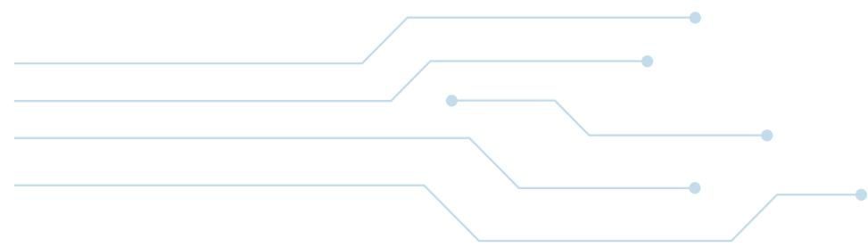

flowchart

```mermaid
graph LR
  A["Top Node"] --> B["Middle Node"]
  B --> C["Bottom Node"]
  C --> D["Final Output"]
```

# 附录 75

ESG 关键绩效数据表 75

报告索引表 84

读者反馈表 87

# 01 党建领航 治理筑基

党建引领 13

公司治理 15

投资者关系管理 17

合规经营 18

商业道德 20

# 02 双碳引领 绿色智造

应对气候变化 25

环境合规管理 28

资源利用 32

排放物管理 33

# 03 创新自强 强链兴产

创新驱动 37

产品质量与安全 46

客户服务 53

数据安全与客户隐私保护 54

供应链管理 56

# 04 人本兴企 履责惠民

员工雇佣与权益保障 61

员工培训与发展 66

职业健康安全 69

乡村振兴 74

社会贡献 74

# 关于本报告

# 报告说明

本报告是贵州振华风光半导体股份有限公司发布的第三份可持续发展报告。报告旨在系统、透明地披露公司2025年度在环境、社会和公司治理领域的管理理念、实践举措与关键绩效。通过这份报告积极回应股东、员工、监管机构、客户、合作伙伴及社会公众等利益相关方的期望，增进各方对公司可持续发展工作的了解与信任。

# 报告称谓说明

<table><tr><td>报告称谓</td><td>公司名称</td></tr><tr><td>振华风光、公司</td><td>贵州振华风光半导体股份有限公司</td></tr><tr><td>中国电子</td><td>中国电子信息产业集团有限公司(公司实际控制人)</td></tr><tr><td>中国振华</td><td>中国振华电子集团有限公司(公司控股股东)</td></tr><tr><td>成都环宇芯</td><td>成都环宇芯科技有限公司(公司控股子公司)</td></tr></table>

<table><tr><td>常用词语</td><td>释义</td></tr><tr><td>IC、集成电路</td><td>即(Integrated Circuit),是将晶体管、电阻、电容等电子元器件及连线集成在单一半导体基片上,形成具有特定电路功能的微型电子器件,是电子信息产业的核心基础部件。</td></tr><tr><td>信号链</td><td>指现实世界中的物理信号(如声、光、温度、压力、电流等),经传感器采集、调理、转换为标准电信号或数字信号,再通过传输、处理与解析,最终实现信息提取、控制输出或数据应用的完整链路与过程。</td></tr></table>

# 编写依据

《上海证券交易所上市公司自律监管指引第 14 号——可持续发展报告（试行）》  
《上海证券交易所科创板上市公司自律监管指南第13号——可持续发展报告编制》  
全球报告倡议组织（GRI）《可持续发展报告标准》（GRI Standards）  
联合国可持续发展目标（Sustainable Development Goals, SDGs）

# 报告范围

时间范围覆盖 2025 年 1 月 1 日至 2025 年 12 月 31 日。组织范围包括振华风光及其控股子公司。为增强信息的完整性与可比性，对部分内容进行适当回溯或延伸。

# 数据来源

本报告涉及信息与数据均源自振华风光内部文件、年度报告、财务数据、运营原始记录、政府公开信息等正式渠道。除特别说明外，财务数据以人民币为单位，若与财务报告存在差异，请以财务报告为准。公司承诺，本报告内容不存在任何虚假记载、误导性陈述或重大遗漏。

# 确认及批准

本报告已经公司保密审查，并于2026年4月29日经董事会审议通过。

# 报告获取方式

电子版报告可通过公司官网（https://www.semifg.com）、上海证券交易所网站（http://www.sse.com.cn）、巨潮资讯网（http://www.cninfo.com.cn）查阅和下载。

# 关于振华风光

# 公司概况

贵州振华风光半导体股份有限公司（以下简称“振华风光”或“公司”）成立于2005年（原为国营风光电工厂，设立于1971年），隶属于中国振华电子集团有限公司，是“三线建设”时期国家在贵州重点布局的半导体集成电路骨干企业。公司为国有控股企业，2004年由都匀搬迁至贵阳，2005年8月改制成立贵州振华风光半导体有限公司，2021年6月整体变更为股份有限公司，2022年8月在上海证券交易所科创板上市（股票简称：振华风光，股票代码：688439.SH），公司位于贵阳市高新区高纳路819号，注册资本2亿元，属于国家高新技术企业、国家级专精特新“小巨人”企业、贵州省产学研结合示范基地、贵州省企业技术中心、贵州省工业设计中心、贵州省知识产权优势企业。

振华风光始终专注于高可靠模拟集成电路设计、封装、测试及销售，自成立以来深耕高可靠集成电路市场，通过持续的科技研发，搭建了集成电路芯片设计平台及 SiP 系统封装设计平台，具备超大规模千万门级 SOC/SiP 设计能力及国产化系统芯片级解决方案设计能力；建有模拟、混合、塑封产品生产线以及 FC-BGA 封装工艺平台、SMT 板卡产品生产线，具备 SiP、陶瓷、金属、塑料等多种形式的高可靠封装能力，以及电性能测试、机械试验、环境试验、失效分析、应用验证等完整的检测试验能力。公司持续深耕集成电路核心技术开发与创新，已初步形成“芯片到系统”产品体系，聚焦高可靠放大器、专用转换器、电源管理、接口驱动、微处理器、存储器等 6 大类单芯片，电机控制系统、传感器信号调理系统、射频微波系统等 3 大系统以及抗辐照加固技术，形成 400 余种产品，配套高可靠核心领域，可满足全温区、长寿命、耐腐蚀、抗辐照、抗冲击等高可靠要求，在国内高可靠模拟集成电路领域具备显著先发优势；其中在高可靠运算放大器研制领域，公司拥有扎实的技术储备和封装测试保障能力，是国内产品型号最全、性能指标最优的高可靠放大器供应商之一。

# 企业文化

# 公司愿景

百年风光梦，幸福风光人

# 核心价值观

拼搏奉献、担当务实、创新发展、卓越共赢

# 经营理念

科技为先、质量为本、用户至上、诚信共赢

# 组织架构

贵州振华风光半导体股份有限公司  
组织机构图  
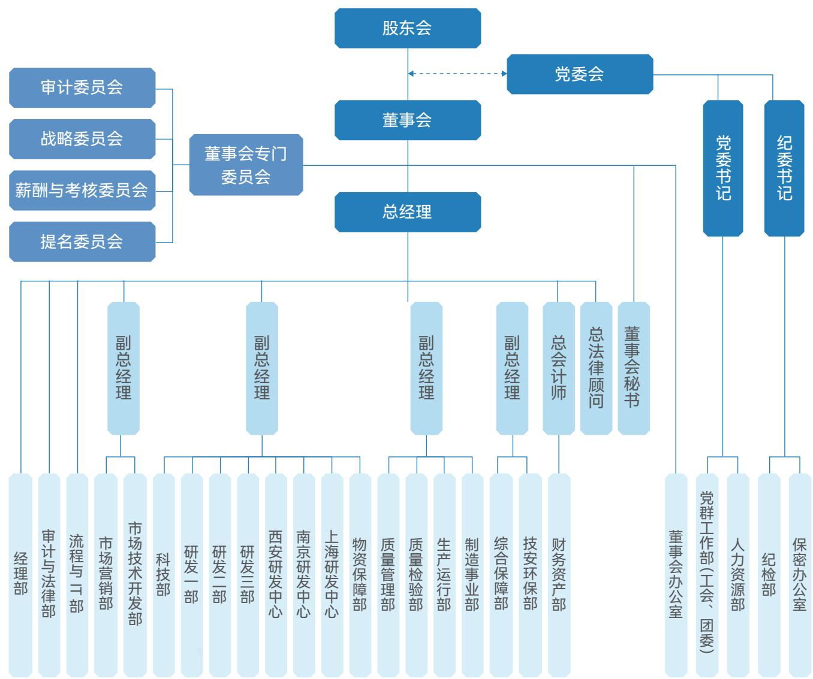

flowchart

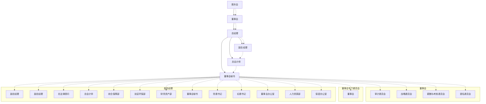
```mermaid
graph TD
  A["股东会"] --> B["董事会"]
  B --> C["总经理"]
  C --> D["副总经理"]
  C --> E["总会计师"]
  C --> F["董事会秘书"]
  
  subgraph Board [董事会]
    G["审计委员会"]
    H["战略委员会"]
    I["薪酬与考核委员会"]
    J["提名委员会"]
  end
  
  subgraph Executive [董事会专门委员会]
    K["董事会"]
  end
  
  subgraph Subsidiaries [副总经理]
    L["副总经理"]
    M["副总经理"]
    N["总法律顾问"]
    O["总会计师"]
    P["综合保障部"]
    Q["技安环保部"]
    R["财务资产部"]
  end
  
  subgraph Subsidiaries [董事会秘书]
    S["董事会秘书"]
  end
  
  subgraph Subsidiaries [党委会]
    T["党委书记"]
    U["纪委书记"]
  end
  
  subgraph Subsidiaries [董事会办公室]
    V["董事会办公室"]
    W["人力资源部"]
    X["保密办公室"]
  end
  
  A -.-> B
  B -.-> C
  C -.-> D
  D -.-> E
  E -.-> F
  F -.-> G
  F -.-> H
  F -.-> I
  F -.-> J
  F -.-> K
  F -.-> L
  F -.-> M
  F -.-> N
  F -.-> O
  F -.-> P
  F -.-> Q
  F -.-> R
  F -.-> S
  F -.-> T
  F -.-> U
  F -.-> V
  F -.-> W
  F -.-> X
```

# 发展历程

1971年

公司前身风光电工厂
成立

2005年

改制成立贵州振华风光半导体有限公司

2022年

公司正式在上海证券交易所科创板挂牌上市

2004年

从都匀市搬迁至贵阳市，完成半导体优质业务重组

2016年

单片集成电路产能和混合集成电路产能实现突破式提升；  
控股成都环宇芯，拓展业务布局

2025年

整体搬迁至沙文集成电路产业园区，进一步优化生产研发布局

# 荣誉奖项

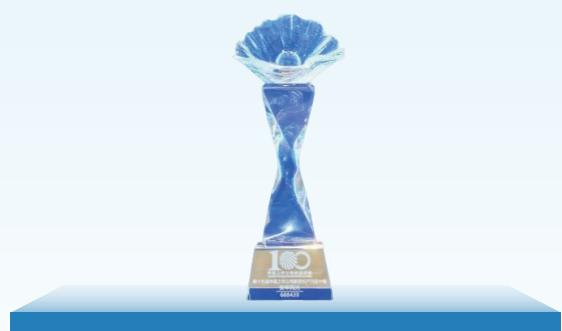

natural_image

Blue trophy with abstract geometric design on a blue base, no visible text or symbols

公司荣获“中国上市公司新质生产力 50 强”

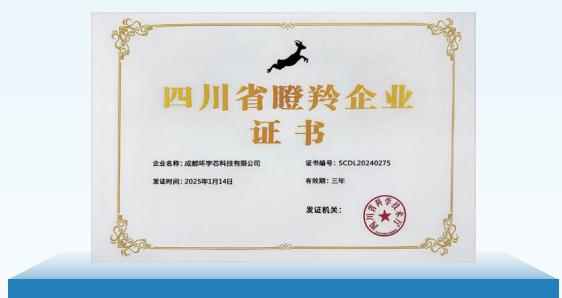

text_image

四川省瞪羚企业
证书
企业名称：成都环宇芯科技有限公司  证书编号：SCDL20240275
发证时间：2025年3月14日  有效期：三年
发证机关：
四川成宁

成都环宇芯荣获“四川省瞪羚企业”  
ESG 治理架构

# 可持续发展管理

# ESG 治理架构

振华风光将可持续发展理念深度融入公司治理，建立了由决策层、管理层与执行层构成的三级 ESG 治理架构，并将 ESG 关键绩效指标纳入高级管理人员的业绩评价体系，通过把安全生产、产品质量、网络安全等不同维度的 ESG 管理指标纳入各管理岗位的考核，推动 ESG 管理绩效持续提升。

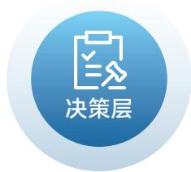

- 董事会作为最高决策机构，负责 ESG 工作的整体规划与统筹；  
- 董事会下设战略委员会，负责 ESG 战略、目标及年度计划的监督审议，并向董事会汇报执行进展。

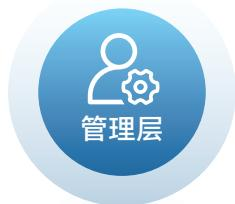

由董事会办公室统筹协调；  
- 技安环保部、党群工作部、财务资产部、审计与法律部、人力资源部及流程与IT部等ESG责任部门，分工负责具体ESG议题的管理。

各业务部门则依据公司 ESG 制度与规划，在日常运营中执行和落实相关工作，确保 ESG 管理全面融入企业运营。

在信息披露方面，公司恪守透明、一致、负责与诚信的原则，借助公司官方网站、上海证券交易所网站等多种渠道定期披露报告与公告，主动与利益相关方沟通 ESG 管理的进程与成果。

# 可持续发展战略

基于对产业与竞争格局的审视，公司运用PESTEL宏观分析、EFE/IFE内外部因素评价矩阵及SWOT分析等结构化工具，识别公司在ESG领域面临的风险与机遇，并据此制定针对性应对策略，合理配置相应资源；并将ESG风险管理纳入经营流程中，建立了涵盖风险识别、评估排序与应对的风险管理机制，推动ESG管理水平提升。

公司持续完善 ESG 指标体系, 规范数据的收集、核算与分析流程, 以提升披露数据的可靠性、可比性与整体质量, 进而推动 ESG 管理能力的进步。

# 可持续发展亮点绩效

# 治理根基与责任运营

全年召开股东会 4 次、董事会 6 次;

全年接待投资者调研交流活动 48 场，召开业绩说明会 3 场，上证e互动问答 174 次，发布公告 108 份；

全年开展反商业贿赂及反贪污培训2次，官微推出廉洁专题18期，开展集体约谈4次；供应商反贿赂承诺书签署率均达 $100\%$ ；全年未发生商业贿赂及贪污事件、不正当竞争相关的违规事件、诉讼及行政处罚。

# 绿色生产与生态共融

环保总投入 30 万元，全年未发生环境违法违规事件、重大环境污染事故及相关行政处罚。

危险废物处置率 100%。

# 可持续创新与负责任供应

研发投入金额总计 17,165.30 万元，占营业收入的比例为 22.25%；累计持有专利 152 项，年度新增专利 63 项；

公司客户反馈响应率 100%，客户满意度达 97.1%。

全年未发生数据安全事故，未发生客户隐私泄露事件；共开展数据安全与客户隐私保护培训2次，组织相关应急演练14次。

共计开展5次供应商审核，开展4次质量相关培训，签订廉洁条款的供应商比例100%。

# 人才赋能与社会担当

公司总员工规模 855 人，研发人员 264 人，占员工总数比例 30.88%;

全年共开展员工培训 172 次，员工培训总时长 13,024 小时，培训覆盖率达 100%，培训支出金额 37.01 万元。

员工满意度调查覆盖全体员工，调查结果为95分，全年帮扶困难员工34人；

全年未发生死亡、重伤及轻伤等安全事故；员工健康安全总投入253.70万元，开展安全教育培训21场，覆盖率为 $100\%$ ；新增职业病病例为0，职业病体检覆盖率 $100\%$ 。

乡村振兴投入金额 39.95 万元。

# 利益相关方沟通机制

公司高度重视与投资者及更广泛利益相关方的沟通，致力于建立透明、双向、规范的沟通机制以增进了解与信任，通过多元渠道与投资者、分析师、媒体及监管机构等对象保持常态化互动。

利益相关方沟通机制

<table><tr><td>利益相关方</td><td>关注议题</td><td>沟通机制</td></tr><tr><td>政府与监管机构</td><td>○ 诚信合规经营○ 依法合规纳税○ 优化治理结构○ 污染达标排放○ 响应国家战略</td><td>○ 信息披露与报送○ 定期汇报○ 环境合规管理○ 污染物管理○ 乡村振兴</td></tr><tr><td>股东与投资者</td><td>○ 主业稳健发展○ 创造优良业绩○ 诚信合规经营</td><td>○ 信息披露○ 股东会○ 投资者调研○ 业绩说明会</td></tr><tr><td>客户</td><td>○ 产品技术创新○ 保障及时交付○ 提供优质服务</td><td>○ 新产品发布会○ 技术交流会○ 客户满意度调查</td></tr><tr><td>员工</td><td>○ 保障员工权益○ 促进职业发展○ 关爱职业健康○ 薪酬福利增长</td><td>○ 全体员工会议○ 投诉反馈信箱○ 员工慰问○ 员工文化活动</td></tr><tr><td>社区</td><td>○ 提供就业机会○ 公益与志愿服务</td><td>○ 社区共建○ 志愿服务活动○ 日常沟通交流</td></tr><tr><td>供应商</td><td>○ 廉洁诚信合作○ 及时结算往来○ 公平公正交易</td><td>○ 准入资质审查○ 日常沟通与培训○ 倡导绿色供应</td></tr></table>

公司恪守真实、准确、完整、及时、公平的信息披露原则，对涉及国家秘密或可能引致不正当竞争、损害公司及他人利益的商业秘密，建立了严格的内部审核流程，依法依规审慎办理信息披露的暂缓与豁免，并对该类信息进行登记管理。在豁免情形消除或信息泄露时，公司将及时履行披露义务。

# 关键绩效

报告期内，公司共开展机构投资者调研48场；业绩说明会3场；集体投资者交流活动2场；行业策略交流会3场；上证e互动问答174次、投资者热线咨询100余次，回复率 $100\%$ 。

# ESG 相关荣誉

华证 ESG 评级 A 级

中诚信 ESG 评级 A+ 级

Wind ESG 评级 A 级

# 双重重要性议题识别

公司遵循“识别、评估与构建”的流程开展实质性议题分析，通过分析评估各议题在“财务重要性”与“影响重要性”两个维度的表现，确定ESG关键议题及管理重点。

# 议题识别

参考资本市场、评级机构和国内外相关标准的要求，宏观政策及监管要求；  
参考同行业优秀实践，参考具有行业特点的议题

# 分析评估

- 利益相关方调研  
管理层讨论分析  
双重重要性评估

# 重要性议题矩阵构建

按照识别评估结果绘制双重实质性议题矩阵，并据此选出关键重要性议题，在 ESG 报告中重点披露其管理与表现

实质性议题分析流程

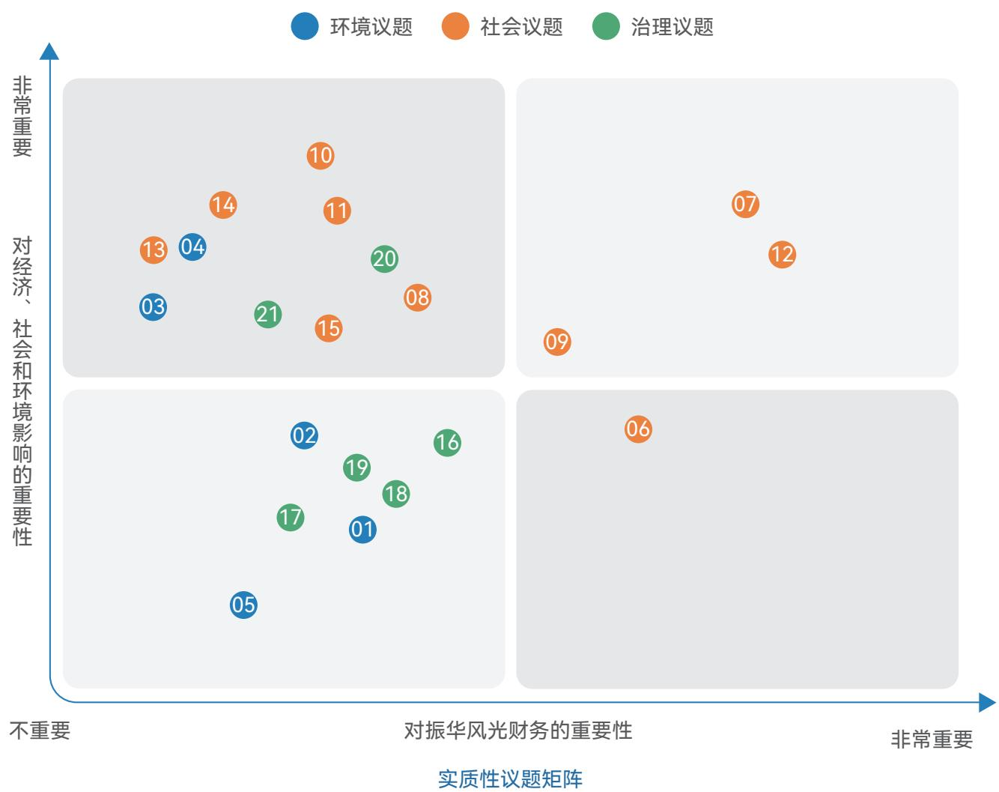

scatter

| ID | 类别 | 实质性议题 (X) | 对经济、社会和环境影响的重要性 (Y) |
| --- | --- | --- | --- |
| 01 | 环境议题 | ~0.45 | ~0.35 |
| 02 | 环境议题 | ~0.35 | ~0.45 |
| 03 | 环境议题 | ~0.25 | ~0.45 |
| 04 | 环境议题 | ~0.30 | ~0.50 |
| 05 | 环境议题 | ~0.30 | ~0.15 |
| 06 | 社会议题 | ~0.75 | ~0.40 |
| 07 | 社会议题 | ~0.85 | ~0.65 |
| 08 | 社会议题 | ~0.60 | ~0.50 |
| 09 | 社会议题 | ~0.75 | ~0.35 |
| 10 | 社会议题 | ~0.45 | ~0.75 |
| 11 | 社会议题 | ~0.55 | ~0.65 |
| 12 | 社会议题 | ~0.90 | ~0.60 |
| 13 | 社会议题 | ~0.25 | ~0.55 |
| 14 | 社会议题 | ~0.35 | ~0.65 |
| 15 | 社会议题 | ~0.45 | ~0.45 |
| 16 | 治理议题 | ~0.65 | ~0.45 |
| 17 | 治理议题 | ~0.40 | ~0.35 |
| 18 | 治理议题 | ~0.60 | ~0.35 |
| 19 | 治理议题 | ~0.50 | ~0.35 |
| 20 | 治理议题 | ~0.55 | ~0.60 |
| 21 | 治理议题 | ~0.40 | ~0.45 |

# 环境议题

01 环境合规管理  
02 应对气候变化  
03 资源利用  
04 排放物管理  
05 生态系统与生物多样性保护

# 社会议题

06 创新驱动  
07 产品和服务安全与质量  
08 数据安全与客户隐私保护  
09 可持续供应链  
10 员工雇佣与权益保障  
11 员工培训与发展  
12 职业健康与安全  
13 乡村振兴  
14 社会贡献  
15 行业共建

# 治理议题

16 公司治理  
17 党建引领  
18 合规经营  
19 商业道德  
20 ESG 治理  
21 利益相关方沟通

# 01 党建领航治理筑基

振华风光严格遵循《中华人民共和国公司法》等相关法律法规及监管规则要求，持续完善现代企业制度与公司治理架构，坚持党建引领与公司治理深度融合，不断健全合规经营管理体系、内部控制与内部审计监督机制，严守商业道德底线，推动治理体系与治理能力持续优化，保障公司规范、稳健、可持续运营。

贡献联合国可持续发展目标（SDGs）：

16 和平、正义与强大机构

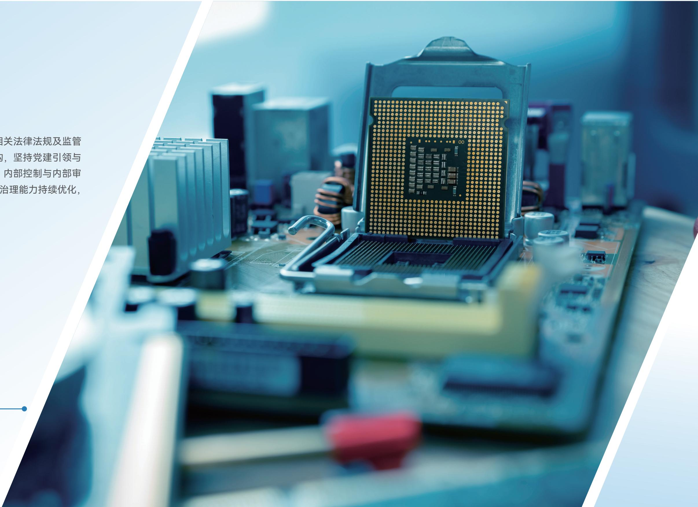

text_image

相关法律法规及监管
，坚持党建引领与
内部控制与内部审
治理能力持续优化,

# 党建引领

振华风光党委坚持以习近平新时代中国特色社会主义思想为指导，坚决贯彻党中央及上级党委决策部署，紧密围绕企业改革发展任务，推动党建工作与生产经营深度融合，切实将党建优势转化为提升公司核心竞争力和推动可持续发展的治理效能，保障各项事业稳步向前。

报告期内，振华风光召开党委会23次，研究决定“三重一大”事项142个；开展4次党支部工作检查；对班子成员开展20余次专题指导、对业务部门开展7次专项检查。

公司持续强化思想引领，严格落实“第一议题”制度，全年共组织“第一议题”学习49次；围绕科技创新、集成电路产业发展等关键议题，开展专题研讨，深刻领会党中央战略意图和部署要求，为深化公司改革、推动战略落地、攻克技术难关筑牢了思想根基。

2025 年，公司通过传达学习习近平总书记关于开展深入贯彻中央八项规定精神学习教育的重要讲话和重要指示精神，落实中国振华党委部署要求，审定通过《振华风光深入贯彻中央八项规定精神学习教育工作计划》，并对成都环宇芯、各党支部深入贯彻中央八项规定精神学习教育进行安排部署。

# 以学筑基，在深学细悟中增强政治定力

通过党委理论学习中心组学习，党支部“三会一课”、主题党日活动等方式，切实把中央八项规定及其实施细则精神贯彻执行到位。

# 以查促改，在“全面体检”中找准“疑难杂症”

充分运用多种监督检查和征集意见的途径，全面深入查找在贯彻落实中央八项规定及其实施细则精神方面存在的薄弱环节和突出问题，强化警示教育，引导党员干部筑牢拒腐防变的思想防线。

# 以改提效，在标本兼治中推动长效长治

扎实推进学习教育整改工作，完善相关制度流程，接受员工群众监督，对整改落实情况进行跟踪问效，将学习成效切实转化为推动振华风光高质量发展的强劲动力。

# 深化作风建设

公司党委以丰富的党建主题活动和暖心举措凝聚员工向心力，通过举办“七一”表彰会、开展主题党日活动、主题演讲、红色观影等10余项文化活动，促进党内民主团结；通过开展14次“党支部联系点领导开放日”活动、“一线听音、凝聚新声”青年科研骨干座谈会，广泛听取员工意见，进一步激发员工的归属感、责任感和创新活力。

# 案例

# 振华风光开展红色观影主题党日活动

为传承红色基因、强化使命担当，振华风光于2025年8月组织开展“光影铸魂守初心以史为鉴启新程”红色观影主题党日活动。公司领导班子、中层干部及党员代表共130人集体观看爱国主义影片《南京照相馆》，引导干部职工深刻铭记抗战历史、弘扬伟大精神，进一步坚定理想信念、增强团队凝聚力。本次活动将党性教育与文化建设深度融合，为企业注入坚实的精神动力。

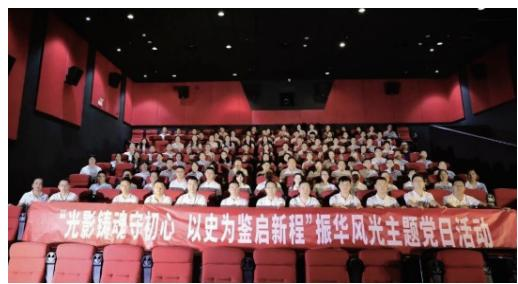

text_image

“光影键动守初心 以史为鉴启新程”振华风光主题党日活动

红色观影主题党日活动现场

此外，公司探索多样化的党建联建活动，深化“链上共建”机制，与政府机构、高校、行业等，围绕技术攻关、项目孵化、人才共育开展合作，为打造具有竞争力的现代化产业体系注入强劲红色动能。

# 案例

# 振华风光与贵州大学开展支部党建联建活动

为深化党建引领与业务协同，2025年9月，振华风光技术党支部与贵州大学大数据与信息工程学院电子科学系教工党支部联合开展党建联建活动。双方围绕集成电路半导体领域的技术创新与产学研企融合，通过组织共建、资源共享、课题共研等形式，推动党建与科研攻关、人才培养的有机结合。此次活动进一步拓展了校企合作的深度与高度，强化了产业需求与学术研究的双向对接，为服务国家战略、提升行业影响力注入了持续动能。

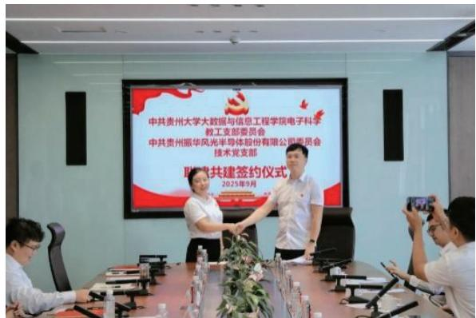

text_image

中共贵州大学大数据与信息工程学院电子科学
教工支部委员会
中共贵州振华风光半导体股份有限公司委员会
技术党支部
暨共建签约仪式
2025年9月

校企联建签约仪式

# 公司治理

振华风光严格遵循《中华人民共和国公司法》《中华人民共和国证券法》等法律法规及上海证券交易所科创板相关规则要求，构建权责清晰、协同高效、有效制衡的现代企业治理体系。公司始终坚持“党委把方向、管大局、保落实，董事会定战略、作决策、防风险，经理层谋经营、抓落实、强管理，监督体系强保障”的治理原则，推动各治理主体各司其职、各负其责、协调运转，形成了规范完善的治理格局。

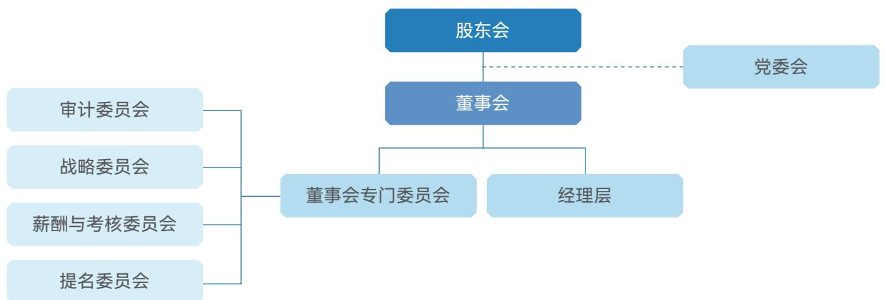

flowchart

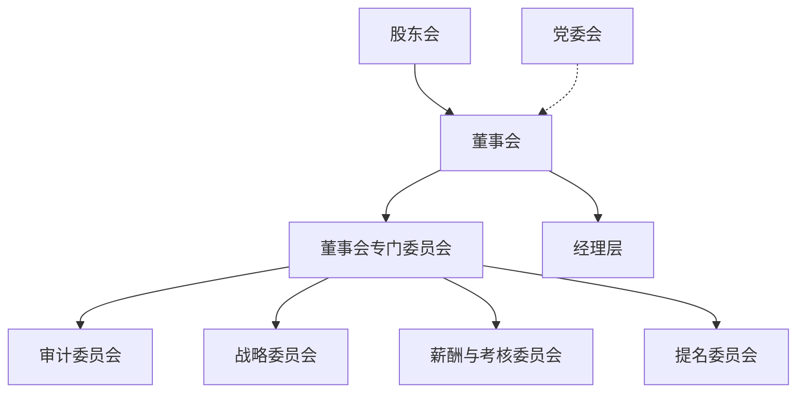
```mermaid
graph TD
  A["股东会"] --> B["董事会"]
  C["党委会"] -.-> B
  B --> D["董事会专门委员会"]
  B --> E["经理层"]
  D --> F["审计委员会"]
  D --> G["战略委员会"]
  D --> H["薪酬与考核委员会"]
  D --> I["提名委员会"]
```

振华风光组织机构图

股东会作为公司最高权力机构，依法行使决定公司经营方针和投资计划、选举和更换董事、审议批准财务预算与决算方案、利润分配方案、修改公司章程等核心职权。公司严格按照《公司章程》及《股东会议事规则》召开股东会，保障股东决策参与权和监督权。

# 振华风光保护中小股东重点举措

针对涉及中小投资者利益的重大事项审议，公司严格执行中小股东表决单独计票机制，并及时公开披露计票结果，以保障其知情权与参与权；

在选举两名及以上独立董事时，公司采用累积投票制，强化中小股东在治理结构中的话语权与代表性，持续提升公司治理的包容性与有效性。

公司董事会对股东会负责，行使制定公司经营计划和投资方案、审议关联交易、管理信息披露等职权；经理层对所制定的生产经营管理方案进行落实执行，并向董事会进行汇报。

振华风光股东会、董事会和管理层运作规范，召集、召开及表决程序均符合相关规定。2025年，组织召开股东会4次，董事会6次，有效提升决策时效性。

# > 董事会多元化

公司综合考虑性别、年龄、文化背景、教育背景、行业经验和专业技能等多元化因素选择董事会候选人。截至报告期末，振华风光董事会由7名董事组成，包含1名职工董事（女性）、3名独立董事。3名独立董事分别为自动化工程技术专业、法律专业及会计专业的行业专家，满足董事会专业经验多元和能力结构互补要求。

振华风光董事成员多元化构成

<table><tr><td>姓名</td><td>职务</td><td>性别</td><td>年龄</td><td>专业背景</td></tr><tr><td>朱枝勇</td><td>董事长</td><td>男</td><td>50</td><td>电子与通信工程专业</td></tr><tr><td>赵晓辉</td><td>副董事长</td><td>男</td><td>51</td><td>物理学专业</td></tr><tr><td>郑世红</td><td>独立董事</td><td>男</td><td>51</td><td>法律专业</td></tr><tr><td>董延安</td><td>独立董事</td><td>男</td><td>53</td><td>会计专业</td></tr><tr><td>嵇保健</td><td>独立董事</td><td>男</td><td>45</td><td>电气工程专业</td></tr><tr><td>胡锐</td><td>内部董事</td><td>男</td><td>44</td><td>电路与系统专业</td></tr><tr><td>冯伟</td><td>职工董事</td><td>女</td><td>44</td><td>工商管理专业</td></tr></table>

公司董事会下设审计、提名、薪酬与考核、战略四个专门委员会，为董事会重大决策提供专业支持与建议，有效提升董事会决策的科学性、专业性与运作效率。

<table><tr><td>审计委员会</td><td>负责审核公司财务信息及披露、监督内外部审计工作、评价内部控制有效性,指导内部审计部门开展工作,保障公司财务信息真实准确。</td></tr><tr><td>提名委员会</td><td>负责拟定董事、高级管理人员选择标准和程序,对人选及其任职资格进行遴选、审核,确保公司核心管理团队具备相应专业能力和任职资质。</td></tr><tr><td>薪酬与考核委员会</td><td>制定董事、高级管理人员考核标准和薪酬政策与方案,开展履职考核,确保薪酬与业绩挂钩、激励与约束并重。</td></tr><tr><td>战略委员会</td><td>审议公司长期发展战略和重大投资决策,为公司产业布局、技术创新等重大事项提供专业支持。</td></tr></table>

# > 董事会有效性评估

公司董事会对在任独立董事独立性进行年度评估并出具专项意见，确保独立董事履职独立性持续有效；独立董事每年向年度股东会提交述职报告，披露出席会议情况、参与专门委员会工作、行使特别职权等履职情况，接受股东监督。

公司建立健全高级管理人员考核与激励机制，由薪酬与考核委员会制定考核标准和薪酬方案，考核结果与薪酬挂钩。2025年，公司按照考核方案对高级管理人员履职情况进行全面评估，薪酬发放兼顾短期业绩与长期发展，充分调动高级管理人员积极性和责任感。

# 投资者关系管理

公司深知优质的投资者关系管理是公司治理能力与市场竞争力的综合体现，高度重视投资者关系管理工作，通过构建与投资者双向沟通平台，及时向投资者传达经营管理和重大决策等事项的相关信息，维护投资者合法权益。

公司通过股东会、上证e互动平台、路演、反向路演、投资者交流活动、业绩说明会、投资者热线等多元化渠道，不断加深对利益相关方沟通，增进其对公司的认同。

# 关键绩效

2025 年，公司接待投资者调研交流活动 48 场，召开业绩说明会 3 场，上证e互动问答 174 次，对外发布公告 108 份。

# 案例 贵州证券业协会来振华风光开展“价值黔行”走进上市公司调研交流活动

2025 年 9 月，贵州证券业协会组织多家投资机构到振华风光开展“价值黔行”走进上市公司活动。此次活动搭建了资本市场与上市公司信息互通和资源共享的桥梁，让投资机构通过实地调研、面对面交流，直观掌握振华风光在技术研发、产能布局、市场拓展、战略方向等方面的实际情况，精准挖掘企业投资价值；也为振华风光提供了向资本市场传递发展理念、展示核心优势的窗口，助力企业更高效地对接优质资本资源。

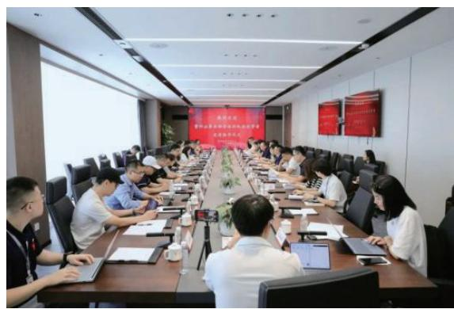

text_image

Meeting room photo with visible red banner text and participants seated at long tables

“价值黔行”投资者交流活动

# 合规经营

振华风光建立健全合规管理体系，覆盖证券监管、保密、财务税务、关联交易等重点领域，严格执行国家安全保密法律法规，建立保密工作制度，落实涉密人员保密责任，确保业务合规开展。

2025 年，公司组织董事、监事、高级管理人员及核心员工开展法律法规、监管规则等专项培训，提升全员合规意识和专业能力，全年未发生重大合规风险事件。

# 内部培训

《“三重一大”相关制度及流程》培训  
《制度流程有效性评价工作》

# 外部培训

《上市公司规范运作及董监高履职责任》专题培训

# > 内部控制

公司构建了健全的内部控制体系，涵盖财务会计、物资采购、产品销售、对外投资、募集资金使用等关键业务环节，明确各部门职责权限，形成相互制约、相互监督的内控机制。审计部定期对内部控制制度的健全性、合理性和有效性进行检查评价，针对发现的薄弱环节提出改进建议，推动内控体系持续优化。

2025年, 公司持续深化内部控制体系建设, 强化制度执行监督, 确保内控机制有效运行, 防范化解经营管理风险, 保障公司资产安全、财务报告真实完整, 为公司持续健康发展提供坚实支撑。

2025年，振华风光荣获由中国上市公司协会颁发的“2025年中国上市公司内部控制优秀实践案例”称号。

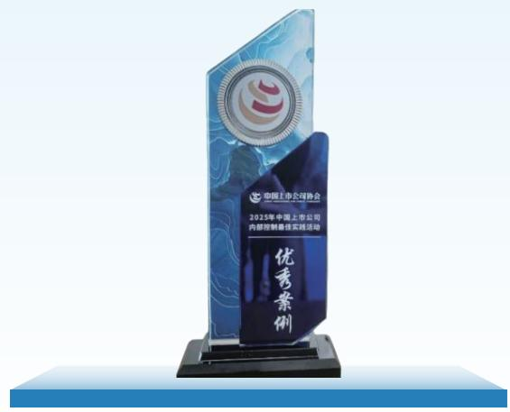

text_image

中国上市公司协会
2025年中国上市公司
内部控制最佳实践活动
优秀案例

# > 内部审计

公司依据《中华人民共和国证券法》《中华人民共和国审计法》《上海证券交易所科创板股票上市规则》《审计署关于内部审计工作的规定》控制等有关法律法规，强化内部审计监督和风险管理。

公司董事会审计委员会下设审计部作为专职机构，独立行使审计监督权。审计部按照年度审计计划，开展募集资金使用、财务收支、内部控制、关联交易、重大合同、高级管理人员任期经济责任等审计工作，重点关注公司生产经营各环节的合规性、真实性和效益性，对发现的问题提出整改建议并跟踪落实。

2025 年，审计部完成多项常规审计和专项审计项目，编制审计工作报告提交审计委员会，配合外部审计机构开展工作，推动公司完善内部控制制度、规范经营管理流程，有效防范经营风险和财务风险。

# 商业道德

振华风光始终秉持“廉洁从业”的商业道德理念，将廉洁要求融入公司经营管理全流程，建立健全反腐败工作管理体系，完善商业道德约束机制，强化全员诚信教育与行为监督，打造清廉的工作氛围，切实维护公司合法权益和市场良好秩序。

报告期内，公司召开4次专题会议研究部署党风廉政建设工作。

# 商业道德管理体系

公司建立了层级清晰、权责明确的商业道德管理架构，明确管理层、纪检部及各部门在反腐败与商业道德建设中的核心职责，确保商业道德要求融入经营管理全流程。

# 管理层

对公司反腐败等商业道德建设负主要责任，负责建立、健全并有效实施反腐败程序和控制体系，开展舞弊风险自我评估，统筹安排部署反腐败各项工作。

# 纪检部

作为反腐败工作的核心监督执行部门，负责对公司商业道德行为进行日常监督，受理腐败、舞弊等事件的举报并开展调查，提出处理意见，同时定期向纪委和管理层汇报反腐败工作进展，接受监督指导。

# 各部门

履行属地管理责任，组织部门员工开展商业道德及反腐败教育，对员工日常行为进行监督，及时发现并报告腐败、舞弊等线索，配合纪检部开展调查与整改工作。

# 振华风光反舞弊管理组织机构图

公司已制定《反舞弊工作管理制度》，明确舞弊、腐败行为界定标准、反舞弊及反腐败工作重点、预防控制措施、举报调查程序及处罚补救办法，为商业道德建设工作开展提供制度遵循，确保各项工作有章可循、规范推进。

# 廉洁文化建设

公司将诚信守法、廉洁自律的商业道德理念融入企业文化建设，通过内部廉洁专题宣贯、外部专家专题培训、关键岗位开展警示教育等多种形式，开展商业道德教育，引导员工正确处理工作中的利益冲突和不当利益诱惑。同时，对新员工开展反舞弊专项培训和法律法规、诚信道德教育，从入职初期筑牢商业道德思想防线。

此外，公司以适当形式向客户、供应商、监管机构等外部利益相关方传递公司的商业道德主张，推动形成内外部协同守规的良好氛围。

# 关键绩效

报告期内，振华风光开展2次反商业贿赂及反贪污培训；官微推出廉洁专题18期；组织49名采购、科研、财务等关键岗位人员赴羊艾监狱开展警示教育；开展集体约谈4次。

# 商业道德风险防控

公司持续深化“大监督”格局，在公司层面、业务部门层面，开展腐败风险识别与专项检查，科学研判腐败风险的重要性和发生可能性，针对性建立控制程序和机制。2025年，公司针对重点领域、业务风险点开展专项检查9次，推动完善11项关键制度。

在公司各层级、各部门推行批准、授权、核查、权责分工、业绩复核、资产安全保护等反腐败控制措施，形成相互制约、相互监督的内控体系。同时，对拟聘用的中层干部及重要岗位人员开展背景调查，形成正式文字记录并纳入员工档案，从人员准入环节防范腐败风险。

# 关键绩效

2025 年，振华风光未发生重大商业道德违规及腐败、舞弊案件，反腐败工作管理制度有效执行，商业道德建设取得良好成效。

# > 举报渠道与举报人保护

公司高度重视内部监督体系建设，将举报工作作为防范违规违纪行为、强化内部治理的重要抓手，建立《举报工作管理办法》，畅通多元举报渠道，完善举报人保护与奖惩制度，充分调动员工参与企业监督的积极性，切实保障公司和员工的合法权益。

公司明确纪检部为举报工作归口管理部门，全面负责举报工作的日常管理，设立举报信箱、举报邮箱和举报电话，并将渠道设置情况以正式形式向全体职工公告，确保每位员工知晓举报方式。

为保护举报人合法权益，消除员工举报顾虑，公司制定严格、全面的举报人保护措施，从保密管理、回避制度、严禁打击报复等方面，为举报人提供全方位保障。

# 严格保密管理

纪检部工作人员对举报人个人信息及举报内容严格保密，举报材料作为密件单独管理；严禁将举报材料转给被检举、控告的部门和个人；在接受举报或向举报人核查情况时，全程做好保密工作；对举报有功人员的宣传报道和奖励，未经举报人同意，不得公开其姓名和工作部门。对违反保密规定的责任人员，公司将按保密管理规定严肃处理，构成犯罪的依法移送司法机关。

# 实行回避制度

处理举报事项的工作人员若为被举报人或其近亲属，或与举报问题存在利害关系、其他可能影响公正处理的关系，须自行回避，举报人也有权要求其回避，确保举报调查工作的客观性和公正性。

# 严禁打击报复

公司明确规定任何部门和个人不得以任何借口阻拦、压制员工举报，严禁对举报人实施打击报复行为。一经查实存在打击报复行为，公司将对相关责任人作出严肃处理，构成犯罪的依法移送司法机关追究法律责任。

振华风光举报人保护措施

# 反不正当竞争

公司始终将公平竞争作为企业商业行为的重要承诺，严格遵守《中华人民共和国反不正当竞争法》《中华人民共和国反垄断法》《中华人民共和国监察法》等法律法规，并依据《诚信管理办法》等内部制度，规范公司及全体员工的商业行为，明确禁止价格垄断、商业贿赂、徇私舞弊等一切破坏市场秩序的行为。

为构建透明、可信的监督机制，公司持续优化匿名举报渠道，鼓励内外部利益相关方对任何涉嫌违法违规违纪的行为进行实名或匿名反馈，并确保每项举报均得到独立、公正的调查与处理。

# 关键绩效

2025 年，振华风光未发生因不正当竞争引发的重大诉讼、行政处罚或监管调查。

# 02 双碳引领绿色智造

振华风光坚持将绿色发展理念融入生产经营全流程，严格遵守生态环境保护相关法律法规，持续完善环境管理体系，统筹推进应对气候变化、资源高效利用、污染物规范管控、环境风险防范等各项工作，推动生产运营与生态环境保护协同发展，切实履行企业环境责任。

贡献联合国可持续发展目标（SDGs）：

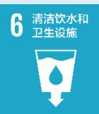

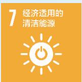

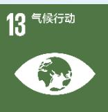

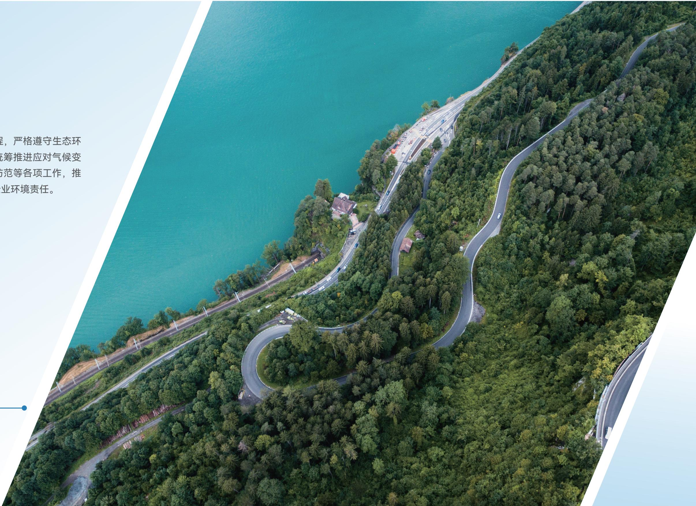

text_image

，严格遵守生态环
等推进应对气候变
范等各项工作，推
业环境责任。

# 应对气候变化

振华风光将应对气候变化视为推动公司绿色转型、提升运营韧性与把握未来机遇的重要行动。公司不仅积极管理自身运营的碳足迹，更将气候因素融入公司治理与风险管理体系，以科学、透明的方式积极应对气候挑战，为国家“双碳”目标的实现贡献力量。

# 治理

公司将应对气候变化视为可持续发展战略的重点，通过建立并持续完善相应的管理体系，明确管理职责与要求，积极应对气候变化挑战，管理相关风险与机遇，为社会经济低碳转型贡献力量。

# 战略

公司分析评估气候变化带来的行业影响、国家政策及行业趋势，并参考 TCFD 等主流披露框架，识别并评估了相关风险与机遇，并实施相应的适应策略，以增强运营韧性并为可持续发展提供支撑。

振华风光气候变化相关风险与机遇清单

<table><tr><td>风险/机遇类别</td><td>风险/机遇说明</td><td>潜在财务影响</td><td>影响周期1</td><td>应对措施</td></tr><tr><td>急性物理风险</td><td>极端天气:工厂、车间、办公楼建筑及设备可能被破坏,造成资产损失,甚至可能会引起员工安全事故。</td><td>可能导致资产减值,增加运营成本,降低营业收入。</td><td>短期</td><td>制定自然灾害的应急响应预案。完善自然灾害应急响应机制。识别可能的资产损坏,购买必要的保险。</td></tr></table>

<table><tr><td>风险/机遇类别</td><td>风险/机遇说明</td><td>潜在财务影响</td><td>影响周期1</td><td>应对措施</td></tr><tr><td>慢性物理风险</td><td>持续高温、干旱等:气温升高可能导致公司能耗增加,工人工作效率降低。</td><td>运营成本增加。</td><td>中期一长期</td><td>配备完善设施,科学安排生产计划,提高运营效率。</td></tr><tr><td rowspan="3">转型风险</td><td>政策和法律风险:关于温室气体排放的政策法规增加可能提高公司合规运营成本。</td><td>运营成本增加。</td><td>中期一长期</td><td>密切关注环境法律法规、政策的变化并及时应对。</td></tr><tr><td>技术风险:未及时识别并应用低碳技术,导致同业竞争力削弱。</td><td>研发投入增加运营成本,营业收入下降。</td><td>中期一长期</td><td>持续研究应用低碳技术,积极开展行业合作。</td></tr><tr><td>声誉风险:因在应对气候变化及可持续领域表现不佳,导致利益相关方负面反馈。</td><td>营业收入下降,融资成本增加。</td><td>中期一长期</td><td>加强公司双碳”工作管理,积极回应利益相关方的关切。</td></tr><tr><td>市场机遇</td><td>上下游供应链、客户偏好转变可能会增加对绿色低碳产品关注。</td><td>营业收入增加。</td><td>长期</td><td>积极开发绿色低碳产品,跟踪市场动态,满足需求。</td></tr></table>

$^{1}$ 影响周期：短期代表 1 年以内；中期指 1-5 年；长期为 5 年以上。

# 风险与机遇管理

公司构建了气候变化相关风险与机遇管理流程，遵循“识别—评估—应对—监督”的闭环管理逻辑，为有效应对风险与机遇提供支持。

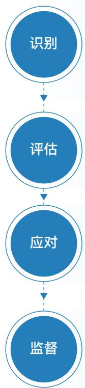

flowchart

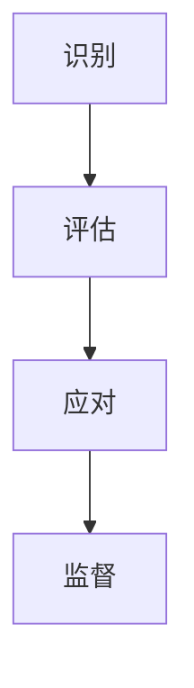
```mermaid
graph TD
  A["识别"] --> B["评估"]
  B --> C["应对"]
  C --> D["监督"]
```

- 内部扫描：结合具体运营，将宏观风险转化为具体业务情景  
外部分析：分析国家“双碳”政策、行业技术趋势、供应链要求及国际气候协议（如《巴黎协定》）情景，评估其对半导体行业的潜在影响

# 识别

# 评估

对已识别的风险与机遇进行分析排序，确定其对公司的潜在影响。

# 应对

- 风险应对：制定减缓、适应和转移策略；  
- 机遇把握：规划绿色转型路线等。

# 监督

定期跟踪风险与机遇管理进展；  
每年对整体管理流程进行回顾更新，以应对外部环境变化。

# 气候变化相关风险与机遇管理流程

公司积极响应国家“双碳”目标，将绿色低碳理念贯穿运营全流程。公司的温室气体排放主要来源于车辆燃油消耗（直接排放）及外购电力消耗（间接排放）。

# 指标与目标

针对应对气候变化领域，振华风光将低碳发展理念纳入企业长期发展规划，并围绕温室气体排放管理设定相应目标。公司定期开展排放数据核算与追踪工作，以掌握自身排放水平与变化趋势。

振华风光 2025 年温室气体排放情况

<table><tr><td>指标</td><td>单位</td><td>2025年</td></tr><tr><td>温室气体范围一排放量</td><td>吨二氧化碳当量</td><td>18.54</td></tr><tr><td>温室气体范围二排放量</td><td>吨二氧化碳当量</td><td>6,887.19</td></tr><tr><td>温室气体排放总量(范围一+范围二)</td><td>吨二氧化碳当量</td><td>6,905.73</td></tr><tr><td>温室气体排放强度</td><td>吨二氧化碳当量/万元营收</td><td>0.09</td></tr></table>

# 环境合规管理

公司遵守相关法律法规构建了标准化的环境保护管理体系，制定了《环境保护管理制度》，设立了公司级的环境保护工作领导小组。该小组由分管安全生产的副总经理领导，技安环保部负责人任副组长，成员涵盖生产、质量、研发、保障及职能管理等各主要业务与职能部门负责人，以确保环境管理要求在公司运营中得到全面落实与协调。

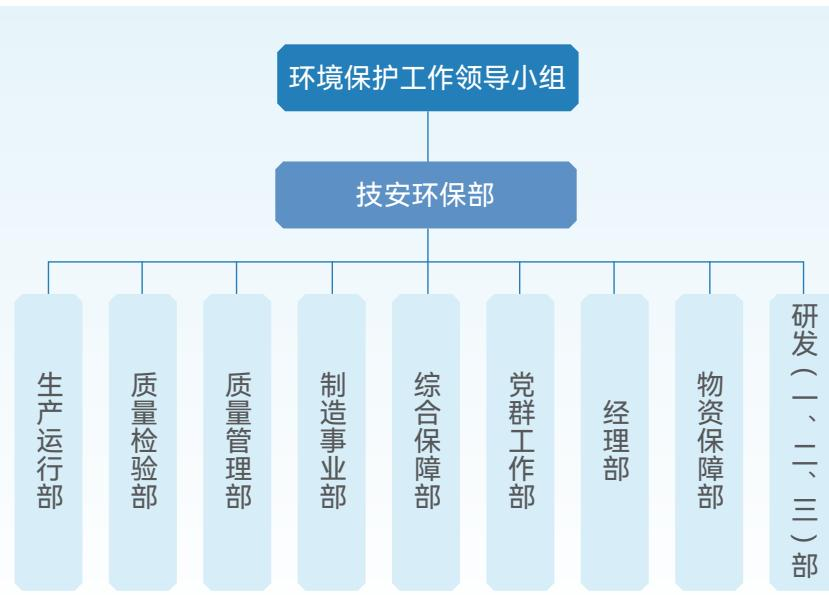

flowchart

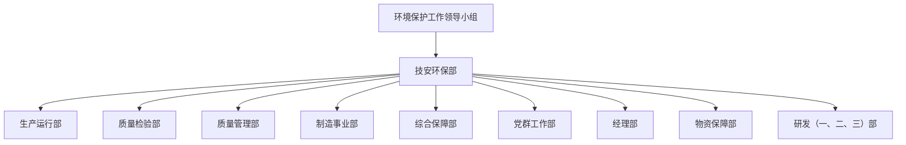
```mermaid
graph TD
  A["环境保护工作领导小组"] --> B["技安环保部"]
  B --> C["生产运行部"]
  B --> D["质量检验部"]
  B --> E["质量管理部"]
  B --> F["制造事业部"]
  B --> G["综合保障部"]
  B --> H["党群工作部"]
  B --> I["经理部"]
  B --> J["物资保障部"]
  B --> K["研发（一、二、三）部"]
```

环境保护工作领导小组架构

环境保护工作领导小组职责分工

<table><tr><td>部门/机构</td><td>具体职责</td></tr><tr><td>环境保护工作领导小组</td><td>最高决策机构,负责统筹战略规划、审批重大事项、监督合规运行、指挥应急响应及推动环保文化建设。</td></tr><tr><td>技安环保部</td><td>归口管理部门,具体负责制定与实施年度环保计划、组织合规检查与监测、管理危险废物与台账、跟进环保设施验收以及推动体系与技术的持续改进。</td></tr><tr><td>综合保障部</td><td>负责环保设施的日常运维、规范管理设施所用化学品、配合危废转移与记录。</td></tr><tr><td>制造事业部质量检验部研发部</td><td>负责优化生产与研发的物料使用效率、规范化学品使用与废弃物产生过程管控、通过工艺改进减少废弃物产生量、配合废弃物转移与记录。</td></tr><tr><td>质量管理部</td><td>负责建立供应商环保资质审核机制,推动绿色供应链管理。</td></tr><tr><td>物资保障部</td><td>负责优先采购环保合规的物料、结合计划与库存核定采购量避免浪费、配合开展采购物资的环保合规性审查。</td></tr><tr><td>生产运行部</td><td>负责全公司物资的统一调度与合规性管理,建立动态台账确保可追溯,监督使用部门规范操作以防止污染。</td></tr><tr><td>经理部</td><td>负责园区生活垃圾分类、清运及绿化养护工作,制定制度并监督保洁单位,提升园区环境卫生。</td></tr><tr><td>其他职能部门</td><td>在各自职责范围内履行环保义务,增强环保意识、减少资源浪费,并配合技安环保部进行数据统计与宣传工作。</td></tr></table>

# > 环境管理体系认证

2025 年 11 月，公司顺利通过 ISO 14001 环境管理体系年度复审。此次复审通过，充分验证了公司环境管理体系运行的持续合规性、有效性与适宜性，为公司深化环境精细化管理、践行绿色低碳发展理念提供了坚实的体系保障。

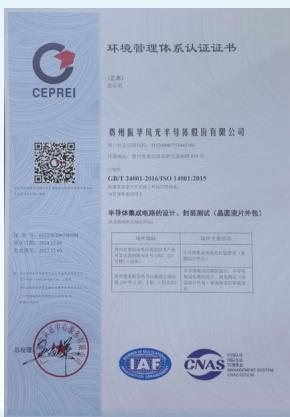

text_image

环境管理体系认证证书
（盖章）
CEPREI
贵州振宇风光半导体股份有限公司
GCBT 24001-2016/ISO 14001/2015
半导体集成电路的设计、封装测试（晶圆流片外包）
证书编号：CNAS
证书类型：电子证书
证书名称：深圳市华联光电科技有限公司
证书编号：CNAS
证书有效期：2013年12月
证书类型：半导体集成电路制造企业（集团）有限责任公司
证书编号：CNAS
证书有效期：2013年12月
证书类型：半导体集成电路制造企业（集团）有限责任公司
证书编号：CNAS
证书有效期：2013年12月
证书类型：半导体集成电路制造企业（集团）有限责任公司
证书编号：CNAS
证书有效期：2013年12月
证书类型：半导体集成电路制造企业（集团）有限责任公司
证书编号：CNAS

环境管理体系认证证书

# > 环境风险应急管理

公司构建了完整的环境风险应急管理体系，通过全流程环境风险辨识、重点源管控及闭环管理机制管控环境风险，编写了《环境因素识别表》。日常运营中，公司将隐患排查深度融入，借助常态化与专项检查排查关键环节，并建立动态隐患台账；通过安装实时预警智能监测装置，推行隐患排查激励机制，并定期开展培训，持续提升风险防控能力。2025年，公司委托专业第三方机构协助开展了环境风险双重预防机制建设，进一步健全了风险预防体系。

同时，公司制定了《突发环境事件应急预案》，并依据事件的严重与紧急程度实施分级响应管理，明确要求事发单位及时启动现场处置方案，并在必要时联动外部救援力量与相关方，以协同控制事态发展。2025年，公司根据应急预案开展了多项应急演练，有效检验了预案的有效性，强化了公司对突发环境事件的应急能力。

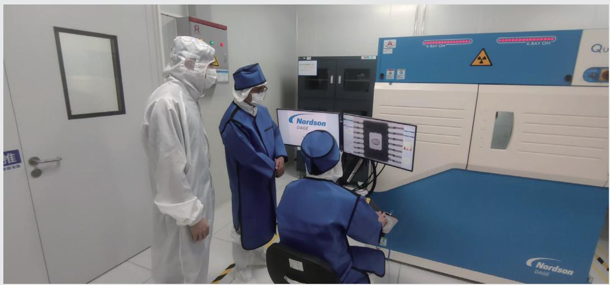

text_image

Photo of three technicians in cleanroom suits operating equipment with visible logos and labels including 'Nordson DAGE' and 'X-BAY ON'

辐射安全应急演练

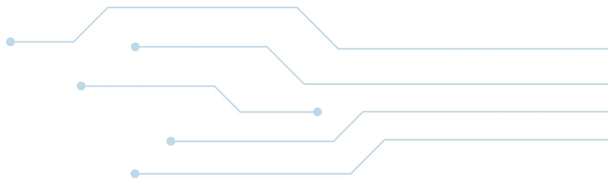

flowchart

```mermaid
graph LR
  A["Start Node"] --> B["Process Path 1"]
  B --> C["Process Path 2"]
  C --> D["Process Path 3"]
  D --> E["Final Output"]
```

# 社区沟通与环保文化

公司建立了社区沟通与投诉管理机制，主动预防并回应运营对周边社区的影响，通过规范的投诉处理流程确保问题得到及时调查、整改与闭环复盘，以持续改善环境管理成效。

同时，公司致力于培育绿色环保文化，通过理念宣贯、制度牵引与场景浸润等多维机制，将节约集约、循环利用的可持续发展观融入组织决策与员工行为，推动绿色价值观转化为全员自觉行动，构建人与自然和谐共生的价值共同体。

# 环境管理目标

2025 年，公司设定的各项年度环境管理目标均已达成，全年未发生环境违法违规事件。

# 关键绩效

报告期内，公司环境管理总投入 30 万元。

2025 年环境管理目标

<table><tr><td>管理目标</td><td>达成情况</td></tr><tr><td>无污染物超标超量排放情况</td><td>✓已达成</td></tr><tr><td>无环境污染事件</td><td>✓已达成</td></tr><tr><td>无环境行政处罚</td><td>✓已达成</td></tr><tr><td>废气、废水、噪声监测率100%</td><td>✓已达成</td></tr></table>

# 资源利用

公司严格遵守《中华人民共和国节约能源法》《中华人民共和国可再生能源法》等法律法规，高度重视能源资源管理与高效利用，明确生产、生活、办公及施工设备能耗目标，将资源节约与高效利用要求落实到生产运营各环节，稳步推进各项管控举措落地。

# 能源管理

公司制定能源管理专项工作计划，对生产、办公等全场景的能源消耗实施全流程精细化管控。围绕计划目标，公司持续优化生产工艺与设备运行管理，推广应用节能技术与节能设备，不断提升能源利用效率；规范能源计量统计工作，定期开展能源消耗数据分析，识别节能优化空间，推动能源消耗管控按计划持续优化。

# 水资源管理

公司高度重视水资源节约与高效利用，规范生产、生活用水管理。公司针对生产环节用水需求，持续优化用水工艺，推广应用节水技术与水循环利用设施，提升水资源重复利用率；加强用水计量器具管理与日常巡检维护，杜绝水资源浪费现象，同时强化员工节水意识宣贯，按计划稳步推进水资源节约与高效利用各项工作。

# 清洁生产与循环经济

公司严格落实清洁生产相关要求，将清洁生产理念融入生产制造全流程。公司持续优化生产工艺，从源头减少资源消耗与废弃物产生；积极推进循环经济发展，对生产过程中产生的可回收废弃物进行分类回收与资源化利用，最大化提升资源循环利用效率，按计划推动生产模式向绿色低碳、循环高效方向持续优化。

# 排放物管理

公司严格遵守《中华人民共和国环境保护法》《中华人民共和国水污染防治法》《中华人民共和国大气污染防治法》《中华人民共和国固体废物污染环境防治法》等相关法律法规，建立全流程污染物管控机制，对生产运营过程中产生的废水、废气、固体废物及噪声实施规范化管控，确保污染物达标排放，避免对自然水体、土壤及生态环境造成污染或破坏。

# 废水管理

公司生产运营过程中产生的废水主要包括工业废水和生活污水，主要污染物包括化学需氧量（COD）、氨氮（ $\mathrm{NH}_3$ -N）、总氮（TN）、总磷（TP）等。公司针对废水排放制定专项管控计划，配套建设污水处理站，工业废水经污水处理站处理达标后排放。公司委托有资质的第三方机构定期监测、巡检污水处理站运行情况，保障污水处理设施有效运行。报告期内，公司废水污染物均达标排放，未发生废水排放相关违规事件。

# 废气管理

公司生产运营过程中主要大气污染物包括颗粒物（PM）、挥发性有机物（VOCs）等。公司按照生产设施及其排污情况，配套废气污染防治设施，开展设施日常运维管理，保障污染防治设施正常运行。加强挥发性有机物废气处理设施的维护保养，定期更换活性炭，确保废气处理设备设施正常运行，减少废气排放。公司委托有资质的第三方机构定期开展废气检测，确保废气排放达标。报告期内，公司废气污染物均达标排放，未发生废气排放相关违规事件。

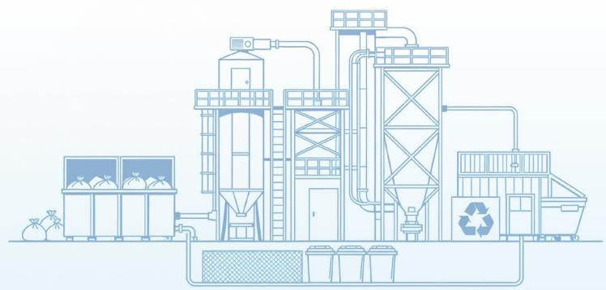

natural_image

Line drawing of an industrial waste treatment facility with conveyor belts, storage tanks, and recycling bins (no text or symbols)

# 废弃物管理

公司严格遵守《中华人民共和国固体废物污染环境防治法》《危险废物转移管理办法》等有关规定，对生产运营过程中产生的废弃物实施分类管理、全流程合规管控。

针对生活垃圾，实施定点收集后委托环卫部门及时清运处置；针对一般工业固废，实施分类收集、妥善暂存于一般工业固废贮存库，统一交由有资质的机构进行无害化处置或者综合利用。针对危险废物，公司全面辨识危险废物产生环节，委托有专业资质的机构开展废弃物属性鉴别，规范危险废物标志标识，建立危险废物清单及台账；依规开展危险废物暂存设施建设和运维，对危险废物实施规范分类、分区贮存，严禁露天堆放；危险废物全部委托具备相应资质的单位进行合规处置。报告期内，公司危险废物处置率100%，未发生废弃物处置相关违规事件。

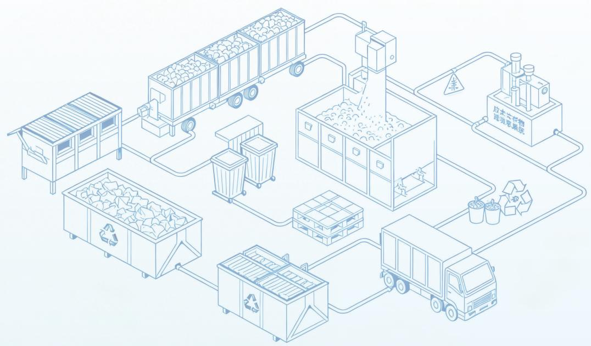

flowchart

This is an isometric line diagram illustrating the waste sorting and recycling process of a waste management system, showing inputs from bins, trucks, and storage units connected by directional arrows.

# 03 创新自强 强链兴产

振华风光坚持以科技创新驱动高质量发展，持续完善研发创新体系，深耕核心技术攻关与成果转化；同时坚守产品质量底线，构建全生命周期质量管理体系，深化客户服务与数据安全保护，打造可持续供应链生态，以技术创新赋能产业发展，以责任经营筑牢发展根基。

贡献联合国可持续发展目标（SDGs）：

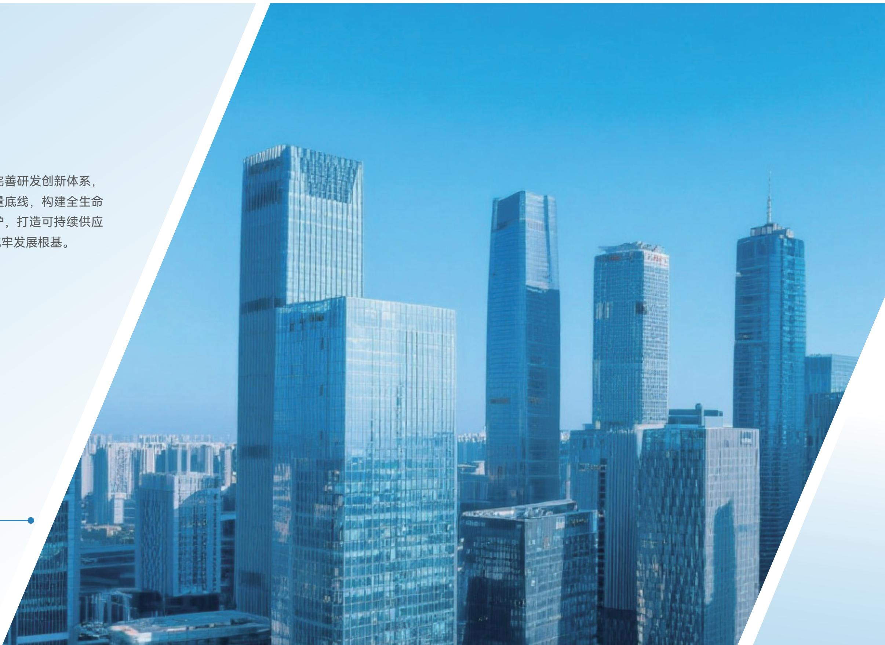

text_image

完善研发创新体系，
是底线，构建全生命
护，打造可持续供应
牢发展根基。

# 创新驱动

振华风光坚持以技术创新为发展引擎，持续完善研发创新治理体系与全流程管控机制，加大核心技术研发投入，深化产学研企协同创新，强化知识产权全链条管理，推动技术攻关与成果转化落地，以持续的创新能力夯实企业核心竞争力。

# 治理

公司积极响应国家“加快建设科技强国”的战略号召，深度融入国家创新体系。作为经国家认定的高新技术企业，公司坚持以市场需求为导向，以技术进步为核心驱动力，构建了科学、系统的研发创新管理体系。

在管理维度上，公司建立了覆盖“技术研发—项目管理—成果转化”的全流程管控模式，形成了从前瞻性技术布局到产业化应用落地的完整创新链条。通过不断优化资源配置与流程管控，着力提升研发效率与成果转化质量，以体系化能力保障创新活动的可持续性，为企业高质量发展注入技术动能。

研发创新治理架构

<table><tr><td>最高决策与领导核心</td><td>公司党委</td><td rowspan="2">在研发创新相关工作中承担把方向、管大局、保落实的职责;负责研究讨论公司重大经营管理事项,涵盖重大研发战略与投资相关内容</td></tr><tr><td rowspan="2">战略决策与监督层</td><td>董事会</td></tr><tr><td>董事会下设专门委员会</td><td>董事会审批公司长期发展战略与重大投资决策;其下设战略委员会审议相关战略与投资事项,薪酬与考核委员会通过审议高管薪酬考核衔接研发激励</td></tr><tr><td rowspan="2">执行与管理层</td><td>经理层</td><td rowspan="2">经理层以总经理为代表,负责组织实施董事会决议,推动研发计划落地、管理研发资源以保障研发目标达成;科技创新管理部门负责研发活动规划、项目管理、成果转化、知识产权及“产学研企”合作的归口管理</td></tr><tr><td>科技创新管理部门</td></tr><tr><td rowspan="2">项目执行与协同层</td><td>研发项目团队</td><td rowspan="2">研发项目团队作为研发核心执行单元;构建的多基地协同研发网络,形成研发合力</td></tr><tr><td>多基地协同研发网络</td></tr></table>

截至报告期末，公司共计拥有研发人员264人，占员工总数30.88%。

振华风光持续完善科技创新治理体系，以制度建设为抓手，着力提升研发管理的规范化与科学化水平。2025年，公司围绕科研项目管理、成果转化、技术协作及投资论证等重点领域，拟制、修订了6项内部管理办法，进一步夯实了创新发展的制度基础。

# 在项目管理方面

通过修订《科研项目管理办法》，细化立项、评审、调整等关键节点的管控要求，明确联合开发项目的外协管理规范，强化了项目全生命周期的权责划分与过程监督。公司制定了《项目负责人管理办法》与《“揭榜挂帅”项目管理细则》，以优化科技项目管理流程，提升科研执行效能。针对工艺技术攻关，公司发布《工艺技术攻关项目管理办法》，旨在加强对关键工艺环节的规范化管理，提升制造水平与产品研发效率。

# 在成果转化与基础保障方面

全面修订《新产品转产管理办法》，新增技术状态文件清单及生产状态信息表，进一步明确转产环节的交付标准，从研发到批产的顺畅衔接提供支撑。同时，公司制定《技术协议管理办法》，规范采购环节的技术协议管理流程，提升对供应商的技术约束与质量保障能力。公司修订《固定资产投资项目管理办法》及相关细则，通过固化论证模板、实施分级管理，持续完善投资决策制度基础。

# 战略

振华风光着力以“3大系统+6类产品+1条核心技术栈”为主体的产品体系构建模拟信号链全域解决方案，系统推进“性能极致化、场景专属化、产业自主化”的发展路径。在战略布局上，公司同步响应以高可靠领域为代表的重大项目配套需求，以及以“战略性新兴产业”为代表的国民经济主战场应用需求，持续拓展多元场景下的产品应用。围绕上述方向，公司计划每年推出不少于50款新产品，以进一步丰富信号链全域解决方案的产品矩阵，提升面向多场景的系统化供给能力。

振华风光产品创新研发风险清单

<table><tr><td>风险类型</td><td>风险描述</td><td>发生可能性</td><td>潜在财务影响</td><td>影响周期</td></tr><tr><td>产品规划风险</td><td>产品规划偏离市场需求,造成新产品与市场脱节。</td><td>低</td><td>可能导致企业营业收入下降,运营成本增加</td><td>中期、长期</td></tr><tr><td>产品生命周期风险</td><td>集成电路行业产品迭代快,如果企业无法及时完成产品交付,可能失去市场份额。</td><td>中、高</td><td>运营成本增加</td><td>短期、中期、长期</td></tr></table>

振华风光产品创新研发机遇清单

<table><tr><td>机遇类型</td><td>机遇描述</td><td>发生可能性</td><td>潜在财务影响</td><td>影响周期</td></tr><tr><td>市场需求机遇</td><td>商业航空、商业航天、高端装备制造、新能源工控、边缘AI计算等领域快速发展,对高可靠、高防护等级的集成电路产品需求持续扩容,为公司研发成果转化、新产品技术攻关与应用场景拓展提供广阔市场空间。</td><td>高</td><td>企业营业收入增加</td><td>短期、中期、长期</td></tr><tr><td>技术迭代机遇</td><td>集成电路设计、封装测试、抗辐照、隔离等核心技术持续迭代,公司可通过研发新工艺、新架构、新封装技术,推动产品向高集成度、低功耗、高可靠性方向升级,在优化产品性能的同时降低研发与量产成本,持续提升产品核心竞争力。</td><td>高</td><td>运营成本减少,营业收入增加</td><td>中期、长期</td></tr><tr><td>政策与产业环境机遇</td><td>国家持续出台鼓励集成电路产业、高端装备制造、科技创新及国企改革的相关支持政策,公司作为科改示范企业、高新技术企业、贵州省“专精特新”企业,可依托政策支持加大研发投入、开展核心技术攻关、引进高端研发人才,完善研发创新体系。</td><td>高</td><td>企业运营成本降低</td><td>中期、长期</td></tr><tr><td>国产替代机遇</td><td>关键领域供应链自主可控进程持续加速,航空航天等核心领域元器件国产化替代需求迫切,为公司提供了全面的研发配套与进口替代机会,助力公司突破核心技术、拓展产品应用边界。</td><td>高</td><td>营业收入增加、市场份额扩大</td><td>中期、长期</td></tr></table>

<table><tr><td>机遇类型</td><td>机遇描述</td><td>发生可能性</td><td>潜在财务影响</td><td>影响周期</td></tr><tr><td>产业协同机遇</td><td>公司通过深化产学研企合作机制、完善多基地协同研发网络、参与行业技术联盟等方式,与高校、科研院所及产业链上下游企业共享创新资源,联合开展核心技术攻关,降低研发试错成本,缩短研发周期,提升技术创新效率与成果转化能力。</td><td>高</td><td>研发成本、运营成本减少、新产品上市周期缩短</td><td>短期、中期、长期</td></tr></table>

# 影响、风险和机遇管理

针对研发创新领域的风险与机遇，振华风光系统构建了相应的保障机制，围绕项目执行、技术攻关及成果转化等关键环节，持续完善风险识别、评估与应对流程。

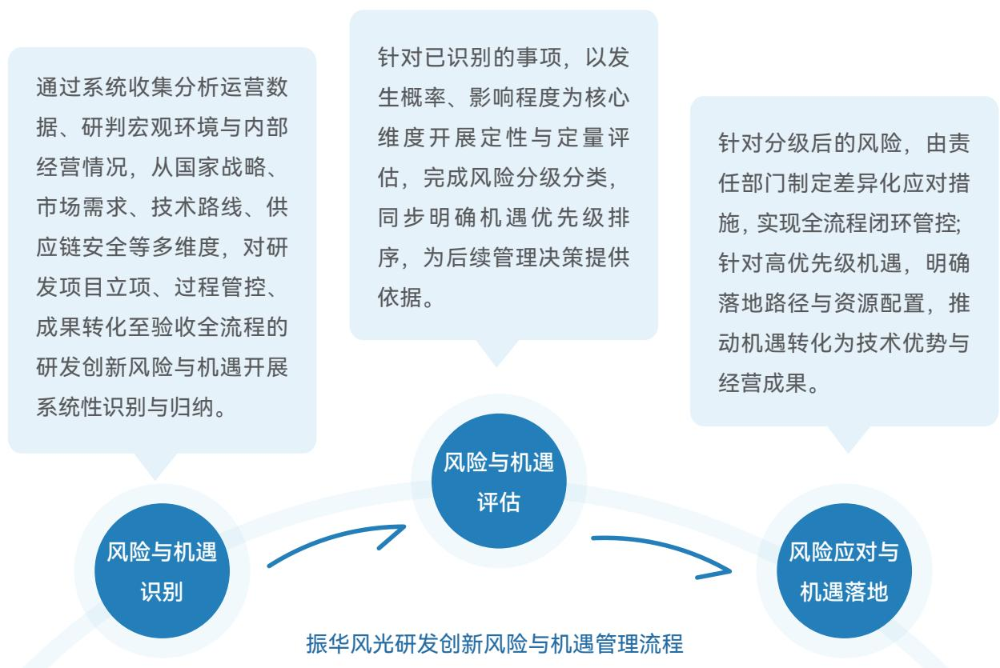

flowchart

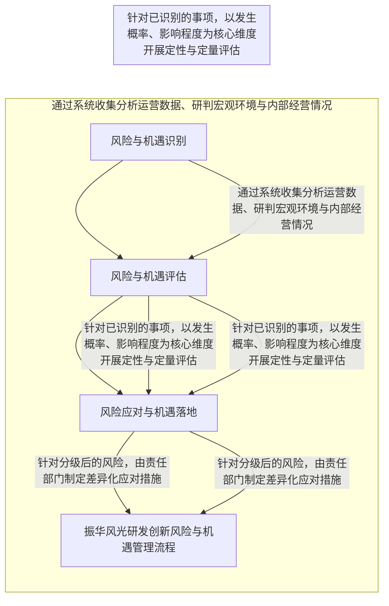
```mermaid
graph LR
  A["风险与机遇识别"] --> B["风险与机遇评估"]
  B --> C["风险应对与机遇落地"]
  
  subgraph Process1 ["通过系统收集分析运营数据、研判宏观环境与内部经营情况"]
    direction TB
  A -->|"通过系统收集分析运营数据、研判宏观环境与内部经营情况"| B
  B -->|"针对已识别的事项，以发生概率、影响程度为核心维度开展定性与定量评估"| C
  C -->|"针对分级后的风险，由责任部门制定差异化应对措施"| D["振华风光研发创新风险与机遇管理流程"]
  end
  
  subgraph Process2 ["针对已识别的事项，以发生概率、影响程度为核心维度开展定性与定量评估"]
    direction TB
  B -->|"针对已识别的事项，以发生概率、影响程度为核心维度开展定性与定量评估"| C
  C -->|"针对分级后的风险，由责任部门制定差异化应对措施"| D
  end
```

# 创新研发进展与重要成果

报告期内，公司稳步推进集成电路领域各重点研发项目实施，多项产品在技术攻关、鉴定验证、成果转化等环节取得重要进展，核心研发工作按计划有序推进。

# 1. FS1800型18G射频宽带频率综合器项目

公司上海研发中心推进FS1800型18G射频宽带频率综合器研发。报告期内，项目已完成全部版图与电路设计，并通过设计输出评审。2025年12月，项目完成首次流片，经初步测试，主要性能指标已达到预期。基于测试结果，项目团队正开展改版设计工作，计划于2026年8月完成改版流片，以进一步优化性能表现，保障项目研发进程稳步推进。

# 2. FQ21750 单通道隔离型栅极驱动器产品

本产品为适配IGBT/SiC MOSFET的单通道隔离型栅极驱动器，具备DESAT保护、内部米勒钳位保护功能，输出峰值电流达10A，采用SOP16W封装，可承受5.7kVrms隔离电压，集成多项核心保护与故障管理功能，适用于高可靠性、高功率密度、高效率的开关电源系统。报告期内，产品完成GJB7400-2011规定的N1级鉴定试验并合格，同步完成转产，已开展多批次用户试用并形成市场订单。

# 3．FR9032型一分二功率分配器产品

本产品采用DFN-6紧凑型封装，具备低插入损耗、高端口隔离度、低回波损耗的优异性能，运行稳定可靠。报告期内，产品完成公司内部系统化筛选测试与全面鉴定验证，各项指标均符合设计与应用要求，顺利完成转产，正式进入批量制造与市场化供应阶段。

# 案例 自主创新驱动产业升级，磁编码器关键技术突破与产业化

报告期内，公司依托成熟的数据转换器设计技术，开展《基于数据转换器设计技术的应用与示范》重大技术攻关项目，突破高灵敏度霍尔传感器设计、电压检测、 $\Sigma-\Delta ADC$ 精度调制、高性能模数转换器校准算法、多电源电压域高速ESD泄放电路以及模数混合信号电路版图等磁编码转换器多项关键核心技术，成功完成磁编码器研制与工业规模化生产并推向市场。项目构建了集研发、生产、营销于一体的产业化平台，为后续高精度混合信号转换器系列产品研发奠定了坚实基础。

# 研发激励

公司以“揭榜挂帅”与项目经理人机制为抓手，赋予一线研发团队充分的自主权，并将成果与激励直接挂钩。在此基础上，公司建立科研人员年薪制考核体系，并拟订科技创新成果激励办法，其中部门负责人绩效薪酬占总薪酬比例约50%，与年度目标责任完成情况紧密关联。

# 关键绩效

截至报告期末，公司已累计向作出突出贡献的科技人员发放精神与物质奖励共计 13 万元。

# 产学研企合作

振华风光坚持“以产业需求为导向、以企业为主体、以市场为牵引”的深度融合思路，整合高校前沿理论优势、科研院所专业技术能力与企业工程化及市场资源，通过与复旦大学、哈尔滨工业大学、西安电子科技大学等高校深化合作，共建联合实验室，加速成果转化，完成高性能射频芯片初版设计、GaN功放组件初样研制，并开展三维异构集成基础研究，构建了“基础研究—技术攻关—产品转化”协同创新链条，响应国家战略与市场需求，解决产业关键共性技术与“卡脖子”难题，实现创新链与产业链的精准对接和价值闭环。

# 案例 与贵州交通职业大学签署战略合作协议，深化产学研企合作实现校企优势互补

2025 年，振华风光与贵州交通职业大学签署战略合作协议。双方围绕山地无人机芯片、伺服系统等科研方向，以共建联合实验室、联合申报科研项目为抓手，开展深度产学研企合作。本次合作充分整合校企双方资源，实现优势互补，助力公司完善协同创新布局，推动相关领域技术研发与成果转化落地。

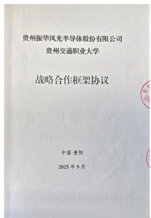

text_image

贵州振华风光半导体股份有限公司
贵州交通职业大学
战略合作框架协议
中国·贵阳
2025年9月

公司与贵州交通职业大学签署战略合作协议

# 指标与目标

报告期内，公司在产品研发与创新方面，设置如下指标与目标：

# 关键绩效

报告期内，研发投入金额总计17,165.30万元，占营业收入的比例为 $22.25\%$ 。

<table><tr><td>目标</td><td>2025年达成情况</td></tr><tr><td>开发新产品数量达到100款</td><td>√已达成(实际开发116款)</td></tr></table>

# 知识产权管理

为持续增强公司综合实力与市场竞争力，推动技术创新工作开展，充分激发员工发明创造积极性，维护公司与员工的合法权益，振华风光严格遵循《中华人民共和国商标法》《中华人民共和国专利法》《中华人民共和国著作权法》等相关法律法规规定，制定《知识产权合规管理手册》，建立符合国家相关规范的知识产权管理体系。报告期内，公司获得 GB/T29490-2023 知识产权合规管理体系认证证书，知识产权管理规范化水平得到进一步验证与提升。

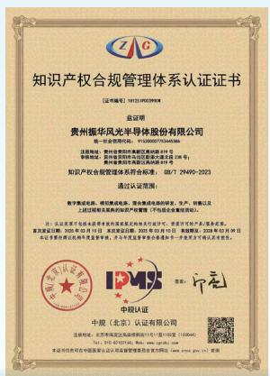

text_image

知识产权合规管理体系认证证书
（证书编号：19131100000000）
兹证明
贵州振华风光半导体股份有限公司
注册地址：贵州省贵阳市南明区南站路218号
身份证号码：贵州振华风光半导体股份有限公司
授权委托书有效期限：2025年1月1日至2025年1月24日
知识产权合规管理体系的合法合规，GB/T 29490-2023
通过认证范围：
数字桌面系统、智能终端设备、集成电路等高新技术研发、生产、销售以及
上述应用是实现互联网产品的管理，不包括业务活动。
注：以认证项目为包括具备面向专业技术的实验室、科研平台和产品/服务类项目。
截至2025年12月31日，该企业已获中国证监会核准。2025年12月31日，根据《中华人民共和国证券法》及深圳证券交易所的相关规定，本年度申请综合服务不超过本次发行不超过1.6%的人民币。
中规（北京）认证有限公司
注册地址：北京市海淀区北苑西路中关村软件园1号楼11层1108（100644）
网址：www.boc.cn
本证书经查询在中国证券登记结算有限责任公司网站（www.gov.cn）下载。

GB/T29490-2023 知识产权合规管理体系认证证书

2025 年 7 月，振华风光《一种基于双极工艺的具有超低失调电压的集成电路》专利荣获第十届贵州省专利优秀奖。该专利创新性地优化了改进型双转单电路结构，有效解决了集成电路中的系统失配问题，显著提升了失调电压的温度稳定性与负载稳定性。此次获奖标志着公司技术创新与产业应用融合取得阶段性成果，为提升核心竞争力注入新动能。

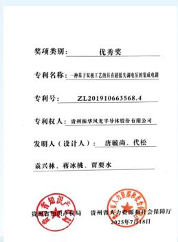

seal

贵州航天动力股份有限公司
贵州航天动力股份有限公司
发票专用章

公司专利获贵州省专利奖优秀奖

公司聚焦知识产权工作提质增效与专利质量优化，开展专题培训，为技术成果高效转化提供专业支撑。

# 案例

# 专利质量攻坚能力提升培训

2025 年 9 月，公司组织开展《专利预审申请及方案遴选》专题培训，邀请知识产权领域专家进行授课。培训结合公司年度专利质量攻坚行动规划，围绕专利预审流程优化、申请材料规范及方案遴选技巧等内容展开，为技术人员提供了专业指导。此次活动旨在提升专利申报质量与效率，强化知识产权保护能力建设，推动技术创新成果转化与知识产权管理工作协同增效。

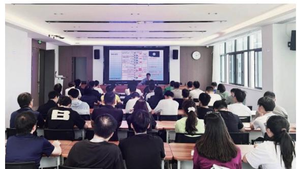

text_image

Classroom or lecture hall with attendees seated facing a presentation screen displaying Chinese text and numbers

专利质量攻坚能力提升培训现场

<table><tr><td>目标</td><td>2025年达成情况</td></tr><tr><td>发明专利申请≥25项</td><td>√已达成(实际申请61项)</td></tr><tr><td>集成电路布图设计登记申请≥35项</td><td>√已达成(实际申请86项)</td></tr></table>

# 关键绩效

截至报告期末，公司累计持有专利152项，其中应用于主营业务的发明专利64项；累计持有软件著作权12项，年度新增专利63项。

# 行业共建

振华风光积极投身集成电路行业生态建设，深度参与行业交流与公共事务，携手产业链上下游伙伴、高校及科研院所，搭建产业协同平台，推动行业技术交流与资源整合，助力区域集成电路产业高质量协同发展。

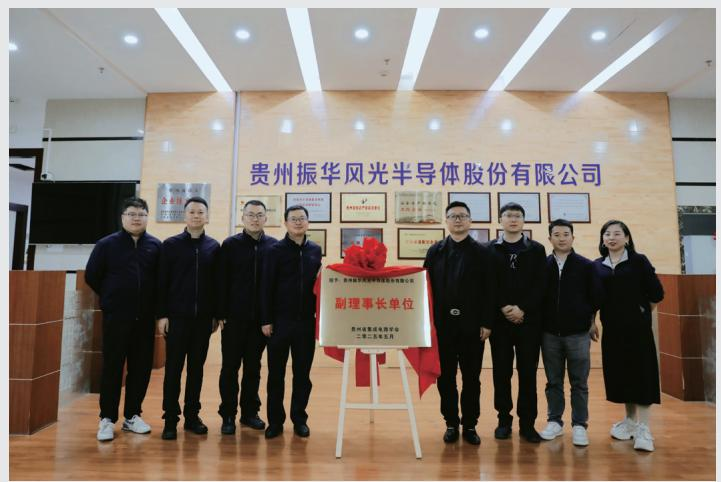

text_image

贵州振华风光半导体股份有限公司
副理事长单位
贵州振华光电股份有限公司
第二大股东

2025 年 5 月公司被授予贵州省集成电路学会副理事长单位
贵州省质量协会会员单位

# 案例 承办集成电路行业委员会成立大会，助力区域产业协同

2025 年 1 月，由振华风光联合承办的贵州科学城业界共治理事会集成电路行业委员会成立大会在贵阳举行。来自高校、科研机构及企业代表等人参会。活动期间发布了高可靠集成电路封测平台及 ICC 设计公共服务平台，旨在整合产业链资源，搭建公共技术服务平台，推动贵州集成电路产业协同发展。公司作为主要承办单位，全程参与筹备组织工作，为大会顺利推进提供了有力支撑。此次行业委员会的成立，有助于构建产业链与生态链体系，促进区域电子信息制造业向专业化、集约化方向发展。

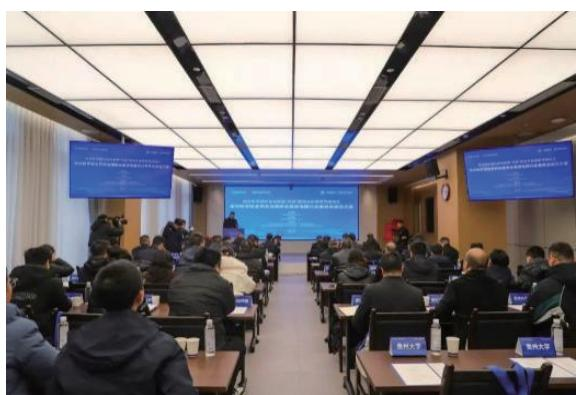

text_image

Conference hall photo with visible presentation screens and nameplates, showing attendees seated facing a stage with presentation screen in background.

贵州科学城业界共治理事会集成电路行业委员会成立大会现场

# 产品质量与安全

公司持续完善覆盖产品全生命周期的质量管理体系，将安全、可靠与合规要求贯穿始终，以严谨审慎的态度把控每一环节，确保产品质量稳定可靠。

# 治理

振华风光构建了完善的质量管理组织架构，将质量工作责任层层分解，确保各层级质量职责清晰明确，并由质量管理部统筹负责公司产品质量与安全相关事务。公司制定并执行《一级检验管理办法》《产品质量评审管理办法》《质量改进管理办法》《不合格品管理办法》等内部制度，从工序质量、实物质量与管理质量三个维度实施全过程管控，推动整体质量水平持续提升。

# 最高管理者

组织讨论并制定公司战略规划，发展规划，经营方针，质量方针和质量目标，策划建立和健全公司质量管理体系，对工作质量工作全面负责，主持召开管理评审会。

# 质量总经理

贯彻质量方针，质量目标，策划建设质量管理体系，组织，开展质量考核和奖励，负责产品过程质量管控。

# 质量管理人员

负责公司质量管理工作，对公司质量管理体系运行进行监督管理，组织产品质量问题处理，负责供应商管控。组织质量分析、纠正、改进，落实质量责任制。

# 质量检验人员

负责产品过程检验试验工作，负责不合格品的控制，对产品质量有建议劝和一票否决权。

# 失效分析人员

负责产品失效分析工作。

# 计量管理人员

负责供仪器仪表的计量工作，按规定对仪器仪表进行检定和校准，负责计量器具的验收。

# 质量管理职责分工

报告期内，公司结合业务发展实际，完成 GJB9001C 质量手册及配套程序文件、作业文件的修订换版，并在 GJB9001 体系基础上，制定下发 AS9100 质量手册，新增 3 个作业文件，同步修订《质量绩效考核办法》。同时，公司新制定 GJB5000B 管理手册 1 份及过程文件 6 份，并启动 GJB5000B 体系试运行，进一步拓展质量管理的覆盖范围。

在体系认证方面，公司已通过 GJB9001C-2017 质量管理体系、CNAS 实验室、IATF 16949 汽车质量管理体系及 AS9100 航空航天质量管理体系等权威认证，持续夯实产品质量与安全议题的治理基础。

# 质量管理体系评审

公司每年由总经理主持开展管理评审，对质量管理体系进行系统性评价，以确保其与公司质量方针、目标及战略方向保持一致，并在此基础上全面评估体系的适宜性、充分性与有效性。

管理评审全面评估体系运行成效，识别存在的问题与改进机会，验证产品能否满足顾客要求，同时研判生产、检验、试验设备、工作环境及人员需求等关键维度的情况。基于评审输入，总经理对质量管理体系的整体运行状况作出结论，并提出年度改进决议，推动体系持续优化与完善。

# 质量管理成果考核

公司建立质量管理成果考核机制，将产品和服务质量与安全绩效纳入管理人员考核体系。主管及以上人员的绩效薪酬均依据《质量责任追究与激励管理办法》实施考核与奖励，以制度化的激励约束机制推动质量责任有效落实。

# 关键荣誉

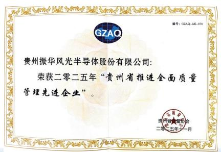

text_image

GZAQ
贵州振华风光半导体股份有限公司：
荣获二零二五年“贵州省推进全面质量管理先进企业”。
贵州振华
2015年五月

公司荣获 2025 年“贵州省推进全面质量管理先进企业”

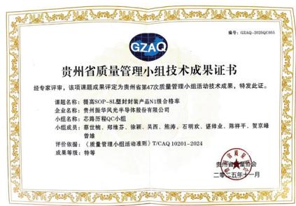

text_image

GZAQ
贵州省质量管理小组技术成果证书
经专家评审,该项课题成果评定为贵州省第47次质量管理小组活动技术成果,特发此证。
课题名称:提高SOP-SIL整封封装产品N1合格率
企业名称:贵州振华风光半导体股份有限公司
小组名称:芯荷岳联CIC小组
小组成员:蔡汝林、郑维芬、徐斌、吴西、熊涛、石明武、谌帅业、陈祥平、贺京峰
评审
评价依据:(《质量管理小组活动准则》T/CAQ 10201-2024)
成果等级:特等
贵州质量管理协会
二零一五年十一月

公司课题成果被评定为贵州省第47次质量管理小组活动技术成果

# 关键荣誉

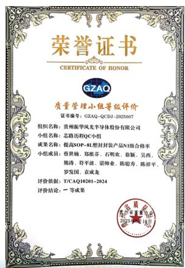

text_image

荣誉证书
CERTIFICATE OF HONOR
GZAQ
质量管理小组等级评价
证书编号: GZAQ-QCDJ-2025007
组织名称: 贵州振华风光半导体股份有限公司
小组名称: 芯路历程QC小组
成果名称: 提高SOP-8L塑封封装产品N1级合格率
小组成员: 蔡世楠、郑维芬、石明欢、徐颖、吴茜、
熊涛、符平波、谌帅业、陈聪秀、陈祥平、
罗发团、左成龙
评价依据: T/CAQ1Q201-2024
评价结论: 一等成果

公司荣获质量管理小组等级评价一等成果

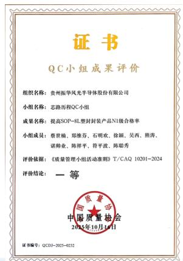

text_image

证书
QC小组成果评价
组织名称：贵州振华风光半导体股份有限公司
小组名称：芯路历程QC小组
成果名称：提高SOP-8L塑封封装产品NI级合格率
小组成员：蔡世楠、郑维芬、石明欢、徐颖、吴丙、熊涛、
谭帅业、陈祥平、符平波、陈聪秀
评价依据：《质量管理小组活动准则》T/CAQ 10201-2024
评价结论：一等
中国质量协会
2025年10月16日
证书编号：QCDJ-2025-0232

公司荣获 QC 小组成果评价一等

# 战略

公司结合市场动态、政策趋势与自身质量管理实际，系统识别可能影响产品质量与安全议题的相关风险及机遇，评估其潜在影响，为制定针对性应对策略提供依据。

产品质量与安全风险清单

<table><tr><td>风险类型</td><td>风险描述</td><td>发生可能性</td><td>潜在财务影响</td><td>影响周期</td></tr><tr><td>产品质量合规风险</td><td>产品质量不合规,影响产品生产、交付和质量面临用户投诉、处罚、索赔,以及取消合同订单或减少订单量等风险。</td><td>中</td><td>可能导致客户索赔支出、监管罚金、订单取消造成的收入损失。</td><td>短期、中期</td></tr><tr><td>产品质量稳定性风险</td><td>若国产化产品出现质量稳定性问题或塑封N1级产品发生质量异常,可能导致产品交付受阻,进而引发质量事故,对用户满意度造成不利影响。</td><td>中</td><td>可能导致返工或报废成本增加、客户赔偿支出、订单减少造成的收入下滑。</td><td>短期、中期</td></tr><tr><td>质量资质证书维持风险</td><td>资质证书过期会引起无法正常承担配套任务,影响市场订单,影响公司正常生产经营。</td><td>低</td><td>可能导致资质过期期间无法承接相关业务造成的收入缺口、重新认证所需投入的成本增加。</td><td>短期</td></tr></table>

产品质量与安全机遇清单

<table><tr><td>机遇类型</td><td>机遇描述</td><td>发生可能性</td><td>潜在财务影响</td><td>影响周期</td></tr><tr><td>政策驱动下的质量升级机遇</td><td>国家集成电路产业扶持政策营造有利发展环境,要求企业以质量可靠的产品承接市场需求,推动技术水平提升与规模发展。</td><td>高</td><td>可能导致政策红利释放带来的收入增长、技术升级带来的成本优化。</td><td>长期</td></tr><tr><td>国产化替代带来的质量突破机遇</td><td>贸易摩擦加速下游企业转向本土采购,为国内厂商打开进口替代窗口,以质量稳定可靠的产品加速渗透消费电子、新能源汽车等领域。</td><td>中</td><td>可能导致国产替代市场份额提升带来的收入增长、高端产品突破带来的利润空间扩大。</td><td>中期、长期</td></tr></table>

# 影响、风险和机遇管理

公司依据《风险管理制度》建立健全风险控制体系，持续强化风险识别、评估与应对能力，在保障质量管理体系稳健运行的基础上，将质量提升机遇转化为公司可持续发展的核心动力。

收集并识别风险信息

进行风险评估

制定风险策略与风险防控方条

实施风险防控方案

开展风险防控评估

产品质量与安全风险管理程序

为有效应对产品质量与安全相关风险及机遇，公司制定并落实一系列针对性措施。

产品质量与安全风险应对措施

<table><tr><td>风险类型</td><td>风险应对措施</td></tr><tr><td>产品质量合规风险</td><td>为确保质量管理体系持续有效运行,公司定期开展常态化抽查,推动不符合项完成整改并验证整改有效性;持续加强技术状态管控与现场工艺纪律检查,规范执行产品发货前质量评审,全方位夯实过程质量控制基础。</td></tr><tr><td>产品质量稳定性风险</td><td>公司强化对转产定型及技术资料的监督管控,保障技术资料的完整性与有效性;重点跟踪N1级塑封工艺攻关进展,持续降低N1级产品质量风险。</td></tr><tr><td>质量资质证书维持风险</td><td>公司严格按要求筹备并完成各项资质审查工作,确保证书持续有效。</td></tr></table>

# 质量信息化建设

质量管理部通过建立质量信息系统，推动质量管理体系运行、不合格品审理及客户投诉处理等核心工作实现线上运行，有效提升产品质量管控效率，增强质量管理的可追溯性与响应效率，为持续提升产品质量、夯实质量管控基础提供信息化支撑。

# 提升产品合格率

为改善焊盘质量、降低质量损失，公司组织开展产品合格率专项提升活动，围绕关键工序与工艺难点制定并执行各项改进措施。同时，质量管理团队持续跟踪措施落实情况，定期评估产品合格率变化情况，确保改进成效落到实处。通过专项提升行动，焊盘质量稳定性得到有效增强，产品合格率稳步提升，为实现持续产品质量管理目标提供有力保障。

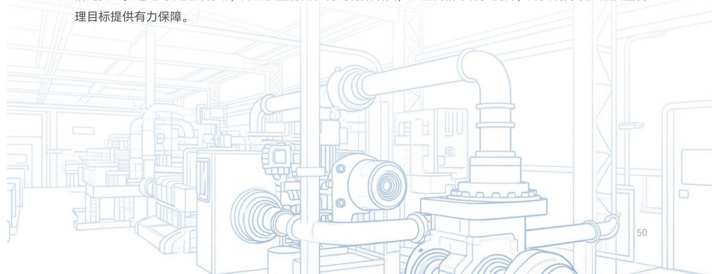

text_image

理目标提供有力保障。

# 案例

# 深化质量意识培训，落实质量改进激励

2025 年，公司围绕质量文化建设与质量改进激励两大重点，系统开展员工质量意识提升与激励工作。公司围绕质量管理要点以及质量工具的培训与应用，开展针对性的员工培训。

同时，公司鼓励全员参与产品改进合理化建议，全年共收集合理化建议37项，并依照《质量改进管理办法》和《质量责任追究与激励管理办法》，对质量改进成效显著的项目及在质量管理工作中作出突出贡献的人员予以表彰奖励。

通过一系列举措，公司有效激发了全员参与质量改进的主动性和创造力，为持续提升产品质量、厚植质量文化奠定了坚实基础。

# 案例

# QC 攻关成果显著，助推质量持续提升

2025 年，公司依据《QC 小组活动管理办法》深入开展 QC 项目攻关，持续推进工艺基础能力提升。公司共有 6 项 QC 成果参加贵州省质量协会发表，其中 3 项获省特级成果、3 项获省一等成果。《提高 SOP8L 塑封封装产品 N1 级合格率》项目在荣获贵州省星级评价一等成果后，进一步参加中国质量协会组织的发表，并斩获一等成果。系列 QC 攻关活动有效解决了生产过程中的关键技术难题，进一步夯实公司质量根基。

# 质量应急管理

当生产过程中出现不合格品时，公司严格按照《不合格品审理控制程序》进行审理与处置，确保不符合项得到有效识别、隔离和闭环处理。当用户反馈产品存在故障信息时，公司迅速响应，依据《质量问题归零工作管理办法》及《客诉质量问题处理指导书》组织开展问题分析与处理工作，从根源上查明原因并落实纠正措施。

# 指标与目标

公司产品质量与安全议题指标与目标如下：

<table><tr><td>指标</td><td>年度目标</td><td>2025年达成情况</td></tr><tr><td>重大质量事故、质量问题</td><td>0起</td><td>√达成</td></tr><tr><td>合同按期交付率</td><td>≥94%</td><td>√达成</td></tr><tr><td>质量损失率</td><td>≤0.88%</td><td>√达成</td></tr><tr><td>质量责任制落实</td><td>100%</td><td>√达成</td></tr><tr><td>维持NQMS能力“3级”</td><td>3级</td><td>√达成</td></tr><tr><td>三类问题发生数</td><td>0起</td><td>√达成</td></tr><tr><td>退货产品复验不合格率</td><td>≤0.1%</td><td>√达成</td></tr><tr><td>产品一次交验合格率</td><td>≥99%</td><td>√达成</td></tr><tr><td>资质证书有效率</td><td>100%</td><td>√达成</td></tr><tr><td>研发过程文件完整率</td><td>100%</td><td>√达成</td></tr><tr><td>顾客反馈问题处理率(包括代工服务)</td><td>100%</td><td>√达成</td></tr><tr><td>单片电路封装综合合格率</td><td>≥98.7%</td><td>√达成</td></tr><tr><td>混合电路封装综合合格率</td><td>≥94.3%</td><td>√达成</td></tr><tr><td>一般质量问题归零率</td><td>100%</td><td>√达成</td></tr></table>

# 关键绩效

报告期内，公司产品质量逐年提升，未发生重大质量安全事故。

# 客户服务

公司高度重视客户服务，执行《产品退（换）货管理制度》，以规范处理因产品质量问题或产品升级换代等原因引发的召回及退换货事宜。根据制度规定，公司对所有召回或退回产品进行规范化处置，相关情况主要源于不满足用户使用要求，不涉及安全与健康问题。

同时，公司制定了《客诉质量问题处理指导书》及《客诉质量问题快速响应处理流程文件》，快速响应市场终端的质量需求，及时高效解决客户投诉，切实提升客户满意度。通过制度化管理和快速响应机制，公司持续增强售后服务保障能力，赢得了客户的信赖与支持。

关键荣誉  
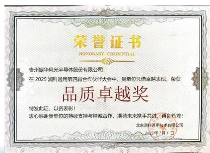

text_image

荣誉证书
JONORARY CREDENTIAL
贵州振华风光半导体股份有限公司：
在2025润科通用第四届合作伙伴大会中，贵单位凭借卓越表现，荣获
品质卓越奖
特发此证，以资表彰！
衷心感谢贵单位的持续支持与精诚合作，期待未来携手共进，再创辉煌！
北京润科通用技术有限公司
2025年7月11日

公司荣获北京润科通用技术有限公司颁发的“品质卓越奖”

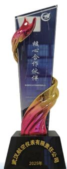  
公司荣获武汉航空仪表有限责任公司“核心合作伙伴”

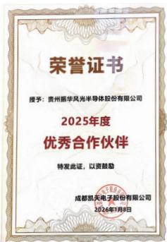

text_image

荣誉证书
授予：贵州振华风光半导体股份有限公司
2025年度
优秀合作伙伴
特发此证，以资鼓励
成都凯天电子股份有限公司
2026年7月8日

公司荣获成都凯天电子股份有限公司“优秀合作伙伴”  
关键绩效

报告期内，公司客户反馈响应率 $100\%$ ，客户满意度达 $97.1\%$ 。

<table><tr><td>目标</td><td>2025年达成情况</td></tr><tr><td>顾客满意度≥96.8分</td><td>√达成</td></tr></table>

# 数据安全与客户隐私保护

振华风光高度重视信息数据安全体系建设工作，持续完善《信息数据安全管理制度》《信息网络安全管理制度》《网络信息安全应急响应预案》等一系列信息安全规章制度，严格实行信息网络分区、分域、隔离管控策略，加强区域间数据流量监控和访问控制策略，构建横向到边、纵向到底的信息安全技术防御体系。

# 数据安全全生命周期管理

公司秉持安全可信、合法合规原则，构建起覆盖数据采集、传输、存储、应用各环节的防护体系，不断完善以预防为导向的主动防御机制，以责任担当筑牢客户隐私保护屏障。针对终端用户数据安全，公司贯彻“数据不落地”管控方针，利用虚拟化技术实现终端数据集中存储、管理。

同时，公司持续强化技术防御能力，推动信息安全管理横向协同与纵向贯通，全面提升数据传输与存储的安全性。

公司各网络区域均部署了网络安全防护设备，实施区域边界隔离、用户行为审计、实时流量监控与动态预警等综合防护策略。

对信息终端实行可信准入、数据加密、病毒查杀等管控措施。

所有的信息交换基础设施设备均采用国产信息设备以保障信息数据的安全可靠。

flowchart

```mermaid
graph LR
  A["Shield Check"] --> B["Lock"]
  B --> C["Email"]
```

数据安全关键举措

# 网络安全应急管理

为高效应对突发事件，公司设立网络安全应急工作领导小组，统筹制定网络安全应急预案，牵头负责网络安全事件的应急处置与指挥协调，确保突发事件响应迅速、处置有效。

# 关键绩效

报告期内，振华风光开展网络安全应急响应演练 10 次，外部邮箱钓鱼邮件专项演练 1 次。

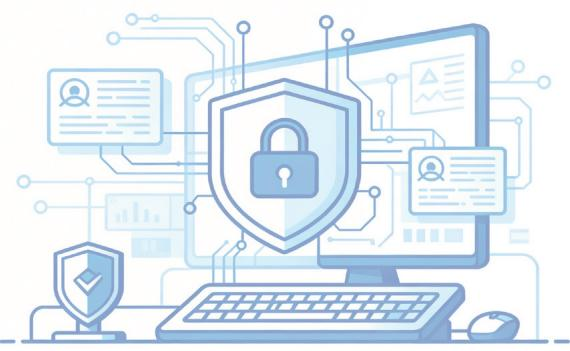

natural_image

Illustration of a computer with a shield, security symbol, and user profile icons (no text or symbols present)

# 客户隐私安全

公司高度重视客户信息保护，持续开展保密教育培训，与客户签订保密协议，强化全员保密意识，确保客户敏感信息严格保密、不泄露、不外传，以实际行动筑牢客户信任基石，维护各方合法权益。实行内外部网络隔离和网络分区分域管控策略。

# 关键绩效

报告期内，公司未发生数据安全事故，未发生客户隐私泄露事件

共开展数据安全与客户隐私保护培训 2 次，组织相关应急演练 14 次。

# 供应链管理

振华风光致力于与供应商伙伴携手打造可持续供应链，坚持高效率运作，消除供应风险，控制合理成本原则，持续提升供应链管理水平。公司优先遴选通过环境及职业健康安全管理体系认证的供应商，推动其在生产经营中保护生态环境、保障劳动者权益，有效缓解供应链风险，以安全稳定的供应链支撑公司业务稳健运行。

# 治理

振华风光持续完善供应链管理架构，明确各层级职责分工，推动供应链管理向专业化、精细化方向发展，实现专人专责、协同高效。

# 供应链战略规划部门

统筹谋划供应链长期发展战略，确保其与公司整体战略高度契合。

# 供应链风险管理部门

全面识别与评估供应链风险，制定科学的风险应对策略及应急预案，为供应链的稳定运行与安全韧性提供坚实保障。

# 生产、采购、技术、质量等负责人

协同推进供应商管理制度执行，开展供应商常态化评审，监督、识别与处理供应链异常情况。

# 供应链管理组织架构

2025 年，公司依据《关于规范中央企业采购管理工作的指导意见》及上级单位相关要求，遵循“分层分类、权责清晰、运行高效、监管有力”原则，对原有采购管理制度进行全面修订，形成《采购业务管理办法》《采购招投标管理办法》，并与现行《供应商选择与评价管理办法》共同构成覆盖采购与供应商全流程的管理制度体系，进一步提升供应链管理的科学性。

# 战略

公司持续开展供应链风险与机遇识别评估，动态分析其潜在影响，确保供应链稳健运行。

可持续供应链议题风险清单

<table><tr><td>风险类型</td><td>风险描述</td><td>发生可能性</td><td>潜在财务影响</td><td>影响周期</td></tr><tr><td>供应商供货质量风险</td><td>供应商在生产过程中出现工艺波动、原材料把关不严或质量管理体系执行不到位,可能导致交付产品存在质量隐患,影响公司产品合格率与交付稳定性。</td><td>中</td><td>可能导致来料不良造成的返工报废成本增加;生产进度延误带来的订单违约损失、客户索赔。</td><td>短期、中期</td></tr><tr><td>供应商ESG管理风险</td><td>供应商在环境保护、职业健康安全或劳动权益保障等方面存在管理缺陷,可能引发环保处罚、劳资纠纷或安全生产事故,影响供应链稳定并传导至公司运营。</td><td>低</td><td>可能导致供应商停产造成的供应中断损失、紧急切换供应商产生的额外成本。</td><td>短期、中期</td></tr></table>

# 影响、风险和机遇管理

公司持续建立健全供应链风险识别、评估与应对机制，确保供应链在复杂环境下的持续稳定与安全可控。

<table><tr><td>系统识别风险来源</td><td>公司定期开展供应链风险评价,围绕供应链全流程,系统识别可能影响供应稳定性、产品质量及可持续性的内外部风险因素,建立常态化风险信息收集与更新机制。</td></tr><tr><td>科学评估风险等级</td><td>针对识别出的风险事项,公司综合考量其发生可能性与潜在影响程度,从财务损失、运营中断、品牌声誉等维度进行评估,划定风险等级。</td></tr><tr><td>有效应对与持续改进</td><td>公司针对不同等级风险制定差异化应对策略与应急预案明确责任主体与管控措施,定期跟踪风险变化趋势与措施落实情况,推动供应链风险管理的动态优化与持续改进。</td></tr></table>

# 供应商准入

公司严格执行《供应商选择与评价管理办法》，系统开展供应商准入认证管理。准入前，公司依照《供应商质量保证能力调查表》对供应商资质、技术能力实施资料调查，并要求提供样品验证报告或鉴定报告以证明产品可靠性；必要时，公司组织现场审核以全面评估相关供应商的质量保证能力。供应商通过准入后，公司实施分级管理，并基于多个维度开展常态化年度绩效评价，确保供应商持续满足公司要求。

# 供应商审计

报告期内，公司共计开展 5 次供应商审核，涵盖 2 家芯片供应商、1 家外壳供应商、1 家外协封装供应商及 1 家辅料供应商。审核范围覆盖供应商质量体系涉及的全部过程，重点聚焦与产品相关的关键环节。针对审核中发现的问题，公司督促供应商限期整改并提供整改材料，实现任务闭环，保障审核实效。

# 案例 开展供应商专项培训，协同攻关提质增效

2025 年 10 月，公司面向供应商组织开展供应商质量能力提升专项培训。培训内容涵盖质量标准交流、质量问题归零方法及重点问题攻关，并围绕引线偏移等生产过程中的典型质量问题，与供应商展开联合分析与技术攻关，着力提升检验效率。本次培训有效增强了供应商的质量意识与问题解决能力，促进了双方在技术标准与质量管理上的深度协同，为构建稳定、高效、可持续的供应链体系奠定了坚实基础。

# 供应链应急管理

公司建立常态化监控与预警机制，对长期存在质量问题或供货不稳定的产品及厂家实施重点跟踪。物资保障部根据质量反馈信息，及时启动应急寻源程序，确保在原有供应渠道出现异常时能够快速切换，降低因原材料质量问题带来的供应中断风险，保障生产连续性。

# 供应商 ESG 管理

公司将环境保护、职业健康、安全生产相关要求融入采购全流程，通过合同、协议明确列示相关条款，形成刚性约束。在供应商绩效评价中，对具备环保、职业健康安全资质的企业给予更高评分。公司持续引导供应商在追求经营效益的同时，履行环境保护与劳动者权益保护责任，共同构建可持续的供应链生态。

# 供应商廉洁建设

公司在内部制度中明确要求采购人员遵章守纪、廉洁自律，恪守职业道德规范。每年定期开展廉洁谈话与廉洁教育活动，强化采购人员的廉洁意识与底线思维。同时，公司与供应商签订《廉洁合作协议》，明确双方廉洁责任与行为约束，推动采购过程公开透明、公平公正，持续营造风清气正的供应链合作环境。

# 指标与目标

公司可持续供应链议题的指标与目标如下:

# 关键绩效

报告期内，公司向所有供应商发送廉洁通告；公司面向供应商共开展4次质量相关培训。

# 04 人本兴企 履责惠民

振华风光始终秉持以人为本的发展理念，切实保障员工合法权益，完善员工培养与职业发展体系，筑牢职业健康安全防线，助力员工与企业共同成长；同时积极履行社会责任，持续投身乡村振兴与社会公益事业，以实际行动回馈社会。

贡献联合国可持续发展目标（SDGs）：

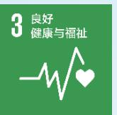

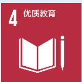

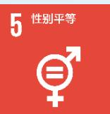

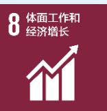

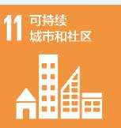

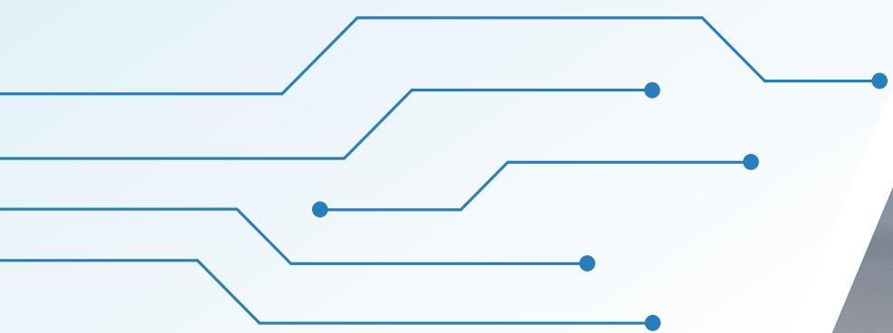

natural_image

Abstract line diagram with interconnected nodes and lines, no text or symbols present

text_image

员工合法权益，完
线，助力员工与企
村振兴与社会公益
可持续
城市和社区

# 员工雇佣与权益保障

振华风光秉持“以人为本”的核心原则，视和谐劳动关系为企业可持续发展的基石。公司通过持续完善员工权益保障机制，切实维护每一位员工的合法权利，持续推进公司与员工之间的良性互动与协同发展。

# 合规雇佣

振华风光严格遵守《中华人民共和国劳动法》《中华人民共和国劳动合同法》等相关法律法规，制定并执行《招聘与人才引进管理办法》《员工手册》，明确规定了公司招聘计划管理、招聘形式与员工录用等方面的管理原则，有效提升了整体招聘工作的质量与效率，促进了人才队伍的良性发展。

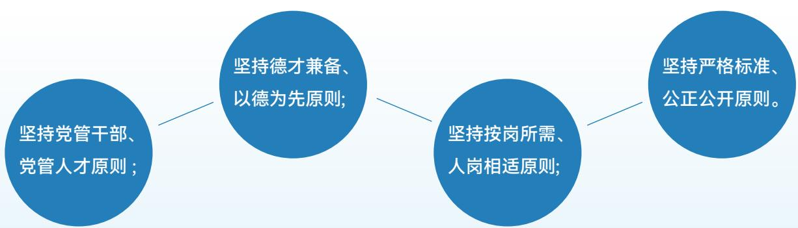

flowchart

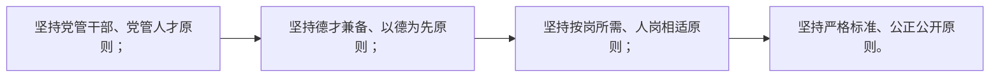
```mermaid
graph LR
  A["坚持党管干部、党管人才原则；"] --> B["坚持德才兼备、以德为先原则；"]
  B --> C["坚持按岗所需、人岗相适原则；"]
  C --> D["坚持严格标准、公正公开原则。"]
```

招聘与人才引进管理原则

# 开展需求研判

\- 组建人才盘点小组，形成人才需求报告，明确关键岗位缺口。

# 使用一体化线上招聘平台

首次启用集团一体化线上招聘平台，推动招聘流程全线上运行，引入智能匹配机制，全面提升招聘效率与人才配置精准度。

# 优化引才渠道

针对核心技术及核心管理岗位的稀缺人才，公司引入猎头渠道实施定向寻访与精准引进；  
举办多场国企开放日，邀请人才走进企业，增进了解与认同，有效吸引意向人才；  
公司借助省市级人才博览会平台，积极开展线下引才活动，精准对接并吸引优秀人才；  
与高校开展校企合作，深化产学研企融合，提升公司知名度。

# 人才招聘关键举措

# 关键绩效

报告期内，公司全职员工总数为 855 人，其中：

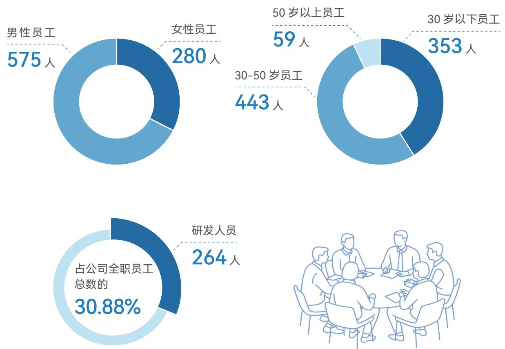

公司在《招聘与人才引进管理办法》中明确规定，所有招聘与引进的人员均须符合国家法定用工年龄要求。公司严格禁止雇佣童工，建立并落实相应防范与补救机制，确保用工行为合规、合法，切实维护未成年人权益。

# 身份年龄核验

要求候选人提供身份证、户口本等有效证件，确认年龄是否达到法定就业标准，杜绝童工入职。

# 招聘防范措施

# 关键绩效

报告期内，公司未发生歧视事件、强迫劳动事件、童工事件。

# 多元化建设

公司坚决反对任何形式的体罚、精神或肉体胁迫、言语侮辱及其他虐待行为，采取措施杜绝强迫劳动，严格禁止因性别、年龄、民族、宗教信仰等因素产生的就业歧视，致力于为员工营造安全、健康、包容的职场环境。

在此基础上，公司持续加强对女性员工的职业发展与生活关怀，依法保障员工享有婚假、产检假、产假、哺乳假等生育权益，并在办公区域配备母婴室及应急医药箱等便利设施，定期组织女性员工专项体检及“三八”节慰问活动，关爱女性身心健康。同时，公司积极履行社会责任，吸纳残疾人就业，招聘并录用退伍军人，在“八一”建军节等节点开展专项慰问，营造尊重差异、多元共融的职场氛围。通过持续完善多元化建设，公司努力构建体现平等、尊重与包容的和谐工作环境。

# 员工薪酬与福利

公司严格执行《薪酬管理制度》，确保员工基本工资、岗位工资等固定薪酬不低于当地最低工资标准。在法定福利方面，公司依法为全体员工足额缴纳五险一金，切实保障员工基本权益。

在保障法定福利的基础上，公司积极推行大额医疗互助、企业年金等补充保险，定期组织全面的健康体检，持续优化员工福利待遇。同时，公司提供住房增量补贴、员工宿舍及就餐补贴等多元化福利举措，建设员工食堂，努力营造安心、舒适的工作与生活环境，不断提升员工的归属感与满意度。

# 关键绩效

报告期内，公司员工社保缴纳覆盖率为 100%。

# 民主沟通

公司秉持“拼搏、奉献、担当、务实、创新、发展、卓越、共赢”的价值观，为员工营造平等开放的工作氛围。公司搭建多元沟通渠道，通过线上办公平台、意见箱及专用投诉建议邮箱，及时了解员工诉求。同时，公司设立工会并每年召开职工代表大会，充分发挥职工代表的民主管理与民主监督职能，保障员工的知情权、参与权、表达权、监督权，切实维护职工合法权益。

# 案例

# 召开职代会，凝聚全员共识

2025 年 2 月，公司召开第五届五次职工（会员）代表大会。会议审议通过了工会、财务、安全环保等各项工作报告，表彰了年度先进集体与个人，并组织职工代表开展分组讨论审议通过了会议所作的各项工作报告及《员工住房租赁等相关管理办法（试行）》，并进行了民主测评。本次大会充分保障员工权益，凝聚发展共识，激发全员奋斗热情。

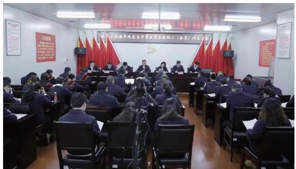

text_image

Photo of a formal meeting with attendees seated at tables, red flags and banners visible in the background.

第五届五次职工（会员）代表大会

# 员工满意度调查

公司每年 12 月面向全体员工开展满意度调查，全面收集员工的意见建议。调查过程中，公司对各部门员工的回复情况进行统计，确保参与度与覆盖面，以保障调查结果的代表性与真实性，为持续优化员工关怀与管理改进提供依据。

# 关键绩效

报告期内，公司员工满意度调查结果为 95 分。

# 员工关怀

公司将员工视为最宝贵的财富，持续开展多元化员工活动与关怀慰问举措，切实提升员工的获得感、幸福感与归属感。

# 案例

# 开展妇女节主题活动，关爱女性员工

2025年“三八”国际妇女节期间，公司组织开展“风光‘她’力量 绵放时代芳华”主题活动，通过知识竞答、手工艺创作等多元形式，向全体女员工致以节日问候。活动积极营造尊重女性、关爱女性的文化氛围，有效激发女员工的归属感与认同感。

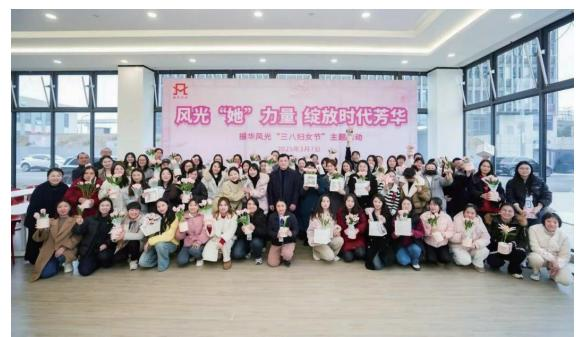

text_image

风光“她”力量 绦放时代芳华
摇华风光“三八妇女节”主题

“三八”国际妇女节活动

# 案例

# 组建运动协会，倡导健康减负

2025 年，公司员工自发成立羽毛球协会与篮球协会，践行“科学运动、健康减负”理念，组织员工利用业余时间开展日常锻炼及交流活动，引导员工通过体育锻炼释放压力、增强体质。协会的成立有效丰富了员工业余文化生活，营造出积极向上、健康文明的公司氛围。

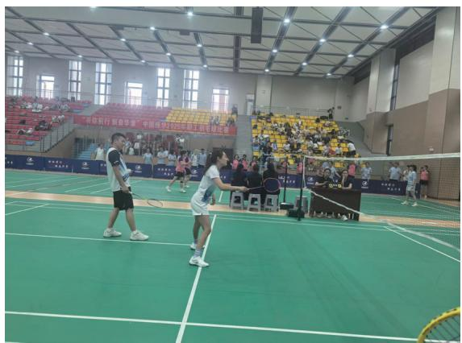

natural_image

Interior of a badminton court with two players in action, spectators watching, and a large banner on the wall (no visible text or symbols)

公司羽毛球比赛

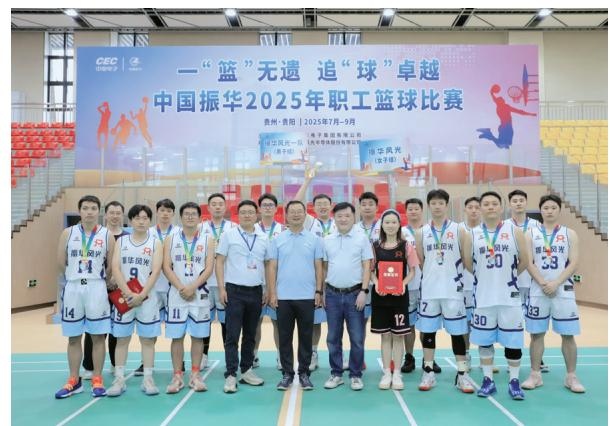

text_image

一“篮”无遗 追“球”卓越
中国振华2025年职工篮球比赛
贵州·贵阳 | 2025年7月-9月
振华集团有限公司
扬子岛市体育局

公司篮球比赛

# 案例

# 春节走访慰问，传递温暖关怀

2025 年春节前夕，公司开展春节慰问活动，走访慰问困难职工家庭，向困难职工传递温暖，帮助缓解实际生活困难。此次慰问增强了员工的归属感与凝聚力，彰显了公司的人文关怀与社会责任。

# 关键绩效

报告期内，公司共帮扶困难员工34人。

# 员工培训与发展

振华风光高度重视员工的成长与发展，持续完善培训机制与晋升通道，为员工提供清晰的职业发展指引，赋能员工与公司共创卓越未来。

# 员工培训

公司依托《教育培训管理制度》，系统制定并实施年度培训计划，采用“部门主导、分级分类”的组织模式，由各职能部门结合业务发展需求自主策划并推进培训项目。公司形成了系统化、多维度、全覆盖的培训架构，有效支撑员工履职能力提升与业务发展需要，确保培训工作与公司战略方向、部门职责定位及员工职业成长紧密衔接。

# 培训对象

覆盖公司全员，并针对中层干部、技术人员、制造工序操作人员、涉密人员、新员工等不同群体开展专项培训。

# 培训类型

\- 涵盖管理类、技术类和技能类三大板块。

# 培训形式

- 以内部讲师授课为主，结合实际案例与制度解读；  
部分专业课程引入外部专家资源。

# 年度培训计划

# 案例

# 开展新员工培训，助力职场启航

2025 年，公司针对新员工系统开展集中培训，围绕企业文化、职业发展、规章制度及保密安全等内容，帮助新员工快速了解并融入公司。同时，充分发挥资深员工传帮带作用，实施“导师带徒”培养机制，助力青年员工快速成长。培训机制助力新员工顺利适应岗位、夯实职业基础，为公司人才梯队建设注入持续动力。

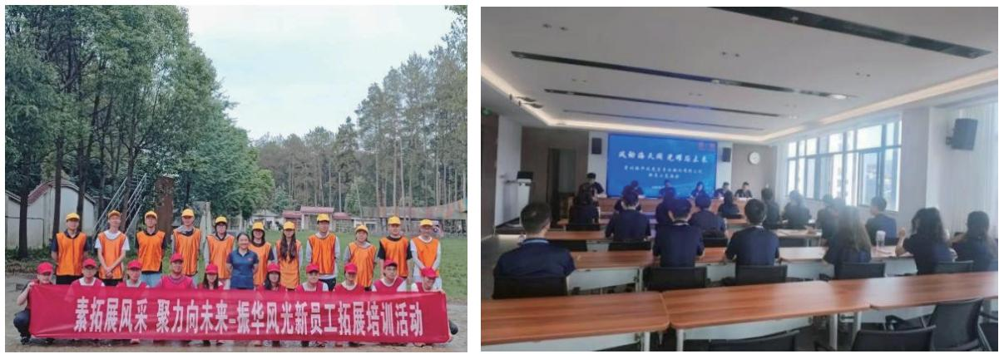  
新员工培训

# 案例

# 开展中高层管理人员专题培训，提升综合管理能力

2025 年 9 月，公司组织中高层管理人员开展专题培训，邀请厦门大学管理学院教授分别讲授《时间管理与效率提升》及《数字化时代商业模式创新》课程。培训采用理论讲授、案例研讨与情境模拟相结合的教学方式，围绕时间管理方法、数字化思维转变、商业模式判断及宏观经济形势等内容展开系统学习。本次培训有效提升了管理团队的时间规划能力与数字化认知水平，为公司在新形势下实现高质量发展提供了管理赋能。

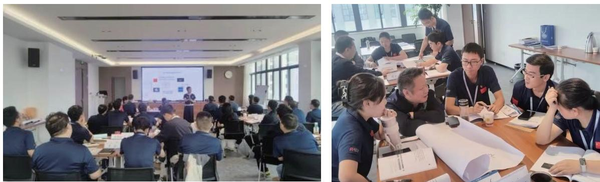  
中高层管理人员培训

# 关键绩效

报告期内，公司共开展员工培训172次，员工培训覆盖率为 $100\%$

员工培训总时长为 13,024 小时，人均培训时长为 15.23 小时；

年度培训支出金额为 37.01 万元。

# > 职业发展与人才培养

公司构建以能力业绩为导向的动态管理机制，推动岗级能上能下、人员能进能出、薪酬能增能减。依据《员工绩效考核管理办法》和《年薪制员工绩效考核管理办法》，公司组织开展科学规范的绩效评价，确保考核结果客观公正。

在此基础上，公司持续拓展多元化职业发展序列，依托《中层干部管理制度》《科研技术岗位体系管理办法》《导师带徒管理制度》等制度，建立管理、技术、技能三条并行贯通的晋升通道，满足不同岗位员工的职业发展诉求。公司坚持党管干部原则，发挥市场化选人用人机制，通过岗位轮换、内部竞聘等多种方式，为员工搭建成长平台，激发员工内生动力，推动个人价值与公司发展深度融合。

# 绩效反馈与申诉机制

公司依据《员工绩效考核管理办法》建立绩效反馈与申诉机制，保障员工对考核结果的知情权与异议权。员工如对考核结果有异议，可向人力资源部提交申诉，由其负责核查相关事项。

人力资源部在收到申诉后五个工作日内作出是否受理的答复；对缺乏客观事实依据、仅凭主观判断的申诉不予受理，并向申诉人说明原因。对于受理的申诉，人力资源部组织开展调查，并与员工所在部门负责人进行沟通协调。如无法达成一致，人力资源部根据调查情况提出处理意见，报员工所在部门分管领导批准后执行。人力资源部应在接到申诉申请书之日起十五个工作日内出具最终处理结果。

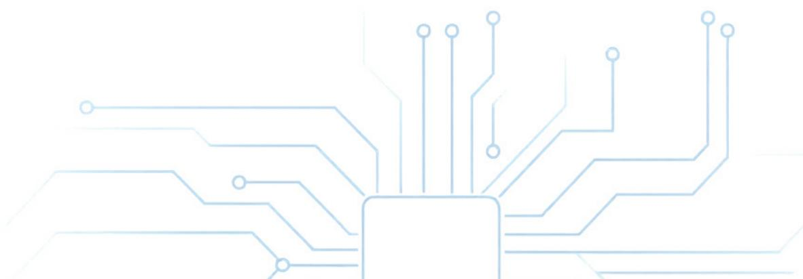

natural_image

Abstract line art of interconnected circuit lines with a central block (no text or symbols)

# 职业健康安全

公司始终将员工的安全与健康置于首位，坚守安全发展理念，持续压实安全生产责任。通过健全管理体系、完善运行机制，不断夯实职业健康与安全管理基础，推动安全管理水平稳步提升。

# 治理

公司持续关注安全生产与职业健康领域的法律法规及标准规范变化，结合业务实际，及时分析并转化相关要求，推动内部制度体系不断完善。

公司已完成《安全生产责任制管理办法》《安全生产目标管理办法》《安全生产考评与奖惩管理办法》《职业健康管理办法》《工伤事故管理办法》《环境保护管理办法》等核心管理制度的修订、评审、提报与发布，确保合规要求有效融入日常管理，为员工职业健康与安全提供坚实制度保障。

# 安全生产委员会

- 安全生产委员会作为安全生产工作的最高领导小组，由党委书记、总经理担任主任，其他班子成员及相关部门负责人担任成员；  
- 每季度定期召开会议，通报并研究安全生产、职业健康领域的突出问题，部署重点工作，审核、发布公司安全生产相关政策、方向，并对重大安全事项作出决策。

# 安全工作领导小组

公司分别设立六个专业安全工作领导小组，负责研究部署、指导协调各领域的安全生产与职业健康工作，深入分析专项管理形势，研究决策相关重大问题。

# 技安环保部

配备安全生产相关专业的管理人员，有序开展各项工作。

职业健康安全管理组织架构

公司已通过 ISO 45001 职业健康安全管理体系认证并取得证书，认证范围覆盖公司全部相关业务。2025 年 11 月，公司顺利通过该体系复审，持续保持认证有效资格。

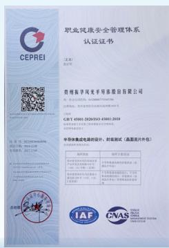

text_image

职业健康安全管理体系
认证证书

贵州振导风光半导体股份有限公司
公司名称：贵州振导风光半导体股份有限公司
注册号：CZ 01080120290150 43001-2018
G&T 43001-2020150 43001-2018
半导体集成成套的设计、封装测试（晶圆流片外包）
企业编号：CNAS
产品编码：CNAS
产品类型：电子元器件
产品名称：光伏电池及储能电池（含储能电池）及其配套产品
型号：GNT 43001-2020150
型号：GNT 43001-2018
产品编码：CNAS
产品名称：光伏电池及储能电池（含储能电池）及其配套产品
型号：GNT 43001-2020150
型号：GNT 43001-2018
产品编码：CNAS
产品名称：光伏电池及储能电池（含储能电池）及其配套产品
型号：GNT 43001-2020150
型号：GNT

公司 ISO 45001 职业健康安全管理体系认证证书

# 战略

公司系统识别生产运营过程中可能影响员工安全健康的危险因素，动态评估相关风险。

职业健康安全风险清单（仅展示部分风险）

<table><tr><td>风险类型</td><td>风险描述</td><td>发生可能性</td><td>潜在财务影响</td><td>影响周期</td></tr><tr><td>危险化学品火灾爆炸风险</td><td>丙酮、酒精等易燃化学品在储存或使用过程中发生泄漏,遇明火、静电或电气火花可能引发火灾甚至爆炸,对人员安全及生产设施构成严重威胁。</td><td>低</td><td>可能导致厂房设备烧毁损失、生产长期中断造成的收入损失、环境清理修复成本、监管处罚及第三方索赔支出。</td><td>短期、中期、长期</td></tr><tr><td>特种设备容器爆炸风险</td><td>氮气储罐等压力容器因未定期检验、安全附件失效等原因发生爆炸,可能造成重大人员伤亡和设备损毁</td><td>中</td><td>可能导致设备损毁重置成本、生产中断损失、人员伤亡赔偿、监管罚款及法律诉讼费用。</td><td>短期、中期、长期</td></tr></table>

# 影响、风险和机遇管理

公司系统开展职业健康安全风险管控工作，建立危险源管控清单，制定并实施针对性应对措施。

# 系统识别

全面梳理作业场所、设备设施及作业活动中的危险源，形成动态更新的风险清单。

# 科学评估

对识别出的风险从发生可能性、后果严重性等维度进行评价，确定风险等级。

# 有效应对

针对不同等级风险制定并实施针对性的管控方案。

# 跟踪改进

定期检查风险管控措施落实情况，持续优化管理流程，提升职业健康安全保障水平。

# 职业健康安全风险管理流程

为系统应对相关风险，公司建立健全“安全风险分级与隐患排查治理”双控体系，同步开展职业病危害因素评价及职业健康体检等工作，多措并举保障员工职业健康安全。

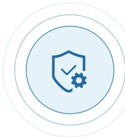

每月定期组织开展公司级 - 部门级 - 班组级隐患排查治理；  
委托第三方专业机构对消防设施、特种设备开展定期检测及维保；  
设立微型消防站，并根据业务风险内容配备医疗箱及正压式呼吸器等应急物资。

# 安全生产关键举措

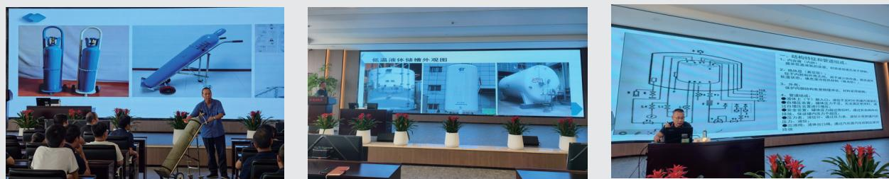

# 公司开展职业健康安全培训

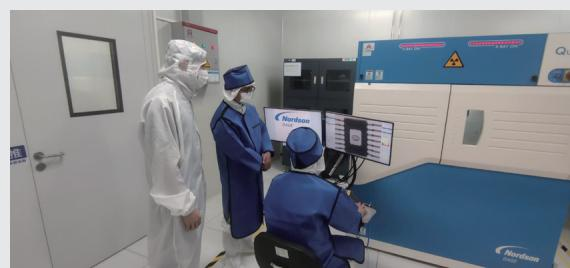

natural_image

Interior of a laboratory with three technicians in cleanroom suits, one operating a monitor and another standing at a blue table (no visible text or symbols)

# 公司开展演练

# 应对职业病危害因素

公司委托第三方专业评价机构对现有生产场所开展职业病危害因素评价。结合生产工艺流程与现场调查，机构系统识别了存在的职业病危害因素，主要包括生产性粉尘（氧化铝粉尘）、化学有害因素（二氧化锡、丙酮、硫酸、盐酸、氢氧化钠等）以及物理有害因素（噪声、电焊弧光、激光、高温）。针对识别出的职业病危害因素，公司已制定并实施相应的防控措施。

改进生产工艺，设置密闭防尘柜，将喷砂作业全程控制在密闭柜内完成，实现作业人员与粉尘的有效隔绝；

设置 4 台玻璃废气处理塔，并在化学品使用场所配置上吸式集尘罩，确保有毒气体产生后立即收集处理，防止有害废气在生产现场聚集；

针对噪声、电焊弧光、激光、高温等物理危害因素，配置相应的防护设施，切实消除对作业人员的健康威胁；

严格按照《用人单位劳动防护用品管理规范》要求，为员工配备并督促使用相应的劳动防护用品全方位保障员工职业健康安全。

# 职业病危害因素应对措施

# 职业健康体检

公司在《职业健康管理办法》中明确了职业病体检相关要求。公司要求有毒有害岗位员工入岗前须接受职业病岗前体检，存在职业禁忌证者一律不得上岗；在岗期间，公司每年组织实施一次岗中职业病体检，并为所有参检员工建立个人职业健康档案；员工离岗时，公司统一组织进行离岗职业病体检。

# 指标与目标

公司职业健康安全相关指标与目标如下：

# 关键绩效

报告期内，公司安全生产总投入为253.70万元，员工工伤保险投入金额为109.88万元，员工工伤保险覆盖率为 $100\%$

公司职业病体检覆盖率为 100%;

因公受伤人数为 0，因工死亡人数为 0，职业病发病率为 0；

公司共组织重大事故隐患判定、典型事故案例、消防管理、工业气瓶、辐射设施管理等各类职业健康安全培训21场，安全教育培训覆盖率为 $100\%$

组织消防疏散、灭火实操、电梯困人等专项应急演练共计 5 次，180 余人次参与。

<table><tr><td>目标</td><td>2025年达成情况</td></tr><tr><td>0死亡事故,0重伤事故,0轻伤事故,0职业病病例</td><td>✓达成</td></tr><tr><td>三项岗位人员(企业主要负责人、安全管理人员及特种作业人员)持证上岗率为100%</td><td>✓达成</td></tr><tr><td>新员工、“四新”(新材料、新工艺、新技术、新设备)涉及人员、变换工种及复工人员等安全教育培训合格率为100%</td><td>✓达成</td></tr><tr><td>职业健康检测、体检率为100%</td><td>✓达成</td></tr></table>

# 乡村振兴

振华风光积极履行社会责任，深入推进乡村振兴工作。公司充分发挥消费帮扶带动作用，主动对接中国振华定点帮扶村，持续采购鸡蛋、香柚、米糕、花生、百香果等助农产品，助力帮扶地区群众增收。2025年，公司乡村振兴总投入金额为39.95万元，惠及当地群众2,052人。

# 社会贡献

振华风光以实际行动贯彻落实回馈社会、奉献爱心的理念，积极投身各类社会公益事业，组织员工开展志愿服务，传递温暖的社会正能量，切实推动发展成果与社会共享，为构建更加和谐美好的社会贡献力量。

# 案例

# 传承雷锋精神，奉献青春力量

2025 年，公司青年职工组织开展“薪火相传雷锋志，青春闪耀新时代”主题团日活动。青年员工通过志愿服务等方式积极投身社会公益实践，深入践行雷锋精神内涵，为促进社会和谐、弘扬时代新风贡献了青春力量。

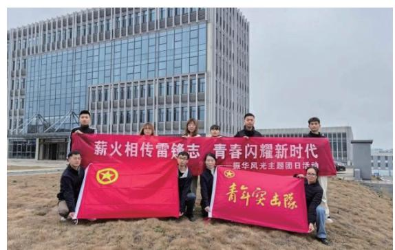

text_image

薪火相传雷锋志 青春闪耀新时代
——振华风光主题团日活动
青年突击队

“学雷锋”主题团日活动

# 附录

ESG 关键绩效数据表

<table><tr><td colspan="2">指标</td><td>单位</td><td>2025年</td></tr><tr><td rowspan="3">环境管理</td><td>环保总投入</td><td>万元</td><td>30</td></tr><tr><td>环保总投入占营业收入比例</td><td>%</td><td>0.04</td></tr><tr><td>环境行政处罚金额</td><td>万元</td><td>0</td></tr><tr><td rowspan="5">能源使用</td><td>综合能源消耗总量</td><td>吨标准煤</td><td>1,604.42</td></tr><tr><td>直接能源消耗量</td><td>吨标准煤</td><td>9.18</td></tr><tr><td>其中:汽油</td><td>升</td><td>7,996</td></tr><tr><td>间接能源消耗量</td><td>吨标准煤</td><td>1,595.24</td></tr><tr><td>其中:电力</td><td>万千瓦时</td><td>1,298</td></tr><tr><td rowspan="3">水资源管理</td><td>总耗水量</td><td>吨</td><td>184,778</td></tr><tr><td>水资源使用强度</td><td>吨/万元营收</td><td>2.39</td></tr><tr><td>循环/再利用水量</td><td>立方米</td><td>0</td></tr><tr><td rowspan="3">废水</td><td>废水排放总量</td><td>立方米</td><td>185,525</td></tr><tr><td>其中:工业废水总量</td><td>立方米</td><td>7,933</td></tr><tr><td>其中:生活废水总量</td><td>立方米</td><td>177,592</td></tr><tr><td>废气</td><td>废气总量</td><td>万立方米</td><td>3.41</td></tr></table>

<table><tr><td colspan="2">指标</td><td>单位</td><td>2025年</td></tr><tr><td rowspan="2">废弃物处理</td><td>废弃物产生总量</td><td>吨</td><td>4.9</td></tr><tr><td>有害废弃物产生总量</td><td>吨</td><td>4.9</td></tr><tr><td rowspan="4">应对气候变化</td><td>温室气体范围一排放量</td><td>吨二氧化碳当量</td><td>18.54</td></tr><tr><td>温室气体范围二排放量</td><td>吨二氧化碳当量</td><td>6,887.19</td></tr><tr><td>温室气体排放总量(范围一+范围二)</td><td>吨二氧化碳当量</td><td>6,905.73</td></tr><tr><td>温室气体排放强度</td><td>吨二氧化碳当量/万元营收</td><td>0.09</td></tr></table>

社会范畴

<table><tr><td colspan="2">指标</td><td>单位</td><td>2025年</td></tr><tr><td rowspan="9">员工基本情况</td><td>员工总数</td><td>人</td><td>855</td></tr><tr><td colspan="3">按性别划分</td></tr><tr><td>女性员工数量</td><td>人</td><td>280</td></tr><tr><td>男性员工数量</td><td>人</td><td>575</td></tr><tr><td colspan="3">按年龄划分</td></tr><tr><td>30岁以下员工数量</td><td>人</td><td>353</td></tr><tr><td>30~50岁员工数量</td><td>人</td><td>443</td></tr><tr><td>50岁以上员工数量</td><td>人</td><td>59</td></tr><tr><td colspan="3">按雇佣类型划分</td></tr><tr><td rowspan="13">员工基本情况</td><td>全职员工人数</td><td>人</td><td>855</td></tr><tr><td>兼职员工人数</td><td>人</td><td>6</td></tr><tr><td colspan="3">按学历划分</td></tr><tr><td>大专及以下员工数量</td><td>人</td><td>209</td></tr><tr><td>本科员工数量</td><td>人</td><td>484</td></tr><tr><td>硕士员工数量</td><td>人</td><td>154</td></tr><tr><td>博士员工数量</td><td>人</td><td>8</td></tr><tr><td>少数民族员工数量</td><td>人</td><td>233</td></tr><tr><td colspan="3">按职级划分</td></tr><tr><td>高级管理层员工人数</td><td>人</td><td>15</td></tr><tr><td>中级管理层员工人数</td><td>人</td><td>76</td></tr><tr><td>基层员工</td><td>人</td><td>764</td></tr><tr><td>员工满意度</td><td>分</td><td>95</td></tr><tr><td rowspan="4">员工雇佣与流失</td><td>新雇佣员工数量</td><td>人</td><td>48</td></tr><tr><td>其中:男性</td><td>人</td><td>38</td></tr><tr><td>其中:女性</td><td>人</td><td>10</td></tr><tr><td>其中:30岁以下</td><td>人</td><td>42</td></tr></table>

<table><tr><td colspan="2">指标</td><td>单位</td><td>2025年</td></tr><tr><td rowspan="17">员工雇佣与流失</td><td>其中:30-50岁</td><td>人</td><td>6</td></tr><tr><td>员工离职率</td><td>%</td><td>5.6</td></tr><tr><td>员工离职人数</td><td>人</td><td>48</td></tr><tr><td>其中:男性</td><td>人</td><td>31</td></tr><tr><td>其中:女性</td><td>人</td><td>17</td></tr><tr><td>其中:30岁以下</td><td>人</td><td>22</td></tr><tr><td>其中:30-50岁</td><td>人</td><td>25</td></tr><tr><td>其中:50岁以上</td><td>人</td><td>1</td></tr><tr><td>劳动合同签订率</td><td>%</td><td>100</td></tr><tr><td>员工社保缴纳覆盖率</td><td>%</td><td>100</td></tr><tr><td>员工人均薪酬(含五险一金、年金、增量单位部分)</td><td>万元</td><td>30.08</td></tr><tr><td>休产假/陪产假的员工总数</td><td>人</td><td>43</td></tr><tr><td>其中:女性</td><td>人</td><td>15</td></tr><tr><td>其中:男性</td><td>人</td><td>28</td></tr><tr><td>产假/陪产假结束后返岗的员工总数</td><td>人</td><td>41</td></tr><tr><td>其中:女性</td><td>人</td><td>13</td></tr><tr><td>其中:男性</td><td>人</td><td>28</td></tr><tr><td rowspan="16">培训与发展</td><td>员工培训支出金额</td><td>万元</td><td>37.01</td></tr><tr><td>员工培训覆盖率</td><td>%</td><td>100</td></tr><tr><td>员工培训总次数</td><td>次</td><td>172</td></tr><tr><td>员工培训总时长</td><td>小时</td><td>13,024</td></tr><tr><td>员工接受培训平均小时数</td><td>小时</td><td>15.23</td></tr><tr><td>其中:女员工</td><td>小时</td><td>15.08</td></tr><tr><td>其中:男员工</td><td>小时</td><td>15.30</td></tr><tr><td>其中:高级管理层</td><td>小时</td><td>293.87</td></tr><tr><td>其中:中级管理层</td><td>小时</td><td>1,187.53</td></tr><tr><td>其中:基层员工</td><td>小时</td><td>11,542.60</td></tr><tr><td>接受定期绩效考评的员工人数</td><td>人</td><td>855</td></tr><tr><td>其中:女员工</td><td>人</td><td>280</td></tr><tr><td>其中:男员工</td><td>人</td><td>575</td></tr><tr><td>其中:高级管理层</td><td>人</td><td>12</td></tr><tr><td>其中:中级管理层</td><td>人</td><td>79</td></tr><tr><td>其中:基层员工</td><td>人</td><td>764</td></tr><tr><td rowspan="2">职业健康与安全</td><td>工伤保险覆盖率</td><td>%</td><td>100</td></tr><tr><td>重大安全事故发生次数</td><td>件</td><td>0</td></tr></table>

<table><tr><td colspan="2">指标</td><td>单位</td><td>2025年</td></tr><tr><td rowspan="9">职业健康与安全</td><td>安全教育培训人次</td><td>人次</td><td>1,253</td></tr><tr><td>人均安全教育培训时长</td><td>小时</td><td>25</td></tr><tr><td>安全教育培训覆盖率</td><td>%</td><td>100</td></tr><tr><td>职业病发生率</td><td>%</td><td>0</td></tr><tr><td>员工体检覆盖率</td><td>%</td><td>100</td></tr><tr><td>安全生产投入</td><td>万元</td><td>253.70</td></tr><tr><td>发生安全事故次数</td><td>次</td><td>0</td></tr><tr><td>员工因工死亡人数</td><td>人</td><td>0</td></tr><tr><td>工伤率</td><td>%</td><td>0</td></tr><tr><td rowspan="4">产品责任</td><td>产品召回比例</td><td>%</td><td>0</td></tr><tr><td>客户满意度</td><td>%</td><td>97.1</td></tr><tr><td>投诉数量</td><td>件</td><td>0</td></tr><tr><td>投诉处理率</td><td>%</td><td>100</td></tr><tr><td rowspan="4">研发投入</td><td>研发投入金额</td><td>万元</td><td>17,165.30</td></tr><tr><td>研发人员人数</td><td>人</td><td>264</td></tr><tr><td>研发员工比例</td><td>%</td><td>30.88</td></tr><tr><td>研发投入占营收比例</td><td>%</td><td>22.25</td></tr><tr><td rowspan="6">知识产权保护</td><td>持有有效专利数量</td><td>项</td><td>145</td></tr><tr><td>应用于主营业务的发明专利数量</td><td>项</td><td>64</td></tr><tr><td>发明专利的申请数</td><td>项</td><td>61</td></tr><tr><td>持有软件著作权数量</td><td>项</td><td>12</td></tr><tr><td>年度新增著作权数量</td><td>项</td><td>5</td></tr><tr><td>年度新增专利数量</td><td>项</td><td>63</td></tr><tr><td rowspan="8">供应链管理</td><td>供应商总数</td><td>家</td><td>239</td></tr><tr><td>其中:省内供应商总数</td><td>家</td><td>29</td></tr><tr><td>其中:国内供应商总数</td><td>家</td><td>239</td></tr><tr><td>本省供应商采购比例</td><td>%</td><td>12.13</td></tr><tr><td>新增供应商中使用ESG维度评估的百分比</td><td>%</td><td>/</td></tr><tr><td>已合作供应商开展ESG影响评估的供应商数</td><td>家</td><td>10</td></tr><tr><td>签订廉洁条款的供应商比例</td><td>%</td><td>100</td></tr><tr><td>供应链内部能力提升培训场次</td><td>次</td><td>2</td></tr><tr><td rowspan="2">社会公益</td><td>志愿活动平均时长</td><td>小时/人</td><td>22</td></tr><tr><td>志愿活动参与人次</td><td>人次</td><td>46</td></tr><tr><td rowspan="2">乡村振兴</td><td>乡村振兴投入金额</td><td>万元</td><td>39.95</td></tr><tr><td>乡村振兴惠及人数</td><td>人</td><td>2,052</td></tr></table>

公司治理范畴

<table><tr><td colspan="2">指标</td><td>单位</td><td>2025年</td></tr><tr><td rowspan="16">董事会情况</td><td>董事会成员的人数</td><td>人</td><td>7</td></tr><tr><td>独立董事人数</td><td>人</td><td>3</td></tr><tr><td>执行董事人数</td><td>人</td><td>3</td></tr><tr><td>女性董事人数</td><td>人</td><td>1</td></tr><tr><td>独立董事占比</td><td>%</td><td>43</td></tr><tr><td>执行董事占比</td><td>%</td><td>43</td></tr><tr><td>女性董事占比</td><td>%</td><td>14</td></tr><tr><td>审计委员会独董占比</td><td>%</td><td>66.66</td></tr><tr><td>提名委员会独董占比</td><td>%</td><td>66.66</td></tr><tr><td>薪酬与考核委员会独董占比</td><td>%</td><td>66.66</td></tr><tr><td>召开董事会会议次数</td><td>次</td><td>6</td></tr><tr><td>审议董事会议案个数</td><td>个</td><td>52</td></tr><tr><td>审计委员会会议次数</td><td>次</td><td>4</td></tr><tr><td>薪酬与考核委员会会议次数</td><td>次</td><td>2</td></tr><tr><td>董事参会比例</td><td>%</td><td>100</td></tr><tr><td>召开股东会、临时股东会次数</td><td>次</td><td>4</td></tr><tr><td rowspan="4">投资者权益</td><td>投资者调研</td><td>次</td><td>48</td></tr><tr><td>业绩说明会</td><td>次</td><td>3</td></tr><tr><td>交易所互动平台回复投资人问题次数</td><td>次</td><td>174</td></tr><tr><td>对外发布公告数量</td><td>份</td><td>108</td></tr><tr><td rowspan="11">商业道德</td><td>反商业贿赂及反贪污培训场次</td><td>次</td><td>2</td></tr><tr><td>反商业贿赂及反贪污培训覆盖的管理层人员总数</td><td>人</td><td>68</td></tr><tr><td>反商业贿赂及反贪污培训覆盖的管理层人员百分比</td><td>%</td><td>100</td></tr><tr><td>反商业贿赂及反贪污培训覆盖的员工总数</td><td>人</td><td>200</td></tr><tr><td>反商业贿赂及反贪污培训覆盖的员工百分比</td><td>%</td><td>23.26</td></tr><tr><td>商业贿赂及贪污事件发生次数</td><td>次</td><td>0</td></tr><tr><td>因公司不正当竞争行为导致诉讼或重大行政处罚的涉案金额</td><td>万元</td><td>0</td></tr><tr><td>签订廉洁承诺书的员工人数</td><td>人</td><td>103</td></tr><tr><td>签订廉洁承诺书的员工比例</td><td>%</td><td>12</td></tr><tr><td>签署反贿赂承诺书的供应商数量</td><td>个</td><td>239</td></tr><tr><td>签署反贿赂承诺书的供应商比例</td><td>%</td><td>100</td></tr></table>

报告索引表

<table><tr><td rowspan="2">报告框架</td><td>《上海证券交易所科创板上市公司自律监管指南第13号——可持续发展报告编制》</td></tr><tr><td>对应议题</td></tr><tr><td>关于本报告</td><td></td></tr><tr><td colspan="2">关于振华风光</td></tr><tr><td>公司概况</td><td></td></tr><tr><td>发展历程</td><td></td></tr><tr><td>荣誉奖项</td><td></td></tr><tr><td>ESG治理架构</td><td>尽职调查</td></tr><tr><td>可持续发展战略</td><td></td></tr><tr><td>可持续发展亮点绩效</td><td></td></tr><tr><td>利益相关方沟通机制</td><td>利益相关方沟通</td></tr><tr><td>双重重要性识别</td><td>尽职调查利益相关方沟通</td></tr><tr><td colspan="2">治理根基与责任运营</td></tr><tr><td>公司治理</td><td>利益相关方沟通</td></tr><tr><td>党建引领</td><td></td></tr><tr><td>合规经营</td><td>尽职调查</td></tr><tr><td>商业道德</td><td>尽职调查反商业贿赂与反贪污反不正当竞争</td></tr><tr><td colspan="2">绿色生产与生态共融</td></tr><tr><td>应对气候变化</td><td>应对气候变化</td></tr><tr><td>环境合规管理</td><td>环境合规管理</td></tr><tr><td>资源利用</td><td>能源利用水资源利用循环经济</td></tr><tr><td>排放物管理</td><td>污染物排放废弃物处理</td></tr><tr><td colspan="2">可持续创新与负责任供应</td></tr><tr><td>创新驱动</td><td>创新驱动科技伦理</td></tr><tr><td>行业共建</td><td></td></tr><tr><td>产品质量与安全</td><td>产品和服务安全与质量</td></tr><tr><td>客户服务</td><td>产品和服务安全与质量</td></tr><tr><td>数据安全与客户隐私保护</td><td>数据安全与客户隐私保护</td></tr><tr><td>供应链管理</td><td>供应链安全</td></tr></table>

<table><tr><td rowspan="2">报告框架</td><td>《上海证券交易所科创板上市公司自律监管指南第13号——可持续发展报告编制》</td></tr><tr><td>对应议题</td></tr><tr><td colspan="2">人才赋能与社会担当</td></tr><tr><td>员工雇佣与权益保障</td><td>员工</td></tr><tr><td>员工培训与发展</td><td>员工</td></tr><tr><td>职业健康安全</td><td>员工</td></tr><tr><td>乡村振兴</td><td>乡村振兴</td></tr><tr><td>社会贡献</td><td>社会贡献</td></tr><tr><td>关键绩效数据表</td><td></td></tr><tr><td>报告索引表</td><td></td></tr><tr><td>读者反馈表</td><td></td></tr></table>

注：科技伦理：公司主营业务不直接涉及生命科学、人工智能等科技伦理敏感领域的科学研究、技术开发等活动，故本报告中未披露公司报告期内遵守科技伦理的基本情况。  
平等对待中小企业：公司平等对待中小企业，不存在逾期尚未支付中小企业款项等情况。  
生态系统与生物多样性保护：公司的经营活动未对生物多样性及濒危物种造成不利影响。

# 读者反馈表

# 尊敬的读者：

您好！

非常感谢您在百忙之中阅读振华风光《2025年度环境、社会和公司治理报告》。我们殷切盼望您对本报告和我们的工作提出意见与建议。您可以通过邮寄或扫描后发送电子邮件将填好的问卷反馈给我们。谢谢！

您的工作单位属于振华风光的哪一类利益相关方：

<table><tr><td>□ 内部管理层</td><td>□ 股东 / 投资人</td><td>□ 内部员工</td><td>□ 供应商 / 合作伙伴</td></tr><tr><td>□ 客户 / 潜在客户</td><td>□ 政府 / 监管机构</td><td>□ 社区</td><td>□ 专家学者</td></tr><tr><td>□ 非政府组织</td><td>□ 公众</td><td>□ 其他(请说明)</td><td></td></tr></table>

您所关注的信息在本报告中是否都有所体现？

<table><tr><td>□是</td><td>□一般</td><td>□否</td></tr></table>

您对振华风光《2025年度环境、社会和公司治理报告》的综合评价：

\- 可读性（表达方式通俗易懂，设计美观，引人入胜，容易找到所需信息）

<table><tr><td>□3分(较好)</td><td>□2分(一般)</td><td>□1分(较差)</td></tr></table>

○ 可信度（报告信息真实可信）

<table><tr><td>□3分(较好)</td><td>□2分(一般)</td><td>□1分(较差)</td></tr></table>

\- 信息完整性（正反两方面信息兼顾，并且满足您对信息的需求）

<table><tr><td>□3分(较好)</td><td>□2分(一般)</td><td>□1分(较差)</td></tr></table>

您在本报告中能否方便地找到您所关注的信息？

<table><tr><td>□是</td><td>□一般</td><td>□否</td></tr></table>

除本报告已披露的内容以外，您还更希望看到哪方面的信息？

<table><tr><td></td></tr></table>