# 2025|环境、社会及公司治理（ESG）报告

ENVIRONMENTAL, SOCIAL AND GOVERNANCE(ESG)REPORT

other

| Text |
| --- |
| Motorcomm |

# 裕太微电子股份有限公司

网址：https://www.motor-comm.com

电话：0512-66935966（苏州）

021-50561032（上海）

地址：江苏省苏州市高新区金山东路78号202室

上海市浦东新区中科路1699号15-16楼

# 目录

关于本报告 01  
董事长致辞 03  
走进裕太微 05  
可持续发展治理 15  
党建引领 23

natural_image

Exterior view of a modern multi-story building with glass facades and a 'MOTORCOMM' logo, surrounded by green hills (no signage on main structure)

# CONTENTS

# 01

# 公司治理篇

公司治理 27  
董高薪酬管理 30  
投资者关系管理与股东权益 31  
合规经营与风险管理 34  
商业道德 38

# 02

# 环境保护篇

应对气候变化 43  
环境管理 46  
资源利用 49  
生态系统与生物多样性保护 52

# 03

# 产业价值篇

创新驱动 55  
产品和服务安全与质量 67  
客户服务 72  
数据安全与客户隐私保护 74  
负责任供应链 78

# 04

# 美好生活篇

员工权益保障 87  
职业健康管理 95  
社会贡献 97  
乡村振兴 98

未来展望 99  
报告后言 101

# 关于本报告

# 报告范围

报告披露裕太微电子股份有限公司及其直属公司履行经济、环境、社会及公司治理方面的责任信息和典型案例，报告范围与年报一致。若披露范畴与前述有异，将在所属章节中单独注明。

# 时间范围

2025年1月1日至2025年12月31日（简称“报告期”）。为增强本报告的对比性和前瞻性，部分内容适当追溯以往年份或具有前瞻性描述。本报告的发布周期为一年一次，与财务年度保持一致。

# 编制依据

《上海证券交易所科创板上市公司自律监管指南第13号——可持续发展报告编制（2026年1月修订）》  
《上海证券交易所上市公司自律监管指引第14号——可持续发展报告（试行）》  
- 全球报告倡议组织《GRI可持续发展报告标准（GRI Standards）》  
- 中国企业改革与发展研究会《中国企业可持续发展报告指南CASS-ESG 6.0》

# 数据说明

报告使用数据来源包括公司实际运行的原始数据、政府部门公开数据、年度财务数据、内部相关统计报表、第三方问卷调查、第三方评价访谈等。本报告的财务数据以人民币为单位，若与财务报告不一致之处，以财务报告为准。

# 释义说明

除特别说明外，报告表述使用“裕太微”“公司”代指“裕太微电子股份有限公司”。

# 确认及批准

本报告于2026年4月27日获公司董事会批准，并与年报同期发布。董事会承诺对报告内容进行监督，并确保其不存在任何虚假记载或误导性陈述，并对内容真实性、准确性和完整性负责。

# 报告获取

本报告可以在裕太微电子股份有限公司官网（https://www.motor-comm.com）或上海证券交易所官网（https://www.sse.com.cn/）查阅和下载。

# 董事长致辞

尊敬的各位股东、合作伙伴、员工及社会各界朋友：

大家好！

2025年，是全球半导体产业格局深刻调整的一年，也是裕太微在科创板上市后的关键发展之年。面对复杂多变的外部环境与行业周期波动，我们始终坚持“以技术创新驱动发展”的核心理念，深耕高速有线通信芯片领域，致力于成为“有线连接芯片的全球领导者”。在追求商业成功的同时，我们深知，企业的长期价值不仅体现在财务报表上，更体现在对环境、社会及公司治理（ESG）的持续贡献中。本年度，我们将ESG理念深度融入公司战略决策与日常运营，以稳健的治理为基石，以绿色技术为引擎，以社会责任为己任，推动公司高质量可持续发展。

natural_image

Portrait of a man in a dark suit with arms crossed, no visible text or symbols

# 治理为基，筑牢稳健发展防线

良好的公司治理是企业行稳致远的根本保障。作为科创板上市公司，裕太微始终将合规经营与透明披露视为生命线。本年度共召开6次董事会会议，我们也进一步优化了董事会结构，决定取消监事会，由董事会审计委员会全面行使《公司法》规定的监事会职权，简化治理层级、强化董事会审计委员会监督职能。随后在11月，我们顺利召开了临时股东会，完成了《公司章程》及相关议事规则的修订，并选举产生了职工代表董事，确保了公司决策能够充分听取基层员工的声音，实现了管理层与员工的良性互动。

在反腐败与商业道德方面，我们坚持零容忍态度，持续完善《反舞弊管理制度》，并定期组织例行合规培训，让当责文化成为裕太微的自觉行为。同时，我们高度重视投资者关系管理，通过业绩说明会、e互动、线上线下交流等多种渠道与资本市场保持高频互动，确保信息披露的真实、准确、完整。我们深知，只有构建公开、透明、高效的治理架构，才能赢得投资者的长期信任，为公司的长远发展夯实制度基础。

# 环境为责，践行绿色低碳理念

作为一家Fabless（无晶圆厂）芯片设计企业，我们始终将“绿色设计”视为我们对地球环境的首要责任。我们相信，伟大的环保不是末端治理，而是源头创新。我们将“绿色设计”融入产品全生命周期，致力于研发低功耗、高性能的以太网通信芯片，为客户终端产品的节能减排贡献“芯”力量。

同时，我们严于律己，积极倡导绿色办公。从上海研发中心到苏州总部，我们推行无纸化办公，并将环保理念纳入供应商的准入标准，优先选择符合环保标准、通过相关环境体系认证、具有低碳意识的合作伙伴，携手产业链上下游，共同构建绿色供应链。

# 社会为本，以“芯”火之力滋养科技人才

人才是半导体行业的核心资产，客户与合作伙伴是我们发展的坚实后盾。裕太微始终坚持以人为本，打造开放包容的职场环境，为员工提供广阔的成长空间。

2025年，继“裕童·芯球登陆计划”后，我们将“产教融合”推向了更深的层次和更广的领域。我们不仅继续深化与南京邮电大学、长三角国家技术创新中心、香港应用科技研究院、清华大学、华中科技大学等高校及科研机构的合作，共建联合研发中心，培养高层次研发人才，更在10月做出了一次开创性的尝试：与上海尚德实验学校达成战略合作，正式启动了“芯片科技与基础教育跨界融合”的探索。

对内，我们视员工为最宝贵的资产。2025年我们顺利完成了2024年限制性股票激励计划首次授予部分第一个归属期的股份过户登记工作，覆盖了147名核心骨干，让员工真正成为公司发展的“合伙人”。我们持续优化员工关怀体系，致力于打造多元、平等、包容的职场环境。

展望未来，道阻且长，行则将至。ESG建设是一场没有终点的长跑，裕太微将继续将ESG理念更深层次地融入公司战略。我们将以更完善的治理结构应对不确定性，以更绿色的技术方案助力碳中和，以更温暖的社会行动促进共同富裕。

我们期待与各位股东、合作伙伴及社会各界携手同行，在半导体国产化的浪潮中，共同书写可持续发展的新篇章，为构建一个更加美好、智能、绿色的世界贡献“裕太力量”。

史濤

裕太微电子股份有限公司董事长

# 走进裕太微

# 公司介绍

裕太微电子股份有限公司成立于2017年，专注于高速有线通信芯片的研发、设计和销售，分别于苏州高新区及上海浦东新区两地设有研发中心。公司先后在上海、成都、深圳、南京设立下属公司，并设立新加坡发展中心，旨在实现全覆盖式服务的产业化发展，并于2023年2月10日成功登陆上海证券交易所科创板（股票代码：688515）。

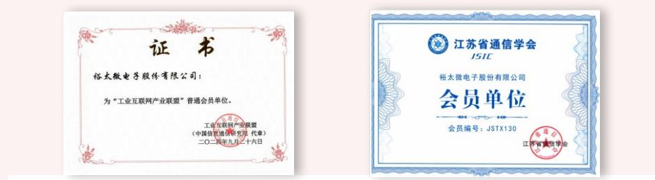

# 工业互联网产业联盟

普通会员单位

# 江苏省通信学会

会员单位

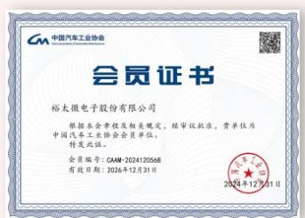

text_image

中国汽车工业协会
会员证书
裕太微电子股份有限公司
根据本会章程及相关规定，经审议批准，贵单位为
中国汽车工业协会会员单位。
特发此证。
会员编号：CAM-2024120568
有效日期：2026年12月31日
2026年12月31日

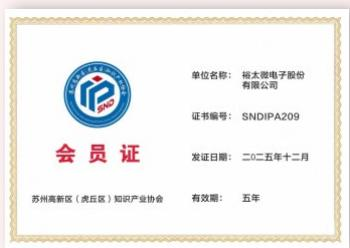

text_image

单位名称：裕太微电子股份有限公司
证书编号：SNDIPA209
发证日期：二0二五年十二月
苏州高新区（虎丘区）知识产业协会
有效期：五年

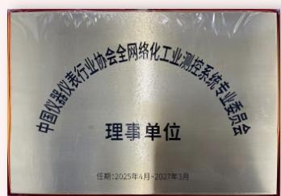

text_image

中国仪器仪表行业协会全网络化工业测控系统专业委员会
理事单位
任期:2025年4月-2027年3月

# 中国汽车工业协会

会员单位

# 苏州高新区（虎丘区）知识产业协会

会员单位

# 中国仪器仪表行业协会

理事单位

# 主营业务

公司专注于高速有线通信芯片的研发、设计和销售，以成为“有线连接芯片的全球领导者”为公司定位，以实现通信芯片产品的高可靠性和高稳定性为目标，以以太网物理层芯片作为市场切入点，逐步向上层网络处理产品拓展，目标瞄准OSI七层架构的物理层、数据链路层和网络层。

公司产品覆盖数通、车载、消费、工业、电信、安防等多个领域，产品分为车规级、工规级、商规级等不同性能等级，以及百兆、千兆、2.5G等不同传输速率和不同端口数量的产品组合，广泛应用于各类以太网设备接入设备以及各类车载和工业的特种数据传输场景的应用需求。

公司主要业务包含销售芯片、销售晶圆、IP授权、技术合作等多种不同模式。

# 主要产品

公司已形成网通以太网物理层芯片、网通以太网交换机芯片、网通以太网网卡芯片、车载以太网物理层芯片、车载以太网交换芯片、车载高速视频传输芯片多条产品线。

公司自主研发的以太网物理层芯片是数据通信中有线传输的重要基础芯片之一，全球拥有突出研发实力和规模化运营能力的以太网物理层芯片供应商主要集中在境外，公司是中国境内极少数实现2.5G网通以太网物理层芯片规模量产的企业。

以太网交换机芯片领域集中度较高，少数参与者掌握了大部分市场份额。由于以太网交换机芯片具备较高的技术壁垒、客户及应用壁垒和资金壁垒，因此当前行业整体国产程度较低，国内参与厂商较少，公司是中国境内极少数实现集成以太网物理层芯片的以太网交换机芯片规模量产的企业。

以太网网卡芯片（NIC）作为电脑与网络连接的必要部件，其工作原理是通过PCIe接口与电脑交互数据流，调整为适配的数据包后，通过以太网物理层接口发送或接收网络数据。目前，公司是中国境内极少数实现拥有完全自主知识产权的千兆网通以太网网卡芯片规模量产的企业。

公司已自主研发出一系列可供销售的以太网芯片产品，根据性能和下游应用可分为商规级、工规级和车规级三大类别，可满足不同客户在不同应用场景下的多样化需求。

<table><tr><td>产品类别</td><td>支持传输速率</td><td>性能</td><td>端口数</td><td>应用场景</td></tr><tr><td>商规级</td><td>10/100/1000/2500Mbps</td><td>可适用于0°C至70°C,满足商业场景应用要求,传输距离大于130米</td><td>单口/多口</td><td>适用于各消费与安防领域需要以太网通信的应用如安防摄像头、电视机、机顶盒、WIFI路由器等</td></tr><tr><td>工规级</td><td>10/100/1000/2500Mbps</td><td>可适用于-40°C至85°C,满足工业严苛温度环境应用要求,传输距离大于130米</td><td>单口/多口</td><td>适用于电信、数通、工业领域需要以太网通信的应用,如交换机、工业互联网、工业控制、电力系统、数据中心等</td></tr><tr><td>车规级</td><td>100/1000Mbps</td><td>包含多款车载1000/100Base-T1PHY和8/11口TSN Switch产品,形成了一整套完整的车载以太网芯片解决方案。其符合AEC-Q100车规级标准。实现了高速以太网数据在车内的稳定、可靠、低成本传输,满足了智能化汽车的最新通信架构需求</td><td>单口/多口</td><td>适用于车载以太网应用,如辅助驾驶、智能座舱、激光雷达、毫米波雷达、区域控制器、中央网关等</td></tr></table>

根据网络传输速度的不同，目前公司以太网芯片产品主要可分为百兆、千兆、2.5G、5G/10G。

<table><tr><td>分类</td><td>速度</td><td>公司产品推出情况</td></tr><tr><td>百兆</td><td>100Mbps</td><td>车载和网通以太网物理层芯片、网通以太网交换机芯片已规模量产</td></tr><tr><td>千兆</td><td>1000Mbps</td><td>网通以太网物理层芯片、网通以太网交换机芯片、网通以太网网卡芯片已规模量产;车载以太网物理层芯片和车载以太网交换芯片已量产出货</td></tr><tr><td>2.5G</td><td>2.5Gbps</td><td>网通以太网物理层芯片和网通以太网交换机芯片已规模量产</td></tr><tr><td>5/10G</td><td>5/10Gbps</td><td>研发阶段</td></tr></table>

组织架构  
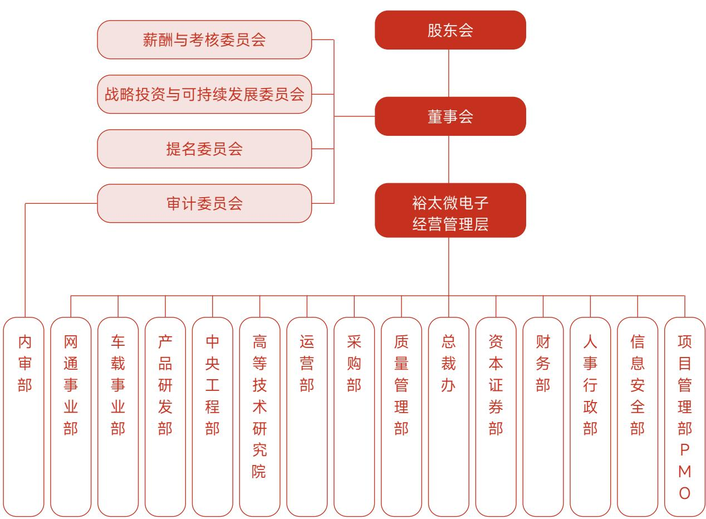

flowchart

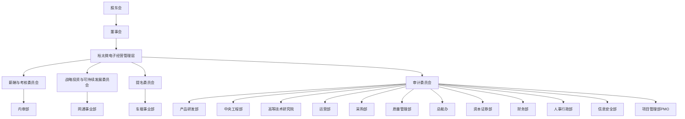

企业文化  
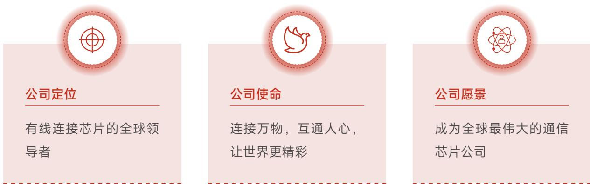

有线连接芯片的全球领导者

连接万物，互通人心，
让世界更精彩

成为全球最伟大的通信芯片公司

# 发展历程

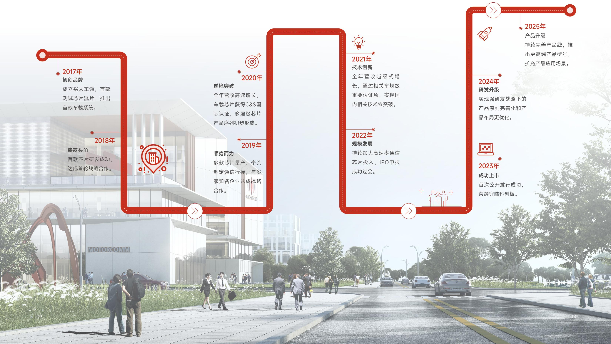

flowchart

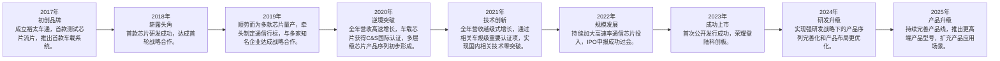

# 2025年所获荣誉

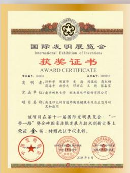

text_image

国际发明展览会
International Exhibition of Inventories
获奖证书
AWARD CERTIFICATE
项目编号：BACB
证书编号：1403957
发明者：孙科学  刘丽华  王清  刚宏波  高治梅
成果单位：深圳市  赵光  林益民  王刚  杨金金
完成单位：南京新太电子  纳大电子股份有限公司
项目名称：高新以东网信通的均衡关键技术及自主芯片研发和应用
该项目会是第十一届国际发明展览会，“一带一路”暨会对国家技能发展与技术创新大赛上荣获金奖，特此证予以表彰。
2025年8月

国际发明展览会金奖

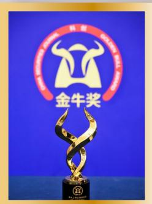

text_image

金牛奖

金牛上市公司科创奖（新一代信息技术）

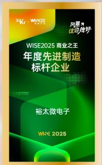  
WISE2025商业之王
年度先进制造标杆企业

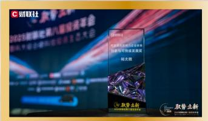  
财联社2025年度资本市场最具价值影响力榜单创新与可持续发展奖

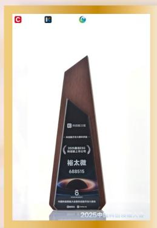

text_image

C
B
裕太微
688515
6
2025中国汽车企业市场
2025中国汽车企业
裕太微
688515
2025中国汽车企业市场

2025最佳ESG科创板上市公司

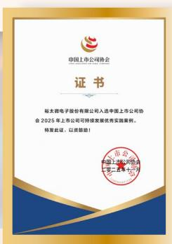

text_image

中国上市公司协会
证书
裕太微电子股份有限公司入选中银上市公司协会
2025年上市公司可持续发展优秀实践案例。
特发此证，以资鼓励！
中国上市公司协会
二零一五年十月

中上协2025年上市公司可持续发展优秀实践案例

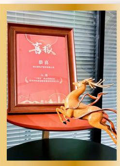

text_image

喜报
喜喜
人民健康出版社

“十四五”突出贡献企业苏州市科技创新发展成效显著企业

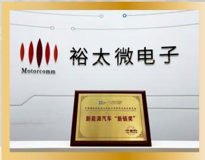

text_image

裕太微电子
Motorcomm
新能源汽车“新链奖”

中国国际新能源汽车技术零部件及服务展览会新能源汽车“新链奖”

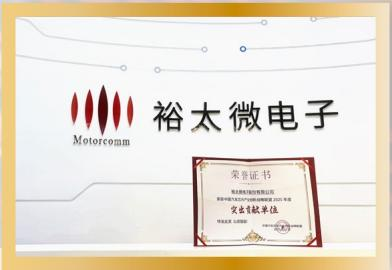

text_image

裕太微电子
Motorcomm
荣誉证书
香港联合产权交易所有限公司
董事会秘书处：中国证券登记结算有限责任公司深圳分公司
企业首款单位
特此公告

中国汽车芯片产业创新战略联盟突出贡献单位

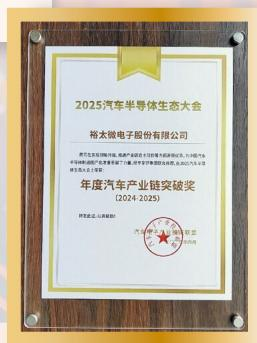

text_image

2025汽车半导体生态大会
帕太微电子股份有限公司
责任公司及下属单位:帕太微电子股份有限公司(以下简称“本公司”)与帕太微电子股份有限公司(以下简称“本公司”)签订的《关于帕太微电子股份有限公司2024年度汽车产业链突破奖（2024-2025）》
特此公告。以本授权书为准。
汽车产业转型升级基金
2024年1月1日

年度汽车产业链突破奖

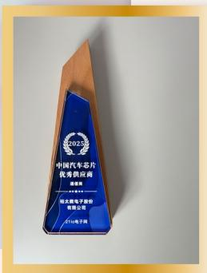

text_image

2022
中国汽车芯片
优秀剑汉商
事业部
广东粤电电子股份有限公司
2014年电子

2025中国汽车芯片优秀供应商（通信类）

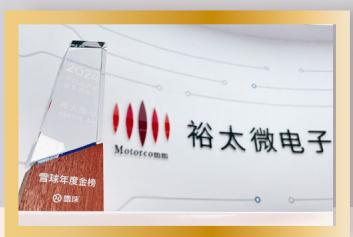

text_image

2020
年度业绩
Motece电子
Motece股份
裕太微电子
露球年度金榜
国华

雪球年度金榜  
2024年度投资者关系管理奖

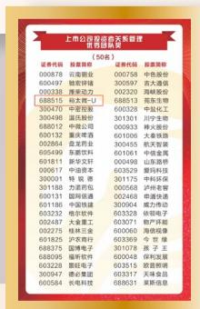  
第十六届上市公司投资者关系天马奖优秀团队奖

  
GB\_T19001-2016\_ISO9001\_2015管理体系运行示范单位

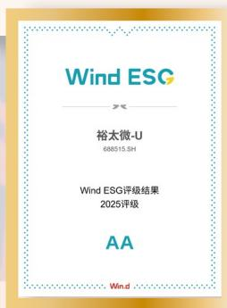

text_image

Wind ESC
裕太微-U
688515.SH
Wind ESG评级结果
2025评级
AA
Win.d

Wind ESG 2025年评级
AA级

natural_image

Golden trophy with two handles and ornate base, no visible text or symbols

# 2025关键绩效

经济绩效

<table><tr><td>资产总额169,090.58万元</td><td>营业收入61,659.55万元</td></tr><tr><td colspan="2">公司治理绩效</td></tr><tr><td>股东会召开次数3次</td><td>董事会召开次数6次</td></tr><tr><td>投资者关系管理活动15场</td><td>接待投资者调研活动49场</td></tr><tr><td>合规披露文件116份</td><td>重大违法违规事件0件</td></tr></table>

环境绩效

<table><tr><td>温室气体排放总量</td><td>能源消耗总量</td></tr><tr><td>700.91吨二氧化碳当量</td><td>162.42吨标准煤</td></tr><tr><td>用水总量</td><td>用电总量</td></tr><tr><td>1,571吨</td><td>132.04万千瓦时</td></tr></table>

社会绩效

<table><tr><td>研发投入31,507.16万元</td><td>研发团队总人数272人</td></tr><tr><td>授权专利累计数99项</td><td>软件著作累计数12项</td></tr><tr><td>集成电路布图设计累计数53项</td><td>劳动合同签订率100%</td></tr><tr><td>社会保险覆盖率100%</td><td>员工培训人次5,995人次</td></tr><tr><td>员工培训时长8,396小时</td><td>员工培训覆盖率100%</td></tr></table>

# 可持续发展治理

# 可持续发展目标与愿景

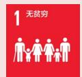

- 公司实行合法、公平、全面的薪酬制度，按时足额支付薪酬，并通过当期与长期相结合的多元化激励机制，激发员工积极性，推动企业与员工共同发展。  
- 公司关注员工福祉，通过医疗保险、经济援助、岗位保障、弹性工作、心理关怀、每年定期组织员工团建旅游并让员工自行选择出行时间等举措，为全体和有需要的员工提供支持，传递企业温暖，积极履行社会责任。

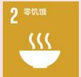

\- 公司为因工作晚归的同事提供免费加班餐，同时针对外地籍员工提供短期临时酒店住宿补贴。

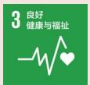

- 公司始终关注并致力于维护全体员工的身体健康，为全体员工购买补充医疗保险，全面覆盖上下班途中交通事故、工作摔伤等工伤情形，提供有力保障与及时援助。  
- 为了全面了解和改善员工的健康状况，公司每年组织覆盖全员的健康体检活动，并同时面向其家属提供相同优惠价格，鼓励员工及家属共同建立健康意识。

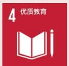

- 公司培训围绕战略主线，以提升人才竞争力和组织能力为目标，构建了多层次、专业化、数字化培养体系，通过线上线下结合精准匹配课程需求，并运用灵活多样的运营方式激发员工自主学习，推动学习型组织建设。  
- 公司与南京邮电大学、香港应用科学研究院、华中科技大学等多所高校进行了产学研合作，持续支持国家科研人才培养及人才发展建设。

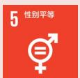

- 公司严格贯彻执行《中华人民共和国劳动法》，坚持男女同工同酬，保障平等就业权。除国家规定的特殊岗位外，招聘不以性别为由拒绝或区别对待女性，并严禁任何形式的性别歧视，特别保护怀孕女工权益。  
- 公司通过组建女性员工专属沟通交流平台，实现线上实时互动与信息共享，及时帮助、解决女员工生活、工作需求。

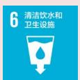

\- 公司持续维护升级员工直饮水系统，为员工提供优质及便利的饮用水。

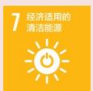

\- 公司均采购节能型办公设备、空调等能耗低的用品，并推广绿色办公措施，每日进行楼层巡检减少自身能源消耗，提升能源利用效率。

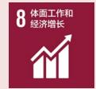

- 2025年营收较去年增长 $55.62\%$ 。  
- 公司遵守国家和地方税务管理，认真履行纳税义务，诚实纳税以支持政府促进经济增长，承担的社会责任。  
- 公司为员工提供具有市场竞争力的薪酬，并形成了一套“人岗匹配，易岗易薪”的薪酬体系，以及“资源、激励重点投入到战略目标”的战略导向型激励机制。

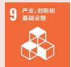

\- 报告期内，公司以研发创新为导向，加大研发投入，致力于自主研发，不断推动技术进步和产品升级，其中在研项目共有13项，且均已达到国内先进/领先水平，与国际主流企业的同类技术相当，包括车载、高速、超高速、极高速、ultra-fast以太网通信芯片研发项目、车载网络通信关键技术研发项目、时间同步芯片研发项目、多口、高速单口和高速多口网络通信芯片研发项目、多口交换芯片研发项目、小口数和车载小口数交换芯片研发项目等。

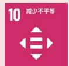

- 公司每季度组织开展“All Hands Meeting”员工大会，并通过问卷收集员工在工作条件、环境、通勤、餐饮、福利等方面的意见与建议，积极倾听并解决问题，据此制定改进计划。  
- 公司设立“芯声社区”线上平台，鼓励员工献策谏言与公开讨论，畅通内部沟通渠道，营造开放、包容的组织氛围。  
- 公司坚持平等原则，在聘用、培训、晋升等环节不因民族、性别、年龄、宗教、信仰、残疾等因素歧视员工，尊重员工在相关方面的个人权利，并保障其不受歧视。  
- 2025年，公司任用少数民族员工14人。

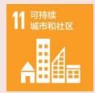

\- 公司倡导员工绿色通勤，出差尽量使用公共交通，多人出行合并打车；设置交通补贴，鼓励员工上下班通勤乘坐公共交通。

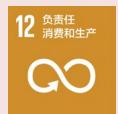

- 公司依托ISO 9001质量管理体系，建立了全面、严格、规范的质量管理系统，形成了《质量手册》的核心的质量管理制度群。  
- 积极参与行业共建，为监管部门和行业协会等组织建言献策。在以太网技术领域，公司骨干正在参加IEEE802.3标准制定的讨论，成为国际以太网技术领域标准制定的参与者之一。  
- 公司严格执行PPA（功耗、性能、面积）关键指标管理，通过功耗优化、性能优化和面积优化等方法，实现更高性能、更低功耗、更小面积的芯片设计，从而降低产品生产资料资源的消耗。

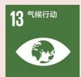

- 公司严格筛选供应商，确保所采购的物料既符合高质量标准，又具备较低的能耗特性。  
- 公司将气候变化相关议题纳入管理层的监督范畴，并展开BCM业务持续性演练，定期演练应对气候变化相关风险，并计划开展提升应对气候变化能力的相关培训，增强在气候变化下抗风险的能力。

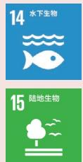

\- 公司遵循《GPM监管物质标准》及RoHS、REACH、ELV等国内外环保法规要求，严格限制有害物质使用，从源头管控，减少有毒有害物质的排放，以免破坏水、土壤等相关生物的生态平衡。

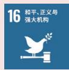

- 公司坚持公平竞争、诚信经营，反对任何垄断行为。法务部门对合同进行严格审查，确保业务操作合法合规，促进企业与市场共同健康发展。  
- 公司制定了《反舞弊管理制度》，适用于全体员工及相关合作方，要求遵守法律法规与职业道德，禁止以欺骗等不正当手段谋取利益，维护公司经济安全。  
- 公司依据《中华人民共和国公司法》《中华人民共和国证券法》《上市公司治理准则》等法律法规，完善股东会、董事会等治理机制，明确权责，构建有效的决策、执行与监督体系，以提升市场应对能力与风险管控水平。

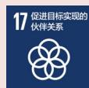

- 公司对供应商进行全生命周期管理，通过供应商寻源、准入、变更、退出等一系列程序，不断优化供应商管理，确保供应链的安全、稳定，为企业营造一个安全、可持续的发展环境。  
- 2025年公司参与政府、协会、高校、媒体等组织的各类峰会、论坛、研讨会等共计60余场，接待国家级、局级、区级政府单位等到访10余场。

# 可持续发展治理架构

公司始终将可持续发展理念深度融入企业战略与日常运营，公司制定了《董事会战略投资与可持续发展委员会工作细则》，以制度为基础，公司构建了“决策引领、管理推进、执行落地”的三级治理体系，确保ESG工作规范有序开展。董事会作为最高决策层，负责审定ESG战略规划、治理架构及重大制度，把控可持续发展方向；战略投资与可持续发展委员会作为统筹管理单元，负责ESG政策制定、趋势研判、绩效监督及决策建议，向董事会负责；公司战略投资与可持续发展委员会下设ESG专项工作组，承担政策执行、信息统筹及重大事项前期评审等工作。同时，通过规范的议事规则、灵活的会议形式及专业的外部支持机制，保障ESG决策的科学性与执行效能。

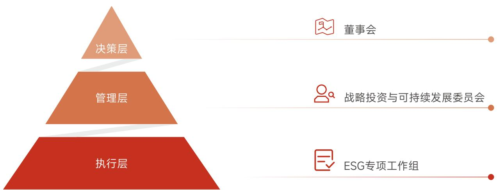

flowchart

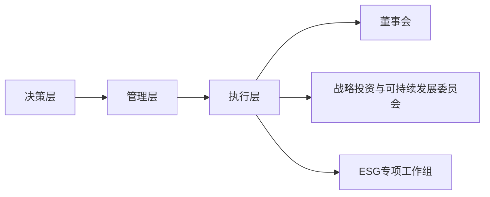

可持续发展治理架构图

# 可持续发展实践

为提升全员对可持续发展理念的理解与认知，推动ESG管理融入公司运营全过程，公司组织开展了ESG培训活动。培训特邀ESG领域专家对公司所处行业面临的ESG政策趋势、监管要求及关键议题进行了深入宣贯，解读了ESG对企业长期价值、风险管理与品牌形象的重要意义。通过此次培训，员工进一步加深了对ESG内涵及其在企业实践中作用的认识，增强了责任意识与行动自觉，为后续全面推进ESG工作奠定了良好的组织基础和文化氛围。公司将以此次启动会为契机，持续开展分层次、多维度的ESG能力建设活动，助力可持续发展战略有效落地。

natural_image

Illustration of a person presenting in front of a large screen displaying pie chart and document icons (no text or symbols present)

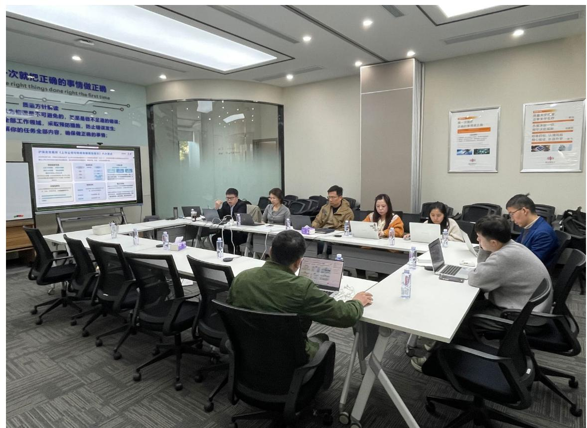

text_image

Meeting room scene with participants seated around a U-shaped table, large presentation screen displaying Chinese text about safety and prevention measures.

ESG报告项目启动会

# 利益相关方沟通

公司始终认为，可持续发展离不开各利益相关方的共同参与。员工关注职业发展与工作环境，推动公司完善人才培养与晋升机制；客户重视产品质量与服务体验，反馈引导产品创新与市场定位。多元视角有助于公司全面审视战略，避免决策片面。结合行业与运营特点，公司识别出政府及监管机构、股东、员工、客户、供应商、合作伙伴、社区、协会、公众及媒体等主要利益相关方，并通过官网、会议、报告、媒体等多种渠道建立常态化沟通机制，积极回应各方诉求与期望。

<table><tr><td>利益相关方</td><td colspan="2">期望与诉求</td><td colspan="2">沟通渠道及其运作情况</td></tr><tr><td>政府及监管机构</td><td>· 诚信合规经营· 依法纳税</td><td>· 带动地方经济发展· 响应国家战略</td><td>· 完善内部控制体系· 学习贯彻各项监管规定、积极配合监管、守法经营与公平竞争</td><td>· 接受日常监督与检查· 参与监管部门说明会、研讨会等</td></tr><tr><td>股东或投资者</td><td>· 可持续稳定的投资回报· 信息公开披露</td><td>· 股东权益保障· 合规经营与风险管理</td><td>· 召开股东会· 定期信息披露· 投资者调研</td><td>· 公司网站及自媒体账号· 上证e互动· 投资者联系电话及邮箱</td></tr><tr><td>员工</td><td>· 薪酬与福利· 职业发展体系与前景</td><td>· 员工权益保障· 员工关爱与民主管理</td><td>· 定期座谈会和员工培训· 人力资源总监面对面沟通· 邮件收集</td><td>· 芯声社区· 定期All Hands Meeting· 职工代表大会</td></tr><tr><td>客户</td><td>· 产品质量管理· 售后服务管理</td><td>· 技术创新</td><td>· 研发流程管理· 客户满意度调查</td><td>· 产品质量控制· 完善客户服务体系· 产业会议</td></tr><tr><td>供应商</td><td>· 公平、公开、廉洁采购</td><td>· 绿色采购· 负责任供应链管理</td><td>· 定期供应商审核与评估· 供应商交流</td><td>· 供应商ESG评鉴· 招投标活动</td></tr><tr><td>合作伙伴</td><td>· 创新研发· 知识产权保护</td><td>· 推动行业发展· 品牌联动赋能</td><td>· 参与行业标准制定· 项目合作研发</td><td>· 学术技术交流· 研讨会</td></tr><tr><td>相关社会团体或公众</td><td>· 保护环境</td><td>· 公益活动</td><td>· 参加公益活动· 社区服务与志愿活动</td><td>· 定期开放交流</td></tr></table>

# 重要性议题管理

公司依据上海证券交易所科创板上市公司自律监管指南第13号——可持续发展报告编制及GRI Standards的“实质性”原则，结合国家政策、行业趋势及公司战略，引入影响重要性和财务重要性的分析视角，共识别出26项对企业和利益相关方具有重要影响的环境、社会及治理类实质性议题，并将其作为本报告披露的重点，切实回应各方关切。

# 议题识别与筛选

公司以证监会、上交所等监管机构披露的指引为基础，结合GRI标准中的实质性议题分析流程，参考资本市场、评级机构、国际报告标准以及同行业关注的可持续发展议题，通过内部高管沟通、外部专家交流等方式，识别出公司ESG议题清单。

# 议题重要性评估

# 影响重要性评估：

全面梳理各议题对外部环境、社会及经济所产生的潜在或现实的正面、负面影响。

# 财务重要性评估：

通过对影响、依赖性及其他因素展开深入分析，并结合专家的专业判断，识别并评估相关议题涵盖的风险与机遇。

# 确定实质性议题

形成影响重要性和财务重要性议题清单，公司进行重要性议题内部评估分析与排序，排序结果经过内外部专家验证后绘制实质性议题分析矩阵。

text_image

裕太微电子
Motorcomm

影响重要性  
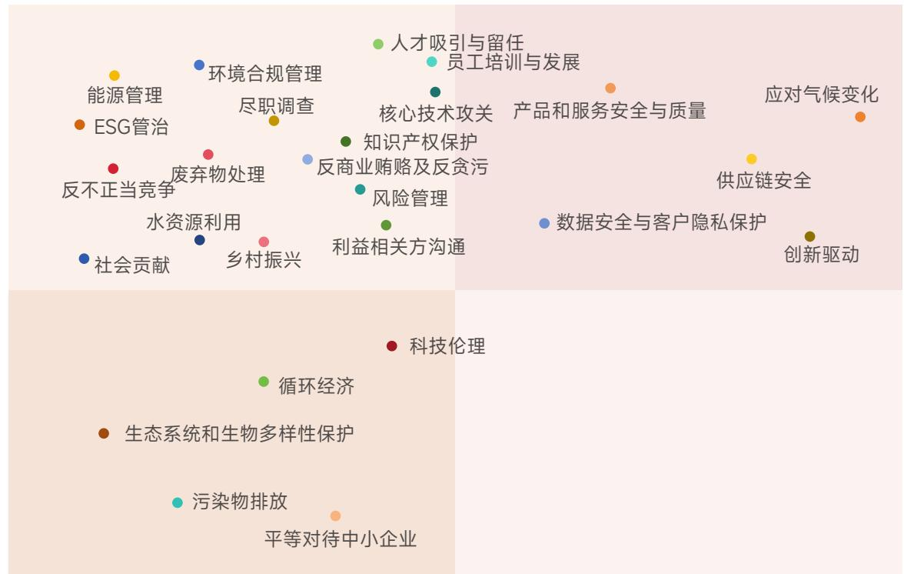

scatter

| Topic | X-axis Position | Y-axis Position |
| :--- | :--- | :--- |
| 人才吸引与留任 | High | High |
| 员工培训与发展 | High | High |
| 核心技术攻关 | High | High |
| 产品和服务安全与质量 | High | High |
| 应对气候变化 | High | High |
| 环境合规管理 | Medium-High | High |
| 尽职调查 | Medium-High | High |
| 知识产权保护 | Medium-High | Medium-High |
| 反商业贿赂及反贪污 | Medium-High | Medium-High |
| 风险管理 | Medium-High | Medium-High |
| 数据安全与客户隐私保护 | Medium-High | Medium-High |
| 创新驱动 | High | Medium-High |
| 能源管理 | Low-Medium | High |
| ESG管治 | Low-Medium | High |
| 废弃物处理 | Low-Medium | Medium-High |
| 反不正当竞争 | Low-Medium | Medium-High |
| 水资源利用 | Low-Medium | Medium-High |
| 社会贡献 | Low-Medium | Medium-High |
| 乡村振兴 | Low-Medium | Medium-High |
| 利益相关方沟通 | Medium-High | Medium-High |
| 科技伦理 | Medium-High | Low-Medium |
| 循环经济 | Medium-High | Low-Medium |
| 生态系统和生物多样性保护 | Low-Medium | Low-Medium |
| 污染物排放 | Low-Medium | Low-Medium |
| 平等对待中小企业 | Medium-High | Low-Medium |

财务重要性

① 环境合规管理  
② 应对气候变化  
③ 能源管理  
④ 循环经济  
- ⑤ 污染物排放  
- ⑥ 废弃物处理  
- ⑦ 水资源利用  
- ⑧ 生态系统和生物多样性保护

- ⑨ 创新驱动  
- ⑩ 知识产权保护  
- ⑪ 核心技术攻关  
• ⑫ 科技伦理  
- ⑬ 数据安全与客户隐私保护  
• ⑭ 产品和服务安全与质量  
⑮ 供应链安全  
⑯ 人才吸引与留任  
⑰ 员工培训与发展  
⑱ 乡村振兴  
⑲ 社会贡献

- ⑳ ESG管治  
- ②1 尽职调查  
- ②2 利益相关方沟通  
- ②3 风险管理  
- ②4 反不正当竞争  
- ②5 反商业贿赂及反贪污  
②6 平等对待中小企业

# 裕太微实质性议题

# 环境类（E）

① 环境合规管理  
② 应对气候变化  
③ 能源管理  
④ 循环经济 $^{1}$  
⑤ 污染物排放 $^{2}$  
⑥ 废弃物处理  
⑦ 水资源利用  
⑧ 生态系统和生物多样性保护 $^{3}$

# 社会类 (S)

⑨ 创新驱动  
⑩ 知识产权保护  
⑪ 核心技术攻关  
⑫ 科技伦理 $^{4}$  
⑬ 数据安全与客户隐私保护  
⑭ 产品和服务安全与质量  
⑮ 供应链安全  
⑯ 人才吸引与留任  
⑰ 员工培训与发展  
⑱ 乡村振兴  
⑲ 社会贡献

# 治理类（G）

⑳ ESG管治  
②1 尽职调查 $^{5}$  
②2 利益相关方沟通  
②3 风险管理  
⑳ 反不正当竞争  
⑲ 反商业贿赂及反贪污  
②6 平等对待中小企业 $^{6}$

注：1. 公司采用Fabless（无晶圆厂）经营模式，不涉及晶圆制造等高耗能、高耗水生产环节，经营过程中资源消耗及废弃物体量较小，因此本报告未对循环经济相关议题进行披露。  
2. 公司采用Fabless（无晶圆厂）经营模式，相关生产环节全部委托外部代工厂完成，日常经营中仅产生少量生活污水和办公废弃物，已按环保要求合规处置，因此本报告未对污染物排放相关议题进行披露。  
3.公司经营活动不对生态敏感区域产生影响，报告中展示公司生态系统和生物多样性保护实践内容，但不作为重要性议题进行披露。  
4. 公司未开展生命科学、人工智能等涉及科技伦理敏感领域的科研及技术开发活动，因此本报告未对科技伦理相关议题进行披露。  
5. 公司未开展ESG专项的尽职调查工作，但公司持续开展风险管理工作，识别和评估运营可能产生的负面影响，具体详合规运营与风险管理章节。  
6. 截至报告期末，公司应付账款（含应付票据）余额未超过300亿元，且占总资产比重未超过50%，因此本报告未就平等对待中小企业相关议题进行披露。

natural_image

Line drawing of a business presentation with a presenter pointing to charts and a group of people at a table (no text or symbols)

# 党建引领

# 组织建设

公司依据《中国共产党章程》及上级党组织批复，规范设立基层党组织。2025年8月，公司正式成立党支部，在公司治理中发挥政治引领作用，负责党员教育、管理、监督和发展党员工作，并参与公司重大事项决策。公司党组织覆盖本单位及下属业务主体，党员教育、管理及组织关系转接等工作按制度规范开展。

natural_image

Silhouette of a person holding a Chinese national flag, standing in front of traditional pagodas and a distant tower (no text or symbols)

# 思想建设

公司党支部建立并落实“三会一课”、主题党日等常态化学习教育制度，组织党员深入学习党的创新理论、路线方针政策、国家重大战略部署以及社会主义核心价值观。报告期内，党支部按月开展主题党日活动，活动通过集中学习文件、传达重要讲话精神、交流研讨等形式进行，并结合“开放式”主题党日要求，开展现场观摩与互学互鉴。

# 案例 “纪念中国人民抗日战争暨世界反法西斯战争胜利80周年”主题党日活动

2025年9月，公司党委围绕纪念抗日战争胜利80周年开展主题党日活动，组织党员干部深入学习习近平总书记重要讲话，参观革命场馆，重温抗战历史，弘扬伟大抗战精神。通过集中学习、现场观摩与交流研讨，推动党史学习教育走深走实，强化理想信念，激发奋进力量，以思想建设实效助力企业可持续发展。

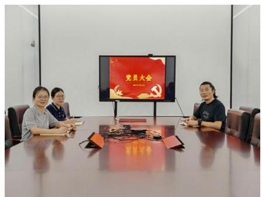

text_image

党员大会

# 党纪建设

公司将全面从严治党要求融入内部管理，以主题党日为依托开展纪律教育，重点传达学习中央八项规定精神及作风建设相关要求。党支部组织党员学习“锲而不舍落实中央八项规定精神，推进作风建设常态化长效化”等重要指示精神，将纪律要求纳入日常学习教育内容。公司党支部通过主题党日等形式，传达党内监督与作风建设的制度要求，推动党员在日常工作中严守纪律规矩，引导党员将作风建设与传承抗战精神相结合，强化纪律意识。报告期内，未发现违反中央八项规定精神及作风建设规定的典型案例。

# 01

# 公司治理篇

本章所涉及的

ESG 重要议题

- ESG 管治  
- 利益相关方沟通  
- 风险管理  
- 反不正当竞争  
- 反商业贿赂及反贪污

股东会召开

3次

股东会会议审议通过事项

19项

董事会召开

6次

董事会会议审议通过事项

34项

# 公司治理

# 治理结构

公司严格遵循《中华人民共和国公司法》《中华人民共和国证券法》《上市公司治理准则》《上海证券交易所科创板股票上市规则》及《上市公司章程指引》等法律法规要求，制定《公司章程》，建立了由股东会、董事会及高级管理人员组成的权责明确、相互制衡、运作高效的现代化公司治理组织架构。公司持续优化治理体系，健全内部控制机制，致力于提升规范化运作水平，为公司的稳健经营与可持续发展奠定坚实基础。

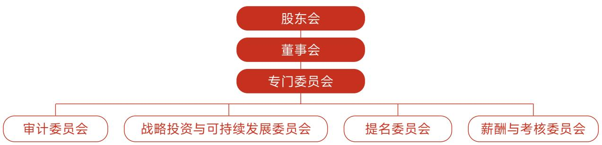

flowchart

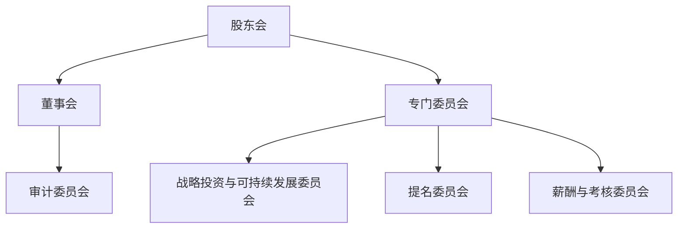

组织架构图

# 股东会

公司严格按照《中华人民共和国公司法》《上市公司股东会规则》等法律法规及《公司章程》的相关规定，制定并执行《股东会议事规则》。股东会作为公司的最高权力机构，依法行使包括决定公司经营方针和投资计划、选举和更换董事、审议批准董事会报告及利润分配方案、对公司增加或减少注册资本等重大事项作出决议的法定职权。公司定期召开年度股东会，并根据规定情形召集临时股东会，会议的召集、召开、表决程序均严格遵循法定及章程规定的要求。公司为股东参与决策提供便利，采用现场会议与网络投票相结合的方式召开股东会。在审议影响中小投资者利益的重大事项时，公司严格实行中小投资者表决单独计票，并及时公开披露计票结果，以保障所有股东的合法权益。

关键绩效

<table><tr><td colspan="3">报告期内，</td></tr><tr><td>公司共召开股东会会议</td><td>审议通过议案</td><td>股东会成员出席率</td></tr><tr><td>3次</td><td>19项</td><td>100%</td></tr></table>

# 董事会

董事会是公司的经营决策和业务领导机构，对股东会负责，负责执行股东会决议。公司严格按照《公司章程》及《董事会议事规则》的规定召开董事会，对公司的经营计划、投资方案、财务预决算、内部控制及高级管理人员任免等重大事项进行科学决策。董事会成员勤勉尽责，认真履行董事职责。

关键绩效

<table><tr><td colspan="3">报告期内，</td></tr><tr><td>公司共召开董事会会议</td><td>审议通过议案</td><td>董事会成员出席率</td></tr><tr><td>6次</td><td>34项</td><td>100%</td></tr></table>

# 董事会专门委员会

公司董事会下设战略投资与可持续发展委员会、审计委员会、提名委员会、薪酬与考核委员会四个专门委员会。战略投资与可持续发展委员会负责研究公司发展战略与重大投资，推动战略实施，统筹经济、环境与社会协调发展，同时委员会开展规划目标、政策的执行管理、风险评估、绩效表现、信息披露、ESG专项工作组管理等事宜，并向董事会汇报。审计委员会负责财务报告、内部控制及外部审计的监督评估，审查关联交易，确保公司财务合规与透明。提名委员会负责研究董事及高管选任标准，审核候选人资格，提出建议，优化管理层人才结构。薪酬与考核委员会负责制定并审查董事、高管薪酬政策与考核标准，建立激励机制，促进绩效提升。各委员会依据各自工作细则独立运作，向董事会负责，在战略规划、财务监督、人事提名、薪酬激励等领域为董事会决策提供专业的咨询与建议，提升董事会决策的科学性与有效性。

<table><tr><td>委员会名称</td><td>成员总数</td><td>独董人数</td><td>独董占比</td></tr><tr><td>战略投资与可持续发展委员会</td><td>3</td><td>1</td><td>33%</td></tr><tr><td>审计委员会</td><td>3</td><td>2</td><td>67%</td></tr><tr><td>提名委员会</td><td>3</td><td>2</td><td>67%</td></tr><tr><td>薪酬与考核委员会</td><td>3</td><td>2</td><td>67%</td></tr></table>

# 董事会多元化构成

公司在董事的提名与选举过程中，严格遵守法定程序，并综合考量候选人在性别、年龄、教育背景、专业经验、技能知识及服务任期等方面的多元化因素。董事会成员在财务、法律、技术、管理及行业背景方面具备丰富的专业经验，为董事会科学高效决策提供重要基础。

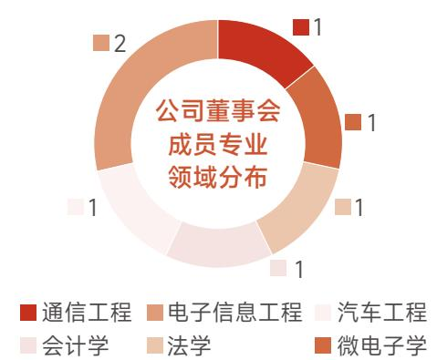

donut

| 类别 | 数量 |
| --- | --- |
| 通信工程 | 1 |
| 电子信息工程 | 2 |
| 汽车工程 | 1 |
| 会计学 | 1 |
| 法学 | 1 |
| 微电子学 | 1 |

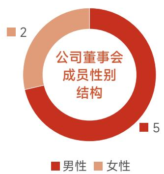

donut

| 性别 | 人数 |
| --- | --- |
| 男性 | 5 |
| 女性 | 2 |

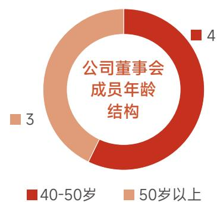

donut

| 年龄段 | 人数 |
| --- | --- |
| 40-50岁 | 4 |
| 50岁以上 | 3 |

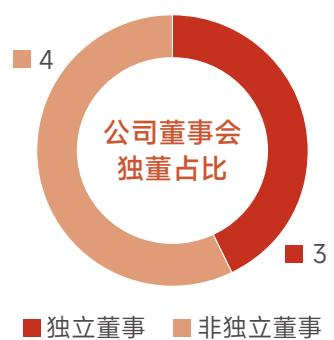

donut

| Category | Value |
| --- | --- |
| 独立董事 | 3 |
| 非独立董事 | 4 |

# 董事会独立性

公司依据《中华人民共和国公司法》《上市公司独立董事管理办法》及《公司章程》，制定并实施《独立董事工作制度》。独立董事在董事会中发挥参与决策、监督制衡与专业咨询的重要作用，致力于维护公司整体利益，特别是保护中小股东的合法权益。独立董事就关联交易、重大事项等发表独立意见，并行使独立聘请中介机构、提议召开临时股东会等特别职权。截至报告期末，公司董事会共有独立董事3名，占董事会成员比例为43%。独立董事在专业背景上覆盖会计、法律及通信工程等领域，为董事会决策提供了专业支撑。

# 董事会有效性评估

公司持续推进董事会有效性评估工作，严格对照监管要求及公司制度开展董事会自查。公司通过定期组织自我评估、履职反馈与独立性审查，全面客观评价各专门委员会及董事的履职成效，切实保障董事会决策的合规性与有效性。

# 董高薪酬管理

公司秉持公平、责权利统一、长远发展、激励约束并重的原则，制定《董事和高级管理人员薪酬管理制度》等相关制度，构建起科学规范、系统完善的高管薪酬管理体系。薪酬分配充分兼顾岗位价值、履职成效与公司长期发展目标，非独立董事及高级管理人员的薪酬与履职能力、工作绩效深度挂钩，有效调动董事、高级管理人员的积极性，营造良好内部环境，促进公司与董事、高级管理人员共同成长。

# 关键绩效

报告期内，

公司支付董事和高级管理人员报酬（含离任）940.38万元

natural_image

Interior of a modern open-plan office with multiple cubicles and employees working at desks, surrounded by greenery (no visible text or signage)

# 投资者关系管理与股东权益

# 信息披露

公司依据相关法律法规及监管要求，制定了《信息披露管理制度》《信息披露暂缓与豁免制度》等制度，对信息披露的内容、标准、程序及暂缓与豁免披露的申请与审批流程作出了明确规定，确保信息披露的真实、准确、完整、及时和公平。信息披露工作由董事会统一领导和管理，董事长是信息披露的最终责任人。董事会秘书是信息披露工作的主管负责人，负责组织、协调信息披露事宜。公司指定的信息披露媒体为上海证券交易所网站及中国证监会指定的信息披露报刊。报告期内，公司遵循监管规定履行信息披露义务，未发生信息披露违规事件。

<table><tr><td>信息披露绩效</td><td>2025年</td></tr><tr><td>发布定期报告数量(份)</td><td>4</td></tr><tr><td>披露文件数量(份)</td><td>116</td></tr><tr><td>信息披露考评结果</td><td>B</td></tr></table>

# 资本市场舆情管理

为应对可能对公司声誉及资本市场表现造成影响的舆情事件，公司制定了《公共舆情危机应对手册》，建立了舆情监测、研判与应对机制。公司成立了以董事长为组长的危机管理小组，作为重大突发舆情事件的应急指挥中心。公共关系事务部为舆情管理的主管部门，负责组织相关部门对事件进行评估与响应。手册明确了舆情危机I级至III级的分级标准与对应的处理流程，强调通过内部信息整合与快速决策，统一对外口径，以控制事态发展，降低对企业和利益相关方的负面影响。

natural_image

Line drawing of two businessmen shaking hands with gears and stacked bricks, symbolizing collaboration or teamwork (no text or symbols present)

# - 案例 上市公司舆情应对及礼仪培训

为持续提升公司治理水平与品牌声誉管理能力，公司组织开展上市公司舆情应对及商务礼仪专项培训，包含“媒体舆情管理——规则与实战”“销售话术标准化——禁区与安全区”“商务礼仪——细节决定成败”三大主题，并深入解读了舆情管理与危机公关中的5S原则——承担责任、真诚沟通、速度第一、系统运行、权威证实。通过专业化、场景化的培训，公司有效增强员工风险防范意识与合规应对能力，完善舆情响应机制，维护投资者关系与企业公众形象，助力公司ESG治理体系的健全与可持续发展。

# 投资者关系管理

公司致力于构建透明、畅通的投资者沟通渠道，根据《上市公司投资者关系管理工作指引》及上海证券交易所相关规则，制定了《投资者关系管理制度》，明确了投资者关系管理的目标、原则、职责分工与工作内容。公司董事会秘书作为投资者关系管理工作的主管负责人，负责统筹规划和组织实施，董事会办公室作为日常工作的执行机构。公司通过多种合规渠道与投资者保持沟通，包括上海证券交易所“上证e互动”网络平台、投资者热线与邮箱、公司官网投资者关系专栏，以及业绩说明会、路演、分析师会议和现场接待等互动形式。报告期内，公司积极开展投资者沟通活动，及时回应投资者关切。

  
业绩说明会

<table><tr><td>投资者沟通关键绩效</td><td>单位</td><td>2025年</td></tr><tr><td>业绩说明会</td><td>次</td><td>3</td></tr><tr><td>投资者关系活动记录</td><td>份</td><td>15</td></tr><tr><td>接待投资者调研</td><td>次</td><td>49</td></tr><tr><td>上证e互动平台回复问题</td><td>个</td><td>67</td></tr></table>

# 股东回报

公司重视对股东的合理回报，利润分配政策以《中华人民共和国公司法》及《公司章程》的相关规定为根本依据。《公司章程》明确了利润分配的原则、方式、条件、审议程序及政策调整机制。公司的利润分配政策保持连续性和稳定性，兼顾公司的长远利益与可持续发展。在满足现金分红条件的前提下，优先采用现金分红方式。董事会在制定利润分配方案时，需综合考虑公司所处发展阶段、盈利水平、资金需求等因素，提出差异化的现金分红方案，并提交股东会审议批准。

natural_image

Illustration of people interacting with a smartphone displaying data, surrounded by coins and decorative elements (no text or symbols)

# 合规经营与风险管理

# 合规经营

# 合规管理体系

公司依据《中华人民共和国公司法》《中华人民共和国证券法》《上市公司治理准则》等相关法律法规制订了《公司章程》以及一系列内控规范，构建了由决策、监督与审计、执行三个层级组成的合规管理体系，为公司规范运作提供制度保障。为进一步完善公司合规体系，公司建立了《内部审计管理制度》，有效规范公司及其控股子公司的内部审计工作，加强公司内部监督和风险控制，有效保障企业经营管理的规范化运作，确保财务管理、会计核算及生产经营活动全面契合国家各项法律法规要求，切实维护包括中小投资者在内的全体股东合法权益。

flowchart

公司合规体系架构

# 合规管理措施

公司设置独立的内部审计机构内审部，对公司日常经营管理的合规性进行监督和审计，指导内审工作，每季度审议审计计划与报告，向董事会汇报进展，并协调内外部审计协作。内审部独立履职，对各机构及子公司内部控制的完整性、有效性进行评估，重点审计财务报告、关联交易、募集资金使用等关键事项，确保信息真实、合法、完整。同时，协助建立反舞弊机制，开展专项审计，识别并防范重大风险。内审部每年提交内部控制评价报告，并对发现的问题持续跟踪整改。

# 合规团队建设与文化

公司注重合规团队建设与合规文化的培养，通过定期的合规培训和宣传活动，增强全体员工的合规意识。通过体系化的培训，公司将合规要求前置至人才引进环节，推动形成“人人合规、事事合规”的企业文化氛围，为公司稳健运营和可持续发展夯实合规基础。

# - 案例 合同签署法律风险防范宣贯

2025年4月，公司针对合同签署实务问题，面向业务人员发布了关于格式条款的常见法律风险以及应对策略的法律分析报告，系统梳理了业务场景中的潜在风险及应对方法，以便业务人员在工作中能够更好地识别和应对相关情景带来的法律风险。

# - 案例 新员工合规培训

2025年7月9日，公司法务部组织新员工开展入职合规培训，详细讲解了公司保密制度，明确保密范围、责任要求及信息保护措施，并介绍合同管理制度，合同审批流程、标准模板使用及法律风险防范要点。

# 风险管理

# 风险管理体系

公司建立了系统的风险管理体系，制定并实施《风险与机遇管理程序》。程序明确了风险管理的目的、范围、权责与工作流程，设立了分层级的管理组织，由总经理负责提供所需资源，管理者代表负责保持评审，质量管理部负责程序的建立、维护及组织协调评审，各部门负责本部门的风险评估与管控措施制定执行。在业务连续性方面，公司依据《业务连续性管理程序》建立BCM管理体系，由CEO负责提供资源，质量管理部总监负责体系的建立、实施与改进，各部门负责人作为小组成员参与。

# 风险控制管理

公司制定《风险与机遇管理程序》，通过信息收集、风险识别、风险分析与评价等步骤识别和评估风险。针对不同等级的风险，采取风险规避、风险降低或风险接受等应对策略。公司要求对高风险应立即采取措施规避或降低，对中风险需采取措施降低，对低风险可接受。公司每年进行至少一次由质量管理部组织对风险管理过程进行的定期评审，以验证其有效性。此外，公司通过《业务连续性管理程序》进行业务影响分析和风险评估，并基于结果选择风险降低、回避、分担或接受等策略，制定业务连续性计划与突发事件应急预案，并定期组织演练与测试。

flowchart

风险管理流程图

# 关键绩效

报告期内，

公司共完成 4 次内部审计，未识别到重大的财务风险点，发现 1 个问题，出具 1 条审计建议；共收到外部审计出具审计报告 14 份，其中年审报告 4 份，专项审计与鉴证报告 10 份，审计未识别到重大财务风险点。

# 风险管理培训

公司通过定期的风险管理培训，提高全体员工的风险意识和风险管理能力，使员工了解风险管理的重要性和风险管理的基本方法，确保员工能够在日常工作中识别和应对风险。依据《内部审核控制程序》，公司对内部审核员设有明确的资质要求，审核员需清楚知悉体系要求并通过培训考试。对于车载体系内审员，还需额外了解汽车审核过程方法、顾客特定要求及相关核心工具。审核组长在审核实施前需对审核员进行宣导培训，确保其清楚审核内容、重点及方式。公司每年至少进行一次覆盖所有质量管理体系过程的定期内部审核，以验证体系运行的有效性，识别改进机会。

# 税务管理

公司重视税务管理工作，制定了《电子财务管理制度》与《电子发票管理制度》，确保税务管理的合规性和有效性。公司财务管理部负责税务管理，确保依法正确计算和缴纳各项国家税费，妥善归档和管理税务资料。公司通过税务筹划，合理降低税务风险，确保税务管理的规范性。同时，公司定期进行财务审计，确保税务管理的合规性，并通过内部培训，提高员工的税务合规意识。

  
管理类别 管理要求

<table><tr><td>费用报销</td><td>报销人必须提供合规发票。财务人员需审核发票真实性(可通过官方平台查验)、付款单位名称、税号、商品服务名称、金额等要素是否齐全、准确。对不符合规定的发票,一律不予报销。</td></tr><tr><td>合同财务审核</td><td>重大业务合同、采购合同、销售合同等在签署前,须经财务部门进行税务条款审核,关注价款是否含税、发票类型与税率、纳税义务发生时间、税负承担方等。</td></tr><tr><td>税收优惠管理</td><td>对符合条件的高新技术企业、研发费用加计扣除等税收优惠,由财务部门负责申请享受,确保应享尽享,同时保存好相关证明材料。</td></tr><tr><td>税务沟通与培训</td><td>保持与主管税务机关的良好沟通,及时了解政策动态。主动参加税务及相关政府部门组织的税务知识培训,提升税务合规意识。</td></tr></table>

# 商业道德

# 反商业贿赂及反贪污

# 廉洁管理体系

公司秉持预防为主、标本兼治、综合治理的方针，制定了《反舞弊管理制度》，明确了反舞弊与反腐败工作的宗旨在于规范所有员工的职业行为，坚决抵制员工以欺骗、贿赂等违法违规手段损害或谋取公司经济利益的行为，并要求与公司有经济利益关系的合作伙伴需共同遵守。

flowchart

廉洁管理架构

# 反贪腐风险管理

公司通过识别和评估潜在的贪腐风险，采取相应的控制措施来降低风险发生的可能性。公司管理层在每年年初进行企业风险评估时，将舞弊风险评估纳入其中，评估包括舞弊风险的重要性和可能性。针对采购、销售等高风险环节，公司建立了专门的内部控制措施，通过在业务流程中嵌入审批、授权、核查、核对、权责分工等控制节点，从源头降低舞弊与腐败发生的机会。同时，公司在管理、组织营运具体工作的流程中逐次建立具体的控制程序和机制，以降低腐败、舞弊事件发生的可能性。

# 反腐败审计

公司设立了反腐败审计机制，以确保公司运营的合规性和廉洁性。总裁办联合内审部进行舞弊举报的接收、调查、报告和提出处理意见，不定期对公司事务进行专项审计，并接受来自董事会、审计委员会的监督。此类审计旨在彻查流程细节，发现内控问题及时处理，总结反思，改进工作流程。报告期内，公司暂未出具反舞弊审计报告。

# 反腐败教育

公司致力于培育诚信正直的企业文化，积极开展反腐败教育，以提高员工的廉洁意识和法律意识。通过规章制度等形式进行有效宣传，确保员工接受有关法律法规和职业培训。定期举办相关培训，确保员工了解法律法规与职业道德要求，并对新员工进行反舞弊、反腐败及诚信道德专项培训。高级管理干部需以身作则，带头遵守制度规范。针对不道德行为和非诚信行为可以通过举报渠道进行实名或匿名举报，公司将制定并实施行之有效的教育和处罚制度。

# 案例 反舞弊培训

为加强关键岗位人员的风险防范能力，公司针对各部门负责人及主要岗位员工组织了反舞弊专题在线直播培训，并将课程视频上传至线上学习平台，便于全体员工随时学习，并要求全员完成反舞弊知识在线考试，确保制度内容传达到位、理解到位、执行到位。

# 反腐败监督

公司的反腐败监督依托明确的组织职责与全员参与的机制。公司设立反舞弊工作常设机构，各部门负责人为本部门反腐败工作第一责任人，需对本部门员工及对接的合作伙伴的违规行为及时上报。一般员工举报由反舞弊机构与内审部评估，涉高管举报经董事会、审计委员会批准后成立特别调查组，并按需可引入外部专家，同步完善内控体系。公司要求全体员工均需自觉接受并履行监督义务，对任何疑似违反制度的行为应及时劝阻并上报。此外，公司对准备聘用或晋升至重要岗位的人员进行背景调查，并留存正式记录。

# 商业伙伴廉洁管理

公司对商业伙伴的廉洁管理有明确要求，致力于确保与商业伙伴的合作秉持公开廉洁的原则进行。公司制定《供应商管理办法》，在招标、采购及履约过程中，如供应商发生利用商业贿赂等不正当手段谋取利益的行为，经评审后可将其纳入“黑名单”。公司要求合作伙伴遵守其业务所在地的反腐败法律法规，并鼓励其实施与公司标准相一致的道德与合规计划。同时，公司设立了举报渠道，供应商如发现任何违规行为可通过公司公开的举报渠道进行举报，公司将对举报内容进行调查核实，并依据结果对违规供应商采取包括纳入“黑名单”在内的相应措施，确保举报得到公正处理。

# 举报与举报人保护

公司建立了保密的举报渠道与完善的举报人保护机制。总裁办为举报受理部门，接受来自员工及外部相关方关于舞弊与腐败行为的实名或匿名举报。公司强制要求所有员工配合调查，并对不配合或提供虚假信息的行为设定纪律处分。公司严禁任何擅自泄露举报及调查信息的行为，并承诺在法律允许范围内确保举报人不会因举报而遭受打击报复。对于违规泄露信息或打击报复者，将予以撤职、解除劳动合同，直至移送司法机关。

# 保护过程

# 具体措施

# 举报前保护

提供实名与匿名双渠道举报机制，确保举报人信息可选择保密。

# 举报中保护

对举报人身份及举报内容严格保密，在调查过程控制知悉范围，防止信息泄露。

# 调查过程保护

根据举报内容涉及人员层级，启动相应调查程序：

涉及一般员工：由反舞弊常设机构会同内审部评估并决定是否调查；

涉及高层管理人员：报董事会或审计委员会批准，成立特别调查小组，必要时引入外部专家。

# 举报后保护

采取严密保护措施，防止举报人遭受打击报复、人身伤害、名誉损害或任何形式的损失。

# 结果与改进

调查结束后，向总裁办汇报处理措施建议，并根据调查结论对受影响的业务单位内控体系提出评估与改进建议。

# 投诉举报渠道

受理部门：总裁办

举报邮箱：jubao@motor-comm.com

# 反不正当竞争

公司严格遵守《中华人民共和国反不正当竞争法》《中华人民共和国反垄断法》等规范市场竞争秩序的法律法规，坚定秉持公平竞争的原则进行市场活动，坚决抵制任何形式的垄断行为。公司制定了《反垄断和公平竞争制度》，明确了涉嫌垄断行为的规定。针对涉嫌垄断行为，由公司法务部或反垄断执法机构负责对涉嫌垄断行为进行调查，并为举报人保密，相关人员须配合反垄断执法机构调查。

此外，公司通过《反舞弊管理制度》等内部规章，明确禁止员工从事泄露商业秘密、以不正当手段谋取交易机会或竞争优势等破坏市场公平秩序的行为。在供应商管理方面，公司《供应商管理办法》确立了“公平竞争”的管理原则，确保在供应商筛选、准入及合作过程中秉持公正立场。报告期内，公司未发生因违反《中华人民共和国反垄断法》及《中华人民共和国反不正当竞争法》而受到处罚的事件。

# 02

# 环境保护篇

本章所涉及的

ESG 重要议题

- 环境合规管理  
- 应对气候变化  
- 能源管理  
- 废弃物处理  
- 水资源利用

温室气体排放总量

700.91吨二氧化碳当量

用水总量

1,571 吨

能源消耗总量

162.42 吨标准煤

# 应对气候变化

# 气候治理

公司持续完善气候变化治理机制，将气候变化的风险纳入企业风险管理体系，定期开展审查和监察。并将气候相关议题纳入管理层监督与战略决策范畴，系统应对气候变化带来的风险与机遇。董事会作为最高治理机构负责审定战略与监督披露，战略投资与可持续发展委员会据此制定气候策略与目标，并负责气候变化风险管理，定期向董事会汇报，ESG专项工作组负责具体推动执行并评估管理成效。同时，公司制定极端天气应急预案，并密切关注相关政策法规趋势，以提升应对气候变化韧性。

# 气候战略

<table><tr><td colspan="2">风险类型</td><td>风险描述</td><td>发生概率</td><td>影响时间范围</td><td>潜在财务影响</td><td>应对措施</td></tr><tr><td rowspan="2">物理风险</td><td>急性风险</td><td>气候变化引起的极端天气暴雨、台风可能会影响员工通勤,此外,气候变化引起的极端天气热浪、干旱带来的温度升高、供水紧缺等风险,可能会引发配电能耗增加,生活用水、空调补水水压不足,影响业务连续性和日常运营管理的运维安全。</td><td>中</td><td>短期</td><td rowspan="2">运营成本上升</td><td rowspan="2">建立健全的环境风险应急预案,每年对可能存在的实体风险进行识别与回顾,建立了完善的响应机制及应急物资储备,定期完善应对策略,各职能部门共同保障研发工作连续性。</td></tr><tr><td>慢性风险</td><td>海平面上升将会影响运营地正常工作;气温上升将导致制冷需求增加,提高公司运营成本。</td><td>低</td><td>长期</td></tr><tr><td>转型风险</td><td>政策风险</td><td>预计国家和地方政府将持续出台更严格的气候变化相关政策法规,如进一步收紧碳排放配额、提高碳排放标准等。</td><td>低</td><td>长期</td><td>运营成本上升</td><td>公司积极提前布局,通过低碳转型顺应政策要求,避免潜在的政策风险,同时争取享受政策红利,助力公司在绿色发展赛道上加速前进。</td></tr></table>

<table><tr><td colspan="2">风险类型</td><td>风险描述</td><td>发生概率</td><td>影响时间范围</td><td>潜在财务影响</td><td>应对措施</td></tr><tr><td rowspan="2">转型风险</td><td>技术风险</td><td>公司可能面临向产品低功耗技术转型的压力。如果未能及时跟上技术转型的步伐,可能导致现有技术被替代,增加研发和运营成本。</td><td>中</td><td>长期</td><td>运营成本上升</td><td>加大在低碳技术、节能芯片设计方面的研发投入,推动技术升级。同时,与高校和科研机构合作,加速新技术的开发和应用</td></tr><tr><td>市场风险</td><td>客户倾向于选择更加低碳、低功耗的产品,若不能在节能降耗等可持续发展表现方面达到客户要求,公司可能会面临客户流失的风险,进而带来减少收入的影响。</td><td>中</td><td>长期</td><td>营业收入下降</td><td>将节能降耗纳入重要考量因素,加大这一领域的研发资源投入。</td></tr></table>

<table><tr><td>机遇类型</td><td>机遇描述</td><td>发生概率</td><td>影响时间范围</td><td>潜在财务影响说明</td><td>应对措施</td></tr><tr><td rowspan="2">产品机遇</td><td>气候变化导致极端天气事件增多,对灾害预警和应急管理提出了更高的要求。公司产品已经用于灾害预警和应急响应系统,能够提高预警系统的准确性,减少灾害带来的损失。</td><td>中</td><td>中期</td><td>营业收入增加</td><td>针对气象预测、灾害预警等需求,优化产品性能,开发低功耗、高性能的处理器和服务器。</td></tr><tr><td>电费是大型数据中心日常运营的主要开销,能效比成为大型数据中心重要的评估指标之一。据悉,2025年全国数据中心耗电量将占全社会用电量约2.4%。在“双碳”目标的背景下,低功耗、高能效比日益成为高端处理器的核心竞争力。</td><td>高</td><td>长期</td><td>营业收入增加</td><td>公司在产品设计流程优化过程中,将节能降耗纳入重要考量因素,从软件层控制,硬件架构设计,模块级电压电源域划分,逻辑设计和电路设计等多个方面做整体功耗设计规划。</td></tr><tr><td>技术机遇</td><td>公司坚信随着科技的不断发展,可再生能源技术、节能减排技术等应对气候变化关键技术将取得更大突破,成本也会不断降低。</td><td>中</td><td>长期</td><td>运营成本下降</td><td>公司依托这一趋势,积极探索新技术在自身运营中的应用。</td></tr><tr><td>能源机遇</td><td>在办公场所中,公司可以探索使用太阳能、风能等可再生能源,降低运营成本,同时减少碳排放。</td><td>中</td><td>长期</td><td>运营成本下降</td><td>在办公场所和数据中心推广节能设备,优化能源管理系统,减少电力和水资源的浪费。推行共享办公等模式,减少通勤碳排放。</td></tr></table>

# 气候影响、风险和机遇管理

为积极应对全球气候变化带来的挑战，并把握绿色转型中的发展机遇，公司建立了气候影响、风险与机遇管理机制，以应对气候变化带来的物理风险与转型风险，并积极把握低碳转型中的发展机遇，推动公司战略与可持续发展目标融合。

管理流程  
管理措施

<table><tr><td>风险识别</td><td>公司结合行业特性与运营实际,围绕物理风险和转型风险,梳理可能影响业务稳定性和增长潜力的风险点。同时,积极识别低碳转型过程中的发展机遇,形成动态更新的气候风险与机遇清单。</td></tr><tr><td>风险评估</td><td>采用定性与定量相结合的方法,从发生可能性和影响程度两个维度明确各项风险高、中、低风险等级,并分析其对财务状况、运营连续性、品牌声誉等方面的潜在影响,为资源优先配置提供依据。</td></tr><tr><td>风险监测</td><td>建立风险因素识别体系,定期监测风险动态。</td></tr><tr><td>风险管理</td><td>采取规避、降低、转移或接受等策略,并制定详细的应对预案,以最大限度减少负面影响。并积极制定并落实行动计划,以主动把握转型带来的发展契机。</td></tr></table>

# 气候目标与规划

公司积极落实国家绿色低碳发展政策要求，坚持绿色发展理念，为积极响应国家关于“碳达峰与碳中和”的战略部署，公司坚定不移地将绿色低碳与环保经济的核心理念融入日常办公运营的每一个环节。公司逐步计划并实施温室气体排放核算，评估不同生产运营环节的范围一、范围二温室气体排放情况，并依据排放情况设定排放目标，提升气候治理和绿色生产水平。

<table><tr><td>温室气体类别</td><td>单位</td><td>2025年排放量</td></tr><tr><td>直接排放(范围一)</td><td> $tCO_{2}e$ </td><td>0.30</td></tr><tr><td>间接排放(范围二)</td><td> $tCO_{2}e$ </td><td>700.61</td></tr><tr><td>温室气体排放总量</td><td> $tCO_{2}e$ </td><td>700.91</td></tr><tr><td>温室气体排放强度</td><td> $tCO_{2}e/万元营收$ </td><td>0.0114</td></tr></table>

注：1. 直接温室气体排放来源于汽油产生的排放；间接温室气体排放来源于使用外购电力产生的排放。  
2. 核算依据参考《GHG Protocol企业温室气体核算体系》，2025年度电力排放因子来源于《2023年电力二氧化碳排放因子》全国电力平均二氧化碳排放因子0.5306kgCO₂/kWh。

# 环境管理

# 环境合规管理

# 环境管理体系与制度

公司采用Fabless模式，将晶圆制造、封装、测试等环节全部委托给专业的第三方代工厂完成，自身专注于芯片的研发设计与销售，不直接涉及废水、废气等工业污染物的产生。公司严格遵守国家及地方各项环保法律法规，全面落实环境合规要求，并结合行业特点与业务实际，持续优化环境管理制度体系，推动绿色理念贯穿于设计、研发等各个环节。未来，公司将继续完善环境管理体系，坚定不移走生态优先、绿色低碳的发展道路，实现经济效益、环境效益与社会效益的协调统一。

# 环境风险管理

为有效预防、控制和应对各类环境风险，确保公司运营活动对环境的影响处于可控范围，并保障在面临突发环境事件时的快速响应与恢复能力，公司依据《中华人民共和国突发事件应对法》《突发环境事件应急预案管理暂行办法》等法律法规要求，并结合ISO 22301:2019业务连续性管理体系标准，构建了完善的业务连续性管理（BCM）体系与环境风险防控机制。

公司成立了由总经理亲自担任或任命组长的高层级特别事件应对小组，负责统筹规划和审核公司的业务连续性及环境应急响应预案。人事行政部、市场行销部、质量管理部及各相关业务部门分工协作，明确职责，确保各项环境风险防控措施落到实处。公司制定了《重大公共安全事件响应预案》《火灾响应预案》《自然灾害响应预案》《生产及物流响应预案》等一系列专项应急预案，形成了多层次、全覆盖的环境风险防控预案体系。并在风险评估和业务影响分析的基础上，针对不同类型和级别的环境风险，拟定了详细的应对方案和行动计划。

预案培训和措施落实

<table><tr><td>内容</td><td>效果</td><td>频次</td></tr><tr><td>预案培训</td><td>让本领域人员了解和知悉IMP和BCP的内容,掌握BCM基本知识和技能。当突发事件发生的时候本领域每个人能清晰地知道自己的职责,清楚如何应对突发事件。</td><td>每年一次</td></tr><tr><td>预案措施落实</td><td>提前落实应对措施,将BCM工作融入业务,保障预案有效性。落实事前可以提前准备的措施;检验/验证措施的可能性。出预案落实跟踪计划;例行跟进落实进展,反馈进展简报。</td><td>/</td></tr></table>

此外，公司还制定了明确的紧急情况应对措施，要求应对小组详细记录行动方案、决策内容及执行时间。涉及外部服务时，指定专人作为紧急联络人，确保内外部信息高效传递与协同响应。

# 环保培训与宣贯

公司积极践行绿色发展理念，持续加强环保宣传教育。为提升员工环保意识，公司在办公区域、公共空间等显著位置张贴“节约资源、保护环境”等环保宣传标语。同时，全面推行垃圾分类管理，明确可回收物、有害垃圾、厨余垃圾和其他垃圾，引导员工准确投放。公司还通过内部会议、培训宣导、公告通知等多种形式开展环保政策宣贯，及时传达最新环保法规要求，普及节能减排知识，强化全员环保责任意识。

  
保护环境标语

# 废弃物处理

# 废弃物管理体系与制度

公司严格遵守《中华人民共和国环境保护法》等相关法律法规，实施一系列措施实现废弃物的有效管理，最大限度的减少废弃物对于环境的污染。公司作为一家芯片设计企业，专注于芯片电路设计与销售环节，不设生产制造工厂，日常经营中无危险废弃物产生；所产生的一般废弃物主要分为办公废弃物与实验废弃物两类。

# 废弃物管理措施

公司依据实际产废情况，对固体废弃物类别进行明确并进一步划分与处置。办公废弃物主要为纸张、纸箱、塑料和打印机墨盒，采用了分类投放、集中收集的方式，以确保各类废弃物能够得到有效处理；对于实验废电子零部件和金属边角料，公司会优先考虑回收循环利用，最大限度的避免有害物质对环境造成污染。完全废弃的实验用品，最终交由有相关资质的第三方公司处理。

<table><tr><td>废弃物排放</td><td>单位</td><td>排放量</td></tr><tr><td>废电子零部件</td><td>吨</td><td>0.10</td></tr><tr><td>金属边角料</td><td>吨</td><td>0.15</td></tr><tr><td>废纸</td><td>吨</td><td>0.20</td></tr></table>

# 践行绿色运营

# 绿色办公

为积极响应国家“双碳”目标，推动绿色低碳发展，公司积极践行绿色办公理念，将环保策略深度融入日常运营，致力于打造节能、环保、高效的工作环境，营造全员参与、厉行节约的良好氛围。

# 节能管理

- 倡导充分利用自然光，杜绝“长明灯”，做到人走灯灭；  
- 设备及时关机或进入休眠状态；  
- 空调温度合理设置，夏季不低于26°C，冬季不高于22°C，无人时关闭，开空调时紧闭门窗，节假日减少使用；  
- 严禁使用高功率取暖设备，降低能源消耗。

# 节水管理

- 加强节约用水宣传，在洗手间、茶水间等公共用水区域张贴节水标识，提醒员工合理用水；  
- 倡导用水时控制水流大小，避免浪费，使用后及时关闭水龙头；  
- 加强供水设备的日常巡检与维护，发现跑冒滴漏等问题立即报修，坚决杜绝“长流水”现象。

# 办公资源管理

- 实行办公用品登记制度，对采购、领用、消耗进行全过程跟踪，严控非必要支出；  
- 倡导无纸化办公，推广使用电子邮件、云文档、视频会议等数字化工具，减少纸质文件流转；  
- 鼓励双面打印、重复利用单面废纸作为草稿纸，最大限度节约纸张；  
- 员工自备水杯，减少一次性纸杯和塑料瓶的使用；
办公设备由公司统一配置、集中管理，优先使用利旧设施设备，避免重复购置，提升设备使用效率。

# 绿色产品设计

公司秉持绿色创新理念，将可持续发展融入产品设计全过程，积极推动绿色产品开发与应用。公司研发的高性能芯片产品可广泛应用于新能源汽车等低碳场景，助力下游客户实现节能减排目标。新能源汽车作为传统燃油车的清洁替代方案，在使用过程中能降低化石能源依赖，减少温室气体排放和污染物释放。公司芯片通过支持激光雷达、毫米波雷达、智能中控、TBOX、HUD、智能座舱等关键系统高效运行，为新能源汽车的智能化提供底层技术支撑。相较于传统燃油车，新能源汽车全生命周期资源消耗更低，碳排放更少，具有显著的环境效益。

# 资源利用

# 物料管理

# 物料管理体系

公司建立了规范化的物料管理体系，致力于保障原材料与包装材料在选型、验证、存储及供应等环节的合规性、稳定性与可持续性。通过制定《原材料管控规范》制度文件，明确各类物料的管理标准与相关部门责任分工，确保从源头控制产品质量，支持稳定生产和绿色交付。根据制度要求，公司对晶圆、关键原材料、辅助原材料以及随产品交付客户的包装材料等原材料实施分类管理，并进一步区分通用物料与专用物料。

# 相关部门

# 部门职责

产品工程部（PE）

负责关键原材料的识别、选型与定型，维护产品BOM清单及《关键原材料选型及记录清单》。

可靠性部（RA）

主导新导入原材料的可靠性验证条件设定，确保长期使用稳定性。

供应商质量管理部（SQE）

负责原材料来料质量检验标准的制定以及原材料管理执行情况的监督。

生产物流部

负责原材料的备货以及库存管理。

# 物料管理措施

公司坚持从产品设计源头优化物料使用，通过精准调控芯片内部组件的尺寸与布局，显著缩小芯片体积，不仅降低了生产过程中对原材料的需求，也减少了制造阶段的能源消耗。在应用端，小型化、高性能的芯片设计进一步助力终端设备缩减结构空间与功耗，实现全生命周期的节能减排。同时，为提升资源利用效率，公司建立了科学完善的物料回收与再利用机制，对实验及生产过程中产生的废料、边角料和报废品实施严格分类、专业处理与循环再生，最大限度减少废弃物排放。在供应链管理方面，公司严格筛选供应商，优先选用符合高质量标准且具备低能耗、低碳足迹特性的原材料，并积极推动包装材料

的减量化、轻量化与可循环化改进，协同上下游伙伴共同构建绿色供应链生态。在生产过程中，公司采用先进的生产工艺和设备，最大限度地减少物料浪费和能源消耗。公司始终致力于与下游生产端一起，改进生产工艺，减少废弃物的产生，推动资源的循环再利用共同推动构建绿色供应链生态，实现经济效益与环境效益的双效提升。

# 能源利用

# 能源管理体系

作为一家采用Fabless经营模式的高精尖半导体企业，公司专注于以太网芯片的研发与销售，生产及封装测试环节均通过外部合作厂商完成，在此模式下，公司自身经营活动中的能源消耗主要集中于研发办公场所的电力使用。公司始终坚持“节能降耗、绿色办公”的管理理念，依据《中华人民共和国能源法》《中华人民共和国节约能源法》《中华人民共和国可再生能源法》等法律法规，制定《能源管理制度》，由能源管理工作领导小组负责总领并推动落实能源管理相关工作，协调各级能源管理工作，以规范办公场景使用为主的能源使用，在自身运营中深化节能实践。

# 节能措施

公司积极响应国家“双碳”战略目标，持续推进节能减排实践，积极提升办公场所的能源利用效率与可持续水平。报告期内，公司位于裕太科技中心的68.2kWp屋顶分布式光伏发电项目正在建设中，预计投运后将采用“自发自用”并网模式，以降低对电网电力的依赖。

经测算，该项目在25年运营周期内的发电量累计约1,417,293千瓦时，首年发电量约为62,730千瓦时，逐年略有衰减，第25年预计发电量为51,074千瓦时。按江苏省平均电网排放因子折算，项目全生命周期可减少二氧化碳排放约826吨。

同时，公司采用智能化楼宇管理系统（BI系统），部署智能照明控制系统。系统根据自然光照强度、人员活动情况和使用时段，自动调节照明开关与亮度，避免不必要的电力浪费，显著提升照明能效。通过“光伏+智能控制”的协同模式，优化了能源使用结构，提升能源使用效率。

natural_image

Line art illustration of a rural landscape with mountains, forests, wind turbines, and a car under a sunny sky (no text or symbols)

  
裕太科技中心屋顶分布式光伏

节能指标

<table><tr><td>指标</td><td>单位</td><td>2025年</td></tr><tr><td>汽油</td><td>吨</td><td>0.097</td></tr><tr><td>外购电力</td><td>千瓦时</td><td>1,320,413.54</td></tr><tr><td>直接能源消耗</td><td>吨标准煤</td><td>0.14</td></tr><tr><td>间接能源消耗</td><td>吨标准煤</td><td>162.28</td></tr><tr><td>全年能源消耗总量</td><td>吨标准煤</td><td>162.42</td></tr><tr><td>全年能耗消耗强度</td><td>吨标准煤/万元营收</td><td>0.0026</td></tr></table>

# 水资源利用

# 水资源管理体系

公司经营过程中不涉及生产性用水，主要用水类型为办公及生活日常用水。公司制定了《水资源管理制度》，以“节约用水、提升节水意识”为水资源管理目标，加强水资源管理工作质量，致力于降低水资源消耗、提升使用效率。公司建立了水资源管理小组，负责制定与落实管理制度，各职能部门进行落实。公司用水主要来源于市政供水，水源地并不位于水源保护区，在保障正常运营的前提下，公司积极推行节水措施、开展水资源管理，最大限度节约与保护水资源。

# 节水措施

公司所在物业在其管理范围内设有专职人员，负责水资源使用的定期巡查，重点对办公区域及生活设施中的用水设备进行检查与维护，及时发现并修复漏水龙头、管道滴漏等其他潜在浪费点问题，有效预防和减少不必要的水资源流失。同时，通过加强员工节水意识宣传，倡导绿色办公行为，提升全员节水意识，进一步推动节水文化的形成。

节水指标与目标

<table><tr><td>指标</td><td>单位</td><td>2025年</td></tr><tr><td>总用水量</td><td>吨</td><td>1,571</td></tr><tr><td>用水强度</td><td>吨/万元营收</td><td>0.0255</td></tr></table>

# 生态系统与生物多样性保护

公司深知生物多样性对生态平衡和可持续发展的重要意义，将生态保护理念融入日常运营。通过推行绿色办公、节能降耗、资源循环利用等措施，减少生产经营对生态环境的负面影响，助力生物多样性保护。公司积极倡导员工参与环保公益活动，在条件允许的情况下支持生物多样性相关项目。在供应链管理中，优先选择符合环保标准、具备社会责任意识的供应商，推动采购环节向绿色低碳转型，降低原材料获取对生态系统造成的潜在威胁。同时，严格遵守环境保护法律法规，杜绝涉及濒危野生动植物或破坏生态敏感区的商业行为。未来，公司将继续完善环境管理体系，强化生态风险管控，加大对生物多样性保护的支持力度，推动形成绿色发展方式和生活方式，为实现人与自然和谐共生贡献力量。

natural_image

Scenic landscape with a globe overlay and silhouettes of elephants, reflected in water under a soft sky (no text or symbols)

# 03

# 产业价值篇

本章所涉及的

ESG 重要议题

- 创新驱动  
- 知识产权保护  
- 核心技术攻关  
- 数据安全与客户隐私保护  
- 产品和服务安全与质量  
- 供应链安全

研发投入

31,507.16 万元

授权专利累计

99 项

软件著作累计

12项

重大信息安全事故

0起

# 创新驱动

# 创新驱动治理

公司秉持“万物互通、无限可能”的核心理念，始终以市场为导向、以客户需求为出发点定制研发规划，制定《硬件开发管控制度》《项目管理APQP流程》《项目管理规范》等制度，通过全流程标准化管控，确保研发各环节精准锚定市场需求，高效推进项目落地。

公司建立完善的研发管理体系，CTO作为公司研发技术总负责人，统筹产品系统性分析与研发工作；研发部负责产品全链路技术开发，承担芯片及产品的设计、仿真、验证、调试与文档编制等工作，推动产品从概念设计到最终交付。

报告期内，公司研发投入31,507.16万元，研发投入占主营业务收入占比51.10%。

flowchart

This flowchart illustrates the research process for Charter, showing a sequential workflow from CDT立项准备 through market analysis and product definition to final Charter evaluation.

公司重视研发团队能力建设，建立跨部门、跨领域的合作机制，促进不同专业背景和技术领域的研发人员之间的交流与融合。同时，公司计划引入大数据分析、人工智能辅助设计等先进的研发工具和技术手段，以科技赋能研发，提升研发效率和产品质量。

<table><tr><td>指标</td><td>单位</td><td>2025年</td></tr><tr><td colspan="3">研发团队</td></tr><tr><td>研发团队总人数</td><td>人</td><td>272</td></tr><tr><td>研发人员占员工总人数比例</td><td>%</td><td>68.17</td></tr></table>

<table><tr><td>研发团队总人数</td><td>人</td><td>272</td></tr><tr><td>研发人员占员工总人数比例</td><td>%</td><td>68.17</td></tr></table>

donut

| 分类 | 人数 |
| --- | --- |
| **按学历划分的研发团队人数** | |
| 本科以下 | 8 |
| 本科 | 170 |
| 硕士 | 89 |
| 博士 | 5 |
| **按年龄划分的研发团队人数** | |
| 30岁以下(不含30岁) | 2 |
| 30-40岁(含30岁, 不含40岁) | 87 |
| 40-50岁(含40岁, 不含50岁) | 131 |
| 50-60岁(含50岁, 不含60岁) | 52 |

公司聚焦产业关键技术需求，加强科技平台建设，进一步提升科技攻关能力。公司荣获高新技术企业、国家级专精特新“小巨人”企业、江苏省专精特新“小巨人”企业等认定，并于报告期内入选江苏省瞪羚企业。

text_image

专精特新
“小巨人”企业
裕太微电子股份有限公司
工业和信息化部
有效期：2024年7月1日至2027年6月30日

专精特新“小巨人”企业

# 创新驱动战略

<table><tr><td>风险类型</td><td>风险描述</td><td>发生概率</td><td>影响时间范围</td><td>潜在财务影响</td><td>应对措施</td></tr><tr><td>技术风险</td><td>研发项目的进程及结果具有不确定性,若公司在研发方向上判断失误,可能导致研发结果未达预期,前期研发投入难以收回、预计效益难以达到的风险。</td><td>中</td><td>中长期</td><td>运营成本增加</td><td>合理配备专业研发人员,严格落实岗位责任制;制定有效的保密制度及竞业规定。</td></tr><tr><td>知识产权风险</td><td>公司拥有较多专利,在业务过程中可能存在知识产权被盗用的风险,同时由于集成电路设计业务的国际化程度较高,不同国别对知识产权权利范围的认定存在差异,可能会引发国际知识产权争议甚至诉讼风险,进而影响公司业务开展。</td><td>低</td><td>短期</td><td>运营成本增加</td><td>1、系统推进核心专利的全球布局,在关键业务国家与地区完成专利组合申请;2、对核心技术实行“专利+商业秘密”双重保护机制,通过专利确权实现公开保护,而对关键技术细节则以商业秘密形式予以保留。3、深入研究不同国家地区的知识产权法律体系,防范国际知识产权争议。</td></tr></table>

<table><tr><td>机遇类型</td><td>机遇描述</td><td>发生概率</td><td>影响时间范围</td><td>潜在财务影响</td><td>应对措施</td></tr><tr><td rowspan="2">市场机遇</td><td>公司的产品线定位符合产业发展趋势,并且创新能力强,产品市场竞争力较强,易受到客户青睐。</td><td>高</td><td>短期</td><td>营业收入增加</td><td>招聘专业技术人员并组建创新团队,提高研发及生产效率,开发新产品。</td></tr><tr><td>科技创新是推动产业升级的重要动力,通过引入新技术、新工艺和新管理模式,企业可以推动产业向高端化、智能化、绿色化方向发展。</td><td>中</td><td>长期</td><td>营业收入增加</td><td>采纳尖端技术和创新管理模式,持续实践公司绿色发展,产业升级。</td></tr></table>

# 创新驱动影响、风险和机遇管理

公司建立健全研发风险管理体系，构建“识别—评估—监测—处置”全周期风险管理闭环，将风险防控深度融入创新发展全过程，同时积极挖掘创新带来的发展机遇，以创新突破提升风险韧性，持续为企业高质量、可持续发展注入内生动力。

系统识别研发全流程潜在风险，结合市场趋势研判、技术动态追踪，精准挖掘创新发展机遇。

结合风险潜在影响程度、发生概率等维度开展综合研判，对识别出的风险进行分级排序与优先级管理。

定期审视风险与机遇动态，持续跟踪市场变化，保障应对策略与行动计划落地见效。

针对重大风险事项，采取差异化应对策略，确保各类研发风险得到有效防控。

text_image

Digital interface screenshot showing document icons and a hand holding a warning symbol, likely for business or data analysis.

# 创新驱动目标与规划

公司持续强化核心竞争力，构筑企业竞争护城河。同步推进前沿技术的产品化落地，以技术和产品双轮驱动，全面提升产品市场竞争力。未来，公司将聚焦核心能力积淀，持续突破技术瓶颈，进一步拓宽、筑牢技术领先的护城河优势。

裕太微 2025 年度研发创新战略规划

<table><tr><td>战略规划</td></tr><tr><td>积累高速SerDes等高端IP能力</td></tr><tr><td>构建低成本低功耗的核心竞争力</td></tr><tr><td>提升新工艺导入开发能力</td></tr><tr><td>进一步提高产品质量</td></tr></table>

# 创新驱动措施

公司持续完善科技项目管理和科技成果奖励机制，制定《知识产权管理办法》，广泛开展科技成果奖励工作，精准激励研发人员。截至报告期末，公司知识产权奖励投入金额为60,500元，获得奖励为38人次。

研发板块奖金构成

<table><tr><td>项目开发奖金</td><td>年终奖金</td><td>追溯奖金</td></tr><tr><td>基于项目分类设置项目奖金标准,鼓励跨部门合作,增进项目协同</td><td>基于产品线毛利获取分享,牵引产品研发导向商业成功,增进产品线与研发协同</td><td>基于新产品的市场效益,给予定额奖金,牵引产品研发的商业成功</td></tr></table>

为激发研发团队创新活力、加速核心技术攻关进程，公司建立以项目角色价值为核心的研发激励机制，针对不同研发项目的技术难度与职责分工设定差异化激励系数，系数评定与岗位的技术贡献度、创新难度、责任权重直接挂钩。

# 创新成果展示

# 行业协同与标准建设

公司积极参与行业内的交流与互动，致力于加强同行业间的信息共享与资源整合，共同推动行业发展。

<table><tr><td>协会名称</td><td>单位角色</td></tr><tr><td>江苏省半导体行业协会</td><td>成员单位</td></tr><tr><td>江苏省通信学会</td><td>成员单位</td></tr><tr><td>上海市集成电路行业协会</td><td>一般会员单位</td></tr><tr><td>中国汽车芯片标准检测认证联盟</td><td>成员单位</td></tr><tr><td>上海市交通电子行业协会</td><td>一般会员单位</td></tr><tr><td>苏州市半导体产业联盟</td><td>一般会员单位</td></tr><tr><td>中国汽车芯片产业创新战略联盟</td><td>成员单位</td></tr><tr><td>浦东汽车电子创新与智能产业联盟</td><td>普通会员</td></tr><tr><td>中国传感器与物联网产业联盟</td><td>普通会员</td></tr><tr><td>工业互联网产业联盟</td><td>普通会员</td></tr><tr><td>中国汽车工业协会</td><td>普通会员</td></tr><tr><td>苏州高新区集成电路产业知识产权联盟</td><td>普通会员</td></tr><tr><td>苏州市汽车电子零部件产业商会</td><td>普通会员</td></tr><tr><td>上海市光电子行业协会</td><td>普通会员</td></tr><tr><td>中国仪器仪表行业协会</td><td>普通会员</td></tr><tr><td>苏州高新区(虎丘区)知识产业协会</td><td>普通会员</td></tr></table>

公司积极组织内部专家深入研究行业发展趋势和技术需求，报告期内与同行业企业、科研机构和标准化组织密切合作，累计主导或参与制定国际标准3项、国家标准4项、行业标准7项、团体标准1项，涉及以太网协议、车载有线传输等多个领域。通过将公司的创新经验转化为行业共同遵循的规则，不仅为自身发展赢得了先机，更推动整个行业向规范化、标准化方向发展。

标准名称

<table><tr><td>IEEE 802.3dm</td><td>IEEE SA</td><td>国际标准</td></tr><tr><td>IEEE 802.3dg</td><td>IEEE SA</td><td>国际标准</td></tr><tr><td>IEEE 802.3 Ethernet Metadata Services Study Group</td><td>IEEE SA</td><td>国际标准</td></tr><tr><td>道路车辆 车载以太网 第2部分:通用物理实体要求</td><td>国家标准化管理委员会</td><td>国家标准</td></tr><tr><td>道路车辆 车载以太网 第6部分:100Mbit/s电气物理层实体技术要求和一致性测试规程</td><td>国家标准化管理委员会</td><td>国家标准</td></tr><tr><td>集成电路 时间敏感网络交换芯片技术规范</td><td>国家标准化管理委员会</td><td>国家标准</td></tr><tr><td>工业网络 以太网先进物理层端口行规</td><td>国家标准化管理委员会</td><td>国家标准</td></tr><tr><td>汽车以太网100Mbps物理层接口(PHY)芯片技术要求及试验方法</td><td>中国汽车标准化技术委员会</td><td>行业标准</td></tr><tr><td>汽车以太网1Gbps物理层接口(PHY)芯片技术要求及试验方法</td><td>中国汽车标准化技术委员会</td><td>行业标准</td></tr><tr><td>汽车以太网交换芯片技术要求及试验方法</td><td>中国汽车标准化技术委员会</td><td>行业标准</td></tr><tr><td>汽车音频总线芯片技术要求及试验方法</td><td>中国汽车标准化技术委员会</td><td>行业标准</td></tr><tr><td>车载有线高速媒体传输 百兆时分双工系统 技术要求及试验方法</td><td>中国汽车标准化技术委员会</td><td>行业标准</td></tr><tr><td>汽车串行器和解串器serdes芯片技术要求及其试验方法</td><td>中国汽车标准化技术委员会</td><td>行业标准</td></tr><tr><td>基于2D-PAM3和4D-PAM5编码方法的距离增强型以太网物理层技术要求</td><td>中国通信标准化协会</td><td>行业标准</td></tr><tr><td>汽车以太网交换芯片技术要求与试验方法</td><td>中国汽车工业协会</td><td>团体标准</td></tr></table>

颁布单位  
标准性质

# - 案例

# 裕太微牵头车载以太网标准起草，共筑智能网联新生态

2025年3月4日至6日，由全国汽车标准化技术委员会电子与电磁兼容分技术委员会组织的汽车以太网交换芯片标准起草组第二次会议、汽车以太网100Mbps PHY芯片标准起草组第四次会议暨汽车以太网1Gbps PHY芯片标准起草组第二次会议在苏州成功召开，标志着汽车以太网芯片领域三项关键标准制定工作取得重要进展。公司作为上述标准的牵头单位承办本次会议，来自产业链上下游单位的数十位专家代表齐聚一堂，就行业技术标准技术内容展开深度研讨。

本轮会议聚焦车载PHY芯片与交换芯片两大关键技术环节，旨在建立覆盖物理层、协议层与测试验证的统一技术标准，为智能汽车构建高效可靠的“神经网络”奠定基础。会议期间，与会专家就交换芯片的交换功能、路由功能、TSN协议支持、MACsec、入侵检测和访问控制列表等多项内容达成共识，并对1Gbps PHY芯片标准草案中的环境及可靠性要求、PMA一致性测试、EMC测试等要求提出了标准完善意见。会后，起草组将根据会议安排，进一步完善标准草案，积极推进标准的制定工作，完善汽车芯片标准体系。

text_image

中汽中心 | NTCAS 汽标委
汽车以太网交换芯片标准起草组
第二次会议
2015年3月

# 国产替代

公司秉持“市场导向、技术驱动”的研发战略，持续深耕于数通、安防、消费、电信、工业、车载等多个领域，聚焦各领域关键技术痛点，着力突破高端芯片及解决方案的技术壁垒，加速推进核心产品的国产化替代进程，有效提升了公司在产业链中的核心竞争力与市场话语权，更助力国内相关产业摆脱海外技术依赖，为构建安全、自主、可控的产业生态体系注入强劲动力。

# - 案例 中国移动终端公司携手裕太微实现国产2.5G PHY芯片规模商用

随着宽带技术升级与智慧家庭业务发展，智能家庭网关已成中国家庭核心网络接口，催生年规模超百亿元的国内市场，其兼具规模大、增速快、承载个人敏感信息的特点。

然而，作为网关核心组件的以太网PHY芯片，长期依赖海外品牌，成为我国通信产业“卡脖子”痛点。得益于国内半导体产业链日趋完善，中国移动终端公司携手裕太微，推动国产2.5G以太网PHY芯片实现多品类、多省份规模商用。这一突破标志着我国中高速有线通信芯片完成从技术研发到商业落地的关键跨越，为产业链自主可控提供重要支撑。

裕太微在国内率先实现2.5G PHY芯片量产，填补了高性能以太网接口芯片的技术空白。同时，公司以产投融合模式打通技术研发到市场推广全链条，树立行业协同标杆。该项目的成功，既验证了国产化替代的可行性，更提升了我国核心通信技术领域的供应链安全与国际竞争力。

text_image

裕太微电子
Motorcomm
MOTORCOMM
YT8821系列

# - 案例 裕太微车规级千兆以太网TSN交换芯片车型量产，助力中国智能汽车产业链自主可控

2025年11月1日，广汽昊铂GT－攀登版车型在广州正式下线。这款车型是中国首款芯片设计100%国产化的智能新能源汽车，其成功落地标志着我国在智能网联汽车核心芯片领域实现里程碑式突破，为产业供应链安全与技术创新树立全新标杆。

作为核心亮点，广汽集团与裕太微联合开发的G-T01芯片顺利装车应用，一举打破国际巨头在车载以太网领域的长期垄断。本次下线的昊铂GT-攀登版，搭载了裕太微自主研发的车规级千兆以太网TSN交换芯片。在智能驾驶、车载互联、信息娱乐系统日趋复杂的行业背景下，该芯片为车辆内部数据传输搭建起高效、稳定的“信息高速公路”，保障海量数据实时无缝交互，为高阶智能驾驶功能筑牢底层技术支撑。

G-T01芯片的规模化装车，不仅实现了车载核心通信芯片从“可用”到“好用”的关键跨越，更具针对性破解了该领域的“卡脖子”难题，为中国智能汽车产业的自主健康发展奠定了坚实基础。

text_image

G-T01
广汽与裕太微电子联合开发
国内首款车规级万兆以太网TSN交换芯片
10Gbps
最高速率可达
G-T01
昊铂 G-T01 费登版
下载话术

other

| Year | Value |
| --- | --- |
| 2014 | +21.98 |
| 2015 | +3.86 |

# - 案例 裕太微发布车载以太网TSN交换芯片，打造国产车内通信芯片完整解决方案

2025年4月25日，第二十一届上海国际汽车工业展览会盛大启幕，裕太微携多款自主研发车载产品精彩亮相，并于展会成功举办车载以太网交换芯片专题发布会。

发布会上，YT9908/9911系列车载以太网交换芯片正式亮相。作为中国大陆首款集成自研千兆&百兆车载以太网PHY的车载TSN交换芯片，凭借高带宽、低延迟、高可靠性、易扩展、标准化程度高、成本可控等核心优势，可广泛应用于自动驾驶、车载娱乐系统、车载中央网关等关键场景，能够充分满足下一代智能汽车对实时性数据传输的严苛要求，一举填补了该品类芯片的国内市场空白，此前该领域国产化率近乎为零。

展会期间，汽车电子产业投资联盟特别为裕太微电子颁发“年度汽车产业链突破奖”，表彰公司通过核心技术攻关打破国际垄断、推动中国智能汽车产业链迈向自主可控的突出贡献。

# 知识产权保护

公司高度重视知识产权保护工作，严格遵守《中华人民共和国专利法》《中华人民共和国著作权法》《中华人民共和国商标法》《企业知识产权管理规范》等相关法律法规，制定《知识产权管理办法》等制度，不断加强和完善内部知识产权管理体系，着力推动知识产权保护工作的制度化、体系化建设。公司法务部全面统筹知识产权管理和保护工作，确保公司的创新成果得到有效保护和合理利用。

<table><tr><td>关键指标</td><td>单位</td><td>总数</td><td>报告期内获得数量</td></tr><tr><td>累计授权专利数</td><td>项</td><td>99</td><td>23</td></tr><tr><td>其中:发明专利</td><td>项</td><td>55</td><td>14</td></tr><tr><td>其中:实用新型专利</td><td>项</td><td>25</td><td>2</td></tr><tr><td>其中:境外发明专利</td><td>项</td><td>19</td><td>7</td></tr><tr><td>软件著作权数</td><td>项</td><td>12</td><td>3</td></tr><tr><td>注册商标数</td><td>项</td><td>12</td><td>0</td></tr><tr><td>集成电路布图设计</td><td>项</td><td>53</td><td>3</td></tr><tr><td>每百万营收有效专利数</td><td>件</td><td>0.16</td><td>0.04</td></tr><tr><td>每百万营收软件著作数量</td><td>件</td><td>0.02</td><td>0.0049</td></tr></table>

为持续强化员工的知识产权保护意识，公司积极推进知识产权文化建设，营造尊重和保护知识产权的良好企业氛围，充分激发全员创新活力。

# - 案例 新员工知识产权保护培训

11月26日，为帮助新员工快速建立知识产权保护意识、掌握公司相关管理规范，公司组织开展新员工知识产权保护培训。本次培训聚焦核心要点，系统覆盖知识产权管理办法、知识产权分类、知识产权申请流程等关键内容，确保新员工全面理解知识产权相关工作要求。培训结束后，通过考试的形式检验学习成效，进一步巩固培训知识。

# 产品和服务安全与质量

# 产品和服务治理

公司严格遵守《中华人民共和国产品质量法》等法律法规，贯彻执行GB/T 19001-2016质量管理体系，建立了覆盖产品全生命周期的质量管理体系，制定《质量管理手册》《产品安全管理程序》等一系列质量管理文件。公司设有专门的质量管理部，负责质量工作的统筹与监督，各业务单元及职能部门均配备质量管理人员，形成分工明确、权责清晰的多级管理架构，确保质量管理要求贯穿研发、采购、生产、储存及销售等各个环节。截至报告期末，公司已通过质量管理体系ISO 9001体系认证。

flowchart

质量管理体系组织架构

质量管理体系 ISO 9001 认证证书  

text_image

CERTIFICATE OF REGISTRATION
认证证书
证券编号: 03202600114219X00
裕太微电子股份有限公司
统一社会信用代码: 91310000785196888
注册地址: 河南市高新开发区高新大道1号1幢101室
办公地址: 上海市浦东新区民生路158号2号楼2层
质量管理体系认证标准符合
GB/T19001-2016/ISO9001:2015
认证范围
集成电路产品的研发和销售及技术服务
申请日期: 2020年07月12日
批准文号: 2020年07月15日
IAF
证书类型: 电子证书
Quarquarie International Certification
ISSN Code: 10000000000000000
© 2020-07-15

公司重视员工质量意识培育与专业能力提升，构建完善的质量培训体系，全方位强化全员质量责任意识与岗位专业技能。

# 关键绩效

报告期内，

公司共开展质量培训

42 场

累计总时长

1,406 小时

# - 案例 车载质量管理体系标准培训

2025年6月27日，公司开展IATF16949车载质量管理体系专项培训，培训以理论结合案例的形式，帮助参训人员快速掌握汽车行业质量管理标准核心要求与落地方法。

# - 案例 DFMEA（设计潜在失效模式及后果分析）理论培训

2025年9月10日，公司开展DFMEA（设计潜在失效模式及后果分析）理论培训，对相关基础知识、应用情形、职责范围和分析过程等方面进行了详解，帮助参训人员快速了解了DFMEA的实操和落地，共有221人进行了在线培训，并于参训后完成考试获得学习证书。

# 产品和服务战略

<table><tr><td>风险类型</td><td>风险描述</td><td>发生概率</td><td>影响时间范围</td><td>潜在财务影响</td><td>应对措施</td></tr><tr><td>市场风险</td><td>客户倾向于选择更加低碳、低功耗的产品,若不能在节能降耗等可持续发展表现方面达到客户要求,公司可能会面临客户流失的风险。</td><td>低</td><td>短期</td><td>营业收入减少</td><td>1、加大研发力度,优化产品设计逐步降低产品的能耗,提升产品的市场竞争力;2、持续关注市场动向,保持创新活力。</td></tr><tr><td>机遇类型</td><td>机遇描述</td><td>发生概率</td><td>影响时间范围</td><td>潜在财务影响</td><td>应对措施</td></tr><tr><td rowspan="2">市场机遇</td><td>半导体行业新机遇,辅助驾驶深度融合,地方密集推进辅助驾驶相关法规及政策,辅助驾驶的渗透率提升及应用不断深入将拉动车规级芯片需求。公司凭借车载以太网技术优势,积极把握机遇,有望扩大份额,推动可持续增长。</td><td>中</td><td>中期</td><td>营业收入增加</td><td>持续加大车载以太网芯片研发投入,迭代产品以满足辅助驾驶深化应用场景下的高带宽需求。完善公司质量体系、提升公司产品性能指标,确保通过车规级认证。优化供应链管理,保障稳定交付,以技术创新巩固市场地位,实现可持续增长。</td></tr><tr><td>公司产品性能不断提升,带来新的增长点。</td><td>高</td><td>中期</td><td>营业收入增加</td><td>通过技术创新,持续提升产品的性能和能效比,确保在高端市场中的竞争力。同时,优化产品定价策略,提升产品的市场价值和盈利能力。</td></tr><tr><td>政策机遇</td><td>国家政策鼓励企业构建开放、协同、安全的产业生态,公司战略符合这一趋势,有望获得更多的政策支持。</td><td>中</td><td>短期</td><td>运营成本降低</td><td>通过产业模式为生态伙伴提供全方位的资源支持,提升整个生态的竞争力。</td></tr></table>

# 产品和服务风险管理流程

公司高度重视产品和服务的安全与质量相关风险及机遇管理，制定《风险与机遇控制程序》等制度，明确各部门风险管理职责分工，系统推进风险的识别、评估、监测与管理工作，同时主动挖掘质量提升背后的发展机遇，实现风险管控与价值创造的协同推进。

遵循相关法律法规及行业质量安全标准，以《风险与机遇控制程序》等质量管理文件为依据，整合政策监管更新、市场客户反馈、供应链质量信息、内部生产运营数据等内外部资源，定期开展覆盖产品设计、生产制造、供应链协作、售后服务全环节的质量风险与机遇识别工作。

从影响程度、发生概率等维度对识别出的质量风险进行等级划分，明确重点管控风险与一般关注风险；同时对质量提升相关机遇的潜在价值、实现路径及可行性进行分析，为后续资源配置与行动实施提供依据。

内部不定期开展质量审计；外部每年一次第三方ISO 9001体系现场审核，按客户要求不定期接受客户专项审核，形成审核报告与合格证明。

按相关程序与规范要求，监督供应商原材料、生产环境、作业人员等关键要素，签订质量目标协议约束供应商。

# 产品和服务指标与目标

公司建立清晰可量化的产品质量目标体系，涵盖产品合格率、不良品率、客户质量投诉率、交付质量达标率等核心指标，明确各部门及岗位的质量责任，将目标达成情况全面纳入个人绩效考核体系。

<table><tr><td>指标</td><td>指标描述</td><td>2025年完成情况</td></tr><tr><td>批次质量事故</td><td>由于物料不符合质量要求或存在可靠性隐患,导致客户大批量隔离/返工/退货</td><td>未发生批次质量事故</td></tr><tr><td>违规变更</td><td>未按照相关制度执行变更导致内、外部书面投诉次数</td><td>未发生违规变更事件</td></tr><tr><td>客户反馈投诉</td><td>客诉处理或客户需求支持不及时导致客户书面投诉的次数</td><td>未发生客户反馈投诉事件</td></tr></table>

# 产品和服务质量与安全管控措施

# 产品召回管理

公司制定了《产品安全管理程序》《产品和服务放行控制程序》《不合格管控程序》等制度，要求质量管理部及其他相关部门对不合格产品或可疑产品进行严格识别、标识、隔离、评价、跟踪和记录，确保不合格产品不流入下道工序或出厂。对于已交付至客户手中且可能产生严重后果的不合格成品，公司会采取退换货措施，消除隐患。报告期内，公司未发生因自身质量或安全问题导致的重大产品召回事件。

# 产品质量与安全管理

公司始终将产品质量作为发展基石，致力于构建严谨、高效的产品质量管理流程，针对网络通信和车载领域核心产品业务，持续优化全流程管控体系，引入IPD集成产品开发生产流程，实现从研发、生产到交付的业务链条环环相扣、无缝衔接。公司将质量管理体系融入供应链管理环节，严格要求供应商出具尽职调查报告及ICP检测报告，且需通过ISO 17025标准认证实验室审核，全方位筑牢质量防线，确保研发生产效率与产品质量双提升。

在严苛的质量管理体系下，公司同步强化产品安全保障，以高标准、严要求确保产品符合行业及国际安全规范。其中，公司自主研发的车载以太网物理层芯片，已顺利通过多项国内外权威安全测试，包括AECQ100 Grade1基于失效机理的车载以太网收发器应力测试、德国C&S实验室收发器互联互通性测试、德国FTZ车载以太网收发器电磁兼容测试、美国UNH-IOL车载以太网PCS测试及车载以太网PHY Control测试等；同时，该芯片已通过OPEN联盟互联互通认证、ISO 26262:2018汽车电子功能安全认证、OAEMC认证等国际权威认证体系认证，充分彰显产品安全实力。此外，公司骨干团队积极参与IEEE802.3等行业标准制定，通过行业共建共享，持续推动产品安全与技术标准协同升级，为产品安全筑牢技术根基。

text_image

SGS
CERTIFICATE NO.: FS/71/2020/20892
LICENSES NUMBER:
MUSICOMON ELECTRONIC TECHNICIA FDI., LTD.
PROFESSIONAL DESIGN AND RESEARCH IN TECHNICIA, INC.
ISSUance: 1000-643-001
ISSUANCE: 1000-643-001
ISSUANCE NAME: MUSICOMON ELECTRONIC TECHNICIA FDI., LTD.
ISSUANCE NUMBER: 1000-643-001
ISSUANCE DATE: 10/01/2020/20892
ISSUANCE PR(S): 1000-643-001
ISSUANCE QTY: 1000-643-001
ISSUANCE NAME: MUSICOMON ELECTRONIC TECHNICIA FDI., LTD.
ISSUANCE NUMBER: 1000-643-001
ISSUANCE DATE: 10/01/2020/20892
ISSUANCE PR(S): 1000-643-001
ISSUE DATE: August 31, 2022
ISSUANCE PR(S): 1000-643-001
ISSUANCE PR(S): 1000-643-001
ISSUANCE PR(S): 1000-643-001
ISSUANCE PR(S): 1000-643-001
ISSUANCE PR(S): 1000-643-001
ISSUANCE PR(S): 1000-643-00<nl>

ISO 26262:2018 功能安全流程认证

# 减少有毒有害物质采取措施

公司高度重视产品中有毒有害物质管控，严格遵循《中华人民共和国产品质量法》等相关法规，制定《GPM监管物质标准》等制度文件。公司建立供应商环保资质审核机制，对采购的原材料实施有毒有害物质专项检测，确保符合国家及行业限量标准，杜绝含有有害物质的原材料、元器件、零组件及产品流入公司或下游厂商并被使用，持续提升有害物质管控水平，保障产品使用安全。

# 客户服务

# 客户服务管理

公司秉持“客户第一”的服务理念，恪守《中华人民共和国消费者权益保护法》等国家法律法规，制定《客户满意度管理流程》《顾客反馈与客诉管理程序》等制度，对售前售中售后服务、客户投诉与反馈、退换货、客户满意度等工作，做出了严格规定并确保执行到位。公司统筹管理层、研发、销售、质量及车载、网通事业部协作，构建全方位服务体系。设立专职FAE现场应用工程师岗位，深入客户现场提供技术支持。通过快速响应与专业服务，及时解决客户难题，不断提高顾客满意度，深化合作关系。

公司在客户服务工作中坚持“8-D”原则，涵盖客户服务工作的标准、流程、报告格式。公司将客户反馈分为严重投诉、一般投诉两档,处置层级分为四个层级，零级由客户质量管理部与客户工程部负责收集客户反馈、内部讨论并指导解决问题；如无法处置，则逐层升级为客户质量管理部主管、运营部总监、最高到总裁办/CEO负责牵头解决问题，确保圆满解决客户需求。

flowchart

客户问题处理流程

# 客户满意度

公司始终将客户满意度视为衡量服务质量的关键指标，制定《客户满意度管理流程》，系统化方法收集和分析客户反馈，并定期开展满意度调查。公司客户满意度评测体系涵盖产品技术满意度、产品质量满意度、产品交付与价格满意度、服务满意度四大核心维度，全面覆盖从产品到服务的整体客户体验。

# 关键绩效

报告期内，

公司开展客户满意度调查

客户满意度达

1 次

92.4 %

# 客户服务培训

公司重视客户服务质量提升，开展客户服务专项培训，内容涵盖客户拜访、商务礼仪、对外销售口径、框架协议签订等多方面，通过理论讲解与实操演练相结合的方式，强化员工服务意识与专业能力，助力打造高效优质的客户服务体系，提升客户满意度与忠诚度。

# - 案例 产品知识进行培训

2025年12月18日，公司产品部门组织代理商产品经理和公司销售，开展了车载产品应用专题培训。培训通过理论讲解与实操演示，系统介绍了产品核心功能与应用场景，并设置考试环节检验学习成果。此次活动有效提升了代理商对公司产品的认知深度与服务能力，为后续市场拓展和客户服务奠定了坚实基础。

# - 案例 框架协议销售核心条款解析培训

2025年12月19日，公司车载事业部组织框架协议销售核心条款解析培训，事业部下属共6名销售参加，本次培训内容涵盖合作范围与产品界定、定价与结算核心规则、交付验收与质量保障、知识产权与保密条款以及风控和行业专属条款等五方面，本次培训明确了销售部员工对于框架协议签订中的实操关键点，可有效降低后续合作风险。

# 数据安全与客户隐私保护

# 数据安全治理

公司严格遵守《中华人民共和国网络安全法》《中华人民共和国数据安全法》《中华人民共和国个人信息保护法》等国家相关法律法规，制定《信息安全组织及岗位职责管理制度》等制度，构建起完善的信息安全管理体系。公司设立信息安全委员会，负责公司信息安全体系的管理工作，全力保障公司业务的持续稳定开展。报告期内，公司未发生信息安全与隐私保护违规事件。

公司编制了《信息安全意识培训手册》，定期组织员工参加信息安全培训，培训内容涵盖信息安全法律法规、企业信息安全管理制度、信息安全防范知识和技能等主题，以提高员工的信息安全意识和防范能力。

# - 案例 年度例行信息安全专题培训

2025年2月28日，公司组织61名员工开展年度例行信息安全专题培训。本次培训旨在帮助员工，特别是新入职同事，清晰认识可能面临的安全威胁与风险，树立对信息安全的敏感意识与正确认知，掌握应对安全事件的正确流程与方法，并在日常工作中养成良好的安全习惯，自觉遵守公司的各项信息安全策略与制度。

# - 案例 信息安全管理体系内审员培训

报告期内，公司邀请了专业第三方机构对公司核心部门及相关人员开展了ISO/IEC 27001:2022信息安全管理体系内审员培训。培训介绍了信息安全基础知识，解读了标准ISO/IEC 27001，并通过理论授课、案例分析的形式解析ISMS内审方法与技巧，有效提升了公司信息安全管理体系的内部审核能力和专业化水平。

natural_image

Abstract digital illustration of a shield with glowing effect against city skyline background (no text or symbols)

# 数据安全战略

<table><tr><td>风险类型</td><td>风险描述</td><td>发生概率</td><td>影响时间范围</td><td>潜在财务影响</td><td>应对措施</td></tr><tr><td rowspan="2">技术风险</td><td>公司管理不到位、员工操作失误导致机密信息非授权的泄露、篡改、删除,对机密性、完整性等方面造成损害。</td><td>低</td><td>短期</td><td rowspan="2">运营成本增加</td><td>1、加强信息安全风险管理流程管理,将责任压实到部门与个人;2、加强对信息系统的访问权限管理。</td></tr><tr><td>公司遭受外部非法访问、黑客攻击,威胁公司信息安全。</td><td>低</td><td>短期</td><td>1、定期进行安全审计和漏洞扫描,及时修补系统漏洞;2、定期对员工进行技术培训宣贯和应急预案演练,提升团队的技术水平和风险处理能力。</td></tr></table>

<table><tr><td>机遇类型</td><td>机遇描述</td><td>发生概率</td><td>影响时间范围</td><td>潜在财务影响</td><td>应对措施</td></tr><tr><td>技术机遇</td><td>AI技术在网络安全领域的应用日益广泛,其强大的数据分析和智能识别能力为企业的信息安全管理提供了新的解决方案。</td><td>高</td><td>长期</td><td>运营成本减少</td><td>利用AI技术优化现有的安全监控系统,提升威胁检测和响应速度。通过机器学习算法,对海量数据进行分析,识别异常行为和潜在威胁,提高系统的安全性。</td></tr></table>

# 数据安全影响、风险和机遇管理

公司围绕数据安全风险的识别、评估、监测、管理关键环节构建全流程管理机制，精准定位潜在风险点，制定全面系统的应对策略，确保企业信息系统严格遵循既定流程、规章及标准，持续稳定运行。

对可能对数据资产造成威胁的因素按照来源（内部或外部）、频率、造成的损失进行风险识别。

依据信息泄露事件的性质、影响范围及可能造成的损失程度，建立科学的事件分级标准，对各类信息泄露事件进行明确分级。

构建全方位信息安全监测机制，整合信息安全监控系统、员工反馈、外部情报收集等多渠道资源，实时监测企业信息泄露风险。

制定针对性处置措施与完善的应急预案，定期组织应急演练，持续提升全体员工的应急处置能力。

为提升公司信息安全应急处置水平，公司制定《信息泄露应急预案》，明确了信息泄露突发事件的应对流程、具体措施及责任分配，最大程度降低潜在信息安全风险对公司运营的影响，全力保障信息系统稳定与数据安全。

为确保预案落地生效及应急响应的高效性，公司定期组织应急演练，通过模拟真实安全威胁场景，检验并持续优化应急响应机制，确保在遭遇实际安全事件时能够快速响应、有效处置，进一步强化信息安全管理能力，保障公司业务连续稳定运行。

# - 案例 网络和信息安全应急演练

2025年7月30日，为保障集团网络安全，对网络突发事件能及时做出防范处理，进一步提高预防和控制网络突发事件的能力和水平，减轻或消除网络突发事件的危害和影响，公司全体IT人员进行了网络安全应急演练，演练内容包括对集团网络通信线路的检查和故障排除、机房网络设备故障的检查和排除、黑客攻击服务器的应对处理以及大规模病毒（含恶意软件）攻击的应急处理四个部分。通过本次演练，IT部门进一步提升了应急处理能力，圆满达到预期目标。

# 数据安全指标与目标

为系统性防范信息安全风险、筑牢数据安全防线，公司结合自身业务特点与信息安全管理需求，建立并完善了一套信息安全管理指标体系，通过量化指标明确管控标准，确保信息安全管理工作可衡量、可追溯、可优化。

<table><tr><td>指标</td><td>目标</td><td>2025年完成情况</td></tr><tr><td>重大信息安全事故</td><td>0起</td><td></td></tr></table>

# 数据安全管理措施

公司建立健全信息安全管理体系，多措并举筑牢信息安全防线，切实保障公司信息系统稳定运行与数据资产安全。

措施  
描述

<table><tr><td>软件开发生命周期安全管理</td><td>在代码提交并入代码库的流程中,嵌入QAC静态代码扫描工具作为安全把关环节,自动检测C语言代码中常见的安全缺陷与规范问题,提前拦截存在潜在风险的代码,减少因代码漏洞引发的系统异常或外部攻击风险。</td></tr><tr><td>文件分级管理</td><td>对公司文件进行分级管理,按照文件涉密程度、核心价值划分为不同等级,明确各等级文件的查阅、保管、复刻及借用流程规范。</td></tr><tr><td>公司访客安全管理</td><td>公司针对实验室等敏感区域,统一执行严格的访客管理规范。所有来访人员均需完成身份信息登记与核验,由对应业务对接人全程引导至指定活动区域,未经授权不得擅自进入其他管控区域;同时,要求访客严格遵守公司保密制度,杜绝因人员违规引发的信息泄露、规避敏感区域信息泄露风险。</td></tr></table>

# 客户隐私保护措施

为筑牢数据隐私安全防线，切实保障客户隐私信息权益，公司建立常态化信息安全风险防控机制，每年定期开展全面的信息安全风险评估工作。评估过程中，重点围绕服务器硬件故障、网络设备运行隐患及网络运营商链路风险等核心风险源展开深度研判，对可能危及信息安全与客户隐私的各类潜在因素进行系统性排查与量化评估。同时，公司聘请专业第三方信息安全机构，对官方网站开展渗透测试，从模拟攻击者的视角全面检验系统安全防护能力，并形成《官网渗透测试报告》。针对测试中发现的官网及后台系统安全漏洞，公司第一时间推动闭环整改与修复加固，通过技术与管理双重手段，严格防范未授权人员或不合规设备非法接入公司网络，确保客户隐私信息全程处于安全可控状态。

# 负责任供应链

# 供应链治理

公司制定《供应商管理办法》《供应商监督控制程序》等供应链管理制度，明确供应链管理要求和各部门工作职责，对供应商的布局、寻源、准入、合作、评定、激励与退出实施进行全生命周期管理，推动供应链可持续发展，打造公平开放的供应链管理体系。

# 部门

# 职责

# 采购部门

负责建立、完善并监督执行公司供应商管理办法，统筹供应商寻源、开发、选择、管理、审批及考核工作，组织相关部门开展供应商评估与名录管理，指导供应商管理过程，并牵头组织内部部门完成非生产类供应商审核评价、绩效评定、分类分级及优胜劣汰。

# 采购实施部门

负责供应商寻源、开发、选择与管理，开展供应商经营、人事及资金状况等方面的风险管控，参与采购部门组织的供应商审核评价。

# 技术部门

响应采购部门组织，参与供应商选择与评价，评估其产品符合性、技术能力及产能等，提出新供应商开发需求，参与新供应商及既有供应商导入的技术评价以完善合格供应商名录，并开展设计评审与样品评审工作。

# 质量部门

负责生产类供应商管理规范的制定与落地，组织内部各部门开展生产类供应商审核评价、年度绩效评定及优胜劣汰工作。

# 供应链战略

<table><tr><td>风险类型</td><td>风险描述</td><td>发生概率</td><td>影响时间范围</td><td>潜在财务影响</td><td>应对措施</td></tr><tr><td>政策与法律风险</td><td>由于地缘政治等因素可能导致供应链不稳定风险。</td><td>中</td><td>中期</td><td>运营成本增加</td><td>1、国产化替代,积极开展本地化采购。2、技术自主化,加大研发投入,提升自主创新能力。3、密切关注国际局势,及时调整制定供应链应急响应计划。</td></tr><tr><td>市场风险</td><td>供应商集中度较高且部分供应商产品具有稀缺性,若不能保持稳定的合作关系,将对公司经营产生不利影响。</td><td>中</td><td>中期</td><td>运营成本增加</td><td>1、建立多元化供应商策略,降低对单一供应商的依赖。2、与现有供应商建立长期紧密合作关系。</td></tr><tr><td>供应商管理风险</td><td>供应商选择不当,采购方式不合理,招投标或定价机制不科学,授权审批不规范,可能导致采购物质次价高,出现舞弊或遭受欺诈。</td><td>低</td><td>短期</td><td>运营成本增加</td><td>1、建立供应链详细信息的记录和监测系统,利用大数据和人工智能技术,持续优化采购流程及数字化、智能化系统应用。2、加强与供应商的沟通和协调,通过数字化平台提升供应链的协同效率。</td></tr></table>

<table><tr><td>机遇类型</td><td>机遇描述</td><td>发生概率</td><td>影响时间范围</td><td>潜在财务影响</td><td>应对措施</td></tr><tr><td>技术机遇</td><td>随着信息技术的不断发展,数字化供应链管理成为提升供应链效率和透明度的重要手段。公司可以利用数字化技术,优化供应链管理,提升运营效率和响应速度。</td><td>高</td><td>长期</td><td>运营成本减少</td><td>1、建立供应链详细信息的记录和监测系统,利用大数据和人工智能技术,持续优化采购流程及数字化、智能化系统应用。2、加强与供应商的沟通和协调,通过数字化平台提升供应链的协同效率。</td></tr></table>

# 供应链影响、风险和机遇管理

公司建立了完善的供应链风险管理体系，公司多部门紧密协作，定期进行风险评估，应对各种供应链应急情况快速响应，保障生产的稳定性与连续性。

定期对供应商管理的各个环节的潜在风险进行识别。

根据内外部因素及相关方，量化分析风险严重程度和发生概率通过风险评估模型计算风险系数并确定等级。

建立有效的监测系统，持续对供应链进行全面风险评估，并实时监测供应链的运行情况，以便及时发现潜在问题。

制定详细的应急预案，明确供应链中断、响应流程、责任分工与处置措施，定期组织应急演练，检验预案可行性并动态优化，确保风险发生时能够快速响应、高效处置，保障供应链稳定运行。

# 供应链指标与目标

公司设定供应链核心管理指标与目标，通过指标量化管控，推动供应链管理水平稳步提升，保障供应链高效稳定运行。

<table><tr><td>指标</td><td>目标</td><td>2025年完成情况</td></tr><tr><td>生产类供应商通过ISO 14001认证</td><td>100%</td><td>100%</td></tr><tr><td>生产类供应商通过ISO 9001认证</td><td>100%</td><td>100%</td></tr><tr><td>车载类生产供应商通过IATF 16949认证</td><td>100%</td><td>100%</td></tr></table>

<table><tr><td>指标</td><td>单位</td><td>2024年</td><td>2025年</td></tr><tr><td>供应商总数</td><td>家</td><td>858</td><td>982</td></tr><tr><td colspan="4">按供应商类型划分</td></tr><tr><td>生产类供应商</td><td>家</td><td>18</td><td>40</td></tr><tr><td>非生产类供应商</td><td>家</td><td>840</td><td>942</td></tr><tr><td>生产类供应商占比</td><td>%</td><td>2.1</td><td>4.07</td></tr><tr><td>非生产类供应商占比</td><td>%</td><td>97.9</td><td>95.93</td></tr><tr><td colspan="4">按地区类型划分</td></tr><tr><td>境外</td><td>家</td><td>53</td><td>61</td></tr><tr><td>境内</td><td>家</td><td>805</td><td>921</td></tr><tr><td>境外占比</td><td>%</td><td>6.18</td><td>6.21</td></tr><tr><td>境内占比</td><td>%</td><td>93.82</td><td>93.79</td></tr><tr><td colspan="4">按采购金额划分</td></tr><tr><td>采购金额占比80%以上</td><td>家</td><td>0</td><td>0</td></tr><tr><td>采购金额占比20%—80%</td><td>家</td><td>1</td><td>2</td></tr><tr><td>采购金额占比0%—20%</td><td>家</td><td>857</td><td>980</td></tr><tr><td>采购金额占比80%以上占比</td><td>%</td><td>0</td><td>0</td></tr><tr><td>采购金额占比20%—80%占比</td><td>%</td><td>0.12</td><td>0.20</td></tr><tr><td>采购金额占比0%—20%占比</td><td>%</td><td>99.88</td><td>99.80</td></tr></table>

# 供应商全生命周期管理

公司制定《供应商管理办法》《新供应商导入管理程序》《供应商监督控制程序》《供应商PPAP管理程序》等内部制度，构建了覆盖寻源、准入、分级、评审、退出管理的供应商全生命周期管理体系，并定期对供应商进行质量检查监督，以严格标准及流程，识别其在产品质量、生产流程等方面的问题，据此进行指导并给出改进建议，监督其整改情况。

# 寻源

采购实施部门应充分利用各种渠道、平台组织技术、质量、需求单位等部门，最大限度寻找国内、国际优秀的供应资源，建立潜在供应商资源库。

采购实施部门根据潜在供应商资源库开展准入筛选，采购部门组织相关部门对潜在供应商进行符合性审查，审查通过的供应商纳入合格供应商名录。

# 准入

# 评审

公司定期对现有供应商开展综合考核评估，针对供应商所提供产品或服务的类型差异，制定差异化监督评价内容。对于考核优秀的供应商进行提升合作份额、优先选择合作的激励，对于考核不合格的供应商，严格执行退出机制，及时将其移出合格供应商名录。

供应商退出分为被动退出、主动退出两类，退出方式包括减少合作与终止合作。被动退出适用于长期未合作、高风险、审核不合格等情形，主动退出由供应商提出申请。

# 退出

# 监督

发现供应商异常、不合规情况，则供应商质量管理部主导协调相关部门进行处理，并追踪纠正改善进度，直至措施验证通过后，方可关闭。对于供应商质量异常或未达到公司要求造成损失时，启动索赔流程。

# 供应商 ESG 管理

# 阳光供应链

公司大力推行廉洁采购政策，制定《反舞弊管理制度》等制度，严格要求公司员工在采购活动中恪守职业道德，坚决抵制任何形式的腐败行为。同时，公司积极向合作伙伴传递廉洁合作理念，确保公司在采购活动中的公正与透明，共同维护良好的商业伦理和市场秩序。

# 绿色供应链

公司将绿色发展理念融入供应链管理全流程，在采购活动中考虑环境效益，主动筛选并采购环境友好、节能低耗且便于资源综合利用的原材料、产品及服务，实现经济效益与环境效益的协同统一。同时明确供应商环保管理要求，为公司提供设计制造产品及原材料的供应商需通过ISO 14001环境管理体系认证，并严格按照体系要求开展全流程环境管控，构建合规高效的绿色供应链体系。

# 责任供应链

公司持续深化责任矿产管理体系建设，针对供应链上游环节制定专项供应商尽职调查报告，明确禁止供应商使用冲突矿产的硬性合规要求，同时要求供应商提供REACH检测报告或符合性声明，确保供应商所使用及销售的金属材料均不存在冲突矿产相关情形，从源头保障供应链的合规性与可持续性。

# 行业交流

公司高度重视行业交流合作，定期参与并持续拓展深化行业交流渠道，聚焦行业专业会议、论坛、峰会、年会、博览会等多元市场活动。活动期间，公司全方位展示新产品与新技术成果，与客户、行业专家学者及媒体保持紧密沟通，精准把握行业政策导向与前沿发展动态。同时，公司积极联合行业协会及专业机构开展资源整合，共同探索行业未来发展新路径。

# - 案例

# 裕太微参加中国汽车芯片产业创新战略联盟全体成员大会

2025年12月，中国汽车芯片产业创新战略联盟全体成员大会在上海隆重举行。公司凭借其在车载高速有线通信芯片领域的持续创新与卓越贡献，荣获联盟“2025年度突出贡献单位”称号。在同期举办的“中国芯”产业链生态峰会上，公司车载SerDes芯片等产品的最新进展与战略规划正式公开，展现了国产芯片在智能汽车领域的强大竞争力。公司深知，仅产品的成功不足以支撑整个产业链的崛起，作为国内极少数同时具备以太网和SerDes产品力的企业，公司积极参与IEEE 802.3DM等国际标准的制定工作，推动车载SerDes与以太网的融合，致力于实现“整车以太网化”的行业愿景，助力中国产业在技术演进中掌握话语权。

flowchart

# 04

# 美好生活篇

本章所涉及的

ESG 重要议题

- 人才吸引与留任  
- 员工培训与发展  
- 乡村振兴  
- 社会贡献

劳动合同签订率

100 %

社会保险覆盖率

100 %

员工培训覆盖率

100%

职业病发生率为

0%

# 员工权益保障

# 人才吸引与招聘

# 招聘管理

公司严格恪守劳动用工相关法律法规，以“公开、平等、竞争、择优”为招聘核心原则，在简历筛选、面试考核等全流程环节，保障所有候选人享有公平、公正的竞争机会。

为精准吸纳各类型、各层级优质人才，公司构建多元化招聘渠道体系，整合线上招聘平台、校园招聘、内部推荐、猎头合作及人才库建设等多种模式，兼顾招聘效率与质量。报告期内，公司累计举办校园招聘会8场。

简历初筛

人力初面

直属主管面试

一级主管面试

offer发放

谈薪

人力负责人面试（视岗定位）

natural_image

Interior of a modern conference room with attendees seated at tables facing a presenter and large screens displaying data (no visible text or symbols)

裕太微校园宣讲会

招聘流程  
报告期内，公司员工结构情况如下：

<table><tr><td>指标</td><td>单位</td><td>2025年</td></tr><tr><td>员工总人数</td><td>人</td><td>399</td></tr><tr><td>少数民族员工数</td><td>人</td><td>14</td></tr><tr><td>残疾员工数</td><td>人</td><td>5</td></tr><tr><td>劳动合同签订率</td><td>%</td><td>100</td></tr><tr><td>员工总流失率</td><td>%</td><td>12</td></tr></table>

donut

| 性别 | 员工数 |
| --- | --- |
| 女性 | 104 |
| 男性 | 295 |

donut

| 教育程度 | 员工数 |
| --- | --- |
| 本科以下 | 18 |
| 本科 | 181 |
| 硕士 | 194 |
| 博士 | 6 |

natural_image

Four wooden miniature figures with smiley faces standing on a table, overlaid with a shield and coins, symbolizing cybersecurity or financial protection (no text or symbols present)

# 多元化、平等与包容性

公司严格践行同工同酬原则，将平等用工理念贯穿于用工全流程，明确禁止基于种族、国籍、宗教、年龄、残疾、性别、婚姻状况等任何因素的歧视行为。公司严格恪守合规用工底线，坚决杜绝一切形式的强迫劳动，严格遵守《中华人民共和国劳动法》《中华人民共和国劳动合同法》等相关规定，严禁以暴力、威胁或限制人身自由等方式强迫劳动，充分保障员工的人身自由与合法劳动权益。在防范雇佣童工方面，公司严格遵循《中华人民共和国劳动法》《中华人民共和国未成年人保护法》《禁止使用童工规定》等法律法规要求，从招聘源头从严管控，通过严格核验身份证件、样貌比对与实际年龄核算等多重措施，确保所有录用人员均年满18周岁，全面保障用工的合法性与合规性。

公司积极构建多元、平等、包容的职场文化，尊重并接纳员工个体差异，鼓励不同背景、不同视角的思想碰撞与经验分享。公司为全体员工提供无差别的职业发展机会与成长平台，强化全员平等包容共识，切实保障每位员工都能在尊重、友善、公平的工作环境中履职尽责、实现个人价值。

公司积极践行平等就业理念，主动推动残障人士就业，为符合岗位要求的残障求职者提供公平的竞争机会与合适的工作岗位。同时，公司持续完善职场无障碍设施建设，在办公区域等场所科学设置无障碍通道等配套设施，切实保障残障员工的通行便利与工作生活需求。

公司严格遵循《中华人民共和国妇女权益保障法》《女职工劳动保护特别规定》等法律法规要求，构建女职工权益系统化保障体系，全面落实孕期、产期、哺乳期“三期”特殊劳动保护制度，确保女职工合法权益得到充分保障与落实。公司高度重视女职工精神文化需求与身心健康，将人文关爱融入日常管理体系。公司依托“三八”国际妇女节等重要节点，精心策划主题庆祝活动，为女职工发放节日福利，送上节日祝福，切实传递企业关怀。

natural_image

Illustration of people interacting with large stylized '8 March' letters, no text or symbols present

text_image

海太微电子
Maotoucomm

无障碍通道

text_image

女神专属福利
-礼品来了-
亲爱的女神们：
为庆祝即将到来的“三八”女神节，
我们为大家准备了一份节日礼品，送上我
们的祝福。一共有六个礼品方案，快来投
票选出自己心仪的礼品吧！
——扫码截止时间为2月27日中午12点！
三八妇女节活动

# 关键绩效

报告期内，

公司高管中女性人数占比

高管及核心技术人员中的女性人数占比

公司享受产假员工

50%

33 %

2 人

其中 1 名仍处于产假期内，享受产假员工返岗率为 50%。

# 培训与发展

# 员工培训

为规范公司培训管理工作，提升员工业务能力与职业素养，实现员工个人成长与公司战略目标的双赢，公司制定《培训管理程序》等相关制度，建立完善的培训体系。公司人力资源部负责公司培训计划的制定、组织实施与监督推进，统筹开展培训效果评估工作，为培训工作的高效落地提供支撑。

公司推行分级分层的培训模式，内容覆盖新员工培训、专业技能培训、管理能力培训等多元模块，精准匹配不同层级、不同岗位的实际需求。在管理能力培训方面，公司专门组织了领导力与团队管理等专项培训课程，通过理论知识讲解与小组讨论相结合的方式，帮助管理人员系统提升决策水平与团队协作能力，进而全面提升员工专业技能与综合素质，助力员工实现职业发展目标。

# - 案例 应届生培养项目

2025年度，公司持续深化新生力量培养体系，通过应知应会培训、素质拓展、高管面对面分享、职业技能线上课程等系统性的赋能与培养，帮助应届新员工们快速融入、扎实成长。2025届应届新员工已快速成长为团队中不可或缺的一员，为公司的高质量发展注入了鲜活的青春力量。

公司高度重视人才培养与员工长远发展，建立系统化的成长赋能机制，全方位支持员工能力提升与职业进阶。公司按员工需求组织各类外部专业培训，助力员工接轨行业前沿知识；积极鼓励并支持员工自主开展学历提升学习，拓宽知识储备与综合素养；同时倡导员工深耕专业领域，自主考取职业资格证书、专业技能认证，以多元化培养路径夯实人才队伍能力基础，实现员工与企业协同发展、共同成长。

# 关键绩效

报告期内，

公司员工培训投入

开展员工培训

员工培训总人次

81.63万元

214场次

5,995 人次

员工培训总时长

每名员工每年接受培训的平均时长

员工培训覆盖率为

8,396 小时

21 小时/人

100%

# 职业发展

公司致力于构建多元化人才发展，搭建起涵盖管理、技术、专业、销售四个序列、十个职级的职业发展体系，职级评定与晋升以基本条件、综合能力、行为表现及实际贡献为核心考核指标，支持员工参与内部调动与内部招聘，助力员工匹配适配岗位、发挥专业价值。

公司始终将员工成长与组织活力提升深度绑定，高度重视内部人才的多元化发展，制定《调岗管理规定》等制度，为员工搭建规范有序的内部调岗与轮岗发展通道。员工可结合个人职业规划、能力特长及业务发展需求，自主申请跨部门、跨岗位的调动与轮岗历练，这一举措不仅帮助员工打破岗位壁垒、拓宽职业发展边界，助力其积累多领域工作经验、全面提升综合素养，更能有效促进组织内部知识共享与人才优化配置，最终实现员工个人价值提升与企业高质量发展的双向赋能、协同共进。

# 绩效管理

# 绩效考核机制

公司遵循《中华人民共和国劳动法》《中华人民共和国公司法》及上市公司治理准则等相关法律法规，建立健全薪酬分配制度和人才考核评价机制，制定绩效管理制度等制度，确立以公司战略规划为导向、以岗位职责为基础的绩效管理体系。公司通过量化的关键绩效指标与行为考核标准，对员工工作成果与职业能力进行综合评价，将考核结果应用于薪酬激励、职级晋升及个人发展。

# 绩效管理流程

# 个人年度目标

基于部门经营计划及岗位关键职责确定个人年度绩效计划

# 半年度考核

中高层半年度绩效评估述职，校准年度绩效目标及重点工作；基层员工部门内部组织述职，修订年度绩效目标及重点工作

# 年度考核评价

个人年度绩效自评、主管评价、集体评议、审批

# 结果反馈沟通

绩效反馈面谈、绩效申诉处理

# 结果应用

年终奖、LTI激励、职级晋升、个人发展

# 关键绩效

报告期内，

公司定期接受绩效和职业发展考核的员工比例超过 95%

# 申诉与反馈机制

为规范绩效管理过程，人力资源部建立员工绩效申诉流程并常态化运作，如员工对考评结果有异议可通过电子邮箱向人力资源部提出申诉。人力资源部在受理申诉后，将立即开展专项调研，全面调取并核查申诉人的绩效计划自评报告、直属主管评估意见、周边同事评估反馈及部门负责人最终评定意见等相关材料；随后根据调研核实情况，组织召开专项评议会议，经沟通研讨后确定是否调整该员工的绩效等级。若员工绩效等级予以调整，人力资源部将同步更新该员工对应的绩效等级结果应用。

# 薪酬福利管理

# 薪酬管理

公司严格遵守《中华人民共和国劳动法》《中华人民共和国劳动合同法》《工资支付暂行规定》等相关法律法规，持续优化薪酬与绩效管理体系。公司薪酬制度的设计与执行，不因员工性别、宗教信仰、政治面貌、婚姻状况等因素产生任何差异，并承诺100%实现同工同酬。公司秉持“资源、激励重点投入到战略目标上”的理念，构建多元化的薪资结构，不断完善融合型薪酬激励体系，切实保障每一位员工的合理收入权益。

# 薪酬激励方向

# 考核内容

销售力

》 大客户开发、新产品突破、新市场开发、战略市场突破

产品力

» 新产品研发速度、新产品毛利率、新产品销售占比、核心技术突破

交付力

》 交付周期、交付成本、交付质量、库存周转

平台力

》数字化建设、流程管理、管理改进、人才梯队

# 福利待遇

公司制定《员工福利管理制度》，构建完善的福利体系，涵盖法定性福利、通用性福利以及职务性福利等类型，全面覆盖员工工作与生活需求，切实维护员工合法权益，增强员工归属感与凝聚力。

# 员工福利

# 法定性福利

五险一金、法定节假日

# 通用性福利

节日福利、团建福利、心意礼金、健康福利、交通补贴

# 职务性福利

特殊岗位补贴

为了进一步建立、健全公司长效激励机制，吸引和留住优秀人才，公司制定了股权激励计划。报告期内，公司完成了2024年限制性股票激励计划首次授予部分第一个归属期的股份过户登记工作。向包含高管及核心骨干在内共计147名2024年限制性股票激励计划激励对象授予预留部分限制性股票，共计归属股份数量16.30万股，授予股票价格为32.39元/股。

# 员工关怀与沟通

# 员工活动

公司高度重视员工身心健康与团队凝聚力建设，致力于营造温馨和谐、积极向上的工作氛围，通过多元化员工活动助力员工全面发展，增强企业向心力。报告期内，公司开展了丰富多样的员工活动，涵盖团队建设活动、文体赛事、节日主题活动等，全方位满足员工精神文化与社交需求。

  
团队建设活动

natural_image

Interior of a modern indoor badminton court with players in action and spectators watching (no visible text or signage)

羽毛球活动

text_image

欢度中秋
八月十五
月满中秋

节日主题活动

text_image

烧烤梨
新鲜食材
每日鲜粉
ANDUNKAOLI
烤梨
烧烤梨 烧烤梨
新鲜食材
新鲜食材
每日鲜粉
DUNKALI
烤梨
新鲜食材
每日鲜粉
ANDUNKAOLI
烤梨
新鲜食材
每日鲜粉
ANDUNKAOLI
烧烤梨
新鲜食材
每日鲜粉
ANDUNKAOLI

# 员工帮扶

公司始终心系困难员工群体，建立健全关怀机制，针对退休、生病员工等特殊情形，同步提供经济援助与人文关怀双重支持。报告期内，公司累计发放慰问金0.7万元，惠及退休及生病员工7人。

# 民主管理

为构建和谐稳定的劳动关系，公司制定《职工代表大会制度》等制度，充分发挥工会组织桥梁纽带作用，通过定期召开职工代表大会等方式，保障职工知情权、参与权与监督权，进一步增强职工的归属感促进公司与职工之间的良性互动。

# 关键绩效

报告期内，

公司举行职工代表大会

1 次

审议通过事项

2 项

# 员工满意度

公司始终秉持以人为本的理念，高度重视员工感受与工作体验，建立畅通沟通反馈渠道，积极倾听员工诉求，通过持续完善人文关怀体系，用心维系和谐融洽的团队氛围，稳步提升员工归属感与整体满意度。

natural_image

Line drawing of two people interacting with a city skyline, including buildings and mountains (no text or symbols)

# 职业健康管理

# 职业健康管理体系

公司严格遵守《中华人民共和国安全生产法》《中华人民共和国消防法》《中华人民共和国职业病防治法》等法律法规要求，结合公司实际运营情况，制定了《职业健康管理制度》。公司成立了职业健康管理领导小组，负责总领并推动落实职业健康相关工作，各职能部门参与协助完成。职业健康管理领导小组执行国家职业病防治法律法规，对办公室工作中的人体工效学风险、心理风险等职业健康风险进行识别和评估，并组织健康体检、职业健康培训等项目，开展健康宣传和文体活动，从而预防和控制职业健康风险，保障员工身心健康。同时，公司明确了日常应急管理和响应流程、安全培训和检查要点、消防管理等关键要素，覆盖安全管理的各个重要环节与必要流程，为企业安全运营提供了坚实保障。报告期内，公司未发生重大以上安全事故。

# 职业健康风险管理

公司围绕职业健康，系统性开展风险识别、评估及应对工作，运用科学方法评定风险等级，据此明确管控优先级并制定针对性应对措施。

根据危险源的范围、性质和时间来辨识和界定危险源

评估危险源发生可能性及结果严重程度

确定重大危险源并列出清单，依据清单明确设施要求制定应急预案

# 职业健康管理措施

# 应急管理

为应对运营中可能发生的突发安全事件，公司制定了《重大公共安全事件响应预案》《火灾响应预案》《自然灾害响应预案》《生产及物流响应预案》等相关文件并定期组织安全演练，提高员工的应急反应能力和自救互救能力。报告期内，公司开展安全应急演练3次，有效提高了员工的应急反应能力和自救互救能力。

<table><tr><td>时间</td><td>演练内容</td></tr><tr><td>2025年11月8日</td><td>» 配合金桥物业服务中心在金桥办公室进行消防应急演练</td></tr><tr><td>2025年10月18日</td><td>» 配合百佳通园区物业在百佳通办公室进行消防应急演练</td></tr><tr><td>2025年9月6日</td><td>» 配合苏州办公室物业在苏州办公室进行消防应急演练</td></tr></table>

natural_image

Illustration of a city skyline with symbolic icons including a person, lightbulb, trophy, and upward arrows (no text or symbols)

# 职业健康体检

公司注重每一位员工的健康权益，常态化开展年度员工体检活动，根据不同岗位特性定制差异化体检方案，涵盖基础检查、专项筛查等多个维度。

# 关键绩效

报告期内，

员工体检人数合计

368 人

体检覆盖率为

92.2 %

员工职业病发生率为

0%

# 社会贡献

# 产学赋能

公司持续深耕产教融合领域，积极推动产学研协同创新发展。未来，公司将携手高校及产学研各界伙伴，以区域建设载体为支点，高效汇聚各类创新要素，加速培育和识别数字化时代所需的高技能人才，为国家与社会的新质生产力融合发展注入强劲动能。

# - 案例 强芯赋能，科教融合

公司将“科技赋能”的使命从产业赛道延伸至社会责任维度。此次与上海尚德实验学校达成战略合作，正是裕太微电子“科创普惠教育”公益理念的一次生动实践与落地。

签约仪式现场，双方领导围绕公益教育理念展开深入交流并达成高度共识。未来，双方将聚焦科普参观、职业课程体验、公益宣传、赛事指导等多个维度深化合作。裕太微电子表示，将充分发挥自身在通信芯片领域的产业积淀与技术优势，把硬核科技转化为滋养青少年科技梦想的养分，携手为培养适应数字时代的创新型后备人才贡献力量。

# 区域赋能

“十四五”期间，苏州锚定全球领先“智造之城”目标，持续推动新型工业化走深走实，着力推进制造业智能化、绿色化、融合化发展，加快构建“1030”产业体系，为区域产业升级划定清晰路径。公司通过将政策指引转化为具体研发与产业实践，成为激活区域创新动能、夯实产业根基的重要力量。公司聚焦关键核心技术攻关，成功实现多项国产化替代突破，为人工智能与制造业的深度融合搭建“数据高速公路”，赋能苏州制造业数字化、网络化、智能化转型，精准契合“苏州智造”强基提质行动的核心要求。公司凭借在科技创新与产业贡献方面的突出表现，一举入选苏州市“十四五”突出贡献企业，同时获评“苏州市科技创新发展成效显著企业”。

# 乡村振兴

公司积极响应国家乡村振兴战略，立足有线通信芯片研发主业，将保持对乡村数字基础设施建设与信息普惠发展的持续关注。公司将积极推进以太网通信产品在乡村网络升级、农业物联网等相关产品中的市场探索，以底层连接技术为支撑，助力缩小城乡数字鸿沟。未来，公司将持续完善乡村振兴参与路径，推动技术资源与社会责任实践深度融合，以科技向善之心，为乡村全面振兴助力。

# 未来展望

新征程，裕太微将持续深化可持续发展战略，以技术创新为根基，以责任担当为使命，在高速有线通信芯片领域深耕不辍，与所有利益相关方共同构建更加繁荣、绿色、包容的数字未来。

# 筑牢治理根基，让责任融入决策血脉

我们将进一步完善董事会战略投资与可持续发展委员会的运行机制，让ESG目标从顶层设计穿透至业务末梢。通过健全的风险管理体系和透明的信息披露，与投资者、客户及合作伙伴构建互信共赢的治理生态，确保每一次重大决策都承载可持续发展的责任基因。

# 深耕绿色设计，让每一颗芯片自带低碳基因

研发创新是我们的立身之本，绿色低碳是我们的不变追求。未来我们将持续加大研发投入，将绿色设计贯穿产品定义、研发与交付全过程。特别是在车载以太网领域，我们将致力于研发更低功耗、更高性能的芯片以助力新能源汽车延长续航、提升驾驶体验，为绿色出行提供底层支撑。

# 锻造韧性供应链，与伙伴共担风雨

我们将持续推动数字化工具赋能供应链管理，构建一条既安全稳固又绿色环保的韧性供应链。同时，将环保要求延伸至产业链每个环节，引导并赋能上游供应商共同使用绿色能源、优化生产工艺，携手迈向净零未来。

# 赋能人才成长，让一线成为价值创造的中心

我们坚信，一流的技术源于一流的人才。未来我们将持续完善专业与管理双通道发展机制，让资源向研发一线、向客户一线集聚。通过分层分类的培训体系和公平包容的职场环境，让每一位员工都能在裕太微实现个人价值与社会价值。

# 传递科技温度，让公益更有深度

我们将持续升级“裕太芯球登陆计划”公益品牌，推动产教融合向更深层次迈进——利用自身技术优势，将芯片科普带入中小学课堂，将产业前沿课题引入大学实验室。我们希望通过持续的行动，为行业培养更多“未来之星”，让科技创新的成果惠及更广泛的社会群体。

新征程已启，裕太微将始终保持技术创新的锐度，坚守责任担当的温度，与所有伙伴一道，共创万物互通、无限可能的可持续未来。

# 报告后言

# 关键绩效表

关键治理绩效

<table><tr><td>指标</td><td>单位</td><td>2024年度</td><td>2025年度</td></tr><tr><td>股东会召开总次数</td><td>次</td><td>3</td><td>3</td></tr><tr><td>审议通过事项</td><td>项</td><td>17</td><td>19</td></tr><tr><td>股东会出席率</td><td>%</td><td>100</td><td>100</td></tr><tr><td>董事会召开次数</td><td>次</td><td>8</td><td>6</td></tr><tr><td>董事会成员出席率</td><td>%</td><td>100</td><td>100</td></tr><tr><td>开展审计项目次数</td><td>次</td><td>4</td><td>4</td></tr><tr><td>年度审核供应商(生产类)数量</td><td>家</td><td>6</td><td>9</td></tr><tr><td>供应商(生产类)审核覆盖率</td><td>%</td><td>100</td><td>100</td></tr><tr><td>前十大股东持股比例合计</td><td>%</td><td>54.74</td><td>55.72</td></tr><tr><td>高管直接持股比例</td><td>%</td><td>12.41</td><td>12.42</td></tr><tr><td>股票质押比例</td><td>%</td><td>0</td><td>0</td></tr></table>

关键环境绩效

<table><tr><td colspan="2">项目</td><td>单位</td><td>2024年度</td><td>2025年度</td></tr><tr><td rowspan="4">温室气体管理</td><td>直接排放(范围一)</td><td> $tCO_{2}e$ </td><td>0</td><td>0.30</td></tr><tr><td>间接排放(范围二)</td><td> $tCO_{2}e$ </td><td>517.97</td><td>700.61</td></tr><tr><td>温室气体排放总量</td><td> $tCO_{2}e$ </td><td>517.97</td><td>700.91</td></tr><tr><td>温室气体排放强度</td><td> $tCO_{2}e/万元营收$ </td><td>0.01307</td><td>0.0114</td></tr><tr><td rowspan="4">废弃物管理</td><td>危险废弃物排放总量</td><td>吨</td><td>0</td><td>0.45</td></tr><tr><td>废电子零部件</td><td>吨</td><td>0.1</td><td>0.10</td></tr><tr><td>金属边角料</td><td>吨</td><td>0.1</td><td>0.15</td></tr><tr><td>废纸</td><td>吨</td><td>0.2</td><td>0.20</td></tr><tr><td rowspan="6">能源管理</td><td>外购电力</td><td>度(千瓦时)</td><td>965,421.45</td><td>1,320,413.54</td></tr><tr><td>间接能源消耗</td><td>吨标准煤</td><td>118.68</td><td>162.28</td></tr><tr><td>汽油</td><td>吨</td><td>0</td><td>0.097</td></tr><tr><td>直接能源消耗</td><td>吨标准煤</td><td>0</td><td>0.14</td></tr><tr><td>全年能源消耗总量</td><td>吨标准煤</td><td>118.68</td><td>162.42</td></tr><tr><td>全年能源消耗强度</td><td>吨标准煤/万元营收</td><td>0.002995</td><td>0.0026</td></tr><tr><td rowspan="2">水资源管理</td><td>总用水量</td><td>吨</td><td>1,832</td><td>1,571</td></tr><tr><td>用水强度</td><td>吨/万元营收</td><td>0.0462</td><td>0.0255</td></tr></table>

关键员工绩效

<table><tr><td colspan="2">项目</td><td>单位</td><td>2024年度</td><td>2025年度</td></tr><tr><td colspan="5">在岗员工分类</td></tr><tr><td colspan="2">员工总数</td><td>人</td><td>383</td><td>399</td></tr><tr><td>按类型划分的员工人数</td><td>全职员工</td><td>人</td><td>383</td><td>399</td></tr><tr><td rowspan="3">按性别划分的员工人数</td><td>男员工</td><td>人</td><td>282</td><td>295</td></tr><tr><td>女员工</td><td>人</td><td>101</td><td>104</td></tr><tr><td>女性员工比例</td><td>%</td><td>26</td><td>26.07</td></tr><tr><td rowspan="4">按岗位划分的员工人数</td><td>行政人员</td><td>人</td><td>59</td><td>62</td></tr><tr><td>财务人员</td><td>人</td><td>9</td><td>8</td></tr><tr><td>销售人员</td><td>人</td><td>53</td><td>57</td></tr><tr><td>技术人员</td><td>人</td><td>262</td><td>272</td></tr><tr><td rowspan="4">按学历划分的员工人数</td><td>博士研究生</td><td>人</td><td>7</td><td>6</td></tr><tr><td>硕士研究生</td><td>人</td><td>187</td><td>194</td></tr><tr><td>本科</td><td>人</td><td>172</td><td>181</td></tr><tr><td>专科及以下</td><td>人</td><td>17</td><td>18</td></tr><tr><td rowspan="3">按民族划分的员工人数</td><td>汉族员工</td><td>人</td><td>371</td><td>380</td></tr><tr><td>少数民族普通员工</td><td>人</td><td>12</td><td>14</td></tr><tr><td>少数民族员工比例</td><td>%</td><td>3.2</td><td>3.51</td></tr><tr><td>按特殊人群划分的人数</td><td>残障人士</td><td>人</td><td>4</td><td>5</td></tr></table>

<table><tr><td colspan="2">项目</td><td>单位</td><td>2024年度</td><td>2025年度</td></tr><tr><td colspan="5">职业健康</td></tr><tr><td colspan="2">员工职业健康专项资金投入</td><td>万元</td><td>40</td><td>29</td></tr><tr><td colspan="2">职业病风险岗位员工人数</td><td>人</td><td>0</td><td>0</td></tr><tr><td colspan="2">报告期新增职业病患病员工数量</td><td>人</td><td>0</td><td>0</td></tr><tr><td colspan="2">职业病发病率</td><td>%</td><td>0</td><td>0</td></tr><tr><td colspan="2">职业健康体检次数</td><td>次</td><td>1</td><td>1</td></tr><tr><td colspan="2">职业健康体检参与人数</td><td>人</td><td>383</td><td>368</td></tr><tr><td colspan="2">职业健康体检覆盖率</td><td>%</td><td>100</td><td>92.23</td></tr><tr><td colspan="2">职业健康体检合格率</td><td>%</td><td>100</td><td>100</td></tr><tr><td colspan="2">职业健康投入占营业收入比例</td><td>%</td><td>/</td><td>0.05</td></tr><tr><td colspan="2">工伤人数</td><td>人</td><td>0</td><td>0</td></tr><tr><td colspan="2">工伤率</td><td>%</td><td>/</td><td>0</td></tr><tr><td colspan="2">百万工时伤害率</td><td>%</td><td>/</td><td>0</td></tr><tr><td colspan="2">每百万营收因工伤损失工作日天数</td><td>天</td><td>/</td><td>0</td></tr><tr><td colspan="2">每亿营收因公死亡人数</td><td>人</td><td>/</td><td>0</td></tr><tr><td colspan="5">员工薪酬及社会保障相关</td></tr><tr><td rowspan="3">员工薪酬及社会保障</td><td>缴纳五险一金人数</td><td>人</td><td>375</td><td>399</td></tr><tr><td>缴纳商保人数</td><td>人</td><td>383</td><td>399</td></tr><tr><td>签订劳动合同人数</td><td>人</td><td>383</td><td>399</td></tr><tr><td rowspan="2">产假</td><td>享受产假的女员工总数</td><td>人</td><td>2</td><td>2</td></tr><tr><td>享受产假的女员工返岗人数</td><td>人</td><td>2</td><td>1</td></tr></table>

员工绩效管理

<table><tr><td rowspan="3">按职级划分的参与绩效考核人数</td><td>基层员工</td><td>人</td><td>330</td><td>353</td></tr><tr><td>中层管理人员</td><td>人</td><td>31</td><td>40</td></tr><tr><td>高级管理层</td><td>人</td><td>8</td><td>6</td></tr><tr><td rowspan="4">按专业种类划分</td><td>行政人员</td><td>人</td><td>53</td><td>62</td></tr><tr><td>财务人员</td><td>人</td><td>8</td><td>8</td></tr><tr><td>销售人员</td><td>人</td><td>51</td><td>57</td></tr><tr><td>技术人员</td><td>人</td><td>257</td><td>272</td></tr><tr><td rowspan="2">按性别划分</td><td>男员工</td><td>人</td><td>275</td><td>295</td></tr><tr><td>女员工</td><td>人</td><td>94</td><td>104</td></tr><tr><td rowspan="2">绩效考核开展数量</td><td>绩效考核频次</td><td>次</td><td>369</td><td>414</td></tr><tr><td>绩效考核比例</td><td>%</td><td>/</td><td>100</td></tr></table>

<table><tr><td colspan="2">项目</td><td>单位</td><td>2024年度</td><td>2025年度</td></tr><tr><td colspan="5">员工教育培训</td></tr><tr><td rowspan="7">员工培训统计</td><td>培训项目数量</td><td>个</td><td>135</td><td>214</td></tr><tr><td>培训投入金额</td><td>万元</td><td>89.87</td><td>81.63</td></tr><tr><td>每百万营收员工培训投入</td><td>万元</td><td>/</td><td>0.13</td></tr><tr><td>培训总计时长</td><td>小时</td><td>/</td><td>8,396</td></tr><tr><td>员工培训覆盖率</td><td>%</td><td>100</td><td>100</td></tr><tr><td>人均培训时长</td><td>小时</td><td>12</td><td>21</td></tr><tr><td>接受培训总人次</td><td>人次</td><td>/</td><td>5,995</td></tr></table>

关键社会价值绩效

<table><tr><td colspan="2">项目</td><td>单位</td><td>2024年度</td><td>2025年度</td></tr><tr><td colspan="5">产品与服务调查</td></tr><tr><td rowspan="2">产品审核</td><td>接受监管机构、审核机构的检查次数</td><td>次</td><td>1</td><td>1</td></tr><tr><td>自身开展质量审核的次数</td><td>次</td><td>1</td><td>1</td></tr><tr><td>产品召回</td><td>产品召回次数</td><td>次</td><td>0</td><td>0</td></tr><tr><td>关于产品投诉数目</td><td>产品被投诉数目</td><td>件</td><td>0</td><td>0</td></tr><tr><td rowspan="2">质量培训</td><td>员工接受质量培训次数</td><td>次</td><td>7</td><td>42</td></tr><tr><td>员工接受质量培训时长</td><td>小时</td><td>1,654.2</td><td>1,406</td></tr><tr><td rowspan="2">客户满意度调查</td><td>客户满意度调查次数</td><td>次</td><td>1</td><td>1</td></tr><tr><td>客户满意度</td><td>%</td><td>95</td><td>92.4</td></tr><tr><td colspan="5">研发创新</td></tr><tr><td rowspan="4">研发投入</td><td>研发投入资金</td><td>万元</td><td>29,360.50</td><td>31,507.16</td></tr><tr><td>研发投入占营收比</td><td>%</td><td>74.10</td><td>51.10</td></tr><tr><td>研发人员数量</td><td>人</td><td>262</td><td>272</td></tr><tr><td>研发人员占比</td><td>%</td><td>68.41</td><td>68.17</td></tr><tr><td rowspan="4">参与制定标准</td><td>参与制定团体标准数量</td><td>个</td><td>1</td><td>1</td></tr><tr><td>参与制定行业标准数量</td><td>个</td><td>5</td><td>7</td></tr><tr><td>参与制定国际标准数量</td><td>个</td><td>2</td><td>3</td></tr><tr><td>参与制定国家标准数量</td><td>个</td><td>2</td><td>4</td></tr><tr><td rowspan="2">专利</td><td>已申请专利</td><td>件</td><td>257</td><td>283</td></tr><tr><td>每百万营收有效专利数量</td><td>件/百万元</td><td>0.65</td><td>0.16</td></tr><tr><td rowspan="2">软著</td><td>取得软件著作权</td><td>件</td><td>9</td><td>12</td></tr><tr><td>每百万营收著作权数量</td><td>件/百万元</td><td>0.02</td><td>0.02</td></tr><tr><td>知识产权保护</td><td>涉及知识产权诉讼数量</td><td>件</td><td>0</td><td>0</td></tr></table>

指标索引

<table><tr><td colspan="2">报告章节</td><td>《GRI可持续发展报告标准》(GRI Standards)</td><td>《上海证券交易所上市公司自律监管指引第14号——可持续发展报告(试行)》</td></tr><tr><td colspan="2">关于本报告</td><td>2-1/2-2/2-3</td><td>第四条第六条</td></tr><tr><td colspan="2">董事长致辞</td><td>2-22</td><td>/</td></tr><tr><td colspan="2">走进公司</td><td>2-1/2-6</td><td>/</td></tr><tr><td rowspan="5">可持续发展治理</td><td>可持续发展目标与愿景</td><td>2-9/2-12/2-13/2-14/2-17</td><td>第十五条</td></tr><tr><td>可持续发展治理架构</td><td>2-9/2-12/2-13/2-14/2-17</td><td>第十二条</td></tr><tr><td>可持续发展实践</td><td>2-26</td><td>第十二条</td></tr><tr><td>利益相关方沟通</td><td>2-29</td><td>第九条第五十三条</td></tr><tr><td>重要性议题管理</td><td>3-1/3-2/3-3</td><td>第五条</td></tr><tr><td rowspan="4">环境保护篇</td><td>应对气候变化</td><td>201-2/305-1/305-2/305-4</td><td>第二十条第二十一条第二十二条第二十三条第二十四条第二十五条第二十六条第二十七条</td></tr><tr><td>环境管理</td><td>2-27/303-1/306-1/306-2</td><td>第二十九条第三十一条第三十三条</td></tr><tr><td>能源利用</td><td>302-1/302-4</td><td>第三十四条第三十五条</td></tr><tr><td>资源利用</td><td>301-1/303-1/303-5</td><td>第三十四条第三十六条第三十七条</td></tr><tr><td rowspan="5">产业价值篇</td><td>创新驱动</td><td>2-6</td><td>第四十二条</td></tr><tr><td>产品和服务安全与质量</td><td>2-25/2-26</td><td>第四十七条</td></tr><tr><td>客户服务</td><td>2-25/2-26</td><td>第四十七条</td></tr><tr><td>负责任供应链</td><td>2-6</td><td>第四十五条</td></tr><tr><td>数据安全与客户隐私保护</td><td>2-27/418-1</td><td>第四十八条</td></tr><tr><td rowspan="4">美好生活篇</td><td>人才吸引与招聘</td><td>2-7/2-26/401-1/401-2/405-1</td><td>第四十九条第五十条</td></tr><tr><td>员工权益保障</td><td>406-1/408-1/409-1</td><td>第四十九条第五十条</td></tr><tr><td>培训与发展</td><td>404-1/404-2</td><td>第四十九条第五十条</td></tr><tr><td>职业健康与安全</td><td>403-1/403-2/403-3/403-5/403-6/403-7</td><td>第四十九条第五十条</td></tr><tr><td colspan="2">报告后言</td><td>2-26</td><td>第九条第五十七条</td></tr></table>

# 意见反馈

尊敬的读者：

感谢您阅读本报告。我们高度重视并期待聆听您对本报告的宝贵反馈。您的意见和建议是我们不断提升ESG信息披露质量、深化ESG管理与实践的重要推动力量。我们诚挚欢迎并衷心感谢您的参与与支持！

1.您对我们ESG管理和实践的总体评价是：

□ 非常好 □ 好 □ 一般 □ 较差 □ 差

2.您对本报告的总体评价是：

□ 非常好 □ 好 □ 一般 □ 较差 □ 差

3.您认为我们在利益相关方沟通方面做得

□ 非常好 □ 好 □ 一般 □ 较差 □ 差

4.您认为我们在公司治理方面做得如何？

□ 非常好 □ 好 □ 一般 □ 较差 □ 差

5.您认为我们在环境保护、资源管理和应对气候变化方面做得如何？

□ 非常好 □ 好 □ 一般 □ 较差 □ 差

6.您认为我们在产品质量管理方面做得如何？

□ 非常好 □ 好 □ 一般 □ 较差 □ 差

7.您认为我们在供应链安全管理方面做得如何？

□ 非常好 □ 好 □ 一般 □ 较差 □ 差

8.您认为我们在员工权益保障及职业健康管理方面做得如何？

□ 非常好 □ 好 □ 一般 □ 较差 □ 差

9.您对我们履行 ESG 及本报告有何意见和建议？

您可通过以下方式联系我们：

网址：https://www.motor-comm.com

电话：0512-66935966（苏州） 021-50561032（上海）

邮箱：ytwdz@motor-comm.com

地址：江苏省苏州市高新区金山东路78号202室上海市浦东新区中科路1699号15-16楼

