# 2025年度

# 环境、社会和公司治理（ESG）报告

# Environmental, Social and Governance Report

# 奥精医疗科技股份有限公司

求奥之真解，达精之境界

修复受损骨骼，我们不断探索；守护患者健康，我们从未止步。

www.allgensmed.cn

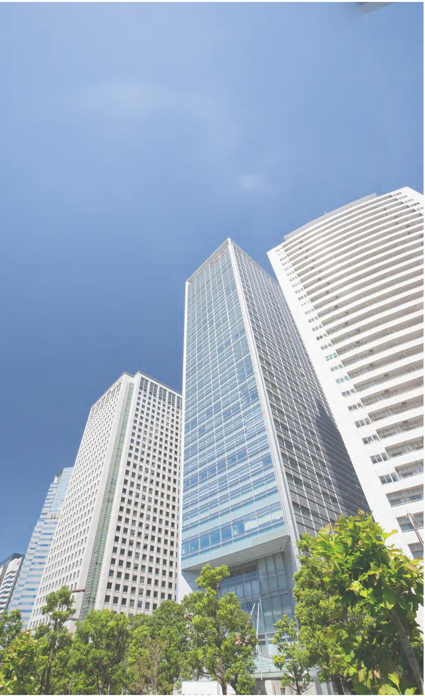

natural_image

Exterior view of modern high-rise buildings under a clear blue sky, with green trees in the foreground (no visible signage or text)

# 董事长致辞

# 关于本报告

# 走进奥精

# 可持续发展管理

# 治理篇

公司治理

投资者关系管理

风险管理

党的建设

合规经营

反不正当竞争

# 社会篇

员工权益

职业健康安全

员工培训发展

科技创新

产品质量安全

可持续供应链

信息安全

社会贡献

# 环境篇

环境合规管理

能源管理

应对气候变化

水资源

物料管理与循环经济

废弃物处理

污染物排放

生物多样性保护

尊敬的各位合作伙伴、投资者、社会各界朋友们：

大家好!

当 2025 年的篇章缓缓合上，我始终以审视长期价值与战略根基的眼光，关注着公司的每一步成长。企业的生命力，源自其与时代需求的同频共振，以及对可持续发展原则的深刻内化。我很欣慰地看到，过去一年，奥精医疗不仅沿着既定战略稳步前行，更在核心能力构建与未来格局谋划上，展现出日益清晰的战略纵深。过去一年，最核心的战略突破，无疑是公司自主研发的新一代“可吸收复合骨修复材料”成功获批上市。这不仅是一项新产品的诞生，更是为我们在骨科修复领域的领先地位构筑了新的支点。而其中“胶原海绵”原料的自主生产获批，则具有更为深远的战略意义。它意味着我们在核心生物材料领域实现了从技术到供应链的闭环自主，这是公司长期竞争壁垒得以强化的基石，也是董事会高度重视的产业链安全与核心能力自主可控战略的实质性落地。基于这一坚实基础，董事会支持并鼓励管理层的拓展视野：在巩固医疗专业市场领导地位的同时，积极探索已验证技术在新场景下的价值延伸。与此同时，产品在东南亚市场的准入成果，是公司国际化战略迈出的扎实步伐，也印证了“中国创新”具备服务全球市场的品质与能力。面对国内行业政策的持续深化与市场环境的演变，董事会与管理层始终保持清醒的认识与战略定力。带量采购等政策带来的阶段性价格调整，其影响正被市场逐步消化。我们欣慰地看到，凭借难以复制的技术差异化与确切的临床价值，公司核心业务展现出强大的韧性。更值得肯定的是，通过持续的效率提升与内部挖潜，包括关键原料自产所带来的综合效益，公司的整体运营质量与内在增长动力得到了进一步优化。董事会对此表示认可，并对公司穿越周期、实现长期稳健发展抱有坚定信心。

展望前方, 我们的任务清晰而明确。在确保为全球临床客户持续、稳定地提供高品质创新产品这一根本前提下, 我们将把对“可持续发展”的理解更深层次地融入从原料到成品的完整价值链中。这意味着, 未来的生产运营将不仅仅是规模的扩大, 更是一场关于“精益”与“绿色”的深刻变革。道阻且长, 行则将至。奥精医疗将继续以解决未满足的临床需求为根本动力, 将可持续发展作为审视一切决策的重要维度。我们相信, 通过创造实实在在的医疗价值, 并以一种负责任的方式交付这一价值, 我们能够与所有的利益相关方——包括我们的患者、医生、员工、投资者以及所在社区——建立起持久而稳固的信任纽带, 共同迎接一个更富活力的健康未来。最后, 我谨代表董事会, 向所有信任、支持奥精医疗的伙伴们, 致以最衷心的感谢。让我们携手, 共赴一个更健康的明天。

natural_image

Silhouette of four people running in a row, no text or symbols present

董事长签名：

黄晚兰

natural_image

Portrait of a woman in professional attire with short blonde hair, wearing a black blazer and patterned blouse (no visible text or symbols)

# 关于本报告

# 概览

本报告是奥精医疗科技股份有限公司发布的首份可持续发展报告，披露了奥精医疗科技股份有限公司 2025 年度在环境、社会及公司治理等责任领域的实践与绩效，回应各利益相关方的期望与诉求。

# 报告组织范围

本报告的组织范围与奥精医疗科技股份有限公司 2025 年年报保持一致，涵盖北京奥精医疗器械有限责任公司、山东奥精生物科技有限公司、潍坊奥精健康科技有限公司、潍坊奥精医学研究有限公司、海南奥精医疗器械有限公司及德国 HumanTech Dental GmbH。

# 报告时间范围

本报告为年度报告，时间范围为 2025 年 1 月 1 日至 12 月 31 日。对于超出上述范围的部分内容，将在涉及处予以说明。

# 编制依据

本报告以《上海证券交易所上市公司自律监管指引第 14 号——可持续发展报告（试行）》为指导，参考全球可持续发展标准委员会（GSSB）发布的《GRI 可持续发展报告标准（GRI Standards）》编制而成。

# 称谓说明

“公司”、“我们”、“奥精医疗”指奥精医疗科技股份有限公司，“北京奥精器械”指北京奥精医疗器械有限责任公司，“山东奥精”指山东奥精生物科技有限公司，“潍坊奥精健康”指潍坊奥精健康科技有限公司，“潍坊奥精医学”指潍坊奥精医学研究有限公司，“海南奥精”指海南奥精医疗器械有限公司，“HumanTech Dental GmbH”指德国 HumanTech Dental 公司。

# 可靠性声明

报告的数据来源包括公开信息、内部文件及相关统计数据等。本报告所披露的所有内容与数据，已由奥精医疗科技股份有限公司董事会审议通过。奥精医疗承诺，本报告内容不存在任何虚假记载、误导性陈述或重大遗漏，公司董事会对其内容的真实性、准确性和完整性承担个别及连带责任。

# 报告获取

本报告电子版可在上海证券交易所官网(www.sse.com.cn)及公司官网(www..allgensmed.cn)查阅与下载。

联系方式

地址：北京市大兴区庆丰西路69号中关村医疗器械园二期35号楼

电话：010-56330931

邮箱：information@allgensmed.com

邮编：102609

# 走进奥精医疗

# 关于我们

奥精医疗科技股份有限公司成立于 2004 年，是一家专注于高端再生医学材料及植入类医疗器械的国家高新技术企业。公司深耕组织再生修复领域二十载，现已成为国内该赛道的领军者与国际创新先锋。2021 年 5 月，公司成功登陆上交所科创板（股票代码：688613），正式开启资本化发展新篇章。

公司以技术创新为核心竞争力，于 2011 年在国际上率先研制出成分与结构均高度模拟天然人体骨组织的矿化胶原仿生骨材料，构建起具有完全自主知识产权的体外仿生矿化技术平台，推动我国在该医疗器械领域跻身国际领先行列。目前，此项国际原创技术成果已转化为“髂金”“颅瑞”“齿贝”等核心产品，广泛应用于骨科、口腔科、神经外科等多领域骨缺损修复，临床使用已超百万例，修复再生效果获行业高度认可。

凭借突出的技术实力，公司先后斩获国家自然科学奖二等奖、国家技术发明奖二等奖、日内瓦国际发明展金奖等多项重磅荣誉，核心产品亦被纳入中国科技部“国际原创类创新医疗器械”目录。

公司始终以技术创新为核心驱动力，同步推进多元化高价值产品矩阵的构建与全球化战略的纵深拓展，通过双线发力筑牢核心竞争壁垒。2024年，公司完成对德国HumanTech Dental公司的战略收购，强势切入中高端口腔种植体赛道，成功打造“骨修复材料+口腔种植体”协同生态，形成场景互补、技术联动的竞争优势。2025年6月，自主研发的胶原蛋白海绵顺利取得生产许可证，不仅完善了高值医用耗材产品线，更进一步拓宽了临床应用边界，为业务增长注入新动能。

natural_image

Doctor in white coat using tablet with glowing human anatomy illustration (no text or symbols)

在全球化布局方面, 核心产品 BonGold 已成功获得美国 FDA 注册证及马来西亚、印度尼西亚、越南等多国市场准入资质, 在东南亚区域构建起稳固的市场联动体系与高效渠道网络。与此同时, 公司正加速开拓拉美、中东等新兴市场, 计划于 2026 年初步建成覆盖多区域、跨大洲的全球化业务布局, 持续提升国际市场渗透率与品牌影响力, 稳步向全球再生医学领域标杆企业迈进。

  
论文发表100+篇  
多数为SCI及国内核心期刊

  
形成专著7部  
Elsevier、科学出版社等出版

  
授权专利129项  
其中发明专利78项

截至目前,公司拥有授权专利129项,发表学术论文100余篇,牵头或参与多项国家及省部级重大研发项目,获评国家级专精特新“小巨人”企业、北京生物医药产业G20工程创新引领企业等资质。未来,奥精医疗将持续以技术创新为驱动,深化国内外市场布局,拓展再生医学材料应用边界,致力于成为全球患者信赖的健康守护者。

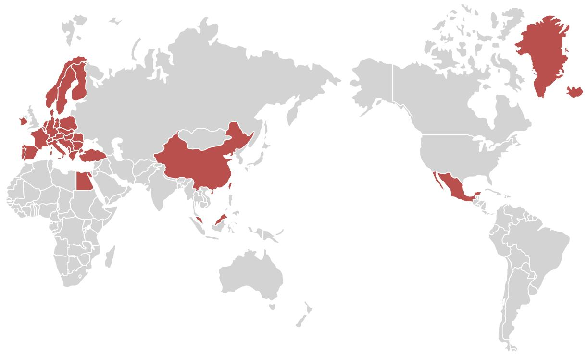

geo

| Region | Status |
| --- | --- |
| Europe | Highlighted |
| China | Highlighted |
| North America | Highlighted |
| South America | Highlighted |
| Africa | Highlighted |
| Middle East | Highlighted |
| Southeast Asia | Highlighted |
| Eastern Europe | Highlighted |
| Central Asia | Highlighted |
| Australia | Highlighted |
| South America | Highlighted |
| Oceania | Highlighted |
| Greenland | Highlighted |
| Antarctica | Highlighted |

# 走进奥精医疗

# 产品介绍

深耕再生医学领域二十载，奥精医疗以“体外仿生矿化技术”为核心驱动力，构建起覆盖骨修复、软组织修复、口腔重建的全场景产品矩阵。旗下所有产品均通过国内外权威认证，累计临床应用超200万例，已然成为全球医生与患者高度信赖的再生医学解决方案提供商。

# 彻底重塑行业标准

作为我国首个获得美国 FDA

510(k) 准入资质的高端人工

骨产品, 奥精医疗矿化胶原系

列凭借“成分-结构-功能”

三重仿生特性,彻底重塑了骨

缺损修复行业标准。

# 填补技术空白

2024 年获批 NMPA 三类医

疗器械的胶原蛋白海绵, 以高

纯度天然胶原为核心原料, 创

新性地实现了“止血 - 防黏连

\- 组织修复"三重功效一体

化, 填补了软组织修复领域的

技术空白。

# 海外市场扩展

公司核心产品 BonGold 为国内首个

获美国 FDA 510 (k) 认证的国产人工

骨修复产品，整体研发与质量体系达

到国际前沿水准。旗下多款产品先后

取得印尼、越南医疗器械注册资质，完

善东南亚市场准入布局，有力支撑海

外市场拓展与品牌国际化建设。

自 2011 年核心产品上市以来, 公司矿化胶原仿生骨修复材料已累计临床应用 200 余万例, 广泛覆盖骨科、口腔科、神经外科、整形外科等多个领域, 进驻北京天坛医院、解放军总医院、上海六院等全国近千家知名三甲医院。

在骨科领域，该材料用于椎体压缩性骨折治疗时，患者术后28个月VAS疼痛评分从术前的7.7降至2.26，ODI功能障碍指数从82.35降至23.2，成骨效果经CT权威验证显著优于传统骨水泥。

在口腔科, 矿化胶原复合 CGF 纤维蛋白用于口腔种植骨增量, 4 个月骨愈合率高达 98%, 相关临床数据已发表于《Regenerative Biomaterials》等国际权威期刊。

2024 年全国集采中，公司核心产品“骼金”中标数量稳居首位。尽管价格适度下调，但凭借卓越的性价比与过硬的临床价值，成功实现“以价换量”的良性循环，单品收入未受显著影响，更加速了产品在基层医院的普及，让前沿科研成果惠及更广泛的患者群体。

在海外市场拓展方面，公司产品已成功进入美国、越南、印尼、马来西亚等多个国家和地区。

Bongold 产品于 2015 年获得美国 FDA 510(k) 准入许可，成为我国首个获准在美国临床使用的高端人工骨产品,截至 2025 年已累计临床应用数千例。

2025 年, Bongold 进一步获批印度尼西亚、越南全科室注册, 德国全资子公司 HumanTech Dental 同步加速口腔种植体市场开拓, 标志着公司海外市场转化正式步入规模化发展阶段。

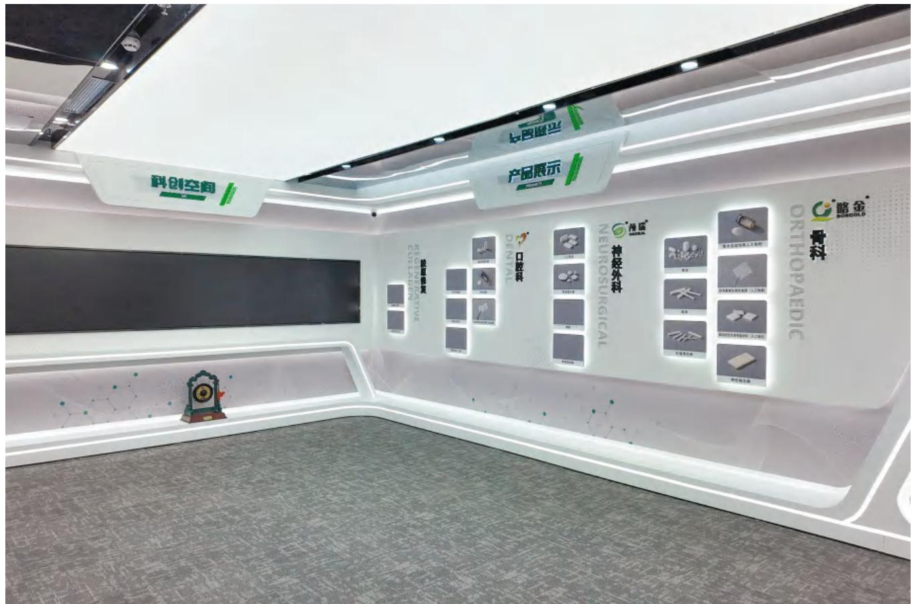

text_image

科创空间
产品展示
逻辑医疗
产品展示
口腔科
DENTAL
NEUROSURGICAL
神经外科
骨科
ORTHOPAEDIC
盈金
BONGOLD

# 发展历程

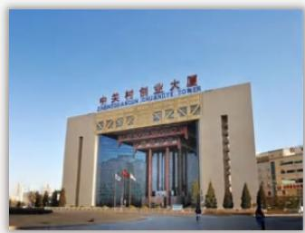

text_image

中关村创业大厦
ZHENXIN GRANDER ENTERPRISE

2004年

由国际知名生物材料专家于 2004 年在中关村生物医药园创立

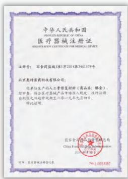

seal

中华人民共和国
医疗器械注册证
BEIJING COVID-19 CERTIFICATE BY MEDICAL DEVICE
注册号：国药监械(或)字2034第3661579号
北京奥特医药科技有限公司：
信单抗生产的人工骨修复材料（药品名：铜金），经审查，符合医疗器械产品标准的准入规定，该件注册。自批准之日起有效期至二零一六年九月四日。
特此说明。
国家食品药品监督管理总局
China Pharmaceutical Administration
2014年8月1日
财政部、医疗部联合办公室
No.1496689

2011年

人工骨修复材料“髂金”获CFDA第三类医疗器械产品注册证

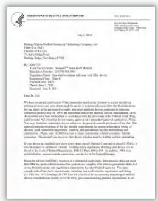

flowchart

This flowchart outlines the regulatory process for a medical device, detailing steps from initial testing and safety measures to final approval and adoption.

2015年

人工骨修复材料
Bongold 获美国
FDA 510(k) 市场
准入许可

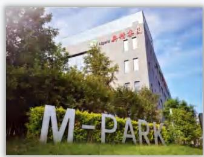

text_image

M-PARK

2018年

入驻中关村医疗器械园总部基地

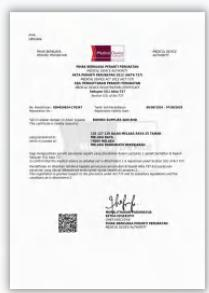  
2024年

并购德国 HumanTech Dental 公司，口腔种植体正式成为公司主营产品
Bongold 获批☐马来西亚医疗器械注册证
胶原蛋白海绵☐获批 NMPA 第三类医疗器械☐产品注册证

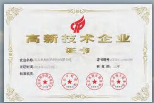  
2008年

2008 年至今连续获评
国家高新技术企业

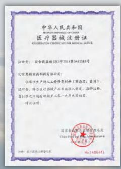

seal

中华人民共和国
PHILADELPHIAO (CHINA)
医疗器械注册证
INDUSTRIAL CERTIFICATION FOR MEDICAL SERVICE
注册号：国药监械(18)字第3461584号
北京奥特医药科技有限公司：
化验仪生产的人工骨修复材料（商品E）（兽医）
经审查，符合医疗器械产品市场准入规定，准许注册。
自标准之日起有效至二零一九年九月四日。
特此证明：
国家食品药品监督管理总局
China Pharmaceutical Administration
No. 1426647

2014年

神经外科、口腔科人工骨修复材料产品获 CFDA 第三类医疗器械产品注册证

natural_image

Architectural rendering of a modern campus or industrial complex with illuminated buildings and surrounding roads (no visible text or signage)

2017年

潍坊国际健康科技产业园开工建设，一期现已竣工并陆续投入使用

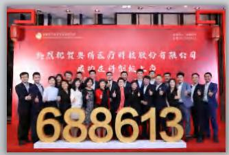

text_image

热烈祝贺共诉医疗科技股份有限公司
成功在谈判中
688613

2021年

成功 IPO 并在上交所科创板上市发行
股票代码：688613

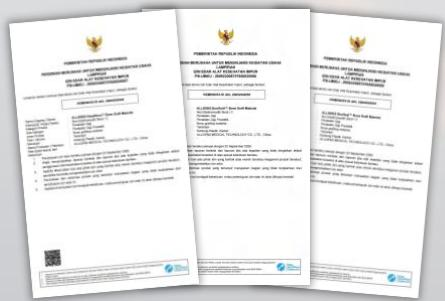

text_image

FORBANIA DE PAPAYA AND KOREMEL
ANDERJAM BURGATI INTE MINDIANE DEUTICAL CAND
FORBANIA DE PAPAYA AND KOREMEL
ANDERJAM BURGATI INTE MINDIANE DEUTICAL CAND
FORBANIA DE PAPAYA AND KOREMEL
ANDERJAM BURGATI INTE MINDIANE DEUTICAL CAND
FORBANIA DE PAPAYA AND KOREMEL
ANDERJAM BURGATI INTE MINGHAI DEUTICAL CAND
FORBANIA DE PAPAYA AND KOREMEL
ANDERJAM BURGATI INTE MINGHAI DEUTICAL CAND
FORBANIA DE PAPAYA AND KOREMEL
ANDERJAM BURGATI INTE MINGHAI DEUTICAL CAND
FORBANIA DE PAPAYA AND KOREMEL
ANDERJAM BURGEATI INTE MINDIANE DEUTICAL CAND
FORBANIA DE PAPAYA AND KOREMEL
ANDERJAM BURGEATI INTE MINDIANE DEUTICAL CAND
FORBANIA DE PAPAYA AND KOREMEL
ANDERJAM BURGEATI INTE MINDIANE DEUTICAL CAND
FORBANIA DE PAPAYA AND KOREMEL
ANDERJAM BURGATI INTE MINDIANE DEUTICAL CAND
FORBANIA DE PAPAYA AND KOREMEL
ANDERJAM BURGEATI INTE MINDIANE DEUTICAL CAND
FORBANIA DE PAPAYA AND KOREMEL
ANDERJAM BURGEATI INTE MINDIANE DEUTICAL CAND
FORBANIA DE PAPAYA AND KOREMELL
ANDERJAM BURGEATI INTE MINDIANE DEUTICAL CAND
FORBANIA DE PAPAYA AND KOREMELL
ANDERJAM BURGEATI INTE MINDIANE DEUTICAL CAND
FORBANIA DE PAPAYA AND KOREMELL
ANDERJAM BURGEATI INTE MINDIANE DEUTICAL CAND
FORBANIA DE PRIME AND PRIME CAND
ANDERJAM BURGEATI INTE MINDIANE DEUTICAL CAND
FORBANIA DE PRIME AND PRIME CAND
ANDERJAM BURGEATI INTE MINDIANE DEUTICAL CAND
FORBANIA DE PRIME AND PRIME CAND
ANDERJAM BURGEATI INTE MINDIANE DEUTICAL CAND
FORBANIA DE PRIME AND PRIMCIC CAND
ANDERJAM BURGEATI INTE MINDIANE DEUTICAL CAND
FORBANIA DE PRIME AND PRIME CAND
ANDERJAM BURGEATI INTE MINDIANE DEUTICAL CAND
FORBANIA DE PRIME AND PRIME CAND
ANDERJAM BURGEATI INTE MINDIANE DEUTICAL CAND
FORBANIA DE PRIME ANTERIOR CAND
ANDERJAM BURGEATI INTE MINDIANE DEUTICAL CAND
FORBANIA DE PRIME ANTERIOR CAND
ANDERJAM BURGEATI INTE MINDIANE DEUTICAL CAND
FORBANIA DE PRIME ANTERIOR CAND
ANDERJAM BURGEATI INTE MINDIANE DEUTICAL CAND
FORBANIA DE PRIME AND PRIME CAND
ANDERJAM BURGEATI INTE MINDIANE DEUTICAL CAND
FORBANIA DE PRIME AND PRIME CAND
ANDERJAM BURGEATI INTE MINDIANE DEUTICAL CAND
FORBANIA DE PRIME APTAL CAND
ANDERJAM BURGEATI INTE MINDIANE DEUTICAL CAND
FORBANIA DE PRIME APTAL CAND
ANDERJAM BURGEATI INTE MINDIANE DEUTICAL CAND
FORBANIA DE PRIME APTAL CAND
ANDERJAM BURGEATI INTE MINDIANE DEUTICAL CAND
FORBANIA DE PRIME ANTERIOR CAND
ANDERJAM BURGEATI INTE MINDIANE DEUTICAL CAND
FORBANIA DE PRIME ANTERIOR CAND
ANDERJAM BURGEATI INTE MINDIANE DEUTICAL CAND
FORBANIA DE PRIME APTAL CAND
ANDERJAM BURGEATI INTE MINDIANE DEUTICAL CAND
FORBANIA DE PRIME ANTERIOR CAND
ANDERJAM BURGEATI INTE MINDIANE DEUTICAL CAND
FORBANIA DE PRIME APTAL CAND
ANDERJAM BURGEATI INTE MINDIANE DEUTICAL CAND
FORBANIA DE PRIME APTAL CAND
ANDERJAM BURGEATI INTE MINDIANE DEUTICAL CAND
FORBANIA DE PRIME ARANTIER CAND
ANDERJAM BURGEATI INTE MINDIANE DEUTICAL CAND
FORBANIA DE PRIME ARANTIER CAND
ANDERJAM BURGEATI INTE MINDIANE DEUTICAL CAND
FORBANIA DE PRIME ARANTIER CAND
ANDERJAM BURGEATI INTE MINDIANE DEUTICAL CAND
FORBANIA DE PRIME ANTERIOR CAND
ANDERJAM BURGEATI INTE MINDIANE DEUTICAL CAND
FORBANIA DE PRIME ANTERIOR CAND
ANDERJAM BURGEATI INTE MINDIANE DEUTICAL CAND
FORBANIA DE PRIME ARANTIER CAND
ANDERJAM BURGEATI INTE MINDIANE DEUTICAL CAND
FORBANIA DE PRIME ARANTIER CAND

2025年

Bongold 获批印度尼西亚、越南医疗器械注册证

# 年度大事记

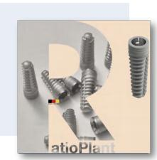  
全资子公司德国  
HumanTech  
Dental 加速开拓

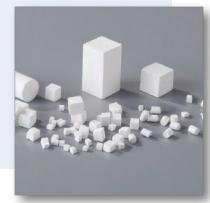  
2025 年度  
营业收入 2.24 亿元
净利润 1315.06 万元

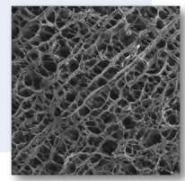  
胶原蛋白海绵获批
生产许可证,产品
进入联盟集采

  
人工骨产品在海外多国获批医疗器械注册证

  
骨科人工骨集采落地，
产品销售量翻倍

# 科研成果

奥精医疗自 2004 年创立以来，始终将科研创新视作核心驱动力，在仿生骨修复材料等关键领域构建起国际领先的技术壁垒，搭建了覆盖基础研究、技术转化、临床应用的全链条科研能力体系，为全球患者提供了具有革命性意义的骨修复解决方案。早在 2011 年，公司便率先研发出成分与结构均与人体天然骨高度相似的矿化胶原仿生骨修复材料，首次在国际上为矿化胶原理论提供了直接实证支撑。相关研究成果被 2012 年 11 期专业期刊专刊评价为“中国近年来骨修复材料的标志性成果并领先世界”。美国国家科学院、工程院、艺术与科学学院三院院士 Rogers 教授更于 2023 年在国际顶级期刊中将该材料列为“新型、极具前景的可降解骨修复材料基本成分”，标志着其技术水平获得国际权威的高度认可。

# 材料性能优化

公司重点在研项目“矿化胶原 / 聚酯人工骨修复材料”，在原有矿化胶原技术基础上实现性能迭代，材料力学性能、降解可控性均得到提升。目前产品已获批国家三类医疗器械注册证及生产资质，助力公司骨修复材料产品线布局持续完善。

# 功能场景拓展

在功能场景拓展方面，公司联合研团队在国际上率先研发出具备三维仿生结构与自固化特性的无机盐人工骨，成功将传统开放手术的应用场景转变为微创适配，相较于传统产品，效能提升一倍以上。

# 多功能复合

在多功能复合生物材料赛道，公司产品实现仿生活性、力学性能、降解可控性一体化融合优化，凭借综合性能优势，为复杂骨缺损修复等临床领域难题提供了突破性技术支撑。

截至目前，核心技术已成功转化为“髂金”“齿贝”“颅瑞”“BonGold”等系列标杆产品，且均已获得国家三类医疗器械注册证。其中，矿化胶原仿生骨系列更是成功获得美国510(k)市场准入许可，成为我国首个获准在美国临床应用的国产人工骨修复产品，其技术原创性与临床实用价值得到了国内外市场的双重权威认可。

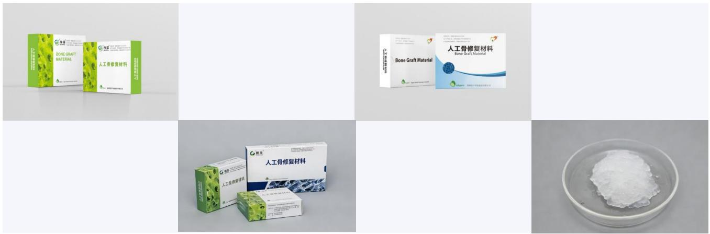

text_image

BONE GRAFT
MATERIAL
人工骨修复材料
人工骨修复材料
Bone Graft Material
Bone Graft Material
人工骨修复材料
人工骨修复材料
人工骨修复材料
人工骨修复材料
人工骨修复材料
人工骨修复材料
人工骨修复材料
人工骨修复材料
人工骨修复材料
人工骨修复材料
人工骨修复材料
人工骨修复材料
人工骨修复材料
人工骨修复材料
人工骨修复材料
人工骨修复材料
人工骨修复材料
人工骨修复材料
人工骨修复材料
人工骨修复材料
人工骨修复 材料
人工骨修复 材料
人工骨修复 材料
人工骨修复 材料
人工骨修复 材料
人工骨修复 材料
人工骨修复 材料
人工骨修复 材料
人工骨修复 材料
人工骨修复 材料
人工骨修复 材料
人工骨修复 材料
人工骨修复 材料
人工骨修复 材料
人工骨修复 材料
人骨修复 材料
人工骨修复 材料
人工骨修复 材料
人工骨修复 材料
人工骨修复 材料
人工骨修复 材料
人工骨修复 材料
人工骨修复 材料
人工骨修复 材料
人工骨修复 材料
人工骨修复 材料
人工骨修复 材料
人工骨修复 材料
人工骨修复 材料
人工骨修复材料
人工骨修复材料
人工骨修复材料
人工骨修复材料
人工骨修复材料
人工骨修复材料
人工骨修复材料
人工骨修复材料
人工骨修复材料
人工骨修复材料
人工骨修复材料
人工骨修复材料
人工骨修复材料
人工骨修复材料
人工骨修复材料
人工骨修复材料
人工骨修复材料

公司作为牵头单位先后主导或深度参与国家“863计划”重大项目课题、“十一五”至“十四五”国家科技支撑计划与重点研发计划，以及山东省、北京市重大科技创新工程等省部级项目，深度融入我国高端生物医用材料领域的技术战略布局。

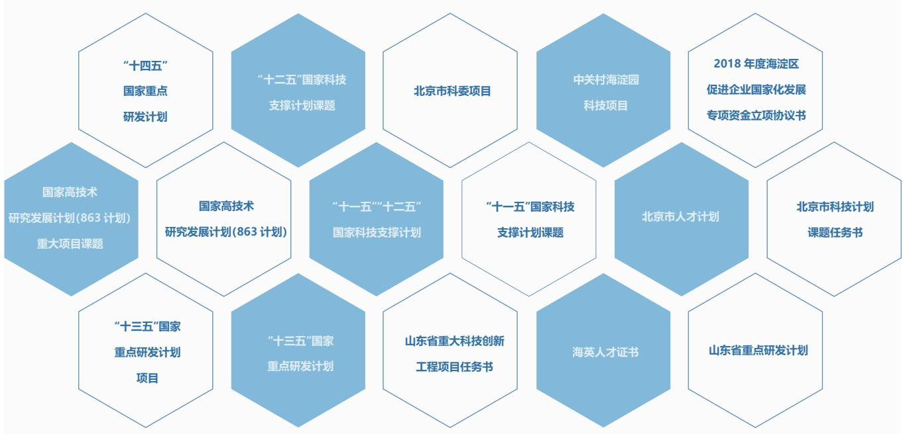

flowchart

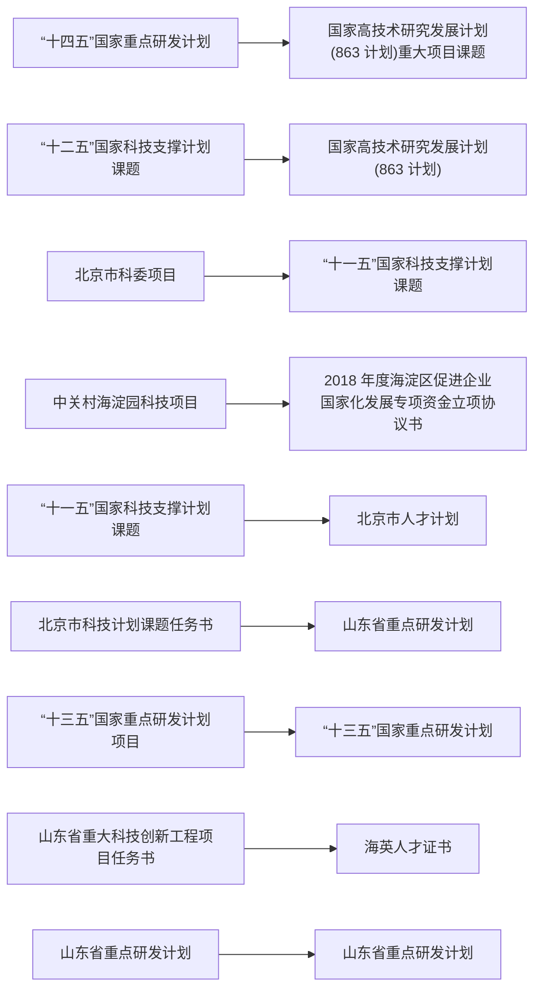
```mermaid
graph LR
  A["“十四五”国家重点研发计划"] --> B["国家高技术研究发展计划(863 计划)重大项目课题"]
  C["“十二五”国家科技支撑计划课题"] --> D["国家高技术研究发展计划(863 计划)"]
  E["北京市科委项目"] --> F["“十一五”国家科技支撑计划课题"]
  G["中关村海淀园科技项目"] --> H["2018 年度海淀区促进企业国家化发展专项资金立项协议书"]
  I["“十一五”国家科技支撑计划课题"] --> J["北京市人才计划"]
  K["北京市科技计划课题任务书"] --> L["山东省重点研发计划"]
  M["“十三五”国家重点研发计划项目"] --> N["“十三五”国家重点研发计划"]
  O["山东省重大科技创新工程项目任务书"] --> P["海英人才证书"]
  Q["山东省重点研发计划"] --> R["山东省重点研发计划"]
```

# 科研成果

2025 年，公司更进一步成为工信部、国家药品监督管理局联合发起的“生物医用材料创新任务揭榜挂帅”中“可降解半水硫酸钙”项目的牵头单位，直面我国生物型骨水泥核心基体长期“卡脖子”的技术难题，若攻关成功将推动我国高端骨修复材料实现全面自主可控。

# 长期稳定的合作关系

公司已与清华大学、北京协和医院、中国人民解放军总医院、北京大学口腔医院、河北医科大学第三医院等国内顶尖高校与医院建立长期稳定的合作关系。

# 攻克前沿技术难题

公司构建起“基础研究在高校、临床验证在医院在“技术转化在企业”的协同创新模式，同时设立了院士专家工作站，引入行业顶级智慧资源，持续攻克骨修复材料领域的前沿技术难题。

# “双国家二等奖”获得者

在科研成果奖项方面,公司技术

体系已累计荣获包括国家自然科学奖

二等奖、国家技术发明奖二等奖在内的多项国家级重磅奖项，成为行业内少有的“双国家二等奖”获得者。

# 入选权威名录

公司产品还先后入选“国家重点新产品”“北京市自主创新产品”“中关村创新医疗器械产品目录”“北京市重点新材料首批次应用示范指导目录、北京市新产品新技术”等权威名录，2018年被科技部评为“国际原创类创新医疗器械”，技术先进性与市场认可度持续在行业中领先。

公司围绕矿化胶原人工骨修复材料这一核心领域，公司搭建了以胶原蛋白及其复合材料为核心原料的专业化研发体系。目前，在研项目已涵盖胶原蛋白贴敷料、口腔引导组织再生膜、面团状仿生骨修复材料、骨水泥改性用人工骨粉、神经管鞘等多个高端再生医学产品方向，能全面满足骨骼及人体多种组织缺损修复的临床需求。

口腔引导组织再生膜借助仿生矿化技术实现深度优化，可精准调控细胞生长微环境。目前项目正推进工艺验证与过程确认工作，预计2026年内完成注册检验。临床转化前景明朗。神经管鞘项目与清华大学联合开展类神经纤维再生前沿研究，相关成果已发表于《Bioactive Materials》等国际顶级期刊，为后续科研成果产业化奠定了坚实的技术储备和学术基础。

公司位于北京的生产基地配备了万级洁净生产车间，严格遵循《医疗器械生产质量管理规范》及 GB/T 42061 标准，已通过国家药监局（NMPA）生产许可认证、国医械华光 ISO 13485 与 ISO 9001 国际质量管理体系认证，以及 TUV 南德的 ISO 13485 认证，构建起与国际接轨的全流程质量保障体系。在生产过程中，从胶原原料提取、纯化到矿化反应参数调控，均实现全链条数字化监控与精准把控，确保科研成果从实验室走向生产线的整个周期内，产品性能稳定性与临床安全性始终对标国内外最高标准，为临床应用和全球市场拓展筑牢质量根基。

从率先攻克体外仿生矿化核心技术，到成为国家级重大科研项目的核心牵头与参与单位；从荣获国家自然科学奖、中华医学科技奖等多项国际国内权威奖项，到推动200余万患者直接受益于创新成果，奥精医疗凭借持续稳定的科研创新实力，不断刷新高端再生医学材料的行业标准，为我国生物医药产业的自主创新与高质量发展注入强劲动力。未来，随着更多在研项目加速落地以及海外市场深度拓展，公司将继续以科研创新为核心驱动力，深耕再生医学领域，奋力书写全球再生医学产业的“中国答卷”。

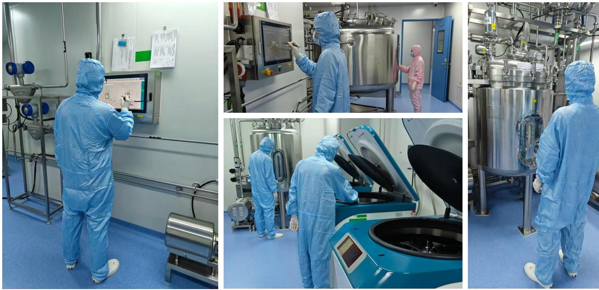

# 荣誉奖项

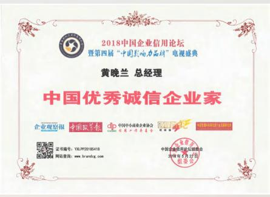

text_image

2018中国企业信用论坛
暨第四届“中国长力”电视盛典
黄晚兰 总经理
中国优秀诚信企业家
企业观察报 中国联合报 中国中小商务企业协会
证券时报：http://www.bj.com.cn
网站查询：www.bj.com.cn
中国金融监督管理委员会
2018年5月22日
公告编号：

中国优秀诚信企业家

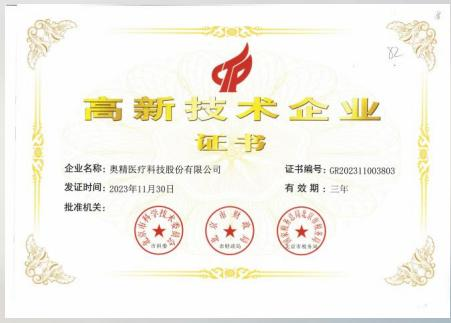

text_image

高新技术企业
证书
企业名称：奥精医疗科技股份有限公司
证书编号：GR202311003803
发证时间：2023年11月30日
有效期：三年
批准机关：
深圳市科学技术局
中国科学院
国家知识产权局
北京市海淀区

国家高新技术企业

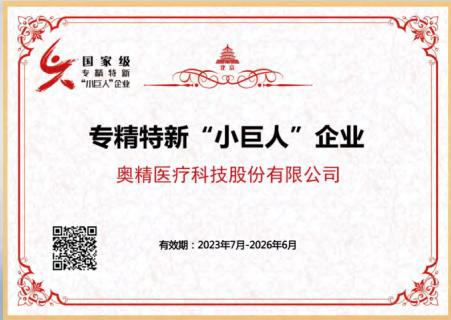

text_image

国家级
专精特新
“四川人”企业
专精特新“小巨人”企业
奥精医疗科技股份有限公司
有效期：2023年7月-2026年6月

专精特新小巨人企业

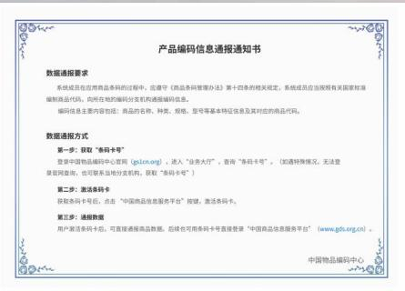

text_image

产品编码信息通报通知书
数据通报要求
系统成员应在页面商品条码的过程中，应遵守《药品条码管理办法》第十四条的相关规定。系统成员应当按照有关国家标准编制商品代码，向所在地的编码分支机构通报编码信息。
编码信息主要内容包括：商品的名称、种类、规格、型号等基本特征信息及其对应的商品代码。
数据通报方式
第一步：获取“条码卡号”
登录中国商品编码中心官网（gbin.org），进入“业务大厅”，查询“条码卡号”。【加速特殊情况，无法登录查询查询，也可联系地址分支机构，获取“条码卡号”】
第二步：激活条码卡
获取条码卡号后，点击“中国商品信息服务平台”按键，激活条码卡。
第三步：通报数据
用户激活条码卡后，可直接通报商品数据。后续也可用条码卡号直接登录“中国商品信息服务平台”（www.gzb.org.cn）。
中国物品编码中心

中国商品条码系统成员

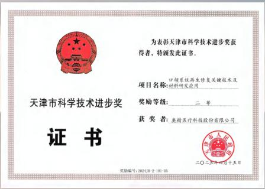

text_image

为表彰天津市科学技术进步奖获得者，特颁发此证书。
口领系统再生修复关键技术及项目名称：+封封研发使用
奖励等级：______二等______
获奖者：奥精医疗科技股份有限公司
二〇二五年四月十五日
证书
奖励编号：202418-2 101-05

天津科技进步二等奖

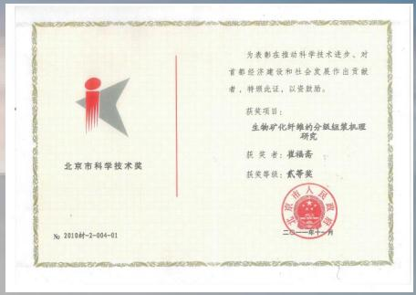

text_image

北京市科学技术奖
为表彰在推动科学技术进步、对首都经济建设和社会发展作出贡献者，特照此证，以资鼓励。
获奖项目：
生物矿化纤维的分级组装机理研究
获奖者：崔瑞高
获奖等级：武等奖
No. 2010财-3-004-01
二〇一四年

北京市科学技术奖

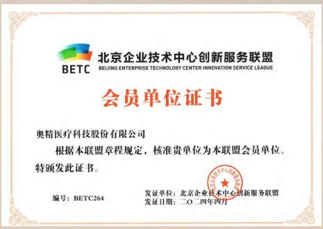

text_image

BETC 北京企业技术中心创新服务联盟
BEIJING ENTERPRISE TECHNOLOGY CENTER INNOVATION SERVICE LEAGUE
会员单位证书
奥精医疗科技股份有限公司
根据本联盟章程规定，核准贵单位为本联盟会员单位。
特颁发此证书。
编号：BETC264 发证单位：北京企业技术中心创新服务联盟
发证日期：二O二四年四月

北京企业技术中心创新服务联盟会员单位

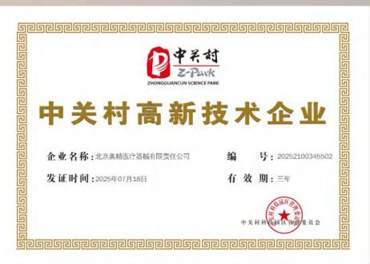

text_image

中关村
Z-Park
中关村高新技术企业
企业名称:北京奥精医疗器械有限责任公司
发证时间:2025年07月18日
编号:2025/2100345502
有效期:三年
中关村科技园区管委会

中关村高新技术企业

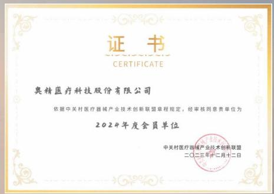

seal

奥精医疗科技股份有限公司
中关村医疗器械产业技术创新联盟
二〇二三年十二月十二日

中关村医疗器械产业技术创新联盟会员单位

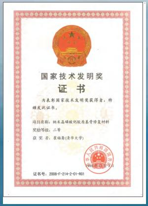

text_image

国家技术发明奖
证书
为表彰国家技术发明奖获得者，特颁发此证书。
项目名称：纳米晶硼酸钙胶原基骨修复材料
奖励等级：二等
获奖书：张福涛(清华大学)
证书号：2008-4-214-2-01-001

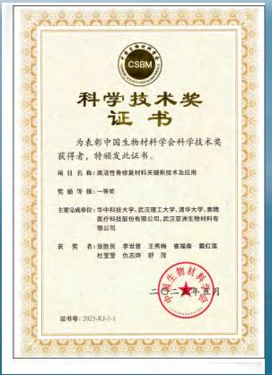

text_image

CSBM
科学技术奖
证书
为表彰中国生物材料科学会科学技术奖
获得此证书。
项目名称：高活性骨修复材料关键部件技术及应用
奖励等级：一等奖
主要完成单位：华中科技大学、武汉理工大学、清华大学、奥德
医疗科技股份有限公司、武汉亚源生物材料有
限公司
奖 票 名：陈胜民 李学群 王秀梅 袁强青 魏红莲
杜宝登 仇志祥 野 求
二〇二一年五月
证书号：2025-01-1

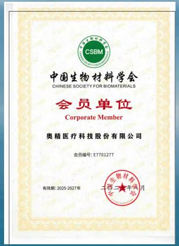

text_image

中国生物材料学会
CHINESE SOCIETY FOR BIOMATERIALS
会员单位
Corporate Member
奥精医疗科技股份有限公司
会员编号: E770127T
有效期: 2025-2027年
二〇一一年八月

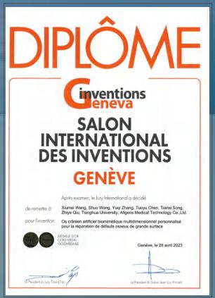

text_image

DIPLÔME
GEnèva
SALON INTERNATIONAL DES INVENTIONS GENÈVE
Après examen, le Jury International a décidé
de remètre à :
pour l'invention:
MÉDIALE ÉCOURI
COCONOMÉ
Genève, le 28 avril 2023
Le Prédements de Saint Jean-Vienne

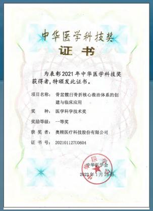

text_image

中华医学科技奖
证书
为表彰2021年中华医学科技奖
获得者,特颁发此证书。
项目名称:骨盆髋臼骨折核心救治体系的创
建与临床应用
奖 种:医学科学技术奖
奖励等级:一等奖
获奖者:奥精医疗科技股份有限公司
证书 号:202101127U0604
中华医学学会
2022年1月1日

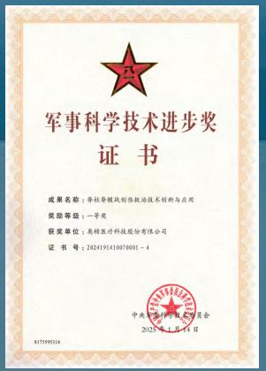

text_image

军事科学技术进步奖
证书

成果名称：鲁拉华舰战制胜技术创新与应用
院级等级：一等奖

获奖单位：奥特医疗科技股份有限公司
证书号：2024191410070001-4

中央军事科学技术委员会
2025年1月14日
837599314

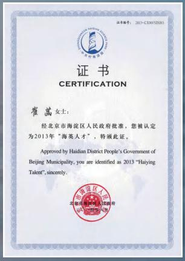

text_image

证书
CERTIFICATION
霍嵩女士：
经北京市海淀区人民政府批准，您被认定为2013年“海英人才”，特此证。
Approved by Haidian District People's Government of Beijing Municipality, you are identified as 2013 "Haiying Talent", sincerely.
北京市海淀区人民政府

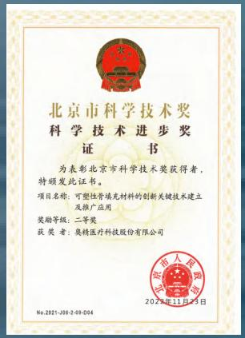

text_image

北京市科学技术奖
科学技术进步奖
证书
为表彰北京市科学技术奖获得者，
特颁发此证书。
项目名称：可塑性骨填充材料的创新关键技术建立
及推广应用
奖励等级：二等奖
获奖者：奥精医疗科技股份有限公司
2023年11月29日
No.2021-006-2-09-004

natural_image

Cartoon character with green body and orange horns holding a shield (no text or symbols)

# 可持续发展管理

奥精医疗以“深耕再生医学，成就生命健康美好”为使命，构建起“治理为基、创新驱动、责任共生”的可持续发展管理体系。公司通过构建“董事会统筹、专委会执行、全部门协同”的管理架构，确保ESG理念贯穿研发、生产、经营全链条，推动企业、社会与环境价值实现协同增长。

# 治理架构

<table><tr><td>董事会</td><td>统筹审定公司 ESG 相关管理方针、策略与风险把控 ESG 战略方向并承担最终责任</td></tr><tr><td>战略与 ESG 委员会</td><td>制定 ESG 管理计划、发展目标推进 ESG 工作落地并定期向董事会汇报</td></tr><tr><td>ESG 工作小组</td><td>细化 ESG 实施方案并制定年度工作计划协调跨部门资源推进绿色生产、合规运营等任务负责 ESG 相关数据的收集、整理与核查跟进目标达成进度并及时向专委会反馈执行情况</td></tr></table>

# 利益相关方沟通

奥精医疗高度重视利益相关方的多元诉求，我们搭建常态化、多元化的沟通渠道，深度倾听并积极响应各方关切，并将其作为优化运营管理与完善可持续发展战略的重要依据，致力于实现与利益相关方的互利共赢。

<table><tr><td>利益相关方</td><td>主要关注点</td><td>采取行动</td><td>沟通渠道</td></tr><tr><td rowspan="5">员工</td><td>·健康安全</td><td>·职工代表大会</td><td>·员工代表大会</td></tr><tr><td>·培训发展</td><td>·咖啡时间</td><td>·咖啡时间</td></tr><tr><td>·劳工人权</td><td>·团队建设活动</td><td>·团队建设活动</td></tr><tr><td>·多元化与机会平等</td><td>·员工内外部培训</td><td>·家庭日</td></tr><tr><td></td><td></td><td>·内部邮箱、论坛</td></tr></table>

股东和投资者  
政府和监管机构  
社区与公众  
科研机构

<table><tr><td>利益相关方</td><td>主要关注点</td><td>采取行动</td><td>沟通渠道</td></tr><tr><td>股东和投资者</td><td>·公司治理·合规经营利益相关方沟通</td><td>·股东会·财务年报·定期报告与公告·公司官网及公众号·投资者热线及邮箱</td><td>·股东大会·财务年报</td></tr><tr><td>政府和监管机构</td><td>·公司治理·合规经营·反商业贿赂及反贪污·反不正当竞争·水资源利用·能源利用循环经济·应对气候变化·健康安全</td><td>·会议交流·督导检查·日常监管沟通·信息披露与报送·可持续发展报告</td><td>·监督检查·定期报告</td></tr><tr><td>供应商</td><td>·供应链管理·采购实践·平等对待中小企业</td><td>·年度供应商大会·供应商管理</td><td>·供应商大会·审核</td></tr><tr><td>社区与公众</td><td>·废弃物排放·绿色产品·社会贡献·乡村振兴</td><td>·可持续发展报告·公益活动·慈善捐助</td><td>·开放日活动</td></tr><tr><td>客户</td><td>·客户关系·循环经济·产品和服务安全与质量·数据安全与客户隐私保护</td><td>·日常沟通·年度客户满意度调研·年度审核和评估</td><td>·客户满意度调查·客户会议·审核和评估</td></tr><tr><td>科研机构</td><td>·创新研发</td><td>·校企合作</td><td>·科研论坛</td></tr></table>

# 实质性议题管理

奥精医疗围绕 ESG 工作重点, 结合全球可持续发展趋势、再生医学行业特性及自身发展阶段, 建立“议题识别 - 评估 - 审核”全流程实质性议题管理机制, 确保议题与公司战略、利益相关方诉求高度契合。

我们以联合国 SDGs、SASB 等全球 ESG 框架为参考，结合行业发展趋势、公司经营实际及利益相关方核心关切，梳理出与再生医学业务关联的环境、社会及治理类议题。并通过客户、员工、投资者等内外部利益相关方调研等方式，从“影响重要性”和“财务重要性”双维度进行优先级排序。最后，由董事会结合发展战略、职能部门实践经验对评估结果进行复核，最终确定核心实质性议题并形成议题清单纳入报告。

实质性议题矩阵  
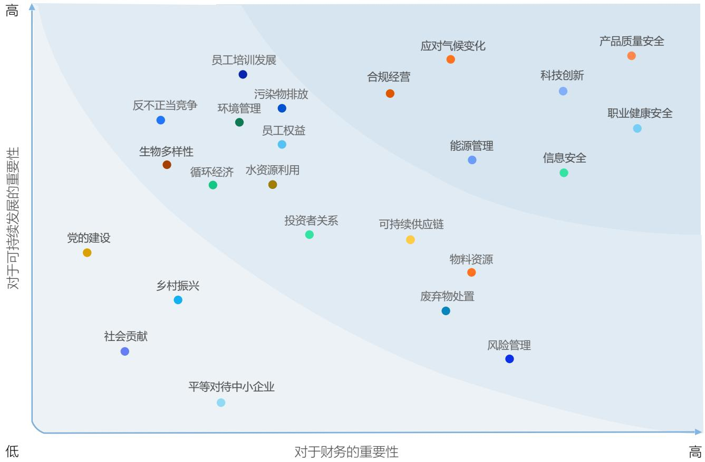

scatter

| Topic | X-axis (Financial Importance) | Y-axis (Sustainability Importance) |
| :--- | :--- | :--- |
| 产品质量安全 | High | High |
| 应对气候变化 | High | High |
| 科技创新 | High | High |
| 职业健康安全 | High | High |
| 能源管理 | High | Medium-High |
| 信息安全 | High | Medium-High |
| 合规经营 | Medium-High | High |
| 污染物排放 | Medium-High | High |
| 员工权益 | Medium-High | Medium-High |
| 反不正当竞争 | Low-Medium | Medium-High |
| 环境管理 | Low-Medium | Medium-High |
| 生物多样性 | Low-Medium | Medium-High |
| 循环经济 | Low-Medium | Medium-High |
| 水资源利用 | Low-Medium | Medium-High |
| 投资者关系 | Low-Medium | Medium-High |
| 可持续供应链 | Medium-High | Medium |
| 物料资源 | Medium-High | Medium |
| 废弃物处置 | Medium-High | Low-Medium |
| 风险管理 | Medium-High | Low-Medium |
| 党的建设 | Low | Low-Medium |
| 乡村振兴 | Low | Low-Medium |
| 社会贡献 | Low | Low-Medium |
| 平等对待中小企业 | Low | Low-Medium |

# 高实质性议题

# 环境

能源管理

应对气候变化

# 社会

职业健康安全

科技创新

产品质量安全

信息安全

# 治理

合规经营

# 中实质性议题

# 环境

环境管理

物料资源

废弃物处置

污染物排放

生物多样性

循环经济

水资源利用

# 社会

员工权益

员工培训发展

可持续供应链

# 治理

反不正当竞争

风险管理

投资者关系

# 低实质性议题

# 社会

社会贡献

乡村振兴

# 治理

党的建设

平等对待中小企业

# 01

# 治理责任

# 亮点绩效

年度召开董事会

6 次

累计完成公开信息披露

143条

营业收入

2.24 亿元

女性董事比例

33.3%项

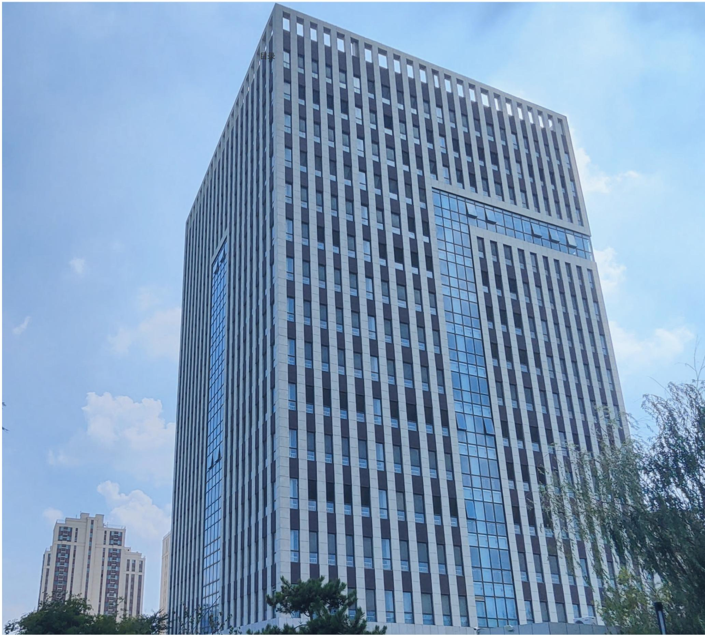

natural_image

Exterior view of a modern high-rise office building under a clear blue sky, with surrounding residential buildings in the background (no visible signage or text)

# 公司治理

公司严格遵守《中华人民共和国公司法》《上市公司治理准则》以及《公司章程》等法律法规和内部制度要求，构建了股东大会、董事会及各专门委员会会议的“全流程规范化管控体系”，层层筑牢合规防线，确保各个环节合法合规、公开透明，不存在任何程序瑕疵和合规风险。

2025 年, 公司召开了各类治理会议, 累计审议议案 85 项。其中, 三次临时股东大会分别审议了 1 项专项投资、1 项关联交易以及 22 项重大议题, 董事会各次会议累计审议了 49 项关键事项。所有会议均严格按照法定程序和内部规则推进, 通过充分的议事研讨和多维度的科学论证实现民主决策。目前, 公司已建立健全《股东会议事规则》《董事会议事规则》《审计委员会议事规则》《提名委员会议事规则》《薪酬与考核委员会议事规则》《战略委员会议事规则》等核心治理制度, 形成了“制度健全、流程规范、监督有效、数据可溯”的治理闭环, 为公司持续规范运作奠定了坚实的制度基础。

公司严格依照法律法规以及内部制度的要求，规范地召开各类治理会议，确保决策过程科学民主、程序合法合规。全年会议数据概览如下：

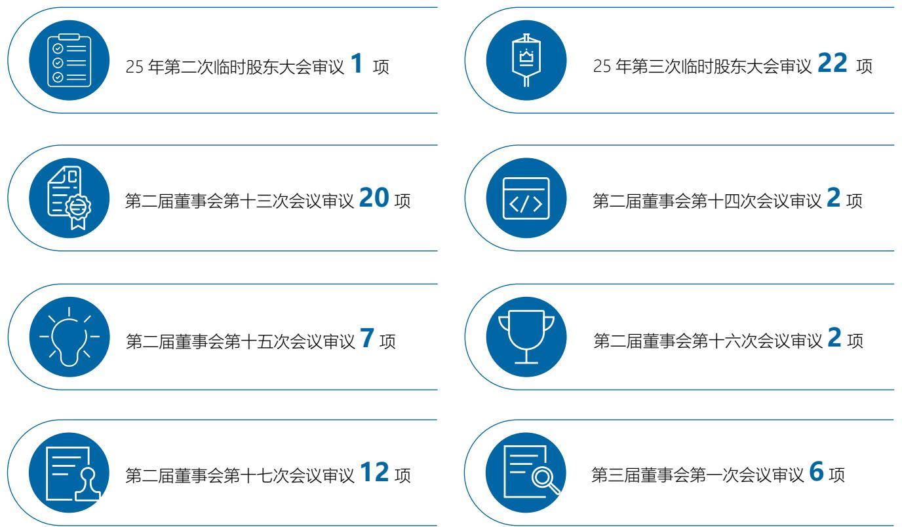

25 年第二次临时股东大会审议 1 项

25年第三次临时股东大会审议22项

第二届董事会第十三次会议审议 20 项

第二届董事会第十四次会议审议 2 项

第二届董事会第十五次会议审议 7 项

第二届董事会第十六次会议审议 2 项

第二届董事会第十七次会议审议 12 项

第三届董事会第一次会议审议 6 项

# 董事会多元化

公司董事会由9名董事构成，其中包括3名独立董事、3名女性董事，人员结构兼具专业性与多元化特点。各位董事严格遵循忠实义务与勤勉义务，依法依规行使董事权利、履行董事职责。董事会成员的专业背景涵盖生物医用材料研发、医疗器械行业管理、财务审计、宏观经济、法律合规等关键领域。各位董事凭借生物医用材料研发、行业管理、财务审计、宏观经济、法律合规等多领域的专业背景以及深厚的行业经验，在技术创新、资金管控、战略制定、市场拓展、合规监督等关键领域充分发挥各自专长，协同合作、形成合力。他们整合多元视角，凝聚发展共识，共同构建起“技术引领、管理协同、监督到位”的多元化治理格局，为公司的科学决策和长远发展提供了坚实的支撑。

公司配备的 3 名独立董事, 其占比符合监管机构对独立董事人数的规定。他们秉持独立、客观的立场, 深度参与公司的经营研讨与重大决策, 针对关键事项审慎地发表专业见解, 切实维护了中小股东的合法权益。

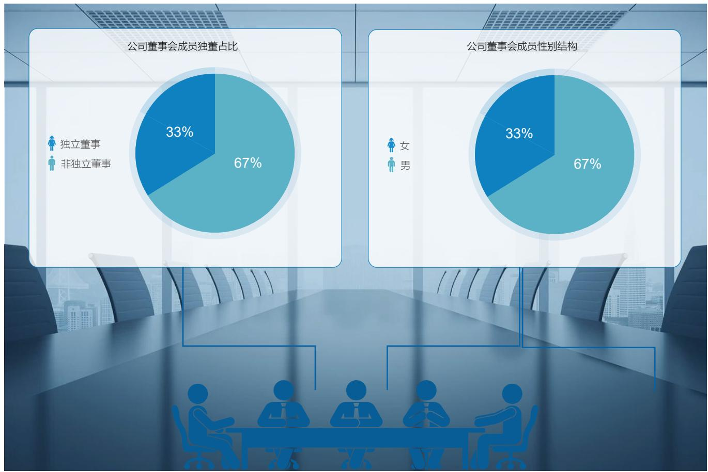

donut

| 类别 | 占比 |
| --- | --- |
| 独立董事 | 33% |
| 非独立董事 | 67% |

# 董事会多元化

公司董事、监事及高级管理人员团队积极投身多元专业培训，参与了上海证券交易所组织的装备制造行业董事会秘书专项培训、北京上市公司协会牵头的上市主体培训，以及证监会等监管机构开设的公司治理、股份减持、市值管理、财务规范运作等专题课程，持续提升履职的专业性与合规性。

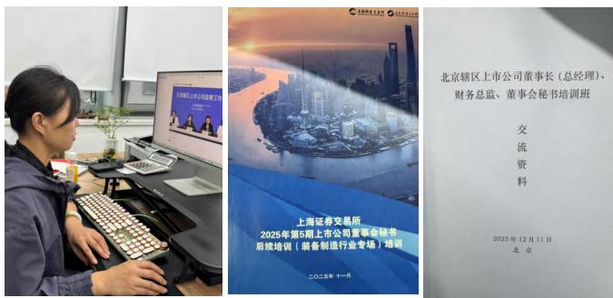

公司高管团队均由核心业务线内部培养而来，不仅积淀了扎实的业务基础和丰富的一线实战经验，更凭借较长的平均任期打造了高度稳定的团队结构。这种“内部成长 + 长期深耕”的发展路径，确保公司战略能够在各业务条线精准落实、高效协同，为企业的持续稳健发展筑牢了坚实可靠的组织保障。

奥精医疗在设计高管薪酬体系时，着重将可持续发展目标与管理层履职成效进行深度融合，采用“制度明确 + 考核联动”的方式，推动高管薪酬与多维度 ESG 绩效指标挂钩，以“关键少数”责任的落实带动公司 ESG 治理效能提升。

公司依据《公司章程》及薪酬管理制度，明确2025年度董事、监事及高级管理人员的薪酬发放需结合岗位履职情况与考核结果。其中，高级管理人员的薪酬按照公司薪酬管理制度进行考核后领取，考核体系已融入ESG核心维度指标，形成“岗位薪酬+ESG绩效考核”的薪酬确定模式，确保高管薪酬与ESG实践成效直接关联。2025年全体董事、监事和高级管理人员实际获得报酬总计1124.37万元。其中，独立董事薪酬标准为8万元/年(含税)，非独立董事、监事及高级管理人员则根据具体任职岗位与考核结果领取薪酬。

# 2025年

全体董事、监事和高级管理人员实际获得报酬总计

1124.37 万元

独立董事薪酬标准为

8 万元 / 年(含税)

# 董事会独立性

公司董事会下设战略、提名、审计、薪酬与考核四大专门委员会，实现多元化优势与专业分工深度融合：

<table><tr><td>专委会</td><td>成员</td><td>职责</td></tr><tr><td>战略委员会</td><td>3人</td><td>融合技术前瞻、政策研判与市场实践,主导海外并购、新业务拓展等重大战略决策</td></tr><tr><td>提名委员会</td><td>3人</td><td>从专业能力、岗位匹配度等多维度选拔人才</td></tr><tr><td>审计委员会</td><td>3人</td><td>跨领域协同开展财务审计与内控监督,发现并整改内控薄弱环节</td></tr><tr><td>薪酬与考核委员会</td><td>3人</td><td>结合研发、运营等多维度需求设计激励体系</td></tr></table>

# 投资者关系管理

奥精医疗严格遵循《证券法》《上市公司信息披露管理办法》《上海证券交易所科创板股票上市规则》等法律法规以及《公司章程》的要求，构建全流程合规管控机制，确保信息披露与投资者沟通行为合法合规、公平公正，坚决杜绝违规披露和选择性沟通的情况发生。公司始终坚守信息披露“真实、准确、完整”的核心底线，所有公开信息均经过多部门交叉核验，不存在任何虚假记载、误导性陈述或重大遗漏，确保投资者获取的经营数据、研发进展、战略动态等信息精准且可追溯。

text_image

L
D

# 投资者关系管理

公司建立了“董事会统筹决策、董事会秘书牵头协调、证券部专职执行、跨部门协同配合”的四级管理体系，同时优化信息披露全流程审核机制，构建了“业务部门信息报送→证券部初步审核→财务/法务部门合规校验→董事会秘书最终审定→交易所披露”的五级审核流程，重点加强对研发进展、海外注册、关联交易等重大事项的披露管控，形成了权责清晰、流程闭环、监督有效的管理格局。

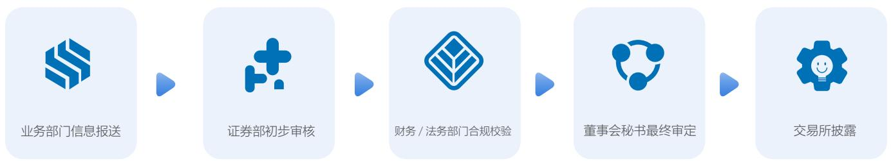

flowchart

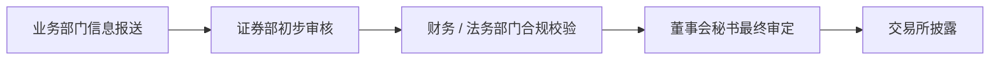
```mermaid
graph LR
  A["业务部门信息报送"] --> B["证券部初步审核"]
  B --> C["财务 / 法务部门合规校验"]
  C --> D["董事会秘书最终审定"]
  D --> E["交易所披露"]
```

2025 年度, 公司累计完成公开信息披露 143 条, 其中定期报告 4 份、临时公告 139 条, 所有披露信息均通过严格合规审核, 全年未出现违规披露情况。期间, 公司收到针对 2024 年年报的监管问询, 已在第一时间组织专项回应, 并按要求及时发布问询回复函, 确保信息披露的准确性、完整性和及时性, 切实保障投资者的知情权。在沟通互动方面, 2022 - 2025 年累计召开业绩说明会 10 次, 实现年度、半年度、季度业绩节点的全面覆盖。说明会聚焦投资者高度关注的热点问题, 精准解答投资者的咨询, 累计互动时长超过 8 小时, 搭建起高效畅通的“公司 - 投资者”双向沟通桥梁。

凭借规范严谨的信息披露和专业高效的投资者互动，公司披露文件的及时性、准确性、完整性得到监管机构的充分认可，未发生因信息披露问题引发的投诉、质疑或监管处罚，成功树立了科创板上市公司规范运作的良好形象。公司始终秉持开放、透明的原则，搭建了包含投资者热线、对外邮箱、线上线下调研会等在内的立体化沟通体系。借助上述渠道，公司积极倾听投资者的意见，保障股东的知情权与参与权，及时回应市场的关注焦点，传递公司的价值，切实维护了投资者关系与市场形象。

# 风险管理

公司持续优化治理体系与风险管理机制，每年聘请独立第三方机构开展财务报表及内部控制审计工作，并结合系统化的内部审计，构建“内外协同、全域覆盖”的全面监督闭环，确保运营的透明度与管理规范性。

公司聚焦合格供应商管理、供应链管控、关键控制点以及内控合规等重点领域，开展专项风险排查、检查与优化工作，并且持续完善质量管理制度，形成从风险识别、评估、过程控制到持续改进的完整管理链条，切实保障管理体系与风险管理的有效性，为公司的可持续发展筑牢坚实根基。

natural_image

Hand interacting with a digital security icon on a futuristic platform, surrounded by monitors and icons (no readable text or symbols)

# 反不正当竞争

为规范经营行为、维护市场公平竞争秩序，奥精医疗围绕反不正当竞争管理打造“总纲 + 细则”的完备制度体系，界定混淆行为、商业贿赂、虚假宣传、侵犯商业秘密等各类禁止性竞争情形。同时，建立法律法规与市场环境动态跟踪机制，确保制度合规且适配。通过规范品牌标识使用、实现交易流程透明化、推行宣传内容市场与法务双重审核、实施商业秘密分级防护等一系列针对性举措精准防控各类不正当竞争风险。此外，公司搭建内外协同的监督网络，内部采用定期全面检查、部门自查与交叉检查相结合的方式，并联动官网、客服热线等公开举报渠道。配套明确的违规调查、分级处罚及闭环整改机制，强化制度执行的刚性。

# 合规经营

为恪守合规经营底线，防范贿赂与贪污风险，公司搭建了以“不敢腐、不能腐、不想腐”三不策略为核心的反腐败贿赂管理体系，主动接受监管机构、投资者以及社会各界的监督。

公司制定了一系列反腐规章，从多个维度明确行为准则，严禁滥用市场地位、限定交易等不正当行为，让内部监察管理、举报以及案件调查等全流程有规可依，有效降低经营风险。

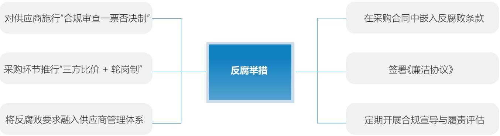

flowchart

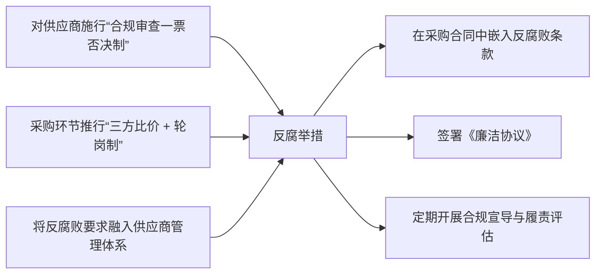
```mermaid
graph LR
  A["对供应商施行“合规审查一票否决制”"] --> B["反腐举措"]
  C["采购环节推行“三方比价 + 轮岗制”"] --> B
  D["将反腐败要求融入供应商管理体系"] --> B
  B --> E["在采购合同中嵌入反腐败条款"]
  B --> F["签署《廉洁协议》"]
  B --> G["定期开展合规宣导与履责评估"]
```

公司积极强化日常及重要节假日的作风建设监督，不定期开展突击检查与专项核查，依托数字化管理系统对费用报销、供应商准入等高风险事项实现全流程留痕，构建起多部门相互制衡的“不能腐”技术与流程屏障。此外，公司打造了OA系统等多渠道投诉举报机制，提供安全匿名的举报途径，对举报人信息严格保密。对于查实的违规行为，视情节采取警告、降职、解除劳动合同等措施，涉嫌违法的移交司法机关处理。同时回溯相关审批人员的监督管理责任，形成“伸手必被捉”的“不敢腐”强效威慑。

公司搭建了廉正门户特色平台,通过内部宣传、专业培训、园区廉洁宣讲、校招新员工专项教育、不定期组织参观廉政警示教育基地等常态化活动筑牢思想基础。创新开展年度廉正考试，以考促学、以考促行，分层次将合规意识深度植入员工职业发展的全过程，引导员工实现从“被动遵守”到“主动维护”的价值转变,切实筑牢“不想腐”的思想防线。

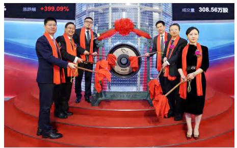

text_image

涨跌幅 +399.09%
成交量 308.56万股

# 党的建设

奥精医疗秉持“党建引领强根基、融合赋能促发展、合规护航守底线”的核心定位，将党的建设深度融入研发创新、生产运营、合规管理、市场拓展、社会责任等关键业务领域，构建起党建与业务同频共振的发展格局。

通过充分发挥党组织的政治引领作用、战斗堡垒作用以及党员的先锋模范作用，为公司践行“深耕再生医学，成就生命健康美好”的发展理念、实现高质量发展筑牢了坚实的政治保障和组织保障。

公司始终把学习贯彻习近平新时代中国特色社会主义思想作为首要政治任务，系统组织党委理论学习中心组学习，专题研讨党的二十大精神以及习近平总书记关于科技创新、卫生健康、安全生产、合规经营等重要论述，推动党的创新理论与企业研发突破、市场拓展、质量管控等实践深度融合。

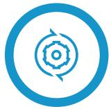

规范开展“三会一课”、主题党日等组织生活，实现全体党员及入党积极分子全覆盖，引导党员干部职工不断增强“四个意识”、坚定“四个自信”、做到“两个维护”，将思想共识转化为攻坚克难、干事创业的动力。

在组织建设领域，严格执行《关于新形势下党内政治生活的若干准则》，细化“三会一课”、组织生活会、民主评议党员、谈心谈话等制度流程，构建标准化组织生活体系，确保各项活动规范有序、务实高效。

建立组织生活质量督查机制，党委定期对各党支部的开展情况进行专项检查和精准指导，对发现的问题建立“清单化管理、台账式推进、限期内整改”的工作模式，形成“规范开展—督查指导—整改提升”的闭环管理链条，切实保障组织生活严肃认真、落到实处，为提升党组织的政治功能和组织功能筑牢基础。

# 02

# 社会责任

# 亮点绩效

新增发明专利

2↑

年度发明专利

78项

员工总人数增长率

3.69%

信息安全事件

0 起

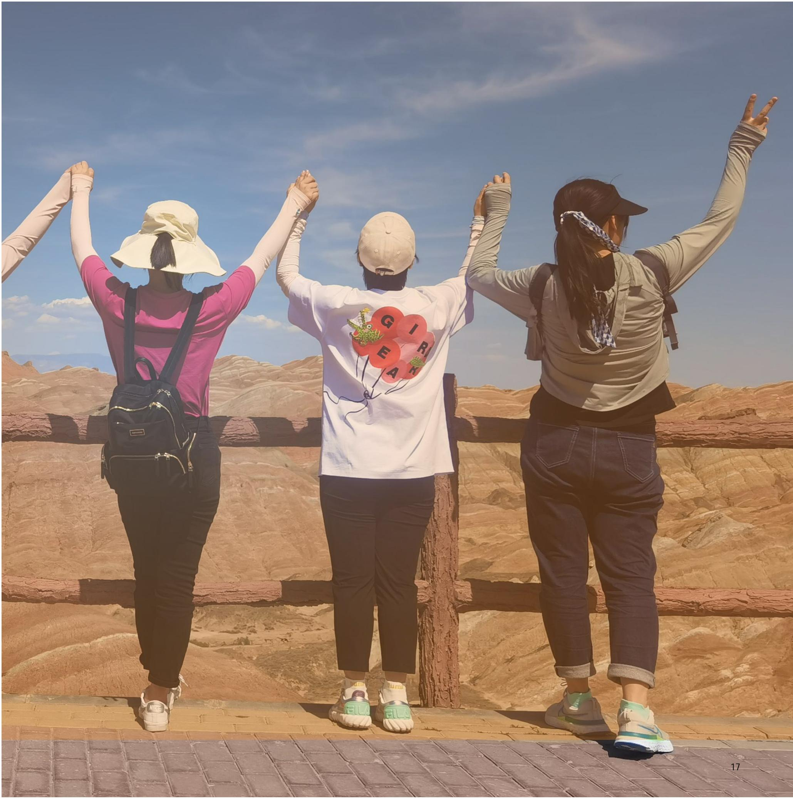

natural_image

Three people standing on a wooden path overlooking a desert landscape under a clear blue sky, with no visible text or symbols.

# 员工权益

2025 年, 奥精医疗紧密围绕口腔种植业务拓展、骨科人工骨修复材料集采后的市场开拓以及再生医学前沿技术研发等战略目标, 秉持 “以才赋能、以心留才, 让人才与企业共生共长” 的核心招聘理念, 员工队伍实现了高质量的增长, 人才结构与业务发展达成了深度适配。

# 合规雇佣

截至目前, 公司在全球范围内的员工总数达到 281 人, 与以往同期相比, 增长了 3.69%。公司坚守 “合规招聘、透明招聘、诚信招聘” 的底线原则, 始终严格遵守国内及国际各项劳动法律法规, 建立了标准化的招聘流程, 保障招聘各个环节的合法性、规范性和严谨性。

# 2025年

成功招聘并录用新员工

40 名

新员工劳动合同签订率保持在

100%

违法聘用情况(童工雇佣、强迫劳动)

0起

公司积极倡导平等就业，将“多元包容、机会均等”作为招聘核心准则，坚决反对招聘过程中出现的任何形式的歧视，包括但不限于性别、年龄、地域来源、民族背景、身体残疾等方面的不公平待遇，构建了多元化、包容性强的人才吸纳机制。公司高度重视核心人才与资深员工的留存和发展，通过完善的职业成长机制和激励政策，促进人才梯队的合理构建和长期稳定发展。

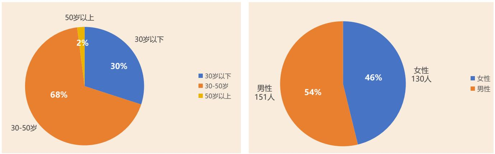

# 薪酬激励

公司秉持“以价值确定薪酬、以贡献实施激励”的薪酬理念，施行“以岗位价值为根基、以绩效贡献为核心、以行业水平为参照”的薪酬策略。结合医疗器械行业的特性，保障薪酬兼具公平性与激励，构建薪酬正常增长机制。公司综合考量年度绩效、行业薪酬水准、居民消费价格指数等要素，每年对薪酬幅度进行调整，使员工薪酬增长与个人贡献、公司发展保持同步。

# 员工关怀

公司始终严格遵循“普惠兜底、精准补充、人文关怀”这三大核心原则，系统性地构建起全面覆盖、分层分类的福利保障体系，以达成“正式员工全覆盖、灵活用工有保障、核心人才有升级”的目标架构，确保每一项福利政策不仅可温暖员工的内心，更能为员工的职业发展与个人成长提供坚实支撑。

针对不同的岗位类别,奥精医疗深入分析其工作性质、潜在风险和实际需求,定制具有岗位针对性的专项福利支持方案,确保福利设计契合实际状况,助力业务顺利开展。在假期管理方面,公司除严格执行国家法定假期规定外,优化特殊假期保障机制,完善涵盖哺乳假、育儿假、陪产假等在内的休假制度,助力员工实现工作与生活更为弹性、健康的平衡。此外,在节日慰问方面,公司为全体在职员工精心准备节日福利与定制礼盒,尤其关注异地工作员工的情感诉求,通过将实物与关怀相结合的方式,传递企业如家庭般的温暖与牵挂。

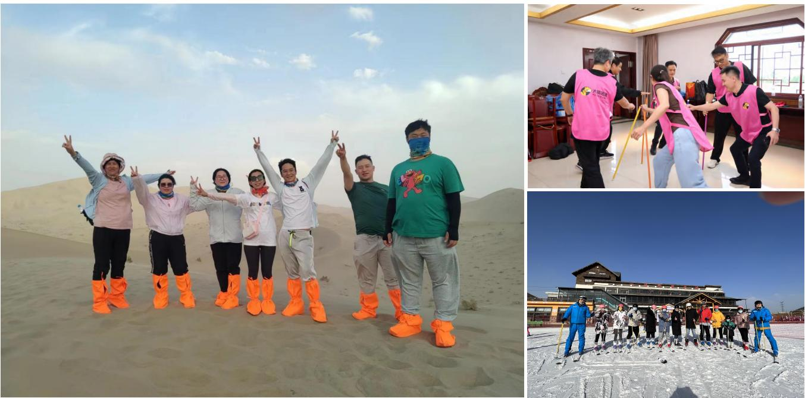

# 节日活动

母亲节

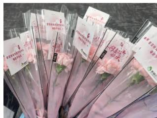

text_image

Packaged pink flowers with handwritten Chinese text labels on plastic fans

端午节

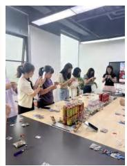

元宵节

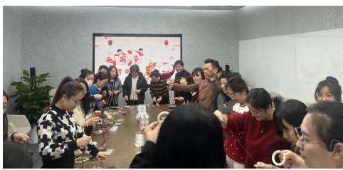

text_image

Group of people gathered around a table with yarn and fabric, in a meeting room with a large screen displaying Chinese text.

# 职业健康安全

奥精医疗秉持“预防优先、体系保障、全员参与、持续优化”的原则，搭建了适配医疗器械研发、生产、销售全链条的健康安全管理体系，凭借专业保障践行“守护员工健康、筑牢安全防线”的企业核心承诺。

公司构建了“岗位—流程—环境”三维一体化风险识别与评估模型，通过实地调研、岗位访谈等多种方式，梳理各环节的风险点，形成动态更新的风险清单，并根据风险等级实施差异化的管控措施，切实做到风险识别无遗漏、全覆盖，确保识别率达100%。

公司成立了以总经理为组长的健康安全委员会，全面统筹安全管理工作，在北京、潍坊等分公司分别设立区域专项工作组，每个工作组均配备专职安全管理专员，构建起跨地域的协同管理网络，搭建了“决策层—执行层—监督层”三级责任管理架构，将安全责任逐级分解并落实到具体人员，实现责任可追溯、管理无盲区。同时，公司对职业健康管理相关制度文件进行修订与完善，确保其符合最新法规和企业实际情况。

2025 年, 公司围绕消防安全、岗位风险防控、应急处置等核心主题, 组织开展了多轮安全培训工作。特别是在“119 消防安全月”期间, 有针对性地开展了一系列专项培训活动, 如消防法规解读、火灾隐患排查、灭火器实际操作、应急疏散演练等。安全培训工作覆盖了公司全体员工, 参训率和考核通过率均达 100%, 有效提升了全体员工的安全防护意识和应急处置能力。

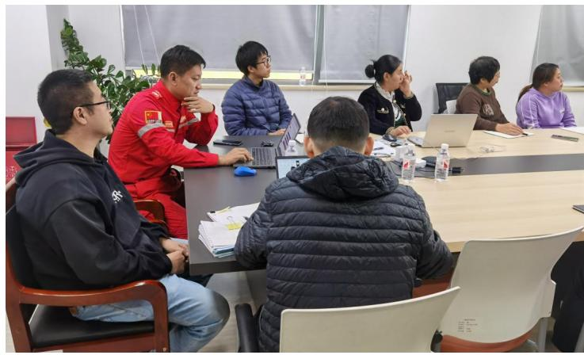

natural_image

Group of people seated around a conference table in a meeting room, engaged in discussion (no visible text or signage)

在应急管理方面，公司建立了“预防—响应—复盘”全链条闭环应急机制，针对火灾等典型突发事件制定应急预案，并定期组织实战演练，提升各级人员的应急处理能力。日常执行“日巡检、周排查、月复盘”三级排查机制，即岗位每日自行检查、部门之间每周相互检查、委员会每月督导检查，实现隐患排查的常态化和持续改进。全年累计发现并登记的所有隐患均按要求完成整改，整改完成率100%，有效保障了企业生产经营的安全稳定运行。

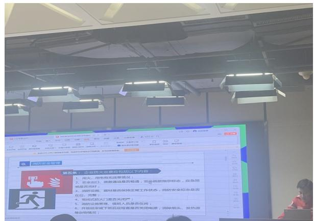

text_image

消防安全管理
第五条 企业防火巡查应包括以下内容：
1. 用火、挖伤有无违章情况；
2. 安全出口、跳坡通道是否畅通，安全疏散指示标志，应急照明是否完好；
3. 消防设施、器材是否保持正常工作状态，消防安全标志是否在岗、开窗；
4. 布圾式防火门是否关闭；
5. 消防设施管理、值班人员是否在岗；
6. 开放危险域下班后应检查是否关闭电源；消除烟头、发热源等杂物情况。

# 2025年

重大事故

0起

职业病确诊

0 例

年度安全目标达成率

100%

公司与美年大健康建立了深度合作关系，为员工构建差异化的体检项目。奥精医疗凭借美年大健康在全国连锁布局的医疗资源，为子公司员工提供就近且便利的体检服务，体检覆盖比例达到100%。此外，公司在足额缴纳五险一金的基础上，完善补充医疗保障体系，实现对健康风险的全维度覆盖。

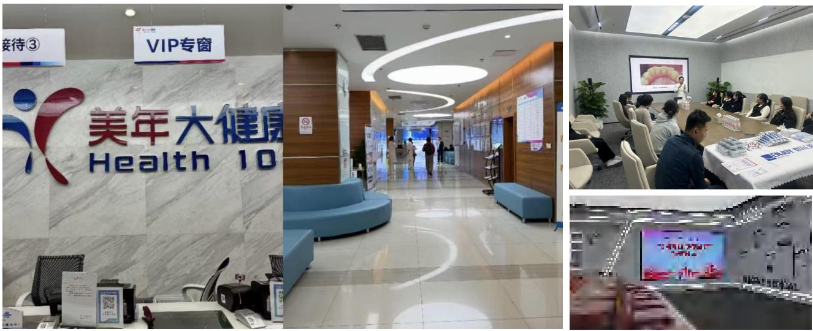

# 员工培训发展

奥精医疗秉持“员工与企业共生共荣”的发展理念，以职级管理规程为核心框架，构建科学完备的人才发展生态，筑牢行业人才护城河。公司突破传统“唯管理论”的发展局限，建立行政序列、专业技术序列、营销序列、作业序列四大维度并行的职位体系。各序列职业路径与核心业务紧密绑定，为不同特质的人才提供精准适配的成长通道。

在人才培养方面, 公司依托 2024 年获批设立的博士后科研工作站, 联合清华大学、北京协和医院等顶尖高校及临床机构, 搭建 “基础研究 - 技术攻关 - 成果转化” 全链条培养模式, 形成 “博士后 + 骨干团队” 的创新梯队, 推动技术人才在关键领域取得突破, 同时将科研成果迅速转化为产品竞争力, 实现学术价值与市场价值的双向落地。

为激发人才潜力，公司建立跨序列转换机制，允许员工依据自身能力适配度、职业发展意愿，在行政、专业技术、营销、作业四大序列间自由流动。同时，公司严格遵循“薪酬待遇对等”原则，各序列在薪酬带宽、激励机制上保持一致，高级技师薪酬可达同层级经理水平，首席专家与高管享有同等战略决策参与权，充分保障技术人才的职业价值与获得感。

此外，公司构建“基础研究 - 技术攻关 - 成果转化”全链条培养模式，通过博士后工作站的科研项目引领，结合内部“师带徒”、技能比武、专项培训等多元化培养形式，打通人才成长的“最后一公里”。各序列员工均可通过年度绩效考评、任职资格认证等途径实现职级晋升，真正形成“多通道发展、全周期赋能、高价值匹配”的人才发展格局，让员工成长与企业发展同频共振，为公司持续领跑行业注入源源不断的动力。

# 员工培训

奥精医疗明确将“合规能力深化、核心技术转化、口腔新业务赋能、全层级人才梯队夯实”确立为四大核心发展目标，以此布局并推动全年培训工作的开展。公司采用按季度分阶段、逐层深入的实施策略。在师资配置方面，组建了由“内部业务骨干与外部行业专家”相结合的双轨教学团队，充分发挥这两类资源的优势，实现知识传递与经验共享的协同效应。

为有效控制成本、提高资源利用效率,公司借助内部优秀讲师资源的重复利用,替代部分高成本的外聘专家,还将通用性强的基础课程全面转为线上授课模式,大幅降低了线下集中培训的场地、差旅及时间成本,2025年度培训总支出为30930元。

在组织执行层面,奥精医疗加强跨部门协作,积极联动各业务单元,系统梳理不同岗位的能力需求和业务痛点,制定极具针对性的个性化培训方案,确保每一项培训内容都能切实契合实际业务需求,助力提升人才能力,实现公司战略目标。

奥精医疗重磅启幕 2025 年骨科国际交流活动，以 “精医所至，中越同行” 为主题，深化中越在骨修复领域的技术交流与产业协作。

# 科技创新

公司将“核心技术引领、临床需求导向、全球化布局支撑”作为科技创新战略的核心，聚焦于矿化胶原仿生骨修复材料技术体系的深度迭代与广泛拓展。构建“基础研究—技术开发—产业化应用—临床验证”的全链条创新生态，形成“骨修复 + 口腔种植”的双核心业务布局，打造再生医学材料领域的国际化创新平台。

公司研发资金涵盖国家及省部级项目专项拨款、自有资金持续投入、产学研合作专项经费以及募集资金的合理配置，优先保障研发预算执行，为与高校共建实验室提供协同资金支持。2025年度，研发投入达到3925万元，占营业收入的比例为17.54%。主要用于核心技术升级以及在研项目的推进，重点保障“个性化颅骨仿生复合修复材料”等国家重点研发计划项目的实施。

奥精医疗与清华大学、北京协和医院等 10 余家顶尖高校及临床机构的合作，共建联合实验室开展基础研究。通过院士工作站引入行业顶尖智力资源，牵头或参与多项国家及省部级重大研发项目。研发团队以资深技术专家为核心，现有 24 名研发人员。此外，公司还牵头起草《增材制造定制式矿化胶原基颅骨修复体》中关村标准，填补了细分领域的标准空白。

# 2025年

研发投入

3925 万元

研发投入占营业收入的比例

17.54%

公司累计拥有发明专利

78 项

实用新型专利

48 项

外观设计专利

1 项

新增发明专利授权

2 项

新申请专利

2 项

公司建立了“院士专家工作站 + 博士后科研工作站 + 研发中心 + 临床合作基地”的四级创新平台。由研发总监牵头统筹项目立项，设立专门的知识产权管理人员，严格执行知识产权管理体系，将其融入创新全流程，并通过 GB/T 29490 企业知识产权管理体系认证，确保核心技术自主可控。

公司在核心技术研发与成果转化方面成效斐然,一方面,实现了矿化胶原 / 聚酯复合材料力学性能调控技术的关键突破,材料的生物相容性与降解速率适配性达到国际先进水平。同时,优化了胶原蛋白提取和纯化技术,为人工骨核心原材料的自主供应奠定了坚实基础。

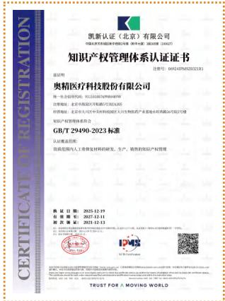

text_image

凯新认证（北京）有限公司
中国证券监督管理委员会
（以下简称“中国证监会”）
2023-12-27
知识产权管理体系认证证书
注册号：6002479MA58331313
奥精医疗科技股份有限公司
统一社会信用代码：911101007899999WY
注册地址：北京市海淀区丹棱街6号院A座305
经营范围：许可项目：医疗器械及技术领域内的生物技术产品及技术的进出口许可证管理
知识产权管理体系证书
GB/T 29490-2023 标准
认证基本情况：
完成国内人工智能基础材料的研究、生产、销售的知识产权管理
证书日期：2023-12-19
有效期至：2023-12-11
有效期至：2023-12-14
ISSN Certificate
TRUST FOR A MOVING WORLD

另一方面，成果转化落地进程加速。可吸收胶原蛋白止血海绵获得国家药监局第三类医疗器械注册证，并于2025年6月顺利取得生产许可证，圆满实现了“研发-注册-产业化”的全闭环。矿化胶原人工骨修复产品“BonGold”成功获得马来西亚D类医疗器械注册证，越南、印度尼西亚的注册申请已进入审核阶段，全球化布局稳步推进。

公司凭借卓越的技术实力与转化能力，在报告期内及后续转化成果中斩获多项权威奖项：

“脊柱脊髓战创伤救治技术创新与应用”项目荣获中央军委军事科学技术进步奖一等奖

“口颌系统再生修复关键技术及材料研发应用”项目荣获天津市科学技术进步二等奖

“高活性骨修复材料关键新技术及应用”项目荣获中国生物材料学会科学技术一等奖

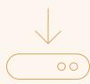

“脊柱骨折脊髓损伤防治关键技术和产品创新研发”项目荣获湖北省科学技术奖·技术发明一等奖

《可塑性骨填充材料的创新关键技术建立及推广应用》项目荣获 2025 年中华医学科技奖·医学科学技术奖二等奖。

# 科技创新

公司的科技创新有力带动了再生医学材料上下游产业链的蓬勃发展，潍坊生产基地全面释放产能后，不仅能充分满足集采落地后市场需求的增长，更推动骨修复材料国产化替代率进一步提升。同时，公司凭借核心技术优势，加快推进国际市场布局。越南、印度尼西亚等重点市场的注册进程有条不紊地推进，预计海外营收占比将逐步提高，国际市场影响力将持续扩大。

在健康保障领域，矿化胶原系列产品累计临床应用已达数百万例。新一代可吸收胶原蛋白止血海绵、聚酯人工骨修复材料的成功推出，进一步满足了骨科、神经外科、口腔科等多领域的临床诊疗需求，有效降低了患者的手术风险和治疗成本。骨科人工骨集采落地后，植骨费用大幅降低，既减少了患者二次创伤的风险，更切实增进了人民群众的健康福祉。

# 伦理规范

公司的科技活动聚焦于再生医学材料研发、植入性医疗器械临床应用、人体组织修复材料创新等领域，与人体健康和生命安全直接相关。公司严格遵守《医疗器械监督管理条例》《医学伦理审查办法》《生物医学伦理审查指南》等法律法规，始终秉持“尊重生命、保护隐私、安全有效、公正平等”的伦理原则，确保所有研发及临床活动均符合国际医学伦理准则。

在管理机制方面，公司将伦理评估深度融入项目立项、临床试验、产品注册、产业化应用的全流程，明确“未通过伦理审查不得开展相关活动”这一硬性要求，构建“预防－识别－阻断”的全链条伦理风险防控体系，建立技术创新负面清单制度，从源头上防范伦理风险。

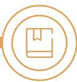

报告期内，公司严格执行伦理审查与过程管控，未出现任何违反科技伦理的行为，也未收到相关投诉或处罚。

公司建立伦理风险预警机制，对临床试验数据真实性、患者知情同意流程、隐私保护措施等关键环节开展常态化核查，确保科技活动全程合规。

公司将科技伦理纳入年度培训的核心模块，并通过行业展会、学术沙龙等多元平台广泛传播“科技向善”的创新理念，强化全员的伦理合规意识，践行负责任的创新发展理念。

# 产品质量安全

公司始终秉持“打造卓越品质产品，助力病患改善”的核心使命，深度对标ISO 13485、FDA 21 CFR Part 820等国际医疗器械质量法规与标准，构建了覆盖“研发设计－供应链采购－生产制造－市场销售－售后服务”全生命周期的闭环式质量管理体系。通过标准化管控贯穿产品从概念构思到临床应用的每一个关键环节，切实保障医疗产品的安全性、有效性和可靠性。

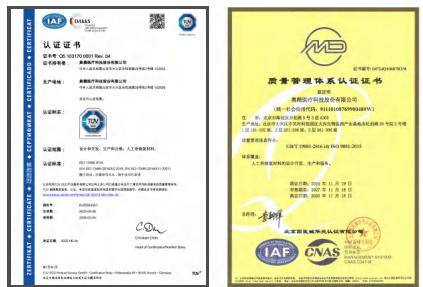

奥精医疗为实现质量责任在全层级的覆盖，支撑多场景下的质量管控工作，搭建了质量管理组织架构，开展体系搭建与优化、过程监控以及合规保障等工作。

质量管理架构  
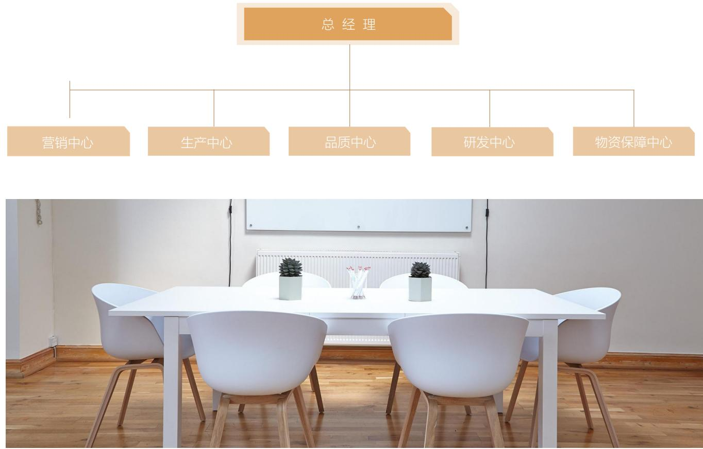

# 产品质量安全

公司依托 UDI 系统优势,构建覆盖“原材料 - 生产 - 流通 - 使用”的全链条闭环追溯体系。

# 在原材料环节

通过 UDI 关联 A、B 类物料的出厂批号与内部批号，严格遵循物料分类管理与可追溯要求。

# 在生产环节

将 UDI 与产品批号、序列号、灭菌批号等信息进行绑定，通过批生产记录、设备运行记录实现工序全程留痕。

# 在流通环节

依据销售管理规范，以 UDI 作为核心载体，整合合同评审、分销记录、货运收件信息，确保产品从出厂到经销商、终端使用单位的流向清晰可查。

# 在使用及反馈环节

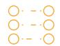

借助 UDI 关联客户投诉、不良事件等反馈记录。一旦触发召回条件，可依据召回管理制度，通过 UDI 快速定位涉事产品的全链条轨迹，实现精准召回、高效处置，全面保障产品质量安全与监管追溯需求。

# 2025年

PPM
100%

# 顾客投诉次数

1 次

# 客户投诉满意处理率

100%

# 客户服务满意度

≥95 分

2025 年,公司将“零重大安全事故”确立为核心目标,严格遵循《医疗器械监督管理条例》,全年未出现重大产品与服务安全事故。公司秉持“以患者为中心”的理念,依托《销售管理制度》《与顾客有关的过程控制程序》《反馈控制程序》,构建了立体化服务体系。2025 年,客户服务满意度超过 95 分。

# 可持续供应链

奥精医疗紧扣植入类医疗器械“高合规性、长周期供应、强临床关联”的特性，致力于达成“临床供应保障、环境影响降低、产业生态协同”三大目标的统一。公司积极践行可持续发展原则，在可控范围内选用可降解原料，减少生产过程中的三废排放，持续提升管理水平。2025年，奥精医疗与全部供应商签署《质量与ESG协同协议》，明确强制性要求，使ESG指标权重与质量、交付指标处于同等核心地位。针对2025年新增的4家供应商，实施“商业调查+现场核查+体系验证”的三重审核，确保新增供应商符合相关要求。

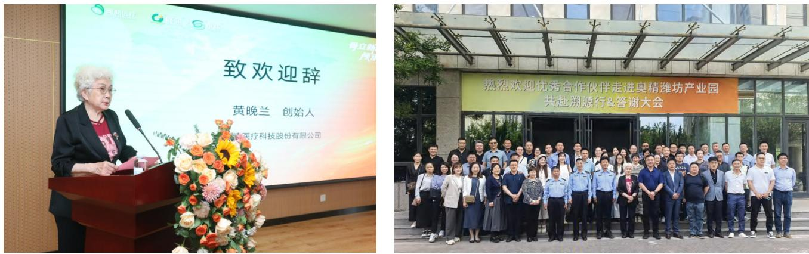

针对供应商的规模、合作深度和战略重要性,公司实施分级差异化管理,推动可持续发展理念向供应链全链条深入渗透。对于重点核心供应商,每年开展多轮现场审核和 ESG 专项提升培训,通过技术交流、案例分享等形式,深化理念共识,促进实践落地。对于其余常规供应商,在续签年度质量协议时,明确 ESG 管理要求的延续性,同步更新合规标准与执行细则。但统一要求提交年度 ESG 自查报告,并结合资料核查、抽样验证等方式,全面把控可持续发展责任落实的成效。

2025 年 5 月，奥精医疗于潍坊产业园举办“骨立新高，颅承未来”优秀合作伙伴答谢活动。活动现场不仅回顾了创业历程，传递了“双向奔赴”的合作理念，分享了营销生态与研发布局规划，还表态将持续支持企业发展。

合作伙伴在讲解员的引领下参观了潍坊产业基地，全面了解生产质控环节，进一步增强了对品牌品质的信任。同时，通过“趣力全开”团队协作游戏、风筝 DIY 放飞等互动活动，增进了彼此间的情谊。

# 可持续供应链

奥精医疗始终秉持“合规第一、一用多备”的核心原则，鉴于国际贸易政策存在不确定性风险，在2024-2025年持续深入推进国产化替代战略。一方面，稳步推动自有产品的国产化进程，另一方面，积极促使现有进口原材料供应商同步开展物料国产化的研发与适配工作。预计到2027年，可达成全品类物料 $100\%$ 国产化供应的目标。

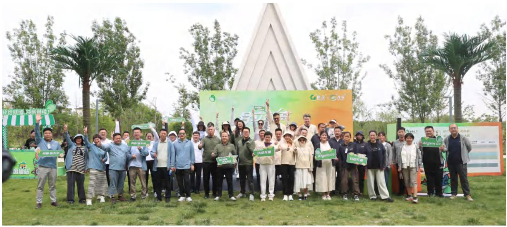

text_image

Group photo of people holding signs in front of a large outdoor event with visible Chinese text on banners and signs.

公司持续拓展供应源布局，针对核心原材料开展多供应商资质验证与物料性能测试。在严格遵循质量管理体系要求的基础上，稳步推进供应商备份建设。2025年度，已顺利完成30%核心物料的供应商备份筹备工作，进一步强化了供应链的韧性保障。

# 2025年

供应商签署 ESG 相关准则的比例

100%

对供应商进行 ESG 能力建设的比例

25%

对新增供应商进行背调数量

4 家

对供应商进行 ESG 相关评估的比例

100%

从当地供应商采买产品和服务的预算比例

10%

# 信息安全

奥精医疗搭建“核心敏感数据、重要数据、一般数据”三级数据分类分级管理体系，清晰界定各级数据的采集范围、存储时限、传输渠道、销毁规范以及访问权限准则，达成数据全生命周期的标准化管理与控制。

融入供应商准入
与考核体系

公司将数据安全要求全面融入供应商准入与考核体系，在合作协议里明确经销商、物流服务商等第三方的数据安全责任清单以及违约追责条款，构建协同联动的安全防护生态系统。

系统嵌入功能模块

在经销商管理系统、医院客户服务平台、临床数据采集系统中嵌入“数据最小化采集”功能模块，严格限定必要信息的采集范围，借助合法性校验机制杜绝非法采集行为，从源头上保障数据的合规性。

部署操作监控系统

针对核心敏感数据，公司部署操作监控系统，对查询、下载、复制等关键操作进行全程追踪。一旦监测到非工作时间批量操作、跨区域异常访问等风险行为，立即触发多级告警机制，确保风险能够早发现、早处理。

精准拦截风险威胁

公司构建“网络 - 终端”双重安全屏障，部署入侵检测、防御系统以及态势感知平台，监控网络异常流量和恶意攻击行为，精准拦截风险威胁。

实施全维度终端安全管理

对员工办公设备实施全维度的终端安全管理，统一安装防病毒软件并强制每日更新病毒库，禁用未授权的外接存储设备，从终端层面阻断数据泄露风险。2025年全年未发生因终端设备引发的数据安全事件。

# 信息安全

在人员权限管理上，奥精医疗严格执行“数据权限最小化 + 动态调整”机制，基于“岗位必需、权限匹配”原则精准分配数据访问权限。销售岗位仅可访问分管区域的客户数据，研发岗位仅可访问相关项目的研发数据，确保权限与职责高度匹配。建立常态化的权限审计机制，每月开展全量权限核查，及时回收离职员工和岗位调整员工的冗余权限，整改权限交叉、权限过度等问题，持续优化权限配置体系。同时，与管理人员、研发核心人员等关键岗位员工签订《保密协议》，明确数据泄露的追责条款和赔偿标准，强化人员的责任意识。2025年全年未发生员工违规泄露数据事件。

# 社会贡献

奥精医疗将支持乡村振兴深度融入企业的长期发展战略，秉持“精准帮扶、资源赋能、长效共建”的核心原则，紧密契合山东潍坊等乡村帮扶基地的实际发展需求，推动企业发展与乡村振兴战略深度融合、协同共进，达成社会效益与企业发展的双向共赢。

针对乡村基层办公设施、公共服务供给等核心短板问题，公司延续对山东潍坊乡村的定点帮扶模式，通过定向物资捐赠、专项资金支持等多样化举措，精准改善乡村基层组织的办公条件，完善公共服务配套设施，为夯实乡村治理基础、激活产业发展动能筑牢根基。同时，依托公司在山东潍坊的子公司产业布局优势，公司优先向帮扶乡村开放生产操作、物流配送、渠道对接等基层岗位，并开展系统性的岗前技能培训，全方位提升乡村劳动力的就业竞争力，助力当地群众达成“就近就业、稳定增收”的民生目标。

健康，是民生之本，亦是乡村振兴与共同富裕的重要基石。奥精医疗始终秉持“科技向善”的初心，将企业发展深度融入国家大健康战略与基层医疗建设的时代洪流之中。2025年，面对骨科耗材国家集采全面深化的历史性节点，我们不仅将其视为商业模式的调整窗口，更视作推动优质医疗资源下沉、践行普惠社会责任的关键契机。奥精医疗坚持以“让先进的再生医学技术惠及更多患者”为核心行动纲领，从扩大临床可及性到赋能基层骨科诊疗，从科技拥军到国际人道主义关怀，在社会贡献的每一个维度，力求将冰冷的生物材料转化为有温度的医者仁心，让再生医学的光芒照亮更多需要修复的生命角落。

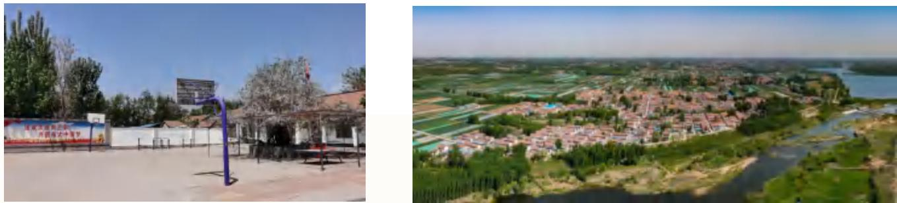

奥精医疗始终坚守“公益同行、善举常为”的宗旨，聚焦老年福利、社区公益、医疗科普等关乎民生的重要领域，开展多元化的公益慈善活动，积极搭建员工志愿参与的平台，构建起“企业引领、员工联动”的公益实践格局。2025年，公司累计投入公益慈善捐款达1.55万元，用于支持社区老年幸福食堂的建设。通过为老年群体提供就餐补贴、完善食堂基础设施等举措，切实改善了老年群体的生活保障条件。此外，公司专门组建了公益志愿队，由各部门员工自愿加入，常态化开展老年福利帮扶、基层医疗科普、乡村定点帮扶等线下志愿活动，以实际行动传递企业的关怀与温暖。

在履行社会责任的过程中,公司深入扎根基层、贴近民生,精准把握基层医疗市场的需求以及群众的健康诉求。为研发更贴合基层场景的医疗器械产品、制定更契合区域市场的业务发展策略提供了丰富且鲜活的实践参考。

natural_image

Mountain slope with snow-capped peaks and forested slopes under a cloudy sky (no text or symbols visible)

# 03

# 环境责任

# 亮点绩效

环境安全事故率

0 起

废弃物处置合规率

100%

污染物超标排放事件

0 起

废水排放达标率

100%

natural_image

Snow-capped mountain range with steep peaks and a forested valley under a cloudy sky (no text or symbols visible)

# 环境合规管理

# 环境风险评估

奥精医疗作为专注于生物医用材料研发与生产的企业，构建了“全员参与、全流程覆盖、动态更新”的环境风险评估体系。该体系结合生物医用材料的生产特性以及新污染物管控要求，形成了“风险识别 - 分级评估 - 动态监控 - 持续改进”的闭环流程。公司的环境风险评估将覆盖北京、潍坊两大生产基地及研发中心，评估范围涵盖研发实验、洁净生产、危废储存、废水处理等全场景，确保无风险点遗漏。

基于生物医用材料的生产工艺及物料特性,识别出18项核心环境风险点,并按照风险等级划分为高、中、低三级。

<table><tr><td>风险等级</td><td>风险点名称</td><td>风险描述</td></tr><tr><td rowspan="6">高风险</td><td>危险化学品储存泄漏风险</td><td>环保型溶剂、实验试剂等危险化学品在储存过程中发生泄漏,可能造成土壤、水体污染或安全隐患</td></tr><tr><td>实验室废液泄漏风险</td><td>实验室产生的废液在储存、转移过程中泄漏,可能引发环境污染</td></tr><tr><td>废气处理设施故障导致VOCs无组织排放风险</td><td>废气处理设施运行故障,导致挥发性有机物(VOCs)无组织排放,污染大气环境</td></tr><tr><td>危废转运过程泄漏风险</td><td>危险废物在厂区内转运或对外委托转运过程中发生泄漏,造成环境污染</td></tr><tr><td>废水处理系统故障外溢风险</td><td>废水处理系统运行故障,导致处理未达标废水外溢,污染周边水体</td></tr><tr><td>新污染物迁移转化风险</td><td>重点管控化学品等新污染物发生迁移、转化,引发潜在环境风险</td></tr></table>

<table><tr><td>风险等级</td><td>风险点名称</td><td>风险描述</td></tr><tr><td rowspan="8">高风险</td><td>生产车间粉尘逸散风险</td><td>生产车间作业过程中产生粉尘逸散,影响空气质量及员工健康</td></tr><tr><td>节能设备故障导致能耗突增风险</td><td>节能设备运行故障,导致生产、办公能耗突然增加,不符合绿色运营要求</td></tr><tr><td>雨水管网混流风险</td><td>生产废水、生活污水与雨水管网混流,可能引发排放超标风险</td></tr><tr><td>危险化学品运输风险</td><td>危险化学品采购运输过程中,因交通意外等因素引发泄漏、污染风险</td></tr><tr><td>供应商环保合规风险</td><td>上游供应商环保管理不达标,影响公司供应链环保合规性</td></tr><tr><td>绿化灌溉用水过量风险</td><td>厂区绿化灌溉用水超出合理范围,造成水资源浪费</td></tr><tr><td>噪声超标风险</td><td>生产设备、通风系统等运行产生的噪声超出国家标准,影响周边环境</td></tr><tr><td>固废分类不当风险</td><td>一般工业固废、生活垃圾等未按规定分类,影响处置效率及环境安全</td></tr><tr><td rowspan="4">中风险</td><td>办公区域生活污水排放异常风险</td><td>办公区域生活污水排放指标异常,未造成重大污染</td></tr><tr><td>实验室少量耗材废弃污染风险</td><td>实验室少量耗材废弃后未规范处置,造成轻微环境影响</td></tr><tr><td>非生产区域噪声干扰风险</td><td>非生产区域(如办公区、生活区)噪声产生干扰,未超标且影响范围有限</td></tr><tr><td>环保监测设备数据偏差风险</td><td>环保监测设备运行异常,导致监测数据出现偏差,未影响环保合规判定</td></tr></table>

# 环境管控措施

为持续提高奥精医疗整体环境管理水平，公司建立“由总经理统筹、品质管理部主导、各部门协同配合”的高效联动管理体系。公司为此配备了专职环境管理人员，负责环保工作的推进与监督事宜。并在各生产车间及研发中心设置兼职环保员，确保环境管理职责能够延伸至基层，构建起“责任明确到岗位、管理覆盖全体员工”的精细化责任体系。

针对高风险点位，公司开展专项排查工作，重点核查危险化学品的储存是否符合“双人双锁”管理要求、废气处理设备的运行参数是否达标、危险废物的分类储存是否规范等关键环节。对于中低风险点，实行季度或年度排查，确保各类风险处于可控范围。

# 环境风险管控专项培训

公司定期开展环境风险管控专项培训，培训内容涵盖新污染物管控政策法规解读、危险化学品泄漏应急处理流程、环境风险与隐患识别方法等，确保重点岗位人员参与培训且考核通过率达到100%，从而提升员工的环境风险防范意识和应急处置能力。

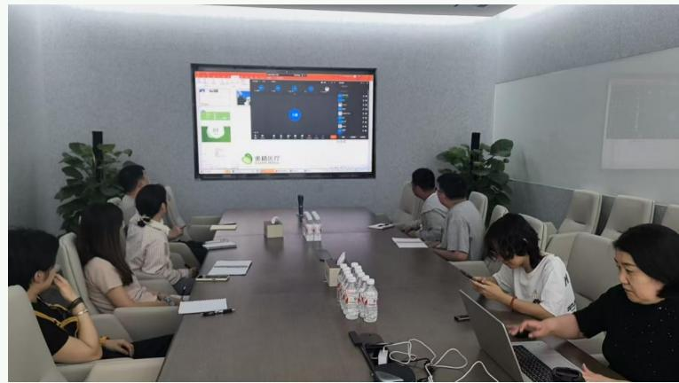

text_image

Meeting room scene with participants seated around a conference table, large screen displaying data and interface, and visible text on screens and wall.

# 环境应急管理

奥精医疗严格依照《中华人民共和国环境保护法》《突发环境事件应急管理办法》等相关法律法规的要求，结合企业自身的生产特点与环境风险类型，制定了《突发环境事件应急预案》。系统地涵盖危险化学品意外泄漏、新型污染物扩散等突发情况的应对方案，明确了应急管理的组织架构体系、响应流程机制、现场处置措施以及事后恢复与评估管理等重要环节。

公司特别设立了突发环境事件应急指挥部，由总经理担任总指挥，分管副总经理担任副总指挥，统筹应急响应与处置工作。在应急响应程序上，严格遵循“先控制事态、后科学处置、再系统恢复”的工作原则，明确了事件发生后5分钟内完成现场初步报告、10分钟内应急指挥部启动响应、30分钟内开展实质性处置行动的时间节点，最大程度地确保响应迅速、流程顺畅。

# 2025年

突发环境事件

0 起

因环境导致的人员伤亡事件

0 起

污染物超标排放事件

0 起

环境导致的经济损失事件

0 起

潜在事件及时、规范处置率

100%

对周边造成不良影响事件

0 起

环境安全事故率

0

# 能源管理

2025 年, 奥精医疗能源消耗总量达到 5663174.2 千瓦时, 全部由电力供应。截至目前, 公司尚无其他能源品类的消耗记录, 电力是唯一使用的能源类型。这些电力主要用于保障生产设备的日常运转、维持研发实验仪器的持续运行、满足办公设施的用电需求, 以及确保公共基础设施的稳定供电等。公司聚焦绿色低碳转型与智慧管理升级, 锚定长期节能降碳目标, 计划到 2030 年实现单位产值碳排放较 2025 年降低 5%, 同步推动能耗强度较 2025 年下降 5%, 稳步构建高效、低碳、可持续的能源利用体系。

2025 年,公司能耗强度为 1.09 吨标准煤 / 百万元营业收入

# 能源管理

公司能耗强度主要受业务发展与产能扩张双重因素影响。一方面，骨科人工骨集中带量采购政策落地后，产品市场需求快速释放，产销量显著提升，直接导致生产线及配套辅助设备运行时长大幅增加，能源消耗规模同步增长。另一方面，公司战略布局持续推进，新增口腔种植体生产线投产运行，同时海外业务拓展带来运营场景扩容，均产生了新增能源消耗。目前，公司尚未规模化部署风能、太阳能等可再生清洁能源利用系统，暂未开展自主风力发电或光伏发电项目。但立足国家“双碳”战略目标导向，顺应医药健康行业绿色低碳的发展趋势，奥精医疗已将清洁能源应用纳入企业中长期战略规划。未来，公司将稳步提升可再生能源在总能耗中的占比，同步推进清洁能源相关技术研发、设施建设及管理体系完善，为后续实现可再生能源使用的精准统计、量化管理与高效利用奠定坚实基础。

# 办公区域节能措施

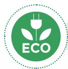

严格执行温度设定不低于 $26^{\circ}$ C 的标准，杜绝空调运行时门窗敞开的情况。下班前 30 分钟关闭非必要的空调，并安排专人对各办公区域进行巡查督导。

# 生产区域节能措施

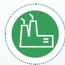

针对生产车间的纯化水设备、空调机组等开展节能改造工作，对其运行参数进行优化，降低单位产品的能源消耗。

推广 LED 节能灯，推行 “人走灯灭、随手关灯” 制度，公共区域采用感应照明设备，减少无效照明能耗。

严禁使用大功率热水器等非必要的高能耗设备，将电脑统一设置为自动待机或休眠模式。下班后，核查电脑关机情况，杜绝设备长时间待机。

优化矿化胶原的生产工艺，减少生产环节中的电力消耗，提高能源的利用效率。

制定办公区域及现场休息场所的室内温度设定标准，规范电暖器的使用时长和功率，避免出现能源过度消耗的情形。

# 应对气候变化

奥精医疗作为再生医学领域的领军企业，基于行业绿色转型趋势以及自身发展战略，系统地推进气候风险管控与低碳转型实践。公司结合医疗器械行业特性与全球气候风险框架，构建了包含四大维度的评估体系，增添了产品碳足迹合规性、低碳技术适配度等指标，以实现对全业务场景的覆盖。

<table><tr><td>评估维度</td><td>核心指标</td></tr><tr><td>物理风险抵御能力</td><td>极端温差下洁净车间稳定性、物流延误率、电力波动干扰频次</td></tr><tr><td>运营韧性</td><td>设备环境适应性通过率、应急供电响应时效、海外预案完备度</td></tr><tr><td>供应链气候韧性</td><td>供应商气候风险暴露度、跨境运输延误率、替代源储备率</td></tr><tr><td>合规适配能力</td><td>碳政策符合度、绿色认证获取进度、碳足迹备案完成率</td></tr></table>

评估结果显示,洁净车间在宽幅温差环境中可稳定维持运行状态,东南亚雨季物流配送效率实现实质性提升,电力波动对生产运营的干扰显著减小,关键业务场景的气候风险抵御能力呈持续强化态势。核心生产设备已完全适配多元气候条件,应急供电系统响应及时高效,可确保生产负荷稳定输出。核心供应商气候风险管控水平全面优化,中度气候风险合作关系已彻底清零,极端天气引发的运输波动得到合理管控,供应链整体稳定性与抗干扰能力持续改善。

# 温室气体排放

2025 年, 奥精医疗温室气体排放总量为 321.67 吨 CO₂, 该排放量仅对应外购电力产生的范围二间接排放, 核算范围覆盖北京总部、潍坊生产基地核心生产研发环节, 包含新增口腔种植体生产线及可降解材料中试车间。核算过程严格遵循《GHG Protocol 企业核算与报告标准》及《中国医疗器械行业温室气体核算指南》要求, 确保数据披露的规范性与准确性。

风险机遇清单

<table><tr><td>类别</td><td>维度</td><td>核心描述</td><td>对应战略</td></tr><tr><td>物理风险</td><td>生产运营</td><td>极端高温推高洁净车间制冷能耗,极端暴雨影响储能系统效率,精密生产设备面临停机风险</td><td>优化应急供电冗余设计</td></tr><tr><td>物理风险</td><td>供应链</td><td>东南亚雨季延长导致跨境运输延误,核心原料产地干旱风险</td><td>新增胶原蛋白供应商替代源认证</td></tr><tr><td>物理风险</td><td>海外合规</td><td>欧盟《医疗器械绿色准入新规》强化碳足迹披露要求,未达标将影响欧洲市场业务</td><td>进行产品线碳足迹核算,适配美国FDA低碳认证更新要求</td></tr><tr><td>转型风险</td><td>碳成本压力</td><td>国内碳价政策收紧,推高碳排放成本</td><td>建立碳成本动态测算模型</td></tr><tr><td>转型风险</td><td>技术迭代</td><td>行业低碳工艺升级加速,公司低碳技术产业化滞后可能错失市场机遇</td><td>加速可降解半水硫酸钙制备技术量产</td></tr></table>

针对 2025 年温室气体排放情况, 公司聚焦工艺优化这一核心方向, 积极推进减排工作。在产能稳定拓展的情形下, 通过推广低碳生产工艺、替换高能耗生产环节, 对核心生产及研发设备进行能效升级, 降低了整体能耗水平, 成功达成了环境效益与经济效益的协同发展。公司依托技术平台, 持续丰富低碳医疗产品体系。通过工艺优化、配方改良以及配套流程升级, 降低产品的碳足迹, 形成了“技术降碳—市场认可—价值提升”的良性循环。

公司推进“技术减排 + 产品降碳”双轮驱动战略，将低碳研发全面纳入核心创新体系，低碳相关研发投入占比显著提升。围绕可降解原材料制备、低碳生产工艺优化、可再生能源利用系统以及环保包装材料等关键领域开展技术攻关，预计将取得显著的减排效益和成本优化效果。

在资金配置方面, 公司重点保障低碳研发需求, 组建专业专项团队, 依托核心技术平台深入开展关键技术突破研究。同时, 公司牵头行业创新任务, 持续巩固技术领先优势。从中长期来看, 公司将稳步推进清洁能源替代、低碳工艺全面应用以及全降解材料系列化研发, 进一步降低碳排放强度, 坚定不移地推动绿色低碳转型目标的达成。

# 水资源

公司始终将水资源精细化管理深度嵌入整体运营体系，通过强化制度建设、推动技术升级以及促进全员参与这三种途径，协同推进并切实落实水资源高效利用与环境社会责任。

2025 年度, 奥精医疗在生产运营及日常办公活动中, 累计消耗水资源 35,258 立方米, 单位产值耗水量为 1.72 立方米 / 万元。其中, 生产环节与办公及辅助环节为用水的核心构成部分。同时, 公司积极构建以“生产用水高效化、办公用水精细化、再生用水规模化”为核心的水资源管理体系, 并确立了至 2030 年, 达成单位产值耗水量降低 10% 的中长期发展目标, 全力塑造医疗器械行业水资源高效利用的标杆企业形象。

公司在生产区域配套建设了专业化的污水处理设施，其主体为全封闭式模块化处理单元，内部集成了多级预处理罐体、精密压滤设备以及自动化控制系统，能够对生产废水和生活污水进行一体化规范处理，确保出水稳定达到《医疗机构水污染物排放标准》后，接入市政污水处理系统。此外，公司在核心生产车间旁搭建了标准化操作平台，便于运维人员定期对设备进行巡检、清理滤料，保障污水处理设施全年稳定运行。

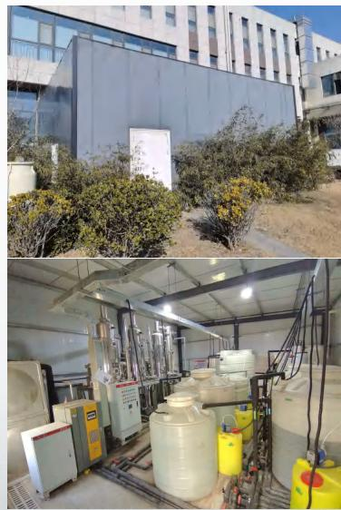

为保障水资源管理体系得以有效落实并取得实际成效，公司修订并颁布多项水资源相关管理办法，进一步细化生产、研发、办公等各环节的用水定额标准，构建了“分区计量、分级考核”的精细化管控机制。同时，公司定期开展水资源管理合规性自查工作，组织节水专项技术培训，确保全体员工均能参与，严格执行国家相关法律法规及内部管理政

策。此外，公司深入推进“绿色办公·节水先行”专项宣传与实践活动。通过在关键用水区域张贴节水标识、推行“科室用水责任到人”等措施，提升员工的节水意识，在公司内部营造出全员参与、协同合作的良好节水氛围。

鉴于公司的核心产品为高端医疗器械，生产及研发环节对用水水质要求极为严格，且当前生产工艺暂不具备与水资源回收利用相适配的技术条件，2025年度公司未开展水资源回收利用相关工作。公司产生的生产废水及生活污水均经过规范预处理后，严格依照环保要求接入市政污水处理系统。全年废水排放达标率达100%，未发生任何与水资源污染相关的违规事项。

# 物料管理与循环经济

公司始终坚守“资源高效利用、废弃物源头减量”的核心发展理念，全面落实循环经济思想，并将其深度嵌入物料采购、产品生产及废弃物处置的各个环节。

依据公司战略规划，将全面构建以“生态设计—清洁生产—循环回收”为核心的全链条循环经济体系。

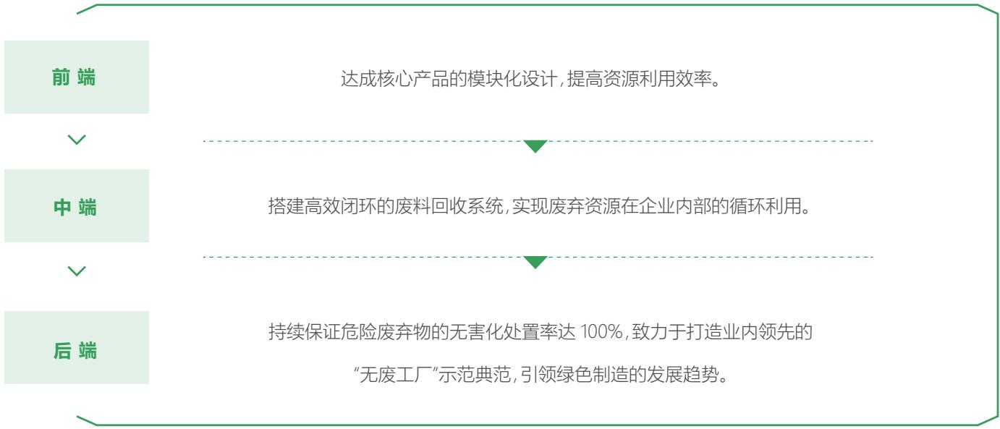

flowchart

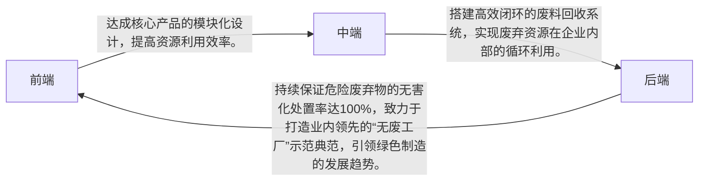
```mermaid
graph LR
  A["前端"] -->|"达成核心产品的模块化设计，提高资源利用效率。"| B["中端"]
  B -->|"搭建高效闭环的废料回收系统，实现废弃资源在企业内部的循环利用。"| C["后端"]
  C -->|"持续保证危险废弃物的无害化处置率达100%，致力于打造业内领先的“无废工厂”示范典范，引领绿色制造的发展趋势。"| A
```

在具体实践过程中，研发实验室优先选用可循环使用的玻璃反应容器，逐步淘汰一次性塑料器皿，从根源上减少塑料污染。同时，公司构建了“分区计量、动态监控”的物料管理系统，对胶原蛋白、聚酯等核心原材料实施严格的领用限额管控机制效防止资源浪费。此外，通过推行“小批量、多频次”的采购策略，大幅降低物料库存积压，提高供应链响应效率与资源周转率。

在废弃物处理领域，公司与具备专业资质的环保企业合作共建“回收专线”，对生产过程中产生的废弃塑料包装、设备保护壳等进行分类回收。经过专业的清洗、消毒、破碎及再生工艺，转化为可再次利用的工业原料，实现资源的再生价值。办公区域也全面推行纸张、纸箱分类回收举措，并与专业再生机构合作，建立每周定期回收机制，确保各类可回收物得到高效处理。2025年，公司全年生产物料总消耗量为35吨，预计到2030年将控制在30吨以内，进一步彰显出资源使用效率的显著提高和绿色运营能力的持续增强。

# 废弃物处理

奥精医疗严格恪守“分类管控、减量优先、资源化利用”核心原则，坚决筑牢生态环境安全底线。截至2025年，公司已构建起科学完善的废弃物全流程管理体系，依据废弃物危害程度及产生来源，系统划分为危险废弃物、一般工业固体废物、办公生活类垃圾三大类别。统计显示，2025年公司各类废弃物累计产生总量仅1.1吨，单位产值废弃物产生密度控制在0.05kg/万元。

为规范废弃物全链条管控,公司不仅在主要生产车间及研发实验区域科学设置专用分类收集站点,配备清晰的标识与标准化操作指南,还常态化开展生活垃圾分类科普讲座等专项培训。通过理论讲解、实操演示、案例分析等形式,助力员工精准掌握不同场景下的分类标准与投放要求。2025年,全公司废弃物收集准确率高达99.2%,从源头上杜绝了混投、错投问题。同时,企业投资建成符合国家环保标准的专用贮存场所,全面落实“防雨、防渗、防泄漏”的“三防”技术要求,筑牢暂存环节的环境安全防线。

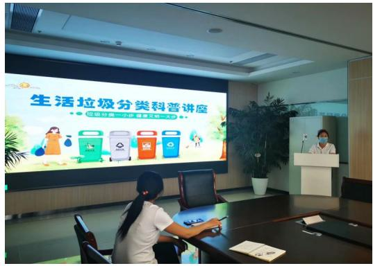

text_image

生活垃圾分类科普讲座
• 低效分类—小步 低效文章—一升步

在终端处置环节，公司坚持分类施策、精准治理，危险废弃物严格执行无害化焚烧处置，可回收部分积极推进资源再生利用，不可回收部分实施安全卫生填埋，办公及生活垃圾通过与社会分类体系协同联动，实现分类投放、分类收运与合规处置闭环。2025年度，公司各类废弃物处置合规率达100%，全年未发生任何废弃物泄漏、非法外运或环境污染相关事件。尤其在危险废弃物管理方面，企业秉持“就近处置”原则，优先遴选具备权威资质且地理位置适宜的合作单位，显著降低长途运输中的环境与安全风险。所有委托处置单位均通过年度环保信用评价，无不良环境记录，处置服务协议实现全部产废环节100%覆盖，达成全链条合规闭环管理。

展望未来, 奥精医疗致力于到 2030 年, 废弃物产生总量较 2025 年再降低 10%, 管理层面全力打造“无废工厂”示范项目, 推行废弃物全流程数字化追踪与智能化监管, 持续深化绿色、低碳、可持续发展实践, 为行业生态化转型树立标杆。

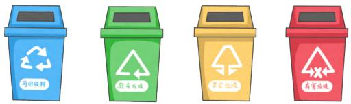

# 污染物排放

公司所产生的主要污染物可划分为废水污染物、废气污染物和噪声污染物三大类。其中，废水污染物包含 pH 值、氨氮、化学需氧量、五日生化需氧量。废气污染物包含非甲烷总烃，噪声污染物主要为厂界昼间噪声。依据第三方检测结果，所有监测指标均符合相应检测标准的限值要求，未出现超标排放的情况。

# 废水处理

生产废水经预处理工序，去除其中的悬浮物以及大块杂质。生活废水通过化粪池进行厌氧降解后，接入综合处理系统进行协同净化。经处理达标后，通过污水总排口排放至市政污水处理厂。

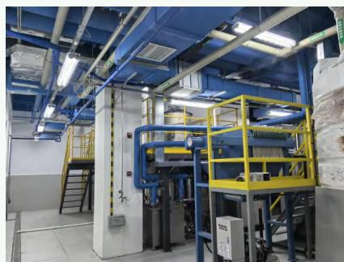

natural_image

Interior view of an industrial facility with blue overhead cranes and yellow safety equipment (no visible text or symbols)

# 废气治理

实验室通风橱以及生产工艺过程中产生的非甲烷总烃废气，经过独立的“活性炭吸附”系统进行专项净化处理后，于高空达标排放。

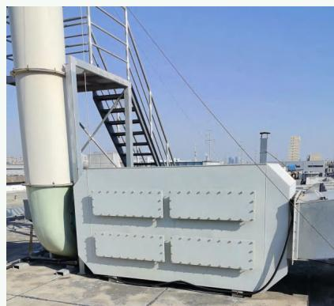

natural_image

Exterior view of a large industrial structure with metal framework and piping (no visible text or symbols)

# 噪声控制

为高噪声设备加装减震垫，以削减源头噪声，同时通过在设备区设置隔声屏障、在车间及实验室采用吸声墙体、在厂界建设隔声绿化带等多维度手段，阻断噪声传播，确保噪声排放符合相关规定。

奥精医疗再生产车间及实验室均设置非甲烷总烃浓度监测点并定期开展检测，2025年该污染物平均浓度远低于《工作场所有害因素职业接触限值》标准。针对噪声作业区域，公司为员工足额配备降噪耳塞，年度职业健康体检结果显示员工听力异常率为零。同时，再废水处理区域及废气吸附装置周边设置应急防护用品柜，配齐防毒面具、应急喷淋装置等装备，全年常态化开展突发环境事件应急演练，员工环保防护知晓率达100%，全方位筑牢职业健康安全防线。

社区环境影响方面，第三方检测全面覆盖厂界主要点位，昼间噪声值稳定在 57-59 dB(A) 之间，非甲烷总烃无组织排放浓度低于标准限值要求，未对周边居民区造成不良影响。废水经全流程处理后达标排放，无异味散发及水体污染风险，实现企业生产与社区环境的和谐共生。公司严格遵守环境保护相关法律法规，扎实落实排污许可制度，顺利完成年度排污申报及环保自主验收工作，报告期内接受北京市生态环境局现场检查均未收到整改意见，未发生任何环境违法行为及环境污染事故，无环保行政处罚记录，所有第三方检测报告均符合规范要求。

# 生物多样性保护

奥精医疗积极履行生态责任，将生态系统保护与生物多样性维护深度融入企业发展战略，持续完善潍坊、北京等核心生产基地的绿色运营体系。公司始终秉持“生物友好”创新理念，深耕矿化胶原等天然衍生材料的迭代研发，严禁使用有害化学添加剂，通过不断优化产品配方和生产工艺，构建全生命周期环境安全管控机制，确保产品从研发、生产到废弃处置的全过程均不对生态环境造成潜在危害。

公司借助博士后科研工作站的技术优势,积极探寻再生医学材料与生态保护材料的跨界融合途径,为绿色医疗材料的创新突破积累关键技术储备。在社会责任方面,公司主动与公益组织、科研机构合作,通过捐赠生态保护专项物资、资助濒危物种保护科普项目、组织员工参与生态公益志愿活动等多种举措,推动生态保护理念的广泛传播。

natural_image

Two white flamingos wading in shallow water, reflecting on calm water (no text or symbols visible)

# 结束语

深耕再生医学领域二十余载，自2004年创立之初，奥精医疗便笃定“深耕再生医学，成就生命健康美好”的核心使命，将ESG理念深度融入企业发展的脉络之中。从技术研发的艰难攻关到生产运营的精细管控，从市场拓展的稳步规划到社会回馈的暖心实践，奥精医疗在环境守护、社会担当与治理优化的道路上坚定前行，以切实的行动诠释着医疗企业的责任本色与人文关怀。

奥精医疗始终秉持“绿色生产，可持续发展”的核心观念，将环保要求贯穿于生产全流程的每一处细节。北京总部基地与山东产业园均严格遵循绿色建筑设计标准，厂房建设中巧妙融入高效节能保温材料与自然采光系统，最大程度降低建筑能耗，让绿色理念在基建根基中扎根。

在社会担当方面，奥精医疗始终聚焦“以科技守护生命”的初心本质，以创新技术为健康中国建设注入强大动力。公司核心产品矿化胶原人工骨修复材料，凭借卓越的临床性能已累计应用超200万例，覆盖骨科、神经外科、口腔科等多个诊疗领域，为无数骨缺损患者带来重获健康的再生希望。2024年获批的胶原蛋白海绵，凭借其卓越的止血效果与组织修复能力成功纳入联盟集采，让优质医疗资源打破壁垒，惠及更多普通患者家庭。

展望未来，奥精医疗将以更高标准明确ESG进阶方向，持续深化绿色生产转型，推动环保举措向更精准、更细致、更实在迈进。公司将携自主研发的骨修复材料与口腔种植体等核心产品，继续深耕美国、东南亚、中东等已准入市场，同时积极推进巴西、南非、韩国等国家的市场准入申请，让源自中国的优质再生医学技术跨越国界，为全球患者带来健康福祉。

再生医学的本质是“以科技守护生命”，而ESG正是这一使命的拓展与升华。未来，奥精医疗将继续以创新为笔、责任为墨，在推动骨修复材料技术持续突破的同时，始终兼顾环境效益与社会价值的协同发展，奋力朝着全球再生医学领域ESG实践标杆企业的目标迈进。公司将始终立足中国、放眼全球，为“健康中国”战略的深入实施与医疗行业的可持续发展贡献更多兼具技术实力与责任担当的“中国方案”，以稳健姿态迈向更绿色、更具责任感、更有温度的未来，让再生医学的温暖光芒照亮更多生命历程。

附录

<table><tr><td>使用说明</td><td colspan="2">奥精医疗科技股份有限公司在2025年1月1日至2025年12月31日参考GRI标准编制报告。</td></tr><tr><td>使用的GRI 1</td><td colspan="2">GRI 1:基础 2021</td></tr><tr><td>GRI标准</td><td>披露项</td><td>所在章节</td></tr><tr><td rowspan="16">GRI 2:一般披露 2021</td><td>2-1 组织详细情况</td><td>走进奥精医疗</td></tr><tr><td>2-2 纳入组织可持续发展报告的实体</td><td>关于本报告</td></tr><tr><td>2-3 报告期、报告频率和联系人</td><td>关于本报告</td></tr><tr><td>2-4 信息重述</td><td>关于本报告</td></tr><tr><td>2-5 外部鉴证</td><td>关于本报告</td></tr><tr><td>2-6 活动、价值链和其他业务关系</td><td>走进奥精医疗</td></tr><tr><td>2-7 员工</td><td>员工权益</td></tr><tr><td>2-8 员工之外的工作者</td><td>NA</td></tr><tr><td>2-9 管治架构和构成</td><td>可持续发展管理</td></tr><tr><td>2-10 最高治理机构的提名和遴选</td><td>NA</td></tr><tr><td>2-11 最高治理机构主席</td><td>NA</td></tr><tr><td>2-12 在管理影响方面,最高管治机构的监督作用</td><td>NA</td></tr><tr><td>2-13 为管理影响的责任授权</td><td>NA</td></tr><tr><td>2-14 最高治理机构在可持续发展报告中的作用</td><td>公司治理</td></tr><tr><td>2-15 利益冲突</td><td>合规经营</td></tr><tr><td>2-16 关键问题的沟通</td><td>投资者关系管理</td></tr></table>

<table><tr><td>GRI标准</td><td>披露项</td><td>所在章节</td></tr><tr><td rowspan="14">GRI 2:一般披露 2021</td><td>2-17 最高治理机构的共同知识</td><td>NA</td></tr><tr><td>2-18 对最高管治机构的绩效评估</td><td>NA</td></tr><tr><td>2-19 薪酬政策</td><td>NA</td></tr><tr><td>2-20 确定薪酬的程序</td><td>NA</td></tr><tr><td>2-21 年度总薪酬比率</td><td>NA</td></tr><tr><td>2-22 关于可持续发展战略的声明</td><td>董事长致辞</td></tr><tr><td>2-23 政策承诺</td><td>公司治理</td></tr><tr><td>2-24 融合政策承诺</td><td>公司治理</td></tr><tr><td>2-25 补救负面影响的程序</td><td>NA</td></tr><tr><td>2-26 寻求建议和提出关切的机制</td><td>可持续发展管理</td></tr><tr><td>2-27 遵守法律法规</td><td>合规经营</td></tr><tr><td>2-28 协会的成员资格</td><td>NA</td></tr><tr><td>2-29 利益相关方参与的方法</td><td>可持续发展管理</td></tr><tr><td>2-30 集体谈判协议</td><td>NA</td></tr><tr><td rowspan="3">GRI 3:实质性议题 2021</td><td>3-1 确定实质性议题的过程</td><td>可持续发展管理</td></tr><tr><td>3-2 实质性议题清单</td><td>可持续发展管理</td></tr><tr><td>3-3 实质性议题的管理</td><td>可持续发展管理</td></tr><tr><td rowspan="4">GRI 201:经济绩效 2016</td><td>201-1 直接产生和分配的经济价值</td><td>NA</td></tr><tr><td>201-2 气候变化带来的财务影响和其他风险和机遇</td><td>应对气候变化</td></tr><tr><td>201-3 固定福利计划义务和其他退休计划</td><td>员工权益</td></tr><tr><td>201-4 政府给予的财政补贴</td><td>NA</td></tr><tr><td rowspan="2">GRI 202:市场表现 2016</td><td>202-1 按性别划分的标准起薪水平工资与当地最低工资的之比</td><td>NA</td></tr><tr><td>202-2 从当地社区雇佣的高管的比例</td><td>NA</td></tr><tr><td rowspan="2">GRI 203:间接经济影响2016</td><td>203-1 基础设施投资和支持性服务</td><td>NA</td></tr><tr><td>203-2 重大间接经济影响</td><td>NA</td></tr><tr><td>GRI 204:采购实践 2016</td><td>204-1 向当地供应商采购的支出比例</td><td>NA</td></tr><tr><td rowspan="3">GRI 205:反腐败 2016</td><td>205-1 已经进行腐败风险评估的运营点</td><td>合规经营</td></tr><tr><td>205-2 反腐败政策和程序的传达及培训</td><td>合规经营</td></tr><tr><td>205-3 经确认的腐败事件和采取的行动</td><td>合规经营</td></tr><tr><td>GRI 206:反竞争行为 2016</td><td>206-1 针对反竞争行为、反托拉斯和反垄断实践的法律诉讼</td><td>NA</td></tr><tr><td rowspan="4">GRI 207:税收 2019</td><td>207-1 税务方针</td><td>NA</td></tr><tr><td>207-2 税收治理、控制和风险管理</td><td>NA</td></tr><tr><td>207-3 利益相关方参与和管理与税收有关的问题</td><td>NA</td></tr><tr><td>207-4 国别报告</td><td>NA</td></tr><tr><td rowspan="3">GRI 301:物料 2016</td><td>301-1所用物料的重量或体积</td><td>物料管理与循环经济</td></tr><tr><td>301-2 所用循环利用的进料</td><td>物料管理与循环经济</td></tr><tr><td>301-3 再生产品及其包装材料</td><td>物料管理与循环经济</td></tr><tr><td rowspan="5">GRI 302:能源 2016</td><td>302-1 组织内部的能源消耗量</td><td>能源管理</td></tr><tr><td>302-2 组织外部的能源消耗量</td><td>NA</td></tr><tr><td>302-3 能源强度</td><td>NA</td></tr><tr><td>302-4 减少能源消耗</td><td>能源管理</td></tr><tr><td>302-5 产品和服务的能源需求下降</td><td>NA</td></tr></table>

<table><tr><td>GRI标准</td><td>披露项</td><td>所在章节</td></tr><tr><td rowspan="5">GRI 303:水资源和污水 2018</td><td>303-1 组织与水作为共有资源的相互影响</td><td>NA</td></tr><tr><td>303-2 管理与排水相关的影响</td><td>水资源</td></tr><tr><td>303-3 取水</td><td>NA</td></tr><tr><td>303-4 排水</td><td>水资源</td></tr><tr><td>303-5 耗水</td><td>水资源</td></tr><tr><td rowspan="4">GRI 304:生物多样性 2016</td><td>304-1 组织在位于或邻近保护区和保护区外的生物多样性丰富区域拥有、租赁、管理的运营点</td><td>NA</td></tr><tr><td>304-2 活动、产品和服务对生物多样性的重大影响</td><td>NA</td></tr><tr><td>304-3 受保护或经修复的栖息地</td><td>NA</td></tr><tr><td>304-4 受运营影响的栖息地中已被列入世界自然保护联盟(IUCN)红色名录及国家保护名册的物种</td><td>NA</td></tr><tr><td rowspan="7">GRI 305:排放 2016</td><td>305-1 直接(范围 1)温室气体排放</td><td>应对气候变化</td></tr><tr><td>305-2 能源间接(范围 2)温室气体排放</td><td>应对气候变化</td></tr><tr><td>305-3 其他间接(范围 3)温室气体排放</td><td>NA</td></tr><tr><td>305-4 温室气体排放强度</td><td>NA</td></tr><tr><td>305-5 温室气体减排量</td><td>NA</td></tr><tr><td>305-6 臭氧消耗物质(ODS)的排放</td><td>NA</td></tr><tr><td>305-7 氮氧化物 (NOx)、硫氧化物 (SOx) 和其他重大气体排放</td><td>污染物排放</td></tr><tr><td rowspan="5">GRI 306:废弃物 2020</td><td>306-1 废弃物的产生及废弃物相关重大影响</td><td>NA</td></tr><tr><td>306-2 废弃物相关重大影响的管理</td><td>NA</td></tr><tr><td>306-3 产生的废弃物</td><td>废弃物处理</td></tr><tr><td>306-4 从处置中转移的废弃物</td><td>废弃物处理</td></tr><tr><td>306-5 进入处置的废弃物</td><td>废弃物处理</td></tr><tr><td rowspan="2">GRI 308:供应商环境评估2016</td><td>308-1 使用环境评价维度筛选的新供应商</td><td>可持续供应链</td></tr><tr><td>308-2 供应链中的负面环境影响以及采取的行动</td><td>可持续供应链</td></tr><tr><td rowspan="3">GRI 401:雇佣2016</td><td>401-1 新进员工雇佣率和员工流动率</td><td>NA</td></tr><tr><td>401-2 提供给全职员工(不包括临时或兼职员工)的福利</td><td>员工权益</td></tr><tr><td>401-3 育儿假</td><td>员工权益</td></tr><tr><td>GRI 402:劳资关系2016</td><td>402-1 有关运营变更的最短通知期</td><td>NA</td></tr><tr><td rowspan="10">GRI 403:职业健康与安全2018</td><td>403-1职业健康安全管理体系</td><td>职业健康安全</td></tr><tr><td>403-2 危害识别、风险评估和事故调查</td><td>职业健康安全</td></tr><tr><td>403-3 职业健康服务</td><td>职业健康安全</td></tr><tr><td>403-4 职业健康安全事务:工作者的参与、意见征询和沟通</td><td>职业健康安全</td></tr><tr><td>403-5 工作者职业健康安全培训</td><td>职业健康安全</td></tr><tr><td>403-6 促进工作者健康</td><td>职业健康安全</td></tr><tr><td>403-7 预防和减缓与业务关系直接相关的职业健康安全影响</td><td>职业健康安全</td></tr><tr><td>403-8 职业健康安全管理体系覆盖的工作者</td><td>职业健康安全</td></tr><tr><td>403-9 工伤</td><td>职业健康安全</td></tr><tr><td>403-10 工作相关的健康问题</td><td>职业健康安全</td></tr><tr><td rowspan="3">GRI 404:培训与教育2016</td><td>404-1 每名员工每年接受培训的平均小时数</td><td>员工培训发展</td></tr><tr><td>404-2 员工技能提升方案和过渡援助方案</td><td>员工培训发展</td></tr><tr><td>404-3 定期接受绩效和职业发展考核的员工百分比</td><td>员工培训发展</td></tr><tr><td rowspan="2">GRI 405:多元性与平等机会2016</td><td>405-1 管治机构与员工的多元化</td><td>员工权益</td></tr><tr><td>405-2 男女基本工资和报酬的比例</td><td>员工权益</td></tr></table>

<table><tr><td>GRI标准</td><td>披露项</td><td>所在章节</td></tr><tr><td>GRI 406:反歧视2016</td><td>406-1歧视事件及采取的纠正行动</td><td>员工权益</td></tr><tr><td>GRI 407:结社自由与集体谈判2016</td><td>407-1结社自由和集体谈判权可能面临风险的运营点和供应商</td><td>NA</td></tr><tr><td>GRI 408:童工2016</td><td>408-1具有重大童工事件风险的运营点和供应商</td><td>员工权益</td></tr><tr><td>GRI 409:强迫或强制劳动2016</td><td>409-1具有强迫或强制劳动事件重大风险的运营点和供应商</td><td>员工权益</td></tr><tr><td>GRI 410:安保实践2016</td><td>410-1接受过在人权政策或程序方面培训的安保人员</td><td>NA</td></tr><tr><td>GRI 411:原住民权利2016</td><td>411-1涉及侵犯原住民权利的事件</td><td>NA</td></tr><tr><td rowspan="2">GRI 413:当地社区2016</td><td>413-1有当地社区参与、影响评估和发展计划的运营点</td><td>NA</td></tr><tr><td>413-2对当地社区有实际或潜在重大负面影响的运营点</td><td>NA</td></tr><tr><td rowspan="2">GRI 414:供应商社会评估2016</td><td>414-1使用社会标准筛选的新供应商</td><td>可持续供应链</td></tr><tr><td>414-2供应链中的负面社会影响和采取的行动</td><td>可持续供应链</td></tr><tr><td>GRI 415:公共政策2016</td><td>415-1政治捐助</td><td>社会贡献</td></tr><tr><td rowspan="2">GRI 416:客户健康与安全2016</td><td>416-1评估产品和服务类别的健康与安全影响</td><td>产品质量安全</td></tr><tr><td>416-2涉及产品和服务的健康与安全影响的违规事件</td><td>产品质量安全</td></tr><tr><td rowspan="3">GRI 417:营销与标识2016</td><td>417-1对产品和服务信息与标识的要求</td><td>NA</td></tr><tr><td>417-2涉及产品和服务信息与标识的违规事件</td><td>NA</td></tr><tr><td>417-3涉及营销传播的违规事件</td><td>NA</td></tr><tr><td>GRI 418:客户隐私2016</td><td>418-1涉及侵犯客户隐私和丢失客户资料的经证实的投诉</td><td>信息安全</td></tr></table>

# 意见反馈

非常感谢您在百忙之中阅读本报告，为持续优化公司 ESG 管理工作与报告质量，不断提升 ESG 能力与水平，我们诚挚邀请您对本报告提出宝贵的意见和建议。我们将充分吸纳您的反馈，并承诺妥善保护您的信息。

<table><tr><td>评价维度</td><td>选项(请勾选)</td></tr><tr><td>综合满意度</td><td>□非常满意 □满意 □一般 □不满意 □非常不满意</td></tr><tr><td>信息披露完整性</td><td>□全面 □较全面 □一般 □不完整</td></tr><tr><td>逻辑清晰度与可读性</td><td>□优秀 □良好 □一般 □较差</td></tr><tr><td>数据可信度与可比性</td><td>□高 □较高 □一般 □低</td></tr></table>

# 优化建议

1. 数据披露改进方向：  
2. □补充年度同比/环比数据 □明确统计口径与覆盖范围 □增加第三方验证报告 □补充细分业务板块数据
□其他\_\_\_\_  
2. 案例与成效呈现建议：  
□ 增加具体项目落地案例 □ 强化数据与成果关联性 □ 补充行业对标分析 □ 减少空泛表述 □ 其他 \_\_\_\_  
3. 报告形式优化建议：  
□ 增加可视化图表 □ 优化章节结构 □ 增加核心数据摘要 □ 其他 \_\_\_\_  
4. 希望重点强化的 ESG 工作领域:  
□气候行动 □供应链 ESG 管理 □员工发展 □产品创新 □社区贡献 □其他 \_\_\_\_

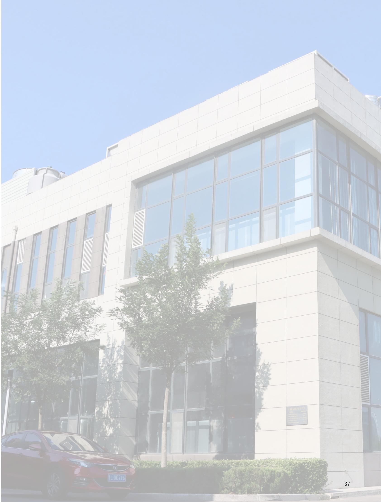

natural_image

Exterior view of a modern multi-story building with glass windows and surrounding trees under clear sky (no signage or text visible)

# 2025年度

# 环境、社会和公司治理（ESG）报告

Environmental, Social and Governance Report

# 奥精医疗科技股份有限公司

  
求奥之真解，达精之境界

修复受损骨骼，我们不断探索；守护患者健康，我们从未止步。

www.allgensmed.cn

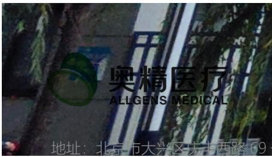

text_image

奥精医疗
ALLGENS MEDICAL
地址：北京市大兴区北丰西路69号

地址：北京市大兴区庆丰西路69号中关村医疗器械园二期35号楼

电话：010-56330931

邮箱：information@allgensmed.com

邮编：102609

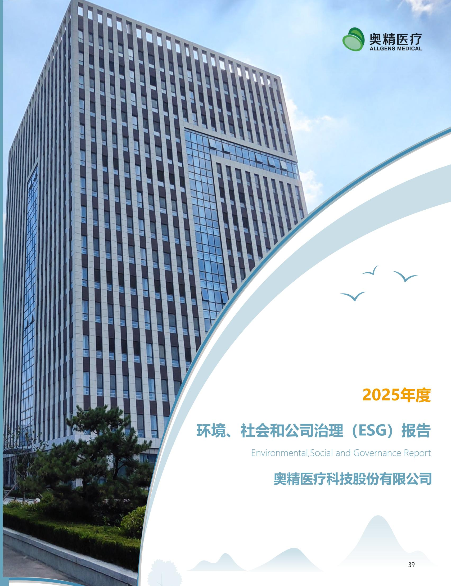

text_image

奥精医疗
ALLGENS MEDICAL
2025年度
环境、社会和公司治理（ESG）报告
Environmental, Social and Governance Report
奥精医疗科技股份有限公司
39

2025年度

环境、社会和公司治理（ESG）报告

Environmental, Social and Governance Report

奥精医疗科技股份有限公司

# 2025年度

# 环境、社会和公司治理（ESG）报告

# Environmental, Social and Governance Report

# 奥精医疗科技股份有限公司

求奥之真解，达精之境界

修复受损骨骼，我们不断探索；守护患者健康，我们从未止步。

www.allgensmed.cn