

natural_image

Abstract digital circuit board with glowing blue lines and a central chip, no text or symbols present

华微科技

# 2025年度

# 环境、社会及公司治理(ESG)报告

成都华微电子科技股份有限公司

股票代码：688709

# 目录

# CONTENTS

# 报告编制说明 01

# 走进华微 03

公司介绍 03

董事长致辞 05

2025年大事记 07

2025年年度关键绩效 09

# ESG治理架构 13

# 利益相关方沟通 15

# 重要性议题分析 17

# 23 党建引领 笃行致远

# 29 秉信持规 行稳致远

公司治理 31

投资者关系与股东权益 33

合规运营 35

风险管理 36

商业道德与反腐败 37

反垄断与反不正当竞争 41

# 43 笃行责任 聚力赋能

创新驱动 45

产品质量与安全 54

客户关系管理 61

人力资本 63

供应链管理 81

信息安全与隐私保护 85

数字化转型 90

平等对待中小企业 91

社会贡献 93

负责任矿产 94

# 95 守护生态 永续发展

应对气候变化 97

能源利用与管理 101

绿色运营 102

水资源利用与管理 103

绿色包装 106

污染物排放与管理 107

废弃物排放与管理 108

土地利用和生物多样性 109

环境合规管理 110

# ESG数据绩效一览表 113

# 可持续发展报告监管指引索引对照表 122

# 报告编制说明

本报告是成都华微电子科技股份有限公司发布的《2025年度环境、社会和公司治理（ESG）报告》，我们致力于通过透明、详实的信息披露，如实反映公司2025年度在环境、社会及治理维度的治理绩效，并与广泛利益相关方进行坦诚沟通并系统回应各方的关切与期望。

# 重要提示

1. 环境、社会和公司治理报告（以下简称“本报告”）经公司第二届董事会第九次会议审议通过。  
2. 公司董事会及全体董事保证本报告内容不存在虚假记载、误导性陈述或重大遗漏，并对本报告内容的真实性、准确性和完整性承担法律责任。  
3. 本报告以PDF电子文件格式登载于上海证券交易所网站https://www.sse.com.cn。

# 报告范围

除另有说明，本报告主体与公司《2025年年度报告》一致，包括财务报表合并范围内的所有附属公司。

# 时间范围

2025年1月1日至2025年12月31日，为保持信息的连续性，对部分内容进行了回溯和延伸。

# 编制依据

本报告遵循《上海证券交易所上市公司自律监管指引第14号——可持续发展报告（试行）》（以下简称《指引》）、财政部《企业可持续披露准则——基本准则（试行）》《央企控股上市公司ESG专项报告参考指标体系》并参考GRI可持续发展报告标准、ISSB准则及国内外主流ESG评级体系等标准进行编制。

# 信息说明

本报告引用的全部信息数据均来自公司正式文件、统计报告与财务报告。

# 称谓说明

为了便于表述与阅读，本报告中“成都华微”“公司”“我们”代指成都华微电子科技股份有限公司。除另有说明，本报告所使用的词汇及子公司简称与公司《2025年年度报告》所界定者具有相同涵义。

# 报告获取及反馈

报告发布周期为每年一次，以简体中文电子版形式发布。

欢迎登录上海证券交易所网站（http://www.sse.com.cn）进行查阅和下载。

# 走进华微

# 公司介绍

成都华微电子科技股份有限公司是中国电子信息产业集团有限公司旗下中国振华电子集团有限公司控股企业，于2000年3月成立，注册资本6.37亿元。公司为科创板上市企业，股票代码688709。

成都华微专注于集成电路的研发、设计、测试与销售，目前公司已形成逻辑芯片、模拟芯片、存储芯片、微控制器、时间敏感网络等多系列集成电路产品，同时为客户提供ASIC/SoC系统芯片级解决方案，是国家“909”工程集成电路设计公司和国家首批认证的集成电路设计企业，也是高可靠性集成电路领域的核心供应商。

成都华微拥有科学技术部集成电路设计中心、科学技术部国家高技术研究发展计划成果产业化基地、工业和信息化部“芯火”双创基地等国家级研发与产业化平台，中国合格评定国家认可委员会CNAS认证的国家级检测中心，四川省可编程逻辑器件工程技术研究中心、四川省企业技术中心、四川省信息安全产业重点培育企业等省级研发与产业化平台。公司是高新技术企业、四川省技术创新发展能力百强企业、成都市集成电路产业链链主企业，也是四川省专利奖获得企业、成都市知识产权试点企业。

成都华微连续承接“十一五”“十二五”“十三五”FPGA国家科技重大专项，以及“十三五”高速高精度ADC国家科技重大专项、高速高精度ADC国家重点研发计划、自适应智能SoC芯片国家重点研发计划，是国内为数不多的同时承担数字类、模拟类集成电路国家科技重大专项的公司之一。

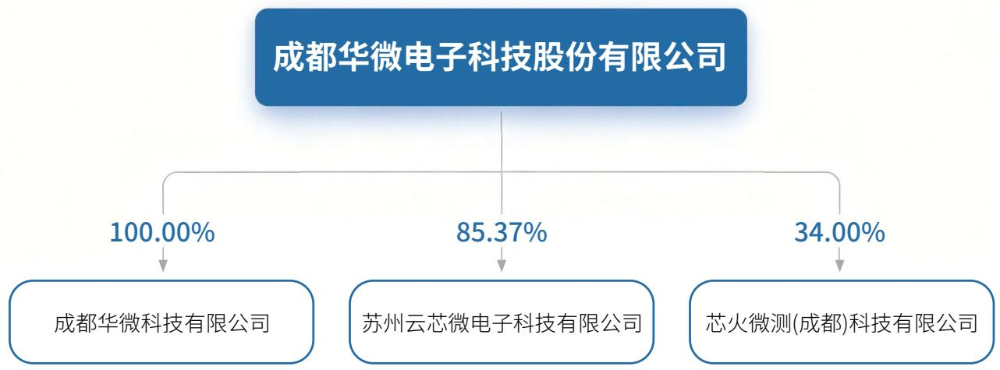

flowchart

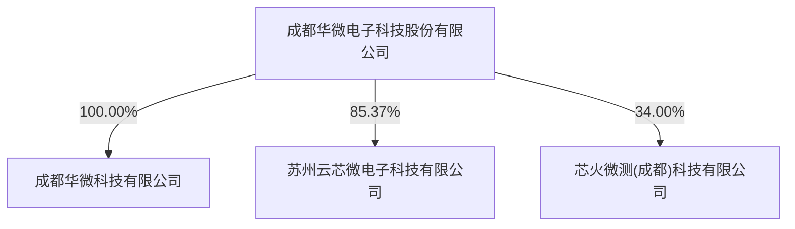
```mermaid
graph TD
  A["成都华微电子科技股份有限公司"] -->|100.00%| B["成都华微科技有限公司"]
  A -->|85.37%| C["苏州云芯微电子科技有限公司"]
  A -->|34.00%| D["芯火微测(成都)科技有限公司"]
```

# 董事长致辞

# 科技创新是企业发展的核心动力，社会责任是企业行稳致远的根本底色，绿色低碳是企业高质量发展的必由之路，人才队伍是企业持续成长的坚实根基。

作为专注于高端集成电路领域的科技创新企业，成都华微始终坚守自主创新初心，勇担科技自立自强使命，将可持续发展理念深度融入公司战略、运营管理与长期发展之中，以技术突破赋能国家战略，以责任担当回馈社会各界信任。

# 推进绿色低碳发展，助力“双碳”目标实现

公司将绿色发展理念深度融入研发设计、运营管理与产业链协同全过程，以技术创新推动全生命周期低碳化，助力国家“双碳”目标实现。公司积极加入零碳信息通信网络联合实验室，牵头制定超低功耗芯片技术标准，通过低功耗架构设计与高效能算法优化，从源头降低芯片与系统能耗，推动全行业碳减排。公司倡导绿色办公与低碳出行，开展绿色低碳主题实践活动，以低碳通勤、资源节约、节能降耗等形式引导员工践行环保理念，营造绿色低碳文化氛围。同时，公司持续优化运营能耗管理，推进资源节约与循环利用，不断提升环境管理水平，以绿色创新与务实行动绘就高质量发展底色。

# 坚持科技创新驱动，助力产业链自主安全

公司坚持以科技创新为核心驱动力，持续加大研发投入，聚焦高端集成电路领域关键核心技术攻关，着力突破技术瓶颈，构建自主安全、安全高效的产品与技术体系。报告期内，公司成功推出4通道12位40G高速高精度射频直采ADC芯片，填补国内外同类型产品空白，技术水平达到国际领先。公司持续完善超高速数据转换器、射频收发芯片、抗辐照FPGA、时间敏感网络（TSN）等高端产品矩阵，广泛应用于雷达、卫星互联网、6G通信、商业航天、高端仪器仪表等国家战略领域，以硬核科技赋能产业链供应链自主安全与高质量发展。

# 强化人才强企战略，筑牢高质量发展人才根基

人才是成都华微最宝贵的资产。2025年，公司持续优化人才引育留用机制，研发人员占比 $52.63\%$ ，人才结构与创新活力持续提升。人才团队建设与激励机制入选国务院国资委科改示范案例，市场化激励与长效约束更加完善。我们坚守“幸福员工”理念，健全薪酬福利、职业发展、培训赋能与关怀保障体系，持续开展“书记面对面”、员工慰问与多彩文化活动，年度培训投入稳步提升。严守安全生产红线，顺利通过安全生产标准化复评，为全体员工营造安全、健康、尊重、成长的工作环境。

# 践行企业社会责任，实现多方价值共赢

公司坚守上市公司责任担当，构建“客户价值引领、股东价值创造、员工价值实现、社会价值共享”的四维价值生态，积极推动产业协同、人才培育与社会公益。公司深化产学研合作，与行业伙伴联合搭建创新实验室，围绕核心芯片、高算力应用等方向开展技术攻关，共建开放共赢的产业生态。积极投身乡村振兴与民生改善事业，以科技赋能创造社会价值；持续完善员工关怀与职业发展体系，保障员工合法权益，营造包容、平等、奋进的职场环境，以实际行动实现经济效益与社会效益协同发展。

展望未来，成都华微将继续以科技创新为引擎，以可持续发展为指引，坚守产业报国初心，深耕集成电路核心领域，不断提升技术实力、治理水平与责任担当，与客户、伙伴、员工及社会各界携手共进，在推动行业进步、服务国家战略的征程中展现更大作为，奋力书写高质量可持续发展的新篇章。

成都华微电子科技股份有限公司

# 2025年大事记

# 2025年3月

与四川具身人形机器人科技有限公司签署战略合作协议，助力中国智能机器人产业高质量发展。

# 2025年6月

正式发布国际领先、国内独家的全自主正向设计4通道12位高速高精度A/D转换器HWD12B16GA4，定义了国产高速高精度ADC的行业新标杆。

# 2025年8月

发布HWD01001型超低功耗RISC-VMCU，集成了公司自主设计的32位RISC-V内核，实现超低功耗性能，为下游客户轻量化、低功耗、低延迟、小型化需求提供了系统化的解决方案。

与上海燧原科技股份有限公司签署战略合作协议，推动人工智能技术在高可靠领域的应用与创新。

# 2025年9月

荣获硬核信号链芯片奖。

推出国产首颗4通道12位40G高速高精度射频直采ADC芯片-HWD12B40GA4，填补了国内外同类型产品的空白，达到国际领先技术水平。

# 2025年10月

“成都华微高端集成电路研发及产业基地项目”完成验收并顺利完成搬迁和入驻，芯谷园区正式投入使用。

正式发布公司在零中频射频收发器方向的首款产品两收两发射频捷变收发芯片HWD9361。公司在射频收发芯片领域实现重大突破，拓展了公司高速信号链产品谱系，拓宽了市场空间。

# 2025年12月

获颁中国商用飞机有限责任公司（COMAC）试验服务合格供方认证，是公司检测服务业务领域里程碑式突破，标志着公司在民用航空、商业航天、AI端测领域的市场地位和技术水平再上新台阶。

# 2025 年年度关键绩效

<table><tr><td>资产总额
430,477.90万元</td><td>营业收入
75,998.73万元</td></tr><tr><td>归属上市公司股东净利润
15,360.55万元</td><td></td></tr><tr><td colspan="2">纳税总额
10,049.6万元</td></tr></table>

<table><tr><td>温室气体排放量（范围一）</td><td>温室气体排放量（范围二）</td></tr><tr><td>20.07 吨二氧化碳当量</td><td>4,580.25 吨二氧化碳当量</td></tr><tr><td>温室气体排放量（范围三）</td><td>能源消耗总量 1,078.90 吨标准煤</td></tr><tr><td>32.43 吨二氧化碳当量</td><td></td></tr><tr><td>百万营收温室气体排放量降低 13.57 %</td><td>百万营收能源消耗降低 11.80 %</td></tr></table>

<table><tr><td>员工总数
990人</td><td>女性员工比例
26.77%</td></tr><tr><td>员工年人均培训时长
33小时</td><td>女性董事人数
1人</td></tr></table>

<table><tr><td rowspan="2">研发投入</td><td rowspan="2">11,300.67万元</td><td rowspan="2">研发人数</td><td rowspan="2">521人</td></tr><tr></tr><tr><td>研发人数占比</td><td>52.63%</td><td>研发投入占总营业收入比例</td><td>14.87%</td></tr></table>

# 荣誉奖项

荣获中国上市公司协会

2025年上市公司可持续发展优秀实践案例

荣获中国证券报与中国国新第三届国新杯

ESG卓越央企金牛奖

荣获中共中国电子信息产业集团有限公司党组

成都华微亿门级FPGA

党员攻关团队优秀党员攻关团队

荣获国家税务总局成都高新技术产业开发区税务局

2020-2024年度连续五年纳税信用级别A级

荣获中国船舶集团有限公司第七一0研究所

优秀供应商(2025)

荣获中国振华电子集团有限公司

中国振华2025年度生产经营先进单位

荣获四川省发展和改革委员会

四川省营商环境检测服务点位

荣获中国航天科工集团有限公司

一级供应商

荣获武汉航空仪表有限责任公司

核心合作伙伴

荣获中国电子

中国电子单项冠军

# ESG治理架构

为深入贯彻可持续发展理念，成都华微积极将环境、社会与公司治理（ESG）议题全面融入日常运营管理体系。董事会作为公司可持续发展的决策层，下设战略与ESG委员会作为公司可持续发展的管理层，致力于完善可持续发展战略规划，健全公司治理结构，全面提升可持续发展管理水平。在执行层面，公司设立可持续发展跨部门工作小组（简称“ESG工作小组”），承担着将ESG战略目标精准分解、政策要求迅速下达的关键任务，同时构建起动态、高效的风险防控与沟通机制，确保ESG实践在公司各个层面得以良好落地。

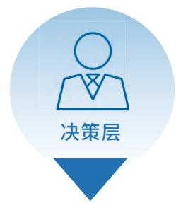

# 董事会 (董事会成员)

- 了解、分析和掌握国际国内行业现状和可持续发展相关政策，了解并掌握公司经营管理的全面情况  
- 监督公司的可持续发展相关影响、风险和机遇的评估  
- 指导及审阅公司可持续发展方针、战略及目标  
- 定期监督可持续发展相关目标进展及完成情况  
- 审批公司《环境、社会和治理(ESG)报告》和可持续发展目标  
- 对可持续发展相关工作执行情况进行监督检查，并适时提出指导意见等

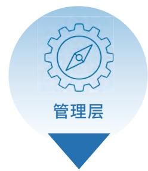

# 战略与ESG委员会 (外部董事、独立董事、相关高级管理人员)

- 管理公司重要性议题和跟踪第三方评级结果以提供分析、建议供决策层讨论  
- 确定及管理为识别、减缓、管理及监察可持续发展相关影响、风险和机遇所需分配的成本及资源  
- 拟定可持续发展工作计划，以及可持续发展激励及考核制度等

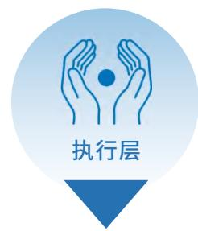

# ESG执行小组 (每个专项议题的小组成员，如科技创新工作小组成员、安全生产小组成员、产品质量与服务工作小组成员等)

- 实时跟踪国际国内可持续发展政策动态和第三方评级机构的评级结果，并汇报给管理层  
- 协调编制《环境、社会和治理(ESG)报告》  
- 负责公司各可持续议题的相关管理、数据统计与分析  
- 完善可持续发展相关管理制度,执行可持续发展工作计划

# 利益相关方沟通

成都华微高度重视利益相关方对公司可持续发展战略与实践的意见和期望，并将其作为优化可持续发展工作的重要依据。公司结合自身业务属性与经营实际，系统识别核心利益相关方，持续健全多元化沟通与反馈机制。

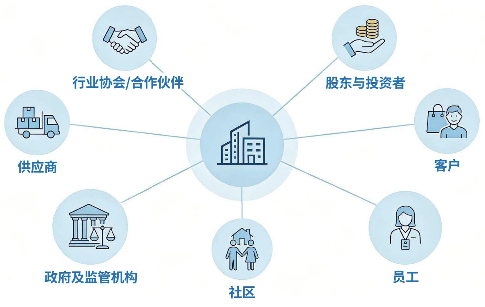

flowchart

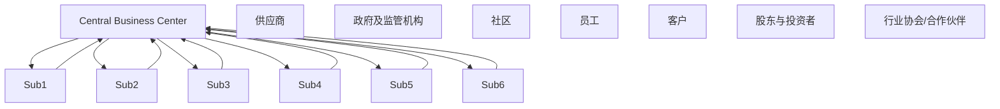
```mermaid
graph TD
  Center["Central Business Center"]
  
  sub1["供应商"]
  sub2["政府及监管机构"]
  sub3["社区"]
  sub4["员工"]
  sub5["客户"]
  sub6["股东与投资者"]
  sub7["行业协会/合作伙伴"]
  
  Center --> Sub1
  Center --> Sub2
  Center --> Sub3
  Center --> Sub4
  Center --> Sub5
  Center --> Sub6
  
  Sub1 --> Center
  Sub2 --> Center
  Sub3 --> Center
  Sub4 --> Center
  Sub5 --> Center
  Sub6 --> Center
```

<table><tr><td>利益相关方</td><td>主要关切问题</td><td>主要沟通渠道</td></tr><tr><td>股东与投资者</td><td>公司治理合规与风险管理商业道德与反腐败公司发展规划与财务表现透明、可信的信息披露</td><td>股东会定期信息披露线上互动机构调研</td></tr><tr><td>客户</td><td>产品质量与安全客户关系管理创新驱动信息安全与隐私</td><td>产品质量控制客户拜访售后服务客户满意度调查</td></tr><tr><td>员工</td><td>员工安全与健康员工发展与培训员工雇佣与关怀</td><td>员工会议员工满意度调查</td></tr><tr><td>社区</td><td>环境保护社区贡献</td><td>社区公益活动社区意见反馈渠道</td></tr><tr><td>政府及监管机构</td><td>合规与风险管理公司治理促进就业依法纳税</td><td>监管部门检查与调研定期会议及沟通活动</td></tr><tr><td>供应商</td><td>公平采购供应链关系平等对待中小企业</td><td>供应商审核与沟通开放合作合同履约</td></tr><tr><td>行业协会/合作伙伴</td><td>行业知识交流公平有序的竞争</td><td>行业论坛及研讨会专家顾问交流</td></tr></table>

# 重要性议题分析

报告期内，公司严格按照相关监管要求，开展了全面系统的可持续发展重要性议题评估。本次评估在公司既往重要性分析基础上，遵循《上海证券交易所上市公司自律监管指引第14号——可持续发展报告（试行）》（以下简称《指引》）、财政部《企业可持续披露准则——基本准则（试行）》，并参考《央企控股上市公司ESG专项报告参考指标体系》、GRI可持续发展报告标准、ISSB准则及国内外主流ESG评级体系的框架与规范，依据重要性议题识别与判定要求开展系统性论证。结合公司业务模式、行业特征与可持续发展实践，公司共识别并确定23项实质性关键议题，全面覆盖主要可持续发展风险与机遇，最终形成本报告的披露议题范围。

# 建立议题清单

参考成都华微所在运营地的宏观政策以及半导体行业的特定政策或标准，以内外部发展趋势分析按照以下流程梳理ESG议题清单：

- 成都华微以《指引》中设置的21个议题作为基础，参考国内外权威可持续发展报告指引和准则，包括《GRI可持续发展报告标准》（GRI Standards）、国际财务报告可持续披露准则（ISSB）等；  
参考国内主流ESG评级体系（Wind ESG评级、华证ESG评级等）以及同行业关注的可持续发展议题；  
- 根据公司运营相关法律法规、公司同行优秀实践和公司价值链及业务模式，并结合所处行业特点、行业发展阶段、自身商业模式、所处价值链等情况；  
参考内外部专家意见等。

# 议题重要性的评估与确认

成都华微依据确认的议题，结合自身行业特性与经营特点，开展利益相关方沟通调研，并对公司面临的可持续相关风险与机遇进行全面分析。公司从多维度审视经营活动与业务关系，由相关部门负责人与外部专家组成专项小组。专项小组从以下几个方面进行讨论：

1. 从正面和负面对影响重要性（经济、社会和环境）进行影响分析；  
2. 从资源依赖与影响、关系依赖与影响对财务重要性（包括公司财务状况、财务预期及现金流等）展开深入分析。

最终，我们确认23个重要性议题，并形成实质性议题影响评估。

重要性议题影响评估

<table><tr><td rowspan="3">序号</td><td rowspan="3">议题名称</td><td colspan="7">影响重要性</td><td colspan="2">财务重要性</td></tr><tr><td colspan="3">正面影响</td><td colspan="4">负面影响</td><td rowspan="2">对于资源的依赖/影响</td><td rowspan="2">对于关系的依赖/影响</td></tr><tr><td>规模</td><td>范围</td><td>可能性</td><td>规模</td><td>范围</td><td>不可补救性</td><td>可能性</td></tr><tr><td>1</td><td>应对气候变化</td><td>——</td><td>——</td><td>——</td><td>中度</td><td>广泛</td><td>很难补救</td><td>轻微可能</td><td>影响较小</td><td>——</td></tr><tr><td>2</td><td>能源利用与管理</td><td>中度</td><td>中度</td><td>一般可能</td><td>中度</td><td>中度</td><td>可努力补救</td><td>轻微可能</td><td>影响较小</td><td>——</td></tr><tr><td>3</td><td>水资源利用与管理</td><td>轻度</td><td>集中</td><td>一般可能</td><td>轻度</td><td>集中</td><td>短期内相对容易补救</td><td>一般可能</td><td>影响中等</td><td>——</td></tr><tr><td>4</td><td>绿色包装</td><td>中度</td><td>中度</td><td>一般可能</td><td>中度</td><td>中度</td><td>可努力补救</td><td>轻微可能</td><td>影响较小</td><td>——</td></tr><tr><td>5</td><td>污染物排放与管理</td><td>——</td><td>——</td><td>——</td><td>轻度</td><td>广泛</td><td>短期内相对容易补救</td><td>轻微可能</td><td>影响较小</td><td>——</td></tr><tr><td>6</td><td>废弃物排放与管理</td><td>——</td><td>——</td><td>——</td><td>轻度</td><td>广泛</td><td>短期内相对容易补救</td><td>轻微可能</td><td>影响较小</td><td>——</td></tr><tr><td>7</td><td>土地利用与生物多样性</td><td>轻度</td><td>集中</td><td>轻微可能</td><td>轻度</td><td>集中</td><td>可努力补救</td><td>轻微可能</td><td>影响较小</td><td>影响较小</td></tr><tr><td>8</td><td>环境合规管理</td><td>——</td><td>——</td><td>——</td><td>中度</td><td>中度</td><td>可努力补救</td><td>轻微可能</td><td>——</td><td>影响较小</td></tr><tr><td>9</td><td>绿色运营</td><td>——</td><td>——</td><td>——</td><td>轻度</td><td>集中</td><td>可努力补救</td><td>轻微可能</td><td>——</td><td>——</td></tr><tr><td>10</td><td>员工雇佣与劳工关系</td><td>高度</td><td>广泛</td><td>轻微可能</td><td>——</td><td>——</td><td>——</td><td>——</td><td>——</td><td>影响较大</td></tr><tr><td>11</td><td>员工发展与培训</td><td>高度</td><td>广泛</td><td>轻微可能</td><td>——</td><td>——</td><td>——</td><td>——</td><td>——</td><td>影响较大</td></tr><tr><td>12</td><td>职业健康与安全</td><td>轻度</td><td>集中</td><td>轻微可能</td><td>——</td><td>——</td><td>——</td><td>——</td><td>——</td><td>影响较小</td></tr><tr><td>13</td><td>产品质量与安全</td><td>高度</td><td>高度</td><td>非常有可能</td><td>高度</td><td>中度</td><td>可努力补救</td><td>非常有可能</td><td>——</td><td>影响极大</td></tr><tr><td>14</td><td>客户关系管理</td><td>高度</td><td>高度</td><td>非常有可能</td><td>高度</td><td>中度</td><td>可努力补救</td><td>非常有可能</td><td>——</td><td>影响极大</td></tr><tr><td>15</td><td>信息安全与隐私保护</td><td>高度</td><td>高度</td><td>非常有可能</td><td>高度</td><td>中度</td><td>可努力补救</td><td>非常有可能</td><td>影响较小</td><td>影响极小</td></tr><tr><td>16</td><td>供应链管理</td><td>高度</td><td>广泛</td><td>轻微可能</td><td>高度</td><td>广泛</td><td>可努力补救</td><td>轻微可能</td><td>——</td><td>影响较大</td></tr><tr><td>17</td><td>平等对待中小企业</td><td>轻度</td><td>中度</td><td>轻微可能</td><td>轻度</td><td>中度</td><td>很容易补救</td><td>轻微可能</td><td>——</td><td>影响较小</td></tr><tr><td>18</td><td>创新驱动</td><td>高度</td><td>广泛</td><td>轻微可能</td><td>——</td><td>——</td><td>——</td><td>——</td><td>影响中等</td><td>影响较大</td></tr><tr><td>19</td><td>社会贡献</td><td>中度</td><td>集中</td><td>非常有可能</td><td>——</td><td>——</td><td>——</td><td>——</td><td>——</td><td>影响较小</td></tr><tr><td>20</td><td>合规与风险管理</td><td></td><td></td><td></td><td>高度</td><td>有限</td><td>需要在中期内补救</td><td>轻微可能</td><td>——</td><td>影响较大</td></tr><tr><td>21</td><td>反商业贿赂及反贪污</td><td>——</td><td>——</td><td>——</td><td>高度</td><td>有限</td><td>需要在中期内补救</td><td>轻微可能</td><td>——</td><td>影响较大</td></tr><tr><td>22</td><td>反垄断与不正当竞争</td><td>——</td><td>——</td><td>——</td><td>高度</td><td>有限</td><td>需要在中期内补救</td><td>轻微可能</td><td>——</td><td>影响较小</td></tr><tr><td>23</td><td>负责任矿产</td><td>——</td><td>——</td><td>——</td><td>轻度</td><td>中度</td><td>需要在中期内补救</td><td>轻微可能</td><td>——</td><td>影响较小</td></tr></table>

# 重要性议题分析结果

通过整合影响和财务重要性分析结果，专项小组对分析结果进行复核，战略与ESG委员会进行最终审核与确认。针对具有不同重要性的议题，公司采取差异化的披露方式：

# 披露方式

# 具有财务重要性的议题

产品和服务安全与质量、供应链管理、科技创新、人力资本和信息安全，公司采用“治理—战略—影响、风险和机遇管理—指标和目标”四要素进行披露。

# 具有影响重要性的议题

依据《指引》当中对于特定议题的要求，结合公司业务特性、行业实践及相关国际标准进行披露。

# 双重重要性议题

结合以上两种方式进行披露。

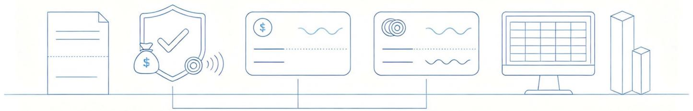

flowchart

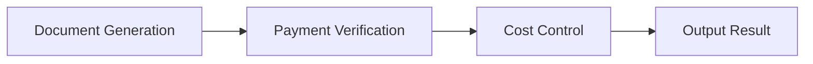
```mermaid
graph LR
  A["Document Generation"] --> B["Payment Verification"]
  B --> C["Cost Control"]
  C --> D["Output Result"]
```

成都华微重要性议题矩阵  
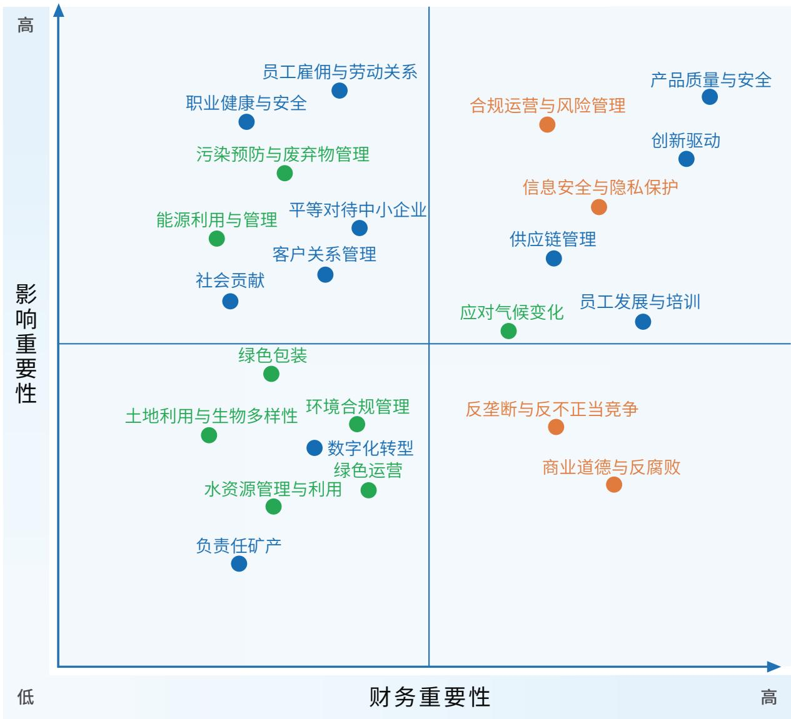

scatter

| Topic | Financial Importance (X) | Impact Importance (Y) |
| :--- | :--- | :--- |
| 员工雇佣与劳动关系 | ~35% | ~90% |
| 职业健康与安全 | ~25% | ~85% |
| 污染预防与废弃物管理 | ~30% | ~75% |
| 能源利用与管理 | ~20% | ~65% |
| 平等对待中小企业 | ~40% | ~65% |
| 社会贡献 | ~20% | ~55% |
| 客户关系管理 | ~35% | ~55% |
| 应对气候变化 | ~60% | ~45% |
| 供应链管理 | ~60% | ~55% |
| 产品质量与安全 | ~85% | ~90% |
| 创新驱动 | ~85% | ~75% |
| 信息安全与隐私保护 | ~70% | ~65% |
| 员工发展与培训 | ~80% | ~45% |
| 绿色包装 | ~25% | ~45% |
| 土地利用与生物多样性 | ~20% | ~35% |
| 环境合规管理 | ~35% | ~35% |
| 数字化转型 | ~35% | ~30% |
| 水资源管理与利用 | ~30% | ~25% |
| 负责任矿产 | ~20% | ~15% |
| 反垄断与反不正当竞争 | ~60% | ~25% |
| 商业道德与反腐败 | ~70% | ~20% |

# 环境(9个)

- 应对气候变化  
- 能源利用与管理  
- 水资源利用  
- 污染物排放与管理  
- 废弃物排放与管理  
- 生物多样性保护  
环境合规管理  
- 绿色运营  
- 绿色包装

# 社会(11个)

- 员工雇佣与劳工关系  
- 员工发展与培训  
- 职业健康与安全  
- 创新驱动  
- 产品质量与安全  
- 客户关系管理  
- 信息安全与隐私保护  
供应链管理  
- 平等对待中小企业  
- 社会贡献&乡村振兴  
- 负责任矿产

# 治理(3个)

- 商业道德及反腐败  
- 合规运营与风险管理  
公司治理

# 党建引领 笃行致远

党建是企业发展的“根”与“魂”，更是成都华微实现高质量可持续发展的核心政治保障。2025年，公司党委始终以习近平新时代中国特色社会主义思想为指导，深入贯彻全面从严治党要求，将党的领导贯穿于公司治理、战略执行、风险防控与文化建设全过程，以高质量党建引领业务高质量发展，为圆满完成“十四五”目标任务筑牢政治根基。

natural_image

Red flag with hammer and sickle emblem standing on a golden stand, placed next to an open book and red chairs in the background (no visible text or symbols)

# 党建引领聚合力赋能发展启新程

党建是企业发展的“根”与“魂”，更是成都华微实现高质量可持续发展的核心政治保障。2025年，公司党委始终以习近平新时代中国特色社会主义思想为指导，深入贯彻全面从严治党要求，将党的领导贯穿于公司治理、战略执行、风险防控与文化建设全过程，以高质量党建引领业务高质量发展，为圆满完成“十四五”目标任务筑牢政治根基。

# 强化政治引领, 把牢发展方向

公司党委坚持把政治建设摆在首位，严格落实“第一议题”制度，将习近平总书记关于全面从严治党、科技创新、国企改革的重要论述纳入党委理论学习中心组必学内容，全年组织理论中心组学习8次、集中研讨8次，实现党的创新理论学习常态化、制度化。推动党委班子成员履行“一岗双责”，带头深入基层讲党课7场，将学习成果与企业核心业务、廉洁风险防控深度融合，形成“传达学习-研究部署-贯彻落实-跟踪督办”的工作闭环，确保党中央和上级党组织决策部署在公司落地生根。

在公司治理层面，充分发挥党委“把方向、管大局、保落实”的领导作用，将党的领导嵌入公司治理各环节。2025年召开23次党委会，严格执行“三重一大”决策制度，对重大经营战略、重要人事任免、重点项目投资等关键事项进行科学决策。组织编制涵盖17类727项事项的《科研生产经营管理权限表》，并经多轮修订完善，确保权力运行规范有序，为公司聚焦高端集成电路核心领域、服务国家战略提供了坚实的政治保障。

8次组织

组织理论中心组学习

7场深）

8次集中

集中研讨

23次
召开

# 筑牢组织根基, 凝聚发展合力

公司党委以提升组织力为重点，持续夯实基层党建基础。完成8个党支部换届选举，完善基层党组织班子配置，同步加强对苏州云芯等驻外机构党建工作的指导，实现党组织在各业务板块的全面覆盖。建立党委委员与干部“一对一”常态化沟通机制，将监督管理嵌入干部日常工作全过程，通过工作提醒谈话、廉洁教育引导等方式，全年开展工作提醒谈话10余人次，切实加强干部队伍建设。

坚持党管干部、党管人才原则，严把选人用人“廉洁关口”。从干部酝酿、提名、考察到任用谈话，纪委全过程参与监督，2025年对20名拟晋升干部进行廉政审查，出具廉洁意见20份，开展任前廉洁谈话25人次，完善干部廉政档案60余份，树立正确用人导向。同时，将党建工作与工会工作深度融合，支持工会完成换届选举，成立7个分工会，通过职工代表大会、民主协商等机制保障职工知情权、参与权和监督权，全年落实职工提案13件，办结率 $100\%$ ，形成党建引领、群团协同、职工参与的良好发展格局。

8↑

党支部换届选举

10余人次

开展工作提醒谈话

20名

拟晋升干部进行廉政审查

13件

落实职工提案

100%

办结率

# 深化廉洁建设,筑牢风险防线

公司党委坚定不移推进全面从严治党，层层压实主体责任。组织党委委员、中层干部、关键岗位人员分别签订《全面从严治党与廉洁从业责任书》《纠“四风”树新风廉洁从业承诺书》等共计176份，与9个支部签订《党建工作目标责任书》，构建一级抓一级、层层抓落实的责任体系。持续完善制度建设，全年梳理公司制度417项，新建和修订89项，废止21项，以制度建设规范权力运行，筑牢廉洁从业制度防线。

强化精准监督执纪，聚焦招投标采购、工程建设等廉洁高风险领域，修订采购管理、招标采购等核心制度，开展专项检查5项，下发整改通知书4份，对芯谷园区建设等重大项目开展监标9次、督促推进10次，提出风险防控建议3次。深化纪律教育常态化，组织干部及关键岗位人员赴廉政教育基地开展警示教育，召开警示教育大会通报典型案例，观看《持续发力纵深推进》等警示教育片，全年参与警示教育活动75人次，引导党员干部知敬畏、存戒惧、守底线。畅通举报渠道，设立举报电话、邮箱和意见箱，建立健全“大监督”工作机制，实现党内监督与审计、财务等专业监督协同联动，全年未发生违规违纪行为，营造了风清气正的政治生态。

176份

组织签订责任书等

9↑

支部签订责任书

417项

梳理公司制度

5项

专项检查

75人次

参与警示教育活动

# 党建业务融合, 赋能战略落地

公司党委坚持围绕业务抓党建、抓好党建促业务，推动党建工作与科技创新、社会责任、绿色发展深度融合。在科技创新领域，党组织牵头攻克高端集成电路技术难题，党员骨干在高速ADC芯片研发等关键项目中冲锋在前，助力公司成功推出4通道12位40G高速高精度射频直采ADC芯片，填补国内外同类型产品空白。在社会责任方面，引导公司积极投身乡村振兴，通过消费帮扶采购万山香柚、松桃县大米等农产品，完成帮扶金额25.25万元；组织10余名员工作为志愿者参与世运会秩序维护，累计服务时长约300小时，以实际行动履行国企社会责任。

面向未来，成都华微将持续深化党建引领，把党的政治优势、组织优势转化为公司的创新优势、发展优势和竞争优势，聚焦“十五五”战略规划，深耕集成电路核心领域，在推动产业链自主安全、服务国家战略的征程中展现更大作为，以高质量可持续发展书写国企担当。

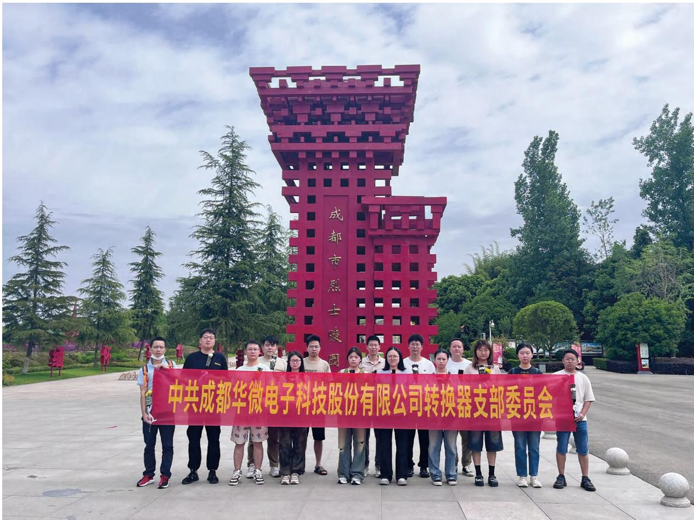

text_image

成都市烈士陵园
中共成都华微电子科技股份有限公司转换器支部委员会

"红色传承,凝心聚力"主题活动内容

# 秉信持规 行稳致远

成都华微高度重视企业合规运营，是实现高质量可持续发展的核心基石。公司严格遵照《中华人民共和国公司法》《中华人民共和国证券法》《上市公司治理准则》《上海证券交易所科创板股票上市规则》《上市公司信息披露管理办法》等法律法规及规范性文件要求，同时深度将党的领导融入公司治理各环节，构建起权责法定、权责透明、协调运转、有效制衡的现代公司治理体系，持续修订完善内部控制制度与议事规则，以规范化、制度化治理为公司深耕高端集成电路领域、服务国家战略筑牢发展根基。

# 关键议题

公司治理  
投资者关系与股东权益  
合规运营  
风险管理  
商业道德与反腐败  
反垄断与反不正当竞争

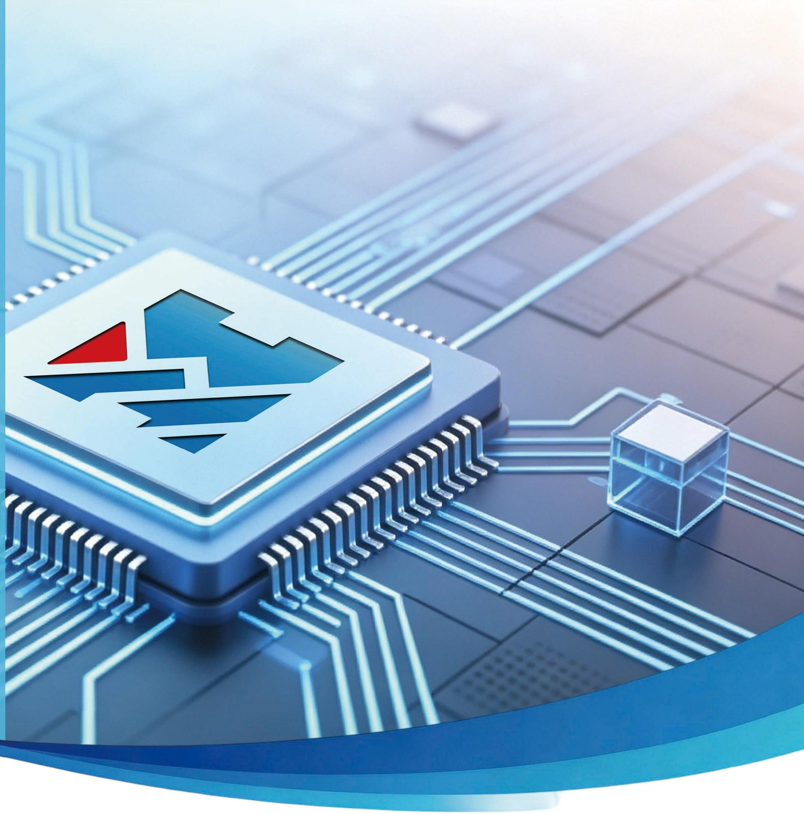

natural_image

Abstract digital illustration of a microchip with circuit patterns and a small cube, symbolizing technology or business (no text or symbols present)

# 公司治理

# 公司治理架构

成都华微高度重视企业合规运营，是实现高质量可持续发展的核心基石。公司严格遵照《中华人民共和国公司法》《中华人民共和国证券法》《上市公司治理准则》《上海证券交易所科创板股票上市规则》《上市公司信息披露管理办法》等法律法规及规范性文件要求，同时深度将党的领导融入公司治理各环节，构建起权责法定、权责透明、协调运转、有效制衡的现代公司治理体系，持续修订完善内部控制制度与议事规则，以规范化、制度化治理为公司深耕高端集成电路领域、服务国家战略筑牢发展根基。

股东会是公司的权力机构，依法行使对公司利润分配、增减资、修改章程等重大事项的决定权。董事会是公司的经营决策中心，董事会下设战略与ESG委员会、薪酬与考核委员会、提名委员会、审计委员会4个专门委员会，从不同的角度为公司发展和决策提供专业意见和建议。

# 董事会与管理层组织结构职能

战略与ESG委员会委员由三名董事组成，其中应至少包括一名独立董事。主要负责对公司长期发展战略、重大投资决策和ESG工作进行研究并提出建议。

薪酬与考核委员会委员由三名董事组成，其中独立董事应占半数以上。主要负责研究公司董事与总经理及其他高级管理人员的考核标准，并进行考核提出建议，研究和审查公司董事、高级管理人员的薪酬政策与方案。

提名委员会委员由三名董事组成，其中独立董事应占半数以上。主要负责对公司董事、高级管理人员的人选、选择标准和程序进行研究、审查并提出建议。

审计委员会成员由三名不在公司担任高级管理人员的董事组成，其中独立董事应当过半数，并由独立董事中会计专业人士担任召集人。主要负责公司内、外部审计的沟通、监督和核查工作，并行使《公司法》规定的监事会的职权。

# 董事会与管理层组织结构职能

公司党委发挥把方向、管大局、保落实的领导作用，充分落实党组织在公司治理结构中的法定地位，积极推动党建工作与生产经营相融合；公司董事长连同其他董事会成员积极发挥定战略、作决策、防风险的作用，对公司的经营运作、战略决策与工作执行实施监督管理；公司经理层充分发挥谋经营、抓落实、强管理的职责，主持公司的生产经营管理工作，在董事会授权范围内，履行相应管理职能。三者权责关系明确，按照相应法律法规及授权清单履行职责，切实保障公司高质量高效率运转。

报告期内，公司召开股东会3次、召开董事会3次，召开审计委员会4次，薪酬与考核委员会2次，提名委员会2次，战略与ESG委员会1次，独立董事专门会议1次。

# 董事会独立性与多元化

公司高度重视董事会的独立性与多元化建设，持续优化董事会成员结构，确保决策科学、制衡有效。董事会严格按照法律法规及公司章程要求，保持充足的独立非执行董事比例，独立董事在专业判断、关联交易审议、风险管控等方面独立履职，不受控股股东及其他利益相关方的不当影响，有效维护公司及全体股东的整体利益。

同时，公司积极推动董事会成员多元化，在专业背景、行业经验、年龄结构、职业经历等方面实现合理搭配，吸纳财务、法律、管理、ESG及产业领域等多元化人才，提升董事会对复杂议题的研判能力与战略引领水平，为公司长期稳健发展提供坚实的治理保障。

报告期内，成都华微的董事会共9人，其中独立董事3人。薪酬委员会、审计委员会和提名委员会独立董事占比均为2/3。独立董事100%出席董事会。

# 董事会参与可持续治理

董事会高度重视并全面参与公司可持续发展管理工作，对公司五年发展规划及中期调整计划进行审议决策，将科技创新、人才发展等可持续发展核心要求融入战略制定全过程，确保战略方向与国家高质量发展导向、行业转型升级趋势及企业长期价值目标保持一致，推动科技创新与可持续发展深度融合，为公司实现规范、稳健、可持续发展提供坚强战略保障。

# 投资者关系与股东权益

公司依据《投资者关系管理制度》《公司章程》《股东会议事规则》等制度与规定，明确战略定位，坚守“公平、公正、公开”原则，平等对待所有投资者，保障全体股东尤其是中小股东享有平等权利。建立“董事会决策、董事长负责、董事会秘书牵头、董事会办公室执行”的组织体系，上证e互动、电话、邮箱等多元化沟通渠道，完善信息披露与保密机制，确保信息合规、及时、准确。

董事会办公室聚焦技术价值传递，以“技术指标+市场前景”解读公司优势，通过自愿披露、公众号推送等强化品牌宣传，提升机构投资者认可度。公司优化股东会安排，开通网络投票，为中小股东参会提供便利，预留交流时间，广泛征询股东意见，保障股东参会权利。通过中国证监会指定媒体、上证e互动平台及定期报告等渠道，确保信息覆盖的全面性与透明度。

# 投资者关系管理

成都华微高度重视投资者关系管理工作，持续完善多元化投资者沟通渠道，通过投资者热线、IR邮箱、上证e互动等线上渠道及时回应投资者关切，主动开展投资者关系管理活动，不断提高公司信息的透明度。公司诚恳听取股东及潜在投资者的意见和建议，积极构建与投资者良好互动的生态。2025年，公司通过组织投资者线上业绩说明会、线下机构调研交流、技术成果解读会等活动，为投资者提供了解公司核心技术、业务布局及发展战略的新渠道，提升股东沟通的透明性，切实做好股东权益保护工作。

公司股东会采取现场投票和网络投票相结合的方式，方便中小股东通过线上渠道进行表决投票，提高中小股东对公司决策的参与度，对于可能影响中小股东利益的重大事项，公司均对中小股东的表决单独计票并披露结果；充分运用现代信息技术手段扩大股东参与股东会的比例，确保投资者尤其是中小股东对公司重大事项的知情权和参与权；通过线上互动平台、投资者说明会、专项沟通等多元渠道与投资者交流，充分听取中小股东的意见和诉求，及时答复中小股东关心的问题，切实维护全体股东的合法权益。

公司严格遵循上市公司信息披露相关监管要求，强化信息披露透明度，依法披露重大信息、主动传递经营与战略信息，切实保障股东知情权。为规范信息披露行为，公司制定并严格执行《信息披露管理制度》《信息披露暂缓与豁免业务管理制度》，构建了完善的信息披露制度体系，为信息披露工作的合规开展提供坚实制度支撑。

2025年，成都华微进一步完善非财务信息报告制度及信息披露政策，明确公开披露范围涵盖业务进展、技术研发、市场拓展、投资者关系管理及公司治理结构等非财务信息；为保障信息披露质量，公司建立三级审核机制，由董事会秘书统筹审核、董事会监督、审计委员会定期核查，严格控制信息准确性；其中，非财务信息按季度更新，重大事项（如新品发布、战略调整）通过临时公告及时披露，常规信息通过年报及半年报系统呈现。

报告期内，公司依规披露104份公告和上网文件，含4期定期报告和100份临时公告，确保公司所有股东能够以平等的机会获得信息。

# 报告期内关键绩效

\- 组织线上业绩说明会3次、参加线下峰会40余次、接待机构调研400余人次、上证e互动回复投资者提问97次（回复率 $100\%$ ）、接听投资者电话200余通、回复邮件10余份，业绩说明会3次。

# 获得奖项

natural_image

Abstract line drawing of stacked star shapes on rectangular bases (no text or symbols)

# 荣获2025年财联社最佳投资者关系团队

# 荣获中国上市公司协会   2025年上市公司董办优秀实践案例

# 合规运营

# 依法纳税

# 税收管理制度与体系

成都华微在税务管理方面建立了一套完善的体系，以确保合规性、提高效率并支持公司的可持续发展。完善税务管理结构，财务部设置专门的税务会计岗位，配备专业人员负责日常税务事务。在税务管理日常运行中，实施内部审计机制，定期评估风险并及时改进。引入先进的财税软件（乐企），实现税务管理的自动化和高效处理。财务部依据各项税收法律法规、条例及办法正确计算各类税费应纳金额，按时向相关征收机关申报，足额缴纳税款。

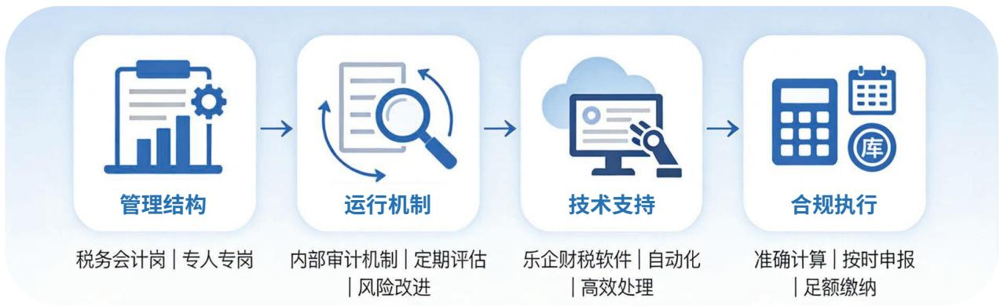

flowchart

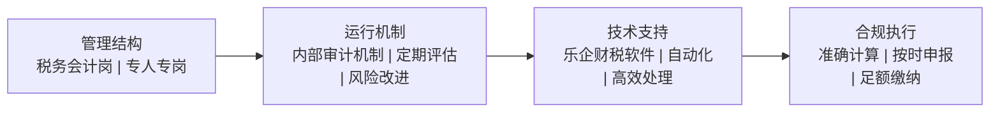
```mermaid
graph LR
  A["管理结构\n税务会计岗 | 专人专岗"] --> B["运行机制\n内部审计机制 | 定期评估\n| 风险改进"]
  B --> C["技术支持\n乐企财税软件 | 自动化\n| 高效处理"]
  C --> D["合规执行\n准确计算 | 按时申报\n| 足额缴纳"]
```

# 税务管控及风险管理

财务部根据国家有关财政税收法规、政策进行事前控制，依法纳税。涉税业务是企业经营管理中的重要组成部分，财务部对公司经济活动现有或潜在的纳税环节进行纳税分析，在发票管理、合同管理、投资管理、薪酬福利管理等方面提出合理纳税方案。同时，还聘请第三方专业税务师事务所进行涉税业务的指导、咨询及评价。加强员工财政税收政策的学习和培训，不断提高公司的纳税管理水平。成都华微不断加强涉税环节的事前控制，防范税务风险。

# 风险管理

# 风险管理体系

成都华微依据相关法律法规及集团制度，结合公司运营特征，制定《全面风险管理制度》，明确风险管理目标、原则、流程与组织体系。公司构建以董事会为最高决策机构、审计法务部为归口管理部门、各职能部门为第一道防线的三级风险管理架构。董事会负责确定风险偏好与重大风险方案；审计法务部牵头风险评估、监督落实；各部门负责本领域风险识别、分析与应对。

公司每年第一季度开展风险识别，形成风险和机遇识别评价表，采用定性与定量相结合的方法，将风险划分为高、中、低三个等级。按程序审批后，分别采取规避、降低、分担、承受的应对策略。审计法务部定期跟踪监督，形成检查记录并纳入年度报告，实现风险管理闭环管理。

# 风险识别与预警

各部门持续收集财务、市场、运营、合规等内外部风险信息，为风险评估提供支撑。每年第一季度集中开展年度风险与机遇识别，环境重大变化时及时动态更新。审计法务部建立合规风险识别评估与预警机制，对重大及典型风险及时预警。涉及公司战略与重点工作的重大风险，按要求及时上报。审计法务部对风险应对过程开展节点监督，确保风险可控。

# 风险控制与追踪

公司根据风险等级实施差异化应对:高风险采取规避或降低措施,中等风险采取降低或分担措施。通过授权审批、职责分离、会计控制、预算管理等手段,将风险控制嵌入经营全流程。各部门建立风险应对措施及跟踪表,全程跟踪落实。风险重大变化时,3个工作日内更新方案并重新报批。审计法务部联合相关部门开展监督检查,确保应对措施执行到位。

# 风险报告与管理

公司建立分级风险报告机制:各部门提交部门级报告,审计法务部汇总形成公司年度风险管理报告,经审议后报董事会审批。发生重大风险事件时,及时启动专项评估与上报。下属企业出现重大债务、涉诉、亏损等情形,按要求开展专项经济责任审计。重大合规风险事件由首席合规官牵头处置并上报。对违规问题建立整改台账,督促闭环整改。公司设立举报专线,畅通内外部监督与申诉渠道,强化全员合规与风险共治。

# 商业道德与反腐败

成都华微坚守诚信经营、廉洁从业、合规运营核心准则，将商业道德与反腐败、反舞弊、反不正当竞争等要求全面融入公司治理与日常经营，反对任何形式的商业贿赂、洗钱、垄断和不正当竞争行为，建立健全纪检监督、制度约束、教育预防、举报受理一体化合规管理体系，保障公司与利益相关方长期可持续发展。

# 治理

成都华微建立健全商业道德治理框架，董事会是商业道德与反腐败管理的最高决策层，董事会下设的审计委员会作为监督组织，负责监督和规范商业道德管理制度的落实、职责履行等。由党群纪检部制定商业道德及反腐败相关的制度并执行反腐败反贿赂的监督与执行情况。集团党群纪检部和审计法务部对所有主要生产运营点进行内部审计，由专人专职负责监督。审计委员会成员均具备丰富的法律、财务和企业管理经验，熟悉国内外反贪污贿赂法规政策，确保人员具备胜任能力。

# 战略

成都华微严格遵循《中华人民共和国公司法》《中华人民共和国反洗钱法》等法律法规，持续建立健全商业道德与反腐败管理体系，制定《反舞弊和反腐败管理规定》《成都华微纪检工作制度》《诚信管理制度》《合规管理制度》《专项监督检查制度》《廉政教育及谈话工作制度》等一系列规章制度，将反舞弊、反洗钱、反腐败、反贿赂、公平竞争和反垄断、反利益冲突等要求覆盖到公司董事、全体员工及供应商，积极营造清廉的工作环境。通过严格规定和约束规范采购、生产和销售的各个环节，旨在杜绝任何违反道德的商业行为，防止舞弊或欺诈，确保公司经营活动诚信透明。

面对贪污腐败、商业贿赂等反商业道德行为，公司坚持“预防为主、惩治为辅”的策略，通过加强教育、完善制度、强化监督等手段，构建全方位的反贪污贿赂防控体系。公司开展定期合规教育及贪污培训活动，提高员工法律意识和道德水平；建立健全的内部控制制度，规范业务流程，堵塞管理漏洞，严防内部交易；运用信息技术手段，加强对关键业务环节的监控。制定年度反贪污贿赂工作计划，明确工作目标、任务和责任人。定期对反贪污贿赂工作进行评估和改进，不断完善防控体系。

# 风险管理

公司将“诚信廉洁”纳入企业文化核心理念，通过管理层宣贯会、全员培训、案例警示教育等方式强化职业道德教育。各职能部门、分公司、子公司通过员工手册、公司规章制度发布、宣传或网络等多种形式，有效传达公司的反舞弊政策、举报程序及有关措施，对员工进行培训并签署《廉洁协议》，确保所有员工遵守公司反贪污、反舞弊、反不正当竞争等行为准则，及时发现报告任何违反商业伦理及商业道德的行为。

针对已识别的廉洁风险(如商业贿赂、采购舞弊、虚假报销等)，通过定期汇总更新风险清单，确保风险识别的准确性和完整性。建立“风险分析、防控措施、整改反馈”的闭环机制，对审计发现的问题及举报事项要求相关部门自查自纠并提交整改报告。

# 供应商廉洁管理

公司高度重视供应链廉洁合规建设，将廉洁从业与公平竞争要求全面纳入供应商管理全流程。在供应商准入、合作评审、日常履约及年度考核等环节，严格开展廉洁合规审查，与长期合作供应商签订《廉洁协议》，明确禁止任何形式的贿赂、利益输送和腐败行为，确保供应链合规与道德。

公司建立供应链廉洁风险常态化排查与预警机制，聚焦采购招标、合同履约、货款支付、质量验收等高风险环节实施重点监督，畅通内外部举报渠道，对违规失信供应商采取警示约谈、限期整改、降级乃至终止合作等处置措施，形成识别—预警—处置—跟踪—闭环的全流程管控。

同时，公司面向供应商开展廉洁合规宣导与文化共建，推动廉洁理念向产业链上下游延伸，携手合作伙伴共同维护公平有序、合规高效、廉洁透明的产业合作环境，保障供应链可持续、健康、稳定运行。

# 商业道德培训

成都华微定期为高管和全体员工开展合规经营培训，覆盖反腐败、反贿赂、反舞弊等的商业道德内容。公司党委以作风建设为抓手，构建“学、警、行”三维联动模式，党委书记带头讲授中央八项规定精神专题党课，结合企业发展实际提出深学悟透强根基、以上率下树标杆、实干担当促发展的工作要求，推动作风建设与芯片研发、市场拓展等核心业务深度融合，将作风建设成效转化为企业发展动能。同时通过通报内部违规典型案例、组织观看警示教育片等方式开展廉洁警示教育，以案示警、以案明纪，引导党员干部及关键岗位员工严守廉洁底线、树立成本意识，以优良作风护航企业高质量发展，为公司可持续发展筑牢作风与廉洁根基。

# 报告期内, 商业道德培训的绩效

开展年度全员党建暨党风廉政建设和反腐败工作会1次，员工覆盖率100%。  
- 反腐败培训受训总时长18小时。  
- 组织全体干部和关键岗位、新任干部分别前往锦江监狱和女子监狱开展警示教育。  
- 全体党员集体观看了警示教育片《一步不停歇半步不退让》第四集《科技赋能反腐》和《强化正风肃纪》第三集。  
- 党委班子集体观看《杨有林严重违纪违法案警示录》。

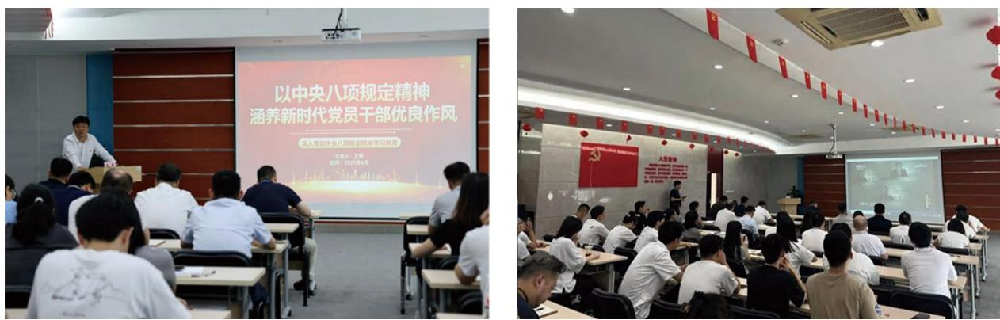

# 举报机制与办法

为规范公司举报工作，公司制定了《受理举报工作管理办法》，建立了覆盖全业务链的举报管理体系，确保全体员工、供应商、客户等利益相关方均可就合规问题进行反馈。由党群纪检部受理举报案件，严格执行举报人保护制度，对举报信息实施分级保密管理，并建立"零容忍"报复行为调查机制。对于实名举报，无论是否立项调查，公司党群纪检部均应向举报人反馈结果。党群纪检部根据潜在舞弊事件及情节的严重程度，采取不同的对应措施。同时，为保障举报人安全与权益，公司规定任何单位和个人不得干扰和妨碍经办工作人员或公司指派的调查团队查处举报事项，并对举报人采取多种保护措施保护举报人的隐私和合法权益。

# 举报投诉渠道

举报邮箱

dqjj@csmsc.com

举报电话

(0086) 13608025969

# 指标与目标

公司通过明确反贪污与贿赂管理的关键目标，强化反贪污、反贿赂与反不正当竞争管理。公司积极推动反贪污与贿赂、反不正当竞争的培训与宣传活动，提升全体员工反贪污意识，进一步增强公司合规性与透明度。

<table><tr><td>指标名称</td><td>单位</td><td>2025</td></tr><tr><td>反商业贿赂及反贪污培训覆盖的董事百分比</td><td>%</td><td>100</td></tr><tr><td>反商业贿赂及反贪污培训覆盖的管理层人员百分比</td><td>%</td><td>100</td></tr><tr><td>反商业贿赂及反贪污培训覆盖的员工百分比</td><td>%</td><td>100</td></tr><tr><td>重大商业道德事件数量</td><td>件数</td><td>0</td></tr><tr><td>商业道德、反腐与反不正当竞争培训覆盖率</td><td>%</td><td>100</td></tr></table>

# 反垄断与反不正当竞争

成都华微始终坚守公平竞争、诚信合规经营理念，严格遵守《中华人民共和国反垄断法》《中华人民共和国反不正当竞争法》等法律法规，将反不正当竞争融入公司治理、业务运营与供应链管理全流程，维护集成电路行业公平有序的市场竞争环境。

公司建立完善的商业道德与合规管理体系，制定反不正当竞争、反商业贿赂、廉洁从业等内部管理制度，明确禁止商业贿赂、侵犯商业秘密、虚假宣传、商业诋毁、串通投标等不正当竞争行为，覆盖研发、销售、采购、合作等全部业务场景。公司将公平竞争与廉洁要求纳入员工行为准则，开展常态化合规培训与警示教育，强化全员合规意识与底线思维。

针对集成电路行业商业秘密与技术信息密集特点，公司建立严格的商业秘密保护机制，通过权限管理、保密协议、信息隔离等措施，防范技术秘密与经营信息泄露，尊重与保护合作伙伴及第三方知识产权与合法权益，坚决杜绝以不正当手段获取、使用、披露他人商业秘密。

公司与所有供应商、客户及合作方签订廉洁合作与公平竞争协议，将反不正当竞争、反商业贿赂条款纳入合作合同，实施供应商合规准入与动态评估，杜绝利益输送、暗箱操作等违规行为。

报告期内，公司严格恪守公平交易与公允定价原则，无不正当竞争相关处罚、诉讼及负面事件，合规运营记录良好。

报告期内，公司未发生因不正当竞争行为而导致诉讼或重大行政处罚的事件。

公平竞争、诚信合规  
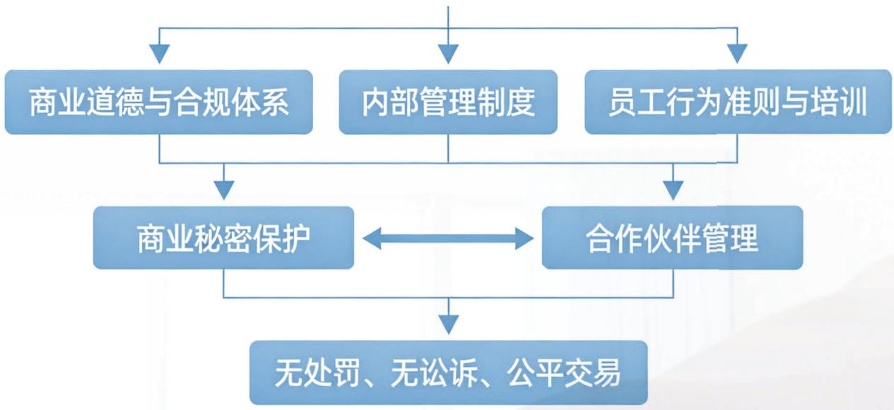

flowchart

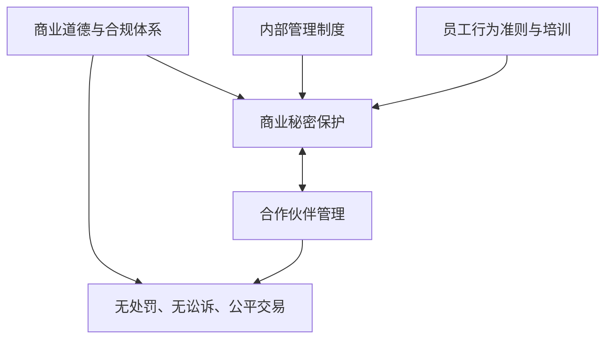
```mermaid
graph TD
  A["商业道德与合规体系"] --> B["商业秘密保护"]
  C["内部管理制度"] --> B
  D["员工行为准则与培训"] --> B
  A --> E["无处罚、无讼诉、公平交易"]
  B <--> F["合作伙伴管理"]
  F --> E
```

# 笃行责任 聚力赋能

公司以服务国家战略和区域发展为己任，始终坚持国家利益优先，聚焦解决集成电路瓶颈等关键技术，着力打造“3+N+1”平台化产品体系，在超大规模FPGA、RF-FPGA与SOPC，高性能AD/DA转换芯片与高速信号链，嵌入式SoC与MCU三个方向持续强化科研投入，实现技术引领。在TSN领域实现突破。在CPLD、存储器、总线接口、电源管理等多个方向以市场需求为导向，推动产业升级。依托成都华微全系列芯片打造SiP、模块、板级国产化系统解决方案，形成信号处理与控制的成都华微产品生态。

# 关键议题

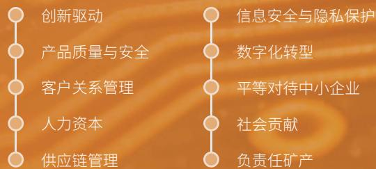

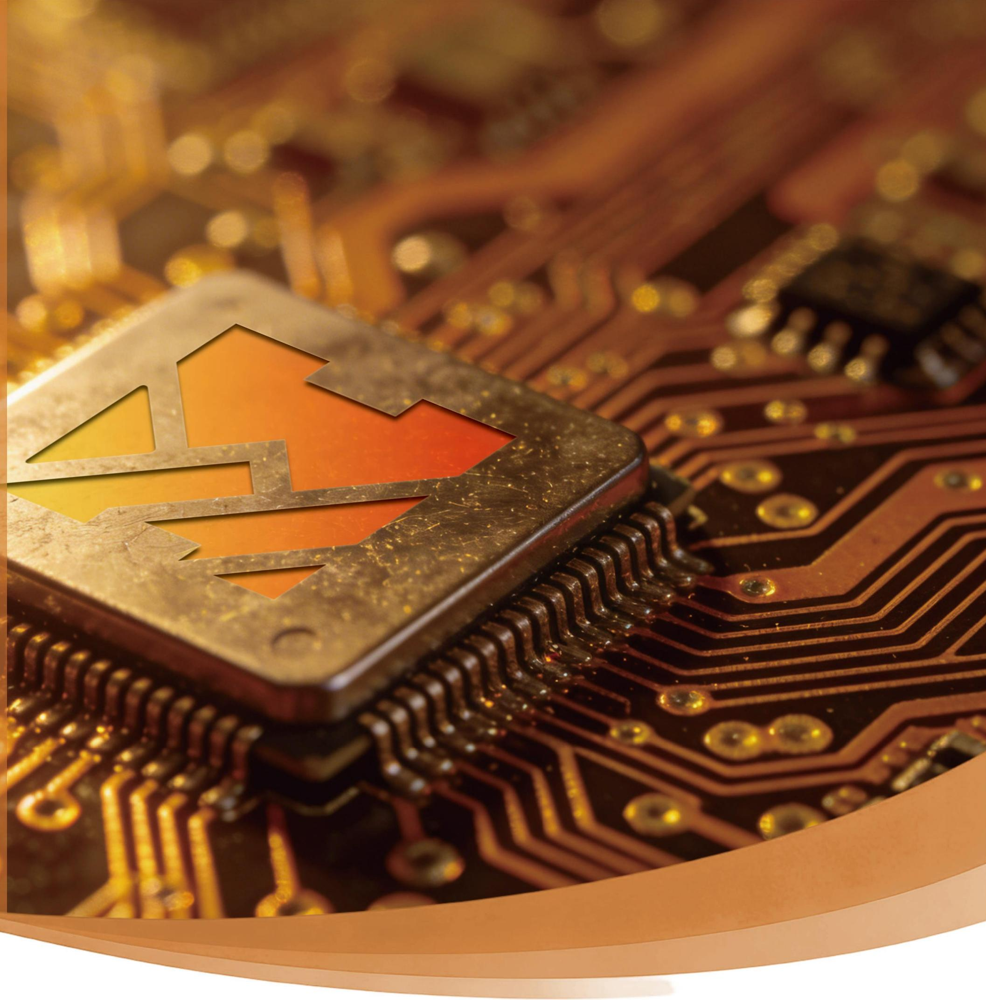

natural_image

Close-up of a metallic chip with orange and yellow arrows emerging from a circuit board, symbolizing market growth or financial trends (no text or symbols present)

# 创新驱动

公司以服务国家战略和区域发展为己任，始终坚持国家利益优先，聚焦解决集成电路瓶颈等关键技术，着力打造“3+N+1”平台化产品体系，在超大规模FPGA、RF-FPGA与SOPC，高性能AD/DA转换芯片与高速信号链，嵌入式SoC与MCU三个方向持续强化科研投入，实现技术引领。在TSN领域实现突破。在CPLD、存储器、总线接口、电源管理等多个方向以市场需求为导向，推动产业升级。依托成都华微全系列芯片打造SiP、模块、板级国产化系统解决方案，形成信号处理与控制的成都华微产品生态。

# 治理

公司构建“战略引领、体系支撑、激励保障”为一体化研发管理架构，确保研发方向与国家政策和市场需求同频共振。由董事会、总经理办公室、战略与ESG委员会统筹引领技术创新方向。综合计划部负责科研项目立项与全流程管理，技术质量部承担产品全生命周期质量管理；研发体系下设可编程中心、SoC研发中心、转换器前沿技术研发中心、电源管理研发中心、总线接口研发中心，形成专业化、平台化的技术攻关布局。

<table><tr><td>层级</td><td>组成</td><td>职责</td></tr><tr><td>决策层</td><td>董事会总经理办公会战略与ESG委员会</td><td>审定技术创新战略、重大科研项目、高管聘任、重大投资和风险决策执行董事会决议,统筹日常经营与科技创新落地</td></tr><tr><td>管理层</td><td>综合计划部技术质量部</td><td>负责科研项目立项与全流程管理承担项目及产品全生命周期质量管理</td></tr><tr><td>执行层</td><td>可编程研发中心SoC研发中心转换器前沿技术研发中心电源管理研发中心总线接口研发中心</td><td>负责编程方向技术攻关、产品研发负责SoC芯片研发、平台化技术攻关负责转换器技术研发、前沿技术突破负责电源管理芯片与技术研发负责总线接口技术、接口IP研发</td></tr></table>

# 战略

成都华微自创立以来高度重视产品的设计与研发，始终坚持以市场为导向制定研发计划，以客户需求为目标，在长期发展中不断优化组织结构和研发管理流程，建立起完备的研发组织体系以及严格高效的产品研发流程。

为激发研发人员创新活力与核心技术研发动力，公司建立完善研发成果专项奖励及长效激励机制，制定《成都华微创新奖励办法》《科研成果管理制度》等系列制度，将研发创新成果与奖励激励、职称评定直接挂钩，形成“创新有激励、成果有保障、发展有通道”的研发激励体系，助力技术创新持续推进。

同时，结合质量管理体系要求，公司构建覆盖科研项目立项、设计评审、验收交付等全流程的研发管理制度体系，实现研发项目全生命周期管理。通过统筹优化研发资源配置，有效提升研发效率，保障研发创新可持续发展。

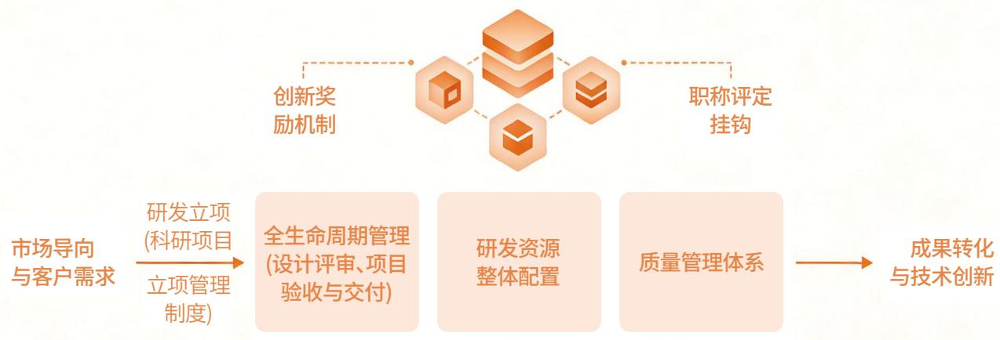

flowchart

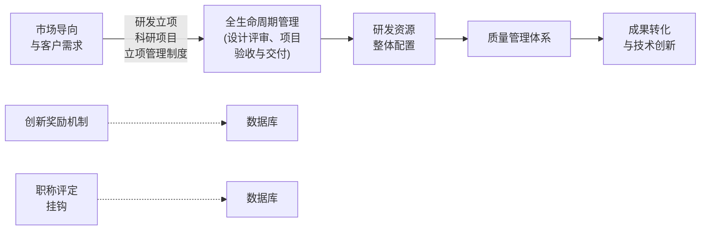
```mermaid
graph LR
  A["市场导向\n与客户需求"] -->|"研发立项\n科研项目\n立项管理制度"| B["全生命周期管理\n(设计评审、项目\n验收与交付)"]
  B --> C["研发资源\n整体配置"]
  C --> D["质量管理体系"]
  E["创新奖励机制"] -.-> F["数据库"]
  G["职称评定\n挂钩"] -.-> H["数据库"]
  D --> I["成果转化\n与技术创新"]
```

成都华微构建以“制度为基、自主研发为本、对外合作为翼”的三位一体创新管理体系，全力攻坚关键核心技术，坚定不移推进技术自主安全与科技自立自强。

# 制度保障:构建可持续发展的创新生态

公司构建了完备高效的研发创新管理体系，严格执行科研项目管理、立项管理、设计评审、验收交付等核心管理制度，实现从立项、设计评审到成果转化与验收交付的全过程闭环管控。通过体系化规范运行，公司有效提升研发质量与效率，优化资源配置，为技术创新与可持续发展提供坚实的制度保障。

# 自主研发：铸就硬核科技丰碑

成都华微作为国内特种集成电路领域领军企业，始终将自主研发作为核心发展战略，深耕集成电路设计核心技术攻关，以全流程自主创新构建技术护城河，填补国内高端芯片领域多项空白。公司依托国家“909”工程技术积淀，在上海、西安、长沙等多地布局研发中心，组建超500人的专业研发团队，核心专家领衔高性能FPGA、高速高精度ADC/DAC、智能SoC等前沿技术方向攻关，2025年研发投入占营业收入比例达 $14.87\%$ ，研发人员占比提升至 $52.63\%$ ，以高强度研发投入支撑技术持续突破。

公司掌握 90 纳米 CMOS、0.18 微米 Bi-CMOS 及 BCD 先进制程设计技术，拥有可编程逻辑器件架构设计、高速 ADC 时间交织校正、低功耗混合信号集成等核心自主技术。在核心产品领域，实现正向自主设计突破，其中高速 ADC 系列产品创多项国内首款、国际领先记录，128GSPS 超高速 ADC、Ku 波段射频直采 ADC 等产品，功耗较国外竞品降低 40%，填补超宽带数据采集领域国产空白；28nm7000 万门级 FPGA、32 位高速高可靠 MCU、智能异构 SoC 芯片等核心产品性能比肩国际水准，24 位超高精度 ADC、亿门级可编程逻辑器件等通过国家级技术鉴定，成功斩获中国电子信息产业集团单项冠军产品认证。

# 对外合作：共筑产业协同生态

成都华微在积极开展自主研发的同时，高度重视对外合作，努力构建开放共赢的创新生态，带动产业上下游共同发展，先后与多家院校开展产学研合作，推动了技术创新、人才培养和地方经济的发展，取得了显著的科研和产业化成果，具有重大的社会和经济效益。

# 影响、风险与机遇管理

成都华微围绕科研项目全生命周期管理，针对立项、实施、验收各关键环节，系统开展风险识别、分析与评价，制定针对性管控措施并落地执行，实现科研项目风险的有效防控与动态管理。公司建立科研项目常态化全流程风险监控机制，将风险监控深度融入项目运营各环节，确保风险应对措施落地见效，同时精准捕捉项目推进过程中的各类发展机遇，保障科研项目高质量推进。

- 设立风险监控小组，明确职责，实时跟踪风险与机遇动态，定期形成监控报告。  
定期召开评估会议，复盘风险应对效果与机遇推进情况，及时优化相关方案。  
完善预警机制，设定高优先级风险预警指标，同时建立机遇预警，确保风险可控、机遇不流失。  
- 建立信息共享机制，加强内部联动，形成管控合力，保障公司可持续发展，维护利益相关方权益。

<table><tr><td>风险与机遇类别</td><td>潜在影响分析</td><td>影响时间范围</td><td>应对措施</td></tr><tr><td>政策风险</td><td>补贴、贸易等政策变动对半导体行业影响较大,补贴政策减少可能造成研发资金短缺、原材料进口受阻,产品因技术标准不符无法入市,降低企业竞争力与收益。</td><td>短、中、长期</td><td>密切关注政策动态,及时跟进政策变化;加强与政府、行业之间的沟通;跟踪技术标准,与专家交流调整研发方向。</td></tr><tr><td>技术风险</td><td>半导体行业研发难度大,技术更新换代风险高,若无法攻克关键技术难题,可能导致研发周期延长、技术被替代、资源浪费,错失市场机遇。</td><td>中、长期</td><td>加大研发投入,组建跨学科团队,产学研合作;建立风险评估体系,设专门职能岗位监测前沿技术,定期评估技术路线。</td></tr><tr><td>运营风险</td><td>若研发资源配置不当、项目管理不善,会降低研发效率,致使项目延期,错失时机,增加成本、影响收益。</td><td>短、中、长期</td><td>建立资源管理系统,统筹调配资源;引入先进项目管理方法,加强研发项目管理,加强团队培训。</td></tr><tr><td>技术机遇</td><td>技术突破促使产品性能提升、功能更多样,可以应用于更多场景,拓展需求规模,带来新的增长点,提升竞争优势与品牌影响力,提升市场份额与盈利能力。</td><td>中、长期</td><td>调研新兴领域需求,优化产品设计,加大市场推广力度;持续研发,控制成本,加强品牌建设;加大生产投入,实现技术产业化。</td></tr><tr><td>产业协同机遇</td><td>创新研发成果能够吸引产业链上下游合作,提升整个产业链竞争力,企业自身也可以借助产业链拓展业务范围、降低成本。</td><td>长期</td><td>积极参与技术交流,展示研发成果;主动与上下游企业建立合作关系,共同合作开发研发项目,共享研发成果与市场资源。</td></tr></table>

# 指标与目标

公司以国家重大科技专项、重点工程为牵引，搭建统一数模混合信号高端集成电路设计平台，重点布局高性能FPGA、RF FPGA、SOPC、高速高精度ADC、高速信号链、智能SoC、TSN等核心领域，全面实现特种集成电路设计、工艺、软件及开发工具全流程国产化，力争达到国际先进、国内领先水平。

<table><tr><td>指标名称</td><td>单位</td><td>2025</td></tr><tr><td>研发投入金额</td><td>万元</td><td>11,300.67</td></tr><tr><td>研发投入占营业收入比例</td><td>%</td><td>14.87</td></tr><tr><td>研发人员数量</td><td>人</td><td>521</td></tr><tr><td>研发人员数量占公司总人数的比例</td><td>%</td><td>52.63</td></tr></table>

<table><tr><td>平台称号</td><td>类别</td><td>批复年度</td></tr><tr><td>重点“小巨人”企业(苏州云芯)</td><td>国家级</td><td>2025</td></tr><tr><td>第六批专精特新“小巨人”企业(苏州云芯)</td><td>国家级</td><td>2024</td></tr><tr><td>知识产权强企培育工程成长型企业(苏州云芯)</td><td>市级</td><td>2023</td></tr><tr><td>专精特新中小企业(苏州云芯)</td><td>省级</td><td>2023</td></tr><tr><td>KJ型LJ企业</td><td>国家级</td><td>2025</td></tr><tr><td>四川省可编程逻辑器件工程技术研究中心</td><td>省级</td><td>2023</td></tr><tr><td>高新技术企业</td><td>省级</td><td>2023</td></tr><tr><td>成都市知识产权试点企业</td><td>市级</td><td>2017</td></tr><tr><td>四川省企业技术中心</td><td>省级</td><td>2017</td></tr></table>

核心企业认证情况

<table><tr><td>认证类型</td><td>认证主体</td><td>认证详情</td></tr><tr><td>高新技术企业认证</td><td>成都华微电子科技</td><td>2023年12月通过国家高新技术企业复审,有效期三年</td></tr><tr><td>专精特新“小巨人”认定</td><td>苏州云芯微电子科技</td><td>2024年度国家级专精特新“小巨人”企业2025年度国家级专精特新重点“小巨人”企业</td></tr><tr><td>专精特新中小企业认定</td><td>苏州云芯微电子科技</td><td>2023年度江苏省专精特新中小企业</td></tr><tr><td>企业创新能力认证</td><td>成都华微电子科技</td><td>国家首批认证的集成电路设计企业成都市集成电路产业链链主企业四川省科技创新领军企业等多项国家级/省级认证</td></tr><tr><td>企业创新能力认证(控股或参股公司)</td><td>苏州云芯微电子科技(子公司)</td><td>苏州市高速高精度数据转化器芯片工程技术研究中心国家级专精特新重点“小巨人”企业</td></tr></table>

控股/参股公司认证占比统计

<table><tr><td>统计维度</td><td>占比(%)</td></tr><tr><td>控股或参股公司中通过专精特新“小巨人”认定(国家级)的比例</td><td>33.3</td></tr><tr><td>控股或参股公司中通过专精特新中小企业认定(省级)的比例</td><td>33.3</td></tr></table>

# 研发成果

成都华微形成了一系列具有自主知识产权的核心技术成果，拥有多项发明专利、集成电路布图设计权、软件著作权等，整体技术储备位于特种集成电路设计行业第一梯队，核心产品CPLD/FPGA、高速高精度ADC以及高精度ADC处于国内领先地位。

# 可编程逻辑芯片

建成CPLD/FPGA/SOPC/RF FPGA完整产品体系，配套全流程自主开发工具，具备非易失、小型化、高安全等优势。五百万门至七千万门级FPGA已批量供货；基于FinFET工艺的亿门级、2.5亿门级高性能FPGA研发顺利推进。28nmSOPC集成双核CPU（主频866MHz）与约85K逻辑单元；RF FPGA融合高速ADC/DAC与FPGA，为高集成、轻量化、低功耗、低延迟场景提供系统化方案。

# 数据转换芯片

面向高速与高精度双赛道，形成谱系化产品布局：高速ADC/DAC覆盖8-12位、8-128GSPS；高精度ADC达16位及以上，高速高精度ADC/高精度DAC覆盖12-14位，满足卫星通信、雷达探测、电子对抗、高端仪器、工业测量、能源勘探等领域国产化替代需求，保障关键链路自主安全。

# 微控制器芯片

构建特种领域最全MCU产品矩阵，覆盖低功耗、通用、高性能三大方向，HWD32F1/F4/F7系列实现批量供货；RISC V内核低功耗MCU完成流片并推进客户验证。2024年推出HWD32H743高速高可靠32位MCU，主频400MHz，搭载双精度浮点DSP，集成2MBFlash与512KBSRAM，广泛适配工业控制、电机驱动、AIoT、机器人等场景。

# 智能异构SoC芯片

发布边缘计算AI芯片, 算力达16Tops, 集成八核64位处理器 (1.8GHz) 与双核RISC V (1.5GHz), 支持DDR4/LPDDR4 (x)、PCIe3.0及音视频接口, 已在特种行业小批量试用; 更高性能边缘AI芯片 (算力100Tops、8K编解码) 处于研发阶段, 持续提升边缘智能与算力供给能力。

# 电源管理芯片

形成LDO、高性能DC DC、电机驱动等主力产品线，性能优异、适配性强，广泛应用于特种、通信、计算、工业领域。与FPGA、MCU、AD/DA、接口转换等产品协同打造一站式解决方案，深化垂直市场价值，实现技术与市场效益可持续增长。

# 总线接口芯片

覆盖主流串行/并行通信与电平转换接口，高可靠、高抗扰特性突出。HWD3490等系列支持RS485/RS422/RS232, ESD±15kV、速率30Mbps; HWD16T245等系列ESD±15kV、速率400Mbps, 具备强隔离与驱动能力, 保障系统间信号传输稳定可靠。

# 存储器芯片

打造EEPROM/NORFLASH/NANDFLASH/DDR全品类存储方案，满足特种场景高可靠、大容量、长寿命需求。EEPROM容量16Kb-2Mb，擦写100万次、数据保持100年；NORFLASH512Kb-2Gb，HWD29GL系列指标对标国际；NANDFLASH4Gb-64Gb；DDR3/44Gb/8Gb(X16)符合JEDEC标准。持续完善产品矩阵，为用户提供全场景、高可靠存储解决方案。

# 知识产权保护

公司坚持以创新驱动可持续发展，高度重视知识产权管理与技术创新能力提升，组织研发部门及各异地研发中心开展知识产权专题培训，邀请行业专家围绕知识产权检索、创造、保护及申请流程、撰写技巧等内容开展专业授课，并结合案例讲解知识产权在企业发展中的重要价值，同时通过现场互动解答实操问题，切实提升员工知识产权素养与实操能力。未来公司将持续完善知识产权管理体系，强化知识产权申请与保护工作，推动技术创新成果高效转化，以知识产权赋能技术创新，为企业高质量、可持续发展筑牢创新根基。

公司发布了《成都华微电子科技股份有限公司知识产权管理办法》，明确了知识产权从挖掘、布局、申请到维护的全生命周期管理规范，创新性地引入了知识产权质量评价指标。通过对专利的新颖性、创造性、稳定性及商业价值进行多维度的严格评审，有效引导创新成果从追求数量向追求质量转变，报告期内，公司高价值专利的申请占比显著提升，知识产权结构得到进一步优化。

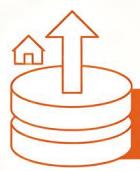

# 关键绩效

- 报告期内，成都华微（含子公司苏州云芯）新增申请发明专利31件，新增申请软件著作11件，新增申请布图设计22件；新增授权发明专利14件，新增授权软件著作13件，新增授权布图设计33件。  
- 截至报告期末，公司累计获得授权发明专利142项，其中授权发明专利133项、授权实用新型专利9项。在其他知识产权方面，公司累计获得授权集成电路布图设计217项、软件著作权53项。

# 产品质量与安全

为持续推动企业高质量、可持续发展，成都华微始终坚持以客户为中心、以创新为驱动、以质量为根本，围绕客户需求、技术研发、产品质量与价值创造构建核心发展理念，不断夯实经营根基，提升核心竞争力。

# 以客户满意为目标

公司秉持以客户为中心的经营理念，将客户满意作为可持续发展根基。明确内外部客户边界，外部提供安全可靠的产品与服务，内部建立工序客户化机制；全流程联动响应客户需求，各部门协同形成质量与服务持续改进机制，以客户价值筑牢发展基础，为企业高质量发展赋能。

# 以技术创新为引领

创新是公司发展的核心动力，公司坚持提升自主创新能力，以技术创新驱动新产品研发、新技术导入、市场拓展等多维度发展。立足集成电路领域，敏锐洞察市场趋势，将创新融入研发、工程化、商业化全流程，持续巩固技术与市场竞争优势，为企业长期稳健发展提供坚实支撑。

# 以产品全寿命周期管理为手段

公司升级质量管理理念，突破传统管控模式，构建大规模集成电路全生命周期质量管理体系。融合国家战略、商业目标与研发、组织等体系，统筹各类资源，以市场为导向优化治理与考核体系，深化精益管理；严格遵循相关质量标准，以流程再造强化质量管控，实现产品与服务全生命周期精益化运营，以质量保障企业高质量发展。

# 用优质的产品和服务为客户创造价值

公司坚守“质量为根本，客户为中心”原则，将质量要求贯穿全员工作全过程，严守质量底线，确保交付符合标准的集成电路产品。以优质产品和专业服务为客户创造价值，以客户满意为目标追求超越客户期望，将卓越品质转化为品牌口碑与信任，为企业高质量、可持续发展筑牢保障。

# 治理

成都华微严格遵守《中华人民共和国产品质量法》《中华人民共和国标准化法》等相关法律法规，建立了以《质量手册》《业务手册》《管理手册》为核心，以《管理制度》《流程文件》《作业指导书》为配套的全套质量管理文件体系，实现质量管理的制度化、规范化与标准化落地。为了更贴合市场需求，报告期内按照最新的GJB9001C质量管理体系的运行策划要求，策划了15个流程域，72个流程组。为筑牢公司质量根基，保障特种集成电路产品的高可靠性与高安全性，公司构建了“董事会统筹监管、管理层执行落地、全员参与”的三级质量管理架构。为更好地推进质量管理工作，适应业务发展需要，经公司研究决定成立质量管理体系推行小组。

<table><tr><td>层级</td><td>组成</td><td>职责</td></tr><tr><td>决策层</td><td>董事会质量领导层</td><td>主要履行顶层设计与资源赋能职能;负责审定公司质量方针与战略目标;对质量管理体系的总体规划进行决策,并提供充分、适宜的人力、财力与技术资源,确保质量工作具备坚实的资源基础</td></tr><tr><td>管理层</td><td>技术质量部质量推行小组</td><td>技术质量部承担核心执行与统筹管理职能;具体负责质量管理体系文件的编制、运行监控、变更管理及内部审核;协调跨部门的质量活动,推动各项质量要求的落地执行。</td></tr><tr><td>执行层</td><td>部门质量管理员</td><td>各业务部门设立质量管理员,作为质量管控的一线监督与联络节点;负责本部门质量管理体系相关制度的宣贯、日常运行监督及信息反馈,确保质量要求精准传递至每一位员工,实现体系运行的有效落地。</td></tr></table>

# 战略

公司以“零缺陷、高可靠、长寿命、全生命周期”为核心导向，构建战略引领、体系完备、持续改进的质量管理战略体系，确保产品质量稳定可控、核心竞争力持续增强。公司按照PDCA循环以及基于风险的思维对过程和整个体系进行管理。同时，坚持以顾客为关注焦点、领导作用、全员积极参与、过程方法、改进、循证决策和关系管理这七大质量管理原则对产品质量进行全方位的管理。

# 战略引领：锚定高可靠标准

以特种级高可靠、长寿命为质量基准，将质量要求前置至产品研发全流程。在芯片设计阶段开展可靠性仿真、失效模式与影响分析（FMEA），从源头规避质量风险；同步制定严苛的产品质量标准，确保产品设计契合极端环境、长期稳定运行的应用场景，从设计端筑牢质量基础。

# 体系保障：构建全链条管控体系

以质量管理体系要求为框架，结合GJB597、GJB7400等标准，搭建“研发—采购—生产—测试—交付—售后”全生命周期质量管理体系。明确质量领导层、常设机构、部门管理员三级责任体系，建立部门工作月会、季度质量分析会、年度质量工作大会等常态化沟通机制，确保质量战略层层落地、全程可追溯。

# 战略

# 技术赋能：升级检测与改进能力

依托CNAS认证检测中心，配备600余台（套）高端检测设备，构建“出厂全检+可靠性抽检+极限环境测试”的三级检测屏障。针对气密性、高低温老化、振动冲击等关键指标实现100%覆盖，同时强化失效分析技术能力，通过质量数据复盘与工艺优化，形成“检测—分析—改进—验证”的闭环提升机制，持续迭代产品质量性能。

# 客户协同：以需求驱动质量优化

建立客户需求—质量标准—产品改进的联动机制，深化与重点客户的技术协同。通过客户回访、二方审核、需求调研等方式，精准捕捉客户对产品可靠性、适配性的要求，将客户反馈及时转化为质量改进、产品迭代的核心依据，实现“以客户需求为导向，以质量提升促客户价值”的战略协同。

# 全员赋能：筑牢质量文化根基

建立“质量就是生命，质量就是价值”的质量理念和“以质量求生存，以创新求发展”的质量价值观，树立“下一代工序是我的客户”的质量行为准则，并设立质量红线，确保质量战略执行从顶层设计延伸至基层岗位，为长期质量管控提供内生动力。

# 影响、风险与机遇管理

公司构建覆盖研发、采购、生产、测试、交付、售后全流程的产品质量全周期风险识别与评估管控体系，严格按照风险发生概率、潜在影响程度实施分级分类精准管控。2025年报告期间经全面排查梳理，当前已识别质量风险以低风险、极低风险为主，其中中风险1项、高风险1项，所有识别风险均已纳入公司常态化风险监控体系与专项改进计划，实现风险全流程闭环管理。

风险识别与评估

<table><tr><td>风险类别</td><td>风险识别与评估</td><td>风险级别</td><td>风险应对</td></tr><tr><td>产品技术与可靠性风险</td><td>塑封产品可靠性短板风险板级产品质量管理高风险重大质量事故中风险</td><td>低/极低风险高风险中风险</td><td rowspan="5">高风险(板级产品质量管控):启动专项立项管控机制,快速建立板级产品全流程标准作业流程与专业检测能力体系,强化全过程质量审核与成品验收管控,筑牢新兴业务质量防线。中风险(重大质量事故防范):健全重大质量事故应急响应、根源调查、技术与管理双归零工作机制,强化对子公司质量工作的穿透式管理,压实各级质量主体责任。低/极低风险:实施常态化流程优化、专业技能培训、全流程记录追溯管理,通过精细化日常管控持续压降风险发生概率,最大限度降低潜在影响。</td></tr><tr><td>体系运行与合规风险</td><td>资质管理与体系运行风险流程执行不规范风险</td><td>中风险低/极低风险</td></tr><tr><td>供应链与运营风险</td><td>供应链前端质量风险突发运营中断风险</td><td>中风险低/极低风险</td></tr><tr><td>客户服务与持续改进风险</td><td>客户质量诉求处置风险售后闭环管理风险</td><td>中风险低/极低风险</td></tr><tr><td>人员与资源保障风险</td><td>专业人员能力风险资源配置保障风险</td><td>中风险中风险</td></tr></table>

# 风险机遇与管理

国产化替代发展机遇：紧抓国家国产化政策支持红利，聚焦塑封产品等核心环节进行工艺技术攻关，持续提升产品可靠性与生产良率，进一步强化国产半导体产品市场竞争力，加速国产化替代进程。

新业务质量体系完善机遇：以板级产品高风险专项管控作为突破口，搭建覆盖全品类产品的标准化质量管控体系，打造从芯片研发到板级集成、系统应用的一体化质量管控能力，补齐新业务质量短板。

数字化流程升级机遇：推进质量数据全链路贯通与智能风险预警建设，优化质量问题闭环管理流程，全面提升质量审核、产品测试、客户反馈、问题整改各环节的工作效率，实现质量管控从“被动处置”向“主动预防”转型升级。

供应链协同提质机遇：严格供应商准入审批与过程稽核管理，推动上下游产业链质量协同管控，构建稳定可控、质量一致的供应链体系，从源头保障产品质量。

人才队伍能力升级机遇：强化质量专业人员系统化培训与资格认证管理，重点提升人员的风险识别、问题根源分析、质量归零整改等核心能力，夯实公司质量管控人才基础。

# 指标与目标

为践行公司质量宗旨，明确质量管理方向，保障公司质量管理体系规范有效运行，稳步推进公司发展目标落地实现，同时强化企业质量责任意识、提升核心竞争力、树立良好品牌形象，为企业可持续发展奠定坚实基础，特制定本公司质量目标。

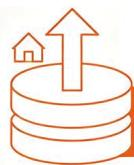

# 获得认证和资质

- 苏州子公司苏州云芯微电子科技有限公司获得ISO9001质量管理体系认证  
成都华微国家级检测中心获得CNAS（中国合格评定国家认可委员会）认证

<table><tr><td colspan="2">质量目标</td><td>2025年完成情况</td></tr><tr><td colspan="2">项目主要性能指标符合率≥92%</td><td>已完成</td></tr><tr><td rowspan="2">成品合格率</td><td>一次交收合格率≥99%</td><td>已完成</td></tr><tr><td>产品合格率≥92%</td><td>已完成</td></tr><tr><td colspan="2">重大质量事故、质量问题为0</td><td>已完成</td></tr><tr><td colspan="2">顾客满意度≥96.8%</td><td>已完成</td></tr><tr><td colspan="2">及时交货率≥85%</td><td>已完成</td></tr><tr><td colspan="2">质量损失率≤0.88%</td><td>已完成</td></tr><tr><td colspan="2">一般质量问题归零率100%</td><td>已完成</td></tr></table>

# 产品质量问题处理

公司制定《质量问题处理流程文件》，明确职责分工、响应时效与处置路径，由质量管理体系推行小组统筹管理、技术质量部牵头执行。依托产品追溯系统、客户反馈渠道及内部监测机制，及时识别质量缺陷与潜在风险，严格执行质量问题分级判定标准，规范问题受理、分级响应、信息上报、技术分析、质量归零及闭环复查全流程管理。市场部协同开展售后投诉收集与反馈，技术质量部统筹跟踪整改措施落地与效果验证，切实保障客户合法权益，持续提升产品质量与服务水平。

公司建立规范的产品召回管控流程，明确触发及处置要求，履行产品全生命周期质量责任。产品出现需召回情形时，立即启动处置流程，书面通知合作方及客户相关信息，全程跟进处置，同步开展原因排查、质量整改及预防措施，最大限度降低影响，保障客户权益与公司信誉，形成质量追溯与应急处置闭环。

# 客户关系管理

成都华微以客户至上和合规经营为销售原则，制定《销售管理制度》和《客户关系管理手册》。公司明确售前，售中和售后的责任主体和核心目标。公司通过开展客户满意度调查深入了解客户对产品、服务方面的需求和期望，以便针对性地改进和优化产品和服务，提高客户满意度。公司《客户关系管理手册》文件下设顾客满意度调查流程，每年年底向客户发送满意度调查表。满意度调查内容主要包括客户对公司产品质量、服务质量、整体印象三个方面的评价信息。公司根据客户反馈进行分析，形成满意度调查报告并持续优化服务。

# 客户权益保障

公司始终坚持以客户为中心，将客户权益保障贯穿于产品研发、生产交付、技术支持与售后服务全过程，建立健全客户服务、沟通响应、产品召回、满意度管理等全链条保障机制，持续提升客户体验与合作价值，切实维护客户合法权益。

# 客户服务体系

公司构建覆盖售前咨询、售中协同、售后保障的全流程专业化服务体系，明确服务标准、响应时效与闭环管理要求，组建专业技术与客服团队，为客户提供高效、规范、可靠的一站式服务支持，确保客户需求得到及时响应与有效解决。

# 客户沟通机制

公司建立多渠道、常态化沟通平台，通过专人对接、定期回访、现场技术交流、线上反馈等方式，与客户保持稳定透明的信息互通，精准识别客户需求与潜在期望，及时处理咨询与建议，形成开放、互信、高效的沟通生态。

# 客户满意度调查

公司建立常态化客户满意度评价机制，定期开展客户调研与回访工作，系统收集服务质量、产品性能、交付保障等方面评价意见，形成调研分析与改进闭环，将客户反馈持续转化为服务优化、质量提升与管理改善的动力，不断提升客户满意度与忠诚度。

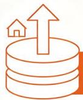

# 关键绩效

- 2025年报告期内产品及服务投诉数目1件  
- 客户投诉回复率100%  
- 客户投诉解决率100%  
- 2025年，客户满意度得分96.9，符合公司质量目标。

# 人力资本

# 治理

# 人力资源管理体系

公司始终将人才视为企业可持续发展的第一资源，坚持以国家战略需求为导向，致力于打造高科技技术人才集聚地。成都华微建立了《聘用管理办法》《考勤及休假管理制度》等一系列覆盖员工聘用、人才发展、绩效管理、薪酬福利的制度管理体系。公司人力资源部是公司的人力资源管理核心部门，负责建立健全人力资源管理制度体系，开展公司人力资源规划、招聘配置、培训与发展、绩效管理、薪酬福利管理等工作。持续强化雇主品牌建设，系统宣传公司科研平台优势与技术发展前景，不断提升在高校及人才市场的吸引力与影响力。

# 职业卫生管理体系

公司严格遵循《中华人民共和国职业病防治法》《中华人民共和国消防法》《安全生产法》《职业病防治法》等法律法规，落实“党政同责、一岗双责、齐抓共管、失职追责”及“三管三必须”要求，构建合规、系统、可持续的职业健康安全管理体系，为员工打造安全健康的工作环境。公司设立以总经理为组长的职业卫生领导小组与工作小组，明确各层级的主要职责。

职业卫生领导小组组织架构与主要职责

<table><tr><td>负责人</td><td>核心组成</td><td>主要职责</td></tr><tr><td>总经理(组长)</td><td>分管领导相关部门负责人</td><td>统筹职业卫生监督管理工作查处违法违规行为健全管理制度,完善档案制定防治计划、实施方案及危害事故应急预案</td></tr><tr><td>专项负责人</td><td>安全管理生产运营人力行政等人员</td><td>落实危害因素控制,做好防护设施与个人防护用品的管理使用开展危害辨识与风险评价组织职业病防治宣传教育与培训</td></tr></table>

# 安全生产管理体系

成都华微严格遵守《中华人民共和国劳动法》《中华人民共和国安全生产法》，制定《安全生产责任制》《安全生产目标管理制度》《安全生产会议管理制度》《安全教育培训管理制度》《安全生产费用提取和使用管理制度》等44项安全生产管理制度，以制度刚性规范安全生产行为，保障运营安全与员工健康。

安全生产组织架构与主要职责

<table><tr><td>机构名称</td><td>职务设置</td><td>核心组成</td><td>机构定位与职责</td></tr><tr><td>安全生产委员会</td><td>总经理副主任主管安全生产副总经理</td><td>各口分管领导主要部门负责人</td><td>·作为公司安全生产最高决策与领导机构·统筹安全管理重大事项</td></tr><tr><td>安全生产办公室</td><td>专职安全管理人员</td><td>安全管理专职团队</td><td>·安委会日常办事机构·牵头推进安全生产日常管理、监督检查、培训演练、隐患整改等各项工作</td></tr><tr><td>部门兼职安全管理岗</td><td>部门兼职安全员</td><td>各部门指定人员</td><td>·落实本部门安全管理、现场巡查、合规宣导、隐患上报与整改跟进工作</td></tr></table>

# 战略

成都华微将人力资本作为高质量发展的核心战略资源，紧扣特种集成电路行业特点，构建“引育留用培”全链条人才体系，打造高素质人才队伍，为技术攻关与可持续发展夯实人才基础。

公司坚持市场化引才，建立管理与技术双通道晋升机制，通过“能力 - 贡献矩阵”实现薪酬精准匹配，对核心人才加速调薪，研发薪酬投入与核心人才增幅均保持行业竞争力。同时创新“虚拟跟投 + 专项激励”双轨长效机制，推行研发提成、节点奖励与科创专项奖，绑定员工与企业利益。

深化产教融合，创新 “1+1+N” 校企合作模式，共建产业学院与实训基地，并搭建多层级内部培训体系，培育复合型专业人才。公司不断完善薪酬福利与人才保障，以公正激励与员工关怀提升归属感，实现人才价值与企业发展同频共振，以高素质人才支撑技术突破与产业升级，助力国家芯片国产化替代战略。

战略

<table><tr><td>机遇与风险类别</td><td>潜在影响分析</td><td>影响时间范围</td><td>应对措施</td></tr><tr><td>政策风险</td><td>若未能严格遵守劳动用工相关法律法规,易引发劳动纠纷,产生企业负面舆论,可能面临行政法律处罚、员工维权等问题,损害公司行业口碑与品牌形象。</td><td>短、中、长期</td><td>严格遵守国家及地方劳动用工法律法规,落实公司人力资源管理制度,规范用工管理标准;建立用工政策定期审核与更新机制,结合行业特点与经营实际优化用工流程,全面保障用工合规。</td></tr><tr><td>运营风险</td><td>特种集成电路行业具有技术壁垒高、人才竞争激烈的特征。若公司薪酬福利与职业发展体系竞争力不足,易引发核心技术人才流失,进而造成在研项目中断、核心技术外泄,短期内影响研发进度与产品交付,长期将削弱企业技术创新能力与市场竞争优势。行业技术迭代迅速,若员工技术培训体系不健全、知识更新滞后,将导致研发周期延长、芯片良品率下降及产品性能难以匹配市场需求,最终影响公司市场占有率。</td><td>短、中、期</td><td>公司构建具有行业竞争力的薪酬福利体系,配套股权、项目奖金等长效激励,绑定核心人才与企业共同发展。建立管理与专业双通道晋升机制,为员工规划清晰职业成长路径。搭建多层级技术培训体系,开展专项技能培训,支持员工参与高端技术交流,并对取得新技术认证与职业资格者予以专项奖励。持续优化配套保障,营造创新文化,提升员工归属感;建立核心人才池,通过内部轮岗培养复合型人才。同时深化与高校产学研合作,定向培养FPGA设计、高速ADC/DAC研发等专业人才,充实核心技术人才储备。</td></tr><tr><td>工作安全与健康风险</td><td>公司芯片测试、实验室操作等岗位存在设备操作、电路检测等安全隐患,若安全防护措施不到位、操作不规范,易引发工伤事故,研发实验室部分环节若防护不当还可能产生职业健康隐患,企业将因此承担经济赔偿、行政法律责任,严重时可能导致相关实验室停工整顿,影响研发项目推进。</td><td>短、中、长期</td><td>严格遵守安全生产、职业健康相关法律法规,完善公司制度文件,为测试、实验等岗位足额配备专业安全防护设备及用品;建立安全生产定期检查与隐患整改机制,重点排查安全隐患,发现问题立即整改并跟踪闭环;常态化开展全员安全生产及职业健康培训,定期组织安全应急演练,提升员工安全防范与应急处置能力。</td></tr><tr><td>创新驱动机遇</td><td>公司核心业务聚焦特种集成电路设计与研发,员工创新能力可催生芯片设计新思路、电路工艺改进新方案,助力突破核心产品技术瓶颈,推动产品迭代升级,开拓新的市场及利润增长点,强化公司技术核心竞争力。</td><td>中、长期</td><td>设立创新专项奖金,对提出有效技术创新、工艺改进、产品优化方案的员工给予分级奖励;营造开放包容的科技创新氛围,鼓励跨部门协同创新;建立创新项目全流程管理机制,对员工提出的创新项目进行可行性评估,通过后给予全方位支持,保障创新项目落地实施。</td></tr><tr><td>员工忠诚提升机遇</td><td>作为技术密集型企业,核心研发人员的高忠诚度,有利于公司核心技术、研发经验的传承与积累,减少人才培养成本,提升研发、生产、检测等各环节工作效率,保障科研项目稳步推进,同时增强团队凝聚力,为公司持续技术创新及业务发展奠定坚实的人才基础。</td><td>中、长期</td><td>聚焦员工职业发展需求,结合集成电路行业技术发展趋势,为员工提供定制化培训及晋升机会,打通专业人才成长通道;开展多元化员工关怀活动,完善带薪休假、健康体检、福利补贴等配套福利体系,关注员工工作与生活平衡;建立公正、透明的绩效考核与激励机制,将考核结果与薪酬、晋升、奖励深度挂钩,增强员工的企业归属感与职业成就感。</td></tr></table>

# 影响、风险和机遇管理

成都华微围绕员工招聘、培养、激励和留存全维度，建立系统化的识别、分析、评估、应对与动态监控机制，精准管控人力资源管理各环节潜在风险。公司通过完善的人才引育留用体系、市场化的激励机制与规范化的用工管理，保障核心研发团队稳定、员工能力与行业技术发展同频，直接推动公司科研项目攻关、核心产品迭代与经营效率提升，同时通过产教融合、定向培养等模式，为集成电路行业输送专业技术人才，履行企业人才培养的社会责任。公司高度重视人力资源管理中的潜在负面影响，严格遵守劳动用工、职业健康安全等法律法规，通过规范用工、完善员工关怀和强化安全防护，切实维护员工合法权益，规避用工不合规、职业健康保障不到位等问题对员工权益及企业品牌形象的损害，推动企业与员工的和谐共生发展。公司聚焦特种集成电路行业人力资源关键风险，建立分级管控与应对机制，完善安全生产及职业健康管理制度，配齐防护装备，常态化开展安全培训、应急演练与隐患排查整改，保障员工职业健康安全。

公司将人力资本管理与战略发展深度融合，释放人才红利：

# 创新驱动机遇

依托创新奖励制度，设立专项激励，构建跨部门创新机制，鼓励技术攻关，将员工创新转化为核心技术突破、产品升级与成本优化的核心动力。

# 员工忠诚提升机遇

通过职业发展规划、多元关怀及公平激励，增强员工归属感，实现技术与经验传承，提升运营效率、降低培养成本，保障研发项目稳定推进。

# 行业人才培养机遇

深化产教融合，与高校共建产业学院及实训基地，定向培养专业人才，充实自身人才储备，同时助力集成电路国产化人才供给，实现企业与行业共赢。

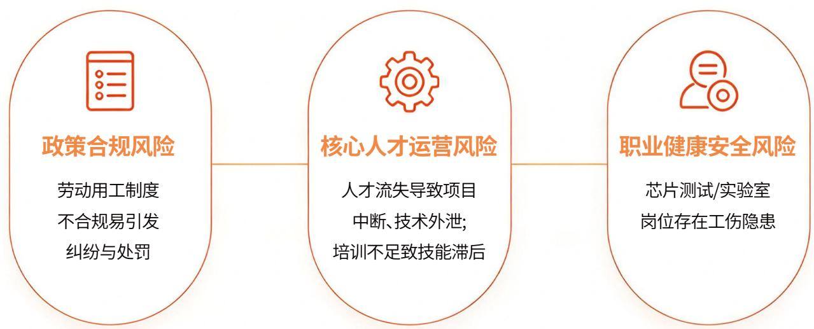

flowchart

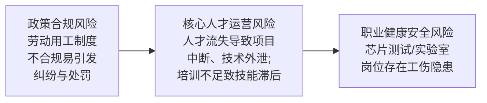
```mermaid
graph LR
  A["政策合规风险\n劳动用工制度\n不合规易引发\n纠纷与处罚"] --> B["核心人才运营风险\n人才流失导致项目\n中断、技术外泄;\n培训不足致技能滞后"]
  B --> C["职业健康安全风险\n芯片测试/实验室\n岗位存在工伤隐患"]
```

# 指标与目标

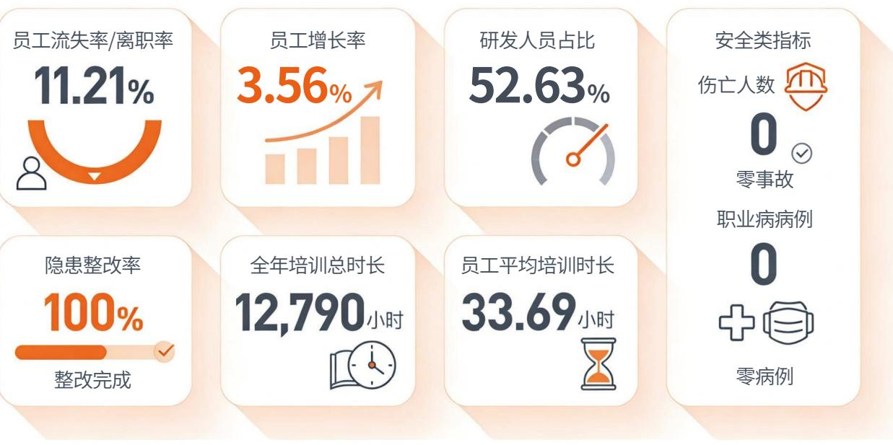

gauge

| Metric | Value |
| --- | --- |
| 员工流失率/离职率 | 11.21% |
| 员工增长率 | 3.56% |
| 研发人员占比 | 52.63% |
| 隐患整改率 | 100% |
| 全年培训总时长 | 12,790小时 |
| 员工平均培训时长 | 33.69小时 |
| 安全类指标::伤亡人数 | 0 |
| 安全类指标::零事故 | 零事故 |
| 安全类指标::职业病病例 | 0 |
| 安全类指标::零病例 | 零病例 |

# 员工雇佣与劳工关系

# 合规雇佣

成都华微严格遵循公开、平等、竞争、择优的招聘原则，依据《中华人民共和国劳动法》《中华人民共和国就业促进法》《中华人民共和国劳动合同法》《国际劳工组织公约》等法律法规，建立健全招聘录用与用工管理体系，制定《人才需求与招聘引进管理办法》《聘用管理办法》《考勤及休假管理制度》等内部制度，对岗位需求发布、候选人筛选、笔试面试、背景调查、录用审批等环节实施全流程规范管理。公司在招聘中坚持岗位能力与价值观双重匹配，通过数字化招聘平台实现招聘过程全程留痕、透明可溯，持续提升招聘工作的规范性、合规性与科学性。

公司严格恪守国际劳工标准及国家相关法律规定，坚决禁止雇用童工与任何形式的强制劳动，通过严格核查入职年龄及身份证明、定期开展员工档案审查等方式，从源头杜绝童工及强迫劳动风险。在用工管理中，公司遵循平等自愿、协商一致原则，依法与员工签订劳动合同，切实保障员工合法权益，全面实现合规用工。

2025 年报告期间内，未发生使用童工、强迫劳动等不符合劳工标准的事件，未发生因劳动仲裁而被行政处罚的情况。

# 股权激励

公司始终坚持人才为本，聚焦核心人才长效留存与价值绑定，构建以员工原始股股权激励为核心的多元化人才激励体系，牢牢稳固技术密集型企业核心竞争力。公司面向核心骨干、技术中坚及关键岗位员工，专属推出原始股股权激励计划，让核心员工以主人翁身份共享企业发展红利。

<table><tr><td>员工持股情况</td><td>数值</td></tr><tr><td>员工持股人数(人)</td><td>133</td></tr><tr><td>员工持股人数占公司员工总数比例(%)</td><td>13.43</td></tr><tr><td>员工持股数量(万股)</td><td>4083.86</td></tr><tr><td>员工持股数量占总股本比例(%)</td><td>6.41</td></tr></table>

截至 2025 年 12 月 31 日公司员工通过成都华微众志共创企业管理中心、成都华微展飞伙伴企业管理中心、成都华微同创共享企业管理中心和成都华微共融众创企业管理中心持股平台的持股情况，不包含退休人员、离职人员等非公司员工，不包括员工于二级市场自行购买情形。

# 保障人权

公司严格遵守国际劳工标准与国家劳动法律法规，建立完善人权保障与劳工权益管理体系，明确禁止童工、强迫劳动与任何形式歧视，保障员工平等就业、同工同酬、休息休假与职业发展权利。公司将人权与劳工标准纳入供应链管理，对供应商开展人权风险审核与监督，构建全链条责任保障机制，报告期内未发生人权相关违规事件。

# 薪酬体系

公司严格遵守《中华人民共和国劳动法》及劳动用工相关法律法规，建立并完善《薪酬福利管理办法》《年度绩效激励管理办法》，明确薪酬结构与福利标准，保障薪酬政策公开透明、稳定规范。公司结合业务类型、岗位职责、技术能力及价值贡献，建立研发、技术支持、管理、销售业务、检测操作五大类薪酬体系，确保薪酬水平与岗位价值精准匹配。

公司全面推行全员绩效管理，将薪酬分配与绩效贡献紧密挂钩，在奖金分配、岗位调整及职级晋升等方面向高绩效员工倾斜，树立“绩优者上”的激励导向。同时，公司建立健全岗位职级体系，引导员工通过持续提升专业能力实现职级晋升与薪酬增长，打通多元化职业发展通道。

公司严格践行同工同酬原则，薪酬决策均以岗位价值、任职资历、工作绩效为核心依据，坚决杜绝因性别、年龄、民族等因素产生的薪酬差异。针对部分岗位采用的劳务派遣用工形式，公司明确劳务派遣员工与正式员工在相同岗位享有同等薪酬福利标准，切实保障全体员工的合法权益与公平待遇。

岗位需求发布 → 候选人筛选 → 笔试面试 → 背景调查 → 录用审批  

natural_image

Simple line drawing of a series of four connected arcs (no text or symbols)

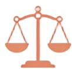  
劳动法规

  
拒绝童工

  
零劳动仲裁事件

# 员工权益

# 多元化与包容性

公司严格遵守《国际劳工组织公约》《中华人民共和国劳动法》《中华人民共和国就业促进法》《中华人民共和国妇女权益保障法》等法律法规，坚决反对任何形式的就业歧视，坚持公开、公平、公正原则，为全体员工提供无差别的平等发展机会。公司在招聘录用、岗位安排、职业发展等环节充分尊重员工差异，不因种族、性别、年龄、宗教信仰、残疾状况等设置区别对待条件，积极构建多元、平等、包容的职场环境。公司依法与员工签订劳动合同，明晰双方权利与义务，切实保障员工合法权益，持续推进多元化与包容性企业文化建设。

公司在招聘中吸纳不同背景、专业经验的人才，打造多元化员工队伍；倡导尊重包容的企业文化，鼓励员工共表达不同观点，重视每一位员工的声音；设定多元化发展目标，定期评估推进成效，让多元包容成为企业发展的内生动力。

截至2025年底，公司员工总数990人，劳动合同签订率与社会保险缴纳率均为 $100\%$ ，女性员工人数占比 $26.76\%$ ，少数民族人数32人，占比 $3.46\%$ ，女性核心管理人员占比 $20\%$ 。

# 反歧视政策

平等机会：公司在招聘、晋升、薪酬、培训和发展方面，确保所有员工享有平等机会，不因种族、性别、年龄、宗教、国籍等因素受到歧视。

零容忍政策：明确禁止任何形式的歧视、骚扰或偏见行为，违者将受到严肃处理，包括警告、停职或解雇。对于职场霸凌、欺凌现象零容忍。

投诉机制：建立匿名投诉渠道，员工可以安全地举报歧视行为，公司将及时调查并采取适当措施。

# 员工申诉与反馈

成都华微建立健全员工反馈与申诉闭环管理机制，搭建OA系统、座谈交流等多渠道反馈平台，畅通员工诉求表达路径；制定规范的申诉处理流程，明确受理、核查、处置及反馈时限，保障员工合法权益与合理诉求得到公正回应、及时解决，切实提升员工归属感与幸福感。

# 员工权益与福利

公司严格遵守劳动保障法律法规，构建合规完善、有温度的员工福利保障体系，切实维护员工权益，提升归属感与幸福感。

法定福利保障公司按时足额发放薪酬，五险一金覆盖率100%，全面落实带薪年假、法定节假日及各类休假权益，坚守用工合规底线。补充福利与人文关怀公司为员工投保补充商业保险、安排年度健康体检，提供工作日餐补；推行柔性办公，配备母婴室、职工书屋等设施。常态化开展节日与生日慰问，组建文体社团并举办团建活动，营造温暖包容的职场氛围，增强团队凝聚力。

# 民主管理

在民主管理与权益保障层面，公司严格坚持以职工代表大会为基本形式的民主管理制度，成都华微依据《中华人民共和国工会法》《中国工会章程》，建立健全工会体系，维护员工劳动权益，建立以职工代表大会为基础形式的企业民主管理形式，充分保障职工的知情权、参与权、表达权和监督权。除了职工代表大会，成都华微已连续五年不定期举办“书记面对面”的座谈会。

报告期内，公司根据《工会法》《中国工会章程》《工会基层组织选举工作条例》及总工会批复，成都华微工会委员会召开会员代表大会，34名会员代表参加。成都华微工会以本次大会为契机，围绕职工实际需求，积极开展各类活动，维护职工合法权益，为企业高质量发展凝聚强大合力，在新时代展现工会组织的新作为、新担当。报告期内，定向征集并闭环落实涉及经营管理、技术创新、员工福利等各类提案13件，提案办结率达100%。

民主管理  
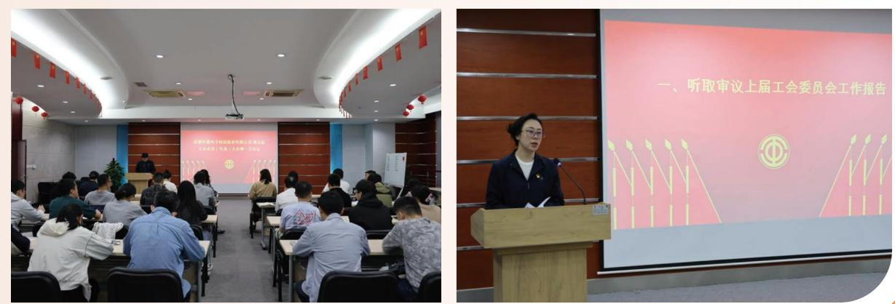

# 员工关爱

在员工关爱与帮扶层面，尤其是困难员工，公司推行全覆盖、精准化的暖心关怀服务，全年常态化开展生日、生病住院、婚育、丧事等专项慰问，累计覆盖各类慰问超950人次。

- 在春节、端午、中秋等传统节日，为全体员工配备节日慰问品，切实传递组织关怀；  
- 聚焦职工急难愁盼问题，针对职工子女暑期无人照料的痛点，联合属地桂溪街道开展“暑期托管暖心行动”，切实解决职工后顾之忧；  
- 关注员工心理健康，定期开展心理健康问卷调查，依托内部沟通平台主动倾听员工心声，及时响应并妥善处置员工合理诉求，营造和谐包容的“家”文化氛围；  
- 健全工会服务体系，将异地研发中心近百名员工全面纳入统一管理，建立专项联络机制，保障异地员工享有同等关怀与服务。

三八妇女节活动  
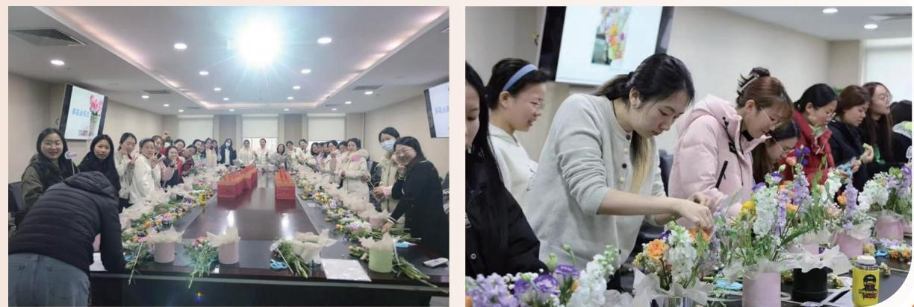

“饺香润芯 聚微成华”主题活动  
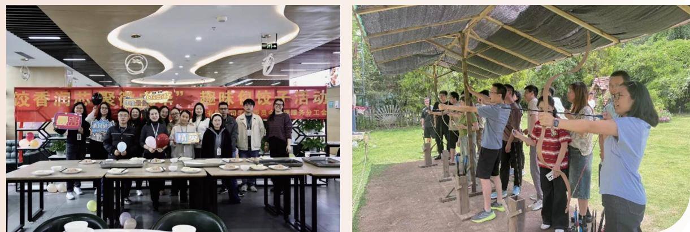

# 劳工关系

公司坚持将提升员工满意度、构建和谐稳定劳动关系作为人才发展与治理能力建设的重要内容，通过健全的规章制度、畅通的沟通渠道和前瞻性的员工关怀，公司劳动关系整体保持和谐稳定。

成都华微面向全体员工定期开展匿名满意度问卷调查，围绕管理决策机制、工作环境氛围、企业文化认同等核心维度收集员工反馈。调查结束后，由人力资源部开展多维度数据分析，形成专项报告，为持续优化管理、提升员工体验提供决策支撑。

2025年度员工满意度是98.75%。

# 员工发展与培训

# 多维职业发展体系，畅通人才晋升通道

公司立足员工长远发展，建立公开透明的竞聘晋升机制，坚守“能者上、庸者下”的用人导向，严守公平、公开、公正原则，保障全员平等发展权益。通过标准化、科学化评估，精准匹配人岗需求，助力员工明确成长目标、实现职业突破。定期开展人力资源盘点，优化人员配置，统筹内部竞聘与外部引才，全方位引育留用优秀人才，高效满足各部门人才需求，为公司长远发展提供坚实人才支撑。

# 系统化培训体系，培育高素质专业人才

公司高度重视员工专业能力与综合素质提升，依据《成都华微培训管理办法》，搭建分层分类、科学完善的员工培训体系，提供素质类和技术类的多维度培训，同步建立配套培训反馈与激励机制，既全面提升员工核心技能，又充分调动员工自主学习、主动提升的积极性，打造学习型组织氛围。通过完善的职业发展通道与系统化培训赋能双轮驱动，成都华微持续优化人才发展生态，既保障员工合法发展权益，又提升团队整体核心竞争力，实现员工个人价值与企业可持续发展的双向共赢。

全年培训投入金额：35.88万元  
全年培训总人次：1911人次  
- 员工接受培训的总时长：12790 小时  
- 员工内部调动或内部应聘人数：66人

# 职业健康与安全

成都华微以源头防控、过程管控、闭环治理为核心，建立安全风险辨识分级管控及隐患排查治理双预控机制，持续完善安全防护设备设施与厂区作业环境，全面提升安全风险预防与处置能力。

# 危险源识别与分级管控

公司严格依据《危险化学品重大危险源辨识》（GB18218-2018）开展辨识评估，经评定公司不存在重大危险源。

按照公司《安全生产风险分级管控制度》要求，公司组织专业力量全面开展危险源辨识与风险评价工作，共自评识别危险源108项，实施分级分类精准管控。其中，Ⅱ级（较大风险）危险点9项，主要为储气罐、气瓶等；Ⅲ级（一般风险）危险点13项；低风险点86项。

公司对Ⅱ级危险源实行重点监控、从严管控，对储气罐、气瓶建立每日巡查制度，强化日常巡检、动态监测与闭环管理，有效防范化解安全风险，坚决遏制安全事故发生。

# 较大风险

# II级（9项）

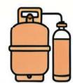

# 一般风险

# III级（13项）

# 低风险

# 86项

II级较大风险重点管控  
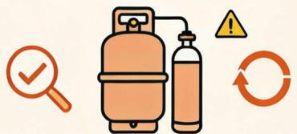  
每日巡查、动态监测、闭环管理

# 风险管控及隐患排查

公司严格执行《安全检查与隐患治理制度》，构建多层级、常态化安全检查体系：主要负责人每年带队开展安全检查不少于4次，由高层带头压实安全管理责任；安全办公室联合各部门负责人及专（兼）职安全员，常态化开展多维度检查，实现安全监管全覆盖。

在隐患治理环节，公司执行全过程闭环管理：安全检查人员对现场违章行为及事故隐患即时取证留档，下达书面整改通知单，明确整改要求与期限，建立台账跟踪整改进度，确保查出安全隐患100%按期整改完成，实现隐患排查、整改、复核、销号全流程可控可追溯，切实防范安全事故发生，保障生产运营安全与员工职业健康。

安全生产检查，隐患排查及整改  
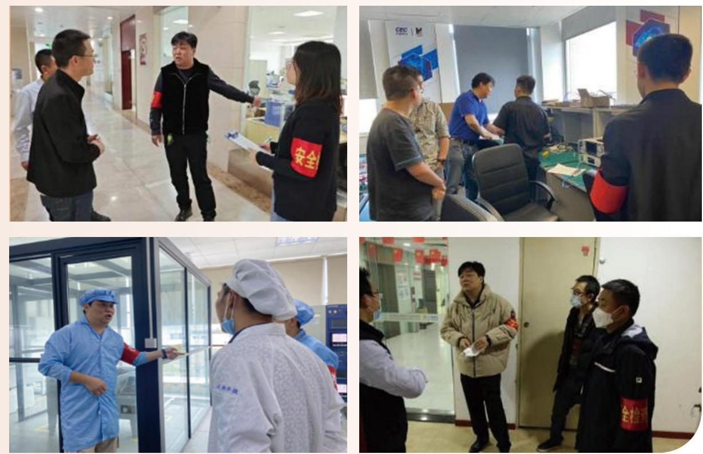

# 风险管控及隐患排查

近年来，公司持续开展治本攻坚三年行动，从根本上消除事故隐患，有效防范遏制重特大生产安全事故。2025年，公司安全生产办公室联合各部门及安全员开展综合检查、季节性检查、专业检查等一系列安全检查42次，第三方检查3次，查出的安全隐患全部整改闭环，隐患整改率100%。

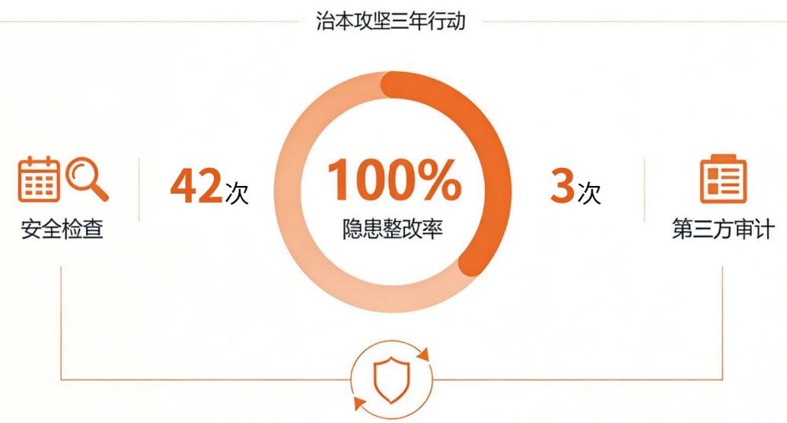

donut

| 类别 | 次数 |
| --- | --- |
| 安全检查 | 42 |
| 隐患整改率 | 100% |
| 第三方审计 | 3 |

# 应急救援与演练

成都华微建立健全系统化、科学化、实战化的生产安全事故应急管理体系，全面提升突发安全事件快速响应与高效处置能力，切实保障员工生命安全与公司财产安全。

公司制定并完善应急预案体系，包含综合应急救援预案1项、专项应急预案2项、现场处置方案11项，形成“综合—专项—现场”三级预案支撑；成立应急领导小组，配备兼职应急救援队伍，对生产现场人员、设备、物资进行统一部署与统筹调配，确保突发状况下快速响应、高效处置、保障有力。

公司坚持以演促练、以练备战，建立常态化应急演练机制。每年组织1次综合应急演练及专项应急演练，各业务部门每半年开展1次现场处置演练，通过实战化演练持续强化员工应急避险、自救互救与协同处置能力，不断提升应急管理水平与风险应对韧性。

2025年公司开展各种应急训练27次，应急演练参与人数555人。

应急救援与演练  
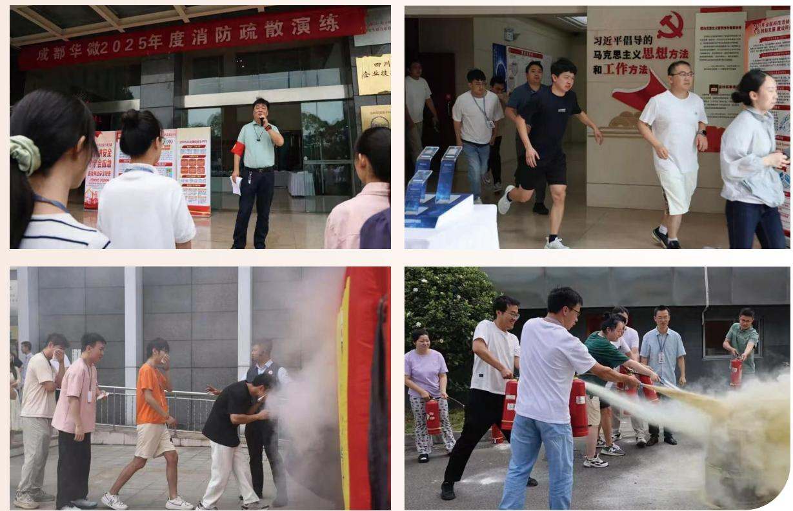

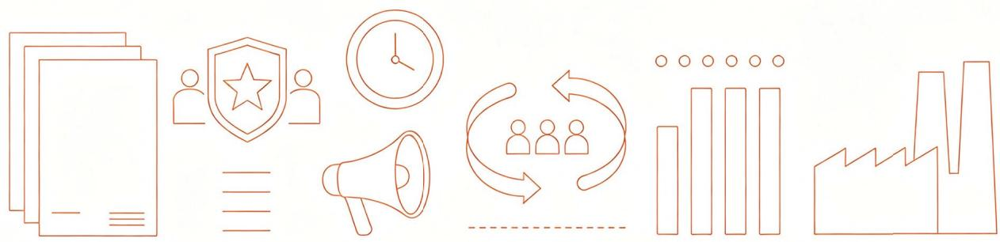

natural_image

Illustration of various digital and media icons including documents, shield, megaphone, clock, group icon, bar chart, and factory silhouette (no text or symbols)

# 职业健康安全培训

成都华微严格依据《安全教育培训管理制度》及安全生产相关法律法规，系统化开展全员职业健康安全培训，有效防范和遏制工伤事故发生。公司围绕安全作业、规范操作等核心要求，常态化、不定期开展各类安全主题教育培训，推动安全理念与操作技能落地见效。

公司结合不同岗位、不同层级的培训需求，建立五级安全教育培训体系，包括：公司级安全教育、部门级安全教育、复工及转岗员工上岗安全教育、新员工入职安全教育、全员常态化安全教育，实现培训对象全覆盖、无遗漏。培训内容覆盖安全生产法律法规、岗位安全操作规范、危险源辨识与风险管控、个人防护用品正确佩戴与使用、应急处置技能等关键模块，内容系统、务实、贴合现场作业，确保员工全面掌握并熟练运用安全知识。

报告期内，公司开展“安全生产宣传咨询日”答题活动，此次活动设置“一起来找茬”、看图找风险、随机答题共三个环节，内容涵盖安全生产、劳动防护、职业健康、消防、应急处置等多方面的知识内容。职工们积极参与，踊跃答题，通过趣味的互动问答，学到了实用的应急避险知识，提升了隐患排查和应急处置能力。通过此次活动，增强了企业职工安全生产意识，营造了浓厚的安全文化氛围。公司始终秉持安全是企业发展的基石，安全无小事，安全管控全员参与是关键的原则，全体员工以演练培训为契机，将消防知识内化于心、外化于行，真正做到“人人讲安全、个个会应急”。

# 成都华微斩获双流区“安康杯”安全知识竞赛暨应急处置比赛

2025年12月8日，公司工会与安全生产办公室选派5名安全骨干参加由成都市双流区多部门主办的“安康杯”安全知识竞赛暨应急处置比赛，在知识竞答和实操演练中表现优异，最终斩获二等奖。

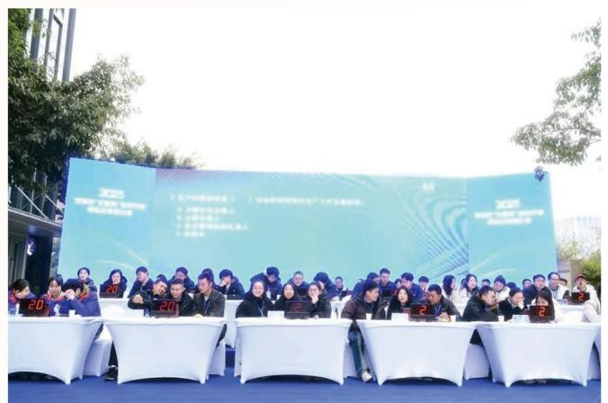

text_image

Outdoor event photo with large screen displaying Chinese text and seated attendees, some holding numbered signs

# 安全生产培训资金投入

22.82万元

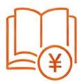

# 全年安全生产培训总时长

4,657 小时

# 公司年度安全生产投入

49.5万元

# 在职员工工伤保险投入

48.63万元

覆盖率100%

# 职业安全保险

公司依法为全体员工足额缴纳工伤保险，报告期内总投入48.63万元，覆盖率达100%，为员工提供了法定的职业风险保障。此外，为强化风险抵御能力，公司还额外投保了职业安全保险，年度投入53.87万元，进一步转移和降低了企业安全生产风险。

# 报告期间内安全生产工作主要绩效

- 死亡、重伤、轻伤、火灾、爆炸事故0次  
- 职业病病例0例  
- 应急设施完好率100%  
- 特种设备检验合格率、完好率100%  
- 隐患整改率100%  
- 三项岗位人员（企业主要负责人、安全管理人员及特种作业人员）持证上岗率100%  
- 新员工、变换工种及复工人员等安全教育培训合格率100%

# 供应链管理

# 治理

公司建立董事会战略与 ESG 委员会统筹决策、经理层及职能部门监督管控、采购和供应商管理部落地执行的三级供应链治理架构，将 ESG 理念、供应链安全和自主安全深度融入全流程管理，形成决策科学、执行高效、监督到位的闭环治理机制，打造可持续供应链和责任采购体系。

依托《供应商管理制度》《采购管理制度》《采购计划管理手册》等规范体系，实施供应商准入认证、分级考核、动态淘汰的全生命周期管理，围绕质量、交付、成本、合规与可持续表现开展常态化评估与持续改进；坚持 Fabless 运营模式，聚焦设计与自研测试核心能力，强化晶圆、封测、关键材料的供应链备份与国产化替代，推进本地产业链协同，严控供应链风险，保障特种集成电路高可靠交付与产业链安全。

质量问题处置职责表

<table><tr><td>架构</td><td>部门名称</td><td>职责描述</td></tr><tr><td>决策层</td><td>董事会及战略与ESG委员会</td><td>制定供应链战略、国产化/自主安全政策、供应商分级与风险管控政策审批重大供应商合作事项、年度采购预算、关联交易事项、供应链应急方案监督供应链合规运营、ESG绩效达成情况、质量与交付目标的实现情况建立供应链内控体系,明确各层级审批权限和责任边界</td></tr><tr><td>管理层</td><td>经理层及技术质量部</td><td>监督供应链流程合规性、反舞弊工作情况、供应商管理规范性定期审查采购、外协、付款、库存、物流环节运行情况牵头管控供应链产品质量,保障质量体系有效运行</td></tr><tr><td>执行层</td><td>采购与供应商管理部</td><td>进行供应商开发、准入、认证、评估、考核、分级、淘汰全生命周期管理执行采购招标、日常谈判、合同签订、款项支付等日常运营工作维护核心供应商关系,推进国产化替代、战略合作及联合技术创新落实外协加工管理,进行产品质量过程管控</td></tr></table>

# 战略

公司致力于打造稳定可靠、安全韧性、高效协同、可持续供应链体系，为公司长期稳健发展与价值创造筑牢产业根基。公司根据编制的《供应商管理手册》规范开展供应商开发遴选、准入审核、绩效评价及合格供应商动态监督管理工作，以制度化、标准化手段提升供应链管理水平。成都华微供应链守则中包含SA8000社会责任标准的基本内容。

# 供应商全生命周期管理

供应商评估与准入：公司建立了《供应商准入流程文件》，细化对新增供应商的需求；对于名录外合作供应商，按照《名录外供应商管理流程文件》履行相关审批手续。

供应商日常监督管理：定期按照《合格供应商名录动态管理流程文件》的要求，审查供应商履约能力并识别供应商风险。对不同供应商进行分类，将合格供应商划分为关键供应商、重要供应商、一般供应商；并建立相应的分类管理策略。

供应商考核：根据《合格供应商年度绩效评价流程文件》的要求，对供应商进行年度绩效评估；对于评分较低的供应商，提出整改要求。

供应商退出：剔除不符合要求的供应商。该流程强调了华微对于供应商管理的要求，也展示了华微在供应链管理中的态度。

# 影响、风险与机遇管理

2025年，公司推动供应链从“稳定保障”向“合规高效、绿色可持续”升级，实现风险可控、价值提升、多方共赢的治理目标。

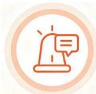  
实时风险预警  
公司建立《采购与外包风险预警机制》，对供应链采购环节实施动态风险监测与实时预警。按每季度一次的频率，对合作供应商开展多维度风险因素评估，依据评估结果判定风险预警等级；针对预警信息实行分级分类管理，匹配差异化处置方案，并对供应商整改落实情况进行全程跟踪与效果复核，验证风险管控成效，动态优化应对策略，确保风险闭环可控。

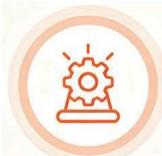  
年度风险预警

每年年末，公司对所有供应商开展全面信息归集与综合研判，系统收集供应商财务状况、生产保障能力、质量履约表现等关键信息，严格按照《供应商管理手册》开展年度综合评价；同步结合行业趋势与市场环境变化，精准识别潜在风险并及时发布预警提示，提前防范供应链运营风险。

供应链关键风险识别

<table><tr><td>风险名称</td><td>风险等级</td><td>风险类别</td><td>核心成因</td><td>潜在影响</td></tr><tr><td>供应商资源短缺风险</td><td>中风险</td><td>供应链管理风险</td><td>现有优质供应商资源储备不足、覆盖维度有限;外部市场出现行业产能不足、原材料供应紧张等突发情况时易出现产能匹配缺口</td><td>订单无法按时交付,延误交货周期;紧急采购推高成本,削弱采购竞争力,影响客户信任与市场口碑</td></tr><tr><td>业务流程与制度文件不匹配风险</td><td>低风险</td><td>供应链管理风险</td><td>部门实际业务流程与公司制度体系存在偏差,部分制度内容不完善、更新滞后,日常业务无法规范执行</td><td>直接影响客户审核满意度</td></tr><tr><td>技术支持不及时风险</td><td>低风险</td><td>供应链管理风险</td><td>技术人员配置有限,多线需求叠加导致响应滞后,客户技术需求无法快速解决</td><td>降低服务体验,影响长期合作粘性</td></tr><tr><td>物料验收错漏检风险</td><td>低风险</td><td>运行控制风险</td><td>物料入厂验收环节管控存在漏洞,不合格物料易流入生产线</td><td>拉低产品整体质量,削弱市场竞争力</td></tr><tr><td>生产基地搬迁质量管理风险</td><td>极低风险</td><td>产品风险</td><td>2025年5月生产基地搬迁后,生产线、基础设施、设备变更,短期内质量管理体系覆盖不完整</td><td>极个别情况下可能影响产品质量稳定性(发生概率低、影响范围可控)</td></tr><tr><td>审计监察抽样管控风险</td><td>极低风险</td><td>审计监察风险</td><td>受审计效率与实操成本限制,供应链相关审计以抽样检查为主,无法实现全量全覆盖核查</td><td>审计发现问题不够全面,难以彻底排查细微管理漏洞(整体可控,无重大合规隐患)</td></tr></table>

# 供应商赋能与培训

成都华微依托技术支持中心专项职能，搭建标准化、专业化的供应商培训与技术交流体系，聚焦工艺优化、质量管控、技术适配与合规运营四大核心，联动上下游合作伙伴共筑稳定高效、技术领先、风险可控的供应链生态，实现供需双方能力共进、价值共赢。成都华微以合规、公平、透明、共赢为原则，从制度、合同、付款、争议、合作全链条保障所有供应商合法权益。

# 指标与目标

公司对供应链管理设定分层级管控目标，在化解各类风险的同时，依托风险整改与流程优化，挖掘供应链提质增效和可持续发展的机遇。

# 短期管控目标

- 全力化解中等级供应商资源短缺风险，拓宽供应商渠道、完善备选供应商库，保障订单100%按时交付；  
• 完成技术支持流程与制度一致性整改，优化人力配置，提升客户服务与审核满意度；  
- 严控物料验收质量，杜绝不合格物料入厂，保障生产基地搬迁后质量体系平稳过渡；  
- 优化审计抽样方法，实现审计问题闭环整改。

# 长期治理目标

• 构建成熟完善的跨部门供应链风险管控体系，实现风险防控常态化、制度化；  
- 全面提升供应链采购竞争力、流程合规性、质量稳定性与应急保障能力；  
- 打造合规、高效、韧性强的可持续供应链，防范风险传导升级，切实维护公司、客户及产业链各方利益相关方权益。

# 主要绩效

● 2025年度供应商稽核114家,其中实施现场稽核5家。  
- 目前供应商总数145家,本地化比例92.4%(指中国的供应商)。  
公司未发生供应链环节中具有重大风险和影响的确定事件。

<table><tr><td>指标</td><td>目标值</td><td>2025年完成情况</td></tr><tr><td>工程合格率(封装)</td><td>目标值95%</td><td>已完成</td></tr><tr><td>晶圆验收合格率</td><td>目标值95%</td><td>已完成</td></tr><tr><td>原材料按期交付率</td><td>目标值70%</td><td>已完成</td></tr></table>

# 信息安全与隐私保护

# 信息安全

# 治理

公司建立了完善的数据安全及网络安全治理架构，严格执行信息系统“三员”管理制度，明确设置系统管理员、安全管理员、安全审计员，三者分别承担系统运维、安全管控、审计监督职责，形成权责清晰、相互制约、全程可追溯的信息安全管理机制。

<table><tr><td>架构</td><td>部门名称</td><td>职责描述</td></tr><tr><td>决策层</td><td>战略与ESG委员会网络安全应急领导小组</td><td>· 负责制定公司数据安全战略规划、审批重大安全事项、统筹各类资源调配,为信息安全工作提供顶层指引。</td></tr><tr><td>管理层</td><td>信息化管理中心</td><td>· 承担安全策略制定、管理制度落地实施、系统安全监控与检测、数据安全全流程管理、安全审计与风险评估、安全事件处置、调查分析及安全教育培训等核心职责,推动安全管理要求落地见效。</td></tr><tr><td>执行层</td><td>信息化管理中心下设“网络与信息安全管理”小组</td><td>· 直接负责数据安全相关具体工作,包括安全策略细化落地、系统实时监控、数据安全防护、安全审计实施等。</td></tr></table>

# 战略

成都华微严格遵循《中华人民共和国网络安全法》《中华人民共和国数据安全法》《中华人民共和国个人信息保护法》等相关法律法规，高度重视数据安全与网络安全保障工作。公司已建立完善的数据安全管理制度体系，涵盖《信息系统、信息设备和存储设备管理制度》《便携式计算机管理制度》《数据安全保障规范和流程》等制度文件，进一步规范信息系统安全运行及便携式计算机的借用、使用与全流程管理。

同时，公司制定网络安全应急响应预案及数据备份与恢复机制，明确各类突发事件的应急处置流程，切实保障数据安全与业务连续性。成都华微定期开展数据安全与网络安全风险识别、评估及预警工作，持续提升信息安全管理能力与风险防控水平。

<table><tr><td>风险类型</td><td>风险描述</td><td>影响程度</td><td>应对措施</td></tr><tr><td>外部攻击</td><td>漏洞利用攻击扫描、钓鱼邮件攻击</td><td>高</td><td rowspan="5">部署APT综合预警平台,实时监控和分析网络中的可疑活动;部署日志审计分析平台,收集边界防火墙、关键服务器日志进行分析;部署EDR终端安全防护系统,累计处置病毒5456例,修复高危漏洞96次;建立DMZ区,部署WAF防火墙进行代理转发;各网域独立部署NAC网络准入,实现区域隔离;部署堡垒机,对关键设备进行统一纳管。</td></tr><tr><td>数据泄露</td><td>敏感信息(芯片设计图纸、仿真参数)泄露</td><td>高</td></tr><tr><td>内部威胁</td><td>弱口令、非加密传输、违规操作</td><td>中</td></tr><tr><td>系统故障</td><td>服务器宕机、数据丢失</td><td>中</td></tr><tr><td>供应链风险</td><td>第三方系统安全漏洞</td><td>中</td></tr></table>

# 风险管理

# 信息安全管理制度

公司完善《网络安全策略调整申请》《WEB应用部署申请》《OA平台API接口申请》《数据备份申请》《数据恢复申请》等关键安全管理制度，建立月度安全审计制度，定期对互联网行为、计算机开展审计核查。健全应急响应机制，及时发布网络安全预警信息，提升风险预警与应急处置能力，构建全流程、全覆盖的信息安全管理保障体系。

# 信息安全监控

全年累计完成2次计算机专项检查，覆盖信息设备800余台；开展互联网邮箱专项治理，停用不常用账号37个，清理存量邮件数据，消除安全隐患；

报告期内，安全监控平台运行数据：

- APT预警风险总数约4699项，攻击者IP330个，其中258个具有高危攻击行为；  
- APT共分析了468,785个文件，发现恶意文件10个；  
• 监测到失陷主机16台，发起横向攻击主机336台；  
- 日志审计平台累计日志96亿条，日志源资产数110个；  
EDR累计守护时长1845天，防护终端1097台，处置病毒5456例。

# 信息安全认证

公司已顺利完成信息安全等级保护二级测评，目前正对照信息安全等级保护三级要求，并参考ISO27001、ISO27701等信息安全管理体系和隐私信息管理体系，有序推进各项准备工作。本次等保测评全面覆盖公司核心业务系统，涵盖OA系统、生产管理系统、质量管理系统等关键系统，有效确保公司信息系统安全防护能力达到国家规定标准，进一步夯实信息安全保障基础。

# 信息安全管控

为加强信息安全管理工作，公司针对研发、财务等核心敏感信息及网络运行安全，构建全维度、多层级的信息安全管控体系，通过技术防护、制度规范、流程管控相结合的方式，全方位防范数据泄露、网络入侵等安全风险，保障公司核心数据资产安全与业务系统稳定运行。

# 信息安全培训

成都华微将员工信息安全培训作为筑牢信息安全防线的重要抓手，把安全意识培养融入全员日常管理，结合行业特性与公司信息安全管控需求，常态化开展多形式、多主题的信息安全专项培训与宣传教育活动，全面提升全体员工的网络安全、数据保密及应急处置能力。

- 组织开展网络安全宣传周活动，通过挂横幅、OA主页宣传、全员学习课程等方式进行；  
- 开展密码宣传月活动，在官微发布415全民国家安全教育日活动，解读《中华人民共和国密码法》；  
- 组织人员进行应急响应应知应会学习，定期更新应急响应措施。

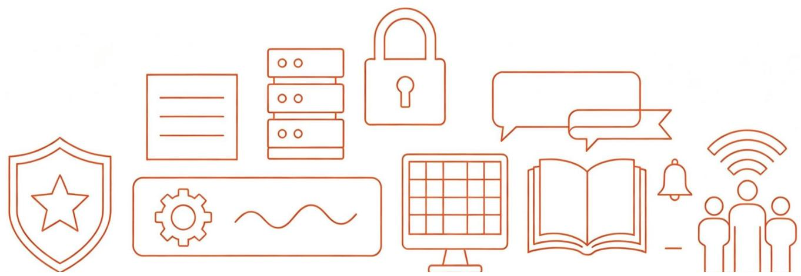

natural_image

Illustration of various digital security icons including shield, lock, gear, and people (no text or symbols)

# 供应链数据安全管理

成都华微强化上下游协同安全管控，保障供应链全流程数据资产安全，公司供应链数据安全实施严格管理：

与供应商签订保密协议，明确数据安全责任；  
- 对第三方系统对接进行安全评估，确保数据传输安全；  
- 部署出站 WAF 防火墙，内网 OA 与第三方系统交互需通过防火墙代理；  
- 定期对供应商进行安全审计，确保其数据保护措施符合公司要求。

指标与目标

<table><tr><td>指标与目标</td><td>数量</td></tr><tr><td>全年数据安全事件发生数量</td><td>0</td></tr><tr><td>全年网络安全事件发生数量</td><td>0</td></tr><tr><td>失泄密事件发生数量</td><td>0</td></tr></table>

<table><tr><td>指标</td><td>2025年目标</td><td>完成情况</td></tr><tr><td>新增网信基础设施信创产品占比</td><td> $\geqslant 80\%$ </td><td>100%</td></tr><tr><td>综合办公类系统信创替代率</td><td> $\geqslant 80\%$ </td><td>100%</td></tr><tr><td>经营管理类系统信创替代率</td><td> $\geqslant 50\%$ </td><td>100%</td></tr><tr><td>生产运营类系统信创替代率</td><td> $\geqslant 40\%$ </td><td>100%</td></tr><tr><td>计算机安全检查覆盖率</td><td>100%</td><td>100%</td></tr><tr><td>安全事件响应时间</td><td> $\leqslant 1$ 小时</td><td>达标</td></tr></table>

# 客户信息及隐私保护

公司严格遵守《中华人民共和国网络安全法》《中华人民共和国个人信息保护法》《中华人民共和国数据安全法》等相关法律法规及监管要求，建立了全方位、多层次的客户信息与隐私保护体系，筑牢客户信息安全防线。

# 制度建设

公司构建了完善的客户信息与隐私保护制度体系，明确各环节管理要求，实现客户信息保护有章可循、有规可依：

- 制定数据访问权限管理制度，遵循“最小权限原则”，精准分配数据访问权限，杜绝越权访问；  
- 建立客户数据加密存储机制，对客户敏感信息加密处理，保障数据存储安全；  
- 制定完善的数据备份与恢复策略，确保客户数据不丢失、可追溯。

# 技术保护

公司采用先进、可靠的技术手段，构建全方位的技术防护体系，强化客户信息全生命周期安全保护：

- 规范收集客户需求信息，收集的数据直接存入CRM系统，避免数据中途泄露；  
- CRM系统部署于内网环境，通过VPN实现远程安全访问，搭配WAF进行访问控制与攻击防护，防范外部网络威胁；  
- 实行客户数据与业务系统数据隔离存储，防止不同系统间数据交叉访问，降低数据泄露风险；  
部署SSL证书实现数据传输全程加密，确保客户信息在传输过程中不被窃取、篡改；  
- 建立客户数据脱敏机制，确保非授权人员无法查看完整客户信息，保护客户隐私；  
- 对失效、过期的客户数据，严格按照公司相关制度规定进行安全删除，确保数据彻底销毁，防止数据泄露。  
- 定期开展安全漏洞扫描和渗透测试，及时发现系统安全隐患，持续提升系统安全防护能力。

# 客户信息泄露事件

报告期内，公司严格执行客户信息及隐私保护相关制度、技术措施及流程管控要求。

未发生任何客户信息泄露事件，未对客户权益、公司声誉造成任何不利影响，亦未产生任何相关金额损失。

# 数字化转型

公司坚决贯彻落实数字中国建设整体布局规划、国有企业数字化转型行动计划及“人工智能+”专项行动要求，由主要领导牵头成立数字化转型工作领导小组，统筹制定公司数字化转型战略、审批重大建设事项、优化资源配置，构建顶层统筹、上下协同、数据赋能的数字化治理体系。

2025年，全年数字化转型投入1500余万元，重点推进以下工作：

- 夯实数字底座，新建芯谷数据机房，完善自主安全、安全高效的算力与数据支撑环境；  
- 健全应用体系，完成CRM客户关系管理系统、电子税务管理系统、产品选型小程序、资金管理系统、问卷调查考试系统5个信息系统及党建管理平台建设，实现全场景数字化覆盖；  
• 完成中国电子智慧薪酬、财务共享2个统建系统对接，推动集团一体化数字平台贯通落地；  
- 升级优化7个现有信息系统（模块），新增办公审批流程56个、优化94个，新增办公系统功能模块16个、优化迭代15个，全面提升运营效率与管理效能；  
- 布局智能创新，私有化部署DeepSeek-R1:70b离线大模型，结合知识库信息检索技术实现本地化RAG智能应用，以自主安全技术赋能知识管理、业务决策与场景创新。

# 平等对待中小企业

成都华微始终秉持公平、透明的合作原则，致力于与广大中小企业和小微企业构建互利共赢、协同发展的可持续生态链。

# 公平透明的采购与合作机制

公司建立了公开、规范的供应商准入与管理体系，对包括中小企业在内的所有潜在合作伙伴，均依据统一、客观的技术标准、质量要求与商业准则进行评审。在商业活动中，坚持平等协商，确保中小企业的合法权益得到充分尊重。

# 赋能产业链，助力共同成长

成都华微通过技术共享、订单支持、管理经验交流等多种方式，赋能上下游中小企业合作伙伴。公司优先考虑与具备技术特色和创新潜力的中小企业开展合作，通过联合研发、产能协同等方式，帮助其提升技术水平与市场竞争力。在供应链遭遇局部波动时，公司会与受影响的中小企业伙伴协同应对挑战，维护产业链的稳定与韧性。

# 确保及时支付，缓解资金压力

公司严格遵守合同约定的支付条款，及时向中小企业供应商支付货款。通过优化内部支付流程，保障结算效率，切实缓解中小企业的资金周转压力。公司承诺坚决杜绝无故拖欠账款的行为。

# 开放沟通与权益保障

公司设立了畅通的沟通渠道，确保中小企业在合作中遇到任何问题或疑虑时，能够及时得到反馈与妥善解决。对于合作过程中出现的争议，公司秉持公正、客观的原则，通过友好协商或法律途径积极解决，切实保障所有合作伙伴的合法权益。

截至报告期末，报告期内，没有发生应付账款（含应付票据）余额超过300亿元或占总资产的比重超过50%的逾期款项；同时公司及控股子公司严格遵守国家相关法律法规，不存在通过国家企业信用信息公示系统向社会公示逾期尚未支付中小企业款项信息的情况。

# 共促行业发展

公司以推动行业进步为使命，深度融入产业生态构建，通过链主引领、协同创新、标准共建、人才赋能，持续激发产业升级动能，助力产业链自主安全与高质量发展。

# 构建协同创新产业生态

作为成都市集成电路产业链链主企业，积极发挥龙头带动作用，主动对接本地高端流片厂，助力产能磨合与本地生产渠道打通；与本土EDA企业深度合作，优先采用国产工具，推动产业链自主安全。公司依托国家级CNAS认证检测中心，向西南地区中小设计企业开放测试与失效分析服务，赋能企业研发攻关、降低重资产投入，形成检测服务+芯片方案的深度绑定生态。

# 推动技术开源与标准共建

公司持续承担国家重大专项，先后承接“十一五”至“十三五”FPGA、高速高精度ADC、自适应智能SoC芯片等多项国家科技重大专项与重点研发计划，是国内少数同时承担数字、模拟类集成电路国家重大专项的企业，引领核心技术突破与行业标准建设。

# 赋能产业人才梯队建设

坚持以产业聚人才、以人才兴产业，在多地设立五大研发中心，研发团队规模超500人，研发人员占比52.63%，汇聚清华、北大、复旦、交大等顶尖高校人才，构建高水平研发梯队，为产业持续创新提供坚实人才支撑。

# 社会贡献

报告期内，成都华微坚守央企社会责任，将乡村振兴纳入可持续发展战略，以民生帮扶、防返贫保障、教育赋能、助农纾因为抓手，扎实推进乡村振兴实践，以企业力量助力乡村高质量发展。

公司积极参与定点帮扶与乡村共建，设立“华微临时救助基金”，聚焦困难群众急难愁盼，构建托底线、救急难、防返贫的稳固保障防线，为贫困家庭提供及时救助。持续开展爱心助农行动，定向采购帮扶地区农产品，畅通农户增收渠道，切实解决农产品销售难题。深化教育帮扶与物资支援，向乡村地区捐赠办公、文教等物资，改善基层公共服务条件；依托集成电路产业优势，推进校企协同育人，为乡村与基层培养技术技能人才，以“科技+公益”双向赋能乡村振兴。成都华微将继续发挥产业与资源优势，健全长效帮扶机制，推动巩固拓展脱贫攻坚成果同乡村振兴有效衔接，以实际行动助力农业更强、农村更美、农民更富。

报告期内，成都华微积极响应国家号召，组织开展消费帮扶活动，通过集中购买万山香柚、松桃县大米各9120斤、松桃县鸡蛋912箱，全年完成消费帮扶金额25.25万元，以实际行动履行国企社会责任，彰显企业担当。

成都华微组织 10 余名员工作为志愿者参与世运会秩序维护，总服务时长约 300 小时。

秉持 “以人为本” 理念，构建全方位、多层次的职工关爱体系。全年累计开展慰问 900 余人次，覆盖职工 6300 人次，累计金额 139.05 万元。

# 负责任矿产

依托已建立的《供应商管理制度》《采购管理制度》等内控体系，公司对晶圆、管壳、封装材料及外协加工环节实施严格的合规筛查，不直接或间接采购、使用来自冲突地区、高风险地区及侵犯人权的矿产资源，从源头防范供应链伦理与合规风险。

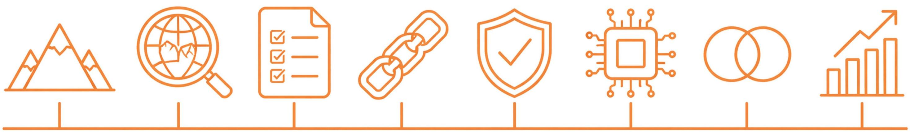

flowchart

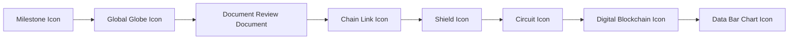
```mermaid
graph LR
  A["Milestone Icon"] --> B["Global Globe Icon"]
  B --> C["Document Review Document"]
  C --> D["Chain Link Icon"]
  D --> E["Shield Icon"]
  E --> F["Circuit Icon"]
  F --> G["Digital Blockchain Icon"]
  G --> H["Data Bar Chart Icon"]
```

# 守护生态 永续发展

随着全球温室气体排放不断增加，气候变化影响日益显著，极端天气事件频发、海平面上升、持续干旱与洪涝灾害等已对经济社会发展和企业运营带来多重挑战，对企业生产经营、供应链稳定及长期可持续发展构成潜在风险。面对上述形势，强化气候适应与风险应对已成为企业高质量发展的重要内容。公司持续提升气候韧性，降低极端天气及环境变化对生产运营的冲击，保障经营活动稳定有序开展。与此同时，气候变化在带来风险的同时也蕴含发展机遇，成都华微积极把握绿色发展趋势，主动探索低碳转型与可持续发展路径，助力企业长期稳健发展。

# 关键议题

应对气候变化  
能源利用与管理  
绿色运营  
水资源利用与管理  
绿色包装  
污染物排放与管理  
废弃物排放与管理  
土地利用和生物多样性  
环境合规管理

natural_image

Forest stream flowing through moss-covered rocks with golden autumn foliage, misty background (no text or symbols)

# 应对气候变化

# 治理

董事会高度重视全球日益严峻的气候变化问题，并将其纳入公司治理架构的顶层决策中。为了确保公司在应对气候变化方面的领导力和执行力，构建了由董事会、战略与ESG委员会和环境保护领导小组组成的三级管理体系，董事长为主任、总经理和安全总监为副主任，所有部门负责人为环境保护领导小组的成员，确保各项战略和目标能够有效落地。

在制度上，公司遵循国家“碳达峰、碳中和”目标和《关于印发〈中国电子碳达峰行动方案〉的通知》等要求，在《成都华微绿色低碳发展建设工作方案》中提出“抓好碳达峰行动方案实施”的任务，制定“按年度分解落实碳达峰行动方案目标与任务，明确方案各项任务分工安排，每年开展自查评估”的规划，确立“到2027年，单位碳达峰行动取得阶段性成果，碳排放总量得到有效控制”的目标。

<table><tr><td>架构</td><td>部门名称</td><td>职责描述</td></tr><tr><td>决策层</td><td>董事会及战略与ESG委员会</td><td>指导及审阅公司可持续发展方针、战略及目标审阅可持续发展相关目标进展及完成情况审批公司《可持续发展报告》</td></tr><tr><td>管理层</td><td>安全生产委员会</td><td>管理重要性议题以提供分析、建议供决策层讨论,以确保董事会及战略与ESG委员会进行监督拟定可持续发展工作计划和管理制度等</td></tr><tr><td>执行层</td><td>安全生产办公室&amp;环境保护领导小组</td><td>协调编制可持续发展报告中的环境章节相关内容定期填报、统计、追踪气候变化相关数据执行环境章节可持续发展工作计划定期梳理和总结应对气候变化相关工作的进展与成效,并向战略与ESG委员会进行工作成果汇报</td></tr></table>

# 战略

公司以ESG治理为抓手，将气候应对理念融入研发、运营及产业链协同，聚焦超低功耗芯片技术研发，制定《绿色低碳发展建设工作方案》，将气候风险纳入全面风险管理，定期开展风险识别与预警，防范极端天气冲击，提升气候韧性。运营端，公司推行节能降耗、绿色办公，减少温室气体排放；研发端，布局超低功耗等绿色芯片产品，赋能下游客户降碳。同时参与行业协同，深化产学研合作，推动产业链上下游协同降碳。

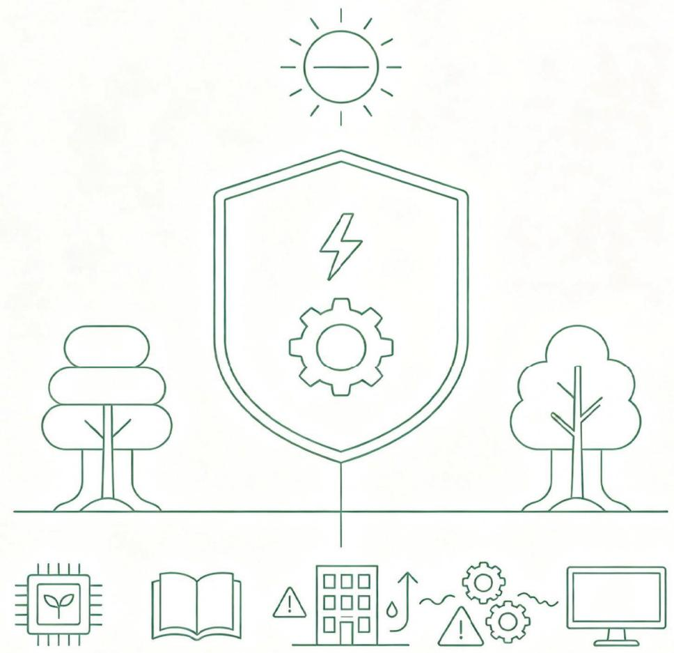

flowchart

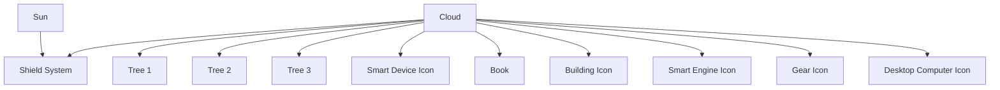
```mermaid
graph TD
  Sun["Sun"] --> Shield["Shield System"]
  Cloud["Cloud"] --> Shield
  Cloud --> Tree1["Tree 1"]
  Cloud --> Tree2["Tree 2"]
  Cloud --> Tree3["Tree 3"]
  Cloud --> Smart["Smart Device Icon"]
  Cloud --> Book["Book"]
  Cloud --> Building["Building Icon"]
  Cloud --> SmartEngine["Smart Engine Icon"]
  Cloud --> SmartGear["Gear Icon"]
  Cloud --> Desktop["Desktop Computer Icon"]
```

<table><tr><td>类别</td><td>具体风险/机遇</td><td>潜在影响</td><td>影响程度</td><td>应对措施</td></tr><tr><td rowspan="2">物理风险</td><td>极端天气风险</td><td>·极端高温天气可能增加办公和生产用电量,导致用电成本增加,排放更多的温室气体,加剧温室效应。·台风、洪水、暴雨等天气,可能导致设备损坏、生产中断或生产效率降低,造成经济损失。</td><td>短、长期</td><td>·对生产运营过程中的能源消耗进行分项计量、实时监控、定期分析等综合能源管理体系,制定节能减排的措施,降低能源消耗量。制定应对极端天气和自然灾害的·应急预案,定期演练,不断提高应急机制的响应。</td></tr><tr><td>地下水枯竭风险</td><td>·干旱导致水资源短缺,企业用水价格上涨,生产运营用水成本提高</td><td>长期</td><td>·进行水平衡测试与管理,全面了解各用水设备的用水情况,优化生产工艺,提高用水效率。·开发节水技术,优化水资源管理。</td></tr><tr><td rowspan="3">转型风险</td><td>政策合规压力</td><td>·国家出台更加严格的碳排放政策,新法规的实施可能导致额外支出,增加企业碳排放排放成本。·增加生产外包部分的成本。</td><td>短、中、长期</td><td>·密切跟踪环境和碳排放相关政策变化,定期盘查碳排放量,评估潜在风险。·制定并实施温室气体减排计划。·引入清洁能源,减少化石燃料使用。·定期监测和报告温室气体排放情况。</td></tr><tr><td>技术落后风险</td><td>·半导体产业链面临低碳绿色转型技术挑战,包括低碳材料的研发与应用,清洁能源的使用等,若生产工艺落后将导致高能耗,高排放和高成本。</td><td>短、长期</td><td>·加大研发投入,开发低能耗工艺。·更新老旧设备,提升能效水平。·与科研机构合作推动技术创新。</td></tr><tr><td>声誉</td><td>·面对半导体产业具有高耗能,高排放等显著环境特征,维持或提升声誉的成本开支。</td><td>长期</td><td>·加强与当地政府的沟通,实时了解监管机构的要求。</td></tr><tr><td rowspan="2">转型机遇</td><td>产品与服务</td><td>·面对全球低碳转型的发展大势,公司可通过研发并升级具备低碳应用价值的产品,或开展低碳相关材料的技术研究,进一步挖掘绿色发展红利,助力提升业务收入水平。</td><td>短、中期</td><td>·提升产品全生命周期碳排放管理,降低“摇篮到坟墓”的产品碳排放量。</td></tr><tr><td>市场声誉提升</td><td>·积极响应国家气候变化政策,助力国家双碳目标的实现,提升品牌价值,获得更多市场影响力,同时增强利益相关者对企业可持续发展的信心。</td><td>长期</td><td>·定期发布可持续发展报告,披露进展。·加强与利益相关方的沟通。·推广公司在减碳方面的成功案例。</td></tr></table>

# 影响、风险和机遇管理

成都华微通过行业研究，市场调研和专家研讨等方式，成都华微识别、评估气候风险（物理风险和转型风险）和机遇的方法，并评估物理风险和转型风险的影响程度，制定应对各风险的措施，推动全公司的低碳转型发展。

气候风险识别与评估的流程

<table><tr><td>风险识别</td><td>公司依据《上海证券交易所上市公司自律监管指南第4号——可持续发展报告编制》,并参考国家准则IFRSS2气候相关披露准则及行业调研结果,对公司面临的气候相关风险与机遇开展系统性识别与梳理,初步形成气候风险与机遇清单。其中,气候相关物理风险主要包括极端天气引发的急性风险及长期气候变化带来的慢性风险。转型风险主要涵盖政策法规风险、技术风险、市场风险、声誉风险等类别;</td></tr><tr><td>风险评估</td><td>公司结合集成电路设计行业特点与自身经营实际,从风险发生可能性、影响范围、持续时间及严重程度等维度,对各类气候相关风险进行定性与定量相结合的综合评估,重点识别极端天气对研发办公场所、供应链稳定、生产运营连续性的影响,以及低碳政策收紧、技术路线迭代、市场需求结构变化等转型风险对公司经营业绩、研发投入及长期发展战略的潜在影响,明确风险等级、关键诱因与薄弱环节,为制定针对性应对措施提供依据。</td></tr><tr><td>风险应对</td><td>针对已识别和评估的气候相关风险,公司将风险应对措施嵌入日常运营与长期战略布局,建立“预防—监测—应对—复盘”的闭环管理机制。面对物理风险,公司强化基础设施运维、供应链多元化布局及应急保障预案,提升极端天气适应能力;面对转型风险,公司持续加大绿色低碳技术研发投入,优化超低功耗产品结构,积极响应国家“双碳”政策与行业低碳标准,加强内部碳排放管理与信息披露,主动将气候风险纳入全面风险管理体系,切实降低气候相关风险对公司可持续发展的不利影响。</td></tr></table>

# 指标与目标

成都华微积极响应国家“双碳”目标，不断优化能源消耗和温室气体排放数据的收集与管理体系，并设定了明确的能效提升目标。公司以月度为单位评审节能措施的绩效情况，确保能效提升计划的有效实施。

成都华微为集成电路设计企业，不属于全国碳排放权交易市场重点排放单位，未被纳入碳配额管理，报告期内未开展CCER交易。

\- 相比于2024年，2025年百万营收温室气体排放量降低13.57%。

# 能源利用与管理

为加强节能减排监督管理工作，公司严格遵守《中华人民共和国节约能源法》《国务院“十三五”节能减排综合性工作方案的通知》《中央企业节能减排管理暂行办法》及中国电子信息产业集团有限公司（以下简称中国电子）有关规定并制定《成都华微电子科技股份有限公司节能减排监督管理暂行办法》，将节能降耗纳入日常运营与“提质增效重回报”专项行动。公司不断完善能源计量网络与数字化监测手段，并强化节能目标分解与全员节能意识培育。成都华微公司为集成电路设计和测试实验单位，不涉及流片、封装等生产环节，业务运营过程中的能源消耗主要涉及测试设备、服务器、电脑、照明装置、空调等设备的电力消耗，经市政电网供给。

安全生产办公室负责监管公司节能减排工作，制定节能减排管理办法，建立节能减排管理体系，推动履行节能减排主体责任；负责定期检查公司节能减排工作措施、分析节能减排工作完成情况，对节能减排工作提出意见和建议；负责公司能耗的统计汇总和分析上报工作。

报告期内，投入运营的成都芯谷对能耗系统进行三级分项计量，采用高效节能设备与智能管控技术，对空调、照明、实验测试设备等重点用能系统进行实时监测与警示，提升能源使用效率。结合成都芯谷新基地投运，扩大绿色低碳设施应用，办公区内均采用LED节能灯具；深度参与零碳信息通信网络联合实验室建设，以超低功耗芯片技术研发与标准制定赋能全产业链节能降碳，同步加强办公区域节能管理与低碳宣传，推动能源利用效率持续提升，以实际行动助力国家“双碳”目标实现。

- 相比于2024年，2025年的百万营收能源消耗降低11.80%。  
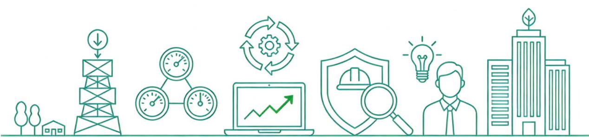

natural_image

Line art illustration of various digital and technological icons including power transmission tower, clock system, gear, laptop, shield, lightbulb, and city skyline (no text or symbols)

# 绿色运营

成都华微将绿色低碳理念深度融入日常办公运营，以节能降耗、资源循环、低碳文化为核心，打造高效、环保、健康的绿色办公场景，以实际行动践行“双碳”战略与可持续发展承诺。

# 节能降耗与清洁能源应用

办公区全面采用LED节能灯具，安装智能感应开关，杜绝“长明灯”；  
- 实施空调、电脑、打印机等设备分时管控、人走断电制度，优化设备待机能耗管理；  
- 推行分区照明、按需供能，结合自然采光优化照明时长，持续降低办公用电总量。

# 资源循环与绿色办公实践

以减量化、再利用、资源化为原则，构建办公资源循环体系：

- 推行无纸化办公，优先使用线上审批、电子文档、视频会议，大幅减少纸张消耗；  
实施办公用品定额领用、循环复用，鼓励使用可替换笔芯、重复利用文件夹，降低耗材浪费；  
- 规范垃圾分类回收，设置专用回收点位，对废纸、塑料、废旧电子元器件等统一归集、合规处置；  
- 淘汰一次性水杯、餐具等用品，倡导员工自带水杯、餐具，减少白色污染。

# 低碳出行与绿色文化建设

公司积极引导低碳生活方式，培育全员绿色价值观：

- 鼓励绿色出行，倡导步行、骑行、公共交通通勤，推行“低碳出行”激励机制；  
- 开展“植此青绿低碳行动”等主题活动，通过“低碳出行积累能量+植物认领”的创新形式，减少碳排放约500kg，提升员工环保意识；

报告期内，公司通过一系列绿色办公举措，有效降低办公环节能耗与废弃物排放，实现运营效率与环境效益双提升。

# 水资源利用与管理

# 治理

公司始终将水资源的可持续利用作为环境管理体系的核心组成部分，由董事会统筹领导，构建了由董事会、战略与ESG委员会和各部门负责人组成的水资源三级管理体系，明确了各层级的权责分配。公司积极响应国家和地方的水资源保护法规，遵守《中华人民共和国水法》《四川省城市供水条例》等国家及地方法律法规，制定并完善内部水资源管理手册，明确各部门的职责和考核指标，确保水资源利用的规范性和可持续性。

# 战略

成都华微高度重视水资源集约安全利用，将水资源管理纳入公司可持续发展与ESG治理体系，立足集成电路设计与研发运营特点，构建“源头管控、高效利用、风险防控、合规达标”的全流程水资源管理体系，切实提升水资源利用效率与水环境管理水平，助力区域水生态安全。

公司严格遵守国家及地方水资源管理相关法律法规，建立健全用水管理与节水长效机制，对办公、研发、实验等场景用水实施精细化管控，定期开展用水监测、水平衡测试与节水诊断，识别节水潜力并推进改造。运营过程中，全面推行节水器具改造、管网漏损管控、循环用水优化等措施，严控新鲜水取用量，提升水资源重复利用率，推动形成绿色低碳的用水模式。

公司将水资源风险纳入全面风险管理框架，重点关注区域水资源压力、极端天气引发的供水中断、水质波动等风险，建立预警与应急响应机制，保障研发运营用水稳定与水环境安全。公司持续完善水资源管理目标与行动方案，深化全员节水理念，通过技术升级、管理优化与数字化监控，不断提高水资源利用效率，以负责任的水资源管理实践，助力企业高质量可持续发展。

# 影响、风险和机遇管理

为科学评估水资源风险, 成都华微每年运用WRI(世界资源研究所)在线分析工具开展专项水资源评估工作, 系统研判公司生产运营所在区域的水资源风险等级、水资源压力指标及供需状况, 结合集成电路研发、办公及实验等场景的用水特点, 依据评估结果科学制定年度节水目标、专项节水举措及风险应对方案, 持续提升水资源利用效率, 筑牢水资源安全保障防线, 践行绿色可持续发展理念。

在日常办公运营中, 为降低用水量, 目前投入使用的成都芯谷办公楼均安装节水器具和实行分项计量:

- 卫生间洗脸盆、小便器分别采用光电感应水龙头、光电感应冲洗阀，蹲便器采用自闭式延时冲洗阀；  
- 选用符合“CJ164-2002标准”的节水型卫生洁具及用水设施；  
- 对用水系统实行二级分项计量,定期进行水平衡管理。

<table><tr><td>时间维度</td><td>风险</td><td>影响</td><td>机遇</td></tr><tr><td>短期</td><td>水资源短缺对生产的影响。水源污染和水质问题。枯水期水资源供应不足。</td><td>加强水源地保护,减少对自然水源的依赖。提升水资源循环利用率。</td><td>通过加强水源地保护,提升企业形象和社区信任。减少对自然水源的依赖,降低运营成本。</td></tr><tr><td>中期</td><td>项目实施过程中的延误和成本超支。水资源管理中的技术挑战。</td><td>缓存雨水和回用水,提高水资源利用效率。定期评估水压力等级和节水项目绩效。</td><td>提高水资源利用效率,降低长期运营风险。</td></tr><tr><td>长期</td><td>技术创新和设备升级的成本投入。行业标准和法规的变化。水资源管理的长期不确定性。</td><td>通过技术创新和设备升级,优化水资源管理流程。树立行业标杆形象,吸引更多投资和合作伙伴。持续监测和评估水资源管理效果。</td><td>吸引更多的投资和合作伙伴,扩大市场份额。通过持续监测和评估,确保水资源管理的可持续性。</td></tr></table>

# 水源地保护

成都华微专注于集成电路设计、测试与销售，不涉及晶圆制造、封装测试等高用水、高排水环节，生产经营仅产生办公生活用水与生活污水，不属于重点排污单位。公司严格遵循国家与成都市水源地保护法规，将水源地合规、水资源安全、水环境零风险纳入环境管理体系，建立覆盖取水、用水、排水、应急的全流程水源地风险防控机制。

公司生产经营用水全部来自市政公共供水系统，取水、排水均纳入市政统一管网与监管，不直接从自然水体、饮用水水源保护区取水或排污，从源头规避水源地污染、生态破坏与水资源过度取用风险。公司严格执行市政排水标准，生活污水经预处理后排入市政污水管网，由专业污水处理厂统一处理，确保排水不对区域水源地、饮用水水质与水生态造成任何负面影响。

公司经营场所不位于饮用水水源保护区、自然保护区核心区、生态保护红线等敏感区域，严格遵守水源地保护区禁限规定，不开展任何可能危害水源地安全的活动。同时，公司推行绿色办公与节水管理，通过安装节水器具、优化用水管理、开展员工节水宣传等措施，降低水资源消耗，以实际行动支持区域水源地保护与水资源可持续利用。

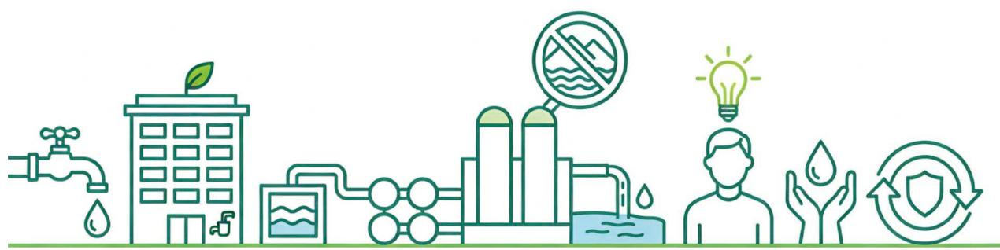

natural_image

Illustration of industrial and environmental concepts including water, buildings, pipes, tanks, lightbulb, human figure, hands, and circular seal (no text or symbols)

# 绿色包装

# 绿色包装管理规划与目标

公司倡导绿色低碳经济模式，在《绿色低碳发展建设工作方案》中制定“深化固体废物治理，推进固体废物源头减量，包装材料重复使用，简化商品包装、环保包装”的任务。推行产品包装减量化，致力于减少资源浪费，降低物料消耗及弃置造成的生态压力。

公司不断加强发货包装的规范化、标准化建设，优化包装设计与使用流程，提高包装载体的重复利用率，减少包装物料浪费。同时，建立专门的包装材料库房，对各类包装材料进行集中规范存储、统一管理；在包装作业现场，采用货架分区存放模式，严格控制现场包装材料库存量不超过三天用量，实行“用完即补、按需领取”的管控机制，确保包装物料合理调配、高效流转。

# 包装材料轻量化, 减量化, 循环化措施:

- 包装材料均使用可降解或可溶解的轻量化材料。  
- 发货包装时在保证各类防护的前提下尽量减少用量。  
- 对部分包装材料实施回收再利用。  
- 不合格品需要报废时回收没有破损变形的盒子或托盘。晶圆到货时的包装箱和防护泡沫全部留存，再次发货时可循环利用。在保障安全的前提下科学使用防静电减震泡沫，避免过度填充。  
- 使用盒子或托盘时在达到安全防护的前提下尽量满载，以减少包装载体用量。  
对同一用户多项产品需求在要求允许的范围内使用一箱发运，以减少包装箱使用量。

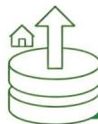

# 主要绩效

\- 2025年单位产品包装材料消耗密度5.15千克/万颗产品，比2024年的9.08千克/万颗产品。相比于2024年，2025年的单位产品包装材料消耗密度降低约 $43\%$ 。

# 污染物排放与管理

公司积极推进生态文明建设，关注污染防治能力的提升，在《绿色低碳发展建设工作方案》中制定“深化非工业领域污染治理，加强对废水、固体废物和噪声污染进行管控”的任务，严格控制公司产品与运营的环境足迹，确保产生的废水和固体废弃物得到及时妥善处理。

# 废气排放管理

成都华微聚焦于集成电路产品的设计研发和检验测试，生产环节为外协单位完成，故不涉及生产废气排放，同时公司明令禁止在园区内焚烧各类产生有毒有害、恶臭气体的物质，从源头规避大气污染风险。园区车辆尾气严格执行国家排放标准，优化车辆运营管理减少无组织排放。公司保障废气处理设施与研发生产同步运行、规范操作，定期开展设施维保及废气排放合规自查，及时排查整改管控隐患，确保废气排放指标持续达标，切实履行大气环保责任。

报告期内废气排放均满足环保标准。

# 废水排放管理

成都华微严格遵守《中华人民共和国水污染防治法》及地方水污染防治相关法律法规，公司针对研发实验、办公生活产生的不同类型废水实施分类收集、分质管控，研发实验区配套建设专用废水收集设施，对含实验试剂的废水进行预处理，杜绝与生活废水混排；办公生活区按规范设置雨污分流、污废分流管网，生活废水经园区污水处理设施处理达标后，接入市政污水管网合规排放。公司从源头推进废水减量，在研发实验、日常办公中推行节水操作，优化用水流程，减少废水产生量，同时加强生产办公区域供排水管网巡检维护，严防管网漏损造成的水体污染。同时，安排专人负责废水处理设施的日常操作与维护，确保废水排放全程可控、持续符合国家及地方排放标准，切实履行水环境治理主体责任。

报告期内废水排放均满足环保标准。

# 废弃物排放与管理

# 一般固体废弃物排放管理

成都华微严格遵循国家及地方固体废物污染环境防治相关法律法规，将固体废弃物管理纳入公司环境管理体系与循环经济发展布局，立足集成电路研发、办公及相关运营场景，构建“分类收集、规范贮存、合规处置、循环利用”的全流程固体废弃物管理体系，切实防范固废污染风险，践行绿色可持续发展理念。

公司针对运营过程中产生的各类固体废弃物实施分类管控，明确区分生活垃圾、一般固废与危险废物，建立专项分类收集机制。其中，生活垃圾及含油抹布、手套等由环卫部门统一清运处置；废金属屑、废包装材料等一般工业固废经集中分类收集后，交由专业回收站回收再利用，提升资源循环利用率；废润滑油、废导轨油、润滑油桶等危险废物，专门暂存于符合标准的危废暂存间（暂存区地面已硬化并铺设防渗层，张贴规范标识），定期交由具备相应资质的单位合规处置，确保危险废物全流程可追溯、无环境风险。同时，公司在打磨工序安装吸风、除尘装置，将收集的金属粉尘和自然沉降的金属屑规范作为固废处理，从源头减少固废污染隐患。成都华微的电子垃圾主要是废旧电脑，均由有资质的厂家回收处理。

公司持续完善固体废弃物管理机制，强化固废产生、收集、贮存、处置各环节的规范化管理，定期开展固废管理专项检查与隐患排查，及时整改各类问题；同时加强员工固废分类与环保理念宣传培训，提升全员固废规范处置意识，推动固体废弃物管理工作常态化、标准化，助力成都“无废城市”建设，实现固废减量化、资源化、无害化目标。

# 有害废弃物排放管理

公司严格遵循《国家危险废物名录》《成都市有害垃圾管理工作指导意见》等规定，对运营过程中产生的有害垃圾实施专项管控，坚守“分类精准、贮存规范、处置合规”原则，防范污染风险。公司明确有害垃圾管控范围，主要包括研发实验环节的废电池、废荧光灯管、废试剂及试剂瓶，办公环节的废含汞温度计、废打印机硒鼓等，严格区分于其他固废，杜绝混投混存。

# 有害垃圾的管理流程

收集贮存方面，公司按成都垃圾分类标准，在关键区域设置专用有害垃圾收集容器并张贴指引。  
- 设立专用暂存区并配备防渗防泄漏设施，严控暂存时间。  
- 处置环节, 公司与具备资质的专业单位合作, 定期规范转运处置有害垃圾, 做好全流程台账记录, 实现可追溯, 严格落实“减量化、资源化、无害化”目标, 助力区域生态治理。

# 土地利用和生物多样性

成都华微严格遵循《中华人民共和国环境影响评价法》《中华人民共和国自然保护纲要》《生态保护红线生态环境监督办法》《四川省<中华人民共和国环境影响评价法>实施办法》《四川省湿地保护条例》等相关法律法规，响应《成都市生物多样性保护优先区域规划(2024-2030年)》要求，将土地利用与生物多样性保护贯穿于基地建设、投入运营各个环节，切实保护运营地(成都芯谷)及周边区域生态稳定与生物多样性。在新基地(成都芯谷研创城)建设规划设计阶段，公司基于生物多样性保护要求，结合成都“岷山—横断山北段生物多样性保护优先区域”中南段的生态特征，对项目周边生态环境、生物物种分布情况进行全面调查与评估，充分了解区域内植被、土壤及周边生物栖息环境特点，严格规避生态敏感区域，依规取得项目环境影响报告书，确保土地利用规划与区域生态保护要求相契合。

公司业务活动开展范围均不处于生态红线内，不占用国家公园、自然保护区、风景名胜区、世界文化和自然遗产地、海洋特别保护区、饮用水水源保护区等环境敏感区，不会对野生动物，濒危动物产生影响。在基地建造阶段，公司严格执行环境保护“三同时”制度，制定专项施工生态保护措施，严格限制施工范围，规范施工流程，减少施工过程中对周边植被、土壤和水体的扰动，最大程度降低施工活动对区域生物多样性的不利影响，守护周边生态本底。在基地运营阶段，公司密切关注运营活动对周边生物多样性的潜在影响，及时发现并解决各类生态隐患；针对土地利用过程中可能出现的生态问题，积极开展植被养护、土壤改良等生态修复与保护工作，优化基地绿化布局，打造绿色生态办公研发环境。

报告期内，公司积极参与区域生物多样性保护相关协同工作，结合成都生物多样性保护优先区域建设要求，探索科技赋能生物多样性保护的路径，同时通过开展员工生态保护宣传教育、参与地方生态保护公益活动等方式，以实际行动助力区域生物多样性保护，推动土地资源合理利用与生态环境保护协同发展。

# 环境合规管理

# 治理

成都华微为加强公司的污染防治，推进生态文明建设，公司设立以董事长为主任，总经理和安全总监为副主任，所有部门负责人为成员的环境保护领导小组，对环境保护工作实行统一领导。安全生产办公室为环境保护领导小组的日常办事机构，具体负责公司环境管理、污染治理和其他日常工作。

# 战略

公司依据《中华人民共和国环境保护法》及地方环保相关法律法规要求，制定《成都华微环境保护管理制度》，明确环境合规管理的目标、要求与实施路径。以ISO14001环境管理体系为核心基础，遵循该体系“PDCA循环”管理理念与战略性环境管理，持续推进环境管理体系规范化、标准化建设，推动环境管理工作与企业运营深度融合，实现环境绩效持续改进，助力企业绿色可持续发展。

# 风险管理

公司建立全流程环境合规风险管理体系，聚焦各类环境风险点，实现风险识别、评估、预警、处置的闭环管理，切实防范环境合规风险。

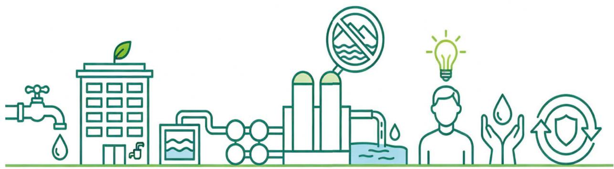

natural_image

Illustration of industrial and environmental concepts including water, buildings, pipes, tanks, and hands with symbolic icons (no text or symbols)

# 在风险识别方面

结合公司运营场景，全面识别噪声污染、固体废物污染、有毒化学品污染、放射性污染、氟利昂泄漏等各类环境合规风险，同时针对机械车间危险源点、辐射设备使用等关键环节，重点识别设备不安全状态、环境及人员行为等引发的合规风险。

# 在风险防控方面

针对各类污染制定专项管控措施，规范噪声控制与防护，严格管控化学品收发使用，落实固体废物回收利用与分类存放要求，强化电磁辐射（电离与非电离）、氟利昂泄漏的专项管控，确保环保设施与生产同步运行、规范操作。

# 在风险分级与处置方面

按照特别重大、重大、较大、一般四级标准，对环境事件进行分级管控，制定突发环境污染事件应急预案并定期演练；并明确事故报告要求和相应处置方法。

# 环境管理培训

公司结合集成电路设计行业特点与自身运营实际，面向全体员工开展针对性环境保护培训，内容涵盖环境法律法规、公司环保管理制度、节能节水、废弃物分类处置、低碳办公、危险废物（废墨盒、废电池、废弃电子元器件等）规范管理、水源地保护、环境风险应急等关键事项，确保员工熟知岗位相关环境要求与操作规范。

通过新员工入职培训、在岗定期培训、线上宣导、专题科普等多种形式，公司将环境理念融入日常办公与业务流程，引导员工从节约用电用水、减少纸张消耗、规范垃圾分类、绿色出行等细节践行绿色低碳生活方式，共同营造节能环保的企业文化氛围。

报告期内，公司持续开展环境保护相关培训与宣传活动，无重大环境违法违规事件及环境安全事故，全员环境责任意识稳步提升，为公司可持续、合规化运营提供了坚实保障。

# 指标与目标

报告期内，无重大环境污染事故发生。  
成都华微子公司苏州云芯微电子科技有限公司获得ISO14001环境管理体系认证。  
- 2025年度环保投入金额2.8万元。

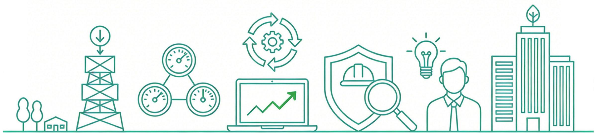

flowchart

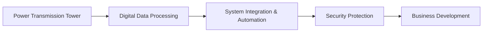
```mermaid
graph LR
  A["Power Transmission Tower"] --> B["Digital Data Processing"]
  B --> C["System Integration & Automation"]
  C --> D["Security Protection"]
  D --> E["Business Development"]
```

# ESG数据绩效一览表

环境维度绩效

<table><tr><td>指标名称</td><td>单位</td><td>2025</td><td>2024</td></tr><tr><td>环保投入</td><td>万元</td><td>2.8</td><td>2.2</td></tr><tr><td>温室气体排放总量(范围一+范围二)</td><td>吨二氧化碳当量</td><td>4,600.32</td><td>4,230.42</td></tr><tr><td>单位营收温室气体排放量</td><td>吨二氧化碳当量/百万元</td><td>6.05</td><td>7.0</td></tr><tr><td>范围一直接温室气体排放和清除量</td><td>吨二氧化碳当量</td><td>20.07</td><td>18.11</td></tr><tr><td>范围二间接温室气体排放</td><td>吨二氧化碳当量</td><td>4,580.25</td><td>4,212.31</td></tr><tr><td>范围三其他间接温室气体排放</td><td>吨二氧化碳当量</td><td>32.43</td><td></td></tr><tr><td>汽油</td><td>吨</td><td>6.863</td><td>6.06</td></tr><tr><td>天然气</td><td>立方米</td><td>15,000</td><td></td></tr><tr><td>电力</td><td>万千瓦时</td><td>863.22</td><td>785</td></tr><tr><td>能源消耗总量</td><td>吨标准煤</td><td>1,078.90</td><td>973.68</td></tr><tr><td>能源消耗强度</td><td>吨标煤/百万元</td><td>1.42</td><td>1.61</td></tr><tr><td>总用水量</td><td>吨</td><td>29,133</td><td>20,990</td></tr><tr><td>用水强度</td><td>吨/百万元</td><td>38.33</td><td>34.76</td></tr><tr><td>废气排放总量</td><td>吨</td><td>0</td><td></td></tr><tr><td>废水排放量</td><td>吨</td><td>5,192</td><td></td></tr><tr><td>一般固体废弃物总量</td><td>吨</td><td>330</td><td></td></tr><tr><td>一般固体废弃物综合利用率</td><td>%</td><td>100</td><td></td></tr></table>

<table><tr><td>指标名称</td><td>单位</td><td>2025</td><td>2024</td></tr><tr><td>有害废弃物排放总量</td><td>千克</td><td>61.6</td><td></td></tr><tr><td>无害化处理</td><td>千克</td><td>61.6</td><td></td></tr><tr><td>废弃电池</td><td>千克</td><td>10.5</td><td></td></tr><tr><td>废日光灯管</td><td>千克</td><td>7</td><td></td></tr><tr><td>废弃墨盒与硒鼓</td><td>千克</td><td>44.1</td><td></td></tr><tr><td>电子垃圾总量</td><td>千克</td><td>550</td><td></td></tr><tr><td>包装材料消耗</td><td>千克</td><td>1,303</td><td>927</td></tr><tr><td>单位产品包装材料消耗强度</td><td>千克/万颗产品</td><td>5.15</td><td>9.08</td></tr><tr><td>办公用纸消耗量</td><td>千克</td><td>2,872</td><td></td></tr></table>

注：1. 本报告碳排放数据遵循GHGProtocol标准及相关行业核算指南对公司范围1、范围2及相关范围3碳排放进行量化核算。计算方法采用的是碳排放因子法进行计算，范围2采用的是基于地理位置的计算方法。  
2. 电力排放因子取值于生态环境部与国家统计局联合发布的2023年全国电力平均二氧化碳排放因子。  
3. 范围三包括公司外包运营的食堂天然气消耗排放。

社会维度绩效

<table><tr><td>指标名称</td><td>单位</td><td>2025</td><td>2024</td></tr><tr><td colspan="4">员工人数及分布</td></tr><tr><td>员工总人数</td><td>人</td><td>990</td><td>956</td></tr><tr><td colspan="4">按性别划分的员工人数</td></tr><tr><td>男性员工人数</td><td>人</td><td>725</td><td>696</td></tr><tr><td>女性员工人数</td><td>人</td><td>265</td><td>260</td></tr><tr><td colspan="4">按员工性质划分的员工人数</td></tr><tr><td>正式员工人数</td><td>人</td><td>990</td><td>956</td></tr><tr><td>非正式员工人数</td><td>人</td><td>110</td><td>39</td></tr><tr><td colspan="4">按地区划分的员工人数</td></tr><tr><td>中国大陆员工人数</td><td>人</td><td>990</td><td>956</td></tr><tr><td>中国港澳台及海外地区员工人数</td><td>人</td><td>0</td><td>0</td></tr><tr><td colspan="4">按民族划分的员工人数</td></tr><tr><td>少数民族人数</td><td>人</td><td>32</td><td>24</td></tr><tr><td>少数民族员工比例</td><td>%</td><td>3.46</td><td>25.1</td></tr><tr><td colspan="4">按年龄划分的员工人数</td></tr><tr><td>50-59岁员工人数</td><td>人</td><td>16</td><td>13</td></tr><tr><td>40-49岁员工人数</td><td>人</td><td>161</td><td>133</td></tr><tr><td>30-39岁员工人数</td><td>人</td><td>461</td><td>415</td></tr><tr><td>29岁及以下员工人数</td><td>人</td><td>352</td><td>395</td></tr></table>

<table><tr><td>指标名称</td><td>单位</td><td>2025</td><td>2024</td></tr><tr><td colspan="4">按学历划分的员工人数</td></tr><tr><td>博士</td><td>人</td><td>14</td><td>12</td></tr><tr><td>硕士</td><td>人</td><td>285</td><td>252</td></tr><tr><td>本科</td><td>人</td><td>466</td><td>450</td></tr><tr><td>本科以下</td><td>人</td><td>225</td><td>242</td></tr><tr><td colspan="4">按层级划分的员工人数</td></tr><tr><td>核心管理人员</td><td>人</td><td>10</td><td>10</td></tr><tr><td>中层管理人员</td><td>人</td><td>51</td><td>39</td></tr><tr><td>基层管理人员</td><td>人</td><td>100</td><td>218</td></tr><tr><td>女性员工比例</td><td>%</td><td>26.77</td><td>27.2</td></tr><tr><td>女性核心管理人员</td><td>人</td><td>2</td><td>2</td></tr><tr><td>女性核心管理人员占比</td><td>%</td><td>20</td><td>20</td></tr><tr><td>女性中层管理人员</td><td>人</td><td>14</td><td>12</td></tr><tr><td>女性中层管理人员占比</td><td>%</td><td>27.45</td><td>30.77</td></tr><tr><td colspan="4">员工增长率</td></tr><tr><td>员工增长人数</td><td>人</td><td>34</td><td></td></tr><tr><td>员工增长率</td><td>%</td><td>3.56</td><td></td></tr><tr><td colspan="4">员工流失率</td></tr><tr><td>员工流失/离职数量</td><td>人</td><td>111</td><td>117</td></tr><tr><td>整体员工流失率/离职率</td><td>%</td><td>11.21</td><td>12.24</td></tr></table>

社会维度绩效

<table><tr><td>指标名称</td><td>单位</td><td>2025</td><td>2024</td></tr><tr><td colspan="4">员工权益与福利</td></tr><tr><td>劳动合同签订率</td><td>%</td><td>100</td><td>100</td></tr><tr><td>员工慰问金投入</td><td>万元</td><td>139.05</td><td>96.2</td></tr><tr><td>劳动合同签订率</td><td>%</td><td>100</td><td>100</td></tr><tr><td>员工慰问金投入</td><td>万元</td><td>139.05</td><td>96.2</td></tr><tr><td colspan="4">职业发展与培训</td></tr><tr><td>全年培训总人次</td><td>人次</td><td>1,911</td><td>1,267</td></tr><tr><td>接受培训的雇员覆盖比例</td><td>%</td><td>41.11</td><td>100</td></tr><tr><td>全年培训总时长</td><td>小时</td><td>12,790</td><td>4,526</td></tr><tr><td>全员培训平均时数</td><td>小时</td><td>33.69</td><td>4.73</td></tr><tr><td>全年培训投入金额</td><td>万元</td><td>35.88</td><td>40.47</td></tr><tr><td>员工内部调动或内部应聘人数</td><td>人</td><td>66</td><td>199</td></tr><tr><td>员工内部调动或内部应聘比率</td><td>%</td><td>6.67</td><td>20.6</td></tr><tr><td colspan="4">员工健康与安全</td></tr><tr><td>安全生产投入</td><td>万元</td><td>49.5</td><td>53</td></tr><tr><td>员工工伤保险投入金额</td><td>万元</td><td>48.63</td><td>31</td></tr><tr><td>员工工伤保险覆盖率</td><td>%</td><td>100</td><td>100</td></tr><tr><td>年度安全生产事故</td><td>起</td><td>0</td><td>0</td></tr><tr><td>工伤人数</td><td>人</td><td>1</td><td>0</td></tr></table>

<table><tr><td>指标名称</td><td>单位</td><td>2025</td><td>2024</td></tr><tr><td colspan="4">员工健康与安全</td></tr><tr><td>因公亡故比率</td><td>%</td><td>0</td><td>0</td></tr><tr><td>因工损失天数</td><td>天</td><td>33</td><td>0</td></tr><tr><td>工伤人数占比</td><td>%</td><td>0.001</td><td>0</td></tr><tr><td>接受职业健康体检人数</td><td>人</td><td>54</td><td>29</td></tr><tr><td>职业病发生率</td><td>%</td><td>0</td><td>0</td></tr><tr><td>岗位职业危害告知率</td><td>%</td><td>100</td><td>100</td></tr><tr><td>报告期内接受体检人数</td><td>人</td><td>124</td><td>956</td></tr><tr><td>报告期内员工体检覆盖率</td><td>%</td><td>100</td><td>100</td></tr><tr><td colspan="4">安全生产培训</td></tr><tr><td>全年安全生产培训总人次</td><td>人次</td><td>675</td><td>708</td></tr><tr><td>全年安全生产培训总时长</td><td>小时</td><td>4,657</td><td>68</td></tr><tr><td>全年安全生产培训平均时数</td><td>小时</td><td>8.9</td><td>12.5</td></tr><tr><td>安全生产培训资金投入</td><td>万元</td><td>22.82</td><td>0.887</td></tr><tr><td colspan="4">数据安全培训</td></tr><tr><td>数据安全事件数目</td><td>件</td><td>0</td><td>0</td></tr><tr><td>数据安全参训人次</td><td>人</td><td>68</td><td>629</td></tr><tr><td>数据安全培训时长</td><td>小时</td><td>182.5</td><td>315.43</td></tr></table>

社会维度绩效

<table><tr><td>指标名称</td><td>单位</td><td>2025</td><td>2024</td></tr><tr><td colspan="4">安全检查</td></tr><tr><td>自检次数</td><td>次</td><td>42</td><td>36</td></tr><tr><td>第三方查次数</td><td>次</td><td>3</td><td>1</td></tr><tr><td colspan="4">应急演练</td></tr><tr><td>应急演练总数</td><td>次</td><td>27</td><td>27</td></tr><tr><td>应急演练参与人数</td><td>人</td><td>555</td><td>708</td></tr><tr><td colspan="4">研发创新</td></tr><tr><td>研发人员数量</td><td>人</td><td>521</td><td>409</td></tr><tr><td>研发人员比例</td><td>%</td><td>52.63</td><td>42.78</td></tr><tr><td>研发投入金额</td><td>万元</td><td>11,300.67</td><td>15,374.30</td></tr><tr><td>研发投入占营业收入比例</td><td>%</td><td>14.87</td><td>25.46</td></tr><tr><td>报告期内发明专利的申请数</td><td>项</td><td>31</td><td>31</td></tr><tr><td>报告期内发明专利的授权数</td><td>项</td><td>14</td><td>9</td></tr><tr><td>报告期内有效专利数</td><td>项</td><td>142</td><td>130</td></tr><tr><td>每亿营收有效专利数</td><td>件(CNY)</td><td>18.68</td><td></td></tr><tr><td>报告期内新增软件著作权数量</td><td>项</td><td>13</td><td>11</td></tr><tr><td>高新技术企业认证</td><td>家</td><td>1</td><td>1</td></tr></table>

<table><tr><td>指标名称</td><td>单位</td><td>2025</td><td>2024</td></tr><tr><td colspan="4">产品安全与质量</td></tr><tr><td>质量培训总时长</td><td>小时</td><td>64</td><td>1,306.50</td></tr><tr><td>质量培训总次数</td><td>次数</td><td>569.5</td><td>910</td></tr><tr><td>客户信息泄露事件</td><td>件</td><td>0</td><td>0</td></tr><tr><td>产品及服务投诉数目</td><td>件</td><td>1</td><td>15</td></tr><tr><td>客户投诉回复率</td><td>%</td><td>100</td><td>100</td></tr><tr><td>客户投诉解决率</td><td>%</td><td>100</td><td>100</td></tr><tr><td>客户满意度</td><td>分</td><td>96.9</td><td>96.67</td></tr><tr><td colspan="4">供应商</td></tr><tr><td>供应商总数</td><td>家</td><td>145</td><td>100</td></tr><tr><td>供应商本地化比例</td><td>%</td><td>92.41</td><td>24</td></tr><tr><td colspan="4">乡村振兴</td></tr><tr><td>乡村振兴投入金额</td><td>万元</td><td>25.25</td><td>7.34</td></tr></table>

治理绩效

<table><tr><td>指标名称</td><td>单位</td><td>2025</td><td>2024</td></tr><tr><td>合规培训参与人数</td><td>人</td><td>5</td><td>28</td></tr><tr><td>合规培训总时长</td><td>小时</td><td>8</td><td>19</td></tr><tr><td>反腐败培训时长</td><td>小时</td><td>18</td><td></td></tr><tr><td>报告期内对公司或其员工提出并已审结的贪污诉讼案件数</td><td>件</td><td>0</td><td>0</td></tr><tr><td>报告期内因公司不正当竞争行为导致诉讼或重大行政处罚的涉案金额</td><td>万元</td><td>0</td><td>0</td></tr></table>

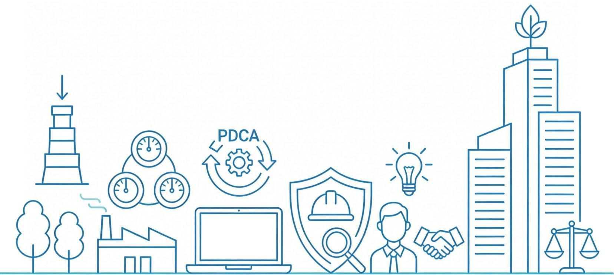

flowchart

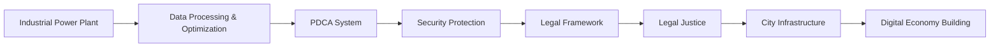
```mermaid
graph LR
  A["Industrial Power Plant"] --> B["Data Processing & Optimization"]
  B --> C["PDCA System"]
  C --> D["Security Protection"]
  D --> E["Legal Framework"]
  E --> F["Legal Justice"]
  F --> G["City Infrastructure"]
  G --> H["Digital Economy Building"]
```

可持续发展报告监管指引索引对照表

<table><tr><td>维度</td><td>序号</td><td>议题</td><td>上海证券交易所《上市公司自律监管指引第14号-可持续发展报告(行)》</td><td>《央企控股上市公司ESG专项报告参考指标体系》</td><td>中国社会科学院《中国企业可持续发展报告指南(CASS-ESG6.0)之一般框架》索引</td><td>报告章节</td></tr><tr><td rowspan="3">可持续发展相关治理</td><td>01</td><td>利益相关方沟通</td><td>第五十三条</td><td>G3.1.1-G3.1.3、G3.2.1-G3.2.3、G3.3.1-G3.3.2</td><td>G1.3.1、G1.3.2</td><td>第四章</td></tr><tr><td>02</td><td>商业道德及反腐败</td><td>第五十五条</td><td>G2.2.1、G2.2.2</td><td>G2.1.1-G2.1.8</td><td>7.5</td></tr><tr><td>03</td><td>反垄断与反不正当竞争</td><td>第五十六条</td><td>G2.3.1、G2.3.2</td><td>G2.2.1-G2.2.3</td><td>7.6</td></tr><tr><td rowspan="10">社会</td><td>04</td><td>创新驱动</td><td>第四十二条</td><td>S2.3.1-S2.3.4</td><td>S2.1.1-S2.1.13</td><td>8.1</td></tr><tr><td>05</td><td>产品和服务安全与质量</td><td>第四十七条</td><td>S2.1.1-S2.1.4</td><td>S3.3.1-S3.3.6</td><td>8.2</td></tr><tr><td>06</td><td>员工</td><td>第五十条</td><td>S1.1.1-S1.1.3、S1.2.1-S1.2.3、S1.3.1-S1.3.4、S1.4.1-S1.4.3、S1.5.1-S1.5.3</td><td>S4.1.1-S4.1.12、S4.2.1-S4.2.6、S4.3.1-S4.3.6</td><td>8.3</td></tr><tr><td>07</td><td>客户关系管理</td><td></td><td>S3.2.1-S3.2.3</td><td></td><td>8.4</td></tr><tr><td>08</td><td>供应链安全</td><td>第四十五条</td><td>S3.1.1-S3.1.2、S3.2.1-S3.2.3</td><td>S3.1.1-S3.1.4</td><td>8.5</td></tr><tr><td>09</td><td>数据安全与客户隐私保护</td><td>第四十八条</td><td>S2.2.3</td><td>S3.4.1-S3.4.4</td><td>8.6</td></tr><tr><td>10</td><td>数字化转型</td><td>第一章第六条</td><td>S4.4.1</td><td></td><td>8.7</td></tr><tr><td>11</td><td>平等对待中小企业</td><td>第四十六条</td><td>S4.4.2</td><td>S3.2.1、S3.2.2</td><td>8.8</td></tr><tr><td>12</td><td>社会贡献</td><td>第四十条</td><td>S4.2.2</td><td>S1.1.1-S1.1.5、S1.2.1-S1.2.6</td><td>8.9</td></tr><tr><td>13</td><td>负责任矿产</td><td>第五条</td><td>S4.4.4</td><td></td><td>8.10</td></tr><tr><td rowspan="9">环境</td><td>14</td><td>应对气候变化</td><td>第二十一条至第二十八条</td><td>E3.1.1-E3.1.6、E3.2.1-E3.2.2、E3.4.1</td><td>E1.1.1-E1.1.18</td><td>9.1</td></tr><tr><td>15</td><td>能源利用</td><td>第三十五条</td><td>E1.3.1-E1.3.5</td><td>E3.1.1-E3.1.5</td><td>9.2</td></tr><tr><td>16</td><td>绿色运营</td><td>第五条</td><td>E5.4.2、E5.4.4、E5.4.5</td><td>E1.1.19</td><td>9.3</td></tr><tr><td>17</td><td>水资源利用</td><td>第三十六条</td><td>E1.1.1-E1.1.5</td><td>E3.2.1-E3.2.4</td><td>9.4</td></tr><tr><td>18</td><td>循环经济</td><td>第三十七条</td><td>E1.4.1、E1.4.2、E5.4.2</td><td>E3.3.1-E3.3.6</td><td>9.5</td></tr><tr><td>19</td><td>污染物排放</td><td>第三十条</td><td>E2.1.1-E2.1.4、E2.2.1-E2.2.2</td><td>E2.1.1-E2.1.9</td><td>9.6</td></tr><tr><td>20</td><td>废弃物处理</td><td>第三十一条</td><td>E2.3.1-E2.3.5</td><td>E2.2.1-E2.2.7</td><td>9.7</td></tr><tr><td>21</td><td>生态系统和生物多样性保护</td><td>第三十二条</td><td>E4.1.1</td><td>E2.3.1-E2.3.5</td><td>9.8</td></tr><tr><td>22</td><td>环境合规管理</td><td>第三十三条</td><td>E5.1.1、E5.5.1、E5.5.2</td><td>E2.4.1-E2.4.4</td><td>9.9</td></tr></table>